# Parent Section Magnitude-Probability Distributions

Only fault sections with at least one triggered aftershock are plotted. Sections are sorted by total supraseismogenic trigger rate (decreasing)

## Table Of Contents

* [Garlock (Central)](#garlock-central)
* [Tank Canyon](#tank-canyon)
* [Little Lake](#little-lake)
* [Airport Lake](#airport-lake)
* [Owl Lake](#owl-lake)
* [Panamint Valley](#panamint-valley)
* [Garlock (East)](#garlock-east)
* [Ash Hill](#ash-hill)
* [Hunter Mountain-Saline Valley](#hunter-mountain-saline-valley)
* [Blackwater](#blackwater)
* [Garlock (West)](#garlock-west)
* [McLean Lake](#mclean-lake)
* [Gravel Hills-Harper Lk](#gravel-hills-harper-lk)
* [Goldstone Lake](#goldstone-lake)
* [So Sierra Nevada](#so-sierra-nevada)
* [San Andreas (Mojave S)](#san-andreas-mojave-s)
* [San Andreas (Mojave N)](#san-andreas-mojave-n)
* [Death Valley (So)](#death-valley-so)
* [Nelson Lake](#nelson-lake)
* [Coyote Canyon](#coyote-canyon)
* [Lenwood-Lockhart-Old Woman Springs](#lenwood-lockhart-old-woman-springs)
* [Towne Pass](#towne-pass)
* [Paradise](#paradise)
* [San Andreas (San Bernardino N)](#san-andreas-san-bernardino-n)
* [Bicycle Lake](#bicycle-lake)
* [Garlic Springs](#garlic-springs)
* [San Andreas (San Bernardino S)](#san-andreas-san-bernardino-s)
* [Helendale-So Lockhart](#helendale-so-lockhart)
* [Death Valley (Black Mtns Frontal)](#death-valley-black-mtns-frontal)
* [Coyote Lake](#coyote-lake)
* [San Andreas (Big Bend)](#san-andreas-big-bend)
* [Sierra Nevada  (No Extension)](#sierra-nevada--no-extension)
* [San Andreas (San Gorgonio Pass-Garnet HIll)](#san-andreas-san-gorgonio-pass-garnet-hill)
* [San Andreas (Parkfield)](#san-andreas-parkfield)
* [San Andreas (Cholame) rev](#san-andreas-cholame-rev)
* [San Andreas (Carrizo) rev](#san-andreas-carrizo-rev)
* [San Andreas (Coachella) rev](#san-andreas-coachella-rev)
* [Death Valley (No)](#death-valley-no)
* [Elsinore (Glen Ivy) rev](#elsinore-glen-ivy-rev)
* [Red Pass](#red-pass)
* [Santa Ynez (West)](#santa-ynez-west)
* [San Jacinto (San Bernardino)](#san-jacinto-san-bernardino)
* [Manix-Afton Hills](#manix-afton-hills)
* [Owens Valley](#owens-valley)
* [Cady](#cady)
* [Scodie Lineament](#scodie-lineament)
* [Cleghorn Lake](#cleghorn-lake)
* [Mission Ridge-Arroyo Parida-Santa Ana](#mission-ridge-arroyo-parida-santa-ana)
* [White Mountains](#white-mountains)
* [Lake Isabella (Seismicity)](#lake-isabella-seismicity)
* [Brawley (Seismic Zone) alt 1](#brawley-seismic-zone-alt-1)
* [Baker](#baker)
* [Death Valley (Fish Lake Valley)](#death-valley-fish-lake-valley)
* [San Andreas (North Branch Mill Creek)](#san-andreas-north-branch-mill-creek)
* [White Wolf (Extension)](#white-wolf-extension)
* [Mission Creek](#mission-creek)
* [Independence rev 2011](#independence-rev-2011)
* [Ludlow](#ludlow)
* [Chino alt 1](#chino-alt-1)
* [Imperial](#imperial)
* [Santa Ynez (East)](#santa-ynez-east)
* [Bullion Mountains](#bullion-mountains)
* [Calico-Hidalgo](#calico-hidalgo)
* [San Jacinto (San Jacinto Valley) rev](#san-jacinto-san-jacinto-valley-rev)
* [San Jacinto (Lytle Creek connector)](#san-jacinto-lytle-creek-connector)
* [Whittier alt 1](#whittier-alt-1)
* [San Andreas (Creeping Section) 2011 CFM](#san-andreas-creeping-section-2011-cfm)
* [Lost Hills](#lost-hills)
* [Great Valley 03a Dunnigan Hills](#great-valley-03a-dunnigan-hills)
* [Palos Verdes](#palos-verdes)
* [Cleghorn Pass](#cleghorn-pass)
* [Santa Ynez River](#santa-ynez-river)
* [Rose Canyon](#rose-canyon)
* [Camp Rock 2011](#camp-rock-2011)
* [Santa Rosa Island](#santa-rosa-island)
* [Coronado Bank alt1](#coronado-bank-alt1)
* [Deep Springs](#deep-springs)
* [Blue Cut](#blue-cut)
* [Pine Mtn](#pine-mtn)
* [Pinto Mtn](#pinto-mtn)
* [Kern Canyon (North Kern) 2011](#kern-canyon-north-kern-2011)
* [Great Valley 07 (Orestimba)](#great-valley-07-orestimba)
* [Kern Canyon (South Kern) 2011](#kern-canyon-south-kern-2011)
* [San Gabriel (Extension)](#san-gabriel-extension)
* [Cerro Prieto](#cerro-prieto)
* [Malibu Coast (Extension) alt 1](#malibu-coast-extension-alt-1)
* [Cucamonga](#cucamonga)
* [Hayward (So) 2011 CFM](#hayward-so-2011-cfm)
* [San Clemente](#san-clemente)
* [San Pedro Basin](#san-pedro-basin)
* [Big Pine (Central)](#big-pine-central)
* [Calaveras (So) 2011 CFM](#calaveras-so-2011-cfm)
* [San Diego Trough north alt1](#san-diego-trough-north-alt1)
* [Owens Valley Keough Hot Springs](#owens-valley-keough-hot-springs)
* [Raymond](#raymond)
* [Los Alamos extension](#los-alamos-extension)
* [San Jacinto (Stepovers Combined)](#san-jacinto-stepovers-combined)
* [Verdugo](#verdugo)
* [San Juan](#san-juan)
* [Davis Creek](#davis-creek)
* [San Gorgonio Pass](#san-gorgonio-pass)
* [San Gabriel](#san-gabriel)
* [San Jacinto (Coyote Creek)](#san-jacinto-coyote-creek)
* [Emerson-Copper Mtn 2011](#emerson-copper-mtn-2011)
* [San Andreas (Santa Cruz Mts) 2011 CFM](#san-andreas-santa-cruz-mts-2011-cfm)
* [San Diego Trough south](#san-diego-trough-south)
* [San Jacinto (Superstition Mtn)](#san-jacinto-superstition-mtn)
* [Point Reyes 2011 CFM](#point-reyes-2011-cfm)
* [San Jacinto (Borrego)](#san-jacinto-borrego)
* [Peralta Hills](#peralta-hills)
* [Monte Vista - Shannon 2011 CFM](#monte-vista---shannon-2011-cfm)
* [Elsinore (Julian)](#elsinore-julian)
* [Elsinore (Stepovers Combined)](#elsinore-stepovers-combined)
* [Ortigalita (North)](#ortigalita-north)
* [Tin Mountain](#tin-mountain)
* [Antelope Valley 2011](#antelope-valley-2011)
* [Los Alamos 2011 CFM](#los-alamos-2011-cfm)
* [Santa Cruz Island](#santa-cruz-island)
* [San Andreas (Peninsula) 2011 CFM](#san-andreas-peninsula-2011-cfm)
* [San Jacinto (Anza) rev](#san-jacinto-anza-rev)
* [Rinconada 2011 CFM](#rinconada-2011-cfm)
* [Great Valley 09 (Laguna Seca)](#great-valley-09-laguna-seca)
* [Red Mountain](#red-mountain)
* [Dry Mountain](#dry-mountain)
* [Monterey Bay-Tularcitos](#monterey-bay-tularcitos)
* [Pleito](#pleito)
* [Morales (East)](#morales-east)
* [Elsinore (Temecula) rev](#elsinore-temecula-rev)
* [Elmore Ranch](#elmore-ranch)
* [San Gregorio (South) 2011 CFM](#san-gregorio-south-2011-cfm)
* [Hunting Creek - Berryessa 2011 CFM](#hunting-creek---berryessa-2011-cfm)
* [Robinson Creek](#robinson-creek)
* [Mono Lake 2011 CFM](#mono-lake-2011-cfm)
* [Sierra Madre](#sierra-madre)
* [Hayward (No) 2011 CFM](#hayward-no-2011-cfm)
* [Ortigalita (South)](#ortigalita-south)
* [Elysian Park (Upper)](#elysian-park-upper)
* [Calaveras (So) - Paicines extension 2011 CFM](#calaveras-so---paicines-extension-2011-cfm)
* [Great Valley 08 (Quinto)](#great-valley-08-quinto)
* [West Napa 2011 CFM](#west-napa-2011-cfm)
* [Fish Slough 2011 CFM](#fish-slough-2011-cfm)
* [Big Lagoon - Bald Mtn 2011 CFM](#big-lagoon---bald-mtn-2011-cfm)
* [Elsinore (Coyote Mountains)](#elsinore-coyote-mountains)
* [Calaveras (Central) 2011 CFM](#calaveras-central-2011-cfm)
* [Pitas Point (Lower West)](#pitas-point-lower-west)
* [Northridge](#northridge)
* [Rodgers Creek - Healdsburg 2011 CFM](#rodgers-creek---healdsburg-2011-cfm)

## Garlock (Central)
*[(top)](#table-of-contents)*

| 1 Week | 1 Month | 1 Year | 10 Year |
|-----|-----|-----|-----|
|  |  | 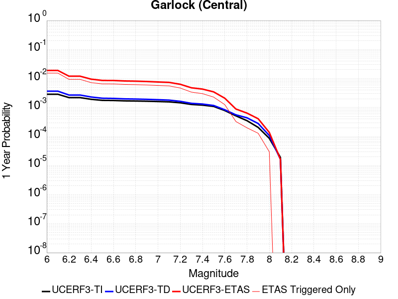 |  |

| Magnitude | 1 wk TI Prob | 1 wk TD Prob | 1 wk ETAS Prob | 1 wk ETAS/TD Gain | 1 wk ETAS Triggered Only | 1 mo TI Prob | 1 mo TD Prob | 1 mo ETAS Prob | 1 mo ETAS/TD Gain | 1 mo ETAS Triggered Only | 1 yr TI Prob | 1 yr TD Prob | 1 yr ETAS Prob | 1 yr ETAS/TD Gain | 1 yr ETAS Triggered Only | 10 yr TI Prob | 10 yr TD Prob | 10 yr ETAS Prob | 10 yr ETAS/TD Gain | 10 yr ETAS Triggered Only |
|-----|-----|-----|-----|-----|-----|-----|-----|-----|-----|-----|-----|-----|-----|-----|-----|-----|-----|-----|-----|-----|
| 6.0 | 5.5131142E-5 | 7.035651E-5 | 5.9440476E-4 | 8.448468 | 5.2408513E-4 | 2.3625491E-4 | 3.0149342E-4 | 0.0026136066 | 8.668867 | 0.0023128104 | 0.0028726095 | 0.0036645688 | 0.018977612 | 5.1786757 | 0.015369366 | 0.028357591 | 0.0361181 | 0.0733569 | 2.0310285 | 0.03863419 |
| 6.1 | 5.5131142E-5 | 7.035651E-5 | 5.9440476E-4 | 8.448468 | 5.2408513E-4 | 2.3625491E-4 | 3.0149342E-4 | 0.0026136066 | 8.668867 | 0.0023128104 | 0.0028726095 | 0.0036645688 | 0.018977612 | 5.1786757 | 0.015369366 | 0.028357591 | 0.0361181 | 0.0733569 | 2.0310285 | 0.03863419 |
| 6.2 | 4.216245E-5 | 5.1760762E-5 | 3.8214514E-4 | 7.382912 | 3.304015E-4 | 1.806837E-4 | 2.2181314E-4 | 0.0016684228 | 7.5217495 | 0.0014469307 | 0.0021976046 | 0.002697262 | 0.012082625 | 4.479589 | 0.009410746 | 0.021759989 | 0.0267309 | 0.04973976 | 1.8607588 | 0.023640797 |
| 6.3 | 4.216245E-5 | 5.1760762E-5 | 3.8214514E-4 | 7.382912 | 3.304015E-4 | 1.806837E-4 | 2.2181314E-4 | 0.0016684228 | 7.5217495 | 0.0014469307 | 0.0021976046 | 0.002697262 | 0.012082625 | 4.479589 | 0.009410746 | 0.021759989 | 0.0267309 | 0.04973976 | 1.8607588 | 0.023640797 |
| 6.4 | 3.6858168E-5 | 4.4206416E-5 | 3.290227E-4 | 7.442872 | 2.848289E-4 | 1.5795401E-4 | 1.8944245E-4 | 0.0013399331 | 7.0730352 | 0.0011507086 | 0.0019213937 | 0.0023040473 | 0.009556132 | 4.1475415 | 0.007268833 | 0.019048655 | 0.022870028 | 0.041016158 | 1.7934457 | 0.018570842 |
| 6.5 | 3.39199E-5 | 4.01114E-5 | 2.9075076E-4 | 7.248581 | 2.506494E-4 | 1.453629E-4 | 1.718948E-4 | 0.0011857114 | 6.897889 | 0.0010139908 | 0.0017683565 | 0.0020908322 | 0.008662308 | 4.142995 | 0.0065852436 | 0.017543508 | 0.020802973 | 0.037135568 | 1.7851087 | 0.01667958 |
| 6.6 | 3.3571985E-5 | 3.9565E-5 | 2.9020448E-4 | 7.334879 | 2.506494E-4 | 1.4387199E-4 | 1.6955339E-4 | 0.0011833722 | 6.979349 | 0.0010139908 | 0.0017502342 | 0.0020623798 | 0.008611303 | 4.1754203 | 0.0065624574 | 0.017365133 | 0.020523785 | 0.036838718 | 1.7949281 | 0.016656792 |
| 6.7 | 3.2580007E-5 | 3.8180824E-5 | 2.4324979E-4 | 6.370993 | 2.050768E-4 | 1.3962112E-4 | 1.6362197E-4 | 0.0011318817 | 6.9176636 | 9.684182E-4 | 0.0016985617 | 0.0019902987 | 0.008289544 | 4.1649747 | 0.006311808 | 0.016856372 | 0.019819157 | 0.03544228 | 1.7882841 | 0.015939023 |
| 6.8 | 3.2185937E-5 | 3.7607628E-5 | 2.426767E-4 | 6.4528584 | 2.050768E-4 | 1.3793244E-4 | 1.6116572E-4 | 0.0011066452 | 6.8665047 | 9.456319E-4 | 0.0016780337 | 0.0019604482 | 0.008157545 | 4.1610613 | 0.0062092696 | 0.016654192 | 0.019525932 | 0.03482978 | 1.7837704 | 0.015608623 |
| 6.9 | 3.165394E-5 | 3.6811605E-5 | 2.1909537E-4 | 5.951802 | 1.8229047E-4 | 1.3565269E-4 | 1.5775459E-4 | 0.0010576718 | 6.704539 | 9.0005924E-4 | 0.0016503202 | 0.0019189917 | 0.007945776 | 4.1405997 | 0.006038372 | 0.01638118 | 0.019119278 | 0.034071863 | 1.7820686 | 0.015244042 |
| 7.0 | 3.0903822E-5 | 3.5716203E-5 | 2.0660742E-4 | 5.7846975 | 1.7089733E-4 | 1.3243823E-4 | 1.5306058E-4 | 0.0010301992 | 6.7306633 | 8.772729E-4 | 0.0016112428 | 0.0018619411 | 0.0076502594 | 4.108755 | 0.005799116 | 0.015996104 | 0.018558139 | 0.033049647 | 1.7808708 | 0.014765529 |
| 7.1 | 3.0069863E-5 | 3.4481687E-5 | 2.0537312E-4 | 5.9560056 | 1.7089733E-4 | 1.2886449E-4 | 1.477704E-4 | 0.0010021308 | 6.781674 | 8.544866E-4 | 0.0015677959 | 0.0017976413 | 0.007392997 | 4.11261 | 0.005605432 | 0.01556781 | 0.017925408 | 0.031922758 | 1.7808664 | 0.014252837 |
| 7.2 | 2.7957109E-5 | 3.1369047E-5 | 1.9086822E-4 | 6.0846033 | 1.5950417E-4 | 1.1981068E-4 | 1.3443196E-4 | 8.4071263E-4 | 6.253815 | 7.0637563E-4 | 0.0014577188 | 0.0016354999 | 0.0063559264 | 3.8862286 | 0.0047281594 | 0.014481937 | 0.016327986 | 0.027882535 | 1.707653 | 0.011746343 |
| 7.3 | 2.4519275E-5 | 2.6797032E-5 | 9.515413E-5 | 3.5509205 | 6.835893E-5 | 1.0507837E-4 | 1.1483945E-4 | 5.819052E-4 | 5.067119 | 4.6711936E-4 | 0.0012785783 | 0.0013972883 | 0.004708064 | 3.369429 | 0.003315408 | 0.012712469 | 0.013969704 | 0.022058181 | 1.5790013 | 0.008203072 |
| 7.4 | 2.3225532E-5 | 2.5279978E-5 | 9.363718E-5 | 3.7040057 | 6.835893E-5 | 9.95342E-5 | 1.0833835E-4 | 4.9566367E-4 | 4.5751452 | 3.8736727E-4 | 0.0012111551 | 0.0013182356 | 0.0042310385 | 3.2096221 | 0.0029166476 | 0.012045753 | 0.013186504 | 0.020471916 | 1.55249 | 0.0073827645 |
| 7.5 | 2.097765E-5 | 2.256026E-5 | 5.6738954E-5 | 2.5149956 | 3.4179466E-5 | 8.9901114E-5 | 9.668331E-5 | 4.156608E-4 | 4.299199 | 3.1900834E-4 | 0.0010939965 | 0.0011764955 | 0.0034410658 | 2.9248443 | 0.0022672378 | 0.010886264 | 0.011779194 | 0.017453706 | 1.4817402 | 0.00574215 |
| 7.6 | 1.511254E-5 | 1.6062562E-5 | 3.8848506E-5 | 2.4185748 | 2.278631E-5 | 6.476642E-5 | 6.883778E-5 | 2.0554622E-4 | 2.985951 | 1.3671786E-4 | 7.882459E-4 | 8.3778554E-4 | 0.0020899826 | 2.494651 | 0.001253247 | 0.007854558 | 0.008419968 | 0.011504111 | 1.366289 | 0.0031103313 |
| 7.7 | 9.934069E-6 | 1.0744918E-5 | 1.0744918E-5 | 1.0 | 0.0 | 4.2573887E-5 | 4.6048837E-5 | 9.161936E-5 | 1.9896128 | 4.557262E-5 | 5.182138E-4 | 5.605008E-4 | 8.793303E-4 | 1.5688298 | 3.1900834E-4 | 0.00517007 | 0.0056618536 | 0.006636117 | 1.172075 | 9.798113E-4 |
| 7.8 | 6.7562896E-6 | 8.482805E-6 | 8.482805E-6 | 1.0 | 0.0 | 2.8955206E-5 | 3.6354373E-5 | 5.9139853E-5 | 1.6267604 | 2.278631E-5 | 3.5247262E-4 | 4.4252476E-4 | 6.475108E-4 | 1.4632194 | 2.050768E-4 | 0.0035191406 | 0.004474724 | 0.0050985436 | 1.1394097 | 6.266235E-4 |
| 7.9 | 3.975453E-6 | 5.4041707E-6 | 5.4041707E-6 | 1.0 | 0.0 | 1.7037546E-5 | 2.3160526E-5 | 3.4553417E-5 | 1.4919099 | 1.1393155E-5 | 2.0741238E-4 | 2.8194304E-4 | 4.072324E-4 | 1.4443784 | 1.253247E-4 | 0.002072189 | 0.0028507726 | 0.0032370356 | 1.1354941 | 3.8736727E-4 |
| 8.0 | 1.6729537E-6 | 2.0887928E-6 | 2.0887928E-6 | 1.0 | 0.0 | 7.169782E-6 | 8.951938E-6 | 8.951938E-6 | 1.0 | 0.0 | 8.7288594E-5 | 1.0898444E-4 | 1.3176826E-4 | 1.2090558 | 2.278631E-5 | 8.7254314E-4 | 0.0011025992 | 0.001193644 | 1.0825728 | 9.114524E-5 |
| 8.1 | 3.6733252E-7 | 3.164752E-7 | 3.164752E-7 | 1.0 | 0.0 | 1.5742813E-6 | 1.3563216E-6 | 1.3563216E-6 | 1.0 | 0.0 | 1.9166706E-5 | 1.6513108E-5 | 1.6513108E-5 | 1.0 | 0.0 | 1.9165053E-4 | 1.6726229E-4 | 1.7865353E-4 | 1.0681041 | 1.1393155E-5 |

## Tank Canyon
*[(top)](#table-of-contents)*

| 1 Week | 1 Month | 1 Year | 10 Year |
|-----|-----|-----|-----|
|  |  |  |  |

| Magnitude | 1 wk TI Prob | 1 wk TD Prob | 1 wk ETAS Prob | 1 wk ETAS/TD Gain | 1 wk ETAS Triggered Only | 1 mo TI Prob | 1 mo TD Prob | 1 mo ETAS Prob | 1 mo ETAS/TD Gain | 1 mo ETAS Triggered Only | 1 yr TI Prob | 1 yr TD Prob | 1 yr ETAS Prob | 1 yr ETAS/TD Gain | 1 yr ETAS Triggered Only | 10 yr TI Prob | 10 yr TD Prob | 10 yr ETAS Prob | 10 yr ETAS/TD Gain | 10 yr ETAS Triggered Only |
|-----|-----|-----|-----|-----|-----|-----|-----|-----|-----|-----|-----|-----|-----|-----|-----|-----|-----|-----|-----|-----|
| 6.0 | 4.8284557E-5 | 5.7991037E-5 | 3.6558838E-4 | 6.304222 | 3.0761518E-4 | 2.0691741E-4 | 2.4851318E-4 | 0.001683694 | 6.7750688 | 0.0014355375 | 0.0025163088 | 0.003022118 | 0.012188608 | 4.0331345 | 0.009194276 | 0.02488006 | 0.029877583 | 0.055332076 | 1.8519597 | 0.026238436 |
| 6.1 | 1.7796336E-5 | 2.0881414E-5 | 1.6898934E-4 | 8.092811 | 1.4811101E-4 | 7.626778E-5 | 8.948892E-5 | 6.932721E-4 | 7.7470155 | 6.038372E-4 | 9.281647E-4 | 0.0010890213 | 0.0044235806 | 4.061978 | 0.0033381945 | 0.009242975 | 0.010841259 | 0.020736001 | 1.9126931 | 0.0100031905 |
| 6.2 | 1.7796336E-5 | 2.0881414E-5 | 1.6898934E-4 | 8.092811 | 1.4811101E-4 | 7.626778E-5 | 8.948892E-5 | 6.932721E-4 | 7.7470155 | 6.038372E-4 | 9.281647E-4 | 0.0010890213 | 0.0044235806 | 4.061978 | 0.0033381945 | 0.009242975 | 0.010841259 | 0.020736001 | 1.9126931 | 0.0100031905 |
| 6.3 | 1.3515912E-5 | 1.5765387E-5 | 1.1830217E-4 | 7.5039177 | 1.025384E-4 | 5.792405E-5 | 6.756433E-5 | 5.0047494E-4 | 7.4073844 | 4.3293988E-4 | 7.049971E-4 | 8.2230894E-4 | 0.0031332176 | 3.8102682 | 0.0023128104 | 0.007027647 | 0.008195594 | 0.015370956 | 1.8755144 | 0.0072346535 |
| 6.4 | 1.0870146E-5 | 1.2622489E-5 | 5.819453E-5 | 4.610385 | 4.557262E-5 | 4.658551E-5 | 5.409536E-5 | 3.1612374E-4 | 5.843824 | 2.6204257E-4 | 5.67031E-4 | 6.584297E-4 | 0.0022638068 | 3.4381907 | 0.0016064348 | 0.005655863 | 0.006567119 | 0.0118641 | 1.8065913 | 0.0053319964 |
| 6.5 | 7.964826E-6 | 9.199161E-6 | 3.1985262E-5 | 3.476976 | 2.278631E-5 | 3.4134522E-5 | 3.9424438E-5 | 1.761369E-4 | 4.4677086 | 1.3671786E-4 | 4.1550855E-4 | 4.798974E-4 | 0.0014250755 | 2.969542 | 9.456319E-4 | 0.0041473247 | 0.004790228 | 0.0080444 | 1.6793356 | 0.0032698354 |
| 6.6 | 6.6317E-6 | 7.614703E-6 | 1.9007772E-5 | 2.4961934 | 1.1393155E-5 | 2.8421264E-5 | 3.2634085E-5 | 1.2377635E-4 | 3.792855 | 9.114524E-5 | 3.4597394E-4 | 3.9725663E-4 | 0.0011033516 | 2.777428 | 7.0637563E-4 | 0.0034543579 | 0.0039669327 | 0.006304612 | 1.5892915 | 0.00234699 |
| 6.7 | 4.793663E-6 | 5.432297E-6 | 5.432297E-6 | 1.0 | 0.0 | 2.0544108E-5 | 2.3281089E-5 | 5.7459758E-5 | 2.4680872 | 3.4179466E-5 | 2.500958E-4 | 2.8341476E-4 | 5.9094274E-4 | 2.085081 | 3.0761518E-4 | 0.0024981452 | 0.0028315398 | 0.0040471554 | 1.4293126 | 0.0012190676 |
| 6.8 | 4.382823E-6 | 4.9705927E-6 | 4.9705927E-6 | 1.0 | 0.0 | 1.8783392E-5 | 2.130239E-5 | 5.5481127E-5 | 2.6044555 | 3.4179466E-5 | 2.286638E-4 | 2.5933E-4 | 5.213046E-4 | 2.0101979 | 2.6204257E-4 | 0.0022842865 | 0.0025912935 | 0.0036367478 | 1.4034487 | 0.0010481703 |
| 6.9 | 2.729601E-6 | 3.0743E-6 | 3.0743E-6 | 1.0 | 0.0 | 1.1698237E-5 | 1.3175511E-5 | 3.5961522E-5 | 2.7294211 | 2.278631E-5 | 1.4241673E-4 | 1.6040127E-4 | 3.0848852E-4 | 1.9232299 | 1.4811101E-4 | 0.001423255 | 0.0016030794 | 0.0020921996 | 1.305113 | 4.8990565E-4 |
| 7.0 | 1.8987357E-6 | 2.1273395E-6 | 2.1273395E-6 | 1.0 | 0.0 | 8.137413E-6 | 9.117141E-6 | 3.1903244E-5 | 3.4992595 | 2.278631E-5 | 9.90685E-5 | 1.1099624E-4 | 1.7934758E-4 | 1.6157987 | 6.835893E-5 | 9.902435E-4 | 0.0011094767 | 0.0013598481 | 1.2256662 | 2.506494E-4 |
| 7.1 | 1.4928986E-6 | 1.6644419E-6 | 1.6644419E-6 | 1.0 | 0.0 | 6.398121E-6 | 7.1333066E-6 | 7.1333066E-6 | 1.0 | 0.0 | 7.789434E-5 | 8.684513E-5 | 1.324138E-4 | 1.5247117 | 4.557262E-5 | 7.786704E-4 | 8.681699E-4 | 0.0010161523 | 1.1704533 | 1.4811101E-4 |
| 7.2 | 1.069082E-6 | 1.1830984E-6 | 1.1830984E-6 | 1.0 | 0.0 | 4.581772E-6 | 5.070415E-6 | 5.070415E-6 | 1.0 | 0.0 | 5.5781646E-5 | 6.173109E-5 | 9.590844E-5 | 1.553649 | 3.4179466E-5 | 5.576765E-4 | 6.1719166E-4 | 6.9689454E-4 | 1.129138 | 7.9752084E-5 |
| 7.3 | 8.776551E-7 | 9.772074E-7 | 9.772074E-7 | 1.0 | 0.0 | 3.7613736E-6 | 4.188028E-6 | 4.188028E-6 | 1.0 | 0.0 | 4.579376E-5 | 5.098857E-5 | 5.098857E-5 | 1.0 | 0.0 | 4.5784327E-4 | 5.098197E-4 | 5.4398173E-4 | 1.0670081 | 3.4179466E-5 |
| 7.4 | 7.55721E-7 | 8.511005E-7 | 8.511005E-7 | 1.0 | 0.0 | 3.2388E-6 | 3.6475712E-6 | 3.6475712E-6 | 1.0 | 0.0 | 3.9431678E-5 | 4.4408793E-5 | 4.4408793E-5 | 1.0 | 0.0 | 3.942468E-4 | 4.4405003E-4 | 4.6682623E-4 | 1.051292 | 2.278631E-5 |
| 7.5 | 5.587665E-7 | 6.306174E-7 | 6.306174E-7 | 1.0 | 0.0 | 2.3947114E-6 | 2.702646E-6 | 2.702646E-6 | 1.0 | 0.0 | 2.915522E-5 | 3.2904714E-5 | 3.2904714E-5 | 1.0 | 0.0 | 2.9151395E-4 | 3.2904715E-4 | 3.5182596E-4 | 1.0692266 | 2.278631E-5 |

## Little Lake
*[(top)](#table-of-contents)*

| 1 Week | 1 Month | 1 Year | 10 Year |
|-----|-----|-----|-----|
|  |  |  |  |

| Magnitude | 1 wk TI Prob | 1 wk TD Prob | 1 wk ETAS Prob | 1 wk ETAS/TD Gain | 1 wk ETAS Triggered Only | 1 mo TI Prob | 1 mo TD Prob | 1 mo ETAS Prob | 1 mo ETAS/TD Gain | 1 mo ETAS Triggered Only | 1 yr TI Prob | 1 yr TD Prob | 1 yr ETAS Prob | 1 yr ETAS/TD Gain | 1 yr ETAS Triggered Only | 10 yr TI Prob | 10 yr TD Prob | 10 yr ETAS Prob | 10 yr ETAS/TD Gain | 10 yr ETAS Triggered Only |
|-----|-----|-----|-----|-----|-----|-----|-----|-----|-----|-----|-----|-----|-----|-----|-----|-----|-----|-----|-----|-----|
| 6.0 | 2.8424427E-5 | 3.1213367E-5 | 3.5021175E-4 | 11.219928 | 3.1900834E-4 | 1.2181328E-4 | 1.3376547E-4 | 0.0012387537 | 9.260638 | 0.001105136 | 0.0014820677 | 0.0016275112 | 0.008816266 | 5.417023 | 0.007200474 | 0.014722223 | 0.016169336 | 0.03339747 | 2.065482 | 0.017511278 |
| 6.1 | 2.8424427E-5 | 3.1213367E-5 | 3.5021175E-4 | 11.219928 | 3.1900834E-4 | 1.2181328E-4 | 1.3376547E-4 | 0.0012387537 | 9.260638 | 0.001105136 | 0.0014820677 | 0.0016275112 | 0.008816266 | 5.417023 | 0.007200474 | 0.014722223 | 0.016169336 | 0.03339747 | 2.065482 | 0.017511278 |
| 6.2 | 2.8424427E-5 | 3.1213367E-5 | 3.5021175E-4 | 11.219928 | 3.1900834E-4 | 1.2181328E-4 | 1.3376547E-4 | 0.0012387537 | 9.260638 | 0.001105136 | 0.0014820677 | 0.0016275112 | 0.008816266 | 5.417023 | 0.007200474 | 0.014722223 | 0.016169336 | 0.03339747 | 2.065482 | 0.017511278 |
| 6.3 | 1.48860645E-5 | 1.608494E-5 | 2.4394438E-4 | 15.166012 | 2.278631E-4 | 6.379586E-5 | 6.893379E-5 | 8.208302E-4 | 11.907516 | 7.519482E-4 | 7.7643775E-4 | 8.3897397E-4 | 0.005494865 | 6.5495057 | 0.0046598003 | 0.007737305 | 0.008360886 | 0.019557104 | 2.3391185 | 0.011290616 |
| 6.4 | 1.48860645E-5 | 1.608494E-5 | 2.4394438E-4 | 15.166012 | 2.278631E-4 | 6.379586E-5 | 6.893379E-5 | 8.208302E-4 | 11.907516 | 7.519482E-4 | 7.7643775E-4 | 8.3897397E-4 | 0.005494865 | 6.5495057 | 0.0046598003 | 0.007737305 | 0.008360886 | 0.019557104 | 2.3391185 | 0.011290616 |
| 6.5 | 1.2797581E-5 | 1.3768532E-5 | 2.416285E-4 | 17.549328 | 2.278631E-4 | 5.4845623E-5 | 5.9006805E-5 | 7.6534075E-4 | 12.970381 | 7.0637563E-4 | 6.675408E-4 | 7.1819674E-4 | 0.0049534063 | 6.897005 | 0.0042382535 | 0.006655392 | 0.0071613085 | 0.017341716 | 2.421585 | 0.010253839 |
| 6.6 | 9.661896E-6 | 1.0291131E-5 | 1.811867E-4 | 17.606102 | 1.7089733E-4 | 4.1407468E-5 | 4.4104192E-5 | 6.0234417E-4 | 13.657299 | 5.582646E-4 | 5.040193E-4 | 5.368525E-4 | 0.0041351565 | 7.702594 | 0.003600237 | 0.005028777 | 0.0053571616 | 0.013958241 | 2.605529 | 0.008647405 |
| 6.7 | 7.767871E-6 | 8.201281E-6 | 1.6770414E-4 | 20.448528 | 1.5950417E-4 | 3.329045E-5 | 3.5147954E-5 | 5.250364E-4 | 14.937894 | 4.8990565E-4 | 4.0523586E-4 | 4.2785605E-4 | 0.0035254683 | 8.239847 | 0.0030989381 | 0.004044977 | 0.0042716754 | 0.011770382 | 2.7554486 | 0.0075308755 |
| 6.8 | 6.4235196E-6 | 6.7370365E-6 | 1.320609E-4 | 19.602222 | 1.253247E-4 | 2.752908E-5 | 2.8872768E-5 | 4.0483603E-4 | 14.021379 | 3.759741E-4 | 3.35115E-4 | 3.5148207E-4 | 0.0029709868 | 8.452741 | 0.0026204255 | 0.003346101 | 0.0035105227 | 0.009573109 | 2.7269757 | 0.006083945 |
| 6.9 | 3.1283696E-6 | 3.1126344E-6 | 9.425759E-5 | 30.282255 | 9.114524E-5 | 1.3407229E-5 | 1.33398025E-5 | 2.5259287E-4 | 18.935278 | 2.3925626E-4 | 1.6322079E-4 | 1.624015E-4 | 0.0017799668 | 10.960285 | 0.001617828 | 0.0016310095 | 0.0016229765 | 0.005444864 | 3.354863 | 0.0038281002 |
| 7.0 | 2.290603E-6 | 2.229024E-6 | 8.198093E-5 | 36.778847 | 7.9752084E-5 | 9.816834E-6 | 9.552931E-6 | 2.0323471E-4 | 21.274593 | 1.9368363E-4 | 1.19513395E-4 | 1.16301766E-4 | 0.0010618237 | 9.129901 | 9.456319E-4 | 0.0011944914 | 0.0011625112 | 0.0034953929 | 3.0067606 | 0.0023355968 |
| 7.1 | 1.293693E-6 | 1.1778933E-6 | 3.535732E-5 | 30.01742 | 3.4179466E-5 | 5.5443866E-6 | 5.048108E-6 | 8.479979E-5 | 16.79833 | 7.9752084E-5 | 6.750081E-5 | 6.145968E-5 | 5.2855036E-4 | 8.599952 | 4.6711936E-4 | 6.7480316E-4 | 6.1449537E-4 | 0.0017872693 | 2.9085155 | 0.001173495 |
| 7.2 | 4.715842E-7 | 3.092757E-7 | 3.092757E-7 | 1.0 | 0.0 | 2.0210737E-6 | 1.3254667E-6 | 1.3254667E-6 | 1.0 | 0.0 | 2.4606294E-5 | 1.6137443E-5 | 3.8923383E-5 | 2.411992 | 2.278631E-5 | 2.460357E-4 | 1.6136325E-4 | 2.2971115E-4 | 1.4235655 | 6.835893E-5 |
| 7.3 | 3.9430947E-7 | 2.3106372E-7 | 2.3106372E-7 | 1.0 | 0.0 | 1.6898966E-6 | 9.902727E-7 | 9.902727E-7 | 1.0 | 0.0 | 2.0574296E-5 | 1.2056505E-5 | 2.3449522E-5 | 1.9449686 | 1.1393155E-5 | 2.0572392E-4 | 1.2055858E-4 | 1.7751749E-4 | 1.4724584 | 5.6965775E-5 |
| 7.4 | 3.547123E-7 | 1.9687333E-7 | 1.9687333E-7 | 1.0 | 0.0 | 1.5201948E-6 | 8.4374255E-7 | 8.4374255E-7 | 1.0 | 0.0 | 1.8508214E-5 | 1.0272518E-5 | 2.1665555E-5 | 2.1090794 | 1.1393155E-5 | 1.8506673E-4 | 1.0272049E-4 | 1.5968042E-4 | 1.5545137 | 5.6965775E-5 |
| 7.5 | 2.6354266E-7 | 1.4428804E-7 | 1.4428804E-7 | 1.0 | 0.0 | 1.129468E-6 | 6.1837716E-7 | 6.1837716E-7 | 1.0 | 0.0 | 1.3751187E-5 | 7.528716E-6 | 1.8921786E-5 | 2.5132818 | 1.1393155E-5 | 1.3750336E-4 | 7.528466E-5 | 1.3224615E-4 | 1.7566147 | 5.6965775E-5 |
| 7.6 | 1.269913E-7 | 7.574927E-8 | 7.574927E-8 | 1.0 | 0.0 | 5.4424834E-7 | 3.246397E-7 | 3.246397E-7 | 1.0 | 0.0 | 6.6262032E-6 | 3.9524816E-6 | 1.5345591E-5 | 3.8825207 | 1.1393155E-5 | 6.626006E-5 | 3.9524148E-5 | 9.6487674E-5 | 2.4412334 | 5.6965775E-5 |

## Airport Lake
*[(top)](#table-of-contents)*

| 1 Week | 1 Month | 1 Year | 10 Year |
|-----|-----|-----|-----|
|  |  | 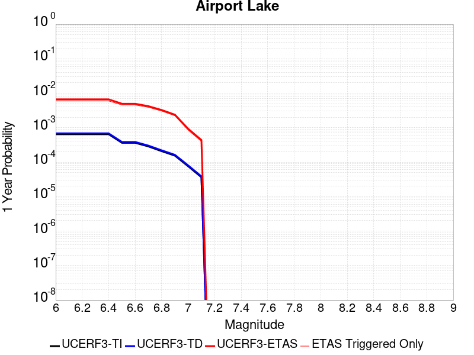 |  |

| Magnitude | 1 wk TI Prob | 1 wk TD Prob | 1 wk ETAS Prob | 1 wk ETAS/TD Gain | 1 wk ETAS Triggered Only | 1 mo TI Prob | 1 mo TD Prob | 1 mo ETAS Prob | 1 mo ETAS/TD Gain | 1 mo ETAS Triggered Only | 1 yr TI Prob | 1 yr TD Prob | 1 yr ETAS Prob | 1 yr ETAS/TD Gain | 1 yr ETAS Triggered Only | 10 yr TI Prob | 10 yr TD Prob | 10 yr ETAS Prob | 10 yr ETAS/TD Gain | 10 yr ETAS Triggered Only |
|-----|-----|-----|-----|-----|-----|-----|-----|-----|-----|-----|-----|-----|-----|-----|-----|-----|-----|-----|-----|-----|
| 6.0 | 1.2387061E-5 | 1.3104909E-5 | 1.95393E-4 | 14.909909 | 1.8229047E-4 | 5.3086325E-5 | 5.6162848E-5 | 8.308539E-4 | 14.793657 | 7.7473454E-4 | 6.461343E-4 | 6.8359653E-4 | 0.0065584457 | 9.59403 | 0.005878868 | 0.0064425888 | 0.0068177483 | 0.0203058 | 2.9783733 | 0.013580641 |
| 6.1 | 1.2387061E-5 | 1.3104909E-5 | 1.95393E-4 | 14.909909 | 1.8229047E-4 | 5.3086325E-5 | 5.6162848E-5 | 8.308539E-4 | 14.793657 | 7.7473454E-4 | 6.461343E-4 | 6.8359653E-4 | 0.0065584457 | 9.59403 | 0.005878868 | 0.0064425888 | 0.0068177483 | 0.0203058 | 2.9783733 | 0.013580641 |
| 6.2 | 1.2387061E-5 | 1.3104909E-5 | 1.95393E-4 | 14.909909 | 1.8229047E-4 | 5.3086325E-5 | 5.6162848E-5 | 8.308539E-4 | 14.793657 | 7.7473454E-4 | 6.461343E-4 | 6.8359653E-4 | 0.0065584457 | 9.59403 | 0.005878868 | 0.0064425888 | 0.0068177483 | 0.0203058 | 2.9783733 | 0.013580641 |
| 6.3 | 1.2387061E-5 | 1.3104909E-5 | 1.95393E-4 | 14.909909 | 1.8229047E-4 | 5.3086325E-5 | 5.6162848E-5 | 8.308539E-4 | 14.793657 | 7.7473454E-4 | 6.461343E-4 | 6.8359653E-4 | 0.0065584457 | 9.59403 | 0.005878868 | 0.0064425888 | 0.0068177483 | 0.0203058 | 2.9783733 | 0.013580641 |
| 6.4 | 1.2387061E-5 | 1.3104909E-5 | 1.95393E-4 | 14.909909 | 1.8229047E-4 | 5.3086325E-5 | 5.6162848E-5 | 8.308539E-4 | 14.793657 | 7.7473454E-4 | 6.461343E-4 | 6.8359653E-4 | 0.0065584457 | 9.59403 | 0.005878868 | 0.0064425888 | 0.0068177483 | 0.0203058 | 2.9783733 | 0.013580641 |
| 6.5 | 6.9922594E-6 | 7.385884E-6 | 1.554958E-4 | 21.053106 | 1.4811101E-4 | 2.996648E-5 | 3.1653435E-5 | 6.8104273E-4 | 21.515602 | 6.4940983E-4 | 3.6478083E-4 | 3.8531786E-4 | 0.004952213 | 12.852279 | 0.004568655 | 0.003641826 | 0.003847035 | 0.014277065 | 3.7111864 | 0.010470309 |
| 6.6 | 6.9922594E-6 | 7.385884E-6 | 1.554958E-4 | 21.053106 | 1.4811101E-4 | 2.996648E-5 | 3.1653435E-5 | 6.8104273E-4 | 21.515602 | 6.4940983E-4 | 3.6478083E-4 | 3.8531786E-4 | 0.004952213 | 12.852279 | 0.004568655 | 0.003641826 | 0.003847035 | 0.014277065 | 3.7111864 | 0.010470309 |
| 6.7 | 5.477277E-6 | 5.786823E-6 | 1.425039E-4 | 24.625586 | 1.3671786E-4 | 2.3473833E-5 | 2.4800454E-5 | 5.6026544E-4 | 22.590935 | 5.354783E-4 | 2.8575645E-4 | 3.019076E-4 | 0.00419719 | 13.902235 | 0.003896459 | 0.0028538927 | 0.0030153585 | 0.011863864 | 3.934479 | 0.008875268 |
| 6.8 | 3.9950432E-6 | 4.2196343E-6 | 1.2954381E-4 | 30.700247 | 1.253247E-4 | 1.7121502E-5 | 1.8084036E-5 | 4.3962314E-4 | 24.310013 | 4.2154675E-4 | 2.0843433E-4 | 2.2015366E-4 | 0.0032500657 | 14.762715 | 0.0030305793 | 0.0020823893 | 0.0021996265 | 0.008906802 | 4.049234 | 0.0067219613 |
| 6.9 | 2.95695E-6 | 3.12343E-6 | 9.4268384E-5 | 30.181047 | 9.114524E-5 | 1.2672582E-5 | 1.3386072E-5 | 3.2099715E-4 | 23.979935 | 3.0761518E-4 | 1.5427776E-4 | 1.629655E-4 | 0.0023500947 | 14.420812 | 0.0021874858 | 0.001541707 | 0.0016286825 | 0.0065538837 | 4.02404 | 0.004933236 |
| 7.0 | 1.456072E-6 | 1.5410193E-6 | 8.129298E-5 | 52.752735 | 7.9752084E-5 | 6.2402937E-6 | 6.604357E-6 | 2.0028671E-4 | 30.32645 | 1.9368363E-4 | 7.597293E-5 | 8.040609E-5 | 9.462162E-4 | 11.767967 | 8.6587976E-4 | 7.594696E-4 | 8.038689E-4 | 0.0028871403 | 3.591556 | 0.0020849474 |
| 7.1 | 6.995192E-7 | 7.4099876E-7 | 3.492044E-5 | 47.12618 | 3.4179466E-5 | 2.997936E-6 | 3.1757088E-6 | 8.292754E-5 | 26.11308 | 7.9752084E-5 | 3.649926E-5 | 3.8664257E-5 | 4.3740927E-4 | 11.313014 | 3.9876043E-4 | 3.6493264E-4 | 3.8664255E-4 | 0.0014002413 | 3.6215396 | 0.0010139908 |

## Owl Lake
*[(top)](#table-of-contents)*

| 1 Week | 1 Month | 1 Year | 10 Year |
|-----|-----|-----|-----|
|  |  |  |  |

| Magnitude | 1 wk TI Prob | 1 wk TD Prob | 1 wk ETAS Prob | 1 wk ETAS/TD Gain | 1 wk ETAS Triggered Only | 1 mo TI Prob | 1 mo TD Prob | 1 mo ETAS Prob | 1 mo ETAS/TD Gain | 1 mo ETAS Triggered Only | 1 yr TI Prob | 1 yr TD Prob | 1 yr ETAS Prob | 1 yr ETAS/TD Gain | 1 yr ETAS Triggered Only | 10 yr TI Prob | 10 yr TD Prob | 10 yr ETAS Prob | 10 yr ETAS/TD Gain | 10 yr ETAS Triggered Only |
|-----|-----|-----|-----|-----|-----|-----|-----|-----|-----|-----|-----|-----|-----|-----|-----|-----|-----|-----|-----|-----|
| 6.0 | 5.0320643E-5 | 6.641298E-5 | 1.6894456E-4 | 2.5438485 | 1.025384E-4 | 2.1564208E-4 | 2.8460217E-4 | 7.857583E-4 | 2.7609007 | 5.012988E-4 | 0.0026222812 | 0.0034604163 | 0.00749099 | 2.1647656 | 0.00404457 | 0.02591553 | 0.034168873 | 0.04515073 | 1.3213995 | 0.011370368 |
| 6.1 | 5.0320643E-5 | 6.641298E-5 | 1.6894456E-4 | 2.5438485 | 1.025384E-4 | 2.1564208E-4 | 2.8460217E-4 | 7.857583E-4 | 2.7609007 | 5.012988E-4 | 0.0026222812 | 0.0034604163 | 0.00749099 | 2.1647656 | 0.00404457 | 0.02591553 | 0.034168873 | 0.04515073 | 1.3213995 | 0.011370368 |
| 6.2 | 2.4125871E-5 | 3.1009058E-5 | 1.2215147E-4 | 3.939219 | 9.114524E-5 | 1.0339249E-4 | 1.3289036E-4 | 5.5438105E-4 | 4.1717176 | 4.2154675E-4 | 0.0012580766 | 0.0016169107 | 0.004676714 | 2.8923762 | 0.0030647586 | 0.012509781 | 0.016085263 | 0.02471688 | 1.5366166 | 0.008772729 |
| 6.3 | 1.7433485E-5 | 2.2378465E-5 | 9.073586E-5 | 4.0546064 | 6.835893E-5 | 7.471279E-5 | 9.590507E-5 | 4.7184312E-4 | 4.9198976 | 3.759741E-4 | 9.0924866E-4 | 0.0011671559 | 0.003943841 | 3.3790183 | 0.00277993 | 0.009055373 | 0.011640848 | 0.01934305 | 1.6616529 | 0.007792918 |
| 6.4 | 1.7433485E-5 | 2.2378465E-5 | 9.073586E-5 | 4.0546064 | 6.835893E-5 | 7.471279E-5 | 9.590507E-5 | 4.7184312E-4 | 4.9198976 | 3.759741E-4 | 9.0924866E-4 | 0.0011671559 | 0.003943841 | 3.3790183 | 0.00277993 | 0.009055373 | 0.011640848 | 0.01934305 | 1.6616529 | 0.007792918 |
| 6.5 | 1.5182742E-5 | 1.9450263E-5 | 8.7807864E-5 | 4.514482 | 6.835893E-5 | 6.506727E-5 | 8.335646E-5 | 4.4790702E-4 | 5.373393 | 3.6458095E-4 | 7.919061E-4 | 0.001014528 | 0.0036892032 | 3.636374 | 0.0026773915 | 0.0078909 | 0.01012941 | 0.017572725 | 1.734822 | 0.007519482 |
| 6.6 | 6.7271576E-6 | 8.561506E-6 | 5.4133736E-5 | 6.322922 | 4.557262E-5 | 2.8830356E-5 | 3.6691687E-5 | 3.215101E-4 | 8.762479 | 2.848289E-4 | 3.5095305E-4 | 4.4663536E-4 | 0.0025762038 | 5.7680244 | 0.00213052 | 0.0035039932 | 0.004475178 | 0.009998814 | 2.234283 | 0.0055484665 |
| 6.7 | 6.682835E-6 | 8.4939265E-6 | 5.406616E-5 | 6.365273 | 4.557262E-5 | 2.8640408E-5 | 3.6402067E-5 | 3.2122058E-4 | 8.82424 | 2.848289E-4 | 3.4864116E-4 | 4.431107E-4 | 0.0025726866 | 5.8059683 | 0.00213052 | 0.003480947 | 0.00444009 | 0.009952579 | 2.2415261 | 0.005537073 |
| 6.8 | 6.5774975E-6 | 8.340327E-6 | 5.391257E-5 | 6.4640827 | 4.557262E-5 | 2.8188972E-5 | 3.5743804E-5 | 3.205625E-4 | 8.968337 | 2.848289E-4 | 3.4314668E-4 | 4.3509956E-4 | 0.0025646926 | 5.894496 | 0.00213052 | 0.0034261728 | 0.0043602297 | 0.009861817 | 2.2617655 | 0.0055256803 |
| 6.9 | 6.363419E-6 | 8.013318E-6 | 5.3585572E-5 | 6.6870646 | 4.557262E-5 | 2.727151E-5 | 3.4342367E-5 | 3.1916145E-4 | 9.293519 | 2.848289E-4 | 3.3198006E-4 | 4.1804372E-4 | 0.002547673 | 6.094274 | 0.00213052 | 0.0033148455 | 0.004190137 | 0.0096699735 | 2.3077939 | 0.005502894 |
| 7.0 | 6.1342453E-6 | 7.645282E-6 | 5.3217555E-5 | 6.9608364 | 4.557262E-5 | 2.6289357E-5 | 3.276511E-5 | 3.1758467E-4 | 9.692769 | 2.848289E-4 | 3.2002592E-4 | 3.9884774E-4 | 0.0024943522 | 6.2538958 | 0.0020963405 | 0.0031956544 | 0.003998714 | 0.00944556 | 2.3621495 | 0.0054687145 |
| 7.1 | 5.842926E-6 | 7.155487E-6 | 5.272778E-5 | 7.3688602 | 4.557262E-5 | 2.504087E-5 | 3.066604E-5 | 3.154862E-4 | 10.287803 | 2.848289E-4 | 3.0482994E-4 | 3.733005E-4 | 0.002411914 | 6.4610515 | 0.0020393748 | 0.0030441214 | 0.0037440478 | 0.00902203 | 2.4096994 | 0.0052978173 |
| 7.2 | 4.77173E-6 | 5.3705085E-6 | 3.954979E-5 | 7.3642545 | 3.4179466E-5 | 2.045011E-5 | 2.3016284E-5 | 1.9390967E-4 | 8.4248905 | 1.7089733E-4 | 2.4895166E-4 | 2.8019128E-4 | 0.0016469868 | 5.87808 | 0.0013671786 | 0.0024867293 | 0.0028149132 | 0.006200516 | 2.202738 | 0.0033951602 |
| 7.3 | 3.0494948E-6 | 2.7192577E-6 | 2.7192577E-6 | 1.0 | 0.0 | 1.3069198E-5 | 1.1653911E-5 | 5.7226E-5 | 4.9104543 | 4.557262E-5 | 1.5910587E-4 | 1.4187729E-4 | 5.1779806E-4 | 3.649619 | 3.759741E-4 | 0.0015899199 | 0.0014278062 | 0.002349334 | 1.6454153 | 9.2284556E-4 |
| 7.4 | 2.7263884E-6 | 2.3139278E-6 | 2.3139278E-6 | 1.0 | 0.0 | 1.1684469E-5 | 9.916796E-6 | 3.270288E-5 | 3.2977264 | 2.278631E-5 | 1.4224913E-4 | 1.2073041E-4 | 3.5995778E-4 | 2.9815006 | 2.3925626E-4 | 0.0014215811 | 0.0012154713 | 0.0017730574 | 1.4587406 | 5.582646E-4 |
| 7.5 | 2.6090431E-6 | 2.173696E-6 | 2.173696E-6 | 1.0 | 0.0 | 1.1181565E-5 | 9.315807E-6 | 3.2101903E-5 | 3.4459605 | 2.278631E-5 | 1.3612706E-4 | 1.1341415E-4 | 3.1846768E-4 | 2.8080068 | 2.050768E-4 | 0.001360437 | 0.001142131 | 0.0016087168 | 1.4085221 | 4.6711936E-4 |
| 7.6 | 2.3008756E-6 | 1.8804336E-6 | 1.8804336E-6 | 1.0 | 0.0 | 9.860858E-6 | 8.058977E-6 | 1.945204E-5 | 2.4137108 | 1.1393155E-5 | 1.20049335E-4 | 9.8113705E-5 | 2.462102E-4 | 2.5094373 | 1.4811101E-4 | 0.001199845 | 9.889243E-4 | 0.0013417628 | 1.3567902 | 3.5318782E-4 |
| 7.7 | 1.7184348E-6 | 1.3489819E-6 | 1.3489819E-6 | 1.0 | 0.0 | 7.3646997E-6 | 5.781338E-6 | 1.7174427E-5 | 2.9706664 | 1.1393155E-5 | 8.966153E-5 | 7.038556E-5 | 1.5013204E-4 | 2.1329947 | 7.9752084E-5 | 8.962536E-4 | 7.115331E-4 | 9.0507895E-4 | 1.2720124 | 1.9368363E-4 |
| 7.8 | 8.4612907E-7 | 8.4566835E-7 | 8.4566835E-7 | 1.0 | 0.0 | 3.6262625E-6 | 3.624288E-6 | 3.624288E-6 | 1.0 | 0.0 | 4.4148852E-5 | 4.4124834E-5 | 8.9695444E-5 | 2.0327656 | 4.557262E-5 | 4.414008E-4 | 4.4665742E-4 | 5.4915E-4 | 1.2294658 | 1.025384E-4 |
| 7.9 | 2.716738E-7 | 3.7908913E-7 | 3.7908913E-7 | 1.0 | 0.0 | 1.1643157E-6 | 1.6246668E-6 | 1.6246668E-6 | 1.0 | 0.0 | 1.4175452E-5 | 1.978015E-5 | 1.978015E-5 | 1.0 | 0.0 | 1.4174548E-4 | 1.9954717E-4 | 2.2232892E-4 | 1.1141673 | 2.278631E-5 |
| 8.0 | 2.1995428E-8 | 3.406613E-8 | 3.406613E-8 | 1.0 | 0.0 | 9.426611E-8 | 1.459977E-7 | 1.459977E-7 | 1.0 | 0.0 | 1.1476893E-6 | 1.7775212E-6 | 1.7775212E-6 | 1.0 | 0.0 | 1.14768345E-5 | 1.7979468E-5 | 1.7979468E-5 | 1.0 | 0.0 |

## Panamint Valley
*[(top)](#table-of-contents)*

| 1 Week | 1 Month | 1 Year | 10 Year |
|-----|-----|-----|-----|
|  |  |  |  |

| Magnitude | 1 wk TI Prob | 1 wk TD Prob | 1 wk ETAS Prob | 1 wk ETAS/TD Gain | 1 wk ETAS Triggered Only | 1 mo TI Prob | 1 mo TD Prob | 1 mo ETAS Prob | 1 mo ETAS/TD Gain | 1 mo ETAS Triggered Only | 1 yr TI Prob | 1 yr TD Prob | 1 yr ETAS Prob | 1 yr ETAS/TD Gain | 1 yr ETAS Triggered Only | 10 yr TI Prob | 10 yr TD Prob | 10 yr ETAS Prob | 10 yr ETAS/TD Gain | 10 yr ETAS Triggered Only |
|-----|-----|-----|-----|-----|-----|-----|-----|-----|-----|-----|-----|-----|-----|-----|-----|-----|-----|-----|-----|-----|
| 6.0 | 3.0211835E-5 | 3.3999226E-5 | 1.2514136E-4 | 3.6807122 | 9.114524E-5 | 1.2947287E-4 | 1.45703E-4 | 6.5832026E-4 | 4.5182343 | 5.12692E-4 | 0.0015751923 | 0.0017725201 | 0.004945576 | 2.7901382 | 0.0031786903 | 0.015640736 | 0.017591003 | 0.026007941 | 1.4784797 | 0.008567653 |
| 6.1 | 3.0211835E-5 | 3.3999226E-5 | 1.2514136E-4 | 3.6807122 | 9.114524E-5 | 1.2947287E-4 | 1.45703E-4 | 6.5832026E-4 | 4.5182343 | 5.12692E-4 | 0.0015751923 | 0.0017725201 | 0.004945576 | 2.7901382 | 0.0031786903 | 0.015640736 | 0.017591003 | 0.026007941 | 1.4784797 | 0.008567653 |
| 6.2 | 3.0211835E-5 | 3.3999226E-5 | 1.2514136E-4 | 3.6807122 | 9.114524E-5 | 1.2947287E-4 | 1.45703E-4 | 6.5832026E-4 | 4.5182343 | 5.12692E-4 | 0.0015751923 | 0.0017725201 | 0.004945576 | 2.7901382 | 0.0031786903 | 0.015640736 | 0.017591003 | 0.026007941 | 1.4784797 | 0.008567653 |
| 6.3 | 2.8573924E-5 | 3.2116626E-5 | 1.2325894E-4 | 3.8378544 | 9.114524E-5 | 1.2245393E-4 | 1.3763558E-4 | 6.388654E-4 | 4.641717 | 5.012988E-4 | 0.001489857 | 0.001674453 | 0.0046999576 | 2.8068614 | 0.0030305793 | 0.01479908 | 0.016625157 | 0.024680648 | 1.4845362 | 0.008191679 |
| 6.4 | 2.8573924E-5 | 3.2116626E-5 | 1.2325894E-4 | 3.8378544 | 9.114524E-5 | 1.2245393E-4 | 1.3763558E-4 | 6.388654E-4 | 4.641717 | 5.012988E-4 | 0.001489857 | 0.001674453 | 0.0046999576 | 2.8068614 | 0.0030305793 | 0.01479908 | 0.016625157 | 0.024680648 | 1.4845362 | 0.008191679 |
| 6.5 | 2.7468774E-5 | 3.0841835E-5 | 1.2198427E-4 | 3.9551556 | 9.114524E-5 | 1.1771801E-4 | 1.3217276E-4 | 5.9923035E-4 | 4.5336905 | 4.6711936E-4 | 0.0014322745 | 0.0016080429 | 0.0045200004 | 2.8108706 | 0.0029166476 | 0.014230782 | 0.01597076 | 0.023751331 | 1.4871761 | 0.0079068495 |
| 6.6 | 2.6135967E-5 | 2.926532E-5 | 1.20407894E-4 | 4.114354 | 9.114524E-5 | 1.1200648E-4 | 1.2541692E-4 | 5.6969427E-4 | 4.542403 | 4.4433304E-4 | 0.0013628257 | 0.001525908 | 0.0043698507 | 2.8637705 | 0.0028482887 | 0.013544982 | 0.015160798 | 0.0225775 | 1.4892026 | 0.0075308755 |
| 6.7 | 2.4498746E-5 | 2.7354E-5 | 1.1849675E-4 | 4.331971 | 9.114524E-5 | 1.04990395E-4 | 1.1722631E-4 | 5.501154E-4 | 4.6927643 | 4.3293988E-4 | 0.0012775084 | 0.001426321 | 0.004088517 | 2.8664773 | 0.0026659982 | 0.012701893 | 0.014177947 | 0.021197712 | 1.4951185 | 0.007120722 |
| 6.8 | 2.2244329E-5 | 2.4947252E-5 | 1.0469735E-4 | 4.1967487 | 7.9752084E-5 | 9.532935E-5 | 1.0691254E-4 | 5.170223E-4 | 4.8359365 | 4.101536E-4 | 0.0011600169 | 0.0013009048 | 0.0037813815 | 2.906732 | 0.0024837079 | 0.011539802 | 0.012938806 | 0.019405106 | 1.4997603 | 0.006551064 |
| 6.9 | 1.9902658E-5 | 2.2301174E-5 | 1.0205148E-4 | 4.576059 | 7.9752084E-5 | 8.529431E-5 | 9.5573065E-5 | 4.7151124E-4 | 4.933516 | 3.759741E-4 | 0.0010379635 | 0.0011629994 | 0.0034503601 | 2.9667773 | 0.0022900242 | 0.010331288 | 0.011574146 | 0.01737371 | 1.5010792 | 0.0058674747 |
| 7.0 | 1.8353881E-5 | 2.0576585E-5 | 1.0032703E-4 | 4.8757863 | 7.9752084E-5 | 7.865712E-5 | 8.818248E-5 | 4.527313E-4 | 5.1340275 | 3.6458095E-4 | 9.5722964E-4 | 0.0010731106 | 0.0031785825 | 2.9620268 | 0.0021077336 | 0.009531168 | 0.010684091 | 0.016083105 | 1.5053322 | 0.005457321 |
| 7.1 | 1.7667631E-5 | 1.9782776E-5 | 9.953328E-5 | 5.0313106 | 7.9752084E-5 | 7.571623E-5 | 8.4780666E-5 | 4.2654635E-4 | 5.0311747 | 3.4179466E-4 | 9.2145515E-4 | 0.0010317335 | 0.0031031482 | 3.0077035 | 0.0020735543 | 0.009176437 | 0.01027419 | 0.015528853 | 1.5114429 | 0.00530921 |
| 7.2 | 1.6381597E-5 | 1.8167568E-5 | 9.791821E-5 | 5.3897257 | 7.9752084E-5 | 7.020495E-5 | 7.785878E-5 | 3.9684228E-4 | 5.0969496 | 3.1900834E-4 | 8.544101E-4 | 9.4753574E-4 | 0.0028483898 | 3.0061028 | 0.0019026569 | 0.008511325 | 0.009439452 | 0.014111694 | 1.4949697 | 0.004716766 |
| 7.3 | 1.4520491E-5 | 1.597386E-5 | 5.015278E-5 | 3.1396782 | 3.4179466E-5 | 6.222919E-5 | 6.845769E-5 | 2.963052E-4 | 4.3282967 | 2.278631E-4 | 7.57377E-4 | 8.331699E-4 | 0.0023585807 | 2.830852 | 0.0015266828 | 0.0075480095 | 0.008303438 | 0.012088453 | 1.4558371 | 0.0038167068 |
| 7.4 | 1.2852287E-5 | 1.41519E-5 | 4.8330883E-5 | 3.4151514 | 3.4179466E-5 | 5.5080065E-5 | 6.064968E-5 | 2.771065E-4 | 4.568969 | 2.1646994E-4 | 6.7039346E-4 | 7.381755E-4 | 0.002149884 | 2.912429 | 0.0014127513 | 0.0066837464 | 0.0073600365 | 0.010922466 | 1.4840233 | 0.0035888439 |
| 7.5 | 1.1637851E-5 | 1.2842981E-5 | 4.7022007E-5 | 3.6613 | 3.4179466E-5 | 4.987555E-5 | 5.5040273E-5 | 2.714983E-4 | 4.9327207 | 2.1646994E-4 | 6.070656E-4 | 6.69925E-4 | 0.0020703443 | 3.090412 | 0.001401358 | 0.006054099 | 0.0066818423 | 0.010190121 | 1.5250466 | 0.003531878 |
| 7.6 | 3.0068115E-6 | 3.3354997E-6 | 2.6121734E-5 | 7.8314304 | 2.278631E-5 | 1.2886271E-5 | 1.4294961E-5 | 9.404591E-5 | 6.5789547 | 7.9752084E-5 | 1.5687906E-4 | 1.7403455E-4 | 8.00549E-4 | 4.599943 | 6.266235E-4 | 0.0015676835 | 0.0017403618 | 0.0032302677 | 1.8560897 | 0.0014925033 |

## Garlock (East)
*[(top)](#table-of-contents)*

| 1 Week | 1 Month | 1 Year | 10 Year |
|-----|-----|-----|-----|
|  |  | 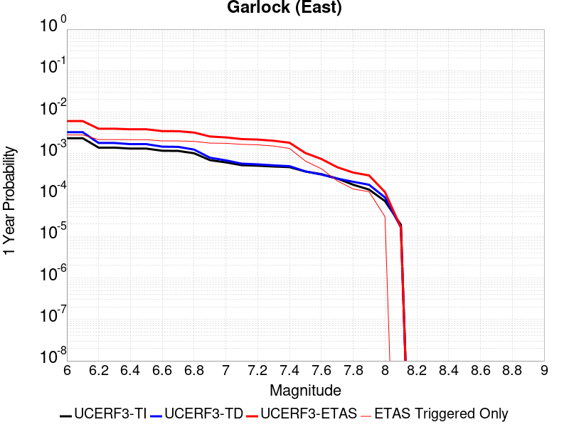 | 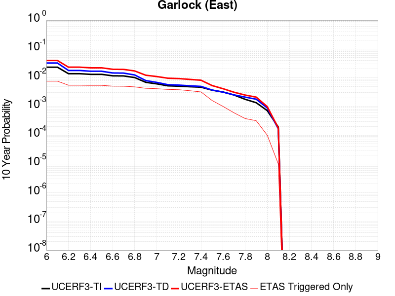 |

| Magnitude | 1 wk TI Prob | 1 wk TD Prob | 1 wk ETAS Prob | 1 wk ETAS/TD Gain | 1 wk ETAS Triggered Only | 1 mo TI Prob | 1 mo TD Prob | 1 mo ETAS Prob | 1 mo ETAS/TD Gain | 1 mo ETAS Triggered Only | 1 yr TI Prob | 1 yr TD Prob | 1 yr ETAS Prob | 1 yr ETAS/TD Gain | 1 yr ETAS Triggered Only | 10 yr TI Prob | 10 yr TD Prob | 10 yr ETAS Prob | 10 yr ETAS/TD Gain | 10 yr ETAS Triggered Only |
|-----|-----|-----|-----|-----|-----|-----|-----|-----|-----|-----|-----|-----|-----|-----|-----|-----|-----|-----|-----|-----|
| 6.0 | 4.5092507E-5 | 6.296638E-5 | 1.31321E-4 | 2.0855734 | 6.835893E-5 | 1.9323928E-4 | 2.698305E-4 | 6.5709325E-4 | 2.4352074 | 3.8736727E-4 | 0.0023501497 | 0.003280684 | 0.006028782 | 1.8376602 | 0.0027571435 | 0.023254504 | 0.032422677 | 0.03983064 | 1.228481 | 0.0076562003 |
| 6.1 | 4.5092507E-5 | 6.296638E-5 | 1.31321E-4 | 2.0855734 | 6.835893E-5 | 1.9323928E-4 | 2.698305E-4 | 6.5709325E-4 | 2.4352074 | 3.8736727E-4 | 0.0023501497 | 0.003280684 | 0.006028782 | 1.8376602 | 0.0027571435 | 0.023254504 | 0.032422677 | 0.03983064 | 1.228481 | 0.0076562003 |
| 6.2 | 2.6674514E-5 | 3.456096E-5 | 9.1524766E-5 | 2.6482124 | 5.6965775E-5 | 1.1431433E-4 | 1.4811018E-4 | 4.6707125E-4 | 3.1535394 | 3.1900834E-4 | 0.0013908884 | 0.001801783 | 0.0039398368 | 2.1866324 | 0.0021419132 | 0.01382215 | 0.017910836 | 0.023460627 | 1.3098567 | 0.005651005 |
| 6.3 | 2.6674514E-5 | 3.456096E-5 | 9.1524766E-5 | 2.6482124 | 5.6965775E-5 | 1.1431433E-4 | 1.4811018E-4 | 4.6707125E-4 | 3.1535394 | 3.1900834E-4 | 0.0013908884 | 0.001801783 | 0.0039398368 | 2.1866324 | 0.0021419132 | 0.01382215 | 0.017910836 | 0.023460627 | 1.3098567 | 0.005651005 |
| 6.4 | 2.5312667E-5 | 3.2388867E-5 | 8.93528E-5 | 2.7587502 | 5.6965775E-5 | 1.0847834E-4 | 1.3880222E-4 | 4.5776626E-4 | 3.2979753 | 3.1900834E-4 | 0.0013199237 | 0.0016886365 | 0.0038155587 | 2.25955 | 0.00213052 | 0.013121112 | 0.016810471 | 0.022299271 | 1.3265107 | 0.005582646 |
| 6.5 | 2.5312667E-5 | 3.2388867E-5 | 8.93528E-5 | 2.7587502 | 5.6965775E-5 | 1.0847834E-4 | 1.3880222E-4 | 4.5776626E-4 | 3.2979753 | 3.1900834E-4 | 0.0013199237 | 0.0016886365 | 0.0038155587 | 2.25955 | 0.00213052 | 0.013121112 | 0.016810471 | 0.022299271 | 1.3265107 | 0.005582646 |
| 6.6 | 2.246556E-5 | 2.8180817E-5 | 8.514499E-5 | 3.021381 | 5.6965775E-5 | 9.627742E-5 | 1.2076947E-4 | 4.0556394E-4 | 3.358166 | 2.848289E-4 | 0.0011715472 | 0.0014694002 | 0.0034375198 | 2.3394034 | 0.0019710157 | 0.011653901 | 0.014652344 | 0.019827632 | 1.3532053 | 0.0052522444 |
| 6.7 | 2.2241198E-5 | 2.7850401E-5 | 8.481459E-5 | 3.0453634 | 5.6965775E-5 | 9.531594E-5 | 1.19353535E-4 | 4.0414842E-4 | 3.3861454 | 2.848289E-4 | 0.0011598538 | 0.0014521842 | 0.0034203378 | 2.3553057 | 0.0019710157 | 0.011538187 | 0.014481625 | 0.019612895 | 1.3543298 | 0.005206672 |
| 6.8 | 1.9528685E-5 | 2.3941871E-5 | 6.95134E-5 | 2.9034238 | 4.557262E-5 | 8.369167E-5 | 1.026041E-4 | 3.6461977E-4 | 3.553657 | 2.6204257E-4 | 0.0010184698 | 0.0012485087 | 0.003160169 | 2.5311549 | 0.0019140501 | 0.010138147 | 0.012461547 | 0.017288303 | 1.387332 | 0.0048876633 |
| 6.9 | 1.3318621E-5 | 1.5236135E-5 | 6.0808063E-5 | 3.9910424 | 4.557262E-5 | 5.7078556E-5 | 6.5296124E-5 | 3.0453675E-4 | 4.6639333 | 2.3925626E-4 | 6.9470983E-4 | 7.9469604E-4 | 0.0025136953 | 3.1630902 | 0.0017203664 | 0.0069254204 | 0.007959486 | 0.012265728 | 1.54102 | 0.004340792 |
| 7.0 | 1.1760853E-5 | 1.3143669E-5 | 5.871569E-5 | 4.467222 | 4.557262E-5 | 5.0402683E-5 | 5.6328823E-5 | 2.955716E-4 | 5.2472534 | 2.3925626E-4 | 6.134799E-4 | 6.8559265E-4 | 0.0023820088 | 3.4743793 | 0.0016975801 | 0.0061178906 | 0.0068753036 | 0.011039158 | 1.6056249 | 0.004192681 |
| 7.1 | 1.0064758E-5 | 1.0937537E-5 | 5.650966E-5 | 5.1665797 | 4.557262E-5 | 4.3133965E-5 | 4.6874335E-5 | 2.7472674E-4 | 5.8609204 | 2.278631E-4 | 5.2502943E-4 | 5.705491E-4 | 0.0021532942 | 3.7740731 | 0.0015836485 | 0.005237907 | 0.0057307025 | 0.0096614715 | 1.6859139 | 0.0039534247 |
| 7.2 | 9.768808E-6 | 1.0533159E-5 | 5.61053E-5 | 5.3265405 | 4.557262E-5 | 4.186565E-5 | 4.514135E-5 | 2.6160153E-4 | 5.795164 | 2.1646994E-4 | 5.095951E-4 | 5.494608E-4 | 0.0020866916 | 3.7977078 | 0.001538076 | 0.0050842804 | 0.0055208574 | 0.009350483 | 1.6936651 | 0.0038508864 |
| 7.3 | 9.344516E-6 | 9.978153E-6 | 4.4157277E-5 | 4.425396 | 3.4179466E-5 | 4.004731E-5 | 4.2762833E-5 | 2.3643818E-4 | 5.5290585 | 1.9368363E-4 | 4.8746695E-4 | 5.205166E-4 | 0.0019325324 | 3.7127204 | 0.0014127513 | 0.0048639905 | 0.0052322084 | 0.008734274 | 1.6693283 | 0.0035204848 |
| 7.4 | 9.023491E-6 | 9.523662E-6 | 4.3702803E-5 | 4.5888653 | 3.4179466E-5 | 3.867153E-5 | 4.0815077E-5 | 1.8892005E-4 | 4.628683 | 1.4811101E-4 | 4.7072413E-4 | 4.968136E-4 | 0.0017152756 | 3.4525535 | 0.0012190676 | 0.004697283 | 0.004995214 | 0.008180698 | 1.6377074 | 0.0032014765 |
| 7.5 | 7.081253E-6 | 7.1169666E-6 | 7.1169666E-6 | 1.0 | 0.0 | 3.0347876E-5 | 3.0500933E-5 | 1.10250585E-4 | 3.614663 | 7.9752084E-5 | 3.6942272E-4 | 3.7128633E-4 | 9.976772E-4 | 2.687083 | 6.266235E-4 | 0.003688092 | 0.003739278 | 0.0053851083 | 1.4401464 | 0.0016520075 |
| 7.6 | 6.116396E-6 | 5.9870563E-6 | 5.9870563E-6 | 1.0 | 0.0 | 2.6212863E-5 | 2.565856E-5 | 7.123001E-5 | 2.776072 | 4.557262E-5 | 3.1909486E-4 | 3.1234848E-4 | 7.2237395E-4 | 2.3127182 | 4.101536E-4 | 0.0031863707 | 0.0031501288 | 0.00418364 | 1.3280853 | 0.0010367772 |
| 7.7 | 4.797145E-6 | 4.7835583E-6 | 4.7835583E-6 | 1.0 | 0.0 | 2.055903E-5 | 2.0500804E-5 | 5.4679567E-5 | 2.6671915 | 3.4179466E-5 | 2.5027743E-4 | 2.495688E-4 | 4.5459444E-4 | 1.8215194 | 2.050768E-4 | 0.0024999576 | 0.0025229412 | 0.0031366195 | 1.2432392 | 6.1523035E-4 |
| 7.8 | 3.4028885E-6 | 4.0020077E-6 | 4.0020077E-6 | 1.0 | 0.0 | 1.4583726E-5 | 1.715135E-5 | 3.993727E-5 | 2.3285205 | 2.278631E-5 | 1.775424E-4 | 2.0879775E-4 | 3.4548706E-4 | 1.6546494 | 1.3671786E-4 | 0.0017740062 | 0.0021133528 | 0.0024999012 | 1.1829078 | 3.8736727E-4 |
| 7.9 | 2.5928412E-6 | 3.3924102E-6 | 3.3924102E-6 | 1.0 | 0.0 | 1.1112129E-5 | 1.453882E-5 | 2.593181E-5 | 1.7836255 | 1.1393155E-5 | 1.3528178E-4 | 1.7699582E-4 | 2.9090722E-4 | 1.6435823 | 1.1393155E-4 | 0.0013519945 | 0.0017916125 | 0.0021100494 | 1.1777376 | 3.1900834E-4 |
| 8.0 | 1.3743648E-6 | 1.6825641E-6 | 1.6825641E-6 | 1.0 | 0.0 | 5.8901214E-6 | 7.210969E-6 | 7.210969E-6 | 1.0 | 0.0 | 7.1709874E-5 | 8.7790046E-5 | 1.1057436E-4 | 1.2595319 | 2.278631E-5 | 7.1686733E-4 | 8.883735E-4 | 9.794377E-4 | 1.1025068 | 9.114524E-5 |
| 8.1 | 3.6733252E-7 | 3.164752E-7 | 3.164752E-7 | 1.0 | 0.0 | 1.5742813E-6 | 1.3563216E-6 | 1.3563216E-6 | 1.0 | 0.0 | 1.9166706E-5 | 1.6513108E-5 | 1.6513108E-5 | 1.0 | 0.0 | 1.9165053E-4 | 1.6726229E-4 | 1.7865353E-4 | 1.0681041 | 1.1393155E-5 |

## Ash Hill
*[(top)](#table-of-contents)*

| 1 Week | 1 Month | 1 Year | 10 Year |
|-----|-----|-----|-----|
| 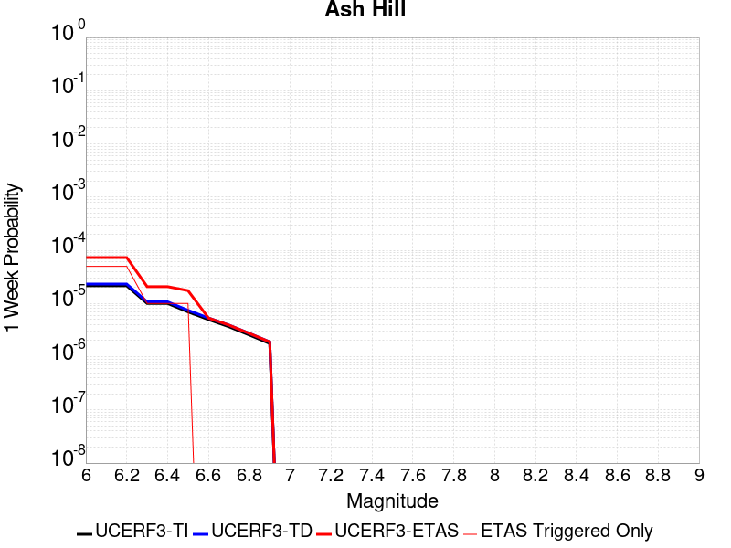 |  |  |  |

| Magnitude | 1 wk TI Prob | 1 wk TD Prob | 1 wk ETAS Prob | 1 wk ETAS/TD Gain | 1 wk ETAS Triggered Only | 1 mo TI Prob | 1 mo TD Prob | 1 mo ETAS Prob | 1 mo ETAS/TD Gain | 1 mo ETAS Triggered Only | 1 yr TI Prob | 1 yr TD Prob | 1 yr ETAS Prob | 1 yr ETAS/TD Gain | 1 yr ETAS Triggered Only | 10 yr TI Prob | 10 yr TD Prob | 10 yr ETAS Prob | 10 yr ETAS/TD Gain | 10 yr ETAS Triggered Only |
|-----|-----|-----|-----|-----|-----|-----|-----|-----|-----|-----|-----|-----|-----|-----|-----|-----|-----|-----|-----|-----|
| 6.0 | 2.1545662E-5 | 2.3198552E-5 | 8.016301E-5 | 3.4555175 | 5.6965775E-5 | 9.2335285E-5 | 9.941903E-5 | 3.7282758E-4 | 3.7500625 | 2.7343573E-4 | 0.0011236023 | 0.0012098346 | 0.003064672 | 2.533133 | 0.0018570842 | 0.011179381 | 0.012040469 | 0.016745467 | 1.3907653 | 0.004762339 |
| 6.1 | 2.1545662E-5 | 2.3198552E-5 | 8.016301E-5 | 3.4555175 | 5.6965775E-5 | 9.2335285E-5 | 9.941903E-5 | 3.7282758E-4 | 3.7500625 | 2.7343573E-4 | 0.0011236023 | 0.0012098346 | 0.003064672 | 2.533133 | 0.0018570842 | 0.011179381 | 0.012040469 | 0.016745467 | 1.3907653 | 0.004762339 |
| 6.2 | 2.1545662E-5 | 2.3198552E-5 | 8.016301E-5 | 3.4555175 | 5.6965775E-5 | 9.2335285E-5 | 9.941903E-5 | 3.7282758E-4 | 3.7500625 | 2.7343573E-4 | 0.0011236023 | 0.0012098346 | 0.003064672 | 2.533133 | 0.0018570842 | 0.011179381 | 0.012040469 | 0.016745467 | 1.3907653 | 0.004762339 |
| 6.3 | 1.0025529E-5 | 1.0748722E-5 | 2.2141754E-5 | 2.059943 | 1.1393155E-5 | 4.2965847E-5 | 4.606521E-5 | 1.7138415E-4 | 3.7204678 | 1.253247E-4 | 5.229836E-4 | 5.607129E-4 | 0.0013236263 | 2.3606133 | 7.633414E-4 | 0.005217545 | 0.0055942945 | 0.00744099 | 1.3301033 | 0.0018570842 |
| 6.4 | 1.0025529E-5 | 1.0748722E-5 | 2.2141754E-5 | 2.059943 | 1.1393155E-5 | 4.2965847E-5 | 4.606521E-5 | 1.7138415E-4 | 3.7204678 | 1.253247E-4 | 5.229836E-4 | 5.607129E-4 | 0.0013236263 | 2.3606133 | 7.633414E-4 | 0.005217545 | 0.0055942945 | 0.00744099 | 1.3301033 | 0.0018570842 |
| 6.5 | 6.9617327E-6 | 7.4578593E-6 | 1.885093E-5 | 2.5276594 | 1.1393155E-5 | 2.9835655E-5 | 3.1961914E-5 | 1.1171145E-4 | 3.495143 | 7.9752084E-5 | 3.6318856E-4 | 3.8907546E-4 | 8.674018E-4 | 2.229392 | 4.7851252E-4 | 0.0036259557 | 0.0038847975 | 0.0051899203 | 1.3359565 | 0.0013102128 |
| 6.6 | 4.9919777E-6 | 5.3475665E-6 | 5.3475665E-6 | 1.0 | 0.0 | 2.1394015E-5 | 2.2917979E-5 | 6.848956E-5 | 2.988464 | 4.557262E-5 | 2.60441E-4 | 2.7899738E-4 | 5.523568E-4 | 1.9797921 | 2.7343573E-4 | 0.0026013597 | 0.0027871297 | 0.003673319 | 1.3179576 | 8.886661E-4 |
| 6.7 | 3.6630722E-6 | 3.9252714E-6 | 3.9252714E-6 | 1.0 | 0.0 | 1.5698786E-5 | 1.6822516E-5 | 5.1001407E-5 | 3.0317347 | 3.4179466E-5 | 1.9111596E-4 | 2.0480063E-4 | 4.2122623E-4 | 2.0567625 | 2.1646994E-4 | 0.0019095168 | 0.002046682 | 0.002683393 | 1.3110942 | 6.380167E-4 |
| 6.8 | 2.5599613E-6 | 2.7453837E-6 | 2.7453837E-6 | 1.0 | 0.0 | 1.0971216E-5 | 1.1765905E-5 | 3.4551947E-5 | 2.9366162 | 2.278631E-5 | 1.3356637E-4 | 1.4324542E-4 | 2.9133522E-4 | 2.0338187 | 1.4811101E-4 | 0.0013348613 | 0.0014320159 | 0.0019325969 | 1.3495638 | 5.012988E-4 |
| 6.9 | 1.7684905E-6 | 1.897189E-6 | 1.897189E-6 | 1.0 | 0.0 | 7.579223E-6 | 8.13081E-6 | 3.0916934E-5 | 3.802442 | 2.278631E-5 | 9.2273134E-5 | 9.899261E-5 | 2.3569693E-4 | 2.3809547 | 1.3671786E-4 | 9.223483E-4 | 9.899262E-4 | 0.0013541462 | 1.3679265 | 3.6458095E-4 |

## Hunter Mountain-Saline Valley
*[(top)](#table-of-contents)*

| 1 Week | 1 Month | 1 Year | 10 Year |
|-----|-----|-----|-----|
|  |  |  | 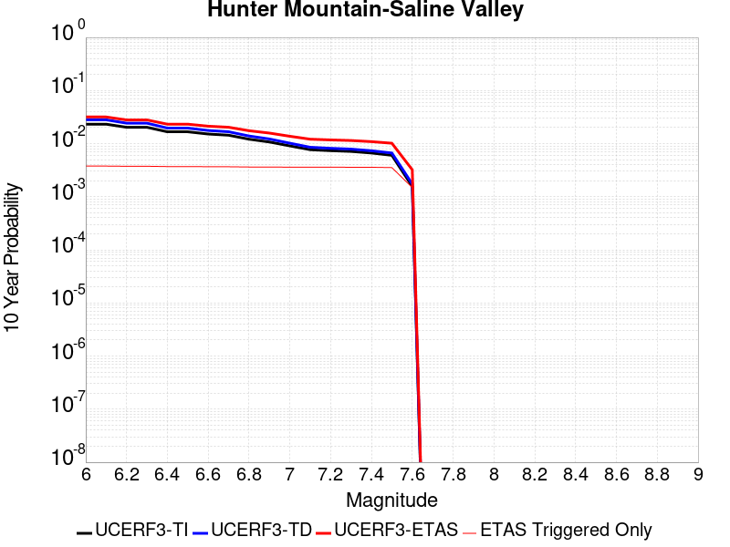 |

| Magnitude | 1 wk TI Prob | 1 wk TD Prob | 1 wk ETAS Prob | 1 wk ETAS/TD Gain | 1 wk ETAS Triggered Only | 1 mo TI Prob | 1 mo TD Prob | 1 mo ETAS Prob | 1 mo ETAS/TD Gain | 1 mo ETAS Triggered Only | 1 yr TI Prob | 1 yr TD Prob | 1 yr ETAS Prob | 1 yr ETAS/TD Gain | 1 yr ETAS Triggered Only | 10 yr TI Prob | 10 yr TD Prob | 10 yr ETAS Prob | 10 yr ETAS/TD Gain | 10 yr ETAS Triggered Only |
|-----|-----|-----|-----|-----|-----|-----|-----|-----|-----|-----|-----|-----|-----|-----|-----|-----|-----|-----|-----|-----|
| 6.0 | 4.5103672E-5 | 5.4598844E-5 | 8.877644E-5 | 1.6259766 | 3.4179466E-5 | 1.9328714E-4 | 2.3397508E-4 | 4.6178486E-4 | 1.9736499 | 2.278631E-4 | 0.002350731 | 0.0028451039 | 0.0043447213 | 1.5270872 | 0.0015038964 | 0.023260195 | 0.028107068 | 0.03175006 | 1.1296113 | 0.003748348 |
| 6.1 | 4.5103672E-5 | 5.4598844E-5 | 8.877644E-5 | 1.6259766 | 3.4179466E-5 | 1.9328714E-4 | 2.3397508E-4 | 4.6178486E-4 | 1.9736499 | 2.278631E-4 | 0.002350731 | 0.0028451039 | 0.0043447213 | 1.5270872 | 0.0015038964 | 0.023260195 | 0.028107068 | 0.03175006 | 1.1296113 | 0.003748348 |
| 6.2 | 3.9363465E-5 | 4.7087524E-5 | 8.126538E-5 | 1.7258368 | 3.4179466E-5 | 1.6868966E-4 | 2.0178875E-4 | 4.2960586E-4 | 2.1289883 | 2.278631E-4 | 0.002051862 | 0.0024541437 | 0.003942984 | 1.606664 | 0.0014925033 | 0.020330196 | 0.024286084 | 0.027921166 | 1.1496776 | 0.0037255618 |
| 6.3 | 3.9363465E-5 | 4.7087524E-5 | 8.126538E-5 | 1.7258368 | 3.4179466E-5 | 1.6868966E-4 | 2.0178875E-4 | 4.2960586E-4 | 2.1289883 | 2.278631E-4 | 0.002051862 | 0.0024541437 | 0.003942984 | 1.606664 | 0.0014925033 | 0.020330196 | 0.024286084 | 0.027921166 | 1.1496776 | 0.0037255618 |
| 6.4 | 3.2311684E-5 | 3.7969927E-5 | 7.214809E-5 | 1.9001378 | 3.4179466E-5 | 1.384713E-4 | 1.6271851E-4 | 3.9054453E-4 | 2.4001236 | 2.278631E-4 | 0.0016845843 | 0.0019793664 | 0.0034234333 | 1.72956 | 0.0014469307 | 0.016718714 | 0.019626025 | 0.023222622 | 1.1832565 | 0.0036685958 |
| 6.5 | 3.2311684E-5 | 3.7969927E-5 | 7.214809E-5 | 1.9001378 | 3.4179466E-5 | 1.384713E-4 | 1.6271851E-4 | 3.9054453E-4 | 2.4001236 | 2.278631E-4 | 0.0016845843 | 0.0019793664 | 0.0034234333 | 1.72956 | 0.0014469307 | 0.016718714 | 0.019626025 | 0.023222622 | 1.1832565 | 0.0036685958 |
| 6.6 | 2.9305844E-5 | 3.4198583E-5 | 6.837688E-5 | 1.9994068 | 3.4179466E-5 | 1.2559042E-4 | 1.4655748E-4 | 3.743872E-4 | 2.5545416 | 2.278631E-4 | 0.0015279909 | 0.0017829385 | 0.0032272893 | 1.8100958 | 0.0014469307 | 0.015175272 | 0.017694132 | 0.021275433 | 1.2024004 | 0.0036458096 |
| 6.7 | 2.7826512E-5 | 3.2359956E-5 | 6.653831E-5 | 2.056193 | 3.4179466E-5 | 1.19251024E-4 | 1.3867849E-4 | 3.6650998E-4 | 2.6428757 | 2.278631E-4 | 0.0014509142 | 0.0016871633 | 0.0031202787 | 1.8494232 | 0.0014355375 | 0.014414776 | 0.016751112 | 0.020324647 | 1.2133312 | 0.0036344165 |
| 6.8 | 2.3389874E-5 | 2.6879417E-5 | 6.105797E-5 | 2.271551 | 3.4179466E-5 | 1.0023846E-4 | 1.15192684E-4 | 3.3163768E-4 | 2.8789823 | 2.1646994E-4 | 0.00121972 | 0.001401616 | 0.0028123872 | 2.0065317 | 0.0014127513 | 0.01213047 | 0.01393385 | 0.017472688 | 1.2539741 | 0.0035888439 |
| 6.9 | 2.069209E-5 | 2.3581042E-5 | 5.7759702E-5 | 2.4494126 | 3.4179466E-5 | 8.867737E-5 | 1.010579E-4 | 3.1750597E-4 | 3.1418223 | 2.1646994E-4 | 0.0010791123 | 0.0012297217 | 0.0026407356 | 2.1474254 | 0.0014127513 | 0.010738871 | 0.012234077 | 0.01576776 | 1.2888395 | 0.0035774508 |
| 7.0 | 1.7462342E-5 | 1.9642564E-5 | 5.3821357E-5 | 2.7400372 | 3.4179466E-5 | 7.483646E-5 | 8.417983E-5 | 3.0063154E-4 | 3.5713015 | 2.1646994E-4 | 9.1075303E-4 | 0.0010244302 | 0.002435734 | 2.3776479 | 0.0014127513 | 0.009070295 | 0.010200586 | 0.013730268 | 1.3460274 | 0.0035660574 |
| 7.1 | 1.4807709E-5 | 1.6449274E-5 | 5.0628176E-5 | 3.0778365 | 3.4179466E-5 | 6.3460066E-5 | 7.049507E-5 | 2.8694977E-4 | 4.0704937 | 2.1646994E-4 | 7.723524E-4 | 8.5795607E-4 | 0.0022694953 | 2.6452348 | 0.0014127513 | 0.007696735 | 0.0085493 | 0.01208487 | 1.4135509 | 0.0035660574 |
| 7.2 | 1.4180048E-5 | 1.5705544E-5 | 4.988447E-5 | 3.1762333 | 3.4179466E-5 | 6.077022E-5 | 6.730783E-5 | 2.837632E-4 | 4.215902 | 2.1646994E-4 | 7.396263E-4 | 8.19181E-4 | 0.0022307748 | 2.7231772 | 0.0014127513 | 0.0073716943 | 0.008164439 | 0.011701382 | 1.4332132 | 0.0035660574 |
| 7.3 | 1.3730402E-5 | 1.5179074E-5 | 4.935802E-5 | 3.2517147 | 3.4179466E-5 | 5.8843252E-5 | 6.5051645E-5 | 2.815075E-4 | 4.3274465 | 2.1646994E-4 | 7.161811E-4 | 7.9173205E-4 | 0.0021919806 | 2.768589 | 0.001401358 | 0.007138774 | 0.007891921 | 0.011407229 | 1.4454312 | 0.0035432712 |
| 7.4 | 1.2810095E-5 | 1.4115724E-5 | 4.8294707E-5 | 3.4213412 | 3.4179466E-5 | 5.489925E-5 | 6.0494647E-5 | 2.769515E-4 | 4.578116 | 2.1646994E-4 | 6.681934E-4 | 7.3628925E-4 | 0.0021366156 | 2.9018698 | 0.001401358 | 0.006661878 | 0.007341268 | 0.010858527 | 1.4791079 | 0.0035432712 |
| 7.5 | 1.1595659E-5 | 1.2806805E-5 | 4.698583E-5 | 3.6688178 | 3.4179466E-5 | 4.9694736E-5 | 5.488524E-5 | 2.713433E-4 | 4.94383 | 2.1646994E-4 | 6.0486543E-4 | 6.680386E-4 | 0.002057075 | 3.0792756 | 0.001389965 | 0.006032217 | 0.0066630607 | 0.010126137 | 1.5197425 | 0.0034863055 |
| 7.6 | 2.997694E-6 | 3.327617E-6 | 2.6113852E-5 | 7.8476133 | 2.278631E-5 | 1.28471975E-5 | 1.4261179E-5 | 9.4012124E-5 | 6.5921707 | 7.9752084E-5 | 1.564034E-4 | 1.7362331E-4 | 7.8874687E-4 | 4.542863 | 6.1523035E-4 | 0.0015629337 | 0.0017362454 | 0.003214784 | 1.8515724 | 0.0014811101 |

## Blackwater
*[(top)](#table-of-contents)*

| 1 Week | 1 Month | 1 Year | 10 Year |
|-----|-----|-----|-----|
|  |  |  |  |

| Magnitude | 1 wk TI Prob | 1 wk TD Prob | 1 wk ETAS Prob | 1 wk ETAS/TD Gain | 1 wk ETAS Triggered Only | 1 mo TI Prob | 1 mo TD Prob | 1 mo ETAS Prob | 1 mo ETAS/TD Gain | 1 mo ETAS Triggered Only | 1 yr TI Prob | 1 yr TD Prob | 1 yr ETAS Prob | 1 yr ETAS/TD Gain | 1 yr ETAS Triggered Only | 10 yr TI Prob | 10 yr TD Prob | 10 yr ETAS Prob | 10 yr ETAS/TD Gain | 10 yr ETAS Triggered Only |
|-----|-----|-----|-----|-----|-----|-----|-----|-----|-----|-----|-----|-----|-----|-----|-----|-----|-----|-----|-----|-----|
| 6.0 | 3.0708583E-5 | 3.3101805E-5 | 4.4494584E-5 | 1.3441739 | 1.1393155E-5 | 1.3160157E-4 | 1.4185793E-4 | 2.1020717E-4 | 1.4818146 | 6.835893E-5 | 0.0016010714 | 0.0017258888 | 0.0027836235 | 1.6128638 | 0.0010595634 | 0.015895851 | 0.017138693 | 0.020173322 | 1.177063 | 0.003087545 |
| 6.1 | 3.0708583E-5 | 3.3101805E-5 | 4.4494584E-5 | 1.3441739 | 1.1393155E-5 | 1.3160157E-4 | 1.4185793E-4 | 2.1020717E-4 | 1.4818146 | 6.835893E-5 | 0.0016010714 | 0.0017258888 | 0.0027836235 | 1.6128638 | 0.0010595634 | 0.015895851 | 0.017138693 | 0.020173322 | 1.177063 | 0.003087545 |
| 6.2 | 1.1707779E-5 | 1.2547198E-5 | 1.2547198E-5 | 1.0 | 0.0 | 5.017523E-5 | 5.377265E-5 | 7.6557735E-5 | 1.42373 | 2.278631E-5 | 6.107122E-4 | 6.54495E-4 | 0.0010985372 | 1.6784502 | 4.4433304E-4 | 0.006090366 | 0.0065266457 | 0.0077038007 | 1.1803614 | 0.0011848881 |
| 6.3 | 1.1707779E-5 | 1.2547198E-5 | 1.2547198E-5 | 1.0 | 0.0 | 5.017523E-5 | 5.377265E-5 | 7.6557735E-5 | 1.42373 | 2.278631E-5 | 6.107122E-4 | 6.54495E-4 | 0.0010985372 | 1.6784502 | 4.4433304E-4 | 0.006090366 | 0.0065266457 | 0.0077038007 | 1.1803614 | 0.0011848881 |
| 6.4 | 7.929244E-6 | 8.48146E-6 | 8.48146E-6 | 1.0 | 0.0 | 3.3982033E-5 | 3.6348632E-5 | 3.6348632E-5 | 1.0 | 0.0 | 4.136527E-4 | 4.4245878E-4 | 7.3854974E-4 | 1.6691945 | 2.9622202E-4 | 0.0041288356 | 0.0044161836 | 0.0051194397 | 1.1592453 | 7.0637563E-4 |
| 6.5 | 5.8832115E-6 | 6.286986E-6 | 6.286986E-6 | 1.0 | 0.0 | 2.521352E-5 | 2.694396E-5 | 2.694396E-5 | 1.0 | 0.0 | 3.0693135E-4 | 3.279959E-4 | 5.330054E-4 | 1.6250368 | 2.050768E-4 | 0.0030650778 | 0.0032753714 | 0.0037750283 | 1.1525497 | 5.012988E-4 |
| 6.6 | 5.8832115E-6 | 6.286986E-6 | 6.286986E-6 | 1.0 | 0.0 | 2.521352E-5 | 2.694396E-5 | 2.694396E-5 | 1.0 | 0.0 | 3.0693135E-4 | 3.279959E-4 | 5.330054E-4 | 1.6250368 | 2.050768E-4 | 0.0030650778 | 0.0032753714 | 0.0037750283 | 1.1525497 | 5.012988E-4 |
| 6.7 | 3.0715053E-6 | 3.2819846E-6 | 3.2819846E-6 | 1.0 | 0.0 | 1.3163528E-5 | 1.4065579E-5 | 1.4065579E-5 | 1.0 | 0.0 | 1.6025416E-4 | 1.7123614E-4 | 2.965394E-4 | 1.731757 | 1.253247E-4 | 0.0016013865 | 0.0017111566 | 0.0019500034 | 1.1395822 | 2.3925626E-4 |
| 6.8 | 2.2722281E-6 | 2.4291405E-6 | 2.4291405E-6 | 1.0 | 0.0 | 9.738084E-6 | 1.0410566E-5 | 1.0410566E-5 | 1.0 | 0.0 | 1.1855473E-4 | 1.2674218E-4 | 2.0648415E-4 | 1.6291668 | 7.9752084E-5 | 0.001184915 | 0.0012667892 | 0.0014147125 | 1.1167704 | 1.4811101E-4 |
| 6.9 | 9.952399E-7 | 1.0655224E-6 | 1.0655224E-6 | 1.0 | 0.0 | 4.265307E-6 | 4.5665192E-6 | 4.5665192E-6 | 1.0 | 0.0 | 5.1928873E-5 | 5.559647E-5 | 7.838151E-5 | 1.4098289 | 2.278631E-5 | 5.191674E-4 | 5.5587624E-4 | 6.35584E-4 | 1.1433911 | 7.9752084E-5 |
| 7.0 | 4.7385504E-7 | 5.076394E-7 | 5.076394E-7 | 1.0 | 0.0 | 2.0308057E-6 | 2.1755973E-6 | 2.1755973E-6 | 1.0 | 0.0 | 2.4724779E-5 | 2.6487898E-5 | 3.7880753E-5 | 1.4301155 | 1.1393155E-5 | 2.4722028E-4 | 2.64879E-4 | 3.1043953E-4 | 1.1720052 | 4.557262E-5 |

## Garlock (West)
*[(top)](#table-of-contents)*

| 1 Week | 1 Month | 1 Year | 10 Year |
|-----|-----|-----|-----|
|  |  |  |  |

| Magnitude | 1 wk TI Prob | 1 wk TD Prob | 1 wk ETAS Prob | 1 wk ETAS/TD Gain | 1 wk ETAS Triggered Only | 1 mo TI Prob | 1 mo TD Prob | 1 mo ETAS Prob | 1 mo ETAS/TD Gain | 1 mo ETAS Triggered Only | 1 yr TI Prob | 1 yr TD Prob | 1 yr ETAS Prob | 1 yr ETAS/TD Gain | 1 yr ETAS Triggered Only | 10 yr TI Prob | 10 yr TD Prob | 10 yr ETAS Prob | 10 yr ETAS/TD Gain | 10 yr ETAS Triggered Only |
|-----|-----|-----|-----|-----|-----|-----|-----|-----|-----|-----|-----|-----|-----|-----|-----|-----|-----|-----|-----|-----|
| 6.0 | 2.5181727E-5 | 2.5283342E-5 | 2.5283342E-5 | 1.0 | 0.0 | 1.0791722E-4 | 1.083527E-4 | 2.1087998E-4 | 1.9462366 | 1.025384E-4 | 0.0013131002 | 0.0013183992 | 0.0023310531 | 1.7680936 | 0.0010139908 | 0.013053683 | 0.01318547 | 0.015883774 | 1.2046422 | 0.0027343573 |
| 6.1 | 2.5077732E-5 | 2.5184368E-5 | 2.5184368E-5 | 1.0 | 0.0 | 1.0747157E-4 | 1.0792856E-4 | 2.1045588E-4 | 1.9499555 | 1.025384E-4 | 0.001307681 | 0.0013132415 | 0.0023259008 | 1.7711142 | 0.0010139908 | 0.013000126 | 0.013134505 | 0.015832948 | 1.2054468 | 0.0027343573 |
| 6.2 | 2.494612E-5 | 2.5065981E-5 | 2.5065981E-5 | 1.0 | 0.0 | 1.0690756E-4 | 1.0742123E-4 | 2.099486E-4 | 1.9544425 | 1.025384E-4 | 0.0013008224 | 0.0013070722 | 0.0023197376 | 1.7747586 | 0.0010139908 | 0.012932341 | 0.013073538 | 0.015772147 | 1.2064177 | 0.0027343573 |
| 6.3 | 2.4733758E-5 | 2.4885285E-5 | 2.4885285E-5 | 1.0 | 0.0 | 1.0599751E-4 | 1.0664688E-4 | 2.0917434E-4 | 1.9613732 | 1.025384E-4 | 0.0012897556 | 0.0012976559 | 0.0023103307 | 1.780388 | 0.0010139908 | 0.012822957 | 0.012980479 | 0.015679343 | 1.2079171 | 0.0027343573 |
| 6.4 | 2.3237335E-5 | 2.3263985E-5 | 2.3263985E-5 | 1.0 | 0.0 | 9.958477E-5 | 9.9699E-5 | 2.0222717E-4 | 2.028377 | 1.025384E-4 | 0.0012117702 | 0.0012131622 | 0.002225923 | 1.8348106 | 0.0010139908 | 0.012051838 | 0.01214505 | 0.014846198 | 1.2224073 | 0.0027343573 |
| 6.5 | 2.2732203E-5 | 2.3078326E-5 | 2.3078326E-5 | 1.0 | 0.0 | 9.742009E-5 | 9.890338E-5 | 2.0143163E-4 | 2.0366507 | 1.025384E-4 | 0.0011854442 | 0.0012034862 | 0.0022162567 | 1.8415306 | 0.0010139908 | 0.011791403 | 0.012049343 | 0.0147507535 | 1.2241956 | 0.0027343573 |
| 6.6 | 2.1319436E-5 | 2.1857622E-5 | 2.1857622E-5 | 1.0 | 0.0 | 9.136581E-5 | 9.367218E-5 | 1.9620097E-4 | 2.094549 | 1.025384E-4 | 0.001111811 | 0.0011398644 | 0.0021526995 | 1.8885574 | 0.0010139908 | 0.011062649 | 0.0114198085 | 0.01412294 | 1.2367055 | 0.0027343573 |
| 6.7 | 1.970802E-5 | 2.0476651E-5 | 2.0476651E-5 | 1.0 | 0.0 | 8.446021E-5 | 8.775414E-5 | 1.9028354E-4 | 2.168371 | 1.025384E-4 | 0.001027818 | 0.0010678847 | 0.0020807926 | 1.9485182 | 0.0010139908 | 0.010230771 | 0.01070713 | 0.013412209 | 1.2526429 | 0.0027343573 |
| 6.8 | 1.8744462E-5 | 1.9983867E-5 | 1.9983867E-5 | 1.0 | 0.0 | 8.033094E-5 | 8.564234E-5 | 1.8817195E-4 | 2.1971836 | 1.025384E-4 | 9.775903E-4 | 0.0010421984 | 0.0020551325 | 1.9719205 | 0.0010139908 | 0.009733009 | 0.010452707 | 0.013158483 | 1.2588588 | 0.0027343573 |
| 6.9 | 1.7559682E-5 | 1.9035691E-5 | 1.9035691E-5 | 1.0 | 0.0 | 7.5253614E-5 | 8.157899E-5 | 1.8410903E-4 | 2.256819 | 1.025384E-4 | 9.158276E-4 | 9.927731E-4 | 0.0020057573 | 2.020358 | 0.0010139908 | 0.0091206245 | 0.009963013 | 0.012670128 | 1.2717165 | 0.0027343573 |
| 7.0 | 1.6794445E-5 | 1.829792E-5 | 1.829792E-5 | 1.0 | 0.0 | 7.197421E-5 | 7.841731E-5 | 1.8094767E-4 | 2.3074965 | 1.025384E-4 | 8.759337E-4 | 9.5431396E-4 | 0.001967337 | 2.0615199 | 0.0010139908 | 0.008724891 | 0.009581639 | 0.012278513 | 1.2814627 | 0.0027229642 |
| 7.1 | 1.6337795E-5 | 1.7798287E-5 | 1.7798287E-5 | 1.0 | 0.0 | 7.0017246E-5 | 7.6276156E-5 | 1.7880673E-4 | 2.3442023 | 1.025384E-4 | 8.521265E-4 | 9.2826784E-4 | 0.0019413175 | 2.0913332 | 0.0010139908 | 0.008488664 | 0.009323265 | 0.012020843 | 1.2893382 | 0.0027229642 |
| 7.2 | 1.5780008E-5 | 1.7246624E-5 | 1.7246624E-5 | 1.0 | 0.0 | 6.762685E-5 | 7.391202E-5 | 1.7644283E-4 | 2.3872008 | 1.025384E-4 | 8.2304585E-4 | 8.9950865E-4 | 0.0019125873 | 2.126258 | 0.0010139908 | 0.008200042 | 0.009037967 | 0.01173632 | 1.2985576 | 0.0027229642 |
| 7.3 | 1.5058865E-5 | 1.66991E-5 | 1.66991E-5 | 1.0 | 0.0 | 6.45364E-5 | 7.156561E-5 | 1.7409667E-4 | 2.432686 | 1.025384E-4 | 7.854473E-4 | 8.7096426E-4 | 0.0018840719 | 2.1632023 | 0.0010139908 | 0.00782677 | 0.00875437 | 0.011430909 | 1.3057375 | 0.0027001777 |
| 7.4 | 1.4887923E-5 | 1.6534816E-5 | 1.6534816E-5 | 1.0 | 0.0 | 6.380382E-5 | 7.086158E-5 | 1.733927E-4 | 2.4469213 | 1.025384E-4 | 7.7653467E-4 | 8.623994E-4 | 0.0018755157 | 2.1747646 | 0.0010139908 | 0.0077382675 | 0.008669155 | 0.01133463 | 1.3074665 | 0.0026887846 |
| 7.5 | 1.4509299E-5 | 1.6126263E-5 | 1.6126263E-5 | 1.0 | 0.0 | 6.218123E-5 | 6.911073E-5 | 1.7164204E-4 | 2.48358 | 1.025384E-4 | 7.567935E-4 | 8.410995E-4 | 0.0017745524 | 2.1098008 | 9.342387E-4 | 0.0075422134 | 0.008457162 | 0.010919865 | 1.2911973 | 0.0024837079 |
| 7.6 | 1.2756717E-5 | 1.4127087E-5 | 1.4127087E-5 | 1.0 | 0.0 | 5.4670498E-5 | 6.0543254E-5 | 1.1750558E-4 | 1.9408534 | 5.6965775E-5 | 6.6541E-4 | 7.368655E-4 | 0.0013744121 | 1.8652142 | 6.380167E-4 | 0.006634211 | 0.007420682 | 0.009037813 | 1.2179222 | 0.0016292211 |
| 7.7 | 1.0328985E-5 | 1.1532095E-5 | 1.1532095E-5 | 1.0 | 0.0 | 4.4266326E-5 | 4.9422335E-5 | 9.49927E-5 | 1.9220603 | 4.557262E-5 | 5.388092E-4 | 6.015512E-4 | 9.203676E-4 | 1.5299906 | 3.1900834E-4 | 0.0053750467 | 0.006075411 | 0.00704927 | 1.1602951 | 9.798113E-4 |
| 7.8 | 7.0306583E-6 | 8.957247E-6 | 8.957247E-6 | 1.0 | 0.0 | 3.0131043E-5 | 3.8387636E-5 | 6.117307E-5 | 1.5935618 | 2.278631E-5 | 3.667837E-4 | 4.6726942E-4 | 6.722504E-4 | 1.4386783 | 2.050768E-4 | 0.003661789 | 0.004725001 | 0.0053486633 | 1.1319921 | 6.266235E-4 |
| 7.9 | 4.060633E-6 | 5.499178E-6 | 5.499178E-6 | 1.0 | 0.0 | 1.7402595E-5 | 2.3567693E-5 | 3.496058E-5 | 1.4834112 | 1.1393155E-5 | 2.11856E-4 | 2.8689898E-4 | 4.121877E-4 | 1.4366999 | 1.253247E-4 | 0.0021165414 | 0.0029016812 | 0.0032879245 | 1.1331102 | 3.8736727E-4 |
| 8.0 | 1.6729537E-6 | 2.0887928E-6 | 2.0887928E-6 | 1.0 | 0.0 | 7.169782E-6 | 8.951938E-6 | 8.951938E-6 | 1.0 | 0.0 | 8.7288594E-5 | 1.0898444E-4 | 1.3176826E-4 | 1.2090558 | 2.278631E-5 | 8.7254314E-4 | 0.0011025992 | 0.001193644 | 1.0825728 | 9.114524E-5 |
| 8.1 | 3.6733252E-7 | 3.164752E-7 | 3.164752E-7 | 1.0 | 0.0 | 1.5742813E-6 | 1.3563216E-6 | 1.3563216E-6 | 1.0 | 0.0 | 1.9166706E-5 | 1.6513108E-5 | 1.6513108E-5 | 1.0 | 0.0 | 1.9165053E-4 | 1.6726229E-4 | 1.7865353E-4 | 1.0681041 | 1.1393155E-5 |

## McLean Lake
*[(top)](#table-of-contents)*

| 1 Week | 1 Month | 1 Year | 10 Year |
|-----|-----|-----|-----|
|  | 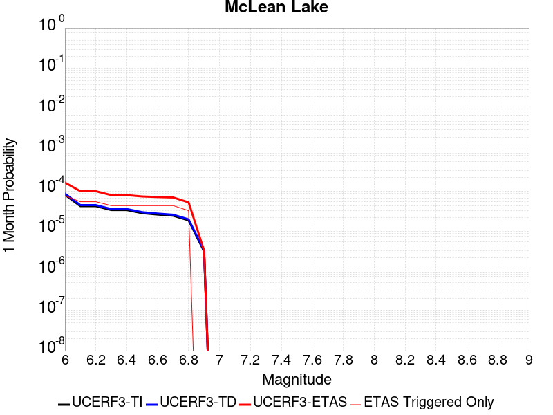 |  |  |

| Magnitude | 1 wk TI Prob | 1 wk TD Prob | 1 wk ETAS Prob | 1 wk ETAS/TD Gain | 1 wk ETAS Triggered Only | 1 mo TI Prob | 1 mo TD Prob | 1 mo ETAS Prob | 1 mo ETAS/TD Gain | 1 mo ETAS Triggered Only | 1 yr TI Prob | 1 yr TD Prob | 1 yr ETAS Prob | 1 yr ETAS/TD Gain | 1 yr ETAS Triggered Only | 10 yr TI Prob | 10 yr TD Prob | 10 yr ETAS Prob | 10 yr ETAS/TD Gain | 10 yr ETAS Triggered Only |
|-----|-----|-----|-----|-----|-----|-----|-----|-----|-----|-----|-----|-----|-----|-----|-----|-----|-----|-----|-----|-----|
| 6.0 | 1.7360222E-5 | 1.8504445E-5 | 2.9897388E-5 | 1.6156869 | 1.1393155E-5 | 7.439883E-5 | 7.930263E-5 | 1.3626389E-4 | 1.7182771 | 5.6965775E-5 | 9.0542925E-4 | 9.6513046E-4 | 0.0016708242 | 1.7311902 | 7.0637563E-4 | 0.009017491 | 0.009614232 | 0.011746836 | 1.2218174 | 0.0021533063 |
| 6.1 | 9.062689E-6 | 9.59349E-6 | 2.0986536E-5 | 2.1875808 | 1.1393155E-5 | 3.8839516E-5 | 4.1114363E-5 | 7.5292424E-5 | 1.8312925 | 3.4179466E-5 | 4.727685E-4 | 5.0046126E-4 | 8.990221E-4 | 1.7963871 | 3.9876043E-4 | 0.0047176396 | 0.004994225 | 0.006082506 | 1.2179078 | 0.0010937429 |
| 6.2 | 9.062689E-6 | 9.59349E-6 | 2.0986536E-5 | 2.1875808 | 1.1393155E-5 | 3.8839516E-5 | 4.1114363E-5 | 7.5292424E-5 | 1.8312925 | 3.4179466E-5 | 4.727685E-4 | 5.0046126E-4 | 8.990221E-4 | 1.7963871 | 3.9876043E-4 | 0.0047176396 | 0.004994225 | 0.006082506 | 1.2179078 | 0.0010937429 |
| 6.3 | 7.2575485E-6 | 7.668712E-6 | 1.906178E-5 | 2.485656 | 1.1393155E-5 | 3.110341E-5 | 3.2865533E-5 | 5.5651097E-5 | 1.6932966 | 2.278631E-5 | 3.786182E-4 | 4.0007156E-4 | 7.4172945E-4 | 1.853992 | 3.4179466E-4 | 0.0037797375 | 0.003994218 | 0.004867987 | 1.2187585 | 8.772729E-4 |
| 6.4 | 7.2575485E-6 | 7.668712E-6 | 1.906178E-5 | 2.485656 | 1.1393155E-5 | 3.110341E-5 | 3.2865533E-5 | 5.5651097E-5 | 1.6932966 | 2.278631E-5 | 3.786182E-4 | 4.0007156E-4 | 7.4172945E-4 | 1.853992 | 3.4179466E-4 | 0.0037797375 | 0.003994218 | 0.004867987 | 1.2187585 | 8.772729E-4 |
| 6.5 | 6.06582E-6 | 6.4047026E-6 | 1.7797785E-5 | 2.778862 | 1.1393155E-5 | 2.5996113E-5 | 2.7448474E-5 | 5.0234157E-5 | 1.8301257 | 2.278631E-5 | 3.164567E-4 | 3.341404E-4 | 6.416528E-4 | 1.920309 | 3.0761518E-4 | 0.0031600643 | 0.003337019 | 0.0040864577 | 1.2245834 | 7.519482E-4 |
| 6.6 | 5.598744E-6 | 5.911023E-6 | 1.730411E-5 | 2.9274309 | 1.1393155E-5 | 2.3994397E-5 | 2.5332745E-5 | 4.811848E-5 | 1.8994577 | 2.278631E-5 | 2.9209262E-4 | 3.0838893E-4 | 5.8174034E-4 | 1.8863852 | 2.7343573E-4 | 0.0029170897 | 0.003080239 | 0.0037390066 | 1.213869 | 6.60803E-4 |
| 6.7 | 5.246996E-6 | 5.5398755E-6 | 1.6932967E-5 | 3.056561 | 1.1393155E-5 | 2.2486933E-5 | 2.3742145E-5 | 4.652791E-5 | 1.9597182 | 2.278631E-5 | 2.73744E-4 | 2.890286E-4 | 5.623853E-4 | 1.9457773 | 2.7343573E-4 | 0.0027340704 | 0.002887151 | 0.0035119655 | 1.2164121 | 6.266235E-4 |
| 6.8 | 4.02324E-6 | 4.2474508E-6 | 1.5640557E-5 | 3.68234 | 1.1393155E-5 | 1.7242342E-5 | 1.8203267E-5 | 4.098916E-5 | 2.2517476 | 2.278631E-5 | 2.099053E-4 | 2.2160819E-4 | 4.2663954E-4 | 1.9251975 | 2.050768E-4 | 0.0020970714 | 0.0022144564 | 0.0026919094 | 1.2156073 | 4.7851252E-4 |
| 6.9 | 6.835972E-7 | 7.1406623E-7 | 7.1406623E-7 | 1.0 | 0.0 | 2.9296991E-6 | 3.0602819E-6 | 3.0602819E-6 | 1.0 | 0.0 | 3.56685E-5 | 3.7258615E-5 | 3.7258615E-5 | 1.0 | 0.0 | 3.5662777E-4 | 3.7255493E-4 | 4.6366622E-4 | 1.244558 | 9.114524E-5 |

## Gravel Hills-Harper Lk
*[(top)](#table-of-contents)*

| 1 Week | 1 Month | 1 Year | 10 Year |
|-----|-----|-----|-----|
|  |  |  |  |

| Magnitude | 1 wk TI Prob | 1 wk TD Prob | 1 wk ETAS Prob | 1 wk ETAS/TD Gain | 1 wk ETAS Triggered Only | 1 mo TI Prob | 1 mo TD Prob | 1 mo ETAS Prob | 1 mo ETAS/TD Gain | 1 mo ETAS Triggered Only | 1 yr TI Prob | 1 yr TD Prob | 1 yr ETAS Prob | 1 yr ETAS/TD Gain | 1 yr ETAS Triggered Only | 10 yr TI Prob | 10 yr TD Prob | 10 yr ETAS Prob | 10 yr ETAS/TD Gain | 10 yr ETAS Triggered Only |
|-----|-----|-----|-----|-----|-----|-----|-----|-----|-----|-----|-----|-----|-----|-----|-----|-----|-----|-----|-----|-----|
| 6.0 | 3.0679566E-5 | 3.147399E-5 | 4.2866784E-5 | 1.361975 | 1.1393155E-5 | 1.3147724E-4 | 1.3488278E-4 | 2.0323248E-4 | 1.5067341 | 6.835893E-5 | 0.0015995599 | 0.001641178 | 0.002289522 | 1.395048 | 6.4940983E-4 | 0.015880952 | 0.016312161 | 0.01815016 | 1.1126766 | 0.0018684774 |
| 6.1 | 3.0679566E-5 | 3.147399E-5 | 4.2866784E-5 | 1.361975 | 1.1393155E-5 | 1.3147724E-4 | 1.3488278E-4 | 2.0323248E-4 | 1.5067341 | 6.835893E-5 | 0.0015995599 | 0.001641178 | 0.002289522 | 1.395048 | 6.4940983E-4 | 0.015880952 | 0.016312161 | 0.01815016 | 1.1126766 | 0.0018684774 |
| 6.2 | 1.514536E-5 | 1.3638413E-5 | 1.3638413E-5 | 1.0 | 0.0 | 6.490707E-5 | 5.8449103E-5 | 5.8449103E-5 | 1.0 | 0.0 | 7.8995706E-4 | 7.113974E-4 | 8.7078806E-4 | 1.224053 | 1.5950417E-4 | 0.007871548 | 0.007092403 | 0.007522272 | 1.0606098 | 4.3293988E-4 |
| 6.3 | 1.514536E-5 | 1.3638413E-5 | 1.3638413E-5 | 1.0 | 0.0 | 6.490707E-5 | 5.8449103E-5 | 5.8449103E-5 | 1.0 | 0.0 | 7.8995706E-4 | 7.113974E-4 | 8.7078806E-4 | 1.224053 | 1.5950417E-4 | 0.007871548 | 0.007092403 | 0.007522272 | 1.0606098 | 4.3293988E-4 |
| 6.4 | 1.2532521E-5 | 1.0692025E-5 | 1.0692025E-5 | 1.0 | 0.0 | 5.37097E-5 | 4.582219E-5 | 4.582219E-5 | 1.0 | 0.0 | 6.537194E-4 | 5.577482E-4 | 6.8300305E-4 | 1.2245723 | 1.253247E-4 | 0.0065179965 | 0.0055640745 | 0.0059152967 | 1.0631232 | 3.5318782E-4 |
| 6.5 | 1.1094058E-5 | 9.085563E-6 | 9.085563E-6 | 1.0 | 0.0 | 4.7545094E-5 | 3.893757E-5 | 3.893757E-5 | 1.0 | 0.0 | 5.787078E-4 | 4.7396583E-4 | 5.536801E-4 | 1.1681857 | 7.9752084E-5 | 0.0057720304 | 0.0047299573 | 0.0049907602 | 1.0551386 | 2.6204257E-4 |
| 6.6 | 9.688328E-6 | 7.53322E-6 | 7.53322E-6 | 1.0 | 0.0 | 4.1520743E-5 | 3.2284843E-5 | 3.2284843E-5 | 1.0 | 0.0 | 5.053978E-4 | 3.9299965E-4 | 4.3855436E-4 | 1.1159154 | 4.557262E-5 | 0.0050424994 | 0.0039233034 | 0.00409353 | 1.0433886 | 1.7089733E-4 |
| 6.7 | 8.974824E-6 | 6.750763E-6 | 6.750763E-6 | 1.0 | 0.0 | 3.8462964E-5 | 2.8931534E-5 | 2.8931534E-5 | 1.0 | 0.0 | 4.6818596E-4 | 3.521867E-4 | 3.74965E-4 | 1.0646768 | 2.278631E-5 | 0.004672008 | 0.0035165066 | 0.0036527438 | 1.0387422 | 1.3671786E-4 |
| 6.8 | 7.4780046E-6 | 5.1171987E-6 | 5.1171987E-6 | 1.0 | 0.0 | 3.20482E-5 | 2.1930675E-5 | 2.1930675E-5 | 1.0 | 0.0 | 3.9011694E-4 | 2.6697465E-4 | 2.7836475E-4 | 1.0426637 | 1.1393155E-5 | 0.0038943281 | 0.0026666776 | 0.0027234913 | 1.0213051 | 5.6965775E-5 |
| 6.9 | 6.3409307E-6 | 3.9082747E-6 | 3.9082747E-6 | 1.0 | 0.0 | 2.7175134E-5 | 1.6749647E-5 | 1.6749647E-5 | 1.0 | 0.0 | 3.3080703E-4 | 2.0390886E-4 | 2.0390886E-4 | 1.0 | 0.0 | 0.0033031502 | 0.0020373159 | 0.0020714256 | 1.0167426 | 3.4179466E-5 |
| 7.0 | 5.1239335E-6 | 2.606393E-6 | 2.606393E-6 | 1.0 | 0.0 | 2.195953E-5 | 1.117021E-5 | 1.117021E-5 | 1.0 | 0.0 | 2.6732447E-4 | 1.3598907E-4 | 1.3598907E-4 | 1.0 | 0.0 | 0.0026700313 | 0.0013590838 | 0.0013932169 | 1.0251148 | 3.4179466E-5 |
| 7.1 | 4.438899E-6 | 2.098922E-6 | 2.098922E-6 | 1.0 | 0.0 | 1.9023713E-5 | 8.995351E-6 | 8.995351E-6 | 1.0 | 0.0 | 2.315891E-4 | 1.09513116E-4 | 1.09513116E-4 | 1.0 | 0.0 | 0.002313479 | 0.0010946133 | 0.0011287554 | 1.031191 | 3.4179466E-5 |
| 7.2 | 3.50367E-6 | 1.2619003E-6 | 1.2619003E-6 | 1.0 | 0.0 | 1.5015643E-5 | 5.408133E-6 | 5.408133E-6 | 1.0 | 0.0 | 1.8280011E-4 | 6.584211E-5 | 6.584211E-5 | 1.0 | 0.0 | 0.0018264982 | 6.582343E-4 | 6.810056E-4 | 1.0345945 | 2.278631E-5 |
| 7.3 | 2.561638E-6 | 7.1213157E-7 | 7.1213157E-7 | 1.0 | 0.0 | 1.0978401E-5 | 3.051989E-6 | 3.051989E-6 | 1.0 | 0.0 | 1.3365384E-4 | 3.7157355E-5 | 3.7157355E-5 | 1.0 | 0.0 | 0.0013357349 | 3.715134E-4 | 3.8290233E-4 | 1.0306555 | 1.1393155E-5 |
| 7.4 | 2.0368864E-6 | 5.3065446E-7 | 5.3065446E-7 | 1.0 | 0.0 | 8.729483E-6 | 2.2742315E-6 | 2.2742315E-6 | 1.0 | 0.0 | 1.06276275E-4 | 2.7688422E-5 | 2.7688422E-5 | 1.0 | 0.0 | 0.0010622547 | 2.7685025E-4 | 2.8824026E-4 | 1.0411414 | 1.1393155E-5 |
| 7.5 | 1.1681728E-6 | 3.6040865E-7 | 3.6040865E-7 | 1.0 | 0.0 | 5.0064455E-6 | 1.5446077E-6 | 1.5446077E-6 | 1.0 | 0.0 | 6.0951766E-5 | 1.880544E-5 | 1.880544E-5 | 1.0 | 0.0 | 6.093505E-4 | 1.8803896E-4 | 1.8803896E-4 | 1.0 | 0.0 |
| 7.6 | 1.3154387E-7 | 7.121198E-8 | 7.121198E-8 | 1.0 | 0.0 | 5.6375933E-7 | 3.051942E-7 | 3.051942E-7 | 1.0 | 0.0 | 6.863748E-6 | 3.7157345E-6 | 3.7157345E-6 | 1.0 | 0.0 | 6.863536E-5 | 3.7156882E-5 | 3.7156882E-5 | 1.0 | 0.0 |

## Goldstone Lake
*[(top)](#table-of-contents)*

| 1 Week | 1 Month | 1 Year | 10 Year |
|-----|-----|-----|-----|
|  |  |  |  |

| Magnitude | 1 wk TI Prob | 1 wk TD Prob | 1 wk ETAS Prob | 1 wk ETAS/TD Gain | 1 wk ETAS Triggered Only | 1 mo TI Prob | 1 mo TD Prob | 1 mo ETAS Prob | 1 mo ETAS/TD Gain | 1 mo ETAS Triggered Only | 1 yr TI Prob | 1 yr TD Prob | 1 yr ETAS Prob | 1 yr ETAS/TD Gain | 1 yr ETAS Triggered Only | 10 yr TI Prob | 10 yr TD Prob | 10 yr ETAS Prob | 10 yr ETAS/TD Gain | 10 yr ETAS Triggered Only |
|-----|-----|-----|-----|-----|-----|-----|-----|-----|-----|-----|-----|-----|-----|-----|-----|-----|-----|-----|-----|-----|
| 6.0 | 2.671352E-5 | 3.0385483E-5 | 5.31711E-5 | 1.749885 | 2.278631E-5 | 1.1448149E-4 | 1.302181E-4 | 1.9856813E-4 | 1.5248889 | 6.835893E-5 | 0.001392921 | 0.0015844489 | 0.002130454 | 1.3446025 | 5.4687145E-4 | 0.013842222 | 0.015751032 | 0.01735459 | 1.1018066 | 0.0016292211 |
| 6.1 | 2.671352E-5 | 3.0385483E-5 | 5.31711E-5 | 1.749885 | 2.278631E-5 | 1.1448149E-4 | 1.302181E-4 | 1.9856813E-4 | 1.5248889 | 6.835893E-5 | 0.001392921 | 0.0015844489 | 0.002130454 | 1.3446025 | 5.4687145E-4 | 0.013842222 | 0.015751032 | 0.01735459 | 1.1018066 | 0.0016292211 |
| 6.2 | 1.4197047E-5 | 1.610098E-5 | 2.749395E-5 | 1.707595 | 1.1393155E-5 | 6.0843064E-5 | 6.900293E-5 | 9.178767E-5 | 1.3301996 | 2.278631E-5 | 7.4051257E-4 | 8.3988556E-4 | 0.0011244752 | 1.3388433 | 2.848289E-4 | 0.007380498 | 0.008376815 | 0.009111167 | 1.0876647 | 7.4055506E-4 |
| 6.3 | 1.4197047E-5 | 1.610098E-5 | 2.749395E-5 | 1.707595 | 1.1393155E-5 | 6.0843064E-5 | 6.900293E-5 | 9.178767E-5 | 1.3301996 | 2.278631E-5 | 7.4051257E-4 | 8.3988556E-4 | 0.0011244752 | 1.3388433 | 2.848289E-4 | 0.007380498 | 0.008376815 | 0.009111167 | 1.0876647 | 7.4055506E-4 |
| 6.4 | 1.3238931E-5 | 1.50128535E-5 | 2.6405838E-5 | 1.7588819 | 1.1393155E-5 | 5.6737044E-5 | 6.4339765E-5 | 7.573219E-5 | 1.1770666 | 1.1393155E-5 | 6.9055456E-4 | 7.831532E-4 | 0.0010336064 | 1.319801 | 2.506494E-4 | 0.006884126 | 0.007813565 | 0.008491813 | 1.0868039 | 6.835893E-4 |
| 6.5 | 1.3238931E-5 | 1.50128535E-5 | 2.6405838E-5 | 1.7588819 | 1.1393155E-5 | 5.6737044E-5 | 6.4339765E-5 | 7.573219E-5 | 1.1770666 | 1.1393155E-5 | 6.9055456E-4 | 7.831532E-4 | 0.0010336064 | 1.319801 | 2.506494E-4 | 0.006884126 | 0.007813565 | 0.008491813 | 1.0868039 | 6.835893E-4 |
| 6.6 | 1.1328278E-5 | 1.2858927E-5 | 2.4251936E-5 | 1.8859999 | 1.1393155E-5 | 4.8548856E-5 | 5.5109063E-5 | 6.650159E-5 | 1.2067269 | 1.1393155E-5 | 5.90922E-4 | 6.7084207E-4 | 8.8716677E-4 | 1.3224674 | 2.1646994E-4 | 0.0058935313 | 0.006697565 | 0.0072973575 | 1.0895538 | 6.038372E-4 |
| 6.7 | 8.651175E-6 | 9.8274E-6 | 2.1220443E-5 | 2.159314 | 1.1393155E-5 | 3.707594E-5 | 4.2117263E-5 | 5.350994E-5 | 1.270499 | 1.1393155E-5 | 4.5130608E-4 | 5.127476E-4 | 6.9494464E-4 | 1.3553346 | 1.8229047E-4 | 0.0045039062 | 0.0051245294 | 0.005611925 | 1.0951102 | 4.8990565E-4 |
| 6.8 | 1.0215377E-6 | 1.1756342E-6 | 1.2568776E-5 | 10.69106 | 1.1393155E-5 | 4.378012E-6 | 5.0384233E-6 | 1.643152E-5 | 3.2612426 | 1.1393155E-5 | 5.3300988E-5 | 6.134119E-5 | 8.41261E-5 | 1.3714455 | 2.278631E-5 | 5.3288206E-4 | 6.1325385E-4 | 6.474123E-4 | 1.0557004 | 3.4179466E-5 |
| 6.9 | 7.9360774E-7 | 9.2845545E-7 | 9.2845545E-7 | 1.0 | 0.0 | 3.4011714E-6 | 3.9790893E-6 | 3.9790893E-6 | 1.0 | 0.0 | 4.1408475E-5 | 4.8444406E-5 | 5.983701E-5 | 1.2351686 | 1.1393155E-5 | 4.140076E-4 | 4.8434545E-4 | 4.957331E-4 | 1.0235114 | 1.1393155E-5 |
| 7.0 | 7.4382757E-7 | 8.7483915E-7 | 8.7483915E-7 | 1.0 | 0.0 | 3.1878285E-6 | 3.7493057E-6 | 3.7493057E-6 | 1.0 | 0.0 | 3.8811122E-5 | 4.5646906E-5 | 5.7039542E-5 | 1.2495817 | 1.1393155E-5 | 3.8804344E-4 | 4.5638197E-4 | 4.6776992E-4 | 1.0249527 | 1.1393155E-5 |
| 7.1 | 6.4709513E-7 | 7.712193E-7 | 7.712193E-7 | 1.0 | 0.0 | 2.773262E-6 | 3.3052218E-6 | 3.3052218E-6 | 1.0 | 0.0 | 3.376394E-5 | 4.0240393E-5 | 5.1633087E-5 | 1.283116 | 1.1393155E-5 | 3.375881E-4 | 4.02337E-4 | 4.1372556E-4 | 1.028306 | 1.1393155E-5 |
| 7.2 | 6.356704E-7 | 7.589231E-7 | 7.589231E-7 | 1.0 | 0.0 | 2.7242988E-6 | 3.2525238E-6 | 3.2525238E-6 | 1.0 | 0.0 | 3.3167835E-5 | 3.9598817E-5 | 5.0991523E-5 | 1.2877032 | 1.1393155E-5 | 3.3162883E-4 | 3.9592356E-4 | 4.073122E-4 | 1.0287647 | 1.1393155E-5 |
| 7.3 | 5.7695723E-7 | 6.8973634E-7 | 6.8973634E-7 | 1.0 | 0.0 | 2.4726714E-6 | 2.95601E-6 | 2.95601E-6 | 1.0 | 0.0 | 3.0104358E-5 | 3.5988884E-5 | 3.5988884E-5 | 1.0 | 0.0 | 3.0100282E-4 | 3.598363E-4 | 3.598363E-4 | 1.0 | 0.0 |
| 7.4 | 5.209647E-7 | 6.19418E-7 | 6.19418E-7 | 1.0 | 0.0 | 2.232704E-6 | 2.654646E-6 | 2.654646E-6 | 1.0 | 0.0 | 2.718283E-5 | 3.2319895E-5 | 3.2319895E-5 | 1.0 | 0.0 | 2.7179506E-4 | 3.231575E-4 | 3.231575E-4 | 1.0 | 0.0 |
| 7.5 | 4.512955E-7 | 5.349427E-7 | 5.349427E-7 | 1.0 | 0.0 | 1.934122E-6 | 2.29261E-6 | 2.29261E-6 | 1.0 | 0.0 | 2.3547682E-5 | 2.7912223E-5 | 2.7912223E-5 | 1.0 | 0.0 | 2.3545188E-4 | 2.790925E-4 | 2.790925E-4 | 1.0 | 0.0 |
| 7.6 | 2.21172E-7 | 2.604147E-7 | 2.604147E-7 | 1.0 | 0.0 | 9.478797E-7 | 1.1160627E-6 | 1.1160627E-6 | 1.0 | 0.0 | 1.1540374E-5 | 1.3588007E-5 | 1.3588007E-5 | 1.0 | 0.0 | 1.1539775E-4 | 1.3587458E-4 | 1.3587458E-4 | 1.0 | 0.0 |

## So Sierra Nevada
*[(top)](#table-of-contents)*

| 1 Week | 1 Month | 1 Year | 10 Year |
|-----|-----|-----|-----|
|  |  |  |  |

| Magnitude | 1 wk TI Prob | 1 wk TD Prob | 1 wk ETAS Prob | 1 wk ETAS/TD Gain | 1 wk ETAS Triggered Only | 1 mo TI Prob | 1 mo TD Prob | 1 mo ETAS Prob | 1 mo ETAS/TD Gain | 1 mo ETAS Triggered Only | 1 yr TI Prob | 1 yr TD Prob | 1 yr ETAS Prob | 1 yr ETAS/TD Gain | 1 yr ETAS Triggered Only | 10 yr TI Prob | 10 yr TD Prob | 10 yr ETAS Prob | 10 yr ETAS/TD Gain | 10 yr ETAS Triggered Only |
|-----|-----|-----|-----|-----|-----|-----|-----|-----|-----|-----|-----|-----|-----|-----|-----|-----|-----|-----|-----|-----|
| 6.0 | 1.15488665E-5 | 1.1081001E-5 | 1.1081001E-5 | 1.0 | 0.0 | 4.9494203E-5 | 4.7489208E-5 | 1.15844894E-4 | 2.439394 | 6.835893E-5 | 6.024253E-4 | 5.780405E-4 | 0.0012156884 | 2.1031199 | 6.380167E-4 | 0.006007948 | 0.005766639 | 0.0073411553 | 1.2730389 | 0.0015836485 |
| 6.1 | 1.15488665E-5 | 1.1081001E-5 | 1.1081001E-5 | 1.0 | 0.0 | 4.9494203E-5 | 4.7489208E-5 | 1.15844894E-4 | 2.439394 | 6.835893E-5 | 6.024253E-4 | 5.780405E-4 | 0.0012156884 | 2.1031199 | 6.380167E-4 | 0.006007948 | 0.005766639 | 0.0073411553 | 1.2730389 | 0.0015836485 |
| 6.2 | 1.15488665E-5 | 1.1081001E-5 | 1.1081001E-5 | 1.0 | 0.0 | 4.9494203E-5 | 4.7489208E-5 | 1.15844894E-4 | 2.439394 | 6.835893E-5 | 6.024253E-4 | 5.780405E-4 | 0.0012156884 | 2.1031199 | 6.380167E-4 | 0.006007948 | 0.005766639 | 0.0073411553 | 1.2730389 | 0.0015836485 |
| 6.3 | 1.15488665E-5 | 1.1081001E-5 | 1.1081001E-5 | 1.0 | 0.0 | 4.9494203E-5 | 4.7489208E-5 | 1.15844894E-4 | 2.439394 | 6.835893E-5 | 6.024253E-4 | 5.780405E-4 | 0.0012156884 | 2.1031199 | 6.380167E-4 | 0.006007948 | 0.005766639 | 0.0073411553 | 1.2730389 | 0.0015836485 |
| 6.4 | 1.15488665E-5 | 1.1081001E-5 | 1.1081001E-5 | 1.0 | 0.0 | 4.9494203E-5 | 4.7489208E-5 | 1.15844894E-4 | 2.439394 | 6.835893E-5 | 6.024253E-4 | 5.780405E-4 | 0.0012156884 | 2.1031199 | 6.380167E-4 | 0.006007948 | 0.005766639 | 0.0073411553 | 1.2730389 | 0.0015836485 |
| 6.5 | 1.15488665E-5 | 1.1081001E-5 | 1.1081001E-5 | 1.0 | 0.0 | 4.9494203E-5 | 4.7489208E-5 | 1.15844894E-4 | 2.439394 | 6.835893E-5 | 6.024253E-4 | 5.780405E-4 | 0.0012156884 | 2.1031199 | 6.380167E-4 | 0.006007948 | 0.005766639 | 0.0073411553 | 1.2730389 | 0.0015836485 |
| 6.6 | 7.587044E-6 | 6.9365515E-6 | 6.9365515E-6 | 1.0 | 0.0 | 3.2515498E-5 | 2.9727757E-5 | 6.3906205E-5 | 2.149715 | 3.4179466E-5 | 3.9580427E-4 | 3.6187825E-4 | 7.2632724E-4 | 2.007104 | 3.6458095E-4 | 0.003951 | 0.0036131814 | 0.0045781005 | 1.2670553 | 9.684182E-4 |
| 6.7 | 7.587044E-6 | 6.9365515E-6 | 6.9365515E-6 | 1.0 | 0.0 | 3.2515498E-5 | 2.9727757E-5 | 6.3906205E-5 | 2.149715 | 3.4179466E-5 | 3.9580427E-4 | 3.6187825E-4 | 7.2632724E-4 | 2.007104 | 3.6458095E-4 | 0.003951 | 0.0036131814 | 0.0045781005 | 1.2670553 | 9.684182E-4 |
| 6.8 | 5.9026956E-6 | 5.1801358E-6 | 5.1801358E-6 | 1.0 | 0.0 | 2.5297022E-5 | 2.2200398E-5 | 4.4986202E-5 | 2.026369 | 2.278631E-5 | 3.0794772E-4 | 2.702575E-4 | 5.4361933E-4 | 2.0114865 | 2.7343573E-4 | 0.0030752132 | 0.0026994045 | 0.0034720479 | 1.2862272 | 7.7473454E-4 |
| 6.9 | 5.0118915E-6 | 4.253081E-6 | 4.253081E-6 | 1.0 | 0.0 | 2.1479358E-5 | 1.8227367E-5 | 4.1013263E-5 | 2.2500925 | 2.278631E-5 | 2.614798E-4 | 2.2189633E-4 | 4.4970887E-4 | 2.026662 | 2.278631E-4 | 0.0026117235 | 0.0022168201 | 0.00292163 | 1.3179373 | 7.0637563E-4 |
| 7.0 | 4.4924795E-6 | 3.714527E-6 | 3.714527E-6 | 1.0 | 0.0 | 1.925334E-5 | 1.5919308E-5 | 3.8705257E-5 | 2.4313402 | 2.278631E-5 | 2.3438422E-4 | 1.9380097E-4 | 3.9883802E-4 | 2.0579774 | 2.050768E-4 | 0.0023413717 | 0.0019363826 | 0.002584535 | 1.3347232 | 6.4940983E-4 |
| 7.1 | 3.9118436E-6 | 3.1125317E-6 | 3.1125317E-6 | 1.0 | 0.0 | 1.6764936E-5 | 1.3339357E-5 | 3.6125362E-5 | 2.7081788 | 2.278631E-5 | 2.0409399E-4 | 1.6239512E-4 | 3.332647E-4 | 2.052184 | 1.7089733E-4 | 0.0020390663 | 0.0016228207 | 0.002123306 | 1.3084046 | 5.012988E-4 |
| 7.2 | 3.4200818E-6 | 2.6059638E-6 | 2.6059638E-6 | 1.0 | 0.0 | 1.4657411E-5 | 1.1168371E-5 | 3.3954428E-5 | 3.0402308 | 2.278631E-5 | 1.7843937E-4 | 1.3596694E-4 | 2.49883E-4 | 1.8378217 | 1.1393155E-4 | 0.0017829615 | 0.0013588873 | 0.0017457282 | 1.2846748 | 3.8736727E-4 |
| 7.3 | 2.6593618E-6 | 1.8288628E-6 | 1.8288628E-6 | 1.0 | 0.0 | 1.13972155E-5 | 7.837962E-6 | 3.0624095E-5 | 3.9071503 | 2.278631E-5 | 1.3875226E-4 | 9.54233E-5 | 1.8655983E-4 | 1.9550765 | 9.114524E-5 | 0.0013866565 | 9.5385214E-4 | 0.0012384093 | 1.2983242 | 2.848289E-4 |
| 7.4 | 2.2577992E-6 | 1.4368397E-6 | 1.4368397E-6 | 1.0 | 0.0 | 9.676246E-6 | 6.1578717E-6 | 6.1578717E-6 | 1.0 | 0.0 | 1.1780193E-4 | 7.4969765E-5 | 1.3193127E-4 | 1.759793 | 5.6965775E-5 | 0.001177395 | 7.494698E-4 | 9.543929E-4 | 1.2734241 | 2.050768E-4 |
| 7.5 | 1.489319E-6 | 7.357061E-7 | 7.357061E-7 | 1.0 | 0.0 | 6.3827797E-6 | 3.1530224E-6 | 3.1530224E-6 | 1.0 | 0.0 | 7.770758E-5 | 3.8387378E-5 | 7.2565526E-5 | 1.8903488 | 3.4179466E-5 | 7.7680405E-4 | 3.838079E-4 | 5.318621E-4 | 1.3857508 | 1.4811101E-4 |
| 7.6 | 1.0680322E-6 | 4.661944E-7 | 4.661944E-7 | 1.0 | 0.0 | 4.577273E-6 | 1.9979743E-6 | 1.9979743E-6 | 1.0 | 0.0 | 5.5726876E-5 | 2.432507E-5 | 4.7110825E-5 | 1.9367191 | 2.278631E-5 | 5.5712904E-4 | 2.4322433E-4 | 3.5712818E-4 | 1.4683077 | 1.1393155E-4 |
| 7.7 | 5.509146E-7 | 1.5591806E-7 | 1.5591806E-7 | 1.0 | 0.0 | 2.3610605E-6 | 6.682201E-7 | 6.682201E-7 | 1.0 | 0.0 | 2.8745531E-5 | 8.13555E-6 | 1.9528612E-5 | 2.4004047 | 1.1393155E-5 | 2.8741814E-4 | 8.135264E-5 | 1.2692156E-4 | 1.5601405 | 4.557262E-5 |

## San Andreas (Mojave S)
*[(top)](#table-of-contents)*

| 1 Week | 1 Month | 1 Year | 10 Year |
|-----|-----|-----|-----|
|  |  |  |  |

| Magnitude | 1 wk TI Prob | 1 wk TD Prob | 1 wk ETAS Prob | 1 wk ETAS/TD Gain | 1 wk ETAS Triggered Only | 1 mo TI Prob | 1 mo TD Prob | 1 mo ETAS Prob | 1 mo ETAS/TD Gain | 1 mo ETAS Triggered Only | 1 yr TI Prob | 1 yr TD Prob | 1 yr ETAS Prob | 1 yr ETAS/TD Gain | 1 yr ETAS Triggered Only | 10 yr TI Prob | 10 yr TD Prob | 10 yr ETAS Prob | 10 yr ETAS/TD Gain | 10 yr ETAS Triggered Only |
|-----|-----|-----|-----|-----|-----|-----|-----|-----|-----|-----|-----|-----|-----|-----|-----|-----|-----|-----|-----|-----|
| 6.0 | 3.1064058E-4 | 6.763318E-4 | 6.877172E-4 | 1.0168341 | 1.1393155E-5 | 0.0013306376 | 0.0028954733 | 0.0029522742 | 1.0196171 | 5.6965775E-5 | 0.016080605 | 0.034809835 | 0.035216708 | 1.0116885 | 4.2154675E-4 | 0.1496549 | 0.28715077 | 0.2880604 | 1.0031677 | 0.0012760333 |
| 6.1 | 3.1064058E-4 | 6.763318E-4 | 6.877172E-4 | 1.0168341 | 1.1393155E-5 | 0.0013306376 | 0.0028954733 | 0.0029522742 | 1.0196171 | 5.6965775E-5 | 0.016080605 | 0.034809835 | 0.035216708 | 1.0116885 | 4.2154675E-4 | 0.1496549 | 0.28715077 | 0.2880604 | 1.0031677 | 0.0012760333 |
| 6.2 | 3.1064058E-4 | 6.763318E-4 | 6.877172E-4 | 1.0168341 | 1.1393155E-5 | 0.0013306376 | 0.0028954733 | 0.0029522742 | 1.0196171 | 5.6965775E-5 | 0.016080605 | 0.034809835 | 0.035216708 | 1.0116885 | 4.2154675E-4 | 0.1496549 | 0.28715077 | 0.2880604 | 1.0031677 | 0.0012760333 |
| 6.3 | 3.1064058E-4 | 6.763318E-4 | 6.877172E-4 | 1.0168341 | 1.1393155E-5 | 0.0013306376 | 0.0028954733 | 0.0029522742 | 1.0196171 | 5.6965775E-5 | 0.016080605 | 0.034809835 | 0.035216708 | 1.0116885 | 4.2154675E-4 | 0.1496549 | 0.28715077 | 0.2880604 | 1.0031677 | 0.0012760333 |
| 6.4 | 1.9872203E-4 | 4.334337E-4 | 4.4482193E-4 | 1.0262744 | 1.1393155E-5 | 8.5138786E-4 | 0.001856279 | 0.001901767 | 1.0245049 | 4.557262E-5 | 0.010316478 | 0.02237215 | 0.022728575 | 1.0159316 | 3.6458095E-4 | 0.098504856 | 0.19763272 | 0.1985103 | 1.0044404 | 0.0010937429 |
| 6.5 | 1.291105E-4 | 2.890843E-4 | 2.890843E-4 | 1.0 | 0.0 | 5.5321335E-4 | 0.0012383471 | 0.0012724843 | 1.0275667 | 3.4179466E-5 | 0.006714592 | 0.014973483 | 0.01526527 | 1.0194869 | 2.9622202E-4 | 0.065152965 | 0.13866335 | 0.1395073 | 1.0060863 | 9.798113E-4 |
| 6.6 | 1.291105E-4 | 2.890843E-4 | 2.890843E-4 | 1.0 | 0.0 | 5.5321335E-4 | 0.0012383471 | 0.0012724843 | 1.0275667 | 3.4179466E-5 | 0.006714592 | 0.014973483 | 0.01526527 | 1.0194869 | 2.9622202E-4 | 0.065152965 | 0.13866335 | 0.1395073 | 1.0060863 | 9.798113E-4 |
| 6.7 | 1.08001186E-4 | 2.4487232E-4 | 2.4487232E-4 | 1.0 | 0.0 | 4.6278012E-4 | 0.0010490314 | 0.001083175 | 1.0325477 | 3.4179466E-5 | 0.0056198016 | 0.012697467 | 0.01296743 | 1.0212612 | 2.7343573E-4 | 0.054797906 | 0.119827196 | 0.12063946 | 1.0067786 | 9.2284556E-4 |
| 6.8 | 1.0624356E-4 | 2.4004445E-4 | 2.4004445E-4 | 1.0 | 0.0 | 4.5525006E-4 | 0.0010283568 | 0.0010625012 | 1.0332028 | 3.4179466E-5 | 0.0055285925 | 0.012448649 | 0.01271868 | 1.0216917 | 2.7343573E-4 | 0.053930566 | 0.117782384 | 0.11858649 | 1.006827 | 9.114524E-4 |
| 6.9 | 1.0393785E-4 | 2.337423E-4 | 2.337423E-4 | 1.0 | 0.0 | 4.4537184E-4 | 0.0010013686 | 0.0010355138 | 1.0340986 | 3.4179466E-5 | 0.0054089287 | 0.012123764 | 0.012393884 | 1.0222802 | 2.7343573E-4 | 0.05279156 | 0.115076795 | 0.11588336 | 1.0070089 | 9.114524E-4 |
| 7.0 | 1.0155622E-4 | 2.2743084E-4 | 2.2743084E-4 | 1.0 | 0.0 | 4.3516833E-4 | 9.743399E-4 | 0.001008486 | 1.0350454 | 3.4179466E-5 | 0.005285311 | 0.011798294 | 0.0120685045 | 1.0229025 | 2.7343573E-4 | 0.05161361 | 0.11233516 | 0.11314422 | 1.0072023 | 9.114524E-4 |
| 7.1 | 9.885595E-5 | 2.2030735E-4 | 2.2030735E-4 | 1.0 | 0.0 | 4.2359953E-4 | 9.438331E-4 | 9.779803E-4 | 1.0361793 | 3.4179466E-5 | 0.0051451353 | 0.011430825 | 0.011701135 | 1.0236474 | 2.7343573E-4 | 0.05027629 | 0.109215386 | 0.110006995 | 1.0072482 | 8.886661E-4 |
| 7.2 | 9.6411415E-5 | 2.1393E-4 | 2.1393E-4 | 1.0 | 0.0 | 4.1312634E-4 | 9.1652106E-4 | 9.5066923E-4 | 1.0372584 | 3.4179466E-5 | 0.005018219 | 0.011101737 | 0.011372137 | 1.0243566 | 2.7343573E-4 | 0.049064007 | 0.10640601 | 0.107200116 | 1.007463 | 8.886661E-4 |
| 7.3 | 9.1180635E-5 | 1.9617204E-4 | 1.9617204E-4 | 1.0 | 0.0 | 3.907156E-4 | 8.404665E-4 | 8.7461725E-4 | 1.0406331 | 3.4179466E-5 | 0.004746591 | 0.010184784 | 0.010455435 | 1.026574 | 2.7343573E-4 | 0.046464786 | 0.098593675 | 0.099394724 | 1.0081247 | 8.886661E-4 |
| 7.4 | 8.887388E-5 | 1.8864141E-4 | 1.8864141E-4 | 1.0 | 0.0 | 3.8083247E-4 | 8.082128E-4 | 8.423646E-4 | 1.042256 | 3.4179466E-5 | 0.0046267817 | 0.009795695 | 0.0100664515 | 1.0276405 | 2.7343573E-4 | 0.045316286 | 0.09522193 | 0.09602597 | 1.008444 | 8.886661E-4 |
| 7.5 | 8.6750515E-5 | 1.819408E-4 | 1.819408E-4 | 1.0 | 0.0 | 3.7173493E-4 | 7.795134E-4 | 8.136662E-4 | 1.043813 | 3.4179466E-5 | 0.004516484 | 0.009449365 | 0.0097202165 | 1.0286635 | 2.7343573E-4 | 0.04425787 | 0.09218029 | 0.0929767 | 1.0086397 | 8.772729E-4 |
| 7.6 | 8.453092E-5 | 1.757977E-4 | 1.757977E-4 | 1.0 | 0.0 | 3.6222505E-4 | 7.5320125E-4 | 7.8735495E-4 | 1.0453447 | 3.4179466E-5 | 0.0044011753 | 0.0091317445 | 0.009402683 | 1.02967 | 2.7343573E-4 | 0.04315024 | 0.089331865 | 0.09013077 | 1.0089431 | 8.772729E-4 |
| 7.7 | 8.259102E-5 | 1.710036E-4 | 1.710036E-4 | 1.0 | 0.0 | 3.539135E-4 | 7.3266675E-4 | 7.668212E-4 | 1.0466166 | 3.4179466E-5 | 0.004300386 | 0.008883804 | 0.009154811 | 1.0305057 | 2.7343573E-4 | 0.042181134 | 0.08707786 | 0.08787874 | 1.0091974 | 8.772729E-4 |
| 7.8 | 7.444844E-5 | 1.5410404E-4 | 1.5410404E-4 | 1.0 | 0.0 | 3.1902574E-4 | 6.602787E-4 | 6.8305E-4 | 1.0344874 | 2.278631E-5 | 0.0038772223 | 0.008009314 | 0.008246654 | 1.029633 | 2.3925626E-4 | 0.03810269 | 0.07886064 | 0.07955329 | 1.0087832 | 7.519482E-4 |
| 7.9 | 5.2586525E-5 | 1.0093456E-4 | 1.0093456E-4 | 1.0 | 0.0 | 2.2535135E-4 | 4.3250498E-4 | 4.438932E-4 | 1.0263308 | 1.1393155E-5 | 0.0027402006 | 0.005253046 | 0.0054003787 | 1.0280472 | 1.4811101E-4 | 0.027066574 | 0.052607328 | 0.053017493 | 1.0077968 | 4.3293988E-4 |
| 8.0 | 3.379877E-5 | 5.457745E-5 | 5.457745E-5 | 1.0 | 0.0 | 1.4484383E-4 | 2.3388238E-4 | 2.3388238E-4 | 1.0 | 0.0 | 0.0017620471 | 0.0028438016 | 0.0028892448 | 1.0159796 | 4.557262E-5 | 0.017481409 | 0.02908164 | 0.02920332 | 1.0041841 | 1.253247E-4 |
| 8.1 | 1.8668277E-5 | 1.9548539E-5 | 1.9548539E-5 | 1.0 | 0.0 | 8.000444E-5 | 8.3776766E-5 | 8.3776766E-5 | 1.0 | 0.0 | 9.736188E-4 | 0.0010195056 | 0.001030887 | 1.0111638 | 1.1393155E-5 | 0.009693642 | 0.01092413 | 0.010946668 | 1.002063 | 2.278631E-5 |
| 8.2 | 8.541571E-6 | 5.551756E-6 | 5.551756E-6 | 1.0 | 0.0 | 3.660622E-5 | 2.3793024E-5 | 2.3793024E-5 | 1.0 | 0.0 | 4.455896E-4 | 2.8964164E-4 | 2.8964164E-4 | 1.0 | 0.0 | 0.0044469717 | 0.0032905824 | 0.0032905824 | 1.0 | 0.0 |
| 8.3 | 1.983087E-6 | 7.808603E-7 | 7.808603E-7 | 1.0 | 0.0 | 8.498917E-6 | 3.34654E-6 | 3.34654E-6 | 1.0 | 0.0 | 1.034694E-4 | 4.074338E-5 | 4.074338E-5 | 1.0 | 0.0 | 0.0010342124 | 4.8047924E-4 | 4.8047924E-4 | 1.0 | 0.0 |

## San Andreas (Mojave N)
*[(top)](#table-of-contents)*

| 1 Week | 1 Month | 1 Year | 10 Year |
|-----|-----|-----|-----|
|  |  |  |  |

| Magnitude | 1 wk TI Prob | 1 wk TD Prob | 1 wk ETAS Prob | 1 wk ETAS/TD Gain | 1 wk ETAS Triggered Only | 1 mo TI Prob | 1 mo TD Prob | 1 mo ETAS Prob | 1 mo ETAS/TD Gain | 1 mo ETAS Triggered Only | 1 yr TI Prob | 1 yr TD Prob | 1 yr ETAS Prob | 1 yr ETAS/TD Gain | 1 yr ETAS Triggered Only | 10 yr TI Prob | 10 yr TD Prob | 10 yr ETAS Prob | 10 yr ETAS/TD Gain | 10 yr ETAS Triggered Only |
|-----|-----|-----|-----|-----|-----|-----|-----|-----|-----|-----|-----|-----|-----|-----|-----|-----|-----|-----|-----|-----|
| 6.0 | 9.877682E-5 | 1.9555743E-4 | 1.9555743E-4 | 1.0 | 0.0 | 4.2326056E-4 | 8.3783426E-4 | 8.8336866E-4 | 1.0543478 | 4.557262E-5 | 0.0051410277 | 0.0101530515 | 0.010547764 | 1.0388762 | 3.9876043E-4 | 0.05023708 | 0.099000715 | 0.100099094 | 1.0110947 | 0.0012190676 |
| 6.1 | 9.877682E-5 | 1.9555743E-4 | 1.9555743E-4 | 1.0 | 0.0 | 4.2326056E-4 | 8.3783426E-4 | 8.8336866E-4 | 1.0543478 | 4.557262E-5 | 0.0051410277 | 0.0101530515 | 0.010547764 | 1.0388762 | 3.9876043E-4 | 0.05023708 | 0.099000715 | 0.100099094 | 1.0110947 | 0.0012190676 |
| 6.2 | 9.877682E-5 | 1.9555743E-4 | 1.9555743E-4 | 1.0 | 0.0 | 4.2326056E-4 | 8.3783426E-4 | 8.8336866E-4 | 1.0543478 | 4.557262E-5 | 0.0051410277 | 0.0101530515 | 0.010547764 | 1.0388762 | 3.9876043E-4 | 0.05023708 | 0.099000715 | 0.100099094 | 1.0110947 | 0.0012190676 |
| 6.3 | 9.877682E-5 | 1.9555743E-4 | 1.9555743E-4 | 1.0 | 0.0 | 4.2326056E-4 | 8.3783426E-4 | 8.8336866E-4 | 1.0543478 | 4.557262E-5 | 0.0051410277 | 0.0101530515 | 0.010547764 | 1.0388762 | 3.9876043E-4 | 0.05023708 | 0.099000715 | 0.100099094 | 1.0110947 | 0.0012190676 |
| 6.4 | 9.877682E-5 | 1.9555743E-4 | 1.9555743E-4 | 1.0 | 0.0 | 4.2326056E-4 | 8.3783426E-4 | 8.8336866E-4 | 1.0543478 | 4.557262E-5 | 0.0051410277 | 0.0101530515 | 0.010547764 | 1.0388762 | 3.9876043E-4 | 0.05023708 | 0.099000715 | 0.100099094 | 1.0110947 | 0.0012190676 |
| 6.5 | 9.861474E-5 | 1.9529465E-4 | 1.9529465E-4 | 1.0 | 0.0 | 4.2256617E-4 | 8.367088E-4 | 8.822433E-4 | 1.054421 | 4.557262E-5 | 0.0051326132 | 0.010139477 | 0.010534194 | 1.0389287 | 3.9876043E-4 | 0.050156746 | 0.09887851 | 0.09997703 | 1.0111098 | 0.0012190676 |
| 6.6 | 9.861474E-5 | 1.9529465E-4 | 1.9529465E-4 | 1.0 | 0.0 | 4.2256617E-4 | 8.367088E-4 | 8.822433E-4 | 1.054421 | 4.557262E-5 | 0.0051326132 | 0.010139477 | 0.010534194 | 1.0389287 | 3.9876043E-4 | 0.050156746 | 0.09887851 | 0.09997703 | 1.0111098 | 0.0012190676 |
| 6.7 | 9.8552715E-5 | 1.95194E-4 | 1.95194E-4 | 1.0 | 0.0 | 4.223004E-4 | 8.3627773E-4 | 8.8181224E-4 | 1.0544491 | 4.557262E-5 | 0.0051293927 | 0.010134278 | 0.010528997 | 1.0389489 | 3.9876043E-4 | 0.050125998 | 0.09883151 | 0.0999301 | 1.0111158 | 0.0012190676 |
| 6.8 | 9.8464974E-5 | 1.9504518E-4 | 1.9504518E-4 | 1.0 | 0.0 | 4.219245E-4 | 8.3564036E-4 | 8.8117487E-4 | 1.0544906 | 4.557262E-5 | 0.0051248376 | 0.01012659 | 0.010521312 | 1.0389788 | 3.9876043E-4 | 0.05008251 | 0.09876127 | 0.09985994 | 1.0111245 | 0.0012190676 |
| 6.9 | 9.825824E-5 | 1.9472446E-4 | 1.9472446E-4 | 1.0 | 0.0 | 4.2103877E-4 | 8.342667E-4 | 8.798013E-4 | 1.0545803 | 4.557262E-5 | 0.0051141046 | 0.010110022 | 0.010504751 | 1.0390433 | 3.9876043E-4 | 0.049980022 | 0.09861024 | 0.09970909 | 1.0111434 | 0.0012190676 |
| 7.0 | 9.781462E-5 | 1.9403637E-4 | 1.9403637E-4 | 1.0 | 0.0 | 4.1913814E-4 | 8.3131966E-4 | 8.7685435E-4 | 1.054774 | 4.557262E-5 | 0.005091073 | 0.010074473 | 0.010469216 | 1.0391825 | 3.9876043E-4 | 0.04976007 | 0.09828596 | 0.09938521 | 1.0111842 | 0.0012190676 |
| 7.1 | 9.7121134E-5 | 1.930511E-4 | 1.930511E-4 | 1.0 | 0.0 | 4.1616702E-4 | 8.270998E-4 | 8.726347E-4 | 1.0550537 | 4.557262E-5 | 0.005055068 | 0.01002357 | 0.010418333 | 1.0393835 | 3.9876043E-4 | 0.04941613 | 0.097821824 | 0.09892164 | 1.0112431 | 0.0012190676 |
| 7.2 | 9.663819E-5 | 1.9235726E-4 | 1.9235726E-4 | 1.0 | 0.0 | 4.1409794E-4 | 8.241279E-4 | 8.69663E-4 | 1.0552524 | 4.557262E-5 | 0.0050299936 | 0.00998772 | 0.010382498 | 1.0395263 | 3.9876043E-4 | 0.049176537 | 0.09749441 | 0.09859463 | 1.011285 | 0.0012190676 |
| 7.3 | 9.6277574E-5 | 1.9188022E-4 | 1.9188022E-4 | 1.0 | 0.0 | 4.125529E-4 | 8.220848E-4 | 8.6761994E-4 | 1.0553899 | 4.557262E-5 | 0.0050112694 | 0.009963073 | 0.0103578605 | 1.039625 | 3.9876043E-4 | 0.04899759 | 0.09726707 | 0.09836756 | 1.0113142 | 0.0012190676 |
| 7.4 | 9.593308E-5 | 1.9127571E-4 | 1.9127571E-4 | 1.0 | 0.0 | 4.1107697E-4 | 8.194957E-4 | 8.65031E-4 | 1.055565 | 4.557262E-5 | 0.0049933824 | 0.009931838 | 0.010326639 | 1.0397509 | 3.9876043E-4 | 0.04882661 | 0.09698384 | 0.09808468 | 1.0113508 | 0.0012190676 |
| 7.5 | 9.561707E-5 | 1.9073434E-4 | 1.9073434E-4 | 1.0 | 0.0 | 4.0972308E-4 | 8.17177E-4 | 8.627124E-4 | 1.0557228 | 4.557262E-5 | 0.0049769743 | 0.009903865 | 0.010298677 | 1.0398643 | 3.9876043E-4 | 0.048669744 | 0.09672959 | 0.09783074 | 1.0113838 | 0.0012190676 |
| 7.6 | 9.418194E-5 | 1.872441E-4 | 1.872441E-4 | 1.0 | 0.0 | 4.0357444E-4 | 8.022281E-4 | 8.477642E-4 | 1.056762 | 4.557262E-5 | 0.004902454 | 0.009723501 | 0.010118384 | 1.0406111 | 3.9876043E-4 | 0.047957025 | 0.09510631 | 0.096209444 | 1.0115988 | 0.0012190676 |
| 7.7 | 8.202141E-5 | 1.6160595E-4 | 1.6160595E-4 | 1.0 | 0.0 | 3.51473E-4 | 6.924131E-4 | 7.3795416E-4 | 1.0657716 | 4.557262E-5 | 0.00427079 | 0.0083976025 | 0.0087478245 | 1.041705 | 3.5318782E-4 | 0.04189639 | 0.082856454 | 0.08385958 | 1.0121067 | 0.0010937429 |
| 7.8 | 7.2859846E-5 | 1.4641749E-4 | 1.4641749E-4 | 1.0 | 0.0 | 3.1221908E-4 | 6.273527E-4 | 6.501247E-4 | 1.0362986 | 2.278631E-5 | 0.003794643 | 0.0076113115 | 0.007848747 | 1.031195 | 2.3925626E-4 | 0.037304975 | 0.07529156 | 0.07598689 | 1.0092353 | 7.519482E-4 |
| 7.9 | 5.3874453E-5 | 1.0133717E-4 | 1.0133717E-4 | 1.0 | 0.0 | 2.3087008E-4 | 4.3422988E-4 | 4.456181E-4 | 1.0262262 | 1.1393155E-5 | 0.0028072202 | 0.005273945 | 0.005421275 | 1.0279354 | 1.4811101E-4 | 0.02772022 | 0.05283702 | 0.053247087 | 1.0077609 | 4.3293988E-4 |
| 8.0 | 3.468538E-5 | 5.4768807E-5 | 5.4768807E-5 | 1.0 | 0.0 | 1.4864317E-4 | 2.3470235E-4 | 2.3470235E-4 | 1.0 | 0.0 | 0.0018082283 | 0.0028537586 | 0.0028992014 | 1.0159237 | 4.557262E-5 | 0.017935853 | 0.029197201 | 0.029318865 | 1.0041671 | 1.253247E-4 |
| 8.1 | 1.9152367E-5 | 1.9644443E-5 | 1.9644443E-5 | 1.0 | 0.0 | 8.207899E-5 | 8.4187755E-5 | 8.4187755E-5 | 1.0 | 0.0 | 9.988535E-4 | 0.0010245047 | 0.0010358861 | 1.0111092 | 1.1393155E-5 | 0.009943757 | 0.010983018 | 0.011005554 | 1.002052 | 2.278631E-5 |
| 8.2 | 8.643924E-6 | 5.5660976E-6 | 5.5660976E-6 | 1.0 | 0.0 | 3.704486E-5 | 2.3854487E-5 | 2.3854487E-5 | 1.0 | 0.0 | 4.5092785E-4 | 2.9038975E-4 | 2.9038975E-4 | 1.0 | 0.0 | 0.0045001395 | 0.0032986484 | 0.0032986484 | 1.0 | 0.0 |
| 8.3 | 1.983087E-6 | 7.808603E-7 | 7.808603E-7 | 1.0 | 0.0 | 8.498917E-6 | 3.34654E-6 | 3.34654E-6 | 1.0 | 0.0 | 1.034694E-4 | 4.074338E-5 | 4.074338E-5 | 1.0 | 0.0 | 0.0010342124 | 4.8047924E-4 | 4.8047924E-4 | 1.0 | 0.0 |

## Death Valley (So)
*[(top)](#table-of-contents)*

| 1 Week | 1 Month | 1 Year | 10 Year |
|-----|-----|-----|-----|
|  |  |  |  |

| Magnitude | 1 wk TI Prob | 1 wk TD Prob | 1 wk ETAS Prob | 1 wk ETAS/TD Gain | 1 wk ETAS Triggered Only | 1 mo TI Prob | 1 mo TD Prob | 1 mo ETAS Prob | 1 mo ETAS/TD Gain | 1 mo ETAS Triggered Only | 1 yr TI Prob | 1 yr TD Prob | 1 yr ETAS Prob | 1 yr ETAS/TD Gain | 1 yr ETAS Triggered Only | 10 yr TI Prob | 10 yr TD Prob | 10 yr ETAS Prob | 10 yr ETAS/TD Gain | 10 yr ETAS Triggered Only |
|-----|-----|-----|-----|-----|-----|-----|-----|-----|-----|-----|-----|-----|-----|-----|-----|-----|-----|-----|-----|-----|
| 6.0 | 2.0684236E-5 | 2.5629335E-5 | 2.5629335E-5 | 1.0 | 0.0 | 8.864371E-5 | 1.09835484E-4 | 1.5540309E-4 | 1.4148716 | 4.557262E-5 | 0.0010787029 | 0.0013364436 | 0.0017232932 | 1.289462 | 3.8736727E-4 | 0.010734817 | 0.01328996 | 0.014492827 | 1.0905094 | 0.0012190676 |
| 6.1 | 2.0684236E-5 | 2.5629335E-5 | 2.5629335E-5 | 1.0 | 0.0 | 8.864371E-5 | 1.09835484E-4 | 1.5540309E-4 | 1.4148716 | 4.557262E-5 | 0.0010787029 | 0.0013364436 | 0.0017232932 | 1.289462 | 3.8736727E-4 | 0.010734817 | 0.01328996 | 0.014492827 | 1.0905094 | 0.0012190676 |
| 6.2 | 2.0684236E-5 | 2.5629335E-5 | 2.5629335E-5 | 1.0 | 0.0 | 8.864371E-5 | 1.09835484E-4 | 1.5540309E-4 | 1.4148716 | 4.557262E-5 | 0.0010787029 | 0.0013364436 | 0.0017232932 | 1.289462 | 3.8736727E-4 | 0.010734817 | 0.01328996 | 0.014492827 | 1.0905094 | 0.0012190676 |
| 6.3 | 2.0240292E-5 | 2.5129275E-5 | 2.5129275E-5 | 1.0 | 0.0 | 8.6741224E-5 | 1.0769254E-4 | 1.4186832E-4 | 1.3173459 | 3.4179466E-5 | 0.0010555626 | 0.0013103848 | 0.0016517316 | 1.2604935 | 3.4179466E-4 | 0.010505628 | 0.013032447 | 0.01410069 | 1.0819681 | 0.0010823497 |
| 6.4 | 2.0240292E-5 | 2.5129275E-5 | 2.5129275E-5 | 1.0 | 0.0 | 8.6741224E-5 | 1.0769254E-4 | 1.4186832E-4 | 1.3173459 | 3.4179466E-5 | 0.0010555626 | 0.0013103848 | 0.0016517316 | 1.2604935 | 3.4179466E-4 | 0.010505628 | 0.013032447 | 0.01410069 | 1.0819681 | 0.0010823497 |
| 6.5 | 1.9962767E-5 | 2.481844E-5 | 2.481844E-5 | 1.0 | 0.0 | 8.55519E-5 | 1.0636051E-4 | 1.2914439E-4 | 1.2142137 | 2.278631E-5 | 0.0010410968 | 0.0012941867 | 0.0015900253 | 1.2285904 | 2.9622202E-4 | 0.010362327 | 0.01287235 | 0.013873288 | 1.0777588 | 0.0010139908 |
| 6.6 | 1.8937297E-5 | 2.3321747E-5 | 2.3321747E-5 | 1.0 | 0.0 | 8.115732E-5 | 9.994659E-5 | 1.2273063E-4 | 1.227962 | 2.278631E-5 | 9.876423E-4 | 0.001216185 | 0.0014779089 | 1.2152007 | 2.6204257E-4 | 0.009832645 | 0.012101053 | 0.0130239865 | 1.0762689 | 9.342387E-4 |
| 6.7 | 1.8621096E-5 | 2.2922268E-5 | 2.2922268E-5 | 1.0 | 0.0 | 7.980225E-5 | 9.8234676E-5 | 1.2101875E-4 | 1.2319351 | 2.278631E-5 | 9.711593E-4 | 0.0011953654 | 0.0014570948 | 1.2189534 | 2.6204257E-4 | 0.009669261 | 0.011895108 | 0.012795719 | 1.0757127 | 9.114524E-4 |
| 6.8 | 1.7830353E-5 | 2.1815722E-5 | 2.1815722E-5 | 1.0 | 0.0 | 7.641356E-5 | 9.349268E-5 | 1.1627686E-4 | 1.2437001 | 2.278631E-5 | 9.29938E-4 | 0.0011376931 | 0.0013880573 | 1.2200631 | 2.506494E-4 | 0.009260561 | 0.011324307 | 0.012169117 | 1.0746015 | 8.544866E-4 |
| 6.9 | 1.3135183E-5 | 1.5309559E-5 | 1.5309559E-5 | 1.0 | 0.0 | 5.6292425E-5 | 6.561078E-5 | 7.700319E-5 | 1.1736362 | 1.1393155E-5 | 6.8514474E-4 | 7.9852494E-4 | 9.920539E-4 | 1.2423581 | 1.9368363E-4 | 0.006830362 | 0.007958136 | 0.008534562 | 1.0724324 | 5.8105093E-4 |
| 7.0 | 1.1507512E-5 | 1.3158512E-5 | 1.3158512E-5 | 1.0 | 0.0 | 4.9316975E-5 | 5.6392437E-5 | 6.7784946E-5 | 1.202022 | 1.1393155E-5 | 6.002687E-4 | 6.863674E-4 | 8.343768E-4 | 1.2156416 | 1.4811101E-4 | 0.0059864987 | 0.0068436232 | 0.0072396547 | 1.0578687 | 3.9876043E-4 |
| 7.1 | 9.715903E-6 | 1.0868354E-5 | 1.0868354E-5 | 1.0 | 0.0 | 4.1638916E-5 | 4.6577854E-5 | 4.6577854E-5 | 1.0 | 0.0 | 5.068359E-4 | 5.669421E-4 | 6.011022E-4 | 1.0602533 | 3.4179466E-5 | 0.0050568148 | 0.0056554037 | 0.0058026775 | 1.0260412 | 1.4811101E-4 |
| 7.2 | 9.233269E-6 | 1.0289147E-5 | 1.0289147E-5 | 1.0 | 0.0 | 3.9570554E-5 | 4.4095625E-5 | 4.4095625E-5 | 1.0 | 0.0 | 4.81665E-4 | 5.367362E-4 | 5.595103E-4 | 1.0424306 | 2.278631E-5 | 0.0048062233 | 0.0053548305 | 0.0054568197 | 1.0190462 | 1.025384E-4 |
| 7.3 | 8.8041315E-6 | 9.810763E-6 | 9.810763E-6 | 1.0 | 0.0 | 3.7731446E-5 | 4.204547E-5 | 4.204547E-5 | 1.0 | 0.0 | 4.592835E-4 | 5.117876E-4 | 5.345622E-4 | 1.0445002 | 2.278631E-5 | 0.0045833546 | 0.0051065166 | 0.0051858616 | 1.015538 | 7.9752084E-5 |
| 7.4 | 8.708749E-6 | 9.70976E-6 | 9.70976E-6 | 1.0 | 0.0 | 3.7322676E-5 | 4.1612617E-5 | 4.1612617E-5 | 1.0 | 0.0 | 4.5430884E-4 | 5.0652004E-4 | 5.292948E-4 | 1.0449632 | 2.278631E-5 | 0.004533812 | 0.005054082 | 0.005133431 | 1.0157 | 7.9752084E-5 |
| 7.5 | 8.612678E-6 | 9.607386E-6 | 9.607386E-6 | 1.0 | 0.0 | 3.6910955E-5 | 4.1173884E-5 | 4.1173884E-5 | 1.0 | 0.0 | 4.492982E-4 | 5.0118094E-4 | 5.2395585E-4 | 1.0454425 | 2.278631E-5 | 0.004483909 | 0.0050009326 | 0.005080286 | 1.0158677 | 7.9752084E-5 |
| 7.6 | 8.319024E-6 | 9.286416E-6 | 9.286416E-6 | 1.0 | 0.0 | 3.5652476E-5 | 3.979834E-5 | 3.979834E-5 | 1.0 | 0.0 | 4.3398244E-4 | 4.8444126E-4 | 5.0721655E-4 | 1.0470135 | 2.278631E-5 | 0.0043313587 | 0.004834276 | 0.0048909667 | 1.0117267 | 5.6965775E-5 |
| 7.7 | 7.4718328E-6 | 8.347432E-6 | 8.347432E-6 | 1.0 | 0.0 | 3.2021748E-5 | 3.5774243E-5 | 3.5774243E-5 | 1.0 | 0.0 | 3.8979502E-4 | 4.3546842E-4 | 4.5824482E-4 | 1.0523032 | 2.278631E-5 | 0.00389112 | 0.0043465565 | 0.004391931 | 1.0104392 | 4.557262E-5 |
| 7.8 | 3.4586725E-7 | 3.6487262E-7 | 3.6487262E-7 | 1.0 | 0.0 | 1.4822873E-6 | 1.5637388E-6 | 1.5637388E-6 | 1.0 | 0.0 | 1.80467E-5 | 1.9038358E-5 | 1.9038358E-5 | 1.0 | 0.0 | 1.8045233E-4 | 1.9036772E-4 | 1.9036772E-4 | 1.0 | 0.0 |
| 7.9 | 2.5591178E-9 | 2.6699385E-9 | 2.6699385E-9 | 1.0 | 0.0 | 1.0967647E-8 | 1.1442593E-8 | 1.1442593E-8 | 1.0 | 0.0 | 1.335311E-7 | 1.3931357E-7 | 1.3931357E-7 | 1.0 | 0.0 | 1.3353102E-6 | 1.3931357E-6 | 1.3931357E-6 | 1.0 | 0.0 |

## Nelson Lake
*[(top)](#table-of-contents)*

| 1 Week | 1 Month | 1 Year | 10 Year |
|-----|-----|-----|-----|
| 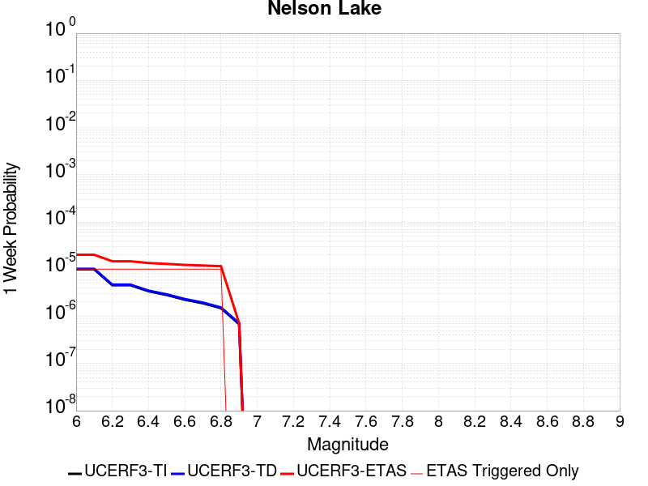 |  |  |  |

| Magnitude | 1 wk TI Prob | 1 wk TD Prob | 1 wk ETAS Prob | 1 wk ETAS/TD Gain | 1 wk ETAS Triggered Only | 1 mo TI Prob | 1 mo TD Prob | 1 mo ETAS Prob | 1 mo ETAS/TD Gain | 1 mo ETAS Triggered Only | 1 yr TI Prob | 1 yr TD Prob | 1 yr ETAS Prob | 1 yr ETAS/TD Gain | 1 yr ETAS Triggered Only | 10 yr TI Prob | 10 yr TD Prob | 10 yr ETAS Prob | 10 yr ETAS/TD Gain | 10 yr ETAS Triggered Only |
|-----|-----|-----|-----|-----|-----|-----|-----|-----|-----|-----|-----|-----|-----|-----|-----|-----|-----|-----|-----|-----|
| 6.0 | 9.913453E-6 | 1.0192919E-5 | 2.1585958E-5 | 2.1177406 | 1.1393155E-5 | 4.2485535E-5 | 4.3683263E-5 | 7.786124E-5 | 1.7824043 | 3.4179466E-5 | 5.1713863E-4 | 5.317243E-4 | 8.2778884E-4 | 1.5568008 | 2.9622202E-4 | 0.0051593683 | 0.005305548 | 0.0063028266 | 1.187969 | 0.0010025976 |
| 6.1 | 9.913453E-6 | 1.0192919E-5 | 2.1585958E-5 | 2.1177406 | 1.1393155E-5 | 4.2485535E-5 | 4.3683263E-5 | 7.786124E-5 | 1.7824043 | 3.4179466E-5 | 5.1713863E-4 | 5.317243E-4 | 8.2778884E-4 | 1.5568008 | 2.9622202E-4 | 0.0051593683 | 0.005305548 | 0.0063028266 | 1.187969 | 0.0010025976 |
| 6.2 | 4.5596407E-6 | 4.6966393E-6 | 1.608974E-5 | 3.425799 | 1.1393155E-5 | 1.954117E-5 | 2.0128306E-5 | 4.291416E-5 | 2.1320302 | 2.278631E-5 | 2.3788778E-4 | 2.4503583E-4 | 4.2728163E-4 | 1.7437516 | 1.8229047E-4 | 0.0023763329 | 0.0024477826 | 0.0029592195 | 1.208939 | 5.12692E-4 |
| 6.3 | 4.5596407E-6 | 4.6966393E-6 | 1.608974E-5 | 3.425799 | 1.1393155E-5 | 1.954117E-5 | 2.0128306E-5 | 4.291416E-5 | 2.1320302 | 2.278631E-5 | 2.3788778E-4 | 2.4503583E-4 | 4.2728163E-4 | 1.7437516 | 1.8229047E-4 | 0.0023763329 | 0.0024477826 | 0.0029592195 | 1.208939 | 5.12692E-4 |
| 6.4 | 3.4025713E-6 | 3.5101536E-6 | 1.49032685E-5 | 4.2457595 | 1.1393155E-5 | 1.4582367E-5 | 1.5043433E-5 | 3.7829403E-5 | 2.5146785 | 2.278631E-5 | 1.7752586E-4 | 1.8313926E-4 | 2.8565887E-4 | 1.5597905 | 1.025384E-4 | 0.001773841 | 0.0018299662 | 0.0022052524 | 1.2050781 | 3.759741E-4 |
| 6.5 | 2.8352947E-6 | 2.9280775E-6 | 1.4321199E-5 | 4.8909903 | 1.1393155E-5 | 1.2151207E-5 | 1.2548848E-5 | 3.5334873E-5 | 2.8157861 | 2.278631E-5 | 1.479309E-4 | 1.5277226E-4 | 2.0972933E-4 | 1.3728234 | 5.6965775E-5 | 0.0014783246 | 0.0015267462 | 0.001822516 | 1.1937256 | 2.9622202E-4 |
| 6.6 | 2.251518E-6 | 2.3292534E-6 | 1.37223815E-5 | 5.891322 | 1.1393155E-5 | 9.649328E-6 | 9.98248E-6 | 2.1375521E-5 | 2.1413038 | 1.1393155E-5 | 1.1747423E-4 | 1.21530546E-4 | 1.4431408E-4 | 1.1874717 | 2.278631E-5 | 0.0011741214 | 0.0012147026 | 0.0014195303 | 1.1686237 | 2.050768E-4 |
| 6.7 | 1.8911853E-6 | 1.9593028E-6 | 1.3352435E-5 | 6.8148913 | 1.1393155E-5 | 8.105055E-6 | 8.396988E-6 | 1.9790048E-5 | 2.3568032 | 1.1393155E-5 | 9.867457E-5 | 1.0222912E-4 | 1.250131E-4 | 1.2228718 | 2.278631E-5 | 9.863076E-4 | 0.0010218784 | 0.0011698381 | 1.1447918 | 1.4811101E-4 |
| 6.8 | 1.4874814E-6 | 1.5439659E-6 | 1.2937104E-5 | 8.379138 | 1.1393155E-5 | 6.374905E-6 | 6.616983E-6 | 1.8010063E-5 | 2.7217937 | 1.1393155E-5 | 7.76117E-5 | 8.055931E-5 | 9.1951544E-5 | 1.1414143 | 1.1393155E-5 | 7.75846E-4 | 8.053522E-4 | 9.19192E-4 | 1.1413541 | 1.1393155E-4 |
| 6.9 | 6.835972E-7 | 7.1406623E-7 | 7.1406623E-7 | 1.0 | 0.0 | 2.9296991E-6 | 3.0602819E-6 | 3.0602819E-6 | 1.0 | 0.0 | 3.56685E-5 | 3.7258615E-5 | 3.7258615E-5 | 1.0 | 0.0 | 3.5662777E-4 | 3.7255493E-4 | 4.6366622E-4 | 1.244558 | 9.114524E-5 |

## Coyote Canyon
*[(top)](#table-of-contents)*

| 1 Week | 1 Month | 1 Year | 10 Year |
|-----|-----|-----|-----|
| 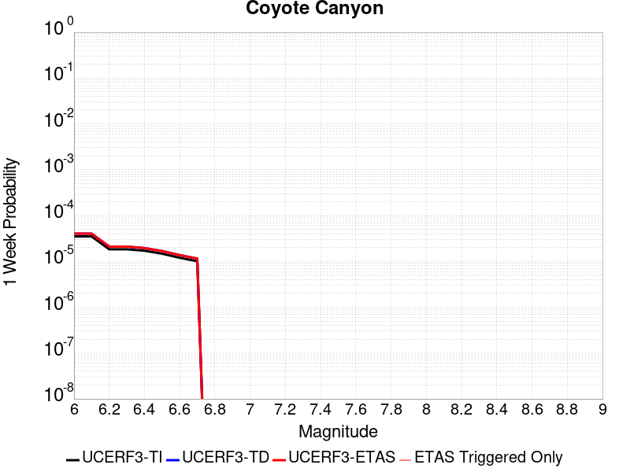 |  |  |  |

| Magnitude | 1 wk TI Prob | 1 wk TD Prob | 1 wk ETAS Prob | 1 wk ETAS/TD Gain | 1 wk ETAS Triggered Only | 1 mo TI Prob | 1 mo TD Prob | 1 mo ETAS Prob | 1 mo ETAS/TD Gain | 1 mo ETAS Triggered Only | 1 yr TI Prob | 1 yr TD Prob | 1 yr ETAS Prob | 1 yr ETAS/TD Gain | 1 yr ETAS Triggered Only | 10 yr TI Prob | 10 yr TD Prob | 10 yr ETAS Prob | 10 yr ETAS/TD Gain | 10 yr ETAS Triggered Only |
|-----|-----|-----|-----|-----|-----|-----|-----|-----|-----|-----|-----|-----|-----|-----|-----|-----|-----|-----|-----|-----|
| 6.0 | 3.5090034E-5 | 4.0378352E-5 | 4.0378352E-5 | 1.0 | 0.0 | 1.503772E-4 | 1.7304007E-4 | 1.8443125E-4 | 1.0658298 | 1.1393155E-5 | 0.0018293047 | 0.0021049846 | 0.0024005831 | 1.1404278 | 2.9622202E-4 | 0.018143194 | 0.020876396 | 0.021835754 | 1.0459541 | 9.798113E-4 |
| 6.1 | 3.5090034E-5 | 4.0378352E-5 | 4.0378352E-5 | 1.0 | 0.0 | 1.503772E-4 | 1.7304007E-4 | 1.8443125E-4 | 1.0658298 | 1.1393155E-5 | 0.0018293047 | 0.0021049846 | 0.0024005831 | 1.1404278 | 2.9622202E-4 | 0.018143194 | 0.020876396 | 0.021835754 | 1.0459541 | 9.798113E-4 |
| 6.2 | 1.841879E-5 | 2.1066777E-5 | 2.1066777E-5 | 1.0 | 0.0 | 7.8935285E-5 | 9.028364E-5 | 1.0167577E-4 | 1.1261815 | 1.1393155E-5 | 9.606133E-4 | 0.0010987511 | 0.0012466994 | 1.1346513 | 1.4811101E-4 | 0.0095647145 | 0.01094328 | 0.011439092 | 1.0453075 | 5.012988E-4 |
| 6.3 | 1.841879E-5 | 2.1066777E-5 | 2.1066777E-5 | 1.0 | 0.0 | 7.8935285E-5 | 9.028364E-5 | 1.0167577E-4 | 1.1261815 | 1.1393155E-5 | 9.606133E-4 | 0.0010987511 | 0.0012466994 | 1.1346513 | 1.4811101E-4 | 0.0095647145 | 0.01094328 | 0.011439092 | 1.0453075 | 5.012988E-4 |
| 6.4 | 1.712201E-5 | 1.957167E-5 | 1.957167E-5 | 1.0 | 0.0 | 7.337798E-5 | 8.387645E-5 | 9.526865E-5 | 1.1358212 | 1.1393155E-5 | 8.930107E-4 | 0.001020818 | 0.0011687778 | 1.1449424 | 1.4811101E-4 | 0.008894307 | 0.010171213 | 0.010644859 | 1.0465672 | 4.7851252E-4 |
| 6.5 | 1.4744935E-5 | 1.6842498E-5 | 1.6842498E-5 | 1.0 | 0.0 | 6.3191044E-5 | 7.218066E-5 | 8.3572995E-5 | 1.1578308 | 1.1393155E-5 | 7.6907943E-4 | 8.7853876E-4 | 0.0010265197 | 1.1684397 | 1.4811101E-4 | 0.007664232 | 0.008759859 | 0.0092228865 | 1.0528579 | 4.6711936E-4 |
| 6.6 | 1.2017839E-5 | 1.3728596E-5 | 1.3728596E-5 | 1.0 | 0.0 | 5.150401E-5 | 5.8836013E-5 | 7.0228496E-5 | 1.1936312 | 1.1393155E-5 | 6.268809E-4 | 7.1618165E-4 | 8.414166E-4 | 1.1748648 | 1.253247E-4 | 0.0062511545 | 0.007147435 | 0.0075546573 | 1.0569745 | 4.101536E-4 |
| 6.7 | 1.00956095E-5 | 1.1537316E-5 | 1.1537316E-5 | 1.0 | 0.0 | 4.326618E-5 | 4.9445192E-5 | 6.0837785E-5 | 1.2304084 | 1.1393155E-5 | 5.266384E-4 | 6.01916E-4 | 7.1577897E-4 | 1.1891675 | 1.1393155E-4 | 0.005253921 | 0.0060113897 | 0.006362454 | 1.0583999 | 3.5318782E-4 |

## Lenwood-Lockhart-Old Woman Springs
*[(top)](#table-of-contents)*

| 1 Week | 1 Month | 1 Year | 10 Year |
|-----|-----|-----|-----|
|  | 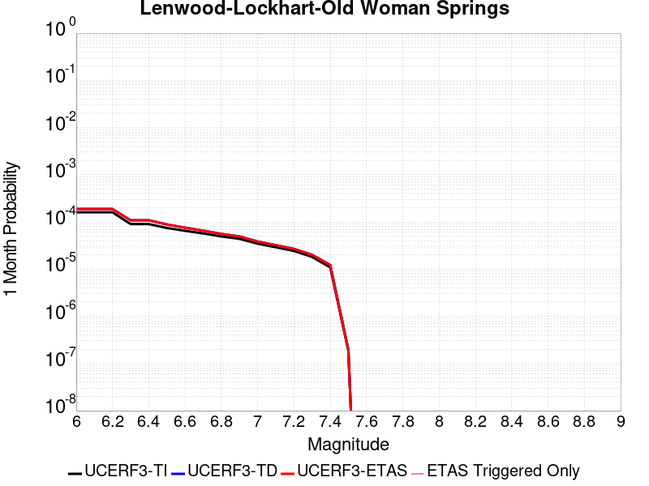 |  |  |

| Magnitude | 1 wk TI Prob | 1 wk TD Prob | 1 wk ETAS Prob | 1 wk ETAS/TD Gain | 1 wk ETAS Triggered Only | 1 mo TI Prob | 1 mo TD Prob | 1 mo ETAS Prob | 1 mo ETAS/TD Gain | 1 mo ETAS Triggered Only | 1 yr TI Prob | 1 yr TD Prob | 1 yr ETAS Prob | 1 yr ETAS/TD Gain | 1 yr ETAS Triggered Only | 10 yr TI Prob | 10 yr TD Prob | 10 yr ETAS Prob | 10 yr ETAS/TD Gain | 10 yr ETAS Triggered Only |
|-----|-----|-----|-----|-----|-----|-----|-----|-----|-----|-----|-----|-----|-----|-----|-----|-----|-----|-----|-----|-----|
| 6.0 | 3.744542E-5 | 4.3970504E-5 | 4.3970504E-5 | 1.0 | 0.0 | 1.604705E-4 | 1.8843237E-4 | 1.8843237E-4 | 1.0 | 0.0 | 0.0019519776 | 0.0022919225 | 0.0025988326 | 1.1339095 | 3.0761518E-4 | 0.019349206 | 0.022700869 | 0.023547092 | 1.0372771 | 8.6587976E-4 |
| 6.1 | 3.744542E-5 | 4.3970504E-5 | 4.3970504E-5 | 1.0 | 0.0 | 1.604705E-4 | 1.8843237E-4 | 1.8843237E-4 | 1.0 | 0.0 | 0.0019519776 | 0.0022919225 | 0.0025988326 | 1.1339095 | 3.0761518E-4 | 0.019349206 | 0.022700869 | 0.023547092 | 1.0372771 | 8.6587976E-4 |
| 6.2 | 3.744542E-5 | 4.3970504E-5 | 4.3970504E-5 | 1.0 | 0.0 | 1.604705E-4 | 1.8843237E-4 | 1.8843237E-4 | 1.0 | 0.0 | 0.0019519776 | 0.0022919225 | 0.0025988326 | 1.1339095 | 3.0761518E-4 | 0.019349206 | 0.022700869 | 0.023547092 | 1.0372771 | 8.6587976E-4 |
| 6.3 | 2.1079984E-5 | 2.5356492E-5 | 2.5356492E-5 | 1.0 | 0.0 | 9.0339665E-5 | 1.0866627E-4 | 1.0866627E-4 | 1.0 | 0.0 | 0.0010993304 | 0.0013222288 | 0.0014132535 | 1.0688419 | 9.114524E-5 | 0.010939079 | 0.013145832 | 0.0134381605 | 1.0222373 | 2.9622202E-4 |
| 6.4 | 2.1079984E-5 | 2.5356492E-5 | 2.5356492E-5 | 1.0 | 0.0 | 9.0339665E-5 | 1.0866627E-4 | 1.0866627E-4 | 1.0 | 0.0 | 0.0010993304 | 0.0013222288 | 0.0014132535 | 1.0688419 | 9.114524E-5 | 0.010939079 | 0.013145832 | 0.0134381605 | 1.0222373 | 2.9622202E-4 |
| 6.5 | 1.7397282E-5 | 2.066491E-5 | 2.066491E-5 | 1.0 | 0.0 | 7.455765E-5 | 8.8560955E-5 | 8.8560955E-5 | 1.0 | 0.0 | 9.073613E-4 | 0.0010777081 | 0.0011346125 | 1.0528013 | 5.6965775E-5 | 0.009036654 | 0.010726111 | 0.010928988 | 1.0189143 | 2.050768E-4 |
| 6.6 | 1.52050325E-5 | 1.7681523E-5 | 1.7681523E-5 | 1.0 | 0.0 | 6.51628E-5 | 7.57758E-5 | 7.57758E-5 | 1.0 | 0.0 | 7.9306826E-4 | 9.221878E-4 | 9.79101E-4 | 1.0617155 | 5.6965775E-5 | 0.007902439 | 0.009184472 | 0.009331224 | 1.0159781 | 1.4811101E-4 |
| 6.7 | 1.332523E-5 | 1.5265648E-5 | 1.5265648E-5 | 1.0 | 0.0 | 5.7106878E-5 | 6.54226E-5 | 6.54226E-5 | 1.0 | 0.0 | 6.950544E-4 | 7.9623493E-4 | 8.5315533E-4 | 1.071487 | 5.6965775E-5 | 0.006928845 | 0.007934451 | 0.008058782 | 1.0156697 | 1.253247E-4 |
| 6.8 | 1.1525329E-5 | 1.3032466E-5 | 1.3032466E-5 | 1.0 | 0.0 | 4.9393333E-5 | 5.5852255E-5 | 5.5852255E-5 | 1.0 | 0.0 | 6.011979E-4 | 6.797933E-4 | 7.3672034E-4 | 1.0837417 | 5.6965775E-5 | 0.00599574 | 0.00677759 | 0.0068907496 | 1.0166961 | 1.1393155E-4 |
| 6.9 | 1.0253909E-5 | 1.1515697E-5 | 1.1515697E-5 | 1.0 | 0.0 | 4.3944583E-5 | 4.9352075E-5 | 4.9352075E-5 | 1.0 | 0.0 | 5.3489394E-4 | 6.006995E-4 | 6.57631E-4 | 1.0947754 | 5.6965775E-5 | 0.0053360825 | 0.005991137 | 0.006093061 | 1.0170125 | 1.025384E-4 |
| 7.0 | 8.104563E-6 | 8.992067E-6 | 8.992067E-6 | 1.0 | 0.0 | 3.4733377E-5 | 3.8536873E-5 | 3.8536873E-5 | 1.0 | 0.0 | 4.2279682E-4 | 4.6908783E-4 | 5.146391E-4 | 1.097106 | 4.557262E-5 | 0.0042199334 | 0.004681225 | 0.0047492636 | 1.0145345 | 6.835893E-5 |
| 7.1 | 6.7986157E-6 | 7.5164803E-6 | 7.5164803E-6 | 1.0 | 0.0 | 2.91366E-5 | 3.22131E-5 | 3.22131E-5 | 1.0 | 0.0 | 3.5468035E-4 | 3.9212606E-4 | 4.3768084E-4 | 1.1161737 | 4.557262E-5 | 0.003541148 | 0.003914558 | 0.0039826497 | 1.0173944 | 6.835893E-5 |
| 7.2 | 5.6893327E-6 | 6.280517E-6 | 6.280517E-6 | 1.0 | 0.0 | 2.4382627E-5 | 2.6916236E-5 | 2.6916236E-5 | 1.0 | 0.0 | 2.9681803E-4 | 3.2765788E-4 | 3.6182615E-4 | 1.1042804 | 3.4179466E-5 | 0.002964219 | 0.0032719465 | 0.003328726 | 1.0173534 | 5.6965775E-5 |
| 7.3 | 4.253348E-6 | 4.7073513E-6 | 4.7073513E-6 | 1.0 | 0.0 | 1.8228506E-5 | 2.0174217E-5 | 2.0174217E-5 | 1.0 | 0.0 | 2.2190946E-4 | 2.4559523E-4 | 2.6837594E-4 | 1.0927571 | 2.278631E-5 | 0.00221688 | 0.0024534191 | 0.00249888 | 1.0185295 | 4.557262E-5 |
| 7.4 | 2.5448119E-6 | 2.852203E-6 | 2.852203E-6 | 1.0 | 0.0 | 1.0906291E-5 | 1.2223679E-5 | 1.2223679E-5 | 1.0 | 0.0 | 1.3277601E-4 | 1.4881478E-4 | 1.4881478E-4 | 1.0 | 0.0 | 0.001326967 | 0.0014873134 | 0.0014873134 | 1.0 | 0.0 |
| 7.5 | 4.3706837E-8 | 4.563373E-8 | 4.563373E-8 | 1.0 | 0.0 | 1.8731501E-7 | 1.9557312E-7 | 1.9557312E-7 | 1.0 | 0.0 | 2.2805577E-6 | 2.3811006E-6 | 2.3811006E-6 | 1.0 | 0.0 | 2.2805343E-5 | 2.3810806E-5 | 2.3810806E-5 | 1.0 | 0.0 |

## Towne Pass
*[(top)](#table-of-contents)*

| 1 Week | 1 Month | 1 Year | 10 Year |
|-----|-----|-----|-----|
|  |  |  |  |

| Magnitude | 1 wk TI Prob | 1 wk TD Prob | 1 wk ETAS Prob | 1 wk ETAS/TD Gain | 1 wk ETAS Triggered Only | 1 mo TI Prob | 1 mo TD Prob | 1 mo ETAS Prob | 1 mo ETAS/TD Gain | 1 mo ETAS Triggered Only | 1 yr TI Prob | 1 yr TD Prob | 1 yr ETAS Prob | 1 yr ETAS/TD Gain | 1 yr ETAS Triggered Only | 10 yr TI Prob | 10 yr TD Prob | 10 yr ETAS Prob | 10 yr ETAS/TD Gain | 10 yr ETAS Triggered Only |
|-----|-----|-----|-----|-----|-----|-----|-----|-----|-----|-----|-----|-----|-----|-----|-----|-----|-----|-----|-----|-----|
| 6.0 | 3.849728E-6 | 3.894684E-6 | 3.894684E-6 | 1.0 | 0.0 | 1.649873E-5 | 1.6691421E-5 | 2.8084387E-5 | 1.6825641 | 1.1393155E-5 | 2.0085352E-4 | 2.0320347E-4 | 4.8797447E-4 | 2.4014082 | 2.848289E-4 | 0.0020067208 | 0.002030606 | 0.0028378773 | 1.397552 | 8.08914E-4 |
| 6.1 | 3.849728E-6 | 3.894684E-6 | 3.894684E-6 | 1.0 | 0.0 | 1.649873E-5 | 1.6691421E-5 | 2.8084387E-5 | 1.6825641 | 1.1393155E-5 | 2.0085352E-4 | 2.0320347E-4 | 4.8797447E-4 | 2.4014082 | 2.848289E-4 | 0.0020067208 | 0.002030606 | 0.0028378773 | 1.397552 | 8.08914E-4 |
| 6.2 | 3.849728E-6 | 3.894684E-6 | 3.894684E-6 | 1.0 | 0.0 | 1.649873E-5 | 1.6691421E-5 | 2.8084387E-5 | 1.6825641 | 1.1393155E-5 | 2.0085352E-4 | 2.0320347E-4 | 4.8797447E-4 | 2.4014082 | 2.848289E-4 | 0.0020067208 | 0.002030606 | 0.0028378773 | 1.397552 | 8.08914E-4 |
| 6.3 | 3.849728E-6 | 3.894684E-6 | 3.894684E-6 | 1.0 | 0.0 | 1.649873E-5 | 1.6691421E-5 | 2.8084387E-5 | 1.6825641 | 1.1393155E-5 | 2.0085352E-4 | 2.0320347E-4 | 4.8797447E-4 | 2.4014082 | 2.848289E-4 | 0.0020067208 | 0.002030606 | 0.0028378773 | 1.397552 | 8.08914E-4 |
| 6.4 | 3.849728E-6 | 3.894684E-6 | 3.894684E-6 | 1.0 | 0.0 | 1.649873E-5 | 1.6691421E-5 | 2.8084387E-5 | 1.6825641 | 1.1393155E-5 | 2.0085352E-4 | 2.0320347E-4 | 4.8797447E-4 | 2.4014082 | 2.848289E-4 | 0.0020067208 | 0.002030606 | 0.0028378773 | 1.397552 | 8.08914E-4 |
| 6.5 | 1.1953545E-6 | 1.2031078E-6 | 1.2031078E-6 | 1.0 | 0.0 | 5.1229376E-6 | 5.1561665E-6 | 5.1561665E-6 | 1.0 | 0.0 | 6.236998E-5 | 6.277464E-5 | 9.695196E-5 | 1.5444447 | 3.4179466E-5 | 6.235248E-4 | 6.275808E-4 | 7.6421286E-4 | 1.2177123 | 1.3671786E-4 |
| 6.6 | 1.1953545E-6 | 1.2031078E-6 | 1.2031078E-6 | 1.0 | 0.0 | 5.1229376E-6 | 5.1561665E-6 | 5.1561665E-6 | 1.0 | 0.0 | 6.236998E-5 | 6.277464E-5 | 9.695196E-5 | 1.5444447 | 3.4179466E-5 | 6.235248E-4 | 6.275808E-4 | 7.6421286E-4 | 1.2177123 | 1.3671786E-4 |
| 6.7 | 8.375951E-7 | 8.411129E-7 | 8.411129E-7 | 1.0 | 0.0 | 3.5896885E-6 | 3.604765E-6 | 3.604765E-6 | 1.0 | 0.0 | 4.370358E-5 | 4.3887187E-5 | 6.6672495E-5 | 1.5191791 | 2.278631E-5 | 4.3694986E-4 | 4.387909E-4 | 5.4128433E-4 | 1.2335814 | 1.025384E-4 |
| 6.8 | 6.38041E-7 | 6.3925614E-7 | 6.3925614E-7 | 1.0 | 0.0 | 2.7344586E-6 | 2.7396666E-6 | 2.7396666E-6 | 1.0 | 0.0 | 3.3291526E-5 | 3.335497E-5 | 5.6140518E-5 | 1.6831231 | 2.278631E-5 | 3.3286537E-4 | 3.3350344E-4 | 4.132289E-4 | 1.2390544 | 7.9752084E-5 |
| 6.9 | 5.3460053E-7 | 5.345709E-7 | 5.345709E-7 | 1.0 | 0.0 | 2.2911431E-6 | 2.2910162E-6 | 2.2910162E-6 | 1.0 | 0.0 | 2.789431E-5 | 2.78928E-5 | 5.0678475E-5 | 1.8169017 | 2.278631E-5 | 2.789081E-4 | 2.788963E-4 | 3.4723617E-4 | 1.2450368 | 6.835893E-5 |
| 7.0 | 3.557783E-7 | 3.5327406E-7 | 3.5327406E-7 | 1.0 | 0.0 | 1.5247632E-6 | 1.5140308E-6 | 1.5140308E-6 | 1.0 | 0.0 | 1.8563835E-5 | 1.8433178E-5 | 4.1219067E-5 | 2.2361345 | 2.278631E-5 | 1.8562283E-4 | 1.8431734E-4 | 2.2988155E-4 | 1.2472053 | 4.557262E-5 |
| 7.1 | 3.037942E-7 | 3.0005106E-7 | 3.0005106E-7 | 1.0 | 0.0 | 1.3019744E-6 | 1.2859325E-6 | 1.2859325E-6 | 1.0 | 0.0 | 1.5851423E-5 | 1.5656124E-5 | 3.844208E-5 | 2.455402 | 2.278631E-5 | 1.5850292E-4 | 1.5655096E-4 | 2.0211644E-4 | 1.2910585 | 4.557262E-5 |
| 7.2 | 2.0808248E-7 | 2.0220024E-7 | 2.0220024E-7 | 1.0 | 0.0 | 8.917818E-7 | 8.665722E-7 | 8.665722E-7 | 1.0 | 0.0 | 1.0857389E-5 | 1.05504705E-5 | 3.333654E-5 | 3.159721 | 2.278631E-5 | 1.0856859E-4 | 1.05500156E-4 | 1.5106797E-4 | 1.4319217 | 4.557262E-5 |
| 7.3 | 1.1162073E-7 | 1.0638276E-7 | 1.0638276E-7 | 1.0 | 0.0 | 4.7837443E-7 | 4.5592603E-7 | 4.5592603E-7 | 1.0 | 0.0 | 5.8241935E-6 | 5.550887E-6 | 2.833707E-5 | 5.1049623 | 2.278631E-5 | 5.8240406E-5 | 5.5507688E-5 | 8.968526E-5 | 1.6157267 | 3.4179466E-5 |

## Paradise
*[(top)](#table-of-contents)*

| 1 Week | 1 Month | 1 Year | 10 Year |
|-----|-----|-----|-----|
|  |  |  | 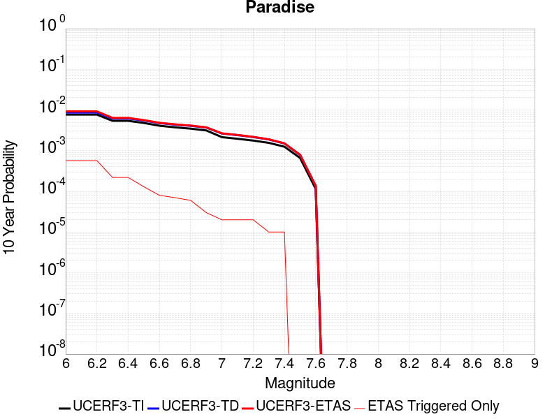 |

| Magnitude | 1 wk TI Prob | 1 wk TD Prob | 1 wk ETAS Prob | 1 wk ETAS/TD Gain | 1 wk ETAS Triggered Only | 1 mo TI Prob | 1 mo TD Prob | 1 mo ETAS Prob | 1 mo ETAS/TD Gain | 1 mo ETAS Triggered Only | 1 yr TI Prob | 1 yr TD Prob | 1 yr ETAS Prob | 1 yr ETAS/TD Gain | 1 yr ETAS Triggered Only | 10 yr TI Prob | 10 yr TD Prob | 10 yr ETAS Prob | 10 yr ETAS/TD Gain | 10 yr ETAS Triggered Only |
|-----|-----|-----|-----|-----|-----|-----|-----|-----|-----|-----|-----|-----|-----|-----|-----|-----|-----|-----|-----|-----|
| 6.0 | 1.4851273E-5 | 1.6697952E-5 | 2.8090915E-5 | 1.6822971 | 1.1393155E-5 | 6.364676E-5 | 7.156082E-5 | 8.295316E-5 | 1.159198 | 1.1393155E-5 | 7.7462377E-4 | 8.7092834E-4 | 0.0010416768 | 1.1960534 | 1.7089733E-4 | 0.0077192914 | 0.008677532 | 0.009264834 | 1.067681 | 5.9244403E-4 |
| 6.1 | 1.4851273E-5 | 1.6697952E-5 | 2.8090915E-5 | 1.6822971 | 1.1393155E-5 | 6.364676E-5 | 7.156082E-5 | 8.295316E-5 | 1.159198 | 1.1393155E-5 | 7.7462377E-4 | 8.7092834E-4 | 0.0010416768 | 1.1960534 | 1.7089733E-4 | 0.0077192914 | 0.008677532 | 0.009264834 | 1.067681 | 5.9244403E-4 |
| 6.2 | 1.4851273E-5 | 1.6697952E-5 | 2.8090915E-5 | 1.6822971 | 1.1393155E-5 | 6.364676E-5 | 7.156082E-5 | 8.295316E-5 | 1.159198 | 1.1393155E-5 | 7.7462377E-4 | 8.7092834E-4 | 0.0010416768 | 1.1960534 | 1.7089733E-4 | 0.0077192914 | 0.008677532 | 0.009264834 | 1.067681 | 5.9244403E-4 |
| 6.3 | 1.0426831E-5 | 1.189092E-5 | 2.328394E-5 | 1.9581276 | 1.1393155E-5 | 4.4685654E-5 | 5.0960127E-5 | 6.23527E-5 | 1.2235585 | 1.1393155E-5 | 5.43912E-4 | 6.2026887E-4 | 6.885854E-4 | 1.1101402 | 6.835893E-5 | 0.0054258266 | 0.0061859847 | 0.0064011156 | 1.0347772 | 2.1646994E-4 |
| 6.4 | 1.0426831E-5 | 1.189092E-5 | 2.328394E-5 | 1.9581276 | 1.1393155E-5 | 4.4685654E-5 | 5.0960127E-5 | 6.23527E-5 | 1.2235585 | 1.1393155E-5 | 5.43912E-4 | 6.2026887E-4 | 6.885854E-4 | 1.1101402 | 6.835893E-5 | 0.0054258266 | 0.0061859847 | 0.0064011156 | 1.0347772 | 2.1646994E-4 |
| 6.5 | 9.25027E-6 | 1.062203E-5 | 2.2015063E-5 | 2.0725853 | 1.1393155E-5 | 3.964341E-5 | 4.5522218E-5 | 5.6914854E-5 | 1.2502654 | 1.1393155E-5 | 4.8255164E-4 | 5.54097E-4 | 6.110312E-4 | 1.1027514 | 5.6965775E-5 | 0.0048150513 | 0.0055276537 | 0.0056522856 | 1.022547 | 1.253247E-4 |
| 6.6 | 7.904275E-6 | 9.161307E-6 | 2.0554358E-5 | 2.2436054 | 1.1393155E-5 | 3.3875025E-5 | 3.9262177E-5 | 5.0654886E-5 | 1.2901701 | 1.1393155E-5 | 4.1235037E-4 | 4.779161E-4 | 5.120792E-4 | 1.0714835 | 3.4179466E-5 | 0.0041158604 | 0.00476928 | 0.0048486516 | 1.0166423 | 7.9752084E-5 |
| 6.7 | 7.2061953E-6 | 8.408895E-6 | 1.9801955E-5 | 2.3548818 | 1.1393155E-5 | 3.088333E-5 | 3.6037647E-5 | 4.743039E-5 | 1.3161346 | 1.1393155E-5 | 3.7593965E-4 | 4.3867368E-4 | 4.7283815E-4 | 1.0778813 | 3.4179466E-5 | 0.003753043 | 0.004378447 | 0.0044465065 | 1.0155443 | 6.835893E-5 |
| 6.8 | 6.6948724E-6 | 7.843716E-6 | 1.9236782E-5 | 2.4525087 | 1.1393155E-5 | 2.8691995E-5 | 3.3615514E-5 | 4.5008284E-5 | 1.3389142 | 1.1393155E-5 | 3.4926904E-4 | 4.0919558E-4 | 4.4336106E-4 | 1.0834943 | 3.4179466E-5 | 0.003487206 | 0.004084779 | 0.004141512 | 1.013889 | 5.6965775E-5 |
| 6.9 | 6.0421025E-6 | 7.1320496E-6 | 7.1320496E-6 | 1.0 | 0.0 | 2.5894467E-5 | 3.056559E-5 | 3.056559E-5 | 1.0 | 0.0 | 3.1521954E-4 | 3.7207588E-4 | 3.948537E-4 | 1.0612183 | 2.278631E-5 | 0.0031477278 | 0.0037148676 | 0.0037375693 | 1.006111 | 2.278631E-5 |
| 7.0 | 4.134091E-6 | 5.0814306E-6 | 5.0814306E-6 | 1.0 | 0.0 | 1.7717413E-5 | 2.1777387E-5 | 2.1777387E-5 | 1.0 | 0.0 | 2.1568815E-4 | 2.6510895E-4 | 2.764991E-4 | 1.042964 | 1.1393155E-5 | 0.0021547892 | 0.00264808 | 0.002659443 | 1.004291 | 1.1393155E-5 |
| 7.1 | 3.7674888E-6 | 4.632913E-6 | 4.632913E-6 | 1.0 | 0.0 | 1.6146281E-5 | 1.9855197E-5 | 1.9855197E-5 | 1.0 | 0.0 | 1.9656324E-4 | 2.4171174E-4 | 2.5310213E-4 | 1.0471239 | 1.1393155E-5 | 0.0019638946 | 0.002414639 | 0.0024260047 | 1.004707 | 1.1393155E-5 |
| 7.2 | 3.4065345E-6 | 4.157691E-6 | 4.157691E-6 | 1.0 | 0.0 | 1.4599351E-5 | 1.7818562E-5 | 1.7818562E-5 | 1.0 | 0.0 | 1.777326E-4 | 2.1692089E-4 | 2.2831158E-4 | 1.0525107 | 1.1393155E-5 | 0.0017759053 | 0.0021672398 | 0.0021786082 | 1.0052456 | 1.1393155E-5 |
| 7.3 | 2.9934936E-6 | 3.6299864E-6 | 3.6299864E-6 | 1.0 | 0.0 | 1.2829195E-5 | 1.5557E-5 | 1.5557E-5 | 1.0 | 0.0 | 1.5618425E-4 | 1.8939149E-4 | 1.8939149E-4 | 1.0 | 0.0 | 0.0015607453 | 0.0018924462 | 0.0018924462 | 1.0 | 0.0 |
| 7.4 | 2.4049796E-6 | 2.8893596E-6 | 2.8893596E-6 | 1.0 | 0.0 | 1.0307015E-5 | 1.23829195E-5 | 1.23829195E-5 | 1.0 | 0.0 | 1.2548068E-4 | 1.5075305E-4 | 1.5075305E-4 | 1.0 | 0.0 | 0.0012540985 | 0.0015066493 | 0.0015066493 | 1.0 | 0.0 |
| 7.5 | 1.2710091E-6 | 1.5136467E-6 | 1.5136467E-6 | 1.0 | 0.0 | 5.44717E-6 | 6.487048E-6 | 6.487048E-6 | 1.0 | 0.0 | 6.631728E-5 | 7.89782E-5 | 7.89782E-5 | 1.0 | 0.0 | 6.6297496E-4 | 7.8962394E-4 | 7.8962394E-4 | 1.0 | 0.0 |
| 7.6 | 2.21172E-7 | 2.604147E-7 | 2.604147E-7 | 1.0 | 0.0 | 9.478797E-7 | 1.1160627E-6 | 1.1160627E-6 | 1.0 | 0.0 | 1.1540374E-5 | 1.3588007E-5 | 1.3588007E-5 | 1.0 | 0.0 | 1.1539775E-4 | 1.3587458E-4 | 1.3587458E-4 | 1.0 | 0.0 |

## San Andreas (San Bernardino N)
*[(top)](#table-of-contents)*

| 1 Week | 1 Month | 1 Year | 10 Year |
|-----|-----|-----|-----|
|  |  |  | 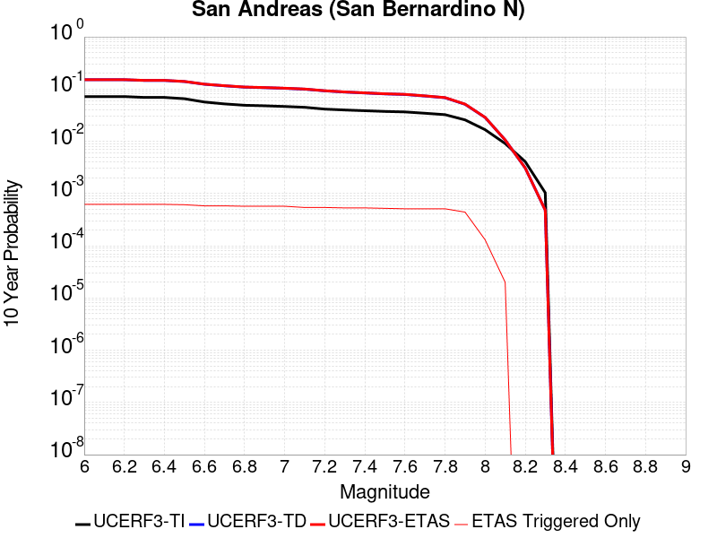 |

| Magnitude | 1 wk TI Prob | 1 wk TD Prob | 1 wk ETAS Prob | 1 wk ETAS/TD Gain | 1 wk ETAS Triggered Only | 1 mo TI Prob | 1 mo TD Prob | 1 mo ETAS Prob | 1 mo ETAS/TD Gain | 1 mo ETAS Triggered Only | 1 yr TI Prob | 1 yr TD Prob | 1 yr ETAS Prob | 1 yr ETAS/TD Gain | 1 yr ETAS Triggered Only | 10 yr TI Prob | 10 yr TD Prob | 10 yr ETAS Prob | 10 yr ETAS/TD Gain | 10 yr ETAS Triggered Only |
|-----|-----|-----|-----|-----|-----|-----|-----|-----|-----|-----|-----|-----|-----|-----|-----|-----|-----|-----|-----|-----|
| 6.0 | 1.4273766E-4 | 3.173715E-4 | 3.173715E-4 | 1.0 | 0.0 | 6.115894E-4 | 0.0013594606 | 0.0013708383 | 1.0083692 | 1.1393155E-5 | 0.0074207084 | 0.016427329 | 0.016595418 | 1.0102323 | 1.7089733E-4 | 0.07177748 | 0.15079449 | 0.15128793 | 1.0032722 | 5.8105093E-4 |
| 6.1 | 1.4273766E-4 | 3.173715E-4 | 3.173715E-4 | 1.0 | 0.0 | 6.115894E-4 | 0.0013594606 | 0.0013708383 | 1.0083692 | 1.1393155E-5 | 0.0074207084 | 0.016427329 | 0.016595418 | 1.0102323 | 1.7089733E-4 | 0.07177748 | 0.15079449 | 0.15128793 | 1.0032722 | 5.8105093E-4 |
| 6.2 | 1.4273766E-4 | 3.173715E-4 | 3.173715E-4 | 1.0 | 0.0 | 6.115894E-4 | 0.0013594606 | 0.0013708383 | 1.0083692 | 1.1393155E-5 | 0.0074207084 | 0.016427329 | 0.016595418 | 1.0102323 | 1.7089733E-4 | 0.07177748 | 0.15079449 | 0.15128793 | 1.0032722 | 5.8105093E-4 |
| 6.3 | 1.3730655E-4 | 3.0641313E-4 | 3.0641313E-4 | 1.0 | 0.0 | 5.883239E-4 | 0.001312544 | 0.0013239222 | 1.0086688 | 1.1393155E-5 | 0.0071393442 | 0.01586454 | 0.016032727 | 1.0106014 | 1.7089733E-4 | 0.06914291 | 0.1461046 | 0.14660075 | 1.0033959 | 5.8105093E-4 |
| 6.4 | 1.3730655E-4 | 3.0641313E-4 | 3.0641313E-4 | 1.0 | 0.0 | 5.883239E-4 | 0.001312544 | 0.0013239222 | 1.0086688 | 1.1393155E-5 | 0.0071393442 | 0.01586454 | 0.016032727 | 1.0106014 | 1.7089733E-4 | 0.06914291 | 0.1461046 | 0.14660075 | 1.0033959 | 5.8105093E-4 |
| 6.5 | 1.2942807E-4 | 2.905482E-4 | 2.905482E-4 | 1.0 | 0.0 | 5.545738E-4 | 0.0012446175 | 0.0012559964 | 1.0091425 | 1.1393155E-5 | 0.0067310524 | 0.015049187 | 0.015217512 | 1.011185 | 1.7089733E-4 | 0.06530788 | 0.13926533 | 0.13975565 | 1.0035208 | 5.696578E-4 |
| 6.6 | 1.1125901E-4 | 2.5491248E-4 | 2.5491248E-4 | 1.0 | 0.0 | 4.767372E-4 | 0.0010920269 | 0.0011034077 | 1.0104216 | 1.1393155E-5 | 0.005788839 | 0.013215015 | 0.013383654 | 1.0127611 | 1.7089733E-4 | 0.056403454 | 0.1235622 | 0.12405149 | 1.0039598 | 5.582646E-4 |
| 6.7 | 1.02209575E-4 | 2.3625269E-4 | 2.3625269E-4 | 1.0 | 0.0 | 4.3796748E-4 | 0.00101212 | 0.0010235016 | 1.0112454 | 1.1393155E-5 | 0.0053192247 | 0.012253365 | 0.012422168 | 1.0137761 | 1.7089733E-4 | 0.051936906 | 0.1153299 | 0.11582378 | 1.0042824 | 5.582646E-4 |
| 6.8 | 9.610582E-5 | 2.2149194E-4 | 2.2149194E-4 | 1.0 | 0.0 | 4.1181705E-4 | 9.489065E-4 | 9.6028886E-4 | 1.0119952 | 1.1393155E-5 | 0.0050023515 | 0.011492007 | 0.011660941 | 1.0147 | 1.7089733E-4 | 0.048912346 | 0.10874456 | 0.109231964 | 1.004482 | 5.4687145E-4 |
| 6.9 | 9.3877505E-5 | 2.1604224E-4 | 2.1604224E-4 | 1.0 | 0.0 | 4.0227012E-4 | 9.255674E-4 | 9.3695003E-4 | 1.012298 | 1.1393155E-5 | 0.0048866454 | 0.011210808 | 0.011379789 | 1.0150731 | 1.7089733E-4 | 0.04780577 | 0.106329076 | 0.106817804 | 1.0045964 | 5.4687145E-4 |
| 7.0 | 9.1019785E-5 | 2.09303E-4 | 2.09303E-4 | 1.0 | 0.0 | 3.900265E-4 | 8.9670514E-4 | 9.0808806E-4 | 1.0126942 | 1.1393155E-5 | 0.0047382377 | 0.010862962 | 0.011032003 | 1.0155612 | 1.7089733E-4 | 0.046384744 | 0.103294924 | 0.103785306 | 1.0047474 | 5.4687145E-4 |
| 7.1 | 8.771155E-5 | 2.0103931E-4 | 2.0103931E-4 | 1.0 | 0.0 | 3.758525E-4 | 8.613131E-4 | 8.726964E-4 | 1.0132163 | 1.1393155E-5 | 0.0045664064 | 0.010436265 | 0.010605379 | 1.0162045 | 1.7089733E-4 | 0.044737056 | 0.09960176 | 0.10006338 | 1.0046347 | 5.12692E-4 |
| 7.2 | 8.0830236E-5 | 1.8507679E-4 | 1.8507679E-4 | 1.0 | 0.0 | 3.4636928E-4 | 7.9294527E-4 | 8.0432935E-4 | 1.0143567 | 1.1393155E-5 | 0.0042088944 | 0.009611482 | 0.009780737 | 1.0176096 | 1.7089733E-4 | 0.041300658 | 0.09232472 | 0.092790075 | 1.0050404 | 5.12692E-4 |
| 7.3 | 7.7668235E-5 | 1.7448979E-4 | 1.7448979E-4 | 1.0 | 0.0 | 3.328214E-4 | 7.475992E-4 | 7.589838E-4 | 1.0152283 | 1.1393155E-5 | 0.0040445733 | 0.009064115 | 0.009233463 | 1.0186834 | 1.7089733E-4 | 0.03971748 | 0.08758465 | 0.08805244 | 1.0053409 | 5.12692E-4 |
| 7.4 | 7.520177E-5 | 1.6667467E-4 | 1.6667467E-4 | 1.0 | 0.0 | 3.2225347E-4 | 7.1412453E-4 | 7.2550954E-4 | 1.0159426 | 1.1393155E-5 | 0.0039163795 | 0.008659873 | 0.008829291 | 1.0195634 | 1.7089733E-4 | 0.038480744 | 0.084034465 | 0.084504075 | 1.0055883 | 5.12692E-4 |
| 7.5 | 7.274697E-5 | 1.5953516E-4 | 1.5953516E-4 | 1.0 | 0.0 | 3.1173544E-4 | 6.8354304E-4 | 6.949284E-4 | 1.0166564 | 1.1393155E-5 | 0.003788775 | 0.008290439 | 0.008459919 | 1.0204428 | 1.7089733E-4 | 0.03724827 | 0.0807453 | 0.08120612 | 1.0057071 | 5.012988E-4 |
| 7.6 | 7.1185845E-5 | 1.5522348E-4 | 1.5522348E-4 | 1.0 | 0.0 | 3.0504653E-4 | 6.650739E-4 | 6.764595E-4 | 1.0171193 | 1.1393155E-5 | 0.0037076178 | 0.008067265 | 0.0082367845 | 1.0210131 | 1.7089733E-4 | 0.036463667 | 0.07873109 | 0.07919292 | 1.0058659 | 5.012988E-4 |
| 7.7 | 6.709961E-5 | 1.4428512E-4 | 1.4428512E-4 | 1.0 | 0.0 | 2.8753807E-4 | 6.182183E-4 | 6.2960444E-4 | 1.0184176 | 1.1393155E-5 | 0.003495157 | 0.0075008716 | 0.007670487 | 1.0226128 | 1.7089733E-4 | 0.034406938 | 0.073550776 | 0.0740152 | 1.0063144 | 5.012988E-4 |
| 7.8 | 6.300812E-5 | 1.3306897E-4 | 1.3306897E-4 | 1.0 | 0.0 | 2.7000686E-4 | 5.7017093E-4 | 5.8155763E-4 | 1.0199707 | 1.1393155E-5 | 0.0032823787 | 0.0069197654 | 0.0070894803 | 1.0245261 | 1.7089733E-4 | 0.032343175 | 0.06818765 | 0.06865476 | 1.0068505 | 5.012988E-4 |
| 7.9 | 4.983037E-5 | 9.806052E-5 | 9.806052E-5 | 1.0 | 0.0 | 2.1354125E-4 | 4.2019167E-4 | 4.3158003E-4 | 1.0271028 | 1.1393155E-5 | 0.0025967648 | 0.0051038438 | 0.005251199 | 1.0288714 | 1.4811101E-4 | 0.025666296 | 0.051034477 | 0.05144532 | 1.0080503 | 4.3293988E-4 |
| 8.0 | 3.2211527E-5 | 5.3789874E-5 | 5.3789874E-5 | 1.0 | 0.0 | 1.380421E-4 | 2.3050766E-4 | 2.3050766E-4 | 1.0 | 0.0 | 0.0016793669 | 0.0028028209 | 0.002848266 | 1.016214 | 4.557262E-5 | 0.016667323 | 0.028598139 | 0.02871988 | 1.004257 | 1.253247E-4 |
| 8.1 | 1.743376E-5 | 1.9051051E-5 | 1.9051051E-5 | 1.0 | 0.0 | 7.471398E-5 | 8.164481E-5 | 8.164481E-5 | 1.0 | 0.0 | 9.0926304E-4 | 9.935729E-4 | 0.0010049547 | 1.0114554 | 1.1393155E-5 | 0.009055517 | 0.010602049 | 0.010624594 | 1.0021265 | 2.278631E-5 |
| 8.2 | 7.831616E-6 | 5.2386067E-6 | 5.2386067E-6 | 1.0 | 0.0 | 3.3563636E-5 | 2.2450979E-5 | 2.2450979E-5 | 1.0 | 0.0 | 4.0856065E-4 | 2.7330648E-4 | 2.7330648E-4 | 1.0 | 0.0 | 0.004078103 | 0.0030872403 | 0.0030872403 | 1.0 | 0.0 |
| 8.3 | 1.983087E-6 | 7.808603E-7 | 7.808603E-7 | 1.0 | 0.0 | 8.498917E-6 | 3.34654E-6 | 3.34654E-6 | 1.0 | 0.0 | 1.034694E-4 | 4.074338E-5 | 4.074338E-5 | 1.0 | 0.0 | 0.0010342124 | 4.8047924E-4 | 4.8047924E-4 | 1.0 | 0.0 |

## Bicycle Lake
*[(top)](#table-of-contents)*

| 1 Week | 1 Month | 1 Year | 10 Year |
|-----|-----|-----|-----|
|  |  |  |  |

| Magnitude | 1 wk TI Prob | 1 wk TD Prob | 1 wk ETAS Prob | 1 wk ETAS/TD Gain | 1 wk ETAS Triggered Only | 1 mo TI Prob | 1 mo TD Prob | 1 mo ETAS Prob | 1 mo ETAS/TD Gain | 1 mo ETAS Triggered Only | 1 yr TI Prob | 1 yr TD Prob | 1 yr ETAS Prob | 1 yr ETAS/TD Gain | 1 yr ETAS Triggered Only | 10 yr TI Prob | 10 yr TD Prob | 10 yr ETAS Prob | 10 yr ETAS/TD Gain | 10 yr ETAS Triggered Only |
|-----|-----|-----|-----|-----|-----|-----|-----|-----|-----|-----|-----|-----|-----|-----|-----|-----|-----|-----|-----|-----|
| 6.0 | 1.9621975E-5 | 2.2103526E-5 | 2.2103526E-5 | 1.0 | 0.0 | 8.4091465E-5 | 9.472672E-5 | 1.06118794E-4 | 1.1202625 | 1.1393155E-5 | 0.0010233327 | 0.0011528227 | 0.001300763 | 1.1283287 | 1.4811101E-4 | 0.01018633 | 0.011481743 | 0.011932236 | 1.0392357 | 4.557262E-4 |
| 6.1 | 1.9621975E-5 | 2.2103526E-5 | 2.2103526E-5 | 1.0 | 0.0 | 8.4091465E-5 | 9.472672E-5 | 1.06118794E-4 | 1.1202625 | 1.1393155E-5 | 0.0010233327 | 0.0011528227 | 0.001300763 | 1.1283287 | 1.4811101E-4 | 0.01018633 | 0.011481743 | 0.011932236 | 1.0392357 | 4.557262E-4 |
| 6.2 | 9.9971285E-6 | 1.1258916E-5 | 1.1258916E-5 | 1.0 | 0.0 | 4.2844134E-5 | 4.82519E-5 | 5.9644502E-5 | 1.2361069 | 1.1393155E-5 | 5.2150246E-4 | 5.873606E-4 | 6.670658E-4 | 1.1357007 | 7.9752084E-5 | 0.0052028033 | 0.0058631897 | 0.006101043 | 1.0405673 | 2.3925626E-4 |
| 6.3 | 9.589428E-6 | 1.0801494E-5 | 1.0801494E-5 | 1.0 | 0.0 | 4.10969E-5 | 4.629159E-5 | 5.7684218E-5 | 1.2461058 | 1.1393155E-5 | 5.002399E-4 | 5.6350627E-4 | 6.432134E-4 | 1.1414485 | 7.9752084E-5 | 0.0049911533 | 0.0056258664 | 0.0058637764 | 1.0422887 | 2.3925626E-4 |
| 6.4 | 9.589428E-6 | 1.0801494E-5 | 1.0801494E-5 | 1.0 | 0.0 | 4.10969E-5 | 4.629159E-5 | 5.7684218E-5 | 1.2461058 | 1.1393155E-5 | 5.002399E-4 | 5.6350627E-4 | 6.432134E-4 | 1.1414485 | 7.9752084E-5 | 0.0049911533 | 0.0056258664 | 0.0058637764 | 1.0422887 | 2.3925626E-4 |
| 6.5 | 5.557707E-6 | 6.2875047E-6 | 6.2875047E-6 | 1.0 | 0.0 | 2.3818526E-5 | 2.6946322E-5 | 3.833917E-5 | 1.4227979 | 1.1393155E-5 | 2.8995197E-4 | 3.2804898E-4 | 3.8499606E-4 | 1.1735933 | 5.6965775E-5 | 0.0028957394 | 0.003278285 | 0.003459978 | 1.0554231 | 1.8229047E-4 |
| 6.6 | 4.8742945E-6 | 5.514961E-6 | 5.514961E-6 | 1.0 | 0.0 | 2.0889667E-5 | 2.3635479E-5 | 3.5028366E-5 | 1.4820248 | 1.1393155E-5 | 2.54302E-4 | 2.8775018E-4 | 3.4469957E-4 | 1.1979126 | 5.6965775E-5 | 0.002540112 | 0.0028763462 | 0.0030467522 | 1.0592438 | 1.7089733E-4 |
| 6.7 | 3.991108E-6 | 4.5172833E-6 | 4.5172833E-6 | 1.0 | 0.0 | 1.7104636E-5 | 1.9359784E-5 | 3.075272E-5 | 1.5884845 | 1.1393155E-5 | 2.0822904E-4 | 2.3570537E-4 | 2.8126725E-4 | 1.1933001 | 4.557262E-5 | 0.0020803404 | 0.0023570538 | 0.0024820832 | 1.0530448 | 1.253247E-4 |

## Garlic Springs
*[(top)](#table-of-contents)*

| 1 Week | 1 Month | 1 Year | 10 Year |
|-----|-----|-----|-----|
|  | 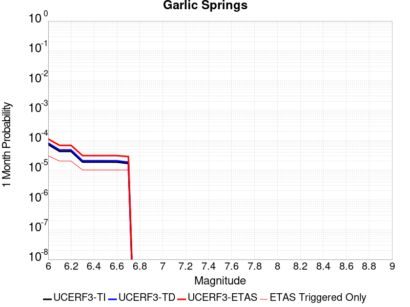 | 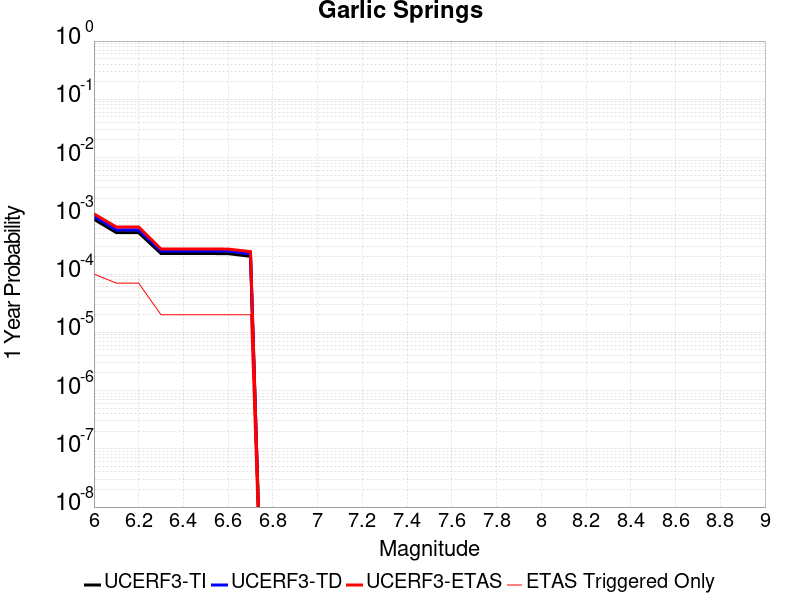 |  |

| Magnitude | 1 wk TI Prob | 1 wk TD Prob | 1 wk ETAS Prob | 1 wk ETAS/TD Gain | 1 wk ETAS Triggered Only | 1 mo TI Prob | 1 mo TD Prob | 1 mo ETAS Prob | 1 mo ETAS/TD Gain | 1 mo ETAS Triggered Only | 1 yr TI Prob | 1 yr TD Prob | 1 yr ETAS Prob | 1 yr ETAS/TD Gain | 1 yr ETAS Triggered Only | 10 yr TI Prob | 10 yr TD Prob | 10 yr ETAS Prob | 10 yr ETAS/TD Gain | 10 yr ETAS Triggered Only |
|-----|-----|-----|-----|-----|-----|-----|-----|-----|-----|-----|-----|-----|-----|-----|-----|-----|-----|-----|-----|-----|
| 6.0 | 1.6760017E-5 | 1.878206E-5 | 1.878206E-5 | 1.0 | 0.0 | 7.182667E-5 | 8.0492726E-5 | 1.14669434E-4 | 1.4245938 | 3.4179466E-5 | 8.7413884E-4 | 9.796758E-4 | 0.0010934956 | 1.1161813 | 1.1393155E-4 | 0.008707083 | 0.009765121 | 0.010114861 | 1.0358151 | 3.5318782E-4 |
| 6.1 | 9.852767E-6 | 1.0976473E-5 | 1.0976473E-5 | 1.0 | 0.0 | 4.222546E-5 | 4.7041583E-5 | 6.982682E-5 | 1.4843638 | 2.278631E-5 | 5.139737E-4 | 5.7265174E-4 | 6.5235817E-4 | 1.1391883 | 7.9752084E-5 | 0.005127866 | 0.005718723 | 0.005922627 | 1.0356555 | 2.050768E-4 |
| 6.2 | 9.852767E-6 | 1.0976473E-5 | 1.0976473E-5 | 1.0 | 0.0 | 4.222546E-5 | 4.7041583E-5 | 6.982682E-5 | 1.4843638 | 2.278631E-5 | 5.139737E-4 | 5.7265174E-4 | 6.5235817E-4 | 1.1391883 | 7.9752084E-5 | 0.005127866 | 0.005718723 | 0.005922627 | 1.0356555 | 2.050768E-4 |
| 6.3 | 4.3167724E-6 | 4.7792087E-6 | 4.7792087E-6 | 1.0 | 0.0 | 1.8500323E-5 | 2.0482294E-5 | 3.1875214E-5 | 1.5562327 | 1.1393155E-5 | 2.2521814E-4 | 2.4936642E-4 | 2.7214704E-4 | 1.091354 | 2.278631E-5 | 0.0022499003 | 0.0024931254 | 0.002561314 | 1.0273507 | 6.835893E-5 |
| 6.4 | 4.3167724E-6 | 4.7792087E-6 | 4.7792087E-6 | 1.0 | 0.0 | 1.8500323E-5 | 2.0482294E-5 | 3.1875214E-5 | 1.5562327 | 1.1393155E-5 | 2.2521814E-4 | 2.4936642E-4 | 2.7214704E-4 | 1.091354 | 2.278631E-5 | 0.0022499003 | 0.0024931254 | 0.002561314 | 1.0273507 | 6.835893E-5 |
| 6.5 | 4.3167724E-6 | 4.7792087E-6 | 4.7792087E-6 | 1.0 | 0.0 | 1.8500323E-5 | 2.0482294E-5 | 3.1875214E-5 | 1.5562327 | 1.1393155E-5 | 2.2521814E-4 | 2.4936642E-4 | 2.7214704E-4 | 1.091354 | 2.278631E-5 | 0.0022499003 | 0.0024931254 | 0.002561314 | 1.0273507 | 6.835893E-5 |
| 6.6 | 4.301311E-6 | 4.762073E-6 | 4.762073E-6 | 1.0 | 0.0 | 1.8434059E-5 | 2.0408854E-5 | 3.1801777E-5 | 1.5582343 | 1.1393155E-5 | 2.2441156E-4 | 2.4847253E-4 | 2.7125317E-4 | 1.0916828 | 2.278631E-5 | 0.0022418506 | 0.0024842063 | 0.0025523955 | 1.027449 | 6.835893E-5 |
| 6.7 | 3.8599724E-6 | 4.2721113E-6 | 4.2721113E-6 | 1.0 | 0.0 | 1.6542634E-5 | 1.8309049E-5 | 2.9701996E-5 | 1.6222577 | 1.1393155E-5 | 2.0138794E-4 | 2.2291267E-4 | 2.456939E-4 | 1.102198 | 2.278631E-5 | 0.0020120554 | 0.0022291266 | 0.0022973332 | 1.0305979 | 6.835893E-5 |

## San Andreas (San Bernardino S)
*[(top)](#table-of-contents)*

| 1 Week | 1 Month | 1 Year | 10 Year |
|-----|-----|-----|-----|
|  |  |  |  |

| Magnitude | 1 wk TI Prob | 1 wk TD Prob | 1 wk ETAS Prob | 1 wk ETAS/TD Gain | 1 wk ETAS Triggered Only | 1 mo TI Prob | 1 mo TD Prob | 1 mo ETAS Prob | 1 mo ETAS/TD Gain | 1 mo ETAS Triggered Only | 1 yr TI Prob | 1 yr TD Prob | 1 yr ETAS Prob | 1 yr ETAS/TD Gain | 1 yr ETAS Triggered Only | 10 yr TI Prob | 10 yr TD Prob | 10 yr ETAS Prob | 10 yr ETAS/TD Gain | 10 yr ETAS Triggered Only |
|-----|-----|-----|-----|-----|-----|-----|-----|-----|-----|-----|-----|-----|-----|-----|-----|-----|-----|-----|-----|-----|
| 6.0 | 1.2336002E-4 | 3.0091533E-4 | 3.0091533E-4 | 1.0 | 0.0 | 5.2857865E-4 | 0.0012890259 | 0.0012890259 | 1.0 | 0.0 | 0.006416472 | 0.01558593 | 0.015698086 | 1.007196 | 1.1393155E-4 | 0.06234337 | 0.1432102 | 0.14348353 | 1.0019085 | 3.1900834E-4 |
| 6.1 | 1.2336002E-4 | 3.0091533E-4 | 3.0091533E-4 | 1.0 | 0.0 | 5.2857865E-4 | 0.0012890259 | 0.0012890259 | 1.0 | 0.0 | 0.006416472 | 0.01558593 | 0.015698086 | 1.007196 | 1.1393155E-4 | 0.06234337 | 0.1432102 | 0.14348353 | 1.0019085 | 3.1900834E-4 |
| 6.2 | 1.2336002E-4 | 3.0091533E-4 | 3.0091533E-4 | 1.0 | 0.0 | 5.2857865E-4 | 0.0012890259 | 0.0012890259 | 1.0 | 0.0 | 0.006416472 | 0.01558593 | 0.015698086 | 1.007196 | 1.1393155E-4 | 0.06234337 | 0.1432102 | 0.14348353 | 1.0019085 | 3.1900834E-4 |
| 6.3 | 1.1712257E-4 | 2.8878928E-4 | 2.8878928E-4 | 1.0 | 0.0 | 5.018573E-4 | 0.0012371071 | 0.0012371071 | 1.0 | 0.0 | 0.006093008 | 0.014962618 | 0.015074845 | 1.0075005 | 1.1393155E-4 | 0.059286322 | 0.13792342 | 0.13819844 | 1.0019939 | 3.1900834E-4 |
| 6.4 | 1.1712257E-4 | 2.8878928E-4 | 2.8878928E-4 | 1.0 | 0.0 | 5.018573E-4 | 0.0012371071 | 0.0012371071 | 1.0 | 0.0 | 0.006093008 | 0.014962618 | 0.015074845 | 1.0075005 | 1.1393155E-4 | 0.059286322 | 0.13792342 | 0.13819844 | 1.0019939 | 3.1900834E-4 |
| 6.5 | 1.0689076E-4 | 2.6890213E-4 | 2.6890213E-4 | 1.0 | 0.0 | 4.5802278E-4 | 0.0011519536 | 0.0011519536 | 1.0 | 0.0 | 0.0055621783 | 0.013939476 | 0.014051818 | 1.0080594 | 1.1393155E-4 | 0.05425003 | 0.1292026 | 0.12948039 | 1.00215 | 3.1900834E-4 |
| 6.6 | 9.7648895E-5 | 2.5133646E-4 | 2.5133646E-4 | 1.0 | 0.0 | 4.1842813E-4 | 0.0010767353 | 0.0010767353 | 1.0 | 0.0 | 0.005082469 | 0.013034834 | 0.013147281 | 1.0086266 | 1.1393155E-4 | 0.049677886 | 0.121355705 | 0.121635996 | 1.0023097 | 3.1900834E-4 |
| 6.7 | 8.757013E-5 | 2.3202866E-4 | 2.3202866E-4 | 1.0 | 0.0 | 3.7524657E-4 | 9.940519E-4 | 9.940519E-4 | 1.0 | 0.0 | 0.00455906 | 0.01203952 | 0.0121520795 | 1.0093492 | 1.1393155E-4 | 0.04466656 | 0.11270812 | 0.112981066 | 1.0024217 | 3.0761518E-4 |
| 6.8 | 8.562978E-5 | 2.2762059E-4 | 2.2762059E-4 | 1.0 | 0.0 | 3.6693315E-4 | 9.751744E-4 | 9.751744E-4 | 1.0 | 0.0 | 0.004458263 | 0.011812193 | 0.011924779 | 1.0095313 | 1.1393155E-4 | 0.043698758 | 0.110711694 | 0.11098525 | 1.0024709 | 3.0761518E-4 |
| 6.9 | 6.124075E-5 | 1.7139417E-4 | 1.7139417E-4 | 1.0 | 0.0 | 2.6243398E-4 | 7.343405E-4 | 7.343405E-4 | 1.0 | 0.0 | 0.0031904527 | 0.0089041535 | 0.009017071 | 1.0126814 | 1.1393155E-4 | 0.031450346 | 0.08451004 | 0.08478123 | 1.003209 | 2.9622202E-4 |
| 7.0 | 5.8598747E-5 | 1.6567636E-4 | 1.6567636E-4 | 1.0 | 0.0 | 2.5111332E-4 | 7.098491E-4 | 7.098491E-4 | 1.0 | 0.0 | 0.0030530186 | 0.008608363 | 0.008721313 | 1.013121 | 1.1393155E-4 | 0.03011414 | 0.081825376 | 0.08209736 | 1.0033239 | 2.9622202E-4 |
| 7.1 | 5.613814E-5 | 1.5985253E-4 | 1.5985253E-4 | 1.0 | 0.0 | 2.4056983E-4 | 6.849031E-4 | 6.849031E-4 | 1.0 | 0.0 | 0.0029250039 | 0.008306996 | 0.008419981 | 1.0136012 | 1.1393155E-4 | 0.028868021 | 0.07911957 | 0.07937138 | 1.0031825 | 2.7343573E-4 |
| 7.2 | 4.991222E-5 | 1.4590108E-4 | 1.4590108E-4 | 1.0 | 0.0 | 2.1389198E-4 | 6.251409E-4 | 6.251409E-4 | 1.0 | 0.0 | 0.002601025 | 0.007584634 | 0.0076863943 | 1.0134166 | 1.025384E-4 | 0.025707912 | 0.07256349 | 0.07280652 | 1.0033492 | 2.6204257E-4 |
| 7.3 | 4.7410045E-5 | 1.3782637E-4 | 1.3782637E-4 | 1.0 | 0.0 | 2.0317009E-4 | 5.9055106E-4 | 5.9055106E-4 | 1.0 | 0.0 | 0.0024707897 | 0.007166343 | 0.007268146 | 1.0142058 | 1.025384E-4 | 0.024434982 | 0.06883803 | 0.06908203 | 1.0035446 | 2.6204257E-4 |
| 7.4 | 4.5556746E-5 | 1.3189387E-4 | 1.3189387E-4 | 1.0 | 0.0 | 1.952286E-4 | 5.651373E-4 | 5.651373E-4 | 1.0 | 0.0 | 0.002374317 | 0.0068589193 | 0.0069607543 | 1.0148472 | 1.025384E-4 | 0.023491086 | 0.06608479 | 0.06632951 | 1.0037032 | 2.6204257E-4 |
| 7.5 | 4.3084514E-5 | 1.2423217E-4 | 1.2423217E-4 | 1.0 | 0.0 | 1.8463485E-4 | 5.323153E-4 | 5.323153E-4 | 1.0 | 0.0 | 0.0022456115 | 0.006461752 | 0.0065636276 | 1.015766 | 1.025384E-4 | 0.022230545 | 0.06247893 | 0.06271392 | 1.003761 | 2.506494E-4 |
| 7.6 | 3.408608E-5 | 9.896081E-5 | 9.896081E-5 | 1.0 | 0.0 | 1.4607502E-4 | 4.2404892E-4 | 4.2404892E-4 | 1.0 | 0.0 | 0.0017770125 | 0.0051506 | 0.0052526104 | 1.0198056 | 1.025384E-4 | 0.017628696 | 0.050289597 | 0.050527643 | 1.0047334 | 2.506494E-4 |
| 7.7 | 2.8315713E-5 | 8.305614E-5 | 8.305614E-5 | 1.0 | 0.0 | 1.2134742E-4 | 3.5590635E-4 | 3.5590635E-4 | 1.0 | 0.0 | 0.0014764034 | 0.0043245596 | 0.004426655 | 1.0236082 | 1.025384E-4 | 0.01466633 | 0.042526137 | 0.042766128 | 1.0056434 | 2.506494E-4 |
| 7.8 | 2.6222975E-5 | 7.5163094E-5 | 7.5163094E-5 | 1.0 | 0.0 | 1.1237934E-4 | 3.220878E-4 | 3.220878E-4 | 1.0 | 0.0 | 0.0013673597 | 0.0039143744 | 0.004016511 | 1.0260928 | 1.025384E-4 | 0.013589768 | 0.03867635 | 0.038917307 | 1.00623 | 2.506494E-4 |
| 7.9 | 2.1469694E-5 | 5.8323218E-5 | 5.8323218E-5 | 1.0 | 0.0 | 9.200973E-5 | 2.4993272E-4 | 2.4993272E-4 | 1.0 | 0.0 | 0.0011196428 | 0.0030386879 | 0.0031181977 | 1.0261658 | 7.9752084E-5 | 0.011140184 | 0.030355671 | 0.030576617 | 1.0072786 | 2.278631E-4 |
| 8.0 | 1.2420249E-5 | 3.1568103E-5 | 3.1568103E-5 | 1.0 | 0.0 | 5.322855E-5 | 1.3528486E-4 | 1.3528486E-4 | 1.0 | 0.0 | 6.478649E-4 | 0.0016458498 | 0.0016913475 | 1.0276438 | 4.557262E-5 | 0.0064597935 | 0.01663909 | 0.016717514 | 1.0047133 | 7.9752084E-5 |
| 8.1 | 4.9197724E-6 | 7.915485E-6 | 7.915485E-6 | 1.0 | 0.0 | 2.1084568E-5 | 3.392307E-5 | 3.392307E-5 | 1.0 | 0.0 | 2.566744E-4 | 4.1293522E-4 | 4.2432366E-4 | 1.0275793 | 1.1393155E-5 | 0.002563781 | 0.004431343 | 0.0044426857 | 1.0025597 | 1.1393155E-5 |
| 8.2 | 2.5634774E-6 | 2.949789E-6 | 2.949789E-6 | 1.0 | 0.0 | 1.0986286E-5 | 1.2641892E-5 | 1.2641892E-5 | 1.0 | 0.0 | 1.3374983E-4 | 1.5390421E-4 | 1.5390421E-4 | 1.0 | 0.0 | 0.0013366934 | 0.0017276118 | 0.0017276118 | 1.0 | 0.0 |
| 8.3 | 5.2850464E-7 | 3.2664715E-7 | 3.2664715E-7 | 1.0 | 0.0 | 2.2650179E-6 | 1.3999157E-6 | 1.3999157E-6 | 1.0 | 0.0 | 2.7576245E-5 | 1.7043852E-5 | 1.7043852E-5 | 1.0 | 0.0 | 2.7572823E-4 | 2.0193194E-4 | 2.0193194E-4 | 1.0 | 0.0 |

## Helendale-So Lockhart
*[(top)](#table-of-contents)*

| 1 Week | 1 Month | 1 Year | 10 Year |
|-----|-----|-----|-----|
|  |  |  |  |

| Magnitude | 1 wk TI Prob | 1 wk TD Prob | 1 wk ETAS Prob | 1 wk ETAS/TD Gain | 1 wk ETAS Triggered Only | 1 mo TI Prob | 1 mo TD Prob | 1 mo ETAS Prob | 1 mo ETAS/TD Gain | 1 mo ETAS Triggered Only | 1 yr TI Prob | 1 yr TD Prob | 1 yr ETAS Prob | 1 yr ETAS/TD Gain | 1 yr ETAS Triggered Only | 10 yr TI Prob | 10 yr TD Prob | 10 yr ETAS Prob | 10 yr ETAS/TD Gain | 10 yr ETAS Triggered Only |
|-----|-----|-----|-----|-----|-----|-----|-----|-----|-----|-----|-----|-----|-----|-----|-----|-----|-----|-----|-----|-----|
| 6.0 | 1.7296055E-5 | 1.8105688E-5 | 1.8105688E-5 | 1.0 | 0.0 | 7.412385E-5 | 7.759361E-5 | 7.759361E-5 | 1.0 | 0.0 | 9.0208417E-4 | 9.4431354E-4 | 0.001012608 | 1.0723218 | 6.835893E-5 | 0.008984311 | 0.00940513 | 0.00963085 | 1.0239997 | 2.278631E-4 |
| 6.1 | 1.7296055E-5 | 1.8105688E-5 | 1.8105688E-5 | 1.0 | 0.0 | 7.412385E-5 | 7.759361E-5 | 7.759361E-5 | 1.0 | 0.0 | 9.0208417E-4 | 9.4431354E-4 | 0.001012608 | 1.0723218 | 6.835893E-5 | 0.008984311 | 0.00940513 | 0.00963085 | 1.0239997 | 2.278631E-4 |
| 6.2 | 1.7296055E-5 | 1.8105688E-5 | 1.8105688E-5 | 1.0 | 0.0 | 7.412385E-5 | 7.759361E-5 | 7.759361E-5 | 1.0 | 0.0 | 9.0208417E-4 | 9.4431354E-4 | 0.001012608 | 1.0723218 | 6.835893E-5 | 0.008984311 | 0.00940513 | 0.00963085 | 1.0239997 | 2.278631E-4 |
| 6.3 | 1.0669118E-5 | 1.1136552E-5 | 1.1136552E-5 | 1.0 | 0.0 | 4.5723988E-5 | 4.772722E-5 | 4.772722E-5 | 1.0 | 0.0 | 5.5654737E-4 | 5.809268E-4 | 6.3785946E-4 | 1.0980031 | 5.6965775E-5 | 0.0055515557 | 0.005794378 | 0.0059303036 | 1.0234582 | 1.3671786E-4 |
| 6.4 | 1.0669118E-5 | 1.1136552E-5 | 1.1136552E-5 | 1.0 | 0.0 | 4.5723988E-5 | 4.772722E-5 | 4.772722E-5 | 1.0 | 0.0 | 5.5654737E-4 | 5.809268E-4 | 6.3785946E-4 | 1.0980031 | 5.6965775E-5 | 0.0055515557 | 0.005794378 | 0.0059303036 | 1.0234582 | 1.3671786E-4 |
| 6.5 | 8.790038E-6 | 9.171115E-6 | 9.171115E-6 | 1.0 | 0.0 | 3.767105E-5 | 3.9304196E-5 | 3.9304196E-5 | 1.0 | 0.0 | 4.585485E-4 | 4.7842506E-4 | 5.125882E-4 | 1.0714074 | 3.4179466E-5 | 0.0045760344 | 0.004774115 | 0.0048648254 | 1.0190004 | 9.114524E-5 |
| 6.6 | 7.396949E-6 | 7.716306E-6 | 7.716306E-6 | 1.0 | 0.0 | 3.1700827E-5 | 3.306947E-5 | 3.306947E-5 | 1.0 | 0.0 | 3.858892E-4 | 4.0254745E-4 | 4.3671313E-4 | 1.0848738 | 3.4179466E-5 | 0.003852198 | 0.0040182895 | 0.004109069 | 1.0225915 | 9.114524E-5 |
| 6.7 | 6.4600285E-6 | 6.7387023E-6 | 6.7387023E-6 | 1.0 | 0.0 | 2.7685543E-5 | 2.8879838E-5 | 2.8879838E-5 | 1.0 | 0.0 | 3.3701936E-4 | 3.5155608E-4 | 3.857235E-4 | 1.0971892 | 3.4179466E-5 | 0.0033650869 | 0.003510081 | 0.003589553 | 1.0226411 | 7.9752084E-5 |
| 6.8 | 5.600104E-6 | 5.836578E-6 | 5.836578E-6 | 1.0 | 0.0 | 2.4000226E-5 | 2.501367E-5 | 2.501367E-5 | 1.0 | 0.0 | 2.9216358E-4 | 3.0449947E-4 | 3.3866853E-4 | 1.1122139 | 3.4179466E-5 | 0.0029177975 | 0.003040884 | 0.0031203935 | 1.0261469 | 7.9752084E-5 |
| 6.9 | 4.839122E-6 | 5.039992E-6 | 5.039992E-6 | 1.0 | 0.0 | 2.0738931E-5 | 2.159979E-5 | 2.159979E-5 | 1.0 | 0.0 | 2.5246723E-4 | 2.6294615E-4 | 2.8572648E-4 | 1.0866349 | 2.278631E-5 | 0.002521806 | 0.002626398 | 0.0026832141 | 1.0216327 | 5.6965775E-5 |
| 7.0 | 3.6937633E-6 | 3.845573E-6 | 3.845573E-6 | 1.0 | 0.0 | 1.5830317E-5 | 1.6480923E-5 | 1.6480923E-5 | 1.0 | 0.0 | 1.9271708E-4 | 2.0063708E-4 | 2.2341881E-4 | 1.113547 | 2.278631E-5 | 0.0019255003 | 0.0020045908 | 0.0020500722 | 1.0226885 | 4.557262E-5 |
| 7.1 | 2.7858857E-6 | 2.898123E-6 | 2.898123E-6 | 1.0 | 0.0 | 1.1939455E-5 | 1.242047E-5 | 1.242047E-5 | 1.0 | 0.0 | 1.4535317E-4 | 1.5120894E-4 | 1.7399181E-4 | 1.1506714 | 2.278631E-5 | 0.0014525814 | 0.001511082 | 0.0015565858 | 1.0301133 | 4.557262E-5 |
| 7.2 | 2.1672065E-6 | 2.2542215E-6 | 2.2542215E-6 | 1.0 | 0.0 | 9.2879945E-6 | 9.660915E-6 | 9.660915E-6 | 1.0 | 0.0 | 1.1307546E-4 | 1.1761547E-4 | 1.2900728E-4 | 1.0968565 | 1.1393155E-5 | 0.0011301794 | 0.0011755504 | 0.0012096898 | 1.029041 | 3.4179466E-5 |
| 7.3 | 1.4823496E-6 | 1.5423542E-6 | 1.5423542E-6 | 1.0 | 0.0 | 6.3529114E-6 | 6.6100733E-6 | 6.6100733E-6 | 1.0 | 0.0 | 7.734395E-5 | 8.047483E-5 | 8.047483E-5 | 1.0 | 0.0 | 7.731704E-4 | 8.0447196E-4 | 8.2723994E-4 | 1.0283017 | 2.278631E-5 |
| 7.4 | 4.2321457E-7 | 4.411307E-7 | 4.411307E-7 | 1.0 | 0.0 | 1.8137755E-6 | 1.8905591E-6 | 1.8905591E-6 | 1.0 | 0.0 | 2.2082493E-5 | 2.301736E-5 | 2.301736E-5 | 1.0 | 0.0 | 2.2080299E-4 | 2.3015428E-4 | 2.3015428E-4 | 1.0 | 0.0 |
| 7.5 | 5.6942316E-8 | 5.9421613E-8 | 5.9421613E-8 | 1.0 | 0.0 | 2.440385E-7 | 2.5466403E-7 | 2.5466403E-7 | 1.0 | 0.0 | 2.9711643E-6 | 3.1005309E-6 | 3.1005309E-6 | 1.0 | 0.0 | 2.9711247E-5 | 3.1004955E-5 | 3.1004955E-5 | 1.0 | 0.0 |

## Death Valley (Black Mtns Frontal)
*[(top)](#table-of-contents)*

| 1 Week | 1 Month | 1 Year | 10 Year |
|-----|-----|-----|-----|
|  |  | 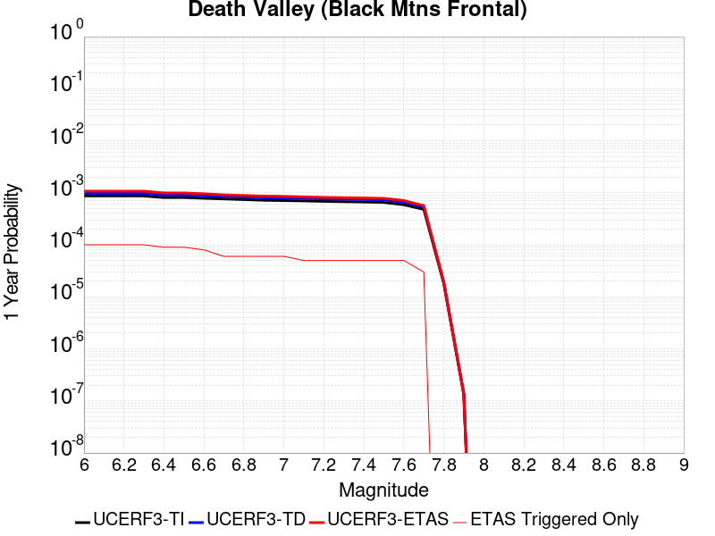 |  |

| Magnitude | 1 wk TI Prob | 1 wk TD Prob | 1 wk ETAS Prob | 1 wk ETAS/TD Gain | 1 wk ETAS Triggered Only | 1 mo TI Prob | 1 mo TD Prob | 1 mo ETAS Prob | 1 mo ETAS/TD Gain | 1 mo ETAS Triggered Only | 1 yr TI Prob | 1 yr TD Prob | 1 yr ETAS Prob | 1 yr ETAS/TD Gain | 1 yr ETAS Triggered Only | 10 yr TI Prob | 10 yr TD Prob | 10 yr ETAS Prob | 10 yr ETAS/TD Gain | 10 yr ETAS Triggered Only |
|-----|-----|-----|-----|-----|-----|-----|-----|-----|-----|-----|-----|-----|-----|-----|-----|-----|-----|-----|-----|-----|
| 6.0 | 1.6707214E-5 | 1.8675355E-5 | 1.8675355E-5 | 1.0 | 0.0 | 7.160038E-5 | 8.003482E-5 | 8.003482E-5 | 1.0 | 0.0 | 8.71386E-4 | 9.7399595E-4 | 0.0010536703 | 1.0818015 | 7.9752084E-5 | 0.00867977 | 0.0096981255 | 0.009935061 | 1.0244311 | 2.3925626E-4 |
| 6.1 | 1.6707214E-5 | 1.8675355E-5 | 1.8675355E-5 | 1.0 | 0.0 | 7.160038E-5 | 8.003482E-5 | 8.003482E-5 | 1.0 | 0.0 | 8.71386E-4 | 9.7399595E-4 | 0.0010536703 | 1.0818015 | 7.9752084E-5 | 0.00867977 | 0.0096981255 | 0.009935061 | 1.0244311 | 2.3925626E-4 |
| 6.2 | 1.6707214E-5 | 1.8675355E-5 | 1.8675355E-5 | 1.0 | 0.0 | 7.160038E-5 | 8.003482E-5 | 8.003482E-5 | 1.0 | 0.0 | 8.71386E-4 | 9.7399595E-4 | 0.0010536703 | 1.0818015 | 7.9752084E-5 | 0.00867977 | 0.0096981255 | 0.009935061 | 1.0244311 | 2.3925626E-4 |
| 6.3 | 1.6707214E-5 | 1.8675355E-5 | 1.8675355E-5 | 1.0 | 0.0 | 7.160038E-5 | 8.003482E-5 | 8.003482E-5 | 1.0 | 0.0 | 8.71386E-4 | 9.7399595E-4 | 0.0010536703 | 1.0818015 | 7.9752084E-5 | 0.00867977 | 0.0096981255 | 0.009935061 | 1.0244311 | 2.3925626E-4 |
| 6.4 | 1.5515609E-5 | 1.7342936E-5 | 1.7342936E-5 | 1.0 | 0.0 | 6.649377E-5 | 7.432479E-5 | 7.432479E-5 | 1.0 | 0.0 | 8.0926094E-4 | 9.045347E-4 | 9.842146E-4 | 1.0880895 | 7.9752084E-5 | 0.008063202 | 0.009009215 | 0.009223735 | 1.0238111 | 2.1646994E-4 |
| 6.5 | 1.5515609E-5 | 1.7342936E-5 | 1.7342936E-5 | 1.0 | 0.0 | 6.649377E-5 | 7.432479E-5 | 7.432479E-5 | 1.0 | 0.0 | 8.0926094E-4 | 9.045347E-4 | 9.842146E-4 | 1.0880895 | 7.9752084E-5 | 0.008063202 | 0.009009215 | 0.009223735 | 1.0238111 | 2.1646994E-4 |
| 6.6 | 1.5041828E-5 | 1.6813725E-5 | 1.6813725E-5 | 1.0 | 0.0 | 6.4463384E-5 | 7.2056864E-5 | 7.2056864E-5 | 1.0 | 0.0 | 7.8455906E-4 | 8.769451E-4 | 9.452441E-4 | 1.0778829 | 6.835893E-5 | 0.00781795 | 0.008735501 | 0.008927493 | 1.0219784 | 1.9368363E-4 |
| 6.7 | 1.4634985E-5 | 1.6360476E-5 | 1.6360476E-5 | 1.0 | 0.0 | 6.271985E-5 | 7.0114475E-5 | 7.0114475E-5 | 1.0 | 0.0 | 7.6334673E-4 | 8.533152E-4 | 8.988489E-4 | 1.0533609 | 4.557262E-5 | 0.007607299 | 0.008501024 | 0.008670468 | 1.0199323 | 1.7089733E-4 |
| 6.8 | 1.4209158E-5 | 1.5886384E-5 | 1.5886384E-5 | 1.0 | 0.0 | 6.089497E-5 | 6.808276E-5 | 6.808276E-5 | 1.0 | 0.0 | 7.4114406E-4 | 8.28598E-4 | 8.7413285E-4 | 1.054954 | 4.557262E-5 | 0.007386771 | 0.008255701 | 0.0084138885 | 1.019161 | 1.5950417E-4 |
| 6.9 | 1.3780098E-5 | 1.5408805E-5 | 1.5408805E-5 | 1.0 | 0.0 | 5.9056227E-5 | 6.60361E-5 | 6.60361E-5 | 1.0 | 0.0 | 7.1877235E-4 | 8.036984E-4 | 8.4923435E-4 | 1.056658 | 4.557262E-5 | 0.0071645193 | 0.008008514 | 0.008155438 | 1.0183461 | 1.4811101E-4 |
| 7.0 | 1.3585064E-5 | 1.5192312E-5 | 1.5192312E-5 | 1.0 | 0.0 | 5.8220405E-5 | 6.510832E-5 | 6.510832E-5 | 1.0 | 0.0 | 7.086029E-4 | 7.924109E-4 | 8.379474E-4 | 1.0574658 | 4.557262E-5 | 0.007063476 | 0.007896447 | 0.008043388 | 1.0186086 | 1.4811101E-4 |
| 7.1 | 1.3398601E-5 | 1.4985444E-5 | 1.4985444E-5 | 1.0 | 0.0 | 5.742131E-5 | 6.4221786E-5 | 6.4221786E-5 | 1.0 | 0.0 | 6.9888023E-4 | 7.8162516E-4 | 8.271622E-4 | 1.0582594 | 4.557262E-5 | 0.0069668638 | 0.0077893496 | 0.007936307 | 1.0188664 | 1.4811101E-4 |
| 7.2 | 1.3126312E-5 | 1.468359E-5 | 1.468359E-5 | 1.0 | 0.0 | 5.6254412E-5 | 6.2928186E-5 | 6.2928186E-5 | 1.0 | 0.0 | 6.846822E-4 | 7.658868E-4 | 8.114245E-4 | 1.0594575 | 4.557262E-5 | 0.006825765 | 0.007633057 | 0.007757425 | 1.0162934 | 1.253247E-4 |
| 7.3 | 1.2922429E-5 | 1.4457762E-5 | 1.4457762E-5 | 1.0 | 0.0 | 5.5380664E-5 | 6.1960396E-5 | 6.1960396E-5 | 1.0 | 0.0 | 6.74051E-4 | 7.5411214E-4 | 7.996504E-4 | 1.0603865 | 4.557262E-5 | 0.006720101 | 0.0075161126 | 0.007629188 | 1.0150443 | 1.1393155E-4 |
| 7.4 | 1.2768878E-5 | 1.42877025E-5 | 1.42877025E-5 | 1.0 | 0.0 | 5.4722615E-5 | 6.12316E-5 | 6.12316E-5 | 1.0 | 0.0 | 6.660441E-4 | 7.452452E-4 | 7.9078384E-4 | 1.0611056 | 4.557262E-5 | 0.0066405144 | 0.00742804 | 0.0075411247 | 1.0152241 | 1.1393155E-4 |
| 7.5 | 1.2521929E-5 | 1.4015882E-5 | 1.4015882E-5 | 1.0 | 0.0 | 5.366431E-5 | 6.006671E-5 | 6.006671E-5 | 1.0 | 0.0 | 6.531671E-4 | 7.310723E-4 | 7.7661156E-4 | 1.0622911 | 4.557262E-5 | 0.006512506 | 0.007287249 | 0.00740035 | 1.0155205 | 1.1393155E-4 |
| 7.6 | 1.1301089E-5 | 1.2651644E-5 | 1.2651644E-5 | 1.0 | 0.0 | 4.8432343E-5 | 5.4220236E-5 | 5.4220236E-5 | 1.0 | 0.0 | 5.895042E-4 | 6.5993675E-4 | 7.054793E-4 | 1.0690105 | 4.557262E-5 | 0.0058794282 | 0.0065803225 | 0.00665955 | 1.01204 | 7.9752084E-5 |
| 7.7 | 9.189108E-6 | 1.0286198E-5 | 1.0286198E-5 | 1.0 | 0.0 | 3.93813E-5 | 4.408299E-5 | 4.408299E-5 | 1.0 | 0.0 | 4.7936183E-4 | 5.3658325E-4 | 5.707444E-4 | 1.0636642 | 3.4179466E-5 | 0.004783291 | 0.005353388 | 0.0054100486 | 1.0105841 | 5.6965775E-5 |
| 7.8 | 3.4586725E-7 | 3.6487262E-7 | 3.6487262E-7 | 1.0 | 0.0 | 1.4822873E-6 | 1.5637388E-6 | 1.5637388E-6 | 1.0 | 0.0 | 1.80467E-5 | 1.9038358E-5 | 1.9038358E-5 | 1.0 | 0.0 | 1.8045233E-4 | 1.9036772E-4 | 1.9036772E-4 | 1.0 | 0.0 |
| 7.9 | 2.5591178E-9 | 2.6699385E-9 | 2.6699385E-9 | 1.0 | 0.0 | 1.0967647E-8 | 1.1442593E-8 | 1.1442593E-8 | 1.0 | 0.0 | 1.335311E-7 | 1.3931357E-7 | 1.3931357E-7 | 1.0 | 0.0 | 1.3353102E-6 | 1.3931357E-6 | 1.3931357E-6 | 1.0 | 0.0 |

## Coyote Lake
*[(top)](#table-of-contents)*

| 1 Week | 1 Month | 1 Year | 10 Year |
|-----|-----|-----|-----|
|  |  |  |  |

| Magnitude | 1 wk TI Prob | 1 wk TD Prob | 1 wk ETAS Prob | 1 wk ETAS/TD Gain | 1 wk ETAS Triggered Only | 1 mo TI Prob | 1 mo TD Prob | 1 mo ETAS Prob | 1 mo ETAS/TD Gain | 1 mo ETAS Triggered Only | 1 yr TI Prob | 1 yr TD Prob | 1 yr ETAS Prob | 1 yr ETAS/TD Gain | 1 yr ETAS Triggered Only | 10 yr TI Prob | 10 yr TD Prob | 10 yr ETAS Prob | 10 yr ETAS/TD Gain | 10 yr ETAS Triggered Only |
|-----|-----|-----|-----|-----|-----|-----|-----|-----|-----|-----|-----|-----|-----|-----|-----|-----|-----|-----|-----|-----|
| 6.0 | 1.980352E-5 | 2.1711568E-5 | 2.1711568E-5 | 1.0 | 0.0 | 8.486947E-5 | 9.304667E-5 | 1.0443877E-4 | 1.1224343 | 1.1393155E-5 | 0.0010327959 | 0.0011323265 | 0.0011892278 | 1.0502516 | 5.6965775E-5 | 0.010280091 | 0.011272751 | 0.01148678 | 1.0189865 | 2.1646994E-4 |
| 6.1 | 1.980352E-5 | 2.1711568E-5 | 2.1711568E-5 | 1.0 | 0.0 | 8.486947E-5 | 9.304667E-5 | 1.0443877E-4 | 1.1224343 | 1.1393155E-5 | 0.0010327959 | 0.0011323265 | 0.0011892278 | 1.0502516 | 5.6965775E-5 | 0.010280091 | 0.011272751 | 0.01148678 | 1.0189865 | 2.1646994E-4 |
| 6.2 | 1.980352E-5 | 2.1711568E-5 | 2.1711568E-5 | 1.0 | 0.0 | 8.486947E-5 | 9.304667E-5 | 1.0443877E-4 | 1.1224343 | 1.1393155E-5 | 0.0010327959 | 0.0011323265 | 0.0011892278 | 1.0502516 | 5.6965775E-5 | 0.010280091 | 0.011272751 | 0.01148678 | 1.0189865 | 2.1646994E-4 |
| 6.3 | 1.5344787E-5 | 1.6824411E-5 | 1.6824411E-5 | 1.0 | 0.0 | 6.576172E-5 | 7.210297E-5 | 8.34953E-5 | 1.158001 | 1.1393155E-5 | 8.003548E-4 | 8.7756134E-4 | 9.1171084E-4 | 1.0389141 | 3.4179466E-5 | 0.007974784 | 0.008747008 | 0.008882529 | 1.0154935 | 1.3671786E-4 |
| 6.4 | 1.5344787E-5 | 1.6824411E-5 | 1.6824411E-5 | 1.0 | 0.0 | 6.576172E-5 | 7.210297E-5 | 8.34953E-5 | 1.158001 | 1.1393155E-5 | 8.003548E-4 | 8.7756134E-4 | 9.1171084E-4 | 1.0389141 | 3.4179466E-5 | 0.007974784 | 0.008747008 | 0.008882529 | 1.0154935 | 1.3671786E-4 |
| 6.5 | 1.4189697E-5 | 1.5561456E-5 | 1.5561456E-5 | 1.0 | 0.0 | 6.081157E-5 | 6.669059E-5 | 7.808299E-5 | 1.1708246 | 1.1393155E-5 | 7.401293E-4 | 8.117158E-4 | 8.458675E-4 | 1.0420735 | 3.4179466E-5 | 0.0073766913 | 0.008093455 | 0.008206464 | 1.0139631 | 1.1393155E-4 |
| 6.6 | 1.3469301E-5 | 1.4774881E-5 | 1.4774881E-5 | 1.0 | 0.0 | 5.7724297E-5 | 6.331972E-5 | 7.471215E-5 | 1.1799192 | 1.1393155E-5 | 7.025667E-4 | 7.707049E-4 | 8.04858E-4 | 1.0443141 | 3.4179466E-5 | 0.0070034964 | 0.0076862276 | 0.007787978 | 1.013238 | 1.025384E-4 |
| 6.7 | 1.3027966E-5 | 1.4284924E-5 | 1.4284924E-5 | 1.0 | 0.0 | 5.5832945E-5 | 6.122E-5 | 7.2612456E-5 | 1.1860905 | 1.1393155E-5 | 6.7955407E-4 | 7.451584E-4 | 7.793124E-4 | 1.0458345 | 3.4179466E-5 | 0.006774798 | 0.007432478 | 0.0075342543 | 1.0136935 | 1.025384E-4 |
| 6.8 | 5.695434E-6 | 6.225754E-6 | 6.225754E-6 | 1.0 | 0.0 | 2.4408775E-5 | 2.66817E-5 | 2.66817E-5 | 1.0 | 0.0 | 2.971363E-4 | 3.248313E-4 | 3.248313E-4 | 1.0 | 0.0 | 0.0029673933 | 0.003246507 | 0.003257863 | 1.003498 | 1.1393155E-5 |
| 6.9 | 4.385688E-6 | 4.7940844E-6 | 4.7940844E-6 | 1.0 | 0.0 | 1.879567E-5 | 2.0546076E-5 | 2.0546076E-5 | 1.0 | 0.0 | 2.2881327E-4 | 2.5014847E-4 | 2.5014847E-4 | 1.0 | 0.0 | 0.002285778 | 0.002501485 | 0.0025128494 | 1.0045432 | 1.1393155E-5 |

## San Andreas (Big Bend)
*[(top)](#table-of-contents)*

| 1 Week | 1 Month | 1 Year | 10 Year |
|-----|-----|-----|-----|
|  |  |  |  |

| Magnitude | 1 wk TI Prob | 1 wk TD Prob | 1 wk ETAS Prob | 1 wk ETAS/TD Gain | 1 wk ETAS Triggered Only | 1 mo TI Prob | 1 mo TD Prob | 1 mo ETAS Prob | 1 mo ETAS/TD Gain | 1 mo ETAS Triggered Only | 1 yr TI Prob | 1 yr TD Prob | 1 yr ETAS Prob | 1 yr ETAS/TD Gain | 1 yr ETAS Triggered Only | 10 yr TI Prob | 10 yr TD Prob | 10 yr ETAS Prob | 10 yr ETAS/TD Gain | 10 yr ETAS Triggered Only |
|-----|-----|-----|-----|-----|-----|-----|-----|-----|-----|-----|-----|-----|-----|-----|-----|-----|-----|-----|-----|-----|
| 6.0 | 1.0179969E-4 | 2.0224464E-4 | 2.0224464E-4 | 1.0 | 0.0 | 4.362114E-4 | 8.6647586E-4 | 8.6647586E-4 | 1.0 | 0.0 | 0.0052979486 | 0.010498604 | 0.010566245 | 1.0064429 | 6.835893E-5 | 0.051734097 | 0.10209795 | 0.10228209 | 1.0018035 | 2.050768E-4 |
| 6.1 | 1.0179969E-4 | 2.0224464E-4 | 2.0224464E-4 | 1.0 | 0.0 | 4.362114E-4 | 8.6647586E-4 | 8.6647586E-4 | 1.0 | 0.0 | 0.0052979486 | 0.010498604 | 0.010566245 | 1.0064429 | 6.835893E-5 | 0.051734097 | 0.10209795 | 0.10228209 | 1.0018035 | 2.050768E-4 |
| 6.2 | 1.0179969E-4 | 2.0224464E-4 | 2.0224464E-4 | 1.0 | 0.0 | 4.362114E-4 | 8.6647586E-4 | 8.6647586E-4 | 1.0 | 0.0 | 0.0052979486 | 0.010498604 | 0.010566245 | 1.0064429 | 6.835893E-5 | 0.051734097 | 0.10209795 | 0.10228209 | 1.0018035 | 2.050768E-4 |
| 6.3 | 1.0179969E-4 | 2.0224464E-4 | 2.0224464E-4 | 1.0 | 0.0 | 4.362114E-4 | 8.6647586E-4 | 8.6647586E-4 | 1.0 | 0.0 | 0.0052979486 | 0.010498604 | 0.010566245 | 1.0064429 | 6.835893E-5 | 0.051734097 | 0.10209795 | 0.10228209 | 1.0018035 | 2.050768E-4 |
| 6.4 | 9.1639464E-5 | 1.8578598E-4 | 1.8578598E-4 | 1.0 | 0.0 | 3.9268145E-4 | 7.959829E-4 | 7.959829E-4 | 1.0 | 0.0 | 0.0047704205 | 0.00964815 | 0.009670717 | 1.0023389 | 2.278631E-5 | 0.046693064 | 0.09443592 | 0.09455973 | 1.0013111 | 1.3671786E-4 |
| 6.5 | 9.1639464E-5 | 1.8578598E-4 | 1.8578598E-4 | 1.0 | 0.0 | 3.9268145E-4 | 7.959829E-4 | 7.959829E-4 | 1.0 | 0.0 | 0.0047704205 | 0.00964815 | 0.009670717 | 1.0023389 | 2.278631E-5 | 0.046693064 | 0.09443592 | 0.09455973 | 1.0013111 | 1.3671786E-4 |
| 6.6 | 9.042622E-5 | 1.8385253E-4 | 1.8385253E-4 | 1.0 | 0.0 | 3.8748336E-4 | 7.8770175E-4 | 7.8770175E-4 | 1.0 | 0.0 | 0.0047074095 | 0.009548212 | 0.009570781 | 1.0023637 | 2.278631E-5 | 0.046089325 | 0.093532145 | 0.09365608 | 1.001325 | 1.3671786E-4 |
| 6.7 | 8.9836685E-5 | 1.8299464E-4 | 1.8299464E-4 | 1.0 | 0.0 | 3.8495753E-4 | 7.840273E-4 | 7.840273E-4 | 1.0 | 0.0 | 0.00467679 | 0.009503867 | 0.009526436 | 1.0023748 | 2.278631E-5 | 0.045795817 | 0.09312612 | 0.09325011 | 1.0013313 | 1.3671786E-4 |
| 6.8 | 8.9471854E-5 | 1.82461E-4 | 1.82461E-4 | 1.0 | 0.0 | 3.8339442E-4 | 7.817415E-4 | 7.817415E-4 | 1.0 | 0.0 | 0.004657841 | 0.00947628 | 0.00949885 | 1.0023818 | 2.278631E-5 | 0.04561414 | 0.092873074 | 0.0929971 | 1.0013354 | 1.3671786E-4 |
| 6.9 | 8.858234E-5 | 1.8127837E-4 | 1.8127837E-4 | 1.0 | 0.0 | 3.7958333E-4 | 7.766762E-4 | 7.766762E-4 | 1.0 | 0.0 | 0.004611638 | 0.009415144 | 0.009437716 | 1.0023974 | 2.278631E-5 | 0.04517103 | 0.0923123 | 0.092436396 | 1.0013443 | 1.3671786E-4 |
| 7.0 | 8.7433385E-5 | 1.7966273E-4 | 1.7966273E-4 | 1.0 | 0.0 | 3.746607E-4 | 7.697561E-4 | 7.697561E-4 | 1.0 | 0.0 | 0.004551957 | 0.009331617 | 0.00935419 | 1.002419 | 2.278631E-5 | 0.044598386 | 0.09154516 | 0.091669366 | 1.0013567 | 1.3671786E-4 |
| 7.1 | 8.684964E-5 | 1.7877997E-4 | 1.7877997E-4 | 1.0 | 0.0 | 3.7215967E-4 | 7.659751E-4 | 7.659751E-4 | 1.0 | 0.0 | 0.0045216335 | 0.009285975 | 0.0093085505 | 1.002431 | 2.278631E-5 | 0.04430731 | 0.09112593 | 0.09125019 | 1.0013636 | 1.3671786E-4 |
| 7.2 | 8.606521E-5 | 1.7768375E-4 | 1.7768375E-4 | 1.0 | 0.0 | 3.6879873E-4 | 7.612798E-4 | 7.612798E-4 | 1.0 | 0.0 | 0.0044808835 | 0.009229296 | 0.009251872 | 1.0024462 | 2.278631E-5 | 0.043916024 | 0.09060563 | 0.09072997 | 1.0013722 | 1.3671786E-4 |
| 7.3 | 8.568266E-5 | 1.7710112E-4 | 1.7710112E-4 | 1.0 | 0.0 | 3.6715972E-4 | 7.587842E-4 | 7.587842E-4 | 1.0 | 0.0 | 0.0044610105 | 0.009199169 | 0.009221746 | 1.0024542 | 2.278631E-5 | 0.043725148 | 0.09032571 | 0.090450086 | 1.0013769 | 1.3671786E-4 |
| 7.4 | 8.5432206E-5 | 1.7672523E-4 | 1.7672523E-4 | 1.0 | 0.0 | 3.6608664E-4 | 7.571742E-4 | 7.571742E-4 | 1.0 | 0.0 | 0.004447999 | 0.009179733 | 0.00920231 | 1.0024594 | 2.278631E-5 | 0.043600157 | 0.09014526 | 0.09026965 | 1.00138 | 1.3671786E-4 |
| 7.5 | 8.4791965E-5 | 1.754126E-4 | 1.754126E-4 | 1.0 | 0.0 | 3.633435E-4 | 7.515519E-4 | 7.515519E-4 | 1.0 | 0.0 | 0.0044147377 | 0.009111856 | 0.009134434 | 1.002478 | 2.278631E-5 | 0.043280575 | 0.08952057 | 0.08964506 | 1.0013905 | 1.3671786E-4 |
| 7.6 | 8.241105E-5 | 1.6984239E-4 | 1.6984239E-4 | 1.0 | 0.0 | 3.531424E-4 | 7.276931E-4 | 7.276931E-4 | 1.0 | 0.0 | 0.0042910352 | 0.008823764 | 0.008846349 | 1.0025595 | 2.278631E-5 | 0.042091176 | 0.08688739 | 0.08701223 | 1.0014368 | 1.3671786E-4 |
| 7.7 | 7.00432E-5 | 1.4334435E-4 | 1.4334435E-4 | 1.0 | 0.0 | 3.001506E-4 | 6.141884E-4 | 6.141884E-4 | 1.0 | 0.0 | 0.0036482112 | 0.0074521457 | 0.007474762 | 1.003035 | 2.278631E-5 | 0.035888977 | 0.074104704 | 0.07422074 | 1.0015658 | 1.253247E-4 |
| 7.8 | 6.415362E-5 | 1.3086096E-4 | 1.3086096E-4 | 1.0 | 0.0 | 2.749151E-4 | 5.607122E-4 | 5.607122E-4 | 1.0 | 0.0 | 0.0033419547 | 0.0068053333 | 0.0068279644 | 1.0033255 | 2.278631E-5 | 0.03292141 | 0.067786686 | 0.067892894 | 1.0015668 | 1.1393155E-4 |
| 7.9 | 4.939911E-5 | 9.425331E-5 | 9.425331E-5 | 1.0 | 0.0 | 2.116933E-4 | 4.0388023E-4 | 4.0388023E-4 | 1.0 | 0.0 | 0.0025743195 | 0.0049061645 | 0.004928839 | 1.0046216 | 2.278631E-5 | 0.025447013 | 0.049310107 | 0.049353432 | 1.0008786 | 4.557262E-5 |
| 8.0 | 3.344983E-5 | 5.2727875E-5 | 5.2727875E-5 | 1.0 | 0.0 | 1.4334853E-4 | 2.2595705E-4 | 2.2595705E-4 | 1.0 | 0.0 | 0.0017438711 | 0.0027475583 | 0.0027702819 | 1.0082705 | 2.278631E-5 | 0.017302496 | 0.028168954 | 0.02820217 | 1.0011792 | 3.4179466E-5 |
| 8.1 | 1.9104898E-5 | 1.941631E-5 | 1.941631E-5 | 1.0 | 0.0 | 8.1875565E-5 | 8.321011E-5 | 8.321011E-5 | 1.0 | 0.0 | 9.963791E-4 | 0.0010126128 | 0.0010239944 | 1.0112399 | 1.1393155E-5 | 0.009919235 | 0.0108775785 | 0.0108888475 | 1.001036 | 1.1393155E-5 |
| 8.2 | 8.643924E-6 | 5.5660976E-6 | 5.5660976E-6 | 1.0 | 0.0 | 3.704486E-5 | 2.3854487E-5 | 2.3854487E-5 | 1.0 | 0.0 | 4.5092785E-4 | 2.9038975E-4 | 2.9038975E-4 | 1.0 | 0.0 | 0.0045001395 | 0.0032986484 | 0.0032986484 | 1.0 | 0.0 |
| 8.3 | 1.983087E-6 | 7.808603E-7 | 7.808603E-7 | 1.0 | 0.0 | 8.498917E-6 | 3.34654E-6 | 3.34654E-6 | 1.0 | 0.0 | 1.034694E-4 | 4.074338E-5 | 4.074338E-5 | 1.0 | 0.0 | 0.0010342124 | 4.8047924E-4 | 4.8047924E-4 | 1.0 | 0.0 |

## Sierra Nevada  (No Extension)
*[(top)](#table-of-contents)*

| 1 Week | 1 Month | 1 Year | 10 Year |
|-----|-----|-----|-----|
|  |  |  |  |

| Magnitude | 1 wk TI Prob | 1 wk TD Prob | 1 wk ETAS Prob | 1 wk ETAS/TD Gain | 1 wk ETAS Triggered Only | 1 mo TI Prob | 1 mo TD Prob | 1 mo ETAS Prob | 1 mo ETAS/TD Gain | 1 mo ETAS Triggered Only | 1 yr TI Prob | 1 yr TD Prob | 1 yr ETAS Prob | 1 yr ETAS/TD Gain | 1 yr ETAS Triggered Only | 10 yr TI Prob | 10 yr TD Prob | 10 yr ETAS Prob | 10 yr ETAS/TD Gain | 10 yr ETAS Triggered Only |
|-----|-----|-----|-----|-----|-----|-----|-----|-----|-----|-----|-----|-----|-----|-----|-----|-----|-----|-----|-----|-----|
| 6.0 | 7.7690465E-6 | 6.9773705E-6 | 6.9773705E-6 | 1.0 | 0.0 | 3.329549E-5 | 2.9902876E-5 | 2.9902876E-5 | 1.0 | 0.0 | 4.0529718E-4 | 3.6404256E-4 | 3.9820958E-4 | 1.0938544 | 3.4179466E-5 | 0.004045588 | 0.0036379788 | 0.003819606 | 1.0499253 | 1.8229047E-4 |
| 6.1 | 7.7690465E-6 | 6.9773705E-6 | 6.9773705E-6 | 1.0 | 0.0 | 3.329549E-5 | 2.9902876E-5 | 2.9902876E-5 | 1.0 | 0.0 | 4.0529718E-4 | 3.6404256E-4 | 3.9820958E-4 | 1.0938544 | 3.4179466E-5 | 0.004045588 | 0.0036379788 | 0.003819606 | 1.0499253 | 1.8229047E-4 |
| 6.2 | 7.7690465E-6 | 6.9773705E-6 | 6.9773705E-6 | 1.0 | 0.0 | 3.329549E-5 | 2.9902876E-5 | 2.9902876E-5 | 1.0 | 0.0 | 4.0529718E-4 | 3.6404256E-4 | 3.9820958E-4 | 1.0938544 | 3.4179466E-5 | 0.004045588 | 0.0036379788 | 0.003819606 | 1.0499253 | 1.8229047E-4 |
| 6.3 | 7.7690465E-6 | 6.9773705E-6 | 6.9773705E-6 | 1.0 | 0.0 | 3.329549E-5 | 2.9902876E-5 | 2.9902876E-5 | 1.0 | 0.0 | 4.0529718E-4 | 3.6404256E-4 | 3.9820958E-4 | 1.0938544 | 3.4179466E-5 | 0.004045588 | 0.0036379788 | 0.003819606 | 1.0499253 | 1.8229047E-4 |
| 6.4 | 7.7690465E-6 | 6.9773705E-6 | 6.9773705E-6 | 1.0 | 0.0 | 3.329549E-5 | 2.9902876E-5 | 2.9902876E-5 | 1.0 | 0.0 | 4.0529718E-4 | 3.6404256E-4 | 3.9820958E-4 | 1.0938544 | 3.4179466E-5 | 0.004045588 | 0.0036379788 | 0.003819606 | 1.0499253 | 1.8229047E-4 |
| 6.5 | 7.7690465E-6 | 6.9773705E-6 | 6.9773705E-6 | 1.0 | 0.0 | 3.329549E-5 | 2.9902876E-5 | 2.9902876E-5 | 1.0 | 0.0 | 4.0529718E-4 | 3.6404256E-4 | 3.9820958E-4 | 1.0938544 | 3.4179466E-5 | 0.004045588 | 0.0036379788 | 0.003819606 | 1.0499253 | 1.8229047E-4 |
| 6.6 | 2.653E-6 | 1.6153083E-6 | 1.6153083E-6 | 1.0 | 0.0 | 1.136995E-5 | 6.9227317E-6 | 6.9227317E-6 | 1.0 | 0.0 | 1.3842035E-4 | 8.428103E-5 | 1.1845762E-4 | 1.4055074 | 3.4179466E-5 | 0.0013833415 | 8.4249413E-4 | 9.904803E-4 | 1.1756525 | 1.4811101E-4 |
| 6.7 | 2.5902466E-6 | 1.5506372E-6 | 1.5506372E-6 | 1.0 | 0.0 | 1.11010095E-5 | 6.6455714E-6 | 6.6455714E-6 | 1.0 | 0.0 | 1.351464E-4 | 8.090686E-5 | 1.1508356E-4 | 1.4224203 | 3.4179466E-5 | 0.0013506424 | 8.08777E-4 | 9.567682E-4 | 1.1829815 | 1.4811101E-4 |
| 6.8 | 2.5853892E-6 | 1.5474353E-6 | 1.5474353E-6 | 1.0 | 0.0 | 1.1080193E-5 | 6.631849E-6 | 6.631849E-6 | 1.0 | 0.0 | 1.34893E-4 | 8.0739796E-5 | 1.14916504E-4 | 1.4232944 | 3.4179466E-5 | 0.0013481114 | 8.071076E-4 | 9.5509907E-4 | 1.1833602 | 1.4811101E-4 |
| 6.9 | 2.458257E-6 | 1.4224988E-6 | 1.4224988E-6 | 1.0 | 0.0 | 1.0535345E-5 | 6.0964094E-6 | 6.0964094E-6 | 1.0 | 0.0 | 1.2826028E-4 | 7.422128E-5 | 1.08398206E-4 | 1.4604734 | 3.4179466E-5 | 0.0012818627 | 7.419668E-4 | 8.8996795E-4 | 1.1994714 | 1.4811101E-4 |
| 7.0 | 2.4341468E-6 | 1.3994605E-6 | 1.3994605E-6 | 1.0 | 0.0 | 1.0432016E-5 | 5.9976746E-6 | 5.9976746E-6 | 1.0 | 0.0 | 1.270024E-4 | 7.3019255E-5 | 1.07196225E-4 | 1.4680542 | 3.4179466E-5 | 0.0012692984 | 7.2995457E-4 | 8.779575E-4 | 1.2027563 | 1.4811101E-4 |
| 7.1 | 2.3652476E-6 | 1.3344039E-6 | 1.3344039E-6 | 1.0 | 0.0 | 1.0136736E-5 | 5.7188613E-6 | 5.7188613E-6 | 1.0 | 0.0 | 1.2340778E-4 | 6.9624926E-5 | 1.0380201E-4 | 1.4908743 | 3.4179466E-5 | 0.0012333926 | 6.9603283E-4 | 8.4404077E-4 | 1.212645 | 1.4811101E-4 |
| 7.2 | 2.272158E-6 | 1.2507E-6 | 1.2507E-6 | 1.0 | 0.0 | 9.737784E-6 | 5.3601325E-6 | 5.3601325E-6 | 1.0 | 0.0 | 1.1855107E-4 | 6.525767E-5 | 9.943491E-5 | 1.5237274 | 3.4179466E-5 | 0.0011848784 | 6.523866E-4 | 8.00401E-4 | 1.2268814 | 1.4811101E-4 |
| 7.3 | 2.1382127E-6 | 1.1423749E-6 | 1.1423749E-6 | 1.0 | 0.0 | 9.163737E-6 | 4.895883E-6 | 4.895883E-6 | 1.0 | 0.0 | 1.1156279E-4 | 5.960576E-5 | 9.378319E-5 | 1.5733913 | 3.4179466E-5 | 0.001115068 | 5.958989E-4 | 7.439217E-4 | 1.2484025 | 1.4811101E-4 |
| 7.4 | 1.9048055E-6 | 9.579064E-7 | 9.579064E-7 | 1.0 | 0.0 | 8.163426E-6 | 4.105307E-6 | 4.105307E-6 | 1.0 | 0.0 | 9.9385186E-5 | 4.9980972E-5 | 8.415873E-5 | 1.6838154 | 3.4179466E-5 | 9.934074E-4 | 4.99698E-4 | 6.47735E-4 | 1.296253 | 1.4811101E-4 |
| 7.5 | 1.5373403E-6 | 7.563288E-7 | 7.563288E-7 | 1.0 | 0.0 | 6.5885843E-6 | 3.241405E-6 | 3.241405E-6 | 1.0 | 0.0 | 8.021306E-5 | 3.9463397E-5 | 7.364151E-5 | 1.8660713 | 3.4179466E-5 | 8.0184115E-4 | 3.9456435E-4 | 5.4261694E-4 | 1.3752304 | 1.4811101E-4 |
| 7.6 | 1.0680322E-6 | 4.661944E-7 | 4.661944E-7 | 1.0 | 0.0 | 4.577273E-6 | 1.9979743E-6 | 1.9979743E-6 | 1.0 | 0.0 | 5.5726876E-5 | 2.432507E-5 | 4.7110825E-5 | 1.9367191 | 2.278631E-5 | 5.5712904E-4 | 2.4322433E-4 | 3.5712818E-4 | 1.4683077 | 1.1393155E-4 |
| 7.7 | 5.509146E-7 | 1.5591806E-7 | 1.5591806E-7 | 1.0 | 0.0 | 2.3610605E-6 | 6.682201E-7 | 6.682201E-7 | 1.0 | 0.0 | 2.8745531E-5 | 8.13555E-6 | 1.9528612E-5 | 2.4004047 | 1.1393155E-5 | 2.8741814E-4 | 8.135264E-5 | 1.2692156E-4 | 1.5601405 | 4.557262E-5 |

## San Andreas (San Gorgonio Pass-Garnet HIll)
*[(top)](#table-of-contents)*

| 1 Week | 1 Month | 1 Year | 10 Year |
|-----|-----|-----|-----|
|  |  |  | 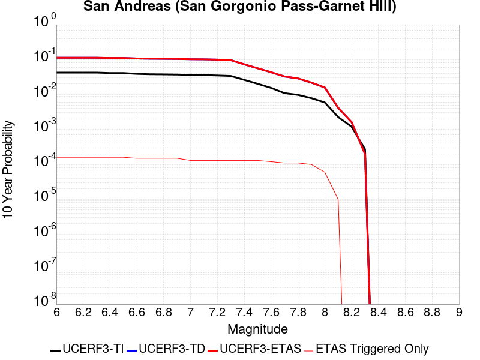 |

| Magnitude | 1 wk TI Prob | 1 wk TD Prob | 1 wk ETAS Prob | 1 wk ETAS/TD Gain | 1 wk ETAS Triggered Only | 1 mo TI Prob | 1 mo TD Prob | 1 mo ETAS Prob | 1 mo ETAS/TD Gain | 1 mo ETAS Triggered Only | 1 yr TI Prob | 1 yr TD Prob | 1 yr ETAS Prob | 1 yr ETAS/TD Gain | 1 yr ETAS Triggered Only | 10 yr TI Prob | 10 yr TD Prob | 10 yr ETAS Prob | 10 yr ETAS/TD Gain | 10 yr ETAS Triggered Only |
|-----|-----|-----|-----|-----|-----|-----|-----|-----|-----|-----|-----|-----|-----|-----|-----|-----|-----|-----|-----|-----|
| 6.0 | 8.31567E-5 | 2.3455099E-4 | 2.3455099E-4 | 1.0 | 0.0 | 3.5633717E-4 | 0.0010048301 | 0.0010048301 | 1.0 | 0.0 | 0.004329778 | 0.012165095 | 0.012232622 | 1.0055509 | 6.835893E-5 | 0.042463828 | 0.11287292 | 0.11301442 | 1.0012536 | 1.5950417E-4 |
| 6.1 | 8.31567E-5 | 2.3455099E-4 | 2.3455099E-4 | 1.0 | 0.0 | 3.5633717E-4 | 0.0010048301 | 0.0010048301 | 1.0 | 0.0 | 0.004329778 | 0.012165095 | 0.012232622 | 1.0055509 | 6.835893E-5 | 0.042463828 | 0.11287292 | 0.11301442 | 1.0012536 | 1.5950417E-4 |
| 6.2 | 8.31567E-5 | 2.3455099E-4 | 2.3455099E-4 | 1.0 | 0.0 | 3.5633717E-4 | 0.0010048301 | 0.0010048301 | 1.0 | 0.0 | 0.004329778 | 0.012165095 | 0.012232622 | 1.0055509 | 6.835893E-5 | 0.042463828 | 0.11287292 | 0.11301442 | 1.0012536 | 1.5950417E-4 |
| 6.3 | 8.31567E-5 | 2.3455099E-4 | 2.3455099E-4 | 1.0 | 0.0 | 3.5633717E-4 | 0.0010048301 | 0.0010048301 | 1.0 | 0.0 | 0.004329778 | 0.012165095 | 0.012232622 | 1.0055509 | 6.835893E-5 | 0.042463828 | 0.11287292 | 0.11301442 | 1.0012536 | 1.5950417E-4 |
| 6.4 | 8.059055E-5 | 2.3012291E-4 | 2.3012291E-4 | 1.0 | 0.0 | 3.4534236E-4 | 9.858671E-4 | 9.858671E-4 | 1.0 | 0.0 | 0.0041964394 | 0.011937095 | 0.012004638 | 1.0056583 | 6.835893E-5 | 0.041180745 | 0.11085296 | 0.11099478 | 1.0012794 | 1.5950417E-4 |
| 6.5 | 8.059055E-5 | 2.3012291E-4 | 2.3012291E-4 | 1.0 | 0.0 | 3.4534236E-4 | 9.858671E-4 | 9.858671E-4 | 1.0 | 0.0 | 0.0041964394 | 0.011937095 | 0.012004638 | 1.0056583 | 6.835893E-5 | 0.041180745 | 0.11085296 | 0.11099478 | 1.0012794 | 1.5950417E-4 |
| 6.6 | 7.619237E-5 | 2.225621E-4 | 2.225621E-4 | 1.0 | 0.0 | 3.2649786E-4 | 9.5349125E-4 | 9.5349125E-4 | 1.0 | 0.0 | 0.0039678677 | 0.011547514 | 0.0116150845 | 1.0058514 | 6.835893E-5 | 0.03897764 | 0.10738801 | 0.107520215 | 1.0012311 | 1.4811101E-4 |
| 6.7 | 7.440636E-5 | 2.1931871E-4 | 2.1931871E-4 | 1.0 | 0.0 | 3.188454E-4 | 9.39601E-4 | 9.39601E-4 | 1.0 | 0.0 | 0.0038750346 | 0.011380176 | 0.011447757 | 1.0059385 | 6.835893E-5 | 0.038081564 | 0.10589632 | 0.10602874 | 1.0012505 | 1.4811101E-4 |
| 6.8 | 7.3735864E-5 | 2.1778827E-4 | 2.1778827E-4 | 1.0 | 0.0 | 3.1597257E-4 | 9.330467E-4 | 9.330467E-4 | 1.0 | 0.0 | 0.0038401815 | 0.01130121 | 0.011368797 | 1.0059805 | 6.835893E-5 | 0.03774495 | 0.10519727 | 0.105329804 | 1.0012598 | 1.4811101E-4 |
| 6.9 | 7.27575E-5 | 2.1547603E-4 | 2.1547603E-4 | 1.0 | 0.0 | 3.117806E-4 | 9.2314417E-4 | 9.2314417E-4 | 1.0 | 0.0 | 0.003789323 | 0.011181891 | 0.011249485 | 1.006045 | 6.835893E-5 | 0.037253562 | 0.104144685 | 0.10427737 | 1.0012741 | 1.4811101E-4 |
| 7.0 | 7.102591E-5 | 2.1131337E-4 | 2.1131337E-4 | 1.0 | 0.0 | 3.0436125E-4 | 9.053166E-4 | 9.053166E-4 | 1.0 | 0.0 | 0.003699303 | 0.010967043 | 0.0110233845 | 1.0051373 | 5.6965775E-5 | 0.03638325 | 0.10224576 | 0.102368504 | 1.0012004 | 1.3671786E-4 |
| 7.1 | 7.028513E-5 | 2.0966642E-4 | 2.0966642E-4 | 1.0 | 0.0 | 3.0118722E-4 | 8.982632E-4 | 8.982632E-4 | 1.0 | 0.0 | 0.0036607897 | 0.010882029 | 0.010938375 | 1.0051779 | 5.6965775E-5 | 0.036010686 | 0.10148743 | 0.10161027 | 1.0012105 | 1.3671786E-4 |
| 7.2 | 6.8498244E-5 | 2.0574164E-4 | 2.0574164E-4 | 1.0 | 0.0 | 2.9353087E-4 | 8.8145415E-4 | 8.8145415E-4 | 1.0 | 0.0 | 0.003567883 | 0.0106794005 | 0.010735758 | 1.0052772 | 5.6965775E-5 | 0.035111405 | 0.09967861 | 0.099801704 | 1.0012349 | 1.3671786E-4 |
| 7.3 | 6.622592E-5 | 1.9800379E-4 | 1.9800379E-4 | 1.0 | 0.0 | 2.8379448E-4 | 8.483139E-4 | 8.483139E-4 | 1.0 | 0.0 | 0.0034497243 | 0.010279794 | 0.010336175 | 1.0054846 | 5.6965775E-5 | 0.033966612 | 0.096172415 | 0.09629598 | 1.0012848 | 1.3671786E-4 |
| 7.4 | 5.1050705E-5 | 1.4748148E-4 | 1.4748148E-4 | 1.0 | 0.0 | 2.1877038E-4 | 6.319113E-4 | 6.319113E-4 | 1.0 | 0.0 | 0.002660276 | 0.0076665743 | 0.0077231033 | 1.0073735 | 5.6965775E-5 | 0.02628654 | 0.073117696 | 0.07324442 | 1.0017331 | 1.3671786E-4 |
| 7.5 | 3.9302922E-5 | 1.1181122E-4 | 1.1181122E-4 | 1.0 | 0.0 | 1.6843023E-4 | 4.7910327E-4 | 4.7910327E-4 | 1.0 | 0.0 | 0.0020487092 | 0.005817551 | 0.005874186 | 1.0097351 | 5.6965775E-5 | 0.020299247 | 0.056236032 | 0.05636506 | 1.0022944 | 1.3671786E-4 |
| 7.6 | 2.9851626E-5 | 8.540269E-5 | 8.540269E-5 | 1.0 | 0.0 | 1.2792926E-4 | 3.659603E-4 | 3.659603E-4 | 1.0 | 0.0 | 0.0015564259 | 0.0044464897 | 0.004503202 | 1.0127544 | 5.6965775E-5 | 0.0154556995 | 0.0433964 | 0.043527182 | 1.0030137 | 1.3671786E-4 |
| 7.7 | 2.1135214E-5 | 6.39321E-5 | 6.39321E-5 | 1.0 | 0.0 | 9.0576345E-5 | 2.7396597E-4 | 2.7396597E-4 | 1.0 | 0.0 | 0.0011022091 | 0.0033304393 | 0.0033872153 | 1.0170476 | 5.6965775E-5 | 0.010967582 | 0.032763455 | 0.032884672 | 1.0036998 | 1.253247E-4 |
| 7.8 | 1.883379E-5 | 5.6009827E-5 | 5.6009827E-5 | 1.0 | 0.0 | 8.0713755E-5 | 2.4002005E-4 | 2.4002005E-4 | 1.0 | 0.0 | 9.822468E-4 | 0.0029183314 | 0.002975131 | 1.0194631 | 5.6965775E-5 | 0.0097791655 | 0.028862024 | 0.02898373 | 1.0042169 | 1.253247E-4 |
| 7.9 | 1.5156185E-5 | 4.19625E-5 | 4.19625E-5 | 1.0 | 0.0 | 6.495346E-5 | 1.7982691E-4 | 1.7982691E-4 | 1.0 | 0.0 | 7.9052144E-4 | 0.0021871955 | 0.0022326685 | 1.0207906 | 4.557262E-5 | 0.007877152 | 0.021899192 | 0.022010628 | 1.0050886 | 1.1393155E-4 |
| 8.0 | 1.1405907E-5 | 3.0203699E-5 | 3.0203699E-5 | 1.0 | 0.0 | 4.8881542E-5 | 1.29438E-4 | 1.29438E-4 | 1.0 | 0.0 | 5.9497025E-4 | 0.0015747696 | 0.0016088953 | 1.0216702 | 3.4179466E-5 | 0.005933798 | 0.015879562 | 0.015946835 | 1.0042365 | 6.835893E-5 |
| 8.1 | 4.3511436E-6 | 7.4538148E-6 | 7.4538148E-6 | 1.0 | 0.0 | 1.8647626E-5 | 3.1944528E-5 | 3.1944528E-5 | 1.0 | 0.0 | 2.2701119E-4 | 3.8885538E-4 | 4.0024408E-4 | 1.0292878 | 1.1393155E-5 | 0.0022677942 | 0.0041587194 | 0.0041700653 | 1.0027282 | 1.1393155E-5 |
| 8.2 | 2.3042528E-6 | 2.7723743E-6 | 2.7723743E-6 | 1.0 | 0.0 | 9.875332E-6 | 1.188155E-5 | 1.188155E-5 | 1.0 | 0.0 | 1.2022553E-4 | 1.4464831E-4 | 1.4464831E-4 | 1.0 | 0.0 | 0.0012016051 | 0.0016186252 | 0.0016186252 | 1.0 | 0.0 |
| 8.3 | 5.202968E-7 | 3.2165772E-7 | 3.2165772E-7 | 1.0 | 0.0 | 2.2298414E-6 | 1.3785324E-6 | 1.3785324E-6 | 1.0 | 0.0 | 2.714798E-5 | 1.6783515E-5 | 1.6783515E-5 | 1.0 | 0.0 | 2.7144665E-4 | 1.9881342E-4 | 1.9881342E-4 | 1.0 | 0.0 |

## San Andreas (Parkfield)
*[(top)](#table-of-contents)*

| 1 Week | 1 Month | 1 Year | 10 Year |
|-----|-----|-----|-----|
|  | 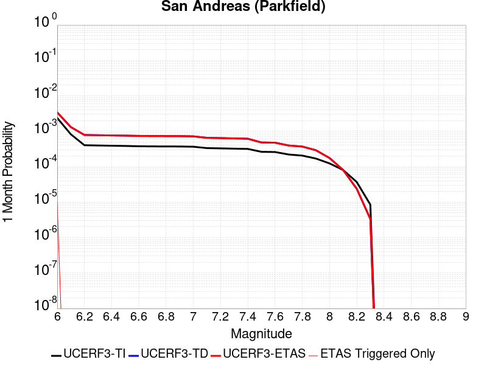 |  |  |

| Magnitude | 1 wk TI Prob | 1 wk TD Prob | 1 wk ETAS Prob | 1 wk ETAS/TD Gain | 1 wk ETAS Triggered Only | 1 mo TI Prob | 1 mo TD Prob | 1 mo ETAS Prob | 1 mo ETAS/TD Gain | 1 mo ETAS Triggered Only | 1 yr TI Prob | 1 yr TD Prob | 1 yr ETAS Prob | 1 yr ETAS/TD Gain | 1 yr ETAS Triggered Only | 10 yr TI Prob | 10 yr TD Prob | 10 yr ETAS Prob | 10 yr ETAS/TD Gain | 10 yr ETAS Triggered Only |
|-----|-----|-----|-----|-----|-----|-----|-----|-----|-----|-----|-----|-----|-----|-----|-----|-----|-----|-----|-----|-----|
| 6.0 | 5.556969E-4 | 7.954992E-4 | 8.0688327E-4 | 1.0143106 | 1.1393155E-5 | 0.0023793848 | 0.0034054073 | 0.0034167615 | 1.0033342 | 1.1393155E-5 | 0.028586963 | 0.04096938 | 0.041002158 | 1.0008001 | 3.4179466E-5 | 0.25176284 | 0.3397343 | 0.33983207 | 1.0002879 | 1.4811101E-4 |
| 6.1 | 1.925858E-4 | 3.0775374E-4 | 3.0775374E-4 | 1.0 | 0.0 | 8.2510663E-4 | 0.0013183774 | 0.0013183774 | 1.0 | 0.0 | 0.0099994885 | 0.016019296 | 0.016030507 | 1.0006999 | 1.1393155E-5 | 0.095613256 | 0.15090741 | 0.15097512 | 1.0004487 | 7.9752084E-5 |
| 6.2 | 9.4306815E-5 | 1.8380945E-4 | 1.8380945E-4 | 1.0 | 0.0 | 4.0410945E-4 | 7.875182E-4 | 7.875182E-4 | 1.0 | 0.0 | 0.0049089384 | 0.009546112 | 0.009557397 | 1.0011821 | 1.1393155E-5 | 0.048019063 | 0.092463985 | 0.09253637 | 1.0007827 | 7.9752084E-5 |
| 6.3 | 9.283051E-5 | 1.8077034E-4 | 1.8077034E-4 | 1.0 | 0.0 | 3.9778434E-4 | 7.7450124E-4 | 7.7450124E-4 | 1.0 | 0.0 | 0.0048322747 | 0.009389 | 0.009400287 | 1.0012021 | 1.1393155E-5 | 0.047285385 | 0.09111662 | 0.09118911 | 1.0007955 | 7.9752084E-5 |
| 6.4 | 9.138826E-5 | 1.7838326E-4 | 1.7838326E-4 | 1.0 | 0.0 | 3.916052E-4 | 7.642769E-4 | 7.642769E-4 | 1.0 | 0.0 | 0.0047573745 | 0.00926559 | 0.009276878 | 1.0012182 | 1.1393155E-5 | 0.046568092 | 0.09001747 | 0.09009004 | 1.0008062 | 7.9752084E-5 |
| 6.5 | 9.000255E-5 | 1.7595605E-4 | 1.7595605E-4 | 1.0 | 0.0 | 3.8566816E-4 | 7.538806E-4 | 7.538806E-4 | 1.0 | 0.0 | 0.0046854047 | 0.009140087 | 0.009151376 | 1.0012351 | 1.1393155E-5 | 0.045878403 | 0.08889803 | 0.08897069 | 1.0008174 | 7.9752084E-5 |
| 6.6 | 8.8109264E-5 | 1.7275041E-4 | 1.7275041E-4 | 1.0 | 0.0 | 3.7755648E-4 | 7.4015E-4 | 7.4015E-4 | 1.0 | 0.0 | 0.0045870654 | 0.008974318 | 0.00898561 | 1.0012581 | 1.1393155E-5 | 0.04493529 | 0.08742356 | 0.08749634 | 1.0008324 | 7.9752084E-5 |
| 6.7 | 8.738073E-5 | 1.7141737E-4 | 1.7141737E-4 | 1.0 | 0.0 | 3.7443507E-4 | 7.344402E-4 | 7.344402E-4 | 1.0 | 0.0 | 0.0045492216 | 0.008905407 | 0.008916698 | 1.0012679 | 1.1393155E-5 | 0.04457213 | 0.086822286 | 0.086895116 | 1.0008388 | 7.9752084E-5 |
| 6.8 | 8.710195E-5 | 1.7086939E-4 | 1.7086939E-4 | 1.0 | 0.0 | 3.7324068E-4 | 7.3209306E-4 | 7.3209306E-4 | 1.0 | 0.0 | 0.0045347405 | 0.008877072 | 0.008888364 | 1.0012721 | 1.1393155E-5 | 0.04443313 | 0.08656893 | 0.08664177 | 1.0008415 | 7.9752084E-5 |
| 6.9 | 8.6801556E-5 | 1.702762E-4 | 1.702762E-4 | 1.0 | 0.0 | 3.7195362E-4 | 7.295522E-4 | 7.295522E-4 | 1.0 | 0.0 | 0.0045191357 | 0.008846388 | 0.0088576805 | 1.0012765 | 1.1393155E-5 | 0.044283327 | 0.08629421 | 0.086367086 | 1.0008445 | 7.9752084E-5 |
| 7.0 | 8.5571606E-5 | 1.6779368E-4 | 1.6779368E-4 | 1.0 | 0.0 | 3.6668387E-4 | 7.1891875E-4 | 7.1891875E-4 | 1.0 | 0.0 | 0.004455241 | 0.008717968 | 0.008729262 | 1.0012954 | 1.1393155E-5 | 0.043669727 | 0.08513857 | 0.08521153 | 1.000857 | 7.9752084E-5 |
| 7.1 | 7.82589E-5 | 1.5255272E-4 | 1.5255272E-4 | 1.0 | 0.0 | 3.3535215E-4 | 6.5363426E-4 | 6.5363426E-4 | 1.0 | 0.0 | 0.0040752706 | 0.007929132 | 0.007940436 | 1.0014255 | 1.1393155E-5 | 0.040013418 | 0.07803519 | 0.07810871 | 1.0009422 | 7.9752084E-5 |
| 7.2 | 7.690929E-5 | 1.4991156E-4 | 1.4991156E-4 | 1.0 | 0.0 | 3.2956956E-4 | 6.4232067E-4 | 6.4232067E-4 | 1.0 | 0.0 | 0.004005129 | 0.007792382 | 0.0078036864 | 1.0014507 | 1.1393155E-5 | 0.0393371 | 0.0768037 | 0.076877326 | 1.0009587 | 7.9752084E-5 |
| 7.3 | 7.5543794E-5 | 1.4685914E-4 | 1.4685914E-4 | 1.0 | 0.0 | 3.2371894E-4 | 6.2924525E-4 | 6.2924525E-4 | 1.0 | 0.0 | 0.003934157 | 0.0076343147 | 0.007645621 | 1.0014809 | 1.1393155E-5 | 0.038652334 | 0.075360335 | 0.075434074 | 1.0009785 | 7.9752084E-5 |
| 7.4 | 7.4214564E-5 | 1.4385211E-4 | 1.4385211E-4 | 1.0 | 0.0 | 3.1802364E-4 | 6.163641E-4 | 6.163641E-4 | 1.0 | 0.0 | 0.003865065 | 0.007478574 | 0.007489882 | 1.001512 | 1.1393155E-5 | 0.03798529 | 0.073928304 | 0.07400216 | 1.000999 | 7.9752084E-5 |
| 7.5 | 6.149578E-5 | 1.1296149E-4 | 1.1296149E-4 | 1.0 | 0.0 | 2.6352672E-4 | 4.8403096E-4 | 4.8403096E-4 | 1.0 | 0.0 | 0.0032037178 | 0.0058771856 | 0.005888512 | 1.0019271 | 1.1393155E-5 | 0.03157923 | 0.059049904 | 0.059124947 | 1.0012709 | 7.9752084E-5 |
| 7.6 | 6.0643448E-5 | 1.1123779E-4 | 1.1123779E-4 | 1.0 | 0.0 | 2.598746E-4 | 4.7664638E-4 | 4.7664638E-4 | 1.0 | 0.0 | 0.0031593828 | 0.00578776 | 0.005799087 | 1.001957 | 1.1393155E-5 | 0.031148417 | 0.058206882 | 0.05828199 | 1.0012904 | 7.9752084E-5 |
| 7.7 | 5.1652263E-5 | 9.2685426E-5 | 9.2685426E-5 | 1.0 | 0.0 | 2.2134806E-4 | 3.971628E-4 | 3.971628E-4 | 1.0 | 0.0 | 0.002691582 | 0.0048247464 | 0.004836085 | 1.00235 | 1.1393155E-5 | 0.026592141 | 0.04897893 | 0.04904394 | 1.0013273 | 6.835893E-5 |
| 7.8 | 4.8090482E-5 | 8.645958E-5 | 8.645958E-5 | 1.0 | 0.0 | 2.060858E-4 | 3.7048844E-4 | 3.7048844E-4 | 1.0 | 0.0 | 0.0025062072 | 0.004501376 | 0.004512718 | 1.0025196 | 1.1393155E-5 | 0.024781305 | 0.045710493 | 0.04577573 | 1.0014272 | 6.835893E-5 |
| 7.9 | 3.970278E-5 | 6.8176494E-5 | 6.8176494E-5 | 1.0 | 0.0 | 1.7014367E-4 | 2.9215228E-4 | 2.9215228E-4 | 1.0 | 0.0 | 0.002069531 | 0.0035511565 | 0.003562509 | 1.003197 | 1.1393155E-5 | 0.020503636 | 0.03620482 | 0.03623776 | 1.0009099 | 3.4179466E-5 |
| 8.0 | 2.8982335E-5 | 4.1123396E-5 | 4.1123396E-5 | 1.0 | 0.0 | 1.2420409E-4 | 1.7623122E-4 | 1.7623122E-4 | 1.0 | 0.0 | 0.0015111357 | 0.002143505 | 0.0021548737 | 1.0053039 | 1.1393155E-5 | 0.015009012 | 0.022223437 | 0.022245716 | 1.0010026 | 2.278631E-5 |
| 8.1 | 1.8836186E-5 | 1.8920584E-5 | 1.8920584E-5 | 1.0 | 0.0 | 8.0724014E-5 | 8.1085695E-5 | 8.1085695E-5 | 1.0 | 0.0 | 9.823717E-4 | 9.867719E-4 | 9.981537E-4 | 1.0115345 | 1.1393155E-5 | 0.009780403 | 0.010613913 | 0.010625185 | 1.001062 | 1.1393155E-5 |
| 8.2 | 8.643924E-6 | 5.5660976E-6 | 5.5660976E-6 | 1.0 | 0.0 | 3.704486E-5 | 2.3854487E-5 | 2.3854487E-5 | 1.0 | 0.0 | 4.5092785E-4 | 2.9038975E-4 | 2.9038975E-4 | 1.0 | 0.0 | 0.0045001395 | 0.0032986484 | 0.0032986484 | 1.0 | 0.0 |
| 8.3 | 1.983087E-6 | 7.808603E-7 | 7.808603E-7 | 1.0 | 0.0 | 8.498917E-6 | 3.34654E-6 | 3.34654E-6 | 1.0 | 0.0 | 1.034694E-4 | 4.074338E-5 | 4.074338E-5 | 1.0 | 0.0 | 0.0010342124 | 4.8047924E-4 | 4.8047924E-4 | 1.0 | 0.0 |

## San Andreas (Cholame) rev
*[(top)](#table-of-contents)*

| 1 Week | 1 Month | 1 Year | 10 Year |
|-----|-----|-----|-----|
|  |  |  |  |

| Magnitude | 1 wk TI Prob | 1 wk TD Prob | 1 wk ETAS Prob | 1 wk ETAS/TD Gain | 1 wk ETAS Triggered Only | 1 mo TI Prob | 1 mo TD Prob | 1 mo ETAS Prob | 1 mo ETAS/TD Gain | 1 mo ETAS Triggered Only | 1 yr TI Prob | 1 yr TD Prob | 1 yr ETAS Prob | 1 yr ETAS/TD Gain | 1 yr ETAS Triggered Only | 10 yr TI Prob | 10 yr TD Prob | 10 yr ETAS Prob | 10 yr ETAS/TD Gain | 10 yr ETAS Triggered Only |
|-----|-----|-----|-----|-----|-----|-----|-----|-----|-----|-----|-----|-----|-----|-----|-----|-----|-----|-----|-----|-----|
| 6.0 | 1.2302514E-4 | 2.5377126E-4 | 2.5377126E-4 | 1.0 | 0.0 | 5.27144E-4 | 0.0010871394 | 0.0010871394 | 1.0 | 0.0 | 0.0063991086 | 0.0131561095 | 0.013189839 | 1.0025638 | 3.4179466E-5 | 0.06217949 | 0.12514783 | 0.12528737 | 1.001115 | 1.5950417E-4 |
| 6.1 | 1.2302514E-4 | 2.5377126E-4 | 2.5377126E-4 | 1.0 | 0.0 | 5.27144E-4 | 0.0010871394 | 0.0010871394 | 1.0 | 0.0 | 0.0063991086 | 0.0131561095 | 0.013189839 | 1.0025638 | 3.4179466E-5 | 0.06217949 | 0.12514783 | 0.12528737 | 1.001115 | 1.5950417E-4 |
| 6.2 | 1.2203569E-4 | 2.5193702E-4 | 2.5193702E-4 | 1.0 | 0.0 | 5.2290526E-4 | 0.0010792849 | 0.0010792849 | 1.0 | 0.0 | 0.006347804 | 0.0130616315 | 0.013095365 | 1.0025826 | 3.4179466E-5 | 0.061695136 | 0.12433341 | 0.1244631 | 1.0010431 | 1.4811101E-4 |
| 6.3 | 1.2142645E-4 | 2.5079545E-4 | 2.5079545E-4 | 1.0 | 0.0 | 5.202953E-4 | 0.0010743965 | 0.0010743965 | 1.0 | 0.0 | 0.006316212 | 0.013002829 | 0.013036563 | 1.0025945 | 3.4179466E-5 | 0.06139677 | 0.12382682 | 0.12395659 | 1.001048 | 1.4811101E-4 |
| 6.4 | 1.1865206E-4 | 2.4584043E-4 | 2.4584043E-4 | 1.0 | 0.0 | 5.0840975E-4 | 0.001053178 | 0.001053178 | 1.0 | 0.0 | 0.006172335 | 0.01274754 | 0.012770036 | 1.0017648 | 2.278631E-5 | 0.060036868 | 0.12161498 | 0.12173507 | 1.0009874 | 1.3671786E-4 |
| 6.5 | 1.17443946E-4 | 2.4376677E-4 | 2.4376677E-4 | 1.0 | 0.0 | 5.032341E-4 | 0.001044298 | 0.001044298 | 1.0 | 0.0 | 0.006109677 | 0.012640683 | 0.012663181 | 1.0017798 | 2.278631E-5 | 0.059444077 | 0.12068456 | 0.12080478 | 1.0009961 | 1.3671786E-4 |
| 6.6 | 1.13579066E-4 | 2.3683684E-4 | 2.3683684E-4 | 1.0 | 0.0 | 4.866766E-4 | 0.0010146217 | 0.0010146217 | 1.0 | 0.0 | 0.0059092017 | 0.012283501 | 0.012306008 | 1.0018322 | 2.278631E-5 | 0.057545185 | 0.11758657 | 0.11770721 | 1.001026 | 1.3671786E-4 |
| 6.7 | 1.1271412E-4 | 2.3527596E-4 | 2.3527596E-4 | 1.0 | 0.0 | 4.829711E-4 | 0.0010079374 | 0.0010079374 | 1.0 | 0.0 | 0.005864331 | 0.012203034 | 0.012225542 | 1.0018445 | 2.278631E-5 | 0.057119697 | 0.11688864 | 0.11700938 | 1.001033 | 1.3671786E-4 |
| 6.8 | 1.1217975E-4 | 2.3415616E-4 | 2.3415616E-4 | 1.0 | 0.0 | 4.8068175E-4 | 0.001003142 | 0.001003142 | 1.0 | 0.0 | 0.005836608 | 0.012145302 | 0.012167812 | 1.0018533 | 2.278631E-5 | 0.056856725 | 0.11638556 | 0.11650637 | 1.001038 | 1.3671786E-4 |
| 6.9 | 1.1146753E-4 | 2.3263908E-4 | 2.3263908E-4 | 1.0 | 0.0 | 4.7763053E-4 | 9.966452E-4 | 9.966452E-4 | 1.0 | 0.0 | 0.0057996577 | 0.012067083 | 0.012089594 | 1.0018655 | 2.278631E-5 | 0.056506127 | 0.115704976 | 0.11582588 | 1.0010449 | 1.3671786E-4 |
| 7.0 | 1.0965793E-4 | 2.2885925E-4 | 2.2885925E-4 | 1.0 | 0.0 | 4.698779E-4 | 9.804582E-4 | 9.804582E-4 | 1.0 | 0.0 | 0.005705768 | 0.0118721705 | 0.011894686 | 1.0018965 | 2.278631E-5 | 0.055614736 | 0.114002086 | 0.11412322 | 1.0010625 | 1.3671786E-4 |
| 7.1 | 9.927982E-5 | 2.0698967E-4 | 2.0698967E-4 | 1.0 | 0.0 | 4.2541555E-4 | 8.86798E-4 | 8.86798E-4 | 1.0 | 0.0 | 0.0051671406 | 0.010743615 | 0.010766156 | 1.0020981 | 2.278631E-5 | 0.05048634 | 0.10407128 | 0.10419377 | 1.001177 | 1.3671786E-4 |
| 7.2 | 9.696786E-5 | 2.0202059E-4 | 2.0202059E-4 | 1.0 | 0.0 | 4.1551032E-4 | 8.6551625E-4 | 8.6551625E-4 | 1.0 | 0.0 | 0.00504711 | 0.010487032 | 0.010509579 | 1.00215 | 2.278631E-5 | 0.04934009 | 0.10180742 | 0.101930216 | 1.0012062 | 1.3671786E-4 |
| 7.3 | 9.4727984E-5 | 1.9628562E-4 | 1.9628562E-4 | 1.0 | 0.0 | 4.0591392E-4 | 8.4095384E-4 | 8.4095384E-4 | 1.0 | 0.0 | 0.0049308087 | 0.01019082 | 0.010213375 | 1.0022131 | 2.278631E-5 | 0.048228268 | 0.09916703 | 0.09929019 | 1.0012419 | 1.3671786E-4 |
| 7.4 | 9.220358E-5 | 1.8996334E-4 | 1.8996334E-4 | 1.0 | 0.0 | 3.9509835E-4 | 8.1387546E-4 | 8.1387546E-4 | 1.0 | 0.0 | 0.004799717 | 0.009864165 | 0.009886727 | 1.0022873 | 2.278631E-5 | 0.046973653 | 0.09623134 | 0.0963549 | 1.001284 | 1.3671786E-4 |
| 7.5 | 7.71631E-5 | 1.5311953E-4 | 1.5311953E-4 | 1.0 | 0.0 | 3.306571E-4 | 6.560617E-4 | 6.560617E-4 | 1.0 | 0.0 | 0.0040183207 | 0.007958371 | 0.007980976 | 1.0028404 | 2.278631E-5 | 0.03946433 | 0.07889292 | 0.079018846 | 1.0015962 | 1.3671786E-4 |
| 7.6 | 7.5634416E-5 | 1.4969675E-4 | 1.4969675E-4 | 1.0 | 0.0 | 3.241072E-4 | 6.4139994E-4 | 6.4139994E-4 | 1.0 | 0.0 | 0.0039388672 | 0.007781152 | 0.0078037614 | 1.0029056 | 2.278631E-5 | 0.038697794 | 0.07724949 | 0.07737565 | 1.001633 | 1.3671786E-4 |
| 7.7 | 6.3783E-5 | 1.2477368E-4 | 1.2477368E-4 | 1.0 | 0.0 | 2.7332708E-4 | 5.346348E-4 | 5.346348E-4 | 1.0 | 0.0 | 0.0033226798 | 0.006489779 | 0.0065124175 | 1.0034883 | 2.278631E-5 | 0.032734364 | 0.06508352 | 0.06520069 | 1.0018003 | 1.253247E-4 |
| 7.8 | 5.863422E-5 | 1.1523914E-4 | 1.1523914E-4 | 1.0 | 0.0 | 2.512653E-4 | 4.9378857E-4 | 4.9378857E-4 | 1.0 | 0.0 | 0.003054864 | 0.0059953257 | 0.0060179755 | 1.0037779 | 2.278631E-5 | 0.030132094 | 0.060156144 | 0.06026322 | 1.00178 | 1.1393155E-4 |
| 7.9 | 4.595283E-5 | 8.505152E-5 | 8.505152E-5 | 1.0 | 0.0 | 1.9692584E-4 | 3.644556E-4 | 3.644556E-4 | 1.0 | 0.0 | 0.0023949358 | 0.004428226 | 0.004450911 | 1.0051229 | 2.278631E-5 | 0.023692891 | 0.044735484 | 0.044779018 | 1.0009731 | 4.557262E-5 |
| 8.0 | 3.2950178E-5 | 5.1265073E-5 | 5.1265073E-5 | 1.0 | 0.0 | 1.412074E-4 | 2.1968897E-4 | 2.1968897E-4 | 1.0 | 0.0 | 0.0017178444 | 0.002671434 | 0.0026941595 | 1.0085068 | 2.278631E-5 | 0.017046256 | 0.027423028 | 0.02745627 | 1.0012122 | 3.4179466E-5 |
| 8.1 | 1.9177472E-5 | 1.9428777E-5 | 1.9428777E-5 | 1.0 | 0.0 | 8.218658E-5 | 8.326353E-5 | 8.326353E-5 | 1.0 | 0.0 | 0.0010001622 | 0.0010132627 | 0.0010246442 | 1.0112326 | 1.1393155E-5 | 0.009956728 | 0.010886158 | 0.010897427 | 1.0010352 | 1.1393155E-5 |
| 8.2 | 8.643924E-6 | 5.5660976E-6 | 5.5660976E-6 | 1.0 | 0.0 | 3.704486E-5 | 2.3854487E-5 | 2.3854487E-5 | 1.0 | 0.0 | 4.5092785E-4 | 2.9038975E-4 | 2.9038975E-4 | 1.0 | 0.0 | 0.0045001395 | 0.0032986484 | 0.0032986484 | 1.0 | 0.0 |
| 8.3 | 1.983087E-6 | 7.808603E-7 | 7.808603E-7 | 1.0 | 0.0 | 8.498917E-6 | 3.34654E-6 | 3.34654E-6 | 1.0 | 0.0 | 1.034694E-4 | 4.074338E-5 | 4.074338E-5 | 1.0 | 0.0 | 0.0010342124 | 4.8047924E-4 | 4.8047924E-4 | 1.0 | 0.0 |

## San Andreas (Carrizo) rev
*[(top)](#table-of-contents)*

| 1 Week | 1 Month | 1 Year | 10 Year |
|-----|-----|-----|-----|
|  |  |  |  |

| Magnitude | 1 wk TI Prob | 1 wk TD Prob | 1 wk ETAS Prob | 1 wk ETAS/TD Gain | 1 wk ETAS Triggered Only | 1 mo TI Prob | 1 mo TD Prob | 1 mo ETAS Prob | 1 mo ETAS/TD Gain | 1 mo ETAS Triggered Only | 1 yr TI Prob | 1 yr TD Prob | 1 yr ETAS Prob | 1 yr ETAS/TD Gain | 1 yr ETAS Triggered Only | 10 yr TI Prob | 10 yr TD Prob | 10 yr ETAS Prob | 10 yr ETAS/TD Gain | 10 yr ETAS Triggered Only |
|-----|-----|-----|-----|-----|-----|-----|-----|-----|-----|-----|-----|-----|-----|-----|-----|-----|-----|-----|-----|-----|
| 6.0 | 1.1674632E-4 | 2.4493932E-4 | 2.4493932E-4 | 1.0 | 0.0 | 5.002454E-4 | 0.0010493193 | 0.0010493193 | 1.0 | 0.0 | 0.006073493 | 0.012701117 | 0.012723614 | 1.0017712 | 2.278631E-5 | 0.0591016 | 0.121357135 | 0.121487275 | 1.0010723 | 1.4811101E-4 |
| 6.1 | 1.1674632E-4 | 2.4493932E-4 | 2.4493932E-4 | 1.0 | 0.0 | 5.002454E-4 | 0.0010493193 | 0.0010493193 | 1.0 | 0.0 | 0.006073493 | 0.012701117 | 0.012723614 | 1.0017712 | 2.278631E-5 | 0.0591016 | 0.121357135 | 0.121487275 | 1.0010723 | 1.4811101E-4 |
| 6.2 | 1.1674632E-4 | 2.4493932E-4 | 2.4493932E-4 | 1.0 | 0.0 | 5.002454E-4 | 0.0010493193 | 0.0010493193 | 1.0 | 0.0 | 0.006073493 | 0.012701117 | 0.012723614 | 1.0017712 | 2.278631E-5 | 0.0591016 | 0.121357135 | 0.121487275 | 1.0010723 | 1.4811101E-4 |
| 6.3 | 1.1674632E-4 | 2.4493932E-4 | 2.4493932E-4 | 1.0 | 0.0 | 5.002454E-4 | 0.0010493193 | 0.0010493193 | 1.0 | 0.0 | 0.006073493 | 0.012701117 | 0.012723614 | 1.0017712 | 2.278631E-5 | 0.0591016 | 0.121357135 | 0.121487275 | 1.0010723 | 1.4811101E-4 |
| 6.4 | 1.1674632E-4 | 2.4493932E-4 | 2.4493932E-4 | 1.0 | 0.0 | 5.002454E-4 | 0.0010493193 | 0.0010493193 | 1.0 | 0.0 | 0.006073493 | 0.012701117 | 0.012723614 | 1.0017712 | 2.278631E-5 | 0.0591016 | 0.121357135 | 0.121487275 | 1.0010723 | 1.4811101E-4 |
| 6.5 | 1.13136164E-4 | 2.3813234E-4 | 2.3813234E-4 | 1.0 | 0.0 | 4.847792E-4 | 0.0010201696 | 0.0010201696 | 1.0 | 0.0 | 0.0058862255 | 0.012350284 | 0.012372789 | 1.0018222 | 2.278631E-5 | 0.057327334 | 0.118321046 | 0.11845163 | 1.0011036 | 1.4811101E-4 |
| 6.6 | 1.13136164E-4 | 2.3813234E-4 | 2.3813234E-4 | 1.0 | 0.0 | 4.847792E-4 | 0.0010201696 | 0.0010201696 | 1.0 | 0.0 | 0.0058862255 | 0.012350284 | 0.012372789 | 1.0018222 | 2.278631E-5 | 0.057327334 | 0.118321046 | 0.11845163 | 1.0011036 | 1.4811101E-4 |
| 6.7 | 1.1149675E-4 | 2.3504133E-4 | 2.3504133E-4 | 1.0 | 0.0 | 4.777557E-4 | 0.0010069326 | 0.0010069326 | 1.0 | 0.0 | 0.0058011734 | 0.012190935 | 0.012213444 | 1.0018463 | 2.278631E-5 | 0.05652051 | 0.11693912 | 0.117069915 | 1.0011184 | 1.4811101E-4 |
| 6.8 | 1.1103589E-4 | 2.3406085E-4 | 2.3406085E-4 | 1.0 | 0.0 | 4.7578133E-4 | 0.0010027338 | 0.0010027338 | 1.0 | 0.0 | 0.005777263 | 0.012140386 | 0.012162896 | 1.0018541 | 2.278631E-5 | 0.056293584 | 0.11649932 | 0.116620116 | 1.0010369 | 1.3671786E-4 |
| 6.9 | 1.1053259E-4 | 2.3298238E-4 | 2.3298238E-4 | 1.0 | 0.0 | 4.7362508E-4 | 9.981153E-4 | 9.981153E-4 | 1.0 | 0.0 | 0.0057511497 | 0.012084781 | 0.012107292 | 1.0018628 | 2.278631E-5 | 0.05604569 | 0.11601515 | 0.11613601 | 1.0010418 | 1.3671786E-4 |
| 7.0 | 1.1005377E-4 | 2.3198874E-4 | 2.3198874E-4 | 1.0 | 0.0 | 4.7157376E-4 | 9.938602E-4 | 9.938602E-4 | 1.0 | 0.0 | 0.0057263062 | 0.012033548 | 0.01205606 | 1.0018708 | 2.278631E-5 | 0.055809796 | 0.11556642 | 0.11568733 | 1.0010463 | 1.3671786E-4 |
| 7.1 | 1.0308142E-4 | 2.1705501E-4 | 2.1705501E-4 | 1.0 | 0.0 | 4.417027E-4 | 9.2990516E-4 | 9.2990516E-4 | 1.0 | 0.0 | 0.0053644776 | 0.011263144 | 0.011285674 | 1.0020003 | 2.278631E-5 | 0.052368138 | 0.108812615 | 0.108934455 | 1.0011197 | 1.3671786E-4 |
| 7.2 | 1.0027479E-4 | 2.1112041E-4 | 2.1112041E-4 | 1.0 | 0.0 | 4.296783E-4 | 9.04489E-4 | 9.04489E-4 | 1.0 | 0.0 | 0.0052187922 | 0.010956854 | 0.010979391 | 1.0020568 | 2.278631E-5 | 0.050979212 | 0.106117465 | 0.10623967 | 1.0011517 | 1.3671786E-4 |
| 7.3 | 9.816942E-5 | 2.0584959E-4 | 2.0584959E-4 | 1.0 | 0.0 | 4.2065824E-4 | 8.819152E-4 | 8.819152E-4 | 1.0 | 0.0 | 0.005109493 | 0.010684745 | 0.010707289 | 1.0021098 | 2.278631E-5 | 0.049935985 | 0.10369145 | 0.10381399 | 1.0011818 | 1.3671786E-4 |
| 7.4 | 9.5634205E-5 | 1.9951664E-4 | 1.9951664E-4 | 1.0 | 0.0 | 4.0979648E-4 | 8.54792E-4 | 8.54792E-4 | 1.0 | 0.0 | 0.0049778637 | 0.010357699 | 0.01038025 | 1.0021771 | 2.278631E-5 | 0.048678253 | 0.10076431 | 0.100887254 | 1.0012201 | 1.3671786E-4 |
| 7.5 | 8.052417E-5 | 1.6252958E-4 | 1.6252958E-4 | 1.0 | 0.0 | 3.4505792E-4 | 6.963696E-4 | 6.963696E-4 | 1.0 | 0.0 | 0.0041929903 | 0.008445424 | 0.008468018 | 1.0026753 | 2.278631E-5 | 0.04114753 | 0.083443135 | 0.08356845 | 1.0015017 | 1.3671786E-4 |
| 7.6 | 7.897024E-5 | 1.5904442E-4 | 1.5904442E-4 | 1.0 | 0.0 | 3.384E-4 | 6.8144104E-4 | 6.8144104E-4 | 1.0 | 0.0 | 0.0041122385 | 0.008265062 | 0.00828766 | 1.0027342 | 2.278631E-5 | 0.040369697 | 0.08177752 | 0.08190306 | 1.001535 | 1.3671786E-4 |
| 7.7 | 6.707427E-5 | 1.340106E-4 | 1.340106E-4 | 1.0 | 0.0 | 2.8742946E-4 | 5.742047E-4 | 5.742047E-4 | 1.0 | 0.0 | 0.003493839 | 0.006968567 | 0.0069911946 | 1.0032471 | 2.278631E-5 | 0.034394164 | 0.06961693 | 0.06973353 | 1.0016749 | 1.253247E-4 |
| 7.8 | 6.147705E-5 | 1.231055E-4 | 1.231055E-4 | 1.0 | 0.0 | 2.6344648E-4 | 5.2748836E-4 | 5.2748836E-4 | 1.0 | 0.0 | 0.0032027436 | 0.0064032855 | 0.006425926 | 1.0035357 | 2.278631E-5 | 0.031569764 | 0.06403331 | 0.06413994 | 1.0016654 | 1.1393155E-4 |
| 7.9 | 4.7636717E-5 | 8.96141E-5 | 8.96141E-5 | 1.0 | 0.0 | 2.0414138E-4 | 3.840039E-4 | 3.840039E-4 | 1.0 | 0.0 | 0.0024825884 | 0.004665233 | 0.004687913 | 1.0048615 | 2.278631E-5 | 0.024550365 | 0.047013443 | 0.047056872 | 1.0009238 | 4.557262E-5 |
| 8.0 | 3.3554235E-5 | 5.2638316E-5 | 5.2638316E-5 | 1.0 | 0.0 | 1.4379594E-4 | 2.2557328E-4 | 2.2557328E-4 | 1.0 | 0.0 | 0.0017493097 | 0.0027428977 | 0.0027656215 | 1.0082846 | 2.278631E-5 | 0.017356034 | 0.028128056 | 0.028161274 | 1.001181 | 3.4179466E-5 |
| 8.1 | 1.9175432E-5 | 1.9428602E-5 | 1.9428602E-5 | 1.0 | 0.0 | 8.217783E-5 | 8.3262785E-5 | 8.3262785E-5 | 1.0 | 0.0 | 0.0010000558 | 0.0010132536 | 0.0010246352 | 1.0112327 | 1.1393155E-5 | 0.009955673 | 0.01088604 | 0.010897309 | 1.0010352 | 1.1393155E-5 |
| 8.2 | 8.643924E-6 | 5.5660976E-6 | 5.5660976E-6 | 1.0 | 0.0 | 3.704486E-5 | 2.3854487E-5 | 2.3854487E-5 | 1.0 | 0.0 | 4.5092785E-4 | 2.9038975E-4 | 2.9038975E-4 | 1.0 | 0.0 | 0.0045001395 | 0.0032986484 | 0.0032986484 | 1.0 | 0.0 |
| 8.3 | 1.983087E-6 | 7.808603E-7 | 7.808603E-7 | 1.0 | 0.0 | 8.498917E-6 | 3.34654E-6 | 3.34654E-6 | 1.0 | 0.0 | 1.034694E-4 | 4.074338E-5 | 4.074338E-5 | 1.0 | 0.0 | 0.0010342124 | 4.8047924E-4 | 4.8047924E-4 | 1.0 | 0.0 |

## San Andreas (Coachella) rev
*[(top)](#table-of-contents)*

| 1 Week | 1 Month | 1 Year | 10 Year |
|-----|-----|-----|-----|
|  |  | 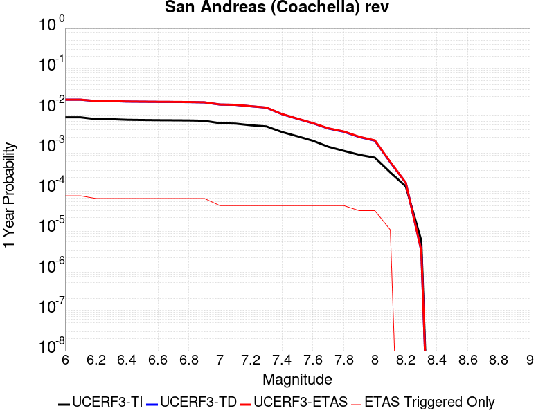 |  |

| Magnitude | 1 wk TI Prob | 1 wk TD Prob | 1 wk ETAS Prob | 1 wk ETAS/TD Gain | 1 wk ETAS Triggered Only | 1 mo TI Prob | 1 mo TD Prob | 1 mo ETAS Prob | 1 mo ETAS/TD Gain | 1 mo ETAS Triggered Only | 1 yr TI Prob | 1 yr TD Prob | 1 yr ETAS Prob | 1 yr ETAS/TD Gain | 1 yr ETAS Triggered Only | 10 yr TI Prob | 10 yr TD Prob | 10 yr ETAS Prob | 10 yr ETAS/TD Gain | 10 yr ETAS Triggered Only |
|-----|-----|-----|-----|-----|-----|-----|-----|-----|-----|-----|-----|-----|-----|-----|-----|-----|-----|-----|-----|-----|
| 6.0 | 1.1925945E-4 | 3.2808864E-4 | 3.2808864E-4 | 1.0 | 0.0 | 5.110118E-4 | 0.0014053412 | 0.0014053412 | 1.0 | 0.0 | 0.0062038354 | 0.016977139 | 0.017044337 | 1.0039582 | 6.835893E-5 | 0.060334753 | 0.15296486 | 0.15308067 | 1.0007571 | 1.3671786E-4 |
| 6.1 | 1.1925945E-4 | 3.2808864E-4 | 3.2808864E-4 | 1.0 | 0.0 | 5.110118E-4 | 0.0014053412 | 0.0014053412 | 1.0 | 0.0 | 0.0062038354 | 0.016977139 | 0.017044337 | 1.0039582 | 6.835893E-5 | 0.060334753 | 0.15296486 | 0.15308067 | 1.0007571 | 1.3671786E-4 |
| 6.2 | 1.07432395E-4 | 3.030908E-4 | 3.030908E-4 | 1.0 | 0.0 | 4.603433E-4 | 0.0012983179 | 0.0012983179 | 1.0 | 0.0 | 0.005590286 | 0.01569356 | 0.015749631 | 1.003573 | 5.6965775E-5 | 0.05451731 | 0.14213686 | 0.14224437 | 1.0007564 | 1.253247E-4 |
| 6.3 | 1.0718766E-4 | 3.0254383E-4 | 3.0254383E-4 | 1.0 | 0.0 | 4.592948E-4 | 0.0012959761 | 0.0012959761 | 1.0 | 0.0 | 0.005577586 | 0.015665459 | 0.015721532 | 1.0035794 | 5.6965775E-5 | 0.054396555 | 0.14190519 | 0.14201273 | 1.0007578 | 1.253247E-4 |
| 6.4 | 1.0355944E-4 | 2.9462355E-4 | 2.9462355E-4 | 1.0 | 0.0 | 4.4375064E-4 | 0.0012620653 | 0.0012620653 | 1.0 | 0.0 | 0.0053892885 | 0.015258447 | 0.015314544 | 1.0036764 | 5.6965775E-5 | 0.052604496 | 0.13846388 | 0.13857186 | 1.0007797 | 1.253247E-4 |
| 6.5 | 1.0227914E-4 | 2.9181747E-4 | 2.9181747E-4 | 1.0 | 0.0 | 4.382655E-4 | 0.0012500508 | 0.0012500508 | 1.0 | 0.0 | 0.0053228354 | 0.015114211 | 0.015170316 | 1.003712 | 5.6965775E-5 | 0.051971316 | 0.13724077 | 0.13734889 | 1.0007879 | 1.253247E-4 |
| 6.6 | 1.0116757E-4 | 2.8947464E-4 | 2.8947464E-4 | 1.0 | 0.0 | 4.3350324E-4 | 0.0012400197 | 0.0012400197 | 1.0 | 0.0 | 0.0052651367 | 0.014993767 | 0.015049879 | 1.0037423 | 5.6965775E-5 | 0.051421247 | 0.13621925 | 0.1363275 | 1.0007946 | 1.253247E-4 |
| 6.7 | 1.0050676E-4 | 2.8806002E-4 | 2.8806002E-4 | 1.0 | 0.0 | 4.3067214E-4 | 0.0012339628 | 0.0012339628 | 1.0 | 0.0 | 0.005230834 | 0.014921038 | 0.014977154 | 1.0037608 | 5.6965775E-5 | 0.051094085 | 0.13560389 | 0.13571222 | 1.0007988 | 1.253247E-4 |
| 6.8 | 9.976819E-5 | 2.8609566E-4 | 2.8609566E-4 | 1.0 | 0.0 | 4.2750788E-4 | 0.0012255519 | 0.0012255519 | 1.0 | 0.0 | 0.0051924936 | 0.014820035 | 0.014876156 | 1.0037869 | 5.6965775E-5 | 0.050728295 | 0.13475555 | 0.13486399 | 1.0008047 | 1.253247E-4 |
| 6.9 | 9.77719E-5 | 2.8105936E-4 | 2.8105936E-4 | 1.0 | 0.0 | 4.1895514E-4 | 0.001203988 | 0.001203988 | 1.0 | 0.0 | 0.0050888555 | 0.014561031 | 0.014617167 | 1.0038552 | 5.6965775E-5 | 0.049738888 | 0.13258252 | 0.13269122 | 1.0008199 | 1.253247E-4 |
| 7.0 | 8.500761E-5 | 2.4836304E-4 | 2.4836304E-4 | 1.0 | 0.0 | 3.6426744E-4 | 0.001063982 | 0.001063982 | 1.0 | 0.0 | 0.0044259406 | 0.01287782 | 0.012922806 | 1.0034933 | 4.557262E-5 | 0.04338823 | 0.118431985 | 0.11852238 | 1.0007633 | 1.025384E-4 |
| 7.1 | 8.319876E-5 | 2.443822E-4 | 2.443822E-4 | 1.0 | 0.0 | 3.5651738E-4 | 0.001046935 | 0.001046935 | 1.0 | 0.0 | 0.004331963 | 0.012672706 | 0.012717701 | 1.0035505 | 4.557262E-5 | 0.042484846 | 0.116649695 | 0.11674027 | 1.0007765 | 1.025384E-4 |
| 7.2 | 7.563917E-5 | 2.2484467E-4 | 2.2484467E-4 | 1.0 | 0.0 | 3.2412758E-4 | 9.6326723E-4 | 9.6326723E-4 | 1.0 | 0.0 | 0.0039391145 | 0.011665408 | 0.011710449 | 1.0038611 | 4.557262E-5 | 0.03870018 | 0.108050205 | 0.10814166 | 1.0008465 | 1.025384E-4 |
| 7.3 | 7.082985E-5 | 2.0797877E-4 | 2.0797877E-4 | 1.0 | 0.0 | 3.0352117E-4 | 8.91036E-4 | 8.91036E-4 | 1.0 | 0.0 | 0.0036891096 | 0.010795031 | 0.010840111 | 1.004176 | 4.557262E-5 | 0.03628465 | 0.100566186 | 0.10065841 | 1.0009171 | 1.025384E-4 |
| 7.4 | 5.146215E-5 | 1.4329473E-4 | 1.4329473E-4 | 1.0 | 0.0 | 2.2053342E-4 | 6.139766E-4 | 6.139766E-4 | 1.0 | 0.0 | 0.0026816884 | 0.0074497345 | 0.007494968 | 1.0060718 | 4.557262E-5 | 0.02649557 | 0.0710914 | 0.07117606 | 1.0011909 | 9.114524E-5 |
| 7.5 | 4.0285166E-5 | 1.09898356E-4 | 1.09898356E-4 | 1.0 | 0.0 | 1.7263928E-4 | 4.7090827E-4 | 4.7090827E-4 | 1.0 | 0.0 | 0.002099857 | 0.0057183066 | 0.0057636183 | 1.0079241 | 4.557262E-5 | 0.020801254 | 0.0552264 | 0.055312514 | 1.0015593 | 9.114524E-5 |
| 7.6 | 3.1168736E-5 | 8.481493E-5 | 8.481493E-5 | 1.0 | 0.0 | 1.3357346E-4 | 3.6344206E-4 | 3.6344206E-4 | 1.0 | 0.0 | 0.0016250437 | 0.004415956 | 0.0044613276 | 1.0102744 | 4.557262E-5 | 0.016132116 | 0.043002363 | 0.04308959 | 1.0020283 | 9.114524E-5 |
| 7.7 | 2.2100989E-5 | 6.276265E-5 | 6.276265E-5 | 1.0 | 0.0 | 9.4715084E-5 | 2.6895507E-4 | 2.6895507E-4 | 1.0 | 0.0 | 0.001152546 | 0.003269618 | 0.0033150415 | 1.0138927 | 4.557262E-5 | 0.011465867 | 0.03207018 | 0.03214737 | 1.0024071 | 7.9752084E-5 |
| 7.8 | 1.7484861E-5 | 5.2130177E-5 | 5.2130177E-5 | 1.0 | 0.0 | 7.493296E-5 | 2.2339592E-4 | 2.2339592E-4 | 1.0 | 0.0 | 9.1192697E-4 | 0.002716456 | 0.0027619048 | 1.0167309 | 4.557262E-5 | 0.009081938 | 0.02679226 | 0.026869876 | 1.0028969 | 7.9752084E-5 |
| 7.9 | 1.3967285E-5 | 3.849712E-5 | 3.849712E-5 | 1.0 | 0.0 | 5.985842E-5 | 1.6497723E-4 | 1.6497723E-4 | 1.0 | 0.0 | 7.2853256E-4 | 0.0020067487 | 0.0020408595 | 1.016998 | 3.4179466E-5 | 0.0072614877 | 0.020036833 | 0.020103823 | 1.0033433 | 6.835893E-5 |
| 8.0 | 1.1887396E-5 | 3.1301668E-5 | 3.1301668E-5 | 1.0 | 0.0 | 5.094499E-5 | 1.341431E-4 | 1.341431E-4 | 1.0 | 0.0 | 6.200787E-4 | 0.0016319698 | 0.0016660936 | 1.0209095 | 3.4179466E-5 | 0.006183513 | 0.016389918 | 0.016457155 | 1.0041025 | 6.835893E-5 |
| 8.1 | 5.100864E-6 | 9.071257E-6 | 9.071257E-6 | 1.0 | 0.0 | 2.1860664E-5 | 3.887624E-5 | 3.887624E-5 | 1.0 | 0.0 | 2.6612106E-4 | 4.7321554E-4 | 4.846033E-4 | 1.0240647 | 1.1393155E-5 | 0.002658026 | 0.004966687 | 0.0049780235 | 1.0022825 | 1.1393155E-5 |
| 8.2 | 2.3004484E-6 | 2.8257436E-6 | 2.8257436E-6 | 1.0 | 0.0 | 9.859027E-6 | 1.2110274E-5 | 1.2110274E-5 | 1.0 | 0.0 | 1.2002704E-4 | 1.4743264E-4 | 1.4743264E-4 | 1.0 | 0.0 | 0.0011996223 | 0.0016177493 | 0.0016177493 | 1.0 | 0.0 |
| 8.3 | 1.0424446E-7 | 5.9178852E-8 | 5.9178852E-8 | 1.0 | 0.0 | 4.4676187E-7 | 2.5362363E-7 | 2.5362363E-7 | 1.0 | 0.0 | 5.439312E-6 | 3.0878637E-6 | 3.0878637E-6 | 1.0 | 0.0 | 5.4391792E-5 | 3.2452153E-5 | 3.2452153E-5 | 1.0 | 0.0 |

## Death Valley (No)
*[(top)](#table-of-contents)*

| 1 Week | 1 Month | 1 Year | 10 Year |
|-----|-----|-----|-----|
| 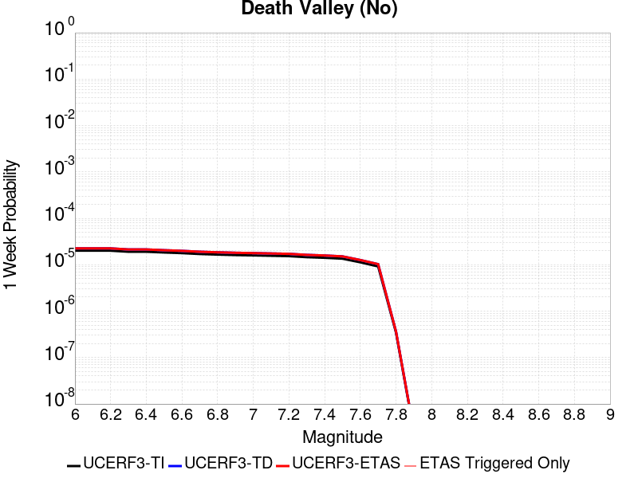 |  |  |  |

| Magnitude | 1 wk TI Prob | 1 wk TD Prob | 1 wk ETAS Prob | 1 wk ETAS/TD Gain | 1 wk ETAS Triggered Only | 1 mo TI Prob | 1 mo TD Prob | 1 mo ETAS Prob | 1 mo ETAS/TD Gain | 1 mo ETAS Triggered Only | 1 yr TI Prob | 1 yr TD Prob | 1 yr ETAS Prob | 1 yr ETAS/TD Gain | 1 yr ETAS Triggered Only | 10 yr TI Prob | 10 yr TD Prob | 10 yr ETAS Prob | 10 yr ETAS/TD Gain | 10 yr ETAS Triggered Only |
|-----|-----|-----|-----|-----|-----|-----|-----|-----|-----|-----|-----|-----|-----|-----|-----|-----|-----|-----|-----|-----|
| 6.0 | 2.0074807E-5 | 2.2506398E-5 | 2.2506398E-5 | 1.0 | 0.0 | 8.603206E-5 | 9.6452466E-5 | 9.6452466E-5 | 1.0 | 0.0 | 0.001046937 | 0.0011736836 | 0.0012305825 | 1.048479 | 5.6965775E-5 | 0.010420183 | 0.011675763 | 0.011810885 | 1.0115728 | 1.3671786E-4 |
| 6.1 | 2.0074807E-5 | 2.2506398E-5 | 2.2506398E-5 | 1.0 | 0.0 | 8.603206E-5 | 9.6452466E-5 | 9.6452466E-5 | 1.0 | 0.0 | 0.001046937 | 0.0011736836 | 0.0012305825 | 1.048479 | 5.6965775E-5 | 0.010420183 | 0.011675763 | 0.011810885 | 1.0115728 | 1.3671786E-4 |
| 6.2 | 2.0074807E-5 | 2.2506398E-5 | 2.2506398E-5 | 1.0 | 0.0 | 8.603206E-5 | 9.6452466E-5 | 9.6452466E-5 | 1.0 | 0.0 | 0.001046937 | 0.0011736836 | 0.0012305825 | 1.048479 | 5.6965775E-5 | 0.010420183 | 0.011675763 | 0.011810885 | 1.0115728 | 1.3671786E-4 |
| 6.3 | 1.9050609E-5 | 2.1342896E-5 | 2.1342896E-5 | 1.0 | 0.0 | 8.164292E-5 | 9.146639E-5 | 9.146639E-5 | 1.0 | 0.0 | 9.935491E-4 | 0.0011130412 | 0.0011699435 | 1.0511234 | 5.6965775E-5 | 0.009891188 | 0.011075489 | 0.011210693 | 1.0122075 | 1.3671786E-4 |
| 6.4 | 1.9050609E-5 | 2.1342896E-5 | 2.1342896E-5 | 1.0 | 0.0 | 8.164292E-5 | 9.146639E-5 | 9.146639E-5 | 1.0 | 0.0 | 9.935491E-4 | 0.0011130412 | 0.0011699435 | 1.0511234 | 5.6965775E-5 | 0.009891188 | 0.011075489 | 0.011210693 | 1.0122075 | 1.3671786E-4 |
| 6.5 | 1.8367004E-5 | 2.0566715E-5 | 2.0566715E-5 | 1.0 | 0.0 | 7.8713354E-5 | 8.814012E-5 | 8.814012E-5 | 1.0 | 0.0 | 9.5791375E-4 | 0.0010725843 | 0.0011294889 | 1.0530539 | 5.6965775E-5 | 0.009537951 | 0.010674862 | 0.010798849 | 1.0116148 | 1.253247E-4 |
| 6.6 | 1.779439E-5 | 1.9916431E-5 | 1.9916431E-5 | 1.0 | 0.0 | 7.625944E-5 | 8.535338E-5 | 8.535338E-5 | 1.0 | 0.0 | 9.280632E-4 | 0.0010386884 | 0.001095595 | 1.054787 | 5.6965775E-5 | 0.009241969 | 0.010339095 | 0.010463124 | 1.0119962 | 1.253247E-4 |
| 6.7 | 1.7025437E-5 | 1.904867E-5 | 1.904867E-5 | 1.0 | 0.0 | 7.296412E-5 | 8.163464E-5 | 8.163464E-5 | 1.0 | 0.0 | 8.87976E-4 | 9.934547E-4 | 0.0010503639 | 1.0572841 | 5.6965775E-5 | 0.008844362 | 0.009890855 | 0.010014941 | 1.0125455 | 1.253247E-4 |
| 6.8 | 1.6545107E-5 | 1.851766E-5 | 1.851766E-5 | 1.0 | 0.0 | 7.090568E-5 | 7.9359015E-5 | 7.9359015E-5 | 1.0 | 0.0 | 8.629347E-4 | 9.657738E-4 | 0.0010226846 | 1.0589277 | 5.6965775E-5 | 0.008595915 | 0.009616472 | 0.009740591 | 1.012907 | 1.253247E-4 |
| 6.9 | 1.615478E-5 | 1.8092618E-5 | 1.8092618E-5 | 1.0 | 0.0 | 6.9232934E-5 | 7.753752E-5 | 7.753752E-5 | 1.0 | 0.0 | 8.4258494E-4 | 9.4361656E-4 | 0.0010005286 | 1.0603126 | 5.6965775E-5 | 0.008393973 | 0.009396792 | 0.00952094 | 1.0132116 | 1.253247E-4 |
| 7.0 | 1.5894311E-5 | 1.7810518E-5 | 1.7810518E-5 | 1.0 | 0.0 | 6.81167E-5 | 7.632859E-5 | 7.632859E-5 | 1.0 | 0.0 | 8.2900526E-4 | 9.289105E-4 | 9.858233E-4 | 1.0612684 | 5.6965775E-5 | 0.008259195 | 0.009250966 | 0.009375132 | 1.0134219 | 1.253247E-4 |
| 7.1 | 1.5602263E-5 | 1.7488393E-5 | 1.7488393E-5 | 1.0 | 0.0 | 6.6865134E-5 | 7.494814E-5 | 7.494814E-5 | 1.0 | 0.0 | 8.137789E-4 | 9.1211766E-4 | 9.690315E-4 | 1.0623975 | 5.6965775E-5 | 0.008108052 | 0.009084423 | 0.009208609 | 1.0136702 | 1.253247E-4 |
| 7.2 | 1.5323829E-5 | 1.7175431E-5 | 1.7175431E-5 | 1.0 | 0.0 | 6.56719E-5 | 7.360695E-5 | 7.360695E-5 | 1.0 | 0.0 | 7.99262E-4 | 8.9580216E-4 | 9.527169E-4 | 1.063535 | 5.6965775E-5 | 0.007963934 | 0.008922589 | 0.009046796 | 1.0139204 | 1.253247E-4 |
| 7.3 | 1.4556212E-5 | 1.6306993E-5 | 1.6306993E-5 | 1.0 | 0.0 | 6.238227E-5 | 6.988527E-5 | 6.988527E-5 | 1.0 | 0.0 | 7.592395E-4 | 8.505269E-4 | 8.960607E-4 | 1.053536 | 4.557262E-5 | 0.0075665074 | 0.008473362 | 0.0085863285 | 1.0133319 | 1.1393155E-4 |
| 7.4 | 1.411725E-5 | 1.5812351E-5 | 1.5812351E-5 | 1.0 | 0.0 | 6.0501097E-5 | 6.77655E-5 | 6.77655E-5 | 1.0 | 0.0 | 7.363519E-4 | 8.247384E-4 | 8.7027345E-4 | 1.0552115 | 4.557262E-5 | 0.0073391674 | 0.008217411 | 0.008330407 | 1.0137507 | 1.1393155E-4 |
| 7.5 | 1.3503312E-5 | 1.5130505E-5 | 1.5130505E-5 | 1.0 | 0.0 | 5.7870053E-5 | 6.484344E-5 | 6.484344E-5 | 1.0 | 0.0 | 7.043401E-4 | 7.891888E-4 | 8.3472545E-4 | 1.0577006 | 4.557262E-5 | 0.007021119 | 0.007864487 | 0.007977523 | 1.014373 | 1.1393155E-4 |
| 7.6 | 1.1279839E-5 | 1.2629821E-5 | 1.2629821E-5 | 1.0 | 0.0 | 4.834127E-5 | 5.412671E-5 | 5.412671E-5 | 1.0 | 0.0 | 5.88396E-4 | 6.587988E-4 | 7.043414E-4 | 1.0691297 | 4.557262E-5 | 0.005868405 | 0.00656901 | 0.0066482383 | 1.0120609 | 7.9752084E-5 |
| 7.7 | 9.189108E-6 | 1.0286198E-5 | 1.0286198E-5 | 1.0 | 0.0 | 3.93813E-5 | 4.408299E-5 | 4.408299E-5 | 1.0 | 0.0 | 4.7936183E-4 | 5.3658325E-4 | 5.707444E-4 | 1.0636642 | 3.4179466E-5 | 0.004783291 | 0.005353388 | 0.0054100486 | 1.0105841 | 5.6965775E-5 |
| 7.8 | 3.4586725E-7 | 3.6487262E-7 | 3.6487262E-7 | 1.0 | 0.0 | 1.4822873E-6 | 1.5637388E-6 | 1.5637388E-6 | 1.0 | 0.0 | 1.80467E-5 | 1.9038358E-5 | 1.9038358E-5 | 1.0 | 0.0 | 1.8045233E-4 | 1.9036772E-4 | 1.9036772E-4 | 1.0 | 0.0 |
| 7.9 | 2.5591178E-9 | 2.6699385E-9 | 2.6699385E-9 | 1.0 | 0.0 | 1.0967647E-8 | 1.1442593E-8 | 1.1442593E-8 | 1.0 | 0.0 | 1.335311E-7 | 1.3931357E-7 | 1.3931357E-7 | 1.0 | 0.0 | 1.3353102E-6 | 1.3931357E-6 | 1.3931357E-6 | 1.0 | 0.0 |

## Elsinore (Glen Ivy) rev
*[(top)](#table-of-contents)*

| 1 Week | 1 Month | 1 Year | 10 Year |
|-----|-----|-----|-----|
|  |  |  |  |

| Magnitude | 1 wk TI Prob | 1 wk TD Prob | 1 wk ETAS Prob | 1 wk ETAS/TD Gain | 1 wk ETAS Triggered Only | 1 mo TI Prob | 1 mo TD Prob | 1 mo ETAS Prob | 1 mo ETAS/TD Gain | 1 mo ETAS Triggered Only | 1 yr TI Prob | 1 yr TD Prob | 1 yr ETAS Prob | 1 yr ETAS/TD Gain | 1 yr ETAS Triggered Only | 10 yr TI Prob | 10 yr TD Prob | 10 yr ETAS Prob | 10 yr ETAS/TD Gain | 10 yr ETAS Triggered Only |
|-----|-----|-----|-----|-----|-----|-----|-----|-----|-----|-----|-----|-----|-----|-----|-----|-----|-----|-----|-----|-----|
| 6.0 | 1.6204086E-4 | 2.9416234E-4 | 2.9416234E-4 | 1.0 | 0.0 | 6.94276E-4 | 0.0012601413 | 0.0012601413 | 1.0 | 0.0 | 0.008420097 | 0.015255925 | 0.015289583 | 1.0022062 | 3.4179466E-5 | 0.081081145 | 0.1399143 | 0.1400221 | 1.0007704 | 1.253247E-4 |
| 6.1 | 1.6204086E-4 | 2.9416234E-4 | 2.9416234E-4 | 1.0 | 0.0 | 6.94276E-4 | 0.0012601413 | 0.0012601413 | 1.0 | 0.0 | 0.008420097 | 0.015255925 | 0.015289583 | 1.0022062 | 3.4179466E-5 | 0.081081145 | 0.1399143 | 0.1400221 | 1.0007704 | 1.253247E-4 |
| 6.2 | 1.6204086E-4 | 2.9416234E-4 | 2.9416234E-4 | 1.0 | 0.0 | 6.94276E-4 | 0.0012601413 | 0.0012601413 | 1.0 | 0.0 | 0.008420097 | 0.015255925 | 0.015289583 | 1.0022062 | 3.4179466E-5 | 0.081081145 | 0.1399143 | 0.1400221 | 1.0007704 | 1.253247E-4 |
| 6.3 | 1.0111737E-4 | 1.7737556E-4 | 1.7737556E-4 | 1.0 | 0.0 | 4.332882E-4 | 7.600767E-4 | 7.600767E-4 | 1.0 | 0.0 | 0.005262531 | 0.009235453 | 0.009269317 | 1.0036668 | 3.4179466E-5 | 0.0513964 | 0.08713894 | 0.08723255 | 1.0010742 | 1.025384E-4 |
| 6.4 | 1.0111737E-4 | 1.7737556E-4 | 1.7737556E-4 | 1.0 | 0.0 | 4.332882E-4 | 7.600767E-4 | 7.600767E-4 | 1.0 | 0.0 | 0.005262531 | 0.009235453 | 0.009269317 | 1.0036668 | 3.4179466E-5 | 0.0513964 | 0.08713894 | 0.08723255 | 1.0010742 | 1.025384E-4 |
| 6.5 | 3.6624708E-5 | 4.6430177E-5 | 4.6430177E-5 | 1.0 | 0.0 | 1.569536E-4 | 1.9897327E-4 | 1.9897327E-4 | 1.0 | 0.0 | 0.001909235 | 0.0024201695 | 0.0024315352 | 1.0046962 | 1.1393155E-5 | 0.01892915 | 0.023791492 | 0.02383598 | 1.0018699 | 4.557262E-5 |
| 6.6 | 2.5051324E-5 | 2.6176222E-5 | 2.6176222E-5 | 1.0 | 0.0 | 1.073584E-4 | 1.1217924E-4 | 1.1217924E-4 | 1.0 | 0.0 | 0.0013063047 | 0.0013649712 | 0.0013763488 | 1.0083355 | 1.1393155E-5 | 0.012986525 | 0.013582029 | 0.013604507 | 1.0016549 | 2.278631E-5 |
| 6.7 | 2.2189772E-5 | 2.2091886E-5 | 2.2091886E-5 | 1.0 | 0.0 | 9.509556E-5 | 9.467628E-5 | 9.467628E-5 | 1.0 | 0.0 | 0.0011571734 | 0.0011521106 | 0.0011634907 | 1.0098776 | 1.1393155E-5 | 0.011511663 | 0.011477983 | 0.011500508 | 1.0019624 | 2.278631E-5 |
| 6.8 | 1.6654378E-5 | 1.4449492E-5 | 1.4449492E-5 | 1.0 | 0.0 | 7.137396E-5 | 6.1924955E-5 | 6.1924955E-5 | 1.0 | 0.0 | 8.686314E-4 | 7.5368065E-4 | 7.6506526E-4 | 1.0151052 | 1.1393155E-5 | 0.008652439 | 0.0075164316 | 0.007527739 | 1.0015044 | 1.1393155E-5 |
| 6.9 | 1.5042909E-5 | 1.2342169E-5 | 1.2342169E-5 | 1.0 | 0.0 | 6.446802E-5 | 5.2893953E-5 | 5.2893953E-5 | 1.0 | 0.0 | 7.8461546E-4 | 6.4379675E-4 | 6.551826E-4 | 1.0176854 | 1.1393155E-5 | 0.007818509 | 0.0064234105 | 0.0064347307 | 1.0017623 | 1.1393155E-5 |
| 7.0 | 1.4361385E-5 | 1.1460876E-5 | 1.1460876E-5 | 1.0 | 0.0 | 6.154734E-5 | 4.911713E-5 | 4.911713E-5 | 1.0 | 0.0 | 7.490812E-4 | 5.9783994E-4 | 6.092263E-4 | 1.0190458 | 1.1393155E-5 | 0.007465612 | 0.0059662526 | 0.0059775775 | 1.0018982 | 1.1393155E-5 |
| 7.1 | 1.3265571E-5 | 1.0253452E-5 | 1.0253452E-5 | 1.0 | 0.0 | 5.6851208E-5 | 4.394264E-5 | 4.394264E-5 | 1.0 | 0.0 | 6.919436E-4 | 5.348729E-4 | 5.462599E-4 | 1.0212892 | 1.1393155E-5 | 0.006897931 | 0.0053390316 | 0.005350364 | 1.0021225 | 1.1393155E-5 |
| 7.2 | 1.1596403E-5 | 8.512154E-6 | 8.512154E-6 | 1.0 | 0.0 | 4.9697923E-5 | 3.6480156E-5 | 3.6480156E-5 | 1.0 | 0.0 | 6.049042E-4 | 4.440571E-4 | 4.554452E-4 | 1.0256456 | 1.1393155E-5 | 0.006032603 | 0.0044329935 | 0.0044443365 | 1.0025587 | 1.1393155E-5 |
| 7.3 | 1.0150827E-5 | 7.24474E-6 | 7.24474E-6 | 1.0 | 0.0 | 4.3502816E-5 | 3.1048527E-5 | 3.1048527E-5 | 1.0 | 0.0 | 5.2951806E-4 | 3.7795166E-4 | 3.893405E-4 | 1.0301331 | 1.1393155E-5 | 0.005282581 | 0.003773445 | 0.003784795 | 1.0030079 | 1.1393155E-5 |
| 7.4 | 9.080705E-6 | 6.357734E-6 | 6.357734E-6 | 1.0 | 0.0 | 3.8916725E-5 | 2.7247155E-5 | 2.7247155E-5 | 1.0 | 0.0 | 4.7370812E-4 | 3.3168498E-4 | 3.3168498E-4 | 1.0 | 0.0 | 0.004726996 | 0.0033120539 | 0.0033120539 | 1.0 | 0.0 |
| 7.5 | 7.671649E-6 | 5.229976E-6 | 5.229976E-6 | 1.0 | 0.0 | 3.287808E-5 | 2.2413999E-5 | 2.2413999E-5 | 1.0 | 0.0 | 4.0021708E-4 | 2.7285752E-4 | 2.7285752E-4 | 1.0 | 0.0 | 0.0039949706 | 0.00272535 | 0.00272535 | 1.0 | 0.0 |
| 7.6 | 6.990086E-6 | 4.6915106E-6 | 4.6915106E-6 | 1.0 | 0.0 | 2.9957167E-5 | 2.0106325E-5 | 2.0106325E-5 | 1.0 | 0.0 | 3.6466747E-4 | 2.447682E-4 | 2.447682E-4 | 1.0 | 0.0 | 0.0036406964 | 0.0024451024 | 0.0024451024 | 1.0 | 0.0 |
| 7.7 | 4.163505E-6 | 2.3316434E-6 | 2.3316434E-6 | 1.0 | 0.0 | 1.7843471E-5 | 9.992723E-6 | 9.992723E-6 | 1.0 | 0.0 | 2.172226E-4 | 1.2165536E-4 | 1.2165536E-4 | 1.0 | 0.0 | 0.0021701038 | 0.0012159608 | 0.0012159608 | 1.0 | 0.0 |
| 7.8 | 2.2692414E-7 | 9.3929124E-8 | 9.3929124E-8 | 1.0 | 0.0 | 9.725317E-7 | 4.0255333E-7 | 4.0255333E-7 | 1.0 | 0.0 | 1.1840509E-5 | 4.901079E-6 | 4.901079E-6 | 1.0 | 0.0 | 1.1839878E-4 | 4.901004E-5 | 4.901004E-5 | 1.0 | 0.0 |
| 7.9 | 6.676829E-9 | 3.4418608E-9 | 3.4418608E-9 | 1.0 | 0.0 | 2.861498E-8 | 1.4750832E-8 | 1.4750832E-8 | 1.0 | 0.0 | 3.4838732E-7 | 1.7959135E-7 | 1.7959135E-7 | 1.0 | 0.0 | 3.4838679E-6 | 1.7959123E-6 | 1.7959123E-6 | 1.0 | 0.0 |

## Red Pass
*[(top)](#table-of-contents)*

| 1 Week | 1 Month | 1 Year | 10 Year |
|-----|-----|-----|-----|
| 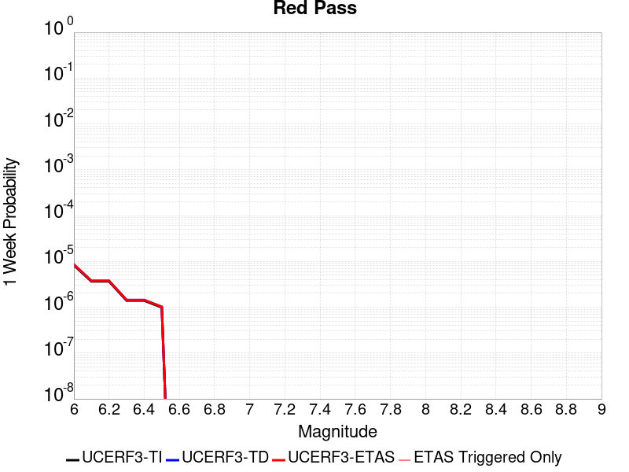 |  |  |  |

| Magnitude | 1 wk TI Prob | 1 wk TD Prob | 1 wk ETAS Prob | 1 wk ETAS/TD Gain | 1 wk ETAS Triggered Only | 1 mo TI Prob | 1 mo TD Prob | 1 mo ETAS Prob | 1 mo ETAS/TD Gain | 1 mo ETAS Triggered Only | 1 yr TI Prob | 1 yr TD Prob | 1 yr ETAS Prob | 1 yr ETAS/TD Gain | 1 yr ETAS Triggered Only | 10 yr TI Prob | 10 yr TD Prob | 10 yr ETAS Prob | 10 yr ETAS/TD Gain | 10 yr ETAS Triggered Only |
|-----|-----|-----|-----|-----|-----|-----|-----|-----|-----|-----|-----|-----|-----|-----|-----|-----|-----|-----|-----|-----|
| 6.0 | 8.258278E-6 | 8.551966E-6 | 8.551966E-6 | 1.0 | 0.0 | 3.539214E-5 | 3.665087E-5 | 3.665087E-5 | 1.0 | 0.0 | 4.308141E-4 | 4.4615084E-4 | 4.8031507E-4 | 1.0765755 | 3.4179466E-5 | 0.0042997985 | 0.0044543096 | 0.004556391 | 1.0229175 | 1.025384E-4 |
| 6.1 | 3.649988E-6 | 3.7756158E-6 | 3.7756158E-6 | 1.0 | 0.0 | 1.5642712E-5 | 1.6181137E-5 | 1.6181137E-5 | 1.0 | 0.0 | 1.9043336E-4 | 1.9699229E-4 | 2.3116503E-4 | 1.1734724 | 3.4179466E-5 | 0.0019027026 | 0.001968644 | 0.002048239 | 1.0404314 | 7.9752084E-5 |
| 6.2 | 3.649988E-6 | 3.7756158E-6 | 3.7756158E-6 | 1.0 | 0.0 | 1.5642712E-5 | 1.6181137E-5 | 1.6181137E-5 | 1.0 | 0.0 | 1.9043336E-4 | 1.9699229E-4 | 2.3116503E-4 | 1.1734724 | 3.4179466E-5 | 0.0019027026 | 0.001968644 | 0.002048239 | 1.0404314 | 7.9752084E-5 |
| 6.3 | 1.3924937E-6 | 1.4412329E-6 | 1.4412329E-6 | 1.0 | 0.0 | 5.9678164E-6 | 6.176706E-6 | 6.176706E-6 | 1.0 | 0.0 | 7.265574E-5 | 7.5200216E-5 | 7.5200216E-5 | 1.0 | 0.0 | 7.263199E-4 | 7.5188646E-4 | 7.7465567E-4 | 1.0302827 | 2.278631E-5 |
| 6.4 | 1.3924937E-6 | 1.4412329E-6 | 1.4412329E-6 | 1.0 | 0.0 | 5.9678164E-6 | 6.176706E-6 | 6.176706E-6 | 1.0 | 0.0 | 7.265574E-5 | 7.5200216E-5 | 7.5200216E-5 | 1.0 | 0.0 | 7.263199E-4 | 7.5188646E-4 | 7.7465567E-4 | 1.0302827 | 2.278631E-5 |
| 6.5 | 9.876812E-7 | 1.0222738E-6 | 1.0222738E-6 | 1.0 | 0.0 | 4.2329125E-6 | 4.3811733E-6 | 4.3811733E-6 | 1.0 | 0.0 | 5.153449E-5 | 5.3340784E-5 | 5.3340784E-5 | 1.0 | 0.0 | 5.1522546E-4 | 5.3340785E-4 | 5.56182E-4 | 1.0426955 | 2.278631E-5 |

## Santa Ynez (West)
*[(top)](#table-of-contents)*

| 1 Week | 1 Month | 1 Year | 10 Year |
|-----|-----|-----|-----|
|  |  |  | 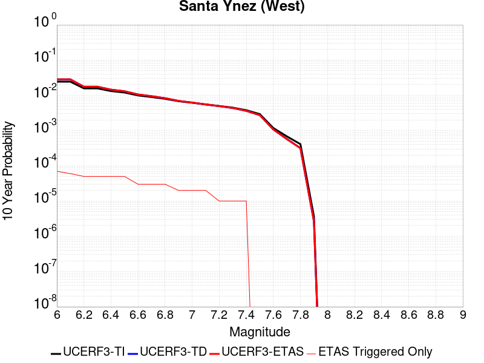 |

| Magnitude | 1 wk TI Prob | 1 wk TD Prob | 1 wk ETAS Prob | 1 wk ETAS/TD Gain | 1 wk ETAS Triggered Only | 1 mo TI Prob | 1 mo TD Prob | 1 mo ETAS Prob | 1 mo ETAS/TD Gain | 1 mo ETAS Triggered Only | 1 yr TI Prob | 1 yr TD Prob | 1 yr ETAS Prob | 1 yr ETAS/TD Gain | 1 yr ETAS Triggered Only | 10 yr TI Prob | 10 yr TD Prob | 10 yr ETAS Prob | 10 yr ETAS/TD Gain | 10 yr ETAS Triggered Only |
|-----|-----|-----|-----|-----|-----|-----|-----|-----|-----|-----|-----|-----|-----|-----|-----|-----|-----|-----|-----|-----|
| 6.0 | 4.7352758E-5 | 5.4995E-5 | 5.4995E-5 | 1.0 | 0.0 | 2.0292461E-4 | 2.3567321E-4 | 2.3567321E-4 | 1.0 | 0.0 | 0.0024678076 | 0.0028658141 | 0.0029112562 | 1.0158566 | 4.557262E-5 | 0.024405818 | 0.028316684 | 0.028394178 | 1.0027367 | 7.9752084E-5 |
| 6.1 | 4.7352758E-5 | 5.4995E-5 | 5.4995E-5 | 1.0 | 0.0 | 2.0292461E-4 | 2.3567321E-4 | 2.3567321E-4 | 1.0 | 0.0 | 0.0024678076 | 0.0028658141 | 0.0029112562 | 1.0158566 | 4.557262E-5 | 0.024405818 | 0.028316684 | 0.028383108 | 1.0023457 | 6.835893E-5 |
| 6.2 | 3.0415853E-5 | 3.3937395E-5 | 3.3937395E-5 | 1.0 | 0.0 | 1.3034715E-4 | 1.4543808E-4 | 1.4543808E-4 | 1.0 | 0.0 | 0.0015858212 | 0.0017693047 | 0.0018034237 | 1.0192839 | 3.4179466E-5 | 0.015745522 | 0.017556129 | 0.017612094 | 1.0031878 | 5.6965775E-5 |
| 6.3 | 3.0415853E-5 | 3.3937395E-5 | 3.3937395E-5 | 1.0 | 0.0 | 1.3034715E-4 | 1.4543808E-4 | 1.4543808E-4 | 1.0 | 0.0 | 0.0015858212 | 0.0017693047 | 0.0018034237 | 1.0192839 | 3.4179466E-5 | 0.015745522 | 0.017556129 | 0.017612094 | 1.0031878 | 5.6965775E-5 |
| 6.4 | 2.5452082E-5 | 2.7921762E-5 | 2.7921762E-5 | 1.0 | 0.0 | 1.09075794E-4 | 1.19659315E-4 | 1.19659315E-4 | 1.0 | 0.0 | 0.0013271887 | 0.0014558976 | 0.0014900273 | 1.0234424 | 3.4179466E-5 | 0.013192902 | 0.014465765 | 0.014521907 | 1.003881 | 5.6965775E-5 |
| 6.5 | 2.3143784E-5 | 2.5136245E-5 | 2.5136245E-5 | 1.0 | 0.0 | 9.9183875E-5 | 1.077224E-4 | 1.077224E-4 | 1.0 | 0.0 | 0.0012068948 | 0.0013107457 | 0.0013448804 | 1.0260422 | 3.4179466E-5 | 0.012003611 | 0.013031816 | 0.013088039 | 1.0043143 | 5.6965775E-5 |
| 6.6 | 1.9118515E-5 | 2.0360296E-5 | 2.0360296E-5 | 1.0 | 0.0 | 8.193392E-5 | 8.725553E-5 | 8.725553E-5 | 1.0 | 0.0 | 9.97089E-4 | 0.0010618264 | 0.0010845885 | 1.0214368 | 2.278631E-5 | 0.00992627 | 0.010568441 | 0.010602259 | 1.0031999 | 3.4179466E-5 |
| 6.7 | 1.722807E-5 | 1.8151439E-5 | 1.8151439E-5 | 1.0 | 0.0 | 7.3832496E-5 | 7.77896E-5 | 7.77896E-5 | 1.0 | 0.0 | 8.985399E-4 | 9.466824E-4 | 9.6944714E-4 | 1.0240469 | 2.278631E-5 | 0.008949154 | 0.009427142 | 0.009461 | 1.0035914 | 3.4179466E-5 |
| 6.8 | 1.5317364E-5 | 1.593074E-5 | 1.593074E-5 | 1.0 | 0.0 | 6.56442E-5 | 6.8272835E-5 | 6.8272835E-5 | 1.0 | 0.0 | 7.98925E-4 | 8.309091E-4 | 8.5367647E-4 | 1.0274006 | 2.278631E-5 | 0.007960589 | 0.008278511 | 0.008312408 | 1.0040945 | 3.4179466E-5 |
| 6.9 | 1.3071226E-5 | 1.3332935E-5 | 1.3332935E-5 | 1.0 | 0.0 | 5.6018336E-5 | 5.713991E-5 | 5.713991E-5 | 1.0 | 0.0 | 6.8180985E-4 | 6.954586E-4 | 7.182291E-4 | 1.0327417 | 2.278631E-5 | 0.0067972173 | 0.006933083 | 0.006955711 | 1.0032638 | 2.278631E-5 |
| 7.0 | 1.1836986E-5 | 1.1935664E-5 | 1.1935664E-5 | 1.0 | 0.0 | 5.0728955E-5 | 5.1151852E-5 | 5.1151852E-5 | 1.0 | 0.0 | 6.1745E-4 | 6.225975E-4 | 6.4536964E-4 | 1.036576 | 2.278631E-5 | 0.006157372 | 0.0062087257 | 0.0062313704 | 1.0036472 | 2.278631E-5 |
| 7.1 | 1.0597169E-5 | 1.0544688E-5 | 1.0544688E-5 | 1.0 | 0.0 | 4.541565E-5 | 4.5190744E-5 | 4.5190744E-5 | 1.0 | 0.0 | 5.5279525E-4 | 5.5005954E-4 | 5.728333E-4 | 1.0414023 | 2.278631E-5 | 0.0055142213 | 0.0054871114 | 0.005509773 | 1.0041299 | 2.278631E-5 |
| 7.2 | 9.59113E-6 | 9.461437E-6 | 9.461437E-6 | 1.0 | 0.0 | 4.11042E-5 | 4.054839E-5 | 4.054839E-5 | 1.0 | 0.0 | 5.0032866E-4 | 4.935659E-4 | 5.0495344E-4 | 1.023072 | 1.1393155E-5 | 0.004992037 | 0.004924816 | 0.004936153 | 1.002302 | 1.1393155E-5 |
| 7.3 | 8.586084E-6 | 8.381689E-6 | 8.381689E-6 | 1.0 | 0.0 | 3.679698E-5 | 3.592104E-5 | 3.592104E-5 | 1.0 | 0.0 | 4.4791115E-4 | 4.372519E-4 | 4.486401E-4 | 1.0260448 | 1.1393155E-5 | 0.004470094 | 0.004364027 | 0.0043753707 | 1.0025994 | 1.1393155E-5 |
| 7.4 | 7.2622997E-6 | 6.9533808E-6 | 6.9533808E-6 | 1.0 | 0.0 | 3.112377E-5 | 2.9799869E-5 | 2.9799869E-5 | 1.0 | 0.0 | 3.78866E-4 | 3.6275396E-4 | 3.7414298E-4 | 1.031396 | 1.1393155E-5 | 0.0037822074 | 0.0036217186 | 0.0036330705 | 1.0031344 | 1.1393155E-5 |
| 7.5 | 5.627296E-6 | 5.2528007E-6 | 5.2528007E-6 | 1.0 | 0.0 | 2.411676E-5 | 2.2511813E-5 | 2.2511813E-5 | 1.0 | 0.0 | 2.9358198E-4 | 2.7404758E-4 | 2.7404758E-4 | 1.0 | 0.0 | 0.0029319443 | 0.0027371682 | 0.0027371682 | 1.0 | 0.0 |
| 7.6 | 2.265244E-6 | 2.061176E-6 | 2.061176E-6 | 1.0 | 0.0 | 9.708152E-6 | 8.833582E-6 | 8.833582E-6 | 1.0 | 0.0 | 1.18190335E-4 | 1.0754364E-4 | 1.0754364E-4 | 1.0 | 0.0 | 0.001181275 | 0.0010749245 | 0.0010749245 | 1.0 | 0.0 |
| 7.7 | 1.3099874E-6 | 1.1017877E-6 | 1.1017877E-6 | 1.0 | 0.0 | 5.61422E-6 | 4.7219387E-6 | 4.7219387E-6 | 1.0 | 0.0 | 6.8350986E-5 | 5.748811E-5 | 5.748811E-5 | 1.0 | 0.0 | 6.832996E-4 | 5.7473476E-4 | 5.7473476E-4 | 1.0 | 0.0 |
| 7.8 | 7.903951E-7 | 6.071946E-7 | 6.071946E-7 | 1.0 | 0.0 | 3.3874032E-6 | 2.60226E-6 | 2.60226E-6 | 1.0 | 0.0 | 4.1240855E-5 | 3.168207E-5 | 3.168207E-5 | 1.0 | 0.0 | 4.12332E-4 | 3.1677686E-4 | 3.1677686E-4 | 1.0 | 0.0 |
| 7.9 | 7.0753297E-9 | 5.0904827E-9 | 5.0904827E-9 | 1.0 | 0.0 | 3.032284E-8 | 2.1816355E-8 | 2.1816355E-8 | 1.0 | 0.0 | 3.6918053E-7 | 2.656141E-7 | 2.656141E-7 | 1.0 | 0.0 | 3.691799E-6 | 2.6561388E-6 | 2.6561388E-6 | 1.0 | 0.0 |

## San Jacinto (San Bernardino)
*[(top)](#table-of-contents)*

| 1 Week | 1 Month | 1 Year | 10 Year |
|-----|-----|-----|-----|
|  |  |  |  |

| Magnitude | 1 wk TI Prob | 1 wk TD Prob | 1 wk ETAS Prob | 1 wk ETAS/TD Gain | 1 wk ETAS Triggered Only | 1 mo TI Prob | 1 mo TD Prob | 1 mo ETAS Prob | 1 mo ETAS/TD Gain | 1 mo ETAS Triggered Only | 1 yr TI Prob | 1 yr TD Prob | 1 yr ETAS Prob | 1 yr ETAS/TD Gain | 1 yr ETAS Triggered Only | 10 yr TI Prob | 10 yr TD Prob | 10 yr ETAS Prob | 10 yr ETAS/TD Gain | 10 yr ETAS Triggered Only |
|-----|-----|-----|-----|-----|-----|-----|-----|-----|-----|-----|-----|-----|-----|-----|-----|-----|-----|-----|-----|-----|
| 6.0 | 3.409352E-5 | 3.6263704E-5 | 3.6263704E-5 | 1.0 | 0.0 | 1.461069E-4 | 1.5540663E-4 | 1.6679801E-4 | 1.0733005 | 1.1393155E-5 | 0.0017774 | 0.0018904353 | 0.0019245502 | 1.018046 | 3.4179466E-5 | 0.01763251 | 0.019491682 | 0.019603392 | 1.0057312 | 1.1393155E-4 |
| 6.1 | 3.409352E-5 | 3.6263704E-5 | 3.6263704E-5 | 1.0 | 0.0 | 1.461069E-4 | 1.5540663E-4 | 1.6679801E-4 | 1.0733005 | 1.1393155E-5 | 0.0017774 | 0.0018904353 | 0.0019245502 | 1.018046 | 3.4179466E-5 | 0.01763251 | 0.019491682 | 0.019603392 | 1.0057312 | 1.1393155E-4 |
| 6.2 | 3.409352E-5 | 3.6263704E-5 | 3.6263704E-5 | 1.0 | 0.0 | 1.461069E-4 | 1.5540663E-4 | 1.6679801E-4 | 1.0733005 | 1.1393155E-5 | 0.0017774 | 0.0018904353 | 0.0019245502 | 1.018046 | 3.4179466E-5 | 0.01763251 | 0.019491682 | 0.019603392 | 1.0057312 | 1.1393155E-4 |
| 6.3 | 3.409352E-5 | 3.6263704E-5 | 3.6263704E-5 | 1.0 | 0.0 | 1.461069E-4 | 1.5540663E-4 | 1.6679801E-4 | 1.0733005 | 1.1393155E-5 | 0.0017774 | 0.0018904353 | 0.0019245502 | 1.018046 | 3.4179466E-5 | 0.01763251 | 0.019491682 | 0.019603392 | 1.0057312 | 1.1393155E-4 |
| 6.4 | 3.400795E-5 | 3.6156307E-5 | 3.6156307E-5 | 1.0 | 0.0 | 1.4574021E-4 | 1.549464E-4 | 1.6633779E-4 | 1.0735183 | 1.1393155E-5 | 0.0017729428 | 0.001884842 | 0.001918957 | 1.0180997 | 3.4179466E-5 | 0.017588645 | 0.01943674 | 0.019548455 | 1.0057477 | 1.1393155E-4 |
| 6.5 | 3.341482E-5 | 3.541652E-5 | 3.541652E-5 | 1.0 | 0.0 | 1.4319851E-4 | 1.5177626E-4 | 1.6316769E-4 | 1.075054 | 1.1393155E-5 | 0.0017420477 | 0.0018463111 | 0.0018690554 | 1.0123187 | 2.278631E-5 | 0.017284546 | 0.019058121 | 0.01914753 | 1.0046914 | 9.114524E-5 |
| 6.6 | 3.3364955E-5 | 3.53537E-5 | 3.53537E-5 | 1.0 | 0.0 | 1.4298483E-4 | 1.5150706E-4 | 1.6289849E-4 | 1.0751874 | 1.1393155E-5 | 0.0017394501 | 0.0018430393 | 0.0018657837 | 1.0123407 | 2.278631E-5 | 0.017258976 | 0.019025972 | 0.019115385 | 1.0046995 | 9.114524E-5 |
| 6.7 | 3.335922E-5 | 3.534347E-5 | 3.534347E-5 | 1.0 | 0.0 | 1.4296026E-4 | 1.5146322E-4 | 1.6285465E-4 | 1.0752093 | 1.1393155E-5 | 0.0017391514 | 0.0018425063 | 0.0018652508 | 1.0123442 | 2.278631E-5 | 0.017256035 | 0.019020762 | 0.019110175 | 1.0047008 | 9.114524E-5 |
| 6.8 | 3.327683E-5 | 3.5237466E-5 | 3.5237466E-5 | 1.0 | 0.0 | 1.4260718E-4 | 1.5100898E-4 | 1.6240042E-4 | 1.0754355 | 1.1393155E-5 | 0.0017348597 | 0.0018369853 | 0.0018597299 | 1.0123814 | 2.278631E-5 | 0.017213784 | 0.018966507 | 0.019055923 | 1.0047145 | 9.114524E-5 |
| 6.9 | 3.3235785E-5 | 3.517838E-5 | 3.517838E-5 | 1.0 | 0.0 | 1.4243131E-4 | 1.5075578E-4 | 1.6214722E-4 | 1.0755622 | 1.1393155E-5 | 0.0017327217 | 0.0018339078 | 0.0018566523 | 1.0124022 | 2.278631E-5 | 0.017192734 | 0.018936358 | 0.019025777 | 1.0047221 | 9.114524E-5 |
| 7.0 | 3.3197095E-5 | 3.511826E-5 | 3.511826E-5 | 1.0 | 0.0 | 1.422655E-4 | 1.5049815E-4 | 1.6188959E-4 | 1.0756916 | 1.1393155E-5 | 0.0017307063 | 0.0018307766 | 0.0018535211 | 1.0124235 | 2.278631E-5 | 0.017172894 | 0.018905716 | 0.018995138 | 1.0047299 | 9.114524E-5 |
| 7.1 | 3.3129716E-5 | 3.499836E-5 | 3.499836E-5 | 1.0 | 0.0 | 1.4197677E-4 | 1.4998435E-4 | 1.613758E-4 | 1.0759509 | 1.1393155E-5 | 0.0017271966 | 0.0018245316 | 0.0018472762 | 1.0124661 | 2.278631E-5 | 0.017138338 | 0.018844748 | 0.018934175 | 1.0047455 | 9.114524E-5 |
| 7.2 | 3.3034008E-5 | 3.486572E-5 | 3.486572E-5 | 1.0 | 0.0 | 1.4156665E-4 | 1.4941597E-4 | 1.6080742E-4 | 1.0762398 | 1.1393155E-5 | 0.0017222111 | 0.001817623 | 0.0018403679 | 1.0125135 | 2.278631E-5 | 0.017089253 | 0.018777112 | 0.018866545 | 1.0047629 | 9.114524E-5 |
| 7.3 | 3.2956614E-5 | 3.4733315E-5 | 3.4733315E-5 | 1.0 | 0.0 | 1.4123498E-4 | 1.4884857E-4 | 1.6024003E-4 | 1.0765306 | 1.1393155E-5 | 0.0017181796 | 0.0018107265 | 0.0018334715 | 1.0125613 | 2.278631E-5 | 0.017049557 | 0.01870978 | 0.018799221 | 1.0047804 | 9.114524E-5 |
| 7.4 | 3.2915937E-5 | 3.465488E-5 | 3.465488E-5 | 1.0 | 0.0 | 1.4106068E-4 | 1.4851247E-4 | 1.5990394E-4 | 1.0767038 | 1.1393155E-5 | 0.0017160608 | 0.0018066412 | 0.0018293863 | 1.0125897 | 2.278631E-5 | 0.017028693 | 0.018669993 | 0.018759437 | 1.0047908 | 9.114524E-5 |
| 7.5 | 3.281791E-5 | 3.4519595E-5 | 3.4519595E-5 | 1.0 | 0.0 | 1.406406E-4 | 1.4793273E-4 | 1.593242E-4 | 1.0770044 | 1.1393155E-5 | 0.0017109542 | 0.0017995946 | 0.00182234 | 1.0126392 | 2.278631E-5 | 0.016978411 | 0.018600788 | 0.018690238 | 1.0048089 | 9.114524E-5 |
| 7.6 | 3.2521442E-5 | 3.4244018E-5 | 3.4244018E-5 | 1.0 | 0.0 | 1.3937015E-4 | 1.4675183E-4 | 1.5814332E-4 | 1.0776241 | 1.1393155E-5 | 0.0016955109 | 0.0017852407 | 0.0018079864 | 1.012741 | 2.278631E-5 | 0.016826328 | 0.018458195 | 0.018547658 | 1.0048468 | 9.114524E-5 |
| 7.7 | 3.0287873E-5 | 3.2724896E-5 | 3.2724896E-5 | 1.0 | 0.0 | 1.297987E-4 | 1.4024203E-4 | 1.5163359E-4 | 1.0812279 | 1.1393155E-5 | 0.0015791537 | 0.0017061107 | 0.0017288581 | 1.013333 | 2.278631E-5 | 0.01567979 | 0.01766762 | 0.017757155 | 1.0050677 | 9.114524E-5 |
| 7.8 | 2.6316151E-5 | 2.9925775E-5 | 2.9925775E-5 | 1.0 | 0.0 | 1.1277862E-4 | 1.2824702E-4 | 1.3963872E-4 | 1.0888262 | 1.1393155E-5 | 0.0013722149 | 0.0015602902 | 0.0015830409 | 1.0145811 | 2.278631E-5 | 0.013637724 | 0.016204199 | 0.016293868 | 1.0055337 | 9.114524E-5 |
| 7.9 | 2.0761147E-5 | 2.3646511E-5 | 2.3646511E-5 | 1.0 | 0.0 | 8.897331E-5 | 1.0133826E-4 | 1.1273026E-4 | 1.1124156 | 1.1393155E-5 | 0.0010827117 | 0.0012330959 | 0.001255854 | 1.0184561 | 2.278631E-5 | 0.010774517 | 0.012911175 | 0.012989898 | 1.0060972 | 7.9752084E-5 |
| 8.0 | 1.5738568E-5 | 1.6204982E-5 | 1.6204982E-5 | 1.0 | 0.0 | 6.744926E-5 | 6.944808E-5 | 6.944808E-5 | 1.0 | 0.0 | 8.2088535E-4 | 8.4520306E-4 | 8.4520306E-4 | 1.0 | 0.0 | 0.008178596 | 0.008956207 | 0.008967498 | 1.0012608 | 1.1393155E-5 |
| 8.1 | 1.0105832E-5 | 8.430248E-6 | 8.430248E-6 | 1.0 | 0.0 | 4.3309992E-5 | 3.612914E-5 | 3.612914E-5 | 1.0 | 0.0 | 5.2717153E-4 | 4.39784E-4 | 4.39784E-4 | 1.0 | 0.0 | 0.005259227 | 0.00473087 | 0.0047422093 | 1.0023968 | 1.1393155E-5 |
| 8.2 | 4.189207E-6 | 1.6069746E-6 | 1.6069746E-6 | 1.0 | 0.0 | 1.7953622E-5 | 6.887016E-6 | 6.887016E-6 | 1.0 | 0.0 | 2.1856341E-4 | 8.384622E-5 | 8.384622E-5 | 1.0 | 0.0 | 0.0021834858 | 9.729523E-4 | 9.729523E-4 | 1.0 | 0.0 |
| 8.3 | 1.2758221E-6 | 3.6914315E-7 | 3.6914315E-7 | 1.0 | 0.0 | 5.4677976E-6 | 1.5820413E-6 | 1.5820413E-6 | 1.0 | 0.0 | 6.65684E-5 | 1.9261186E-5 | 1.9261186E-5 | 1.0 | 0.0 | 6.6548464E-4 | 2.3201035E-4 | 2.3201035E-4 | 1.0 | 0.0 |

## Manix-Afton Hills
*[(top)](#table-of-contents)*

| 1 Week | 1 Month | 1 Year | 10 Year |
|-----|-----|-----|-----|
| 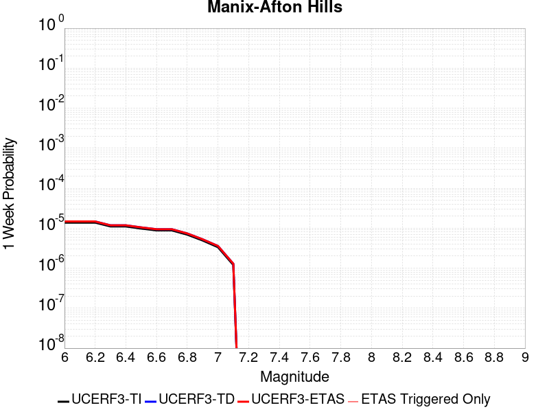 | 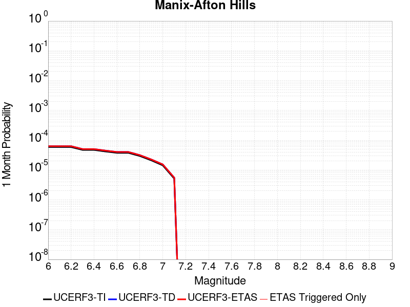 | 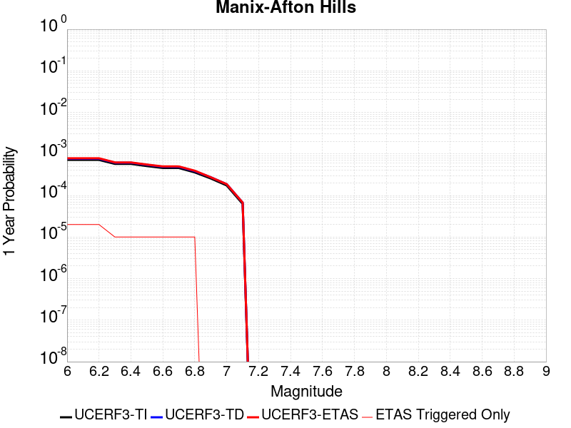 |  |

| Magnitude | 1 wk TI Prob | 1 wk TD Prob | 1 wk ETAS Prob | 1 wk ETAS/TD Gain | 1 wk ETAS Triggered Only | 1 mo TI Prob | 1 mo TD Prob | 1 mo ETAS Prob | 1 mo ETAS/TD Gain | 1 mo ETAS Triggered Only | 1 yr TI Prob | 1 yr TD Prob | 1 yr ETAS Prob | 1 yr ETAS/TD Gain | 1 yr ETAS Triggered Only | 10 yr TI Prob | 10 yr TD Prob | 10 yr ETAS Prob | 10 yr ETAS/TD Gain | 10 yr ETAS Triggered Only |
|-----|-----|-----|-----|-----|-----|-----|-----|-----|-----|-----|-----|-----|-----|-----|-----|-----|-----|-----|-----|-----|
| 6.0 | 1.3783202E-5 | 1.4713383E-5 | 1.4713383E-5 | 1.0 | 0.0 | 5.906953E-5 | 6.305593E-5 | 6.305593E-5 | 1.0 | 0.0 | 7.189342E-4 | 7.6745305E-4 | 7.9022185E-4 | 1.0296681 | 2.278631E-5 | 0.0071661277 | 0.007649784 | 0.007740232 | 1.0118237 | 9.114524E-5 |
| 6.1 | 1.3783202E-5 | 1.4713383E-5 | 1.4713383E-5 | 1.0 | 0.0 | 5.906953E-5 | 6.305593E-5 | 6.305593E-5 | 1.0 | 0.0 | 7.189342E-4 | 7.6745305E-4 | 7.9022185E-4 | 1.0296681 | 2.278631E-5 | 0.0071661277 | 0.007649784 | 0.007740232 | 1.0118237 | 9.114524E-5 |
| 6.2 | 1.3783202E-5 | 1.4713383E-5 | 1.4713383E-5 | 1.0 | 0.0 | 5.906953E-5 | 6.305593E-5 | 6.305593E-5 | 1.0 | 0.0 | 7.189342E-4 | 7.6745305E-4 | 7.9022185E-4 | 1.0296681 | 2.278631E-5 | 0.0071661277 | 0.007649784 | 0.007740232 | 1.0118237 | 9.114524E-5 |
| 6.3 | 1.10494875E-5 | 1.1794975E-5 | 1.1794975E-5 | 1.0 | 0.0 | 4.7354086E-5 | 5.054897E-5 | 5.054897E-5 | 1.0 | 0.0 | 5.763835E-4 | 6.152703E-4 | 6.2665646E-4 | 1.0185059 | 1.1393155E-5 | 0.005748908 | 0.0061367094 | 0.006204649 | 1.011071 | 6.835893E-5 |
| 6.4 | 1.10494875E-5 | 1.1794975E-5 | 1.1794975E-5 | 1.0 | 0.0 | 4.7354086E-5 | 5.054897E-5 | 5.054897E-5 | 1.0 | 0.0 | 5.763835E-4 | 6.152703E-4 | 6.2665646E-4 | 1.0185059 | 1.1393155E-5 | 0.005748908 | 0.0061367094 | 0.006204649 | 1.011071 | 6.835893E-5 |
| 6.5 | 9.788949E-6 | 1.0455966E-5 | 1.0455966E-5 | 1.0 | 0.0 | 4.1951964E-5 | 4.4810567E-5 | 4.4810567E-5 | 1.0 | 0.0 | 5.1064545E-4 | 5.4544135E-4 | 5.5682834E-4 | 1.0208765 | 1.1393155E-5 | 0.0050947363 | 0.0054419534 | 0.0054759467 | 1.0062466 | 3.4179466E-5 |
| 6.6 | 8.810006E-6 | 9.415123E-6 | 9.415123E-6 | 1.0 | 0.0 | 3.775662E-5 | 4.0349954E-5 | 4.0349954E-5 | 1.0 | 0.0 | 4.5958988E-4 | 4.911588E-4 | 5.025464E-4 | 1.0231851 | 1.1393155E-5 | 0.0045864056 | 0.0049016154 | 0.0049356273 | 1.0069389 | 3.4179466E-5 |
| 6.7 | 8.80128E-6 | 9.4056E-6 | 9.4056E-6 | 1.0 | 0.0 | 3.7719226E-5 | 4.0309144E-5 | 4.0309144E-5 | 1.0 | 0.0 | 4.591348E-4 | 4.9066223E-4 | 5.020498E-4 | 1.0232086 | 1.1393155E-5 | 0.004581874 | 0.0048966715 | 0.0049306834 | 1.006946 | 3.4179466E-5 |
| 6.8 | 6.8994877E-6 | 7.3812676E-6 | 7.3812676E-6 | 1.0 | 0.0 | 2.9568899E-5 | 3.1633666E-5 | 3.1633666E-5 | 1.0 | 0.0 | 3.5994186E-4 | 3.8508E-4 | 3.9646876E-4 | 1.0295751 | 1.1393155E-5 | 0.003593594 | 0.0038449324 | 0.0038789806 | 1.0088553 | 3.4179466E-5 |
| 6.9 | 4.9328037E-6 | 5.271799E-6 | 5.271799E-6 | 1.0 | 0.0 | 2.1140417E-5 | 2.2593264E-5 | 2.2593264E-5 | 1.0 | 0.0 | 2.5735417E-4 | 2.7504444E-4 | 2.7504444E-4 | 1.0 | 0.0 | 0.0025705635 | 0.0027476456 | 0.0027703692 | 1.0082703 | 2.278631E-5 |
| 7.0 | 3.347973E-6 | 3.5906319E-6 | 3.5906319E-6 | 1.0 | 0.0 | 1.4348378E-5 | 1.5388354E-5 | 1.5388354E-5 | 1.0 | 0.0 | 1.746775E-4 | 1.8734121E-4 | 1.8734121E-4 | 1.0 | 0.0 | 0.0017454025 | 0.0018722356 | 0.0018949792 | 1.0121479 | 2.278631E-5 |
| 7.1 | 1.2073567E-6 | 1.2936954E-6 | 1.2936954E-6 | 1.0 | 0.0 | 5.1743755E-6 | 5.544406E-6 | 5.544406E-6 | 1.0 | 0.0 | 6.29962E-5 | 6.750269E-5 | 6.750269E-5 | 1.0 | 0.0 | 6.297835E-4 | 6.7498203E-4 | 6.863675E-4 | 1.0168678 | 1.1393155E-5 |

## Owens Valley
*[(top)](#table-of-contents)*

| 1 Week | 1 Month | 1 Year | 10 Year |
|-----|-----|-----|-----|
|  |  |  |  |

| Magnitude | 1 wk TI Prob | 1 wk TD Prob | 1 wk ETAS Prob | 1 wk ETAS/TD Gain | 1 wk ETAS Triggered Only | 1 mo TI Prob | 1 mo TD Prob | 1 mo ETAS Prob | 1 mo ETAS/TD Gain | 1 mo ETAS Triggered Only | 1 yr TI Prob | 1 yr TD Prob | 1 yr ETAS Prob | 1 yr ETAS/TD Gain | 1 yr ETAS Triggered Only | 10 yr TI Prob | 10 yr TD Prob | 10 yr ETAS Prob | 10 yr ETAS/TD Gain | 10 yr ETAS Triggered Only |
|-----|-----|-----|-----|-----|-----|-----|-----|-----|-----|-----|-----|-----|-----|-----|-----|-----|-----|-----|-----|-----|
| 6.0 | 4.83821E-5 | 3.640561E-6 | 3.640561E-6 | 1.0 | 0.0 | 2.0733538E-4 | 1.5602318E-5 | 1.5602318E-5 | 1.0 | 0.0 | 0.002521386 | 1.8994266E-4 | 2.0133365E-4 | 1.0599707 | 1.1393155E-5 | 0.024929691 | 0.0019305887 | 0.002021558 | 1.04712 | 9.114524E-5 |
| 6.1 | 4.83821E-5 | 3.640561E-6 | 3.640561E-6 | 1.0 | 0.0 | 2.0733538E-4 | 1.5602318E-5 | 1.5602318E-5 | 1.0 | 0.0 | 0.002521386 | 1.8994266E-4 | 2.0133365E-4 | 1.0599707 | 1.1393155E-5 | 0.024929691 | 0.0019305887 | 0.002021558 | 1.04712 | 9.114524E-5 |
| 6.2 | 4.83821E-5 | 3.640561E-6 | 3.640561E-6 | 1.0 | 0.0 | 2.0733538E-4 | 1.5602318E-5 | 1.5602318E-5 | 1.0 | 0.0 | 0.002521386 | 1.8994266E-4 | 2.0133365E-4 | 1.0599707 | 1.1393155E-5 | 0.024929691 | 0.0019305887 | 0.002021558 | 1.04712 | 9.114524E-5 |
| 6.3 | 3.953008E-5 | 3.1608845E-6 | 3.1608845E-6 | 1.0 | 0.0 | 1.6940363E-4 | 1.3546582E-5 | 1.3546582E-5 | 1.0 | 0.0 | 0.002060538 | 1.6491789E-4 | 1.7630917E-4 | 1.0690724 | 1.1393155E-5 | 0.020415364 | 0.0016661528 | 0.0017457721 | 1.0477862 | 7.9752084E-5 |
| 6.4 | 3.953008E-5 | 3.1608845E-6 | 3.1608845E-6 | 1.0 | 0.0 | 1.6940363E-4 | 1.3546582E-5 | 1.3546582E-5 | 1.0 | 0.0 | 0.002060538 | 1.6491789E-4 | 1.7630917E-4 | 1.0690724 | 1.1393155E-5 | 0.020415364 | 0.0016661528 | 0.0017457721 | 1.0477862 | 7.9752084E-5 |
| 6.5 | 3.457342E-5 | 2.9759062E-6 | 2.9759062E-6 | 1.0 | 0.0 | 1.4816338E-4 | 1.2753826E-5 | 1.2753826E-5 | 1.0 | 0.0 | 0.0018023965 | 1.5526747E-4 | 1.6665885E-4 | 1.0733662 | 1.1393155E-5 | 0.017878477 | 0.0015588228 | 0.0016270751 | 1.0437846 | 6.835893E-5 |
| 6.6 | 3.1127765E-5 | 2.8773843E-6 | 2.8773843E-6 | 1.0 | 0.0 | 1.3339789E-4 | 1.2331593E-5 | 1.2331593E-5 | 1.0 | 0.0 | 0.0016229092 | 1.501275E-4 | 1.6151894E-4 | 1.0758785 | 1.1393155E-5 | 0.016111081 | 0.0015031485 | 0.0015714046 | 1.0454088 | 6.835893E-5 |
| 6.7 | 2.806885E-5 | 2.8128245E-6 | 2.8128245E-6 | 1.0 | 0.0 | 1.2028952E-4 | 1.205491E-5 | 1.205491E-5 | 1.0 | 0.0 | 0.001463541 | 1.4675934E-4 | 1.5815083E-4 | 1.0776201 | 1.1393155E-5 | 0.014539397 | 0.0014670434 | 0.001535302 | 1.046528 | 6.835893E-5 |
| 6.8 | 2.524524E-5 | 2.2374516E-6 | 2.2374516E-6 | 1.0 | 0.0 | 1.0818939E-4 | 9.589045E-6 | 9.589045E-6 | 1.0 | 0.0 | 0.0013164099 | 1.1674067E-4 | 1.281325E-4 | 1.0975823 | 1.1393155E-5 | 0.01308639 | 0.0011670754 | 0.0012353546 | 1.0585045 | 6.835893E-5 |
| 6.9 | 2.2704568E-5 | 1.6096798E-6 | 1.6096798E-6 | 1.0 | 0.0 | 9.730166E-5 | 6.898609E-6 | 6.898609E-6 | 1.0 | 0.0 | 0.0011840039 | 8.398735E-5 | 9.5379546E-5 | 1.1356418 | 1.1393155E-5 | 0.011777153 | 8.3978433E-4 | 9.080859E-4 | 1.0813322 | 6.835893E-5 |
| 7.0 | 2.0871712E-5 | 1.5409746E-6 | 1.5409746E-6 | 1.0 | 0.0 | 8.944713E-5 | 6.6041603E-6 | 6.6041603E-6 | 1.0 | 0.0 | 0.0010884746 | 8.04027E-5 | 9.1794944E-5 | 1.1416898 | 1.1393155E-5 | 0.010831586 | 8.0391974E-4 | 8.722237E-4 | 1.0849637 | 6.835893E-5 |
| 7.1 | 1.944928E-5 | 1.3876343E-6 | 1.3876343E-6 | 1.0 | 0.0 | 8.335139E-5 | 5.9469903E-6 | 5.9469903E-6 | 1.0 | 0.0 | 0.0010143308 | 7.240221E-5 | 8.379454E-5 | 1.1573478 | 1.1393155E-5 | 0.010097133 | 7.2395586E-4 | 7.922653E-4 | 1.0943558 | 6.835893E-5 |
| 7.2 | 1.7876306E-5 | 1.2499866E-6 | 1.2499866E-6 | 1.0 | 0.0 | 7.6610486E-5 | 5.3570743E-6 | 5.3570743E-6 | 1.0 | 0.0 | 9.3233347E-4 | 6.522043E-5 | 7.661285E-5 | 1.1746755 | 1.1393155E-5 | 0.009284316 | 6.5214327E-4 | 7.2045764E-4 | 1.1047536 | 6.835893E-5 |
| 7.3 | 1.2618672E-5 | 1.1125127E-6 | 1.1125127E-6 | 1.0 | 0.0 | 5.40789E-5 | 4.7679027E-6 | 4.7679027E-6 | 1.0 | 0.0 | 6.582117E-4 | 5.8047677E-5 | 6.9440175E-5 | 1.1962609 | 1.1393155E-5 | 0.0065626553 | 5.8045075E-4 | 6.4877E-4 | 1.1177003 | 6.835893E-5 |
| 7.4 | 7.4874442E-6 | 8.5569917E-7 | 8.5569917E-7 | 1.0 | 0.0 | 3.208865E-5 | 3.667277E-6 | 3.667277E-6 | 1.0 | 0.0 | 3.906093E-4 | 4.4648186E-5 | 5.6040833E-5 | 1.2551649 | 1.1393155E-5 | 0.003899234 | 4.4647642E-4 | 5.148048E-4 | 1.1530392 | 6.835893E-5 |
| 7.5 | 2.4734156E-6 | 6.074345E-7 | 6.074345E-7 | 1.0 | 0.0 | 1.060031E-5 | 2.603288E-6 | 2.603288E-6 | 1.0 | 0.0 | 1.2905113E-4 | 3.1694573E-5 | 4.308737E-5 | 1.3594557 | 1.1393155E-5 | 0.0012897621 | 3.1690087E-4 | 3.8523815E-4 | 1.2156425 | 6.835893E-5 |
| 7.6 | 1.1328841E-6 | 3.1993997E-7 | 3.1993997E-7 | 1.0 | 0.0 | 4.8552088E-6 | 1.3711706E-6 | 1.3711706E-6 | 1.0 | 0.0 | 5.9110564E-5 | 1.6693875E-5 | 2.808684E-5 | 1.6824638 | 1.1393155E-5 | 5.9094845E-4 | 1.669264E-4 | 2.2388267E-4 | 1.3412058 | 5.6965775E-5 |
| 7.7 | 4.8613185E-7 | 8.9756846E-8 | 8.9756846E-8 | 1.0 | 0.0 | 2.0834207E-6 | 3.8467215E-7 | 3.8467215E-7 | 1.0 | 0.0 | 2.536535E-5 | 4.683374E-6 | 1.6076476E-5 | 3.4326696 | 1.1393155E-5 | 2.5362454E-4 | 4.683282E-5 | 6.9618065E-5 | 1.4865229 | 2.278631E-5 |

## Cady
*[(top)](#table-of-contents)*

| 1 Week | 1 Month | 1 Year | 10 Year |
|-----|-----|-----|-----|
|  |  | 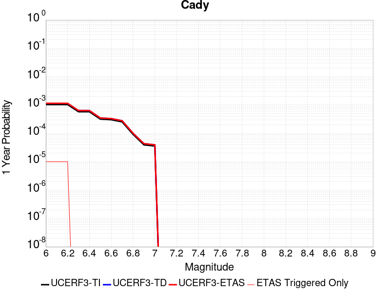 |  |

| Magnitude | 1 wk TI Prob | 1 wk TD Prob | 1 wk ETAS Prob | 1 wk ETAS/TD Gain | 1 wk ETAS Triggered Only | 1 mo TI Prob | 1 mo TD Prob | 1 mo ETAS Prob | 1 mo ETAS/TD Gain | 1 mo ETAS Triggered Only | 1 yr TI Prob | 1 yr TD Prob | 1 yr ETAS Prob | 1 yr ETAS/TD Gain | 1 yr ETAS Triggered Only | 10 yr TI Prob | 10 yr TD Prob | 10 yr ETAS Prob | 10 yr ETAS/TD Gain | 10 yr ETAS Triggered Only |
|-----|-----|-----|-----|-----|-----|-----|-----|-----|-----|-----|-----|-----|-----|-----|-----|-----|-----|-----|-----|-----|
| 6.0 | 1.9892565E-5 | 2.1863727E-5 | 2.1863727E-5 | 1.0 | 0.0 | 8.525106E-5 | 9.3698836E-5 | 1.0509092E-4 | 1.1215819 | 1.1393155E-5 | 0.0010374374 | 0.0011402773 | 0.0011516574 | 1.0099802 | 1.1393155E-5 | 0.010326075 | 0.011353283 | 0.011443394 | 1.007937 | 9.114524E-5 |
| 6.1 | 1.9892565E-5 | 2.1863727E-5 | 2.1863727E-5 | 1.0 | 0.0 | 8.525106E-5 | 9.3698836E-5 | 1.0509092E-4 | 1.1215819 | 1.1393155E-5 | 0.0010374374 | 0.0011402773 | 0.0011516574 | 1.0099802 | 1.1393155E-5 | 0.010326075 | 0.011353283 | 0.011443394 | 1.007937 | 9.114524E-5 |
| 6.2 | 1.9892565E-5 | 2.1863727E-5 | 2.1863727E-5 | 1.0 | 0.0 | 8.525106E-5 | 9.3698836E-5 | 1.0509092E-4 | 1.1215819 | 1.1393155E-5 | 0.0010374374 | 0.0011402773 | 0.0011516574 | 1.0099802 | 1.1393155E-5 | 0.010326075 | 0.011353283 | 0.011443394 | 1.007937 | 9.114524E-5 |
| 6.3 | 1.1117327E-5 | 1.2179267E-5 | 1.2179267E-5 | 1.0 | 0.0 | 4.764482E-5 | 5.2195992E-5 | 5.2195992E-5 | 1.0 | 0.0 | 5.7992124E-4 | 6.353324E-4 | 6.353324E-4 | 1.0 | 0.0 | 0.0057841022 | 0.0063382685 | 0.006372231 | 1.0053583 | 3.4179466E-5 |
| 6.4 | 1.1117327E-5 | 1.2179267E-5 | 1.2179267E-5 | 1.0 | 0.0 | 4.764482E-5 | 5.2195992E-5 | 5.2195992E-5 | 1.0 | 0.0 | 5.7992124E-4 | 6.353324E-4 | 6.353324E-4 | 1.0 | 0.0 | 0.0057841022 | 0.0063382685 | 0.006372231 | 1.0053583 | 3.4179466E-5 |
| 6.5 | 6.103093E-6 | 6.6734597E-6 | 6.6734597E-6 | 1.0 | 0.0 | 2.615585E-5 | 2.86003E-5 | 2.86003E-5 | 1.0 | 0.0 | 3.1840094E-4 | 3.4816557E-4 | 3.4816557E-4 | 1.0 | 0.0 | 0.0031794512 | 0.0034774356 | 0.0035001426 | 1.0065298 | 2.278631E-5 |
| 6.6 | 5.817237E-6 | 6.367047E-6 | 6.367047E-6 | 1.0 | 0.0 | 2.4930776E-5 | 2.7287128E-5 | 2.7287128E-5 | 1.0 | 0.0 | 3.034899E-4 | 3.321826E-4 | 3.321826E-4 | 1.0 | 0.0 | 0.0030307577 | 0.0033180832 | 0.0033407938 | 1.0068445 | 2.278631E-5 |
| 6.7 | 4.8846314E-6 | 5.3417216E-6 | 5.3417216E-6 | 1.0 | 0.0 | 2.0933967E-5 | 2.2892957E-5 | 2.2892957E-5 | 1.0 | 0.0 | 2.5484123E-4 | 2.786979E-4 | 2.786979E-4 | 1.0 | 0.0 | 0.0025454918 | 0.0027846398 | 0.0028073627 | 1.0081601 | 2.278631E-5 |
| 6.8 | 1.7788773E-6 | 1.9403142E-6 | 1.9403142E-6 | 1.0 | 0.0 | 7.6237375E-6 | 8.315615E-6 | 8.315615E-6 | 1.0 | 0.0 | 9.281505E-5 | 1.01239486E-4 | 1.01239486E-4 | 1.0 | 0.0 | 9.2776294E-4 | 0.0010120883 | 0.00102347 | 1.0112457 | 1.1393155E-5 |
| 6.9 | 7.5455404E-7 | 8.299003E-7 | 8.299003E-7 | 1.0 | 0.0 | 3.233799E-6 | 3.5567125E-6 | 3.5567125E-6 | 1.0 | 0.0 | 3.937079E-5 | 4.330245E-5 | 4.330245E-5 | 1.0 | 0.0 | 3.9363815E-4 | 4.329731E-4 | 4.443613E-4 | 1.0263023 | 1.1393155E-5 |
| 7.0 | 6.8578805E-7 | 7.543555E-7 | 7.543555E-7 | 1.0 | 0.0 | 2.9390883E-6 | 3.23295E-6 | 3.23295E-6 | 1.0 | 0.0 | 3.578281E-5 | 3.9360788E-5 | 3.9360788E-5 | 1.0 | 0.0 | 3.577705E-4 | 3.9357063E-4 | 4.049593E-4 | 1.0289367 | 1.1393155E-5 |

## Scodie Lineament
*[(top)](#table-of-contents)*

| 1 Week | 1 Month | 1 Year | 10 Year |
|-----|-----|-----|-----|
|  |  |  |  |

| Magnitude | 1 wk TI Prob | 1 wk TD Prob | 1 wk ETAS Prob | 1 wk ETAS/TD Gain | 1 wk ETAS Triggered Only | 1 mo TI Prob | 1 mo TD Prob | 1 mo ETAS Prob | 1 mo ETAS/TD Gain | 1 mo ETAS Triggered Only | 1 yr TI Prob | 1 yr TD Prob | 1 yr ETAS Prob | 1 yr ETAS/TD Gain | 1 yr ETAS Triggered Only | 10 yr TI Prob | 10 yr TD Prob | 10 yr ETAS Prob | 10 yr ETAS/TD Gain | 10 yr ETAS Triggered Only |
|-----|-----|-----|-----|-----|-----|-----|-----|-----|-----|-----|-----|-----|-----|-----|-----|-----|-----|-----|-----|-----|
| 6.0 | 3.2919327E-6 | 3.0135816E-6 | 3.0135816E-6 | 1.0 | 0.0 | 1.4108206E-5 | 1.2915304E-5 | 2.4308312E-5 | 1.8821324 | 1.1393155E-5 | 1.7175387E-4 | 1.5723566E-4 | 1.9140974E-4 | 1.2173431 | 3.4179466E-5 | 0.0017162118 | 0.0015715556 | 0.0016511824 | 1.0506675 | 7.9752084E-5 |
| 6.1 | 1.8663811E-6 | 1.5491973E-6 | 1.5491973E-6 | 1.0 | 0.0 | 7.998751E-6 | 6.639403E-6 | 6.639403E-6 | 1.0 | 0.0 | 9.738045E-5 | 8.083223E-5 | 9.2224465E-5 | 1.1409367 | 1.1393155E-5 | 9.7337784E-4 | 8.080771E-4 | 8.3084503E-4 | 1.0281754 | 2.278631E-5 |
| 6.2 | 1.8663811E-6 | 1.5491973E-6 | 1.5491973E-6 | 1.0 | 0.0 | 7.998751E-6 | 6.639403E-6 | 6.639403E-6 | 1.0 | 0.0 | 9.738045E-5 | 8.083223E-5 | 9.2224465E-5 | 1.1409367 | 1.1393155E-5 | 9.7337784E-4 | 8.080771E-4 | 8.3084503E-4 | 1.0281754 | 2.278631E-5 |
| 6.3 | 1.8663811E-6 | 1.5491973E-6 | 1.5491973E-6 | 1.0 | 0.0 | 7.998751E-6 | 6.639403E-6 | 6.639403E-6 | 1.0 | 0.0 | 9.738045E-5 | 8.083223E-5 | 9.2224465E-5 | 1.1409367 | 1.1393155E-5 | 9.7337784E-4 | 8.080771E-4 | 8.3084503E-4 | 1.0281754 | 2.278631E-5 |
| 6.4 | 1.8663811E-6 | 1.5491973E-6 | 1.5491973E-6 | 1.0 | 0.0 | 7.998751E-6 | 6.639403E-6 | 6.639403E-6 | 1.0 | 0.0 | 9.738045E-5 | 8.083223E-5 | 9.2224465E-5 | 1.1409367 | 1.1393155E-5 | 9.7337784E-4 | 8.080771E-4 | 8.3084503E-4 | 1.0281754 | 2.278631E-5 |
| 6.5 | 1.8106311E-6 | 1.4911258E-6 | 1.4911258E-6 | 1.0 | 0.0 | 7.759824E-6 | 6.3905263E-6 | 6.3905263E-6 | 1.0 | 0.0 | 9.447177E-5 | 7.7802375E-5 | 8.919464E-5 | 1.1464257 | 1.1393155E-5 | 9.4431615E-4 | 7.7780004E-4 | 8.005686E-4 | 1.029273 | 2.278631E-5 |
| 6.6 | 1.2414679E-6 | 8.998446E-7 | 8.998446E-7 | 1.0 | 0.0 | 5.320566E-6 | 3.8564717E-6 | 3.8564717E-6 | 1.0 | 0.0 | 6.477596E-5 | 4.695162E-5 | 4.695162E-5 | 1.0 | 0.0 | 6.475708E-4 | 4.6942566E-4 | 4.6942566E-4 | 1.0 | 0.0 |
| 6.7 | 1.1062215E-6 | 7.5950777E-7 | 7.5950777E-7 | 1.0 | 0.0 | 4.7409408E-6 | 3.2550297E-6 | 3.2550297E-6 | 1.0 | 0.0 | 5.7719422E-5 | 3.9629336E-5 | 3.9629336E-5 | 1.0 | 0.0 | 5.770443E-4 | 3.9622968E-4 | 3.9622968E-4 | 1.0 | 0.0 |
| 6.8 | 1.0006736E-6 | 6.5010715E-7 | 6.5010715E-7 | 1.0 | 0.0 | 4.288594E-6 | 2.7861709E-6 | 2.7861709E-6 | 1.0 | 0.0 | 5.221238E-5 | 3.3921166E-5 | 3.3921166E-5 | 1.0 | 0.0 | 5.220012E-4 | 3.3916594E-4 | 3.3916594E-4 | 1.0 | 0.0 |
| 6.9 | 9.167364E-7 | 5.632229E-7 | 5.632229E-7 | 1.0 | 0.0 | 3.9288643E-6 | 2.4138105E-6 | 2.4138105E-6 | 1.0 | 0.0 | 4.7832873E-5 | 2.9387806E-5 | 2.9387806E-5 | 1.0 | 0.0 | 4.782258E-4 | 2.9384487E-4 | 2.9384487E-4 | 1.0 | 0.0 |
| 7.0 | 7.6987664E-7 | 4.1138688E-7 | 4.1138688E-7 | 1.0 | 0.0 | 3.2994672E-6 | 1.7630856E-6 | 1.7630856E-6 | 1.0 | 0.0 | 4.0170275E-5 | 2.1465396E-5 | 2.1465396E-5 | 1.0 | 0.0 | 4.0163012E-4 | 2.1463708E-4 | 2.1463708E-4 | 1.0 | 0.0 |
| 7.1 | 7.1038727E-7 | 3.5215882E-7 | 3.5215882E-7 | 1.0 | 0.0 | 3.0445133E-6 | 1.5092514E-6 | 1.5092514E-6 | 1.0 | 0.0 | 3.706632E-5 | 1.8375018E-5 | 1.8375018E-5 | 1.0 | 0.0 | 3.7060137E-4 | 1.8373848E-4 | 1.8373848E-4 | 1.0 | 0.0 |
| 7.2 | 2.0799602E-7 | 3.119291E-8 | 3.119291E-8 | 1.0 | 0.0 | 8.914113E-7 | 1.336839E-7 | 1.336839E-7 | 1.0 | 0.0 | 1.0852878E-5 | 1.6276003E-6 | 1.6276003E-6 | 1.0 | 0.0 | 1.08523476E-4 | 1.6275892E-5 | 1.6275892E-5 | 1.0 | 0.0 |
| 7.3 | 1.5048182E-7 | 1.5947432E-8 | 1.5947432E-8 | 1.0 | 0.0 | 6.449219E-7 | 6.834613E-8 | 6.834613E-8 | 1.0 | 0.0 | 7.851896E-6 | 8.3211387E-7 | 8.3211387E-7 | 1.0 | 0.0 | 7.851618E-5 | 8.321111E-6 | 8.321111E-6 | 1.0 | 0.0 |
| 7.4 | 5.9334678E-8 | 4.865539E-9 | 4.865539E-9 | 1.0 | 0.0 | 2.5429145E-7 | 2.085231E-8 | 2.085231E-8 | 1.0 | 0.0 | 3.095994E-6 | 2.5387686E-7 | 2.5387686E-7 | 1.0 | 0.0 | 3.095951E-5 | 2.538767E-6 | 2.538767E-6 | 1.0 | 0.0 |

## Cleghorn Lake
*[(top)](#table-of-contents)*

| 1 Week | 1 Month | 1 Year | 10 Year |
|-----|-----|-----|-----|
|  |  |  |  |

| Magnitude | 1 wk TI Prob | 1 wk TD Prob | 1 wk ETAS Prob | 1 wk ETAS/TD Gain | 1 wk ETAS Triggered Only | 1 mo TI Prob | 1 mo TD Prob | 1 mo ETAS Prob | 1 mo ETAS/TD Gain | 1 mo ETAS Triggered Only | 1 yr TI Prob | 1 yr TD Prob | 1 yr ETAS Prob | 1 yr ETAS/TD Gain | 1 yr ETAS Triggered Only | 10 yr TI Prob | 10 yr TD Prob | 10 yr ETAS Prob | 10 yr ETAS/TD Gain | 10 yr ETAS Triggered Only |
|-----|-----|-----|-----|-----|-----|-----|-----|-----|-----|-----|-----|-----|-----|-----|-----|-----|-----|-----|-----|-----|
| 6.0 | 1.5467183E-5 | 1.6797545E-5 | 1.6797545E-5 | 1.0 | 0.0 | 6.6286244E-5 | 7.198781E-5 | 7.198781E-5 | 1.0 | 0.0 | 8.067362E-4 | 8.76154E-4 | 8.8753714E-4 | 1.0129923 | 1.1393155E-5 | 0.008038137 | 0.008732427 | 0.008811482 | 1.0090531 | 7.9752084E-5 |
| 6.1 | 1.5467183E-5 | 1.6797545E-5 | 1.6797545E-5 | 1.0 | 0.0 | 6.6286244E-5 | 7.198781E-5 | 7.198781E-5 | 1.0 | 0.0 | 8.067362E-4 | 8.76154E-4 | 8.8753714E-4 | 1.0129923 | 1.1393155E-5 | 0.008038137 | 0.008732427 | 0.008811482 | 1.0090531 | 7.9752084E-5 |
| 6.2 | 1.2624631E-5 | 1.3684203E-5 | 1.3684203E-5 | 1.0 | 0.0 | 5.410444E-5 | 5.864554E-5 | 5.864554E-5 | 1.0 | 0.0 | 6.585225E-4 | 7.1382424E-4 | 7.2520925E-4 | 1.0159494 | 1.1393155E-5 | 0.0065657445 | 0.007120111 | 0.0071879835 | 1.0095325 | 6.835893E-5 |
| 6.3 | 1.2624631E-5 | 1.3684203E-5 | 1.3684203E-5 | 1.0 | 0.0 | 5.410444E-5 | 5.864554E-5 | 5.864554E-5 | 1.0 | 0.0 | 6.585225E-4 | 7.1382424E-4 | 7.2520925E-4 | 1.0159494 | 1.1393155E-5 | 0.0065657445 | 0.007120111 | 0.0071879835 | 1.0095325 | 6.835893E-5 |
| 6.4 | 9.417684E-6 | 1.0172005E-5 | 1.0172005E-5 | 1.0 | 0.0 | 4.036088E-5 | 4.359381E-5 | 4.359381E-5 | 1.0 | 0.0 | 4.912829E-4 | 5.306665E-4 | 5.420536E-4 | 1.0214581 | 1.1393155E-5 | 0.004901982 | 0.0052980306 | 0.0053546946 | 1.0106953 | 5.6965775E-5 |
| 6.5 | 9.368219E-6 | 1.0119424E-5 | 1.0119424E-5 | 1.0 | 0.0 | 4.014889E-5 | 4.336847E-5 | 4.336847E-5 | 1.0 | 0.0 | 4.8870314E-4 | 5.2792433E-4 | 5.3931144E-4 | 1.0215696 | 1.1393155E-5 | 0.004876298 | 0.005270739 | 0.0053274045 | 1.010751 | 5.6965775E-5 |
| 6.6 | 7.803798E-6 | 8.443432E-6 | 8.443432E-6 | 1.0 | 0.0 | 3.3444423E-5 | 3.6185862E-5 | 3.6185862E-5 | 1.0 | 0.0 | 4.0710976E-4 | 4.4051374E-4 | 4.519019E-4 | 1.025852 | 1.1393155E-5 | 0.0040636472 | 0.004400324 | 0.0044570393 | 1.0128888 | 5.6965775E-5 |
| 6.7 | 2.3108669E-6 | 2.444159E-6 | 2.444159E-6 | 1.0 | 0.0 | 9.903678E-6 | 1.0474926E-5 | 1.0474926E-5 | 1.0 | 0.0 | 1.205706E-4 | 1.2752495E-4 | 1.2752495E-4 | 1.0 | 0.0 | 0.001205052 | 0.0012745364 | 0.001285915 | 1.0089277 | 1.1393155E-5 |
| 6.8 | 2.0882828E-6 | 2.2065706E-6 | 2.2065706E-6 | 1.0 | 0.0 | 8.949753E-6 | 9.456698E-6 | 9.456698E-6 | 1.0 | 0.0 | 1.08957785E-4 | 1.15129376E-4 | 1.15129376E-4 | 1.0 | 0.0 | 0.0010890438 | 0.0011507142 | 0.0011620943 | 1.0098896 | 1.1393155E-5 |
| 6.9 | 1.876935E-6 | 1.981305E-6 | 1.981305E-6 | 1.0 | 0.0 | 8.043982E-6 | 8.491281E-6 | 8.491281E-6 | 1.0 | 0.0 | 9.7931086E-5 | 1.033766E-4 | 1.033766E-4 | 1.0 | 0.0 | 9.788794E-4 | 0.0010333011 | 0.0010446825 | 1.0110146 | 1.1393155E-5 |
| 7.0 | 1.5357559E-6 | 1.620487E-6 | 1.620487E-6 | 1.0 | 0.0 | 6.5817944E-6 | 6.944926E-6 | 6.944926E-6 | 1.0 | 0.0 | 8.01304E-5 | 8.455132E-5 | 8.455132E-5 | 1.0 | 0.0 | 8.010151E-4 | 8.45204E-4 | 8.565875E-4 | 1.0134684 | 1.1393155E-5 |
| 7.1 | 1.0905424E-6 | 1.1499063E-6 | 1.1499063E-6 | 1.0 | 0.0 | 4.6737446E-6 | 4.928161E-6 | 4.928161E-6 | 1.0 | 0.0 | 5.6901354E-5 | 5.999881E-5 | 5.999881E-5 | 1.0 | 0.0 | 5.6886784E-4 | 5.998359E-4 | 5.998359E-4 | 1.0 | 0.0 |
| 7.2 | 6.06668E-7 | 6.388058E-7 | 6.388058E-7 | 1.0 | 0.0 | 2.600003E-6 | 2.7377366E-6 | 2.7377366E-6 | 1.0 | 0.0 | 3.1654577E-5 | 3.3331504E-5 | 3.3331504E-5 | 1.0 | 0.0 | 3.1650066E-4 | 3.332719E-4 | 3.332719E-4 | 1.0 | 0.0 |

## Mission Ridge-Arroyo Parida-Santa Ana
*[(top)](#table-of-contents)*

| 1 Week | 1 Month | 1 Year | 10 Year |
|-----|-----|-----|-----|
|  | 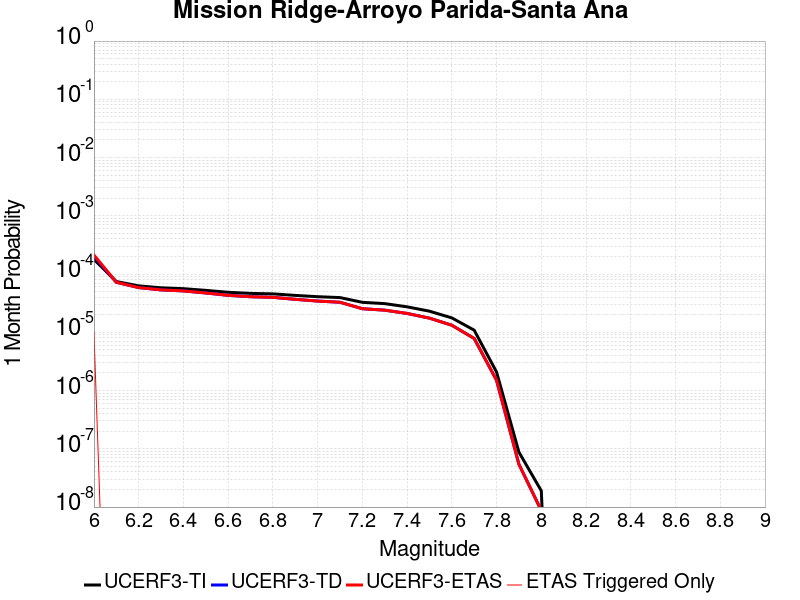 |  |  |

| Magnitude | 1 wk TI Prob | 1 wk TD Prob | 1 wk ETAS Prob | 1 wk ETAS/TD Gain | 1 wk ETAS Triggered Only | 1 mo TI Prob | 1 mo TD Prob | 1 mo ETAS Prob | 1 mo ETAS/TD Gain | 1 mo ETAS Triggered Only | 1 yr TI Prob | 1 yr TD Prob | 1 yr ETAS Prob | 1 yr ETAS/TD Gain | 1 yr ETAS Triggered Only | 10 yr TI Prob | 10 yr TD Prob | 10 yr ETAS Prob | 10 yr ETAS/TD Gain | 10 yr ETAS Triggered Only |
|-----|-----|-----|-----|-----|-----|-----|-----|-----|-----|-----|-----|-----|-----|-----|-----|-----|-----|-----|-----|-----|
| 6.0 | 4.169034E-5 | 4.7159836E-5 | 4.7159836E-5 | 1.0 | 0.0 | 1.7866064E-4 | 2.0210279E-4 | 2.1349365E-4 | 1.0563617 | 1.1393155E-5 | 0.0021730233 | 0.0024586525 | 0.0024700174 | 1.0046225 | 1.1393155E-5 | 0.021518968 | 0.024396472 | 0.024440933 | 1.0018225 | 4.557262E-5 |
| 6.1 | 1.73813E-5 | 1.6859793E-5 | 1.6859793E-5 | 1.0 | 0.0 | 7.4489166E-5 | 7.225432E-5 | 7.225432E-5 | 1.0 | 0.0 | 9.065282E-4 | 8.79352E-4 | 8.9073513E-4 | 1.0129449 | 1.1393155E-5 | 0.009028391 | 0.008760006 | 0.008782593 | 1.0025784 | 2.278631E-5 |
| 6.2 | 1.4622182E-5 | 1.3677713E-5 | 1.3677713E-5 | 1.0 | 0.0 | 6.2664985E-5 | 5.8617476E-5 | 5.8617476E-5 | 1.0 | 0.0 | 7.6267915E-4 | 7.134379E-4 | 7.24823E-4 | 1.015958 | 1.1393155E-5 | 0.007600669 | 0.007112058 | 0.00712337 | 1.0015906 | 1.1393155E-5 |
| 6.3 | 1.3552434E-5 | 1.2486308E-5 | 1.2486308E-5 | 1.0 | 0.0 | 5.8080568E-5 | 5.351167E-5 | 5.351167E-5 | 1.0 | 0.0 | 7.069015E-4 | 6.51313E-4 | 6.626987E-4 | 1.0174812 | 1.1393155E-5 | 0.00704657 | 0.0064945435 | 0.0065058623 | 1.0017428 | 1.1393155E-5 |
| 6.4 | 1.30977305E-5 | 1.1983139E-5 | 1.1983139E-5 | 1.0 | 0.0 | 5.613192E-5 | 5.1355317E-5 | 5.1355317E-5 | 1.0 | 0.0 | 6.831918E-4 | 6.250746E-4 | 6.364606E-4 | 1.0182155 | 1.1393155E-5 | 0.006810953 | 0.006233649 | 0.006244971 | 1.0018163 | 1.1393155E-5 |
| 6.5 | 1.225205E-5 | 1.105257E-5 | 1.105257E-5 | 1.0 | 0.0 | 5.2507727E-5 | 4.736731E-5 | 4.736731E-5 | 1.0 | 0.0 | 6.3909404E-4 | 5.765471E-4 | 5.879337E-4 | 1.0197496 | 1.1393155E-5 | 0.006372592 | 0.0057509625 | 0.0057622897 | 1.0019697 | 1.1393155E-5 |
| 6.6 | 1.1352241E-5 | 1.0067085E-5 | 1.0067085E-5 | 1.0 | 0.0 | 4.8651553E-5 | 4.3143948E-5 | 4.3143948E-5 | 1.0 | 0.0 | 5.921717E-4 | 5.2515307E-4 | 5.3654023E-4 | 1.0216836 | 1.1393155E-5 | 0.0059059616 | 0.0052395063 | 0.0052508395 | 1.002163 | 1.1393155E-5 |
| 6.7 | 1.0864116E-5 | 9.520424E-6 | 9.520424E-6 | 1.0 | 0.0 | 4.6559664E-5 | 4.0801187E-5 | 4.0801187E-5 | 1.0 | 0.0 | 5.667165E-4 | 4.9664325E-4 | 5.0803076E-4 | 1.022929 | 1.1393155E-5 | 0.005652734 | 0.0049557067 | 0.004967043 | 1.0022876 | 1.1393155E-5 |
| 6.8 | 1.0666365E-5 | 9.303126E-6 | 9.303126E-6 | 1.0 | 0.0 | 4.571219E-5 | 3.9869938E-5 | 3.9869938E-5 | 1.0 | 0.0 | 5.564038E-4 | 4.853104E-4 | 4.96698E-4 | 1.0234647 | 1.1393155E-5 | 0.005550127 | 0.004842877 | 0.004854215 | 1.0023412 | 1.1393155E-5 |
| 6.9 | 1.0038665E-5 | 8.595182E-6 | 8.595182E-6 | 1.0 | 0.0 | 4.302214E-5 | 3.6835987E-5 | 3.6835987E-5 | 1.0 | 0.0 | 5.236687E-4 | 4.4838767E-4 | 4.597757E-4 | 1.0253978 | 1.1393155E-5 | 0.005224364 | 0.0044751796 | 0.0044865217 | 1.0025345 | 1.1393155E-5 |
| 7.0 | 9.5379955E-6 | 8.028028E-6 | 8.028028E-6 | 1.0 | 0.0 | 4.0876483E-5 | 3.4405388E-5 | 3.4405388E-5 | 1.0 | 0.0 | 4.975576E-4 | 4.1880683E-4 | 4.3019518E-4 | 1.0271925 | 1.1393155E-5 | 0.00496445 | 0.0041805143 | 0.0041918596 | 1.0027139 | 1.1393155E-5 |
| 7.1 | 9.207389E-6 | 7.655205E-6 | 7.655205E-6 | 1.0 | 0.0 | 3.945964E-5 | 3.280762E-5 | 3.280762E-5 | 1.0 | 0.0 | 4.803152E-4 | 3.9936128E-4 | 4.1074987E-4 | 1.028517 | 1.1393155E-5 | 0.004792784 | 0.003986771 | 0.003998119 | 1.0028464 | 1.1393155E-5 |
| 7.2 | 7.638091E-6 | 5.933307E-6 | 5.933307E-6 | 1.0 | 0.0 | 3.2734264E-5 | 2.5428213E-5 | 2.5428213E-5 | 1.0 | 0.0 | 3.984668E-4 | 3.0954482E-4 | 3.2093446E-4 | 1.0367948 | 1.1393155E-5 | 0.0039775306 | 0.0030913325 | 0.0031026904 | 1.0036741 | 1.1393155E-5 |
| 7.3 | 7.2500147E-6 | 5.598204E-6 | 5.598204E-6 | 1.0 | 0.0 | 3.1071122E-5 | 2.3992083E-5 | 2.3992083E-5 | 1.0 | 0.0 | 3.7822526E-4 | 2.9206477E-4 | 3.0345458E-4 | 1.0389977 | 1.1393155E-5 | 0.0037758215 | 0.0029170038 | 0.0029283639 | 1.0038943 | 1.1393155E-5 |
| 7.4 | 6.3899715E-6 | 4.920289E-6 | 4.920289E-6 | 1.0 | 0.0 | 2.7385306E-5 | 2.1086784E-5 | 2.1086784E-5 | 1.0 | 0.0 | 3.3336508E-4 | 2.5670155E-4 | 2.5670155E-4 | 1.0 | 0.0 | 0.0033286542 | 0.002564234 | 0.002564234 | 1.0 | 0.0 |
| 7.5 | 5.379025E-6 | 4.0853256E-6 | 4.0853256E-6 | 1.0 | 0.0 | 2.305276E-5 | 1.750842E-5 | 1.750842E-5 | 1.0 | 0.0 | 2.806312E-4 | 2.1314427E-4 | 2.1314427E-4 | 1.0 | 0.0 | 0.0028027708 | 0.0021294097 | 0.0021294097 | 1.0 | 0.0 |
| 7.6 | 4.1270696E-6 | 3.0892502E-6 | 3.0892502E-6 | 1.0 | 0.0 | 1.768732E-5 | 1.3239577E-5 | 1.3239577E-5 | 1.0 | 0.0 | 2.1532185E-4 | 1.6118001E-4 | 1.6118001E-4 | 1.0 | 0.0 | 0.0021511333 | 0.0016106392 | 0.0016106392 | 1.0 | 0.0 |
| 7.7 | 2.5406805E-6 | 1.828728E-6 | 1.828728E-6 | 1.0 | 0.0 | 1.0888585E-5 | 7.837383E-6 | 7.837383E-6 | 1.0 | 0.0 | 1.3256045E-4 | 9.541602E-5 | 9.541602E-5 | 1.0 | 0.0 | 0.0013248142 | 9.537567E-4 | 9.537567E-4 | 1.0 | 0.0 |
| 7.8 | 4.8608285E-7 | 3.510642E-7 | 3.510642E-7 | 1.0 | 0.0 | 2.0832106E-6 | 1.50456E-6 | 1.50456E-6 | 1.0 | 0.0 | 2.5362791E-5 | 1.8317865E-5 | 1.8317865E-5 | 1.0 | 0.0 | 2.5359896E-4 | 1.8316368E-4 | 1.8316368E-4 | 1.0 | 0.0 |
| 7.9 | 2.0472514E-8 | 1.2693853E-8 | 1.2693853E-8 | 1.0 | 0.0 | 8.7739345E-8 | 5.440223E-8 | 5.440223E-8 | 1.0 | 0.0 | 1.068226E-6 | 6.6234696E-7 | 6.6234696E-7 | 1.0 | 0.0 | 1.0682209E-5 | 6.6234506E-6 | 6.6234506E-6 | 1.0 | 0.0 |
| 8.0 | 4.443582E-9 | 2.0342936E-9 | 2.0342936E-9 | 1.0 | 0.0 | 1.9043922E-8 | 8.718402E-9 | 8.718402E-9 | 1.0 | 0.0 | 2.3185973E-7 | 1.0614654E-7 | 1.0614654E-7 | 1.0 | 0.0 | 2.3185949E-6 | 1.0614649E-6 | 1.0614649E-6 | 1.0 | 0.0 |

## White Mountains
*[(top)](#table-of-contents)*

| 1 Week | 1 Month | 1 Year | 10 Year |
|-----|-----|-----|-----|
|  |  | 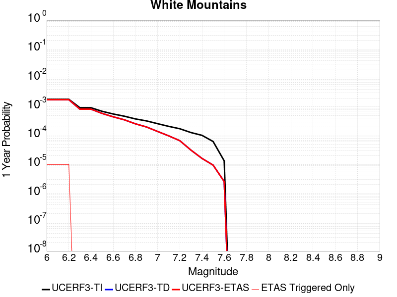 |  |

| Magnitude | 1 wk TI Prob | 1 wk TD Prob | 1 wk ETAS Prob | 1 wk ETAS/TD Gain | 1 wk ETAS Triggered Only | 1 mo TI Prob | 1 mo TD Prob | 1 mo ETAS Prob | 1 mo ETAS/TD Gain | 1 mo ETAS Triggered Only | 1 yr TI Prob | 1 yr TD Prob | 1 yr ETAS Prob | 1 yr ETAS/TD Gain | 1 yr ETAS Triggered Only | 10 yr TI Prob | 10 yr TD Prob | 10 yr ETAS Prob | 10 yr ETAS/TD Gain | 10 yr ETAS Triggered Only |
|-----|-----|-----|-----|-----|-----|-----|-----|-----|-----|-----|-----|-----|-----|-----|-----|-----|-----|-----|-----|-----|
| 6.0 | 3.503579E-5 | 3.3790984E-5 | 3.3790984E-5 | 1.0 | 0.0 | 1.5014476E-4 | 1.4481114E-4 | 1.4481114E-4 | 1.0 | 0.0 | 0.0018264796 | 0.0017617707 | 0.0017731438 | 1.0064555 | 1.1393155E-5 | 0.018115403 | 0.017490378 | 0.017568735 | 1.00448 | 7.9752084E-5 |
| 6.1 | 3.503579E-5 | 3.3790984E-5 | 3.3790984E-5 | 1.0 | 0.0 | 1.5014476E-4 | 1.4481114E-4 | 1.4481114E-4 | 1.0 | 0.0 | 0.0018264796 | 0.0017617707 | 0.0017731438 | 1.0064555 | 1.1393155E-5 | 0.018115403 | 0.017490378 | 0.017568735 | 1.00448 | 7.9752084E-5 |
| 6.2 | 3.503579E-5 | 3.3790984E-5 | 3.3790984E-5 | 1.0 | 0.0 | 1.5014476E-4 | 1.4481114E-4 | 1.4481114E-4 | 1.0 | 0.0 | 0.0018264796 | 0.0017617707 | 0.0017731438 | 1.0064555 | 1.1393155E-5 | 0.018115403 | 0.017490378 | 0.017568735 | 1.00448 | 7.9752084E-5 |
| 6.3 | 1.7818425E-5 | 1.5919286E-5 | 1.5919286E-5 | 1.0 | 0.0 | 7.636245E-5 | 6.822381E-5 | 6.822381E-5 | 1.0 | 0.0 | 9.293162E-4 | 8.303226E-4 | 8.303226E-4 | 1.0 | 0.0 | 0.009254395 | 0.008273662 | 0.008284961 | 1.0013657 | 1.1393155E-5 |
| 6.4 | 1.7818425E-5 | 1.5919286E-5 | 1.5919286E-5 | 1.0 | 0.0 | 7.636245E-5 | 6.822381E-5 | 6.822381E-5 | 1.0 | 0.0 | 9.293162E-4 | 8.303226E-4 | 8.303226E-4 | 1.0 | 0.0 | 0.009254395 | 0.008273662 | 0.008284961 | 1.0013657 | 1.1393155E-5 |
| 6.5 | 1.3397557E-5 | 1.1338607E-5 | 1.1338607E-5 | 1.0 | 0.0 | 5.741684E-5 | 4.8593163E-5 | 4.8593163E-5 | 1.0 | 0.0 | 6.988258E-4 | 5.914681E-4 | 5.914681E-4 | 1.0 | 0.0 | 0.006966323 | 0.005899645 | 0.005899645 | 1.0 | 0.0 |
| 6.6 | 1.0818695E-5 | 8.627122E-6 | 8.627122E-6 | 1.0 | 0.0 | 4.6365014E-5 | 3.697288E-5 | 3.697288E-5 | 1.0 | 0.0 | 5.6434784E-4 | 4.500562E-4 | 4.500562E-4 | 1.0 | 0.0 | 0.005629168 | 0.0044918843 | 0.0044918843 | 1.0 | 0.0 |
| 6.7 | 9.067908E-6 | 6.8038275E-6 | 6.8038275E-6 | 1.0 | 0.0 | 3.8861883E-5 | 2.9158953E-5 | 2.9158953E-5 | 1.0 | 0.0 | 4.7304068E-4 | 3.549556E-4 | 3.549556E-4 | 1.0 | 0.0 | 0.00472035 | 0.003544204 | 0.003544204 | 1.0 | 0.0 |
| 6.8 | 7.295947E-6 | 4.9374485E-6 | 4.9374485E-6 | 1.0 | 0.0 | 3.126797E-5 | 2.116033E-5 | 2.116033E-5 | 1.0 | 0.0 | 3.8062103E-4 | 2.5759768E-4 | 2.5759768E-4 | 1.0 | 0.0 | 0.0037996976 | 0.0025731039 | 0.0025731039 | 1.0 | 0.0 |
| 6.9 | 6.2243444E-6 | 3.833108E-6 | 3.833108E-6 | 1.0 | 0.0 | 2.6675489E-5 | 1.6427506E-5 | 1.6427506E-5 | 1.0 | 0.0 | 3.2472567E-4 | 1.9998704E-4 | 1.9998704E-4 | 1.0 | 0.0 | 0.0032425157 | 0.0019981235 | 0.0019981235 | 1.0 | 0.0 |
| 7.0 | 4.9878413E-6 | 2.6802934E-6 | 2.6802934E-6 | 1.0 | 0.0 | 2.1376287E-5 | 1.1486923E-5 | 1.1486923E-5 | 1.0 | 0.0 | 2.602252E-4 | 1.3984457E-4 | 1.3984457E-4 | 1.0 | 0.0 | 0.002599207 | 0.001397592 | 0.001397592 | 1.0 | 0.0 |
| 7.1 | 4.0252844E-6 | 1.8863861E-6 | 1.8863861E-6 | 1.0 | 0.0 | 1.7251105E-5 | 8.0844875E-6 | 8.0844875E-6 | 1.0 | 0.0 | 2.1001195E-4 | 9.842432E-5 | 9.842432E-5 | 1.0 | 0.0 | 0.0020981359 | 9.838201E-4 | 9.838201E-4 | 1.0 | 0.0 |
| 7.2 | 3.3284066E-6 | 1.2824203E-6 | 1.2824203E-6 | 1.0 | 0.0 | 1.4264522E-5 | 5.496076E-6 | 5.496076E-6 | 1.0 | 0.0 | 1.736567E-4 | 6.691277E-5 | 6.691277E-5 | 1.0 | 0.0 | 0.0017352107 | 6.689363E-4 | 6.689363E-4 | 1.0 | 0.0 |
| 7.3 | 2.458226E-6 | 6.0613763E-7 | 6.0613763E-7 | 1.0 | 0.0 | 1.0535211E-5 | 2.5977304E-6 | 2.5977304E-6 | 1.0 | 0.0 | 1.2825865E-4 | 3.1626947E-5 | 3.1626947E-5 | 1.0 | 0.0 | 0.0012818464 | 3.162282E-4 | 3.162282E-4 | 1.0 | 0.0 |
| 7.4 | 1.965953E-6 | 3.112561E-7 | 3.112561E-7 | 1.0 | 0.0 | 8.425486E-6 | 1.333954E-6 | 1.333954E-6 | 1.0 | 0.0 | 1.0257547E-4 | 1.6240769E-5 | 1.6240769E-5 | 1.0 | 0.0 | 0.0010252813 | 1.6239595E-4 | 1.6239595E-4 | 1.0 | 0.0 |
| 7.5 | 1.2014192E-6 | 1.8269512E-7 | 1.8269512E-7 | 1.0 | 0.0 | 5.148929E-6 | 7.829789E-7 | 7.829789E-7 | 1.0 | 0.0 | 6.2686406E-5 | 9.532727E-6 | 9.532727E-6 | 1.0 | 0.0 | 6.266873E-4 | 9.532326E-5 | 9.532326E-5 | 1.0 | 0.0 |
| 7.6 | 2.5612175E-7 | 4.9013902E-8 | 4.9013902E-8 | 1.0 | 0.0 | 1.0976642E-6 | 2.1005957E-7 | 2.1005957E-7 | 1.0 | 0.0 | 1.3363979E-5 | 2.5574727E-6 | 2.5574727E-6 | 1.0 | 0.0 | 1.3363175E-4 | 2.5574469E-5 | 2.5574469E-5 | 1.0 | 0.0 |

## Lake Isabella (Seismicity)
*[(top)](#table-of-contents)*

| 1 Week | 1 Month | 1 Year | 10 Year |
|-----|-----|-----|-----|
|  | 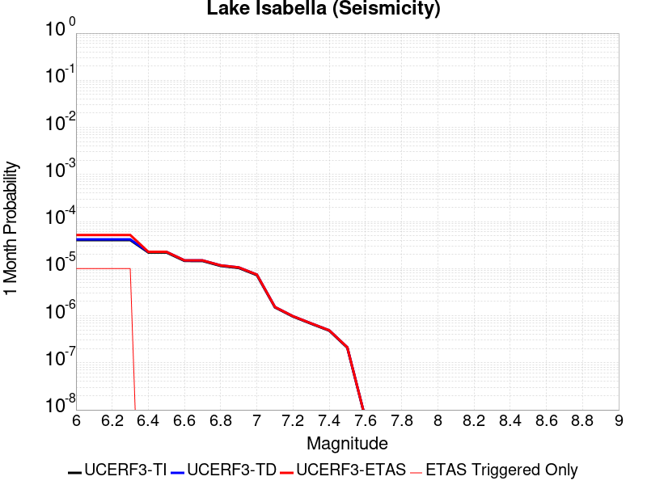 | 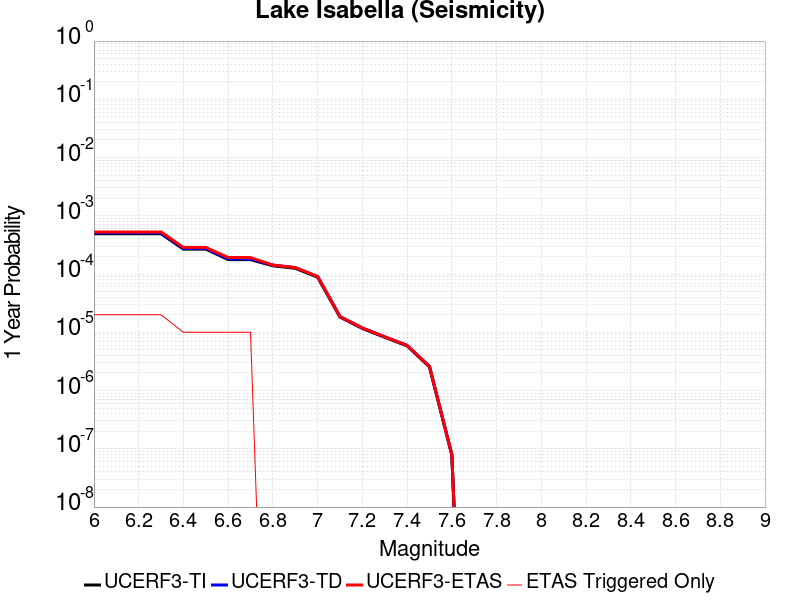 |  |

| Magnitude | 1 wk TI Prob | 1 wk TD Prob | 1 wk ETAS Prob | 1 wk ETAS/TD Gain | 1 wk ETAS Triggered Only | 1 mo TI Prob | 1 mo TD Prob | 1 mo ETAS Prob | 1 mo ETAS/TD Gain | 1 mo ETAS Triggered Only | 1 yr TI Prob | 1 yr TD Prob | 1 yr ETAS Prob | 1 yr ETAS/TD Gain | 1 yr ETAS Triggered Only | 10 yr TI Prob | 10 yr TD Prob | 10 yr ETAS Prob | 10 yr ETAS/TD Gain | 10 yr ETAS Triggered Only |
|-----|-----|-----|-----|-----|-----|-----|-----|-----|-----|-----|-----|-----|-----|-----|-----|-----|-----|-----|-----|-----|
| 6.0 | 9.431637E-6 | 9.742393E-6 | 9.742393E-6 | 1.0 | 0.0 | 4.0420677E-5 | 4.1752515E-5 | 5.3145195E-5 | 1.2728621 | 1.1393155E-5 | 4.920106E-4 | 5.082314E-4 | 5.310061E-4 | 1.0448117 | 2.278631E-5 | 0.004909227 | 0.0050719837 | 0.005139996 | 1.0134094 | 6.835893E-5 |
| 6.1 | 9.431637E-6 | 9.742393E-6 | 9.742393E-6 | 1.0 | 0.0 | 4.0420677E-5 | 4.1752515E-5 | 5.3145195E-5 | 1.2728621 | 1.1393155E-5 | 4.920106E-4 | 5.082314E-4 | 5.310061E-4 | 1.0448117 | 2.278631E-5 | 0.004909227 | 0.0050719837 | 0.005139996 | 1.0134094 | 6.835893E-5 |
| 6.2 | 9.431637E-6 | 9.742393E-6 | 9.742393E-6 | 1.0 | 0.0 | 4.0420677E-5 | 4.1752515E-5 | 5.3145195E-5 | 1.2728621 | 1.1393155E-5 | 4.920106E-4 | 5.082314E-4 | 5.310061E-4 | 1.0448117 | 2.278631E-5 | 0.004909227 | 0.0050719837 | 0.005139996 | 1.0134094 | 6.835893E-5 |
| 6.3 | 9.431637E-6 | 9.742393E-6 | 9.742393E-6 | 1.0 | 0.0 | 4.0420677E-5 | 4.1752515E-5 | 5.3145195E-5 | 1.2728621 | 1.1393155E-5 | 4.920106E-4 | 5.082314E-4 | 5.310061E-4 | 1.0448117 | 2.278631E-5 | 0.004909227 | 0.0050719837 | 0.005139996 | 1.0134094 | 6.835893E-5 |
| 6.4 | 5.144063E-6 | 5.300448E-6 | 5.300448E-6 | 1.0 | 0.0 | 2.2045799E-5 | 2.2716027E-5 | 2.2716027E-5 | 1.0 | 0.0 | 2.6837454E-4 | 2.7653598E-4 | 2.87926E-4 | 1.0411881 | 1.1393155E-5 | 0.0026805066 | 0.0027622592 | 0.0027963442 | 1.0123396 | 3.4179466E-5 |
| 6.5 | 5.144063E-6 | 5.300448E-6 | 5.300448E-6 | 1.0 | 0.0 | 2.2045799E-5 | 2.2716027E-5 | 2.2716027E-5 | 1.0 | 0.0 | 2.6837454E-4 | 2.7653598E-4 | 2.87926E-4 | 1.0411881 | 1.1393155E-5 | 0.0026805066 | 0.0027622592 | 0.0027963442 | 1.0123396 | 3.4179466E-5 |
| 6.6 | 3.4009804E-6 | 3.499019E-6 | 3.499019E-6 | 1.0 | 0.0 | 1.4575549E-5 | 1.4995718E-5 | 1.4995718E-5 | 1.0 | 0.0 | 1.7744285E-4 | 1.8255918E-4 | 1.9395025E-4 | 1.0623966 | 1.1393155E-5 | 0.0017730123 | 0.0018242499 | 0.0018583669 | 1.018702 | 3.4179466E-5 |
| 6.7 | 3.3880428E-6 | 3.485885E-6 | 3.485885E-6 | 1.0 | 0.0 | 1.4520103E-5 | 1.4939431E-5 | 1.4939431E-5 | 1.0 | 0.0 | 1.767679E-4 | 1.81874E-4 | 1.9326508E-4 | 1.0626317 | 1.1393155E-5 | 0.0017662736 | 0.0018174092 | 0.0018515266 | 1.0187725 | 3.4179466E-5 |
| 6.8 | 2.6582E-6 | 2.7338797E-6 | 2.7338797E-6 | 1.0 | 0.0 | 1.1392236E-5 | 1.1716583E-5 | 1.1716583E-5 | 1.0 | 0.0 | 1.3869164E-4 | 1.426414E-4 | 1.426414E-4 | 1.0 | 0.0 | 0.0013860512 | 0.0014256305 | 0.0014483844 | 1.0159606 | 2.278631E-5 |
| 6.9 | 2.406011E-6 | 2.4744913E-6 | 2.4744913E-6 | 1.0 | 0.0 | 1.0311434E-5 | 1.0604927E-5 | 1.0604927E-5 | 1.0 | 0.0 | 1.2553448E-4 | 1.2910867E-4 | 1.2910867E-4 | 1.0 | 0.0 | 0.0012546359 | 0.0012904662 | 0.001313223 | 1.0176346 | 2.278631E-5 |
| 7.0 | 1.6953097E-6 | 1.7430505E-6 | 1.7430505E-6 | 1.0 | 0.0 | 7.265593E-6 | 7.4702007E-6 | 7.4702007E-6 | 1.0 | 0.0 | 8.8455E-5 | 9.0946945E-5 | 9.0946945E-5 | 1.0 | 0.0 | 8.84198E-4 | 9.092E-4 | 9.319656E-4 | 1.0250392 | 2.278631E-5 |
| 7.1 | 3.5013824E-7 | 3.5716477E-7 | 3.5716477E-7 | 1.0 | 0.0 | 1.5005916E-6 | 1.5307053E-6 | 1.5307053E-6 | 1.0 | 0.0 | 1.826955E-5 | 1.863618E-5 | 1.863618E-5 | 1.0 | 0.0 | 1.8268047E-4 | 1.8634641E-4 | 1.9773745E-4 | 1.0611283 | 1.1393155E-5 |
| 7.2 | 2.2321095E-7 | 2.2751586E-7 | 2.2751586E-7 | 1.0 | 0.0 | 9.56618E-7 | 9.750676E-7 | 9.750676E-7 | 1.0 | 0.0 | 1.1646762E-5 | 1.1871384E-5 | 1.1871384E-5 | 1.0 | 0.0 | 1.1646151E-4 | 1.18707605E-4 | 1.300994E-4 | 1.0959653 | 1.1393155E-5 |
| 7.3 | 1.5760406E-7 | 1.606163E-7 | 1.606163E-7 | 1.0 | 0.0 | 6.7544585E-7 | 6.883554E-7 | 6.883554E-7 | 1.0 | 0.0 | 8.223522E-6 | 8.380695E-6 | 8.380695E-6 | 1.0 | 0.0 | 8.2232174E-5 | 8.3803854E-5 | 8.3803854E-5 | 1.0 | 0.0 |
| 7.4 | 1.1216497E-7 | 1.14322134E-7 | 1.14322134E-7 | 1.0 | 0.0 | 4.8070694E-7 | 4.899519E-7 | 4.899519E-7 | 1.0 | 0.0 | 5.852591E-6 | 5.9651484E-6 | 5.9651484E-6 | 1.0 | 0.0 | 5.8524372E-5 | 5.9649927E-5 | 5.9649927E-5 | 1.0 | 0.0 |
| 7.5 | 4.885185E-8 | 4.9789943E-8 | 4.9789943E-8 | 1.0 | 0.0 | 2.0936506E-7 | 2.1338545E-7 | 2.1338545E-7 | 1.0 | 0.0 | 2.5490165E-6 | 2.597965E-6 | 2.597965E-6 | 1.0 | 0.0 | 2.5489873E-5 | 2.5979363E-5 | 2.5979363E-5 | 1.0 | 0.0 |
| 7.6 | 1.504641E-9 | 1.5318542E-9 | 1.5318542E-9 | 1.0 | 0.0 | 6.4484613E-9 | 6.5650894E-9 | 6.5650894E-9 | 1.0 | 0.0 | 7.851001E-8 | 7.992996E-8 | 7.992996E-8 | 1.0 | 0.0 | 7.8509987E-7 | 7.9929964E-7 | 7.9929964E-7 | 1.0 | 0.0 |

## Brawley (Seismic Zone) alt 1
*[(top)](#table-of-contents)*

| 1 Week | 1 Month | 1 Year | 10 Year |
|-----|-----|-----|-----|
|  |  |  |  |

| Magnitude | 1 wk TI Prob | 1 wk TD Prob | 1 wk ETAS Prob | 1 wk ETAS/TD Gain | 1 wk ETAS Triggered Only | 1 mo TI Prob | 1 mo TD Prob | 1 mo ETAS Prob | 1 mo ETAS/TD Gain | 1 mo ETAS Triggered Only | 1 yr TI Prob | 1 yr TD Prob | 1 yr ETAS Prob | 1 yr ETAS/TD Gain | 1 yr ETAS Triggered Only | 10 yr TI Prob | 10 yr TD Prob | 10 yr ETAS Prob | 10 yr ETAS/TD Gain | 10 yr ETAS Triggered Only |
|-----|-----|-----|-----|-----|-----|-----|-----|-----|-----|-----|-----|-----|-----|-----|-----|-----|-----|-----|-----|-----|
| 6.0 | 2.2521618E-4 | 4.7793347E-4 | 4.7793347E-4 | 1.0 | 0.0 | 9.6485513E-4 | 0.0020467157 | 0.0020467157 | 1.0 | 0.0 | 0.011683988 | 0.024625072 | 0.0246473 | 1.0009025 | 2.278631E-5 | 0.11088423 | 0.2140437 | 0.21409744 | 1.000251 | 6.835893E-5 |
| 6.1 | 2.2521618E-4 | 4.7793347E-4 | 4.7793347E-4 | 1.0 | 0.0 | 9.6485513E-4 | 0.0020467157 | 0.0020467157 | 1.0 | 0.0 | 0.011683988 | 0.024625072 | 0.0246473 | 1.0009025 | 2.278631E-5 | 0.11088423 | 0.2140437 | 0.21409744 | 1.000251 | 6.835893E-5 |
| 6.2 | 2.198148E-4 | 4.687423E-4 | 4.687423E-4 | 1.0 | 0.0 | 9.417233E-4 | 0.0020073857 | 0.0020073857 | 1.0 | 0.0 | 0.011405343 | 0.024157584 | 0.02417982 | 1.0009204 | 2.278631E-5 | 0.10837428 | 0.21047239 | 0.21052636 | 1.0002564 | 6.835893E-5 |
| 6.3 | 2.1704129E-4 | 4.630883E-4 | 4.630883E-4 | 1.0 | 0.0 | 9.298453E-4 | 0.0019831914 | 0.0019831914 | 1.0 | 0.0 | 0.011262234 | 0.023870552 | 0.023892794 | 1.0009317 | 2.278631E-5 | 0.107082725 | 0.20836203 | 0.20841615 | 1.0002598 | 6.835893E-5 |
| 6.4 | 1.876142E-4 | 4.0196386E-4 | 4.0196386E-4 | 1.0 | 0.0 | 8.038131E-4 | 0.0017215793 | 0.0017215793 | 1.0 | 0.0 | 0.00974259 | 0.020757414 | 0.020779727 | 1.0010749 | 2.278631E-5 | 0.093263686 | 0.18511593 | 0.18517165 | 1.0003009 | 6.835893E-5 |
| 6.5 | 1.7390939E-4 | 3.7622888E-4 | 3.7622888E-4 | 1.0 | 0.0 | 7.45113E-4 | 0.0016114254 | 0.0016114254 | 1.0 | 0.0 | 0.009034078 | 0.019443072 | 0.019465417 | 1.0011492 | 2.278631E-5 | 0.086755216 | 0.17492771 | 0.17498411 | 1.0003225 | 6.835893E-5 |
| 6.6 | 1.591791E-4 | 3.503029E-4 | 3.503029E-4 | 1.0 | 0.0 | 6.8201777E-4 | 0.0015004445 | 0.0015004445 | 1.0 | 0.0 | 0.008271996 | 0.018116567 | 0.018138941 | 1.001235 | 2.278631E-5 | 0.07970774 | 0.16431898 | 0.1643761 | 1.0003476 | 6.835893E-5 |
| 6.7 | 1.4268003E-4 | 3.2186724E-4 | 3.2186724E-4 | 1.0 | 0.0 | 6.1134255E-4 | 0.0013787101 | 0.0013787101 | 1.0 | 0.0 | 0.007417723 | 0.01665806 | 0.016680466 | 1.0013452 | 2.278631E-5 | 0.07174956 | 0.15242328 | 0.15248121 | 1.0003802 | 6.835893E-5 |
| 6.8 | 1.239713E-4 | 2.9162812E-4 | 2.9162812E-4 | 1.0 | 0.0 | 5.3119735E-4 | 0.0012492423 | 0.0012492423 | 1.0 | 0.0 | 0.0064481674 | 0.015104902 | 0.015127344 | 1.0014857 | 2.278631E-5 | 0.06264243 | 0.13881046 | 0.13886932 | 1.0004241 | 6.835893E-5 |
| 6.9 | 1.0180238E-4 | 2.6338815E-4 | 2.6338815E-4 | 1.0 | 0.0 | 4.3622297E-4 | 0.0011283223 | 0.0011283223 | 1.0 | 0.0 | 0.005298089 | 0.013651803 | 0.013674279 | 1.0016463 | 2.278631E-5 | 0.05173543 | 0.1253048 | 0.12536459 | 1.0004772 | 6.835893E-5 |
| 7.0 | 7.6619996E-5 | 2.2463492E-4 | 2.2463492E-4 | 1.0 | 0.0 | 3.283301E-4 | 9.623691E-4 | 9.623691E-4 | 1.0 | 0.0 | 0.0039900932 | 0.01165461 | 0.011677131 | 1.0019324 | 2.278631E-5 | 0.039192066 | 0.107528605 | 0.10757945 | 1.0004728 | 5.6965775E-5 |
| 7.1 | 7.5127435E-5 | 2.2145854E-4 | 2.2145854E-4 | 1.0 | 0.0 | 3.2193496E-4 | 9.4876596E-4 | 9.4876596E-4 | 1.0 | 0.0 | 0.0039125155 | 0.01149075 | 0.011513275 | 1.0019603 | 2.278631E-5 | 0.038443442 | 0.10608987 | 0.10614079 | 1.0004799 | 5.6965775E-5 |
| 7.2 | 6.788582E-5 | 2.0271416E-4 | 2.0271416E-4 | 1.0 | 0.0 | 2.9090676E-4 | 8.6848874E-4 | 8.6848874E-4 | 1.0 | 0.0 | 0.0035360386 | 0.010523229 | 0.010545775 | 1.0021425 | 2.278631E-5 | 0.034803 | 0.09775419 | 0.09780559 | 1.0005258 | 5.6965775E-5 |
| 7.3 | 6.399602E-5 | 1.8899838E-4 | 1.8899838E-4 | 1.0 | 0.0 | 2.7423984E-4 | 8.097445E-4 | 8.097445E-4 | 1.0 | 0.0 | 0.0033337586 | 0.009814668 | 0.009837231 | 1.0022988 | 2.278631E-5 | 0.03284188 | 0.09164237 | 0.09169412 | 1.0005647 | 5.6965775E-5 |
| 7.4 | 4.506759E-5 | 1.25757E-4 | 1.25757E-4 | 1.0 | 0.0 | 1.9313251E-4 | 5.388481E-4 | 5.388481E-4 | 1.0 | 0.0 | 0.0023488526 | 0.0065409173 | 0.0065635545 | 1.0034609 | 2.278631E-5 | 0.023241805 | 0.0625663 | 0.062609024 | 1.0006828 | 4.557262E-5 |
| 7.5 | 3.43289E-5 | 9.374596E-5 | 9.374596E-5 | 1.0 | 0.0 | 1.4711556E-4 | 4.0170684E-4 | 4.0170684E-4 | 1.0 | 0.0 | 0.0017896603 | 0.004879876 | 0.004902551 | 1.0046467 | 2.278631E-5 | 0.01775316 | 0.047230907 | 0.047274325 | 1.0009193 | 4.557262E-5 |
| 7.6 | 2.5980507E-5 | 7.0869E-5 | 7.0869E-5 | 1.0 | 0.0 | 1.1134028E-4 | 3.0368907E-4 | 3.0368907E-4 | 1.0 | 0.0 | 0.001354725 | 0.0036911701 | 0.0037138723 | 1.0061504 | 2.278631E-5 | 0.013464959 | 0.03599416 | 0.036038093 | 1.0012206 | 4.557262E-5 |
| 7.7 | 1.7292105E-5 | 4.9695725E-5 | 4.9695725E-5 | 1.0 | 0.0 | 7.4106916E-5 | 2.1296433E-4 | 2.1296433E-4 | 1.0 | 0.0 | 9.018782E-4 | 0.0025897634 | 0.0026124907 | 1.0087758 | 2.278631E-5 | 0.008982267 | 0.02542126 | 0.025454571 | 1.0013103 | 3.4179466E-5 |
| 7.8 | 1.2927471E-5 | 3.9943872E-5 | 3.9943872E-5 | 1.0 | 0.0 | 5.5402274E-5 | 1.711768E-4 | 1.711768E-4 | 1.0 | 0.0 | 6.743139E-4 | 0.002082088 | 0.002104827 | 1.0109212 | 2.278631E-5 | 0.0067227143 | 0.020545661 | 0.020579139 | 1.0016294 | 3.4179466E-5 |
| 7.9 | 1.0200774E-5 | 2.8948032E-5 | 2.8948032E-5 | 1.0 | 0.0 | 4.371687E-5 | 1.240571E-4 | 1.240571E-4 | 1.0 | 0.0 | 5.321229E-4 | 0.0015093498 | 0.0015207258 | 1.007537 | 1.1393155E-5 | 0.005308505 | 0.0150855165 | 0.0151079595 | 1.0014877 | 2.278631E-5 |
| 8.0 | 8.650396E-6 | 2.3450795E-5 | 2.3450795E-5 | 1.0 | 0.0 | 3.70726E-5 | 1.0049954E-4 | 1.0049954E-4 | 1.0 | 0.0 | 4.5126543E-4 | 0.001222896 | 0.0012342752 | 1.0093051 | 1.1393155E-5 | 0.0045035016 | 0.012292199 | 0.012314705 | 1.0018309 | 2.278631E-5 |
| 8.1 | 3.9368224E-6 | 7.4021077E-6 | 7.4021077E-6 | 1.0 | 0.0 | 1.6871985E-5 | 3.1722935E-5 | 3.1722935E-5 | 1.0 | 0.0 | 2.0539707E-4 | 3.861584E-4 | 3.9754718E-4 | 1.0294925 | 1.1393155E-5 | 0.0020520731 | 0.004038078 | 0.004049425 | 1.00281 | 1.1393155E-5 |
| 8.2 | 1.7101195E-6 | 2.2466038E-6 | 2.2466038E-6 | 1.0 | 0.0 | 7.329063E-6 | 9.6282665E-6 | 9.6282665E-6 | 1.0 | 0.0 | 8.922769E-5 | 1.1721787E-4 | 1.1721787E-4 | 1.0 | 0.0 | 8.9191867E-4 | 0.0012814577 | 0.0012814577 | 1.0 | 0.0 |
| 8.3 | 3.0346666E-8 | 1.7512122E-8 | 1.7512122E-8 | 1.0 | 0.0 | 1.3005713E-7 | 7.505195E-8 | 7.505195E-8 | 1.0 | 0.0 | 1.5834444E-6 | 9.137574E-7 | 9.137574E-7 | 1.0 | 0.0 | 1.5834332E-5 | 9.526993E-6 | 9.526993E-6 | 1.0 | 0.0 |

## Baker
*[(top)](#table-of-contents)*

| 1 Week | 1 Month | 1 Year | 10 Year |
|-----|-----|-----|-----|
|  |  |  |  |

| Magnitude | 1 wk TI Prob | 1 wk TD Prob | 1 wk ETAS Prob | 1 wk ETAS/TD Gain | 1 wk ETAS Triggered Only | 1 mo TI Prob | 1 mo TD Prob | 1 mo ETAS Prob | 1 mo ETAS/TD Gain | 1 mo ETAS Triggered Only | 1 yr TI Prob | 1 yr TD Prob | 1 yr ETAS Prob | 1 yr ETAS/TD Gain | 1 yr ETAS Triggered Only | 10 yr TI Prob | 10 yr TD Prob | 10 yr ETAS Prob | 10 yr ETAS/TD Gain | 10 yr ETAS Triggered Only |
|-----|-----|-----|-----|-----|-----|-----|-----|-----|-----|-----|-----|-----|-----|-----|-----|-----|-----|-----|-----|-----|
| 6.0 | 5.695525E-6 | 5.835169E-6 | 5.835169E-6 | 1.0 | 0.0 | 2.4409164E-5 | 2.500765E-5 | 2.500765E-5 | 1.0 | 0.0 | 2.9714106E-4 | 3.0442962E-4 | 3.158193E-4 | 1.0374132 | 1.1393155E-5 | 0.0029674405 | 0.0030405214 | 0.0031086726 | 1.0224143 | 6.835893E-5 |
| 6.1 | 5.695525E-6 | 5.835169E-6 | 5.835169E-6 | 1.0 | 0.0 | 2.4409164E-5 | 2.500765E-5 | 2.500765E-5 | 1.0 | 0.0 | 2.9714106E-4 | 3.0442962E-4 | 3.158193E-4 | 1.0374132 | 1.1393155E-5 | 0.0029674405 | 0.0030405214 | 0.0031086726 | 1.0224143 | 6.835893E-5 |
| 6.2 | 5.695525E-6 | 5.835169E-6 | 5.835169E-6 | 1.0 | 0.0 | 2.4409164E-5 | 2.500765E-5 | 2.500765E-5 | 1.0 | 0.0 | 2.9714106E-4 | 3.0442962E-4 | 3.158193E-4 | 1.0374132 | 1.1393155E-5 | 0.0029674405 | 0.0030405214 | 0.0031086726 | 1.0224143 | 6.835893E-5 |
| 6.3 | 3.2995713E-6 | 3.3838683E-6 | 3.3838683E-6 | 1.0 | 0.0 | 1.4140943E-5 | 1.4502214E-5 | 1.4502214E-5 | 1.0 | 0.0 | 1.7215237E-4 | 1.7655063E-4 | 1.7655063E-4 | 1.0 | 0.0 | 0.0017201907 | 0.0017641508 | 0.0017982699 | 1.0193403 | 3.4179466E-5 |
| 6.4 | 3.2995713E-6 | 3.3838683E-6 | 3.3838683E-6 | 1.0 | 0.0 | 1.4140943E-5 | 1.4502214E-5 | 1.4502214E-5 | 1.0 | 0.0 | 1.7215237E-4 | 1.7655063E-4 | 1.7655063E-4 | 1.0 | 0.0 | 0.0017201907 | 0.0017641508 | 0.0017982699 | 1.0193403 | 3.4179466E-5 |
| 6.5 | 2.782202E-6 | 2.8560169E-6 | 2.8560169E-6 | 1.0 | 0.0 | 1.1923668E-5 | 1.2240017E-5 | 1.2240017E-5 | 1.0 | 0.0 | 1.4516099E-4 | 1.4901234E-4 | 1.4901234E-4 | 1.0 | 0.0 | 0.001450662 | 0.001489157 | 0.0015232855 | 1.022918 | 3.4179466E-5 |
| 6.6 | 2.3163404E-6 | 2.381075E-6 | 2.381075E-6 | 1.0 | 0.0 | 9.927136E-6 | 1.0204569E-5 | 1.0204569E-5 | 1.0 | 0.0 | 1.20856166E-4 | 1.2423375E-4 | 1.2423375E-4 | 1.0 | 0.0 | 0.0012079047 | 0.0012416631 | 0.0012758002 | 1.027493 | 3.4179466E-5 |
| 6.7 | 2.037056E-6 | 2.0966434E-6 | 2.0966434E-6 | 1.0 | 0.0 | 8.7302105E-6 | 8.985585E-6 | 8.985585E-6 | 1.0 | 0.0 | 1.0628513E-4 | 1.0939417E-4 | 1.0939417E-4 | 1.0 | 0.0 | 0.0010623431 | 0.0010934193 | 0.0011161807 | 1.0208167 | 2.278631E-5 |
| 6.8 | 1.8356744E-6 | 1.8916633E-6 | 1.8916633E-6 | 1.0 | 0.0 | 7.867153E-6 | 8.107104E-6 | 8.107104E-6 | 1.0 | 0.0 | 9.577837E-5 | 9.869966E-5 | 9.869966E-5 | 1.0 | 0.0 | 9.57371E-4 | 9.865721E-4 | 0.001009336 | 1.0230737 | 2.278631E-5 |
| 6.9 | 1.6310546E-6 | 1.683333E-6 | 1.683333E-6 | 1.0 | 0.0 | 6.9902153E-6 | 7.214265E-6 | 7.214265E-6 | 1.0 | 0.0 | 8.510255E-5 | 8.783025E-5 | 8.783025E-5 | 1.0 | 0.0 | 8.5069967E-4 | 8.7796664E-4 | 9.0073294E-4 | 1.0259308 | 2.278631E-5 |
| 7.0 | 1.2058036E-6 | 1.2509757E-6 | 1.2509757E-6 | 1.0 | 0.0 | 5.1677193E-6 | 5.3613135E-6 | 5.3613135E-6 | 1.0 | 0.0 | 6.291517E-5 | 6.527206E-5 | 6.527206E-5 | 1.0 | 0.0 | 6.289736E-4 | 6.525312E-4 | 6.525312E-4 | 1.0 | 0.0 |
| 7.1 | 1.052382E-6 | 1.0952647E-6 | 1.0952647E-6 | 1.0 | 0.0 | 4.5102006E-6 | 4.693983E-6 | 4.693983E-6 | 1.0 | 0.0 | 5.491031E-5 | 5.7147754E-5 | 5.7147754E-5 | 1.0 | 0.0 | 5.4896745E-4 | 5.713315E-4 | 5.713315E-4 | 1.0 | 0.0 |
| 7.2 | 1.0067454E-6 | 1.0488731E-6 | 1.0488731E-6 | 1.0 | 0.0 | 4.3146156E-6 | 4.4951626E-6 | 4.4951626E-6 | 1.0 | 0.0 | 5.252918E-5 | 5.472724E-5 | 5.472724E-5 | 1.0 | 0.0 | 5.251676E-4 | 5.471385E-4 | 5.471385E-4 | 1.0 | 0.0 |
| 7.3 | 9.3596316E-7 | 9.768715E-7 | 9.768715E-7 | 1.0 | 0.0 | 4.0112645E-6 | 4.1865856E-6 | 4.1865856E-6 | 1.0 | 0.0 | 4.8836053E-5 | 5.097049E-5 | 5.097049E-5 | 1.0 | 0.0 | 4.8825322E-4 | 5.095888E-4 | 5.095888E-4 | 1.0 | 0.0 |
| 7.4 | 8.8117395E-7 | 9.208626E-7 | 9.208626E-7 | 1.0 | 0.0 | 3.7764542E-6 | 3.946548E-6 | 3.946548E-6 | 1.0 | 0.0 | 4.5977362E-5 | 4.8048172E-5 | 4.8048172E-5 | 1.0 | 0.0 | 4.596785E-4 | 4.803786E-4 | 4.803786E-4 | 1.0 | 0.0 |
| 7.5 | 8.292386E-7 | 8.6755256E-7 | 8.6755256E-7 | 1.0 | 0.0 | 3.5538749E-6 | 3.718077E-6 | 3.718077E-6 | 1.0 | 0.0 | 4.326757E-5 | 4.5266657E-5 | 4.5266657E-5 | 1.0 | 0.0 | 4.3259145E-4 | 4.525751E-4 | 4.525751E-4 | 1.0 | 0.0 |
| 7.6 | 7.553842E-7 | 7.915349E-7 | 7.915349E-7 | 1.0 | 0.0 | 3.2373566E-6 | 3.3922881E-6 | 3.3922881E-6 | 1.0 | 0.0 | 3.9414106E-5 | 4.1300333E-5 | 4.1300333E-5 | 1.0 | 0.0 | 3.9407116E-4 | 4.1292727E-4 | 4.1292727E-4 | 1.0 | 0.0 |
| 7.7 | 6.5285366E-7 | 6.8535877E-7 | 6.8535877E-7 | 1.0 | 0.0 | 2.797941E-6 | 2.9372486E-6 | 2.9372486E-6 | 1.0 | 0.0 | 3.40644E-5 | 3.5760422E-5 | 3.5760422E-5 | 1.0 | 0.0 | 3.405918E-4 | 3.5754734E-4 | 3.5754734E-4 | 1.0 | 0.0 |
| 7.8 | 3.4586725E-7 | 3.6487262E-7 | 3.6487262E-7 | 1.0 | 0.0 | 1.4822873E-6 | 1.5637388E-6 | 1.5637388E-6 | 1.0 | 0.0 | 1.80467E-5 | 1.9038358E-5 | 1.9038358E-5 | 1.0 | 0.0 | 1.8045233E-4 | 1.9036772E-4 | 1.9036772E-4 | 1.0 | 0.0 |
| 7.9 | 2.5591178E-9 | 2.6699385E-9 | 2.6699385E-9 | 1.0 | 0.0 | 1.0967647E-8 | 1.1442593E-8 | 1.1442593E-8 | 1.0 | 0.0 | 1.335311E-7 | 1.3931357E-7 | 1.3931357E-7 | 1.0 | 0.0 | 1.3353102E-6 | 1.3931357E-6 | 1.3931357E-6 | 1.0 | 0.0 |

## Death Valley (Fish Lake Valley)
*[(top)](#table-of-contents)*

| 1 Week | 1 Month | 1 Year | 10 Year |
|-----|-----|-----|-----|
|  |  |  |  |

| Magnitude | 1 wk TI Prob | 1 wk TD Prob | 1 wk ETAS Prob | 1 wk ETAS/TD Gain | 1 wk ETAS Triggered Only | 1 mo TI Prob | 1 mo TD Prob | 1 mo ETAS Prob | 1 mo ETAS/TD Gain | 1 mo ETAS Triggered Only | 1 yr TI Prob | 1 yr TD Prob | 1 yr ETAS Prob | 1 yr ETAS/TD Gain | 1 yr ETAS Triggered Only | 10 yr TI Prob | 10 yr TD Prob | 10 yr ETAS Prob | 10 yr ETAS/TD Gain | 10 yr ETAS Triggered Only |
|-----|-----|-----|-----|-----|-----|-----|-----|-----|-----|-----|-----|-----|-----|-----|-----|-----|-----|-----|-----|-----|
| 6.0 | 3.872328E-5 | 4.7289934E-5 | 4.7289934E-5 | 1.0 | 0.0 | 1.6594635E-4 | 2.026571E-4 | 2.026571E-4 | 1.0 | 0.0 | 0.0020185246 | 0.0024648192 | 0.0025102796 | 1.0184437 | 4.557262E-5 | 0.02000288 | 0.02440061 | 0.024467302 | 1.0027331 | 6.835893E-5 |
| 6.1 | 3.872328E-5 | 4.7289934E-5 | 4.7289934E-5 | 1.0 | 0.0 | 1.6594635E-4 | 2.026571E-4 | 2.026571E-4 | 1.0 | 0.0 | 0.0020185246 | 0.0024648192 | 0.0025102796 | 1.0184437 | 4.557262E-5 | 0.02000288 | 0.02440061 | 0.024467302 | 1.0027331 | 6.835893E-5 |
| 6.2 | 3.872328E-5 | 4.7289934E-5 | 4.7289934E-5 | 1.0 | 0.0 | 1.6594635E-4 | 2.026571E-4 | 2.026571E-4 | 1.0 | 0.0 | 0.0020185246 | 0.0024648192 | 0.0025102796 | 1.0184437 | 4.557262E-5 | 0.02000288 | 0.02440061 | 0.024467302 | 1.0027331 | 6.835893E-5 |
| 6.3 | 2.8356371E-5 | 3.3624347E-5 | 3.3624347E-5 | 1.0 | 0.0 | 1.2152165E-4 | 1.4409683E-4 | 1.4409683E-4 | 1.0 | 0.0 | 0.0014785219 | 0.001753037 | 0.0017985296 | 1.0259508 | 4.557262E-5 | 0.014687235 | 0.01739927 | 0.017466439 | 1.0038605 | 6.835893E-5 |
| 6.4 | 2.8356371E-5 | 3.3624347E-5 | 3.3624347E-5 | 1.0 | 0.0 | 1.2152165E-4 | 1.4409683E-4 | 1.4409683E-4 | 1.0 | 0.0 | 0.0014785219 | 0.001753037 | 0.0017985296 | 1.0259508 | 4.557262E-5 | 0.014687235 | 0.01739927 | 0.017466439 | 1.0038605 | 6.835893E-5 |
| 6.5 | 2.4448687E-5 | 2.8618968E-5 | 2.8618968E-5 | 1.0 | 0.0 | 1.0477588E-4 | 1.2264724E-4 | 1.2264724E-4 | 1.0 | 0.0 | 0.0012748998 | 0.0014922548 | 0.0015377594 | 1.0304939 | 4.557262E-5 | 0.012676105 | 0.014827242 | 0.014894587 | 1.004542 | 6.835893E-5 |
| 6.6 | 2.1298161E-5 | 2.4669183E-5 | 2.4669183E-5 | 1.0 | 0.0 | 9.127464E-5 | 1.0572098E-4 | 1.0572098E-4 | 1.0 | 0.0 | 0.0011107022 | 0.0012864256 | 0.0013319396 | 1.0353802 | 4.557262E-5 | 0.011051672 | 0.01279322 | 0.012860704 | 1.005275 | 6.835893E-5 |
| 6.7 | 1.8959729E-5 | 2.1788597E-5 | 2.1788597E-5 | 1.0 | 0.0 | 8.125345E-5 | 9.3376504E-5 | 9.3376504E-5 | 1.0 | 0.0 | 9.888117E-4 | 0.0011362915 | 0.0011818124 | 1.0400609 | 4.557262E-5 | 0.009844234 | 0.011307478 | 0.011375064 | 1.0059772 | 6.835893E-5 |
| 6.8 | 1.6691629E-5 | 1.9024528E-5 | 1.9024528E-5 | 1.0 | 0.0 | 7.153359E-5 | 8.153124E-5 | 8.153124E-5 | 1.0 | 0.0 | 8.7057345E-4 | 9.922077E-4 | 0.001037735 | 1.045885 | 4.557262E-5 | 0.008671708 | 0.009879536 | 0.00994722 | 1.0068508 | 6.835893E-5 |
| 6.9 | 1.450505E-5 | 1.6394486E-5 | 1.6394486E-5 | 1.0 | 0.0 | 6.216302E-5 | 7.026024E-5 | 7.026024E-5 | 1.0 | 0.0 | 7.5657194E-4 | 8.5509155E-4 | 9.006252E-4 | 1.0532501 | 4.557262E-5 | 0.007540013 | 0.008518945 | 0.008586722 | 1.007956 | 6.835893E-5 |
| 7.0 | 1.2940855E-5 | 1.4542132E-5 | 1.4542132E-5 | 1.0 | 0.0 | 5.545963E-5 | 6.232197E-5 | 6.232197E-5 | 1.0 | 0.0 | 6.750118E-4 | 7.585116E-4 | 8.040496E-4 | 1.0600361 | 4.557262E-5 | 0.006729651 | 0.0075598443 | 0.0076276865 | 1.008974 | 6.835893E-5 |
| 7.1 | 1.2544658E-5 | 1.4082197E-5 | 1.4082197E-5 | 1.0 | 0.0 | 5.3761712E-5 | 6.0350907E-5 | 6.0350907E-5 | 1.0 | 0.0 | 6.5435225E-4 | 7.3453016E-4 | 7.800693E-4 | 1.0619977 | 4.557262E-5 | 0.006524288 | 0.0073216176 | 0.007389476 | 1.0092683 | 6.835893E-5 |
| 7.2 | 1.2489416E-5 | 1.4019644E-5 | 1.4019644E-5 | 1.0 | 0.0 | 5.3524967E-5 | 6.0082835E-5 | 6.0082835E-5 | 1.0 | 0.0 | 6.514716E-4 | 7.312686E-4 | 7.7680795E-4 | 1.0622743 | 4.557262E-5 | 0.006495651 | 0.0072892164 | 0.007357077 | 1.0093098 | 6.835893E-5 |
| 7.3 | 1.2368307E-5 | 1.3883744E-5 | 1.3883744E-5 | 1.0 | 0.0 | 5.3005948E-5 | 5.9500435E-5 | 5.9500435E-5 | 1.0 | 0.0 | 6.451563E-4 | 7.241826E-4 | 7.697222E-4 | 1.0628842 | 4.557262E-5 | 0.0064328653 | 0.0072188186 | 0.007286684 | 1.0094012 | 6.835893E-5 |
| 7.4 | 1.2161707E-5 | 1.3651733E-5 | 1.3651733E-5 | 1.0 | 0.0 | 5.212056E-5 | 5.8506146E-5 | 5.8506146E-5 | 1.0 | 0.0 | 6.3438306E-4 | 7.120851E-4 | 7.5762527E-4 | 1.0639533 | 4.557262E-5 | 0.006325751 | 0.007098623 | 0.007166497 | 1.0095615 | 6.835893E-5 |
| 7.5 | 1.1707948E-5 | 1.3149253E-5 | 1.3149253E-5 | 1.0 | 0.0 | 5.0175953E-5 | 5.6352757E-5 | 5.6352757E-5 | 1.0 | 0.0 | 6.10721E-4 | 6.8588444E-4 | 7.314258E-4 | 1.066398 | 4.557262E-5 | 0.0060904534 | 0.006838259 | 0.0069061504 | 1.0099282 | 6.835893E-5 |
| 7.6 | 1.0319538E-5 | 1.1582896E-5 | 1.1582896E-5 | 1.0 | 0.0 | 4.4225842E-5 | 4.9640068E-5 | 4.9640068E-5 | 1.0 | 0.0 | 5.383166E-4 | 6.042054E-4 | 6.4975047E-4 | 1.0753801 | 4.557262E-5 | 0.0053701443 | 0.0060261586 | 0.0060941055 | 1.0112753 | 6.835893E-5 |
| 7.7 | 8.937764E-6 | 1.0025597E-5 | 1.0025597E-5 | 1.0 | 0.0 | 3.830414E-5 | 4.2966163E-5 | 4.2966163E-5 | 1.0 | 0.0 | 4.6625308E-4 | 5.229925E-4 | 5.571541E-4 | 1.0653194 | 3.4179466E-5 | 0.0046527605 | 0.005218127 | 0.0052747955 | 1.01086 | 5.6965775E-5 |
| 7.8 | 3.108007E-7 | 3.2850878E-7 | 3.2850878E-7 | 1.0 | 0.0 | 1.3320023E-6 | 1.4078939E-6 | 1.4078939E-6 | 1.0 | 0.0 | 1.6217007E-5 | 1.7140977E-5 | 1.7140977E-5 | 1.0 | 0.0 | 1.6215823E-4 | 1.7139694E-4 | 1.7139694E-4 | 1.0 | 0.0 |
| 7.9 | 2.5591178E-9 | 2.6699385E-9 | 2.6699385E-9 | 1.0 | 0.0 | 1.0967647E-8 | 1.1442593E-8 | 1.1442593E-8 | 1.0 | 0.0 | 1.335311E-7 | 1.3931357E-7 | 1.3931357E-7 | 1.0 | 0.0 | 1.3353102E-6 | 1.3931357E-6 | 1.3931357E-6 | 1.0 | 0.0 |

## San Andreas (North Branch Mill Creek)
*[(top)](#table-of-contents)*

| 1 Week | 1 Month | 1 Year | 10 Year |
|-----|-----|-----|-----|
| 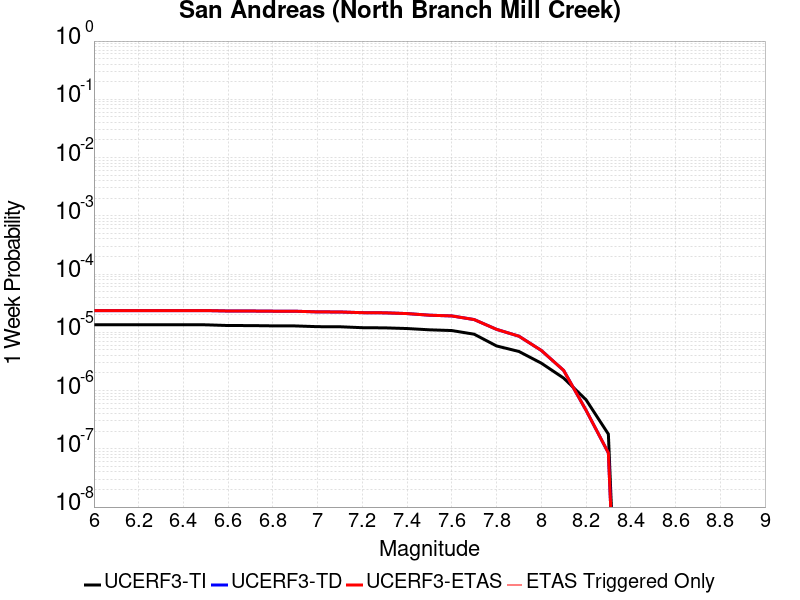 |  |  |  |

| Magnitude | 1 wk TI Prob | 1 wk TD Prob | 1 wk ETAS Prob | 1 wk ETAS/TD Gain | 1 wk ETAS Triggered Only | 1 mo TI Prob | 1 mo TD Prob | 1 mo ETAS Prob | 1 mo ETAS/TD Gain | 1 mo ETAS Triggered Only | 1 yr TI Prob | 1 yr TD Prob | 1 yr ETAS Prob | 1 yr ETAS/TD Gain | 1 yr ETAS Triggered Only | 10 yr TI Prob | 10 yr TD Prob | 10 yr ETAS Prob | 10 yr ETAS/TD Gain | 10 yr ETAS Triggered Only |
|-----|-----|-----|-----|-----|-----|-----|-----|-----|-----|-----|-----|-----|-----|-----|-----|-----|-----|-----|-----|-----|
| 6.0 | 1.3461156E-5 | 2.3621607E-5 | 2.3621607E-5 | 1.0 | 0.0 | 5.7689394E-5 | 1.0123155E-4 | 1.0123155E-4 | 1.0 | 0.0 | 7.02142E-4 | 0.0012318006 | 0.0012431798 | 1.0092378 | 1.1393155E-5 | 0.0069992766 | 0.012290854 | 0.012358372 | 1.0054934 | 6.835893E-5 |
| 6.1 | 1.3461156E-5 | 2.3621607E-5 | 2.3621607E-5 | 1.0 | 0.0 | 5.7689394E-5 | 1.0123155E-4 | 1.0123155E-4 | 1.0 | 0.0 | 7.02142E-4 | 0.0012318006 | 0.0012431798 | 1.0092378 | 1.1393155E-5 | 0.0069992766 | 0.012290854 | 0.012358372 | 1.0054934 | 6.835893E-5 |
| 6.2 | 1.3461156E-5 | 2.3621607E-5 | 2.3621607E-5 | 1.0 | 0.0 | 5.7689394E-5 | 1.0123155E-4 | 1.0123155E-4 | 1.0 | 0.0 | 7.02142E-4 | 0.0012318006 | 0.0012431798 | 1.0092378 | 1.1393155E-5 | 0.0069992766 | 0.012290854 | 0.012358372 | 1.0054934 | 6.835893E-5 |
| 6.3 | 1.3461156E-5 | 2.3621607E-5 | 2.3621607E-5 | 1.0 | 0.0 | 5.7689394E-5 | 1.0123155E-4 | 1.0123155E-4 | 1.0 | 0.0 | 7.02142E-4 | 0.0012318006 | 0.0012431798 | 1.0092378 | 1.1393155E-5 | 0.0069992766 | 0.012290854 | 0.012358372 | 1.0054934 | 6.835893E-5 |
| 6.4 | 1.3461156E-5 | 2.3621607E-5 | 2.3621607E-5 | 1.0 | 0.0 | 5.7689394E-5 | 1.0123155E-4 | 1.0123155E-4 | 1.0 | 0.0 | 7.02142E-4 | 0.0012318006 | 0.0012431798 | 1.0092378 | 1.1393155E-5 | 0.0069992766 | 0.012290854 | 0.012358372 | 1.0054934 | 6.835893E-5 |
| 6.5 | 1.3450706E-5 | 2.3610566E-5 | 2.3610566E-5 | 1.0 | 0.0 | 5.764461E-5 | 1.0118423E-4 | 1.0118423E-4 | 1.0 | 0.0 | 7.0159714E-4 | 0.0012312252 | 0.0012426043 | 1.009242 | 1.1393155E-5 | 0.006993862 | 0.012285163 | 0.012352682 | 1.005496 | 6.835893E-5 |
| 6.6 | 1.3074523E-5 | 2.3224806E-5 | 2.3224806E-5 | 1.0 | 0.0 | 5.6032466E-5 | 9.9531106E-5 | 9.9531106E-5 | 1.0 | 0.0 | 6.8198174E-4 | 0.0012111209 | 0.0012225002 | 1.0093957 | 1.1393155E-5 | 0.006798926 | 0.012086319 | 0.012153852 | 1.0055876 | 6.835893E-5 |
| 6.7 | 1.3050216E-5 | 2.3200095E-5 | 2.3200095E-5 | 1.0 | 0.0 | 5.59283E-5 | 9.9425204E-5 | 9.9425204E-5 | 1.0 | 0.0 | 6.8071426E-4 | 0.001209833 | 0.0012212123 | 1.0094057 | 1.1393155E-5 | 0.0067863287 | 0.01207358 | 0.012141113 | 1.0055935 | 6.835893E-5 |
| 6.8 | 1.29049395E-5 | 2.3048478E-5 | 2.3048478E-5 | 1.0 | 0.0 | 5.530571E-5 | 9.8775476E-5 | 9.8775476E-5 | 1.0 | 0.0 | 6.73139E-4 | 0.0012019312 | 0.0012133106 | 1.0094676 | 1.1393155E-5 | 0.0067110364 | 0.011995417 | 0.012062956 | 1.0056304 | 6.835893E-5 |
| 6.9 | 1.2867369E-5 | 2.3007864E-5 | 2.3007864E-5 | 1.0 | 0.0 | 5.51447E-5 | 9.860143E-5 | 9.860143E-5 | 1.0 | 0.0 | 6.711799E-4 | 0.0011998145 | 0.001211194 | 1.0094844 | 1.1393155E-5 | 0.006691564 | 0.011974478 | 0.012042019 | 1.0056404 | 6.835893E-5 |
| 7.0 | 1.2495996E-5 | 2.240703E-5 | 2.240703E-5 | 1.0 | 0.0 | 5.3553173E-5 | 9.6026604E-5 | 9.6026604E-5 | 1.0 | 0.0 | 6.518148E-4 | 0.0011684998 | 0.0011798796 | 1.0097388 | 1.1393155E-5 | 0.0064990623 | 0.01166463 | 0.011732192 | 1.005792 | 6.835893E-5 |
| 7.1 | 1.2452067E-5 | 2.2352064E-5 | 2.2352064E-5 | 1.0 | 0.0 | 5.3364907E-5 | 9.579106E-5 | 9.579106E-5 | 1.0 | 0.0 | 6.4952404E-4 | 0.0011656351 | 0.0011770149 | 1.0097628 | 1.1393155E-5 | 0.0064762887 | 0.011636283 | 0.011703847 | 1.0058063 | 6.835893E-5 |
| 7.2 | 1.2002777E-5 | 2.1729944E-5 | 2.1729944E-5 | 1.0 | 0.0 | 5.143946E-5 | 9.312502E-5 | 9.312502E-5 | 1.0 | 0.0 | 6.2609545E-4 | 0.00113321 | 0.0011445903 | 1.0100424 | 1.1393155E-5 | 0.006243344 | 0.011315388 | 0.011382973 | 1.0059729 | 6.835893E-5 |
| 7.3 | 1.1923425E-5 | 2.1599648E-5 | 2.1599648E-5 | 1.0 | 0.0 | 5.109939E-5 | 9.2566646E-5 | 9.2566646E-5 | 1.0 | 0.0 | 6.219575E-4 | 0.0011264189 | 0.0011377992 | 1.0101031 | 1.1393155E-5 | 0.0062021962 | 0.011248202 | 0.011315793 | 1.006009 | 6.835893E-5 |
| 7.4 | 1.16105175E-5 | 2.0972457E-5 | 2.0972457E-5 | 1.0 | 0.0 | 4.975841E-5 | 8.987887E-5 | 8.987887E-5 | 1.0 | 0.0 | 6.0564023E-4 | 0.0010937285 | 0.0011051092 | 1.0104054 | 1.1393155E-5 | 0.006039923 | 0.010925225 | 0.010992837 | 1.0061886 | 6.835893E-5 |
| 7.5 | 1.1037265E-5 | 1.966843E-5 | 1.966843E-5 | 1.0 | 0.0 | 4.7301706E-5 | 8.4290565E-5 | 8.4290565E-5 | 1.0 | 0.0 | 5.757461E-4 | 0.0010257567 | 0.0010371382 | 1.0110956 | 1.1393155E-5 | 0.005742567 | 0.010253555 | 0.010321213 | 1.0065985 | 6.835893E-5 |
| 7.6 | 1.0720915E-5 | 1.9108911E-5 | 1.9108911E-5 | 1.0 | 0.0 | 4.5945973E-5 | 8.189277E-5 | 8.189277E-5 | 1.0 | 0.0 | 5.592486E-4 | 9.965907E-4 | 0.0010079725 | 1.0114207 | 1.1393155E-5 | 0.005578433 | 0.009964557 | 0.010032235 | 1.0067918 | 6.835893E-5 |
| 7.7 | 9.276279E-6 | 1.6549315E-5 | 1.6549315E-5 | 1.0 | 0.0 | 3.9754876E-5 | 7.0923714E-5 | 7.0923714E-5 | 1.0 | 0.0 | 4.839081E-4 | 8.631558E-4 | 8.7453914E-4 | 1.013188 | 1.1393155E-5 | 0.0048285574 | 0.008641247 | 0.008709014 | 1.0078424 | 6.835893E-5 |
| 7.8 | 5.8346777E-6 | 1.1242427E-5 | 1.1242427E-5 | 1.0 | 0.0 | 2.5005522E-5 | 4.818094E-5 | 4.818094E-5 | 1.0 | 0.0 | 3.043997E-4 | 5.8644515E-4 | 5.978316E-4 | 1.0194161 | 1.1393155E-5 | 0.0030398308 | 0.0058917315 | 0.0059596878 | 1.0115342 | 6.835893E-5 |
| 7.9 | 4.690204E-6 | 8.581902E-6 | 8.581902E-6 | 1.0 | 0.0 | 2.0100719E-5 | 3.677906E-5 | 3.677906E-5 | 1.0 | 0.0 | 2.4469878E-4 | 4.4769314E-4 | 4.590812E-4 | 1.0254372 | 1.1393155E-5 | 0.002444295 | 0.0045081377 | 0.0045761885 | 1.0150951 | 6.835893E-5 |
| 8.0 | 2.9570454E-6 | 4.891517E-6 | 4.891517E-6 | 1.0 | 0.0 | 1.267299E-5 | 2.0963476E-5 | 2.0963476E-5 | 1.0 | 0.0 | 1.5428272E-4 | 2.5520046E-4 | 2.5520046E-4 | 1.0 | 0.0 | 0.0015417566 | 0.0025728077 | 0.0026068992 | 1.0132507 | 3.4179466E-5 |
| 8.1 | 1.6376824E-6 | 2.2202787E-6 | 2.2202787E-6 | 1.0 | 0.0 | 7.01862E-6 | 9.5154455E-6 | 9.5154455E-6 | 1.0 | 0.0 | 8.544835E-5 | 1.1584441E-4 | 1.1584441E-4 | 1.0 | 0.0 | 8.54155E-4 | 0.0011728838 | 0.0011728838 | 1.0 | 0.0 |
| 8.2 | 6.9631557E-7 | 4.607588E-7 | 4.607588E-7 | 1.0 | 0.0 | 2.984206E-6 | 1.974679E-6 | 1.974679E-6 | 1.0 | 0.0 | 3.63321E-5 | 2.4041454E-5 | 2.4041454E-5 | 1.0 | 0.0 | 3.6326164E-4 | 2.4895053E-4 | 2.4895053E-4 | 1.0 | 0.0 |
| 8.3 | 1.7876137E-7 | 8.50702E-8 | 8.50702E-8 | 1.0 | 0.0 | 7.661199E-7 | 3.645865E-7 | 3.645865E-7 | 1.0 | 0.0 | 9.32747E-6 | 4.438832E-6 | 4.438832E-6 | 1.0 | 0.0 | 9.3270784E-5 | 4.660403E-5 | 4.660403E-5 | 1.0 | 0.0 |

## White Wolf (Extension)
*[(top)](#table-of-contents)*

| 1 Week | 1 Month | 1 Year | 10 Year |
|-----|-----|-----|-----|
|  |  |  | 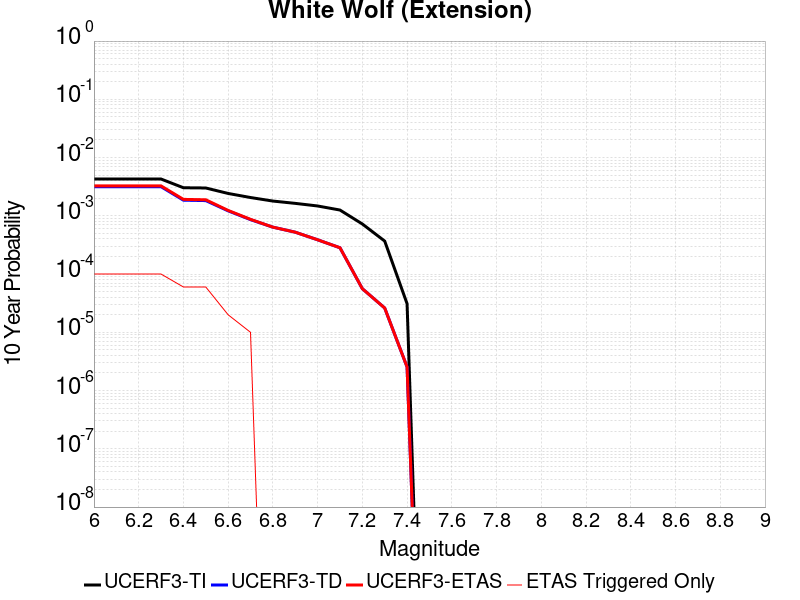 |

| Magnitude | 1 wk TI Prob | 1 wk TD Prob | 1 wk ETAS Prob | 1 wk ETAS/TD Gain | 1 wk ETAS Triggered Only | 1 mo TI Prob | 1 mo TD Prob | 1 mo ETAS Prob | 1 mo ETAS/TD Gain | 1 mo ETAS Triggered Only | 1 yr TI Prob | 1 yr TD Prob | 1 yr ETAS Prob | 1 yr ETAS/TD Gain | 1 yr ETAS Triggered Only | 10 yr TI Prob | 10 yr TD Prob | 10 yr ETAS Prob | 10 yr ETAS/TD Gain | 10 yr ETAS Triggered Only |
|-----|-----|-----|-----|-----|-----|-----|-----|-----|-----|-----|-----|-----|-----|-----|-----|-----|-----|-----|-----|-----|
| 6.0 | 8.222555E-6 | 6.067321E-6 | 6.067321E-6 | 1.0 | 0.0 | 3.5239045E-5 | 2.6002583E-5 | 2.6002583E-5 | 1.0 | 0.0 | 4.289509E-4 | 3.1654208E-4 | 3.3932115E-4 | 1.0719624 | 2.278631E-5 | 0.0042812387 | 0.003161564 | 0.0032297068 | 1.0215535 | 6.835893E-5 |
| 6.1 | 8.222555E-6 | 6.067321E-6 | 6.067321E-6 | 1.0 | 0.0 | 3.5239045E-5 | 2.6002583E-5 | 2.6002583E-5 | 1.0 | 0.0 | 4.289509E-4 | 3.1654208E-4 | 3.3932115E-4 | 1.0719624 | 2.278631E-5 | 0.0042812387 | 0.003161564 | 0.0032297068 | 1.0215535 | 6.835893E-5 |
| 6.2 | 8.222555E-6 | 6.067321E-6 | 6.067321E-6 | 1.0 | 0.0 | 3.5239045E-5 | 2.6002583E-5 | 2.6002583E-5 | 1.0 | 0.0 | 4.289509E-4 | 3.1654208E-4 | 3.3932115E-4 | 1.0719624 | 2.278631E-5 | 0.0042812387 | 0.003161564 | 0.0032297068 | 1.0215535 | 6.835893E-5 |
| 6.3 | 8.222555E-6 | 6.067321E-6 | 6.067321E-6 | 1.0 | 0.0 | 3.5239045E-5 | 2.6002583E-5 | 2.6002583E-5 | 1.0 | 0.0 | 4.289509E-4 | 3.1654208E-4 | 3.3932115E-4 | 1.0719624 | 2.278631E-5 | 0.0042812387 | 0.003161564 | 0.0032297068 | 1.0215535 | 6.835893E-5 |
| 6.4 | 5.821773E-6 | 3.5575688E-6 | 3.5575688E-6 | 1.0 | 0.0 | 2.4950215E-5 | 1.5246641E-5 | 1.5246641E-5 | 1.0 | 0.0 | 3.0372653E-4 | 1.8561314E-4 | 2.0839521E-4 | 1.1227396 | 2.278631E-5 | 0.0030331176 | 0.0018546894 | 0.0019001776 | 1.024526 | 4.557262E-5 |
| 6.5 | 5.766023E-6 | 3.4994973E-6 | 3.4994973E-6 | 1.0 | 0.0 | 2.4711293E-5 | 1.4997766E-5 | 1.4997766E-5 | 1.0 | 0.0 | 3.0081844E-4 | 1.825836E-4 | 2.0536575E-4 | 1.1247765 | 2.278631E-5 | 0.0030041158 | 0.001824444 | 0.0018699336 | 1.0249333 | 4.557262E-5 |
| 6.6 | 4.643576E-6 | 2.332905E-6 | 2.332905E-6 | 1.0 | 0.0 | 1.9900888E-5 | 9.998129E-6 | 9.998129E-6 | 1.0 | 0.0 | 2.4226638E-4 | 1.2172085E-4 | 1.2172085E-4 | 1.0 | 0.0 | 0.0024200242 | 0.0012165842 | 0.0012279635 | 1.0093535 | 1.1393155E-5 |
| 6.7 | 3.9529173E-6 | 1.6485654E-6 | 1.6485654E-6 | 1.0 | 0.0 | 1.6940963E-5 | 7.0652623E-6 | 7.0652623E-6 | 1.0 | 0.0 | 2.0623671E-4 | 8.6016364E-5 | 8.6016364E-5 | 1.0 | 0.0 | 0.002060454 | 8.598492E-4 | 8.7123254E-4 | 1.0132388 | 1.1393155E-5 |
| 6.8 | 3.4377522E-6 | 1.2246993E-6 | 1.2246993E-6 | 1.0 | 0.0 | 1.473314E-5 | 5.248701E-6 | 5.248701E-6 | 1.0 | 0.0 | 1.7936122E-4 | 6.3901156E-5 | 6.3901156E-5 | 1.0 | 0.0 | 0.0017921652 | 6.3883694E-4 | 6.3883694E-4 | 1.0 | 0.0 |
| 6.9 | 3.1367306E-6 | 1.0035287E-6 | 1.0035287E-6 | 1.0 | 0.0 | 1.3443062E-5 | 4.300831E-6 | 4.300831E-6 | 1.0 | 0.0 | 1.63657E-4 | 5.2361436E-5 | 5.2361436E-5 | 1.0 | 0.0 | 0.0016353652 | 5.2349863E-4 | 5.2349863E-4 | 1.0 | 0.0 |
| 7.0 | 2.8298145E-6 | 7.429934E-7 | 7.429934E-7 | 1.0 | 0.0 | 1.2127721E-5 | 3.184254E-6 | 3.184254E-6 | 1.0 | 0.0 | 1.47645E-4 | 3.8767652E-5 | 3.8767652E-5 | 1.0 | 0.0 | 0.0014754693 | 3.876139E-4 | 3.876139E-4 | 1.0 | 0.0 |
| 7.1 | 2.4091064E-6 | 5.4237466E-7 | 5.4237466E-7 | 1.0 | 0.0 | 1.03247E-5 | 2.324461E-6 | 2.324461E-6 | 1.0 | 0.0 | 1.2569598E-4 | 2.8299988E-5 | 2.8299988E-5 | 1.0 | 0.0 | 0.001256249 | 2.8296787E-4 | 2.8296787E-4 | 1.0 | 0.0 |
| 7.2 | 1.3875518E-6 | 1.07468495E-7 | 1.07468495E-7 | 1.0 | 0.0 | 5.9466374E-6 | 4.6057917E-7 | 4.6057917E-7 | 1.0 | 0.0 | 7.23979E-5 | 5.6075382E-6 | 5.6075382E-6 | 1.0 | 0.0 | 7.2374323E-4 | 5.607408E-5 | 5.607408E-5 | 1.0 | 0.0 |
| 7.3 | 7.056077E-7 | 5.0039706E-8 | 5.0039706E-8 | 1.0 | 0.0 | 3.0240296E-6 | 2.1445587E-7 | 2.1445587E-7 | 1.0 | 0.0 | 3.681694E-5 | 2.6109974E-6 | 2.6109974E-6 | 1.0 | 0.0 | 3.681084E-4 | 2.6109714E-5 | 2.6109714E-5 | 1.0 | 0.0 |
| 7.4 | 5.9334678E-8 | 4.865539E-9 | 4.865539E-9 | 1.0 | 0.0 | 2.5429145E-7 | 2.085231E-8 | 2.085231E-8 | 1.0 | 0.0 | 3.095994E-6 | 2.5387686E-7 | 2.5387686E-7 | 1.0 | 0.0 | 3.095951E-5 | 2.538767E-6 | 2.538767E-6 | 1.0 | 0.0 |

## Mission Creek
*[(top)](#table-of-contents)*

| 1 Week | 1 Month | 1 Year | 10 Year |
|-----|-----|-----|-----|
|  |  |  |  |

| Magnitude | 1 wk TI Prob | 1 wk TD Prob | 1 wk ETAS Prob | 1 wk ETAS/TD Gain | 1 wk ETAS Triggered Only | 1 mo TI Prob | 1 mo TD Prob | 1 mo ETAS Prob | 1 mo ETAS/TD Gain | 1 mo ETAS Triggered Only | 1 yr TI Prob | 1 yr TD Prob | 1 yr ETAS Prob | 1 yr ETAS/TD Gain | 1 yr ETAS Triggered Only | 10 yr TI Prob | 10 yr TD Prob | 10 yr ETAS Prob | 10 yr ETAS/TD Gain | 10 yr ETAS Triggered Only |
|-----|-----|-----|-----|-----|-----|-----|-----|-----|-----|-----|-----|-----|-----|-----|-----|-----|-----|-----|-----|-----|
| 6.0 | 1.1549387E-5 | 1.6363685E-5 | 1.6363685E-5 | 1.0 | 0.0 | 4.9496433E-5 | 7.012828E-5 | 7.012828E-5 | 1.0 | 0.0 | 6.0245243E-4 | 8.5349235E-4 | 8.876426E-4 | 1.0400124 | 3.4179466E-5 | 0.006008218 | 0.008530929 | 0.008598704 | 1.0079447 | 6.835893E-5 |
| 6.1 | 1.1549387E-5 | 1.6363685E-5 | 1.6363685E-5 | 1.0 | 0.0 | 4.9496433E-5 | 7.012828E-5 | 7.012828E-5 | 1.0 | 0.0 | 6.0245243E-4 | 8.5349235E-4 | 8.876426E-4 | 1.0400124 | 3.4179466E-5 | 0.006008218 | 0.008530929 | 0.008598704 | 1.0079447 | 6.835893E-5 |
| 6.2 | 1.1549387E-5 | 1.6363685E-5 | 1.6363685E-5 | 1.0 | 0.0 | 4.9496433E-5 | 7.012828E-5 | 7.012828E-5 | 1.0 | 0.0 | 6.0245243E-4 | 8.5349235E-4 | 8.876426E-4 | 1.0400124 | 3.4179466E-5 | 0.006008218 | 0.008530929 | 0.008598704 | 1.0079447 | 6.835893E-5 |
| 6.3 | 1.1549387E-5 | 1.6363685E-5 | 1.6363685E-5 | 1.0 | 0.0 | 4.9496433E-5 | 7.012828E-5 | 7.012828E-5 | 1.0 | 0.0 | 6.0245243E-4 | 8.5349235E-4 | 8.876426E-4 | 1.0400124 | 3.4179466E-5 | 0.006008218 | 0.008530929 | 0.008598704 | 1.0079447 | 6.835893E-5 |
| 6.4 | 1.1549387E-5 | 1.6363685E-5 | 1.6363685E-5 | 1.0 | 0.0 | 4.9496433E-5 | 7.012828E-5 | 7.012828E-5 | 1.0 | 0.0 | 6.0245243E-4 | 8.5349235E-4 | 8.876426E-4 | 1.0400124 | 3.4179466E-5 | 0.006008218 | 0.008530929 | 0.008598704 | 1.0079447 | 6.835893E-5 |
| 6.5 | 1.1549387E-5 | 1.6363685E-5 | 1.6363685E-5 | 1.0 | 0.0 | 4.9496433E-5 | 7.012828E-5 | 7.012828E-5 | 1.0 | 0.0 | 6.0245243E-4 | 8.5349235E-4 | 8.876426E-4 | 1.0400124 | 3.4179466E-5 | 0.006008218 | 0.008530929 | 0.008598704 | 1.0079447 | 6.835893E-5 |
| 6.6 | 9.202681E-6 | 1.3886644E-5 | 1.3886644E-5 | 1.0 | 0.0 | 3.9439463E-5 | 5.9512884E-5 | 5.9512884E-5 | 1.0 | 0.0 | 4.800697E-4 | 7.2433753E-4 | 7.584922E-4 | 1.047153 | 3.4179466E-5 | 0.004790339 | 0.0072479746 | 0.0073158382 | 1.009363 | 6.835893E-5 |
| 6.7 | 9.019164E-6 | 1.3692287E-5 | 1.3692287E-5 | 1.0 | 0.0 | 3.8652986E-5 | 5.867996E-5 | 5.867996E-5 | 1.0 | 0.0 | 4.7049852E-4 | 7.142034E-4 | 7.4835843E-4 | 1.0478226 | 3.4179466E-5 | 0.004695036 | 0.0071472875 | 0.0072151576 | 1.009496 | 6.835893E-5 |
| 6.8 | 8.673558E-6 | 1.3314311E-5 | 1.3314311E-5 | 1.0 | 0.0 | 3.717186E-5 | 5.7060137E-5 | 5.7060137E-5 | 1.0 | 0.0 | 4.524734E-4 | 6.944946E-4 | 7.286503E-4 | 1.0491807 | 3.4179466E-5 | 0.0045155324 | 0.0069514345 | 0.007019318 | 1.0097654 | 6.835893E-5 |
| 6.9 | 7.002255E-6 | 1.1518228E-5 | 1.1518228E-5 | 1.0 | 0.0 | 3.000932E-5 | 4.936294E-5 | 4.936294E-5 | 1.0 | 0.0 | 3.653022E-4 | 6.0083496E-4 | 6.349939E-4 | 1.0568525 | 3.4179466E-5 | 0.0036470229 | 0.006020115 | 0.006088062 | 1.0112867 | 6.835893E-5 |
| 7.0 | 5.84644E-6 | 9.713462E-6 | 9.713462E-6 | 1.0 | 0.0 | 2.5055931E-5 | 4.1628486E-5 | 4.1628486E-5 | 1.0 | 0.0 | 3.0501327E-4 | 5.067135E-4 | 5.4087566E-4 | 1.067419 | 3.4179466E-5 | 0.0030459496 | 0.0050833835 | 0.005151395 | 1.0133792 | 6.835893E-5 |
| 7.1 | 5.54703E-6 | 9.367798E-6 | 9.367798E-6 | 1.0 | 0.0 | 2.377277E-5 | 4.0147115E-5 | 4.0147115E-5 | 1.0 | 0.0 | 2.8939504E-4 | 4.8868597E-4 | 5.228487E-4 | 1.0699074 | 3.4179466E-5 | 0.0028901845 | 0.004903909 | 0.004971932 | 1.0138713 | 6.835893E-5 |
| 7.2 | 4.384709E-6 | 7.718187E-6 | 7.718187E-6 | 1.0 | 0.0 | 1.8791474E-5 | 3.3077544E-5 | 3.3077544E-5 | 1.0 | 0.0 | 2.2876218E-4 | 4.0264832E-4 | 4.3681404E-4 | 1.0848525 | 3.4179466E-5 | 0.0022852682 | 0.0040469198 | 0.0041150018 | 1.0168233 | 6.835893E-5 |
| 7.3 | 3.7888456E-6 | 6.9513435E-6 | 6.9513435E-6 | 1.0 | 0.0 | 1.623781E-5 | 2.9791152E-5 | 2.9791152E-5 | 1.0 | 0.0 | 1.9767738E-4 | 3.6265026E-4 | 3.968173E-4 | 1.0942149 | 3.4179466E-5 | 0.0019750162 | 0.003648293 | 0.0037164027 | 1.0186689 | 6.835893E-5 |
| 7.4 | 2.1982462E-6 | 5.0586045E-6 | 5.0586045E-6 | 1.0 | 0.0 | 9.421021E-6 | 2.1679554E-5 | 2.1679554E-5 | 1.0 | 0.0 | 1.1469489E-4 | 2.639168E-4 | 2.9808722E-4 | 1.1294743 | 3.4179466E-5 | 0.0011463572 | 0.002663531 | 0.0027317079 | 1.0255964 | 6.835893E-5 |
| 7.5 | 2.051923E-6 | 4.6488854E-6 | 4.6488854E-6 | 1.0 | 0.0 | 8.793926E-6 | 1.9923644E-5 | 1.9923644E-5 | 1.0 | 0.0 | 1.0706078E-4 | 2.425435E-4 | 2.7671468E-4 | 1.1408868 | 3.4179466E-5 | 0.0010700922 | 0.0024506915 | 0.002518883 | 1.0278254 | 6.835893E-5 |
| 7.6 | 1.8733427E-6 | 4.1560734E-6 | 4.1560734E-6 | 1.0 | 0.0 | 8.028587E-6 | 1.7811622E-5 | 1.7811622E-5 | 1.0 | 0.0 | 9.774366E-5 | 2.16835E-4 | 2.5100706E-4 | 1.1575947 | 3.4179466E-5 | 9.770069E-4 | 0.0021947375 | 0.0022629465 | 1.0310783 | 6.835893E-5 |
| 7.7 | 1.8411953E-6 | 4.0755285E-6 | 4.0755285E-6 | 1.0 | 0.0 | 7.890813E-6 | 1.7466433E-5 | 1.7466433E-5 | 1.0 | 0.0 | 9.606641E-5 | 2.1263317E-4 | 2.4680537E-4 | 1.1607096 | 3.4179466E-5 | 9.6024893E-4 | 0.002152907 | 0.002221119 | 1.0316836 | 6.835893E-5 |
| 7.8 | 1.7194251E-6 | 3.7406705E-6 | 3.7406705E-6 | 1.0 | 0.0 | 7.368944E-6 | 1.6031347E-5 | 1.6031347E-5 | 1.0 | 0.0 | 8.97132E-5 | 1.9516425E-4 | 2.2933705E-4 | 1.1750976 | 3.4179466E-5 | 8.967699E-4 | 0.0019777492 | 0.002045973 | 1.0344956 | 6.835893E-5 |
| 7.9 | 1.4035052E-6 | 2.974843E-6 | 2.974843E-6 | 1.0 | 0.0 | 6.0150082E-6 | 1.2749265E-5 | 1.2749265E-5 | 1.0 | 0.0 | 7.3230265E-5 | 1.5521131E-4 | 1.8938546E-4 | 1.2201782 | 3.4179466E-5 | 7.3206134E-4 | 0.0015757503 | 0.0016440015 | 1.0433135 | 6.835893E-5 |
| 8.0 | 3.9318823E-7 | 5.5886267E-7 | 5.5886267E-7 | 1.0 | 0.0 | 1.6850913E-6 | 2.3951236E-6 | 2.3951236E-6 | 1.0 | 0.0 | 2.0515794E-5 | 2.9160245E-5 | 4.0553066E-5 | 1.3906971 | 1.1393155E-5 | 2.0513899E-4 | 3.0202873E-4 | 3.1341842E-4 | 1.0377107 | 1.1393155E-5 |
| 8.1 | 1.596793E-7 | 1.1586103E-7 | 1.1586103E-7 | 1.0 | 0.0 | 6.8433974E-7 | 4.9654716E-7 | 4.9654716E-7 | 1.0 | 0.0 | 8.331805E-6 | 6.0454454E-6 | 6.0454454E-6 | 1.0 | 0.0 | 8.331492E-5 | 6.661552E-5 | 6.661552E-5 | 1.0 | 0.0 |
| 8.2 | 4.9003038E-8 | 2.596505E-8 | 2.596505E-8 | 1.0 | 0.0 | 2.10013E-7 | 1.1127878E-7 | 1.1127878E-7 | 1.0 | 0.0 | 2.5569052E-6 | 1.3548183E-6 | 1.3548183E-6 | 1.0 | 0.0 | 2.556876E-5 | 1.5244346E-5 | 1.5244346E-5 | 1.0 | 0.0 |

## Independence rev 2011
*[(top)](#table-of-contents)*

| 1 Week | 1 Month | 1 Year | 10 Year |
|-----|-----|-----|-----|
|  |  |  |  |

| Magnitude | 1 wk TI Prob | 1 wk TD Prob | 1 wk ETAS Prob | 1 wk ETAS/TD Gain | 1 wk ETAS Triggered Only | 1 mo TI Prob | 1 mo TD Prob | 1 mo ETAS Prob | 1 mo ETAS/TD Gain | 1 mo ETAS Triggered Only | 1 yr TI Prob | 1 yr TD Prob | 1 yr ETAS Prob | 1 yr ETAS/TD Gain | 1 yr ETAS Triggered Only | 10 yr TI Prob | 10 yr TD Prob | 10 yr ETAS Prob | 10 yr ETAS/TD Gain | 10 yr ETAS Triggered Only |
|-----|-----|-----|-----|-----|-----|-----|-----|-----|-----|-----|-----|-----|-----|-----|-----|-----|-----|-----|-----|-----|
| 6.0 | 4.422171E-6 | 4.3265477E-6 | 4.3265477E-6 | 1.0 | 0.0 | 1.8952025E-5 | 1.8542232E-5 | 1.8542232E-5 | 1.0 | 0.0 | 2.3071647E-4 | 2.2573127E-4 | 2.3712186E-4 | 1.0504608 | 1.1393155E-5 | 0.0023047708 | 0.0022553136 | 0.0023235183 | 1.0302418 | 6.835893E-5 |
| 6.1 | 4.422171E-6 | 4.3265477E-6 | 4.3265477E-6 | 1.0 | 0.0 | 1.8952025E-5 | 1.8542232E-5 | 1.8542232E-5 | 1.0 | 0.0 | 2.3071647E-4 | 2.2573127E-4 | 2.3712186E-4 | 1.0504608 | 1.1393155E-5 | 0.0023047708 | 0.0022553136 | 0.0023235183 | 1.0302418 | 6.835893E-5 |
| 6.2 | 4.422171E-6 | 4.3265477E-6 | 4.3265477E-6 | 1.0 | 0.0 | 1.8952025E-5 | 1.8542232E-5 | 1.8542232E-5 | 1.0 | 0.0 | 2.3071647E-4 | 2.2573127E-4 | 2.3712186E-4 | 1.0504608 | 1.1393155E-5 | 0.0023047708 | 0.0022553136 | 0.0023235183 | 1.0302418 | 6.835893E-5 |
| 6.3 | 4.422171E-6 | 4.3265477E-6 | 4.3265477E-6 | 1.0 | 0.0 | 1.8952025E-5 | 1.8542232E-5 | 1.8542232E-5 | 1.0 | 0.0 | 2.3071647E-4 | 2.2573127E-4 | 2.3712186E-4 | 1.0504608 | 1.1393155E-5 | 0.0023047708 | 0.0022553136 | 0.0023235183 | 1.0302418 | 6.835893E-5 |
| 6.4 | 4.422171E-6 | 4.3265477E-6 | 4.3265477E-6 | 1.0 | 0.0 | 1.8952025E-5 | 1.8542232E-5 | 1.8542232E-5 | 1.0 | 0.0 | 2.3071647E-4 | 2.2573127E-4 | 2.3712186E-4 | 1.0504608 | 1.1393155E-5 | 0.0023047708 | 0.0022553136 | 0.0023235183 | 1.0302418 | 6.835893E-5 |
| 6.5 | 4.422171E-6 | 4.3265477E-6 | 4.3265477E-6 | 1.0 | 0.0 | 1.8952025E-5 | 1.8542232E-5 | 1.8542232E-5 | 1.0 | 0.0 | 2.3071647E-4 | 2.2573127E-4 | 2.3712186E-4 | 1.0504608 | 1.1393155E-5 | 0.0023047708 | 0.0022553136 | 0.0023235183 | 1.0302418 | 6.835893E-5 |
| 6.6 | 2.663744E-6 | 2.5322224E-6 | 2.5322224E-6 | 1.0 | 0.0 | 1.1415996E-5 | 1.0852339E-5 | 1.0852339E-5 | 1.0 | 0.0 | 1.3898089E-4 | 1.321197E-4 | 1.4351135E-4 | 1.0862222 | 1.1393155E-5 | 0.0013889399 | 0.0013204599 | 0.0013887285 | 1.0517007 | 6.835893E-5 |
| 6.7 | 2.663744E-6 | 2.5322224E-6 | 2.5322224E-6 | 1.0 | 0.0 | 1.1415996E-5 | 1.0852339E-5 | 1.0852339E-5 | 1.0 | 0.0 | 1.3898089E-4 | 1.321197E-4 | 1.4351135E-4 | 1.0862222 | 1.1393155E-5 | 0.0013889399 | 0.0013204599 | 0.0013887285 | 1.0517007 | 6.835893E-5 |
| 6.8 | 1.9716529E-6 | 1.832461E-6 | 1.832461E-6 | 1.0 | 0.0 | 8.449913E-6 | 7.853381E-6 | 7.853381E-6 | 1.0 | 0.0 | 1.0287284E-4 | 9.561085E-5 | 1.0700292E-4 | 1.1191504 | 1.1393155E-5 | 0.0010282523 | 9.557101E-4 | 0.0010126214 | 1.0595487 | 5.6965775E-5 |
| 6.9 | 1.8788617E-6 | 1.7431943E-6 | 1.7431943E-6 | 1.0 | 0.0 | 8.0522395E-6 | 7.470812E-6 | 7.470812E-6 | 1.0 | 0.0 | 9.80316E-5 | 9.095346E-5 | 1.0234558E-4 | 1.1252521 | 1.1393155E-5 | 9.798837E-4 | 9.091744E-4 | 9.660883E-4 | 1.0625997 | 5.6965775E-5 |
| 7.0 | 1.5045488E-6 | 1.3851122E-6 | 1.3851122E-6 | 1.0 | 0.0 | 6.44805E-6 | 5.9361823E-6 | 5.9361823E-6 | 1.0 | 0.0 | 7.8502184E-5 | 7.2270675E-5 | 8.3663006E-5 | 1.1576343 | 1.1393155E-5 | 7.8474457E-4 | 7.2247686E-4 | 7.7940145E-4 | 1.0787909 | 5.6965775E-5 |
| 7.1 | 1.272341E-6 | 1.1626511E-6 | 1.1626511E-6 | 1.0 | 0.0 | 5.4528787E-6 | 4.9827813E-6 | 4.9827813E-6 | 1.0 | 0.0 | 6.6386776E-5 | 6.0663704E-5 | 7.2056166E-5 | 1.1877971 | 1.1393155E-5 | 6.636695E-4 | 6.0647464E-4 | 6.6340587E-4 | 1.0938724 | 5.6965775E-5 |
| 7.2 | 1.0416892E-6 | 9.411107E-7 | 9.411107E-7 | 1.0 | 0.0 | 4.464375E-6 | 4.0333257E-6 | 4.0333257E-6 | 1.0 | 0.0 | 5.4352407E-5 | 4.9104652E-5 | 6.0497245E-5 | 1.2320064 | 1.1393155E-5 | 5.4339116E-4 | 4.909399E-4 | 5.478777E-4 | 1.1159772 | 5.6965775E-5 |
| 7.3 | 7.9450155E-7 | 7.2359137E-7 | 7.2359137E-7 | 1.0 | 0.0 | 3.4050022E-6 | 3.1011023E-6 | 3.1011023E-6 | 1.0 | 0.0 | 4.1455114E-5 | 3.775528E-5 | 4.9148002E-5 | 1.3017519 | 1.1393155E-5 | 4.144738E-4 | 3.7748975E-4 | 4.34434E-4 | 1.1508498 | 5.6965775E-5 |
| 7.4 | 5.3893444E-7 | 5.0200816E-7 | 5.0200816E-7 | 1.0 | 0.0 | 2.309717E-6 | 2.1514618E-6 | 2.1514618E-6 | 1.0 | 0.0 | 2.8120441E-5 | 2.6193737E-5 | 3.7586593E-5 | 1.4349458 | 1.1393155E-5 | 2.8116882E-4 | 2.6190694E-4 | 3.1885778E-4 | 1.2174469 | 5.6965775E-5 |
| 7.5 | 3.8852085E-7 | 3.682926E-7 | 3.682926E-7 | 1.0 | 0.0 | 1.6650882E-6 | 1.5783959E-6 | 1.5783959E-6 | 1.0 | 0.0 | 2.027226E-5 | 1.9216803E-5 | 3.060974E-5 | 1.5928632 | 1.1393155E-5 | 2.0270412E-4 | 1.9215162E-4 | 2.4910647E-4 | 1.2964057 | 5.6965775E-5 |
| 7.6 | 2.414929E-7 | 2.3459488E-7 | 2.3459488E-7 | 1.0 | 0.0 | 1.0349692E-6 | 1.0054063E-6 | 1.0054063E-6 | 1.0 | 0.0 | 1.2600677E-5 | 1.2240754E-5 | 2.363377E-5 | 1.9307446 | 1.1393155E-5 | 1.2599962E-4 | 1.2240092E-4 | 1.7935972E-4 | 1.4653462 | 5.6965775E-5 |
| 7.7 | 6.8298014E-8 | 6.859378E-8 | 6.859378E-8 | 1.0 | 0.0 | 2.9270575E-7 | 2.939733E-7 | 2.939733E-7 | 1.0 | 0.0 | 3.5636867E-6 | 3.5791195E-6 | 3.5791195E-6 | 1.0 | 0.0 | 3.5636294E-5 | 3.5790665E-5 | 5.857616E-5 | 1.6366323 | 2.278631E-5 |

## Ludlow
*[(top)](#table-of-contents)*

| 1 Week | 1 Month | 1 Year | 10 Year |
|-----|-----|-----|-----|
| 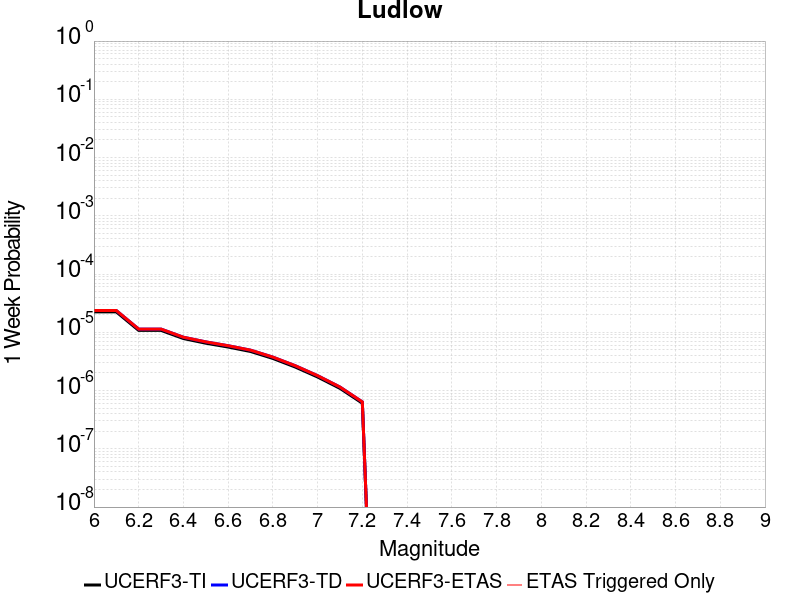 |  |  | 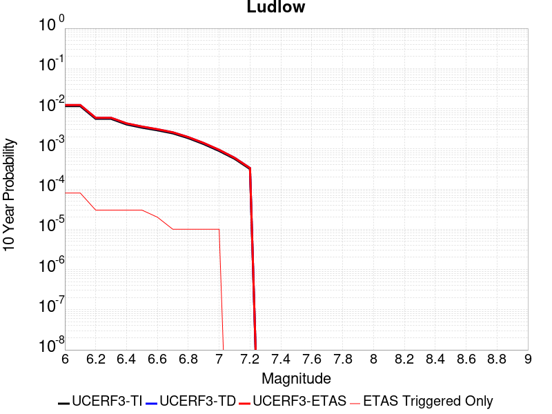 |

| Magnitude | 1 wk TI Prob | 1 wk TD Prob | 1 wk ETAS Prob | 1 wk ETAS/TD Gain | 1 wk ETAS Triggered Only | 1 mo TI Prob | 1 mo TD Prob | 1 mo ETAS Prob | 1 mo ETAS/TD Gain | 1 mo ETAS Triggered Only | 1 yr TI Prob | 1 yr TD Prob | 1 yr ETAS Prob | 1 yr ETAS/TD Gain | 1 yr ETAS Triggered Only | 10 yr TI Prob | 10 yr TD Prob | 10 yr ETAS Prob | 10 yr ETAS/TD Gain | 10 yr ETAS Triggered Only |
|-----|-----|-----|-----|-----|-----|-----|-----|-----|-----|-----|-----|-----|-----|-----|-----|-----|-----|-----|-----|-----|
| 6.0 | 2.2407607E-5 | 2.3660305E-5 | 2.3660305E-5 | 1.0 | 0.0 | 9.602906E-5 | 1.01397614E-4 | 1.01397614E-4 | 1.0 | 0.0 | 0.0011685267 | 0.001233861 | 0.0012566191 | 1.0184447 | 2.278631E-5 | 0.011624013 | 0.012274616 | 0.012330882 | 1.004584 | 5.6965775E-5 |
| 6.1 | 2.2407607E-5 | 2.3660305E-5 | 2.3660305E-5 | 1.0 | 0.0 | 9.602906E-5 | 1.01397614E-4 | 1.01397614E-4 | 1.0 | 0.0 | 0.0011685267 | 0.001233861 | 0.0012566191 | 1.0184447 | 2.278631E-5 | 0.011624013 | 0.012274616 | 0.012330882 | 1.004584 | 5.6965775E-5 |
| 6.2 | 1.0781252E-5 | 1.13670885E-5 | 1.13670885E-5 | 1.0 | 0.0 | 4.620455E-5 | 4.8715207E-5 | 4.8715207E-5 | 1.0 | 0.0 | 5.623952E-4 | 5.9295027E-4 | 5.9295027E-4 | 1.0 | 0.0 | 0.00560974 | 0.0059141004 | 0.0059254263 | 1.0019151 | 1.1393155E-5 |
| 6.3 | 1.0781252E-5 | 1.13670885E-5 | 1.13670885E-5 | 1.0 | 0.0 | 4.620455E-5 | 4.8715207E-5 | 4.8715207E-5 | 1.0 | 0.0 | 5.623952E-4 | 5.9295027E-4 | 5.9295027E-4 | 1.0 | 0.0 | 0.00560974 | 0.0059141004 | 0.0059254263 | 1.0019151 | 1.1393155E-5 |
| 6.4 | 7.814439E-6 | 8.2387605E-6 | 8.2387605E-6 | 1.0 | 0.0 | 3.3490025E-5 | 3.5308505E-5 | 3.5308505E-5 | 1.0 | 0.0 | 4.0766477E-4 | 4.2979766E-4 | 4.2979766E-4 | 1.0 | 0.0 | 0.0040691774 | 0.004289811 | 0.004301155 | 1.0026444 | 1.1393155E-5 |
| 6.5 | 6.4986366E-6 | 6.851779E-6 | 6.851779E-6 | 1.0 | 0.0 | 2.7851002E-5 | 2.936444E-5 | 2.936444E-5 | 1.0 | 0.0 | 3.390332E-4 | 3.5745435E-4 | 3.5745435E-4 | 1.0 | 0.0 | 0.003385164 | 0.00356889 | 0.0035802424 | 1.003181 | 1.1393155E-5 |
| 6.6 | 5.582177E-6 | 5.8867467E-6 | 5.8867467E-6 | 1.0 | 0.0 | 2.3923398E-5 | 2.5228674E-5 | 2.5228674E-5 | 1.0 | 0.0 | 2.9122844E-4 | 3.0711654E-4 | 3.0711654E-4 | 1.0 | 0.0 | 0.0029084706 | 0.0030669945 | 0.0030783527 | 1.0037034 | 1.1393155E-5 |
| 6.7 | 4.6858763E-6 | 4.9410482E-6 | 4.9410482E-6 | 1.0 | 0.0 | 2.0082172E-5 | 2.117575E-5 | 2.117575E-5 | 1.0 | 0.0 | 2.4447302E-4 | 2.5778482E-4 | 2.5778482E-4 | 1.0 | 0.0 | 0.0024420423 | 0.0025749144 | 0.0025862781 | 1.0044132 | 1.1393155E-5 |
| 6.8 | 3.5584908E-6 | 3.7524903E-6 | 3.7524903E-6 | 1.0 | 0.0 | 1.5250586E-5 | 1.6082004E-5 | 1.6082004E-5 | 1.0 | 0.0 | 1.8566006E-4 | 1.9578122E-4 | 1.9578122E-4 | 1.0 | 0.0 | 0.0018550502 | 0.0019561285 | 0.0019674993 | 1.005813 | 1.1393155E-5 |
| 6.9 | 2.532834E-6 | 2.6713403E-6 | 2.6713403E-6 | 1.0 | 0.0 | 1.0854958E-5 | 1.1448553E-5 | 1.1448553E-5 | 1.0 | 0.0 | 1.3215111E-4 | 1.3937749E-4 | 1.3937749E-4 | 1.0 | 0.0 | 0.0013207254 | 0.0013929284 | 0.0014043057 | 1.0081679 | 1.1393155E-5 |
| 7.0 | 1.7083285E-6 | 1.8021722E-6 | 1.8021722E-6 | 1.0 | 0.0 | 7.3213873E-6 | 7.723573E-6 | 7.723573E-6 | 1.0 | 0.0 | 8.913424E-5 | 9.403061E-5 | 9.403061E-5 | 1.0 | 0.0 | 8.9098496E-4 | 9.399248E-4 | 9.513072E-4 | 1.01211 | 1.1393155E-5 |
| 7.1 | 1.0905424E-6 | 1.1499063E-6 | 1.1499063E-6 | 1.0 | 0.0 | 4.6737446E-6 | 4.928161E-6 | 4.928161E-6 | 1.0 | 0.0 | 5.6901354E-5 | 5.999881E-5 | 5.999881E-5 | 1.0 | 0.0 | 5.6886784E-4 | 5.998359E-4 | 5.998359E-4 | 1.0 | 0.0 |
| 7.2 | 6.06668E-7 | 6.388058E-7 | 6.388058E-7 | 1.0 | 0.0 | 2.600003E-6 | 2.7377366E-6 | 2.7377366E-6 | 1.0 | 0.0 | 3.1654577E-5 | 3.3331504E-5 | 3.3331504E-5 | 1.0 | 0.0 | 3.1650066E-4 | 3.332719E-4 | 3.332719E-4 | 1.0 | 0.0 |

## Chino alt 1
*[(top)](#table-of-contents)*

| 1 Week | 1 Month | 1 Year | 10 Year |
|-----|-----|-----|-----|
|  |  |  |  |

| Magnitude | 1 wk TI Prob | 1 wk TD Prob | 1 wk ETAS Prob | 1 wk ETAS/TD Gain | 1 wk ETAS Triggered Only | 1 mo TI Prob | 1 mo TD Prob | 1 mo ETAS Prob | 1 mo ETAS/TD Gain | 1 mo ETAS Triggered Only | 1 yr TI Prob | 1 yr TD Prob | 1 yr ETAS Prob | 1 yr ETAS/TD Gain | 1 yr ETAS Triggered Only | 10 yr TI Prob | 10 yr TD Prob | 10 yr ETAS Prob | 10 yr ETAS/TD Gain | 10 yr ETAS Triggered Only |
|-----|-----|-----|-----|-----|-----|-----|-----|-----|-----|-----|-----|-----|-----|-----|-----|-----|-----|-----|-----|-----|
| 6.0 | 3.939946E-5 | 4.898629E-5 | 4.898629E-5 | 1.0 | 0.0 | 1.6884391E-4 | 2.099273E-4 | 2.099273E-4 | 1.0 | 0.0 | 0.0020537362 | 0.0025533803 | 0.0025874723 | 1.0133518 | 3.4179466E-5 | 0.020348595 | 0.025299244 | 0.025354767 | 1.0021948 | 5.6965775E-5 |
| 6.1 | 2.1505624E-5 | 2.69053E-5 | 2.69053E-5 | 1.0 | 0.0 | 9.2163704E-5 | 1.15303956E-4 | 1.15303956E-4 | 1.0 | 0.0 | 0.0011215154 | 0.0014030316 | 0.001425786 | 1.016218 | 2.278631E-5 | 0.011158722 | 0.0139606 | 0.013994302 | 1.0024141 | 3.4179466E-5 |
| 6.2 | 2.1505624E-5 | 2.69053E-5 | 2.69053E-5 | 1.0 | 0.0 | 9.2163704E-5 | 1.15303956E-4 | 1.15303956E-4 | 1.0 | 0.0 | 0.0011215154 | 0.0014030316 | 0.001425786 | 1.016218 | 2.278631E-5 | 0.011158722 | 0.0139606 | 0.013994302 | 1.0024141 | 3.4179466E-5 |
| 6.3 | 1.4290785E-5 | 1.8187131E-5 | 1.8187131E-5 | 1.0 | 0.0 | 6.1244784E-5 | 7.794277E-5 | 7.794277E-5 | 1.0 | 0.0 | 7.454001E-4 | 9.485855E-4 | 9.5996785E-4 | 1.0119992 | 1.1393155E-5 | 0.007429048 | 0.00945781 | 0.00948038 | 1.0023865 | 2.278631E-5 |
| 6.4 | 1.4290785E-5 | 1.8187131E-5 | 1.8187131E-5 | 1.0 | 0.0 | 6.1244784E-5 | 7.794277E-5 | 7.794277E-5 | 1.0 | 0.0 | 7.454001E-4 | 9.485855E-4 | 9.5996785E-4 | 1.0119992 | 1.1393155E-5 | 0.007429048 | 0.00945781 | 0.00948038 | 1.0023865 | 2.278631E-5 |
| 6.5 | 1.3017944E-5 | 1.6673432E-5 | 1.6673432E-5 | 1.0 | 0.0 | 5.5789995E-5 | 7.1455856E-5 | 7.1455856E-5 | 1.0 | 0.0 | 6.790315E-4 | 8.696716E-4 | 8.8105485E-4 | 1.0130892 | 1.1393155E-5 | 0.0067696036 | 0.00867497 | 0.008697559 | 1.0026039 | 2.278631E-5 |
| 6.6 | 9.470016E-6 | 1.2056756E-5 | 1.2056756E-5 | 1.0 | 0.0 | 4.058515E-5 | 5.167098E-5 | 5.167098E-5 | 1.0 | 0.0 | 4.940122E-4 | 6.289466E-4 | 6.403326E-4 | 1.0181032 | 1.1393155E-5 | 0.004929154 | 0.0062836586 | 0.0063063013 | 1.0036035 | 2.278631E-5 |
| 6.7 | 8.314155E-6 | 1.0417481E-5 | 1.0417481E-5 | 1.0 | 0.0 | 3.5631605E-5 | 4.4645763E-5 | 4.4645763E-5 | 1.0 | 0.0 | 4.3372845E-4 | 5.434589E-4 | 5.548459E-4 | 1.0209527 | 1.1393155E-5 | 0.004328829 | 0.0054337406 | 0.005456403 | 1.0041707 | 2.278631E-5 |
| 6.8 | 3.4856364E-6 | 3.816789E-6 | 3.816789E-6 | 1.0 | 0.0 | 1.4938357E-5 | 1.6357577E-5 | 1.6357577E-5 | 1.0 | 0.0 | 1.8185932E-4 | 1.9913739E-4 | 2.1052826E-4 | 1.0572011 | 1.1393155E-5 | 0.0018171056 | 0.0019911258 | 0.0020024963 | 1.0057106 | 1.1393155E-5 |
| 6.9 | 2.2645952E-6 | 2.154997E-6 | 2.154997E-6 | 1.0 | 0.0 | 9.705372E-6 | 9.23567E-6 | 9.23567E-6 | 1.0 | 0.0 | 1.18156495E-4 | 1.124387E-4 | 1.2383057E-4 | 1.1013163 | 1.1393155E-5 | 0.0011809369 | 0.0011243611 | 0.0011357415 | 1.0101216 | 1.1393155E-5 |
| 7.0 | 1.7864003E-6 | 1.5448495E-6 | 1.5448495E-6 | 1.0 | 0.0 | 7.655979E-6 | 6.620767E-6 | 6.620767E-6 | 1.0 | 0.0 | 9.3207556E-5 | 8.060492E-5 | 9.199716E-5 | 1.1413343 | 1.1393155E-5 | 9.316847E-4 | 8.061676E-4 | 8.1755157E-4 | 1.014121 | 1.1393155E-5 |
| 7.1 | 1.7315456E-6 | 1.4750826E-6 | 1.4750826E-6 | 1.0 | 0.0 | 7.420889E-6 | 6.3217676E-6 | 6.3217676E-6 | 1.0 | 0.0 | 9.034557E-5 | 7.696486E-5 | 8.835714E-5 | 1.1480192 | 1.1393155E-5 | 9.0308854E-4 | 7.69779E-4 | 7.811634E-4 | 1.0147891 | 1.1393155E-5 |
| 7.2 | 1.6008337E-6 | 1.3590618E-6 | 1.3590618E-6 | 1.0 | 0.0 | 6.860698E-6 | 5.8245378E-6 | 5.8245378E-6 | 1.0 | 0.0 | 8.352579E-5 | 7.09115E-5 | 8.230384E-5 | 1.1606559 | 1.1393155E-5 | 8.34944E-4 | 7.092711E-4 | 7.206562E-4 | 1.0160518 | 1.1393155E-5 |
| 7.3 | 1.3320939E-6 | 1.1232352E-6 | 1.1232352E-6 | 1.0 | 0.0 | 5.7089615E-6 | 4.8138563E-6 | 4.8138563E-6 | 1.0 | 0.0 | 6.9504385E-5 | 5.8607173E-5 | 6.999966E-5 | 1.1943872 | 1.1393155E-5 | 6.9482654E-4 | 5.8604265E-4 | 5.974291E-4 | 1.0194294 | 1.1393155E-5 |
| 7.4 | 1.114294E-6 | 9.250058E-7 | 9.250058E-7 | 1.0 | 0.0 | 4.775537E-6 | 3.9643046E-6 | 3.9643046E-6 | 1.0 | 0.0 | 5.8140613E-5 | 4.8264377E-5 | 4.8264377E-5 | 1.0 | 0.0 | 5.81254E-4 | 4.825592E-4 | 4.825592E-4 | 1.0 | 0.0 |
| 7.5 | 9.354081E-7 | 7.63515E-7 | 7.63515E-7 | 1.0 | 0.0 | 4.0088858E-6 | 3.2722032E-6 | 3.2722032E-6 | 1.0 | 0.0 | 4.8807087E-5 | 3.983838E-5 | 3.983838E-5 | 1.0 | 0.0 | 4.879637E-4 | 3.9831578E-4 | 3.9831578E-4 | 1.0 | 0.0 |
| 7.6 | 8.521771E-7 | 6.891905E-7 | 6.891905E-7 | 1.0 | 0.0 | 3.6521824E-6 | 2.9536702E-6 | 2.9536702E-6 | 1.0 | 0.0 | 4.4464414E-5 | 3.5960373E-5 | 3.5960373E-5 | 1.0 | 0.0 | 4.4455516E-4 | 3.5954872E-4 | 3.5954872E-4 | 1.0 | 0.0 |
| 7.7 | 2.1803626E-7 | 1.4217508E-7 | 1.4217508E-7 | 1.0 | 0.0 | 9.344408E-7 | 6.0932166E-7 | 6.0932166E-7 | 1.0 | 0.0 | 1.1376757E-5 | 7.418476E-6 | 7.418476E-6 | 1.0 | 0.0 | 1.13761744E-4 | 7.418325E-5 | 7.418325E-5 | 1.0 | 0.0 |

## Imperial
*[(top)](#table-of-contents)*

| 1 Week | 1 Month | 1 Year | 10 Year |
|-----|-----|-----|-----|
|  |  |  |  |

| Magnitude | 1 wk TI Prob | 1 wk TD Prob | 1 wk ETAS Prob | 1 wk ETAS/TD Gain | 1 wk ETAS Triggered Only | 1 mo TI Prob | 1 mo TD Prob | 1 mo ETAS Prob | 1 mo ETAS/TD Gain | 1 mo ETAS Triggered Only | 1 yr TI Prob | 1 yr TD Prob | 1 yr ETAS Prob | 1 yr ETAS/TD Gain | 1 yr ETAS Triggered Only | 10 yr TI Prob | 10 yr TD Prob | 10 yr ETAS Prob | 10 yr ETAS/TD Gain | 10 yr ETAS Triggered Only |
|-----|-----|-----|-----|-----|-----|-----|-----|-----|-----|-----|-----|-----|-----|-----|-----|-----|-----|-----|-----|-----|
| 6.0 | 2.7496446E-4 | 5.0782255E-4 | 5.0782255E-4 | 1.0 | 0.0 | 0.0011778869 | 0.0021746065 | 0.0021746065 | 1.0 | 0.0 | 0.0142467655 | 0.026158407 | 0.026169503 | 1.0004241 | 1.1393155E-5 | 0.13367249 | 0.22880463 | 0.22884856 | 1.000192 | 5.6965775E-5 |
| 6.1 | 2.5356023E-4 | 4.8857357E-4 | 4.8857357E-4 | 1.0 | 0.0 | 0.001086234 | 0.0020922448 | 0.0020922448 | 1.0 | 0.0 | 0.013144928 | 0.025176695 | 0.025187802 | 1.0004412 | 1.1393155E-5 | 0.123940155 | 0.2201544 | 0.22019884 | 1.0002018 | 5.6965775E-5 |
| 6.2 | 2.4820742E-4 | 4.7949058E-4 | 4.7949058E-4 | 1.0 | 0.0 | 0.0010633124 | 0.0020533793 | 0.0020533793 | 1.0 | 0.0 | 0.01286919 | 0.024714975 | 0.024726085 | 1.0004495 | 1.1393155E-5 | 0.12148927 | 0.21665291 | 0.21669753 | 1.000206 | 5.6965775E-5 |
| 6.3 | 2.3205351E-4 | 4.6066832E-4 | 4.6066832E-4 | 1.0 | 0.0 | 9.94136E-4 | 0.001972836 | 0.001972836 | 1.0 | 0.0 | 0.012036599 | 0.023751607 | 0.02376273 | 1.0004683 | 1.1393155E-5 | 0.11405133 | 0.20854732 | 0.20859241 | 1.0002162 | 5.6965775E-5 |
| 6.4 | 2.0304754E-4 | 4.0048308E-4 | 4.0048308E-4 | 1.0 | 0.0 | 8.6991355E-4 | 0.0017152418 | 0.0017152418 | 1.0 | 0.0 | 0.010539869 | 0.02068611 | 0.020697268 | 1.0005394 | 1.1393155E-5 | 0.100537635 | 0.1856849 | 0.18573129 | 1.0002499 | 5.6965775E-5 |
| 6.5 | 1.854992E-4 | 3.714936E-4 | 3.714936E-4 | 1.0 | 0.0 | 7.9475436E-4 | 0.0015911564 | 0.0015911564 | 1.0 | 0.0 | 0.009633281 | 0.019199163 | 0.019210337 | 1.000582 | 1.1393155E-5 | 0.0922623 | 0.17388222 | 0.17392927 | 1.0002706 | 5.6965775E-5 |
| 6.6 | 1.6586106E-4 | 3.4180965E-4 | 3.4180965E-4 | 1.0 | 0.0 | 7.106394E-4 | 0.0014640864 | 0.0014640864 | 1.0 | 0.0 | 0.008617763 | 0.01767561 | 0.017686801 | 1.0006331 | 1.1393155E-5 | 0.08291132 | 0.16132015 | 0.16136792 | 1.0002961 | 5.6965775E-5 |
| 6.7 | 1.4224656E-4 | 3.0892866E-4 | 3.0892866E-4 | 1.0 | 0.0 | 6.094856E-4 | 0.0013233165 | 0.0013233165 | 1.0 | 0.0 | 0.0073952693 | 0.015993753 | 0.016004965 | 1.000701 | 1.1393155E-5 | 0.07153955 | 0.14697333 | 0.14702192 | 1.0003306 | 5.6965775E-5 |
| 6.8 | 1.2317259E-4 | 2.7897372E-4 | 2.7897372E-4 | 1.0 | 0.0 | 5.2777573E-4 | 0.0011950601 | 0.0011950601 | 1.0 | 0.0 | 0.0064067547 | 0.014454186 | 0.014465414 | 1.0007769 | 1.1393155E-5 | 0.06225166 | 0.13336582 | 0.13341519 | 1.0003701 | 5.6965775E-5 |
| 6.9 | 9.859898E-5 | 2.5093812E-4 | 2.5093812E-4 | 1.0 | 0.0 | 4.2249862E-4 | 0.00107501 | 0.00107501 | 1.0 | 0.0 | 0.0051317946 | 0.013010673 | 0.013021918 | 1.0008643 | 1.1393155E-5 | 0.05014893 | 0.11973186 | 0.11978201 | 1.0004188 | 5.6965775E-5 |
| 7.0 | 7.3191884E-5 | 2.1325808E-4 | 2.1325808E-4 | 1.0 | 0.0 | 3.136418E-4 | 9.136463E-4 | 9.136463E-4 | 1.0 | 0.0 | 0.003811904 | 0.011067598 | 0.011078865 | 1.001018 | 1.1393155E-5 | 0.037471764 | 0.10230677 | 0.10234768 | 1.0003998 | 4.557262E-5 |
| 7.1 | 7.1760296E-5 | 2.1026377E-4 | 2.1026377E-4 | 1.0 | 0.0 | 3.0750787E-4 | 9.0082246E-4 | 9.0082246E-4 | 1.0 | 0.0 | 0.003737482 | 0.010913042 | 0.010924311 | 1.0010326 | 1.1393155E-5 | 0.03675245 | 0.100940526 | 0.100981496 | 1.0004059 | 4.557262E-5 |
| 7.2 | 6.46614E-5 | 1.9192771E-4 | 1.9192771E-4 | 1.0 | 0.0 | 2.7709085E-4 | 8.2229107E-4 | 8.2229107E-4 | 1.0 | 0.0 | 0.0033683628 | 0.009966063 | 0.009977343 | 1.0011318 | 1.1393155E-5 | 0.033177625 | 0.092741676 | 0.09278303 | 1.0004458 | 4.557262E-5 |
| 7.3 | 6.088115E-5 | 1.7861996E-4 | 1.7861996E-4 | 1.0 | 0.0 | 2.6089314E-4 | 7.652924E-4 | 7.652924E-4 | 1.0 | 0.0 | 0.0031717476 | 0.009278207 | 0.009289495 | 1.0012165 | 1.1393155E-5 | 0.031268585 | 0.08678583 | 0.08682745 | 1.0004796 | 4.557262E-5 |
| 7.4 | 4.199346E-5 | 1.1551766E-4 | 1.1551766E-4 | 1.0 | 0.0 | 1.7995955E-4 | 4.9498264E-4 | 4.9498264E-4 | 1.0 | 0.0 | 0.0021888057 | 0.0060099317 | 0.006021256 | 1.0018843 | 1.1393155E-5 | 0.02167372 | 0.057621248 | 0.057653457 | 1.000559 | 3.4179466E-5 |
| 7.5 | 3.130448E-5 | 8.367389E-5 | 8.367389E-5 | 1.0 | 0.0 | 1.3415517E-4 | 3.5855343E-4 | 3.5855343E-4 | 1.0 | 0.0 | 0.0016321153 | 0.0043567102 | 0.0043680537 | 1.0026037 | 1.1393155E-5 | 0.016201803 | 0.04228614 | 0.042318873 | 1.0007741 | 3.4179466E-5 |
| 7.6 | 2.3074248E-5 | 6.113223E-5 | 6.113223E-5 | 1.0 | 0.0 | 9.888588E-5 | 2.6196908E-4 | 2.6196908E-4 | 1.0 | 0.0 | 0.0012032706 | 0.0031848324 | 0.0031961892 | 1.0035659 | 1.1393155E-5 | 0.011967761 | 0.031157905 | 0.03119102 | 1.0010628 | 3.4179466E-5 |
| 7.7 | 1.45864815E-5 | 4.0363186E-5 | 4.0363186E-5 | 1.0 | 0.0 | 6.2511994E-5 | 1.7297364E-4 | 1.7297364E-4 | 1.0 | 0.0 | 7.608177E-4 | 0.0021039254 | 0.0021152946 | 1.0054038 | 1.1393155E-5 | 0.007582182 | 0.020736655 | 0.020758968 | 1.0010761 | 2.278631E-5 |
| 7.8 | 1.0352979E-5 | 3.1163214E-5 | 3.1163214E-5 | 1.0 | 0.0 | 4.4369157E-5 | 1.3354981E-4 | 1.3354981E-4 | 1.0 | 0.0 | 5.400606E-4 | 0.0016247586 | 0.0016361333 | 1.0070008 | 1.1393155E-5 | 0.0053875 | 0.016109291 | 0.01613171 | 1.0013916 | 2.278631E-5 |
| 7.9 | 8.137906E-6 | 2.2311391E-5 | 2.2311391E-5 | 1.0 | 0.0 | 3.4876273E-5 | 9.561675E-5 | 9.561675E-5 | 1.0 | 0.0 | 4.2453592E-4 | 0.0011635132 | 0.0011748931 | 1.0097806 | 1.1393155E-5 | 0.004237258 | 0.01169369 | 0.011716209 | 1.0019258 | 2.278631E-5 |
| 8.0 | 6.93792E-6 | 1.8148243E-5 | 1.8148243E-5 | 1.0 | 0.0 | 2.9733603E-5 | 7.777587E-5 | 7.777587E-5 | 1.0 | 0.0 | 3.6194647E-4 | 9.465106E-4 | 9.57893E-4 | 1.0120256 | 1.1393155E-5 | 0.0036135751 | 0.009567197 | 0.009589766 | 1.0023589 | 2.278631E-5 |
| 8.1 | 3.4286315E-6 | 6.4444234E-6 | 6.4444234E-6 | 1.0 | 0.0 | 1.4694053E-5 | 2.7618666E-5 | 2.7618666E-5 | 1.0 | 0.0 | 1.7888541E-4 | 3.362055E-4 | 3.4759482E-4 | 1.0338761 | 1.1393155E-5 | 0.0017874148 | 0.0035182005 | 0.0035295538 | 1.003227 | 1.1393155E-5 |
| 8.2 | 1.4906886E-6 | 1.9617137E-6 | 1.9617137E-6 | 1.0 | 0.0 | 6.3886496E-6 | 8.407317E-6 | 8.407317E-6 | 1.0 | 0.0 | 7.7779034E-5 | 1.02354315E-4 | 1.02354315E-4 | 1.0 | 0.0 | 7.775182E-4 | 0.0011204308 | 0.0011204308 | 1.0 | 0.0 |
| 8.3 | 2.5758007E-8 | 1.4750909E-8 | 1.4750909E-8 | 1.0 | 0.0 | 1.10391454E-7 | 6.321818E-8 | 6.321818E-8 | 1.0 | 0.0 | 1.3440151E-6 | 7.696814E-7 | 7.696814E-7 | 1.0 | 0.0 | 1.344007E-5 | 8.023091E-6 | 8.023091E-6 | 1.0 | 0.0 |

## Santa Ynez (East)
*[(top)](#table-of-contents)*

| 1 Week | 1 Month | 1 Year | 10 Year |
|-----|-----|-----|-----|
|  | 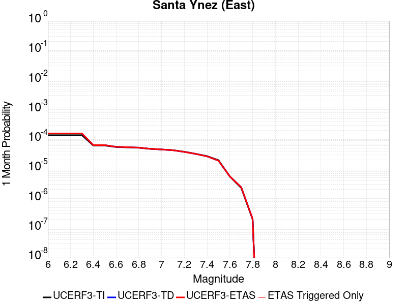 |  | 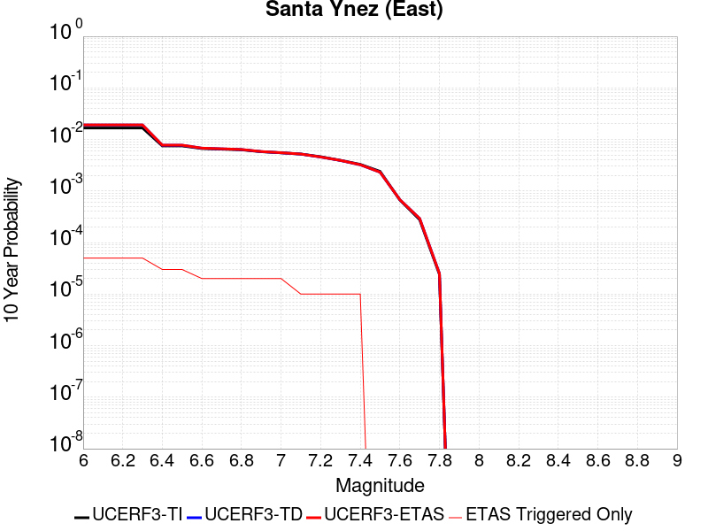 |

| Magnitude | 1 wk TI Prob | 1 wk TD Prob | 1 wk ETAS Prob | 1 wk ETAS/TD Gain | 1 wk ETAS Triggered Only | 1 mo TI Prob | 1 mo TD Prob | 1 mo ETAS Prob | 1 mo ETAS/TD Gain | 1 mo ETAS Triggered Only | 1 yr TI Prob | 1 yr TD Prob | 1 yr ETAS Prob | 1 yr ETAS/TD Gain | 1 yr ETAS Triggered Only | 10 yr TI Prob | 10 yr TD Prob | 10 yr ETAS Prob | 10 yr ETAS/TD Gain | 10 yr ETAS Triggered Only |
|-----|-----|-----|-----|-----|-----|-----|-----|-----|-----|-----|-----|-----|-----|-----|-----|-----|-----|-----|-----|-----|
| 6.0 | 3.2269712E-5 | 3.6766065E-5 | 3.6766065E-5 | 1.0 | 0.0 | 1.3829143E-4 | 1.5756265E-4 | 1.5756265E-4 | 1.0 | 0.0 | 0.0016823979 | 0.0019172227 | 0.001928594 | 1.0059311 | 1.1393155E-5 | 0.016697178 | 0.019064324 | 0.019120203 | 1.0029311 | 5.6965775E-5 |
| 6.1 | 3.2269712E-5 | 3.6766065E-5 | 3.6766065E-5 | 1.0 | 0.0 | 1.3829143E-4 | 1.5756265E-4 | 1.5756265E-4 | 1.0 | 0.0 | 0.0016823979 | 0.0019172227 | 0.001928594 | 1.0059311 | 1.1393155E-5 | 0.016697178 | 0.019064324 | 0.019120203 | 1.0029311 | 5.6965775E-5 |
| 6.2 | 3.2269712E-5 | 3.6766065E-5 | 3.6766065E-5 | 1.0 | 0.0 | 1.3829143E-4 | 1.5756265E-4 | 1.5756265E-4 | 1.0 | 0.0 | 0.0016823979 | 0.0019172227 | 0.001928594 | 1.0059311 | 1.1393155E-5 | 0.016697178 | 0.019064324 | 0.019120203 | 1.0029311 | 5.6965775E-5 |
| 6.3 | 3.2269712E-5 | 3.6766065E-5 | 3.6766065E-5 | 1.0 | 0.0 | 1.3829143E-4 | 1.5756265E-4 | 1.5756265E-4 | 1.0 | 0.0 | 0.0016823979 | 0.0019172227 | 0.001928594 | 1.0059311 | 1.1393155E-5 | 0.016697178 | 0.019064324 | 0.019120203 | 1.0029311 | 5.6965775E-5 |
| 6.4 | 1.4404779E-5 | 1.4853209E-5 | 1.4853209E-5 | 1.0 | 0.0 | 6.1733306E-5 | 6.365508E-5 | 6.365508E-5 | 1.0 | 0.0 | 7.513438E-4 | 7.747302E-4 | 7.861145E-4 | 1.0146946 | 1.1393155E-5 | 0.0074880854 | 0.0077208444 | 0.00775476 | 1.0043927 | 3.4179466E-5 |
| 6.5 | 1.4404779E-5 | 1.4853209E-5 | 1.4853209E-5 | 1.0 | 0.0 | 6.1733306E-5 | 6.365508E-5 | 6.365508E-5 | 1.0 | 0.0 | 7.513438E-4 | 7.747302E-4 | 7.861145E-4 | 1.0146946 | 1.1393155E-5 | 0.0074880854 | 0.0077208444 | 0.00775476 | 1.0043927 | 3.4179466E-5 |
| 6.6 | 1.280208E-5 | 1.301515E-5 | 1.301515E-5 | 1.0 | 0.0 | 5.4864904E-5 | 5.5778033E-5 | 5.5778033E-5 | 1.0 | 0.0 | 6.6777546E-4 | 6.788877E-4 | 6.902731E-4 | 1.0167707 | 1.1393155E-5 | 0.006657724 | 0.0067683486 | 0.0067909807 | 1.0033438 | 2.278631E-5 |
| 6.7 | 1.2457027E-5 | 1.2631572E-5 | 1.2631572E-5 | 1.0 | 0.0 | 5.3386164E-5 | 5.4134194E-5 | 5.4134194E-5 | 1.0 | 0.0 | 6.497827E-4 | 6.5888616E-4 | 6.702718E-4 | 1.0172801 | 1.1393155E-5 | 0.00647886 | 0.0065695243 | 0.0065921606 | 1.0034457 | 2.278631E-5 |
| 6.8 | 1.2095134E-5 | 1.2233928E-5 | 1.2233928E-5 | 1.0 | 0.0 | 5.1835254E-5 | 5.2430074E-5 | 5.2430074E-5 | 1.0 | 0.0 | 6.309115E-4 | 6.3815084E-4 | 6.495367E-4 | 1.017842 | 1.1393155E-5 | 0.0062912325 | 0.0063633714 | 0.006386013 | 1.003558 | 2.278631E-5 |
| 6.9 | 1.1104036E-5 | 1.1160151E-5 | 1.1160151E-5 | 1.0 | 0.0 | 4.758786E-5 | 4.7828347E-5 | 4.7828347E-5 | 1.0 | 0.0 | 5.7922816E-4 | 5.8215583E-4 | 5.9354235E-4 | 1.0195593 | 1.1393155E-5 | 0.005777207 | 0.0058064535 | 0.005829108 | 1.0039015 | 2.278631E-5 |
| 7.0 | 1.0577444E-5 | 1.058436E-5 | 1.058436E-5 | 1.0 | 0.0 | 4.5331115E-5 | 4.536076E-5 | 4.536076E-5 | 1.0 | 0.0 | 5.5176654E-4 | 5.5212853E-4 | 5.6351535E-4 | 1.0206236 | 1.1393155E-5 | 0.0055039856 | 0.005507706 | 0.0055303667 | 1.0041144 | 2.278631E-5 |
| 7.1 | 1.0021775E-5 | 9.983552E-6 | 9.983552E-6 | 1.0 | 0.0 | 4.294976E-5 | 4.278596E-5 | 4.278596E-5 | 1.0 | 0.0 | 5.2278786E-4 | 5.2079576E-4 | 5.32183E-4 | 1.021865 | 1.1393155E-5 | 0.0052155964 | 0.0051958854 | 0.005207219 | 1.0021813 | 1.1393155E-5 |
| 7.2 | 8.874109E-6 | 8.75112E-6 | 8.75112E-6 | 1.0 | 0.0 | 3.8031343E-5 | 3.7504265E-5 | 3.7504265E-5 | 1.0 | 0.0 | 4.629332E-4 | 4.5651986E-4 | 4.679078E-4 | 1.0249451 | 1.1393155E-5 | 0.0046197 | 0.0045559388 | 0.00456728 | 1.0024893 | 1.1393155E-5 |
| 7.3 | 7.5504267E-6 | 7.507112E-6 | 7.507112E-6 | 1.0 | 0.0 | 3.235857E-5 | 3.2172946E-5 | 3.2172946E-5 | 1.0 | 0.0 | 3.9389438E-4 | 3.9163625E-4 | 4.0302495E-4 | 1.0290798 | 1.1393155E-5 | 0.0039319694 | 0.003909568 | 0.0039209165 | 1.0029027 | 1.1393155E-5 |
| 7.4 | 6.309394E-6 | 6.1848796E-6 | 6.1848796E-6 | 1.0 | 0.0 | 2.703998E-5 | 2.6506363E-5 | 2.6506363E-5 | 1.0 | 0.0 | 3.2916202E-4 | 3.2266814E-4 | 3.340576E-4 | 1.0352978 | 1.1393155E-5 | 0.003286749 | 0.0032220937 | 0.0032334502 | 1.0035245 | 1.1393155E-5 |
| 7.5 | 4.6103073E-6 | 4.441959E-6 | 4.441959E-6 | 1.0 | 0.0 | 1.975831E-5 | 1.9036832E-5 | 1.9036832E-5 | 1.0 | 0.0 | 2.4053088E-4 | 2.3174948E-4 | 2.3174948E-4 | 1.0 | 0.0 | 0.002402707 | 0.0023151475 | 0.0023151475 | 1.0 | 0.0 |
| 7.6 | 1.2858658E-6 | 1.300987E-6 | 1.300987E-6 | 1.0 | 0.0 | 5.5108417E-6 | 5.5756473E-6 | 5.5756473E-6 | 1.0 | 0.0 | 6.7092435E-5 | 6.788146E-5 | 6.788146E-5 | 1.0 | 0.0 | 6.707218E-4 | 6.786142E-4 | 6.786142E-4 | 1.0 | 0.0 |
| 7.7 | 5.3302307E-7 | 5.6128283E-7 | 5.6128283E-7 | 1.0 | 0.0 | 2.2843826E-6 | 2.405496E-6 | 2.405496E-6 | 1.0 | 0.0 | 2.7812002E-5 | 2.9286555E-5 | 2.9286555E-5 | 1.0 | 0.0 | 2.7808524E-4 | 2.9283052E-4 | 2.9283052E-4 | 1.0 | 0.0 |
| 7.8 | 4.613933E-8 | 4.803465E-8 | 4.803465E-8 | 1.0 | 0.0 | 1.9773998E-7 | 2.0586276E-7 | 2.0586276E-7 | 1.0 | 0.0 | 2.4074816E-6 | 2.5063764E-6 | 2.5063764E-6 | 1.0 | 0.0 | 2.4074554E-5 | 2.5063491E-5 | 2.5063491E-5 | 1.0 | 0.0 |

## Bullion Mountains
*[(top)](#table-of-contents)*

| 1 Week | 1 Month | 1 Year | 10 Year |
|-----|-----|-----|-----|
|  | 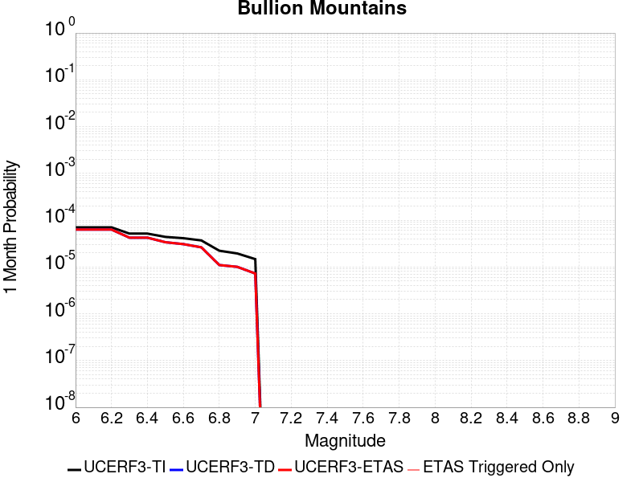 |  | 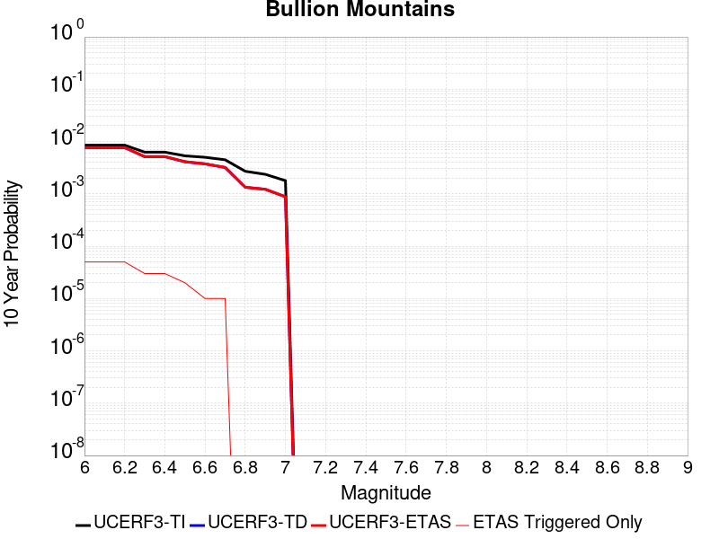 |

| Magnitude | 1 wk TI Prob | 1 wk TD Prob | 1 wk ETAS Prob | 1 wk ETAS/TD Gain | 1 wk ETAS Triggered Only | 1 mo TI Prob | 1 mo TD Prob | 1 mo ETAS Prob | 1 mo ETAS/TD Gain | 1 mo ETAS Triggered Only | 1 yr TI Prob | 1 yr TD Prob | 1 yr ETAS Prob | 1 yr ETAS/TD Gain | 1 yr ETAS Triggered Only | 10 yr TI Prob | 10 yr TD Prob | 10 yr ETAS Prob | 10 yr ETAS/TD Gain | 10 yr ETAS Triggered Only |
|-----|-----|-----|-----|-----|-----|-----|-----|-----|-----|-----|-----|-----|-----|-----|-----|-----|-----|-----|-----|-----|
| 6.0 | 1.6420427E-5 | 1.4695805E-5 | 1.4695805E-5 | 1.0 | 0.0 | 7.037136E-5 | 6.298071E-5 | 6.298071E-5 | 1.0 | 0.0 | 8.5643446E-4 | 7.665588E-4 | 7.7794323E-4 | 1.0148513 | 1.1393155E-5 | 0.008531413 | 0.0076429415 | 0.007699472 | 1.0073965 | 5.6965775E-5 |
| 6.1 | 1.6420427E-5 | 1.4695805E-5 | 1.4695805E-5 | 1.0 | 0.0 | 7.037136E-5 | 6.298071E-5 | 6.298071E-5 | 1.0 | 0.0 | 8.5643446E-4 | 7.665588E-4 | 7.7794323E-4 | 1.0148513 | 1.1393155E-5 | 0.008531413 | 0.0076429415 | 0.007699472 | 1.0073965 | 5.6965775E-5 |
| 6.2 | 1.6420427E-5 | 1.4695805E-5 | 1.4695805E-5 | 1.0 | 0.0 | 7.037136E-5 | 6.298071E-5 | 6.298071E-5 | 1.0 | 0.0 | 8.5643446E-4 | 7.665588E-4 | 7.7794323E-4 | 1.0148513 | 1.1393155E-5 | 0.008531413 | 0.0076429415 | 0.007699472 | 1.0073965 | 5.6965775E-5 |
| 6.3 | 1.2046778E-5 | 9.864884E-6 | 9.864884E-6 | 1.0 | 0.0 | 5.1628023E-5 | 4.2277523E-5 | 4.2277523E-5 | 1.0 | 0.0 | 6.283899E-4 | 5.1463046E-4 | 5.2601774E-4 | 1.0221272 | 1.1393155E-5 | 0.0062661595 | 0.0051366696 | 0.0051706736 | 1.0066198 | 3.4179466E-5 |
| 6.4 | 1.2046778E-5 | 9.864884E-6 | 9.864884E-6 | 1.0 | 0.0 | 5.1628023E-5 | 4.2277523E-5 | 4.2277523E-5 | 1.0 | 0.0 | 6.283899E-4 | 5.1463046E-4 | 5.2601774E-4 | 1.0221272 | 1.1393155E-5 | 0.0062661595 | 0.0051366696 | 0.0051706736 | 1.0066198 | 3.4179466E-5 |
| 6.5 | 1.0244343E-5 | 7.881549E-6 | 7.881549E-6 | 1.0 | 0.0 | 4.390359E-5 | 3.3777746E-5 | 3.3777746E-5 | 1.0 | 0.0 | 5.343951E-4 | 4.1118715E-4 | 4.2257563E-4 | 1.0276966 | 1.1393155E-5 | 0.005331118 | 0.0041062953 | 0.0041289884 | 1.0055263 | 2.278631E-5 |
| 6.6 | 9.605408E-6 | 7.179427E-6 | 7.179427E-6 | 1.0 | 0.0 | 4.1165385E-5 | 3.0768722E-5 | 3.0768722E-5 | 1.0 | 0.0 | 5.010733E-4 | 3.745652E-4 | 3.8595407E-4 | 1.0304056 | 1.1393155E-5 | 0.00499945 | 0.0037413368 | 0.0037526872 | 1.0030338 | 1.1393155E-5 |
| 6.7 | 8.60418E-6 | 6.1256856E-6 | 6.1256856E-6 | 1.0 | 0.0 | 3.687454E-5 | 2.6252785E-5 | 2.6252785E-5 | 1.0 | 0.0 | 4.48855E-4 | 3.1960028E-4 | 3.309898E-4 | 1.0356368 | 1.1393155E-5 | 0.004479495 | 0.0031933193 | 0.003204676 | 1.0035564 | 1.1393155E-5 |
| 6.8 | 5.187994E-6 | 2.5640145E-6 | 2.5640145E-6 | 1.0 | 0.0 | 2.223407E-5 | 1.098861E-5 | 1.098861E-5 | 1.0 | 0.0 | 2.7066618E-4 | 1.3378212E-4 | 1.3378212E-4 | 1.0 | 0.0 | 0.0027033675 | 0.0013374075 | 0.0013374075 | 1.0 | 0.0 |
| 6.9 | 4.5302368E-6 | 2.345053E-6 | 2.345053E-6 | 1.0 | 0.0 | 1.9415156E-5 | 1.0050211E-5 | 1.0050211E-5 | 1.0 | 0.0 | 2.3635388E-4 | 1.2235841E-4 | 1.2235841E-4 | 1.0 | 0.0 | 0.0023610266 | 0.0012232999 | 0.0012232999 | 1.0 | 0.0 |
| 7.0 | 3.431668E-6 | 1.6888065E-6 | 1.6888065E-6 | 1.0 | 0.0 | 1.4707065E-5 | 7.237742E-6 | 7.237742E-6 | 1.0 | 0.0 | 1.7904381E-4 | 8.811951E-5 | 8.811951E-5 | 1.0 | 0.0 | 0.0017889962 | 8.8119507E-4 | 8.8119507E-4 | 1.0 | 0.0 |

## Calico-Hidalgo
*[(top)](#table-of-contents)*

| 1 Week | 1 Month | 1 Year | 10 Year |
|-----|-----|-----|-----|
|  |  |  | 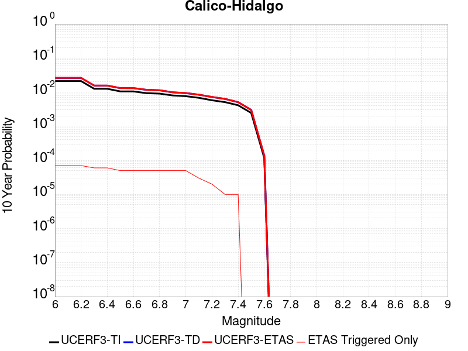 |

| Magnitude | 1 wk TI Prob | 1 wk TD Prob | 1 wk ETAS Prob | 1 wk ETAS/TD Gain | 1 wk ETAS Triggered Only | 1 mo TI Prob | 1 mo TD Prob | 1 mo ETAS Prob | 1 mo ETAS/TD Gain | 1 mo ETAS Triggered Only | 1 yr TI Prob | 1 yr TD Prob | 1 yr ETAS Prob | 1 yr ETAS/TD Gain | 1 yr ETAS Triggered Only | 10 yr TI Prob | 10 yr TD Prob | 10 yr ETAS Prob | 10 yr ETAS/TD Gain | 10 yr ETAS Triggered Only |
|-----|-----|-----|-----|-----|-----|-----|-----|-----|-----|-----|-----|-----|-----|-----|-----|-----|-----|-----|-----|-----|
| 6.0 | 4.0906612E-5 | 5.0721806E-5 | 5.0721806E-5 | 1.0 | 0.0 | 1.7530227E-4 | 2.1736299E-4 | 2.1736299E-4 | 1.0 | 0.0 | 0.0021322158 | 0.002643581 | 0.0026663071 | 1.0085967 | 2.278631E-5 | 0.02111873 | 0.026161656 | 0.026217131 | 1.0021205 | 5.6965775E-5 |
| 6.1 | 4.0906612E-5 | 5.0721806E-5 | 5.0721806E-5 | 1.0 | 0.0 | 1.7530227E-4 | 2.1736299E-4 | 2.1736299E-4 | 1.0 | 0.0 | 0.0021322158 | 0.002643581 | 0.0026663071 | 1.0085967 | 2.278631E-5 | 0.02111873 | 0.026161656 | 0.026217131 | 1.0021205 | 5.6965775E-5 |
| 6.2 | 4.0906612E-5 | 5.0721806E-5 | 5.0721806E-5 | 1.0 | 0.0 | 1.7530227E-4 | 2.1736299E-4 | 2.1736299E-4 | 1.0 | 0.0 | 0.0021322158 | 0.002643581 | 0.0026663071 | 1.0085967 | 2.278631E-5 | 0.02111873 | 0.026161656 | 0.026217131 | 1.0021205 | 5.6965775E-5 |
| 6.3 | 2.4242801E-5 | 3.0097925E-5 | 3.0097925E-5 | 1.0 | 0.0 | 1.0389358E-4 | 1.289849E-4 | 1.289849E-4 | 1.0 | 0.0 | 0.0012641704 | 0.0015692933 | 0.0015806686 | 1.0072486 | 1.1393155E-5 | 0.01257003 | 0.015585801 | 0.015630662 | 1.0028784 | 4.557262E-5 |
| 6.4 | 2.4242801E-5 | 3.0097925E-5 | 3.0097925E-5 | 1.0 | 0.0 | 1.0389358E-4 | 1.289849E-4 | 1.289849E-4 | 1.0 | 0.0 | 0.0012641704 | 0.0015692933 | 0.0015806686 | 1.0072486 | 1.1393155E-5 | 0.01257003 | 0.015585801 | 0.015630662 | 1.0028784 | 4.557262E-5 |
| 6.5 | 2.0286952E-5 | 2.5320987E-5 | 2.5320987E-5 | 1.0 | 0.0 | 8.694118E-5 | 1.085141E-4 | 1.085141E-4 | 1.0 | 0.0 | 0.0010579949 | 0.0013203755 | 0.0013317537 | 1.0086173 | 1.1393155E-5 | 0.010529719 | 0.01312724 | 0.013160971 | 1.0025696 | 3.4179466E-5 |
| 6.6 | 2.0269223E-5 | 2.5301933E-5 | 2.5301933E-5 | 1.0 | 0.0 | 8.6865206E-5 | 1.0843245E-4 | 1.0843245E-4 | 1.0 | 0.0 | 0.0010570707 | 0.0013193826 | 0.0013307608 | 1.0086238 | 1.1393155E-5 | 0.010520565 | 0.013117429 | 0.0131511595 | 1.0025715 | 3.4179466E-5 |
| 6.7 | 1.799852E-5 | 2.2545019E-5 | 2.2545019E-5 | 1.0 | 0.0 | 7.713423E-5 | 9.661801E-5 | 9.661801E-5 | 1.0 | 0.0 | 9.3870464E-4 | 0.0011757041 | 0.0011870839 | 1.0096791 | 1.1393155E-5 | 0.009347493 | 0.011696452 | 0.011730232 | 1.0028881 | 3.4179466E-5 |
| 6.8 | 1.7458793E-5 | 2.1846305E-5 | 2.1846305E-5 | 1.0 | 0.0 | 7.4821255E-5 | 9.362374E-5 | 9.362374E-5 | 1.0 | 0.0 | 9.10568E-4 | 0.0011392875 | 0.0011506677 | 1.0099889 | 1.1393155E-5 | 0.009068459 | 0.011336052 | 0.011369844 | 1.002981 | 3.4179466E-5 |
| 6.9 | 1.542884E-5 | 1.9029483E-5 | 1.9029483E-5 | 1.0 | 0.0 | 6.612192E-5 | 8.1552455E-5 | 8.1552455E-5 | 1.0 | 0.0 | 8.04737E-4 | 9.92462E-4 | 0.0010038438 | 1.0114683 | 1.1393155E-5 | 0.008018291 | 0.009881696 | 0.009915537 | 1.0034246 | 3.4179466E-5 |
| 7.0 | 1.468253E-5 | 1.8033796E-5 | 1.8033796E-5 | 1.0 | 0.0 | 6.292361E-5 | 7.7285484E-5 | 7.7285484E-5 | 1.0 | 0.0 | 7.658257E-4 | 9.4055757E-4 | 9.5194E-4 | 1.0121018 | 1.1393155E-5 | 0.0076319184 | 0.009367134 | 0.009400994 | 1.0036147 | 3.4179466E-5 |
| 7.1 | 1.3139281E-5 | 1.6203734E-5 | 1.6203734E-5 | 1.0 | 0.0 | 5.6309986E-5 | 6.9442794E-5 | 6.9442794E-5 | 1.0 | 0.0 | 6.853584E-4 | 8.451506E-4 | 8.5653417E-4 | 1.0134692 | 1.1393155E-5 | 0.0068324856 | 0.008420663 | 0.008443257 | 1.0026832 | 2.278631E-5 |
| 7.2 | 1.1127404E-5 | 1.3868924E-5 | 1.3868924E-5 | 1.0 | 0.0 | 4.7688E-5 | 5.9436952E-5 | 5.9436952E-5 | 1.0 | 0.0 | 5.8044674E-4 | 7.234155E-4 | 7.348005E-4 | 1.0157378 | 1.1393155E-5 | 0.0057893298 | 0.007211714 | 0.007223025 | 1.0015684 | 1.1393155E-5 |
| 7.3 | 9.808154E-6 | 1.217809E-5 | 1.217809E-5 | 1.0 | 0.0 | 4.2034266E-5 | 5.219083E-5 | 5.219083E-5 | 1.0 | 0.0 | 5.11647E-4 | 6.3524884E-4 | 6.3524884E-4 | 1.0 | 0.0 | 0.0051047057 | 0.0063354056 | 0.0063354056 | 1.0 | 0.0 |
| 7.4 | 7.942452E-6 | 9.793476E-6 | 9.793476E-6 | 1.0 | 0.0 | 3.4038632E-5 | 4.197142E-5 | 4.197142E-5 | 1.0 | 0.0 | 4.1434157E-4 | 5.108917E-4 | 5.108917E-4 | 1.0 | 0.0 | 0.0041356985 | 0.0050981133 | 0.0050981133 | 1.0 | 0.0 |
| 7.5 | 4.7121216E-6 | 5.7735706E-6 | 5.7735706E-6 | 1.0 | 0.0 | 2.019465E-5 | 2.4743682E-5 | 2.4743682E-5 | 1.0 | 0.0 | 2.4584212E-4 | 3.0122034E-4 | 3.0122034E-4 | 1.0 | 0.0 | 0.0024557032 | 0.0030088732 | 0.0030088732 | 1.0 | 0.0 |
| 7.6 | 2.21172E-7 | 2.604147E-7 | 2.604147E-7 | 1.0 | 0.0 | 9.478797E-7 | 1.1160627E-6 | 1.1160627E-6 | 1.0 | 0.0 | 1.1540374E-5 | 1.3588007E-5 | 1.3588007E-5 | 1.0 | 0.0 | 1.1539775E-4 | 1.3587458E-4 | 1.3587458E-4 | 1.0 | 0.0 |

## San Jacinto (San Jacinto Valley) rev
*[(top)](#table-of-contents)*

| 1 Week | 1 Month | 1 Year | 10 Year |
|-----|-----|-----|-----|
|  |  |  |  |

| Magnitude | 1 wk TI Prob | 1 wk TD Prob | 1 wk ETAS Prob | 1 wk ETAS/TD Gain | 1 wk ETAS Triggered Only | 1 mo TI Prob | 1 mo TD Prob | 1 mo ETAS Prob | 1 mo ETAS/TD Gain | 1 mo ETAS Triggered Only | 1 yr TI Prob | 1 yr TD Prob | 1 yr ETAS Prob | 1 yr ETAS/TD Gain | 1 yr ETAS Triggered Only | 10 yr TI Prob | 10 yr TD Prob | 10 yr ETAS Prob | 10 yr ETAS/TD Gain | 10 yr ETAS Triggered Only |
|-----|-----|-----|-----|-----|-----|-----|-----|-----|-----|-----|-----|-----|-----|-----|-----|-----|-----|-----|-----|-----|
| 6.0 | 3.652694E-5 | 3.466426E-5 | 3.466426E-5 | 1.0 | 0.0 | 1.5653463E-4 | 1.4855266E-4 | 1.5994412E-4 | 1.076683 | 1.1393155E-5 | 0.0019041431 | 0.0018071302 | 0.0018298753 | 1.0125864 | 2.278631E-5 | 0.018879099 | 0.018662075 | 0.018717978 | 1.0029955 | 5.6965775E-5 |
| 6.1 | 3.652694E-5 | 3.466426E-5 | 3.466426E-5 | 1.0 | 0.0 | 1.5653463E-4 | 1.4855266E-4 | 1.5994412E-4 | 1.076683 | 1.1393155E-5 | 0.0019041431 | 0.0018071302 | 0.0018298753 | 1.0125864 | 2.278631E-5 | 0.018879099 | 0.018662075 | 0.018717978 | 1.0029955 | 5.6965775E-5 |
| 6.2 | 3.652694E-5 | 3.466426E-5 | 3.466426E-5 | 1.0 | 0.0 | 1.5653463E-4 | 1.4855266E-4 | 1.5994412E-4 | 1.076683 | 1.1393155E-5 | 0.0019041431 | 0.0018071302 | 0.0018298753 | 1.0125864 | 2.278631E-5 | 0.018879099 | 0.018662075 | 0.018717978 | 1.0029955 | 5.6965775E-5 |
| 6.3 | 3.652694E-5 | 3.466426E-5 | 3.466426E-5 | 1.0 | 0.0 | 1.5653463E-4 | 1.4855266E-4 | 1.5994412E-4 | 1.076683 | 1.1393155E-5 | 0.0019041431 | 0.0018071302 | 0.0018298753 | 1.0125864 | 2.278631E-5 | 0.018879099 | 0.018662075 | 0.018717978 | 1.0029955 | 5.6965775E-5 |
| 6.4 | 3.646941E-5 | 3.4585773E-5 | 3.4585773E-5 | 1.0 | 0.0 | 1.5628811E-4 | 1.4821634E-4 | 1.596078E-4 | 1.076857 | 1.1393155E-5 | 0.0019011468 | 0.0018030425 | 0.0018257877 | 1.012615 | 2.278631E-5 | 0.018849645 | 0.01862193 | 0.018677834 | 1.003002 | 5.6965775E-5 |
| 6.5 | 3.646941E-5 | 3.4585773E-5 | 3.4585773E-5 | 1.0 | 0.0 | 1.5628811E-4 | 1.4821634E-4 | 1.596078E-4 | 1.076857 | 1.1393155E-5 | 0.0019011468 | 0.0018030425 | 0.0018257877 | 1.012615 | 2.278631E-5 | 0.018849645 | 0.01862193 | 0.018677834 | 1.003002 | 5.6965775E-5 |
| 6.6 | 3.6442503E-5 | 3.454913E-5 | 3.454913E-5 | 1.0 | 0.0 | 1.561728E-4 | 1.4805932E-4 | 1.5945078E-4 | 1.0769385 | 1.1393155E-5 | 0.0018997455 | 0.0018011342 | 0.0018238794 | 1.0126283 | 2.278631E-5 | 0.018835869 | 0.018603187 | 0.018659094 | 1.0030051 | 5.6965775E-5 |
| 6.7 | 3.6432113E-5 | 3.4534696E-5 | 3.4534696E-5 | 1.0 | 0.0 | 1.5612828E-4 | 1.4799745E-4 | 1.5938892E-4 | 1.0769707 | 1.1393155E-5 | 0.0018992044 | 0.0018003823 | 0.0018231276 | 1.0126336 | 2.278631E-5 | 0.018830549 | 0.018595805 | 0.018651713 | 1.0030065 | 5.6965775E-5 |
| 6.8 | 3.6409598E-5 | 3.4503722E-5 | 3.4503722E-5 | 1.0 | 0.0 | 1.560318E-4 | 1.4786473E-4 | 1.592562E-4 | 1.0770398 | 1.1393155E-5 | 0.0018980318 | 0.0017987692 | 0.0018215145 | 1.0126449 | 2.278631E-5 | 0.018819023 | 0.018579949 | 0.018635856 | 1.003009 | 5.6965775E-5 |
| 6.9 | 3.638078E-5 | 3.4464112E-5 | 3.4464112E-5 | 1.0 | 0.0 | 1.5590832E-4 | 1.47695E-4 | 1.5908647E-4 | 1.0771284 | 1.1393155E-5 | 0.0018965311 | 0.001796706 | 0.0018194515 | 1.0126594 | 2.278631E-5 | 0.018804269 | 0.018559668 | 0.018615577 | 1.0030124 | 5.6965775E-5 |
| 7.0 | 3.6294874E-5 | 3.434603E-5 | 3.434603E-5 | 1.0 | 0.0 | 1.5554018E-4 | 1.4718898E-4 | 1.5858046E-4 | 1.0773935 | 1.1393155E-5 | 0.0018920569 | 0.0017905557 | 0.0018133011 | 1.0127031 | 2.278631E-5 | 0.018760284 | 0.018499207 | 0.01855512 | 1.0030224 | 5.6965775E-5 |
| 7.1 | 3.6260717E-5 | 3.4302288E-5 | 3.4302288E-5 | 1.0 | 0.0 | 1.5539382E-4 | 1.4700153E-4 | 1.5839301E-4 | 1.0774922 | 1.1393155E-5 | 0.001890278 | 0.0017882772 | 0.0018110228 | 1.0127193 | 2.278631E-5 | 0.018742796 | 0.0184768 | 0.018532714 | 1.0030261 | 5.6965775E-5 |
| 7.2 | 3.6210204E-5 | 3.423638E-5 | 3.423638E-5 | 1.0 | 0.0 | 1.5517735E-4 | 1.467191E-4 | 1.5811059E-4 | 1.0776415 | 1.1393155E-5 | 0.001887647 | 0.0017848442 | 0.0018075898 | 1.0127437 | 2.278631E-5 | 0.01871693 | 0.018443028 | 0.018498942 | 1.0030317 | 5.6965775E-5 |
| 7.3 | 3.6119454E-5 | 3.4124372E-5 | 3.4124372E-5 | 1.0 | 0.0 | 1.5478847E-4 | 1.4623914E-4 | 1.5763062E-4 | 1.0778964 | 1.1393155E-5 | 0.0018829206 | 0.00177901 | 0.0018017559 | 1.0127857 | 2.278631E-5 | 0.018670462 | 0.01838543 | 0.01844135 | 1.0030415 | 5.6965775E-5 |
| 7.4 | 3.607848E-5 | 3.4071756E-5 | 3.4071756E-5 | 1.0 | 0.0 | 1.5461289E-4 | 1.4601364E-4 | 1.5740514E-4 | 1.0780166 | 1.1393155E-5 | 0.0018807866 | 0.0017762693 | 0.0017990151 | 1.0128053 | 2.278631E-5 | 0.018649481 | 0.018358368 | 0.018414289 | 1.003046 | 5.6965775E-5 |
| 7.5 | 3.5856774E-5 | 3.3880297E-5 | 3.3880297E-5 | 1.0 | 0.0 | 1.5366284E-4 | 1.451932E-4 | 1.565847E-4 | 1.0784576 | 1.1393155E-5 | 0.0018692396 | 0.0017662967 | 0.0017890427 | 1.0128778 | 2.278631E-5 | 0.018535944 | 0.018258838 | 0.018314764 | 1.003063 | 5.6965775E-5 |
| 7.6 | 3.286655E-5 | 3.2392913E-5 | 3.2392913E-5 | 1.0 | 0.0 | 1.4084904E-4 | 1.3881939E-4 | 1.5021097E-4 | 1.0820603 | 1.1393155E-5 | 0.001713488 | 0.0016888179 | 0.0017115658 | 1.0134697 | 2.278631E-5 | 0.017003361 | 0.017473182 | 0.01752915 | 1.0032033 | 5.6965775E-5 |
| 7.7 | 2.8882527E-5 | 2.9480356E-5 | 2.9480356E-5 | 1.0 | 0.0 | 1.237764E-4 | 1.2633827E-4 | 1.3772998E-4 | 1.0901684 | 1.1393155E-5 | 0.0015059357 | 0.0015370842 | 0.0015598355 | 1.0148016 | 2.278631E-5 | 0.014957713 | 0.015956964 | 0.016013023 | 1.003513 | 5.6965775E-5 |
| 7.8 | 2.4950225E-5 | 2.6761902E-5 | 2.6761902E-5 | 1.0 | 0.0 | 1.0692515E-4 | 1.1468883E-4 | 1.2608067E-4 | 1.0993283 | 1.1393155E-5 | 0.0013010362 | 0.001395443 | 0.0014181975 | 1.0163063 | 2.278631E-5 | 0.012934455 | 0.014533543 | 0.01458968 | 1.0038626 | 5.6965775E-5 |
| 7.9 | 1.9881603E-5 | 2.1718288E-5 | 2.1718288E-5 | 1.0 | 0.0 | 8.520408E-5 | 9.3075054E-5 | 1.0446715E-4 | 1.1223968 | 1.1393155E-5 | 0.001036866 | 0.0011326005 | 0.0011553611 | 1.0200958 | 2.278631E-5 | 0.010320415 | 0.011886757 | 0.011943046 | 1.0047354 | 5.6965775E-5 |
| 8.0 | 1.563292E-5 | 1.6107258E-5 | 1.6107258E-5 | 1.0 | 0.0 | 6.6996516E-5 | 6.902929E-5 | 6.902929E-5 | 1.0 | 0.0 | 8.153773E-4 | 8.401082E-4 | 8.401082E-4 | 1.0 | 0.0 | 0.00812392 | 0.008899998 | 0.008911289 | 1.0012687 | 1.1393155E-5 |
| 8.1 | 1.0045313E-5 | 8.400946E-6 | 8.400946E-6 | 1.0 | 0.0 | 4.305063E-5 | 3.600356E-5 | 3.600356E-5 | 1.0 | 0.0 | 5.2401534E-4 | 4.382557E-4 | 4.382557E-4 | 1.0 | 0.0 | 0.0052278144 | 0.0047124038 | 0.004723743 | 1.0024064 | 1.1393155E-5 |
| 8.2 | 4.1554413E-6 | 1.5938106E-6 | 1.5938106E-6 | 1.0 | 0.0 | 1.7808914E-5 | 6.830599E-6 | 6.830599E-6 | 1.0 | 0.0 | 2.1680194E-4 | 8.315939E-5 | 8.315939E-5 | 1.0 | 0.0 | 0.0021659054 | 9.644863E-4 | 9.644863E-4 | 1.0 | 0.0 |
| 8.3 | 1.2758221E-6 | 3.6914315E-7 | 3.6914315E-7 | 1.0 | 0.0 | 5.4677976E-6 | 1.5820413E-6 | 1.5820413E-6 | 1.0 | 0.0 | 6.65684E-5 | 1.9261186E-5 | 1.9261186E-5 | 1.0 | 0.0 | 6.6548464E-4 | 2.3201035E-4 | 2.3201035E-4 | 1.0 | 0.0 |

## San Jacinto (Lytle Creek connector)
*[(top)](#table-of-contents)*

| 1 Week | 1 Month | 1 Year | 10 Year |
|-----|-----|-----|-----|
|  |  |  |  |

| Magnitude | 1 wk TI Prob | 1 wk TD Prob | 1 wk ETAS Prob | 1 wk ETAS/TD Gain | 1 wk ETAS Triggered Only | 1 mo TI Prob | 1 mo TD Prob | 1 mo ETAS Prob | 1 mo ETAS/TD Gain | 1 mo ETAS Triggered Only | 1 yr TI Prob | 1 yr TD Prob | 1 yr ETAS Prob | 1 yr ETAS/TD Gain | 1 yr ETAS Triggered Only | 10 yr TI Prob | 10 yr TD Prob | 10 yr ETAS Prob | 10 yr ETAS/TD Gain | 10 yr ETAS Triggered Only |
|-----|-----|-----|-----|-----|-----|-----|-----|-----|-----|-----|-----|-----|-----|-----|-----|-----|-----|-----|-----|-----|
| 6.0 | 6.693995E-6 | 6.7076135E-6 | 6.7076135E-6 | 1.0 | 0.0 | 2.8688235E-5 | 2.8746597E-5 | 2.8746597E-5 | 1.0 | 0.0 | 3.492233E-4 | 3.499337E-4 | 3.7271203E-4 | 1.0650933 | 2.278631E-5 | 0.00348675 | 0.0035741166 | 0.0036308789 | 1.0158814 | 5.6965775E-5 |
| 6.1 | 6.693995E-6 | 6.7076135E-6 | 6.7076135E-6 | 1.0 | 0.0 | 2.8688235E-5 | 2.8746597E-5 | 2.8746597E-5 | 1.0 | 0.0 | 3.492233E-4 | 3.499337E-4 | 3.7271203E-4 | 1.0650933 | 2.278631E-5 | 0.00348675 | 0.0035741166 | 0.0036308789 | 1.0158814 | 5.6965775E-5 |
| 6.2 | 6.693995E-6 | 6.7076135E-6 | 6.7076135E-6 | 1.0 | 0.0 | 2.8688235E-5 | 2.8746597E-5 | 2.8746597E-5 | 1.0 | 0.0 | 3.492233E-4 | 3.499337E-4 | 3.7271203E-4 | 1.0650933 | 2.278631E-5 | 0.00348675 | 0.0035741166 | 0.0036308789 | 1.0158814 | 5.6965775E-5 |
| 6.3 | 6.693995E-6 | 6.7076135E-6 | 6.7076135E-6 | 1.0 | 0.0 | 2.8688235E-5 | 2.8746597E-5 | 2.8746597E-5 | 1.0 | 0.0 | 3.492233E-4 | 3.499337E-4 | 3.7271203E-4 | 1.0650933 | 2.278631E-5 | 0.00348675 | 0.0035741166 | 0.0036308789 | 1.0158814 | 5.6965775E-5 |
| 6.4 | 6.693995E-6 | 6.7076135E-6 | 6.7076135E-6 | 1.0 | 0.0 | 2.8688235E-5 | 2.8746597E-5 | 2.8746597E-5 | 1.0 | 0.0 | 3.492233E-4 | 3.499337E-4 | 3.7271203E-4 | 1.0650933 | 2.278631E-5 | 0.00348675 | 0.0035741166 | 0.0036308789 | 1.0158814 | 5.6965775E-5 |
| 6.5 | 6.6561875E-6 | 6.6678267E-6 | 6.6678267E-6 | 1.0 | 0.0 | 2.8526205E-5 | 2.8576087E-5 | 2.8576087E-5 | 1.0 | 0.0 | 3.472512E-4 | 3.4785838E-4 | 3.706368E-4 | 1.0654818 | 2.278631E-5 | 0.0034670907 | 0.00355343 | 0.0036101935 | 1.0159743 | 5.6965775E-5 |
| 6.6 | 6.6561875E-6 | 6.6678267E-6 | 6.6678267E-6 | 1.0 | 0.0 | 2.8526205E-5 | 2.8576087E-5 | 2.8576087E-5 | 1.0 | 0.0 | 3.472512E-4 | 3.4785838E-4 | 3.706368E-4 | 1.0654818 | 2.278631E-5 | 0.0034670907 | 0.00355343 | 0.0036101935 | 1.0159743 | 5.6965775E-5 |
| 6.7 | 6.5802237E-6 | 6.586992E-6 | 6.586992E-6 | 1.0 | 0.0 | 2.8200653E-5 | 2.822966E-5 | 2.822966E-5 | 1.0 | 0.0 | 3.4328885E-4 | 3.43642E-4 | 3.6642046E-4 | 1.0662855 | 2.278631E-5 | 0.0034275902 | 0.0035113997 | 0.0035681655 | 1.0161661 | 5.6965775E-5 |
| 6.8 | 6.575632E-6 | 6.581479E-6 | 6.581479E-6 | 1.0 | 0.0 | 2.8180975E-5 | 2.8206034E-5 | 2.8206034E-5 | 1.0 | 0.0 | 3.4304935E-4 | 3.4335442E-4 | 3.661329E-4 | 1.066341 | 2.278631E-5 | 0.0034252026 | 0.0035085331 | 0.003565299 | 1.0161794 | 5.6965775E-5 |
| 6.9 | 6.570433E-6 | 6.572866E-6 | 6.572866E-6 | 1.0 | 0.0 | 2.8158694E-5 | 2.8169123E-5 | 2.8169123E-5 | 1.0 | 0.0 | 3.4277816E-4 | 3.4290517E-4 | 3.6568366E-4 | 1.066428 | 2.278631E-5 | 0.0034224992 | 0.0035040549 | 0.003560821 | 1.0162002 | 5.6965775E-5 |
| 7.0 | 6.5643826E-6 | 6.5629793E-6 | 6.5629793E-6 | 1.0 | 0.0 | 2.8132765E-5 | 2.8126751E-5 | 2.8126751E-5 | 1.0 | 0.0 | 3.424626E-4 | 3.4238945E-4 | 3.6516794E-4 | 1.0665281 | 2.278631E-5 | 0.0034193532 | 0.003498914 | 0.0035556804 | 1.016224 | 5.6965775E-5 |
| 7.1 | 6.557402E-6 | 6.551683E-6 | 6.551683E-6 | 1.0 | 0.0 | 2.8102848E-5 | 2.8078339E-5 | 2.8078339E-5 | 1.0 | 0.0 | 3.4209844E-4 | 3.4180022E-4 | 3.6457874E-4 | 1.0666428 | 2.278631E-5 | 0.0034157229 | 0.0034930408 | 0.0035498077 | 1.0162514 | 5.6965775E-5 |
| 7.2 | 6.546394E-6 | 6.533633E-6 | 6.533633E-6 | 1.0 | 0.0 | 2.8055672E-5 | 2.8000984E-5 | 2.8000984E-5 | 1.0 | 0.0 | 3.4152428E-4 | 3.4085874E-4 | 3.636373E-4 | 1.0668269 | 2.278631E-5 | 0.0034099987 | 0.0034836603 | 0.0035404277 | 1.0162953 | 5.6965775E-5 |
| 7.3 | 6.5364216E-6 | 6.5143886E-6 | 6.5143886E-6 | 1.0 | 0.0 | 2.8012933E-5 | 2.791851E-5 | 2.791851E-5 | 1.0 | 0.0 | 3.4100408E-4 | 3.3985492E-4 | 3.626335E-4 | 1.0670244 | 2.278631E-5 | 0.003404813 | 0.0034736688 | 0.0035304367 | 1.0163424 | 5.6965775E-5 |
| 7.4 | 6.5269523E-6 | 6.4954406E-6 | 6.4954406E-6 | 1.0 | 0.0 | 2.7972354E-5 | 2.7837306E-5 | 2.7837306E-5 | 1.0 | 0.0 | 3.4051016E-4 | 3.3886658E-4 | 3.6164516E-4 | 1.06722 | 2.278631E-5 | 0.0033998888 | 0.0034638257 | 0.0035205942 | 1.0163889 | 5.6965775E-5 |
| 7.5 | 6.5111835E-6 | 6.471678E-6 | 6.471678E-6 | 1.0 | 0.0 | 2.7904773E-5 | 2.7735468E-5 | 2.7735468E-5 | 1.0 | 0.0 | 3.3968766E-4 | 3.3762708E-4 | 3.6040568E-4 | 1.0674669 | 2.278631E-5 | 0.0033916887 | 0.0034514794 | 0.0035082486 | 1.0164478 | 5.6965775E-5 |
| 7.6 | 6.4768806E-6 | 6.430728E-6 | 6.430728E-6 | 1.0 | 0.0 | 2.7757764E-5 | 2.755997E-5 | 2.755997E-5 | 1.0 | 0.0 | 3.3789838E-4 | 3.3549106E-4 | 3.5826972E-4 | 1.0678965 | 2.278631E-5 | 0.0033738504 | 0.00343018 | 0.0034755962 | 1.0132402 | 4.557262E-5 |
| 7.7 | 6.1655364E-6 | 6.2228432E-6 | 6.2228432E-6 | 1.0 | 0.0 | 2.642346E-5 | 2.6669055E-5 | 2.6669055E-5 | 1.0 | 0.0 | 3.2165812E-4 | 3.2464744E-4 | 3.4742634E-4 | 1.070165 | 2.278631E-5 | 0.0032119295 | 0.0033216004 | 0.0033670214 | 1.0136745 | 4.557262E-5 |
| 7.8 | 5.5043524E-6 | 5.782465E-6 | 5.782465E-6 | 1.0 | 0.0 | 2.3589868E-5 | 2.4781757E-5 | 2.4781757E-5 | 1.0 | 0.0 | 2.871688E-4 | 3.0167616E-4 | 3.244556E-4 | 1.0755095 | 2.278631E-5 | 0.0028679797 | 0.0030909872 | 0.003136419 | 1.0146981 | 4.557262E-5 |
| 7.9 | 3.889249E-6 | 4.1135077E-6 | 4.1135077E-6 | 1.0 | 0.0 | 1.6668104E-5 | 1.76292E-5 | 1.76292E-5 | 1.0 | 0.0 | 2.0291525E-4 | 2.1461441E-4 | 2.3739583E-4 | 1.1061505 | 2.278631E-5 | 0.0020273007 | 0.0022136394 | 0.0022591113 | 1.0205417 | 4.557262E-5 |
| 8.0 | 2.668535E-6 | 2.556784E-6 | 2.556784E-6 | 1.0 | 0.0 | 1.1436528E-5 | 1.0957599E-5 | 1.0957599E-5 | 1.0 | 0.0 | 1.3923083E-4 | 1.3340064E-4 | 1.3340064E-4 | 1.0 | 0.0 | 0.0013914363 | 0.0013892549 | 0.0013892549 | 1.0 | 0.0 |
| 8.1 | 1.5911459E-6 | 1.2321565E-6 | 1.2321565E-6 | 1.0 | 0.0 | 6.8191785E-6 | 5.28066E-6 | 5.28066E-6 | 1.0 | 0.0 | 8.3020335E-5 | 6.429016E-5 | 6.429016E-5 | 1.0 | 0.0 | 8.298933E-4 | 6.7662075E-4 | 6.7662075E-4 | 1.0 | 0.0 |
| 8.2 | 6.1294963E-7 | 2.2207072E-7 | 2.2207072E-7 | 1.0 | 0.0 | 2.6269242E-6 | 9.517313E-7 | 9.517313E-7 | 1.0 | 0.0 | 3.1982334E-5 | 1.1587267E-5 | 1.1587267E-5 | 1.0 | 0.0 | 3.1977732E-4 | 1.3006543E-4 | 1.3006543E-4 | 1.0 | 0.0 |
| 8.3 | 1.762871E-7 | 4.853769E-8 | 4.853769E-8 | 1.0 | 0.0 | 7.5551594E-7 | 2.0801865E-7 | 2.0801865E-7 | 1.0 | 0.0 | 9.1983675E-6 | 2.5326242E-6 | 2.5326242E-6 | 1.0 | 0.0 | 9.197987E-5 | 2.9258856E-5 | 2.9258856E-5 | 1.0 | 0.0 |

## Whittier alt 1
*[(top)](#table-of-contents)*

| 1 Week | 1 Month | 1 Year | 10 Year |
|-----|-----|-----|-----|
|  |  |  |  |

| Magnitude | 1 wk TI Prob | 1 wk TD Prob | 1 wk ETAS Prob | 1 wk ETAS/TD Gain | 1 wk ETAS Triggered Only | 1 mo TI Prob | 1 mo TD Prob | 1 mo ETAS Prob | 1 mo ETAS/TD Gain | 1 mo ETAS Triggered Only | 1 yr TI Prob | 1 yr TD Prob | 1 yr ETAS Prob | 1 yr ETAS/TD Gain | 1 yr ETAS Triggered Only | 10 yr TI Prob | 10 yr TD Prob | 10 yr ETAS Prob | 10 yr ETAS/TD Gain | 10 yr ETAS Triggered Only |
|-----|-----|-----|-----|-----|-----|-----|-----|-----|-----|-----|-----|-----|-----|-----|-----|-----|-----|-----|-----|-----|
| 6.0 | 4.2554693E-5 | 4.7272857E-5 | 4.7272857E-5 | 1.0 | 0.0 | 1.8236451E-4 | 2.0258404E-4 | 2.0258404E-4 | 1.0 | 0.0 | 0.002218027 | 0.0024639927 | 0.0024753576 | 1.0046124 | 1.1393155E-5 | 0.02196019 | 0.024400352 | 0.024433697 | 1.0013666 | 3.4179466E-5 |
| 6.1 | 4.2554693E-5 | 4.7272857E-5 | 4.7272857E-5 | 1.0 | 0.0 | 1.8236451E-4 | 2.0258404E-4 | 2.0258404E-4 | 1.0 | 0.0 | 0.002218027 | 0.0024639927 | 0.0024753576 | 1.0046124 | 1.1393155E-5 | 0.02196019 | 0.024400352 | 0.024433697 | 1.0013666 | 3.4179466E-5 |
| 6.2 | 4.2554693E-5 | 4.7272857E-5 | 4.7272857E-5 | 1.0 | 0.0 | 1.8236451E-4 | 2.0258404E-4 | 2.0258404E-4 | 1.0 | 0.0 | 0.002218027 | 0.0024639927 | 0.0024753576 | 1.0046124 | 1.1393155E-5 | 0.02196019 | 0.024400352 | 0.024433697 | 1.0013666 | 3.4179466E-5 |
| 6.3 | 1.9617712E-5 | 1.827975E-5 | 1.827975E-5 | 1.0 | 0.0 | 8.40732E-5 | 7.8339544E-5 | 7.8339544E-5 | 1.0 | 0.0 | 0.0010231105 | 9.533856E-4 | 9.533856E-4 | 1.0 | 0.0 | 0.01018413 | 0.009495797 | 0.009518367 | 1.0023768 | 2.278631E-5 |
| 6.4 | 1.5611336E-5 | 1.3613703E-5 | 1.3613703E-5 | 1.0 | 0.0 | 6.690401E-5 | 5.834317E-5 | 5.834317E-5 | 1.0 | 0.0 | 8.142519E-4 | 7.101026E-4 | 7.101026E-4 | 1.0 | 0.0 | 0.008112748 | 0.0070798527 | 0.007091165 | 1.0015979 | 1.1393155E-5 |
| 6.5 | 1.5150166E-5 | 1.3110247E-5 | 1.3110247E-5 | 1.0 | 0.0 | 6.492767E-5 | 5.6185596E-5 | 5.6185596E-5 | 1.0 | 0.0 | 7.9020765E-4 | 6.838508E-4 | 6.838508E-4 | 1.0 | 0.0 | 0.007874036 | 0.0068189665 | 0.006830282 | 1.0016594 | 1.1393155E-5 |
| 6.6 | 1.295588E-5 | 1.0388335E-5 | 1.0388335E-5 | 1.0 | 0.0 | 5.552402E-5 | 4.4520686E-5 | 4.4520686E-5 | 1.0 | 0.0 | 6.7579525E-4 | 5.419065E-4 | 5.419065E-4 | 1.0 | 0.0 | 0.006737438 | 0.0054069655 | 0.0054069655 | 1.0 | 0.0 |
| 6.7 | 1.2542085E-5 | 9.906739E-6 | 9.906739E-6 | 1.0 | 0.0 | 5.3750682E-5 | 4.2456773E-5 | 4.2456773E-5 | 1.0 | 0.0 | 6.542181E-4 | 5.167905E-4 | 5.167905E-4 | 1.0 | 0.0 | 0.006522954 | 0.0051570027 | 0.0051570027 | 1.0 | 0.0 |
| 6.8 | 1.2195878E-5 | 9.502525E-6 | 9.502525E-6 | 1.0 | 0.0 | 5.2267E-5 | 4.0724484E-5 | 4.0724484E-5 | 1.0 | 0.0 | 6.36165E-4 | 4.9570965E-4 | 4.9570965E-4 | 1.0 | 0.0 | 0.0063434686 | 0.004947075 | 0.004947075 | 1.0 | 0.0 |
| 6.9 | 1.1580298E-5 | 8.779525E-6 | 8.779525E-6 | 1.0 | 0.0 | 4.9628903E-5 | 3.7626E-5 | 3.7626E-5 | 1.0 | 0.0 | 6.040644E-4 | 4.5800192E-4 | 4.5800192E-4 | 1.0 | 0.0 | 0.00602425 | 0.004571492 | 0.004571492 | 1.0 | 0.0 |
| 7.0 | 1.0964795E-5 | 8.0902255E-6 | 8.0902255E-6 | 1.0 | 0.0 | 4.6991136E-5 | 3.4671943E-5 | 3.4671943E-5 | 1.0 | 0.0 | 5.7196687E-4 | 4.2205068E-4 | 4.2205068E-4 | 1.0 | 0.0 | 0.0057049696 | 0.0042133946 | 0.0042133946 | 1.0 | 0.0 |
| 7.1 | 1.0230601E-5 | 7.3321717E-6 | 7.3321717E-6 | 1.0 | 0.0 | 4.3844695E-5 | 3.142322E-5 | 3.142322E-5 | 1.0 | 0.0 | 5.336784E-4 | 3.8251185E-4 | 3.8251185E-4 | 1.0 | 0.0 | 0.005323986 | 0.0038196275 | 0.0038196275 | 1.0 | 0.0 |
| 7.2 | 9.40865E-6 | 6.5483046E-6 | 6.5483046E-6 | 1.0 | 0.0 | 4.032216E-5 | 2.8063869E-5 | 2.8063869E-5 | 1.0 | 0.0 | 4.908117E-4 | 3.4162524E-4 | 3.4162524E-4 | 1.0 | 0.0 | 0.0048972913 | 0.0034120174 | 0.0034120174 | 1.0 | 0.0 |
| 7.3 | 8.237384E-6 | 5.6020504E-6 | 5.6020504E-6 | 1.0 | 0.0 | 3.5302593E-5 | 2.4008574E-5 | 2.4008574E-5 | 1.0 | 0.0 | 4.2972428E-4 | 2.9226622E-4 | 2.9226622E-4 | 1.0 | 0.0 | 0.0042889426 | 0.002919129 | 0.002919129 | 1.0 | 0.0 |
| 7.4 | 7.5316966E-6 | 5.031715E-6 | 5.031715E-6 | 1.0 | 0.0 | 3.2278298E-5 | 2.156432E-5 | 2.156432E-5 | 1.0 | 0.0 | 3.9291743E-4 | 2.6251498E-4 | 2.6251498E-4 | 1.0 | 0.0 | 0.0039222343 | 0.002622164 | 0.002622164 | 1.0 | 0.0 |
| 7.5 | 6.149649E-6 | 3.9369097E-6 | 3.9369097E-6 | 1.0 | 0.0 | 2.6355372E-5 | 1.6872367E-5 | 1.6872367E-5 | 1.0 | 0.0 | 3.208294E-4 | 2.054026E-4 | 2.054026E-4 | 1.0 | 0.0 | 0.003203666 | 0.0020522168 | 0.0020522168 | 1.0 | 0.0 |
| 7.6 | 5.457711E-6 | 3.3980803E-6 | 3.3980803E-6 | 1.0 | 0.0 | 2.338998E-5 | 1.4563125E-5 | 1.4563125E-5 | 1.0 | 0.0 | 2.8473578E-4 | 1.7729244E-4 | 1.7729244E-4 | 1.0 | 0.0 | 0.0028437122 | 0.0017715908 | 0.0017715908 | 1.0 | 0.0 |
| 7.7 | 4.1676276E-6 | 2.335305E-6 | 2.335305E-6 | 1.0 | 0.0 | 1.7861139E-5 | 1.0008415E-5 | 1.0008415E-5 | 1.0 | 0.0 | 2.1743766E-4 | 1.2184639E-4 | 1.2184639E-4 | 1.0 | 0.0 | 0.0021722503 | 0.001217869 | 0.001217869 | 1.0 | 0.0 |
| 7.8 | 2.2692414E-7 | 9.3929124E-8 | 9.3929124E-8 | 1.0 | 0.0 | 9.725317E-7 | 4.0255333E-7 | 4.0255333E-7 | 1.0 | 0.0 | 1.1840509E-5 | 4.901079E-6 | 4.901079E-6 | 1.0 | 0.0 | 1.1839878E-4 | 4.901004E-5 | 4.901004E-5 | 1.0 | 0.0 |
| 7.9 | 6.676829E-9 | 3.4418608E-9 | 3.4418608E-9 | 1.0 | 0.0 | 2.861498E-8 | 1.4750832E-8 | 1.4750832E-8 | 1.0 | 0.0 | 3.4838732E-7 | 1.7959135E-7 | 1.7959135E-7 | 1.0 | 0.0 | 3.4838679E-6 | 1.7959123E-6 | 1.7959123E-6 | 1.0 | 0.0 |

## San Andreas (Creeping Section) 2011 CFM
*[(top)](#table-of-contents)*

| 1 Week | 1 Month | 1 Year | 10 Year |
|-----|-----|-----|-----|
|  |  |  |  |

| Magnitude | 1 wk TI Prob | 1 wk TD Prob | 1 wk ETAS Prob | 1 wk ETAS/TD Gain | 1 wk ETAS Triggered Only | 1 mo TI Prob | 1 mo TD Prob | 1 mo ETAS Prob | 1 mo ETAS/TD Gain | 1 mo ETAS Triggered Only | 1 yr TI Prob | 1 yr TD Prob | 1 yr ETAS Prob | 1 yr ETAS/TD Gain | 1 yr ETAS Triggered Only | 10 yr TI Prob | 10 yr TD Prob | 10 yr ETAS Prob | 10 yr ETAS/TD Gain | 10 yr ETAS Triggered Only |
|-----|-----|-----|-----|-----|-----|-----|-----|-----|-----|-----|-----|-----|-----|-----|-----|-----|-----|-----|-----|-----|
| 6.0 | 5.986481E-4 | 0.0012296456 | 0.0012296456 | 1.0 | 0.0 | 0.0025631124 | 0.005254341 | 0.005254341 | 1.0 | 0.0 | 0.030762846 | 0.061305527 | 0.061316222 | 1.0001744 | 1.1393155E-5 | 0.26835477 | 0.4264582 | 0.42648435 | 1.0000613 | 4.557262E-5 |
| 6.1 | 5.015945E-4 | 0.0010234866 | 0.0010234866 | 1.0 | 0.0 | 0.00214792 | 0.0043750973 | 0.0043750973 | 1.0 | 0.0 | 0.025839351 | 0.051332634 | 0.051343445 | 1.0002105 | 1.1393155E-5 | 0.23032776 | 0.37335575 | 0.37338433 | 1.0000765 | 4.557262E-5 |
| 6.2 | 4.073338E-4 | 8.124015E-4 | 8.124015E-4 | 1.0 | 0.0 | 0.0017445484 | 0.0034742658 | 0.0034742658 | 1.0 | 0.0 | 0.021034058 | 0.041016787 | 0.041027714 | 1.0002664 | 1.1393155E-5 | 0.19150782 | 0.31357464 | 0.31360593 | 1.0000998 | 4.557262E-5 |
| 6.3 | 3.464099E-4 | 6.755968E-4 | 6.755968E-4 | 1.0 | 0.0 | 0.0014837692 | 0.0028901014 | 0.0028901014 | 1.0 | 0.0 | 0.017915873 | 0.03427386 | 0.03428486 | 1.000321 | 1.1393155E-5 | 0.16538359 | 0.27189106 | 0.27192426 | 1.0001221 | 4.557262E-5 |
| 6.4 | 2.935057E-4 | 5.561046E-4 | 5.561046E-4 | 1.0 | 0.0 | 0.0012572751 | 0.0023796957 | 0.0023796957 | 1.0 | 0.0 | 0.015200248 | 0.028349606 | 0.028360676 | 1.0003905 | 1.1393155E-5 | 0.14201577 | 0.2335917 | 0.23362663 | 1.0001495 | 4.557262E-5 |
| 6.5 | 2.3409708E-4 | 4.2260851E-4 | 4.2260851E-4 | 1.0 | 0.0 | 0.0010028875 | 0.001809147 | 0.001809147 | 1.0 | 0.0 | 0.012141965 | 0.021673217 | 0.021684363 | 1.0005143 | 1.1393155E-5 | 0.11499573 | 0.18746719 | 0.18750422 | 1.0001975 | 4.557262E-5 |
| 6.6 | 1.5842178E-4 | 2.5236266E-4 | 2.5236266E-4 | 1.0 | 0.0 | 6.7877385E-4 | 0.001081097 | 0.001081097 | 1.0 | 0.0 | 0.0082328 | 0.013081544 | 0.013092789 | 1.0008595 | 1.1393155E-5 | 0.07934396 | 0.12383671 | 0.12387664 | 1.0003225 | 4.557262E-5 |
| 6.7 | 1.5616413E-4 | 2.4772403E-4 | 2.4772403E-4 | 1.0 | 0.0 | 6.691031E-4 | 0.0010612368 | 0.0010612368 | 1.0 | 0.0 | 0.0081159435 | 0.012843214 | 0.012854461 | 1.0008757 | 1.1393155E-5 | 0.0782586 | 0.121863864 | 0.12190389 | 1.0003284 | 4.557262E-5 |
| 6.8 | 1.5538467E-4 | 2.4595915E-4 | 2.4595915E-4 | 1.0 | 0.0 | 6.6576427E-4 | 0.0010536796 | 0.0010536796 | 1.0 | 0.0 | 0.008075596 | 0.012752443 | 0.01276369 | 1.000882 | 1.1393155E-5 | 0.07788358 | 0.12109404 | 0.121134095 | 1.0003308 | 4.557262E-5 |
| 6.9 | 1.5153569E-4 | 2.3703737E-4 | 2.3703737E-4 | 1.0 | 0.0 | 6.49277E-4 | 0.0010154808 | 0.0010154808 | 1.0 | 0.0 | 0.007876333 | 0.012293921 | 0.012305173 | 1.0009153 | 1.1393155E-5 | 0.07602952 | 0.117161654 | 0.11720189 | 1.0003434 | 4.557262E-5 |
| 7.0 | 1.4588932E-4 | 2.255909E-4 | 2.255909E-4 | 1.0 | 0.0 | 6.250901E-4 | 9.6646196E-4 | 9.6646196E-4 | 1.0 | 0.0 | 0.0075839474 | 0.011703694 | 0.011714954 | 1.000962 | 1.1393155E-5 | 0.073302895 | 0.112004645 | 0.11204512 | 1.0003613 | 4.557262E-5 |
| 7.1 | 1.1565079E-4 | 1.6422855E-4 | 1.6422855E-4 | 1.0 | 0.0 | 4.955521E-4 | 7.036476E-4 | 7.036476E-4 | 1.0 | 0.0 | 0.006016669 | 0.008533464 | 0.00854476 | 1.0013237 | 1.1393155E-5 | 0.058563538 | 0.08429675 | 0.08433848 | 1.0004951 | 4.557262E-5 |
| 7.2 | 1.0393792E-4 | 1.4748852E-4 | 1.4748852E-4 | 1.0 | 0.0 | 4.4537216E-4 | 6.319413E-4 | 6.319413E-4 | 1.0 | 0.0 | 0.005408933 | 0.0076669157 | 0.0076782214 | 1.0014746 | 1.1393155E-5 | 0.052791595 | 0.07621685 | 0.07625895 | 1.0005524 | 4.557262E-5 |
| 7.3 | 9.332884E-5 | 1.2897016E-4 | 1.2897016E-4 | 1.0 | 0.0 | 3.999194E-4 | 5.526128E-4 | 5.526128E-4 | 1.0 | 0.0 | 0.0048581534 | 0.0067074425 | 0.0067187594 | 1.0016872 | 1.1393155E-5 | 0.047533102 | 0.06701397 | 0.06705649 | 1.0006344 | 4.557262E-5 |
| 7.4 | 8.670252E-5 | 1.1812041E-4 | 1.1812041E-4 | 1.0 | 0.0 | 3.715293E-4 | 5.061327E-4 | 5.061327E-4 | 1.0 | 0.0 | 0.004513991 | 0.0061448775 | 0.0061562005 | 1.0018427 | 1.1393155E-5 | 0.044233937 | 0.061651915 | 0.061694678 | 1.0006937 | 4.557262E-5 |
| 7.5 | 7.3036405E-5 | 9.0977126E-5 | 9.0977126E-5 | 1.0 | 0.0 | 3.129756E-4 | 3.898438E-4 | 3.898438E-4 | 1.0 | 0.0 | 0.0038038217 | 0.0047360407 | 0.0047473796 | 1.0023942 | 1.1393155E-5 | 0.03739367 | 0.048315093 | 0.048358463 | 1.0008976 | 4.557262E-5 |
| 7.6 | 6.3935775E-5 | 8.363241E-5 | 8.363241E-5 | 1.0 | 0.0 | 2.7398168E-4 | 3.5837546E-4 | 3.5837546E-4 | 1.0 | 0.0 | 0.0033306254 | 0.004354511 | 0.0043658544 | 1.002605 | 1.1393155E-5 | 0.032811474 | 0.044386487 | 0.044430036 | 1.0009811 | 4.557262E-5 |
| 7.7 | 5.5050095E-5 | 6.735321E-5 | 6.735321E-5 | 1.0 | 0.0 | 2.3590765E-4 | 2.886247E-4 | 2.886247E-4 | 1.0 | 0.0 | 0.0028683927 | 0.0035083478 | 0.003519701 | 1.003236 | 1.1393155E-5 | 0.0283165 | 0.03615235 | 0.036185294 | 1.0009112 | 3.4179466E-5 |
| 7.8 | 5.027131E-5 | 6.23001E-5 | 6.23001E-5 | 1.0 | 0.0 | 2.1543067E-4 | 2.6697316E-4 | 2.6697316E-4 | 1.0 | 0.0 | 0.0026197135 | 0.003245557 | 0.003256913 | 1.003499 | 1.1393155E-5 | 0.025890453 | 0.03345289 | 0.033485927 | 1.0009875 | 3.4179466E-5 |
| 7.9 | 3.7271806E-5 | 5.0765004E-5 | 5.0765004E-5 | 1.0 | 0.0 | 1.5972654E-4 | 2.1754617E-4 | 2.1754617E-4 | 1.0 | 0.0 | 0.0019429359 | 0.0026454097 | 0.0026567725 | 1.0042953 | 1.1393155E-5 | 0.019260362 | 0.027332399 | 0.027354563 | 1.0008109 | 2.278631E-5 |
| 8.0 | 2.7310243E-5 | 3.1784784E-5 | 3.1784784E-5 | 1.0 | 0.0 | 1.17038646E-4 | 1.3621339E-4 | 1.3621339E-4 | 1.0 | 0.0 | 0.0014240141 | 0.0016571374 | 0.0016685117 | 1.0068638 | 1.1393155E-5 | 0.014149235 | 0.01739505 | 0.017406244 | 1.0006436 | 1.1393155E-5 |
| 8.1 | 1.7940547E-5 | 1.7628343E-5 | 1.7628343E-5 | 1.0 | 0.0 | 7.688579E-5 | 7.5547854E-5 | 7.5547854E-5 | 1.0 | 0.0 | 9.3568244E-4 | 9.194075E-4 | 9.307902E-4 | 1.0123805 | 1.1393155E-5 | 0.009317525 | 0.009918832 | 0.009930112 | 1.0011373 | 1.1393155E-5 |
| 8.2 | 8.643924E-6 | 5.5660976E-6 | 5.5660976E-6 | 1.0 | 0.0 | 3.704486E-5 | 2.3854487E-5 | 2.3854487E-5 | 1.0 | 0.0 | 4.5092785E-4 | 2.9038975E-4 | 2.9038975E-4 | 1.0 | 0.0 | 0.0045001395 | 0.0032986484 | 0.0032986484 | 1.0 | 0.0 |
| 8.3 | 1.983087E-6 | 7.808603E-7 | 7.808603E-7 | 1.0 | 0.0 | 8.498917E-6 | 3.34654E-6 | 3.34654E-6 | 1.0 | 0.0 | 1.034694E-4 | 4.074338E-5 | 4.074338E-5 | 1.0 | 0.0 | 0.0010342124 | 4.8047924E-4 | 4.8047924E-4 | 1.0 | 0.0 |

## Lost Hills
*[(top)](#table-of-contents)*

| 1 Week | 1 Month | 1 Year | 10 Year |
|-----|-----|-----|-----|
| 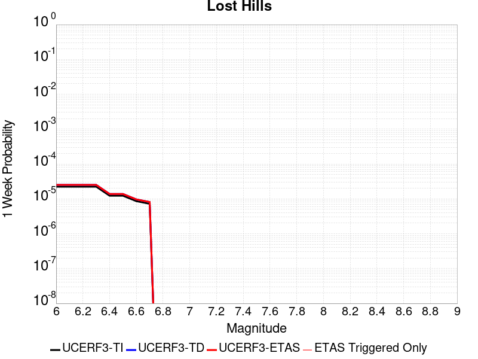 |  | 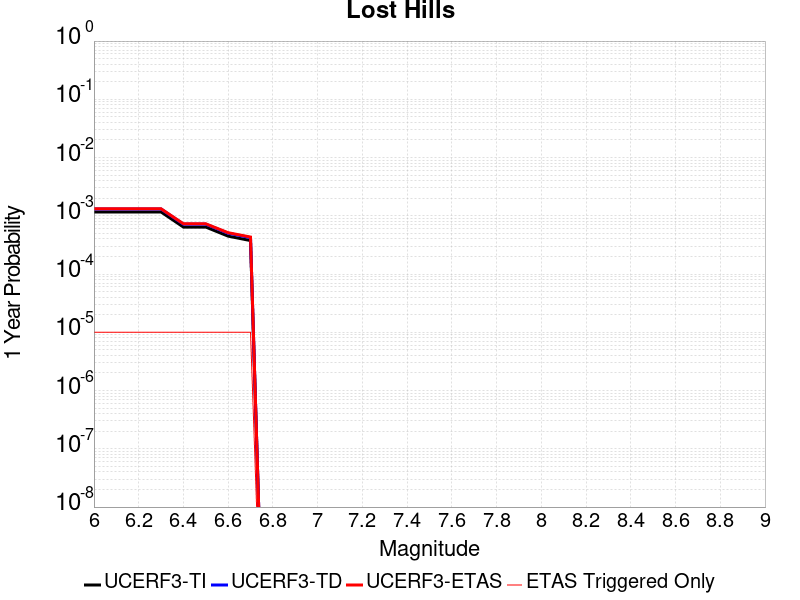 | 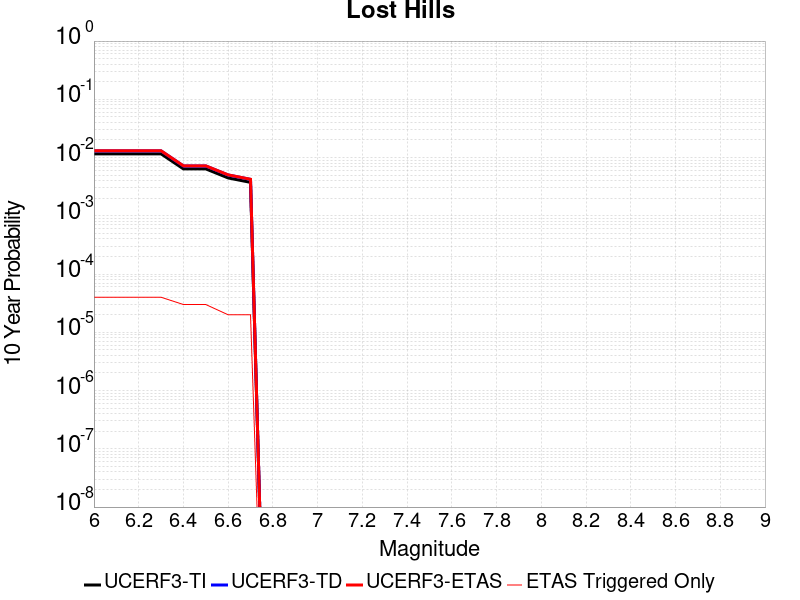 |

| Magnitude | 1 wk TI Prob | 1 wk TD Prob | 1 wk ETAS Prob | 1 wk ETAS/TD Gain | 1 wk ETAS Triggered Only | 1 mo TI Prob | 1 mo TD Prob | 1 mo ETAS Prob | 1 mo ETAS/TD Gain | 1 mo ETAS Triggered Only | 1 yr TI Prob | 1 yr TD Prob | 1 yr ETAS Prob | 1 yr ETAS/TD Gain | 1 yr ETAS Triggered Only | 10 yr TI Prob | 10 yr TD Prob | 10 yr ETAS Prob | 10 yr ETAS/TD Gain | 10 yr ETAS Triggered Only |
|-----|-----|-----|-----|-----|-----|-----|-----|-----|-----|-----|-----|-----|-----|-----|-----|-----|-----|-----|-----|-----|
| 6.0 | 2.233523E-5 | 2.5113784E-5 | 2.5113784E-5 | 1.0 | 0.0 | 9.571891E-5 | 1.0762701E-4 | 1.0762701E-4 | 1.0 | 0.0 | 0.0011647546 | 0.0013097394 | 0.0013211176 | 1.0086874 | 1.1393155E-5 | 0.011586686 | 0.013036811 | 0.013081789 | 1.0034502 | 4.557262E-5 |
| 6.1 | 2.233523E-5 | 2.5113784E-5 | 2.5113784E-5 | 1.0 | 0.0 | 9.571891E-5 | 1.0762701E-4 | 1.0762701E-4 | 1.0 | 0.0 | 0.0011647546 | 0.0013097394 | 0.0013211176 | 1.0086874 | 1.1393155E-5 | 0.011586686 | 0.013036811 | 0.013081789 | 1.0034502 | 4.557262E-5 |
| 6.2 | 2.233523E-5 | 2.5113784E-5 | 2.5113784E-5 | 1.0 | 0.0 | 9.571891E-5 | 1.0762701E-4 | 1.0762701E-4 | 1.0 | 0.0 | 0.0011647546 | 0.0013097394 | 0.0013211176 | 1.0086874 | 1.1393155E-5 | 0.011586686 | 0.013036811 | 0.013081789 | 1.0034502 | 4.557262E-5 |
| 6.3 | 2.233523E-5 | 2.5113784E-5 | 2.5113784E-5 | 1.0 | 0.0 | 9.571891E-5 | 1.0762701E-4 | 1.0762701E-4 | 1.0 | 0.0 | 0.0011647546 | 0.0013097394 | 0.0013211176 | 1.0086874 | 1.1393155E-5 | 0.011586686 | 0.013036811 | 0.013081789 | 1.0034502 | 4.557262E-5 |
| 6.4 | 1.2288092E-5 | 1.3784978E-5 | 1.3784978E-5 | 1.0 | 0.0 | 5.2662188E-5 | 5.907767E-5 | 5.907767E-5 | 1.0 | 0.0 | 6.409735E-4 | 7.191271E-4 | 7.305121E-4 | 1.0158316 | 1.1393155E-5 | 0.006391279 | 0.007177212 | 0.007211146 | 1.0047281 | 3.4179466E-5 |
| 6.5 | 1.2288092E-5 | 1.3784978E-5 | 1.3784978E-5 | 1.0 | 0.0 | 5.2662188E-5 | 5.907767E-5 | 5.907767E-5 | 1.0 | 0.0 | 6.409735E-4 | 7.191271E-4 | 7.305121E-4 | 1.0158316 | 1.1393155E-5 | 0.006391279 | 0.007177212 | 0.007211146 | 1.0047281 | 3.4179466E-5 |
| 6.6 | 8.58281E-6 | 9.636497E-6 | 9.636497E-6 | 1.0 | 0.0 | 3.6782953E-5 | 4.129909E-5 | 4.129909E-5 | 1.0 | 0.0 | 4.4774043E-4 | 5.0278363E-4 | 5.141711E-4 | 1.0226488 | 1.1393155E-5 | 0.0044683935 | 0.005024626 | 0.005047298 | 1.0045122 | 2.278631E-5 |
| 6.7 | 7.205685E-6 | 8.090592E-6 | 8.090592E-6 | 1.0 | 0.0 | 3.088114E-5 | 3.4673965E-5 | 3.4673965E-5 | 1.0 | 0.0 | 3.7591302E-4 | 4.2215554E-4 | 4.3354387E-4 | 1.0269767 | 1.1393155E-5 | 0.0037527776 | 0.0042215553 | 0.0042442456 | 1.0053748 | 2.278631E-5 |

## Great Valley 03a Dunnigan Hills
*[(top)](#table-of-contents)*

| 1 Week | 1 Month | 1 Year | 10 Year |
|-----|-----|-----|-----|
|  |  |  |  |

| Magnitude | 1 wk TI Prob | 1 wk TD Prob | 1 wk ETAS Prob | 1 wk ETAS/TD Gain | 1 wk ETAS Triggered Only | 1 mo TI Prob | 1 mo TD Prob | 1 mo ETAS Prob | 1 mo ETAS/TD Gain | 1 mo ETAS Triggered Only | 1 yr TI Prob | 1 yr TD Prob | 1 yr ETAS Prob | 1 yr ETAS/TD Gain | 1 yr ETAS Triggered Only | 10 yr TI Prob | 10 yr TD Prob | 10 yr ETAS Prob | 10 yr ETAS/TD Gain | 10 yr ETAS Triggered Only |
|-----|-----|-----|-----|-----|-----|-----|-----|-----|-----|-----|-----|-----|-----|-----|-----|-----|-----|-----|-----|-----|
| 6.0 | 1.6591328E-5 | 1.8111781E-5 | 1.8111781E-5 | 1.0 | 0.0 | 7.110376E-5 | 7.7619996E-5 | 7.7619996E-5 | 1.0 | 0.0 | 8.6534437E-4 | 9.446829E-4 | 9.446829E-4 | 1.0 | 0.0 | 0.008619824 | 0.009413506 | 0.009436077 | 1.0023978 | 2.278631E-5 |
| 6.1 | 8.041125E-6 | 8.771563E-6 | 8.771563E-6 | 1.0 | 0.0 | 3.4461507E-5 | 3.7591988E-5 | 3.7591988E-5 | 1.0 | 0.0 | 4.194881E-4 | 4.5760666E-4 | 4.5760666E-4 | 1.0 | 0.0 | 0.004186971 | 0.004568642 | 0.004579983 | 1.0024824 | 1.1393155E-5 |
| 6.2 | 3.2807004E-6 | 3.5803228E-6 | 3.5803228E-6 | 1.0 | 0.0 | 1.4060069E-5 | 1.5344172E-5 | 1.5344172E-5 | 1.0 | 0.0 | 1.7116789E-4 | 1.8680345E-4 | 1.8680345E-4 | 1.0 | 0.0 | 0.0017103611 | 0.0018668724 | 0.0018782443 | 1.0060914 | 1.1393155E-5 |
| 6.3 | 1.9339366E-6 | 2.1108258E-6 | 2.1108258E-6 | 1.0 | 0.0 | 8.288273E-6 | 9.046381E-6 | 9.046381E-6 | 1.0 | 0.0 | 1.00905054E-4 | 1.1013698E-4 | 1.1013698E-4 | 1.0 | 0.0 | 0.0010085925 | 0.001101104 | 0.0011124846 | 1.0103357 | 1.1393155E-5 |
| 6.4 | 1.3142635E-6 | 1.4342886E-6 | 1.4342886E-6 | 1.0 | 0.0 | 5.6325457E-6 | 6.1469514E-6 | 6.1469514E-6 | 1.0 | 0.0 | 6.857408E-5 | 7.483913E-5 | 7.483913E-5 | 1.0 | 0.0 | 6.8552926E-4 | 7.483913E-4 | 7.597759E-4 | 1.0152122 | 1.1393155E-5 |

## Palos Verdes
*[(top)](#table-of-contents)*

| 1 Week | 1 Month | 1 Year | 10 Year |
|-----|-----|-----|-----|
|  | 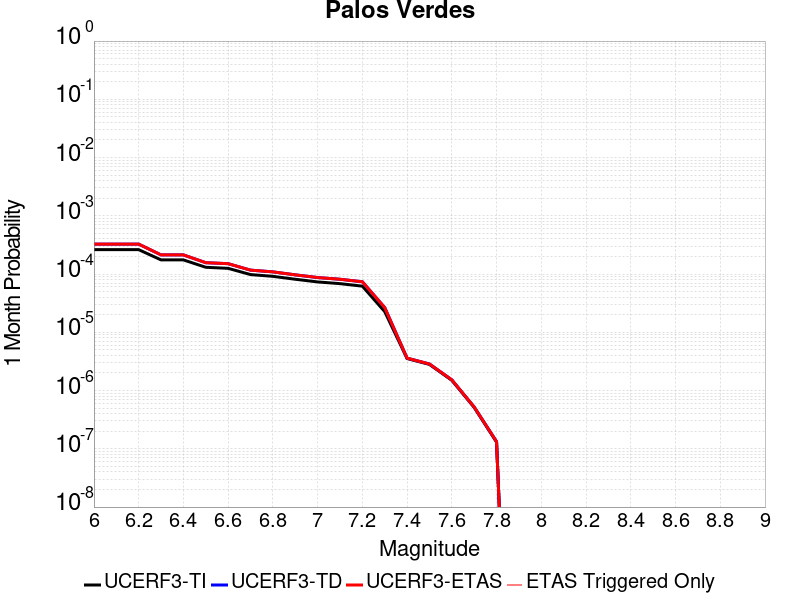 |  |  |

| Magnitude | 1 wk TI Prob | 1 wk TD Prob | 1 wk ETAS Prob | 1 wk ETAS/TD Gain | 1 wk ETAS Triggered Only | 1 mo TI Prob | 1 mo TD Prob | 1 mo ETAS Prob | 1 mo ETAS/TD Gain | 1 mo ETAS Triggered Only | 1 yr TI Prob | 1 yr TD Prob | 1 yr ETAS Prob | 1 yr ETAS/TD Gain | 1 yr ETAS Triggered Only | 10 yr TI Prob | 10 yr TD Prob | 10 yr ETAS Prob | 10 yr ETAS/TD Gain | 10 yr ETAS Triggered Only |
|-----|-----|-----|-----|-----|-----|-----|-----|-----|-----|-----|-----|-----|-----|-----|-----|-----|-----|-----|-----|-----|
| 6.0 | 6.126063E-5 | 7.626855E-5 | 7.626855E-5 | 1.0 | 0.0 | 2.6251914E-4 | 3.2682763E-4 | 3.2682763E-4 | 1.0 | 0.0 | 0.0031914865 | 0.0039723977 | 0.0039723977 | 1.0 | 0.0 | 0.031460393 | 0.0390705 | 0.039103344 | 1.0008407 | 3.4179466E-5 |
| 6.1 | 6.126063E-5 | 7.626855E-5 | 7.626855E-5 | 1.0 | 0.0 | 2.6251914E-4 | 3.2682763E-4 | 3.2682763E-4 | 1.0 | 0.0 | 0.0031914865 | 0.0039723977 | 0.0039723977 | 1.0 | 0.0 | 0.031460393 | 0.0390705 | 0.039103344 | 1.0008407 | 3.4179466E-5 |
| 6.2 | 6.126063E-5 | 7.626855E-5 | 7.626855E-5 | 1.0 | 0.0 | 2.6251914E-4 | 3.2682763E-4 | 3.2682763E-4 | 1.0 | 0.0 | 0.0031914865 | 0.0039723977 | 0.0039723977 | 1.0 | 0.0 | 0.031460393 | 0.0390705 | 0.039103344 | 1.0008407 | 3.4179466E-5 |
| 6.3 | 4.0838047E-5 | 4.9774164E-5 | 4.9774164E-5 | 1.0 | 0.0 | 1.7500846E-4 | 2.1330167E-4 | 2.1330167E-4 | 1.0 | 0.0 | 0.0021286458 | 0.0025940635 | 0.0025940635 | 1.0 | 0.0 | 0.021083709 | 0.025659528 | 0.025670629 | 1.0004326 | 1.1393155E-5 |
| 6.4 | 4.0838047E-5 | 4.9774164E-5 | 4.9774164E-5 | 1.0 | 0.0 | 1.7500846E-4 | 2.1330167E-4 | 2.1330167E-4 | 1.0 | 0.0 | 0.0021286458 | 0.0025940635 | 0.0025940635 | 1.0 | 0.0 | 0.021083709 | 0.025659528 | 0.025670629 | 1.0004326 | 1.1393155E-5 |
| 6.5 | 3.0512005E-5 | 3.6578465E-5 | 3.6578465E-5 | 1.0 | 0.0 | 1.3075917E-4 | 1.5675611E-4 | 1.5675611E-4 | 1.0 | 0.0 | 0.0015908304 | 0.001906951 | 0.001906951 | 1.0 | 0.0 | 0.015794903 | 0.018917816 | 0.018928993 | 1.0005908 | 1.1393155E-5 |
| 6.6 | 2.9255087E-5 | 3.5170873E-5 | 3.5170873E-5 | 1.0 | 0.0 | 1.2537291E-4 | 1.5072427E-4 | 1.5072427E-4 | 1.0 | 0.0 | 0.0015253464 | 0.001833637 | 0.001833637 | 1.0 | 0.0 | 0.015149189 | 0.018196695 | 0.01820788 | 1.0006148 | 1.1393155E-5 |
| 6.7 | 2.287198E-5 | 2.7260434E-5 | 2.7260434E-5 | 1.0 | 0.0 | 9.801909E-5 | 1.1682572E-4 | 1.1682572E-4 | 1.0 | 0.0 | 0.001192729 | 0.0014215169 | 0.0014215169 | 1.0 | 0.0 | 0.011863477 | 0.014133479 | 0.014144712 | 1.0007948 | 1.1393155E-5 |
| 6.8 | 2.1325764E-5 | 2.544329E-5 | 2.544329E-5 | 1.0 | 0.0 | 9.139293E-5 | 1.0903862E-4 | 1.0903862E-4 | 1.0 | 0.0 | 0.001112141 | 0.0013268271 | 0.0013268271 | 1.0 | 0.0 | 0.011065915 | 0.013198097 | 0.013198097 | 1.0 | 0.0 |
| 6.9 | 1.9009392E-5 | 2.2623548E-5 | 2.2623548E-5 | 1.0 | 0.0 | 8.1466285E-5 | 9.695495E-5 | 9.695495E-5 | 1.0 | 0.0 | 9.914007E-4 | 0.0011798748 | 0.0011798748 | 1.0 | 0.0 | 0.009869894 | 0.011744798 | 0.011744798 | 1.0 | 0.0 |
| 7.0 | 1.7098473E-5 | 2.032829E-5 | 2.032829E-5 | 1.0 | 0.0 | 7.3277115E-5 | 8.711882E-5 | 8.711882E-5 | 1.0 | 0.0 | 8.917837E-4 | 0.0010602408 | 0.0010602408 | 1.0 | 0.0 | 0.008882134 | 0.010560269 | 0.010560269 | 1.0 | 0.0 |
| 7.1 | 1.5982785E-5 | 1.9003117E-5 | 1.9003117E-5 | 1.0 | 0.0 | 6.849585E-5 | 8.1439866E-5 | 8.1439866E-5 | 1.0 | 0.0 | 8.336179E-4 | 9.911641E-4 | 9.911641E-4 | 1.0 | 0.0 | 0.008304977 | 0.009875806 | 0.009875806 | 1.0 | 0.0 |
| 7.2 | 1.4468002E-5 | 1.7204813E-5 | 1.7204813E-5 | 1.0 | 0.0 | 6.200425E-5 | 7.37333E-5 | 7.37333E-5 | 1.0 | 0.0 | 7.546402E-4 | 8.974173E-4 | 8.974173E-4 | 1.0 | 0.0 | 0.007520827 | 0.008946211 | 0.008946211 | 1.0 | 0.0 |
| 7.3 | 5.288233E-6 | 6.2062213E-6 | 6.2062213E-6 | 1.0 | 0.0 | 2.2663658E-5 | 2.6598016E-5 | 2.6598016E-5 | 1.0 | 0.0 | 2.7589512E-4 | 3.238177E-4 | 3.238177E-4 | 1.0 | 0.0 | 0.0027555283 | 0.0032368843 | 0.0032368843 | 1.0 | 0.0 |
| 7.4 | 8.279556E-7 | 8.408649E-7 | 8.408649E-7 | 1.0 | 0.0 | 3.5483763E-6 | 3.6037022E-6 | 3.6037022E-6 | 1.0 | 0.0 | 4.3200624E-5 | 4.3874265E-5 | 4.3874265E-5 | 1.0 | 0.0 | 4.3192226E-4 | 4.3866324E-4 | 4.3866324E-4 | 1.0 | 0.0 |
| 7.5 | 6.559831E-7 | 6.667481E-7 | 6.667481E-7 | 1.0 | 0.0 | 2.8113532E-6 | 2.857489E-6 | 2.857489E-6 | 1.0 | 0.0 | 3.4227687E-5 | 3.4789442E-5 | 3.4789442E-5 | 1.0 | 0.0 | 3.4222414E-4 | 3.478466E-4 | 3.478466E-4 | 1.0 | 0.0 |
| 7.6 | 3.5018968E-7 | 3.5621443E-7 | 3.5621443E-7 | 1.0 | 0.0 | 1.500812E-6 | 1.5266326E-6 | 1.5266326E-6 | 1.0 | 0.0 | 1.8272232E-5 | 1.858664E-5 | 1.858664E-5 | 1.0 | 0.0 | 1.8270731E-4 | 1.8585546E-4 | 1.8585546E-4 | 1.0 | 0.0 |
| 7.7 | 1.1986104E-7 | 1.2198876E-7 | 1.2198876E-7 | 1.0 | 0.0 | 5.1369005E-7 | 5.228089E-7 | 5.228089E-7 | 1.0 | 0.0 | 6.2541585E-6 | 6.3651796E-6 | 6.3651796E-6 | 1.0 | 0.0 | 6.2539824E-5 | 6.365002E-5 | 6.365002E-5 | 1.0 | 0.0 |
| 7.8 | 3.0445005E-8 | 3.1028957E-8 | 3.1028957E-8 | 1.0 | 0.0 | 1.3047858E-7 | 1.3298124E-7 | 1.3298124E-7 | 1.0 | 0.0 | 1.5885756E-6 | 1.6190455E-6 | 1.6190455E-6 | 1.0 | 0.0 | 1.5885644E-5 | 1.6190359E-5 | 1.6190359E-5 | 1.0 | 0.0 |

## Cleghorn Pass
*[(top)](#table-of-contents)*

| 1 Week | 1 Month | 1 Year | 10 Year |
|-----|-----|-----|-----|
| 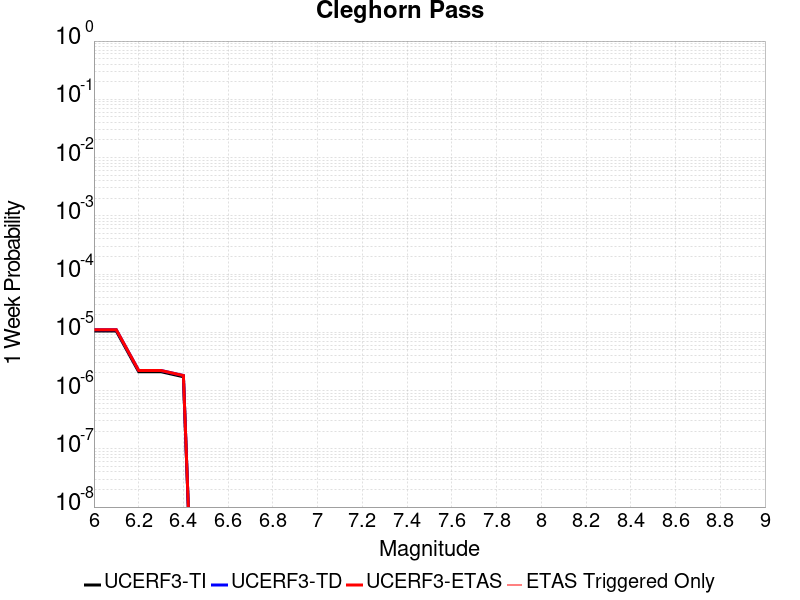 | 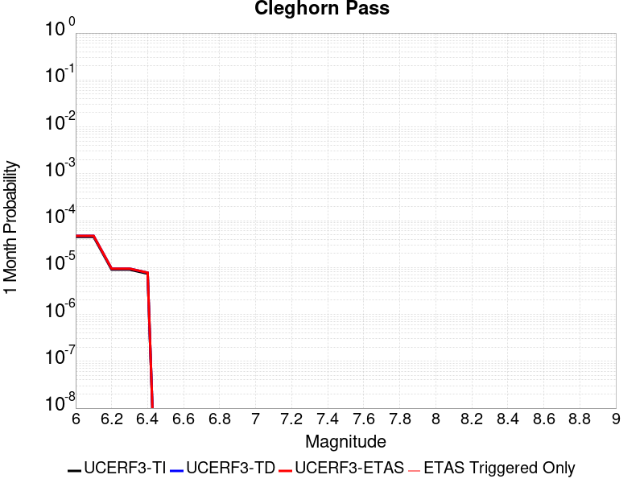 |  | 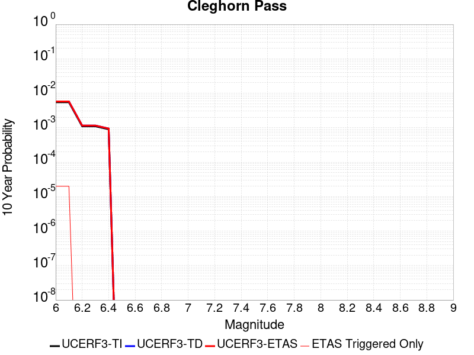 |

| Magnitude | 1 wk TI Prob | 1 wk TD Prob | 1 wk ETAS Prob | 1 wk ETAS/TD Gain | 1 wk ETAS Triggered Only | 1 mo TI Prob | 1 mo TD Prob | 1 mo ETAS Prob | 1 mo ETAS/TD Gain | 1 mo ETAS Triggered Only | 1 yr TI Prob | 1 yr TD Prob | 1 yr ETAS Prob | 1 yr ETAS/TD Gain | 1 yr ETAS Triggered Only | 10 yr TI Prob | 10 yr TD Prob | 10 yr ETAS Prob | 10 yr ETAS/TD Gain | 10 yr ETAS Triggered Only |
|-----|-----|-----|-----|-----|-----|-----|-----|-----|-----|-----|-----|-----|-----|-----|-----|-----|-----|-----|-----|-----|
| 6.0 | 1.0522846E-5 | 1.1041898E-5 | 1.1041898E-5 | 1.0 | 0.0 | 4.509713E-5 | 4.7321857E-5 | 4.7321857E-5 | 1.0 | 0.0 | 5.4891926E-4 | 5.7604397E-4 | 5.7604397E-4 | 1.0 | 0.0 | 0.0054756533 | 0.0057506748 | 0.0057733296 | 1.0039396 | 2.278631E-5 |
| 6.1 | 1.0522846E-5 | 1.1041898E-5 | 1.1041898E-5 | 1.0 | 0.0 | 4.509713E-5 | 4.7321857E-5 | 4.7321857E-5 | 1.0 | 0.0 | 5.4891926E-4 | 5.7604397E-4 | 5.7604397E-4 | 1.0 | 0.0 | 0.0054756533 | 0.0057506748 | 0.0057733296 | 1.0039396 | 2.278631E-5 |
| 6.2 | 2.1045846E-6 | 2.2084537E-6 | 2.2084537E-6 | 1.0 | 0.0 | 9.019617E-6 | 9.464791E-6 | 9.464791E-6 | 1.0 | 0.0 | 1.098083E-4 | 1.1523193E-4 | 1.1523193E-4 | 1.0 | 0.0 | 0.0010975406 | 0.0011521333 | 0.0011521333 | 1.0 | 0.0 |
| 6.3 | 2.1045846E-6 | 2.2084537E-6 | 2.2084537E-6 | 1.0 | 0.0 | 9.019617E-6 | 9.464791E-6 | 9.464791E-6 | 1.0 | 0.0 | 1.098083E-4 | 1.1523193E-4 | 1.1523193E-4 | 1.0 | 0.0 | 0.0010975406 | 0.0011521333 | 0.0011521333 | 1.0 | 0.0 |
| 6.4 | 1.7259927E-6 | 1.8110829E-6 | 1.8110829E-6 | 1.0 | 0.0 | 7.3970905E-6 | 7.761784E-6 | 7.761784E-6 | 1.0 | 0.0 | 9.005586E-5 | 9.449972E-5 | 9.449972E-5 | 1.0 | 0.0 | 9.001937E-4 | 9.449972E-4 | 9.449972E-4 | 1.0 | 0.0 |

## Santa Ynez River
*[(top)](#table-of-contents)*

| 1 Week | 1 Month | 1 Year | 10 Year |
|-----|-----|-----|-----|
|  |  | 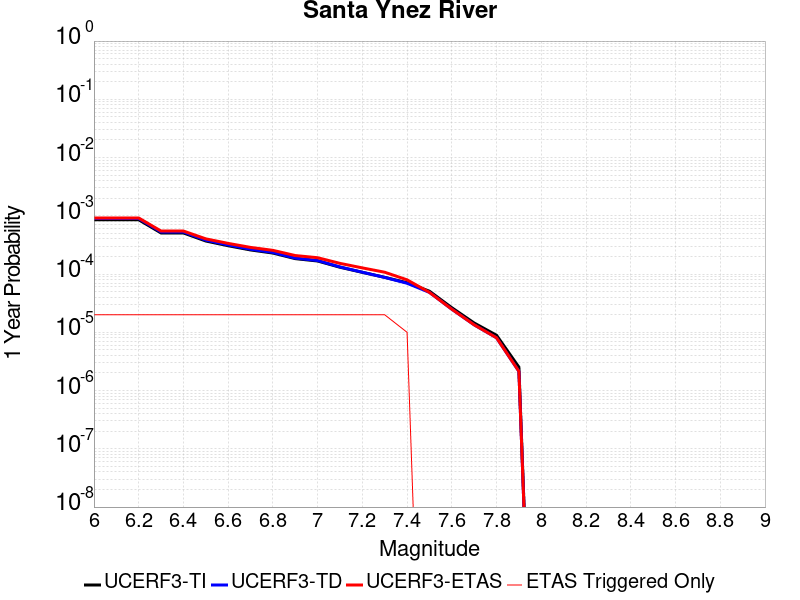 | 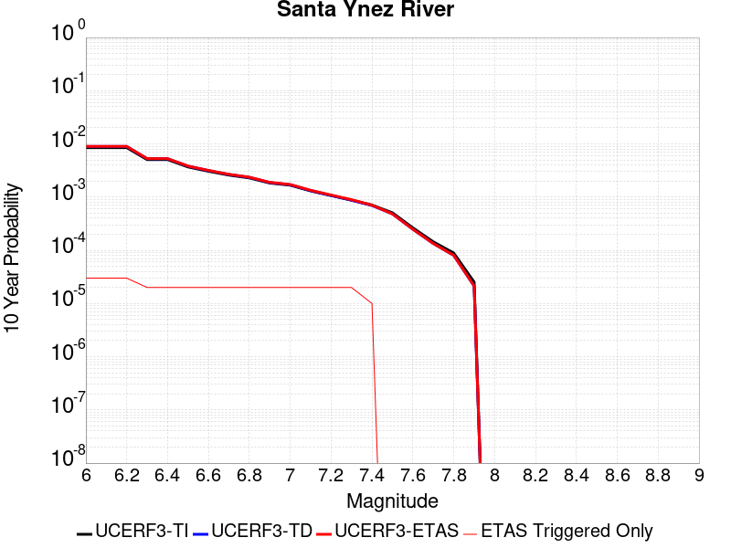 |

| Magnitude | 1 wk TI Prob | 1 wk TD Prob | 1 wk ETAS Prob | 1 wk ETAS/TD Gain | 1 wk ETAS Triggered Only | 1 mo TI Prob | 1 mo TD Prob | 1 mo ETAS Prob | 1 mo ETAS/TD Gain | 1 mo ETAS Triggered Only | 1 yr TI Prob | 1 yr TD Prob | 1 yr ETAS Prob | 1 yr ETAS/TD Gain | 1 yr ETAS Triggered Only | 10 yr TI Prob | 10 yr TD Prob | 10 yr ETAS Prob | 10 yr ETAS/TD Gain | 10 yr ETAS Triggered Only |
|-----|-----|-----|-----|-----|-----|-----|-----|-----|-----|-----|-----|-----|-----|-----|-----|-----|-----|-----|-----|-----|
| 6.0 | 1.6396456E-5 | 1.7211732E-5 | 1.7211732E-5 | 1.0 | 0.0 | 7.026863E-5 | 7.376268E-5 | 7.376268E-5 | 1.0 | 0.0 | 8.551848E-4 | 8.9772616E-4 | 9.2049205E-4 | 1.0253595 | 2.278631E-5 | 0.0085190125 | 0.008944547 | 0.008978421 | 1.003787 | 3.4179466E-5 |
| 6.1 | 1.6396456E-5 | 1.7211732E-5 | 1.7211732E-5 | 1.0 | 0.0 | 7.026863E-5 | 7.376268E-5 | 7.376268E-5 | 1.0 | 0.0 | 8.551848E-4 | 8.9772616E-4 | 9.2049205E-4 | 1.0253595 | 2.278631E-5 | 0.0085190125 | 0.008944547 | 0.008978421 | 1.003787 | 3.4179466E-5 |
| 6.2 | 1.6396456E-5 | 1.7211732E-5 | 1.7211732E-5 | 1.0 | 0.0 | 7.026863E-5 | 7.376268E-5 | 7.376268E-5 | 1.0 | 0.0 | 8.551848E-4 | 8.9772616E-4 | 9.2049205E-4 | 1.0253595 | 2.278631E-5 | 0.0085190125 | 0.008944547 | 0.008978421 | 1.003787 | 3.4179466E-5 |
| 6.3 | 9.736976E-6 | 1.0123571E-5 | 1.0123571E-5 | 1.0 | 0.0 | 4.172923E-5 | 4.338604E-5 | 4.338604E-5 | 1.0 | 0.0 | 5.0793495E-4 | 5.2810204E-4 | 5.508763E-4 | 1.0431248 | 2.278631E-5 | 0.005067755 | 0.005268976 | 0.0052916426 | 1.0043018 | 2.278631E-5 |
| 6.4 | 9.736976E-6 | 1.0123571E-5 | 1.0123571E-5 | 1.0 | 0.0 | 4.172923E-5 | 4.338604E-5 | 4.338604E-5 | 1.0 | 0.0 | 5.0793495E-4 | 5.2810204E-4 | 5.508763E-4 | 1.0431248 | 2.278631E-5 | 0.005067755 | 0.005268976 | 0.0052916426 | 1.0043018 | 2.278631E-5 |
| 6.5 | 7.081964E-6 | 7.3308024E-6 | 7.3308024E-6 | 1.0 | 0.0 | 3.035092E-5 | 3.1417356E-5 | 3.1417356E-5 | 1.0 | 0.0 | 3.694598E-4 | 3.8244075E-4 | 4.0521834E-4 | 1.0595585 | 2.278631E-5 | 0.0036884616 | 0.0038179879 | 0.003840687 | 1.0059453 | 2.278631E-5 |
| 6.6 | 5.873247E-6 | 6.0604993E-6 | 6.0604993E-6 | 1.0 | 0.0 | 2.5170815E-5 | 2.5973315E-5 | 2.5973315E-5 | 1.0 | 0.0 | 3.064116E-4 | 3.1618009E-4 | 3.389592E-4 | 1.0720447 | 2.278631E-5 | 0.0030598943 | 0.0031573898 | 0.0031801043 | 1.007194 | 2.278631E-5 |
| 6.7 | 4.973277E-6 | 5.116551E-6 | 5.116551E-6 | 1.0 | 0.0 | 2.1313872E-5 | 2.1927894E-5 | 2.1927894E-5 | 1.0 | 0.0 | 2.5946548E-4 | 2.669399E-4 | 2.897201E-4 | 1.0853385 | 2.278631E-5 | 0.0025916274 | 0.0026662415 | 0.002688967 | 1.0085235 | 2.278631E-5 |
| 6.8 | 4.396492E-6 | 4.5115594E-6 | 4.5115594E-6 | 1.0 | 0.0 | 1.884197E-5 | 1.9335113E-5 | 1.9335113E-5 | 1.0 | 0.0 | 2.2937685E-4 | 2.3537992E-4 | 2.5816087E-4 | 1.0967838 | 2.278631E-5 | 0.0022914023 | 0.0023513415 | 0.0023740742 | 1.009668 | 2.278631E-5 |
| 6.9 | 3.5255632E-6 | 3.6018216E-6 | 3.6018216E-6 | 1.0 | 0.0 | 1.5109469E-5 | 1.5436288E-5 | 1.5436288E-5 | 1.0 | 0.0 | 1.8394225E-4 | 1.8792076E-4 | 2.1070278E-4 | 1.1212322 | 2.278631E-5 | 0.0018379007 | 0.0018776346 | 0.0019003781 | 1.0121129 | 2.278631E-5 |
| 7.0 | 3.211603E-6 | 3.274109E-6 | 3.274109E-6 | 1.0 | 0.0 | 1.376394E-5 | 1.4031822E-5 | 1.4031822E-5 | 1.0 | 0.0 | 1.6756308E-4 | 1.7082418E-4 | 1.936066E-4 | 1.1333677 | 2.278631E-5 | 0.0016743679 | 0.0017069428 | 0.0017296902 | 1.0133264 | 2.278631E-5 |
| 7.1 | 2.5094619E-6 | 2.5413017E-6 | 2.5413017E-6 | 1.0 | 0.0 | 1.0754793E-5 | 1.0891247E-5 | 1.0891247E-5 | 1.0 | 0.0 | 1.3093173E-4 | 1.3259293E-4 | 1.5537621E-4 | 1.1718289 | 2.278631E-5 | 0.0013085462 | 0.0013251442 | 0.0013479004 | 1.0171726 | 2.278631E-5 |
| 7.2 | 2.0515774E-6 | 2.0622676E-6 | 2.0622676E-6 | 1.0 | 0.0 | 8.792445E-6 | 8.83826E-6 | 8.83826E-6 | 1.0 | 0.0 | 1.0704277E-4 | 1.0760055E-4 | 1.303844E-4 | 1.2117448 | 2.278631E-5 | 0.0010699122 | 0.0010754887 | 0.0010982506 | 1.0211642 | 2.278631E-5 |
| 7.3 | 1.6845745E-6 | 1.6776781E-6 | 1.6776781E-6 | 1.0 | 0.0 | 7.219585E-6 | 7.19003E-6 | 7.19003E-6 | 1.0 | 0.0 | 8.78949E-5 | 8.7535125E-5 | 1.1031944E-4 | 1.2602876 | 2.278631E-5 | 8.7860145E-4 | 8.750093E-4 | 8.977757E-4 | 1.0260184 | 2.278631E-5 |
| 7.4 | 1.3600285E-6 | 1.3335754E-6 | 1.3335754E-6 | 1.0 | 0.0 | 5.82868E-6 | 5.7153106E-6 | 5.7153106E-6 | 1.0 | 0.0 | 7.096187E-5 | 6.958171E-5 | 8.097407E-5 | 1.1637264 | 1.1393155E-5 | 7.0939213E-4 | 6.956014E-4 | 7.0698664E-4 | 1.0163674 | 1.1393155E-5 |
| 7.5 | 9.735342E-7 | 9.291959E-7 | 9.291959E-7 | 1.0 | 0.0 | 4.172283E-6 | 3.982262E-6 | 3.982262E-6 | 1.0 | 0.0 | 5.079636E-5 | 4.848298E-5 | 4.848298E-5 | 1.0 | 0.0 | 5.0784746E-4 | 4.8472572E-4 | 4.8472572E-4 | 1.0 | 0.0 |
| 7.6 | 5.067187E-7 | 4.7792514E-7 | 4.7792514E-7 | 1.0 | 0.0 | 2.1716498E-6 | 2.048249E-6 | 2.048249E-6 | 1.0 | 0.0 | 2.6439517E-5 | 2.4937153E-5 | 2.4937153E-5 | 1.0 | 0.0 | 2.643637E-4 | 2.493443E-4 | 2.493443E-4 | 1.0 | 0.0 |
| 7.7 | 2.769089E-7 | 2.5762606E-7 | 2.5762606E-7 | 1.0 | 0.0 | 1.1867519E-6 | 1.1041112E-6 | 1.1041112E-6 | 1.0 | 0.0 | 1.4448608E-5 | 1.3442471E-5 | 1.3442471E-5 | 1.0 | 0.0 | 1.444767E-4 | 1.3441661E-4 | 1.3441661E-4 | 1.0 | 0.0 |
| 7.8 | 1.7044663E-7 | 1.5451185E-7 | 1.5451185E-7 | 1.0 | 0.0 | 7.3048534E-7 | 6.6219343E-7 | 6.6219343E-7 | 1.0 | 0.0 | 8.893623E-6 | 8.062176E-6 | 8.062176E-6 | 1.0 | 0.0 | 8.893267E-5 | 8.0618855E-5 | 8.0618855E-5 | 1.0 | 0.0 |
| 7.9 | 4.8344287E-8 | 4.091718E-8 | 4.091718E-8 | 1.0 | 0.0 | 2.0718979E-7 | 1.7535932E-7 | 1.7535932E-7 | 1.0 | 0.0 | 2.5225327E-6 | 2.1349977E-6 | 2.1349977E-6 | 1.0 | 0.0 | 2.5225041E-5 | 2.1349777E-5 | 2.1349777E-5 | 1.0 | 0.0 |

## Rose Canyon
*[(top)](#table-of-contents)*

| 1 Week | 1 Month | 1 Year | 10 Year |
|-----|-----|-----|-----|
|  |  |  |  |

| Magnitude | 1 wk TI Prob | 1 wk TD Prob | 1 wk ETAS Prob | 1 wk ETAS/TD Gain | 1 wk ETAS Triggered Only | 1 mo TI Prob | 1 mo TD Prob | 1 mo ETAS Prob | 1 mo ETAS/TD Gain | 1 mo ETAS Triggered Only | 1 yr TI Prob | 1 yr TD Prob | 1 yr ETAS Prob | 1 yr ETAS/TD Gain | 1 yr ETAS Triggered Only | 10 yr TI Prob | 10 yr TD Prob | 10 yr ETAS Prob | 10 yr ETAS/TD Gain | 10 yr ETAS Triggered Only |
|-----|-----|-----|-----|-----|-----|-----|-----|-----|-----|-----|-----|-----|-----|-----|-----|-----|-----|-----|-----|-----|
| 6.0 | 4.5923203E-5 | 4.981246E-5 | 4.981246E-5 | 1.0 | 0.0 | 1.9679888E-4 | 2.1346577E-4 | 2.1346577E-4 | 1.0 | 0.0 | 0.0023933933 | 0.0025960365 | 0.0025960365 | 1.0 | 0.0 | 0.023677798 | 0.025687695 | 0.025709895 | 1.0008643 | 2.278631E-5 |
| 6.1 | 4.5923203E-5 | 4.981246E-5 | 4.981246E-5 | 1.0 | 0.0 | 1.9679888E-4 | 2.1346577E-4 | 2.1346577E-4 | 1.0 | 0.0 | 0.0023933933 | 0.0025960365 | 0.0025960365 | 1.0 | 0.0 | 0.023677798 | 0.025687695 | 0.025698796 | 1.0004321 | 1.1393155E-5 |
| 6.2 | 2.8844734E-5 | 2.9748233E-5 | 2.9748233E-5 | 1.0 | 0.0 | 1.2361443E-4 | 1.2748635E-4 | 1.2748635E-4 | 1.0 | 0.0 | 0.0015039665 | 0.0015510685 | 0.0015510685 | 1.0 | 0.0 | 0.0149382865 | 0.015416016 | 0.015427234 | 1.0007277 | 1.1393155E-5 |
| 6.3 | 2.3171577E-5 | 2.3236003E-5 | 2.3236003E-5 | 1.0 | 0.0 | 9.9302975E-5 | 9.957915E-5 | 9.957915E-5 | 1.0 | 0.0 | 0.0012083431 | 0.0012117154 | 0.0012117154 | 1.0 | 0.0 | 0.012017938 | 0.012059571 | 0.012070827 | 1.0009333 | 1.1393155E-5 |
| 6.4 | 2.0066604E-5 | 1.9714185E-5 | 1.9714185E-5 | 1.0 | 0.0 | 8.599689E-5 | 8.448668E-5 | 8.448668E-5 | 1.0 | 0.0 | 0.0010465092 | 0.0010281501 | 0.0010281501 | 1.0 | 0.0 | 0.010415946 | 0.010239792 | 0.0102510685 | 1.0011013 | 1.1393155E-5 |
| 6.5 | 1.776989E-5 | 1.7143238E-5 | 1.7143238E-5 | 1.0 | 0.0 | 7.615444E-5 | 7.3469E-5 | 7.3469E-5 | 1.0 | 0.0 | 9.267859E-4 | 8.9412497E-4 | 8.9412497E-4 | 1.0 | 0.0 | 0.009229303 | 0.008911752 | 0.0089230435 | 1.0012671 | 1.1393155E-5 |
| 6.6 | 1.5227364E-5 | 1.435113E-5 | 1.435113E-5 | 1.0 | 0.0 | 6.52585E-5 | 6.150342E-5 | 6.150342E-5 | 1.0 | 0.0 | 7.942326E-4 | 7.485521E-4 | 7.485521E-4 | 1.0 | 0.0 | 0.007914 | 0.0074589653 | 0.0074702734 | 1.0015161 | 1.1393155E-5 |
| 6.7 | 1.2703898E-5 | 1.1677136E-5 | 1.1677136E-5 | 1.0 | 0.0 | 5.4444143E-5 | 5.0043935E-5 | 5.0043935E-5 | 1.0 | 0.0 | 6.626558E-4 | 6.091188E-4 | 6.091188E-4 | 1.0 | 0.0 | 0.006606833 | 0.006070963 | 0.006082287 | 1.0018653 | 1.1393155E-5 |
| 6.8 | 1.1554917E-5 | 1.0612978E-5 | 1.0612978E-5 | 1.0 | 0.0 | 4.9520135E-5 | 4.5483423E-5 | 4.5483423E-5 | 1.0 | 0.0 | 6.0274085E-4 | 5.53624E-4 | 5.53624E-4 | 1.0 | 0.0 | 0.0060110865 | 0.0055124387 | 0.005523769 | 1.0020554 | 1.1393155E-5 |
| 6.9 | 8.732078E-6 | 7.883737E-6 | 7.883737E-6 | 1.0 | 0.0 | 3.7422655E-5 | 3.3787026E-5 | 3.3787026E-5 | 1.0 | 0.0 | 4.5552556E-4 | 4.1128235E-4 | 4.1128235E-4 | 1.0 | 0.0 | 0.0045459294 | 0.0040902696 | 0.0041016163 | 1.002774 | 1.1393155E-5 |
| 7.0 | 5.9337494E-6 | 5.1085703E-6 | 5.1085703E-6 | 1.0 | 0.0 | 2.5430107E-5 | 2.189369E-5 | 2.189369E-5 | 1.0 | 0.0 | 3.0956755E-4 | 2.6652322E-4 | 2.6652322E-4 | 1.0 | 0.0 | 0.0030913667 | 0.0026620512 | 0.0026620512 | 1.0 | 0.0 |
| 7.1 | 5.013409E-6 | 4.1783064E-6 | 4.1783064E-6 | 1.0 | 0.0 | 2.1485863E-5 | 1.7906907E-5 | 1.7906907E-5 | 1.0 | 0.0 | 2.6155898E-4 | 2.1799488E-4 | 2.1799488E-4 | 1.0 | 0.0 | 0.0026125133 | 0.002177822 | 0.002177822 | 1.0 | 0.0 |
| 7.2 | 4.120763E-6 | 3.2828875E-6 | 3.2828875E-6 | 1.0 | 0.0 | 1.7660293E-5 | 1.4069442E-5 | 1.4069442E-5 | 1.0 | 0.0 | 2.1499286E-4 | 1.7128208E-4 | 1.7128208E-4 | 1.0 | 0.0 | 0.0021478499 | 0.0017115102 | 0.0017115102 | 1.0 | 0.0 |
| 7.3 | 3.2081239E-6 | 2.4410292E-6 | 2.4410292E-6 | 1.0 | 0.0 | 1.374903E-5 | 1.0461512E-5 | 1.0461512E-5 | 1.0 | 0.0 | 1.6738157E-4 | 1.2736153E-4 | 1.2736153E-4 | 1.0 | 0.0 | 0.0016725556 | 0.0012728925 | 0.0012728925 | 1.0 | 0.0 |
| 7.4 | 2.4194755E-6 | 1.7683985E-6 | 1.7683985E-6 | 1.0 | 0.0 | 1.0369139E-5 | 7.578829E-6 | 7.578829E-6 | 1.0 | 0.0 | 1.2623696E-4 | 9.226839E-5 | 9.226839E-5 | 1.0 | 0.0 | 0.0012616527 | 9.2230615E-4 | 9.2230615E-4 | 1.0 | 0.0 |
| 7.5 | 1.3842889E-6 | 9.380894E-7 | 9.380894E-7 | 1.0 | 0.0 | 5.9326535E-6 | 4.020377E-6 | 4.020377E-6 | 1.0 | 0.0 | 7.222766E-5 | 4.894703E-5 | 4.894703E-5 | 1.0 | 0.0 | 7.220419E-4 | 4.89366E-4 | 4.89366E-4 | 1.0 | 0.0 |
| 7.6 | 1.0021575E-6 | 6.412879E-7 | 6.412879E-7 | 1.0 | 0.0 | 4.2949537E-6 | 2.7483738E-6 | 2.7483738E-6 | 1.0 | 0.0 | 5.2289808E-5 | 3.346096E-5 | 3.346096E-5 | 1.0 | 0.0 | 5.2277505E-4 | 3.3456137E-4 | 3.3456137E-4 | 1.0 | 0.0 |
| 7.7 | 8.7620116E-8 | 6.450059E-8 | 6.450059E-8 | 1.0 | 0.0 | 3.7551473E-7 | 2.7643108E-7 | 2.7643108E-7 | 1.0 | 0.0 | 4.5718825E-6 | 3.3655433E-6 | 3.3655433E-6 | 1.0 | 0.0 | 4.5717883E-5 | 3.3654953E-5 | 3.3654953E-5 | 1.0 | 0.0 |

## Camp Rock 2011
*[(top)](#table-of-contents)*

| 1 Week | 1 Month | 1 Year | 10 Year |
|-----|-----|-----|-----|
| 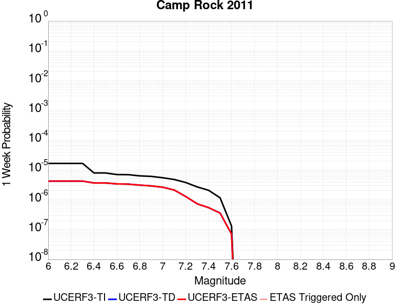 | 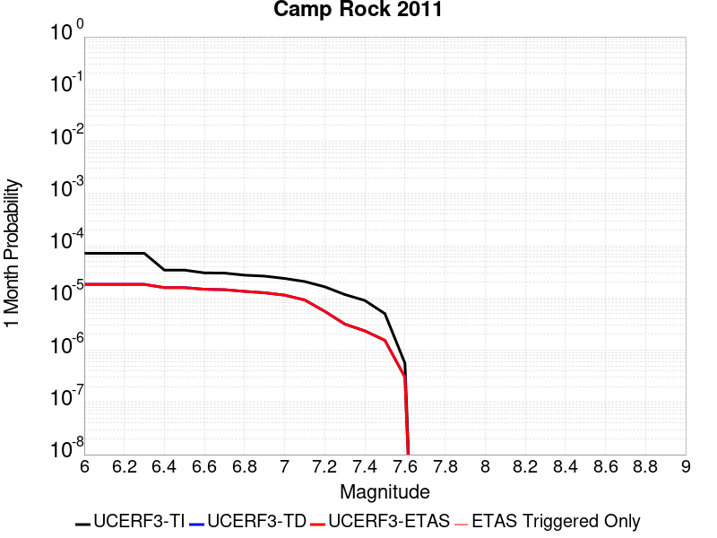 | 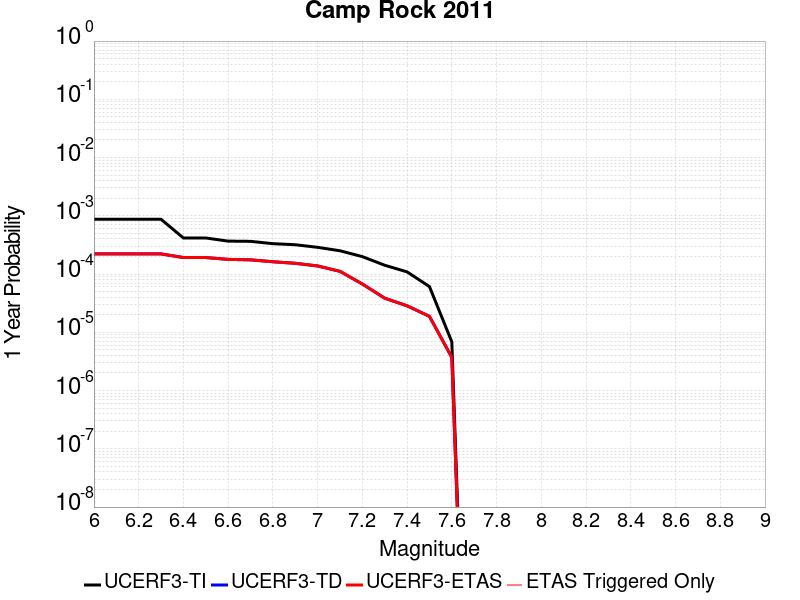 |  |

| Magnitude | 1 wk TI Prob | 1 wk TD Prob | 1 wk ETAS Prob | 1 wk ETAS/TD Gain | 1 wk ETAS Triggered Only | 1 mo TI Prob | 1 mo TD Prob | 1 mo ETAS Prob | 1 mo ETAS/TD Gain | 1 mo ETAS Triggered Only | 1 yr TI Prob | 1 yr TD Prob | 1 yr ETAS Prob | 1 yr ETAS/TD Gain | 1 yr ETAS Triggered Only | 10 yr TI Prob | 10 yr TD Prob | 10 yr ETAS Prob | 10 yr ETAS/TD Gain | 10 yr ETAS Triggered Only |
|-----|-----|-----|-----|-----|-----|-----|-----|-----|-----|-----|-----|-----|-----|-----|-----|-----|-----|-----|-----|-----|
| 6.0 | 1.6710783E-5 | 4.251229E-6 | 4.251229E-6 | 1.0 | 0.0 | 7.161568E-5 | 1.8219427E-5 | 1.8219427E-5 | 1.0 | 0.0 | 8.7157206E-4 | 2.2179948E-4 | 2.2179948E-4 | 1.0 | 0.0 | 0.008681616 | 0.0022158339 | 0.0022499377 | 1.0153909 | 3.4179466E-5 |
| 6.1 | 1.6710783E-5 | 4.251229E-6 | 4.251229E-6 | 1.0 | 0.0 | 7.161568E-5 | 1.8219427E-5 | 1.8219427E-5 | 1.0 | 0.0 | 8.7157206E-4 | 2.2179948E-4 | 2.2179948E-4 | 1.0 | 0.0 | 0.008681616 | 0.0022158339 | 0.0022499377 | 1.0153909 | 3.4179466E-5 |
| 6.2 | 1.6710783E-5 | 4.251229E-6 | 4.251229E-6 | 1.0 | 0.0 | 7.161568E-5 | 1.8219427E-5 | 1.8219427E-5 | 1.0 | 0.0 | 8.7157206E-4 | 2.2179948E-4 | 2.2179948E-4 | 1.0 | 0.0 | 0.008681616 | 0.0022158339 | 0.0022499377 | 1.0153909 | 3.4179466E-5 |
| 6.3 | 1.6710783E-5 | 4.251229E-6 | 4.251229E-6 | 1.0 | 0.0 | 7.161568E-5 | 1.8219427E-5 | 1.8219427E-5 | 1.0 | 0.0 | 8.7157206E-4 | 2.2179948E-4 | 2.2179948E-4 | 1.0 | 0.0 | 0.008681616 | 0.0022158339 | 0.0022499377 | 1.0153909 | 3.4179466E-5 |
| 6.4 | 7.982846E-6 | 3.6826975E-6 | 3.6826975E-6 | 1.0 | 0.0 | 3.421175E-5 | 1.5782896E-5 | 1.5782896E-5 | 1.0 | 0.0 | 4.1644843E-4 | 1.9214016E-4 | 1.9214016E-4 | 1.0 | 0.0 | 0.0041566887 | 0.0019197753 | 0.0019538892 | 1.0177697 | 3.4179466E-5 |
| 6.5 | 7.982846E-6 | 3.6826975E-6 | 3.6826975E-6 | 1.0 | 0.0 | 3.421175E-5 | 1.5782896E-5 | 1.5782896E-5 | 1.0 | 0.0 | 4.1644843E-4 | 1.9214016E-4 | 1.9214016E-4 | 1.0 | 0.0 | 0.0041566887 | 0.0019197753 | 0.0019538892 | 1.0177697 | 3.4179466E-5 |
| 6.6 | 7.048869E-6 | 3.4249333E-6 | 3.4249333E-6 | 1.0 | 0.0 | 3.0209088E-5 | 1.4678205E-5 | 1.4678205E-5 | 1.0 | 0.0 | 3.677336E-4 | 1.786928E-4 | 1.786928E-4 | 1.0 | 0.0 | 0.0036712566 | 0.0017855229 | 0.0018196413 | 1.0191084 | 3.4179466E-5 |
| 6.7 | 6.987307E-6 | 3.3629026E-6 | 3.3629026E-6 | 1.0 | 0.0 | 2.9945259E-5 | 1.4412361E-5 | 1.4412361E-5 | 1.0 | 0.0 | 3.6452254E-4 | 1.7545668E-4 | 1.7545668E-4 | 1.0 | 0.0 | 0.0036392517 | 0.0017532127 | 0.0017873322 | 1.0194612 | 3.4179466E-5 |
| 6.8 | 6.3737602E-6 | 3.1184768E-6 | 3.1184768E-6 | 1.0 | 0.0 | 2.731583E-5 | 1.3364834E-5 | 1.3364834E-5 | 1.0 | 0.0 | 3.3251947E-4 | 1.6270498E-4 | 1.6270498E-4 | 1.0 | 0.0 | 0.0033202237 | 0.0016258872 | 0.0016600111 | 1.0209879 | 3.4179466E-5 |
| 6.9 | 6.112211E-6 | 2.9336684E-6 | 2.9336684E-6 | 1.0 | 0.0 | 2.6194928E-5 | 1.2572806E-5 | 1.2572806E-5 | 1.0 | 0.0 | 3.1887658E-4 | 1.5306343E-4 | 1.5306343E-4 | 1.0 | 0.0 | 0.003184194 | 0.0015296078 | 0.0015637351 | 1.0223111 | 3.4179466E-5 |
| 7.0 | 5.5140117E-6 | 2.6424789E-6 | 2.6424789E-6 | 1.0 | 0.0 | 2.3631264E-5 | 1.1324862E-5 | 1.1324862E-5 | 1.0 | 0.0 | 2.8767265E-4 | 1.3787173E-4 | 1.3787173E-4 | 1.0 | 0.0 | 0.0028730053 | 0.0013778871 | 0.0014120195 | 1.0247716 | 3.4179466E-5 |
| 7.1 | 4.8151105E-6 | 2.1347387E-6 | 2.1347387E-6 | 1.0 | 0.0 | 2.0636026E-5 | 9.148849E-6 | 9.148849E-6 | 1.0 | 0.0 | 2.5121463E-4 | 1.1138177E-4 | 1.1138177E-4 | 1.0 | 0.0 | 0.0025093083 | 0.0011132814 | 0.0011474227 | 1.0306674 | 3.4179466E-5 |
| 7.2 | 3.818335E-6 | 1.294087E-6 | 1.294087E-6 | 1.0 | 0.0 | 1.6364189E-5 | 5.546076E-6 | 5.546076E-6 | 1.0 | 0.0 | 1.9921579E-4 | 6.752147E-5 | 6.752147E-5 | 1.0 | 0.0 | 0.0019903728 | 6.750177E-4 | 6.9778867E-4 | 1.0337338 | 2.278631E-5 |
| 7.3 | 2.7166698E-6 | 7.3858433E-7 | 7.3858433E-7 | 1.0 | 0.0 | 1.1642818E-5 | 3.1653576E-6 | 3.1653576E-6 | 1.0 | 0.0 | 1.4174209E-4 | 3.8537568E-5 | 3.8537568E-5 | 1.0 | 0.0 | 0.0014165172 | 3.8531085E-4 | 3.9669962E-4 | 1.0295573 | 1.1393155E-5 |
| 7.4 | 2.0893426E-6 | 5.4636024E-7 | 5.4636024E-7 | 1.0 | 0.0 | 8.954295E-6 | 2.3415419E-6 | 2.3415419E-6 | 1.0 | 0.0 | 1.0901308E-4 | 2.8507904E-5 | 2.8507904E-5 | 1.0 | 0.0 | 0.0010895962 | 2.85043E-4 | 2.9643293E-4 | 1.0399586 | 1.1393155E-5 |
| 7.5 | 1.1681728E-6 | 3.6040865E-7 | 3.6040865E-7 | 1.0 | 0.0 | 5.0064455E-6 | 1.5446077E-6 | 1.5446077E-6 | 1.0 | 0.0 | 6.0951766E-5 | 1.880544E-5 | 1.880544E-5 | 1.0 | 0.0 | 6.093505E-4 | 1.8803896E-4 | 1.8803896E-4 | 1.0 | 0.0 |
| 7.6 | 1.3154387E-7 | 7.121198E-8 | 7.121198E-8 | 1.0 | 0.0 | 5.6375933E-7 | 3.051942E-7 | 3.051942E-7 | 1.0 | 0.0 | 6.863748E-6 | 3.7157345E-6 | 3.7157345E-6 | 1.0 | 0.0 | 6.863536E-5 | 3.7156882E-5 | 3.7156882E-5 | 1.0 | 0.0 |

## Santa Rosa Island
*[(top)](#table-of-contents)*

| 1 Week | 1 Month | 1 Year | 10 Year |
|-----|-----|-----|-----|
| 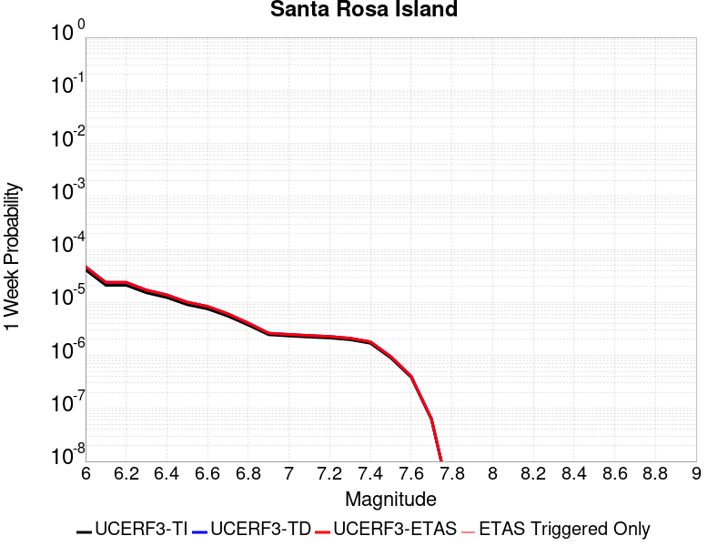 |  | 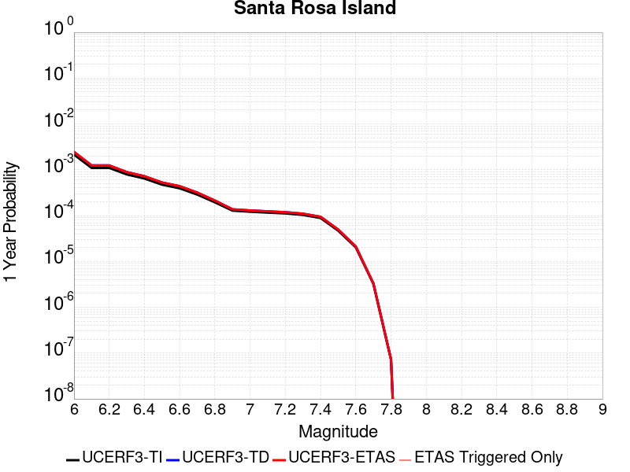 |  |

| Magnitude | 1 wk TI Prob | 1 wk TD Prob | 1 wk ETAS Prob | 1 wk ETAS/TD Gain | 1 wk ETAS Triggered Only | 1 mo TI Prob | 1 mo TD Prob | 1 mo ETAS Prob | 1 mo ETAS/TD Gain | 1 mo ETAS Triggered Only | 1 yr TI Prob | 1 yr TD Prob | 1 yr ETAS Prob | 1 yr ETAS/TD Gain | 1 yr ETAS Triggered Only | 10 yr TI Prob | 10 yr TD Prob | 10 yr ETAS Prob | 10 yr ETAS/TD Gain | 10 yr ETAS Triggered Only |
|-----|-----|-----|-----|-----|-----|-----|-----|-----|-----|-----|-----|-----|-----|-----|-----|-----|-----|-----|-----|-----|
| 6.0 | 4.1143165E-5 | 4.710695E-5 | 4.710695E-5 | 1.0 | 0.0 | 1.7631594E-4 | 2.0187242E-4 | 2.0187242E-4 | 1.0 | 0.0 | 0.002144533 | 0.002455223 | 0.002455223 | 1.0 | 0.0 | 0.021239553 | 0.024301628 | 0.024334976 | 1.0013723 | 3.4179466E-5 |
| 6.1 | 2.1061249E-5 | 2.3872346E-5 | 2.3872346E-5 | 1.0 | 0.0 | 9.0259375E-5 | 1.0230621E-4 | 1.0230621E-4 | 1.0 | 0.0 | 0.0010983539 | 0.0012448953 | 0.0012448953 | 1.0 | 0.0 | 0.01092941 | 0.012382259 | 0.01239351 | 1.0009087 | 1.1393155E-5 |
| 6.2 | 2.1061249E-5 | 2.3872346E-5 | 2.3872346E-5 | 1.0 | 0.0 | 9.0259375E-5 | 1.0230621E-4 | 1.0230621E-4 | 1.0 | 0.0 | 0.0010983539 | 0.0012448953 | 0.0012448953 | 1.0 | 0.0 | 0.01092941 | 0.012382259 | 0.01239351 | 1.0009087 | 1.1393155E-5 |
| 6.3 | 1.5158236E-5 | 1.707944E-5 | 1.707944E-5 | 1.0 | 0.0 | 6.496225E-5 | 7.319561E-5 | 7.319561E-5 | 1.0 | 0.0 | 7.906284E-4 | 8.9080416E-4 | 8.9080416E-4 | 1.0 | 0.0 | 0.007878214 | 0.0088735875 | 0.008884879 | 1.0012726 | 1.1393155E-5 |
| 6.4 | 1.2341918E-5 | 1.3856864E-5 | 1.3856864E-5 | 1.0 | 0.0 | 5.2892858E-5 | 5.9385253E-5 | 5.9385253E-5 | 1.0 | 0.0 | 6.437803E-4 | 7.2278373E-4 | 7.2278373E-4 | 1.0 | 0.0 | 0.006419184 | 0.007205167 | 0.0072164778 | 1.0015699 | 1.1393155E-5 |
| 6.5 | 9.061158E-6 | 1.0119779E-5 | 1.0119779E-5 | 1.0 | 0.0 | 3.883296E-5 | 4.336979E-5 | 4.336979E-5 | 1.0 | 0.0 | 4.726887E-4 | 5.279046E-4 | 5.279046E-4 | 1.0 | 0.0 | 0.004716845 | 0.005267044 | 0.0052783773 | 1.0021517 | 1.1393155E-5 |
| 6.6 | 7.5461685E-6 | 8.402954E-6 | 8.402954E-6 | 1.0 | 0.0 | 3.2340322E-5 | 3.601219E-5 | 3.601219E-5 | 1.0 | 0.0 | 3.936723E-4 | 4.3836446E-4 | 4.3836446E-4 | 1.0 | 0.0 | 0.003929756 | 0.0043754275 | 0.004386771 | 1.0025924 | 1.1393155E-5 |
| 6.7 | 5.5023775E-6 | 6.0888956E-6 | 6.0888956E-6 | 1.0 | 0.0 | 2.3581404E-5 | 2.6095024E-5 | 2.6095024E-5 | 1.0 | 0.0 | 2.8706578E-4 | 3.1766386E-4 | 3.1766386E-4 | 1.0 | 0.0 | 0.0028669522 | 0.0031724195 | 0.0031837765 | 1.00358 | 1.1393155E-5 |
| 6.8 | 3.7351679E-6 | 4.0840337E-6 | 4.0840337E-6 | 1.0 | 0.0 | 1.6007763E-5 | 1.7502898E-5 | 1.7502898E-5 | 1.0 | 0.0 | 1.948771E-4 | 2.1307943E-4 | 2.1307943E-4 | 1.0 | 0.0 | 0.0019470629 | 0.0021289967 | 0.0021289967 | 1.0 | 0.0 |
| 6.9 | 2.456366E-6 | 2.6297034E-6 | 2.6297034E-6 | 1.0 | 0.0 | 1.0527241E-5 | 1.1270109E-5 | 1.1270109E-5 | 1.0 | 0.0 | 1.2816161E-4 | 1.3720497E-4 | 1.3720497E-4 | 1.0 | 0.0 | 0.0012808773 | 0.0013712056 | 0.0013712056 | 1.0 | 0.0 |
| 7.0 | 2.3245157E-6 | 2.4831736E-6 | 2.4831736E-6 | 1.0 | 0.0 | 9.962172E-6 | 1.0642129E-5 | 1.0642129E-5 | 1.0 | 0.0 | 1.2128269E-4 | 1.2956024E-4 | 1.2956024E-4 | 1.0 | 0.0 | 0.0012121652 | 0.0012948493 | 0.0012948493 | 1.0 | 0.0 |
| 7.1 | 2.2248344E-6 | 2.3736202E-6 | 2.3736202E-6 | 1.0 | 0.0 | 9.53497E-6 | 1.0172618E-5 | 1.0172618E-5 | 1.0 | 0.0 | 1.1608207E-4 | 1.2384461E-4 | 1.2384461E-4 | 1.0 | 0.0 | 0.0011602144 | 0.0012377579 | 0.0012377579 | 1.0 | 0.0 |
| 7.2 | 2.1350402E-6 | 2.276506E-6 | 2.276506E-6 | 1.0 | 0.0 | 9.150141E-6 | 9.756417E-6 | 9.756417E-6 | 1.0 | 0.0 | 1.1139726E-4 | 1.1877793E-4 | 1.1877793E-4 | 1.0 | 0.0 | 0.0011134144 | 0.0011871463 | 0.0011871463 | 1.0 | 0.0 |
| 7.3 | 1.9793572E-6 | 2.1090416E-6 | 2.1090416E-6 | 1.0 | 0.0 | 8.482932E-6 | 9.038718E-6 | 9.038718E-6 | 1.0 | 0.0 | 1.032748E-4 | 1.1004086E-4 | 1.1004086E-4 | 1.0 | 0.0 | 0.0010322682 | 0.0010998655 | 0.0010998655 | 1.0 | 0.0 |
| 7.4 | 1.6951194E-6 | 1.8048466E-6 | 1.8048466E-6 | 1.0 | 0.0 | 7.264777E-6 | 7.735034E-6 | 7.735034E-6 | 1.0 | 0.0 | 8.844508E-5 | 9.4169984E-5 | 9.4169984E-5 | 1.0 | 0.0 | 8.840988E-4 | 9.413025E-4 | 9.413025E-4 | 1.0 | 0.0 |
| 7.5 | 8.987207E-7 | 9.5135346E-7 | 9.5135346E-7 | 1.0 | 0.0 | 3.8516546E-6 | 4.0772225E-6 | 4.0772225E-6 | 1.0 | 0.0 | 4.6892885E-5 | 4.9639068E-5 | 4.9639068E-5 | 1.0 | 0.0 | 4.688299E-4 | 4.9628096E-4 | 4.9628096E-4 | 1.0 | 0.0 |
| 7.6 | 3.8783037E-7 | 4.0533834E-7 | 4.0533834E-7 | 1.0 | 0.0 | 1.6621291E-6 | 1.7371633E-6 | 1.7371633E-6 | 1.0 | 0.0 | 2.0236233E-5 | 2.1149765E-5 | 2.1149765E-5 | 1.0 | 0.0 | 2.023439E-4 | 2.1147817E-4 | 2.1147817E-4 | 1.0 | 0.0 |
| 7.7 | 6.181804E-8 | 6.339596E-8 | 6.339596E-8 | 1.0 | 0.0 | 2.6493444E-7 | 2.7169693E-7 | 2.7169693E-7 | 1.0 | 0.0 | 3.225572E-6 | 3.3079052E-6 | 3.3079052E-6 | 1.0 | 0.0 | 3.225525E-5 | 3.3078566E-5 | 3.3078566E-5 | 1.0 | 0.0 |
| 7.8 | 1.3704449E-9 | 1.3964765E-9 | 1.3964765E-9 | 1.0 | 0.0 | 5.873335E-9 | 5.9848992E-9 | 5.9848992E-9 | 1.0 | 0.0 | 7.1507856E-8 | 7.286614E-8 | 7.286614E-8 | 1.0 | 0.0 | 7.1507833E-7 | 7.286613E-7 | 7.286613E-7 | 1.0 | 0.0 |

## Coronado Bank alt1
*[(top)](#table-of-contents)*

| 1 Week | 1 Month | 1 Year | 10 Year |
|-----|-----|-----|-----|
|  |  |  |  |

| Magnitude | 1 wk TI Prob | 1 wk TD Prob | 1 wk ETAS Prob | 1 wk ETAS/TD Gain | 1 wk ETAS Triggered Only | 1 mo TI Prob | 1 mo TD Prob | 1 mo ETAS Prob | 1 mo ETAS/TD Gain | 1 mo ETAS Triggered Only | 1 yr TI Prob | 1 yr TD Prob | 1 yr ETAS Prob | 1 yr ETAS/TD Gain | 1 yr ETAS Triggered Only | 10 yr TI Prob | 10 yr TD Prob | 10 yr ETAS Prob | 10 yr ETAS/TD Gain | 10 yr ETAS Triggered Only |
|-----|-----|-----|-----|-----|-----|-----|-----|-----|-----|-----|-----|-----|-----|-----|-----|-----|-----|-----|-----|-----|
| 6.0 | 7.533492E-5 | 9.400464E-5 | 9.400464E-5 | 1.0 | 0.0 | 3.22824E-4 | 4.028158E-4 | 4.028158E-4 | 1.0 | 0.0 | 0.0039233007 | 0.0048938803 | 0.0048938803 | 1.0 | 0.0 | 0.03854755 | 0.047930297 | 0.047962837 | 1.0006789 | 3.4179466E-5 |
| 6.1 | 4.1807285E-5 | 5.051753E-5 | 5.051753E-5 | 1.0 | 0.0 | 1.7916178E-4 | 2.1648566E-4 | 2.1648566E-4 | 1.0 | 0.0 | 0.0021791123 | 0.0026326058 | 0.0026326058 | 1.0 | 0.0 | 0.021578677 | 0.026023488 | 0.026023488 | 1.0 | 0.0 |
| 6.2 | 4.1807285E-5 | 5.051753E-5 | 5.051753E-5 | 1.0 | 0.0 | 1.7916178E-4 | 2.1648566E-4 | 2.1648566E-4 | 1.0 | 0.0 | 0.0021791123 | 0.0026326058 | 0.0026326058 | 1.0 | 0.0 | 0.021578677 | 0.026023488 | 0.026023488 | 1.0 | 0.0 |
| 6.3 | 3.1793104E-5 | 3.7727525E-5 | 3.7727525E-5 | 1.0 | 0.0 | 1.3624904E-4 | 1.6167952E-4 | 1.6167952E-4 | 1.0 | 0.0 | 0.0016575698 | 0.0019667028 | 0.0019667028 | 1.0 | 0.0 | 0.016452603 | 0.019496875 | 0.019496875 | 1.0 | 0.0 |
| 6.4 | 2.9878007E-5 | 3.535088E-5 | 3.535088E-5 | 1.0 | 0.0 | 1.2804232E-4 | 1.5149517E-4 | 1.5149517E-4 | 1.0 | 0.0 | 0.0015578003 | 0.0018429251 | 0.0018429251 | 1.0 | 0.0 | 0.015469253 | 0.018280186 | 0.018280186 | 1.0 | 0.0 |
| 6.5 | 2.4512565E-5 | 2.877578E-5 | 2.877578E-5 | 1.0 | 0.0 | 1.0504962E-4 | 1.2331909E-4 | 1.2331909E-4 | 1.0 | 0.0 | 0.0012782287 | 0.0015004026 | 0.0015004026 | 1.0 | 0.0 | 0.012709012 | 0.014905694 | 0.014905694 | 1.0 | 0.0 |
| 6.6 | 2.1317413E-5 | 2.4916495E-5 | 2.4916495E-5 | 1.0 | 0.0 | 9.135714E-5 | 1.0678073E-4 | 1.0678073E-4 | 1.0 | 0.0 | 0.0011117056 | 0.0012993023 | 0.0012993023 | 1.0 | 0.0 | 0.011061605 | 0.012919469 | 0.012919469 | 1.0 | 0.0 |
| 6.7 | 1.8585655E-5 | 2.1643207E-5 | 2.1643207E-5 | 1.0 | 0.0 | 7.9650374E-5 | 9.275342E-5 | 9.275342E-5 | 1.0 | 0.0 | 9.6931186E-4 | 0.0011287084 | 0.0011287084 | 1.0 | 0.0 | 0.0096509475 | 0.01123192 | 0.01123192 | 1.0 | 0.0 |
| 6.8 | 1.5862879E-5 | 1.842645E-5 | 1.842645E-5 | 1.0 | 0.0 | 6.798199E-5 | 7.8968216E-5 | 7.8968216E-5 | 1.0 | 0.0 | 8.273665E-4 | 9.610332E-4 | 9.610332E-4 | 1.0 | 0.0 | 0.008242928 | 0.009570756 | 0.009570756 | 1.0 | 0.0 |
| 6.9 | 1.3021509E-5 | 1.5100927E-5 | 1.5100927E-5 | 1.0 | 0.0 | 5.5805274E-5 | 6.4716754E-5 | 6.4716754E-5 | 1.0 | 0.0 | 6.792174E-4 | 7.876598E-4 | 7.876598E-4 | 1.0 | 0.0 | 0.006771452 | 0.007850505 | 0.007850505 | 1.0 | 0.0 |
| 7.0 | 1.0974371E-5 | 1.2724883E-5 | 1.2724883E-5 | 1.0 | 0.0 | 4.7032172E-5 | 5.453417E-5 | 5.453417E-5 | 1.0 | 0.0 | 5.7246623E-4 | 6.6376885E-4 | 6.6376885E-4 | 1.0 | 0.0 | 0.0057099373 | 0.006619613 | 0.006619613 | 1.0 | 0.0 |
| 7.1 | 8.766221E-6 | 1.0167675E-5 | 1.0167675E-5 | 1.0 | 0.0 | 3.7568978E-5 | 4.357512E-5 | 4.357512E-5 | 1.0 | 0.0 | 4.573063E-4 | 5.3041516E-4 | 5.3041516E-4 | 1.0 | 0.0 | 0.0045636636 | 0.005293193 | 0.005293193 | 1.0 | 0.0 |
| 7.2 | 8.026024E-7 | 8.3330735E-7 | 8.3330735E-7 | 1.0 | 0.0 | 3.43972E-6 | 3.5713124E-6 | 3.5713124E-6 | 1.0 | 0.0 | 4.1877785E-5 | 4.347987E-5 | 4.347987E-5 | 1.0 | 0.0 | 4.1869894E-4 | 4.3471475E-4 | 4.3471475E-4 | 1.0 | 0.0 |
| 7.3 | 3.7293114E-7 | 3.7005543E-7 | 3.7005543E-7 | 1.0 | 0.0 | 1.5982754E-6 | 1.5859509E-6 | 1.5859509E-6 | 1.0 | 0.0 | 1.9458828E-5 | 1.9308782E-5 | 1.9308782E-5 | 1.0 | 0.0 | 1.9457124E-4 | 1.9307112E-4 | 1.9307112E-4 | 1.0 | 0.0 |
| 7.4 | 2.0557036E-7 | 1.9676591E-7 | 1.9676591E-7 | 1.0 | 0.0 | 8.810155E-7 | 8.432822E-7 | 8.432822E-7 | 1.0 | 0.0 | 1.0726311E-5 | 1.0266913E-5 | 1.0266913E-5 | 1.0 | 0.0 | 1.0725793E-4 | 1.0266442E-4 | 1.0266442E-4 | 1.0 | 0.0 |
| 7.5 | 6.845446E-8 | 6.280129E-8 | 6.280129E-8 | 1.0 | 0.0 | 2.9337625E-7 | 2.6914836E-7 | 2.6914836E-7 | 1.0 | 0.0 | 3.5718497E-6 | 3.2768767E-6 | 3.2768767E-6 | 1.0 | 0.0 | 3.5717923E-5 | 3.276829E-5 | 3.276829E-5 | 1.0 | 0.0 |
| 7.6 | 6.0975145E-9 | 5.5321028E-9 | 5.5321028E-9 | 1.0 | 0.0 | 2.6132206E-8 | 2.3709012E-8 | 2.3709012E-8 | 1.0 | 0.0 | 3.1815955E-7 | 2.886572E-7 | 2.886572E-7 | 1.0 | 0.0 | 3.181591E-6 | 2.8865693E-6 | 2.8865693E-6 | 1.0 | 0.0 |

## Deep Springs
*[(top)](#table-of-contents)*

| 1 Week | 1 Month | 1 Year | 10 Year |
|-----|-----|-----|-----|
|  |  | 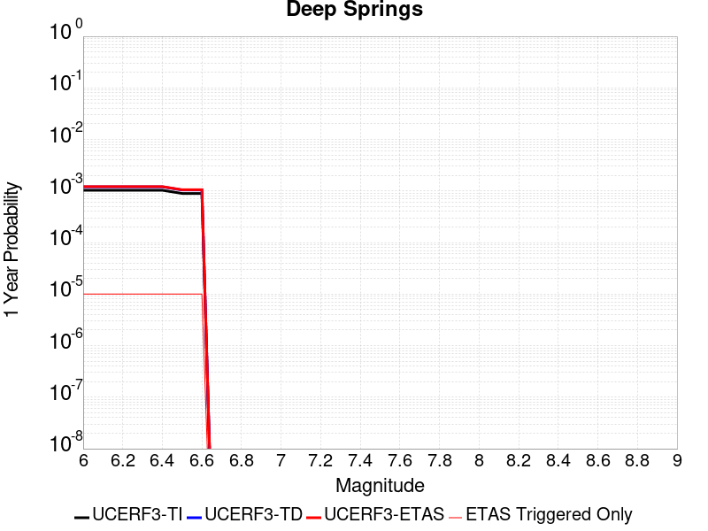 |  |

| Magnitude | 1 wk TI Prob | 1 wk TD Prob | 1 wk ETAS Prob | 1 wk ETAS/TD Gain | 1 wk ETAS Triggered Only | 1 mo TI Prob | 1 mo TD Prob | 1 mo ETAS Prob | 1 mo ETAS/TD Gain | 1 mo ETAS Triggered Only | 1 yr TI Prob | 1 yr TD Prob | 1 yr ETAS Prob | 1 yr ETAS/TD Gain | 1 yr ETAS Triggered Only | 10 yr TI Prob | 10 yr TD Prob | 10 yr ETAS Prob | 10 yr ETAS/TD Gain | 10 yr ETAS Triggered Only |
|-----|-----|-----|-----|-----|-----|-----|-----|-----|-----|-----|-----|-----|-----|-----|-----|-----|-----|-----|-----|-----|
| 6.0 | 1.9810619E-5 | 2.3121425E-5 | 2.3121425E-5 | 1.0 | 0.0 | 8.489989E-5 | 9.909091E-5 | 9.909091E-5 | 1.0 | 0.0 | 0.001033166 | 0.0012062722 | 0.0012176516 | 1.0094335 | 1.1393155E-5 | 0.010283757 | 0.012047061 | 0.012080829 | 1.002803 | 3.4179466E-5 |
| 6.1 | 1.9810619E-5 | 2.3121425E-5 | 2.3121425E-5 | 1.0 | 0.0 | 8.489989E-5 | 9.909091E-5 | 9.909091E-5 | 1.0 | 0.0 | 0.001033166 | 0.0012062722 | 0.0012176516 | 1.0094335 | 1.1393155E-5 | 0.010283757 | 0.012047061 | 0.012080829 | 1.002803 | 3.4179466E-5 |
| 6.2 | 1.9810619E-5 | 2.3121425E-5 | 2.3121425E-5 | 1.0 | 0.0 | 8.489989E-5 | 9.909091E-5 | 9.909091E-5 | 1.0 | 0.0 | 0.001033166 | 0.0012062722 | 0.0012176516 | 1.0094335 | 1.1393155E-5 | 0.010283757 | 0.012047061 | 0.012080829 | 1.002803 | 3.4179466E-5 |
| 6.3 | 1.9810619E-5 | 2.3121425E-5 | 2.3121425E-5 | 1.0 | 0.0 | 8.489989E-5 | 9.909091E-5 | 9.909091E-5 | 1.0 | 0.0 | 0.001033166 | 0.0012062722 | 0.0012176516 | 1.0094335 | 1.1393155E-5 | 0.010283757 | 0.012047061 | 0.012080829 | 1.002803 | 3.4179466E-5 |
| 6.4 | 1.9810619E-5 | 2.3121425E-5 | 2.3121425E-5 | 1.0 | 0.0 | 8.489989E-5 | 9.909091E-5 | 9.909091E-5 | 1.0 | 0.0 | 0.001033166 | 0.0012062722 | 0.0012176516 | 1.0094335 | 1.1393155E-5 | 0.010283757 | 0.012047061 | 0.012080829 | 1.002803 | 3.4179466E-5 |
| 6.5 | 1.7190405E-5 | 2.005827E-5 | 2.005827E-5 | 1.0 | 0.0 | 7.367108E-5 | 8.5964E-5 | 8.5964E-5 | 1.0 | 0.0 | 8.9657627E-4 | 0.0010466115 | 0.0010579927 | 1.0108744 | 1.1393155E-5 | 0.008929676 | 0.010466083 | 0.01048863 | 1.0021544 | 2.278631E-5 |
| 6.6 | 1.7190405E-5 | 2.005827E-5 | 2.005827E-5 | 1.0 | 0.0 | 7.367108E-5 | 8.5964E-5 | 8.5964E-5 | 1.0 | 0.0 | 8.9657627E-4 | 0.0010466115 | 0.0010579927 | 1.0108744 | 1.1393155E-5 | 0.008929676 | 0.010466083 | 0.01048863 | 1.0021544 | 2.278631E-5 |

## Blue Cut
*[(top)](#table-of-contents)*

| 1 Week | 1 Month | 1 Year | 10 Year |
|-----|-----|-----|-----|
|  |  |  |  |

| Magnitude | 1 wk TI Prob | 1 wk TD Prob | 1 wk ETAS Prob | 1 wk ETAS/TD Gain | 1 wk ETAS Triggered Only | 1 mo TI Prob | 1 mo TD Prob | 1 mo ETAS Prob | 1 mo ETAS/TD Gain | 1 mo ETAS Triggered Only | 1 yr TI Prob | 1 yr TD Prob | 1 yr ETAS Prob | 1 yr ETAS/TD Gain | 1 yr ETAS Triggered Only | 10 yr TI Prob | 10 yr TD Prob | 10 yr ETAS Prob | 10 yr ETAS/TD Gain | 10 yr ETAS Triggered Only |
|-----|-----|-----|-----|-----|-----|-----|-----|-----|-----|-----|-----|-----|-----|-----|-----|-----|-----|-----|-----|-----|
| 6.0 | 2.1227985E-5 | 2.272327E-5 | 2.272327E-5 | 1.0 | 0.0 | 9.097391E-5 | 9.738214E-5 | 9.738214E-5 | 1.0 | 0.0 | 0.0011070445 | 0.0011850408 | 0.0012191797 | 1.0288082 | 3.4179466E-5 | 0.011015458 | 0.01179306 | 0.0118268365 | 1.0028641 | 3.4179466E-5 |
| 6.1 | 2.1227985E-5 | 2.272327E-5 | 2.272327E-5 | 1.0 | 0.0 | 9.097391E-5 | 9.738214E-5 | 9.738214E-5 | 1.0 | 0.0 | 0.0011070445 | 0.0011850408 | 0.0012191797 | 1.0288082 | 3.4179466E-5 | 0.011015458 | 0.01179306 | 0.0118268365 | 1.0028641 | 3.4179466E-5 |
| 6.2 | 2.1227985E-5 | 2.272327E-5 | 2.272327E-5 | 1.0 | 0.0 | 9.097391E-5 | 9.738214E-5 | 9.738214E-5 | 1.0 | 0.0 | 0.0011070445 | 0.0011850408 | 0.0012191797 | 1.0288082 | 3.4179466E-5 | 0.011015458 | 0.01179306 | 0.0118268365 | 1.0028641 | 3.4179466E-5 |
| 6.3 | 1.1613981E-5 | 1.2355362E-5 | 1.2355362E-5 | 1.0 | 0.0 | 4.9773254E-5 | 5.2950545E-5 | 5.2950545E-5 | 1.0 | 0.0 | 6.0582085E-4 | 6.4449466E-4 | 6.786521E-4 | 1.0529988 | 3.4179466E-5 | 0.0060417196 | 0.0064275027 | 0.006461463 | 1.0052835 | 3.4179466E-5 |
| 6.4 | 1.1613981E-5 | 1.2355362E-5 | 1.2355362E-5 | 1.0 | 0.0 | 4.9773254E-5 | 5.2950545E-5 | 5.2950545E-5 | 1.0 | 0.0 | 6.0582085E-4 | 6.4449466E-4 | 6.786521E-4 | 1.0529988 | 3.4179466E-5 | 0.0060417196 | 0.0064275027 | 0.006461463 | 1.0052835 | 3.4179466E-5 |
| 6.5 | 8.931326E-6 | 9.48295E-6 | 9.48295E-6 | 1.0 | 0.0 | 3.8276554E-5 | 4.0640636E-5 | 4.0640636E-5 | 1.0 | 0.0 | 4.6591737E-4 | 4.9469655E-4 | 5.0608406E-4 | 1.0230192 | 1.1393155E-5 | 0.0046494175 | 0.0049368627 | 0.0049481997 | 1.0022963 | 1.1393155E-5 |
| 6.6 | 7.345353E-6 | 7.79137E-6 | 7.79137E-6 | 1.0 | 0.0 | 3.1479703E-5 | 3.3391203E-5 | 3.3391203E-5 | 1.0 | 0.0 | 3.83198E-4 | 4.064701E-4 | 4.178586E-4 | 1.0280181 | 1.1393155E-5 | 0.0038253788 | 0.004058058 | 0.0040694047 | 1.0027962 | 1.1393155E-5 |
| 6.7 | 6.2775666E-6 | 6.656074E-6 | 6.656074E-6 | 1.0 | 0.0 | 2.690358E-5 | 2.8525763E-5 | 2.8525763E-5 | 1.0 | 0.0 | 3.2750185E-4 | 3.4725334E-4 | 3.5864254E-4 | 1.0327979 | 1.1393155E-5 | 0.0032701963 | 0.0034678485 | 0.003479202 | 1.003274 | 1.1393155E-5 |
| 6.8 | 5.5234095E-6 | 5.855924E-6 | 5.855924E-6 | 1.0 | 0.0 | 2.367154E-5 | 2.5096617E-5 | 2.5096617E-5 | 1.0 | 0.0 | 2.8816288E-4 | 3.0551574E-4 | 3.0551574E-4 | 1.0 | 0.0 | 0.002877895 | 0.0030516735 | 0.0030516735 | 1.0 | 0.0 |
| 6.9 | 4.7780054E-6 | 5.0661247E-6 | 5.0661247E-6 | 1.0 | 0.0 | 2.0477004E-5 | 2.1711823E-5 | 2.1711823E-5 | 1.0 | 0.0 | 2.4927902E-4 | 2.6431642E-4 | 2.6431642E-4 | 1.0 | 0.0 | 0.0024899957 | 0.002640713 | 0.002640713 | 1.0 | 0.0 |
| 7.0 | 3.883171E-6 | 4.119064E-6 | 4.119064E-6 | 1.0 | 0.0 | 1.6642054E-5 | 1.765305E-5 | 1.765305E-5 | 1.0 | 0.0 | 2.0259817E-4 | 2.1491159E-4 | 2.1491159E-4 | 1.0 | 0.0 | 0.0020241356 | 0.0021477134 | 0.0021477134 | 1.0 | 0.0 |
| 7.1 | 2.8358215E-6 | 3.0101426E-6 | 3.0101426E-6 | 1.0 | 0.0 | 1.2153464E-5 | 1.2900584E-5 | 1.2900584E-5 | 1.0 | 0.0 | 1.4795837E-4 | 1.5705987E-4 | 1.5705987E-4 | 1.0 | 0.0 | 0.001478599 | 0.0015701341 | 0.0015701341 | 1.0 | 0.0 |

## Pine Mtn
*[(top)](#table-of-contents)*

| 1 Week | 1 Month | 1 Year | 10 Year |
|-----|-----|-----|-----|
|  |  |  |  |

| Magnitude | 1 wk TI Prob | 1 wk TD Prob | 1 wk ETAS Prob | 1 wk ETAS/TD Gain | 1 wk ETAS Triggered Only | 1 mo TI Prob | 1 mo TD Prob | 1 mo ETAS Prob | 1 mo ETAS/TD Gain | 1 mo ETAS Triggered Only | 1 yr TI Prob | 1 yr TD Prob | 1 yr ETAS Prob | 1 yr ETAS/TD Gain | 1 yr ETAS Triggered Only | 10 yr TI Prob | 10 yr TD Prob | 10 yr ETAS Prob | 10 yr ETAS/TD Gain | 10 yr ETAS Triggered Only |
|-----|-----|-----|-----|-----|-----|-----|-----|-----|-----|-----|-----|-----|-----|-----|-----|-----|-----|-----|-----|-----|
| 6.0 | 6.894797E-6 | 7.227265E-6 | 7.227265E-6 | 1.0 | 0.0 | 2.9548795E-5 | 3.0973642E-5 | 3.0973642E-5 | 1.0 | 0.0 | 3.596972E-4 | 3.770418E-4 | 3.8843066E-4 | 1.0302058 | 1.1393155E-5 | 0.0035911554 | 0.0037643188 | 0.0037983696 | 1.0090457 | 3.4179466E-5 |
| 6.1 | 6.894797E-6 | 7.227265E-6 | 7.227265E-6 | 1.0 | 0.0 | 2.9548795E-5 | 3.0973642E-5 | 3.0973642E-5 | 1.0 | 0.0 | 3.596972E-4 | 3.770418E-4 | 3.8843066E-4 | 1.0302058 | 1.1393155E-5 | 0.0035911554 | 0.0037643188 | 0.0037983696 | 1.0090457 | 3.4179466E-5 |
| 6.2 | 6.894797E-6 | 7.227265E-6 | 7.227265E-6 | 1.0 | 0.0 | 2.9548795E-5 | 3.0973642E-5 | 3.0973642E-5 | 1.0 | 0.0 | 3.596972E-4 | 3.770418E-4 | 3.8843066E-4 | 1.0302058 | 1.1393155E-5 | 0.0035911554 | 0.0037643188 | 0.0037983696 | 1.0090457 | 3.4179466E-5 |
| 6.3 | 6.894797E-6 | 7.227265E-6 | 7.227265E-6 | 1.0 | 0.0 | 2.9548795E-5 | 3.0973642E-5 | 3.0973642E-5 | 1.0 | 0.0 | 3.596972E-4 | 3.770418E-4 | 3.8843066E-4 | 1.0302058 | 1.1393155E-5 | 0.0035911554 | 0.0037643188 | 0.0037983696 | 1.0090457 | 3.4179466E-5 |
| 6.4 | 6.894797E-6 | 7.227265E-6 | 7.227265E-6 | 1.0 | 0.0 | 2.9548795E-5 | 3.0973642E-5 | 3.0973642E-5 | 1.0 | 0.0 | 3.596972E-4 | 3.770418E-4 | 3.8843066E-4 | 1.0302058 | 1.1393155E-5 | 0.0035911554 | 0.0037643188 | 0.0037983696 | 1.0090457 | 3.4179466E-5 |
| 6.5 | 6.894797E-6 | 7.227265E-6 | 7.227265E-6 | 1.0 | 0.0 | 2.9548795E-5 | 3.0973642E-5 | 3.0973642E-5 | 1.0 | 0.0 | 3.596972E-4 | 3.770418E-4 | 3.8843066E-4 | 1.0302058 | 1.1393155E-5 | 0.0035911554 | 0.0037643188 | 0.0037983696 | 1.0090457 | 3.4179466E-5 |
| 6.6 | 6.894797E-6 | 7.227265E-6 | 7.227265E-6 | 1.0 | 0.0 | 2.9548795E-5 | 3.0973642E-5 | 3.0973642E-5 | 1.0 | 0.0 | 3.596972E-4 | 3.770418E-4 | 3.8843066E-4 | 1.0302058 | 1.1393155E-5 | 0.0035911554 | 0.0037643188 | 0.0037983696 | 1.0090457 | 3.4179466E-5 |
| 6.7 | 6.0867933E-6 | 6.3988687E-6 | 6.3988687E-6 | 1.0 | 0.0 | 2.6085996E-5 | 2.7423448E-5 | 2.7423448E-5 | 1.0 | 0.0 | 3.1755073E-4 | 3.3383153E-4 | 3.4522088E-4 | 1.0341171 | 1.1393155E-5 | 0.0031709734 | 0.0033335194 | 0.003367585 | 1.0102191 | 3.4179466E-5 |
| 6.8 | 5.6530425E-6 | 5.952321E-6 | 5.952321E-6 | 1.0 | 0.0 | 2.42271E-5 | 2.5509707E-5 | 2.5509707E-5 | 1.0 | 0.0 | 2.94925E-4 | 3.1053848E-4 | 3.2192812E-4 | 1.036677 | 1.1393155E-5 | 0.002945339 | 0.0031012504 | 0.0031353238 | 1.010987 | 3.4179466E-5 |
| 6.9 | 4.6015225E-6 | 4.865475E-6 | 4.865475E-6 | 1.0 | 0.0 | 1.9720663E-5 | 2.0851878E-5 | 2.0851878E-5 | 1.0 | 0.0 | 2.4007261E-4 | 2.538435E-4 | 2.6523374E-4 | 1.0448712 | 1.1393155E-5 | 0.0023981342 | 0.0025356796 | 0.0025697723 | 1.0134453 | 3.4179466E-5 |
| 7.0 | 4.4875965E-6 | 4.749108E-6 | 4.749108E-6 | 1.0 | 0.0 | 1.9232413E-5 | 2.035317E-5 | 2.035317E-5 | 1.0 | 0.0 | 2.3412947E-4 | 2.4777313E-4 | 2.5916347E-4 | 1.0459708 | 1.1393155E-5 | 0.0023388295 | 0.0024751127 | 0.0025092075 | 1.0137751 | 3.4179466E-5 |
| 7.1 | 3.203907E-6 | 3.430963E-6 | 3.430963E-6 | 1.0 | 0.0 | 1.3730958E-5 | 1.4704048E-5 | 1.4704048E-5 | 1.0 | 0.0 | 1.6716159E-4 | 1.7900775E-4 | 1.9039886E-4 | 1.0636348 | 1.1393155E-5 | 0.0016703589 | 0.0017887017 | 0.0018114473 | 1.0127163 | 2.278631E-5 |
| 7.2 | 2.2060601E-6 | 2.3797506E-6 | 2.3797506E-6 | 1.0 | 0.0 | 9.4545085E-6 | 1.0198894E-5 | 1.0198894E-5 | 1.0 | 0.0 | 1.15102564E-4 | 1.2416492E-4 | 1.3555665E-4 | 1.0917468 | 1.1393155E-5 | 0.0011504296 | 0.0012410003 | 0.0012637583 | 1.0183384 | 2.278631E-5 |
| 7.3 | 1.3765207E-6 | 1.5227912E-6 | 1.5227912E-6 | 1.0 | 0.0 | 5.899361E-6 | 6.5262325E-6 | 6.5262325E-6 | 1.0 | 0.0 | 7.182235E-5 | 7.9454076E-5 | 9.0846326E-5 | 1.1433816 | 1.1393155E-5 | 7.1799144E-4 | 7.9426577E-4 | 8.056499E-4 | 1.0143329 | 1.1393155E-5 |
| 7.4 | 1.1245983E-6 | 1.2597384E-6 | 1.2597384E-6 | 1.0 | 0.0 | 4.819698E-6 | 5.3988683E-6 | 5.3988683E-6 | 1.0 | 0.0 | 5.8678244E-5 | 6.572932E-5 | 7.712173E-5 | 1.173323 | 1.1393155E-5 | 5.866275E-4 | 6.5710716E-4 | 6.684928E-4 | 1.017327 | 1.1393155E-5 |
| 7.5 | 8.031682E-7 | 9.286591E-7 | 9.286591E-7 | 1.0 | 0.0 | 3.4421448E-6 | 3.979962E-6 | 3.979962E-6 | 1.0 | 0.0 | 4.1907308E-5 | 4.845503E-5 | 4.845503E-5 | 1.0 | 0.0 | 4.1899405E-4 | 4.8445142E-4 | 4.8445142E-4 | 1.0 | 0.0 |
| 7.6 | 4.8953444E-7 | 6.0115764E-7 | 6.0115764E-7 | 1.0 | 0.0 | 2.098003E-6 | 2.5763877E-6 | 2.5763877E-6 | 1.0 | 0.0 | 2.5542888E-5 | 3.136712E-5 | 3.136712E-5 | 1.0 | 0.0 | 2.5539953E-4 | 3.1363178E-4 | 3.1363178E-4 | 1.0 | 0.0 |
| 7.7 | 6.634529E-8 | 6.7891946E-8 | 6.7891946E-8 | 1.0 | 0.0 | 2.843369E-7 | 2.9096546E-7 | 2.9096546E-7 | 1.0 | 0.0 | 3.4617963E-6 | 3.5424991E-6 | 3.5424991E-6 | 1.0 | 0.0 | 3.4617424E-5 | 3.5424473E-5 | 3.5424473E-5 | 1.0 | 0.0 |
| 7.8 | 9.235578E-9 | 9.4891766E-9 | 9.4891766E-9 | 1.0 | 0.0 | 3.9581046E-8 | 4.06679E-8 | 4.06679E-8 | 1.0 | 0.0 | 4.818991E-7 | 4.951316E-7 | 4.951316E-7 | 1.0 | 0.0 | 4.8189804E-6 | 4.9513064E-6 | 4.9513064E-6 | 1.0 | 0.0 |

## Pinto Mtn
*[(top)](#table-of-contents)*

| 1 Week | 1 Month | 1 Year | 10 Year |
|-----|-----|-----|-----|
| 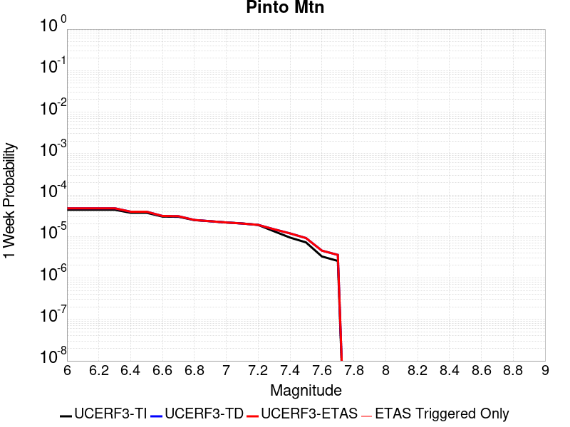 |  | 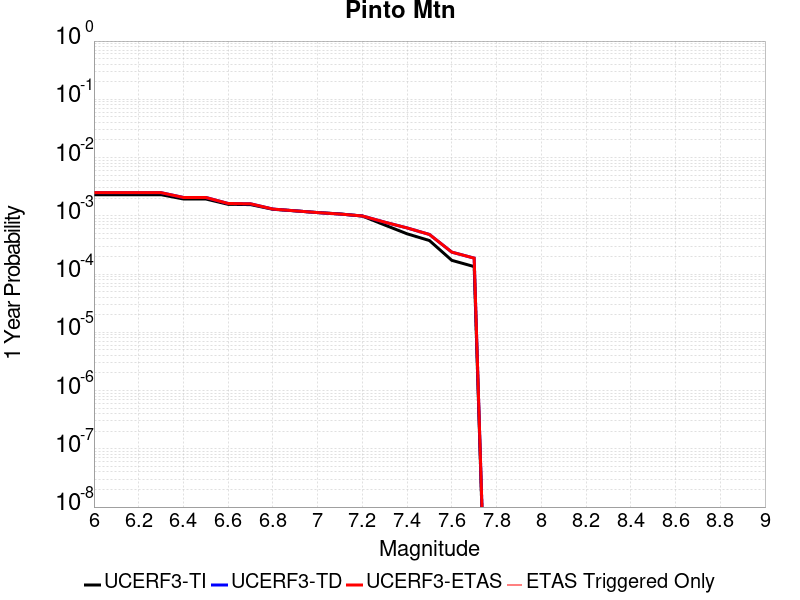 |  |

| Magnitude | 1 wk TI Prob | 1 wk TD Prob | 1 wk ETAS Prob | 1 wk ETAS/TD Gain | 1 wk ETAS Triggered Only | 1 mo TI Prob | 1 mo TD Prob | 1 mo ETAS Prob | 1 mo ETAS/TD Gain | 1 mo ETAS Triggered Only | 1 yr TI Prob | 1 yr TD Prob | 1 yr ETAS Prob | 1 yr ETAS/TD Gain | 1 yr ETAS Triggered Only | 10 yr TI Prob | 10 yr TD Prob | 10 yr ETAS Prob | 10 yr ETAS/TD Gain | 10 yr ETAS Triggered Only |
|-----|-----|-----|-----|-----|-----|-----|-----|-----|-----|-----|-----|-----|-----|-----|-----|-----|-----|-----|-----|-----|
| 6.0 | 4.4194956E-5 | 4.7881917E-5 | 4.7881917E-5 | 1.0 | 0.0 | 1.893932E-4 | 2.05193E-4 | 2.05193E-4 | 1.0 | 0.0 | 0.0023034236 | 0.002495526 | 0.002495526 | 1.0 | 0.0 | 0.022796938 | 0.024692567 | 0.024725901 | 1.00135 | 3.4179466E-5 |
| 6.1 | 4.4194956E-5 | 4.7881917E-5 | 4.7881917E-5 | 1.0 | 0.0 | 1.893932E-4 | 2.05193E-4 | 2.05193E-4 | 1.0 | 0.0 | 0.0023034236 | 0.002495526 | 0.002495526 | 1.0 | 0.0 | 0.022796938 | 0.024692567 | 0.024725901 | 1.00135 | 3.4179466E-5 |
| 6.2 | 4.4194956E-5 | 4.7881917E-5 | 4.7881917E-5 | 1.0 | 0.0 | 1.893932E-4 | 2.05193E-4 | 2.05193E-4 | 1.0 | 0.0 | 0.0023034236 | 0.002495526 | 0.002495526 | 1.0 | 0.0 | 0.022796938 | 0.024692567 | 0.024725901 | 1.00135 | 3.4179466E-5 |
| 6.3 | 4.4194956E-5 | 4.7881917E-5 | 4.7881917E-5 | 1.0 | 0.0 | 1.893932E-4 | 2.05193E-4 | 2.05193E-4 | 1.0 | 0.0 | 0.0023034236 | 0.002495526 | 0.002495526 | 1.0 | 0.0 | 0.022796938 | 0.024692567 | 0.024725901 | 1.00135 | 3.4179466E-5 |
| 6.4 | 3.729929E-5 | 3.9627743E-5 | 3.9627743E-5 | 1.0 | 0.0 | 1.5984432E-4 | 1.6982266E-4 | 1.6982266E-4 | 1.0 | 0.0 | 0.0019443673 | 0.0020657233 | 0.0020657233 | 1.0 | 0.0 | 0.019274427 | 0.020475252 | 0.020486413 | 1.000545 | 1.1393155E-5 |
| 6.5 | 3.729929E-5 | 3.9627743E-5 | 3.9627743E-5 | 1.0 | 0.0 | 1.5984432E-4 | 1.6982266E-4 | 1.6982266E-4 | 1.0 | 0.0 | 0.0019443673 | 0.0020657233 | 0.0020657233 | 1.0 | 0.0 | 0.019274427 | 0.020475252 | 0.020486413 | 1.000545 | 1.1393155E-5 |
| 6.6 | 3.0204548E-5 | 3.1226286E-5 | 3.1226286E-5 | 1.0 | 0.0 | 1.2944164E-4 | 1.3382027E-4 | 1.3382027E-4 | 1.0 | 0.0 | 0.0015748127 | 0.0016280789 | 0.0016280789 | 1.0 | 0.0 | 0.015636992 | 0.016165387 | 0.016165387 | 1.0 | 0.0 |
| 6.7 | 2.9857754E-5 | 3.0835556E-5 | 3.0835556E-5 | 1.0 | 0.0 | 1.2795553E-4 | 1.3214588E-4 | 1.3214588E-4 | 1.0 | 0.0 | 0.0015567453 | 0.0016077234 | 0.0016077234 | 1.0 | 0.0 | 0.015458848 | 0.01596477 | 0.01596477 | 1.0 | 0.0 |
| 6.8 | 2.4819734E-5 | 2.5028183E-5 | 2.5028183E-5 | 1.0 | 0.0 | 1.0636595E-4 | 1.0725935E-4 | 1.0725935E-4 | 1.0 | 0.0 | 0.0012942362 | 0.0013051219 | 0.0013051219 | 1.0 | 0.0 | 0.012867244 | 0.012976942 | 0.012976942 | 1.0 | 0.0 |
| 6.9 | 2.331124E-5 | 2.3356042E-5 | 2.3356042E-5 | 1.0 | 0.0 | 9.990149E-5 | 1.00093595E-4 | 1.00093595E-4 | 1.0 | 0.0 | 0.001215622 | 0.0012179787 | 0.0012179787 | 1.0 | 0.0 | 0.012089936 | 0.012115228 | 0.012115228 | 1.0 | 0.0 |
| 7.0 | 2.1818534E-5 | 2.1778818E-5 | 2.1778818E-5 | 1.0 | 0.0 | 9.3504656E-5 | 9.3334565E-5 | 9.3334565E-5 | 1.0 | 0.0 | 0.0011378246 | 0.0011357758 | 0.0011357758 | 1.0 | 0.0 | 0.011320163 | 0.0113018155 | 0.0113018155 | 1.0 | 0.0 |
| 7.1 | 2.066081E-5 | 2.055813E-5 | 2.055813E-5 | 1.0 | 0.0 | 8.854332E-5 | 8.81034E-5 | 8.81034E-5 | 1.0 | 0.0 | 0.0010774818 | 0.0010721507 | 0.0010721507 | 1.0 | 0.0 | 0.010722724 | 0.0106718335 | 0.0106718335 | 1.0 | 0.0 |
| 7.2 | 1.8990233E-5 | 1.9071074E-5 | 1.9071074E-5 | 1.0 | 0.0 | 8.138417E-5 | 8.173072E-5 | 8.173072E-5 | 1.0 | 0.0 | 9.904018E-4 | 9.946367E-4 | 9.946367E-4 | 1.0 | 0.0 | 0.009859995 | 0.009903851 | 0.009903851 | 1.0 | 0.0 |
| 7.3 | 1.3335872E-5 | 1.49224325E-5 | 1.49224325E-5 | 1.0 | 0.0 | 5.7152483E-5 | 6.395179E-5 | 6.395179E-5 | 1.0 | 0.0 | 6.956093E-4 | 7.7834766E-4 | 7.7834766E-4 | 1.0 | 0.0 | 0.006934359 | 0.007757516 | 0.007757516 | 1.0 | 0.0 |
| 7.4 | 9.414066E-6 | 1.1875931E-5 | 1.1875931E-5 | 1.0 | 0.0 | 4.0345374E-5 | 5.0895906E-5 | 5.0895906E-5 | 1.0 | 0.0 | 4.910942E-4 | 6.194909E-4 | 6.194909E-4 | 1.0 | 0.0 | 0.0049001034 | 0.00617859 | 0.00617859 | 1.0 | 0.0 |
| 7.5 | 7.2101157E-6 | 9.17279E-6 | 9.17279E-6 | 1.0 | 0.0 | 3.090013E-5 | 3.931141E-5 | 3.931141E-5 | 1.0 | 0.0 | 3.7614413E-4 | 4.7851913E-4 | 4.7851913E-4 | 1.0 | 0.0 | 0.0037550807 | 0.004775664 | 0.004775664 | 1.0 | 0.0 |
| 7.6 | 3.296375E-6 | 4.559496E-6 | 4.559496E-6 | 1.0 | 0.0 | 1.4127245E-5 | 1.954056E-5 | 1.954056E-5 | 1.0 | 0.0 | 1.7198564E-4 | 2.3788173E-4 | 2.3788173E-4 | 1.0 | 0.0 | 0.0017185259 | 0.0023764092 | 0.0023764092 | 1.0 | 0.0 |
| 7.7 | 2.5741092E-6 | 3.5976054E-6 | 3.5976054E-6 | 1.0 | 0.0 | 1.103185E-5 | 1.5418225E-5 | 1.5418225E-5 | 1.0 | 0.0 | 1.3430449E-4 | 1.8770205E-4 | 1.8770205E-4 | 1.0 | 0.0 | 0.0013422335 | 0.001875566 | 0.001875566 | 1.0 | 0.0 |

## Kern Canyon (North Kern) 2011
*[(top)](#table-of-contents)*

| 1 Week | 1 Month | 1 Year | 10 Year |
|-----|-----|-----|-----|
|  | 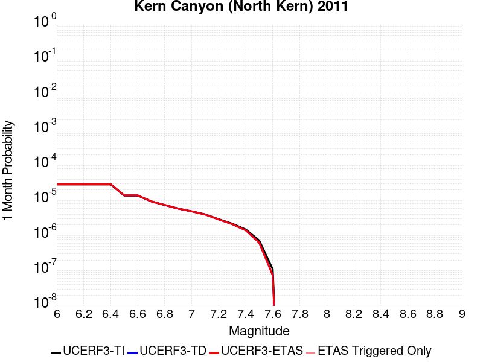 |  | 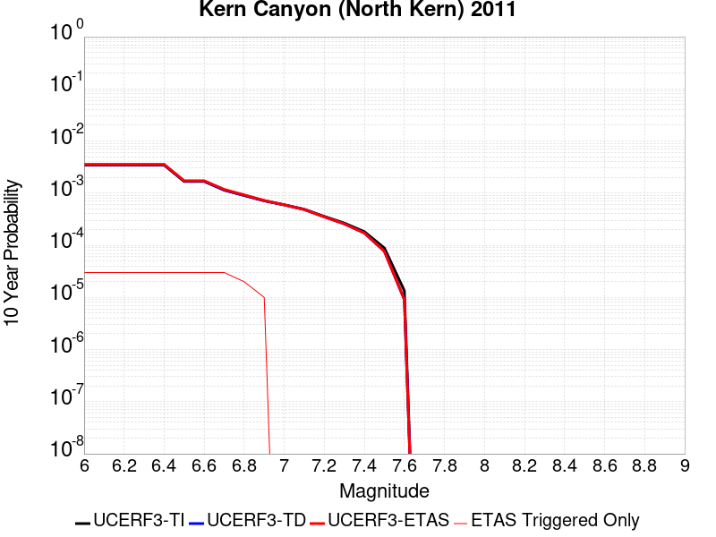 |

| Magnitude | 1 wk TI Prob | 1 wk TD Prob | 1 wk ETAS Prob | 1 wk ETAS/TD Gain | 1 wk ETAS Triggered Only | 1 mo TI Prob | 1 mo TD Prob | 1 mo ETAS Prob | 1 mo ETAS/TD Gain | 1 mo ETAS Triggered Only | 1 yr TI Prob | 1 yr TD Prob | 1 yr ETAS Prob | 1 yr ETAS/TD Gain | 1 yr ETAS Triggered Only | 10 yr TI Prob | 10 yr TD Prob | 10 yr ETAS Prob | 10 yr ETAS/TD Gain | 10 yr ETAS Triggered Only |
|-----|-----|-----|-----|-----|-----|-----|-----|-----|-----|-----|-----|-----|-----|-----|-----|-----|-----|-----|-----|-----|
| 6.0 | 6.6264497E-6 | 6.7577034E-6 | 6.7577034E-6 | 1.0 | 0.0 | 2.8398761E-5 | 2.896131E-5 | 2.896131E-5 | 1.0 | 0.0 | 3.4570007E-4 | 3.5255493E-4 | 3.6394404E-4 | 1.0323045 | 1.1393155E-5 | 0.0034516277 | 0.0035207446 | 0.0035548038 | 1.0096738 | 3.4179466E-5 |
| 6.1 | 6.6264497E-6 | 6.7577034E-6 | 6.7577034E-6 | 1.0 | 0.0 | 2.8398761E-5 | 2.896131E-5 | 2.896131E-5 | 1.0 | 0.0 | 3.4570007E-4 | 3.5255493E-4 | 3.6394404E-4 | 1.0323045 | 1.1393155E-5 | 0.0034516277 | 0.0035207446 | 0.0035548038 | 1.0096738 | 3.4179466E-5 |
| 6.2 | 6.6264497E-6 | 6.7577034E-6 | 6.7577034E-6 | 1.0 | 0.0 | 2.8398761E-5 | 2.896131E-5 | 2.896131E-5 | 1.0 | 0.0 | 3.4570007E-4 | 3.5255493E-4 | 3.6394404E-4 | 1.0323045 | 1.1393155E-5 | 0.0034516277 | 0.0035207446 | 0.0035548038 | 1.0096738 | 3.4179466E-5 |
| 6.3 | 6.6264497E-6 | 6.7577034E-6 | 6.7577034E-6 | 1.0 | 0.0 | 2.8398761E-5 | 2.896131E-5 | 2.896131E-5 | 1.0 | 0.0 | 3.4570007E-4 | 3.5255493E-4 | 3.6394404E-4 | 1.0323045 | 1.1393155E-5 | 0.0034516277 | 0.0035207446 | 0.0035548038 | 1.0096738 | 3.4179466E-5 |
| 6.4 | 6.6264497E-6 | 6.7577034E-6 | 6.7577034E-6 | 1.0 | 0.0 | 2.8398761E-5 | 2.896131E-5 | 2.896131E-5 | 1.0 | 0.0 | 3.4570007E-4 | 3.5255493E-4 | 3.6394404E-4 | 1.0323045 | 1.1393155E-5 | 0.0034516277 | 0.0035207446 | 0.0035548038 | 1.0096738 | 3.4179466E-5 |
| 6.5 | 3.2162225E-6 | 3.2572514E-6 | 3.2572514E-6 | 1.0 | 0.0 | 1.3783738E-5 | 1.3959578E-5 | 1.3959578E-5 | 1.0 | 0.0 | 1.6780409E-4 | 1.6994542E-4 | 1.8133664E-4 | 1.0670286 | 1.1393155E-5 | 0.0016767744 | 0.0016982342 | 0.0017323557 | 1.0200922 | 3.4179466E-5 |
| 6.6 | 3.2162225E-6 | 3.2572514E-6 | 3.2572514E-6 | 1.0 | 0.0 | 1.3783738E-5 | 1.3959578E-5 | 1.3959578E-5 | 1.0 | 0.0 | 1.6780409E-4 | 1.6994542E-4 | 1.8133664E-4 | 1.0670286 | 1.1393155E-5 | 0.0016767744 | 0.0016982342 | 0.0017323557 | 1.0200922 | 3.4179466E-5 |
| 6.7 | 2.1908265E-6 | 2.2072238E-6 | 2.2072238E-6 | 1.0 | 0.0 | 9.389223E-6 | 9.459497E-6 | 9.459497E-6 | 1.0 | 0.0 | 1.1430779E-4 | 1.15163486E-4 | 1.2655533E-4 | 1.0989189 | 1.1393155E-5 | 0.0011424901 | 0.0011510575 | 0.0011851976 | 1.0296597 | 3.4179466E-5 |
| 6.8 | 1.7303895E-6 | 1.7366306E-6 | 1.7366306E-6 | 1.0 | 0.0 | 7.415934E-6 | 7.4426816E-6 | 7.4426816E-6 | 1.0 | 0.0 | 9.028525E-5 | 9.061098E-5 | 9.061098E-5 | 1.0 | 0.0 | 9.024858E-4 | 9.057501E-4 | 9.2851574E-4 | 1.0251346 | 2.278631E-5 |
| 6.9 | 1.3700314E-6 | 1.3689227E-6 | 1.3689227E-6 | 1.0 | 0.0 | 5.87155E-6 | 5.8667983E-6 | 5.8667983E-6 | 1.0 | 0.0 | 7.148377E-5 | 7.142597E-5 | 7.142597E-5 | 1.0 | 0.0 | 7.146078E-4 | 7.140347E-4 | 7.254198E-4 | 1.0159446 | 1.1393155E-5 |
| 7.0 | 1.1467797E-6 | 1.1414309E-6 | 1.1414309E-6 | 1.0 | 0.0 | 4.9147607E-6 | 4.8918373E-6 | 4.8918373E-6 | 1.0 | 0.0 | 5.983557E-5 | 5.9556525E-5 | 5.9556525E-5 | 1.0 | 0.0 | 5.981946E-4 | 5.954088E-4 | 5.954088E-4 | 1.0 | 0.0 |
| 7.1 | 9.3952065E-7 | 9.303104E-7 | 9.303104E-7 | 1.0 | 0.0 | 4.026511E-6 | 3.9870383E-6 | 3.9870383E-6 | 1.0 | 0.0 | 4.9021666E-5 | 4.854113E-5 | 4.854113E-5 | 1.0 | 0.0 | 4.901085E-4 | 4.8530704E-4 | 4.8530704E-4 | 1.0 | 0.0 |
| 7.2 | 6.858055E-7 | 6.719605E-7 | 6.719605E-7 | 1.0 | 0.0 | 2.939163E-6 | 2.8798277E-6 | 2.8798277E-6 | 1.0 | 0.0 | 3.5783723E-5 | 3.5061348E-5 | 3.5061348E-5 | 1.0 | 0.0 | 3.5777962E-4 | 3.5055904E-4 | 3.5055904E-4 | 1.0 | 0.0 |
| 7.3 | 5.1101983E-7 | 4.939529E-7 | 4.939529E-7 | 1.0 | 0.0 | 2.1900833E-6 | 2.1169392E-6 | 2.1169392E-6 | 1.0 | 0.0 | 2.6663936E-5 | 2.5773435E-5 | 2.5773435E-5 | 1.0 | 0.0 | 2.6660739E-4 | 2.5770493E-4 | 2.5770493E-4 | 1.0 | 0.0 |
| 7.4 | 3.4999414E-7 | 3.2997502E-7 | 3.2997502E-7 | 1.0 | 0.0 | 1.499974E-6 | 1.414178E-6 | 1.414178E-6 | 1.0 | 0.0 | 1.8262032E-5 | 1.7217482E-5 | 1.7217482E-5 | 1.0 | 0.0 | 1.826053E-4 | 1.7216173E-4 | 1.7216173E-4 | 1.0 | 0.0 |
| 7.5 | 1.7021522E-7 | 1.4750862E-7 | 1.4750862E-7 | 1.0 | 0.0 | 7.2949354E-7 | 6.3217965E-7 | 6.3217965E-7 | 1.0 | 0.0 | 8.881548E-6 | 7.696761E-6 | 7.696761E-6 | 1.0 | 0.0 | 8.8811925E-5 | 7.696502E-5 | 7.696502E-5 | 1.0 | 0.0 |
| 7.6 | 2.572245E-8 | 1.735405E-8 | 1.735405E-8 | 1.0 | 0.0 | 1.10239064E-7 | 7.4374505E-8 | 7.4374505E-8 | 1.0 | 0.0 | 1.3421597E-6 | 9.0550924E-7 | 9.0550924E-7 | 1.0 | 0.0 | 1.3421517E-5 | 9.055061E-6 | 9.055061E-6 | 1.0 | 0.0 |

## Great Valley 07 (Orestimba)
*[(top)](#table-of-contents)*

| 1 Week | 1 Month | 1 Year | 10 Year |
|-----|-----|-----|-----|
|  |  |  |  |

| Magnitude | 1 wk TI Prob | 1 wk TD Prob | 1 wk ETAS Prob | 1 wk ETAS/TD Gain | 1 wk ETAS Triggered Only | 1 mo TI Prob | 1 mo TD Prob | 1 mo ETAS Prob | 1 mo ETAS/TD Gain | 1 mo ETAS Triggered Only | 1 yr TI Prob | 1 yr TD Prob | 1 yr ETAS Prob | 1 yr ETAS/TD Gain | 1 yr ETAS Triggered Only | 10 yr TI Prob | 10 yr TD Prob | 10 yr ETAS Prob | 10 yr ETAS/TD Gain | 10 yr ETAS Triggered Only |
|-----|-----|-----|-----|-----|-----|-----|-----|-----|-----|-----|-----|-----|-----|-----|-----|-----|-----|-----|-----|-----|
| 6.0 | 2.9687902E-5 | 3.2765336E-5 | 3.2765336E-5 | 1.0 | 0.0 | 1.2722766E-4 | 1.4041572E-4 | 1.4041572E-4 | 1.0 | 0.0 | 0.0015478961 | 0.0017082928 | 0.0017196664 | 1.006658 | 1.1393155E-5 | 0.015371585 | 0.01695916 | 0.01698156 | 1.0013208 | 2.278631E-5 |
| 6.1 | 2.9687902E-5 | 3.2765336E-5 | 3.2765336E-5 | 1.0 | 0.0 | 1.2722766E-4 | 1.4041572E-4 | 1.4041572E-4 | 1.0 | 0.0 | 0.0015478961 | 0.0017082928 | 0.0017196664 | 1.006658 | 1.1393155E-5 | 0.015371585 | 0.01695916 | 0.01698156 | 1.0013208 | 2.278631E-5 |
| 6.2 | 1.9231524E-5 | 2.1164073E-5 | 2.1164073E-5 | 1.0 | 0.0 | 8.2418206E-5 | 9.0700145E-5 | 9.0700145E-5 | 1.0 | 0.0 | 0.0010029797 | 0.001103738 | 0.001103738 | 1.0 | 0.0 | 0.00998465 | 0.010984973 | 0.010984973 | 1.0 | 0.0 |
| 6.3 | 1.324766E-5 | 1.4551837E-5 | 1.4551837E-5 | 1.0 | 0.0 | 5.6774446E-5 | 6.236358E-5 | 6.236358E-5 | 1.0 | 0.0 | 6.910097E-4 | 7.590212E-4 | 7.590212E-4 | 1.0 | 0.0 | 0.006888649 | 0.007565235 | 0.007565235 | 1.0 | 0.0 |
| 6.4 | 7.818645E-6 | 8.5747515E-6 | 8.5747515E-6 | 1.0 | 0.0 | 3.3508048E-5 | 3.674844E-5 | 3.674844E-5 | 1.0 | 0.0 | 4.078841E-4 | 4.4732375E-4 | 4.4732375E-4 | 1.0 | 0.0 | 0.004071363 | 0.0044645737 | 0.0044645737 | 1.0 | 0.0 |
| 6.5 | 5.3076565E-6 | 5.8190935E-6 | 5.8190935E-6 | 1.0 | 0.0 | 2.27469E-5 | 2.4938745E-5 | 2.4938745E-5 | 1.0 | 0.0 | 2.7690834E-4 | 3.0358904E-4 | 3.0358904E-4 | 1.0 | 0.0 | 0.0027656353 | 0.0030319525 | 0.0030319525 | 1.0 | 0.0 |
| 6.6 | 3.6003578E-6 | 3.949378E-6 | 3.949378E-6 | 1.0 | 0.0 | 1.5430012E-5 | 1.6925806E-5 | 1.6925806E-5 | 1.0 | 0.0 | 1.8784421E-4 | 2.0605375E-4 | 2.0605375E-4 | 1.0 | 0.0 | 0.0018768552 | 0.0020587812 | 0.0020587812 | 1.0 | 0.0 |
| 6.7 | 2.5361826E-6 | 2.7840954E-6 | 2.7840954E-6 | 1.0 | 0.0 | 1.0869308E-5 | 1.193179E-5 | 1.193179E-5 | 1.0 | 0.0 | 1.3232579E-4 | 1.4526118E-4 | 1.4526118E-4 | 1.0 | 0.0 | 0.0013224703 | 0.0014517923 | 0.0014517923 | 1.0 | 0.0 |
| 6.8 | 1.2115831E-6 | 1.3316841E-6 | 1.3316841E-6 | 1.0 | 0.0 | 5.1924885E-6 | 5.7072107E-6 | 5.7072107E-6 | 1.0 | 0.0 | 6.3216714E-5 | 6.948404E-5 | 6.948404E-5 | 1.0 | 0.0 | 6.3198735E-4 | 6.947183E-4 | 6.947183E-4 | 1.0 | 0.0 |

## Kern Canyon (South Kern) 2011
*[(top)](#table-of-contents)*

| 1 Week | 1 Month | 1 Year | 10 Year |
|-----|-----|-----|-----|
| 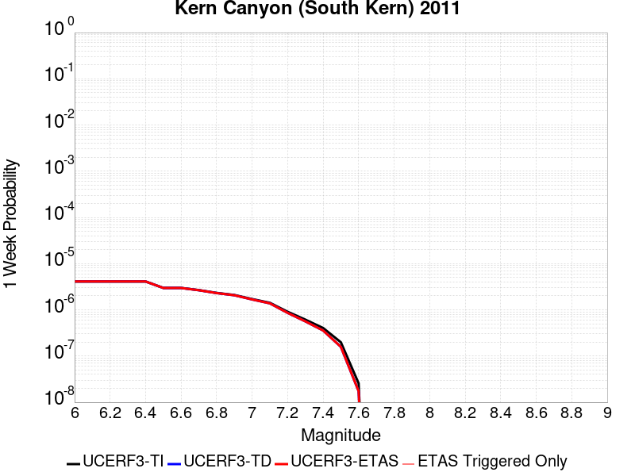 |  |  | 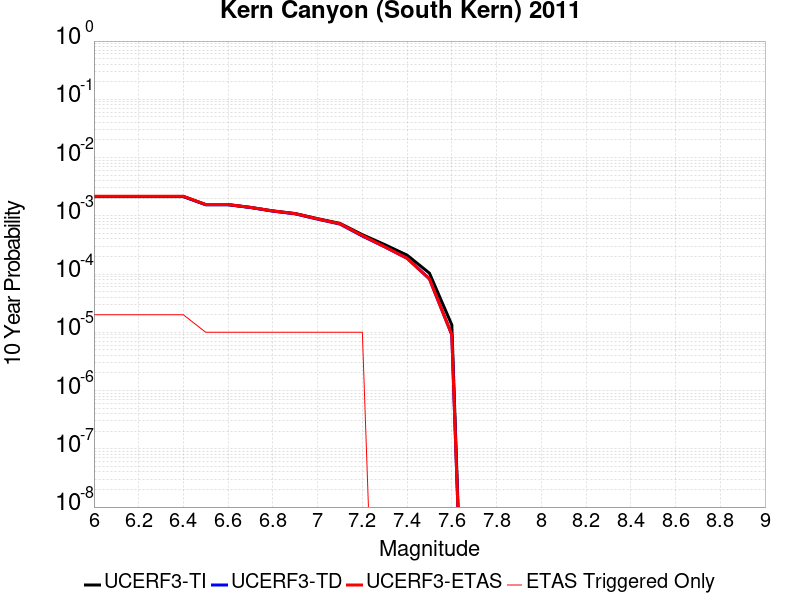 |

| Magnitude | 1 wk TI Prob | 1 wk TD Prob | 1 wk ETAS Prob | 1 wk ETAS/TD Gain | 1 wk ETAS Triggered Only | 1 mo TI Prob | 1 mo TD Prob | 1 mo ETAS Prob | 1 mo ETAS/TD Gain | 1 mo ETAS Triggered Only | 1 yr TI Prob | 1 yr TD Prob | 1 yr ETAS Prob | 1 yr ETAS/TD Gain | 1 yr ETAS Triggered Only | 10 yr TI Prob | 10 yr TD Prob | 10 yr ETAS Prob | 10 yr ETAS/TD Gain | 10 yr ETAS Triggered Only |
|-----|-----|-----|-----|-----|-----|-----|-----|-----|-----|-----|-----|-----|-----|-----|-----|-----|-----|-----|-----|-----|
| 6.0 | 4.105075E-6 | 4.113905E-6 | 4.113905E-6 | 1.0 | 0.0 | 1.7593058E-5 | 1.7630906E-5 | 1.7630906E-5 | 1.0 | 0.0 | 2.1417443E-4 | 2.1463577E-4 | 2.1463577E-4 | 1.0 | 0.0 | 0.0021396813 | 0.0021443486 | 0.0021670861 | 1.0106034 | 2.278631E-5 |
| 6.1 | 4.105075E-6 | 4.113905E-6 | 4.113905E-6 | 1.0 | 0.0 | 1.7593058E-5 | 1.7630906E-5 | 1.7630906E-5 | 1.0 | 0.0 | 2.1417443E-4 | 2.1463577E-4 | 2.1463577E-4 | 1.0 | 0.0 | 0.0021396813 | 0.0021443486 | 0.0021670861 | 1.0106034 | 2.278631E-5 |
| 6.2 | 4.105075E-6 | 4.113905E-6 | 4.113905E-6 | 1.0 | 0.0 | 1.7593058E-5 | 1.7630906E-5 | 1.7630906E-5 | 1.0 | 0.0 | 2.1417443E-4 | 2.1463577E-4 | 2.1463577E-4 | 1.0 | 0.0 | 0.0021396813 | 0.0021443486 | 0.0021670861 | 1.0106034 | 2.278631E-5 |
| 6.3 | 4.105075E-6 | 4.113905E-6 | 4.113905E-6 | 1.0 | 0.0 | 1.7593058E-5 | 1.7630906E-5 | 1.7630906E-5 | 1.0 | 0.0 | 2.1417443E-4 | 2.1463577E-4 | 2.1463577E-4 | 1.0 | 0.0 | 0.0021396813 | 0.0021443486 | 0.0021670861 | 1.0106034 | 2.278631E-5 |
| 6.4 | 4.105075E-6 | 4.113905E-6 | 4.113905E-6 | 1.0 | 0.0 | 1.7593058E-5 | 1.7630906E-5 | 1.7630906E-5 | 1.0 | 0.0 | 2.1417443E-4 | 2.1463577E-4 | 2.1463577E-4 | 1.0 | 0.0 | 0.0021396813 | 0.0021443486 | 0.0021670861 | 1.0106034 | 2.278631E-5 |
| 6.5 | 2.9849807E-6 | 2.973285E-6 | 2.973285E-6 | 1.0 | 0.0 | 1.2792712E-5 | 1.2742589E-5 | 1.2742589E-5 | 1.0 | 0.0 | 1.5574014E-4 | 1.5513012E-4 | 1.5513012E-4 | 1.0 | 0.0 | 0.0015563103 | 0.0015502336 | 0.001561609 | 1.0073379 | 1.1393155E-5 |
| 6.6 | 2.9849807E-6 | 2.973285E-6 | 2.973285E-6 | 1.0 | 0.0 | 1.2792712E-5 | 1.2742589E-5 | 1.2742589E-5 | 1.0 | 0.0 | 1.5574014E-4 | 1.5513012E-4 | 1.5513012E-4 | 1.0 | 0.0 | 0.0015563103 | 0.0015502336 | 0.001561609 | 1.0073379 | 1.1393155E-5 |
| 6.7 | 2.6756725E-6 | 2.658338E-6 | 2.658338E-6 | 1.0 | 0.0 | 1.1467117E-5 | 1.1392827E-5 | 1.1392827E-5 | 1.0 | 0.0 | 1.396032E-4 | 1.3869895E-4 | 1.3869895E-4 | 1.0 | 0.0 | 0.0013951553 | 0.0013861348 | 0.0013975122 | 1.008208 | 1.1393155E-5 |
| 6.8 | 2.3283721E-6 | 2.3048815E-6 | 2.3048815E-6 | 1.0 | 0.0 | 9.9787E-6 | 9.8780265E-6 | 9.8780265E-6 | 1.0 | 0.0 | 1.214839E-4 | 1.2025841E-4 | 1.2025841E-4 | 1.0 | 0.0 | 0.001214175 | 0.0012019408 | 0.0012133203 | 1.0094676 | 1.1393155E-5 |
| 6.9 | 2.0972677E-6 | 2.0697344E-6 | 2.0697344E-6 | 1.0 | 0.0 | 8.988259E-6 | 8.87026E-6 | 8.87026E-6 | 1.0 | 0.0 | 1.0942656E-4 | 1.0799012E-4 | 1.0799012E-4 | 1.0 | 0.0 | 0.0010937268 | 0.0010793823 | 0.0010907631 | 1.0105438 | 1.1393155E-5 |
| 7.0 | 1.7132242E-6 | 1.6787806E-6 | 1.6787806E-6 | 1.0 | 0.0 | 7.3423685E-6 | 7.194754E-6 | 7.194754E-6 | 1.0 | 0.0 | 8.938967E-5 | 8.759265E-5 | 8.759265E-5 | 1.0 | 0.0 | 8.935372E-4 | 8.755851E-4 | 8.869682E-4 | 1.0130006 | 1.1393155E-5 |
| 7.1 | 1.4215541E-6 | 1.3816393E-6 | 1.3816393E-6 | 1.0 | 0.0 | 6.0923603E-6 | 5.921298E-6 | 5.921298E-6 | 1.0 | 0.0 | 7.417196E-5 | 7.2089446E-5 | 7.2089446E-5 | 1.0 | 0.0 | 7.414721E-4 | 7.206633E-4 | 7.3204824E-4 | 1.0157979 | 1.1393155E-5 |
| 7.2 | 9.097853E-7 | 8.6041945E-7 | 8.6041945E-7 | 1.0 | 0.0 | 3.899074E-6 | 3.6875067E-6 | 3.6875067E-6 | 1.0 | 0.0 | 4.7470192E-5 | 4.489448E-5 | 4.489448E-5 | 1.0 | 0.0 | 4.7460053E-4 | 4.488552E-4 | 4.6024323E-4 | 1.0253713 | 1.1393155E-5 |
| 7.3 | 6.144169E-7 | 5.628494E-7 | 5.628494E-7 | 1.0 | 0.0 | 2.6332125E-6 | 2.4122094E-6 | 2.4122094E-6 | 1.0 | 0.0 | 3.205889E-5 | 2.9368259E-5 | 2.9368259E-5 | 1.0 | 0.0 | 3.2054266E-4 | 2.936443E-4 | 2.936443E-4 | 1.0 | 0.0 |
| 7.4 | 4.049844E-7 | 3.573027E-7 | 3.573027E-7 | 1.0 | 0.0 | 1.7356463E-6 | 1.5312963E-6 | 1.5312963E-6 | 1.0 | 0.0 | 2.1131287E-5 | 1.8643375E-5 | 1.8643375E-5 | 1.0 | 0.0 | 2.1129279E-4 | 1.8641837E-4 | 1.8641837E-4 | 1.0 | 0.0 |
| 7.5 | 1.9871162E-7 | 1.5831463E-7 | 1.5831463E-7 | 1.0 | 0.0 | 8.5162094E-7 | 6.784911E-7 | 6.784911E-7 | 1.0 | 0.0 | 1.0368436E-5 | 8.260598E-6 | 8.260598E-6 | 1.0 | 0.0 | 1.0367952E-4 | 8.2603E-5 | 8.2603E-5 | 1.0 | 0.0 |
| 7.6 | 2.572245E-8 | 1.735405E-8 | 1.735405E-8 | 1.0 | 0.0 | 1.10239064E-7 | 7.4374505E-8 | 7.4374505E-8 | 1.0 | 0.0 | 1.3421597E-6 | 9.0550924E-7 | 9.0550924E-7 | 1.0 | 0.0 | 1.3421517E-5 | 9.055061E-6 | 9.055061E-6 | 1.0 | 0.0 |

## San Gabriel (Extension)
*[(top)](#table-of-contents)*

| 1 Week | 1 Month | 1 Year | 10 Year |
|-----|-----|-----|-----|
|  |  |  |  |

| Magnitude | 1 wk TI Prob | 1 wk TD Prob | 1 wk ETAS Prob | 1 wk ETAS/TD Gain | 1 wk ETAS Triggered Only | 1 mo TI Prob | 1 mo TD Prob | 1 mo ETAS Prob | 1 mo ETAS/TD Gain | 1 mo ETAS Triggered Only | 1 yr TI Prob | 1 yr TD Prob | 1 yr ETAS Prob | 1 yr ETAS/TD Gain | 1 yr ETAS Triggered Only | 10 yr TI Prob | 10 yr TD Prob | 10 yr ETAS Prob | 10 yr ETAS/TD Gain | 10 yr ETAS Triggered Only |
|-----|-----|-----|-----|-----|-----|-----|-----|-----|-----|-----|-----|-----|-----|-----|-----|-----|-----|-----|-----|-----|
| 6.0 | 5.6486106E-6 | 5.7223997E-6 | 5.7223997E-6 | 1.0 | 0.0 | 2.4208108E-5 | 2.4524346E-5 | 2.4524346E-5 | 1.0 | 0.0 | 2.9469383E-4 | 2.9854427E-4 | 2.9854427E-4 | 1.0 | 0.0 | 0.0029430336 | 0.0029815638 | 0.003004282 | 1.0076196 | 2.278631E-5 |
| 6.1 | 5.6486106E-6 | 5.7223997E-6 | 5.7223997E-6 | 1.0 | 0.0 | 2.4208108E-5 | 2.4524346E-5 | 2.4524346E-5 | 1.0 | 0.0 | 2.9469383E-4 | 2.9854427E-4 | 2.9854427E-4 | 1.0 | 0.0 | 0.0029430336 | 0.0029815638 | 0.003004282 | 1.0076196 | 2.278631E-5 |
| 6.2 | 5.6486106E-6 | 5.7223997E-6 | 5.7223997E-6 | 1.0 | 0.0 | 2.4208108E-5 | 2.4524346E-5 | 2.4524346E-5 | 1.0 | 0.0 | 2.9469383E-4 | 2.9854427E-4 | 2.9854427E-4 | 1.0 | 0.0 | 0.0029430336 | 0.0029815638 | 0.003004282 | 1.0076196 | 2.278631E-5 |
| 6.3 | 5.6486106E-6 | 5.7223997E-6 | 5.7223997E-6 | 1.0 | 0.0 | 2.4208108E-5 | 2.4524346E-5 | 2.4524346E-5 | 1.0 | 0.0 | 2.9469383E-4 | 2.9854427E-4 | 2.9854427E-4 | 1.0 | 0.0 | 0.0029430336 | 0.0029815638 | 0.003004282 | 1.0076196 | 2.278631E-5 |
| 6.4 | 5.6486106E-6 | 5.7223997E-6 | 5.7223997E-6 | 1.0 | 0.0 | 2.4208108E-5 | 2.4524346E-5 | 2.4524346E-5 | 1.0 | 0.0 | 2.9469383E-4 | 2.9854427E-4 | 2.9854427E-4 | 1.0 | 0.0 | 0.0029430336 | 0.0029815638 | 0.003004282 | 1.0076196 | 2.278631E-5 |
| 6.5 | 4.7134554E-6 | 4.759758E-6 | 4.759758E-6 | 1.0 | 0.0 | 2.0200367E-5 | 2.039881E-5 | 2.039881E-5 | 1.0 | 0.0 | 2.459117E-4 | 2.4832806E-4 | 2.4832806E-4 | 1.0 | 0.0 | 0.0024563975 | 0.0024805951 | 0.0025033248 | 1.009163 | 2.278631E-5 |
| 6.6 | 4.7134554E-6 | 4.759758E-6 | 4.759758E-6 | 1.0 | 0.0 | 2.0200367E-5 | 2.039881E-5 | 2.039881E-5 | 1.0 | 0.0 | 2.459117E-4 | 2.4832806E-4 | 2.4832806E-4 | 1.0 | 0.0 | 0.0024563975 | 0.0024805951 | 0.0025033248 | 1.009163 | 2.278631E-5 |
| 6.7 | 4.2468837E-6 | 4.279543E-6 | 4.279543E-6 | 1.0 | 0.0 | 1.8200803E-5 | 1.8340776E-5 | 1.8340776E-5 | 1.0 | 0.0 | 2.2157225E-4 | 2.2327679E-4 | 2.2327679E-4 | 1.0 | 0.0 | 0.0022135144 | 0.0022306016 | 0.002253337 | 1.0101925 | 2.278631E-5 |
| 6.8 | 4.1180615E-6 | 4.146924E-6 | 4.146924E-6 | 1.0 | 0.0 | 1.7648716E-5 | 1.7772414E-5 | 1.7772414E-5 | 1.0 | 0.0 | 2.1485193E-4 | 2.1635837E-4 | 2.1635837E-4 | 1.0 | 0.0 | 0.0021464431 | 0.0021615536 | 0.0021729222 | 1.0052594 | 1.1393155E-5 |
| 6.9 | 3.863861E-6 | 3.8852213E-6 | 3.8852213E-6 | 1.0 | 0.0 | 1.65593E-5 | 1.6650847E-5 | 1.6650847E-5 | 1.0 | 0.0 | 2.0159081E-4 | 2.0270588E-4 | 2.0270588E-4 | 1.0 | 0.0 | 0.0020140803 | 0.0020252825 | 0.0020366525 | 1.005614 | 1.1393155E-5 |
| 7.0 | 3.6947372E-6 | 3.7111088E-6 | 3.7111088E-6 | 1.0 | 0.0 | 1.5834492E-5 | 1.590466E-5 | 1.590466E-5 | 1.0 | 0.0 | 1.9276788E-4 | 1.9362269E-4 | 1.9362269E-4 | 1.0 | 0.0 | 0.0019260074 | 0.0019346114 | 0.0019459825 | 1.0058777 | 1.1393155E-5 |
| 7.1 | 3.5686835E-6 | 3.5783107E-6 | 3.5783107E-6 | 1.0 | 0.0 | 1.5294268E-5 | 1.533553E-5 | 1.533553E-5 | 1.0 | 0.0 | 1.861918E-4 | 1.8669476E-4 | 1.8669476E-4 | 1.0 | 0.0 | 0.0018603588 | 0.00186545 | 0.0018768219 | 1.006096 | 1.1393155E-5 |
| 7.2 | 2.8023446E-6 | 2.7821236E-6 | 2.7821236E-6 | 1.0 | 0.0 | 1.2009994E-5 | 1.1923333E-5 | 1.1923333E-5 | 1.0 | 0.0 | 1.4621185E-4 | 1.4515701E-4 | 1.4515701E-4 | 1.0 | 0.0 | 0.001461157 | 0.0014506378 | 0.0014620145 | 1.0078425 | 1.1393155E-5 |
| 7.3 | 2.5843012E-6 | 2.5512463E-6 | 2.5512463E-6 | 1.0 | 0.0 | 1.1075529E-5 | 1.0933867E-5 | 1.0933867E-5 | 1.0 | 0.0 | 1.3483623E-4 | 1.331118E-4 | 1.331118E-4 | 1.0 | 0.0 | 0.0013475444 | 0.0013303354 | 0.0013417134 | 1.0085527 | 1.1393155E-5 |
| 7.4 | 2.4464468E-6 | 2.4018714E-6 | 2.4018714E-6 | 1.0 | 0.0 | 1.04847295E-5 | 1.0293694E-5 | 1.0293694E-5 | 1.0 | 0.0 | 1.276441E-4 | 1.2531862E-4 | 1.2531862E-4 | 1.0 | 0.0 | 0.0012757082 | 0.001252494 | 0.0012638728 | 1.0090849 | 1.1393155E-5 |
| 7.5 | 2.0420266E-6 | 1.8956414E-6 | 1.8956414E-6 | 1.0 | 0.0 | 8.751514E-6 | 8.124152E-6 | 8.124152E-6 | 1.0 | 0.0 | 1.0654447E-4 | 9.89071E-5 | 9.89071E-5 | 1.0 | 0.0 | 0.001064934 | 9.886391E-4 | 0.001000021 | 1.0115126 | 1.1393155E-5 |
| 7.6 | 1.8326596E-6 | 1.6441292E-6 | 1.6441292E-6 | 1.0 | 0.0 | 7.854232E-6 | 7.046249E-6 | 7.046249E-6 | 1.0 | 0.0 | 9.562107E-5 | 8.5784726E-5 | 8.5784726E-5 | 1.0 | 0.0 | 9.5579936E-4 | 8.5752335E-4 | 8.5752335E-4 | 1.0 | 0.0 |
| 7.7 | 1.4786998E-6 | 1.256324E-6 | 1.256324E-6 | 1.0 | 0.0 | 6.3372695E-6 | 5.3842346E-6 | 5.3842346E-6 | 1.0 | 0.0 | 7.715353E-5 | 6.5551096E-5 | 6.5551096E-5 | 1.0 | 0.0 | 7.7126746E-4 | 6.5532426E-4 | 6.5532426E-4 | 1.0 | 0.0 |
| 7.8 | 7.6975533E-7 | 6.1024804E-7 | 6.1024804E-7 | 1.0 | 0.0 | 3.2989474E-6 | 2.6153461E-6 | 2.6153461E-6 | 1.0 | 0.0 | 4.0163945E-5 | 3.1841377E-5 | 3.1841377E-5 | 1.0 | 0.0 | 4.0156685E-4 | 3.183734E-4 | 3.183734E-4 | 1.0 | 0.0 |
| 7.9 | 1.7645915E-7 | 9.3048186E-8 | 9.3048186E-8 | 1.0 | 0.0 | 7.562533E-7 | 3.9877787E-7 | 3.9877787E-7 | 1.0 | 0.0 | 9.207345E-6 | 4.8551096E-6 | 4.8551096E-6 | 1.0 | 0.0 | 9.206964E-5 | 4.8555103E-5 | 4.8555103E-5 | 1.0 | 0.0 |
| 8.0 | 1.0463461E-7 | 2.5333872E-8 | 2.5333872E-8 | 1.0 | 0.0 | 4.4843398E-7 | 1.0857374E-7 | 1.0857374E-7 | 1.0 | 0.0 | 5.45967E-6 | 1.3218844E-6 | 1.3218844E-6 | 1.0 | 0.0 | 5.459536E-5 | 1.3223823E-5 | 1.3223823E-5 | 1.0 | 0.0 |
| 8.1 | 7.875717E-8 | 1.4118189E-8 | 1.4118189E-8 | 1.0 | 0.0 | 3.3753068E-7 | 6.050652E-8 | 6.050652E-8 | 1.0 | 0.0 | 4.109428E-6 | 7.366666E-7 | 7.366666E-7 | 1.0 | 0.0 | 4.109352E-5 | 7.3716988E-6 | 7.3716988E-6 | 1.0 | 0.0 |
| 8.2 | 1.33163E-8 | 1.8095626E-9 | 1.8095626E-9 | 1.0 | 0.0 | 5.7069855E-8 | 7.755267E-9 | 7.755267E-9 | 1.0 | 0.0 | 6.9482525E-7 | 9.442037E-8 | 9.442037E-8 | 1.0 | 0.0 | 6.9482307E-6 | 9.461835E-7 | 9.461835E-7 | 1.0 | 0.0 |

## Cerro Prieto
*[(top)](#table-of-contents)*

| 1 Week | 1 Month | 1 Year | 10 Year |
|-----|-----|-----|-----|
|  |  |  |  |

| Magnitude | 1 wk TI Prob | 1 wk TD Prob | 1 wk ETAS Prob | 1 wk ETAS/TD Gain | 1 wk ETAS Triggered Only | 1 mo TI Prob | 1 mo TD Prob | 1 mo ETAS Prob | 1 mo ETAS/TD Gain | 1 mo ETAS Triggered Only | 1 yr TI Prob | 1 yr TD Prob | 1 yr ETAS Prob | 1 yr ETAS/TD Gain | 1 yr ETAS Triggered Only | 10 yr TI Prob | 10 yr TD Prob | 10 yr ETAS Prob | 10 yr ETAS/TD Gain | 10 yr ETAS Triggered Only |
|-----|-----|-----|-----|-----|-----|-----|-----|-----|-----|-----|-----|-----|-----|-----|-----|-----|-----|-----|-----|-----|
| 6.0 | 2.9101528E-4 | 5.984332E-4 | 5.984332E-4 | 1.0 | 0.0 | 0.0012466122 | 0.0025624363 | 0.0025624363 | 1.0 | 0.0 | 0.015072231 | 0.030711513 | 0.030711513 | 1.0 | 0.0 | 0.14089979 | 0.25462848 | 0.25464547 | 1.0000668 | 2.278631E-5 |
| 6.1 | 2.9101528E-4 | 5.984332E-4 | 5.984332E-4 | 1.0 | 0.0 | 0.0012466122 | 0.0025624363 | 0.0025624363 | 1.0 | 0.0 | 0.015072231 | 0.030711513 | 0.030711513 | 1.0 | 0.0 | 0.14089979 | 0.25462848 | 0.25464547 | 1.0000668 | 2.278631E-5 |
| 6.2 | 2.9101528E-4 | 5.984332E-4 | 5.984332E-4 | 1.0 | 0.0 | 0.0012466122 | 0.0025624363 | 0.0025624363 | 1.0 | 0.0 | 0.015072231 | 0.030711513 | 0.030711513 | 1.0 | 0.0 | 0.14089979 | 0.25462848 | 0.25464547 | 1.0000668 | 2.278631E-5 |
| 6.3 | 2.9101528E-4 | 5.984332E-4 | 5.984332E-4 | 1.0 | 0.0 | 0.0012466122 | 0.0025624363 | 0.0025624363 | 1.0 | 0.0 | 0.015072231 | 0.030711513 | 0.030711513 | 1.0 | 0.0 | 0.14089979 | 0.25462848 | 0.25464547 | 1.0000668 | 2.278631E-5 |
| 6.4 | 2.508648E-4 | 5.158287E-4 | 5.158287E-4 | 1.0 | 0.0 | 0.0010746918 | 0.0022090215 | 0.0022090215 | 1.0 | 0.0 | 0.013006088 | 0.026538353 | 0.026538353 | 1.0 | 0.0 | 0.12270685 | 0.22508182 | 0.22509947 | 1.0000784 | 2.278631E-5 |
| 6.5 | 2.508648E-4 | 5.158287E-4 | 5.158287E-4 | 1.0 | 0.0 | 0.0010746918 | 0.0022090215 | 0.0022090215 | 1.0 | 0.0 | 0.013006088 | 0.026538353 | 0.026538353 | 1.0 | 0.0 | 0.12270685 | 0.22508182 | 0.22509947 | 1.0000784 | 2.278631E-5 |
| 6.6 | 2.294914E-4 | 4.729627E-4 | 4.729627E-4 | 1.0 | 0.0 | 9.831638E-4 | 0.0020255973 | 0.0020255973 | 1.0 | 0.0 | 0.011904482 | 0.024370646 | 0.024370646 | 1.0 | 0.0 | 0.11286586 | 0.20927969 | 0.2092977 | 1.0000861 | 2.278631E-5 |
| 6.7 | 1.9621674E-4 | 4.0589322E-4 | 4.0589322E-4 | 1.0 | 0.0 | 8.4065786E-4 | 0.0017385423 | 0.0017385423 | 1.0 | 0.0 | 0.010187071 | 0.02098288 | 0.02098288 | 1.0 | 0.0 | 0.09732539 | 0.1835529 | 0.1835715 | 1.0001013 | 2.278631E-5 |
| 6.8 | 1.5476145E-4 | 3.0705362E-4 | 3.0705362E-4 | 1.0 | 0.0 | 6.6309475E-4 | 0.0013153836 | 0.0013153836 | 1.0 | 0.0 | 0.008043335 | 0.015895057 | 0.015895057 | 1.0 | 0.0 | 0.07758363 | 0.14394037 | 0.1439599 | 1.0001355 | 2.278631E-5 |
| 6.9 | 1.20509176E-4 | 2.2695535E-4 | 2.2695535E-4 | 1.0 | 0.0 | 5.1636563E-4 | 9.723671E-4 | 9.723671E-4 | 1.0 | 0.0 | 0.006268645 | 0.011789353 | 0.011789353 | 1.0 | 0.0 | 0.060947374 | 0.10996533 | 0.10997547 | 1.0000923 | 1.1393155E-5 |
| 7.0 | 9.3269155E-5 | 1.6807506E-4 | 1.6807506E-4 | 1.0 | 0.0 | 3.9966372E-4 | 7.2016637E-4 | 7.2016637E-4 | 1.0 | 0.0 | 0.0048550544 | 0.008740508 | 0.008740508 | 1.0 | 0.0 | 0.04750344 | 0.08357218 | 0.08358262 | 1.0001249 | 1.1393155E-5 |
| 7.1 | 5.029709E-5 | 8.2223094E-5 | 8.2223094E-5 | 1.0 | 0.0 | 2.1554115E-4 | 3.523566E-4 | 3.523566E-4 | 1.0 | 0.0 | 0.0026210553 | 0.0042849593 | 0.0042849593 | 1.0 | 0.0 | 0.025903556 | 0.042681713 | 0.042681713 | 1.0 | 0.0 |
| 7.2 | 6.5445185E-8 | 6.9259464E-8 | 6.9259464E-8 | 1.0 | 0.0 | 2.8047933E-7 | 2.9682627E-7 | 2.9682627E-7 | 1.0 | 0.0 | 3.4148304E-6 | 3.61386E-6 | 3.61386E-6 | 1.0 | 0.0 | 3.414778E-5 | 3.6138597E-5 | 3.6138597E-5 | 1.0 | 0.0 |

## Malibu Coast (Extension) alt 1
*[(top)](#table-of-contents)*

| 1 Week | 1 Month | 1 Year | 10 Year |
|-----|-----|-----|-----|
|  |  |  | 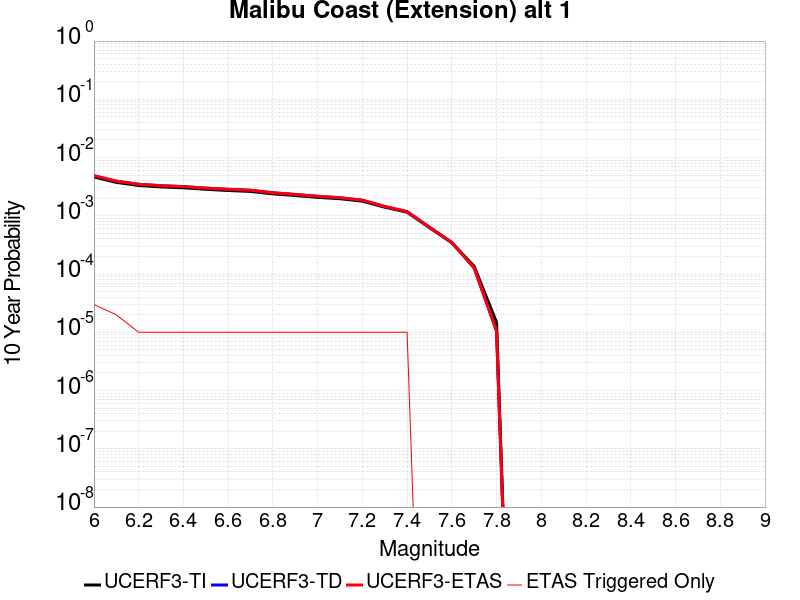 |

| Magnitude | 1 wk TI Prob | 1 wk TD Prob | 1 wk ETAS Prob | 1 wk ETAS/TD Gain | 1 wk ETAS Triggered Only | 1 mo TI Prob | 1 mo TD Prob | 1 mo ETAS Prob | 1 mo ETAS/TD Gain | 1 mo ETAS Triggered Only | 1 yr TI Prob | 1 yr TD Prob | 1 yr ETAS Prob | 1 yr ETAS/TD Gain | 1 yr ETAS Triggered Only | 10 yr TI Prob | 10 yr TD Prob | 10 yr ETAS Prob | 10 yr ETAS/TD Gain | 10 yr ETAS Triggered Only |
|-----|-----|-----|-----|-----|-----|-----|-----|-----|-----|-----|-----|-----|-----|-----|-----|-----|-----|-----|-----|-----|
| 6.0 | 8.930738E-6 | 9.330624E-6 | 9.330624E-6 | 1.0 | 0.0 | 3.827403E-5 | 3.998779E-5 | 3.998779E-5 | 1.0 | 0.0 | 4.6588664E-4 | 4.867443E-4 | 4.981319E-4 | 1.0233954 | 1.1393155E-5 | 0.0046491115 | 0.0048569646 | 0.0048796404 | 1.0046687 | 2.278631E-5 |
| 6.1 | 7.199952E-6 | 7.5314815E-6 | 7.5314815E-6 | 1.0 | 0.0 | 3.0856572E-5 | 3.227738E-5 | 3.227738E-5 | 1.0 | 0.0 | 3.75614E-4 | 3.9290686E-4 | 3.9290686E-4 | 1.0 | 0.0 | 0.0037497976 | 0.003922188 | 0.003933537 | 1.0028934 | 1.1393155E-5 |
| 6.2 | 6.3721413E-6 | 6.6678904E-6 | 6.6678904E-6 | 1.0 | 0.0 | 2.7308892E-5 | 2.8576364E-5 | 2.8576364E-5 | 1.0 | 0.0 | 3.3243504E-4 | 3.4786202E-4 | 3.4786202E-4 | 1.0 | 0.0 | 0.0033193815 | 0.0034732153 | 0.0034732153 | 1.0 | 0.0 |
| 6.3 | 6.016345E-6 | 6.296219E-6 | 6.296219E-6 | 1.0 | 0.0 | 2.578408E-5 | 2.6983518E-5 | 2.6983518E-5 | 1.0 | 0.0 | 3.1387596E-4 | 3.2847514E-4 | 3.2847514E-4 | 1.0 | 0.0 | 0.00313433 | 0.0032799323 | 0.0032799323 | 1.0 | 0.0 |
| 6.4 | 5.8104883E-6 | 6.0805814E-6 | 6.0805814E-6 | 1.0 | 0.0 | 2.4901856E-5 | 2.6059377E-5 | 2.6059377E-5 | 1.0 | 0.0 | 3.031379E-4 | 3.1722704E-4 | 3.1722704E-4 | 1.0 | 0.0 | 0.0030272473 | 0.0031677769 | 0.0031677769 | 1.0 | 0.0 |
| 6.5 | 5.476925E-6 | 5.728505E-6 | 5.728505E-6 | 1.0 | 0.0 | 2.3472323E-5 | 2.4550507E-5 | 2.4550507E-5 | 1.0 | 0.0 | 2.8573806E-4 | 2.988617E-4 | 2.988617E-4 | 1.0 | 0.0 | 0.0028537093 | 0.00298463 | 0.00298463 | 1.0 | 0.0 |
| 6.6 | 5.222387E-6 | 5.4595366E-6 | 5.4595366E-6 | 1.0 | 0.0 | 2.2381464E-5 | 2.3397804E-5 | 2.3397804E-5 | 1.0 | 0.0 | 2.7246025E-4 | 2.8483133E-4 | 2.8483133E-4 | 1.0 | 0.0 | 0.0027212645 | 0.0028446934 | 0.0028446934 | 1.0 | 0.0 |
| 6.7 | 5.0337076E-6 | 5.2600335E-6 | 5.2600335E-6 | 1.0 | 0.0 | 2.1572854E-5 | 2.2542807E-5 | 2.2542807E-5 | 1.0 | 0.0 | 2.6261783E-4 | 2.7442438E-4 | 2.7442438E-4 | 1.0 | 0.0 | 0.002623077 | 0.0027408851 | 0.0027408851 | 1.0 | 0.0 |
| 6.8 | 4.5675624E-6 | 4.7595618E-6 | 4.7595618E-6 | 1.0 | 0.0 | 1.9575122E-5 | 2.0397963E-5 | 2.0397963E-5 | 1.0 | 0.0 | 2.3830103E-4 | 2.4831708E-4 | 2.4831708E-4 | 1.0 | 0.0 | 0.0023804565 | 0.0024804159 | 0.0024804159 | 1.0 | 0.0 |
| 6.9 | 4.2802412E-6 | 4.452818E-6 | 4.452818E-6 | 1.0 | 0.0 | 1.8343762E-5 | 1.9083367E-5 | 1.9083367E-5 | 1.0 | 0.0 | 2.2331243E-4 | 2.3231537E-4 | 2.3231537E-4 | 1.0 | 0.0 | 0.0022308815 | 0.0023207418 | 0.0023207418 | 1.0 | 0.0 |
| 7.0 | 3.9794063E-6 | 4.130844E-6 | 4.130844E-6 | 1.0 | 0.0 | 1.7054486E-5 | 1.7703498E-5 | 1.7703498E-5 | 1.0 | 0.0 | 2.0761859E-4 | 2.155189E-4 | 2.155189E-4 | 1.0 | 0.0 | 0.0020742472 | 0.0021531123 | 0.0021531123 | 1.0 | 0.0 |
| 7.1 | 3.7730424E-6 | 3.9119313E-6 | 3.9119313E-6 | 1.0 | 0.0 | 1.6170083E-5 | 1.6765312E-5 | 1.6765312E-5 | 1.0 | 0.0 | 1.9685295E-4 | 2.0409869E-4 | 2.0409869E-4 | 1.0 | 0.0 | 0.0019667868 | 0.0020391252 | 0.0020391252 | 1.0 | 0.0 |
| 7.2 | 3.424985E-6 | 3.5419976E-6 | 3.5419976E-6 | 1.0 | 0.0 | 1.4678424E-5 | 1.5179901E-5 | 1.5179901E-5 | 1.0 | 0.0 | 1.7869516E-4 | 1.8479973E-4 | 1.8479973E-4 | 1.0 | 0.0 | 0.0017855153 | 0.0018464727 | 0.0018464727 | 1.0 | 0.0 |
| 7.3 | 2.6966375E-6 | 2.7601811E-6 | 2.7601811E-6 | 1.0 | 0.0 | 1.15569665E-5 | 1.1829295E-5 | 1.1829295E-5 | 1.0 | 0.0 | 1.4069698E-4 | 1.4401217E-4 | 1.4401217E-4 | 1.0 | 0.0 | 0.0014060794 | 0.0014391927 | 0.0014391927 | 1.0 | 0.0 |
| 7.4 | 2.215957E-6 | 2.2498289E-6 | 2.2498289E-6 | 1.0 | 0.0 | 9.496924E-6 | 9.642088E-6 | 9.642088E-6 | 1.0 | 0.0 | 1.1561892E-4 | 1.1738613E-4 | 1.1738613E-4 | 1.0 | 0.0 | 0.0011555878 | 0.001173245 | 0.001173245 | 1.0 | 0.0 |
| 7.5 | 1.2040218E-6 | 1.2221219E-6 | 1.2221219E-6 | 1.0 | 0.0 | 5.160083E-6 | 5.237655E-6 | 5.237655E-6 | 1.0 | 0.0 | 6.2822204E-5 | 6.37666E-5 | 6.37666E-5 | 1.0 | 0.0 | 6.280445E-4 | 6.374849E-4 | 6.374849E-4 | 1.0 | 0.0 |
| 7.6 | 6.6157446E-7 | 6.6800027E-7 | 6.6800027E-7 | 1.0 | 0.0 | 2.835316E-6 | 2.8628554E-6 | 2.8628554E-6 | 1.0 | 0.0 | 3.4519428E-5 | 3.4854722E-5 | 3.4854722E-5 | 1.0 | 0.0 | 3.4514067E-4 | 3.4849407E-4 | 3.4849407E-4 | 1.0 | 0.0 |
| 7.7 | 2.6012302E-7 | 2.4361185E-7 | 2.4361185E-7 | 1.0 | 0.0 | 1.1148124E-6 | 1.0440505E-6 | 1.0440505E-6 | 1.0 | 0.0 | 1.3572758E-5 | 1.2711251E-5 | 1.2711251E-5 | 1.0 | 0.0 | 1.3571928E-4 | 1.2710631E-4 | 1.2710631E-4 | 1.0 | 0.0 |
| 7.8 | 2.8323132E-8 | 2.026981E-8 | 2.026981E-8 | 1.0 | 0.0 | 1.2138484E-7 | 8.687062E-8 | 8.687062E-8 | 1.0 | 0.0 | 1.4778595E-6 | 1.0576493E-6 | 1.0576493E-6 | 1.0 | 0.0 | 1.4778497E-5 | 1.0576451E-5 | 1.0576451E-5 | 1.0 | 0.0 |

## Cucamonga
*[(top)](#table-of-contents)*

| 1 Week | 1 Month | 1 Year | 10 Year |
|-----|-----|-----|-----|
|  | 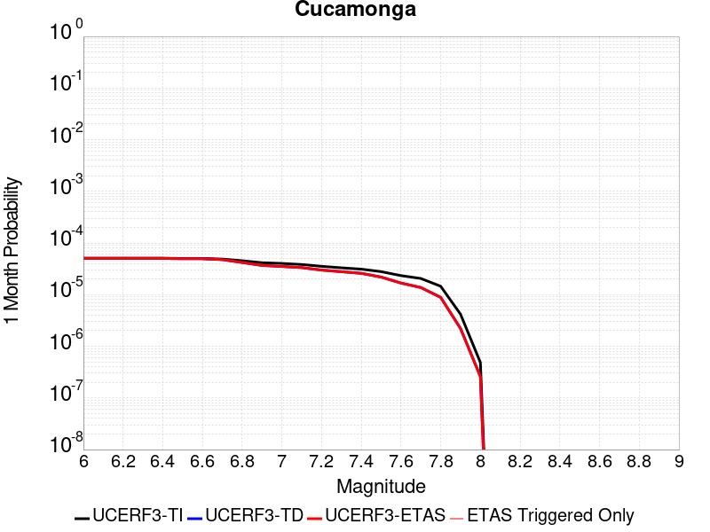 | 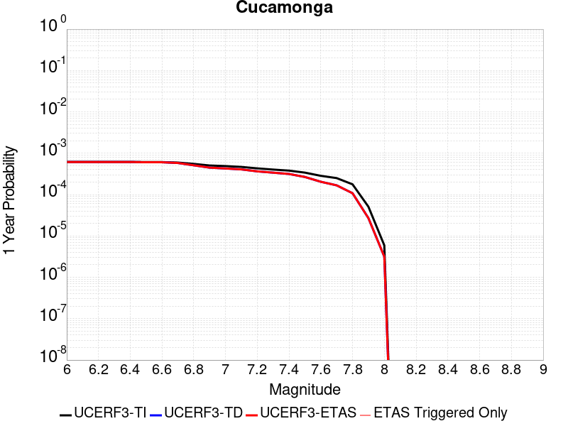 |  |

| Magnitude | 1 wk TI Prob | 1 wk TD Prob | 1 wk ETAS Prob | 1 wk ETAS/TD Gain | 1 wk ETAS Triggered Only | 1 mo TI Prob | 1 mo TD Prob | 1 mo ETAS Prob | 1 mo ETAS/TD Gain | 1 mo ETAS Triggered Only | 1 yr TI Prob | 1 yr TD Prob | 1 yr ETAS Prob | 1 yr ETAS/TD Gain | 1 yr ETAS Triggered Only | 10 yr TI Prob | 10 yr TD Prob | 10 yr ETAS Prob | 10 yr ETAS/TD Gain | 10 yr ETAS Triggered Only |
|-----|-----|-----|-----|-----|-----|-----|-----|-----|-----|-----|-----|-----|-----|-----|-----|-----|-----|-----|-----|-----|
| 6.0 | 1.1848348E-5 | 1.1749691E-5 | 1.1749691E-5 | 1.0 | 0.0 | 5.0777642E-5 | 5.035486E-5 | 5.035486E-5 | 1.0 | 0.0 | 6.180424E-4 | 6.129007E-4 | 6.129007E-4 | 1.0 | 0.0 | 0.0061632637 | 0.006113223 | 0.00613587 | 1.0037045 | 2.278631E-5 |
| 6.1 | 1.1848348E-5 | 1.1749691E-5 | 1.1749691E-5 | 1.0 | 0.0 | 5.0777642E-5 | 5.035486E-5 | 5.035486E-5 | 1.0 | 0.0 | 6.180424E-4 | 6.129007E-4 | 6.129007E-4 | 1.0 | 0.0 | 0.0061632637 | 0.006113223 | 0.00613587 | 1.0037045 | 2.278631E-5 |
| 6.2 | 1.1848348E-5 | 1.1749691E-5 | 1.1749691E-5 | 1.0 | 0.0 | 5.0777642E-5 | 5.035486E-5 | 5.035486E-5 | 1.0 | 0.0 | 6.180424E-4 | 6.129007E-4 | 6.129007E-4 | 1.0 | 0.0 | 0.0061632637 | 0.006113223 | 0.00613587 | 1.0037045 | 2.278631E-5 |
| 6.3 | 1.1848348E-5 | 1.1749691E-5 | 1.1749691E-5 | 1.0 | 0.0 | 5.0777642E-5 | 5.035486E-5 | 5.035486E-5 | 1.0 | 0.0 | 6.180424E-4 | 6.129007E-4 | 6.129007E-4 | 1.0 | 0.0 | 0.0061632637 | 0.006113223 | 0.00613587 | 1.0037045 | 2.278631E-5 |
| 6.4 | 1.1848348E-5 | 1.1749691E-5 | 1.1749691E-5 | 1.0 | 0.0 | 5.0777642E-5 | 5.035486E-5 | 5.035486E-5 | 1.0 | 0.0 | 6.180424E-4 | 6.129007E-4 | 6.129007E-4 | 1.0 | 0.0 | 0.0061632637 | 0.006113223 | 0.00613587 | 1.0037045 | 2.278631E-5 |
| 6.5 | 1.16988695E-5 | 1.1588693E-5 | 1.1588693E-5 | 1.0 | 0.0 | 5.013705E-5 | 4.9664897E-5 | 4.9664897E-5 | 1.0 | 0.0 | 6.102476E-4 | 6.04505E-4 | 6.04505E-4 | 1.0 | 0.0 | 0.006085745 | 0.0060297227 | 0.0060523716 | 1.0037562 | 2.278631E-5 |
| 6.6 | 1.16988695E-5 | 1.1588693E-5 | 1.1588693E-5 | 1.0 | 0.0 | 5.013705E-5 | 4.9664897E-5 | 4.9664897E-5 | 1.0 | 0.0 | 6.102476E-4 | 6.04505E-4 | 6.04505E-4 | 1.0 | 0.0 | 0.006085745 | 0.0060297227 | 0.0060523716 | 1.0037562 | 2.278631E-5 |
| 6.7 | 1.1397107E-5 | 1.1127292E-5 | 1.1127292E-5 | 1.0 | 0.0 | 4.884383E-5 | 4.7687536E-5 | 4.7687536E-5 | 1.0 | 0.0 | 5.9451134E-4 | 5.804436E-4 | 5.804436E-4 | 1.0 | 0.0 | 0.005929234 | 0.0057903705 | 0.0058130245 | 1.0039124 | 2.278631E-5 |
| 6.8 | 1.058387E-5 | 9.795913E-6 | 9.795913E-6 | 1.0 | 0.0 | 4.5358654E-5 | 4.1981813E-5 | 4.1981813E-5 | 1.0 | 0.0 | 5.521017E-4 | 5.110098E-4 | 5.110098E-4 | 1.0 | 0.0 | 0.00550732 | 0.0050993003 | 0.0051219705 | 1.0044457 | 2.278631E-5 |
| 6.9 | 9.690046E-6 | 8.589481E-6 | 8.589481E-6 | 1.0 | 0.0 | 4.1528107E-5 | 3.6811543E-5 | 3.6811543E-5 | 1.0 | 0.0 | 5.054874E-4 | 4.4808877E-4 | 4.4808877E-4 | 1.0 | 0.0 | 0.005043391 | 0.0044727307 | 0.0044954154 | 1.0050718 | 2.278631E-5 |
| 7.0 | 9.381461E-6 | 8.196855E-6 | 8.196855E-6 | 1.0 | 0.0 | 4.020564E-5 | 3.5128905E-5 | 3.5128905E-5 | 1.0 | 0.0 | 4.893937E-4 | 4.2761085E-4 | 4.2761085E-4 | 1.0 | 0.0 | 0.0048831734 | 0.004268756 | 0.004291445 | 1.0053152 | 2.278631E-5 |
| 7.1 | 8.946492E-6 | 7.79146E-6 | 7.79146E-6 | 1.0 | 0.0 | 3.8341543E-5 | 3.339155E-5 | 3.339155E-5 | 1.0 | 0.0 | 4.667083E-4 | 4.0646657E-4 | 4.0646657E-4 | 1.0 | 0.0 | 0.0046572937 | 0.0040581096 | 0.0040808036 | 1.0055922 | 2.278631E-5 |
| 7.2 | 8.251016E-6 | 6.98425E-6 | 6.98425E-6 | 1.0 | 0.0 | 3.5361016E-5 | 2.9932158E-5 | 2.9932158E-5 | 1.0 | 0.0 | 4.3043532E-4 | 3.6436334E-4 | 3.6436334E-4 | 1.0 | 0.0 | 0.0042960253 | 0.0036385364 | 0.0036612398 | 1.0062397 | 2.278631E-5 |
| 7.3 | 7.717881E-6 | 6.4950573E-6 | 6.4950573E-6 | 1.0 | 0.0 | 3.3076216E-5 | 2.7835664E-5 | 2.7835664E-5 | 1.0 | 0.0 | 4.026285E-4 | 3.3884673E-4 | 3.3884673E-4 | 1.0 | 0.0 | 0.004018998 | 0.003384185 | 0.0034068942 | 1.0067104 | 2.278631E-5 |
| 7.4 | 7.275623E-6 | 6.040386E-6 | 6.040386E-6 | 1.0 | 0.0 | 3.118087E-5 | 2.5887111E-5 | 2.5887111E-5 | 1.0 | 0.0 | 3.7956095E-4 | 3.1513022E-4 | 3.1513022E-4 | 1.0 | 0.0 | 0.0037891332 | 0.0031477152 | 0.0031704297 | 1.0072162 | 2.278631E-5 |
| 7.5 | 6.5109502E-6 | 5.1081265E-6 | 5.1081265E-6 | 1.0 | 0.0 | 2.7903774E-5 | 2.1891787E-5 | 2.1891787E-5 | 1.0 | 0.0 | 3.3967546E-4 | 2.6650005E-4 | 2.6650005E-4 | 1.0 | 0.0 | 0.0033915674 | 0.002662672 | 0.0026853976 | 1.0085349 | 2.278631E-5 |
| 7.6 | 5.4495326E-6 | 3.91533E-6 | 3.91533E-6 | 1.0 | 0.0 | 2.335493E-5 | 1.6779879E-5 | 1.6779879E-5 | 1.0 | 0.0 | 2.8430918E-4 | 2.0427594E-4 | 2.0427594E-4 | 1.0 | 0.0 | 0.0028394572 | 0.0020417448 | 0.0020417448 | 1.0 | 0.0 |
| 7.7 | 4.7997164E-6 | 3.206392E-6 | 3.206392E-6 | 1.0 | 0.0 | 2.057005E-5 | 1.3741607E-5 | 1.3741607E-5 | 1.0 | 0.0 | 2.504116E-4 | 1.6729126E-4 | 1.6729126E-4 | 1.0 | 0.0 | 0.002501296 | 0.0016725198 | 0.0016725198 | 1.0 | 0.0 |
| 7.8 | 3.3941733E-6 | 2.067387E-6 | 2.067387E-6 | 1.0 | 0.0 | 1.4546376E-5 | 8.8602E-6 | 8.8602E-6 | 1.0 | 0.0 | 1.7708774E-4 | 1.0786761E-4 | 1.0786761E-4 | 1.0 | 0.0 | 0.0017694668 | 0.0010785068 | 0.0010785068 | 1.0 | 0.0 |
| 7.9 | 9.750552E-7 | 5.163475E-7 | 5.163475E-7 | 1.0 | 0.0 | 4.178801E-6 | 2.212916E-6 | 2.212916E-6 | 1.0 | 0.0 | 5.0875715E-5 | 2.6941922E-5 | 2.6941922E-5 | 1.0 | 0.0 | 5.086407E-4 | 2.6938698E-4 | 2.6938698E-4 | 1.0 | 0.0 |
| 8.0 | 1.133857E-7 | 6.059536E-8 | 6.059536E-8 | 1.0 | 0.0 | 4.8593864E-7 | 2.596944E-7 | 2.596944E-7 | 1.0 | 0.0 | 5.9162867E-6 | 3.1617747E-6 | 3.1617747E-6 | 1.0 | 0.0 | 5.916129E-5 | 3.1617314E-5 | 3.1617314E-5 | 1.0 | 0.0 |

## Hayward (So) 2011 CFM
*[(top)](#table-of-contents)*

| 1 Week | 1 Month | 1 Year | 10 Year |
|-----|-----|-----|-----|
| 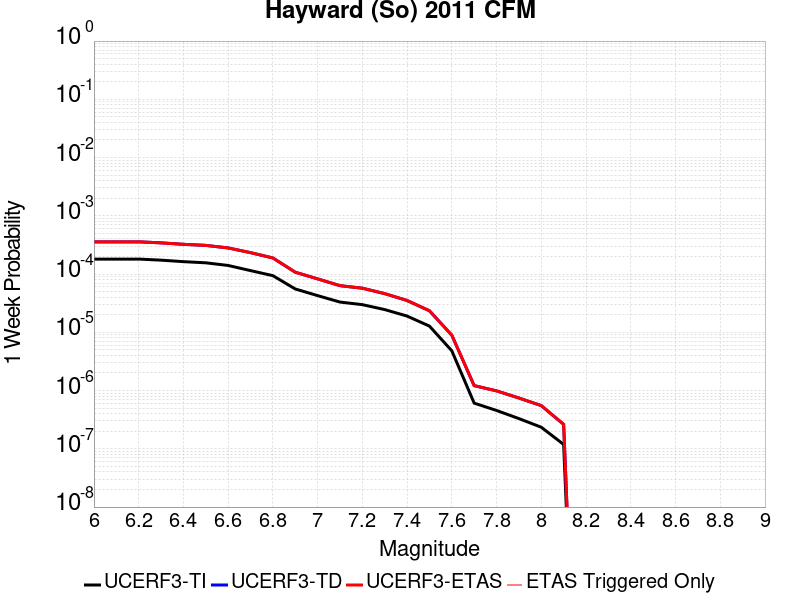 |  |  |  |

| Magnitude | 1 wk TI Prob | 1 wk TD Prob | 1 wk ETAS Prob | 1 wk ETAS/TD Gain | 1 wk ETAS Triggered Only | 1 mo TI Prob | 1 mo TD Prob | 1 mo ETAS Prob | 1 mo ETAS/TD Gain | 1 mo ETAS Triggered Only | 1 yr TI Prob | 1 yr TD Prob | 1 yr ETAS Prob | 1 yr ETAS/TD Gain | 1 yr ETAS Triggered Only | 10 yr TI Prob | 10 yr TD Prob | 10 yr ETAS Prob | 10 yr ETAS/TD Gain | 10 yr ETAS Triggered Only |
|-----|-----|-----|-----|-----|-----|-----|-----|-----|-----|-----|-----|-----|-----|-----|-----|-----|-----|-----|-----|-----|
| 6.0 | 1.8091932E-4 | 3.5774847E-4 | 3.5774847E-4 | 1.0 | 0.0 | 7.751381E-4 | 0.0015323168 | 0.0015323168 | 1.0 | 0.0 | 0.00939654 | 0.01849879 | 0.01849879 | 1.0 | 0.0 | 0.090090066 | 0.1670629 | 0.16707239 | 1.0000569 | 1.1393155E-5 |
| 6.1 | 1.8091932E-4 | 3.5774847E-4 | 3.5774847E-4 | 1.0 | 0.0 | 7.751381E-4 | 0.0015323168 | 0.0015323168 | 1.0 | 0.0 | 0.00939654 | 0.01849879 | 0.01849879 | 1.0 | 0.0 | 0.090090066 | 0.1670629 | 0.16707239 | 1.0000569 | 1.1393155E-5 |
| 6.2 | 1.8091932E-4 | 3.5774847E-4 | 3.5774847E-4 | 1.0 | 0.0 | 7.751381E-4 | 0.0015323168 | 0.0015323168 | 1.0 | 0.0 | 0.00939654 | 0.01849879 | 0.01849879 | 1.0 | 0.0 | 0.090090066 | 0.1670629 | 0.16707239 | 1.0000569 | 1.1393155E-5 |
| 6.3 | 1.7322872E-4 | 3.4330043E-4 | 3.4330043E-4 | 1.0 | 0.0 | 7.4219756E-4 | 0.0014704677 | 0.0014704677 | 1.0 | 0.0 | 0.0089988755 | 0.017758263 | 0.017758263 | 1.0 | 0.0 | 0.08643075 | 0.1610061 | 0.16101564 | 1.0000594 | 1.1393155E-5 |
| 6.4 | 1.6334097E-4 | 3.2409848E-4 | 3.2409848E-4 | 1.0 | 0.0 | 6.998449E-4 | 0.0013882628 | 0.0013882628 | 1.0 | 0.0 | 0.008487372 | 0.016773127 | 0.016773127 | 1.0 | 0.0 | 0.081704415 | 0.15288821 | 0.15289785 | 1.0000632 | 1.1393155E-5 |
| 6.5 | 1.5600289E-4 | 3.1082873E-4 | 3.1082873E-4 | 1.0 | 0.0 | 6.684125E-4 | 0.0013314513 | 0.0013314513 | 1.0 | 0.0 | 0.008107598 | 0.016091831 | 0.016091831 | 1.0 | 0.0 | 0.078181036 | 0.14716084 | 0.14717056 | 1.000066 | 1.1393155E-5 |
| 6.6 | 1.4046066E-4 | 2.8093645E-4 | 2.8093645E-4 | 1.0 | 0.0 | 6.018354E-4 | 0.0012034646 | 0.0012034646 | 1.0 | 0.0 | 0.0073027555 | 0.014555251 | 0.014555251 | 1.0 | 0.0 | 0.07067384 | 0.13423689 | 0.13424675 | 1.0000734 | 1.1393155E-5 |
| 6.7 | 1.14696966E-4 | 2.3326288E-4 | 2.3326288E-4 | 1.0 | 0.0 | 4.914658E-4 | 9.993202E-4 | 9.993202E-4 | 1.0 | 0.0 | 0.0059671924 | 0.012099917 | 0.012099917 | 1.0 | 0.0 | 0.058094822 | 0.113035336 | 0.11304545 | 1.0000894 | 1.1393155E-5 |
| 6.8 | 9.3874296E-5 | 1.8907011E-4 | 1.8907011E-4 | 1.0 | 0.0 | 4.0225635E-4 | 8.100525E-4 | 8.100525E-4 | 1.0 | 0.0 | 0.0048864787 | 0.009818529 | 0.009818529 | 1.0 | 0.0 | 0.047804173 | 0.09283201 | 0.09284234 | 1.0001113 | 1.1393155E-5 |
| 6.9 | 5.551852E-5 | 1.0758296E-4 | 1.0758296E-4 | 1.0 | 0.0 | 2.3791482E-4 | 4.6098896E-4 | 4.6098896E-4 | 1.0 | 0.0 | 0.0028927654 | 0.0055982163 | 0.0055982163 | 1.0 | 0.0 | 0.028553981 | 0.054379728 | 0.0543905 | 1.0001981 | 1.1393155E-5 |
| 7.0 | 4.2662363E-5 | 8.269827E-5 | 8.269827E-5 | 1.0 | 0.0 | 1.8282588E-4 | 3.5437345E-4 | 3.5437345E-4 | 1.0 | 0.0 | 0.0022236328 | 0.004306035 | 0.004306035 | 1.0 | 0.0 | 0.022015138 | 0.042174667 | 0.04218558 | 1.0002588 | 1.1393155E-5 |
| 7.1 | 3.305886E-5 | 6.3214684E-5 | 6.3214684E-5 | 1.0 | 0.0 | 1.4167312E-4 | 2.7089205E-4 | 2.7089205E-4 | 1.0 | 0.0 | 0.0017235056 | 0.0032931417 | 0.0032931417 | 1.0 | 0.0 | 0.017101998 | 0.032547045 | 0.03255807 | 1.0003387 | 1.1393155E-5 |
| 7.2 | 2.9856887E-5 | 5.719926E-5 | 5.719926E-5 | 1.0 | 0.0 | 1.2795182E-4 | 2.4511674E-4 | 2.4511674E-4 | 1.0 | 0.0 | 0.0015567001 | 0.0029802292 | 0.0029802292 | 1.0 | 0.0 | 0.015458403 | 0.029543566 | 0.029554622 | 1.0003742 | 1.1393155E-5 |
| 7.3 | 2.4559737E-5 | 4.614512E-5 | 4.614512E-5 | 1.0 | 0.0 | 1.0525176E-4 | 1.9774989E-4 | 1.9774989E-4 | 1.0 | 0.0 | 0.0012806869 | 0.0024049596 | 0.0024049596 | 1.0 | 0.0 | 0.012733313 | 0.02393354 | 0.02394466 | 1.0004647 | 1.1393155E-5 |
| 7.4 | 1.9002231E-5 | 3.5172314E-5 | 3.5172314E-5 | 1.0 | 0.0 | 8.143559E-5 | 1.5072983E-4 | 1.5072983E-4 | 1.0 | 0.0 | 9.910273E-4 | 0.0018336009 | 0.0018336009 | 1.0 | 0.0 | 0.009866194 | 0.018319555 | 0.018330738 | 1.0006105 | 1.1393155E-5 |
| 7.5 | 1.2783333E-5 | 2.3422865E-5 | 2.3422865E-5 | 1.0 | 0.0 | 5.4784563E-5 | 1.00379875E-4 | 1.00379875E-4 | 1.0 | 0.0 | 6.667979E-4 | 0.0012214456 | 0.0012214456 | 1.0 | 0.0 | 0.006648007 | 0.012257018 | 0.012268272 | 1.0009181 | 1.1393155E-5 |
| 7.6 | 4.8149627E-6 | 8.9263385E-6 | 8.9263385E-6 | 1.0 | 0.0 | 2.063539E-5 | 3.8255184E-5 | 3.8255184E-5 | 1.0 | 0.0 | 2.5120692E-4 | 4.6565855E-4 | 4.6565855E-4 | 1.0 | 0.0 | 0.0025092314 | 0.004701605 | 0.004701605 | 1.0 | 0.0 |
| 7.7 | 6.0838227E-7 | 1.215603E-6 | 1.215603E-6 | 1.0 | 0.0 | 2.6073499E-6 | 5.2097166E-6 | 5.2097166E-6 | 1.0 | 0.0 | 3.174402E-5 | 6.342646E-5 | 6.342646E-5 | 1.0 | 0.0 | 3.1739488E-4 | 6.577615E-4 | 6.577615E-4 | 1.0 | 0.0 |
| 7.8 | 4.5542808E-7 | 9.879404E-7 | 9.879404E-7 | 1.0 | 0.0 | 1.9518332E-6 | 4.2340234E-6 | 4.2340234E-6 | 1.0 | 0.0 | 2.376331E-5 | 5.154802E-5 | 5.154802E-5 | 1.0 | 0.0 | 2.3760769E-4 | 5.363744E-4 | 5.363744E-4 | 1.0 | 0.0 |
| 7.9 | 3.3016747E-7 | 7.451151E-7 | 7.451151E-7 | 1.0 | 0.0 | 1.4150027E-6 | 3.1933464E-6 | 3.1933464E-6 | 1.0 | 0.0 | 1.7227521E-5 | 3.88783E-5 | 3.88783E-5 | 1.0 | 0.0 | 1.7226185E-4 | 4.0243843E-4 | 4.0243843E-4 | 1.0 | 0.0 |
| 8.0 | 2.347038E-7 | 5.5175946E-7 | 5.5175946E-7 | 1.0 | 0.0 | 1.0058731E-6 | 2.3646812E-6 | 2.3646812E-6 | 1.0 | 0.0 | 1.2246436E-5 | 2.8789616E-5 | 2.8789616E-5 | 1.0 | 0.0 | 1.2245761E-4 | 2.9577725E-4 | 2.9577725E-4 | 1.0 | 0.0 |
| 8.1 | 1.18822804E-7 | 2.6269583E-7 | 2.6269583E-7 | 1.0 | 0.0 | 5.092405E-7 | 1.1258387E-6 | 1.1258387E-6 | 1.0 | 0.0 | 6.1999854E-6 | 1.3707002E-5 | 1.3707002E-5 | 1.0 | 0.0 | 6.199812E-5 | 1.4021856E-4 | 1.4021856E-4 | 1.0 | 0.0 |

## San Clemente
*[(top)](#table-of-contents)*

| 1 Week | 1 Month | 1 Year | 10 Year |
|-----|-----|-----|-----|
|  |  |  |  |

| Magnitude | 1 wk TI Prob | 1 wk TD Prob | 1 wk ETAS Prob | 1 wk ETAS/TD Gain | 1 wk ETAS Triggered Only | 1 mo TI Prob | 1 mo TD Prob | 1 mo ETAS Prob | 1 mo ETAS/TD Gain | 1 mo ETAS Triggered Only | 1 yr TI Prob | 1 yr TD Prob | 1 yr ETAS Prob | 1 yr ETAS/TD Gain | 1 yr ETAS Triggered Only | 10 yr TI Prob | 10 yr TD Prob | 10 yr ETAS Prob | 10 yr ETAS/TD Gain | 10 yr ETAS Triggered Only |
|-----|-----|-----|-----|-----|-----|-----|-----|-----|-----|-----|-----|-----|-----|-----|-----|-----|-----|-----|-----|-----|
| 6.0 | 6.681379E-5 | 8.1680366E-5 | 8.1680366E-5 | 1.0 | 0.0 | 2.8631336E-4 | 3.5001338E-4 | 3.5001338E-4 | 1.0 | 0.0 | 0.003480294 | 0.0042535863 | 0.0042649307 | 1.0026671 | 1.1393155E-5 | 0.03426291 | 0.041776925 | 0.04179876 | 1.0005226 | 2.278631E-5 |
| 6.1 | 6.681379E-5 | 8.1680366E-5 | 8.1680366E-5 | 1.0 | 0.0 | 2.8631336E-4 | 3.5001338E-4 | 3.5001338E-4 | 1.0 | 0.0 | 0.003480294 | 0.0042535863 | 0.0042649307 | 1.0026671 | 1.1393155E-5 | 0.03426291 | 0.041776925 | 0.04179876 | 1.0005226 | 2.278631E-5 |
| 6.2 | 3.9400576E-5 | 4.6471752E-5 | 4.6471752E-5 | 1.0 | 0.0 | 1.6884868E-4 | 1.9914978E-4 | 1.9914978E-4 | 1.0 | 0.0 | 0.0020537945 | 0.002422007 | 0.002422007 | 1.0 | 0.0 | 0.020349167 | 0.023962757 | 0.023973877 | 1.0004641 | 1.1393155E-5 |
| 6.3 | 3.2590255E-5 | 3.794358E-5 | 3.794358E-5 | 1.0 | 0.0 | 1.3966505E-4 | 1.6260539E-4 | 1.6260539E-4 | 1.0 | 0.0 | 0.0016990956 | 0.0019779531 | 0.0019779531 | 1.0 | 0.0 | 0.01686163 | 0.019607276 | 0.019618446 | 1.0005697 | 1.1393155E-5 |
| 6.4 | 2.9454652E-5 | 3.411026E-5 | 3.411026E-5 | 1.0 | 0.0 | 1.2622811E-4 | 1.4617879E-4 | 1.4617879E-4 | 1.0 | 0.0 | 0.0015357438 | 0.0017783 | 0.0017783 | 1.0 | 0.0 | 0.015251739 | 0.017643873 | 0.017655065 | 1.0006343 | 1.1393155E-5 |
| 6.5 | 2.790836E-5 | 3.2259115E-5 | 3.2259115E-5 | 1.0 | 0.0 | 1.1960178E-4 | 1.3824616E-4 | 1.3824616E-4 | 1.0 | 0.0 | 0.001455179 | 0.0016818731 | 0.0016818731 | 1.0 | 0.0 | 0.014456868 | 0.01669446 | 0.016705664 | 1.000671 | 1.1393155E-5 |
| 6.6 | 2.2492153E-5 | 2.5771387E-5 | 2.5771387E-5 | 1.0 | 0.0 | 9.639138E-5 | 1.1044421E-4 | 1.1044421E-4 | 1.0 | 0.0 | 0.0011729331 | 0.0013438435 | 0.0013438435 | 1.0 | 0.0 | 0.011667615 | 0.013358889 | 0.01337013 | 1.0008415 | 1.1393155E-5 |
| 6.7 | 1.9862755E-5 | 2.2673834E-5 | 2.2673834E-5 | 1.0 | 0.0 | 8.512331E-5 | 9.7170014E-5 | 9.7170014E-5 | 1.0 | 0.0 | 0.0010358836 | 0.0011824141 | 0.0011824141 | 1.0 | 0.0 | 0.010310682 | 0.011762523 | 0.011773782 | 1.0009573 | 1.1393155E-5 |
| 6.8 | 1.6697575E-5 | 1.8983706E-5 | 1.8983706E-5 | 1.0 | 0.0 | 7.155907E-5 | 8.135625E-5 | 8.135625E-5 | 1.0 | 0.0 | 8.7088346E-4 | 9.900717E-4 | 9.900717E-4 | 1.0 | 0.0 | 0.008674784 | 0.009857636 | 0.009868916 | 1.0011444 | 1.1393155E-5 |
| 6.9 | 1.5218415E-5 | 1.7274784E-5 | 1.7274784E-5 | 1.0 | 0.0 | 6.522015E-5 | 7.403274E-5 | 7.403274E-5 | 1.0 | 0.0 | 7.93766E-4 | 9.009847E-4 | 9.009847E-4 | 1.0 | 0.0 | 0.007909367 | 0.008974264 | 0.008985556 | 1.0012581 | 1.1393155E-5 |
| 7.0 | 1.2392958E-5 | 1.40373095E-5 | 1.40373095E-5 | 1.0 | 0.0 | 5.3111595E-5 | 6.0158556E-5 | 6.0158556E-5 | 1.0 | 0.0 | 6.4644177E-4 | 7.3219184E-4 | 7.3219184E-4 | 1.0 | 0.0 | 0.0064456454 | 0.0072985813 | 0.0072985813 | 1.0 | 0.0 |
| 7.1 | 1.0934128E-5 | 1.2378909E-5 | 1.2378909E-5 | 1.0 | 0.0 | 4.6859706E-5 | 5.305143E-5 | 5.305143E-5 | 1.0 | 0.0 | 5.7036756E-4 | 6.457171E-4 | 6.457171E-4 | 1.0 | 0.0 | 0.0056890585 | 0.0064391554 | 0.0064391554 | 1.0 | 0.0 |
| 7.2 | 9.5798805E-6 | 1.0848246E-5 | 1.0848246E-5 | 1.0 | 0.0 | 4.1055984E-5 | 4.6491696E-5 | 4.6491696E-5 | 1.0 | 0.0 | 4.9974193E-4 | 5.658966E-4 | 5.658966E-4 | 1.0 | 0.0 | 0.0049861963 | 0.0056452802 | 0.0056452802 | 1.0 | 0.0 |
| 7.3 | 8.0167365E-6 | 9.086713E-6 | 9.086713E-6 | 1.0 | 0.0 | 3.4356988E-5 | 3.8942515E-5 | 3.8942515E-5 | 1.0 | 0.0 | 4.1821605E-4 | 4.7402905E-4 | 4.7402905E-4 | 1.0 | 0.0 | 0.0041742986 | 0.0047308826 | 0.0047308826 | 1.0 | 0.0 |
| 7.4 | 2.9581017E-6 | 3.3634417E-6 | 3.3634417E-6 | 1.0 | 0.0 | 1.2677518E-5 | 1.4414699E-5 | 1.4414699E-5 | 1.0 | 0.0 | 1.5433785E-4 | 1.7548987E-4 | 1.7548987E-4 | 1.0 | 0.0 | 0.001542307 | 0.0017540083 | 0.0017540083 | 1.0 | 0.0 |

## San Pedro Basin
*[(top)](#table-of-contents)*

| 1 Week | 1 Month | 1 Year | 10 Year |
|-----|-----|-----|-----|
|  |  |  | 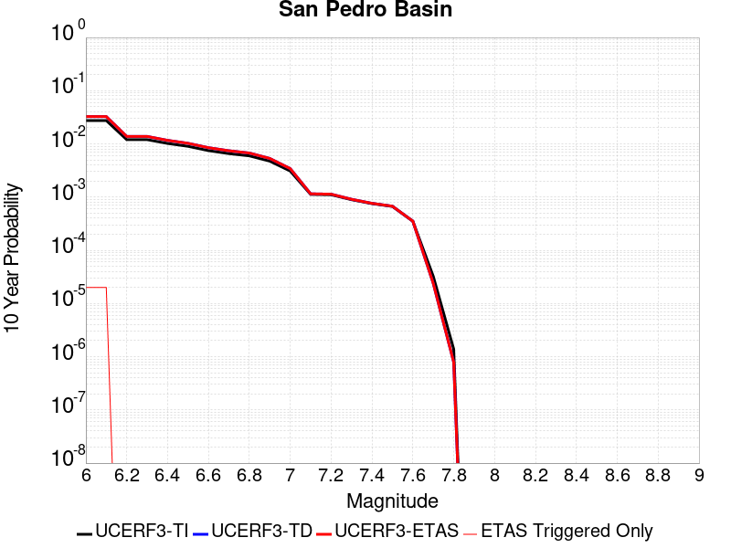 |

| Magnitude | 1 wk TI Prob | 1 wk TD Prob | 1 wk ETAS Prob | 1 wk ETAS/TD Gain | 1 wk ETAS Triggered Only | 1 mo TI Prob | 1 mo TD Prob | 1 mo ETAS Prob | 1 mo ETAS/TD Gain | 1 mo ETAS Triggered Only | 1 yr TI Prob | 1 yr TD Prob | 1 yr ETAS Prob | 1 yr ETAS/TD Gain | 1 yr ETAS Triggered Only | 10 yr TI Prob | 10 yr TD Prob | 10 yr ETAS Prob | 10 yr ETAS/TD Gain | 10 yr ETAS Triggered Only |
|-----|-----|-----|-----|-----|-----|-----|-----|-----|-----|-----|-----|-----|-----|-----|-----|-----|-----|-----|-----|-----|
| 6.0 | 5.3449043E-5 | 6.339769E-5 | 6.339769E-5 | 1.0 | 0.0 | 2.2904722E-4 | 2.7167957E-4 | 2.7167957E-4 | 1.0 | 0.0 | 0.0027850836 | 0.0033032831 | 0.0033032831 | 1.0 | 0.0 | 0.027504366 | 0.032603413 | 0.03262546 | 1.0006762 | 2.278631E-5 |
| 6.1 | 5.3449043E-5 | 6.339769E-5 | 6.339769E-5 | 1.0 | 0.0 | 2.2904722E-4 | 2.7167957E-4 | 2.7167957E-4 | 1.0 | 0.0 | 0.0027850836 | 0.0033032831 | 0.0033032831 | 1.0 | 0.0 | 0.027504366 | 0.032603413 | 0.03262546 | 1.0006762 | 2.278631E-5 |
| 6.2 | 2.3189454E-5 | 2.6652198E-5 | 2.6652198E-5 | 1.0 | 0.0 | 9.9379584E-5 | 1.1421897E-4 | 1.1421897E-4 | 1.0 | 0.0 | 0.0012092749 | 0.0013897758 | 0.0013897758 | 1.0 | 0.0 | 0.012027155 | 0.013815714 | 0.013815714 | 1.0 | 0.0 |
| 6.3 | 2.3189454E-5 | 2.6652198E-5 | 2.6652198E-5 | 1.0 | 0.0 | 9.9379584E-5 | 1.1421897E-4 | 1.1421897E-4 | 1.0 | 0.0 | 0.0012092749 | 0.0013897758 | 0.0013897758 | 1.0 | 0.0 | 0.012027155 | 0.013815714 | 0.013815714 | 1.0 | 0.0 |
| 6.4 | 1.966056E-5 | 2.2471006E-5 | 2.2471006E-5 | 1.0 | 0.0 | 8.425682E-5 | 9.630098E-5 | 9.630098E-5 | 1.0 | 0.0 | 0.001025344 | 0.001171874 | 0.001171874 | 1.0 | 0.0 | 0.010206259 | 0.011661033 | 0.011661033 | 1.0 | 0.0 |
| 6.5 | 1.7342953E-5 | 1.975165E-5 | 1.975165E-5 | 1.0 | 0.0 | 7.4324824E-5 | 8.4647385E-5 | 8.4647385E-5 | 1.0 | 0.0 | 9.04529E-4 | 0.0010301316 | 0.0010301316 | 1.0 | 0.0 | 0.009008561 | 0.010257291 | 0.010257291 | 1.0 | 0.0 |
| 6.6 | 1.439804E-5 | 1.632793E-5 | 1.632793E-5 | 1.0 | 0.0 | 6.170443E-5 | 6.997514E-5 | 6.997514E-5 | 1.0 | 0.0 | 7.509924E-4 | 8.516465E-4 | 8.516465E-4 | 1.0 | 0.0 | 0.0074845953 | 0.008487032 | 0.008487032 | 1.0 | 0.0 |
| 6.7 | 1.2634884E-5 | 1.4289777E-5 | 1.4289777E-5 | 1.0 | 0.0 | 5.414838E-5 | 6.124064E-5 | 6.124064E-5 | 1.0 | 0.0 | 6.590571E-4 | 7.453802E-4 | 7.453802E-4 | 1.0 | 0.0 | 0.006571059 | 0.007431824 | 0.007431824 | 1.0 | 0.0 |
| 6.8 | 1.146091E-5 | 1.2937197E-5 | 1.2937197E-5 | 1.0 | 0.0 | 4.911726E-5 | 5.544412E-5 | 5.544412E-5 | 1.0 | 0.0 | 5.9783855E-4 | 6.7485287E-4 | 6.7485287E-4 | 1.0 | 0.0 | 0.0059623276 | 0.0067309774 | 0.0067309774 | 1.0 | 0.0 |
| 6.9 | 9.109035E-6 | 1.0238097E-5 | 1.0238097E-5 | 1.0 | 0.0 | 3.9038136E-5 | 4.3876982E-5 | 4.3876982E-5 | 1.0 | 0.0 | 4.7518566E-4 | 5.340993E-4 | 5.340993E-4 | 1.0 | 0.0 | 0.0047417083 | 0.005330913 | 0.005330913 | 1.0 | 0.0 |
| 7.0 | 5.9351028E-6 | 6.58578E-6 | 6.58578E-6 | 1.0 | 0.0 | 2.5435906E-5 | 2.8224598E-5 | 2.8224598E-5 | 1.0 | 0.0 | 3.0963816E-4 | 3.4360393E-4 | 3.4360393E-4 | 1.0 | 0.0 | 0.0030920706 | 0.0034330452 | 0.0034330452 | 1.0 | 0.0 |
| 7.1 | 2.1557585E-6 | 2.2098704E-6 | 2.2098704E-6 | 1.0 | 0.0 | 9.238933E-6 | 9.470839E-6 | 9.470839E-6 | 1.0 | 0.0 | 1.1247819E-4 | 1.15301526E-4 | 1.15301526E-4 | 1.0 | 0.0 | 0.0011242128 | 0.0011524324 | 0.0011524324 | 1.0 | 0.0 |
| 7.2 | 2.1251979E-6 | 2.178214E-6 | 2.178214E-6 | 1.0 | 0.0 | 9.107958E-6 | 9.33517E-6 | 9.33517E-6 | 1.0 | 0.0 | 1.1088375E-4 | 1.1364993E-4 | 1.1364993E-4 | 1.0 | 0.0 | 0.0011082845 | 0.0011359333 | 0.0011359333 | 1.0 | 0.0 |
| 7.3 | 1.7145798E-6 | 1.7444505E-6 | 1.7444505E-6 | 1.0 | 0.0 | 7.3481783E-6 | 7.4761956E-6 | 7.4761956E-6 | 1.0 | 0.0 | 8.94604E-5 | 9.101897E-5 | 9.101897E-5 | 1.0 | 0.0 | 8.9424395E-4 | 9.098261E-4 | 9.098261E-4 | 1.0 | 0.0 |
| 7.4 | 1.4467993E-6 | 1.46432E-6 | 1.46432E-6 | 1.0 | 0.0 | 6.200554E-6 | 6.2756426E-6 | 6.2756426E-6 | 1.0 | 0.0 | 7.548913E-5 | 7.640334E-5 | 7.640334E-5 | 1.0 | 0.0 | 7.546349E-4 | 7.63778E-4 | 7.63778E-4 | 1.0 | 0.0 |
| 7.5 | 1.2803735E-6 | 1.293267E-6 | 1.293267E-6 | 1.0 | 0.0 | 5.487303E-6 | 5.5425617E-6 | 5.5425617E-6 | 1.0 | 0.0 | 6.680587E-5 | 6.747867E-5 | 6.747867E-5 | 1.0 | 0.0 | 6.678579E-4 | 6.745889E-4 | 6.745889E-4 | 1.0 | 0.0 |
| 7.6 | 6.755009E-7 | 6.7700876E-7 | 6.7700876E-7 | 1.0 | 0.0 | 2.8950008E-6 | 2.9014632E-6 | 2.9014632E-6 | 1.0 | 0.0 | 3.5246063E-5 | 3.53248E-5 | 3.53248E-5 | 1.0 | 0.0 | 3.5240475E-4 | 3.5319757E-4 | 3.5319757E-4 | 1.0 | 0.0 |
| 7.7 | 6.211885E-8 | 4.5705608E-8 | 4.5705608E-8 | 1.0 | 0.0 | 2.6622362E-7 | 1.9588116E-7 | 1.9588116E-7 | 1.0 | 0.0 | 3.2412677E-6 | 2.3848506E-6 | 2.3848506E-6 | 1.0 | 0.0 | 3.2412205E-5 | 2.3848272E-5 | 2.3848272E-5 | 1.0 | 0.0 |
| 7.8 | 2.6580573E-9 | 1.5146536E-9 | 1.5146536E-9 | 1.0 | 0.0 | 1.1391674E-8 | 6.4913728E-9 | 6.4913728E-9 | 1.0 | 0.0 | 1.3869362E-7 | 7.903246E-8 | 7.903246E-8 | 1.0 | 0.0 | 1.3869354E-6 | 7.9032463E-7 | 7.9032463E-7 | 1.0 | 0.0 |

## Big Pine (Central)
*[(top)](#table-of-contents)*

| 1 Week | 1 Month | 1 Year | 10 Year |
|-----|-----|-----|-----|
|  |  | 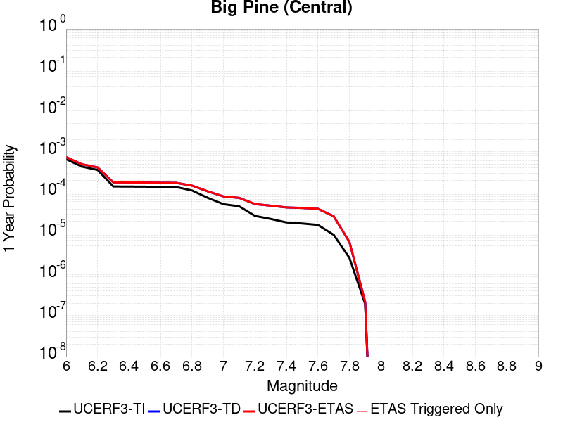 | 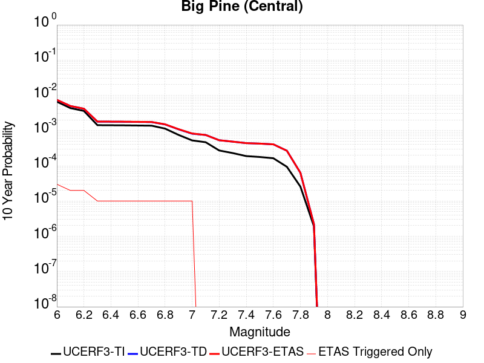 |

| Magnitude | 1 wk TI Prob | 1 wk TD Prob | 1 wk ETAS Prob | 1 wk ETAS/TD Gain | 1 wk ETAS Triggered Only | 1 mo TI Prob | 1 mo TD Prob | 1 mo ETAS Prob | 1 mo ETAS/TD Gain | 1 mo ETAS Triggered Only | 1 yr TI Prob | 1 yr TD Prob | 1 yr ETAS Prob | 1 yr ETAS/TD Gain | 1 yr ETAS Triggered Only | 10 yr TI Prob | 10 yr TD Prob | 10 yr ETAS Prob | 10 yr ETAS/TD Gain | 10 yr ETAS Triggered Only |
|-----|-----|-----|-----|-----|-----|-----|-----|-----|-----|-----|-----|-----|-----|-----|-----|-----|-----|-----|-----|-----|
| 6.0 | 1.2706755E-5 | 1.4259051E-5 | 1.4259051E-5 | 1.0 | 0.0 | 5.4456385E-5 | 6.110899E-5 | 6.110899E-5 | 1.0 | 0.0 | 6.628048E-4 | 7.437846E-4 | 7.437846E-4 | 1.0 | 0.0 | 0.006608314 | 0.0074179014 | 0.0074405186 | 1.003049 | 2.278631E-5 |
| 6.1 | 8.342579E-6 | 9.518341E-6 | 9.518341E-6 | 1.0 | 0.0 | 3.5753423E-5 | 4.0792376E-5 | 4.0792376E-5 | 1.0 | 0.0 | 4.3521097E-4 | 4.965557E-4 | 4.965557E-4 | 1.0 | 0.0 | 0.0043435963 | 0.004957937 | 0.0049692737 | 1.0022866 | 1.1393155E-5 |
| 6.2 | 6.923899E-6 | 7.974412E-6 | 7.974412E-6 | 1.0 | 0.0 | 2.9673516E-5 | 3.4175715E-5 | 3.4175715E-5 | 1.0 | 0.0 | 3.6121515E-4 | 4.1602913E-4 | 4.1602913E-4 | 1.0 | 0.0 | 0.003606286 | 0.0041557313 | 0.004167077 | 1.0027301 | 1.1393155E-5 |
| 6.3 | 2.728396E-6 | 3.4306865E-6 | 3.4306865E-6 | 1.0 | 0.0 | 1.1693074E-5 | 1.4702864E-5 | 1.4702864E-5 | 1.0 | 0.0 | 1.4235388E-4 | 1.7899353E-4 | 1.7899353E-4 | 1.0 | 0.0 | 0.0014226272 | 0.0017899201 | 0.0017899201 | 1.0 | 0.0 |
| 6.4 | 2.7136944E-6 | 3.4149773E-6 | 3.4149773E-6 | 1.0 | 0.0 | 1.1630066E-5 | 1.46355405E-5 | 1.46355405E-5 | 1.0 | 0.0 | 1.4158686E-4 | 1.78174E-4 | 1.78174E-4 | 1.0 | 0.0 | 0.0014149669 | 0.0017817379 | 0.0017817379 | 1.0 | 0.0 |
| 6.5 | 2.6971882E-6 | 3.3973197E-6 | 3.3973197E-6 | 1.0 | 0.0 | 1.1559327E-5 | 1.4559865E-5 | 1.4559865E-5 | 1.0 | 0.0 | 1.4072572E-4 | 1.772528E-4 | 1.772528E-4 | 1.0 | 0.0 | 0.0014063664 | 0.0017725406 | 0.0017725406 | 1.0 | 0.0 |
| 6.6 | 2.669092E-6 | 3.3673355E-6 | 3.3673355E-6 | 1.0 | 0.0 | 1.1438916E-5 | 1.4431363E-5 | 1.4431363E-5 | 1.0 | 0.0 | 1.3925991E-4 | 1.7568855E-4 | 1.7568855E-4 | 1.0 | 0.0 | 0.0013917267 | 0.0017569228 | 0.0017569228 | 1.0 | 0.0 |
| 6.7 | 2.6408059E-6 | 3.337357E-6 | 3.337357E-6 | 1.0 | 0.0 | 1.1317691E-5 | 1.4302885E-5 | 1.4302885E-5 | 1.0 | 0.0 | 1.3778417E-4 | 1.7412458E-4 | 1.7412458E-4 | 1.0 | 0.0 | 0.0013769877 | 0.0017413078 | 0.0017413078 | 1.0 | 0.0 |
| 6.8 | 2.1786943E-6 | 2.86078E-6 | 2.86078E-6 | 1.0 | 0.0 | 9.337228E-6 | 1.22604315E-5 | 1.22604315E-5 | 1.0 | 0.0 | 1.1367482E-4 | 1.4926126E-4 | 1.4926126E-4 | 1.0 | 0.0 | 0.0011361669 | 0.0014930229 | 0.0014930229 | 1.0 | 0.0 |
| 6.9 | 1.4411696E-6 | 2.0745688E-6 | 2.0745688E-6 | 1.0 | 0.0 | 6.1764263E-6 | 8.89098E-6 | 8.89098E-6 | 1.0 | 0.0 | 7.51954E-5 | 1.0824258E-4 | 1.0824258E-4 | 1.0 | 0.0 | 7.5169955E-4 | 0.0010832667 | 0.0010832667 | 1.0 | 0.0 |
| 7.0 | 1.0073411E-6 | 1.5596851E-6 | 1.5596851E-6 | 1.0 | 0.0 | 4.317169E-6 | 6.684348E-6 | 6.684348E-6 | 1.0 | 0.0 | 5.2560266E-5 | 8.1379054E-5 | 8.1379054E-5 | 1.0 | 0.0 | 5.2547833E-4 | 8.148494E-4 | 8.148494E-4 | 1.0 | 0.0 |
| 7.1 | 8.947104E-7 | 1.4355969E-6 | 1.4355969E-6 | 1.0 | 0.0 | 3.834468E-6 | 6.1525448E-6 | 6.1525448E-6 | 1.0 | 0.0 | 4.6683643E-5 | 7.4904805E-5 | 7.4904805E-5 | 1.0 | 0.0 | 4.6673836E-4 | 7.501522E-4 | 7.501522E-4 | 1.0 | 0.0 |
| 7.2 | 5.215166E-7 | 1.0161563E-6 | 1.0161563E-6 | 1.0 | 0.0 | 2.2350691E-6 | 4.3549485E-6 | 4.3549485E-6 | 1.0 | 0.0 | 2.7211627E-5 | 5.3020252E-5 | 5.3020252E-5 | 1.0 | 0.0 | 2.7208295E-4 | 5.314225E-4 | 5.314225E-4 | 1.0 | 0.0 |
| 7.3 | 4.4024807E-7 | 9.268012E-7 | 9.268012E-7 | 1.0 | 0.0 | 1.8867761E-6 | 3.9719994E-6 | 3.9719994E-6 | 1.0 | 0.0 | 2.2971257E-5 | 4.835806E-5 | 4.835806E-5 | 1.0 | 0.0 | 2.2968883E-4 | 4.848216E-4 | 4.848216E-4 | 1.0 | 0.0 |
| 7.4 | 3.6130905E-7 | 8.4054636E-7 | 8.4054636E-7 | 1.0 | 0.0 | 1.5484665E-6 | 3.6023366E-6 | 3.6023366E-6 | 1.0 | 0.0 | 1.8852415E-5 | 4.3857606E-5 | 4.3857606E-5 | 1.0 | 0.0 | 1.8850817E-4 | 4.398261E-4 | 4.398261E-4 | 1.0 | 0.0 |
| 7.5 | 3.408184E-7 | 8.154074E-7 | 8.154074E-7 | 1.0 | 0.0 | 1.4606494E-6 | 3.4945988E-6 | 3.4945988E-6 | 1.0 | 0.0 | 1.7783263E-5 | 4.2545948E-5 | 4.2545948E-5 | 1.0 | 0.0 | 1.778184E-4 | 4.266943E-4 | 4.266943E-4 | 1.0 | 0.0 |
| 7.6 | 3.1428627E-7 | 7.7759114E-7 | 7.7759114E-7 | 1.0 | 0.0 | 1.3469405E-6 | 3.3325293E-6 | 3.3325293E-6 | 1.0 | 0.0 | 1.6398877E-5 | 4.0572828E-5 | 4.0572828E-5 | 1.0 | 0.0 | 1.6397667E-4 | 4.0694122E-4 | 4.0694122E-4 | 1.0 | 0.0 |
| 7.7 | 1.7972785E-7 | 5.1115893E-7 | 5.1115893E-7 | 1.0 | 0.0 | 7.70262E-7 | 2.1906792E-6 | 2.1906792E-6 | 1.0 | 0.0 | 9.377899E-6 | 2.6671205E-5 | 2.6671205E-5 | 1.0 | 0.0 | 9.377503E-5 | 2.679983E-4 | 2.679983E-4 | 1.0 | 0.0 |
| 7.8 | 4.9230927E-8 | 1.2060457E-7 | 1.2060457E-7 | 1.0 | 0.0 | 2.1098968E-7 | 5.1687664E-7 | 5.1687664E-7 | 1.0 | 0.0 | 2.5687964E-6 | 6.2929566E-6 | 6.2929566E-6 | 1.0 | 0.0 | 2.5687666E-5 | 6.335463E-5 | 6.335463E-5 | 1.0 | 0.0 |
| 7.9 | 3.6805972E-9 | 4.1374557E-9 | 4.1374557E-9 | 1.0 | 0.0 | 1.5773987E-8 | 1.7731953E-8 | 1.7731953E-8 | 1.0 | 0.0 | 1.9204828E-7 | 2.1588652E-7 | 2.1588652E-7 | 1.0 | 0.0 | 1.920481E-6 | 2.206994E-6 | 2.206994E-6 | 1.0 | 0.0 |

## Calaveras (So) 2011 CFM
*[(top)](#table-of-contents)*

| 1 Week | 1 Month | 1 Year | 10 Year |
|-----|-----|-----|-----|
|  |  |  |  |

| Magnitude | 1 wk TI Prob | 1 wk TD Prob | 1 wk ETAS Prob | 1 wk ETAS/TD Gain | 1 wk ETAS Triggered Only | 1 mo TI Prob | 1 mo TD Prob | 1 mo ETAS Prob | 1 mo ETAS/TD Gain | 1 mo ETAS Triggered Only | 1 yr TI Prob | 1 yr TD Prob | 1 yr ETAS Prob | 1 yr ETAS/TD Gain | 1 yr ETAS Triggered Only | 10 yr TI Prob | 10 yr TD Prob | 10 yr ETAS Prob | 10 yr ETAS/TD Gain | 10 yr ETAS Triggered Only |
|-----|-----|-----|-----|-----|-----|-----|-----|-----|-----|-----|-----|-----|-----|-----|-----|-----|-----|-----|-----|-----|
| 6.0 | 1.5950744E-4 | 3.0766838E-4 | 3.0766838E-4 | 1.0 | 0.0 | 6.834242E-4 | 0.0013176617 | 0.0013176617 | 1.0 | 0.0 | 0.00828899 | 0.015885035 | 0.015885035 | 1.0 | 0.0 | 0.079865426 | 0.14461708 | 0.14463657 | 1.0001348 | 2.278631E-5 |
| 6.1 | 1.3584697E-4 | 2.6085414E-4 | 2.6085414E-4 | 1.0 | 0.0 | 5.8207137E-4 | 0.0011172949 | 0.0011172949 | 1.0 | 0.0 | 0.007063716 | 0.013486529 | 0.013486529 | 1.0 | 0.0 | 0.06843361 | 0.12423772 | 0.12424771 | 1.0000803 | 1.1393155E-5 |
| 6.2 | 1.14676266E-4 | 2.176286E-4 | 2.176286E-4 | 1.0 | 0.0 | 4.9137714E-4 | 9.322329E-4 | 9.322329E-4 | 1.0 | 0.0 | 0.0059661185 | 0.011268952 | 0.011268952 | 1.0 | 0.0 | 0.058084648 | 0.105222695 | 0.10523289 | 1.0000969 | 1.1393155E-5 |
| 6.3 | 8.691518E-5 | 1.6030915E-4 | 1.6030915E-4 | 1.0 | 0.0 | 3.7244044E-4 | 6.868204E-4 | 6.868204E-4 | 1.0 | 0.0 | 0.004525038 | 0.0083233155 | 0.0083233155 | 1.0 | 0.0 | 0.044339992 | 0.07953041 | 0.07954089 | 1.0001318 | 1.1393155E-5 |
| 6.4 | 8.50982E-5 | 1.5737055E-4 | 1.5737055E-4 | 1.0 | 0.0 | 3.646556E-4 | 6.74233E-4 | 6.74233E-4 | 1.0 | 0.0 | 0.0044306475 | 0.008171219 | 0.008171219 | 1.0 | 0.0 | 0.04343345 | 0.078135796 | 0.078146294 | 1.0001345 | 1.1393155E-5 |
| 6.5 | 8.4062965E-5 | 1.5561342E-4 | 1.5561342E-4 | 1.0 | 0.0 | 3.602201E-4 | 6.66707E-4 | 6.66707E-4 | 1.0 | 0.0 | 0.004376863 | 0.008080368 | 0.008080368 | 1.0 | 0.0 | 0.042916555 | 0.07730663 | 0.07731714 | 1.000136 | 1.1393155E-5 |
| 6.6 | 8.194716E-5 | 1.5196789E-4 | 1.5196789E-4 | 1.0 | 0.0 | 3.5115483E-4 | 6.510947E-4 | 6.510947E-4 | 1.0 | 0.0 | 0.0042669317 | 0.007892054 | 0.007892054 | 1.0 | 0.0 | 0.04185927 | 0.07559084 | 0.07560137 | 1.0001394 | 1.1393155E-5 |
| 6.7 | 8.012326E-5 | 1.4864422E-4 | 1.4864422E-4 | 1.0 | 0.0 | 3.433402E-4 | 6.368601E-4 | 6.368601E-4 | 1.0 | 0.0 | 0.004172157 | 0.007720414 | 0.007720414 | 1.0 | 0.0 | 0.040946912 | 0.07403218 | 0.07404273 | 1.0001425 | 1.1393155E-5 |
| 6.8 | 7.119773E-5 | 1.2921143E-4 | 1.2921143E-4 | 1.0 | 0.0 | 3.0509746E-4 | 5.5362895E-4 | 5.5362895E-4 | 1.0 | 0.0 | 0.0037082357 | 0.0067163627 | 0.0067163627 | 1.0 | 0.0 | 0.036469642 | 0.06486638 | 0.06487703 | 1.0001643 | 1.1393155E-5 |
| 6.9 | 5.7343088E-5 | 9.953715E-5 | 9.953715E-5 | 1.0 | 0.0 | 2.4573295E-4 | 4.2651832E-4 | 4.2651832E-4 | 1.0 | 0.0 | 0.0029876942 | 0.0051805717 | 0.0051805717 | 1.0 | 0.0 | 0.02947844 | 0.050675213 | 0.05068603 | 1.0002134 | 1.1393155E-5 |
| 7.0 | 4.8746577E-5 | 8.3157734E-5 | 8.3157734E-5 | 1.0 | 0.0 | 2.0889717E-4 | 3.5634195E-4 | 3.5634195E-4 | 1.0 | 0.0 | 0.0025403565 | 0.0043299 | 0.0043299 | 1.0 | 0.0 | 0.025115121 | 0.04263495 | 0.042645857 | 1.0002558 | 1.1393155E-5 |
| 7.1 | 4.2998014E-5 | 7.2926814E-5 | 7.2926814E-5 | 1.0 | 0.0 | 1.8426418E-4 | 3.1250637E-4 | 3.1250637E-4 | 1.0 | 0.0 | 0.002241108 | 0.003798188 | 0.003798188 | 1.0 | 0.0 | 0.022186412 | 0.037558954 | 0.03756992 | 1.000292 | 1.1393155E-5 |
| 7.2 | 3.221292E-5 | 5.4161646E-5 | 5.4161646E-5 | 1.0 | 0.0 | 1.3804805E-4 | 2.3210085E-4 | 2.3210085E-4 | 1.0 | 0.0 | 0.0016794393 | 0.0028221942 | 0.0028221942 | 1.0 | 0.0 | 0.016668037 | 0.028162343 | 0.028162343 | 1.0 | 0.0 |
| 7.3 | 2.3756531E-5 | 3.9695686E-5 | 3.9695686E-5 | 1.0 | 0.0 | 1.0180973E-4 | 1.7011337E-4 | 1.7011337E-4 | 1.0 | 0.0 | 0.0012388286 | 0.0020691801 | 0.0020691801 | 1.0 | 0.0 | 0.012319452 | 0.020755418 | 0.020755418 | 1.0 | 0.0 |
| 7.4 | 1.5997684E-5 | 2.7476835E-5 | 2.7476835E-5 | 1.0 | 0.0 | 6.8559704E-5 | 1.1775257E-4 | 1.1775257E-4 | 1.0 | 0.0 | 8.343947E-4 | 0.0014326972 | 0.0014326972 | 1.0 | 0.0 | 0.008312687 | 0.014444441 | 0.014444441 | 1.0 | 0.0 |
| 7.5 | 1.3814293E-5 | 2.4912644E-5 | 2.4912644E-5 | 1.0 | 0.0 | 5.9202768E-5 | 1.0676412E-4 | 1.0676412E-4 | 1.0 | 0.0 | 7.205553E-4 | 0.0012990804 | 0.0012990804 | 1.0 | 0.0 | 0.007182234 | 0.013120799 | 0.013120799 | 1.0 | 0.0 |
| 7.6 | 8.817309E-6 | 1.6535463E-5 | 1.6535463E-5 | 1.0 | 0.0 | 3.7787922E-5 | 7.086435E-5 | 7.086435E-5 | 1.0 | 0.0 | 4.5997082E-4 | 8.6243334E-4 | 8.6243334E-4 | 1.0 | 0.0 | 0.004590199 | 0.008772891 | 0.008772891 | 1.0 | 0.0 |
| 7.7 | 4.0352206E-6 | 7.778976E-6 | 7.778976E-6 | 1.0 | 0.0 | 1.7293689E-5 | 3.3338045E-5 | 3.3338045E-5 | 1.0 | 0.0 | 2.1053031E-4 | 4.058152E-4 | 4.058152E-4 | 1.0 | 0.0 | 0.0021033096 | 0.0042004217 | 0.0042004217 | 1.0 | 0.0 |
| 7.8 | 3.413169E-6 | 6.8498653E-6 | 6.8498653E-6 | 1.0 | 0.0 | 1.4627784E-5 | 2.9356235E-5 | 2.9356235E-5 | 1.0 | 0.0 | 1.7807873E-4 | 3.5735362E-4 | 3.5735362E-4 | 1.0 | 0.0 | 0.0017793609 | 0.0036970666 | 0.0036970666 | 1.0 | 0.0 |
| 7.9 | 2.4740732E-6 | 5.32551E-6 | 5.32551E-6 | 1.0 | 0.0 | 1.06031275E-5 | 2.2823415E-5 | 2.2823415E-5 | 1.0 | 0.0 | 1.2908543E-4 | 2.778397E-4 | 2.778397E-4 | 1.0 | 0.0 | 0.0012901047 | 0.0028572876 | 0.0028572876 | 1.0 | 0.0 |
| 8.0 | 1.5231818E-6 | 3.3163665E-6 | 3.3163665E-6 | 1.0 | 0.0 | 6.527906E-6 | 1.4212921E-5 | 1.4212921E-5 | 1.0 | 0.0 | 7.9474354E-5 | 1.7302862E-4 | 1.7302862E-4 | 1.0 | 0.0 | 7.944594E-4 | 0.0017698975 | 0.0017698975 | 1.0 | 0.0 |
| 8.1 | 1.0104524E-6 | 2.0629375E-6 | 2.0629375E-6 | 1.0 | 0.0 | 4.330503E-6 | 8.841131E-6 | 8.841131E-6 | 1.0 | 0.0 | 5.2722597E-5 | 1.0763548E-4 | 1.0763548E-4 | 1.0 | 0.0 | 5.271009E-4 | 0.0011014802 | 0.0011014802 | 1.0 | 0.0 |

## San Diego Trough north alt1
*[(top)](#table-of-contents)*

| 1 Week | 1 Month | 1 Year | 10 Year |
|-----|-----|-----|-----|
|  |  |  |  |

| Magnitude | 1 wk TI Prob | 1 wk TD Prob | 1 wk ETAS Prob | 1 wk ETAS/TD Gain | 1 wk ETAS Triggered Only | 1 mo TI Prob | 1 mo TD Prob | 1 mo ETAS Prob | 1 mo ETAS/TD Gain | 1 mo ETAS Triggered Only | 1 yr TI Prob | 1 yr TD Prob | 1 yr ETAS Prob | 1 yr ETAS/TD Gain | 1 yr ETAS Triggered Only | 10 yr TI Prob | 10 yr TD Prob | 10 yr ETAS Prob | 10 yr ETAS/TD Gain | 10 yr ETAS Triggered Only |
|-----|-----|-----|-----|-----|-----|-----|-----|-----|-----|-----|-----|-----|-----|-----|-----|-----|-----|-----|-----|-----|
| 6.0 | 7.329252E-5 | 8.825462E-5 | 8.825462E-5 | 1.0 | 0.0 | 3.14073E-4 | 3.7818291E-4 | 3.7818291E-4 | 1.0 | 0.0 | 0.0038171355 | 0.0045952178 | 0.0045952178 | 1.0 | 0.0 | 0.03752231 | 0.045065906 | 0.045087665 | 1.0004828 | 2.278631E-5 |
| 6.1 | 3.7940346E-5 | 4.4904158E-5 | 4.4904158E-5 | 1.0 | 0.0 | 1.6259136E-4 | 1.9243274E-4 | 1.9243274E-4 | 1.0 | 0.0 | 0.0019777524 | 0.002340432 | 0.002340432 | 1.0 | 0.0 | 0.019602431 | 0.02316651 | 0.023188768 | 1.0009608 | 2.278631E-5 |
| 6.2 | 2.8645263E-5 | 3.3309392E-5 | 3.3309392E-5 | 1.0 | 0.0 | 1.2275964E-4 | 1.4274687E-4 | 1.4274687E-4 | 1.0 | 0.0 | 0.0014935739 | 0.0017365804 | 0.0017365804 | 1.0 | 0.0 | 0.0148357535 | 0.017232755 | 0.017255148 | 1.0012995 | 2.278631E-5 |
| 6.3 | 2.8645263E-5 | 3.3309392E-5 | 3.3309392E-5 | 1.0 | 0.0 | 1.2275964E-4 | 1.4274687E-4 | 1.4274687E-4 | 1.0 | 0.0 | 0.0014935739 | 0.0017365804 | 0.0017365804 | 1.0 | 0.0 | 0.0148357535 | 0.017232755 | 0.017255148 | 1.0012995 | 2.278631E-5 |
| 6.4 | 2.2204576E-5 | 2.5457011E-5 | 2.5457011E-5 | 1.0 | 0.0 | 9.5159E-5 | 1.0909696E-4 | 1.0909696E-4 | 1.0 | 0.0 | 0.001157945 | 0.0013274555 | 0.0013274555 | 1.0 | 0.0 | 0.011519298 | 0.013196431 | 0.013207674 | 1.000852 | 1.1393155E-5 |
| 6.5 | 2.1004838E-5 | 2.4032764E-5 | 2.4032764E-5 | 1.0 | 0.0 | 9.0017624E-5 | 1.02993545E-4 | 1.02993545E-4 | 1.0 | 0.0 | 0.0010954136 | 0.001253234 | 0.001253234 | 1.0 | 0.0 | 0.010900296 | 0.012462749 | 0.012474 | 1.0009028 | 1.1393155E-5 |
| 6.6 | 1.820557E-5 | 2.0711423E-5 | 2.0711423E-5 | 1.0 | 0.0 | 7.802154E-5 | 8.876025E-5 | 8.876025E-5 | 1.0 | 0.0 | 9.4949827E-4 | 0.0010801257 | 0.0010801257 | 1.0 | 0.0 | 0.009454516 | 0.010749429 | 0.010760699 | 1.0010484 | 1.1393155E-5 |
| 6.7 | 1.5884485E-5 | 1.7989189E-5 | 1.7989189E-5 | 1.0 | 0.0 | 6.807459E-5 | 7.7094264E-5 | 7.7094264E-5 | 1.0 | 0.0 | 8.284929E-4 | 9.382212E-4 | 9.382212E-4 | 1.0 | 0.0 | 0.008254109 | 0.009342968 | 0.009342968 | 1.0 | 0.0 |
| 6.8 | 1.4331171E-5 | 1.620599E-5 | 1.620599E-5 | 1.0 | 0.0 | 6.141786E-5 | 6.9452406E-5 | 6.9452406E-5 | 1.0 | 0.0 | 7.4750587E-4 | 8.4525696E-4 | 8.4525696E-4 | 1.0 | 0.0 | 0.0074499645 | 0.008420687 | 0.008420687 | 1.0 | 0.0 |
| 6.9 | 1.2574203E-5 | 1.4210126E-5 | 1.4210126E-5 | 1.0 | 0.0 | 5.3888325E-5 | 6.089913E-5 | 6.089913E-5 | 1.0 | 0.0 | 6.558929E-4 | 7.4119604E-4 | 7.4119604E-4 | 1.0 | 0.0 | 0.0065396037 | 0.007387426 | 0.007387426 | 1.0 | 0.0 |
| 7.0 | 1.0883844E-5 | 1.2292956E-5 | 1.2292956E-5 | 1.0 | 0.0 | 4.664421E-5 | 5.2683037E-5 | 5.2683037E-5 | 1.0 | 0.0 | 5.677453E-4 | 6.412282E-4 | 6.412282E-4 | 1.0 | 0.0 | 0.00566297 | 0.006393908 | 0.006393908 | 1.0 | 0.0 |
| 7.1 | 9.393088E-6 | 1.0610213E-5 | 1.0610213E-5 | 1.0 | 0.0 | 4.025547E-5 | 4.5471552E-5 | 4.5471552E-5 | 1.0 | 0.0 | 4.900001E-4 | 5.5347633E-4 | 5.5347633E-4 | 1.0 | 0.0 | 0.0048892107 | 0.005521075 | 0.005521075 | 1.0 | 0.0 |
| 7.2 | 8.190791E-6 | 9.261438E-6 | 9.261438E-6 | 1.0 | 0.0 | 3.510292E-5 | 3.9691276E-5 | 3.9691276E-5 | 1.0 | 0.0 | 4.2729423E-4 | 4.8313485E-4 | 4.8313485E-4 | 1.0 | 0.0 | 0.0042647356 | 0.004820925 | 0.004820925 | 1.0 | 0.0 |
| 7.3 | 6.268162E-6 | 7.091879E-6 | 7.091879E-6 | 1.0 | 0.0 | 2.6863276E-5 | 3.0393416E-5 | 3.0393416E-5 | 1.0 | 0.0 | 3.2701128E-4 | 3.699774E-4 | 3.699774E-4 | 1.0 | 0.0 | 0.003265305 | 0.0036936607 | 0.0036936607 | 1.0 | 0.0 |
| 7.4 | 4.985186E-6 | 5.6444137E-6 | 5.6444137E-6 | 1.0 | 0.0 | 2.1364907E-5 | 2.4190122E-5 | 2.4190122E-5 | 1.0 | 0.0 | 2.600867E-4 | 2.9447532E-4 | 2.9447532E-4 | 1.0 | 0.0 | 0.002597825 | 0.0029408927 | 0.0029408927 | 1.0 | 0.0 |
| 7.5 | 1.7489613E-6 | 1.9702602E-6 | 1.9702602E-6 | 1.0 | 0.0 | 7.495527E-6 | 8.443946E-6 | 8.443946E-6 | 1.0 | 0.0 | 9.125422E-5 | 1.0280042E-4 | 1.0280042E-4 | 1.0 | 0.0 | 9.1216754E-4 | 0.0010275507 | 0.0010275507 | 1.0 | 0.0 |
| 7.6 | 1.6988751E-7 | 1.7535123E-7 | 1.7535123E-7 | 1.0 | 0.0 | 7.2808916E-7 | 7.515051E-7 | 7.515051E-7 | 1.0 | 0.0 | 8.864449E-6 | 9.1495385E-6 | 9.1495385E-6 | 1.0 | 0.0 | 8.8640954E-5 | 9.149181E-5 | 9.149181E-5 | 1.0 | 0.0 |

## Owens Valley Keough Hot Springs
*[(top)](#table-of-contents)*

| 1 Week | 1 Month | 1 Year | 10 Year |
|-----|-----|-----|-----|
|  |  |  |  |

| Magnitude | 1 wk TI Prob | 1 wk TD Prob | 1 wk ETAS Prob | 1 wk ETAS/TD Gain | 1 wk ETAS Triggered Only | 1 mo TI Prob | 1 mo TD Prob | 1 mo ETAS Prob | 1 mo ETAS/TD Gain | 1 mo ETAS Triggered Only | 1 yr TI Prob | 1 yr TD Prob | 1 yr ETAS Prob | 1 yr ETAS/TD Gain | 1 yr ETAS Triggered Only | 10 yr TI Prob | 10 yr TD Prob | 10 yr ETAS Prob | 10 yr ETAS/TD Gain | 10 yr ETAS Triggered Only |
|-----|-----|-----|-----|-----|-----|-----|-----|-----|-----|-----|-----|-----|-----|-----|-----|-----|-----|-----|-----|-----|
| 6.0 | 1.5708529E-5 | 4.9533996E-6 | 4.9533996E-6 | 1.0 | 0.0 | 6.7320536E-5 | 2.1228712E-5 | 2.1228712E-5 | 1.0 | 0.0 | 8.193192E-4 | 2.5843404E-4 | 2.6982426E-4 | 1.0440739 | 1.1393155E-5 | 0.008163051 | 0.0025820027 | 0.0026047302 | 1.0088023 | 2.278631E-5 |
| 6.1 | 1.5708529E-5 | 4.9533996E-6 | 4.9533996E-6 | 1.0 | 0.0 | 6.7320536E-5 | 2.1228712E-5 | 2.1228712E-5 | 1.0 | 0.0 | 8.193192E-4 | 2.5843404E-4 | 2.6982426E-4 | 1.0440739 | 1.1393155E-5 | 0.008163051 | 0.0025820027 | 0.0026047302 | 1.0088023 | 2.278631E-5 |
| 6.2 | 1.5708529E-5 | 4.9533996E-6 | 4.9533996E-6 | 1.0 | 0.0 | 6.7320536E-5 | 2.1228712E-5 | 2.1228712E-5 | 1.0 | 0.0 | 8.193192E-4 | 2.5843404E-4 | 2.6982426E-4 | 1.0440739 | 1.1393155E-5 | 0.008163051 | 0.0025820027 | 0.0026047302 | 1.0088023 | 2.278631E-5 |
| 6.3 | 1.5708529E-5 | 4.9533996E-6 | 4.9533996E-6 | 1.0 | 0.0 | 6.7320536E-5 | 2.1228712E-5 | 2.1228712E-5 | 1.0 | 0.0 | 8.193192E-4 | 2.5843404E-4 | 2.6982426E-4 | 1.0440739 | 1.1393155E-5 | 0.008163051 | 0.0025820027 | 0.0026047302 | 1.0088023 | 2.278631E-5 |
| 6.4 | 1.4622509E-5 | 3.7289042E-6 | 3.7289042E-6 | 1.0 | 0.0 | 6.266639E-5 | 1.5980939E-5 | 1.5980939E-5 | 1.0 | 0.0 | 7.626962E-4 | 1.9455387E-4 | 2.059448E-4 | 1.058549 | 1.1393155E-5 | 0.007600839 | 0.001944324 | 0.001967066 | 1.0116966 | 2.278631E-5 |
| 6.5 | 1.3335527E-5 | 2.2796798E-6 | 2.2796798E-6 | 1.0 | 0.0 | 5.7151006E-5 | 9.770023E-6 | 9.770023E-6 | 1.0 | 0.0 | 6.955913E-4 | 1.1894423E-4 | 1.3033602E-4 | 1.0957743 | 1.1393155E-5 | 0.0069341804 | 0.0011890369 | 0.0012117961 | 1.0191408 | 2.278631E-5 |
| 6.6 | 1.3332855E-5 | 2.2768286E-6 | 2.2768286E-6 | 1.0 | 0.0 | 5.7139558E-5 | 9.757804E-6 | 9.757804E-6 | 1.0 | 0.0 | 6.9545204E-4 | 1.1879547E-4 | 1.3018727E-4 | 1.0958942 | 1.1393155E-5 | 0.0069327964 | 0.0011875508 | 0.0012103101 | 1.0191649 | 2.278631E-5 |
| 6.7 | 1.3318214E-5 | 2.2660531E-6 | 2.2660531E-6 | 1.0 | 0.0 | 5.707681E-5 | 9.7116235E-6 | 9.7116235E-6 | 1.0 | 0.0 | 6.946886E-4 | 1.18233285E-4 | 1.296251E-4 | 1.0963503 | 1.1393155E-5 | 0.0069252094 | 0.0011819351 | 0.0012046944 | 1.019256 | 2.278631E-5 |
| 6.8 | 1.2441338E-5 | 1.679431E-6 | 1.679431E-6 | 1.0 | 0.0 | 5.331893E-5 | 7.197543E-6 | 7.197543E-6 | 1.0 | 0.0 | 6.489646E-4 | 8.762686E-5 | 9.901902E-5 | 1.1300076 | 1.1393155E-5 | 0.0064707273 | 8.761166E-4 | 8.98883E-4 | 1.0259855 | 2.278631E-5 |
| 6.9 | 1.1130476E-5 | 1.0314787E-6 | 1.0314787E-6 | 1.0 | 0.0 | 4.7701167E-5 | 4.420616E-6 | 4.420616E-6 | 1.0 | 0.0 | 5.806069E-4 | 5.381968E-5 | 6.5212225E-5 | 1.2116798 | 1.1393155E-5 | 0.0057909233 | 5.3822965E-4 | 5.610037E-4 | 1.0423129 | 2.278631E-5 |
| 7.0 | 1.0986073E-5 | 9.589851E-7 | 9.589851E-7 | 1.0 | 0.0 | 4.7082318E-5 | 4.1099297E-6 | 4.1099297E-6 | 1.0 | 0.0 | 5.730765E-4 | 5.0037255E-5 | 6.142984E-5 | 1.227682 | 1.1393155E-5 | 0.0057160086 | 5.0042226E-4 | 5.231972E-4 | 1.0455114 | 2.278631E-5 |
| 7.1 | 1.0451338E-5 | 8.008758E-7 | 8.008758E-7 | 1.0 | 0.0 | 4.4790682E-5 | 3.4323205E-6 | 3.4323205E-6 | 1.0 | 0.0 | 5.451901E-4 | 4.1787705E-5 | 5.3180385E-5 | 1.2726324 | 1.1393155E-5 | 0.005438545 | 4.1795685E-4 | 4.4073365E-4 | 1.0544956 | 2.278631E-5 |
| 7.2 | 9.989061E-6 | 6.552159E-7 | 6.552159E-7 | 1.0 | 0.0 | 4.280956E-5 | 2.8080651E-6 | 2.8080651E-6 | 1.0 | 0.0 | 5.2108173E-4 | 3.418766E-5 | 4.5580426E-5 | 1.333242 | 1.1393155E-5 | 0.0051986156 | 3.4195383E-4 | 3.6473235E-4 | 1.0666128 | 2.278631E-5 |
| 7.3 | 9.465365E-6 | 5.466744E-7 | 5.466744E-7 | 1.0 | 0.0 | 4.056522E-5 | 2.3428884E-6 | 2.3428884E-6 | 1.0 | 0.0 | 4.937696E-4 | 2.8524295E-5 | 3.9917126E-5 | 1.399408 | 1.1393155E-5 | 0.0049267393 | 2.853315E-4 | 3.081113E-4 | 1.0798362 | 2.278631E-5 |
| 7.4 | 6.3824805E-6 | 4.0218828E-7 | 4.0218828E-7 | 1.0 | 0.0 | 2.73532E-5 | 1.7236629E-6 | 1.7236629E-6 | 1.0 | 0.0 | 3.3297433E-4 | 2.0985395E-5 | 3.2378313E-5 | 1.5428973 | 1.1393155E-5 | 0.0033247585 | 2.0991813E-4 | 2.3269965E-4 | 1.1085258 | 2.278631E-5 |
| 7.5 | 1.6192645E-6 | 2.519631E-7 | 2.519631E-7 | 1.0 | 0.0 | 6.9396865E-6 | 1.0798414E-6 | 1.0798414E-6 | 1.0 | 0.0 | 8.448741E-5 | 1.3146991E-5 | 2.4539995E-5 | 1.8665866 | 1.1393155E-5 | 8.4455294E-4 | 1.3146225E-4 | 1.5424557E-4 | 1.173307 | 2.278631E-5 |
| 7.6 | 5.7062545E-7 | 1.0806776E-7 | 1.0806776E-7 | 1.0 | 0.0 | 2.4455355E-6 | 4.6314744E-7 | 4.6314744E-7 | 1.0 | 0.0 | 2.9773988E-5 | 5.6388067E-6 | 1.7031898E-5 | 3.0204792 | 1.1393155E-5 | 2.977E-4 | 5.6386718E-5 | 7.917174E-5 | 1.404085 | 2.278631E-5 |
| 7.7 | 2.5988817E-7 | 4.5517567E-8 | 4.5517567E-8 | 1.0 | 0.0 | 1.113806E-6 | 1.9507527E-7 | 1.9507527E-7 | 1.0 | 0.0 | 1.3560503E-5 | 2.3750392E-6 | 1.3768167E-5 | 5.797027 | 1.1393155E-5 | 1.3559677E-4 | 2.3750183E-5 | 4.653595E-5 | 1.9593934 | 2.278631E-5 |

## Raymond
*[(top)](#table-of-contents)*

| 1 Week | 1 Month | 1 Year | 10 Year |
|-----|-----|-----|-----|
|  |  |  |  |

| Magnitude | 1 wk TI Prob | 1 wk TD Prob | 1 wk ETAS Prob | 1 wk ETAS/TD Gain | 1 wk ETAS Triggered Only | 1 mo TI Prob | 1 mo TD Prob | 1 mo ETAS Prob | 1 mo ETAS/TD Gain | 1 mo ETAS Triggered Only | 1 yr TI Prob | 1 yr TD Prob | 1 yr ETAS Prob | 1 yr ETAS/TD Gain | 1 yr ETAS Triggered Only | 10 yr TI Prob | 10 yr TD Prob | 10 yr ETAS Prob | 10 yr ETAS/TD Gain | 10 yr ETAS Triggered Only |
|-----|-----|-----|-----|-----|-----|-----|-----|-----|-----|-----|-----|-----|-----|-----|-----|-----|-----|-----|-----|-----|
| 6.0 | 1.5157413E-5 | 1.5814634E-5 | 1.5814634E-5 | 1.0 | 0.0 | 6.4958724E-5 | 6.777538E-5 | 6.777538E-5 | 1.0 | 0.0 | 7.905855E-4 | 8.2487793E-4 | 8.2487793E-4 | 1.0 | 0.0 | 0.007877788 | 0.008220682 | 0.008243281 | 1.0027491 | 2.278631E-5 |
| 6.1 | 1.5157413E-5 | 1.5814634E-5 | 1.5814634E-5 | 1.0 | 0.0 | 6.4958724E-5 | 6.777538E-5 | 6.777538E-5 | 1.0 | 0.0 | 7.905855E-4 | 8.2487793E-4 | 8.2487793E-4 | 1.0 | 0.0 | 0.007877788 | 0.008220682 | 0.008243281 | 1.0027491 | 2.278631E-5 |
| 6.2 | 1.5157413E-5 | 1.5814634E-5 | 1.5814634E-5 | 1.0 | 0.0 | 6.4958724E-5 | 6.777538E-5 | 6.777538E-5 | 1.0 | 0.0 | 7.905855E-4 | 8.2487793E-4 | 8.2487793E-4 | 1.0 | 0.0 | 0.007877788 | 0.008220682 | 0.008243281 | 1.0027491 | 2.278631E-5 |
| 6.3 | 1.5157413E-5 | 1.5814634E-5 | 1.5814634E-5 | 1.0 | 0.0 | 6.4958724E-5 | 6.777538E-5 | 6.777538E-5 | 1.0 | 0.0 | 7.905855E-4 | 8.2487793E-4 | 8.2487793E-4 | 1.0 | 0.0 | 0.007877788 | 0.008220682 | 0.008243281 | 1.0027491 | 2.278631E-5 |
| 6.4 | 1.3941944E-5 | 1.4458835E-5 | 1.4458835E-5 | 1.0 | 0.0 | 5.9749822E-5 | 6.19651E-5 | 6.19651E-5 | 1.0 | 0.0 | 7.2721124E-4 | 7.5418723E-4 | 7.5418723E-4 | 1.0 | 0.0 | 0.007248361 | 0.0075186132 | 0.0075412286 | 1.0030079 | 2.278631E-5 |
| 6.5 | 1.3941944E-5 | 1.4458835E-5 | 1.4458835E-5 | 1.0 | 0.0 | 5.9749822E-5 | 6.19651E-5 | 6.19651E-5 | 1.0 | 0.0 | 7.2721124E-4 | 7.5418723E-4 | 7.5418723E-4 | 1.0 | 0.0 | 0.007248361 | 0.0075186132 | 0.0075412286 | 1.0030079 | 2.278631E-5 |
| 6.6 | 1.0542609E-5 | 1.0674268E-5 | 1.0674268E-5 | 1.0 | 0.0 | 4.5181827E-5 | 4.5746092E-5 | 4.5746092E-5 | 1.0 | 0.0 | 5.499499E-4 | 5.568218E-4 | 5.568218E-4 | 1.0 | 0.0 | 0.005485909 | 0.0055548293 | 0.005577489 | 1.0040793 | 2.278631E-5 |
| 6.7 | 1.0542609E-5 | 1.0674268E-5 | 1.0674268E-5 | 1.0 | 0.0 | 4.5181827E-5 | 4.5746092E-5 | 4.5746092E-5 | 1.0 | 0.0 | 5.499499E-4 | 5.568218E-4 | 5.568218E-4 | 1.0 | 0.0 | 0.005485909 | 0.0055548293 | 0.005577489 | 1.0040793 | 2.278631E-5 |
| 6.8 | 1.0079132E-5 | 1.0179723E-5 | 1.0179723E-5 | 1.0 | 0.0 | 4.3195567E-5 | 4.3626686E-5 | 4.3626686E-5 | 1.0 | 0.0 | 5.257791E-4 | 5.310308E-4 | 5.310308E-4 | 1.0 | 0.0 | 0.0052453685 | 0.00529817 | 0.0053208354 | 1.004278 | 2.278631E-5 |
| 6.9 | 7.721598E-6 | 7.5512785E-6 | 7.5512785E-6 | 1.0 | 0.0 | 3.3092143E-5 | 3.2362226E-5 | 3.2362226E-5 | 1.0 | 0.0 | 4.0282236E-4 | 3.939401E-4 | 3.939401E-4 | 1.0 | 0.0 | 0.0040209293 | 0.0039325524 | 0.003955249 | 1.0057715 | 2.278631E-5 |
| 7.0 | 7.137566E-6 | 6.913543E-6 | 6.913543E-6 | 1.0 | 0.0 | 3.058921E-5 | 2.962914E-5 | 2.962914E-5 | 1.0 | 0.0 | 3.7236E-4 | 3.6067615E-4 | 3.6067615E-4 | 1.0 | 0.0 | 0.0037173668 | 0.0036010272 | 0.0036123793 | 1.0031525 | 1.1393155E-5 |
| 7.1 | 5.654976E-6 | 5.301452E-6 | 5.301452E-6 | 1.0 | 0.0 | 2.4235387E-5 | 2.2720313E-5 | 2.2720313E-5 | 1.0 | 0.0 | 2.9502588E-4 | 2.765849E-4 | 2.765849E-4 | 1.0 | 0.0 | 0.0029463451 | 0.002762439 | 0.0027738006 | 1.004113 | 1.1393155E-5 |
| 7.2 | 4.9358455E-6 | 4.5284196E-6 | 4.5284196E-6 | 1.0 | 0.0 | 2.1153453E-5 | 1.940737E-5 | 1.940737E-5 | 1.0 | 0.0 | 2.5751285E-4 | 2.3625923E-4 | 2.3625923E-4 | 1.0 | 0.0 | 0.0025721465 | 0.002360104 | 0.0023714702 | 1.004816 | 1.1393155E-5 |
| 7.3 | 4.2368597E-6 | 3.80725E-6 | 3.80725E-6 | 1.0 | 0.0 | 1.8157843E-5 | 1.6316684E-5 | 1.6316684E-5 | 1.0 | 0.0 | 2.2104931E-4 | 1.9863763E-4 | 1.9863763E-4 | 1.0 | 0.0 | 0.0022082955 | 0.0019846207 | 0.0019959912 | 1.0057293 | 1.1393155E-5 |
| 7.4 | 3.4999923E-6 | 3.04522E-6 | 3.04522E-6 | 1.0 | 0.0 | 1.49998805E-5 | 1.3050877E-5 | 1.3050877E-5 | 1.0 | 0.0 | 1.8260824E-4 | 1.5888293E-4 | 1.5888293E-4 | 1.0 | 0.0 | 0.0018245826 | 0.0015877102 | 0.0015990853 | 1.0071645 | 1.1393155E-5 |
| 7.5 | 2.738017E-6 | 2.30324E-6 | 2.30324E-6 | 1.0 | 0.0 | 1.1734306E-5 | 9.870992E-6 | 9.870992E-6 | 1.0 | 0.0 | 1.428558E-4 | 1.20172765E-4 | 1.20172765E-4 | 1.0 | 0.0 | 0.0014276401 | 0.0012010933 | 0.0012124728 | 1.0094743 | 1.1393155E-5 |
| 7.6 | 1.8186392E-6 | 1.4431711E-6 | 1.4431711E-6 | 1.0 | 0.0 | 7.794145E-6 | 6.185004E-6 | 6.185004E-6 | 1.0 | 0.0 | 9.488958E-5 | 7.529987E-5 | 7.529987E-5 | 1.0 | 0.0 | 9.4849075E-4 | 7.527562E-4 | 7.527562E-4 | 1.0 | 0.0 |
| 7.7 | 1.0660348E-6 | 7.650812E-7 | 7.650812E-7 | 1.0 | 0.0 | 4.5687125E-6 | 3.2789153E-6 | 3.2789153E-6 | 1.0 | 0.0 | 5.5622655E-5 | 3.992008E-5 | 3.992008E-5 | 1.0 | 0.0 | 5.5608735E-4 | 3.9913936E-4 | 3.9913936E-4 | 1.0 | 0.0 |
| 7.8 | 6.913602E-7 | 4.3264455E-7 | 4.3264455E-7 | 1.0 | 0.0 | 2.962969E-6 | 1.8541897E-6 | 1.8541897E-6 | 1.0 | 0.0 | 3.607355E-5 | 2.2574532E-5 | 2.2574532E-5 | 1.0 | 0.0 | 3.6067693E-4 | 2.2573142E-4 | 2.2573142E-4 | 1.0 | 0.0 |
| 7.9 | 7.425201E-8 | 5.3275755E-8 | 5.3275755E-8 | 1.0 | 0.0 | 3.1822285E-7 | 2.2832465E-7 | 2.2832465E-7 | 1.0 | 0.0 | 3.874356E-6 | 2.7798503E-6 | 2.7798503E-6 | 1.0 | 0.0 | 3.8742884E-5 | 2.7798285E-5 | 2.7798285E-5 | 1.0 | 0.0 |

## Los Alamos extension
*[(top)](#table-of-contents)*

| 1 Week | 1 Month | 1 Year | 10 Year |
|-----|-----|-----|-----|
| 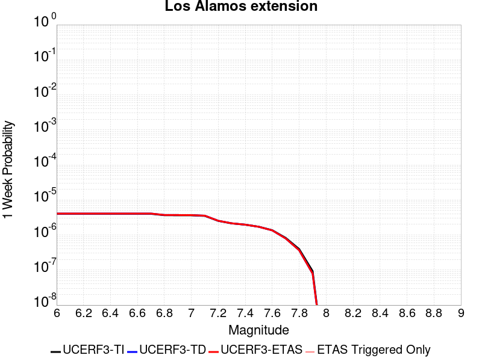 |  |  |  |

| Magnitude | 1 wk TI Prob | 1 wk TD Prob | 1 wk ETAS Prob | 1 wk ETAS/TD Gain | 1 wk ETAS Triggered Only | 1 mo TI Prob | 1 mo TD Prob | 1 mo ETAS Prob | 1 mo ETAS/TD Gain | 1 mo ETAS Triggered Only | 1 yr TI Prob | 1 yr TD Prob | 1 yr ETAS Prob | 1 yr ETAS/TD Gain | 1 yr ETAS Triggered Only | 10 yr TI Prob | 10 yr TD Prob | 10 yr ETAS Prob | 10 yr ETAS/TD Gain | 10 yr ETAS Triggered Only |
|-----|-----|-----|-----|-----|-----|-----|-----|-----|-----|-----|-----|-----|-----|-----|-----|-----|-----|-----|-----|-----|
| 6.0 | 4.0146506E-6 | 4.086528E-6 | 4.086528E-6 | 1.0 | 0.0 | 1.7205533E-5 | 1.751358E-5 | 1.751358E-5 | 1.0 | 0.0 | 2.0945723E-4 | 2.1320807E-4 | 2.3598952E-4 | 1.1068507 | 2.278631E-5 | 0.0020925992 | 0.0021301443 | 0.002152882 | 1.0106742 | 2.278631E-5 |
| 6.1 | 4.0146506E-6 | 4.086528E-6 | 4.086528E-6 | 1.0 | 0.0 | 1.7205533E-5 | 1.751358E-5 | 1.751358E-5 | 1.0 | 0.0 | 2.0945723E-4 | 2.1320807E-4 | 2.3598952E-4 | 1.1068507 | 2.278631E-5 | 0.0020925992 | 0.0021301443 | 0.002152882 | 1.0106742 | 2.278631E-5 |
| 6.2 | 4.0146506E-6 | 4.086528E-6 | 4.086528E-6 | 1.0 | 0.0 | 1.7205533E-5 | 1.751358E-5 | 1.751358E-5 | 1.0 | 0.0 | 2.0945723E-4 | 2.1320807E-4 | 2.3598952E-4 | 1.1068507 | 2.278631E-5 | 0.0020925992 | 0.0021301443 | 0.002152882 | 1.0106742 | 2.278631E-5 |
| 6.3 | 4.0146506E-6 | 4.086528E-6 | 4.086528E-6 | 1.0 | 0.0 | 1.7205533E-5 | 1.751358E-5 | 1.751358E-5 | 1.0 | 0.0 | 2.0945723E-4 | 2.1320807E-4 | 2.3598952E-4 | 1.1068507 | 2.278631E-5 | 0.0020925992 | 0.0021301443 | 0.002152882 | 1.0106742 | 2.278631E-5 |
| 6.4 | 4.0146506E-6 | 4.086528E-6 | 4.086528E-6 | 1.0 | 0.0 | 1.7205533E-5 | 1.751358E-5 | 1.751358E-5 | 1.0 | 0.0 | 2.0945723E-4 | 2.1320807E-4 | 2.3598952E-4 | 1.1068507 | 2.278631E-5 | 0.0020925992 | 0.0021301443 | 0.002152882 | 1.0106742 | 2.278631E-5 |
| 6.5 | 4.0146506E-6 | 4.086528E-6 | 4.086528E-6 | 1.0 | 0.0 | 1.7205533E-5 | 1.751358E-5 | 1.751358E-5 | 1.0 | 0.0 | 2.0945723E-4 | 2.1320807E-4 | 2.3598952E-4 | 1.1068507 | 2.278631E-5 | 0.0020925992 | 0.0021301443 | 0.002152882 | 1.0106742 | 2.278631E-5 |
| 6.6 | 4.0146506E-6 | 4.086528E-6 | 4.086528E-6 | 1.0 | 0.0 | 1.7205533E-5 | 1.751358E-5 | 1.751358E-5 | 1.0 | 0.0 | 2.0945723E-4 | 2.1320807E-4 | 2.3598952E-4 | 1.1068507 | 2.278631E-5 | 0.0020925992 | 0.0021301443 | 0.002152882 | 1.0106742 | 2.278631E-5 |
| 6.7 | 4.0146506E-6 | 4.086528E-6 | 4.086528E-6 | 1.0 | 0.0 | 1.7205533E-5 | 1.751358E-5 | 1.751358E-5 | 1.0 | 0.0 | 2.0945723E-4 | 2.1320807E-4 | 2.3598952E-4 | 1.1068507 | 2.278631E-5 | 0.0020925992 | 0.0021301443 | 0.002152882 | 1.0106742 | 2.278631E-5 |
| 6.8 | 3.6584688E-6 | 3.7192005E-6 | 3.7192005E-6 | 1.0 | 0.0 | 1.5679057E-5 | 1.5939338E-5 | 1.5939338E-5 | 1.0 | 0.0 | 1.9087581E-4 | 1.940451E-4 | 2.16827E-4 | 1.1174052 | 2.278631E-5 | 0.0019071194 | 0.0019388491 | 0.0019615912 | 1.0117297 | 2.278631E-5 |
| 6.9 | 3.644631E-6 | 3.7049094E-6 | 3.7049094E-6 | 1.0 | 0.0 | 1.5619753E-5 | 1.5878091E-5 | 1.5878091E-5 | 1.0 | 0.0 | 1.901539E-4 | 1.9329955E-4 | 2.1608146E-4 | 1.117858 | 2.278631E-5 | 0.0018999127 | 0.0019314067 | 0.001954149 | 1.011775 | 2.278631E-5 |
| 7.0 | 3.6318522E-6 | 3.691669E-6 | 3.691669E-6 | 1.0 | 0.0 | 1.5564989E-5 | 1.5821348E-5 | 1.5821348E-5 | 1.0 | 0.0 | 1.8948725E-4 | 1.9260882E-4 | 2.1539074E-4 | 1.1182808 | 2.278631E-5 | 0.0018932576 | 0.0019245112 | 0.0019472536 | 1.0118172 | 2.278631E-5 |
| 7.1 | 3.5001724E-6 | 3.5557293E-6 | 3.5557293E-6 | 1.0 | 0.0 | 1.5000653E-5 | 1.52387565E-5 | 1.52387565E-5 | 1.0 | 0.0 | 1.8261763E-4 | 1.8551698E-4 | 2.0829907E-4 | 1.1228032 | 2.278631E-5 | 0.0018246764 | 0.0018537118 | 0.0018764558 | 1.0122695 | 2.278631E-5 |
| 7.2 | 2.5204702E-6 | 2.5439472E-6 | 2.5439472E-6 | 1.0 | 0.0 | 1.080197E-5 | 1.0902586E-5 | 1.0902586E-5 | 1.0 | 0.0 | 1.3150605E-4 | 1.3273094E-4 | 1.4412259E-4 | 1.0858251 | 1.1393155E-5 | 0.0013142825 | 0.0013265223 | 0.0013379004 | 1.0085773 | 1.1393155E-5 |
| 7.3 | 2.1399692E-6 | 2.1503533E-6 | 2.1503533E-6 | 1.0 | 0.0 | 9.1712645E-6 | 9.215767E-6 | 9.215767E-6 | 1.0 | 0.0 | 1.1165442E-4 | 1.1219623E-4 | 1.235881E-4 | 1.1015353 | 1.1393155E-5 | 0.0011159834 | 0.0011213991 | 0.0011327795 | 1.0101484 | 1.1393155E-5 |
| 7.4 | 1.9660122E-6 | 1.970444E-6 | 1.970444E-6 | 1.0 | 0.0 | 8.42574E-6 | 8.444732E-6 | 8.444732E-6 | 1.0 | 0.0 | 1.0257855E-4 | 1.0280979E-4 | 1.0280979E-4 | 1.0 | 0.0 | 0.0010253121 | 0.0010276254 | 0.0010276254 | 1.0 | 0.0 |
| 7.5 | 1.7204633E-6 | 1.7152828E-6 | 1.7152828E-6 | 1.0 | 0.0 | 7.373393E-6 | 7.351191E-6 | 7.351191E-6 | 1.0 | 0.0 | 8.976737E-5 | 8.94971E-5 | 8.94971E-5 | 1.0 | 0.0 | 8.9731114E-4 | 8.946136E-4 | 8.946136E-4 | 1.0 | 0.0 |
| 7.6 | 1.3717638E-6 | 1.3537325E-6 | 1.3537325E-6 | 1.0 | 0.0 | 5.878974E-6 | 5.8016976E-6 | 5.8016976E-6 | 1.0 | 0.0 | 7.157416E-5 | 7.063341E-5 | 7.063341E-5 | 1.0 | 0.0 | 7.1551115E-4 | 7.061122E-4 | 7.061122E-4 | 1.0 | 0.0 |
| 7.7 | 8.272564E-7 | 7.958571E-7 | 7.958571E-7 | 1.0 | 0.0 | 3.5453797E-6 | 3.4108116E-6 | 3.4108116E-6 | 1.0 | 0.0 | 4.3164142E-5 | 4.152584E-5 | 4.152584E-5 | 1.0 | 0.0 | 4.315576E-4 | 4.15181E-4 | 4.15181E-4 | 1.0 | 0.0 |
| 7.8 | 3.9708277E-7 | 3.672379E-7 | 3.672379E-7 | 1.0 | 0.0 | 1.7017821E-6 | 1.5738757E-6 | 1.5738757E-6 | 1.0 | 0.0 | 2.0719E-5 | 1.916177E-5 | 1.916177E-5 | 1.0 | 0.0 | 2.071707E-4 | 1.9160123E-4 | 1.9160123E-4 | 1.0 | 0.0 |
| 7.9 | 9.292528E-8 | 7.890233E-8 | 7.890233E-8 | 1.0 | 0.0 | 3.9825116E-7 | 3.381528E-7 | 3.381528E-7 | 1.0 | 0.0 | 4.848697E-6 | 4.117003E-6 | 4.117003E-6 | 1.0 | 0.0 | 4.8485912E-5 | 4.1169274E-5 | 4.1169274E-5 | 1.0 | 0.0 |
| 8.0 | 7.880441E-11 | 8.236167E-11 | 8.236167E-11 | 1.0 | 0.0 | 3.3773329E-10 | 3.5297876E-10 | 3.5297876E-10 | 1.0 | 0.0 | 4.1119033E-9 | 4.297517E-9 | 4.297517E-9 | 1.0 | 0.0 | 4.1119034E-8 | 4.2975167E-8 | 4.2975167E-8 | 1.0 | 0.0 |

## San Jacinto (Stepovers Combined)
*[(top)](#table-of-contents)*

| 1 Week | 1 Month | 1 Year | 10 Year |
|-----|-----|-----|-----|
|  |  |  | 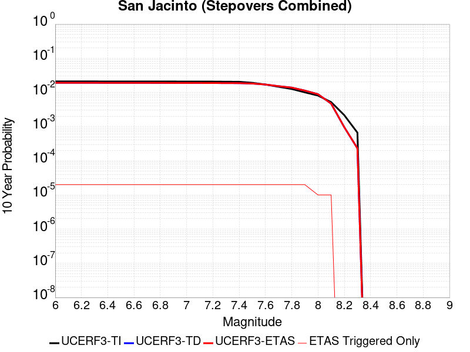 |

| Magnitude | 1 wk TI Prob | 1 wk TD Prob | 1 wk ETAS Prob | 1 wk ETAS/TD Gain | 1 wk ETAS Triggered Only | 1 mo TI Prob | 1 mo TD Prob | 1 mo ETAS Prob | 1 mo ETAS/TD Gain | 1 mo ETAS Triggered Only | 1 yr TI Prob | 1 yr TD Prob | 1 yr ETAS Prob | 1 yr ETAS/TD Gain | 1 yr ETAS Triggered Only | 10 yr TI Prob | 10 yr TD Prob | 10 yr ETAS Prob | 10 yr ETAS/TD Gain | 10 yr ETAS Triggered Only |
|-----|-----|-----|-----|-----|-----|-----|-----|-----|-----|-----|-----|-----|-----|-----|-----|-----|-----|-----|-----|-----|
| 6.0 | 4.0667746E-5 | 3.5535522E-5 | 3.5535522E-5 | 1.0 | 0.0 | 1.742787E-4 | 1.5228621E-4 | 1.5228621E-4 | 1.0 | 0.0 | 0.0021197782 | 0.0018525091 | 0.0018525091 | 1.0 | 0.0 | 0.020996714 | 0.019123098 | 0.01914545 | 1.0011687 | 2.278631E-5 |
| 6.1 | 4.0667746E-5 | 3.5535522E-5 | 3.5535522E-5 | 1.0 | 0.0 | 1.742787E-4 | 1.5228621E-4 | 1.5228621E-4 | 1.0 | 0.0 | 0.0021197782 | 0.0018525091 | 0.0018525091 | 1.0 | 0.0 | 0.020996714 | 0.019123098 | 0.01914545 | 1.0011687 | 2.278631E-5 |
| 6.2 | 4.0667746E-5 | 3.5535522E-5 | 3.5535522E-5 | 1.0 | 0.0 | 1.742787E-4 | 1.5228621E-4 | 1.5228621E-4 | 1.0 | 0.0 | 0.0021197782 | 0.0018525091 | 0.0018525091 | 1.0 | 0.0 | 0.020996714 | 0.019123098 | 0.01914545 | 1.0011687 | 2.278631E-5 |
| 6.3 | 4.0667746E-5 | 3.5535522E-5 | 3.5535522E-5 | 1.0 | 0.0 | 1.742787E-4 | 1.5228621E-4 | 1.5228621E-4 | 1.0 | 0.0 | 0.0021197782 | 0.0018525091 | 0.0018525091 | 1.0 | 0.0 | 0.020996714 | 0.019123098 | 0.01914545 | 1.0011687 | 2.278631E-5 |
| 6.4 | 4.0577226E-5 | 3.5407324E-5 | 3.5407324E-5 | 1.0 | 0.0 | 1.738908E-4 | 1.5173687E-4 | 1.5173687E-4 | 1.0 | 0.0 | 0.0021150648 | 0.0018458333 | 0.0018458333 | 1.0 | 0.0 | 0.020950472 | 0.01905762 | 0.019079972 | 1.0011729 | 2.278631E-5 |
| 6.5 | 4.0577226E-5 | 3.5407324E-5 | 3.5407324E-5 | 1.0 | 0.0 | 1.738908E-4 | 1.5173687E-4 | 1.5173687E-4 | 1.0 | 0.0 | 0.0021150648 | 0.0018458333 | 0.0018458333 | 1.0 | 0.0 | 0.020950472 | 0.01905762 | 0.019079972 | 1.0011729 | 2.278631E-5 |
| 6.6 | 4.053861E-5 | 3.535262E-5 | 3.535262E-5 | 1.0 | 0.0 | 1.7372532E-4 | 1.5150243E-4 | 1.5150243E-4 | 1.0 | 0.0 | 0.0021130538 | 0.0018429846 | 0.0018429846 | 1.0 | 0.0 | 0.020930743 | 0.019029679 | 0.019052032 | 1.0011746 | 2.278631E-5 |
| 6.7 | 4.0516545E-5 | 3.5321664E-5 | 3.5321664E-5 | 1.0 | 0.0 | 1.7363077E-4 | 1.513698E-4 | 1.513698E-4 | 1.0 | 0.0 | 0.002111905 | 0.0018413727 | 0.0018413727 | 1.0 | 0.0 | 0.020919468 | 0.019013865 | 0.019036217 | 1.0011756 | 2.278631E-5 |
| 6.8 | 4.049434E-5 | 3.529309E-5 | 3.529309E-5 | 1.0 | 0.0 | 1.7353562E-4 | 1.5124735E-4 | 1.5124735E-4 | 1.0 | 0.0 | 0.0021107488 | 0.0018398843 | 0.0018398843 | 1.0 | 0.0 | 0.020908125 | 0.01899921 | 0.019021563 | 1.0011766 | 2.278631E-5 |
| 6.9 | 4.046386E-5 | 3.525554E-5 | 3.525554E-5 | 1.0 | 0.0 | 1.73405E-4 | 1.5108644E-4 | 1.5108644E-4 | 1.0 | 0.0 | 0.0021091616 | 0.0018379285 | 0.0018379285 | 1.0 | 0.0 | 0.020892553 | 0.018979928 | 0.019002283 | 1.0011778 | 2.278631E-5 |
| 7.0 | 4.036382E-5 | 3.513575E-5 | 3.513575E-5 | 1.0 | 0.0 | 1.7297632E-4 | 1.505731E-4 | 1.505731E-4 | 1.0 | 0.0 | 0.0021039525 | 0.0018316895 | 0.0018316895 | 1.0 | 0.0 | 0.02084144 | 0.018918365 | 0.01894072 | 1.0011817 | 2.278631E-5 |
| 7.1 | 4.0343282E-5 | 3.511416E-5 | 3.511416E-5 | 1.0 | 0.0 | 1.7288832E-4 | 1.504806E-4 | 1.504806E-4 | 1.0 | 0.0 | 0.002102883 | 0.001830565 | 0.001830565 | 1.0 | 0.0 | 0.020830948 | 0.01890722 | 0.018929575 | 1.0011824 | 2.278631E-5 |
| 7.2 | 4.0257353E-5 | 3.5018445E-5 | 3.5018445E-5 | 1.0 | 0.0 | 1.725201E-4 | 1.5007044E-4 | 1.5007044E-4 | 1.0 | 0.0 | 0.0020984085 | 0.0018255797 | 0.0018255797 | 1.0 | 0.0 | 0.020787042 | 0.018857853 | 0.018880209 | 1.0011855 | 2.278631E-5 |
| 7.3 | 3.9940667E-5 | 3.4844383E-5 | 3.4844383E-5 | 1.0 | 0.0 | 1.7116306E-4 | 1.4932454E-4 | 1.4932454E-4 | 1.0 | 0.0 | 0.0020819185 | 0.0018165136 | 0.0018165136 | 1.0 | 0.0 | 0.020625217 | 0.018765585 | 0.018787945 | 1.0011915 | 2.278631E-5 |
| 7.4 | 3.9721202E-5 | 3.472915E-5 | 3.472915E-5 | 1.0 | 0.0 | 1.7022261E-4 | 1.4883073E-4 | 1.4883073E-4 | 1.0 | 0.0 | 0.0020704903 | 0.0018105115 | 0.0018105115 | 1.0 | 0.0 | 0.020513052 | 0.01870439 | 0.01872675 | 1.0011954 | 2.278631E-5 |
| 7.5 | 3.7036873E-5 | 3.3791104E-5 | 3.3791104E-5 | 1.0 | 0.0 | 1.5871979E-4 | 1.44811E-4 | 1.44811E-4 | 1.0 | 0.0 | 0.0019307006 | 0.0017616511 | 0.0017616511 | 1.0 | 0.0 | 0.019140124 | 0.018203242 | 0.018225614 | 1.0012289 | 2.278631E-5 |
| 7.6 | 3.2940967E-5 | 3.1557607E-5 | 3.1557607E-5 | 1.0 | 0.0 | 1.4116794E-4 | 1.3523988E-4 | 1.3523988E-4 | 1.0 | 0.0 | 0.0017173645 | 0.0016453044 | 0.0016453044 | 1.0 | 0.0 | 0.01704153 | 0.017028784 | 0.017051183 | 1.0013154 | 2.278631E-5 |
| 7.7 | 2.8236149E-5 | 2.8116616E-5 | 2.8116616E-5 | 1.0 | 0.0 | 1.2100645E-4 | 1.20494224E-4 | 1.20494224E-4 | 1.0 | 0.0 | 0.0014722579 | 0.0014660311 | 0.0014660311 | 1.0 | 0.0 | 0.014625421 | 0.015236166 | 0.015258605 | 1.0014727 | 2.278631E-5 |
| 7.8 | 2.4329287E-5 | 2.5431033E-5 | 2.5431033E-5 | 1.0 | 0.0 | 1.042642E-4 | 1.08985594E-4 | 1.08985594E-4 | 1.0 | 0.0 | 0.0012686774 | 0.0013260928 | 0.0013260928 | 1.0 | 0.0 | 0.012614589 | 0.013828802 | 0.013851274 | 1.001625 | 2.278631E-5 |
| 7.9 | 1.9370926E-5 | 2.0622865E-5 | 2.0622865E-5 | 1.0 | 0.0 | 8.301561E-5 | 8.8380715E-5 | 8.8380715E-5 | 1.0 | 0.0 | 0.0010102465 | 0.0010755048 | 0.0010755048 | 1.0 | 0.0 | 0.0100566605 | 0.011304675 | 0.011327203 | 1.0019928 | 2.278631E-5 |
| 8.0 | 1.5583017E-5 | 1.6055677E-5 | 1.6055677E-5 | 1.0 | 0.0 | 6.6782646E-5 | 6.880824E-5 | 6.880824E-5 | 1.0 | 0.0 | 8.127754E-4 | 8.37419E-4 | 8.37419E-4 | 1.0 | 0.0 | 0.008098091 | 0.008870933 | 0.0088822255 | 1.0012729 | 1.1393155E-5 |
| 8.1 | 1.0024873E-5 | 8.3913565E-6 | 8.3913565E-6 | 1.0 | 0.0 | 4.2963035E-5 | 3.5962465E-5 | 3.5962465E-5 | 1.0 | 0.0 | 5.229494E-4 | 4.3775555E-4 | 4.3775555E-4 | 1.0 | 0.0 | 0.0052172043 | 0.0047065928 | 0.004717932 | 1.0024093 | 1.1393155E-5 |
| 8.2 | 4.142796E-6 | 1.5891568E-6 | 1.5891568E-6 | 1.0 | 0.0 | 1.775472E-5 | 6.810654E-6 | 6.810654E-6 | 1.0 | 0.0 | 2.1614227E-4 | 8.291659E-5 | 8.291659E-5 | 1.0 | 0.0 | 0.0021593217 | 9.61604E-4 | 9.61604E-4 | 1.0 | 0.0 |
| 8.3 | 1.2750878E-6 | 3.6885194E-7 | 3.6885194E-7 | 1.0 | 0.0 | 5.4646503E-6 | 1.5807931E-6 | 1.5807931E-6 | 1.0 | 0.0 | 6.653009E-5 | 1.924599E-5 | 1.924599E-5 | 1.0 | 0.0 | 6.6510175E-4 | 2.3183708E-4 | 2.3183708E-4 | 1.0 | 0.0 |

## Verdugo
*[(top)](#table-of-contents)*

| 1 Week | 1 Month | 1 Year | 10 Year |
|-----|-----|-----|-----|
|  |  |  |  |

| Magnitude | 1 wk TI Prob | 1 wk TD Prob | 1 wk ETAS Prob | 1 wk ETAS/TD Gain | 1 wk ETAS Triggered Only | 1 mo TI Prob | 1 mo TD Prob | 1 mo ETAS Prob | 1 mo ETAS/TD Gain | 1 mo ETAS Triggered Only | 1 yr TI Prob | 1 yr TD Prob | 1 yr ETAS Prob | 1 yr ETAS/TD Gain | 1 yr ETAS Triggered Only | 10 yr TI Prob | 10 yr TD Prob | 10 yr ETAS Prob | 10 yr ETAS/TD Gain | 10 yr ETAS Triggered Only |
|-----|-----|-----|-----|-----|-----|-----|-----|-----|-----|-----|-----|-----|-----|-----|-----|-----|-----|-----|-----|-----|
| 6.0 | 5.392987E-6 | 4.2174674E-6 | 4.2174674E-6 | 1.0 | 0.0 | 2.3112598E-5 | 1.8074737E-5 | 1.8074737E-5 | 1.0 | 0.0 | 2.8135953E-4 | 2.2003817E-4 | 2.2003817E-4 | 1.0 | 0.0 | 0.0028100356 | 0.002198251 | 0.002220987 | 1.0103428 | 2.278631E-5 |
| 6.1 | 5.392987E-6 | 4.2174674E-6 | 4.2174674E-6 | 1.0 | 0.0 | 2.3112598E-5 | 1.8074737E-5 | 1.8074737E-5 | 1.0 | 0.0 | 2.8135953E-4 | 2.2003817E-4 | 2.2003817E-4 | 1.0 | 0.0 | 0.0028100356 | 0.002198251 | 0.002220987 | 1.0103428 | 2.278631E-5 |
| 6.2 | 5.392987E-6 | 4.2174674E-6 | 4.2174674E-6 | 1.0 | 0.0 | 2.3112598E-5 | 1.8074737E-5 | 1.8074737E-5 | 1.0 | 0.0 | 2.8135953E-4 | 2.2003817E-4 | 2.2003817E-4 | 1.0 | 0.0 | 0.0028100356 | 0.002198251 | 0.002220987 | 1.0103428 | 2.278631E-5 |
| 6.3 | 5.392987E-6 | 4.2174674E-6 | 4.2174674E-6 | 1.0 | 0.0 | 2.3112598E-5 | 1.8074737E-5 | 1.8074737E-5 | 1.0 | 0.0 | 2.8135953E-4 | 2.2003817E-4 | 2.2003817E-4 | 1.0 | 0.0 | 0.0028100356 | 0.002198251 | 0.002220987 | 1.0103428 | 2.278631E-5 |
| 6.4 | 5.392987E-6 | 4.2174674E-6 | 4.2174674E-6 | 1.0 | 0.0 | 2.3112598E-5 | 1.8074737E-5 | 1.8074737E-5 | 1.0 | 0.0 | 2.8135953E-4 | 2.2003817E-4 | 2.2003817E-4 | 1.0 | 0.0 | 0.0028100356 | 0.002198251 | 0.002220987 | 1.0103428 | 2.278631E-5 |
| 6.5 | 4.9154837E-6 | 3.7233756E-6 | 3.7233756E-6 | 1.0 | 0.0 | 2.1066187E-5 | 1.5957228E-5 | 1.5957228E-5 | 1.0 | 0.0 | 2.5645064E-4 | 1.9426213E-4 | 1.9426213E-4 | 1.0 | 0.0 | 0.002561549 | 0.001940944 | 0.0019636862 | 1.0117171 | 2.278631E-5 |
| 6.6 | 4.9154837E-6 | 3.7233756E-6 | 3.7233756E-6 | 1.0 | 0.0 | 2.1066187E-5 | 1.5957228E-5 | 1.5957228E-5 | 1.0 | 0.0 | 2.5645064E-4 | 1.9426213E-4 | 1.9426213E-4 | 1.0 | 0.0 | 0.002561549 | 0.001940944 | 0.0019636862 | 1.0117171 | 2.278631E-5 |
| 6.7 | 4.817006E-6 | 3.6215542E-6 | 3.6215542E-6 | 1.0 | 0.0 | 2.0644147E-5 | 1.5520856E-5 | 1.5520856E-5 | 1.0 | 0.0 | 2.513135E-4 | 1.8895023E-4 | 1.8895023E-4 | 1.0 | 0.0 | 0.0025102948 | 0.0018879154 | 0.0019106587 | 1.0120468 | 2.278631E-5 |
| 6.8 | 4.507407E-6 | 3.3079687E-6 | 3.3079687E-6 | 1.0 | 0.0 | 1.9317316E-5 | 1.4176932E-5 | 1.4176932E-5 | 1.0 | 0.0 | 2.3516294E-4 | 1.7259062E-4 | 1.7259062E-4 | 1.0 | 0.0 | 0.0023491425 | 0.0017245802 | 0.0017473272 | 1.0131899 | 2.278631E-5 |
| 6.9 | 4.3573054E-6 | 3.1618583E-6 | 3.1618583E-6 | 1.0 | 0.0 | 1.8674033E-5 | 1.3550752E-5 | 1.3550752E-5 | 1.0 | 0.0 | 2.2733262E-4 | 1.6496803E-4 | 1.6496803E-4 | 1.0 | 0.0 | 0.0022710022 | 0.0016484681 | 0.0016712168 | 1.0137999 | 2.278631E-5 |
| 7.0 | 4.171527E-6 | 2.9844957E-6 | 2.9844957E-6 | 1.0 | 0.0 | 1.787785E-5 | 1.2790634E-5 | 1.2790634E-5 | 1.0 | 0.0 | 2.1764109E-4 | 1.5571495E-4 | 1.5571495E-4 | 1.0 | 0.0 | 0.0021742806 | 0.0015560697 | 0.0015674451 | 1.0073104 | 1.1393155E-5 |
| 7.1 | 4.0405484E-6 | 2.8830707E-6 | 2.8830707E-6 | 1.0 | 0.0 | 1.731652E-5 | 1.2355959E-5 | 1.2355959E-5 | 1.0 | 0.0 | 2.1080824E-4 | 1.5042353E-4 | 1.5042353E-4 | 1.0 | 0.0 | 0.0021060838 | 0.0015032281 | 0.0015146041 | 1.0075678 | 1.1393155E-5 |
| 7.2 | 3.8306007E-6 | 2.7026297E-6 | 2.7026297E-6 | 1.0 | 0.0 | 1.6416758E-5 | 1.1582647E-5 | 1.1582647E-5 | 1.0 | 0.0 | 1.9985568E-4 | 1.4100972E-4 | 1.4100972E-4 | 1.0 | 0.0 | 0.0019967605 | 0.0014092132 | 0.0014205902 | 1.0080733 | 1.1393155E-5 |
| 7.3 | 3.5750938E-6 | 2.5129289E-6 | 2.5129289E-6 | 1.0 | 0.0 | 1.532174E-5 | 1.0769651E-5 | 1.0769651E-5 | 1.0 | 0.0 | 1.8652623E-4 | 1.3111273E-4 | 1.3111273E-4 | 1.0 | 0.0 | 0.0018636974 | 0.0013103642 | 0.0013217424 | 1.0086832 | 1.1393155E-5 |
| 7.4 | 3.3510041E-6 | 2.3415846E-6 | 2.3415846E-6 | 1.0 | 0.0 | 1.4361368E-5 | 1.00353245E-5 | 1.00353245E-5 | 1.0 | 0.0 | 1.7483562E-4 | 1.2217333E-4 | 1.2217333E-4 | 1.0 | 0.0 | 0.0017469813 | 0.001221072 | 0.0012324513 | 1.0093191 | 1.1393155E-5 |
| 7.5 | 2.948287E-6 | 2.0396562E-6 | 2.0396562E-6 | 1.0 | 0.0 | 1.2635454E-5 | 8.7413555E-6 | 8.7413555E-6 | 1.0 | 0.0 | 1.538258E-4 | 1.0642091E-4 | 1.0642091E-4 | 1.0 | 0.0 | 0.0015371935 | 0.0010637097 | 0.0010750907 | 1.0106994 | 1.1393155E-5 |
| 7.6 | 2.0134323E-6 | 1.4474672E-6 | 1.4474672E-6 | 1.0 | 0.0 | 8.628967E-6 | 6.2034164E-6 | 6.2034164E-6 | 1.0 | 0.0 | 1.05052604E-4 | 7.552407E-5 | 7.552407E-5 | 1.0 | 0.0 | 0.0010500296 | 7.549928E-4 | 7.549928E-4 | 1.0 | 0.0 |
| 7.7 | 5.726436E-7 | 4.0464712E-7 | 4.0464712E-7 | 1.0 | 0.0 | 2.4541846E-6 | 1.734201E-6 | 1.734201E-6 | 1.0 | 0.0 | 2.9879287E-5 | 2.1113718E-5 | 2.1113718E-5 | 1.0 | 0.0 | 2.987527E-4 | 2.1111967E-4 | 2.1111967E-4 | 1.0 | 0.0 |
| 7.8 | 1.6248204E-7 | 1.0695783E-7 | 1.0695783E-7 | 1.0 | 0.0 | 6.963514E-7 | 4.5839062E-7 | 4.5839062E-7 | 1.0 | 0.0 | 8.478045E-6 | 5.580892E-6 | 5.580892E-6 | 1.0 | 0.0 | 8.477722E-5 | 5.580755E-5 | 5.580755E-5 | 1.0 | 0.0 |
| 7.9 | 4.4475744E-8 | 3.038227E-8 | 3.038227E-8 | 1.0 | 0.0 | 1.9061031E-7 | 1.3020971E-7 | 1.3020971E-7 | 1.0 | 0.0 | 2.320678E-6 | 1.5853024E-6 | 1.5853024E-6 | 1.0 | 0.0 | 2.3206538E-5 | 1.5852924E-5 | 1.5852924E-5 | 1.0 | 0.0 |

## San Juan
*[(top)](#table-of-contents)*

| 1 Week | 1 Month | 1 Year | 10 Year |
|-----|-----|-----|-----|
| 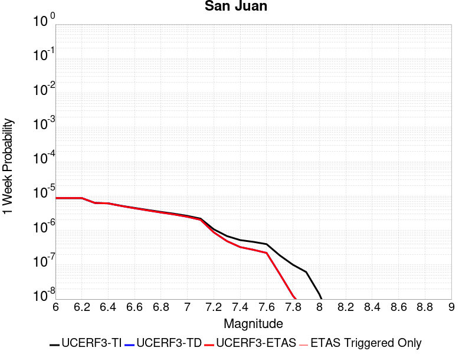 | 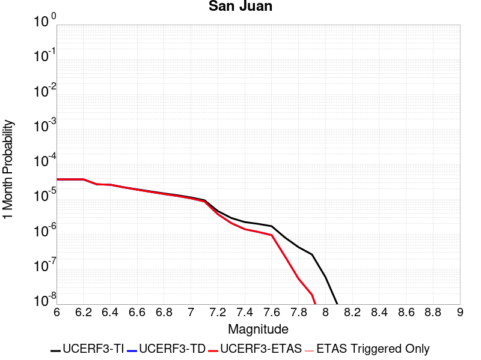 |  | 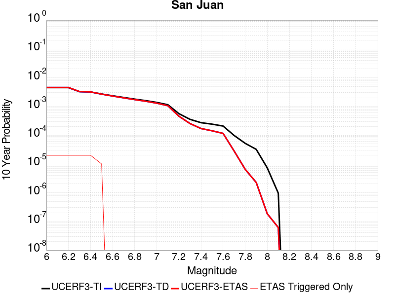 |

| Magnitude | 1 wk TI Prob | 1 wk TD Prob | 1 wk ETAS Prob | 1 wk ETAS/TD Gain | 1 wk ETAS Triggered Only | 1 mo TI Prob | 1 mo TD Prob | 1 mo ETAS Prob | 1 mo ETAS/TD Gain | 1 mo ETAS Triggered Only | 1 yr TI Prob | 1 yr TD Prob | 1 yr ETAS Prob | 1 yr ETAS/TD Gain | 1 yr ETAS Triggered Only | 10 yr TI Prob | 10 yr TD Prob | 10 yr ETAS Prob | 10 yr ETAS/TD Gain | 10 yr ETAS Triggered Only |
|-----|-----|-----|-----|-----|-----|-----|-----|-----|-----|-----|-----|-----|-----|-----|-----|-----|-----|-----|-----|-----|
| 6.0 | 8.682808E-6 | 8.756382E-6 | 8.756382E-6 | 1.0 | 0.0 | 3.72115E-5 | 3.752684E-5 | 3.752684E-5 | 1.0 | 0.0 | 4.5295584E-4 | 4.5679833E-4 | 4.7957423E-4 | 1.0498599 | 2.278631E-5 | 0.004520337 | 0.004559137 | 0.0045818193 | 1.0049752 | 2.278631E-5 |
| 6.1 | 8.682808E-6 | 8.756382E-6 | 8.756382E-6 | 1.0 | 0.0 | 3.72115E-5 | 3.752684E-5 | 3.752684E-5 | 1.0 | 0.0 | 4.5295584E-4 | 4.5679833E-4 | 4.7957423E-4 | 1.0498599 | 2.278631E-5 | 0.004520337 | 0.004559137 | 0.0045818193 | 1.0049752 | 2.278631E-5 |
| 6.2 | 8.682808E-6 | 8.756382E-6 | 8.756382E-6 | 1.0 | 0.0 | 3.72115E-5 | 3.752684E-5 | 3.752684E-5 | 1.0 | 0.0 | 4.5295584E-4 | 4.5679833E-4 | 4.7957423E-4 | 1.0498599 | 2.278631E-5 | 0.004520337 | 0.004559137 | 0.0045818193 | 1.0049752 | 2.278631E-5 |
| 6.3 | 6.3054235E-6 | 6.2895897E-6 | 6.2895897E-6 | 1.0 | 0.0 | 2.7022963E-5 | 2.6955115E-5 | 2.6955115E-5 | 1.0 | 0.0 | 3.2895492E-4 | 3.281305E-4 | 3.5090934E-4 | 1.0694201 | 2.278631E-5 | 0.003284684 | 0.0032766624 | 0.003299374 | 1.0069313 | 2.278631E-5 |
| 6.4 | 6.1490473E-6 | 6.120548E-6 | 6.120548E-6 | 1.0 | 0.0 | 2.6352795E-5 | 2.6230664E-5 | 2.6230664E-5 | 1.0 | 0.0 | 3.2079802E-4 | 3.193129E-4 | 3.4209195E-4 | 1.0713377 | 2.278631E-5 | 0.0032033534 | 0.0031887395 | 0.0032114533 | 1.0071231 | 2.278631E-5 |
| 6.5 | 5.204848E-6 | 5.14313E-6 | 5.14313E-6 | 1.0 | 0.0 | 2.23063E-5 | 2.2041804E-5 | 2.2041804E-5 | 1.0 | 0.0 | 2.7154534E-4 | 2.6832687E-4 | 2.7971697E-4 | 1.0424486 | 1.1393155E-5 | 0.0027121378 | 0.0026801853 | 0.0026915479 | 1.0042394 | 1.1393155E-5 |
| 6.6 | 4.5179986E-6 | 4.419525E-6 | 4.419525E-6 | 1.0 | 0.0 | 1.9362706E-5 | 1.8940687E-5 | 1.8940687E-5 | 1.0 | 0.0 | 2.3571544E-4 | 2.3057926E-4 | 2.3057926E-4 | 1.0 | 0.0 | 0.0023546559 | 0.0023035395 | 0.0023035395 | 1.0 | 0.0 |
| 6.7 | 3.9442616E-6 | 3.8238763E-6 | 3.8238763E-6 | 1.0 | 0.0 | 1.6903869E-5 | 1.6387941E-5 | 1.6387941E-5 | 1.0 | 0.0 | 2.0578515E-4 | 1.995056E-4 | 1.995056E-4 | 1.0 | 0.0 | 0.002055947 | 0.0019933921 | 0.0019933921 | 1.0 | 0.0 |
| 6.8 | 3.4536245E-6 | 3.3202273E-6 | 3.3202273E-6 | 1.0 | 0.0 | 1.4801163E-5 | 1.4229471E-5 | 1.4229471E-5 | 1.0 | 0.0 | 1.8018926E-4 | 1.7323066E-4 | 1.7323066E-4 | 1.0 | 0.0 | 0.0018004322 | 0.0017310773 | 0.0017310773 | 1.0 | 0.0 |
| 6.9 | 3.059865E-6 | 2.915762E-6 | 2.915762E-6 | 1.0 | 0.0 | 1.3113641E-5 | 1.2496066E-5 | 1.2496066E-5 | 1.0 | 0.0 | 1.596469E-4 | 1.5212955E-4 | 1.5212955E-4 | 1.0 | 0.0 | 0.0015953224 | 0.0015203711 | 0.0015203711 | 1.0 | 0.0 |
| 7.0 | 2.6504351E-6 | 2.4955366E-6 | 2.4955366E-6 | 1.0 | 0.0 | 1.1358958E-5 | 1.06951165E-5 | 1.06951165E-5 | 1.0 | 0.0 | 1.3828653E-4 | 1.3020581E-4 | 1.3020581E-4 | 1.0 | 0.0 | 0.0013820052 | 0.0013014093 | 0.0013014093 | 1.0 | 0.0 |
| 7.1 | 2.2039317E-6 | 2.036774E-6 | 2.036774E-6 | 1.0 | 0.0 | 9.445387E-6 | 8.7290055E-6 | 8.7290055E-6 | 1.0 | 0.0 | 1.1499152E-4 | 1.06270985E-4 | 1.06270985E-4 | 1.0 | 0.0 | 0.0011493203 | 0.0010623139 | 0.0010623139 | 1.0 | 0.0 |
| 7.2 | 1.0786707E-6 | 8.795818E-7 | 8.795818E-7 | 1.0 | 0.0 | 4.622866E-6 | 3.769631E-6 | 3.769631E-6 | 1.0 | 0.0 | 5.628194E-5 | 4.58943E-5 | 4.58943E-5 | 1.0 | 0.0 | 5.6267687E-4 | 4.589096E-4 | 4.589096E-4 | 1.0 | 0.0 |
| 7.3 | 6.846433E-7 | 4.8833596E-7 | 4.8833596E-7 | 1.0 | 0.0 | 2.9341822E-6 | 2.0928667E-6 | 2.0928667E-6 | 1.0 | 0.0 | 3.5723086E-5 | 2.5480356E-5 | 2.5480356E-5 | 1.0 | 0.0 | 3.571734E-4 | 2.54809E-4 | 2.54809E-4 | 1.0 | 0.0 |
| 7.4 | 5.23043E-7 | 3.2736378E-7 | 3.2736378E-7 | 1.0 | 0.0 | 2.2416111E-6 | 1.4029868E-6 | 1.4029868E-6 | 1.0 | 0.0 | 2.7291273E-5 | 1.708123E-5 | 1.708123E-5 | 1.0 | 0.0 | 2.7287923E-4 | 1.7083234E-4 | 1.7083234E-4 | 1.0 | 0.0 |
| 7.5 | 4.648444E-7 | 2.732817E-7 | 2.732817E-7 | 1.0 | 0.0 | 1.9921886E-6 | 1.1712068E-6 | 1.1712068E-6 | 1.0 | 0.0 | 2.4254627E-5 | 1.425935E-5 | 1.425935E-5 | 1.0 | 0.0 | 2.425198E-4 | 1.4261523E-4 | 1.4261523E-4 | 1.0 | 0.0 |
| 7.6 | 3.9906567E-7 | 2.2156648E-7 | 2.2156648E-7 | 1.0 | 0.0 | 1.7102802E-6 | 9.495703E-7 | 9.495703E-7 | 1.0 | 0.0 | 2.0822463E-5 | 1.1560957E-5 | 1.1560957E-5 | 1.0 | 0.0 | 2.0820512E-4 | 1.1562933E-4 | 1.1562933E-4 | 1.0 | 0.0 |
| 7.7 | 1.8784601E-7 | 5.3943072E-8 | 5.3943072E-8 | 1.0 | 0.0 | 8.0505407E-7 | 2.3118457E-7 | 2.3118457E-7 | 1.0 | 0.0 | 9.80149E-6 | 2.8146683E-6 | 2.8146683E-6 | 1.0 | 0.0 | 9.801057E-5 | 2.8156077E-5 | 2.8156077E-5 | 1.0 | 0.0 |
| 7.8 | 1.00154914E-7 | 1.2501302E-8 | 1.2501302E-8 | 1.0 | 0.0 | 4.2923529E-7 | 5.357701E-8 | 5.357701E-8 | 1.0 | 0.0 | 5.225927E-6 | 6.522999E-7 | 6.522999E-7 | 1.0 | 0.0 | 5.225804E-5 | 6.5290556E-6 | 6.5290556E-6 | 1.0 | 0.0 |
| 7.9 | 6.171429E-8 | 4.34064E-9 | 4.34064E-9 | 1.0 | 0.0 | 2.6448978E-7 | 1.8602739E-8 | 1.8602739E-8 | 1.0 | 0.0 | 3.2201583E-6 | 2.264883E-7 | 2.264883E-7 | 1.0 | 0.0 | 3.2201115E-5 | 2.2703287E-6 | 2.2703287E-6 | 1.0 | 0.0 |
| 8.0 | 1.3974572E-8 | 3.4573688E-10 | 3.4573688E-10 | 1.0 | 0.0 | 5.989102E-8 | 1.4817279E-9 | 1.4817279E-9 | 1.0 | 0.0 | 7.2917294E-7 | 1.8040026E-8 | 1.8040026E-8 | 1.0 | 0.0 | 7.2917055E-6 | 1.8482287E-7 | 1.8482287E-7 | 1.0 | 0.0 |
| 8.1 | 1.8403477E-9 | 1.1499546E-10 | 1.1499546E-10 | 1.0 | 0.0 | 7.887204E-9 | 4.928392E-10 | 4.928392E-10 | 1.0 | 0.0 | 9.602671E-8 | 6.0003154E-9 | 6.0003154E-9 | 1.0 | 0.0 | 9.602667E-7 | 6.128941E-8 | 6.128941E-8 | 1.0 | 0.0 |

## Davis Creek
*[(top)](#table-of-contents)*

| 1 Week | 1 Month | 1 Year | 10 Year |
|-----|-----|-----|-----|
|  |  | 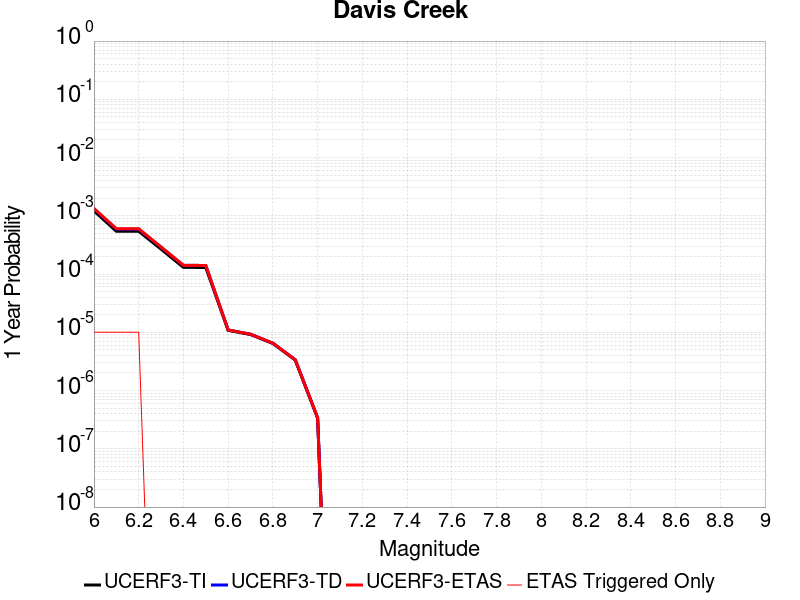 | 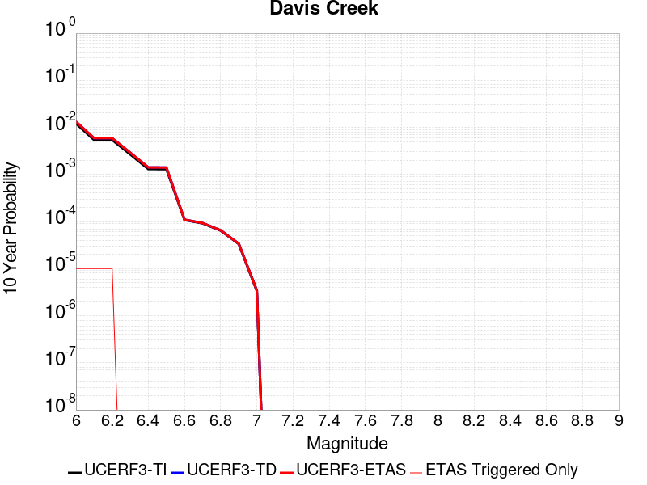 |

| Magnitude | 1 wk TI Prob | 1 wk TD Prob | 1 wk ETAS Prob | 1 wk ETAS/TD Gain | 1 wk ETAS Triggered Only | 1 mo TI Prob | 1 mo TD Prob | 1 mo ETAS Prob | 1 mo ETAS/TD Gain | 1 mo ETAS Triggered Only | 1 yr TI Prob | 1 yr TD Prob | 1 yr ETAS Prob | 1 yr ETAS/TD Gain | 1 yr ETAS Triggered Only | 10 yr TI Prob | 10 yr TD Prob | 10 yr ETAS Prob | 10 yr ETAS/TD Gain | 10 yr ETAS Triggered Only |
|-----|-----|-----|-----|-----|-----|-----|-----|-----|-----|-----|-----|-----|-----|-----|-----|-----|-----|-----|-----|-----|
| 6.0 | 2.331472E-5 | 2.5422516E-5 | 2.5422516E-5 | 1.0 | 0.0 | 9.99164E-5 | 1.0894976E-4 | 1.0894976E-4 | 1.0 | 0.0 | 0.0012158032 | 0.0013257747 | 0.0013371528 | 1.0085822 | 1.1393155E-5 | 0.01209173 | 0.01319044 | 0.013201683 | 1.0008523 | 1.1393155E-5 |
| 6.1 | 1.0407654E-5 | 1.13192755E-5 | 1.13192755E-5 | 1.0 | 0.0 | 4.4603472E-5 | 4.8510432E-5 | 4.8510432E-5 | 1.0 | 0.0 | 5.4291193E-4 | 5.9048156E-4 | 6.01868E-4 | 1.0192833 | 1.1393155E-5 | 0.0054158745 | 0.0058917995 | 0.0059031257 | 1.0019224 | 1.1393155E-5 |
| 6.2 | 1.0407654E-5 | 1.13192755E-5 | 1.13192755E-5 | 1.0 | 0.0 | 4.4603472E-5 | 4.8510432E-5 | 4.8510432E-5 | 1.0 | 0.0 | 5.4291193E-4 | 5.9048156E-4 | 6.01868E-4 | 1.0192833 | 1.1393155E-5 | 0.0054158745 | 0.0058917995 | 0.0059031257 | 1.0019224 | 1.1393155E-5 |
| 6.3 | 5.1323277E-6 | 5.5696532E-6 | 5.5696532E-6 | 1.0 | 0.0 | 2.1995505E-5 | 2.3869772E-5 | 2.3869772E-5 | 1.0 | 0.0 | 2.6776237E-4 | 2.9058434E-4 | 2.9058434E-4 | 1.0 | 0.0 | 0.0026743996 | 0.0029028903 | 0.0029028903 | 1.0 | 0.0 |
| 6.4 | 2.4985154E-6 | 2.7050564E-6 | 2.7050564E-6 | 1.0 | 0.0 | 1.07078795E-5 | 1.1593068E-5 | 1.1593068E-5 | 1.0 | 0.0 | 1.3036063E-4 | 1.4114009E-4 | 1.4114009E-4 | 1.0 | 0.0 | 0.0013028418 | 0.0014108593 | 0.0014108593 | 1.0 | 0.0 |
| 6.5 | 2.4846438E-6 | 2.6909902E-6 | 2.6909902E-6 | 1.0 | 0.0 | 1.064843E-5 | 1.1532785E-5 | 1.1532785E-5 | 1.0 | 0.0 | 1.2963692E-4 | 1.4040622E-4 | 1.4040622E-4 | 1.0 | 0.0 | 0.0012956132 | 0.00140353 | 0.00140353 | 1.0 | 0.0 |
| 6.6 | 2.072566E-7 | 2.1018774E-7 | 2.1018774E-7 | 1.0 | 0.0 | 8.882423E-7 | 9.0080425E-7 | 9.0080425E-7 | 1.0 | 0.0 | 1.0814296E-5 | 1.0967238E-5 | 1.0967238E-5 | 1.0 | 0.0 | 1.081377E-4 | 1.09667155E-4 | 1.09667155E-4 | 1.0 | 0.0 |
| 6.7 | 1.7544528E-7 | 1.7791403E-7 | 1.7791403E-7 | 1.0 | 0.0 | 7.5190815E-7 | 7.624885E-7 | 7.624885E-7 | 1.0 | 0.0 | 9.154443E-6 | 9.28326E-6 | 9.28326E-6 | 1.0 | 0.0 | 9.1540656E-5 | 9.282887E-5 | 9.282887E-5 | 1.0 | 0.0 |
| 6.8 | 1.2320395E-7 | 1.2481514E-7 | 1.2481514E-7 | 1.0 | 0.0 | 5.280168E-7 | 5.349219E-7 | 5.349219E-7 | 1.0 | 0.0 | 6.428586E-6 | 6.512656E-6 | 6.512656E-6 | 1.0 | 0.0 | 6.4284E-5 | 6.512477E-5 | 6.512477E-5 | 1.0 | 0.0 |
| 6.9 | 6.399997E-8 | 6.48626E-8 | 6.48626E-8 | 1.0 | 0.0 | 2.7428555E-7 | 2.779825E-7 | 2.779825E-7 | 1.0 | 0.0 | 3.3394215E-6 | 3.3844326E-6 | 3.3844326E-6 | 1.0 | 0.0 | 3.3393713E-5 | 3.3843873E-5 | 3.3843873E-5 | 1.0 | 0.0 |
| 7.0 | 6.4455685E-9 | 6.5354744E-9 | 6.5354744E-9 | 1.0 | 0.0 | 2.7623864E-8 | 2.8009175E-8 | 2.8009175E-8 | 1.0 | 0.0 | 3.3632048E-7 | 3.410117E-7 | 3.410117E-7 | 1.0 | 0.0 | 3.3631998E-6 | 3.4101172E-6 | 3.4101172E-6 | 1.0 | 0.0 |

## San Gorgonio Pass
*[(top)](#table-of-contents)*

| 1 Week | 1 Month | 1 Year | 10 Year |
|-----|-----|-----|-----|
| 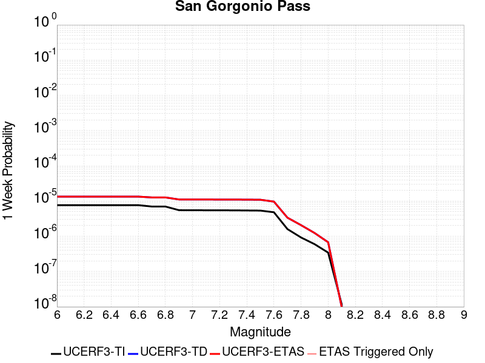 |  | 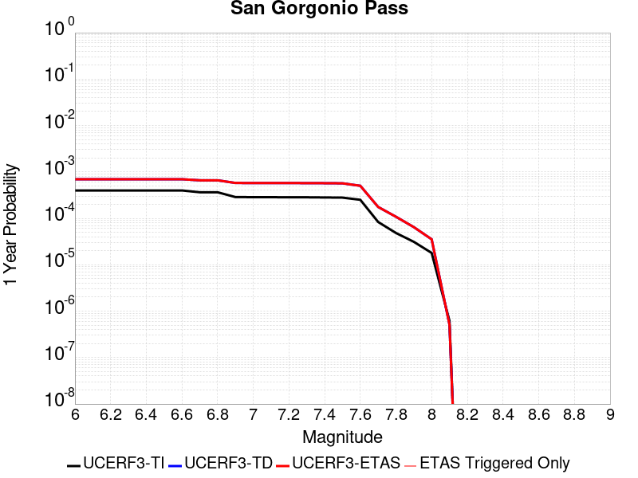 |  |

| Magnitude | 1 wk TI Prob | 1 wk TD Prob | 1 wk ETAS Prob | 1 wk ETAS/TD Gain | 1 wk ETAS Triggered Only | 1 mo TI Prob | 1 mo TD Prob | 1 mo ETAS Prob | 1 mo ETAS/TD Gain | 1 mo ETAS Triggered Only | 1 yr TI Prob | 1 yr TD Prob | 1 yr ETAS Prob | 1 yr ETAS/TD Gain | 1 yr ETAS Triggered Only | 10 yr TI Prob | 10 yr TD Prob | 10 yr ETAS Prob | 10 yr ETAS/TD Gain | 10 yr ETAS Triggered Only |
|-----|-----|-----|-----|-----|-----|-----|-----|-----|-----|-----|-----|-----|-----|-----|-----|-----|-----|-----|-----|-----|
| 6.0 | 7.644328E-6 | 1.3350924E-5 | 1.3350924E-5 | 1.0 | 0.0 | 3.2760996E-5 | 5.721704E-5 | 5.721704E-5 | 1.0 | 0.0 | 3.987921E-4 | 6.964034E-4 | 6.964034E-4 | 1.0 | 0.0 | 0.003980772 | 0.006948622 | 0.006959936 | 1.0016283 | 1.1393155E-5 |
| 6.1 | 7.644328E-6 | 1.3350924E-5 | 1.3350924E-5 | 1.0 | 0.0 | 3.2760996E-5 | 5.721704E-5 | 5.721704E-5 | 1.0 | 0.0 | 3.987921E-4 | 6.964034E-4 | 6.964034E-4 | 1.0 | 0.0 | 0.003980772 | 0.006948622 | 0.006959936 | 1.0016283 | 1.1393155E-5 |
| 6.2 | 7.644328E-6 | 1.3350924E-5 | 1.3350924E-5 | 1.0 | 0.0 | 3.2760996E-5 | 5.721704E-5 | 5.721704E-5 | 1.0 | 0.0 | 3.987921E-4 | 6.964034E-4 | 6.964034E-4 | 1.0 | 0.0 | 0.003980772 | 0.006948622 | 0.006959936 | 1.0016283 | 1.1393155E-5 |
| 6.3 | 7.644328E-6 | 1.3350924E-5 | 1.3350924E-5 | 1.0 | 0.0 | 3.2760996E-5 | 5.721704E-5 | 5.721704E-5 | 1.0 | 0.0 | 3.987921E-4 | 6.964034E-4 | 6.964034E-4 | 1.0 | 0.0 | 0.003980772 | 0.006948622 | 0.006959936 | 1.0016283 | 1.1393155E-5 |
| 6.4 | 7.644328E-6 | 1.3350924E-5 | 1.3350924E-5 | 1.0 | 0.0 | 3.2760996E-5 | 5.721704E-5 | 5.721704E-5 | 1.0 | 0.0 | 3.987921E-4 | 6.964034E-4 | 6.964034E-4 | 1.0 | 0.0 | 0.003980772 | 0.006948622 | 0.006959936 | 1.0016283 | 1.1393155E-5 |
| 6.5 | 7.644328E-6 | 1.3350924E-5 | 1.3350924E-5 | 1.0 | 0.0 | 3.2760996E-5 | 5.721704E-5 | 5.721704E-5 | 1.0 | 0.0 | 3.987921E-4 | 6.964034E-4 | 6.964034E-4 | 1.0 | 0.0 | 0.003980772 | 0.006948622 | 0.006959936 | 1.0016283 | 1.1393155E-5 |
| 6.6 | 7.644328E-6 | 1.3350924E-5 | 1.3350924E-5 | 1.0 | 0.0 | 3.2760996E-5 | 5.721704E-5 | 5.721704E-5 | 1.0 | 0.0 | 3.987921E-4 | 6.964034E-4 | 6.964034E-4 | 1.0 | 0.0 | 0.003980772 | 0.006948622 | 0.006959936 | 1.0016283 | 1.1393155E-5 |
| 6.7 | 6.987586E-6 | 1.2655102E-5 | 1.2655102E-5 | 1.0 | 0.0 | 2.9946454E-5 | 5.423507E-5 | 5.423507E-5 | 1.0 | 0.0 | 3.645371E-4 | 6.601201E-4 | 6.601201E-4 | 1.0 | 0.0 | 0.0036393967 | 0.0065879556 | 0.0065992735 | 1.001718 | 1.1393155E-5 |
| 6.8 | 6.987586E-6 | 1.2655102E-5 | 1.2655102E-5 | 1.0 | 0.0 | 2.9946454E-5 | 5.423507E-5 | 5.423507E-5 | 1.0 | 0.0 | 3.645371E-4 | 6.601201E-4 | 6.601201E-4 | 1.0 | 0.0 | 0.0036393967 | 0.0065879556 | 0.0065992735 | 1.001718 | 1.1393155E-5 |
| 6.9 | 5.504702E-6 | 1.10857545E-5 | 1.10857545E-5 | 1.0 | 0.0 | 2.3591367E-5 | 4.750954E-5 | 4.750954E-5 | 1.0 | 0.0 | 2.8718702E-4 | 5.7828025E-4 | 5.7828025E-4 | 1.0 | 0.0 | 0.0028681618 | 0.0057738135 | 0.005785141 | 1.0019618 | 1.1393155E-5 |
| 7.0 | 5.4825764E-6 | 1.1062092E-5 | 1.1062092E-5 | 1.0 | 0.0 | 2.3496545E-5 | 4.740813E-5 | 4.740813E-5 | 1.0 | 0.0 | 2.8603288E-4 | 5.7704624E-4 | 5.7704624E-4 | 1.0 | 0.0 | 0.00285665 | 0.0057615377 | 0.005772865 | 1.001966 | 1.1393155E-5 |
| 7.1 | 5.4692787E-6 | 1.10477995E-5 | 1.10477995E-5 | 1.0 | 0.0 | 2.3439556E-5 | 4.7346883E-5 | 4.7346883E-5 | 1.0 | 0.0 | 2.8533922E-4 | 5.763009E-4 | 5.763009E-4 | 1.0 | 0.0 | 0.0028497311 | 0.005754123 | 0.0057654507 | 1.0019686 | 1.1393155E-5 |
| 7.2 | 5.453661E-6 | 1.1030823E-5 | 1.1030823E-5 | 1.0 | 0.0 | 2.3372622E-5 | 4.7274127E-5 | 4.7274127E-5 | 1.0 | 0.0 | 2.8452452E-4 | 5.7541556E-4 | 5.7541556E-4 | 1.0 | 0.0 | 0.002841605 | 0.0057453155 | 0.005756643 | 1.0019716 | 1.1393155E-5 |
| 7.3 | 5.4422303E-6 | 1.101774E-5 | 1.101774E-5 | 1.0 | 0.0 | 2.3323635E-5 | 4.7218058E-5 | 4.7218058E-5 | 1.0 | 0.0 | 2.8392827E-4 | 5.747333E-4 | 5.747333E-4 | 1.0 | 0.0 | 0.0028356577 | 0.005738528 | 0.005749856 | 1.001974 | 1.1393155E-5 |
| 7.4 | 5.398595E-6 | 1.0965084E-5 | 1.0965084E-5 | 1.0 | 0.0 | 2.313663E-5 | 4.6992398E-5 | 4.6992398E-5 | 1.0 | 0.0 | 2.8165206E-4 | 5.719873E-4 | 5.719873E-4 | 1.0 | 0.0 | 0.0028129534 | 0.005711209 | 0.0057225367 | 1.0019835 | 1.1393155E-5 |
| 7.5 | 5.3578788E-6 | 1.08915565E-5 | 1.08915565E-5 | 1.0 | 0.0 | 2.2962136E-5 | 4.6677294E-5 | 4.6677294E-5 | 1.0 | 0.0 | 2.7952815E-4 | 5.68153E-4 | 5.68153E-4 | 1.0 | 0.0 | 0.002791768 | 0.005673091 | 0.005684419 | 1.0019969 | 1.1393155E-5 |
| 7.6 | 4.8091474E-6 | 9.637918E-6 | 9.637918E-6 | 1.0 | 0.0 | 2.0610469E-5 | 4.1304735E-5 | 4.1304735E-5 | 1.0 | 0.0 | 2.5090357E-4 | 5.0277397E-4 | 5.0277397E-4 | 1.0 | 0.0 | 0.0025062046 | 0.0050227777 | 0.005034114 | 1.0022569 | 1.1393155E-5 |
| 7.7 | 1.5991155E-6 | 3.3713493E-6 | 3.3713493E-6 | 1.0 | 0.0 | 6.853334E-6 | 1.4448561E-5 | 1.4448561E-5 | 1.0 | 0.0 | 8.343615E-5 | 1.7589728E-4 | 1.7589728E-4 | 1.0 | 0.0 | 8.340483E-4 | 0.0017628034 | 0.0017628034 | 1.0 | 0.0 |
| 7.8 | 9.258398E-7 | 2.0717855E-6 | 2.0717855E-6 | 1.0 | 0.0 | 3.967879E-6 | 8.879051E-6 | 8.879051E-6 | 1.0 | 0.0 | 4.8307855E-5 | 1.08097105E-4 | 1.08097105E-4 | 1.0 | 0.0 | 4.8297356E-4 | 0.0010856193 | 0.0010856193 | 1.0 | 0.0 |
| 7.9 | 5.975575E-7 | 1.2391018E-6 | 1.2391018E-6 | 1.0 | 0.0 | 2.5609581E-6 | 5.310426E-6 | 5.310426E-6 | 1.0 | 0.0 | 3.117922E-5 | 6.465253E-5 | 6.465253E-5 | 1.0 | 0.0 | 3.1174847E-4 | 6.5131433E-4 | 6.5131433E-4 | 1.0 | 0.0 |
| 8.0 | 3.4413725E-7 | 6.7741524E-7 | 6.7741524E-7 | 1.0 | 0.0 | 1.4748731E-6 | 2.9032049E-6 | 2.9032049E-6 | 1.0 | 0.0 | 1.7956432E-5 | 3.534595E-5 | 3.534595E-5 | 1.0 | 0.0 | 1.7954981E-4 | 3.5669454E-4 | 3.5669454E-4 | 1.0 | 0.0 |
| 8.1 | 1.1787731E-8 | 9.78383E-9 | 9.78383E-9 | 1.0 | 0.0 | 5.0518846E-8 | 4.19307E-8 | 4.19307E-8 | 1.0 | 0.0 | 6.1506677E-7 | 5.1050614E-7 | 5.1050614E-7 | 1.0 | 0.0 | 6.1506507E-6 | 5.322946E-6 | 5.322946E-6 | 1.0 | 0.0 |

## San Gabriel
*[(top)](#table-of-contents)*

| 1 Week | 1 Month | 1 Year | 10 Year |
|-----|-----|-----|-----|
|  |  | 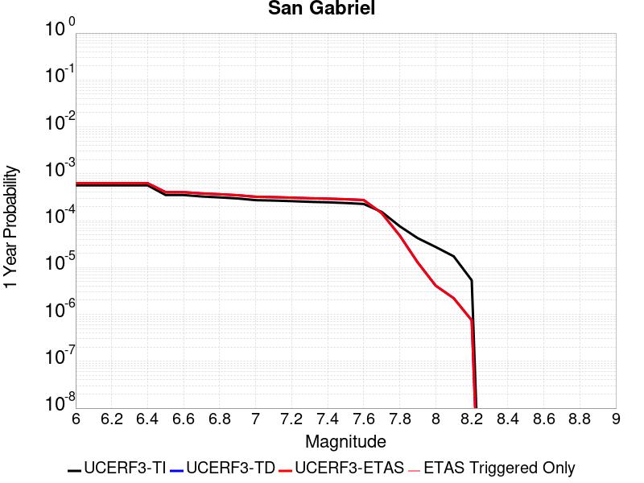 |  |

| Magnitude | 1 wk TI Prob | 1 wk TD Prob | 1 wk ETAS Prob | 1 wk ETAS/TD Gain | 1 wk ETAS Triggered Only | 1 mo TI Prob | 1 mo TD Prob | 1 mo ETAS Prob | 1 mo ETAS/TD Gain | 1 mo ETAS Triggered Only | 1 yr TI Prob | 1 yr TD Prob | 1 yr ETAS Prob | 1 yr ETAS/TD Gain | 1 yr ETAS Triggered Only | 10 yr TI Prob | 10 yr TD Prob | 10 yr ETAS Prob | 10 yr ETAS/TD Gain | 10 yr ETAS Triggered Only |
|-----|-----|-----|-----|-----|-----|-----|-----|-----|-----|-----|-----|-----|-----|-----|-----|-----|-----|-----|-----|-----|
| 6.0 | 1.083775E-5 | 1.2022611E-5 | 1.2022611E-5 | 1.0 | 0.0 | 4.6446676E-5 | 5.1524523E-5 | 5.1524523E-5 | 1.0 | 0.0 | 5.653415E-4 | 6.2714185E-4 | 6.2714185E-4 | 1.0 | 0.0 | 0.0056390543 | 0.0062658475 | 0.0062771696 | 1.0018069 | 1.1393155E-5 |
| 6.1 | 1.083775E-5 | 1.2022611E-5 | 1.2022611E-5 | 1.0 | 0.0 | 4.6446676E-5 | 5.1524523E-5 | 5.1524523E-5 | 1.0 | 0.0 | 5.653415E-4 | 6.2714185E-4 | 6.2714185E-4 | 1.0 | 0.0 | 0.0056390543 | 0.0062658475 | 0.0062771696 | 1.0018069 | 1.1393155E-5 |
| 6.2 | 1.083775E-5 | 1.2022611E-5 | 1.2022611E-5 | 1.0 | 0.0 | 4.6446676E-5 | 5.1524523E-5 | 5.1524523E-5 | 1.0 | 0.0 | 5.653415E-4 | 6.2714185E-4 | 6.2714185E-4 | 1.0 | 0.0 | 0.0056390543 | 0.0062658475 | 0.0062771696 | 1.0018069 | 1.1393155E-5 |
| 6.3 | 1.083775E-5 | 1.2022611E-5 | 1.2022611E-5 | 1.0 | 0.0 | 4.6446676E-5 | 5.1524523E-5 | 5.1524523E-5 | 1.0 | 0.0 | 5.653415E-4 | 6.2714185E-4 | 6.2714185E-4 | 1.0 | 0.0 | 0.0056390543 | 0.0062658475 | 0.0062771696 | 1.0018069 | 1.1393155E-5 |
| 6.4 | 1.083775E-5 | 1.2022611E-5 | 1.2022611E-5 | 1.0 | 0.0 | 4.6446676E-5 | 5.1524523E-5 | 5.1524523E-5 | 1.0 | 0.0 | 5.653415E-4 | 6.2714185E-4 | 6.2714185E-4 | 1.0 | 0.0 | 0.0056390543 | 0.0062658475 | 0.0062771696 | 1.0018069 | 1.1393155E-5 |
| 6.5 | 6.7317824E-6 | 7.753978E-6 | 7.753978E-6 | 1.0 | 0.0 | 2.8850178E-5 | 3.3230917E-5 | 3.3230917E-5 | 1.0 | 0.0 | 3.511943E-4 | 4.0451236E-4 | 4.0451236E-4 | 1.0 | 0.0 | 0.003506398 | 0.0040488886 | 0.0040602353 | 1.0028025 | 1.1393155E-5 |
| 6.6 | 6.7317824E-6 | 7.753978E-6 | 7.753978E-6 | 1.0 | 0.0 | 2.8850178E-5 | 3.3230917E-5 | 3.3230917E-5 | 1.0 | 0.0 | 3.511943E-4 | 4.0451236E-4 | 4.0451236E-4 | 1.0 | 0.0 | 0.003506398 | 0.0040488886 | 0.0040602353 | 1.0028025 | 1.1393155E-5 |
| 6.7 | 6.274881E-6 | 7.2828648E-6 | 7.2828648E-6 | 1.0 | 0.0 | 2.6892068E-5 | 3.121191E-5 | 3.121191E-5 | 1.0 | 0.0 | 3.2736175E-4 | 3.799397E-4 | 3.799397E-4 | 1.0 | 0.0 | 0.0032687993 | 0.0038040224 | 0.0038153722 | 1.0029837 | 1.1393155E-5 |
| 6.8 | 5.996209E-6 | 6.9955645E-6 | 6.9955645E-6 | 1.0 | 0.0 | 2.5697784E-5 | 2.998065E-5 | 2.998065E-5 | 1.0 | 0.0 | 3.128256E-4 | 3.6495423E-4 | 3.6495423E-4 | 1.0 | 0.0 | 0.003123856 | 0.0036546674 | 0.003666019 | 1.003106 | 1.1393155E-5 |
| 6.9 | 5.686331E-6 | 6.660462E-6 | 6.660462E-6 | 1.0 | 0.0 | 2.4369761E-5 | 2.854453E-5 | 2.854453E-5 | 1.0 | 0.0 | 2.9666146E-4 | 3.4747514E-4 | 3.4747514E-4 | 1.0 | 0.0 | 0.0029626573 | 0.0034804356 | 0.003491789 | 1.003262 | 1.1393155E-5 |
| 7.0 | 5.2329838E-6 | 6.184254E-6 | 6.184254E-6 | 1.0 | 0.0 | 2.242688E-5 | 2.650368E-5 | 2.650368E-5 | 1.0 | 0.0 | 2.7301308E-4 | 3.226353E-4 | 3.226353E-4 | 1.0 | 0.0 | 0.002726779 | 0.0032327736 | 0.00324413 | 1.0035129 | 1.1393155E-5 |
| 7.1 | 5.135671E-6 | 6.074282E-6 | 6.074282E-6 | 1.0 | 0.0 | 2.2009834E-5 | 2.6032381E-5 | 2.6032381E-5 | 1.0 | 0.0 | 2.6793676E-4 | 3.1689892E-4 | 3.1689892E-4 | 1.0 | 0.0 | 0.0026761394 | 0.0031755753 | 0.0031869323 | 1.0035764 | 1.1393155E-5 |
| 7.2 | 4.989062E-6 | 5.9074955E-6 | 5.9074955E-6 | 1.0 | 0.0 | 2.1381518E-5 | 2.5317597E-5 | 2.5317597E-5 | 1.0 | 0.0 | 2.6028889E-4 | 3.081989E-4 | 3.081989E-4 | 1.0 | 0.0 | 0.0025998424 | 0.0030888198 | 0.0031001777 | 1.0036771 | 1.1393155E-5 |
| 7.3 | 4.8219395E-6 | 5.738902E-6 | 5.738902E-6 | 1.0 | 0.0 | 2.0665291E-5 | 2.4595065E-5 | 2.4595065E-5 | 1.0 | 0.0 | 2.5157086E-4 | 2.9940455E-4 | 2.9940455E-4 | 1.0 | 0.0 | 0.0025128627 | 0.003001117 | 0.003012476 | 1.0037849 | 1.1393155E-5 |
| 7.4 | 4.7118383E-6 | 5.6273266E-6 | 5.6273266E-6 | 1.0 | 0.0 | 2.0193436E-5 | 2.4116896E-5 | 2.4116896E-5 | 1.0 | 0.0 | 2.4582737E-4 | 2.935844E-4 | 2.935844E-4 | 1.0 | 0.0 | 0.002455556 | 0.0029430704 | 0.0029544302 | 1.0038598 | 1.1393155E-5 |
| 7.5 | 4.5506545E-6 | 5.47251E-6 | 5.47251E-6 | 1.0 | 0.0 | 1.9502659E-5 | 2.3453407E-5 | 2.3453407E-5 | 1.0 | 0.0 | 2.37419E-4 | 2.8550858E-4 | 2.8550858E-4 | 1.0 | 0.0 | 0.002371655 | 0.002862522 | 0.0028738824 | 1.0039687 | 1.1393155E-5 |
| 7.6 | 4.343636E-6 | 5.2650835E-6 | 5.2650835E-6 | 1.0 | 0.0 | 1.861545E-5 | 2.2564453E-5 | 2.2564453E-5 | 1.0 | 0.0 | 2.2661954E-4 | 2.7468835E-4 | 2.7468835E-4 | 1.0 | 0.0 | 0.0022638857 | 0.0027545835 | 0.0027545835 | 1.0 | 0.0 |
| 7.7 | 2.936235E-6 | 2.767985E-6 | 2.767985E-6 | 1.0 | 0.0 | 1.2583803E-5 | 1.18627395E-5 | 1.18627395E-5 | 1.0 | 0.0 | 1.5319703E-4 | 1.4441932E-4 | 1.4441932E-4 | 1.0 | 0.0 | 0.0015309147 | 0.0014506504 | 0.0014506504 | 1.0 | 0.0 |
| 7.8 | 1.4541639E-6 | 9.220239E-7 | 9.220239E-7 | 1.0 | 0.0 | 6.232116E-6 | 3.9515253E-6 | 3.9515253E-6 | 1.0 | 0.0 | 7.587337E-5 | 4.810876E-5 | 4.810876E-5 | 1.0 | 0.0 | 7.584747E-4 | 4.859516E-4 | 4.859516E-4 | 1.0 | 0.0 |
| 7.9 | 8.098958E-7 | 2.4545207E-7 | 2.4545207E-7 | 1.0 | 0.0 | 3.4709774E-6 | 1.0519369E-6 | 1.0519369E-6 | 1.0 | 0.0 | 4.225833E-5 | 1.2807257E-5 | 1.2807257E-5 | 1.0 | 0.0 | 4.2250296E-4 | 1.3120633E-4 | 1.3120633E-4 | 1.0 | 0.0 |
| 8.0 | 5.2473234E-7 | 7.84911E-8 | 7.84911E-8 | 1.0 | 0.0 | 2.248851E-6 | 3.3639037E-7 | 3.3639037E-7 | 1.0 | 0.0 | 2.7379416E-5 | 4.095545E-6 | 4.095545E-6 | 1.0 | 0.0 | 2.7376044E-4 | 4.311981E-5 | 4.311981E-5 | 1.0 | 0.0 |
| 8.1 | 3.3162388E-7 | 4.2438835E-8 | 4.2438835E-8 | 1.0 | 0.0 | 1.4212444E-6 | 1.8188072E-7 | 1.8188072E-7 | 1.0 | 0.0 | 1.7303513E-5 | 2.2143954E-6 | 2.2143954E-6 | 1.0 | 0.0 | 1.7302166E-4 | 2.348076E-5 | 2.348076E-5 | 1.0 | 0.0 |
| 8.2 | 1.0235345E-7 | 1.43416425E-8 | 1.43416425E-8 | 1.0 | 0.0 | 4.3865757E-7 | 6.146418E-8 | 6.146418E-8 | 1.0 | 0.0 | 5.340643E-6 | 7.483261E-7 | 7.483261E-7 | 1.0 | 0.0 | 5.3405143E-5 | 8.092622E-6 | 8.092622E-6 | 1.0 | 0.0 |

## San Jacinto (Coyote Creek)
*[(top)](#table-of-contents)*

| 1 Week | 1 Month | 1 Year | 10 Year |
|-----|-----|-----|-----|
|  | 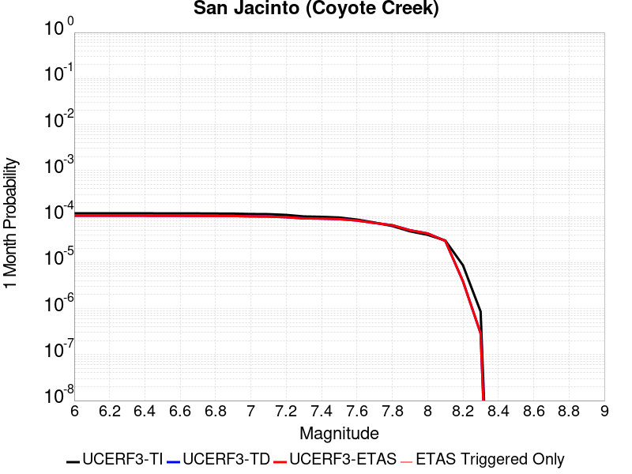 |  | 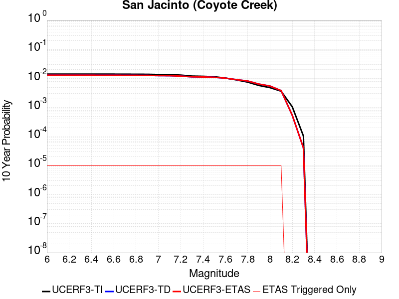 |

| Magnitude | 1 wk TI Prob | 1 wk TD Prob | 1 wk ETAS Prob | 1 wk ETAS/TD Gain | 1 wk ETAS Triggered Only | 1 mo TI Prob | 1 mo TD Prob | 1 mo ETAS Prob | 1 mo ETAS/TD Gain | 1 mo ETAS Triggered Only | 1 yr TI Prob | 1 yr TD Prob | 1 yr ETAS Prob | 1 yr ETAS/TD Gain | 1 yr ETAS Triggered Only | 10 yr TI Prob | 10 yr TD Prob | 10 yr ETAS Prob | 10 yr ETAS/TD Gain | 10 yr ETAS Triggered Only |
|-----|-----|-----|-----|-----|-----|-----|-----|-----|-----|-----|-----|-----|-----|-----|-----|-----|-----|-----|-----|-----|
| 6.0 | 2.7374346E-5 | 2.4288818E-5 | 2.4288818E-5 | 1.0 | 0.0 | 1.1731335E-4 | 1.040908E-4 | 1.040908E-4 | 1.0 | 0.0 | 0.0014273542 | 0.0012665713 | 0.0012665713 | 1.0 | 0.0 | 0.01418221 | 0.013003276 | 0.0130145205 | 1.0008647 | 1.1393155E-5 |
| 6.1 | 2.7374346E-5 | 2.4288818E-5 | 2.4288818E-5 | 1.0 | 0.0 | 1.1731335E-4 | 1.040908E-4 | 1.040908E-4 | 1.0 | 0.0 | 0.0014273542 | 0.0012665713 | 0.0012665713 | 1.0 | 0.0 | 0.01418221 | 0.013003276 | 0.0130145205 | 1.0008647 | 1.1393155E-5 |
| 6.2 | 2.7374346E-5 | 2.4288818E-5 | 2.4288818E-5 | 1.0 | 0.0 | 1.1731335E-4 | 1.040908E-4 | 1.040908E-4 | 1.0 | 0.0 | 0.0014273542 | 0.0012665713 | 0.0012665713 | 1.0 | 0.0 | 0.01418221 | 0.013003276 | 0.0130145205 | 1.0008647 | 1.1393155E-5 |
| 6.3 | 2.7374346E-5 | 2.4288818E-5 | 2.4288818E-5 | 1.0 | 0.0 | 1.1731335E-4 | 1.040908E-4 | 1.040908E-4 | 1.0 | 0.0 | 0.0014273542 | 0.0012665713 | 0.0012665713 | 1.0 | 0.0 | 0.01418221 | 0.013003276 | 0.0130145205 | 1.0008647 | 1.1393155E-5 |
| 6.4 | 2.7374346E-5 | 2.4288818E-5 | 2.4288818E-5 | 1.0 | 0.0 | 1.1731335E-4 | 1.040908E-4 | 1.040908E-4 | 1.0 | 0.0 | 0.0014273542 | 0.0012665713 | 0.0012665713 | 1.0 | 0.0 | 0.01418221 | 0.013003276 | 0.0130145205 | 1.0008647 | 1.1393155E-5 |
| 6.5 | 2.7282445E-5 | 2.4174835E-5 | 2.4174835E-5 | 1.0 | 0.0 | 1.16919524E-4 | 1.0360233E-4 | 1.0360233E-4 | 1.0 | 0.0 | 0.0014225657 | 0.0012606313 | 0.0012606313 | 1.0 | 0.0 | 0.014134934 | 0.012944575 | 0.012955821 | 1.0008688 | 1.1393155E-5 |
| 6.6 | 2.7282445E-5 | 2.4174835E-5 | 2.4174835E-5 | 1.0 | 0.0 | 1.16919524E-4 | 1.0360233E-4 | 1.0360233E-4 | 1.0 | 0.0 | 0.0014225657 | 0.0012606313 | 0.0012606313 | 1.0 | 0.0 | 0.014134934 | 0.012944575 | 0.012955821 | 1.0008688 | 1.1393155E-5 |
| 6.7 | 2.7216198E-5 | 2.4099914E-5 | 2.4099914E-5 | 1.0 | 0.0 | 1.1663563E-4 | 1.0328127E-4 | 1.0328127E-4 | 1.0 | 0.0 | 0.0014191137 | 0.0012567268 | 0.0012567268 | 1.0 | 0.0 | 0.014100855 | 0.012905966 | 0.012917211 | 1.0008714 | 1.1393155E-5 |
| 6.8 | 2.7078617E-5 | 2.4017048E-5 | 2.4017048E-5 | 1.0 | 0.0 | 1.1604605E-4 | 1.0292616E-4 | 1.0292616E-4 | 1.0 | 0.0 | 0.001411945 | 0.0012524084 | 0.0012524084 | 1.0 | 0.0 | 0.014030075 | 0.012863063 | 0.01287431 | 1.0008743 | 1.1393155E-5 |
| 6.9 | 2.6982952E-5 | 2.393647E-5 | 2.393647E-5 | 1.0 | 0.0 | 1.15636096E-4 | 1.0258085E-4 | 1.0258085E-4 | 1.0 | 0.0 | 0.0014069602 | 0.001248209 | 0.001248209 | 1.0 | 0.0 | 0.013980856 | 0.012821331 | 0.012832577 | 1.0008773 | 1.1393155E-5 |
| 7.0 | 2.6449972E-5 | 2.3513187E-5 | 2.3513187E-5 | 1.0 | 0.0 | 1.1335209E-4 | 1.0076692E-4 | 1.0076692E-4 | 1.0 | 0.0 | 0.001379188 | 0.0012261494 | 0.0012261494 | 1.0 | 0.0 | 0.0137065975 | 0.012602539 | 0.012613788 | 1.0008926 | 1.1393155E-5 |
| 7.1 | 2.6257849E-5 | 2.333907E-5 | 2.333907E-5 | 1.0 | 0.0 | 1.1252879E-4 | 1.0002076E-4 | 1.0002076E-4 | 1.0 | 0.0 | 0.0013691769 | 0.0012170752 | 0.0012170752 | 1.0 | 0.0 | 0.013607717 | 0.012512318 | 0.012523568 | 1.0008992 | 1.1393155E-5 |
| 7.2 | 2.5270041E-5 | 2.253279E-5 | 2.253279E-5 | 1.0 | 0.0 | 1.0829568E-4 | 9.6565534E-5 | 9.6565534E-5 | 1.0 | 0.0 | 0.0013177024 | 0.0011750537 | 0.0011750537 | 1.0 | 0.0 | 0.013099162 | 0.0120928995 | 0.012104155 | 1.0009308 | 1.1393155E-5 |
| 7.3 | 2.339701E-5 | 2.1262704E-5 | 2.1262704E-5 | 1.0 | 0.0 | 1.0026905E-4 | 9.11227E-5 | 9.11227E-5 | 1.0 | 0.0 | 0.001220092 | 0.0011088564 | 0.0011088564 | 1.0 | 0.0 | 0.012134149 | 0.011430851 | 0.011442115 | 1.0009853 | 1.1393155E-5 |
| 7.4 | 2.296333E-5 | 2.0992558E-5 | 2.0992558E-5 | 1.0 | 0.0 | 9.841056E-5 | 8.996502E-5 | 8.996502E-5 | 1.0 | 0.0 | 0.0011974899 | 0.0010947757 | 0.0010947757 | 1.0 | 0.0 | 0.011910575 | 0.011289729 | 0.011300993 | 1.0009978 | 1.1393155E-5 |
| 7.5 | 2.2188895E-5 | 2.0514371E-5 | 2.0514371E-5 | 1.0 | 0.0 | 9.50918E-5 | 8.791578E-5 | 8.791578E-5 | 1.0 | 0.0 | 0.0011571277 | 0.0010698511 | 0.0010698511 | 1.0 | 0.0 | 0.011511209 | 0.011038794 | 0.011050062 | 1.0010207 | 1.1393155E-5 |
| 7.6 | 2.0013189E-5 | 1.909517E-5 | 1.909517E-5 | 1.0 | 0.0 | 8.5767984E-5 | 8.183388E-5 | 8.183388E-5 | 1.0 | 0.0 | 0.001043725 | 9.958739E-4 | 9.958739E-4 | 1.0 | 0.0 | 0.010388365 | 0.010293957 | 0.010305233 | 1.0010954 | 1.1393155E-5 |
| 7.7 | 1.7230794E-5 | 1.6872322E-5 | 1.6872322E-5 | 1.0 | 0.0 | 7.384417E-5 | 7.230796E-5 | 7.230796E-5 | 1.0 | 0.0 | 8.986819E-4 | 8.799946E-4 | 8.799946E-4 | 1.0 | 0.0 | 0.008950562 | 0.009130286 | 0.009141576 | 1.0012364 | 1.1393155E-5 |
| 7.8 | 1.4478809E-5 | 1.5115073E-5 | 1.5115073E-5 | 1.0 | 0.0 | 6.205057E-5 | 6.477728E-5 | 6.477728E-5 | 1.0 | 0.0 | 7.552038E-4 | 7.883787E-4 | 7.883787E-4 | 1.0 | 0.0 | 0.0075264242 | 0.008206429 | 0.008217729 | 1.001377 | 1.1393155E-5 |
| 7.9 | 1.1114467E-5 | 1.1755297E-5 | 1.1755297E-5 | 1.0 | 0.0 | 4.7632562E-5 | 5.0378876E-5 | 5.0378876E-5 | 1.0 | 0.0 | 5.797721E-4 | 6.1319076E-4 | 6.1319076E-4 | 1.0 | 0.0 | 0.0057826187 | 0.006438098 | 0.0064494177 | 1.0017582 | 1.1393155E-5 |
| 8.0 | 9.327402E-6 | 9.999339E-6 | 9.999339E-6 | 1.0 | 0.0 | 3.9973966E-5 | 4.285361E-5 | 4.285361E-5 | 1.0 | 0.0 | 4.8657437E-4 | 5.216184E-4 | 5.216184E-4 | 1.0 | 0.0 | 0.0048551033 | 0.0055026007 | 0.005513931 | 1.0020591 | 1.1393155E-5 |
| 8.1 | 7.0235833E-6 | 6.9020734E-6 | 6.9020734E-6 | 1.0 | 0.0 | 3.0100724E-5 | 2.9579982E-5 | 2.9579982E-5 | 1.0 | 0.0 | 3.664147E-4 | 3.6007728E-4 | 3.6007728E-4 | 1.0 | 0.0 | 0.003658111 | 0.0038271232 | 0.0038384728 | 1.0029656 | 1.1393155E-5 |
| 8.2 | 2.0358202E-6 | 9.140284E-7 | 9.140284E-7 | 1.0 | 0.0 | 8.724915E-6 | 3.9172587E-6 | 3.9172587E-6 | 1.0 | 0.0 | 1.06220665E-4 | 4.7691607E-5 | 4.7691607E-5 | 1.0 | 0.0 | 0.001061699 | 5.4070336E-4 | 5.4070336E-4 | 1.0 | 0.0 |
| 8.3 | 2.0051264E-7 | 6.740376E-8 | 6.740376E-8 | 1.0 | 0.0 | 8.5933965E-7 | 2.8887325E-7 | 2.8887325E-7 | 1.0 | 0.0 | 1.046241E-5 | 3.5170265E-6 | 3.5170265E-6 | 1.0 | 0.0 | 1.0461917E-4 | 4.08441E-5 | 4.08441E-5 | 1.0 | 0.0 |

## Emerson-Copper Mtn 2011
*[(top)](#table-of-contents)*

| 1 Week | 1 Month | 1 Year | 10 Year |
|-----|-----|-----|-----|
| 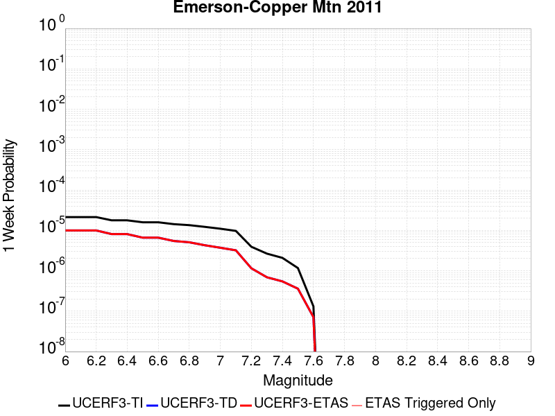 | 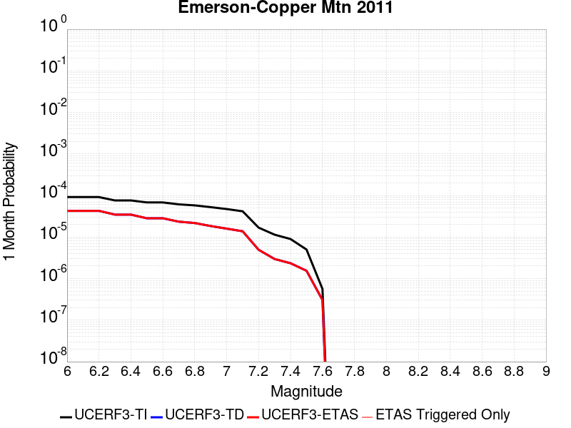 |  | 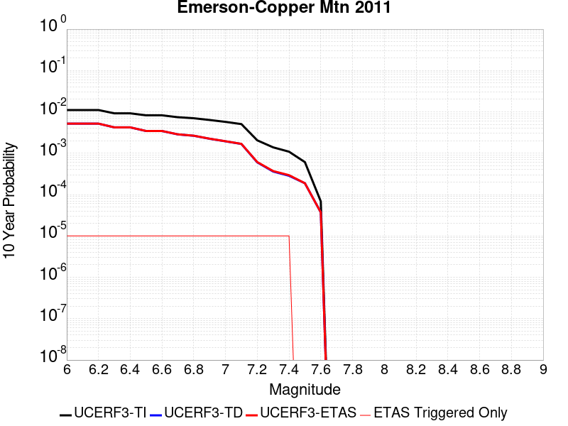 |

| Magnitude | 1 wk TI Prob | 1 wk TD Prob | 1 wk ETAS Prob | 1 wk ETAS/TD Gain | 1 wk ETAS Triggered Only | 1 mo TI Prob | 1 mo TD Prob | 1 mo ETAS Prob | 1 mo ETAS/TD Gain | 1 mo ETAS Triggered Only | 1 yr TI Prob | 1 yr TD Prob | 1 yr ETAS Prob | 1 yr ETAS/TD Gain | 1 yr ETAS Triggered Only | 10 yr TI Prob | 10 yr TD Prob | 10 yr ETAS Prob | 10 yr ETAS/TD Gain | 10 yr ETAS Triggered Only |
|-----|-----|-----|-----|-----|-----|-----|-----|-----|-----|-----|-----|-----|-----|-----|-----|-----|-----|-----|-----|-----|
| 6.0 | 2.1364202E-5 | 9.970608E-6 | 9.970608E-6 | 1.0 | 0.0 | 9.1557646E-5 | 4.2730524E-5 | 4.2730524E-5 | 1.0 | 0.0 | 0.0011141442 | 5.201287E-4 | 5.201287E-4 | 1.0 | 0.0 | 0.011085749 | 0.005189983 | 0.0052013174 | 1.0021838 | 1.1393155E-5 |
| 6.1 | 2.1364202E-5 | 9.970608E-6 | 9.970608E-6 | 1.0 | 0.0 | 9.1557646E-5 | 4.2730524E-5 | 4.2730524E-5 | 1.0 | 0.0 | 0.0011141442 | 5.201287E-4 | 5.201287E-4 | 1.0 | 0.0 | 0.011085749 | 0.005189983 | 0.0052013174 | 1.0021838 | 1.1393155E-5 |
| 6.2 | 2.1364202E-5 | 9.970608E-6 | 9.970608E-6 | 1.0 | 0.0 | 9.1557646E-5 | 4.2730524E-5 | 4.2730524E-5 | 1.0 | 0.0 | 0.0011141442 | 5.201287E-4 | 5.201287E-4 | 1.0 | 0.0 | 0.011085749 | 0.005189983 | 0.0052013174 | 1.0021838 | 1.1393155E-5 |
| 6.3 | 1.7751237E-5 | 8.091288E-6 | 8.091288E-6 | 1.0 | 0.0 | 7.607452E-5 | 3.4676523E-5 | 3.4676523E-5 | 1.0 | 0.0 | 9.258136E-4 | 4.2211113E-4 | 4.2211113E-4 | 1.0 | 0.0 | 0.00921966 | 0.0042137164 | 0.0042250617 | 1.0026925 | 1.1393155E-5 |
| 6.4 | 1.7751237E-5 | 8.091288E-6 | 8.091288E-6 | 1.0 | 0.0 | 7.607452E-5 | 3.4676523E-5 | 3.4676523E-5 | 1.0 | 0.0 | 9.258136E-4 | 4.2211113E-4 | 4.2211113E-4 | 1.0 | 0.0 | 0.00921966 | 0.0042137164 | 0.0042250617 | 1.0026925 | 1.1393155E-5 |
| 6.5 | 1.5886664E-5 | 6.6055245E-6 | 6.6055245E-6 | 1.0 | 0.0 | 6.808392E-5 | 2.8309109E-5 | 2.8309109E-5 | 1.0 | 0.0 | 8.286065E-4 | 3.446136E-4 | 3.446136E-4 | 1.0 | 0.0 | 0.008255237 | 0.0034412565 | 0.0034526105 | 1.0032994 | 1.1393155E-5 |
| 6.6 | 1.5886664E-5 | 6.6055245E-6 | 6.6055245E-6 | 1.0 | 0.0 | 6.808392E-5 | 2.8309109E-5 | 2.8309109E-5 | 1.0 | 0.0 | 8.286065E-4 | 3.446136E-4 | 3.446136E-4 | 1.0 | 0.0 | 0.008255237 | 0.0034412565 | 0.0034526105 | 1.0032994 | 1.1393155E-5 |
| 6.7 | 1.428471E-5 | 5.471841E-6 | 5.471841E-6 | 1.0 | 0.0 | 6.121875E-5 | 2.3450559E-5 | 2.3450559E-5 | 1.0 | 0.0 | 7.450834E-4 | 2.854771E-4 | 2.854771E-4 | 1.0 | 0.0 | 0.007425902 | 0.0028514918 | 0.0028628525 | 1.0039841 | 1.1393155E-5 |
| 6.8 | 1.3490684E-5 | 5.0750327E-6 | 5.0750327E-6 | 1.0 | 0.0 | 5.7815934E-5 | 2.1749982E-5 | 2.1749982E-5 | 1.0 | 0.0 | 7.0368167E-4 | 2.6477771E-4 | 2.6477771E-4 | 1.0 | 0.0 | 0.007014576 | 0.0026450036 | 0.0026563667 | 1.0042961 | 1.1393155E-5 |
| 6.9 | 1.2235421E-5 | 4.2908787E-6 | 4.2908787E-6 | 1.0 | 0.0 | 5.2436466E-5 | 1.838937E-5 | 1.838937E-5 | 1.0 | 0.0 | 6.38227E-4 | 2.2387119E-4 | 2.2387119E-4 | 1.0 | 0.0 | 0.0063639707 | 0.0022368112 | 0.002248179 | 1.0050821 | 1.1393155E-5 |
| 7.0 | 1.1009851E-5 | 3.7200623E-6 | 3.7200623E-6 | 1.0 | 0.0 | 4.7184225E-5 | 1.5943046E-5 | 1.5943046E-5 | 1.0 | 0.0 | 5.743165E-4 | 1.9409275E-4 | 1.9409275E-4 | 1.0 | 0.0 | 0.005728345 | 0.0019395703 | 0.0019509413 | 1.0058627 | 1.1393155E-5 |
| 7.1 | 9.726373E-6 | 3.212748E-6 | 3.212748E-6 | 1.0 | 0.0 | 4.168379E-5 | 1.3768867E-5 | 1.3768867E-5 | 1.0 | 0.0 | 5.07382E-4 | 1.6762642E-4 | 1.6762642E-4 | 1.0 | 0.0 | 0.0050622504 | 0.0016753314 | 0.0016867054 | 1.0067891 | 1.1393155E-5 |
| 7.2 | 3.9335127E-6 | 1.1528283E-6 | 1.1528283E-6 | 1.0 | 0.0 | 1.6857803E-5 | 4.9406835E-6 | 4.9406835E-6 | 1.0 | 0.0 | 2.0522442E-4 | 6.0151222E-5 | 6.0151222E-5 | 1.0 | 0.0 | 0.00205035 | 6.0135534E-4 | 6.127417E-4 | 1.0189344 | 1.1393155E-5 |
| 7.3 | 2.661632E-6 | 6.913732E-7 | 6.913732E-7 | 1.0 | 0.0 | 1.14069435E-5 | 2.9630248E-6 | 2.9630248E-6 | 1.0 | 0.0 | 1.3887069E-4 | 3.607424E-5 | 3.607424E-5 | 1.0 | 0.0 | 0.0013878393 | 3.6068488E-4 | 3.7207393E-4 | 1.0315762 | 1.1393155E-5 |
| 7.4 | 2.0893426E-6 | 5.4636024E-7 | 5.4636024E-7 | 1.0 | 0.0 | 8.954295E-6 | 2.3415419E-6 | 2.3415419E-6 | 1.0 | 0.0 | 1.0901308E-4 | 2.8507904E-5 | 2.8507904E-5 | 1.0 | 0.0 | 0.0010895962 | 2.85043E-4 | 2.9643293E-4 | 1.0399586 | 1.1393155E-5 |
| 7.5 | 1.1681728E-6 | 3.6040865E-7 | 3.6040865E-7 | 1.0 | 0.0 | 5.0064455E-6 | 1.5446077E-6 | 1.5446077E-6 | 1.0 | 0.0 | 6.0951766E-5 | 1.880544E-5 | 1.880544E-5 | 1.0 | 0.0 | 6.093505E-4 | 1.8803896E-4 | 1.8803896E-4 | 1.0 | 0.0 |
| 7.6 | 1.3154387E-7 | 7.121198E-8 | 7.121198E-8 | 1.0 | 0.0 | 5.6375933E-7 | 3.051942E-7 | 3.051942E-7 | 1.0 | 0.0 | 6.863748E-6 | 3.7157345E-6 | 3.7157345E-6 | 1.0 | 0.0 | 6.863536E-5 | 3.7156882E-5 | 3.7156882E-5 | 1.0 | 0.0 |

## San Andreas (Santa Cruz Mts) 2011 CFM
*[(top)](#table-of-contents)*

| 1 Week | 1 Month | 1 Year | 10 Year |
|-----|-----|-----|-----|
| 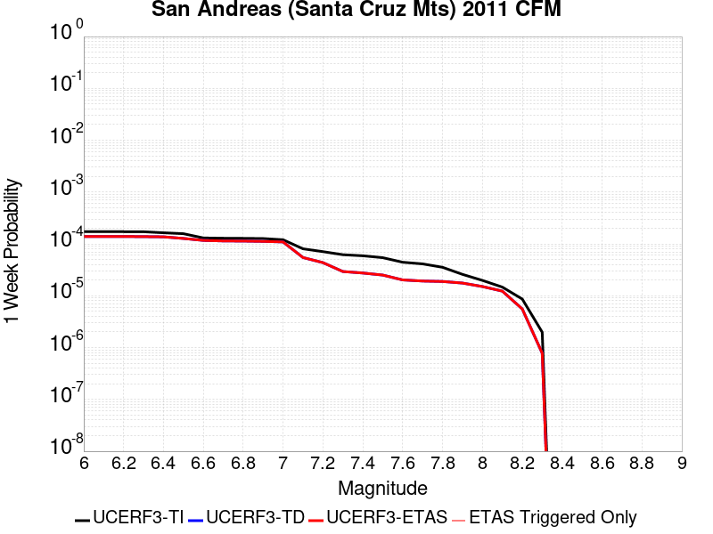 | 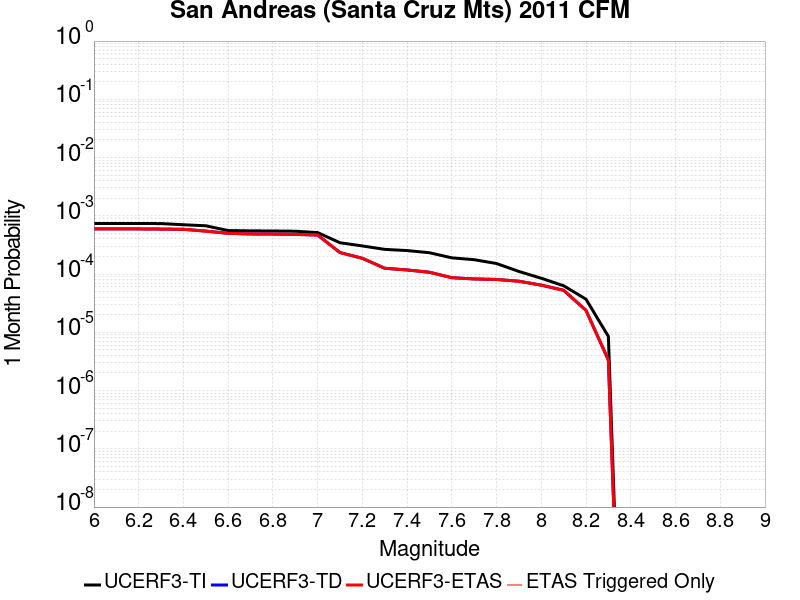 | 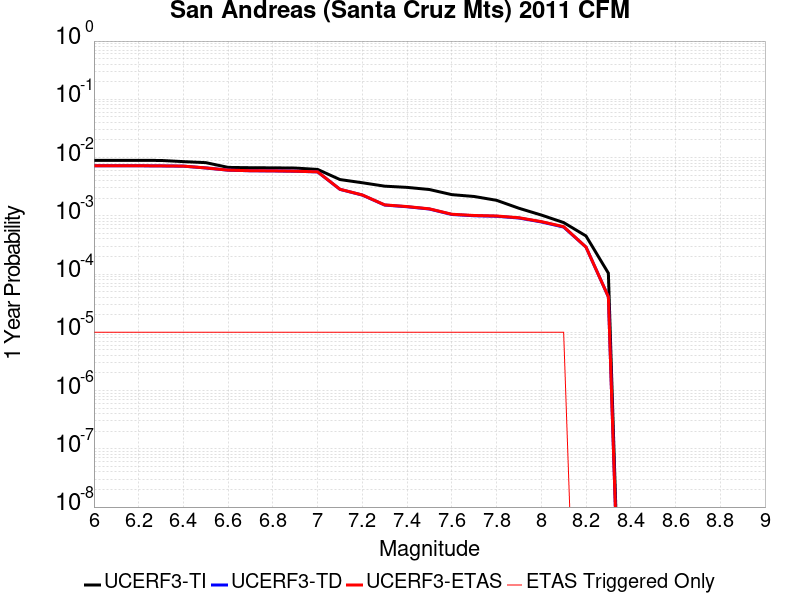 |  |

| Magnitude | 1 wk TI Prob | 1 wk TD Prob | 1 wk ETAS Prob | 1 wk ETAS/TD Gain | 1 wk ETAS Triggered Only | 1 mo TI Prob | 1 mo TD Prob | 1 mo ETAS Prob | 1 mo ETAS/TD Gain | 1 mo ETAS Triggered Only | 1 yr TI Prob | 1 yr TD Prob | 1 yr ETAS Prob | 1 yr ETAS/TD Gain | 1 yr ETAS Triggered Only | 10 yr TI Prob | 10 yr TD Prob | 10 yr ETAS Prob | 10 yr ETAS/TD Gain | 10 yr ETAS Triggered Only |
|-----|-----|-----|-----|-----|-----|-----|-----|-----|-----|-----|-----|-----|-----|-----|-----|-----|-----|-----|-----|-----|
| 6.0 | 1.7221631E-4 | 1.38996E-4 | 1.38996E-4 | 1.0 | 0.0 | 7.378611E-4 | 5.955632E-4 | 5.955632E-4 | 1.0 | 0.0 | 0.008946515 | 0.0072272513 | 0.007238562 | 1.001565 | 1.1393155E-5 | 0.08594794 | 0.07106748 | 0.07107806 | 1.0001489 | 1.1393155E-5 |
| 6.1 | 1.7221631E-4 | 1.38996E-4 | 1.38996E-4 | 1.0 | 0.0 | 7.378611E-4 | 5.955632E-4 | 5.955632E-4 | 1.0 | 0.0 | 0.008946515 | 0.0072272513 | 0.007238562 | 1.001565 | 1.1393155E-5 | 0.08594794 | 0.07106748 | 0.07107806 | 1.0001489 | 1.1393155E-5 |
| 6.2 | 1.7221631E-4 | 1.38996E-4 | 1.38996E-4 | 1.0 | 0.0 | 7.378611E-4 | 5.955632E-4 | 5.955632E-4 | 1.0 | 0.0 | 0.008946515 | 0.0072272513 | 0.007238562 | 1.001565 | 1.1393155E-5 | 0.08594794 | 0.07106748 | 0.07107806 | 1.0001489 | 1.1393155E-5 |
| 6.3 | 1.716926E-4 | 1.3818777E-4 | 1.3818777E-4 | 1.0 | 0.0 | 7.3561794E-4 | 5.921009E-4 | 5.921009E-4 | 1.0 | 0.0 | 0.008919428 | 0.0071853762 | 0.0071966876 | 1.0015742 | 1.1393155E-5 | 0.08569809 | 0.07068161 | 0.0706922 | 1.0001498 | 1.1393155E-5 |
| 6.4 | 1.6392978E-4 | 1.3692329E-4 | 1.3692329E-4 | 1.0 | 0.0 | 7.02367E-4 | 5.866842E-4 | 5.866842E-4 | 1.0 | 0.0 | 0.008517839 | 0.0071198596 | 0.0071311714 | 1.0015888 | 1.1393155E-5 | 0.08198654 | 0.069900714 | 0.06991131 | 1.0001516 | 1.1393155E-5 |
| 6.5 | 1.5742714E-4 | 1.2749301E-4 | 1.2749301E-4 | 1.0 | 0.0 | 6.745133E-4 | 5.4628594E-4 | 5.4628594E-4 | 1.0 | 0.0 | 0.00818132 | 0.0066310596 | 0.006642377 | 1.0017067 | 1.1393155E-5 | 0.078865945 | 0.0653389 | 0.06534956 | 1.000163 | 1.1393155E-5 |
| 6.6 | 1.3038084E-4 | 1.1680427E-4 | 1.1680427E-4 | 1.0 | 0.0 | 5.5865536E-4 | 5.00495E-4 | 5.00495E-4 | 1.0 | 0.0 | 0.006780438 | 0.0060767294 | 0.0060880533 | 1.0018635 | 1.1393155E-5 | 0.0657725 | 0.0597558 | 0.059766512 | 1.0001793 | 1.1393155E-5 |
| 6.7 | 1.2867592E-4 | 1.1406286E-4 | 1.1406286E-4 | 1.0 | 0.0 | 5.5135164E-4 | 4.887505E-4 | 4.887505E-4 | 1.0 | 0.0 | 0.0066920654 | 0.0059345267 | 0.0059458525 | 1.0019084 | 1.1393155E-5 | 0.06494093 | 0.058464546 | 0.058475275 | 1.0001835 | 1.1393155E-5 |
| 6.8 | 1.2801298E-4 | 1.1343718E-4 | 1.1343718E-4 | 1.0 | 0.0 | 5.485117E-4 | 4.8607006E-4 | 4.8607006E-4 | 1.0 | 0.0 | 0.0066577005 | 0.005902086 | 0.0059134117 | 1.0019189 | 1.1393155E-5 | 0.06461738 | 0.058177978 | 0.058188707 | 1.0001844 | 1.1393155E-5 |
| 6.9 | 1.269149E-4 | 1.1185521E-4 | 1.1185521E-4 | 1.0 | 0.0 | 5.4380763E-4 | 4.792927E-4 | 4.792927E-4 | 1.0 | 0.0 | 0.006600777 | 0.0058200154 | 0.005831342 | 1.0019462 | 1.1393155E-5 | 0.06408122 | 0.05744846 | 0.0574592 | 1.0001869 | 1.1393155E-5 |
| 7.0 | 1.2030331E-4 | 1.091415E-4 | 1.091415E-4 | 1.0 | 0.0 | 5.154837E-4 | 4.6766674E-4 | 4.6766674E-4 | 1.0 | 0.0 | 0.006257969 | 0.0056792153 | 0.005690544 | 1.0019947 | 1.1393155E-5 | 0.06084648 | 0.056113765 | 0.05612452 | 1.0001917 | 1.1393155E-5 |
| 7.1 | 8.049617E-5 | 5.460921E-5 | 5.460921E-5 | 1.0 | 0.0 | 3.4493793E-4 | 2.3401866E-4 | 2.3401866E-4 | 1.0 | 0.0 | 0.0041915346 | 0.0028454901 | 0.0028568509 | 1.0039926 | 1.1393155E-5 | 0.041133516 | 0.02995795 | 0.029969001 | 1.000369 | 1.1393155E-5 |
| 7.2 | 7.093979E-5 | 4.3544675E-5 | 4.3544675E-5 | 1.0 | 0.0 | 3.0399222E-4 | 1.8660682E-4 | 1.8660682E-4 | 1.0 | 0.0 | 0.0036948253 | 0.002269594 | 0.0022809613 | 1.0050085 | 1.1393155E-5 | 0.03633994 | 0.02424726 | 0.024258377 | 1.0004585 | 1.1393155E-5 |
| 7.3 | 6.193693E-5 | 2.934372E-5 | 2.934372E-5 | 1.0 | 0.0 | 2.6541698E-4 | 1.2575275E-4 | 1.2575275E-4 | 1.0 | 0.0 | 0.0032266637 | 0.0015299662 | 0.001541342 | 1.0074353 | 1.1393155E-5 | 0.031802133 | 0.016735762 | 0.016746966 | 1.0006694 | 1.1393155E-5 |
| 7.4 | 5.906492E-5 | 2.7447739E-5 | 2.7447739E-5 | 1.0 | 0.0 | 2.5311083E-4 | 1.1762787E-4 | 1.1762787E-4 | 1.0 | 0.0 | 0.0030772698 | 0.0014311799 | 0.0014425567 | 1.0079492 | 1.1393155E-5 | 0.030350044 | 0.015695551 | 0.015706766 | 1.0007145 | 1.1393155E-5 |
| 7.5 | 5.424296E-5 | 2.5068046E-5 | 2.5068046E-5 | 1.0 | 0.0 | 2.324491E-4 | 1.0743007E-4 | 1.0743007E-4 | 1.0 | 0.0 | 0.002826395 | 0.0013071775 | 0.0013185558 | 1.0087044 | 1.1393155E-5 | 0.027907165 | 0.014370134 | 0.014381364 | 1.0007814 | 1.1393155E-5 |
| 7.6 | 4.43084E-5 | 2.0213112E-5 | 2.0213112E-5 | 1.0 | 0.0 | 1.8987931E-4 | 8.662475E-5 | 8.662475E-5 | 1.0 | 0.0 | 0.0023093296 | 0.0010541463 | 0.0010655274 | 1.0107965 | 1.1393155E-5 | 0.022854783 | 0.0115776425 | 0.011588903 | 1.0009726 | 1.1393155E-5 |
| 7.7 | 4.118098E-5 | 1.9231626E-5 | 1.9231626E-5 | 1.0 | 0.0 | 1.7647797E-4 | 8.241864E-5 | 8.241864E-5 | 1.0 | 0.0 | 0.002146502 | 0.0010029853 | 0.0010143671 | 1.0113479 | 1.1393155E-5 | 0.021258866 | 0.011028276 | 0.011039543 | 1.0010217 | 1.1393155E-5 |
| 7.8 | 3.5408906E-5 | 1.885158E-5 | 1.885158E-5 | 1.0 | 0.0 | 1.5174363E-4 | 8.0789985E-5 | 8.0789985E-5 | 1.0 | 0.0 | 0.0018459131 | 9.831744E-4 | 9.945565E-4 | 1.0115768 | 1.1393155E-5 | 0.018306552 | 0.010805191 | 0.0108164605 | 1.0010431 | 1.1393155E-5 |
| 7.9 | 2.5860836E-5 | 1.7575325E-5 | 1.7575325E-5 | 1.0 | 0.0 | 1.10827445E-4 | 7.532065E-5 | 7.532065E-5 | 1.0 | 0.0 | 0.001348489 | 9.1664336E-4 | 9.2802604E-4 | 1.0124178 | 1.1393155E-5 | 0.013403354 | 0.010044978 | 0.010056256 | 1.0011228 | 1.1393155E-5 |
| 8.0 | 1.9777332E-5 | 1.505841E-5 | 1.505841E-5 | 1.0 | 0.0 | 8.4757245E-5 | 6.453445E-5 | 6.453445E-5 | 1.0 | 0.0 | 0.0010314309 | 7.8542385E-4 | 7.968081E-4 | 1.0144943 | 1.1393155E-5 | 0.010266567 | 0.008625287 | 0.008636582 | 1.0013095 | 1.1393155E-5 |
| 8.1 | 1.468494E-5 | 1.2285062E-5 | 1.2285062E-5 | 1.0 | 0.0 | 6.293394E-5 | 5.2649204E-5 | 5.2649204E-5 | 1.0 | 0.0 | 7.6595135E-4 | 6.4081576E-4 | 6.522016E-4 | 1.0177678 | 1.1393155E-5 | 0.0076331664 | 0.0070640477 | 0.00707536 | 1.0016015 | 1.1393155E-5 |
| 8.2 | 8.63836E-6 | 5.560247E-6 | 5.560247E-6 | 1.0 | 0.0 | 3.7021015E-5 | 2.3829412E-5 | 2.3829412E-5 | 1.0 | 0.0 | 4.5063766E-4 | 2.9008454E-4 | 2.9008454E-4 | 1.0 | 0.0 | 0.004497249 | 0.0032956055 | 0.0032956055 | 1.0 | 0.0 |
| 8.3 | 1.983087E-6 | 7.808603E-7 | 7.808603E-7 | 1.0 | 0.0 | 8.498917E-6 | 3.34654E-6 | 3.34654E-6 | 1.0 | 0.0 | 1.034694E-4 | 4.074338E-5 | 4.074338E-5 | 1.0 | 0.0 | 0.0010342124 | 4.8047924E-4 | 4.8047924E-4 | 1.0 | 0.0 |

## San Diego Trough south
*[(top)](#table-of-contents)*

| 1 Week | 1 Month | 1 Year | 10 Year |
|-----|-----|-----|-----|
| 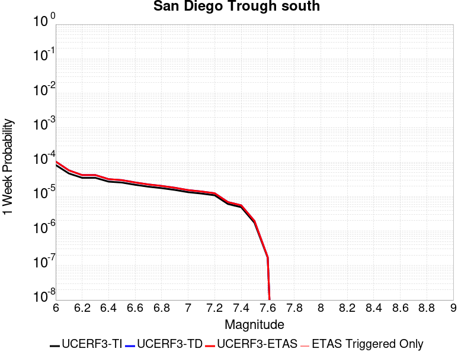 |  |  |  |

| Magnitude | 1 wk TI Prob | 1 wk TD Prob | 1 wk ETAS Prob | 1 wk ETAS/TD Gain | 1 wk ETAS Triggered Only | 1 mo TI Prob | 1 mo TD Prob | 1 mo ETAS Prob | 1 mo ETAS/TD Gain | 1 mo ETAS Triggered Only | 1 yr TI Prob | 1 yr TD Prob | 1 yr ETAS Prob | 1 yr ETAS/TD Gain | 1 yr ETAS Triggered Only | 10 yr TI Prob | 10 yr TD Prob | 10 yr ETAS Prob | 10 yr ETAS/TD Gain | 10 yr ETAS Triggered Only |
|-----|-----|-----|-----|-----|-----|-----|-----|-----|-----|-----|-----|-----|-----|-----|-----|-----|-----|-----|-----|-----|
| 6.0 | 8.279495E-5 | 1.0431663E-4 | 1.0431663E-4 | 1.0 | 0.0 | 3.5478722E-4 | 4.469939E-4 | 4.469939E-4 | 1.0 | 0.0 | 0.004310982 | 0.005429047 | 0.005429047 | 1.0 | 0.0 | 0.042283054 | 0.05302256 | 0.05303335 | 1.0002035 | 1.1393155E-5 |
| 6.1 | 4.6961468E-5 | 5.775996E-5 | 5.775996E-5 | 1.0 | 0.0 | 2.0124791E-4 | 2.4752007E-4 | 2.4752007E-4 | 1.0 | 0.0 | 0.00244744 | 0.003009462 | 0.003009462 | 1.0 | 0.0 | 0.024206603 | 0.029694857 | 0.029705912 | 1.0003723 | 1.1393155E-5 |
| 6.2 | 3.5079658E-5 | 4.21622E-5 | 4.21622E-5 | 1.0 | 0.0 | 1.5033272E-4 | 1.8068278E-4 | 1.8068278E-4 | 1.0 | 0.0 | 0.0018287642 | 0.002197612 | 0.002197612 | 1.0 | 0.0 | 0.018137876 | 0.021761192 | 0.021772338 | 1.0005121 | 1.1393155E-5 |
| 6.3 | 3.5079658E-5 | 4.21622E-5 | 4.21622E-5 | 1.0 | 0.0 | 1.5033272E-4 | 1.8068278E-4 | 1.8068278E-4 | 1.0 | 0.0 | 0.0018287642 | 0.002197612 | 0.002197612 | 1.0 | 0.0 | 0.018137876 | 0.021761192 | 0.021772338 | 1.0005121 | 1.1393155E-5 |
| 6.4 | 2.7196904E-5 | 3.210059E-5 | 3.210059E-5 | 1.0 | 0.0 | 1.16552954E-4 | 1.3756669E-4 | 1.3756669E-4 | 1.0 | 0.0 | 0.0014181085 | 0.0016735992 | 0.0016735992 | 1.0 | 0.0 | 0.014090929 | 0.016611552 | 0.016611552 | 1.0 | 0.0 |
| 6.5 | 2.5584688E-5 | 3.0114008E-5 | 3.0114008E-5 | 1.0 | 0.0 | 1.0964406E-4 | 1.2905363E-4 | 1.2905363E-4 | 1.0 | 0.0 | 0.0013340989 | 0.0015701074 | 0.0015701074 | 1.0 | 0.0 | 0.013261181 | 0.015591683 | 0.015591683 | 1.0 | 0.0 |
| 6.6 | 2.2034688E-5 | 2.5752794E-5 | 2.5752794E-5 | 1.0 | 0.0 | 9.443096E-5 | 1.103645E-4 | 1.103645E-4 | 1.0 | 0.0 | 0.0011490905 | 0.0013428667 | 0.0013428667 | 1.0 | 0.0 | 0.011431668 | 0.013348515 | 0.013348515 | 1.0 | 0.0 |
| 6.7 | 1.9394853E-5 | 2.2550272E-5 | 2.2550272E-5 | 1.0 | 0.0 | 8.311815E-5 | 9.664048E-5 | 9.664048E-5 | 1.0 | 0.0 | 0.0010114936 | 0.001175968 | 0.001175968 | 1.0 | 0.0 | 0.01006902 | 0.011698156 | 0.011698156 | 1.0 | 0.0 |
| 6.8 | 1.7615313E-5 | 2.041069E-5 | 2.041069E-5 | 1.0 | 0.0 | 7.549201E-5 | 8.7471475E-5 | 8.7471475E-5 | 1.0 | 0.0 | 9.1872766E-4 | 0.0010644493 | 0.0010644493 | 1.0 | 0.0 | 0.009149387 | 0.010594075 | 0.010594075 | 1.0 | 0.0 |
| 6.9 | 1.5621423E-5 | 1.803256E-5 | 1.803256E-5 | 1.0 | 0.0 | 6.6947236E-5 | 7.728013E-5 | 7.728013E-5 | 1.0 | 0.0 | 8.147778E-4 | 9.40483E-4 | 9.40483E-4 | 1.0 | 0.0 | 0.008117969 | 0.009365474 | 0.009365474 | 1.0 | 0.0 |
| 7.0 | 1.3444376E-5 | 1.5453432E-5 | 1.5453432E-5 | 1.0 | 0.0 | 5.7617483E-5 | 6.622733E-5 | 6.622733E-5 | 1.0 | 0.0 | 7.0126704E-4 | 8.0602226E-4 | 8.0602226E-4 | 1.0 | 0.0 | 0.006990582 | 0.008031321 | 0.008031321 | 1.0 | 0.0 |
| 7.1 | 1.2268361E-5 | 1.4077835E-5 | 1.4077835E-5 | 1.0 | 0.0 | 5.2577634E-5 | 6.0332197E-5 | 6.0332197E-5 | 1.0 | 0.0 | 6.399447E-4 | 7.342996E-4 | 7.342996E-4 | 1.0 | 0.0 | 0.0063810493 | 0.007319038 | 0.007319038 | 1.0 | 0.0 |
| 7.2 | 1.0922655E-5 | 1.2517794E-5 | 1.2517794E-5 | 1.0 | 0.0 | 4.681054E-5 | 5.36466E-5 | 5.36466E-5 | 1.0 | 0.0 | 5.697693E-4 | 6.5295416E-4 | 6.5295416E-4 | 1.0 | 0.0 | 0.0056831064 | 0.0065106372 | 0.0065106372 | 1.0 | 0.0 |
| 7.3 | 6.1106753E-6 | 6.931081E-6 | 6.931081E-6 | 1.0 | 0.0 | 2.6188345E-5 | 2.9704295E-5 | 2.9704295E-5 | 1.0 | 0.0 | 3.1879646E-4 | 3.6159018E-4 | 3.6159018E-4 | 1.0 | 0.0 | 0.0031833951 | 0.0036100638 | 0.0036100638 | 1.0 | 0.0 |
| 7.4 | 4.933187E-6 | 5.591282E-6 | 5.591282E-6 | 1.0 | 0.0 | 2.114206E-5 | 2.3962419E-5 | 2.3962419E-5 | 1.0 | 0.0 | 2.5737417E-4 | 2.917038E-4 | 2.917038E-4 | 1.0 | 0.0 | 0.002570763 | 0.0029132501 | 0.0029132501 | 1.0 | 0.0 |
| 7.5 | 1.7489613E-6 | 1.9702602E-6 | 1.9702602E-6 | 1.0 | 0.0 | 7.495527E-6 | 8.443946E-6 | 8.443946E-6 | 1.0 | 0.0 | 9.125422E-5 | 1.0280042E-4 | 1.0280042E-4 | 1.0 | 0.0 | 9.1216754E-4 | 0.0010275507 | 0.0010275507 | 1.0 | 0.0 |
| 7.6 | 1.6988751E-7 | 1.7535123E-7 | 1.7535123E-7 | 1.0 | 0.0 | 7.2808916E-7 | 7.515051E-7 | 7.515051E-7 | 1.0 | 0.0 | 8.864449E-6 | 9.1495385E-6 | 9.1495385E-6 | 1.0 | 0.0 | 8.8640954E-5 | 9.149181E-5 | 9.149181E-5 | 1.0 | 0.0 |

## San Jacinto (Superstition Mtn)
*[(top)](#table-of-contents)*

| 1 Week | 1 Month | 1 Year | 10 Year |
|-----|-----|-----|-----|
|  | 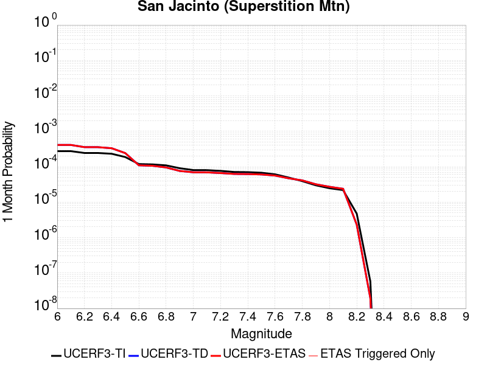 |  |  |

| Magnitude | 1 wk TI Prob | 1 wk TD Prob | 1 wk ETAS Prob | 1 wk ETAS/TD Gain | 1 wk ETAS Triggered Only | 1 mo TI Prob | 1 mo TD Prob | 1 mo ETAS Prob | 1 mo ETAS/TD Gain | 1 mo ETAS Triggered Only | 1 yr TI Prob | 1 yr TD Prob | 1 yr ETAS Prob | 1 yr ETAS/TD Gain | 1 yr ETAS Triggered Only | 10 yr TI Prob | 10 yr TD Prob | 10 yr ETAS Prob | 10 yr ETAS/TD Gain | 10 yr ETAS Triggered Only |
|-----|-----|-----|-----|-----|-----|-----|-----|-----|-----|-----|-----|-----|-----|-----|-----|-----|-----|-----|-----|-----|
| 6.0 | 6.4193904E-5 | 9.6127515E-5 | 9.6127515E-5 | 1.0 | 0.0 | 2.7508775E-4 | 4.1191743E-4 | 4.1191743E-4 | 1.0 | 0.0 | 0.0033440501 | 0.0050049825 | 0.0050163185 | 1.002265 | 1.1393155E-5 | 0.03294174 | 0.048889585 | 0.04890042 | 1.0002216 | 1.1393155E-5 |
| 6.1 | 6.4193904E-5 | 9.6127515E-5 | 9.6127515E-5 | 1.0 | 0.0 | 2.7508775E-4 | 4.1191743E-4 | 4.1191743E-4 | 1.0 | 0.0 | 0.0033440501 | 0.0050049825 | 0.0050163185 | 1.002265 | 1.1393155E-5 | 0.03294174 | 0.048889585 | 0.04890042 | 1.0002216 | 1.1393155E-5 |
| 6.2 | 5.7023593E-5 | 8.3267674E-5 | 8.3267674E-5 | 1.0 | 0.0 | 2.4436394E-4 | 3.5682163E-4 | 3.5682163E-4 | 1.0 | 0.0 | 0.002971072 | 0.004337294 | 0.004348638 | 1.0026155 | 1.1393155E-5 | 0.029316625 | 0.042568587 | 0.042579494 | 1.0002563 | 1.1393155E-5 |
| 6.3 | 5.6940098E-5 | 8.311294E-5 | 8.311294E-5 | 1.0 | 0.0 | 2.4400617E-4 | 3.5615865E-4 | 3.5615865E-4 | 1.0 | 0.0 | 0.002966728 | 0.0043292544 | 0.0043405984 | 1.0026202 | 1.1393155E-5 | 0.029274331 | 0.042491913 | 0.042502824 | 1.0002568 | 1.1393155E-5 |
| 6.4 | 5.4171585E-5 | 7.7602985E-5 | 7.7602985E-5 | 1.0 | 0.0 | 2.3214328E-4 | 3.3255114E-4 | 3.3255114E-4 | 1.0 | 0.0 | 0.0028226813 | 0.0040429425 | 0.00405429 | 1.0028067 | 1.1393155E-5 | 0.02787096 | 0.03977998 | 0.03979092 | 1.000275 | 1.1393155E-5 |
| 6.5 | 4.375144E-5 | 5.6537043E-5 | 5.6537043E-5 | 1.0 | 0.0 | 1.874927E-4 | 2.4228574E-4 | 2.4228574E-4 | 1.0 | 0.0 | 0.0022803338 | 0.0029470148 | 0.0029583743 | 1.0038546 | 1.1393155E-5 | 0.022570757 | 0.029297927 | 0.029308988 | 1.0003775 | 1.1393155E-5 |
| 6.6 | 2.772192E-5 | 2.559832E-5 | 2.559832E-5 | 1.0 | 0.0 | 1.1880282E-4 | 1.09702574E-4 | 1.09702574E-4 | 1.0 | 0.0 | 0.0014454646 | 0.00133483 | 0.00133483 | 1.0 | 0.0 | 0.014360986 | 0.013598478 | 0.013598478 | 1.0 | 0.0 |
| 6.7 | 2.7124124E-5 | 2.4808769E-5 | 2.4808769E-5 | 1.0 | 0.0 | 1.1624106E-4 | 1.0631907E-4 | 1.0631907E-4 | 1.0 | 0.0 | 0.0014143161 | 0.0012936853 | 0.0012936853 | 1.0 | 0.0 | 0.014053487 | 0.013191771 | 0.013191771 | 1.0 | 0.0 |
| 6.8 | 2.5475807E-5 | 2.2271177E-5 | 2.2271177E-5 | 1.0 | 0.0 | 1.0917746E-4 | 9.544448E-5 | 9.544448E-5 | 1.0 | 0.0 | 0.001328425 | 0.0011614291 | 0.0011614291 | 1.0 | 0.0 | 0.0132051185 | 0.011878396 | 0.011878396 | 1.0 | 0.0 |
| 6.9 | 2.1162023E-5 | 1.7725019E-5 | 1.7725019E-5 | 1.0 | 0.0 | 9.069123E-5 | 7.596217E-5 | 7.596217E-5 | 1.0 | 0.0 | 0.0011036064 | 9.2445087E-4 | 9.2445087E-4 | 1.0 | 0.0 | 0.010981417 | 0.009498486 | 0.009498486 | 1.0 | 0.0 |
| 7.0 | 1.8754288E-5 | 1.625603E-5 | 1.625603E-5 | 1.0 | 0.0 | 8.037304E-5 | 6.966686E-5 | 6.966686E-5 | 1.0 | 0.0 | 9.781026E-4 | 8.478664E-4 | 8.478664E-4 | 1.0 | 0.0 | 0.009738087 | 0.008719665 | 0.008719665 | 1.0 | 0.0 |
| 7.1 | 1.8678527E-5 | 1.6181075E-5 | 1.6181075E-5 | 1.0 | 0.0 | 8.0048376E-5 | 6.934564E-5 | 6.934564E-5 | 1.0 | 0.0 | 9.7415317E-4 | 8.439586E-4 | 8.439586E-4 | 1.0 | 0.0 | 0.009698939 | 0.008680566 | 0.008680566 | 1.0 | 0.0 |
| 7.2 | 1.7804578E-5 | 1.5474692E-5 | 1.5474692E-5 | 1.0 | 0.0 | 7.6303106E-5 | 6.631843E-5 | 6.631843E-5 | 1.0 | 0.0 | 9.285943E-4 | 8.071301E-4 | 8.071301E-4 | 1.0 | 0.0 | 0.009247236 | 0.008311452 | 0.008311452 | 1.0 | 0.0 |
| 7.3 | 1.6583685E-5 | 1.4622772E-5 | 1.4622772E-5 | 1.0 | 0.0 | 7.1070994E-5 | 6.266753E-5 | 6.266753E-5 | 1.0 | 0.0 | 8.649459E-4 | 7.6271215E-4 | 7.6271215E-4 | 1.0 | 0.0 | 0.00861587 | 0.007866235 | 0.007866235 | 1.0 | 0.0 |
| 7.4 | 1.6387552E-5 | 1.44874875E-5 | 1.44874875E-5 | 1.0 | 0.0 | 7.023047E-5 | 6.208777E-5 | 6.208777E-5 | 1.0 | 0.0 | 8.5472054E-4 | 7.5565843E-4 | 7.5565843E-4 | 1.0 | 0.0 | 0.008514405 | 0.0077955252 | 0.0077955252 | 1.0 | 0.0 |
| 7.5 | 1.5790754E-5 | 1.4127277E-5 | 1.4127277E-5 | 1.0 | 0.0 | 6.767291E-5 | 6.054408E-5 | 6.054408E-5 | 1.0 | 0.0 | 8.236062E-4 | 7.3687686E-4 | 7.3687686E-4 | 1.0 | 0.0 | 0.008205604 | 0.007605621 | 0.007605621 | 1.0 | 0.0 |
| 7.6 | 1.4248672E-5 | 1.3141481E-5 | 1.3141481E-5 | 1.0 | 0.0 | 6.106431E-5 | 5.6319426E-5 | 5.6319426E-5 | 1.0 | 0.0 | 7.432043E-4 | 6.85475E-4 | 6.85475E-4 | 1.0 | 0.0 | 0.007407237 | 0.0070856693 | 0.0070856693 | 1.0 | 0.0 |
| 7.7 | 1.15449975E-5 | 1.098612E-5 | 1.098612E-5 | 1.0 | 0.0 | 4.947762E-5 | 4.708253E-5 | 4.708253E-5 | 1.0 | 0.0 | 6.022235E-4 | 5.730798E-4 | 5.730798E-4 | 1.0 | 0.0 | 0.006005941 | 0.005953502 | 0.005953502 | 1.0 | 0.0 |
| 7.8 | 9.1391985E-6 | 9.593565E-6 | 9.593565E-6 | 1.0 | 0.0 | 3.9167408E-5 | 4.1114632E-5 | 4.1114632E-5 | 1.0 | 0.0 | 4.767588E-4 | 5.004563E-4 | 5.004563E-4 | 1.0 | 0.0 | 0.0047573727 | 0.0052183922 | 0.0052183922 | 1.0 | 0.0 |
| 7.9 | 6.973017E-6 | 7.452744E-6 | 7.452744E-6 | 1.0 | 0.0 | 2.9884017E-5 | 3.1939944E-5 | 3.1939944E-5 | 1.0 | 0.0 | 3.6377716E-4 | 3.8879996E-4 | 3.8879996E-4 | 1.0 | 0.0 | 0.0036318225 | 0.004088845 | 0.004088845 | 1.0 | 0.0 |
| 8.0 | 5.7638235E-6 | 6.3244715E-6 | 6.3244715E-6 | 1.0 | 0.0 | 2.4701867E-5 | 2.71046E-5 | 2.71046E-5 | 1.0 | 0.0 | 3.0070372E-4 | 3.2994902E-4 | 3.2994902E-4 | 1.0 | 0.0 | 0.0030029714 | 0.0034873604 | 0.0034873604 | 1.0 | 0.0 |
| 8.1 | 5.1124434E-6 | 5.554538E-6 | 5.554538E-6 | 1.0 | 0.0 | 2.1910288E-5 | 2.3804949E-5 | 2.3804949E-5 | 1.0 | 0.0 | 2.6672508E-4 | 2.897872E-4 | 2.897872E-4 | 1.0 | 0.0 | 0.0026640517 | 0.0030712981 | 0.0030712981 | 1.0 | 0.0 |
| 8.2 | 1.1075938E-6 | 5.4190826E-7 | 5.4190826E-7 | 1.0 | 0.0 | 4.7468216E-6 | 2.322462E-6 | 2.322462E-6 | 1.0 | 0.0 | 5.779102E-5 | 2.8275632E-5 | 2.8275632E-5 | 1.0 | 0.0 | 5.777599E-4 | 3.1804122E-4 | 3.1804122E-4 | 1.0 | 0.0 |
| 8.3 | 1.3584393E-8 | 4.5517137E-9 | 4.5517137E-9 | 1.0 | 0.0 | 5.8218827E-8 | 1.9507345E-8 | 1.9507345E-8 | 1.0 | 0.0 | 7.0881396E-7 | 2.3750192E-7 | 2.3750192E-7 | 1.0 | 0.0 | 7.0881174E-6 | 2.660854E-6 | 2.660854E-6 | 1.0 | 0.0 |

## Point Reyes 2011 CFM
*[(top)](#table-of-contents)*

| 1 Week | 1 Month | 1 Year | 10 Year |
|-----|-----|-----|-----|
| 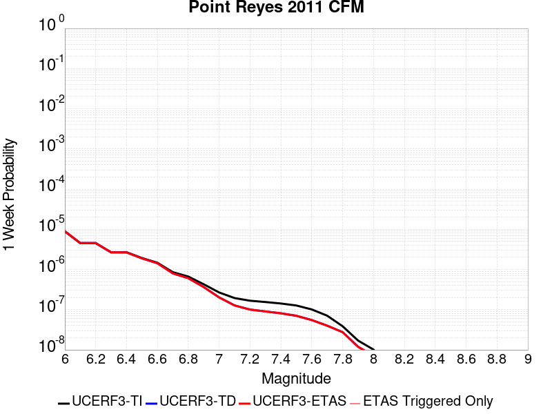 |  | 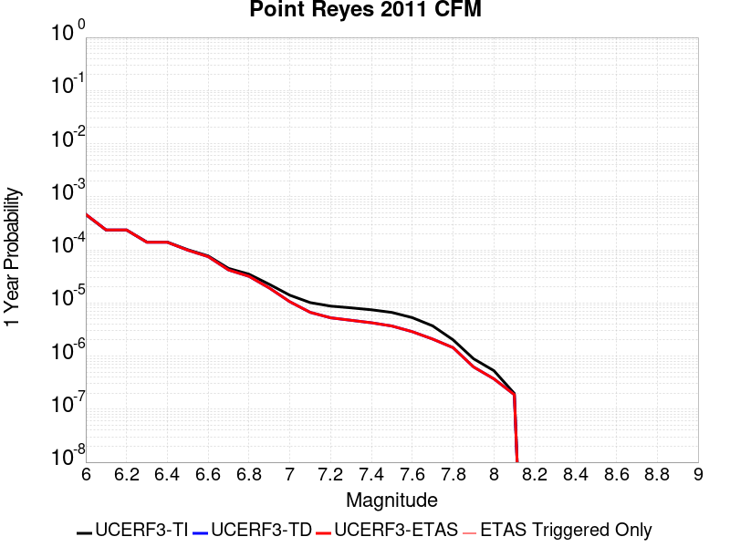 |  |

| Magnitude | 1 wk TI Prob | 1 wk TD Prob | 1 wk ETAS Prob | 1 wk ETAS/TD Gain | 1 wk ETAS Triggered Only | 1 mo TI Prob | 1 mo TD Prob | 1 mo ETAS Prob | 1 mo ETAS/TD Gain | 1 mo ETAS Triggered Only | 1 yr TI Prob | 1 yr TD Prob | 1 yr ETAS Prob | 1 yr ETAS/TD Gain | 1 yr ETAS Triggered Only | 10 yr TI Prob | 10 yr TD Prob | 10 yr ETAS Prob | 10 yr ETAS/TD Gain | 10 yr ETAS Triggered Only |
|-----|-----|-----|-----|-----|-----|-----|-----|-----|-----|-----|-----|-----|-----|-----|-----|-----|-----|-----|-----|-----|
| 6.0 | 8.8644965E-6 | 8.967829E-6 | 8.967829E-6 | 1.0 | 0.0 | 3.7990147E-5 | 3.843302E-5 | 3.843302E-5 | 1.0 | 0.0 | 4.624319E-4 | 4.6782783E-4 | 4.6782783E-4 | 1.0 | 0.0 | 0.0046147075 | 0.004669058 | 0.004680398 | 1.0024288 | 1.1393155E-5 |
| 6.1 | 4.526405E-6 | 4.5396714E-6 | 4.5396714E-6 | 1.0 | 0.0 | 1.9398734E-5 | 1.9455596E-5 | 1.9455596E-5 | 1.0 | 0.0 | 2.36154E-4 | 2.3684716E-4 | 2.3684716E-4 | 1.0 | 0.0 | 0.002359032 | 0.0023660532 | 0.0023660532 | 1.0 | 0.0 |
| 6.2 | 4.526405E-6 | 4.5396714E-6 | 4.5396714E-6 | 1.0 | 0.0 | 1.9398734E-5 | 1.9455596E-5 | 1.9455596E-5 | 1.0 | 0.0 | 2.36154E-4 | 2.3684716E-4 | 2.3684716E-4 | 1.0 | 0.0 | 0.002359032 | 0.0023660532 | 0.0023660532 | 1.0 | 0.0 |
| 6.3 | 2.6842322E-6 | 2.6610433E-6 | 2.6610433E-6 | 1.0 | 0.0 | 1.1503801E-5 | 1.1404422E-5 | 1.1404422E-5 | 1.0 | 0.0 | 1.4004979E-4 | 1.3884019E-4 | 1.3884019E-4 | 1.0 | 0.0 | 0.0013996155 | 0.001387556 | 0.001387556 | 1.0 | 0.0 |
| 6.4 | 2.6842322E-6 | 2.6610433E-6 | 2.6610433E-6 | 1.0 | 0.0 | 1.1503801E-5 | 1.1404422E-5 | 1.1404422E-5 | 1.0 | 0.0 | 1.4004979E-4 | 1.3884019E-4 | 1.3884019E-4 | 1.0 | 0.0 | 0.0013996155 | 0.001387556 | 0.001387556 | 1.0 | 0.0 |
| 6.5 | 1.9281833E-6 | 1.8909604E-6 | 1.8909604E-6 | 1.0 | 0.0 | 8.263617E-6 | 8.104092E-6 | 8.104092E-6 | 1.0 | 0.0 | 1.0060489E-4 | 9.866293E-5 | 9.866293E-5 | 1.0 | 0.0 | 0.0010055936 | 9.862018E-4 | 9.862018E-4 | 1.0 | 0.0 |
| 6.6 | 1.4726726E-6 | 1.4272727E-6 | 1.4272727E-6 | 1.0 | 0.0 | 6.3114385E-6 | 6.116869E-6 | 6.116869E-6 | 1.0 | 0.0 | 7.683905E-5 | 7.447038E-5 | 7.447038E-5 | 1.0 | 0.0 | 7.6812494E-4 | 7.444611E-4 | 7.444611E-4 | 1.0 | 0.0 |
| 6.7 | 8.572307E-7 | 8.010108E-7 | 8.010108E-7 | 1.0 | 0.0 | 3.6738406E-6 | 3.432899E-6 | 3.432899E-6 | 1.0 | 0.0 | 4.472809E-5 | 4.179476E-5 | 4.179476E-5 | 1.0 | 0.0 | 4.471909E-4 | 4.178726E-4 | 4.178726E-4 | 1.0 | 0.0 |
| 6.8 | 6.6745434E-7 | 6.08012E-7 | 6.08012E-7 | 1.0 | 0.0 | 2.8605155E-6 | 2.605763E-6 | 2.605763E-6 | 1.0 | 0.0 | 3.482622E-5 | 3.1724714E-5 | 3.1724714E-5 | 1.0 | 0.0 | 3.4820763E-4 | 3.1720486E-4 | 3.1720486E-4 | 1.0 | 0.0 |
| 6.9 | 4.291521E-7 | 3.6563182E-7 | 3.6563182E-7 | 1.0 | 0.0 | 1.839222E-6 | 1.5669926E-6 | 1.5669926E-6 | 1.0 | 0.0 | 2.2392298E-5 | 1.9077972E-5 | 1.9077972E-5 | 1.0 | 0.0 | 2.2390042E-4 | 1.9076568E-4 | 1.9076568E-4 | 1.0 | 0.0 |
| 7.0 | 2.6812808E-7 | 2.0213996E-7 | 2.0213996E-7 | 1.0 | 0.0 | 1.1491198E-6 | 8.663138E-7 | 8.663138E-7 | 1.0 | 0.0 | 1.3990444E-5 | 1.0547321E-5 | 1.0547321E-5 | 1.0 | 0.0 | 1.3989564E-4 | 1.05470244E-4 | 1.05470244E-4 | 1.0 | 0.0 |
| 7.1 | 1.9451231E-7 | 1.2751765E-7 | 1.2751765E-7 | 1.0 | 0.0 | 8.336239E-7 | 5.465041E-7 | 5.465041E-7 | 1.0 | 0.0 | 1.0149324E-5 | 6.653667E-6 | 6.653667E-6 | 1.0 | 0.0 | 1.014886E-4 | 6.653665E-5 | 6.653665E-5 | 1.0 | 0.0 |
| 7.2 | 1.6715143E-7 | 1.00687295E-7 | 1.00687295E-7 | 1.0 | 0.0 | 7.1636305E-7 | 4.3151692E-7 | 4.3151692E-7 | 1.0 | 0.0 | 8.721685E-6 | 5.2537057E-6 | 5.2537057E-6 | 1.0 | 0.0 | 8.721343E-5 | 5.2537784E-5 | 5.2537784E-5 | 1.0 | 0.0 |
| 7.3 | 1.5503173E-7 | 9.038606E-8 | 9.038606E-8 | 1.0 | 0.0 | 6.644215E-7 | 3.873688E-7 | 3.873688E-7 | 1.0 | 0.0 | 8.089301E-6 | 4.716205E-6 | 4.716205E-6 | 1.0 | 0.0 | 8.089007E-5 | 4.7163016E-5 | 4.7163016E-5 | 1.0 | 0.0 |
| 7.4 | 1.4251614E-7 | 8.1224364E-8 | 8.1224364E-8 | 1.0 | 0.0 | 6.1078333E-7 | 3.4810438E-7 | 3.4810438E-7 | 1.0 | 0.0 | 7.4362615E-6 | 4.2381625E-6 | 4.2381625E-6 | 1.0 | 0.0 | 7.436013E-5 | 4.2382788E-5 | 4.2382788E-5 | 1.0 | 0.0 |
| 7.5 | 1.2710186E-7 | 7.053468E-8 | 7.053468E-8 | 1.0 | 0.0 | 5.447221E-7 | 3.0229145E-7 | 3.0229145E-7 | 1.0 | 0.0 | 6.6319717E-6 | 3.6803922E-6 | 3.6803922E-6 | 1.0 | 0.0 | 6.6317734E-5 | 3.6805282E-5 | 3.6805282E-5 | 1.0 | 0.0 |
| 7.6 | 1.0144708E-7 | 5.517042E-8 | 5.517042E-8 | 1.0 | 0.0 | 4.347731E-7 | 2.3644466E-7 | 2.3644466E-7 | 1.0 | 0.0 | 5.2933497E-6 | 2.87871E-6 | 2.87871E-6 | 1.0 | 0.0 | 5.293224E-5 | 2.8788696E-5 | 2.8788696E-5 | 1.0 | 0.0 |
| 7.7 | 7.090527E-8 | 4.000589E-8 | 4.000589E-8 | 1.0 | 0.0 | 3.038797E-7 | 1.7145382E-7 | 1.7145382E-7 | 1.0 | 0.0 | 3.699729E-6 | 2.0874481E-6 | 2.0874481E-6 | 1.0 | 0.0 | 3.6996673E-5 | 2.0876256E-5 | 2.0876256E-5 | 1.0 | 0.0 |
| 7.8 | 3.8712045E-8 | 2.7595522E-8 | 2.7595522E-8 | 1.0 | 0.0 | 1.6590876E-7 | 1.18266534E-7 | 1.18266534E-7 | 1.0 | 0.0 | 2.0199373E-6 | 1.439894E-6 | 1.439894E-6 | 1.0 | 0.0 | 2.0199188E-5 | 1.4400817E-5 | 1.4400817E-5 | 1.0 | 0.0 |
| 7.9 | 1.7068782E-8 | 1.196052E-8 | 1.196052E-8 | 1.0 | 0.0 | 7.315192E-8 | 5.1259377E-8 | 5.1259377E-8 | 1.0 | 0.0 | 8.906242E-7 | 6.2408276E-7 | 6.2408276E-7 | 1.0 | 0.0 | 8.906207E-6 | 6.2427794E-6 | 6.2427794E-6 | 1.0 | 0.0 |
| 8.0 | 1.0172592E-8 | 7.1349504E-9 | 7.1349504E-9 | 1.0 | 0.0 | 4.359682E-8 | 3.0578363E-8 | 3.0578363E-8 | 1.0 | 0.0 | 5.3079117E-7 | 3.722915E-7 | 3.722915E-7 | 1.0 | 0.0 | 5.307899E-6 | 3.7248783E-6 | 3.7248783E-6 | 1.0 | 0.0 |
| 8.1 | 3.7861243E-9 | 3.596988E-9 | 3.596988E-9 | 1.0 | 0.0 | 1.6226247E-8 | 1.5415663E-8 | 1.5415663E-8 | 1.0 | 0.0 | 1.9755454E-7 | 1.876857E-7 | 1.876857E-7 | 1.0 | 0.0 | 1.9755437E-6 | 1.8786598E-6 | 1.8786598E-6 | 1.0 | 0.0 |

## San Jacinto (Borrego)
*[(top)](#table-of-contents)*

| 1 Week | 1 Month | 1 Year | 10 Year |
|-----|-----|-----|-----|
|  | 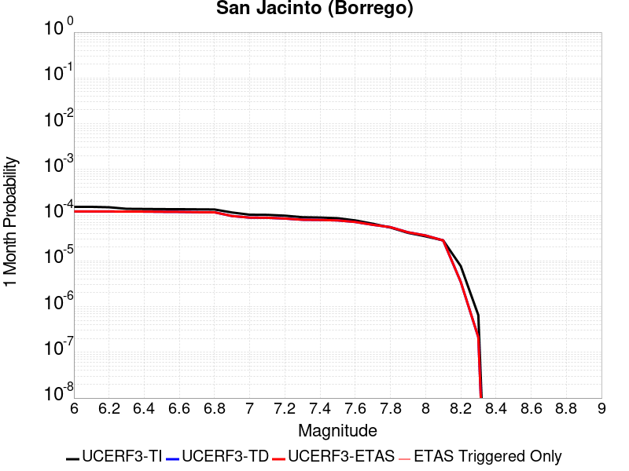 | 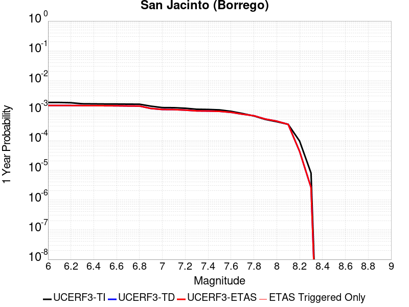 |  |

| Magnitude | 1 wk TI Prob | 1 wk TD Prob | 1 wk ETAS Prob | 1 wk ETAS/TD Gain | 1 wk ETAS Triggered Only | 1 mo TI Prob | 1 mo TD Prob | 1 mo ETAS Prob | 1 mo ETAS/TD Gain | 1 mo ETAS Triggered Only | 1 yr TI Prob | 1 yr TD Prob | 1 yr ETAS Prob | 1 yr ETAS/TD Gain | 1 yr ETAS Triggered Only | 10 yr TI Prob | 10 yr TD Prob | 10 yr ETAS Prob | 10 yr ETAS/TD Gain | 10 yr ETAS Triggered Only |
|-----|-----|-----|-----|-----|-----|-----|-----|-----|-----|-----|-----|-----|-----|-----|-----|-----|-----|-----|-----|-----|
| 6.0 | 3.543992E-5 | 2.8062923E-5 | 2.8062923E-5 | 1.0 | 0.0 | 1.5187653E-4 | 1.20264194E-4 | 1.20264194E-4 | 1.0 | 0.0 | 0.0018475284 | 0.0014632455 | 0.0014632455 | 1.0 | 0.0 | 0.018322436 | 0.014941492 | 0.0149527155 | 1.0007511 | 1.1393155E-5 |
| 6.1 | 3.542281E-5 | 2.8062923E-5 | 2.8062923E-5 | 1.0 | 0.0 | 1.5180321E-4 | 1.20264194E-4 | 1.20264194E-4 | 1.0 | 0.0 | 0.0018466372 | 0.0014632455 | 0.0014632455 | 1.0 | 0.0 | 0.018313672 | 0.014941492 | 0.0149527155 | 1.0007511 | 1.1393155E-5 |
| 6.2 | 3.4688688E-5 | 2.8062923E-5 | 2.8062923E-5 | 1.0 | 0.0 | 1.4865733E-4 | 1.20264194E-4 | 1.20264194E-4 | 1.0 | 0.0 | 0.0018084005 | 0.0014632454 | 0.0014632454 | 1.0 | 0.0 | 0.017937548 | 0.014941492 | 0.014952715 | 1.0007511 | 1.1393155E-5 |
| 6.3 | 3.2087122E-5 | 2.7908174E-5 | 2.7908174E-5 | 1.0 | 0.0 | 1.3750899E-4 | 1.1960105E-4 | 1.1960105E-4 | 1.0 | 0.0 | 0.0016728862 | 0.0014551823 | 0.0014551823 | 1.0 | 0.0 | 0.016603488 | 0.014862606 | 0.014873831 | 1.0007552 | 1.1393155E-5 |
| 6.4 | 3.1828724E-5 | 2.7875134E-5 | 2.7875134E-5 | 1.0 | 0.0 | 1.364017E-4 | 1.1945946E-4 | 1.1945946E-4 | 1.0 | 0.0 | 0.0016594254 | 0.0014534608 | 0.0014534608 | 1.0 | 0.0 | 0.016470885 | 0.014845792 | 0.0148570165 | 1.000756 | 1.1393155E-5 |
| 6.5 | 3.1563577E-5 | 2.7614415E-5 | 2.7614415E-5 | 1.0 | 0.0 | 1.3526545E-4 | 1.1834219E-4 | 1.1834219E-4 | 1.0 | 0.0 | 0.0016456128 | 0.0014398762 | 0.0014398762 | 1.0 | 0.0 | 0.0163348 | 0.014711652 | 0.014722878 | 1.000763 | 1.1393155E-5 |
| 6.6 | 3.1467625E-5 | 2.745849E-5 | 2.745849E-5 | 1.0 | 0.0 | 1.3485427E-4 | 1.1767401E-4 | 1.1767401E-4 | 1.0 | 0.0 | 0.0016406142 | 0.0014317518 | 0.0014317518 | 1.0 | 0.0 | 0.016285548 | 0.014631729 | 0.014642955 | 1.0007672 | 1.1393155E-5 |
| 6.7 | 3.1223695E-5 | 2.7076247E-5 | 2.7076247E-5 | 1.0 | 0.0 | 1.3380898E-4 | 1.1603596E-4 | 1.1603596E-4 | 1.0 | 0.0 | 0.0016279068 | 0.0014118345 | 0.0014118345 | 1.0 | 0.0 | 0.01616033 | 0.014436033 | 0.014447262 | 1.0007778 | 1.1393155E-5 |
| 6.8 | 3.1015585E-5 | 2.6896978E-5 | 2.6896978E-5 | 1.0 | 0.0 | 1.3291716E-4 | 1.15267736E-4 | 1.15267736E-4 | 1.0 | 0.0 | 0.001617065 | 0.0014024933 | 0.0014024933 | 1.0 | 0.0 | 0.016053487 | 0.014343175 | 0.014354405 | 1.000783 | 1.1393155E-5 |
| 6.9 | 2.6641965E-5 | 2.231143E-5 | 2.231143E-5 | 1.0 | 0.0 | 1.1417485E-4 | 9.561693E-5 | 9.561693E-5 | 1.0 | 0.0 | 0.0013891924 | 0.0011635184 | 0.0011635184 | 1.0 | 0.0 | 0.0138054015 | 0.011948789 | 0.011960045 | 1.0009421 | 1.1393155E-5 |
| 7.0 | 2.3854353E-5 | 2.0601734E-5 | 2.0601734E-5 | 1.0 | 0.0 | 1.02228936E-4 | 8.829017E-5 | 8.829017E-5 | 1.0 | 0.0 | 0.0012439266 | 0.0010744054 | 0.0010744054 | 1.0 | 0.0 | 0.012369866 | 0.01104709 | 0.011058358 | 1.00102 | 1.1393155E-5 |
| 7.1 | 2.3672901E-5 | 2.0438089E-5 | 2.0438089E-5 | 1.0 | 0.0 | 1.0145135E-4 | 8.758888E-5 | 8.758888E-5 | 1.0 | 0.0 | 0.0012344702 | 0.0010658755 | 0.0010658755 | 1.0 | 0.0 | 0.0122763505 | 0.010962192 | 0.01097346 | 1.001028 | 1.1393155E-5 |
| 7.2 | 2.2717244E-5 | 1.9664478E-5 | 1.9664478E-5 | 1.0 | 0.0 | 9.735599E-5 | 8.4273626E-5 | 8.4273626E-5 | 1.0 | 0.0 | 0.0011846646 | 0.0010255508 | 0.0010255508 | 1.0 | 0.0 | 0.01178369 | 0.010559129 | 0.010570401 | 1.0010676 | 1.1393155E-5 |
| 7.3 | 2.1016205E-5 | 1.8504472E-5 | 1.8504472E-5 | 1.0 | 0.0 | 9.006634E-5 | 7.930248E-5 | 7.930248E-5 | 1.0 | 0.0 | 0.001096006 | 9.6508214E-4 | 9.6508214E-4 | 1.0 | 0.0 | 0.010906163 | 0.009953954 | 0.009965234 | 1.0011332 | 1.1393155E-5 |
| 7.4 | 2.0683625E-5 | 1.8306653E-5 | 1.8306653E-5 | 1.0 | 0.0 | 8.86411E-5 | 7.845474E-5 | 7.845474E-5 | 1.0 | 0.0 | 0.001078671 | 9.5476996E-4 | 9.5476996E-4 | 1.0 | 0.0 | 0.010734501 | 0.009850506 | 0.009861787 | 1.0011452 | 1.1393155E-5 |
| 7.5 | 1.9993966E-5 | 1.7900673E-5 | 1.7900673E-5 | 1.0 | 0.0 | 8.568561E-5 | 7.6714925E-5 | 7.6714925E-5 | 1.0 | 0.0 | 0.001042723 | 9.33606E-4 | 9.33606E-4 | 1.0 | 0.0 | 0.010378438 | 0.00963691 | 0.009648193 | 1.0011709 | 1.1393155E-5 |
| 7.6 | 1.788966E-5 | 1.65485E-5 | 1.65485E-5 | 1.0 | 0.0 | 7.666772E-5 | 7.092023E-5 | 7.092023E-5 | 1.0 | 0.0 | 9.3302975E-4 | 8.631135E-4 | 8.631135E-4 | 1.0 | 0.0 | 0.00929122 | 0.008925967 | 0.008937258 | 1.001265 | 1.1393155E-5 |
| 7.7 | 1.5125781E-5 | 1.4346426E-5 | 1.4346426E-5 | 1.0 | 0.0 | 6.4823165E-5 | 6.148324E-5 | 6.148324E-5 | 1.0 | 0.0 | 7.889362E-4 | 7.4830215E-4 | 7.4830215E-4 | 1.0 | 0.0 | 0.007861412 | 0.0077714897 | 0.007782794 | 1.0014546 | 1.1393155E-5 |
| 7.8 | 1.250089E-5 | 1.27355615E-5 | 1.27355615E-5 | 1.0 | 0.0 | 5.3574146E-5 | 5.4579843E-5 | 5.4579843E-5 | 1.0 | 0.0 | 6.5207E-4 | 6.643076E-4 | 6.643076E-4 | 1.0 | 0.0 | 0.006501599 | 0.006923022 | 0.006934337 | 1.0016342 | 1.1393155E-5 |
| 7.9 | 9.561E-6 | 9.847821E-6 | 9.847821E-6 | 1.0 | 0.0 | 4.0975072E-5 | 4.220427E-5 | 4.220427E-5 | 1.0 | 0.0 | 4.987573E-4 | 5.137164E-4 | 5.137164E-4 | 1.0 | 0.0 | 0.0049763937 | 0.0054013524 | 0.0054126843 | 1.002098 | 1.1393155E-5 |
| 8.0 | 8.01699E-6 | 8.378476E-6 | 8.378476E-6 | 1.0 | 0.0 | 3.4358076E-5 | 3.5907266E-5 | 3.5907266E-5 | 1.0 | 0.0 | 4.1822926E-4 | 4.370838E-4 | 4.370838E-4 | 1.0 | 0.0 | 0.0041744304 | 0.0046181697 | 0.0046295105 | 1.0024556 | 1.1393155E-5 |
| 8.1 | 6.541947E-6 | 6.532065E-6 | 6.532065E-6 | 1.0 | 0.0 | 2.8036617E-5 | 2.7994267E-5 | 2.7994267E-5 | 1.0 | 0.0 | 3.4129233E-4 | 3.4077742E-4 | 3.4077742E-4 | 1.0 | 0.0 | 0.0034076865 | 0.0036176546 | 0.0036290064 | 1.003138 | 1.1393155E-5 |
| 8.2 | 1.7968189E-6 | 8.099421E-7 | 8.099421E-7 | 1.0 | 0.0 | 7.70063E-6 | 3.471176E-6 | 3.471176E-6 | 1.0 | 0.0 | 9.3751136E-5 | 4.226077E-5 | 4.226077E-5 | 1.0 | 0.0 | 9.371159E-4 | 4.7836357E-4 | 4.7836357E-4 | 1.0 | 0.0 |
| 8.3 | 1.5167889E-7 | 4.9887817E-8 | 4.9887817E-8 | 1.0 | 0.0 | 6.500522E-7 | 2.1380492E-7 | 2.1380492E-7 | 1.0 | 0.0 | 7.9143565E-6 | 2.6030723E-6 | 2.6030723E-6 | 1.0 | 0.0 | 7.914075E-5 | 3.021713E-5 | 3.021713E-5 | 1.0 | 0.0 |

## Peralta Hills
*[(top)](#table-of-contents)*

| 1 Week | 1 Month | 1 Year | 10 Year |
|-----|-----|-----|-----|
|  |  |  |  |

| Magnitude | 1 wk TI Prob | 1 wk TD Prob | 1 wk ETAS Prob | 1 wk ETAS/TD Gain | 1 wk ETAS Triggered Only | 1 mo TI Prob | 1 mo TD Prob | 1 mo ETAS Prob | 1 mo ETAS/TD Gain | 1 mo ETAS Triggered Only | 1 yr TI Prob | 1 yr TD Prob | 1 yr ETAS Prob | 1 yr ETAS/TD Gain | 1 yr ETAS Triggered Only | 10 yr TI Prob | 10 yr TD Prob | 10 yr ETAS Prob | 10 yr ETAS/TD Gain | 10 yr ETAS Triggered Only |
|-----|-----|-----|-----|-----|-----|-----|-----|-----|-----|-----|-----|-----|-----|-----|-----|-----|-----|-----|-----|-----|
| 6.0 | 3.8850067E-6 | 3.840585E-6 | 3.840585E-6 | 1.0 | 0.0 | 1.6649923E-5 | 1.6459588E-5 | 1.6459588E-5 | 1.0 | 0.0 | 2.0269395E-4 | 2.0038447E-4 | 2.0038447E-4 | 1.0 | 0.0 | 0.0020250916 | 0.0020027657 | 0.002014136 | 1.0056773 | 1.1393155E-5 |
| 6.1 | 3.8850067E-6 | 3.840585E-6 | 3.840585E-6 | 1.0 | 0.0 | 1.6649923E-5 | 1.6459588E-5 | 1.6459588E-5 | 1.0 | 0.0 | 2.0269395E-4 | 2.0038447E-4 | 2.0038447E-4 | 1.0 | 0.0 | 0.0020250916 | 0.0020027657 | 0.002014136 | 1.0056773 | 1.1393155E-5 |
| 6.2 | 3.8850067E-6 | 3.840585E-6 | 3.840585E-6 | 1.0 | 0.0 | 1.6649923E-5 | 1.6459588E-5 | 1.6459588E-5 | 1.0 | 0.0 | 2.0269395E-4 | 2.0038447E-4 | 2.0038447E-4 | 1.0 | 0.0 | 0.0020250916 | 0.0020027657 | 0.002014136 | 1.0056773 | 1.1393155E-5 |
| 6.3 | 3.8850067E-6 | 3.840585E-6 | 3.840585E-6 | 1.0 | 0.0 | 1.6649923E-5 | 1.6459588E-5 | 1.6459588E-5 | 1.0 | 0.0 | 2.0269395E-4 | 2.0038447E-4 | 2.0038447E-4 | 1.0 | 0.0 | 0.0020250916 | 0.0020027657 | 0.002014136 | 1.0056773 | 1.1393155E-5 |
| 6.4 | 3.8850067E-6 | 3.840585E-6 | 3.840585E-6 | 1.0 | 0.0 | 1.6649923E-5 | 1.6459588E-5 | 1.6459588E-5 | 1.0 | 0.0 | 2.0269395E-4 | 2.0038447E-4 | 2.0038447E-4 | 1.0 | 0.0 | 0.0020250916 | 0.0020027657 | 0.002014136 | 1.0056773 | 1.1393155E-5 |
| 6.5 | 1.5587785E-6 | 1.4439855E-6 | 1.4439855E-6 | 1.0 | 0.0 | 6.6804623E-6 | 6.188496E-6 | 6.188496E-6 | 1.0 | 0.0 | 8.133159E-5 | 7.534258E-5 | 7.534258E-5 | 1.0 | 0.0 | 8.1301836E-4 | 7.531944E-4 | 7.531944E-4 | 1.0 | 0.0 |
| 6.6 | 1.5587785E-6 | 1.4439855E-6 | 1.4439855E-6 | 1.0 | 0.0 | 6.6804623E-6 | 6.188496E-6 | 6.188496E-6 | 1.0 | 0.0 | 8.133159E-5 | 7.534258E-5 | 7.534258E-5 | 1.0 | 0.0 | 8.1301836E-4 | 7.531944E-4 | 7.531944E-4 | 1.0 | 0.0 |
| 6.7 | 1.5018579E-6 | 1.3846022E-6 | 1.3846022E-6 | 1.0 | 0.0 | 6.436518E-6 | 5.9339973E-6 | 5.9339973E-6 | 1.0 | 0.0 | 7.836179E-5 | 7.2244264E-5 | 7.2244264E-5 | 1.0 | 0.0 | 7.833416E-4 | 7.2223134E-4 | 7.2223134E-4 | 1.0 | 0.0 |
| 6.8 | 1.4584314E-6 | 1.3390292E-6 | 1.3390292E-6 | 1.0 | 0.0 | 6.250405E-6 | 5.738685E-6 | 5.738685E-6 | 1.0 | 0.0 | 7.6096025E-5 | 6.986649E-5 | 6.986649E-5 | 1.0 | 0.0 | 7.6069974E-4 | 6.9846865E-4 | 6.9846865E-4 | 1.0 | 0.0 |
| 6.9 | 1.1382393E-6 | 9.868774E-7 | 9.868774E-7 | 1.0 | 0.0 | 4.8781594E-6 | 4.229468E-6 | 4.229468E-6 | 1.0 | 0.0 | 5.9389975E-5 | 5.149264E-5 | 5.149264E-5 | 1.0 | 0.0 | 5.93741E-4 | 5.148153E-4 | 5.148153E-4 | 1.0 | 0.0 |
| 7.0 | 9.970413E-7 | 8.3151497E-7 | 8.3151497E-7 | 1.0 | 0.0 | 4.273027E-6 | 3.563631E-6 | 3.563631E-6 | 1.0 | 0.0 | 5.2022864E-5 | 4.3386415E-5 | 4.3386415E-5 | 1.0 | 0.0 | 5.2010687E-4 | 4.3378625E-4 | 4.3378625E-4 | 1.0 | 0.0 |
| 7.1 | 9.684443E-7 | 7.9994055E-7 | 7.9994055E-7 | 1.0 | 0.0 | 4.150469E-6 | 3.4283125E-6 | 3.4283125E-6 | 1.0 | 0.0 | 5.053079E-5 | 4.1738975E-5 | 4.1738975E-5 | 1.0 | 0.0 | 5.05193E-4 | 4.173181E-4 | 4.173181E-4 | 1.0 | 0.0 |
| 7.2 | 9.240811E-7 | 7.508246E-7 | 7.508246E-7 | 1.0 | 0.0 | 3.960342E-6 | 3.2178161E-6 | 3.2178161E-6 | 1.0 | 0.0 | 4.8216094E-5 | 3.9176273E-5 | 3.9176273E-5 | 1.0 | 0.0 | 4.8205635E-4 | 3.9170025E-4 | 3.9170025E-4 | 1.0 | 0.0 |
| 7.3 | 8.158643E-7 | 6.3545383E-7 | 6.3545383E-7 | 1.0 | 0.0 | 3.4965567E-6 | 2.723371E-6 | 2.723371E-6 | 1.0 | 0.0 | 4.2569747E-5 | 3.31566E-5 | 3.31566E-5 | 1.0 | 0.0 | 4.2561593E-4 | 3.315227E-4 | 3.315227E-4 | 1.0 | 0.0 |
| 7.4 | 6.3822824E-7 | 4.799166E-7 | 4.799166E-7 | 1.0 | 0.0 | 2.7352612E-6 | 2.056784E-6 | 2.056784E-6 | 1.0 | 0.0 | 3.3301294E-5 | 2.5041112E-5 | 2.5041112E-5 | 1.0 | 0.0 | 3.3296304E-4 | 2.5038805E-4 | 2.5038805E-4 | 1.0 | 0.0 |
| 7.5 | 4.0292628E-7 | 2.7865704E-7 | 2.7865704E-7 | 1.0 | 0.0 | 1.7268258E-6 | 1.1942441E-6 | 1.1942441E-6 | 1.0 | 0.0 | 2.1023901E-5 | 1.45398535E-5 | 1.45398535E-5 | 1.0 | 0.0 | 2.1021912E-4 | 1.4539182E-4 | 1.4539182E-4 | 1.0 | 0.0 |
| 7.6 | 3.672993E-7 | 2.487233E-7 | 2.487233E-7 | 1.0 | 0.0 | 1.5741389E-6 | 1.0659567E-6 | 1.0659567E-6 | 1.0 | 0.0 | 1.9164972E-5 | 1.2977973E-5 | 1.2977973E-5 | 1.0 | 0.0 | 1.916332E-4 | 1.2977487E-4 | 1.2977487E-4 | 1.0 | 0.0 |
| 7.7 | 2.8466823E-7 | 1.7873579E-7 | 1.7873579E-7 | 1.0 | 0.0 | 1.2200061E-6 | 7.660105E-7 | 7.660105E-7 | 1.0 | 0.0 | 1.4853474E-5 | 9.326164E-6 | 9.326164E-6 | 1.0 | 0.0 | 1.485248E-4 | 9.326033E-5 | 9.326033E-5 | 1.0 | 0.0 |

## Monte Vista - Shannon 2011 CFM
*[(top)](#table-of-contents)*

| 1 Week | 1 Month | 1 Year | 10 Year |
|-----|-----|-----|-----|
| 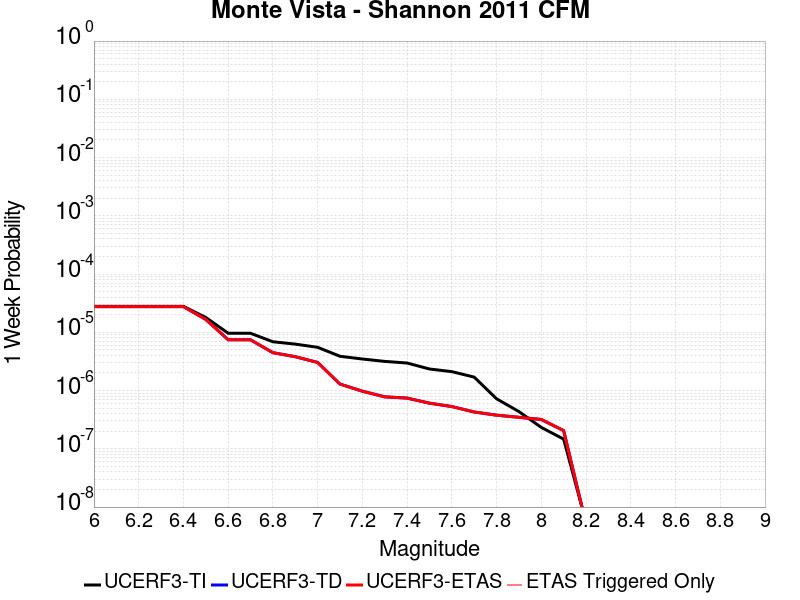 |  |  |  |

| Magnitude | 1 wk TI Prob | 1 wk TD Prob | 1 wk ETAS Prob | 1 wk ETAS/TD Gain | 1 wk ETAS Triggered Only | 1 mo TI Prob | 1 mo TD Prob | 1 mo ETAS Prob | 1 mo ETAS/TD Gain | 1 mo ETAS Triggered Only | 1 yr TI Prob | 1 yr TD Prob | 1 yr ETAS Prob | 1 yr ETAS/TD Gain | 1 yr ETAS Triggered Only | 10 yr TI Prob | 10 yr TD Prob | 10 yr ETAS Prob | 10 yr ETAS/TD Gain | 10 yr ETAS Triggered Only |
|-----|-----|-----|-----|-----|-----|-----|-----|-----|-----|-----|-----|-----|-----|-----|-----|-----|-----|-----|-----|-----|
| 6.0 | 2.7907707E-5 | 2.7599812E-5 | 2.7599812E-5 | 1.0 | 0.0 | 1.19598975E-4 | 1.18280244E-4 | 1.18280244E-4 | 1.0 | 0.0 | 0.0014551448 | 0.0014392345 | 0.0014392345 | 1.0 | 0.0 | 0.014456532 | 0.014328309 | 0.014339539 | 1.0007838 | 1.1393155E-5 |
| 6.1 | 2.7907707E-5 | 2.7599812E-5 | 2.7599812E-5 | 1.0 | 0.0 | 1.19598975E-4 | 1.18280244E-4 | 1.18280244E-4 | 1.0 | 0.0 | 0.0014551448 | 0.0014392345 | 0.0014392345 | 1.0 | 0.0 | 0.014456532 | 0.014328309 | 0.014339539 | 1.0007838 | 1.1393155E-5 |
| 6.2 | 2.7907707E-5 | 2.7599812E-5 | 2.7599812E-5 | 1.0 | 0.0 | 1.19598975E-4 | 1.18280244E-4 | 1.18280244E-4 | 1.0 | 0.0 | 0.0014551448 | 0.0014392345 | 0.0014392345 | 1.0 | 0.0 | 0.014456532 | 0.014328309 | 0.014339539 | 1.0007838 | 1.1393155E-5 |
| 6.3 | 2.7907707E-5 | 2.7599812E-5 | 2.7599812E-5 | 1.0 | 0.0 | 1.19598975E-4 | 1.18280244E-4 | 1.18280244E-4 | 1.0 | 0.0 | 0.0014551448 | 0.0014392345 | 0.0014392345 | 1.0 | 0.0 | 0.014456532 | 0.014328309 | 0.014339539 | 1.0007838 | 1.1393155E-5 |
| 6.4 | 2.7907707E-5 | 2.7599812E-5 | 2.7599812E-5 | 1.0 | 0.0 | 1.19598975E-4 | 1.18280244E-4 | 1.18280244E-4 | 1.0 | 0.0 | 0.0014551448 | 0.0014392345 | 0.0014392345 | 1.0 | 0.0 | 0.014456532 | 0.014328309 | 0.014339539 | 1.0007838 | 1.1393155E-5 |
| 6.5 | 1.7990213E-5 | 1.6652864E-5 | 1.6652864E-5 | 1.0 | 0.0 | 7.709863E-5 | 7.136784E-5 | 7.136784E-5 | 1.0 | 0.0 | 9.382716E-4 | 8.6862344E-4 | 8.6862344E-4 | 1.0 | 0.0 | 0.0093431985 | 0.008675742 | 0.008675742 | 1.0 | 0.0 |
| 6.6 | 9.650407E-6 | 7.4679774E-6 | 7.4679774E-6 | 1.0 | 0.0 | 4.135823E-5 | 3.2005268E-5 | 3.2005268E-5 | 1.0 | 0.0 | 5.0342013E-4 | 3.896023E-4 | 3.896023E-4 | 1.0 | 0.0 | 0.005022812 | 0.0039069573 | 0.0039069573 | 1.0 | 0.0 |
| 6.7 | 9.62828E-6 | 7.44588E-6 | 7.44588E-6 | 1.0 | 0.0 | 4.1263404E-5 | 3.1910567E-5 | 3.1910567E-5 | 1.0 | 0.0 | 5.022661E-4 | 3.8844973E-4 | 3.8844973E-4 | 1.0 | 0.0 | 0.0050113243 | 0.0038954718 | 0.0038954718 | 1.0 | 0.0 |
| 6.8 | 6.887523E-6 | 4.471782E-6 | 4.471782E-6 | 1.0 | 0.0 | 2.9517621E-5 | 1.9164652E-5 | 1.9164652E-5 | 1.0 | 0.0 | 3.5931775E-4 | 2.333069E-4 | 2.333069E-4 | 1.0 | 0.0 | 0.0035873733 | 0.002347857 | 0.002347857 | 1.0 | 0.0 |
| 6.9 | 6.2722347E-6 | 3.8135129E-6 | 3.8135129E-6 | 1.0 | 0.0 | 2.6880729E-5 | 1.6343536E-5 | 1.6343536E-5 | 1.0 | 0.0 | 3.2722374E-4 | 1.989664E-4 | 1.989664E-4 | 1.0 | 0.0 | 0.003267423 | 0.002005106 | 0.002005106 | 1.0 | 0.0 |
| 7.0 | 5.5320347E-6 | 3.0404497E-6 | 3.0404497E-6 | 1.0 | 0.0 | 2.3708504E-5 | 1.3030443E-5 | 1.3030443E-5 | 1.0 | 0.0 | 2.8861282E-4 | 1.5863593E-4 | 1.5863593E-4 | 1.0 | 0.0 | 0.0028823826 | 0.0016024366 | 0.0016024366 | 1.0 | 0.0 |
| 7.1 | 3.8794055E-6 | 1.2930052E-6 | 1.2930052E-6 | 1.0 | 0.0 | 1.6625918E-5 | 5.541439E-6 | 5.541439E-6 | 1.0 | 0.0 | 2.0240174E-4 | 6.746495E-5 | 6.746495E-5 | 1.0 | 0.0 | 0.002022175 | 6.914794E-4 | 6.914794E-4 | 1.0 | 0.0 |
| 7.2 | 3.4813652E-6 | 9.759085E-7 | 9.759085E-7 | 1.0 | 0.0 | 1.49200505E-5 | 4.1824583E-6 | 4.1824583E-6 | 1.0 | 0.0 | 1.8163648E-4 | 5.0920247E-5 | 5.0920247E-5 | 1.0 | 0.0 | 0.0018148809 | 5.2610796E-4 | 5.2610796E-4 | 1.0 | 0.0 |
| 7.3 | 3.1682148E-6 | 7.802412E-7 | 7.802412E-7 | 1.0 | 0.0 | 1.3577992E-5 | 3.3438864E-6 | 3.3438864E-6 | 1.0 | 0.0 | 1.6529951E-4 | 4.071106E-5 | 4.071106E-5 | 1.0 | 0.0 | 0.0016517661 | 4.2403257E-4 | 4.2403257E-4 | 1.0 | 0.0 |
| 7.4 | 2.9707667E-6 | 7.4265665E-7 | 7.4265665E-7 | 1.0 | 0.0 | 1.2731795E-5 | 3.1828104E-6 | 3.1828104E-6 | 1.0 | 0.0 | 1.5499859E-4 | 3.875003E-5 | 3.875003E-5 | 1.0 | 0.0 | 0.0015489052 | 4.0421495E-4 | 4.0421495E-4 | 1.0 | 0.0 |
| 7.5 | 2.3462758E-6 | 6.0767826E-7 | 6.0767826E-7 | 1.0 | 0.0 | 1.0055429E-5 | 2.6043328E-6 | 2.6043328E-6 | 1.0 | 0.0 | 1.2241797E-4 | 3.170729E-5 | 3.170729E-5 | 1.0 | 0.0 | 0.0012235056 | 3.320463E-4 | 3.320463E-4 | 1.0 | 0.0 |
| 7.6 | 2.112783E-6 | 5.31639E-7 | 5.31639E-7 | 1.0 | 0.0 | 9.054753E-6 | 2.278451E-6 | 2.278451E-6 | 1.0 | 0.0 | 1.1023604E-4 | 2.7739787E-5 | 2.7739787E-5 | 1.0 | 0.0 | 0.0011018137 | 2.9194728E-4 | 2.9194728E-4 | 1.0 | 0.0 |
| 7.7 | 1.7022471E-6 | 4.2882493E-7 | 4.2882493E-7 | 1.0 | 0.0 | 7.2953244E-6 | 1.8378198E-6 | 1.8378198E-6 | 1.0 | 0.0 | 8.881695E-5 | 2.2375229E-5 | 2.2375229E-5 | 1.0 | 0.0 | 8.878146E-4 | 2.3698054E-4 | 2.3698054E-4 | 1.0 | 0.0 |
| 7.8 | 7.230914E-7 | 3.780046E-7 | 3.780046E-7 | 1.0 | 0.0 | 3.0989595E-6 | 1.6200186E-6 | 1.6200186E-6 | 1.0 | 0.0 | 3.772918E-5 | 1.972355E-5 | 1.972355E-5 | 1.0 | 0.0 | 3.7722773E-4 | 2.099721E-4 | 2.099721E-4 | 1.0 | 0.0 |
| 7.9 | 4.3588446E-7 | 3.4755223E-7 | 3.4755223E-7 | 1.0 | 0.0 | 1.868075E-6 | 1.4895087E-6 | 1.4895087E-6 | 1.0 | 0.0 | 2.2743576E-5 | 1.8134619E-5 | 1.8134619E-5 | 1.0 | 0.0 | 2.2741247E-4 | 1.9229123E-4 | 1.9229123E-4 | 1.0 | 0.0 |
| 8.0 | 2.3317523E-7 | 3.1909312E-7 | 3.1909312E-7 | 1.0 | 0.0 | 9.99322E-7 | 1.3675412E-6 | 1.3675412E-6 | 1.0 | 0.0 | 1.2166677E-5 | 1.6649688E-5 | 1.6649688E-5 | 1.0 | 0.0 | 1.21660116E-4 | 1.7603493E-4 | 1.7603493E-4 | 1.0 | 0.0 |
| 8.1 | 1.4662456E-7 | 2.0546274E-7 | 2.0546274E-7 | 1.0 | 0.0 | 6.283908E-7 | 8.805543E-7 | 8.805543E-7 | 1.0 | 0.0 | 7.650631E-6 | 1.0720697E-5 | 1.0720697E-5 | 1.0 | 0.0 | 7.650368E-5 | 1.1254844E-4 | 1.1254844E-4 | 1.0 | 0.0 |
| 8.2 | 5.4931775E-9 | 5.135892E-9 | 5.135892E-9 | 1.0 | 0.0 | 2.3542189E-8 | 2.2010965E-8 | 2.2010965E-8 | 1.0 | 0.0 | 2.8662612E-7 | 2.679835E-7 | 2.679835E-7 | 1.0 | 0.0 | 2.8662573E-6 | 2.785148E-6 | 2.785148E-6 | 1.0 | 0.0 |

## Elsinore (Julian)
*[(top)](#table-of-contents)*

| 1 Week | 1 Month | 1 Year | 10 Year |
|-----|-----|-----|-----|
|  |  |  |  |

| Magnitude | 1 wk TI Prob | 1 wk TD Prob | 1 wk ETAS Prob | 1 wk ETAS/TD Gain | 1 wk ETAS Triggered Only | 1 mo TI Prob | 1 mo TD Prob | 1 mo ETAS Prob | 1 mo ETAS/TD Gain | 1 mo ETAS Triggered Only | 1 yr TI Prob | 1 yr TD Prob | 1 yr ETAS Prob | 1 yr ETAS/TD Gain | 1 yr ETAS Triggered Only | 10 yr TI Prob | 10 yr TD Prob | 10 yr ETAS Prob | 10 yr ETAS/TD Gain | 10 yr ETAS Triggered Only |
|-----|-----|-----|-----|-----|-----|-----|-----|-----|-----|-----|-----|-----|-----|-----|-----|-----|-----|-----|-----|-----|
| 6.0 | 1.1710231E-5 | 8.851974E-6 | 8.851974E-6 | 1.0 | 0.0 | 5.0185736E-5 | 3.793649E-5 | 3.793649E-5 | 1.0 | 0.0 | 6.1084004E-4 | 4.6178055E-4 | 4.7316845E-4 | 1.0246608 | 1.1393155E-5 | 0.006091637 | 0.0046083946 | 0.0046197353 | 1.0024608 | 1.1393155E-5 |
| 6.1 | 1.1710231E-5 | 8.851974E-6 | 8.851974E-6 | 1.0 | 0.0 | 5.0185736E-5 | 3.793649E-5 | 3.793649E-5 | 1.0 | 0.0 | 6.1084004E-4 | 4.6178055E-4 | 4.7316845E-4 | 1.0246608 | 1.1393155E-5 | 0.006091637 | 0.0046083946 | 0.0046197353 | 1.0024608 | 1.1393155E-5 |
| 6.2 | 1.1710231E-5 | 8.851974E-6 | 8.851974E-6 | 1.0 | 0.0 | 5.0185736E-5 | 3.793649E-5 | 3.793649E-5 | 1.0 | 0.0 | 6.1084004E-4 | 4.6178055E-4 | 4.7316845E-4 | 1.0246608 | 1.1393155E-5 | 0.006091637 | 0.0046083946 | 0.0046197353 | 1.0024608 | 1.1393155E-5 |
| 6.3 | 1.1710231E-5 | 8.851974E-6 | 8.851974E-6 | 1.0 | 0.0 | 5.0185736E-5 | 3.793649E-5 | 3.793649E-5 | 1.0 | 0.0 | 6.1084004E-4 | 4.6178055E-4 | 4.7316845E-4 | 1.0246608 | 1.1393155E-5 | 0.006091637 | 0.0046083946 | 0.0046197353 | 1.0024608 | 1.1393155E-5 |
| 6.4 | 1.1710231E-5 | 8.851974E-6 | 8.851974E-6 | 1.0 | 0.0 | 5.0185736E-5 | 3.793649E-5 | 3.793649E-5 | 1.0 | 0.0 | 6.1084004E-4 | 4.6178055E-4 | 4.7316845E-4 | 1.0246608 | 1.1393155E-5 | 0.006091637 | 0.0046083946 | 0.0046197353 | 1.0024608 | 1.1393155E-5 |
| 6.5 | 1.1710231E-5 | 8.851974E-6 | 8.851974E-6 | 1.0 | 0.0 | 5.0185736E-5 | 3.793649E-5 | 3.793649E-5 | 1.0 | 0.0 | 6.1084004E-4 | 4.6178055E-4 | 4.7316845E-4 | 1.0246608 | 1.1393155E-5 | 0.006091637 | 0.0046083946 | 0.0046197353 | 1.0024608 | 1.1393155E-5 |
| 6.6 | 1.1650619E-5 | 8.784331E-6 | 8.784331E-6 | 1.0 | 0.0 | 4.993027E-5 | 3.7646598E-5 | 3.7646598E-5 | 1.0 | 0.0 | 6.0773146E-4 | 4.5825262E-4 | 4.6964054E-4 | 1.0248507 | 1.1393155E-5 | 0.0060607214 | 0.004573261 | 0.004584602 | 1.0024799 | 1.1393155E-5 |
| 6.7 | 1.1650619E-5 | 8.784331E-6 | 8.784331E-6 | 1.0 | 0.0 | 4.993027E-5 | 3.7646598E-5 | 3.7646598E-5 | 1.0 | 0.0 | 6.0773146E-4 | 4.5825262E-4 | 4.6964054E-4 | 1.0248507 | 1.1393155E-5 | 0.0060607214 | 0.004573261 | 0.004584602 | 1.0024799 | 1.1393155E-5 |
| 6.8 | 1.1442698E-5 | 8.567436E-6 | 8.567436E-6 | 1.0 | 0.0 | 4.9039216E-5 | 3.6717076E-5 | 3.6717076E-5 | 1.0 | 0.0 | 5.968889E-4 | 4.469404E-4 | 4.5832846E-4 | 1.02548 | 1.1393155E-5 | 0.0059528816 | 0.0044605974 | 0.0044719395 | 1.0025427 | 1.1393155E-5 |
| 6.9 | 1.1300589E-5 | 8.415267E-6 | 8.415267E-6 | 1.0 | 0.0 | 4.8430196E-5 | 3.6064943E-5 | 3.6064943E-5 | 1.0 | 0.0 | 5.894781E-4 | 4.3900387E-4 | 4.5039202E-4 | 1.0259409 | 1.1393155E-5 | 0.005879169 | 0.0043815468 | 0.00439289 | 1.0025889 | 1.1393155E-5 |
| 7.0 | 1.1117729E-5 | 8.232366E-6 | 8.232366E-6 | 1.0 | 0.0 | 4.764654E-5 | 3.52811E-5 | 3.52811E-5 | 1.0 | 0.0 | 5.799422E-4 | 4.294644E-4 | 4.4085266E-4 | 1.0265174 | 1.1393155E-5 | 0.0057843104 | 0.004286523 | 0.0042978674 | 1.0026466 | 1.1393155E-5 |
| 7.1 | 1.08053955E-5 | 7.917936E-6 | 7.917936E-6 | 1.0 | 0.0 | 4.6308014E-5 | 3.393358E-5 | 3.393358E-5 | 1.0 | 0.0 | 5.6365423E-4 | 4.1306464E-4 | 4.244531E-4 | 1.0275706 | 1.1393155E-5 | 0.005622267 | 0.0041231443 | 0.0041344906 | 1.0027518 | 1.1393155E-5 |
| 7.2 | 1.032804E-5 | 7.439094E-6 | 7.439094E-6 | 1.0 | 0.0 | 4.4262277E-5 | 3.188145E-5 | 3.188145E-5 | 1.0 | 0.0 | 5.387599E-4 | 3.880891E-4 | 3.9947784E-4 | 1.0293456 | 1.1393155E-5 | 0.0053745564 | 0.0038742812 | 0.0038856303 | 1.0029293 | 1.1393155E-5 |
| 7.3 | 9.622426E-6 | 6.903467E-6 | 6.903467E-6 | 1.0 | 0.0 | 4.1238312E-5 | 2.9585959E-5 | 2.9585959E-5 | 1.0 | 0.0 | 5.019608E-4 | 3.6015094E-4 | 3.7154E-4 | 1.031623 | 1.1393155E-5 | 0.005008285 | 0.0035958246 | 0.0036071767 | 1.003157 | 1.1393155E-5 |
| 7.4 | 9.144434E-6 | 6.5016234E-6 | 6.5016234E-6 | 1.0 | 0.0 | 3.9189843E-5 | 2.786381E-5 | 2.786381E-5 | 1.0 | 0.0 | 4.7703186E-4 | 3.3919045E-4 | 3.3919045E-4 | 1.0 | 0.0 | 0.0047600917 | 0.0033868735 | 0.0033868735 | 1.0 | 0.0 |
| 7.5 | 7.988981E-6 | 5.5027535E-6 | 5.5027535E-6 | 1.0 | 0.0 | 3.4238044E-5 | 2.3583023E-5 | 2.3583023E-5 | 1.0 | 0.0 | 4.1676845E-4 | 2.8708673E-4 | 2.8708673E-4 | 1.0 | 0.0 | 0.0041598766 | 0.0028672863 | 0.0028672863 | 1.0 | 0.0 |
| 7.6 | 6.9554876E-6 | 4.666489E-6 | 4.666489E-6 | 1.0 | 0.0 | 2.9808893E-5 | 1.9999092E-5 | 1.9999092E-5 | 1.0 | 0.0 | 3.6286283E-4 | 2.434629E-4 | 2.434629E-4 | 1.0 | 0.0 | 0.0036227088 | 0.0024320781 | 0.0024320781 | 1.0 | 0.0 |
| 7.7 | 4.1557314E-6 | 2.3267528E-6 | 2.3267528E-6 | 1.0 | 0.0 | 1.7810156E-5 | 9.971764E-6 | 9.971764E-6 | 1.0 | 0.0 | 2.1681708E-4 | 1.21400204E-4 | 1.21400204E-4 | 1.0 | 0.0 | 0.0021660565 | 0.001213412 | 0.001213412 | 1.0 | 0.0 |
| 7.8 | 2.2597293E-7 | 9.340327E-8 | 9.340327E-8 | 1.0 | 0.0 | 9.684551E-7 | 4.0029968E-7 | 4.0029968E-7 | 1.0 | 0.0 | 1.1790877E-5 | 4.873641E-6 | 4.873641E-6 | 1.0 | 0.0 | 1.17902506E-4 | 4.873567E-5 | 4.873567E-5 | 1.0 | 0.0 |
| 7.9 | 6.676829E-9 | 3.4418608E-9 | 3.4418608E-9 | 1.0 | 0.0 | 2.861498E-8 | 1.4750832E-8 | 1.4750832E-8 | 1.0 | 0.0 | 3.4838732E-7 | 1.7959135E-7 | 1.7959135E-7 | 1.0 | 0.0 | 3.4838679E-6 | 1.7959123E-6 | 1.7959123E-6 | 1.0 | 0.0 |

## Elsinore (Stepovers Combined)
*[(top)](#table-of-contents)*

| 1 Week | 1 Month | 1 Year | 10 Year |
|-----|-----|-----|-----|
|  |  |  |  |

| Magnitude | 1 wk TI Prob | 1 wk TD Prob | 1 wk ETAS Prob | 1 wk ETAS/TD Gain | 1 wk ETAS Triggered Only | 1 mo TI Prob | 1 mo TD Prob | 1 mo ETAS Prob | 1 mo ETAS/TD Gain | 1 mo ETAS Triggered Only | 1 yr TI Prob | 1 yr TD Prob | 1 yr ETAS Prob | 1 yr ETAS/TD Gain | 1 yr ETAS Triggered Only | 10 yr TI Prob | 10 yr TD Prob | 10 yr ETAS Prob | 10 yr ETAS/TD Gain | 10 yr ETAS Triggered Only |
|-----|-----|-----|-----|-----|-----|-----|-----|-----|-----|-----|-----|-----|-----|-----|-----|-----|-----|-----|-----|-----|
| 6.0 | 2.144392E-5 | 1.9774543E-5 | 1.9774543E-5 | 1.0 | 0.0 | 9.189928E-5 | 8.474533E-5 | 8.474533E-5 | 1.0 | 0.0 | 0.0011182994 | 0.0010313056 | 0.0010426871 | 1.0110359 | 1.1393155E-5 | 0.011126885 | 0.010272467 | 0.010283742 | 1.0010977 | 1.1393155E-5 |
| 6.1 | 2.144392E-5 | 1.9774543E-5 | 1.9774543E-5 | 1.0 | 0.0 | 9.189928E-5 | 8.474533E-5 | 8.474533E-5 | 1.0 | 0.0 | 0.0011182994 | 0.0010313056 | 0.0010426871 | 1.0110359 | 1.1393155E-5 | 0.011126885 | 0.010272467 | 0.010283742 | 1.0010977 | 1.1393155E-5 |
| 6.2 | 2.144392E-5 | 1.9774543E-5 | 1.9774543E-5 | 1.0 | 0.0 | 9.189928E-5 | 8.474533E-5 | 8.474533E-5 | 1.0 | 0.0 | 0.0011182994 | 0.0010313056 | 0.0010426871 | 1.0110359 | 1.1393155E-5 | 0.011126885 | 0.010272467 | 0.010283742 | 1.0010977 | 1.1393155E-5 |
| 6.3 | 1.9751555E-5 | 1.7754899E-5 | 1.7754899E-5 | 1.0 | 0.0 | 8.4646774E-5 | 7.609022E-5 | 7.609022E-5 | 1.0 | 0.0 | 0.0010300872 | 9.2601933E-4 | 9.3740196E-4 | 1.012292 | 1.1393155E-5 | 0.010253254 | 0.009228367 | 0.009239655 | 1.0012232 | 1.1393155E-5 |
| 6.4 | 1.9751555E-5 | 1.7754899E-5 | 1.7754899E-5 | 1.0 | 0.0 | 8.4646774E-5 | 7.609022E-5 | 7.609022E-5 | 1.0 | 0.0 | 0.0010300872 | 9.2601933E-4 | 9.3740196E-4 | 1.012292 | 1.1393155E-5 | 0.010253254 | 0.009228367 | 0.009239655 | 1.0012232 | 1.1393155E-5 |
| 6.5 | 1.9751555E-5 | 1.7754899E-5 | 1.7754899E-5 | 1.0 | 0.0 | 8.4646774E-5 | 7.609022E-5 | 7.609022E-5 | 1.0 | 0.0 | 0.0010300872 | 9.2601933E-4 | 9.3740196E-4 | 1.012292 | 1.1393155E-5 | 0.010253254 | 0.009228367 | 0.009239655 | 1.0012232 | 1.1393155E-5 |
| 6.6 | 1.9188685E-5 | 1.7016308E-5 | 1.7016308E-5 | 1.0 | 0.0 | 8.2234634E-5 | 7.292508E-5 | 7.292508E-5 | 1.0 | 0.0 | 0.0010007467 | 8.875174E-4 | 8.9890044E-4 | 1.0128257 | 1.1393155E-5 | 0.00996252 | 0.008846682 | 0.008857974 | 1.0012765 | 1.1393155E-5 |
| 6.7 | 1.7608272E-5 | 1.4743814E-5 | 1.4743814E-5 | 1.0 | 0.0 | 7.546184E-5 | 6.31863E-5 | 6.31863E-5 | 1.0 | 0.0 | 9.183606E-4 | 7.6903147E-4 | 7.8041584E-4 | 1.0148035 | 1.1393155E-5 | 0.009145746 | 0.0076707136 | 0.0076820194 | 1.0014739 | 1.1393155E-5 |
| 6.8 | 1.697165E-5 | 1.3793744E-5 | 1.3793744E-5 | 1.0 | 0.0 | 7.273361E-5 | 5.9114755E-5 | 5.9114755E-5 | 1.0 | 0.0 | 8.8517193E-4 | 7.194932E-4 | 7.3087815E-4 | 1.0158236 | 1.1393155E-5 | 0.008816543 | 0.007178198 | 0.0071895095 | 1.0015758 | 1.1393155E-5 |
| 6.9 | 1.600365E-5 | 1.2856681E-5 | 1.2856681E-5 | 1.0 | 0.0 | 6.858527E-5 | 5.5098943E-5 | 5.5098943E-5 | 1.0 | 0.0 | 8.347058E-4 | 6.706309E-4 | 6.820164E-4 | 1.0169773 | 1.1393155E-5 | 0.008315775 | 0.0066922423 | 0.0067035593 | 1.0016911 | 1.1393155E-5 |
| 7.0 | 1.3314581E-5 | 1.04562205E-5 | 1.04562205E-5 | 1.0 | 0.0 | 5.7061243E-5 | 4.481162E-5 | 4.481162E-5 | 1.0 | 0.0 | 6.944992E-4 | 5.454476E-4 | 5.568345E-4 | 1.0208763 | 1.1393155E-5 | 0.006923327 | 0.005445206 | 0.005456537 | 1.0020809 | 1.1393155E-5 |
| 7.1 | 1.2865345E-5 | 9.945721E-6 | 9.945721E-6 | 1.0 | 0.0 | 5.5136024E-5 | 4.262384E-5 | 4.262384E-5 | 1.0 | 0.0 | 6.710743E-4 | 5.188242E-4 | 5.302115E-4 | 1.0219482 | 1.1393155E-5 | 0.0066905143 | 0.0051792823 | 0.0051906165 | 1.0021883 | 1.1393155E-5 |
| 7.2 | 1.1650051E-5 | 8.640887E-6 | 8.640887E-6 | 1.0 | 0.0 | 4.9927836E-5 | 3.703186E-5 | 3.703186E-5 | 1.0 | 0.0 | 6.0770183E-4 | 4.5077136E-4 | 4.621594E-4 | 1.0252634 | 1.1393155E-5 | 0.0060604266 | 0.0044998745 | 0.0045112167 | 1.0025204 | 1.1393155E-5 |
| 7.3 | 1.0008533E-5 | 7.206928E-6 | 7.206928E-6 | 1.0 | 0.0 | 4.2893007E-5 | 3.0886476E-5 | 3.0886476E-5 | 1.0 | 0.0 | 5.220972E-4 | 3.759794E-4 | 3.873683E-4 | 1.0302912 | 1.1393155E-5 | 0.005208723 | 0.00375379 | 0.0037651404 | 1.0030237 | 1.1393155E-5 |
| 7.4 | 9.116759E-6 | 6.4152687E-6 | 6.4152687E-6 | 1.0 | 0.0 | 3.907124E-5 | 2.7493727E-5 | 2.7493727E-5 | 1.0 | 0.0 | 4.7558855E-4 | 3.3468608E-4 | 3.3468608E-4 | 1.0 | 0.0 | 0.00474572 | 0.0033419759 | 0.0033419759 | 1.0 | 0.0 |
| 7.5 | 7.870524E-6 | 5.386936E-6 | 5.386936E-6 | 1.0 | 0.0 | 3.3730383E-5 | 2.3086672E-5 | 2.3086672E-5 | 1.0 | 0.0 | 4.1059E-4 | 2.8104524E-4 | 2.8104524E-4 | 1.0 | 0.0 | 0.0040983222 | 0.0028070249 | 0.0028070249 | 1.0 | 0.0 |
| 7.6 | 6.9774537E-6 | 4.681569E-6 | 4.681569E-6 | 1.0 | 0.0 | 2.990303E-5 | 2.0063719E-5 | 2.0063719E-5 | 1.0 | 0.0 | 3.640086E-4 | 2.4424956E-4 | 2.4424956E-4 | 1.0 | 0.0 | 0.003634129 | 0.0024399275 | 0.0024399275 | 1.0 | 0.0 |
| 7.7 | 4.1616954E-6 | 2.3304488E-6 | 2.3304488E-6 | 1.0 | 0.0 | 1.7835715E-5 | 9.987603E-6 | 9.987603E-6 | 1.0 | 0.0 | 2.171282E-4 | 1.2159303E-4 | 1.2159303E-4 | 1.0 | 0.0 | 0.0021691616 | 0.0012153382 | 0.0012153382 | 1.0 | 0.0 |
| 7.8 | 2.2692414E-7 | 9.3929124E-8 | 9.3929124E-8 | 1.0 | 0.0 | 9.725317E-7 | 4.0255333E-7 | 4.0255333E-7 | 1.0 | 0.0 | 1.1840509E-5 | 4.901079E-6 | 4.901079E-6 | 1.0 | 0.0 | 1.1839878E-4 | 4.901004E-5 | 4.901004E-5 | 1.0 | 0.0 |
| 7.9 | 6.676829E-9 | 3.4418608E-9 | 3.4418608E-9 | 1.0 | 0.0 | 2.861498E-8 | 1.4750832E-8 | 1.4750832E-8 | 1.0 | 0.0 | 3.4838732E-7 | 1.7959135E-7 | 1.7959135E-7 | 1.0 | 0.0 | 3.4838679E-6 | 1.7959123E-6 | 1.7959123E-6 | 1.0 | 0.0 |

## Ortigalita (North)
*[(top)](#table-of-contents)*

| 1 Week | 1 Month | 1 Year | 10 Year |
|-----|-----|-----|-----|
|  |  |  |  |

| Magnitude | 1 wk TI Prob | 1 wk TD Prob | 1 wk ETAS Prob | 1 wk ETAS/TD Gain | 1 wk ETAS Triggered Only | 1 mo TI Prob | 1 mo TD Prob | 1 mo ETAS Prob | 1 mo ETAS/TD Gain | 1 mo ETAS Triggered Only | 1 yr TI Prob | 1 yr TD Prob | 1 yr ETAS Prob | 1 yr ETAS/TD Gain | 1 yr ETAS Triggered Only | 10 yr TI Prob | 10 yr TD Prob | 10 yr ETAS Prob | 10 yr ETAS/TD Gain | 10 yr ETAS Triggered Only |
|-----|-----|-----|-----|-----|-----|-----|-----|-----|-----|-----|-----|-----|-----|-----|-----|-----|-----|-----|-----|-----|
| 6.0 | 7.711876E-5 | 1.051324E-4 | 1.051324E-4 | 1.0 | 0.0 | 3.3046713E-4 | 4.5050008E-4 | 4.5050008E-4 | 1.0 | 0.0 | 0.004016016 | 0.005472248 | 0.005472248 | 1.0 | 0.0 | 0.039442103 | 0.053495064 | 0.05350585 | 1.0002016 | 1.1393155E-5 |
| 6.1 | 4.607858E-5 | 6.0281596E-5 | 6.0281596E-5 | 1.0 | 0.0 | 1.9746469E-4 | 2.583265E-4 | 2.583265E-4 | 1.0 | 0.0 | 0.0024014818 | 0.0031409035 | 0.0031409035 | 1.0 | 0.0 | 0.023756953 | 0.030996198 | 0.030996198 | 1.0 | 0.0 |
| 6.2 | 4.607858E-5 | 6.0281596E-5 | 6.0281596E-5 | 1.0 | 0.0 | 1.9746469E-4 | 2.583265E-4 | 2.583265E-4 | 1.0 | 0.0 | 0.0024014818 | 0.0031409035 | 0.0031409035 | 1.0 | 0.0 | 0.023756953 | 0.030996198 | 0.030996198 | 1.0 | 0.0 |
| 6.3 | 3.327423E-5 | 4.250346E-5 | 4.250346E-5 | 1.0 | 0.0 | 1.4259605E-4 | 1.8214634E-4 | 1.8214634E-4 | 1.0 | 0.0 | 0.0017347244 | 0.002215622 | 0.002215622 | 1.0 | 0.0 | 0.017212452 | 0.021959566 | 0.021959566 | 1.0 | 0.0 |
| 6.4 | 2.7732503E-5 | 3.5020592E-5 | 3.5020592E-5 | 1.0 | 0.0 | 1.1884817E-4 | 1.5008076E-4 | 1.5008076E-4 | 1.0 | 0.0 | 0.001446016 | 0.0018259367 | 0.0018259367 | 1.0 | 0.0 | 0.014366428 | 0.018132308 | 0.018132308 | 1.0 | 0.0 |
| 6.5 | 2.7689714E-5 | 3.4970388E-5 | 3.4970388E-5 | 1.0 | 0.0 | 1.186648E-4 | 1.498656E-4 | 1.498656E-4 | 1.0 | 0.0 | 0.0014437864 | 0.0018233217 | 0.0018233217 | 1.0 | 0.0 | 0.014344421 | 0.018106585 | 0.018106585 | 1.0 | 0.0 |
| 6.6 | 2.2976905E-5 | 2.8735385E-5 | 2.8735385E-5 | 1.0 | 0.0 | 9.846873E-5 | 1.2314717E-4 | 1.2314717E-4 | 1.0 | 0.0 | 0.0011981975 | 0.001498524 | 0.001498524 | 1.0 | 0.0 | 0.011917574 | 0.014907515 | 0.014907515 | 1.0 | 0.0 |
| 6.7 | 1.9871539E-5 | 2.4919686E-5 | 2.4919686E-5 | 1.0 | 0.0 | 8.516096E-5 | 1.06795684E-4 | 1.06795684E-4 | 1.0 | 0.0 | 0.0010363415 | 0.0012997036 | 0.0012997036 | 1.0 | 0.0 | 0.010315218 | 0.012944703 | 0.012944703 | 1.0 | 0.0 |
| 6.8 | 6.5640475E-6 | 7.6082874E-6 | 7.6082874E-6 | 1.0 | 0.0 | 2.813133E-5 | 3.2606556E-5 | 3.2606556E-5 | 1.0 | 0.0 | 3.424451E-4 | 3.9691536E-4 | 3.9691536E-4 | 1.0 | 0.0 | 0.0034191788 | 0.003962352 | 0.003962352 | 1.0 | 0.0 |
| 6.9 | 5.6219683E-6 | 6.5041936E-6 | 6.5041936E-6 | 1.0 | 0.0 | 2.4093928E-5 | 2.7874832E-5 | 2.7874832E-5 | 1.0 | 0.0 | 2.933041E-4 | 3.393258E-4 | 3.393258E-4 | 1.0 | 0.0 | 0.0029291727 | 0.0033883343 | 0.0033883343 | 1.0 | 0.0 |
| 7.0 | 3.875591E-6 | 4.4863864E-6 | 4.4863864E-6 | 1.0 | 0.0 | 1.6609569E-5 | 1.9227242E-5 | 1.9227242E-5 | 1.0 | 0.0 | 2.0220275E-4 | 2.3406863E-4 | 2.3406863E-4 | 1.0 | 0.0 | 0.0020201886 | 0.0023384294 | 0.0023384294 | 1.0 | 0.0 |
| 7.1 | 1.6017933E-6 | 1.8577269E-6 | 1.8577269E-6 | 1.0 | 0.0 | 6.8648105E-6 | 7.961668E-6 | 7.961668E-6 | 1.0 | 0.0 | 8.357586E-5 | 9.693007E-5 | 9.693007E-5 | 1.0 | 0.0 | 8.3544437E-4 | 9.689827E-4 | 9.689827E-4 | 1.0 | 0.0 |

## Tin Mountain
*[(top)](#table-of-contents)*

| 1 Week | 1 Month | 1 Year | 10 Year |
|-----|-----|-----|-----|
| 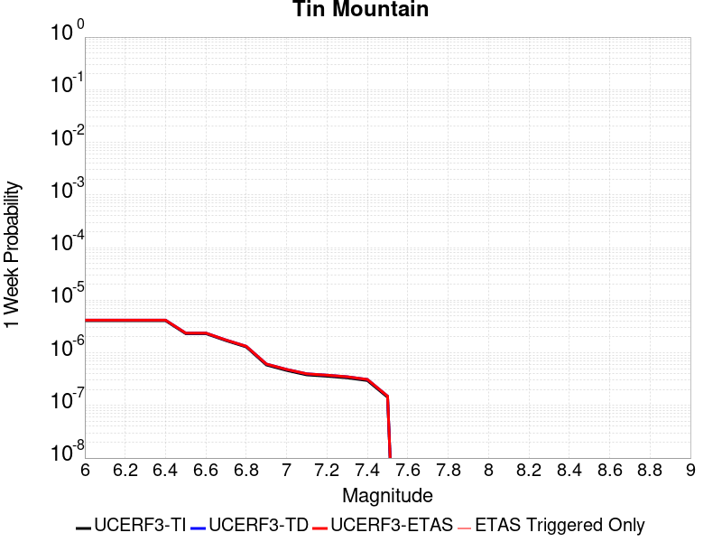 | 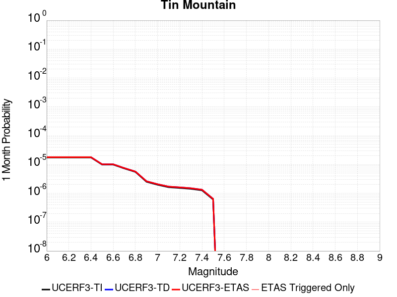 |  |  |

| Magnitude | 1 wk TI Prob | 1 wk TD Prob | 1 wk ETAS Prob | 1 wk ETAS/TD Gain | 1 wk ETAS Triggered Only | 1 mo TI Prob | 1 mo TD Prob | 1 mo ETAS Prob | 1 mo ETAS/TD Gain | 1 mo ETAS Triggered Only | 1 yr TI Prob | 1 yr TD Prob | 1 yr ETAS Prob | 1 yr ETAS/TD Gain | 1 yr ETAS Triggered Only | 10 yr TI Prob | 10 yr TD Prob | 10 yr ETAS Prob | 10 yr ETAS/TD Gain | 10 yr ETAS Triggered Only |
|-----|-----|-----|-----|-----|-----|-----|-----|-----|-----|-----|-----|-----|-----|-----|-----|-----|-----|-----|-----|-----|
| 6.0 | 4.083776E-6 | 4.181769E-6 | 4.181769E-6 | 1.0 | 0.0 | 1.750178E-5 | 1.7921764E-5 | 1.7921764E-5 | 1.0 | 0.0 | 2.1306332E-4 | 2.1817935E-4 | 2.1817935E-4 | 1.0 | 0.0 | 0.0021285915 | 0.0021800173 | 0.0021913855 | 1.0052148 | 1.1393155E-5 |
| 6.1 | 4.083776E-6 | 4.181769E-6 | 4.181769E-6 | 1.0 | 0.0 | 1.750178E-5 | 1.7921764E-5 | 1.7921764E-5 | 1.0 | 0.0 | 2.1306332E-4 | 2.1817935E-4 | 2.1817935E-4 | 1.0 | 0.0 | 0.0021285915 | 0.0021800173 | 0.0021913855 | 1.0052148 | 1.1393155E-5 |
| 6.2 | 4.083776E-6 | 4.181769E-6 | 4.181769E-6 | 1.0 | 0.0 | 1.750178E-5 | 1.7921764E-5 | 1.7921764E-5 | 1.0 | 0.0 | 2.1306332E-4 | 2.1817935E-4 | 2.1817935E-4 | 1.0 | 0.0 | 0.0021285915 | 0.0021800173 | 0.0021913855 | 1.0052148 | 1.1393155E-5 |
| 6.3 | 4.083776E-6 | 4.181769E-6 | 4.181769E-6 | 1.0 | 0.0 | 1.750178E-5 | 1.7921764E-5 | 1.7921764E-5 | 1.0 | 0.0 | 2.1306332E-4 | 2.1817935E-4 | 2.1817935E-4 | 1.0 | 0.0 | 0.0021285915 | 0.0021800173 | 0.0021913855 | 1.0052148 | 1.1393155E-5 |
| 6.4 | 4.083776E-6 | 4.181769E-6 | 4.181769E-6 | 1.0 | 0.0 | 1.750178E-5 | 1.7921764E-5 | 1.7921764E-5 | 1.0 | 0.0 | 2.1306332E-4 | 2.1817935E-4 | 2.1817935E-4 | 1.0 | 0.0 | 0.0021285915 | 0.0021800173 | 0.0021913855 | 1.0052148 | 1.1393155E-5 |
| 6.5 | 2.3143427E-6 | 2.3732973E-6 | 2.3732973E-6 | 1.0 | 0.0 | 9.9185745E-6 | 1.01712385E-5 | 1.01712385E-5 | 1.0 | 0.0 | 1.2075195E-4 | 1.2382856E-4 | 1.2382856E-4 | 1.0 | 0.0 | 0.0012068636 | 0.0012376716 | 0.0012376716 | 1.0 | 0.0 |
| 6.6 | 2.3143427E-6 | 2.3732973E-6 | 2.3732973E-6 | 1.0 | 0.0 | 9.9185745E-6 | 1.01712385E-5 | 1.01712385E-5 | 1.0 | 0.0 | 1.2075195E-4 | 1.2382856E-4 | 1.2382856E-4 | 1.0 | 0.0 | 0.0012068636 | 0.0012376716 | 0.0012376716 | 1.0 | 0.0 |
| 6.7 | 1.7029532E-6 | 1.7499033E-6 | 1.7499033E-6 | 1.0 | 0.0 | 7.2983503E-6 | 7.4995673E-6 | 7.4995673E-6 | 1.0 | 0.0 | 8.885379E-5 | 9.130394E-5 | 9.130394E-5 | 1.0 | 0.0 | 8.881827E-4 | 9.127169E-4 | 9.127169E-4 | 1.0 | 0.0 |
| 6.8 | 1.2914646E-6 | 1.3300299E-6 | 1.3300299E-6 | 1.0 | 0.0 | 5.534837E-6 | 5.7001184E-6 | 5.7001184E-6 | 1.0 | 0.0 | 6.738455E-5 | 6.9397174E-5 | 6.9397174E-5 | 1.0 | 0.0 | 6.736412E-4 | 6.9379836E-4 | 6.9379836E-4 | 1.0 | 0.0 |
| 6.9 | 5.8708974E-7 | 6.1175876E-7 | 6.1175876E-7 | 1.0 | 0.0 | 2.5160964E-6 | 2.6218208E-6 | 2.6218208E-6 | 1.0 | 0.0 | 3.0633044E-5 | 3.1920245E-5 | 3.1920245E-5 | 1.0 | 0.0 | 3.0628822E-4 | 3.191607E-4 | 3.191607E-4 | 1.0 | 0.0 |
| 7.0 | 4.6248786E-7 | 4.8325165E-7 | 4.8325165E-7 | 1.0 | 0.0 | 1.9820893E-6 | 2.071077E-6 | 2.071077E-6 | 1.0 | 0.0 | 2.413167E-5 | 2.521511E-5 | 2.521511E-5 | 1.0 | 0.0 | 2.412905E-4 | 2.5212616E-4 | 2.5212616E-4 | 1.0 | 0.0 |
| 7.1 | 3.804606E-7 | 3.9875897E-7 | 3.9875897E-7 | 1.0 | 0.0 | 1.6305444E-6 | 1.708966E-6 | 1.708966E-6 | 1.0 | 0.0 | 1.9851697E-5 | 2.0806498E-5 | 2.0806498E-5 | 1.0 | 0.0 | 1.9849923E-4 | 2.0804885E-4 | 2.0804885E-4 | 1.0 | 0.0 |
| 7.2 | 3.5864858E-7 | 3.7621112E-7 | 3.7621112E-7 | 1.0 | 0.0 | 1.5370645E-6 | 1.6123327E-6 | 1.6123327E-6 | 1.0 | 0.0 | 1.87136E-5 | 1.9630006E-5 | 1.9630006E-5 | 1.0 | 0.0 | 1.8712023E-4 | 1.9628604E-4 | 1.9628604E-4 | 1.0 | 0.0 |
| 7.3 | 3.342063E-7 | 3.5067458E-7 | 3.5067458E-7 | 1.0 | 0.0 | 1.4323119E-6 | 1.5028904E-6 | 1.5028904E-6 | 1.0 | 0.0 | 1.7438259E-5 | 1.8297571E-5 | 1.8297571E-5 | 1.0 | 0.0 | 1.743689E-4 | 1.8296394E-4 | 1.8296394E-4 | 1.0 | 0.0 |
| 7.4 | 2.971242E-7 | 3.1169344E-7 | 3.1169344E-7 | 1.0 | 0.0 | 1.2733886E-6 | 1.3358285E-6 | 1.3358285E-6 | 1.0 | 0.0 | 1.5503398E-5 | 1.6263624E-5 | 1.6263624E-5 | 1.0 | 0.0 | 1.5502315E-4 | 1.6262762E-4 | 1.6262762E-4 | 1.0 | 0.0 |
| 7.5 | 1.4326713E-7 | 1.5014186E-7 | 1.5014186E-7 | 1.0 | 0.0 | 6.140018E-7 | 6.4346506E-7 | 6.4346506E-7 | 1.0 | 0.0 | 7.4754466E-6 | 7.834187E-6 | 7.834187E-6 | 1.0 | 0.0 | 7.475195E-5 | 7.834187E-5 | 7.834187E-5 | 1.0 | 0.0 |

## Antelope Valley 2011
*[(top)](#table-of-contents)*

| 1 Week | 1 Month | 1 Year | 10 Year |
|-----|-----|-----|-----|
|  | 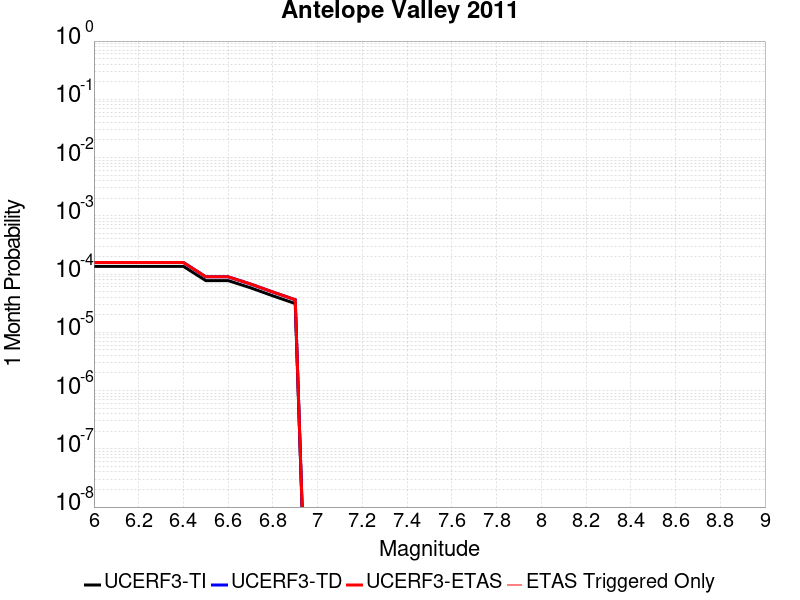 | 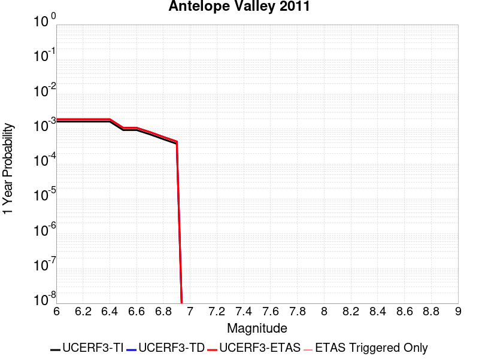 |  |

| Magnitude | 1 wk TI Prob | 1 wk TD Prob | 1 wk ETAS Prob | 1 wk ETAS/TD Gain | 1 wk ETAS Triggered Only | 1 mo TI Prob | 1 mo TD Prob | 1 mo ETAS Prob | 1 mo ETAS/TD Gain | 1 mo ETAS Triggered Only | 1 yr TI Prob | 1 yr TD Prob | 1 yr ETAS Prob | 1 yr ETAS/TD Gain | 1 yr ETAS Triggered Only | 10 yr TI Prob | 10 yr TD Prob | 10 yr ETAS Prob | 10 yr ETAS/TD Gain | 10 yr ETAS Triggered Only |
|-----|-----|-----|-----|-----|-----|-----|-----|-----|-----|-----|-----|-----|-----|-----|-----|-----|-----|-----|-----|-----|
| 6.0 | 3.1646934E-5 | 3.6918565E-5 | 3.6918565E-5 | 1.0 | 0.0 | 1.3562266E-4 | 1.5821432E-4 | 1.5821432E-4 | 1.0 | 0.0 | 0.0016499552 | 0.0019248223 | 0.0019248223 | 1.0 | 0.0 | 0.016377583 | 0.019107932 | 0.019119108 | 1.0005848 | 1.1393155E-5 |
| 6.1 | 3.1646934E-5 | 3.6918565E-5 | 3.6918565E-5 | 1.0 | 0.0 | 1.3562266E-4 | 1.5821432E-4 | 1.5821432E-4 | 1.0 | 0.0 | 0.0016499552 | 0.0019248223 | 0.0019248223 | 1.0 | 0.0 | 0.016377583 | 0.019107932 | 0.019119108 | 1.0005848 | 1.1393155E-5 |
| 6.2 | 3.1646934E-5 | 3.6918565E-5 | 3.6918565E-5 | 1.0 | 0.0 | 1.3562266E-4 | 1.5821432E-4 | 1.5821432E-4 | 1.0 | 0.0 | 0.0016499552 | 0.0019248223 | 0.0019248223 | 1.0 | 0.0 | 0.016377583 | 0.019107932 | 0.019119108 | 1.0005848 | 1.1393155E-5 |
| 6.3 | 3.1646934E-5 | 3.6918565E-5 | 3.6918565E-5 | 1.0 | 0.0 | 1.3562266E-4 | 1.5821432E-4 | 1.5821432E-4 | 1.0 | 0.0 | 0.0016499552 | 0.0019248223 | 0.0019248223 | 1.0 | 0.0 | 0.016377583 | 0.019107932 | 0.019119108 | 1.0005848 | 1.1393155E-5 |
| 6.4 | 3.1646934E-5 | 3.6918565E-5 | 3.6918565E-5 | 1.0 | 0.0 | 1.3562266E-4 | 1.5821432E-4 | 1.5821432E-4 | 1.0 | 0.0 | 0.0016499552 | 0.0019248223 | 0.0019248223 | 1.0 | 0.0 | 0.016377583 | 0.019107932 | 0.019119108 | 1.0005848 | 1.1393155E-5 |
| 6.5 | 1.8034107E-5 | 2.0948759E-5 | 2.0948759E-5 | 1.0 | 0.0 | 7.7286735E-5 | 8.9778E-5 | 8.9778E-5 | 1.0 | 0.0 | 9.405598E-4 | 0.0010926216 | 0.0010926216 | 1.0 | 0.0 | 0.009365888 | 0.01088458 | 0.01088458 | 1.0 | 0.0 |
| 6.6 | 1.8034107E-5 | 2.0948759E-5 | 2.0948759E-5 | 1.0 | 0.0 | 7.7286735E-5 | 8.9778E-5 | 8.9778E-5 | 1.0 | 0.0 | 9.405598E-4 | 0.0010926216 | 0.0010926216 | 1.0 | 0.0 | 0.009365888 | 0.01088458 | 0.01088458 | 1.0 | 0.0 |
| 6.7 | 1.3567667E-5 | 1.5755366E-5 | 1.5755366E-5 | 1.0 | 0.0 | 5.814585E-5 | 6.752185E-5 | 6.752185E-5 | 1.0 | 0.0 | 7.076958E-4 | 8.218747E-4 | 8.218747E-4 | 1.0 | 0.0 | 0.007054463 | 0.008198793 | 0.008198793 | 1.0 | 0.0 |
| 6.8 | 9.867387E-6 | 1.1472235E-5 | 1.1472235E-5 | 1.0 | 0.0 | 4.2288117E-5 | 4.9166334E-5 | 4.9166334E-5 | 1.0 | 0.0 | 5.1473617E-4 | 5.9853075E-4 | 5.9853075E-4 | 1.0 | 0.0 | 0.005135455 | 0.0059785065 | 0.0059785065 | 1.0 | 0.0 |
| 6.9 | 7.273233E-6 | 8.45804E-6 | 8.45804E-6 | 1.0 | 0.0 | 3.1170628E-5 | 3.624874E-5 | 3.624874E-5 | 1.0 | 0.0 | 3.794363E-4 | 4.4132842E-4 | 4.4132842E-4 | 1.0 | 0.0 | 0.0037878908 | 0.004413284 | 0.004413284 | 1.0 | 0.0 |

## Los Alamos 2011 CFM
*[(top)](#table-of-contents)*

| 1 Week | 1 Month | 1 Year | 10 Year |
|-----|-----|-----|-----|
|  |  |  |  |

| Magnitude | 1 wk TI Prob | 1 wk TD Prob | 1 wk ETAS Prob | 1 wk ETAS/TD Gain | 1 wk ETAS Triggered Only | 1 mo TI Prob | 1 mo TD Prob | 1 mo ETAS Prob | 1 mo ETAS/TD Gain | 1 mo ETAS Triggered Only | 1 yr TI Prob | 1 yr TD Prob | 1 yr ETAS Prob | 1 yr ETAS/TD Gain | 1 yr ETAS Triggered Only | 10 yr TI Prob | 10 yr TD Prob | 10 yr ETAS Prob | 10 yr ETAS/TD Gain | 10 yr ETAS Triggered Only |
|-----|-----|-----|-----|-----|-----|-----|-----|-----|-----|-----|-----|-----|-----|-----|-----|-----|-----|-----|-----|-----|
| 6.0 | 4.6284417E-6 | 4.7521157E-6 | 4.7521157E-6 | 1.0 | 0.0 | 1.9836029E-5 | 2.0366062E-5 | 2.0366062E-5 | 1.0 | 0.0 | 2.4147688E-4 | 2.4793035E-4 | 2.593207E-4 | 1.0459417 | 1.1393155E-5 | 0.0024121467 | 0.0024767118 | 0.0024880767 | 1.0045887 | 1.1393155E-5 |
| 6.1 | 4.6284417E-6 | 4.7521157E-6 | 4.7521157E-6 | 1.0 | 0.0 | 1.9836029E-5 | 2.0366062E-5 | 2.0366062E-5 | 1.0 | 0.0 | 2.4147688E-4 | 2.4793035E-4 | 2.593207E-4 | 1.0459417 | 1.1393155E-5 | 0.0024121467 | 0.0024767118 | 0.0024880767 | 1.0045887 | 1.1393155E-5 |
| 6.2 | 4.6284417E-6 | 4.7521157E-6 | 4.7521157E-6 | 1.0 | 0.0 | 1.9836029E-5 | 2.0366062E-5 | 2.0366062E-5 | 1.0 | 0.0 | 2.4147688E-4 | 2.4793035E-4 | 2.593207E-4 | 1.0459417 | 1.1393155E-5 | 0.0024121467 | 0.0024767118 | 0.0024880767 | 1.0045887 | 1.1393155E-5 |
| 6.3 | 4.6284417E-6 | 4.7521157E-6 | 4.7521157E-6 | 1.0 | 0.0 | 1.9836029E-5 | 2.0366062E-5 | 2.0366062E-5 | 1.0 | 0.0 | 2.4147688E-4 | 2.4793035E-4 | 2.593207E-4 | 1.0459417 | 1.1393155E-5 | 0.0024121467 | 0.0024767118 | 0.0024880767 | 1.0045887 | 1.1393155E-5 |
| 6.4 | 4.6284417E-6 | 4.7521157E-6 | 4.7521157E-6 | 1.0 | 0.0 | 1.9836029E-5 | 2.0366062E-5 | 2.0366062E-5 | 1.0 | 0.0 | 2.4147688E-4 | 2.4793035E-4 | 2.593207E-4 | 1.0459417 | 1.1393155E-5 | 0.0024121467 | 0.0024767118 | 0.0024880767 | 1.0045887 | 1.1393155E-5 |
| 6.5 | 4.6284417E-6 | 4.7521157E-6 | 4.7521157E-6 | 1.0 | 0.0 | 1.9836029E-5 | 2.0366062E-5 | 2.0366062E-5 | 1.0 | 0.0 | 2.4147688E-4 | 2.4793035E-4 | 2.593207E-4 | 1.0459417 | 1.1393155E-5 | 0.0024121467 | 0.0024767118 | 0.0024880767 | 1.0045887 | 1.1393155E-5 |
| 6.6 | 4.6284417E-6 | 4.7521157E-6 | 4.7521157E-6 | 1.0 | 0.0 | 1.9836029E-5 | 2.0366062E-5 | 2.0366062E-5 | 1.0 | 0.0 | 2.4147688E-4 | 2.4793035E-4 | 2.593207E-4 | 1.0459417 | 1.1393155E-5 | 0.0024121467 | 0.0024767118 | 0.0024880767 | 1.0045887 | 1.1393155E-5 |
| 6.7 | 4.062321E-6 | 4.1666876E-6 | 4.1666876E-6 | 1.0 | 0.0 | 1.7409831E-5 | 1.7857117E-5 | 1.7857117E-5 | 1.0 | 0.0 | 2.1194408E-4 | 2.1739023E-4 | 2.2878092E-4 | 1.0523974 | 1.1393155E-5 | 0.0021174205 | 0.0021719255 | 0.002183294 | 1.0052342 | 1.1393155E-5 |
| 6.8 | 4.062321E-6 | 4.1666876E-6 | 4.1666876E-6 | 1.0 | 0.0 | 1.7409831E-5 | 1.7857117E-5 | 1.7857117E-5 | 1.0 | 0.0 | 2.1194408E-4 | 2.1739023E-4 | 2.2878092E-4 | 1.0523974 | 1.1393155E-5 | 0.0021174205 | 0.0021719255 | 0.002183294 | 1.0052342 | 1.1393155E-5 |
| 6.9 | 3.2936077E-6 | 3.3732376E-6 | 3.3732376E-6 | 1.0 | 0.0 | 1.4115385E-5 | 1.4456658E-5 | 1.4456658E-5 | 1.0 | 0.0 | 1.7184127E-4 | 1.7599654E-4 | 1.8738769E-4 | 1.0647237 | 1.1393155E-5 | 0.0017170844 | 0.0017586641 | 0.0017700372 | 1.0064669 | 1.1393155E-5 |
| 7.0 | 3.1687898E-6 | 3.2450873E-6 | 3.2450873E-6 | 1.0 | 0.0 | 1.3580457E-5 | 1.3907448E-5 | 1.3907448E-5 | 1.0 | 0.0 | 1.6532952E-4 | 1.6931097E-4 | 1.8070219E-4 | 1.0672799 | 1.1393155E-5 | 0.0016520657 | 0.0016919113 | 0.0017032851 | 1.0067225 | 1.1393155E-5 |
| 7.1 | 2.9379228E-6 | 3.0075819E-6 | 3.0075819E-6 | 1.0 | 0.0 | 1.25910365E-5 | 1.2889578E-5 | 1.2889578E-5 | 1.0 | 0.0 | 1.5328509E-4 | 1.5692021E-4 | 1.6831158E-4 | 1.0725933 | 1.1393155E-5 | 0.001531794 | 0.0015681833 | 0.0015795586 | 1.0072538 | 1.1393155E-5 |
| 7.2 | 2.0020686E-6 | 2.0418147E-6 | 2.0418147E-6 | 1.0 | 0.0 | 8.580266E-6 | 8.750605E-6 | 8.750605E-6 | 1.0 | 0.0 | 1.0445973E-4 | 1.0653346E-4 | 1.0653346E-4 | 1.0 | 0.0 | 0.0010441064 | 0.0010648284 | 0.0010648284 | 1.0 | 0.0 |
| 7.3 | 1.7364243E-6 | 1.7680459E-6 | 1.7680459E-6 | 1.0 | 0.0 | 7.441797E-6 | 7.577318E-6 | 7.577318E-6 | 1.0 | 0.0 | 9.0600115E-5 | 9.224997E-5 | 9.224997E-5 | 1.0 | 0.0 | 9.0563187E-4 | 9.221199E-4 | 9.221199E-4 | 1.0 | 0.0 |
| 7.4 | 1.5718434E-6 | 1.5984714E-6 | 1.5984714E-6 | 1.0 | 0.0 | 6.7364545E-6 | 6.8505738E-6 | 6.8505738E-6 | 1.0 | 0.0 | 8.201325E-5 | 8.340258E-5 | 8.340258E-5 | 1.0 | 0.0 | 8.198299E-4 | 8.337157E-4 | 8.337157E-4 | 1.0 | 0.0 |
| 7.5 | 1.3841119E-6 | 1.4044178E-6 | 1.4044178E-6 | 1.0 | 0.0 | 5.9318945E-6 | 6.01892E-6 | 6.01892E-6 | 1.0 | 0.0 | 7.221842E-5 | 7.3277915E-5 | 7.3277915E-5 | 1.0 | 0.0 | 7.2194956E-4 | 7.3254044E-4 | 7.3254044E-4 | 1.0 | 0.0 |
| 7.6 | 1.0843726E-6 | 1.0935541E-6 | 1.0935541E-6 | 1.0 | 0.0 | 4.647303E-6 | 4.686652E-6 | 4.686652E-6 | 1.0 | 0.0 | 5.6579443E-5 | 5.705852E-5 | 5.705852E-5 | 1.0 | 0.0 | 5.656504E-4 | 5.704413E-4 | 5.704413E-4 | 1.0 | 0.0 |
| 7.7 | 5.544814E-7 | 5.5024503E-7 | 5.5024503E-7 | 1.0 | 0.0 | 2.3763469E-6 | 2.3581908E-6 | 2.3581908E-6 | 1.0 | 0.0 | 2.8931638E-5 | 2.8710596E-5 | 2.8710596E-5 | 1.0 | 0.0 | 2.8927872E-4 | 2.8706904E-4 | 2.8706904E-4 | 1.0 | 0.0 |
| 7.8 | 2.0707465E-7 | 1.978078E-7 | 1.978078E-7 | 1.0 | 0.0 | 8.874625E-7 | 8.477474E-7 | 8.477474E-7 | 1.0 | 0.0 | 1.08048025E-5 | 1.0321276E-5 | 1.0321276E-5 | 1.0 | 0.0 | 1.0804277E-4 | 1.0320801E-4 | 1.0320801E-4 | 1.0 | 0.0 |
| 7.9 | 3.9821284E-8 | 3.43357E-8 | 3.43357E-8 | 1.0 | 0.0 | 1.7066264E-7 | 1.4715297E-7 | 1.4715297E-7 | 1.0 | 0.0 | 2.0778157E-6 | 1.7915861E-6 | 1.7915861E-6 | 1.0 | 0.0 | 2.0777963E-5 | 1.7915721E-5 | 1.7915721E-5 | 1.0 | 0.0 |
| 8.0 | 7.880441E-11 | 8.236167E-11 | 8.236167E-11 | 1.0 | 0.0 | 3.3773329E-10 | 3.5297876E-10 | 3.5297876E-10 | 1.0 | 0.0 | 4.1119033E-9 | 4.297517E-9 | 4.297517E-9 | 1.0 | 0.0 | 4.1119034E-8 | 4.2975167E-8 | 4.2975167E-8 | 1.0 | 0.0 |

## Santa Cruz Island
*[(top)](#table-of-contents)*

| 1 Week | 1 Month | 1 Year | 10 Year |
|-----|-----|-----|-----|
| 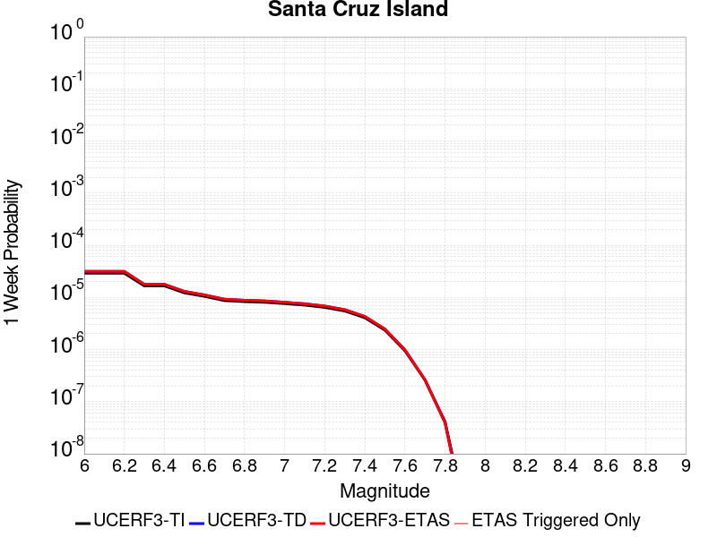 | 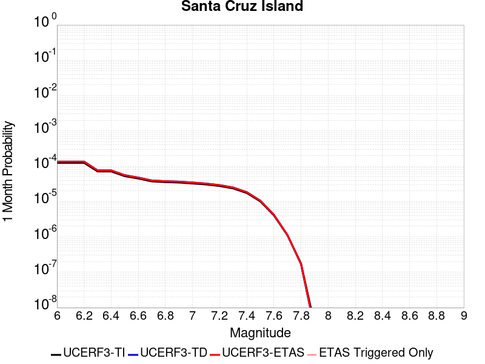 | 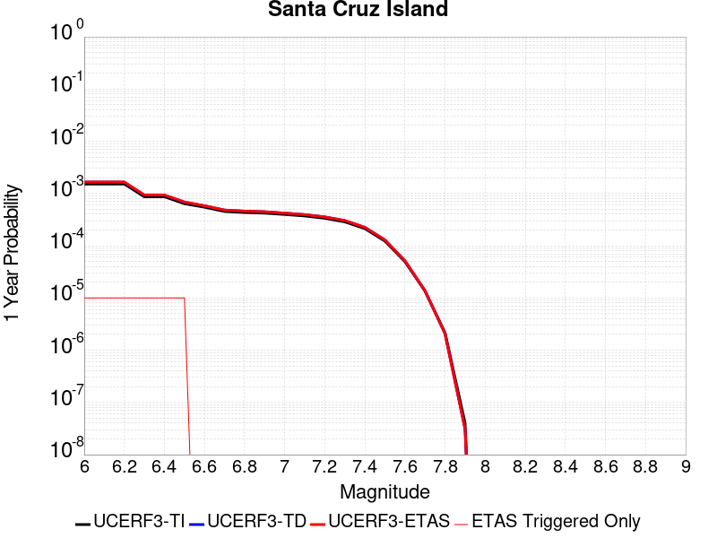 | 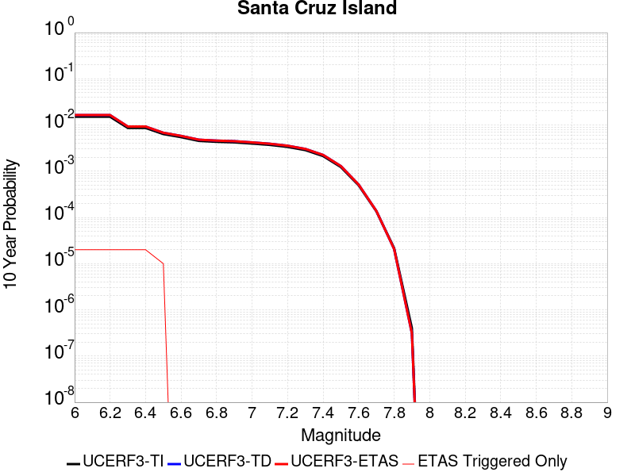 |

| Magnitude | 1 wk TI Prob | 1 wk TD Prob | 1 wk ETAS Prob | 1 wk ETAS/TD Gain | 1 wk ETAS Triggered Only | 1 mo TI Prob | 1 mo TD Prob | 1 mo ETAS Prob | 1 mo ETAS/TD Gain | 1 mo ETAS Triggered Only | 1 yr TI Prob | 1 yr TD Prob | 1 yr ETAS Prob | 1 yr ETAS/TD Gain | 1 yr ETAS Triggered Only | 10 yr TI Prob | 10 yr TD Prob | 10 yr ETAS Prob | 10 yr ETAS/TD Gain | 10 yr ETAS Triggered Only |
|-----|-----|-----|-----|-----|-----|-----|-----|-----|-----|-----|-----|-----|-----|-----|-----|-----|-----|-----|-----|-----|
| 6.0 | 2.9164563E-5 | 3.160589E-5 | 3.160589E-5 | 1.0 | 0.0 | 1.2498499E-4 | 1.3544755E-4 | 1.3544755E-4 | 1.0 | 0.0 | 0.0015206301 | 0.0016479628 | 0.0016479628 | 1.0 | 0.0 | 0.015102667 | 0.01637116 | 0.016382368 | 1.0006845 | 1.1393155E-5 |
| 6.1 | 2.9164563E-5 | 3.160589E-5 | 3.160589E-5 | 1.0 | 0.0 | 1.2498499E-4 | 1.3544755E-4 | 1.3544755E-4 | 1.0 | 0.0 | 0.0015206301 | 0.0016479628 | 0.0016479628 | 1.0 | 0.0 | 0.015102667 | 0.01637116 | 0.016382368 | 1.0006845 | 1.1393155E-5 |
| 6.2 | 2.9164563E-5 | 3.160589E-5 | 3.160589E-5 | 1.0 | 0.0 | 1.2498499E-4 | 1.3544755E-4 | 1.3544755E-4 | 1.0 | 0.0 | 0.0015206301 | 0.0016479628 | 0.0016479628 | 1.0 | 0.0 | 0.015102667 | 0.01637116 | 0.016382368 | 1.0006845 | 1.1393155E-5 |
| 6.3 | 1.6635553E-5 | 1.7807277E-5 | 1.7807277E-5 | 1.0 | 0.0 | 7.1293274E-5 | 7.631477E-5 | 7.631477E-5 | 1.0 | 0.0 | 8.6765E-4 | 9.287545E-4 | 9.287545E-4 | 1.0 | 0.0 | 0.008642701 | 0.009250603 | 0.00926189 | 1.0012202 | 1.1393155E-5 |
| 6.4 | 1.6635553E-5 | 1.7807277E-5 | 1.7807277E-5 | 1.0 | 0.0 | 7.1293274E-5 | 7.631477E-5 | 7.631477E-5 | 1.0 | 0.0 | 8.6765E-4 | 9.287545E-4 | 9.287545E-4 | 1.0 | 0.0 | 0.008642701 | 0.009250603 | 0.00926189 | 1.0012202 | 1.1393155E-5 |
| 6.5 | 1.2238748E-5 | 1.3045E-5 | 1.3045E-5 | 1.0 | 0.0 | 5.2450723E-5 | 5.5905966E-5 | 5.5905966E-5 | 1.0 | 0.0 | 6.3840044E-4 | 6.804463E-4 | 6.804463E-4 | 1.0 | 0.0 | 0.0063656955 | 0.006784027 | 0.006784027 | 1.0 | 0.0 |
| 6.6 | 1.0489767E-5 | 1.1158298E-5 | 1.1158298E-5 | 1.0 | 0.0 | 4.495537E-5 | 4.7820413E-5 | 4.7820413E-5 | 1.0 | 0.0 | 5.4719415E-4 | 5.820602E-4 | 5.820602E-4 | 1.0 | 0.0 | 0.005458487 | 0.005805598 | 0.005805598 | 1.0 | 0.0 |
| 6.7 | 8.699222E-6 | 9.238123E-6 | 9.238123E-6 | 1.0 | 0.0 | 3.7281847E-5 | 3.959136E-5 | 3.959136E-5 | 1.0 | 0.0 | 4.5381195E-4 | 4.8191875E-4 | 4.8191875E-4 | 1.0 | 0.0 | 0.0045288634 | 0.0048088045 | 0.0048088045 | 1.0 | 0.0 |
| 6.8 | 8.307732E-6 | 8.818175E-6 | 8.818175E-6 | 1.0 | 0.0 | 3.560408E-5 | 3.7791633E-5 | 3.7791633E-5 | 1.0 | 0.0 | 4.3339343E-4 | 4.6001642E-4 | 4.6001642E-4 | 1.0 | 0.0 | 0.004325492 | 0.0045906953 | 0.0045906953 | 1.0 | 0.0 |
| 6.9 | 8.073121E-6 | 8.566167E-6 | 8.566167E-6 | 1.0 | 0.0 | 3.459863E-5 | 3.6711626E-5 | 3.6711626E-5 | 1.0 | 0.0 | 4.2115687E-4 | 4.4687281E-4 | 4.4687281E-4 | 1.0 | 0.0 | 0.004203596 | 0.0044597937 | 0.0044597937 | 1.0 | 0.0 |
| 7.0 | 7.617019E-6 | 8.075806E-6 | 8.075806E-6 | 1.0 | 0.0 | 3.264396E-5 | 3.461014E-5 | 3.461014E-5 | 1.0 | 0.0 | 3.9736772E-4 | 4.212974E-4 | 4.212974E-4 | 1.0 | 0.0 | 0.003966579 | 0.0042050346 | 0.0042050346 | 1.0 | 0.0 |
| 7.1 | 7.1224836E-6 | 7.5468442E-6 | 7.5468442E-6 | 1.0 | 0.0 | 3.052457E-5 | 3.2343218E-5 | 3.2343218E-5 | 1.0 | 0.0 | 3.715733E-4 | 3.937079E-4 | 3.937079E-4 | 1.0 | 0.0 | 0.003709526 | 0.003930147 | 0.003930147 | 1.0 | 0.0 |
| 7.2 | 6.441115E-6 | 6.828349E-6 | 6.828349E-6 | 1.0 | 0.0 | 2.7604487E-5 | 2.9264025E-5 | 2.9264025E-5 | 1.0 | 0.0 | 3.360328E-4 | 3.562315E-4 | 3.562315E-4 | 1.0 | 0.0 | 0.0033552512 | 0.003556633 | 0.003556633 | 1.0 | 0.0 |
| 7.3 | 5.494274E-6 | 5.82081E-6 | 5.82081E-6 | 1.0 | 0.0 | 2.3546674E-5 | 2.4946092E-5 | 2.4946092E-5 | 1.0 | 0.0 | 2.8664304E-4 | 3.0367656E-4 | 3.0367656E-4 | 1.0 | 0.0 | 0.002862736 | 0.003032639 | 0.003032639 | 1.0 | 0.0 |
| 7.4 | 4.0802624E-6 | 4.3128407E-6 | 4.3128407E-6 | 1.0 | 0.0 | 1.7486722E-5 | 1.8483472E-5 | 1.8483472E-5 | 1.0 | 0.0 | 2.1288003E-4 | 2.2501311E-4 | 2.2501311E-4 | 1.0 | 0.0 | 0.0021267622 | 0.0022478618 | 0.0022478618 | 1.0 | 0.0 |
| 7.5 | 2.3584746E-6 | 2.4756093E-6 | 2.4756093E-6 | 1.0 | 0.0 | 1.0107709E-5 | 1.0609711E-5 | 1.0609711E-5 | 1.0 | 0.0 | 1.2305441E-4 | 1.2916562E-4 | 1.2916562E-4 | 1.0 | 0.0 | 0.0012298629 | 0.0012909106 | 0.0012909106 | 1.0 | 0.0 |
| 7.6 | 9.4981914E-7 | 9.86194E-7 | 9.86194E-7 | 1.0 | 0.0 | 4.0706473E-6 | 4.2265387E-6 | 4.2265387E-6 | 1.0 | 0.0 | 4.9559E-5 | 5.1456907E-5 | 5.1456907E-5 | 1.0 | 0.0 | 4.954795E-4 | 5.1445124E-4 | 5.1445124E-4 | 1.0 | 0.0 |
| 7.7 | 2.6013532E-7 | 2.641865E-7 | 2.641865E-7 | 1.0 | 0.0 | 1.1148652E-6 | 1.1322273E-6 | 1.1322273E-6 | 1.0 | 0.0 | 1.3573399E-5 | 1.3784782E-5 | 1.3784782E-5 | 1.0 | 0.0 | 1.357257E-4 | 1.3783934E-4 | 1.3783934E-4 | 1.0 | 0.0 |
| 7.8 | 4.1522263E-8 | 3.9659216E-8 | 3.9659216E-8 | 1.0 | 0.0 | 1.7795254E-7 | 1.6996806E-7 | 1.6996806E-7 | 1.0 | 0.0 | 2.16657E-6 | 2.0693594E-6 | 2.0693594E-6 | 1.0 | 0.0 | 2.1665488E-5 | 2.0693422E-5 | 2.0693422E-5 | 1.0 | 0.0 |
| 7.9 | 7.7242046E-10 | 5.94807E-10 | 5.94807E-10 | 1.0 | 0.0 | 3.3103735E-9 | 2.5491727E-9 | 2.5491727E-9 | 1.0 | 0.0 | 4.0303796E-8 | 3.1036176E-8 | 3.1036176E-8 | 1.0 | 0.0 | 4.030379E-7 | 3.1036174E-7 | 3.1036174E-7 | 1.0 | 0.0 |

## San Andreas (Peninsula) 2011 CFM
*[(top)](#table-of-contents)*

| 1 Week | 1 Month | 1 Year | 10 Year |
|-----|-----|-----|-----|
|  |  |  |  |

| Magnitude | 1 wk TI Prob | 1 wk TD Prob | 1 wk ETAS Prob | 1 wk ETAS/TD Gain | 1 wk ETAS Triggered Only | 1 mo TI Prob | 1 mo TD Prob | 1 mo ETAS Prob | 1 mo ETAS/TD Gain | 1 mo ETAS Triggered Only | 1 yr TI Prob | 1 yr TD Prob | 1 yr ETAS Prob | 1 yr ETAS/TD Gain | 1 yr ETAS Triggered Only | 10 yr TI Prob | 10 yr TD Prob | 10 yr ETAS Prob | 10 yr ETAS/TD Gain | 10 yr ETAS Triggered Only |
|-----|-----|-----|-----|-----|-----|-----|-----|-----|-----|-----|-----|-----|-----|-----|-----|-----|-----|-----|-----|-----|
| 6.0 | 8.6200685E-5 | 2.563574E-5 | 2.563574E-5 | 1.0 | 0.0 | 3.6937918E-4 | 1.0986284E-4 | 1.0986284E-4 | 1.0 | 0.0 | 0.0044879215 | 0.001336761 | 0.001348139 | 1.0085115 | 1.1393155E-5 | 0.043983612 | 0.015004163 | 0.015015385 | 1.0007479 | 1.1393155E-5 |
| 6.1 | 8.6200685E-5 | 2.563574E-5 | 2.563574E-5 | 1.0 | 0.0 | 3.6937918E-4 | 1.0986284E-4 | 1.0986284E-4 | 1.0 | 0.0 | 0.0044879215 | 0.001336761 | 0.001348139 | 1.0085115 | 1.1393155E-5 | 0.043983612 | 0.015004163 | 0.015015385 | 1.0007479 | 1.1393155E-5 |
| 6.2 | 8.6200685E-5 | 2.563574E-5 | 2.563574E-5 | 1.0 | 0.0 | 3.6937918E-4 | 1.0986284E-4 | 1.0986284E-4 | 1.0 | 0.0 | 0.0044879215 | 0.001336761 | 0.001348139 | 1.0085115 | 1.1393155E-5 | 0.043983612 | 0.015004163 | 0.015015385 | 1.0007479 | 1.1393155E-5 |
| 6.3 | 8.551163E-5 | 2.5324754E-5 | 2.5324754E-5 | 1.0 | 0.0 | 3.6642692E-4 | 1.08530156E-4 | 1.08530156E-4 | 1.0 | 0.0 | 0.004452125 | 0.0013205555 | 0.0013319335 | 1.0086162 | 1.1393155E-5 | 0.043639794 | 0.014830032 | 0.014841257 | 1.0007569 | 1.1393155E-5 |
| 6.4 | 8.551163E-5 | 2.5324754E-5 | 2.5324754E-5 | 1.0 | 0.0 | 3.6642692E-4 | 1.08530156E-4 | 1.08530156E-4 | 1.0 | 0.0 | 0.004452125 | 0.0013205555 | 0.0013319335 | 1.0086162 | 1.1393155E-5 | 0.043639794 | 0.014830032 | 0.014841257 | 1.0007569 | 1.1393155E-5 |
| 6.5 | 8.511146E-5 | 2.5144469E-5 | 2.5144469E-5 | 1.0 | 0.0 | 3.647124E-4 | 1.07757565E-4 | 1.07757565E-4 | 1.0 | 0.0 | 0.004431336 | 0.0013111605 | 0.0013225387 | 1.008678 | 1.1393155E-5 | 0.04344007 | 0.01472923 | 0.014740455 | 1.0007621 | 1.1393155E-5 |
| 6.6 | 8.4985084E-5 | 2.50745E-5 | 2.50745E-5 | 1.0 | 0.0 | 3.6417096E-4 | 1.0745773E-4 | 1.0745773E-4 | 1.0 | 0.0 | 0.0044247704 | 0.0013075143 | 0.0013188926 | 1.0087022 | 1.1393155E-5 | 0.043376986 | 0.014691355 | 0.014702581 | 1.0007641 | 1.1393155E-5 |
| 6.7 | 8.462618E-5 | 2.4901643E-5 | 2.4901643E-5 | 1.0 | 0.0 | 3.6263323E-4 | 1.06716965E-4 | 1.06716965E-4 | 1.0 | 0.0 | 0.004406125 | 0.0012985064 | 0.0013098847 | 1.0087626 | 1.1393155E-5 | 0.043197807 | 0.014595034 | 0.014606261 | 1.0007693 | 1.1393155E-5 |
| 6.8 | 8.42337E-5 | 2.4796287E-5 | 2.4796287E-5 | 1.0 | 0.0 | 3.6095164E-4 | 1.06265485E-4 | 1.06265485E-4 | 1.0 | 0.0 | 0.004385734 | 0.001293016 | 0.0013043944 | 1.0087999 | 1.1393155E-5 | 0.043001823 | 0.014535241 | 0.014546469 | 1.0007725 | 1.1393155E-5 |
| 6.9 | 8.365989E-5 | 2.4599462E-5 | 2.4599462E-5 | 1.0 | 0.0 | 3.5849313E-4 | 1.0542201E-4 | 1.0542201E-4 | 1.0 | 0.0 | 0.004355922 | 0.001282759 | 0.0012941376 | 1.0088704 | 1.1393155E-5 | 0.04271523 | 0.014426792 | 0.01443802 | 1.0007783 | 1.1393155E-5 |
| 7.0 | 8.30936E-5 | 2.4359515E-5 | 2.4359515E-5 | 1.0 | 0.0 | 3.560668E-4 | 1.0439375E-4 | 1.0439375E-4 | 1.0 | 0.0 | 0.004326499 | 0.0012702546 | 0.0012816333 | 1.0089577 | 1.1393155E-5 | 0.042432297 | 0.014297087 | 0.014308318 | 1.0007855 | 1.1393155E-5 |
| 7.1 | 8.041264E-5 | 2.4042769E-5 | 2.4042769E-5 | 1.0 | 0.0 | 3.4458007E-4 | 1.0303638E-4 | 1.0303638E-4 | 1.0 | 0.0 | 0.0041871946 | 0.0012537476 | 0.0012651265 | 1.0090759 | 1.1393155E-5 | 0.041091725 | 0.014117991 | 0.014129222 | 1.0007956 | 1.1393155E-5 |
| 7.2 | 7.8427016E-5 | 2.346238E-5 | 2.346238E-5 | 1.0 | 0.0 | 3.3607247E-4 | 1.0054919E-4 | 1.0054919E-4 | 1.0 | 0.0 | 0.004084008 | 0.0012235005 | 0.0012348797 | 1.0093006 | 1.1393155E-5 | 0.040097635 | 0.013799946 | 0.013811181 | 1.0008142 | 1.1393155E-5 |
| 7.3 | 7.721087E-5 | 2.3245653E-5 | 2.3245653E-5 | 1.0 | 0.0 | 3.3086175E-4 | 9.962043E-5 | 9.962043E-5 | 1.0 | 0.0 | 0.004020803 | 0.0012122056 | 0.0012235849 | 1.0093873 | 1.1393155E-5 | 0.03948827 | 0.01368281 | 0.013694047 | 1.0008212 | 1.1393155E-5 |
| 7.4 | 7.3536525E-5 | 2.133747E-5 | 2.133747E-5 | 1.0 | 0.0 | 3.1511846E-4 | 9.14431E-5 | 9.14431E-5 | 1.0 | 0.0 | 0.0038298194 | 0.0011127525 | 0.0011241329 | 1.0102273 | 1.1393155E-5 | 0.037644852 | 0.012627043 | 0.012638292 | 1.0008909 | 1.1393155E-5 |
| 7.5 | 6.806207E-5 | 1.9109244E-5 | 1.9109244E-5 | 1.0 | 0.0 | 2.9166197E-4 | 8.189419E-5 | 8.189419E-5 | 1.0 | 0.0 | 0.0035452035 | 9.966068E-4 | 0.0010079886 | 1.0114206 | 1.1393155E-5 | 0.034891766 | 0.0113620525 | 0.011373316 | 1.0009913 | 1.1393155E-5 |
| 7.6 | 5.6731416E-5 | 1.4437716E-5 | 1.4437716E-5 | 1.0 | 0.0 | 2.43112E-4 | 6.187446E-5 | 6.187446E-5 | 1.0 | 0.0 | 0.0029558712 | 7.530613E-4 | 7.644459E-4 | 1.0151178 | 1.1393155E-5 | 0.02916862 | 0.008631812 | 0.0086431075 | 1.0013086 | 1.1393155E-5 |
| 7.7 | 4.946994E-5 | 1.3487153E-5 | 1.3487153E-5 | 1.0 | 0.0 | 2.1199681E-4 | 5.7800804E-5 | 5.7800804E-5 | 1.0 | 0.0 | 0.002578006 | 7.0349773E-4 | 7.1488286E-4 | 1.0161836 | 1.1393155E-5 | 0.02548303 | 0.008043593 | 0.008054894 | 1.001405 | 1.1393155E-5 |
| 7.8 | 3.9718198E-5 | 1.32141995E-5 | 1.32141995E-5 | 1.0 | 0.0 | 1.7020974E-4 | 5.6631055E-5 | 5.6631055E-5 | 1.0 | 0.0 | 0.0020703338 | 6.8926514E-4 | 7.0065045E-4 | 1.016518 | 1.1393155E-5 | 0.020511515 | 0.007847913 | 0.007859216 | 1.0014404 | 1.1393155E-5 |
| 7.9 | 2.4115114E-5 | 1.23906175E-5 | 1.23906175E-5 | 1.0 | 0.0 | 1.0334639E-4 | 5.3101565E-5 | 5.3101565E-5 | 1.0 | 0.0 | 0.001257516 | 6.4631994E-4 | 6.577057E-4 | 1.0176164 | 1.1393155E-5 | 0.012504238 | 0.0072709057 | 0.0072822156 | 1.0015556 | 1.1393155E-5 |
| 8.0 | 1.7756569E-5 | 1.1594116E-5 | 1.1594116E-5 | 1.0 | 0.0 | 7.6097356E-5 | 4.9688122E-5 | 4.9688122E-5 | 1.0 | 0.0 | 9.260915E-4 | 6.047851E-4 | 6.1617134E-4 | 1.018827 | 1.1393155E-5 | 0.009222416 | 0.0067588515 | 0.006770168 | 1.0016743 | 1.1393155E-5 |
| 8.1 | 1.3159258E-5 | 9.90074E-6 | 9.90074E-6 | 1.0 | 0.0 | 5.6395602E-5 | 4.2431053E-5 | 4.2431053E-5 | 1.0 | 0.0 | 6.864001E-4 | 5.1647576E-4 | 5.2786304E-4 | 1.022048 | 1.1393155E-5 | 0.0068428386 | 0.005772987 | 0.0057843146 | 1.0019622 | 1.1393155E-5 |
| 8.2 | 8.635426E-6 | 5.558063E-6 | 5.558063E-6 | 1.0 | 0.0 | 3.700844E-5 | 2.3820054E-5 | 2.3820054E-5 | 1.0 | 0.0 | 4.5048463E-4 | 2.8997063E-4 | 2.8997063E-4 | 1.0 | 0.0 | 0.004495725 | 0.0032943983 | 0.0032943983 | 1.0 | 0.0 |
| 8.3 | 1.983087E-6 | 7.808603E-7 | 7.808603E-7 | 1.0 | 0.0 | 8.498917E-6 | 3.34654E-6 | 3.34654E-6 | 1.0 | 0.0 | 1.034694E-4 | 4.074338E-5 | 4.074338E-5 | 1.0 | 0.0 | 0.0010342124 | 4.8047924E-4 | 4.8047924E-4 | 1.0 | 0.0 |

## San Jacinto (Anza) rev
*[(top)](#table-of-contents)*

| 1 Week | 1 Month | 1 Year | 10 Year |
|-----|-----|-----|-----|
| 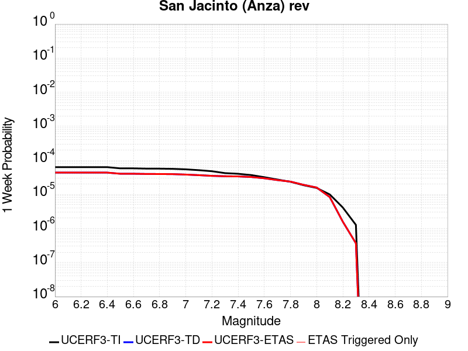 | 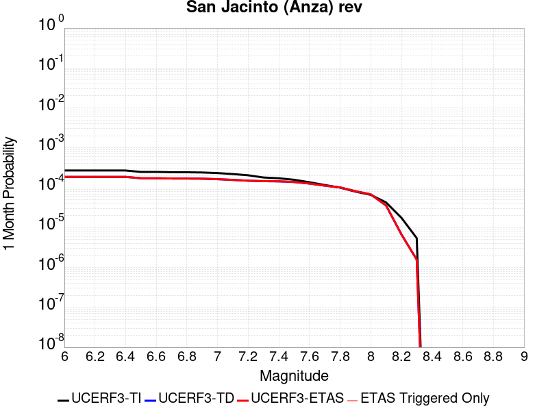 | 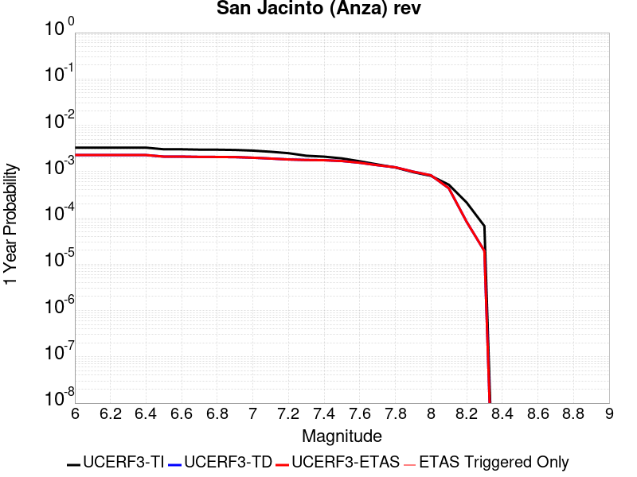 |  |

| Magnitude | 1 wk TI Prob | 1 wk TD Prob | 1 wk ETAS Prob | 1 wk ETAS/TD Gain | 1 wk ETAS Triggered Only | 1 mo TI Prob | 1 mo TD Prob | 1 mo ETAS Prob | 1 mo ETAS/TD Gain | 1 mo ETAS Triggered Only | 1 yr TI Prob | 1 yr TD Prob | 1 yr ETAS Prob | 1 yr ETAS/TD Gain | 1 yr ETAS Triggered Only | 10 yr TI Prob | 10 yr TD Prob | 10 yr ETAS Prob | 10 yr ETAS/TD Gain | 10 yr ETAS Triggered Only |
|-----|-----|-----|-----|-----|-----|-----|-----|-----|-----|-----|-----|-----|-----|-----|-----|-----|-----|-----|-----|-----|
| 6.0 | 6.3015636E-5 | 4.3605705E-5 | 4.3605705E-5 | 1.0 | 0.0 | 2.7003905E-4 | 1.8686827E-4 | 1.8686827E-4 | 1.0 | 0.0 | 0.0032827691 | 0.0022727593 | 0.0022727593 | 1.0 | 0.0 | 0.032346968 | 0.023453554 | 0.02346468 | 1.0004743 | 1.1393155E-5 |
| 6.1 | 6.3015636E-5 | 4.3605705E-5 | 4.3605705E-5 | 1.0 | 0.0 | 2.7003905E-4 | 1.8686827E-4 | 1.8686827E-4 | 1.0 | 0.0 | 0.0032827691 | 0.0022727593 | 0.0022727593 | 1.0 | 0.0 | 0.032346968 | 0.023453554 | 0.02346468 | 1.0004743 | 1.1393155E-5 |
| 6.2 | 6.3015636E-5 | 4.3605705E-5 | 4.3605705E-5 | 1.0 | 0.0 | 2.7003905E-4 | 1.8686827E-4 | 1.8686827E-4 | 1.0 | 0.0 | 0.0032827691 | 0.0022727593 | 0.0022727593 | 1.0 | 0.0 | 0.032346968 | 0.023453554 | 0.02346468 | 1.0004743 | 1.1393155E-5 |
| 6.3 | 6.3015636E-5 | 4.3605705E-5 | 4.3605705E-5 | 1.0 | 0.0 | 2.7003905E-4 | 1.8686827E-4 | 1.8686827E-4 | 1.0 | 0.0 | 0.0032827691 | 0.0022727593 | 0.0022727593 | 1.0 | 0.0 | 0.032346968 | 0.023453554 | 0.02346468 | 1.0004743 | 1.1393155E-5 |
| 6.4 | 6.3015636E-5 | 4.3605705E-5 | 4.3605705E-5 | 1.0 | 0.0 | 2.7003905E-4 | 1.8686827E-4 | 1.8686827E-4 | 1.0 | 0.0 | 0.0032827691 | 0.0022727593 | 0.0022727593 | 1.0 | 0.0 | 0.032346968 | 0.023453554 | 0.02346468 | 1.0004743 | 1.1393155E-5 |
| 6.5 | 5.811017E-5 | 4.0372634E-5 | 4.0372634E-5 | 1.0 | 0.0 | 2.4901982E-4 | 1.7301414E-4 | 1.7301414E-4 | 1.0 | 0.0 | 0.0030276014 | 0.002104418 | 0.002104418 | 1.0 | 0.0 | 0.02986684 | 0.02174339 | 0.021754537 | 1.0005126 | 1.1393155E-5 |
| 6.6 | 5.811017E-5 | 4.0372634E-5 | 4.0372634E-5 | 1.0 | 0.0 | 2.4901982E-4 | 1.7301414E-4 | 1.7301414E-4 | 1.0 | 0.0 | 0.0030276014 | 0.002104418 | 0.002104418 | 1.0 | 0.0 | 0.02986684 | 0.02174339 | 0.021754537 | 1.0005126 | 1.1393155E-5 |
| 6.7 | 5.712442E-5 | 3.9792147E-5 | 3.9792147E-5 | 1.0 | 0.0 | 2.4479596E-4 | 1.7052666E-4 | 1.7052666E-4 | 1.0 | 0.0 | 0.0029763177 | 0.0020741906 | 0.0020741906 | 1.0 | 0.0 | 0.029367693 | 0.021433847 | 0.021444995 | 1.0005201 | 1.1393155E-5 |
| 6.8 | 5.6967532E-5 | 3.964798E-5 | 3.964798E-5 | 1.0 | 0.0 | 2.4412372E-4 | 1.6990889E-4 | 1.6990889E-4 | 1.0 | 0.0 | 0.0029681553 | 0.0020666837 | 0.0020666837 | 1.0 | 0.0 | 0.029288229 | 0.021357786 | 0.021368936 | 1.000522 | 1.1393155E-5 |
| 6.9 | 5.6211324E-5 | 3.9350758E-5 | 3.9350758E-5 | 1.0 | 0.0 | 2.4088343E-4 | 1.6863523E-4 | 1.6863523E-4 | 1.0 | 0.0 | 0.0029288116 | 0.002051206 | 0.002051206 | 1.0 | 0.0 | 0.028905109 | 0.021196973 | 0.021208124 | 1.0005261 | 1.1393155E-5 |
| 7.0 | 5.4383527E-5 | 3.8204096E-5 | 3.8204096E-5 | 1.0 | 0.0 | 2.3305144E-4 | 1.6372159E-4 | 1.6372159E-4 | 1.0 | 0.0 | 0.0028337094 | 0.001991493 | 0.001991493 | 1.0 | 0.0 | 0.027978465 | 0.020585377 | 0.020596536 | 1.000542 | 1.1393155E-5 |
| 7.1 | 5.1393665E-5 | 3.6657144E-5 | 3.6657144E-5 | 1.0 | 0.0 | 2.2023996E-4 | 1.5709261E-4 | 1.5709261E-4 | 1.0 | 0.0 | 0.0026781242 | 0.0019109289 | 0.0019109289 | 1.0 | 0.0 | 0.026460782 | 0.01975472 | 0.01976589 | 1.0005653 | 1.1393155E-5 |
| 7.2 | 4.785222E-5 | 3.4999568E-5 | 3.4999568E-5 | 1.0 | 0.0 | 2.0506482E-4 | 1.4998954E-4 | 1.4998954E-4 | 1.0 | 0.0 | 0.0024938055 | 0.0018245967 | 0.0018245967 | 1.0 | 0.0 | 0.024660049 | 0.018863117 | 0.018874297 | 1.0005926 | 1.1393155E-5 |
| 7.3 | 4.2143256E-5 | 3.4085853E-5 | 3.4085853E-5 | 1.0 | 0.0 | 1.8060145E-4 | 1.4607408E-4 | 1.4607408E-4 | 1.0 | 0.0 | 0.002196605 | 0.0017770046 | 0.0017770046 | 1.0 | 0.0 | 0.02175019 | 0.018367073 | 0.018378256 | 1.0006089 | 1.1393155E-5 |
| 7.4 | 4.0264713E-5 | 3.372163E-5 | 3.372163E-5 | 1.0 | 0.0 | 1.7255165E-4 | 1.445133E-4 | 1.445133E-4 | 1.0 | 0.0 | 0.002098792 | 0.0017580328 | 0.0017580328 | 1.0 | 0.0 | 0.020790804 | 0.018170452 | 0.018181639 | 1.0006156 | 1.1393155E-5 |
| 7.5 | 3.694492E-5 | 3.242926E-5 | 3.242926E-5 | 1.0 | 0.0 | 1.5832575E-4 | 1.3897516E-4 | 1.3897516E-4 | 1.0 | 0.0 | 0.0019259118 | 0.0016907124 | 0.0016907124 | 1.0 | 0.0 | 0.01909306 | 0.017483734 | 0.017494928 | 1.0006403 | 1.1393155E-5 |
| 7.6 | 3.200565E-5 | 2.9729381E-5 | 2.9729381E-5 | 1.0 | 0.0 | 1.3715986E-4 | 1.2740542E-4 | 1.2740542E-4 | 1.0 | 0.0 | 0.001668642 | 0.0015500595 | 0.0015500595 | 1.0 | 0.0 | 0.01656168 | 0.016063768 | 0.016074978 | 1.0006979 | 1.1393155E-5 |
| 7.7 | 2.731642E-5 | 2.6311202E-5 | 2.6311202E-5 | 1.0 | 0.0 | 1.1706512E-4 | 1.1275742E-4 | 1.1275742E-4 | 1.0 | 0.0 | 0.001424336 | 0.0013719582 | 0.0013719582 | 1.0 | 0.0 | 0.014152412 | 0.014281112 | 0.014292343 | 1.0007864 | 1.1393155E-5 |
| 7.8 | 2.3466424E-5 | 2.3714401E-5 | 2.3714401E-5 | 1.0 | 0.0 | 1.0056651E-4 | 1.0162919E-4 | 1.0162919E-4 | 1.0 | 0.0 | 0.0012237094 | 0.0012366339 | 0.0012366339 | 1.0 | 0.0 | 0.012169928 | 0.012918546 | 0.0129297925 | 1.0008706 | 1.1393155E-5 |
| 7.9 | 1.8611925E-5 | 1.909692E-5 | 1.909692E-5 | 1.0 | 0.0 | 7.9762955E-5 | 8.1841376E-5 | 8.1841376E-5 | 1.0 | 0.0 | 9.7068126E-4 | 9.95964E-4 | 9.95964E-4 | 1.0 | 0.0 | 0.0096645225 | 0.0104928715 | 0.010504145 | 1.0010744 | 1.1393155E-5 |
| 8.0 | 1.5460775E-5 | 1.5908781E-5 | 1.5908781E-5 | 1.0 | 0.0 | 6.6258784E-5 | 6.817871E-5 | 6.817871E-5 | 1.0 | 0.0 | 8.0640207E-4 | 8.297604E-4 | 8.297604E-4 | 1.0 | 0.0 | 0.008034821 | 0.008791285 | 0.008802578 | 1.0012846 | 1.1393155E-5 |
| 8.1 | 9.983884E-6 | 8.368506E-6 | 8.368506E-6 | 1.0 | 0.0 | 4.2787375E-5 | 3.5864537E-5 | 3.5864537E-5 | 1.0 | 0.0 | 5.2081177E-4 | 4.3656377E-4 | 4.3656377E-4 | 1.0 | 0.0 | 0.0051959283 | 0.004692982 | 0.0047043217 | 1.0024163 | 1.1393155E-5 |
| 8.2 | 4.1226E-6 | 1.5809683E-6 | 1.5809683E-6 | 1.0 | 0.0 | 1.7668166E-5 | 6.775561E-6 | 6.775561E-6 | 1.0 | 0.0 | 2.1508869E-4 | 8.248936E-5 | 8.248936E-5 | 1.0 | 0.0 | 0.0021488064 | 9.565466E-4 | 9.565466E-4 | 1.0 | 0.0 |
| 8.3 | 1.2750878E-6 | 3.6885194E-7 | 3.6885194E-7 | 1.0 | 0.0 | 5.4646503E-6 | 1.5807931E-6 | 1.5807931E-6 | 1.0 | 0.0 | 6.653009E-5 | 1.924599E-5 | 1.924599E-5 | 1.0 | 0.0 | 6.6510175E-4 | 2.3183708E-4 | 2.3183708E-4 | 1.0 | 0.0 |

## Rinconada 2011 CFM
*[(top)](#table-of-contents)*

| 1 Week | 1 Month | 1 Year | 10 Year |
|-----|-----|-----|-----|
|  | 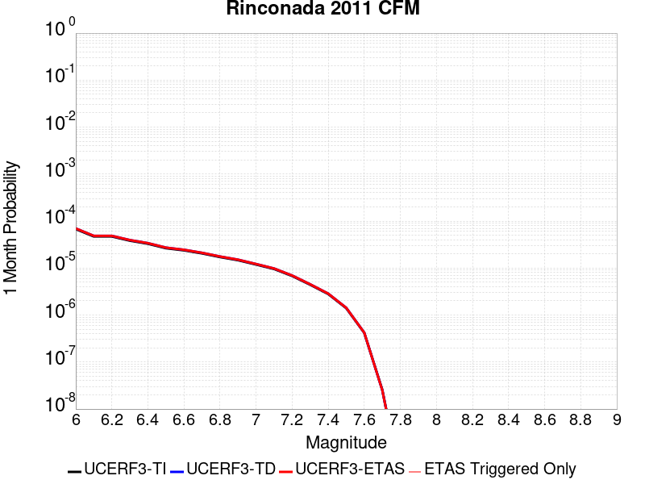 | 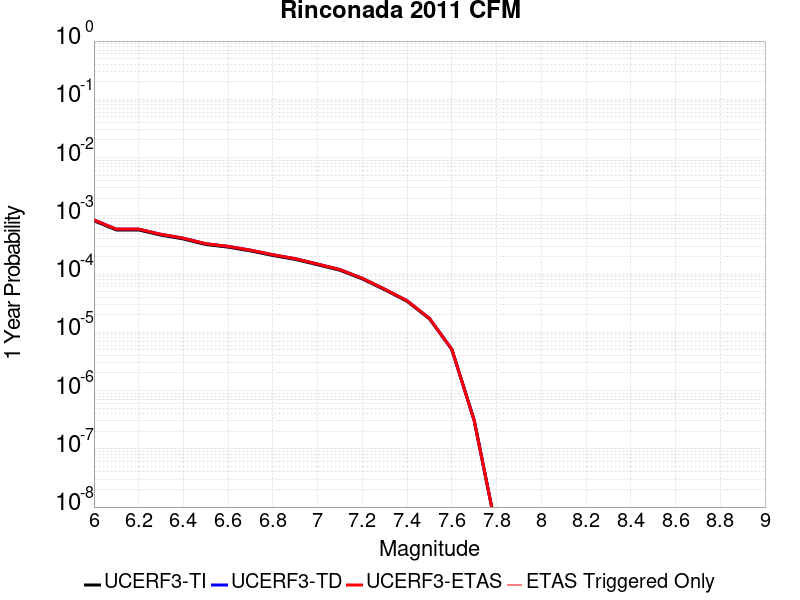 | 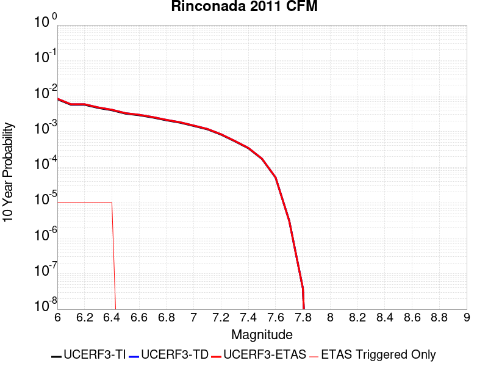 |

| Magnitude | 1 wk TI Prob | 1 wk TD Prob | 1 wk ETAS Prob | 1 wk ETAS/TD Gain | 1 wk ETAS Triggered Only | 1 mo TI Prob | 1 mo TD Prob | 1 mo ETAS Prob | 1 mo ETAS/TD Gain | 1 mo ETAS Triggered Only | 1 yr TI Prob | 1 yr TD Prob | 1 yr ETAS Prob | 1 yr ETAS/TD Gain | 1 yr ETAS Triggered Only | 10 yr TI Prob | 10 yr TD Prob | 10 yr ETAS Prob | 10 yr ETAS/TD Gain | 10 yr ETAS Triggered Only |
|-----|-----|-----|-----|-----|-----|-----|-----|-----|-----|-----|-----|-----|-----|-----|-----|-----|-----|-----|-----|-----|
| 6.0 | 1.5752368E-5 | 1.627597E-5 | 1.627597E-5 | 1.0 | 0.0 | 6.75084E-5 | 6.975231E-5 | 6.975231E-5 | 1.0 | 0.0 | 8.2160486E-4 | 8.489066E-4 | 8.489066E-4 | 1.0 | 0.0 | 0.008185739 | 0.008457019 | 0.008468315 | 1.0013357 | 1.1393155E-5 |
| 6.1 | 1.0966133E-5 | 1.1323887E-5 | 1.1323887E-5 | 1.0 | 0.0 | 4.6996865E-5 | 4.8530044E-5 | 4.8530044E-5 | 1.0 | 0.0 | 5.720366E-4 | 5.9069385E-4 | 5.9069385E-4 | 1.0 | 0.0 | 0.0057056635 | 0.005891334 | 0.0059026596 | 1.0019225 | 1.1393155E-5 |
| 6.2 | 1.0966133E-5 | 1.1323887E-5 | 1.1323887E-5 | 1.0 | 0.0 | 4.6996865E-5 | 4.8530044E-5 | 4.8530044E-5 | 1.0 | 0.0 | 5.720366E-4 | 5.9069385E-4 | 5.9069385E-4 | 1.0 | 0.0 | 0.0057056635 | 0.005891334 | 0.0059026596 | 1.0019225 | 1.1393155E-5 |
| 6.3 | 8.926149E-6 | 9.213461E-6 | 9.213461E-6 | 1.0 | 0.0 | 3.8254362E-5 | 3.948567E-5 | 3.948567E-5 | 1.0 | 0.0 | 4.6564735E-4 | 4.8063227E-4 | 4.8063227E-4 | 1.0 | 0.0 | 0.0046467283 | 0.0047959727 | 0.004807311 | 1.0023642 | 1.1393155E-5 |
| 6.4 | 7.676955E-6 | 7.920777E-6 | 7.920777E-6 | 1.0 | 0.0 | 3.290082E-5 | 3.3945744E-5 | 3.3945744E-5 | 1.0 | 0.0 | 4.0049385E-4 | 4.1321127E-4 | 4.1321127E-4 | 1.0 | 0.0 | 0.0039977287 | 0.0041244556 | 0.004135802 | 1.002751 | 1.1393155E-5 |
| 6.5 | 6.1671026E-6 | 6.359418E-6 | 6.359418E-6 | 1.0 | 0.0 | 2.6430173E-5 | 2.7254364E-5 | 2.7254364E-5 | 1.0 | 0.0 | 3.2173982E-4 | 3.3177144E-4 | 3.3177144E-4 | 1.0 | 0.0 | 0.003212744 | 0.0033127733 | 0.0033127733 | 1.0 | 0.0 |
| 6.6 | 5.553456E-6 | 5.7252264E-6 | 5.7252264E-6 | 1.0 | 0.0 | 2.3800309E-5 | 2.4536455E-5 | 2.4536455E-5 | 1.0 | 0.0 | 2.897302E-4 | 2.9869043E-4 | 2.9869043E-4 | 1.0 | 0.0 | 0.0028935277 | 0.0029828986 | 0.0029828986 | 1.0 | 0.0 |
| 6.7 | 4.787857E-6 | 4.9336613E-6 | 4.9336613E-6 | 1.0 | 0.0 | 2.0519226E-5 | 2.1144093E-5 | 2.1144093E-5 | 1.0 | 0.0 | 2.4979294E-4 | 2.5739896E-4 | 2.5739896E-4 | 1.0 | 0.0 | 0.0024951235 | 0.002571014 | 0.002571014 | 1.0 | 0.0 |
| 6.8 | 3.9955166E-6 | 4.1137623E-6 | 4.1137623E-6 | 1.0 | 0.0 | 1.7123532E-5 | 1.7630291E-5 | 1.7630291E-5 | 1.0 | 0.0 | 2.0845905E-4 | 2.1462767E-4 | 2.1462767E-4 | 1.0 | 0.0 | 0.002082636 | 0.0021442075 | 0.0021442075 | 1.0 | 0.0 |
| 6.9 | 3.4250072E-6 | 3.522683E-6 | 3.522683E-6 | 1.0 | 0.0 | 1.46785205E-5 | 1.5097126E-5 | 1.5097126E-5 | 1.0 | 0.0 | 1.7869633E-4 | 1.8379203E-4 | 1.8379203E-4 | 1.0 | 0.0 | 0.001785527 | 0.0018364027 | 0.0018364027 | 1.0 | 0.0 |
| 7.0 | 2.7712713E-6 | 2.846884E-6 | 2.846884E-6 | 1.0 | 0.0 | 1.1876823E-5 | 1.2200874E-5 | 1.2200874E-5 | 1.0 | 0.0 | 1.4459073E-4 | 1.4853553E-4 | 1.4853553E-4 | 1.0 | 0.0 | 0.0014449668 | 0.0014843642 | 0.0014843642 | 1.0 | 0.0 |
| 7.1 | 2.227358E-6 | 2.2858417E-6 | 2.2858417E-6 | 1.0 | 0.0 | 9.545785E-6 | 9.796428E-6 | 9.796428E-6 | 1.0 | 0.0 | 1.16213734E-4 | 1.1926499E-4 | 1.1926499E-4 | 1.0 | 0.0 | 0.0011615298 | 0.0011920108 | 0.0011920108 | 1.0 | 0.0 |
| 7.2 | 1.581796E-6 | 1.6209984E-6 | 1.6209984E-6 | 1.0 | 0.0 | 6.779108E-6 | 6.947118E-6 | 6.947118E-6 | 1.0 | 0.0 | 8.253252E-5 | 8.457788E-5 | 8.457788E-5 | 1.0 | 0.0 | 8.250187E-4 | 8.454575E-4 | 8.454575E-4 | 1.0 | 0.0 |
| 7.3 | 1.0306567E-6 | 1.054709E-6 | 1.054709E-6 | 1.0 | 0.0 | 4.4170924E-6 | 4.5201737E-6 | 4.5201737E-6 | 1.0 | 0.0 | 5.3776774E-5 | 5.5031724E-5 | 5.5031724E-5 | 1.0 | 0.0 | 5.376376E-4 | 5.501812E-4 | 5.501812E-4 | 1.0 | 0.0 |
| 7.4 | 6.535541E-7 | 6.683135E-7 | 6.683135E-7 | 1.0 | 0.0 | 2.800943E-6 | 2.8641973E-6 | 2.8641973E-6 | 1.0 | 0.0 | 3.4100947E-5 | 3.4871046E-5 | 3.4871046E-5 | 1.0 | 0.0 | 3.4095717E-4 | 3.4865589E-4 | 3.4865589E-4 | 1.0 | 0.0 |
| 7.5 | 3.2656962E-7 | 3.3318688E-7 | 3.3318688E-7 | 1.0 | 0.0 | 1.3995833E-6 | 1.427943E-6 | 1.427943E-6 | 1.0 | 0.0 | 1.7039794E-5 | 1.7385068E-5 | 1.7385068E-5 | 1.0 | 0.0 | 1.7038487E-4 | 1.7383712E-4 | 1.7383712E-4 | 1.0 | 0.0 |
| 7.6 | 9.754343E-8 | 9.821582E-8 | 9.821582E-8 | 1.0 | 0.0 | 4.180432E-7 | 4.2092486E-7 | 4.2092486E-7 | 1.0 | 0.0 | 5.089664E-6 | 5.124748E-6 | 5.124748E-6 | 1.0 | 0.0 | 5.0895473E-5 | 5.124631E-5 | 5.124631E-5 | 1.0 | 0.0 |
| 7.7 | 6.0001453E-9 | 5.8495124E-9 | 5.8495124E-9 | 1.0 | 0.0 | 2.5714908E-8 | 2.5069337E-8 | 2.5069337E-8 | 1.0 | 0.0 | 3.1307894E-7 | 3.0521915E-7 | 3.0521915E-7 | 1.0 | 0.0 | 3.1307852E-6 | 3.0521874E-6 | 3.0521874E-6 | 1.0 | 0.0 |
| 7.8 | 7.400003E-11 | 7.465595E-11 | 7.465595E-11 | 1.0 | 0.0 | 3.171432E-10 | 3.1995429E-10 | 3.1995429E-10 | 1.0 | 0.0 | 3.861218E-9 | 3.8954426E-9 | 3.8954426E-9 | 1.0 | 0.0 | 3.861218E-8 | 3.895443E-8 | 3.895443E-8 | 1.0 | 0.0 |

## Great Valley 09 (Laguna Seca)
*[(top)](#table-of-contents)*

| 1 Week | 1 Month | 1 Year | 10 Year |
|-----|-----|-----|-----|
|  |  |  |  |

| Magnitude | 1 wk TI Prob | 1 wk TD Prob | 1 wk ETAS Prob | 1 wk ETAS/TD Gain | 1 wk ETAS Triggered Only | 1 mo TI Prob | 1 mo TD Prob | 1 mo ETAS Prob | 1 mo ETAS/TD Gain | 1 mo ETAS Triggered Only | 1 yr TI Prob | 1 yr TD Prob | 1 yr ETAS Prob | 1 yr ETAS/TD Gain | 1 yr ETAS Triggered Only | 10 yr TI Prob | 10 yr TD Prob | 10 yr ETAS Prob | 10 yr ETAS/TD Gain | 10 yr ETAS Triggered Only |
|-----|-----|-----|-----|-----|-----|-----|-----|-----|-----|-----|-----|-----|-----|-----|-----|-----|-----|-----|-----|-----|
| 6.0 | 5.4353277E-5 | 7.05516E-5 | 7.05516E-5 | 1.0 | 0.0 | 2.3292181E-4 | 3.023287E-4 | 3.137184E-4 | 1.0376732 | 1.1393155E-5 | 0.0028321352 | 0.0036746343 | 0.0036859857 | 1.0030891 | 1.1393155E-5 | 0.02796312 | 0.03614085 | 0.03615183 | 1.0003039 | 1.1393155E-5 |
| 6.1 | 4.5578287E-5 | 5.8261394E-5 | 5.8261394E-5 | 1.0 | 0.0 | 1.953209E-4 | 2.4966686E-4 | 2.4966686E-4 | 1.0 | 0.0 | 0.0023754383 | 0.0030354576 | 0.0030354576 | 1.0 | 0.0 | 0.023502063 | 0.02994004 | 0.02994004 | 1.0 | 0.0 |
| 6.2 | 2.8536782E-5 | 3.4757963E-5 | 3.4757963E-5 | 1.0 | 0.0 | 1.2229476E-4 | 1.489543E-4 | 1.489543E-4 | 1.0 | 0.0 | 0.0014879217 | 0.001811989 | 0.001811989 | 1.0 | 0.0 | 0.014779986 | 0.017969275 | 0.017969275 | 1.0 | 0.0 |
| 6.3 | 2.3698774E-5 | 2.8229873E-5 | 2.8229873E-5 | 1.0 | 0.0 | 1.01562226E-4 | 1.2097984E-4 | 1.2097984E-4 | 1.0 | 0.0 | 0.0012358186 | 0.0014719277 | 0.0014719277 | 1.0 | 0.0 | 0.012289686 | 0.014620015 | 0.014620015 | 1.0 | 0.0 |
| 6.4 | 1.9191197E-5 | 2.2135002E-5 | 2.2135002E-5 | 1.0 | 0.0 | 8.2245395E-5 | 9.4861076E-5 | 9.4861076E-5 | 1.0 | 0.0 | 0.0010008777 | 0.0011543273 | 0.0011543273 | 1.0 | 0.0 | 0.009963818 | 0.011483273 | 0.011483273 | 1.0 | 0.0 |
| 6.5 | 1.5203241E-5 | 1.6809463E-5 | 1.6809463E-5 | 1.0 | 0.0 | 6.5155116E-5 | 7.203875E-5 | 7.203875E-5 | 1.0 | 0.0 | 7.9297484E-4 | 8.7673514E-4 | 8.7673514E-4 | 1.0 | 0.0 | 0.007901512 | 0.008733867 | 0.008733867 | 1.0 | 0.0 |
| 6.6 | 1.0984925E-5 | 1.1246989E-5 | 1.1246989E-5 | 1.0 | 0.0 | 4.70774E-5 | 4.8200513E-5 | 4.8200513E-5 | 1.0 | 0.0 | 5.730166E-4 | 5.86687E-4 | 5.86687E-4 | 1.0 | 0.0 | 0.005715413 | 0.0058517726 | 0.0058517726 | 1.0 | 0.0 |
| 6.7 | 9.134616E-6 | 9.023263E-6 | 9.023263E-6 | 1.0 | 0.0 | 3.9147766E-5 | 3.867057E-5 | 3.867057E-5 | 1.0 | 0.0 | 4.7651984E-4 | 4.7071485E-4 | 4.7071485E-4 | 1.0 | 0.0 | 0.004754993 | 0.0046974234 | 0.0046974234 | 1.0 | 0.0 |
| 6.8 | 7.785589E-6 | 7.4547247E-6 | 7.4547247E-6 | 1.0 | 0.0 | 3.3366385E-5 | 3.194844E-5 | 3.194844E-5 | 1.0 | 0.0 | 4.0616E-4 | 3.8890485E-4 | 3.8890485E-4 | 1.0 | 0.0 | 0.0040541845 | 0.0038824468 | 0.0038824468 | 1.0 | 0.0 |
| 6.9 | 5.579095E-6 | 4.900344E-6 | 4.900344E-6 | 1.0 | 0.0 | 2.3910188E-5 | 2.1001311E-5 | 2.1001311E-5 | 1.0 | 0.0 | 2.9106764E-4 | 2.5566237E-4 | 2.5566237E-4 | 1.0 | 0.0 | 0.002906867 | 0.00255382 | 0.00255382 | 1.0 | 0.0 |
| 7.0 | 2.6816688E-6 | 1.5221701E-6 | 1.5221701E-6 | 1.0 | 0.0 | 1.1492816E-5 | 6.5235704E-6 | 6.5235704E-6 | 1.0 | 0.0 | 1.3991605E-4 | 7.942166E-5 | 7.942166E-5 | 1.0 | 0.0 | 0.0013982799 | 7.939415E-4 | 7.939415E-4 | 1.0 | 0.0 |
| 7.1 | 1.9951021E-6 | 7.4570556E-7 | 7.4570556E-7 | 1.0 | 0.0 | 8.55041E-6 | 3.1958773E-6 | 3.1958773E-6 | 1.0 | 0.0 | 1.0409627E-4 | 3.8909155E-5 | 3.8909155E-5 | 1.0 | 0.0 | 0.0010404752 | 3.8902755E-4 | 3.8902755E-4 | 1.0 | 0.0 |
| 7.2 | 1.9951021E-6 | 7.4570556E-7 | 7.4570556E-7 | 1.0 | 0.0 | 8.55041E-6 | 3.1958773E-6 | 3.1958773E-6 | 1.0 | 0.0 | 1.0409627E-4 | 3.8909155E-5 | 3.8909155E-5 | 1.0 | 0.0 | 0.0010404752 | 3.8902755E-4 | 3.8902755E-4 | 1.0 | 0.0 |
| 7.3 | 1.7087556E-6 | 6.581147E-7 | 6.581147E-7 | 1.0 | 0.0 | 7.3232177E-6 | 2.8204886E-6 | 2.8204886E-6 | 1.0 | 0.0 | 8.915652E-5 | 3.4338947E-5 | 3.4338947E-5 | 1.0 | 0.0 | 8.9120766E-4 | 3.4334048E-4 | 3.4334048E-4 | 1.0 | 0.0 |
| 7.4 | 1.3804846E-6 | 6.075461E-7 | 6.075461E-7 | 1.0 | 0.0 | 5.916349E-6 | 2.6037667E-6 | 2.6037667E-6 | 1.0 | 0.0 | 7.2029165E-5 | 3.1700438E-5 | 3.1700438E-5 | 1.0 | 0.0 | 7.200583E-4 | 3.1696318E-4 | 3.1696318E-4 | 1.0 | 0.0 |
| 7.5 | 1.3804846E-6 | 6.075461E-7 | 6.075461E-7 | 1.0 | 0.0 | 5.916349E-6 | 2.6037667E-6 | 2.6037667E-6 | 1.0 | 0.0 | 7.2029165E-5 | 3.1700438E-5 | 3.1700438E-5 | 1.0 | 0.0 | 7.200583E-4 | 3.1696318E-4 | 3.1696318E-4 | 1.0 | 0.0 |

## Red Mountain
*[(top)](#table-of-contents)*

| 1 Week | 1 Month | 1 Year | 10 Year |
|-----|-----|-----|-----|
|  |  |  |  |

| Magnitude | 1 wk TI Prob | 1 wk TD Prob | 1 wk ETAS Prob | 1 wk ETAS/TD Gain | 1 wk ETAS Triggered Only | 1 mo TI Prob | 1 mo TD Prob | 1 mo ETAS Prob | 1 mo ETAS/TD Gain | 1 mo ETAS Triggered Only | 1 yr TI Prob | 1 yr TD Prob | 1 yr ETAS Prob | 1 yr ETAS/TD Gain | 1 yr ETAS Triggered Only | 10 yr TI Prob | 10 yr TD Prob | 10 yr ETAS Prob | 10 yr ETAS/TD Gain | 10 yr ETAS Triggered Only |
|-----|-----|-----|-----|-----|-----|-----|-----|-----|-----|-----|-----|-----|-----|-----|-----|-----|-----|-----|-----|-----|
| 6.0 | 4.1810763E-5 | 4.7608508E-5 | 4.7608508E-5 | 1.0 | 0.0 | 1.7917668E-4 | 2.0402145E-4 | 2.0402145E-4 | 1.0 | 0.0 | 0.0021792934 | 0.0024812962 | 0.0024926611 | 1.0045803 | 1.1393155E-5 | 0.021580452 | 0.024553537 | 0.024564652 | 1.0004526 | 1.1393155E-5 |
| 6.1 | 4.1810763E-5 | 4.7608508E-5 | 4.7608508E-5 | 1.0 | 0.0 | 1.7917668E-4 | 2.0402145E-4 | 2.0402145E-4 | 1.0 | 0.0 | 0.0021792934 | 0.0024812962 | 0.0024926611 | 1.0045803 | 1.1393155E-5 | 0.021580452 | 0.024553537 | 0.024564652 | 1.0004526 | 1.1393155E-5 |
| 6.2 | 4.1810763E-5 | 4.7608508E-5 | 4.7608508E-5 | 1.0 | 0.0 | 1.7917668E-4 | 2.0402145E-4 | 2.0402145E-4 | 1.0 | 0.0 | 0.0021792934 | 0.0024812962 | 0.0024926611 | 1.0045803 | 1.1393155E-5 | 0.021580452 | 0.024553537 | 0.024564652 | 1.0004526 | 1.1393155E-5 |
| 6.3 | 4.1810763E-5 | 4.7608508E-5 | 4.7608508E-5 | 1.0 | 0.0 | 1.7917668E-4 | 2.0402145E-4 | 2.0402145E-4 | 1.0 | 0.0 | 0.0021792934 | 0.0024812962 | 0.0024926611 | 1.0045803 | 1.1393155E-5 | 0.021580452 | 0.024553537 | 0.024564652 | 1.0004526 | 1.1393155E-5 |
| 6.4 | 4.1810763E-5 | 4.7608508E-5 | 4.7608508E-5 | 1.0 | 0.0 | 1.7917668E-4 | 2.0402145E-4 | 2.0402145E-4 | 1.0 | 0.0 | 0.0021792934 | 0.0024812962 | 0.0024926611 | 1.0045803 | 1.1393155E-5 | 0.021580452 | 0.024553537 | 0.024564652 | 1.0004526 | 1.1393155E-5 |
| 6.5 | 3.154503E-5 | 3.5372846E-5 | 3.5372846E-5 | 1.0 | 0.0 | 1.3518598E-4 | 1.5158963E-4 | 1.5158963E-4 | 1.0 | 0.0 | 0.0016446467 | 0.0018441336 | 0.0018555057 | 1.0061667 | 1.1393155E-5 | 0.01632528 | 0.018297957 | 0.018309142 | 1.0006113 | 1.1393155E-5 |
| 6.6 | 3.1535834E-5 | 3.5362224E-5 | 3.5362224E-5 | 1.0 | 0.0 | 1.3514658E-4 | 1.5154411E-4 | 1.5154411E-4 | 1.0 | 0.0 | 0.0016441676 | 0.0018435804 | 0.0018549525 | 1.0061685 | 1.1393155E-5 | 0.01632056 | 0.018292516 | 0.018303702 | 1.0006114 | 1.1393155E-5 |
| 6.7 | 2.8267326E-5 | 3.1480766E-5 | 3.1480766E-5 | 1.0 | 0.0 | 1.2114006E-4 | 1.3491107E-4 | 1.3491107E-4 | 1.0 | 0.0 | 0.0014738824 | 0.0016413898 | 0.0016527643 | 1.0069298 | 1.1393155E-5 | 0.014641452 | 0.016301436 | 0.016312642 | 1.0006875 | 1.1393155E-5 |
| 6.8 | 2.8212884E-5 | 3.141863E-5 | 3.141863E-5 | 1.0 | 0.0 | 1.20906756E-4 | 1.346448E-4 | 1.346448E-4 | 1.0 | 0.0 | 0.0014710457 | 0.001638153 | 0.0016495275 | 1.0069435 | 1.1393155E-5 | 0.014613459 | 0.016269542 | 0.01628075 | 1.0006889 | 1.1393155E-5 |
| 6.9 | 2.4227871E-5 | 2.671643E-5 | 2.671643E-5 | 1.0 | 0.0 | 1.03829596E-4 | 1.14494396E-4 | 1.14494396E-4 | 1.0 | 0.0 | 0.0012633923 | 0.0013931538 | 0.0014045311 | 1.0081666 | 1.1393155E-5 | 0.012562336 | 0.013851897 | 0.013863132 | 1.0008111 | 1.1393155E-5 |
| 7.0 | 2.348524E-5 | 2.5844867E-5 | 2.5844867E-5 | 1.0 | 0.0 | 1.0064714E-4 | 1.10759436E-4 | 1.10759436E-4 | 1.0 | 0.0 | 0.0012246901 | 0.0013477376 | 0.0013591155 | 1.0084422 | 1.1393155E-5 | 0.012179627 | 0.0134032825 | 0.013414524 | 1.0008386 | 1.1393155E-5 |
| 7.1 | 2.2311642E-5 | 2.447139E-5 | 2.447139E-5 | 1.0 | 0.0 | 9.561782E-5 | 1.04873594E-4 | 1.04873594E-4 | 1.0 | 0.0 | 0.0011635252 | 0.001276163 | 0.0012875416 | 1.0089163 | 1.1393155E-5 | 0.01157452 | 0.0126958685 | 0.012707117 | 1.000886 | 1.1393155E-5 |
| 7.2 | 1.6533986E-5 | 1.7676148E-5 | 1.7676148E-5 | 1.0 | 0.0 | 7.085802E-5 | 7.575308E-5 | 7.575308E-5 | 1.0 | 0.0 | 8.623549E-4 | 9.21967E-4 | 9.333496E-4 | 1.012346 | 1.1393155E-5 | 0.008590161 | 0.009187703 | 0.009198992 | 1.0012287 | 1.1393155E-5 |
| 7.3 | 1.4703092E-5 | 1.5564568E-5 | 1.5564568E-5 | 1.0 | 0.0 | 6.301173E-5 | 6.6703935E-5 | 6.6703935E-5 | 1.0 | 0.0 | 7.668978E-4 | 8.1187946E-4 | 8.2326337E-4 | 1.0140216 | 1.1393155E-5 | 0.0076425658 | 0.008095214 | 0.008106515 | 1.0013961 | 1.1393155E-5 |
| 7.4 | 6.1331984E-6 | 5.529955E-6 | 5.529955E-6 | 1.0 | 0.0 | 2.6284872E-5 | 2.3699595E-5 | 2.3699595E-5 | 1.0 | 0.0 | 3.199713E-4 | 2.885049E-4 | 2.885049E-4 | 1.0 | 0.0 | 0.0031951098 | 0.002881358 | 0.002881358 | 1.0 | 0.0 |
| 7.5 | 5.954766E-6 | 5.339547E-6 | 5.339547E-6 | 1.0 | 0.0 | 2.5520176E-5 | 2.2883576E-5 | 2.2883576E-5 | 1.0 | 0.0 | 3.1066386E-4 | 2.7857244E-4 | 2.7857244E-4 | 1.0 | 0.0 | 0.003102299 | 0.0027822864 | 0.0027822864 | 1.0 | 0.0 |
| 7.6 | 4.9726646E-6 | 4.3161563E-6 | 4.3161563E-6 | 1.0 | 0.0 | 2.1311245E-5 | 1.8497683E-5 | 1.8497683E-5 | 1.0 | 0.0 | 2.5943352E-4 | 2.2518635E-4 | 2.2518635E-4 | 1.0 | 0.0 | 0.0025913084 | 0.0022496164 | 0.0022496164 | 1.0 | 0.0 |
| 7.7 | 3.3613894E-6 | 2.8532174E-6 | 2.8532174E-6 | 1.0 | 0.0 | 1.4405875E-5 | 1.2228019E-5 | 1.2228019E-5 | 1.0 | 0.0 | 1.7537741E-4 | 1.4886622E-4 | 1.4886622E-4 | 1.0 | 0.0 | 0.0017523908 | 0.0014876913 | 0.0014876913 | 1.0 | 0.0 |
| 7.8 | 1.1828961E-6 | 1.0124434E-6 | 1.0124434E-6 | 1.0 | 0.0 | 5.069545E-6 | 4.339036E-6 | 4.339036E-6 | 1.0 | 0.0 | 6.171996E-5 | 5.2826515E-5 | 5.2826515E-5 | 1.0 | 0.0 | 6.170282E-4 | 5.281425E-4 | 5.281425E-4 | 1.0 | 0.0 |
| 7.9 | 2.2967266E-7 | 1.8622242E-7 | 1.8622242E-7 | 1.0 | 0.0 | 9.843111E-7 | 7.980958E-7 | 7.980958E-7 | 1.0 | 0.0 | 1.19839215E-5 | 9.716777E-6 | 9.716777E-6 | 1.0 | 0.0 | 1.1983275E-4 | 9.71638E-5 | 9.71638E-5 | 1.0 | 0.0 |

## Dry Mountain
*[(top)](#table-of-contents)*

| 1 Week | 1 Month | 1 Year | 10 Year |
|-----|-----|-----|-----|
|  | 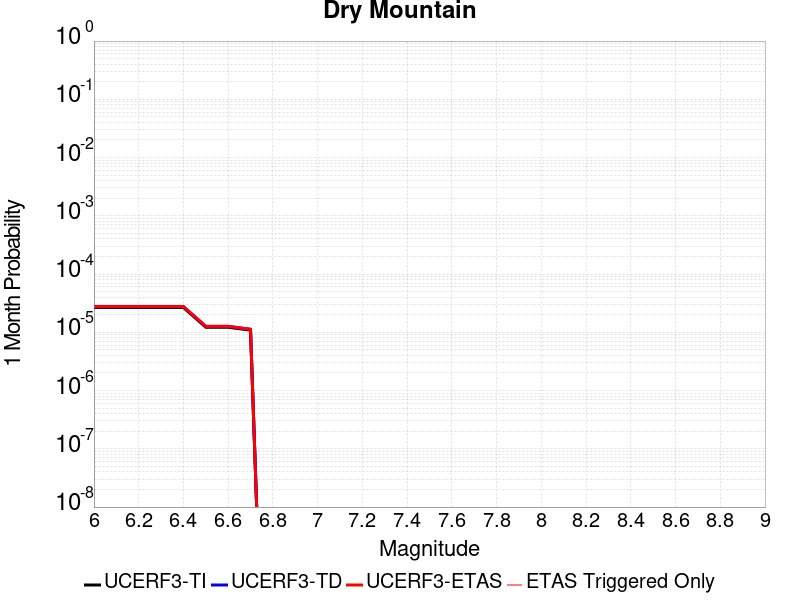 |  |  |

| Magnitude | 1 wk TI Prob | 1 wk TD Prob | 1 wk ETAS Prob | 1 wk ETAS/TD Gain | 1 wk ETAS Triggered Only | 1 mo TI Prob | 1 mo TD Prob | 1 mo ETAS Prob | 1 mo ETAS/TD Gain | 1 mo ETAS Triggered Only | 1 yr TI Prob | 1 yr TD Prob | 1 yr ETAS Prob | 1 yr ETAS/TD Gain | 1 yr ETAS Triggered Only | 10 yr TI Prob | 10 yr TD Prob | 10 yr ETAS Prob | 10 yr ETAS/TD Gain | 10 yr ETAS Triggered Only |
|-----|-----|-----|-----|-----|-----|-----|-----|-----|-----|-----|-----|-----|-----|-----|-----|-----|-----|-----|-----|-----|
| 6.0 | 6.222801E-6 | 6.439899E-6 | 6.439899E-6 | 1.0 | 0.0 | 2.6668875E-5 | 2.7599366E-5 | 2.7599366E-5 | 1.0 | 0.0 | 3.2464517E-4 | 3.359864E-4 | 3.359864E-4 | 1.0 | 0.0 | 0.0032417132 | 0.0033563466 | 0.0033677013 | 1.0033832 | 1.1393155E-5 |
| 6.1 | 6.222801E-6 | 6.439899E-6 | 6.439899E-6 | 1.0 | 0.0 | 2.6668875E-5 | 2.7599366E-5 | 2.7599366E-5 | 1.0 | 0.0 | 3.2464517E-4 | 3.359864E-4 | 3.359864E-4 | 1.0 | 0.0 | 0.0032417132 | 0.0033563466 | 0.0033677013 | 1.0033832 | 1.1393155E-5 |
| 6.2 | 6.222801E-6 | 6.439899E-6 | 6.439899E-6 | 1.0 | 0.0 | 2.6668875E-5 | 2.7599366E-5 | 2.7599366E-5 | 1.0 | 0.0 | 3.2464517E-4 | 3.359864E-4 | 3.359864E-4 | 1.0 | 0.0 | 0.0032417132 | 0.0033563466 | 0.0033677013 | 1.0033832 | 1.1393155E-5 |
| 6.3 | 6.222801E-6 | 6.439899E-6 | 6.439899E-6 | 1.0 | 0.0 | 2.6668875E-5 | 2.7599366E-5 | 2.7599366E-5 | 1.0 | 0.0 | 3.2464517E-4 | 3.359864E-4 | 3.359864E-4 | 1.0 | 0.0 | 0.0032417132 | 0.0033563466 | 0.0033677013 | 1.0033832 | 1.1393155E-5 |
| 6.4 | 6.222801E-6 | 6.439899E-6 | 6.439899E-6 | 1.0 | 0.0 | 2.6668875E-5 | 2.7599366E-5 | 2.7599366E-5 | 1.0 | 0.0 | 3.2464517E-4 | 3.359864E-4 | 3.359864E-4 | 1.0 | 0.0 | 0.0032417132 | 0.0033563466 | 0.0033677013 | 1.0033832 | 1.1393155E-5 |
| 6.5 | 2.8528623E-6 | 2.9524058E-6 | 2.9524058E-6 | 1.0 | 0.0 | 1.22264955E-5 | 1.2653156E-5 | 1.2653156E-5 | 1.0 | 0.0 | 1.4884741E-4 | 1.5404998E-4 | 1.5404998E-4 | 1.0 | 0.0 | 0.0014874774 | 0.0015402855 | 0.0015402855 | 1.0 | 0.0 |
| 6.6 | 2.8528623E-6 | 2.9524058E-6 | 2.9524058E-6 | 1.0 | 0.0 | 1.22264955E-5 | 1.2653156E-5 | 1.2653156E-5 | 1.0 | 0.0 | 1.4884741E-4 | 1.5404998E-4 | 1.5404998E-4 | 1.0 | 0.0 | 0.0014874774 | 0.0015402855 | 0.0015402855 | 1.0 | 0.0 |
| 6.7 | 2.541E-6 | 2.6295693E-6 | 2.6295693E-6 | 1.0 | 0.0 | 1.0889954E-5 | 1.12695825E-5 | 1.12695825E-5 | 1.0 | 0.0 | 1.3257713E-4 | 1.3720717E-4 | 1.3720717E-4 | 1.0 | 0.0 | 0.0013249806 | 0.0013720717 | 0.0013720717 | 1.0 | 0.0 |

## Monterey Bay-Tularcitos
*[(top)](#table-of-contents)*

| 1 Week | 1 Month | 1 Year | 10 Year |
|-----|-----|-----|-----|
| 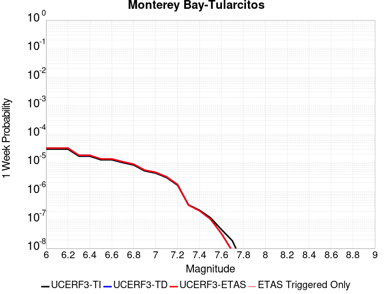 |  | 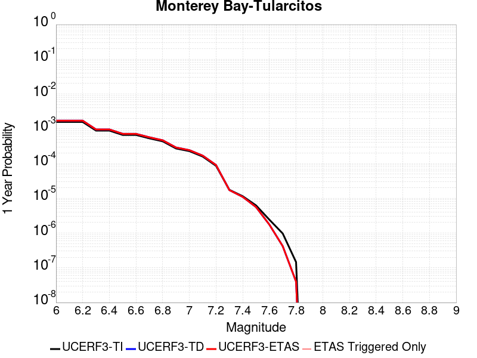 |  |

| Magnitude | 1 wk TI Prob | 1 wk TD Prob | 1 wk ETAS Prob | 1 wk ETAS/TD Gain | 1 wk ETAS Triggered Only | 1 mo TI Prob | 1 mo TD Prob | 1 mo ETAS Prob | 1 mo ETAS/TD Gain | 1 mo ETAS Triggered Only | 1 yr TI Prob | 1 yr TD Prob | 1 yr ETAS Prob | 1 yr ETAS/TD Gain | 1 yr ETAS Triggered Only | 10 yr TI Prob | 10 yr TD Prob | 10 yr ETAS Prob | 10 yr ETAS/TD Gain | 10 yr ETAS Triggered Only |
|-----|-----|-----|-----|-----|-----|-----|-----|-----|-----|-----|-----|-----|-----|-----|-----|-----|-----|-----|-----|-----|
| 6.0 | 3.0131365E-5 | 3.2805638E-5 | 3.2805638E-5 | 1.0 | 0.0 | 1.2912804E-4 | 1.405886E-4 | 1.405886E-4 | 1.0 | 0.0 | 0.001571 | 0.0017104279 | 0.0017104279 | 1.0 | 0.0 | 0.015599402 | 0.016983444 | 0.016994644 | 1.0006595 | 1.1393155E-5 |
| 6.1 | 3.0131365E-5 | 3.2805638E-5 | 3.2805638E-5 | 1.0 | 0.0 | 1.2912804E-4 | 1.405886E-4 | 1.405886E-4 | 1.0 | 0.0 | 0.001571 | 0.0017104279 | 0.0017104279 | 1.0 | 0.0 | 0.015599402 | 0.016983444 | 0.016994644 | 1.0006595 | 1.1393155E-5 |
| 6.2 | 3.0131365E-5 | 3.2805638E-5 | 3.2805638E-5 | 1.0 | 0.0 | 1.2912804E-4 | 1.405886E-4 | 1.405886E-4 | 1.0 | 0.0 | 0.001571 | 0.0017104279 | 0.0017104279 | 1.0 | 0.0 | 0.015599402 | 0.016983444 | 0.016994644 | 1.0006595 | 1.1393155E-5 |
| 6.3 | 1.6998249E-5 | 1.8334256E-5 | 1.8334256E-5 | 1.0 | 0.0 | 7.28476E-5 | 7.8573124E-5 | 7.8573124E-5 | 1.0 | 0.0 | 8.865586E-4 | 9.5622666E-4 | 9.5622666E-4 | 1.0 | 0.0 | 0.0088303005 | 0.009523046 | 0.009534331 | 1.0011849 | 1.1393155E-5 |
| 6.4 | 1.6998249E-5 | 1.8334256E-5 | 1.8334256E-5 | 1.0 | 0.0 | 7.28476E-5 | 7.8573124E-5 | 7.8573124E-5 | 1.0 | 0.0 | 8.865586E-4 | 9.5622666E-4 | 9.5622666E-4 | 1.0 | 0.0 | 0.0088303005 | 0.009523046 | 0.009534331 | 1.0011849 | 1.1393155E-5 |
| 6.5 | 1.27470785E-5 | 1.3695796E-5 | 1.3695796E-5 | 1.0 | 0.0 | 5.4629192E-5 | 5.869501E-5 | 5.869501E-5 | 1.0 | 0.0 | 6.649074E-4 | 7.1438774E-4 | 7.1438774E-4 | 1.0 | 0.0 | 0.0066292146 | 0.0071219653 | 0.0071332776 | 1.0015883 | 1.1393155E-5 |
| 6.6 | 1.2739422E-5 | 1.36878825E-5 | 1.36878825E-5 | 1.0 | 0.0 | 5.4596385E-5 | 5.866109E-5 | 5.866109E-5 | 1.0 | 0.0 | 6.645082E-4 | 7.139751E-4 | 7.139751E-4 | 1.0 | 0.0 | 0.0066252467 | 0.0071178656 | 0.0071291775 | 1.0015893 | 1.1393155E-5 |
| 6.7 | 1.0160109E-5 | 1.0887684E-5 | 1.0887684E-5 | 1.0 | 0.0 | 4.35426E-5 | 4.666071E-5 | 4.666071E-5 | 1.0 | 0.0 | 5.300022E-4 | 5.679531E-4 | 5.679531E-4 | 1.0 | 0.0 | 0.005287399 | 0.0056657274 | 0.0056657274 | 1.0 | 0.0 |
| 6.8 | 8.349859E-6 | 8.934159E-6 | 8.934159E-6 | 1.0 | 0.0 | 3.578462E-5 | 3.8288727E-5 | 3.8288727E-5 | 1.0 | 0.0 | 4.3559066E-4 | 4.660712E-4 | 4.660712E-4 | 1.0 | 0.0 | 0.004347378 | 0.0046515022 | 0.0046515022 | 1.0 | 0.0 |
| 6.9 | 5.193639E-6 | 5.5374057E-6 | 5.5374057E-6 | 1.0 | 0.0 | 2.2258262E-5 | 2.373154E-5 | 2.373154E-5 | 1.0 | 0.0 | 2.7096065E-4 | 2.8889644E-4 | 2.8889644E-4 | 1.0 | 0.0 | 0.0027063051 | 0.00288553 | 0.00288553 | 1.0 | 0.0 |
| 7.0 | 4.359381E-6 | 4.6441955E-6 | 4.6441955E-6 | 1.0 | 0.0 | 1.8682927E-5 | 1.990356E-5 | 1.990356E-5 | 1.0 | 0.0 | 2.274409E-4 | 2.4230189E-4 | 2.4230189E-4 | 1.0 | 0.0 | 0.0022720827 | 0.00242067 | 0.00242067 | 1.0 | 0.0 |
| 7.1 | 3.0398533E-6 | 3.2316425E-6 | 3.2316425E-6 | 1.0 | 0.0 | 1.3027877E-5 | 1.3849837E-5 | 1.3849837E-5 | 1.0 | 0.0 | 1.5860285E-4 | 1.6861135E-4 | 1.6861135E-4 | 1.0 | 0.0 | 0.001584897 | 0.0016850919 | 0.0016850919 | 1.0 | 0.0 |
| 7.2 | 1.642335E-6 | 1.7336665E-6 | 1.7336665E-6 | 1.0 | 0.0 | 7.0385595E-6 | 7.4299896E-6 | 7.4299896E-6 | 1.0 | 0.0 | 8.569109E-5 | 9.045844E-5 | 9.045844E-5 | 1.0 | 0.0 | 8.5658056E-4 | 9.0441894E-4 | 9.0441894E-4 | 1.0 | 0.0 |
| 7.3 | 3.356842E-7 | 3.296333E-7 | 3.296333E-7 | 1.0 | 0.0 | 1.4386458E-6 | 1.4127135E-6 | 1.4127135E-6 | 1.0 | 0.0 | 1.7515373E-5 | 1.719965E-5 | 1.719965E-5 | 1.0 | 0.0 | 1.7513991E-4 | 1.719833E-4 | 1.719833E-4 | 1.0 | 0.0 |
| 7.4 | 2.1973483E-7 | 2.1016514E-7 | 2.1016514E-7 | 1.0 | 0.0 | 9.417204E-7 | 9.0070745E-7 | 9.0070745E-7 | 1.0 | 0.0 | 1.1465385E-5 | 1.0966059E-5 | 1.0966059E-5 | 1.0 | 0.0 | 1.1464794E-4 | 1.0965521E-4 | 1.0965521E-4 | 1.0 | 0.0 |
| 7.5 | 1.1944135E-7 | 1.0705369E-7 | 1.0705369E-7 | 1.0 | 0.0 | 5.118914E-7 | 4.5880142E-7 | 4.5880142E-7 | 1.0 | 0.0 | 6.23226E-6 | 5.585893E-6 | 5.585893E-6 | 1.0 | 0.0 | 6.2320854E-5 | 5.5857538E-5 | 5.5857538E-5 | 1.0 | 0.0 |
| 7.6 | 4.636058E-8 | 3.3429327E-8 | 3.3429327E-8 | 1.0 | 0.0 | 1.9868818E-7 | 1.4326854E-7 | 1.4326854E-7 | 1.0 | 0.0 | 2.419026E-6 | 1.7442931E-6 | 1.7442931E-6 | 1.0 | 0.0 | 2.4189996E-5 | 1.7442797E-5 | 1.7442797E-5 | 1.0 | 0.0 |
| 7.7 | 1.8588572E-8 | 8.037198E-9 | 8.037198E-9 | 1.0 | 0.0 | 7.9665305E-8 | 3.444513E-8 | 3.444513E-8 | 1.0 | 0.0 | 9.699246E-7 | 4.1936937E-7 | 4.1936937E-7 | 1.0 | 0.0 | 9.699204E-6 | 4.193686E-6 | 4.193686E-6 | 1.0 | 0.0 |
| 7.8 | 2.7960154E-9 | 7.6629436E-10 | 7.6629436E-10 | 1.0 | 0.0 | 1.1982923E-8 | 3.2841185E-9 | 3.2841185E-9 | 1.0 | 0.0 | 1.4589209E-7 | 3.9984144E-8 | 3.9984144E-8 | 1.0 | 0.0 | 1.4589199E-6 | 3.9984138E-7 | 3.9984138E-7 | 1.0 | 0.0 |

## Pleito
*[(top)](#table-of-contents)*

| 1 Week | 1 Month | 1 Year | 10 Year |
|-----|-----|-----|-----|
|  |  |  |  |

| Magnitude | 1 wk TI Prob | 1 wk TD Prob | 1 wk ETAS Prob | 1 wk ETAS/TD Gain | 1 wk ETAS Triggered Only | 1 mo TI Prob | 1 mo TD Prob | 1 mo ETAS Prob | 1 mo ETAS/TD Gain | 1 mo ETAS Triggered Only | 1 yr TI Prob | 1 yr TD Prob | 1 yr ETAS Prob | 1 yr ETAS/TD Gain | 1 yr ETAS Triggered Only | 10 yr TI Prob | 10 yr TD Prob | 10 yr ETAS Prob | 10 yr ETAS/TD Gain | 10 yr ETAS Triggered Only |
|-----|-----|-----|-----|-----|-----|-----|-----|-----|-----|-----|-----|-----|-----|-----|-----|-----|-----|-----|-----|-----|
| 6.0 | 1.6763008E-5 | 2.4881267E-5 | 2.4881267E-5 | 1.0 | 0.0 | 7.183948E-5 | 1.0663005E-4 | 1.0663005E-4 | 1.0 | 0.0 | 8.742947E-4 | 0.0012975198 | 0.0012975198 | 1.0 | 0.0 | 0.00870863 | 0.013013351 | 0.013024596 | 1.0008641 | 1.1393155E-5 |
| 6.1 | 1.6763008E-5 | 2.4881267E-5 | 2.4881267E-5 | 1.0 | 0.0 | 7.183948E-5 | 1.0663005E-4 | 1.0663005E-4 | 1.0 | 0.0 | 8.742947E-4 | 0.0012975198 | 0.0012975198 | 1.0 | 0.0 | 0.00870863 | 0.013013351 | 0.013024596 | 1.0008641 | 1.1393155E-5 |
| 6.2 | 1.6763008E-5 | 2.4881267E-5 | 2.4881267E-5 | 1.0 | 0.0 | 7.183948E-5 | 1.0663005E-4 | 1.0663005E-4 | 1.0 | 0.0 | 8.742947E-4 | 0.0012975198 | 0.0012975198 | 1.0 | 0.0 | 0.00870863 | 0.013013351 | 0.013024596 | 1.0008641 | 1.1393155E-5 |
| 6.3 | 1.6763008E-5 | 2.4881267E-5 | 2.4881267E-5 | 1.0 | 0.0 | 7.183948E-5 | 1.0663005E-4 | 1.0663005E-4 | 1.0 | 0.0 | 8.742947E-4 | 0.0012975198 | 0.0012975198 | 1.0 | 0.0 | 0.00870863 | 0.013013351 | 0.013024596 | 1.0008641 | 1.1393155E-5 |
| 6.4 | 1.6763008E-5 | 2.4881267E-5 | 2.4881267E-5 | 1.0 | 0.0 | 7.183948E-5 | 1.0663005E-4 | 1.0663005E-4 | 1.0 | 0.0 | 8.742947E-4 | 0.0012975198 | 0.0012975198 | 1.0 | 0.0 | 0.00870863 | 0.013013351 | 0.013024596 | 1.0008641 | 1.1393155E-5 |
| 6.5 | 1.6763008E-5 | 2.4881267E-5 | 2.4881267E-5 | 1.0 | 0.0 | 7.183948E-5 | 1.0663005E-4 | 1.0663005E-4 | 1.0 | 0.0 | 8.742947E-4 | 0.0012975198 | 0.0012975198 | 1.0 | 0.0 | 0.00870863 | 0.013013351 | 0.013024596 | 1.0008641 | 1.1393155E-5 |
| 6.6 | 9.910213E-6 | 1.7330278E-5 | 1.7330278E-5 | 1.0 | 0.0 | 4.247165E-5 | 7.427052E-5 | 7.427052E-5 | 1.0 | 0.0 | 5.169696E-4 | 9.0387225E-4 | 9.0387225E-4 | 1.0 | 0.0 | 0.0051576863 | 0.009109477 | 0.009120766 | 1.0012393 | 1.1393155E-5 |
| 6.7 | 9.910213E-6 | 1.7330278E-5 | 1.7330278E-5 | 1.0 | 0.0 | 4.247165E-5 | 7.427052E-5 | 7.427052E-5 | 1.0 | 0.0 | 5.169696E-4 | 9.0387225E-4 | 9.0387225E-4 | 1.0 | 0.0 | 0.0051576863 | 0.009109477 | 0.009120766 | 1.0012393 | 1.1393155E-5 |
| 6.8 | 8.300162E-6 | 1.5589561E-5 | 1.5589561E-5 | 1.0 | 0.0 | 3.557164E-5 | 6.68107E-5 | 6.68107E-5 | 1.0 | 0.0 | 4.3299864E-4 | 8.131181E-4 | 8.131181E-4 | 1.0 | 0.0 | 0.004321559 | 0.008208798 | 0.008220098 | 1.0013765 | 1.1393155E-5 |
| 6.9 | 8.183114E-6 | 1.5460722E-5 | 1.5460722E-5 | 1.0 | 0.0 | 3.5070017E-5 | 6.6258566E-5 | 6.6258566E-5 | 1.0 | 0.0 | 4.2689382E-4 | 8.064009E-4 | 8.064009E-4 | 1.0 | 0.0 | 0.0042607468 | 0.008142119 | 0.00815342 | 1.0013878 | 1.1393155E-5 |
| 7.0 | 7.1748823E-6 | 1.4246259E-5 | 1.4246259E-5 | 1.0 | 0.0 | 3.0749135E-5 | 6.105397E-5 | 6.105397E-5 | 1.0 | 0.0 | 3.743064E-4 | 7.430791E-4 | 7.430791E-4 | 1.0 | 0.0 | 0.0037367654 | 0.007512675 | 0.007523983 | 1.0015051 | 1.1393155E-5 |
| 7.1 | 7.1671807E-6 | 1.4236613E-5 | 1.4236613E-5 | 1.0 | 0.0 | 3.0716128E-5 | 6.1012634E-5 | 6.1012634E-5 | 1.0 | 0.0 | 3.7390468E-4 | 7.425762E-4 | 7.425762E-4 | 1.0 | 0.0 | 0.0037327618 | 0.00750768 | 0.0075189876 | 1.0015061 | 1.1393155E-5 |
| 7.2 | 7.0649667E-6 | 1.4083524E-5 | 1.4083524E-5 | 1.0 | 0.0 | 3.0278077E-5 | 6.0356568E-5 | 6.0356568E-5 | 1.0 | 0.0 | 3.6857324E-4 | 7.3459395E-4 | 7.3459395E-4 | 1.0 | 0.0 | 0.0036796255 | 0.0074282438 | 0.007439552 | 1.0015224 | 1.1393155E-5 |
| 7.3 | 7.02082E-6 | 1.4026759E-5 | 1.4026759E-5 | 1.0 | 0.0 | 3.008888E-5 | 6.01133E-5 | 6.01133E-5 | 1.0 | 0.0 | 3.6627054E-4 | 7.316342E-4 | 7.316342E-4 | 1.0 | 0.0 | 0.0036566744 | 0.007398634 | 0.0074099433 | 1.0015285 | 1.1393155E-5 |
| 7.4 | 6.987146E-6 | 1.3986198E-5 | 1.3986198E-5 | 1.0 | 0.0 | 2.9944567E-5 | 5.9939473E-5 | 5.9939473E-5 | 1.0 | 0.0 | 3.6451413E-4 | 7.2951923E-4 | 7.2951923E-4 | 1.0 | 0.0 | 0.0036391679 | 0.007377506 | 0.007388815 | 1.0015329 | 1.1393155E-5 |
| 7.5 | 6.9494554E-6 | 1.39430085E-5 | 1.39430085E-5 | 1.0 | 0.0 | 2.9783041E-5 | 5.9754384E-5 | 5.9754384E-5 | 1.0 | 0.0 | 3.625482E-4 | 7.272673E-4 | 7.272673E-4 | 1.0 | 0.0 | 0.0036195726 | 0.0073550874 | 0.007366397 | 1.0015377 | 1.1393155E-5 |
| 7.6 | 6.92694E-6 | 1.3901947E-5 | 1.3901947E-5 | 1.0 | 0.0 | 2.9686547E-5 | 5.957841E-5 | 5.957841E-5 | 1.0 | 0.0 | 3.6137376E-4 | 7.251263E-4 | 7.251263E-4 | 1.0 | 0.0 | 0.0036078666 | 0.007333753 | 0.0073450627 | 1.0015421 | 1.1393155E-5 |
| 7.7 | 6.395867E-6 | 1.2776219E-5 | 1.2776219E-5 | 1.0 | 0.0 | 2.741057E-5 | 5.4754073E-5 | 5.4754073E-5 | 1.0 | 0.0 | 3.336726E-4 | 6.6642725E-4 | 6.6642725E-4 | 1.0 | 0.0 | 0.0033317201 | 0.0067499983 | 0.0067613143 | 1.0016764 | 1.1393155E-5 |
| 7.8 | 5.8664327E-6 | 1.1634497E-5 | 1.1634497E-5 | 1.0 | 0.0 | 2.5141611E-5 | 4.9861177E-5 | 4.9861177E-5 | 1.0 | 0.0 | 3.060561E-4 | 6.06891E-4 | 6.06891E-4 | 1.0 | 0.0 | 0.0030563495 | 0.0061507197 | 0.0061620427 | 1.001841 | 1.1393155E-5 |
| 7.9 | 3.7167474E-6 | 7.173735E-6 | 7.173735E-6 | 1.0 | 0.0 | 1.592882E-5 | 3.0744217E-5 | 3.0744217E-5 | 1.0 | 0.0 | 1.9391612E-4 | 3.742467E-4 | 3.742467E-4 | 1.0 | 0.0 | 0.0019374699 | 0.0037977395 | 0.0037977395 | 1.0 | 0.0 |
| 8.0 | 1.0903841E-6 | 1.3010178E-6 | 1.3010178E-6 | 1.0 | 0.0 | 4.6730665E-6 | 5.575779E-6 | 5.575779E-6 | 1.0 | 0.0 | 5.68931E-5 | 6.788301E-5 | 6.788301E-5 | 1.0 | 0.0 | 5.6878536E-4 | 7.010659E-4 | 7.010659E-4 | 1.0 | 0.0 |
| 8.1 | 2.6894583E-7 | 1.127625E-7 | 1.127625E-7 | 1.0 | 0.0 | 1.1526245E-6 | 4.8326774E-7 | 4.8326774E-7 | 1.0 | 0.0 | 1.4033113E-5 | 5.8837695E-6 | 5.8837695E-6 | 1.0 | 0.0 | 1.4032227E-4 | 6.577604E-5 | 6.577604E-5 | 1.0 | 0.0 |
| 8.2 | 5.2967013E-9 | 2.509488E-9 | 2.509488E-9 | 1.0 | 0.0 | 2.2700148E-8 | 1.0754949E-8 | 1.0754949E-8 | 1.0 | 0.0 | 2.7637427E-7 | 1.3094149E-7 | 1.3094149E-7 | 1.0 | 0.0 | 2.7637393E-6 | 1.4882726E-6 | 1.4882726E-6 | 1.0 | 0.0 |

## Morales (East)
*[(top)](#table-of-contents)*

| 1 Week | 1 Month | 1 Year | 10 Year |
|-----|-----|-----|-----|
|  |  |  | 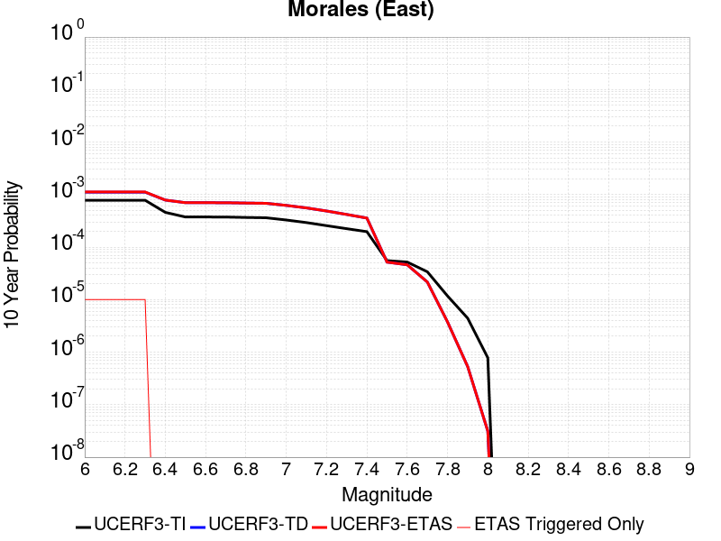 |

| Magnitude | 1 wk TI Prob | 1 wk TD Prob | 1 wk ETAS Prob | 1 wk ETAS/TD Gain | 1 wk ETAS Triggered Only | 1 mo TI Prob | 1 mo TD Prob | 1 mo ETAS Prob | 1 mo ETAS/TD Gain | 1 mo ETAS Triggered Only | 1 yr TI Prob | 1 yr TD Prob | 1 yr ETAS Prob | 1 yr ETAS/TD Gain | 1 yr ETAS Triggered Only | 10 yr TI Prob | 10 yr TD Prob | 10 yr ETAS Prob | 10 yr ETAS/TD Gain | 10 yr ETAS Triggered Only |
|-----|-----|-----|-----|-----|-----|-----|-----|-----|-----|-----|-----|-----|-----|-----|-----|-----|-----|-----|-----|-----|
| 6.0 | 1.4942771E-6 | 2.1295202E-6 | 2.1295202E-6 | 1.0 | 0.0 | 6.404029E-6 | 9.1264865E-6 | 9.1264865E-6 | 1.0 | 0.0 | 7.7966266E-5 | 1.1110989E-4 | 1.1110989E-4 | 1.0 | 0.0 | 7.793892E-4 | 0.0011106033 | 0.0011219839 | 1.0102471 | 1.1393155E-5 |
| 6.1 | 1.4942771E-6 | 2.1295202E-6 | 2.1295202E-6 | 1.0 | 0.0 | 6.404029E-6 | 9.1264865E-6 | 9.1264865E-6 | 1.0 | 0.0 | 7.7966266E-5 | 1.1110989E-4 | 1.1110989E-4 | 1.0 | 0.0 | 7.793892E-4 | 0.0011106033 | 0.0011219839 | 1.0102471 | 1.1393155E-5 |
| 6.2 | 1.4942771E-6 | 2.1295202E-6 | 2.1295202E-6 | 1.0 | 0.0 | 6.404029E-6 | 9.1264865E-6 | 9.1264865E-6 | 1.0 | 0.0 | 7.7966266E-5 | 1.1110989E-4 | 1.1110989E-4 | 1.0 | 0.0 | 7.793892E-4 | 0.0011106033 | 0.0011219839 | 1.0102471 | 1.1393155E-5 |
| 6.3 | 1.4942771E-6 | 2.1295202E-6 | 2.1295202E-6 | 1.0 | 0.0 | 6.404029E-6 | 9.1264865E-6 | 9.1264865E-6 | 1.0 | 0.0 | 7.7966266E-5 | 1.1110989E-4 | 1.1110989E-4 | 1.0 | 0.0 | 7.793892E-4 | 0.0011106033 | 0.0011219839 | 1.0102471 | 1.1393155E-5 |
| 6.4 | 8.798845E-7 | 1.5082984E-6 | 1.5082984E-6 | 1.0 | 0.0 | 3.7709283E-6 | 6.464121E-6 | 6.464121E-6 | 1.0 | 0.0 | 4.5910085E-5 | 7.8697936E-5 | 7.8697936E-5 | 1.0 | 0.0 | 4.59006E-4 | 7.867143E-4 | 7.867143E-4 | 1.0 | 0.0 |
| 6.5 | 7.1751725E-7 | 1.3444447E-6 | 1.3444447E-6 | 1.0 | 0.0 | 3.0750705E-6 | 5.761894E-6 | 5.761894E-6 | 1.0 | 0.0 | 3.7438338E-5 | 7.0148875E-5 | 7.0148875E-5 | 1.0 | 0.0 | 3.743203E-4 | 7.012777E-4 | 7.012777E-4 | 1.0 | 0.0 |
| 6.6 | 7.1751725E-7 | 1.3444447E-6 | 1.3444447E-6 | 1.0 | 0.0 | 3.0750705E-6 | 5.761894E-6 | 5.761894E-6 | 1.0 | 0.0 | 3.7438338E-5 | 7.0148875E-5 | 7.0148875E-5 | 1.0 | 0.0 | 3.743203E-4 | 7.012777E-4 | 7.012777E-4 | 1.0 | 0.0 |
| 6.7 | 7.159057E-7 | 1.3419075E-6 | 1.3419075E-6 | 1.0 | 0.0 | 3.0681638E-6 | 5.7510197E-6 | 5.7510197E-6 | 1.0 | 0.0 | 3.7354253E-5 | 7.001649E-5 | 7.001649E-5 | 1.0 | 0.0 | 3.7347974E-4 | 6.9995463E-4 | 6.9995463E-4 | 1.0 | 0.0 |
| 6.8 | 7.032203E-7 | 1.3234255E-6 | 1.3234255E-6 | 1.0 | 0.0 | 3.0137978E-6 | 5.671812E-6 | 5.671812E-6 | 1.0 | 0.0 | 3.669237E-5 | 6.90522E-5 | 6.90522E-5 | 1.0 | 0.0 | 3.6686313E-4 | 6.903177E-4 | 6.903177E-4 | 1.0 | 0.0 |
| 6.9 | 6.941549E-7 | 1.3084542E-6 | 1.3084542E-6 | 1.0 | 0.0 | 2.974946E-6 | 5.607649E-6 | 5.607649E-6 | 1.0 | 0.0 | 3.6219368E-5 | 6.827107E-5 | 6.827107E-5 | 1.0 | 0.0 | 3.6213463E-4 | 6.8251125E-4 | 6.8251125E-4 | 1.0 | 0.0 |
| 7.0 | 6.2932247E-7 | 1.1934353E-6 | 1.1934353E-6 | 1.0 | 0.0 | 2.6970936E-6 | 5.114713E-6 | 5.114713E-6 | 1.0 | 0.0 | 3.283662E-5 | 6.2269915E-5 | 6.2269915E-5 | 1.0 | 0.0 | 3.283177E-4 | 6.225337E-4 | 6.225337E-4 | 1.0 | 0.0 |
| 7.1 | 5.6200963E-7 | 1.0694599E-6 | 1.0694599E-6 | 1.0 | 0.0 | 2.4086105E-6 | 4.5833917E-6 | 4.5833917E-6 | 1.0 | 0.0 | 2.9324437E-5 | 5.5801414E-5 | 5.5801414E-5 | 1.0 | 0.0 | 2.9320567E-4 | 5.5788143E-4 | 5.5788143E-4 | 1.0 | 0.0 |
| 7.2 | 4.91044E-7 | 9.3369755E-7 | 9.3369755E-7 | 1.0 | 0.0 | 2.1044725E-6 | 4.0015548E-6 | 4.0015548E-6 | 1.0 | 0.0 | 2.5621652E-5 | 4.871788E-5 | 4.871788E-5 | 1.0 | 0.0 | 2.56187E-4 | 4.8707848E-4 | 4.8707848E-4 | 1.0 | 0.0 |
| 7.3 | 4.2978448E-7 | 8.0200795E-7 | 8.0200795E-7 | 1.0 | 0.0 | 1.8419321E-6 | 3.4371726E-6 | 3.4371726E-6 | 1.0 | 0.0 | 2.2425293E-5 | 4.1846804E-5 | 4.1846804E-5 | 1.0 | 0.0 | 2.242303E-4 | 4.1839504E-4 | 4.1839504E-4 | 1.0 | 0.0 |
| 7.4 | 3.774317E-7 | 6.848195E-7 | 6.848195E-7 | 1.0 | 0.0 | 1.6175634E-6 | 2.9349376E-6 | 2.9349376E-6 | 1.0 | 0.0 | 1.9693656E-5 | 3.5732308E-5 | 3.5732308E-5 | 1.0 | 0.0 | 1.969191E-4 | 3.5727106E-4 | 3.5727106E-4 | 1.0 | 0.0 |
| 7.5 | 1.0603232E-7 | 9.9235436E-8 | 9.9235436E-8 | 1.0 | 0.0 | 4.5442414E-7 | 4.2529467E-7 | 4.2529467E-7 | 1.0 | 0.0 | 5.5326E-6 | 5.1779502E-6 | 5.1779502E-6 | 1.0 | 0.0 | 5.532462E-5 | 5.178099E-5 | 5.178099E-5 | 1.0 | 0.0 |
| 7.6 | 9.960384E-8 | 8.8310465E-8 | 8.8310465E-8 | 1.0 | 0.0 | 4.2687353E-7 | 3.7847337E-7 | 3.7847337E-7 | 1.0 | 0.0 | 5.197173E-6 | 4.607904E-6 | 4.607904E-6 | 1.0 | 0.0 | 5.1970514E-5 | 4.608077E-5 | 4.608077E-5 | 1.0 | 0.0 |
| 7.7 | 6.499468E-8 | 4.1466343E-8 | 4.1466343E-8 | 1.0 | 0.0 | 2.785486E-7 | 1.7771289E-7 | 1.7771289E-7 | 1.0 | 0.0 | 3.3913238E-6 | 2.1636524E-6 | 2.1636524E-6 | 1.0 | 0.0 | 3.3912722E-5 | 2.1638994E-5 | 2.1638994E-5 | 1.0 | 0.0 |
| 7.8 | 2.2517119E-8 | 7.2155615E-9 | 7.2155615E-9 | 1.0 | 0.0 | 9.6501935E-8 | 3.0923836E-8 | 3.0923836E-8 | 1.0 | 0.0 | 1.1749105E-6 | 3.7649764E-7 | 3.7649764E-7 | 1.0 | 0.0 | 1.1749043E-5 | 3.7676268E-6 | 3.7676268E-6 | 1.0 | 0.0 |
| 7.9 | 8.493023E-9 | 1.0158611E-9 | 1.0158611E-9 | 1.0 | 0.0 | 3.639867E-8 | 4.3536907E-9 | 4.3536907E-9 | 1.0 | 0.0 | 4.4315374E-7 | 5.3006183E-8 | 5.3006183E-8 | 1.0 | 0.0 | 4.4315284E-6 | 5.322766E-7 | 5.322766E-7 | 1.0 | 0.0 |
| 8.0 | 1.4971842E-9 | 5.746492E-11 | 5.746492E-11 | 1.0 | 0.0 | 6.4165038E-9 | 2.4627866E-10 | 2.4627866E-10 | 1.0 | 0.0 | 7.812093E-8 | 2.9984437E-9 | 2.9984437E-9 | 1.0 | 0.0 | 7.81209E-7 | 3.129224E-8 | 3.129224E-8 | 1.0 | 0.0 |

## Elsinore (Temecula) rev
*[(top)](#table-of-contents)*

| 1 Week | 1 Month | 1 Year | 10 Year |
|-----|-----|-----|-----|
|  |  |  |  |

| Magnitude | 1 wk TI Prob | 1 wk TD Prob | 1 wk ETAS Prob | 1 wk ETAS/TD Gain | 1 wk ETAS Triggered Only | 1 mo TI Prob | 1 mo TD Prob | 1 mo ETAS Prob | 1 mo ETAS/TD Gain | 1 mo ETAS Triggered Only | 1 yr TI Prob | 1 yr TD Prob | 1 yr ETAS Prob | 1 yr ETAS/TD Gain | 1 yr ETAS Triggered Only | 10 yr TI Prob | 10 yr TD Prob | 10 yr ETAS Prob | 10 yr ETAS/TD Gain | 10 yr ETAS Triggered Only |
|-----|-----|-----|-----|-----|-----|-----|-----|-----|-----|-----|-----|-----|-----|-----|-----|-----|-----|-----|-----|-----|
| 6.0 | 2.9514995E-5 | 2.253612E-5 | 2.253612E-5 | 1.0 | 0.0 | 1.264867E-4 | 9.6579926E-5 | 9.6579926E-5 | 1.0 | 0.0 | 0.0015388876 | 0.0011752483 | 0.0011866281 | 1.0096829 | 1.1393155E-5 | 0.015282745 | 0.011701733 | 0.011712993 | 1.0009623 | 1.1393155E-5 |
| 6.1 | 2.9514995E-5 | 2.253612E-5 | 2.253612E-5 | 1.0 | 0.0 | 1.264867E-4 | 9.6579926E-5 | 9.6579926E-5 | 1.0 | 0.0 | 0.0015388876 | 0.0011752483 | 0.0011866281 | 1.0096829 | 1.1393155E-5 | 0.015282745 | 0.011701733 | 0.011712993 | 1.0009623 | 1.1393155E-5 |
| 6.2 | 2.9514995E-5 | 2.253612E-5 | 2.253612E-5 | 1.0 | 0.0 | 1.264867E-4 | 9.6579926E-5 | 9.6579926E-5 | 1.0 | 0.0 | 0.0015388876 | 0.0011752483 | 0.0011866281 | 1.0096829 | 1.1393155E-5 | 0.015282745 | 0.011701733 | 0.011712993 | 1.0009623 | 1.1393155E-5 |
| 6.3 | 2.3223649E-5 | 1.8420413E-5 | 1.8420413E-5 | 1.0 | 0.0 | 9.952613E-5 | 7.8942336E-5 | 7.8942336E-5 | 1.0 | 0.0 | 0.001211057 | 9.6071634E-4 | 9.7209855E-4 | 1.0118476 | 1.1393155E-5 | 0.012044783 | 0.00958644 | 0.009597724 | 1.0011771 | 1.1393155E-5 |
| 6.4 | 2.3223649E-5 | 1.8420413E-5 | 1.8420413E-5 | 1.0 | 0.0 | 9.952613E-5 | 7.8942336E-5 | 7.8942336E-5 | 1.0 | 0.0 | 0.001211057 | 9.6071634E-4 | 9.7209855E-4 | 1.0118476 | 1.1393155E-5 | 0.012044783 | 0.00958644 | 0.009597724 | 1.0011771 | 1.1393155E-5 |
| 6.5 | 1.8338875E-5 | 1.476089E-5 | 1.476089E-5 | 1.0 | 0.0 | 7.8592806E-5 | 6.3259475E-5 | 6.3259475E-5 | 1.0 | 0.0 | 9.5644733E-4 | 7.699207E-4 | 7.813051E-4 | 1.0147865 | 1.1393155E-5 | 0.009523412 | 0.007687971 | 0.007699277 | 1.0014706 | 1.1393155E-5 |
| 6.6 | 1.8223333E-5 | 1.4623386E-5 | 1.4623386E-5 | 1.0 | 0.0 | 7.809766E-5 | 6.2670195E-5 | 6.2670195E-5 | 1.0 | 0.0 | 9.504242E-4 | 7.627513E-4 | 7.7413575E-4 | 1.0149255 | 1.1393155E-5 | 0.009463696 | 0.00761677 | 0.0076280762 | 1.0014844 | 1.1393155E-5 |
| 6.7 | 1.7512752E-5 | 1.4037719E-5 | 1.4037719E-5 | 1.0 | 0.0 | 7.505249E-5 | 6.0160313E-5 | 6.0160313E-5 | 1.0 | 0.0 | 9.13381E-4 | 7.3221425E-4 | 7.43599E-4 | 1.0155485 | 1.1393155E-5 | 0.00909636 | 0.0073046805 | 0.0073159905 | 1.0015483 | 1.1393155E-5 |
| 6.8 | 1.7417142E-5 | 1.3961668E-5 | 1.3961668E-5 | 1.0 | 0.0 | 7.4642754E-5 | 5.9834398E-5 | 5.9834398E-5 | 1.0 | 0.0 | 9.083966E-4 | 7.2824885E-4 | 7.3963375E-4 | 1.0156332 | 1.1393155E-5 | 0.009046922 | 0.007264553 | 0.0072758636 | 1.0015569 | 1.1393155E-5 |
| 6.9 | 1.6402591E-5 | 1.2998666E-5 | 1.2998666E-5 | 1.0 | 0.0 | 7.0294926E-5 | 5.570742E-5 | 5.570742E-5 | 1.0 | 0.0 | 8.5550465E-4 | 6.780345E-4 | 6.894199E-4 | 1.0167918 | 1.1393155E-5 | 0.008522186 | 0.006765701 | 0.006777017 | 1.0016725 | 1.1393155E-5 |
| 7.0 | 1.3912486E-5 | 1.088713E-5 | 1.088713E-5 | 1.0 | 0.0 | 5.9623577E-5 | 4.665831E-5 | 4.665831E-5 | 1.0 | 0.0 | 7.2567526E-4 | 5.679196E-4 | 5.793063E-4 | 1.0200498 | 1.1393155E-5 | 0.0072331014 | 0.00566878 | 0.005680108 | 1.0019984 | 1.1393155E-5 |
| 7.1 | 1.3405147E-5 | 1.0335882E-5 | 1.0335882E-5 | 1.0 | 0.0 | 5.7449364E-5 | 4.42959E-5 | 4.42959E-5 | 1.0 | 0.0 | 6.9922156E-4 | 5.391717E-4 | 5.505587E-4 | 1.0211195 | 1.1393155E-5 | 0.0069702556 | 0.005381785 | 0.0053931167 | 1.0021056 | 1.1393155E-5 |
| 7.2 | 1.21402E-5 | 9.0040585E-6 | 9.0040585E-6 | 1.0 | 0.0 | 5.202839E-5 | 3.858826E-5 | 3.858826E-5 | 1.0 | 0.0 | 6.332616E-4 | 4.6971257E-4 | 4.8110037E-4 | 1.0242442 | 1.1393155E-5 | 0.0063146 | 0.004688504 | 0.004699844 | 1.0024186 | 1.1393155E-5 |
| 7.3 | 1.05047775E-5 | 7.577904E-6 | 7.577904E-6 | 1.0 | 0.0 | 4.5019697E-5 | 3.2476335E-5 | 3.2476335E-5 | 1.0 | 0.0 | 5.4797693E-4 | 3.9532912E-4 | 4.0671777E-4 | 1.028808 | 1.1393155E-5 | 0.005466277 | 0.0039466177 | 0.003957966 | 1.0028754 | 1.1393155E-5 |
| 7.4 | 9.624483E-6 | 6.7923206E-6 | 6.7923206E-6 | 1.0 | 0.0 | 4.124713E-5 | 2.9109628E-5 | 2.9109628E-5 | 1.0 | 0.0 | 5.0206814E-4 | 3.5435348E-4 | 3.5435348E-4 | 1.0 | 0.0 | 0.005009353 | 0.003538042 | 0.003538042 | 1.0 | 0.0 |
| 7.5 | 8.215151E-6 | 5.64005E-6 | 5.64005E-6 | 1.0 | 0.0 | 3.5207315E-5 | 2.4171426E-5 | 2.4171426E-5 | 1.0 | 0.0 | 4.2856473E-4 | 2.9424866E-4 | 2.9424866E-4 | 1.0 | 0.0 | 0.004277392 | 0.0029387185 | 0.0029387185 | 1.0 | 0.0 |
| 7.6 | 6.975058E-6 | 4.6800064E-6 | 4.6800064E-6 | 1.0 | 0.0 | 2.9892764E-5 | 2.0057023E-5 | 2.0057023E-5 | 1.0 | 0.0 | 3.6388362E-4 | 2.4416807E-4 | 2.4416807E-4 | 1.0 | 0.0 | 0.0036328835 | 0.0024391143 | 0.0024391143 | 1.0 | 0.0 |
| 7.7 | 4.159604E-6 | 2.3291004E-6 | 2.3291004E-6 | 1.0 | 0.0 | 1.7826753E-5 | 9.981824E-6 | 9.981824E-6 | 1.0 | 0.0 | 2.1701909E-4 | 1.2152268E-4 | 1.2152268E-4 | 1.0 | 0.0 | 0.0021680726 | 0.0012146354 | 0.0012146354 | 1.0 | 0.0 |
| 7.8 | 2.2692414E-7 | 9.3929124E-8 | 9.3929124E-8 | 1.0 | 0.0 | 9.725317E-7 | 4.0255333E-7 | 4.0255333E-7 | 1.0 | 0.0 | 1.1840509E-5 | 4.901079E-6 | 4.901079E-6 | 1.0 | 0.0 | 1.1839878E-4 | 4.901004E-5 | 4.901004E-5 | 1.0 | 0.0 |
| 7.9 | 6.676829E-9 | 3.4418608E-9 | 3.4418608E-9 | 1.0 | 0.0 | 2.861498E-8 | 1.4750832E-8 | 1.4750832E-8 | 1.0 | 0.0 | 3.4838732E-7 | 1.7959135E-7 | 1.7959135E-7 | 1.0 | 0.0 | 3.4838679E-6 | 1.7959123E-6 | 1.7959123E-6 | 1.0 | 0.0 |

## Elmore Ranch
*[(top)](#table-of-contents)*

| 1 Week | 1 Month | 1 Year | 10 Year |
|-----|-----|-----|-----|
|  |  |  | 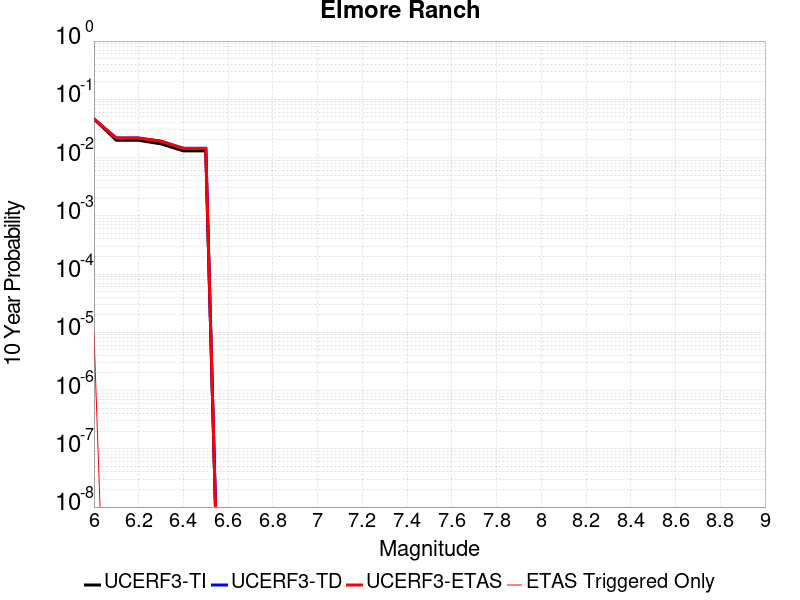 |

| Magnitude | 1 wk TI Prob | 1 wk TD Prob | 1 wk ETAS Prob | 1 wk ETAS/TD Gain | 1 wk ETAS Triggered Only | 1 mo TI Prob | 1 mo TD Prob | 1 mo ETAS Prob | 1 mo ETAS/TD Gain | 1 mo ETAS Triggered Only | 1 yr TI Prob | 1 yr TD Prob | 1 yr ETAS Prob | 1 yr ETAS/TD Gain | 1 yr ETAS Triggered Only | 10 yr TI Prob | 10 yr TD Prob | 10 yr ETAS Prob | 10 yr ETAS/TD Gain | 10 yr ETAS Triggered Only |
|-----|-----|-----|-----|-----|-----|-----|-----|-----|-----|-----|-----|-----|-----|-----|-----|-----|-----|-----|-----|-----|
| 6.0 | 9.102099E-5 | 8.9626745E-5 | 8.9626745E-5 | 1.0 | 0.0 | 3.9003167E-4 | 3.840592E-4 | 3.840592E-4 | 1.0 | 0.0 | 0.0047383 | 0.0046666493 | 0.0046666493 | 1.0 | 0.0 | 0.046385348 | 0.045887362 | 0.045898233 | 1.0002369 | 1.1393155E-5 |
| 6.1 | 3.8306698E-5 | 4.1533815E-5 | 4.1533815E-5 | 1.0 | 0.0 | 1.6416123E-4 | 1.7799016E-4 | 1.7799016E-4 | 1.0 | 0.0 | 0.0019968306 | 0.0021653408 | 0.0021653408 | 1.0 | 0.0 | 0.019789828 | 0.021622965 | 0.021622965 | 1.0 | 0.0 |
| 6.2 | 3.8306698E-5 | 4.1533815E-5 | 4.1533815E-5 | 1.0 | 0.0 | 1.6416123E-4 | 1.7799016E-4 | 1.7799016E-4 | 1.0 | 0.0 | 0.0019968306 | 0.0021653408 | 0.0021653408 | 1.0 | 0.0 | 0.019789828 | 0.021622965 | 0.021622965 | 1.0 | 0.0 |
| 6.3 | 3.3197924E-5 | 3.658413E-5 | 3.658413E-5 | 1.0 | 0.0 | 1.4226905E-4 | 1.5678069E-4 | 1.5678069E-4 | 1.0 | 0.0 | 0.0017307495 | 0.0019076922 | 0.0019076922 | 1.0 | 0.0 | 0.017173318 | 0.019081721 | 0.019081721 | 1.0 | 0.0 |
| 6.4 | 2.5148964E-5 | 2.744243E-5 | 2.744243E-5 | 1.0 | 0.0 | 1.0777682E-4 | 1.1760877E-4 | 1.1760877E-4 | 1.0 | 0.0 | 0.0013113929 | 0.0014315953 | 0.0014315953 | 1.0 | 0.0 | 0.01303681 | 0.014382674 | 0.014382674 | 1.0 | 0.0 |
| 6.5 | 2.5148964E-5 | 2.744243E-5 | 2.744243E-5 | 1.0 | 0.0 | 1.0777682E-4 | 1.1760877E-4 | 1.1760877E-4 | 1.0 | 0.0 | 0.0013113929 | 0.0014315953 | 0.0014315953 | 1.0 | 0.0 | 0.01303681 | 0.014382674 | 0.014382674 | 1.0 | 0.0 |

## San Gregorio (South) 2011 CFM
*[(top)](#table-of-contents)*

| 1 Week | 1 Month | 1 Year | 10 Year |
|-----|-----|-----|-----|
|  |  |  |  |

| Magnitude | 1 wk TI Prob | 1 wk TD Prob | 1 wk ETAS Prob | 1 wk ETAS/TD Gain | 1 wk ETAS Triggered Only | 1 mo TI Prob | 1 mo TD Prob | 1 mo ETAS Prob | 1 mo ETAS/TD Gain | 1 mo ETAS Triggered Only | 1 yr TI Prob | 1 yr TD Prob | 1 yr ETAS Prob | 1 yr ETAS/TD Gain | 1 yr ETAS Triggered Only | 10 yr TI Prob | 10 yr TD Prob | 10 yr ETAS Prob | 10 yr ETAS/TD Gain | 10 yr ETAS Triggered Only |
|-----|-----|-----|-----|-----|-----|-----|-----|-----|-----|-----|-----|-----|-----|-----|-----|-----|-----|-----|-----|-----|
| 6.0 | 1.8770423E-5 | 1.6291548E-5 | 1.6291548E-5 | 1.0 | 0.0 | 8.044219E-5 | 6.981907E-5 | 6.981907E-5 | 1.0 | 0.0 | 9.789435E-4 | 8.497195E-4 | 8.497195E-4 | 1.0 | 0.0 | 0.009746423 | 0.0084775975 | 0.0084888935 | 1.0013325 | 1.1393155E-5 |
| 6.1 | 1.8770423E-5 | 1.6291548E-5 | 1.6291548E-5 | 1.0 | 0.0 | 8.044219E-5 | 6.981907E-5 | 6.981907E-5 | 1.0 | 0.0 | 9.789435E-4 | 8.497195E-4 | 8.497195E-4 | 1.0 | 0.0 | 0.009746423 | 0.0084775975 | 0.0084888935 | 1.0013325 | 1.1393155E-5 |
| 6.2 | 1.7508692E-5 | 1.4910754E-5 | 1.4910754E-5 | 1.0 | 0.0 | 7.5035096E-5 | 6.390168E-5 | 6.390168E-5 | 1.0 | 0.0 | 9.1316935E-4 | 7.777283E-4 | 7.777283E-4 | 1.0 | 0.0 | 0.00909426 | 0.007762874 | 0.007774179 | 1.0014563 | 1.1393155E-5 |
| 6.3 | 1.7508692E-5 | 1.4910754E-5 | 1.4910754E-5 | 1.0 | 0.0 | 7.5035096E-5 | 6.390168E-5 | 6.390168E-5 | 1.0 | 0.0 | 9.1316935E-4 | 7.777283E-4 | 7.777283E-4 | 1.0 | 0.0 | 0.00909426 | 0.007762874 | 0.007774179 | 1.0014563 | 1.1393155E-5 |
| 6.4 | 1.6004591E-5 | 1.326022E-5 | 1.326022E-5 | 1.0 | 0.0 | 6.85893E-5 | 5.682828E-5 | 5.682828E-5 | 1.0 | 0.0 | 8.347548E-4 | 6.9166574E-4 | 6.9166574E-4 | 1.0 | 0.0 | 0.008316261 | 0.0069077383 | 0.006919053 | 1.0016379 | 1.1393155E-5 |
| 6.5 | 1.6004591E-5 | 1.326022E-5 | 1.326022E-5 | 1.0 | 0.0 | 6.85893E-5 | 5.682828E-5 | 5.682828E-5 | 1.0 | 0.0 | 8.347548E-4 | 6.9166574E-4 | 6.9166574E-4 | 1.0 | 0.0 | 0.008316261 | 0.0069077383 | 0.006919053 | 1.0016379 | 1.1393155E-5 |
| 6.6 | 1.5442201E-5 | 1.2644717E-5 | 1.2644717E-5 | 1.0 | 0.0 | 6.617918E-5 | 5.4190525E-5 | 5.4190525E-5 | 1.0 | 0.0 | 8.0543366E-4 | 6.5957074E-4 | 6.5957074E-4 | 1.0 | 0.0 | 0.008025207 | 0.006588722 | 0.0066000405 | 1.0017178 | 1.1393155E-5 |
| 6.7 | 1.489921E-5 | 1.2053104E-5 | 1.2053104E-5 | 1.0 | 0.0 | 6.3852196E-5 | 5.165514E-5 | 5.165514E-5 | 1.0 | 0.0 | 7.7712315E-4 | 6.2872056E-4 | 6.2872056E-4 | 1.0 | 0.0 | 0.0077441116 | 0.006281994 | 0.0062933154 | 1.0018022 | 1.1393155E-5 |
| 6.8 | 1.3876024E-5 | 1.0931805E-5 | 1.0931805E-5 | 1.0 | 0.0 | 5.9467322E-5 | 4.6849753E-5 | 4.6849753E-5 | 1.0 | 0.0 | 7.237741E-4 | 5.7024683E-4 | 5.7024683E-4 | 1.0 | 0.0 | 0.0072142133 | 0.005700377 | 0.005700377 | 1.0 | 0.0 |
| 6.9 | 1.33922495E-5 | 1.0403193E-5 | 1.0403193E-5 | 1.0 | 0.0 | 5.7394092E-5 | 4.4584354E-5 | 4.4584354E-5 | 1.0 | 0.0 | 6.9854903E-4 | 5.4267957E-4 | 5.4267957E-4 | 1.0 | 0.0 | 0.0069635725 | 0.0054260767 | 0.0054260767 | 1.0 | 0.0 |
| 7.0 | 1.2807324E-5 | 9.763014E-6 | 9.763014E-6 | 1.0 | 0.0 | 5.4887376E-5 | 4.184082E-5 | 4.184082E-5 | 1.0 | 0.0 | 6.680489E-4 | 5.0929305E-4 | 5.0929305E-4 | 1.0 | 0.0 | 0.006660442 | 0.005093784 | 0.005093784 | 1.0 | 0.0 |
| 7.1 | 1.2191438E-5 | 9.071702E-6 | 9.071702E-6 | 1.0 | 0.0 | 5.224797E-5 | 3.8878145E-5 | 3.8878145E-5 | 1.0 | 0.0 | 6.3593336E-4 | 4.732387E-4 | 4.732387E-4 | 1.0 | 0.0 | 0.0063411663 | 0.0047348263 | 0.0047348263 | 1.0 | 0.0 |
| 7.2 | 1.1769438E-5 | 8.591742E-6 | 8.591742E-6 | 1.0 | 0.0 | 5.0439474E-5 | 3.682123E-5 | 3.682123E-5 | 1.0 | 0.0 | 6.1392755E-4 | 4.4820632E-4 | 4.4820632E-4 | 1.0 | 0.0 | 0.0061223423 | 0.0044855396 | 0.0044855396 | 1.0 | 0.0 |
| 7.3 | 1.150374E-5 | 8.307116E-6 | 8.307116E-6 | 1.0 | 0.0 | 4.9300812E-5 | 3.5601443E-5 | 3.5601443E-5 | 1.0 | 0.0 | 6.0007203E-4 | 4.3336142E-4 | 4.3336142E-4 | 1.0 | 0.0 | 0.0059845424 | 0.0043376596 | 0.0043376596 | 1.0 | 0.0 |
| 7.4 | 1.12514E-5 | 8.052779E-6 | 8.052779E-6 | 1.0 | 0.0 | 4.8219394E-5 | 3.4511453E-5 | 3.4511453E-5 | 1.0 | 0.0 | 5.8691297E-4 | 4.2009598E-4 | 4.2009598E-4 | 1.0 | 0.0 | 0.005853653 | 0.0042054965 | 0.0042054965 | 1.0 | 0.0 |
| 7.5 | 1.059696E-5 | 7.4027116E-6 | 7.4027116E-6 | 1.0 | 0.0 | 4.5414752E-5 | 3.172552E-5 | 3.172552E-5 | 1.0 | 0.0 | 5.5278436E-4 | 3.8618981E-4 | 3.8618981E-4 | 1.0 | 0.0 | 0.0055141128 | 0.00386762 | 0.00386762 | 1.0 | 0.0 |
| 7.6 | 9.018592E-6 | 5.845837E-6 | 5.845837E-6 | 1.0 | 0.0 | 3.8650534E-5 | 2.5053347E-5 | 2.5053347E-5 | 1.0 | 0.0 | 4.7046866E-4 | 3.0498183E-4 | 3.0498183E-4 | 1.0 | 0.0 | 0.004694739 | 0.0030576999 | 0.0030576999 | 1.0 | 0.0 |
| 7.7 | 6.243489E-6 | 3.2467533E-6 | 3.2467533E-6 | 1.0 | 0.0 | 2.6757538E-5 | 1.3914583E-5 | 1.3914583E-5 | 1.0 | 0.0 | 3.257243E-4 | 1.6939688E-4 | 1.6939688E-4 | 1.0 | 0.0 | 0.003252473 | 0.001702977 | 0.001702977 | 1.0 | 0.0 |
| 7.8 | 3.1941963E-6 | 1.3854745E-6 | 1.3854745E-6 | 1.0 | 0.0 | 1.368934E-5 | 5.9377344E-6 | 5.9377344E-6 | 1.0 | 0.0 | 1.6665498E-4 | 7.228952E-5 | 7.228952E-5 | 1.0 | 0.0 | 0.0016653005 | 7.2870665E-4 | 7.2870665E-4 | 1.0 | 0.0 |
| 7.9 | 2.0098398E-6 | 6.949333E-7 | 6.949333E-7 | 1.0 | 0.0 | 8.6135715E-6 | 2.978282E-6 | 2.978282E-6 | 1.0 | 0.0 | 1.0486518E-4 | 3.625998E-5 | 3.625998E-5 | 1.0 | 0.0 | 0.0010481571 | 3.674913E-4 | 3.674913E-4 | 1.0 | 0.0 |
| 8.0 | 8.353119E-7 | 3.1779842E-7 | 3.1779842E-7 | 1.0 | 0.0 | 3.579903E-6 | 1.3619925E-6 | 1.3619925E-6 | 1.0 | 0.0 | 4.358445E-5 | 1.6582133E-5 | 1.6582133E-5 | 1.0 | 0.0 | 4.3575902E-4 | 1.6701182E-4 | 1.6701182E-4 | 1.0 | 0.0 |
| 8.1 | 1.5033264E-7 | 6.554233E-8 | 6.554233E-8 | 1.0 | 0.0 | 6.442826E-7 | 2.8089568E-7 | 2.8089568E-7 | 1.0 | 0.0 | 7.844113E-6 | 3.4198995E-6 | 3.4198995E-6 | 1.0 | 0.0 | 7.843835E-5 | 3.4216093E-5 | 3.4216093E-5 | 1.0 | 0.0 |

## Hunting Creek - Berryessa 2011 CFM
*[(top)](#table-of-contents)*

| 1 Week | 1 Month | 1 Year | 10 Year |
|-----|-----|-----|-----|
| 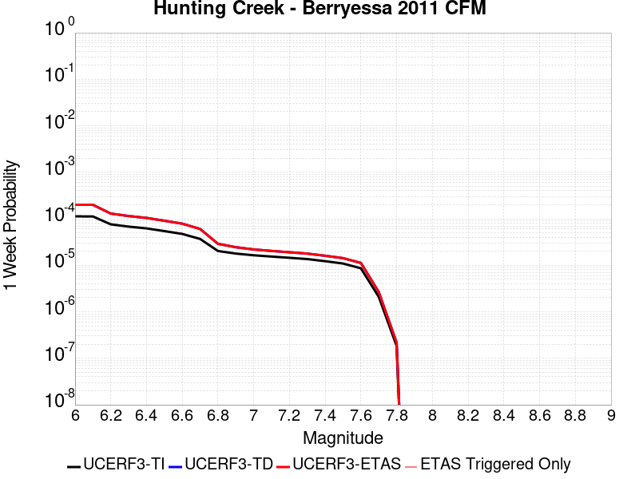 |  | 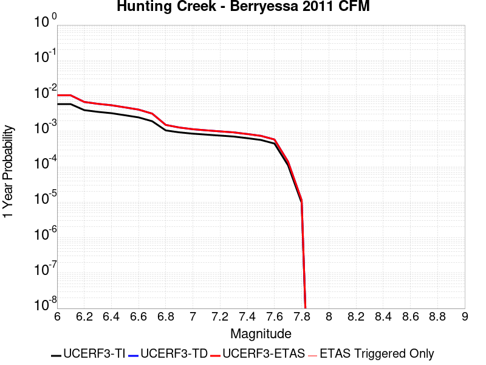 |  |

| Magnitude | 1 wk TI Prob | 1 wk TD Prob | 1 wk ETAS Prob | 1 wk ETAS/TD Gain | 1 wk ETAS Triggered Only | 1 mo TI Prob | 1 mo TD Prob | 1 mo ETAS Prob | 1 mo ETAS/TD Gain | 1 mo ETAS Triggered Only | 1 yr TI Prob | 1 yr TD Prob | 1 yr ETAS Prob | 1 yr ETAS/TD Gain | 1 yr ETAS Triggered Only | 10 yr TI Prob | 10 yr TD Prob | 10 yr ETAS Prob | 10 yr ETAS/TD Gain | 10 yr ETAS Triggered Only |
|-----|-----|-----|-----|-----|-----|-----|-----|-----|-----|-----|-----|-----|-----|-----|-----|-----|-----|-----|-----|-----|
| 6.0 | 1.1270982E-4 | 2.0046889E-4 | 2.0046889E-4 | 1.0 | 0.0 | 4.8295266E-4 | 8.587646E-4 | 8.587646E-4 | 1.0 | 0.0 | 0.0058641075 | 0.010395558 | 0.010395558 | 1.0 | 0.0 | 0.057117578 | 0.09811872 | 0.098129 | 1.0001047 | 1.1393155E-5 |
| 6.1 | 1.1239393E-4 | 1.999498E-4 | 1.999498E-4 | 1.0 | 0.0 | 4.8159933E-4 | 8.5654156E-4 | 8.5654156E-4 | 1.0 | 0.0 | 0.0058477195 | 0.0103687765 | 0.0103687765 | 1.0 | 0.0 | 0.056962132 | 0.097876996 | 0.09788727 | 1.000105 | 1.1393155E-5 |
| 6.2 | 7.596265E-5 | 1.2946293E-4 | 1.2946293E-4 | 1.0 | 0.0 | 3.2551357E-4 | 5.5470574E-4 | 5.5470574E-4 | 1.0 | 0.0 | 0.0039559277 | 0.0067280144 | 0.0067280144 | 1.0 | 0.0 | 0.038862433 | 0.06465001 | 0.06465001 | 1.0 | 0.0 |
| 6.3 | 6.78794E-5 | 1.1459746E-4 | 1.1459746E-4 | 1.0 | 0.0 | 2.9087928E-4 | 4.910299E-4 | 4.910299E-4 | 1.0 | 0.0 | 0.003535705 | 0.005958668 | 0.005958668 | 1.0 | 0.0 | 0.034799766 | 0.057518788 | 0.057518788 | 1.0 | 0.0 |
| 6.4 | 6.2165134E-5 | 1.0445682E-4 | 1.0445682E-4 | 1.0 | 0.0 | 2.6639478E-4 | 4.4758598E-4 | 4.4758598E-4 | 1.0 | 0.0 | 0.0032385332 | 0.0054330784 | 0.0054330784 | 1.0 | 0.0 | 0.03191742 | 0.052601237 | 0.052601237 | 1.0 | 0.0 |
| 6.5 | 5.4368087E-5 | 9.080262E-5 | 9.080262E-5 | 1.0 | 0.0 | 2.3298527E-4 | 3.8908646E-4 | 3.8908646E-4 | 1.0 | 0.0 | 0.0028329059 | 0.004724869 | 0.004724869 | 1.0 | 0.0 | 0.027970633 | 0.045926675 | 0.045926675 | 1.0 | 0.0 |
| 6.6 | 4.729947E-5 | 7.8552395E-5 | 7.8552395E-5 | 1.0 | 0.0 | 2.0269625E-4 | 3.3659991E-4 | 3.3659991E-4 | 1.0 | 0.0 | 0.002465034 | 0.0040889867 | 0.0040889867 | 1.0 | 0.0 | 0.02437869 | 0.039890103 | 0.039890103 | 1.0 | 0.0 |
| 6.7 | 3.6875328E-5 | 6.0510494E-5 | 6.0510494E-5 | 1.0 | 0.0 | 1.5802756E-4 | 2.593074E-4 | 2.593074E-4 | 1.0 | 0.0 | 0.0019222875 | 0.0031518096 | 0.0031518096 | 1.0 | 0.0 | 0.019057442 | 0.030925045 | 0.030925045 | 1.0 | 0.0 |
| 6.8 | 2.0292036E-5 | 2.8993138E-5 | 2.8993138E-5 | 1.0 | 0.0 | 8.6962966E-5 | 1.2425036E-4 | 1.2425036E-4 | 1.0 | 0.0 | 0.0010582599 | 0.0015116856 | 0.0015116856 | 1.0 | 0.0 | 0.010532344 | 0.014987091 | 0.014987091 | 1.0 | 0.0 |
| 6.9 | 1.7871042E-5 | 2.448719E-5 | 2.448719E-5 | 1.0 | 0.0 | 7.658793E-5 | 1.0494089E-4 | 1.0494089E-4 | 1.0 | 0.0 | 9.320591E-4 | 0.001276906 | 0.001276906 | 1.0 | 0.0 | 0.009281595 | 0.012687645 | 0.012687645 | 1.0 | 0.0 |
| 7.0 | 1.6415532E-5 | 2.1920323E-5 | 2.1920323E-5 | 1.0 | 0.0 | 7.035038E-5 | 9.3940864E-5 | 9.3940864E-5 | 1.0 | 0.0 | 8.561793E-4 | 0.001143131 | 0.001143131 | 1.0 | 0.0 | 0.008528882 | 0.011371805 | 0.011371805 | 1.0 | 0.0 |
| 7.1 | 1.5409885E-5 | 2.0359845E-5 | 2.0359845E-5 | 1.0 | 0.0 | 6.6040695E-5 | 8.7253575E-5 | 8.7253575E-5 | 1.0 | 0.0 | 8.0374884E-4 | 0.0010617973 | 0.0010617973 | 1.0 | 0.0 | 0.00800848 | 0.010567706 | 0.010567706 | 1.0 | 0.0 |
| 7.2 | 1.4497423E-5 | 1.9067871E-5 | 1.9067871E-5 | 1.0 | 0.0 | 6.213033E-5 | 8.1716906E-5 | 8.1716906E-5 | 1.0 | 0.0 | 7.5617427E-4 | 9.944523E-4 | 9.944523E-4 | 1.0 | 0.0 | 0.0075360634 | 0.009900762 | 0.009900762 | 1.0 | 0.0 |
| 7.3 | 1.3615175E-5 | 1.7838613E-5 | 1.7838613E-5 | 1.0 | 0.0 | 5.8349444E-5 | 7.6448974E-5 | 7.6448974E-5 | 1.0 | 0.0 | 7.101729E-4 | 9.3037175E-4 | 9.3037175E-4 | 1.0 | 0.0 | 0.0070790765 | 0.009265545 | 0.009265545 | 1.0 | 0.0 |
| 7.4 | 1.2252825E-5 | 1.6037822E-5 | 1.6037822E-5 | 1.0 | 0.0 | 5.251105E-5 | 6.873173E-5 | 6.873173E-5 | 1.0 | 0.0 | 6.391345E-4 | 8.3649036E-4 | 8.3649036E-4 | 1.0 | 0.0 | 0.0063729943 | 0.008334056 | 0.008334056 | 1.0 | 0.0 |
| 7.5 | 1.0913301E-5 | 1.4251292E-5 | 1.4251292E-5 | 1.0 | 0.0 | 4.6770452E-5 | 6.107555E-5 | 6.107555E-5 | 1.0 | 0.0 | 5.6928146E-4 | 7.433439E-4 | 7.433439E-4 | 1.0 | 0.0 | 0.0056782532 | 0.0074091647 | 0.0074091647 | 1.0 | 0.0 |
| 7.6 | 8.623192E-6 | 1.1243386E-5 | 1.1243386E-5 | 1.0 | 0.0 | 3.6956015E-5 | 4.8185066E-5 | 4.8185066E-5 | 1.0 | 0.0 | 4.4984656E-4 | 5.8649783E-4 | 5.8649783E-4 | 1.0 | 0.0 | 0.00448937 | 0.005850074 | 0.005850074 | 1.0 | 0.0 |
| 7.7 | 2.0993634E-6 | 2.664365E-6 | 2.664365E-6 | 1.0 | 0.0 | 8.997241E-6 | 1.1418658E-5 | 1.1418658E-5 | 1.0 | 0.0 | 1.09535904E-4 | 1.3901335E-4 | 1.3901335E-4 | 1.0 | 0.0 | 0.0010948193 | 0.0013892625 | 0.0013892625 | 1.0 | 0.0 |
| 7.8 | 1.8428308E-7 | 2.173257E-7 | 2.173257E-7 | 1.0 | 0.0 | 7.897844E-7 | 9.3139556E-7 | 9.3139556E-7 | 1.0 | 0.0 | 9.615583E-6 | 1.1339685E-5 | 1.1339685E-5 | 1.0 | 0.0 | 9.615166E-5 | 1.13384194E-4 | 1.13384194E-4 | 1.0 | 0.0 |

## Robinson Creek
*[(top)](#table-of-contents)*

| 1 Week | 1 Month | 1 Year | 10 Year |
|-----|-----|-----|-----|
|  |  |  | 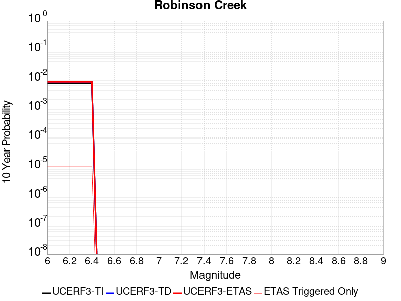 |

| Magnitude | 1 wk TI Prob | 1 wk TD Prob | 1 wk ETAS Prob | 1 wk ETAS/TD Gain | 1 wk ETAS Triggered Only | 1 mo TI Prob | 1 mo TD Prob | 1 mo ETAS Prob | 1 mo ETAS/TD Gain | 1 mo ETAS Triggered Only | 1 yr TI Prob | 1 yr TD Prob | 1 yr ETAS Prob | 1 yr ETAS/TD Gain | 1 yr ETAS Triggered Only | 10 yr TI Prob | 10 yr TD Prob | 10 yr ETAS Prob | 10 yr ETAS/TD Gain | 10 yr ETAS Triggered Only |
|-----|-----|-----|-----|-----|-----|-----|-----|-----|-----|-----|-----|-----|-----|-----|-----|-----|-----|-----|-----|-----|
| 6.0 | 1.3705327E-5 | 1.5289086E-5 | 1.5289086E-5 | 1.0 | 0.0 | 5.8735794E-5 | 6.5524655E-5 | 6.5524655E-5 | 1.0 | 0.0 | 7.1487366E-4 | 7.9776265E-4 | 7.9776265E-4 | 1.0 | 0.0 | 0.0071257832 | 0.007977626 | 0.007988929 | 1.0014168 | 1.1393155E-5 |
| 6.1 | 1.3705327E-5 | 1.5289086E-5 | 1.5289086E-5 | 1.0 | 0.0 | 5.8735794E-5 | 6.5524655E-5 | 6.5524655E-5 | 1.0 | 0.0 | 7.1487366E-4 | 7.9776265E-4 | 7.9776265E-4 | 1.0 | 0.0 | 0.0071257832 | 0.007977626 | 0.007988929 | 1.0014168 | 1.1393155E-5 |
| 6.2 | 1.3705327E-5 | 1.5289086E-5 | 1.5289086E-5 | 1.0 | 0.0 | 5.8735794E-5 | 6.5524655E-5 | 6.5524655E-5 | 1.0 | 0.0 | 7.1487366E-4 | 7.9776265E-4 | 7.9776265E-4 | 1.0 | 0.0 | 0.0071257832 | 0.007977626 | 0.007988929 | 1.0014168 | 1.1393155E-5 |
| 6.3 | 1.3705327E-5 | 1.5289086E-5 | 1.5289086E-5 | 1.0 | 0.0 | 5.8735794E-5 | 6.5524655E-5 | 6.5524655E-5 | 1.0 | 0.0 | 7.1487366E-4 | 7.9776265E-4 | 7.9776265E-4 | 1.0 | 0.0 | 0.0071257832 | 0.007977626 | 0.007988929 | 1.0014168 | 1.1393155E-5 |
| 6.4 | 1.3705327E-5 | 1.5289086E-5 | 1.5289086E-5 | 1.0 | 0.0 | 5.8735794E-5 | 6.5524655E-5 | 6.5524655E-5 | 1.0 | 0.0 | 7.1487366E-4 | 7.9776265E-4 | 7.9776265E-4 | 1.0 | 0.0 | 0.0071257832 | 0.007977626 | 0.007988929 | 1.0014168 | 1.1393155E-5 |

## Mono Lake 2011 CFM
*[(top)](#table-of-contents)*

| 1 Week | 1 Month | 1 Year | 10 Year |
|-----|-----|-----|-----|
|  |  | 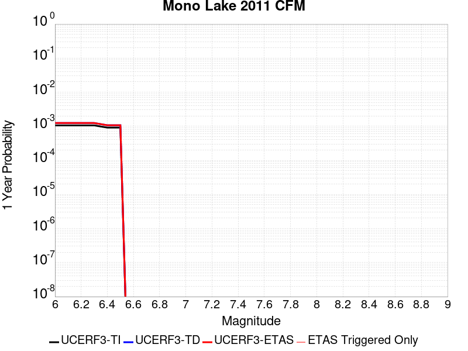 | 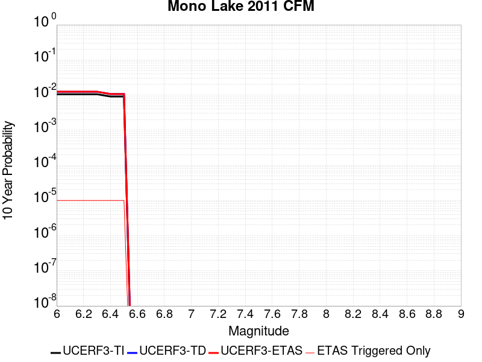 |

| Magnitude | 1 wk TI Prob | 1 wk TD Prob | 1 wk ETAS Prob | 1 wk ETAS/TD Gain | 1 wk ETAS Triggered Only | 1 mo TI Prob | 1 mo TD Prob | 1 mo ETAS Prob | 1 mo ETAS/TD Gain | 1 mo ETAS Triggered Only | 1 yr TI Prob | 1 yr TD Prob | 1 yr ETAS Prob | 1 yr ETAS/TD Gain | 1 yr ETAS Triggered Only | 10 yr TI Prob | 10 yr TD Prob | 10 yr ETAS Prob | 10 yr ETAS/TD Gain | 10 yr ETAS Triggered Only |
|-----|-----|-----|-----|-----|-----|-----|-----|-----|-----|-----|-----|-----|-----|-----|-----|-----|-----|-----|-----|-----|
| 6.0 | 2.0341662E-5 | 2.3837632E-5 | 2.3837632E-5 | 1.0 | 0.0 | 8.717564E-5 | 1.0216028E-4 | 1.0216028E-4 | 1.0 | 0.0 | 0.0010608466 | 0.0012436231 | 0.0012436231 | 1.0 | 0.0 | 0.010557966 | 0.012418749 | 0.01243 | 1.000906 | 1.1393155E-5 |
| 6.1 | 2.0341662E-5 | 2.3837632E-5 | 2.3837632E-5 | 1.0 | 0.0 | 8.717564E-5 | 1.0216028E-4 | 1.0216028E-4 | 1.0 | 0.0 | 0.0010608466 | 0.0012436231 | 0.0012436231 | 1.0 | 0.0 | 0.010557966 | 0.012418749 | 0.01243 | 1.000906 | 1.1393155E-5 |
| 6.2 | 2.0341662E-5 | 2.3837632E-5 | 2.3837632E-5 | 1.0 | 0.0 | 8.717564E-5 | 1.0216028E-4 | 1.0216028E-4 | 1.0 | 0.0 | 0.0010608466 | 0.0012436231 | 0.0012436231 | 1.0 | 0.0 | 0.010557966 | 0.012418749 | 0.01243 | 1.000906 | 1.1393155E-5 |
| 6.3 | 2.0341662E-5 | 2.3837632E-5 | 2.3837632E-5 | 1.0 | 0.0 | 8.717564E-5 | 1.0216028E-4 | 1.0216028E-4 | 1.0 | 0.0 | 0.0010608466 | 0.0012436231 | 0.0012436231 | 1.0 | 0.0 | 0.010557966 | 0.012418749 | 0.01243 | 1.000906 | 1.1393155E-5 |
| 6.4 | 1.749821E-5 | 2.0499112E-5 | 2.0499112E-5 | 1.0 | 0.0 | 7.499018E-5 | 8.785334E-5 | 8.785334E-5 | 1.0 | 0.0 | 9.1262296E-4 | 0.001069614 | 0.001069614 | 1.0 | 0.0 | 0.009088841 | 0.0106960945 | 0.010707366 | 1.0010538 | 1.1393155E-5 |
| 6.5 | 1.749821E-5 | 2.0499112E-5 | 2.0499112E-5 | 1.0 | 0.0 | 7.499018E-5 | 8.785334E-5 | 8.785334E-5 | 1.0 | 0.0 | 9.1262296E-4 | 0.001069614 | 0.001069614 | 1.0 | 0.0 | 0.009088841 | 0.0106960945 | 0.010707366 | 1.0010538 | 1.1393155E-5 |

## Sierra Madre
*[(top)](#table-of-contents)*

| 1 Week | 1 Month | 1 Year | 10 Year |
|-----|-----|-----|-----|
|  |  | 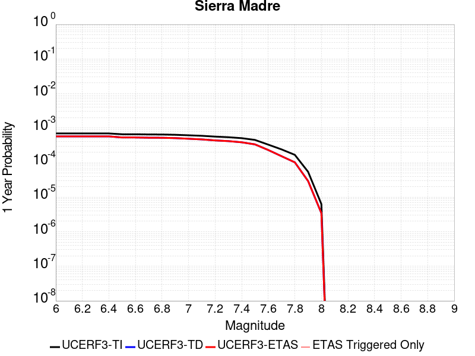 |  |

| Magnitude | 1 wk TI Prob | 1 wk TD Prob | 1 wk ETAS Prob | 1 wk ETAS/TD Gain | 1 wk ETAS Triggered Only | 1 mo TI Prob | 1 mo TD Prob | 1 mo ETAS Prob | 1 mo ETAS/TD Gain | 1 mo ETAS Triggered Only | 1 yr TI Prob | 1 yr TD Prob | 1 yr ETAS Prob | 1 yr ETAS/TD Gain | 1 yr ETAS Triggered Only | 10 yr TI Prob | 10 yr TD Prob | 10 yr ETAS Prob | 10 yr ETAS/TD Gain | 10 yr ETAS Triggered Only |
|-----|-----|-----|-----|-----|-----|-----|-----|-----|-----|-----|-----|-----|-----|-----|-----|-----|-----|-----|-----|-----|
| 6.0 | 1.3379373E-5 | 1.1006724E-5 | 1.1006724E-5 | 1.0 | 0.0 | 5.7338908E-5 | 4.717083E-5 | 4.717083E-5 | 1.0 | 0.0 | 6.978776E-4 | 5.74155E-4 | 5.74155E-4 | 1.0 | 0.0 | 0.0069569005 | 0.0057272096 | 0.0057385373 | 1.0019779 | 1.1393155E-5 |
| 6.1 | 1.3379373E-5 | 1.1006724E-5 | 1.1006724E-5 | 1.0 | 0.0 | 5.7338908E-5 | 4.717083E-5 | 4.717083E-5 | 1.0 | 0.0 | 6.978776E-4 | 5.74155E-4 | 5.74155E-4 | 1.0 | 0.0 | 0.0069569005 | 0.0057272096 | 0.0057385373 | 1.0019779 | 1.1393155E-5 |
| 6.2 | 1.3379373E-5 | 1.1006724E-5 | 1.1006724E-5 | 1.0 | 0.0 | 5.7338908E-5 | 4.717083E-5 | 4.717083E-5 | 1.0 | 0.0 | 6.978776E-4 | 5.74155E-4 | 5.74155E-4 | 1.0 | 0.0 | 0.0069569005 | 0.0057272096 | 0.0057385373 | 1.0019779 | 1.1393155E-5 |
| 6.3 | 1.3379373E-5 | 1.1006724E-5 | 1.1006724E-5 | 1.0 | 0.0 | 5.7338908E-5 | 4.717083E-5 | 4.717083E-5 | 1.0 | 0.0 | 6.978776E-4 | 5.74155E-4 | 5.74155E-4 | 1.0 | 0.0 | 0.0069569005 | 0.0057272096 | 0.0057385373 | 1.0019779 | 1.1393155E-5 |
| 6.4 | 1.3379373E-5 | 1.1006724E-5 | 1.1006724E-5 | 1.0 | 0.0 | 5.7338908E-5 | 4.717083E-5 | 4.717083E-5 | 1.0 | 0.0 | 6.978776E-4 | 5.74155E-4 | 5.74155E-4 | 1.0 | 0.0 | 0.0069569005 | 0.0057272096 | 0.0057385373 | 1.0019779 | 1.1393155E-5 |
| 6.5 | 1.26563245E-5 | 1.0236063E-5 | 1.0236063E-5 | 1.0 | 0.0 | 5.4240263E-5 | 4.386811E-5 | 4.386811E-5 | 1.0 | 0.0 | 6.601751E-4 | 5.339644E-4 | 5.339644E-4 | 1.0 | 0.0 | 0.006582173 | 0.0053272652 | 0.005338598 | 1.0021273 | 1.1393155E-5 |
| 6.6 | 1.26563245E-5 | 1.0236063E-5 | 1.0236063E-5 | 1.0 | 0.0 | 5.4240263E-5 | 4.386811E-5 | 4.386811E-5 | 1.0 | 0.0 | 6.601751E-4 | 5.339644E-4 | 5.339644E-4 | 1.0 | 0.0 | 0.006582173 | 0.0053272652 | 0.005338598 | 1.0021273 | 1.1393155E-5 |
| 6.7 | 1.2502474E-5 | 1.0072183E-5 | 1.0072183E-5 | 1.0 | 0.0 | 5.3580934E-5 | 4.3165786E-5 | 4.3165786E-5 | 1.0 | 0.0 | 6.521526E-4 | 5.254178E-4 | 5.254178E-4 | 1.0 | 0.0 | 0.0065024206 | 0.0052422043 | 0.0052535376 | 1.002162 | 1.1393155E-5 |
| 6.8 | 1.2454966E-5 | 1.002446E-5 | 1.002446E-5 | 1.0 | 0.0 | 5.3377335E-5 | 4.296127E-5 | 4.296127E-5 | 1.0 | 0.0 | 6.4967526E-4 | 5.22929E-4 | 5.22929E-4 | 1.0 | 0.0 | 0.006477792 | 0.005217433 | 0.0052287667 | 1.0021722 | 1.1393155E-5 |
| 6.9 | 1.2225574E-5 | 9.798249E-6 | 9.798249E-6 | 1.0 | 0.0 | 5.2394265E-5 | 4.199183E-5 | 4.199183E-5 | 1.0 | 0.0 | 6.3771347E-4 | 5.111316E-4 | 5.111316E-4 | 1.0 | 0.0 | 0.006358865 | 0.0051000053 | 0.0051113404 | 1.0022225 | 1.1393155E-5 |
| 7.0 | 1.182946E-5 | 9.4047E-6 | 9.4047E-6 | 1.0 | 0.0 | 5.06967E-5 | 4.030524E-5 | 4.030524E-5 | 1.0 | 0.0 | 6.1705755E-4 | 4.906068E-4 | 4.906068E-4 | 1.0 | 0.0 | 0.006153469 | 0.0048956783 | 0.0049070157 | 1.0023158 | 1.1393155E-5 |
| 7.1 | 1.14369095E-5 | 8.99157E-6 | 8.99157E-6 | 1.0 | 0.0 | 4.9014405E-5 | 3.8534734E-5 | 3.8534734E-5 | 1.0 | 0.0 | 5.9658696E-4 | 4.6906038E-4 | 4.6906038E-4 | 1.0 | 0.0 | 0.005949879 | 0.004681139 | 0.0046924786 | 1.0024225 | 1.1393155E-5 |
| 7.2 | 1.0836419E-5 | 8.404811E-6 | 8.404811E-6 | 1.0 | 0.0 | 4.644097E-5 | 3.6020127E-5 | 3.6020127E-5 | 1.0 | 0.0 | 5.652721E-4 | 4.384577E-4 | 4.384577E-4 | 1.0 | 0.0 | 0.0056383642 | 0.004376353 | 0.0043876963 | 1.002592 | 1.1393155E-5 |
| 7.3 | 1.0403439E-5 | 8.025983E-6 | 8.025983E-6 | 1.0 | 0.0 | 4.4585406E-5 | 3.4396624E-5 | 3.4396624E-5 | 1.0 | 0.0 | 5.426921E-4 | 4.1869935E-4 | 4.1869935E-4 | 1.0 | 0.0 | 0.005413687 | 0.0041795294 | 0.0041908748 | 1.0027145 | 1.1393155E-5 |
| 7.4 | 9.768864E-6 | 7.419452E-6 | 7.419452E-6 | 1.0 | 0.0 | 4.186589E-5 | 3.179727E-5 | 3.179727E-5 | 1.0 | 0.0 | 5.09598E-4 | 3.8706386E-4 | 3.8706386E-4 | 1.0 | 0.0 | 0.0050843097 | 0.0038643184 | 0.0038756675 | 1.002937 | 1.1393155E-5 |
| 7.5 | 8.687089E-6 | 6.454831E-6 | 6.454831E-6 | 1.0 | 0.0 | 3.722985E-5 | 2.7663273E-5 | 2.7663273E-5 | 1.0 | 0.0 | 4.5317915E-4 | 3.3674916E-4 | 3.3674916E-4 | 1.0 | 0.0 | 0.004522561 | 0.0033628053 | 0.0033741603 | 1.0033766 | 1.1393155E-5 |
| 7.6 | 6.3506063E-6 | 4.434517E-6 | 4.434517E-6 | 1.0 | 0.0 | 2.72166E-5 | 1.9004936E-5 | 1.9004936E-5 | 1.0 | 0.0 | 3.3131172E-4 | 2.3136078E-4 | 2.3136078E-4 | 1.0 | 0.0 | 0.003308182 | 0.0023115533 | 0.0023115533 | 1.0 | 0.0 |
| 7.7 | 4.62223E-6 | 2.9368757E-6 | 2.9368757E-6 | 1.0 | 0.0 | 1.9809406E-5 | 1.258655E-5 | 1.258655E-5 | 1.0 | 0.0 | 2.4115283E-4 | 1.5323049E-4 | 1.5323049E-4 | 1.0 | 0.0 | 0.0024089129 | 0.0015315771 | 0.0015315771 | 1.0 | 0.0 |
| 7.8 | 3.2145008E-6 | 1.9522975E-6 | 1.9522975E-6 | 1.0 | 0.0 | 1.3776359E-5 | 8.366963E-6 | 8.366963E-6 | 1.0 | 0.0 | 1.6771426E-4 | 1.0186302E-4 | 1.0186302E-4 | 1.0 | 0.0 | 0.0016758774 | 0.0010184393 | 0.0010184393 | 1.0 | 0.0 |
| 7.9 | 1.0391769E-6 | 5.610292E-7 | 5.610292E-7 | 1.0 | 0.0 | 4.4536077E-6 | 2.4044086E-6 | 2.4044086E-6 | 1.0 | 0.0 | 5.4221324E-5 | 2.9273286E-5 | 2.9273286E-5 | 1.0 | 0.0 | 5.4208096E-4 | 2.9269472E-4 | 2.9269472E-4 | 1.0 | 0.0 |
| 8.0 | 1.210983E-7 | 6.619747E-8 | 6.619747E-8 | 1.0 | 0.0 | 5.1899264E-7 | 2.8370343E-7 | 2.8370343E-7 | 1.0 | 0.0 | 6.3187167E-6 | 3.454084E-6 | 3.454084E-6 | 1.0 | 0.0 | 6.318537E-5 | 3.454032E-5 | 3.454032E-5 | 1.0 | 0.0 |

## Hayward (No) 2011 CFM
*[(top)](#table-of-contents)*

| 1 Week | 1 Month | 1 Year | 10 Year |
|-----|-----|-----|-----|
| 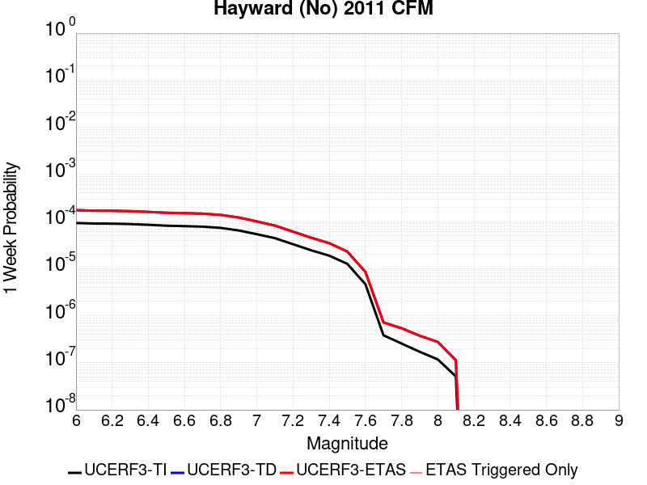 | 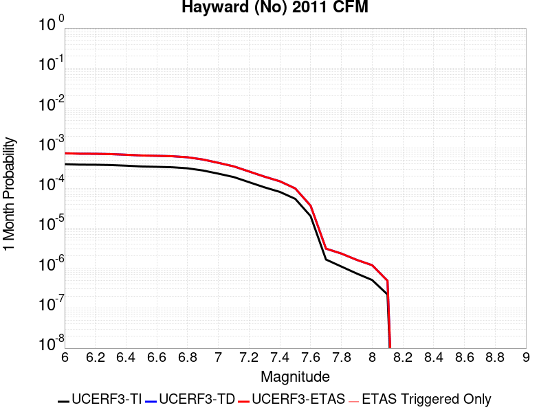 |  | 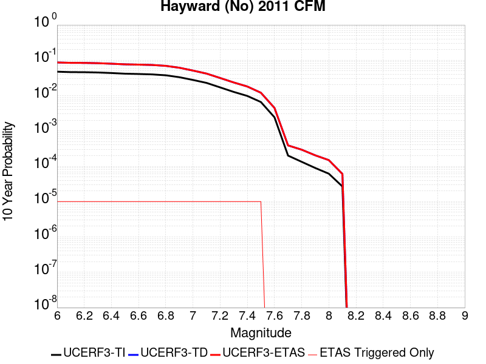 |

| Magnitude | 1 wk TI Prob | 1 wk TD Prob | 1 wk ETAS Prob | 1 wk ETAS/TD Gain | 1 wk ETAS Triggered Only | 1 mo TI Prob | 1 mo TD Prob | 1 mo ETAS Prob | 1 mo ETAS/TD Gain | 1 mo ETAS Triggered Only | 1 yr TI Prob | 1 yr TD Prob | 1 yr ETAS Prob | 1 yr ETAS/TD Gain | 1 yr ETAS Triggered Only | 10 yr TI Prob | 10 yr TD Prob | 10 yr ETAS Prob | 10 yr ETAS/TD Gain | 10 yr ETAS Triggered Only |
|-----|-----|-----|-----|-----|-----|-----|-----|-----|-----|-----|-----|-----|-----|-----|-----|-----|-----|-----|-----|-----|
| 6.0 | 9.3068506E-5 | 1.74321E-4 | 1.74321E-4 | 1.0 | 0.0 | 3.9880406E-4 | 7.4687466E-4 | 7.4687466E-4 | 1.0 | 0.0 | 0.0048446343 | 0.009055164 | 0.009055164 | 1.0 | 0.0 | 0.047403704 | 0.08651658 | 0.08652699 | 1.0001203 | 1.1393155E-5 |
| 6.1 | 9.055486E-5 | 1.6982954E-4 | 1.6982954E-4 | 1.0 | 0.0 | 3.880345E-4 | 7.276376E-4 | 7.276376E-4 | 1.0 | 0.0 | 0.0047140904 | 0.008823077 | 0.008823077 | 1.0 | 0.0 | 0.046153355 | 0.084413365 | 0.084423795 | 1.0001236 | 1.1393155E-5 |
| 6.2 | 9.006742E-5 | 1.690347E-4 | 1.690347E-4 | 1.0 | 0.0 | 3.859461E-4 | 7.242336E-4 | 7.242336E-4 | 1.0 | 0.0 | 0.0046887742 | 0.008782004 | 0.008782004 | 1.0 | 0.0 | 0.0459107 | 0.08403731 | 0.08404774 | 1.0001242 | 1.1393155E-5 |
| 6.3 | 8.8336754E-5 | 1.6582893E-4 | 1.6582893E-4 | 1.0 | 0.0 | 3.7853114E-4 | 7.105026E-4 | 7.105026E-4 | 1.0 | 0.0 | 0.004598882 | 0.0086162165 | 0.0086162165 | 1.0 | 0.0 | 0.04504866 | 0.08252906 | 0.08253951 | 1.0001266 | 1.1393155E-5 |
| 6.4 | 8.526157E-5 | 1.6009175E-4 | 1.6009175E-4 | 1.0 | 0.0 | 3.6535555E-4 | 6.859278E-4 | 6.859278E-4 | 1.0 | 0.0 | 0.0044391346 | 0.008319353 | 0.008319353 | 1.0 | 0.0 | 0.043514993 | 0.07983759 | 0.07984807 | 1.0001314 | 1.1393155E-5 |
| 6.5 | 8.152396E-5 | 1.5341317E-4 | 1.5341317E-4 | 1.0 | 0.0 | 3.493416E-4 | 6.5732E-4 | 6.5732E-4 | 1.0 | 0.0 | 0.0042449418 | 0.007973656 | 0.007973656 | 1.0 | 0.0 | 0.04164765 | 0.07666938 | 0.0766799 | 1.0001372 | 1.1393155E-5 |
| 6.6 | 7.987405E-5 | 1.5045429E-4 | 1.5045429E-4 | 1.0 | 0.0 | 3.4227243E-4 | 6.446454E-4 | 6.446454E-4 | 1.0 | 0.0 | 0.0041592065 | 0.007820472 | 0.007820472 | 1.0 | 0.0 | 0.04082218 | 0.075261764 | 0.0752723 | 1.00014 | 1.1393155E-5 |
| 6.7 | 7.777665E-5 | 1.4684026E-4 | 1.4684026E-4 | 1.0 | 0.0 | 3.332859E-4 | 6.2916434E-4 | 6.2916434E-4 | 1.0 | 0.0 | 0.004050208 | 0.0076333275 | 0.0076333275 | 1.0 | 0.0 | 0.039771806 | 0.073535465 | 0.073546015 | 1.0001435 | 1.1393155E-5 |
| 6.8 | 7.3284005E-5 | 1.3832936E-4 | 1.3832936E-4 | 1.0 | 0.0 | 3.140365E-4 | 5.92706E-4 | 5.92706E-4 | 1.0 | 0.0 | 0.0038166929 | 0.0071924576 | 0.0071924576 | 1.0 | 0.0 | 0.037518036 | 0.06944193 | 0.06945253 | 1.0001527 | 1.1393155E-5 |
| 6.9 | 6.458263E-5 | 1.21599405E-4 | 1.21599405E-4 | 1.0 | 0.0 | 2.7675333E-4 | 5.210367E-4 | 5.210367E-4 | 1.0 | 0.0 | 0.0033642664 | 0.006325272 | 0.006325272 | 1.0 | 0.0 | 0.033137884 | 0.06135608 | 0.061366774 | 1.0001743 | 1.1393155E-5 |
| 7.0 | 5.3853604E-5 | 1.0049717E-4 | 1.0049717E-4 | 1.0 | 0.0 | 2.3078074E-4 | 4.306314E-4 | 4.306314E-4 | 1.0 | 0.0 | 0.0028061352 | 0.005230398 | 0.005230398 | 1.0 | 0.0 | 0.027709642 | 0.05107193 | 0.05108274 | 1.0002117 | 1.1393155E-5 |
| 7.1 | 4.4308683E-5 | 8.192337E-5 | 8.192337E-5 | 1.0 | 0.0 | 1.8988053E-4 | 3.5105314E-4 | 3.5105314E-4 | 1.0 | 0.0 | 0.0023093442 | 0.0042657373 | 0.0042657373 | 1.0 | 0.0 | 0.022854926 | 0.04192726 | 0.041938175 | 1.0002604 | 1.1393155E-5 |
| 7.2 | 3.295973E-5 | 6.0965187E-5 | 6.0965187E-5 | 1.0 | 0.0 | 1.4124835E-4 | 2.6125333E-4 | 2.6125333E-4 | 1.0 | 0.0 | 0.0017183421 | 0.0031761432 | 0.0031761432 | 1.0 | 0.0 | 0.017051157 | 0.03146407 | 0.031475104 | 1.0003507 | 1.1393155E-5 |
| 7.3 | 2.452256E-5 | 4.533148E-5 | 4.533148E-5 | 1.0 | 0.0 | 1.05092455E-4 | 1.9426338E-4 | 1.9426338E-4 | 1.0 | 0.0 | 0.0012787496 | 0.002362605 | 0.002362605 | 1.0 | 0.0 | 0.0127141625 | 0.02351618 | 0.023527306 | 1.0004731 | 1.1393155E-5 |
| 7.4 | 1.8829967E-5 | 3.4720644E-5 | 3.4720644E-5 | 1.0 | 0.0 | 8.069736E-5 | 1.4879432E-4 | 1.4879432E-4 | 1.0 | 0.0 | 9.820475E-4 | 0.0018100755 | 0.0018100755 | 1.0 | 0.0 | 0.009777189 | 0.018078484 | 0.01808967 | 1.0006188 | 1.1393155E-5 |
| 7.5 | 1.26374125E-5 | 2.3009148E-5 | 2.3009148E-5 | 1.0 | 0.0 | 5.4159216E-5 | 9.860694E-5 | 9.860694E-5 | 1.0 | 0.0 | 6.5918895E-4 | 0.0011998842 | 0.0011998842 | 1.0 | 0.0 | 0.00657237 | 0.012034039 | 0.012045295 | 1.0009353 | 1.1393155E-5 |
| 7.6 | 4.666429E-6 | 8.51331E-6 | 8.51331E-6 | 1.0 | 0.0 | 1.9998828E-5 | 3.648511E-5 | 3.648511E-5 | 1.0 | 0.0 | 2.4345852E-4 | 4.4411691E-4 | 4.4411691E-4 | 1.0 | 0.0 | 0.0024319198 | 0.0044772592 | 0.0044772592 | 1.0 | 0.0 |
| 7.7 | 3.8399318E-7 | 7.188026E-7 | 7.188026E-7 | 1.0 | 0.0 | 1.6456839E-6 | 3.0805788E-6 | 3.0805788E-6 | 1.0 | 0.0 | 2.003602E-5 | 3.7505404E-5 | 3.7505404E-5 | 1.0 | 0.0 | 2.0034213E-4 | 3.8879132E-4 | 3.8879132E-4 | 1.0 | 0.0 |
| 7.8 | 2.5637698E-7 | 5.413199E-7 | 5.413199E-7 | 1.0 | 0.0 | 1.098758E-6 | 2.3199402E-6 | 2.3199402E-6 | 1.0 | 0.0 | 1.3377297E-5 | 2.8244907E-5 | 2.8244907E-5 | 1.0 | 0.0 | 1.3376492E-4 | 2.9473606E-4 | 2.9473606E-4 | 1.0 | 0.0 |
| 7.9 | 1.7141245E-7 | 3.7616388E-7 | 3.7616388E-7 | 1.0 | 0.0 | 7.3462456E-7 | 1.61213E-6 | 1.61213E-6 | 1.0 | 0.0 | 8.944017E-6 | 1.9627505E-5 | 1.9627505E-5 | 1.0 | 0.0 | 8.943657E-5 | 2.0403517E-4 | 2.0403517E-4 | 1.0 | 0.0 |
| 8.0 | 1.1808895E-7 | 2.773898E-7 | 2.773898E-7 | 1.0 | 0.0 | 5.060954E-7 | 1.1888129E-6 | 1.1888129E-6 | 1.0 | 0.0 | 6.161694E-6 | 1.4473701E-5 | 1.4473701E-5 | 1.0 | 0.0 | 6.161523E-5 | 1.4926578E-4 | 1.4926578E-4 | 1.0 | 0.0 |
| 8.1 | 5.138535E-8 | 1.1319289E-7 | 1.1319289E-7 | 1.0 | 0.0 | 2.2022292E-7 | 4.8511225E-7 | 4.8511225E-7 | 1.0 | 0.0 | 2.6812106E-6 | 5.9062263E-6 | 5.9062263E-6 | 1.0 | 0.0 | 2.6811784E-5 | 6.060236E-5 | 6.060236E-5 | 1.0 | 0.0 |

## Ortigalita (South)
*[(top)](#table-of-contents)*

| 1 Week | 1 Month | 1 Year | 10 Year |
|-----|-----|-----|-----|
|  |  |  |  |

| Magnitude | 1 wk TI Prob | 1 wk TD Prob | 1 wk ETAS Prob | 1 wk ETAS/TD Gain | 1 wk ETAS Triggered Only | 1 mo TI Prob | 1 mo TD Prob | 1 mo ETAS Prob | 1 mo ETAS/TD Gain | 1 mo ETAS Triggered Only | 1 yr TI Prob | 1 yr TD Prob | 1 yr ETAS Prob | 1 yr ETAS/TD Gain | 1 yr ETAS Triggered Only | 10 yr TI Prob | 10 yr TD Prob | 10 yr ETAS Prob | 10 yr ETAS/TD Gain | 10 yr ETAS Triggered Only |
|-----|-----|-----|-----|-----|-----|-----|-----|-----|-----|-----|-----|-----|-----|-----|-----|-----|-----|-----|-----|-----|
| 6.0 | 3.72394E-5 | 4.3271833E-5 | 4.3271833E-5 | 1.0 | 0.0 | 1.5958765E-4 | 1.8543842E-4 | 1.8543842E-4 | 1.0 | 0.0 | 0.0019412481 | 0.002255531 | 0.0022668985 | 1.0050398 | 1.1393155E-5 | 0.019243775 | 0.022342788 | 0.022353927 | 1.0004985 | 1.1393155E-5 |
| 6.1 | 2.7299884E-5 | 3.1503252E-5 | 3.1503252E-5 | 1.0 | 0.0 | 1.16994255E-4 | 1.3500727E-4 | 1.3500727E-4 | 1.0 | 0.0 | 0.0014234743 | 0.0016425301 | 0.0016425301 | 1.0 | 0.0 | 0.014143906 | 0.016309833 | 0.016309833 | 1.0 | 0.0 |
| 6.2 | 2.7299884E-5 | 3.1503252E-5 | 3.1503252E-5 | 1.0 | 0.0 | 1.16994255E-4 | 1.3500727E-4 | 1.3500727E-4 | 1.0 | 0.0 | 0.0014234743 | 0.0016425301 | 0.0016425301 | 1.0 | 0.0 | 0.014143906 | 0.016309833 | 0.016309833 | 1.0 | 0.0 |
| 6.3 | 2.0546433E-5 | 2.3639683E-5 | 2.3639683E-5 | 1.0 | 0.0 | 8.805317E-5 | 1.01309095E-4 | 1.01309095E-4 | 1.0 | 0.0 | 0.00107152 | 0.0012327593 | 0.0012327593 | 1.0 | 0.0 | 0.010663681 | 0.012261274 | 0.012261274 | 1.0 | 0.0 |
| 6.4 | 2.0546433E-5 | 2.3639683E-5 | 2.3639683E-5 | 1.0 | 0.0 | 8.805317E-5 | 1.01309095E-4 | 1.01309095E-4 | 1.0 | 0.0 | 0.00107152 | 0.0012327593 | 0.0012327593 | 1.0 | 0.0 | 0.010663681 | 0.012261274 | 0.012261274 | 1.0 | 0.0 |
| 6.5 | 1.7779594E-5 | 2.0454092E-5 | 2.0454092E-5 | 1.0 | 0.0 | 7.619603E-5 | 8.765752E-5 | 8.765752E-5 | 1.0 | 0.0 | 9.272918E-4 | 0.0010667214 | 0.0010667214 | 1.0 | 0.0 | 0.009234319 | 0.010617479 | 0.010617479 | 1.0 | 0.0 |
| 6.6 | 1.6272212E-5 | 1.8721486E-5 | 1.8721486E-5 | 1.0 | 0.0 | 6.973618E-5 | 8.0232545E-5 | 8.0232545E-5 | 1.0 | 0.0 | 8.487073E-4 | 9.764057E-4 | 9.764057E-4 | 1.0 | 0.0 | 0.008454733 | 0.009722459 | 0.009722459 | 1.0 | 0.0 |
| 6.7 | 1.3051484E-5 | 1.5044073E-5 | 1.5044073E-5 | 1.0 | 0.0 | 5.593373E-5 | 6.447306E-5 | 6.447306E-5 | 1.0 | 0.0 | 6.807804E-4 | 7.846863E-4 | 7.846863E-4 | 1.0 | 0.0 | 0.006786986 | 0.00782014 | 0.00782014 | 1.0 | 0.0 |
| 6.8 | 1.04277415E-5 | 1.1991389E-5 | 1.1991389E-5 | 1.0 | 0.0 | 4.4689557E-5 | 5.1390696E-5 | 5.1390696E-5 | 1.0 | 0.0 | 5.439595E-4 | 6.2550954E-4 | 6.2550954E-4 | 1.0 | 0.0 | 0.0054262993 | 0.0062382445 | 0.0062382445 | 1.0 | 0.0 |
| 6.9 | 7.639968E-6 | 8.794572E-6 | 8.794572E-6 | 1.0 | 0.0 | 3.274231E-5 | 3.769051E-5 | 3.769051E-5 | 1.0 | 0.0 | 3.9856473E-4 | 4.5879124E-4 | 4.5879124E-4 | 1.0 | 0.0 | 0.003978506 | 0.0045790276 | 0.0045790276 | 1.0 | 0.0 |
| 7.0 | 3.919831E-6 | 4.535044E-6 | 4.535044E-6 | 1.0 | 0.0 | 1.679917E-5 | 1.943577E-5 | 1.943577E-5 | 1.0 | 0.0 | 2.045107E-4 | 2.3660692E-4 | 2.3660692E-4 | 1.0 | 0.0 | 0.0020432258 | 0.0023637589 | 0.0023637589 | 1.0 | 0.0 |
| 7.1 | 1.6017933E-6 | 1.8577269E-6 | 1.8577269E-6 | 1.0 | 0.0 | 6.8648105E-6 | 7.961668E-6 | 7.961668E-6 | 1.0 | 0.0 | 8.357586E-5 | 9.693007E-5 | 9.693007E-5 | 1.0 | 0.0 | 8.3544437E-4 | 9.689827E-4 | 9.689827E-4 | 1.0 | 0.0 |

## Elysian Park (Upper)
*[(top)](#table-of-contents)*

| 1 Week | 1 Month | 1 Year | 10 Year |
|-----|-----|-----|-----|
|  |  | 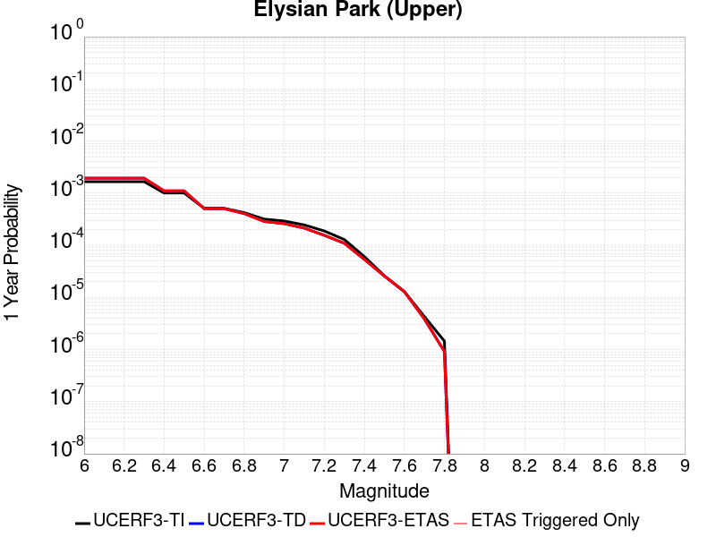 |  |

| Magnitude | 1 wk TI Prob | 1 wk TD Prob | 1 wk ETAS Prob | 1 wk ETAS/TD Gain | 1 wk ETAS Triggered Only | 1 mo TI Prob | 1 mo TD Prob | 1 mo ETAS Prob | 1 mo ETAS/TD Gain | 1 mo ETAS Triggered Only | 1 yr TI Prob | 1 yr TD Prob | 1 yr ETAS Prob | 1 yr ETAS/TD Gain | 1 yr ETAS Triggered Only | 10 yr TI Prob | 10 yr TD Prob | 10 yr ETAS Prob | 10 yr ETAS/TD Gain | 10 yr ETAS Triggered Only |
|-----|-----|-----|-----|-----|-----|-----|-----|-----|-----|-----|-----|-----|-----|-----|-----|-----|-----|-----|-----|-----|
| 6.0 | 3.1876025E-5 | 3.7052752E-5 | 3.7052752E-5 | 1.0 | 0.0 | 1.3660437E-4 | 1.5879056E-4 | 1.5879056E-4 | 1.0 | 0.0 | 0.0016618895 | 0.0019320326 | 0.0019320326 | 1.0 | 0.0 | 0.016495159 | 0.019198839 | 0.019210013 | 1.000582 | 1.1393155E-5 |
| 6.1 | 3.1876025E-5 | 3.7052752E-5 | 3.7052752E-5 | 1.0 | 0.0 | 1.3660437E-4 | 1.5879056E-4 | 1.5879056E-4 | 1.0 | 0.0 | 0.0016618895 | 0.0019320326 | 0.0019320326 | 1.0 | 0.0 | 0.016495159 | 0.019198839 | 0.019210013 | 1.000582 | 1.1393155E-5 |
| 6.2 | 3.1876025E-5 | 3.7052752E-5 | 3.7052752E-5 | 1.0 | 0.0 | 1.3660437E-4 | 1.5879056E-4 | 1.5879056E-4 | 1.0 | 0.0 | 0.0016618895 | 0.0019320326 | 0.0019320326 | 1.0 | 0.0 | 0.016495159 | 0.019198839 | 0.019210013 | 1.000582 | 1.1393155E-5 |
| 6.3 | 3.1876025E-5 | 3.7052752E-5 | 3.7052752E-5 | 1.0 | 0.0 | 1.3660437E-4 | 1.5879056E-4 | 1.5879056E-4 | 1.0 | 0.0 | 0.0016618895 | 0.0019320326 | 0.0019320326 | 1.0 | 0.0 | 0.016495159 | 0.019198839 | 0.019210013 | 1.000582 | 1.1393155E-5 |
| 6.4 | 1.9273462E-5 | 2.1210659E-5 | 2.1210659E-5 | 1.0 | 0.0 | 8.259794E-5 | 9.0900605E-5 | 9.0900605E-5 | 1.0 | 0.0 | 0.001005166 | 0.001106325 | 0.001106325 | 1.0 | 0.0 | 0.010006315 | 0.011024996 | 0.011024996 | 1.0 | 0.0 |
| 6.5 | 1.9273462E-5 | 2.1210659E-5 | 2.1210659E-5 | 1.0 | 0.0 | 8.259794E-5 | 9.0900605E-5 | 9.0900605E-5 | 1.0 | 0.0 | 0.001005166 | 0.001106325 | 0.001106325 | 1.0 | 0.0 | 0.010006315 | 0.011024996 | 0.011024996 | 1.0 | 0.0 |
| 6.6 | 9.813258E-6 | 9.667974E-6 | 9.667974E-6 | 1.0 | 0.0 | 4.205614E-5 | 4.1433555E-5 | 4.1433555E-5 | 1.0 | 0.0 | 5.119132E-4 | 5.0434406E-4 | 5.0434406E-4 | 1.0 | 0.0 | 0.005107356 | 0.0050327186 | 0.0050327186 | 1.0 | 0.0 |
| 6.7 | 9.801478E-6 | 9.655541E-6 | 9.655541E-6 | 1.0 | 0.0 | 4.2005657E-5 | 4.1380277E-5 | 4.1380277E-5 | 1.0 | 0.0 | 5.112989E-4 | 5.036957E-4 | 5.036957E-4 | 1.0 | 0.0 | 0.0051012407 | 0.005026264 | 0.005026264 | 1.0 | 0.0 |
| 6.8 | 8.102489E-6 | 7.774912E-6 | 7.774912E-6 | 1.0 | 0.0 | 3.4724493E-5 | 3.3320655E-5 | 3.3320655E-5 | 1.0 | 0.0 | 4.2268867E-4 | 4.056084E-4 | 4.056084E-4 | 1.0 | 0.0 | 0.004218856 | 0.0040491754 | 0.0040491754 | 1.0 | 0.0 |
| 6.9 | 6.08275E-6 | 5.482646E-6 | 5.482646E-6 | 1.0 | 0.0 | 2.6068668E-5 | 2.3496847E-5 | 2.3496847E-5 | 1.0 | 0.0 | 3.173398E-4 | 2.8603734E-4 | 2.8603734E-4 | 1.0 | 0.0 | 0.0031688702 | 0.0028567694 | 0.0028567694 | 1.0 | 0.0 |
| 7.0 | 5.5995934E-6 | 4.983872E-6 | 4.983872E-6 | 1.0 | 0.0 | 2.3998036E-5 | 2.135928E-5 | 2.135928E-5 | 1.0 | 0.0 | 2.9213692E-4 | 2.6001886E-4 | 2.6001886E-4 | 1.0 | 0.0 | 0.0029175316 | 0.0025972135 | 0.0025972135 | 1.0 | 0.0 |
| 7.1 | 4.709881E-6 | 4.088315E-6 | 4.088315E-6 | 1.0 | 0.0 | 2.0185047E-5 | 1.7521234E-5 | 1.7521234E-5 | 1.0 | 0.0 | 2.4572524E-4 | 2.1330056E-4 | 2.1330056E-4 | 1.0 | 0.0 | 0.002454537 | 0.0021309997 | 0.0021309997 | 1.0 | 0.0 |
| 7.2 | 3.6063436E-6 | 2.9786352E-6 | 2.9786352E-6 | 1.0 | 0.0 | 1.5455667E-5 | 1.2765518E-5 | 1.2765518E-5 | 1.0 | 0.0 | 1.881565E-4 | 1.554092E-4 | 1.554092E-4 | 1.0 | 0.0 | 0.0018799726 | 0.0015530165 | 0.0015530165 | 1.0 | 0.0 |
| 7.3 | 2.471135E-6 | 2.095985E-6 | 2.095985E-6 | 1.0 | 0.0 | 1.0590536E-5 | 8.982763E-6 | 8.982763E-6 | 1.0 | 0.0 | 1.2893214E-4 | 1.0935972E-4 | 1.0935972E-4 | 1.0 | 0.0 | 0.0012885736 | 0.0010930662 | 0.0010930662 | 1.0 | 0.0 |
| 7.4 | 1.163943E-6 | 1.0278507E-6 | 1.0278507E-6 | 1.0 | 0.0 | 4.988318E-6 | 4.405067E-6 | 4.405067E-6 | 1.0 | 0.0 | 6.0731076E-5 | 5.3630403E-5 | 5.3630403E-5 | 1.0 | 0.0 | 6.071448E-4 | 5.361776E-4 | 5.361776E-4 | 1.0 | 0.0 |
| 7.5 | 4.99459E-7 | 4.918935E-7 | 4.918935E-7 | 1.0 | 0.0 | 2.140537E-6 | 2.1081132E-6 | 2.1081132E-6 | 1.0 | 0.0 | 2.6060725E-5 | 2.5665993E-5 | 2.5665993E-5 | 1.0 | 0.0 | 2.605767E-4 | 2.5663184E-4 | 2.5663184E-4 | 1.0 | 0.0 |
| 7.6 | 2.4667852E-7 | 2.4784214E-7 | 2.4784214E-7 | 1.0 | 0.0 | 1.0571932E-6 | 1.0621802E-6 | 1.0621802E-6 | 1.0 | 0.0 | 1.2871251E-5 | 1.2931971E-5 | 1.2931971E-5 | 1.0 | 0.0 | 1.2870505E-4 | 1.2931255E-4 | 1.2931255E-4 | 1.0 | 0.0 |
| 7.7 | 8.2312795E-8 | 7.389621E-8 | 7.389621E-8 | 1.0 | 0.0 | 3.527691E-7 | 3.16698E-7 | 3.16698E-7 | 1.0 | 0.0 | 4.294955E-6 | 3.8557923E-6 | 3.8557923E-6 | 1.0 | 0.0 | 4.2948723E-5 | 3.8557373E-5 | 3.8557373E-5 | 1.0 | 0.0 |
| 7.8 | 2.7819295E-8 | 1.7588341E-8 | 1.7588341E-8 | 1.0 | 0.0 | 1.1922555E-7 | 7.537861E-8 | 7.537861E-8 | 1.0 | 0.0 | 1.45157E-6 | 9.1773427E-7 | 9.1773427E-7 | 1.0 | 0.0 | 1.45156055E-5 | 9.17732E-6 | 9.17732E-6 | 1.0 | 0.0 |

## Calaveras (So) - Paicines extension 2011 CFM
*[(top)](#table-of-contents)*

| 1 Week | 1 Month | 1 Year | 10 Year |
|-----|-----|-----|-----|
|  |  | 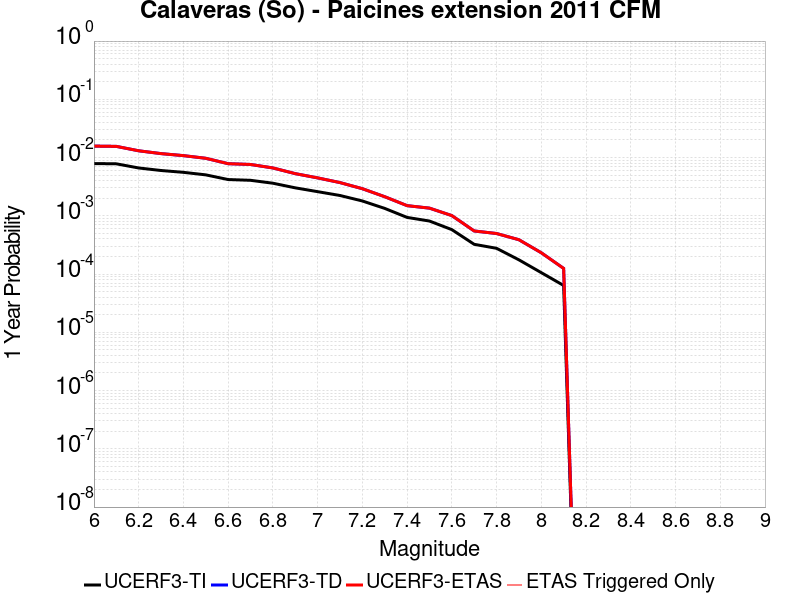 |  |

| Magnitude | 1 wk TI Prob | 1 wk TD Prob | 1 wk ETAS Prob | 1 wk ETAS/TD Gain | 1 wk ETAS Triggered Only | 1 mo TI Prob | 1 mo TD Prob | 1 mo ETAS Prob | 1 mo ETAS/TD Gain | 1 mo ETAS Triggered Only | 1 yr TI Prob | 1 yr TD Prob | 1 yr ETAS Prob | 1 yr ETAS/TD Gain | 1 yr ETAS Triggered Only | 10 yr TI Prob | 10 yr TD Prob | 10 yr ETAS Prob | 10 yr ETAS/TD Gain | 10 yr ETAS Triggered Only |
|-----|-----|-----|-----|-----|-----|-----|-----|-----|-----|-----|-----|-----|-----|-----|-----|-----|-----|-----|-----|-----|
| 6.0 | 1.5183659E-4 | 3.0567724E-4 | 3.0567724E-4 | 1.0 | 0.0 | 6.5056595E-4 | 0.0013088329 | 0.0013088329 | 1.0 | 0.0 | 0.007891912 | 0.01572029 | 0.01572029 | 1.0 | 0.0 | 0.076174594 | 0.13868593 | 0.13869575 | 1.0000708 | 1.1393155E-5 |
| 6.1 | 1.5024997E-4 | 3.0261686E-4 | 3.0261686E-4 | 1.0 | 0.0 | 6.437695E-4 | 0.0012957319 | 0.0012957319 | 1.0 | 0.0 | 0.0078097614 | 0.015563567 | 0.015563567 | 1.0 | 0.0 | 0.075409345 | 0.13735491 | 0.13736475 | 1.0000715 | 1.1393155E-5 |
| 6.2 | 1.2743923E-4 | 2.5358764E-4 | 2.5358764E-4 | 1.0 | 0.0 | 5.460538E-4 | 0.0010859472 | 0.0010859472 | 1.0 | 0.0 | 0.0066279583 | 0.013070336 | 0.013070336 | 1.0 | 0.0 | 0.064337276 | 0.11745247 | 0.11746252 | 1.0000856 | 1.1393155E-5 |
| 6.3 | 1.1525114E-4 | 2.2643937E-4 | 2.2643937E-4 | 1.0 | 0.0 | 4.9383997E-4 | 9.69809E-4 | 9.69809E-4 | 1.0 | 0.0 | 0.0059959386 | 0.011691458 | 0.011691458 | 1.0 | 0.0 | 0.058367174 | 0.106570154 | 0.10658033 | 1.0000955 | 1.1393155E-5 |
| 6.4 | 1.07200925E-4 | 2.0884785E-4 | 2.0884785E-4 | 1.0 | 0.0 | 4.5935164E-4 | 8.945366E-4 | 8.945366E-4 | 1.0 | 0.0 | 0.0055782744 | 0.010796225 | 0.010796225 | 1.0 | 0.0 | 0.0544031 | 0.09939334 | 0.0994036 | 1.0001032 | 1.1393155E-5 |
| 6.5 | 9.69631E-5 | 1.8778075E-4 | 1.8778075E-4 | 1.0 | 0.0 | 4.1548995E-4 | 8.043511E-4 | 8.043511E-4 | 1.0 | 0.0 | 0.0050468626 | 0.009717664 | 0.009717664 | 1.0 | 0.0 | 0.04933773 | 0.09028334 | 0.090293705 | 1.0001148 | 1.1393155E-5 |
| 6.6 | 8.0552316E-5 | 1.5114626E-4 | 1.5114626E-4 | 1.0 | 0.0 | 3.4517853E-4 | 6.475748E-4 | 6.475748E-4 | 1.0 | 0.0 | 0.0041944524 | 0.007849244 | 0.007849244 | 1.0 | 0.0 | 0.04116161 | 0.075055376 | 0.07506591 | 1.0001404 | 1.1393155E-5 |
| 6.7 | 7.815757E-5 | 1.4654847E-4 | 1.4654847E-4 | 1.0 | 0.0 | 3.34918E-4 | 6.2788266E-4 | 6.2788266E-4 | 1.0 | 0.0 | 0.004070005 | 0.0076118703 | 0.0076118703 | 1.0 | 0.0 | 0.039962657 | 0.07290385 | 0.072914414 | 1.0001448 | 1.1393155E-5 |
| 6.8 | 6.965264E-5 | 1.2763772E-4 | 1.2763772E-4 | 1.0 | 0.0 | 2.9847719E-4 | 5.468874E-4 | 5.468874E-4 | 1.0 | 0.0 | 0.0036279052 | 0.0066347993 | 0.0066347993 | 1.0 | 0.0 | 0.03569247 | 0.0639895 | 0.06400016 | 1.0001667 | 1.1393155E-5 |
| 6.9 | 5.8000453E-5 | 1.0180437E-4 | 1.0180437E-4 | 1.0 | 0.0 | 2.4854968E-4 | 4.362319E-4 | 4.362319E-4 | 1.0 | 0.0 | 0.0030218933 | 0.0052982876 | 0.0052982876 | 1.0 | 0.0 | 0.029811295 | 0.051677886 | 0.051688693 | 1.0002091 | 1.1393155E-5 |
| 7.0 | 4.9865852E-5 | 8.600975E-5 | 8.600975E-5 | 1.0 | 0.0 | 2.1369329E-4 | 3.6856162E-4 | 3.6856162E-4 | 1.0 | 0.0 | 0.0025986114 | 0.0044780946 | 0.0044780946 | 1.0 | 0.0 | 0.025684336 | 0.043942552 | 0.043953445 | 1.0002478 | 1.1393155E-5 |
| 7.1 | 4.283875E-5 | 7.141931E-5 | 7.141931E-5 | 1.0 | 0.0 | 1.8358172E-4 | 3.0604715E-4 | 3.0604715E-4 | 1.0 | 0.0 | 0.0022328163 | 0.0037198144 | 0.0037198144 | 1.0 | 0.0 | 0.022105146 | 0.036881436 | 0.03689241 | 1.0002975 | 1.1393155E-5 |
| 7.2 | 3.450115E-5 | 5.6061246E-5 | 5.6061246E-5 | 1.0 | 0.0 | 1.478537E-4 | 2.4024052E-4 | 2.4024052E-4 | 1.0 | 0.0 | 0.0017986323 | 0.0029210346 | 0.0029210346 | 1.0 | 0.0 | 0.017841442 | 0.029219741 | 0.029230801 | 1.0003785 | 1.1393155E-5 |
| 7.3 | 2.5709045E-5 | 4.0837407E-5 | 4.0837407E-5 | 1.0 | 0.0 | 1.1017697E-4 | 1.7500583E-4 | 1.7500583E-4 | 1.0 | 0.0 | 0.0013405791 | 0.0021286309 | 0.0021286309 | 1.0 | 0.0 | 0.013325208 | 0.021421848 | 0.021432998 | 1.0005205 | 1.1393155E-5 |
| 7.4 | 1.8003093E-5 | 2.867011E-5 | 2.867011E-5 | 1.0 | 0.0 | 7.715383E-5 | 1.2286613E-4 | 1.2286613E-4 | 1.0 | 0.0 | 9.3894306E-4 | 0.001494871 | 0.001494871 | 1.0 | 0.0 | 0.009349857 | 0.015132292 | 0.015143514 | 1.0007415 | 1.1393155E-5 |
| 7.5 | 1.5595824E-5 | 2.5974825E-5 | 2.5974825E-5 | 1.0 | 0.0 | 6.683753E-5 | 1.11315945E-4 | 1.11315945E-4 | 1.0 | 0.0 | 8.134431E-4 | 0.0013544313 | 0.0013544313 | 1.0 | 0.0 | 0.008104719 | 0.013728019 | 0.013739255 | 1.0008185 | 1.1393155E-5 |
| 7.6 | 1.1110309E-5 | 1.9353434E-5 | 1.9353434E-5 | 1.0 | 0.0 | 4.761474E-5 | 8.294066E-5 | 8.294066E-5 | 1.0 | 0.0 | 5.795553E-4 | 0.0010093361 | 0.0010093361 | 1.0 | 0.0 | 0.0057804612 | 0.010269353 | 0.010280629 | 1.001098 | 1.1393155E-5 |
| 7.7 | 6.2140443E-6 | 1.0534177E-5 | 1.0534177E-5 | 1.0 | 0.0 | 2.6631347E-5 | 4.514569E-5 | 4.514569E-5 | 1.0 | 0.0 | 3.241884E-4 | 5.495103E-4 | 5.495103E-4 | 1.0 | 0.0 | 0.0032371588 | 0.0056673633 | 0.005678692 | 1.0019989 | 1.1393155E-5 |
| 7.8 | 5.305533E-6 | 9.519843E-6 | 9.519843E-6 | 1.0 | 0.0 | 2.27378E-5 | 4.0798688E-5 | 4.0798688E-5 | 1.0 | 0.0 | 2.7679754E-4 | 4.966109E-4 | 4.966109E-4 | 1.0 | 0.0 | 0.0027645302 | 0.0051165447 | 0.0051278793 | 1.0022154 | 1.1393155E-5 |
| 7.9 | 3.363505E-6 | 7.4494797E-6 | 7.4494797E-6 | 1.0 | 0.0 | 1.4414942E-5 | 3.1925952E-5 | 3.1925952E-5 | 1.0 | 0.0 | 1.7548777E-4 | 3.886292E-4 | 3.886292E-4 | 1.0 | 0.0 | 0.0017534926 | 0.0039796815 | 0.0039796815 | 1.0 | 0.0 |
| 8.0 | 2.0271132E-6 | 4.4499448E-6 | 4.4499448E-6 | 1.0 | 0.0 | 8.687599E-6 | 1.9071053E-5 | 1.9071053E-5 | 1.0 | 0.0 | 1.05766376E-4 | 2.3216537E-4 | 2.3216537E-4 | 1.0 | 0.0 | 0.0010571606 | 0.0023690849 | 0.0023690849 | 1.0 | 0.0 |
| 8.1 | 1.2206116E-6 | 2.3955579E-6 | 2.3955579E-6 | 1.0 | 0.0 | 5.2311816E-6 | 1.0266636E-5 | 1.0266636E-5 | 1.0 | 0.0 | 6.3687774E-5 | 1.2498916E-4 | 1.2498916E-4 | 1.0 | 0.0 | 6.366953E-4 | 0.0012807297 | 0.0012807297 | 1.0 | 0.0 |

## Great Valley 08 (Quinto)
*[(top)](#table-of-contents)*

| 1 Week | 1 Month | 1 Year | 10 Year |
|-----|-----|-----|-----|
|  |  |  |  |

| Magnitude | 1 wk TI Prob | 1 wk TD Prob | 1 wk ETAS Prob | 1 wk ETAS/TD Gain | 1 wk ETAS Triggered Only | 1 mo TI Prob | 1 mo TD Prob | 1 mo ETAS Prob | 1 mo ETAS/TD Gain | 1 mo ETAS Triggered Only | 1 yr TI Prob | 1 yr TD Prob | 1 yr ETAS Prob | 1 yr ETAS/TD Gain | 1 yr ETAS Triggered Only | 10 yr TI Prob | 10 yr TD Prob | 10 yr ETAS Prob | 10 yr ETAS/TD Gain | 10 yr ETAS Triggered Only |
|-----|-----|-----|-----|-----|-----|-----|-----|-----|-----|-----|-----|-----|-----|-----|-----|-----|-----|-----|-----|-----|
| 6.0 | 7.737697E-6 | 8.254312E-6 | 8.254312E-6 | 1.0 | 0.0 | 3.3161137E-5 | 3.5375248E-5 | 3.5375248E-5 | 1.0 | 0.0 | 4.0366207E-4 | 4.306274E-4 | 4.4201565E-4 | 1.0264457 | 1.1393155E-5 | 0.004029296 | 0.004299783 | 0.004311127 | 1.0026383 | 1.1393155E-5 |
| 6.1 | 7.737697E-6 | 8.254312E-6 | 8.254312E-6 | 1.0 | 0.0 | 3.3161137E-5 | 3.5375248E-5 | 3.5375248E-5 | 1.0 | 0.0 | 4.0366207E-4 | 4.306274E-4 | 4.4201565E-4 | 1.0264457 | 1.1393155E-5 | 0.004029296 | 0.004299783 | 0.004311127 | 1.0026383 | 1.1393155E-5 |
| 6.2 | 7.737697E-6 | 8.254312E-6 | 8.254312E-6 | 1.0 | 0.0 | 3.3161137E-5 | 3.5375248E-5 | 3.5375248E-5 | 1.0 | 0.0 | 4.0366207E-4 | 4.306274E-4 | 4.4201565E-4 | 1.0264457 | 1.1393155E-5 | 0.004029296 | 0.004299783 | 0.004311127 | 1.0026383 | 1.1393155E-5 |
| 6.3 | 5.374012E-6 | 5.751508E-6 | 5.751508E-6 | 1.0 | 0.0 | 2.3031276E-5 | 2.4649149E-5 | 2.4649149E-5 | 1.0 | 0.0 | 2.803697E-4 | 3.000732E-4 | 3.000732E-4 | 1.0 | 0.0 | 0.0028001624 | 0.002997774 | 0.002997774 | 1.0 | 0.0 |
| 6.4 | 5.374012E-6 | 5.751508E-6 | 5.751508E-6 | 1.0 | 0.0 | 2.3031276E-5 | 2.4649149E-5 | 2.4649149E-5 | 1.0 | 0.0 | 2.803697E-4 | 3.000732E-4 | 3.000732E-4 | 1.0 | 0.0 | 0.0028001624 | 0.002997774 | 0.002997774 | 1.0 | 0.0 |
| 6.5 | 3.65427E-6 | 3.9420406E-6 | 3.9420406E-6 | 1.0 | 0.0 | 1.5661062E-5 | 1.689439E-5 | 1.689439E-5 | 1.0 | 0.0 | 1.9065675E-4 | 2.0567683E-4 | 2.0567683E-4 | 1.0 | 0.0 | 0.0019049325 | 0.0020555567 | 0.0020555567 | 1.0 | 0.0 |
| 6.6 | 3.6143538E-6 | 3.89922E-6 | 3.89922E-6 | 1.0 | 0.0 | 1.5489995E-5 | 1.6710876E-5 | 1.6710876E-5 | 1.0 | 0.0 | 1.8857437E-4 | 2.0344296E-4 | 2.0344296E-4 | 1.0 | 0.0 | 0.0018841444 | 0.002033259 | 0.002033259 | 1.0 | 0.0 |
| 6.7 | 2.4821015E-6 | 2.6862167E-6 | 2.6862167E-6 | 1.0 | 0.0 | 1.0637535E-5 | 1.15123385E-5 | 1.15123385E-5 | 1.0 | 0.0 | 1.2950429E-4 | 1.4015936E-4 | 1.4015936E-4 | 1.0 | 0.0 | 0.0012942884 | 0.0014012648 | 0.0014012648 | 1.0 | 0.0 |
| 6.8 | 4.7110538E-7 | 5.19425E-7 | 5.19425E-7 | 1.0 | 0.0 | 2.0190216E-6 | 2.2261052E-6 | 2.2261052E-6 | 1.0 | 0.0 | 2.458131E-5 | 2.7102513E-5 | 2.7102513E-5 | 1.0 | 0.0 | 2.457859E-4 | 2.7099389E-4 | 2.7099389E-4 | 1.0 | 0.0 |
| 6.9 | 3.958685E-7 | 4.3713962E-7 | 4.3713962E-7 | 1.0 | 0.0 | 1.6965782E-6 | 1.8734543E-6 | 1.8734543E-6 | 1.0 | 0.0 | 2.0655643E-5 | 2.2809083E-5 | 2.2809083E-5 | 1.0 | 0.0 | 2.0653724E-4 | 2.2806905E-4 | 2.2806905E-4 | 1.0 | 0.0 |
| 7.0 | 2.70294E-7 | 2.9927406E-7 | 2.9927406E-7 | 1.0 | 0.0 | 1.1584025E-6 | 1.2826026E-6 | 1.2826026E-6 | 1.0 | 0.0 | 1.4103458E-5 | 1.5615587E-5 | 1.5615587E-5 | 1.0 | 0.0 | 1.4102564E-4 | 1.5614618E-4 | 1.5614618E-4 | 1.0 | 0.0 |
| 7.1 | 1.4828602E-7 | 1.647332E-7 | 1.647332E-7 | 1.0 | 0.0 | 6.3551136E-7 | 7.0599924E-7 | 7.0599924E-7 | 1.0 | 0.0 | 7.737323E-6 | 8.595515E-6 | 8.595515E-6 | 1.0 | 0.0 | 7.737054E-5 | 8.5952626E-5 | 8.5952626E-5 | 1.0 | 0.0 |

## West Napa 2011 CFM
*[(top)](#table-of-contents)*

| 1 Week | 1 Month | 1 Year | 10 Year |
|-----|-----|-----|-----|
| 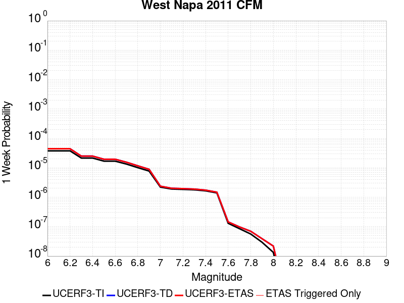 |  | 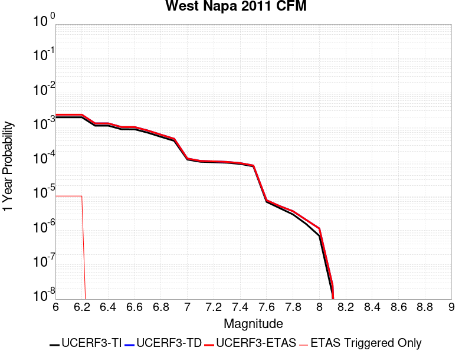 |  |

| Magnitude | 1 wk TI Prob | 1 wk TD Prob | 1 wk ETAS Prob | 1 wk ETAS/TD Gain | 1 wk ETAS Triggered Only | 1 mo TI Prob | 1 mo TD Prob | 1 mo ETAS Prob | 1 mo ETAS/TD Gain | 1 mo ETAS Triggered Only | 1 yr TI Prob | 1 yr TD Prob | 1 yr ETAS Prob | 1 yr ETAS/TD Gain | 1 yr ETAS Triggered Only | 10 yr TI Prob | 10 yr TD Prob | 10 yr ETAS Prob | 10 yr ETAS/TD Gain | 10 yr ETAS Triggered Only |
|-----|-----|-----|-----|-----|-----|-----|-----|-----|-----|-----|-----|-----|-----|-----|-----|-----|-----|-----|-----|-----|
| 6.0 | 3.773104E-5 | 4.4548815E-5 | 4.4548815E-5 | 1.0 | 0.0 | 1.6169442E-4 | 1.9091132E-4 | 1.9091132E-4 | 1.0 | 0.0 | 0.001966852 | 0.002322185 | 0.0023335516 | 1.0048949 | 1.1393155E-5 | 0.019495348 | 0.023012955 | 0.023024086 | 1.0004836 | 1.1393155E-5 |
| 6.1 | 3.773104E-5 | 4.4548815E-5 | 4.4548815E-5 | 1.0 | 0.0 | 1.6169442E-4 | 1.9091132E-4 | 1.9091132E-4 | 1.0 | 0.0 | 0.001966852 | 0.002322185 | 0.0023335516 | 1.0048949 | 1.1393155E-5 | 0.019495348 | 0.023012955 | 0.023024086 | 1.0004836 | 1.1393155E-5 |
| 6.2 | 3.773104E-5 | 4.4548815E-5 | 4.4548815E-5 | 1.0 | 0.0 | 1.6169442E-4 | 1.9091132E-4 | 1.9091132E-4 | 1.0 | 0.0 | 0.001966852 | 0.002322185 | 0.0023335516 | 1.0048949 | 1.1393155E-5 | 0.019495348 | 0.023012955 | 0.023024086 | 1.0004836 | 1.1393155E-5 |
| 6.3 | 2.147964E-5 | 2.499824E-5 | 2.499824E-5 | 1.0 | 0.0 | 9.2052345E-5 | 1.0713143E-4 | 1.0713143E-4 | 1.0 | 0.0 | 0.001120161 | 0.0013036366 | 0.0013036366 | 1.0 | 0.0 | 0.011145315 | 0.01297082 | 0.01297082 | 1.0 | 0.0 |
| 6.4 | 2.147964E-5 | 2.499824E-5 | 2.499824E-5 | 1.0 | 0.0 | 9.2052345E-5 | 1.0713143E-4 | 1.0713143E-4 | 1.0 | 0.0 | 0.001120161 | 0.0013036366 | 0.0013036366 | 1.0 | 0.0 | 0.011145315 | 0.01297082 | 0.01297082 | 1.0 | 0.0 |
| 6.5 | 1.688201E-5 | 1.9556244E-5 | 1.9556244E-5 | 1.0 | 0.0 | 7.234947E-5 | 8.38102E-5 | 8.38102E-5 | 1.0 | 0.0 | 8.804988E-4 | 0.0010199843 | 0.0010199843 | 1.0 | 0.0 | 0.008770182 | 0.010162005 | 0.010162005 | 1.0 | 0.0 |
| 6.6 | 1.6846381E-5 | 1.9515925E-5 | 1.9515925E-5 | 1.0 | 0.0 | 7.219678E-5 | 8.363741E-5 | 8.363741E-5 | 1.0 | 0.0 | 8.7864127E-4 | 0.0010178825 | 0.0010178825 | 1.0 | 0.0 | 0.008751754 | 0.01014118 | 0.01014118 | 1.0 | 0.0 |
| 6.7 | 1.3396501E-5 | 1.547495E-5 | 1.547495E-5 | 1.0 | 0.0 | 5.7412315E-5 | 6.631989E-5 | 6.631989E-5 | 1.0 | 0.0 | 6.9877075E-4 | 8.0720906E-4 | 8.0720906E-4 | 1.0 | 0.0 | 0.0069657755 | 0.008050803 | 0.008050803 | 1.0 | 0.0 |
| 6.8 | 1.0139058E-5 | 1.1677994E-5 | 1.1677994E-5 | 1.0 | 0.0 | 4.3452383E-5 | 5.00479E-5 | 5.00479E-5 | 1.0 | 0.0 | 5.289043E-4 | 6.092184E-4 | 6.092184E-4 | 1.0 | 0.0 | 0.005276473 | 0.006082712 | 0.006082712 | 1.0 | 0.0 |
| 6.9 | 7.761281E-6 | 8.895445E-6 | 8.895445E-6 | 1.0 | 0.0 | 3.326221E-5 | 3.8123067E-5 | 3.8123067E-5 | 1.0 | 0.0 | 4.0489217E-4 | 4.6410094E-4 | 4.6410094E-4 | 1.0 | 0.0 | 0.0040415525 | 0.004638139 | 0.004638139 | 1.0 | 0.0 |
| 7.0 | 2.2109202E-6 | 2.3687076E-6 | 2.3687076E-6 | 1.0 | 0.0 | 9.475338E-6 | 1.0151564E-5 | 1.0151564E-5 | 1.0 | 0.0 | 1.1535613E-4 | 1.2358837E-4 | 1.2358837E-4 | 1.0 | 0.0 | 0.0011529627 | 0.0012369871 | 0.0012369871 | 1.0 | 0.0 |
| 7.1 | 1.9008926E-6 | 2.0152822E-6 | 2.0152822E-6 | 1.0 | 0.0 | 8.146657E-6 | 8.6368955E-6 | 8.6368955E-6 | 1.0 | 0.0 | 9.918104E-5 | 1.0514915E-4 | 1.0514915E-4 | 1.0 | 0.0 | 9.913679E-4 | 0.0010527797 | 0.0010527797 | 1.0 | 0.0 |
| 7.2 | 1.8495944E-6 | 1.9580737E-6 | 1.9580737E-6 | 1.0 | 0.0 | 7.926808E-6 | 8.3917175E-6 | 8.3917175E-6 | 1.0 | 0.0 | 9.650462E-5 | 1.021644E-4 | 1.021644E-4 | 1.0 | 0.0 | 9.6462725E-4 | 0.0010229601 | 0.0010229601 | 1.0 | 0.0 |
| 7.3 | 1.7883189E-6 | 1.8900167E-6 | 1.8900167E-6 | 1.0 | 0.0 | 7.664201E-6 | 8.100046E-6 | 8.100046E-6 | 1.0 | 0.0 | 9.330765E-5 | 9.861363E-5 | 9.861363E-5 | 1.0 | 0.0 | 9.3268487E-4 | 9.874841E-4 | 9.874841E-4 | 1.0 | 0.0 |
| 7.4 | 1.6520572E-6 | 1.7433392E-6 | 1.7433392E-6 | 1.0 | 0.0 | 7.0802257E-6 | 7.4714326E-6 | 7.4714326E-6 | 1.0 | 0.0 | 8.6198335E-5 | 9.096092E-5 | 9.096092E-5 | 1.0 | 0.0 | 8.616491E-4 | 9.1101724E-4 | 9.1101724E-4 | 1.0 | 0.0 |
| 7.5 | 1.4040345E-6 | 1.4816766E-6 | 1.4816766E-6 | 1.0 | 0.0 | 6.0172765E-6 | 6.350027E-6 | 6.350027E-6 | 1.0 | 0.0 | 7.325788E-5 | 7.730886E-5 | 7.730886E-5 | 1.0 | 0.0 | 7.3233736E-4 | 7.7455794E-4 | 7.7455794E-4 | 1.0 | 0.0 |
| 7.6 | 1.3013842E-7 | 1.4490011E-7 | 1.4490011E-7 | 1.0 | 0.0 | 5.57736E-7 | 6.210003E-7 | 6.210003E-7 | 1.0 | 0.0 | 6.790414E-6 | 7.5606526E-6 | 7.5606526E-6 | 1.0 | 0.0 | 6.790207E-5 | 7.6543656E-5 | 7.6543656E-5 | 1.0 | 0.0 |
| 7.7 | 8.541512E-8 | 9.783965E-8 | 9.783965E-8 | 1.0 | 0.0 | 3.6606474E-7 | 4.1931273E-7 | 4.1931273E-7 | 1.0 | 0.0 | 4.456829E-6 | 5.10512E-6 | 5.10512E-6 | 1.0 | 0.0 | 4.4567398E-5 | 5.196252E-5 | 5.196252E-5 | 1.0 | 0.0 |
| 7.8 | 5.6074793E-8 | 6.9513895E-8 | 6.9513895E-8 | 1.0 | 0.0 | 2.403205E-7 | 2.9791667E-7 | 2.9791667E-7 | 1.0 | 0.0 | 2.9258983E-6 | 3.6271292E-6 | 3.6271292E-6 | 1.0 | 0.0 | 2.9258597E-5 | 3.7114303E-5 | 3.7114303E-5 | 1.0 | 0.0 |
| 7.9 | 2.9475839E-8 | 3.8898563E-8 | 3.8898563E-8 | 1.0 | 0.0 | 1.2632502E-7 | 1.667081E-7 | 1.667081E-7 | 1.0 | 0.0 | 1.538006E-6 | 2.0296693E-6 | 2.0296693E-6 | 1.0 | 0.0 | 1.5379954E-5 | 2.084701E-5 | 2.084701E-5 | 1.0 | 0.0 |
| 8.0 | 1.3337122E-8 | 2.182512E-8 | 2.182512E-8 | 1.0 | 0.0 | 5.7159088E-8 | 9.353622E-8 | 9.353622E-8 | 1.0 | 0.0 | 6.959117E-7 | 1.1388029E-6 | 1.1388029E-6 | 1.0 | 0.0 | 6.959095E-6 | 1.1753619E-5 | 1.1753619E-5 | 1.0 | 0.0 |
| 8.1 | 2.6589986E-10 | 4.902596E-10 | 4.902596E-10 | 1.0 | 0.0 | 1.1395708E-9 | 2.1011126E-9 | 2.1011126E-9 | 1.0 | 0.0 | 1.3874274E-8 | 2.5581045E-8 | 2.5581045E-8 | 1.0 | 0.0 | 1.3874273E-7 | 2.6248014E-7 | 2.6248014E-7 | 1.0 | 0.0 |

## Fish Slough 2011 CFM
*[(top)](#table-of-contents)*

| 1 Week | 1 Month | 1 Year | 10 Year |
|-----|-----|-----|-----|
|  |  |  |  |

| Magnitude | 1 wk TI Prob | 1 wk TD Prob | 1 wk ETAS Prob | 1 wk ETAS/TD Gain | 1 wk ETAS Triggered Only | 1 mo TI Prob | 1 mo TD Prob | 1 mo ETAS Prob | 1 mo ETAS/TD Gain | 1 mo ETAS Triggered Only | 1 yr TI Prob | 1 yr TD Prob | 1 yr ETAS Prob | 1 yr ETAS/TD Gain | 1 yr ETAS Triggered Only | 10 yr TI Prob | 10 yr TD Prob | 10 yr ETAS Prob | 10 yr ETAS/TD Gain | 10 yr ETAS Triggered Only |
|-----|-----|-----|-----|-----|-----|-----|-----|-----|-----|-----|-----|-----|-----|-----|-----|-----|-----|-----|-----|-----|
| 6.0 | 4.3629925E-6 | 3.6777774E-6 | 3.6777774E-6 | 1.0 | 0.0 | 1.8698405E-5 | 1.576182E-5 | 1.576182E-5 | 1.0 | 0.0 | 2.276293E-4 | 1.9188538E-4 | 2.0327634E-4 | 1.0593634 | 1.1393155E-5 | 0.0022739628 | 0.0019174059 | 0.0019287772 | 1.0059305 | 1.1393155E-5 |
| 6.1 | 4.3629925E-6 | 3.6777774E-6 | 3.6777774E-6 | 1.0 | 0.0 | 1.8698405E-5 | 1.576182E-5 | 1.576182E-5 | 1.0 | 0.0 | 2.276293E-4 | 1.9188538E-4 | 2.0327634E-4 | 1.0593634 | 1.1393155E-5 | 0.0022739628 | 0.0019174059 | 0.0019287772 | 1.0059305 | 1.1393155E-5 |
| 6.2 | 4.3629925E-6 | 3.6777774E-6 | 3.6777774E-6 | 1.0 | 0.0 | 1.8698405E-5 | 1.576182E-5 | 1.576182E-5 | 1.0 | 0.0 | 2.276293E-4 | 1.9188538E-4 | 2.0327634E-4 | 1.0593634 | 1.1393155E-5 | 0.0022739628 | 0.0019174059 | 0.0019287772 | 1.0059305 | 1.1393155E-5 |
| 6.3 | 4.3629925E-6 | 3.6777774E-6 | 3.6777774E-6 | 1.0 | 0.0 | 1.8698405E-5 | 1.576182E-5 | 1.576182E-5 | 1.0 | 0.0 | 2.276293E-4 | 1.9188538E-4 | 2.0327634E-4 | 1.0593634 | 1.1393155E-5 | 0.0022739628 | 0.0019174059 | 0.0019287772 | 1.0059305 | 1.1393155E-5 |
| 6.4 | 4.3629925E-6 | 3.6777774E-6 | 3.6777774E-6 | 1.0 | 0.0 | 1.8698405E-5 | 1.576182E-5 | 1.576182E-5 | 1.0 | 0.0 | 2.276293E-4 | 1.9188538E-4 | 2.0327634E-4 | 1.0593634 | 1.1393155E-5 | 0.0022739628 | 0.0019174059 | 0.0019287772 | 1.0059305 | 1.1393155E-5 |
| 6.5 | 2.991715E-6 | 2.270813E-6 | 2.270813E-6 | 1.0 | 0.0 | 1.2821573E-5 | 9.732024E-6 | 9.732024E-6 | 1.0 | 0.0 | 1.5609147E-4 | 1.1848187E-4 | 1.2987368E-4 | 1.0961481 | 1.1393155E-5 | 0.0015598187 | 0.0011842771 | 0.0011956568 | 1.009609 | 1.1393155E-5 |
| 6.6 | 2.991715E-6 | 2.270813E-6 | 2.270813E-6 | 1.0 | 0.0 | 1.2821573E-5 | 9.732024E-6 | 9.732024E-6 | 1.0 | 0.0 | 1.5609147E-4 | 1.1848187E-4 | 1.2987368E-4 | 1.0961481 | 1.1393155E-5 | 0.0015598187 | 0.0011842771 | 0.0011956568 | 1.009609 | 1.1393155E-5 |
| 6.7 | 2.7890346E-6 | 2.0625953E-6 | 2.0625953E-6 | 1.0 | 0.0 | 1.1952951E-5 | 8.839669E-6 | 8.839669E-6 | 1.0 | 0.0 | 1.4551746E-4 | 1.0761856E-4 | 1.1901049E-4 | 1.1058546 | 1.1393155E-5 | 0.0014542221 | 0.0010757527 | 0.0010871335 | 1.0105795 | 1.1393155E-5 |
| 6.8 | 1.9416723E-6 | 1.1929122E-6 | 1.1929122E-6 | 1.0 | 0.0 | 8.321425E-6 | 5.112471E-6 | 5.112471E-6 | 1.0 | 0.0 | 1.01308644E-4 | 6.22426E-5 | 7.363505E-5 | 1.183033 | 1.1393155E-5 | 0.0010126247 | 6.222558E-4 | 6.3364184E-4 | 1.018298 | 1.1393155E-5 |
| 6.9 | 1.8567416E-6 | 1.1050467E-6 | 1.1050467E-6 | 1.0 | 0.0 | 7.957439E-6 | 4.7359063E-6 | 4.7359063E-6 | 1.0 | 0.0 | 9.687752E-5 | 5.7658173E-5 | 6.905067E-5 | 1.1975869 | 1.1393155E-5 | 9.6835295E-4 | 5.76436E-4 | 5.878226E-4 | 1.0197535 | 1.1393155E-5 |
| 7.0 | 1.6634067E-6 | 9.077305E-7 | 9.077305E-7 | 1.0 | 0.0 | 7.1288664E-6 | 3.890268E-6 | 3.890268E-6 | 1.0 | 0.0 | 8.679049E-5 | 4.7363013E-5 | 5.8755628E-5 | 1.2405382 | 1.1393155E-5 | 8.6756604E-4 | 4.735321E-4 | 4.8491984E-4 | 1.0240486 | 1.1393155E-5 |
| 7.1 | 1.4281054E-6 | 6.739696E-7 | 6.739696E-7 | 1.0 | 0.0 | 6.1204373E-6 | 2.888438E-6 | 2.888438E-6 | 1.0 | 0.0 | 7.451377E-5 | 3.5166184E-5 | 4.655894E-5 | 1.323969 | 1.1393155E-5 | 7.44888E-4 | 3.5160797E-4 | 3.6299712E-4 | 1.0323917 | 1.1393155E-5 |
| 7.2 | 1.1810387E-6 | 4.4110993E-7 | 4.4110993E-7 | 1.0 | 0.0 | 5.0615845E-6 | 1.8904699E-6 | 1.8904699E-6 | 1.0 | 0.0 | 6.1623046E-5 | 2.3016237E-5 | 3.4409128E-5 | 1.4949937 | 1.1393155E-5 | 6.160596E-4 | 2.3013943E-4 | 2.4152997E-4 | 1.049494 | 1.1393155E-5 |
| 7.3 | 9.918052E-7 | 2.8758006E-7 | 2.8758006E-7 | 1.0 | 0.0 | 4.2505867E-6 | 1.2324855E-6 | 1.2324855E-6 | 1.0 | 0.0 | 5.1749663E-5 | 1.5005408E-5 | 2.6398391E-5 | 1.7592585 | 1.1393155E-5 | 5.173762E-4 | 1.5004406E-4 | 1.6143551E-4 | 1.0759207 | 1.1393155E-5 |
| 7.4 | 8.25252E-7 | 2.0715669E-7 | 2.0715669E-7 | 1.0 | 0.0 | 3.5367896E-6 | 8.878141E-7 | 8.878141E-7 | 1.0 | 0.0 | 4.3059565E-5 | 1.08090835E-5 | 2.2202115E-5 | 2.0540237 | 1.1393155E-5 | 4.305122E-4 | 1.08085645E-4 | 1.19477576E-4 | 1.1053972 | 1.1393155E-5 |
| 7.5 | 5.3248567E-7 | 1.2087216E-7 | 1.2087216E-7 | 1.0 | 0.0 | 2.2820795E-6 | 5.180234E-7 | 5.180234E-7 | 1.0 | 0.0 | 2.7783964E-5 | 6.3069174E-6 | 1.77E-5 | 2.8064425 | 1.1393155E-5 | 2.778049E-4 | 6.3067426E-5 | 7.445986E-5 | 1.180639 | 1.1393155E-5 |
| 7.6 | 2.037542E-7 | 4.7188294E-8 | 4.7188294E-8 | 1.0 | 0.0 | 8.73232E-7 | 2.0223553E-7 | 2.0223553E-7 | 1.0 | 0.0 | 1.0631547E-5 | 2.462215E-6 | 1.3855342E-5 | 5.627186 | 1.1393155E-5 | 1.0631039E-4 | 2.4621899E-5 | 3.601477E-5 | 1.4627131 | 1.1393155E-5 |
| 7.7 | 2.2501226E-8 | 3.155586E-9 | 3.155586E-9 | 1.0 | 0.0 | 9.6433816E-8 | 1.352394E-8 | 1.352394E-8 | 1.0 | 0.0 | 1.1740811E-6 | 1.6465395E-7 | 1.1557807E-5 | 70.19453 | 1.1393155E-5 | 1.1740749E-5 | 1.6465385E-6 | 1.3039675E-5 | 7.919447 | 1.1393155E-5 |

## Big Lagoon - Bald Mtn 2011 CFM
*[(top)](#table-of-contents)*

| 1 Week | 1 Month | 1 Year | 10 Year |
|-----|-----|-----|-----|
| 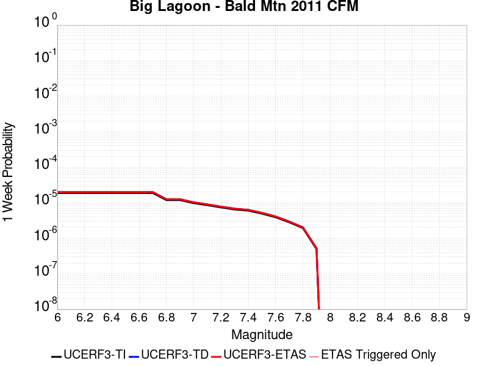 | 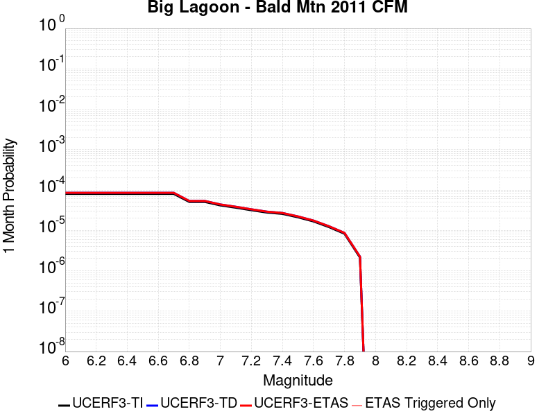 | 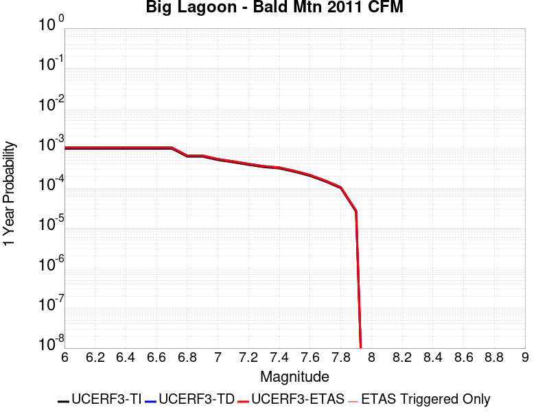 |  |

| Magnitude | 1 wk TI Prob | 1 wk TD Prob | 1 wk ETAS Prob | 1 wk ETAS/TD Gain | 1 wk ETAS Triggered Only | 1 mo TI Prob | 1 mo TD Prob | 1 mo ETAS Prob | 1 mo ETAS/TD Gain | 1 mo ETAS Triggered Only | 1 yr TI Prob | 1 yr TD Prob | 1 yr ETAS Prob | 1 yr ETAS/TD Gain | 1 yr ETAS Triggered Only | 10 yr TI Prob | 10 yr TD Prob | 10 yr ETAS Prob | 10 yr ETAS/TD Gain | 10 yr ETAS Triggered Only |
|-----|-----|-----|-----|-----|-----|-----|-----|-----|-----|-----|-----|-----|-----|-----|-----|-----|-----|-----|-----|-----|
| 6.0 | 1.8699735E-5 | 1.9853016E-5 | 1.9853016E-5 | 1.0 | 0.0 | 8.013926E-5 | 8.5081796E-5 | 8.5081796E-5 | 1.0 | 0.0 | 9.752587E-4 | 0.0010354164 | 0.0010354164 | 1.0 | 0.0 | 0.009709897 | 0.01030974 | 0.0103210155 | 1.0010937 | 1.1393155E-5 |
| 6.1 | 1.8699735E-5 | 1.9853016E-5 | 1.9853016E-5 | 1.0 | 0.0 | 8.013926E-5 | 8.5081796E-5 | 8.5081796E-5 | 1.0 | 0.0 | 9.752587E-4 | 0.0010354164 | 0.0010354164 | 1.0 | 0.0 | 0.009709897 | 0.01030974 | 0.0103210155 | 1.0010937 | 1.1393155E-5 |
| 6.2 | 1.8699735E-5 | 1.9853016E-5 | 1.9853016E-5 | 1.0 | 0.0 | 8.013926E-5 | 8.5081796E-5 | 8.5081796E-5 | 1.0 | 0.0 | 9.752587E-4 | 0.0010354164 | 0.0010354164 | 1.0 | 0.0 | 0.009709897 | 0.01030974 | 0.0103210155 | 1.0010937 | 1.1393155E-5 |
| 6.3 | 1.8699735E-5 | 1.9853016E-5 | 1.9853016E-5 | 1.0 | 0.0 | 8.013926E-5 | 8.5081796E-5 | 8.5081796E-5 | 1.0 | 0.0 | 9.752587E-4 | 0.0010354164 | 0.0010354164 | 1.0 | 0.0 | 0.009709897 | 0.01030974 | 0.0103210155 | 1.0010937 | 1.1393155E-5 |
| 6.4 | 1.8699735E-5 | 1.9853016E-5 | 1.9853016E-5 | 1.0 | 0.0 | 8.013926E-5 | 8.5081796E-5 | 8.5081796E-5 | 1.0 | 0.0 | 9.752587E-4 | 0.0010354164 | 0.0010354164 | 1.0 | 0.0 | 0.009709897 | 0.01030974 | 0.0103210155 | 1.0010937 | 1.1393155E-5 |
| 6.5 | 1.8699735E-5 | 1.9853016E-5 | 1.9853016E-5 | 1.0 | 0.0 | 8.013926E-5 | 8.5081796E-5 | 8.5081796E-5 | 1.0 | 0.0 | 9.752587E-4 | 0.0010354164 | 0.0010354164 | 1.0 | 0.0 | 0.009709897 | 0.01030974 | 0.0103210155 | 1.0010937 | 1.1393155E-5 |
| 6.6 | 1.8699735E-5 | 1.9853016E-5 | 1.9853016E-5 | 1.0 | 0.0 | 8.013926E-5 | 8.5081796E-5 | 8.5081796E-5 | 1.0 | 0.0 | 9.752587E-4 | 0.0010354164 | 0.0010354164 | 1.0 | 0.0 | 0.009709897 | 0.01030974 | 0.0103210155 | 1.0010937 | 1.1393155E-5 |
| 6.7 | 1.8699735E-5 | 1.9853016E-5 | 1.9853016E-5 | 1.0 | 0.0 | 8.013926E-5 | 8.5081796E-5 | 8.5081796E-5 | 1.0 | 0.0 | 9.752587E-4 | 0.0010354164 | 0.0010354164 | 1.0 | 0.0 | 0.009709897 | 0.01030974 | 0.0103210155 | 1.0010937 | 1.1393155E-5 |
| 6.8 | 1.18505095E-5 | 1.2501391E-5 | 1.2501391E-5 | 1.0 | 0.0 | 5.078691E-5 | 5.3576317E-5 | 5.3576317E-5 | 1.0 | 0.0 | 6.181552E-4 | 6.521013E-4 | 6.521013E-4 | 1.0 | 0.0 | 0.006164385 | 0.006502382 | 0.006513701 | 1.0017408 | 1.1393155E-5 |
| 6.9 | 1.18505095E-5 | 1.2501391E-5 | 1.2501391E-5 | 1.0 | 0.0 | 5.078691E-5 | 5.3576317E-5 | 5.3576317E-5 | 1.0 | 0.0 | 6.181552E-4 | 6.521013E-4 | 6.521013E-4 | 1.0 | 0.0 | 0.006164385 | 0.006502382 | 0.006513701 | 1.0017408 | 1.1393155E-5 |
| 7.0 | 9.719786E-6 | 1.0236746E-5 | 1.0236746E-5 | 1.0 | 0.0 | 4.1655563E-5 | 4.387104E-5 | 4.387104E-5 | 1.0 | 0.0 | 5.0703844E-4 | 5.340014E-4 | 5.340014E-4 | 1.0 | 0.0 | 0.005058831 | 0.0053274287 | 0.005338761 | 1.0021272 | 1.1393155E-5 |
| 7.1 | 8.523418E-6 | 8.970551E-6 | 8.970551E-6 | 1.0 | 0.0 | 3.652842E-5 | 3.844466E-5 | 3.844466E-5 | 1.0 | 0.0 | 4.4464276E-4 | 4.6796477E-4 | 4.6796477E-4 | 1.0 | 0.0 | 0.0044375416 | 0.004669957 | 0.004669957 | 1.0 | 0.0 |
| 7.2 | 7.378894E-6 | 7.762043E-6 | 7.762043E-6 | 1.0 | 0.0 | 3.162345E-5 | 3.326548E-5 | 3.326548E-5 | 1.0 | 0.0 | 3.8494746E-4 | 4.0493289E-4 | 4.0493289E-4 | 1.0 | 0.0 | 0.0038428132 | 0.0040420466 | 0.0040420466 | 1.0 | 0.0 |
| 7.3 | 6.4640294E-6 | 6.793243E-6 | 6.793243E-6 | 1.0 | 0.0 | 2.7702688E-5 | 2.9113577E-5 | 2.9113577E-5 | 1.0 | 0.0 | 3.3722803E-4 | 3.544008E-4 | 3.544008E-4 | 1.0 | 0.0 | 0.0033671674 | 0.0035384265 | 0.0035384265 | 1.0 | 0.0 |
| 7.4 | 5.9959093E-6 | 6.2995373E-6 | 6.2995373E-6 | 1.0 | 0.0 | 2.5696501E-5 | 2.699774E-5 | 2.699774E-5 | 1.0 | 0.0 | 3.1280998E-4 | 3.286485E-4 | 3.286485E-4 | 1.0 | 0.0 | 0.0031237002 | 0.003281687 | 0.003281687 | 1.0 | 0.0 |
| 7.5 | 4.929265E-6 | 5.1769966E-6 | 5.1769966E-6 | 1.0 | 0.0 | 2.112525E-5 | 2.2186943E-5 | 2.2186943E-5 | 1.0 | 0.0 | 2.5716957E-4 | 2.7009295E-4 | 2.7009295E-4 | 1.0 | 0.0 | 0.0025687215 | 0.0026976874 | 0.0026976874 | 1.0 | 0.0 |
| 7.6 | 3.8982403E-6 | 4.0893897E-6 | 4.0893897E-6 | 1.0 | 0.0 | 1.6706637E-5 | 1.752584E-5 | 1.752584E-5 | 1.0 | 0.0 | 2.0338432E-4 | 2.1335647E-4 | 2.1335647E-4 | 1.0 | 0.0 | 0.0020319829 | 0.002131544 | 0.002131544 | 1.0 | 0.0 |
| 7.7 | 2.820968E-6 | 2.957542E-6 | 2.957542E-6 | 1.0 | 0.0 | 1.2089806E-5 | 1.2675119E-5 | 1.2675119E-5 | 1.0 | 0.0 | 1.4718344E-4 | 1.5430881E-4 | 1.5430881E-4 | 1.0 | 0.0 | 0.00147086 | 0.0015420344 | 0.0015420344 | 1.0 | 0.0 |
| 7.8 | 1.9314455E-6 | 2.0262478E-6 | 2.0262478E-6 | 1.0 | 0.0 | 8.277597E-6 | 8.683891E-6 | 8.683891E-6 | 1.0 | 0.0 | 1.0077508E-4 | 1.05721374E-4 | 1.05721374E-4 | 1.0 | 0.0 | 0.0010072939 | 0.0010567236 | 0.0010567236 | 1.0 | 0.0 |
| 7.9 | 4.9586197E-7 | 5.219555E-7 | 5.219555E-7 | 1.0 | 0.0 | 2.125121E-6 | 2.2369502E-6 | 2.2369502E-6 | 1.0 | 0.0 | 2.5873042E-5 | 2.723455E-5 | 2.723455E-5 | 1.0 | 0.0 | 2.5870028E-4 | 2.723142E-4 | 2.723142E-4 | 1.0 | 0.0 |

## Elsinore (Coyote Mountains)
*[(top)](#table-of-contents)*

| 1 Week | 1 Month | 1 Year | 10 Year |
|-----|-----|-----|-----|
| 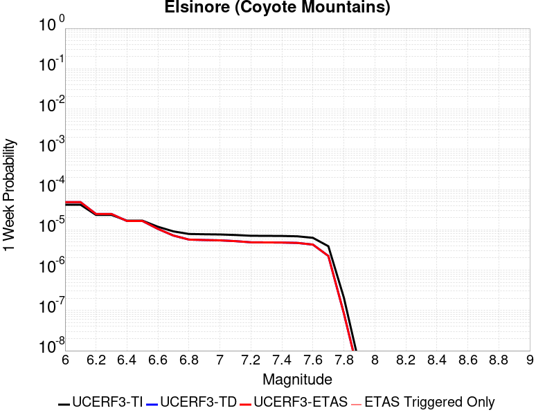 |  | 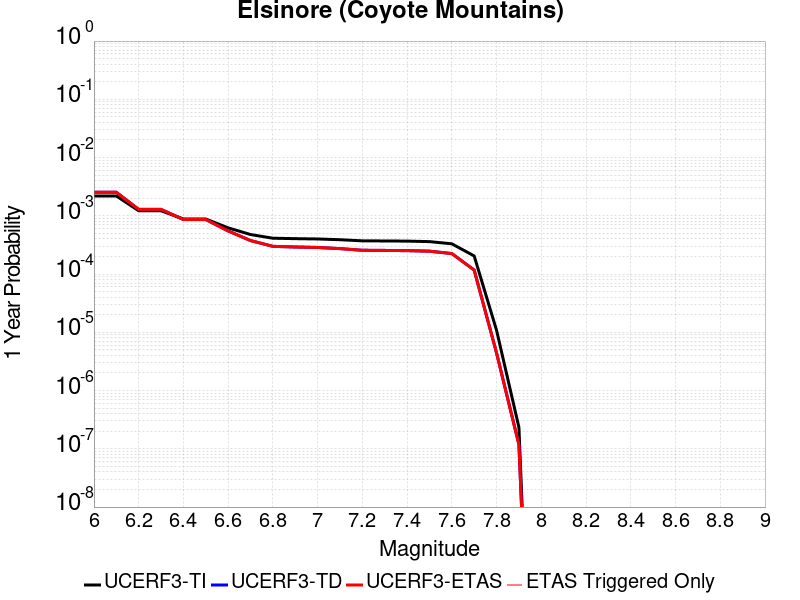 |  |

| Magnitude | 1 wk TI Prob | 1 wk TD Prob | 1 wk ETAS Prob | 1 wk ETAS/TD Gain | 1 wk ETAS Triggered Only | 1 mo TI Prob | 1 mo TD Prob | 1 mo ETAS Prob | 1 mo ETAS/TD Gain | 1 mo ETAS Triggered Only | 1 yr TI Prob | 1 yr TD Prob | 1 yr ETAS Prob | 1 yr ETAS/TD Gain | 1 yr ETAS Triggered Only | 10 yr TI Prob | 10 yr TD Prob | 10 yr ETAS Prob | 10 yr ETAS/TD Gain | 10 yr ETAS Triggered Only |
|-----|-----|-----|-----|-----|-----|-----|-----|-----|-----|-----|-----|-----|-----|-----|-----|-----|-----|-----|-----|-----|
| 6.0 | 4.20513E-5 | 4.866044E-5 | 4.866044E-5 | 1.0 | 0.0 | 1.8020741E-4 | 2.0853132E-4 | 2.0853132E-4 | 1.0 | 0.0 | 0.0021918174 | 0.0025364377 | 0.0025364377 | 1.0 | 0.0 | 0.021703249 | 0.025126155 | 0.025137262 | 1.000442 | 1.1393155E-5 |
| 6.1 | 4.20513E-5 | 4.866044E-5 | 4.866044E-5 | 1.0 | 0.0 | 1.8020741E-4 | 2.0853132E-4 | 2.0853132E-4 | 1.0 | 0.0 | 0.0021918174 | 0.0025364377 | 0.0025364377 | 1.0 | 0.0 | 0.021703249 | 0.025126155 | 0.025137262 | 1.000442 | 1.1393155E-5 |
| 6.2 | 2.3413893E-5 | 2.4709492E-5 | 2.4709492E-5 | 1.0 | 0.0 | 1.0034139E-4 | 1.05894054E-4 | 1.05894054E-4 | 1.0 | 0.0 | 0.0012209718 | 0.0012885854 | 0.0012885854 | 1.0 | 0.0 | 0.012142851 | 0.01281981 | 0.01281981 | 1.0 | 0.0 |
| 6.3 | 2.3413893E-5 | 2.4709492E-5 | 2.4709492E-5 | 1.0 | 0.0 | 1.0034139E-4 | 1.05894054E-4 | 1.05894054E-4 | 1.0 | 0.0 | 0.0012209718 | 0.0012885854 | 0.0012885854 | 1.0 | 0.0 | 0.012142851 | 0.01281981 | 0.01281981 | 1.0 | 0.0 |
| 6.4 | 1.6894814E-5 | 1.6577686E-5 | 1.6577686E-5 | 1.0 | 0.0 | 7.240433E-5 | 7.10455E-5 | 7.10455E-5 | 1.0 | 0.0 | 8.811662E-4 | 8.6467253E-4 | 8.6467253E-4 | 1.0 | 0.0 | 0.0087768035 | 0.008616741 | 0.008616741 | 1.0 | 0.0 |
| 6.5 | 1.6894814E-5 | 1.6577686E-5 | 1.6577686E-5 | 1.0 | 0.0 | 7.240433E-5 | 7.10455E-5 | 7.10455E-5 | 1.0 | 0.0 | 8.811662E-4 | 8.6467253E-4 | 8.6467253E-4 | 1.0 | 0.0 | 0.0087768035 | 0.008616741 | 0.008616741 | 1.0 | 0.0 |
| 6.6 | 1.1910969E-5 | 1.0537063E-5 | 1.0537063E-5 | 1.0 | 0.0 | 5.1046012E-5 | 4.5158125E-5 | 4.5158125E-5 | 1.0 | 0.0 | 6.21308E-4 | 5.496747E-4 | 5.496747E-4 | 1.0 | 0.0 | 0.0061957375 | 0.005484452 | 0.005484452 | 1.0 | 0.0 |
| 6.7 | 9.1486E-6 | 7.207595E-6 | 7.207595E-6 | 1.0 | 0.0 | 3.9207694E-5 | 3.0889347E-5 | 3.0889347E-5 | 1.0 | 0.0 | 4.7724912E-4 | 3.7601675E-4 | 3.7601675E-4 | 1.0 | 0.0 | 0.0047622547 | 0.003754185 | 0.003754185 | 1.0 | 0.0 |
| 6.8 | 7.90441E-6 | 5.733133E-6 | 5.733133E-6 | 1.0 | 0.0 | 3.3875604E-5 | 2.4570347E-5 | 2.4570347E-5 | 1.0 | 0.0 | 4.1235742E-4 | 2.991042E-4 | 2.991042E-4 | 1.0 | 0.0 | 0.0041159308 | 0.002987145 | 0.002987145 | 1.0 | 0.0 |
| 6.9 | 7.77015E-6 | 5.587058E-6 | 5.587058E-6 | 1.0 | 0.0 | 3.3300217E-5 | 2.394432E-5 | 2.394432E-5 | 1.0 | 0.0 | 4.0535472E-4 | 2.9148438E-4 | 2.9148438E-4 | 1.0 | 0.0 | 0.004046161 | 0.002911148 | 0.002911148 | 1.0 | 0.0 |
| 7.0 | 7.675798E-6 | 5.4838943E-6 | 5.4838943E-6 | 1.0 | 0.0 | 3.289586E-5 | 2.3502198E-5 | 2.3502198E-5 | 1.0 | 0.0 | 4.004335E-4 | 2.8610296E-4 | 2.8610296E-4 | 1.0 | 0.0 | 0.003997127 | 0.002857473 | 0.002857473 | 1.0 | 0.0 |
| 7.1 | 7.447814E-6 | 5.2427326E-6 | 5.2427326E-6 | 1.0 | 0.0 | 3.191881E-5 | 2.2468666E-5 | 2.2468666E-5 | 1.0 | 0.0 | 3.8854225E-4 | 2.7352292E-4 | 2.7352292E-4 | 1.0 | 0.0 | 0.003878636 | 0.0027319873 | 0.0027319873 | 1.0 | 0.0 |
| 7.2 | 7.128185E-6 | 4.909364E-6 | 4.909364E-6 | 1.0 | 0.0 | 3.0549007E-5 | 2.1039968E-5 | 2.1039968E-5 | 1.0 | 0.0 | 3.7187067E-4 | 2.561327E-4 | 2.561327E-4 | 1.0 | 0.0 | 0.00371249 | 0.0025584935 | 0.0025584935 | 1.0 | 0.0 |
| 7.3 | 7.0913875E-6 | 4.878033E-6 | 4.878033E-6 | 1.0 | 0.0 | 3.0391306E-5 | 2.0905694E-5 | 2.0905694E-5 | 1.0 | 0.0 | 3.6995133E-4 | 2.544983E-4 | 2.544983E-4 | 1.0 | 0.0 | 0.0036933604 | 0.002542187 | 0.002542187 | 1.0 | 0.0 |
| 7.4 | 7.051521E-6 | 4.8418797E-6 | 4.8418797E-6 | 1.0 | 0.0 | 3.0220453E-5 | 2.0750755E-5 | 2.0750755E-5 | 1.0 | 0.0 | 3.6787192E-4 | 2.5261234E-4 | 2.5261234E-4 | 1.0 | 0.0 | 0.0036726352 | 0.0025233703 | 0.0025233703 | 1.0 | 0.0 |
| 7.5 | 6.910666E-6 | 4.73732E-6 | 4.73732E-6 | 1.0 | 0.0 | 2.9616802E-5 | 2.0302648E-5 | 2.0302648E-5 | 1.0 | 0.0 | 3.605249E-4 | 2.471579E-4 | 2.471579E-4 | 1.0 | 0.0 | 0.0035994058 | 0.0024689483 | 0.0024689483 | 1.0 | 0.0 |
| 7.6 | 6.341753E-6 | 4.3102505E-6 | 4.3102505E-6 | 1.0 | 0.0 | 2.7178658E-5 | 1.8472378E-5 | 1.8472378E-5 | 1.0 | 0.0 | 3.3084993E-4 | 2.2487914E-4 | 2.2487914E-4 | 1.0 | 0.0 | 0.0033035777 | 0.0022466313 | 0.0022466313 | 1.0 | 0.0 |
| 7.7 | 3.9205916E-6 | 2.245969E-6 | 2.245969E-6 | 1.0 | 0.0 | 1.6802427E-5 | 9.62555E-6 | 9.62555E-6 | 1.0 | 0.0 | 2.0455034E-4 | 1.1718551E-4 | 1.1718551E-4 | 1.0 | 0.0 | 0.0020436216 | 0.0011713103 | 0.0011713103 | 1.0 | 0.0 |
| 7.8 | 2.0846227E-7 | 8.493278E-8 | 8.493278E-8 | 1.0 | 0.0 | 8.9340944E-7 | 3.639976E-7 | 3.639976E-7 | 1.0 | 0.0 | 1.0877206E-5 | 4.4316653E-6 | 4.4316653E-6 | 1.0 | 0.0 | 1.0876673E-4 | 4.4316093E-5 | 4.4316093E-5 | 1.0 | 0.0 |
| 7.9 | 4.4969806E-9 | 2.2705593E-9 | 2.2705593E-9 | 1.0 | 0.0 | 1.9272775E-8 | 9.730968E-9 | 9.730968E-9 | 1.0 | 0.0 | 2.3464601E-7 | 1.18474524E-7 | 1.18474524E-7 | 1.0 | 0.0 | 2.3464577E-6 | 1.1847447E-6 | 1.1847447E-6 | 1.0 | 0.0 |

## Calaveras (Central) 2011 CFM
*[(top)](#table-of-contents)*

| 1 Week | 1 Month | 1 Year | 10 Year |
|-----|-----|-----|-----|
|  |  | 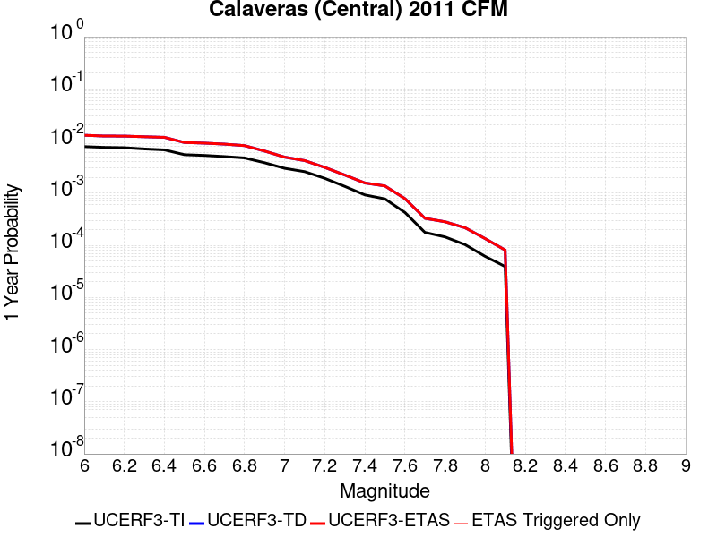 |  |

| Magnitude | 1 wk TI Prob | 1 wk TD Prob | 1 wk ETAS Prob | 1 wk ETAS/TD Gain | 1 wk ETAS Triggered Only | 1 mo TI Prob | 1 mo TD Prob | 1 mo ETAS Prob | 1 mo ETAS/TD Gain | 1 mo ETAS Triggered Only | 1 yr TI Prob | 1 yr TD Prob | 1 yr ETAS Prob | 1 yr ETAS/TD Gain | 1 yr ETAS Triggered Only | 10 yr TI Prob | 10 yr TD Prob | 10 yr ETAS Prob | 10 yr ETAS/TD Gain | 10 yr ETAS Triggered Only |
|-----|-----|-----|-----|-----|-----|-----|-----|-----|-----|-----|-----|-----|-----|-----|-----|-----|-----|-----|-----|-----|
| 6.0 | 1.5010907E-4 | 2.486054E-4 | 2.486054E-4 | 1.0 | 0.0 | 6.4316596E-4 | 0.0010649828 | 0.0010649828 | 1.0 | 0.0 | 0.0078024664 | 0.012880217 | 0.012880217 | 1.0 | 0.0 | 0.07534136 | 0.120652944 | 0.12066296 | 1.0000831 | 1.1393155E-5 |
| 6.1 | 1.4521465E-4 | 2.402117E-4 | 2.402117E-4 | 1.0 | 0.0 | 6.222001E-4 | 0.0010290514 | 0.0010290514 | 1.0 | 0.0 | 0.0075490056 | 0.012449205 | 0.012449205 | 1.0 | 0.0 | 0.07297657 | 0.11692268 | 0.11693274 | 1.0000861 | 1.1393155E-5 |
| 6.2 | 1.429998E-4 | 2.3951524E-4 | 2.3951524E-4 | 1.0 | 0.0 | 6.127123E-4 | 0.0010260694 | 0.0010260694 | 1.0 | 0.0 | 0.007434286 | 0.012413359 | 0.012413359 | 1.0 | 0.0 | 0.07190444 | 0.11657216 | 0.11658222 | 1.0000863 | 1.1393155E-5 |
| 6.3 | 1.3536277E-4 | 2.328017E-4 | 2.328017E-4 | 1.0 | 0.0 | 5.799972E-4 | 9.973258E-4 | 9.973258E-4 | 1.0 | 0.0 | 0.0070386264 | 0.0120682465 | 0.0120682465 | 1.0 | 0.0 | 0.0681982 | 0.113473505 | 0.11348361 | 1.000089 | 1.1393155E-5 |
| 6.4 | 1.2993296E-4 | 2.2702127E-4 | 2.2702127E-4 | 1.0 | 0.0 | 5.5673666E-4 | 9.725719E-4 | 9.725719E-4 | 1.0 | 0.0 | 0.006757223 | 0.011770229 | 0.011770229 | 1.0 | 0.0 | 0.06555412 | 0.11074506 | 0.11075519 | 1.0000914 | 1.1393155E-5 |
| 6.5 | 1.0498927E-4 | 1.8030136E-4 | 1.8030136E-4 | 1.0 | 0.0 | 4.498764E-4 | 7.724899E-4 | 7.724899E-4 | 1.0 | 0.0 | 0.005463498 | 0.009364418 | 0.009364418 | 1.0 | 0.0 | 0.053311124 | 0.089413136 | 0.089423515 | 1.000116 | 1.1393155E-5 |
| 6.6 | 1.0157505E-4 | 1.751706E-4 | 1.751706E-4 | 1.0 | 0.0 | 4.35249E-4 | 7.5051415E-4 | 7.5051415E-4 | 1.0 | 0.0 | 0.0052862884 | 0.009099164 | 0.009099164 | 1.0 | 0.0 | 0.05162293 | 0.086988494 | 0.0869989 | 1.0001196 | 1.1393155E-5 |
| 6.7 | 9.660386E-5 | 1.6775173E-4 | 1.6775173E-4 | 1.0 | 0.0 | 4.1395082E-4 | 7.18737E-4 | 7.18737E-4 | 1.0 | 0.0 | 0.0050282106 | 0.008715475 | 0.008715475 | 1.0 | 0.0 | 0.049159497 | 0.08347411 | 0.08348455 | 1.000125 | 1.1393155E-5 |
| 6.8 | 9.089927E-5 | 1.5687576E-4 | 1.5687576E-4 | 1.0 | 0.0 | 3.8951015E-4 | 6.7215035E-4 | 6.7215035E-4 | 1.0 | 0.0 | 0.0047319788 | 0.0081526935 | 0.0081526935 | 1.0 | 0.0 | 0.046324775 | 0.07836289 | 0.078373395 | 1.000134 | 1.1393155E-5 |
| 6.9 | 7.353187E-5 | 1.23331E-4 | 1.23331E-4 | 1.0 | 0.0 | 3.150985E-4 | 5.284549E-4 | 5.284549E-4 | 1.0 | 0.0 | 0.0038295772 | 0.00641508 | 0.00641508 | 1.0 | 0.0 | 0.037642512 | 0.06236507 | 0.062375754 | 1.0001713 | 1.1393155E-5 |
| 7.0 | 5.746064E-5 | 9.420717E-5 | 9.420717E-5 | 1.0 | 0.0 | 2.4623662E-4 | 4.036829E-4 | 4.036829E-4 | 1.0 | 0.0 | 0.0029938098 | 0.0049038352 | 0.0049038352 | 1.0 | 0.0 | 0.02953797 | 0.048140272 | 0.04815112 | 1.0002253 | 1.1393155E-5 |
| 7.1 | 4.9557195E-5 | 8.080612E-5 | 8.080612E-5 | 1.0 | 0.0 | 2.123707E-4 | 3.4626634E-4 | 3.4626634E-4 | 1.0 | 0.0 | 0.0025825473 | 0.0042077065 | 0.0042077065 | 1.0 | 0.0 | 0.0255274 | 0.041510172 | 0.04152109 | 1.0002631 | 1.1393155E-5 |
| 7.2 | 3.687595E-5 | 5.9783193E-5 | 5.9783193E-5 | 1.0 | 0.0 | 1.5803022E-4 | 2.5618868E-4 | 2.5618868E-4 | 1.0 | 0.0 | 0.0019223199 | 0.0031146654 | 0.0031146654 | 1.0 | 0.0 | 0.01905776 | 0.03101115 | 0.03101115 | 1.0 | 0.0 |
| 7.3 | 2.5846984E-5 | 4.2696363E-5 | 4.2696363E-5 | 1.0 | 0.0 | 1.1076809E-4 | 1.8297168E-4 | 1.8297168E-4 | 1.0 | 0.0 | 0.0013477671 | 0.002225422 | 0.002225422 | 1.0 | 0.0 | 0.013396223 | 0.022287663 | 0.022287663 | 1.0 | 0.0 |
| 7.4 | 1.7747854E-5 | 3.007179E-5 | 3.007179E-5 | 1.0 | 0.0 | 7.6060016E-5 | 1.2887275E-4 | 1.2887275E-4 | 1.0 | 0.0 | 9.2563726E-4 | 0.0015678994 | 0.0015678994 | 1.0 | 0.0 | 0.009217911 | 0.01577704 | 0.01577704 | 1.0 | 0.0 |
| 7.5 | 1.4883479E-5 | 2.6370015E-5 | 2.6370015E-5 | 1.0 | 0.0 | 6.378478E-5 | 1.1300947E-4 | 1.1300947E-4 | 1.0 | 0.0 | 7.76303E-4 | 0.0013750247 | 0.0013750247 | 1.0 | 0.0 | 0.0077359667 | 0.013865935 | 0.013865935 | 1.0 | 0.0 |
| 7.6 | 8.166975E-6 | 1.5055087E-5 | 1.5055087E-5 | 1.0 | 0.0 | 3.5000852E-5 | 6.452021E-5 | 6.452021E-5 | 1.0 | 0.0 | 4.2605202E-4 | 7.852518E-4 | 7.852518E-4 | 1.0 | 0.0 | 0.004252361 | 0.007986172 | 0.007986172 | 1.0 | 0.0 |
| 7.7 | 3.3858064E-6 | 6.3121483E-6 | 6.3121483E-6 | 1.0 | 0.0 | 1.4510518E-5 | 2.7051785E-5 | 2.7051785E-5 | 1.0 | 0.0 | 1.7665124E-4 | 3.2930577E-4 | 3.2930577E-4 | 1.0 | 0.0 | 0.0017651088 | 0.003416996 | 0.003416996 | 1.0 | 0.0 |
| 7.8 | 2.7721615E-6 | 5.4162056E-6 | 5.4162056E-6 | 1.0 | 0.0 | 1.1880637E-5 | 2.3212104E-5 | 2.3212104E-5 | 1.0 | 0.0 | 1.4463716E-4 | 2.8257075E-4 | 2.8257075E-4 | 1.0 | 0.0 | 0.0014454306 | 0.0029318896 | 0.0029318896 | 1.0 | 0.0 |
| 7.9 | 1.9736292E-6 | 4.1651037E-6 | 4.1651037E-6 | 1.0 | 0.0 | 8.4583835E-6 | 1.7850321E-5 | 1.7850321E-5 | 1.0 | 0.0 | 1.0297595E-4 | 2.1730603E-4 | 2.1730603E-4 | 1.0 | 0.0 | 0.0010292825 | 0.0022414508 | 0.0022414508 | 1.0 | 0.0 |
| 8.0 | 1.1767289E-6 | 2.5760883E-6 | 2.5760883E-6 | 1.0 | 0.0 | 5.0431145E-6 | 1.1040332E-5 | 1.1040332E-5 | 1.0 | 0.0 | 6.139818E-5 | 1.3440778E-4 | 1.3440778E-4 | 1.0 | 0.0 | 6.1381224E-4 | 0.0013766186 | 0.0013766186 | 1.0 | 0.0 |
| 8.1 | 7.5112825E-7 | 1.5540153E-6 | 1.5540153E-6 | 1.0 | 0.0 | 3.2191172E-6 | 6.6600487E-6 | 6.6600487E-6 | 1.0 | 0.0 | 3.9192048E-5 | 8.10831E-5 | 8.10831E-5 | 1.0 | 0.0 | 3.9185135E-4 | 8.2997297E-4 | 8.2997297E-4 | 1.0 | 0.0 |

## Pitas Point (Lower West)
*[(top)](#table-of-contents)*

| 1 Week | 1 Month | 1 Year | 10 Year |
|-----|-----|-----|-----|
|  | 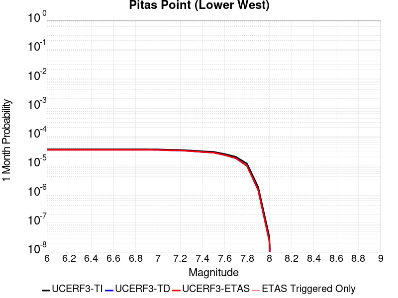 | 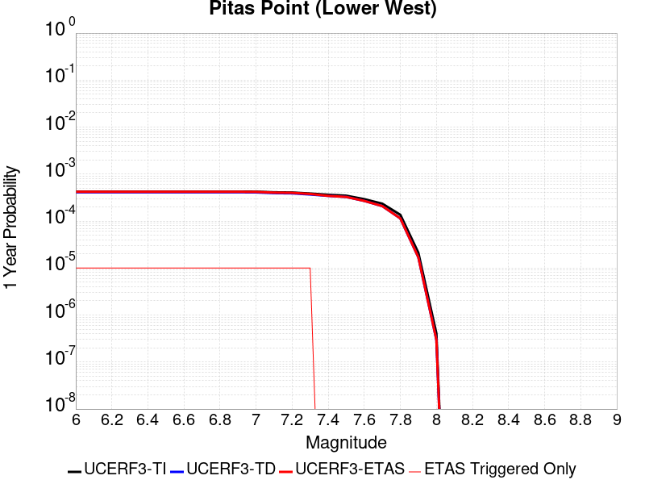 |  |

| Magnitude | 1 wk TI Prob | 1 wk TD Prob | 1 wk ETAS Prob | 1 wk ETAS/TD Gain | 1 wk ETAS Triggered Only | 1 mo TI Prob | 1 mo TD Prob | 1 mo ETAS Prob | 1 mo ETAS/TD Gain | 1 mo ETAS Triggered Only | 1 yr TI Prob | 1 yr TD Prob | 1 yr ETAS Prob | 1 yr ETAS/TD Gain | 1 yr ETAS Triggered Only | 10 yr TI Prob | 10 yr TD Prob | 10 yr ETAS Prob | 10 yr ETAS/TD Gain | 10 yr ETAS Triggered Only |
|-----|-----|-----|-----|-----|-----|-----|-----|-----|-----|-----|-----|-----|-----|-----|-----|-----|-----|-----|-----|-----|
| 6.0 | 8.151497E-6 | 7.857066E-6 | 7.857066E-6 | 1.0 | 0.0 | 3.493452E-5 | 3.367271E-5 | 3.367271E-5 | 1.0 | 0.0 | 4.252448E-4 | 4.0988886E-4 | 4.2127733E-4 | 1.0277843 | 1.1393155E-5 | 0.0042443196 | 0.004091409 | 0.004102756 | 1.0027733 | 1.1393155E-5 |
| 6.1 | 8.151497E-6 | 7.857066E-6 | 7.857066E-6 | 1.0 | 0.0 | 3.493452E-5 | 3.367271E-5 | 3.367271E-5 | 1.0 | 0.0 | 4.252448E-4 | 4.0988886E-4 | 4.2127733E-4 | 1.0277843 | 1.1393155E-5 | 0.0042443196 | 0.004091409 | 0.004102756 | 1.0027733 | 1.1393155E-5 |
| 6.2 | 8.151497E-6 | 7.857066E-6 | 7.857066E-6 | 1.0 | 0.0 | 3.493452E-5 | 3.367271E-5 | 3.367271E-5 | 1.0 | 0.0 | 4.252448E-4 | 4.0988886E-4 | 4.2127733E-4 | 1.0277843 | 1.1393155E-5 | 0.0042443196 | 0.004091409 | 0.004102756 | 1.0027733 | 1.1393155E-5 |
| 6.3 | 8.151497E-6 | 7.857066E-6 | 7.857066E-6 | 1.0 | 0.0 | 3.493452E-5 | 3.367271E-5 | 3.367271E-5 | 1.0 | 0.0 | 4.252448E-4 | 4.0988886E-4 | 4.2127733E-4 | 1.0277843 | 1.1393155E-5 | 0.0042443196 | 0.004091409 | 0.004102756 | 1.0027733 | 1.1393155E-5 |
| 6.4 | 8.151497E-6 | 7.857066E-6 | 7.857066E-6 | 1.0 | 0.0 | 3.493452E-5 | 3.367271E-5 | 3.367271E-5 | 1.0 | 0.0 | 4.252448E-4 | 4.0988886E-4 | 4.2127733E-4 | 1.0277843 | 1.1393155E-5 | 0.0042443196 | 0.004091409 | 0.004102756 | 1.0027733 | 1.1393155E-5 |
| 6.5 | 8.151497E-6 | 7.857066E-6 | 7.857066E-6 | 1.0 | 0.0 | 3.493452E-5 | 3.367271E-5 | 3.367271E-5 | 1.0 | 0.0 | 4.252448E-4 | 4.0988886E-4 | 4.2127733E-4 | 1.0277843 | 1.1393155E-5 | 0.0042443196 | 0.004091409 | 0.004102756 | 1.0027733 | 1.1393155E-5 |
| 6.6 | 8.151497E-6 | 7.857066E-6 | 7.857066E-6 | 1.0 | 0.0 | 3.493452E-5 | 3.367271E-5 | 3.367271E-5 | 1.0 | 0.0 | 4.252448E-4 | 4.0988886E-4 | 4.2127733E-4 | 1.0277843 | 1.1393155E-5 | 0.0042443196 | 0.004091409 | 0.004102756 | 1.0027733 | 1.1393155E-5 |
| 6.7 | 8.151497E-6 | 7.857066E-6 | 7.857066E-6 | 1.0 | 0.0 | 3.493452E-5 | 3.367271E-5 | 3.367271E-5 | 1.0 | 0.0 | 4.252448E-4 | 4.0988886E-4 | 4.2127733E-4 | 1.0277843 | 1.1393155E-5 | 0.0042443196 | 0.004091409 | 0.004102756 | 1.0027733 | 1.1393155E-5 |
| 6.8 | 8.151497E-6 | 7.857066E-6 | 7.857066E-6 | 1.0 | 0.0 | 3.493452E-5 | 3.367271E-5 | 3.367271E-5 | 1.0 | 0.0 | 4.252448E-4 | 4.0988886E-4 | 4.2127733E-4 | 1.0277843 | 1.1393155E-5 | 0.0042443196 | 0.004091409 | 0.004102756 | 1.0027733 | 1.1393155E-5 |
| 6.9 | 8.151497E-6 | 7.857066E-6 | 7.857066E-6 | 1.0 | 0.0 | 3.493452E-5 | 3.367271E-5 | 3.367271E-5 | 1.0 | 0.0 | 4.252448E-4 | 4.0988886E-4 | 4.2127733E-4 | 1.0277843 | 1.1393155E-5 | 0.0042443196 | 0.004091409 | 0.004102756 | 1.0027733 | 1.1393155E-5 |
| 7.0 | 8.103535E-6 | 7.8064895E-6 | 7.8064895E-6 | 1.0 | 0.0 | 3.4728975E-5 | 3.345596E-5 | 3.345596E-5 | 1.0 | 0.0 | 4.2274324E-4 | 4.072509E-4 | 4.1863942E-4 | 1.0279644 | 1.1393155E-5 | 0.0042193993 | 0.004065126 | 0.004076473 | 1.0027913 | 1.1393155E-5 |
| 7.1 | 7.853298E-6 | 7.5421462E-6 | 7.5421462E-6 | 1.0 | 0.0 | 3.3656554E-5 | 3.2323085E-5 | 3.2323085E-5 | 1.0 | 0.0 | 4.096915E-4 | 3.934632E-4 | 4.048519E-4 | 1.0289447 | 1.1393155E-5 | 0.00408937 | 0.003927742 | 0.0039390903 | 1.0028893 | 1.1393155E-5 |
| 7.2 | 7.771102E-6 | 7.454414E-6 | 7.454414E-6 | 1.0 | 0.0 | 3.33043E-5 | 3.1947104E-5 | 3.1947104E-5 | 1.0 | 0.0 | 4.0540437E-4 | 3.8888725E-4 | 4.0027598E-4 | 1.0292854 | 1.1393155E-5 | 0.0040466557 | 0.003882143 | 0.0038934918 | 1.0029234 | 1.1393155E-5 |
| 7.3 | 7.3945344E-6 | 7.050451E-6 | 7.050451E-6 | 1.0 | 0.0 | 3.1690477E-5 | 3.0215873E-5 | 3.0215873E-5 | 1.0 | 0.0 | 3.8576324E-4 | 3.6781677E-4 | 3.7920574E-4 | 1.0309637 | 1.1393155E-5 | 0.0038509427 | 0.0036721476 | 0.003683499 | 1.0030912 | 1.1393155E-5 |
| 7.4 | 6.964645E-6 | 6.5912277E-6 | 6.5912277E-6 | 1.0 | 0.0 | 2.9848137E-5 | 2.8247816E-5 | 2.8247816E-5 | 1.0 | 0.0 | 3.6334046E-4 | 3.438634E-4 | 3.438634E-4 | 1.0 | 0.0 | 0.0036274698 | 0.0034333665 | 0.0034333665 | 1.0 | 0.0 |
| 7.5 | 6.6525035E-6 | 6.2602144E-6 | 6.2602144E-6 | 1.0 | 0.0 | 2.851042E-5 | 2.6829217E-5 | 2.6829217E-5 | 1.0 | 0.0 | 3.4705905E-4 | 3.2659725E-4 | 3.2659725E-4 | 1.0 | 0.0 | 0.0034651754 | 0.0032612241 | 0.0032612241 | 1.0 | 0.0 |
| 7.6 | 5.613338E-6 | 5.152256E-6 | 5.152256E-6 | 1.0 | 0.0 | 2.405694E-5 | 2.2080912E-5 | 2.2080912E-5 | 1.0 | 0.0 | 2.928539E-4 | 2.6880225E-4 | 2.6880225E-4 | 1.0 | 0.0 | 0.0029246826 | 0.0026848027 | 0.0026848027 | 1.0 | 0.0 |
| 7.7 | 4.494704E-6 | 3.997605E-6 | 3.997605E-6 | 1.0 | 0.0 | 1.9262876E-5 | 1.7132481E-5 | 1.7132481E-5 | 1.0 | 0.0 | 2.3450027E-4 | 2.0856822E-4 | 2.0856822E-4 | 1.0 | 0.0 | 0.0023425296 | 0.0020837488 | 0.0020837488 | 1.0 | 0.0 |
| 7.8 | 2.6075882E-6 | 2.1840522E-6 | 2.1840522E-6 | 1.0 | 0.0 | 1.117533E-5 | 9.36019E-6 | 9.36019E-6 | 1.0 | 0.0 | 1.3605114E-4 | 1.139544E-4 | 1.139544E-4 | 1.0 | 0.0 | 0.0013596788 | 0.0011389643 | 0.0011389643 | 1.0 | 0.0 |
| 7.9 | 4.045984E-7 | 3.242925E-7 | 3.242925E-7 | 1.0 | 0.0 | 1.733992E-6 | 1.3898243E-6 | 1.3898243E-6 | 1.0 | 0.0 | 2.1111147E-5 | 1.6920983E-5 | 1.6920983E-5 | 1.0 | 0.0 | 2.1109142E-4 | 1.6919726E-4 | 1.6919726E-4 | 1.0 | 0.0 |
| 8.0 | 7.791402E-9 | 5.684476E-9 | 5.684476E-9 | 1.0 | 0.0 | 3.3391725E-8 | 2.4362041E-8 | 2.4362041E-8 | 1.0 | 0.0 | 4.0654416E-7 | 2.9660782E-7 | 2.9660782E-7 | 1.0 | 0.0 | 4.065434E-6 | 2.9660764E-6 | 2.9660764E-6 | 1.0 | 0.0 |

## Northridge
*[(top)](#table-of-contents)*

| 1 Week | 1 Month | 1 Year | 10 Year |
|-----|-----|-----|-----|
|  |  | 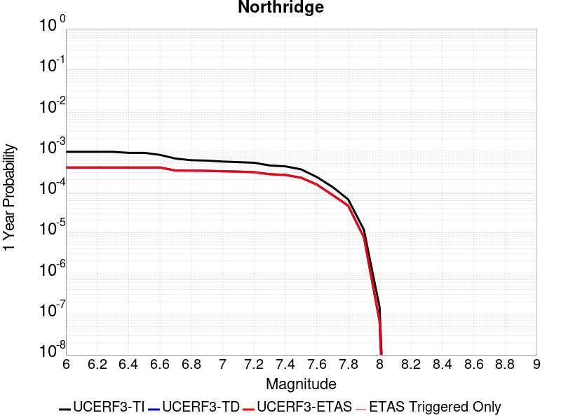 | 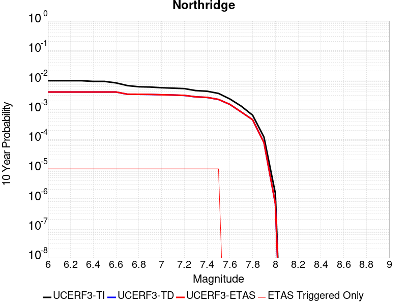 |

| Magnitude | 1 wk TI Prob | 1 wk TD Prob | 1 wk ETAS Prob | 1 wk ETAS/TD Gain | 1 wk ETAS Triggered Only | 1 mo TI Prob | 1 mo TD Prob | 1 mo ETAS Prob | 1 mo ETAS/TD Gain | 1 mo ETAS Triggered Only | 1 yr TI Prob | 1 yr TD Prob | 1 yr ETAS Prob | 1 yr ETAS/TD Gain | 1 yr ETAS Triggered Only | 10 yr TI Prob | 10 yr TD Prob | 10 yr ETAS Prob | 10 yr ETAS/TD Gain | 10 yr ETAS Triggered Only |
|-----|-----|-----|-----|-----|-----|-----|-----|-----|-----|-----|-----|-----|-----|-----|-----|-----|-----|-----|-----|-----|
| 6.0 | 1.8340852E-5 | 7.5910125E-6 | 7.5910125E-6 | 1.0 | 0.0 | 7.860128E-5 | 3.2532516E-5 | 3.2532516E-5 | 1.0 | 0.0 | 9.565505E-4 | 3.960136E-4 | 3.960136E-4 | 1.0 | 0.0 | 0.009524435 | 0.003953288 | 0.003964636 | 1.0028706 | 1.1393155E-5 |
| 6.1 | 1.8340852E-5 | 7.5910125E-6 | 7.5910125E-6 | 1.0 | 0.0 | 7.860128E-5 | 3.2532516E-5 | 3.2532516E-5 | 1.0 | 0.0 | 9.565505E-4 | 3.960136E-4 | 3.960136E-4 | 1.0 | 0.0 | 0.009524435 | 0.003953288 | 0.003964636 | 1.0028706 | 1.1393155E-5 |
| 6.2 | 1.8340852E-5 | 7.5910125E-6 | 7.5910125E-6 | 1.0 | 0.0 | 7.860128E-5 | 3.2532516E-5 | 3.2532516E-5 | 1.0 | 0.0 | 9.565505E-4 | 3.960136E-4 | 3.960136E-4 | 1.0 | 0.0 | 0.009524435 | 0.003953288 | 0.003964636 | 1.0028706 | 1.1393155E-5 |
| 6.3 | 1.8340852E-5 | 7.5910125E-6 | 7.5910125E-6 | 1.0 | 0.0 | 7.860128E-5 | 3.2532516E-5 | 3.2532516E-5 | 1.0 | 0.0 | 9.565505E-4 | 3.960136E-4 | 3.960136E-4 | 1.0 | 0.0 | 0.009524435 | 0.003953288 | 0.003964636 | 1.0028706 | 1.1393155E-5 |
| 6.4 | 1.7361892E-5 | 7.5910125E-6 | 7.5910125E-6 | 1.0 | 0.0 | 7.440598E-5 | 3.2532516E-5 | 3.2532516E-5 | 1.0 | 0.0 | 9.055163E-4 | 3.960136E-4 | 3.960136E-4 | 1.0 | 0.0 | 0.009018354 | 0.003953288 | 0.003964636 | 1.0028706 | 1.1393155E-5 |
| 6.5 | 1.7361892E-5 | 7.5910125E-6 | 7.5910125E-6 | 1.0 | 0.0 | 7.440598E-5 | 3.2532516E-5 | 3.2532516E-5 | 1.0 | 0.0 | 9.055163E-4 | 3.960136E-4 | 3.960136E-4 | 1.0 | 0.0 | 0.009018354 | 0.003953288 | 0.003964636 | 1.0028706 | 1.1393155E-5 |
| 6.6 | 1.5458201E-5 | 7.5910125E-6 | 7.5910125E-6 | 1.0 | 0.0 | 6.624775E-5 | 3.2532516E-5 | 3.2532516E-5 | 1.0 | 0.0 | 8.0626784E-4 | 3.960136E-4 | 3.960136E-4 | 1.0 | 0.0 | 0.008033488 | 0.003953288 | 0.003964636 | 1.0028706 | 1.1393155E-5 |
| 6.7 | 1.2538368E-5 | 6.384091E-6 | 6.384091E-6 | 1.0 | 0.0 | 5.3734755E-5 | 2.7360105E-5 | 2.7360105E-5 | 1.0 | 0.0 | 6.5402425E-4 | 3.330588E-4 | 3.330588E-4 | 1.0 | 0.0 | 0.0065210275 | 0.003325631 | 0.003336986 | 1.0034145 | 1.1393155E-5 |
| 6.8 | 1.1438097E-5 | 6.3527245E-6 | 6.3527245E-6 | 1.0 | 0.0 | 4.9019498E-5 | 2.722568E-5 | 2.722568E-5 | 1.0 | 0.0 | 5.9664896E-4 | 3.3142266E-4 | 3.3142266E-4 | 1.0 | 0.0 | 0.005950495 | 0.0033093183 | 0.0033206737 | 1.0034313 | 1.1393155E-5 |
| 6.9 | 1.1204891E-5 | 6.289149E-6 | 6.289149E-6 | 1.0 | 0.0 | 4.8020076E-5 | 2.695322E-5 | 2.695322E-5 | 1.0 | 0.0 | 5.8448757E-4 | 3.2810646E-4 | 3.2810646E-4 | 1.0 | 0.0 | 0.0058295266 | 0.0032762545 | 0.0032876104 | 1.0034661 | 1.1393155E-5 |
| 7.0 | 1.061046E-5 | 6.117745E-6 | 6.117745E-6 | 1.0 | 0.0 | 4.5472607E-5 | 2.6218646E-5 | 2.6218646E-5 | 1.0 | 0.0 | 5.534883E-4 | 3.191657E-4 | 3.191657E-4 | 1.0 | 0.0 | 0.0055211177 | 0.0031871197 | 0.0031984765 | 1.0035634 | 1.1393155E-5 |
| 7.1 | 1.0266979E-5 | 6.0066154E-6 | 6.0066154E-6 | 1.0 | 0.0 | 4.40006E-5 | 2.5742387E-5 | 2.5742387E-5 | 1.0 | 0.0 | 5.355756E-4 | 3.1336892E-4 | 3.1336892E-4 | 1.0 | 0.0 | 0.0053428668 | 0.0031293165 | 0.003140674 | 1.0036294 | 1.1393155E-5 |
| 7.2 | 9.91273E-6 | 5.82228E-6 | 5.82228E-6 | 1.0 | 0.0 | 4.248244E-5 | 2.4952393E-5 | 2.4952393E-5 | 1.0 | 0.0 | 5.171009E-4 | 3.0375345E-4 | 3.0375345E-4 | 1.0 | 0.0 | 0.0051589934 | 0.003033428 | 0.0030447864 | 1.0037445 | 1.1393155E-5 |
| 7.3 | 8.4959265E-6 | 5.195174E-6 | 5.195174E-6 | 1.0 | 0.0 | 3.6410605E-5 | 2.2264841E-5 | 2.2264841E-5 | 1.0 | 0.0 | 4.4320893E-4 | 2.7104098E-4 | 2.7104098E-4 | 1.0 | 0.0 | 0.00442326 | 0.0027071305 | 0.0027184929 | 1.0041971 | 1.1393155E-5 |
| 7.4 | 8.0847185E-6 | 4.9839E-6 | 4.9839E-6 | 1.0 | 0.0 | 3.4648332E-5 | 2.1359398E-5 | 2.1359398E-5 | 1.0 | 0.0 | 4.2176177E-4 | 2.6001988E-4 | 2.6001988E-4 | 1.0 | 0.0 | 0.0042096223 | 0.0025971825 | 0.002608546 | 1.0043753 | 1.1393155E-5 |
| 7.5 | 6.8220684E-6 | 4.254809E-6 | 4.254809E-6 | 1.0 | 0.0 | 2.9237108E-5 | 1.823477E-5 | 1.823477E-5 | 1.0 | 0.0 | 3.5590364E-4 | 2.219859E-4 | 2.219859E-4 | 1.0 | 0.0 | 0.0035533418 | 0.0022176625 | 0.0022290305 | 1.0051261 | 1.1393155E-5 |
| 7.6 | 4.4224143E-6 | 2.9006962E-6 | 2.9006962E-6 | 1.0 | 0.0 | 1.8953066E-5 | 1.2431497E-5 | 1.2431497E-5 | 1.0 | 0.0 | 2.3072914E-4 | 1.5134308E-4 | 1.5134308E-4 | 1.0 | 0.0 | 0.0023048974 | 0.0015124117 | 0.0015124117 | 1.0 | 0.0 |
| 7.7 | 2.5297056E-6 | 1.6049676E-6 | 1.6049676E-6 | 1.0 | 0.0 | 1.0841551E-5 | 6.8784148E-6 | 6.8784148E-6 | 1.0 | 0.0 | 1.319879E-4 | 8.374153E-5 | 8.374153E-5 | 1.0 | 0.0 | 0.0013190953 | 8.371044E-4 | 8.371044E-4 | 1.0 | 0.0 |
| 7.8 | 1.2508156E-6 | 8.78223E-7 | 8.78223E-7 | 1.0 | 0.0 | 5.3606273E-6 | 3.7638072E-6 | 3.7638072E-6 | 1.0 | 0.0 | 6.526368E-5 | 4.5823403E-5 | 4.5823403E-5 | 1.0 | 0.0 | 6.524452E-4 | 4.5814083E-4 | 4.5814083E-4 | 1.0 | 0.0 |
| 7.9 | 2.262199E-7 | 1.4669239E-7 | 1.4669239E-7 | 1.0 | 0.0 | 9.695135E-7 | 6.286815E-7 | 6.286815E-7 | 1.0 | 0.0 | 1.1803763E-5 | 7.654171E-6 | 7.654171E-6 | 1.0 | 0.0 | 1.1803136E-4 | 7.653915E-5 | 7.653915E-5 | 1.0 | 0.0 |
| 8.0 | 2.865362E-9 | 1.2767098E-9 | 1.2767098E-9 | 1.0 | 0.0 | 1.2280123E-8 | 5.471614E-9 | 5.471614E-9 | 1.0 | 0.0 | 1.4951048E-7 | 6.66169E-8 | 6.66169E-8 | 1.0 | 0.0 | 1.4951038E-6 | 6.6616894E-7 | 6.6616894E-7 | 1.0 | 0.0 |

## Rodgers Creek - Healdsburg 2011 CFM
*[(top)](#table-of-contents)*

| 1 Week | 1 Month | 1 Year | 10 Year |
|-----|-----|-----|-----|
|  |  | 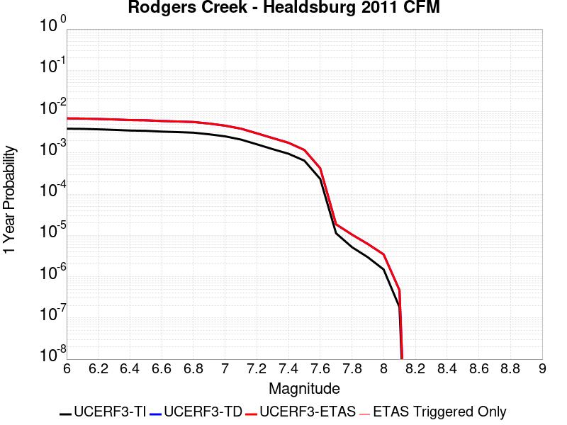 | 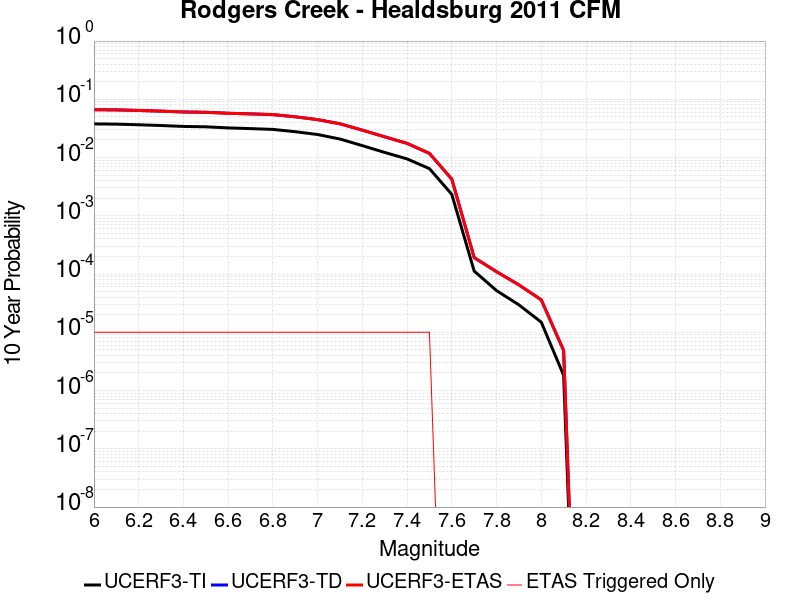 |

| Magnitude | 1 wk TI Prob | 1 wk TD Prob | 1 wk ETAS Prob | 1 wk ETAS/TD Gain | 1 wk ETAS Triggered Only | 1 mo TI Prob | 1 mo TD Prob | 1 mo ETAS Prob | 1 mo ETAS/TD Gain | 1 mo ETAS Triggered Only | 1 yr TI Prob | 1 yr TD Prob | 1 yr ETAS Prob | 1 yr ETAS/TD Gain | 1 yr ETAS Triggered Only | 10 yr TI Prob | 10 yr TD Prob | 10 yr ETAS Prob | 10 yr ETAS/TD Gain | 10 yr ETAS Triggered Only |
|-----|-----|-----|-----|-----|-----|-----|-----|-----|-----|-----|-----|-----|-----|-----|-----|-----|-----|-----|-----|-----|
| 6.0 | 7.390182E-5 | 1.3162357E-4 | 1.3162357E-4 | 1.0 | 0.0 | 3.1668364E-4 | 5.639791E-4 | 5.639791E-4 | 1.0 | 0.0 | 0.0038488081 | 0.0068447953 | 0.0068447953 | 1.0 | 0.0 | 0.037828278 | 0.06630179 | 0.06631243 | 1.0001605 | 1.1393155E-5 |
| 6.1 | 7.318768E-5 | 1.306029E-4 | 1.306029E-4 | 1.0 | 0.0 | 3.1362378E-4 | 5.596067E-4 | 5.596067E-4 | 1.0 | 0.0 | 0.0038116854 | 0.0067919106 | 0.0067919106 | 1.0 | 0.0 | 0.037469655 | 0.06580605 | 0.0658167 | 1.0001618 | 1.1393155E-5 |
| 6.2 | 7.1379836E-5 | 1.275295E-4 | 1.275295E-4 | 1.0 | 0.0 | 3.058777E-4 | 5.4644054E-4 | 5.4644054E-4 | 1.0 | 0.0 | 0.003717703 | 0.006632598 | 0.006632598 | 1.0 | 0.0 | 0.0365612 | 0.06432749 | 0.064338155 | 1.0001657 | 1.1393155E-5 |
| 6.3 | 6.9255926E-5 | 1.2407034E-4 | 1.2407034E-4 | 1.0 | 0.0 | 2.9677735E-4 | 5.3162186E-4 | 5.3162186E-4 | 1.0 | 0.0 | 0.0036072785 | 0.0064533385 | 0.0064533385 | 1.0 | 0.0 | 0.035492823 | 0.06265777 | 0.06266846 | 1.0001705 | 1.1393155E-5 |
| 6.4 | 6.6757144E-5 | 1.1983473E-4 | 1.1983473E-4 | 1.0 | 0.0 | 2.8607066E-4 | 5.134766E-4 | 5.134766E-4 | 1.0 | 0.0 | 0.0034773487 | 0.0062337318 | 0.0062337318 | 1.0 | 0.0 | 0.034234364 | 0.060606714 | 0.060617417 | 1.0001765 | 1.1393155E-5 |
| 6.5 | 6.5735134E-5 | 1.183244E-4 | 1.183244E-4 | 1.0 | 0.0 | 2.8169158E-4 | 5.070064E-4 | 5.070064E-4 | 1.0 | 0.0 | 0.003424202 | 0.0061554164 | 0.0061554164 | 1.0 | 0.0 | 0.03371918 | 0.059869368 | 0.059880078 | 1.0001789 | 1.1393155E-5 |
| 6.6 | 6.289601E-5 | 1.1367577E-4 | 1.1367577E-4 | 1.0 | 0.0 | 2.6952647E-4 | 4.870913E-4 | 4.870913E-4 | 1.0 | 0.0 | 0.0032765474 | 0.005914292 | 0.005914292 | 1.0 | 0.0 | 0.032286562 | 0.057606082 | 0.057616822 | 1.0001864 | 1.1393155E-5 |
| 6.7 | 6.115274E-5 | 1.1084413E-4 | 1.1084413E-4 | 1.0 | 0.0 | 2.6205686E-4 | 4.7496016E-4 | 4.7496016E-4 | 1.0 | 0.0 | 0.0031858748 | 0.005767387 | 0.005767387 | 1.0 | 0.0 | 0.031405866 | 0.05622345 | 0.056234203 | 1.0001912 | 1.1393155E-5 |
| 6.8 | 5.9232367E-5 | 1.0751548E-4 | 1.0751548E-4 | 1.0 | 0.0 | 2.538283E-4 | 4.6069964E-4 | 4.6069964E-4 | 1.0 | 0.0 | 0.0030859804 | 0.0055946694 | 0.0055946694 | 1.0 | 0.0 | 0.030434765 | 0.054589555 | 0.05460033 | 1.0001973 | 1.1393155E-5 |
| 6.9 | 5.4030377E-5 | 9.845228E-5 | 9.845228E-5 | 1.0 | 0.0 | 2.315382E-4 | 4.218704E-4 | 4.218704E-4 | 1.0 | 0.0 | 0.0028153337 | 0.0051242425 | 0.0051242425 | 1.0 | 0.0 | 0.027799325 | 0.05012241 | 0.050133232 | 1.0002159 | 1.1393155E-5 |
| 7.0 | 4.8260714E-5 | 8.761925E-5 | 8.761925E-5 | 1.0 | 0.0 | 2.0681522E-4 | 3.754573E-4 | 3.754573E-4 | 1.0 | 0.0 | 0.0025150678 | 0.0045616664 | 0.0045616664 | 1.0 | 0.0 | 0.024867928 | 0.044768147 | 0.044779032 | 1.0002431 | 1.1393155E-5 |
| 7.1 | 4.0294493E-5 | 7.408665E-5 | 7.408665E-5 | 1.0 | 0.0 | 1.7267925E-4 | 3.174758E-4 | 3.174758E-4 | 1.0 | 0.0 | 0.0021003427 | 0.0038584557 | 0.0038584557 | 1.0 | 0.0 | 0.02080602 | 0.038016625 | 0.038027585 | 1.0002882 | 1.1393155E-5 |
| 7.2 | 3.096388E-5 | 5.7156998E-5 | 5.7156998E-5 | 1.0 | 0.0 | 1.326956E-4 | 2.4493568E-4 | 2.4493568E-4 | 1.0 | 0.0 | 0.0016143717 | 0.0029780362 | 0.0029780362 | 1.0 | 0.0 | 0.01602694 | 0.029524498 | 0.029535554 | 1.0003744 | 1.1393155E-5 |
| 7.3 | 2.3615226E-5 | 4.3771317E-5 | 4.3771317E-5 | 1.0 | 0.0 | 1.0120418E-4 | 1.8757794E-4 | 1.8757794E-4 | 1.0 | 0.0 | 0.0012314644 | 0.0022813834 | 0.0022813834 | 1.0 | 0.0 | 0.0122466255 | 0.022708355 | 0.02271949 | 1.0004903 | 1.1393155E-5 |
| 7.4 | 1.8251132E-5 | 3.3653145E-5 | 3.3653145E-5 | 1.0 | 0.0 | 7.821679E-5 | 1.4421984E-4 | 1.4421984E-4 | 1.0 | 0.0 | 9.518733E-4 | 0.0017544723 | 0.0017544723 | 1.0 | 0.0 | 0.009478063 | 0.017521666 | 0.01753286 | 1.0006388 | 1.1393155E-5 |
| 7.5 | 1.2411432E-5 | 2.2544215E-5 | 2.2544215E-5 | 1.0 | 0.0 | 5.3190768E-5 | 9.661452E-5 | 9.661452E-5 | 1.0 | 0.0 | 6.4740516E-4 | 0.0011756528 | 0.0011756528 | 1.0 | 0.0 | 0.006455223 | 0.011786648 | 0.011797907 | 1.0009552 | 1.1393155E-5 |
| 7.6 | 4.4771446E-6 | 8.1146645E-6 | 8.1146645E-6 | 1.0 | 0.0 | 1.918762E-5 | 3.4776676E-5 | 3.4776676E-5 | 1.0 | 0.0 | 2.3358424E-4 | 4.2332502E-4 | 4.2332502E-4 | 1.0 | 0.0 | 0.0023333887 | 0.0042625484 | 0.0042625484 | 1.0 | 0.0 |
| 7.7 | 2.157941E-7 | 3.5561044E-7 | 3.5561044E-7 | 1.0 | 0.0 | 9.248315E-7 | 1.5240438E-6 | 1.5240438E-6 | 1.0 | 0.0 | 1.1259765E-5 | 1.8555076E-5 | 1.8555076E-5 | 1.0 | 0.0 | 1.1259195E-4 | 1.917313E-4 | 1.917313E-4 | 1.0 | 0.0 |
| 7.8 | 9.9623286E-8 | 2.0061546E-7 | 2.0061546E-7 | 1.0 | 0.0 | 4.269569E-7 | 8.597802E-7 | 8.597802E-7 | 1.0 | 0.0 | 5.1981874E-6 | 1.0467774E-5 | 1.0467774E-5 | 1.0 | 0.0 | 5.198066E-5 | 1.09814544E-4 | 1.09814544E-4 | 1.0 | 0.0 |
| 7.9 | 5.6745257E-8 | 1.1875045E-7 | 1.1875045E-7 | 1.0 | 0.0 | 2.4319394E-7 | 5.089304E-7 | 5.089304E-7 | 1.0 | 0.0 | 2.960882E-6 | 6.1962096E-6 | 6.1962096E-6 | 1.0 | 0.0 | 2.9608427E-5 | 6.5202265E-5 | 6.5202265E-5 | 1.0 | 0.0 |
| 8.0 | 2.8614323E-8 | 6.6329704E-8 | 6.6329704E-8 | 1.0 | 0.0 | 1.2263281E-7 | 2.8427013E-7 | 2.8427013E-7 | 1.0 | 0.0 | 1.4930534E-6 | 3.4609836E-6 | 3.4609836E-6 | 1.0 | 0.0 | 1.4930434E-5 | 3.6087098E-5 | 3.6087098E-5 | 1.0 | 0.0 |
| 8.1 | 3.5045191E-9 | 9.034695E-9 | 9.034695E-9 | 1.0 | 0.0 | 1.5019367E-8 | 3.8720124E-8 | 3.8720124E-8 | 1.0 | 0.0 | 1.8286079E-7 | 4.714174E-7 | 4.714174E-7 | 1.0 | 0.0 | 1.8286064E-6 | 4.8651946E-6 | 4.8651946E-6 | 1.0 | 0.0 |

