# Parent Section Magnitude-Probability Distributions

Only fault sections with at least one triggered aftershock are plotted. Sections are sorted by total supraseismogenic trigger rate (decreasing)

## Table Of Contents

* [Garlock (Central)](#garlock-central)
* [Tank Canyon](#tank-canyon)
* [Little Lake](#little-lake)
* [Airport Lake](#airport-lake)
* [Owl Lake](#owl-lake)
* [Garlock (East)](#garlock-east)
* [Panamint Valley](#panamint-valley)
* [Ash Hill](#ash-hill)
* [Blackwater](#blackwater)
* [Hunter Mountain-Saline Valley](#hunter-mountain-saline-valley)
* [Garlock (West)](#garlock-west)
* [McLean Lake](#mclean-lake)
* [So Sierra Nevada](#so-sierra-nevada)
* [Goldstone Lake](#goldstone-lake)
* [Gravel Hills-Harper Lk](#gravel-hills-harper-lk)
* [San Andreas (Mojave S)](#san-andreas-mojave-s)
* [Death Valley (So)](#death-valley-so)
* [Coyote Canyon](#coyote-canyon)
* [Nelson Lake](#nelson-lake)
* [San Andreas (Mojave N)](#san-andreas-mojave-n)
* [Towne Pass](#towne-pass)
* [San Andreas (San Bernardino N)](#san-andreas-san-bernardino-n)
* [Lenwood-Lockhart-Old Woman Springs](#lenwood-lockhart-old-woman-springs)
* [Paradise](#paradise)
* [Bicycle Lake](#bicycle-lake)
* [Garlic Springs](#garlic-springs)
* [San Andreas (San Bernardino S)](#san-andreas-san-bernardino-s)
* [Elsinore (Glen Ivy) rev](#elsinore-glen-ivy-rev)
* [San Andreas (Coachella) rev](#san-andreas-coachella-rev)
* [San Andreas (Parkfield)](#san-andreas-parkfield)
* [Coyote Lake](#coyote-lake)
* [Helendale-So Lockhart](#helendale-so-lockhart)
* [Death Valley (Black Mtns Frontal)](#death-valley-black-mtns-frontal)
* [Sierra Nevada  (No Extension)](#sierra-nevada--no-extension)
* [San Andreas (San Gorgonio Pass-Garnet HIll)](#san-andreas-san-gorgonio-pass-garnet-hill)
* [San Andreas (Carrizo) rev](#san-andreas-carrizo-rev)
* [San Jacinto (San Bernardino)](#san-jacinto-san-bernardino)
* [Imperial](#imperial)
* [Owens Valley](#owens-valley)
* [San Andreas (Cholame) rev](#san-andreas-cholame-rev)
* [Brawley (Seismic Zone) alt 1](#brawley-seismic-zone-alt-1)
* [San Andreas (Big Bend)](#san-andreas-big-bend)
* [Santa Ynez (West)](#santa-ynez-west)
* [Whittier alt 1](#whittier-alt-1)
* [Great Valley 07 (Orestimba)](#great-valley-07-orestimba)
* [Blue Cut](#blue-cut)
* [Malibu Coast (Extension) alt 1](#malibu-coast-extension-alt-1)
* [Santa Ynez (East)](#santa-ynez-east)
* [Rose Canyon](#rose-canyon)
* [Cady](#cady)
* [Red Pass](#red-pass)
* [Ludlow](#ludlow)
* [San Gabriel](#san-gabriel)
* [Chino alt 1](#chino-alt-1)
* [Dry Mountain](#dry-mountain)
* [Monterey Bay-Tularcitos](#monterey-bay-tularcitos)
* [Owens Valley Keough Hot Springs](#owens-valley-keough-hot-springs)
* [Elsinore (Temecula) rev](#elsinore-temecula-rev)
* [Scodie Lineament](#scodie-lineament)
* [San Diego Trough south](#san-diego-trough-south)
* [Hunting Creek - Berryessa 2011 CFM](#hunting-creek---berryessa-2011-cfm)
* [San Jacinto (San Jacinto Valley) rev](#san-jacinto-san-jacinto-valley-rev)
* [Coronado Bank alt1](#coronado-bank-alt1)
* [San Gabriel (Extension)](#san-gabriel-extension)
* [Death Valley (No)](#death-valley-no)
* [San Jacinto (Lytle Creek connector)](#san-jacinto-lytle-creek-connector)
* [San Andreas (North Branch Mill Creek)](#san-andreas-north-branch-mill-creek)
* [Ortigalita (South)](#ortigalita-south)
* [Raymond](#raymond)
* [Cerro Prieto](#cerro-prieto)
* [Cucamonga](#cucamonga)
* [Monte Vista - Shannon 2011 CFM](#monte-vista---shannon-2011-cfm)
* [San Andreas (Creeping Section) 2011 CFM](#san-andreas-creeping-section-2011-cfm)
* [Elsinore (Julian)](#elsinore-julian)
* [Elsinore (Stepovers Combined)](#elsinore-stepovers-combined)
* [Cleghorn Lake](#cleghorn-lake)
* [Bullion Mountains](#bullion-mountains)
* [Ortigalita (North)](#ortigalita-north)
* [Great Valley 08 (Quinto)](#great-valley-08-quinto)
* [San Clemente](#san-clemente)
* [Los Alamos extension](#los-alamos-extension)
* [Pine Mtn](#pine-mtn)
* [Calico-Hidalgo](#calico-hidalgo)
* [Fish Slough 2011 CFM](#fish-slough-2011-cfm)
* [Antelope Valley 2011](#antelope-valley-2011)
* [Verdugo](#verdugo)
* [Los Alamos 2011 CFM](#los-alamos-2011-cfm)
* [San Pedro Basin](#san-pedro-basin)
* [White Wolf (Extension)](#white-wolf-extension)
* [Manix-Afton Hills](#manix-afton-hills)
* [Calaveras (So) 2011 CFM](#calaveras-so-2011-cfm)
* [White Mountains](#white-mountains)
* [Mission Creek](#mission-creek)
* [Independence rev 2011](#independence-rev-2011)
* [Great Valley 09 (Laguna Seca)](#great-valley-09-laguna-seca)
* [Baker](#baker)

## Garlock (Central)
*[(top)](#table-of-contents)*

| 1 Week | 1 Month | 1 Year | 10 Year |
|-----|-----|-----|-----|
|  |  |  |  |

| Magnitude | 1 wk TI Prob | 1 wk TD Prob | 1 wk ETAS Prob | 1 wk ETAS/TD Gain | 1 wk ETAS Triggered Only | 1 mo TI Prob | 1 mo TD Prob | 1 mo ETAS Prob | 1 mo ETAS/TD Gain | 1 mo ETAS Triggered Only | 1 yr TI Prob | 1 yr TD Prob | 1 yr ETAS Prob | 1 yr ETAS/TD Gain | 1 yr ETAS Triggered Only | 10 yr TI Prob | 10 yr TD Prob | 10 yr ETAS Prob | 10 yr ETAS/TD Gain | 10 yr ETAS Triggered Only |
|-----|-----|-----|-----|-----|-----|-----|-----|-----|-----|-----|-----|-----|-----|-----|-----|-----|-----|-----|-----|-----|
| 6.0 | 5.5131142E-5 | 7.035651E-5 | 5.642302E-4 | 8.0195875 | 4.939085E-4 | 2.3625491E-4 | 3.0149342E-4 | 0.0027702912 | 9.188562 | 0.0024695422 | 0.0028726095 | 0.0036645688 | 0.019042647 | 5.1964226 | 0.0154346395 | 0.028357591 | 0.0361181 | 0.072854795 | 2.0171268 | 0.03811327 |
| 6.1 | 5.5131142E-5 | 7.035651E-5 | 5.642302E-4 | 8.0195875 | 4.939085E-4 | 2.3625491E-4 | 3.0149342E-4 | 0.0027702912 | 9.188562 | 0.0024695422 | 0.0028726095 | 0.0036645688 | 0.019042647 | 5.1964226 | 0.0154346395 | 0.028357591 | 0.0361181 | 0.072854795 | 2.0171268 | 0.03811327 |
| 6.2 | 4.216245E-5 | 5.1760762E-5 | 3.8101603E-4 | 7.361098 | 3.292723E-4 | 1.806837E-4 | 2.2181314E-4 | 0.0017855096 | 8.049612 | 0.0015640435 | 0.0021976046 | 0.002697262 | 0.011727827 | 4.3480487 | 0.009054989 | 0.021759989 | 0.0267309 | 0.04856296 | 1.8167348 | 0.022431675 |
| 6.3 | 4.216245E-5 | 5.1760762E-5 | 3.8101603E-4 | 7.361098 | 3.292723E-4 | 1.806837E-4 | 2.2181314E-4 | 0.0017855096 | 8.049612 | 0.0015640435 | 0.0021976046 | 0.002697262 | 0.011727827 | 4.3480487 | 0.009054989 | 0.021759989 | 0.0267309 | 0.04856296 | 1.8167348 | 0.022431675 |
| 6.4 | 3.6858168E-5 | 4.4206416E-5 | 3.3230695E-4 | 7.5171657 | 2.8811328E-4 | 1.5795401E-4 | 1.8944245E-4 | 0.0014239796 | 7.5166874 | 0.0012347711 | 0.0019213937 | 0.0023040473 | 0.009490283 | 4.118962 | 0.0072028316 | 0.019048655 | 0.022870028 | 0.040284306 | 1.7614454 | 0.017821863 |
| 6.5 | 3.39199E-5 | 4.01114E-5 | 2.4589835E-4 | 6.130385 | 2.057952E-4 | 1.453629E-4 | 1.718948E-4 | 0.0012418459 | 7.2244525 | 0.001070135 | 0.0017683565 | 0.0020908322 | 0.008580363 | 4.1038027 | 0.006503128 | 0.017543508 | 0.020802973 | 0.036521066 | 1.7555697 | 0.016052024 |
| 6.6 | 3.3571985E-5 | 3.9565E-5 | 2.4535204E-4 | 6.2012396 | 2.057952E-4 | 1.4387199E-4 | 1.6955339E-4 | 0.001239507 | 7.310423 | 0.001070135 | 0.0017502342 | 0.0020623798 | 0.008511022 | 4.1267967 | 0.006461969 | 0.017365133 | 0.020523785 | 0.036206048 | 1.7641019 | 0.016010866 |
| 6.7 | 3.2580007E-5 | 3.8180824E-5 | 2.4396816E-4 | 6.3898087 | 2.057952E-4 | 1.3962112E-4 | 1.6362197E-4 | 0.0012335819 | 7.5392194 | 0.001070135 | 0.0016985617 | 0.0019902987 | 0.008192944 | 4.116439 | 0.006215015 | 0.016856372 | 0.019819157 | 0.03486721 | 1.759268 | 0.015352322 |
| 6.8 | 3.2185937E-5 | 3.7607628E-5 | 2.4339509E-4 | 6.4719605 | 2.057952E-4 | 1.3793244E-4 | 1.6116572E-4 | 0.0012311282 | 7.6388965 | 0.001070135 | 0.0016780337 | 0.0019604482 | 0.0081222 | 4.1430326 | 0.0061738556 | 0.016654192 | 0.019525932 | 0.034296 | 1.7564332 | 0.015064208 |
| 6.9 | 3.165394E-5 | 3.6811605E-5 | 2.014417E-4 | 5.472234 | 1.6463615E-4 | 1.3565269E-4 | 1.5775459E-4 | 0.0011042631 | 6.9998794 | 9.466579E-4 | 0.0016503202 | 0.0019189917 | 0.007711279 | 4.0184016 | 0.0058034244 | 0.01638118 | 0.019119278 | 0.033411004 | 1.7475034 | 0.0145703 |
| 7.0 | 3.0903822E-5 | 3.5716203E-5 | 1.591889E-4 | 4.4570503 | 1.2347712E-4 | 1.3243823E-4 | 1.5306058E-4 | 0.0010584209 | 6.9150453 | 9.0549886E-4 | 0.0016112428 | 0.0018619411 | 0.0075313128 | 4.044872 | 0.0056799473 | 0.015996104 | 0.018558139 | 0.03261567 | 1.757486 | 0.014323345 |
| 7.1 | 3.0069863E-5 | 3.4481687E-5 | 1.5795455E-4 | 4.580824 | 1.2347712E-4 | 1.2886449E-4 | 1.477704E-4 | 9.708295E-4 | 6.569851 | 8.231808E-4 | 0.0015677959 | 0.0017976413 | 0.007261953 | 4.039712 | 0.005474152 | 0.01556781 | 0.017925408 | 0.031506944 | 1.7576697 | 0.013829437 |
| 7.2 | 2.7957109E-5 | 3.1369047E-5 | 1.5484229E-4 | 4.936149 | 1.2347712E-4 | 1.1981068E-4 | 1.3443196E-4 | 7.5173454E-4 | 5.5919333 | 6.1738555E-4 | 0.0014577188 | 0.0016354999 | 0.0062377728 | 3.8139856 | 0.0046098125 | 0.014481937 | 0.016327986 | 0.02774532 | 1.6992493 | 0.011606849 |
| 7.3 | 2.4519275E-5 | 2.6797032E-5 | 6.795497E-5 | 2.535914 | 4.1159037E-5 | 1.0507837E-4 | 1.1483945E-4 | 5.6753686E-4 | 4.942003 | 4.5274943E-4 | 0.0012785783 | 0.0013972883 | 0.0046032076 | 3.2943864 | 0.0032104051 | 0.012712469 | 0.013969704 | 0.02164009 | 1.549073 | 0.007779058 |
| 7.4 | 2.3225532E-5 | 2.5279978E-5 | 6.643798E-5 | 2.6280868 | 4.1159037E-5 | 9.95342E-5 | 1.0833835E-4 | 4.3757498E-4 | 4.0389667 | 3.292723E-4 | 0.0012111551 | 0.0013182356 | 0.004031151 | 3.0579898 | 0.0027164966 | 0.012045753 | 0.013186504 | 0.020091275 | 1.5236241 | 0.0069970367 |
| 7.5 | 2.097765E-5 | 2.256026E-5 | 6.371837E-5 | 2.8243635 | 4.1159037E-5 | 8.9901114E-5 | 9.668331E-5 | 3.8476873E-4 | 3.979681 | 2.8811328E-4 | 0.0010939965 | 0.0011764955 | 0.0033142474 | 2.8170507 | 0.00214027 | 0.010886264 | 0.011779194 | 0.017188864 | 1.4592565 | 0.005474152 |
| 7.6 | 1.511254E-5 | 1.6062562E-5 | 5.722094E-5 | 3.5623794 | 4.1159037E-5 | 6.476642E-5 | 6.883778E-5 | 1.923064E-4 | 2.793617 | 1.2347712E-4 | 7.882459E-4 | 8.3778554E-4 | 0.0017425257 | 2.0799186 | 9.0549886E-4 | 0.007854558 | 0.008419968 | 0.010827905 | 1.2859793 | 0.0024283833 |
| 7.7 | 9.934069E-6 | 1.0744918E-5 | 1.0744918E-5 | 1.0 | 0.0 | 4.2573887E-5 | 4.6048837E-5 | 4.6048837E-5 | 1.0 | 0.0 | 5.182138E-4 | 5.605008E-4 | 9.307245E-4 | 1.6605232 | 3.7043134E-4 | 0.00517007 | 0.0056618536 | 0.0065622255 | 1.1590242 | 9.0549886E-4 |
| 7.8 | 6.7562896E-6 | 8.482805E-6 | 8.482805E-6 | 1.0 | 0.0 | 2.8955206E-5 | 3.6354373E-5 | 3.6354373E-5 | 1.0 | 0.0 | 3.5247262E-4 | 4.4252476E-4 | 7.305105E-4 | 1.6507789 | 2.8811328E-4 | 0.0035191406 | 0.004474724 | 0.0051303217 | 1.1465113 | 6.585446E-4 |
| 7.9 | 3.975453E-6 | 5.4041707E-6 | 5.4041707E-6 | 1.0 | 0.0 | 1.7037546E-5 | 2.3160526E-5 | 2.3160526E-5 | 1.0 | 0.0 | 2.0741238E-4 | 2.8194304E-4 | 4.876802E-4 | 1.7297119 | 2.057952E-4 | 0.002072189 | 0.0028507726 | 0.003220148 | 1.1295702 | 3.7043134E-4 |
| 8.0 | 1.6729537E-6 | 2.0887928E-6 | 2.0887928E-6 | 1.0 | 0.0 | 7.169782E-6 | 8.951938E-6 | 8.951938E-6 | 1.0 | 0.0 | 8.7288594E-5 | 1.0898444E-4 | 1.5013899E-4 | 1.3776187 | 4.1159037E-5 | 8.7254314E-4 | 0.0011025992 | 0.0011848265 | 1.0745759 | 8.2318074E-5 |
| 8.1 | 3.6733252E-7 | 3.164752E-7 | 3.164752E-7 | 1.0 | 0.0 | 1.5742813E-6 | 1.3563216E-6 | 1.3563216E-6 | 1.0 | 0.0 | 1.9166706E-5 | 1.6513108E-5 | 1.6513108E-5 | 1.0 | 0.0 | 1.9165053E-4 | 1.6726229E-4 | 1.6726229E-4 | 1.0 | 0.0 |

## Tank Canyon
*[(top)](#table-of-contents)*

| 1 Week | 1 Month | 1 Year | 10 Year |
|-----|-----|-----|-----|
|  |  |  |  |

| Magnitude | 1 wk TI Prob | 1 wk TD Prob | 1 wk ETAS Prob | 1 wk ETAS/TD Gain | 1 wk ETAS Triggered Only | 1 mo TI Prob | 1 mo TD Prob | 1 mo ETAS Prob | 1 mo ETAS/TD Gain | 1 mo ETAS Triggered Only | 1 yr TI Prob | 1 yr TD Prob | 1 yr ETAS Prob | 1 yr ETAS/TD Gain | 1 yr ETAS Triggered Only | 10 yr TI Prob | 10 yr TD Prob | 10 yr ETAS Prob | 10 yr ETAS/TD Gain | 10 yr ETAS Triggered Only |
|-----|-----|-----|-----|-----|-----|-----|-----|-----|-----|-----|-----|-----|-----|-----|-----|-----|-----|-----|-----|-----|
| 6.0 | 4.8284557E-5 | 5.7991037E-5 | 4.6955756E-4 | 8.097071 | 4.115904E-4 | 2.0691741E-4 | 2.4851318E-4 | 0.0017710192 | 7.126459 | 0.0015228845 | 0.0025163088 | 0.003022118 | 0.011516291 | 3.810669 | 0.0085199205 | 0.02488006 | 0.029877583 | 0.05431432 | 1.8178953 | 0.02518933 |
| 6.1 | 1.7796336E-5 | 2.0881414E-5 | 2.2667232E-4 | 10.855218 | 2.057952E-4 | 7.626778E-5 | 8.948892E-5 | 9.12596E-4 | 10.1978655 | 8.231808E-4 | 9.281647E-4 | 0.0010890213 | 0.004090359 | 3.7559953 | 0.0030046098 | 0.009242975 | 0.010841259 | 0.02036806 | 1.878754 | 0.009631215 |
| 6.2 | 1.7796336E-5 | 2.0881414E-5 | 2.2667232E-4 | 10.855218 | 2.057952E-4 | 7.626778E-5 | 8.948892E-5 | 9.12596E-4 | 10.1978655 | 8.231808E-4 | 9.281647E-4 | 0.0010890213 | 0.004090359 | 3.7559953 | 0.0030046098 | 0.009242975 | 0.010841259 | 0.02036806 | 1.878754 | 0.009631215 |
| 6.3 | 1.3515912E-5 | 1.5765387E-5 | 1.8039894E-4 | 11.442722 | 1.6463615E-4 | 5.792405E-5 | 6.756433E-5 | 6.849082E-4 | 10.137127 | 6.1738555E-4 | 7.049971E-4 | 8.2230894E-4 | 0.0028785686 | 3.5005925 | 0.0020579519 | 0.007027647 | 0.008195594 | 0.014767891 | 1.8019304 | 0.006626605 |
| 6.4 | 1.0870146E-5 | 1.2622489E-5 | 9.4939525E-5 | 7.5214586 | 8.2318074E-5 | 4.658551E-5 | 5.409536E-5 | 4.2450667E-4 | 7.847377 | 3.7043134E-4 | 5.67031E-4 | 6.584297E-4 | 0.0020569155 | 3.1239715 | 0.0013994073 | 0.005655863 | 0.006567119 | 0.011514657 | 1.7533803 | 0.0049802437 |
| 6.5 | 7.964826E-6 | 9.199161E-6 | 9.199161E-6 | 1.0 | 0.0 | 3.4134522E-5 | 3.9424438E-5 | 1.6289669E-4 | 4.1318707 | 1.2347712E-4 | 4.1550855E-4 | 4.798974E-4 | 0.0013026831 | 2.7145033 | 8.231808E-4 | 0.0041473247 | 0.004790228 | 0.007698521 | 1.6071305 | 0.0029222916 |
| 6.6 | 6.6317E-6 | 7.614703E-6 | 7.614703E-6 | 1.0 | 0.0 | 2.8421264E-5 | 3.2634085E-5 | 1.5610717E-4 | 4.783562 | 1.2347712E-4 | 3.4597394E-4 | 3.9725663E-4 | 0.0010966823 | 2.7606394 | 6.9970364E-4 | 0.0034543579 | 0.0039669327 | 0.006139708 | 1.5477219 | 0.002181429 |
| 6.7 | 4.793663E-6 | 5.432297E-6 | 5.432297E-6 | 1.0 | 0.0 | 2.0544108E-5 | 2.3281089E-5 | 1.05597246E-4 | 4.5357523 | 8.2318074E-5 | 2.500958E-4 | 2.8341476E-4 | 5.714464E-4 | 2.0162902 | 2.8811328E-4 | 0.0024981452 | 0.0028315398 | 0.0039396873 | 1.3913586 | 0.001111294 |
| 6.8 | 4.382823E-6 | 4.9705927E-6 | 4.9705927E-6 | 1.0 | 0.0 | 1.8783392E-5 | 2.130239E-5 | 1.0361872E-4 | 4.8641825 | 8.2318074E-5 | 2.286638E-4 | 2.5933E-4 | 5.062202E-4 | 1.9520309 | 2.4695424E-4 | 0.0022842865 | 0.0025912935 | 0.0035354984 | 1.3643758 | 9.466579E-4 |
| 6.9 | 2.729601E-6 | 3.0743E-6 | 3.0743E-6 | 1.0 | 0.0 | 1.1698237E-5 | 1.3175511E-5 | 5.4334007E-5 | 4.123863 | 4.1159037E-5 | 1.4241673E-4 | 1.6040127E-4 | 2.838586E-4 | 1.7696779 | 1.2347712E-4 | 0.001423255 | 0.0016030794 | 0.001972917 | 1.2307044 | 3.7043134E-4 |
| 7.0 | 1.8987357E-6 | 2.1273395E-6 | 2.1273395E-6 | 1.0 | 0.0 | 8.137413E-6 | 9.117141E-6 | 5.0275805E-5 | 5.514426 | 4.1159037E-5 | 9.90685E-5 | 1.1099624E-4 | 1.5215071E-4 | 1.3707736 | 4.1159037E-5 | 9.902435E-4 | 0.0011094767 | 0.0012328168 | 1.1111696 | 1.2347712E-4 |
| 7.1 | 1.4928986E-6 | 1.6644419E-6 | 1.6644419E-6 | 1.0 | 0.0 | 6.398121E-6 | 7.1333066E-6 | 7.1333066E-6 | 1.0 | 0.0 | 7.789434E-5 | 8.684513E-5 | 8.684513E-5 | 1.0 | 0.0 | 7.786704E-4 | 8.681699E-4 | 8.681699E-4 | 1.0 | 0.0 |
| 7.2 | 1.069082E-6 | 1.1830984E-6 | 1.1830984E-6 | 1.0 | 0.0 | 4.581772E-6 | 5.070415E-6 | 5.070415E-6 | 1.0 | 0.0 | 5.5781646E-5 | 6.173109E-5 | 6.173109E-5 | 1.0 | 0.0 | 5.576765E-4 | 6.1719166E-4 | 6.1719166E-4 | 1.0 | 0.0 |
| 7.3 | 8.776551E-7 | 9.772074E-7 | 9.772074E-7 | 1.0 | 0.0 | 3.7613736E-6 | 4.188028E-6 | 4.188028E-6 | 1.0 | 0.0 | 4.579376E-5 | 5.098857E-5 | 5.098857E-5 | 1.0 | 0.0 | 4.5784327E-4 | 5.098197E-4 | 5.098197E-4 | 1.0 | 0.0 |
| 7.4 | 7.55721E-7 | 8.511005E-7 | 8.511005E-7 | 1.0 | 0.0 | 3.2388E-6 | 3.6475712E-6 | 3.6475712E-6 | 1.0 | 0.0 | 3.9431678E-5 | 4.4408793E-5 | 4.4408793E-5 | 1.0 | 0.0 | 3.942468E-4 | 4.4405003E-4 | 4.4405003E-4 | 1.0 | 0.0 |
| 7.5 | 5.587665E-7 | 6.306174E-7 | 6.306174E-7 | 1.0 | 0.0 | 2.3947114E-6 | 2.702646E-6 | 2.702646E-6 | 1.0 | 0.0 | 2.915522E-5 | 3.2904714E-5 | 3.2904714E-5 | 1.0 | 0.0 | 2.9151395E-4 | 3.2904715E-4 | 3.2904715E-4 | 1.0 | 0.0 |

## Little Lake
*[(top)](#table-of-contents)*

| 1 Week | 1 Month | 1 Year | 10 Year |
|-----|-----|-----|-----|
|  |  |  |  |

| Magnitude | 1 wk TI Prob | 1 wk TD Prob | 1 wk ETAS Prob | 1 wk ETAS/TD Gain | 1 wk ETAS Triggered Only | 1 mo TI Prob | 1 mo TD Prob | 1 mo ETAS Prob | 1 mo ETAS/TD Gain | 1 mo ETAS Triggered Only | 1 yr TI Prob | 1 yr TD Prob | 1 yr ETAS Prob | 1 yr ETAS/TD Gain | 1 yr ETAS Triggered Only | 10 yr TI Prob | 10 yr TD Prob | 10 yr ETAS Prob | 10 yr ETAS/TD Gain | 10 yr ETAS Triggered Only |
|-----|-----|-----|-----|-----|-----|-----|-----|-----|-----|-----|-----|-----|-----|-----|-----|-----|-----|-----|-----|-----|
| 6.0 | 2.8424427E-5 | 3.1213367E-5 | 5.2510644E-4 | 16.823126 | 4.939085E-4 | 1.2181328E-4 | 1.3376547E-4 | 0.0013683714 | 10.229631 | 0.0012347711 | 0.0014820677 | 0.0016275112 | 0.008859713 | 5.443718 | 0.007243991 | 0.014722223 | 0.016169336 | 0.03346007 | 2.0693536 | 0.01757491 |
| 6.1 | 2.8424427E-5 | 3.1213367E-5 | 5.2510644E-4 | 16.823126 | 4.939085E-4 | 1.2181328E-4 | 1.3376547E-4 | 0.0013683714 | 10.229631 | 0.0012347711 | 0.0014820677 | 0.0016275112 | 0.008859713 | 5.443718 | 0.007243991 | 0.014722223 | 0.016169336 | 0.03346007 | 2.0693536 | 0.01757491 |
| 6.2 | 2.8424427E-5 | 3.1213367E-5 | 5.2510644E-4 | 16.823126 | 4.939085E-4 | 1.2181328E-4 | 1.3376547E-4 | 0.0013683714 | 10.229631 | 0.0012347711 | 0.0014820677 | 0.0016275112 | 0.008859713 | 5.443718 | 0.007243991 | 0.014722223 | 0.016169336 | 0.03346007 | 2.0693536 | 0.01757491 |
| 6.3 | 1.48860645E-5 | 1.608494E-5 | 4.688271E-4 | 29.14696 | 4.5274943E-4 | 6.379586E-5 | 6.893379E-5 | 0.0010155265 | 14.73191 | 9.466579E-4 | 7.7643775E-4 | 8.3897397E-4 | 0.0056505413 | 6.7350616 | 0.0048156073 | 0.007737305 | 0.008360886 | 0.019911507 | 2.3815067 | 0.011648008 |
| 6.4 | 1.48860645E-5 | 1.608494E-5 | 4.688271E-4 | 29.14696 | 4.5274943E-4 | 6.379586E-5 | 6.893379E-5 | 0.0010155265 | 14.73191 | 9.466579E-4 | 7.7643775E-4 | 8.3897397E-4 | 0.0056505413 | 6.7350616 | 0.0048156073 | 0.007737305 | 0.008360886 | 0.019911507 | 2.3815067 | 0.011648008 |
| 6.5 | 1.2797581E-5 | 1.3768532E-5 | 4.6651173E-4 | 33.882458 | 4.5274943E-4 | 5.4845623E-5 | 5.9006805E-5 | 0.0010056088 | 17.042252 | 9.466579E-4 | 6.675408E-4 | 7.1819674E-4 | 0.0051601804 | 7.1849117 | 0.004445176 | 0.006655392 | 0.0071613085 | 0.017704295 | 2.472215 | 0.010619032 |
| 6.6 | 9.661896E-6 | 1.0291131E-5 | 3.3956007E-4 | 32.995407 | 3.292723E-4 | 4.1407468E-5 | 4.4104192E-5 | 7.849342E-4 | 17.79727 | 7.408627E-4 | 5.040193E-4 | 5.368525E-4 | 0.0041980403 | 7.8197274 | 0.0036631543 | 0.005028777 | 0.0053571616 | 0.014158948 | 2.6429944 | 0.008849193 |
| 6.7 | 7.767871E-6 | 8.201281E-6 | 2.9631218E-4 | 36.129986 | 2.8811328E-4 | 3.329045E-5 | 3.5147954E-5 | 7.34827E-4 | 20.906681 | 6.9970364E-4 | 4.0523586E-4 | 4.2785605E-4 | 0.0035957461 | 8.404102 | 0.003169246 | 0.004044977 | 0.0042716754 | 0.012140454 | 2.8420825 | 0.007902536 |
| 6.8 | 6.4235196E-6 | 6.7370365E-6 | 2.1253084E-4 | 31.546637 | 2.057952E-4 | 2.752908E-5 | 2.8872768E-5 | 6.0508266E-4 | 20.956865 | 5.7622656E-4 | 3.35115E-4 | 3.5148207E-4 | 0.0030258792 | 8.608914 | 0.0026753375 | 0.003346101 | 0.0035105227 | 0.009703719 | 2.764181 | 0.006215015 |
| 6.9 | 3.1283696E-6 | 3.1126344E-6 | 1.6774828E-4 | 53.8927 | 1.6463615E-4 | 1.3407229E-5 | 1.33398025E-5 | 4.2492468E-4 | 31.853899 | 4.115904E-4 | 1.6322079E-4 | 1.624015E-4 | 0.0017673433 | 10.882556 | 0.0016052026 | 0.0016310095 | 0.0016229765 | 0.00536237 | 3.3040345 | 0.0037454725 |
| 7.0 | 2.290603E-6 | 2.229024E-6 | 1.6686482E-4 | 74.86003 | 1.6463615E-4 | 9.816834E-6 | 9.552931E-6 | 3.3882208E-4 | 35.46787 | 3.292723E-4 | 1.19513395E-4 | 1.16301766E-4 | 0.001309775 | 11.261868 | 0.0011936121 | 0.0011944914 | 0.0011625112 | 0.0038347386 | 3.2986681 | 0.0026753375 |
| 7.1 | 1.293693E-6 | 1.1778933E-6 | 4.2336884E-5 | 35.942886 | 4.1159037E-5 | 5.5443866E-6 | 5.048108E-6 | 8.736577E-5 | 17.306635 | 8.2318074E-5 | 6.750081E-5 | 6.145968E-5 | 5.553378E-4 | 9.035807 | 4.939085E-4 | 6.7480316E-4 | 6.1449537E-4 | 0.0018896415 | 3.0751112 | 0.0012759302 |
| 7.2 | 4.715842E-7 | 3.092757E-7 | 3.092757E-7 | 1.0 | 0.0 | 2.0210737E-6 | 1.3254667E-6 | 1.3254667E-6 | 1.0 | 0.0 | 2.4606294E-5 | 1.6137443E-5 | 5.7295816E-5 | 3.5504894 | 4.1159037E-5 | 2.460357E-4 | 1.6136325E-4 | 2.8482045E-4 | 1.7650887 | 1.2347712E-4 |
| 7.3 | 3.9430947E-7 | 2.3106372E-7 | 2.3106372E-7 | 1.0 | 0.0 | 1.6898966E-6 | 9.902727E-7 | 9.902727E-7 | 1.0 | 0.0 | 2.0574296E-5 | 1.2056505E-5 | 1.2056505E-5 | 1.0 | 0.0 | 2.0572392E-4 | 1.2055858E-4 | 2.0286674E-4 | 1.6827233 | 8.2318074E-5 |
| 7.4 | 3.547123E-7 | 1.9687333E-7 | 1.9687333E-7 | 1.0 | 0.0 | 1.5201948E-6 | 8.4374255E-7 | 8.4374255E-7 | 1.0 | 0.0 | 1.8508214E-5 | 1.0272518E-5 | 1.0272518E-5 | 1.0 | 0.0 | 1.8506673E-4 | 1.0272049E-4 | 1.8503012E-4 | 1.801297 | 8.2318074E-5 |
| 7.5 | 2.6354266E-7 | 1.4428804E-7 | 1.4428804E-7 | 1.0 | 0.0 | 1.129468E-6 | 6.1837716E-7 | 6.1837716E-7 | 1.0 | 0.0 | 1.3751187E-5 | 7.528716E-6 | 7.528716E-6 | 1.0 | 0.0 | 1.3750336E-4 | 7.528466E-5 | 1.5759654E-4 | 2.0933418 | 8.2318074E-5 |
| 7.6 | 1.269913E-7 | 7.574927E-8 | 7.574927E-8 | 1.0 | 0.0 | 5.4424834E-7 | 3.246397E-7 | 3.246397E-7 | 1.0 | 0.0 | 6.6262032E-6 | 3.9524816E-6 | 3.9524816E-6 | 1.0 | 0.0 | 6.626006E-5 | 3.9524148E-5 | 1.2183897E-4 | 3.0826464 | 8.2318074E-5 |

## Airport Lake
*[(top)](#table-of-contents)*

| 1 Week | 1 Month | 1 Year | 10 Year |
|-----|-----|-----|-----|
|  |  |  |  |

| Magnitude | 1 wk TI Prob | 1 wk TD Prob | 1 wk ETAS Prob | 1 wk ETAS/TD Gain | 1 wk ETAS Triggered Only | 1 mo TI Prob | 1 mo TD Prob | 1 mo ETAS Prob | 1 mo ETAS/TD Gain | 1 mo ETAS Triggered Only | 1 yr TI Prob | 1 yr TD Prob | 1 yr ETAS Prob | 1 yr ETAS/TD Gain | 1 yr ETAS Triggered Only | 10 yr TI Prob | 10 yr TD Prob | 10 yr ETAS Prob | 10 yr ETAS/TD Gain | 10 yr ETAS Triggered Only |
|-----|-----|-----|-----|-----|-----|-----|-----|-----|-----|-----|-----|-----|-----|-----|-----|-----|-----|-----|-----|-----|
| 6.0 | 1.2387061E-5 | 1.3104909E-5 | 3.835314E-4 | 29.26624 | 3.7043134E-4 | 5.3086325E-5 | 5.6162848E-5 | 0.0010027676 | 17.854643 | 9.466579E-4 | 6.461343E-4 | 6.8359653E-4 | 0.0066064466 | 9.6642475 | 0.0059269015 | 0.0064425888 | 0.0068177483 | 0.020430265 | 2.9966292 | 0.01370596 |
| 6.1 | 1.2387061E-5 | 1.3104909E-5 | 3.835314E-4 | 29.26624 | 3.7043134E-4 | 5.3086325E-5 | 5.6162848E-5 | 0.0010027676 | 17.854643 | 9.466579E-4 | 6.461343E-4 | 6.8359653E-4 | 0.0066064466 | 9.6642475 | 0.0059269015 | 0.0064425888 | 0.0068177483 | 0.020430265 | 2.9966292 | 0.01370596 |
| 6.2 | 1.2387061E-5 | 1.3104909E-5 | 3.835314E-4 | 29.26624 | 3.7043134E-4 | 5.3086325E-5 | 5.6162848E-5 | 0.0010027676 | 17.854643 | 9.466579E-4 | 6.461343E-4 | 6.8359653E-4 | 0.0066064466 | 9.6642475 | 0.0059269015 | 0.0064425888 | 0.0068177483 | 0.020430265 | 2.9966292 | 0.01370596 |
| 6.3 | 1.2387061E-5 | 1.3104909E-5 | 3.835314E-4 | 29.26624 | 3.7043134E-4 | 5.3086325E-5 | 5.6162848E-5 | 0.0010027676 | 17.854643 | 9.466579E-4 | 6.461343E-4 | 6.8359653E-4 | 0.0066064466 | 9.6642475 | 0.0059269015 | 0.0064425888 | 0.0068177483 | 0.020430265 | 2.9966292 | 0.01370596 |
| 6.4 | 1.2387061E-5 | 1.3104909E-5 | 3.835314E-4 | 29.26624 | 3.7043134E-4 | 5.3086325E-5 | 5.6162848E-5 | 0.0010027676 | 17.854643 | 9.466579E-4 | 6.461343E-4 | 6.8359653E-4 | 0.0066064466 | 9.6642475 | 0.0059269015 | 0.0064425888 | 0.0068177483 | 0.020430265 | 2.9966292 | 0.01370596 |
| 6.5 | 6.9922594E-6 | 7.385884E-6 | 2.95497E-4 | 40.00835 | 2.8811328E-4 | 2.996648E-5 | 3.1653435E-5 | 8.959659E-4 | 28.305487 | 8.643398E-4 | 3.6478083E-4 | 3.8531786E-4 | 0.004787638 | 12.425165 | 0.0044040172 | 0.003641826 | 0.003847035 | 0.013687203 | 3.5578575 | 0.009878169 |
| 6.6 | 6.9922594E-6 | 7.385884E-6 | 2.95497E-4 | 40.00835 | 2.8811328E-4 | 2.996648E-5 | 3.1653435E-5 | 8.959659E-4 | 28.305487 | 8.643398E-4 | 3.6478083E-4 | 3.8531786E-4 | 0.004787638 | 12.425165 | 0.0044040172 | 0.003641826 | 0.003847035 | 0.013687203 | 3.5578575 | 0.009878169 |
| 6.7 | 5.477277E-6 | 5.786823E-6 | 2.527396E-4 | 43.675026 | 2.4695424E-4 | 2.3473833E-5 | 2.4800454E-5 | 7.6564477E-4 | 30.872208 | 7.408627E-4 | 2.8575645E-4 | 3.019076E-4 | 0.0039228094 | 12.993411 | 0.0036219954 | 0.0028538927 | 0.0030153585 | 0.011427519 | 3.7897713 | 0.008437603 |
| 6.8 | 3.9950432E-6 | 4.2196343E-6 | 2.1001395E-4 | 49.770657 | 2.057952E-4 | 1.7121502E-5 | 1.8084036E-5 | 6.3545845E-4 | 35.139194 | 6.1738555E-4 | 2.0843433E-4 | 2.2015366E-4 | 0.003059502 | 13.897121 | 0.0028399737 | 0.0020823893 | 0.0021996265 | 0.008647381 | 3.9312954 | 0.006461969 |
| 6.9 | 2.95695E-6 | 3.12343E-6 | 1.6775906E-4 | 53.70989 | 1.6463615E-4 | 1.2672582E-5 | 1.3386072E-5 | 4.6612942E-4 | 34.82197 | 4.5274943E-4 | 1.5427776E-4 | 1.629655E-4 | 0.0021794296 | 13.373565 | 0.0020167928 | 0.001541707 | 0.0016286825 | 0.006272079 | 3.851014 | 0.0046509714 |
| 7.0 | 1.456072E-6 | 1.5410193E-6 | 1.6617692E-4 | 107.83572 | 1.6463615E-4 | 6.2402937E-6 | 6.604357E-6 | 3.358745E-4 | 50.8565 | 3.292723E-4 | 7.597293E-5 | 8.040609E-5 | 0.0011916108 | 14.819906 | 0.001111294 | 7.594696E-4 | 8.038689E-4 | 0.0031891742 | 3.9672813 | 0.0023872242 |
| 7.1 | 6.995192E-7 | 7.4099876E-7 | 4.1900006E-5 | 56.545315 | 4.1159037E-5 | 2.997936E-6 | 3.1757088E-6 | 8.549353E-5 | 26.921083 | 8.2318074E-5 | 3.649926E-5 | 3.8664257E-5 | 4.5023873E-4 | 11.644831 | 4.115904E-4 | 3.6493264E-4 | 3.8664255E-4 | 0.0014563638 | 3.7666929 | 0.001070135 |

## Owl Lake
*[(top)](#table-of-contents)*

| 1 Week | 1 Month | 1 Year | 10 Year |
|-----|-----|-----|-----|
|  |  |  |  |

| Magnitude | 1 wk TI Prob | 1 wk TD Prob | 1 wk ETAS Prob | 1 wk ETAS/TD Gain | 1 wk ETAS Triggered Only | 1 mo TI Prob | 1 mo TD Prob | 1 mo ETAS Prob | 1 mo ETAS/TD Gain | 1 mo ETAS Triggered Only | 1 yr TI Prob | 1 yr TD Prob | 1 yr ETAS Prob | 1 yr ETAS/TD Gain | 1 yr ETAS Triggered Only | 10 yr TI Prob | 10 yr TD Prob | 10 yr ETAS Prob | 10 yr ETAS/TD Gain | 10 yr ETAS Triggered Only |
|-----|-----|-----|-----|-----|-----|-----|-----|-----|-----|-----|-----|-----|-----|-----|-----|-----|-----|-----|-----|-----|
| 6.0 | 5.0320643E-5 | 6.641298E-5 | 1.487256E-4 | 2.2394054 | 8.2318074E-5 | 2.1564208E-4 | 2.8460217E-4 | 8.1951736E-4 | 2.8795192 | 5.350675E-4 | 0.0026222812 | 0.0034604163 | 0.007315978 | 2.11419 | 0.0038689496 | 0.02591553 | 0.034168873 | 0.044663582 | 1.3071424 | 0.010865986 |
| 6.1 | 5.0320643E-5 | 6.641298E-5 | 1.487256E-4 | 2.2394054 | 8.2318074E-5 | 2.1564208E-4 | 2.8460217E-4 | 8.1951736E-4 | 2.8795192 | 5.350675E-4 | 0.0026222812 | 0.0034604163 | 0.007315978 | 2.11419 | 0.0038689496 | 0.02591553 | 0.034168873 | 0.044663582 | 1.3071424 | 0.010865986 |
| 6.2 | 2.4125871E-5 | 3.1009058E-5 | 1.1332458E-4 | 3.654564 | 8.2318074E-5 | 1.0339249E-4 | 1.3289036E-4 | 5.855796E-4 | 4.406487 | 4.5274943E-4 | 0.0012580766 | 0.0016169107 | 0.0044111996 | 2.7281656 | 0.0027988146 | 0.012509781 | 0.016085263 | 0.02430615 | 1.5110819 | 0.008355285 |
| 6.3 | 1.7433485E-5 | 2.2378465E-5 | 1.046947E-4 | 4.6783686 | 8.2318074E-5 | 7.471279E-5 | 9.590507E-5 | 5.4861105E-4 | 5.7203555 | 4.5274943E-4 | 9.0924866E-4 | 0.0011671559 | 0.0038393708 | 3.28951 | 0.0026753375 | 0.009055373 | 0.011640848 | 0.019085271 | 1.6395087 | 0.007532104 |
| 6.4 | 1.7433485E-5 | 2.2378465E-5 | 1.046947E-4 | 4.6783686 | 8.2318074E-5 | 7.471279E-5 | 9.590507E-5 | 5.4861105E-4 | 5.7203555 | 4.5274943E-4 | 9.0924866E-4 | 0.0011671559 | 0.0038393708 | 3.28951 | 0.0026753375 | 0.009055373 | 0.011640848 | 0.019085271 | 1.6395087 | 0.007532104 |
| 6.5 | 1.5182742E-5 | 1.9450263E-5 | 1.0176674E-4 | 5.2321525 | 8.2318074E-5 | 6.506727E-5 | 8.335646E-5 | 5.3606817E-4 | 6.431033 | 4.5274943E-4 | 7.919061E-4 | 0.001014528 | 0.003646034 | 3.593823 | 0.0026341784 | 0.0078909 | 0.01012941 | 0.01742225 | 1.7199669 | 0.007367468 |
| 6.6 | 6.7271576E-6 | 8.561506E-6 | 8.561506E-6 | 1.0 | 0.0 | 2.8830356E-5 | 3.6691687E-5 | 2.4247932E-4 | 6.6085634 | 2.057952E-4 | 3.5095305E-4 | 4.4663536E-4 | 0.0024213868 | 5.4213953 | 0.001975634 | 0.0035039932 | 0.004475178 | 0.009638009 | 2.153659 | 0.005186039 |
| 6.7 | 6.682835E-6 | 8.4939265E-6 | 8.4939265E-6 | 1.0 | 0.0 | 2.8640408E-5 | 3.6402067E-5 | 2.4218977E-4 | 6.6531873 | 2.057952E-4 | 3.4864116E-4 | 4.431107E-4 | 0.0024178692 | 5.45658 | 0.001975634 | 0.003480947 | 0.00444009 | 0.009603103 | 2.162817 | 0.005186039 |
| 6.8 | 6.5774975E-6 | 8.340327E-6 | 8.340327E-6 | 1.0 | 0.0 | 2.8188972E-5 | 3.5743804E-5 | 2.4153164E-4 | 6.757301 | 2.057952E-4 | 3.4314668E-4 | 4.3509956E-4 | 0.0024098738 | 5.538672 | 0.001975634 | 0.0034261728 | 0.0043602297 | 0.009523656 | 2.1842098 | 0.005186039 |
| 6.9 | 6.363419E-6 | 8.013318E-6 | 8.013318E-6 | 1.0 | 0.0 | 2.727151E-5 | 3.4342367E-5 | 2.401305E-4 | 6.992252 | 2.057952E-4 | 3.3198006E-4 | 4.1804372E-4 | 0.0023928517 | 5.723927 | 0.001975634 | 0.0033148455 | 0.004190137 | 0.009354446 | 2.2324915 | 0.005186039 |
| 7.0 | 6.1342453E-6 | 7.645282E-6 | 7.645282E-6 | 1.0 | 0.0 | 2.6289357E-5 | 3.276511E-5 | 2.3855356E-4 | 7.280719 | 2.057952E-4 | 3.2002592E-4 | 3.9884774E-4 | 0.002332551 | 5.848224 | 0.0019344748 | 0.0031956544 | 0.003998714 | 0.009123021 | 2.2814887 | 0.0051448797 |
| 7.1 | 5.842926E-6 | 7.155487E-6 | 7.155487E-6 | 1.0 | 0.0 | 2.504087E-5 | 3.066604E-5 | 2.3645493E-4 | 7.710644 | 2.057952E-4 | 3.0482994E-4 | 3.733005E-4 | 0.0023070532 | 6.18015 | 0.0019344748 | 0.0030441214 | 0.0037440478 | 0.00874665 | 2.336148 | 0.0050214026 |
| 7.2 | 4.77173E-6 | 5.3705085E-6 | 5.3705085E-6 | 1.0 | 0.0 | 2.045011E-5 | 2.3016284E-5 | 1.0533247E-4 | 4.576432 | 8.2318074E-5 | 2.4895166E-4 | 2.8019128E-4 | 0.001555764 | 5.5525064 | 0.0012759302 | 0.0024867293 | 0.0028149132 | 0.0061394107 | 2.1810303 | 0.0033338822 |
| 7.3 | 3.0494948E-6 | 2.7192577E-6 | 2.7192577E-6 | 1.0 | 0.0 | 1.3069198E-5 | 1.1653911E-5 | 1.1653911E-5 | 1.0 | 0.0 | 1.5910587E-4 | 1.4187729E-4 | 5.534093E-4 | 3.9006193 | 4.115904E-4 | 0.0015899199 | 0.0014278062 | 0.0022087113 | 1.5469266 | 7.820217E-4 |
| 7.4 | 2.7263884E-6 | 2.3139278E-6 | 2.3139278E-6 | 1.0 | 0.0 | 1.1684469E-5 | 9.916796E-6 | 9.916796E-6 | 1.0 | 0.0 | 1.4224913E-4 | 1.2073041E-4 | 3.6765484E-4 | 3.0452545 | 2.4695424E-4 | 0.0014215811 | 0.0012154713 | 0.0016676704 | 1.372036 | 4.5274943E-4 |
| 7.5 | 2.6090431E-6 | 2.173696E-6 | 2.173696E-6 | 1.0 | 0.0 | 1.1181565E-5 | 9.315807E-6 | 9.315807E-6 | 1.0 | 0.0 | 1.3612706E-4 | 1.1341415E-4 | 3.19186E-4 | 2.8143404 | 2.057952E-4 | 0.001360437 | 0.001142131 | 0.0015121392 | 1.323963 | 3.7043134E-4 |
| 7.6 | 2.3008756E-6 | 1.8804336E-6 | 1.8804336E-6 | 1.0 | 0.0 | 9.860858E-6 | 8.058977E-6 | 8.058977E-6 | 1.0 | 0.0 | 1.20049335E-4 | 9.8113705E-5 | 1.3926871E-4 | 1.4194623 | 4.1159037E-5 | 0.001199845 | 9.889243E-4 | 0.0011533977 | 1.1663154 | 1.6463615E-4 |
| 7.7 | 1.7184348E-6 | 1.3489819E-6 | 1.3489819E-6 | 1.0 | 0.0 | 7.3646997E-6 | 5.781338E-6 | 5.781338E-6 | 1.0 | 0.0 | 8.966153E-5 | 7.038556E-5 | 1.115417E-4 | 1.5847242 | 4.1159037E-5 | 8.962536E-4 | 7.115331E-4 | 8.7605213E-4 | 1.2312176 | 1.6463615E-4 |
| 7.8 | 8.4612907E-7 | 8.4566835E-7 | 8.4566835E-7 | 1.0 | 0.0 | 3.6262625E-6 | 3.624288E-6 | 3.624288E-6 | 1.0 | 0.0 | 4.4148852E-5 | 4.4124834E-5 | 8.528206E-5 | 1.9327451 | 4.1159037E-5 | 4.414008E-4 | 4.4665742E-4 | 5.7007937E-4 | 1.2763236 | 1.2347712E-4 |
| 7.9 | 2.716738E-7 | 3.7908913E-7 | 3.7908913E-7 | 1.0 | 0.0 | 1.1643157E-6 | 1.6246668E-6 | 1.6246668E-6 | 1.0 | 0.0 | 1.4175452E-5 | 1.978015E-5 | 1.978015E-5 | 1.0 | 0.0 | 1.4174548E-4 | 1.9954717E-4 | 2.4069799E-4 | 1.2062211 | 4.1159037E-5 |
| 8.0 | 2.1995428E-8 | 3.406613E-8 | 3.406613E-8 | 1.0 | 0.0 | 9.426611E-8 | 1.459977E-7 | 1.459977E-7 | 1.0 | 0.0 | 1.1476893E-6 | 1.7775212E-6 | 1.7775212E-6 | 1.0 | 0.0 | 1.14768345E-5 | 1.7979468E-5 | 1.7979468E-5 | 1.0 | 0.0 |

## Garlock (East)
*[(top)](#table-of-contents)*

| 1 Week | 1 Month | 1 Year | 10 Year |
|-----|-----|-----|-----|
| 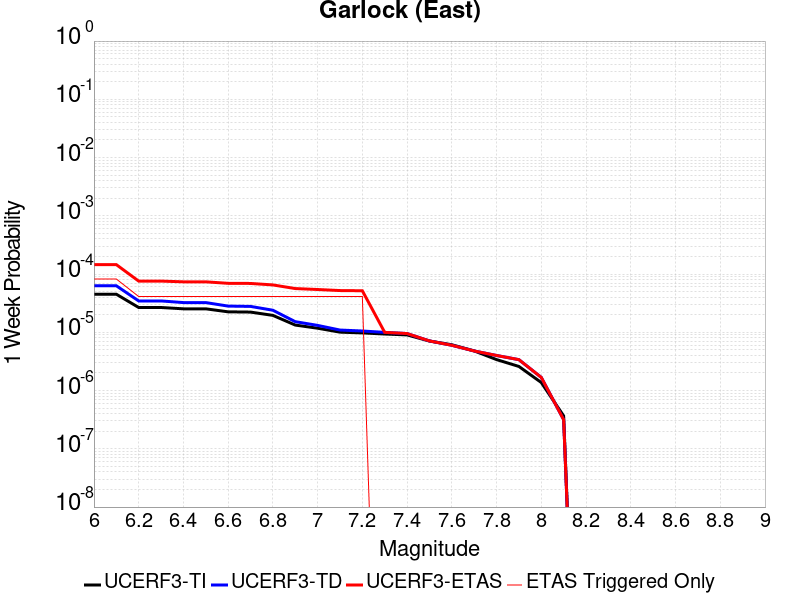 | 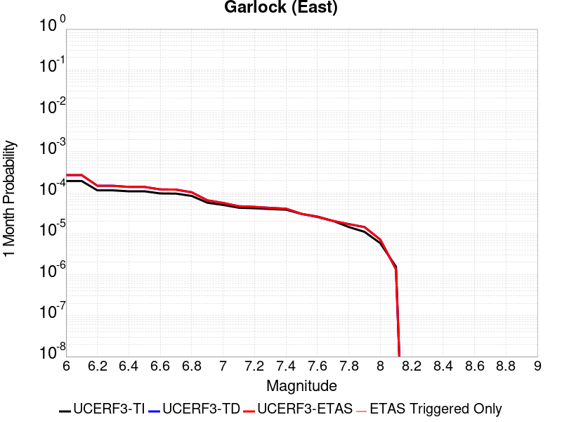 | 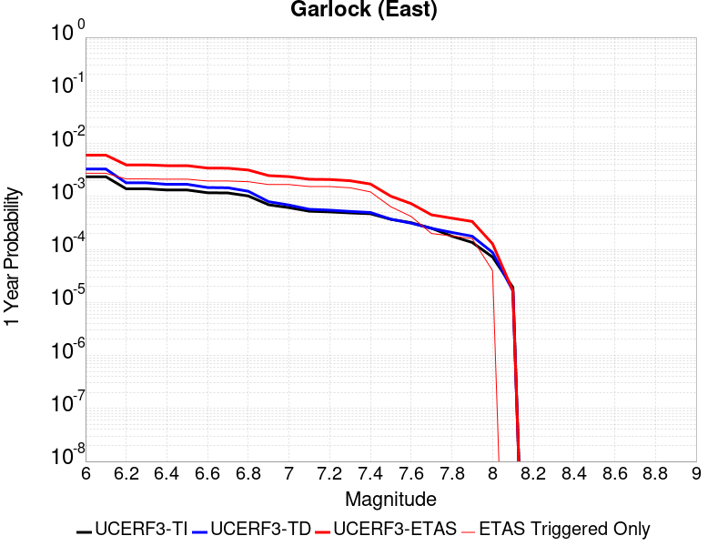 | 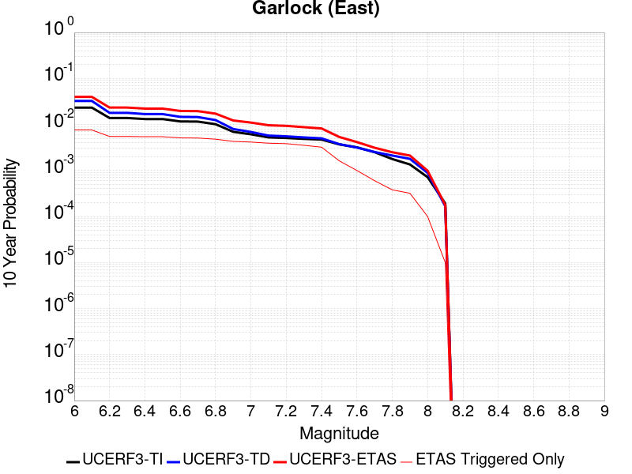 |

| Magnitude | 1 wk TI Prob | 1 wk TD Prob | 1 wk ETAS Prob | 1 wk ETAS/TD Gain | 1 wk ETAS Triggered Only | 1 mo TI Prob | 1 mo TD Prob | 1 mo ETAS Prob | 1 mo ETAS/TD Gain | 1 mo ETAS Triggered Only | 1 yr TI Prob | 1 yr TD Prob | 1 yr ETAS Prob | 1 yr ETAS/TD Gain | 1 yr ETAS Triggered Only | 10 yr TI Prob | 10 yr TD Prob | 10 yr ETAS Prob | 10 yr ETAS/TD Gain | 10 yr ETAS Triggered Only |
|-----|-----|-----|-----|-----|-----|-----|-----|-----|-----|-----|-----|-----|-----|-----|-----|-----|-----|-----|-----|-----|
| 6.0 | 4.5092507E-5 | 6.296638E-5 | 1.4527926E-4 | 2.3072517 | 8.2318074E-5 | 1.9323928E-4 | 2.698305E-4 | 6.401619E-4 | 2.3724594 | 3.7043134E-4 | 0.0023501497 | 0.003280684 | 0.0061113406 | 1.8628252 | 0.0028399737 | 0.023254504 | 0.032422677 | 0.03971057 | 1.2247777 | 0.007532104 |
| 6.1 | 4.5092507E-5 | 6.296638E-5 | 1.4527926E-4 | 2.3072517 | 8.2318074E-5 | 1.9323928E-4 | 2.698305E-4 | 6.401619E-4 | 2.3724594 | 3.7043134E-4 | 0.0023501497 | 0.003280684 | 0.0061113406 | 1.8628252 | 0.0028399737 | 0.023254504 | 0.032422677 | 0.03971057 | 1.2247777 | 0.007532104 |
| 6.2 | 2.6674514E-5 | 3.456096E-5 | 7.571858E-5 | 2.1908703 | 4.1159037E-5 | 1.1431433E-4 | 1.4811018E-4 | 3.9502783E-4 | 2.6671214 | 2.4695424E-4 | 0.0013908884 | 0.001801783 | 0.004061451 | 2.254129 | 0.0022637472 | 0.01382215 | 0.017910836 | 0.02328694 | 1.3001593 | 0.005474152 |
| 6.3 | 2.6674514E-5 | 3.456096E-5 | 7.571858E-5 | 2.1908703 | 4.1159037E-5 | 1.1431433E-4 | 1.4811018E-4 | 3.9502783E-4 | 2.6671214 | 2.4695424E-4 | 0.0013908884 | 0.001801783 | 0.004061451 | 2.254129 | 0.0022637472 | 0.01382215 | 0.017910836 | 0.02328694 | 1.3001593 | 0.005474152 |
| 6.4 | 2.5312667E-5 | 3.2388867E-5 | 7.354657E-5 | 2.2707362 | 4.1159037E-5 | 1.0847834E-4 | 1.3880222E-4 | 3.8572217E-4 | 2.7789338 | 2.4695424E-4 | 0.0013199237 | 0.0016886365 | 0.0039074714 | 2.3139803 | 0.002222588 | 0.013121112 | 0.016810471 | 0.022152133 | 1.317758 | 0.005432993 |
| 6.5 | 2.5312667E-5 | 3.2388867E-5 | 7.354657E-5 | 2.2707362 | 4.1159037E-5 | 1.0847834E-4 | 1.3880222E-4 | 3.8572217E-4 | 2.7789338 | 2.4695424E-4 | 0.0013199237 | 0.0016886365 | 0.0039074714 | 2.3139803 | 0.002222588 | 0.013121112 | 0.016810471 | 0.022152133 | 1.317758 | 0.005432993 |
| 6.6 | 2.246556E-5 | 2.8180817E-5 | 6.93387E-5 | 2.4604926 | 4.1159037E-5 | 9.627742E-5 | 1.2076947E-4 | 3.676939E-4 | 3.0445929 | 2.4695424E-4 | 0.0011715472 | 0.0014694002 | 0.003524328 | 2.398481 | 0.0020579519 | 0.011653901 | 0.014652344 | 0.019600172 | 1.3376817 | 0.0050214026 |
| 6.7 | 2.2241198E-5 | 2.7850401E-5 | 6.9008296E-5 | 2.4778204 | 4.1159037E-5 | 9.531594E-5 | 1.19353535E-4 | 3.6627828E-4 | 3.0688517 | 2.4695424E-4 | 0.0011598538 | 0.0014521842 | 0.0035071475 | 2.4150846 | 0.0020579519 | 0.011538187 | 0.014481625 | 0.019389747 | 1.3389206 | 0.0049802437 |
| 6.8 | 1.9528685E-5 | 2.3941871E-5 | 6.509993E-5 | 2.7190826 | 4.1159037E-5 | 8.369167E-5 | 1.026041E-4 | 3.0837816E-4 | 3.005515 | 2.057952E-4 | 0.0010184698 | 0.0012485087 | 0.003221676 | 2.5804193 | 0.001975634 | 0.010138147 | 0.012461547 | 0.017257791 | 1.3848835 | 0.0048567667 |
| 6.9 | 1.3318621E-5 | 1.5236135E-5 | 5.6394547E-5 | 3.701368 | 4.1159037E-5 | 5.7078556E-5 | 6.5296124E-5 | 2.7107788E-4 | 4.151516 | 2.057952E-4 | 6.9470983E-4 | 7.9469604E-4 | 0.0024808755 | 3.1217918 | 0.0016875205 | 0.0069254204 | 0.007959486 | 0.012124293 | 1.5232506 | 0.004198222 |
| 7.0 | 1.1760853E-5 | 1.3143669E-5 | 5.4302167E-5 | 4.1314316 | 4.1159037E-5 | 5.0402683E-5 | 5.6328823E-5 | 2.6211241E-4 | 4.653256 | 2.057952E-4 | 6.134799E-4 | 6.8559265E-4 | 0.0023719564 | 3.4597166 | 0.0016875205 | 0.0061178906 | 0.0068753036 | 0.010962909 | 1.5945346 | 0.0041159038 |
| 7.1 | 1.0064758E-5 | 1.0937537E-5 | 5.2096126E-5 | 4.763058 | 4.1159037E-5 | 4.3133965E-5 | 4.6874335E-5 | 2.5265987E-4 | 5.390154 | 2.057952E-4 | 5.2502943E-4 | 5.705491E-4 | 0.0021337003 | 3.7397308 | 0.0015640435 | 0.005237907 | 0.0057307025 | 0.00957748 | 1.6712576 | 0.0038689496 |
| 7.2 | 9.768808E-6 | 1.0533159E-5 | 5.1691764E-5 | 4.907527 | 4.1159037E-5 | 4.186565E-5 | 4.514135E-5 | 2.5092726E-4 | 5.5587006 | 2.057952E-4 | 5.095951E-4 | 5.494608E-4 | 0.002112645 | 3.8449419 | 0.0015640435 | 0.0050842804 | 0.0055208574 | 0.009286583 | 1.6820908 | 0.0037866316 |
| 7.3 | 9.344516E-6 | 9.978153E-6 | 9.978153E-6 | 1.0 | 0.0 | 4.004731E-5 | 4.2762833E-5 | 2.0739195E-4 | 4.8498178 | 1.6463615E-4 | 4.8746695E-4 | 5.205166E-4 | 0.0019191954 | 3.6870978 | 0.0013994073 | 0.0048639905 | 0.0052322084 | 0.008671478 | 1.6573266 | 0.0034573593 |
| 7.4 | 9.023491E-6 | 9.523662E-6 | 9.523662E-6 | 1.0 | 0.0 | 3.867153E-5 | 4.0815077E-5 | 1.231298E-4 | 3.0167723 | 8.2318074E-5 | 4.7072413E-4 | 4.968136E-4 | 0.0016486942 | 3.3185365 | 0.0011524531 | 0.004697283 | 0.004995214 | 0.008148629 | 1.6312872 | 0.003169246 |
| 7.5 | 7.081253E-6 | 7.1169666E-6 | 7.1169666E-6 | 1.0 | 0.0 | 3.0347876E-5 | 3.0500933E-5 | 7.165872E-5 | 2.3493943 | 4.1159037E-5 | 3.6942272E-4 | 3.7128633E-4 | 9.884427E-4 | 2.6622114 | 6.1738555E-4 | 0.003688092 | 0.003739278 | 0.005461494 | 1.4605744 | 0.0017286796 |
| 7.6 | 6.116396E-6 | 5.9870563E-6 | 5.9870563E-6 | 1.0 | 0.0 | 2.6212863E-5 | 2.565856E-5 | 2.565856E-5 | 1.0 | 0.0 | 3.1909486E-4 | 3.1234848E-4 | 6.826641E-4 | 2.185585 | 3.7043134E-4 | 0.0031863707 | 0.0031501288 | 0.0040938044 | 1.2995673 | 9.466579E-4 |
| 7.7 | 4.797145E-6 | 4.7835583E-6 | 4.7835583E-6 | 1.0 | 0.0 | 2.055903E-5 | 2.0500804E-5 | 2.0500804E-5 | 1.0 | 0.0 | 2.5027743E-4 | 2.495688E-4 | 4.964614E-4 | 1.9892766 | 2.4695424E-4 | 0.0024999576 | 0.0025229412 | 0.003056659 | 1.2115458 | 5.350675E-4 |
| 7.8 | 3.4028885E-6 | 4.0020077E-6 | 4.0020077E-6 | 1.0 | 0.0 | 1.4583726E-5 | 1.715135E-5 | 1.715135E-5 | 1.0 | 0.0 | 1.775424E-4 | 2.0879775E-4 | 4.1454998E-4 | 1.985414 | 2.057952E-4 | 0.0017740062 | 0.0021133528 | 0.0024830012 | 1.1749109 | 3.7043134E-4 |
| 7.9 | 2.5928412E-6 | 3.3924102E-6 | 3.3924102E-6 | 1.0 | 0.0 | 1.1112129E-5 | 1.453882E-5 | 1.453882E-5 | 1.0 | 0.0 | 1.3528178E-4 | 1.7699582E-4 | 3.827546E-4 | 2.1625063 | 2.057952E-4 | 0.0013519945 | 0.0017916125 | 0.0021202948 | 1.1834562 | 3.292723E-4 |
| 8.0 | 1.3743648E-6 | 1.6825641E-6 | 1.6825641E-6 | 1.0 | 0.0 | 5.8901214E-6 | 7.210969E-6 | 7.210969E-6 | 1.0 | 0.0 | 7.1709874E-5 | 8.7790046E-5 | 1.2894547E-4 | 1.4687937 | 4.1159037E-5 | 7.1686733E-4 | 8.883735E-4 | 9.7061845E-4 | 1.0925792 | 8.2318074E-5 |
| 8.1 | 3.6733252E-7 | 3.164752E-7 | 3.164752E-7 | 1.0 | 0.0 | 1.5742813E-6 | 1.3563216E-6 | 1.3563216E-6 | 1.0 | 0.0 | 1.9166706E-5 | 1.6513108E-5 | 1.6513108E-5 | 1.0 | 0.0 | 1.9165053E-4 | 1.6726229E-4 | 1.6726229E-4 | 1.0 | 0.0 |

## Panamint Valley
*[(top)](#table-of-contents)*

| 1 Week | 1 Month | 1 Year | 10 Year |
|-----|-----|-----|-----|
| 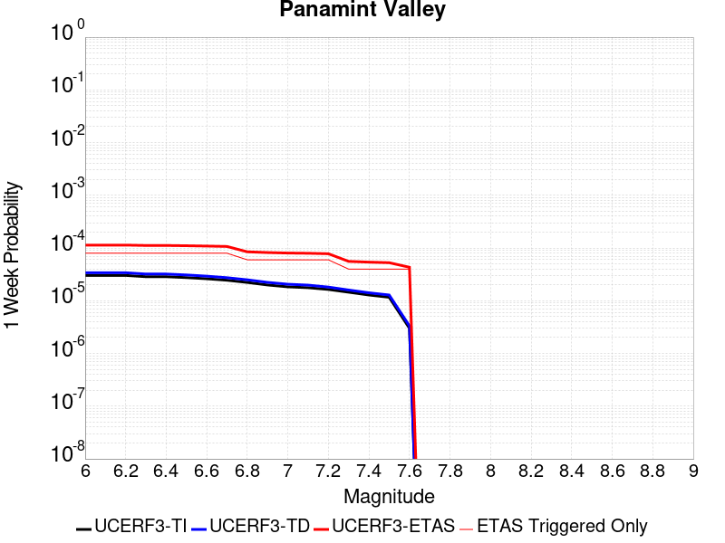 | 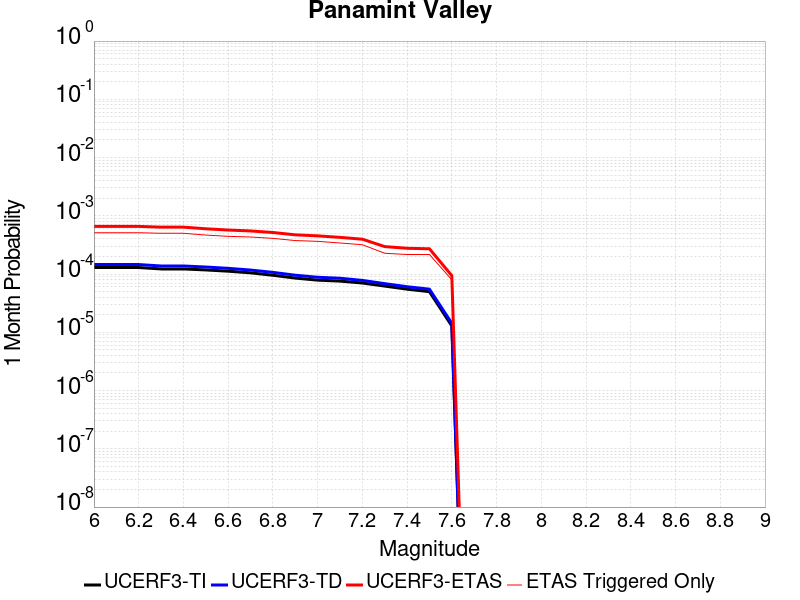 | 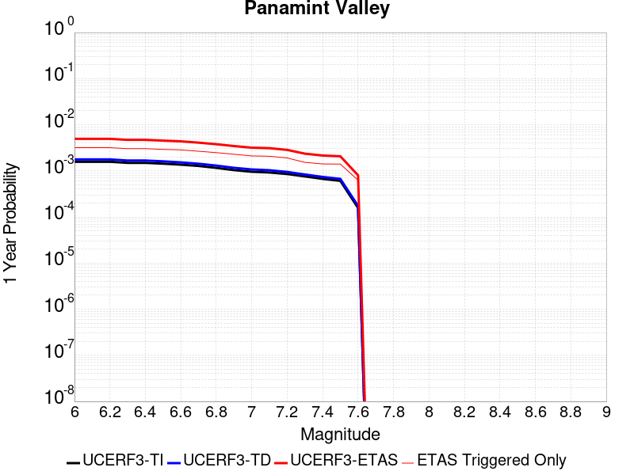 | 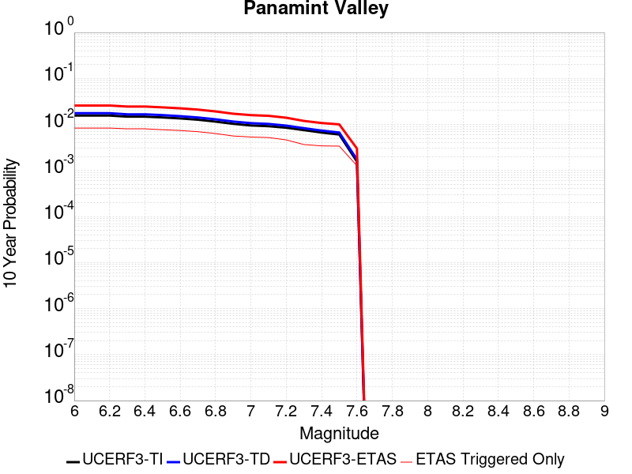 |

| Magnitude | 1 wk TI Prob | 1 wk TD Prob | 1 wk ETAS Prob | 1 wk ETAS/TD Gain | 1 wk ETAS Triggered Only | 1 mo TI Prob | 1 mo TD Prob | 1 mo ETAS Prob | 1 mo ETAS/TD Gain | 1 mo ETAS Triggered Only | 1 yr TI Prob | 1 yr TD Prob | 1 yr ETAS Prob | 1 yr ETAS/TD Gain | 1 yr ETAS Triggered Only | 10 yr TI Prob | 10 yr TD Prob | 10 yr ETAS Prob | 10 yr ETAS/TD Gain | 10 yr ETAS Triggered Only |
|-----|-----|-----|-----|-----|-----|-----|-----|-----|-----|-----|-----|-----|-----|-----|-----|-----|-----|-----|-----|-----|
| 6.0 | 3.0211835E-5 | 3.3999226E-5 | 1.16314506E-4 | 3.4210927 | 8.2318074E-5 | 1.2947287E-4 | 1.45703E-4 | 7.218456E-4 | 4.954226 | 5.7622656E-4 | 0.0015751923 | 0.0017725201 | 0.0046485458 | 2.6225631 | 0.0028811328 | 0.015640736 | 0.017591003 | 0.025273655 | 1.4367375 | 0.007820217 |
| 6.1 | 3.0211835E-5 | 3.3999226E-5 | 1.16314506E-4 | 3.4210927 | 8.2318074E-5 | 1.2947287E-4 | 1.45703E-4 | 7.218456E-4 | 4.954226 | 5.7622656E-4 | 0.0015751923 | 0.0017725201 | 0.0046485458 | 2.6225631 | 0.0028811328 | 0.015640736 | 0.017591003 | 0.025273655 | 1.4367375 | 0.007820217 |
| 6.2 | 3.0211835E-5 | 3.3999226E-5 | 1.16314506E-4 | 3.4210927 | 8.2318074E-5 | 1.2947287E-4 | 1.45703E-4 | 7.218456E-4 | 4.954226 | 5.7622656E-4 | 0.0015751923 | 0.0017725201 | 0.0046485458 | 2.6225631 | 0.0028811328 | 0.015640736 | 0.017591003 | 0.025273655 | 1.4367375 | 0.007820217 |
| 6.3 | 2.8573924E-5 | 3.2116626E-5 | 1.1443206E-4 | 3.5630162 | 8.2318074E-5 | 1.2245393E-4 | 1.3763558E-4 | 7.137828E-4 | 5.186034 | 5.7622656E-4 | 0.001489857 | 0.001674453 | 0.004386401 | 2.6196022 | 0.0027164966 | 0.01479908 | 0.016625157 | 0.023991564 | 1.4430879 | 0.007490945 |
| 6.4 | 2.8573924E-5 | 3.2116626E-5 | 1.1443206E-4 | 3.5630162 | 8.2318074E-5 | 1.2245393E-4 | 1.3763558E-4 | 7.137828E-4 | 5.186034 | 5.7622656E-4 | 0.001489857 | 0.001674453 | 0.004386401 | 2.6196022 | 0.0027164966 | 0.01479908 | 0.016625157 | 0.023991564 | 1.4430879 | 0.007490945 |
| 6.5 | 2.7468774E-5 | 3.0841835E-5 | 1.1315737E-4 | 3.668957 | 8.2318074E-5 | 1.1771801E-4 | 1.3217276E-4 | 6.671695E-4 | 5.0477085 | 5.350675E-4 | 0.0014322745 | 0.0016080429 | 0.0041968925 | 2.6099381 | 0.0025930195 | 0.014230782 | 0.01597076 | 0.023018055 | 1.4412624 | 0.0071616727 |
| 6.6 | 2.6135967E-5 | 2.926532E-5 | 1.1158099E-4 | 3.8127377 | 8.2318074E-5 | 1.1200648E-4 | 1.2541692E-4 | 6.1926345E-4 | 4.9376388 | 4.939085E-4 | 0.0013628257 | 0.001525908 | 0.003991682 | 2.615939 | 0.0024695422 | 0.013544982 | 0.015160798 | 0.021849079 | 1.4411563 | 0.0067912415 |
| 6.7 | 2.4498746E-5 | 2.7354E-5 | 1.09669825E-4 | 4.0092793 | 8.2318074E-5 | 1.04990395E-4 | 1.1722631E-4 | 6.110769E-4 | 5.2127967 | 4.939085E-4 | 0.0012775084 | 0.001426321 | 0.0038101403 | 2.6713064 | 0.0023872242 | 0.012701893 | 0.014177947 | 0.020670025 | 1.4578997 | 0.006585446 |
| 6.8 | 2.2244329E-5 | 2.4947252E-5 | 1.0726327E-4 | 4.2996025 | 8.2318074E-5 | 9.532935E-5 | 1.0691254E-4 | 6.007682E-4 | 5.6192493 | 4.939085E-4 | 0.0011600169 | 0.0013009048 | 0.0034794959 | 2.6746738 | 0.002181429 | 0.011539802 | 0.012938806 | 0.018870274 | 1.4584247 | 0.0060092197 |
| 6.9 | 1.9902658E-5 | 2.2301174E-5 | 1.04617415E-4 | 4.691117 | 8.2318074E-5 | 8.529431E-5 | 9.5573065E-5 | 5.482792E-4 | 5.736755 | 4.5274943E-4 | 0.0010379635 | 0.0011629994 | 0.003218558 | 2.7674632 | 0.0020579519 | 0.010331288 | 0.011574146 | 0.01698494 | 1.4674896 | 0.005474152 |
| 7.0 | 1.8353881E-5 | 2.0576585E-5 | 1.0289297E-4 | 5.000488 | 8.2318074E-5 | 7.865712E-5 | 8.818248E-5 | 5.40892E-4 | 6.1337805 | 4.5274943E-4 | 9.5722964E-4 | 0.0010731106 | 0.0030055095 | 2.8007452 | 0.0019344748 | 0.009531168 | 0.010684091 | 0.015733283 | 1.4725899 | 0.005103721 |
| 7.1 | 1.7667631E-5 | 1.9782776E-5 | 1.0209922E-4 | 5.1610165 | 8.2318074E-5 | 7.571623E-5 | 8.4780666E-5 | 4.9633614E-4 | 5.8543553 | 4.115904E-4 | 9.2145515E-4 | 0.0010317335 | 0.002881979 | 2.793337 | 0.0018521567 | 0.009176437 | 0.01027419 | 0.015203266 | 1.4797531 | 0.0049802437 |
| 7.2 | 1.6381597E-5 | 1.8167568E-5 | 1.0048415E-4 | 5.530963 | 8.2318074E-5 | 7.020495E-5 | 7.785878E-5 | 4.0710546E-4 | 5.2287674 | 3.292723E-4 | 8.544101E-4 | 9.4753574E-4 | 0.0026334573 | 2.7792697 | 0.0016875205 | 0.008511325 | 0.009439452 | 0.013924209 | 1.4751078 | 0.0045274943 |
| 7.3 | 1.4520491E-5 | 1.597386E-5 | 5.7132238E-5 | 3.5766087 | 4.1159037E-5 | 6.222919E-5 | 6.845769E-5 | 3.5655123E-4 | 5.2083445 | 2.8811328E-4 | 7.57377E-4 | 8.331699E-4 | 0.002108037 | 2.5301406 | 0.0012759302 | 0.0075480095 | 0.008303438 | 0.011813724 | 1.4227508 | 0.0035396772 |
| 7.4 | 1.2852287E-5 | 1.41519E-5 | 5.5310356E-5 | 3.9083343 | 4.1159037E-5 | 5.5080065E-5 | 6.064968E-5 | 3.0758893E-4 | 5.071567 | 2.4695424E-4 | 6.7039346E-4 | 7.381755E-4 | 0.0019309066 | 2.6157825 | 0.0011936121 | 0.0066837464 | 0.0073600365 | 0.010628525 | 1.444086 | 0.003292723 |
| 7.5 | 1.1637851E-5 | 1.2842981E-5 | 5.400149E-5 | 4.204747 | 4.1159037E-5 | 4.987555E-5 | 5.5040273E-5 | 3.019809E-4 | 5.4865446 | 2.4695424E-4 | 6.070656E-4 | 6.69925E-4 | 0.0018627375 | 2.7805164 | 0.0011936121 | 0.006054099 | 0.0066818423 | 0.0098707955 | 1.4772567 | 0.0032104051 |
| 7.6 | 3.0068115E-6 | 3.3354997E-6 | 4.44944E-5 | 13.339651 | 4.1159037E-5 | 1.2886271E-5 | 1.4294961E-5 | 1.3777032E-4 | 9.637683 | 1.2347712E-4 | 1.5687906E-4 | 1.7403455E-4 | 5.855533E-4 | 3.3645809 | 4.115904E-4 | 0.0015676835 | 0.0017403618 | 0.0028086344 | 1.6138221 | 0.001070135 |

## Ash Hill
*[(top)](#table-of-contents)*

| 1 Week | 1 Month | 1 Year | 10 Year |
|-----|-----|-----|-----|
| 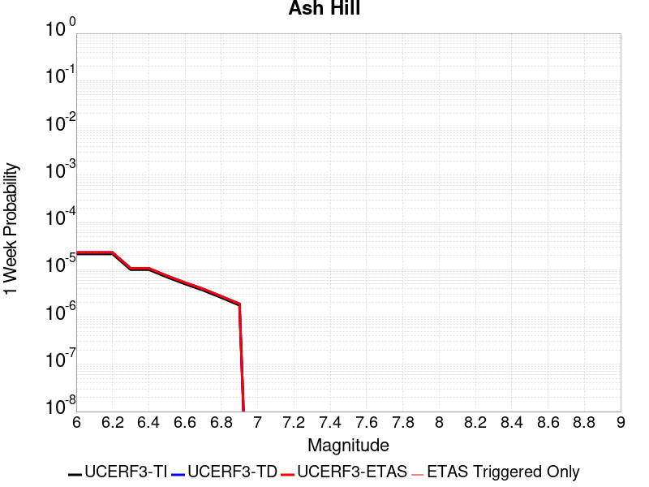 | 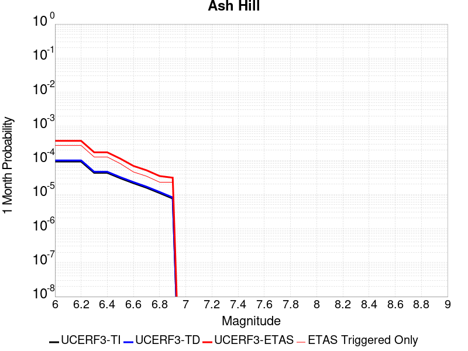 | 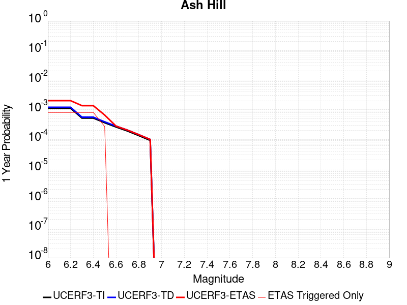 | 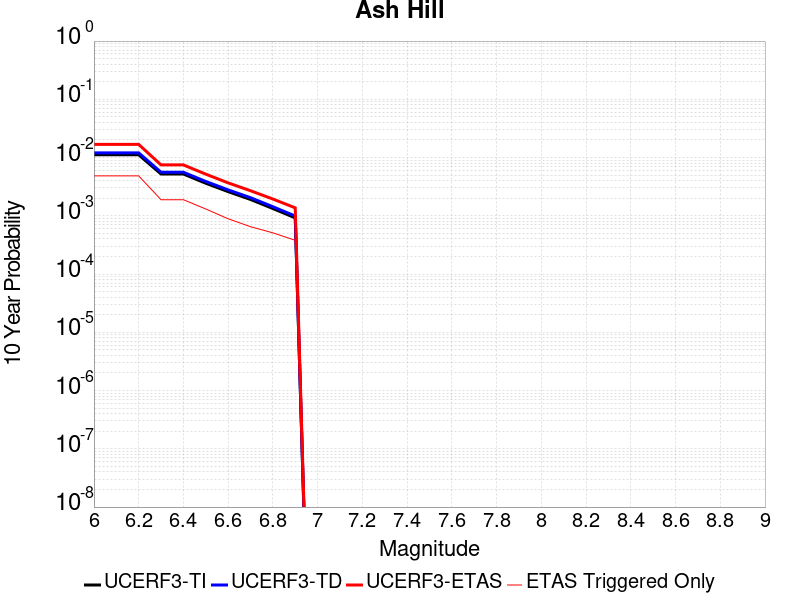 |

| Magnitude | 1 wk TI Prob | 1 wk TD Prob | 1 wk ETAS Prob | 1 wk ETAS/TD Gain | 1 wk ETAS Triggered Only | 1 mo TI Prob | 1 mo TD Prob | 1 mo ETAS Prob | 1 mo ETAS/TD Gain | 1 mo ETAS Triggered Only | 1 yr TI Prob | 1 yr TD Prob | 1 yr ETAS Prob | 1 yr ETAS/TD Gain | 1 yr ETAS Triggered Only | 10 yr TI Prob | 10 yr TD Prob | 10 yr ETAS Prob | 10 yr ETAS/TD Gain | 10 yr ETAS Triggered Only |
|-----|-----|-----|-----|-----|-----|-----|-----|-----|-----|-----|-----|-----|-----|-----|-----|-----|-----|-----|-----|-----|
| 6.0 | 2.1545662E-5 | 2.3198552E-5 | 2.3198552E-5 | 1.0 | 0.0 | 9.2335285E-5 | 9.941903E-5 | 3.0519377E-4 | 3.069772 | 2.057952E-4 | 0.0011236023 | 0.0012098346 | 0.0025253303 | 2.0873353 | 0.0013170892 | 0.011179381 | 0.012040469 | 0.01557819 | 1.2938192 | 0.0035808363 |
| 6.1 | 2.1545662E-5 | 2.3198552E-5 | 2.3198552E-5 | 1.0 | 0.0 | 9.2335285E-5 | 9.941903E-5 | 3.0519377E-4 | 3.069772 | 2.057952E-4 | 0.0011236023 | 0.0012098346 | 0.0025253303 | 2.0873353 | 0.0013170892 | 0.011179381 | 0.012040469 | 0.01557819 | 1.2938192 | 0.0035808363 |
| 6.2 | 2.1545662E-5 | 2.3198552E-5 | 2.3198552E-5 | 1.0 | 0.0 | 9.2335285E-5 | 9.941903E-5 | 3.0519377E-4 | 3.069772 | 2.057952E-4 | 0.0011236023 | 0.0012098346 | 0.0025253303 | 2.0873353 | 0.0013170892 | 0.011179381 | 0.012040469 | 0.01557819 | 1.2938192 | 0.0035808363 |
| 6.3 | 1.0025529E-5 | 1.0748722E-5 | 1.0748722E-5 | 1.0 | 0.0 | 4.2965847E-5 | 4.606521E-5 | 1.6953664E-4 | 3.6803615 | 1.2347712E-4 | 5.229836E-4 | 5.607129E-4 | 0.0010954804 | 1.9537278 | 5.350675E-4 | 0.005217545 | 0.0055942945 | 0.006822158 | 1.2194849 | 0.0012347711 |
| 6.4 | 1.0025529E-5 | 1.0748722E-5 | 1.0748722E-5 | 1.0 | 0.0 | 4.2965847E-5 | 4.606521E-5 | 1.6953664E-4 | 3.6803615 | 1.2347712E-4 | 5.229836E-4 | 5.607129E-4 | 0.0010954804 | 1.9537278 | 5.350675E-4 | 0.005217545 | 0.0055942945 | 0.006822158 | 1.2194849 | 0.0012347711 |
| 6.5 | 6.9617327E-6 | 7.4578593E-6 | 7.4578593E-6 | 1.0 | 0.0 | 2.9835655E-5 | 3.1961914E-5 | 1.1427736E-4 | 3.575423 | 8.2318074E-5 | 3.6318856E-4 | 3.8907546E-4 | 8.005057E-4 | 2.0574563 | 4.115904E-4 | 0.0036259557 | 0.0038847975 | 0.004827778 | 1.242736 | 9.466579E-4 |
| 6.6 | 4.9919777E-6 | 5.3475665E-6 | 5.3475665E-6 | 1.0 | 0.0 | 2.1394015E-5 | 2.2917979E-5 | 1.0523417E-4 | 4.5917735 | 8.2318074E-5 | 2.60441E-4 | 2.7899738E-4 | 5.670303E-4 | 2.0323856 | 2.8811328E-4 | 0.0026013597 | 0.0027871297 | 0.0034848833 | 1.2503484 | 6.9970364E-4 |
| 6.7 | 3.6630722E-6 | 3.9252714E-6 | 3.9252714E-6 | 1.0 | 0.0 | 1.5698786E-5 | 1.6822516E-5 | 5.7980862E-5 | 3.4466226 | 4.1159037E-5 | 1.9111596E-4 | 2.0480063E-4 | 4.1055368E-4 | 2.0046506 | 2.057952E-4 | 0.0019095168 | 0.002046682 | 0.0024574301 | 1.2006897 | 4.115904E-4 |
| 6.8 | 2.5599613E-6 | 2.7453837E-6 | 2.7453837E-6 | 1.0 | 0.0 | 1.0971216E-5 | 1.1765905E-5 | 5.2924457E-5 | 4.498121 | 4.1159037E-5 | 1.3356637E-4 | 1.4324542E-4 | 3.07858E-4 | 2.1491647 | 1.6463615E-4 | 0.0013348613 | 0.0014320159 | 0.0018019169 | 1.2583078 | 3.7043134E-4 |
| 6.9 | 1.7684905E-6 | 1.897189E-6 | 1.897189E-6 | 1.0 | 0.0 | 7.579223E-6 | 8.13081E-6 | 4.9289512E-5 | 6.062067 | 4.1159037E-5 | 9.2273134E-5 | 9.899261E-5 | 2.6361246E-4 | 2.662951 | 1.6463615E-4 | 9.223483E-4 | 9.899262E-4 | 0.0012777542 | 1.2907571 | 2.8811328E-4 |

## Blackwater
*[(top)](#table-of-contents)*

| 1 Week | 1 Month | 1 Year | 10 Year |
|-----|-----|-----|-----|
| 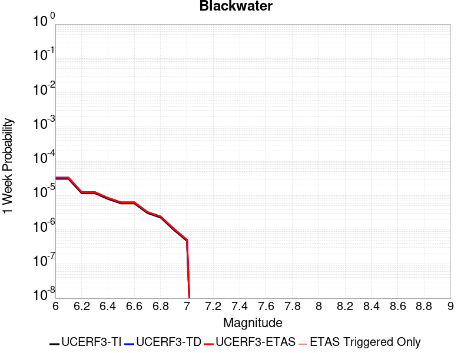 | 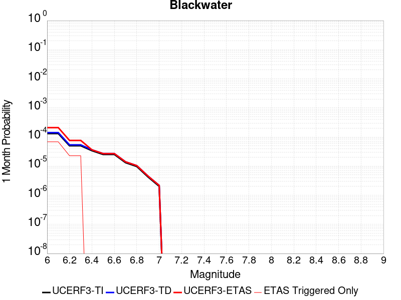 |  | 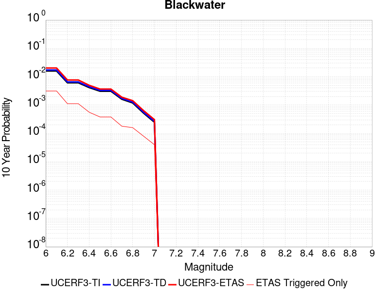 |

| Magnitude | 1 wk TI Prob | 1 wk TD Prob | 1 wk ETAS Prob | 1 wk ETAS/TD Gain | 1 wk ETAS Triggered Only | 1 mo TI Prob | 1 mo TD Prob | 1 mo ETAS Prob | 1 mo ETAS/TD Gain | 1 mo ETAS Triggered Only | 1 yr TI Prob | 1 yr TD Prob | 1 yr ETAS Prob | 1 yr ETAS/TD Gain | 1 yr ETAS Triggered Only | 10 yr TI Prob | 10 yr TD Prob | 10 yr ETAS Prob | 10 yr ETAS/TD Gain | 10 yr ETAS Triggered Only |
|-----|-----|-----|-----|-----|-----|-----|-----|-----|-----|-----|-----|-----|-----|-----|-----|-----|-----|-----|-----|-----|
| 6.0 | 3.0708583E-5 | 3.3101805E-5 | 3.3101805E-5 | 1.0 | 0.0 | 1.3160157E-4 | 1.4185793E-4 | 2.2416434E-4 | 1.5802029 | 8.2318074E-5 | 0.0016010714 | 0.0017258888 | 0.0027941768 | 1.6189785 | 0.001070135 | 0.015895851 | 0.017138693 | 0.02033453 | 1.1864691 | 0.003251564 |
| 6.1 | 3.0708583E-5 | 3.3101805E-5 | 3.3101805E-5 | 1.0 | 0.0 | 1.3160157E-4 | 1.4185793E-4 | 2.2416434E-4 | 1.5802029 | 8.2318074E-5 | 0.0016010714 | 0.0017258888 | 0.0027941768 | 1.6189785 | 0.001070135 | 0.015895851 | 0.017138693 | 0.02033453 | 1.1864691 | 0.003251564 |
| 6.2 | 1.1707779E-5 | 1.2547198E-5 | 1.2547198E-5 | 1.0 | 0.0 | 5.017523E-5 | 5.377265E-5 | 5.377265E-5 | 1.0 | 0.0 | 6.107122E-4 | 6.54495E-4 | 0.0010246838 | 1.56561 | 3.7043134E-4 | 0.006090366 | 0.0065266457 | 0.007671577 | 1.1754242 | 0.0011524531 |
| 6.3 | 1.1707779E-5 | 1.2547198E-5 | 1.2547198E-5 | 1.0 | 0.0 | 5.017523E-5 | 5.377265E-5 | 5.377265E-5 | 1.0 | 0.0 | 6.107122E-4 | 6.54495E-4 | 0.0010246838 | 1.56561 | 3.7043134E-4 | 0.006090366 | 0.0065266457 | 0.007671577 | 1.1754242 | 0.0011524531 |
| 6.4 | 7.929244E-6 | 8.48146E-6 | 8.48146E-6 | 1.0 | 0.0 | 3.3982033E-5 | 3.6348632E-5 | 3.6348632E-5 | 1.0 | 0.0 | 4.136527E-4 | 4.4245878E-4 | 6.481629E-4 | 1.4649115 | 2.057952E-4 | 0.0041288356 | 0.0044161836 | 0.00507182 | 1.1484622 | 6.585446E-4 |
| 6.5 | 5.8832115E-6 | 6.286986E-6 | 6.286986E-6 | 1.0 | 0.0 | 2.521352E-5 | 2.694396E-5 | 2.694396E-5 | 1.0 | 0.0 | 3.0693135E-4 | 3.279959E-4 | 4.92578E-4 | 1.5017811 | 1.6463615E-4 | 0.0030650778 | 0.0032753714 | 0.003726638 | 1.1377757 | 4.5274943E-4 |
| 6.6 | 5.8832115E-6 | 6.286986E-6 | 6.286986E-6 | 1.0 | 0.0 | 2.521352E-5 | 2.694396E-5 | 2.694396E-5 | 1.0 | 0.0 | 3.0693135E-4 | 3.279959E-4 | 4.92578E-4 | 1.5017811 | 1.6463615E-4 | 0.0030650778 | 0.0032753714 | 0.003726638 | 1.1377757 | 4.5274943E-4 |
| 6.7 | 3.0715053E-6 | 3.2819846E-6 | 3.2819846E-6 | 1.0 | 0.0 | 1.3163528E-5 | 1.4065579E-5 | 1.4065579E-5 | 1.0 | 0.0 | 1.6025416E-4 | 1.7123614E-4 | 2.535401E-4 | 1.4806461 | 8.2318074E-5 | 0.0016013865 | 0.0017111566 | 0.0019576882 | 1.1440731 | 2.4695424E-4 |
| 6.8 | 2.2722281E-6 | 2.4291405E-6 | 2.4291405E-6 | 1.0 | 0.0 | 9.738084E-6 | 1.0410566E-5 | 1.0410566E-5 | 1.0 | 0.0 | 1.1855473E-4 | 1.2674218E-4 | 2.0904983E-4 | 1.64941 | 8.2318074E-5 | 0.001184915 | 0.0012667892 | 0.0014723237 | 1.1622484 | 2.057952E-4 |
| 6.9 | 9.952399E-7 | 1.0655224E-6 | 1.0655224E-6 | 1.0 | 0.0 | 4.265307E-6 | 4.5665192E-6 | 4.5665192E-6 | 1.0 | 0.0 | 5.1928873E-5 | 5.559647E-5 | 5.559647E-5 | 1.0 | 0.0 | 5.191674E-4 | 5.5587624E-4 | 6.7928474E-4 | 1.2220072 | 1.2347712E-4 |
| 7.0 | 4.7385504E-7 | 5.076394E-7 | 5.076394E-7 | 1.0 | 0.0 | 2.0308057E-6 | 2.1755973E-6 | 2.1755973E-6 | 1.0 | 0.0 | 2.4724779E-5 | 2.6487898E-5 | 2.6487898E-5 | 1.0 | 0.0 | 2.4722028E-4 | 2.64879E-4 | 3.0602713E-4 | 1.1553469 | 4.1159037E-5 |

## Hunter Mountain-Saline Valley
*[(top)](#table-of-contents)*

| 1 Week | 1 Month | 1 Year | 10 Year |
|-----|-----|-----|-----|
| 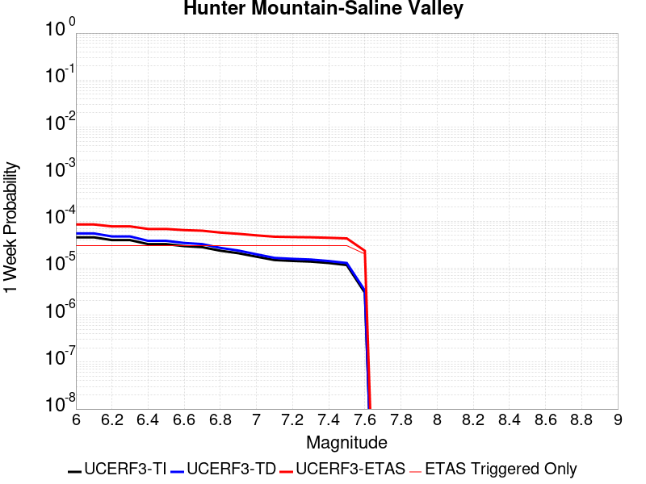 | 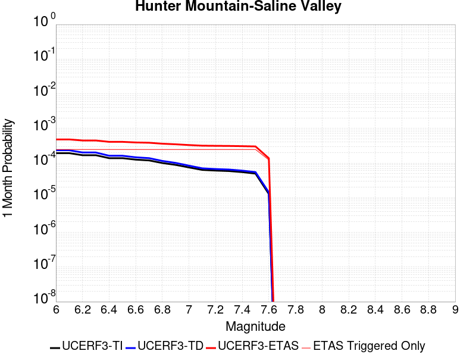 | 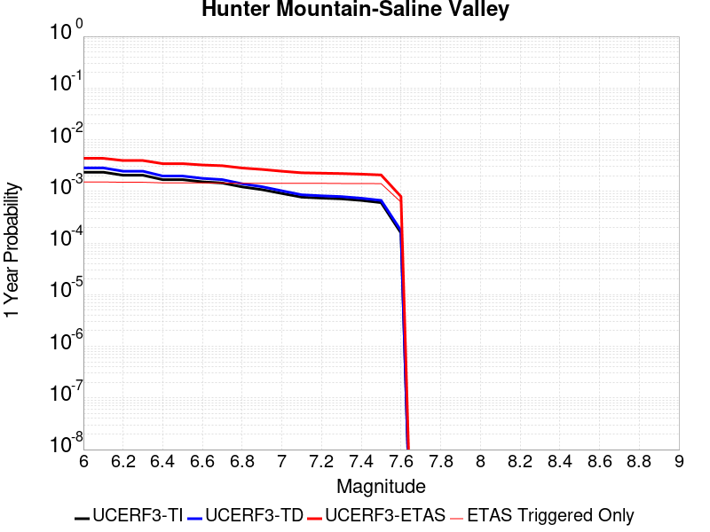 | 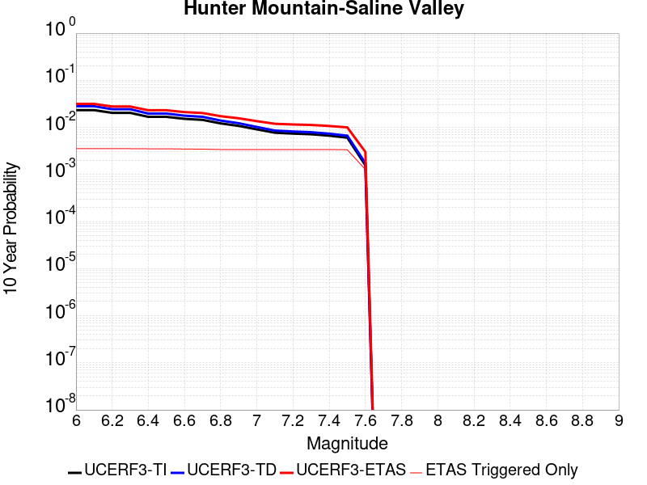 |

| Magnitude | 1 wk TI Prob | 1 wk TD Prob | 1 wk ETAS Prob | 1 wk ETAS/TD Gain | 1 wk ETAS Triggered Only | 1 mo TI Prob | 1 mo TD Prob | 1 mo ETAS Prob | 1 mo ETAS/TD Gain | 1 mo ETAS Triggered Only | 1 yr TI Prob | 1 yr TD Prob | 1 yr ETAS Prob | 1 yr ETAS/TD Gain | 1 yr ETAS Triggered Only | 10 yr TI Prob | 10 yr TD Prob | 10 yr ETAS Prob | 10 yr ETAS/TD Gain | 10 yr ETAS Triggered Only |
|-----|-----|-----|-----|-----|-----|-----|-----|-----|-----|-----|-----|-----|-----|-----|-----|-----|-----|-----|-----|-----|
| 6.0 | 4.5103672E-5 | 5.4598844E-5 | 9.575563E-5 | 1.7538034 | 4.1159037E-5 | 1.9328714E-4 | 2.3397508E-4 | 4.8087153E-4 | 2.0552254 | 2.4695424E-4 | 0.002350731 | 0.0028451039 | 0.00403532 | 1.4183384 | 0.0011936121 | 0.023260195 | 0.028107068 | 0.031227237 | 1.1110102 | 0.0032104051 |
| 6.1 | 4.5103672E-5 | 5.4598844E-5 | 9.575563E-5 | 1.7538034 | 4.1159037E-5 | 1.9328714E-4 | 2.3397508E-4 | 4.8087153E-4 | 2.0552254 | 2.4695424E-4 | 0.002350731 | 0.0028451039 | 0.00403532 | 1.4183384 | 0.0011936121 | 0.023260195 | 0.028107068 | 0.031227237 | 1.1110102 | 0.0032104051 |
| 6.2 | 3.9363465E-5 | 4.7087524E-5 | 8.8244626E-5 | 1.8740553 | 4.1159037E-5 | 1.6868966E-4 | 2.0178875E-4 | 4.4869314E-4 | 2.2235787 | 2.4695424E-4 | 0.002051862 | 0.0024541437 | 0.0036448266 | 1.4851724 | 0.0011936121 | 0.020330196 | 0.024286084 | 0.02741852 | 1.1289808 | 0.0032104051 |
| 6.3 | 3.9363465E-5 | 4.7087524E-5 | 8.8244626E-5 | 1.8740553 | 4.1159037E-5 | 1.6868966E-4 | 2.0178875E-4 | 4.4869314E-4 | 2.2235787 | 2.4695424E-4 | 0.002051862 | 0.0024541437 | 0.0036448266 | 1.4851724 | 0.0011936121 | 0.020330196 | 0.024286084 | 0.02741852 | 1.1289808 | 0.0032104051 |
| 6.4 | 3.2311684E-5 | 3.7969927E-5 | 7.91274E-5 | 2.0839493 | 4.1159037E-5 | 1.384713E-4 | 1.6271851E-4 | 4.0963257E-4 | 2.5174305 | 2.4695424E-4 | 0.0016845843 | 0.0019793664 | 0.003170616 | 1.6018337 | 0.0011936121 | 0.016718714 | 0.019626025 | 0.022773424 | 1.1603686 | 0.0032104051 |
| 6.5 | 3.2311684E-5 | 3.7969927E-5 | 7.91274E-5 | 2.0839493 | 4.1159037E-5 | 1.384713E-4 | 1.6271851E-4 | 4.0963257E-4 | 2.5174305 | 2.4695424E-4 | 0.0016845843 | 0.0019793664 | 0.003170616 | 1.6018337 | 0.0011936121 | 0.016718714 | 0.019626025 | 0.022773424 | 1.1603686 | 0.0032104051 |
| 6.6 | 2.9305844E-5 | 3.4198583E-5 | 7.535621E-5 | 2.2034893 | 4.1159037E-5 | 1.2559042E-4 | 1.4655748E-4 | 3.9347552E-4 | 2.6847863 | 2.4695424E-4 | 0.0015279909 | 0.0017829385 | 0.0029744224 | 1.6682699 | 0.0011936121 | 0.015175272 | 0.017694132 | 0.020847732 | 1.1782285 | 0.0032104051 |
| 6.7 | 2.7826512E-5 | 3.2359956E-5 | 7.351766E-5 | 2.2718716 | 4.1159037E-5 | 1.19251024E-4 | 1.3867849E-4 | 3.8559848E-4 | 2.7805212 | 2.4695424E-4 | 0.0014509142 | 0.0016871633 | 0.0028787616 | 1.7062733 | 0.0011936121 | 0.014414776 | 0.016751112 | 0.019907739 | 1.1884428 | 0.0032104051 |
| 6.8 | 2.3389874E-5 | 2.6879417E-5 | 6.803735E-5 | 2.5312061 | 4.1159037E-5 | 1.0023846E-4 | 1.15192684E-4 | 3.6211847E-4 | 3.143589 | 2.4695424E-4 | 0.00121972 | 0.001401616 | 0.0025935553 | 1.8504034 | 0.0011936121 | 0.01213047 | 0.01393385 | 0.017099522 | 1.2271929 | 0.0032104051 |
| 6.9 | 2.069209E-5 | 2.3581042E-5 | 6.473911E-5 | 2.745388 | 4.1159037E-5 | 8.867737E-5 | 1.010579E-4 | 3.4798717E-4 | 3.4434435 | 2.4695424E-4 | 0.0010791123 | 0.0012297217 | 0.002421866 | 1.9694424 | 0.0011936121 | 0.010738871 | 0.012234077 | 0.015405205 | 1.2592046 | 0.0032104051 |
| 7.0 | 1.7462342E-5 | 1.9642564E-5 | 6.0800794E-5 | 3.0953593 | 4.1159037E-5 | 7.483646E-5 | 8.417983E-5 | 3.3111326E-4 | 3.933404 | 2.4695424E-4 | 9.1075303E-4 | 0.0010244302 | 0.0022168194 | 2.1639538 | 0.0011936121 | 0.009070295 | 0.010200586 | 0.013378244 | 1.3115171 | 0.0032104051 |
| 7.1 | 1.4807709E-5 | 1.6449274E-5 | 5.7607635E-5 | 3.5021386 | 4.1159037E-5 | 6.3460066E-5 | 7.049507E-5 | 3.174319E-4 | 4.502895 | 2.4695424E-4 | 7.723524E-4 | 8.5795607E-4 | 0.0020505441 | 2.390034 | 0.0011936121 | 0.007696735 | 0.0085493 | 0.011732258 | 1.3723063 | 0.0032104051 |
| 7.2 | 1.4180048E-5 | 1.5705544E-5 | 5.6863937E-5 | 3.620628 | 4.1159037E-5 | 6.077022E-5 | 6.730783E-5 | 3.1424544E-4 | 4.66878 | 2.4695424E-4 | 7.396263E-4 | 8.19181E-4 | 0.0020118153 | 2.4558864 | 0.0011936121 | 0.0073716943 | 0.008164439 | 0.011348633 | 1.3900076 | 0.0032104051 |
| 7.3 | 1.3730402E-5 | 1.5179074E-5 | 5.633749E-5 | 3.7115233 | 4.1159037E-5 | 5.8843252E-5 | 6.5051645E-5 | 3.119898E-4 | 4.796033 | 2.4695424E-4 | 7.161811E-4 | 7.9173205E-4 | 0.0019843993 | 2.5064025 | 0.0011936121 | 0.007138774 | 0.007891921 | 0.01107699 | 1.403586 | 0.0032104051 |
| 7.4 | 1.2810095E-5 | 1.4115724E-5 | 5.527418E-5 | 3.915788 | 4.1159037E-5 | 5.489925E-5 | 6.0494647E-5 | 3.0743395E-4 | 5.082002 | 2.4695424E-4 | 6.681934E-4 | 7.3628925E-4 | 0.0019290225 | 2.6199248 | 0.0011936121 | 0.006661878 | 0.007341268 | 0.010528104 | 1.434099 | 0.0032104051 |
| 7.5 | 1.1595659E-5 | 1.2806805E-5 | 5.3965316E-5 | 4.2138 | 4.1159037E-5 | 4.9694736E-5 | 5.488524E-5 | 3.0182593E-4 | 5.4992185 | 2.4695424E-4 | 6.0486543E-4 | 6.680386E-4 | 0.0018608534 | 2.7855475 | 0.0011936121 | 0.006032217 | 0.0066630607 | 0.009770305 | 1.4663389 | 0.003128087 |
| 7.6 | 2.997694E-6 | 3.327617E-6 | 4.4486518E-5 | 13.368882 | 4.1159037E-5 | 1.28471975E-5 | 1.4261179E-5 | 1.3773654E-4 | 9.658145 | 1.2347712E-4 | 1.564034E-4 | 1.7362331E-4 | 5.8514223E-4 | 3.3701825 | 4.115904E-4 | 0.0015629337 | 0.0017362454 | 0.0028045224 | 1.61528 | 0.001070135 |

## Garlock (West)
*[(top)](#table-of-contents)*

| 1 Week | 1 Month | 1 Year | 10 Year |
|-----|-----|-----|-----|
| 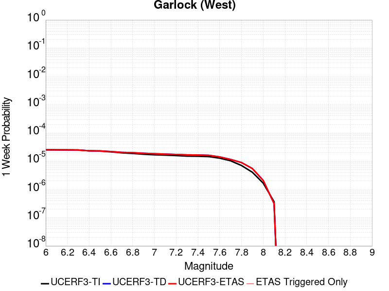 | 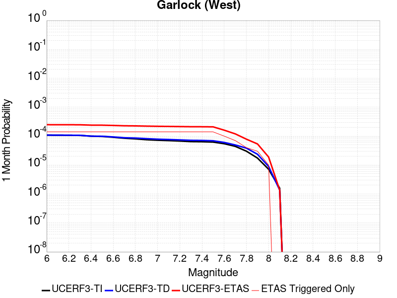 | 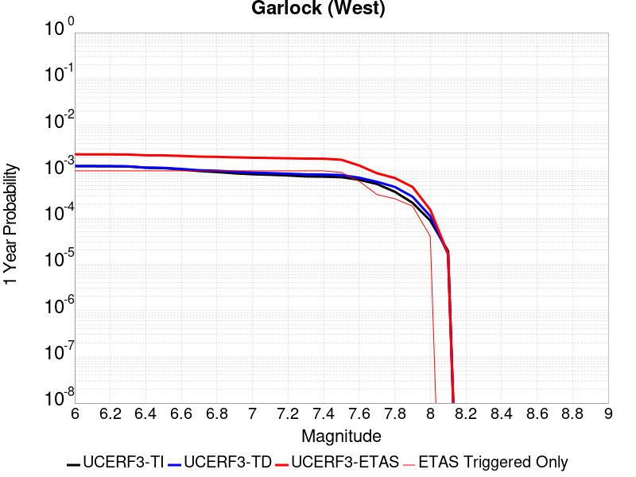 | 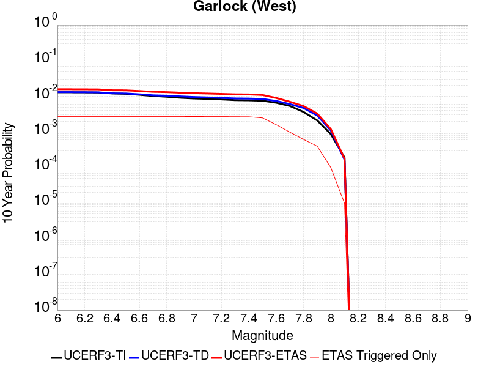 |

| Magnitude | 1 wk TI Prob | 1 wk TD Prob | 1 wk ETAS Prob | 1 wk ETAS/TD Gain | 1 wk ETAS Triggered Only | 1 mo TI Prob | 1 mo TD Prob | 1 mo ETAS Prob | 1 mo ETAS/TD Gain | 1 mo ETAS Triggered Only | 1 yr TI Prob | 1 yr TD Prob | 1 yr ETAS Prob | 1 yr ETAS/TD Gain | 1 yr ETAS Triggered Only | 10 yr TI Prob | 10 yr TD Prob | 10 yr ETAS Prob | 10 yr ETAS/TD Gain | 10 yr ETAS Triggered Only |
|-----|-----|-----|-----|-----|-----|-----|-----|-----|-----|-----|-----|-----|-----|-----|-----|-----|-----|-----|-----|-----|
| 6.0 | 2.5181727E-5 | 2.5283342E-5 | 2.5283342E-5 | 1.0 | 0.0 | 1.0791722E-4 | 1.083527E-4 | 1.4950728E-4 | 1.3798205 | 4.1159037E-5 | 0.0013131002 | 0.0013183992 | 0.0023460186 | 1.7794447 | 0.0010289759 | 0.013053683 | 0.01318547 | 0.015906766 | 1.2063859 | 0.0027576557 |
| 6.1 | 2.5077732E-5 | 2.5184368E-5 | 2.5184368E-5 | 1.0 | 0.0 | 1.0747157E-4 | 1.0792856E-4 | 1.4908315E-4 | 1.3813133 | 4.1159037E-5 | 0.001307681 | 0.0013132415 | 0.0023408663 | 1.78251 | 0.0010289759 | 0.013000126 | 0.013134505 | 0.01585594 | 1.2071974 | 0.0027576557 |
| 6.2 | 2.494612E-5 | 2.5065981E-5 | 2.5065981E-5 | 1.0 | 0.0 | 1.0690756E-4 | 1.0742123E-4 | 1.4857584E-4 | 1.3831143 | 4.1159037E-5 | 0.0013008224 | 0.0013070722 | 0.0023347032 | 1.7862083 | 0.0010289759 | 0.012932341 | 0.013073538 | 0.015795141 | 1.2081765 | 0.0027576557 |
| 6.3 | 2.4733758E-5 | 2.4885285E-5 | 2.4885285E-5 | 1.0 | 0.0 | 1.0599751E-4 | 1.0664688E-4 | 1.4780153E-4 | 1.3858964 | 4.1159037E-5 | 0.0012897556 | 0.0012976559 | 0.0023252966 | 1.7919209 | 0.0010289759 | 0.012822957 | 0.012980479 | 0.015702339 | 1.2096887 | 0.0027576557 |
| 6.4 | 2.3237335E-5 | 2.3263985E-5 | 2.3263985E-5 | 1.0 | 0.0 | 9.958477E-5 | 9.9699E-5 | 1.4085394E-4 | 1.4127918 | 4.1159037E-5 | 0.0012117702 | 0.0012131622 | 0.00224089 | 1.8471477 | 0.0010289759 | 0.012051838 | 0.01214505 | 0.014869214 | 1.2243024 | 0.0027576557 |
| 6.5 | 2.2732203E-5 | 2.3078326E-5 | 2.3078326E-5 | 1.0 | 0.0 | 9.742009E-5 | 9.890338E-5 | 1.4005834E-4 | 1.4161129 | 4.1159037E-5 | 0.0011854442 | 0.0012034862 | 0.002231224 | 1.8539671 | 0.0010289759 | 0.011791403 | 0.012049343 | 0.014773771 | 1.2261059 | 0.0027576557 |
| 6.6 | 2.1319436E-5 | 2.1857622E-5 | 2.1857622E-5 | 1.0 | 0.0 | 9.136581E-5 | 9.367218E-5 | 1.3482737E-4 | 1.4393533 | 4.1159037E-5 | 0.001111811 | 0.0011398644 | 0.0021676675 | 1.9016889 | 0.0010289759 | 0.011062649 | 0.0114198085 | 0.014145972 | 1.2387223 | 0.0027576557 |
| 6.7 | 1.970802E-5 | 2.0476651E-5 | 2.0476651E-5 | 1.0 | 0.0 | 8.446021E-5 | 8.775414E-5 | 1.2890957E-4 | 1.4689856 | 4.1159037E-5 | 0.001027818 | 0.0010678847 | 0.0020957617 | 1.9625357 | 0.0010289759 | 0.010230771 | 0.01070713 | 0.0134352585 | 1.2547956 | 0.0027576557 |
| 6.8 | 1.8744462E-5 | 1.9983867E-5 | 1.9983867E-5 | 1.0 | 0.0 | 8.033094E-5 | 8.564234E-5 | 1.2679785E-4 | 1.480551 | 4.1159037E-5 | 9.775903E-4 | 0.0010421984 | 0.002070102 | 1.9862839 | 0.0010289759 | 0.009733009 | 0.010452707 | 0.013181538 | 1.2610645 | 0.0027576557 |
| 6.9 | 1.7559682E-5 | 1.9035691E-5 | 1.9035691E-5 | 1.0 | 0.0 | 7.5253614E-5 | 8.157899E-5 | 1.2273467E-4 | 1.5044887 | 4.1159037E-5 | 9.158276E-4 | 9.927731E-4 | 0.0020207276 | 2.0354373 | 0.0010289759 | 0.0091206245 | 0.009963013 | 0.012693195 | 1.2740316 | 0.0027576557 |
| 7.0 | 1.6794445E-5 | 1.829792E-5 | 1.829792E-5 | 1.0 | 0.0 | 7.197421E-5 | 7.841731E-5 | 1.19573124E-4 | 1.5248307 | 4.1159037E-5 | 8.759337E-4 | 9.5431396E-4 | 0.001982308 | 2.0772073 | 0.0010289759 | 0.008724891 | 0.009581639 | 0.012272107 | 1.2807941 | 0.0027164966 |
| 7.1 | 1.6337795E-5 | 1.7798287E-5 | 1.7798287E-5 | 1.0 | 0.0 | 7.0017246E-5 | 7.6276156E-5 | 1.1743205E-4 | 1.5395644 | 4.1159037E-5 | 8.521265E-4 | 9.2826784E-4 | 0.0019562887 | 2.1074615 | 0.0010289759 | 0.008488664 | 0.009323265 | 0.012014436 | 1.288651 | 0.0027164966 |
| 7.2 | 1.5780008E-5 | 1.7246624E-5 | 1.7246624E-5 | 1.0 | 0.0 | 6.762685E-5 | 7.391202E-5 | 1.1506802E-4 | 1.5568241 | 4.1159037E-5 | 8.2304585E-4 | 8.9950865E-4 | 0.001927559 | 2.1429021 | 0.0010289759 | 0.008200042 | 0.009037967 | 0.011729912 | 1.2978485 | 0.0027164966 |
| 7.3 | 1.5058865E-5 | 1.66991E-5 | 1.66991E-5 | 1.0 | 0.0 | 6.45364E-5 | 7.156561E-5 | 1.1272171E-4 | 1.575082 | 4.1159037E-5 | 7.854473E-4 | 8.7096426E-4 | 0.001899044 | 2.1803925 | 0.0010289759 | 0.00782677 | 0.00875437 | 0.011406286 | 1.3029249 | 0.0026753375 |
| 7.4 | 1.4887923E-5 | 1.6534816E-5 | 1.6534816E-5 | 1.0 | 0.0 | 6.380382E-5 | 7.086158E-5 | 1.120177E-4 | 1.580796 | 4.1159037E-5 | 7.7653467E-4 | 8.623994E-4 | 0.001890488 | 2.1921258 | 0.0010289759 | 0.0077382675 | 0.008669155 | 0.011321299 | 1.3059288 | 0.0026753375 |
| 7.5 | 1.4509299E-5 | 1.6126263E-5 | 1.6126263E-5 | 1.0 | 0.0 | 6.218123E-5 | 6.911073E-5 | 1.1026693E-4 | 1.595511 | 4.1159037E-5 | 7.567935E-4 | 8.410995E-4 | 0.0018280856 | 2.1734474 | 9.87817E-4 | 0.0075422134 | 0.008457162 | 0.011028253 | 1.3040133 | 0.0025930195 |
| 7.6 | 1.2756717E-5 | 1.4127087E-5 | 1.4127087E-5 | 1.0 | 0.0 | 5.4670498E-5 | 6.0543254E-5 | 6.0543254E-5 | 1.0 | 0.0 | 6.6541E-4 | 7.368655E-4 | 0.0012304101 | 1.6697892 | 4.939085E-4 | 0.006634211 | 0.007420682 | 0.008768851 | 1.1816772 | 0.0013582483 |
| 7.7 | 1.0328985E-5 | 1.1532095E-5 | 1.1532095E-5 | 1.0 | 0.0 | 4.4266326E-5 | 4.9422335E-5 | 4.9422335E-5 | 1.0 | 0.0 | 5.388092E-4 | 6.015512E-4 | 9.717597E-4 | 1.6154231 | 3.7043134E-4 | 0.0053750467 | 0.006075411 | 0.0069754086 | 1.1481377 | 9.0549886E-4 |
| 7.8 | 7.0306583E-6 | 8.957247E-6 | 8.957247E-6 | 1.0 | 0.0 | 3.0131043E-5 | 3.8387636E-5 | 3.8387636E-5 | 1.0 | 0.0 | 3.667837E-4 | 4.6726942E-4 | 7.5524807E-4 | 1.6163011 | 2.8811328E-4 | 0.003661789 | 0.004725001 | 0.0053804335 | 1.138716 | 6.585446E-4 |
| 7.9 | 4.060633E-6 | 5.499178E-6 | 5.499178E-6 | 1.0 | 0.0 | 1.7402595E-5 | 2.3567693E-5 | 2.3567693E-5 | 1.0 | 0.0 | 2.11856E-4 | 2.8689898E-4 | 4.926351E-4 | 1.7171031 | 2.057952E-4 | 0.0021165414 | 0.0029016812 | 0.0032710377 | 1.1272905 | 3.7043134E-4 |
| 8.0 | 1.6729537E-6 | 2.0887928E-6 | 2.0887928E-6 | 1.0 | 0.0 | 7.169782E-6 | 8.951938E-6 | 8.951938E-6 | 1.0 | 0.0 | 8.7288594E-5 | 1.0898444E-4 | 1.5013899E-4 | 1.3776187 | 4.1159037E-5 | 8.7254314E-4 | 0.0011025992 | 0.0011848265 | 1.0745759 | 8.2318074E-5 |
| 8.1 | 3.6733252E-7 | 3.164752E-7 | 3.164752E-7 | 1.0 | 0.0 | 1.5742813E-6 | 1.3563216E-6 | 1.3563216E-6 | 1.0 | 0.0 | 1.9166706E-5 | 1.6513108E-5 | 1.6513108E-5 | 1.0 | 0.0 | 1.9165053E-4 | 1.6726229E-4 | 1.6726229E-4 | 1.0 | 0.0 |

## McLean Lake
*[(top)](#table-of-contents)*

| 1 Week | 1 Month | 1 Year | 10 Year |
|-----|-----|-----|-----|
| 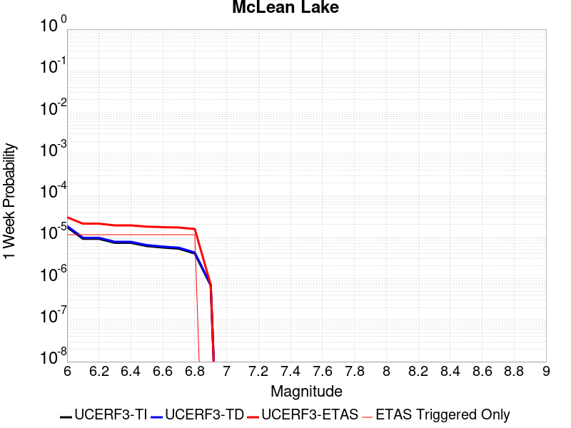 | 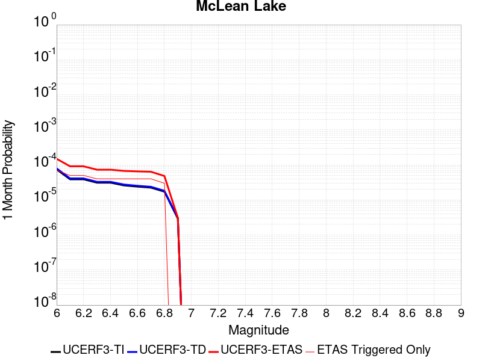 | 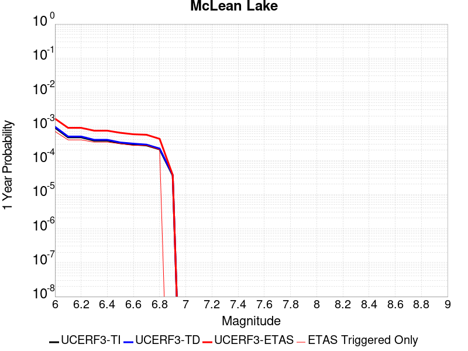 | 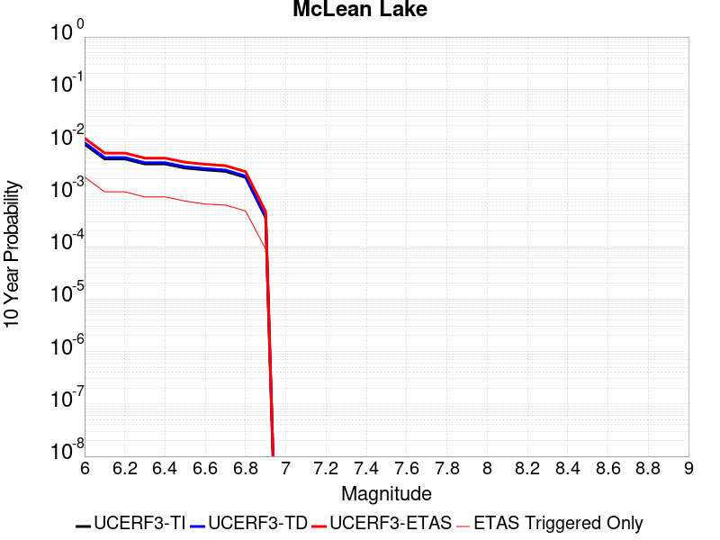 |

| Magnitude | 1 wk TI Prob | 1 wk TD Prob | 1 wk ETAS Prob | 1 wk ETAS/TD Gain | 1 wk ETAS Triggered Only | 1 mo TI Prob | 1 mo TD Prob | 1 mo ETAS Prob | 1 mo ETAS/TD Gain | 1 mo ETAS Triggered Only | 1 yr TI Prob | 1 yr TD Prob | 1 yr ETAS Prob | 1 yr ETAS/TD Gain | 1 yr ETAS Triggered Only | 10 yr TI Prob | 10 yr TD Prob | 10 yr ETAS Prob | 10 yr ETAS/TD Gain | 10 yr ETAS Triggered Only |
|-----|-----|-----|-----|-----|-----|-----|-----|-----|-----|-----|-----|-----|-----|-----|-----|-----|-----|-----|-----|-----|
| 6.0 | 1.7360222E-5 | 1.8504445E-5 | 1.8504445E-5 | 1.0 | 0.0 | 7.439883E-5 | 7.930263E-5 | 1.20458404E-4 | 1.5189711 | 4.1159037E-5 | 9.0542925E-4 | 9.6513046E-4 | 0.0016641588 | 1.7242838 | 6.9970364E-4 | 0.009017491 | 0.009614232 | 0.011652399 | 1.2119946 | 0.0020579519 |
| 6.1 | 9.062689E-6 | 9.59349E-6 | 9.59349E-6 | 1.0 | 0.0 | 3.8839516E-5 | 4.1114363E-5 | 8.2271705E-5 | 2.0010455 | 4.1159037E-5 | 4.727685E-4 | 5.0046126E-4 | 9.529841E-4 | 1.9042115 | 4.5274943E-4 | 0.0047176396 | 0.004994225 | 0.0061409227 | 1.2296047 | 0.0011524531 |
| 6.2 | 9.062689E-6 | 9.59349E-6 | 9.59349E-6 | 1.0 | 0.0 | 3.8839516E-5 | 4.1114363E-5 | 8.2271705E-5 | 2.0010455 | 4.1159037E-5 | 4.727685E-4 | 5.0046126E-4 | 9.529841E-4 | 1.9042115 | 4.5274943E-4 | 0.0047176396 | 0.004994225 | 0.0061409227 | 1.2296047 | 0.0011524531 |
| 6.3 | 7.2575485E-6 | 7.668712E-6 | 7.668712E-6 | 1.0 | 0.0 | 3.110341E-5 | 3.2865533E-5 | 3.2865533E-5 | 1.0 | 0.0 | 3.786182E-4 | 4.0007156E-4 | 7.2921213E-4 | 1.8227043 | 3.292723E-4 | 0.0037797375 | 0.003994218 | 0.004773116 | 1.1950064 | 7.820217E-4 |
| 6.4 | 7.2575485E-6 | 7.668712E-6 | 7.668712E-6 | 1.0 | 0.0 | 3.110341E-5 | 3.2865533E-5 | 3.2865533E-5 | 1.0 | 0.0 | 3.786182E-4 | 4.0007156E-4 | 7.2921213E-4 | 1.8227043 | 3.292723E-4 | 0.0037797375 | 0.003994218 | 0.004773116 | 1.1950064 | 7.820217E-4 |
| 6.5 | 6.06582E-6 | 6.4047026E-6 | 6.4047026E-6 | 1.0 | 0.0 | 2.5996113E-5 | 2.7448474E-5 | 2.7448474E-5 | 1.0 | 0.0 | 3.164567E-4 | 3.341404E-4 | 6.633027E-4 | 1.9851017 | 3.292723E-4 | 0.0031600643 | 0.003337019 | 0.0040343874 | 1.2089796 | 6.9970364E-4 |
| 6.6 | 5.598744E-6 | 5.911023E-6 | 5.911023E-6 | 1.0 | 0.0 | 2.3994397E-5 | 2.5332745E-5 | 2.5332745E-5 | 1.0 | 0.0 | 2.9209262E-4 | 3.0838893E-4 | 6.375597E-4 | 2.0673883 | 3.292723E-4 | 0.0029170897 | 0.003080239 | 0.003736755 | 1.2131381 | 6.585446E-4 |
| 6.7 | 5.246996E-6 | 5.5398755E-6 | 5.5398755E-6 | 1.0 | 0.0 | 2.2486933E-5 | 2.3742145E-5 | 2.3742145E-5 | 1.0 | 0.0 | 2.73744E-4 | 2.890286E-4 | 6.1820576E-4 | 2.1389086 | 3.292723E-4 | 0.0027340704 | 0.002887151 | 0.0035437944 | 1.2274364 | 6.585446E-4 |
| 6.8 | 4.02324E-6 | 4.2474508E-6 | 4.2474508E-6 | 1.0 | 0.0 | 1.7242342E-5 | 1.8203267E-5 | 1.8203267E-5 | 1.0 | 0.0 | 2.099053E-4 | 2.2160819E-4 | 5.096576E-4 | 2.299814 | 2.8811328E-4 | 0.0020970714 | 0.0022144564 | 0.002789407 | 1.2596351 | 5.7622656E-4 |
| 6.9 | 6.835972E-7 | 7.1406623E-7 | 7.1406623E-7 | 1.0 | 0.0 | 2.9296991E-6 | 3.0602819E-6 | 3.0602819E-6 | 1.0 | 0.0 | 3.56685E-5 | 3.7258615E-5 | 3.7258615E-5 | 1.0 | 0.0 | 3.5662777E-4 | 3.7255493E-4 | 4.1369864E-4 | 1.1104366 | 4.1159037E-5 |

## So Sierra Nevada
*[(top)](#table-of-contents)*

| 1 Week | 1 Month | 1 Year | 10 Year |
|-----|-----|-----|-----|
| 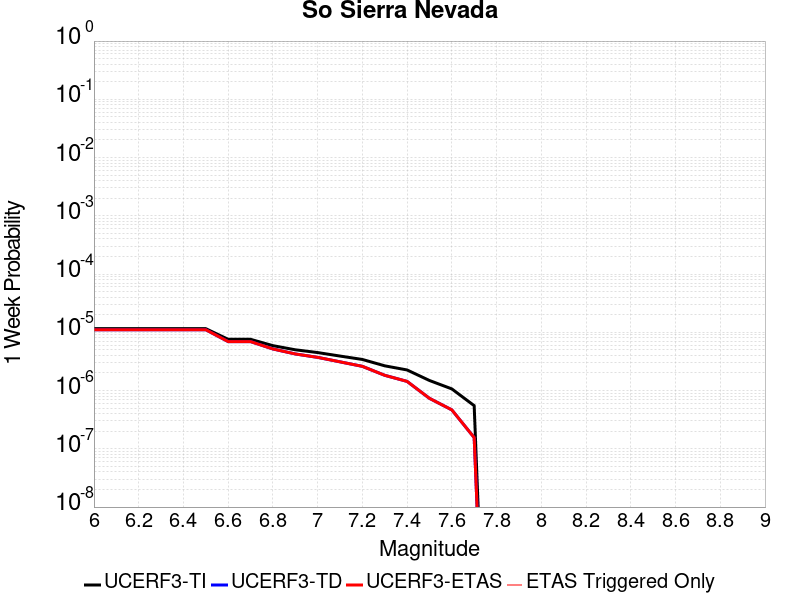 | 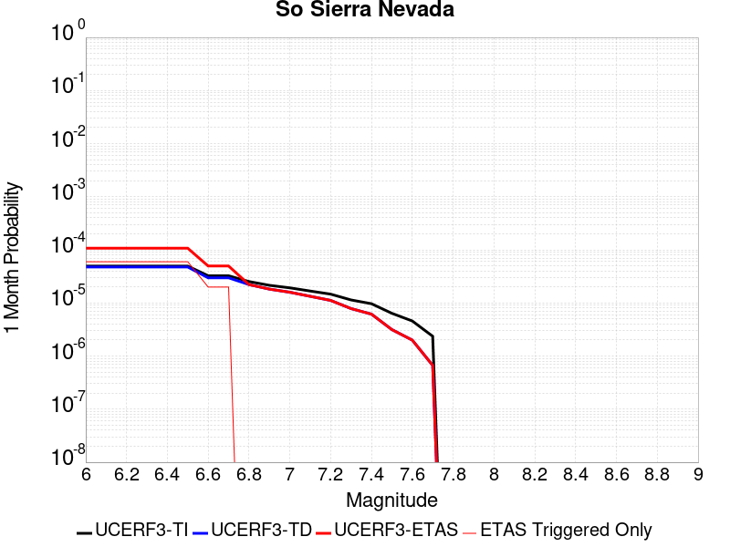 | 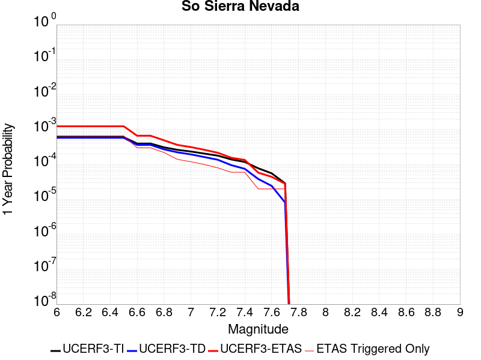 | 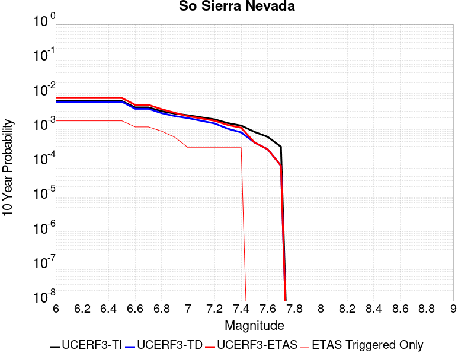 |

| Magnitude | 1 wk TI Prob | 1 wk TD Prob | 1 wk ETAS Prob | 1 wk ETAS/TD Gain | 1 wk ETAS Triggered Only | 1 mo TI Prob | 1 mo TD Prob | 1 mo ETAS Prob | 1 mo ETAS/TD Gain | 1 mo ETAS Triggered Only | 1 yr TI Prob | 1 yr TD Prob | 1 yr ETAS Prob | 1 yr ETAS/TD Gain | 1 yr ETAS Triggered Only | 10 yr TI Prob | 10 yr TD Prob | 10 yr ETAS Prob | 10 yr ETAS/TD Gain | 10 yr ETAS Triggered Only |
|-----|-----|-----|-----|-----|-----|-----|-----|-----|-----|-----|-----|-----|-----|-----|-----|-----|-----|-----|-----|-----|
| 6.0 | 1.15488665E-5 | 1.1081001E-5 | 1.1081001E-5 | 1.0 | 0.0 | 4.9494203E-5 | 4.7489208E-5 | 1.2980337E-4 | 2.7333236 | 8.2318074E-5 | 6.024253E-4 | 5.780405E-4 | 0.0014418807 | 2.4944284 | 8.643398E-4 | 0.006007948 | 0.005766639 | 0.0075262715 | 1.30514 | 0.0017698386 |
| 6.1 | 1.15488665E-5 | 1.1081001E-5 | 1.1081001E-5 | 1.0 | 0.0 | 4.9494203E-5 | 4.7489208E-5 | 1.2980337E-4 | 2.7333236 | 8.2318074E-5 | 6.024253E-4 | 5.780405E-4 | 0.0014418807 | 2.4944284 | 8.643398E-4 | 0.006007948 | 0.005766639 | 0.0075262715 | 1.30514 | 0.0017698386 |
| 6.2 | 1.15488665E-5 | 1.1081001E-5 | 1.1081001E-5 | 1.0 | 0.0 | 4.9494203E-5 | 4.7489208E-5 | 1.2980337E-4 | 2.7333236 | 8.2318074E-5 | 6.024253E-4 | 5.780405E-4 | 0.0014418807 | 2.4944284 | 8.643398E-4 | 0.006007948 | 0.005766639 | 0.0075262715 | 1.30514 | 0.0017698386 |
| 6.3 | 1.15488665E-5 | 1.1081001E-5 | 1.1081001E-5 | 1.0 | 0.0 | 4.9494203E-5 | 4.7489208E-5 | 1.2980337E-4 | 2.7333236 | 8.2318074E-5 | 6.024253E-4 | 5.780405E-4 | 0.0014418807 | 2.4944284 | 8.643398E-4 | 0.006007948 | 0.005766639 | 0.0075262715 | 1.30514 | 0.0017698386 |
| 6.4 | 1.15488665E-5 | 1.1081001E-5 | 1.1081001E-5 | 1.0 | 0.0 | 4.9494203E-5 | 4.7489208E-5 | 1.2980337E-4 | 2.7333236 | 8.2318074E-5 | 6.024253E-4 | 5.780405E-4 | 0.0014418807 | 2.4944284 | 8.643398E-4 | 0.006007948 | 0.005766639 | 0.0075262715 | 1.30514 | 0.0017698386 |
| 6.5 | 1.15488665E-5 | 1.1081001E-5 | 1.1081001E-5 | 1.0 | 0.0 | 4.9494203E-5 | 4.7489208E-5 | 1.2980337E-4 | 2.7333236 | 8.2318074E-5 | 6.024253E-4 | 5.780405E-4 | 0.0014418807 | 2.4944284 | 8.643398E-4 | 0.006007948 | 0.005766639 | 0.0075262715 | 1.30514 | 0.0017698386 |
| 6.6 | 7.587044E-6 | 6.9365515E-6 | 6.9365515E-6 | 1.0 | 0.0 | 3.2515498E-5 | 2.9727757E-5 | 7.088557E-5 | 2.3844912 | 4.1159037E-5 | 3.9580427E-4 | 3.6187825E-4 | 7.733197E-4 | 2.136961 | 4.115904E-4 | 0.003951 | 0.0036131814 | 0.00472046 | 1.3064554 | 0.001111294 |
| 6.7 | 7.587044E-6 | 6.9365515E-6 | 6.9365515E-6 | 1.0 | 0.0 | 3.2515498E-5 | 2.9727757E-5 | 7.088557E-5 | 2.3844912 | 4.1159037E-5 | 3.9580427E-4 | 3.6187825E-4 | 7.733197E-4 | 2.136961 | 4.115904E-4 | 0.003951 | 0.0036131814 | 0.00472046 | 1.3064554 | 0.001111294 |
| 6.8 | 5.9026956E-6 | 5.1801358E-6 | 5.1801358E-6 | 1.0 | 0.0 | 2.5297022E-5 | 2.2200398E-5 | 2.2200398E-5 | 1.0 | 0.0 | 3.0794772E-4 | 2.702575E-4 | 5.582929E-4 | 2.0657814 | 2.8811328E-4 | 0.0030752132 | 0.0026994045 | 0.0035614113 | 1.3193321 | 8.643398E-4 |
| 6.9 | 5.0118915E-6 | 4.253081E-6 | 4.253081E-6 | 1.0 | 0.0 | 2.1479358E-5 | 1.8227367E-5 | 1.8227367E-5 | 1.0 | 0.0 | 2.614798E-4 | 2.2189633E-4 | 4.6879577E-4 | 2.1126792 | 2.4695424E-4 | 0.0026117235 | 0.0022168201 | 0.003038176 | 1.3705108 | 8.231808E-4 |
| 7.0 | 4.4924795E-6 | 3.714527E-6 | 3.714527E-6 | 1.0 | 0.0 | 1.925334E-5 | 1.5919308E-5 | 1.5919308E-5 | 1.0 | 0.0 | 2.3438422E-4 | 1.9380097E-4 | 3.9955627E-4 | 2.0616837 | 2.057952E-4 | 0.0023413717 | 0.0019363826 | 0.0026347314 | 1.360646 | 6.9970364E-4 |
| 7.1 | 3.9118436E-6 | 3.1125317E-6 | 3.1125317E-6 | 1.0 | 0.0 | 1.6764936E-5 | 1.3339357E-5 | 1.3339357E-5 | 1.0 | 0.0 | 2.0409399E-4 | 1.6239512E-4 | 3.681569E-4 | 2.267044 | 2.057952E-4 | 0.0020390663 | 0.0016228207 | 0.0022392042 | 1.3798224 | 6.1738555E-4 |
| 7.2 | 3.4200818E-6 | 2.6059638E-6 | 2.6059638E-6 | 1.0 | 0.0 | 1.4657411E-5 | 1.1168371E-5 | 1.1168371E-5 | 1.0 | 0.0 | 1.7843937E-4 | 1.3596694E-4 | 3.0058072E-4 | 2.2106895 | 1.6463615E-4 | 0.0017829615 | 0.0013588873 | 0.0018521246 | 1.3629714 | 4.939085E-4 |
| 7.3 | 2.6593618E-6 | 1.8288628E-6 | 1.8288628E-6 | 1.0 | 0.0 | 1.13972155E-5 | 7.837962E-6 | 7.837962E-6 | 1.0 | 0.0 | 1.3875226E-4 | 9.54233E-5 | 2.1888863E-4 | 2.29387 | 1.2347712E-4 | 0.0013866565 | 9.5385214E-4 | 0.0013239301 | 1.3879826 | 3.7043134E-4 |
| 7.4 | 2.2577992E-6 | 1.4368397E-6 | 1.4368397E-6 | 1.0 | 0.0 | 9.676246E-6 | 6.1578717E-6 | 6.1578717E-6 | 1.0 | 0.0 | 1.1780193E-4 | 7.4969765E-5 | 1.9843763E-4 | 2.646902 | 1.2347712E-4 | 0.001177395 | 7.494698E-4 | 0.0010373672 | 1.3841347 | 2.8811328E-4 |
| 7.5 | 1.489319E-6 | 7.357061E-7 | 7.357061E-7 | 1.0 | 0.0 | 6.3827797E-6 | 3.1530224E-6 | 3.1530224E-6 | 1.0 | 0.0 | 7.770758E-5 | 3.8387378E-5 | 7.9544836E-5 | 2.0721612 | 4.1159037E-5 | 7.7680405E-4 | 3.838079E-4 | 5.072376E-4 | 1.3215925 | 1.2347712E-4 |
| 7.6 | 1.0680322E-6 | 4.661944E-7 | 4.661944E-7 | 1.0 | 0.0 | 4.577273E-6 | 1.9979743E-6 | 1.9979743E-6 | 1.0 | 0.0 | 5.5726876E-5 | 2.432507E-5 | 6.548311E-5 | 2.6920009 | 4.1159037E-5 | 5.5712904E-4 | 2.4322433E-4 | 3.6667142E-4 | 1.5075442 | 1.2347712E-4 |
| 7.7 | 5.509146E-7 | 1.5591806E-7 | 1.5591806E-7 | 1.0 | 0.0 | 2.3610605E-6 | 6.682201E-7 | 6.682201E-7 | 1.0 | 0.0 | 2.8745531E-5 | 8.13555E-6 | 4.9294253E-5 | 6.0591173 | 4.1159037E-5 | 2.8741814E-4 | 8.135264E-5 | 1.2250834E-4 | 1.5058925 | 4.1159037E-5 |

## Goldstone Lake
*[(top)](#table-of-contents)*

| 1 Week | 1 Month | 1 Year | 10 Year |
|-----|-----|-----|-----|
| 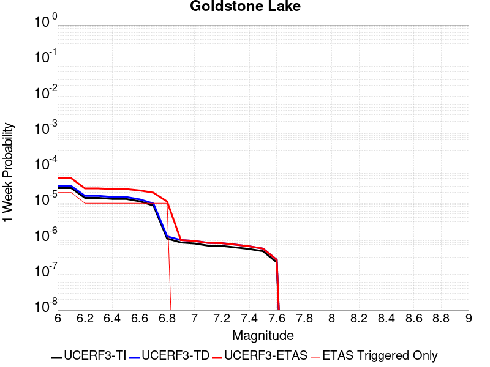 | 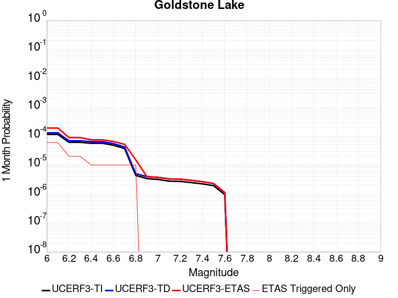 | 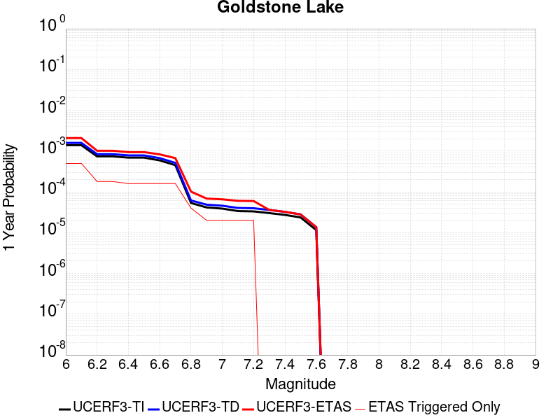 | 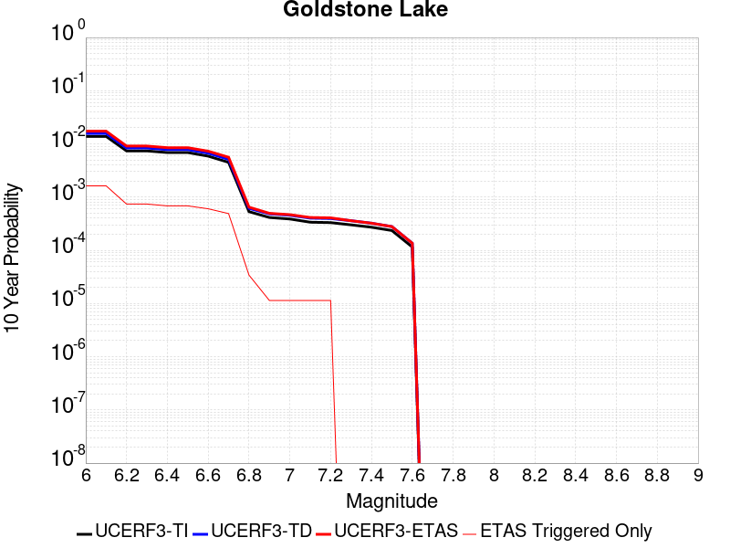 |

| Magnitude | 1 wk TI Prob | 1 wk TD Prob | 1 wk ETAS Prob | 1 wk ETAS/TD Gain | 1 wk ETAS Triggered Only | 1 mo TI Prob | 1 mo TD Prob | 1 mo ETAS Prob | 1 mo ETAS/TD Gain | 1 mo ETAS Triggered Only | 1 yr TI Prob | 1 yr TD Prob | 1 yr ETAS Prob | 1 yr ETAS/TD Gain | 1 yr ETAS Triggered Only | 10 yr TI Prob | 10 yr TD Prob | 10 yr ETAS Prob | 10 yr ETAS/TD Gain | 10 yr ETAS Triggered Only |
|-----|-----|-----|-----|-----|-----|-----|-----|-----|-----|-----|-----|-----|-----|-----|-----|-----|-----|-----|-----|-----|
| 6.0 | 2.671352E-5 | 3.0385483E-5 | 7.154327E-5 | 2.3545215 | 4.1159037E-5 | 1.1448149E-4 | 1.302181E-4 | 1.7137178E-4 | 1.3160366 | 4.1159037E-5 | 0.001392921 | 0.0015844489 | 0.0020775748 | 1.3112286 | 4.939085E-4 | 0.013842222 | 0.015751032 | 0.017168907 | 1.0900179 | 0.0014405664 |
| 6.1 | 2.671352E-5 | 3.0385483E-5 | 7.154327E-5 | 2.3545215 | 4.1159037E-5 | 1.1448149E-4 | 1.302181E-4 | 1.7137178E-4 | 1.3160366 | 4.1159037E-5 | 0.001392921 | 0.0015844489 | 0.0020775748 | 1.3112286 | 4.939085E-4 | 0.013842222 | 0.015751032 | 0.017168907 | 1.0900179 | 0.0014405664 |
| 6.2 | 1.4197047E-5 | 1.610098E-5 | 5.7259356E-5 | 3.5562654 | 4.1159037E-5 | 6.0843064E-5 | 6.900293E-5 | 1.10159126E-4 | 1.5964414 | 4.1159037E-5 | 7.4051257E-4 | 8.3988556E-4 | 0.0010866324 | 1.2937863 | 2.4695424E-4 | 0.007380498 | 0.008376815 | 0.008907401 | 1.0633397 | 5.350675E-4 |
| 6.3 | 1.4197047E-5 | 1.610098E-5 | 5.7259356E-5 | 3.5562654 | 4.1159037E-5 | 6.0843064E-5 | 6.900293E-5 | 1.10159126E-4 | 1.5964414 | 4.1159037E-5 | 7.4051257E-4 | 8.3988556E-4 | 0.0010866324 | 1.2937863 | 2.4695424E-4 | 0.007380498 | 0.008376815 | 0.008907401 | 1.0633397 | 5.350675E-4 |
| 6.4 | 1.3238931E-5 | 1.50128535E-5 | 5.6171273E-5 | 3.7415454 | 4.1159037E-5 | 5.6737044E-5 | 6.4339765E-5 | 1.0549616E-4 | 1.6396726 | 4.1159037E-5 | 6.9055456E-4 | 7.831532E-4 | 9.887873E-4 | 1.2625719 | 2.057952E-4 | 0.006884126 | 0.007813565 | 0.008262777 | 1.0574913 | 4.5274943E-4 |
| 6.5 | 1.3238931E-5 | 1.50128535E-5 | 5.6171273E-5 | 3.7415454 | 4.1159037E-5 | 5.6737044E-5 | 6.4339765E-5 | 1.0549616E-4 | 1.6396726 | 4.1159037E-5 | 6.9055456E-4 | 7.831532E-4 | 9.887873E-4 | 1.2625719 | 2.057952E-4 | 0.006884126 | 0.007813565 | 0.008262777 | 1.0574913 | 4.5274943E-4 |
| 6.6 | 1.1328278E-5 | 1.2858927E-5 | 5.4017437E-5 | 4.2007732 | 4.1159037E-5 | 4.8548856E-5 | 5.5109063E-5 | 9.626584E-5 | 1.746824 | 4.1159037E-5 | 5.90922E-4 | 6.7084207E-4 | 8.7649917E-4 | 1.3065656 | 2.057952E-4 | 0.0058935313 | 0.006697565 | 0.007106398 | 1.0610422 | 4.115904E-4 |
| 6.7 | 8.651175E-6 | 9.8274E-6 | 5.0986037E-5 | 5.1881504 | 4.1159037E-5 | 3.707594E-5 | 4.2117263E-5 | 8.3274565E-5 | 1.9772075 | 4.1159037E-5 | 4.5130608E-4 | 5.127476E-4 | 7.1843725E-4 | 1.4011519 | 2.057952E-4 | 0.0045039062 | 0.0051245294 | 0.0054930625 | 1.0719155 | 3.7043134E-4 |
| 6.8 | 1.0215377E-6 | 1.1756342E-6 | 4.2334625E-5 | 36.010033 | 4.1159037E-5 | 4.378012E-6 | 5.0384233E-6 | 4.6197256E-5 | 9.16899 | 4.1159037E-5 | 5.3300988E-5 | 6.134119E-5 | 1.4365422E-4 | 2.3418884 | 8.2318074E-5 | 5.3288206E-4 | 6.1325385E-4 | 6.955214E-4 | 1.1341493 | 8.2318074E-5 |
| 6.9 | 7.9360774E-7 | 9.2845545E-7 | 9.2845545E-7 | 1.0 | 0.0 | 3.4011714E-6 | 3.9790893E-6 | 3.9790893E-6 | 1.0 | 0.0 | 4.1408475E-5 | 4.8444406E-5 | 8.960145E-5 | 1.8495727 | 4.1159037E-5 | 4.140076E-4 | 4.8434545E-4 | 5.2548456E-4 | 1.0849376 | 4.1159037E-5 |
| 7.0 | 7.4382757E-7 | 8.7483915E-7 | 8.7483915E-7 | 1.0 | 0.0 | 3.1878285E-6 | 3.7493057E-6 | 3.7493057E-6 | 1.0 | 0.0 | 3.8811122E-5 | 4.5646906E-5 | 8.6804066E-5 | 1.9016418 | 4.1159037E-5 | 3.8804344E-4 | 4.5638197E-4 | 4.9752224E-4 | 1.0901444 | 4.1159037E-5 |
| 7.1 | 6.4709513E-7 | 7.712193E-7 | 7.712193E-7 | 1.0 | 0.0 | 2.773262E-6 | 3.3052218E-6 | 3.3052218E-6 | 1.0 | 0.0 | 3.376394E-5 | 4.0240393E-5 | 8.1397775E-5 | 2.0227878 | 4.1159037E-5 | 3.375881E-4 | 4.02337E-4 | 4.4347948E-4 | 1.1022588 | 4.1159037E-5 |
| 7.2 | 6.356704E-7 | 7.589231E-7 | 7.589231E-7 | 1.0 | 0.0 | 2.7242988E-6 | 3.2525238E-6 | 3.2525238E-6 | 1.0 | 0.0 | 3.3167835E-5 | 3.9598817E-5 | 8.0756225E-5 | 2.0393596 | 4.1159037E-5 | 3.3162883E-4 | 3.9592356E-4 | 4.370663E-4 | 1.1039159 | 4.1159037E-5 |
| 7.3 | 5.7695723E-7 | 6.8973634E-7 | 6.8973634E-7 | 1.0 | 0.0 | 2.4726714E-6 | 2.95601E-6 | 2.95601E-6 | 1.0 | 0.0 | 3.0104358E-5 | 3.5988884E-5 | 3.5988884E-5 | 1.0 | 0.0 | 3.0100282E-4 | 3.598363E-4 | 3.598363E-4 | 1.0 | 0.0 |
| 7.4 | 5.209647E-7 | 6.19418E-7 | 6.19418E-7 | 1.0 | 0.0 | 2.232704E-6 | 2.654646E-6 | 2.654646E-6 | 1.0 | 0.0 | 2.718283E-5 | 3.2319895E-5 | 3.2319895E-5 | 1.0 | 0.0 | 2.7179506E-4 | 3.231575E-4 | 3.231575E-4 | 1.0 | 0.0 |
| 7.5 | 4.512955E-7 | 5.349427E-7 | 5.349427E-7 | 1.0 | 0.0 | 1.934122E-6 | 2.29261E-6 | 2.29261E-6 | 1.0 | 0.0 | 2.3547682E-5 | 2.7912223E-5 | 2.7912223E-5 | 1.0 | 0.0 | 2.3545188E-4 | 2.790925E-4 | 2.790925E-4 | 1.0 | 0.0 |
| 7.6 | 2.21172E-7 | 2.604147E-7 | 2.604147E-7 | 1.0 | 0.0 | 9.478797E-7 | 1.1160627E-6 | 1.1160627E-6 | 1.0 | 0.0 | 1.1540374E-5 | 1.3588007E-5 | 1.3588007E-5 | 1.0 | 0.0 | 1.1539775E-4 | 1.3587458E-4 | 1.3587458E-4 | 1.0 | 0.0 |

## Gravel Hills-Harper Lk
*[(top)](#table-of-contents)*

| 1 Week | 1 Month | 1 Year | 10 Year |
|-----|-----|-----|-----|
| 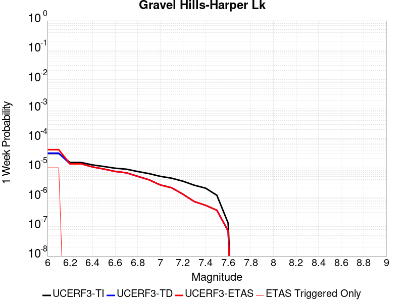 | 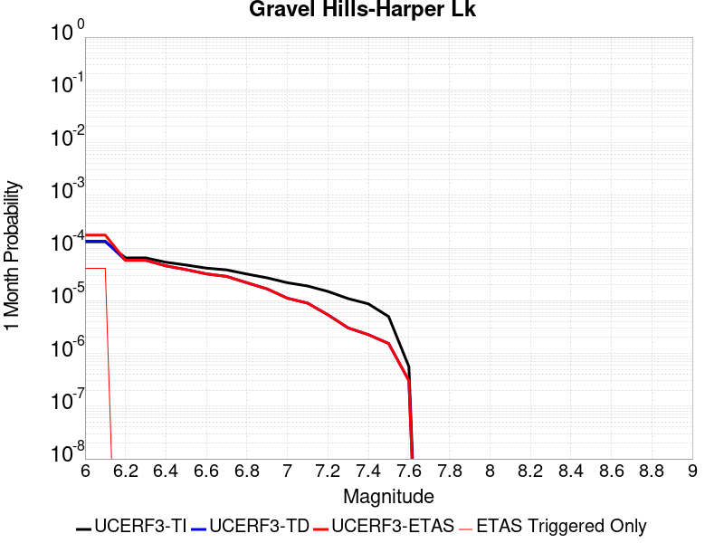 | 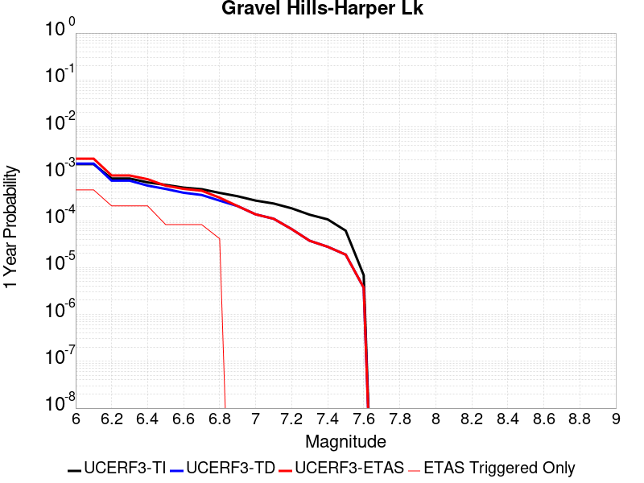 | 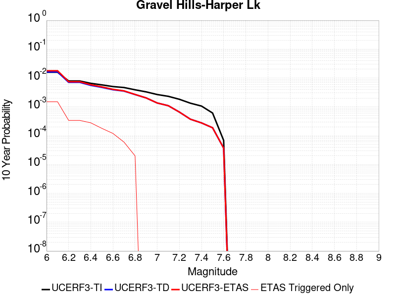 |

| Magnitude | 1 wk TI Prob | 1 wk TD Prob | 1 wk ETAS Prob | 1 wk ETAS/TD Gain | 1 wk ETAS Triggered Only | 1 mo TI Prob | 1 mo TD Prob | 1 mo ETAS Prob | 1 mo ETAS/TD Gain | 1 mo ETAS Triggered Only | 1 yr TI Prob | 1 yr TD Prob | 1 yr ETAS Prob | 1 yr ETAS/TD Gain | 1 yr ETAS Triggered Only | 10 yr TI Prob | 10 yr TD Prob | 10 yr ETAS Prob | 10 yr ETAS/TD Gain | 10 yr ETAS Triggered Only |
|-----|-----|-----|-----|-----|-----|-----|-----|-----|-----|-----|-----|-----|-----|-----|-----|-----|-----|-----|-----|-----|
| 6.0 | 3.0679566E-5 | 3.147399E-5 | 7.263173E-5 | 2.307675 | 4.1159037E-5 | 1.3147724E-4 | 1.3488278E-4 | 1.7603626E-4 | 1.3051056 | 4.1159037E-5 | 0.0015995599 | 0.001641178 | 0.0020931843 | 1.2754158 | 4.5274943E-4 | 0.015880952 | 0.016312161 | 0.017607767 | 1.0794257 | 0.0013170892 |
| 6.1 | 3.0679566E-5 | 3.147399E-5 | 7.263173E-5 | 2.307675 | 4.1159037E-5 | 1.3147724E-4 | 1.3488278E-4 | 1.7603626E-4 | 1.3051056 | 4.1159037E-5 | 0.0015995599 | 0.001641178 | 0.0020931843 | 1.2754158 | 4.5274943E-4 | 0.015880952 | 0.016312161 | 0.017607767 | 1.0794257 | 0.0013170892 |
| 6.2 | 1.514536E-5 | 1.3638413E-5 | 1.3638413E-5 | 1.0 | 0.0 | 6.490707E-5 | 5.8449103E-5 | 5.8449103E-5 | 1.0 | 0.0 | 7.8995706E-4 | 7.113974E-4 | 9.1704616E-4 | 1.2890773 | 2.057952E-4 | 0.007871548 | 0.007092403 | 0.0074602067 | 1.0518589 | 3.7043134E-4 |
| 6.3 | 1.514536E-5 | 1.3638413E-5 | 1.3638413E-5 | 1.0 | 0.0 | 6.490707E-5 | 5.8449103E-5 | 5.8449103E-5 | 1.0 | 0.0 | 7.8995706E-4 | 7.113974E-4 | 9.1704616E-4 | 1.2890773 | 2.057952E-4 | 0.007871548 | 0.007092403 | 0.0074602067 | 1.0518589 | 3.7043134E-4 |
| 6.4 | 1.2532521E-5 | 1.0692025E-5 | 1.0692025E-5 | 1.0 | 0.0 | 5.37097E-5 | 4.582219E-5 | 4.582219E-5 | 1.0 | 0.0 | 6.537194E-4 | 5.577482E-4 | 7.6342863E-4 | 1.3687693 | 2.057952E-4 | 0.0065179965 | 0.0055640745 | 0.0058915145 | 1.058849 | 3.292723E-4 |
| 6.5 | 1.1094058E-5 | 9.085563E-6 | 9.085563E-6 | 1.0 | 0.0 | 4.7545094E-5 | 3.893757E-5 | 3.893757E-5 | 1.0 | 0.0 | 5.787078E-4 | 4.7396583E-4 | 5.5624486E-4 | 1.173597 | 8.2318074E-5 | 0.0057720304 | 0.0047299573 | 0.0048938147 | 1.0346425 | 1.6463615E-4 |
| 6.6 | 9.688328E-6 | 7.53322E-6 | 7.53322E-6 | 1.0 | 0.0 | 4.1520743E-5 | 3.2284843E-5 | 3.2284843E-5 | 1.0 | 0.0 | 5.053978E-4 | 3.9299965E-4 | 4.7528537E-4 | 1.2093786 | 8.2318074E-5 | 0.0050424994 | 0.0039233034 | 0.004046296 | 1.0313493 | 1.2347712E-4 |
| 6.7 | 8.974824E-6 | 6.750763E-6 | 6.750763E-6 | 1.0 | 0.0 | 3.8462964E-5 | 2.8931534E-5 | 2.8931534E-5 | 1.0 | 0.0 | 4.6818596E-4 | 3.521867E-4 | 4.3447578E-4 | 1.2336519 | 8.2318074E-5 | 0.004672008 | 0.0035165066 | 0.0035985352 | 1.0233268 | 8.2318074E-5 |
| 6.8 | 7.4780046E-6 | 5.1171987E-6 | 5.1171987E-6 | 1.0 | 0.0 | 3.20482E-5 | 2.1930675E-5 | 2.1930675E-5 | 1.0 | 0.0 | 3.9011694E-4 | 2.6697465E-4 | 3.081227E-4 | 1.1541272 | 4.1159037E-5 | 0.0038943281 | 0.0026666776 | 0.0027077268 | 1.0153934 | 4.1159037E-5 |
| 6.9 | 6.3409307E-6 | 3.9082747E-6 | 3.9082747E-6 | 1.0 | 0.0 | 2.7175134E-5 | 1.6749647E-5 | 1.6749647E-5 | 1.0 | 0.0 | 3.3080703E-4 | 2.0390886E-4 | 2.0390886E-4 | 1.0 | 0.0 | 0.0033031502 | 0.0020373159 | 0.0020373159 | 1.0 | 0.0 |
| 7.0 | 5.1239335E-6 | 2.606393E-6 | 2.606393E-6 | 1.0 | 0.0 | 2.195953E-5 | 1.117021E-5 | 1.117021E-5 | 1.0 | 0.0 | 2.6732447E-4 | 1.3598907E-4 | 1.3598907E-4 | 1.0 | 0.0 | 0.0026700313 | 0.0013590838 | 0.0013590838 | 1.0 | 0.0 |
| 7.1 | 4.438899E-6 | 2.098922E-6 | 2.098922E-6 | 1.0 | 0.0 | 1.9023713E-5 | 8.995351E-6 | 8.995351E-6 | 1.0 | 0.0 | 2.315891E-4 | 1.09513116E-4 | 1.09513116E-4 | 1.0 | 0.0 | 0.002313479 | 0.0010946133 | 0.0010946133 | 1.0 | 0.0 |
| 7.2 | 3.50367E-6 | 1.2619003E-6 | 1.2619003E-6 | 1.0 | 0.0 | 1.5015643E-5 | 5.408133E-6 | 5.408133E-6 | 1.0 | 0.0 | 1.8280011E-4 | 6.584211E-5 | 6.584211E-5 | 1.0 | 0.0 | 0.0018264982 | 6.582343E-4 | 6.582343E-4 | 1.0 | 0.0 |
| 7.3 | 2.561638E-6 | 7.1213157E-7 | 7.1213157E-7 | 1.0 | 0.0 | 1.0978401E-5 | 3.051989E-6 | 3.051989E-6 | 1.0 | 0.0 | 1.3365384E-4 | 3.7157355E-5 | 3.7157355E-5 | 1.0 | 0.0 | 0.0013357349 | 3.715134E-4 | 3.715134E-4 | 1.0 | 0.0 |
| 7.4 | 2.0368864E-6 | 5.3065446E-7 | 5.3065446E-7 | 1.0 | 0.0 | 8.729483E-6 | 2.2742315E-6 | 2.2742315E-6 | 1.0 | 0.0 | 1.06276275E-4 | 2.7688422E-5 | 2.7688422E-5 | 1.0 | 0.0 | 0.0010622547 | 2.7685025E-4 | 2.7685025E-4 | 1.0 | 0.0 |
| 7.5 | 1.1681728E-6 | 3.6040865E-7 | 3.6040865E-7 | 1.0 | 0.0 | 5.0064455E-6 | 1.5446077E-6 | 1.5446077E-6 | 1.0 | 0.0 | 6.0951766E-5 | 1.880544E-5 | 1.880544E-5 | 1.0 | 0.0 | 6.093505E-4 | 1.8803896E-4 | 1.8803896E-4 | 1.0 | 0.0 |
| 7.6 | 1.3154387E-7 | 7.121198E-8 | 7.121198E-8 | 1.0 | 0.0 | 5.6375933E-7 | 3.051942E-7 | 3.051942E-7 | 1.0 | 0.0 | 6.863748E-6 | 3.7157345E-6 | 3.7157345E-6 | 1.0 | 0.0 | 6.863536E-5 | 3.7156882E-5 | 3.7156882E-5 | 1.0 | 0.0 |

## San Andreas (Mojave S)
*[(top)](#table-of-contents)*

| 1 Week | 1 Month | 1 Year | 10 Year |
|-----|-----|-----|-----|
| 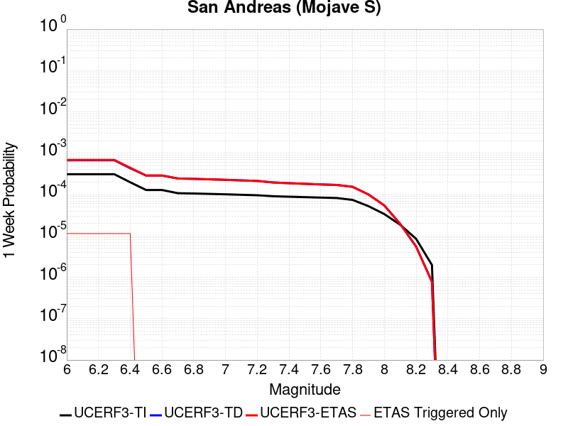 | 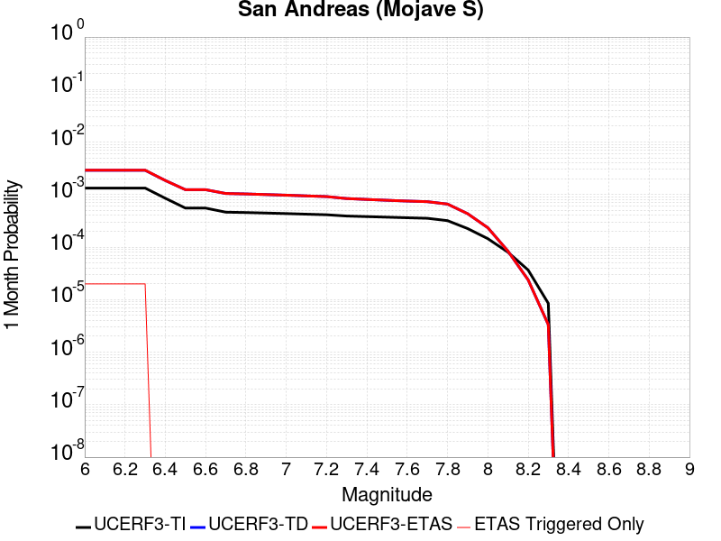 | 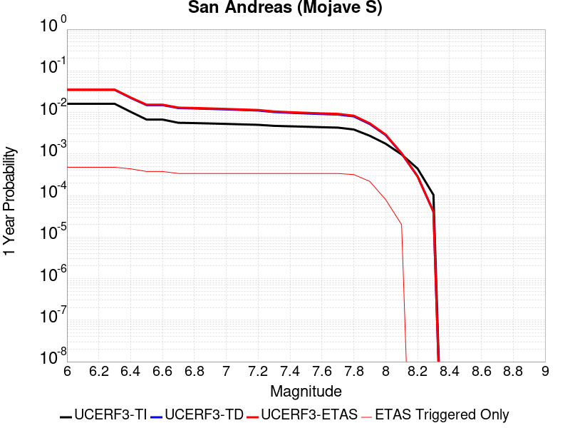 | 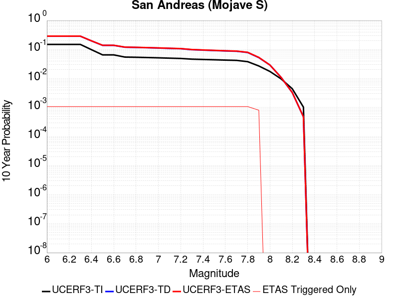 |

| Magnitude | 1 wk TI Prob | 1 wk TD Prob | 1 wk ETAS Prob | 1 wk ETAS/TD Gain | 1 wk ETAS Triggered Only | 1 mo TI Prob | 1 mo TD Prob | 1 mo ETAS Prob | 1 mo ETAS/TD Gain | 1 mo ETAS Triggered Only | 1 yr TI Prob | 1 yr TD Prob | 1 yr ETAS Prob | 1 yr ETAS/TD Gain | 1 yr ETAS Triggered Only | 10 yr TI Prob | 10 yr TD Prob | 10 yr ETAS Prob | 10 yr ETAS/TD Gain | 10 yr ETAS Triggered Only |
|-----|-----|-----|-----|-----|-----|-----|-----|-----|-----|-----|-----|-----|-----|-----|-----|-----|-----|-----|-----|-----|
| 6.0 | 3.1064058E-4 | 6.763318E-4 | 6.763318E-4 | 1.0 | 0.0 | 0.0013306376 | 0.0028954733 | 0.0029365132 | 1.0141737 | 4.1159037E-5 | 0.016080605 | 0.034809835 | 0.0352071 | 1.0114124 | 4.115904E-4 | 0.1496549 | 0.28715077 | 0.2879723 | 1.0028609 | 0.0011524531 |
| 6.1 | 3.1064058E-4 | 6.763318E-4 | 6.763318E-4 | 1.0 | 0.0 | 0.0013306376 | 0.0028954733 | 0.0029365132 | 1.0141737 | 4.1159037E-5 | 0.016080605 | 0.034809835 | 0.0352071 | 1.0114124 | 4.115904E-4 | 0.1496549 | 0.28715077 | 0.2879723 | 1.0028609 | 0.0011524531 |
| 6.2 | 3.1064058E-4 | 6.763318E-4 | 6.763318E-4 | 1.0 | 0.0 | 0.0013306376 | 0.0028954733 | 0.0029365132 | 1.0141737 | 4.1159037E-5 | 0.016080605 | 0.034809835 | 0.0352071 | 1.0114124 | 4.115904E-4 | 0.1496549 | 0.28715077 | 0.2879723 | 1.0028609 | 0.0011524531 |
| 6.3 | 3.1064058E-4 | 6.763318E-4 | 6.763318E-4 | 1.0 | 0.0 | 0.0013306376 | 0.0028954733 | 0.0029365132 | 1.0141737 | 4.1159037E-5 | 0.016080605 | 0.034809835 | 0.0352071 | 1.0114124 | 4.115904E-4 | 0.1496549 | 0.28715077 | 0.2879723 | 1.0028609 | 0.0011524531 |
| 6.4 | 1.9872203E-4 | 4.334337E-4 | 4.334337E-4 | 1.0 | 0.0 | 8.5138786E-4 | 0.001856279 | 0.001856279 | 1.0 | 0.0 | 0.010316478 | 0.02237215 | 0.022734296 | 1.0161873 | 3.7043134E-4 | 0.098504856 | 0.19763272 | 0.19839229 | 1.0038433 | 9.466579E-4 |
| 6.5 | 1.291105E-4 | 2.890843E-4 | 2.890843E-4 | 1.0 | 0.0 | 5.5321335E-4 | 0.0012383471 | 0.0012383471 | 1.0 | 0.0 | 0.006714592 | 0.014973483 | 0.015338368 | 1.0243688 | 3.7043134E-4 | 0.065152965 | 0.13866335 | 0.1394433 | 1.0056247 | 9.0549886E-4 |
| 6.6 | 1.291105E-4 | 2.890843E-4 | 2.890843E-4 | 1.0 | 0.0 | 5.5321335E-4 | 0.0012383471 | 0.0012383471 | 1.0 | 0.0 | 0.006714592 | 0.014973483 | 0.015338368 | 1.0243688 | 3.7043134E-4 | 0.065152965 | 0.13866335 | 0.1394433 | 1.0056247 | 9.0549886E-4 |
| 6.7 | 1.08001186E-4 | 2.4487232E-4 | 2.4487232E-4 | 1.0 | 0.0 | 4.6278012E-4 | 0.0010490314 | 0.0010490314 | 1.0 | 0.0 | 0.0056198016 | 0.012697467 | 0.013022558 | 1.0256028 | 3.292723E-4 | 0.054797906 | 0.119827196 | 0.120551735 | 1.0060465 | 8.231808E-4 |
| 6.8 | 1.0624356E-4 | 2.4004445E-4 | 2.4004445E-4 | 1.0 | 0.0 | 4.5525006E-4 | 0.0010283568 | 0.0010283568 | 1.0 | 0.0 | 0.0055285925 | 0.012448649 | 0.012773822 | 1.0261211 | 3.292723E-4 | 0.053930566 | 0.117782384 | 0.11850861 | 1.0061659 | 8.231808E-4 |
| 6.9 | 1.0393785E-4 | 2.337423E-4 | 2.337423E-4 | 1.0 | 0.0 | 4.4537184E-4 | 0.0010013686 | 0.0010013686 | 1.0 | 0.0 | 0.0054089287 | 0.012123764 | 0.012449044 | 1.02683 | 3.292723E-4 | 0.05279156 | 0.115076795 | 0.115805246 | 1.0063301 | 8.231808E-4 |
| 7.0 | 1.0155622E-4 | 2.2743084E-4 | 2.2743084E-4 | 1.0 | 0.0 | 4.3516833E-4 | 9.743399E-4 | 9.743399E-4 | 1.0 | 0.0 | 0.005285311 | 0.011798294 | 0.012123682 | 1.0275792 | 3.292723E-4 | 0.05161361 | 0.11233516 | 0.11306587 | 1.0065048 | 8.231808E-4 |
| 7.1 | 9.885595E-5 | 2.2030735E-4 | 2.2030735E-4 | 1.0 | 0.0 | 4.2359953E-4 | 9.438331E-4 | 9.438331E-4 | 1.0 | 0.0 | 0.0051451353 | 0.011430825 | 0.0117563335 | 1.0284764 | 3.292723E-4 | 0.05027629 | 0.109215386 | 0.109948665 | 1.006714 | 8.231808E-4 |
| 7.2 | 9.6411415E-5 | 2.1393E-4 | 2.1393E-4 | 1.0 | 0.0 | 4.1312634E-4 | 9.1652106E-4 | 9.1652106E-4 | 1.0 | 0.0 | 0.005018219 | 0.011101737 | 0.011427354 | 1.0293303 | 3.292723E-4 | 0.049064007 | 0.10640601 | 0.1071416 | 1.0069131 | 8.231808E-4 |
| 7.3 | 9.1180635E-5 | 1.9617204E-4 | 1.9617204E-4 | 1.0 | 0.0 | 3.907156E-4 | 8.404665E-4 | 8.404665E-4 | 1.0 | 0.0 | 0.004746591 | 0.010184784 | 0.010510704 | 1.0320005 | 3.292723E-4 | 0.046464786 | 0.098593675 | 0.09933569 | 1.007526 | 8.231808E-4 |
| 7.4 | 8.887388E-5 | 1.8864141E-4 | 1.8864141E-4 | 1.0 | 0.0 | 3.8083247E-4 | 8.082128E-4 | 8.082128E-4 | 1.0 | 0.0 | 0.0046267817 | 0.009795695 | 0.010121741 | 1.0332847 | 3.292723E-4 | 0.045316286 | 0.09522193 | 0.09596673 | 1.0078217 | 8.231808E-4 |
| 7.5 | 8.6750515E-5 | 1.819408E-4 | 1.819408E-4 | 1.0 | 0.0 | 3.7173493E-4 | 7.795134E-4 | 7.795134E-4 | 1.0 | 0.0 | 0.004516484 | 0.009449365 | 0.009775525 | 1.0345167 | 3.292723E-4 | 0.04425787 | 0.09218029 | 0.09292759 | 1.008107 | 8.231808E-4 |
| 7.6 | 8.453092E-5 | 1.757977E-4 | 1.757977E-4 | 1.0 | 0.0 | 3.6222505E-4 | 7.5320125E-4 | 7.5320125E-4 | 1.0 | 0.0 | 0.0044011753 | 0.0091317445 | 0.00945801 | 1.0357287 | 3.292723E-4 | 0.04315024 | 0.089331865 | 0.090081505 | 1.0083917 | 8.231808E-4 |
| 7.7 | 8.259102E-5 | 1.710036E-4 | 1.710036E-4 | 1.0 | 0.0 | 3.539135E-4 | 7.3266675E-4 | 7.3266675E-4 | 1.0 | 0.0 | 0.004300386 | 0.008883804 | 0.009210151 | 1.036735 | 3.292723E-4 | 0.042181134 | 0.08707786 | 0.08782936 | 1.0086302 | 8.231808E-4 |
| 7.8 | 7.444844E-5 | 1.5410404E-4 | 1.5410404E-4 | 1.0 | 0.0 | 3.1902574E-4 | 6.602787E-4 | 6.602787E-4 | 1.0 | 0.0 | 0.0038772223 | 0.008009314 | 0.008295119 | 1.0356841 | 2.8811328E-4 | 0.03810269 | 0.07886064 | 0.07954308 | 1.0086538 | 7.408627E-4 |
| 7.9 | 5.2586525E-5 | 1.0093456E-4 | 1.0093456E-4 | 1.0 | 0.0 | 2.2535135E-4 | 4.3250498E-4 | 4.3250498E-4 | 1.0 | 0.0 | 0.0027402006 | 0.005253046 | 0.00545776 | 1.0389706 | 2.057952E-4 | 0.027066574 | 0.052607328 | 0.05303626 | 1.0081534 | 4.5274943E-4 |
| 8.0 | 3.379877E-5 | 5.457745E-5 | 5.457745E-5 | 1.0 | 0.0 | 1.4484383E-4 | 2.3388238E-4 | 2.3388238E-4 | 1.0 | 0.0 | 0.0017620471 | 0.0028438016 | 0.0028848436 | 1.0144321 | 4.1159037E-5 | 0.017481409 | 0.02908164 | 0.029201526 | 1.0041224 | 1.2347712E-4 |
| 8.1 | 1.8668277E-5 | 1.9548539E-5 | 1.9548539E-5 | 1.0 | 0.0 | 8.000444E-5 | 8.3776766E-5 | 8.3776766E-5 | 1.0 | 0.0 | 9.736188E-4 | 0.0010195056 | 0.0010195056 | 1.0 | 0.0 | 0.009693642 | 0.01092413 | 0.01092413 | 1.0 | 0.0 |
| 8.2 | 8.541571E-6 | 5.551756E-6 | 5.551756E-6 | 1.0 | 0.0 | 3.660622E-5 | 2.3793024E-5 | 2.3793024E-5 | 1.0 | 0.0 | 4.455896E-4 | 2.8964164E-4 | 2.8964164E-4 | 1.0 | 0.0 | 0.0044469717 | 0.0032905824 | 0.0032905824 | 1.0 | 0.0 |
| 8.3 | 1.983087E-6 | 7.808603E-7 | 7.808603E-7 | 1.0 | 0.0 | 8.498917E-6 | 3.34654E-6 | 3.34654E-6 | 1.0 | 0.0 | 1.034694E-4 | 4.074338E-5 | 4.074338E-5 | 1.0 | 0.0 | 0.0010342124 | 4.8047924E-4 | 4.8047924E-4 | 1.0 | 0.0 |

## Death Valley (So)
*[(top)](#table-of-contents)*

| 1 Week | 1 Month | 1 Year | 10 Year |
|-----|-----|-----|-----|
| 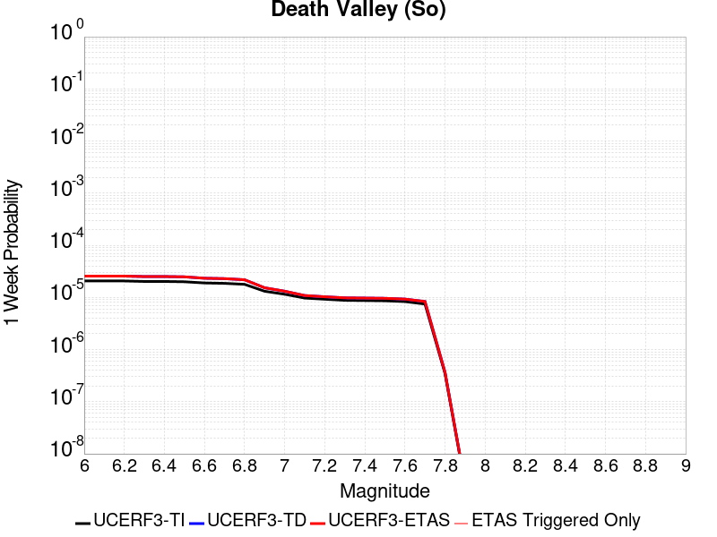 | 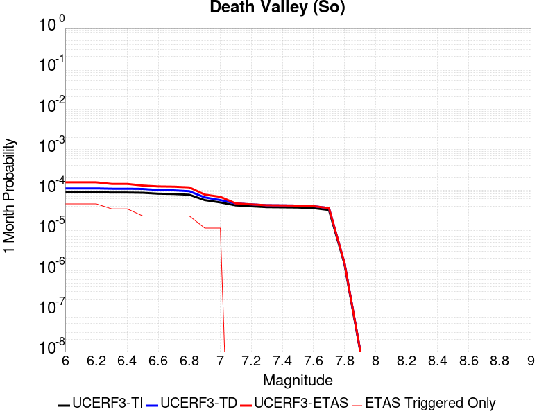 | 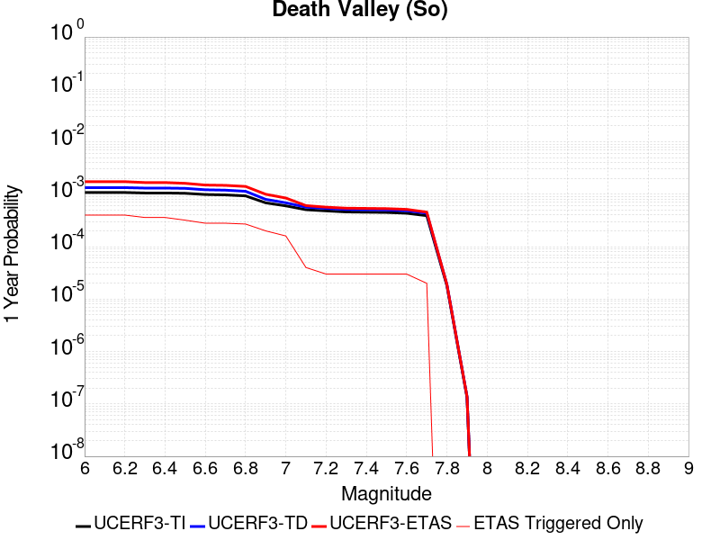 | 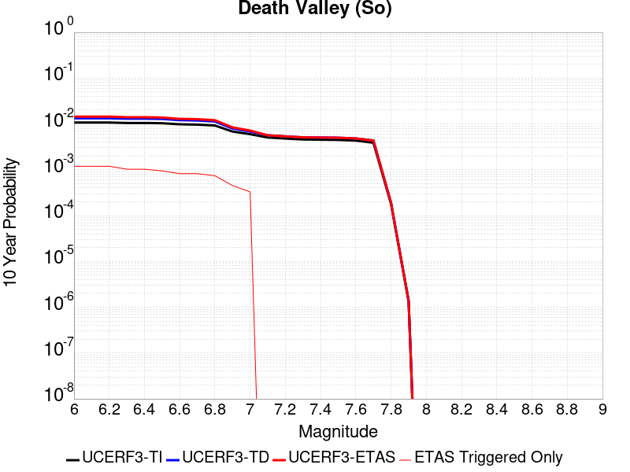 |

| Magnitude | 1 wk TI Prob | 1 wk TD Prob | 1 wk ETAS Prob | 1 wk ETAS/TD Gain | 1 wk ETAS Triggered Only | 1 mo TI Prob | 1 mo TD Prob | 1 mo ETAS Prob | 1 mo ETAS/TD Gain | 1 mo ETAS Triggered Only | 1 yr TI Prob | 1 yr TD Prob | 1 yr ETAS Prob | 1 yr ETAS/TD Gain | 1 yr ETAS Triggered Only | 10 yr TI Prob | 10 yr TD Prob | 10 yr ETAS Prob | 10 yr ETAS/TD Gain | 10 yr ETAS Triggered Only |
|-----|-----|-----|-----|-----|-----|-----|-----|-----|-----|-----|-----|-----|-----|-----|-----|-----|-----|-----|-----|-----|
| 6.0 | 2.0684236E-5 | 2.5629335E-5 | 2.5629335E-5 | 1.0 | 0.0 | 8.864371E-5 | 1.09835484E-4 | 1.9214452E-4 | 1.7493848 | 8.2318074E-5 | 0.0010787029 | 0.0013364436 | 0.0018296919 | 1.3690753 | 4.939085E-4 | 0.010734817 | 0.01328996 | 0.014467709 | 1.0886195 | 0.0011936121 |
| 6.1 | 2.0684236E-5 | 2.5629335E-5 | 2.5629335E-5 | 1.0 | 0.0 | 8.864371E-5 | 1.09835484E-4 | 1.9214452E-4 | 1.7493848 | 8.2318074E-5 | 0.0010787029 | 0.0013364436 | 0.0018296919 | 1.3690753 | 4.939085E-4 | 0.010734817 | 0.01328996 | 0.014467709 | 1.0886195 | 0.0011936121 |
| 6.2 | 2.0684236E-5 | 2.5629335E-5 | 2.5629335E-5 | 1.0 | 0.0 | 8.864371E-5 | 1.09835484E-4 | 1.9214452E-4 | 1.7493848 | 8.2318074E-5 | 0.0010787029 | 0.0013364436 | 0.0018296919 | 1.3690753 | 4.939085E-4 | 0.010734817 | 0.01328996 | 0.014467709 | 1.0886195 | 0.0011936121 |
| 6.3 | 2.0240292E-5 | 2.5129275E-5 | 2.5129275E-5 | 1.0 | 0.0 | 8.6741224E-5 | 1.0769254E-4 | 1.4884715E-4 | 1.3821491 | 4.1159037E-5 | 0.0010555626 | 0.0013103848 | 0.0017214358 | 1.3136873 | 4.115904E-4 | 0.010505628 | 0.013032447 | 0.014048013 | 1.0779259 | 0.0010289759 |
| 6.4 | 2.0240292E-5 | 2.5129275E-5 | 2.5129275E-5 | 1.0 | 0.0 | 8.6741224E-5 | 1.0769254E-4 | 1.4884715E-4 | 1.3821491 | 4.1159037E-5 | 0.0010555626 | 0.0013103848 | 0.0017214358 | 1.3136873 | 4.115904E-4 | 0.010505628 | 0.013032447 | 0.014048013 | 1.0779259 | 0.0010289759 |
| 6.5 | 1.9962767E-5 | 2.481844E-5 | 2.481844E-5 | 1.0 | 0.0 | 8.55519E-5 | 1.0636051E-4 | 1.0636051E-4 | 1.0 | 0.0 | 0.0010410968 | 0.0012941867 | 0.0016230328 | 1.2540948 | 3.292723E-4 | 0.010362327 | 0.01287235 | 0.013806822 | 1.0725954 | 9.466579E-4 |
| 6.6 | 1.8937297E-5 | 2.3321747E-5 | 2.3321747E-5 | 1.0 | 0.0 | 8.115732E-5 | 9.994659E-5 | 9.994659E-5 | 1.0 | 0.0 | 9.876423E-4 | 0.001216185 | 0.001503948 | 1.2366111 | 2.8811328E-4 | 0.009832645 | 0.012101053 | 0.012914272 | 1.0672023 | 8.231808E-4 |
| 6.7 | 1.8621096E-5 | 2.2922268E-5 | 2.2922268E-5 | 1.0 | 0.0 | 7.980225E-5 | 9.8234676E-5 | 9.8234676E-5 | 1.0 | 0.0 | 9.711593E-4 | 0.0011953654 | 0.0014831343 | 1.2407372 | 2.8811328E-4 | 0.009669261 | 0.011895108 | 0.012708497 | 1.0683801 | 8.231808E-4 |
| 6.8 | 1.7830353E-5 | 2.1815722E-5 | 2.1815722E-5 | 1.0 | 0.0 | 7.641356E-5 | 9.349268E-5 | 9.349268E-5 | 1.0 | 0.0 | 9.29938E-4 | 0.0011376931 | 0.0013843663 | 1.2168188 | 2.4695424E-4 | 0.009260561 | 0.011324307 | 0.01205678 | 1.0646815 | 7.408627E-4 |
| 6.9 | 1.3135183E-5 | 1.5309559E-5 | 1.5309559E-5 | 1.0 | 0.0 | 5.6292425E-5 | 6.561078E-5 | 6.561078E-5 | 1.0 | 0.0 | 6.8514474E-4 | 7.9852494E-4 | 9.630296E-4 | 1.2060107 | 1.6463615E-4 | 0.006830362 | 0.007958136 | 0.008407282 | 1.0564387 | 4.5274943E-4 |
| 7.0 | 1.1507512E-5 | 1.3158512E-5 | 1.3158512E-5 | 1.0 | 0.0 | 4.9316975E-5 | 5.6392437E-5 | 5.6392437E-5 | 1.0 | 0.0 | 6.002687E-4 | 6.863674E-4 | 8.097598E-4 | 1.179776 | 1.2347712E-4 | 0.0059864987 | 0.0068436232 | 0.0071706423 | 1.0477844 | 3.292723E-4 |
| 7.1 | 9.715903E-6 | 1.0868354E-5 | 1.0868354E-5 | 1.0 | 0.0 | 4.1638916E-5 | 4.6577854E-5 | 4.6577854E-5 | 1.0 | 0.0 | 5.068359E-4 | 5.669421E-4 | 5.669421E-4 | 1.0 | 0.0 | 0.0050568148 | 0.0056554037 | 0.0056554037 | 1.0 | 0.0 |
| 7.2 | 9.233269E-6 | 1.0289147E-5 | 1.0289147E-5 | 1.0 | 0.0 | 3.9570554E-5 | 4.4095625E-5 | 4.4095625E-5 | 1.0 | 0.0 | 4.81665E-4 | 5.367362E-4 | 5.367362E-4 | 1.0 | 0.0 | 0.0048062233 | 0.0053548305 | 0.0053548305 | 1.0 | 0.0 |
| 7.3 | 8.8041315E-6 | 9.810763E-6 | 9.810763E-6 | 1.0 | 0.0 | 3.7731446E-5 | 4.204547E-5 | 4.204547E-5 | 1.0 | 0.0 | 4.592835E-4 | 5.117876E-4 | 5.117876E-4 | 1.0 | 0.0 | 0.0045833546 | 0.0051065166 | 0.0051065166 | 1.0 | 0.0 |
| 7.4 | 8.708749E-6 | 9.70976E-6 | 9.70976E-6 | 1.0 | 0.0 | 3.7322676E-5 | 4.1612617E-5 | 4.1612617E-5 | 1.0 | 0.0 | 4.5430884E-4 | 5.0652004E-4 | 5.0652004E-4 | 1.0 | 0.0 | 0.004533812 | 0.005054082 | 0.005054082 | 1.0 | 0.0 |
| 7.5 | 8.612678E-6 | 9.607386E-6 | 9.607386E-6 | 1.0 | 0.0 | 3.6910955E-5 | 4.1173884E-5 | 4.1173884E-5 | 1.0 | 0.0 | 4.492982E-4 | 5.0118094E-4 | 5.0118094E-4 | 1.0 | 0.0 | 0.004483909 | 0.0050009326 | 0.0050009326 | 1.0 | 0.0 |
| 7.6 | 8.319024E-6 | 9.286416E-6 | 9.286416E-6 | 1.0 | 0.0 | 3.5652476E-5 | 3.979834E-5 | 3.979834E-5 | 1.0 | 0.0 | 4.3398244E-4 | 4.8444126E-4 | 4.8444126E-4 | 1.0 | 0.0 | 0.0043313587 | 0.004834276 | 0.004834276 | 1.0 | 0.0 |
| 7.7 | 7.4718328E-6 | 8.347432E-6 | 8.347432E-6 | 1.0 | 0.0 | 3.2021748E-5 | 3.5774243E-5 | 3.5774243E-5 | 1.0 | 0.0 | 3.8979502E-4 | 4.3546842E-4 | 4.3546842E-4 | 1.0 | 0.0 | 0.00389112 | 0.0043465565 | 0.0043465565 | 1.0 | 0.0 |
| 7.8 | 3.4586725E-7 | 3.6487262E-7 | 3.6487262E-7 | 1.0 | 0.0 | 1.4822873E-6 | 1.5637388E-6 | 1.5637388E-6 | 1.0 | 0.0 | 1.80467E-5 | 1.9038358E-5 | 1.9038358E-5 | 1.0 | 0.0 | 1.8045233E-4 | 1.9036772E-4 | 1.9036772E-4 | 1.0 | 0.0 |
| 7.9 | 2.5591178E-9 | 2.6699385E-9 | 2.6699385E-9 | 1.0 | 0.0 | 1.0967647E-8 | 1.1442593E-8 | 1.1442593E-8 | 1.0 | 0.0 | 1.335311E-7 | 1.3931357E-7 | 1.3931357E-7 | 1.0 | 0.0 | 1.3353102E-6 | 1.3931357E-6 | 1.3931357E-6 | 1.0 | 0.0 |

## Coyote Canyon
*[(top)](#table-of-contents)*

| 1 Week | 1 Month | 1 Year | 10 Year |
|-----|-----|-----|-----|
| 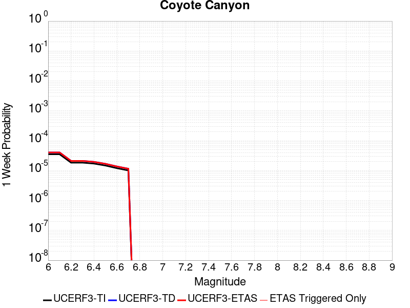 | 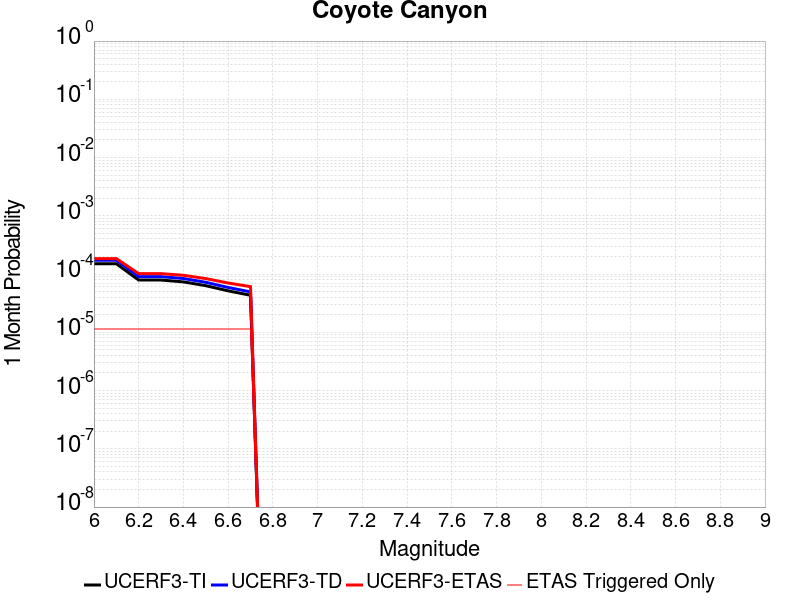 | 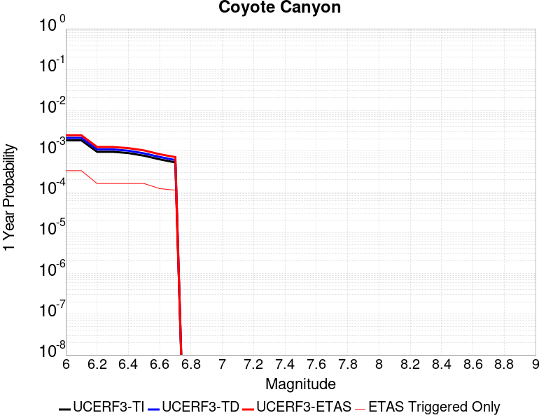 | 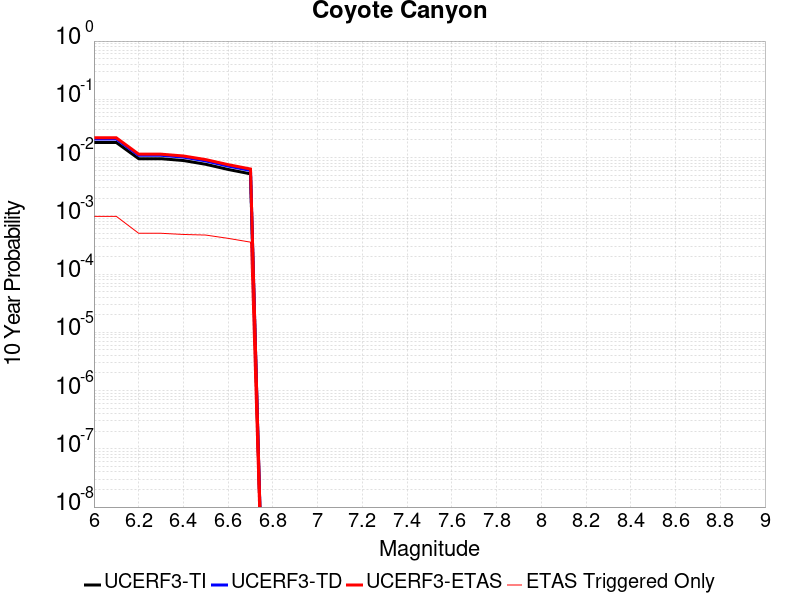 |

| Magnitude | 1 wk TI Prob | 1 wk TD Prob | 1 wk ETAS Prob | 1 wk ETAS/TD Gain | 1 wk ETAS Triggered Only | 1 mo TI Prob | 1 mo TD Prob | 1 mo ETAS Prob | 1 mo ETAS/TD Gain | 1 mo ETAS Triggered Only | 1 yr TI Prob | 1 yr TD Prob | 1 yr ETAS Prob | 1 yr ETAS/TD Gain | 1 yr ETAS Triggered Only | 10 yr TI Prob | 10 yr TD Prob | 10 yr ETAS Prob | 10 yr ETAS/TD Gain | 10 yr ETAS Triggered Only |
|-----|-----|-----|-----|-----|-----|-----|-----|-----|-----|-----|-----|-----|-----|-----|-----|-----|-----|-----|-----|-----|
| 6.0 | 3.5090034E-5 | 4.0378352E-5 | 4.0378352E-5 | 1.0 | 0.0 | 1.503772E-4 | 1.7304007E-4 | 1.7304007E-4 | 1.0 | 0.0 | 0.0018293047 | 0.0021049846 | 0.002269274 | 1.0780479 | 1.6463615E-4 | 0.018143194 | 0.020876396 | 0.021722693 | 1.0405384 | 8.643398E-4 |
| 6.1 | 3.5090034E-5 | 4.0378352E-5 | 4.0378352E-5 | 1.0 | 0.0 | 1.503772E-4 | 1.7304007E-4 | 1.7304007E-4 | 1.0 | 0.0 | 0.0018293047 | 0.0021049846 | 0.002269274 | 1.0780479 | 1.6463615E-4 | 0.018143194 | 0.020876396 | 0.021722693 | 1.0405384 | 8.643398E-4 |
| 6.2 | 1.841879E-5 | 2.1066777E-5 | 2.1066777E-5 | 1.0 | 0.0 | 7.8935285E-5 | 9.028364E-5 | 9.028364E-5 | 1.0 | 0.0 | 9.606133E-4 | 0.0010987511 | 0.0011809787 | 1.0748373 | 8.2318074E-5 | 0.0095647145 | 0.01094328 | 0.011391074 | 1.0409197 | 4.5274943E-4 |
| 6.3 | 1.841879E-5 | 2.1066777E-5 | 2.1066777E-5 | 1.0 | 0.0 | 7.8935285E-5 | 9.028364E-5 | 9.028364E-5 | 1.0 | 0.0 | 9.606133E-4 | 0.0010987511 | 0.0011809787 | 1.0748373 | 8.2318074E-5 | 0.0095647145 | 0.01094328 | 0.011391074 | 1.0409197 | 4.5274943E-4 |
| 6.4 | 1.712201E-5 | 1.957167E-5 | 1.957167E-5 | 1.0 | 0.0 | 7.337798E-5 | 8.387645E-5 | 8.387645E-5 | 1.0 | 0.0 | 8.930107E-4 | 0.001020818 | 0.001103052 | 1.080557 | 8.2318074E-5 | 0.008894307 | 0.010171213 | 0.010578617 | 1.0400546 | 4.115904E-4 |
| 6.5 | 1.4744935E-5 | 1.6842498E-5 | 1.6842498E-5 | 1.0 | 0.0 | 6.3191044E-5 | 7.218066E-5 | 7.218066E-5 | 1.0 | 0.0 | 7.6907943E-4 | 8.7853876E-4 | 9.6078456E-4 | 1.0936165 | 8.2318074E-5 | 0.007664232 | 0.008759859 | 0.009127046 | 1.041917 | 3.7043134E-4 |
| 6.6 | 1.2017839E-5 | 1.3728596E-5 | 1.3728596E-5 | 1.0 | 0.0 | 5.150401E-5 | 5.8836013E-5 | 5.8836013E-5 | 1.0 | 0.0 | 6.268809E-4 | 7.1618165E-4 | 7.984408E-4 | 1.1148579 | 8.2318074E-5 | 0.0062511545 | 0.007147435 | 0.007433489 | 1.0400219 | 2.8811328E-4 |
| 6.7 | 1.00956095E-5 | 1.1537316E-5 | 1.1537316E-5 | 1.0 | 0.0 | 4.326618E-5 | 4.9445192E-5 | 4.9445192E-5 | 1.0 | 0.0 | 5.266384E-4 | 6.01916E-4 | 6.8418455E-4 | 1.1366777 | 8.2318074E-5 | 0.005253921 | 0.0060113897 | 0.006297771 | 1.0476397 | 2.8811328E-4 |

## Nelson Lake
*[(top)](#table-of-contents)*

| 1 Week | 1 Month | 1 Year | 10 Year |
|-----|-----|-----|-----|
| 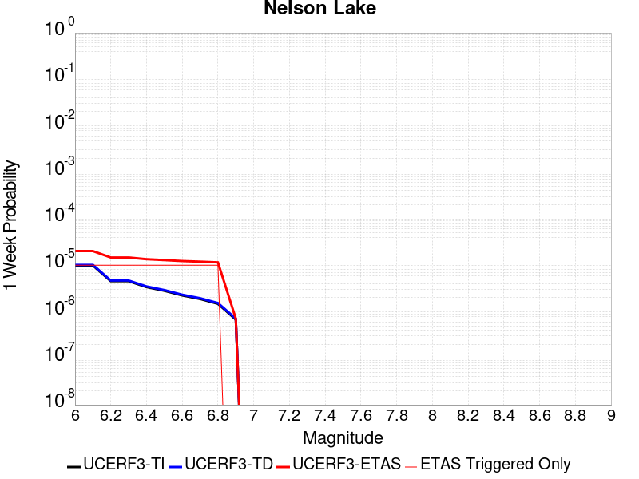 | 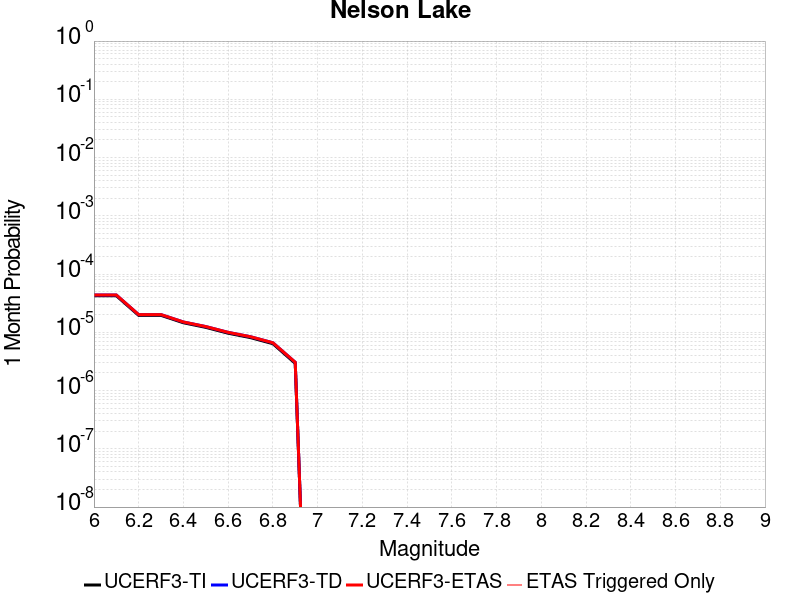 | 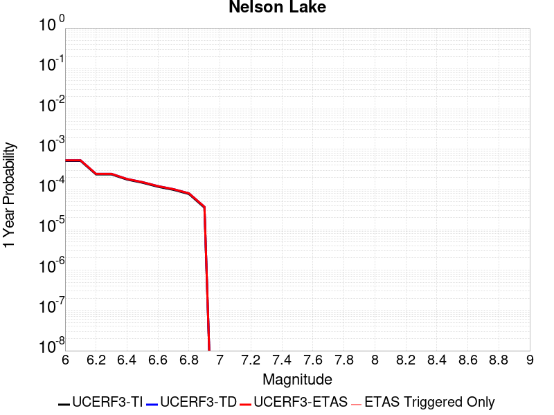 | 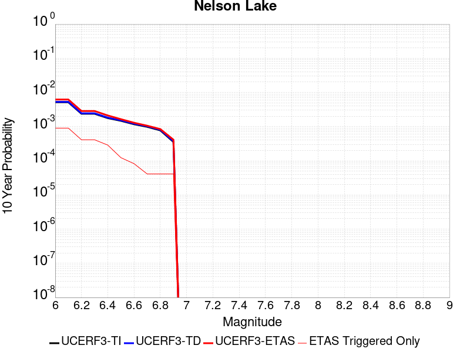 |

| Magnitude | 1 wk TI Prob | 1 wk TD Prob | 1 wk ETAS Prob | 1 wk ETAS/TD Gain | 1 wk ETAS Triggered Only | 1 mo TI Prob | 1 mo TD Prob | 1 mo ETAS Prob | 1 mo ETAS/TD Gain | 1 mo ETAS Triggered Only | 1 yr TI Prob | 1 yr TD Prob | 1 yr ETAS Prob | 1 yr ETAS/TD Gain | 1 yr ETAS Triggered Only | 10 yr TI Prob | 10 yr TD Prob | 10 yr ETAS Prob | 10 yr ETAS/TD Gain | 10 yr ETAS Triggered Only |
|-----|-----|-----|-----|-----|-----|-----|-----|-----|-----|-----|-----|-----|-----|-----|-----|-----|-----|-----|-----|-----|
| 6.0 | 9.913453E-6 | 1.0192919E-5 | 1.0192919E-5 | 1.0 | 0.0 | 4.2485535E-5 | 4.3683263E-5 | 8.48405E-5 | 1.9421741 | 4.1159037E-5 | 5.1713863E-4 | 5.317243E-4 | 8.608215E-4 | 1.6189246 | 3.292723E-4 | 0.0051593683 | 0.005305548 | 0.0062062433 | 1.1697646 | 9.0549886E-4 |
| 6.1 | 9.913453E-6 | 1.0192919E-5 | 1.0192919E-5 | 1.0 | 0.0 | 4.2485535E-5 | 4.3683263E-5 | 8.48405E-5 | 1.9421741 | 4.1159037E-5 | 5.1713863E-4 | 5.317243E-4 | 8.608215E-4 | 1.6189246 | 3.292723E-4 | 0.0051593683 | 0.005305548 | 0.0062062433 | 1.1697646 | 9.0549886E-4 |
| 6.2 | 4.5596407E-6 | 4.6966393E-6 | 4.6966393E-6 | 1.0 | 0.0 | 1.954117E-5 | 2.0128306E-5 | 6.128652E-5 | 3.0447927 | 4.1159037E-5 | 2.3788778E-4 | 2.4503583E-4 | 4.507806E-4 | 1.8396518 | 2.057952E-4 | 0.0023763329 | 0.0024477826 | 0.0028583654 | 1.1677366 | 4.115904E-4 |
| 6.3 | 4.5596407E-6 | 4.6966393E-6 | 4.6966393E-6 | 1.0 | 0.0 | 1.954117E-5 | 2.0128306E-5 | 6.128652E-5 | 3.0447927 | 4.1159037E-5 | 2.3788778E-4 | 2.4503583E-4 | 4.507806E-4 | 1.8396518 | 2.057952E-4 | 0.0023763329 | 0.0024477826 | 0.0028583654 | 1.1677366 | 4.115904E-4 |
| 6.4 | 3.4025713E-6 | 3.5101536E-6 | 3.5101536E-6 | 1.0 | 0.0 | 1.4582367E-5 | 1.5043433E-5 | 5.6201854E-5 | 3.7359724 | 4.1159037E-5 | 1.7752586E-4 | 1.8313926E-4 | 3.4774526E-4 | 1.8988024 | 1.6463615E-4 | 0.001773841 | 0.0018299662 | 0.0021175523 | 1.1571537 | 2.8811328E-4 |
| 6.5 | 2.8352947E-6 | 2.9280775E-6 | 2.9280775E-6 | 1.0 | 0.0 | 1.2151207E-5 | 1.2548848E-5 | 5.370737E-5 | 4.279865 | 4.1159037E-5 | 1.479309E-4 | 1.5277226E-4 | 1.93925E-4 | 1.2693732 | 4.1159037E-5 | 0.0014783246 | 0.0015267462 | 0.0016500348 | 1.0807525 | 1.2347712E-4 |
| 6.6 | 2.251518E-6 | 2.3292534E-6 | 2.3292534E-6 | 1.0 | 0.0 | 9.649328E-6 | 9.98248E-6 | 9.98248E-6 | 1.0 | 0.0 | 1.1747423E-4 | 1.21530546E-4 | 1.21530546E-4 | 1.0 | 0.0 | 0.0011741214 | 0.0012147026 | 0.0012969207 | 1.0676857 | 8.2318074E-5 |
| 6.7 | 1.8911853E-6 | 1.9593028E-6 | 1.9593028E-6 | 1.0 | 0.0 | 8.105055E-6 | 8.396988E-6 | 8.396988E-6 | 1.0 | 0.0 | 9.867457E-5 | 1.0222912E-4 | 1.0222912E-4 | 1.0 | 0.0 | 9.863076E-4 | 0.0010218784 | 0.0010629954 | 1.0402367 | 4.1159037E-5 |
| 6.8 | 1.4874814E-6 | 1.5439659E-6 | 1.5439659E-6 | 1.0 | 0.0 | 6.374905E-6 | 6.616983E-6 | 6.616983E-6 | 1.0 | 0.0 | 7.76117E-5 | 8.055931E-5 | 8.055931E-5 | 1.0 | 0.0 | 7.75846E-4 | 8.053522E-4 | 8.4647804E-4 | 1.0510657 | 4.1159037E-5 |
| 6.9 | 6.835972E-7 | 7.1406623E-7 | 7.1406623E-7 | 1.0 | 0.0 | 2.9296991E-6 | 3.0602819E-6 | 3.0602819E-6 | 1.0 | 0.0 | 3.56685E-5 | 3.7258615E-5 | 3.7258615E-5 | 1.0 | 0.0 | 3.5662777E-4 | 3.7255493E-4 | 4.1369864E-4 | 1.1104366 | 4.1159037E-5 |

## San Andreas (Mojave N)
*[(top)](#table-of-contents)*

| 1 Week | 1 Month | 1 Year | 10 Year |
|-----|-----|-----|-----|
|  | 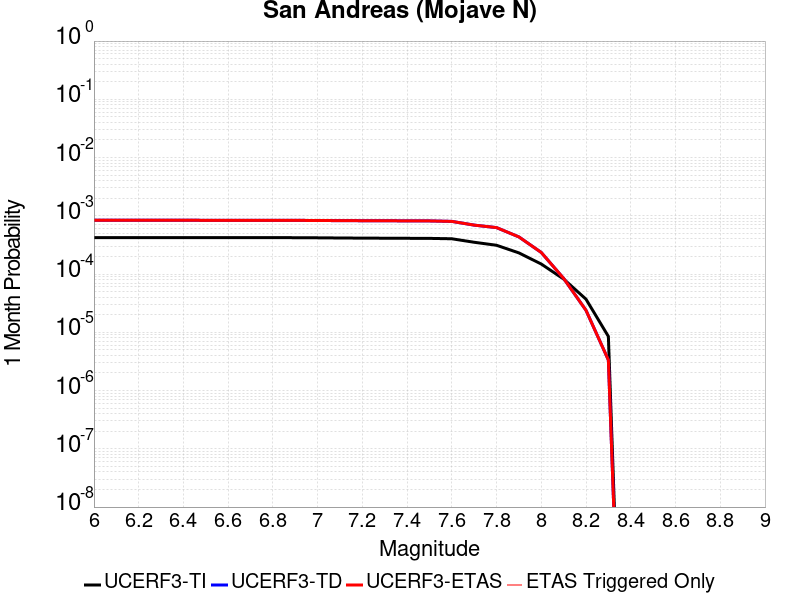 | 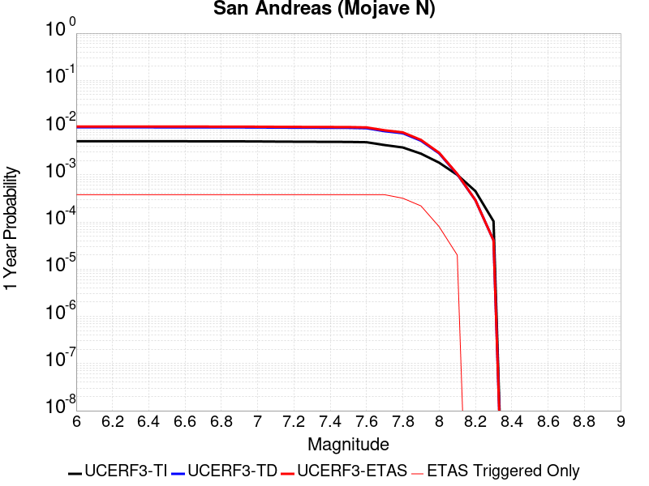 | 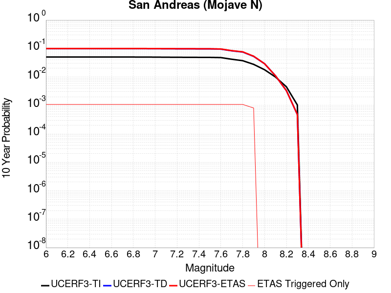 |

| Magnitude | 1 wk TI Prob | 1 wk TD Prob | 1 wk ETAS Prob | 1 wk ETAS/TD Gain | 1 wk ETAS Triggered Only | 1 mo TI Prob | 1 mo TD Prob | 1 mo ETAS Prob | 1 mo ETAS/TD Gain | 1 mo ETAS Triggered Only | 1 yr TI Prob | 1 yr TD Prob | 1 yr ETAS Prob | 1 yr ETAS/TD Gain | 1 yr ETAS Triggered Only | 10 yr TI Prob | 10 yr TD Prob | 10 yr ETAS Prob | 10 yr ETAS/TD Gain | 10 yr ETAS Triggered Only |
|-----|-----|-----|-----|-----|-----|-----|-----|-----|-----|-----|-----|-----|-----|-----|-----|-----|-----|-----|-----|-----|
| 6.0 | 9.877682E-5 | 1.9555743E-4 | 1.9555743E-4 | 1.0 | 0.0 | 4.2326056E-4 | 8.3783426E-4 | 8.3783426E-4 | 1.0 | 0.0 | 0.0051410277 | 0.0101530515 | 0.0105197225 | 1.0361143 | 3.7043134E-4 | 0.05023708 | 0.099000715 | 0.09989073 | 1.00899 | 9.87817E-4 |
| 6.1 | 9.877682E-5 | 1.9555743E-4 | 1.9555743E-4 | 1.0 | 0.0 | 4.2326056E-4 | 8.3783426E-4 | 8.3783426E-4 | 1.0 | 0.0 | 0.0051410277 | 0.0101530515 | 0.0105197225 | 1.0361143 | 3.7043134E-4 | 0.05023708 | 0.099000715 | 0.09989073 | 1.00899 | 9.87817E-4 |
| 6.2 | 9.877682E-5 | 1.9555743E-4 | 1.9555743E-4 | 1.0 | 0.0 | 4.2326056E-4 | 8.3783426E-4 | 8.3783426E-4 | 1.0 | 0.0 | 0.0051410277 | 0.0101530515 | 0.0105197225 | 1.0361143 | 3.7043134E-4 | 0.05023708 | 0.099000715 | 0.09989073 | 1.00899 | 9.87817E-4 |
| 6.3 | 9.877682E-5 | 1.9555743E-4 | 1.9555743E-4 | 1.0 | 0.0 | 4.2326056E-4 | 8.3783426E-4 | 8.3783426E-4 | 1.0 | 0.0 | 0.0051410277 | 0.0101530515 | 0.0105197225 | 1.0361143 | 3.7043134E-4 | 0.05023708 | 0.099000715 | 0.09989073 | 1.00899 | 9.87817E-4 |
| 6.4 | 9.877682E-5 | 1.9555743E-4 | 1.9555743E-4 | 1.0 | 0.0 | 4.2326056E-4 | 8.3783426E-4 | 8.3783426E-4 | 1.0 | 0.0 | 0.0051410277 | 0.0101530515 | 0.0105197225 | 1.0361143 | 3.7043134E-4 | 0.05023708 | 0.099000715 | 0.09989073 | 1.00899 | 9.87817E-4 |
| 6.5 | 9.861474E-5 | 1.9529465E-4 | 1.9529465E-4 | 1.0 | 0.0 | 4.2256617E-4 | 8.367088E-4 | 8.367088E-4 | 1.0 | 0.0 | 0.0051326132 | 0.010139477 | 0.010506153 | 1.0361631 | 3.7043134E-4 | 0.050156746 | 0.09887851 | 0.09976865 | 1.0090024 | 9.87817E-4 |
| 6.6 | 9.861474E-5 | 1.9529465E-4 | 1.9529465E-4 | 1.0 | 0.0 | 4.2256617E-4 | 8.367088E-4 | 8.367088E-4 | 1.0 | 0.0 | 0.0051326132 | 0.010139477 | 0.010506153 | 1.0361631 | 3.7043134E-4 | 0.050156746 | 0.09887851 | 0.09976865 | 1.0090024 | 9.87817E-4 |
| 6.7 | 9.8552715E-5 | 1.95194E-4 | 1.95194E-4 | 1.0 | 0.0 | 4.223004E-4 | 8.3627773E-4 | 8.3627773E-4 | 1.0 | 0.0 | 0.0051293927 | 0.010134278 | 0.010500955 | 1.0361819 | 3.7043134E-4 | 0.050125998 | 0.09883151 | 0.09972171 | 1.0090071 | 9.87817E-4 |
| 6.8 | 9.8464974E-5 | 1.9504518E-4 | 1.9504518E-4 | 1.0 | 0.0 | 4.219245E-4 | 8.3564036E-4 | 8.3564036E-4 | 1.0 | 0.0 | 0.0051248376 | 0.01012659 | 0.01049327 | 1.0362096 | 3.7043134E-4 | 0.05008251 | 0.09876127 | 0.09965153 | 1.0090142 | 9.87817E-4 |
| 6.9 | 9.825824E-5 | 1.9472446E-4 | 1.9472446E-4 | 1.0 | 0.0 | 4.2103877E-4 | 8.342667E-4 | 8.342667E-4 | 1.0 | 0.0 | 0.0051141046 | 0.010110022 | 0.0104767075 | 1.0362695 | 3.7043134E-4 | 0.049980022 | 0.09861024 | 0.09950064 | 1.0090296 | 9.87817E-4 |
| 7.0 | 9.781462E-5 | 1.9403637E-4 | 1.9403637E-4 | 1.0 | 0.0 | 4.1913814E-4 | 8.3131966E-4 | 8.3131966E-4 | 1.0 | 0.0 | 0.005091073 | 0.010074473 | 0.010441173 | 1.0363989 | 3.7043134E-4 | 0.04976007 | 0.09828596 | 0.09917668 | 1.0090626 | 9.87817E-4 |
| 7.1 | 9.7121134E-5 | 1.930511E-4 | 1.930511E-4 | 1.0 | 0.0 | 4.1616702E-4 | 8.270998E-4 | 8.270998E-4 | 1.0 | 0.0 | 0.005055068 | 0.01002357 | 0.010390288 | 1.0365856 | 3.7043134E-4 | 0.04941613 | 0.097821824 | 0.09871301 | 1.0091103 | 9.87817E-4 |
| 7.2 | 9.663819E-5 | 1.9235726E-4 | 1.9235726E-4 | 1.0 | 0.0 | 4.1409794E-4 | 8.241279E-4 | 8.241279E-4 | 1.0 | 0.0 | 0.0050299936 | 0.00998772 | 0.010354452 | 1.0367182 | 3.7043134E-4 | 0.049176537 | 0.09749441 | 0.09838592 | 1.0091442 | 9.87817E-4 |
| 7.3 | 9.6277574E-5 | 1.9188022E-4 | 1.9188022E-4 | 1.0 | 0.0 | 4.125529E-4 | 8.220848E-4 | 8.220848E-4 | 1.0 | 0.0 | 0.0050112694 | 0.009963073 | 0.010329814 | 1.03681 | 3.7043134E-4 | 0.04899759 | 0.09726707 | 0.0981588 | 1.0091679 | 9.87817E-4 |
| 7.4 | 9.593308E-5 | 1.9127571E-4 | 1.9127571E-4 | 1.0 | 0.0 | 4.1107697E-4 | 8.194957E-4 | 8.194957E-4 | 1.0 | 0.0 | 0.0049933824 | 0.009931838 | 0.010298591 | 1.036927 | 3.7043134E-4 | 0.04882661 | 0.09698384 | 0.09787586 | 1.0091976 | 9.87817E-4 |
| 7.5 | 9.561707E-5 | 1.9073434E-4 | 1.9073434E-4 | 1.0 | 0.0 | 4.0972308E-4 | 8.17177E-4 | 8.17177E-4 | 1.0 | 0.0 | 0.0049769743 | 0.009903865 | 0.010270628 | 1.0370322 | 3.7043134E-4 | 0.048669744 | 0.09672959 | 0.09762186 | 1.0092243 | 9.87817E-4 |
| 7.6 | 9.418194E-5 | 1.872441E-4 | 1.872441E-4 | 1.0 | 0.0 | 4.0357444E-4 | 8.022281E-4 | 8.022281E-4 | 1.0 | 0.0 | 0.004902454 | 0.009723501 | 0.010090331 | 1.037726 | 3.7043134E-4 | 0.047957025 | 0.09510631 | 0.09600019 | 1.0093986 | 9.87817E-4 |
| 7.7 | 8.202141E-5 | 1.6160595E-4 | 1.6160595E-4 | 1.0 | 0.0 | 3.51473E-4 | 6.924131E-4 | 6.924131E-4 | 1.0 | 0.0 | 0.00427079 | 0.0083976025 | 0.008764923 | 1.0437411 | 3.7043134E-4 | 0.04189639 | 0.082856454 | 0.08376243 | 1.0109342 | 9.87817E-4 |
| 7.8 | 7.2859846E-5 | 1.4641749E-4 | 1.4641749E-4 | 1.0 | 0.0 | 3.1221908E-4 | 6.273527E-4 | 6.273527E-4 | 1.0 | 0.0 | 0.003794643 | 0.0076113115 | 0.007897232 | 1.0375652 | 2.8811328E-4 | 0.037304975 | 0.07529156 | 0.07597664 | 1.009099 | 7.408627E-4 |
| 7.9 | 5.3874453E-5 | 1.0133717E-4 | 1.0133717E-4 | 1.0 | 0.0 | 2.3087008E-4 | 4.3422988E-4 | 4.3422988E-4 | 1.0 | 0.0 | 0.0028072202 | 0.005273945 | 0.005478655 | 1.0388153 | 2.057952E-4 | 0.02772022 | 0.05283702 | 0.05326585 | 1.008116 | 4.5274943E-4 |
| 8.0 | 3.468538E-5 | 5.4768807E-5 | 5.4768807E-5 | 1.0 | 0.0 | 1.4864317E-4 | 2.3470235E-4 | 2.3470235E-4 | 1.0 | 0.0 | 0.0018082283 | 0.0028537586 | 0.0028948002 | 1.0143816 | 4.1159037E-5 | 0.017935853 | 0.029197201 | 0.029317072 | 1.0041056 | 1.2347712E-4 |
| 8.1 | 1.9152367E-5 | 1.9644443E-5 | 1.9644443E-5 | 1.0 | 0.0 | 8.207899E-5 | 8.4187755E-5 | 8.4187755E-5 | 1.0 | 0.0 | 9.988535E-4 | 0.0010245047 | 0.0010245047 | 1.0 | 0.0 | 0.009943757 | 0.010983018 | 0.010983018 | 1.0 | 0.0 |
| 8.2 | 8.643924E-6 | 5.5660976E-6 | 5.5660976E-6 | 1.0 | 0.0 | 3.704486E-5 | 2.3854487E-5 | 2.3854487E-5 | 1.0 | 0.0 | 4.5092785E-4 | 2.9038975E-4 | 2.9038975E-4 | 1.0 | 0.0 | 0.0045001395 | 0.0032986484 | 0.0032986484 | 1.0 | 0.0 |
| 8.3 | 1.983087E-6 | 7.808603E-7 | 7.808603E-7 | 1.0 | 0.0 | 8.498917E-6 | 3.34654E-6 | 3.34654E-6 | 1.0 | 0.0 | 1.034694E-4 | 4.074338E-5 | 4.074338E-5 | 1.0 | 0.0 | 0.0010342124 | 4.8047924E-4 | 4.8047924E-4 | 1.0 | 0.0 |

## Towne Pass
*[(top)](#table-of-contents)*

| 1 Week | 1 Month | 1 Year | 10 Year |
|-----|-----|-----|-----|
| 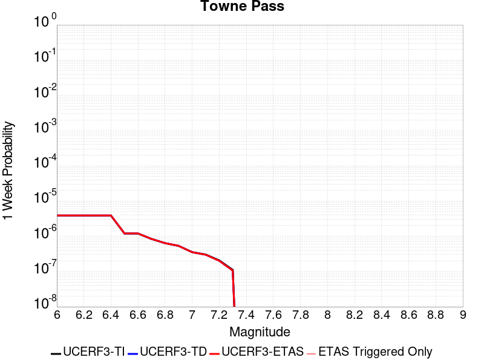 | 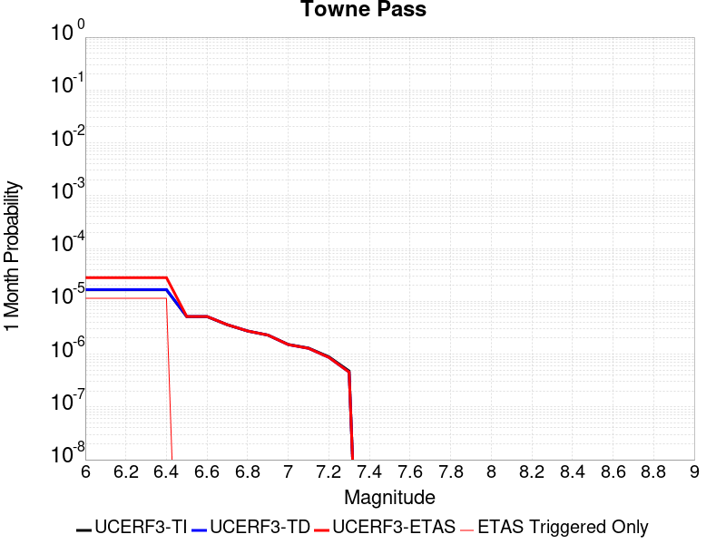 | 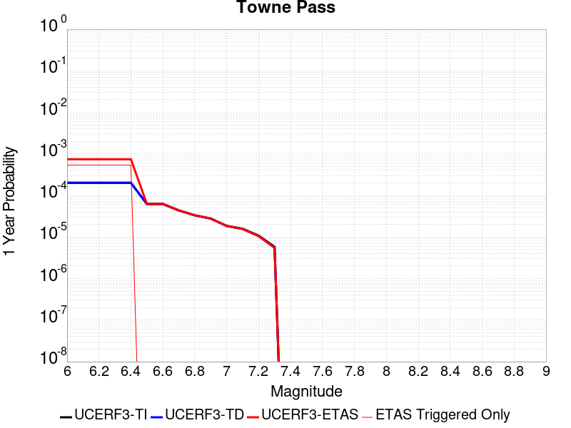 | 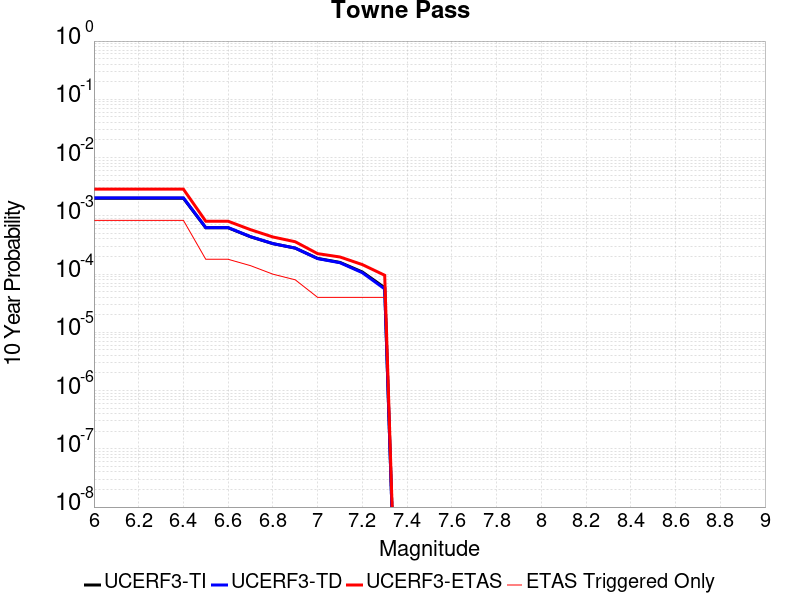 |

| Magnitude | 1 wk TI Prob | 1 wk TD Prob | 1 wk ETAS Prob | 1 wk ETAS/TD Gain | 1 wk ETAS Triggered Only | 1 mo TI Prob | 1 mo TD Prob | 1 mo ETAS Prob | 1 mo ETAS/TD Gain | 1 mo ETAS Triggered Only | 1 yr TI Prob | 1 yr TD Prob | 1 yr ETAS Prob | 1 yr ETAS/TD Gain | 1 yr ETAS Triggered Only | 10 yr TI Prob | 10 yr TD Prob | 10 yr ETAS Prob | 10 yr ETAS/TD Gain | 10 yr ETAS Triggered Only |
|-----|-----|-----|-----|-----|-----|-----|-----|-----|-----|-----|-----|-----|-----|-----|-----|-----|-----|-----|-----|-----|
| 6.0 | 3.849728E-6 | 3.894684E-6 | 3.894684E-6 | 1.0 | 0.0 | 1.649873E-5 | 1.6691421E-5 | 1.6691421E-5 | 1.0 | 0.0 | 2.0085352E-4 | 2.0320347E-4 | 5.324089E-4 | 2.6200776 | 3.292723E-4 | 0.0020067208 | 0.002030606 | 0.002852115 | 1.4045635 | 8.231808E-4 |
| 6.1 | 3.849728E-6 | 3.894684E-6 | 3.894684E-6 | 1.0 | 0.0 | 1.649873E-5 | 1.6691421E-5 | 1.6691421E-5 | 1.0 | 0.0 | 2.0085352E-4 | 2.0320347E-4 | 5.324089E-4 | 2.6200776 | 3.292723E-4 | 0.0020067208 | 0.002030606 | 0.002852115 | 1.4045635 | 8.231808E-4 |
| 6.2 | 3.849728E-6 | 3.894684E-6 | 3.894684E-6 | 1.0 | 0.0 | 1.649873E-5 | 1.6691421E-5 | 1.6691421E-5 | 1.0 | 0.0 | 2.0085352E-4 | 2.0320347E-4 | 5.324089E-4 | 2.6200776 | 3.292723E-4 | 0.0020067208 | 0.002030606 | 0.002852115 | 1.4045635 | 8.231808E-4 |
| 6.3 | 3.849728E-6 | 3.894684E-6 | 3.894684E-6 | 1.0 | 0.0 | 1.649873E-5 | 1.6691421E-5 | 1.6691421E-5 | 1.0 | 0.0 | 2.0085352E-4 | 2.0320347E-4 | 5.324089E-4 | 2.6200776 | 3.292723E-4 | 0.0020067208 | 0.002030606 | 0.002852115 | 1.4045635 | 8.231808E-4 |
| 6.4 | 3.849728E-6 | 3.894684E-6 | 3.894684E-6 | 1.0 | 0.0 | 1.649873E-5 | 1.6691421E-5 | 1.6691421E-5 | 1.0 | 0.0 | 2.0085352E-4 | 2.0320347E-4 | 5.324089E-4 | 2.6200776 | 3.292723E-4 | 0.0020067208 | 0.002030606 | 0.002852115 | 1.4045635 | 8.231808E-4 |
| 6.5 | 1.1953545E-6 | 1.2031078E-6 | 1.2031078E-6 | 1.0 | 0.0 | 5.1229376E-6 | 5.1561665E-6 | 5.1561665E-6 | 1.0 | 0.0 | 6.236998E-5 | 6.277464E-5 | 6.277464E-5 | 1.0 | 0.0 | 6.235248E-4 | 6.275808E-4 | 7.509804E-4 | 1.1966275 | 1.2347712E-4 |
| 6.6 | 1.1953545E-6 | 1.2031078E-6 | 1.2031078E-6 | 1.0 | 0.0 | 5.1229376E-6 | 5.1561665E-6 | 5.1561665E-6 | 1.0 | 0.0 | 6.236998E-5 | 6.277464E-5 | 6.277464E-5 | 1.0 | 0.0 | 6.235248E-4 | 6.275808E-4 | 7.509804E-4 | 1.1966275 | 1.2347712E-4 |
| 6.7 | 8.375951E-7 | 8.411129E-7 | 8.411129E-7 | 1.0 | 0.0 | 3.5896885E-6 | 3.604765E-6 | 3.604765E-6 | 1.0 | 0.0 | 4.370358E-5 | 4.3887187E-5 | 4.3887187E-5 | 1.0 | 0.0 | 4.3694986E-4 | 4.387909E-4 | 5.210729E-4 | 1.1875198 | 8.2318074E-5 |
| 6.8 | 6.38041E-7 | 6.3925614E-7 | 6.3925614E-7 | 1.0 | 0.0 | 2.7344586E-6 | 2.7396666E-6 | 2.7396666E-6 | 1.0 | 0.0 | 3.3291526E-5 | 3.335497E-5 | 3.335497E-5 | 1.0 | 0.0 | 3.3286537E-4 | 3.3350344E-4 | 3.7464875E-4 | 1.123373 | 4.1159037E-5 |
| 6.9 | 5.3460053E-7 | 5.345709E-7 | 5.345709E-7 | 1.0 | 0.0 | 2.2911431E-6 | 2.2910162E-6 | 2.2910162E-6 | 1.0 | 0.0 | 2.789431E-5 | 2.78928E-5 | 2.78928E-5 | 1.0 | 0.0 | 2.789081E-4 | 2.788963E-4 | 3.2004388E-4 | 1.1475371 | 4.1159037E-5 |
| 7.0 | 3.557783E-7 | 3.5327406E-7 | 3.5327406E-7 | 1.0 | 0.0 | 1.5247632E-6 | 1.5140308E-6 | 1.5140308E-6 | 1.0 | 0.0 | 1.8563835E-5 | 1.8433178E-5 | 1.8433178E-5 | 1.0 | 0.0 | 1.8562283E-4 | 1.8431734E-4 | 1.8431734E-4 | 1.0 | 0.0 |
| 7.1 | 3.037942E-7 | 3.0005106E-7 | 3.0005106E-7 | 1.0 | 0.0 | 1.3019744E-6 | 1.2859325E-6 | 1.2859325E-6 | 1.0 | 0.0 | 1.5851423E-5 | 1.5656124E-5 | 1.5656124E-5 | 1.0 | 0.0 | 1.5850292E-4 | 1.5655096E-4 | 1.5655096E-4 | 1.0 | 0.0 |
| 7.2 | 2.0808248E-7 | 2.0220024E-7 | 2.0220024E-7 | 1.0 | 0.0 | 8.917818E-7 | 8.665722E-7 | 8.665722E-7 | 1.0 | 0.0 | 1.0857389E-5 | 1.05504705E-5 | 1.05504705E-5 | 1.0 | 0.0 | 1.0856859E-4 | 1.05500156E-4 | 1.05500156E-4 | 1.0 | 0.0 |
| 7.3 | 1.1162073E-7 | 1.0638276E-7 | 1.0638276E-7 | 1.0 | 0.0 | 4.7837443E-7 | 4.5592603E-7 | 4.5592603E-7 | 1.0 | 0.0 | 5.8241935E-6 | 5.550887E-6 | 5.550887E-6 | 1.0 | 0.0 | 5.8240406E-5 | 5.5507688E-5 | 5.5507688E-5 | 1.0 | 0.0 |

## San Andreas (San Bernardino N)
*[(top)](#table-of-contents)*

| 1 Week | 1 Month | 1 Year | 10 Year |
|-----|-----|-----|-----|
| 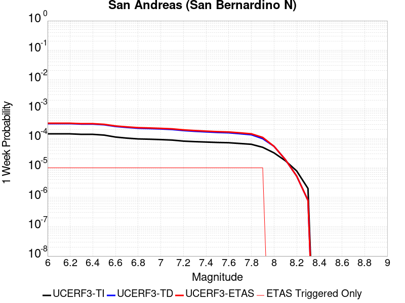 | 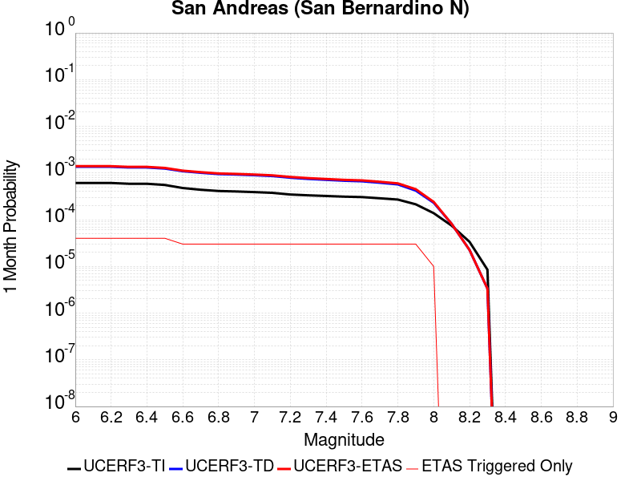 | 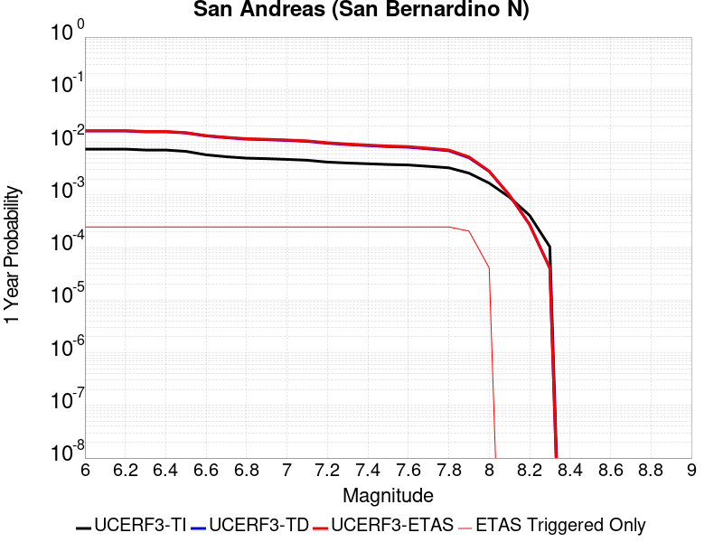 |  |

| Magnitude | 1 wk TI Prob | 1 wk TD Prob | 1 wk ETAS Prob | 1 wk ETAS/TD Gain | 1 wk ETAS Triggered Only | 1 mo TI Prob | 1 mo TD Prob | 1 mo ETAS Prob | 1 mo ETAS/TD Gain | 1 mo ETAS Triggered Only | 1 yr TI Prob | 1 yr TD Prob | 1 yr ETAS Prob | 1 yr ETAS/TD Gain | 1 yr ETAS Triggered Only | 10 yr TI Prob | 10 yr TD Prob | 10 yr ETAS Prob | 10 yr ETAS/TD Gain | 10 yr ETAS Triggered Only |
|-----|-----|-----|-----|-----|-----|-----|-----|-----|-----|-----|-----|-----|-----|-----|-----|-----|-----|-----|-----|-----|
| 6.0 | 1.4273766E-4 | 3.173715E-4 | 3.173715E-4 | 1.0 | 0.0 | 6.115894E-4 | 0.0013594606 | 0.0013594606 | 1.0 | 0.0 | 0.0074207084 | 0.016427329 | 0.016670225 | 1.0147861 | 2.4695424E-4 | 0.07177748 | 0.15079449 | 0.15135373 | 1.0037086 | 6.585446E-4 |
| 6.1 | 1.4273766E-4 | 3.173715E-4 | 3.173715E-4 | 1.0 | 0.0 | 6.115894E-4 | 0.0013594606 | 0.0013594606 | 1.0 | 0.0 | 0.0074207084 | 0.016427329 | 0.016670225 | 1.0147861 | 2.4695424E-4 | 0.07177748 | 0.15079449 | 0.15135373 | 1.0037086 | 6.585446E-4 |
| 6.2 | 1.4273766E-4 | 3.173715E-4 | 3.173715E-4 | 1.0 | 0.0 | 6.115894E-4 | 0.0013594606 | 0.0013594606 | 1.0 | 0.0 | 0.0074207084 | 0.016427329 | 0.016670225 | 1.0147861 | 2.4695424E-4 | 0.07177748 | 0.15079449 | 0.15135373 | 1.0037086 | 6.585446E-4 |
| 6.3 | 1.3730655E-4 | 3.0641313E-4 | 3.0641313E-4 | 1.0 | 0.0 | 5.883239E-4 | 0.001312544 | 0.001312544 | 1.0 | 0.0 | 0.0071393442 | 0.01586454 | 0.016107576 | 1.0153195 | 2.4695424E-4 | 0.06914291 | 0.1461046 | 0.14666693 | 1.0038488 | 6.585446E-4 |
| 6.4 | 1.3730655E-4 | 3.0641313E-4 | 3.0641313E-4 | 1.0 | 0.0 | 5.883239E-4 | 0.001312544 | 0.001312544 | 1.0 | 0.0 | 0.0071393442 | 0.01586454 | 0.016107576 | 1.0153195 | 2.4695424E-4 | 0.06914291 | 0.1461046 | 0.14666693 | 1.0038488 | 6.585446E-4 |
| 6.5 | 1.2942807E-4 | 2.905482E-4 | 2.905482E-4 | 1.0 | 0.0 | 5.545738E-4 | 0.0012446175 | 0.0012446175 | 1.0 | 0.0 | 0.0067310524 | 0.015049187 | 0.015292425 | 1.0161629 | 2.4695424E-4 | 0.06530788 | 0.13926533 | 0.13979673 | 1.0038158 | 6.1738555E-4 |
| 6.6 | 1.1125901E-4 | 2.5491248E-4 | 2.5491248E-4 | 1.0 | 0.0 | 4.767372E-4 | 0.0010920269 | 0.0010920269 | 1.0 | 0.0 | 0.005788839 | 0.013215015 | 0.0134587055 | 1.0184405 | 2.4695424E-4 | 0.056403454 | 0.1235622 | 0.1241033 | 1.0043792 | 6.1738555E-4 |
| 6.7 | 1.02209575E-4 | 2.3625269E-4 | 2.3625269E-4 | 1.0 | 0.0 | 4.3796748E-4 | 0.00101212 | 0.00101212 | 1.0 | 0.0 | 0.0053192247 | 0.012253365 | 0.012497293 | 1.019907 | 2.4695424E-4 | 0.051936906 | 0.1153299 | 0.115876086 | 1.0047358 | 6.1738555E-4 |
| 6.8 | 9.610582E-5 | 2.2149194E-4 | 2.2149194E-4 | 1.0 | 0.0 | 4.1181705E-4 | 9.489065E-4 | 9.489065E-4 | 1.0 | 0.0 | 0.0050023515 | 0.011492007 | 0.011736124 | 1.0212423 | 2.4695424E-4 | 0.048912346 | 0.10874456 | 0.10929481 | 1.00506 | 6.1738555E-4 |
| 6.9 | 9.3877505E-5 | 2.1604224E-4 | 2.1604224E-4 | 1.0 | 0.0 | 4.0227012E-4 | 9.255674E-4 | 9.255674E-4 | 1.0 | 0.0 | 0.0048866454 | 0.011210808 | 0.011454993 | 1.0217813 | 2.4695424E-4 | 0.04780577 | 0.106329076 | 0.106880814 | 1.005189 | 6.1738555E-4 |
| 7.0 | 9.1019785E-5 | 2.09303E-4 | 2.09303E-4 | 1.0 | 0.0 | 3.900265E-4 | 8.9670514E-4 | 8.9670514E-4 | 1.0 | 0.0 | 0.0047382377 | 0.010862962 | 0.011107234 | 1.0224867 | 2.4695424E-4 | 0.046384744 | 0.103294924 | 0.10384853 | 1.0053595 | 6.1738555E-4 |
| 7.1 | 8.771155E-5 | 2.0103931E-4 | 2.0103931E-4 | 1.0 | 0.0 | 3.758525E-4 | 8.613131E-4 | 8.613131E-4 | 1.0 | 0.0 | 0.0045664064 | 0.010436265 | 0.010680642 | 1.0234162 | 2.4695424E-4 | 0.044737056 | 0.09960176 | 0.10012059 | 1.0052091 | 5.7622656E-4 |
| 7.2 | 8.0830236E-5 | 1.8507679E-4 | 1.8507679E-4 | 1.0 | 0.0 | 3.4636928E-4 | 7.9294527E-4 | 7.9294527E-4 | 1.0 | 0.0 | 0.0042088944 | 0.009611482 | 0.009856063 | 1.0254468 | 2.4695424E-4 | 0.041300658 | 0.09232472 | 0.09284774 | 1.0056651 | 5.7622656E-4 |
| 7.3 | 7.7668235E-5 | 1.7448979E-4 | 1.7448979E-4 | 1.0 | 0.0 | 3.328214E-4 | 7.475992E-4 | 7.475992E-4 | 1.0 | 0.0 | 0.0040445733 | 0.009064115 | 0.00930883 | 1.0269983 | 2.4695424E-4 | 0.03971748 | 0.08758465 | 0.08811041 | 1.0060029 | 5.7622656E-4 |
| 7.4 | 7.520177E-5 | 1.6667467E-4 | 1.6667467E-4 | 1.0 | 0.0 | 3.2225347E-4 | 7.1412453E-4 | 7.1412453E-4 | 1.0 | 0.0 | 0.0039163795 | 0.008659873 | 0.008904689 | 1.0282701 | 2.4695424E-4 | 0.038480744 | 0.084034465 | 0.08456227 | 1.0062808 | 5.7622656E-4 |
| 7.5 | 7.274697E-5 | 1.5953516E-4 | 1.5953516E-4 | 1.0 | 0.0 | 3.1173544E-4 | 6.8354304E-4 | 6.8354304E-4 | 1.0 | 0.0 | 0.003788775 | 0.008290439 | 0.008535346 | 1.0295409 | 2.4695424E-4 | 0.03724827 | 0.0807453 | 0.081275 | 1.0065601 | 5.7622656E-4 |
| 7.6 | 7.1185845E-5 | 1.5522348E-4 | 1.5522348E-4 | 1.0 | 0.0 | 3.0504653E-4 | 6.650739E-4 | 6.650739E-4 | 1.0 | 0.0 | 0.0037076178 | 0.008067265 | 0.008312227 | 1.030365 | 2.4695424E-4 | 0.036463667 | 0.07873109 | 0.07926195 | 1.0067427 | 5.7622656E-4 |
| 7.7 | 6.709961E-5 | 1.4428512E-4 | 1.4428512E-4 | 1.0 | 0.0 | 2.8753807E-4 | 6.182183E-4 | 6.182183E-4 | 1.0 | 0.0 | 0.003495157 | 0.0075008716 | 0.0077459733 | 1.0326765 | 2.4695424E-4 | 0.034406938 | 0.073550776 | 0.07408462 | 1.0072582 | 5.7622656E-4 |
| 7.8 | 6.300812E-5 | 1.3306897E-4 | 1.3306897E-4 | 1.0 | 0.0 | 2.7000686E-4 | 5.7017093E-4 | 5.7017093E-4 | 1.0 | 0.0 | 0.0032823787 | 0.0069197654 | 0.007165011 | 1.0354413 | 2.4695424E-4 | 0.032343175 | 0.06818765 | 0.06872458 | 1.0078744 | 5.7622656E-4 |
| 7.9 | 4.983037E-5 | 9.806052E-5 | 9.806052E-5 | 1.0 | 0.0 | 2.1354125E-4 | 4.2019167E-4 | 4.2019167E-4 | 1.0 | 0.0 | 0.0025967648 | 0.0051038438 | 0.005308589 | 1.0401158 | 2.057952E-4 | 0.025666296 | 0.051034477 | 0.051464118 | 1.0084187 | 4.5274943E-4 |
| 8.0 | 3.2211527E-5 | 5.3789874E-5 | 5.3789874E-5 | 1.0 | 0.0 | 1.380421E-4 | 2.3050766E-4 | 2.3050766E-4 | 1.0 | 0.0 | 0.0016793669 | 0.0028028209 | 0.0028438647 | 1.0146437 | 4.1159037E-5 | 0.016667323 | 0.028598139 | 0.028718084 | 1.0041941 | 1.2347712E-4 |
| 8.1 | 1.743376E-5 | 1.9051051E-5 | 1.9051051E-5 | 1.0 | 0.0 | 7.471398E-5 | 8.164481E-5 | 8.164481E-5 | 1.0 | 0.0 | 9.0926304E-4 | 9.935729E-4 | 9.935729E-4 | 1.0 | 0.0 | 0.009055517 | 0.010602049 | 0.010602049 | 1.0 | 0.0 |
| 8.2 | 7.831616E-6 | 5.2386067E-6 | 5.2386067E-6 | 1.0 | 0.0 | 3.3563636E-5 | 2.2450979E-5 | 2.2450979E-5 | 1.0 | 0.0 | 4.0856065E-4 | 2.7330648E-4 | 2.7330648E-4 | 1.0 | 0.0 | 0.004078103 | 0.0030872403 | 0.0030872403 | 1.0 | 0.0 |
| 8.3 | 1.983087E-6 | 7.808603E-7 | 7.808603E-7 | 1.0 | 0.0 | 8.498917E-6 | 3.34654E-6 | 3.34654E-6 | 1.0 | 0.0 | 1.034694E-4 | 4.074338E-5 | 4.074338E-5 | 1.0 | 0.0 | 0.0010342124 | 4.8047924E-4 | 4.8047924E-4 | 1.0 | 0.0 |

## Lenwood-Lockhart-Old Woman Springs
*[(top)](#table-of-contents)*

| 1 Week | 1 Month | 1 Year | 10 Year |
|-----|-----|-----|-----|
| 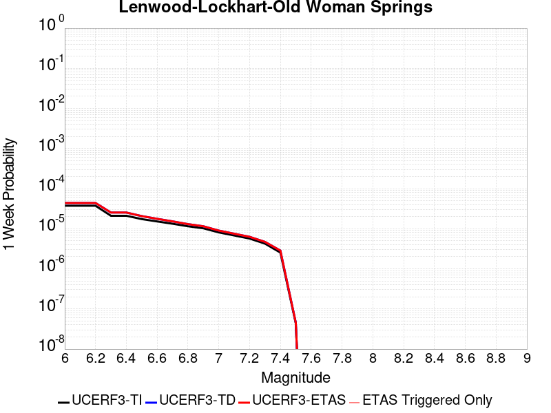 | 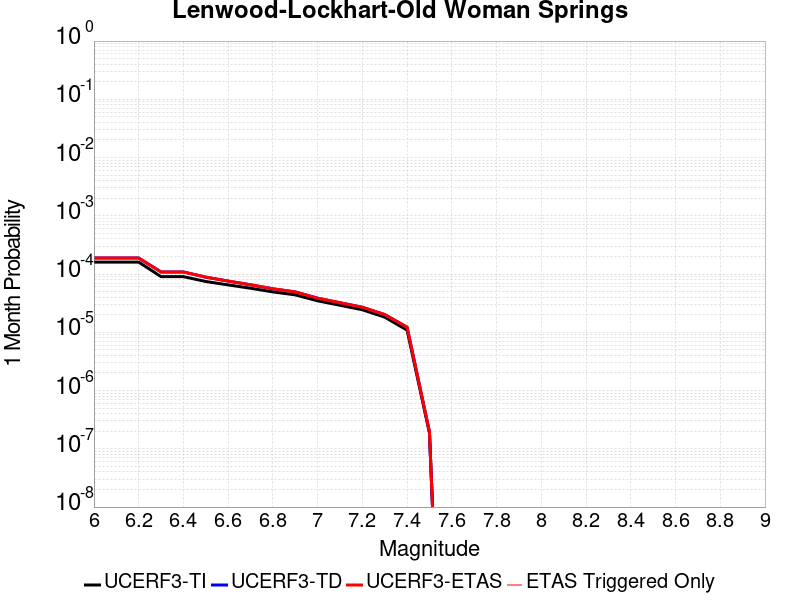 | 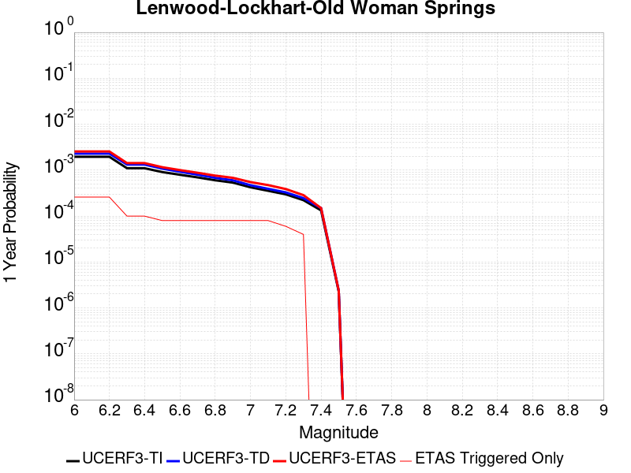 | 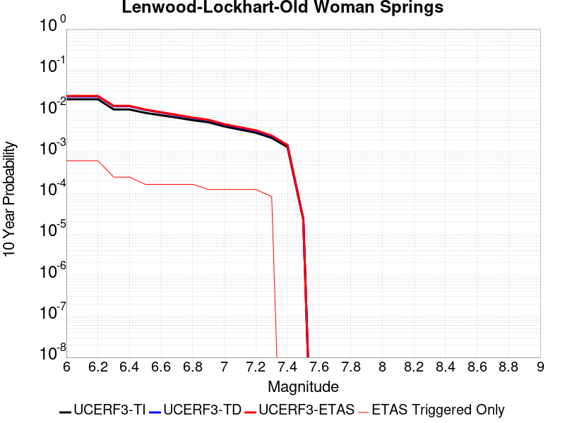 |

| Magnitude | 1 wk TI Prob | 1 wk TD Prob | 1 wk ETAS Prob | 1 wk ETAS/TD Gain | 1 wk ETAS Triggered Only | 1 mo TI Prob | 1 mo TD Prob | 1 mo ETAS Prob | 1 mo ETAS/TD Gain | 1 mo ETAS Triggered Only | 1 yr TI Prob | 1 yr TD Prob | 1 yr ETAS Prob | 1 yr ETAS/TD Gain | 1 yr ETAS Triggered Only | 10 yr TI Prob | 10 yr TD Prob | 10 yr ETAS Prob | 10 yr ETAS/TD Gain | 10 yr ETAS Triggered Only |
|-----|-----|-----|-----|-----|-----|-----|-----|-----|-----|-----|-----|-----|-----|-----|-----|-----|-----|-----|-----|-----|
| 6.0 | 3.744542E-5 | 4.3970504E-5 | 4.3970504E-5 | 1.0 | 0.0 | 1.604705E-4 | 1.8843237E-4 | 1.8843237E-4 | 1.0 | 0.0 | 0.0019519776 | 0.0022919225 | 0.002497246 | 1.0895857 | 2.057952E-4 | 0.019349206 | 0.022700869 | 0.023304239 | 1.0265791 | 6.1738555E-4 |
| 6.1 | 3.744542E-5 | 4.3970504E-5 | 4.3970504E-5 | 1.0 | 0.0 | 1.604705E-4 | 1.8843237E-4 | 1.8843237E-4 | 1.0 | 0.0 | 0.0019519776 | 0.0022919225 | 0.002497246 | 1.0895857 | 2.057952E-4 | 0.019349206 | 0.022700869 | 0.023304239 | 1.0265791 | 6.1738555E-4 |
| 6.2 | 3.744542E-5 | 4.3970504E-5 | 4.3970504E-5 | 1.0 | 0.0 | 1.604705E-4 | 1.8843237E-4 | 1.8843237E-4 | 1.0 | 0.0 | 0.0019519776 | 0.0022919225 | 0.002497246 | 1.0895857 | 2.057952E-4 | 0.019349206 | 0.022700869 | 0.023304239 | 1.0265791 | 6.1738555E-4 |
| 6.3 | 2.1079984E-5 | 2.5356492E-5 | 2.5356492E-5 | 1.0 | 0.0 | 9.0339665E-5 | 1.0866627E-4 | 1.0866627E-4 | 1.0 | 0.0 | 0.0010993304 | 0.0013222288 | 0.0014455427 | 1.0932621 | 1.2347712E-4 | 0.010939079 | 0.013145832 | 0.013389541 | 1.0185388 | 2.4695424E-4 |
| 6.4 | 2.1079984E-5 | 2.5356492E-5 | 2.5356492E-5 | 1.0 | 0.0 | 9.0339665E-5 | 1.0866627E-4 | 1.0866627E-4 | 1.0 | 0.0 | 0.0010993304 | 0.0013222288 | 0.0014455427 | 1.0932621 | 1.2347712E-4 | 0.010939079 | 0.013145832 | 0.013389541 | 1.0185388 | 2.4695424E-4 |
| 6.5 | 1.7397282E-5 | 2.066491E-5 | 2.066491E-5 | 1.0 | 0.0 | 7.455765E-5 | 8.8560955E-5 | 8.8560955E-5 | 1.0 | 0.0 | 9.073613E-4 | 0.0010777081 | 0.0011599374 | 1.0763003 | 8.2318074E-5 | 0.009036654 | 0.010726111 | 0.010888982 | 1.0151845 | 1.6463615E-4 |
| 6.6 | 1.52050325E-5 | 1.7681523E-5 | 1.7681523E-5 | 1.0 | 0.0 | 6.51628E-5 | 7.57758E-5 | 7.57758E-5 | 1.0 | 0.0 | 7.9306826E-4 | 9.221878E-4 | 0.00100443 | 1.0891815 | 8.2318074E-5 | 0.007902439 | 0.009184472 | 0.009347596 | 1.0177609 | 1.6463615E-4 |
| 6.7 | 1.332523E-5 | 1.5265648E-5 | 1.5265648E-5 | 1.0 | 0.0 | 5.7106878E-5 | 6.54226E-5 | 6.54226E-5 | 1.0 | 0.0 | 6.950544E-4 | 7.9623493E-4 | 8.784875E-4 | 1.1033019 | 8.2318074E-5 | 0.006928845 | 0.007934451 | 0.008097781 | 1.020585 | 1.6463615E-4 |
| 6.8 | 1.1525329E-5 | 1.3032466E-5 | 1.3032466E-5 | 1.0 | 0.0 | 4.9393333E-5 | 5.5852255E-5 | 5.5852255E-5 | 1.0 | 0.0 | 6.011979E-4 | 6.797933E-4 | 7.620554E-4 | 1.1210105 | 8.2318074E-5 | 0.00599574 | 0.00677759 | 0.0069411104 | 1.0241266 | 1.6463615E-4 |
| 6.9 | 1.0253909E-5 | 1.1515697E-5 | 1.1515697E-5 | 1.0 | 0.0 | 4.3944583E-5 | 4.9352075E-5 | 4.9352075E-5 | 1.0 | 0.0 | 5.3489394E-4 | 6.006995E-4 | 6.829681E-4 | 1.1369547 | 8.2318074E-5 | 0.0053360825 | 0.005991137 | 0.0061138747 | 1.0204865 | 1.2347712E-4 |
| 7.0 | 8.104563E-6 | 8.992067E-6 | 8.992067E-6 | 1.0 | 0.0 | 3.4733377E-5 | 3.8536873E-5 | 3.8536873E-5 | 1.0 | 0.0 | 4.2279682E-4 | 4.6908783E-4 | 5.513673E-4 | 1.1754031 | 8.2318074E-5 | 0.0042199334 | 0.004681225 | 0.004804124 | 1.0262536 | 1.2347712E-4 |
| 7.1 | 6.7986157E-6 | 7.5164803E-6 | 7.5164803E-6 | 1.0 | 0.0 | 2.91366E-5 | 3.22131E-5 | 3.22131E-5 | 1.0 | 0.0 | 3.5468035E-4 | 3.9212606E-4 | 4.7441188E-4 | 1.2098453 | 8.2318074E-5 | 0.003541148 | 0.003914558 | 0.004037552 | 1.0314196 | 1.2347712E-4 |
| 7.2 | 5.6893327E-6 | 6.280517E-6 | 6.280517E-6 | 1.0 | 0.0 | 2.4382627E-5 | 2.6916236E-5 | 2.6916236E-5 | 1.0 | 0.0 | 2.9681803E-4 | 3.2765788E-4 | 4.09949E-4 | 1.2511494 | 8.2318074E-5 | 0.002964219 | 0.0032719465 | 0.0033950196 | 1.0376147 | 1.2347712E-4 |
| 7.3 | 4.253348E-6 | 4.7073513E-6 | 4.7073513E-6 | 1.0 | 0.0 | 1.8228506E-5 | 2.0174217E-5 | 2.0174217E-5 | 1.0 | 0.0 | 2.2190946E-4 | 2.4559523E-4 | 2.8674418E-4 | 1.1675477 | 4.1159037E-5 | 0.00221688 | 0.0024534191 | 0.0025355353 | 1.03347 | 8.2318074E-5 |
| 7.4 | 2.5448119E-6 | 2.852203E-6 | 2.852203E-6 | 1.0 | 0.0 | 1.0906291E-5 | 1.2223679E-5 | 1.2223679E-5 | 1.0 | 0.0 | 1.3277601E-4 | 1.4881478E-4 | 1.4881478E-4 | 1.0 | 0.0 | 0.001326967 | 0.0014873134 | 0.0014873134 | 1.0 | 0.0 |
| 7.5 | 4.3706837E-8 | 4.563373E-8 | 4.563373E-8 | 1.0 | 0.0 | 1.8731501E-7 | 1.9557312E-7 | 1.9557312E-7 | 1.0 | 0.0 | 2.2805577E-6 | 2.3811006E-6 | 2.3811006E-6 | 1.0 | 0.0 | 2.2805343E-5 | 2.3810806E-5 | 2.3810806E-5 | 1.0 | 0.0 |

## Paradise
*[(top)](#table-of-contents)*

| 1 Week | 1 Month | 1 Year | 10 Year |
|-----|-----|-----|-----|
| 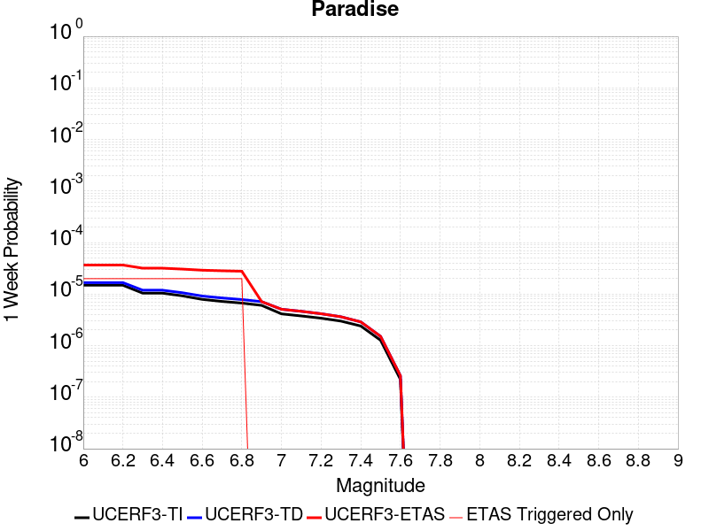 | 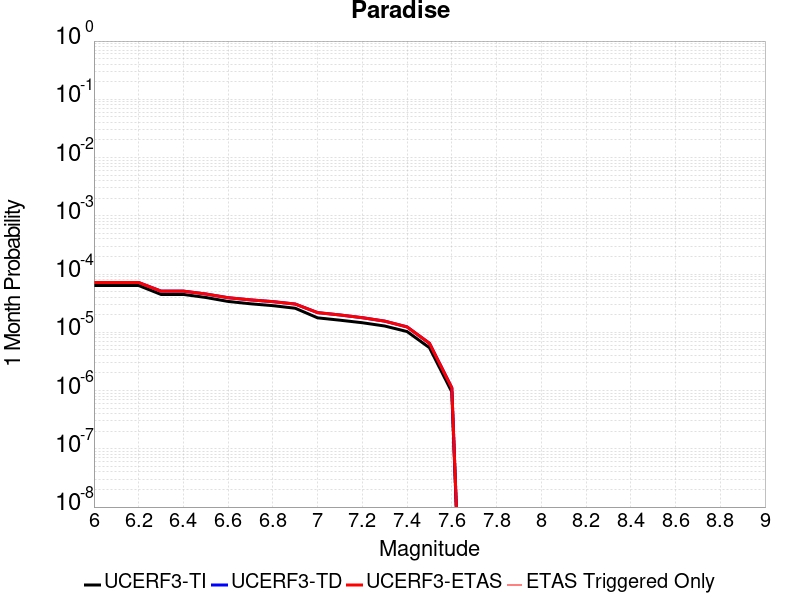 | 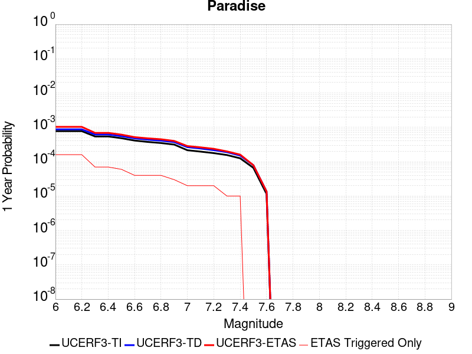 |  |

| Magnitude | 1 wk TI Prob | 1 wk TD Prob | 1 wk ETAS Prob | 1 wk ETAS/TD Gain | 1 wk ETAS Triggered Only | 1 mo TI Prob | 1 mo TD Prob | 1 mo ETAS Prob | 1 mo ETAS/TD Gain | 1 mo ETAS Triggered Only | 1 yr TI Prob | 1 yr TD Prob | 1 yr ETAS Prob | 1 yr ETAS/TD Gain | 1 yr ETAS Triggered Only | 10 yr TI Prob | 10 yr TD Prob | 10 yr ETAS Prob | 10 yr ETAS/TD Gain | 10 yr ETAS Triggered Only |
|-----|-----|-----|-----|-----|-----|-----|-----|-----|-----|-----|-----|-----|-----|-----|-----|-----|-----|-----|-----|-----|
| 6.0 | 1.4851273E-5 | 1.6697952E-5 | 5.78563E-5 | 3.4648743 | 4.1159037E-5 | 6.364676E-5 | 7.156082E-5 | 1.1271691E-4 | 1.5751204 | 4.1159037E-5 | 7.7462377E-4 | 8.7092834E-4 | 9.942979E-4 | 1.141653 | 1.2347712E-4 | 0.0077192914 | 0.008677532 | 0.009207956 | 1.0611262 | 5.350675E-4 |
| 6.1 | 1.4851273E-5 | 1.6697952E-5 | 5.78563E-5 | 3.4648743 | 4.1159037E-5 | 6.364676E-5 | 7.156082E-5 | 1.1271691E-4 | 1.5751204 | 4.1159037E-5 | 7.7462377E-4 | 8.7092834E-4 | 9.942979E-4 | 1.141653 | 1.2347712E-4 | 0.0077192914 | 0.008677532 | 0.009207956 | 1.0611262 | 5.350675E-4 |
| 6.2 | 1.4851273E-5 | 1.6697952E-5 | 5.78563E-5 | 3.4648743 | 4.1159037E-5 | 6.364676E-5 | 7.156082E-5 | 1.1271691E-4 | 1.5751204 | 4.1159037E-5 | 7.7462377E-4 | 8.7092834E-4 | 9.942979E-4 | 1.141653 | 1.2347712E-4 | 0.0077192914 | 0.008677532 | 0.009207956 | 1.0611262 | 5.350675E-4 |
| 6.3 | 1.0426831E-5 | 1.189092E-5 | 5.304947E-5 | 4.461343 | 4.1159037E-5 | 4.4685654E-5 | 5.0960127E-5 | 9.2117065E-5 | 1.8076303 | 4.1159037E-5 | 5.43912E-4 | 6.2026887E-4 | 7.0253585E-4 | 1.1326312 | 8.2318074E-5 | 0.0054258266 | 0.0061859847 | 0.0063496022 | 1.0264498 | 1.6463615E-4 |
| 6.4 | 1.0426831E-5 | 1.189092E-5 | 5.304947E-5 | 4.461343 | 4.1159037E-5 | 4.4685654E-5 | 5.0960127E-5 | 9.2117065E-5 | 1.8076303 | 4.1159037E-5 | 5.43912E-4 | 6.2026887E-4 | 7.0253585E-4 | 1.1326312 | 8.2318074E-5 | 0.0054258266 | 0.0061859847 | 0.0063496022 | 1.0264498 | 1.6463615E-4 |
| 6.5 | 9.25027E-6 | 1.062203E-5 | 5.1780633E-5 | 4.874834 | 4.1159037E-5 | 3.964341E-5 | 4.5522218E-5 | 8.6679385E-5 | 1.9041116 | 4.1159037E-5 | 4.8255164E-4 | 5.54097E-4 | 6.3636946E-4 | 1.1484803 | 8.2318074E-5 | 0.0048150513 | 0.0055276537 | 0.005650448 | 1.0222147 | 1.2347712E-4 |
| 6.6 | 7.904275E-6 | 9.161307E-6 | 5.031997E-5 | 5.4926624 | 4.1159037E-5 | 3.3875025E-5 | 3.9262177E-5 | 8.04196E-5 | 2.0482717 | 4.1159037E-5 | 4.1235037E-4 | 4.779161E-4 | 5.6019484E-4 | 1.1721615 | 8.2318074E-5 | 0.0041158604 | 0.00476928 | 0.0048512057 | 1.0171777 | 8.2318074E-5 |
| 6.7 | 7.2061953E-6 | 8.408895E-6 | 4.956759E-5 | 5.894661 | 4.1159037E-5 | 3.088333E-5 | 3.6037647E-5 | 7.71952E-5 | 2.1420712 | 4.1159037E-5 | 3.7593965E-4 | 4.3867368E-4 | 5.2095565E-4 | 1.1875699 | 8.2318074E-5 | 0.003753043 | 0.004378447 | 0.004460404 | 1.0187185 | 8.2318074E-5 |
| 6.8 | 6.6948724E-6 | 7.843716E-6 | 4.9002432E-5 | 6.247349 | 4.1159037E-5 | 2.8691995E-5 | 3.3615514E-5 | 7.477317E-5 | 2.224365 | 4.1159037E-5 | 3.4926904E-4 | 4.0919558E-4 | 4.9148E-4 | 1.2010882 | 8.2318074E-5 | 0.003487206 | 0.004084779 | 0.004166761 | 1.0200701 | 8.2318074E-5 |
| 6.9 | 6.0421025E-6 | 7.1320496E-6 | 7.1320496E-6 | 1.0 | 0.0 | 2.5894467E-5 | 3.056559E-5 | 3.056559E-5 | 1.0 | 0.0 | 3.1521954E-4 | 3.7207588E-4 | 4.1321962E-4 | 1.1105789 | 4.1159037E-5 | 0.0031477278 | 0.0037148676 | 0.0037558738 | 1.0110384 | 4.1159037E-5 |
| 7.0 | 4.134091E-6 | 5.0814306E-6 | 5.0814306E-6 | 1.0 | 0.0 | 1.7717413E-5 | 2.1777387E-5 | 2.1777387E-5 | 1.0 | 0.0 | 2.1568815E-4 | 2.6510895E-4 | 3.0625708E-4 | 1.1552122 | 4.1159037E-5 | 0.0021547892 | 0.00264808 | 0.0026891301 | 1.0155019 | 4.1159037E-5 |
| 7.1 | 3.7674888E-6 | 4.632913E-6 | 4.632913E-6 | 1.0 | 0.0 | 1.6146281E-5 | 1.9855197E-5 | 1.9855197E-5 | 1.0 | 0.0 | 1.9656324E-4 | 2.4171174E-4 | 2.8286083E-4 | 1.1702404 | 4.1159037E-5 | 0.0019638946 | 0.002414639 | 0.0024556986 | 1.0170045 | 4.1159037E-5 |
| 7.2 | 3.4065345E-6 | 4.157691E-6 | 4.157691E-6 | 1.0 | 0.0 | 1.4599351E-5 | 1.7818562E-5 | 1.7818562E-5 | 1.0 | 0.0 | 1.777326E-4 | 2.1692089E-4 | 2.58071E-4 | 1.189701 | 4.1159037E-5 | 0.0017759053 | 0.0021672398 | 0.0022083095 | 1.0189503 | 4.1159037E-5 |
| 7.3 | 2.9934936E-6 | 3.6299864E-6 | 3.6299864E-6 | 1.0 | 0.0 | 1.2829195E-5 | 1.5557E-5 | 1.5557E-5 | 1.0 | 0.0 | 1.5618425E-4 | 1.8939149E-4 | 1.8939149E-4 | 1.0 | 0.0 | 0.0015607453 | 0.0018924462 | 0.0018924462 | 1.0 | 0.0 |
| 7.4 | 2.4049796E-6 | 2.8893596E-6 | 2.8893596E-6 | 1.0 | 0.0 | 1.0307015E-5 | 1.23829195E-5 | 1.23829195E-5 | 1.0 | 0.0 | 1.2548068E-4 | 1.5075305E-4 | 1.5075305E-4 | 1.0 | 0.0 | 0.0012540985 | 0.0015066493 | 0.0015066493 | 1.0 | 0.0 |
| 7.5 | 1.2710091E-6 | 1.5136467E-6 | 1.5136467E-6 | 1.0 | 0.0 | 5.44717E-6 | 6.487048E-6 | 6.487048E-6 | 1.0 | 0.0 | 6.631728E-5 | 7.89782E-5 | 7.89782E-5 | 1.0 | 0.0 | 6.6297496E-4 | 7.8962394E-4 | 7.8962394E-4 | 1.0 | 0.0 |
| 7.6 | 2.21172E-7 | 2.604147E-7 | 2.604147E-7 | 1.0 | 0.0 | 9.478797E-7 | 1.1160627E-6 | 1.1160627E-6 | 1.0 | 0.0 | 1.1540374E-5 | 1.3588007E-5 | 1.3588007E-5 | 1.0 | 0.0 | 1.1539775E-4 | 1.3587458E-4 | 1.3587458E-4 | 1.0 | 0.0 |

## Bicycle Lake
*[(top)](#table-of-contents)*

| 1 Week | 1 Month | 1 Year | 10 Year |
|-----|-----|-----|-----|
| 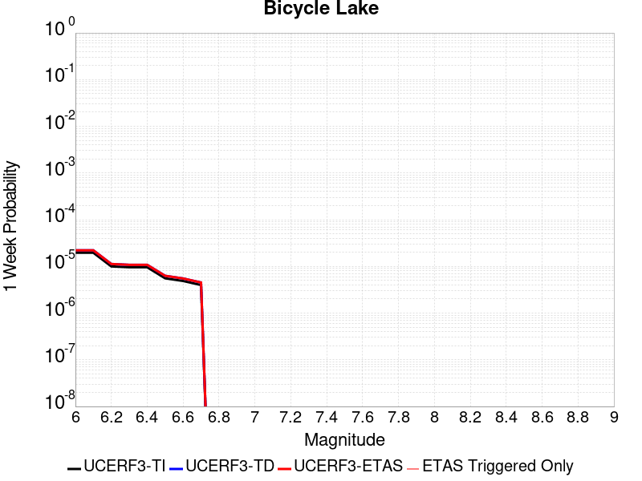 | 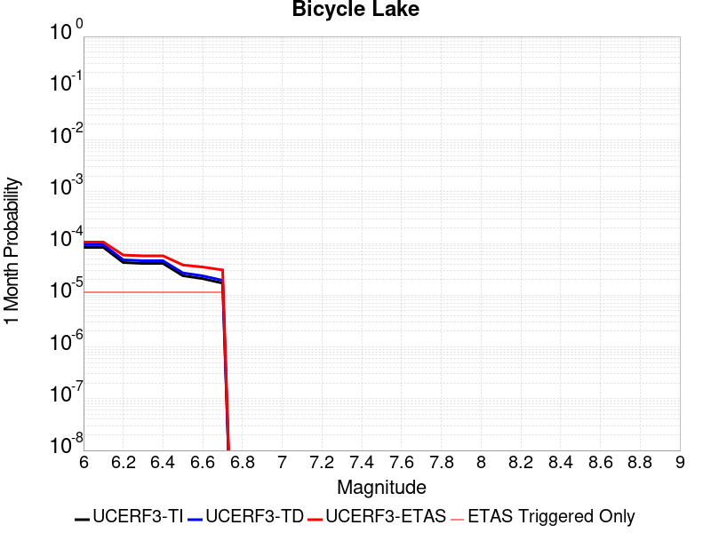 | 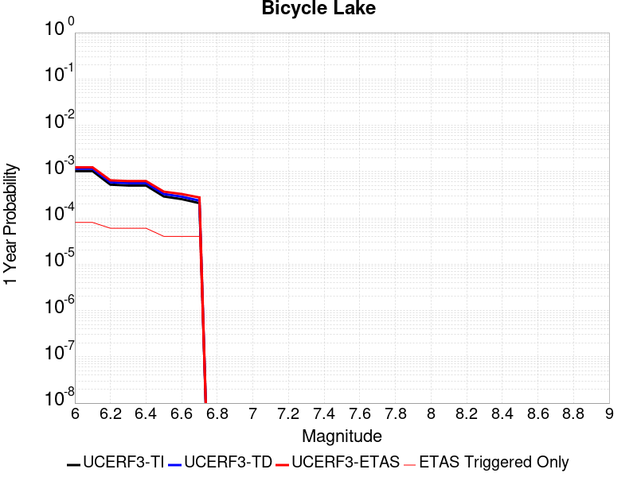 | 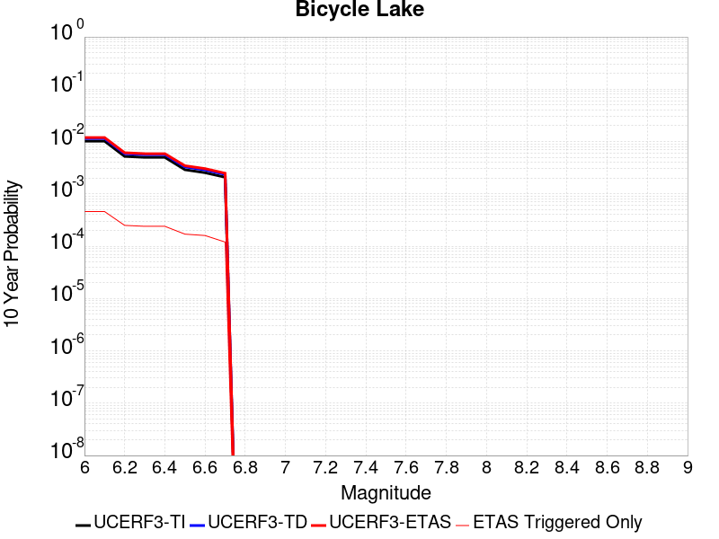 |

| Magnitude | 1 wk TI Prob | 1 wk TD Prob | 1 wk ETAS Prob | 1 wk ETAS/TD Gain | 1 wk ETAS Triggered Only | 1 mo TI Prob | 1 mo TD Prob | 1 mo ETAS Prob | 1 mo ETAS/TD Gain | 1 mo ETAS Triggered Only | 1 yr TI Prob | 1 yr TD Prob | 1 yr ETAS Prob | 1 yr ETAS/TD Gain | 1 yr ETAS Triggered Only | 10 yr TI Prob | 10 yr TD Prob | 10 yr ETAS Prob | 10 yr ETAS/TD Gain | 10 yr ETAS Triggered Only |
|-----|-----|-----|-----|-----|-----|-----|-----|-----|-----|-----|-----|-----|-----|-----|-----|-----|-----|-----|-----|-----|
| 6.0 | 1.9621975E-5 | 2.2103526E-5 | 2.2103526E-5 | 1.0 | 0.0 | 8.4091465E-5 | 9.472672E-5 | 9.472672E-5 | 1.0 | 0.0 | 0.0010233327 | 0.0011528227 | 0.0011939342 | 1.0356617 | 4.1159037E-5 | 0.01018633 | 0.011481743 | 0.011888607 | 1.0354358 | 4.115904E-4 |
| 6.1 | 1.9621975E-5 | 2.2103526E-5 | 2.2103526E-5 | 1.0 | 0.0 | 8.4091465E-5 | 9.472672E-5 | 9.472672E-5 | 1.0 | 0.0 | 0.0010233327 | 0.0011528227 | 0.0011939342 | 1.0356617 | 4.1159037E-5 | 0.01018633 | 0.011481743 | 0.011888607 | 1.0354358 | 4.115904E-4 |
| 6.2 | 9.9971285E-6 | 1.1258916E-5 | 1.1258916E-5 | 1.0 | 0.0 | 4.2844134E-5 | 4.82519E-5 | 4.82519E-5 | 1.0 | 0.0 | 5.2150246E-4 | 5.873606E-4 | 6.284954E-4 | 1.0700334 | 4.1159037E-5 | 0.0052028033 | 0.0058631897 | 0.006067778 | 1.0348938 | 2.057952E-4 |
| 6.3 | 9.589428E-6 | 1.0801494E-5 | 1.0801494E-5 | 1.0 | 0.0 | 4.10969E-5 | 4.629159E-5 | 4.629159E-5 | 1.0 | 0.0 | 5.002399E-4 | 5.6350627E-4 | 6.046421E-4 | 1.0729998 | 4.1159037E-5 | 0.0049911533 | 0.0056258664 | 0.0058305035 | 1.0363743 | 2.057952E-4 |
| 6.4 | 9.589428E-6 | 1.0801494E-5 | 1.0801494E-5 | 1.0 | 0.0 | 4.10969E-5 | 4.629159E-5 | 4.629159E-5 | 1.0 | 0.0 | 5.002399E-4 | 5.6350627E-4 | 6.046421E-4 | 1.0729998 | 4.1159037E-5 | 0.0049911533 | 0.0056258664 | 0.0058305035 | 1.0363743 | 2.057952E-4 |
| 6.5 | 5.557707E-6 | 6.2875047E-6 | 6.2875047E-6 | 1.0 | 0.0 | 2.3818526E-5 | 2.6946322E-5 | 2.6946322E-5 | 1.0 | 0.0 | 2.8995197E-4 | 3.2804898E-4 | 3.6919452E-4 | 1.125425 | 4.1159037E-5 | 0.0028957394 | 0.003278285 | 0.0034834056 | 1.0625695 | 2.057952E-4 |
| 6.6 | 4.8742945E-6 | 5.514961E-6 | 5.514961E-6 | 1.0 | 0.0 | 2.0889667E-5 | 2.3635479E-5 | 2.3635479E-5 | 1.0 | 0.0 | 2.54302E-4 | 2.8775018E-4 | 3.2889738E-4 | 1.1429962 | 4.1159037E-5 | 0.002540112 | 0.0028763462 | 0.0030405088 | 1.0570734 | 1.6463615E-4 |
| 6.7 | 3.991108E-6 | 4.5172833E-6 | 4.5172833E-6 | 1.0 | 0.0 | 1.7104636E-5 | 1.9359784E-5 | 1.9359784E-5 | 1.0 | 0.0 | 2.0822904E-4 | 2.3570537E-4 | 2.7685473E-4 | 1.1745795 | 4.1159037E-5 | 0.0020803404 | 0.0023570538 | 0.0024802398 | 1.0522628 | 1.2347712E-4 |

## Garlic Springs
*[(top)](#table-of-contents)*

| 1 Week | 1 Month | 1 Year | 10 Year |
|-----|-----|-----|-----|
| 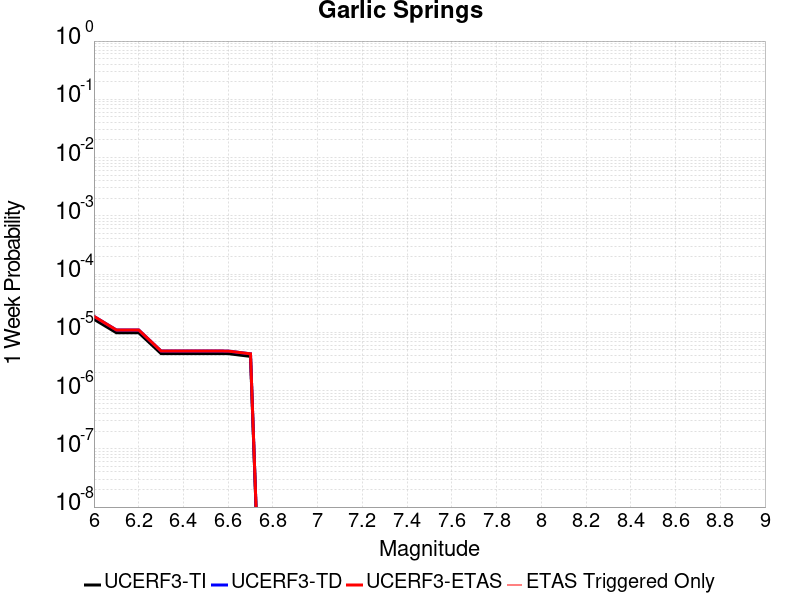 | 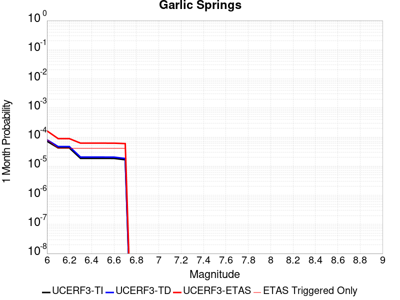 | 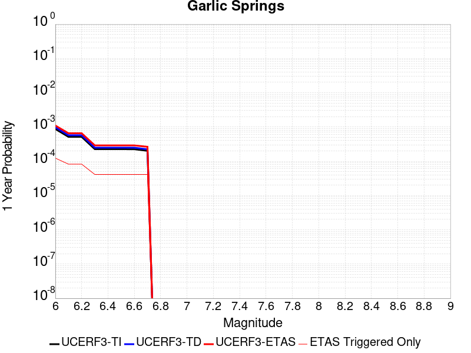 | 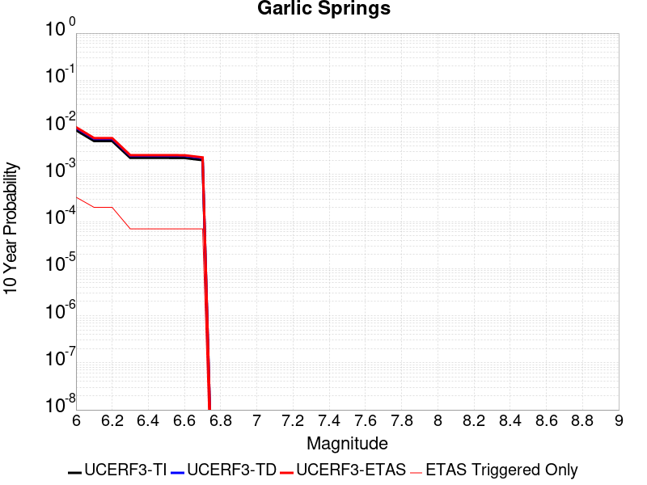 |

| Magnitude | 1 wk TI Prob | 1 wk TD Prob | 1 wk ETAS Prob | 1 wk ETAS/TD Gain | 1 wk ETAS Triggered Only | 1 mo TI Prob | 1 mo TD Prob | 1 mo ETAS Prob | 1 mo ETAS/TD Gain | 1 mo ETAS Triggered Only | 1 yr TI Prob | 1 yr TD Prob | 1 yr ETAS Prob | 1 yr ETAS/TD Gain | 1 yr ETAS Triggered Only | 10 yr TI Prob | 10 yr TD Prob | 10 yr ETAS Prob | 10 yr ETAS/TD Gain | 10 yr ETAS Triggered Only |
|-----|-----|-----|-----|-----|-----|-----|-----|-----|-----|-----|-----|-----|-----|-----|-----|-----|-----|-----|-----|-----|
| 6.0 | 1.6760017E-5 | 1.878206E-5 | 1.878206E-5 | 1.0 | 0.0 | 7.182667E-5 | 8.0492726E-5 | 1.6280418E-4 | 2.022595 | 8.2318074E-5 | 8.7413884E-4 | 9.796758E-4 | 0.0011030319 | 1.1259153 | 1.2347712E-4 | 0.008707083 | 0.009765121 | 0.010131936 | 1.0375637 | 3.7043134E-4 |
| 6.1 | 9.852767E-6 | 1.0976473E-5 | 1.0976473E-5 | 1.0 | 0.0 | 4.222546E-5 | 4.7041583E-5 | 8.8198685E-5 | 1.8749089 | 4.1159037E-5 | 5.139737E-4 | 5.7265174E-4 | 6.549227E-4 | 1.1436666 | 8.2318074E-5 | 0.005127866 | 0.005718723 | 0.005882418 | 1.0286243 | 1.6463615E-4 |
| 6.2 | 9.852767E-6 | 1.0976473E-5 | 1.0976473E-5 | 1.0 | 0.0 | 4.222546E-5 | 4.7041583E-5 | 8.8198685E-5 | 1.8749089 | 4.1159037E-5 | 5.139737E-4 | 5.7265174E-4 | 6.549227E-4 | 1.1436666 | 8.2318074E-5 | 0.005127866 | 0.005718723 | 0.005882418 | 1.0286243 | 1.6463615E-4 |
| 6.3 | 4.3167724E-6 | 4.7792087E-6 | 4.7792087E-6 | 1.0 | 0.0 | 1.8500323E-5 | 2.0482294E-5 | 6.164049E-5 | 3.0094526 | 4.1159037E-5 | 2.2521814E-4 | 2.4936642E-4 | 2.905152E-4 | 1.1650133 | 4.1159037E-5 | 0.0022499003 | 0.0024931254 | 0.0025752382 | 1.0329357 | 8.2318074E-5 |
| 6.4 | 4.3167724E-6 | 4.7792087E-6 | 4.7792087E-6 | 1.0 | 0.0 | 1.8500323E-5 | 2.0482294E-5 | 6.164049E-5 | 3.0094526 | 4.1159037E-5 | 2.2521814E-4 | 2.4936642E-4 | 2.905152E-4 | 1.1650133 | 4.1159037E-5 | 0.0022499003 | 0.0024931254 | 0.0025752382 | 1.0329357 | 8.2318074E-5 |
| 6.5 | 4.3167724E-6 | 4.7792087E-6 | 4.7792087E-6 | 1.0 | 0.0 | 1.8500323E-5 | 2.0482294E-5 | 6.164049E-5 | 3.0094526 | 4.1159037E-5 | 2.2521814E-4 | 2.4936642E-4 | 2.905152E-4 | 1.1650133 | 4.1159037E-5 | 0.0022499003 | 0.0024931254 | 0.0025752382 | 1.0329357 | 8.2318074E-5 |
| 6.6 | 4.301311E-6 | 4.762073E-6 | 4.762073E-6 | 1.0 | 0.0 | 1.8434059E-5 | 2.0408854E-5 | 6.156705E-5 | 3.0166833 | 4.1159037E-5 | 2.2441156E-4 | 2.4847253E-4 | 2.8962133E-4 | 1.1656071 | 4.1159037E-5 | 0.0022418506 | 0.0024842063 | 0.00256632 | 1.0330542 | 8.2318074E-5 |
| 6.7 | 3.8599724E-6 | 4.2721113E-6 | 4.2721113E-6 | 1.0 | 0.0 | 1.6542634E-5 | 1.8309049E-5 | 5.9467333E-5 | 3.247975 | 4.1159037E-5 | 2.0138794E-4 | 2.2291267E-4 | 2.6406255E-4 | 1.1846008 | 4.1159037E-5 | 0.0020120554 | 0.0022291266 | 0.0023112614 | 1.036846 | 8.2318074E-5 |

## San Andreas (San Bernardino S)
*[(top)](#table-of-contents)*

| 1 Week | 1 Month | 1 Year | 10 Year |
|-----|-----|-----|-----|
| 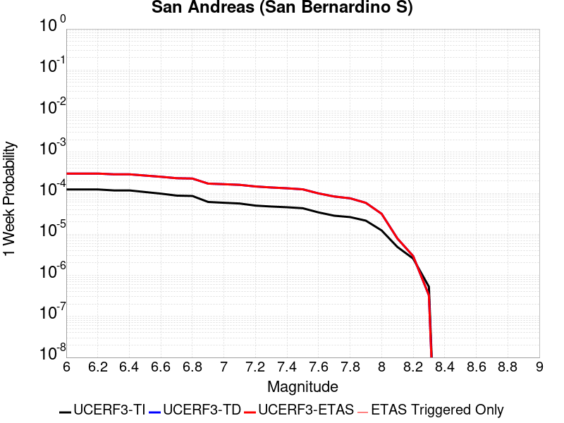 | 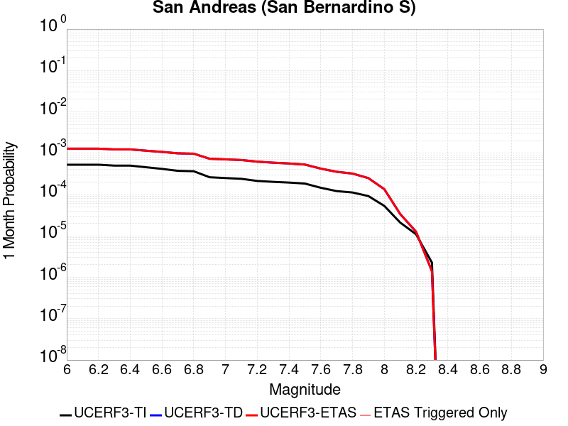 | 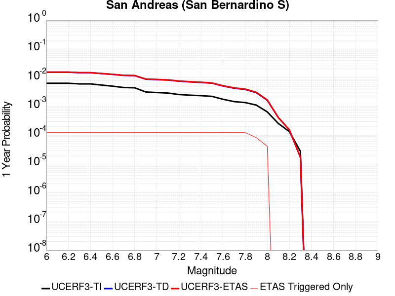 | 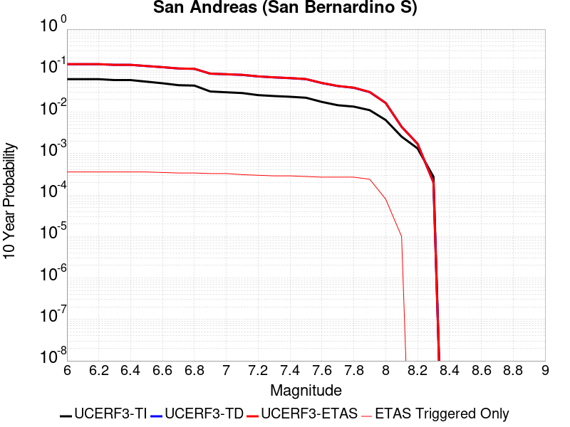 |

| Magnitude | 1 wk TI Prob | 1 wk TD Prob | 1 wk ETAS Prob | 1 wk ETAS/TD Gain | 1 wk ETAS Triggered Only | 1 mo TI Prob | 1 mo TD Prob | 1 mo ETAS Prob | 1 mo ETAS/TD Gain | 1 mo ETAS Triggered Only | 1 yr TI Prob | 1 yr TD Prob | 1 yr ETAS Prob | 1 yr ETAS/TD Gain | 1 yr ETAS Triggered Only | 10 yr TI Prob | 10 yr TD Prob | 10 yr ETAS Prob | 10 yr ETAS/TD Gain | 10 yr ETAS Triggered Only |
|-----|-----|-----|-----|-----|-----|-----|-----|-----|-----|-----|-----|-----|-----|-----|-----|-----|-----|-----|-----|-----|
| 6.0 | 1.2336002E-4 | 3.0091533E-4 | 3.0091533E-4 | 1.0 | 0.0 | 5.2857865E-4 | 0.0012890259 | 0.0012890259 | 1.0 | 0.0 | 0.006416472 | 0.01558593 | 0.015707484 | 1.0077989 | 1.2347712E-4 | 0.06234337 | 0.1432102 | 0.14349233 | 1.0019699 | 3.292723E-4 |
| 6.1 | 1.2336002E-4 | 3.0091533E-4 | 3.0091533E-4 | 1.0 | 0.0 | 5.2857865E-4 | 0.0012890259 | 0.0012890259 | 1.0 | 0.0 | 0.006416472 | 0.01558593 | 0.015707484 | 1.0077989 | 1.2347712E-4 | 0.06234337 | 0.1432102 | 0.14349233 | 1.0019699 | 3.292723E-4 |
| 6.2 | 1.2336002E-4 | 3.0091533E-4 | 3.0091533E-4 | 1.0 | 0.0 | 5.2857865E-4 | 0.0012890259 | 0.0012890259 | 1.0 | 0.0 | 0.006416472 | 0.01558593 | 0.015707484 | 1.0077989 | 1.2347712E-4 | 0.06234337 | 0.1432102 | 0.14349233 | 1.0019699 | 3.292723E-4 |
| 6.3 | 1.1712257E-4 | 2.8878928E-4 | 2.8878928E-4 | 1.0 | 0.0 | 5.018573E-4 | 0.0012371071 | 0.0012371071 | 1.0 | 0.0 | 0.006093008 | 0.014962618 | 0.015084248 | 1.0081289 | 1.2347712E-4 | 0.059286322 | 0.13792342 | 0.13820729 | 1.002058 | 3.292723E-4 |
| 6.4 | 1.1712257E-4 | 2.8878928E-4 | 2.8878928E-4 | 1.0 | 0.0 | 5.018573E-4 | 0.0012371071 | 0.0012371071 | 1.0 | 0.0 | 0.006093008 | 0.014962618 | 0.015084248 | 1.0081289 | 1.2347712E-4 | 0.059286322 | 0.13792342 | 0.13820729 | 1.002058 | 3.292723E-4 |
| 6.5 | 1.0689076E-4 | 2.6890213E-4 | 2.6890213E-4 | 1.0 | 0.0 | 4.5802278E-4 | 0.0011519536 | 0.0011519536 | 1.0 | 0.0 | 0.0055621783 | 0.013939476 | 0.014061231 | 1.0087346 | 1.2347712E-4 | 0.05425003 | 0.1292026 | 0.12948933 | 1.0022192 | 3.292723E-4 |
| 6.6 | 9.7648895E-5 | 2.5133646E-4 | 2.5133646E-4 | 1.0 | 0.0 | 4.1842813E-4 | 0.0010767353 | 0.0010767353 | 1.0 | 0.0 | 0.005082469 | 0.013034834 | 0.013156702 | 1.0093493 | 1.2347712E-4 | 0.049677886 | 0.121355705 | 0.12164502 | 1.0023841 | 3.292723E-4 |
| 6.7 | 8.757013E-5 | 2.3202866E-4 | 2.3202866E-4 | 1.0 | 0.0 | 3.7524657E-4 | 9.940519E-4 | 9.940519E-4 | 1.0 | 0.0 | 0.00455906 | 0.01203952 | 0.01216151 | 1.0101326 | 1.2347712E-4 | 0.04466656 | 0.11270812 | 0.11300028 | 1.0025922 | 3.292723E-4 |
| 6.8 | 8.562978E-5 | 2.2762059E-4 | 2.2762059E-4 | 1.0 | 0.0 | 3.6693315E-4 | 9.751744E-4 | 9.751744E-4 | 1.0 | 0.0 | 0.004458263 | 0.011812193 | 0.011934212 | 1.0103298 | 1.2347712E-4 | 0.043698758 | 0.110711694 | 0.11100451 | 1.0026449 | 3.292723E-4 |
| 6.9 | 6.124075E-5 | 1.7139417E-4 | 1.7139417E-4 | 1.0 | 0.0 | 2.6243398E-4 | 7.343405E-4 | 7.343405E-4 | 1.0 | 0.0 | 0.0031904527 | 0.0089041535 | 0.009026531 | 1.0137439 | 1.2347712E-4 | 0.031450346 | 0.08451004 | 0.08481149 | 1.003567 | 3.292723E-4 |
| 7.0 | 5.8598747E-5 | 1.6567636E-4 | 1.6567636E-4 | 1.0 | 0.0 | 2.5111332E-4 | 7.098491E-4 | 7.098491E-4 | 1.0 | 0.0 | 0.0030530186 | 0.008608363 | 0.008730778 | 1.0142204 | 1.2347712E-4 | 0.03011414 | 0.081825376 | 0.082127705 | 1.0036948 | 3.292723E-4 |
| 7.1 | 5.613814E-5 | 1.5985253E-4 | 1.5985253E-4 | 1.0 | 0.0 | 2.4056983E-4 | 6.849031E-4 | 6.849031E-4 | 1.0 | 0.0 | 0.0029250039 | 0.008306996 | 0.008429447 | 1.0147407 | 1.2347712E-4 | 0.028868021 | 0.07911957 | 0.07938489 | 1.0033534 | 2.8811328E-4 |
| 7.2 | 4.991222E-5 | 1.4590108E-4 | 1.4590108E-4 | 1.0 | 0.0 | 2.1389198E-4 | 6.251409E-4 | 6.251409E-4 | 1.0 | 0.0 | 0.002601025 | 0.007584634 | 0.0077071744 | 1.0161564 | 1.2347712E-4 | 0.025707912 | 0.07256349 | 0.0728307 | 1.0036824 | 2.8811328E-4 |
| 7.3 | 4.7410045E-5 | 1.3782637E-4 | 1.3782637E-4 | 1.0 | 0.0 | 2.0317009E-4 | 5.9055106E-4 | 5.9055106E-4 | 1.0 | 0.0 | 0.0024707897 | 0.007166343 | 0.007288935 | 1.0171067 | 1.2347712E-4 | 0.024434982 | 0.06883803 | 0.06910631 | 1.0038973 | 2.8811328E-4 |
| 7.4 | 4.5556746E-5 | 1.3189387E-4 | 1.3189387E-4 | 1.0 | 0.0 | 1.952286E-4 | 5.651373E-4 | 5.651373E-4 | 1.0 | 0.0 | 0.002374317 | 0.0068589193 | 0.0069815493 | 1.0178789 | 1.2347712E-4 | 0.023491086 | 0.06608479 | 0.06635386 | 1.0040716 | 2.8811328E-4 |
| 7.5 | 4.3084514E-5 | 1.2423217E-4 | 1.2423217E-4 | 1.0 | 0.0 | 1.8463485E-4 | 5.323153E-4 | 5.323153E-4 | 1.0 | 0.0 | 0.0022456115 | 0.006461752 | 0.006584431 | 1.0189854 | 1.2347712E-4 | 0.022230545 | 0.06247893 | 0.06274904 | 1.0043232 | 2.8811328E-4 |
| 7.6 | 3.408608E-5 | 9.896081E-5 | 9.896081E-5 | 1.0 | 0.0 | 1.4607502E-4 | 4.2404892E-4 | 4.2404892E-4 | 1.0 | 0.0 | 0.0017770125 | 0.0051506 | 0.0052734413 | 1.0238498 | 1.2347712E-4 | 0.017628696 | 0.050289597 | 0.050563224 | 1.005441 | 2.8811328E-4 |
| 7.7 | 2.8315713E-5 | 8.305614E-5 | 8.305614E-5 | 1.0 | 0.0 | 1.2134742E-4 | 3.5590635E-4 | 3.5590635E-4 | 1.0 | 0.0 | 0.0014764034 | 0.0043245596 | 0.004447503 | 1.028429 | 1.2347712E-4 | 0.01466633 | 0.042526137 | 0.042802 | 1.0064869 | 2.8811328E-4 |
| 7.8 | 2.6222975E-5 | 7.5163094E-5 | 7.5163094E-5 | 1.0 | 0.0 | 1.1237934E-4 | 3.220878E-4 | 3.220878E-4 | 1.0 | 0.0 | 0.0013673597 | 0.0039143744 | 0.004037368 | 1.0314211 | 1.2347712E-4 | 0.013589768 | 0.03867635 | 0.038953323 | 1.0071613 | 2.8811328E-4 |
| 7.9 | 2.1469694E-5 | 5.8323218E-5 | 5.8323218E-5 | 1.0 | 0.0 | 9.200973E-5 | 2.4993272E-4 | 2.4993272E-4 | 1.0 | 0.0 | 0.0011196428 | 0.0030386879 | 0.0031207558 | 1.0270077 | 8.2318074E-5 | 0.011140184 | 0.030355671 | 0.030595127 | 1.0078884 | 2.4695424E-4 |
| 8.0 | 1.2420249E-5 | 3.1568103E-5 | 3.1568103E-5 | 1.0 | 0.0 | 5.322855E-5 | 1.3528486E-4 | 1.3528486E-4 | 1.0 | 0.0 | 6.478649E-4 | 0.0016458498 | 0.0016869411 | 1.0249666 | 4.1159037E-5 | 0.0064597935 | 0.01663909 | 0.016720038 | 1.0048649 | 8.2318074E-5 |
| 8.1 | 4.9197724E-6 | 7.915485E-6 | 7.915485E-6 | 1.0 | 0.0 | 2.1084568E-5 | 3.392307E-5 | 3.392307E-5 | 1.0 | 0.0 | 2.566744E-4 | 4.1293522E-4 | 4.1293522E-4 | 1.0 | 0.0 | 0.002563781 | 0.004431343 | 0.004431343 | 1.0 | 0.0 |
| 8.2 | 2.5634774E-6 | 2.949789E-6 | 2.949789E-6 | 1.0 | 0.0 | 1.0986286E-5 | 1.2641892E-5 | 1.2641892E-5 | 1.0 | 0.0 | 1.3374983E-4 | 1.5390421E-4 | 1.5390421E-4 | 1.0 | 0.0 | 0.0013366934 | 0.0017276118 | 0.0017276118 | 1.0 | 0.0 |
| 8.3 | 5.2850464E-7 | 3.2664715E-7 | 3.2664715E-7 | 1.0 | 0.0 | 2.2650179E-6 | 1.3999157E-6 | 1.3999157E-6 | 1.0 | 0.0 | 2.7576245E-5 | 1.7043852E-5 | 1.7043852E-5 | 1.0 | 0.0 | 2.7572823E-4 | 2.0193194E-4 | 2.0193194E-4 | 1.0 | 0.0 |

## Elsinore (Glen Ivy) rev
*[(top)](#table-of-contents)*

| 1 Week | 1 Month | 1 Year | 10 Year |
|-----|-----|-----|-----|
| 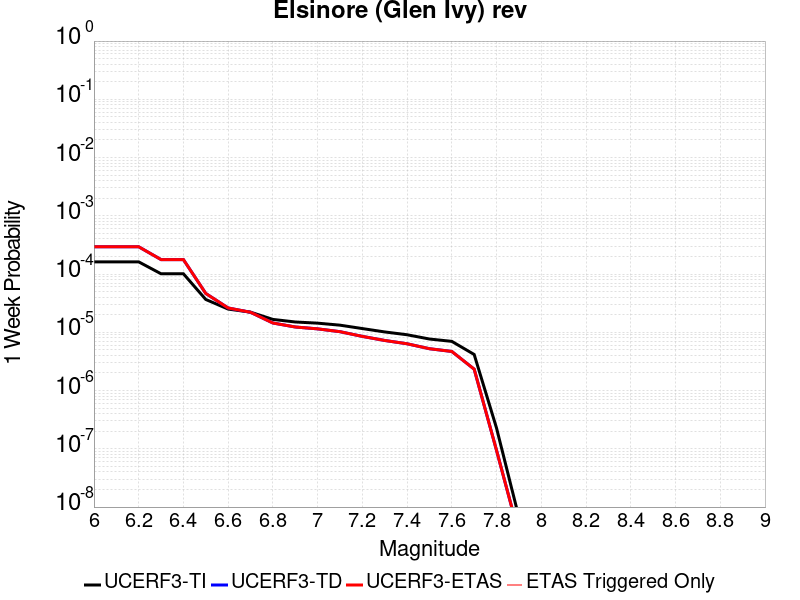 | 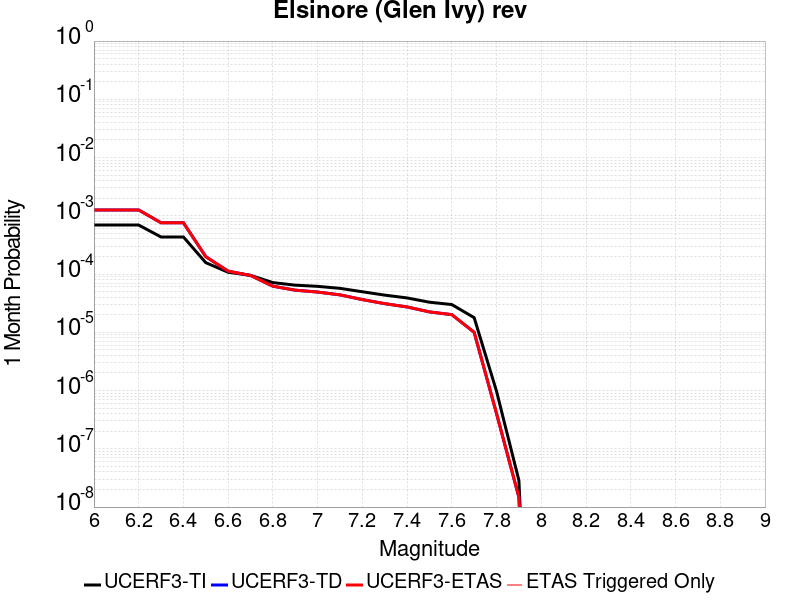 | 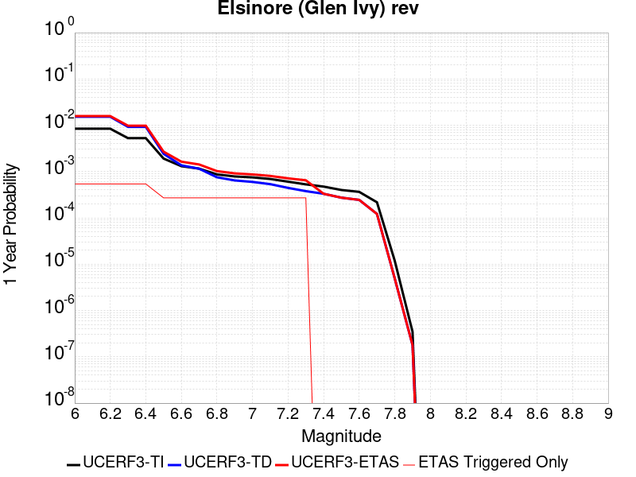 | 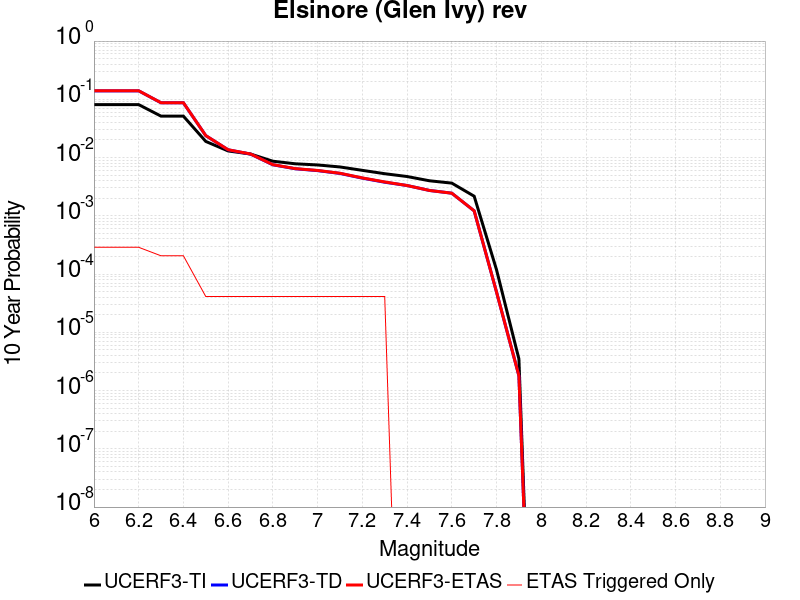 |

| Magnitude | 1 wk TI Prob | 1 wk TD Prob | 1 wk ETAS Prob | 1 wk ETAS/TD Gain | 1 wk ETAS Triggered Only | 1 mo TI Prob | 1 mo TD Prob | 1 mo ETAS Prob | 1 mo ETAS/TD Gain | 1 mo ETAS Triggered Only | 1 yr TI Prob | 1 yr TD Prob | 1 yr ETAS Prob | 1 yr ETAS/TD Gain | 1 yr ETAS Triggered Only | 10 yr TI Prob | 10 yr TD Prob | 10 yr ETAS Prob | 10 yr ETAS/TD Gain | 10 yr ETAS Triggered Only |
|-----|-----|-----|-----|-----|-----|-----|-----|-----|-----|-----|-----|-----|-----|-----|-----|-----|-----|-----|-----|-----|
| 6.0 | 1.6204086E-4 | 2.9416234E-4 | 2.9416234E-4 | 1.0 | 0.0 | 6.94276E-4 | 0.0012601413 | 0.0012601413 | 1.0 | 0.0 | 0.008420097 | 0.015255925 | 0.015377519 | 1.0079702 | 1.2347712E-4 | 0.081081145 | 0.1399143 | 0.14016211 | 1.0017711 | 2.8811328E-4 |
| 6.1 | 1.6204086E-4 | 2.9416234E-4 | 2.9416234E-4 | 1.0 | 0.0 | 6.94276E-4 | 0.0012601413 | 0.0012601413 | 1.0 | 0.0 | 0.008420097 | 0.015255925 | 0.015377519 | 1.0079702 | 1.2347712E-4 | 0.081081145 | 0.1399143 | 0.14016211 | 1.0017711 | 2.8811328E-4 |
| 6.2 | 1.6204086E-4 | 2.9416234E-4 | 2.9416234E-4 | 1.0 | 0.0 | 6.94276E-4 | 0.0012601413 | 0.0012601413 | 1.0 | 0.0 | 0.008420097 | 0.015255925 | 0.015377519 | 1.0079702 | 1.2347712E-4 | 0.081081145 | 0.1399143 | 0.14016211 | 1.0017711 | 2.8811328E-4 |
| 6.3 | 1.0111737E-4 | 1.7737556E-4 | 1.7737556E-4 | 1.0 | 0.0 | 4.332882E-4 | 7.600767E-4 | 7.600767E-4 | 1.0 | 0.0 | 0.005262531 | 0.009235453 | 0.0093577895 | 1.0132464 | 1.2347712E-4 | 0.0513964 | 0.08713894 | 0.08732681 | 1.0021559 | 2.057952E-4 |
| 6.4 | 1.0111737E-4 | 1.7737556E-4 | 1.7737556E-4 | 1.0 | 0.0 | 4.332882E-4 | 7.600767E-4 | 7.600767E-4 | 1.0 | 0.0 | 0.005262531 | 0.009235453 | 0.0093577895 | 1.0132464 | 1.2347712E-4 | 0.0513964 | 0.08713894 | 0.08732681 | 1.0021559 | 2.057952E-4 |
| 6.5 | 3.6624708E-5 | 4.6430177E-5 | 4.6430177E-5 | 1.0 | 0.0 | 1.569536E-4 | 1.9897327E-4 | 1.9897327E-4 | 1.0 | 0.0 | 0.001909235 | 0.0024201695 | 0.002461229 | 1.0169655 | 4.1159037E-5 | 0.01892915 | 0.023791492 | 0.023831671 | 1.0016888 | 4.1159037E-5 |
| 6.6 | 2.5051324E-5 | 2.6176222E-5 | 2.6176222E-5 | 1.0 | 0.0 | 1.073584E-4 | 1.1217924E-4 | 1.1217924E-4 | 1.0 | 0.0 | 0.0013063047 | 0.0013649712 | 0.001406074 | 1.0301126 | 4.1159037E-5 | 0.012986525 | 0.013582029 | 0.013622629 | 1.0029893 | 4.1159037E-5 |
| 6.7 | 2.2189772E-5 | 2.2091886E-5 | 2.2091886E-5 | 1.0 | 0.0 | 9.509556E-5 | 9.467628E-5 | 9.467628E-5 | 1.0 | 0.0 | 0.0011571734 | 0.0011521106 | 0.0011932222 | 1.0356838 | 4.1159037E-5 | 0.011511663 | 0.011477983 | 0.011518669 | 1.0035448 | 4.1159037E-5 |
| 6.8 | 1.6654378E-5 | 1.4449492E-5 | 1.4449492E-5 | 1.0 | 0.0 | 7.137396E-5 | 6.1924955E-5 | 6.1924955E-5 | 1.0 | 0.0 | 8.686314E-4 | 7.5368065E-4 | 7.948087E-4 | 1.0545696 | 4.1159037E-5 | 0.008652439 | 0.0075164316 | 0.0075572813 | 1.0054348 | 4.1159037E-5 |
| 6.9 | 1.5042909E-5 | 1.2342169E-5 | 1.2342169E-5 | 1.0 | 0.0 | 6.446802E-5 | 5.2893953E-5 | 5.2893953E-5 | 1.0 | 0.0 | 7.8461546E-4 | 6.4379675E-4 | 6.8492925E-4 | 1.0638906 | 4.1159037E-5 | 0.007818509 | 0.0064234105 | 0.0064643053 | 1.0063665 | 4.1159037E-5 |
| 7.0 | 1.4361385E-5 | 1.1460876E-5 | 1.1460876E-5 | 1.0 | 0.0 | 6.154734E-5 | 4.911713E-5 | 4.911713E-5 | 1.0 | 0.0 | 7.490812E-4 | 5.9783994E-4 | 6.3897436E-4 | 1.0688051 | 4.1159037E-5 | 0.007465612 | 0.0059662526 | 0.006007166 | 1.0068575 | 4.1159037E-5 |
| 7.1 | 1.3265571E-5 | 1.0253452E-5 | 1.0253452E-5 | 1.0 | 0.0 | 5.6851208E-5 | 4.394264E-5 | 4.394264E-5 | 1.0 | 0.0 | 6.919436E-4 | 5.348729E-4 | 5.7600986E-4 | 1.0769099 | 4.1159037E-5 | 0.006897931 | 0.0053390316 | 0.0053799707 | 1.0076679 | 4.1159037E-5 |
| 7.2 | 1.1596403E-5 | 8.512154E-6 | 8.512154E-6 | 1.0 | 0.0 | 4.9697923E-5 | 3.6480156E-5 | 3.6480156E-5 | 1.0 | 0.0 | 6.049042E-4 | 4.440571E-4 | 4.8519784E-4 | 1.0926474 | 4.1159037E-5 | 0.006032603 | 0.0044329935 | 0.0044739703 | 1.0092435 | 4.1159037E-5 |
| 7.3 | 1.0150827E-5 | 7.24474E-6 | 7.24474E-6 | 1.0 | 0.0 | 4.3502816E-5 | 3.1048527E-5 | 3.1048527E-5 | 1.0 | 0.0 | 5.2951806E-4 | 3.7795166E-4 | 4.1909516E-4 | 1.1088591 | 4.1159037E-5 | 0.005282581 | 0.003773445 | 0.0038144486 | 1.0108664 | 4.1159037E-5 |
| 7.4 | 9.080705E-6 | 6.357734E-6 | 6.357734E-6 | 1.0 | 0.0 | 3.8916725E-5 | 2.7247155E-5 | 2.7247155E-5 | 1.0 | 0.0 | 4.7370812E-4 | 3.3168498E-4 | 3.3168498E-4 | 1.0 | 0.0 | 0.004726996 | 0.0033120539 | 0.0033120539 | 1.0 | 0.0 |
| 7.5 | 7.671649E-6 | 5.229976E-6 | 5.229976E-6 | 1.0 | 0.0 | 3.287808E-5 | 2.2413999E-5 | 2.2413999E-5 | 1.0 | 0.0 | 4.0021708E-4 | 2.7285752E-4 | 2.7285752E-4 | 1.0 | 0.0 | 0.0039949706 | 0.00272535 | 0.00272535 | 1.0 | 0.0 |
| 7.6 | 6.990086E-6 | 4.6915106E-6 | 4.6915106E-6 | 1.0 | 0.0 | 2.9957167E-5 | 2.0106325E-5 | 2.0106325E-5 | 1.0 | 0.0 | 3.6466747E-4 | 2.447682E-4 | 2.447682E-4 | 1.0 | 0.0 | 0.0036406964 | 0.0024451024 | 0.0024451024 | 1.0 | 0.0 |
| 7.7 | 4.163505E-6 | 2.3316434E-6 | 2.3316434E-6 | 1.0 | 0.0 | 1.7843471E-5 | 9.992723E-6 | 9.992723E-6 | 1.0 | 0.0 | 2.172226E-4 | 1.2165536E-4 | 1.2165536E-4 | 1.0 | 0.0 | 0.0021701038 | 0.0012159608 | 0.0012159608 | 1.0 | 0.0 |
| 7.8 | 2.2692414E-7 | 9.3929124E-8 | 9.3929124E-8 | 1.0 | 0.0 | 9.725317E-7 | 4.0255333E-7 | 4.0255333E-7 | 1.0 | 0.0 | 1.1840509E-5 | 4.901079E-6 | 4.901079E-6 | 1.0 | 0.0 | 1.1839878E-4 | 4.901004E-5 | 4.901004E-5 | 1.0 | 0.0 |
| 7.9 | 6.676829E-9 | 3.4418608E-9 | 3.4418608E-9 | 1.0 | 0.0 | 2.861498E-8 | 1.4750832E-8 | 1.4750832E-8 | 1.0 | 0.0 | 3.4838732E-7 | 1.7959135E-7 | 1.7959135E-7 | 1.0 | 0.0 | 3.4838679E-6 | 1.7959123E-6 | 1.7959123E-6 | 1.0 | 0.0 |

## San Andreas (Coachella) rev
*[(top)](#table-of-contents)*

| 1 Week | 1 Month | 1 Year | 10 Year |
|-----|-----|-----|-----|
| 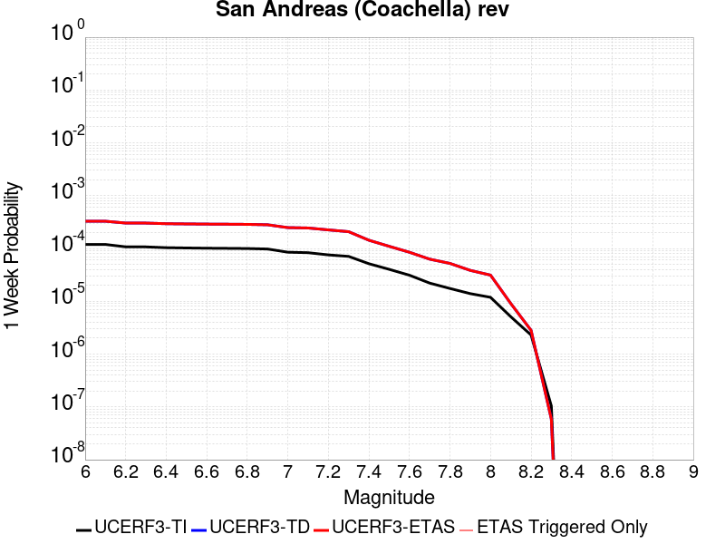 | 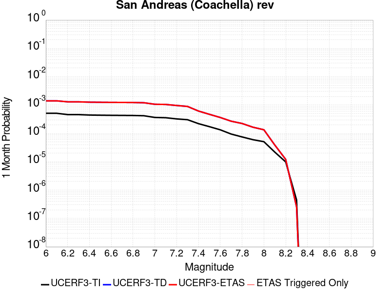 | 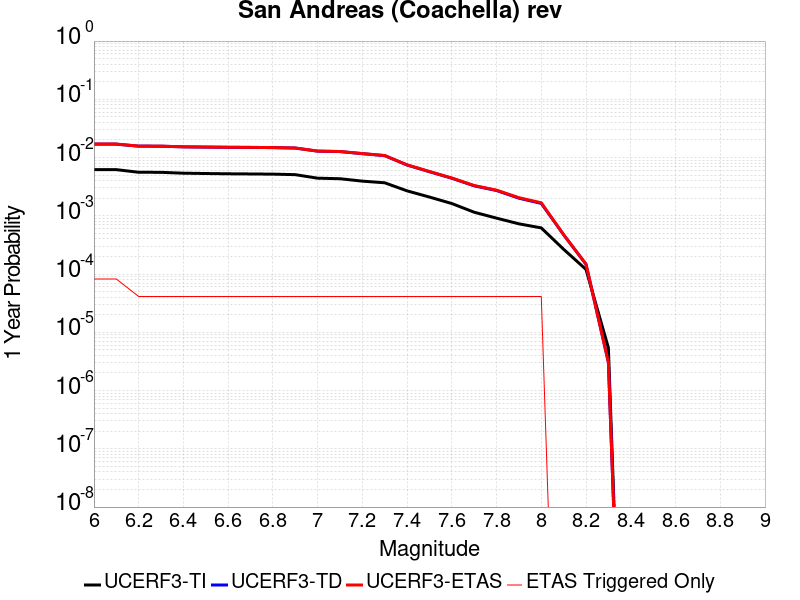 | 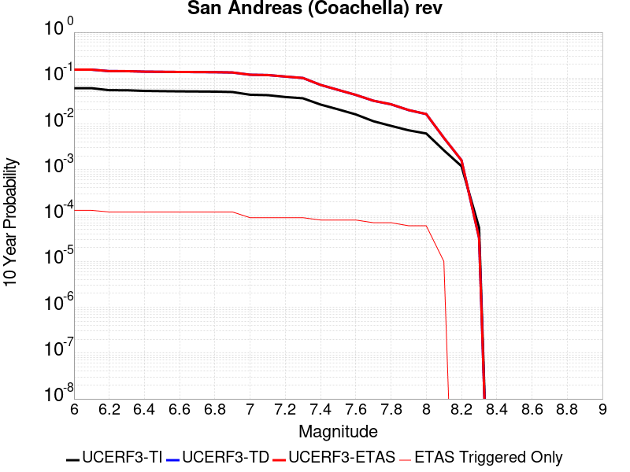 |

| Magnitude | 1 wk TI Prob | 1 wk TD Prob | 1 wk ETAS Prob | 1 wk ETAS/TD Gain | 1 wk ETAS Triggered Only | 1 mo TI Prob | 1 mo TD Prob | 1 mo ETAS Prob | 1 mo ETAS/TD Gain | 1 mo ETAS Triggered Only | 1 yr TI Prob | 1 yr TD Prob | 1 yr ETAS Prob | 1 yr ETAS/TD Gain | 1 yr ETAS Triggered Only | 10 yr TI Prob | 10 yr TD Prob | 10 yr ETAS Prob | 10 yr ETAS/TD Gain | 10 yr ETAS Triggered Only |
|-----|-----|-----|-----|-----|-----|-----|-----|-----|-----|-----|-----|-----|-----|-----|-----|-----|-----|-----|-----|-----|
| 6.0 | 1.1925945E-4 | 3.2808864E-4 | 3.2808864E-4 | 1.0 | 0.0 | 5.110118E-4 | 0.0014053412 | 0.0014053412 | 1.0 | 0.0 | 0.0062038354 | 0.016977139 | 0.01705806 | 1.0047665 | 8.2318074E-5 | 0.060334753 | 0.15296486 | 0.15313917 | 1.0011395 | 2.057952E-4 |
| 6.1 | 1.1925945E-4 | 3.2808864E-4 | 3.2808864E-4 | 1.0 | 0.0 | 5.110118E-4 | 0.0014053412 | 0.0014053412 | 1.0 | 0.0 | 0.0062038354 | 0.016977139 | 0.01705806 | 1.0047665 | 8.2318074E-5 | 0.060334753 | 0.15296486 | 0.15313917 | 1.0011395 | 2.057952E-4 |
| 6.2 | 1.07432395E-4 | 3.030908E-4 | 3.030908E-4 | 1.0 | 0.0 | 4.603433E-4 | 0.0012983179 | 0.0012983179 | 1.0 | 0.0 | 0.005590286 | 0.01569356 | 0.015734073 | 1.0025815 | 4.1159037E-5 | 0.05451731 | 0.14213686 | 0.14227809 | 1.0009936 | 1.6463615E-4 |
| 6.3 | 1.0718766E-4 | 3.0254383E-4 | 3.0254383E-4 | 1.0 | 0.0 | 4.592948E-4 | 0.0012959761 | 0.0012959761 | 1.0 | 0.0 | 0.005577586 | 0.015665459 | 0.015705973 | 1.0025862 | 4.1159037E-5 | 0.054396555 | 0.14190519 | 0.14204645 | 1.0009955 | 1.6463615E-4 |
| 6.4 | 1.0355944E-4 | 2.9462355E-4 | 2.9462355E-4 | 1.0 | 0.0 | 4.4375064E-4 | 0.0012620653 | 0.0012620653 | 1.0 | 0.0 | 0.0053892885 | 0.015258447 | 0.015298978 | 1.0026563 | 4.1159037E-5 | 0.052604496 | 0.13846388 | 0.13860573 | 1.0010244 | 1.6463615E-4 |
| 6.5 | 1.0227914E-4 | 2.9181747E-4 | 2.9181747E-4 | 1.0 | 0.0 | 4.382655E-4 | 0.0012500508 | 0.0012500508 | 1.0 | 0.0 | 0.0053228354 | 0.015114211 | 0.015154748 | 1.0026821 | 4.1159037E-5 | 0.051971316 | 0.13724077 | 0.1373828 | 1.001035 | 1.6463615E-4 |
| 6.6 | 1.0116757E-4 | 2.8947464E-4 | 2.8947464E-4 | 1.0 | 0.0 | 4.3350324E-4 | 0.0012400197 | 0.0012400197 | 1.0 | 0.0 | 0.0052651367 | 0.014993767 | 0.01503431 | 1.0027039 | 4.1159037E-5 | 0.051421247 | 0.13621925 | 0.13636145 | 1.001044 | 1.6463615E-4 |
| 6.7 | 1.0050676E-4 | 2.8806002E-4 | 2.8806002E-4 | 1.0 | 0.0 | 4.3067214E-4 | 0.0012339628 | 0.0012339628 | 1.0 | 0.0 | 0.005230834 | 0.014921038 | 0.014961584 | 1.0027173 | 4.1159037E-5 | 0.051094085 | 0.13560389 | 0.1357462 | 1.0010495 | 1.6463615E-4 |
| 6.8 | 9.976819E-5 | 2.8609566E-4 | 2.8609566E-4 | 1.0 | 0.0 | 4.2750788E-4 | 0.0012255519 | 0.0012255519 | 1.0 | 0.0 | 0.0051924936 | 0.014820035 | 0.0148605835 | 1.0027361 | 4.1159037E-5 | 0.050728295 | 0.13475555 | 0.134898 | 1.0010571 | 1.6463615E-4 |
| 6.9 | 9.77719E-5 | 2.8105936E-4 | 2.8105936E-4 | 1.0 | 0.0 | 4.1895514E-4 | 0.001203988 | 0.001203988 | 1.0 | 0.0 | 0.0050888555 | 0.014561031 | 0.01460159 | 1.0027854 | 4.1159037E-5 | 0.049738888 | 0.13258252 | 0.13272531 | 1.0010772 | 1.6463615E-4 |
| 7.0 | 8.500761E-5 | 2.4836304E-4 | 2.4836304E-4 | 1.0 | 0.0 | 3.6426744E-4 | 0.001063982 | 0.001063982 | 1.0 | 0.0 | 0.0044259406 | 0.01287782 | 0.012918449 | 1.003155 | 4.1159037E-5 | 0.04338823 | 0.118431985 | 0.11854084 | 1.0009191 | 1.2347712E-4 |
| 7.1 | 8.319876E-5 | 2.443822E-4 | 2.443822E-4 | 1.0 | 0.0 | 3.5651738E-4 | 0.001046935 | 0.001046935 | 1.0 | 0.0 | 0.004331963 | 0.012672706 | 0.012713343 | 1.0032067 | 4.1159037E-5 | 0.042484846 | 0.116649695 | 0.11675877 | 1.0009351 | 1.2347712E-4 |
| 7.2 | 7.563917E-5 | 2.2484467E-4 | 2.2484467E-4 | 1.0 | 0.0 | 3.2412758E-4 | 9.6326723E-4 | 9.6326723E-4 | 1.0 | 0.0 | 0.0039391145 | 0.011665408 | 0.011706087 | 1.0034871 | 4.1159037E-5 | 0.03870018 | 0.108050205 | 0.10816034 | 1.0010192 | 1.2347712E-4 |
| 7.3 | 7.082985E-5 | 2.0797877E-4 | 2.0797877E-4 | 1.0 | 0.0 | 3.0352117E-4 | 8.91036E-4 | 8.91036E-4 | 1.0 | 0.0 | 0.0036891096 | 0.010795031 | 0.010835745 | 1.0037717 | 4.1159037E-5 | 0.03628465 | 0.100566186 | 0.100677244 | 1.0011044 | 1.2347712E-4 |
| 7.4 | 5.146215E-5 | 1.4329473E-4 | 1.4329473E-4 | 1.0 | 0.0 | 2.2053342E-4 | 6.139766E-4 | 6.139766E-4 | 1.0 | 0.0 | 0.0026816884 | 0.0074497345 | 0.007490587 | 1.0054837 | 4.1159037E-5 | 0.02649557 | 0.0710914 | 0.071167864 | 1.0010756 | 8.2318074E-5 |
| 7.5 | 4.0285166E-5 | 1.09898356E-4 | 1.09898356E-4 | 1.0 | 0.0 | 1.7263928E-4 | 4.7090827E-4 | 4.7090827E-4 | 1.0 | 0.0 | 0.002099857 | 0.0057183066 | 0.00575923 | 1.0071566 | 4.1159037E-5 | 0.020801254 | 0.0552264 | 0.055304173 | 1.0014082 | 8.2318074E-5 |
| 7.6 | 3.1168736E-5 | 8.481493E-5 | 8.481493E-5 | 1.0 | 0.0 | 1.3357346E-4 | 3.6344206E-4 | 3.6344206E-4 | 1.0 | 0.0 | 0.0016250437 | 0.004415956 | 0.004456933 | 1.0092794 | 4.1159037E-5 | 0.016132116 | 0.043002363 | 0.043081142 | 1.001832 | 8.2318074E-5 |
| 7.7 | 2.2100989E-5 | 6.276265E-5 | 6.276265E-5 | 1.0 | 0.0 | 9.4715084E-5 | 2.6895507E-4 | 2.6895507E-4 | 1.0 | 0.0 | 0.001152546 | 0.003269618 | 0.0033106424 | 1.0125471 | 4.1159037E-5 | 0.011465867 | 0.03207018 | 0.032149855 | 1.0024844 | 8.2318074E-5 |
| 7.8 | 1.7484861E-5 | 5.2130177E-5 | 5.2130177E-5 | 1.0 | 0.0 | 7.493296E-5 | 2.2339592E-4 | 2.2339592E-4 | 1.0 | 0.0 | 9.1192697E-4 | 0.002716456 | 0.0027575032 | 1.0151106 | 4.1159037E-5 | 0.009081938 | 0.02679226 | 0.026872372 | 1.0029901 | 8.2318074E-5 |
| 7.9 | 1.3967285E-5 | 3.849712E-5 | 3.849712E-5 | 1.0 | 0.0 | 5.985842E-5 | 1.6497723E-4 | 1.6497723E-4 | 1.0 | 0.0 | 7.2853256E-4 | 0.0020067487 | 0.0020478251 | 1.0204692 | 4.1159037E-5 | 0.0072614877 | 0.020036833 | 0.020117503 | 1.004026 | 8.2318074E-5 |
| 8.0 | 1.1887396E-5 | 3.1301668E-5 | 3.1301668E-5 | 1.0 | 0.0 | 5.094499E-5 | 1.341431E-4 | 1.341431E-4 | 1.0 | 0.0 | 6.200787E-4 | 0.0016319698 | 0.0016730617 | 1.0251793 | 4.1159037E-5 | 0.006183513 | 0.016389918 | 0.016470887 | 1.0049402 | 8.2318074E-5 |
| 8.1 | 5.100864E-6 | 9.071257E-6 | 9.071257E-6 | 1.0 | 0.0 | 2.1860664E-5 | 3.887624E-5 | 3.887624E-5 | 1.0 | 0.0 | 2.6612106E-4 | 4.7321554E-4 | 4.7321554E-4 | 1.0 | 0.0 | 0.002658026 | 0.004966687 | 0.004966687 | 1.0 | 0.0 |
| 8.2 | 2.3004484E-6 | 2.8257436E-6 | 2.8257436E-6 | 1.0 | 0.0 | 9.859027E-6 | 1.2110274E-5 | 1.2110274E-5 | 1.0 | 0.0 | 1.2002704E-4 | 1.4743264E-4 | 1.4743264E-4 | 1.0 | 0.0 | 0.0011996223 | 0.0016177493 | 0.0016177493 | 1.0 | 0.0 |
| 8.3 | 1.0424446E-7 | 5.9178852E-8 | 5.9178852E-8 | 1.0 | 0.0 | 4.4676187E-7 | 2.5362363E-7 | 2.5362363E-7 | 1.0 | 0.0 | 5.439312E-6 | 3.0878637E-6 | 3.0878637E-6 | 1.0 | 0.0 | 5.4391792E-5 | 3.2452153E-5 | 3.2452153E-5 | 1.0 | 0.0 |

## San Andreas (Parkfield)
*[(top)](#table-of-contents)*

| 1 Week | 1 Month | 1 Year | 10 Year |
|-----|-----|-----|-----|
| 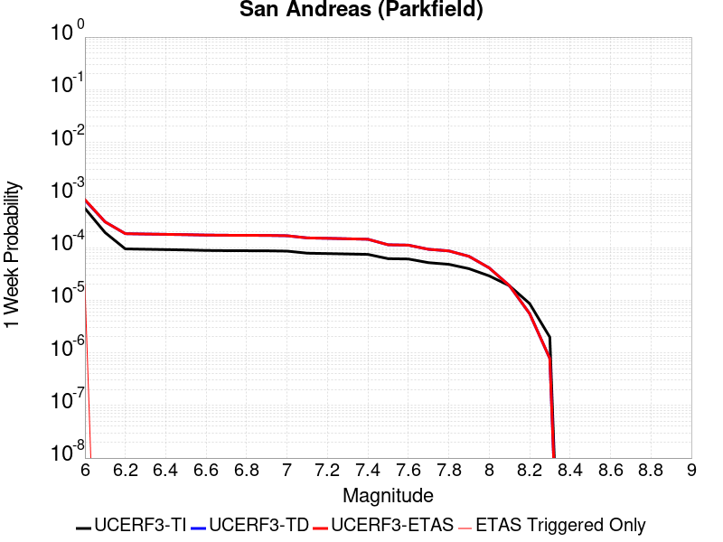 | 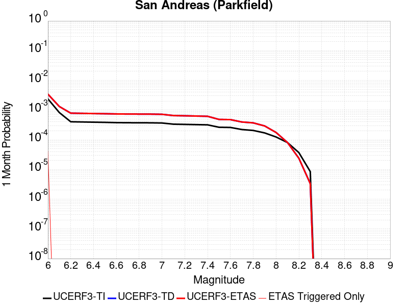 | 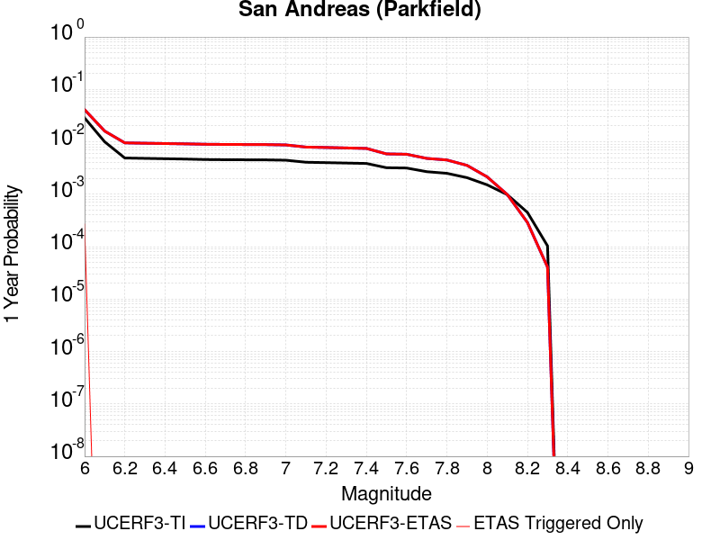 | 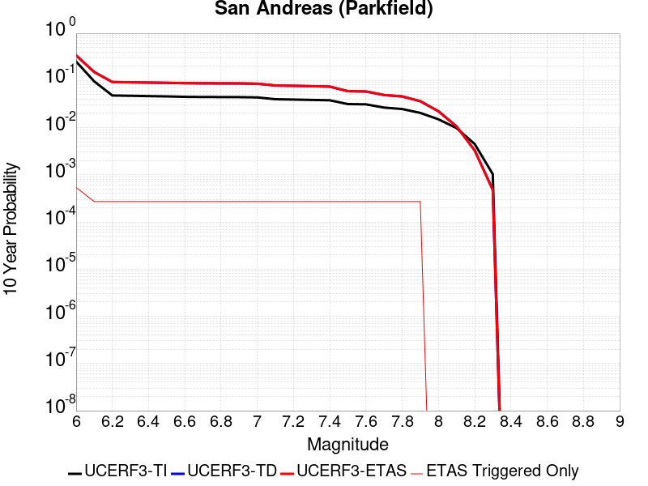 |

| Magnitude | 1 wk TI Prob | 1 wk TD Prob | 1 wk ETAS Prob | 1 wk ETAS/TD Gain | 1 wk ETAS Triggered Only | 1 mo TI Prob | 1 mo TD Prob | 1 mo ETAS Prob | 1 mo ETAS/TD Gain | 1 mo ETAS Triggered Only | 1 yr TI Prob | 1 yr TD Prob | 1 yr ETAS Prob | 1 yr ETAS/TD Gain | 1 yr ETAS Triggered Only | 10 yr TI Prob | 10 yr TD Prob | 10 yr ETAS Prob | 10 yr ETAS/TD Gain | 10 yr ETAS Triggered Only |
|-----|-----|-----|-----|-----|-----|-----|-----|-----|-----|-----|-----|-----|-----|-----|-----|-----|-----|-----|-----|-----|
| 6.0 | 5.556969E-4 | 7.954992E-4 | 8.366255E-4 | 1.0516987 | 4.1159037E-5 | 0.0023793848 | 0.0034054073 | 0.0034464262 | 1.0120453 | 4.1159037E-5 | 0.028586963 | 0.04096938 | 0.041008852 | 1.0009634 | 4.1159037E-5 | 0.25176284 | 0.3397343 | 0.33987015 | 1.0004 | 2.057952E-4 |
| 6.1 | 1.925858E-4 | 3.0775374E-4 | 3.0775374E-4 | 1.0 | 0.0 | 8.2510663E-4 | 0.0013183774 | 0.0013183774 | 1.0 | 0.0 | 0.0099994885 | 0.016019296 | 0.016019296 | 1.0 | 0.0 | 0.095613256 | 0.15090741 | 0.1509773 | 1.0004631 | 8.2318074E-5 |
| 6.2 | 9.4306815E-5 | 1.8380945E-4 | 1.8380945E-4 | 1.0 | 0.0 | 4.0410945E-4 | 7.875182E-4 | 7.875182E-4 | 1.0 | 0.0 | 0.0049089384 | 0.009546112 | 0.009546112 | 1.0 | 0.0 | 0.048019063 | 0.092463985 | 0.09253869 | 1.000808 | 8.2318074E-5 |
| 6.3 | 9.283051E-5 | 1.8077034E-4 | 1.8077034E-4 | 1.0 | 0.0 | 3.9778434E-4 | 7.7450124E-4 | 7.7450124E-4 | 1.0 | 0.0 | 0.0048322747 | 0.009389 | 0.009389 | 1.0 | 0.0 | 0.047285385 | 0.09111662 | 0.09119144 | 1.0008211 | 8.2318074E-5 |
| 6.4 | 9.138826E-5 | 1.7838326E-4 | 1.7838326E-4 | 1.0 | 0.0 | 3.916052E-4 | 7.642769E-4 | 7.642769E-4 | 1.0 | 0.0 | 0.0047573745 | 0.00926559 | 0.00926559 | 1.0 | 0.0 | 0.046568092 | 0.09001747 | 0.090092376 | 1.0008322 | 8.2318074E-5 |
| 6.5 | 9.000255E-5 | 1.7595605E-4 | 1.7595605E-4 | 1.0 | 0.0 | 3.8566816E-4 | 7.538806E-4 | 7.538806E-4 | 1.0 | 0.0 | 0.0046854047 | 0.009140087 | 0.009140087 | 1.0 | 0.0 | 0.045878403 | 0.08889803 | 0.08897303 | 1.0008436 | 8.2318074E-5 |
| 6.6 | 8.8109264E-5 | 1.7275041E-4 | 1.7275041E-4 | 1.0 | 0.0 | 3.7755648E-4 | 7.4015E-4 | 7.4015E-4 | 1.0 | 0.0 | 0.0045870654 | 0.008974318 | 0.008974318 | 1.0 | 0.0 | 0.04493529 | 0.08742356 | 0.08749868 | 1.0008593 | 8.2318074E-5 |
| 6.7 | 8.738073E-5 | 1.7141737E-4 | 1.7141737E-4 | 1.0 | 0.0 | 3.7443507E-4 | 7.344402E-4 | 7.344402E-4 | 1.0 | 0.0 | 0.0045492216 | 0.008905407 | 0.008905407 | 1.0 | 0.0 | 0.04457213 | 0.086822286 | 0.08689746 | 1.0008658 | 8.2318074E-5 |
| 6.8 | 8.710195E-5 | 1.7086939E-4 | 1.7086939E-4 | 1.0 | 0.0 | 3.7324068E-4 | 7.3209306E-4 | 7.3209306E-4 | 1.0 | 0.0 | 0.0045347405 | 0.008877072 | 0.008877072 | 1.0 | 0.0 | 0.04443313 | 0.08656893 | 0.08664412 | 1.0008686 | 8.2318074E-5 |
| 6.9 | 8.6801556E-5 | 1.702762E-4 | 1.702762E-4 | 1.0 | 0.0 | 3.7195362E-4 | 7.295522E-4 | 7.295522E-4 | 1.0 | 0.0 | 0.0045191357 | 0.008846388 | 0.008846388 | 1.0 | 0.0 | 0.044283327 | 0.08629421 | 0.086369425 | 1.0008717 | 8.2318074E-5 |
| 7.0 | 8.5571606E-5 | 1.6779368E-4 | 1.6779368E-4 | 1.0 | 0.0 | 3.6668387E-4 | 7.1891875E-4 | 7.1891875E-4 | 1.0 | 0.0 | 0.004455241 | 0.008717968 | 0.008717968 | 1.0 | 0.0 | 0.043669727 | 0.08513857 | 0.08521388 | 1.0008845 | 8.2318074E-5 |
| 7.1 | 7.82589E-5 | 1.5255272E-4 | 1.5255272E-4 | 1.0 | 0.0 | 3.3535215E-4 | 6.5363426E-4 | 6.5363426E-4 | 1.0 | 0.0 | 0.0040752706 | 0.007929132 | 0.007929132 | 1.0 | 0.0 | 0.040013418 | 0.07803519 | 0.07811108 | 1.0009725 | 8.2318074E-5 |
| 7.2 | 7.690929E-5 | 1.4991156E-4 | 1.4991156E-4 | 1.0 | 0.0 | 3.2956956E-4 | 6.4232067E-4 | 6.4232067E-4 | 1.0 | 0.0 | 0.004005129 | 0.007792382 | 0.007792382 | 1.0 | 0.0 | 0.0393371 | 0.0768037 | 0.076879695 | 1.0009894 | 8.2318074E-5 |
| 7.3 | 7.5543794E-5 | 1.4685914E-4 | 1.4685914E-4 | 1.0 | 0.0 | 3.2371894E-4 | 6.2924525E-4 | 6.2924525E-4 | 1.0 | 0.0 | 0.003934157 | 0.0076343147 | 0.0076343147 | 1.0 | 0.0 | 0.038652334 | 0.075360335 | 0.07543645 | 1.0010101 | 8.2318074E-5 |
| 7.4 | 7.4214564E-5 | 1.4385211E-4 | 1.4385211E-4 | 1.0 | 0.0 | 3.1802364E-4 | 6.163641E-4 | 6.163641E-4 | 1.0 | 0.0 | 0.003865065 | 0.007478574 | 0.007478574 | 1.0 | 0.0 | 0.03798529 | 0.073928304 | 0.07400454 | 1.0010312 | 8.2318074E-5 |
| 7.5 | 6.149578E-5 | 1.1296149E-4 | 1.1296149E-4 | 1.0 | 0.0 | 2.6352672E-4 | 4.8403096E-4 | 4.8403096E-4 | 1.0 | 0.0 | 0.0032037178 | 0.0058771856 | 0.0058771856 | 1.0 | 0.0 | 0.03157923 | 0.059049904 | 0.05912736 | 1.0013118 | 8.2318074E-5 |
| 7.6 | 6.0643448E-5 | 1.1123779E-4 | 1.1123779E-4 | 1.0 | 0.0 | 2.598746E-4 | 4.7664638E-4 | 4.7664638E-4 | 1.0 | 0.0 | 0.0031593828 | 0.00578776 | 0.00578776 | 1.0 | 0.0 | 0.031148417 | 0.058206882 | 0.05828441 | 1.0013319 | 8.2318074E-5 |
| 7.7 | 5.1652263E-5 | 9.2685426E-5 | 9.2685426E-5 | 1.0 | 0.0 | 2.2134806E-4 | 3.971628E-4 | 3.971628E-4 | 1.0 | 0.0 | 0.002691582 | 0.0048247464 | 0.0048247464 | 1.0 | 0.0 | 0.026592141 | 0.04897893 | 0.04905721 | 1.0015984 | 8.2318074E-5 |
| 7.8 | 4.8090482E-5 | 8.645958E-5 | 8.645958E-5 | 1.0 | 0.0 | 2.060858E-4 | 3.7048844E-4 | 3.7048844E-4 | 1.0 | 0.0 | 0.0025062072 | 0.004501376 | 0.004501376 | 1.0 | 0.0 | 0.024781305 | 0.045710493 | 0.045789048 | 1.0017185 | 8.2318074E-5 |
| 7.9 | 3.970278E-5 | 6.8176494E-5 | 6.8176494E-5 | 1.0 | 0.0 | 1.7014367E-4 | 2.9215228E-4 | 2.9215228E-4 | 1.0 | 0.0 | 0.002069531 | 0.0035511565 | 0.0035511565 | 1.0 | 0.0 | 0.020503636 | 0.03620482 | 0.036284156 | 1.0021913 | 8.2318074E-5 |
| 8.0 | 2.8982335E-5 | 4.1123396E-5 | 4.1123396E-5 | 1.0 | 0.0 | 1.2420409E-4 | 1.7623122E-4 | 1.7623122E-4 | 1.0 | 0.0 | 0.0015111357 | 0.002143505 | 0.002143505 | 1.0 | 0.0 | 0.015009012 | 0.022223437 | 0.022263682 | 1.0018109 | 4.1159037E-5 |
| 8.1 | 1.8836186E-5 | 1.8920584E-5 | 1.8920584E-5 | 1.0 | 0.0 | 8.0724014E-5 | 8.1085695E-5 | 8.1085695E-5 | 1.0 | 0.0 | 9.823717E-4 | 9.867719E-4 | 9.867719E-4 | 1.0 | 0.0 | 0.009780403 | 0.010613913 | 0.010613913 | 1.0 | 0.0 |
| 8.2 | 8.643924E-6 | 5.5660976E-6 | 5.5660976E-6 | 1.0 | 0.0 | 3.704486E-5 | 2.3854487E-5 | 2.3854487E-5 | 1.0 | 0.0 | 4.5092785E-4 | 2.9038975E-4 | 2.9038975E-4 | 1.0 | 0.0 | 0.0045001395 | 0.0032986484 | 0.0032986484 | 1.0 | 0.0 |
| 8.3 | 1.983087E-6 | 7.808603E-7 | 7.808603E-7 | 1.0 | 0.0 | 8.498917E-6 | 3.34654E-6 | 3.34654E-6 | 1.0 | 0.0 | 1.034694E-4 | 4.074338E-5 | 4.074338E-5 | 1.0 | 0.0 | 0.0010342124 | 4.8047924E-4 | 4.8047924E-4 | 1.0 | 0.0 |

## Coyote Lake
*[(top)](#table-of-contents)*

| 1 Week | 1 Month | 1 Year | 10 Year |
|-----|-----|-----|-----|
| 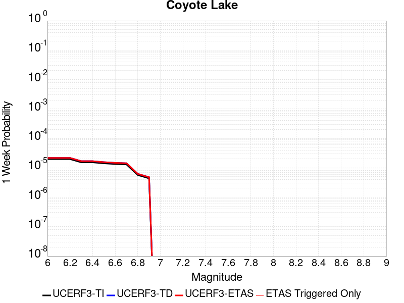 | 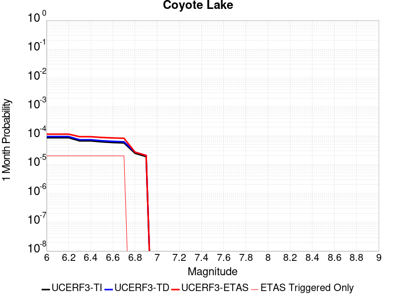 | 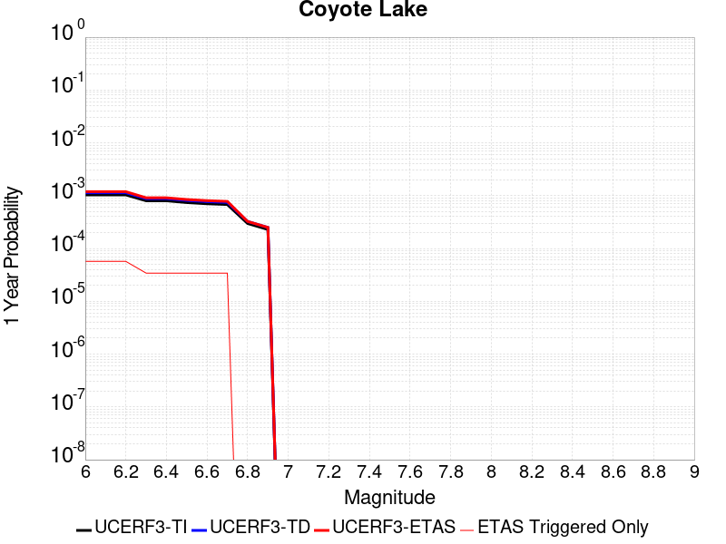 | 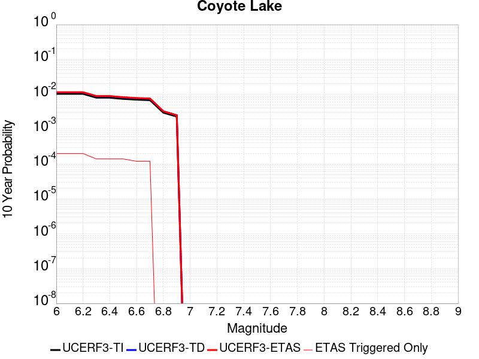 |

| Magnitude | 1 wk TI Prob | 1 wk TD Prob | 1 wk ETAS Prob | 1 wk ETAS/TD Gain | 1 wk ETAS Triggered Only | 1 mo TI Prob | 1 mo TD Prob | 1 mo ETAS Prob | 1 mo ETAS/TD Gain | 1 mo ETAS Triggered Only | 1 yr TI Prob | 1 yr TD Prob | 1 yr ETAS Prob | 1 yr ETAS/TD Gain | 1 yr ETAS Triggered Only | 10 yr TI Prob | 10 yr TD Prob | 10 yr ETAS Prob | 10 yr ETAS/TD Gain | 10 yr ETAS Triggered Only |
|-----|-----|-----|-----|-----|-----|-----|-----|-----|-----|-----|-----|-----|-----|-----|-----|-----|-----|-----|-----|-----|
| 6.0 | 1.980352E-5 | 2.1711568E-5 | 2.1711568E-5 | 1.0 | 0.0 | 8.486947E-5 | 9.304667E-5 | 1.3420188E-4 | 1.4423071 | 4.1159037E-5 | 0.0010327959 | 0.0011323265 | 0.0012145514 | 1.0726159 | 8.2318074E-5 | 0.010280091 | 0.011272751 | 0.011476226 | 1.0180502 | 2.057952E-4 |
| 6.1 | 1.980352E-5 | 2.1711568E-5 | 2.1711568E-5 | 1.0 | 0.0 | 8.486947E-5 | 9.304667E-5 | 1.3420188E-4 | 1.4423071 | 4.1159037E-5 | 0.0010327959 | 0.0011323265 | 0.0012145514 | 1.0726159 | 8.2318074E-5 | 0.010280091 | 0.011272751 | 0.011476226 | 1.0180502 | 2.057952E-4 |
| 6.2 | 1.980352E-5 | 2.1711568E-5 | 2.1711568E-5 | 1.0 | 0.0 | 8.486947E-5 | 9.304667E-5 | 1.3420188E-4 | 1.4423071 | 4.1159037E-5 | 0.0010327959 | 0.0011323265 | 0.0012145514 | 1.0726159 | 8.2318074E-5 | 0.010280091 | 0.011272751 | 0.011476226 | 1.0180502 | 2.057952E-4 |
| 6.3 | 1.5344787E-5 | 1.6824411E-5 | 1.6824411E-5 | 1.0 | 0.0 | 6.576172E-5 | 7.210297E-5 | 1.1325904E-4 | 1.5707958 | 4.1159037E-5 | 8.003548E-4 | 8.7756134E-4 | 9.1868424E-4 | 1.0468605 | 4.1159037E-5 | 0.007974784 | 0.008747008 | 0.008869405 | 1.013993 | 1.2347712E-4 |
| 6.4 | 1.5344787E-5 | 1.6824411E-5 | 1.6824411E-5 | 1.0 | 0.0 | 6.576172E-5 | 7.210297E-5 | 1.1325904E-4 | 1.5707958 | 4.1159037E-5 | 8.003548E-4 | 8.7756134E-4 | 9.1868424E-4 | 1.0468605 | 4.1159037E-5 | 0.007974784 | 0.008747008 | 0.008869405 | 1.013993 | 1.2347712E-4 |
| 6.5 | 1.4189697E-5 | 1.5561456E-5 | 1.5561456E-5 | 1.0 | 0.0 | 6.081157E-5 | 6.669059E-5 | 1.07846885E-4 | 1.6171229 | 4.1159037E-5 | 7.401293E-4 | 8.117158E-4 | 8.528414E-4 | 1.050665 | 4.1159037E-5 | 0.0073766913 | 0.008093455 | 0.008215932 | 1.0151329 | 1.2347712E-4 |
| 6.6 | 1.3469301E-5 | 1.4774881E-5 | 1.4774881E-5 | 1.0 | 0.0 | 5.7724297E-5 | 6.331972E-5 | 1.0447615E-4 | 1.6499782 | 4.1159037E-5 | 7.025667E-4 | 7.707049E-4 | 8.118322E-4 | 1.0533632 | 4.1159037E-5 | 0.0070034964 | 0.0076862276 | 0.007767913 | 1.0106275 | 8.2318074E-5 |
| 6.7 | 1.3027966E-5 | 1.4284924E-5 | 1.4284924E-5 | 1.0 | 0.0 | 5.5832945E-5 | 6.122E-5 | 1.0237652E-4 | 1.6722724 | 4.1159037E-5 | 6.7955407E-4 | 7.451584E-4 | 7.862868E-4 | 1.0551941 | 4.1159037E-5 | 0.006774798 | 0.007432478 | 0.0075141843 | 1.0109931 | 8.2318074E-5 |
| 6.8 | 5.695434E-6 | 6.225754E-6 | 6.225754E-6 | 1.0 | 0.0 | 2.4408775E-5 | 2.66817E-5 | 2.66817E-5 | 1.0 | 0.0 | 2.971363E-4 | 3.248313E-4 | 3.248313E-4 | 1.0 | 0.0 | 0.0029673933 | 0.003246507 | 0.003246507 | 1.0 | 0.0 |
| 6.9 | 4.385688E-6 | 4.7940844E-6 | 4.7940844E-6 | 1.0 | 0.0 | 1.879567E-5 | 2.0546076E-5 | 2.0546076E-5 | 1.0 | 0.0 | 2.2881327E-4 | 2.5014847E-4 | 2.5014847E-4 | 1.0 | 0.0 | 0.002285778 | 0.002501485 | 0.002501485 | 1.0 | 0.0 |

## Helendale-So Lockhart
*[(top)](#table-of-contents)*

| 1 Week | 1 Month | 1 Year | 10 Year |
|-----|-----|-----|-----|
| 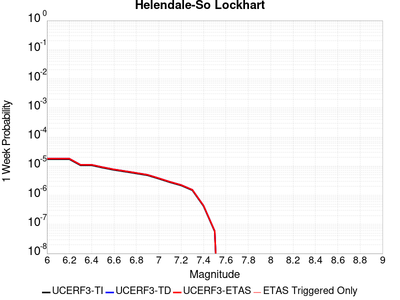 | 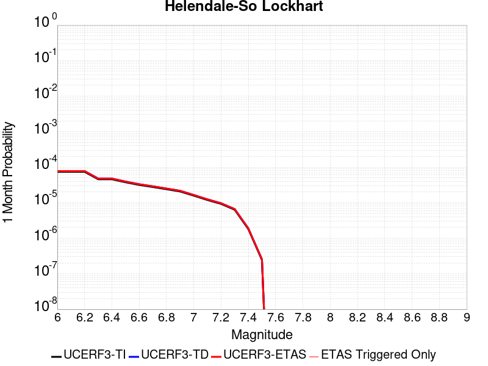 | 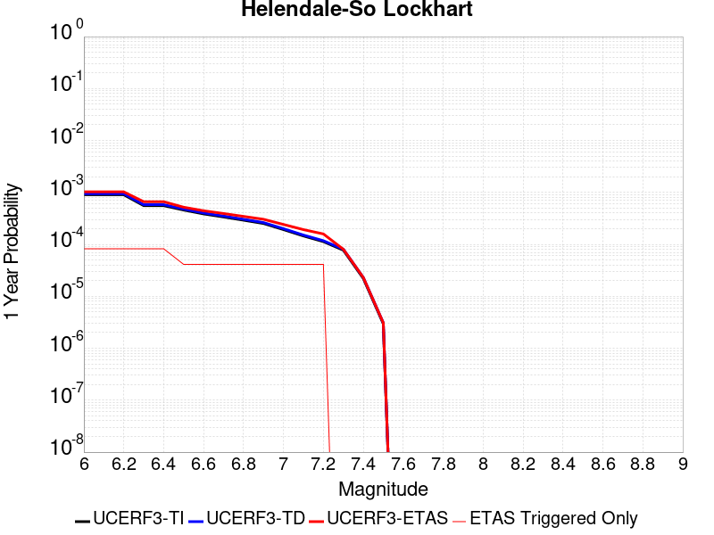 | 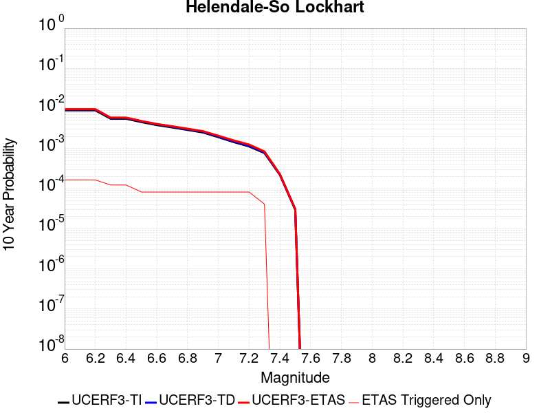 |

| Magnitude | 1 wk TI Prob | 1 wk TD Prob | 1 wk ETAS Prob | 1 wk ETAS/TD Gain | 1 wk ETAS Triggered Only | 1 mo TI Prob | 1 mo TD Prob | 1 mo ETAS Prob | 1 mo ETAS/TD Gain | 1 mo ETAS Triggered Only | 1 yr TI Prob | 1 yr TD Prob | 1 yr ETAS Prob | 1 yr ETAS/TD Gain | 1 yr ETAS Triggered Only | 10 yr TI Prob | 10 yr TD Prob | 10 yr ETAS Prob | 10 yr ETAS/TD Gain | 10 yr ETAS Triggered Only |
|-----|-----|-----|-----|-----|-----|-----|-----|-----|-----|-----|-----|-----|-----|-----|-----|-----|-----|-----|-----|-----|
| 6.0 | 1.7296055E-5 | 1.8105688E-5 | 1.8105688E-5 | 1.0 | 0.0 | 7.412385E-5 | 7.759361E-5 | 7.759361E-5 | 1.0 | 0.0 | 9.0208417E-4 | 9.4431354E-4 | 0.0010265539 | 1.0870901 | 8.2318074E-5 | 0.008984311 | 0.00940513 | 0.009568217 | 1.0173403 | 1.6463615E-4 |
| 6.1 | 1.7296055E-5 | 1.8105688E-5 | 1.8105688E-5 | 1.0 | 0.0 | 7.412385E-5 | 7.759361E-5 | 7.759361E-5 | 1.0 | 0.0 | 9.0208417E-4 | 9.4431354E-4 | 0.0010265539 | 1.0870901 | 8.2318074E-5 | 0.008984311 | 0.00940513 | 0.009568217 | 1.0173403 | 1.6463615E-4 |
| 6.2 | 1.7296055E-5 | 1.8105688E-5 | 1.8105688E-5 | 1.0 | 0.0 | 7.412385E-5 | 7.759361E-5 | 7.759361E-5 | 1.0 | 0.0 | 9.0208417E-4 | 9.4431354E-4 | 0.0010265539 | 1.0870901 | 8.2318074E-5 | 0.008984311 | 0.00940513 | 0.009568217 | 1.0173403 | 1.6463615E-4 |
| 6.3 | 1.0669118E-5 | 1.1136552E-5 | 1.1136552E-5 | 1.0 | 0.0 | 4.5723988E-5 | 4.772722E-5 | 4.772722E-5 | 1.0 | 0.0 | 5.5654737E-4 | 5.809268E-4 | 6.63197E-4 | 1.141619 | 8.2318074E-5 | 0.0055515557 | 0.005794378 | 0.00591714 | 1.0211864 | 1.2347712E-4 |
| 6.4 | 1.0669118E-5 | 1.1136552E-5 | 1.1136552E-5 | 1.0 | 0.0 | 4.5723988E-5 | 4.772722E-5 | 4.772722E-5 | 1.0 | 0.0 | 5.5654737E-4 | 5.809268E-4 | 6.63197E-4 | 1.141619 | 8.2318074E-5 | 0.0055515557 | 0.005794378 | 0.00591714 | 1.0211864 | 1.2347712E-4 |
| 6.5 | 8.790038E-6 | 9.171115E-6 | 9.171115E-6 | 1.0 | 0.0 | 3.767105E-5 | 3.9304196E-5 | 3.9304196E-5 | 1.0 | 0.0 | 4.585485E-4 | 4.7842506E-4 | 5.195644E-4 | 1.0859891 | 4.1159037E-5 | 0.0045760344 | 0.004774115 | 0.0048560402 | 1.0171603 | 8.2318074E-5 |
| 6.6 | 7.396949E-6 | 7.716306E-6 | 7.716306E-6 | 1.0 | 0.0 | 3.1700827E-5 | 3.306947E-5 | 3.306947E-5 | 1.0 | 0.0 | 3.858892E-4 | 4.0254745E-4 | 4.436899E-4 | 1.1022053 | 4.1159037E-5 | 0.003852198 | 0.0040182895 | 0.004100277 | 1.0204035 | 8.2318074E-5 |
| 6.7 | 6.4600285E-6 | 6.7387023E-6 | 6.7387023E-6 | 1.0 | 0.0 | 2.7685543E-5 | 2.8879838E-5 | 2.8879838E-5 | 1.0 | 0.0 | 3.3701936E-4 | 3.5155608E-4 | 3.9270063E-4 | 1.1170356 | 4.1159037E-5 | 0.0033650869 | 0.003510081 | 0.0035921102 | 1.0233696 | 8.2318074E-5 |
| 6.8 | 5.600104E-6 | 5.836578E-6 | 5.836578E-6 | 1.0 | 0.0 | 2.4000226E-5 | 2.501367E-5 | 2.501367E-5 | 1.0 | 0.0 | 2.9216358E-4 | 3.0449947E-4 | 3.4564597E-4 | 1.1351284 | 4.1159037E-5 | 0.0029177975 | 0.003040884 | 0.0031229518 | 1.0269881 | 8.2318074E-5 |
| 6.9 | 4.839122E-6 | 5.039992E-6 | 5.039992E-6 | 1.0 | 0.0 | 2.0738931E-5 | 2.159979E-5 | 2.159979E-5 | 1.0 | 0.0 | 2.5246723E-4 | 2.6294615E-4 | 3.0409437E-4 | 1.1564891 | 4.1159037E-5 | 0.002521806 | 0.002626398 | 0.0027084998 | 1.0312603 | 8.2318074E-5 |
| 7.0 | 3.6937633E-6 | 3.845573E-6 | 3.845573E-6 | 1.0 | 0.0 | 1.5830317E-5 | 1.6480923E-5 | 1.6480923E-5 | 1.0 | 0.0 | 1.9271708E-4 | 2.0063708E-4 | 2.4178786E-4 | 1.2051005 | 4.1159037E-5 | 0.0019255003 | 0.0020045908 | 0.002086744 | 1.0409825 | 8.2318074E-5 |
| 7.1 | 2.7858857E-6 | 2.898123E-6 | 2.898123E-6 | 1.0 | 0.0 | 1.1939455E-5 | 1.242047E-5 | 1.242047E-5 | 1.0 | 0.0 | 1.4535317E-4 | 1.5120894E-4 | 1.9236175E-4 | 1.2721586 | 4.1159037E-5 | 0.0014525814 | 0.001511082 | 0.0015932757 | 1.0543939 | 8.2318074E-5 |
| 7.2 | 2.1672065E-6 | 2.2542215E-6 | 2.2542215E-6 | 1.0 | 0.0 | 9.2879945E-6 | 9.660915E-6 | 9.660915E-6 | 1.0 | 0.0 | 1.1307546E-4 | 1.1761547E-4 | 1.5876966E-4 | 1.3499047 | 4.1159037E-5 | 0.0011301794 | 0.0011755504 | 0.0012577717 | 1.0699428 | 8.2318074E-5 |
| 7.3 | 1.4823496E-6 | 1.5423542E-6 | 1.5423542E-6 | 1.0 | 0.0 | 6.3529114E-6 | 6.6100733E-6 | 6.6100733E-6 | 1.0 | 0.0 | 7.734395E-5 | 8.047483E-5 | 8.047483E-5 | 1.0 | 0.0 | 7.731704E-4 | 8.0447196E-4 | 8.455979E-4 | 1.0511216 | 4.1159037E-5 |
| 7.4 | 4.2321457E-7 | 4.411307E-7 | 4.411307E-7 | 1.0 | 0.0 | 1.8137755E-6 | 1.8905591E-6 | 1.8905591E-6 | 1.0 | 0.0 | 2.2082493E-5 | 2.301736E-5 | 2.301736E-5 | 1.0 | 0.0 | 2.2080299E-4 | 2.3015428E-4 | 2.3015428E-4 | 1.0 | 0.0 |
| 7.5 | 5.6942316E-8 | 5.9421613E-8 | 5.9421613E-8 | 1.0 | 0.0 | 2.440385E-7 | 2.5466403E-7 | 2.5466403E-7 | 1.0 | 0.0 | 2.9711643E-6 | 3.1005309E-6 | 3.1005309E-6 | 1.0 | 0.0 | 2.9711247E-5 | 3.1004955E-5 | 3.1004955E-5 | 1.0 | 0.0 |

## Death Valley (Black Mtns Frontal)
*[(top)](#table-of-contents)*

| 1 Week | 1 Month | 1 Year | 10 Year |
|-----|-----|-----|-----|
| 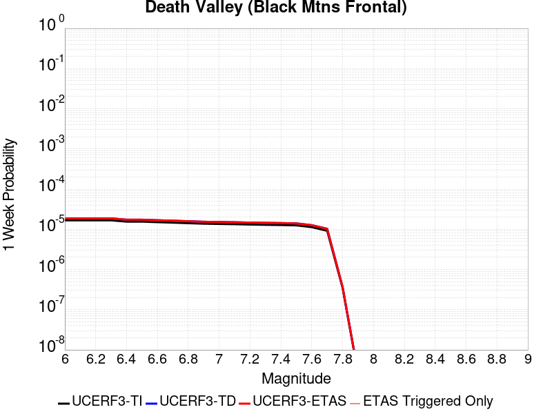 | 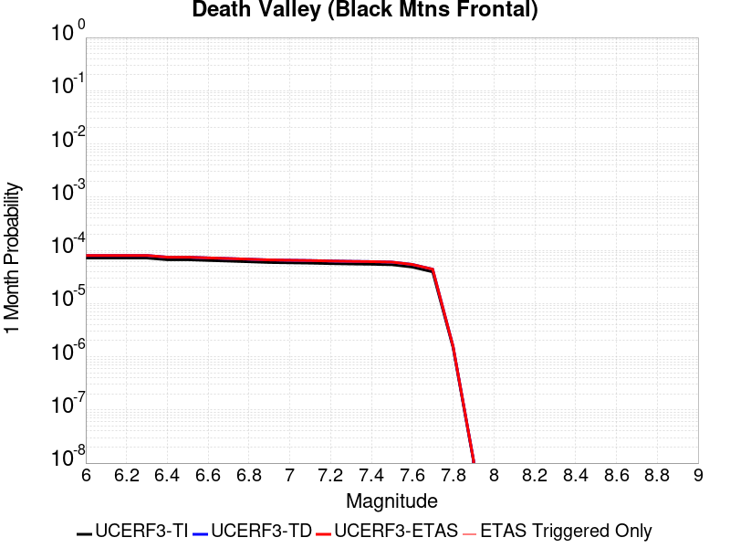 | 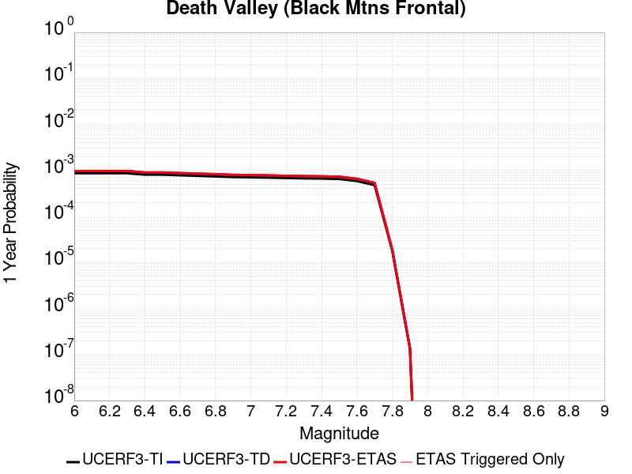 | 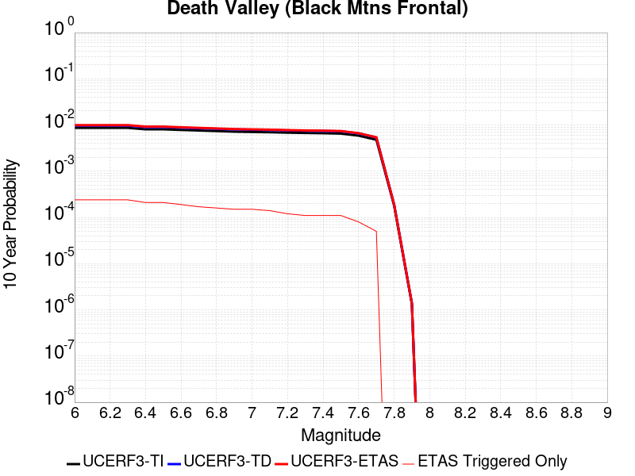 |

| Magnitude | 1 wk TI Prob | 1 wk TD Prob | 1 wk ETAS Prob | 1 wk ETAS/TD Gain | 1 wk ETAS Triggered Only | 1 mo TI Prob | 1 mo TD Prob | 1 mo ETAS Prob | 1 mo ETAS/TD Gain | 1 mo ETAS Triggered Only | 1 yr TI Prob | 1 yr TD Prob | 1 yr ETAS Prob | 1 yr ETAS/TD Gain | 1 yr ETAS Triggered Only | 10 yr TI Prob | 10 yr TD Prob | 10 yr ETAS Prob | 10 yr ETAS/TD Gain | 10 yr ETAS Triggered Only |
|-----|-----|-----|-----|-----|-----|-----|-----|-----|-----|-----|-----|-----|-----|-----|-----|-----|-----|-----|-----|-----|
| 6.0 | 1.6707214E-5 | 1.8675355E-5 | 1.8675355E-5 | 1.0 | 0.0 | 7.160038E-5 | 8.003482E-5 | 8.003482E-5 | 1.0 | 0.0 | 8.71386E-4 | 9.7399595E-4 | 0.001015115 | 1.0422168 | 4.1159037E-5 | 0.00867977 | 0.0096981255 | 0.009861165 | 1.0168115 | 1.6463615E-4 |
| 6.1 | 1.6707214E-5 | 1.8675355E-5 | 1.8675355E-5 | 1.0 | 0.0 | 7.160038E-5 | 8.003482E-5 | 8.003482E-5 | 1.0 | 0.0 | 8.71386E-4 | 9.7399595E-4 | 0.001015115 | 1.0422168 | 4.1159037E-5 | 0.00867977 | 0.0096981255 | 0.009861165 | 1.0168115 | 1.6463615E-4 |
| 6.2 | 1.6707214E-5 | 1.8675355E-5 | 1.8675355E-5 | 1.0 | 0.0 | 7.160038E-5 | 8.003482E-5 | 8.003482E-5 | 1.0 | 0.0 | 8.71386E-4 | 9.7399595E-4 | 0.001015115 | 1.0422168 | 4.1159037E-5 | 0.00867977 | 0.0096981255 | 0.009861165 | 1.0168115 | 1.6463615E-4 |
| 6.3 | 1.6707214E-5 | 1.8675355E-5 | 1.8675355E-5 | 1.0 | 0.0 | 7.160038E-5 | 8.003482E-5 | 8.003482E-5 | 1.0 | 0.0 | 8.71386E-4 | 9.7399595E-4 | 0.001015115 | 1.0422168 | 4.1159037E-5 | 0.00867977 | 0.0096981255 | 0.009861165 | 1.0168115 | 1.6463615E-4 |
| 6.4 | 1.5515609E-5 | 1.7342936E-5 | 1.7342936E-5 | 1.0 | 0.0 | 6.649377E-5 | 7.432479E-5 | 7.432479E-5 | 1.0 | 0.0 | 8.0926094E-4 | 9.045347E-4 | 9.456565E-4 | 1.0454619 | 4.1159037E-5 | 0.008063202 | 0.009009215 | 0.00913158 | 1.0135821 | 1.2347712E-4 |
| 6.5 | 1.5515609E-5 | 1.7342936E-5 | 1.7342936E-5 | 1.0 | 0.0 | 6.649377E-5 | 7.432479E-5 | 7.432479E-5 | 1.0 | 0.0 | 8.0926094E-4 | 9.045347E-4 | 9.456565E-4 | 1.0454619 | 4.1159037E-5 | 0.008063202 | 0.009009215 | 0.00913158 | 1.0135821 | 1.2347712E-4 |
| 6.6 | 1.5041828E-5 | 1.6813725E-5 | 1.6813725E-5 | 1.0 | 0.0 | 6.4463384E-5 | 7.2056864E-5 | 7.2056864E-5 | 1.0 | 0.0 | 7.8455906E-4 | 8.769451E-4 | 9.1806805E-4 | 1.0468934 | 4.1159037E-5 | 0.00781795 | 0.008735501 | 0.008817101 | 1.0093411 | 8.2318074E-5 |
| 6.7 | 1.4634985E-5 | 1.6360476E-5 | 1.6360476E-5 | 1.0 | 0.0 | 6.271985E-5 | 7.0114475E-5 | 7.0114475E-5 | 1.0 | 0.0 | 7.6334673E-4 | 8.533152E-4 | 8.533152E-4 | 1.0 | 0.0 | 0.007607299 | 0.008501024 | 0.008541833 | 1.0048004 | 4.1159037E-5 |
| 6.8 | 1.4209158E-5 | 1.5886384E-5 | 1.5886384E-5 | 1.0 | 0.0 | 6.089497E-5 | 6.808276E-5 | 6.808276E-5 | 1.0 | 0.0 | 7.4114406E-4 | 8.28598E-4 | 8.28598E-4 | 1.0 | 0.0 | 0.007386771 | 0.008255701 | 0.00829652 | 1.0049443 | 4.1159037E-5 |
| 6.9 | 1.3780098E-5 | 1.5408805E-5 | 1.5408805E-5 | 1.0 | 0.0 | 5.9056227E-5 | 6.60361E-5 | 6.60361E-5 | 1.0 | 0.0 | 7.1877235E-4 | 8.036984E-4 | 8.036984E-4 | 1.0 | 0.0 | 0.0071645193 | 0.008008514 | 0.008008514 | 1.0 | 0.0 |
| 7.0 | 1.3585064E-5 | 1.5192312E-5 | 1.5192312E-5 | 1.0 | 0.0 | 5.8220405E-5 | 6.510832E-5 | 6.510832E-5 | 1.0 | 0.0 | 7.086029E-4 | 7.924109E-4 | 7.924109E-4 | 1.0 | 0.0 | 0.007063476 | 0.007896447 | 0.007896447 | 1.0 | 0.0 |
| 7.1 | 1.3398601E-5 | 1.4985444E-5 | 1.4985444E-5 | 1.0 | 0.0 | 5.742131E-5 | 6.4221786E-5 | 6.4221786E-5 | 1.0 | 0.0 | 6.9888023E-4 | 7.8162516E-4 | 7.8162516E-4 | 1.0 | 0.0 | 0.0069668638 | 0.0077893496 | 0.0077893496 | 1.0 | 0.0 |
| 7.2 | 1.3126312E-5 | 1.468359E-5 | 1.468359E-5 | 1.0 | 0.0 | 5.6254412E-5 | 6.2928186E-5 | 6.2928186E-5 | 1.0 | 0.0 | 6.846822E-4 | 7.658868E-4 | 7.658868E-4 | 1.0 | 0.0 | 0.006825765 | 0.007633057 | 0.007633057 | 1.0 | 0.0 |
| 7.3 | 1.2922429E-5 | 1.4457762E-5 | 1.4457762E-5 | 1.0 | 0.0 | 5.5380664E-5 | 6.1960396E-5 | 6.1960396E-5 | 1.0 | 0.0 | 6.74051E-4 | 7.5411214E-4 | 7.5411214E-4 | 1.0 | 0.0 | 0.006720101 | 0.0075161126 | 0.0075161126 | 1.0 | 0.0 |
| 7.4 | 1.2768878E-5 | 1.42877025E-5 | 1.42877025E-5 | 1.0 | 0.0 | 5.4722615E-5 | 6.12316E-5 | 6.12316E-5 | 1.0 | 0.0 | 6.660441E-4 | 7.452452E-4 | 7.452452E-4 | 1.0 | 0.0 | 0.0066405144 | 0.00742804 | 0.00742804 | 1.0 | 0.0 |
| 7.5 | 1.2521929E-5 | 1.4015882E-5 | 1.4015882E-5 | 1.0 | 0.0 | 5.366431E-5 | 6.006671E-5 | 6.006671E-5 | 1.0 | 0.0 | 6.531671E-4 | 7.310723E-4 | 7.310723E-4 | 1.0 | 0.0 | 0.006512506 | 0.007287249 | 0.007287249 | 1.0 | 0.0 |
| 7.6 | 1.1301089E-5 | 1.2651644E-5 | 1.2651644E-5 | 1.0 | 0.0 | 4.8432343E-5 | 5.4220236E-5 | 5.4220236E-5 | 1.0 | 0.0 | 5.895042E-4 | 6.5993675E-4 | 6.5993675E-4 | 1.0 | 0.0 | 0.0058794282 | 0.0065803225 | 0.0065803225 | 1.0 | 0.0 |
| 7.7 | 9.189108E-6 | 1.0286198E-5 | 1.0286198E-5 | 1.0 | 0.0 | 3.93813E-5 | 4.408299E-5 | 4.408299E-5 | 1.0 | 0.0 | 4.7936183E-4 | 5.3658325E-4 | 5.3658325E-4 | 1.0 | 0.0 | 0.004783291 | 0.005353388 | 0.005353388 | 1.0 | 0.0 |
| 7.8 | 3.4586725E-7 | 3.6487262E-7 | 3.6487262E-7 | 1.0 | 0.0 | 1.4822873E-6 | 1.5637388E-6 | 1.5637388E-6 | 1.0 | 0.0 | 1.80467E-5 | 1.9038358E-5 | 1.9038358E-5 | 1.0 | 0.0 | 1.8045233E-4 | 1.9036772E-4 | 1.9036772E-4 | 1.0 | 0.0 |
| 7.9 | 2.5591178E-9 | 2.6699385E-9 | 2.6699385E-9 | 1.0 | 0.0 | 1.0967647E-8 | 1.1442593E-8 | 1.1442593E-8 | 1.0 | 0.0 | 1.335311E-7 | 1.3931357E-7 | 1.3931357E-7 | 1.0 | 0.0 | 1.3353102E-6 | 1.3931357E-6 | 1.3931357E-6 | 1.0 | 0.0 |

## Sierra Nevada  (No Extension)
*[(top)](#table-of-contents)*

| 1 Week | 1 Month | 1 Year | 10 Year |
|-----|-----|-----|-----|
| 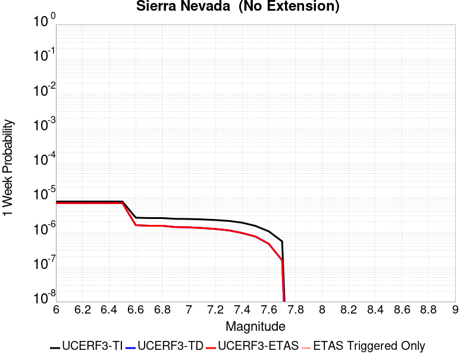 | 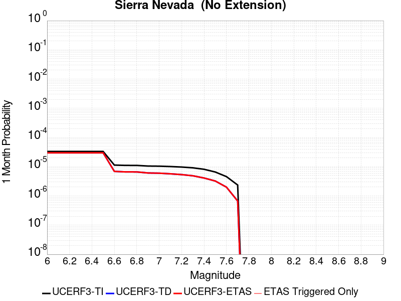 | 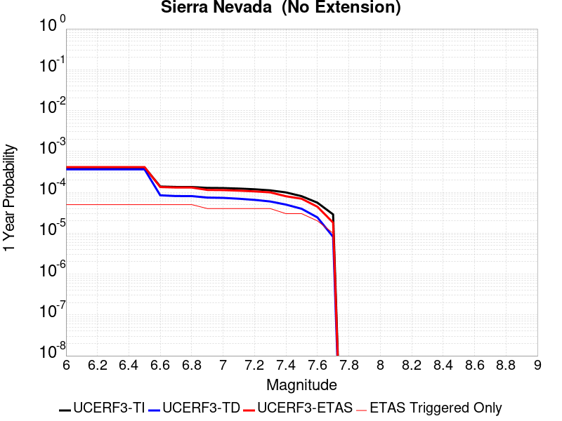 | 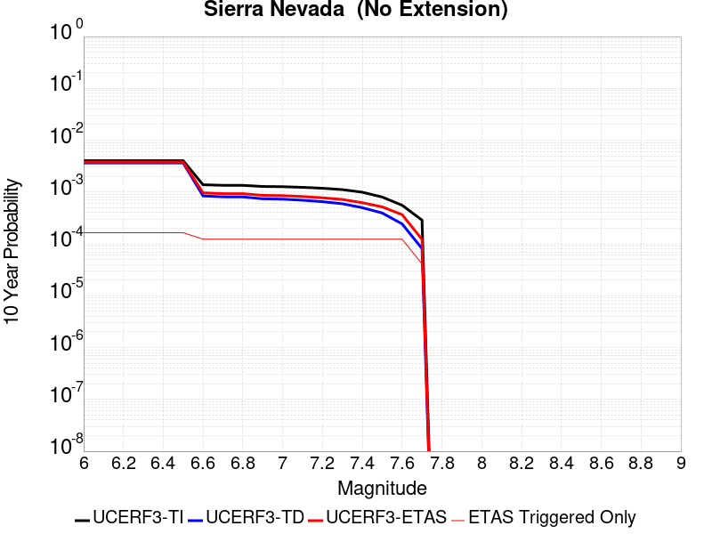 |

| Magnitude | 1 wk TI Prob | 1 wk TD Prob | 1 wk ETAS Prob | 1 wk ETAS/TD Gain | 1 wk ETAS Triggered Only | 1 mo TI Prob | 1 mo TD Prob | 1 mo ETAS Prob | 1 mo ETAS/TD Gain | 1 mo ETAS Triggered Only | 1 yr TI Prob | 1 yr TD Prob | 1 yr ETAS Prob | 1 yr ETAS/TD Gain | 1 yr ETAS Triggered Only | 10 yr TI Prob | 10 yr TD Prob | 10 yr ETAS Prob | 10 yr ETAS/TD Gain | 10 yr ETAS Triggered Only |
|-----|-----|-----|-----|-----|-----|-----|-----|-----|-----|-----|-----|-----|-----|-----|-----|-----|-----|-----|-----|-----|
| 6.0 | 7.7690465E-6 | 6.9773705E-6 | 6.9773705E-6 | 1.0 | 0.0 | 3.329549E-5 | 2.9902876E-5 | 2.9902876E-5 | 1.0 | 0.0 | 4.0529718E-4 | 3.6404256E-4 | 4.051866E-4 | 1.11302 | 4.1159037E-5 | 0.004045588 | 0.0036379788 | 0.003802016 | 1.0450902 | 1.6463615E-4 |
| 6.1 | 7.7690465E-6 | 6.9773705E-6 | 6.9773705E-6 | 1.0 | 0.0 | 3.329549E-5 | 2.9902876E-5 | 2.9902876E-5 | 1.0 | 0.0 | 4.0529718E-4 | 3.6404256E-4 | 4.051866E-4 | 1.11302 | 4.1159037E-5 | 0.004045588 | 0.0036379788 | 0.003802016 | 1.0450902 | 1.6463615E-4 |
| 6.2 | 7.7690465E-6 | 6.9773705E-6 | 6.9773705E-6 | 1.0 | 0.0 | 3.329549E-5 | 2.9902876E-5 | 2.9902876E-5 | 1.0 | 0.0 | 4.0529718E-4 | 3.6404256E-4 | 4.051866E-4 | 1.11302 | 4.1159037E-5 | 0.004045588 | 0.0036379788 | 0.003802016 | 1.0450902 | 1.6463615E-4 |
| 6.3 | 7.7690465E-6 | 6.9773705E-6 | 6.9773705E-6 | 1.0 | 0.0 | 3.329549E-5 | 2.9902876E-5 | 2.9902876E-5 | 1.0 | 0.0 | 4.0529718E-4 | 3.6404256E-4 | 4.051866E-4 | 1.11302 | 4.1159037E-5 | 0.004045588 | 0.0036379788 | 0.003802016 | 1.0450902 | 1.6463615E-4 |
| 6.4 | 7.7690465E-6 | 6.9773705E-6 | 6.9773705E-6 | 1.0 | 0.0 | 3.329549E-5 | 2.9902876E-5 | 2.9902876E-5 | 1.0 | 0.0 | 4.0529718E-4 | 3.6404256E-4 | 4.051866E-4 | 1.11302 | 4.1159037E-5 | 0.004045588 | 0.0036379788 | 0.003802016 | 1.0450902 | 1.6463615E-4 |
| 6.5 | 7.7690465E-6 | 6.9773705E-6 | 6.9773705E-6 | 1.0 | 0.0 | 3.329549E-5 | 2.9902876E-5 | 2.9902876E-5 | 1.0 | 0.0 | 4.0529718E-4 | 3.6404256E-4 | 4.051866E-4 | 1.11302 | 4.1159037E-5 | 0.004045588 | 0.0036379788 | 0.003802016 | 1.0450902 | 1.6463615E-4 |
| 6.6 | 2.653E-6 | 1.6153083E-6 | 1.6153083E-6 | 1.0 | 0.0 | 1.136995E-5 | 6.9227317E-6 | 6.9227317E-6 | 1.0 | 0.0 | 1.3842035E-4 | 8.428103E-5 | 1.254366E-4 | 1.4883136 | 4.1159037E-5 | 0.0013833415 | 8.4249413E-4 | 9.658672E-4 | 1.1464379 | 1.2347712E-4 |
| 6.7 | 2.5902466E-6 | 1.5506372E-6 | 1.5506372E-6 | 1.0 | 0.0 | 1.11010095E-5 | 6.6455714E-6 | 6.6455714E-6 | 1.0 | 0.0 | 1.351464E-4 | 8.090686E-5 | 1.2206256E-4 | 1.5086801 | 4.1159037E-5 | 0.0013506424 | 8.08777E-4 | 9.3215425E-4 | 1.152548 | 1.2347712E-4 |
| 6.8 | 2.5853892E-6 | 1.5474353E-6 | 1.5474353E-6 | 1.0 | 0.0 | 1.1080193E-5 | 6.631849E-6 | 6.631849E-6 | 1.0 | 0.0 | 1.34893E-4 | 8.0739796E-5 | 1.21895515E-4 | 1.5097327 | 4.1159037E-5 | 0.0013481114 | 8.071076E-4 | 9.304851E-4 | 1.1528637 | 1.2347712E-4 |
| 6.9 | 2.458257E-6 | 1.4224988E-6 | 1.4224988E-6 | 1.0 | 0.0 | 1.0535345E-5 | 6.0964094E-6 | 6.0964094E-6 | 1.0 | 0.0 | 1.2826028E-4 | 7.422128E-5 | 1.1537726E-4 | 1.5545038 | 4.1159037E-5 | 0.0012818627 | 7.419668E-4 | 8.6535234E-4 | 1.1662952 | 1.2347712E-4 |
| 7.0 | 2.4341468E-6 | 1.3994605E-6 | 1.3994605E-6 | 1.0 | 0.0 | 1.0432016E-5 | 5.9976746E-6 | 5.9976746E-6 | 1.0 | 0.0 | 1.270024E-4 | 7.3019255E-5 | 1.14175295E-4 | 1.5636326 | 4.1159037E-5 | 0.0012692984 | 7.2995457E-4 | 8.5334154E-4 | 1.1690338 | 1.2347712E-4 |
| 7.1 | 2.3652476E-6 | 1.3344039E-6 | 1.3344039E-6 | 1.0 | 0.0 | 1.0136736E-5 | 5.7188613E-6 | 5.7188613E-6 | 1.0 | 0.0 | 1.2340778E-4 | 6.9624926E-5 | 1.10781104E-4 | 1.5911126 | 4.1159037E-5 | 0.0012333926 | 6.9603283E-4 | 8.1942405E-4 | 1.1772778 | 1.2347712E-4 |
| 7.2 | 2.272158E-6 | 1.2507E-6 | 1.2507E-6 | 1.0 | 0.0 | 9.737784E-6 | 5.3601325E-6 | 5.3601325E-6 | 1.0 | 0.0 | 1.1855107E-4 | 6.525767E-5 | 1.0641402E-4 | 1.6306746 | 4.1159037E-5 | 0.0011848784 | 6.523866E-4 | 7.7578315E-4 | 1.1891464 | 1.2347712E-4 |
| 7.3 | 2.1382127E-6 | 1.1423749E-6 | 1.1423749E-6 | 1.0 | 0.0 | 9.163737E-6 | 4.895883E-6 | 4.895883E-6 | 1.0 | 0.0 | 1.1156279E-4 | 5.960576E-5 | 1.0076234E-4 | 1.69048 | 4.1159037E-5 | 0.001115068 | 5.958989E-4 | 7.1930245E-4 | 1.207088 | 1.2347712E-4 |
| 7.4 | 1.9048055E-6 | 9.579064E-7 | 9.579064E-7 | 1.0 | 0.0 | 8.163426E-6 | 4.105307E-6 | 4.105307E-6 | 1.0 | 0.0 | 9.9385186E-5 | 4.9980972E-5 | 9.1137954E-5 | 1.823453 | 4.1159037E-5 | 9.934074E-4 | 4.99698E-4 | 6.231134E-4 | 1.24698 | 1.2347712E-4 |
| 7.5 | 1.5373403E-6 | 7.563288E-7 | 7.563288E-7 | 1.0 | 0.0 | 6.5885843E-6 | 3.241405E-6 | 3.241405E-6 | 1.0 | 0.0 | 8.021306E-5 | 3.9463397E-5 | 8.062081E-5 | 2.0429263 | 4.1159037E-5 | 8.0184115E-4 | 3.9456435E-4 | 5.1799277E-4 | 1.312822 | 1.2347712E-4 |
| 7.6 | 1.0680322E-6 | 4.661944E-7 | 4.661944E-7 | 1.0 | 0.0 | 4.577273E-6 | 1.9979743E-6 | 1.9979743E-6 | 1.0 | 0.0 | 5.5726876E-5 | 2.432507E-5 | 6.548311E-5 | 2.6920009 | 4.1159037E-5 | 5.5712904E-4 | 2.4322433E-4 | 3.6667142E-4 | 1.5075442 | 1.2347712E-4 |
| 7.7 | 5.509146E-7 | 1.5591806E-7 | 1.5591806E-7 | 1.0 | 0.0 | 2.3610605E-6 | 6.682201E-7 | 6.682201E-7 | 1.0 | 0.0 | 2.8745531E-5 | 8.13555E-6 | 4.9294253E-5 | 6.0591173 | 4.1159037E-5 | 2.8741814E-4 | 8.135264E-5 | 1.2250834E-4 | 1.5058925 | 4.1159037E-5 |

## San Andreas (San Gorgonio Pass-Garnet HIll)
*[(top)](#table-of-contents)*

| 1 Week | 1 Month | 1 Year | 10 Year |
|-----|-----|-----|-----|
| 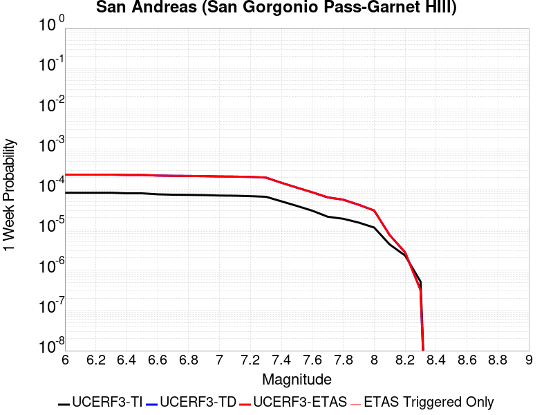 | 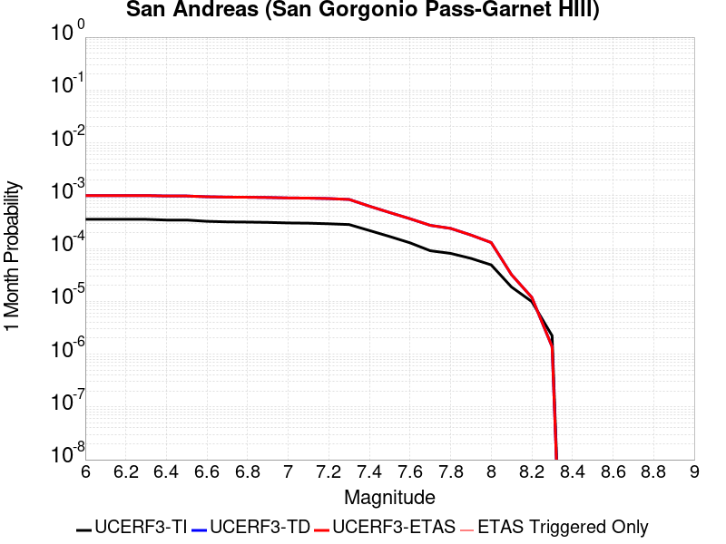 | 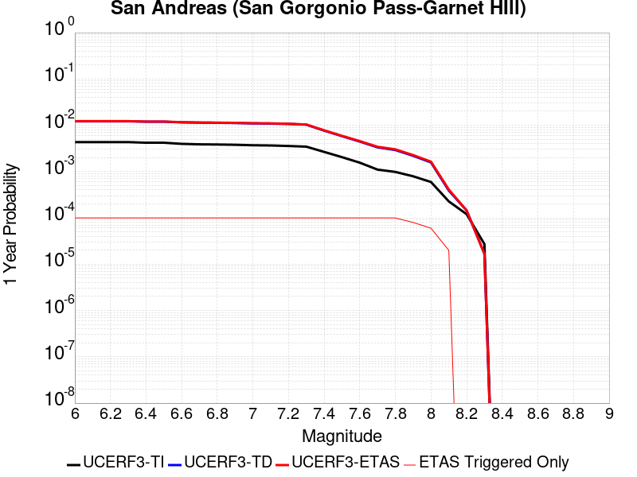 | 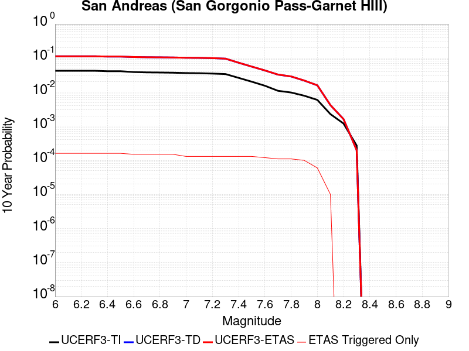 |

| Magnitude | 1 wk TI Prob | 1 wk TD Prob | 1 wk ETAS Prob | 1 wk ETAS/TD Gain | 1 wk ETAS Triggered Only | 1 mo TI Prob | 1 mo TD Prob | 1 mo ETAS Prob | 1 mo ETAS/TD Gain | 1 mo ETAS Triggered Only | 1 yr TI Prob | 1 yr TD Prob | 1 yr ETAS Prob | 1 yr ETAS/TD Gain | 1 yr ETAS Triggered Only | 10 yr TI Prob | 10 yr TD Prob | 10 yr ETAS Prob | 10 yr ETAS/TD Gain | 10 yr ETAS Triggered Only |
|-----|-----|-----|-----|-----|-----|-----|-----|-----|-----|-----|-----|-----|-----|-----|-----|-----|-----|-----|-----|-----|
| 6.0 | 8.31567E-5 | 2.3455099E-4 | 2.3455099E-4 | 1.0 | 0.0 | 3.5633717E-4 | 0.0010048301 | 0.0010048301 | 1.0 | 0.0 | 0.004329778 | 0.012165095 | 0.012246411 | 1.0066844 | 8.2318074E-5 | 0.042463828 | 0.11287292 | 0.113018975 | 1.001294 | 1.6463615E-4 |
| 6.1 | 8.31567E-5 | 2.3455099E-4 | 2.3455099E-4 | 1.0 | 0.0 | 3.5633717E-4 | 0.0010048301 | 0.0010048301 | 1.0 | 0.0 | 0.004329778 | 0.012165095 | 0.012246411 | 1.0066844 | 8.2318074E-5 | 0.042463828 | 0.11287292 | 0.113018975 | 1.001294 | 1.6463615E-4 |
| 6.2 | 8.31567E-5 | 2.3455099E-4 | 2.3455099E-4 | 1.0 | 0.0 | 3.5633717E-4 | 0.0010048301 | 0.0010048301 | 1.0 | 0.0 | 0.004329778 | 0.012165095 | 0.012246411 | 1.0066844 | 8.2318074E-5 | 0.042463828 | 0.11287292 | 0.113018975 | 1.001294 | 1.6463615E-4 |
| 6.3 | 8.31567E-5 | 2.3455099E-4 | 2.3455099E-4 | 1.0 | 0.0 | 3.5633717E-4 | 0.0010048301 | 0.0010048301 | 1.0 | 0.0 | 0.004329778 | 0.012165095 | 0.012246411 | 1.0066844 | 8.2318074E-5 | 0.042463828 | 0.11287292 | 0.113018975 | 1.001294 | 1.6463615E-4 |
| 6.4 | 8.059055E-5 | 2.3012291E-4 | 2.3012291E-4 | 1.0 | 0.0 | 3.4534236E-4 | 9.858671E-4 | 9.858671E-4 | 1.0 | 0.0 | 0.0041964394 | 0.011937095 | 0.01201843 | 1.0068136 | 8.2318074E-5 | 0.041180745 | 0.11085296 | 0.110999346 | 1.0013205 | 1.6463615E-4 |
| 6.5 | 8.059055E-5 | 2.3012291E-4 | 2.3012291E-4 | 1.0 | 0.0 | 3.4534236E-4 | 9.858671E-4 | 9.858671E-4 | 1.0 | 0.0 | 0.0041964394 | 0.011937095 | 0.01201843 | 1.0068136 | 8.2318074E-5 | 0.041180745 | 0.11085296 | 0.110999346 | 1.0013205 | 1.6463615E-4 |
| 6.6 | 7.619237E-5 | 2.225621E-4 | 2.225621E-4 | 1.0 | 0.0 | 3.2649786E-4 | 9.5349125E-4 | 9.5349125E-4 | 1.0 | 0.0 | 0.0039678677 | 0.011547514 | 0.011628882 | 1.0070463 | 8.2318074E-5 | 0.03897764 | 0.10738801 | 0.10753497 | 1.0013684 | 1.6463615E-4 |
| 6.7 | 7.440636E-5 | 2.1931871E-4 | 2.1931871E-4 | 1.0 | 0.0 | 3.188454E-4 | 9.39601E-4 | 9.39601E-4 | 1.0 | 0.0 | 0.0038750346 | 0.011380176 | 0.011461557 | 1.0071511 | 8.2318074E-5 | 0.038081564 | 0.10589632 | 0.10604352 | 1.0013901 | 1.6463615E-4 |
| 6.8 | 7.3735864E-5 | 2.1778827E-4 | 2.1778827E-4 | 1.0 | 0.0 | 3.1597257E-4 | 9.330467E-4 | 9.330467E-4 | 1.0 | 0.0 | 0.0038401815 | 0.01130121 | 0.011382598 | 1.0072017 | 8.2318074E-5 | 0.03774495 | 0.10519727 | 0.10534459 | 1.0014004 | 1.6463615E-4 |
| 6.9 | 7.27575E-5 | 2.1547603E-4 | 2.1547603E-4 | 1.0 | 0.0 | 3.117806E-4 | 9.2314417E-4 | 9.2314417E-4 | 1.0 | 0.0 | 0.003789323 | 0.011181891 | 0.011263289 | 1.0072794 | 8.2318074E-5 | 0.037253562 | 0.104144685 | 0.10429218 | 1.0014162 | 1.6463615E-4 |
| 7.0 | 7.102591E-5 | 2.1131337E-4 | 2.1131337E-4 | 1.0 | 0.0 | 3.0436125E-4 | 9.053166E-4 | 9.053166E-4 | 1.0 | 0.0 | 0.003699303 | 0.010967043 | 0.0110484585 | 1.0074236 | 8.2318074E-5 | 0.03638325 | 0.10224576 | 0.10239357 | 1.0014455 | 1.6463615E-4 |
| 7.1 | 7.028513E-5 | 2.0966642E-4 | 2.0966642E-4 | 1.0 | 0.0 | 3.0118722E-4 | 8.982632E-4 | 8.982632E-4 | 1.0 | 0.0 | 0.0036607897 | 0.010882029 | 0.010963451 | 1.0074823 | 8.2318074E-5 | 0.036010686 | 0.10148743 | 0.10163536 | 1.0014576 | 1.6463615E-4 |
| 7.2 | 6.8498244E-5 | 2.0574164E-4 | 2.0574164E-4 | 1.0 | 0.0 | 2.9353087E-4 | 8.8145415E-4 | 8.8145415E-4 | 1.0 | 0.0 | 0.003567883 | 0.0106794005 | 0.01076084 | 1.0076258 | 8.2318074E-5 | 0.035111405 | 0.09967861 | 0.099826835 | 1.001487 | 1.6463615E-4 |
| 7.3 | 6.622592E-5 | 1.9800379E-4 | 1.9800379E-4 | 1.0 | 0.0 | 2.8379448E-4 | 8.483139E-4 | 8.483139E-4 | 1.0 | 0.0 | 0.0034497243 | 0.010279794 | 0.010361266 | 1.0079254 | 8.2318074E-5 | 0.033966612 | 0.096172415 | 0.09632122 | 1.0015472 | 1.6463615E-4 |
| 7.4 | 5.1050705E-5 | 1.4748148E-4 | 1.4748148E-4 | 1.0 | 0.0 | 2.1877038E-4 | 6.319113E-4 | 6.319113E-4 | 1.0 | 0.0 | 0.002660276 | 0.0076665743 | 0.007748261 | 1.0106549 | 8.2318074E-5 | 0.02628654 | 0.073117696 | 0.0732703 | 1.002087 | 1.6463615E-4 |
| 7.5 | 3.9302922E-5 | 1.1181122E-4 | 1.1181122E-4 | 1.0 | 0.0 | 1.6843023E-4 | 4.7910327E-4 | 4.7910327E-4 | 1.0 | 0.0 | 0.0020487092 | 0.005817551 | 0.0058993907 | 1.0140676 | 8.2318074E-5 | 0.020299247 | 0.056236032 | 0.05639141 | 1.0027629 | 1.6463615E-4 |
| 7.6 | 2.9851626E-5 | 8.540269E-5 | 8.540269E-5 | 1.0 | 0.0 | 1.2792926E-4 | 3.659603E-4 | 3.659603E-4 | 1.0 | 0.0 | 0.0015564259 | 0.0044464897 | 0.004528442 | 1.0184307 | 8.2318074E-5 | 0.0154556995 | 0.0433964 | 0.04355389 | 1.0036291 | 1.6463615E-4 |
| 7.7 | 2.1135214E-5 | 6.39321E-5 | 6.39321E-5 | 1.0 | 0.0 | 9.0576345E-5 | 2.7396597E-4 | 2.7396597E-4 | 1.0 | 0.0 | 0.0011022091 | 0.0033304393 | 0.0034124833 | 1.0246346 | 8.2318074E-5 | 0.010967582 | 0.032763455 | 0.032922696 | 1.0048604 | 1.6463615E-4 |
| 7.8 | 1.883379E-5 | 5.6009827E-5 | 5.6009827E-5 | 1.0 | 0.0 | 8.0713755E-5 | 2.4002005E-4 | 2.4002005E-4 | 1.0 | 0.0 | 9.822468E-4 | 0.0029183314 | 0.003000409 | 1.0281249 | 8.2318074E-5 | 0.0097791655 | 0.028862024 | 0.029021908 | 1.0055397 | 1.6463615E-4 |
| 7.9 | 1.5156185E-5 | 4.19625E-5 | 4.19625E-5 | 1.0 | 0.0 | 6.495346E-5 | 1.7982691E-4 | 1.7982691E-4 | 1.0 | 0.0 | 7.9052144E-4 | 0.0021871955 | 0.0022693335 | 1.037554 | 8.2318074E-5 | 0.007877152 | 0.021899192 | 0.022060221 | 1.0073533 | 1.6463615E-4 |
| 8.0 | 1.1405907E-5 | 3.0203699E-5 | 3.0203699E-5 | 1.0 | 0.0 | 4.8881542E-5 | 1.29438E-4 | 1.29438E-4 | 1.0 | 0.0 | 5.9497025E-4 | 0.0015747696 | 0.0016158638 | 1.0260954 | 4.1159037E-5 | 0.005933798 | 0.015879562 | 0.015960574 | 1.0051016 | 8.2318074E-5 |
| 8.1 | 4.3511436E-6 | 7.4538148E-6 | 7.4538148E-6 | 1.0 | 0.0 | 1.8647626E-5 | 3.1944528E-5 | 3.1944528E-5 | 1.0 | 0.0 | 2.2701119E-4 | 3.8885538E-4 | 3.8885538E-4 | 1.0 | 0.0 | 0.0022677942 | 0.0041587194 | 0.0041587194 | 1.0 | 0.0 |
| 8.2 | 2.3042528E-6 | 2.7723743E-6 | 2.7723743E-6 | 1.0 | 0.0 | 9.875332E-6 | 1.188155E-5 | 1.188155E-5 | 1.0 | 0.0 | 1.2022553E-4 | 1.4464831E-4 | 1.4464831E-4 | 1.0 | 0.0 | 0.0012016051 | 0.0016186252 | 0.0016186252 | 1.0 | 0.0 |
| 8.3 | 5.202968E-7 | 3.2165772E-7 | 3.2165772E-7 | 1.0 | 0.0 | 2.2298414E-6 | 1.3785324E-6 | 1.3785324E-6 | 1.0 | 0.0 | 2.714798E-5 | 1.6783515E-5 | 1.6783515E-5 | 1.0 | 0.0 | 2.7144665E-4 | 1.9881342E-4 | 1.9881342E-4 | 1.0 | 0.0 |

## San Andreas (Carrizo) rev
*[(top)](#table-of-contents)*

| 1 Week | 1 Month | 1 Year | 10 Year |
|-----|-----|-----|-----|
|  | 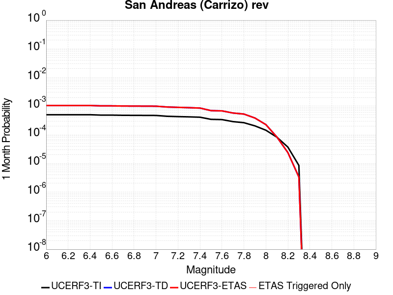 |  |  |

| Magnitude | 1 wk TI Prob | 1 wk TD Prob | 1 wk ETAS Prob | 1 wk ETAS/TD Gain | 1 wk ETAS Triggered Only | 1 mo TI Prob | 1 mo TD Prob | 1 mo ETAS Prob | 1 mo ETAS/TD Gain | 1 mo ETAS Triggered Only | 1 yr TI Prob | 1 yr TD Prob | 1 yr ETAS Prob | 1 yr ETAS/TD Gain | 1 yr ETAS Triggered Only | 10 yr TI Prob | 10 yr TD Prob | 10 yr ETAS Prob | 10 yr ETAS/TD Gain | 10 yr ETAS Triggered Only |
|-----|-----|-----|-----|-----|-----|-----|-----|-----|-----|-----|-----|-----|-----|-----|-----|-----|-----|-----|-----|-----|
| 6.0 | 1.1674632E-4 | 2.4493932E-4 | 2.4493932E-4 | 1.0 | 0.0 | 5.002454E-4 | 0.0010493193 | 0.0010493193 | 1.0 | 0.0 | 0.006073493 | 0.012701117 | 0.012701117 | 1.0 | 0.0 | 0.0591016 | 0.121357135 | 0.12146563 | 1.000894 | 1.2347712E-4 |
| 6.1 | 1.1674632E-4 | 2.4493932E-4 | 2.4493932E-4 | 1.0 | 0.0 | 5.002454E-4 | 0.0010493193 | 0.0010493193 | 1.0 | 0.0 | 0.006073493 | 0.012701117 | 0.012701117 | 1.0 | 0.0 | 0.0591016 | 0.121357135 | 0.12146563 | 1.000894 | 1.2347712E-4 |
| 6.2 | 1.1674632E-4 | 2.4493932E-4 | 2.4493932E-4 | 1.0 | 0.0 | 5.002454E-4 | 0.0010493193 | 0.0010493193 | 1.0 | 0.0 | 0.006073493 | 0.012701117 | 0.012701117 | 1.0 | 0.0 | 0.0591016 | 0.121357135 | 0.12146563 | 1.000894 | 1.2347712E-4 |
| 6.3 | 1.1674632E-4 | 2.4493932E-4 | 2.4493932E-4 | 1.0 | 0.0 | 5.002454E-4 | 0.0010493193 | 0.0010493193 | 1.0 | 0.0 | 0.006073493 | 0.012701117 | 0.012701117 | 1.0 | 0.0 | 0.0591016 | 0.121357135 | 0.12146563 | 1.000894 | 1.2347712E-4 |
| 6.4 | 1.1674632E-4 | 2.4493932E-4 | 2.4493932E-4 | 1.0 | 0.0 | 5.002454E-4 | 0.0010493193 | 0.0010493193 | 1.0 | 0.0 | 0.006073493 | 0.012701117 | 0.012701117 | 1.0 | 0.0 | 0.0591016 | 0.121357135 | 0.12146563 | 1.000894 | 1.2347712E-4 |
| 6.5 | 1.13136164E-4 | 2.3813234E-4 | 2.3813234E-4 | 1.0 | 0.0 | 4.847792E-4 | 0.0010201696 | 0.0010201696 | 1.0 | 0.0 | 0.0058862255 | 0.012350284 | 0.012350284 | 1.0 | 0.0 | 0.057327334 | 0.118321046 | 0.118429914 | 1.00092 | 1.2347712E-4 |
| 6.6 | 1.13136164E-4 | 2.3813234E-4 | 2.3813234E-4 | 1.0 | 0.0 | 4.847792E-4 | 0.0010201696 | 0.0010201696 | 1.0 | 0.0 | 0.0058862255 | 0.012350284 | 0.012350284 | 1.0 | 0.0 | 0.057327334 | 0.118321046 | 0.118429914 | 1.00092 | 1.2347712E-4 |
| 6.7 | 1.1149675E-4 | 2.3504133E-4 | 2.3504133E-4 | 1.0 | 0.0 | 4.777557E-4 | 0.0010069326 | 0.0010069326 | 1.0 | 0.0 | 0.0058011734 | 0.012190935 | 0.012190935 | 1.0 | 0.0 | 0.05652051 | 0.11693912 | 0.11704816 | 1.0009325 | 1.2347712E-4 |
| 6.8 | 1.1103589E-4 | 2.3406085E-4 | 2.3406085E-4 | 1.0 | 0.0 | 4.7578133E-4 | 0.0010027338 | 0.0010027338 | 1.0 | 0.0 | 0.005777263 | 0.012140386 | 0.012140386 | 1.0 | 0.0 | 0.056293584 | 0.11649932 | 0.11657205 | 1.0006243 | 8.2318074E-5 |
| 6.9 | 1.1053259E-4 | 2.3298238E-4 | 2.3298238E-4 | 1.0 | 0.0 | 4.7362508E-4 | 9.981153E-4 | 9.981153E-4 | 1.0 | 0.0 | 0.0057511497 | 0.012084781 | 0.012084781 | 1.0 | 0.0 | 0.05604569 | 0.11601515 | 0.11608792 | 1.0006273 | 8.2318074E-5 |
| 7.0 | 1.1005377E-4 | 2.3198874E-4 | 2.3198874E-4 | 1.0 | 0.0 | 4.7157376E-4 | 9.938602E-4 | 9.938602E-4 | 1.0 | 0.0 | 0.0057263062 | 0.012033548 | 0.012033548 | 1.0 | 0.0 | 0.055809796 | 0.11556642 | 0.11563922 | 1.00063 | 8.2318074E-5 |
| 7.1 | 1.0308142E-4 | 2.1705501E-4 | 2.1705501E-4 | 1.0 | 0.0 | 4.417027E-4 | 9.2990516E-4 | 9.2990516E-4 | 1.0 | 0.0 | 0.0053644776 | 0.011263144 | 0.011263144 | 1.0 | 0.0 | 0.052368138 | 0.108812615 | 0.10888597 | 1.0006742 | 8.2318074E-5 |
| 7.2 | 1.0027479E-4 | 2.1112041E-4 | 2.1112041E-4 | 1.0 | 0.0 | 4.296783E-4 | 9.04489E-4 | 9.04489E-4 | 1.0 | 0.0 | 0.0052187922 | 0.010956854 | 0.010956854 | 1.0 | 0.0 | 0.050979212 | 0.106117465 | 0.10619105 | 1.0006934 | 8.2318074E-5 |
| 7.3 | 9.816942E-5 | 2.0584959E-4 | 2.0584959E-4 | 1.0 | 0.0 | 4.2065824E-4 | 8.819152E-4 | 8.819152E-4 | 1.0 | 0.0 | 0.005109493 | 0.010684745 | 0.010684745 | 1.0 | 0.0 | 0.049935985 | 0.10369145 | 0.103765234 | 1.0007116 | 8.2318074E-5 |
| 7.4 | 9.5634205E-5 | 1.9951664E-4 | 1.9951664E-4 | 1.0 | 0.0 | 4.0979648E-4 | 8.54792E-4 | 8.54792E-4 | 1.0 | 0.0 | 0.0049778637 | 0.010357699 | 0.010357699 | 1.0 | 0.0 | 0.048678253 | 0.10076431 | 0.10083833 | 1.0007346 | 8.2318074E-5 |
| 7.5 | 8.052417E-5 | 1.6252958E-4 | 1.6252958E-4 | 1.0 | 0.0 | 3.4505792E-4 | 6.963696E-4 | 6.963696E-4 | 1.0 | 0.0 | 0.0041929903 | 0.008445424 | 0.008445424 | 1.0 | 0.0 | 0.04114753 | 0.083443135 | 0.08351859 | 1.0009042 | 8.2318074E-5 |
| 7.6 | 7.897024E-5 | 1.5904442E-4 | 1.5904442E-4 | 1.0 | 0.0 | 3.384E-4 | 6.8144104E-4 | 6.8144104E-4 | 1.0 | 0.0 | 0.0041122385 | 0.008265062 | 0.008265062 | 1.0 | 0.0 | 0.040369697 | 0.08177752 | 0.08185311 | 1.0009243 | 8.2318074E-5 |
| 7.7 | 6.707427E-5 | 1.340106E-4 | 1.340106E-4 | 1.0 | 0.0 | 2.8742946E-4 | 5.742047E-4 | 5.742047E-4 | 1.0 | 0.0 | 0.003493839 | 0.006968567 | 0.006968567 | 1.0 | 0.0 | 0.034394164 | 0.06961693 | 0.06969352 | 1.0011002 | 8.2318074E-5 |
| 7.8 | 6.147705E-5 | 1.231055E-4 | 1.231055E-4 | 1.0 | 0.0 | 2.6344648E-4 | 5.2748836E-4 | 5.2748836E-4 | 1.0 | 0.0 | 0.0032027436 | 0.0064032855 | 0.0064032855 | 1.0 | 0.0 | 0.031569764 | 0.06403331 | 0.06411035 | 1.0012032 | 8.2318074E-5 |
| 7.9 | 4.7636717E-5 | 8.96141E-5 | 8.96141E-5 | 1.0 | 0.0 | 2.0414138E-4 | 3.840039E-4 | 3.840039E-4 | 1.0 | 0.0 | 0.0024825884 | 0.004665233 | 0.004665233 | 1.0 | 0.0 | 0.024550365 | 0.047013443 | 0.04709189 | 1.0016686 | 8.2318074E-5 |
| 8.0 | 3.3554235E-5 | 5.2638316E-5 | 5.2638316E-5 | 1.0 | 0.0 | 1.4379594E-4 | 2.2557328E-4 | 2.2557328E-4 | 1.0 | 0.0 | 0.0017493097 | 0.0027428977 | 0.0027428977 | 1.0 | 0.0 | 0.017356034 | 0.028128056 | 0.028168058 | 1.0014222 | 4.1159037E-5 |
| 8.1 | 1.9175432E-5 | 1.9428602E-5 | 1.9428602E-5 | 1.0 | 0.0 | 8.217783E-5 | 8.3262785E-5 | 8.3262785E-5 | 1.0 | 0.0 | 0.0010000558 | 0.0010132536 | 0.0010132536 | 1.0 | 0.0 | 0.009955673 | 0.01088604 | 0.01088604 | 1.0 | 0.0 |
| 8.2 | 8.643924E-6 | 5.5660976E-6 | 5.5660976E-6 | 1.0 | 0.0 | 3.704486E-5 | 2.3854487E-5 | 2.3854487E-5 | 1.0 | 0.0 | 4.5092785E-4 | 2.9038975E-4 | 2.9038975E-4 | 1.0 | 0.0 | 0.0045001395 | 0.0032986484 | 0.0032986484 | 1.0 | 0.0 |
| 8.3 | 1.983087E-6 | 7.808603E-7 | 7.808603E-7 | 1.0 | 0.0 | 8.498917E-6 | 3.34654E-6 | 3.34654E-6 | 1.0 | 0.0 | 1.034694E-4 | 4.074338E-5 | 4.074338E-5 | 1.0 | 0.0 | 0.0010342124 | 4.8047924E-4 | 4.8047924E-4 | 1.0 | 0.0 |

## San Jacinto (San Bernardino)
*[(top)](#table-of-contents)*

| 1 Week | 1 Month | 1 Year | 10 Year |
|-----|-----|-----|-----|
| 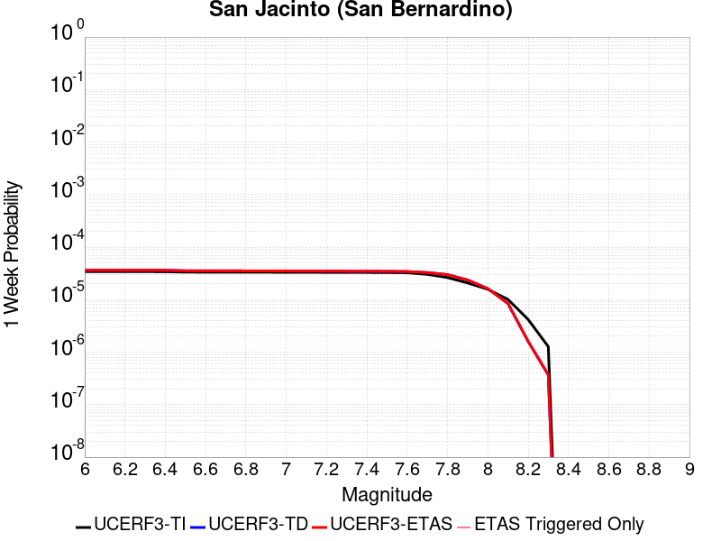 | 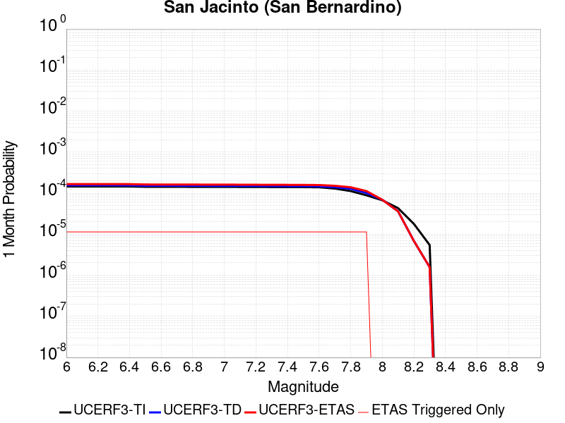 | 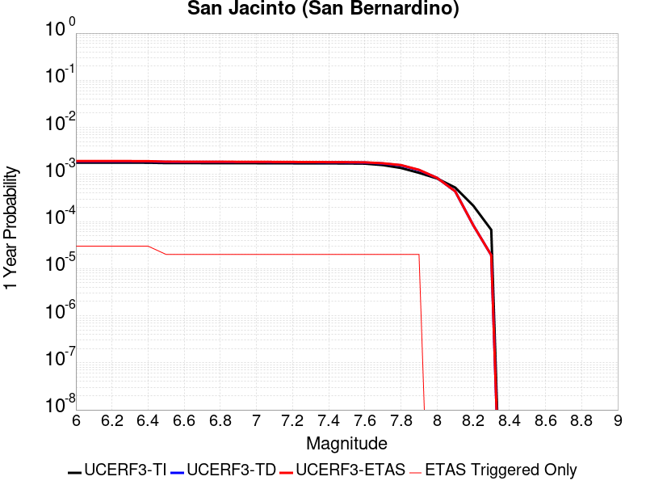 | 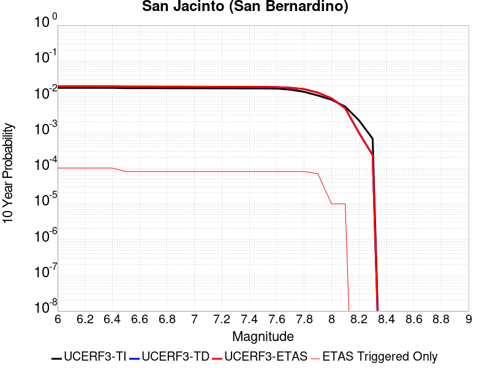 |

| Magnitude | 1 wk TI Prob | 1 wk TD Prob | 1 wk ETAS Prob | 1 wk ETAS/TD Gain | 1 wk ETAS Triggered Only | 1 mo TI Prob | 1 mo TD Prob | 1 mo ETAS Prob | 1 mo ETAS/TD Gain | 1 mo ETAS Triggered Only | 1 yr TI Prob | 1 yr TD Prob | 1 yr ETAS Prob | 1 yr ETAS/TD Gain | 1 yr ETAS Triggered Only | 10 yr TI Prob | 10 yr TD Prob | 10 yr ETAS Prob | 10 yr ETAS/TD Gain | 10 yr ETAS Triggered Only |
|-----|-----|-----|-----|-----|-----|-----|-----|-----|-----|-----|-----|-----|-----|-----|-----|-----|-----|-----|-----|-----|
| 6.0 | 3.409352E-5 | 3.6263704E-5 | 3.6263704E-5 | 1.0 | 0.0 | 1.461069E-4 | 1.5540663E-4 | 1.5540663E-4 | 1.0 | 0.0 | 0.0017774 | 0.0018904353 | 0.0019725978 | 1.0434622 | 8.2318074E-5 | 0.01763251 | 0.019491682 | 0.019612752 | 1.0062114 | 1.2347712E-4 |
| 6.1 | 3.409352E-5 | 3.6263704E-5 | 3.6263704E-5 | 1.0 | 0.0 | 1.461069E-4 | 1.5540663E-4 | 1.5540663E-4 | 1.0 | 0.0 | 0.0017774 | 0.0018904353 | 0.0019725978 | 1.0434622 | 8.2318074E-5 | 0.01763251 | 0.019491682 | 0.019612752 | 1.0062114 | 1.2347712E-4 |
| 6.2 | 3.409352E-5 | 3.6263704E-5 | 3.6263704E-5 | 1.0 | 0.0 | 1.461069E-4 | 1.5540663E-4 | 1.5540663E-4 | 1.0 | 0.0 | 0.0017774 | 0.0018904353 | 0.0019725978 | 1.0434622 | 8.2318074E-5 | 0.01763251 | 0.019491682 | 0.019612752 | 1.0062114 | 1.2347712E-4 |
| 6.3 | 3.409352E-5 | 3.6263704E-5 | 3.6263704E-5 | 1.0 | 0.0 | 1.461069E-4 | 1.5540663E-4 | 1.5540663E-4 | 1.0 | 0.0 | 0.0017774 | 0.0018904353 | 0.0019725978 | 1.0434622 | 8.2318074E-5 | 0.01763251 | 0.019491682 | 0.019612752 | 1.0062114 | 1.2347712E-4 |
| 6.4 | 3.400795E-5 | 3.6156307E-5 | 3.6156307E-5 | 1.0 | 0.0 | 1.4574021E-4 | 1.549464E-4 | 1.549464E-4 | 1.0 | 0.0 | 0.0017729428 | 0.001884842 | 0.0019670047 | 1.0435914 | 8.2318074E-5 | 0.017588645 | 0.01943674 | 0.019557817 | 1.0062293 | 1.2347712E-4 |
| 6.5 | 3.341482E-5 | 3.541652E-5 | 3.541652E-5 | 1.0 | 0.0 | 1.4319851E-4 | 1.5177626E-4 | 1.5177626E-4 | 1.0 | 0.0 | 0.0017420477 | 0.0018463111 | 0.0018873942 | 1.0222514 | 4.1159037E-5 | 0.017284546 | 0.019058121 | 0.01913887 | 1.004237 | 8.2318074E-5 |
| 6.6 | 3.3364955E-5 | 3.53537E-5 | 3.53537E-5 | 1.0 | 0.0 | 1.4298483E-4 | 1.5150706E-4 | 1.5150706E-4 | 1.0 | 0.0 | 0.0017394501 | 0.0018430393 | 0.0018841225 | 1.022291 | 4.1159037E-5 | 0.017258976 | 0.019025972 | 0.019106725 | 1.0042443 | 8.2318074E-5 |
| 6.7 | 3.335922E-5 | 3.534347E-5 | 3.534347E-5 | 1.0 | 0.0 | 1.4296026E-4 | 1.5146322E-4 | 1.5146322E-4 | 1.0 | 0.0 | 0.0017391514 | 0.0018425063 | 0.0018835897 | 1.0222975 | 4.1159037E-5 | 0.017256035 | 0.019020762 | 0.019101515 | 1.0042455 | 8.2318074E-5 |
| 6.8 | 3.327683E-5 | 3.5237466E-5 | 3.5237466E-5 | 1.0 | 0.0 | 1.4260718E-4 | 1.5100898E-4 | 1.5100898E-4 | 1.0 | 0.0 | 0.0017348597 | 0.0018369853 | 0.0018780688 | 1.0223646 | 4.1159037E-5 | 0.017213784 | 0.018966507 | 0.019047264 | 1.0042579 | 8.2318074E-5 |
| 6.9 | 3.3235785E-5 | 3.517838E-5 | 3.517838E-5 | 1.0 | 0.0 | 1.4243131E-4 | 1.5075578E-4 | 1.5075578E-4 | 1.0 | 0.0 | 0.0017327217 | 0.0018339078 | 0.0018749913 | 1.0224022 | 4.1159037E-5 | 0.017192734 | 0.018936358 | 0.019017117 | 1.0042648 | 8.2318074E-5 |
| 7.0 | 3.3197095E-5 | 3.511826E-5 | 3.511826E-5 | 1.0 | 0.0 | 1.422655E-4 | 1.5049815E-4 | 1.5049815E-4 | 1.0 | 0.0 | 0.0017307063 | 0.0018307766 | 0.0018718602 | 1.0224406 | 4.1159037E-5 | 0.017172894 | 0.018905716 | 0.018986477 | 1.0042719 | 8.2318074E-5 |
| 7.1 | 3.3129716E-5 | 3.499836E-5 | 3.499836E-5 | 1.0 | 0.0 | 1.4197677E-4 | 1.4998435E-4 | 1.4998435E-4 | 1.0 | 0.0 | 0.0017271966 | 0.0018245316 | 0.0018656155 | 1.0225176 | 4.1159037E-5 | 0.017138338 | 0.018844748 | 0.018925514 | 1.0042859 | 8.2318074E-5 |
| 7.2 | 3.3034008E-5 | 3.486572E-5 | 3.486572E-5 | 1.0 | 0.0 | 1.4156665E-4 | 1.4941597E-4 | 1.4941597E-4 | 1.0 | 0.0 | 0.0017222111 | 0.001817623 | 0.0018587072 | 1.0226033 | 4.1159037E-5 | 0.017089253 | 0.018777112 | 0.018857883 | 1.0043017 | 8.2318074E-5 |
| 7.3 | 3.2956614E-5 | 3.4733315E-5 | 3.4733315E-5 | 1.0 | 0.0 | 1.4123498E-4 | 1.4884857E-4 | 1.4884857E-4 | 1.0 | 0.0 | 0.0017181796 | 0.0018107265 | 0.001851811 | 1.0226895 | 4.1159037E-5 | 0.017049557 | 0.01870978 | 0.01879056 | 1.0043174 | 8.2318074E-5 |
| 7.4 | 3.2915937E-5 | 3.465488E-5 | 3.465488E-5 | 1.0 | 0.0 | 1.4106068E-4 | 1.4851247E-4 | 1.4851247E-4 | 1.0 | 0.0 | 0.0017160608 | 0.0018066412 | 0.001847726 | 1.022741 | 4.1159037E-5 | 0.017028693 | 0.018669993 | 0.018750774 | 1.0043268 | 8.2318074E-5 |
| 7.5 | 3.281791E-5 | 3.4519595E-5 | 3.4519595E-5 | 1.0 | 0.0 | 1.406406E-4 | 1.4793273E-4 | 1.4793273E-4 | 1.0 | 0.0 | 0.0017109542 | 0.0017995946 | 0.0018406796 | 1.0228301 | 4.1159037E-5 | 0.016978411 | 0.018600788 | 0.018681576 | 1.0043432 | 8.2318074E-5 |
| 7.6 | 3.2521442E-5 | 3.4244018E-5 | 3.4244018E-5 | 1.0 | 0.0 | 1.3937015E-4 | 1.4675183E-4 | 1.4675183E-4 | 1.0 | 0.0 | 0.0016955109 | 0.0017852407 | 0.0018263262 | 1.0230141 | 4.1159037E-5 | 0.016826328 | 0.018458195 | 0.018538993 | 1.0043774 | 8.2318074E-5 |
| 7.7 | 3.0287873E-5 | 3.2724896E-5 | 3.2724896E-5 | 1.0 | 0.0 | 1.297987E-4 | 1.4024203E-4 | 1.4024203E-4 | 1.0 | 0.0 | 0.0015791537 | 0.0017061107 | 0.0017471995 | 1.0240834 | 4.1159037E-5 | 0.01567979 | 0.01766762 | 0.017748483 | 1.0045769 | 8.2318074E-5 |
| 7.8 | 2.6316151E-5 | 2.9925775E-5 | 2.9925775E-5 | 1.0 | 0.0 | 1.1277862E-4 | 1.2824702E-4 | 1.2824702E-4 | 1.0 | 0.0 | 0.0013722149 | 0.0015602902 | 0.001601385 | 1.026338 | 4.1159037E-5 | 0.013637724 | 0.016204199 | 0.016285183 | 1.0049977 | 8.2318074E-5 |
| 7.9 | 2.0761147E-5 | 2.3646511E-5 | 2.3646511E-5 | 1.0 | 0.0 | 8.897331E-5 | 1.0133826E-4 | 1.0133826E-4 | 1.0 | 0.0 | 0.0010827117 | 0.0012330959 | 0.0012742041 | 1.0333375 | 4.1159037E-5 | 0.010774517 | 0.012911175 | 0.0129924305 | 1.0062934 | 8.2318074E-5 |
| 8.0 | 1.5738568E-5 | 1.6204982E-5 | 1.6204982E-5 | 1.0 | 0.0 | 6.744926E-5 | 6.944808E-5 | 6.944808E-5 | 1.0 | 0.0 | 8.2088535E-4 | 8.4520306E-4 | 8.4520306E-4 | 1.0 | 0.0 | 0.008178596 | 0.008956207 | 0.008956207 | 1.0 | 0.0 |
| 8.1 | 1.0105832E-5 | 8.430248E-6 | 8.430248E-6 | 1.0 | 0.0 | 4.3309992E-5 | 3.612914E-5 | 3.612914E-5 | 1.0 | 0.0 | 5.2717153E-4 | 4.39784E-4 | 4.39784E-4 | 1.0 | 0.0 | 0.005259227 | 0.00473087 | 0.00473087 | 1.0 | 0.0 |
| 8.2 | 4.189207E-6 | 1.6069746E-6 | 1.6069746E-6 | 1.0 | 0.0 | 1.7953622E-5 | 6.887016E-6 | 6.887016E-6 | 1.0 | 0.0 | 2.1856341E-4 | 8.384622E-5 | 8.384622E-5 | 1.0 | 0.0 | 0.0021834858 | 9.729523E-4 | 9.729523E-4 | 1.0 | 0.0 |
| 8.3 | 1.2758221E-6 | 3.6914315E-7 | 3.6914315E-7 | 1.0 | 0.0 | 5.4677976E-6 | 1.5820413E-6 | 1.5820413E-6 | 1.0 | 0.0 | 6.65684E-5 | 1.9261186E-5 | 1.9261186E-5 | 1.0 | 0.0 | 6.6548464E-4 | 2.3201035E-4 | 2.3201035E-4 | 1.0 | 0.0 |

## Imperial
*[(top)](#table-of-contents)*

| 1 Week | 1 Month | 1 Year | 10 Year |
|-----|-----|-----|-----|
| 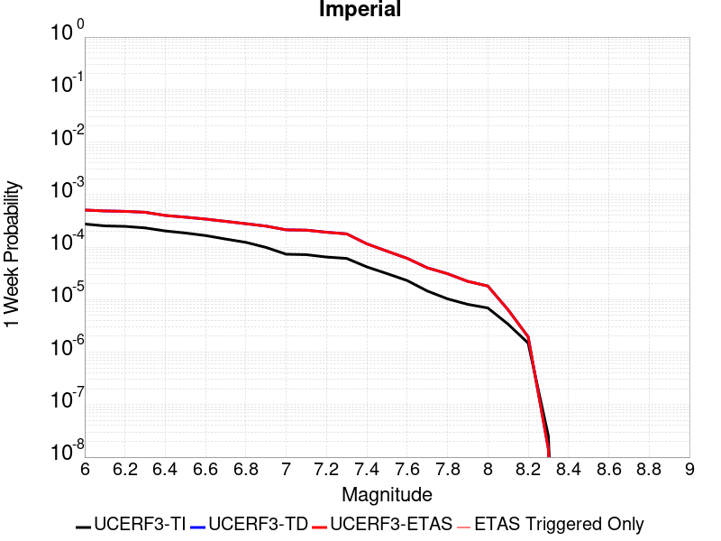 | 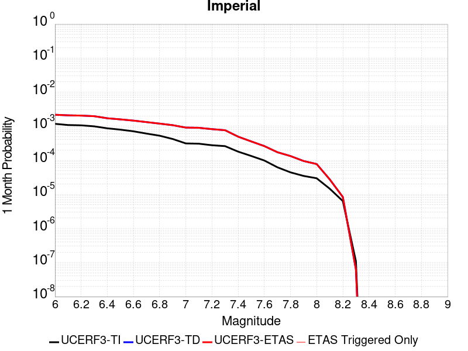 | 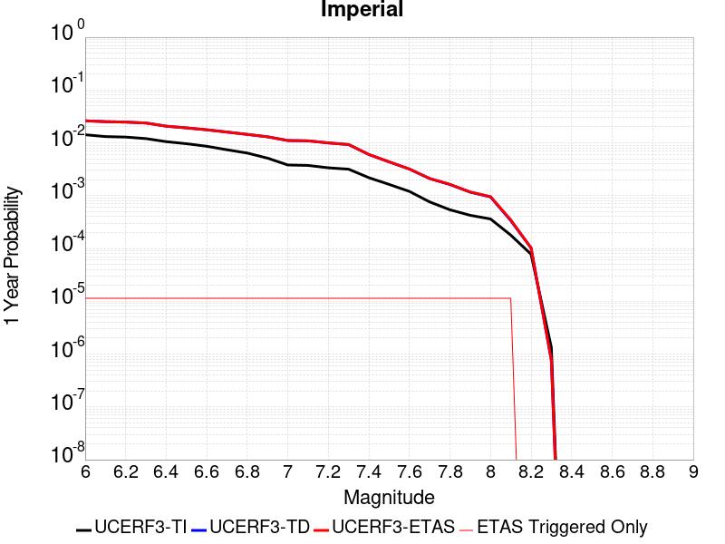 | 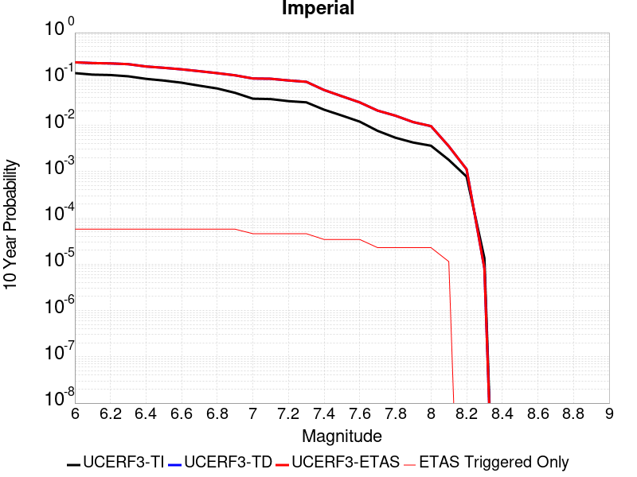 |

| Magnitude | 1 wk TI Prob | 1 wk TD Prob | 1 wk ETAS Prob | 1 wk ETAS/TD Gain | 1 wk ETAS Triggered Only | 1 mo TI Prob | 1 mo TD Prob | 1 mo ETAS Prob | 1 mo ETAS/TD Gain | 1 mo ETAS Triggered Only | 1 yr TI Prob | 1 yr TD Prob | 1 yr ETAS Prob | 1 yr ETAS/TD Gain | 1 yr ETAS Triggered Only | 10 yr TI Prob | 10 yr TD Prob | 10 yr ETAS Prob | 10 yr ETAS/TD Gain | 10 yr ETAS Triggered Only |
|-----|-----|-----|-----|-----|-----|-----|-----|-----|-----|-----|-----|-----|-----|-----|-----|-----|-----|-----|-----|-----|
| 6.0 | 2.7496446E-4 | 5.0782255E-4 | 5.0782255E-4 | 1.0 | 0.0 | 0.0011778869 | 0.0021746065 | 0.0021746065 | 1.0 | 0.0 | 0.0142467655 | 0.026158407 | 0.026158407 | 1.0 | 0.0 | 0.13367249 | 0.22880463 | 0.22889985 | 1.0004162 | 1.2347712E-4 |
| 6.1 | 2.5356023E-4 | 4.8857357E-4 | 4.8857357E-4 | 1.0 | 0.0 | 0.001086234 | 0.0020922448 | 0.0020922448 | 1.0 | 0.0 | 0.013144928 | 0.025176695 | 0.025176695 | 1.0 | 0.0 | 0.123940155 | 0.2201544 | 0.2202507 | 1.0004374 | 1.2347712E-4 |
| 6.2 | 2.4820742E-4 | 4.7949058E-4 | 4.7949058E-4 | 1.0 | 0.0 | 0.0010633124 | 0.0020533793 | 0.0020533793 | 1.0 | 0.0 | 0.01286919 | 0.024714975 | 0.024714975 | 1.0 | 0.0 | 0.12148927 | 0.21665291 | 0.21674964 | 1.0004464 | 1.2347712E-4 |
| 6.3 | 2.3205351E-4 | 4.6066832E-4 | 4.6066832E-4 | 1.0 | 0.0 | 9.94136E-4 | 0.001972836 | 0.001972836 | 1.0 | 0.0 | 0.012036599 | 0.023751607 | 0.023751607 | 1.0 | 0.0 | 0.11405133 | 0.20854732 | 0.20864505 | 1.0004686 | 1.2347712E-4 |
| 6.4 | 2.0304754E-4 | 4.0048308E-4 | 4.0048308E-4 | 1.0 | 0.0 | 8.6991355E-4 | 0.0017152418 | 0.0017152418 | 1.0 | 0.0 | 0.010539869 | 0.02068611 | 0.02068611 | 1.0 | 0.0 | 0.100537635 | 0.1856849 | 0.18578546 | 1.0005414 | 1.2347712E-4 |
| 6.5 | 1.854992E-4 | 3.714936E-4 | 3.714936E-4 | 1.0 | 0.0 | 7.9475436E-4 | 0.0015911564 | 0.0015911564 | 1.0 | 0.0 | 0.009633281 | 0.019199163 | 0.019199163 | 1.0 | 0.0 | 0.0922623 | 0.17388222 | 0.17398421 | 1.0005866 | 1.2347712E-4 |
| 6.6 | 1.6586106E-4 | 3.4180965E-4 | 3.4180965E-4 | 1.0 | 0.0 | 7.106394E-4 | 0.0014640864 | 0.0014640864 | 1.0 | 0.0 | 0.008617763 | 0.01767561 | 0.01767561 | 1.0 | 0.0 | 0.08291132 | 0.16132015 | 0.1614237 | 1.000642 | 1.2347712E-4 |
| 6.7 | 1.4224656E-4 | 3.0892866E-4 | 3.0892866E-4 | 1.0 | 0.0 | 6.094856E-4 | 0.0013233165 | 0.0013233165 | 1.0 | 0.0 | 0.0073952693 | 0.015993753 | 0.015993753 | 1.0 | 0.0 | 0.07153955 | 0.14697333 | 0.14707866 | 1.0007167 | 1.2347712E-4 |
| 6.8 | 1.2317259E-4 | 2.7897372E-4 | 2.7897372E-4 | 1.0 | 0.0 | 5.2777573E-4 | 0.0011950601 | 0.0011950601 | 1.0 | 0.0 | 0.0064067547 | 0.014454186 | 0.014454186 | 1.0 | 0.0 | 0.06225166 | 0.13336582 | 0.13347283 | 1.0008024 | 1.2347712E-4 |
| 6.9 | 9.859898E-5 | 2.5093812E-4 | 2.5093812E-4 | 1.0 | 0.0 | 4.2249862E-4 | 0.00107501 | 0.00107501 | 1.0 | 0.0 | 0.0051317946 | 0.013010673 | 0.013010673 | 1.0 | 0.0 | 0.05014893 | 0.11973186 | 0.119840555 | 1.0009078 | 1.2347712E-4 |
| 7.0 | 7.3191884E-5 | 2.1325808E-4 | 2.1325808E-4 | 1.0 | 0.0 | 3.136418E-4 | 9.136463E-4 | 9.136463E-4 | 1.0 | 0.0 | 0.003811904 | 0.011067598 | 0.011067598 | 1.0 | 0.0 | 0.037471764 | 0.10230677 | 0.10238066 | 1.0007223 | 8.2318074E-5 |
| 7.1 | 7.1760296E-5 | 2.1026377E-4 | 2.1026377E-4 | 1.0 | 0.0 | 3.0750787E-4 | 9.0082246E-4 | 9.0082246E-4 | 1.0 | 0.0 | 0.003737482 | 0.010913042 | 0.010913042 | 1.0 | 0.0 | 0.03675245 | 0.100940526 | 0.10101453 | 1.0007331 | 8.2318074E-5 |
| 7.2 | 6.46614E-5 | 1.9192771E-4 | 1.9192771E-4 | 1.0 | 0.0 | 2.7709085E-4 | 8.2229107E-4 | 8.2229107E-4 | 1.0 | 0.0 | 0.0033683628 | 0.009966063 | 0.009966063 | 1.0 | 0.0 | 0.033177625 | 0.092741676 | 0.09281636 | 1.0008053 | 8.2318074E-5 |
| 7.3 | 6.088115E-5 | 1.7861996E-4 | 1.7861996E-4 | 1.0 | 0.0 | 2.6089314E-4 | 7.652924E-4 | 7.652924E-4 | 1.0 | 0.0 | 0.0031717476 | 0.009278207 | 0.009278207 | 1.0 | 0.0 | 0.031268585 | 0.08678583 | 0.08686101 | 1.0008662 | 8.2318074E-5 |
| 7.4 | 4.199346E-5 | 1.1551766E-4 | 1.1551766E-4 | 1.0 | 0.0 | 1.7995955E-4 | 4.9498264E-4 | 4.9498264E-4 | 1.0 | 0.0 | 0.0021888057 | 0.0060099317 | 0.0060099317 | 1.0 | 0.0 | 0.02167372 | 0.057621248 | 0.057660036 | 1.0006732 | 4.1159037E-5 |
| 7.5 | 3.130448E-5 | 8.367389E-5 | 8.367389E-5 | 1.0 | 0.0 | 1.3415517E-4 | 3.5855343E-4 | 3.5855343E-4 | 1.0 | 0.0 | 0.0016321153 | 0.0043567102 | 0.0043567102 | 1.0 | 0.0 | 0.016201803 | 0.04228614 | 0.04232556 | 1.0009322 | 4.1159037E-5 |
| 7.6 | 2.3074248E-5 | 6.113223E-5 | 6.113223E-5 | 1.0 | 0.0 | 9.888588E-5 | 2.6196908E-4 | 2.6196908E-4 | 1.0 | 0.0 | 0.0012032706 | 0.0031848324 | 0.0031848324 | 1.0 | 0.0 | 0.011967761 | 0.031157905 | 0.03119778 | 1.0012798 | 4.1159037E-5 |
| 7.7 | 1.45864815E-5 | 4.0363186E-5 | 4.0363186E-5 | 1.0 | 0.0 | 6.2511994E-5 | 1.7297364E-4 | 1.7297364E-4 | 1.0 | 0.0 | 7.608177E-4 | 0.0021039254 | 0.0021039254 | 1.0 | 0.0 | 0.007582182 | 0.020736655 | 0.020776961 | 1.0019437 | 4.1159037E-5 |
| 7.8 | 1.0352979E-5 | 3.1163214E-5 | 3.1163214E-5 | 1.0 | 0.0 | 4.4369157E-5 | 1.3354981E-4 | 1.3354981E-4 | 1.0 | 0.0 | 5.400606E-4 | 0.0016247586 | 0.0016247586 | 1.0 | 0.0 | 0.0053875 | 0.016109291 | 0.016149787 | 1.0025139 | 4.1159037E-5 |
| 7.9 | 8.137906E-6 | 2.2311391E-5 | 2.2311391E-5 | 1.0 | 0.0 | 3.4876273E-5 | 9.561675E-5 | 9.561675E-5 | 1.0 | 0.0 | 4.2453592E-4 | 0.0011635132 | 0.0011635132 | 1.0 | 0.0 | 0.004237258 | 0.01169369 | 0.011734367 | 1.0034786 | 4.1159037E-5 |
| 8.0 | 6.93792E-6 | 1.8148243E-5 | 1.8148243E-5 | 1.0 | 0.0 | 2.9733603E-5 | 7.777587E-5 | 7.777587E-5 | 1.0 | 0.0 | 3.6194647E-4 | 9.465106E-4 | 9.465106E-4 | 1.0 | 0.0 | 0.0036135751 | 0.009567197 | 0.009607963 | 1.0042609 | 4.1159037E-5 |
| 8.1 | 3.4286315E-6 | 6.4444234E-6 | 6.4444234E-6 | 1.0 | 0.0 | 1.4694053E-5 | 2.7618666E-5 | 2.7618666E-5 | 1.0 | 0.0 | 1.7888541E-4 | 3.362055E-4 | 3.362055E-4 | 1.0 | 0.0 | 0.0017874148 | 0.0035182005 | 0.0035182005 | 1.0 | 0.0 |
| 8.2 | 1.4906886E-6 | 1.9617137E-6 | 1.9617137E-6 | 1.0 | 0.0 | 6.3886496E-6 | 8.407317E-6 | 8.407317E-6 | 1.0 | 0.0 | 7.7779034E-5 | 1.02354315E-4 | 1.02354315E-4 | 1.0 | 0.0 | 7.775182E-4 | 0.0011204308 | 0.0011204308 | 1.0 | 0.0 |
| 8.3 | 2.5758007E-8 | 1.4750909E-8 | 1.4750909E-8 | 1.0 | 0.0 | 1.10391454E-7 | 6.321818E-8 | 6.321818E-8 | 1.0 | 0.0 | 1.3440151E-6 | 7.696814E-7 | 7.696814E-7 | 1.0 | 0.0 | 1.344007E-5 | 8.023091E-6 | 8.023091E-6 | 1.0 | 0.0 |

## Owens Valley
*[(top)](#table-of-contents)*

| 1 Week | 1 Month | 1 Year | 10 Year |
|-----|-----|-----|-----|
| 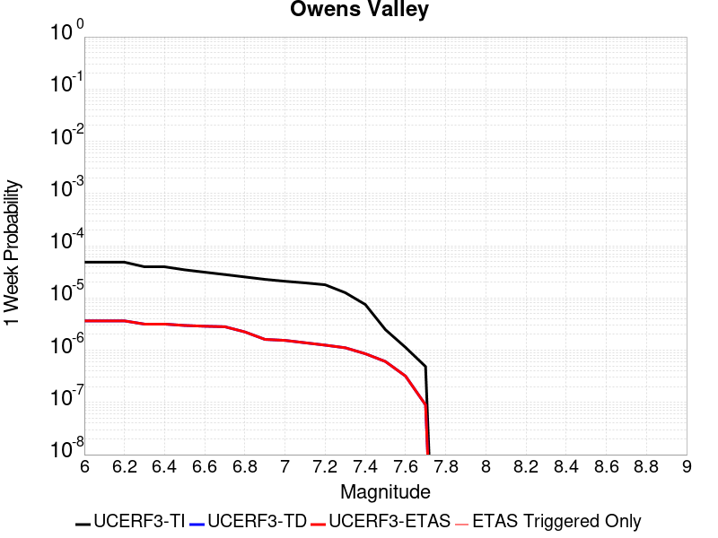 | 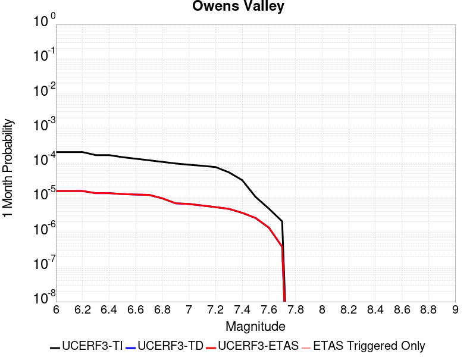 | 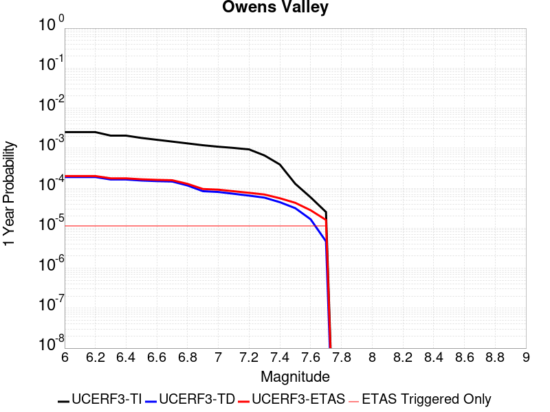 | 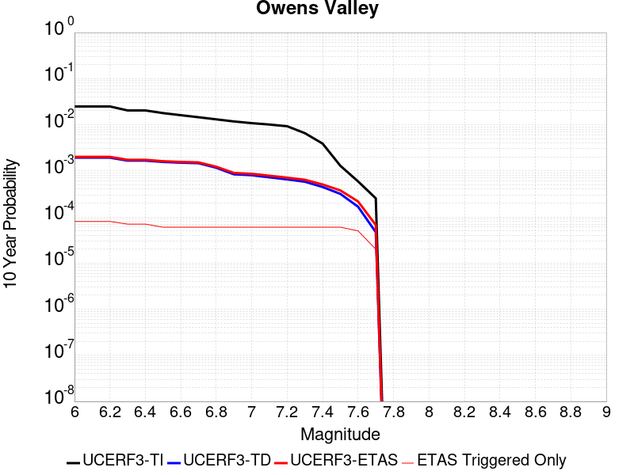 |

| Magnitude | 1 wk TI Prob | 1 wk TD Prob | 1 wk ETAS Prob | 1 wk ETAS/TD Gain | 1 wk ETAS Triggered Only | 1 mo TI Prob | 1 mo TD Prob | 1 mo ETAS Prob | 1 mo ETAS/TD Gain | 1 mo ETAS Triggered Only | 1 yr TI Prob | 1 yr TD Prob | 1 yr ETAS Prob | 1 yr ETAS/TD Gain | 1 yr ETAS Triggered Only | 10 yr TI Prob | 10 yr TD Prob | 10 yr ETAS Prob | 10 yr ETAS/TD Gain | 10 yr ETAS Triggered Only |
|-----|-----|-----|-----|-----|-----|-----|-----|-----|-----|-----|-----|-----|-----|-----|-----|-----|-----|-----|-----|-----|
| 6.0 | 4.83821E-5 | 3.640561E-6 | 3.640561E-6 | 1.0 | 0.0 | 2.0733538E-4 | 1.5602318E-5 | 1.5602318E-5 | 1.0 | 0.0 | 0.002521386 | 1.8994266E-4 | 2.3109387E-4 | 1.2166507 | 4.1159037E-5 | 0.024929691 | 0.0019305887 | 0.0020538275 | 1.0638348 | 1.2347712E-4 |
| 6.1 | 4.83821E-5 | 3.640561E-6 | 3.640561E-6 | 1.0 | 0.0 | 2.0733538E-4 | 1.5602318E-5 | 1.5602318E-5 | 1.0 | 0.0 | 0.002521386 | 1.8994266E-4 | 2.3109387E-4 | 1.2166507 | 4.1159037E-5 | 0.024929691 | 0.0019305887 | 0.0020538275 | 1.0638348 | 1.2347712E-4 |
| 6.2 | 4.83821E-5 | 3.640561E-6 | 3.640561E-6 | 1.0 | 0.0 | 2.0733538E-4 | 1.5602318E-5 | 1.5602318E-5 | 1.0 | 0.0 | 0.002521386 | 1.8994266E-4 | 2.3109387E-4 | 1.2166507 | 4.1159037E-5 | 0.024929691 | 0.0019305887 | 0.0020538275 | 1.0638348 | 1.2347712E-4 |
| 6.3 | 3.953008E-5 | 3.1608845E-6 | 3.1608845E-6 | 1.0 | 0.0 | 1.6940363E-4 | 1.3546582E-5 | 1.3546582E-5 | 1.0 | 0.0 | 0.002060538 | 1.6491789E-4 | 2.0607014E-4 | 1.2495317 | 4.1159037E-5 | 0.020415364 | 0.0016661528 | 0.0017894242 | 1.0739857 | 1.2347712E-4 |
| 6.4 | 3.953008E-5 | 3.1608845E-6 | 3.1608845E-6 | 1.0 | 0.0 | 1.6940363E-4 | 1.3546582E-5 | 1.3546582E-5 | 1.0 | 0.0 | 0.002060538 | 1.6491789E-4 | 2.0607014E-4 | 1.2495317 | 4.1159037E-5 | 0.020415364 | 0.0016661528 | 0.0017894242 | 1.0739857 | 1.2347712E-4 |
| 6.5 | 3.457342E-5 | 2.9759062E-6 | 2.9759062E-6 | 1.0 | 0.0 | 1.4816338E-4 | 1.2753826E-5 | 1.2753826E-5 | 1.0 | 0.0 | 0.0018023965 | 1.5526747E-4 | 1.9642011E-4 | 1.2650436 | 4.1159037E-5 | 0.017878477 | 0.0015588228 | 0.0016410126 | 1.0527256 | 8.2318074E-5 |
| 6.6 | 3.1127765E-5 | 2.8773843E-6 | 2.8773843E-6 | 1.0 | 0.0 | 1.3339789E-4 | 1.2331593E-5 | 1.2331593E-5 | 1.0 | 0.0 | 0.0016229092 | 1.501275E-4 | 1.9128036E-4 | 1.2741194 | 4.1159037E-5 | 0.016111081 | 0.0015031485 | 0.0015853428 | 1.0546814 | 8.2318074E-5 |
| 6.7 | 2.806885E-5 | 2.8128245E-6 | 2.8128245E-6 | 1.0 | 0.0 | 1.2028952E-4 | 1.205491E-5 | 1.205491E-5 | 1.0 | 0.0 | 0.001463541 | 1.4675934E-4 | 1.8791233E-4 | 1.2804115 | 4.1159037E-5 | 0.014539397 | 0.0014670434 | 0.0015492407 | 1.0560292 | 8.2318074E-5 |
| 6.8 | 2.524524E-5 | 2.2374516E-6 | 2.2374516E-6 | 1.0 | 0.0 | 1.0818939E-4 | 9.589045E-6 | 9.589045E-6 | 1.0 | 0.0 | 0.0013164099 | 1.1674067E-4 | 1.578949E-4 | 1.3525269 | 4.1159037E-5 | 0.01308639 | 0.0011670754 | 0.0012492974 | 1.0704514 | 8.2318074E-5 |
| 6.9 | 2.2704568E-5 | 1.6096798E-6 | 1.6096798E-6 | 1.0 | 0.0 | 9.730166E-5 | 6.898609E-6 | 6.898609E-6 | 1.0 | 0.0 | 0.0011840039 | 8.398735E-5 | 1.2514293E-4 | 1.4900212 | 4.1159037E-5 | 0.011777153 | 8.3978433E-4 | 9.2203333E-4 | 1.0979406 | 8.2318074E-5 |
| 7.0 | 2.0871712E-5 | 1.5409746E-6 | 1.5409746E-6 | 1.0 | 0.0 | 8.944713E-5 | 6.6041603E-6 | 6.6041603E-6 | 1.0 | 0.0 | 0.0010884746 | 8.04027E-5 | 1.21558434E-4 | 1.51187 | 4.1159037E-5 | 0.010831586 | 8.0391974E-4 | 8.8617165E-4 | 1.1023135 | 8.2318074E-5 |
| 7.1 | 1.944928E-5 | 1.3876343E-6 | 1.3876343E-6 | 1.0 | 0.0 | 8.335139E-5 | 5.9469903E-6 | 5.9469903E-6 | 1.0 | 0.0 | 0.0010143308 | 7.240221E-5 | 1.1355827E-4 | 1.5684365 | 4.1159037E-5 | 0.010097133 | 7.2395586E-4 | 8.0621435E-4 | 1.1136236 | 8.2318074E-5 |
| 7.2 | 1.7876306E-5 | 1.2499866E-6 | 1.2499866E-6 | 1.0 | 0.0 | 7.6610486E-5 | 5.3570743E-6 | 5.3570743E-6 | 1.0 | 0.0 | 9.3233347E-4 | 6.522043E-5 | 1.0637679E-4 | 1.6310346 | 4.1159037E-5 | 0.009284316 | 6.5214327E-4 | 7.344077E-4 | 1.1261446 | 8.2318074E-5 |
| 7.3 | 1.2618672E-5 | 1.1125127E-6 | 1.1125127E-6 | 1.0 | 0.0 | 5.40789E-5 | 4.7679027E-6 | 4.7679027E-6 | 1.0 | 0.0 | 6.582117E-4 | 5.8047677E-5 | 9.920433E-5 | 1.7090145 | 4.1159037E-5 | 0.0065626553 | 5.8045075E-4 | 6.6272105E-4 | 1.1417352 | 8.2318074E-5 |
| 7.4 | 7.4874442E-6 | 8.5569917E-7 | 8.5569917E-7 | 1.0 | 0.0 | 3.208865E-5 | 3.667277E-6 | 3.667277E-6 | 1.0 | 0.0 | 3.906093E-4 | 4.4648186E-5 | 8.580539E-5 | 1.9218112 | 4.1159037E-5 | 0.003899234 | 4.4647642E-4 | 5.2875775E-4 | 1.1842904 | 8.2318074E-5 |
| 7.5 | 2.4734156E-6 | 6.074345E-7 | 6.074345E-7 | 1.0 | 0.0 | 1.060031E-5 | 2.603288E-6 | 2.603288E-6 | 1.0 | 0.0 | 1.2905113E-4 | 3.1694573E-5 | 7.285231E-5 | 2.2985735 | 4.1159037E-5 | 0.0012897621 | 3.1690087E-4 | 3.9919285E-4 | 1.2596774 | 8.2318074E-5 |
| 7.6 | 1.1328841E-6 | 3.1993997E-7 | 3.1993997E-7 | 1.0 | 0.0 | 4.8552088E-6 | 1.3711706E-6 | 1.3711706E-6 | 1.0 | 0.0 | 5.9110564E-5 | 1.6693875E-5 | 5.7852227E-5 | 3.465476 | 4.1159037E-5 | 5.9094845E-4 | 1.669264E-4 | 2.4923074E-4 | 1.4930576 | 8.2318074E-5 |
| 7.7 | 4.8613185E-7 | 8.9756846E-8 | 8.9756846E-8 | 1.0 | 0.0 | 2.0834207E-6 | 3.8467215E-7 | 3.8467215E-7 | 1.0 | 0.0 | 2.536535E-5 | 4.683374E-6 | 4.584222E-5 | 9.788289 | 4.1159037E-5 | 2.5362454E-4 | 4.683282E-5 | 8.798993E-5 | 1.8788091 | 4.1159037E-5 |

## San Andreas (Cholame) rev
*[(top)](#table-of-contents)*

| 1 Week | 1 Month | 1 Year | 10 Year |
|-----|-----|-----|-----|
|  | 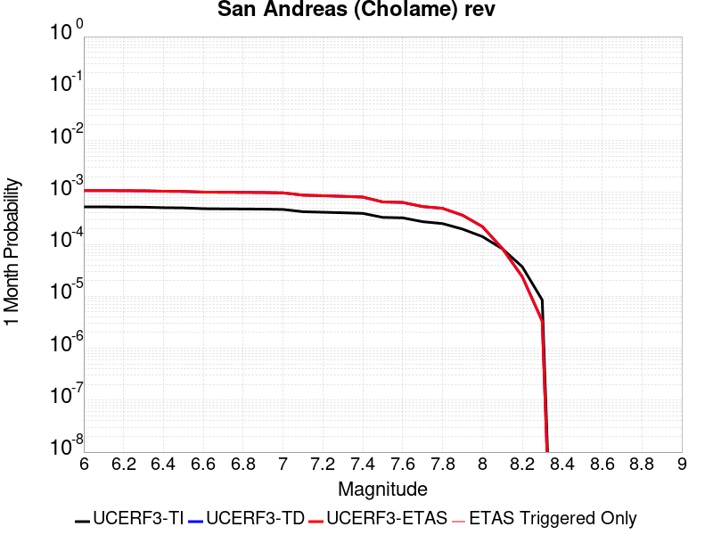 | 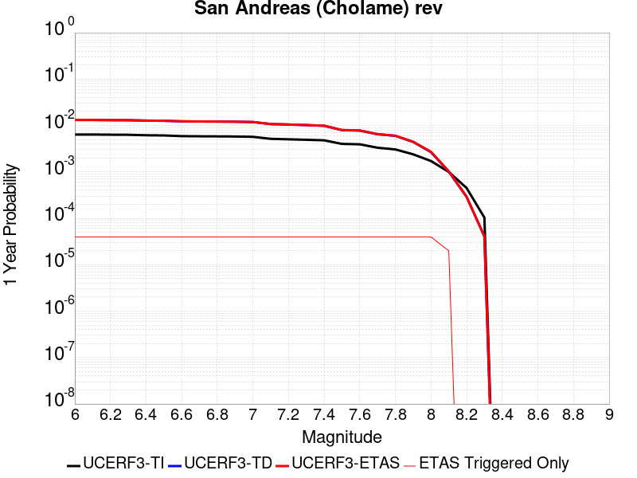 | 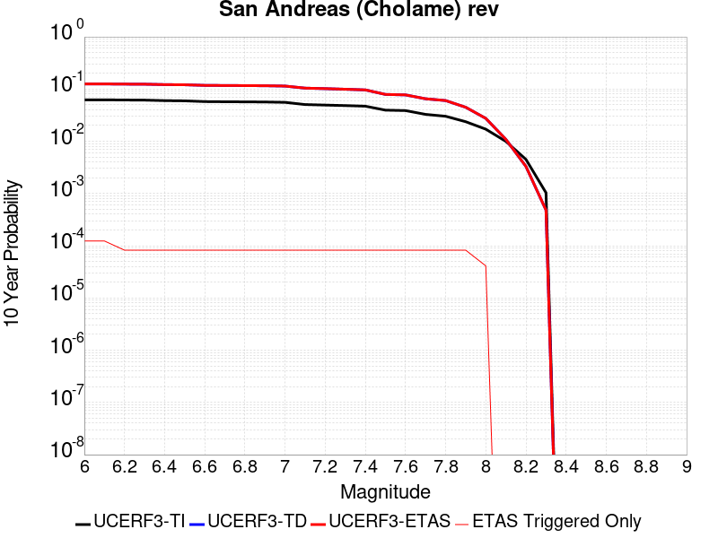 |

| Magnitude | 1 wk TI Prob | 1 wk TD Prob | 1 wk ETAS Prob | 1 wk ETAS/TD Gain | 1 wk ETAS Triggered Only | 1 mo TI Prob | 1 mo TD Prob | 1 mo ETAS Prob | 1 mo ETAS/TD Gain | 1 mo ETAS Triggered Only | 1 yr TI Prob | 1 yr TD Prob | 1 yr ETAS Prob | 1 yr ETAS/TD Gain | 1 yr ETAS Triggered Only | 10 yr TI Prob | 10 yr TD Prob | 10 yr ETAS Prob | 10 yr ETAS/TD Gain | 10 yr ETAS Triggered Only |
|-----|-----|-----|-----|-----|-----|-----|-----|-----|-----|-----|-----|-----|-----|-----|-----|-----|-----|-----|-----|-----|
| 6.0 | 1.2302514E-4 | 2.5377126E-4 | 2.5377126E-4 | 1.0 | 0.0 | 5.27144E-4 | 0.0010871394 | 0.0010871394 | 1.0 | 0.0 | 0.0063991086 | 0.0131561095 | 0.0131561095 | 1.0 | 0.0 | 0.06217949 | 0.12514783 | 0.12525585 | 1.0008632 | 1.2347712E-4 |
| 6.1 | 1.2302514E-4 | 2.5377126E-4 | 2.5377126E-4 | 1.0 | 0.0 | 5.27144E-4 | 0.0010871394 | 0.0010871394 | 1.0 | 0.0 | 0.0063991086 | 0.0131561095 | 0.0131561095 | 1.0 | 0.0 | 0.06217949 | 0.12514783 | 0.12525585 | 1.0008632 | 1.2347712E-4 |
| 6.2 | 1.2203569E-4 | 2.5193702E-4 | 2.5193702E-4 | 1.0 | 0.0 | 5.2290526E-4 | 0.0010792849 | 0.0010792849 | 1.0 | 0.0 | 0.006347804 | 0.0130616315 | 0.0130616315 | 1.0 | 0.0 | 0.061695136 | 0.12433341 | 0.124405496 | 1.0005797 | 8.2318074E-5 |
| 6.3 | 1.2142645E-4 | 2.5079545E-4 | 2.5079545E-4 | 1.0 | 0.0 | 5.202953E-4 | 0.0010743965 | 0.0010743965 | 1.0 | 0.0 | 0.006316212 | 0.013002829 | 0.013002829 | 1.0 | 0.0 | 0.06139677 | 0.12382682 | 0.123898946 | 1.0005825 | 8.2318074E-5 |
| 6.4 | 1.1865206E-4 | 2.4584043E-4 | 2.4584043E-4 | 1.0 | 0.0 | 5.0840975E-4 | 0.001053178 | 0.001053178 | 1.0 | 0.0 | 0.006172335 | 0.01274754 | 0.01274754 | 1.0 | 0.0 | 0.060036868 | 0.12161498 | 0.121687286 | 1.0005946 | 8.2318074E-5 |
| 6.5 | 1.17443946E-4 | 2.4376677E-4 | 2.4376677E-4 | 1.0 | 0.0 | 5.032341E-4 | 0.001044298 | 0.001044298 | 1.0 | 0.0 | 0.006109677 | 0.012640683 | 0.012640683 | 1.0 | 0.0 | 0.059444077 | 0.12068456 | 0.12075694 | 1.0005997 | 8.2318074E-5 |
| 6.6 | 1.13579066E-4 | 2.3683684E-4 | 2.3683684E-4 | 1.0 | 0.0 | 4.866766E-4 | 0.0010146217 | 0.0010146217 | 1.0 | 0.0 | 0.0059092017 | 0.012283501 | 0.012283501 | 1.0 | 0.0 | 0.057545185 | 0.11758657 | 0.11765921 | 1.0006177 | 8.2318074E-5 |
| 6.7 | 1.1271412E-4 | 2.3527596E-4 | 2.3527596E-4 | 1.0 | 0.0 | 4.829711E-4 | 0.0010079374 | 0.0010079374 | 1.0 | 0.0 | 0.005864331 | 0.012203034 | 0.012203034 | 1.0 | 0.0 | 0.057119697 | 0.11688864 | 0.11696134 | 1.0006219 | 8.2318074E-5 |
| 6.8 | 1.1217975E-4 | 2.3415616E-4 | 2.3415616E-4 | 1.0 | 0.0 | 4.8068175E-4 | 0.001003142 | 0.001003142 | 1.0 | 0.0 | 0.005836608 | 0.012145302 | 0.012145302 | 1.0 | 0.0 | 0.056856725 | 0.11638556 | 0.1164583 | 1.000625 | 8.2318074E-5 |
| 6.9 | 1.1146753E-4 | 2.3263908E-4 | 2.3263908E-4 | 1.0 | 0.0 | 4.7763053E-4 | 9.966452E-4 | 9.966452E-4 | 1.0 | 0.0 | 0.0057996577 | 0.012067083 | 0.012067083 | 1.0 | 0.0 | 0.056506127 | 0.115704976 | 0.11577777 | 1.0006292 | 8.2318074E-5 |
| 7.0 | 1.0965793E-4 | 2.2885925E-4 | 2.2885925E-4 | 1.0 | 0.0 | 4.698779E-4 | 9.804582E-4 | 9.804582E-4 | 1.0 | 0.0 | 0.005705768 | 0.0118721705 | 0.0118721705 | 1.0 | 0.0 | 0.055614736 | 0.114002086 | 0.11407502 | 1.0006398 | 8.2318074E-5 |
| 7.1 | 9.927982E-5 | 2.0698967E-4 | 2.0698967E-4 | 1.0 | 0.0 | 4.2541555E-4 | 8.86798E-4 | 8.86798E-4 | 1.0 | 0.0 | 0.0051671406 | 0.010743615 | 0.010743615 | 1.0 | 0.0 | 0.05048634 | 0.10407128 | 0.10414503 | 1.0007087 | 8.2318074E-5 |
| 7.2 | 9.696786E-5 | 2.0202059E-4 | 2.0202059E-4 | 1.0 | 0.0 | 4.1551032E-4 | 8.6551625E-4 | 8.6551625E-4 | 1.0 | 0.0 | 0.00504711 | 0.010487032 | 0.010487032 | 1.0 | 0.0 | 0.04934009 | 0.10180742 | 0.101881355 | 1.0007262 | 8.2318074E-5 |
| 7.3 | 9.4727984E-5 | 1.9628562E-4 | 1.9628562E-4 | 1.0 | 0.0 | 4.0591392E-4 | 8.4095384E-4 | 8.4095384E-4 | 1.0 | 0.0 | 0.0049308087 | 0.01019082 | 0.01019082 | 1.0 | 0.0 | 0.048228268 | 0.09916703 | 0.09924118 | 1.0007478 | 8.2318074E-5 |
| 7.4 | 9.220358E-5 | 1.8996334E-4 | 1.8996334E-4 | 1.0 | 0.0 | 3.9509835E-4 | 8.1387546E-4 | 8.1387546E-4 | 1.0 | 0.0 | 0.004799717 | 0.009864165 | 0.009864165 | 1.0 | 0.0 | 0.046973653 | 0.09623134 | 0.096305735 | 1.0007731 | 8.2318074E-5 |
| 7.5 | 7.71631E-5 | 1.5311953E-4 | 1.5311953E-4 | 1.0 | 0.0 | 3.306571E-4 | 6.560617E-4 | 6.560617E-4 | 1.0 | 0.0 | 0.0040183207 | 0.007958371 | 0.007958371 | 1.0 | 0.0 | 0.03946433 | 0.07889292 | 0.07896874 | 1.0009611 | 8.2318074E-5 |
| 7.6 | 7.5634416E-5 | 1.4969675E-4 | 1.4969675E-4 | 1.0 | 0.0 | 3.241072E-4 | 6.4139994E-4 | 6.4139994E-4 | 1.0 | 0.0 | 0.0039388672 | 0.007781152 | 0.007781152 | 1.0 | 0.0 | 0.038697794 | 0.07724949 | 0.07732545 | 1.0009832 | 8.2318074E-5 |
| 7.7 | 6.3783E-5 | 1.2477368E-4 | 1.2477368E-4 | 1.0 | 0.0 | 2.7332708E-4 | 5.346348E-4 | 5.346348E-4 | 1.0 | 0.0 | 0.0033226798 | 0.006489779 | 0.006489779 | 1.0 | 0.0 | 0.032734364 | 0.06508352 | 0.06516048 | 1.0011824 | 8.2318074E-5 |
| 7.8 | 5.863422E-5 | 1.1523914E-4 | 1.1523914E-4 | 1.0 | 0.0 | 2.512653E-4 | 4.9378857E-4 | 4.9378857E-4 | 1.0 | 0.0 | 0.003054864 | 0.0059953257 | 0.0059953257 | 1.0 | 0.0 | 0.030132094 | 0.060156144 | 0.060233507 | 1.001286 | 8.2318074E-5 |
| 7.9 | 4.595283E-5 | 8.505152E-5 | 8.505152E-5 | 1.0 | 0.0 | 1.9692584E-4 | 3.644556E-4 | 3.644556E-4 | 1.0 | 0.0 | 0.0023949358 | 0.004428226 | 0.004428226 | 1.0 | 0.0 | 0.023692891 | 0.044735484 | 0.04481412 | 1.0017577 | 8.2318074E-5 |
| 8.0 | 3.2950178E-5 | 5.1265073E-5 | 5.1265073E-5 | 1.0 | 0.0 | 1.412074E-4 | 2.1968897E-4 | 2.1968897E-4 | 1.0 | 0.0 | 0.0017178444 | 0.002671434 | 0.002671434 | 1.0 | 0.0 | 0.017046256 | 0.027423028 | 0.027463058 | 1.0014597 | 4.1159037E-5 |
| 8.1 | 1.9177472E-5 | 1.9428777E-5 | 1.9428777E-5 | 1.0 | 0.0 | 8.218658E-5 | 8.326353E-5 | 8.326353E-5 | 1.0 | 0.0 | 0.0010001622 | 0.0010132627 | 0.0010132627 | 1.0 | 0.0 | 0.009956728 | 0.010886158 | 0.010886158 | 1.0 | 0.0 |
| 8.2 | 8.643924E-6 | 5.5660976E-6 | 5.5660976E-6 | 1.0 | 0.0 | 3.704486E-5 | 2.3854487E-5 | 2.3854487E-5 | 1.0 | 0.0 | 4.5092785E-4 | 2.9038975E-4 | 2.9038975E-4 | 1.0 | 0.0 | 0.0045001395 | 0.0032986484 | 0.0032986484 | 1.0 | 0.0 |
| 8.3 | 1.983087E-6 | 7.808603E-7 | 7.808603E-7 | 1.0 | 0.0 | 8.498917E-6 | 3.34654E-6 | 3.34654E-6 | 1.0 | 0.0 | 1.034694E-4 | 4.074338E-5 | 4.074338E-5 | 1.0 | 0.0 | 0.0010342124 | 4.8047924E-4 | 4.8047924E-4 | 1.0 | 0.0 |

## Brawley (Seismic Zone) alt 1
*[(top)](#table-of-contents)*

| 1 Week | 1 Month | 1 Year | 10 Year |
|-----|-----|-----|-----|
| 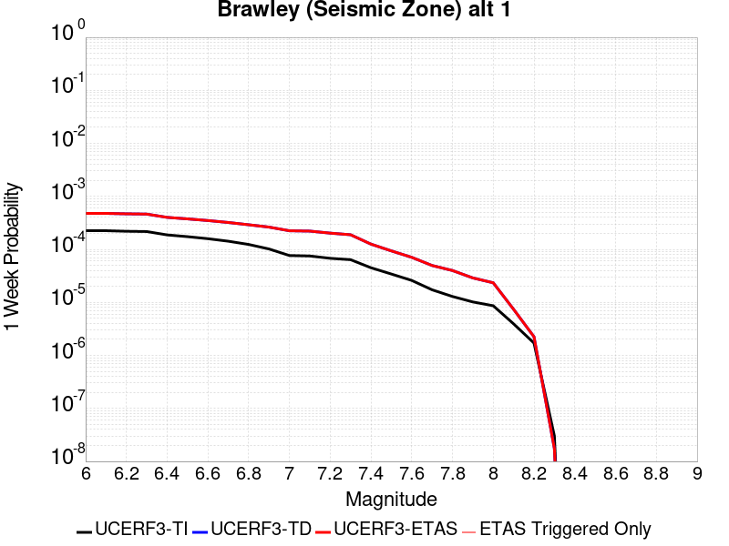 | 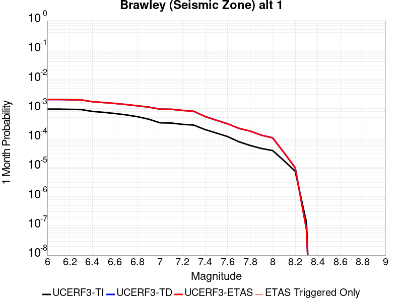 | 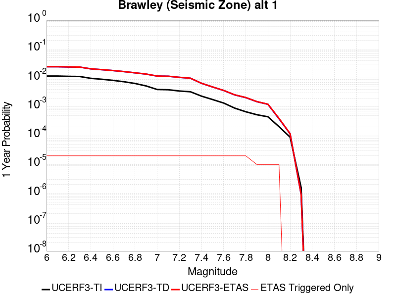 | 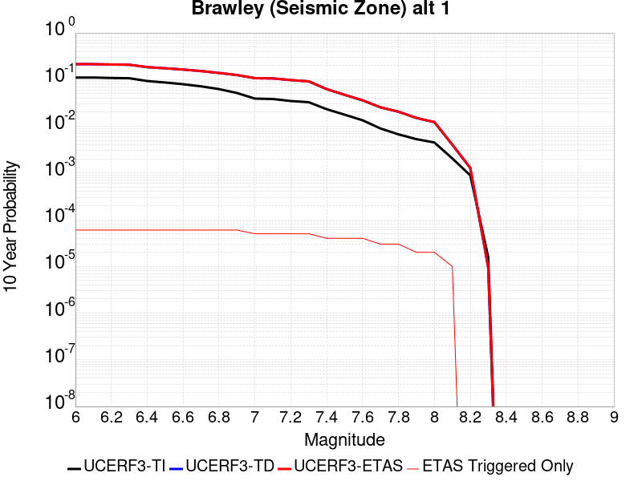 |

| Magnitude | 1 wk TI Prob | 1 wk TD Prob | 1 wk ETAS Prob | 1 wk ETAS/TD Gain | 1 wk ETAS Triggered Only | 1 mo TI Prob | 1 mo TD Prob | 1 mo ETAS Prob | 1 mo ETAS/TD Gain | 1 mo ETAS Triggered Only | 1 yr TI Prob | 1 yr TD Prob | 1 yr ETAS Prob | 1 yr ETAS/TD Gain | 1 yr ETAS Triggered Only | 10 yr TI Prob | 10 yr TD Prob | 10 yr ETAS Prob | 10 yr ETAS/TD Gain | 10 yr ETAS Triggered Only |
|-----|-----|-----|-----|-----|-----|-----|-----|-----|-----|-----|-----|-----|-----|-----|-----|-----|-----|-----|-----|-----|
| 6.0 | 2.2521618E-4 | 4.7793347E-4 | 4.7793347E-4 | 1.0 | 0.0 | 9.6485513E-4 | 0.0020467157 | 0.0020467157 | 1.0 | 0.0 | 0.011683988 | 0.024625072 | 0.024625072 | 1.0 | 0.0 | 0.11088423 | 0.2140437 | 0.21414076 | 1.0004534 | 1.2347712E-4 |
| 6.1 | 2.2521618E-4 | 4.7793347E-4 | 4.7793347E-4 | 1.0 | 0.0 | 9.6485513E-4 | 0.0020467157 | 0.0020467157 | 1.0 | 0.0 | 0.011683988 | 0.024625072 | 0.024625072 | 1.0 | 0.0 | 0.11088423 | 0.2140437 | 0.21414076 | 1.0004534 | 1.2347712E-4 |
| 6.2 | 2.198148E-4 | 4.687423E-4 | 4.687423E-4 | 1.0 | 0.0 | 9.417233E-4 | 0.0020073857 | 0.0020073857 | 1.0 | 0.0 | 0.011405343 | 0.024157584 | 0.024157584 | 1.0 | 0.0 | 0.10837428 | 0.21047239 | 0.21056987 | 1.0004632 | 1.2347712E-4 |
| 6.3 | 2.1704129E-4 | 4.630883E-4 | 4.630883E-4 | 1.0 | 0.0 | 9.298453E-4 | 0.0019831914 | 0.0019831914 | 1.0 | 0.0 | 0.011262234 | 0.023870552 | 0.023870552 | 1.0 | 0.0 | 0.107082725 | 0.20836203 | 0.20845978 | 1.0004691 | 1.2347712E-4 |
| 6.4 | 1.876142E-4 | 4.0196386E-4 | 4.0196386E-4 | 1.0 | 0.0 | 8.038131E-4 | 0.0017215793 | 0.0017215793 | 1.0 | 0.0 | 0.00974259 | 0.020757414 | 0.020757414 | 1.0 | 0.0 | 0.093263686 | 0.18511593 | 0.18521656 | 1.0005436 | 1.2347712E-4 |
| 6.5 | 1.7390939E-4 | 3.7622888E-4 | 3.7622888E-4 | 1.0 | 0.0 | 7.45113E-4 | 0.0016114254 | 0.0016114254 | 1.0 | 0.0 | 0.009034078 | 0.019443072 | 0.019443072 | 1.0 | 0.0 | 0.086755216 | 0.17492771 | 0.17502959 | 1.0005825 | 1.2347712E-4 |
| 6.6 | 1.591791E-4 | 3.503029E-4 | 3.503029E-4 | 1.0 | 0.0 | 6.8201777E-4 | 0.0015004445 | 0.0015004445 | 1.0 | 0.0 | 0.008271996 | 0.018116567 | 0.018116567 | 1.0 | 0.0 | 0.07970774 | 0.16431898 | 0.16442217 | 1.000628 | 1.2347712E-4 |
| 6.7 | 1.4268003E-4 | 3.2186724E-4 | 3.2186724E-4 | 1.0 | 0.0 | 6.1134255E-4 | 0.0013787101 | 0.0013787101 | 1.0 | 0.0 | 0.007417723 | 0.01665806 | 0.01665806 | 1.0 | 0.0 | 0.07174956 | 0.15242328 | 0.15252794 | 1.0006866 | 1.2347712E-4 |
| 6.8 | 1.239713E-4 | 2.9162812E-4 | 2.9162812E-4 | 1.0 | 0.0 | 5.3119735E-4 | 0.0012492423 | 0.0012492423 | 1.0 | 0.0 | 0.0064481674 | 0.015104902 | 0.015104902 | 1.0 | 0.0 | 0.06264243 | 0.13881046 | 0.13891679 | 1.000766 | 1.2347712E-4 |
| 6.9 | 1.0180238E-4 | 2.6338815E-4 | 2.6338815E-4 | 1.0 | 0.0 | 4.3622297E-4 | 0.0011283223 | 0.0011283223 | 1.0 | 0.0 | 0.005298089 | 0.013651803 | 0.013651803 | 1.0 | 0.0 | 0.05173543 | 0.1253048 | 0.1254128 | 1.0008619 | 1.2347712E-4 |
| 7.0 | 7.6619996E-5 | 2.2463492E-4 | 2.2463492E-4 | 1.0 | 0.0 | 3.283301E-4 | 9.623691E-4 | 9.623691E-4 | 1.0 | 0.0 | 0.0039900932 | 0.01165461 | 0.01165461 | 1.0 | 0.0 | 0.039192066 | 0.107528605 | 0.107602075 | 1.0006832 | 8.2318074E-5 |
| 7.1 | 7.5127435E-5 | 2.2145854E-4 | 2.2145854E-4 | 1.0 | 0.0 | 3.2193496E-4 | 9.4876596E-4 | 9.4876596E-4 | 1.0 | 0.0 | 0.0039125155 | 0.01149075 | 0.01149075 | 1.0 | 0.0 | 0.038443442 | 0.10608987 | 0.10616346 | 1.0006936 | 8.2318074E-5 |
| 7.2 | 6.788582E-5 | 2.0271416E-4 | 2.0271416E-4 | 1.0 | 0.0 | 2.9090676E-4 | 8.6848874E-4 | 8.6848874E-4 | 1.0 | 0.0 | 0.0035360386 | 0.010523229 | 0.010523229 | 1.0 | 0.0 | 0.034803 | 0.09775419 | 0.09782846 | 1.0007597 | 8.2318074E-5 |
| 7.3 | 6.399602E-5 | 1.8899838E-4 | 1.8899838E-4 | 1.0 | 0.0 | 2.7423984E-4 | 8.097445E-4 | 8.097445E-4 | 1.0 | 0.0 | 0.0033337586 | 0.009814668 | 0.009814668 | 1.0 | 0.0 | 0.03284188 | 0.09164237 | 0.09171715 | 1.000816 | 8.2318074E-5 |
| 7.4 | 4.506759E-5 | 1.25757E-4 | 1.25757E-4 | 1.0 | 0.0 | 1.9313251E-4 | 5.388481E-4 | 5.388481E-4 | 1.0 | 0.0 | 0.0023488526 | 0.0065409173 | 0.0065409173 | 1.0 | 0.0 | 0.023241805 | 0.0625663 | 0.06260489 | 1.0006167 | 4.1159037E-5 |
| 7.5 | 3.43289E-5 | 9.374596E-5 | 9.374596E-5 | 1.0 | 0.0 | 1.4711556E-4 | 4.0170684E-4 | 4.0170684E-4 | 1.0 | 0.0 | 0.0017896603 | 0.004879876 | 0.004879876 | 1.0 | 0.0 | 0.01775316 | 0.047230907 | 0.047270123 | 1.0008303 | 4.1159037E-5 |
| 7.6 | 2.5980507E-5 | 7.0869E-5 | 7.0869E-5 | 1.0 | 0.0 | 1.1134028E-4 | 3.0368907E-4 | 3.0368907E-4 | 1.0 | 0.0 | 0.001354725 | 0.0036911701 | 0.0036911701 | 1.0 | 0.0 | 0.013464959 | 0.03599416 | 0.03603384 | 1.0011023 | 4.1159037E-5 |
| 7.7 | 1.7292105E-5 | 4.9695725E-5 | 4.9695725E-5 | 1.0 | 0.0 | 7.4106916E-5 | 2.1296433E-4 | 2.1296433E-4 | 1.0 | 0.0 | 9.018782E-4 | 0.0025897634 | 0.0025897634 | 1.0 | 0.0 | 0.008982267 | 0.02542126 | 0.025461374 | 1.001578 | 4.1159037E-5 |
| 7.8 | 1.2927471E-5 | 3.9943872E-5 | 3.9943872E-5 | 1.0 | 0.0 | 5.5402274E-5 | 1.711768E-4 | 1.711768E-4 | 1.0 | 0.0 | 6.743139E-4 | 0.002082088 | 0.002082088 | 1.0 | 0.0 | 0.0067227143 | 0.020545661 | 0.020585975 | 1.0019622 | 4.1159037E-5 |
| 7.9 | 1.0200774E-5 | 2.8948032E-5 | 2.8948032E-5 | 1.0 | 0.0 | 4.371687E-5 | 1.240571E-4 | 1.240571E-4 | 1.0 | 0.0 | 5.321229E-4 | 0.0015093498 | 0.0015093498 | 1.0 | 0.0 | 0.005308505 | 0.0150855165 | 0.015126055 | 1.0026872 | 4.1159037E-5 |
| 8.0 | 8.650396E-6 | 2.3450795E-5 | 2.3450795E-5 | 1.0 | 0.0 | 3.70726E-5 | 1.0049954E-4 | 1.0049954E-4 | 1.0 | 0.0 | 4.5126543E-4 | 0.001222896 | 0.001222896 | 1.0 | 0.0 | 0.0045035016 | 0.012292199 | 0.012332852 | 1.0033072 | 4.1159037E-5 |
| 8.1 | 3.9368224E-6 | 7.4021077E-6 | 7.4021077E-6 | 1.0 | 0.0 | 1.6871985E-5 | 3.1722935E-5 | 3.1722935E-5 | 1.0 | 0.0 | 2.0539707E-4 | 3.861584E-4 | 3.861584E-4 | 1.0 | 0.0 | 0.0020520731 | 0.004038078 | 0.004038078 | 1.0 | 0.0 |
| 8.2 | 1.7101195E-6 | 2.2466038E-6 | 2.2466038E-6 | 1.0 | 0.0 | 7.329063E-6 | 9.6282665E-6 | 9.6282665E-6 | 1.0 | 0.0 | 8.922769E-5 | 1.1721787E-4 | 1.1721787E-4 | 1.0 | 0.0 | 8.9191867E-4 | 0.0012814577 | 0.0012814577 | 1.0 | 0.0 |
| 8.3 | 3.0346666E-8 | 1.7512122E-8 | 1.7512122E-8 | 1.0 | 0.0 | 1.3005713E-7 | 7.505195E-8 | 7.505195E-8 | 1.0 | 0.0 | 1.5834444E-6 | 9.137574E-7 | 9.137574E-7 | 1.0 | 0.0 | 1.5834332E-5 | 9.526993E-6 | 9.526993E-6 | 1.0 | 0.0 |

## San Andreas (Big Bend)
*[(top)](#table-of-contents)*

| 1 Week | 1 Month | 1 Year | 10 Year |
|-----|-----|-----|-----|
| 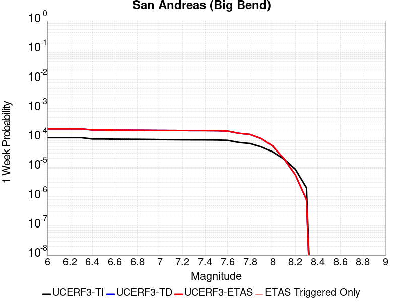 | 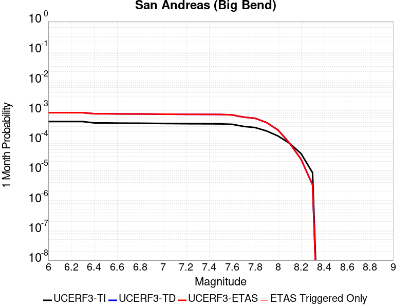 | 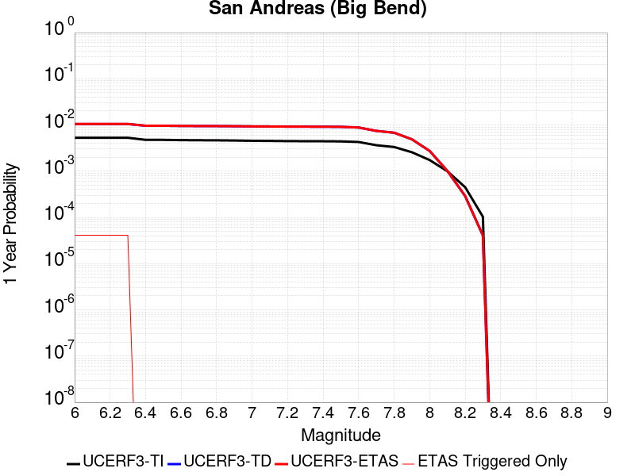 | 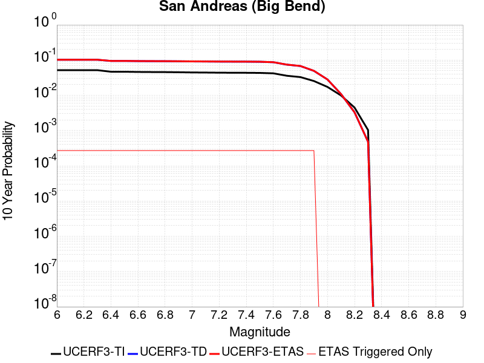 |

| Magnitude | 1 wk TI Prob | 1 wk TD Prob | 1 wk ETAS Prob | 1 wk ETAS/TD Gain | 1 wk ETAS Triggered Only | 1 mo TI Prob | 1 mo TD Prob | 1 mo ETAS Prob | 1 mo ETAS/TD Gain | 1 mo ETAS Triggered Only | 1 yr TI Prob | 1 yr TD Prob | 1 yr ETAS Prob | 1 yr ETAS/TD Gain | 1 yr ETAS Triggered Only | 10 yr TI Prob | 10 yr TD Prob | 10 yr ETAS Prob | 10 yr ETAS/TD Gain | 10 yr ETAS Triggered Only |
|-----|-----|-----|-----|-----|-----|-----|-----|-----|-----|-----|-----|-----|-----|-----|-----|-----|-----|-----|-----|-----|
| 6.0 | 1.0179969E-4 | 2.0224464E-4 | 2.0224464E-4 | 1.0 | 0.0 | 4.362114E-4 | 8.6647586E-4 | 8.6647586E-4 | 1.0 | 0.0 | 0.0052979486 | 0.010498604 | 0.010539331 | 1.0038793 | 4.1159037E-5 | 0.051734097 | 0.10209795 | 0.10220882 | 1.0010859 | 1.2347712E-4 |
| 6.1 | 1.0179969E-4 | 2.0224464E-4 | 2.0224464E-4 | 1.0 | 0.0 | 4.362114E-4 | 8.6647586E-4 | 8.6647586E-4 | 1.0 | 0.0 | 0.0052979486 | 0.010498604 | 0.010539331 | 1.0038793 | 4.1159037E-5 | 0.051734097 | 0.10209795 | 0.10220882 | 1.0010859 | 1.2347712E-4 |
| 6.2 | 1.0179969E-4 | 2.0224464E-4 | 2.0224464E-4 | 1.0 | 0.0 | 4.362114E-4 | 8.6647586E-4 | 8.6647586E-4 | 1.0 | 0.0 | 0.0052979486 | 0.010498604 | 0.010539331 | 1.0038793 | 4.1159037E-5 | 0.051734097 | 0.10209795 | 0.10220882 | 1.0010859 | 1.2347712E-4 |
| 6.3 | 1.0179969E-4 | 2.0224464E-4 | 2.0224464E-4 | 1.0 | 0.0 | 4.362114E-4 | 8.6647586E-4 | 8.6647586E-4 | 1.0 | 0.0 | 0.0052979486 | 0.010498604 | 0.010539331 | 1.0038793 | 4.1159037E-5 | 0.051734097 | 0.10209795 | 0.10220882 | 1.0010859 | 1.2347712E-4 |
| 6.4 | 9.1639464E-5 | 1.8578598E-4 | 1.8578598E-4 | 1.0 | 0.0 | 3.9268145E-4 | 7.959829E-4 | 7.959829E-4 | 1.0 | 0.0 | 0.0047704205 | 0.00964815 | 0.00964815 | 1.0 | 0.0 | 0.046693064 | 0.09443592 | 0.094510466 | 1.0007894 | 8.2318074E-5 |
| 6.5 | 9.1639464E-5 | 1.8578598E-4 | 1.8578598E-4 | 1.0 | 0.0 | 3.9268145E-4 | 7.959829E-4 | 7.959829E-4 | 1.0 | 0.0 | 0.0047704205 | 0.00964815 | 0.00964815 | 1.0 | 0.0 | 0.046693064 | 0.09443592 | 0.094510466 | 1.0007894 | 8.2318074E-5 |
| 6.6 | 9.042622E-5 | 1.8385253E-4 | 1.8385253E-4 | 1.0 | 0.0 | 3.8748336E-4 | 7.8770175E-4 | 7.8770175E-4 | 1.0 | 0.0 | 0.0047074095 | 0.009548212 | 0.009548212 | 1.0 | 0.0 | 0.046089325 | 0.093532145 | 0.09360676 | 1.0007977 | 8.2318074E-5 |
| 6.7 | 8.9836685E-5 | 1.8299464E-4 | 1.8299464E-4 | 1.0 | 0.0 | 3.8495753E-4 | 7.840273E-4 | 7.840273E-4 | 1.0 | 0.0 | 0.00467679 | 0.009503867 | 0.009503867 | 1.0 | 0.0 | 0.045795817 | 0.09312612 | 0.09320077 | 1.0008017 | 8.2318074E-5 |
| 6.8 | 8.9471854E-5 | 1.82461E-4 | 1.82461E-4 | 1.0 | 0.0 | 3.8339442E-4 | 7.817415E-4 | 7.817415E-4 | 1.0 | 0.0 | 0.004657841 | 0.00947628 | 0.00947628 | 1.0 | 0.0 | 0.04561414 | 0.092873074 | 0.09294775 | 1.0008041 | 8.2318074E-5 |
| 6.9 | 8.858234E-5 | 1.8127837E-4 | 1.8127837E-4 | 1.0 | 0.0 | 3.7958333E-4 | 7.766762E-4 | 7.766762E-4 | 1.0 | 0.0 | 0.004611638 | 0.009415144 | 0.009415144 | 1.0 | 0.0 | 0.04517103 | 0.0923123 | 0.09238702 | 1.0008094 | 8.2318074E-5 |
| 7.0 | 8.7433385E-5 | 1.7966273E-4 | 1.7966273E-4 | 1.0 | 0.0 | 3.746607E-4 | 7.697561E-4 | 7.697561E-4 | 1.0 | 0.0 | 0.004551957 | 0.009331617 | 0.009331617 | 1.0 | 0.0 | 0.044598386 | 0.09154516 | 0.091619946 | 1.000817 | 8.2318074E-5 |
| 7.1 | 8.684964E-5 | 1.7877997E-4 | 1.7877997E-4 | 1.0 | 0.0 | 3.7215967E-4 | 7.659751E-4 | 7.659751E-4 | 1.0 | 0.0 | 0.0045216335 | 0.009285975 | 0.009285975 | 1.0 | 0.0 | 0.04430731 | 0.09112593 | 0.09120074 | 1.000821 | 8.2318074E-5 |
| 7.2 | 8.606521E-5 | 1.7768375E-4 | 1.7768375E-4 | 1.0 | 0.0 | 3.6879873E-4 | 7.612798E-4 | 7.612798E-4 | 1.0 | 0.0 | 0.0044808835 | 0.009229296 | 0.009229296 | 1.0 | 0.0 | 0.043916024 | 0.09060563 | 0.090680495 | 1.0008262 | 8.2318074E-5 |
| 7.3 | 8.568266E-5 | 1.7710112E-4 | 1.7710112E-4 | 1.0 | 0.0 | 3.6715972E-4 | 7.587842E-4 | 7.587842E-4 | 1.0 | 0.0 | 0.0044610105 | 0.009199169 | 0.009199169 | 1.0 | 0.0 | 0.043725148 | 0.09032571 | 0.0904006 | 1.000829 | 8.2318074E-5 |
| 7.4 | 8.5432206E-5 | 1.7672523E-4 | 1.7672523E-4 | 1.0 | 0.0 | 3.6608664E-4 | 7.571742E-4 | 7.571742E-4 | 1.0 | 0.0 | 0.004447999 | 0.009179733 | 0.009179733 | 1.0 | 0.0 | 0.043600157 | 0.09014526 | 0.09022015 | 1.0008309 | 8.2318074E-5 |
| 7.5 | 8.4791965E-5 | 1.754126E-4 | 1.754126E-4 | 1.0 | 0.0 | 3.633435E-4 | 7.515519E-4 | 7.515519E-4 | 1.0 | 0.0 | 0.0044147377 | 0.009111856 | 0.009111856 | 1.0 | 0.0 | 0.043280575 | 0.08952057 | 0.08959553 | 1.0008372 | 8.2318074E-5 |
| 7.6 | 8.241105E-5 | 1.6984239E-4 | 1.6984239E-4 | 1.0 | 0.0 | 3.531424E-4 | 7.276931E-4 | 7.276931E-4 | 1.0 | 0.0 | 0.0042910352 | 0.008823764 | 0.008823764 | 1.0 | 0.0 | 0.042091176 | 0.08688739 | 0.08696256 | 1.0008651 | 8.2318074E-5 |
| 7.7 | 7.00432E-5 | 1.4334435E-4 | 1.4334435E-4 | 1.0 | 0.0 | 3.001506E-4 | 6.141884E-4 | 6.141884E-4 | 1.0 | 0.0 | 0.0036482112 | 0.0074521457 | 0.0074521457 | 1.0 | 0.0 | 0.035888977 | 0.074104704 | 0.074180916 | 1.0010285 | 8.2318074E-5 |
| 7.8 | 6.415362E-5 | 1.3086096E-4 | 1.3086096E-4 | 1.0 | 0.0 | 2.749151E-4 | 5.607122E-4 | 5.607122E-4 | 1.0 | 0.0 | 0.0033419547 | 0.0068053333 | 0.0068053333 | 1.0 | 0.0 | 0.03292141 | 0.067786686 | 0.06786343 | 1.001132 | 8.2318074E-5 |
| 7.9 | 4.939911E-5 | 9.425331E-5 | 9.425331E-5 | 1.0 | 0.0 | 2.116933E-4 | 4.0388023E-4 | 4.0388023E-4 | 1.0 | 0.0 | 0.0025743195 | 0.0049061645 | 0.0049061645 | 1.0 | 0.0 | 0.025447013 | 0.049310107 | 0.049388368 | 1.001587 | 8.2318074E-5 |
| 8.0 | 3.344983E-5 | 5.2727875E-5 | 5.2727875E-5 | 1.0 | 0.0 | 1.4334853E-4 | 2.2595705E-4 | 2.2595705E-4 | 1.0 | 0.0 | 0.0017438711 | 0.0027475583 | 0.0027475583 | 1.0 | 0.0 | 0.017302496 | 0.028168954 | 0.028208954 | 1.00142 | 4.1159037E-5 |
| 8.1 | 1.9104898E-5 | 1.941631E-5 | 1.941631E-5 | 1.0 | 0.0 | 8.1875565E-5 | 8.321011E-5 | 8.321011E-5 | 1.0 | 0.0 | 9.963791E-4 | 0.0010126128 | 0.0010126128 | 1.0 | 0.0 | 0.009919235 | 0.0108775785 | 0.0108775785 | 1.0 | 0.0 |
| 8.2 | 8.643924E-6 | 5.5660976E-6 | 5.5660976E-6 | 1.0 | 0.0 | 3.704486E-5 | 2.3854487E-5 | 2.3854487E-5 | 1.0 | 0.0 | 4.5092785E-4 | 2.9038975E-4 | 2.9038975E-4 | 1.0 | 0.0 | 0.0045001395 | 0.0032986484 | 0.0032986484 | 1.0 | 0.0 |
| 8.3 | 1.983087E-6 | 7.808603E-7 | 7.808603E-7 | 1.0 | 0.0 | 8.498917E-6 | 3.34654E-6 | 3.34654E-6 | 1.0 | 0.0 | 1.034694E-4 | 4.074338E-5 | 4.074338E-5 | 1.0 | 0.0 | 0.0010342124 | 4.8047924E-4 | 4.8047924E-4 | 1.0 | 0.0 |

## Santa Ynez (West)
*[(top)](#table-of-contents)*

| 1 Week | 1 Month | 1 Year | 10 Year |
|-----|-----|-----|-----|
| 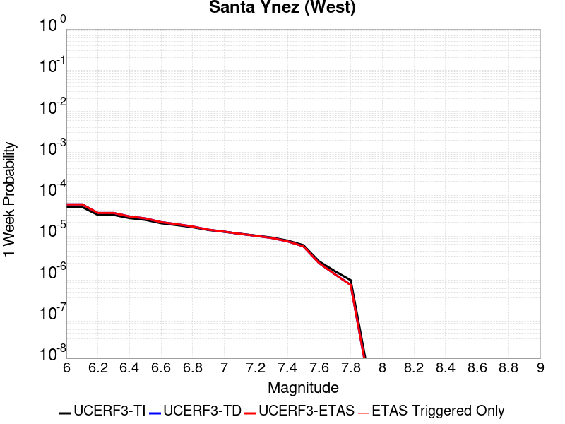 |  | 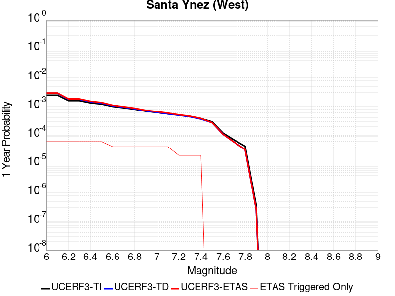 | 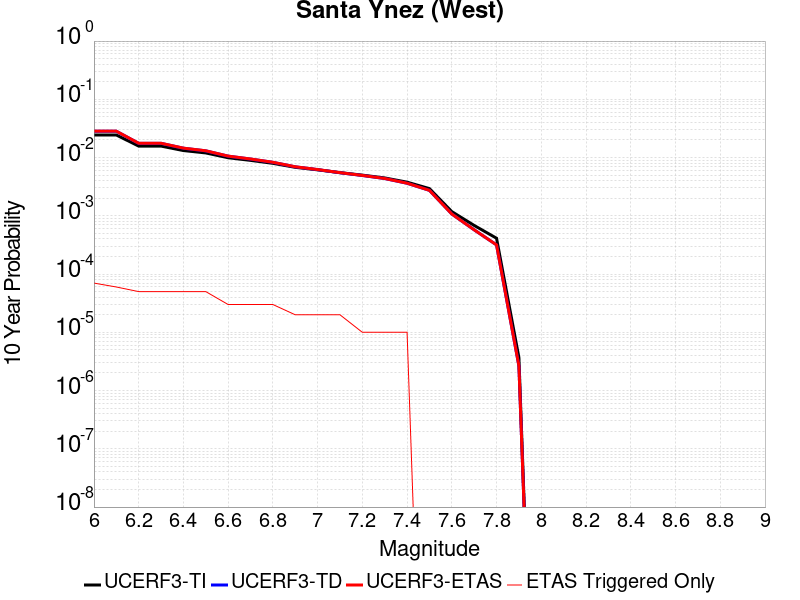 |

| Magnitude | 1 wk TI Prob | 1 wk TD Prob | 1 wk ETAS Prob | 1 wk ETAS/TD Gain | 1 wk ETAS Triggered Only | 1 mo TI Prob | 1 mo TD Prob | 1 mo ETAS Prob | 1 mo ETAS/TD Gain | 1 mo ETAS Triggered Only | 1 yr TI Prob | 1 yr TD Prob | 1 yr ETAS Prob | 1 yr ETAS/TD Gain | 1 yr ETAS Triggered Only | 10 yr TI Prob | 10 yr TD Prob | 10 yr ETAS Prob | 10 yr ETAS/TD Gain | 10 yr ETAS Triggered Only |
|-----|-----|-----|-----|-----|-----|-----|-----|-----|-----|-----|-----|-----|-----|-----|-----|-----|-----|-----|-----|-----|
| 6.0 | 4.7352758E-5 | 5.4995E-5 | 5.4995E-5 | 1.0 | 0.0 | 2.0292461E-4 | 2.3567321E-4 | 2.3567321E-4 | 1.0 | 0.0 | 0.0024678076 | 0.0028658141 | 0.0029068552 | 1.014321 | 4.1159037E-5 | 0.024405818 | 0.028316684 | 0.028356679 | 1.0014124 | 4.1159037E-5 |
| 6.1 | 4.7352758E-5 | 5.4995E-5 | 5.4995E-5 | 1.0 | 0.0 | 2.0292461E-4 | 2.3567321E-4 | 2.3567321E-4 | 1.0 | 0.0 | 0.0024678076 | 0.0028658141 | 0.0029068552 | 1.014321 | 4.1159037E-5 | 0.024405818 | 0.028316684 | 0.028356679 | 1.0014124 | 4.1159037E-5 |
| 6.2 | 3.0415853E-5 | 3.3937395E-5 | 3.3937395E-5 | 1.0 | 0.0 | 1.3034715E-4 | 1.4543808E-4 | 1.4543808E-4 | 1.0 | 0.0 | 0.0015858212 | 0.0017693047 | 0.001810391 | 1.0232217 | 4.1159037E-5 | 0.015745522 | 0.017556129 | 0.017596565 | 1.0023032 | 4.1159037E-5 |
| 6.3 | 3.0415853E-5 | 3.3937395E-5 | 3.3937395E-5 | 1.0 | 0.0 | 1.3034715E-4 | 1.4543808E-4 | 1.4543808E-4 | 1.0 | 0.0 | 0.0015858212 | 0.0017693047 | 0.001810391 | 1.0232217 | 4.1159037E-5 | 0.015745522 | 0.017556129 | 0.017596565 | 1.0023032 | 4.1159037E-5 |
| 6.4 | 2.5452082E-5 | 2.7921762E-5 | 2.7921762E-5 | 1.0 | 0.0 | 1.09075794E-4 | 1.19659315E-4 | 1.19659315E-4 | 1.0 | 0.0 | 0.0013271887 | 0.0014558976 | 0.0014969967 | 1.0282294 | 4.1159037E-5 | 0.013192902 | 0.014465765 | 0.014506329 | 1.0028042 | 4.1159037E-5 |
| 6.5 | 2.3143784E-5 | 2.5136245E-5 | 2.5136245E-5 | 1.0 | 0.0 | 9.9183875E-5 | 1.077224E-4 | 1.077224E-4 | 1.0 | 0.0 | 0.0012068948 | 0.0013107457 | 0.0013518508 | 1.03136 | 4.1159037E-5 | 0.012003611 | 0.013031816 | 0.013072439 | 1.0031172 | 4.1159037E-5 |
| 6.6 | 1.9118515E-5 | 2.0360296E-5 | 2.0360296E-5 | 1.0 | 0.0 | 8.193392E-5 | 8.725553E-5 | 8.725553E-5 | 1.0 | 0.0 | 9.97089E-4 | 0.0010618264 | 0.0011029417 | 1.0387213 | 4.1159037E-5 | 0.00992627 | 0.010568441 | 0.010609165 | 1.0038533 | 4.1159037E-5 |
| 6.7 | 1.722807E-5 | 1.8151439E-5 | 1.8151439E-5 | 1.0 | 0.0 | 7.3832496E-5 | 7.77896E-5 | 7.77896E-5 | 1.0 | 0.0 | 8.985399E-4 | 9.466824E-4 | 9.878025E-4 | 1.0434359 | 4.1159037E-5 | 0.008949154 | 0.009427142 | 0.009467914 | 1.0043249 | 4.1159037E-5 |
| 6.8 | 1.5317364E-5 | 1.593074E-5 | 1.593074E-5 | 1.0 | 0.0 | 6.56442E-5 | 6.8272835E-5 | 6.8272835E-5 | 1.0 | 0.0 | 7.98925E-4 | 8.309091E-4 | 8.7203394E-4 | 1.0494938 | 4.1159037E-5 | 0.007960589 | 0.008278511 | 0.00831933 | 1.0049306 | 4.1159037E-5 |
| 6.9 | 1.3071226E-5 | 1.3332935E-5 | 1.3332935E-5 | 1.0 | 0.0 | 5.6018336E-5 | 5.713991E-5 | 5.713991E-5 | 1.0 | 0.0 | 6.8180985E-4 | 6.954586E-4 | 7.36589E-4 | 1.0591414 | 4.1159037E-5 | 0.0067972173 | 0.006933083 | 0.0069739567 | 1.0058955 | 4.1159037E-5 |
| 7.0 | 1.1836986E-5 | 1.1935664E-5 | 1.1935664E-5 | 1.0 | 0.0 | 5.0728955E-5 | 5.1151852E-5 | 5.1151852E-5 | 1.0 | 0.0 | 6.1745E-4 | 6.225975E-4 | 6.637309E-4 | 1.0660675 | 4.1159037E-5 | 0.006157372 | 0.0062087257 | 0.006249629 | 1.0065881 | 4.1159037E-5 |
| 7.1 | 1.0597169E-5 | 1.0544688E-5 | 1.0544688E-5 | 1.0 | 0.0 | 4.541565E-5 | 4.5190744E-5 | 4.5190744E-5 | 1.0 | 0.0 | 5.5279525E-4 | 5.5005954E-4 | 5.9119595E-4 | 1.0747854 | 4.1159037E-5 | 0.0055142213 | 0.0054871114 | 0.005528045 | 1.0074599 | 4.1159037E-5 |
| 7.2 | 9.59113E-6 | 9.461437E-6 | 9.461437E-6 | 1.0 | 0.0 | 4.11042E-5 | 4.054839E-5 | 4.054839E-5 | 1.0 | 0.0 | 5.0032866E-4 | 4.935659E-4 | 4.935659E-4 | 1.0 | 0.0 | 0.004992037 | 0.004924816 | 0.004924816 | 1.0 | 0.0 |
| 7.3 | 8.586084E-6 | 8.381689E-6 | 8.381689E-6 | 1.0 | 0.0 | 3.679698E-5 | 3.592104E-5 | 3.592104E-5 | 1.0 | 0.0 | 4.4791115E-4 | 4.372519E-4 | 4.372519E-4 | 1.0 | 0.0 | 0.004470094 | 0.004364027 | 0.004364027 | 1.0 | 0.0 |
| 7.4 | 7.2622997E-6 | 6.9533808E-6 | 6.9533808E-6 | 1.0 | 0.0 | 3.112377E-5 | 2.9799869E-5 | 2.9799869E-5 | 1.0 | 0.0 | 3.78866E-4 | 3.6275396E-4 | 3.6275396E-4 | 1.0 | 0.0 | 0.0037822074 | 0.0036217186 | 0.0036217186 | 1.0 | 0.0 |
| 7.5 | 5.627296E-6 | 5.2528007E-6 | 5.2528007E-6 | 1.0 | 0.0 | 2.411676E-5 | 2.2511813E-5 | 2.2511813E-5 | 1.0 | 0.0 | 2.9358198E-4 | 2.7404758E-4 | 2.7404758E-4 | 1.0 | 0.0 | 0.0029319443 | 0.0027371682 | 0.0027371682 | 1.0 | 0.0 |
| 7.6 | 2.265244E-6 | 2.061176E-6 | 2.061176E-6 | 1.0 | 0.0 | 9.708152E-6 | 8.833582E-6 | 8.833582E-6 | 1.0 | 0.0 | 1.18190335E-4 | 1.0754364E-4 | 1.0754364E-4 | 1.0 | 0.0 | 0.001181275 | 0.0010749245 | 0.0010749245 | 1.0 | 0.0 |
| 7.7 | 1.3099874E-6 | 1.1017877E-6 | 1.1017877E-6 | 1.0 | 0.0 | 5.61422E-6 | 4.7219387E-6 | 4.7219387E-6 | 1.0 | 0.0 | 6.8350986E-5 | 5.748811E-5 | 5.748811E-5 | 1.0 | 0.0 | 6.832996E-4 | 5.7473476E-4 | 5.7473476E-4 | 1.0 | 0.0 |
| 7.8 | 7.903951E-7 | 6.071946E-7 | 6.071946E-7 | 1.0 | 0.0 | 3.3874032E-6 | 2.60226E-6 | 2.60226E-6 | 1.0 | 0.0 | 4.1240855E-5 | 3.168207E-5 | 3.168207E-5 | 1.0 | 0.0 | 4.12332E-4 | 3.1677686E-4 | 3.1677686E-4 | 1.0 | 0.0 |
| 7.9 | 7.0753297E-9 | 5.0904827E-9 | 5.0904827E-9 | 1.0 | 0.0 | 3.032284E-8 | 2.1816355E-8 | 2.1816355E-8 | 1.0 | 0.0 | 3.6918053E-7 | 2.656141E-7 | 2.656141E-7 | 1.0 | 0.0 | 3.691799E-6 | 2.6561388E-6 | 2.6561388E-6 | 1.0 | 0.0 |

## Whittier alt 1
*[(top)](#table-of-contents)*

| 1 Week | 1 Month | 1 Year | 10 Year |
|-----|-----|-----|-----|
| 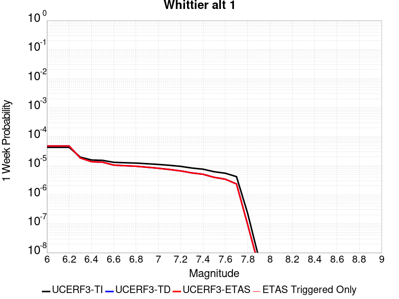 | 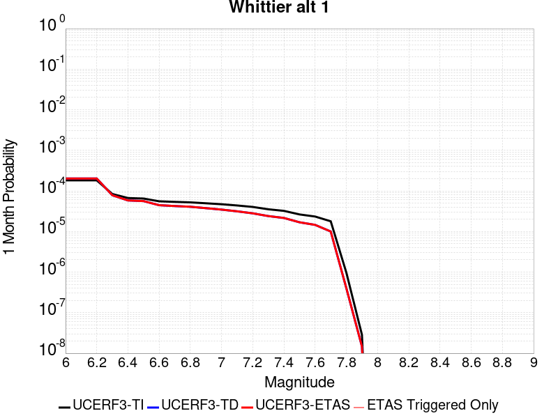 | 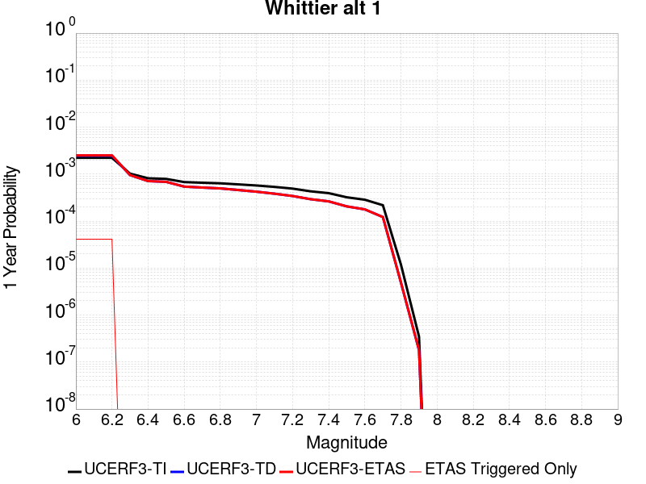 | 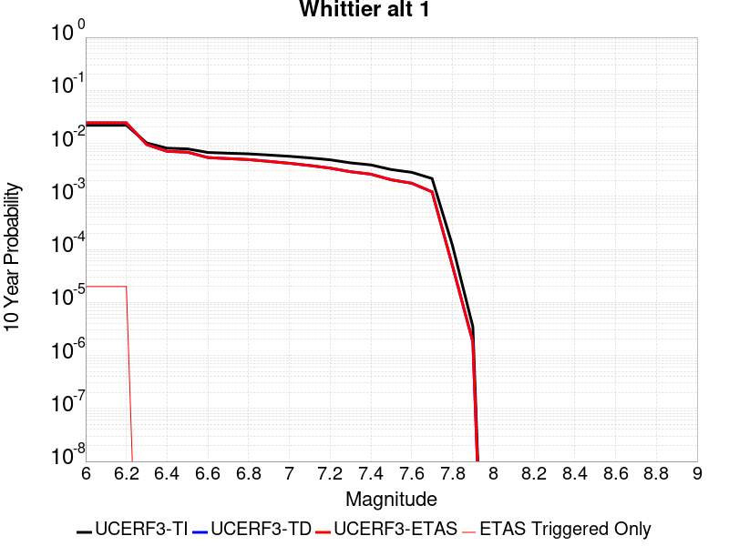 |

| Magnitude | 1 wk TI Prob | 1 wk TD Prob | 1 wk ETAS Prob | 1 wk ETAS/TD Gain | 1 wk ETAS Triggered Only | 1 mo TI Prob | 1 mo TD Prob | 1 mo ETAS Prob | 1 mo ETAS/TD Gain | 1 mo ETAS Triggered Only | 1 yr TI Prob | 1 yr TD Prob | 1 yr ETAS Prob | 1 yr ETAS/TD Gain | 1 yr ETAS Triggered Only | 10 yr TI Prob | 10 yr TD Prob | 10 yr ETAS Prob | 10 yr ETAS/TD Gain | 10 yr ETAS Triggered Only |
|-----|-----|-----|-----|-----|-----|-----|-----|-----|-----|-----|-----|-----|-----|-----|-----|-----|-----|-----|-----|-----|
| 6.0 | 4.2554693E-5 | 4.7272857E-5 | 4.7272857E-5 | 1.0 | 0.0 | 1.8236451E-4 | 2.0258404E-4 | 2.0258404E-4 | 1.0 | 0.0 | 0.002218027 | 0.0024639927 | 0.0025050503 | 1.0166631 | 4.1159037E-5 | 0.02196019 | 0.024400352 | 0.024440506 | 1.0016457 | 4.1159037E-5 |
| 6.1 | 4.2554693E-5 | 4.7272857E-5 | 4.7272857E-5 | 1.0 | 0.0 | 1.8236451E-4 | 2.0258404E-4 | 2.0258404E-4 | 1.0 | 0.0 | 0.002218027 | 0.0024639927 | 0.0025050503 | 1.0166631 | 4.1159037E-5 | 0.02196019 | 0.024400352 | 0.024440506 | 1.0016457 | 4.1159037E-5 |
| 6.2 | 4.2554693E-5 | 4.7272857E-5 | 4.7272857E-5 | 1.0 | 0.0 | 1.8236451E-4 | 2.0258404E-4 | 2.0258404E-4 | 1.0 | 0.0 | 0.002218027 | 0.0024639927 | 0.0025050503 | 1.0166631 | 4.1159037E-5 | 0.02196019 | 0.024400352 | 0.024440506 | 1.0016457 | 4.1159037E-5 |
| 6.3 | 1.9617712E-5 | 1.827975E-5 | 1.827975E-5 | 1.0 | 0.0 | 8.40732E-5 | 7.8339544E-5 | 7.8339544E-5 | 1.0 | 0.0 | 0.0010231105 | 9.533856E-4 | 9.533856E-4 | 1.0 | 0.0 | 0.01018413 | 0.009495797 | 0.009495797 | 1.0 | 0.0 |
| 6.4 | 1.5611336E-5 | 1.3613703E-5 | 1.3613703E-5 | 1.0 | 0.0 | 6.690401E-5 | 5.834317E-5 | 5.834317E-5 | 1.0 | 0.0 | 8.142519E-4 | 7.101026E-4 | 7.101026E-4 | 1.0 | 0.0 | 0.008112748 | 0.0070798527 | 0.0070798527 | 1.0 | 0.0 |
| 6.5 | 1.5150166E-5 | 1.3110247E-5 | 1.3110247E-5 | 1.0 | 0.0 | 6.492767E-5 | 5.6185596E-5 | 5.6185596E-5 | 1.0 | 0.0 | 7.9020765E-4 | 6.838508E-4 | 6.838508E-4 | 1.0 | 0.0 | 0.007874036 | 0.0068189665 | 0.0068189665 | 1.0 | 0.0 |
| 6.6 | 1.295588E-5 | 1.0388335E-5 | 1.0388335E-5 | 1.0 | 0.0 | 5.552402E-5 | 4.4520686E-5 | 4.4520686E-5 | 1.0 | 0.0 | 6.7579525E-4 | 5.419065E-4 | 5.419065E-4 | 1.0 | 0.0 | 0.006737438 | 0.0054069655 | 0.0054069655 | 1.0 | 0.0 |
| 6.7 | 1.2542085E-5 | 9.906739E-6 | 9.906739E-6 | 1.0 | 0.0 | 5.3750682E-5 | 4.2456773E-5 | 4.2456773E-5 | 1.0 | 0.0 | 6.542181E-4 | 5.167905E-4 | 5.167905E-4 | 1.0 | 0.0 | 0.006522954 | 0.0051570027 | 0.0051570027 | 1.0 | 0.0 |
| 6.8 | 1.2195878E-5 | 9.502525E-6 | 9.502525E-6 | 1.0 | 0.0 | 5.2267E-5 | 4.0724484E-5 | 4.0724484E-5 | 1.0 | 0.0 | 6.36165E-4 | 4.9570965E-4 | 4.9570965E-4 | 1.0 | 0.0 | 0.0063434686 | 0.004947075 | 0.004947075 | 1.0 | 0.0 |
| 6.9 | 1.1580298E-5 | 8.779525E-6 | 8.779525E-6 | 1.0 | 0.0 | 4.9628903E-5 | 3.7626E-5 | 3.7626E-5 | 1.0 | 0.0 | 6.040644E-4 | 4.5800192E-4 | 4.5800192E-4 | 1.0 | 0.0 | 0.00602425 | 0.004571492 | 0.004571492 | 1.0 | 0.0 |
| 7.0 | 1.0964795E-5 | 8.0902255E-6 | 8.0902255E-6 | 1.0 | 0.0 | 4.6991136E-5 | 3.4671943E-5 | 3.4671943E-5 | 1.0 | 0.0 | 5.7196687E-4 | 4.2205068E-4 | 4.2205068E-4 | 1.0 | 0.0 | 0.0057049696 | 0.0042133946 | 0.0042133946 | 1.0 | 0.0 |
| 7.1 | 1.0230601E-5 | 7.3321717E-6 | 7.3321717E-6 | 1.0 | 0.0 | 4.3844695E-5 | 3.142322E-5 | 3.142322E-5 | 1.0 | 0.0 | 5.336784E-4 | 3.8251185E-4 | 3.8251185E-4 | 1.0 | 0.0 | 0.005323986 | 0.0038196275 | 0.0038196275 | 1.0 | 0.0 |
| 7.2 | 9.40865E-6 | 6.5483046E-6 | 6.5483046E-6 | 1.0 | 0.0 | 4.032216E-5 | 2.8063869E-5 | 2.8063869E-5 | 1.0 | 0.0 | 4.908117E-4 | 3.4162524E-4 | 3.4162524E-4 | 1.0 | 0.0 | 0.0048972913 | 0.0034120174 | 0.0034120174 | 1.0 | 0.0 |
| 7.3 | 8.237384E-6 | 5.6020504E-6 | 5.6020504E-6 | 1.0 | 0.0 | 3.5302593E-5 | 2.4008574E-5 | 2.4008574E-5 | 1.0 | 0.0 | 4.2972428E-4 | 2.9226622E-4 | 2.9226622E-4 | 1.0 | 0.0 | 0.0042889426 | 0.002919129 | 0.002919129 | 1.0 | 0.0 |
| 7.4 | 7.5316966E-6 | 5.031715E-6 | 5.031715E-6 | 1.0 | 0.0 | 3.2278298E-5 | 2.156432E-5 | 2.156432E-5 | 1.0 | 0.0 | 3.9291743E-4 | 2.6251498E-4 | 2.6251498E-4 | 1.0 | 0.0 | 0.0039222343 | 0.002622164 | 0.002622164 | 1.0 | 0.0 |
| 7.5 | 6.149649E-6 | 3.9369097E-6 | 3.9369097E-6 | 1.0 | 0.0 | 2.6355372E-5 | 1.6872367E-5 | 1.6872367E-5 | 1.0 | 0.0 | 3.208294E-4 | 2.054026E-4 | 2.054026E-4 | 1.0 | 0.0 | 0.003203666 | 0.0020522168 | 0.0020522168 | 1.0 | 0.0 |
| 7.6 | 5.457711E-6 | 3.3980803E-6 | 3.3980803E-6 | 1.0 | 0.0 | 2.338998E-5 | 1.4563125E-5 | 1.4563125E-5 | 1.0 | 0.0 | 2.8473578E-4 | 1.7729244E-4 | 1.7729244E-4 | 1.0 | 0.0 | 0.0028437122 | 0.0017715908 | 0.0017715908 | 1.0 | 0.0 |
| 7.7 | 4.1676276E-6 | 2.335305E-6 | 2.335305E-6 | 1.0 | 0.0 | 1.7861139E-5 | 1.0008415E-5 | 1.0008415E-5 | 1.0 | 0.0 | 2.1743766E-4 | 1.2184639E-4 | 1.2184639E-4 | 1.0 | 0.0 | 0.0021722503 | 0.001217869 | 0.001217869 | 1.0 | 0.0 |
| 7.8 | 2.2692414E-7 | 9.3929124E-8 | 9.3929124E-8 | 1.0 | 0.0 | 9.725317E-7 | 4.0255333E-7 | 4.0255333E-7 | 1.0 | 0.0 | 1.1840509E-5 | 4.901079E-6 | 4.901079E-6 | 1.0 | 0.0 | 1.1839878E-4 | 4.901004E-5 | 4.901004E-5 | 1.0 | 0.0 |
| 7.9 | 6.676829E-9 | 3.4418608E-9 | 3.4418608E-9 | 1.0 | 0.0 | 2.861498E-8 | 1.4750832E-8 | 1.4750832E-8 | 1.0 | 0.0 | 3.4838732E-7 | 1.7959135E-7 | 1.7959135E-7 | 1.0 | 0.0 | 3.4838679E-6 | 1.7959123E-6 | 1.7959123E-6 | 1.0 | 0.0 |

## Great Valley 07 (Orestimba)
*[(top)](#table-of-contents)*

| 1 Week | 1 Month | 1 Year | 10 Year |
|-----|-----|-----|-----|
| 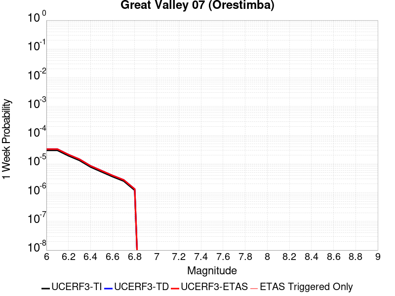 | 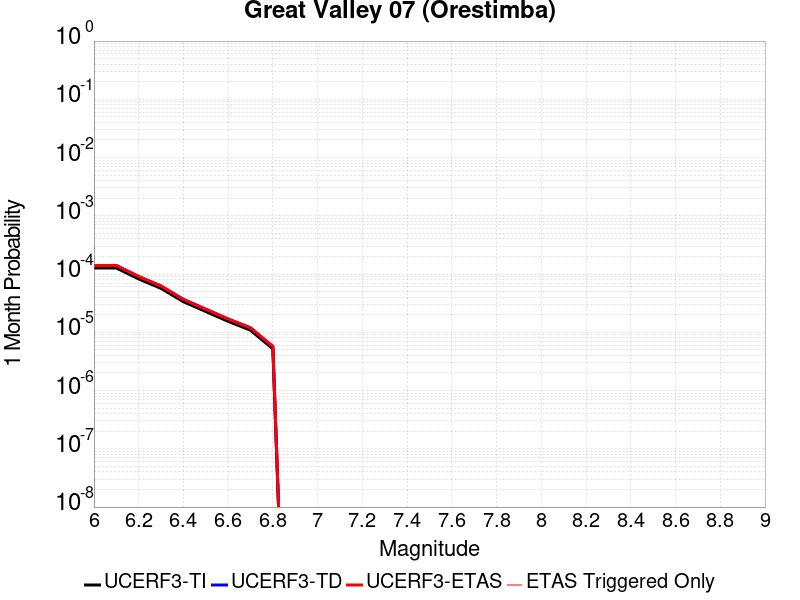 | 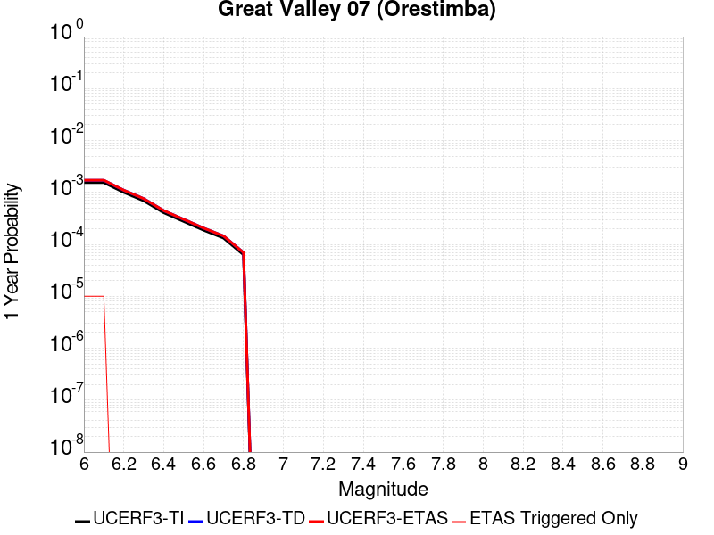 | 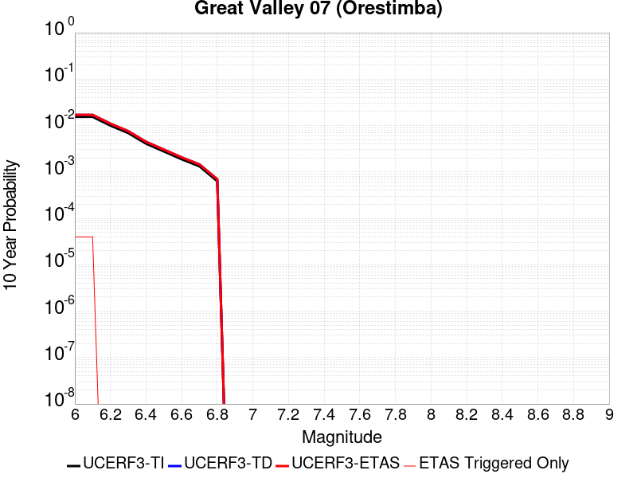 |

| Magnitude | 1 wk TI Prob | 1 wk TD Prob | 1 wk ETAS Prob | 1 wk ETAS/TD Gain | 1 wk ETAS Triggered Only | 1 mo TI Prob | 1 mo TD Prob | 1 mo ETAS Prob | 1 mo ETAS/TD Gain | 1 mo ETAS Triggered Only | 1 yr TI Prob | 1 yr TD Prob | 1 yr ETAS Prob | 1 yr ETAS/TD Gain | 1 yr ETAS Triggered Only | 10 yr TI Prob | 10 yr TD Prob | 10 yr ETAS Prob | 10 yr ETAS/TD Gain | 10 yr ETAS Triggered Only |
|-----|-----|-----|-----|-----|-----|-----|-----|-----|-----|-----|-----|-----|-----|-----|-----|-----|-----|-----|-----|-----|
| 6.0 | 2.9687902E-5 | 3.2765336E-5 | 3.2765336E-5 | 1.0 | 0.0 | 1.2722766E-4 | 1.4041572E-4 | 1.4041572E-4 | 1.0 | 0.0 | 0.0015478961 | 0.0017082928 | 0.0017493814 | 1.0240525 | 4.1159037E-5 | 0.015371585 | 0.01695916 | 0.017040081 | 1.0047716 | 8.2318074E-5 |
| 6.1 | 2.9687902E-5 | 3.2765336E-5 | 3.2765336E-5 | 1.0 | 0.0 | 1.2722766E-4 | 1.4041572E-4 | 1.4041572E-4 | 1.0 | 0.0 | 0.0015478961 | 0.0017082928 | 0.0017493814 | 1.0240525 | 4.1159037E-5 | 0.015371585 | 0.01695916 | 0.017040081 | 1.0047716 | 8.2318074E-5 |
| 6.2 | 1.9231524E-5 | 2.1164073E-5 | 2.1164073E-5 | 1.0 | 0.0 | 8.2418206E-5 | 9.0700145E-5 | 9.0700145E-5 | 1.0 | 0.0 | 0.0010029797 | 0.001103738 | 0.001103738 | 1.0 | 0.0 | 0.00998465 | 0.010984973 | 0.010984973 | 1.0 | 0.0 |
| 6.3 | 1.324766E-5 | 1.4551837E-5 | 1.4551837E-5 | 1.0 | 0.0 | 5.6774446E-5 | 6.236358E-5 | 6.236358E-5 | 1.0 | 0.0 | 6.910097E-4 | 7.590212E-4 | 7.590212E-4 | 1.0 | 0.0 | 0.006888649 | 0.007565235 | 0.007565235 | 1.0 | 0.0 |
| 6.4 | 7.818645E-6 | 8.5747515E-6 | 8.5747515E-6 | 1.0 | 0.0 | 3.3508048E-5 | 3.674844E-5 | 3.674844E-5 | 1.0 | 0.0 | 4.078841E-4 | 4.4732375E-4 | 4.4732375E-4 | 1.0 | 0.0 | 0.004071363 | 0.0044645737 | 0.0044645737 | 1.0 | 0.0 |
| 6.5 | 5.3076565E-6 | 5.8190935E-6 | 5.8190935E-6 | 1.0 | 0.0 | 2.27469E-5 | 2.4938745E-5 | 2.4938745E-5 | 1.0 | 0.0 | 2.7690834E-4 | 3.0358904E-4 | 3.0358904E-4 | 1.0 | 0.0 | 0.0027656353 | 0.0030319525 | 0.0030319525 | 1.0 | 0.0 |
| 6.6 | 3.6003578E-6 | 3.949378E-6 | 3.949378E-6 | 1.0 | 0.0 | 1.5430012E-5 | 1.6925806E-5 | 1.6925806E-5 | 1.0 | 0.0 | 1.8784421E-4 | 2.0605375E-4 | 2.0605375E-4 | 1.0 | 0.0 | 0.0018768552 | 0.0020587812 | 0.0020587812 | 1.0 | 0.0 |
| 6.7 | 2.5361826E-6 | 2.7840954E-6 | 2.7840954E-6 | 1.0 | 0.0 | 1.0869308E-5 | 1.193179E-5 | 1.193179E-5 | 1.0 | 0.0 | 1.3232579E-4 | 1.4526118E-4 | 1.4526118E-4 | 1.0 | 0.0 | 0.0013224703 | 0.0014517923 | 0.0014517923 | 1.0 | 0.0 |
| 6.8 | 1.2115831E-6 | 1.3316841E-6 | 1.3316841E-6 | 1.0 | 0.0 | 5.1924885E-6 | 5.7072107E-6 | 5.7072107E-6 | 1.0 | 0.0 | 6.3216714E-5 | 6.948404E-5 | 6.948404E-5 | 1.0 | 0.0 | 6.3198735E-4 | 6.947183E-4 | 6.947183E-4 | 1.0 | 0.0 |

## Blue Cut
*[(top)](#table-of-contents)*

| 1 Week | 1 Month | 1 Year | 10 Year |
|-----|-----|-----|-----|
| 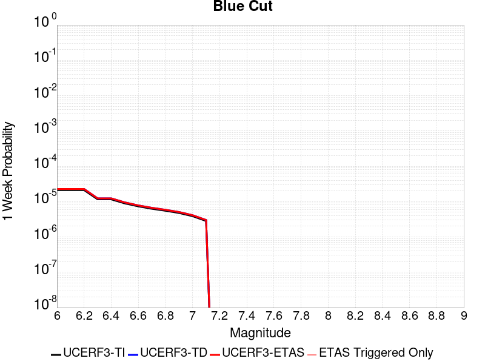 |  | 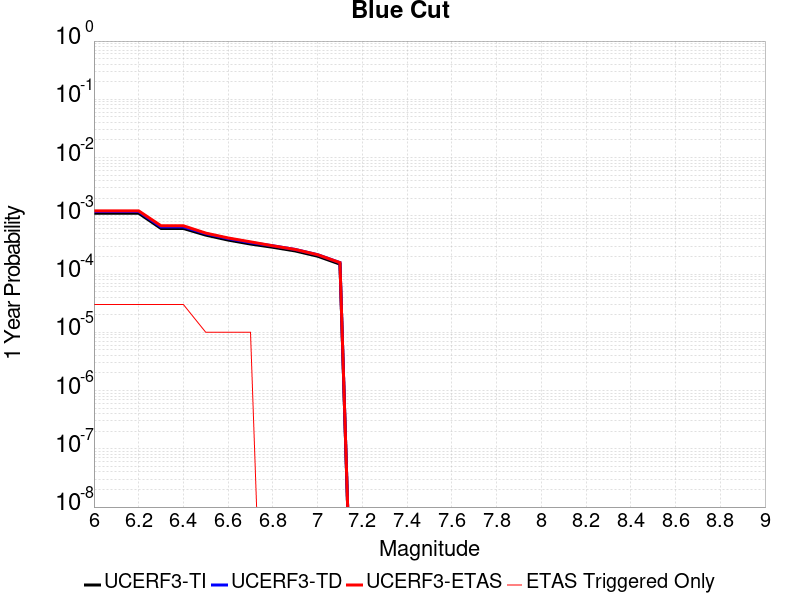 | 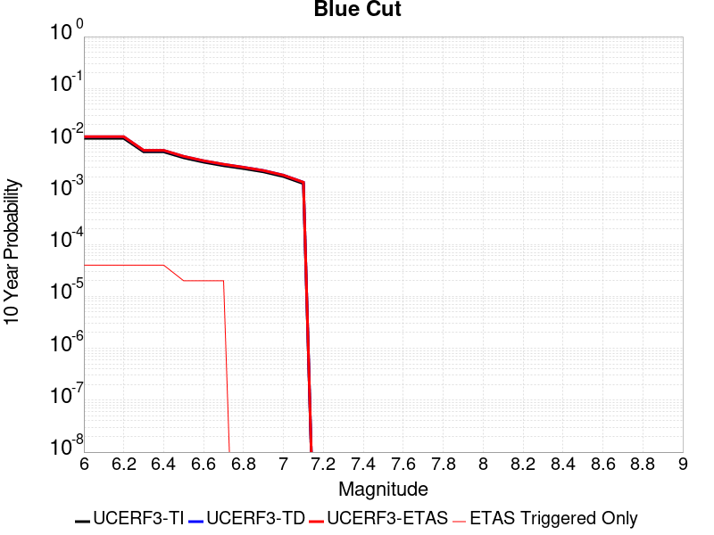 |

| Magnitude | 1 wk TI Prob | 1 wk TD Prob | 1 wk ETAS Prob | 1 wk ETAS/TD Gain | 1 wk ETAS Triggered Only | 1 mo TI Prob | 1 mo TD Prob | 1 mo ETAS Prob | 1 mo ETAS/TD Gain | 1 mo ETAS Triggered Only | 1 yr TI Prob | 1 yr TD Prob | 1 yr ETAS Prob | 1 yr ETAS/TD Gain | 1 yr ETAS Triggered Only | 10 yr TI Prob | 10 yr TD Prob | 10 yr ETAS Prob | 10 yr ETAS/TD Gain | 10 yr ETAS Triggered Only |
|-----|-----|-----|-----|-----|-----|-----|-----|-----|-----|-----|-----|-----|-----|-----|-----|-----|-----|-----|-----|-----|
| 6.0 | 2.1227985E-5 | 2.272327E-5 | 2.272327E-5 | 1.0 | 0.0 | 9.097391E-5 | 9.738214E-5 | 9.738214E-5 | 1.0 | 0.0 | 0.0011070445 | 0.0011850408 | 0.0012672613 | 1.0693821 | 8.2318074E-5 | 0.011015458 | 0.01179306 | 0.0118744075 | 1.0068979 | 8.2318074E-5 |
| 6.1 | 2.1227985E-5 | 2.272327E-5 | 2.272327E-5 | 1.0 | 0.0 | 9.097391E-5 | 9.738214E-5 | 9.738214E-5 | 1.0 | 0.0 | 0.0011070445 | 0.0011850408 | 0.0012672613 | 1.0693821 | 8.2318074E-5 | 0.011015458 | 0.01179306 | 0.0118744075 | 1.0068979 | 8.2318074E-5 |
| 6.2 | 2.1227985E-5 | 2.272327E-5 | 2.272327E-5 | 1.0 | 0.0 | 9.097391E-5 | 9.738214E-5 | 9.738214E-5 | 1.0 | 0.0 | 0.0011070445 | 0.0011850408 | 0.0012672613 | 1.0693821 | 8.2318074E-5 | 0.011015458 | 0.01179306 | 0.0118744075 | 1.0068979 | 8.2318074E-5 |
| 6.3 | 1.1613981E-5 | 1.2355362E-5 | 1.2355362E-5 | 1.0 | 0.0 | 4.9773254E-5 | 5.2950545E-5 | 5.2950545E-5 | 1.0 | 0.0 | 6.0582085E-4 | 6.4449466E-4 | 7.2675967E-4 | 1.1276426 | 8.2318074E-5 | 0.0060417196 | 0.0064275027 | 0.006509292 | 1.0127249 | 8.2318074E-5 |
| 6.4 | 1.1613981E-5 | 1.2355362E-5 | 1.2355362E-5 | 1.0 | 0.0 | 4.9773254E-5 | 5.2950545E-5 | 5.2950545E-5 | 1.0 | 0.0 | 6.0582085E-4 | 6.4449466E-4 | 7.2675967E-4 | 1.1276426 | 8.2318074E-5 | 0.0060417196 | 0.0064275027 | 0.006509292 | 1.0127249 | 8.2318074E-5 |
| 6.5 | 8.931326E-6 | 9.48295E-6 | 9.48295E-6 | 1.0 | 0.0 | 3.8276554E-5 | 4.0640636E-5 | 4.0640636E-5 | 1.0 | 0.0 | 4.6591737E-4 | 4.9469655E-4 | 5.358352E-4 | 1.0831594 | 4.1159037E-5 | 0.0046494175 | 0.0049368627 | 0.0049778186 | 1.0082959 | 4.1159037E-5 |
| 6.6 | 7.345353E-6 | 7.79137E-6 | 7.79137E-6 | 1.0 | 0.0 | 3.1479703E-5 | 3.3391203E-5 | 3.3391203E-5 | 1.0 | 0.0 | 3.83198E-4 | 4.064701E-4 | 4.476124E-4 | 1.1012186 | 4.1159037E-5 | 0.0038253788 | 0.004058058 | 0.00409905 | 1.0101014 | 4.1159037E-5 |
| 6.7 | 6.2775666E-6 | 6.656074E-6 | 6.656074E-6 | 1.0 | 0.0 | 2.690358E-5 | 2.8525763E-5 | 2.8525763E-5 | 1.0 | 0.0 | 3.2750185E-4 | 3.4725334E-4 | 3.883981E-4 | 1.1184863 | 4.1159037E-5 | 0.0032701963 | 0.0034678485 | 0.003508865 | 1.0118276 | 4.1159037E-5 |
| 6.8 | 5.5234095E-6 | 5.855924E-6 | 5.855924E-6 | 1.0 | 0.0 | 2.367154E-5 | 2.5096617E-5 | 2.5096617E-5 | 1.0 | 0.0 | 2.8816288E-4 | 3.0551574E-4 | 3.0551574E-4 | 1.0 | 0.0 | 0.002877895 | 0.0030516735 | 0.0030516735 | 1.0 | 0.0 |
| 6.9 | 4.7780054E-6 | 5.0661247E-6 | 5.0661247E-6 | 1.0 | 0.0 | 2.0477004E-5 | 2.1711823E-5 | 2.1711823E-5 | 1.0 | 0.0 | 2.4927902E-4 | 2.6431642E-4 | 2.6431642E-4 | 1.0 | 0.0 | 0.0024899957 | 0.002640713 | 0.002640713 | 1.0 | 0.0 |
| 7.0 | 3.883171E-6 | 4.119064E-6 | 4.119064E-6 | 1.0 | 0.0 | 1.6642054E-5 | 1.765305E-5 | 1.765305E-5 | 1.0 | 0.0 | 2.0259817E-4 | 2.1491159E-4 | 2.1491159E-4 | 1.0 | 0.0 | 0.0020241356 | 0.0021477134 | 0.0021477134 | 1.0 | 0.0 |
| 7.1 | 2.8358215E-6 | 3.0101426E-6 | 3.0101426E-6 | 1.0 | 0.0 | 1.2153464E-5 | 1.2900584E-5 | 1.2900584E-5 | 1.0 | 0.0 | 1.4795837E-4 | 1.5705987E-4 | 1.5705987E-4 | 1.0 | 0.0 | 0.001478599 | 0.0015701341 | 0.0015701341 | 1.0 | 0.0 |

## Malibu Coast (Extension) alt 1
*[(top)](#table-of-contents)*

| 1 Week | 1 Month | 1 Year | 10 Year |
|-----|-----|-----|-----|
| 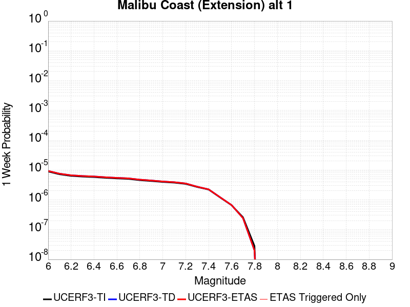 | 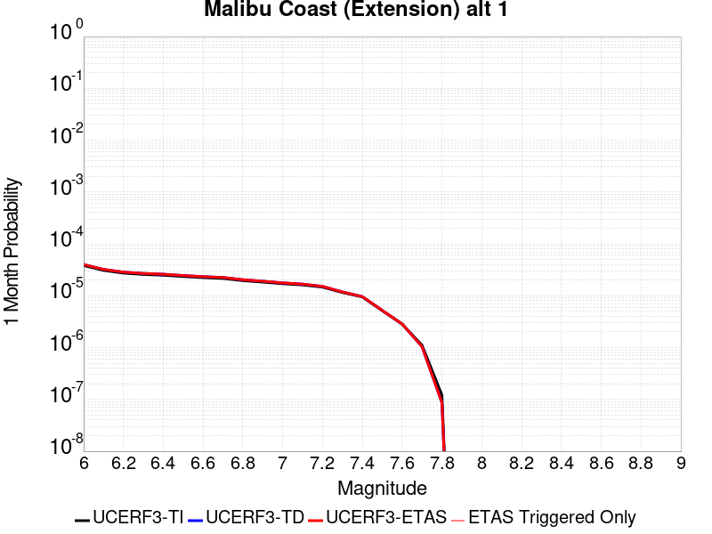 | 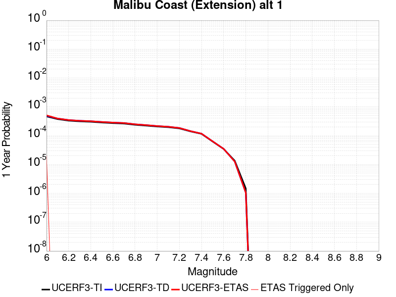 | 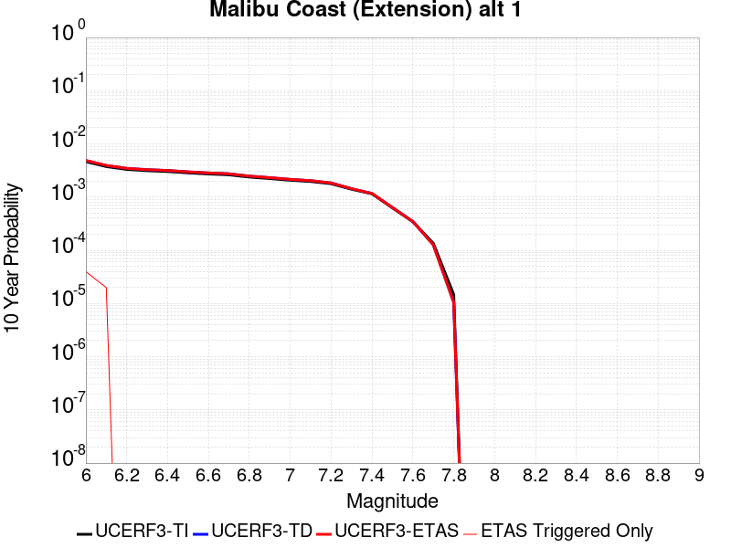 |

| Magnitude | 1 wk TI Prob | 1 wk TD Prob | 1 wk ETAS Prob | 1 wk ETAS/TD Gain | 1 wk ETAS Triggered Only | 1 mo TI Prob | 1 mo TD Prob | 1 mo ETAS Prob | 1 mo ETAS/TD Gain | 1 mo ETAS Triggered Only | 1 yr TI Prob | 1 yr TD Prob | 1 yr ETAS Prob | 1 yr ETAS/TD Gain | 1 yr ETAS Triggered Only | 10 yr TI Prob | 10 yr TD Prob | 10 yr ETAS Prob | 10 yr ETAS/TD Gain | 10 yr ETAS Triggered Only |
|-----|-----|-----|-----|-----|-----|-----|-----|-----|-----|-----|-----|-----|-----|-----|-----|-----|-----|-----|-----|-----|
| 6.0 | 8.930738E-6 | 9.330624E-6 | 9.330624E-6 | 1.0 | 0.0 | 3.827403E-5 | 3.998779E-5 | 3.998779E-5 | 1.0 | 0.0 | 4.6588664E-4 | 4.867443E-4 | 5.278833E-4 | 1.0845187 | 4.1159037E-5 | 0.0046491115 | 0.0048569646 | 0.004938883 | 1.0168661 | 8.2318074E-5 |
| 6.1 | 7.199952E-6 | 7.5314815E-6 | 7.5314815E-6 | 1.0 | 0.0 | 3.0856572E-5 | 3.227738E-5 | 3.227738E-5 | 1.0 | 0.0 | 3.75614E-4 | 3.9290686E-4 | 3.9290686E-4 | 1.0 | 0.0 | 0.0037497976 | 0.003922188 | 0.003963186 | 1.0104527 | 4.1159037E-5 |
| 6.2 | 6.3721413E-6 | 6.6678904E-6 | 6.6678904E-6 | 1.0 | 0.0 | 2.7308892E-5 | 2.8576364E-5 | 2.8576364E-5 | 1.0 | 0.0 | 3.3243504E-4 | 3.4786202E-4 | 3.4786202E-4 | 1.0 | 0.0 | 0.0033193815 | 0.0034732153 | 0.0034732153 | 1.0 | 0.0 |
| 6.3 | 6.016345E-6 | 6.296219E-6 | 6.296219E-6 | 1.0 | 0.0 | 2.578408E-5 | 2.6983518E-5 | 2.6983518E-5 | 1.0 | 0.0 | 3.1387596E-4 | 3.2847514E-4 | 3.2847514E-4 | 1.0 | 0.0 | 0.00313433 | 0.0032799323 | 0.0032799323 | 1.0 | 0.0 |
| 6.4 | 5.8104883E-6 | 6.0805814E-6 | 6.0805814E-6 | 1.0 | 0.0 | 2.4901856E-5 | 2.6059377E-5 | 2.6059377E-5 | 1.0 | 0.0 | 3.031379E-4 | 3.1722704E-4 | 3.1722704E-4 | 1.0 | 0.0 | 0.0030272473 | 0.0031677769 | 0.0031677769 | 1.0 | 0.0 |
| 6.5 | 5.476925E-6 | 5.728505E-6 | 5.728505E-6 | 1.0 | 0.0 | 2.3472323E-5 | 2.4550507E-5 | 2.4550507E-5 | 1.0 | 0.0 | 2.8573806E-4 | 2.988617E-4 | 2.988617E-4 | 1.0 | 0.0 | 0.0028537093 | 0.00298463 | 0.00298463 | 1.0 | 0.0 |
| 6.6 | 5.222387E-6 | 5.4595366E-6 | 5.4595366E-6 | 1.0 | 0.0 | 2.2381464E-5 | 2.3397804E-5 | 2.3397804E-5 | 1.0 | 0.0 | 2.7246025E-4 | 2.8483133E-4 | 2.8483133E-4 | 1.0 | 0.0 | 0.0027212645 | 0.0028446934 | 0.0028446934 | 1.0 | 0.0 |
| 6.7 | 5.0337076E-6 | 5.2600335E-6 | 5.2600335E-6 | 1.0 | 0.0 | 2.1572854E-5 | 2.2542807E-5 | 2.2542807E-5 | 1.0 | 0.0 | 2.6261783E-4 | 2.7442438E-4 | 2.7442438E-4 | 1.0 | 0.0 | 0.002623077 | 0.0027408851 | 0.0027408851 | 1.0 | 0.0 |
| 6.8 | 4.5675624E-6 | 4.7595618E-6 | 4.7595618E-6 | 1.0 | 0.0 | 1.9575122E-5 | 2.0397963E-5 | 2.0397963E-5 | 1.0 | 0.0 | 2.3830103E-4 | 2.4831708E-4 | 2.4831708E-4 | 1.0 | 0.0 | 0.0023804565 | 0.0024804159 | 0.0024804159 | 1.0 | 0.0 |
| 6.9 | 4.2802412E-6 | 4.452818E-6 | 4.452818E-6 | 1.0 | 0.0 | 1.8343762E-5 | 1.9083367E-5 | 1.9083367E-5 | 1.0 | 0.0 | 2.2331243E-4 | 2.3231537E-4 | 2.3231537E-4 | 1.0 | 0.0 | 0.0022308815 | 0.0023207418 | 0.0023207418 | 1.0 | 0.0 |
| 7.0 | 3.9794063E-6 | 4.130844E-6 | 4.130844E-6 | 1.0 | 0.0 | 1.7054486E-5 | 1.7703498E-5 | 1.7703498E-5 | 1.0 | 0.0 | 2.0761859E-4 | 2.155189E-4 | 2.155189E-4 | 1.0 | 0.0 | 0.0020742472 | 0.0021531123 | 0.0021531123 | 1.0 | 0.0 |
| 7.1 | 3.7730424E-6 | 3.9119313E-6 | 3.9119313E-6 | 1.0 | 0.0 | 1.6170083E-5 | 1.6765312E-5 | 1.6765312E-5 | 1.0 | 0.0 | 1.9685295E-4 | 2.0409869E-4 | 2.0409869E-4 | 1.0 | 0.0 | 0.0019667868 | 0.0020391252 | 0.0020391252 | 1.0 | 0.0 |
| 7.2 | 3.424985E-6 | 3.5419976E-6 | 3.5419976E-6 | 1.0 | 0.0 | 1.4678424E-5 | 1.5179901E-5 | 1.5179901E-5 | 1.0 | 0.0 | 1.7869516E-4 | 1.8479973E-4 | 1.8479973E-4 | 1.0 | 0.0 | 0.0017855153 | 0.0018464727 | 0.0018464727 | 1.0 | 0.0 |
| 7.3 | 2.6966375E-6 | 2.7601811E-6 | 2.7601811E-6 | 1.0 | 0.0 | 1.15569665E-5 | 1.1829295E-5 | 1.1829295E-5 | 1.0 | 0.0 | 1.4069698E-4 | 1.4401217E-4 | 1.4401217E-4 | 1.0 | 0.0 | 0.0014060794 | 0.0014391927 | 0.0014391927 | 1.0 | 0.0 |
| 7.4 | 2.215957E-6 | 2.2498289E-6 | 2.2498289E-6 | 1.0 | 0.0 | 9.496924E-6 | 9.642088E-6 | 9.642088E-6 | 1.0 | 0.0 | 1.1561892E-4 | 1.1738613E-4 | 1.1738613E-4 | 1.0 | 0.0 | 0.0011555878 | 0.001173245 | 0.001173245 | 1.0 | 0.0 |
| 7.5 | 1.2040218E-6 | 1.2221219E-6 | 1.2221219E-6 | 1.0 | 0.0 | 5.160083E-6 | 5.237655E-6 | 5.237655E-6 | 1.0 | 0.0 | 6.2822204E-5 | 6.37666E-5 | 6.37666E-5 | 1.0 | 0.0 | 6.280445E-4 | 6.374849E-4 | 6.374849E-4 | 1.0 | 0.0 |
| 7.6 | 6.6157446E-7 | 6.6800027E-7 | 6.6800027E-7 | 1.0 | 0.0 | 2.835316E-6 | 2.8628554E-6 | 2.8628554E-6 | 1.0 | 0.0 | 3.4519428E-5 | 3.4854722E-5 | 3.4854722E-5 | 1.0 | 0.0 | 3.4514067E-4 | 3.4849407E-4 | 3.4849407E-4 | 1.0 | 0.0 |
| 7.7 | 2.6012302E-7 | 2.4361185E-7 | 2.4361185E-7 | 1.0 | 0.0 | 1.1148124E-6 | 1.0440505E-6 | 1.0440505E-6 | 1.0 | 0.0 | 1.3572758E-5 | 1.2711251E-5 | 1.2711251E-5 | 1.0 | 0.0 | 1.3571928E-4 | 1.2710631E-4 | 1.2710631E-4 | 1.0 | 0.0 |
| 7.8 | 2.8323132E-8 | 2.026981E-8 | 2.026981E-8 | 1.0 | 0.0 | 1.2138484E-7 | 8.687062E-8 | 8.687062E-8 | 1.0 | 0.0 | 1.4778595E-6 | 1.0576493E-6 | 1.0576493E-6 | 1.0 | 0.0 | 1.4778497E-5 | 1.0576451E-5 | 1.0576451E-5 | 1.0 | 0.0 |

## Santa Ynez (East)
*[(top)](#table-of-contents)*

| 1 Week | 1 Month | 1 Year | 10 Year |
|-----|-----|-----|-----|
| 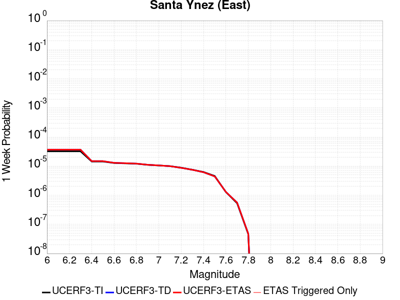 | 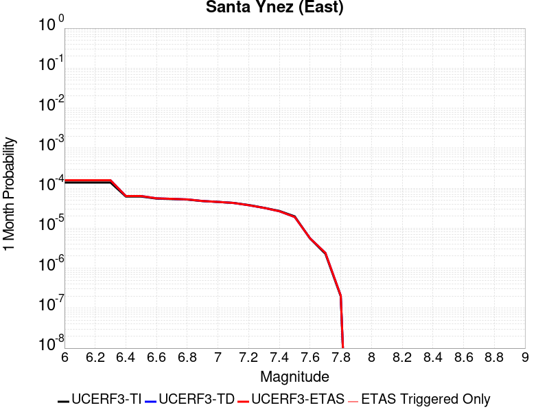 | 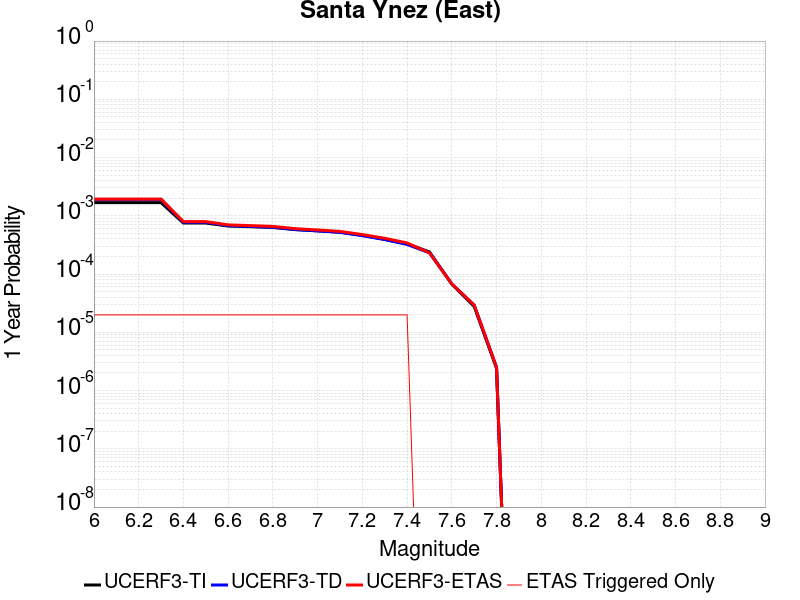 | 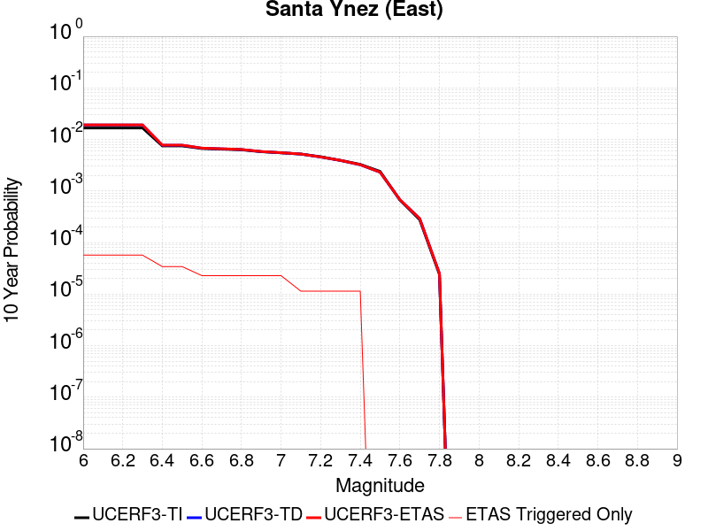 |

| Magnitude | 1 wk TI Prob | 1 wk TD Prob | 1 wk ETAS Prob | 1 wk ETAS/TD Gain | 1 wk ETAS Triggered Only | 1 mo TI Prob | 1 mo TD Prob | 1 mo ETAS Prob | 1 mo ETAS/TD Gain | 1 mo ETAS Triggered Only | 1 yr TI Prob | 1 yr TD Prob | 1 yr ETAS Prob | 1 yr ETAS/TD Gain | 1 yr ETAS Triggered Only | 10 yr TI Prob | 10 yr TD Prob | 10 yr ETAS Prob | 10 yr ETAS/TD Gain | 10 yr ETAS Triggered Only |
|-----|-----|-----|-----|-----|-----|-----|-----|-----|-----|-----|-----|-----|-----|-----|-----|-----|-----|-----|-----|-----|
| 6.0 | 3.2269712E-5 | 3.6766065E-5 | 3.6766065E-5 | 1.0 | 0.0 | 1.3829143E-4 | 1.5756265E-4 | 1.5756265E-4 | 1.0 | 0.0 | 0.0016823979 | 0.0019172227 | 0.0019172227 | 1.0 | 0.0 | 0.016697178 | 0.019064324 | 0.019145072 | 1.0042356 | 8.2318074E-5 |
| 6.1 | 3.2269712E-5 | 3.6766065E-5 | 3.6766065E-5 | 1.0 | 0.0 | 1.3829143E-4 | 1.5756265E-4 | 1.5756265E-4 | 1.0 | 0.0 | 0.0016823979 | 0.0019172227 | 0.0019172227 | 1.0 | 0.0 | 0.016697178 | 0.019064324 | 0.019145072 | 1.0042356 | 8.2318074E-5 |
| 6.2 | 3.2269712E-5 | 3.6766065E-5 | 3.6766065E-5 | 1.0 | 0.0 | 1.3829143E-4 | 1.5756265E-4 | 1.5756265E-4 | 1.0 | 0.0 | 0.0016823979 | 0.0019172227 | 0.0019172227 | 1.0 | 0.0 | 0.016697178 | 0.019064324 | 0.019145072 | 1.0042356 | 8.2318074E-5 |
| 6.3 | 3.2269712E-5 | 3.6766065E-5 | 3.6766065E-5 | 1.0 | 0.0 | 1.3829143E-4 | 1.5756265E-4 | 1.5756265E-4 | 1.0 | 0.0 | 0.0016823979 | 0.0019172227 | 0.0019172227 | 1.0 | 0.0 | 0.016697178 | 0.019064324 | 0.019145072 | 1.0042356 | 8.2318074E-5 |
| 6.4 | 1.4404779E-5 | 1.4853209E-5 | 1.4853209E-5 | 1.0 | 0.0 | 6.1733306E-5 | 6.365508E-5 | 6.365508E-5 | 1.0 | 0.0 | 7.513438E-4 | 7.747302E-4 | 7.747302E-4 | 1.0 | 0.0 | 0.0074880854 | 0.0077208444 | 0.007761685 | 1.0052898 | 4.1159037E-5 |
| 6.5 | 1.4404779E-5 | 1.4853209E-5 | 1.4853209E-5 | 1.0 | 0.0 | 6.1733306E-5 | 6.365508E-5 | 6.365508E-5 | 1.0 | 0.0 | 7.513438E-4 | 7.747302E-4 | 7.747302E-4 | 1.0 | 0.0 | 0.0074880854 | 0.0077208444 | 0.007761685 | 1.0052898 | 4.1159037E-5 |
| 6.6 | 1.280208E-5 | 1.301515E-5 | 1.301515E-5 | 1.0 | 0.0 | 5.4864904E-5 | 5.5778033E-5 | 5.5778033E-5 | 1.0 | 0.0 | 6.6777546E-4 | 6.788877E-4 | 6.788877E-4 | 1.0 | 0.0 | 0.006657724 | 0.0067683486 | 0.006809229 | 1.00604 | 4.1159037E-5 |
| 6.7 | 1.2457027E-5 | 1.2631572E-5 | 1.2631572E-5 | 1.0 | 0.0 | 5.3386164E-5 | 5.4134194E-5 | 5.4134194E-5 | 1.0 | 0.0 | 6.497827E-4 | 6.5888616E-4 | 6.5888616E-4 | 1.0 | 0.0 | 0.00647886 | 0.0065695243 | 0.0066104126 | 1.006224 | 4.1159037E-5 |
| 6.8 | 1.2095134E-5 | 1.2233928E-5 | 1.2233928E-5 | 1.0 | 0.0 | 5.1835254E-5 | 5.2430074E-5 | 5.2430074E-5 | 1.0 | 0.0 | 6.309115E-4 | 6.3815084E-4 | 6.3815084E-4 | 1.0 | 0.0 | 0.0062912325 | 0.0063633714 | 0.0064042686 | 1.0064269 | 4.1159037E-5 |
| 6.9 | 1.1104036E-5 | 1.1160151E-5 | 1.1160151E-5 | 1.0 | 0.0 | 4.758786E-5 | 4.7828347E-5 | 4.7828347E-5 | 1.0 | 0.0 | 5.7922816E-4 | 5.8215583E-4 | 5.8215583E-4 | 1.0 | 0.0 | 0.005777207 | 0.0058064535 | 0.005847374 | 1.0070473 | 4.1159037E-5 |
| 7.0 | 1.0577444E-5 | 1.058436E-5 | 1.058436E-5 | 1.0 | 0.0 | 4.5331115E-5 | 4.536076E-5 | 4.536076E-5 | 1.0 | 0.0 | 5.5176654E-4 | 5.5212853E-4 | 5.5212853E-4 | 1.0 | 0.0 | 0.0055039856 | 0.005507706 | 0.0055486383 | 1.0074319 | 4.1159037E-5 |
| 7.1 | 1.0021775E-5 | 9.983552E-6 | 9.983552E-6 | 1.0 | 0.0 | 4.294976E-5 | 4.278596E-5 | 4.278596E-5 | 1.0 | 0.0 | 5.2278786E-4 | 5.2079576E-4 | 5.2079576E-4 | 1.0 | 0.0 | 0.0052155964 | 0.0051958854 | 0.0051958854 | 1.0 | 0.0 |
| 7.2 | 8.874109E-6 | 8.75112E-6 | 8.75112E-6 | 1.0 | 0.0 | 3.8031343E-5 | 3.7504265E-5 | 3.7504265E-5 | 1.0 | 0.0 | 4.629332E-4 | 4.5651986E-4 | 4.5651986E-4 | 1.0 | 0.0 | 0.0046197 | 0.0045559388 | 0.0045559388 | 1.0 | 0.0 |
| 7.3 | 7.5504267E-6 | 7.507112E-6 | 7.507112E-6 | 1.0 | 0.0 | 3.235857E-5 | 3.2172946E-5 | 3.2172946E-5 | 1.0 | 0.0 | 3.9389438E-4 | 3.9163625E-4 | 3.9163625E-4 | 1.0 | 0.0 | 0.0039319694 | 0.003909568 | 0.003909568 | 1.0 | 0.0 |
| 7.4 | 6.309394E-6 | 6.1848796E-6 | 6.1848796E-6 | 1.0 | 0.0 | 2.703998E-5 | 2.6506363E-5 | 2.6506363E-5 | 1.0 | 0.0 | 3.2916202E-4 | 3.2266814E-4 | 3.2266814E-4 | 1.0 | 0.0 | 0.003286749 | 0.0032220937 | 0.0032220937 | 1.0 | 0.0 |
| 7.5 | 4.6103073E-6 | 4.441959E-6 | 4.441959E-6 | 1.0 | 0.0 | 1.975831E-5 | 1.9036832E-5 | 1.9036832E-5 | 1.0 | 0.0 | 2.4053088E-4 | 2.3174948E-4 | 2.3174948E-4 | 1.0 | 0.0 | 0.002402707 | 0.0023151475 | 0.0023151475 | 1.0 | 0.0 |
| 7.6 | 1.2858658E-6 | 1.300987E-6 | 1.300987E-6 | 1.0 | 0.0 | 5.5108417E-6 | 5.5756473E-6 | 5.5756473E-6 | 1.0 | 0.0 | 6.7092435E-5 | 6.788146E-5 | 6.788146E-5 | 1.0 | 0.0 | 6.707218E-4 | 6.786142E-4 | 6.786142E-4 | 1.0 | 0.0 |
| 7.7 | 5.3302307E-7 | 5.6128283E-7 | 5.6128283E-7 | 1.0 | 0.0 | 2.2843826E-6 | 2.405496E-6 | 2.405496E-6 | 1.0 | 0.0 | 2.7812002E-5 | 2.9286555E-5 | 2.9286555E-5 | 1.0 | 0.0 | 2.7808524E-4 | 2.9283052E-4 | 2.9283052E-4 | 1.0 | 0.0 |
| 7.8 | 4.613933E-8 | 4.803465E-8 | 4.803465E-8 | 1.0 | 0.0 | 1.9773998E-7 | 2.0586276E-7 | 2.0586276E-7 | 1.0 | 0.0 | 2.4074816E-6 | 2.5063764E-6 | 2.5063764E-6 | 1.0 | 0.0 | 2.4074554E-5 | 2.5063491E-5 | 2.5063491E-5 | 1.0 | 0.0 |

## Rose Canyon
*[(top)](#table-of-contents)*

| 1 Week | 1 Month | 1 Year | 10 Year |
|-----|-----|-----|-----|
| 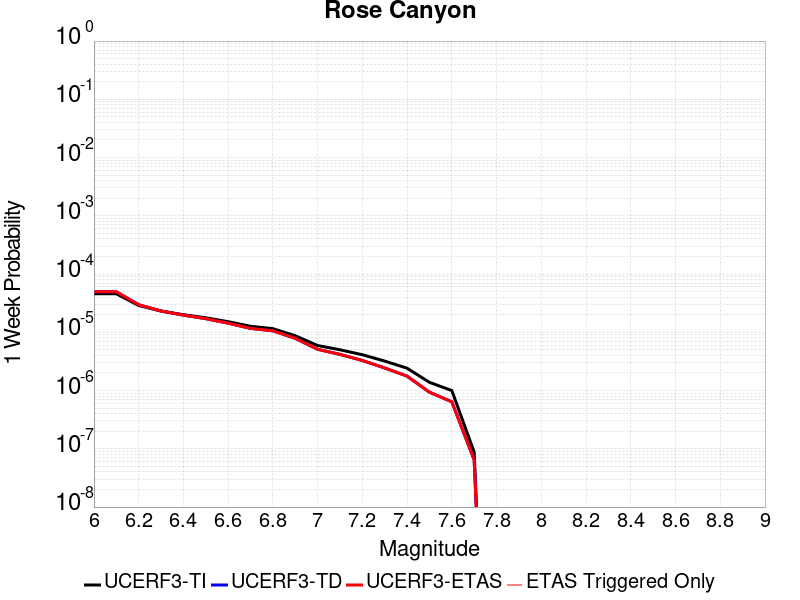 | 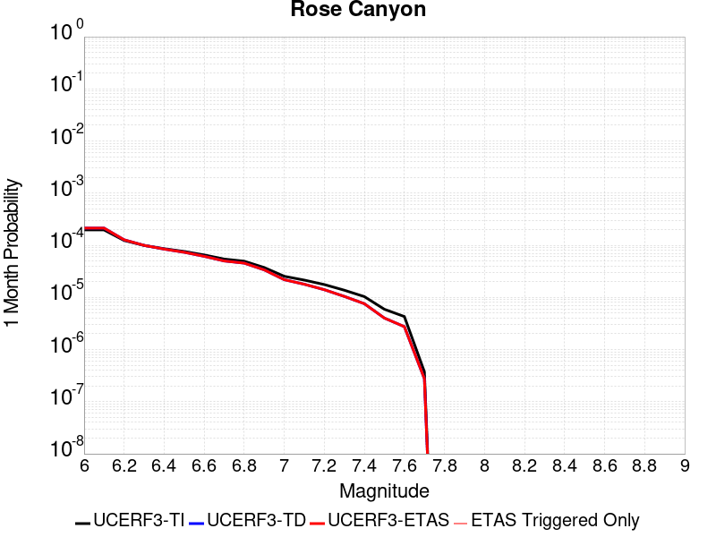 | 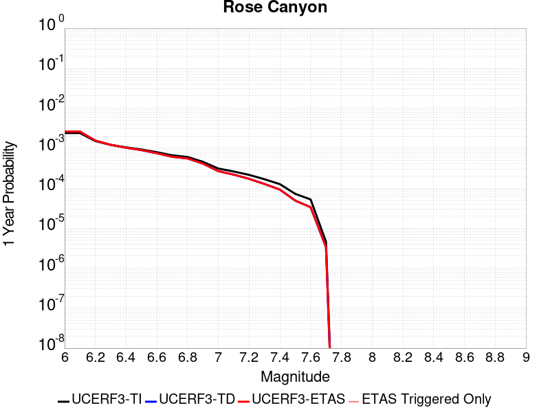 | 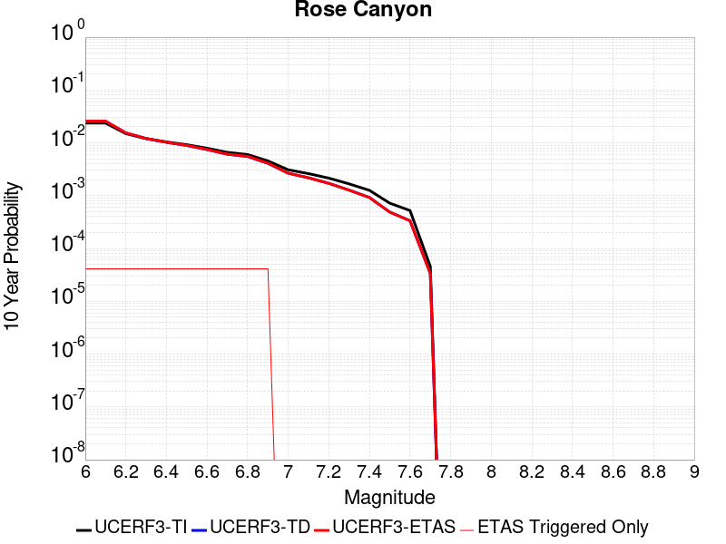 |

| Magnitude | 1 wk TI Prob | 1 wk TD Prob | 1 wk ETAS Prob | 1 wk ETAS/TD Gain | 1 wk ETAS Triggered Only | 1 mo TI Prob | 1 mo TD Prob | 1 mo ETAS Prob | 1 mo ETAS/TD Gain | 1 mo ETAS Triggered Only | 1 yr TI Prob | 1 yr TD Prob | 1 yr ETAS Prob | 1 yr ETAS/TD Gain | 1 yr ETAS Triggered Only | 10 yr TI Prob | 10 yr TD Prob | 10 yr ETAS Prob | 10 yr ETAS/TD Gain | 10 yr ETAS Triggered Only |
|-----|-----|-----|-----|-----|-----|-----|-----|-----|-----|-----|-----|-----|-----|-----|-----|-----|-----|-----|-----|-----|
| 6.0 | 4.5923203E-5 | 4.981246E-5 | 4.981246E-5 | 1.0 | 0.0 | 1.9679888E-4 | 2.1346577E-4 | 2.1346577E-4 | 1.0 | 0.0 | 0.0023933933 | 0.0025960365 | 0.0025960365 | 1.0 | 0.0 | 0.023677798 | 0.025687695 | 0.025727797 | 1.0015612 | 4.1159037E-5 |
| 6.1 | 4.5923203E-5 | 4.981246E-5 | 4.981246E-5 | 1.0 | 0.0 | 1.9679888E-4 | 2.1346577E-4 | 2.1346577E-4 | 1.0 | 0.0 | 0.0023933933 | 0.0025960365 | 0.0025960365 | 1.0 | 0.0 | 0.023677798 | 0.025687695 | 0.025727797 | 1.0015612 | 4.1159037E-5 |
| 6.2 | 2.8844734E-5 | 2.9748233E-5 | 2.9748233E-5 | 1.0 | 0.0 | 1.2361443E-4 | 1.2748635E-4 | 1.2748635E-4 | 1.0 | 0.0 | 0.0015039665 | 0.0015510685 | 0.0015510685 | 1.0 | 0.0 | 0.0149382865 | 0.015416016 | 0.0154565405 | 1.0026287 | 4.1159037E-5 |
| 6.3 | 2.3171577E-5 | 2.3236003E-5 | 2.3236003E-5 | 1.0 | 0.0 | 9.9302975E-5 | 9.957915E-5 | 9.957915E-5 | 1.0 | 0.0 | 0.0012083431 | 0.0012117154 | 0.0012117154 | 1.0 | 0.0 | 0.012017938 | 0.012059571 | 0.012100235 | 1.0033718 | 4.1159037E-5 |
| 6.4 | 2.0066604E-5 | 1.9714185E-5 | 1.9714185E-5 | 1.0 | 0.0 | 8.599689E-5 | 8.448668E-5 | 8.448668E-5 | 1.0 | 0.0 | 0.0010465092 | 0.0010281501 | 0.0010281501 | 1.0 | 0.0 | 0.010415946 | 0.010239792 | 0.010280529 | 1.0039784 | 4.1159037E-5 |
| 6.5 | 1.776989E-5 | 1.7143238E-5 | 1.7143238E-5 | 1.0 | 0.0 | 7.615444E-5 | 7.3469E-5 | 7.3469E-5 | 1.0 | 0.0 | 9.267859E-4 | 8.9412497E-4 | 8.9412497E-4 | 1.0 | 0.0 | 0.009229303 | 0.008911752 | 0.008952544 | 1.0045774 | 4.1159037E-5 |
| 6.6 | 1.5227364E-5 | 1.435113E-5 | 1.435113E-5 | 1.0 | 0.0 | 6.52585E-5 | 6.150342E-5 | 6.150342E-5 | 1.0 | 0.0 | 7.942326E-4 | 7.485521E-4 | 7.485521E-4 | 1.0 | 0.0 | 0.007914 | 0.0074589653 | 0.0074998173 | 1.005477 | 4.1159037E-5 |
| 6.7 | 1.2703898E-5 | 1.1677136E-5 | 1.1677136E-5 | 1.0 | 0.0 | 5.4444143E-5 | 5.0043935E-5 | 5.0043935E-5 | 1.0 | 0.0 | 6.626558E-4 | 6.091188E-4 | 6.091188E-4 | 1.0 | 0.0 | 0.006606833 | 0.006070963 | 0.0061118724 | 1.0067385 | 4.1159037E-5 |
| 6.8 | 1.1554917E-5 | 1.0612978E-5 | 1.0612978E-5 | 1.0 | 0.0 | 4.9520135E-5 | 4.5483423E-5 | 4.5483423E-5 | 1.0 | 0.0 | 6.0274085E-4 | 5.53624E-4 | 5.53624E-4 | 1.0 | 0.0 | 0.0060110865 | 0.0055124387 | 0.0055533713 | 1.0074254 | 4.1159037E-5 |
| 6.9 | 8.732078E-6 | 7.883737E-6 | 7.883737E-6 | 1.0 | 0.0 | 3.7422655E-5 | 3.3787026E-5 | 3.3787026E-5 | 1.0 | 0.0 | 4.5552556E-4 | 4.1128235E-4 | 4.1128235E-4 | 1.0 | 0.0 | 0.0045459294 | 0.0040902696 | 0.0041312603 | 1.0100216 | 4.1159037E-5 |
| 7.0 | 5.9337494E-6 | 5.1085703E-6 | 5.1085703E-6 | 1.0 | 0.0 | 2.5430107E-5 | 2.189369E-5 | 2.189369E-5 | 1.0 | 0.0 | 3.0956755E-4 | 2.6652322E-4 | 2.6652322E-4 | 1.0 | 0.0 | 0.0030913667 | 0.0026620512 | 0.0026620512 | 1.0 | 0.0 |
| 7.1 | 5.013409E-6 | 4.1783064E-6 | 4.1783064E-6 | 1.0 | 0.0 | 2.1485863E-5 | 1.7906907E-5 | 1.7906907E-5 | 1.0 | 0.0 | 2.6155898E-4 | 2.1799488E-4 | 2.1799488E-4 | 1.0 | 0.0 | 0.0026125133 | 0.002177822 | 0.002177822 | 1.0 | 0.0 |
| 7.2 | 4.120763E-6 | 3.2828875E-6 | 3.2828875E-6 | 1.0 | 0.0 | 1.7660293E-5 | 1.4069442E-5 | 1.4069442E-5 | 1.0 | 0.0 | 2.1499286E-4 | 1.7128208E-4 | 1.7128208E-4 | 1.0 | 0.0 | 0.0021478499 | 0.0017115102 | 0.0017115102 | 1.0 | 0.0 |
| 7.3 | 3.2081239E-6 | 2.4410292E-6 | 2.4410292E-6 | 1.0 | 0.0 | 1.374903E-5 | 1.0461512E-5 | 1.0461512E-5 | 1.0 | 0.0 | 1.6738157E-4 | 1.2736153E-4 | 1.2736153E-4 | 1.0 | 0.0 | 0.0016725556 | 0.0012728925 | 0.0012728925 | 1.0 | 0.0 |
| 7.4 | 2.4194755E-6 | 1.7683985E-6 | 1.7683985E-6 | 1.0 | 0.0 | 1.0369139E-5 | 7.578829E-6 | 7.578829E-6 | 1.0 | 0.0 | 1.2623696E-4 | 9.226839E-5 | 9.226839E-5 | 1.0 | 0.0 | 0.0012616527 | 9.2230615E-4 | 9.2230615E-4 | 1.0 | 0.0 |
| 7.5 | 1.3842889E-6 | 9.380894E-7 | 9.380894E-7 | 1.0 | 0.0 | 5.9326535E-6 | 4.020377E-6 | 4.020377E-6 | 1.0 | 0.0 | 7.222766E-5 | 4.894703E-5 | 4.894703E-5 | 1.0 | 0.0 | 7.220419E-4 | 4.89366E-4 | 4.89366E-4 | 1.0 | 0.0 |
| 7.6 | 1.0021575E-6 | 6.412879E-7 | 6.412879E-7 | 1.0 | 0.0 | 4.2949537E-6 | 2.7483738E-6 | 2.7483738E-6 | 1.0 | 0.0 | 5.2289808E-5 | 3.346096E-5 | 3.346096E-5 | 1.0 | 0.0 | 5.2277505E-4 | 3.3456137E-4 | 3.3456137E-4 | 1.0 | 0.0 |
| 7.7 | 8.7620116E-8 | 6.450059E-8 | 6.450059E-8 | 1.0 | 0.0 | 3.7551473E-7 | 2.7643108E-7 | 2.7643108E-7 | 1.0 | 0.0 | 4.5718825E-6 | 3.3655433E-6 | 3.3655433E-6 | 1.0 | 0.0 | 4.5717883E-5 | 3.3654953E-5 | 3.3654953E-5 | 1.0 | 0.0 |

## Cady
*[(top)](#table-of-contents)*

| 1 Week | 1 Month | 1 Year | 10 Year |
|-----|-----|-----|-----|
| 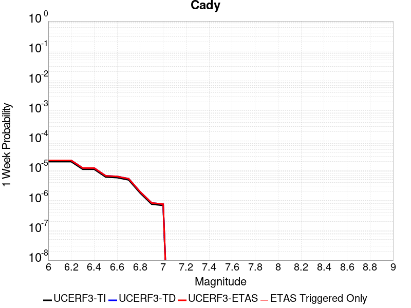 | 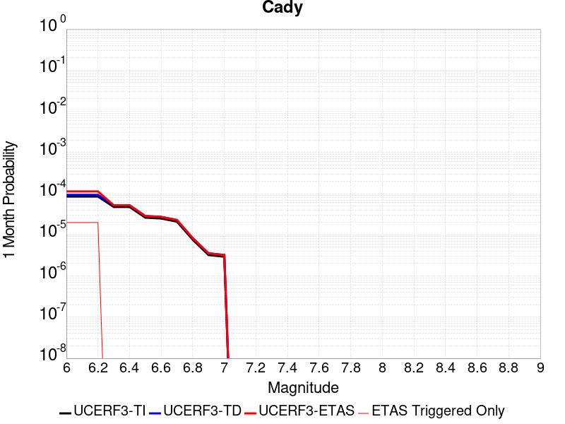 | 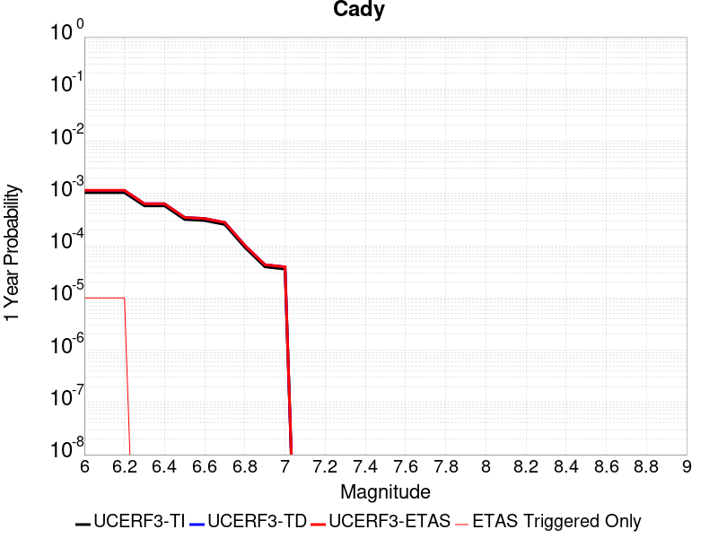 | 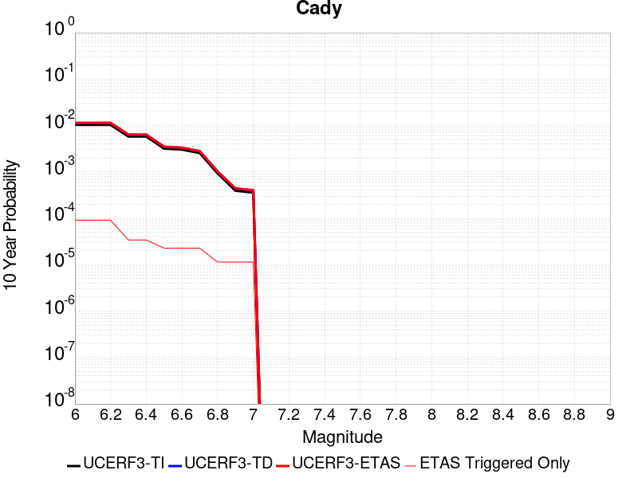 |

| Magnitude | 1 wk TI Prob | 1 wk TD Prob | 1 wk ETAS Prob | 1 wk ETAS/TD Gain | 1 wk ETAS Triggered Only | 1 mo TI Prob | 1 mo TD Prob | 1 mo ETAS Prob | 1 mo ETAS/TD Gain | 1 mo ETAS Triggered Only | 1 yr TI Prob | 1 yr TD Prob | 1 yr ETAS Prob | 1 yr ETAS/TD Gain | 1 yr ETAS Triggered Only | 10 yr TI Prob | 10 yr TD Prob | 10 yr ETAS Prob | 10 yr ETAS/TD Gain | 10 yr ETAS Triggered Only |
|-----|-----|-----|-----|-----|-----|-----|-----|-----|-----|-----|-----|-----|-----|-----|-----|-----|-----|-----|-----|-----|
| 6.0 | 1.9892565E-5 | 2.1863727E-5 | 2.1863727E-5 | 1.0 | 0.0 | 8.525106E-5 | 9.3698836E-5 | 9.3698836E-5 | 1.0 | 0.0 | 0.0010374374 | 0.0011402773 | 0.0011402773 | 1.0 | 0.0 | 0.010326075 | 0.011353283 | 0.011434667 | 1.0071683 | 8.2318074E-5 |
| 6.1 | 1.9892565E-5 | 2.1863727E-5 | 2.1863727E-5 | 1.0 | 0.0 | 8.525106E-5 | 9.3698836E-5 | 9.3698836E-5 | 1.0 | 0.0 | 0.0010374374 | 0.0011402773 | 0.0011402773 | 1.0 | 0.0 | 0.010326075 | 0.011353283 | 0.011434667 | 1.0071683 | 8.2318074E-5 |
| 6.2 | 1.9892565E-5 | 2.1863727E-5 | 2.1863727E-5 | 1.0 | 0.0 | 8.525106E-5 | 9.3698836E-5 | 9.3698836E-5 | 1.0 | 0.0 | 0.0010374374 | 0.0011402773 | 0.0011402773 | 1.0 | 0.0 | 0.010326075 | 0.011353283 | 0.011434667 | 1.0071683 | 8.2318074E-5 |
| 6.3 | 1.1117327E-5 | 1.2179267E-5 | 1.2179267E-5 | 1.0 | 0.0 | 4.764482E-5 | 5.2195992E-5 | 5.2195992E-5 | 1.0 | 0.0 | 5.7992124E-4 | 6.353324E-4 | 6.353324E-4 | 1.0 | 0.0 | 0.0057841022 | 0.0063382685 | 0.0063382685 | 1.0 | 0.0 |
| 6.4 | 1.1117327E-5 | 1.2179267E-5 | 1.2179267E-5 | 1.0 | 0.0 | 4.764482E-5 | 5.2195992E-5 | 5.2195992E-5 | 1.0 | 0.0 | 5.7992124E-4 | 6.353324E-4 | 6.353324E-4 | 1.0 | 0.0 | 0.0057841022 | 0.0063382685 | 0.0063382685 | 1.0 | 0.0 |
| 6.5 | 6.103093E-6 | 6.6734597E-6 | 6.6734597E-6 | 1.0 | 0.0 | 2.615585E-5 | 2.86003E-5 | 2.86003E-5 | 1.0 | 0.0 | 3.1840094E-4 | 3.4816557E-4 | 3.4816557E-4 | 1.0 | 0.0 | 0.0031794512 | 0.0034774356 | 0.0034774356 | 1.0 | 0.0 |
| 6.6 | 5.817237E-6 | 6.367047E-6 | 6.367047E-6 | 1.0 | 0.0 | 2.4930776E-5 | 2.7287128E-5 | 2.7287128E-5 | 1.0 | 0.0 | 3.034899E-4 | 3.321826E-4 | 3.321826E-4 | 1.0 | 0.0 | 0.0030307577 | 0.0033180832 | 0.0033180832 | 1.0 | 0.0 |
| 6.7 | 4.8846314E-6 | 5.3417216E-6 | 5.3417216E-6 | 1.0 | 0.0 | 2.0933967E-5 | 2.2892957E-5 | 2.2892957E-5 | 1.0 | 0.0 | 2.5484123E-4 | 2.786979E-4 | 2.786979E-4 | 1.0 | 0.0 | 0.0025454918 | 0.0027846398 | 0.0027846398 | 1.0 | 0.0 |
| 6.8 | 1.7788773E-6 | 1.9403142E-6 | 1.9403142E-6 | 1.0 | 0.0 | 7.6237375E-6 | 8.315615E-6 | 8.315615E-6 | 1.0 | 0.0 | 9.281505E-5 | 1.01239486E-4 | 1.01239486E-4 | 1.0 | 0.0 | 9.2776294E-4 | 0.0010120883 | 0.0010120883 | 1.0 | 0.0 |
| 6.9 | 7.5455404E-7 | 8.299003E-7 | 8.299003E-7 | 1.0 | 0.0 | 3.233799E-6 | 3.5567125E-6 | 3.5567125E-6 | 1.0 | 0.0 | 3.937079E-5 | 4.330245E-5 | 4.330245E-5 | 1.0 | 0.0 | 3.9363815E-4 | 4.329731E-4 | 4.329731E-4 | 1.0 | 0.0 |
| 7.0 | 6.8578805E-7 | 7.543555E-7 | 7.543555E-7 | 1.0 | 0.0 | 2.9390883E-6 | 3.23295E-6 | 3.23295E-6 | 1.0 | 0.0 | 3.578281E-5 | 3.9360788E-5 | 3.9360788E-5 | 1.0 | 0.0 | 3.577705E-4 | 3.9357063E-4 | 3.9357063E-4 | 1.0 | 0.0 |

## Red Pass
*[(top)](#table-of-contents)*

| 1 Week | 1 Month | 1 Year | 10 Year |
|-----|-----|-----|-----|
| 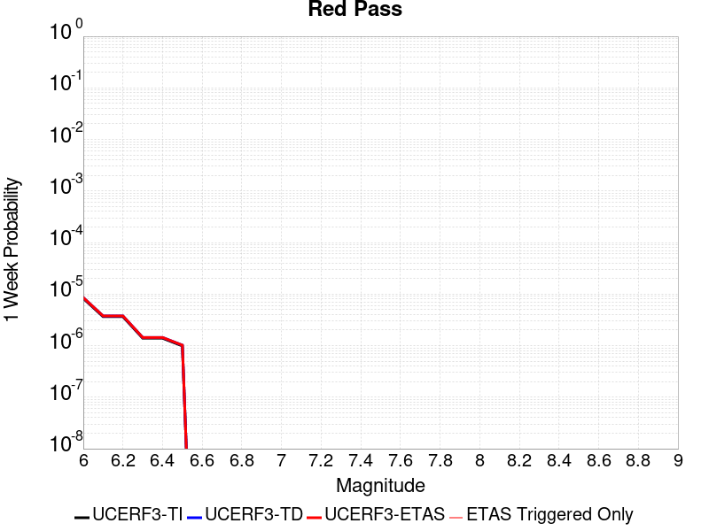 | 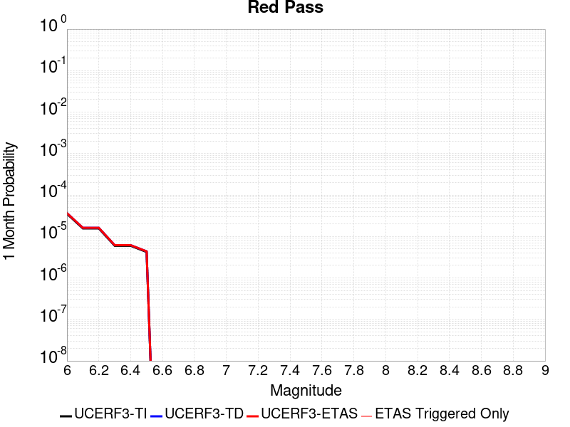 | 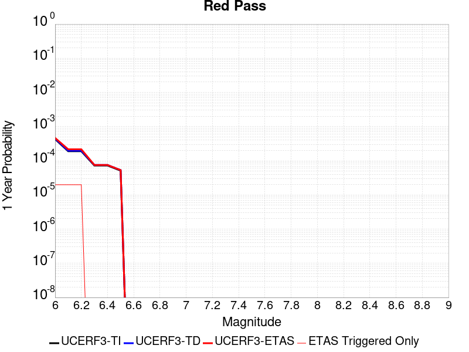 | 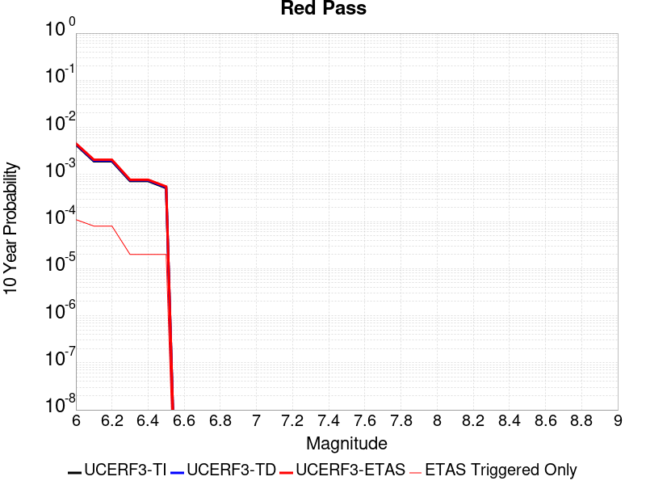 |

| Magnitude | 1 wk TI Prob | 1 wk TD Prob | 1 wk ETAS Prob | 1 wk ETAS/TD Gain | 1 wk ETAS Triggered Only | 1 mo TI Prob | 1 mo TD Prob | 1 mo ETAS Prob | 1 mo ETAS/TD Gain | 1 mo ETAS Triggered Only | 1 yr TI Prob | 1 yr TD Prob | 1 yr ETAS Prob | 1 yr ETAS/TD Gain | 1 yr ETAS Triggered Only | 10 yr TI Prob | 10 yr TD Prob | 10 yr ETAS Prob | 10 yr ETAS/TD Gain | 10 yr ETAS Triggered Only |
|-----|-----|-----|-----|-----|-----|-----|-----|-----|-----|-----|-----|-----|-----|-----|-----|-----|-----|-----|-----|-----|
| 6.0 | 8.258278E-6 | 8.551966E-6 | 8.551966E-6 | 1.0 | 0.0 | 3.539214E-5 | 3.665087E-5 | 3.665087E-5 | 1.0 | 0.0 | 4.308141E-4 | 4.4615084E-4 | 4.4615084E-4 | 1.0 | 0.0 | 0.0042997985 | 0.0044543096 | 0.004536261 | 1.0183983 | 8.2318074E-5 |
| 6.1 | 3.649988E-6 | 3.7756158E-6 | 3.7756158E-6 | 1.0 | 0.0 | 1.5642712E-5 | 1.6181137E-5 | 1.6181137E-5 | 1.0 | 0.0 | 1.9043336E-4 | 1.9699229E-4 | 1.9699229E-4 | 1.0 | 0.0 | 0.0019027026 | 0.001968644 | 0.0020097222 | 1.0208662 | 4.1159037E-5 |
| 6.2 | 3.649988E-6 | 3.7756158E-6 | 3.7756158E-6 | 1.0 | 0.0 | 1.5642712E-5 | 1.6181137E-5 | 1.6181137E-5 | 1.0 | 0.0 | 1.9043336E-4 | 1.9699229E-4 | 1.9699229E-4 | 1.0 | 0.0 | 0.0019027026 | 0.001968644 | 0.0020097222 | 1.0208662 | 4.1159037E-5 |
| 6.3 | 1.3924937E-6 | 1.4412329E-6 | 1.4412329E-6 | 1.0 | 0.0 | 5.9678164E-6 | 6.176706E-6 | 6.176706E-6 | 1.0 | 0.0 | 7.265574E-5 | 7.5200216E-5 | 7.5200216E-5 | 1.0 | 0.0 | 7.263199E-4 | 7.5188646E-4 | 7.5188646E-4 | 1.0 | 0.0 |
| 6.4 | 1.3924937E-6 | 1.4412329E-6 | 1.4412329E-6 | 1.0 | 0.0 | 5.9678164E-6 | 6.176706E-6 | 6.176706E-6 | 1.0 | 0.0 | 7.265574E-5 | 7.5200216E-5 | 7.5200216E-5 | 1.0 | 0.0 | 7.263199E-4 | 7.5188646E-4 | 7.5188646E-4 | 1.0 | 0.0 |
| 6.5 | 9.876812E-7 | 1.0222738E-6 | 1.0222738E-6 | 1.0 | 0.0 | 4.2329125E-6 | 4.3811733E-6 | 4.3811733E-6 | 1.0 | 0.0 | 5.153449E-5 | 5.3340784E-5 | 5.3340784E-5 | 1.0 | 0.0 | 5.1522546E-4 | 5.3340785E-4 | 5.3340785E-4 | 1.0 | 0.0 |

## Ludlow
*[(top)](#table-of-contents)*

| 1 Week | 1 Month | 1 Year | 10 Year |
|-----|-----|-----|-----|
| 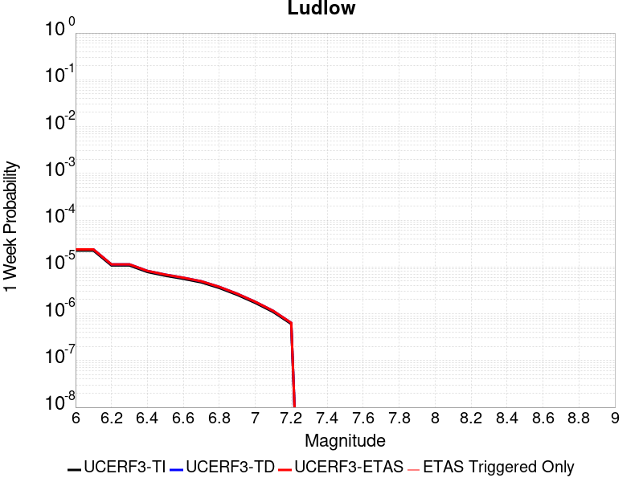 | 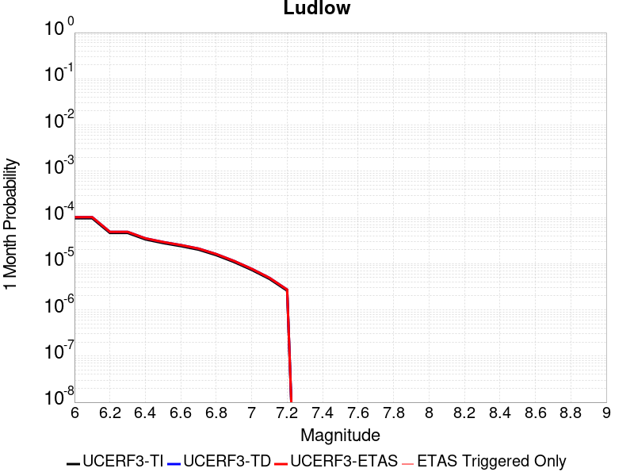 | 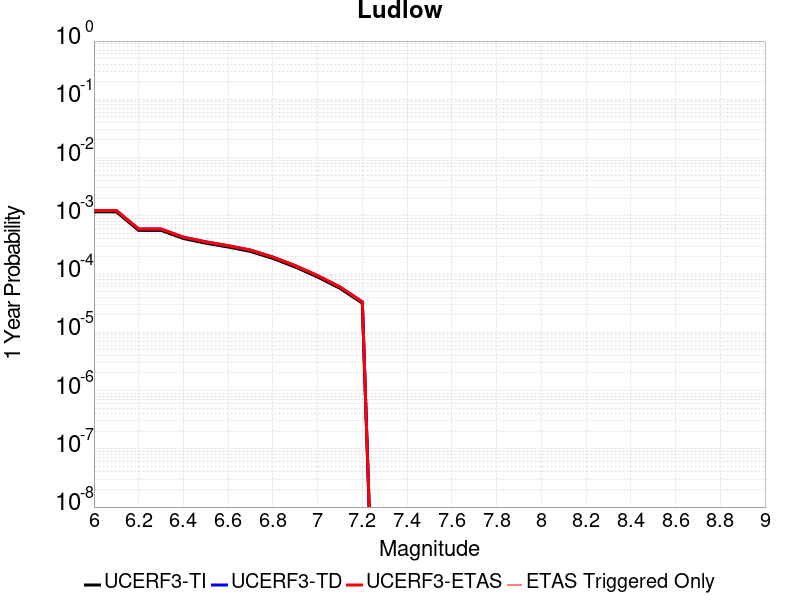 | 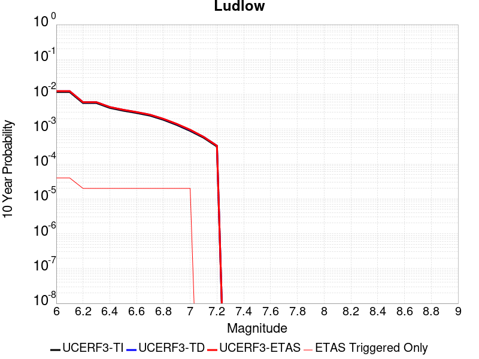 |

| Magnitude | 1 wk TI Prob | 1 wk TD Prob | 1 wk ETAS Prob | 1 wk ETAS/TD Gain | 1 wk ETAS Triggered Only | 1 mo TI Prob | 1 mo TD Prob | 1 mo ETAS Prob | 1 mo ETAS/TD Gain | 1 mo ETAS Triggered Only | 1 yr TI Prob | 1 yr TD Prob | 1 yr ETAS Prob | 1 yr ETAS/TD Gain | 1 yr ETAS Triggered Only | 10 yr TI Prob | 10 yr TD Prob | 10 yr ETAS Prob | 10 yr ETAS/TD Gain | 10 yr ETAS Triggered Only |
|-----|-----|-----|-----|-----|-----|-----|-----|-----|-----|-----|-----|-----|-----|-----|-----|-----|-----|-----|-----|-----|
| 6.0 | 2.2407607E-5 | 2.3660305E-5 | 2.3660305E-5 | 1.0 | 0.0 | 9.602906E-5 | 1.01397614E-4 | 1.01397614E-4 | 1.0 | 0.0 | 0.0011685267 | 0.001233861 | 0.001233861 | 1.0 | 0.0 | 0.011624013 | 0.012274616 | 0.01231527 | 1.003312 | 4.1159037E-5 |
| 6.1 | 2.2407607E-5 | 2.3660305E-5 | 2.3660305E-5 | 1.0 | 0.0 | 9.602906E-5 | 1.01397614E-4 | 1.01397614E-4 | 1.0 | 0.0 | 0.0011685267 | 0.001233861 | 0.001233861 | 1.0 | 0.0 | 0.011624013 | 0.012274616 | 0.01231527 | 1.003312 | 4.1159037E-5 |
| 6.2 | 1.0781252E-5 | 1.13670885E-5 | 1.13670885E-5 | 1.0 | 0.0 | 4.620455E-5 | 4.8715207E-5 | 4.8715207E-5 | 1.0 | 0.0 | 5.623952E-4 | 5.9295027E-4 | 5.9295027E-4 | 1.0 | 0.0 | 0.00560974 | 0.0059141004 | 0.0059141004 | 1.0 | 0.0 |
| 6.3 | 1.0781252E-5 | 1.13670885E-5 | 1.13670885E-5 | 1.0 | 0.0 | 4.620455E-5 | 4.8715207E-5 | 4.8715207E-5 | 1.0 | 0.0 | 5.623952E-4 | 5.9295027E-4 | 5.9295027E-4 | 1.0 | 0.0 | 0.00560974 | 0.0059141004 | 0.0059141004 | 1.0 | 0.0 |
| 6.4 | 7.814439E-6 | 8.2387605E-6 | 8.2387605E-6 | 1.0 | 0.0 | 3.3490025E-5 | 3.5308505E-5 | 3.5308505E-5 | 1.0 | 0.0 | 4.0766477E-4 | 4.2979766E-4 | 4.2979766E-4 | 1.0 | 0.0 | 0.0040691774 | 0.004289811 | 0.004289811 | 1.0 | 0.0 |
| 6.5 | 6.4986366E-6 | 6.851779E-6 | 6.851779E-6 | 1.0 | 0.0 | 2.7851002E-5 | 2.936444E-5 | 2.936444E-5 | 1.0 | 0.0 | 3.390332E-4 | 3.5745435E-4 | 3.5745435E-4 | 1.0 | 0.0 | 0.003385164 | 0.00356889 | 0.00356889 | 1.0 | 0.0 |
| 6.6 | 5.582177E-6 | 5.8867467E-6 | 5.8867467E-6 | 1.0 | 0.0 | 2.3923398E-5 | 2.5228674E-5 | 2.5228674E-5 | 1.0 | 0.0 | 2.9122844E-4 | 3.0711654E-4 | 3.0711654E-4 | 1.0 | 0.0 | 0.0029084706 | 0.0030669945 | 0.0030669945 | 1.0 | 0.0 |
| 6.7 | 4.6858763E-6 | 4.9410482E-6 | 4.9410482E-6 | 1.0 | 0.0 | 2.0082172E-5 | 2.117575E-5 | 2.117575E-5 | 1.0 | 0.0 | 2.4447302E-4 | 2.5778482E-4 | 2.5778482E-4 | 1.0 | 0.0 | 0.0024420423 | 0.0025749144 | 0.0025749144 | 1.0 | 0.0 |
| 6.8 | 3.5584908E-6 | 3.7524903E-6 | 3.7524903E-6 | 1.0 | 0.0 | 1.5250586E-5 | 1.6082004E-5 | 1.6082004E-5 | 1.0 | 0.0 | 1.8566006E-4 | 1.9578122E-4 | 1.9578122E-4 | 1.0 | 0.0 | 0.0018550502 | 0.0019561285 | 0.0019561285 | 1.0 | 0.0 |
| 6.9 | 2.532834E-6 | 2.6713403E-6 | 2.6713403E-6 | 1.0 | 0.0 | 1.0854958E-5 | 1.1448553E-5 | 1.1448553E-5 | 1.0 | 0.0 | 1.3215111E-4 | 1.3937749E-4 | 1.3937749E-4 | 1.0 | 0.0 | 0.0013207254 | 0.0013929284 | 0.0013929284 | 1.0 | 0.0 |
| 7.0 | 1.7083285E-6 | 1.8021722E-6 | 1.8021722E-6 | 1.0 | 0.0 | 7.3213873E-6 | 7.723573E-6 | 7.723573E-6 | 1.0 | 0.0 | 8.913424E-5 | 9.403061E-5 | 9.403061E-5 | 1.0 | 0.0 | 8.9098496E-4 | 9.399248E-4 | 9.399248E-4 | 1.0 | 0.0 |
| 7.1 | 1.0905424E-6 | 1.1499063E-6 | 1.1499063E-6 | 1.0 | 0.0 | 4.6737446E-6 | 4.928161E-6 | 4.928161E-6 | 1.0 | 0.0 | 5.6901354E-5 | 5.999881E-5 | 5.999881E-5 | 1.0 | 0.0 | 5.6886784E-4 | 5.998359E-4 | 5.998359E-4 | 1.0 | 0.0 |
| 7.2 | 6.06668E-7 | 6.388058E-7 | 6.388058E-7 | 1.0 | 0.0 | 2.600003E-6 | 2.7377366E-6 | 2.7377366E-6 | 1.0 | 0.0 | 3.1654577E-5 | 3.3331504E-5 | 3.3331504E-5 | 1.0 | 0.0 | 3.1650066E-4 | 3.332719E-4 | 3.332719E-4 | 1.0 | 0.0 |

## San Gabriel
*[(top)](#table-of-contents)*

| 1 Week | 1 Month | 1 Year | 10 Year |
|-----|-----|-----|-----|
| 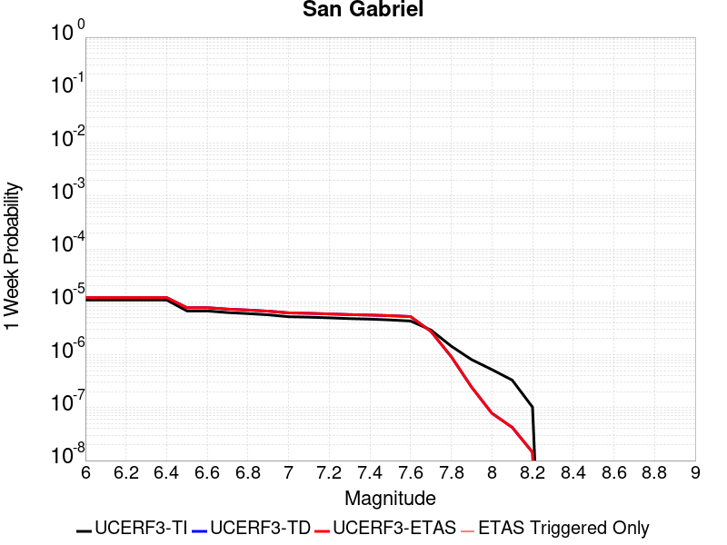 | 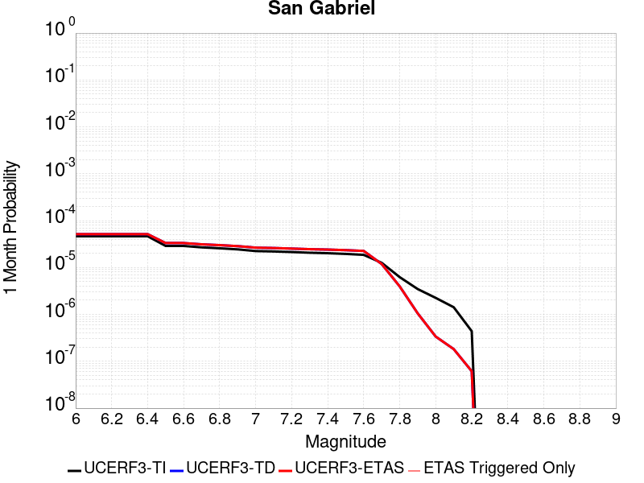 | 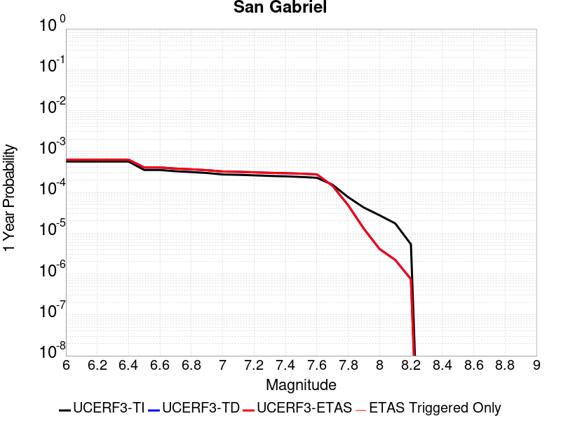 | 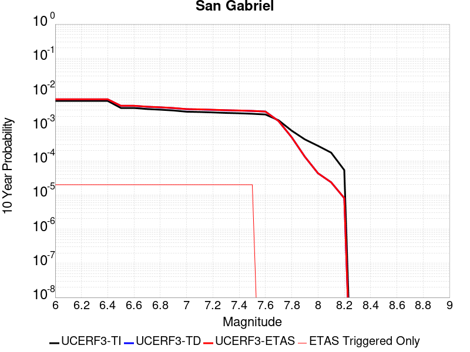 |

| Magnitude | 1 wk TI Prob | 1 wk TD Prob | 1 wk ETAS Prob | 1 wk ETAS/TD Gain | 1 wk ETAS Triggered Only | 1 mo TI Prob | 1 mo TD Prob | 1 mo ETAS Prob | 1 mo ETAS/TD Gain | 1 mo ETAS Triggered Only | 1 yr TI Prob | 1 yr TD Prob | 1 yr ETAS Prob | 1 yr ETAS/TD Gain | 1 yr ETAS Triggered Only | 10 yr TI Prob | 10 yr TD Prob | 10 yr ETAS Prob | 10 yr ETAS/TD Gain | 10 yr ETAS Triggered Only |
|-----|-----|-----|-----|-----|-----|-----|-----|-----|-----|-----|-----|-----|-----|-----|-----|-----|-----|-----|-----|-----|
| 6.0 | 1.083775E-5 | 1.2022611E-5 | 1.2022611E-5 | 1.0 | 0.0 | 4.6446676E-5 | 5.1524523E-5 | 5.1524523E-5 | 1.0 | 0.0 | 5.653415E-4 | 6.2714185E-4 | 6.2714185E-4 | 1.0 | 0.0 | 0.0056390543 | 0.0062658475 | 0.006306749 | 1.0065277 | 4.1159037E-5 |
| 6.1 | 1.083775E-5 | 1.2022611E-5 | 1.2022611E-5 | 1.0 | 0.0 | 4.6446676E-5 | 5.1524523E-5 | 5.1524523E-5 | 1.0 | 0.0 | 5.653415E-4 | 6.2714185E-4 | 6.2714185E-4 | 1.0 | 0.0 | 0.0056390543 | 0.0062658475 | 0.006306749 | 1.0065277 | 4.1159037E-5 |
| 6.2 | 1.083775E-5 | 1.2022611E-5 | 1.2022611E-5 | 1.0 | 0.0 | 4.6446676E-5 | 5.1524523E-5 | 5.1524523E-5 | 1.0 | 0.0 | 5.653415E-4 | 6.2714185E-4 | 6.2714185E-4 | 1.0 | 0.0 | 0.0056390543 | 0.0062658475 | 0.006306749 | 1.0065277 | 4.1159037E-5 |
| 6.3 | 1.083775E-5 | 1.2022611E-5 | 1.2022611E-5 | 1.0 | 0.0 | 4.6446676E-5 | 5.1524523E-5 | 5.1524523E-5 | 1.0 | 0.0 | 5.653415E-4 | 6.2714185E-4 | 6.2714185E-4 | 1.0 | 0.0 | 0.0056390543 | 0.0062658475 | 0.006306749 | 1.0065277 | 4.1159037E-5 |
| 6.4 | 1.083775E-5 | 1.2022611E-5 | 1.2022611E-5 | 1.0 | 0.0 | 4.6446676E-5 | 5.1524523E-5 | 5.1524523E-5 | 1.0 | 0.0 | 5.653415E-4 | 6.2714185E-4 | 6.2714185E-4 | 1.0 | 0.0 | 0.0056390543 | 0.0062658475 | 0.006306749 | 1.0065277 | 4.1159037E-5 |
| 6.5 | 6.7317824E-6 | 7.753978E-6 | 7.753978E-6 | 1.0 | 0.0 | 2.8850178E-5 | 3.3230917E-5 | 3.3230917E-5 | 1.0 | 0.0 | 3.511943E-4 | 4.0451236E-4 | 4.0451236E-4 | 1.0 | 0.0 | 0.003506398 | 0.0040488886 | 0.0040898807 | 1.0101243 | 4.1159037E-5 |
| 6.6 | 6.7317824E-6 | 7.753978E-6 | 7.753978E-6 | 1.0 | 0.0 | 2.8850178E-5 | 3.3230917E-5 | 3.3230917E-5 | 1.0 | 0.0 | 3.511943E-4 | 4.0451236E-4 | 4.0451236E-4 | 1.0 | 0.0 | 0.003506398 | 0.0040488886 | 0.0040898807 | 1.0101243 | 4.1159037E-5 |
| 6.7 | 6.274881E-6 | 7.2828648E-6 | 7.2828648E-6 | 1.0 | 0.0 | 2.6892068E-5 | 3.121191E-5 | 3.121191E-5 | 1.0 | 0.0 | 3.2736175E-4 | 3.799397E-4 | 3.799397E-4 | 1.0 | 0.0 | 0.0032687993 | 0.0038040224 | 0.0038450249 | 1.0107787 | 4.1159037E-5 |
| 6.8 | 5.996209E-6 | 6.9955645E-6 | 6.9955645E-6 | 1.0 | 0.0 | 2.5697784E-5 | 2.998065E-5 | 2.998065E-5 | 1.0 | 0.0 | 3.128256E-4 | 3.6495423E-4 | 3.6495423E-4 | 1.0 | 0.0 | 0.003123856 | 0.0036546674 | 0.003695676 | 1.0112209 | 4.1159037E-5 |
| 6.9 | 5.686331E-6 | 6.660462E-6 | 6.660462E-6 | 1.0 | 0.0 | 2.4369761E-5 | 2.854453E-5 | 2.854453E-5 | 1.0 | 0.0 | 2.9666146E-4 | 3.4747514E-4 | 3.4747514E-4 | 1.0 | 0.0 | 0.0029626573 | 0.0034804356 | 0.0035214513 | 1.0117847 | 4.1159037E-5 |
| 7.0 | 5.2329838E-6 | 6.184254E-6 | 6.184254E-6 | 1.0 | 0.0 | 2.242688E-5 | 2.650368E-5 | 2.650368E-5 | 1.0 | 0.0 | 2.7301308E-4 | 3.226353E-4 | 3.226353E-4 | 1.0 | 0.0 | 0.002726779 | 0.0032327736 | 0.0032737995 | 1.0126907 | 4.1159037E-5 |
| 7.1 | 5.135671E-6 | 6.074282E-6 | 6.074282E-6 | 1.0 | 0.0 | 2.2009834E-5 | 2.6032381E-5 | 2.6032381E-5 | 1.0 | 0.0 | 2.6793676E-4 | 3.1689892E-4 | 3.1689892E-4 | 1.0 | 0.0 | 0.0026761394 | 0.0031755753 | 0.0032166035 | 1.01292 | 4.1159037E-5 |
| 7.2 | 4.989062E-6 | 5.9074955E-6 | 5.9074955E-6 | 1.0 | 0.0 | 2.1381518E-5 | 2.5317597E-5 | 2.5317597E-5 | 1.0 | 0.0 | 2.6028889E-4 | 3.081989E-4 | 3.081989E-4 | 1.0 | 0.0 | 0.0025998424 | 0.0030888198 | 0.0031298518 | 1.013284 | 4.1159037E-5 |
| 7.3 | 4.8219395E-6 | 5.738902E-6 | 5.738902E-6 | 1.0 | 0.0 | 2.0665291E-5 | 2.4595065E-5 | 2.4595065E-5 | 1.0 | 0.0 | 2.5157086E-4 | 2.9940455E-4 | 2.9940455E-4 | 1.0 | 0.0 | 0.0025128627 | 0.003001117 | 0.0030421524 | 1.0136734 | 4.1159037E-5 |
| 7.4 | 4.7118383E-6 | 5.6273266E-6 | 5.6273266E-6 | 1.0 | 0.0 | 2.0193436E-5 | 2.4116896E-5 | 2.4116896E-5 | 1.0 | 0.0 | 2.4582737E-4 | 2.935844E-4 | 2.935844E-4 | 1.0 | 0.0 | 0.002455556 | 0.0029430704 | 0.0029841084 | 1.0139439 | 4.1159037E-5 |
| 7.5 | 4.5506545E-6 | 5.47251E-6 | 5.47251E-6 | 1.0 | 0.0 | 1.9502659E-5 | 2.3453407E-5 | 2.3453407E-5 | 1.0 | 0.0 | 2.37419E-4 | 2.8550858E-4 | 2.8550858E-4 | 1.0 | 0.0 | 0.002371655 | 0.002862522 | 0.0029035632 | 1.0143374 | 4.1159037E-5 |
| 7.6 | 4.343636E-6 | 5.2650835E-6 | 5.2650835E-6 | 1.0 | 0.0 | 1.861545E-5 | 2.2564453E-5 | 2.2564453E-5 | 1.0 | 0.0 | 2.2661954E-4 | 2.7468835E-4 | 2.7468835E-4 | 1.0 | 0.0 | 0.0022638857 | 0.0027545835 | 0.0027545835 | 1.0 | 0.0 |
| 7.7 | 2.936235E-6 | 2.767985E-6 | 2.767985E-6 | 1.0 | 0.0 | 1.2583803E-5 | 1.18627395E-5 | 1.18627395E-5 | 1.0 | 0.0 | 1.5319703E-4 | 1.4441932E-4 | 1.4441932E-4 | 1.0 | 0.0 | 0.0015309147 | 0.0014506504 | 0.0014506504 | 1.0 | 0.0 |
| 7.8 | 1.4541639E-6 | 9.220239E-7 | 9.220239E-7 | 1.0 | 0.0 | 6.232116E-6 | 3.9515253E-6 | 3.9515253E-6 | 1.0 | 0.0 | 7.587337E-5 | 4.810876E-5 | 4.810876E-5 | 1.0 | 0.0 | 7.584747E-4 | 4.859516E-4 | 4.859516E-4 | 1.0 | 0.0 |
| 7.9 | 8.098958E-7 | 2.4545207E-7 | 2.4545207E-7 | 1.0 | 0.0 | 3.4709774E-6 | 1.0519369E-6 | 1.0519369E-6 | 1.0 | 0.0 | 4.225833E-5 | 1.2807257E-5 | 1.2807257E-5 | 1.0 | 0.0 | 4.2250296E-4 | 1.3120633E-4 | 1.3120633E-4 | 1.0 | 0.0 |
| 8.0 | 5.2473234E-7 | 7.84911E-8 | 7.84911E-8 | 1.0 | 0.0 | 2.248851E-6 | 3.3639037E-7 | 3.3639037E-7 | 1.0 | 0.0 | 2.7379416E-5 | 4.095545E-6 | 4.095545E-6 | 1.0 | 0.0 | 2.7376044E-4 | 4.311981E-5 | 4.311981E-5 | 1.0 | 0.0 |
| 8.1 | 3.3162388E-7 | 4.2438835E-8 | 4.2438835E-8 | 1.0 | 0.0 | 1.4212444E-6 | 1.8188072E-7 | 1.8188072E-7 | 1.0 | 0.0 | 1.7303513E-5 | 2.2143954E-6 | 2.2143954E-6 | 1.0 | 0.0 | 1.7302166E-4 | 2.348076E-5 | 2.348076E-5 | 1.0 | 0.0 |
| 8.2 | 1.0235345E-7 | 1.43416425E-8 | 1.43416425E-8 | 1.0 | 0.0 | 4.3865757E-7 | 6.146418E-8 | 6.146418E-8 | 1.0 | 0.0 | 5.340643E-6 | 7.483261E-7 | 7.483261E-7 | 1.0 | 0.0 | 5.3405143E-5 | 8.092622E-6 | 8.092622E-6 | 1.0 | 0.0 |

## Chino alt 1
*[(top)](#table-of-contents)*

| 1 Week | 1 Month | 1 Year | 10 Year |
|-----|-----|-----|-----|
|  | 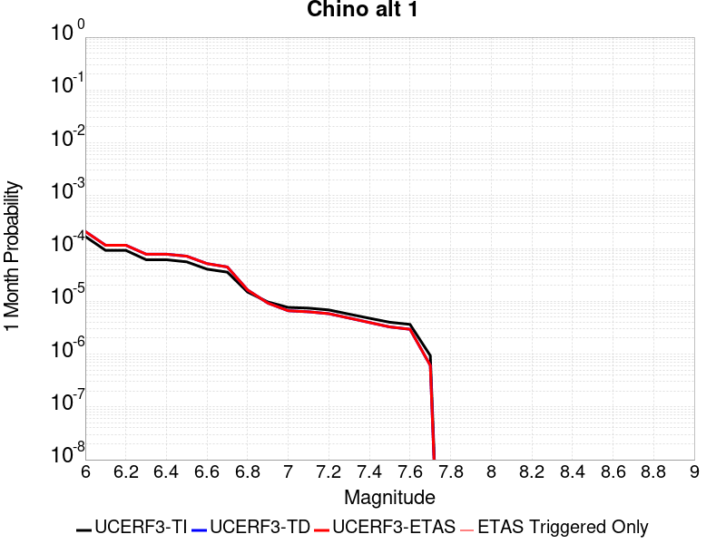 | 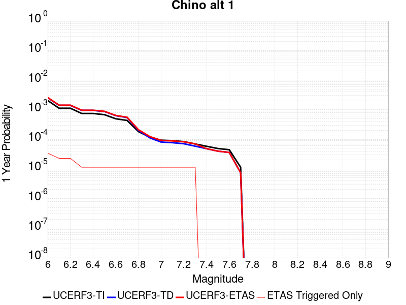 | 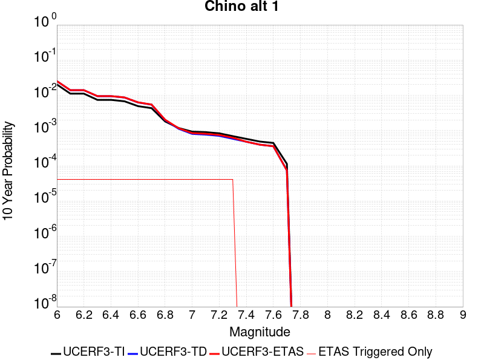 |

| Magnitude | 1 wk TI Prob | 1 wk TD Prob | 1 wk ETAS Prob | 1 wk ETAS/TD Gain | 1 wk ETAS Triggered Only | 1 mo TI Prob | 1 mo TD Prob | 1 mo ETAS Prob | 1 mo ETAS/TD Gain | 1 mo ETAS Triggered Only | 1 yr TI Prob | 1 yr TD Prob | 1 yr ETAS Prob | 1 yr ETAS/TD Gain | 1 yr ETAS Triggered Only | 10 yr TI Prob | 10 yr TD Prob | 10 yr ETAS Prob | 10 yr ETAS/TD Gain | 10 yr ETAS Triggered Only |
|-----|-----|-----|-----|-----|-----|-----|-----|-----|-----|-----|-----|-----|-----|-----|-----|-----|-----|-----|-----|-----|
| 6.0 | 3.939946E-5 | 4.898629E-5 | 4.898629E-5 | 1.0 | 0.0 | 1.6884391E-4 | 2.099273E-4 | 2.099273E-4 | 1.0 | 0.0 | 0.0020537362 | 0.0025533803 | 0.0025944342 | 1.0160782 | 4.1159037E-5 | 0.020348595 | 0.025299244 | 0.025339361 | 1.0015857 | 4.1159037E-5 |
| 6.1 | 2.1505624E-5 | 2.69053E-5 | 2.69053E-5 | 1.0 | 0.0 | 9.2163704E-5 | 1.15303956E-4 | 1.15303956E-4 | 1.0 | 0.0 | 0.0011215154 | 0.0014030316 | 0.0014441329 | 1.0292946 | 4.1159037E-5 | 0.011158722 | 0.0139606 | 0.014001184 | 1.002907 | 4.1159037E-5 |
| 6.2 | 2.1505624E-5 | 2.69053E-5 | 2.69053E-5 | 1.0 | 0.0 | 9.2163704E-5 | 1.15303956E-4 | 1.15303956E-4 | 1.0 | 0.0 | 0.0011215154 | 0.0014030316 | 0.0014441329 | 1.0292946 | 4.1159037E-5 | 0.011158722 | 0.0139606 | 0.014001184 | 1.002907 | 4.1159037E-5 |
| 6.3 | 1.4290785E-5 | 1.8187131E-5 | 1.8187131E-5 | 1.0 | 0.0 | 6.1244784E-5 | 7.794277E-5 | 7.794277E-5 | 1.0 | 0.0 | 7.454001E-4 | 9.485855E-4 | 9.897054E-4 | 1.0433488 | 4.1159037E-5 | 0.007429048 | 0.00945781 | 0.009498579 | 1.0043107 | 4.1159037E-5 |
| 6.4 | 1.4290785E-5 | 1.8187131E-5 | 1.8187131E-5 | 1.0 | 0.0 | 6.1244784E-5 | 7.794277E-5 | 7.794277E-5 | 1.0 | 0.0 | 7.454001E-4 | 9.485855E-4 | 9.897054E-4 | 1.0433488 | 4.1159037E-5 | 0.007429048 | 0.00945781 | 0.009498579 | 1.0043107 | 4.1159037E-5 |
| 6.5 | 1.3017944E-5 | 1.6673432E-5 | 1.6673432E-5 | 1.0 | 0.0 | 5.5789995E-5 | 7.1455856E-5 | 7.1455856E-5 | 1.0 | 0.0 | 6.790315E-4 | 8.696716E-4 | 9.107948E-4 | 1.0472859 | 4.1159037E-5 | 0.0067696036 | 0.00867497 | 0.008715772 | 1.0047034 | 4.1159037E-5 |
| 6.6 | 9.470016E-6 | 1.2056756E-5 | 1.2056756E-5 | 1.0 | 0.0 | 4.058515E-5 | 5.167098E-5 | 5.167098E-5 | 1.0 | 0.0 | 4.940122E-4 | 6.289466E-4 | 6.700798E-4 | 1.0654001 | 4.1159037E-5 | 0.004929154 | 0.0062836586 | 0.006324559 | 1.0065091 | 4.1159037E-5 |
| 6.7 | 8.314155E-6 | 1.0417481E-5 | 1.0417481E-5 | 1.0 | 0.0 | 3.5631605E-5 | 4.4645763E-5 | 4.4645763E-5 | 1.0 | 0.0 | 4.3372845E-4 | 5.434589E-4 | 5.845956E-4 | 1.0756942 | 4.1159037E-5 | 0.004328829 | 0.0054337406 | 0.005474676 | 1.0075336 | 4.1159037E-5 |
| 6.8 | 3.4856364E-6 | 3.816789E-6 | 3.816789E-6 | 1.0 | 0.0 | 1.4938357E-5 | 1.6357577E-5 | 1.6357577E-5 | 1.0 | 0.0 | 1.8185932E-4 | 1.9913739E-4 | 2.4028822E-4 | 1.2066455 | 4.1159037E-5 | 0.0018171056 | 0.0019911258 | 0.002032203 | 1.0206301 | 4.1159037E-5 |
| 6.9 | 2.2645952E-6 | 2.154997E-6 | 2.154997E-6 | 1.0 | 0.0 | 9.705372E-6 | 9.23567E-6 | 9.23567E-6 | 1.0 | 0.0 | 1.18156495E-4 | 1.124387E-4 | 1.5359311E-4 | 1.3660164 | 4.1159037E-5 | 0.0011809369 | 0.0011243611 | 0.0011654738 | 1.0365654 | 4.1159037E-5 |
| 7.0 | 1.7864003E-6 | 1.5448495E-6 | 1.5448495E-6 | 1.0 | 0.0 | 7.655979E-6 | 6.620767E-6 | 6.620767E-6 | 1.0 | 0.0 | 9.3207556E-5 | 8.060492E-5 | 1.2176064E-4 | 1.5105858 | 4.1159037E-5 | 9.316847E-4 | 8.061676E-4 | 8.472935E-4 | 1.0510141 | 4.1159037E-5 |
| 7.1 | 1.7315456E-6 | 1.4750826E-6 | 1.4750826E-6 | 1.0 | 0.0 | 7.420889E-6 | 6.3217676E-6 | 6.3217676E-6 | 1.0 | 0.0 | 9.034557E-5 | 7.696486E-5 | 1.1812073E-4 | 1.5347358 | 4.1159037E-5 | 9.0308854E-4 | 7.69779E-4 | 8.109064E-4 | 1.0534275 | 4.1159037E-5 |
| 7.2 | 1.6008337E-6 | 1.3590618E-6 | 1.3590618E-6 | 1.0 | 0.0 | 6.860698E-6 | 5.8245378E-6 | 5.8245378E-6 | 1.0 | 0.0 | 8.352579E-5 | 7.09115E-5 | 1.1206762E-4 | 1.5803871 | 4.1159037E-5 | 8.34944E-4 | 7.092711E-4 | 7.5040094E-4 | 1.0579889 | 4.1159037E-5 |
| 7.3 | 1.3320939E-6 | 1.1232352E-6 | 1.1232352E-6 | 1.0 | 0.0 | 5.7089615E-6 | 4.8138563E-6 | 4.8138563E-6 | 1.0 | 0.0 | 6.9504385E-5 | 5.8607173E-5 | 9.97638E-5 | 1.7022456 | 4.1159037E-5 | 6.9482654E-4 | 5.8604265E-4 | 6.2717753E-4 | 1.070191 | 4.1159037E-5 |
| 7.4 | 1.114294E-6 | 9.250058E-7 | 9.250058E-7 | 1.0 | 0.0 | 4.775537E-6 | 3.9643046E-6 | 3.9643046E-6 | 1.0 | 0.0 | 5.8140613E-5 | 4.8264377E-5 | 4.8264377E-5 | 1.0 | 0.0 | 5.81254E-4 | 4.825592E-4 | 4.825592E-4 | 1.0 | 0.0 |
| 7.5 | 9.354081E-7 | 7.63515E-7 | 7.63515E-7 | 1.0 | 0.0 | 4.0088858E-6 | 3.2722032E-6 | 3.2722032E-6 | 1.0 | 0.0 | 4.8807087E-5 | 3.983838E-5 | 3.983838E-5 | 1.0 | 0.0 | 4.879637E-4 | 3.9831578E-4 | 3.9831578E-4 | 1.0 | 0.0 |
| 7.6 | 8.521771E-7 | 6.891905E-7 | 6.891905E-7 | 1.0 | 0.0 | 3.6521824E-6 | 2.9536702E-6 | 2.9536702E-6 | 1.0 | 0.0 | 4.4464414E-5 | 3.5960373E-5 | 3.5960373E-5 | 1.0 | 0.0 | 4.4455516E-4 | 3.5954872E-4 | 3.5954872E-4 | 1.0 | 0.0 |
| 7.7 | 2.1803626E-7 | 1.4217508E-7 | 1.4217508E-7 | 1.0 | 0.0 | 9.344408E-7 | 6.0932166E-7 | 6.0932166E-7 | 1.0 | 0.0 | 1.1376757E-5 | 7.418476E-6 | 7.418476E-6 | 1.0 | 0.0 | 1.13761744E-4 | 7.418325E-5 | 7.418325E-5 | 1.0 | 0.0 |

## Dry Mountain
*[(top)](#table-of-contents)*

| 1 Week | 1 Month | 1 Year | 10 Year |
|-----|-----|-----|-----|
| 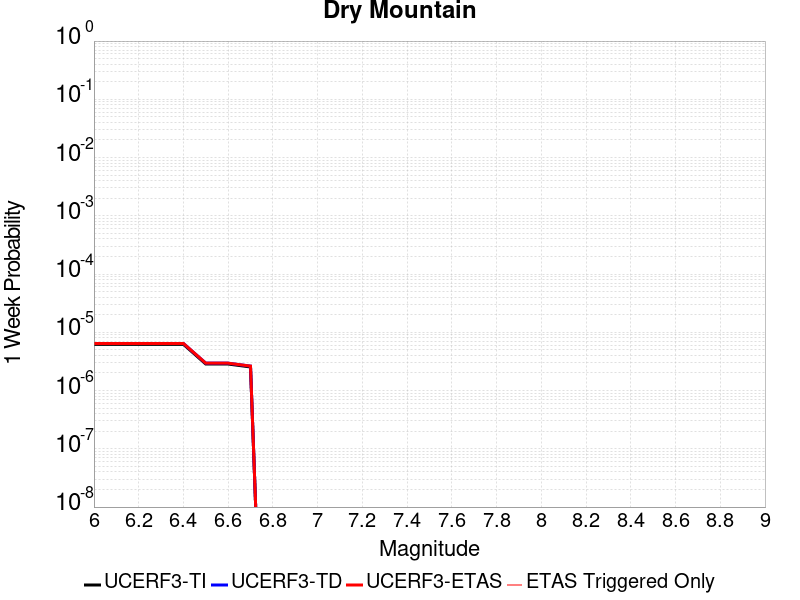 | 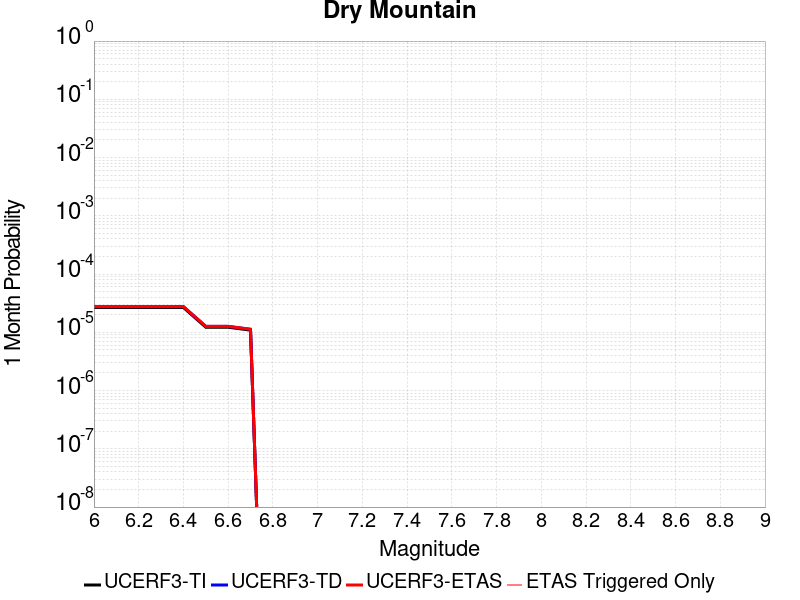 | 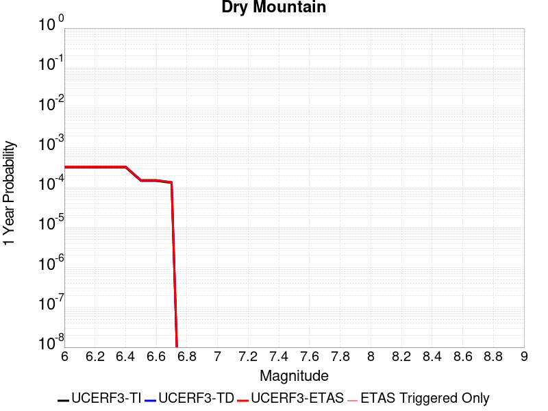 | 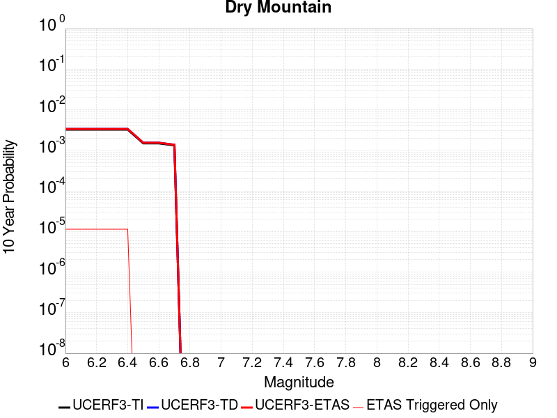 |

| Magnitude | 1 wk TI Prob | 1 wk TD Prob | 1 wk ETAS Prob | 1 wk ETAS/TD Gain | 1 wk ETAS Triggered Only | 1 mo TI Prob | 1 mo TD Prob | 1 mo ETAS Prob | 1 mo ETAS/TD Gain | 1 mo ETAS Triggered Only | 1 yr TI Prob | 1 yr TD Prob | 1 yr ETAS Prob | 1 yr ETAS/TD Gain | 1 yr ETAS Triggered Only | 10 yr TI Prob | 10 yr TD Prob | 10 yr ETAS Prob | 10 yr ETAS/TD Gain | 10 yr ETAS Triggered Only |
|-----|-----|-----|-----|-----|-----|-----|-----|-----|-----|-----|-----|-----|-----|-----|-----|-----|-----|-----|-----|-----|
| 6.0 | 6.222801E-6 | 6.439899E-6 | 6.439899E-6 | 1.0 | 0.0 | 2.6668875E-5 | 2.7599366E-5 | 2.7599366E-5 | 1.0 | 0.0 | 3.2464517E-4 | 3.359864E-4 | 3.359864E-4 | 1.0 | 0.0 | 0.0032417132 | 0.0033563466 | 0.0033973674 | 1.0122219 | 4.1159037E-5 |
| 6.1 | 6.222801E-6 | 6.439899E-6 | 6.439899E-6 | 1.0 | 0.0 | 2.6668875E-5 | 2.7599366E-5 | 2.7599366E-5 | 1.0 | 0.0 | 3.2464517E-4 | 3.359864E-4 | 3.359864E-4 | 1.0 | 0.0 | 0.0032417132 | 0.0033563466 | 0.0033973674 | 1.0122219 | 4.1159037E-5 |
| 6.2 | 6.222801E-6 | 6.439899E-6 | 6.439899E-6 | 1.0 | 0.0 | 2.6668875E-5 | 2.7599366E-5 | 2.7599366E-5 | 1.0 | 0.0 | 3.2464517E-4 | 3.359864E-4 | 3.359864E-4 | 1.0 | 0.0 | 0.0032417132 | 0.0033563466 | 0.0033973674 | 1.0122219 | 4.1159037E-5 |
| 6.3 | 6.222801E-6 | 6.439899E-6 | 6.439899E-6 | 1.0 | 0.0 | 2.6668875E-5 | 2.7599366E-5 | 2.7599366E-5 | 1.0 | 0.0 | 3.2464517E-4 | 3.359864E-4 | 3.359864E-4 | 1.0 | 0.0 | 0.0032417132 | 0.0033563466 | 0.0033973674 | 1.0122219 | 4.1159037E-5 |
| 6.4 | 6.222801E-6 | 6.439899E-6 | 6.439899E-6 | 1.0 | 0.0 | 2.6668875E-5 | 2.7599366E-5 | 2.7599366E-5 | 1.0 | 0.0 | 3.2464517E-4 | 3.359864E-4 | 3.359864E-4 | 1.0 | 0.0 | 0.0032417132 | 0.0033563466 | 0.0033973674 | 1.0122219 | 4.1159037E-5 |
| 6.5 | 2.8528623E-6 | 2.9524058E-6 | 2.9524058E-6 | 1.0 | 0.0 | 1.22264955E-5 | 1.2653156E-5 | 1.2653156E-5 | 1.0 | 0.0 | 1.4884741E-4 | 1.5404998E-4 | 1.5404998E-4 | 1.0 | 0.0 | 0.0014874774 | 0.0015402855 | 0.0015402855 | 1.0 | 0.0 |
| 6.6 | 2.8528623E-6 | 2.9524058E-6 | 2.9524058E-6 | 1.0 | 0.0 | 1.22264955E-5 | 1.2653156E-5 | 1.2653156E-5 | 1.0 | 0.0 | 1.4884741E-4 | 1.5404998E-4 | 1.5404998E-4 | 1.0 | 0.0 | 0.0014874774 | 0.0015402855 | 0.0015402855 | 1.0 | 0.0 |
| 6.7 | 2.541E-6 | 2.6295693E-6 | 2.6295693E-6 | 1.0 | 0.0 | 1.0889954E-5 | 1.12695825E-5 | 1.12695825E-5 | 1.0 | 0.0 | 1.3257713E-4 | 1.3720717E-4 | 1.3720717E-4 | 1.0 | 0.0 | 0.0013249806 | 0.0013720717 | 0.0013720717 | 1.0 | 0.0 |

## Monterey Bay-Tularcitos
*[(top)](#table-of-contents)*

| 1 Week | 1 Month | 1 Year | 10 Year |
|-----|-----|-----|-----|
| 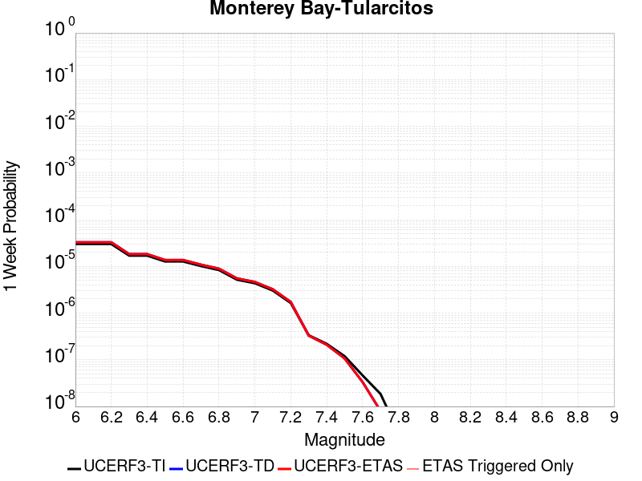 | 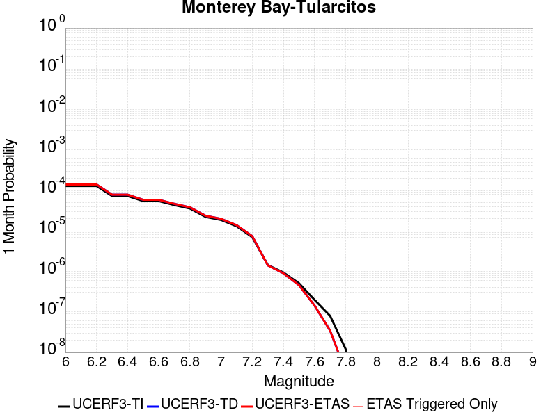 | 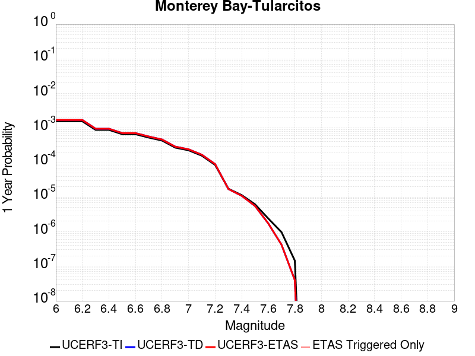 | 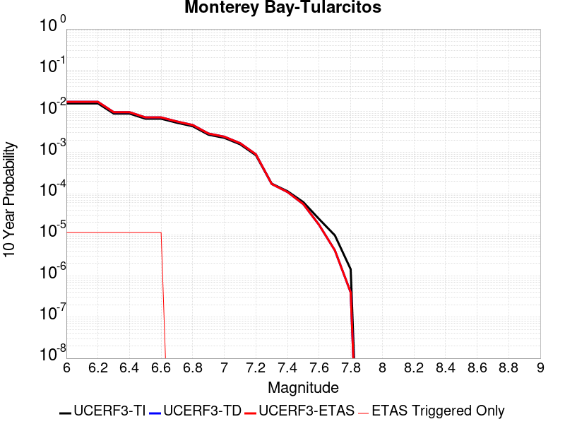 |

| Magnitude | 1 wk TI Prob | 1 wk TD Prob | 1 wk ETAS Prob | 1 wk ETAS/TD Gain | 1 wk ETAS Triggered Only | 1 mo TI Prob | 1 mo TD Prob | 1 mo ETAS Prob | 1 mo ETAS/TD Gain | 1 mo ETAS Triggered Only | 1 yr TI Prob | 1 yr TD Prob | 1 yr ETAS Prob | 1 yr ETAS/TD Gain | 1 yr ETAS Triggered Only | 10 yr TI Prob | 10 yr TD Prob | 10 yr ETAS Prob | 10 yr ETAS/TD Gain | 10 yr ETAS Triggered Only |
|-----|-----|-----|-----|-----|-----|-----|-----|-----|-----|-----|-----|-----|-----|-----|-----|-----|-----|-----|-----|-----|
| 6.0 | 3.0131365E-5 | 3.2805638E-5 | 3.2805638E-5 | 1.0 | 0.0 | 1.2912804E-4 | 1.405886E-4 | 1.405886E-4 | 1.0 | 0.0 | 0.001571 | 0.0017104279 | 0.0017104279 | 1.0 | 0.0 | 0.015599402 | 0.016983444 | 0.017023904 | 1.0023823 | 4.1159037E-5 |
| 6.1 | 3.0131365E-5 | 3.2805638E-5 | 3.2805638E-5 | 1.0 | 0.0 | 1.2912804E-4 | 1.405886E-4 | 1.405886E-4 | 1.0 | 0.0 | 0.001571 | 0.0017104279 | 0.0017104279 | 1.0 | 0.0 | 0.015599402 | 0.016983444 | 0.017023904 | 1.0023823 | 4.1159037E-5 |
| 6.2 | 3.0131365E-5 | 3.2805638E-5 | 3.2805638E-5 | 1.0 | 0.0 | 1.2912804E-4 | 1.405886E-4 | 1.405886E-4 | 1.0 | 0.0 | 0.001571 | 0.0017104279 | 0.0017104279 | 1.0 | 0.0 | 0.015599402 | 0.016983444 | 0.017023904 | 1.0023823 | 4.1159037E-5 |
| 6.3 | 1.6998249E-5 | 1.8334256E-5 | 1.8334256E-5 | 1.0 | 0.0 | 7.28476E-5 | 7.8573124E-5 | 7.8573124E-5 | 1.0 | 0.0 | 8.865586E-4 | 9.5622666E-4 | 9.5622666E-4 | 1.0 | 0.0 | 0.0088303005 | 0.009523046 | 0.009563814 | 1.0042809 | 4.1159037E-5 |
| 6.4 | 1.6998249E-5 | 1.8334256E-5 | 1.8334256E-5 | 1.0 | 0.0 | 7.28476E-5 | 7.8573124E-5 | 7.8573124E-5 | 1.0 | 0.0 | 8.865586E-4 | 9.5622666E-4 | 9.5622666E-4 | 1.0 | 0.0 | 0.0088303005 | 0.009523046 | 0.009563814 | 1.0042809 | 4.1159037E-5 |
| 6.5 | 1.27470785E-5 | 1.3695796E-5 | 1.3695796E-5 | 1.0 | 0.0 | 5.4629192E-5 | 5.869501E-5 | 5.869501E-5 | 1.0 | 0.0 | 6.649074E-4 | 7.1438774E-4 | 7.1438774E-4 | 1.0 | 0.0 | 0.0066292146 | 0.0071219653 | 0.0071628313 | 1.005738 | 4.1159037E-5 |
| 6.6 | 1.2739422E-5 | 1.36878825E-5 | 1.36878825E-5 | 1.0 | 0.0 | 5.4596385E-5 | 5.866109E-5 | 5.866109E-5 | 1.0 | 0.0 | 6.645082E-4 | 7.139751E-4 | 7.139751E-4 | 1.0 | 0.0 | 0.0066252467 | 0.0071178656 | 0.0071587316 | 1.0057414 | 4.1159037E-5 |
| 6.7 | 1.0160109E-5 | 1.0887684E-5 | 1.0887684E-5 | 1.0 | 0.0 | 4.35426E-5 | 4.666071E-5 | 4.666071E-5 | 1.0 | 0.0 | 5.300022E-4 | 5.679531E-4 | 5.679531E-4 | 1.0 | 0.0 | 0.005287399 | 0.0056657274 | 0.0056657274 | 1.0 | 0.0 |
| 6.8 | 8.349859E-6 | 8.934159E-6 | 8.934159E-6 | 1.0 | 0.0 | 3.578462E-5 | 3.8288727E-5 | 3.8288727E-5 | 1.0 | 0.0 | 4.3559066E-4 | 4.660712E-4 | 4.660712E-4 | 1.0 | 0.0 | 0.004347378 | 0.0046515022 | 0.0046515022 | 1.0 | 0.0 |
| 6.9 | 5.193639E-6 | 5.5374057E-6 | 5.5374057E-6 | 1.0 | 0.0 | 2.2258262E-5 | 2.373154E-5 | 2.373154E-5 | 1.0 | 0.0 | 2.7096065E-4 | 2.8889644E-4 | 2.8889644E-4 | 1.0 | 0.0 | 0.0027063051 | 0.00288553 | 0.00288553 | 1.0 | 0.0 |
| 7.0 | 4.359381E-6 | 4.6441955E-6 | 4.6441955E-6 | 1.0 | 0.0 | 1.8682927E-5 | 1.990356E-5 | 1.990356E-5 | 1.0 | 0.0 | 2.274409E-4 | 2.4230189E-4 | 2.4230189E-4 | 1.0 | 0.0 | 0.0022720827 | 0.00242067 | 0.00242067 | 1.0 | 0.0 |
| 7.1 | 3.0398533E-6 | 3.2316425E-6 | 3.2316425E-6 | 1.0 | 0.0 | 1.3027877E-5 | 1.3849837E-5 | 1.3849837E-5 | 1.0 | 0.0 | 1.5860285E-4 | 1.6861135E-4 | 1.6861135E-4 | 1.0 | 0.0 | 0.001584897 | 0.0016850919 | 0.0016850919 | 1.0 | 0.0 |
| 7.2 | 1.642335E-6 | 1.7336665E-6 | 1.7336665E-6 | 1.0 | 0.0 | 7.0385595E-6 | 7.4299896E-6 | 7.4299896E-6 | 1.0 | 0.0 | 8.569109E-5 | 9.045844E-5 | 9.045844E-5 | 1.0 | 0.0 | 8.5658056E-4 | 9.0441894E-4 | 9.0441894E-4 | 1.0 | 0.0 |
| 7.3 | 3.356842E-7 | 3.296333E-7 | 3.296333E-7 | 1.0 | 0.0 | 1.4386458E-6 | 1.4127135E-6 | 1.4127135E-6 | 1.0 | 0.0 | 1.7515373E-5 | 1.719965E-5 | 1.719965E-5 | 1.0 | 0.0 | 1.7513991E-4 | 1.719833E-4 | 1.719833E-4 | 1.0 | 0.0 |
| 7.4 | 2.1973483E-7 | 2.1016514E-7 | 2.1016514E-7 | 1.0 | 0.0 | 9.417204E-7 | 9.0070745E-7 | 9.0070745E-7 | 1.0 | 0.0 | 1.1465385E-5 | 1.0966059E-5 | 1.0966059E-5 | 1.0 | 0.0 | 1.1464794E-4 | 1.0965521E-4 | 1.0965521E-4 | 1.0 | 0.0 |
| 7.5 | 1.1944135E-7 | 1.0705369E-7 | 1.0705369E-7 | 1.0 | 0.0 | 5.118914E-7 | 4.5880142E-7 | 4.5880142E-7 | 1.0 | 0.0 | 6.23226E-6 | 5.585893E-6 | 5.585893E-6 | 1.0 | 0.0 | 6.2320854E-5 | 5.5857538E-5 | 5.5857538E-5 | 1.0 | 0.0 |
| 7.6 | 4.636058E-8 | 3.3429327E-8 | 3.3429327E-8 | 1.0 | 0.0 | 1.9868818E-7 | 1.4326854E-7 | 1.4326854E-7 | 1.0 | 0.0 | 2.419026E-6 | 1.7442931E-6 | 1.7442931E-6 | 1.0 | 0.0 | 2.4189996E-5 | 1.7442797E-5 | 1.7442797E-5 | 1.0 | 0.0 |
| 7.7 | 1.8588572E-8 | 8.037198E-9 | 8.037198E-9 | 1.0 | 0.0 | 7.9665305E-8 | 3.444513E-8 | 3.444513E-8 | 1.0 | 0.0 | 9.699246E-7 | 4.1936937E-7 | 4.1936937E-7 | 1.0 | 0.0 | 9.699204E-6 | 4.193686E-6 | 4.193686E-6 | 1.0 | 0.0 |
| 7.8 | 2.7960154E-9 | 7.6629436E-10 | 7.6629436E-10 | 1.0 | 0.0 | 1.1982923E-8 | 3.2841185E-9 | 3.2841185E-9 | 1.0 | 0.0 | 1.4589209E-7 | 3.9984144E-8 | 3.9984144E-8 | 1.0 | 0.0 | 1.4589199E-6 | 3.9984138E-7 | 3.9984138E-7 | 1.0 | 0.0 |

## Owens Valley Keough Hot Springs
*[(top)](#table-of-contents)*

| 1 Week | 1 Month | 1 Year | 10 Year |
|-----|-----|-----|-----|
| 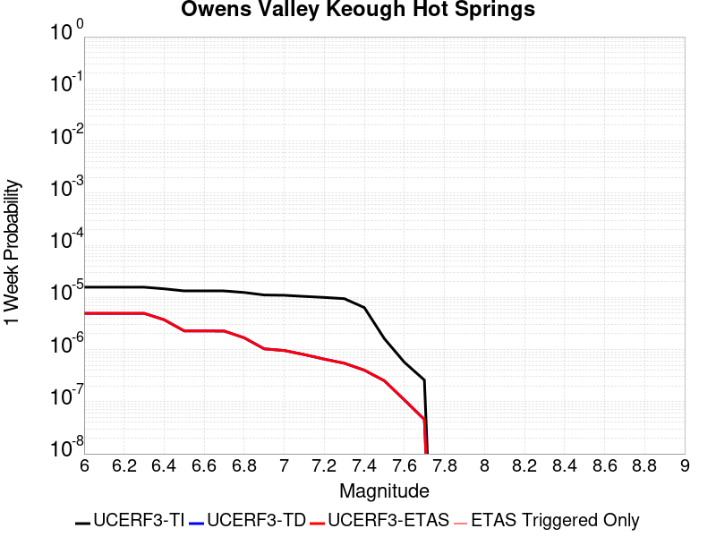 | 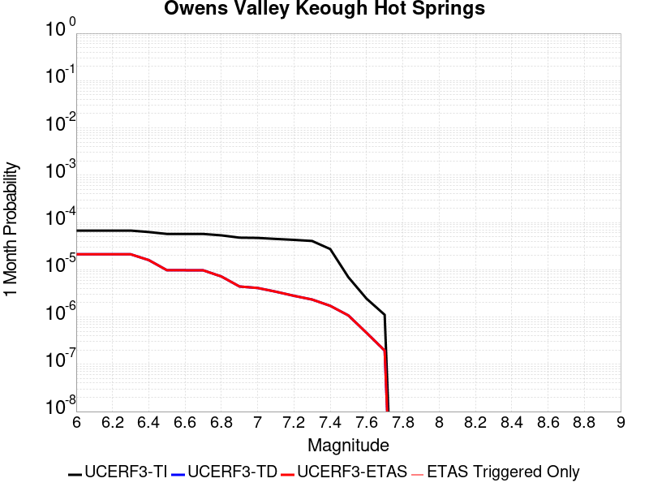 | 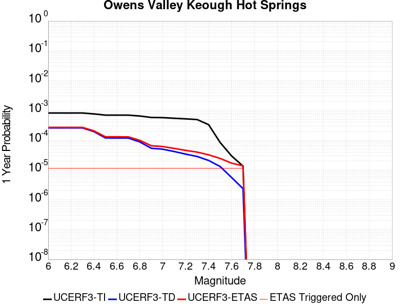 | 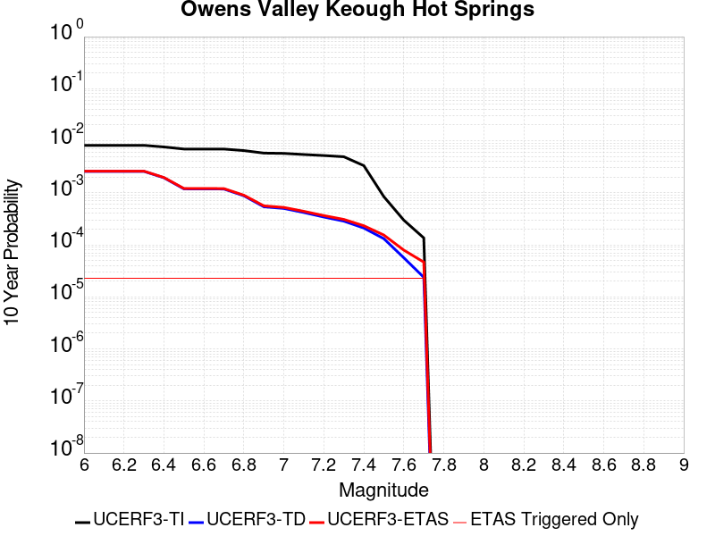 |

| Magnitude | 1 wk TI Prob | 1 wk TD Prob | 1 wk ETAS Prob | 1 wk ETAS/TD Gain | 1 wk ETAS Triggered Only | 1 mo TI Prob | 1 mo TD Prob | 1 mo ETAS Prob | 1 mo ETAS/TD Gain | 1 mo ETAS Triggered Only | 1 yr TI Prob | 1 yr TD Prob | 1 yr ETAS Prob | 1 yr ETAS/TD Gain | 1 yr ETAS Triggered Only | 10 yr TI Prob | 10 yr TD Prob | 10 yr ETAS Prob | 10 yr ETAS/TD Gain | 10 yr ETAS Triggered Only |
|-----|-----|-----|-----|-----|-----|-----|-----|-----|-----|-----|-----|-----|-----|-----|-----|-----|-----|-----|-----|-----|
| 6.0 | 1.5708529E-5 | 4.9533996E-6 | 4.9533996E-6 | 1.0 | 0.0 | 6.7320536E-5 | 2.1228712E-5 | 2.1228712E-5 | 1.0 | 0.0 | 8.193192E-4 | 2.5843404E-4 | 2.9958243E-4 | 1.1592221 | 4.1159037E-5 | 0.008163051 | 0.0025820027 | 0.0026230554 | 1.0158995 | 4.1159037E-5 |
| 6.1 | 1.5708529E-5 | 4.9533996E-6 | 4.9533996E-6 | 1.0 | 0.0 | 6.7320536E-5 | 2.1228712E-5 | 2.1228712E-5 | 1.0 | 0.0 | 8.193192E-4 | 2.5843404E-4 | 2.9958243E-4 | 1.1592221 | 4.1159037E-5 | 0.008163051 | 0.0025820027 | 0.0026230554 | 1.0158995 | 4.1159037E-5 |
| 6.2 | 1.5708529E-5 | 4.9533996E-6 | 4.9533996E-6 | 1.0 | 0.0 | 6.7320536E-5 | 2.1228712E-5 | 2.1228712E-5 | 1.0 | 0.0 | 8.193192E-4 | 2.5843404E-4 | 2.9958243E-4 | 1.1592221 | 4.1159037E-5 | 0.008163051 | 0.0025820027 | 0.0026230554 | 1.0158995 | 4.1159037E-5 |
| 6.3 | 1.5708529E-5 | 4.9533996E-6 | 4.9533996E-6 | 1.0 | 0.0 | 6.7320536E-5 | 2.1228712E-5 | 2.1228712E-5 | 1.0 | 0.0 | 8.193192E-4 | 2.5843404E-4 | 2.9958243E-4 | 1.1592221 | 4.1159037E-5 | 0.008163051 | 0.0025820027 | 0.0026230554 | 1.0158995 | 4.1159037E-5 |
| 6.4 | 1.4622509E-5 | 3.7289042E-6 | 3.7289042E-6 | 1.0 | 0.0 | 6.266639E-5 | 1.5980939E-5 | 1.5980939E-5 | 1.0 | 0.0 | 7.626962E-4 | 1.9455387E-4 | 2.357049E-4 | 1.2115148 | 4.1159037E-5 | 0.007600839 | 0.001944324 | 0.001985403 | 1.0211277 | 4.1159037E-5 |
| 6.5 | 1.3335527E-5 | 2.2796798E-6 | 2.2796798E-6 | 1.0 | 0.0 | 5.7151006E-5 | 9.770023E-6 | 9.770023E-6 | 1.0 | 0.0 | 6.955913E-4 | 1.1894423E-4 | 1.6009837E-4 | 1.3459953 | 4.1159037E-5 | 0.0069341804 | 0.0011890369 | 0.001230147 | 1.0345743 | 4.1159037E-5 |
| 6.6 | 1.3332855E-5 | 2.2768286E-6 | 2.2768286E-6 | 1.0 | 0.0 | 5.7139558E-5 | 9.757804E-6 | 9.757804E-6 | 1.0 | 0.0 | 6.9545204E-4 | 1.1879547E-4 | 1.5994962E-4 | 1.3464286 | 4.1159037E-5 | 0.0069327964 | 0.0011875508 | 0.001228661 | 1.0346175 | 4.1159037E-5 |
| 6.7 | 1.3318214E-5 | 2.2660531E-6 | 2.2660531E-6 | 1.0 | 0.0 | 5.707681E-5 | 9.7116235E-6 | 9.7116235E-6 | 1.0 | 0.0 | 6.946886E-4 | 1.18233285E-4 | 1.5938746E-4 | 1.348076 | 4.1159037E-5 | 0.0069252094 | 0.0011819351 | 0.0012230454 | 1.0347823 | 4.1159037E-5 |
| 6.8 | 1.2441338E-5 | 1.679431E-6 | 1.679431E-6 | 1.0 | 0.0 | 5.331893E-5 | 7.197543E-6 | 7.197543E-6 | 1.0 | 0.0 | 6.489646E-4 | 8.762686E-5 | 1.287823E-4 | 1.4696668 | 4.1159037E-5 | 0.0064707273 | 8.761166E-4 | 9.172396E-4 | 1.0469378 | 4.1159037E-5 |
| 6.9 | 1.1130476E-5 | 1.0314787E-6 | 1.0314787E-6 | 1.0 | 0.0 | 4.7701167E-5 | 4.420616E-6 | 4.420616E-6 | 1.0 | 0.0 | 5.806069E-4 | 5.381968E-5 | 9.49765E-5 | 1.764717 | 4.1159037E-5 | 0.0057909233 | 5.3822965E-4 | 5.793666E-4 | 1.07643 | 4.1159037E-5 |
| 7.0 | 1.0986073E-5 | 9.589851E-7 | 9.589851E-7 | 1.0 | 0.0 | 4.7082318E-5 | 4.1099297E-6 | 4.1099297E-6 | 1.0 | 0.0 | 5.730765E-4 | 5.0037255E-5 | 9.119423E-5 | 1.8225267 | 4.1159037E-5 | 0.0057160086 | 5.0042226E-4 | 5.415607E-4 | 1.0822074 | 4.1159037E-5 |
| 7.1 | 1.0451338E-5 | 8.008758E-7 | 8.008758E-7 | 1.0 | 0.0 | 4.4790682E-5 | 3.4323205E-6 | 3.4323205E-6 | 1.0 | 0.0 | 5.451901E-4 | 4.1787705E-5 | 8.294502E-5 | 1.9849145 | 4.1159037E-5 | 0.005438545 | 4.1795685E-4 | 4.590987E-4 | 1.0984356 | 4.1159037E-5 |
| 7.2 | 9.989061E-6 | 6.552159E-7 | 6.552159E-7 | 1.0 | 0.0 | 4.280956E-5 | 2.8080651E-6 | 2.8080651E-6 | 1.0 | 0.0 | 5.2108173E-4 | 3.418766E-5 | 7.534529E-5 | 2.2038739 | 4.1159037E-5 | 0.0051986156 | 3.4195383E-4 | 3.8309878E-4 | 1.1203232 | 4.1159037E-5 |
| 7.3 | 9.465365E-6 | 5.466744E-7 | 5.466744E-7 | 1.0 | 0.0 | 4.056522E-5 | 2.3428884E-6 | 2.3428884E-6 | 1.0 | 0.0 | 4.937696E-4 | 2.8524295E-5 | 6.968216E-5 | 2.4429057 | 4.1159037E-5 | 0.0049267393 | 2.853315E-4 | 3.264788E-4 | 1.1442088 | 4.1159037E-5 |
| 7.4 | 6.3824805E-6 | 4.0218828E-7 | 4.0218828E-7 | 1.0 | 0.0 | 2.73532E-5 | 1.7236629E-6 | 1.7236629E-6 | 1.0 | 0.0 | 3.3297433E-4 | 2.0985395E-5 | 6.214357E-5 | 2.961277 | 4.1159037E-5 | 0.0033247585 | 2.0991813E-4 | 2.5106853E-4 | 1.1960307 | 4.1159037E-5 |
| 7.5 | 1.6192645E-6 | 2.519631E-7 | 2.519631E-7 | 1.0 | 0.0 | 6.9396865E-6 | 1.0798414E-6 | 1.0798414E-6 | 1.0 | 0.0 | 8.448741E-5 | 1.3146991E-5 | 5.430549E-5 | 4.1306405 | 4.1159037E-5 | 8.4455294E-4 | 1.3146225E-4 | 1.7261588E-4 | 1.3130451 | 4.1159037E-5 |
| 7.6 | 5.7062545E-7 | 1.0806776E-7 | 1.0806776E-7 | 1.0 | 0.0 | 2.4455355E-6 | 4.6314744E-7 | 4.6314744E-7 | 1.0 | 0.0 | 2.9773988E-5 | 5.6388067E-6 | 4.6797613E-5 | 8.299205 | 4.1159037E-5 | 2.977E-4 | 5.6386718E-5 | 9.754343E-5 | 1.729901 | 4.1159037E-5 |
| 7.7 | 2.5988817E-7 | 4.5517567E-8 | 4.5517567E-8 | 1.0 | 0.0 | 1.113806E-6 | 1.9507527E-7 | 1.9507527E-7 | 1.0 | 0.0 | 1.3560503E-5 | 2.3750392E-6 | 4.353398E-5 | 18.329794 | 4.1159037E-5 | 1.3559677E-4 | 2.3750183E-5 | 6.490824E-5 | 2.7329576 | 4.1159037E-5 |

## Elsinore (Temecula) rev
*[(top)](#table-of-contents)*

| 1 Week | 1 Month | 1 Year | 10 Year |
|-----|-----|-----|-----|
| 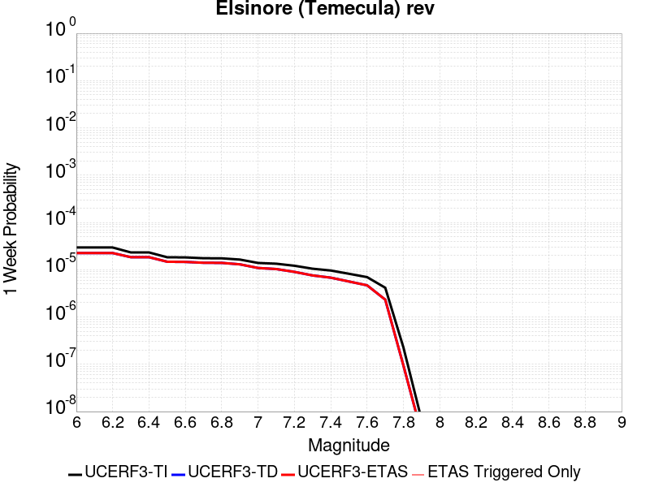 | 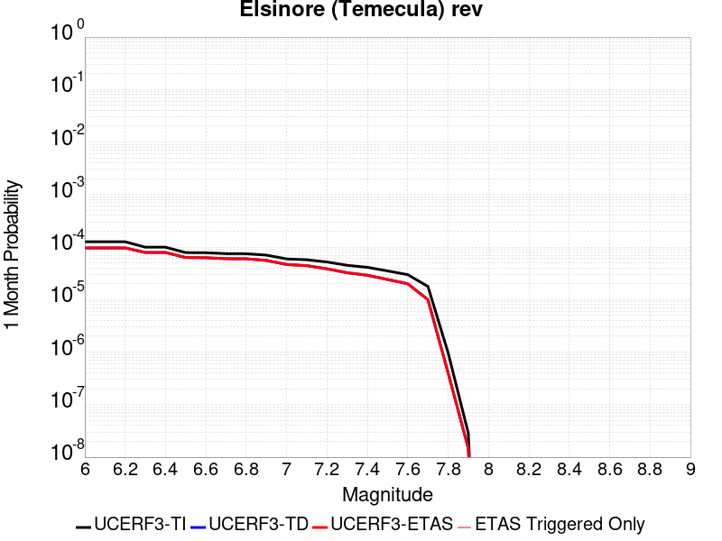 | 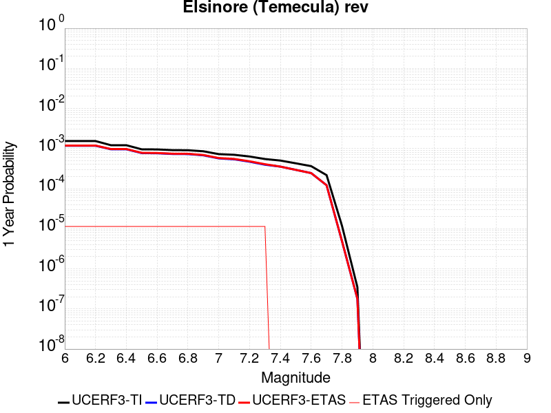 | 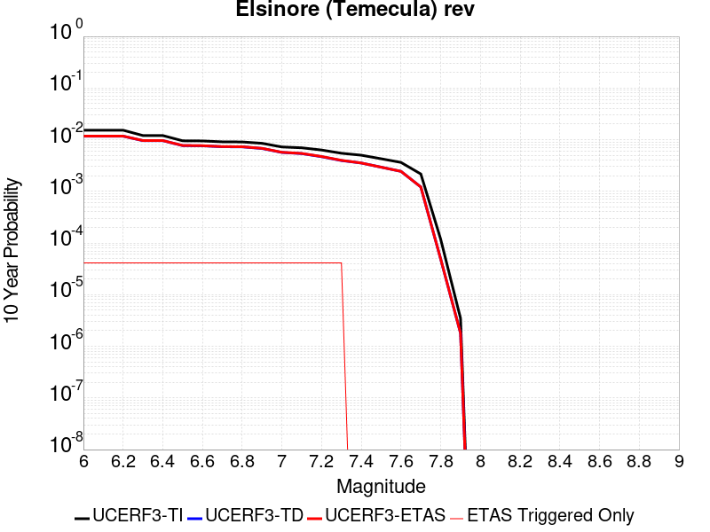 |

| Magnitude | 1 wk TI Prob | 1 wk TD Prob | 1 wk ETAS Prob | 1 wk ETAS/TD Gain | 1 wk ETAS Triggered Only | 1 mo TI Prob | 1 mo TD Prob | 1 mo ETAS Prob | 1 mo ETAS/TD Gain | 1 mo ETAS Triggered Only | 1 yr TI Prob | 1 yr TD Prob | 1 yr ETAS Prob | 1 yr ETAS/TD Gain | 1 yr ETAS Triggered Only | 10 yr TI Prob | 10 yr TD Prob | 10 yr ETAS Prob | 10 yr ETAS/TD Gain | 10 yr ETAS Triggered Only |
|-----|-----|-----|-----|-----|-----|-----|-----|-----|-----|-----|-----|-----|-----|-----|-----|-----|-----|-----|-----|-----|
| 6.0 | 2.9514995E-5 | 2.253612E-5 | 2.253612E-5 | 1.0 | 0.0 | 1.264867E-4 | 9.6579926E-5 | 9.6579926E-5 | 1.0 | 0.0 | 0.0015388876 | 0.0011752483 | 0.001216359 | 1.0349804 | 4.1159037E-5 | 0.015282745 | 0.011701733 | 0.01174241 | 1.0034761 | 4.1159037E-5 |
| 6.1 | 2.9514995E-5 | 2.253612E-5 | 2.253612E-5 | 1.0 | 0.0 | 1.264867E-4 | 9.6579926E-5 | 9.6579926E-5 | 1.0 | 0.0 | 0.0015388876 | 0.0011752483 | 0.001216359 | 1.0349804 | 4.1159037E-5 | 0.015282745 | 0.011701733 | 0.01174241 | 1.0034761 | 4.1159037E-5 |
| 6.2 | 2.9514995E-5 | 2.253612E-5 | 2.253612E-5 | 1.0 | 0.0 | 1.264867E-4 | 9.6579926E-5 | 9.6579926E-5 | 1.0 | 0.0 | 0.0015388876 | 0.0011752483 | 0.001216359 | 1.0349804 | 4.1159037E-5 | 0.015282745 | 0.011701733 | 0.01174241 | 1.0034761 | 4.1159037E-5 |
| 6.3 | 2.3223649E-5 | 1.8420413E-5 | 1.8420413E-5 | 1.0 | 0.0 | 9.952613E-5 | 7.8942336E-5 | 7.8942336E-5 | 1.0 | 0.0 | 0.001211057 | 9.6071634E-4 | 0.0010018358 | 1.0428009 | 4.1159037E-5 | 0.012044783 | 0.00958644 | 0.009627204 | 1.0042523 | 4.1159037E-5 |
| 6.4 | 2.3223649E-5 | 1.8420413E-5 | 1.8420413E-5 | 1.0 | 0.0 | 9.952613E-5 | 7.8942336E-5 | 7.8942336E-5 | 1.0 | 0.0 | 0.001211057 | 9.6071634E-4 | 0.0010018358 | 1.0428009 | 4.1159037E-5 | 0.012044783 | 0.00958644 | 0.009627204 | 1.0042523 | 4.1159037E-5 |
| 6.5 | 1.8338875E-5 | 1.476089E-5 | 1.476089E-5 | 1.0 | 0.0 | 7.8592806E-5 | 6.3259475E-5 | 6.3259475E-5 | 1.0 | 0.0 | 9.5644733E-4 | 7.699207E-4 | 8.11048E-4 | 1.0534177 | 4.1159037E-5 | 0.009523412 | 0.007687971 | 0.0077288137 | 1.0053126 | 4.1159037E-5 |
| 6.6 | 1.8223333E-5 | 1.4623386E-5 | 1.4623386E-5 | 1.0 | 0.0 | 7.809766E-5 | 6.2670195E-5 | 6.2670195E-5 | 1.0 | 0.0 | 9.504242E-4 | 7.627513E-4 | 8.0387894E-4 | 1.0539201 | 4.1159037E-5 | 0.009463696 | 0.00761677 | 0.0076576155 | 1.0053626 | 4.1159037E-5 |
| 6.7 | 1.7512752E-5 | 1.4037719E-5 | 1.4037719E-5 | 1.0 | 0.0 | 7.505249E-5 | 6.0160313E-5 | 6.0160313E-5 | 1.0 | 0.0 | 9.13381E-4 | 7.3221425E-4 | 7.7334314E-4 | 1.0561706 | 4.1159037E-5 | 0.00909636 | 0.0073046805 | 0.007345539 | 1.0055934 | 4.1159037E-5 |
| 6.8 | 1.7417142E-5 | 1.3961668E-5 | 1.3961668E-5 | 1.0 | 0.0 | 7.4642754E-5 | 5.9834398E-5 | 5.9834398E-5 | 1.0 | 0.0 | 9.083966E-4 | 7.2824885E-4 | 7.693779E-4 | 1.0564767 | 4.1159037E-5 | 0.009046922 | 0.007264553 | 0.007305413 | 1.0056245 | 4.1159037E-5 |
| 6.9 | 1.6402591E-5 | 1.2998666E-5 | 1.2998666E-5 | 1.0 | 0.0 | 7.0294926E-5 | 5.570742E-5 | 5.570742E-5 | 1.0 | 0.0 | 8.5550465E-4 | 6.780345E-4 | 7.191656E-4 | 1.0606623 | 4.1159037E-5 | 0.008522186 | 0.006765701 | 0.0068065813 | 1.0060424 | 4.1159037E-5 |
| 7.0 | 1.3912486E-5 | 1.088713E-5 | 1.088713E-5 | 1.0 | 0.0 | 5.9623577E-5 | 4.665831E-5 | 4.665831E-5 | 1.0 | 0.0 | 7.2567526E-4 | 5.679196E-4 | 6.090552E-4 | 1.0724322 | 4.1159037E-5 | 0.0072331014 | 0.00566878 | 0.0057097054 | 1.0072194 | 4.1159037E-5 |
| 7.1 | 1.3405147E-5 | 1.0335882E-5 | 1.0335882E-5 | 1.0 | 0.0 | 5.7449364E-5 | 4.42959E-5 | 4.42959E-5 | 1.0 | 0.0 | 6.9922156E-4 | 5.391717E-4 | 5.8030855E-4 | 1.0762963 | 4.1159037E-5 | 0.0069702556 | 0.005381785 | 0.0054227225 | 1.0076066 | 4.1159037E-5 |
| 7.2 | 1.21402E-5 | 9.0040585E-6 | 9.0040585E-6 | 1.0 | 0.0 | 5.202839E-5 | 3.858826E-5 | 3.858826E-5 | 1.0 | 0.0 | 6.332616E-4 | 4.6971257E-4 | 5.1085226E-4 | 1.0875849 | 4.1159037E-5 | 0.0063146 | 0.004688504 | 0.0047294702 | 1.0087376 | 4.1159037E-5 |
| 7.3 | 1.05047775E-5 | 7.577904E-6 | 7.577904E-6 | 1.0 | 0.0 | 4.5019697E-5 | 3.2476335E-5 | 3.2476335E-5 | 1.0 | 0.0 | 5.4797693E-4 | 3.9532912E-4 | 4.364719E-4 | 1.1040722 | 4.1159037E-5 | 0.005466277 | 0.0039466177 | 0.003987614 | 1.0103878 | 4.1159037E-5 |
| 7.4 | 9.624483E-6 | 6.7923206E-6 | 6.7923206E-6 | 1.0 | 0.0 | 4.124713E-5 | 2.9109628E-5 | 2.9109628E-5 | 1.0 | 0.0 | 5.0206814E-4 | 3.5435348E-4 | 3.5435348E-4 | 1.0 | 0.0 | 0.005009353 | 0.003538042 | 0.003538042 | 1.0 | 0.0 |
| 7.5 | 8.215151E-6 | 5.64005E-6 | 5.64005E-6 | 1.0 | 0.0 | 3.5207315E-5 | 2.4171426E-5 | 2.4171426E-5 | 1.0 | 0.0 | 4.2856473E-4 | 2.9424866E-4 | 2.9424866E-4 | 1.0 | 0.0 | 0.004277392 | 0.0029387185 | 0.0029387185 | 1.0 | 0.0 |
| 7.6 | 6.975058E-6 | 4.6800064E-6 | 4.6800064E-6 | 1.0 | 0.0 | 2.9892764E-5 | 2.0057023E-5 | 2.0057023E-5 | 1.0 | 0.0 | 3.6388362E-4 | 2.4416807E-4 | 2.4416807E-4 | 1.0 | 0.0 | 0.0036328835 | 0.0024391143 | 0.0024391143 | 1.0 | 0.0 |
| 7.7 | 4.159604E-6 | 2.3291004E-6 | 2.3291004E-6 | 1.0 | 0.0 | 1.7826753E-5 | 9.981824E-6 | 9.981824E-6 | 1.0 | 0.0 | 2.1701909E-4 | 1.2152268E-4 | 1.2152268E-4 | 1.0 | 0.0 | 0.0021680726 | 0.0012146354 | 0.0012146354 | 1.0 | 0.0 |
| 7.8 | 2.2692414E-7 | 9.3929124E-8 | 9.3929124E-8 | 1.0 | 0.0 | 9.725317E-7 | 4.0255333E-7 | 4.0255333E-7 | 1.0 | 0.0 | 1.1840509E-5 | 4.901079E-6 | 4.901079E-6 | 1.0 | 0.0 | 1.1839878E-4 | 4.901004E-5 | 4.901004E-5 | 1.0 | 0.0 |
| 7.9 | 6.676829E-9 | 3.4418608E-9 | 3.4418608E-9 | 1.0 | 0.0 | 2.861498E-8 | 1.4750832E-8 | 1.4750832E-8 | 1.0 | 0.0 | 3.4838732E-7 | 1.7959135E-7 | 1.7959135E-7 | 1.0 | 0.0 | 3.4838679E-6 | 1.7959123E-6 | 1.7959123E-6 | 1.0 | 0.0 |

## Scodie Lineament
*[(top)](#table-of-contents)*

| 1 Week | 1 Month | 1 Year | 10 Year |
|-----|-----|-----|-----|
| 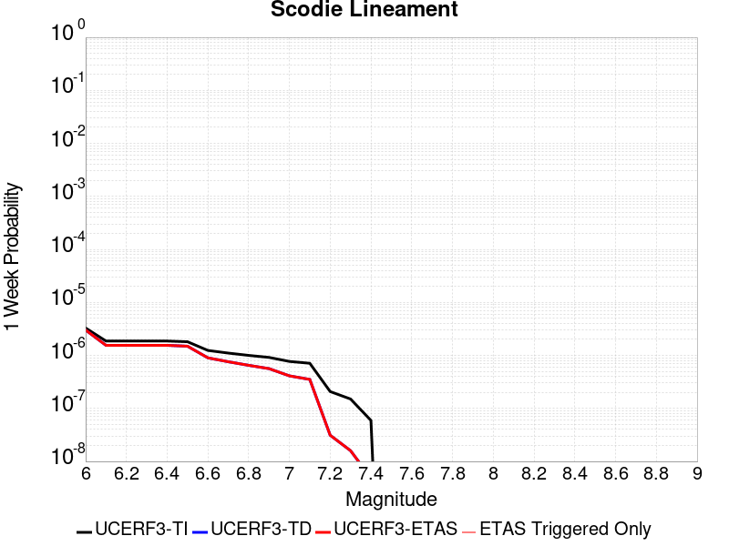 | 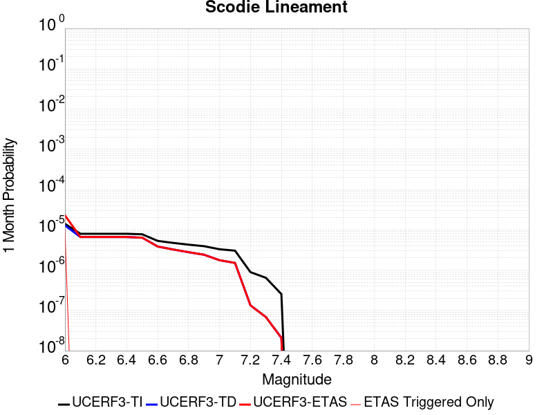 | 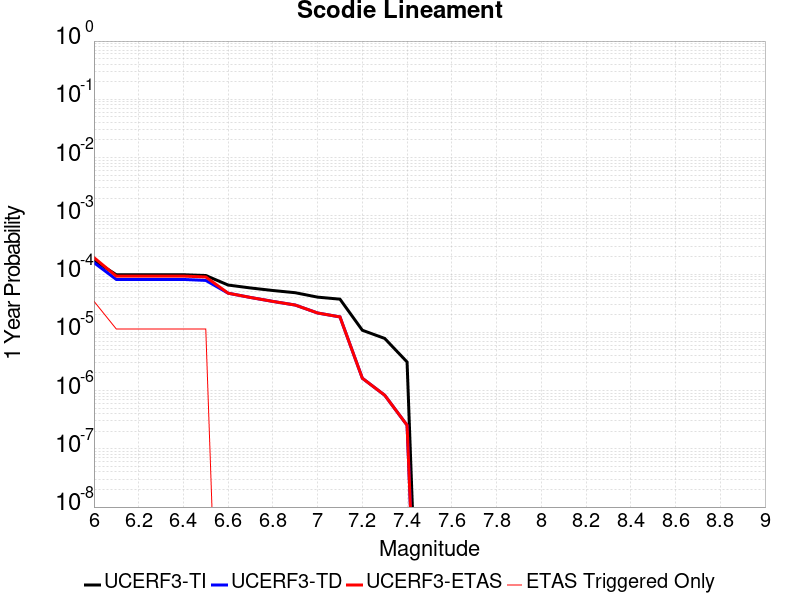 | 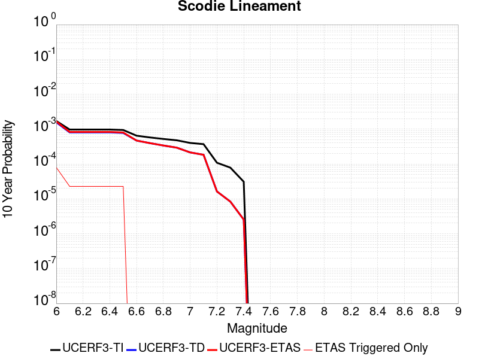 |

| Magnitude | 1 wk TI Prob | 1 wk TD Prob | 1 wk ETAS Prob | 1 wk ETAS/TD Gain | 1 wk ETAS Triggered Only | 1 mo TI Prob | 1 mo TD Prob | 1 mo ETAS Prob | 1 mo ETAS/TD Gain | 1 mo ETAS Triggered Only | 1 yr TI Prob | 1 yr TD Prob | 1 yr ETAS Prob | 1 yr ETAS/TD Gain | 1 yr ETAS Triggered Only | 10 yr TI Prob | 10 yr TD Prob | 10 yr ETAS Prob | 10 yr ETAS/TD Gain | 10 yr ETAS Triggered Only |
|-----|-----|-----|-----|-----|-----|-----|-----|-----|-----|-----|-----|-----|-----|-----|-----|-----|-----|-----|-----|-----|
| 6.0 | 3.2919327E-6 | 3.0135816E-6 | 3.0135816E-6 | 1.0 | 0.0 | 1.4108206E-5 | 1.2915304E-5 | 1.2915304E-5 | 1.0 | 0.0 | 1.7175387E-4 | 1.5723566E-4 | 1.9838822E-4 | 1.2617254 | 4.1159037E-5 | 0.0017162118 | 0.0015715556 | 0.00161265 | 1.0261488 | 4.1159037E-5 |
| 6.1 | 1.8663811E-6 | 1.5491973E-6 | 1.5491973E-6 | 1.0 | 0.0 | 7.998751E-6 | 6.639403E-6 | 6.639403E-6 | 1.0 | 0.0 | 9.738045E-5 | 8.083223E-5 | 8.083223E-5 | 1.0 | 0.0 | 9.7337784E-4 | 8.080771E-4 | 8.080771E-4 | 1.0 | 0.0 |
| 6.2 | 1.8663811E-6 | 1.5491973E-6 | 1.5491973E-6 | 1.0 | 0.0 | 7.998751E-6 | 6.639403E-6 | 6.639403E-6 | 1.0 | 0.0 | 9.738045E-5 | 8.083223E-5 | 8.083223E-5 | 1.0 | 0.0 | 9.7337784E-4 | 8.080771E-4 | 8.080771E-4 | 1.0 | 0.0 |
| 6.3 | 1.8663811E-6 | 1.5491973E-6 | 1.5491973E-6 | 1.0 | 0.0 | 7.998751E-6 | 6.639403E-6 | 6.639403E-6 | 1.0 | 0.0 | 9.738045E-5 | 8.083223E-5 | 8.083223E-5 | 1.0 | 0.0 | 9.7337784E-4 | 8.080771E-4 | 8.080771E-4 | 1.0 | 0.0 |
| 6.4 | 1.8663811E-6 | 1.5491973E-6 | 1.5491973E-6 | 1.0 | 0.0 | 7.998751E-6 | 6.639403E-6 | 6.639403E-6 | 1.0 | 0.0 | 9.738045E-5 | 8.083223E-5 | 8.083223E-5 | 1.0 | 0.0 | 9.7337784E-4 | 8.080771E-4 | 8.080771E-4 | 1.0 | 0.0 |
| 6.5 | 1.8106311E-6 | 1.4911258E-6 | 1.4911258E-6 | 1.0 | 0.0 | 7.759824E-6 | 6.3905263E-6 | 6.3905263E-6 | 1.0 | 0.0 | 9.447177E-5 | 7.7802375E-5 | 7.7802375E-5 | 1.0 | 0.0 | 9.4431615E-4 | 7.7780004E-4 | 7.7780004E-4 | 1.0 | 0.0 |
| 6.6 | 1.2414679E-6 | 8.998446E-7 | 8.998446E-7 | 1.0 | 0.0 | 5.320566E-6 | 3.8564717E-6 | 3.8564717E-6 | 1.0 | 0.0 | 6.477596E-5 | 4.695162E-5 | 4.695162E-5 | 1.0 | 0.0 | 6.475708E-4 | 4.6942566E-4 | 4.6942566E-4 | 1.0 | 0.0 |
| 6.7 | 1.1062215E-6 | 7.5950777E-7 | 7.5950777E-7 | 1.0 | 0.0 | 4.7409408E-6 | 3.2550297E-6 | 3.2550297E-6 | 1.0 | 0.0 | 5.7719422E-5 | 3.9629336E-5 | 3.9629336E-5 | 1.0 | 0.0 | 5.770443E-4 | 3.9622968E-4 | 3.9622968E-4 | 1.0 | 0.0 |
| 6.8 | 1.0006736E-6 | 6.5010715E-7 | 6.5010715E-7 | 1.0 | 0.0 | 4.288594E-6 | 2.7861709E-6 | 2.7861709E-6 | 1.0 | 0.0 | 5.221238E-5 | 3.3921166E-5 | 3.3921166E-5 | 1.0 | 0.0 | 5.220012E-4 | 3.3916594E-4 | 3.3916594E-4 | 1.0 | 0.0 |
| 6.9 | 9.167364E-7 | 5.632229E-7 | 5.632229E-7 | 1.0 | 0.0 | 3.9288643E-6 | 2.4138105E-6 | 2.4138105E-6 | 1.0 | 0.0 | 4.7832873E-5 | 2.9387806E-5 | 2.9387806E-5 | 1.0 | 0.0 | 4.782258E-4 | 2.9384487E-4 | 2.9384487E-4 | 1.0 | 0.0 |
| 7.0 | 7.6987664E-7 | 4.1138688E-7 | 4.1138688E-7 | 1.0 | 0.0 | 3.2994672E-6 | 1.7630856E-6 | 1.7630856E-6 | 1.0 | 0.0 | 4.0170275E-5 | 2.1465396E-5 | 2.1465396E-5 | 1.0 | 0.0 | 4.0163012E-4 | 2.1463708E-4 | 2.1463708E-4 | 1.0 | 0.0 |
| 7.1 | 7.1038727E-7 | 3.5215882E-7 | 3.5215882E-7 | 1.0 | 0.0 | 3.0445133E-6 | 1.5092514E-6 | 1.5092514E-6 | 1.0 | 0.0 | 3.706632E-5 | 1.8375018E-5 | 1.8375018E-5 | 1.0 | 0.0 | 3.7060137E-4 | 1.8373848E-4 | 1.8373848E-4 | 1.0 | 0.0 |
| 7.2 | 2.0799602E-7 | 3.119291E-8 | 3.119291E-8 | 1.0 | 0.0 | 8.914113E-7 | 1.336839E-7 | 1.336839E-7 | 1.0 | 0.0 | 1.0852878E-5 | 1.6276003E-6 | 1.6276003E-6 | 1.0 | 0.0 | 1.08523476E-4 | 1.6275892E-5 | 1.6275892E-5 | 1.0 | 0.0 |
| 7.3 | 1.5048182E-7 | 1.5947432E-8 | 1.5947432E-8 | 1.0 | 0.0 | 6.449219E-7 | 6.834613E-8 | 6.834613E-8 | 1.0 | 0.0 | 7.851896E-6 | 8.3211387E-7 | 8.3211387E-7 | 1.0 | 0.0 | 7.851618E-5 | 8.321111E-6 | 8.321111E-6 | 1.0 | 0.0 |
| 7.4 | 5.9334678E-8 | 4.865539E-9 | 4.865539E-9 | 1.0 | 0.0 | 2.5429145E-7 | 2.085231E-8 | 2.085231E-8 | 1.0 | 0.0 | 3.095994E-6 | 2.5387686E-7 | 2.5387686E-7 | 1.0 | 0.0 | 3.095951E-5 | 2.538767E-6 | 2.538767E-6 | 1.0 | 0.0 |

## San Diego Trough south
*[(top)](#table-of-contents)*

| 1 Week | 1 Month | 1 Year | 10 Year |
|-----|-----|-----|-----|
| 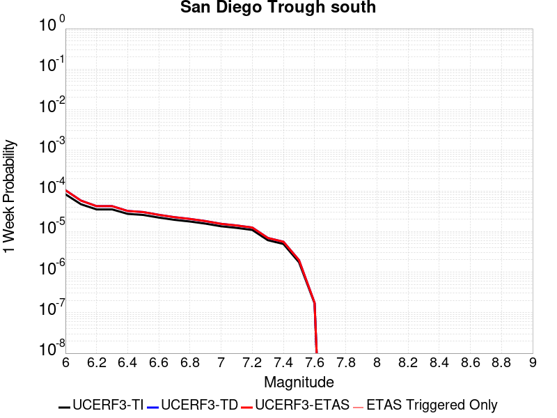 | 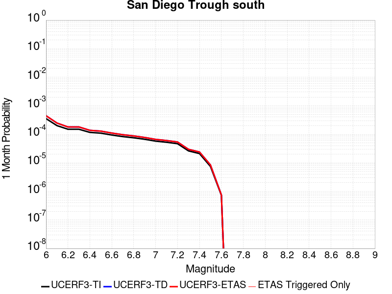 | 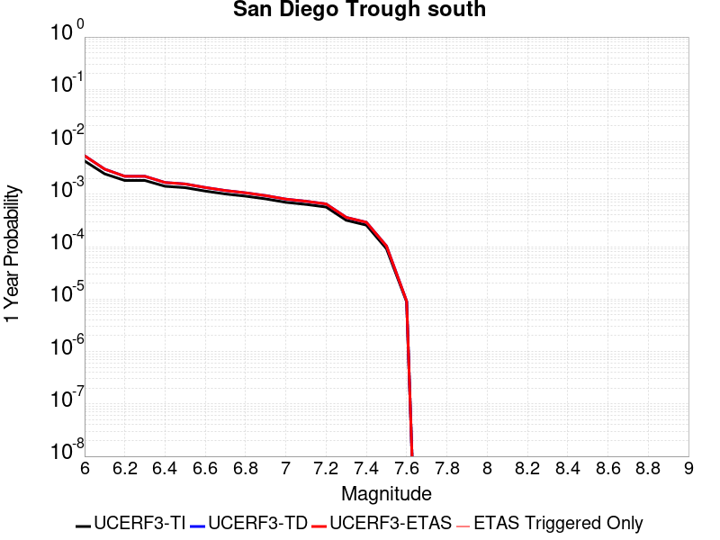 | 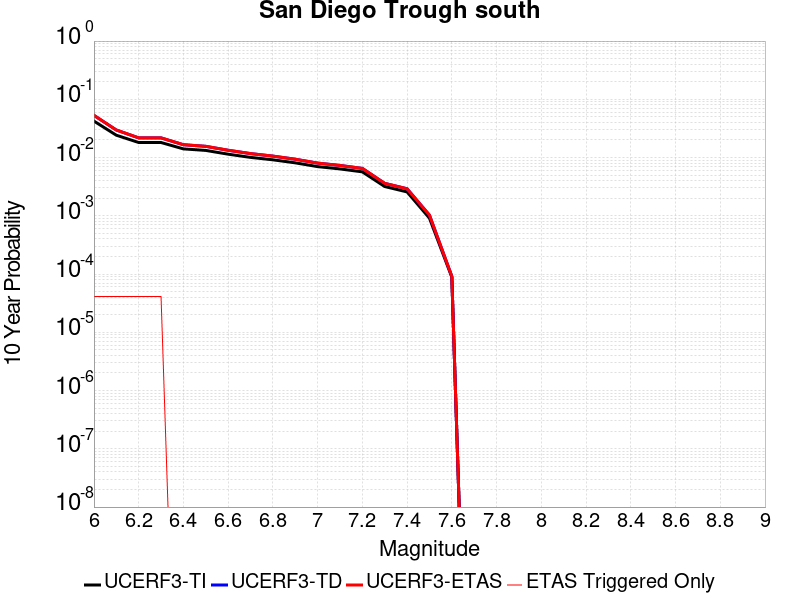 |

| Magnitude | 1 wk TI Prob | 1 wk TD Prob | 1 wk ETAS Prob | 1 wk ETAS/TD Gain | 1 wk ETAS Triggered Only | 1 mo TI Prob | 1 mo TD Prob | 1 mo ETAS Prob | 1 mo ETAS/TD Gain | 1 mo ETAS Triggered Only | 1 yr TI Prob | 1 yr TD Prob | 1 yr ETAS Prob | 1 yr ETAS/TD Gain | 1 yr ETAS Triggered Only | 10 yr TI Prob | 10 yr TD Prob | 10 yr ETAS Prob | 10 yr ETAS/TD Gain | 10 yr ETAS Triggered Only |
|-----|-----|-----|-----|-----|-----|-----|-----|-----|-----|-----|-----|-----|-----|-----|-----|-----|-----|-----|-----|-----|
| 6.0 | 8.279495E-5 | 1.0431663E-4 | 1.0431663E-4 | 1.0 | 0.0 | 3.5478722E-4 | 4.469939E-4 | 4.469939E-4 | 1.0 | 0.0 | 0.004310982 | 0.005429047 | 0.005429047 | 1.0 | 0.0 | 0.042283054 | 0.05302256 | 0.053061537 | 1.000735 | 4.1159037E-5 |
| 6.1 | 4.6961468E-5 | 5.775996E-5 | 5.775996E-5 | 1.0 | 0.0 | 2.0124791E-4 | 2.4752007E-4 | 2.4752007E-4 | 1.0 | 0.0 | 0.00244744 | 0.003009462 | 0.003009462 | 1.0 | 0.0 | 0.024206603 | 0.029694857 | 0.029734794 | 1.0013449 | 4.1159037E-5 |
| 6.2 | 3.5079658E-5 | 4.21622E-5 | 4.21622E-5 | 1.0 | 0.0 | 1.5033272E-4 | 1.8068278E-4 | 1.8068278E-4 | 1.0 | 0.0 | 0.0018287642 | 0.002197612 | 0.002197612 | 1.0 | 0.0 | 0.018137876 | 0.021761192 | 0.021801457 | 1.0018502 | 4.1159037E-5 |
| 6.3 | 3.5079658E-5 | 4.21622E-5 | 4.21622E-5 | 1.0 | 0.0 | 1.5033272E-4 | 1.8068278E-4 | 1.8068278E-4 | 1.0 | 0.0 | 0.0018287642 | 0.002197612 | 0.002197612 | 1.0 | 0.0 | 0.018137876 | 0.021761192 | 0.021801457 | 1.0018502 | 4.1159037E-5 |
| 6.4 | 2.7196904E-5 | 3.210059E-5 | 3.210059E-5 | 1.0 | 0.0 | 1.16552954E-4 | 1.3756669E-4 | 1.3756669E-4 | 1.0 | 0.0 | 0.0014181085 | 0.0016735992 | 0.0016735992 | 1.0 | 0.0 | 0.014090929 | 0.016611552 | 0.016611552 | 1.0 | 0.0 |
| 6.5 | 2.5584688E-5 | 3.0114008E-5 | 3.0114008E-5 | 1.0 | 0.0 | 1.0964406E-4 | 1.2905363E-4 | 1.2905363E-4 | 1.0 | 0.0 | 0.0013340989 | 0.0015701074 | 0.0015701074 | 1.0 | 0.0 | 0.013261181 | 0.015591683 | 0.015591683 | 1.0 | 0.0 |
| 6.6 | 2.2034688E-5 | 2.5752794E-5 | 2.5752794E-5 | 1.0 | 0.0 | 9.443096E-5 | 1.103645E-4 | 1.103645E-4 | 1.0 | 0.0 | 0.0011490905 | 0.0013428667 | 0.0013428667 | 1.0 | 0.0 | 0.011431668 | 0.013348515 | 0.013348515 | 1.0 | 0.0 |
| 6.7 | 1.9394853E-5 | 2.2550272E-5 | 2.2550272E-5 | 1.0 | 0.0 | 8.311815E-5 | 9.664048E-5 | 9.664048E-5 | 1.0 | 0.0 | 0.0010114936 | 0.001175968 | 0.001175968 | 1.0 | 0.0 | 0.01006902 | 0.011698156 | 0.011698156 | 1.0 | 0.0 |
| 6.8 | 1.7615313E-5 | 2.041069E-5 | 2.041069E-5 | 1.0 | 0.0 | 7.549201E-5 | 8.7471475E-5 | 8.7471475E-5 | 1.0 | 0.0 | 9.1872766E-4 | 0.0010644493 | 0.0010644493 | 1.0 | 0.0 | 0.009149387 | 0.010594075 | 0.010594075 | 1.0 | 0.0 |
| 6.9 | 1.5621423E-5 | 1.803256E-5 | 1.803256E-5 | 1.0 | 0.0 | 6.6947236E-5 | 7.728013E-5 | 7.728013E-5 | 1.0 | 0.0 | 8.147778E-4 | 9.40483E-4 | 9.40483E-4 | 1.0 | 0.0 | 0.008117969 | 0.009365474 | 0.009365474 | 1.0 | 0.0 |
| 7.0 | 1.3444376E-5 | 1.5453432E-5 | 1.5453432E-5 | 1.0 | 0.0 | 5.7617483E-5 | 6.622733E-5 | 6.622733E-5 | 1.0 | 0.0 | 7.0126704E-4 | 8.0602226E-4 | 8.0602226E-4 | 1.0 | 0.0 | 0.006990582 | 0.008031321 | 0.008031321 | 1.0 | 0.0 |
| 7.1 | 1.2268361E-5 | 1.4077835E-5 | 1.4077835E-5 | 1.0 | 0.0 | 5.2577634E-5 | 6.0332197E-5 | 6.0332197E-5 | 1.0 | 0.0 | 6.399447E-4 | 7.342996E-4 | 7.342996E-4 | 1.0 | 0.0 | 0.0063810493 | 0.007319038 | 0.007319038 | 1.0 | 0.0 |
| 7.2 | 1.0922655E-5 | 1.2517794E-5 | 1.2517794E-5 | 1.0 | 0.0 | 4.681054E-5 | 5.36466E-5 | 5.36466E-5 | 1.0 | 0.0 | 5.697693E-4 | 6.5295416E-4 | 6.5295416E-4 | 1.0 | 0.0 | 0.0056831064 | 0.0065106372 | 0.0065106372 | 1.0 | 0.0 |
| 7.3 | 6.1106753E-6 | 6.931081E-6 | 6.931081E-6 | 1.0 | 0.0 | 2.6188345E-5 | 2.9704295E-5 | 2.9704295E-5 | 1.0 | 0.0 | 3.1879646E-4 | 3.6159018E-4 | 3.6159018E-4 | 1.0 | 0.0 | 0.0031833951 | 0.0036100638 | 0.0036100638 | 1.0 | 0.0 |
| 7.4 | 4.933187E-6 | 5.591282E-6 | 5.591282E-6 | 1.0 | 0.0 | 2.114206E-5 | 2.3962419E-5 | 2.3962419E-5 | 1.0 | 0.0 | 2.5737417E-4 | 2.917038E-4 | 2.917038E-4 | 1.0 | 0.0 | 0.002570763 | 0.0029132501 | 0.0029132501 | 1.0 | 0.0 |
| 7.5 | 1.7489613E-6 | 1.9702602E-6 | 1.9702602E-6 | 1.0 | 0.0 | 7.495527E-6 | 8.443946E-6 | 8.443946E-6 | 1.0 | 0.0 | 9.125422E-5 | 1.0280042E-4 | 1.0280042E-4 | 1.0 | 0.0 | 9.1216754E-4 | 0.0010275507 | 0.0010275507 | 1.0 | 0.0 |
| 7.6 | 1.6988751E-7 | 1.7535123E-7 | 1.7535123E-7 | 1.0 | 0.0 | 7.2808916E-7 | 7.515051E-7 | 7.515051E-7 | 1.0 | 0.0 | 8.864449E-6 | 9.1495385E-6 | 9.1495385E-6 | 1.0 | 0.0 | 8.8640954E-5 | 9.149181E-5 | 9.149181E-5 | 1.0 | 0.0 |

## Hunting Creek - Berryessa 2011 CFM
*[(top)](#table-of-contents)*

| 1 Week | 1 Month | 1 Year | 10 Year |
|-----|-----|-----|-----|
| 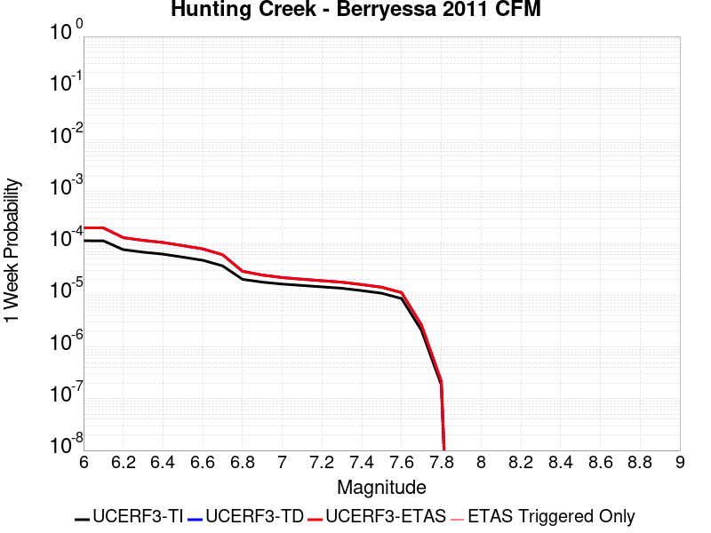 | 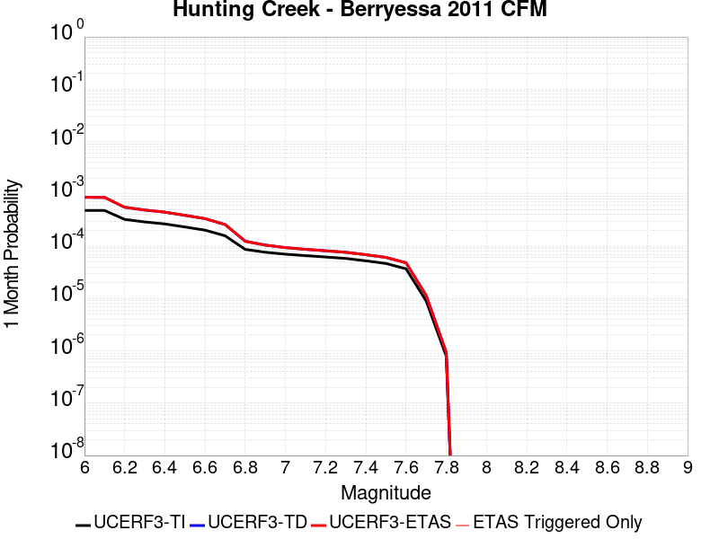 | 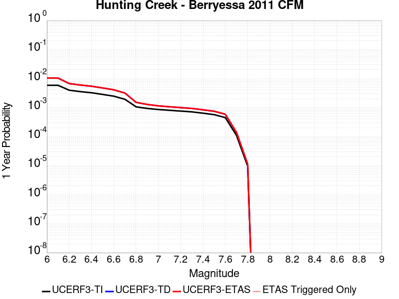 | 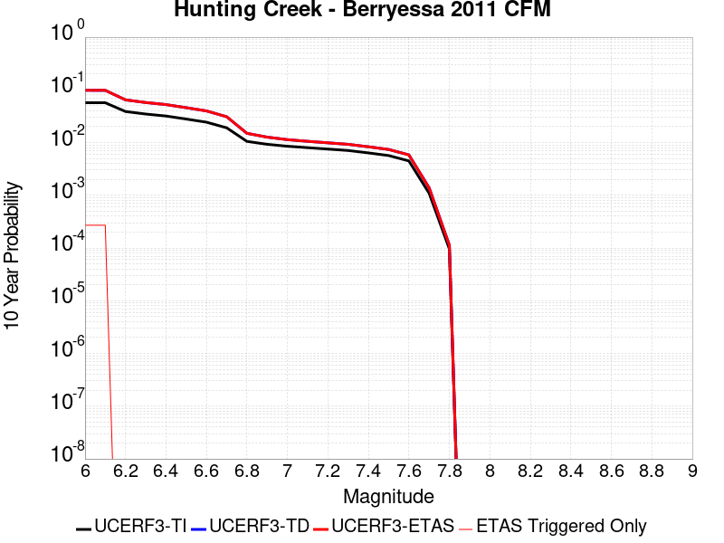 |

| Magnitude | 1 wk TI Prob | 1 wk TD Prob | 1 wk ETAS Prob | 1 wk ETAS/TD Gain | 1 wk ETAS Triggered Only | 1 mo TI Prob | 1 mo TD Prob | 1 mo ETAS Prob | 1 mo ETAS/TD Gain | 1 mo ETAS Triggered Only | 1 yr TI Prob | 1 yr TD Prob | 1 yr ETAS Prob | 1 yr ETAS/TD Gain | 1 yr ETAS Triggered Only | 10 yr TI Prob | 10 yr TD Prob | 10 yr ETAS Prob | 10 yr ETAS/TD Gain | 10 yr ETAS Triggered Only |
|-----|-----|-----|-----|-----|-----|-----|-----|-----|-----|-----|-----|-----|-----|-----|-----|-----|-----|-----|-----|-----|
| 6.0 | 1.1270982E-4 | 2.0046889E-4 | 2.0046889E-4 | 1.0 | 0.0 | 4.8295266E-4 | 8.587646E-4 | 8.587646E-4 | 1.0 | 0.0 | 0.0058641075 | 0.010395558 | 0.010395558 | 1.0 | 0.0 | 0.057117578 | 0.09811872 | 0.09815584 | 1.0003784 | 4.1159037E-5 |
| 6.1 | 1.1239393E-4 | 1.999498E-4 | 1.999498E-4 | 1.0 | 0.0 | 4.8159933E-4 | 8.5654156E-4 | 8.5654156E-4 | 1.0 | 0.0 | 0.0058477195 | 0.0103687765 | 0.0103687765 | 1.0 | 0.0 | 0.056962132 | 0.097876996 | 0.09791412 | 1.0003793 | 4.1159037E-5 |
| 6.2 | 7.596265E-5 | 1.2946293E-4 | 1.2946293E-4 | 1.0 | 0.0 | 3.2551357E-4 | 5.5470574E-4 | 5.5470574E-4 | 1.0 | 0.0 | 0.0039559277 | 0.0067280144 | 0.0067280144 | 1.0 | 0.0 | 0.038862433 | 0.06465001 | 0.06465001 | 1.0 | 0.0 |
| 6.3 | 6.78794E-5 | 1.1459746E-4 | 1.1459746E-4 | 1.0 | 0.0 | 2.9087928E-4 | 4.910299E-4 | 4.910299E-4 | 1.0 | 0.0 | 0.003535705 | 0.005958668 | 0.005958668 | 1.0 | 0.0 | 0.034799766 | 0.057518788 | 0.057518788 | 1.0 | 0.0 |
| 6.4 | 6.2165134E-5 | 1.0445682E-4 | 1.0445682E-4 | 1.0 | 0.0 | 2.6639478E-4 | 4.4758598E-4 | 4.4758598E-4 | 1.0 | 0.0 | 0.0032385332 | 0.0054330784 | 0.0054330784 | 1.0 | 0.0 | 0.03191742 | 0.052601237 | 0.052601237 | 1.0 | 0.0 |
| 6.5 | 5.4368087E-5 | 9.080262E-5 | 9.080262E-5 | 1.0 | 0.0 | 2.3298527E-4 | 3.8908646E-4 | 3.8908646E-4 | 1.0 | 0.0 | 0.0028329059 | 0.004724869 | 0.004724869 | 1.0 | 0.0 | 0.027970633 | 0.045926675 | 0.045926675 | 1.0 | 0.0 |
| 6.6 | 4.729947E-5 | 7.8552395E-5 | 7.8552395E-5 | 1.0 | 0.0 | 2.0269625E-4 | 3.3659991E-4 | 3.3659991E-4 | 1.0 | 0.0 | 0.002465034 | 0.0040889867 | 0.0040889867 | 1.0 | 0.0 | 0.02437869 | 0.039890103 | 0.039890103 | 1.0 | 0.0 |
| 6.7 | 3.6875328E-5 | 6.0510494E-5 | 6.0510494E-5 | 1.0 | 0.0 | 1.5802756E-4 | 2.593074E-4 | 2.593074E-4 | 1.0 | 0.0 | 0.0019222875 | 0.0031518096 | 0.0031518096 | 1.0 | 0.0 | 0.019057442 | 0.030925045 | 0.030925045 | 1.0 | 0.0 |
| 6.8 | 2.0292036E-5 | 2.8993138E-5 | 2.8993138E-5 | 1.0 | 0.0 | 8.6962966E-5 | 1.2425036E-4 | 1.2425036E-4 | 1.0 | 0.0 | 0.0010582599 | 0.0015116856 | 0.0015116856 | 1.0 | 0.0 | 0.010532344 | 0.014987091 | 0.014987091 | 1.0 | 0.0 |
| 6.9 | 1.7871042E-5 | 2.448719E-5 | 2.448719E-5 | 1.0 | 0.0 | 7.658793E-5 | 1.0494089E-4 | 1.0494089E-4 | 1.0 | 0.0 | 9.320591E-4 | 0.001276906 | 0.001276906 | 1.0 | 0.0 | 0.009281595 | 0.012687645 | 0.012687645 | 1.0 | 0.0 |
| 7.0 | 1.6415532E-5 | 2.1920323E-5 | 2.1920323E-5 | 1.0 | 0.0 | 7.035038E-5 | 9.3940864E-5 | 9.3940864E-5 | 1.0 | 0.0 | 8.561793E-4 | 0.001143131 | 0.001143131 | 1.0 | 0.0 | 0.008528882 | 0.011371805 | 0.011371805 | 1.0 | 0.0 |
| 7.1 | 1.5409885E-5 | 2.0359845E-5 | 2.0359845E-5 | 1.0 | 0.0 | 6.6040695E-5 | 8.7253575E-5 | 8.7253575E-5 | 1.0 | 0.0 | 8.0374884E-4 | 0.0010617973 | 0.0010617973 | 1.0 | 0.0 | 0.00800848 | 0.010567706 | 0.010567706 | 1.0 | 0.0 |
| 7.2 | 1.4497423E-5 | 1.9067871E-5 | 1.9067871E-5 | 1.0 | 0.0 | 6.213033E-5 | 8.1716906E-5 | 8.1716906E-5 | 1.0 | 0.0 | 7.5617427E-4 | 9.944523E-4 | 9.944523E-4 | 1.0 | 0.0 | 0.0075360634 | 0.009900762 | 0.009900762 | 1.0 | 0.0 |
| 7.3 | 1.3615175E-5 | 1.7838613E-5 | 1.7838613E-5 | 1.0 | 0.0 | 5.8349444E-5 | 7.6448974E-5 | 7.6448974E-5 | 1.0 | 0.0 | 7.101729E-4 | 9.3037175E-4 | 9.3037175E-4 | 1.0 | 0.0 | 0.0070790765 | 0.009265545 | 0.009265545 | 1.0 | 0.0 |
| 7.4 | 1.2252825E-5 | 1.6037822E-5 | 1.6037822E-5 | 1.0 | 0.0 | 5.251105E-5 | 6.873173E-5 | 6.873173E-5 | 1.0 | 0.0 | 6.391345E-4 | 8.3649036E-4 | 8.3649036E-4 | 1.0 | 0.0 | 0.0063729943 | 0.008334056 | 0.008334056 | 1.0 | 0.0 |
| 7.5 | 1.0913301E-5 | 1.4251292E-5 | 1.4251292E-5 | 1.0 | 0.0 | 4.6770452E-5 | 6.107555E-5 | 6.107555E-5 | 1.0 | 0.0 | 5.6928146E-4 | 7.433439E-4 | 7.433439E-4 | 1.0 | 0.0 | 0.0056782532 | 0.0074091647 | 0.0074091647 | 1.0 | 0.0 |
| 7.6 | 8.623192E-6 | 1.1243386E-5 | 1.1243386E-5 | 1.0 | 0.0 | 3.6956015E-5 | 4.8185066E-5 | 4.8185066E-5 | 1.0 | 0.0 | 4.4984656E-4 | 5.8649783E-4 | 5.8649783E-4 | 1.0 | 0.0 | 0.00448937 | 0.005850074 | 0.005850074 | 1.0 | 0.0 |
| 7.7 | 2.0993634E-6 | 2.664365E-6 | 2.664365E-6 | 1.0 | 0.0 | 8.997241E-6 | 1.1418658E-5 | 1.1418658E-5 | 1.0 | 0.0 | 1.09535904E-4 | 1.3901335E-4 | 1.3901335E-4 | 1.0 | 0.0 | 0.0010948193 | 0.0013892625 | 0.0013892625 | 1.0 | 0.0 |
| 7.8 | 1.8428308E-7 | 2.173257E-7 | 2.173257E-7 | 1.0 | 0.0 | 7.897844E-7 | 9.3139556E-7 | 9.3139556E-7 | 1.0 | 0.0 | 9.615583E-6 | 1.1339685E-5 | 1.1339685E-5 | 1.0 | 0.0 | 9.615166E-5 | 1.13384194E-4 | 1.13384194E-4 | 1.0 | 0.0 |

## San Jacinto (San Jacinto Valley) rev
*[(top)](#table-of-contents)*

| 1 Week | 1 Month | 1 Year | 10 Year |
|-----|-----|-----|-----|
| 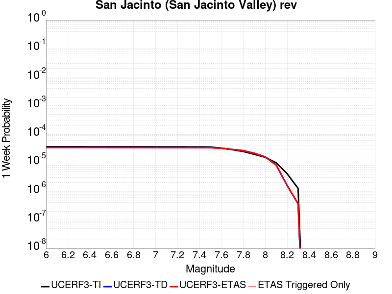 | 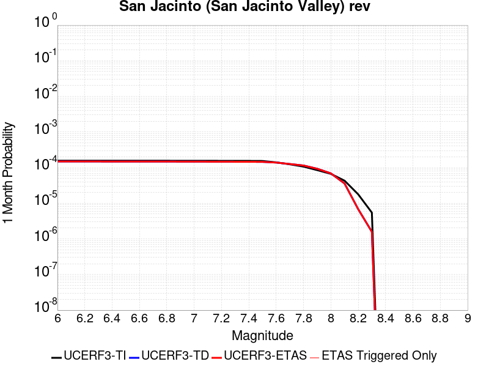 | 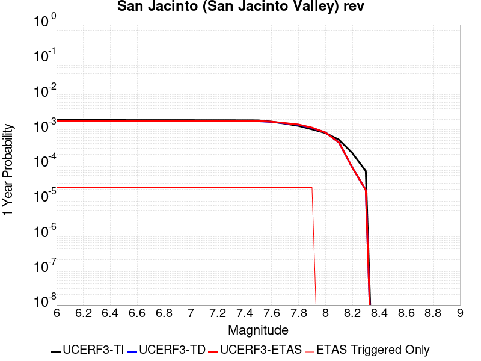 | 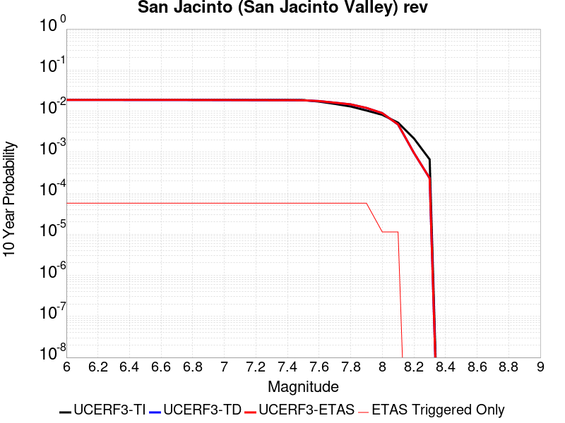 |

| Magnitude | 1 wk TI Prob | 1 wk TD Prob | 1 wk ETAS Prob | 1 wk ETAS/TD Gain | 1 wk ETAS Triggered Only | 1 mo TI Prob | 1 mo TD Prob | 1 mo ETAS Prob | 1 mo ETAS/TD Gain | 1 mo ETAS Triggered Only | 1 yr TI Prob | 1 yr TD Prob | 1 yr ETAS Prob | 1 yr ETAS/TD Gain | 1 yr ETAS Triggered Only | 10 yr TI Prob | 10 yr TD Prob | 10 yr ETAS Prob | 10 yr ETAS/TD Gain | 10 yr ETAS Triggered Only |
|-----|-----|-----|-----|-----|-----|-----|-----|-----|-----|-----|-----|-----|-----|-----|-----|-----|-----|-----|-----|-----|
| 6.0 | 3.652694E-5 | 3.466426E-5 | 3.466426E-5 | 1.0 | 0.0 | 1.5653463E-4 | 1.4855266E-4 | 1.4855266E-4 | 1.0 | 0.0 | 0.0019041431 | 0.0018071302 | 0.0018482148 | 1.0227348 | 4.1159037E-5 | 0.018879099 | 0.018662075 | 0.018702466 | 1.0021644 | 4.1159037E-5 |
| 6.1 | 3.652694E-5 | 3.466426E-5 | 3.466426E-5 | 1.0 | 0.0 | 1.5653463E-4 | 1.4855266E-4 | 1.4855266E-4 | 1.0 | 0.0 | 0.0019041431 | 0.0018071302 | 0.0018482148 | 1.0227348 | 4.1159037E-5 | 0.018879099 | 0.018662075 | 0.018702466 | 1.0021644 | 4.1159037E-5 |
| 6.2 | 3.652694E-5 | 3.466426E-5 | 3.466426E-5 | 1.0 | 0.0 | 1.5653463E-4 | 1.4855266E-4 | 1.4855266E-4 | 1.0 | 0.0 | 0.0019041431 | 0.0018071302 | 0.0018482148 | 1.0227348 | 4.1159037E-5 | 0.018879099 | 0.018662075 | 0.018702466 | 1.0021644 | 4.1159037E-5 |
| 6.3 | 3.652694E-5 | 3.466426E-5 | 3.466426E-5 | 1.0 | 0.0 | 1.5653463E-4 | 1.4855266E-4 | 1.4855266E-4 | 1.0 | 0.0 | 0.0019041431 | 0.0018071302 | 0.0018482148 | 1.0227348 | 4.1159037E-5 | 0.018879099 | 0.018662075 | 0.018702466 | 1.0021644 | 4.1159037E-5 |
| 6.4 | 3.646941E-5 | 3.4585773E-5 | 3.4585773E-5 | 1.0 | 0.0 | 1.5628811E-4 | 1.4821634E-4 | 1.4821634E-4 | 1.0 | 0.0 | 0.0019011468 | 0.0018030425 | 0.0018441273 | 1.0227864 | 4.1159037E-5 | 0.018849645 | 0.01862193 | 0.018662322 | 1.0021691 | 4.1159037E-5 |
| 6.5 | 3.646941E-5 | 3.4585773E-5 | 3.4585773E-5 | 1.0 | 0.0 | 1.5628811E-4 | 1.4821634E-4 | 1.4821634E-4 | 1.0 | 0.0 | 0.0019011468 | 0.0018030425 | 0.0018441273 | 1.0227864 | 4.1159037E-5 | 0.018849645 | 0.01862193 | 0.018662322 | 1.0021691 | 4.1159037E-5 |
| 6.6 | 3.6442503E-5 | 3.454913E-5 | 3.454913E-5 | 1.0 | 0.0 | 1.561728E-4 | 1.4805932E-4 | 1.4805932E-4 | 1.0 | 0.0 | 0.0018997455 | 0.0018011342 | 0.001842219 | 1.0228106 | 4.1159037E-5 | 0.018835869 | 0.018603187 | 0.01864358 | 1.0021713 | 4.1159037E-5 |
| 6.7 | 3.6432113E-5 | 3.4534696E-5 | 3.4534696E-5 | 1.0 | 0.0 | 1.5612828E-4 | 1.4799745E-4 | 1.4799745E-4 | 1.0 | 0.0 | 0.0018992044 | 0.0018003823 | 0.0018414672 | 1.0228201 | 4.1159037E-5 | 0.018830549 | 0.018595805 | 0.0186362 | 1.0021722 | 4.1159037E-5 |
| 6.8 | 3.6409598E-5 | 3.4503722E-5 | 3.4503722E-5 | 1.0 | 0.0 | 1.560318E-4 | 1.4786473E-4 | 1.4786473E-4 | 1.0 | 0.0 | 0.0018980318 | 0.0017987692 | 0.0018398542 | 1.0228406 | 4.1159037E-5 | 0.018819023 | 0.018579949 | 0.018620344 | 1.0021741 | 4.1159037E-5 |
| 6.9 | 3.638078E-5 | 3.4464112E-5 | 3.4464112E-5 | 1.0 | 0.0 | 1.5590832E-4 | 1.47695E-4 | 1.47695E-4 | 1.0 | 0.0 | 0.0018965311 | 0.001796706 | 0.0018377912 | 1.0228668 | 4.1159037E-5 | 0.018804269 | 0.018559668 | 0.018600063 | 1.0021765 | 4.1159037E-5 |
| 7.0 | 3.6294874E-5 | 3.434603E-5 | 3.434603E-5 | 1.0 | 0.0 | 1.5554018E-4 | 1.4718898E-4 | 1.4718898E-4 | 1.0 | 0.0 | 0.0018920569 | 0.0017905557 | 0.001831641 | 1.0229455 | 4.1159037E-5 | 0.018760284 | 0.018499207 | 0.018539606 | 1.0021838 | 4.1159037E-5 |
| 7.1 | 3.6260717E-5 | 3.4302288E-5 | 3.4302288E-5 | 1.0 | 0.0 | 1.5539382E-4 | 1.4700153E-4 | 1.4700153E-4 | 1.0 | 0.0 | 0.001890278 | 0.0017882772 | 0.0018293626 | 1.0229748 | 4.1159037E-5 | 0.018742796 | 0.0184768 | 0.018517198 | 1.0021864 | 4.1159037E-5 |
| 7.2 | 3.6210204E-5 | 3.423638E-5 | 3.423638E-5 | 1.0 | 0.0 | 1.5517735E-4 | 1.467191E-4 | 1.467191E-4 | 1.0 | 0.0 | 0.001887647 | 0.0017848442 | 0.0018259297 | 1.0230192 | 4.1159037E-5 | 0.01871693 | 0.018443028 | 0.018483426 | 1.0021905 | 4.1159037E-5 |
| 7.3 | 3.6119454E-5 | 3.4124372E-5 | 3.4124372E-5 | 1.0 | 0.0 | 1.5478847E-4 | 1.4623914E-4 | 1.4623914E-4 | 1.0 | 0.0 | 0.0018829206 | 0.00177901 | 0.0018200959 | 1.0230948 | 4.1159037E-5 | 0.018670462 | 0.01838543 | 0.018425833 | 1.0021975 | 4.1159037E-5 |
| 7.4 | 3.607848E-5 | 3.4071756E-5 | 3.4071756E-5 | 1.0 | 0.0 | 1.5461289E-4 | 1.4601364E-4 | 1.4601364E-4 | 1.0 | 0.0 | 0.0018807866 | 0.0017762693 | 0.0018173553 | 1.0231304 | 4.1159037E-5 | 0.018649481 | 0.018358368 | 0.018398773 | 1.0022008 | 4.1159037E-5 |
| 7.5 | 3.5856774E-5 | 3.3880297E-5 | 3.3880297E-5 | 1.0 | 0.0 | 1.5366284E-4 | 1.451932E-4 | 1.451932E-4 | 1.0 | 0.0 | 0.0018692396 | 0.0017662967 | 0.001807383 | 1.0232613 | 4.1159037E-5 | 0.018535944 | 0.018258838 | 0.018299246 | 1.002213 | 4.1159037E-5 |
| 7.6 | 3.286655E-5 | 3.2392913E-5 | 3.2392913E-5 | 1.0 | 0.0 | 1.4084904E-4 | 1.3881939E-4 | 1.3881939E-4 | 1.0 | 0.0 | 0.001713488 | 0.0016888179 | 0.0017299075 | 1.0243304 | 4.1159037E-5 | 0.017003361 | 0.017473182 | 0.017513622 | 1.0023144 | 4.1159037E-5 |
| 7.7 | 2.8882527E-5 | 2.9480356E-5 | 2.9480356E-5 | 1.0 | 0.0 | 1.237764E-4 | 1.2633827E-4 | 1.2633827E-4 | 1.0 | 0.0 | 0.0015059357 | 0.0015370842 | 0.00157818 | 1.0267361 | 4.1159037E-5 | 0.014957713 | 0.015956964 | 0.015997468 | 1.0025382 | 4.1159037E-5 |
| 7.8 | 2.4950225E-5 | 2.6761902E-5 | 2.6761902E-5 | 1.0 | 0.0 | 1.0692515E-4 | 1.1468883E-4 | 1.1468883E-4 | 1.0 | 0.0 | 0.0013010362 | 0.001395443 | 0.0014365446 | 1.0294541 | 4.1159037E-5 | 0.012934455 | 0.014533543 | 0.014574104 | 1.0027908 | 4.1159037E-5 |
| 7.9 | 1.9881603E-5 | 2.1718288E-5 | 2.1718288E-5 | 1.0 | 0.0 | 8.520408E-5 | 9.3075054E-5 | 9.3075054E-5 | 1.0 | 0.0 | 0.001036866 | 0.0011326005 | 0.0011737129 | 1.0362991 | 4.1159037E-5 | 0.010320415 | 0.011886757 | 0.011927427 | 1.0034214 | 4.1159037E-5 |
| 8.0 | 1.563292E-5 | 1.6107258E-5 | 1.6107258E-5 | 1.0 | 0.0 | 6.6996516E-5 | 6.902929E-5 | 6.902929E-5 | 1.0 | 0.0 | 8.153773E-4 | 8.401082E-4 | 8.401082E-4 | 1.0 | 0.0 | 0.00812392 | 0.008899998 | 0.008899998 | 1.0 | 0.0 |
| 8.1 | 1.0045313E-5 | 8.400946E-6 | 8.400946E-6 | 1.0 | 0.0 | 4.305063E-5 | 3.600356E-5 | 3.600356E-5 | 1.0 | 0.0 | 5.2401534E-4 | 4.382557E-4 | 4.382557E-4 | 1.0 | 0.0 | 0.0052278144 | 0.0047124038 | 0.0047124038 | 1.0 | 0.0 |
| 8.2 | 4.1554413E-6 | 1.5938106E-6 | 1.5938106E-6 | 1.0 | 0.0 | 1.7808914E-5 | 6.830599E-6 | 6.830599E-6 | 1.0 | 0.0 | 2.1680194E-4 | 8.315939E-5 | 8.315939E-5 | 1.0 | 0.0 | 0.0021659054 | 9.644863E-4 | 9.644863E-4 | 1.0 | 0.0 |
| 8.3 | 1.2758221E-6 | 3.6914315E-7 | 3.6914315E-7 | 1.0 | 0.0 | 5.4677976E-6 | 1.5820413E-6 | 1.5820413E-6 | 1.0 | 0.0 | 6.65684E-5 | 1.9261186E-5 | 1.9261186E-5 | 1.0 | 0.0 | 6.6548464E-4 | 2.3201035E-4 | 2.3201035E-4 | 1.0 | 0.0 |

## Coronado Bank alt1
*[(top)](#table-of-contents)*

| 1 Week | 1 Month | 1 Year | 10 Year |
|-----|-----|-----|-----|
| 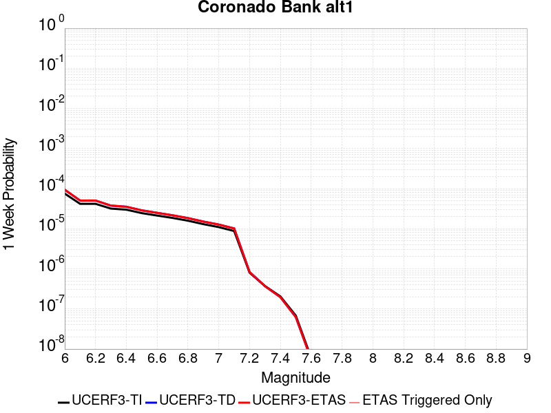 | 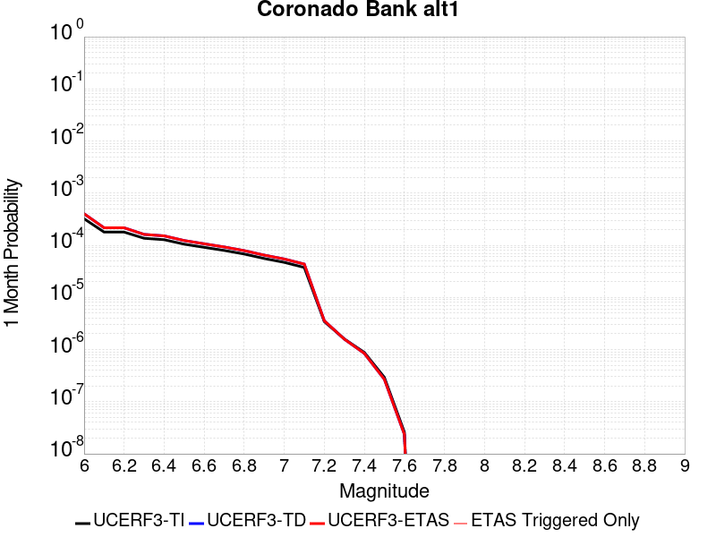 | 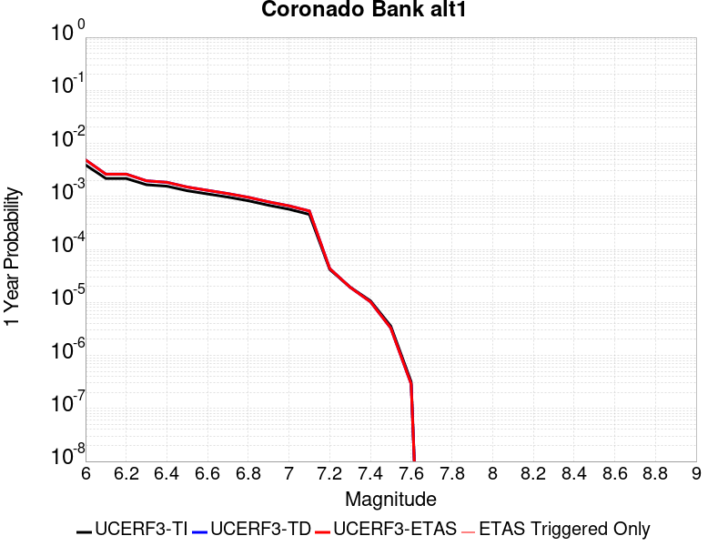 | 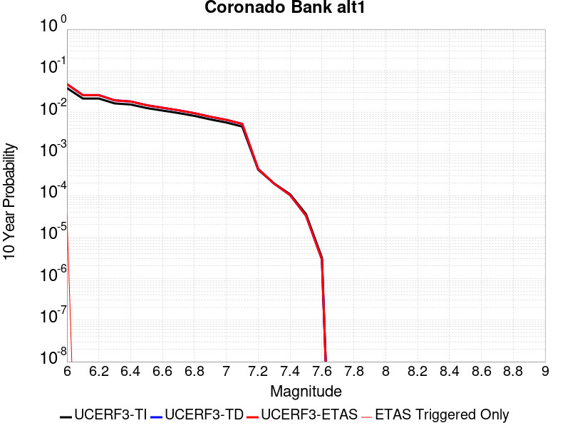 |

| Magnitude | 1 wk TI Prob | 1 wk TD Prob | 1 wk ETAS Prob | 1 wk ETAS/TD Gain | 1 wk ETAS Triggered Only | 1 mo TI Prob | 1 mo TD Prob | 1 mo ETAS Prob | 1 mo ETAS/TD Gain | 1 mo ETAS Triggered Only | 1 yr TI Prob | 1 yr TD Prob | 1 yr ETAS Prob | 1 yr ETAS/TD Gain | 1 yr ETAS Triggered Only | 10 yr TI Prob | 10 yr TD Prob | 10 yr ETAS Prob | 10 yr ETAS/TD Gain | 10 yr ETAS Triggered Only |
|-----|-----|-----|-----|-----|-----|-----|-----|-----|-----|-----|-----|-----|-----|-----|-----|-----|-----|-----|-----|-----|
| 6.0 | 7.533492E-5 | 9.400464E-5 | 9.400464E-5 | 1.0 | 0.0 | 3.22824E-4 | 4.028158E-4 | 4.028158E-4 | 1.0 | 0.0 | 0.0039233007 | 0.0048938803 | 0.0048938803 | 1.0 | 0.0 | 0.03854755 | 0.047930297 | 0.047969483 | 1.0008175 | 4.1159037E-5 |
| 6.1 | 4.1807285E-5 | 5.051753E-5 | 5.051753E-5 | 1.0 | 0.0 | 1.7916178E-4 | 2.1648566E-4 | 2.1648566E-4 | 1.0 | 0.0 | 0.0021791123 | 0.0026326058 | 0.0026326058 | 1.0 | 0.0 | 0.021578677 | 0.026023488 | 0.026023488 | 1.0 | 0.0 |
| 6.2 | 4.1807285E-5 | 5.051753E-5 | 5.051753E-5 | 1.0 | 0.0 | 1.7916178E-4 | 2.1648566E-4 | 2.1648566E-4 | 1.0 | 0.0 | 0.0021791123 | 0.0026326058 | 0.0026326058 | 1.0 | 0.0 | 0.021578677 | 0.026023488 | 0.026023488 | 1.0 | 0.0 |
| 6.3 | 3.1793104E-5 | 3.7727525E-5 | 3.7727525E-5 | 1.0 | 0.0 | 1.3624904E-4 | 1.6167952E-4 | 1.6167952E-4 | 1.0 | 0.0 | 0.0016575698 | 0.0019667028 | 0.0019667028 | 1.0 | 0.0 | 0.016452603 | 0.019496875 | 0.019496875 | 1.0 | 0.0 |
| 6.4 | 2.9878007E-5 | 3.535088E-5 | 3.535088E-5 | 1.0 | 0.0 | 1.2804232E-4 | 1.5149517E-4 | 1.5149517E-4 | 1.0 | 0.0 | 0.0015578003 | 0.0018429251 | 0.0018429251 | 1.0 | 0.0 | 0.015469253 | 0.018280186 | 0.018280186 | 1.0 | 0.0 |
| 6.5 | 2.4512565E-5 | 2.877578E-5 | 2.877578E-5 | 1.0 | 0.0 | 1.0504962E-4 | 1.2331909E-4 | 1.2331909E-4 | 1.0 | 0.0 | 0.0012782287 | 0.0015004026 | 0.0015004026 | 1.0 | 0.0 | 0.012709012 | 0.014905694 | 0.014905694 | 1.0 | 0.0 |
| 6.6 | 2.1317413E-5 | 2.4916495E-5 | 2.4916495E-5 | 1.0 | 0.0 | 9.135714E-5 | 1.0678073E-4 | 1.0678073E-4 | 1.0 | 0.0 | 0.0011117056 | 0.0012993023 | 0.0012993023 | 1.0 | 0.0 | 0.011061605 | 0.012919469 | 0.012919469 | 1.0 | 0.0 |
| 6.7 | 1.8585655E-5 | 2.1643207E-5 | 2.1643207E-5 | 1.0 | 0.0 | 7.9650374E-5 | 9.275342E-5 | 9.275342E-5 | 1.0 | 0.0 | 9.6931186E-4 | 0.0011287084 | 0.0011287084 | 1.0 | 0.0 | 0.0096509475 | 0.01123192 | 0.01123192 | 1.0 | 0.0 |
| 6.8 | 1.5862879E-5 | 1.842645E-5 | 1.842645E-5 | 1.0 | 0.0 | 6.798199E-5 | 7.8968216E-5 | 7.8968216E-5 | 1.0 | 0.0 | 8.273665E-4 | 9.610332E-4 | 9.610332E-4 | 1.0 | 0.0 | 0.008242928 | 0.009570756 | 0.009570756 | 1.0 | 0.0 |
| 6.9 | 1.3021509E-5 | 1.5100927E-5 | 1.5100927E-5 | 1.0 | 0.0 | 5.5805274E-5 | 6.4716754E-5 | 6.4716754E-5 | 1.0 | 0.0 | 6.792174E-4 | 7.876598E-4 | 7.876598E-4 | 1.0 | 0.0 | 0.006771452 | 0.007850505 | 0.007850505 | 1.0 | 0.0 |
| 7.0 | 1.0974371E-5 | 1.2724883E-5 | 1.2724883E-5 | 1.0 | 0.0 | 4.7032172E-5 | 5.453417E-5 | 5.453417E-5 | 1.0 | 0.0 | 5.7246623E-4 | 6.6376885E-4 | 6.6376885E-4 | 1.0 | 0.0 | 0.0057099373 | 0.006619613 | 0.006619613 | 1.0 | 0.0 |
| 7.1 | 8.766221E-6 | 1.0167675E-5 | 1.0167675E-5 | 1.0 | 0.0 | 3.7568978E-5 | 4.357512E-5 | 4.357512E-5 | 1.0 | 0.0 | 4.573063E-4 | 5.3041516E-4 | 5.3041516E-4 | 1.0 | 0.0 | 0.0045636636 | 0.005293193 | 0.005293193 | 1.0 | 0.0 |
| 7.2 | 8.026024E-7 | 8.3330735E-7 | 8.3330735E-7 | 1.0 | 0.0 | 3.43972E-6 | 3.5713124E-6 | 3.5713124E-6 | 1.0 | 0.0 | 4.1877785E-5 | 4.347987E-5 | 4.347987E-5 | 1.0 | 0.0 | 4.1869894E-4 | 4.3471475E-4 | 4.3471475E-4 | 1.0 | 0.0 |
| 7.3 | 3.7293114E-7 | 3.7005543E-7 | 3.7005543E-7 | 1.0 | 0.0 | 1.5982754E-6 | 1.5859509E-6 | 1.5859509E-6 | 1.0 | 0.0 | 1.9458828E-5 | 1.9308782E-5 | 1.9308782E-5 | 1.0 | 0.0 | 1.9457124E-4 | 1.9307112E-4 | 1.9307112E-4 | 1.0 | 0.0 |
| 7.4 | 2.0557036E-7 | 1.9676591E-7 | 1.9676591E-7 | 1.0 | 0.0 | 8.810155E-7 | 8.432822E-7 | 8.432822E-7 | 1.0 | 0.0 | 1.0726311E-5 | 1.0266913E-5 | 1.0266913E-5 | 1.0 | 0.0 | 1.0725793E-4 | 1.0266442E-4 | 1.0266442E-4 | 1.0 | 0.0 |
| 7.5 | 6.845446E-8 | 6.280129E-8 | 6.280129E-8 | 1.0 | 0.0 | 2.9337625E-7 | 2.6914836E-7 | 2.6914836E-7 | 1.0 | 0.0 | 3.5718497E-6 | 3.2768767E-6 | 3.2768767E-6 | 1.0 | 0.0 | 3.5717923E-5 | 3.276829E-5 | 3.276829E-5 | 1.0 | 0.0 |
| 7.6 | 6.0975145E-9 | 5.5321028E-9 | 5.5321028E-9 | 1.0 | 0.0 | 2.6132206E-8 | 2.3709012E-8 | 2.3709012E-8 | 1.0 | 0.0 | 3.1815955E-7 | 2.886572E-7 | 2.886572E-7 | 1.0 | 0.0 | 3.181591E-6 | 2.8865693E-6 | 2.8865693E-6 | 1.0 | 0.0 |

## San Gabriel (Extension)
*[(top)](#table-of-contents)*

| 1 Week | 1 Month | 1 Year | 10 Year |
|-----|-----|-----|-----|
| 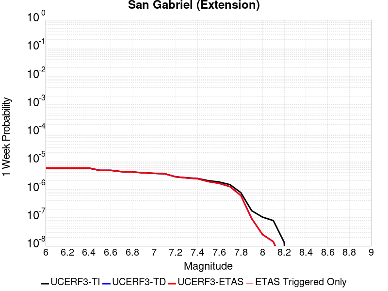 | 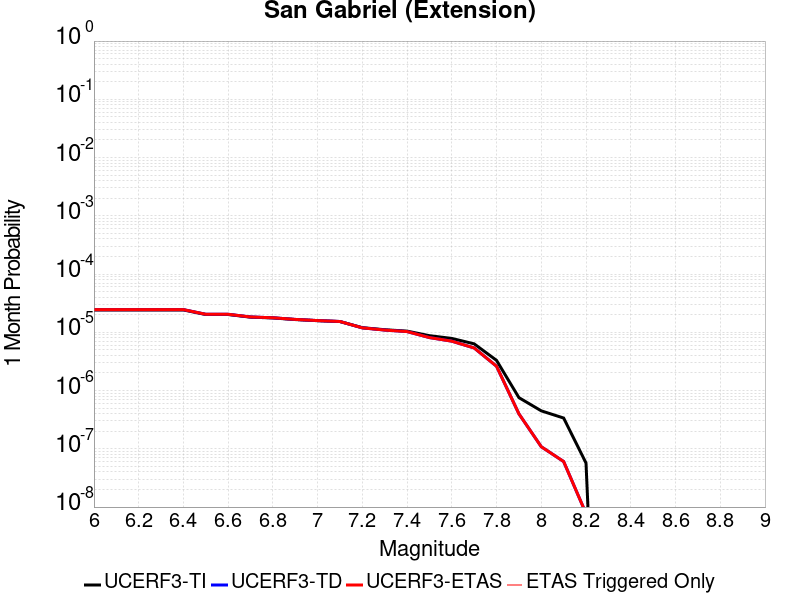 | 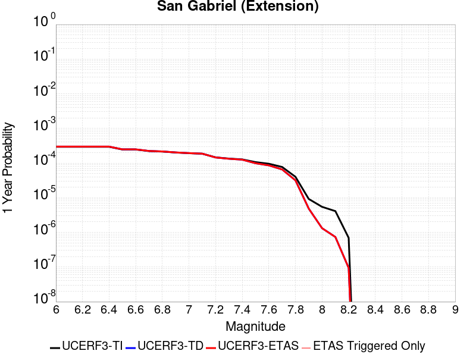 | 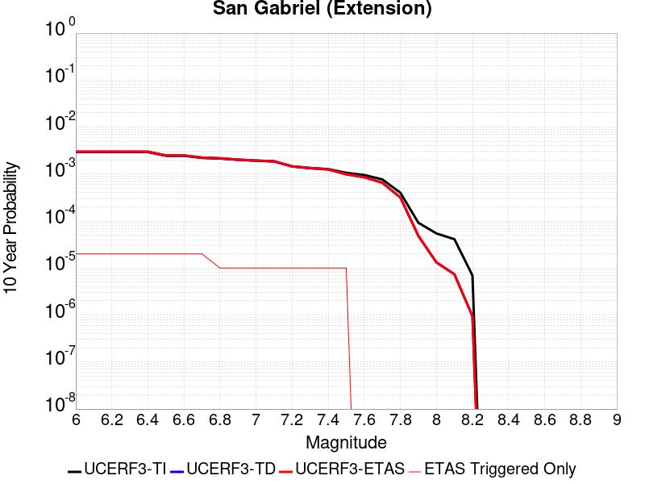 |

| Magnitude | 1 wk TI Prob | 1 wk TD Prob | 1 wk ETAS Prob | 1 wk ETAS/TD Gain | 1 wk ETAS Triggered Only | 1 mo TI Prob | 1 mo TD Prob | 1 mo ETAS Prob | 1 mo ETAS/TD Gain | 1 mo ETAS Triggered Only | 1 yr TI Prob | 1 yr TD Prob | 1 yr ETAS Prob | 1 yr ETAS/TD Gain | 1 yr ETAS Triggered Only | 10 yr TI Prob | 10 yr TD Prob | 10 yr ETAS Prob | 10 yr ETAS/TD Gain | 10 yr ETAS Triggered Only |
|-----|-----|-----|-----|-----|-----|-----|-----|-----|-----|-----|-----|-----|-----|-----|-----|-----|-----|-----|-----|-----|
| 6.0 | 5.6486106E-6 | 5.7223997E-6 | 5.7223997E-6 | 1.0 | 0.0 | 2.4208108E-5 | 2.4524346E-5 | 2.4524346E-5 | 1.0 | 0.0 | 2.9469383E-4 | 2.9854427E-4 | 2.9854427E-4 | 1.0 | 0.0 | 0.0029430336 | 0.0029815638 | 0.0030226 | 1.0137633 | 4.1159037E-5 |
| 6.1 | 5.6486106E-6 | 5.7223997E-6 | 5.7223997E-6 | 1.0 | 0.0 | 2.4208108E-5 | 2.4524346E-5 | 2.4524346E-5 | 1.0 | 0.0 | 2.9469383E-4 | 2.9854427E-4 | 2.9854427E-4 | 1.0 | 0.0 | 0.0029430336 | 0.0029815638 | 0.0030226 | 1.0137633 | 4.1159037E-5 |
| 6.2 | 5.6486106E-6 | 5.7223997E-6 | 5.7223997E-6 | 1.0 | 0.0 | 2.4208108E-5 | 2.4524346E-5 | 2.4524346E-5 | 1.0 | 0.0 | 2.9469383E-4 | 2.9854427E-4 | 2.9854427E-4 | 1.0 | 0.0 | 0.0029430336 | 0.0029815638 | 0.0030226 | 1.0137633 | 4.1159037E-5 |
| 6.3 | 5.6486106E-6 | 5.7223997E-6 | 5.7223997E-6 | 1.0 | 0.0 | 2.4208108E-5 | 2.4524346E-5 | 2.4524346E-5 | 1.0 | 0.0 | 2.9469383E-4 | 2.9854427E-4 | 2.9854427E-4 | 1.0 | 0.0 | 0.0029430336 | 0.0029815638 | 0.0030226 | 1.0137633 | 4.1159037E-5 |
| 6.4 | 5.6486106E-6 | 5.7223997E-6 | 5.7223997E-6 | 1.0 | 0.0 | 2.4208108E-5 | 2.4524346E-5 | 2.4524346E-5 | 1.0 | 0.0 | 2.9469383E-4 | 2.9854427E-4 | 2.9854427E-4 | 1.0 | 0.0 | 0.0029430336 | 0.0029815638 | 0.0030226 | 1.0137633 | 4.1159037E-5 |
| 6.5 | 4.7134554E-6 | 4.759758E-6 | 4.759758E-6 | 1.0 | 0.0 | 2.0200367E-5 | 2.039881E-5 | 2.039881E-5 | 1.0 | 0.0 | 2.459117E-4 | 2.4832806E-4 | 2.4832806E-4 | 1.0 | 0.0 | 0.0024563975 | 0.0024805951 | 0.002521652 | 1.0165513 | 4.1159037E-5 |
| 6.6 | 4.7134554E-6 | 4.759758E-6 | 4.759758E-6 | 1.0 | 0.0 | 2.0200367E-5 | 2.039881E-5 | 2.039881E-5 | 1.0 | 0.0 | 2.459117E-4 | 2.4832806E-4 | 2.4832806E-4 | 1.0 | 0.0 | 0.0024563975 | 0.0024805951 | 0.002521652 | 1.0165513 | 4.1159037E-5 |
| 6.7 | 4.2468837E-6 | 4.279543E-6 | 4.279543E-6 | 1.0 | 0.0 | 1.8200803E-5 | 1.8340776E-5 | 1.8340776E-5 | 1.0 | 0.0 | 2.2157225E-4 | 2.2327679E-4 | 2.2327679E-4 | 1.0 | 0.0 | 0.0022135144 | 0.0022306016 | 0.0022716688 | 1.0184108 | 4.1159037E-5 |
| 6.8 | 4.1180615E-6 | 4.146924E-6 | 4.146924E-6 | 1.0 | 0.0 | 1.7648716E-5 | 1.7772414E-5 | 1.7772414E-5 | 1.0 | 0.0 | 2.1485193E-4 | 2.1635837E-4 | 2.1635837E-4 | 1.0 | 0.0 | 0.0021464431 | 0.0021615536 | 0.0022026238 | 1.0190003 | 4.1159037E-5 |
| 6.9 | 3.863861E-6 | 3.8852213E-6 | 3.8852213E-6 | 1.0 | 0.0 | 1.65593E-5 | 1.6650847E-5 | 1.6650847E-5 | 1.0 | 0.0 | 2.0159081E-4 | 2.0270588E-4 | 2.0270588E-4 | 1.0 | 0.0 | 0.0020140803 | 0.0020252825 | 0.0020663582 | 1.0202814 | 4.1159037E-5 |
| 7.0 | 3.6947372E-6 | 3.7111088E-6 | 3.7111088E-6 | 1.0 | 0.0 | 1.5834492E-5 | 1.590466E-5 | 1.590466E-5 | 1.0 | 0.0 | 1.9276788E-4 | 1.9362269E-4 | 1.9362269E-4 | 1.0 | 0.0 | 0.0019260074 | 0.0019346114 | 0.0019756907 | 1.0212339 | 4.1159037E-5 |
| 7.1 | 3.5686835E-6 | 3.5783107E-6 | 3.5783107E-6 | 1.0 | 0.0 | 1.5294268E-5 | 1.533553E-5 | 1.533553E-5 | 1.0 | 0.0 | 1.861918E-4 | 1.8669476E-4 | 1.8669476E-4 | 1.0 | 0.0 | 0.0018603588 | 0.00186545 | 0.0019065322 | 1.0220227 | 4.1159037E-5 |
| 7.2 | 2.8023446E-6 | 2.7821236E-6 | 2.7821236E-6 | 1.0 | 0.0 | 1.2009994E-5 | 1.1923333E-5 | 1.1923333E-5 | 1.0 | 0.0 | 1.4621185E-4 | 1.4515701E-4 | 1.4515701E-4 | 1.0 | 0.0 | 0.001461157 | 0.0014506378 | 0.0014917372 | 1.0283319 | 4.1159037E-5 |
| 7.3 | 2.5843012E-6 | 2.5512463E-6 | 2.5512463E-6 | 1.0 | 0.0 | 1.1075529E-5 | 1.0933867E-5 | 1.0933867E-5 | 1.0 | 0.0 | 1.3483623E-4 | 1.331118E-4 | 1.331118E-4 | 1.0 | 0.0 | 0.0013475444 | 0.0013303354 | 0.0013714397 | 1.0308977 | 4.1159037E-5 |
| 7.4 | 2.4464468E-6 | 2.4018714E-6 | 2.4018714E-6 | 1.0 | 0.0 | 1.04847295E-5 | 1.0293694E-5 | 1.0293694E-5 | 1.0 | 0.0 | 1.276441E-4 | 1.2531862E-4 | 1.2531862E-4 | 1.0 | 0.0 | 0.0012757082 | 0.001252494 | 0.0012936015 | 1.0328205 | 4.1159037E-5 |
| 7.5 | 2.0420266E-6 | 1.8956414E-6 | 1.8956414E-6 | 1.0 | 0.0 | 8.751514E-6 | 8.124152E-6 | 8.124152E-6 | 1.0 | 0.0 | 1.0654447E-4 | 9.89071E-5 | 9.89071E-5 | 1.0 | 0.0 | 0.001064934 | 9.886391E-4 | 0.0010297574 | 1.0415908 | 4.1159037E-5 |
| 7.6 | 1.8326596E-6 | 1.6441292E-6 | 1.6441292E-6 | 1.0 | 0.0 | 7.854232E-6 | 7.046249E-6 | 7.046249E-6 | 1.0 | 0.0 | 9.562107E-5 | 8.5784726E-5 | 8.5784726E-5 | 1.0 | 0.0 | 9.5579936E-4 | 8.5752335E-4 | 8.5752335E-4 | 1.0 | 0.0 |
| 7.7 | 1.4786998E-6 | 1.256324E-6 | 1.256324E-6 | 1.0 | 0.0 | 6.3372695E-6 | 5.3842346E-6 | 5.3842346E-6 | 1.0 | 0.0 | 7.715353E-5 | 6.5551096E-5 | 6.5551096E-5 | 1.0 | 0.0 | 7.7126746E-4 | 6.5532426E-4 | 6.5532426E-4 | 1.0 | 0.0 |
| 7.8 | 7.6975533E-7 | 6.1024804E-7 | 6.1024804E-7 | 1.0 | 0.0 | 3.2989474E-6 | 2.6153461E-6 | 2.6153461E-6 | 1.0 | 0.0 | 4.0163945E-5 | 3.1841377E-5 | 3.1841377E-5 | 1.0 | 0.0 | 4.0156685E-4 | 3.183734E-4 | 3.183734E-4 | 1.0 | 0.0 |
| 7.9 | 1.7645915E-7 | 9.3048186E-8 | 9.3048186E-8 | 1.0 | 0.0 | 7.562533E-7 | 3.9877787E-7 | 3.9877787E-7 | 1.0 | 0.0 | 9.207345E-6 | 4.8551096E-6 | 4.8551096E-6 | 1.0 | 0.0 | 9.206964E-5 | 4.8555103E-5 | 4.8555103E-5 | 1.0 | 0.0 |
| 8.0 | 1.0463461E-7 | 2.5333872E-8 | 2.5333872E-8 | 1.0 | 0.0 | 4.4843398E-7 | 1.0857374E-7 | 1.0857374E-7 | 1.0 | 0.0 | 5.45967E-6 | 1.3218844E-6 | 1.3218844E-6 | 1.0 | 0.0 | 5.459536E-5 | 1.3223823E-5 | 1.3223823E-5 | 1.0 | 0.0 |
| 8.1 | 7.875717E-8 | 1.4118189E-8 | 1.4118189E-8 | 1.0 | 0.0 | 3.3753068E-7 | 6.050652E-8 | 6.050652E-8 | 1.0 | 0.0 | 4.109428E-6 | 7.366666E-7 | 7.366666E-7 | 1.0 | 0.0 | 4.109352E-5 | 7.3716988E-6 | 7.3716988E-6 | 1.0 | 0.0 |
| 8.2 | 1.33163E-8 | 1.8095626E-9 | 1.8095626E-9 | 1.0 | 0.0 | 5.7069855E-8 | 7.755267E-9 | 7.755267E-9 | 1.0 | 0.0 | 6.9482525E-7 | 9.442037E-8 | 9.442037E-8 | 1.0 | 0.0 | 6.9482307E-6 | 9.461835E-7 | 9.461835E-7 | 1.0 | 0.0 |

## Death Valley (No)
*[(top)](#table-of-contents)*

| 1 Week | 1 Month | 1 Year | 10 Year |
|-----|-----|-----|-----|
|  |  | 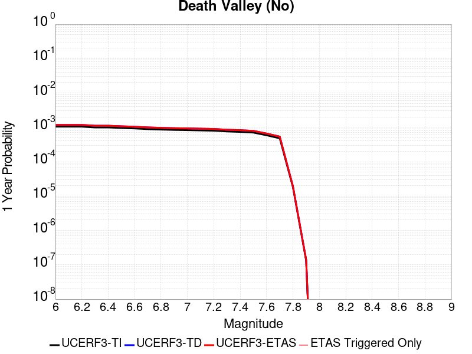 | 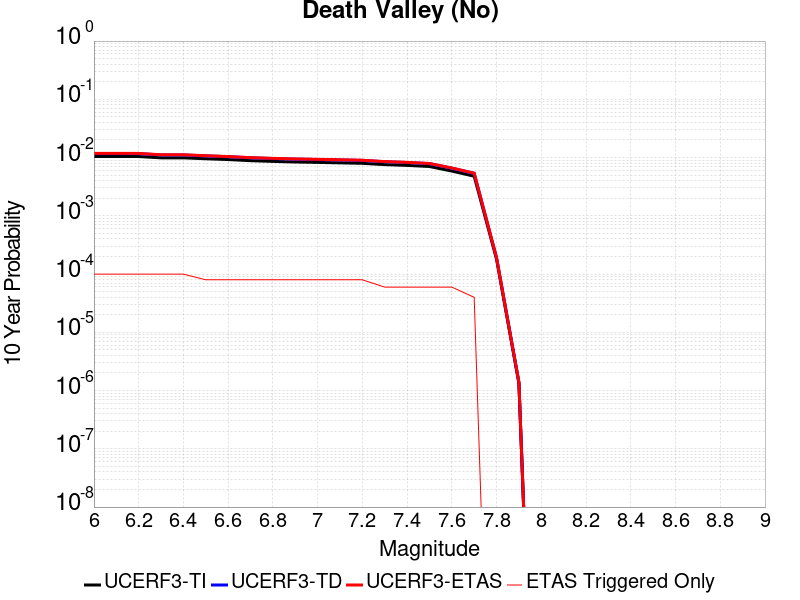 |

| Magnitude | 1 wk TI Prob | 1 wk TD Prob | 1 wk ETAS Prob | 1 wk ETAS/TD Gain | 1 wk ETAS Triggered Only | 1 mo TI Prob | 1 mo TD Prob | 1 mo ETAS Prob | 1 mo ETAS/TD Gain | 1 mo ETAS Triggered Only | 1 yr TI Prob | 1 yr TD Prob | 1 yr ETAS Prob | 1 yr ETAS/TD Gain | 1 yr ETAS Triggered Only | 10 yr TI Prob | 10 yr TD Prob | 10 yr ETAS Prob | 10 yr ETAS/TD Gain | 10 yr ETAS Triggered Only |
|-----|-----|-----|-----|-----|-----|-----|-----|-----|-----|-----|-----|-----|-----|-----|-----|-----|-----|-----|-----|-----|
| 6.0 | 2.0074807E-5 | 2.2506398E-5 | 2.2506398E-5 | 1.0 | 0.0 | 8.603206E-5 | 9.6452466E-5 | 9.6452466E-5 | 1.0 | 0.0 | 0.001046937 | 0.0011736836 | 0.0011736836 | 1.0 | 0.0 | 0.010420183 | 0.011675763 | 0.011716441 | 1.003484 | 4.1159037E-5 |
| 6.1 | 2.0074807E-5 | 2.2506398E-5 | 2.2506398E-5 | 1.0 | 0.0 | 8.603206E-5 | 9.6452466E-5 | 9.6452466E-5 | 1.0 | 0.0 | 0.001046937 | 0.0011736836 | 0.0011736836 | 1.0 | 0.0 | 0.010420183 | 0.011675763 | 0.011716441 | 1.003484 | 4.1159037E-5 |
| 6.2 | 2.0074807E-5 | 2.2506398E-5 | 2.2506398E-5 | 1.0 | 0.0 | 8.603206E-5 | 9.6452466E-5 | 9.6452466E-5 | 1.0 | 0.0 | 0.001046937 | 0.0011736836 | 0.0011736836 | 1.0 | 0.0 | 0.010420183 | 0.011675763 | 0.011716441 | 1.003484 | 4.1159037E-5 |
| 6.3 | 1.9050609E-5 | 2.1342896E-5 | 2.1342896E-5 | 1.0 | 0.0 | 8.164292E-5 | 9.146639E-5 | 9.146639E-5 | 1.0 | 0.0 | 9.935491E-4 | 0.0011130412 | 0.0011130412 | 1.0 | 0.0 | 0.009891188 | 0.011075489 | 0.011116193 | 1.0036751 | 4.1159037E-5 |
| 6.4 | 1.9050609E-5 | 2.1342896E-5 | 2.1342896E-5 | 1.0 | 0.0 | 8.164292E-5 | 9.146639E-5 | 9.146639E-5 | 1.0 | 0.0 | 9.935491E-4 | 0.0011130412 | 0.0011130412 | 1.0 | 0.0 | 0.009891188 | 0.011075489 | 0.011116193 | 1.0036751 | 4.1159037E-5 |
| 6.5 | 1.8367004E-5 | 2.0566715E-5 | 2.0566715E-5 | 1.0 | 0.0 | 7.8713354E-5 | 8.814012E-5 | 8.814012E-5 | 1.0 | 0.0 | 9.5791375E-4 | 0.0010725843 | 0.0010725843 | 1.0 | 0.0 | 0.009537951 | 0.010674862 | 0.010674862 | 1.0 | 0.0 |
| 6.6 | 1.779439E-5 | 1.9916431E-5 | 1.9916431E-5 | 1.0 | 0.0 | 7.625944E-5 | 8.535338E-5 | 8.535338E-5 | 1.0 | 0.0 | 9.280632E-4 | 0.0010386884 | 0.0010386884 | 1.0 | 0.0 | 0.009241969 | 0.010339095 | 0.010339095 | 1.0 | 0.0 |
| 6.7 | 1.7025437E-5 | 1.904867E-5 | 1.904867E-5 | 1.0 | 0.0 | 7.296412E-5 | 8.163464E-5 | 8.163464E-5 | 1.0 | 0.0 | 8.87976E-4 | 9.934547E-4 | 9.934547E-4 | 1.0 | 0.0 | 0.008844362 | 0.009890855 | 0.009890855 | 1.0 | 0.0 |
| 6.8 | 1.6545107E-5 | 1.851766E-5 | 1.851766E-5 | 1.0 | 0.0 | 7.090568E-5 | 7.9359015E-5 | 7.9359015E-5 | 1.0 | 0.0 | 8.629347E-4 | 9.657738E-4 | 9.657738E-4 | 1.0 | 0.0 | 0.008595915 | 0.009616472 | 0.009616472 | 1.0 | 0.0 |
| 6.9 | 1.615478E-5 | 1.8092618E-5 | 1.8092618E-5 | 1.0 | 0.0 | 6.9232934E-5 | 7.753752E-5 | 7.753752E-5 | 1.0 | 0.0 | 8.4258494E-4 | 9.4361656E-4 | 9.4361656E-4 | 1.0 | 0.0 | 0.008393973 | 0.009396792 | 0.009396792 | 1.0 | 0.0 |
| 7.0 | 1.5894311E-5 | 1.7810518E-5 | 1.7810518E-5 | 1.0 | 0.0 | 6.81167E-5 | 7.632859E-5 | 7.632859E-5 | 1.0 | 0.0 | 8.2900526E-4 | 9.289105E-4 | 9.289105E-4 | 1.0 | 0.0 | 0.008259195 | 0.009250966 | 0.009250966 | 1.0 | 0.0 |
| 7.1 | 1.5602263E-5 | 1.7488393E-5 | 1.7488393E-5 | 1.0 | 0.0 | 6.6865134E-5 | 7.494814E-5 | 7.494814E-5 | 1.0 | 0.0 | 8.137789E-4 | 9.1211766E-4 | 9.1211766E-4 | 1.0 | 0.0 | 0.008108052 | 0.009084423 | 0.009084423 | 1.0 | 0.0 |
| 7.2 | 1.5323829E-5 | 1.7175431E-5 | 1.7175431E-5 | 1.0 | 0.0 | 6.56719E-5 | 7.360695E-5 | 7.360695E-5 | 1.0 | 0.0 | 7.99262E-4 | 8.9580216E-4 | 8.9580216E-4 | 1.0 | 0.0 | 0.007963934 | 0.008922589 | 0.008922589 | 1.0 | 0.0 |
| 7.3 | 1.4556212E-5 | 1.6306993E-5 | 1.6306993E-5 | 1.0 | 0.0 | 6.238227E-5 | 6.988527E-5 | 6.988527E-5 | 1.0 | 0.0 | 7.592395E-4 | 8.505269E-4 | 8.505269E-4 | 1.0 | 0.0 | 0.0075665074 | 0.008473362 | 0.008473362 | 1.0 | 0.0 |
| 7.4 | 1.411725E-5 | 1.5812351E-5 | 1.5812351E-5 | 1.0 | 0.0 | 6.0501097E-5 | 6.77655E-5 | 6.77655E-5 | 1.0 | 0.0 | 7.363519E-4 | 8.247384E-4 | 8.247384E-4 | 1.0 | 0.0 | 0.0073391674 | 0.008217411 | 0.008217411 | 1.0 | 0.0 |
| 7.5 | 1.3503312E-5 | 1.5130505E-5 | 1.5130505E-5 | 1.0 | 0.0 | 5.7870053E-5 | 6.484344E-5 | 6.484344E-5 | 1.0 | 0.0 | 7.043401E-4 | 7.891888E-4 | 7.891888E-4 | 1.0 | 0.0 | 0.007021119 | 0.007864487 | 0.007864487 | 1.0 | 0.0 |
| 7.6 | 1.1279839E-5 | 1.2629821E-5 | 1.2629821E-5 | 1.0 | 0.0 | 4.834127E-5 | 5.412671E-5 | 5.412671E-5 | 1.0 | 0.0 | 5.88396E-4 | 6.587988E-4 | 6.587988E-4 | 1.0 | 0.0 | 0.005868405 | 0.00656901 | 0.00656901 | 1.0 | 0.0 |
| 7.7 | 9.189108E-6 | 1.0286198E-5 | 1.0286198E-5 | 1.0 | 0.0 | 3.93813E-5 | 4.408299E-5 | 4.408299E-5 | 1.0 | 0.0 | 4.7936183E-4 | 5.3658325E-4 | 5.3658325E-4 | 1.0 | 0.0 | 0.004783291 | 0.005353388 | 0.005353388 | 1.0 | 0.0 |
| 7.8 | 3.4586725E-7 | 3.6487262E-7 | 3.6487262E-7 | 1.0 | 0.0 | 1.4822873E-6 | 1.5637388E-6 | 1.5637388E-6 | 1.0 | 0.0 | 1.80467E-5 | 1.9038358E-5 | 1.9038358E-5 | 1.0 | 0.0 | 1.8045233E-4 | 1.9036772E-4 | 1.9036772E-4 | 1.0 | 0.0 |
| 7.9 | 2.5591178E-9 | 2.6699385E-9 | 2.6699385E-9 | 1.0 | 0.0 | 1.0967647E-8 | 1.1442593E-8 | 1.1442593E-8 | 1.0 | 0.0 | 1.335311E-7 | 1.3931357E-7 | 1.3931357E-7 | 1.0 | 0.0 | 1.3353102E-6 | 1.3931357E-6 | 1.3931357E-6 | 1.0 | 0.0 |

## San Jacinto (Lytle Creek connector)
*[(top)](#table-of-contents)*

| 1 Week | 1 Month | 1 Year | 10 Year |
|-----|-----|-----|-----|
| 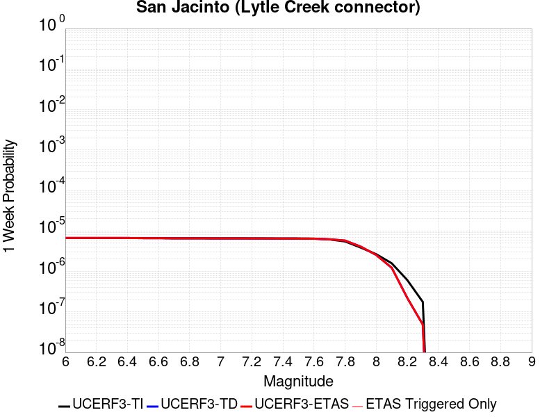 | 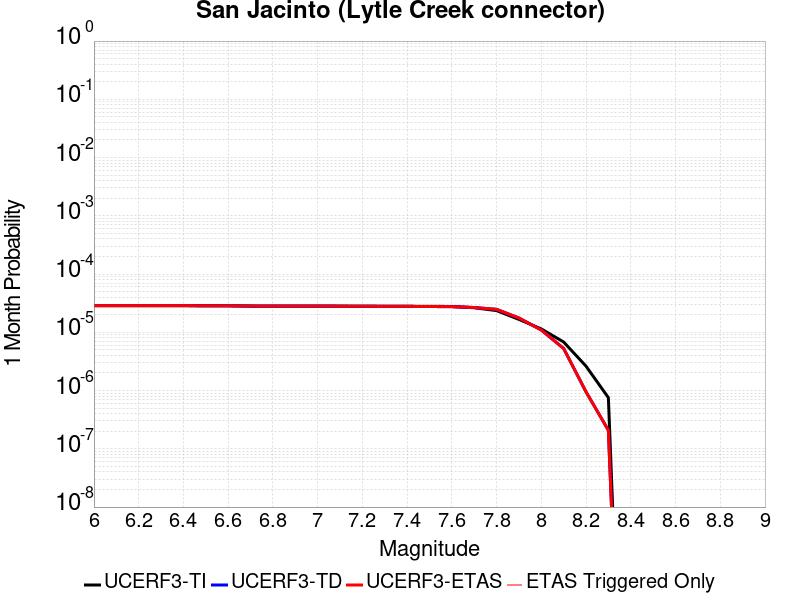 | 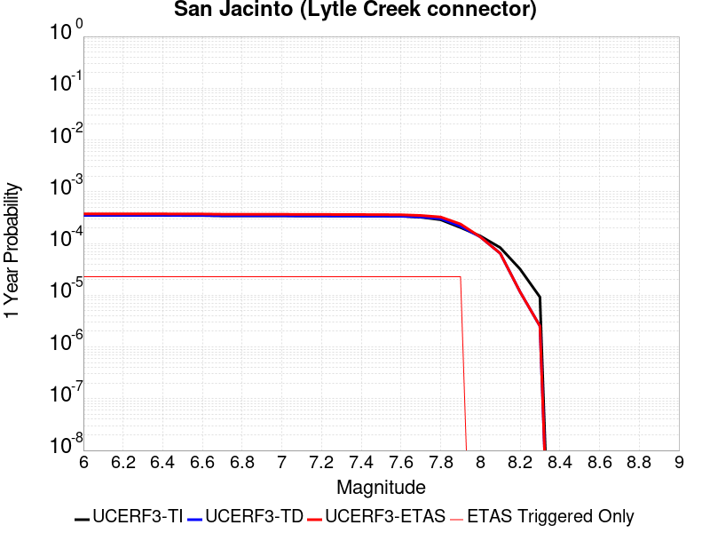 | 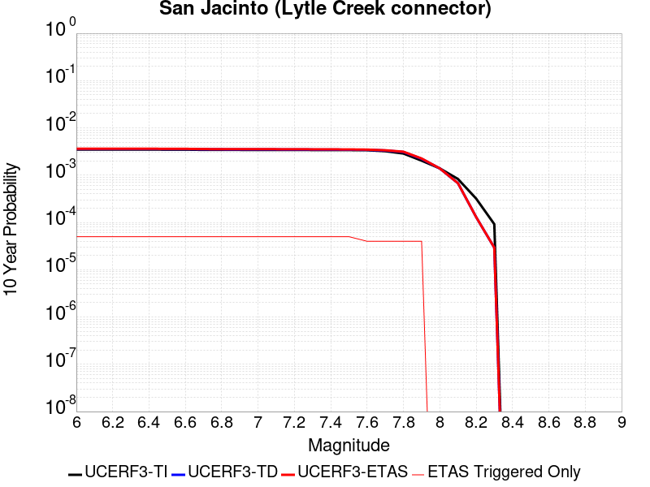 |

| Magnitude | 1 wk TI Prob | 1 wk TD Prob | 1 wk ETAS Prob | 1 wk ETAS/TD Gain | 1 wk ETAS Triggered Only | 1 mo TI Prob | 1 mo TD Prob | 1 mo ETAS Prob | 1 mo ETAS/TD Gain | 1 mo ETAS Triggered Only | 1 yr TI Prob | 1 yr TD Prob | 1 yr ETAS Prob | 1 yr ETAS/TD Gain | 1 yr ETAS Triggered Only | 10 yr TI Prob | 10 yr TD Prob | 10 yr ETAS Prob | 10 yr ETAS/TD Gain | 10 yr ETAS Triggered Only |
|-----|-----|-----|-----|-----|-----|-----|-----|-----|-----|-----|-----|-----|-----|-----|-----|-----|-----|-----|-----|-----|
| 6.0 | 6.693995E-6 | 6.7076135E-6 | 6.7076135E-6 | 1.0 | 0.0 | 2.8688235E-5 | 2.8746597E-5 | 2.8746597E-5 | 1.0 | 0.0 | 3.492233E-4 | 3.499337E-4 | 3.9107833E-4 | 1.1175784 | 4.1159037E-5 | 0.00348675 | 0.0035741166 | 0.0036151286 | 1.0114747 | 4.1159037E-5 |
| 6.1 | 6.693995E-6 | 6.7076135E-6 | 6.7076135E-6 | 1.0 | 0.0 | 2.8688235E-5 | 2.8746597E-5 | 2.8746597E-5 | 1.0 | 0.0 | 3.492233E-4 | 3.499337E-4 | 3.9107833E-4 | 1.1175784 | 4.1159037E-5 | 0.00348675 | 0.0035741166 | 0.0036151286 | 1.0114747 | 4.1159037E-5 |
| 6.2 | 6.693995E-6 | 6.7076135E-6 | 6.7076135E-6 | 1.0 | 0.0 | 2.8688235E-5 | 2.8746597E-5 | 2.8746597E-5 | 1.0 | 0.0 | 3.492233E-4 | 3.499337E-4 | 3.9107833E-4 | 1.1175784 | 4.1159037E-5 | 0.00348675 | 0.0035741166 | 0.0036151286 | 1.0114747 | 4.1159037E-5 |
| 6.3 | 6.693995E-6 | 6.7076135E-6 | 6.7076135E-6 | 1.0 | 0.0 | 2.8688235E-5 | 2.8746597E-5 | 2.8746597E-5 | 1.0 | 0.0 | 3.492233E-4 | 3.499337E-4 | 3.9107833E-4 | 1.1175784 | 4.1159037E-5 | 0.00348675 | 0.0035741166 | 0.0036151286 | 1.0114747 | 4.1159037E-5 |
| 6.4 | 6.693995E-6 | 6.7076135E-6 | 6.7076135E-6 | 1.0 | 0.0 | 2.8688235E-5 | 2.8746597E-5 | 2.8746597E-5 | 1.0 | 0.0 | 3.492233E-4 | 3.499337E-4 | 3.9107833E-4 | 1.1175784 | 4.1159037E-5 | 0.00348675 | 0.0035741166 | 0.0036151286 | 1.0114747 | 4.1159037E-5 |
| 6.5 | 6.6561875E-6 | 6.6678267E-6 | 6.6678267E-6 | 1.0 | 0.0 | 2.8526205E-5 | 2.8576087E-5 | 2.8576087E-5 | 1.0 | 0.0 | 3.472512E-4 | 3.4785838E-4 | 3.890031E-4 | 1.11828 | 4.1159037E-5 | 0.0034670907 | 0.00355343 | 0.003594443 | 1.0115417 | 4.1159037E-5 |
| 6.6 | 6.6561875E-6 | 6.6678267E-6 | 6.6678267E-6 | 1.0 | 0.0 | 2.8526205E-5 | 2.8576087E-5 | 2.8576087E-5 | 1.0 | 0.0 | 3.472512E-4 | 3.4785838E-4 | 3.890031E-4 | 1.11828 | 4.1159037E-5 | 0.0034670907 | 0.00355343 | 0.003594443 | 1.0115417 | 4.1159037E-5 |
| 6.7 | 6.5802237E-6 | 6.586992E-6 | 6.586992E-6 | 1.0 | 0.0 | 2.8200653E-5 | 2.822966E-5 | 2.822966E-5 | 1.0 | 0.0 | 3.4328885E-4 | 3.43642E-4 | 3.847869E-4 | 1.1197319 | 4.1159037E-5 | 0.0034275902 | 0.0035113997 | 0.0035524142 | 1.0116804 | 4.1159037E-5 |
| 6.8 | 6.575632E-6 | 6.581479E-6 | 6.581479E-6 | 1.0 | 0.0 | 2.8180975E-5 | 2.8206034E-5 | 2.8206034E-5 | 1.0 | 0.0 | 3.4304935E-4 | 3.4335442E-4 | 3.8449932E-4 | 1.1198322 | 4.1159037E-5 | 0.0034252026 | 0.0035085331 | 0.0035495479 | 1.01169 | 4.1159037E-5 |
| 6.9 | 6.570433E-6 | 6.572866E-6 | 6.572866E-6 | 1.0 | 0.0 | 2.8158694E-5 | 2.8169123E-5 | 2.8169123E-5 | 1.0 | 0.0 | 3.4277816E-4 | 3.4290517E-4 | 3.840501E-4 | 1.1199893 | 4.1159037E-5 | 0.0034224992 | 0.0035040549 | 0.0035450696 | 1.0117049 | 4.1159037E-5 |
| 7.0 | 6.5643826E-6 | 6.5629793E-6 | 6.5629793E-6 | 1.0 | 0.0 | 2.8132765E-5 | 2.8126751E-5 | 2.8126751E-5 | 1.0 | 0.0 | 3.424626E-4 | 3.4238945E-4 | 3.8353438E-4 | 1.12017 | 4.1159037E-5 | 0.0034193532 | 0.003498914 | 0.003539929 | 1.0117222 | 4.1159037E-5 |
| 7.1 | 6.557402E-6 | 6.551683E-6 | 6.551683E-6 | 1.0 | 0.0 | 2.8102848E-5 | 2.8078339E-5 | 2.8078339E-5 | 1.0 | 0.0 | 3.4209844E-4 | 3.4180022E-4 | 3.8294517E-4 | 1.1203773 | 4.1159037E-5 | 0.0034157229 | 0.0034930408 | 0.0035340562 | 1.011742 | 4.1159037E-5 |
| 7.2 | 6.546394E-6 | 6.533633E-6 | 6.533633E-6 | 1.0 | 0.0 | 2.8055672E-5 | 2.8000984E-5 | 2.8000984E-5 | 1.0 | 0.0 | 3.4152428E-4 | 3.4085874E-4 | 3.8200375E-4 | 1.1207099 | 4.1159037E-5 | 0.0034099987 | 0.0034836603 | 0.003524676 | 1.0117737 | 4.1159037E-5 |
| 7.3 | 6.5364216E-6 | 6.5143886E-6 | 6.5143886E-6 | 1.0 | 0.0 | 2.8012933E-5 | 2.791851E-5 | 2.791851E-5 | 1.0 | 0.0 | 3.4100408E-4 | 3.3985492E-4 | 3.8099996E-4 | 1.1210666 | 4.1159037E-5 | 0.003404813 | 0.0034736688 | 0.003514685 | 1.0118077 | 4.1159037E-5 |
| 7.4 | 6.5269523E-6 | 6.4954406E-6 | 6.4954406E-6 | 1.0 | 0.0 | 2.7972354E-5 | 2.7837306E-5 | 2.7837306E-5 | 1.0 | 0.0 | 3.4051016E-4 | 3.3886658E-4 | 3.8001165E-4 | 1.1214198 | 4.1159037E-5 | 0.0033998888 | 0.0034638257 | 0.003504842 | 1.0118414 | 4.1159037E-5 |
| 7.5 | 6.5111835E-6 | 6.471678E-6 | 6.471678E-6 | 1.0 | 0.0 | 2.7904773E-5 | 2.7735468E-5 | 2.7735468E-5 | 1.0 | 0.0 | 3.3968766E-4 | 3.3762708E-4 | 3.787722E-4 | 1.1218656 | 4.1159037E-5 | 0.0033916887 | 0.0034514794 | 0.0034924964 | 1.0118839 | 4.1159037E-5 |
| 7.6 | 6.4768806E-6 | 6.430728E-6 | 6.430728E-6 | 1.0 | 0.0 | 2.7757764E-5 | 2.755997E-5 | 2.755997E-5 | 1.0 | 0.0 | 3.3789838E-4 | 3.3549106E-4 | 3.7663628E-4 | 1.1226418 | 4.1159037E-5 | 0.0033738504 | 0.00343018 | 0.0034711978 | 1.0119579 | 4.1159037E-5 |
| 7.7 | 6.1655364E-6 | 6.2228432E-6 | 6.2228432E-6 | 1.0 | 0.0 | 2.642346E-5 | 2.6669055E-5 | 2.6669055E-5 | 1.0 | 0.0 | 3.2165812E-4 | 3.2464744E-4 | 3.6579312E-4 | 1.1267396 | 4.1159037E-5 | 0.0032119295 | 0.0033216004 | 0.0033626226 | 1.0123502 | 4.1159037E-5 |
| 7.8 | 5.5043524E-6 | 5.782465E-6 | 5.782465E-6 | 1.0 | 0.0 | 2.3589868E-5 | 2.4781757E-5 | 2.4781757E-5 | 1.0 | 0.0 | 2.871688E-4 | 3.0167616E-4 | 3.4282278E-4 | 1.1363933 | 4.1159037E-5 | 0.0028679797 | 0.0030909872 | 0.003132019 | 1.0132747 | 4.1159037E-5 |
| 7.9 | 3.889249E-6 | 4.1135077E-6 | 4.1135077E-6 | 1.0 | 0.0 | 1.6668104E-5 | 1.76292E-5 | 1.76292E-5 | 1.0 | 0.0 | 2.0291525E-4 | 2.1461441E-4 | 2.557646E-4 | 1.1917402 | 4.1159037E-5 | 0.0020273007 | 0.0022136394 | 0.0022547075 | 1.0185522 | 4.1159037E-5 |
| 8.0 | 2.668535E-6 | 2.556784E-6 | 2.556784E-6 | 1.0 | 0.0 | 1.1436528E-5 | 1.0957599E-5 | 1.0957599E-5 | 1.0 | 0.0 | 1.3923083E-4 | 1.3340064E-4 | 1.3340064E-4 | 1.0 | 0.0 | 0.0013914363 | 0.0013892549 | 0.0013892549 | 1.0 | 0.0 |
| 8.1 | 1.5911459E-6 | 1.2321565E-6 | 1.2321565E-6 | 1.0 | 0.0 | 6.8191785E-6 | 5.28066E-6 | 5.28066E-6 | 1.0 | 0.0 | 8.3020335E-5 | 6.429016E-5 | 6.429016E-5 | 1.0 | 0.0 | 8.298933E-4 | 6.7662075E-4 | 6.7662075E-4 | 1.0 | 0.0 |
| 8.2 | 6.1294963E-7 | 2.2207072E-7 | 2.2207072E-7 | 1.0 | 0.0 | 2.6269242E-6 | 9.517313E-7 | 9.517313E-7 | 1.0 | 0.0 | 3.1982334E-5 | 1.1587267E-5 | 1.1587267E-5 | 1.0 | 0.0 | 3.1977732E-4 | 1.3006543E-4 | 1.3006543E-4 | 1.0 | 0.0 |
| 8.3 | 1.762871E-7 | 4.853769E-8 | 4.853769E-8 | 1.0 | 0.0 | 7.5551594E-7 | 2.0801865E-7 | 2.0801865E-7 | 1.0 | 0.0 | 9.1983675E-6 | 2.5326242E-6 | 2.5326242E-6 | 1.0 | 0.0 | 9.197987E-5 | 2.9258856E-5 | 2.9258856E-5 | 1.0 | 0.0 |

## San Andreas (North Branch Mill Creek)
*[(top)](#table-of-contents)*

| 1 Week | 1 Month | 1 Year | 10 Year |
|-----|-----|-----|-----|
| 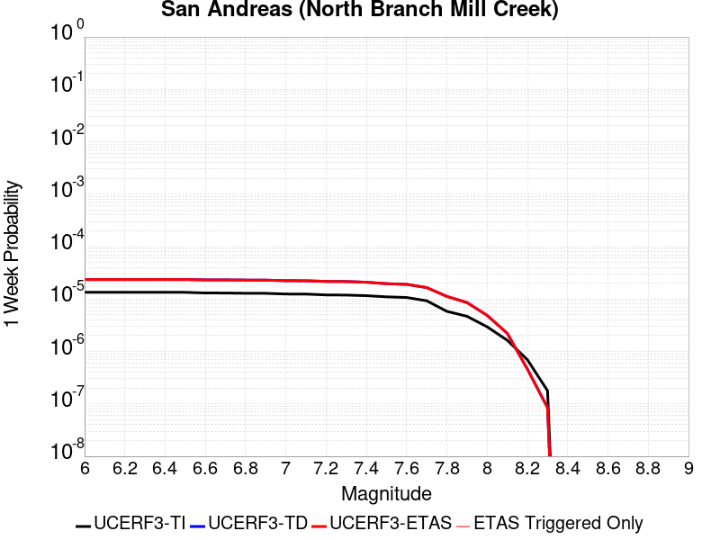 | 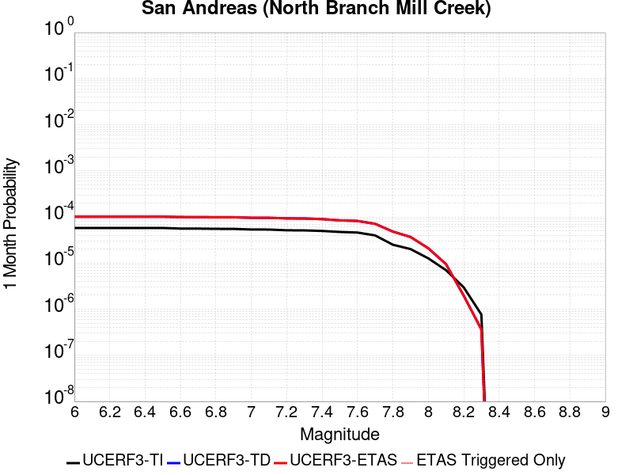 | 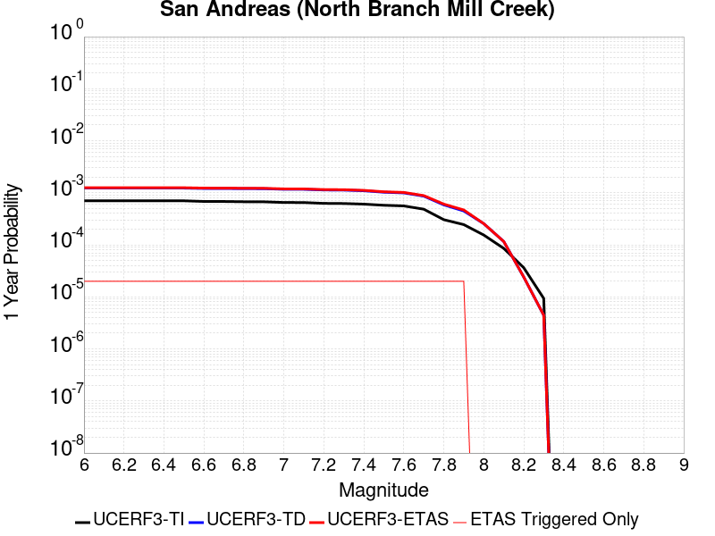 | 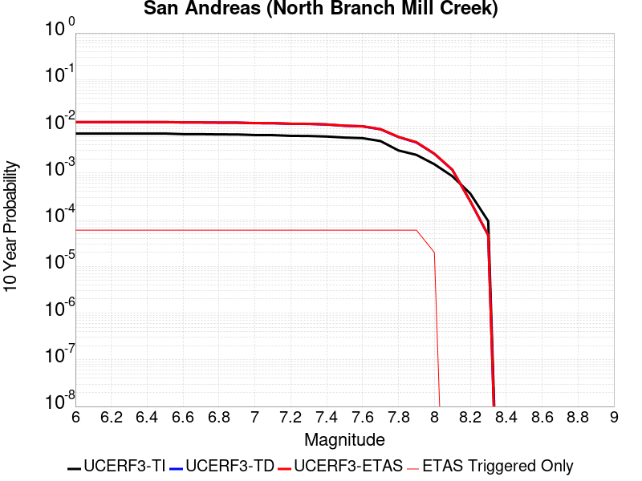 |

| Magnitude | 1 wk TI Prob | 1 wk TD Prob | 1 wk ETAS Prob | 1 wk ETAS/TD Gain | 1 wk ETAS Triggered Only | 1 mo TI Prob | 1 mo TD Prob | 1 mo ETAS Prob | 1 mo ETAS/TD Gain | 1 mo ETAS Triggered Only | 1 yr TI Prob | 1 yr TD Prob | 1 yr ETAS Prob | 1 yr ETAS/TD Gain | 1 yr ETAS Triggered Only | 10 yr TI Prob | 10 yr TD Prob | 10 yr ETAS Prob | 10 yr ETAS/TD Gain | 10 yr ETAS Triggered Only |
|-----|-----|-----|-----|-----|-----|-----|-----|-----|-----|-----|-----|-----|-----|-----|-----|-----|-----|-----|-----|-----|
| 6.0 | 1.3461156E-5 | 2.3621607E-5 | 2.3621607E-5 | 1.0 | 0.0 | 5.7689394E-5 | 1.0123155E-4 | 1.0123155E-4 | 1.0 | 0.0 | 7.02142E-4 | 0.0012318006 | 0.0012318006 | 1.0 | 0.0 | 0.0069992766 | 0.012290854 | 0.012331507 | 1.0033076 | 4.1159037E-5 |
| 6.1 | 1.3461156E-5 | 2.3621607E-5 | 2.3621607E-5 | 1.0 | 0.0 | 5.7689394E-5 | 1.0123155E-4 | 1.0123155E-4 | 1.0 | 0.0 | 7.02142E-4 | 0.0012318006 | 0.0012318006 | 1.0 | 0.0 | 0.0069992766 | 0.012290854 | 0.012331507 | 1.0033076 | 4.1159037E-5 |
| 6.2 | 1.3461156E-5 | 2.3621607E-5 | 2.3621607E-5 | 1.0 | 0.0 | 5.7689394E-5 | 1.0123155E-4 | 1.0123155E-4 | 1.0 | 0.0 | 7.02142E-4 | 0.0012318006 | 0.0012318006 | 1.0 | 0.0 | 0.0069992766 | 0.012290854 | 0.012331507 | 1.0033076 | 4.1159037E-5 |
| 6.3 | 1.3461156E-5 | 2.3621607E-5 | 2.3621607E-5 | 1.0 | 0.0 | 5.7689394E-5 | 1.0123155E-4 | 1.0123155E-4 | 1.0 | 0.0 | 7.02142E-4 | 0.0012318006 | 0.0012318006 | 1.0 | 0.0 | 0.0069992766 | 0.012290854 | 0.012331507 | 1.0033076 | 4.1159037E-5 |
| 6.4 | 1.3461156E-5 | 2.3621607E-5 | 2.3621607E-5 | 1.0 | 0.0 | 5.7689394E-5 | 1.0123155E-4 | 1.0123155E-4 | 1.0 | 0.0 | 7.02142E-4 | 0.0012318006 | 0.0012318006 | 1.0 | 0.0 | 0.0069992766 | 0.012290854 | 0.012331507 | 1.0033076 | 4.1159037E-5 |
| 6.5 | 1.3450706E-5 | 2.3610566E-5 | 2.3610566E-5 | 1.0 | 0.0 | 5.764461E-5 | 1.0118423E-4 | 1.0118423E-4 | 1.0 | 0.0 | 7.0159714E-4 | 0.0012312252 | 0.0012312252 | 1.0 | 0.0 | 0.006993862 | 0.012285163 | 0.012325817 | 1.0033091 | 4.1159037E-5 |
| 6.6 | 1.3074523E-5 | 2.3224806E-5 | 2.3224806E-5 | 1.0 | 0.0 | 5.6032466E-5 | 9.9531106E-5 | 9.9531106E-5 | 1.0 | 0.0 | 6.8198174E-4 | 0.0012111209 | 0.0012111209 | 1.0 | 0.0 | 0.006798926 | 0.012086319 | 0.01212698 | 1.0033642 | 4.1159037E-5 |
| 6.7 | 1.3050216E-5 | 2.3200095E-5 | 2.3200095E-5 | 1.0 | 0.0 | 5.59283E-5 | 9.9425204E-5 | 9.9425204E-5 | 1.0 | 0.0 | 6.8071426E-4 | 0.001209833 | 0.001209833 | 1.0 | 0.0 | 0.0067863287 | 0.01207358 | 0.012114242 | 1.0033679 | 4.1159037E-5 |
| 6.8 | 1.29049395E-5 | 2.3048478E-5 | 2.3048478E-5 | 1.0 | 0.0 | 5.530571E-5 | 9.8775476E-5 | 9.8775476E-5 | 1.0 | 0.0 | 6.73139E-4 | 0.0012019312 | 0.0012019312 | 1.0 | 0.0 | 0.0067110364 | 0.011995417 | 0.012036082 | 1.0033901 | 4.1159037E-5 |
| 6.9 | 1.2867369E-5 | 2.3007864E-5 | 2.3007864E-5 | 1.0 | 0.0 | 5.51447E-5 | 9.860143E-5 | 9.860143E-5 | 1.0 | 0.0 | 6.711799E-4 | 0.0011998145 | 0.0011998145 | 1.0 | 0.0 | 0.006691564 | 0.011974478 | 0.012015144 | 1.003396 | 4.1159037E-5 |
| 7.0 | 1.2495996E-5 | 2.240703E-5 | 2.240703E-5 | 1.0 | 0.0 | 5.3553173E-5 | 9.6026604E-5 | 9.6026604E-5 | 1.0 | 0.0 | 6.518148E-4 | 0.0011684998 | 0.0011684998 | 1.0 | 0.0 | 0.0064990623 | 0.01166463 | 0.011705309 | 1.0034873 | 4.1159037E-5 |
| 7.1 | 1.2452067E-5 | 2.2352064E-5 | 2.2352064E-5 | 1.0 | 0.0 | 5.3364907E-5 | 9.579106E-5 | 9.579106E-5 | 1.0 | 0.0 | 6.4952404E-4 | 0.0011656351 | 0.0011656351 | 1.0 | 0.0 | 0.0064762887 | 0.011636283 | 0.011676963 | 1.0034959 | 4.1159037E-5 |
| 7.2 | 1.2002777E-5 | 2.1729944E-5 | 2.1729944E-5 | 1.0 | 0.0 | 5.143946E-5 | 9.312502E-5 | 9.312502E-5 | 1.0 | 0.0 | 6.2609545E-4 | 0.00113321 | 0.00113321 | 1.0 | 0.0 | 0.006243344 | 0.011315388 | 0.011356081 | 1.0035963 | 4.1159037E-5 |
| 7.3 | 1.1923425E-5 | 2.1599648E-5 | 2.1599648E-5 | 1.0 | 0.0 | 5.109939E-5 | 9.2566646E-5 | 9.2566646E-5 | 1.0 | 0.0 | 6.219575E-4 | 0.0011264189 | 0.0011264189 | 1.0 | 0.0 | 0.0062021962 | 0.011248202 | 0.011288898 | 1.003618 | 4.1159037E-5 |
| 7.4 | 1.16105175E-5 | 2.0972457E-5 | 2.0972457E-5 | 1.0 | 0.0 | 4.975841E-5 | 8.987887E-5 | 8.987887E-5 | 1.0 | 0.0 | 6.0564023E-4 | 0.0010937285 | 0.0010937285 | 1.0 | 0.0 | 0.006039923 | 0.010925225 | 0.010965934 | 1.0037261 | 4.1159037E-5 |
| 7.5 | 1.1037265E-5 | 1.966843E-5 | 1.966843E-5 | 1.0 | 0.0 | 4.7301706E-5 | 8.4290565E-5 | 8.4290565E-5 | 1.0 | 0.0 | 5.757461E-4 | 0.0010257567 | 0.0010257567 | 1.0 | 0.0 | 0.005742567 | 0.010253555 | 0.010294292 | 1.003973 | 4.1159037E-5 |
| 7.6 | 1.0720915E-5 | 1.9108911E-5 | 1.9108911E-5 | 1.0 | 0.0 | 4.5945973E-5 | 8.189277E-5 | 8.189277E-5 | 1.0 | 0.0 | 5.592486E-4 | 9.965907E-4 | 9.965907E-4 | 1.0 | 0.0 | 0.005578433 | 0.009964557 | 0.010005306 | 1.0040894 | 4.1159037E-5 |
| 7.7 | 9.276279E-6 | 1.6549315E-5 | 1.6549315E-5 | 1.0 | 0.0 | 3.9754876E-5 | 7.0923714E-5 | 7.0923714E-5 | 1.0 | 0.0 | 4.839081E-4 | 8.631558E-4 | 8.631558E-4 | 1.0 | 0.0 | 0.0048285574 | 0.008641247 | 0.00868205 | 1.0047219 | 4.1159037E-5 |
| 7.8 | 5.8346777E-6 | 1.1242427E-5 | 1.1242427E-5 | 1.0 | 0.0 | 2.5005522E-5 | 4.818094E-5 | 4.818094E-5 | 1.0 | 0.0 | 3.043997E-4 | 5.8644515E-4 | 5.8644515E-4 | 1.0 | 0.0 | 0.0030398308 | 0.0058917315 | 0.005932648 | 1.0069448 | 4.1159037E-5 |
| 7.9 | 4.690204E-6 | 8.581902E-6 | 8.581902E-6 | 1.0 | 0.0 | 2.0100719E-5 | 3.677906E-5 | 3.677906E-5 | 1.0 | 0.0 | 2.4469878E-4 | 4.4769314E-4 | 4.4769314E-4 | 1.0 | 0.0 | 0.002444295 | 0.0045081377 | 0.0045491112 | 1.0090888 | 4.1159037E-5 |
| 8.0 | 2.9570454E-6 | 4.891517E-6 | 4.891517E-6 | 1.0 | 0.0 | 1.267299E-5 | 2.0963476E-5 | 2.0963476E-5 | 1.0 | 0.0 | 1.5428272E-4 | 2.5520046E-4 | 2.5520046E-4 | 1.0 | 0.0 | 0.0015417566 | 0.0025728077 | 0.0026138609 | 1.0159565 | 4.1159037E-5 |
| 8.1 | 1.6376824E-6 | 2.2202787E-6 | 2.2202787E-6 | 1.0 | 0.0 | 7.01862E-6 | 9.5154455E-6 | 9.5154455E-6 | 1.0 | 0.0 | 8.544835E-5 | 1.1584441E-4 | 1.1584441E-4 | 1.0 | 0.0 | 8.54155E-4 | 0.0011728838 | 0.0011728838 | 1.0 | 0.0 |
| 8.2 | 6.9631557E-7 | 4.607588E-7 | 4.607588E-7 | 1.0 | 0.0 | 2.984206E-6 | 1.974679E-6 | 1.974679E-6 | 1.0 | 0.0 | 3.63321E-5 | 2.4041454E-5 | 2.4041454E-5 | 1.0 | 0.0 | 3.6326164E-4 | 2.4895053E-4 | 2.4895053E-4 | 1.0 | 0.0 |
| 8.3 | 1.7876137E-7 | 8.50702E-8 | 8.50702E-8 | 1.0 | 0.0 | 7.661199E-7 | 3.645865E-7 | 3.645865E-7 | 1.0 | 0.0 | 9.32747E-6 | 4.438832E-6 | 4.438832E-6 | 1.0 | 0.0 | 9.3270784E-5 | 4.660403E-5 | 4.660403E-5 | 1.0 | 0.0 |

## Ortigalita (South)
*[(top)](#table-of-contents)*

| 1 Week | 1 Month | 1 Year | 10 Year |
|-----|-----|-----|-----|
| 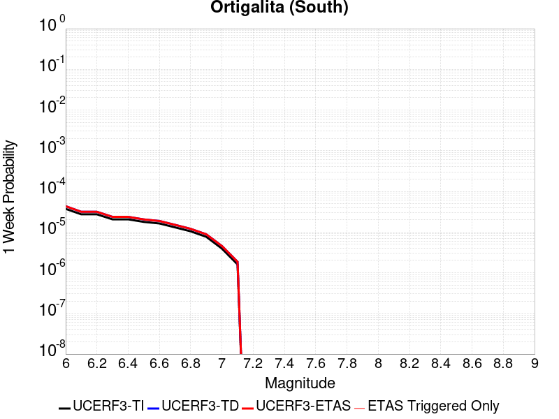 | 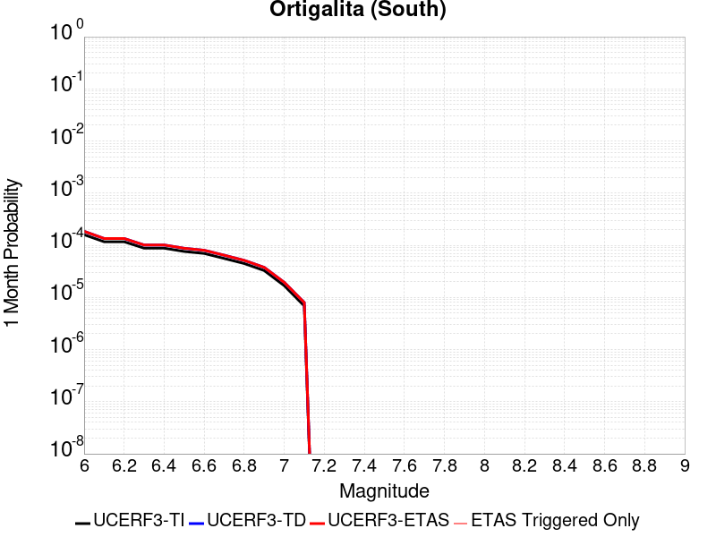 |  | 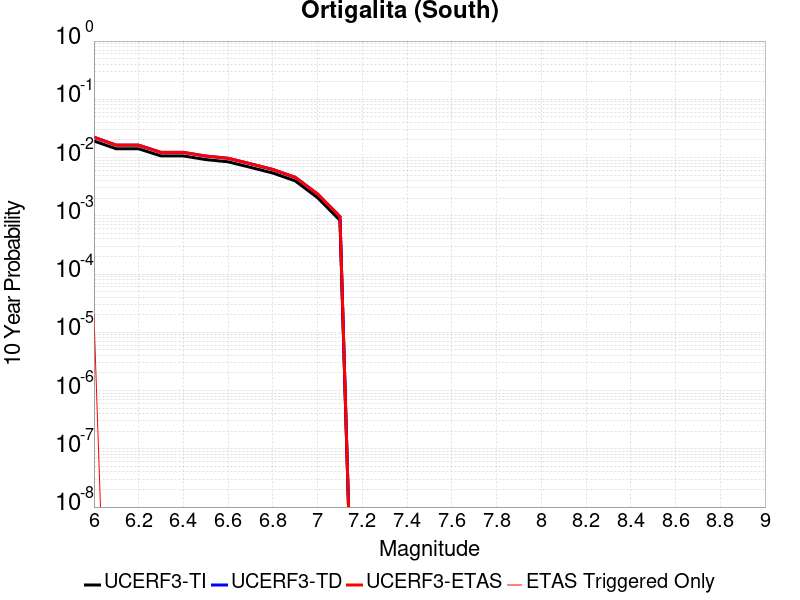 |

| Magnitude | 1 wk TI Prob | 1 wk TD Prob | 1 wk ETAS Prob | 1 wk ETAS/TD Gain | 1 wk ETAS Triggered Only | 1 mo TI Prob | 1 mo TD Prob | 1 mo ETAS Prob | 1 mo ETAS/TD Gain | 1 mo ETAS Triggered Only | 1 yr TI Prob | 1 yr TD Prob | 1 yr ETAS Prob | 1 yr ETAS/TD Gain | 1 yr ETAS Triggered Only | 10 yr TI Prob | 10 yr TD Prob | 10 yr ETAS Prob | 10 yr ETAS/TD Gain | 10 yr ETAS Triggered Only |
|-----|-----|-----|-----|-----|-----|-----|-----|-----|-----|-----|-----|-----|-----|-----|-----|-----|-----|-----|-----|-----|
| 6.0 | 3.72394E-5 | 4.3271833E-5 | 4.3271833E-5 | 1.0 | 0.0 | 1.5958765E-4 | 1.8543842E-4 | 1.8543842E-4 | 1.0 | 0.0 | 0.0019412481 | 0.002255531 | 0.0022965972 | 1.0182068 | 4.1159037E-5 | 0.019243775 | 0.022342788 | 0.022383029 | 1.001801 | 4.1159037E-5 |
| 6.1 | 2.7299884E-5 | 3.1503252E-5 | 3.1503252E-5 | 1.0 | 0.0 | 1.16994255E-4 | 1.3500727E-4 | 1.3500727E-4 | 1.0 | 0.0 | 0.0014234743 | 0.0016425301 | 0.0016425301 | 1.0 | 0.0 | 0.014143906 | 0.016309833 | 0.016309833 | 1.0 | 0.0 |
| 6.2 | 2.7299884E-5 | 3.1503252E-5 | 3.1503252E-5 | 1.0 | 0.0 | 1.16994255E-4 | 1.3500727E-4 | 1.3500727E-4 | 1.0 | 0.0 | 0.0014234743 | 0.0016425301 | 0.0016425301 | 1.0 | 0.0 | 0.014143906 | 0.016309833 | 0.016309833 | 1.0 | 0.0 |
| 6.3 | 2.0546433E-5 | 2.3639683E-5 | 2.3639683E-5 | 1.0 | 0.0 | 8.805317E-5 | 1.01309095E-4 | 1.01309095E-4 | 1.0 | 0.0 | 0.00107152 | 0.0012327593 | 0.0012327593 | 1.0 | 0.0 | 0.010663681 | 0.012261274 | 0.012261274 | 1.0 | 0.0 |
| 6.4 | 2.0546433E-5 | 2.3639683E-5 | 2.3639683E-5 | 1.0 | 0.0 | 8.805317E-5 | 1.01309095E-4 | 1.01309095E-4 | 1.0 | 0.0 | 0.00107152 | 0.0012327593 | 0.0012327593 | 1.0 | 0.0 | 0.010663681 | 0.012261274 | 0.012261274 | 1.0 | 0.0 |
| 6.5 | 1.7779594E-5 | 2.0454092E-5 | 2.0454092E-5 | 1.0 | 0.0 | 7.619603E-5 | 8.765752E-5 | 8.765752E-5 | 1.0 | 0.0 | 9.272918E-4 | 0.0010667214 | 0.0010667214 | 1.0 | 0.0 | 0.009234319 | 0.010617479 | 0.010617479 | 1.0 | 0.0 |
| 6.6 | 1.6272212E-5 | 1.8721486E-5 | 1.8721486E-5 | 1.0 | 0.0 | 6.973618E-5 | 8.0232545E-5 | 8.0232545E-5 | 1.0 | 0.0 | 8.487073E-4 | 9.764057E-4 | 9.764057E-4 | 1.0 | 0.0 | 0.008454733 | 0.009722459 | 0.009722459 | 1.0 | 0.0 |
| 6.7 | 1.3051484E-5 | 1.5044073E-5 | 1.5044073E-5 | 1.0 | 0.0 | 5.593373E-5 | 6.447306E-5 | 6.447306E-5 | 1.0 | 0.0 | 6.807804E-4 | 7.846863E-4 | 7.846863E-4 | 1.0 | 0.0 | 0.006786986 | 0.00782014 | 0.00782014 | 1.0 | 0.0 |
| 6.8 | 1.04277415E-5 | 1.1991389E-5 | 1.1991389E-5 | 1.0 | 0.0 | 4.4689557E-5 | 5.1390696E-5 | 5.1390696E-5 | 1.0 | 0.0 | 5.439595E-4 | 6.2550954E-4 | 6.2550954E-4 | 1.0 | 0.0 | 0.0054262993 | 0.0062382445 | 0.0062382445 | 1.0 | 0.0 |
| 6.9 | 7.639968E-6 | 8.794572E-6 | 8.794572E-6 | 1.0 | 0.0 | 3.274231E-5 | 3.769051E-5 | 3.769051E-5 | 1.0 | 0.0 | 3.9856473E-4 | 4.5879124E-4 | 4.5879124E-4 | 1.0 | 0.0 | 0.003978506 | 0.0045790276 | 0.0045790276 | 1.0 | 0.0 |
| 7.0 | 3.919831E-6 | 4.535044E-6 | 4.535044E-6 | 1.0 | 0.0 | 1.679917E-5 | 1.943577E-5 | 1.943577E-5 | 1.0 | 0.0 | 2.045107E-4 | 2.3660692E-4 | 2.3660692E-4 | 1.0 | 0.0 | 0.0020432258 | 0.0023637589 | 0.0023637589 | 1.0 | 0.0 |
| 7.1 | 1.6017933E-6 | 1.8577269E-6 | 1.8577269E-6 | 1.0 | 0.0 | 6.8648105E-6 | 7.961668E-6 | 7.961668E-6 | 1.0 | 0.0 | 8.357586E-5 | 9.693007E-5 | 9.693007E-5 | 1.0 | 0.0 | 8.3544437E-4 | 9.689827E-4 | 9.689827E-4 | 1.0 | 0.0 |

## Raymond
*[(top)](#table-of-contents)*

| 1 Week | 1 Month | 1 Year | 10 Year |
|-----|-----|-----|-----|
| 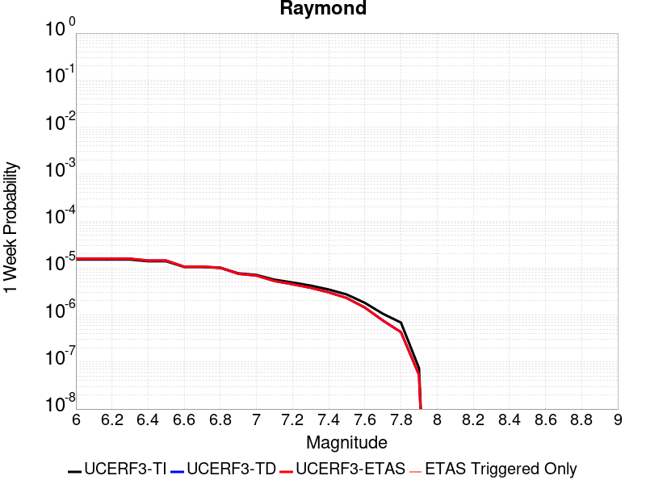 | 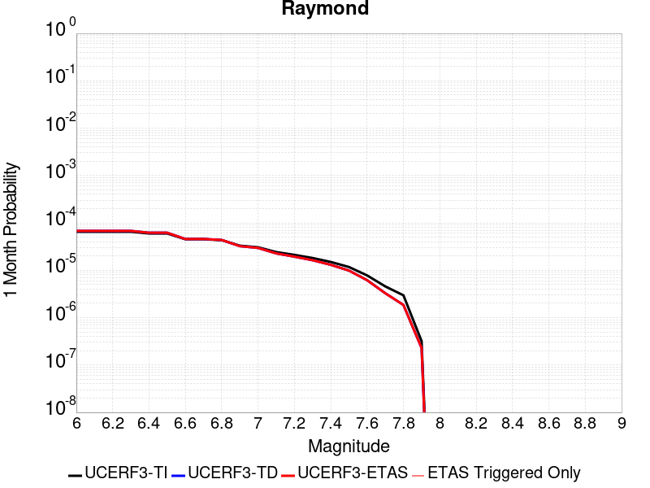 | 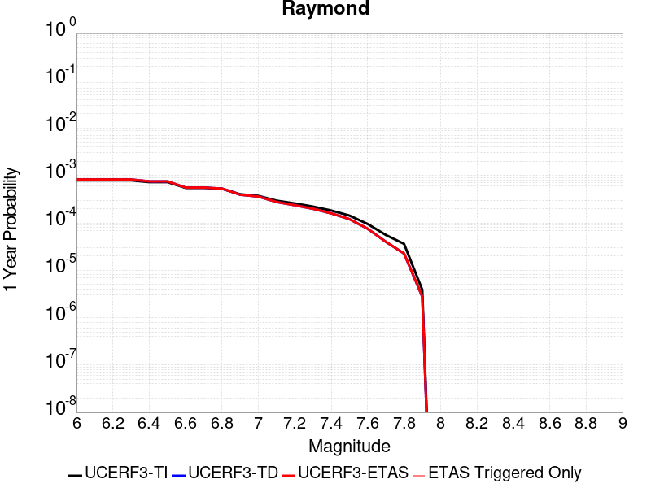 | 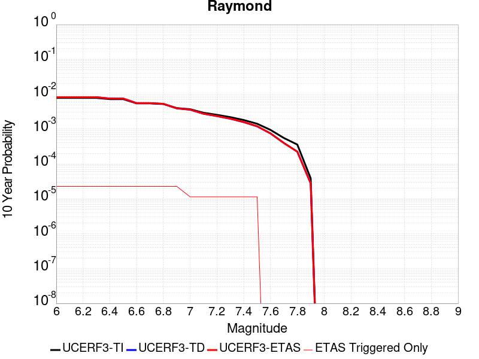 |

| Magnitude | 1 wk TI Prob | 1 wk TD Prob | 1 wk ETAS Prob | 1 wk ETAS/TD Gain | 1 wk ETAS Triggered Only | 1 mo TI Prob | 1 mo TD Prob | 1 mo ETAS Prob | 1 mo ETAS/TD Gain | 1 mo ETAS Triggered Only | 1 yr TI Prob | 1 yr TD Prob | 1 yr ETAS Prob | 1 yr ETAS/TD Gain | 1 yr ETAS Triggered Only | 10 yr TI Prob | 10 yr TD Prob | 10 yr ETAS Prob | 10 yr ETAS/TD Gain | 10 yr ETAS Triggered Only |
|-----|-----|-----|-----|-----|-----|-----|-----|-----|-----|-----|-----|-----|-----|-----|-----|-----|-----|-----|-----|-----|
| 6.0 | 1.5157413E-5 | 1.5814634E-5 | 1.5814634E-5 | 1.0 | 0.0 | 6.4958724E-5 | 6.777538E-5 | 6.777538E-5 | 1.0 | 0.0 | 7.905855E-4 | 8.2487793E-4 | 8.2487793E-4 | 1.0 | 0.0 | 0.007877788 | 0.008220682 | 0.008261503 | 1.0049657 | 4.1159037E-5 |
| 6.1 | 1.5157413E-5 | 1.5814634E-5 | 1.5814634E-5 | 1.0 | 0.0 | 6.4958724E-5 | 6.777538E-5 | 6.777538E-5 | 1.0 | 0.0 | 7.905855E-4 | 8.2487793E-4 | 8.2487793E-4 | 1.0 | 0.0 | 0.007877788 | 0.008220682 | 0.008261503 | 1.0049657 | 4.1159037E-5 |
| 6.2 | 1.5157413E-5 | 1.5814634E-5 | 1.5814634E-5 | 1.0 | 0.0 | 6.4958724E-5 | 6.777538E-5 | 6.777538E-5 | 1.0 | 0.0 | 7.905855E-4 | 8.2487793E-4 | 8.2487793E-4 | 1.0 | 0.0 | 0.007877788 | 0.008220682 | 0.008261503 | 1.0049657 | 4.1159037E-5 |
| 6.3 | 1.5157413E-5 | 1.5814634E-5 | 1.5814634E-5 | 1.0 | 0.0 | 6.4958724E-5 | 6.777538E-5 | 6.777538E-5 | 1.0 | 0.0 | 7.905855E-4 | 8.2487793E-4 | 8.2487793E-4 | 1.0 | 0.0 | 0.007877788 | 0.008220682 | 0.008261503 | 1.0049657 | 4.1159037E-5 |
| 6.4 | 1.3941944E-5 | 1.4458835E-5 | 1.4458835E-5 | 1.0 | 0.0 | 5.9749822E-5 | 6.19651E-5 | 6.19651E-5 | 1.0 | 0.0 | 7.2721124E-4 | 7.5418723E-4 | 7.5418723E-4 | 1.0 | 0.0 | 0.007248361 | 0.0075186132 | 0.007559463 | 1.0054331 | 4.1159037E-5 |
| 6.5 | 1.3941944E-5 | 1.4458835E-5 | 1.4458835E-5 | 1.0 | 0.0 | 5.9749822E-5 | 6.19651E-5 | 6.19651E-5 | 1.0 | 0.0 | 7.2721124E-4 | 7.5418723E-4 | 7.5418723E-4 | 1.0 | 0.0 | 0.007248361 | 0.0075186132 | 0.007559463 | 1.0054331 | 4.1159037E-5 |
| 6.6 | 1.0542609E-5 | 1.0674268E-5 | 1.0674268E-5 | 1.0 | 0.0 | 4.5181827E-5 | 4.5746092E-5 | 4.5746092E-5 | 1.0 | 0.0 | 5.499499E-4 | 5.568218E-4 | 5.568218E-4 | 1.0 | 0.0 | 0.005485909 | 0.0055548293 | 0.0055957595 | 1.0073684 | 4.1159037E-5 |
| 6.7 | 1.0542609E-5 | 1.0674268E-5 | 1.0674268E-5 | 1.0 | 0.0 | 4.5181827E-5 | 4.5746092E-5 | 4.5746092E-5 | 1.0 | 0.0 | 5.499499E-4 | 5.568218E-4 | 5.568218E-4 | 1.0 | 0.0 | 0.005485909 | 0.0055548293 | 0.0055957595 | 1.0073684 | 4.1159037E-5 |
| 6.8 | 1.0079132E-5 | 1.0179723E-5 | 1.0179723E-5 | 1.0 | 0.0 | 4.3195567E-5 | 4.3626686E-5 | 4.3626686E-5 | 1.0 | 0.0 | 5.257791E-4 | 5.310308E-4 | 5.310308E-4 | 1.0 | 0.0 | 0.0052453685 | 0.00529817 | 0.005339111 | 1.0077274 | 4.1159037E-5 |
| 6.9 | 7.721598E-6 | 7.5512785E-6 | 7.5512785E-6 | 1.0 | 0.0 | 3.3092143E-5 | 3.2362226E-5 | 3.2362226E-5 | 1.0 | 0.0 | 4.0282236E-4 | 3.939401E-4 | 3.939401E-4 | 1.0 | 0.0 | 0.0040209293 | 0.0039325524 | 0.0039735497 | 1.0104251 | 4.1159037E-5 |
| 7.0 | 7.137566E-6 | 6.913543E-6 | 6.913543E-6 | 1.0 | 0.0 | 3.058921E-5 | 2.962914E-5 | 2.962914E-5 | 1.0 | 0.0 | 3.7236E-4 | 3.6067615E-4 | 3.6067615E-4 | 1.0 | 0.0 | 0.0037173668 | 0.0036010272 | 0.0036010272 | 1.0 | 0.0 |
| 7.1 | 5.654976E-6 | 5.301452E-6 | 5.301452E-6 | 1.0 | 0.0 | 2.4235387E-5 | 2.2720313E-5 | 2.2720313E-5 | 1.0 | 0.0 | 2.9502588E-4 | 2.765849E-4 | 2.765849E-4 | 1.0 | 0.0 | 0.0029463451 | 0.002762439 | 0.002762439 | 1.0 | 0.0 |
| 7.2 | 4.9358455E-6 | 4.5284196E-6 | 4.5284196E-6 | 1.0 | 0.0 | 2.1153453E-5 | 1.940737E-5 | 1.940737E-5 | 1.0 | 0.0 | 2.5751285E-4 | 2.3625923E-4 | 2.3625923E-4 | 1.0 | 0.0 | 0.0025721465 | 0.002360104 | 0.002360104 | 1.0 | 0.0 |
| 7.3 | 4.2368597E-6 | 3.80725E-6 | 3.80725E-6 | 1.0 | 0.0 | 1.8157843E-5 | 1.6316684E-5 | 1.6316684E-5 | 1.0 | 0.0 | 2.2104931E-4 | 1.9863763E-4 | 1.9863763E-4 | 1.0 | 0.0 | 0.0022082955 | 0.0019846207 | 0.0019846207 | 1.0 | 0.0 |
| 7.4 | 3.4999923E-6 | 3.04522E-6 | 3.04522E-6 | 1.0 | 0.0 | 1.49998805E-5 | 1.3050877E-5 | 1.3050877E-5 | 1.0 | 0.0 | 1.8260824E-4 | 1.5888293E-4 | 1.5888293E-4 | 1.0 | 0.0 | 0.0018245826 | 0.0015877102 | 0.0015877102 | 1.0 | 0.0 |
| 7.5 | 2.738017E-6 | 2.30324E-6 | 2.30324E-6 | 1.0 | 0.0 | 1.1734306E-5 | 9.870992E-6 | 9.870992E-6 | 1.0 | 0.0 | 1.428558E-4 | 1.20172765E-4 | 1.20172765E-4 | 1.0 | 0.0 | 0.0014276401 | 0.0012010933 | 0.0012010933 | 1.0 | 0.0 |
| 7.6 | 1.8186392E-6 | 1.4431711E-6 | 1.4431711E-6 | 1.0 | 0.0 | 7.794145E-6 | 6.185004E-6 | 6.185004E-6 | 1.0 | 0.0 | 9.488958E-5 | 7.529987E-5 | 7.529987E-5 | 1.0 | 0.0 | 9.4849075E-4 | 7.527562E-4 | 7.527562E-4 | 1.0 | 0.0 |
| 7.7 | 1.0660348E-6 | 7.650812E-7 | 7.650812E-7 | 1.0 | 0.0 | 4.5687125E-6 | 3.2789153E-6 | 3.2789153E-6 | 1.0 | 0.0 | 5.5622655E-5 | 3.992008E-5 | 3.992008E-5 | 1.0 | 0.0 | 5.5608735E-4 | 3.9913936E-4 | 3.9913936E-4 | 1.0 | 0.0 |
| 7.8 | 6.913602E-7 | 4.3264455E-7 | 4.3264455E-7 | 1.0 | 0.0 | 2.962969E-6 | 1.8541897E-6 | 1.8541897E-6 | 1.0 | 0.0 | 3.607355E-5 | 2.2574532E-5 | 2.2574532E-5 | 1.0 | 0.0 | 3.6067693E-4 | 2.2573142E-4 | 2.2573142E-4 | 1.0 | 0.0 |
| 7.9 | 7.425201E-8 | 5.3275755E-8 | 5.3275755E-8 | 1.0 | 0.0 | 3.1822285E-7 | 2.2832465E-7 | 2.2832465E-7 | 1.0 | 0.0 | 3.874356E-6 | 2.7798503E-6 | 2.7798503E-6 | 1.0 | 0.0 | 3.8742884E-5 | 2.7798285E-5 | 2.7798285E-5 | 1.0 | 0.0 |

## Cerro Prieto
*[(top)](#table-of-contents)*

| 1 Week | 1 Month | 1 Year | 10 Year |
|-----|-----|-----|-----|
| 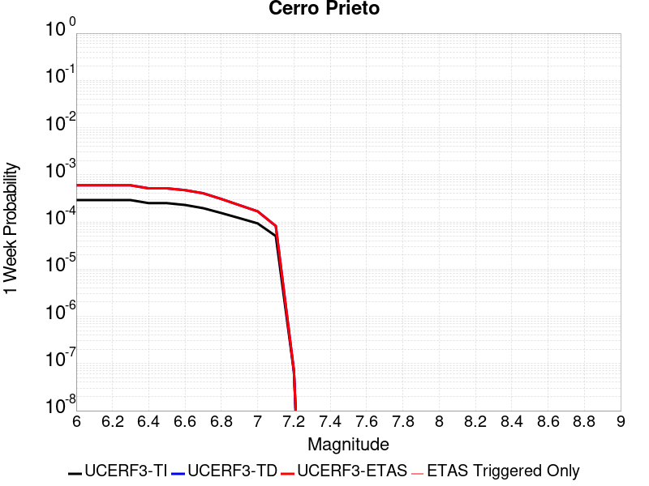 | 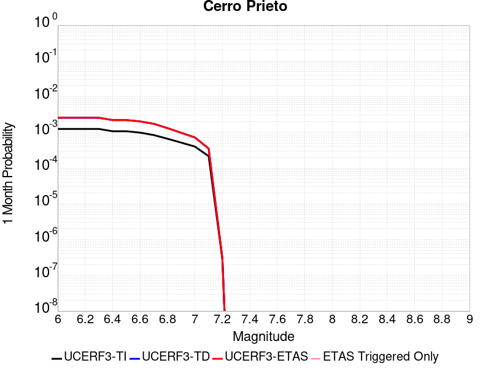 | 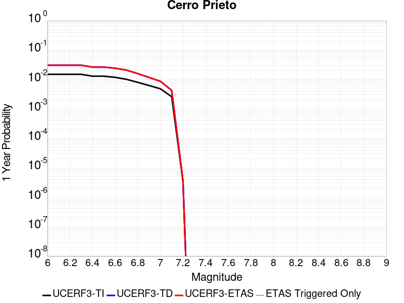 | 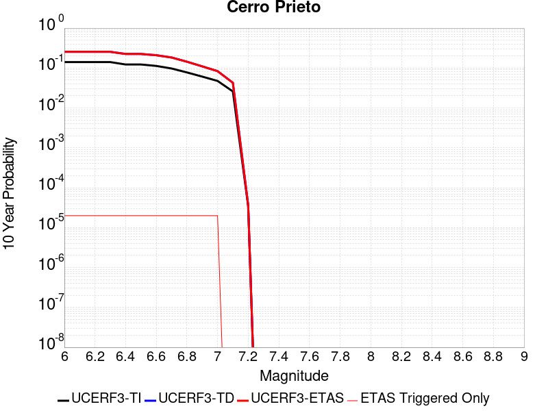 |

| Magnitude | 1 wk TI Prob | 1 wk TD Prob | 1 wk ETAS Prob | 1 wk ETAS/TD Gain | 1 wk ETAS Triggered Only | 1 mo TI Prob | 1 mo TD Prob | 1 mo ETAS Prob | 1 mo ETAS/TD Gain | 1 mo ETAS Triggered Only | 1 yr TI Prob | 1 yr TD Prob | 1 yr ETAS Prob | 1 yr ETAS/TD Gain | 1 yr ETAS Triggered Only | 10 yr TI Prob | 10 yr TD Prob | 10 yr ETAS Prob | 10 yr ETAS/TD Gain | 10 yr ETAS Triggered Only |
|-----|-----|-----|-----|-----|-----|-----|-----|-----|-----|-----|-----|-----|-----|-----|-----|-----|-----|-----|-----|-----|
| 6.0 | 2.9101528E-4 | 5.984332E-4 | 5.984332E-4 | 1.0 | 0.0 | 0.0012466122 | 0.0025624363 | 0.0025624363 | 1.0 | 0.0 | 0.015072231 | 0.030711513 | 0.030711513 | 1.0 | 0.0 | 0.14089979 | 0.25462848 | 0.25465915 | 1.0001205 | 4.1159037E-5 |
| 6.1 | 2.9101528E-4 | 5.984332E-4 | 5.984332E-4 | 1.0 | 0.0 | 0.0012466122 | 0.0025624363 | 0.0025624363 | 1.0 | 0.0 | 0.015072231 | 0.030711513 | 0.030711513 | 1.0 | 0.0 | 0.14089979 | 0.25462848 | 0.25465915 | 1.0001205 | 4.1159037E-5 |
| 6.2 | 2.9101528E-4 | 5.984332E-4 | 5.984332E-4 | 1.0 | 0.0 | 0.0012466122 | 0.0025624363 | 0.0025624363 | 1.0 | 0.0 | 0.015072231 | 0.030711513 | 0.030711513 | 1.0 | 0.0 | 0.14089979 | 0.25462848 | 0.25465915 | 1.0001205 | 4.1159037E-5 |
| 6.3 | 2.9101528E-4 | 5.984332E-4 | 5.984332E-4 | 1.0 | 0.0 | 0.0012466122 | 0.0025624363 | 0.0025624363 | 1.0 | 0.0 | 0.015072231 | 0.030711513 | 0.030711513 | 1.0 | 0.0 | 0.14089979 | 0.25462848 | 0.25465915 | 1.0001205 | 4.1159037E-5 |
| 6.4 | 2.508648E-4 | 5.158287E-4 | 5.158287E-4 | 1.0 | 0.0 | 0.0010746918 | 0.0022090215 | 0.0022090215 | 1.0 | 0.0 | 0.013006088 | 0.026538353 | 0.026538353 | 1.0 | 0.0 | 0.12270685 | 0.22508182 | 0.22511372 | 1.0001417 | 4.1159037E-5 |
| 6.5 | 2.508648E-4 | 5.158287E-4 | 5.158287E-4 | 1.0 | 0.0 | 0.0010746918 | 0.0022090215 | 0.0022090215 | 1.0 | 0.0 | 0.013006088 | 0.026538353 | 0.026538353 | 1.0 | 0.0 | 0.12270685 | 0.22508182 | 0.22511372 | 1.0001417 | 4.1159037E-5 |
| 6.6 | 2.294914E-4 | 4.729627E-4 | 4.729627E-4 | 1.0 | 0.0 | 9.831638E-4 | 0.0020255973 | 0.0020255973 | 1.0 | 0.0 | 0.011904482 | 0.024370646 | 0.024370646 | 1.0 | 0.0 | 0.11286586 | 0.20927969 | 0.20931223 | 1.0001556 | 4.1159037E-5 |
| 6.7 | 1.9621674E-4 | 4.0589322E-4 | 4.0589322E-4 | 1.0 | 0.0 | 8.4065786E-4 | 0.0017385423 | 0.0017385423 | 1.0 | 0.0 | 0.010187071 | 0.02098288 | 0.02098288 | 1.0 | 0.0 | 0.09732539 | 0.1835529 | 0.18358651 | 1.0001831 | 4.1159037E-5 |
| 6.8 | 1.5476145E-4 | 3.0705362E-4 | 3.0705362E-4 | 1.0 | 0.0 | 6.6309475E-4 | 0.0013153836 | 0.0013153836 | 1.0 | 0.0 | 0.008043335 | 0.015895057 | 0.015895057 | 1.0 | 0.0 | 0.07758363 | 0.14394037 | 0.14397562 | 1.0002447 | 4.1159037E-5 |
| 6.9 | 1.20509176E-4 | 2.2695535E-4 | 2.2695535E-4 | 1.0 | 0.0 | 5.1636563E-4 | 9.723671E-4 | 9.723671E-4 | 1.0 | 0.0 | 0.006268645 | 0.011789353 | 0.011789353 | 1.0 | 0.0 | 0.060947374 | 0.10996533 | 0.11000197 | 1.0003332 | 4.1159037E-5 |
| 7.0 | 9.3269155E-5 | 1.6807506E-4 | 1.6807506E-4 | 1.0 | 0.0 | 3.9966372E-4 | 7.2016637E-4 | 7.2016637E-4 | 1.0 | 0.0 | 0.0048550544 | 0.008740508 | 0.008740508 | 1.0 | 0.0 | 0.04750344 | 0.08357218 | 0.083609894 | 1.0004513 | 4.1159037E-5 |
| 7.1 | 5.029709E-5 | 8.2223094E-5 | 8.2223094E-5 | 1.0 | 0.0 | 2.1554115E-4 | 3.523566E-4 | 3.523566E-4 | 1.0 | 0.0 | 0.0026210553 | 0.0042849593 | 0.0042849593 | 1.0 | 0.0 | 0.025903556 | 0.042681713 | 0.042681713 | 1.0 | 0.0 |
| 7.2 | 6.5445185E-8 | 6.9259464E-8 | 6.9259464E-8 | 1.0 | 0.0 | 2.8047933E-7 | 2.9682627E-7 | 2.9682627E-7 | 1.0 | 0.0 | 3.4148304E-6 | 3.61386E-6 | 3.61386E-6 | 1.0 | 0.0 | 3.414778E-5 | 3.6138597E-5 | 3.6138597E-5 | 1.0 | 0.0 |

## Cucamonga
*[(top)](#table-of-contents)*

| 1 Week | 1 Month | 1 Year | 10 Year |
|-----|-----|-----|-----|
| 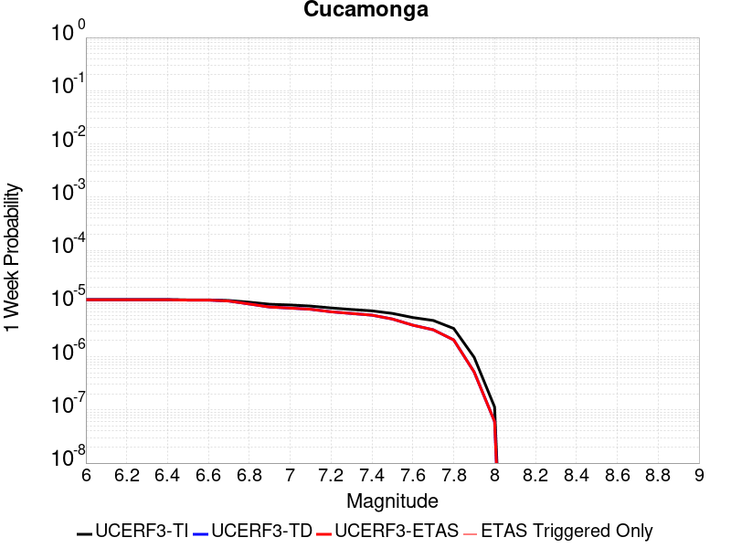 | 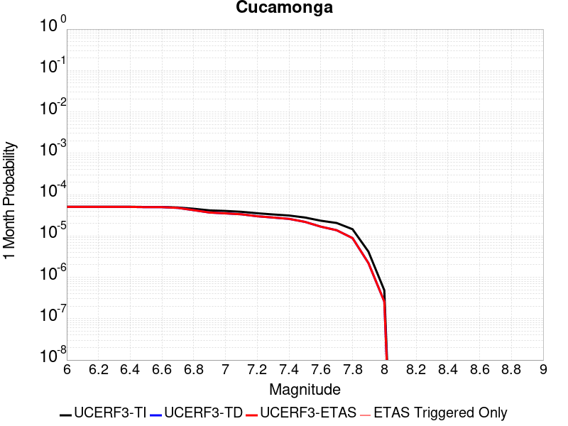 | 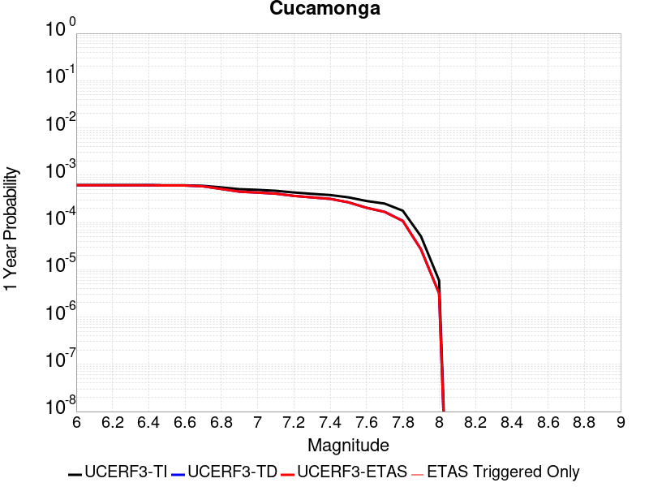 | 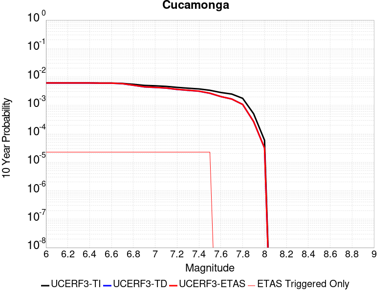 |

| Magnitude | 1 wk TI Prob | 1 wk TD Prob | 1 wk ETAS Prob | 1 wk ETAS/TD Gain | 1 wk ETAS Triggered Only | 1 mo TI Prob | 1 mo TD Prob | 1 mo ETAS Prob | 1 mo ETAS/TD Gain | 1 mo ETAS Triggered Only | 1 yr TI Prob | 1 yr TD Prob | 1 yr ETAS Prob | 1 yr ETAS/TD Gain | 1 yr ETAS Triggered Only | 10 yr TI Prob | 10 yr TD Prob | 10 yr ETAS Prob | 10 yr ETAS/TD Gain | 10 yr ETAS Triggered Only |
|-----|-----|-----|-----|-----|-----|-----|-----|-----|-----|-----|-----|-----|-----|-----|-----|-----|-----|-----|-----|-----|
| 6.0 | 1.1848348E-5 | 1.1749691E-5 | 1.1749691E-5 | 1.0 | 0.0 | 5.0777642E-5 | 5.035486E-5 | 5.035486E-5 | 1.0 | 0.0 | 6.180424E-4 | 6.129007E-4 | 6.129007E-4 | 1.0 | 0.0 | 0.0061632637 | 0.006113223 | 0.00615413 | 1.0066916 | 4.1159037E-5 |
| 6.1 | 1.1848348E-5 | 1.1749691E-5 | 1.1749691E-5 | 1.0 | 0.0 | 5.0777642E-5 | 5.035486E-5 | 5.035486E-5 | 1.0 | 0.0 | 6.180424E-4 | 6.129007E-4 | 6.129007E-4 | 1.0 | 0.0 | 0.0061632637 | 0.006113223 | 0.00615413 | 1.0066916 | 4.1159037E-5 |
| 6.2 | 1.1848348E-5 | 1.1749691E-5 | 1.1749691E-5 | 1.0 | 0.0 | 5.0777642E-5 | 5.035486E-5 | 5.035486E-5 | 1.0 | 0.0 | 6.180424E-4 | 6.129007E-4 | 6.129007E-4 | 1.0 | 0.0 | 0.0061632637 | 0.006113223 | 0.00615413 | 1.0066916 | 4.1159037E-5 |
| 6.3 | 1.1848348E-5 | 1.1749691E-5 | 1.1749691E-5 | 1.0 | 0.0 | 5.0777642E-5 | 5.035486E-5 | 5.035486E-5 | 1.0 | 0.0 | 6.180424E-4 | 6.129007E-4 | 6.129007E-4 | 1.0 | 0.0 | 0.0061632637 | 0.006113223 | 0.00615413 | 1.0066916 | 4.1159037E-5 |
| 6.4 | 1.1848348E-5 | 1.1749691E-5 | 1.1749691E-5 | 1.0 | 0.0 | 5.0777642E-5 | 5.035486E-5 | 5.035486E-5 | 1.0 | 0.0 | 6.180424E-4 | 6.129007E-4 | 6.129007E-4 | 1.0 | 0.0 | 0.0061632637 | 0.006113223 | 0.00615413 | 1.0066916 | 4.1159037E-5 |
| 6.5 | 1.16988695E-5 | 1.1588693E-5 | 1.1588693E-5 | 1.0 | 0.0 | 5.013705E-5 | 4.9664897E-5 | 4.9664897E-5 | 1.0 | 0.0 | 6.102476E-4 | 6.04505E-4 | 6.04505E-4 | 1.0 | 0.0 | 0.006085745 | 0.0060297227 | 0.0060706334 | 1.0067849 | 4.1159037E-5 |
| 6.6 | 1.16988695E-5 | 1.1588693E-5 | 1.1588693E-5 | 1.0 | 0.0 | 5.013705E-5 | 4.9664897E-5 | 4.9664897E-5 | 1.0 | 0.0 | 6.102476E-4 | 6.04505E-4 | 6.04505E-4 | 1.0 | 0.0 | 0.006085745 | 0.0060297227 | 0.0060706334 | 1.0067849 | 4.1159037E-5 |
| 6.7 | 1.1397107E-5 | 1.1127292E-5 | 1.1127292E-5 | 1.0 | 0.0 | 4.884383E-5 | 4.7687536E-5 | 4.7687536E-5 | 1.0 | 0.0 | 5.9451134E-4 | 5.804436E-4 | 5.804436E-4 | 1.0 | 0.0 | 0.005929234 | 0.0057903705 | 0.005831291 | 1.0070671 | 4.1159037E-5 |
| 6.8 | 1.058387E-5 | 9.795913E-6 | 9.795913E-6 | 1.0 | 0.0 | 4.5358654E-5 | 4.1981813E-5 | 4.1981813E-5 | 1.0 | 0.0 | 5.521017E-4 | 5.110098E-4 | 5.110098E-4 | 1.0 | 0.0 | 0.00550732 | 0.0050993003 | 0.0051402496 | 1.0080303 | 4.1159037E-5 |
| 6.9 | 9.690046E-6 | 8.589481E-6 | 8.589481E-6 | 1.0 | 0.0 | 4.1528107E-5 | 3.6811543E-5 | 3.6811543E-5 | 1.0 | 0.0 | 5.054874E-4 | 4.4808877E-4 | 4.4808877E-4 | 1.0 | 0.0 | 0.005043391 | 0.0044727307 | 0.0045137056 | 1.0091611 | 4.1159037E-5 |
| 7.0 | 9.381461E-6 | 8.196855E-6 | 8.196855E-6 | 1.0 | 0.0 | 4.020564E-5 | 3.5128905E-5 | 3.5128905E-5 | 1.0 | 0.0 | 4.893937E-4 | 4.2761085E-4 | 4.2761085E-4 | 1.0 | 0.0 | 0.0048831734 | 0.004268756 | 0.0043097395 | 1.0096008 | 4.1159037E-5 |
| 7.1 | 8.946492E-6 | 7.79146E-6 | 7.79146E-6 | 1.0 | 0.0 | 3.8341543E-5 | 3.339155E-5 | 3.339155E-5 | 1.0 | 0.0 | 4.667083E-4 | 4.0646657E-4 | 4.0646657E-4 | 1.0 | 0.0 | 0.0046572937 | 0.0040581096 | 0.0040991018 | 1.0101012 | 4.1159037E-5 |
| 7.2 | 8.251016E-6 | 6.98425E-6 | 6.98425E-6 | 1.0 | 0.0 | 3.5361016E-5 | 2.9932158E-5 | 2.9932158E-5 | 1.0 | 0.0 | 4.3043532E-4 | 3.6436334E-4 | 3.6436334E-4 | 1.0 | 0.0 | 0.0042960253 | 0.0036385364 | 0.0036795458 | 1.0112708 | 4.1159037E-5 |
| 7.3 | 7.717881E-6 | 6.4950573E-6 | 6.4950573E-6 | 1.0 | 0.0 | 3.3076216E-5 | 2.7835664E-5 | 2.7835664E-5 | 1.0 | 0.0 | 4.026285E-4 | 3.3884673E-4 | 3.3884673E-4 | 1.0 | 0.0 | 0.004018998 | 0.003384185 | 0.0034252047 | 1.012121 | 4.1159037E-5 |
| 7.4 | 7.275623E-6 | 6.040386E-6 | 6.040386E-6 | 1.0 | 0.0 | 3.118087E-5 | 2.5887111E-5 | 2.5887111E-5 | 1.0 | 0.0 | 3.7956095E-4 | 3.1513022E-4 | 3.1513022E-4 | 1.0 | 0.0 | 0.0037891332 | 0.0031477152 | 0.0031887447 | 1.0130347 | 4.1159037E-5 |
| 7.5 | 6.5109502E-6 | 5.1081265E-6 | 5.1081265E-6 | 1.0 | 0.0 | 2.7903774E-5 | 2.1891787E-5 | 2.1891787E-5 | 1.0 | 0.0 | 3.3967546E-4 | 2.6650005E-4 | 2.6650005E-4 | 1.0 | 0.0 | 0.0033915674 | 0.002662672 | 0.0027037214 | 1.0154166 | 4.1159037E-5 |
| 7.6 | 5.4495326E-6 | 3.91533E-6 | 3.91533E-6 | 1.0 | 0.0 | 2.335493E-5 | 1.6779879E-5 | 1.6779879E-5 | 1.0 | 0.0 | 2.8430918E-4 | 2.0427594E-4 | 2.0427594E-4 | 1.0 | 0.0 | 0.0028394572 | 0.0020417448 | 0.0020417448 | 1.0 | 0.0 |
| 7.7 | 4.7997164E-6 | 3.206392E-6 | 3.206392E-6 | 1.0 | 0.0 | 2.057005E-5 | 1.3741607E-5 | 1.3741607E-5 | 1.0 | 0.0 | 2.504116E-4 | 1.6729126E-4 | 1.6729126E-4 | 1.0 | 0.0 | 0.002501296 | 0.0016725198 | 0.0016725198 | 1.0 | 0.0 |
| 7.8 | 3.3941733E-6 | 2.067387E-6 | 2.067387E-6 | 1.0 | 0.0 | 1.4546376E-5 | 8.8602E-6 | 8.8602E-6 | 1.0 | 0.0 | 1.7708774E-4 | 1.0786761E-4 | 1.0786761E-4 | 1.0 | 0.0 | 0.0017694668 | 0.0010785068 | 0.0010785068 | 1.0 | 0.0 |
| 7.9 | 9.750552E-7 | 5.163475E-7 | 5.163475E-7 | 1.0 | 0.0 | 4.178801E-6 | 2.212916E-6 | 2.212916E-6 | 1.0 | 0.0 | 5.0875715E-5 | 2.6941922E-5 | 2.6941922E-5 | 1.0 | 0.0 | 5.086407E-4 | 2.6938698E-4 | 2.6938698E-4 | 1.0 | 0.0 |
| 8.0 | 1.133857E-7 | 6.059536E-8 | 6.059536E-8 | 1.0 | 0.0 | 4.8593864E-7 | 2.596944E-7 | 2.596944E-7 | 1.0 | 0.0 | 5.9162867E-6 | 3.1617747E-6 | 3.1617747E-6 | 1.0 | 0.0 | 5.916129E-5 | 3.1617314E-5 | 3.1617314E-5 | 1.0 | 0.0 |

## Monte Vista - Shannon 2011 CFM
*[(top)](#table-of-contents)*

| 1 Week | 1 Month | 1 Year | 10 Year |
|-----|-----|-----|-----|
| 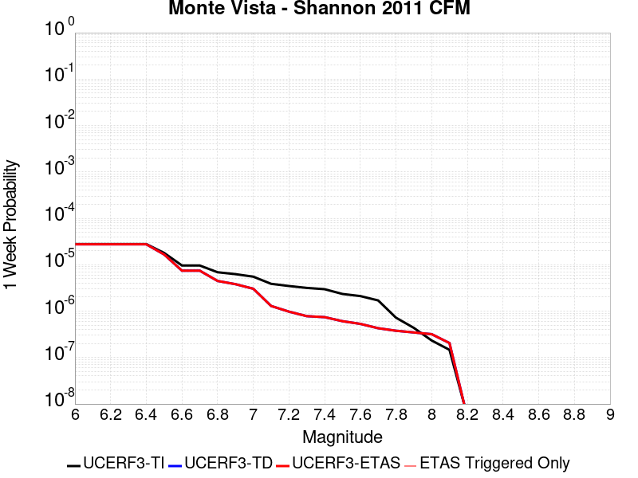 | 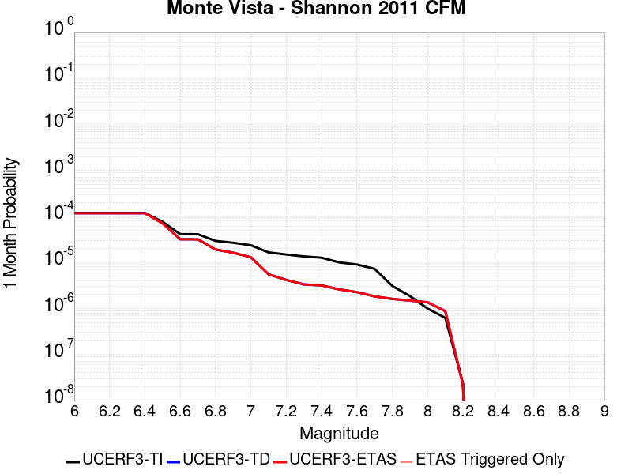 | 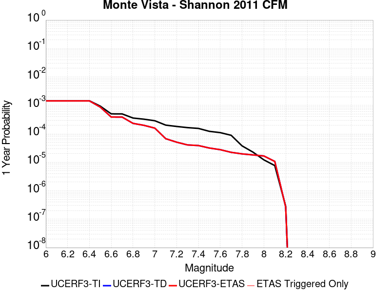 | 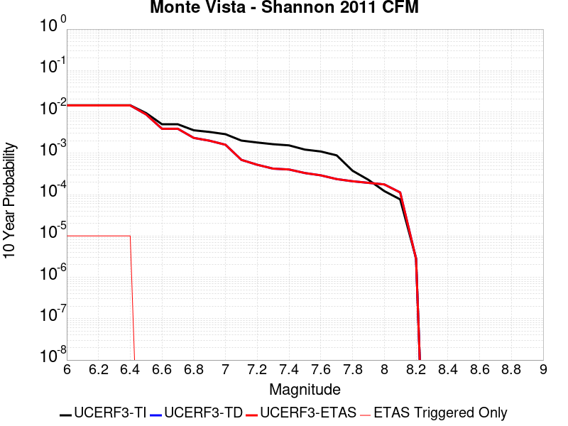 |

| Magnitude | 1 wk TI Prob | 1 wk TD Prob | 1 wk ETAS Prob | 1 wk ETAS/TD Gain | 1 wk ETAS Triggered Only | 1 mo TI Prob | 1 mo TD Prob | 1 mo ETAS Prob | 1 mo ETAS/TD Gain | 1 mo ETAS Triggered Only | 1 yr TI Prob | 1 yr TD Prob | 1 yr ETAS Prob | 1 yr ETAS/TD Gain | 1 yr ETAS Triggered Only | 10 yr TI Prob | 10 yr TD Prob | 10 yr ETAS Prob | 10 yr ETAS/TD Gain | 10 yr ETAS Triggered Only |
|-----|-----|-----|-----|-----|-----|-----|-----|-----|-----|-----|-----|-----|-----|-----|-----|-----|-----|-----|-----|-----|
| 6.0 | 2.7907707E-5 | 2.7599812E-5 | 2.7599812E-5 | 1.0 | 0.0 | 1.19598975E-4 | 1.18280244E-4 | 1.18280244E-4 | 1.0 | 0.0 | 0.0014551448 | 0.0014392345 | 0.0014392345 | 1.0 | 0.0 | 0.014456532 | 0.014328309 | 0.014368879 | 1.0028315 | 4.1159037E-5 |
| 6.1 | 2.7907707E-5 | 2.7599812E-5 | 2.7599812E-5 | 1.0 | 0.0 | 1.19598975E-4 | 1.18280244E-4 | 1.18280244E-4 | 1.0 | 0.0 | 0.0014551448 | 0.0014392345 | 0.0014392345 | 1.0 | 0.0 | 0.014456532 | 0.014328309 | 0.014368879 | 1.0028315 | 4.1159037E-5 |
| 6.2 | 2.7907707E-5 | 2.7599812E-5 | 2.7599812E-5 | 1.0 | 0.0 | 1.19598975E-4 | 1.18280244E-4 | 1.18280244E-4 | 1.0 | 0.0 | 0.0014551448 | 0.0014392345 | 0.0014392345 | 1.0 | 0.0 | 0.014456532 | 0.014328309 | 0.014368879 | 1.0028315 | 4.1159037E-5 |
| 6.3 | 2.7907707E-5 | 2.7599812E-5 | 2.7599812E-5 | 1.0 | 0.0 | 1.19598975E-4 | 1.18280244E-4 | 1.18280244E-4 | 1.0 | 0.0 | 0.0014551448 | 0.0014392345 | 0.0014392345 | 1.0 | 0.0 | 0.014456532 | 0.014328309 | 0.014368879 | 1.0028315 | 4.1159037E-5 |
| 6.4 | 2.7907707E-5 | 2.7599812E-5 | 2.7599812E-5 | 1.0 | 0.0 | 1.19598975E-4 | 1.18280244E-4 | 1.18280244E-4 | 1.0 | 0.0 | 0.0014551448 | 0.0014392345 | 0.0014392345 | 1.0 | 0.0 | 0.014456532 | 0.014328309 | 0.014368879 | 1.0028315 | 4.1159037E-5 |
| 6.5 | 1.7990213E-5 | 1.6652864E-5 | 1.6652864E-5 | 1.0 | 0.0 | 7.709863E-5 | 7.136784E-5 | 7.136784E-5 | 1.0 | 0.0 | 9.382716E-4 | 8.6862344E-4 | 8.6862344E-4 | 1.0 | 0.0 | 0.0093431985 | 0.008675742 | 0.008675742 | 1.0 | 0.0 |
| 6.6 | 9.650407E-6 | 7.4679774E-6 | 7.4679774E-6 | 1.0 | 0.0 | 4.135823E-5 | 3.2005268E-5 | 3.2005268E-5 | 1.0 | 0.0 | 5.0342013E-4 | 3.896023E-4 | 3.896023E-4 | 1.0 | 0.0 | 0.005022812 | 0.0039069573 | 0.0039069573 | 1.0 | 0.0 |
| 6.7 | 9.62828E-6 | 7.44588E-6 | 7.44588E-6 | 1.0 | 0.0 | 4.1263404E-5 | 3.1910567E-5 | 3.1910567E-5 | 1.0 | 0.0 | 5.022661E-4 | 3.8844973E-4 | 3.8844973E-4 | 1.0 | 0.0 | 0.0050113243 | 0.0038954718 | 0.0038954718 | 1.0 | 0.0 |
| 6.8 | 6.887523E-6 | 4.471782E-6 | 4.471782E-6 | 1.0 | 0.0 | 2.9517621E-5 | 1.9164652E-5 | 1.9164652E-5 | 1.0 | 0.0 | 3.5931775E-4 | 2.333069E-4 | 2.333069E-4 | 1.0 | 0.0 | 0.0035873733 | 0.002347857 | 0.002347857 | 1.0 | 0.0 |
| 6.9 | 6.2722347E-6 | 3.8135129E-6 | 3.8135129E-6 | 1.0 | 0.0 | 2.6880729E-5 | 1.6343536E-5 | 1.6343536E-5 | 1.0 | 0.0 | 3.2722374E-4 | 1.989664E-4 | 1.989664E-4 | 1.0 | 0.0 | 0.003267423 | 0.002005106 | 0.002005106 | 1.0 | 0.0 |
| 7.0 | 5.5320347E-6 | 3.0404497E-6 | 3.0404497E-6 | 1.0 | 0.0 | 2.3708504E-5 | 1.3030443E-5 | 1.3030443E-5 | 1.0 | 0.0 | 2.8861282E-4 | 1.5863593E-4 | 1.5863593E-4 | 1.0 | 0.0 | 0.0028823826 | 0.0016024366 | 0.0016024366 | 1.0 | 0.0 |
| 7.1 | 3.8794055E-6 | 1.2930052E-6 | 1.2930052E-6 | 1.0 | 0.0 | 1.6625918E-5 | 5.541439E-6 | 5.541439E-6 | 1.0 | 0.0 | 2.0240174E-4 | 6.746495E-5 | 6.746495E-5 | 1.0 | 0.0 | 0.002022175 | 6.914794E-4 | 6.914794E-4 | 1.0 | 0.0 |
| 7.2 | 3.4813652E-6 | 9.759085E-7 | 9.759085E-7 | 1.0 | 0.0 | 1.49200505E-5 | 4.1824583E-6 | 4.1824583E-6 | 1.0 | 0.0 | 1.8163648E-4 | 5.0920247E-5 | 5.0920247E-5 | 1.0 | 0.0 | 0.0018148809 | 5.2610796E-4 | 5.2610796E-4 | 1.0 | 0.0 |
| 7.3 | 3.1682148E-6 | 7.802412E-7 | 7.802412E-7 | 1.0 | 0.0 | 1.3577992E-5 | 3.3438864E-6 | 3.3438864E-6 | 1.0 | 0.0 | 1.6529951E-4 | 4.071106E-5 | 4.071106E-5 | 1.0 | 0.0 | 0.0016517661 | 4.2403257E-4 | 4.2403257E-4 | 1.0 | 0.0 |
| 7.4 | 2.9707667E-6 | 7.4265665E-7 | 7.4265665E-7 | 1.0 | 0.0 | 1.2731795E-5 | 3.1828104E-6 | 3.1828104E-6 | 1.0 | 0.0 | 1.5499859E-4 | 3.875003E-5 | 3.875003E-5 | 1.0 | 0.0 | 0.0015489052 | 4.0421495E-4 | 4.0421495E-4 | 1.0 | 0.0 |
| 7.5 | 2.3462758E-6 | 6.0767826E-7 | 6.0767826E-7 | 1.0 | 0.0 | 1.0055429E-5 | 2.6043328E-6 | 2.6043328E-6 | 1.0 | 0.0 | 1.2241797E-4 | 3.170729E-5 | 3.170729E-5 | 1.0 | 0.0 | 0.0012235056 | 3.320463E-4 | 3.320463E-4 | 1.0 | 0.0 |
| 7.6 | 2.112783E-6 | 5.31639E-7 | 5.31639E-7 | 1.0 | 0.0 | 9.054753E-6 | 2.278451E-6 | 2.278451E-6 | 1.0 | 0.0 | 1.1023604E-4 | 2.7739787E-5 | 2.7739787E-5 | 1.0 | 0.0 | 0.0011018137 | 2.9194728E-4 | 2.9194728E-4 | 1.0 | 0.0 |
| 7.7 | 1.7022471E-6 | 4.2882493E-7 | 4.2882493E-7 | 1.0 | 0.0 | 7.2953244E-6 | 1.8378198E-6 | 1.8378198E-6 | 1.0 | 0.0 | 8.881695E-5 | 2.2375229E-5 | 2.2375229E-5 | 1.0 | 0.0 | 8.878146E-4 | 2.3698054E-4 | 2.3698054E-4 | 1.0 | 0.0 |
| 7.8 | 7.230914E-7 | 3.780046E-7 | 3.780046E-7 | 1.0 | 0.0 | 3.0989595E-6 | 1.6200186E-6 | 1.6200186E-6 | 1.0 | 0.0 | 3.772918E-5 | 1.972355E-5 | 1.972355E-5 | 1.0 | 0.0 | 3.7722773E-4 | 2.099721E-4 | 2.099721E-4 | 1.0 | 0.0 |
| 7.9 | 4.3588446E-7 | 3.4755223E-7 | 3.4755223E-7 | 1.0 | 0.0 | 1.868075E-6 | 1.4895087E-6 | 1.4895087E-6 | 1.0 | 0.0 | 2.2743576E-5 | 1.8134619E-5 | 1.8134619E-5 | 1.0 | 0.0 | 2.2741247E-4 | 1.9229123E-4 | 1.9229123E-4 | 1.0 | 0.0 |
| 8.0 | 2.3317523E-7 | 3.1909312E-7 | 3.1909312E-7 | 1.0 | 0.0 | 9.99322E-7 | 1.3675412E-6 | 1.3675412E-6 | 1.0 | 0.0 | 1.2166677E-5 | 1.6649688E-5 | 1.6649688E-5 | 1.0 | 0.0 | 1.21660116E-4 | 1.7603493E-4 | 1.7603493E-4 | 1.0 | 0.0 |
| 8.1 | 1.4662456E-7 | 2.0546274E-7 | 2.0546274E-7 | 1.0 | 0.0 | 6.283908E-7 | 8.805543E-7 | 8.805543E-7 | 1.0 | 0.0 | 7.650631E-6 | 1.0720697E-5 | 1.0720697E-5 | 1.0 | 0.0 | 7.650368E-5 | 1.1254844E-4 | 1.1254844E-4 | 1.0 | 0.0 |
| 8.2 | 5.4931775E-9 | 5.135892E-9 | 5.135892E-9 | 1.0 | 0.0 | 2.3542189E-8 | 2.2010965E-8 | 2.2010965E-8 | 1.0 | 0.0 | 2.8662612E-7 | 2.679835E-7 | 2.679835E-7 | 1.0 | 0.0 | 2.8662573E-6 | 2.785148E-6 | 2.785148E-6 | 1.0 | 0.0 |

## San Andreas (Creeping Section) 2011 CFM
*[(top)](#table-of-contents)*

| 1 Week | 1 Month | 1 Year | 10 Year |
|-----|-----|-----|-----|
| 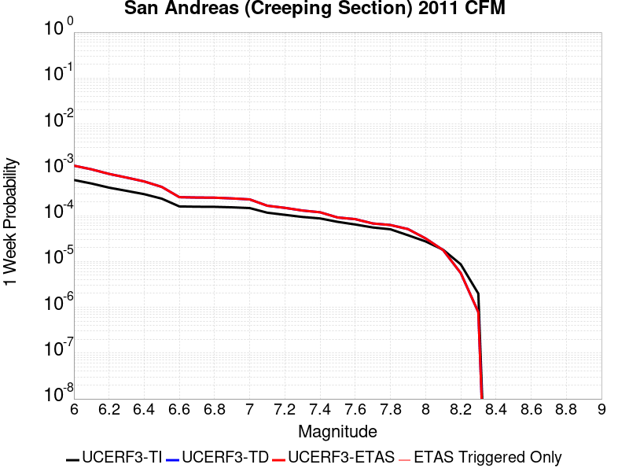 | 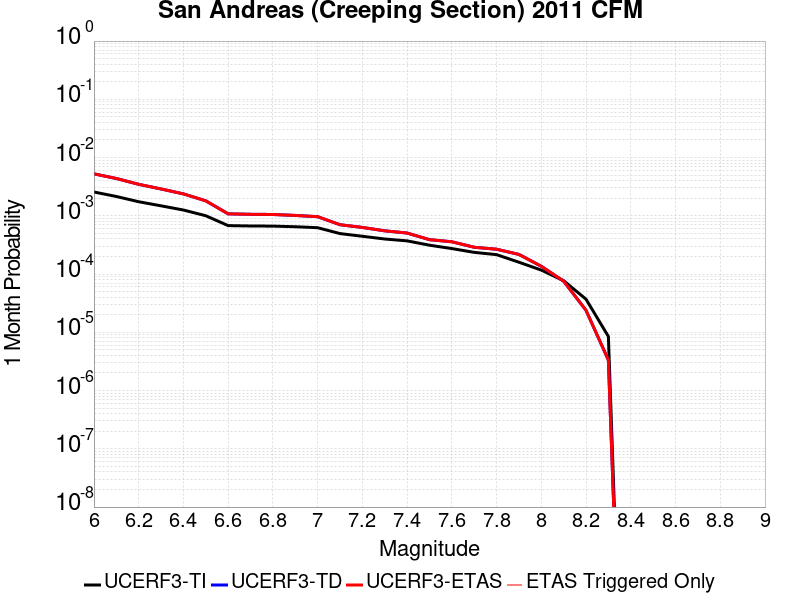 | 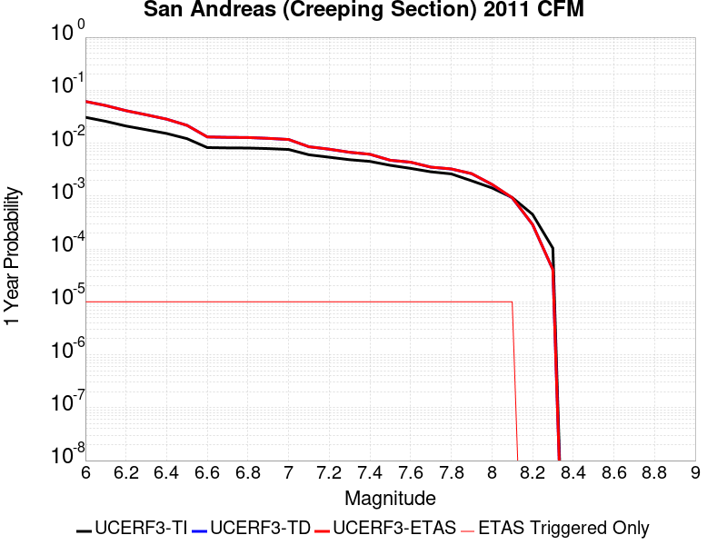 | 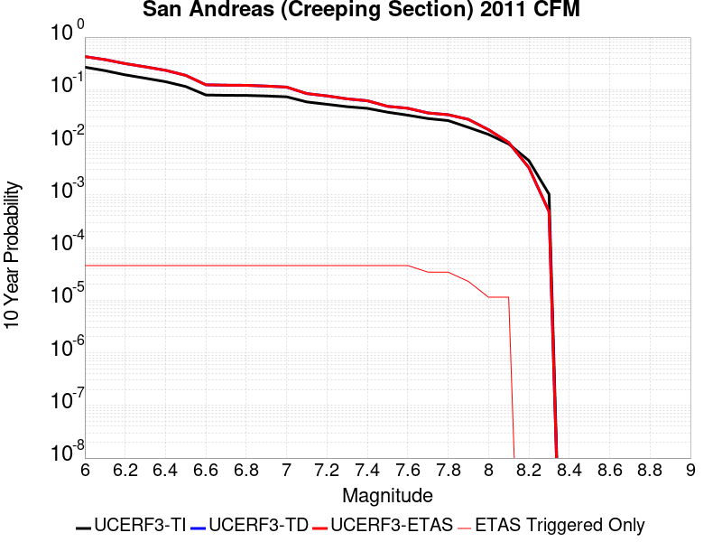 |

| Magnitude | 1 wk TI Prob | 1 wk TD Prob | 1 wk ETAS Prob | 1 wk ETAS/TD Gain | 1 wk ETAS Triggered Only | 1 mo TI Prob | 1 mo TD Prob | 1 mo ETAS Prob | 1 mo ETAS/TD Gain | 1 mo ETAS Triggered Only | 1 yr TI Prob | 1 yr TD Prob | 1 yr ETAS Prob | 1 yr ETAS/TD Gain | 1 yr ETAS Triggered Only | 10 yr TI Prob | 10 yr TD Prob | 10 yr ETAS Prob | 10 yr ETAS/TD Gain | 10 yr ETAS Triggered Only |
|-----|-----|-----|-----|-----|-----|-----|-----|-----|-----|-----|-----|-----|-----|-----|-----|-----|-----|-----|-----|-----|
| 6.0 | 5.986481E-4 | 0.0012296456 | 0.0012296456 | 1.0 | 0.0 | 0.0025631124 | 0.005254341 | 0.005254341 | 1.0 | 0.0 | 0.030762846 | 0.061305527 | 0.061305527 | 1.0 | 0.0 | 0.26835477 | 0.4264582 | 0.4264818 | 1.0000553 | 4.1159037E-5 |
| 6.1 | 5.015945E-4 | 0.0010234866 | 0.0010234866 | 1.0 | 0.0 | 0.00214792 | 0.0043750973 | 0.0043750973 | 1.0 | 0.0 | 0.025839351 | 0.051332634 | 0.051332634 | 1.0 | 0.0 | 0.23032776 | 0.37335575 | 0.37338156 | 1.000069 | 4.1159037E-5 |
| 6.2 | 4.073338E-4 | 8.124015E-4 | 8.124015E-4 | 1.0 | 0.0 | 0.0017445484 | 0.0034742658 | 0.0034742658 | 1.0 | 0.0 | 0.021034058 | 0.041016787 | 0.041016787 | 1.0 | 0.0 | 0.19150782 | 0.31357464 | 0.3136029 | 1.0000901 | 4.1159037E-5 |
| 6.3 | 3.464099E-4 | 6.755968E-4 | 6.755968E-4 | 1.0 | 0.0 | 0.0014837692 | 0.0028901014 | 0.0028901014 | 1.0 | 0.0 | 0.017915873 | 0.03427386 | 0.03427386 | 1.0 | 0.0 | 0.16538359 | 0.27189106 | 0.27192104 | 1.0001103 | 4.1159037E-5 |
| 6.4 | 2.935057E-4 | 5.561046E-4 | 5.561046E-4 | 1.0 | 0.0 | 0.0012572751 | 0.0023796957 | 0.0023796957 | 1.0 | 0.0 | 0.015200248 | 0.028349606 | 0.028349606 | 1.0 | 0.0 | 0.14201577 | 0.2335917 | 0.23362325 | 1.0001351 | 4.1159037E-5 |
| 6.5 | 2.3409708E-4 | 4.2260851E-4 | 4.2260851E-4 | 1.0 | 0.0 | 0.0010028875 | 0.001809147 | 0.001809147 | 1.0 | 0.0 | 0.012141965 | 0.021673217 | 0.021673217 | 1.0 | 0.0 | 0.11499573 | 0.18746719 | 0.18750064 | 1.0001783 | 4.1159037E-5 |
| 6.6 | 1.5842178E-4 | 2.5236266E-4 | 2.5236266E-4 | 1.0 | 0.0 | 6.7877385E-4 | 0.001081097 | 0.001081097 | 1.0 | 0.0 | 0.0082328 | 0.013081544 | 0.013081544 | 1.0 | 0.0 | 0.07934396 | 0.12383671 | 0.12387277 | 1.0002912 | 4.1159037E-5 |
| 6.7 | 1.5616413E-4 | 2.4772403E-4 | 2.4772403E-4 | 1.0 | 0.0 | 6.691031E-4 | 0.0010612368 | 0.0010612368 | 1.0 | 0.0 | 0.0081159435 | 0.012843214 | 0.012843214 | 1.0 | 0.0 | 0.0782586 | 0.121863864 | 0.12190001 | 1.0002966 | 4.1159037E-5 |
| 6.8 | 1.5538467E-4 | 2.4595915E-4 | 2.4595915E-4 | 1.0 | 0.0 | 6.6576427E-4 | 0.0010536796 | 0.0010536796 | 1.0 | 0.0 | 0.008075596 | 0.012752443 | 0.012752443 | 1.0 | 0.0 | 0.07788358 | 0.12109404 | 0.12113021 | 1.0002987 | 4.1159037E-5 |
| 6.9 | 1.5153569E-4 | 2.3703737E-4 | 2.3703737E-4 | 1.0 | 0.0 | 6.49277E-4 | 0.0010154808 | 0.0010154808 | 1.0 | 0.0 | 0.007876333 | 0.012293921 | 0.012293921 | 1.0 | 0.0 | 0.07602952 | 0.117161654 | 0.11719799 | 1.0003102 | 4.1159037E-5 |
| 7.0 | 1.4588932E-4 | 2.255909E-4 | 2.255909E-4 | 1.0 | 0.0 | 6.250901E-4 | 9.6646196E-4 | 9.6646196E-4 | 1.0 | 0.0 | 0.0075839474 | 0.011703694 | 0.011703694 | 1.0 | 0.0 | 0.073302895 | 0.112004645 | 0.1120412 | 1.0003263 | 4.1159037E-5 |
| 7.1 | 1.1565079E-4 | 1.6422855E-4 | 1.6422855E-4 | 1.0 | 0.0 | 4.955521E-4 | 7.036476E-4 | 7.036476E-4 | 1.0 | 0.0 | 0.006016669 | 0.008533464 | 0.008533464 | 1.0 | 0.0 | 0.058563538 | 0.08429675 | 0.08433444 | 1.0004472 | 4.1159037E-5 |
| 7.2 | 1.0393792E-4 | 1.4748852E-4 | 1.4748852E-4 | 1.0 | 0.0 | 4.4537216E-4 | 6.319413E-4 | 6.319413E-4 | 1.0 | 0.0 | 0.005408933 | 0.0076669157 | 0.0076669157 | 1.0 | 0.0 | 0.052791595 | 0.07621685 | 0.07625487 | 1.0004989 | 4.1159037E-5 |
| 7.3 | 9.332884E-5 | 1.2897016E-4 | 1.2897016E-4 | 1.0 | 0.0 | 3.999194E-4 | 5.526128E-4 | 5.526128E-4 | 1.0 | 0.0 | 0.0048581534 | 0.0067074425 | 0.0067074425 | 1.0 | 0.0 | 0.047533102 | 0.06701397 | 0.06705237 | 1.000573 | 4.1159037E-5 |
| 7.4 | 8.670252E-5 | 1.1812041E-4 | 1.1812041E-4 | 1.0 | 0.0 | 3.715293E-4 | 5.061327E-4 | 5.061327E-4 | 1.0 | 0.0 | 0.004513991 | 0.0061448775 | 0.0061448775 | 1.0 | 0.0 | 0.044233937 | 0.061651915 | 0.06169054 | 1.0006264 | 4.1159037E-5 |
| 7.5 | 7.3036405E-5 | 9.0977126E-5 | 9.0977126E-5 | 1.0 | 0.0 | 3.129756E-4 | 3.898438E-4 | 3.898438E-4 | 1.0 | 0.0 | 0.0038038217 | 0.0047360407 | 0.0047360407 | 1.0 | 0.0 | 0.03739367 | 0.048315093 | 0.048354264 | 1.0008107 | 4.1159037E-5 |
| 7.6 | 6.3935775E-5 | 8.363241E-5 | 8.363241E-5 | 1.0 | 0.0 | 2.7398168E-4 | 3.5837546E-4 | 3.5837546E-4 | 1.0 | 0.0 | 0.0033306254 | 0.004354511 | 0.004354511 | 1.0 | 0.0 | 0.032811474 | 0.044386487 | 0.04442582 | 1.0008861 | 4.1159037E-5 |
| 7.7 | 5.5050095E-5 | 6.735321E-5 | 6.735321E-5 | 1.0 | 0.0 | 2.3590765E-4 | 2.886247E-4 | 2.886247E-4 | 1.0 | 0.0 | 0.0028683927 | 0.0035083478 | 0.0035083478 | 1.0 | 0.0 | 0.0283165 | 0.03615235 | 0.036192022 | 1.0010973 | 4.1159037E-5 |
| 7.8 | 5.027131E-5 | 6.23001E-5 | 6.23001E-5 | 1.0 | 0.0 | 2.1543067E-4 | 2.6697316E-4 | 2.6697316E-4 | 1.0 | 0.0 | 0.0026197135 | 0.003245557 | 0.003245557 | 1.0 | 0.0 | 0.025890453 | 0.03345289 | 0.033492673 | 1.0011892 | 4.1159037E-5 |
| 7.9 | 3.7271806E-5 | 5.0765004E-5 | 5.0765004E-5 | 1.0 | 0.0 | 1.5972654E-4 | 2.1754617E-4 | 2.1754617E-4 | 1.0 | 0.0 | 0.0019429359 | 0.0026454097 | 0.0026454097 | 1.0 | 0.0 | 0.019260362 | 0.027332399 | 0.027372433 | 1.0014647 | 4.1159037E-5 |
| 8.0 | 2.7310243E-5 | 3.1784784E-5 | 3.1784784E-5 | 1.0 | 0.0 | 1.17038646E-4 | 1.3621339E-4 | 1.3621339E-4 | 1.0 | 0.0 | 0.0014240141 | 0.0016571374 | 0.0016571374 | 1.0 | 0.0 | 0.014149235 | 0.01739505 | 0.01739505 | 1.0 | 0.0 |
| 8.1 | 1.7940547E-5 | 1.7628343E-5 | 1.7628343E-5 | 1.0 | 0.0 | 7.688579E-5 | 7.5547854E-5 | 7.5547854E-5 | 1.0 | 0.0 | 9.3568244E-4 | 9.194075E-4 | 9.194075E-4 | 1.0 | 0.0 | 0.009317525 | 0.009918832 | 0.009918832 | 1.0 | 0.0 |
| 8.2 | 8.643924E-6 | 5.5660976E-6 | 5.5660976E-6 | 1.0 | 0.0 | 3.704486E-5 | 2.3854487E-5 | 2.3854487E-5 | 1.0 | 0.0 | 4.5092785E-4 | 2.9038975E-4 | 2.9038975E-4 | 1.0 | 0.0 | 0.0045001395 | 0.0032986484 | 0.0032986484 | 1.0 | 0.0 |
| 8.3 | 1.983087E-6 | 7.808603E-7 | 7.808603E-7 | 1.0 | 0.0 | 8.498917E-6 | 3.34654E-6 | 3.34654E-6 | 1.0 | 0.0 | 1.034694E-4 | 4.074338E-5 | 4.074338E-5 | 1.0 | 0.0 | 0.0010342124 | 4.8047924E-4 | 4.8047924E-4 | 1.0 | 0.0 |

## Elsinore (Julian)
*[(top)](#table-of-contents)*

| 1 Week | 1 Month | 1 Year | 10 Year |
|-----|-----|-----|-----|
| 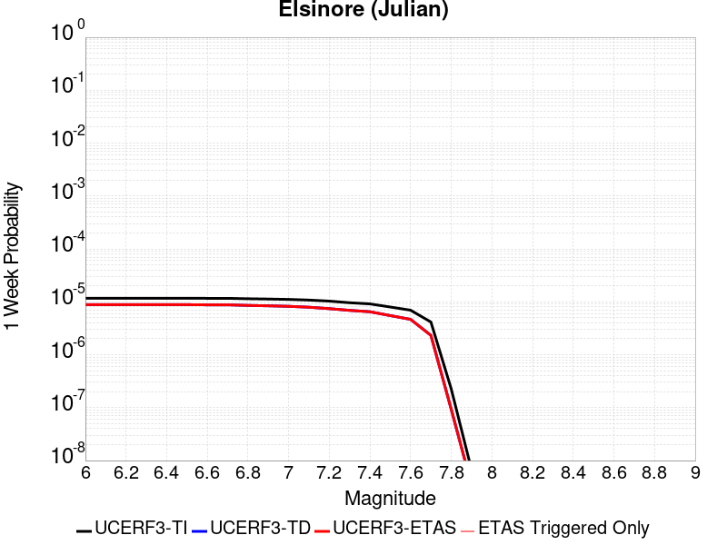 | 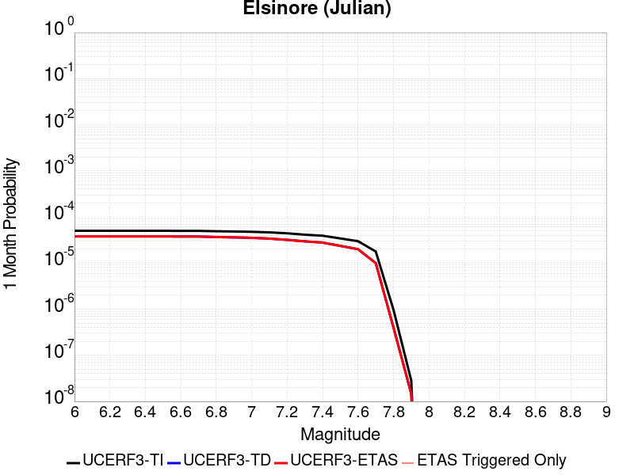 | 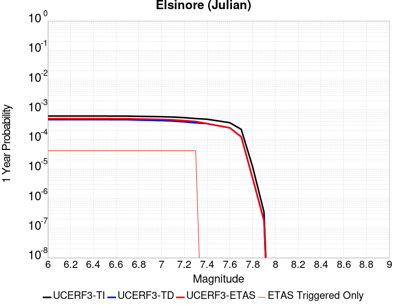 | 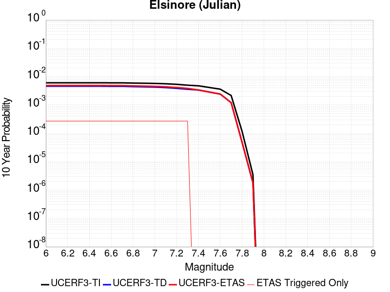 |

| Magnitude | 1 wk TI Prob | 1 wk TD Prob | 1 wk ETAS Prob | 1 wk ETAS/TD Gain | 1 wk ETAS Triggered Only | 1 mo TI Prob | 1 mo TD Prob | 1 mo ETAS Prob | 1 mo ETAS/TD Gain | 1 mo ETAS Triggered Only | 1 yr TI Prob | 1 yr TD Prob | 1 yr ETAS Prob | 1 yr ETAS/TD Gain | 1 yr ETAS Triggered Only | 10 yr TI Prob | 10 yr TD Prob | 10 yr ETAS Prob | 10 yr ETAS/TD Gain | 10 yr ETAS Triggered Only |
|-----|-----|-----|-----|-----|-----|-----|-----|-----|-----|-----|-----|-----|-----|-----|-----|-----|-----|-----|-----|-----|
| 6.0 | 1.1710231E-5 | 8.851974E-6 | 8.851974E-6 | 1.0 | 0.0 | 5.0185736E-5 | 3.793649E-5 | 3.793649E-5 | 1.0 | 0.0 | 6.1084004E-4 | 4.6178055E-4 | 5.029206E-4 | 1.08909 | 4.1159037E-5 | 0.006091637 | 0.0046083946 | 0.004649364 | 1.0088902 | 4.1159037E-5 |
| 6.1 | 1.1710231E-5 | 8.851974E-6 | 8.851974E-6 | 1.0 | 0.0 | 5.0185736E-5 | 3.793649E-5 | 3.793649E-5 | 1.0 | 0.0 | 6.1084004E-4 | 4.6178055E-4 | 5.029206E-4 | 1.08909 | 4.1159037E-5 | 0.006091637 | 0.0046083946 | 0.004649364 | 1.0088902 | 4.1159037E-5 |
| 6.2 | 1.1710231E-5 | 8.851974E-6 | 8.851974E-6 | 1.0 | 0.0 | 5.0185736E-5 | 3.793649E-5 | 3.793649E-5 | 1.0 | 0.0 | 6.1084004E-4 | 4.6178055E-4 | 5.029206E-4 | 1.08909 | 4.1159037E-5 | 0.006091637 | 0.0046083946 | 0.004649364 | 1.0088902 | 4.1159037E-5 |
| 6.3 | 1.1710231E-5 | 8.851974E-6 | 8.851974E-6 | 1.0 | 0.0 | 5.0185736E-5 | 3.793649E-5 | 3.793649E-5 | 1.0 | 0.0 | 6.1084004E-4 | 4.6178055E-4 | 5.029206E-4 | 1.08909 | 4.1159037E-5 | 0.006091637 | 0.0046083946 | 0.004649364 | 1.0088902 | 4.1159037E-5 |
| 6.4 | 1.1710231E-5 | 8.851974E-6 | 8.851974E-6 | 1.0 | 0.0 | 5.0185736E-5 | 3.793649E-5 | 3.793649E-5 | 1.0 | 0.0 | 6.1084004E-4 | 4.6178055E-4 | 5.029206E-4 | 1.08909 | 4.1159037E-5 | 0.006091637 | 0.0046083946 | 0.004649364 | 1.0088902 | 4.1159037E-5 |
| 6.5 | 1.1710231E-5 | 8.851974E-6 | 8.851974E-6 | 1.0 | 0.0 | 5.0185736E-5 | 3.793649E-5 | 3.793649E-5 | 1.0 | 0.0 | 6.1084004E-4 | 4.6178055E-4 | 5.029206E-4 | 1.08909 | 4.1159037E-5 | 0.006091637 | 0.0046083946 | 0.004649364 | 1.0088902 | 4.1159037E-5 |
| 6.6 | 1.1650619E-5 | 8.784331E-6 | 8.784331E-6 | 1.0 | 0.0 | 4.993027E-5 | 3.7646598E-5 | 3.7646598E-5 | 1.0 | 0.0 | 6.0773146E-4 | 4.5825262E-4 | 4.993928E-4 | 1.0897762 | 4.1159037E-5 | 0.0060607214 | 0.004573261 | 0.0046142316 | 1.0089588 | 4.1159037E-5 |
| 6.7 | 1.1650619E-5 | 8.784331E-6 | 8.784331E-6 | 1.0 | 0.0 | 4.993027E-5 | 3.7646598E-5 | 3.7646598E-5 | 1.0 | 0.0 | 6.0773146E-4 | 4.5825262E-4 | 4.993928E-4 | 1.0897762 | 4.1159037E-5 | 0.0060607214 | 0.004573261 | 0.0046142316 | 1.0089588 | 4.1159037E-5 |
| 6.8 | 1.1442698E-5 | 8.567436E-6 | 8.567436E-6 | 1.0 | 0.0 | 4.9039216E-5 | 3.6717076E-5 | 3.6717076E-5 | 1.0 | 0.0 | 5.968889E-4 | 4.469404E-4 | 4.8808104E-4 | 1.0920495 | 4.1159037E-5 | 0.0059528816 | 0.0044605974 | 0.004501573 | 1.0091861 | 4.1159037E-5 |
| 6.9 | 1.1300589E-5 | 8.415267E-6 | 8.415267E-6 | 1.0 | 0.0 | 4.8430196E-5 | 3.6064943E-5 | 3.6064943E-5 | 1.0 | 0.0 | 5.894781E-4 | 4.3900387E-4 | 4.8014484E-4 | 1.0937144 | 4.1159037E-5 | 0.005879169 | 0.0043815468 | 0.0044225254 | 1.0093526 | 4.1159037E-5 |
| 7.0 | 1.1117729E-5 | 8.232366E-6 | 8.232366E-6 | 1.0 | 0.0 | 4.764654E-5 | 3.52811E-5 | 3.52811E-5 | 1.0 | 0.0 | 5.799422E-4 | 4.294644E-4 | 4.7060574E-4 | 1.095797 | 4.1159037E-5 | 0.0057843104 | 0.004286523 | 0.004327506 | 1.0095608 | 4.1159037E-5 |
| 7.1 | 1.08053955E-5 | 7.917936E-6 | 7.917936E-6 | 1.0 | 0.0 | 4.6308014E-5 | 3.393358E-5 | 3.393358E-5 | 1.0 | 0.0 | 5.6365423E-4 | 4.1306464E-4 | 4.542067E-4 | 1.099602 | 4.1159037E-5 | 0.005622267 | 0.0041231443 | 0.0041641337 | 1.0099413 | 4.1159037E-5 |
| 7.2 | 1.032804E-5 | 7.439094E-6 | 7.439094E-6 | 1.0 | 0.0 | 4.4262277E-5 | 3.188145E-5 | 3.188145E-5 | 1.0 | 0.0 | 5.387599E-4 | 3.880891E-4 | 4.2923217E-4 | 1.1060145 | 4.1159037E-5 | 0.0053745564 | 0.0038742812 | 0.0039152806 | 1.0105824 | 4.1159037E-5 |
| 7.3 | 9.622426E-6 | 6.903467E-6 | 6.903467E-6 | 1.0 | 0.0 | 4.1238312E-5 | 2.9585959E-5 | 2.9585959E-5 | 1.0 | 0.0 | 5.019608E-4 | 3.6015094E-4 | 4.0129514E-4 | 1.1142416 | 4.1159037E-5 | 0.005008285 | 0.0035958246 | 0.0036368356 | 1.0114052 | 4.1159037E-5 |
| 7.4 | 9.144434E-6 | 6.5016234E-6 | 6.5016234E-6 | 1.0 | 0.0 | 3.9189843E-5 | 2.786381E-5 | 2.786381E-5 | 1.0 | 0.0 | 4.7703186E-4 | 3.3919045E-4 | 3.3919045E-4 | 1.0 | 0.0 | 0.0047600917 | 0.0033868735 | 0.0033868735 | 1.0 | 0.0 |
| 7.5 | 7.988981E-6 | 5.5027535E-6 | 5.5027535E-6 | 1.0 | 0.0 | 3.4238044E-5 | 2.3583023E-5 | 2.3583023E-5 | 1.0 | 0.0 | 4.1676845E-4 | 2.8708673E-4 | 2.8708673E-4 | 1.0 | 0.0 | 0.0041598766 | 0.0028672863 | 0.0028672863 | 1.0 | 0.0 |
| 7.6 | 6.9554876E-6 | 4.666489E-6 | 4.666489E-6 | 1.0 | 0.0 | 2.9808893E-5 | 1.9999092E-5 | 1.9999092E-5 | 1.0 | 0.0 | 3.6286283E-4 | 2.434629E-4 | 2.434629E-4 | 1.0 | 0.0 | 0.0036227088 | 0.0024320781 | 0.0024320781 | 1.0 | 0.0 |
| 7.7 | 4.1557314E-6 | 2.3267528E-6 | 2.3267528E-6 | 1.0 | 0.0 | 1.7810156E-5 | 9.971764E-6 | 9.971764E-6 | 1.0 | 0.0 | 2.1681708E-4 | 1.21400204E-4 | 1.21400204E-4 | 1.0 | 0.0 | 0.0021660565 | 0.001213412 | 0.001213412 | 1.0 | 0.0 |
| 7.8 | 2.2597293E-7 | 9.340327E-8 | 9.340327E-8 | 1.0 | 0.0 | 9.684551E-7 | 4.0029968E-7 | 4.0029968E-7 | 1.0 | 0.0 | 1.1790877E-5 | 4.873641E-6 | 4.873641E-6 | 1.0 | 0.0 | 1.17902506E-4 | 4.873567E-5 | 4.873567E-5 | 1.0 | 0.0 |
| 7.9 | 6.676829E-9 | 3.4418608E-9 | 3.4418608E-9 | 1.0 | 0.0 | 2.861498E-8 | 1.4750832E-8 | 1.4750832E-8 | 1.0 | 0.0 | 3.4838732E-7 | 1.7959135E-7 | 1.7959135E-7 | 1.0 | 0.0 | 3.4838679E-6 | 1.7959123E-6 | 1.7959123E-6 | 1.0 | 0.0 |

## Elsinore (Stepovers Combined)
*[(top)](#table-of-contents)*

| 1 Week | 1 Month | 1 Year | 10 Year |
|-----|-----|-----|-----|
| 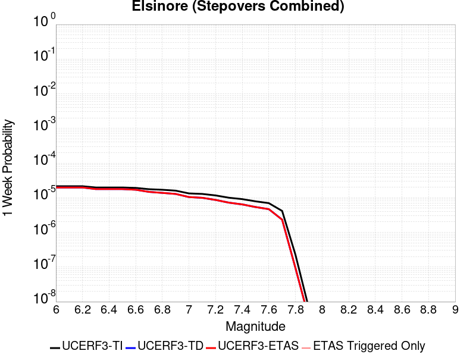 | 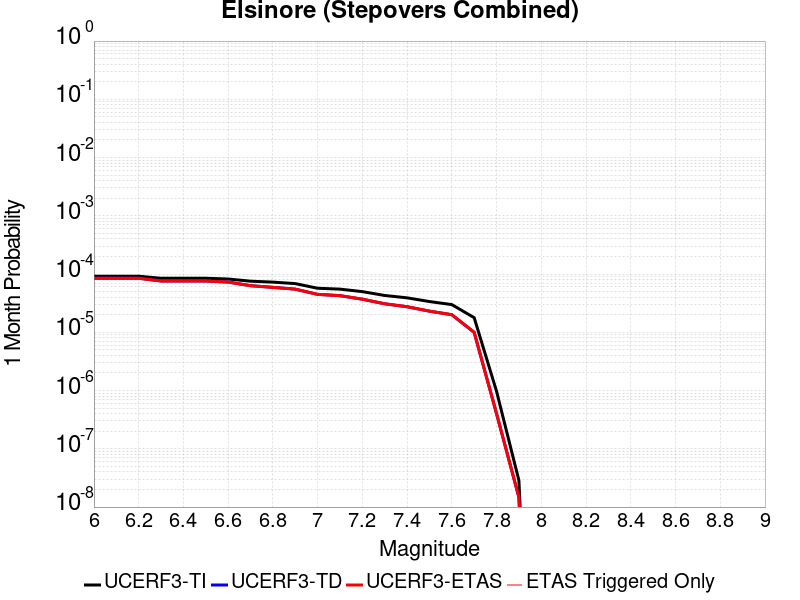 | 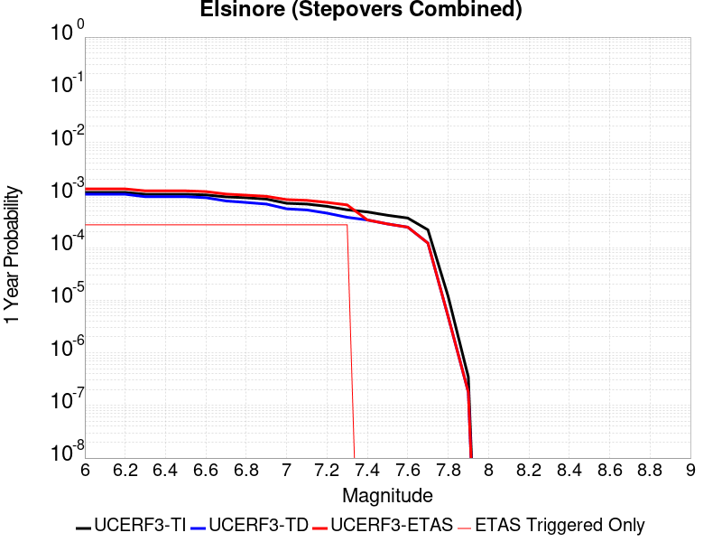 |  |

| Magnitude | 1 wk TI Prob | 1 wk TD Prob | 1 wk ETAS Prob | 1 wk ETAS/TD Gain | 1 wk ETAS Triggered Only | 1 mo TI Prob | 1 mo TD Prob | 1 mo ETAS Prob | 1 mo ETAS/TD Gain | 1 mo ETAS Triggered Only | 1 yr TI Prob | 1 yr TD Prob | 1 yr ETAS Prob | 1 yr ETAS/TD Gain | 1 yr ETAS Triggered Only | 10 yr TI Prob | 10 yr TD Prob | 10 yr ETAS Prob | 10 yr ETAS/TD Gain | 10 yr ETAS Triggered Only |
|-----|-----|-----|-----|-----|-----|-----|-----|-----|-----|-----|-----|-----|-----|-----|-----|-----|-----|-----|-----|-----|
| 6.0 | 2.144392E-5 | 1.9774543E-5 | 1.9774543E-5 | 1.0 | 0.0 | 9.189928E-5 | 8.474533E-5 | 8.474533E-5 | 1.0 | 0.0 | 0.0011182994 | 0.0010313056 | 0.0010724223 | 1.0398685 | 4.1159037E-5 | 0.011126885 | 0.010272467 | 0.010313203 | 1.0039656 | 4.1159037E-5 |
| 6.1 | 2.144392E-5 | 1.9774543E-5 | 1.9774543E-5 | 1.0 | 0.0 | 9.189928E-5 | 8.474533E-5 | 8.474533E-5 | 1.0 | 0.0 | 0.0011182994 | 0.0010313056 | 0.0010724223 | 1.0398685 | 4.1159037E-5 | 0.011126885 | 0.010272467 | 0.010313203 | 1.0039656 | 4.1159037E-5 |
| 6.2 | 2.144392E-5 | 1.9774543E-5 | 1.9774543E-5 | 1.0 | 0.0 | 9.189928E-5 | 8.474533E-5 | 8.474533E-5 | 1.0 | 0.0 | 0.0011182994 | 0.0010313056 | 0.0010724223 | 1.0398685 | 4.1159037E-5 | 0.011126885 | 0.010272467 | 0.010313203 | 1.0039656 | 4.1159037E-5 |
| 6.3 | 1.9751555E-5 | 1.7754899E-5 | 1.7754899E-5 | 1.0 | 0.0 | 8.4646774E-5 | 7.609022E-5 | 7.609022E-5 | 1.0 | 0.0 | 0.0010300872 | 9.2601933E-4 | 9.6714025E-4 | 1.0444062 | 4.1159037E-5 | 0.010253254 | 0.009228367 | 0.009269146 | 1.0044188 | 4.1159037E-5 |
| 6.4 | 1.9751555E-5 | 1.7754899E-5 | 1.7754899E-5 | 1.0 | 0.0 | 8.4646774E-5 | 7.609022E-5 | 7.609022E-5 | 1.0 | 0.0 | 0.0010300872 | 9.2601933E-4 | 9.6714025E-4 | 1.0444062 | 4.1159037E-5 | 0.010253254 | 0.009228367 | 0.009269146 | 1.0044188 | 4.1159037E-5 |
| 6.5 | 1.9751555E-5 | 1.7754899E-5 | 1.7754899E-5 | 1.0 | 0.0 | 8.4646774E-5 | 7.609022E-5 | 7.609022E-5 | 1.0 | 0.0 | 0.0010300872 | 9.2601933E-4 | 9.6714025E-4 | 1.0444062 | 4.1159037E-5 | 0.010253254 | 0.009228367 | 0.009269146 | 1.0044188 | 4.1159037E-5 |
| 6.6 | 1.9188685E-5 | 1.7016308E-5 | 1.7016308E-5 | 1.0 | 0.0 | 8.2234634E-5 | 7.292508E-5 | 7.292508E-5 | 1.0 | 0.0 | 0.0010007467 | 8.875174E-4 | 9.2863996E-4 | 1.0463343 | 4.1159037E-5 | 0.00996252 | 0.008846682 | 0.008887476 | 1.0046114 | 4.1159037E-5 |
| 6.7 | 1.7608272E-5 | 1.4743814E-5 | 1.4743814E-5 | 1.0 | 0.0 | 7.546184E-5 | 6.31863E-5 | 6.31863E-5 | 1.0 | 0.0 | 9.183606E-4 | 7.6903147E-4 | 8.1015885E-4 | 1.0534794 | 4.1159037E-5 | 0.009145746 | 0.0076707136 | 0.0077115567 | 1.0053246 | 4.1159037E-5 |
| 6.8 | 1.697165E-5 | 1.3793744E-5 | 1.3793744E-5 | 1.0 | 0.0 | 7.273361E-5 | 5.9114755E-5 | 5.9114755E-5 | 1.0 | 0.0 | 8.8517193E-4 | 7.194932E-4 | 7.606226E-4 | 1.0571644 | 4.1159037E-5 | 0.008816543 | 0.007178198 | 0.0072190617 | 1.0056927 | 4.1159037E-5 |
| 6.9 | 1.600365E-5 | 1.2856681E-5 | 1.2856681E-5 | 1.0 | 0.0 | 6.858527E-5 | 5.5098943E-5 | 5.5098943E-5 | 1.0 | 0.0 | 8.347058E-4 | 6.706309E-4 | 7.1176235E-4 | 1.0613325 | 4.1159037E-5 | 0.008315775 | 0.0066922423 | 0.006733126 | 1.0061091 | 4.1159037E-5 |
| 7.0 | 1.3314581E-5 | 1.04562205E-5 | 1.04562205E-5 | 1.0 | 0.0 | 5.7061243E-5 | 4.481162E-5 | 4.481162E-5 | 1.0 | 0.0 | 6.944992E-4 | 5.454476E-4 | 5.8658415E-4 | 1.075418 | 4.1159037E-5 | 0.006923327 | 0.005445206 | 0.005486141 | 1.0075176 | 4.1159037E-5 |
| 7.1 | 1.2865345E-5 | 9.945721E-6 | 9.945721E-6 | 1.0 | 0.0 | 5.5136024E-5 | 4.262384E-5 | 4.262384E-5 | 1.0 | 0.0 | 6.710743E-4 | 5.188242E-4 | 5.599619E-4 | 1.0792903 | 4.1159037E-5 | 0.0066905143 | 0.0051792823 | 0.0052202283 | 1.0079057 | 4.1159037E-5 |
| 7.2 | 1.1650051E-5 | 8.640887E-6 | 8.640887E-6 | 1.0 | 0.0 | 4.9927836E-5 | 3.703186E-5 | 3.703186E-5 | 1.0 | 0.0 | 6.0770183E-4 | 4.5077136E-4 | 4.9191184E-4 | 1.0912669 | 4.1159037E-5 | 0.0060604266 | 0.0044998745 | 0.0045408485 | 1.0091056 | 4.1159037E-5 |
| 7.3 | 1.0008533E-5 | 7.206928E-6 | 7.206928E-6 | 1.0 | 0.0 | 4.2893007E-5 | 3.0886476E-5 | 3.0886476E-5 | 1.0 | 0.0 | 5.220972E-4 | 3.759794E-4 | 4.1712297E-4 | 1.1094303 | 4.1159037E-5 | 0.005208723 | 0.00375379 | 0.0037947944 | 1.0109235 | 4.1159037E-5 |
| 7.4 | 9.116759E-6 | 6.4152687E-6 | 6.4152687E-6 | 1.0 | 0.0 | 3.907124E-5 | 2.7493727E-5 | 2.7493727E-5 | 1.0 | 0.0 | 4.7558855E-4 | 3.3468608E-4 | 3.3468608E-4 | 1.0 | 0.0 | 0.00474572 | 0.0033419759 | 0.0033419759 | 1.0 | 0.0 |
| 7.5 | 7.870524E-6 | 5.386936E-6 | 5.386936E-6 | 1.0 | 0.0 | 3.3730383E-5 | 2.3086672E-5 | 2.3086672E-5 | 1.0 | 0.0 | 4.1059E-4 | 2.8104524E-4 | 2.8104524E-4 | 1.0 | 0.0 | 0.0040983222 | 0.0028070249 | 0.0028070249 | 1.0 | 0.0 |
| 7.6 | 6.9774537E-6 | 4.681569E-6 | 4.681569E-6 | 1.0 | 0.0 | 2.990303E-5 | 2.0063719E-5 | 2.0063719E-5 | 1.0 | 0.0 | 3.640086E-4 | 2.4424956E-4 | 2.4424956E-4 | 1.0 | 0.0 | 0.003634129 | 0.0024399275 | 0.0024399275 | 1.0 | 0.0 |
| 7.7 | 4.1616954E-6 | 2.3304488E-6 | 2.3304488E-6 | 1.0 | 0.0 | 1.7835715E-5 | 9.987603E-6 | 9.987603E-6 | 1.0 | 0.0 | 2.171282E-4 | 1.2159303E-4 | 1.2159303E-4 | 1.0 | 0.0 | 0.0021691616 | 0.0012153382 | 0.0012153382 | 1.0 | 0.0 |
| 7.8 | 2.2692414E-7 | 9.3929124E-8 | 9.3929124E-8 | 1.0 | 0.0 | 9.725317E-7 | 4.0255333E-7 | 4.0255333E-7 | 1.0 | 0.0 | 1.1840509E-5 | 4.901079E-6 | 4.901079E-6 | 1.0 | 0.0 | 1.1839878E-4 | 4.901004E-5 | 4.901004E-5 | 1.0 | 0.0 |
| 7.9 | 6.676829E-9 | 3.4418608E-9 | 3.4418608E-9 | 1.0 | 0.0 | 2.861498E-8 | 1.4750832E-8 | 1.4750832E-8 | 1.0 | 0.0 | 3.4838732E-7 | 1.7959135E-7 | 1.7959135E-7 | 1.0 | 0.0 | 3.4838679E-6 | 1.7959123E-6 | 1.7959123E-6 | 1.0 | 0.0 |

## Cleghorn Lake
*[(top)](#table-of-contents)*

| 1 Week | 1 Month | 1 Year | 10 Year |
|-----|-----|-----|-----|
| 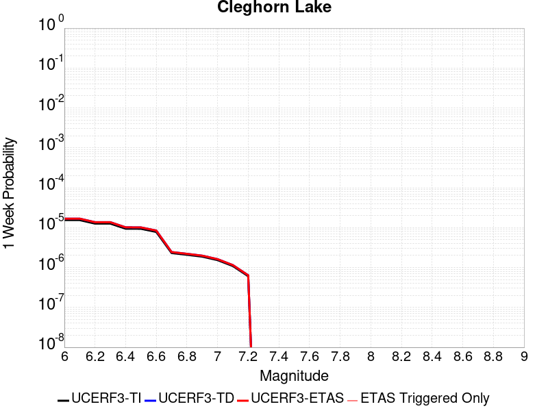 | 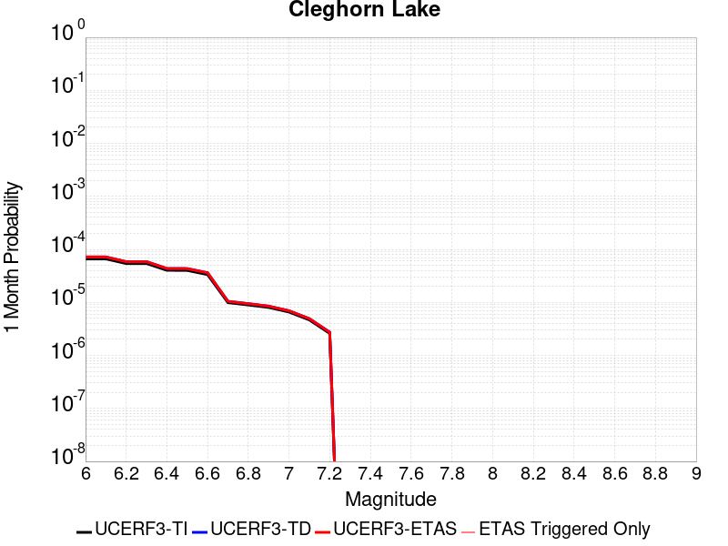 | 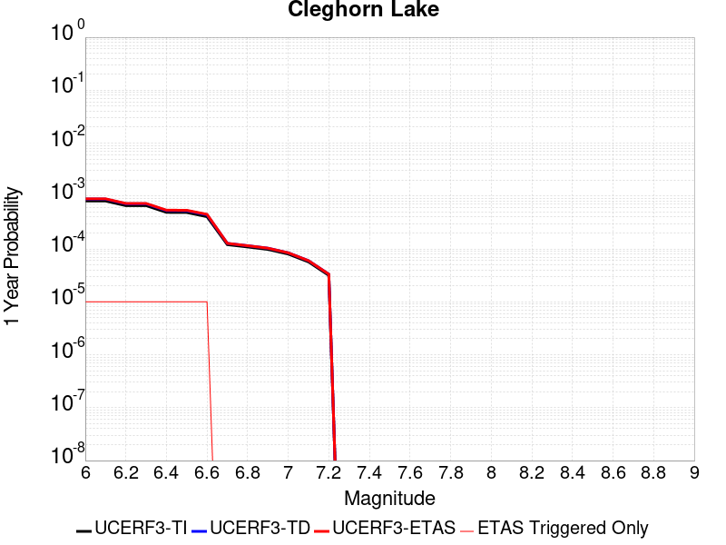 | 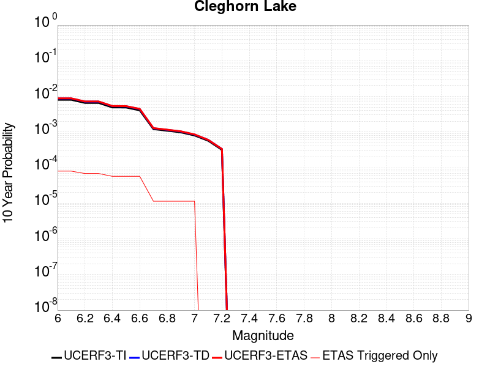 |

| Magnitude | 1 wk TI Prob | 1 wk TD Prob | 1 wk ETAS Prob | 1 wk ETAS/TD Gain | 1 wk ETAS Triggered Only | 1 mo TI Prob | 1 mo TD Prob | 1 mo ETAS Prob | 1 mo ETAS/TD Gain | 1 mo ETAS Triggered Only | 1 yr TI Prob | 1 yr TD Prob | 1 yr ETAS Prob | 1 yr ETAS/TD Gain | 1 yr ETAS Triggered Only | 10 yr TI Prob | 10 yr TD Prob | 10 yr ETAS Prob | 10 yr ETAS/TD Gain | 10 yr ETAS Triggered Only |
|-----|-----|-----|-----|-----|-----|-----|-----|-----|-----|-----|-----|-----|-----|-----|-----|-----|-----|-----|-----|-----|
| 6.0 | 1.5467183E-5 | 1.6797545E-5 | 1.6797545E-5 | 1.0 | 0.0 | 6.6286244E-5 | 7.198781E-5 | 7.198781E-5 | 1.0 | 0.0 | 8.067362E-4 | 8.76154E-4 | 8.76154E-4 | 1.0 | 0.0 | 0.008038137 | 0.008732427 | 0.008773226 | 1.0046722 | 4.1159037E-5 |
| 6.1 | 1.5467183E-5 | 1.6797545E-5 | 1.6797545E-5 | 1.0 | 0.0 | 6.6286244E-5 | 7.198781E-5 | 7.198781E-5 | 1.0 | 0.0 | 8.067362E-4 | 8.76154E-4 | 8.76154E-4 | 1.0 | 0.0 | 0.008038137 | 0.008732427 | 0.008773226 | 1.0046722 | 4.1159037E-5 |
| 6.2 | 1.2624631E-5 | 1.3684203E-5 | 1.3684203E-5 | 1.0 | 0.0 | 5.410444E-5 | 5.864554E-5 | 5.864554E-5 | 1.0 | 0.0 | 6.585225E-4 | 7.1382424E-4 | 7.1382424E-4 | 1.0 | 0.0 | 0.0065657445 | 0.007120111 | 0.007160977 | 1.0057396 | 4.1159037E-5 |
| 6.3 | 1.2624631E-5 | 1.3684203E-5 | 1.3684203E-5 | 1.0 | 0.0 | 5.410444E-5 | 5.864554E-5 | 5.864554E-5 | 1.0 | 0.0 | 6.585225E-4 | 7.1382424E-4 | 7.1382424E-4 | 1.0 | 0.0 | 0.0065657445 | 0.007120111 | 0.007160977 | 1.0057396 | 4.1159037E-5 |
| 6.4 | 9.417684E-6 | 1.0172005E-5 | 1.0172005E-5 | 1.0 | 0.0 | 4.036088E-5 | 4.359381E-5 | 4.359381E-5 | 1.0 | 0.0 | 4.912829E-4 | 5.306665E-4 | 5.306665E-4 | 1.0 | 0.0 | 0.004901982 | 0.0052980306 | 0.0053389715 | 1.0077276 | 4.1159037E-5 |
| 6.5 | 9.368219E-6 | 1.0119424E-5 | 1.0119424E-5 | 1.0 | 0.0 | 4.014889E-5 | 4.336847E-5 | 4.336847E-5 | 1.0 | 0.0 | 4.8870314E-4 | 5.2792433E-4 | 5.2792433E-4 | 1.0 | 0.0 | 0.004876298 | 0.005270739 | 0.005311681 | 1.0077678 | 4.1159037E-5 |
| 6.6 | 7.803798E-6 | 8.443432E-6 | 8.443432E-6 | 1.0 | 0.0 | 3.3444423E-5 | 3.6185862E-5 | 3.6185862E-5 | 1.0 | 0.0 | 4.0710976E-4 | 4.4051374E-4 | 4.4051374E-4 | 1.0 | 0.0 | 0.0040636472 | 0.004400324 | 0.0044413023 | 1.0093125 | 4.1159037E-5 |
| 6.7 | 2.3108669E-6 | 2.444159E-6 | 2.444159E-6 | 1.0 | 0.0 | 9.903678E-6 | 1.0474926E-5 | 1.0474926E-5 | 1.0 | 0.0 | 1.205706E-4 | 1.2752495E-4 | 1.2752495E-4 | 1.0 | 0.0 | 0.001205052 | 0.0012745364 | 0.0012745364 | 1.0 | 0.0 |
| 6.8 | 2.0882828E-6 | 2.2065706E-6 | 2.2065706E-6 | 1.0 | 0.0 | 8.949753E-6 | 9.456698E-6 | 9.456698E-6 | 1.0 | 0.0 | 1.08957785E-4 | 1.15129376E-4 | 1.15129376E-4 | 1.0 | 0.0 | 0.0010890438 | 0.0011507142 | 0.0011507142 | 1.0 | 0.0 |
| 6.9 | 1.876935E-6 | 1.981305E-6 | 1.981305E-6 | 1.0 | 0.0 | 8.043982E-6 | 8.491281E-6 | 8.491281E-6 | 1.0 | 0.0 | 9.7931086E-5 | 1.033766E-4 | 1.033766E-4 | 1.0 | 0.0 | 9.788794E-4 | 0.0010333011 | 0.0010333011 | 1.0 | 0.0 |
| 7.0 | 1.5357559E-6 | 1.620487E-6 | 1.620487E-6 | 1.0 | 0.0 | 6.5817944E-6 | 6.944926E-6 | 6.944926E-6 | 1.0 | 0.0 | 8.01304E-5 | 8.455132E-5 | 8.455132E-5 | 1.0 | 0.0 | 8.010151E-4 | 8.45204E-4 | 8.45204E-4 | 1.0 | 0.0 |
| 7.1 | 1.0905424E-6 | 1.1499063E-6 | 1.1499063E-6 | 1.0 | 0.0 | 4.6737446E-6 | 4.928161E-6 | 4.928161E-6 | 1.0 | 0.0 | 5.6901354E-5 | 5.999881E-5 | 5.999881E-5 | 1.0 | 0.0 | 5.6886784E-4 | 5.998359E-4 | 5.998359E-4 | 1.0 | 0.0 |
| 7.2 | 6.06668E-7 | 6.388058E-7 | 6.388058E-7 | 1.0 | 0.0 | 2.600003E-6 | 2.7377366E-6 | 2.7377366E-6 | 1.0 | 0.0 | 3.1654577E-5 | 3.3331504E-5 | 3.3331504E-5 | 1.0 | 0.0 | 3.1650066E-4 | 3.332719E-4 | 3.332719E-4 | 1.0 | 0.0 |

## Bullion Mountains
*[(top)](#table-of-contents)*

| 1 Week | 1 Month | 1 Year | 10 Year |
|-----|-----|-----|-----|
| 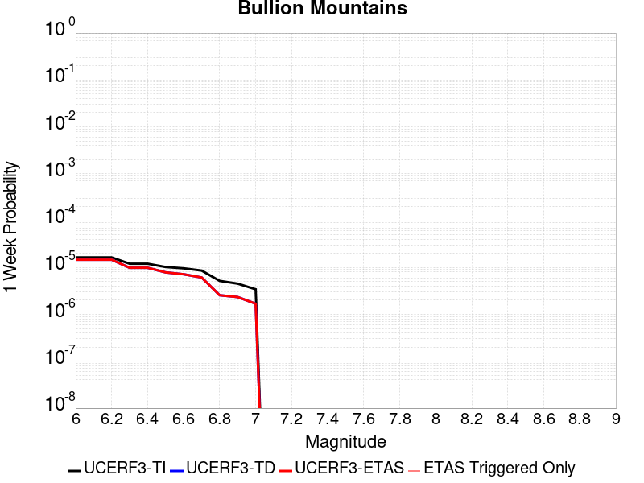 | 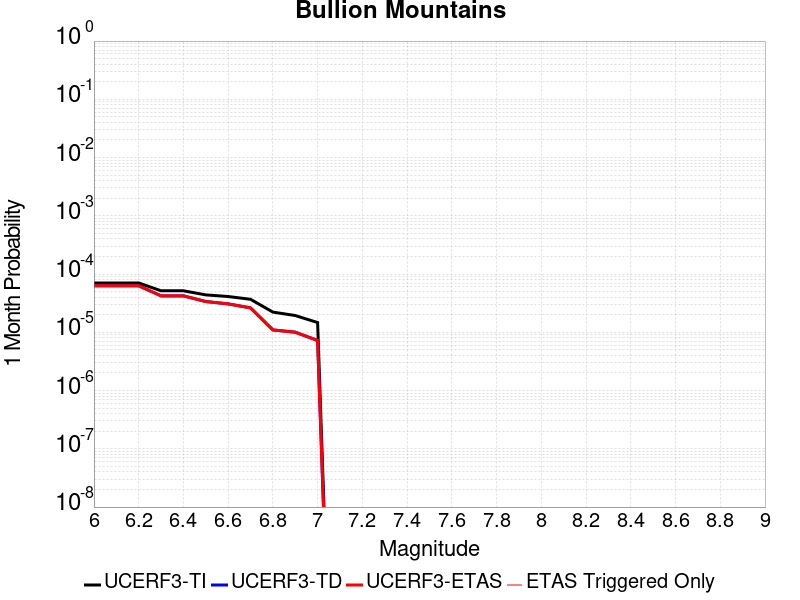 | 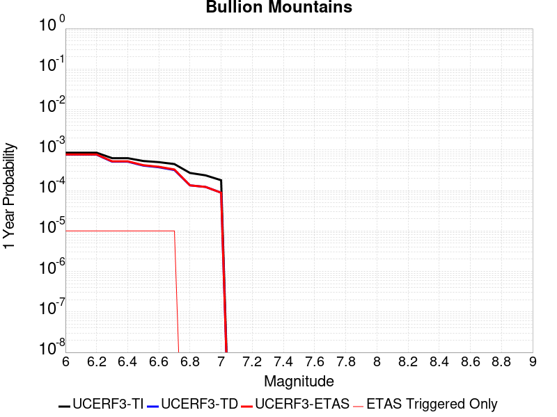 | 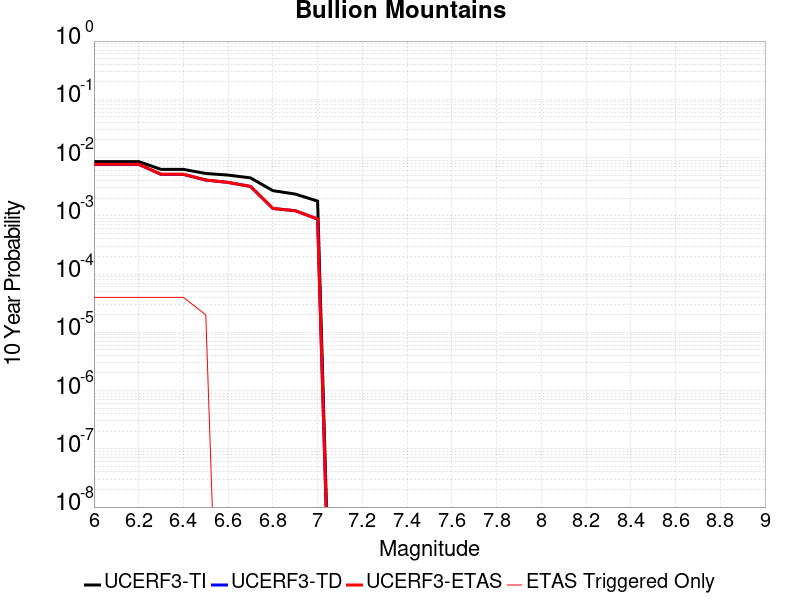 |

| Magnitude | 1 wk TI Prob | 1 wk TD Prob | 1 wk ETAS Prob | 1 wk ETAS/TD Gain | 1 wk ETAS Triggered Only | 1 mo TI Prob | 1 mo TD Prob | 1 mo ETAS Prob | 1 mo ETAS/TD Gain | 1 mo ETAS Triggered Only | 1 yr TI Prob | 1 yr TD Prob | 1 yr ETAS Prob | 1 yr ETAS/TD Gain | 1 yr ETAS Triggered Only | 10 yr TI Prob | 10 yr TD Prob | 10 yr ETAS Prob | 10 yr ETAS/TD Gain | 10 yr ETAS Triggered Only |
|-----|-----|-----|-----|-----|-----|-----|-----|-----|-----|-----|-----|-----|-----|-----|-----|-----|-----|-----|-----|-----|
| 6.0 | 1.6420427E-5 | 1.4695805E-5 | 1.4695805E-5 | 1.0 | 0.0 | 7.037136E-5 | 6.298071E-5 | 6.298071E-5 | 1.0 | 0.0 | 8.5643446E-4 | 7.665588E-4 | 7.665588E-4 | 1.0 | 0.0 | 0.008531413 | 0.0076429415 | 0.007683786 | 1.005344 | 4.1159037E-5 |
| 6.1 | 1.6420427E-5 | 1.4695805E-5 | 1.4695805E-5 | 1.0 | 0.0 | 7.037136E-5 | 6.298071E-5 | 6.298071E-5 | 1.0 | 0.0 | 8.5643446E-4 | 7.665588E-4 | 7.665588E-4 | 1.0 | 0.0 | 0.008531413 | 0.0076429415 | 0.007683786 | 1.005344 | 4.1159037E-5 |
| 6.2 | 1.6420427E-5 | 1.4695805E-5 | 1.4695805E-5 | 1.0 | 0.0 | 7.037136E-5 | 6.298071E-5 | 6.298071E-5 | 1.0 | 0.0 | 8.5643446E-4 | 7.665588E-4 | 7.665588E-4 | 1.0 | 0.0 | 0.008531413 | 0.0076429415 | 0.007683786 | 1.005344 | 4.1159037E-5 |
| 6.3 | 1.2046778E-5 | 9.864884E-6 | 9.864884E-6 | 1.0 | 0.0 | 5.1628023E-5 | 4.2277523E-5 | 4.2277523E-5 | 1.0 | 0.0 | 6.283899E-4 | 5.1463046E-4 | 5.1463046E-4 | 1.0 | 0.0 | 0.0062661595 | 0.0051366696 | 0.005177617 | 1.0079716 | 4.1159037E-5 |
| 6.4 | 1.2046778E-5 | 9.864884E-6 | 9.864884E-6 | 1.0 | 0.0 | 5.1628023E-5 | 4.2277523E-5 | 4.2277523E-5 | 1.0 | 0.0 | 6.283899E-4 | 5.1463046E-4 | 5.1463046E-4 | 1.0 | 0.0 | 0.0062661595 | 0.0051366696 | 0.005177617 | 1.0079716 | 4.1159037E-5 |
| 6.5 | 1.0244343E-5 | 7.881549E-6 | 7.881549E-6 | 1.0 | 0.0 | 4.390359E-5 | 3.3777746E-5 | 3.3777746E-5 | 1.0 | 0.0 | 5.343951E-4 | 4.1118715E-4 | 4.1118715E-4 | 1.0 | 0.0 | 0.005331118 | 0.0041062953 | 0.0041472856 | 1.0099822 | 4.1159037E-5 |
| 6.6 | 9.605408E-6 | 7.179427E-6 | 7.179427E-6 | 1.0 | 0.0 | 4.1165385E-5 | 3.0768722E-5 | 3.0768722E-5 | 1.0 | 0.0 | 5.010733E-4 | 3.745652E-4 | 3.745652E-4 | 1.0 | 0.0 | 0.00499945 | 0.0037413368 | 0.0037413368 | 1.0 | 0.0 |
| 6.7 | 8.60418E-6 | 6.1256856E-6 | 6.1256856E-6 | 1.0 | 0.0 | 3.687454E-5 | 2.6252785E-5 | 2.6252785E-5 | 1.0 | 0.0 | 4.48855E-4 | 3.1960028E-4 | 3.1960028E-4 | 1.0 | 0.0 | 0.004479495 | 0.0031933193 | 0.0031933193 | 1.0 | 0.0 |
| 6.8 | 5.187994E-6 | 2.5640145E-6 | 2.5640145E-6 | 1.0 | 0.0 | 2.223407E-5 | 1.098861E-5 | 1.098861E-5 | 1.0 | 0.0 | 2.7066618E-4 | 1.3378212E-4 | 1.3378212E-4 | 1.0 | 0.0 | 0.0027033675 | 0.0013374075 | 0.0013374075 | 1.0 | 0.0 |
| 6.9 | 4.5302368E-6 | 2.345053E-6 | 2.345053E-6 | 1.0 | 0.0 | 1.9415156E-5 | 1.0050211E-5 | 1.0050211E-5 | 1.0 | 0.0 | 2.3635388E-4 | 1.2235841E-4 | 1.2235841E-4 | 1.0 | 0.0 | 0.0023610266 | 0.0012232999 | 0.0012232999 | 1.0 | 0.0 |
| 7.0 | 3.431668E-6 | 1.6888065E-6 | 1.6888065E-6 | 1.0 | 0.0 | 1.4707065E-5 | 7.237742E-6 | 7.237742E-6 | 1.0 | 0.0 | 1.7904381E-4 | 8.811951E-5 | 8.811951E-5 | 1.0 | 0.0 | 0.0017889962 | 8.8119507E-4 | 8.8119507E-4 | 1.0 | 0.0 |

## Ortigalita (North)
*[(top)](#table-of-contents)*

| 1 Week | 1 Month | 1 Year | 10 Year |
|-----|-----|-----|-----|
| 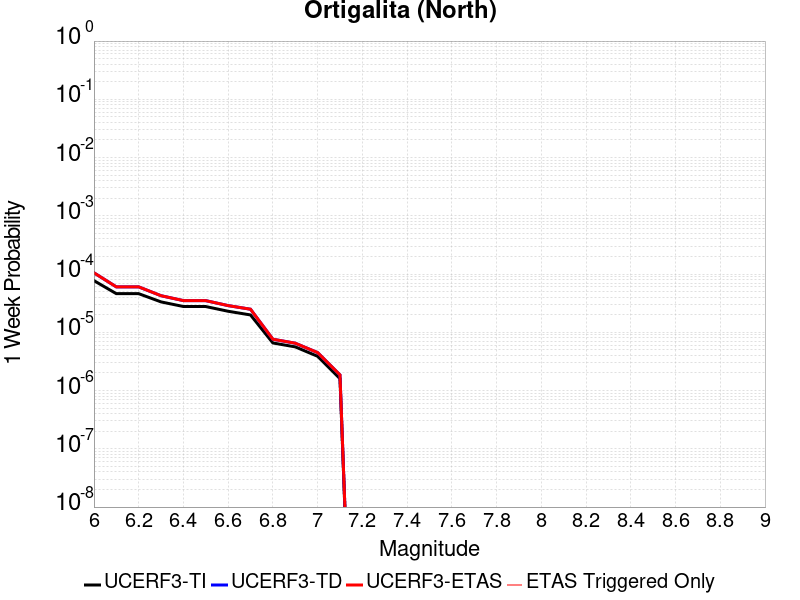 | 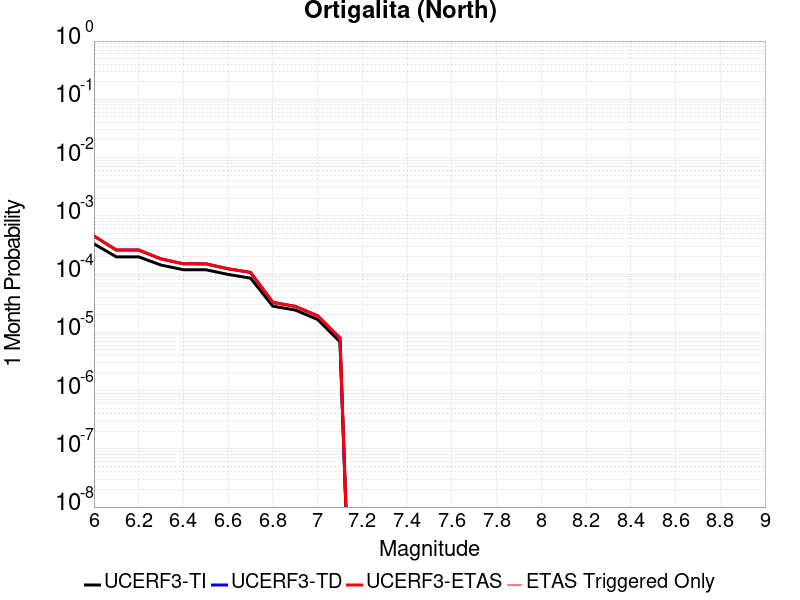 | 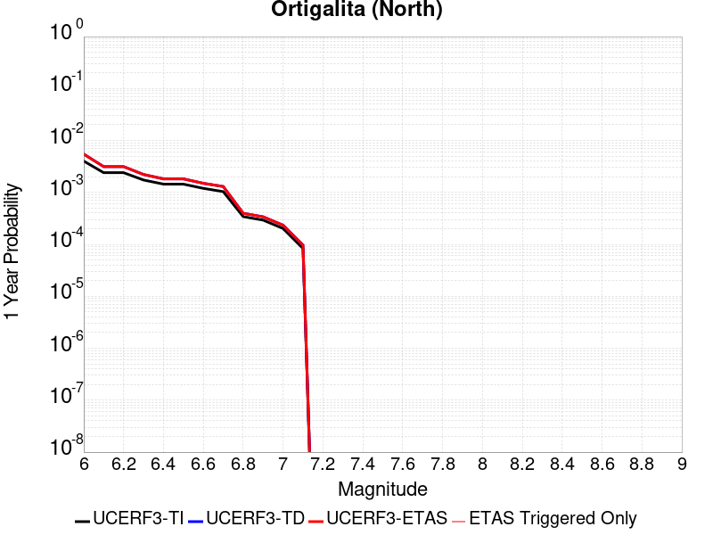 | 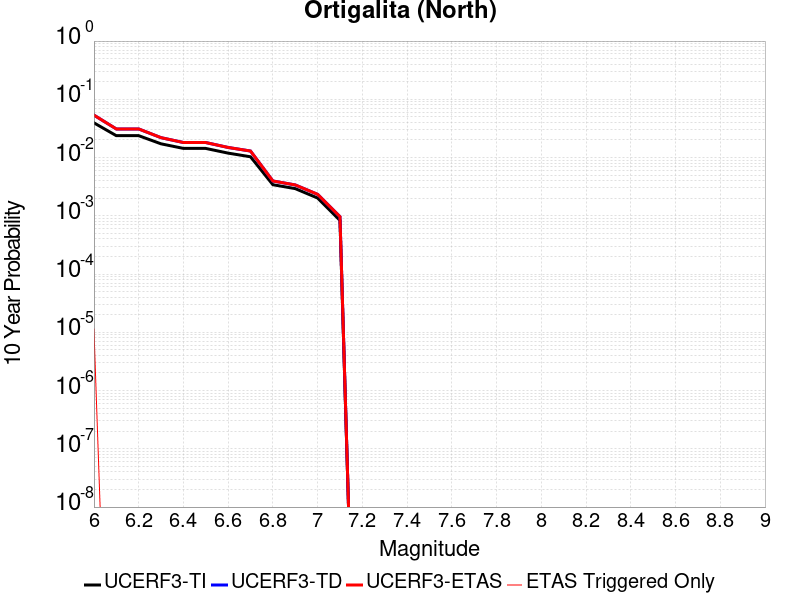 |

| Magnitude | 1 wk TI Prob | 1 wk TD Prob | 1 wk ETAS Prob | 1 wk ETAS/TD Gain | 1 wk ETAS Triggered Only | 1 mo TI Prob | 1 mo TD Prob | 1 mo ETAS Prob | 1 mo ETAS/TD Gain | 1 mo ETAS Triggered Only | 1 yr TI Prob | 1 yr TD Prob | 1 yr ETAS Prob | 1 yr ETAS/TD Gain | 1 yr ETAS Triggered Only | 10 yr TI Prob | 10 yr TD Prob | 10 yr ETAS Prob | 10 yr ETAS/TD Gain | 10 yr ETAS Triggered Only |
|-----|-----|-----|-----|-----|-----|-----|-----|-----|-----|-----|-----|-----|-----|-----|-----|-----|-----|-----|-----|-----|
| 6.0 | 7.711876E-5 | 1.051324E-4 | 1.051324E-4 | 1.0 | 0.0 | 3.3046713E-4 | 4.5050008E-4 | 4.5050008E-4 | 1.0 | 0.0 | 0.004016016 | 0.005472248 | 0.005472248 | 1.0 | 0.0 | 0.039442103 | 0.053495064 | 0.053534023 | 1.0007282 | 4.1159037E-5 |
| 6.1 | 4.607858E-5 | 6.0281596E-5 | 6.0281596E-5 | 1.0 | 0.0 | 1.9746469E-4 | 2.583265E-4 | 2.583265E-4 | 1.0 | 0.0 | 0.0024014818 | 0.0031409035 | 0.0031409035 | 1.0 | 0.0 | 0.023756953 | 0.030996198 | 0.030996198 | 1.0 | 0.0 |
| 6.2 | 4.607858E-5 | 6.0281596E-5 | 6.0281596E-5 | 1.0 | 0.0 | 1.9746469E-4 | 2.583265E-4 | 2.583265E-4 | 1.0 | 0.0 | 0.0024014818 | 0.0031409035 | 0.0031409035 | 1.0 | 0.0 | 0.023756953 | 0.030996198 | 0.030996198 | 1.0 | 0.0 |
| 6.3 | 3.327423E-5 | 4.250346E-5 | 4.250346E-5 | 1.0 | 0.0 | 1.4259605E-4 | 1.8214634E-4 | 1.8214634E-4 | 1.0 | 0.0 | 0.0017347244 | 0.002215622 | 0.002215622 | 1.0 | 0.0 | 0.017212452 | 0.021959566 | 0.021959566 | 1.0 | 0.0 |
| 6.4 | 2.7732503E-5 | 3.5020592E-5 | 3.5020592E-5 | 1.0 | 0.0 | 1.1884817E-4 | 1.5008076E-4 | 1.5008076E-4 | 1.0 | 0.0 | 0.001446016 | 0.0018259367 | 0.0018259367 | 1.0 | 0.0 | 0.014366428 | 0.018132308 | 0.018132308 | 1.0 | 0.0 |
| 6.5 | 2.7689714E-5 | 3.4970388E-5 | 3.4970388E-5 | 1.0 | 0.0 | 1.186648E-4 | 1.498656E-4 | 1.498656E-4 | 1.0 | 0.0 | 0.0014437864 | 0.0018233217 | 0.0018233217 | 1.0 | 0.0 | 0.014344421 | 0.018106585 | 0.018106585 | 1.0 | 0.0 |
| 6.6 | 2.2976905E-5 | 2.8735385E-5 | 2.8735385E-5 | 1.0 | 0.0 | 9.846873E-5 | 1.2314717E-4 | 1.2314717E-4 | 1.0 | 0.0 | 0.0011981975 | 0.001498524 | 0.001498524 | 1.0 | 0.0 | 0.011917574 | 0.014907515 | 0.014907515 | 1.0 | 0.0 |
| 6.7 | 1.9871539E-5 | 2.4919686E-5 | 2.4919686E-5 | 1.0 | 0.0 | 8.516096E-5 | 1.06795684E-4 | 1.06795684E-4 | 1.0 | 0.0 | 0.0010363415 | 0.0012997036 | 0.0012997036 | 1.0 | 0.0 | 0.010315218 | 0.012944703 | 0.012944703 | 1.0 | 0.0 |
| 6.8 | 6.5640475E-6 | 7.6082874E-6 | 7.6082874E-6 | 1.0 | 0.0 | 2.813133E-5 | 3.2606556E-5 | 3.2606556E-5 | 1.0 | 0.0 | 3.424451E-4 | 3.9691536E-4 | 3.9691536E-4 | 1.0 | 0.0 | 0.0034191788 | 0.003962352 | 0.003962352 | 1.0 | 0.0 |
| 6.9 | 5.6219683E-6 | 6.5041936E-6 | 6.5041936E-6 | 1.0 | 0.0 | 2.4093928E-5 | 2.7874832E-5 | 2.7874832E-5 | 1.0 | 0.0 | 2.933041E-4 | 3.393258E-4 | 3.393258E-4 | 1.0 | 0.0 | 0.0029291727 | 0.0033883343 | 0.0033883343 | 1.0 | 0.0 |
| 7.0 | 3.875591E-6 | 4.4863864E-6 | 4.4863864E-6 | 1.0 | 0.0 | 1.6609569E-5 | 1.9227242E-5 | 1.9227242E-5 | 1.0 | 0.0 | 2.0220275E-4 | 2.3406863E-4 | 2.3406863E-4 | 1.0 | 0.0 | 0.0020201886 | 0.0023384294 | 0.0023384294 | 1.0 | 0.0 |
| 7.1 | 1.6017933E-6 | 1.8577269E-6 | 1.8577269E-6 | 1.0 | 0.0 | 6.8648105E-6 | 7.961668E-6 | 7.961668E-6 | 1.0 | 0.0 | 8.357586E-5 | 9.693007E-5 | 9.693007E-5 | 1.0 | 0.0 | 8.3544437E-4 | 9.689827E-4 | 9.689827E-4 | 1.0 | 0.0 |

## Great Valley 08 (Quinto)
*[(top)](#table-of-contents)*

| 1 Week | 1 Month | 1 Year | 10 Year |
|-----|-----|-----|-----|
| 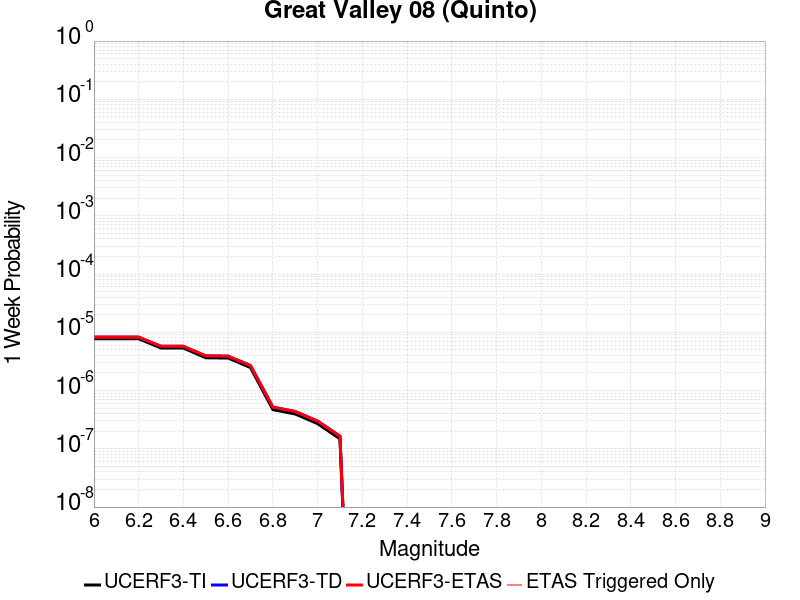 | 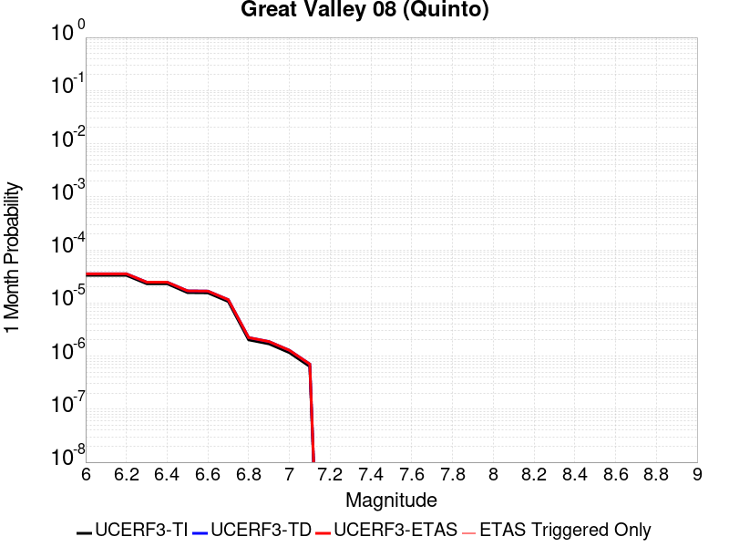 | 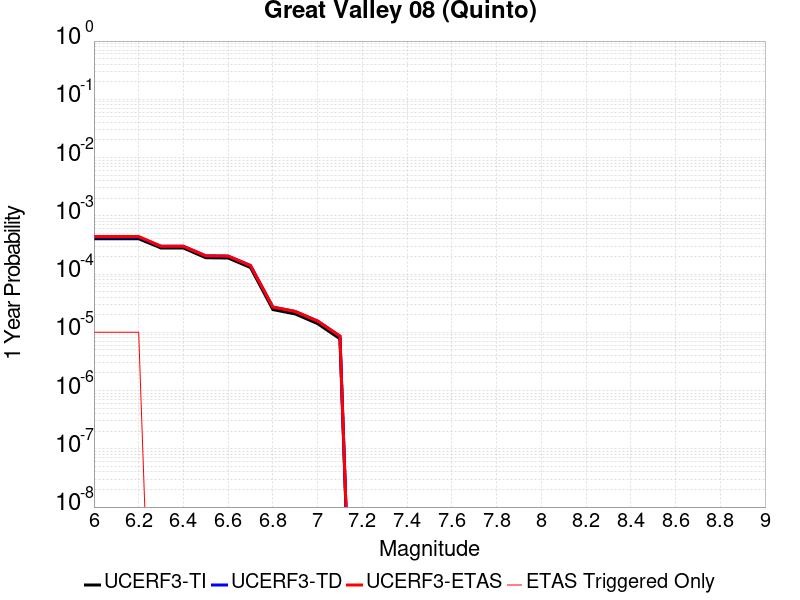 | 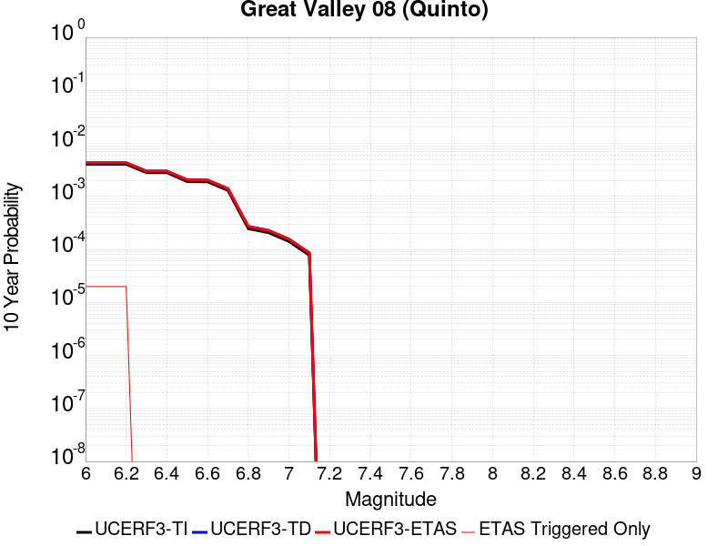 |

| Magnitude | 1 wk TI Prob | 1 wk TD Prob | 1 wk ETAS Prob | 1 wk ETAS/TD Gain | 1 wk ETAS Triggered Only | 1 mo TI Prob | 1 mo TD Prob | 1 mo ETAS Prob | 1 mo ETAS/TD Gain | 1 mo ETAS Triggered Only | 1 yr TI Prob | 1 yr TD Prob | 1 yr ETAS Prob | 1 yr ETAS/TD Gain | 1 yr ETAS Triggered Only | 10 yr TI Prob | 10 yr TD Prob | 10 yr ETAS Prob | 10 yr ETAS/TD Gain | 10 yr ETAS Triggered Only |
|-----|-----|-----|-----|-----|-----|-----|-----|-----|-----|-----|-----|-----|-----|-----|-----|-----|-----|-----|-----|-----|
| 6.0 | 7.737697E-6 | 8.254312E-6 | 8.254312E-6 | 1.0 | 0.0 | 3.3161137E-5 | 3.5375248E-5 | 3.5375248E-5 | 1.0 | 0.0 | 4.0366207E-4 | 4.306274E-4 | 4.7176873E-4 | 1.095538 | 4.1159037E-5 | 0.004029296 | 0.004299783 | 0.004340765 | 1.0095311 | 4.1159037E-5 |
| 6.1 | 7.737697E-6 | 8.254312E-6 | 8.254312E-6 | 1.0 | 0.0 | 3.3161137E-5 | 3.5375248E-5 | 3.5375248E-5 | 1.0 | 0.0 | 4.0366207E-4 | 4.306274E-4 | 4.7176873E-4 | 1.095538 | 4.1159037E-5 | 0.004029296 | 0.004299783 | 0.004340765 | 1.0095311 | 4.1159037E-5 |
| 6.2 | 7.737697E-6 | 8.254312E-6 | 8.254312E-6 | 1.0 | 0.0 | 3.3161137E-5 | 3.5375248E-5 | 3.5375248E-5 | 1.0 | 0.0 | 4.0366207E-4 | 4.306274E-4 | 4.7176873E-4 | 1.095538 | 4.1159037E-5 | 0.004029296 | 0.004299783 | 0.004340765 | 1.0095311 | 4.1159037E-5 |
| 6.3 | 5.374012E-6 | 5.751508E-6 | 5.751508E-6 | 1.0 | 0.0 | 2.3031276E-5 | 2.4649149E-5 | 2.4649149E-5 | 1.0 | 0.0 | 2.803697E-4 | 3.000732E-4 | 3.000732E-4 | 1.0 | 0.0 | 0.0028001624 | 0.002997774 | 0.002997774 | 1.0 | 0.0 |
| 6.4 | 5.374012E-6 | 5.751508E-6 | 5.751508E-6 | 1.0 | 0.0 | 2.3031276E-5 | 2.4649149E-5 | 2.4649149E-5 | 1.0 | 0.0 | 2.803697E-4 | 3.000732E-4 | 3.000732E-4 | 1.0 | 0.0 | 0.0028001624 | 0.002997774 | 0.002997774 | 1.0 | 0.0 |
| 6.5 | 3.65427E-6 | 3.9420406E-6 | 3.9420406E-6 | 1.0 | 0.0 | 1.5661062E-5 | 1.689439E-5 | 1.689439E-5 | 1.0 | 0.0 | 1.9065675E-4 | 2.0567683E-4 | 2.0567683E-4 | 1.0 | 0.0 | 0.0019049325 | 0.0020555567 | 0.0020555567 | 1.0 | 0.0 |
| 6.6 | 3.6143538E-6 | 3.89922E-6 | 3.89922E-6 | 1.0 | 0.0 | 1.5489995E-5 | 1.6710876E-5 | 1.6710876E-5 | 1.0 | 0.0 | 1.8857437E-4 | 2.0344296E-4 | 2.0344296E-4 | 1.0 | 0.0 | 0.0018841444 | 0.002033259 | 0.002033259 | 1.0 | 0.0 |
| 6.7 | 2.4821015E-6 | 2.6862167E-6 | 2.6862167E-6 | 1.0 | 0.0 | 1.0637535E-5 | 1.15123385E-5 | 1.15123385E-5 | 1.0 | 0.0 | 1.2950429E-4 | 1.4015936E-4 | 1.4015936E-4 | 1.0 | 0.0 | 0.0012942884 | 0.0014012648 | 0.0014012648 | 1.0 | 0.0 |
| 6.8 | 4.7110538E-7 | 5.19425E-7 | 5.19425E-7 | 1.0 | 0.0 | 2.0190216E-6 | 2.2261052E-6 | 2.2261052E-6 | 1.0 | 0.0 | 2.458131E-5 | 2.7102513E-5 | 2.7102513E-5 | 1.0 | 0.0 | 2.457859E-4 | 2.7099389E-4 | 2.7099389E-4 | 1.0 | 0.0 |
| 6.9 | 3.958685E-7 | 4.3713962E-7 | 4.3713962E-7 | 1.0 | 0.0 | 1.6965782E-6 | 1.8734543E-6 | 1.8734543E-6 | 1.0 | 0.0 | 2.0655643E-5 | 2.2809083E-5 | 2.2809083E-5 | 1.0 | 0.0 | 2.0653724E-4 | 2.2806905E-4 | 2.2806905E-4 | 1.0 | 0.0 |
| 7.0 | 2.70294E-7 | 2.9927406E-7 | 2.9927406E-7 | 1.0 | 0.0 | 1.1584025E-6 | 1.2826026E-6 | 1.2826026E-6 | 1.0 | 0.0 | 1.4103458E-5 | 1.5615587E-5 | 1.5615587E-5 | 1.0 | 0.0 | 1.4102564E-4 | 1.5614618E-4 | 1.5614618E-4 | 1.0 | 0.0 |
| 7.1 | 1.4828602E-7 | 1.647332E-7 | 1.647332E-7 | 1.0 | 0.0 | 6.3551136E-7 | 7.0599924E-7 | 7.0599924E-7 | 1.0 | 0.0 | 7.737323E-6 | 8.595515E-6 | 8.595515E-6 | 1.0 | 0.0 | 7.737054E-5 | 8.5952626E-5 | 8.5952626E-5 | 1.0 | 0.0 |

## San Clemente
*[(top)](#table-of-contents)*

| 1 Week | 1 Month | 1 Year | 10 Year |
|-----|-----|-----|-----|
| 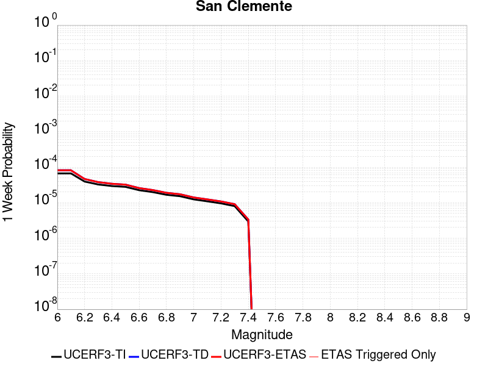 | 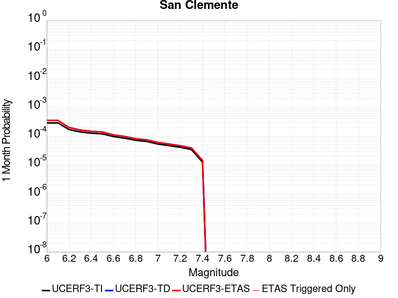 | 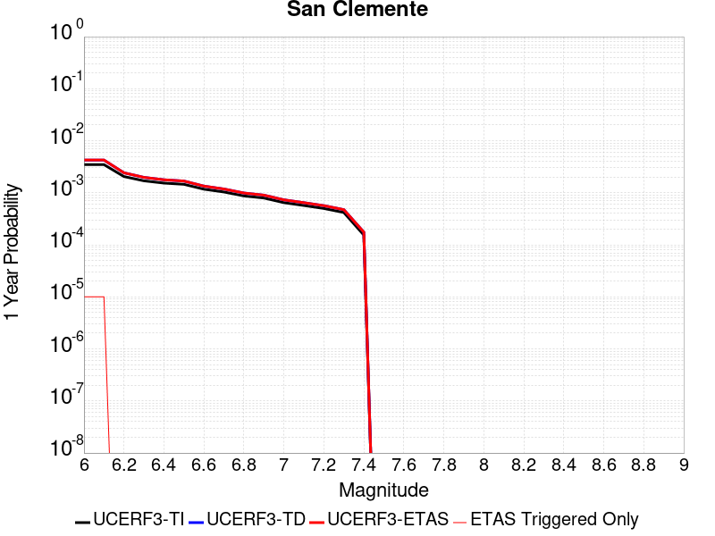 | 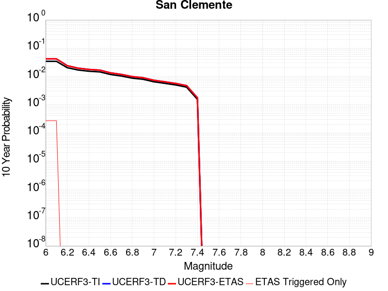 |

| Magnitude | 1 wk TI Prob | 1 wk TD Prob | 1 wk ETAS Prob | 1 wk ETAS/TD Gain | 1 wk ETAS Triggered Only | 1 mo TI Prob | 1 mo TD Prob | 1 mo ETAS Prob | 1 mo ETAS/TD Gain | 1 mo ETAS Triggered Only | 1 yr TI Prob | 1 yr TD Prob | 1 yr ETAS Prob | 1 yr ETAS/TD Gain | 1 yr ETAS Triggered Only | 10 yr TI Prob | 10 yr TD Prob | 10 yr ETAS Prob | 10 yr ETAS/TD Gain | 10 yr ETAS Triggered Only |
|-----|-----|-----|-----|-----|-----|-----|-----|-----|-----|-----|-----|-----|-----|-----|-----|-----|-----|-----|-----|-----|
| 6.0 | 6.681379E-5 | 8.1680366E-5 | 8.1680366E-5 | 1.0 | 0.0 | 2.8631336E-4 | 3.5001338E-4 | 3.5001338E-4 | 1.0 | 0.0 | 0.003480294 | 0.0042535863 | 0.00429457 | 1.0096352 | 4.1159037E-5 | 0.03426291 | 0.041776925 | 0.041816365 | 1.000944 | 4.1159037E-5 |
| 6.1 | 6.681379E-5 | 8.1680366E-5 | 8.1680366E-5 | 1.0 | 0.0 | 2.8631336E-4 | 3.5001338E-4 | 3.5001338E-4 | 1.0 | 0.0 | 0.003480294 | 0.0042535863 | 0.00429457 | 1.0096352 | 4.1159037E-5 | 0.03426291 | 0.041776925 | 0.041816365 | 1.000944 | 4.1159037E-5 |
| 6.2 | 3.9400576E-5 | 4.6471752E-5 | 4.6471752E-5 | 1.0 | 0.0 | 1.6884868E-4 | 1.9914978E-4 | 1.9914978E-4 | 1.0 | 0.0 | 0.0020537945 | 0.002422007 | 0.002422007 | 1.0 | 0.0 | 0.020349167 | 0.023962757 | 0.023962757 | 1.0 | 0.0 |
| 6.3 | 3.2590255E-5 | 3.794358E-5 | 3.794358E-5 | 1.0 | 0.0 | 1.3966505E-4 | 1.6260539E-4 | 1.6260539E-4 | 1.0 | 0.0 | 0.0016990956 | 0.0019779531 | 0.0019779531 | 1.0 | 0.0 | 0.01686163 | 0.019607276 | 0.019607276 | 1.0 | 0.0 |
| 6.4 | 2.9454652E-5 | 3.411026E-5 | 3.411026E-5 | 1.0 | 0.0 | 1.2622811E-4 | 1.4617879E-4 | 1.4617879E-4 | 1.0 | 0.0 | 0.0015357438 | 0.0017783 | 0.0017783 | 1.0 | 0.0 | 0.015251739 | 0.017643873 | 0.017643873 | 1.0 | 0.0 |
| 6.5 | 2.790836E-5 | 3.2259115E-5 | 3.2259115E-5 | 1.0 | 0.0 | 1.1960178E-4 | 1.3824616E-4 | 1.3824616E-4 | 1.0 | 0.0 | 0.001455179 | 0.0016818731 | 0.0016818731 | 1.0 | 0.0 | 0.014456868 | 0.01669446 | 0.01669446 | 1.0 | 0.0 |
| 6.6 | 2.2492153E-5 | 2.5771387E-5 | 2.5771387E-5 | 1.0 | 0.0 | 9.639138E-5 | 1.1044421E-4 | 1.1044421E-4 | 1.0 | 0.0 | 0.0011729331 | 0.0013438435 | 0.0013438435 | 1.0 | 0.0 | 0.011667615 | 0.013358889 | 0.013358889 | 1.0 | 0.0 |
| 6.7 | 1.9862755E-5 | 2.2673834E-5 | 2.2673834E-5 | 1.0 | 0.0 | 8.512331E-5 | 9.7170014E-5 | 9.7170014E-5 | 1.0 | 0.0 | 0.0010358836 | 0.0011824141 | 0.0011824141 | 1.0 | 0.0 | 0.010310682 | 0.011762523 | 0.011762523 | 1.0 | 0.0 |
| 6.8 | 1.6697575E-5 | 1.8983706E-5 | 1.8983706E-5 | 1.0 | 0.0 | 7.155907E-5 | 8.135625E-5 | 8.135625E-5 | 1.0 | 0.0 | 8.7088346E-4 | 9.900717E-4 | 9.900717E-4 | 1.0 | 0.0 | 0.008674784 | 0.009857636 | 0.009857636 | 1.0 | 0.0 |
| 6.9 | 1.5218415E-5 | 1.7274784E-5 | 1.7274784E-5 | 1.0 | 0.0 | 6.522015E-5 | 7.403274E-5 | 7.403274E-5 | 1.0 | 0.0 | 7.93766E-4 | 9.009847E-4 | 9.009847E-4 | 1.0 | 0.0 | 0.007909367 | 0.008974264 | 0.008974264 | 1.0 | 0.0 |
| 7.0 | 1.2392958E-5 | 1.40373095E-5 | 1.40373095E-5 | 1.0 | 0.0 | 5.3111595E-5 | 6.0158556E-5 | 6.0158556E-5 | 1.0 | 0.0 | 6.4644177E-4 | 7.3219184E-4 | 7.3219184E-4 | 1.0 | 0.0 | 0.0064456454 | 0.0072985813 | 0.0072985813 | 1.0 | 0.0 |
| 7.1 | 1.0934128E-5 | 1.2378909E-5 | 1.2378909E-5 | 1.0 | 0.0 | 4.6859706E-5 | 5.305143E-5 | 5.305143E-5 | 1.0 | 0.0 | 5.7036756E-4 | 6.457171E-4 | 6.457171E-4 | 1.0 | 0.0 | 0.0056890585 | 0.0064391554 | 0.0064391554 | 1.0 | 0.0 |
| 7.2 | 9.5798805E-6 | 1.0848246E-5 | 1.0848246E-5 | 1.0 | 0.0 | 4.1055984E-5 | 4.6491696E-5 | 4.6491696E-5 | 1.0 | 0.0 | 4.9974193E-4 | 5.658966E-4 | 5.658966E-4 | 1.0 | 0.0 | 0.0049861963 | 0.0056452802 | 0.0056452802 | 1.0 | 0.0 |
| 7.3 | 8.0167365E-6 | 9.086713E-6 | 9.086713E-6 | 1.0 | 0.0 | 3.4356988E-5 | 3.8942515E-5 | 3.8942515E-5 | 1.0 | 0.0 | 4.1821605E-4 | 4.7402905E-4 | 4.7402905E-4 | 1.0 | 0.0 | 0.0041742986 | 0.0047308826 | 0.0047308826 | 1.0 | 0.0 |
| 7.4 | 2.9581017E-6 | 3.3634417E-6 | 3.3634417E-6 | 1.0 | 0.0 | 1.2677518E-5 | 1.4414699E-5 | 1.4414699E-5 | 1.0 | 0.0 | 1.5433785E-4 | 1.7548987E-4 | 1.7548987E-4 | 1.0 | 0.0 | 0.001542307 | 0.0017540083 | 0.0017540083 | 1.0 | 0.0 |

## Los Alamos extension
*[(top)](#table-of-contents)*

| 1 Week | 1 Month | 1 Year | 10 Year |
|-----|-----|-----|-----|
|  | 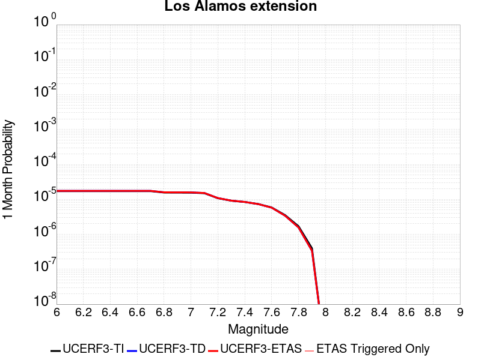 | 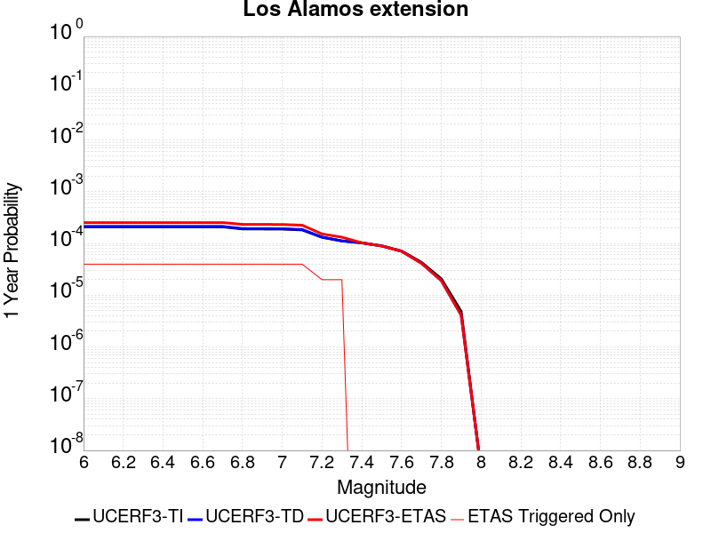 | 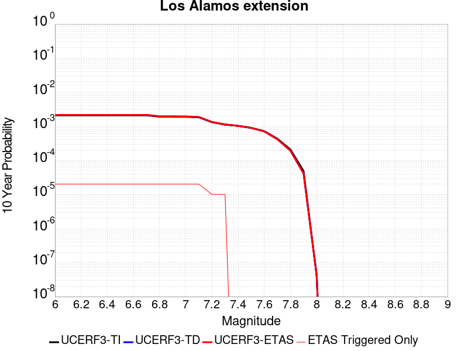 |

| Magnitude | 1 wk TI Prob | 1 wk TD Prob | 1 wk ETAS Prob | 1 wk ETAS/TD Gain | 1 wk ETAS Triggered Only | 1 mo TI Prob | 1 mo TD Prob | 1 mo ETAS Prob | 1 mo ETAS/TD Gain | 1 mo ETAS Triggered Only | 1 yr TI Prob | 1 yr TD Prob | 1 yr ETAS Prob | 1 yr ETAS/TD Gain | 1 yr ETAS Triggered Only | 10 yr TI Prob | 10 yr TD Prob | 10 yr ETAS Prob | 10 yr ETAS/TD Gain | 10 yr ETAS Triggered Only |
|-----|-----|-----|-----|-----|-----|-----|-----|-----|-----|-----|-----|-----|-----|-----|-----|-----|-----|-----|-----|-----|
| 6.0 | 4.0146506E-6 | 4.086528E-6 | 4.086528E-6 | 1.0 | 0.0 | 1.7205533E-5 | 1.751358E-5 | 1.751358E-5 | 1.0 | 0.0 | 2.0945723E-4 | 2.1320807E-4 | 2.5435834E-4 | 1.1930052 | 4.1159037E-5 | 0.0020925992 | 0.0021301443 | 0.0021712158 | 1.019281 | 4.1159037E-5 |
| 6.1 | 4.0146506E-6 | 4.086528E-6 | 4.086528E-6 | 1.0 | 0.0 | 1.7205533E-5 | 1.751358E-5 | 1.751358E-5 | 1.0 | 0.0 | 2.0945723E-4 | 2.1320807E-4 | 2.5435834E-4 | 1.1930052 | 4.1159037E-5 | 0.0020925992 | 0.0021301443 | 0.0021712158 | 1.019281 | 4.1159037E-5 |
| 6.2 | 4.0146506E-6 | 4.086528E-6 | 4.086528E-6 | 1.0 | 0.0 | 1.7205533E-5 | 1.751358E-5 | 1.751358E-5 | 1.0 | 0.0 | 2.0945723E-4 | 2.1320807E-4 | 2.5435834E-4 | 1.1930052 | 4.1159037E-5 | 0.0020925992 | 0.0021301443 | 0.0021712158 | 1.019281 | 4.1159037E-5 |
| 6.3 | 4.0146506E-6 | 4.086528E-6 | 4.086528E-6 | 1.0 | 0.0 | 1.7205533E-5 | 1.751358E-5 | 1.751358E-5 | 1.0 | 0.0 | 2.0945723E-4 | 2.1320807E-4 | 2.5435834E-4 | 1.1930052 | 4.1159037E-5 | 0.0020925992 | 0.0021301443 | 0.0021712158 | 1.019281 | 4.1159037E-5 |
| 6.4 | 4.0146506E-6 | 4.086528E-6 | 4.086528E-6 | 1.0 | 0.0 | 1.7205533E-5 | 1.751358E-5 | 1.751358E-5 | 1.0 | 0.0 | 2.0945723E-4 | 2.1320807E-4 | 2.5435834E-4 | 1.1930052 | 4.1159037E-5 | 0.0020925992 | 0.0021301443 | 0.0021712158 | 1.019281 | 4.1159037E-5 |
| 6.5 | 4.0146506E-6 | 4.086528E-6 | 4.086528E-6 | 1.0 | 0.0 | 1.7205533E-5 | 1.751358E-5 | 1.751358E-5 | 1.0 | 0.0 | 2.0945723E-4 | 2.1320807E-4 | 2.5435834E-4 | 1.1930052 | 4.1159037E-5 | 0.0020925992 | 0.0021301443 | 0.0021712158 | 1.019281 | 4.1159037E-5 |
| 6.6 | 4.0146506E-6 | 4.086528E-6 | 4.086528E-6 | 1.0 | 0.0 | 1.7205533E-5 | 1.751358E-5 | 1.751358E-5 | 1.0 | 0.0 | 2.0945723E-4 | 2.1320807E-4 | 2.5435834E-4 | 1.1930052 | 4.1159037E-5 | 0.0020925992 | 0.0021301443 | 0.0021712158 | 1.019281 | 4.1159037E-5 |
| 6.7 | 4.0146506E-6 | 4.086528E-6 | 4.086528E-6 | 1.0 | 0.0 | 1.7205533E-5 | 1.751358E-5 | 1.751358E-5 | 1.0 | 0.0 | 2.0945723E-4 | 2.1320807E-4 | 2.5435834E-4 | 1.1930052 | 4.1159037E-5 | 0.0020925992 | 0.0021301443 | 0.0021712158 | 1.019281 | 4.1159037E-5 |
| 6.8 | 3.6584688E-6 | 3.7192005E-6 | 3.7192005E-6 | 1.0 | 0.0 | 1.5679057E-5 | 1.5939338E-5 | 1.5939338E-5 | 1.0 | 0.0 | 1.9087581E-4 | 1.940451E-4 | 2.3519616E-4 | 1.2120695 | 4.1159037E-5 | 0.0019071194 | 0.0019388491 | 0.0019799285 | 1.0211874 | 4.1159037E-5 |
| 6.9 | 3.644631E-6 | 3.7049094E-6 | 3.7049094E-6 | 1.0 | 0.0 | 1.5619753E-5 | 1.5878091E-5 | 1.5878091E-5 | 1.0 | 0.0 | 1.901539E-4 | 1.9329955E-4 | 2.3445064E-4 | 1.2128876 | 4.1159037E-5 | 0.0018999127 | 0.0019314067 | 0.0019724863 | 1.0212692 | 4.1159037E-5 |
| 7.0 | 3.6318522E-6 | 3.691669E-6 | 3.691669E-6 | 1.0 | 0.0 | 1.5564989E-5 | 1.5821348E-5 | 1.5821348E-5 | 1.0 | 0.0 | 1.8948725E-4 | 1.9260882E-4 | 2.3375993E-4 | 1.2136512 | 4.1159037E-5 | 0.0018932576 | 0.0019245112 | 0.001965591 | 1.0213456 | 4.1159037E-5 |
| 7.1 | 3.5001724E-6 | 3.5557293E-6 | 3.5557293E-6 | 1.0 | 0.0 | 1.5000653E-5 | 1.52387565E-5 | 1.52387565E-5 | 1.0 | 0.0 | 1.8261763E-4 | 1.8551698E-4 | 2.2666839E-4 | 1.2218201 | 4.1159037E-5 | 0.0018246764 | 0.0018537118 | 0.0018947945 | 1.0221624 | 4.1159037E-5 |
| 7.2 | 2.5204702E-6 | 2.5439472E-6 | 2.5439472E-6 | 1.0 | 0.0 | 1.080197E-5 | 1.0902586E-5 | 1.0902586E-5 | 1.0 | 0.0 | 1.3150605E-4 | 1.3273094E-4 | 1.3273094E-4 | 1.0 | 0.0 | 0.0013142825 | 0.0013265223 | 0.0013265223 | 1.0 | 0.0 |
| 7.3 | 2.1399692E-6 | 2.1503533E-6 | 2.1503533E-6 | 1.0 | 0.0 | 9.1712645E-6 | 9.215767E-6 | 9.215767E-6 | 1.0 | 0.0 | 1.1165442E-4 | 1.1219623E-4 | 1.1219623E-4 | 1.0 | 0.0 | 0.0011159834 | 0.0011213991 | 0.0011213991 | 1.0 | 0.0 |
| 7.4 | 1.9660122E-6 | 1.970444E-6 | 1.970444E-6 | 1.0 | 0.0 | 8.42574E-6 | 8.444732E-6 | 8.444732E-6 | 1.0 | 0.0 | 1.0257855E-4 | 1.0280979E-4 | 1.0280979E-4 | 1.0 | 0.0 | 0.0010253121 | 0.0010276254 | 0.0010276254 | 1.0 | 0.0 |
| 7.5 | 1.7204633E-6 | 1.7152828E-6 | 1.7152828E-6 | 1.0 | 0.0 | 7.373393E-6 | 7.351191E-6 | 7.351191E-6 | 1.0 | 0.0 | 8.976737E-5 | 8.94971E-5 | 8.94971E-5 | 1.0 | 0.0 | 8.9731114E-4 | 8.946136E-4 | 8.946136E-4 | 1.0 | 0.0 |
| 7.6 | 1.3717638E-6 | 1.3537325E-6 | 1.3537325E-6 | 1.0 | 0.0 | 5.878974E-6 | 5.8016976E-6 | 5.8016976E-6 | 1.0 | 0.0 | 7.157416E-5 | 7.063341E-5 | 7.063341E-5 | 1.0 | 0.0 | 7.1551115E-4 | 7.061122E-4 | 7.061122E-4 | 1.0 | 0.0 |
| 7.7 | 8.272564E-7 | 7.958571E-7 | 7.958571E-7 | 1.0 | 0.0 | 3.5453797E-6 | 3.4108116E-6 | 3.4108116E-6 | 1.0 | 0.0 | 4.3164142E-5 | 4.152584E-5 | 4.152584E-5 | 1.0 | 0.0 | 4.315576E-4 | 4.15181E-4 | 4.15181E-4 | 1.0 | 0.0 |
| 7.8 | 3.9708277E-7 | 3.672379E-7 | 3.672379E-7 | 1.0 | 0.0 | 1.7017821E-6 | 1.5738757E-6 | 1.5738757E-6 | 1.0 | 0.0 | 2.0719E-5 | 1.916177E-5 | 1.916177E-5 | 1.0 | 0.0 | 2.071707E-4 | 1.9160123E-4 | 1.9160123E-4 | 1.0 | 0.0 |
| 7.9 | 9.292528E-8 | 7.890233E-8 | 7.890233E-8 | 1.0 | 0.0 | 3.9825116E-7 | 3.381528E-7 | 3.381528E-7 | 1.0 | 0.0 | 4.848697E-6 | 4.117003E-6 | 4.117003E-6 | 1.0 | 0.0 | 4.8485912E-5 | 4.1169274E-5 | 4.1169274E-5 | 1.0 | 0.0 |
| 8.0 | 7.880441E-11 | 8.236167E-11 | 8.236167E-11 | 1.0 | 0.0 | 3.3773329E-10 | 3.5297876E-10 | 3.5297876E-10 | 1.0 | 0.0 | 4.1119033E-9 | 4.297517E-9 | 4.297517E-9 | 1.0 | 0.0 | 4.1119034E-8 | 4.2975167E-8 | 4.2975167E-8 | 1.0 | 0.0 |

## Pine Mtn
*[(top)](#table-of-contents)*

| 1 Week | 1 Month | 1 Year | 10 Year |
|-----|-----|-----|-----|
| 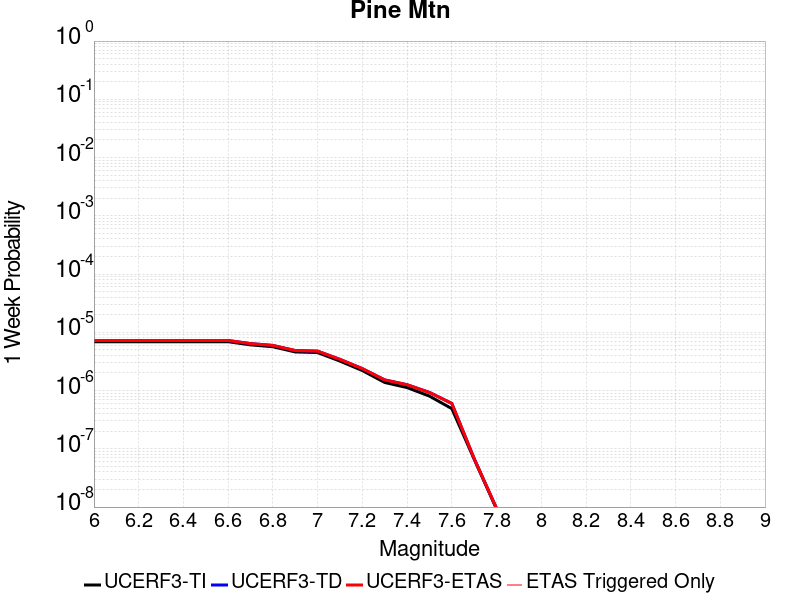 | 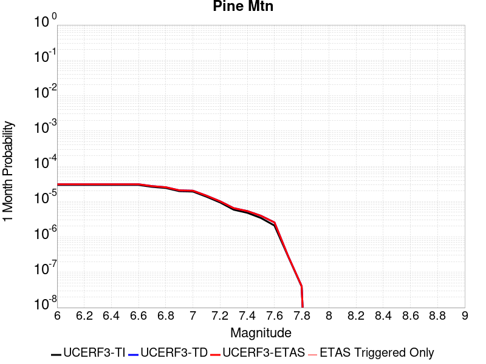 | 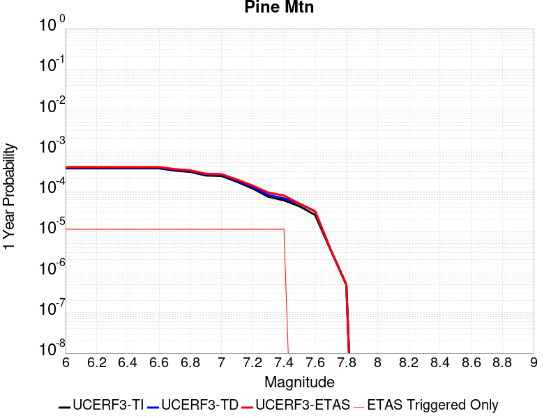 | 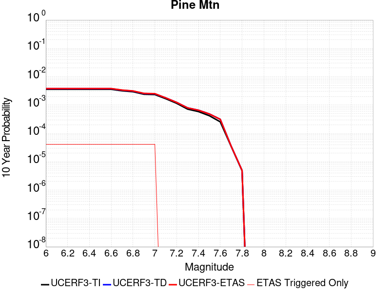 |

| Magnitude | 1 wk TI Prob | 1 wk TD Prob | 1 wk ETAS Prob | 1 wk ETAS/TD Gain | 1 wk ETAS Triggered Only | 1 mo TI Prob | 1 mo TD Prob | 1 mo ETAS Prob | 1 mo ETAS/TD Gain | 1 mo ETAS Triggered Only | 1 yr TI Prob | 1 yr TD Prob | 1 yr ETAS Prob | 1 yr ETAS/TD Gain | 1 yr ETAS Triggered Only | 10 yr TI Prob | 10 yr TD Prob | 10 yr ETAS Prob | 10 yr ETAS/TD Gain | 10 yr ETAS Triggered Only |
|-----|-----|-----|-----|-----|-----|-----|-----|-----|-----|-----|-----|-----|-----|-----|-----|-----|-----|-----|-----|-----|
| 6.0 | 6.894797E-6 | 7.227265E-6 | 7.227265E-6 | 1.0 | 0.0 | 2.9548795E-5 | 3.0973642E-5 | 3.0973642E-5 | 1.0 | 0.0 | 3.596972E-4 | 3.770418E-4 | 3.770418E-4 | 1.0 | 0.0 | 0.0035911554 | 0.0037643188 | 0.0038053228 | 1.0108929 | 4.1159037E-5 |
| 6.1 | 6.894797E-6 | 7.227265E-6 | 7.227265E-6 | 1.0 | 0.0 | 2.9548795E-5 | 3.0973642E-5 | 3.0973642E-5 | 1.0 | 0.0 | 3.596972E-4 | 3.770418E-4 | 3.770418E-4 | 1.0 | 0.0 | 0.0035911554 | 0.0037643188 | 0.0038053228 | 1.0108929 | 4.1159037E-5 |
| 6.2 | 6.894797E-6 | 7.227265E-6 | 7.227265E-6 | 1.0 | 0.0 | 2.9548795E-5 | 3.0973642E-5 | 3.0973642E-5 | 1.0 | 0.0 | 3.596972E-4 | 3.770418E-4 | 3.770418E-4 | 1.0 | 0.0 | 0.0035911554 | 0.0037643188 | 0.0038053228 | 1.0108929 | 4.1159037E-5 |
| 6.3 | 6.894797E-6 | 7.227265E-6 | 7.227265E-6 | 1.0 | 0.0 | 2.9548795E-5 | 3.0973642E-5 | 3.0973642E-5 | 1.0 | 0.0 | 3.596972E-4 | 3.770418E-4 | 3.770418E-4 | 1.0 | 0.0 | 0.0035911554 | 0.0037643188 | 0.0038053228 | 1.0108929 | 4.1159037E-5 |
| 6.4 | 6.894797E-6 | 7.227265E-6 | 7.227265E-6 | 1.0 | 0.0 | 2.9548795E-5 | 3.0973642E-5 | 3.0973642E-5 | 1.0 | 0.0 | 3.596972E-4 | 3.770418E-4 | 3.770418E-4 | 1.0 | 0.0 | 0.0035911554 | 0.0037643188 | 0.0038053228 | 1.0108929 | 4.1159037E-5 |
| 6.5 | 6.894797E-6 | 7.227265E-6 | 7.227265E-6 | 1.0 | 0.0 | 2.9548795E-5 | 3.0973642E-5 | 3.0973642E-5 | 1.0 | 0.0 | 3.596972E-4 | 3.770418E-4 | 3.770418E-4 | 1.0 | 0.0 | 0.0035911554 | 0.0037643188 | 0.0038053228 | 1.0108929 | 4.1159037E-5 |
| 6.6 | 6.894797E-6 | 7.227265E-6 | 7.227265E-6 | 1.0 | 0.0 | 2.9548795E-5 | 3.0973642E-5 | 3.0973642E-5 | 1.0 | 0.0 | 3.596972E-4 | 3.770418E-4 | 3.770418E-4 | 1.0 | 0.0 | 0.0035911554 | 0.0037643188 | 0.0038053228 | 1.0108929 | 4.1159037E-5 |
| 6.7 | 6.0867933E-6 | 6.3988687E-6 | 6.3988687E-6 | 1.0 | 0.0 | 2.6085996E-5 | 2.7423448E-5 | 2.7423448E-5 | 1.0 | 0.0 | 3.1755073E-4 | 3.3383153E-4 | 3.3383153E-4 | 1.0 | 0.0 | 0.0031709734 | 0.0033335194 | 0.0033745414 | 1.0123059 | 4.1159037E-5 |
| 6.8 | 5.6530425E-6 | 5.952321E-6 | 5.952321E-6 | 1.0 | 0.0 | 2.42271E-5 | 2.5509707E-5 | 2.5509707E-5 | 1.0 | 0.0 | 2.94925E-4 | 3.1053848E-4 | 3.1053848E-4 | 1.0 | 0.0 | 0.002945339 | 0.0031012504 | 0.0031422817 | 1.0132306 | 4.1159037E-5 |
| 6.9 | 4.6015225E-6 | 4.865475E-6 | 4.865475E-6 | 1.0 | 0.0 | 1.9720663E-5 | 2.0851878E-5 | 2.0851878E-5 | 1.0 | 0.0 | 2.4007261E-4 | 2.538435E-4 | 2.538435E-4 | 1.0 | 0.0 | 0.0023981342 | 0.0025356796 | 0.0025767342 | 1.0161908 | 4.1159037E-5 |
| 7.0 | 4.4875965E-6 | 4.749108E-6 | 4.749108E-6 | 1.0 | 0.0 | 1.9232413E-5 | 2.035317E-5 | 2.035317E-5 | 1.0 | 0.0 | 2.3412947E-4 | 2.4777313E-4 | 2.4777313E-4 | 1.0 | 0.0 | 0.0023388295 | 0.0024751127 | 0.0025161698 | 1.016588 | 4.1159037E-5 |
| 7.1 | 3.203907E-6 | 3.430963E-6 | 3.430963E-6 | 1.0 | 0.0 | 1.3730958E-5 | 1.4704048E-5 | 1.4704048E-5 | 1.0 | 0.0 | 1.6716159E-4 | 1.7900775E-4 | 1.7900775E-4 | 1.0 | 0.0 | 0.0016703589 | 0.0017887017 | 0.0017887017 | 1.0 | 0.0 |
| 7.2 | 2.2060601E-6 | 2.3797506E-6 | 2.3797506E-6 | 1.0 | 0.0 | 9.4545085E-6 | 1.0198894E-5 | 1.0198894E-5 | 1.0 | 0.0 | 1.15102564E-4 | 1.2416492E-4 | 1.2416492E-4 | 1.0 | 0.0 | 0.0011504296 | 0.0012410003 | 0.0012410003 | 1.0 | 0.0 |
| 7.3 | 1.3765207E-6 | 1.5227912E-6 | 1.5227912E-6 | 1.0 | 0.0 | 5.899361E-6 | 6.5262325E-6 | 6.5262325E-6 | 1.0 | 0.0 | 7.182235E-5 | 7.9454076E-5 | 7.9454076E-5 | 1.0 | 0.0 | 7.1799144E-4 | 7.9426577E-4 | 7.9426577E-4 | 1.0 | 0.0 |
| 7.4 | 1.1245983E-6 | 1.2597384E-6 | 1.2597384E-6 | 1.0 | 0.0 | 4.819698E-6 | 5.3988683E-6 | 5.3988683E-6 | 1.0 | 0.0 | 5.8678244E-5 | 6.572932E-5 | 6.572932E-5 | 1.0 | 0.0 | 5.866275E-4 | 6.5710716E-4 | 6.5710716E-4 | 1.0 | 0.0 |
| 7.5 | 8.031682E-7 | 9.286591E-7 | 9.286591E-7 | 1.0 | 0.0 | 3.4421448E-6 | 3.979962E-6 | 3.979962E-6 | 1.0 | 0.0 | 4.1907308E-5 | 4.845503E-5 | 4.845503E-5 | 1.0 | 0.0 | 4.1899405E-4 | 4.8445142E-4 | 4.8445142E-4 | 1.0 | 0.0 |
| 7.6 | 4.8953444E-7 | 6.0115764E-7 | 6.0115764E-7 | 1.0 | 0.0 | 2.098003E-6 | 2.5763877E-6 | 2.5763877E-6 | 1.0 | 0.0 | 2.5542888E-5 | 3.136712E-5 | 3.136712E-5 | 1.0 | 0.0 | 2.5539953E-4 | 3.1363178E-4 | 3.1363178E-4 | 1.0 | 0.0 |
| 7.7 | 6.634529E-8 | 6.7891946E-8 | 6.7891946E-8 | 1.0 | 0.0 | 2.843369E-7 | 2.9096546E-7 | 2.9096546E-7 | 1.0 | 0.0 | 3.4617963E-6 | 3.5424991E-6 | 3.5424991E-6 | 1.0 | 0.0 | 3.4617424E-5 | 3.5424473E-5 | 3.5424473E-5 | 1.0 | 0.0 |
| 7.8 | 9.235578E-9 | 9.4891766E-9 | 9.4891766E-9 | 1.0 | 0.0 | 3.9581046E-8 | 4.06679E-8 | 4.06679E-8 | 1.0 | 0.0 | 4.818991E-7 | 4.951316E-7 | 4.951316E-7 | 1.0 | 0.0 | 4.8189804E-6 | 4.9513064E-6 | 4.9513064E-6 | 1.0 | 0.0 |

## Calico-Hidalgo
*[(top)](#table-of-contents)*

| 1 Week | 1 Month | 1 Year | 10 Year |
|-----|-----|-----|-----|
| 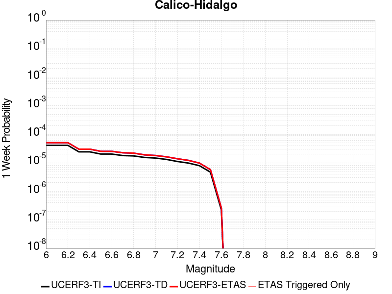 | 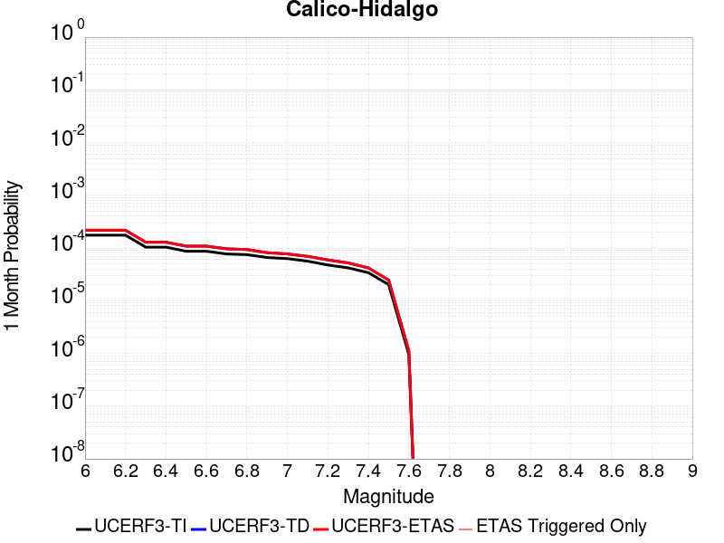 | 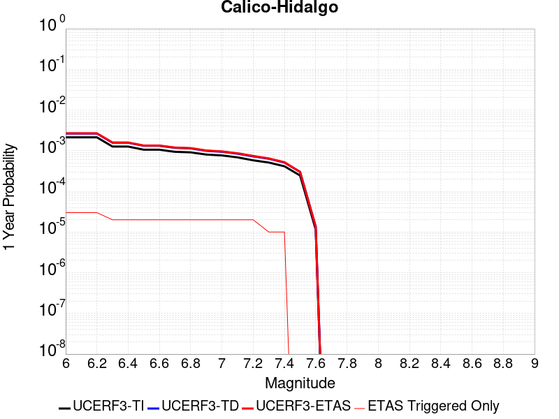 | 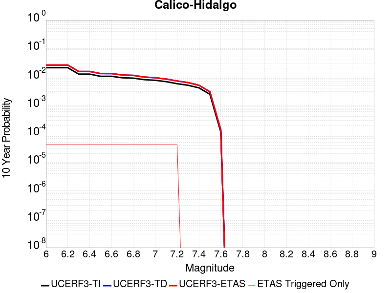 |

| Magnitude | 1 wk TI Prob | 1 wk TD Prob | 1 wk ETAS Prob | 1 wk ETAS/TD Gain | 1 wk ETAS Triggered Only | 1 mo TI Prob | 1 mo TD Prob | 1 mo ETAS Prob | 1 mo ETAS/TD Gain | 1 mo ETAS Triggered Only | 1 yr TI Prob | 1 yr TD Prob | 1 yr ETAS Prob | 1 yr ETAS/TD Gain | 1 yr ETAS Triggered Only | 10 yr TI Prob | 10 yr TD Prob | 10 yr ETAS Prob | 10 yr ETAS/TD Gain | 10 yr ETAS Triggered Only |
|-----|-----|-----|-----|-----|-----|-----|-----|-----|-----|-----|-----|-----|-----|-----|-----|-----|-----|-----|-----|-----|
| 6.0 | 4.0906612E-5 | 5.0721806E-5 | 5.0721806E-5 | 1.0 | 0.0 | 1.7530227E-4 | 2.1736299E-4 | 2.1736299E-4 | 1.0 | 0.0 | 0.0021322158 | 0.002643581 | 0.0026846314 | 1.0155283 | 4.1159037E-5 | 0.02111873 | 0.026161656 | 0.026201738 | 1.0015321 | 4.1159037E-5 |
| 6.1 | 4.0906612E-5 | 5.0721806E-5 | 5.0721806E-5 | 1.0 | 0.0 | 1.7530227E-4 | 2.1736299E-4 | 2.1736299E-4 | 1.0 | 0.0 | 0.0021322158 | 0.002643581 | 0.0026846314 | 1.0155283 | 4.1159037E-5 | 0.02111873 | 0.026161656 | 0.026201738 | 1.0015321 | 4.1159037E-5 |
| 6.2 | 4.0906612E-5 | 5.0721806E-5 | 5.0721806E-5 | 1.0 | 0.0 | 1.7530227E-4 | 2.1736299E-4 | 2.1736299E-4 | 1.0 | 0.0 | 0.0021322158 | 0.002643581 | 0.0026846314 | 1.0155283 | 4.1159037E-5 | 0.02111873 | 0.026161656 | 0.026201738 | 1.0015321 | 4.1159037E-5 |
| 6.3 | 2.4242801E-5 | 3.0097925E-5 | 3.0097925E-5 | 1.0 | 0.0 | 1.0389358E-4 | 1.289849E-4 | 1.289849E-4 | 1.0 | 0.0 | 0.0012641704 | 0.0015692933 | 0.0016103878 | 1.0261866 | 4.1159037E-5 | 0.01257003 | 0.015585801 | 0.015626319 | 1.0025996 | 4.1159037E-5 |
| 6.4 | 2.4242801E-5 | 3.0097925E-5 | 3.0097925E-5 | 1.0 | 0.0 | 1.0389358E-4 | 1.289849E-4 | 1.289849E-4 | 1.0 | 0.0 | 0.0012641704 | 0.0015692933 | 0.0016103878 | 1.0261866 | 4.1159037E-5 | 0.01257003 | 0.015585801 | 0.015626319 | 1.0025996 | 4.1159037E-5 |
| 6.5 | 2.0286952E-5 | 2.5320987E-5 | 2.5320987E-5 | 1.0 | 0.0 | 8.694118E-5 | 1.085141E-4 | 1.085141E-4 | 1.0 | 0.0 | 0.0010579949 | 0.0013203755 | 0.0013614802 | 1.031131 | 4.1159037E-5 | 0.010529719 | 0.01312724 | 0.013167859 | 1.0030942 | 4.1159037E-5 |
| 6.6 | 2.0269223E-5 | 2.5301933E-5 | 2.5301933E-5 | 1.0 | 0.0 | 8.6865206E-5 | 1.0843245E-4 | 1.0843245E-4 | 1.0 | 0.0 | 0.0010570707 | 0.0013193826 | 0.0013604873 | 1.0311545 | 4.1159037E-5 | 0.010520565 | 0.013117429 | 0.013158048 | 1.0030966 | 4.1159037E-5 |
| 6.7 | 1.799852E-5 | 2.2545019E-5 | 2.2545019E-5 | 1.0 | 0.0 | 7.713423E-5 | 9.661801E-5 | 9.661801E-5 | 1.0 | 0.0 | 9.3870464E-4 | 0.0011757041 | 0.0012168147 | 1.0349668 | 4.1159037E-5 | 0.009347493 | 0.011696452 | 0.01173713 | 1.0034778 | 4.1159037E-5 |
| 6.8 | 1.7458793E-5 | 2.1846305E-5 | 2.1846305E-5 | 1.0 | 0.0 | 7.4821255E-5 | 9.362374E-5 | 9.362374E-5 | 1.0 | 0.0 | 9.10568E-4 | 0.0011392875 | 0.0011803996 | 1.0360858 | 4.1159037E-5 | 0.009068459 | 0.011336052 | 0.011376745 | 1.0035896 | 4.1159037E-5 |
| 6.9 | 1.542884E-5 | 1.9029483E-5 | 1.9029483E-5 | 1.0 | 0.0 | 6.612192E-5 | 8.1552455E-5 | 8.1552455E-5 | 1.0 | 0.0 | 8.04737E-4 | 9.92462E-4 | 0.0010335802 | 1.0414305 | 4.1159037E-5 | 0.008018291 | 0.009881696 | 0.009922449 | 1.004124 | 4.1159037E-5 |
| 7.0 | 1.468253E-5 | 1.8033796E-5 | 1.8033796E-5 | 1.0 | 0.0 | 6.292361E-5 | 7.7285484E-5 | 7.7285484E-5 | 1.0 | 0.0 | 7.658257E-4 | 9.4055757E-4 | 9.816779E-4 | 1.043719 | 4.1159037E-5 | 0.0076319184 | 0.009367134 | 0.009407908 | 1.0043528 | 4.1159037E-5 |
| 7.1 | 1.3139281E-5 | 1.6203734E-5 | 1.6203734E-5 | 1.0 | 0.0 | 5.6309986E-5 | 6.9442794E-5 | 6.9442794E-5 | 1.0 | 0.0 | 6.853584E-4 | 8.451506E-4 | 8.862749E-4 | 1.0486591 | 4.1159037E-5 | 0.0068324856 | 0.008420663 | 0.008461475 | 1.0048467 | 4.1159037E-5 |
| 7.2 | 1.1127404E-5 | 1.3868924E-5 | 1.3868924E-5 | 1.0 | 0.0 | 4.7688E-5 | 5.9436952E-5 | 5.9436952E-5 | 1.0 | 0.0 | 5.8044674E-4 | 7.234155E-4 | 7.645448E-4 | 1.0568542 | 4.1159037E-5 | 0.0057893298 | 0.007211714 | 0.0072525763 | 1.0056661 | 4.1159037E-5 |
| 7.3 | 9.808154E-6 | 1.217809E-5 | 1.217809E-5 | 1.0 | 0.0 | 4.2034266E-5 | 5.219083E-5 | 5.219083E-5 | 1.0 | 0.0 | 5.11647E-4 | 6.3524884E-4 | 6.3524884E-4 | 1.0 | 0.0 | 0.0051047057 | 0.0063354056 | 0.0063354056 | 1.0 | 0.0 |
| 7.4 | 7.942452E-6 | 9.793476E-6 | 9.793476E-6 | 1.0 | 0.0 | 3.4038632E-5 | 4.197142E-5 | 4.197142E-5 | 1.0 | 0.0 | 4.1434157E-4 | 5.108917E-4 | 5.108917E-4 | 1.0 | 0.0 | 0.0041356985 | 0.0050981133 | 0.0050981133 | 1.0 | 0.0 |
| 7.5 | 4.7121216E-6 | 5.7735706E-6 | 5.7735706E-6 | 1.0 | 0.0 | 2.019465E-5 | 2.4743682E-5 | 2.4743682E-5 | 1.0 | 0.0 | 2.4584212E-4 | 3.0122034E-4 | 3.0122034E-4 | 1.0 | 0.0 | 0.0024557032 | 0.0030088732 | 0.0030088732 | 1.0 | 0.0 |
| 7.6 | 2.21172E-7 | 2.604147E-7 | 2.604147E-7 | 1.0 | 0.0 | 9.478797E-7 | 1.1160627E-6 | 1.1160627E-6 | 1.0 | 0.0 | 1.1540374E-5 | 1.3588007E-5 | 1.3588007E-5 | 1.0 | 0.0 | 1.1539775E-4 | 1.3587458E-4 | 1.3587458E-4 | 1.0 | 0.0 |

## Fish Slough 2011 CFM
*[(top)](#table-of-contents)*

| 1 Week | 1 Month | 1 Year | 10 Year |
|-----|-----|-----|-----|
|  |  | 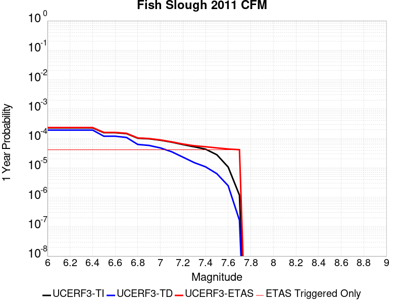 | 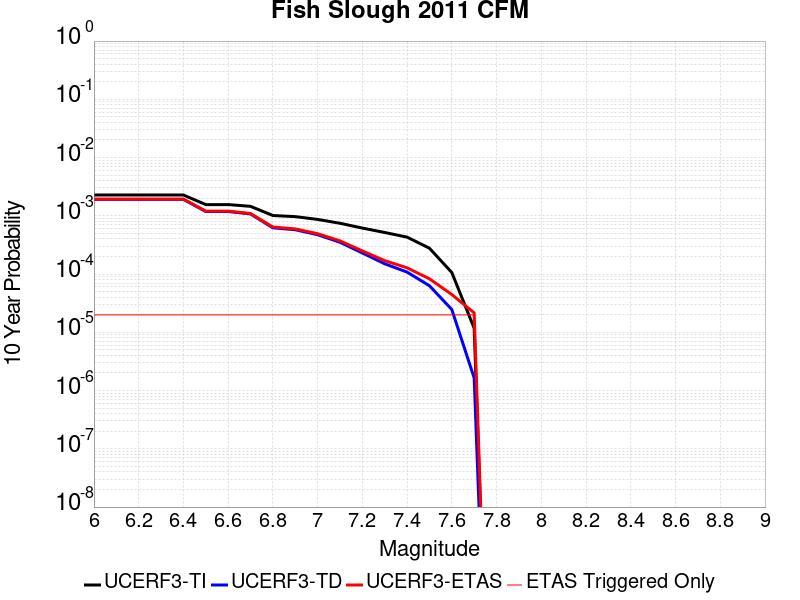 |

| Magnitude | 1 wk TI Prob | 1 wk TD Prob | 1 wk ETAS Prob | 1 wk ETAS/TD Gain | 1 wk ETAS Triggered Only | 1 mo TI Prob | 1 mo TD Prob | 1 mo ETAS Prob | 1 mo ETAS/TD Gain | 1 mo ETAS Triggered Only | 1 yr TI Prob | 1 yr TD Prob | 1 yr ETAS Prob | 1 yr ETAS/TD Gain | 1 yr ETAS Triggered Only | 10 yr TI Prob | 10 yr TD Prob | 10 yr ETAS Prob | 10 yr ETAS/TD Gain | 10 yr ETAS Triggered Only |
|-----|-----|-----|-----|-----|-----|-----|-----|-----|-----|-----|-----|-----|-----|-----|-----|-----|-----|-----|-----|-----|
| 6.0 | 4.3629925E-6 | 3.6777774E-6 | 3.6777774E-6 | 1.0 | 0.0 | 1.8698405E-5 | 1.576182E-5 | 1.576182E-5 | 1.0 | 0.0 | 2.276293E-4 | 1.9188538E-4 | 2.3303652E-4 | 1.2144569 | 4.1159037E-5 | 0.0022739628 | 0.0019174059 | 0.0019584862 | 1.0214249 | 4.1159037E-5 |
| 6.1 | 4.3629925E-6 | 3.6777774E-6 | 3.6777774E-6 | 1.0 | 0.0 | 1.8698405E-5 | 1.576182E-5 | 1.576182E-5 | 1.0 | 0.0 | 2.276293E-4 | 1.9188538E-4 | 2.3303652E-4 | 1.2144569 | 4.1159037E-5 | 0.0022739628 | 0.0019174059 | 0.0019584862 | 1.0214249 | 4.1159037E-5 |
| 6.2 | 4.3629925E-6 | 3.6777774E-6 | 3.6777774E-6 | 1.0 | 0.0 | 1.8698405E-5 | 1.576182E-5 | 1.576182E-5 | 1.0 | 0.0 | 2.276293E-4 | 1.9188538E-4 | 2.3303652E-4 | 1.2144569 | 4.1159037E-5 | 0.0022739628 | 0.0019174059 | 0.0019584862 | 1.0214249 | 4.1159037E-5 |
| 6.3 | 4.3629925E-6 | 3.6777774E-6 | 3.6777774E-6 | 1.0 | 0.0 | 1.8698405E-5 | 1.576182E-5 | 1.576182E-5 | 1.0 | 0.0 | 2.276293E-4 | 1.9188538E-4 | 2.3303652E-4 | 1.2144569 | 4.1159037E-5 | 0.0022739628 | 0.0019174059 | 0.0019584862 | 1.0214249 | 4.1159037E-5 |
| 6.4 | 4.3629925E-6 | 3.6777774E-6 | 3.6777774E-6 | 1.0 | 0.0 | 1.8698405E-5 | 1.576182E-5 | 1.576182E-5 | 1.0 | 0.0 | 2.276293E-4 | 1.9188538E-4 | 2.3303652E-4 | 1.2144569 | 4.1159037E-5 | 0.0022739628 | 0.0019174059 | 0.0019584862 | 1.0214249 | 4.1159037E-5 |
| 6.5 | 2.991715E-6 | 2.270813E-6 | 2.270813E-6 | 1.0 | 0.0 | 1.2821573E-5 | 9.732024E-6 | 9.732024E-6 | 1.0 | 0.0 | 1.5609147E-4 | 1.1848187E-4 | 1.5963604E-4 | 1.3473457 | 4.1159037E-5 | 0.0015598187 | 0.0011842771 | 0.0012253874 | 1.0347134 | 4.1159037E-5 |
| 6.6 | 2.991715E-6 | 2.270813E-6 | 2.270813E-6 | 1.0 | 0.0 | 1.2821573E-5 | 9.732024E-6 | 9.732024E-6 | 1.0 | 0.0 | 1.5609147E-4 | 1.1848187E-4 | 1.5963604E-4 | 1.3473457 | 4.1159037E-5 | 0.0015598187 | 0.0011842771 | 0.0012253874 | 1.0347134 | 4.1159037E-5 |
| 6.7 | 2.7890346E-6 | 2.0625953E-6 | 2.0625953E-6 | 1.0 | 0.0 | 1.1952951E-5 | 8.839669E-6 | 8.839669E-6 | 1.0 | 0.0 | 1.4551746E-4 | 1.0761856E-4 | 1.4877316E-4 | 1.3824118 | 4.1159037E-5 | 0.0014542221 | 0.0010757527 | 0.0011168674 | 1.0382196 | 4.1159037E-5 |
| 6.8 | 1.9416723E-6 | 1.1929122E-6 | 1.1929122E-6 | 1.0 | 0.0 | 8.321425E-6 | 5.112471E-6 | 5.112471E-6 | 1.0 | 0.0 | 1.01308644E-4 | 6.22426E-5 | 1.0339908E-4 | 1.6612269 | 4.1159037E-5 | 0.0010126247 | 6.222558E-4 | 6.633892E-4 | 1.0661037 | 4.1159037E-5 |
| 6.9 | 1.8567416E-6 | 1.1050467E-6 | 1.1050467E-6 | 1.0 | 0.0 | 7.957439E-6 | 4.7359063E-6 | 4.7359063E-6 | 1.0 | 0.0 | 9.687752E-5 | 5.7658173E-5 | 9.881484E-5 | 1.7138045 | 4.1159037E-5 | 9.6835295E-4 | 5.76436E-4 | 6.175713E-4 | 1.0713614 | 4.1159037E-5 |
| 7.0 | 1.6634067E-6 | 9.077305E-7 | 9.077305E-7 | 1.0 | 0.0 | 7.1288664E-6 | 3.890268E-6 | 3.890268E-6 | 1.0 | 0.0 | 8.679049E-5 | 4.7363013E-5 | 8.85201E-5 | 1.8689711 | 4.1159037E-5 | 8.6756604E-4 | 4.735321E-4 | 5.146716E-4 | 1.0868781 | 4.1159037E-5 |
| 7.1 | 1.4281054E-6 | 6.739696E-7 | 6.739696E-7 | 1.0 | 0.0 | 6.1204373E-6 | 2.888438E-6 | 2.888438E-6 | 1.0 | 0.0 | 7.451377E-5 | 3.5166184E-5 | 7.632378E-5 | 2.1703742 | 4.1159037E-5 | 7.44888E-4 | 3.5160797E-4 | 3.9275255E-4 | 1.1170183 | 4.1159037E-5 |
| 7.2 | 1.1810387E-6 | 4.4110993E-7 | 4.4110993E-7 | 1.0 | 0.0 | 5.0615845E-6 | 1.8904699E-6 | 1.8904699E-6 | 1.0 | 0.0 | 6.1623046E-5 | 2.3016237E-5 | 6.4174325E-5 | 2.78822 | 4.1159037E-5 | 6.160596E-4 | 2.3013943E-4 | 2.71289E-4 | 1.1788027 | 4.1159037E-5 |
| 7.3 | 9.918052E-7 | 2.8758006E-7 | 2.8758006E-7 | 1.0 | 0.0 | 4.2505867E-6 | 1.2324855E-6 | 1.2324855E-6 | 1.0 | 0.0 | 5.1749663E-5 | 1.5005408E-5 | 5.616383E-5 | 3.7429059 | 4.1159037E-5 | 5.173762E-4 | 1.5004406E-4 | 1.9119693E-4 | 1.2742718 | 4.1159037E-5 |
| 7.4 | 8.25252E-7 | 2.0715669E-7 | 2.0715669E-7 | 1.0 | 0.0 | 3.5367896E-6 | 8.878141E-7 | 8.878141E-7 | 1.0 | 0.0 | 4.3059565E-5 | 1.08090835E-5 | 5.1967676E-5 | 4.8077784 | 4.1159037E-5 | 4.305122E-4 | 1.08085645E-4 | 1.4924024E-4 | 1.380759 | 4.1159037E-5 |
| 7.5 | 5.3248567E-7 | 1.2087216E-7 | 1.2087216E-7 | 1.0 | 0.0 | 2.2820795E-6 | 5.180234E-7 | 5.180234E-7 | 1.0 | 0.0 | 2.7783964E-5 | 6.3069174E-6 | 4.7465695E-5 | 7.5259743 | 4.1159037E-5 | 2.778049E-4 | 6.3067426E-5 | 1.04223865E-4 | 1.6525785 | 4.1159037E-5 |
| 7.6 | 2.037542E-7 | 4.7188294E-8 | 4.7188294E-8 | 1.0 | 0.0 | 8.73232E-7 | 2.0223553E-7 | 2.0223553E-7 | 1.0 | 0.0 | 1.0631547E-5 | 2.462215E-6 | 4.3621152E-5 | 17.716225 | 4.1159037E-5 | 1.0631039E-4 | 2.4621899E-5 | 6.5779925E-5 | 2.6716025 | 4.1159037E-5 |
| 7.7 | 2.2501226E-8 | 3.155586E-9 | 3.155586E-9 | 1.0 | 0.0 | 9.6433816E-8 | 1.352394E-8 | 1.352394E-8 | 1.0 | 0.0 | 1.1740811E-6 | 1.6465395E-7 | 4.1323685E-5 | 250.97293 | 4.1159037E-5 | 1.1740749E-5 | 1.6465385E-6 | 4.280551E-5 | 25.99727 | 4.1159037E-5 |

## Antelope Valley 2011
*[(top)](#table-of-contents)*

| 1 Week | 1 Month | 1 Year | 10 Year |
|-----|-----|-----|-----|
| 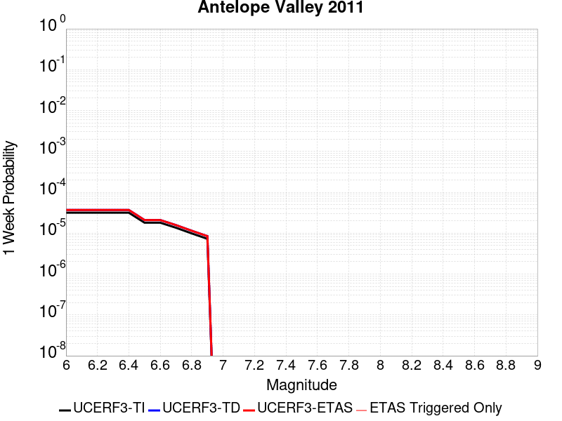 | 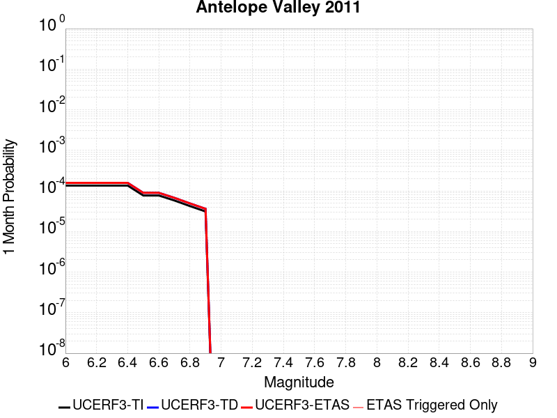 | 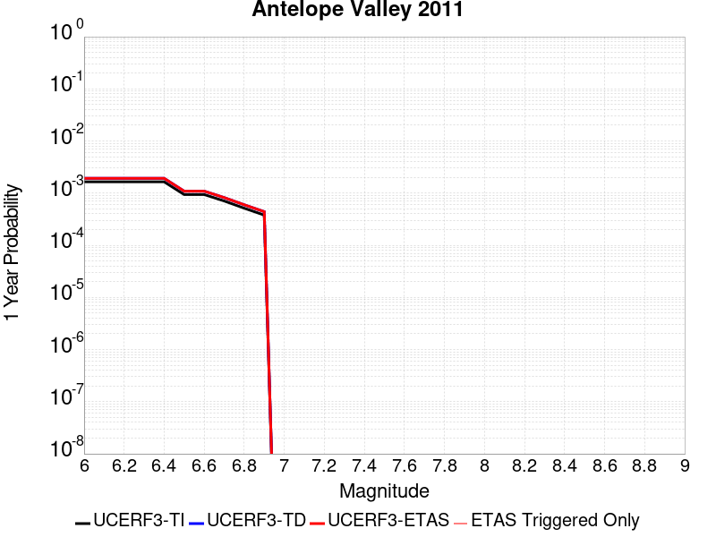 | 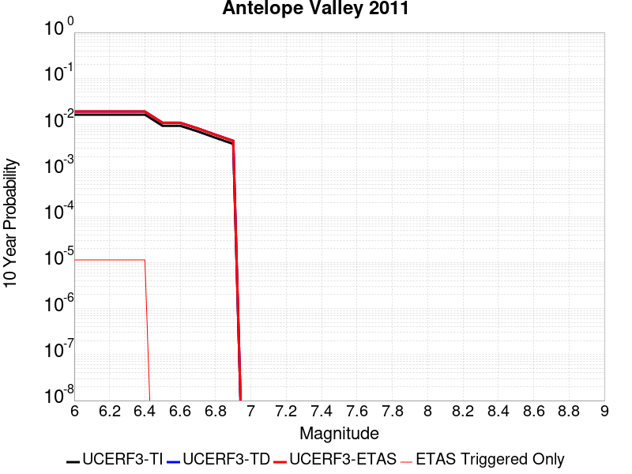 |

| Magnitude | 1 wk TI Prob | 1 wk TD Prob | 1 wk ETAS Prob | 1 wk ETAS/TD Gain | 1 wk ETAS Triggered Only | 1 mo TI Prob | 1 mo TD Prob | 1 mo ETAS Prob | 1 mo ETAS/TD Gain | 1 mo ETAS Triggered Only | 1 yr TI Prob | 1 yr TD Prob | 1 yr ETAS Prob | 1 yr ETAS/TD Gain | 1 yr ETAS Triggered Only | 10 yr TI Prob | 10 yr TD Prob | 10 yr ETAS Prob | 10 yr ETAS/TD Gain | 10 yr ETAS Triggered Only |
|-----|-----|-----|-----|-----|-----|-----|-----|-----|-----|-----|-----|-----|-----|-----|-----|-----|-----|-----|-----|-----|
| 6.0 | 3.1646934E-5 | 3.6918565E-5 | 3.6918565E-5 | 1.0 | 0.0 | 1.3562266E-4 | 1.5821432E-4 | 1.5821432E-4 | 1.0 | 0.0 | 0.0016499552 | 0.0019248223 | 0.0019248223 | 1.0 | 0.0 | 0.016377583 | 0.019107932 | 0.019148305 | 1.0021129 | 4.1159037E-5 |
| 6.1 | 3.1646934E-5 | 3.6918565E-5 | 3.6918565E-5 | 1.0 | 0.0 | 1.3562266E-4 | 1.5821432E-4 | 1.5821432E-4 | 1.0 | 0.0 | 0.0016499552 | 0.0019248223 | 0.0019248223 | 1.0 | 0.0 | 0.016377583 | 0.019107932 | 0.019148305 | 1.0021129 | 4.1159037E-5 |
| 6.2 | 3.1646934E-5 | 3.6918565E-5 | 3.6918565E-5 | 1.0 | 0.0 | 1.3562266E-4 | 1.5821432E-4 | 1.5821432E-4 | 1.0 | 0.0 | 0.0016499552 | 0.0019248223 | 0.0019248223 | 1.0 | 0.0 | 0.016377583 | 0.019107932 | 0.019148305 | 1.0021129 | 4.1159037E-5 |
| 6.3 | 3.1646934E-5 | 3.6918565E-5 | 3.6918565E-5 | 1.0 | 0.0 | 1.3562266E-4 | 1.5821432E-4 | 1.5821432E-4 | 1.0 | 0.0 | 0.0016499552 | 0.0019248223 | 0.0019248223 | 1.0 | 0.0 | 0.016377583 | 0.019107932 | 0.019148305 | 1.0021129 | 4.1159037E-5 |
| 6.4 | 3.1646934E-5 | 3.6918565E-5 | 3.6918565E-5 | 1.0 | 0.0 | 1.3562266E-4 | 1.5821432E-4 | 1.5821432E-4 | 1.0 | 0.0 | 0.0016499552 | 0.0019248223 | 0.0019248223 | 1.0 | 0.0 | 0.016377583 | 0.019107932 | 0.019148305 | 1.0021129 | 4.1159037E-5 |
| 6.5 | 1.8034107E-5 | 2.0948759E-5 | 2.0948759E-5 | 1.0 | 0.0 | 7.7286735E-5 | 8.9778E-5 | 8.9778E-5 | 1.0 | 0.0 | 9.405598E-4 | 0.0010926216 | 0.0010926216 | 1.0 | 0.0 | 0.009365888 | 0.01088458 | 0.01088458 | 1.0 | 0.0 |
| 6.6 | 1.8034107E-5 | 2.0948759E-5 | 2.0948759E-5 | 1.0 | 0.0 | 7.7286735E-5 | 8.9778E-5 | 8.9778E-5 | 1.0 | 0.0 | 9.405598E-4 | 0.0010926216 | 0.0010926216 | 1.0 | 0.0 | 0.009365888 | 0.01088458 | 0.01088458 | 1.0 | 0.0 |
| 6.7 | 1.3567667E-5 | 1.5755366E-5 | 1.5755366E-5 | 1.0 | 0.0 | 5.814585E-5 | 6.752185E-5 | 6.752185E-5 | 1.0 | 0.0 | 7.076958E-4 | 8.218747E-4 | 8.218747E-4 | 1.0 | 0.0 | 0.007054463 | 0.008198793 | 0.008198793 | 1.0 | 0.0 |
| 6.8 | 9.867387E-6 | 1.1472235E-5 | 1.1472235E-5 | 1.0 | 0.0 | 4.2288117E-5 | 4.9166334E-5 | 4.9166334E-5 | 1.0 | 0.0 | 5.1473617E-4 | 5.9853075E-4 | 5.9853075E-4 | 1.0 | 0.0 | 0.005135455 | 0.0059785065 | 0.0059785065 | 1.0 | 0.0 |
| 6.9 | 7.273233E-6 | 8.45804E-6 | 8.45804E-6 | 1.0 | 0.0 | 3.1170628E-5 | 3.624874E-5 | 3.624874E-5 | 1.0 | 0.0 | 3.794363E-4 | 4.4132842E-4 | 4.4132842E-4 | 1.0 | 0.0 | 0.0037878908 | 0.004413284 | 0.004413284 | 1.0 | 0.0 |

## Verdugo
*[(top)](#table-of-contents)*

| 1 Week | 1 Month | 1 Year | 10 Year |
|-----|-----|-----|-----|
| 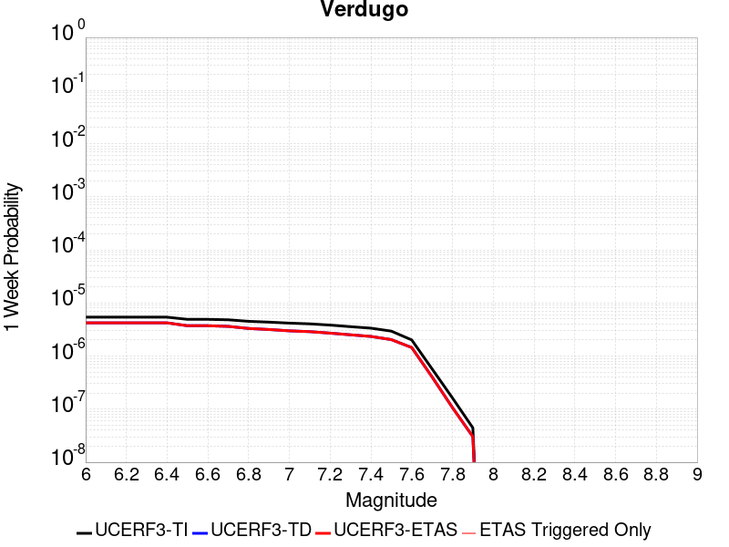 | 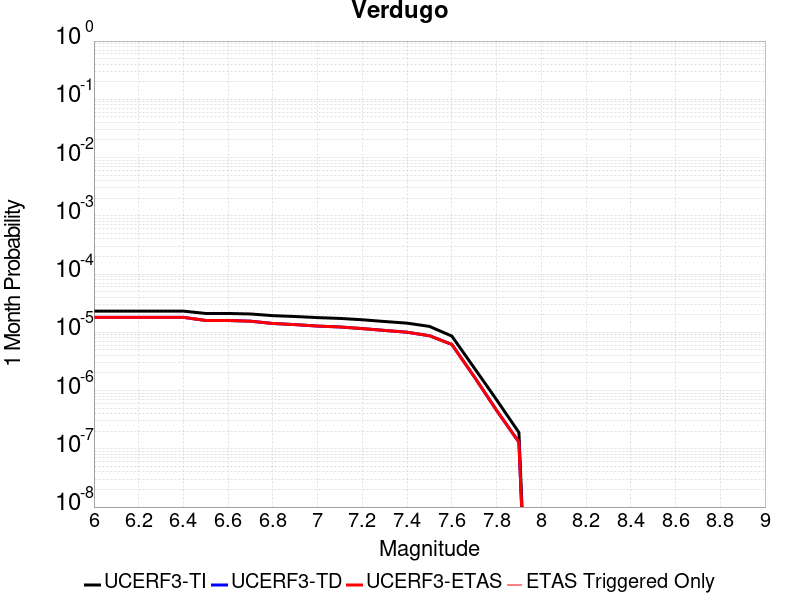 | 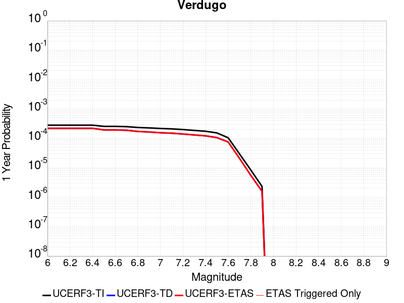 | 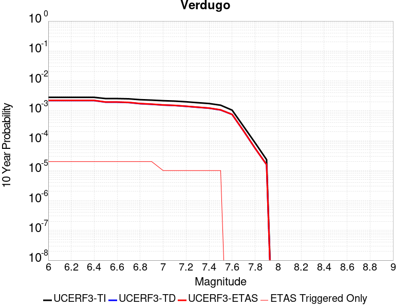 |

| Magnitude | 1 wk TI Prob | 1 wk TD Prob | 1 wk ETAS Prob | 1 wk ETAS/TD Gain | 1 wk ETAS Triggered Only | 1 mo TI Prob | 1 mo TD Prob | 1 mo ETAS Prob | 1 mo ETAS/TD Gain | 1 mo ETAS Triggered Only | 1 yr TI Prob | 1 yr TD Prob | 1 yr ETAS Prob | 1 yr ETAS/TD Gain | 1 yr ETAS Triggered Only | 10 yr TI Prob | 10 yr TD Prob | 10 yr ETAS Prob | 10 yr ETAS/TD Gain | 10 yr ETAS Triggered Only |
|-----|-----|-----|-----|-----|-----|-----|-----|-----|-----|-----|-----|-----|-----|-----|-----|-----|-----|-----|-----|-----|
| 6.0 | 5.392987E-6 | 4.2174674E-6 | 4.2174674E-6 | 1.0 | 0.0 | 2.3112598E-5 | 1.8074737E-5 | 1.8074737E-5 | 1.0 | 0.0 | 2.8135953E-4 | 2.2003817E-4 | 2.2003817E-4 | 1.0 | 0.0 | 0.0028100356 | 0.002198251 | 0.0022393195 | 1.0186824 | 4.1159037E-5 |
| 6.1 | 5.392987E-6 | 4.2174674E-6 | 4.2174674E-6 | 1.0 | 0.0 | 2.3112598E-5 | 1.8074737E-5 | 1.8074737E-5 | 1.0 | 0.0 | 2.8135953E-4 | 2.2003817E-4 | 2.2003817E-4 | 1.0 | 0.0 | 0.0028100356 | 0.002198251 | 0.0022393195 | 1.0186824 | 4.1159037E-5 |
| 6.2 | 5.392987E-6 | 4.2174674E-6 | 4.2174674E-6 | 1.0 | 0.0 | 2.3112598E-5 | 1.8074737E-5 | 1.8074737E-5 | 1.0 | 0.0 | 2.8135953E-4 | 2.2003817E-4 | 2.2003817E-4 | 1.0 | 0.0 | 0.0028100356 | 0.002198251 | 0.0022393195 | 1.0186824 | 4.1159037E-5 |
| 6.3 | 5.392987E-6 | 4.2174674E-6 | 4.2174674E-6 | 1.0 | 0.0 | 2.3112598E-5 | 1.8074737E-5 | 1.8074737E-5 | 1.0 | 0.0 | 2.8135953E-4 | 2.2003817E-4 | 2.2003817E-4 | 1.0 | 0.0 | 0.0028100356 | 0.002198251 | 0.0022393195 | 1.0186824 | 4.1159037E-5 |
| 6.4 | 5.392987E-6 | 4.2174674E-6 | 4.2174674E-6 | 1.0 | 0.0 | 2.3112598E-5 | 1.8074737E-5 | 1.8074737E-5 | 1.0 | 0.0 | 2.8135953E-4 | 2.2003817E-4 | 2.2003817E-4 | 1.0 | 0.0 | 0.0028100356 | 0.002198251 | 0.0022393195 | 1.0186824 | 4.1159037E-5 |
| 6.5 | 4.9154837E-6 | 3.7233756E-6 | 3.7233756E-6 | 1.0 | 0.0 | 2.1066187E-5 | 1.5957228E-5 | 1.5957228E-5 | 1.0 | 0.0 | 2.5645064E-4 | 1.9426213E-4 | 1.9426213E-4 | 1.0 | 0.0 | 0.002561549 | 0.001940944 | 0.0019820232 | 1.0211645 | 4.1159037E-5 |
| 6.6 | 4.9154837E-6 | 3.7233756E-6 | 3.7233756E-6 | 1.0 | 0.0 | 2.1066187E-5 | 1.5957228E-5 | 1.5957228E-5 | 1.0 | 0.0 | 2.5645064E-4 | 1.9426213E-4 | 1.9426213E-4 | 1.0 | 0.0 | 0.002561549 | 0.001940944 | 0.0019820232 | 1.0211645 | 4.1159037E-5 |
| 6.7 | 4.817006E-6 | 3.6215542E-6 | 3.6215542E-6 | 1.0 | 0.0 | 2.0644147E-5 | 1.5520856E-5 | 1.5520856E-5 | 1.0 | 0.0 | 2.513135E-4 | 1.8895023E-4 | 1.8895023E-4 | 1.0 | 0.0 | 0.0025102948 | 0.0018879154 | 0.0019289966 | 1.0217601 | 4.1159037E-5 |
| 6.8 | 4.507407E-6 | 3.3079687E-6 | 3.3079687E-6 | 1.0 | 0.0 | 1.9317316E-5 | 1.4176932E-5 | 1.4176932E-5 | 1.0 | 0.0 | 2.3516294E-4 | 1.7259062E-4 | 1.7259062E-4 | 1.0 | 0.0 | 0.0023491425 | 0.0017245802 | 0.0017656683 | 1.0238249 | 4.1159037E-5 |
| 6.9 | 4.3573054E-6 | 3.1618583E-6 | 3.1618583E-6 | 1.0 | 0.0 | 1.8674033E-5 | 1.3550752E-5 | 1.3550752E-5 | 1.0 | 0.0 | 2.2733262E-4 | 1.6496803E-4 | 1.6496803E-4 | 1.0 | 0.0 | 0.0022710022 | 0.0016484681 | 0.0016895593 | 1.0249269 | 4.1159037E-5 |
| 7.0 | 4.171527E-6 | 2.9844957E-6 | 2.9844957E-6 | 1.0 | 0.0 | 1.787785E-5 | 1.2790634E-5 | 1.2790634E-5 | 1.0 | 0.0 | 2.1764109E-4 | 1.5571495E-4 | 1.5571495E-4 | 1.0 | 0.0 | 0.0021742806 | 0.0015560697 | 0.0015560697 | 1.0 | 0.0 |
| 7.1 | 4.0405484E-6 | 2.8830707E-6 | 2.8830707E-6 | 1.0 | 0.0 | 1.731652E-5 | 1.2355959E-5 | 1.2355959E-5 | 1.0 | 0.0 | 2.1080824E-4 | 1.5042353E-4 | 1.5042353E-4 | 1.0 | 0.0 | 0.0021060838 | 0.0015032281 | 0.0015032281 | 1.0 | 0.0 |
| 7.2 | 3.8306007E-6 | 2.7026297E-6 | 2.7026297E-6 | 1.0 | 0.0 | 1.6416758E-5 | 1.1582647E-5 | 1.1582647E-5 | 1.0 | 0.0 | 1.9985568E-4 | 1.4100972E-4 | 1.4100972E-4 | 1.0 | 0.0 | 0.0019967605 | 0.0014092132 | 0.0014092132 | 1.0 | 0.0 |
| 7.3 | 3.5750938E-6 | 2.5129289E-6 | 2.5129289E-6 | 1.0 | 0.0 | 1.532174E-5 | 1.0769651E-5 | 1.0769651E-5 | 1.0 | 0.0 | 1.8652623E-4 | 1.3111273E-4 | 1.3111273E-4 | 1.0 | 0.0 | 0.0018636974 | 0.0013103642 | 0.0013103642 | 1.0 | 0.0 |
| 7.4 | 3.3510041E-6 | 2.3415846E-6 | 2.3415846E-6 | 1.0 | 0.0 | 1.4361368E-5 | 1.00353245E-5 | 1.00353245E-5 | 1.0 | 0.0 | 1.7483562E-4 | 1.2217333E-4 | 1.2217333E-4 | 1.0 | 0.0 | 0.0017469813 | 0.001221072 | 0.001221072 | 1.0 | 0.0 |
| 7.5 | 2.948287E-6 | 2.0396562E-6 | 2.0396562E-6 | 1.0 | 0.0 | 1.2635454E-5 | 8.7413555E-6 | 8.7413555E-6 | 1.0 | 0.0 | 1.538258E-4 | 1.0642091E-4 | 1.0642091E-4 | 1.0 | 0.0 | 0.0015371935 | 0.0010637097 | 0.0010637097 | 1.0 | 0.0 |
| 7.6 | 2.0134323E-6 | 1.4474672E-6 | 1.4474672E-6 | 1.0 | 0.0 | 8.628967E-6 | 6.2034164E-6 | 6.2034164E-6 | 1.0 | 0.0 | 1.05052604E-4 | 7.552407E-5 | 7.552407E-5 | 1.0 | 0.0 | 0.0010500296 | 7.549928E-4 | 7.549928E-4 | 1.0 | 0.0 |
| 7.7 | 5.726436E-7 | 4.0464712E-7 | 4.0464712E-7 | 1.0 | 0.0 | 2.4541846E-6 | 1.734201E-6 | 1.734201E-6 | 1.0 | 0.0 | 2.9879287E-5 | 2.1113718E-5 | 2.1113718E-5 | 1.0 | 0.0 | 2.987527E-4 | 2.1111967E-4 | 2.1111967E-4 | 1.0 | 0.0 |
| 7.8 | 1.6248204E-7 | 1.0695783E-7 | 1.0695783E-7 | 1.0 | 0.0 | 6.963514E-7 | 4.5839062E-7 | 4.5839062E-7 | 1.0 | 0.0 | 8.478045E-6 | 5.580892E-6 | 5.580892E-6 | 1.0 | 0.0 | 8.477722E-5 | 5.580755E-5 | 5.580755E-5 | 1.0 | 0.0 |
| 7.9 | 4.4475744E-8 | 3.038227E-8 | 3.038227E-8 | 1.0 | 0.0 | 1.9061031E-7 | 1.3020971E-7 | 1.3020971E-7 | 1.0 | 0.0 | 2.320678E-6 | 1.5853024E-6 | 1.5853024E-6 | 1.0 | 0.0 | 2.3206538E-5 | 1.5852924E-5 | 1.5852924E-5 | 1.0 | 0.0 |

## Los Alamos 2011 CFM
*[(top)](#table-of-contents)*

| 1 Week | 1 Month | 1 Year | 10 Year |
|-----|-----|-----|-----|
| 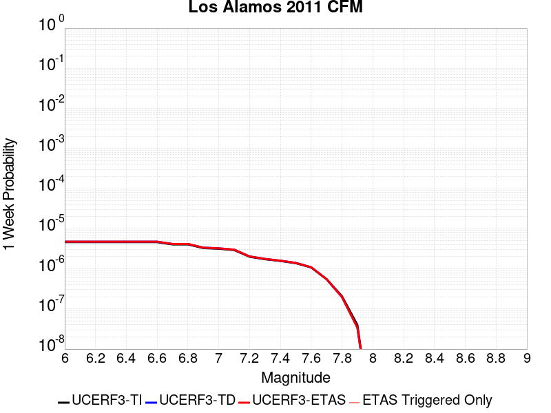 | 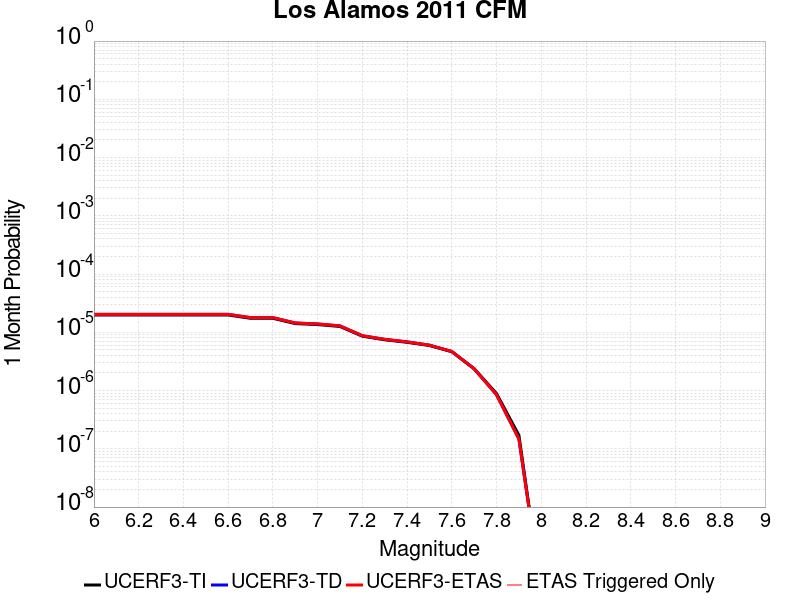 | 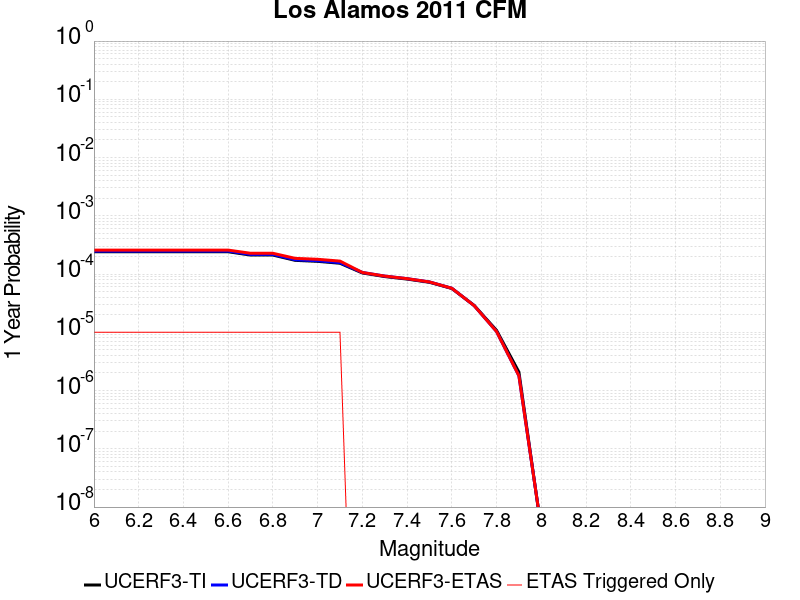 | 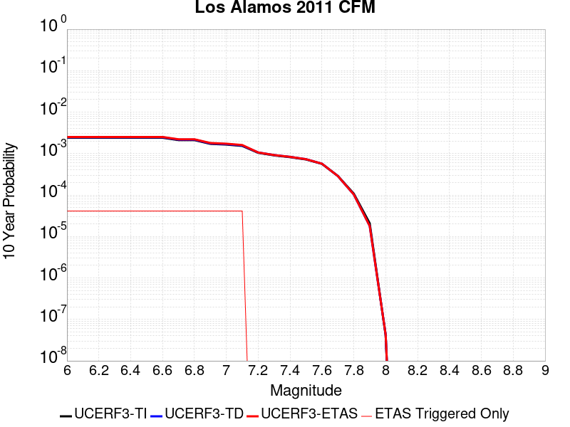 |

| Magnitude | 1 wk TI Prob | 1 wk TD Prob | 1 wk ETAS Prob | 1 wk ETAS/TD Gain | 1 wk ETAS Triggered Only | 1 mo TI Prob | 1 mo TD Prob | 1 mo ETAS Prob | 1 mo ETAS/TD Gain | 1 mo ETAS Triggered Only | 1 yr TI Prob | 1 yr TD Prob | 1 yr ETAS Prob | 1 yr ETAS/TD Gain | 1 yr ETAS Triggered Only | 10 yr TI Prob | 10 yr TD Prob | 10 yr ETAS Prob | 10 yr ETAS/TD Gain | 10 yr ETAS Triggered Only |
|-----|-----|-----|-----|-----|-----|-----|-----|-----|-----|-----|-----|-----|-----|-----|-----|-----|-----|-----|-----|-----|
| 6.0 | 4.6284417E-6 | 4.7521157E-6 | 4.7521157E-6 | 1.0 | 0.0 | 1.9836029E-5 | 2.0366062E-5 | 2.0366062E-5 | 1.0 | 0.0 | 2.4147688E-4 | 2.4793035E-4 | 2.8907918E-4 | 1.1659694 | 4.1159037E-5 | 0.0024121467 | 0.0024767118 | 0.0025177686 | 1.0165772 | 4.1159037E-5 |
| 6.1 | 4.6284417E-6 | 4.7521157E-6 | 4.7521157E-6 | 1.0 | 0.0 | 1.9836029E-5 | 2.0366062E-5 | 2.0366062E-5 | 1.0 | 0.0 | 2.4147688E-4 | 2.4793035E-4 | 2.8907918E-4 | 1.1659694 | 4.1159037E-5 | 0.0024121467 | 0.0024767118 | 0.0025177686 | 1.0165772 | 4.1159037E-5 |
| 6.2 | 4.6284417E-6 | 4.7521157E-6 | 4.7521157E-6 | 1.0 | 0.0 | 1.9836029E-5 | 2.0366062E-5 | 2.0366062E-5 | 1.0 | 0.0 | 2.4147688E-4 | 2.4793035E-4 | 2.8907918E-4 | 1.1659694 | 4.1159037E-5 | 0.0024121467 | 0.0024767118 | 0.0025177686 | 1.0165772 | 4.1159037E-5 |
| 6.3 | 4.6284417E-6 | 4.7521157E-6 | 4.7521157E-6 | 1.0 | 0.0 | 1.9836029E-5 | 2.0366062E-5 | 2.0366062E-5 | 1.0 | 0.0 | 2.4147688E-4 | 2.4793035E-4 | 2.8907918E-4 | 1.1659694 | 4.1159037E-5 | 0.0024121467 | 0.0024767118 | 0.0025177686 | 1.0165772 | 4.1159037E-5 |
| 6.4 | 4.6284417E-6 | 4.7521157E-6 | 4.7521157E-6 | 1.0 | 0.0 | 1.9836029E-5 | 2.0366062E-5 | 2.0366062E-5 | 1.0 | 0.0 | 2.4147688E-4 | 2.4793035E-4 | 2.8907918E-4 | 1.1659694 | 4.1159037E-5 | 0.0024121467 | 0.0024767118 | 0.0025177686 | 1.0165772 | 4.1159037E-5 |
| 6.5 | 4.6284417E-6 | 4.7521157E-6 | 4.7521157E-6 | 1.0 | 0.0 | 1.9836029E-5 | 2.0366062E-5 | 2.0366062E-5 | 1.0 | 0.0 | 2.4147688E-4 | 2.4793035E-4 | 2.8907918E-4 | 1.1659694 | 4.1159037E-5 | 0.0024121467 | 0.0024767118 | 0.0025177686 | 1.0165772 | 4.1159037E-5 |
| 6.6 | 4.6284417E-6 | 4.7521157E-6 | 4.7521157E-6 | 1.0 | 0.0 | 1.9836029E-5 | 2.0366062E-5 | 2.0366062E-5 | 1.0 | 0.0 | 2.4147688E-4 | 2.4793035E-4 | 2.8907918E-4 | 1.1659694 | 4.1159037E-5 | 0.0024121467 | 0.0024767118 | 0.0025177686 | 1.0165772 | 4.1159037E-5 |
| 6.7 | 4.062321E-6 | 4.1666876E-6 | 4.1666876E-6 | 1.0 | 0.0 | 1.7409831E-5 | 1.7857117E-5 | 1.7857117E-5 | 1.0 | 0.0 | 2.1194408E-4 | 2.1739023E-4 | 2.5854033E-4 | 1.1892914 | 4.1159037E-5 | 0.0021174205 | 0.0021719255 | 0.0022129952 | 1.0189093 | 4.1159037E-5 |
| 6.8 | 4.062321E-6 | 4.1666876E-6 | 4.1666876E-6 | 1.0 | 0.0 | 1.7409831E-5 | 1.7857117E-5 | 1.7857117E-5 | 1.0 | 0.0 | 2.1194408E-4 | 2.1739023E-4 | 2.5854033E-4 | 1.1892914 | 4.1159037E-5 | 0.0021174205 | 0.0021719255 | 0.0022129952 | 1.0189093 | 4.1159037E-5 |
| 6.9 | 3.2936077E-6 | 3.3732376E-6 | 3.3732376E-6 | 1.0 | 0.0 | 1.4115385E-5 | 1.4456658E-5 | 1.4456658E-5 | 1.0 | 0.0 | 1.7184127E-4 | 1.7599654E-4 | 2.1714834E-4 | 1.2338216 | 4.1159037E-5 | 0.0017170844 | 0.0017586641 | 0.0017997508 | 1.0233624 | 4.1159037E-5 |
| 7.0 | 3.1687898E-6 | 3.2450873E-6 | 3.2450873E-6 | 1.0 | 0.0 | 1.3580457E-5 | 1.3907448E-5 | 1.3907448E-5 | 1.0 | 0.0 | 1.6532952E-4 | 1.6931097E-4 | 2.1046303E-4 | 1.2430562 | 4.1159037E-5 | 0.0016520657 | 0.0016919113 | 0.0017330006 | 1.0242858 | 4.1159037E-5 |
| 7.1 | 2.9379228E-6 | 3.0075819E-6 | 3.0075819E-6 | 1.0 | 0.0 | 1.25910365E-5 | 1.2889578E-5 | 1.2889578E-5 | 1.0 | 0.0 | 1.5328509E-4 | 1.5692021E-4 | 1.980728E-4 | 1.2622516 | 4.1159037E-5 | 0.001531794 | 0.0015681833 | 0.0016092778 | 1.0262052 | 4.1159037E-5 |
| 7.2 | 2.0020686E-6 | 2.0418147E-6 | 2.0418147E-6 | 1.0 | 0.0 | 8.580266E-6 | 8.750605E-6 | 8.750605E-6 | 1.0 | 0.0 | 1.0445973E-4 | 1.0653346E-4 | 1.0653346E-4 | 1.0 | 0.0 | 0.0010441064 | 0.0010648284 | 0.0010648284 | 1.0 | 0.0 |
| 7.3 | 1.7364243E-6 | 1.7680459E-6 | 1.7680459E-6 | 1.0 | 0.0 | 7.441797E-6 | 7.577318E-6 | 7.577318E-6 | 1.0 | 0.0 | 9.0600115E-5 | 9.224997E-5 | 9.224997E-5 | 1.0 | 0.0 | 9.0563187E-4 | 9.221199E-4 | 9.221199E-4 | 1.0 | 0.0 |
| 7.4 | 1.5718434E-6 | 1.5984714E-6 | 1.5984714E-6 | 1.0 | 0.0 | 6.7364545E-6 | 6.8505738E-6 | 6.8505738E-6 | 1.0 | 0.0 | 8.201325E-5 | 8.340258E-5 | 8.340258E-5 | 1.0 | 0.0 | 8.198299E-4 | 8.337157E-4 | 8.337157E-4 | 1.0 | 0.0 |
| 7.5 | 1.3841119E-6 | 1.4044178E-6 | 1.4044178E-6 | 1.0 | 0.0 | 5.9318945E-6 | 6.01892E-6 | 6.01892E-6 | 1.0 | 0.0 | 7.221842E-5 | 7.3277915E-5 | 7.3277915E-5 | 1.0 | 0.0 | 7.2194956E-4 | 7.3254044E-4 | 7.3254044E-4 | 1.0 | 0.0 |
| 7.6 | 1.0843726E-6 | 1.0935541E-6 | 1.0935541E-6 | 1.0 | 0.0 | 4.647303E-6 | 4.686652E-6 | 4.686652E-6 | 1.0 | 0.0 | 5.6579443E-5 | 5.705852E-5 | 5.705852E-5 | 1.0 | 0.0 | 5.656504E-4 | 5.704413E-4 | 5.704413E-4 | 1.0 | 0.0 |
| 7.7 | 5.544814E-7 | 5.5024503E-7 | 5.5024503E-7 | 1.0 | 0.0 | 2.3763469E-6 | 2.3581908E-6 | 2.3581908E-6 | 1.0 | 0.0 | 2.8931638E-5 | 2.8710596E-5 | 2.8710596E-5 | 1.0 | 0.0 | 2.8927872E-4 | 2.8706904E-4 | 2.8706904E-4 | 1.0 | 0.0 |
| 7.8 | 2.0707465E-7 | 1.978078E-7 | 1.978078E-7 | 1.0 | 0.0 | 8.874625E-7 | 8.477474E-7 | 8.477474E-7 | 1.0 | 0.0 | 1.08048025E-5 | 1.0321276E-5 | 1.0321276E-5 | 1.0 | 0.0 | 1.0804277E-4 | 1.0320801E-4 | 1.0320801E-4 | 1.0 | 0.0 |
| 7.9 | 3.9821284E-8 | 3.43357E-8 | 3.43357E-8 | 1.0 | 0.0 | 1.7066264E-7 | 1.4715297E-7 | 1.4715297E-7 | 1.0 | 0.0 | 2.0778157E-6 | 1.7915861E-6 | 1.7915861E-6 | 1.0 | 0.0 | 2.0777963E-5 | 1.7915721E-5 | 1.7915721E-5 | 1.0 | 0.0 |
| 8.0 | 7.880441E-11 | 8.236167E-11 | 8.236167E-11 | 1.0 | 0.0 | 3.3773329E-10 | 3.5297876E-10 | 3.5297876E-10 | 1.0 | 0.0 | 4.1119033E-9 | 4.297517E-9 | 4.297517E-9 | 1.0 | 0.0 | 4.1119034E-8 | 4.2975167E-8 | 4.2975167E-8 | 1.0 | 0.0 |

## San Pedro Basin
*[(top)](#table-of-contents)*

| 1 Week | 1 Month | 1 Year | 10 Year |
|-----|-----|-----|-----|
| 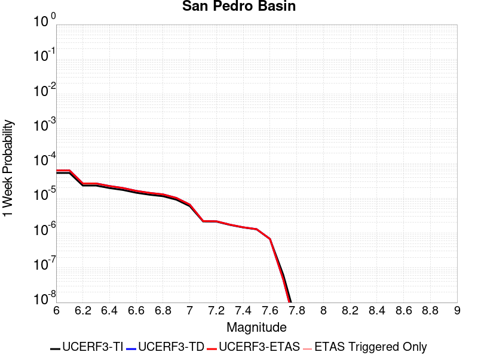 | 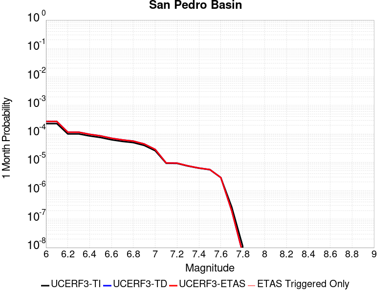 | 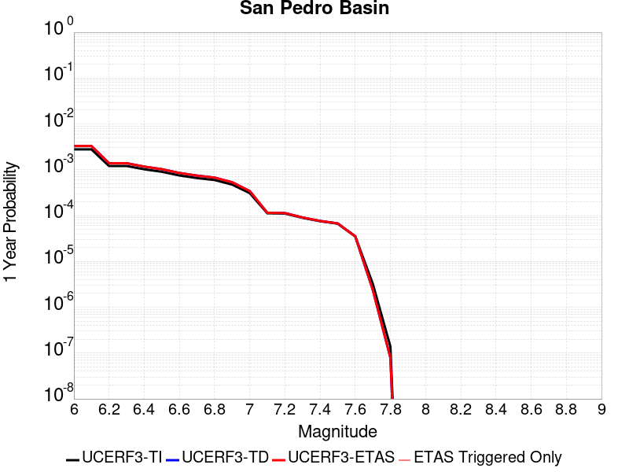 | 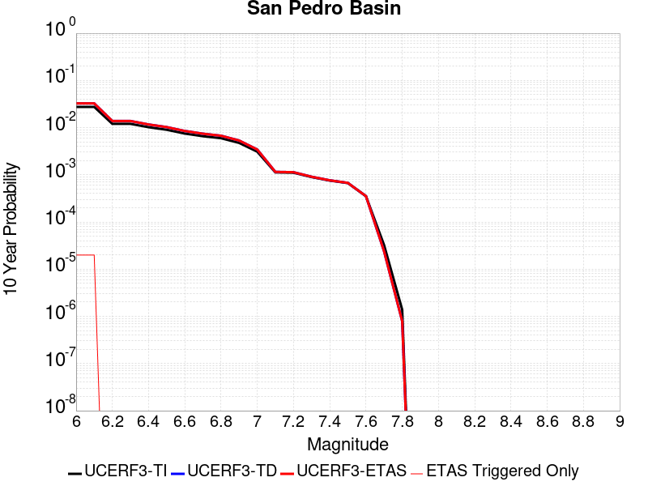 |

| Magnitude | 1 wk TI Prob | 1 wk TD Prob | 1 wk ETAS Prob | 1 wk ETAS/TD Gain | 1 wk ETAS Triggered Only | 1 mo TI Prob | 1 mo TD Prob | 1 mo ETAS Prob | 1 mo ETAS/TD Gain | 1 mo ETAS Triggered Only | 1 yr TI Prob | 1 yr TD Prob | 1 yr ETAS Prob | 1 yr ETAS/TD Gain | 1 yr ETAS Triggered Only | 10 yr TI Prob | 10 yr TD Prob | 10 yr ETAS Prob | 10 yr ETAS/TD Gain | 10 yr ETAS Triggered Only |
|-----|-----|-----|-----|-----|-----|-----|-----|-----|-----|-----|-----|-----|-----|-----|-----|-----|-----|-----|-----|-----|
| 6.0 | 5.3449043E-5 | 6.339769E-5 | 6.339769E-5 | 1.0 | 0.0 | 2.2904722E-4 | 2.7167957E-4 | 2.7167957E-4 | 1.0 | 0.0 | 0.0027850836 | 0.0033032831 | 0.0033032831 | 1.0 | 0.0 | 0.027504366 | 0.032603413 | 0.032643232 | 1.0012213 | 4.1159037E-5 |
| 6.1 | 5.3449043E-5 | 6.339769E-5 | 6.339769E-5 | 1.0 | 0.0 | 2.2904722E-4 | 2.7167957E-4 | 2.7167957E-4 | 1.0 | 0.0 | 0.0027850836 | 0.0033032831 | 0.0033032831 | 1.0 | 0.0 | 0.027504366 | 0.032603413 | 0.032643232 | 1.0012213 | 4.1159037E-5 |
| 6.2 | 2.3189454E-5 | 2.6652198E-5 | 2.6652198E-5 | 1.0 | 0.0 | 9.9379584E-5 | 1.1421897E-4 | 1.1421897E-4 | 1.0 | 0.0 | 0.0012092749 | 0.0013897758 | 0.0013897758 | 1.0 | 0.0 | 0.012027155 | 0.013815714 | 0.013815714 | 1.0 | 0.0 |
| 6.3 | 2.3189454E-5 | 2.6652198E-5 | 2.6652198E-5 | 1.0 | 0.0 | 9.9379584E-5 | 1.1421897E-4 | 1.1421897E-4 | 1.0 | 0.0 | 0.0012092749 | 0.0013897758 | 0.0013897758 | 1.0 | 0.0 | 0.012027155 | 0.013815714 | 0.013815714 | 1.0 | 0.0 |
| 6.4 | 1.966056E-5 | 2.2471006E-5 | 2.2471006E-5 | 1.0 | 0.0 | 8.425682E-5 | 9.630098E-5 | 9.630098E-5 | 1.0 | 0.0 | 0.001025344 | 0.001171874 | 0.001171874 | 1.0 | 0.0 | 0.010206259 | 0.011661033 | 0.011661033 | 1.0 | 0.0 |
| 6.5 | 1.7342953E-5 | 1.975165E-5 | 1.975165E-5 | 1.0 | 0.0 | 7.4324824E-5 | 8.4647385E-5 | 8.4647385E-5 | 1.0 | 0.0 | 9.04529E-4 | 0.0010301316 | 0.0010301316 | 1.0 | 0.0 | 0.009008561 | 0.010257291 | 0.010257291 | 1.0 | 0.0 |
| 6.6 | 1.439804E-5 | 1.632793E-5 | 1.632793E-5 | 1.0 | 0.0 | 6.170443E-5 | 6.997514E-5 | 6.997514E-5 | 1.0 | 0.0 | 7.509924E-4 | 8.516465E-4 | 8.516465E-4 | 1.0 | 0.0 | 0.0074845953 | 0.008487032 | 0.008487032 | 1.0 | 0.0 |
| 6.7 | 1.2634884E-5 | 1.4289777E-5 | 1.4289777E-5 | 1.0 | 0.0 | 5.414838E-5 | 6.124064E-5 | 6.124064E-5 | 1.0 | 0.0 | 6.590571E-4 | 7.453802E-4 | 7.453802E-4 | 1.0 | 0.0 | 0.006571059 | 0.007431824 | 0.007431824 | 1.0 | 0.0 |
| 6.8 | 1.146091E-5 | 1.2937197E-5 | 1.2937197E-5 | 1.0 | 0.0 | 4.911726E-5 | 5.544412E-5 | 5.544412E-5 | 1.0 | 0.0 | 5.9783855E-4 | 6.7485287E-4 | 6.7485287E-4 | 1.0 | 0.0 | 0.0059623276 | 0.0067309774 | 0.0067309774 | 1.0 | 0.0 |
| 6.9 | 9.109035E-6 | 1.0238097E-5 | 1.0238097E-5 | 1.0 | 0.0 | 3.9038136E-5 | 4.3876982E-5 | 4.3876982E-5 | 1.0 | 0.0 | 4.7518566E-4 | 5.340993E-4 | 5.340993E-4 | 1.0 | 0.0 | 0.0047417083 | 0.005330913 | 0.005330913 | 1.0 | 0.0 |
| 7.0 | 5.9351028E-6 | 6.58578E-6 | 6.58578E-6 | 1.0 | 0.0 | 2.5435906E-5 | 2.8224598E-5 | 2.8224598E-5 | 1.0 | 0.0 | 3.0963816E-4 | 3.4360393E-4 | 3.4360393E-4 | 1.0 | 0.0 | 0.0030920706 | 0.0034330452 | 0.0034330452 | 1.0 | 0.0 |
| 7.1 | 2.1557585E-6 | 2.2098704E-6 | 2.2098704E-6 | 1.0 | 0.0 | 9.238933E-6 | 9.470839E-6 | 9.470839E-6 | 1.0 | 0.0 | 1.1247819E-4 | 1.15301526E-4 | 1.15301526E-4 | 1.0 | 0.0 | 0.0011242128 | 0.0011524324 | 0.0011524324 | 1.0 | 0.0 |
| 7.2 | 2.1251979E-6 | 2.178214E-6 | 2.178214E-6 | 1.0 | 0.0 | 9.107958E-6 | 9.33517E-6 | 9.33517E-6 | 1.0 | 0.0 | 1.1088375E-4 | 1.1364993E-4 | 1.1364993E-4 | 1.0 | 0.0 | 0.0011082845 | 0.0011359333 | 0.0011359333 | 1.0 | 0.0 |
| 7.3 | 1.7145798E-6 | 1.7444505E-6 | 1.7444505E-6 | 1.0 | 0.0 | 7.3481783E-6 | 7.4761956E-6 | 7.4761956E-6 | 1.0 | 0.0 | 8.94604E-5 | 9.101897E-5 | 9.101897E-5 | 1.0 | 0.0 | 8.9424395E-4 | 9.098261E-4 | 9.098261E-4 | 1.0 | 0.0 |
| 7.4 | 1.4467993E-6 | 1.46432E-6 | 1.46432E-6 | 1.0 | 0.0 | 6.200554E-6 | 6.2756426E-6 | 6.2756426E-6 | 1.0 | 0.0 | 7.548913E-5 | 7.640334E-5 | 7.640334E-5 | 1.0 | 0.0 | 7.546349E-4 | 7.63778E-4 | 7.63778E-4 | 1.0 | 0.0 |
| 7.5 | 1.2803735E-6 | 1.293267E-6 | 1.293267E-6 | 1.0 | 0.0 | 5.487303E-6 | 5.5425617E-6 | 5.5425617E-6 | 1.0 | 0.0 | 6.680587E-5 | 6.747867E-5 | 6.747867E-5 | 1.0 | 0.0 | 6.678579E-4 | 6.745889E-4 | 6.745889E-4 | 1.0 | 0.0 |
| 7.6 | 6.755009E-7 | 6.7700876E-7 | 6.7700876E-7 | 1.0 | 0.0 | 2.8950008E-6 | 2.9014632E-6 | 2.9014632E-6 | 1.0 | 0.0 | 3.5246063E-5 | 3.53248E-5 | 3.53248E-5 | 1.0 | 0.0 | 3.5240475E-4 | 3.5319757E-4 | 3.5319757E-4 | 1.0 | 0.0 |
| 7.7 | 6.211885E-8 | 4.5705608E-8 | 4.5705608E-8 | 1.0 | 0.0 | 2.6622362E-7 | 1.9588116E-7 | 1.9588116E-7 | 1.0 | 0.0 | 3.2412677E-6 | 2.3848506E-6 | 2.3848506E-6 | 1.0 | 0.0 | 3.2412205E-5 | 2.3848272E-5 | 2.3848272E-5 | 1.0 | 0.0 |
| 7.8 | 2.6580573E-9 | 1.5146536E-9 | 1.5146536E-9 | 1.0 | 0.0 | 1.1391674E-8 | 6.4913728E-9 | 6.4913728E-9 | 1.0 | 0.0 | 1.3869362E-7 | 7.903246E-8 | 7.903246E-8 | 1.0 | 0.0 | 1.3869354E-6 | 7.9032463E-7 | 7.9032463E-7 | 1.0 | 0.0 |

## White Wolf (Extension)
*[(top)](#table-of-contents)*

| 1 Week | 1 Month | 1 Year | 10 Year |
|-----|-----|-----|-----|
| 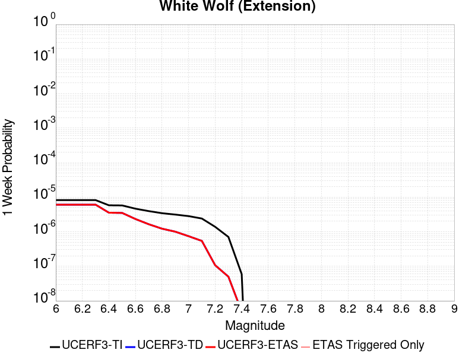 | 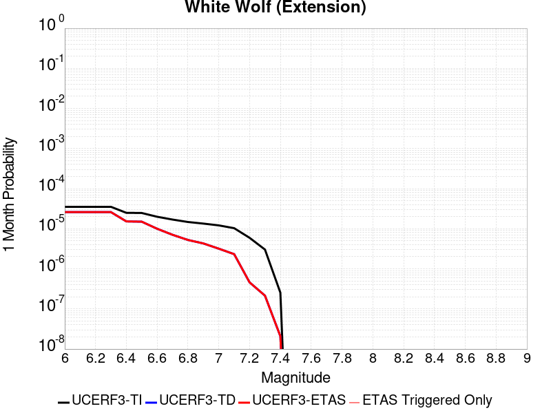 | 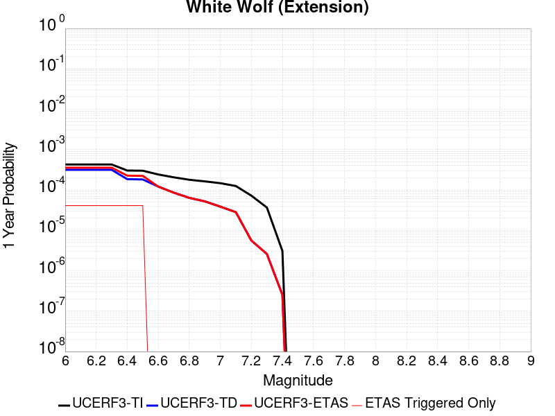 | 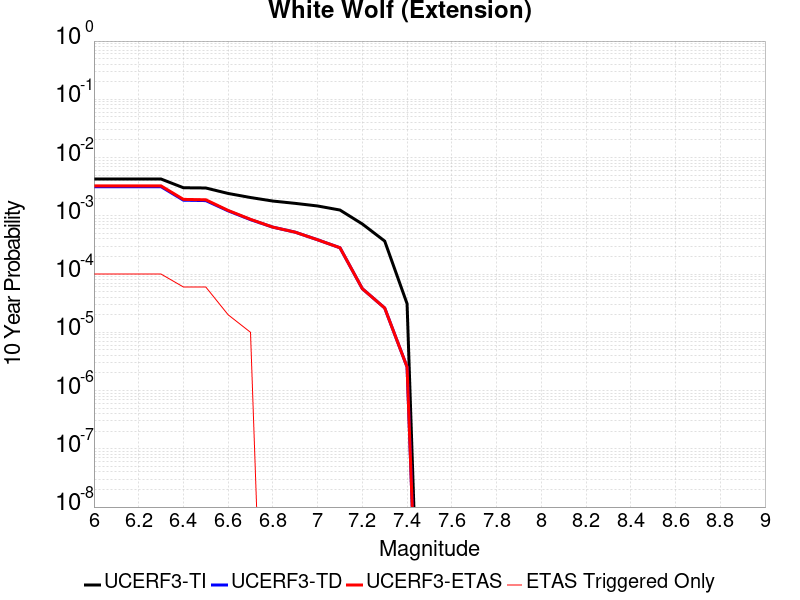 |

| Magnitude | 1 wk TI Prob | 1 wk TD Prob | 1 wk ETAS Prob | 1 wk ETAS/TD Gain | 1 wk ETAS Triggered Only | 1 mo TI Prob | 1 mo TD Prob | 1 mo ETAS Prob | 1 mo ETAS/TD Gain | 1 mo ETAS Triggered Only | 1 yr TI Prob | 1 yr TD Prob | 1 yr ETAS Prob | 1 yr ETAS/TD Gain | 1 yr ETAS Triggered Only | 10 yr TI Prob | 10 yr TD Prob | 10 yr ETAS Prob | 10 yr ETAS/TD Gain | 10 yr ETAS Triggered Only |
|-----|-----|-----|-----|-----|-----|-----|-----|-----|-----|-----|-----|-----|-----|-----|-----|-----|-----|-----|-----|-----|
| 6.0 | 8.222555E-6 | 6.067321E-6 | 6.067321E-6 | 1.0 | 0.0 | 3.5239045E-5 | 2.6002583E-5 | 2.6002583E-5 | 1.0 | 0.0 | 4.289509E-4 | 3.1654208E-4 | 3.5768808E-4 | 1.1299859 | 4.1159037E-5 | 0.0042812387 | 0.003161564 | 0.003202593 | 1.0129774 | 4.1159037E-5 |
| 6.1 | 8.222555E-6 | 6.067321E-6 | 6.067321E-6 | 1.0 | 0.0 | 3.5239045E-5 | 2.6002583E-5 | 2.6002583E-5 | 1.0 | 0.0 | 4.289509E-4 | 3.1654208E-4 | 3.5768808E-4 | 1.1299859 | 4.1159037E-5 | 0.0042812387 | 0.003161564 | 0.003202593 | 1.0129774 | 4.1159037E-5 |
| 6.2 | 8.222555E-6 | 6.067321E-6 | 6.067321E-6 | 1.0 | 0.0 | 3.5239045E-5 | 2.6002583E-5 | 2.6002583E-5 | 1.0 | 0.0 | 4.289509E-4 | 3.1654208E-4 | 3.5768808E-4 | 1.1299859 | 4.1159037E-5 | 0.0042812387 | 0.003161564 | 0.003202593 | 1.0129774 | 4.1159037E-5 |
| 6.3 | 8.222555E-6 | 6.067321E-6 | 6.067321E-6 | 1.0 | 0.0 | 3.5239045E-5 | 2.6002583E-5 | 2.6002583E-5 | 1.0 | 0.0 | 4.289509E-4 | 3.1654208E-4 | 3.5768808E-4 | 1.1299859 | 4.1159037E-5 | 0.0042812387 | 0.003161564 | 0.003202593 | 1.0129774 | 4.1159037E-5 |
| 6.4 | 5.821773E-6 | 3.5575688E-6 | 3.5575688E-6 | 1.0 | 0.0 | 2.4950215E-5 | 1.5246641E-5 | 1.5246641E-5 | 1.0 | 0.0 | 3.0372653E-4 | 1.8561314E-4 | 2.2676453E-4 | 1.2217052 | 4.1159037E-5 | 0.0030331176 | 0.0018546894 | 0.0018957722 | 1.0221508 | 4.1159037E-5 |
| 6.5 | 5.766023E-6 | 3.4994973E-6 | 3.4994973E-6 | 1.0 | 0.0 | 2.4711293E-5 | 1.4997766E-5 | 1.4997766E-5 | 1.0 | 0.0 | 3.0081844E-4 | 1.825836E-4 | 2.2373511E-4 | 1.2253846 | 4.1159037E-5 | 0.0030041158 | 0.001824444 | 0.0018655281 | 1.0225186 | 4.1159037E-5 |
| 6.6 | 4.643576E-6 | 2.332905E-6 | 2.332905E-6 | 1.0 | 0.0 | 1.9900888E-5 | 9.998129E-6 | 9.998129E-6 | 1.0 | 0.0 | 2.4226638E-4 | 1.2172085E-4 | 1.2172085E-4 | 1.0 | 0.0 | 0.0024200242 | 0.0012165842 | 0.0012165842 | 1.0 | 0.0 |
| 6.7 | 3.9529173E-6 | 1.6485654E-6 | 1.6485654E-6 | 1.0 | 0.0 | 1.6940963E-5 | 7.0652623E-6 | 7.0652623E-6 | 1.0 | 0.0 | 2.0623671E-4 | 8.6016364E-5 | 8.6016364E-5 | 1.0 | 0.0 | 0.002060454 | 8.598492E-4 | 8.598492E-4 | 1.0 | 0.0 |
| 6.8 | 3.4377522E-6 | 1.2246993E-6 | 1.2246993E-6 | 1.0 | 0.0 | 1.473314E-5 | 5.248701E-6 | 5.248701E-6 | 1.0 | 0.0 | 1.7936122E-4 | 6.3901156E-5 | 6.3901156E-5 | 1.0 | 0.0 | 0.0017921652 | 6.3883694E-4 | 6.3883694E-4 | 1.0 | 0.0 |
| 6.9 | 3.1367306E-6 | 1.0035287E-6 | 1.0035287E-6 | 1.0 | 0.0 | 1.3443062E-5 | 4.300831E-6 | 4.300831E-6 | 1.0 | 0.0 | 1.63657E-4 | 5.2361436E-5 | 5.2361436E-5 | 1.0 | 0.0 | 0.0016353652 | 5.2349863E-4 | 5.2349863E-4 | 1.0 | 0.0 |
| 7.0 | 2.8298145E-6 | 7.429934E-7 | 7.429934E-7 | 1.0 | 0.0 | 1.2127721E-5 | 3.184254E-6 | 3.184254E-6 | 1.0 | 0.0 | 1.47645E-4 | 3.8767652E-5 | 3.8767652E-5 | 1.0 | 0.0 | 0.0014754693 | 3.876139E-4 | 3.876139E-4 | 1.0 | 0.0 |
| 7.1 | 2.4091064E-6 | 5.4237466E-7 | 5.4237466E-7 | 1.0 | 0.0 | 1.03247E-5 | 2.324461E-6 | 2.324461E-6 | 1.0 | 0.0 | 1.2569598E-4 | 2.8299988E-5 | 2.8299988E-5 | 1.0 | 0.0 | 0.001256249 | 2.8296787E-4 | 2.8296787E-4 | 1.0 | 0.0 |
| 7.2 | 1.3875518E-6 | 1.07468495E-7 | 1.07468495E-7 | 1.0 | 0.0 | 5.9466374E-6 | 4.6057917E-7 | 4.6057917E-7 | 1.0 | 0.0 | 7.23979E-5 | 5.6075382E-6 | 5.6075382E-6 | 1.0 | 0.0 | 7.2374323E-4 | 5.607408E-5 | 5.607408E-5 | 1.0 | 0.0 |
| 7.3 | 7.056077E-7 | 5.0039706E-8 | 5.0039706E-8 | 1.0 | 0.0 | 3.0240296E-6 | 2.1445587E-7 | 2.1445587E-7 | 1.0 | 0.0 | 3.681694E-5 | 2.6109974E-6 | 2.6109974E-6 | 1.0 | 0.0 | 3.681084E-4 | 2.6109714E-5 | 2.6109714E-5 | 1.0 | 0.0 |
| 7.4 | 5.9334678E-8 | 4.865539E-9 | 4.865539E-9 | 1.0 | 0.0 | 2.5429145E-7 | 2.085231E-8 | 2.085231E-8 | 1.0 | 0.0 | 3.095994E-6 | 2.5387686E-7 | 2.5387686E-7 | 1.0 | 0.0 | 3.095951E-5 | 2.538767E-6 | 2.538767E-6 | 1.0 | 0.0 |

## Manix-Afton Hills
*[(top)](#table-of-contents)*

| 1 Week | 1 Month | 1 Year | 10 Year |
|-----|-----|-----|-----|
| 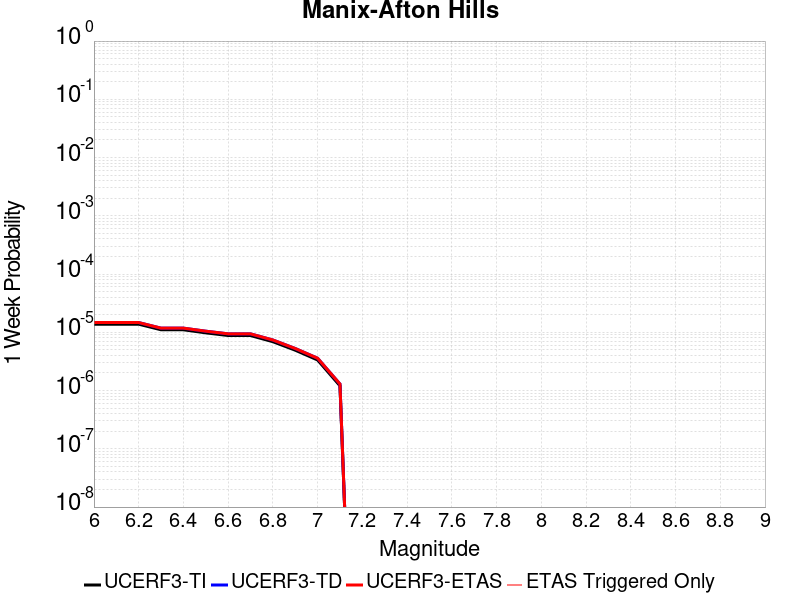 | 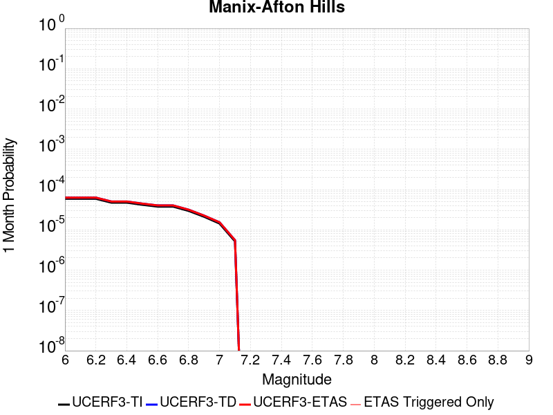 | 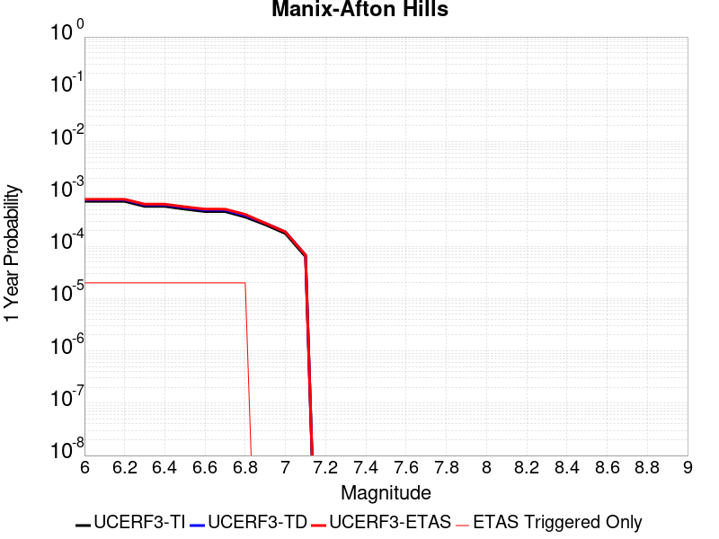 | 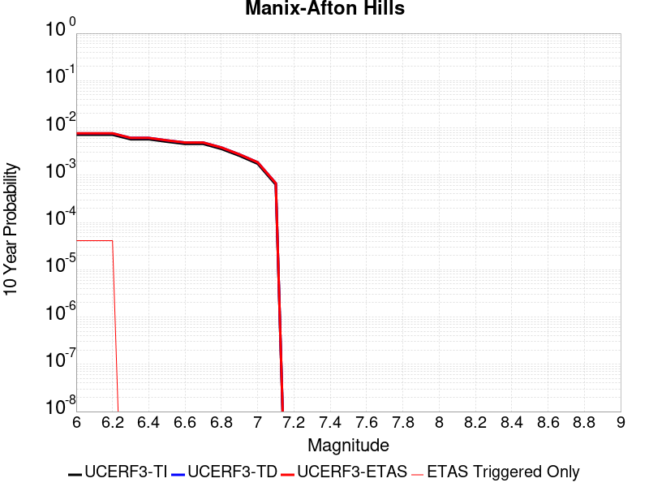 |

| Magnitude | 1 wk TI Prob | 1 wk TD Prob | 1 wk ETAS Prob | 1 wk ETAS/TD Gain | 1 wk ETAS Triggered Only | 1 mo TI Prob | 1 mo TD Prob | 1 mo ETAS Prob | 1 mo ETAS/TD Gain | 1 mo ETAS Triggered Only | 1 yr TI Prob | 1 yr TD Prob | 1 yr ETAS Prob | 1 yr ETAS/TD Gain | 1 yr ETAS Triggered Only | 10 yr TI Prob | 10 yr TD Prob | 10 yr ETAS Prob | 10 yr ETAS/TD Gain | 10 yr ETAS Triggered Only |
|-----|-----|-----|-----|-----|-----|-----|-----|-----|-----|-----|-----|-----|-----|-----|-----|-----|-----|-----|-----|-----|
| 6.0 | 1.3783202E-5 | 1.4713383E-5 | 1.4713383E-5 | 1.0 | 0.0 | 5.906953E-5 | 6.305593E-5 | 6.305593E-5 | 1.0 | 0.0 | 7.189342E-4 | 7.6745305E-4 | 7.6745305E-4 | 1.0 | 0.0 | 0.0071661277 | 0.007649784 | 0.0076906285 | 1.0053393 | 4.1159037E-5 |
| 6.1 | 1.3783202E-5 | 1.4713383E-5 | 1.4713383E-5 | 1.0 | 0.0 | 5.906953E-5 | 6.305593E-5 | 6.305593E-5 | 1.0 | 0.0 | 7.189342E-4 | 7.6745305E-4 | 7.6745305E-4 | 1.0 | 0.0 | 0.0071661277 | 0.007649784 | 0.0076906285 | 1.0053393 | 4.1159037E-5 |
| 6.2 | 1.3783202E-5 | 1.4713383E-5 | 1.4713383E-5 | 1.0 | 0.0 | 5.906953E-5 | 6.305593E-5 | 6.305593E-5 | 1.0 | 0.0 | 7.189342E-4 | 7.6745305E-4 | 7.6745305E-4 | 1.0 | 0.0 | 0.0071661277 | 0.007649784 | 0.0076906285 | 1.0053393 | 4.1159037E-5 |
| 6.3 | 1.10494875E-5 | 1.1794975E-5 | 1.1794975E-5 | 1.0 | 0.0 | 4.7354086E-5 | 5.054897E-5 | 5.054897E-5 | 1.0 | 0.0 | 5.763835E-4 | 6.152703E-4 | 6.152703E-4 | 1.0 | 0.0 | 0.005748908 | 0.0061367094 | 0.0061367094 | 1.0 | 0.0 |
| 6.4 | 1.10494875E-5 | 1.1794975E-5 | 1.1794975E-5 | 1.0 | 0.0 | 4.7354086E-5 | 5.054897E-5 | 5.054897E-5 | 1.0 | 0.0 | 5.763835E-4 | 6.152703E-4 | 6.152703E-4 | 1.0 | 0.0 | 0.005748908 | 0.0061367094 | 0.0061367094 | 1.0 | 0.0 |
| 6.5 | 9.788949E-6 | 1.0455966E-5 | 1.0455966E-5 | 1.0 | 0.0 | 4.1951964E-5 | 4.4810567E-5 | 4.4810567E-5 | 1.0 | 0.0 | 5.1064545E-4 | 5.4544135E-4 | 5.4544135E-4 | 1.0 | 0.0 | 0.0050947363 | 0.0054419534 | 0.0054419534 | 1.0 | 0.0 |
| 6.6 | 8.810006E-6 | 9.415123E-6 | 9.415123E-6 | 1.0 | 0.0 | 3.775662E-5 | 4.0349954E-5 | 4.0349954E-5 | 1.0 | 0.0 | 4.5958988E-4 | 4.911588E-4 | 4.911588E-4 | 1.0 | 0.0 | 0.0045864056 | 0.0049016154 | 0.0049016154 | 1.0 | 0.0 |
| 6.7 | 8.80128E-6 | 9.4056E-6 | 9.4056E-6 | 1.0 | 0.0 | 3.7719226E-5 | 4.0309144E-5 | 4.0309144E-5 | 1.0 | 0.0 | 4.591348E-4 | 4.9066223E-4 | 4.9066223E-4 | 1.0 | 0.0 | 0.004581874 | 0.0048966715 | 0.0048966715 | 1.0 | 0.0 |
| 6.8 | 6.8994877E-6 | 7.3812676E-6 | 7.3812676E-6 | 1.0 | 0.0 | 2.9568899E-5 | 3.1633666E-5 | 3.1633666E-5 | 1.0 | 0.0 | 3.5994186E-4 | 3.8508E-4 | 3.8508E-4 | 1.0 | 0.0 | 0.003593594 | 0.0038449324 | 0.0038449324 | 1.0 | 0.0 |
| 6.9 | 4.9328037E-6 | 5.271799E-6 | 5.271799E-6 | 1.0 | 0.0 | 2.1140417E-5 | 2.2593264E-5 | 2.2593264E-5 | 1.0 | 0.0 | 2.5735417E-4 | 2.7504444E-4 | 2.7504444E-4 | 1.0 | 0.0 | 0.0025705635 | 0.0027476456 | 0.0027476456 | 1.0 | 0.0 |
| 7.0 | 3.347973E-6 | 3.5906319E-6 | 3.5906319E-6 | 1.0 | 0.0 | 1.4348378E-5 | 1.5388354E-5 | 1.5388354E-5 | 1.0 | 0.0 | 1.746775E-4 | 1.8734121E-4 | 1.8734121E-4 | 1.0 | 0.0 | 0.0017454025 | 0.0018722356 | 0.0018722356 | 1.0 | 0.0 |
| 7.1 | 1.2073567E-6 | 1.2936954E-6 | 1.2936954E-6 | 1.0 | 0.0 | 5.1743755E-6 | 5.544406E-6 | 5.544406E-6 | 1.0 | 0.0 | 6.29962E-5 | 6.750269E-5 | 6.750269E-5 | 1.0 | 0.0 | 6.297835E-4 | 6.7498203E-4 | 6.7498203E-4 | 1.0 | 0.0 |

## Calaveras (So) 2011 CFM
*[(top)](#table-of-contents)*

| 1 Week | 1 Month | 1 Year | 10 Year |
|-----|-----|-----|-----|
| 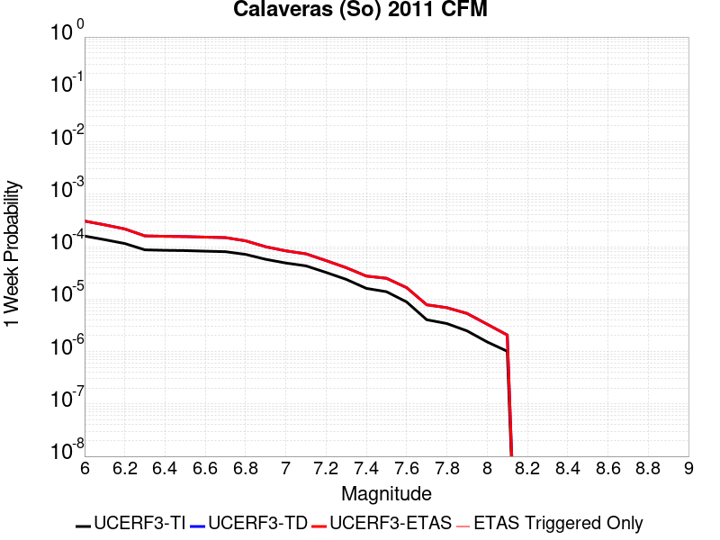 | 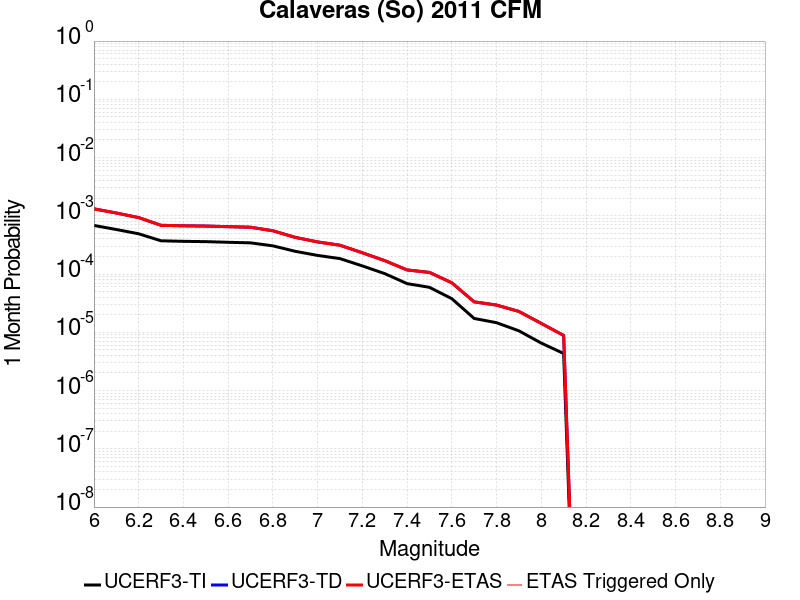 | 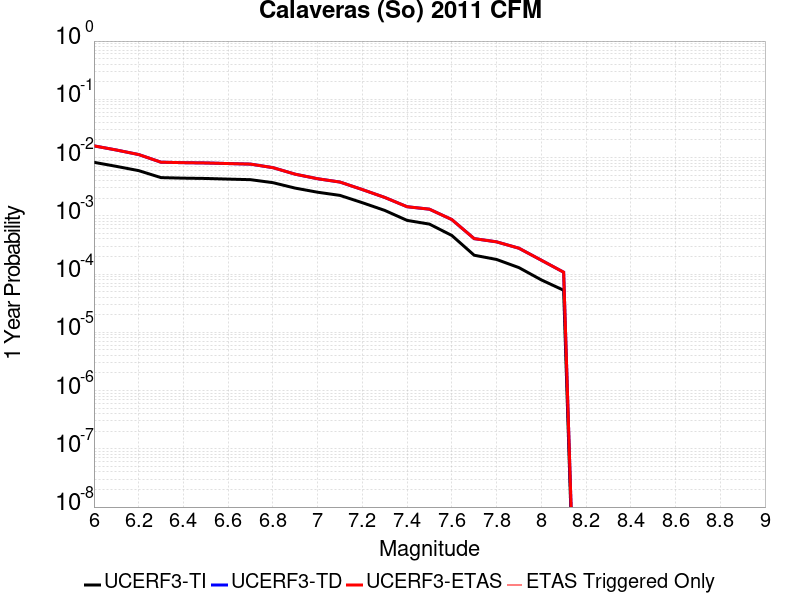 | 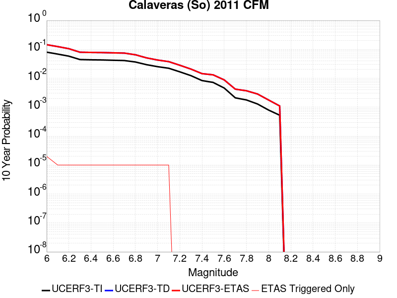 |

| Magnitude | 1 wk TI Prob | 1 wk TD Prob | 1 wk ETAS Prob | 1 wk ETAS/TD Gain | 1 wk ETAS Triggered Only | 1 mo TI Prob | 1 mo TD Prob | 1 mo ETAS Prob | 1 mo ETAS/TD Gain | 1 mo ETAS Triggered Only | 1 yr TI Prob | 1 yr TD Prob | 1 yr ETAS Prob | 1 yr ETAS/TD Gain | 1 yr ETAS Triggered Only | 10 yr TI Prob | 10 yr TD Prob | 10 yr ETAS Prob | 10 yr ETAS/TD Gain | 10 yr ETAS Triggered Only |
|-----|-----|-----|-----|-----|-----|-----|-----|-----|-----|-----|-----|-----|-----|-----|-----|-----|-----|-----|-----|-----|
| 6.0 | 1.5950744E-4 | 3.0766838E-4 | 3.0766838E-4 | 1.0 | 0.0 | 6.834242E-4 | 0.0013176617 | 0.0013176617 | 1.0 | 0.0 | 0.00828899 | 0.015885035 | 0.015885035 | 1.0 | 0.0 | 0.079865426 | 0.14461708 | 0.14465229 | 1.0002434 | 4.1159037E-5 |
| 6.1 | 1.3584697E-4 | 2.6085414E-4 | 2.6085414E-4 | 1.0 | 0.0 | 5.8207137E-4 | 0.0011172949 | 0.0011172949 | 1.0 | 0.0 | 0.007063716 | 0.013486529 | 0.013486529 | 1.0 | 0.0 | 0.06843361 | 0.12423772 | 0.12423772 | 1.0 | 0.0 |
| 6.2 | 1.14676266E-4 | 2.176286E-4 | 2.176286E-4 | 1.0 | 0.0 | 4.9137714E-4 | 9.322329E-4 | 9.322329E-4 | 1.0 | 0.0 | 0.0059661185 | 0.011268952 | 0.011268952 | 1.0 | 0.0 | 0.058084648 | 0.105222695 | 0.105222695 | 1.0 | 0.0 |
| 6.3 | 8.691518E-5 | 1.6030915E-4 | 1.6030915E-4 | 1.0 | 0.0 | 3.7244044E-4 | 6.868204E-4 | 6.868204E-4 | 1.0 | 0.0 | 0.004525038 | 0.0083233155 | 0.0083233155 | 1.0 | 0.0 | 0.044339992 | 0.07953041 | 0.07953041 | 1.0 | 0.0 |
| 6.4 | 8.50982E-5 | 1.5737055E-4 | 1.5737055E-4 | 1.0 | 0.0 | 3.646556E-4 | 6.74233E-4 | 6.74233E-4 | 1.0 | 0.0 | 0.0044306475 | 0.008171219 | 0.008171219 | 1.0 | 0.0 | 0.04343345 | 0.078135796 | 0.078135796 | 1.0 | 0.0 |
| 6.5 | 8.4062965E-5 | 1.5561342E-4 | 1.5561342E-4 | 1.0 | 0.0 | 3.602201E-4 | 6.66707E-4 | 6.66707E-4 | 1.0 | 0.0 | 0.004376863 | 0.008080368 | 0.008080368 | 1.0 | 0.0 | 0.042916555 | 0.07730663 | 0.07730663 | 1.0 | 0.0 |
| 6.6 | 8.194716E-5 | 1.5196789E-4 | 1.5196789E-4 | 1.0 | 0.0 | 3.5115483E-4 | 6.510947E-4 | 6.510947E-4 | 1.0 | 0.0 | 0.0042669317 | 0.007892054 | 0.007892054 | 1.0 | 0.0 | 0.04185927 | 0.07559084 | 0.07559084 | 1.0 | 0.0 |
| 6.7 | 8.012326E-5 | 1.4864422E-4 | 1.4864422E-4 | 1.0 | 0.0 | 3.433402E-4 | 6.368601E-4 | 6.368601E-4 | 1.0 | 0.0 | 0.004172157 | 0.007720414 | 0.007720414 | 1.0 | 0.0 | 0.040946912 | 0.07403218 | 0.07403218 | 1.0 | 0.0 |
| 6.8 | 7.119773E-5 | 1.2921143E-4 | 1.2921143E-4 | 1.0 | 0.0 | 3.0509746E-4 | 5.5362895E-4 | 5.5362895E-4 | 1.0 | 0.0 | 0.0037082357 | 0.0067163627 | 0.0067163627 | 1.0 | 0.0 | 0.036469642 | 0.06486638 | 0.06486638 | 1.0 | 0.0 |
| 6.9 | 5.7343088E-5 | 9.953715E-5 | 9.953715E-5 | 1.0 | 0.0 | 2.4573295E-4 | 4.2651832E-4 | 4.2651832E-4 | 1.0 | 0.0 | 0.0029876942 | 0.0051805717 | 0.0051805717 | 1.0 | 0.0 | 0.02947844 | 0.050675213 | 0.050675213 | 1.0 | 0.0 |
| 7.0 | 4.8746577E-5 | 8.3157734E-5 | 8.3157734E-5 | 1.0 | 0.0 | 2.0889717E-4 | 3.5634195E-4 | 3.5634195E-4 | 1.0 | 0.0 | 0.0025403565 | 0.0043299 | 0.0043299 | 1.0 | 0.0 | 0.025115121 | 0.04263495 | 0.04263495 | 1.0 | 0.0 |
| 7.1 | 4.2998014E-5 | 7.2926814E-5 | 7.2926814E-5 | 1.0 | 0.0 | 1.8426418E-4 | 3.1250637E-4 | 3.1250637E-4 | 1.0 | 0.0 | 0.002241108 | 0.003798188 | 0.003798188 | 1.0 | 0.0 | 0.022186412 | 0.037558954 | 0.037558954 | 1.0 | 0.0 |
| 7.2 | 3.221292E-5 | 5.4161646E-5 | 5.4161646E-5 | 1.0 | 0.0 | 1.3804805E-4 | 2.3210085E-4 | 2.3210085E-4 | 1.0 | 0.0 | 0.0016794393 | 0.0028221942 | 0.0028221942 | 1.0 | 0.0 | 0.016668037 | 0.028162343 | 0.028162343 | 1.0 | 0.0 |
| 7.3 | 2.3756531E-5 | 3.9695686E-5 | 3.9695686E-5 | 1.0 | 0.0 | 1.0180973E-4 | 1.7011337E-4 | 1.7011337E-4 | 1.0 | 0.0 | 0.0012388286 | 0.0020691801 | 0.0020691801 | 1.0 | 0.0 | 0.012319452 | 0.020755418 | 0.020755418 | 1.0 | 0.0 |
| 7.4 | 1.5997684E-5 | 2.7476835E-5 | 2.7476835E-5 | 1.0 | 0.0 | 6.8559704E-5 | 1.1775257E-4 | 1.1775257E-4 | 1.0 | 0.0 | 8.343947E-4 | 0.0014326972 | 0.0014326972 | 1.0 | 0.0 | 0.008312687 | 0.014444441 | 0.014444441 | 1.0 | 0.0 |
| 7.5 | 1.3814293E-5 | 2.4912644E-5 | 2.4912644E-5 | 1.0 | 0.0 | 5.9202768E-5 | 1.0676412E-4 | 1.0676412E-4 | 1.0 | 0.0 | 7.205553E-4 | 0.0012990804 | 0.0012990804 | 1.0 | 0.0 | 0.007182234 | 0.013120799 | 0.013120799 | 1.0 | 0.0 |
| 7.6 | 8.817309E-6 | 1.6535463E-5 | 1.6535463E-5 | 1.0 | 0.0 | 3.7787922E-5 | 7.086435E-5 | 7.086435E-5 | 1.0 | 0.0 | 4.5997082E-4 | 8.6243334E-4 | 8.6243334E-4 | 1.0 | 0.0 | 0.004590199 | 0.008772891 | 0.008772891 | 1.0 | 0.0 |
| 7.7 | 4.0352206E-6 | 7.778976E-6 | 7.778976E-6 | 1.0 | 0.0 | 1.7293689E-5 | 3.3338045E-5 | 3.3338045E-5 | 1.0 | 0.0 | 2.1053031E-4 | 4.058152E-4 | 4.058152E-4 | 1.0 | 0.0 | 0.0021033096 | 0.0042004217 | 0.0042004217 | 1.0 | 0.0 |
| 7.8 | 3.413169E-6 | 6.8498653E-6 | 6.8498653E-6 | 1.0 | 0.0 | 1.4627784E-5 | 2.9356235E-5 | 2.9356235E-5 | 1.0 | 0.0 | 1.7807873E-4 | 3.5735362E-4 | 3.5735362E-4 | 1.0 | 0.0 | 0.0017793609 | 0.0036970666 | 0.0036970666 | 1.0 | 0.0 |
| 7.9 | 2.4740732E-6 | 5.32551E-6 | 5.32551E-6 | 1.0 | 0.0 | 1.06031275E-5 | 2.2823415E-5 | 2.2823415E-5 | 1.0 | 0.0 | 1.2908543E-4 | 2.778397E-4 | 2.778397E-4 | 1.0 | 0.0 | 0.0012901047 | 0.0028572876 | 0.0028572876 | 1.0 | 0.0 |
| 8.0 | 1.5231818E-6 | 3.3163665E-6 | 3.3163665E-6 | 1.0 | 0.0 | 6.527906E-6 | 1.4212921E-5 | 1.4212921E-5 | 1.0 | 0.0 | 7.9474354E-5 | 1.7302862E-4 | 1.7302862E-4 | 1.0 | 0.0 | 7.944594E-4 | 0.0017698975 | 0.0017698975 | 1.0 | 0.0 |
| 8.1 | 1.0104524E-6 | 2.0629375E-6 | 2.0629375E-6 | 1.0 | 0.0 | 4.330503E-6 | 8.841131E-6 | 8.841131E-6 | 1.0 | 0.0 | 5.2722597E-5 | 1.0763548E-4 | 1.0763548E-4 | 1.0 | 0.0 | 5.271009E-4 | 0.0011014802 | 0.0011014802 | 1.0 | 0.0 |

## White Mountains
*[(top)](#table-of-contents)*

| 1 Week | 1 Month | 1 Year | 10 Year |
|-----|-----|-----|-----|
| 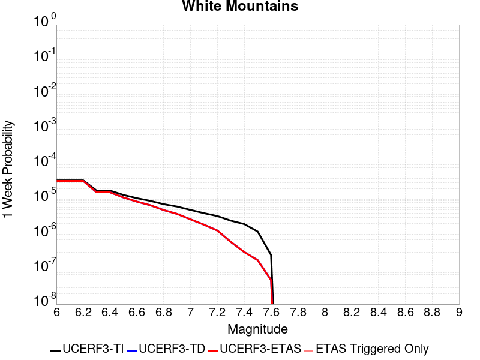 | 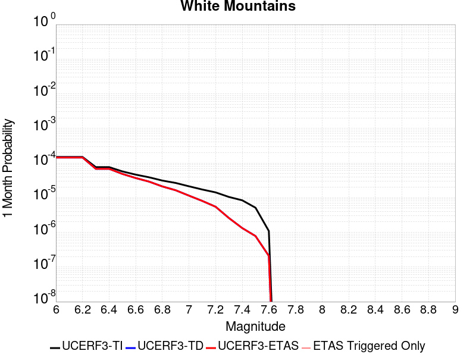 | 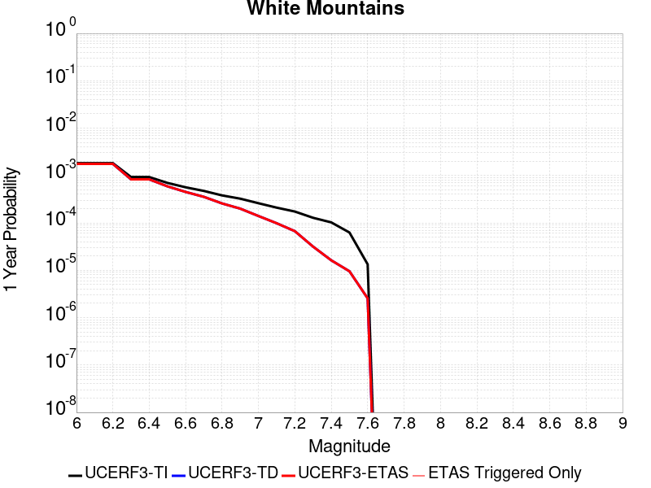 | 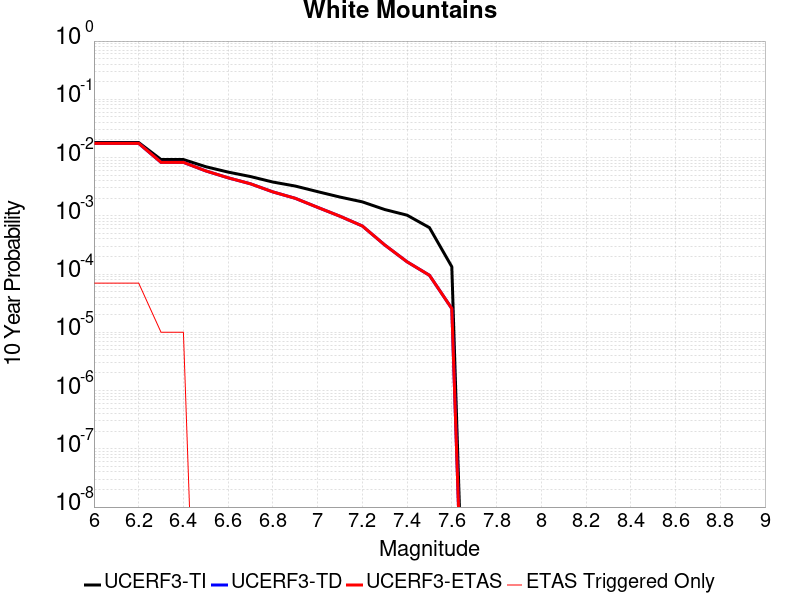 |

| Magnitude | 1 wk TI Prob | 1 wk TD Prob | 1 wk ETAS Prob | 1 wk ETAS/TD Gain | 1 wk ETAS Triggered Only | 1 mo TI Prob | 1 mo TD Prob | 1 mo ETAS Prob | 1 mo ETAS/TD Gain | 1 mo ETAS Triggered Only | 1 yr TI Prob | 1 yr TD Prob | 1 yr ETAS Prob | 1 yr ETAS/TD Gain | 1 yr ETAS Triggered Only | 10 yr TI Prob | 10 yr TD Prob | 10 yr ETAS Prob | 10 yr ETAS/TD Gain | 10 yr ETAS Triggered Only |
|-----|-----|-----|-----|-----|-----|-----|-----|-----|-----|-----|-----|-----|-----|-----|-----|-----|-----|-----|-----|-----|
| 6.0 | 3.503579E-5 | 3.3790984E-5 | 3.3790984E-5 | 1.0 | 0.0 | 1.5014476E-4 | 1.4481114E-4 | 1.4481114E-4 | 1.0 | 0.0 | 0.0018264796 | 0.0017617707 | 0.0017617707 | 1.0 | 0.0 | 0.018115403 | 0.017490378 | 0.017530818 | 1.0023121 | 4.1159037E-5 |
| 6.1 | 3.503579E-5 | 3.3790984E-5 | 3.3790984E-5 | 1.0 | 0.0 | 1.5014476E-4 | 1.4481114E-4 | 1.4481114E-4 | 1.0 | 0.0 | 0.0018264796 | 0.0017617707 | 0.0017617707 | 1.0 | 0.0 | 0.018115403 | 0.017490378 | 0.017530818 | 1.0023121 | 4.1159037E-5 |
| 6.2 | 3.503579E-5 | 3.3790984E-5 | 3.3790984E-5 | 1.0 | 0.0 | 1.5014476E-4 | 1.4481114E-4 | 1.4481114E-4 | 1.0 | 0.0 | 0.0018264796 | 0.0017617707 | 0.0017617707 | 1.0 | 0.0 | 0.018115403 | 0.017490378 | 0.017530818 | 1.0023121 | 4.1159037E-5 |
| 6.3 | 1.7818425E-5 | 1.5919286E-5 | 1.5919286E-5 | 1.0 | 0.0 | 7.636245E-5 | 6.822381E-5 | 6.822381E-5 | 1.0 | 0.0 | 9.293162E-4 | 8.303226E-4 | 8.303226E-4 | 1.0 | 0.0 | 0.009254395 | 0.008273662 | 0.008273662 | 1.0 | 0.0 |
| 6.4 | 1.7818425E-5 | 1.5919286E-5 | 1.5919286E-5 | 1.0 | 0.0 | 7.636245E-5 | 6.822381E-5 | 6.822381E-5 | 1.0 | 0.0 | 9.293162E-4 | 8.303226E-4 | 8.303226E-4 | 1.0 | 0.0 | 0.009254395 | 0.008273662 | 0.008273662 | 1.0 | 0.0 |
| 6.5 | 1.3397557E-5 | 1.1338607E-5 | 1.1338607E-5 | 1.0 | 0.0 | 5.741684E-5 | 4.8593163E-5 | 4.8593163E-5 | 1.0 | 0.0 | 6.988258E-4 | 5.914681E-4 | 5.914681E-4 | 1.0 | 0.0 | 0.006966323 | 0.005899645 | 0.005899645 | 1.0 | 0.0 |
| 6.6 | 1.0818695E-5 | 8.627122E-6 | 8.627122E-6 | 1.0 | 0.0 | 4.6365014E-5 | 3.697288E-5 | 3.697288E-5 | 1.0 | 0.0 | 5.6434784E-4 | 4.500562E-4 | 4.500562E-4 | 1.0 | 0.0 | 0.005629168 | 0.0044918843 | 0.0044918843 | 1.0 | 0.0 |
| 6.7 | 9.067908E-6 | 6.8038275E-6 | 6.8038275E-6 | 1.0 | 0.0 | 3.8861883E-5 | 2.9158953E-5 | 2.9158953E-5 | 1.0 | 0.0 | 4.7304068E-4 | 3.549556E-4 | 3.549556E-4 | 1.0 | 0.0 | 0.00472035 | 0.003544204 | 0.003544204 | 1.0 | 0.0 |
| 6.8 | 7.295947E-6 | 4.9374485E-6 | 4.9374485E-6 | 1.0 | 0.0 | 3.126797E-5 | 2.116033E-5 | 2.116033E-5 | 1.0 | 0.0 | 3.8062103E-4 | 2.5759768E-4 | 2.5759768E-4 | 1.0 | 0.0 | 0.0037996976 | 0.0025731039 | 0.0025731039 | 1.0 | 0.0 |
| 6.9 | 6.2243444E-6 | 3.833108E-6 | 3.833108E-6 | 1.0 | 0.0 | 2.6675489E-5 | 1.6427506E-5 | 1.6427506E-5 | 1.0 | 0.0 | 3.2472567E-4 | 1.9998704E-4 | 1.9998704E-4 | 1.0 | 0.0 | 0.0032425157 | 0.0019981235 | 0.0019981235 | 1.0 | 0.0 |
| 7.0 | 4.9878413E-6 | 2.6802934E-6 | 2.6802934E-6 | 1.0 | 0.0 | 2.1376287E-5 | 1.1486923E-5 | 1.1486923E-5 | 1.0 | 0.0 | 2.602252E-4 | 1.3984457E-4 | 1.3984457E-4 | 1.0 | 0.0 | 0.002599207 | 0.001397592 | 0.001397592 | 1.0 | 0.0 |
| 7.1 | 4.0252844E-6 | 1.8863861E-6 | 1.8863861E-6 | 1.0 | 0.0 | 1.7251105E-5 | 8.0844875E-6 | 8.0844875E-6 | 1.0 | 0.0 | 2.1001195E-4 | 9.842432E-5 | 9.842432E-5 | 1.0 | 0.0 | 0.0020981359 | 9.838201E-4 | 9.838201E-4 | 1.0 | 0.0 |
| 7.2 | 3.3284066E-6 | 1.2824203E-6 | 1.2824203E-6 | 1.0 | 0.0 | 1.4264522E-5 | 5.496076E-6 | 5.496076E-6 | 1.0 | 0.0 | 1.736567E-4 | 6.691277E-5 | 6.691277E-5 | 1.0 | 0.0 | 0.0017352107 | 6.689363E-4 | 6.689363E-4 | 1.0 | 0.0 |
| 7.3 | 2.458226E-6 | 6.0613763E-7 | 6.0613763E-7 | 1.0 | 0.0 | 1.0535211E-5 | 2.5977304E-6 | 2.5977304E-6 | 1.0 | 0.0 | 1.2825865E-4 | 3.1626947E-5 | 3.1626947E-5 | 1.0 | 0.0 | 0.0012818464 | 3.162282E-4 | 3.162282E-4 | 1.0 | 0.0 |
| 7.4 | 1.965953E-6 | 3.112561E-7 | 3.112561E-7 | 1.0 | 0.0 | 8.425486E-6 | 1.333954E-6 | 1.333954E-6 | 1.0 | 0.0 | 1.0257547E-4 | 1.6240769E-5 | 1.6240769E-5 | 1.0 | 0.0 | 0.0010252813 | 1.6239595E-4 | 1.6239595E-4 | 1.0 | 0.0 |
| 7.5 | 1.2014192E-6 | 1.8269512E-7 | 1.8269512E-7 | 1.0 | 0.0 | 5.148929E-6 | 7.829789E-7 | 7.829789E-7 | 1.0 | 0.0 | 6.2686406E-5 | 9.532727E-6 | 9.532727E-6 | 1.0 | 0.0 | 6.266873E-4 | 9.532326E-5 | 9.532326E-5 | 1.0 | 0.0 |
| 7.6 | 2.5612175E-7 | 4.9013902E-8 | 4.9013902E-8 | 1.0 | 0.0 | 1.0976642E-6 | 2.1005957E-7 | 2.1005957E-7 | 1.0 | 0.0 | 1.3363979E-5 | 2.5574727E-6 | 2.5574727E-6 | 1.0 | 0.0 | 1.3363175E-4 | 2.5574469E-5 | 2.5574469E-5 | 1.0 | 0.0 |

## Mission Creek
*[(top)](#table-of-contents)*

| 1 Week | 1 Month | 1 Year | 10 Year |
|-----|-----|-----|-----|
| 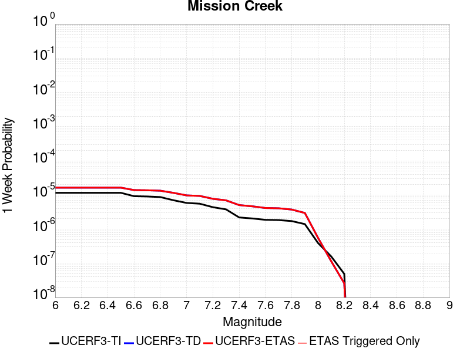 | 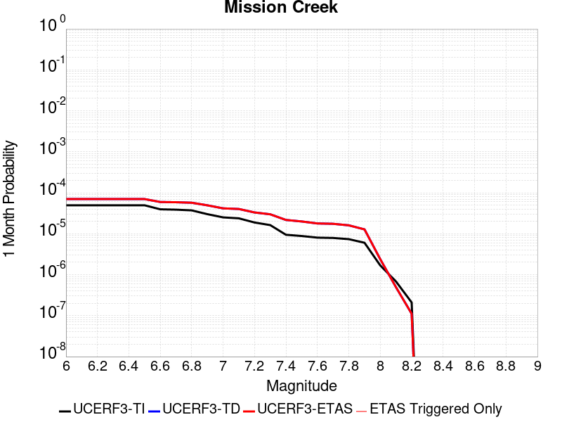 | 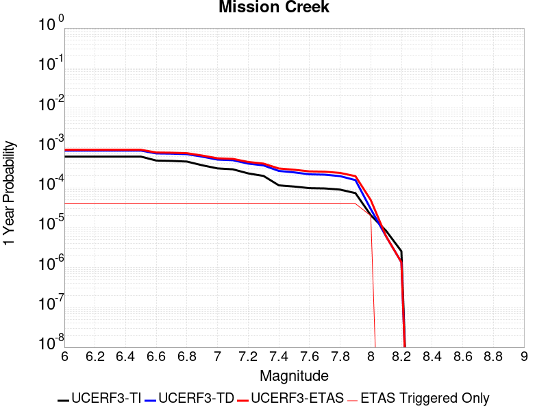 | 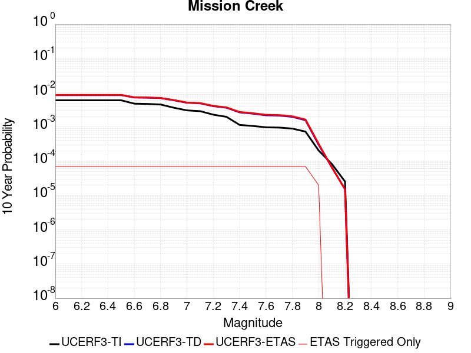 |

| Magnitude | 1 wk TI Prob | 1 wk TD Prob | 1 wk ETAS Prob | 1 wk ETAS/TD Gain | 1 wk ETAS Triggered Only | 1 mo TI Prob | 1 mo TD Prob | 1 mo ETAS Prob | 1 mo ETAS/TD Gain | 1 mo ETAS Triggered Only | 1 yr TI Prob | 1 yr TD Prob | 1 yr ETAS Prob | 1 yr ETAS/TD Gain | 1 yr ETAS Triggered Only | 10 yr TI Prob | 10 yr TD Prob | 10 yr ETAS Prob | 10 yr ETAS/TD Gain | 10 yr ETAS Triggered Only |
|-----|-----|-----|-----|-----|-----|-----|-----|-----|-----|-----|-----|-----|-----|-----|-----|-----|-----|-----|-----|-----|
| 6.0 | 1.1549387E-5 | 1.6363685E-5 | 1.6363685E-5 | 1.0 | 0.0 | 4.9496433E-5 | 7.012828E-5 | 7.012828E-5 | 1.0 | 0.0 | 6.0245243E-4 | 8.5349235E-4 | 8.5349235E-4 | 1.0 | 0.0 | 0.006008218 | 0.008530929 | 0.0085717365 | 1.0047835 | 4.1159037E-5 |
| 6.1 | 1.1549387E-5 | 1.6363685E-5 | 1.6363685E-5 | 1.0 | 0.0 | 4.9496433E-5 | 7.012828E-5 | 7.012828E-5 | 1.0 | 0.0 | 6.0245243E-4 | 8.5349235E-4 | 8.5349235E-4 | 1.0 | 0.0 | 0.006008218 | 0.008530929 | 0.0085717365 | 1.0047835 | 4.1159037E-5 |
| 6.2 | 1.1549387E-5 | 1.6363685E-5 | 1.6363685E-5 | 1.0 | 0.0 | 4.9496433E-5 | 7.012828E-5 | 7.012828E-5 | 1.0 | 0.0 | 6.0245243E-4 | 8.5349235E-4 | 8.5349235E-4 | 1.0 | 0.0 | 0.006008218 | 0.008530929 | 0.0085717365 | 1.0047835 | 4.1159037E-5 |
| 6.3 | 1.1549387E-5 | 1.6363685E-5 | 1.6363685E-5 | 1.0 | 0.0 | 4.9496433E-5 | 7.012828E-5 | 7.012828E-5 | 1.0 | 0.0 | 6.0245243E-4 | 8.5349235E-4 | 8.5349235E-4 | 1.0 | 0.0 | 0.006008218 | 0.008530929 | 0.0085717365 | 1.0047835 | 4.1159037E-5 |
| 6.4 | 1.1549387E-5 | 1.6363685E-5 | 1.6363685E-5 | 1.0 | 0.0 | 4.9496433E-5 | 7.012828E-5 | 7.012828E-5 | 1.0 | 0.0 | 6.0245243E-4 | 8.5349235E-4 | 8.5349235E-4 | 1.0 | 0.0 | 0.006008218 | 0.008530929 | 0.0085717365 | 1.0047835 | 4.1159037E-5 |
| 6.5 | 1.1549387E-5 | 1.6363685E-5 | 1.6363685E-5 | 1.0 | 0.0 | 4.9496433E-5 | 7.012828E-5 | 7.012828E-5 | 1.0 | 0.0 | 6.0245243E-4 | 8.5349235E-4 | 8.5349235E-4 | 1.0 | 0.0 | 0.006008218 | 0.008530929 | 0.0085717365 | 1.0047835 | 4.1159037E-5 |
| 6.6 | 9.202681E-6 | 1.3886644E-5 | 1.3886644E-5 | 1.0 | 0.0 | 3.9439463E-5 | 5.9512884E-5 | 5.9512884E-5 | 1.0 | 0.0 | 4.800697E-4 | 7.2433753E-4 | 7.2433753E-4 | 1.0 | 0.0 | 0.004790339 | 0.0072479746 | 0.0072888355 | 1.0056375 | 4.1159037E-5 |
| 6.7 | 9.019164E-6 | 1.3692287E-5 | 1.3692287E-5 | 1.0 | 0.0 | 3.8652986E-5 | 5.867996E-5 | 5.867996E-5 | 1.0 | 0.0 | 4.7049852E-4 | 7.142034E-4 | 7.142034E-4 | 1.0 | 0.0 | 0.004695036 | 0.0071472875 | 0.007188152 | 1.0057175 | 4.1159037E-5 |
| 6.8 | 8.673558E-6 | 1.3314311E-5 | 1.3314311E-5 | 1.0 | 0.0 | 3.717186E-5 | 5.7060137E-5 | 5.7060137E-5 | 1.0 | 0.0 | 4.524734E-4 | 6.944946E-4 | 6.944946E-4 | 1.0 | 0.0 | 0.0045155324 | 0.0069514345 | 0.0069923075 | 1.0058798 | 4.1159037E-5 |
| 6.9 | 7.002255E-6 | 1.1518228E-5 | 1.1518228E-5 | 1.0 | 0.0 | 3.000932E-5 | 4.936294E-5 | 4.936294E-5 | 1.0 | 0.0 | 3.653022E-4 | 6.0083496E-4 | 6.0083496E-4 | 1.0 | 0.0 | 0.0036470229 | 0.006020115 | 0.0060610264 | 1.0067958 | 4.1159037E-5 |
| 7.0 | 5.84644E-6 | 9.713462E-6 | 9.713462E-6 | 1.0 | 0.0 | 2.5055931E-5 | 4.1628486E-5 | 4.1628486E-5 | 1.0 | 0.0 | 3.0501327E-4 | 5.067135E-4 | 5.067135E-4 | 1.0 | 0.0 | 0.0030459496 | 0.0050833835 | 0.0051243333 | 1.0080556 | 4.1159037E-5 |
| 7.1 | 5.54703E-6 | 9.367798E-6 | 9.367798E-6 | 1.0 | 0.0 | 2.377277E-5 | 4.0147115E-5 | 4.0147115E-5 | 1.0 | 0.0 | 2.8939504E-4 | 4.8868597E-4 | 4.8868597E-4 | 1.0 | 0.0 | 0.0028901845 | 0.004903909 | 0.004944866 | 1.0083519 | 4.1159037E-5 |
| 7.2 | 4.384709E-6 | 7.718187E-6 | 7.718187E-6 | 1.0 | 0.0 | 1.8791474E-5 | 3.3077544E-5 | 3.3077544E-5 | 1.0 | 0.0 | 2.2876218E-4 | 4.0264832E-4 | 4.0264832E-4 | 1.0 | 0.0 | 0.0022852682 | 0.0040469198 | 0.004087912 | 1.0101293 | 4.1159037E-5 |
| 7.3 | 3.7888456E-6 | 6.9513435E-6 | 6.9513435E-6 | 1.0 | 0.0 | 1.623781E-5 | 2.9791152E-5 | 2.9791152E-5 | 1.0 | 0.0 | 1.9767738E-4 | 3.6265026E-4 | 3.6265026E-4 | 1.0 | 0.0 | 0.0019750162 | 0.003648293 | 0.003689302 | 1.0112406 | 4.1159037E-5 |
| 7.4 | 2.1982462E-6 | 5.0586045E-6 | 5.0586045E-6 | 1.0 | 0.0 | 9.421021E-6 | 2.1679554E-5 | 2.1679554E-5 | 1.0 | 0.0 | 1.1469489E-4 | 2.639168E-4 | 2.639168E-4 | 1.0 | 0.0 | 0.0011463572 | 0.002663531 | 0.0027045805 | 1.0154116 | 4.1159037E-5 |
| 7.5 | 2.051923E-6 | 4.6488854E-6 | 4.6488854E-6 | 1.0 | 0.0 | 8.793926E-6 | 1.9923644E-5 | 1.9923644E-5 | 1.0 | 0.0 | 1.0706078E-4 | 2.425435E-4 | 2.425435E-4 | 1.0 | 0.0 | 0.0010700922 | 0.0024506915 | 0.0024917498 | 1.0167537 | 4.1159037E-5 |
| 7.6 | 1.8733427E-6 | 4.1560734E-6 | 4.1560734E-6 | 1.0 | 0.0 | 8.028587E-6 | 1.7811622E-5 | 1.7811622E-5 | 1.0 | 0.0 | 9.774366E-5 | 2.16835E-4 | 2.16835E-4 | 1.0 | 0.0 | 9.770069E-4 | 0.0021947375 | 0.0022358063 | 1.0187124 | 4.1159037E-5 |
| 7.7 | 1.8411953E-6 | 4.0755285E-6 | 4.0755285E-6 | 1.0 | 0.0 | 7.890813E-6 | 1.7466433E-5 | 1.7466433E-5 | 1.0 | 0.0 | 9.606641E-5 | 2.1263317E-4 | 2.1263317E-4 | 1.0 | 0.0 | 9.6024893E-4 | 0.002152907 | 0.0021939774 | 1.0190767 | 4.1159037E-5 |
| 7.8 | 1.7194251E-6 | 3.7406705E-6 | 3.7406705E-6 | 1.0 | 0.0 | 7.368944E-6 | 1.6031347E-5 | 1.6031347E-5 | 1.0 | 0.0 | 8.97132E-5 | 1.9516425E-4 | 1.9516425E-4 | 1.0 | 0.0 | 8.967699E-4 | 0.0019777492 | 0.0020188268 | 1.0207698 | 4.1159037E-5 |
| 7.9 | 1.4035052E-6 | 2.974843E-6 | 2.974843E-6 | 1.0 | 0.0 | 6.0150082E-6 | 1.2749265E-5 | 1.2749265E-5 | 1.0 | 0.0 | 7.3230265E-5 | 1.5521131E-4 | 1.5521131E-4 | 1.0 | 0.0 | 7.3206134E-4 | 0.0015757503 | 0.0016168444 | 1.0260792 | 4.1159037E-5 |
| 8.0 | 3.9318823E-7 | 5.5886267E-7 | 5.5886267E-7 | 1.0 | 0.0 | 1.6850913E-6 | 2.3951236E-6 | 2.3951236E-6 | 1.0 | 0.0 | 2.0515794E-5 | 2.9160245E-5 | 2.9160245E-5 | 1.0 | 0.0 | 2.0513899E-4 | 3.0202873E-4 | 3.0202873E-4 | 1.0 | 0.0 |
| 8.1 | 1.596793E-7 | 1.1586103E-7 | 1.1586103E-7 | 1.0 | 0.0 | 6.8433974E-7 | 4.9654716E-7 | 4.9654716E-7 | 1.0 | 0.0 | 8.331805E-6 | 6.0454454E-6 | 6.0454454E-6 | 1.0 | 0.0 | 8.331492E-5 | 6.661552E-5 | 6.661552E-5 | 1.0 | 0.0 |
| 8.2 | 4.9003038E-8 | 2.596505E-8 | 2.596505E-8 | 1.0 | 0.0 | 2.10013E-7 | 1.1127878E-7 | 1.1127878E-7 | 1.0 | 0.0 | 2.5569052E-6 | 1.3548183E-6 | 1.3548183E-6 | 1.0 | 0.0 | 2.556876E-5 | 1.5244346E-5 | 1.5244346E-5 | 1.0 | 0.0 |

## Independence rev 2011
*[(top)](#table-of-contents)*

| 1 Week | 1 Month | 1 Year | 10 Year |
|-----|-----|-----|-----|
| 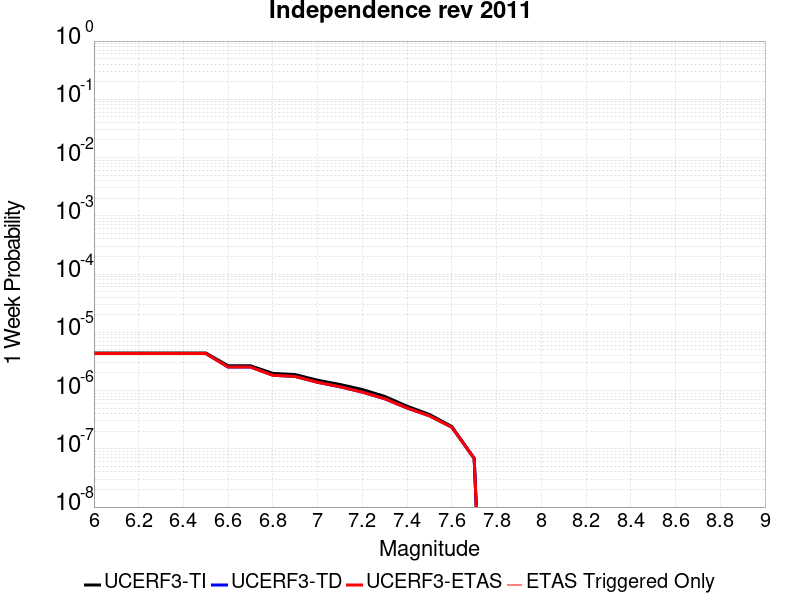 | 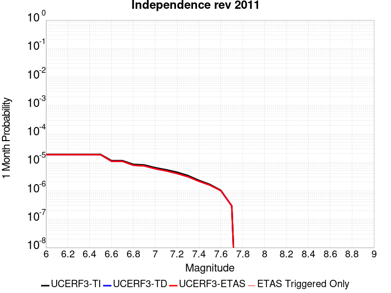 | 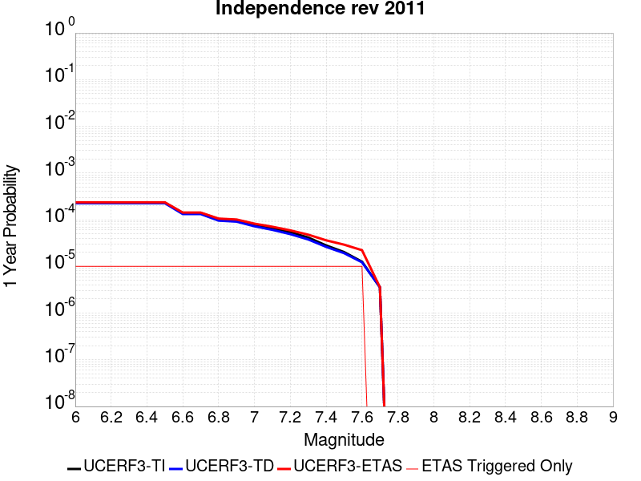 | 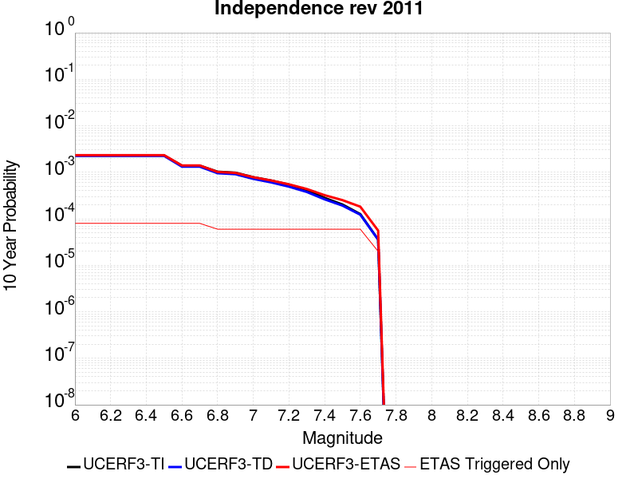 |

| Magnitude | 1 wk TI Prob | 1 wk TD Prob | 1 wk ETAS Prob | 1 wk ETAS/TD Gain | 1 wk ETAS Triggered Only | 1 mo TI Prob | 1 mo TD Prob | 1 mo ETAS Prob | 1 mo ETAS/TD Gain | 1 mo ETAS Triggered Only | 1 yr TI Prob | 1 yr TD Prob | 1 yr ETAS Prob | 1 yr ETAS/TD Gain | 1 yr ETAS Triggered Only | 10 yr TI Prob | 10 yr TD Prob | 10 yr ETAS Prob | 10 yr ETAS/TD Gain | 10 yr ETAS Triggered Only |
|-----|-----|-----|-----|-----|-----|-----|-----|-----|-----|-----|-----|-----|-----|-----|-----|-----|-----|-----|-----|-----|
| 6.0 | 4.422171E-6 | 4.3265477E-6 | 4.3265477E-6 | 1.0 | 0.0 | 1.8952025E-5 | 1.8542232E-5 | 1.8542232E-5 | 1.0 | 0.0 | 2.3071647E-4 | 2.2573127E-4 | 2.2573127E-4 | 1.0 | 0.0 | 0.0023047708 | 0.0022553136 | 0.0022963798 | 1.0182086 | 4.1159037E-5 |
| 6.1 | 4.422171E-6 | 4.3265477E-6 | 4.3265477E-6 | 1.0 | 0.0 | 1.8952025E-5 | 1.8542232E-5 | 1.8542232E-5 | 1.0 | 0.0 | 2.3071647E-4 | 2.2573127E-4 | 2.2573127E-4 | 1.0 | 0.0 | 0.0023047708 | 0.0022553136 | 0.0022963798 | 1.0182086 | 4.1159037E-5 |
| 6.2 | 4.422171E-6 | 4.3265477E-6 | 4.3265477E-6 | 1.0 | 0.0 | 1.8952025E-5 | 1.8542232E-5 | 1.8542232E-5 | 1.0 | 0.0 | 2.3071647E-4 | 2.2573127E-4 | 2.2573127E-4 | 1.0 | 0.0 | 0.0023047708 | 0.0022553136 | 0.0022963798 | 1.0182086 | 4.1159037E-5 |
| 6.3 | 4.422171E-6 | 4.3265477E-6 | 4.3265477E-6 | 1.0 | 0.0 | 1.8952025E-5 | 1.8542232E-5 | 1.8542232E-5 | 1.0 | 0.0 | 2.3071647E-4 | 2.2573127E-4 | 2.2573127E-4 | 1.0 | 0.0 | 0.0023047708 | 0.0022553136 | 0.0022963798 | 1.0182086 | 4.1159037E-5 |
| 6.4 | 4.422171E-6 | 4.3265477E-6 | 4.3265477E-6 | 1.0 | 0.0 | 1.8952025E-5 | 1.8542232E-5 | 1.8542232E-5 | 1.0 | 0.0 | 2.3071647E-4 | 2.2573127E-4 | 2.2573127E-4 | 1.0 | 0.0 | 0.0023047708 | 0.0022553136 | 0.0022963798 | 1.0182086 | 4.1159037E-5 |
| 6.5 | 4.422171E-6 | 4.3265477E-6 | 4.3265477E-6 | 1.0 | 0.0 | 1.8952025E-5 | 1.8542232E-5 | 1.8542232E-5 | 1.0 | 0.0 | 2.3071647E-4 | 2.2573127E-4 | 2.2573127E-4 | 1.0 | 0.0 | 0.0023047708 | 0.0022553136 | 0.0022963798 | 1.0182086 | 4.1159037E-5 |
| 6.6 | 2.663744E-6 | 2.5322224E-6 | 2.5322224E-6 | 1.0 | 0.0 | 1.1415996E-5 | 1.0852339E-5 | 1.0852339E-5 | 1.0 | 0.0 | 1.3898089E-4 | 1.321197E-4 | 1.321197E-4 | 1.0 | 0.0 | 0.0013889399 | 0.0013204599 | 0.0013615645 | 1.0311291 | 4.1159037E-5 |
| 6.7 | 2.663744E-6 | 2.5322224E-6 | 2.5322224E-6 | 1.0 | 0.0 | 1.1415996E-5 | 1.0852339E-5 | 1.0852339E-5 | 1.0 | 0.0 | 1.3898089E-4 | 1.321197E-4 | 1.321197E-4 | 1.0 | 0.0 | 0.0013889399 | 0.0013204599 | 0.0013615645 | 1.0311291 | 4.1159037E-5 |
| 6.8 | 1.9716529E-6 | 1.832461E-6 | 1.832461E-6 | 1.0 | 0.0 | 8.449913E-6 | 7.853381E-6 | 7.853381E-6 | 1.0 | 0.0 | 1.0287284E-4 | 9.561085E-5 | 9.561085E-5 | 1.0 | 0.0 | 0.0010282523 | 9.557101E-4 | 9.968297E-4 | 1.0430253 | 4.1159037E-5 |
| 6.9 | 1.8788617E-6 | 1.7431943E-6 | 1.7431943E-6 | 1.0 | 0.0 | 8.0522395E-6 | 7.470812E-6 | 7.470812E-6 | 1.0 | 0.0 | 9.80316E-5 | 9.095346E-5 | 9.095346E-5 | 1.0 | 0.0 | 9.798837E-4 | 9.091744E-4 | 9.50296E-4 | 1.0452297 | 4.1159037E-5 |
| 7.0 | 1.5045488E-6 | 1.3851122E-6 | 1.3851122E-6 | 1.0 | 0.0 | 6.44805E-6 | 5.9361823E-6 | 5.9361823E-6 | 1.0 | 0.0 | 7.8502184E-5 | 7.2270675E-5 | 7.2270675E-5 | 1.0 | 0.0 | 7.8474457E-4 | 7.2247686E-4 | 7.6360616E-4 | 1.0569282 | 4.1159037E-5 |
| 7.1 | 1.272341E-6 | 1.1626511E-6 | 1.1626511E-6 | 1.0 | 0.0 | 5.4528787E-6 | 4.9827813E-6 | 4.9827813E-6 | 1.0 | 0.0 | 6.6386776E-5 | 6.0663704E-5 | 6.0663704E-5 | 1.0 | 0.0 | 6.636695E-4 | 6.0647464E-4 | 6.476087E-4 | 1.0678248 | 4.1159037E-5 |
| 7.2 | 1.0416892E-6 | 9.411107E-7 | 9.411107E-7 | 1.0 | 0.0 | 4.464375E-6 | 4.0333257E-6 | 4.0333257E-6 | 1.0 | 0.0 | 5.4352407E-5 | 4.9104652E-5 | 4.9104652E-5 | 1.0 | 0.0 | 5.4339116E-4 | 4.909399E-4 | 5.320787E-4 | 1.083796 | 4.1159037E-5 |
| 7.3 | 7.9450155E-7 | 7.2359137E-7 | 7.2359137E-7 | 1.0 | 0.0 | 3.4050022E-6 | 3.1011023E-6 | 3.1011023E-6 | 1.0 | 0.0 | 4.1455114E-5 | 3.775528E-5 | 3.775528E-5 | 1.0 | 0.0 | 4.144738E-4 | 3.7748975E-4 | 4.1863325E-4 | 1.1089923 | 4.1159037E-5 |
| 7.4 | 5.3893444E-7 | 5.0200816E-7 | 5.0200816E-7 | 1.0 | 0.0 | 2.309717E-6 | 2.1514618E-6 | 2.1514618E-6 | 1.0 | 0.0 | 2.8120441E-5 | 2.6193737E-5 | 2.6193737E-5 | 1.0 | 0.0 | 2.8116882E-4 | 2.6190694E-4 | 3.030552E-4 | 1.1571102 | 4.1159037E-5 |
| 7.5 | 3.8852085E-7 | 3.682926E-7 | 3.682926E-7 | 1.0 | 0.0 | 1.6650882E-6 | 1.5783959E-6 | 1.5783959E-6 | 1.0 | 0.0 | 2.027226E-5 | 1.9216803E-5 | 1.9216803E-5 | 1.0 | 0.0 | 2.0270412E-4 | 1.9215162E-4 | 2.3330275E-4 | 1.2141597 | 4.1159037E-5 |
| 7.6 | 2.414929E-7 | 2.3459488E-7 | 2.3459488E-7 | 1.0 | 0.0 | 1.0349692E-6 | 1.0054063E-6 | 1.0054063E-6 | 1.0 | 0.0 | 1.2600677E-5 | 1.2240754E-5 | 1.2240754E-5 | 1.0 | 0.0 | 1.2599962E-4 | 1.2240092E-4 | 1.6355491E-4 | 1.336223 | 4.1159037E-5 |
| 7.7 | 6.8298014E-8 | 6.859378E-8 | 6.859378E-8 | 1.0 | 0.0 | 2.9270575E-7 | 2.939733E-7 | 2.939733E-7 | 1.0 | 0.0 | 3.5636867E-6 | 3.5791195E-6 | 3.5791195E-6 | 1.0 | 0.0 | 3.5636294E-5 | 3.5790665E-5 | 3.5790665E-5 | 1.0 | 0.0 |

## Great Valley 09 (Laguna Seca)
*[(top)](#table-of-contents)*

| 1 Week | 1 Month | 1 Year | 10 Year |
|-----|-----|-----|-----|
| 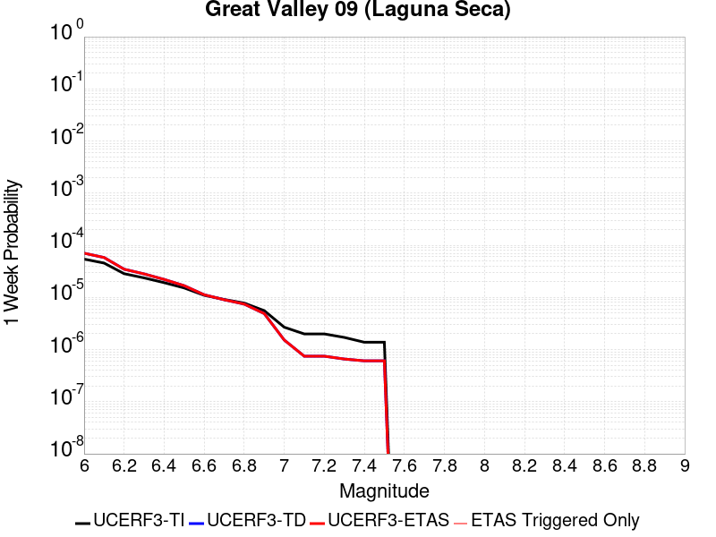 | 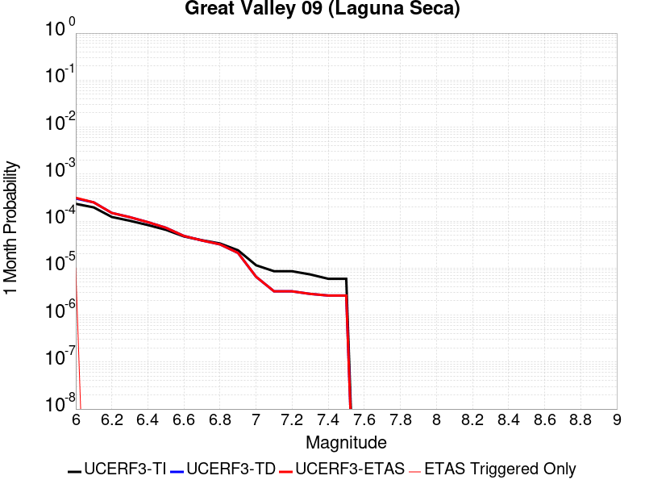 | 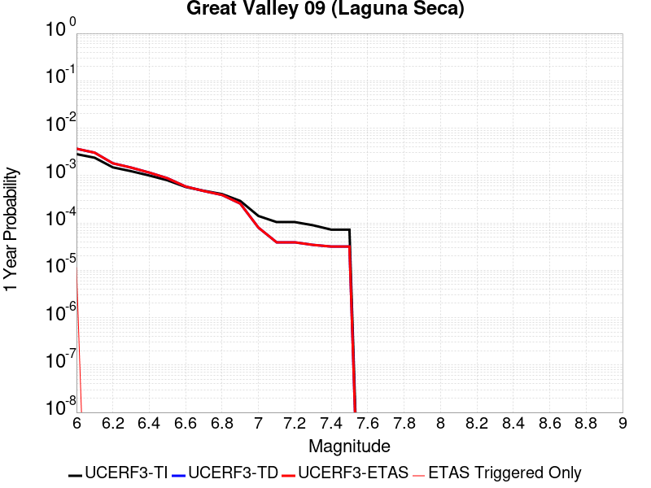 | 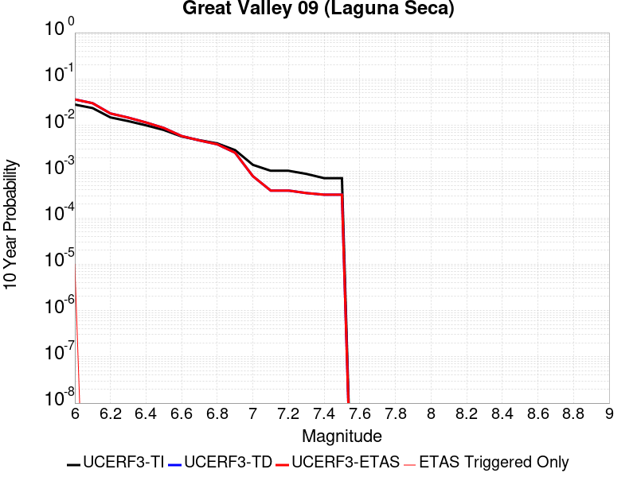 |

| Magnitude | 1 wk TI Prob | 1 wk TD Prob | 1 wk ETAS Prob | 1 wk ETAS/TD Gain | 1 wk ETAS Triggered Only | 1 mo TI Prob | 1 mo TD Prob | 1 mo ETAS Prob | 1 mo ETAS/TD Gain | 1 mo ETAS Triggered Only | 1 yr TI Prob | 1 yr TD Prob | 1 yr ETAS Prob | 1 yr ETAS/TD Gain | 1 yr ETAS Triggered Only | 10 yr TI Prob | 10 yr TD Prob | 10 yr ETAS Prob | 10 yr ETAS/TD Gain | 10 yr ETAS Triggered Only |
|-----|-----|-----|-----|-----|-----|-----|-----|-----|-----|-----|-----|-----|-----|-----|-----|-----|-----|-----|-----|-----|
| 6.0 | 5.4353277E-5 | 7.05516E-5 | 7.05516E-5 | 1.0 | 0.0 | 2.3292181E-4 | 3.023287E-4 | 3.434753E-4 | 1.1360989 | 4.1159037E-5 | 0.0028321352 | 0.0036746343 | 0.003715642 | 1.0111597 | 4.1159037E-5 | 0.02796312 | 0.03614085 | 0.036180522 | 1.0010977 | 4.1159037E-5 |
| 6.1 | 4.5578287E-5 | 5.8261394E-5 | 5.8261394E-5 | 1.0 | 0.0 | 1.953209E-4 | 2.4966686E-4 | 2.4966686E-4 | 1.0 | 0.0 | 0.0023754383 | 0.0030354576 | 0.0030354576 | 1.0 | 0.0 | 0.023502063 | 0.02994004 | 0.02994004 | 1.0 | 0.0 |
| 6.2 | 2.8536782E-5 | 3.4757963E-5 | 3.4757963E-5 | 1.0 | 0.0 | 1.2229476E-4 | 1.489543E-4 | 1.489543E-4 | 1.0 | 0.0 | 0.0014879217 | 0.001811989 | 0.001811989 | 1.0 | 0.0 | 0.014779986 | 0.017969275 | 0.017969275 | 1.0 | 0.0 |
| 6.3 | 2.3698774E-5 | 2.8229873E-5 | 2.8229873E-5 | 1.0 | 0.0 | 1.01562226E-4 | 1.2097984E-4 | 1.2097984E-4 | 1.0 | 0.0 | 0.0012358186 | 0.0014719277 | 0.0014719277 | 1.0 | 0.0 | 0.012289686 | 0.014620015 | 0.014620015 | 1.0 | 0.0 |
| 6.4 | 1.9191197E-5 | 2.2135002E-5 | 2.2135002E-5 | 1.0 | 0.0 | 8.2245395E-5 | 9.4861076E-5 | 9.4861076E-5 | 1.0 | 0.0 | 0.0010008777 | 0.0011543273 | 0.0011543273 | 1.0 | 0.0 | 0.009963818 | 0.011483273 | 0.011483273 | 1.0 | 0.0 |
| 6.5 | 1.5203241E-5 | 1.6809463E-5 | 1.6809463E-5 | 1.0 | 0.0 | 6.5155116E-5 | 7.203875E-5 | 7.203875E-5 | 1.0 | 0.0 | 7.9297484E-4 | 8.7673514E-4 | 8.7673514E-4 | 1.0 | 0.0 | 0.007901512 | 0.008733867 | 0.008733867 | 1.0 | 0.0 |
| 6.6 | 1.0984925E-5 | 1.1246989E-5 | 1.1246989E-5 | 1.0 | 0.0 | 4.70774E-5 | 4.8200513E-5 | 4.8200513E-5 | 1.0 | 0.0 | 5.730166E-4 | 5.86687E-4 | 5.86687E-4 | 1.0 | 0.0 | 0.005715413 | 0.0058517726 | 0.0058517726 | 1.0 | 0.0 |
| 6.7 | 9.134616E-6 | 9.023263E-6 | 9.023263E-6 | 1.0 | 0.0 | 3.9147766E-5 | 3.867057E-5 | 3.867057E-5 | 1.0 | 0.0 | 4.7651984E-4 | 4.7071485E-4 | 4.7071485E-4 | 1.0 | 0.0 | 0.004754993 | 0.0046974234 | 0.0046974234 | 1.0 | 0.0 |
| 6.8 | 7.785589E-6 | 7.4547247E-6 | 7.4547247E-6 | 1.0 | 0.0 | 3.3366385E-5 | 3.194844E-5 | 3.194844E-5 | 1.0 | 0.0 | 4.0616E-4 | 3.8890485E-4 | 3.8890485E-4 | 1.0 | 0.0 | 0.0040541845 | 0.0038824468 | 0.0038824468 | 1.0 | 0.0 |
| 6.9 | 5.579095E-6 | 4.900344E-6 | 4.900344E-6 | 1.0 | 0.0 | 2.3910188E-5 | 2.1001311E-5 | 2.1001311E-5 | 1.0 | 0.0 | 2.9106764E-4 | 2.5566237E-4 | 2.5566237E-4 | 1.0 | 0.0 | 0.002906867 | 0.00255382 | 0.00255382 | 1.0 | 0.0 |
| 7.0 | 2.6816688E-6 | 1.5221701E-6 | 1.5221701E-6 | 1.0 | 0.0 | 1.1492816E-5 | 6.5235704E-6 | 6.5235704E-6 | 1.0 | 0.0 | 1.3991605E-4 | 7.942166E-5 | 7.942166E-5 | 1.0 | 0.0 | 0.0013982799 | 7.939415E-4 | 7.939415E-4 | 1.0 | 0.0 |
| 7.1 | 1.9951021E-6 | 7.4570556E-7 | 7.4570556E-7 | 1.0 | 0.0 | 8.55041E-6 | 3.1958773E-6 | 3.1958773E-6 | 1.0 | 0.0 | 1.0409627E-4 | 3.8909155E-5 | 3.8909155E-5 | 1.0 | 0.0 | 0.0010404752 | 3.8902755E-4 | 3.8902755E-4 | 1.0 | 0.0 |
| 7.2 | 1.9951021E-6 | 7.4570556E-7 | 7.4570556E-7 | 1.0 | 0.0 | 8.55041E-6 | 3.1958773E-6 | 3.1958773E-6 | 1.0 | 0.0 | 1.0409627E-4 | 3.8909155E-5 | 3.8909155E-5 | 1.0 | 0.0 | 0.0010404752 | 3.8902755E-4 | 3.8902755E-4 | 1.0 | 0.0 |
| 7.3 | 1.7087556E-6 | 6.581147E-7 | 6.581147E-7 | 1.0 | 0.0 | 7.3232177E-6 | 2.8204886E-6 | 2.8204886E-6 | 1.0 | 0.0 | 8.915652E-5 | 3.4338947E-5 | 3.4338947E-5 | 1.0 | 0.0 | 8.9120766E-4 | 3.4334048E-4 | 3.4334048E-4 | 1.0 | 0.0 |
| 7.4 | 1.3804846E-6 | 6.075461E-7 | 6.075461E-7 | 1.0 | 0.0 | 5.916349E-6 | 2.6037667E-6 | 2.6037667E-6 | 1.0 | 0.0 | 7.2029165E-5 | 3.1700438E-5 | 3.1700438E-5 | 1.0 | 0.0 | 7.200583E-4 | 3.1696318E-4 | 3.1696318E-4 | 1.0 | 0.0 |
| 7.5 | 1.3804846E-6 | 6.075461E-7 | 6.075461E-7 | 1.0 | 0.0 | 5.916349E-6 | 2.6037667E-6 | 2.6037667E-6 | 1.0 | 0.0 | 7.2029165E-5 | 3.1700438E-5 | 3.1700438E-5 | 1.0 | 0.0 | 7.200583E-4 | 3.1696318E-4 | 3.1696318E-4 | 1.0 | 0.0 |

## Baker
*[(top)](#table-of-contents)*

| 1 Week | 1 Month | 1 Year | 10 Year |
|-----|-----|-----|-----|
| 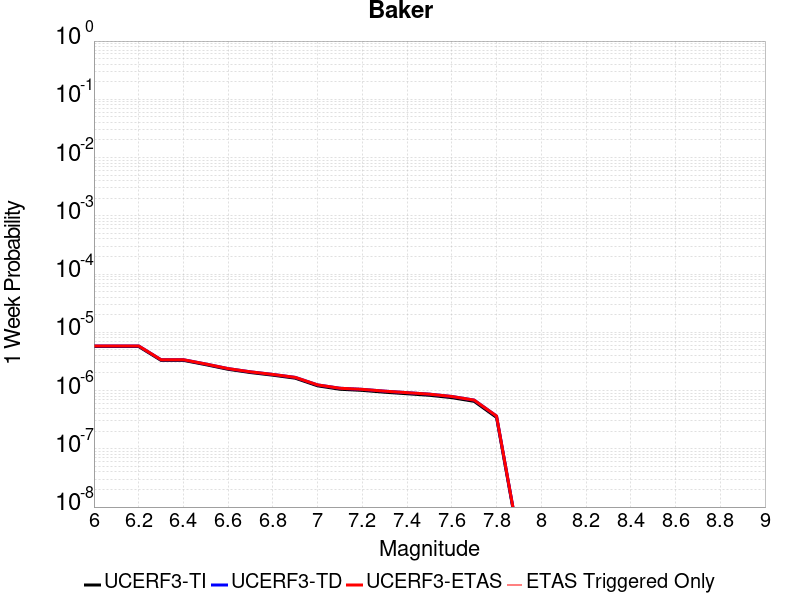 | 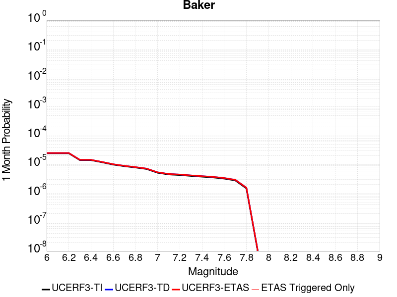 | 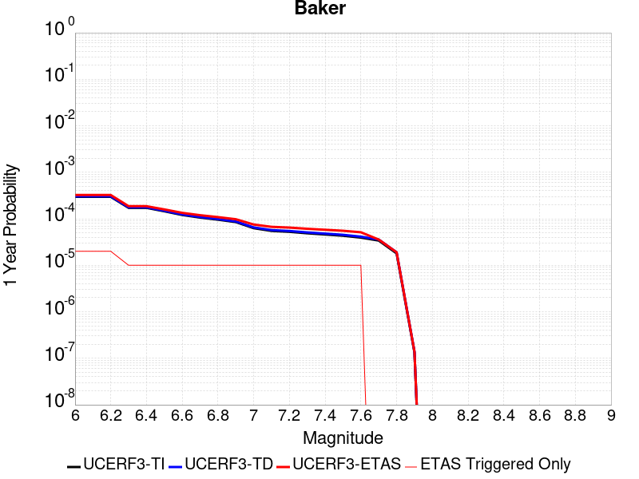 | 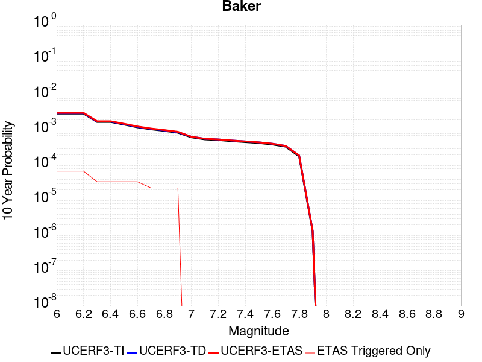 |

| Magnitude | 1 wk TI Prob | 1 wk TD Prob | 1 wk ETAS Prob | 1 wk ETAS/TD Gain | 1 wk ETAS Triggered Only | 1 mo TI Prob | 1 mo TD Prob | 1 mo ETAS Prob | 1 mo ETAS/TD Gain | 1 mo ETAS Triggered Only | 1 yr TI Prob | 1 yr TD Prob | 1 yr ETAS Prob | 1 yr ETAS/TD Gain | 1 yr ETAS Triggered Only | 10 yr TI Prob | 10 yr TD Prob | 10 yr ETAS Prob | 10 yr ETAS/TD Gain | 10 yr ETAS Triggered Only |
|-----|-----|-----|-----|-----|-----|-----|-----|-----|-----|-----|-----|-----|-----|-----|-----|-----|-----|-----|-----|-----|
| 6.0 | 5.695525E-6 | 5.835169E-6 | 5.835169E-6 | 1.0 | 0.0 | 2.4409164E-5 | 2.500765E-5 | 2.500765E-5 | 1.0 | 0.0 | 2.9714106E-4 | 3.0442962E-4 | 3.0442962E-4 | 1.0 | 0.0 | 0.0029674405 | 0.0030405214 | 0.0030815552 | 1.0134957 | 4.1159037E-5 |
| 6.1 | 5.695525E-6 | 5.835169E-6 | 5.835169E-6 | 1.0 | 0.0 | 2.4409164E-5 | 2.500765E-5 | 2.500765E-5 | 1.0 | 0.0 | 2.9714106E-4 | 3.0442962E-4 | 3.0442962E-4 | 1.0 | 0.0 | 0.0029674405 | 0.0030405214 | 0.0030815552 | 1.0134957 | 4.1159037E-5 |
| 6.2 | 5.695525E-6 | 5.835169E-6 | 5.835169E-6 | 1.0 | 0.0 | 2.4409164E-5 | 2.500765E-5 | 2.500765E-5 | 1.0 | 0.0 | 2.9714106E-4 | 3.0442962E-4 | 3.0442962E-4 | 1.0 | 0.0 | 0.0029674405 | 0.0030405214 | 0.0030815552 | 1.0134957 | 4.1159037E-5 |
| 6.3 | 3.2995713E-6 | 3.3838683E-6 | 3.3838683E-6 | 1.0 | 0.0 | 1.4140943E-5 | 1.4502214E-5 | 1.4502214E-5 | 1.0 | 0.0 | 1.7215237E-4 | 1.7655063E-4 | 1.7655063E-4 | 1.0 | 0.0 | 0.0017201907 | 0.0017641508 | 0.0017641508 | 1.0 | 0.0 |
| 6.4 | 3.2995713E-6 | 3.3838683E-6 | 3.3838683E-6 | 1.0 | 0.0 | 1.4140943E-5 | 1.4502214E-5 | 1.4502214E-5 | 1.0 | 0.0 | 1.7215237E-4 | 1.7655063E-4 | 1.7655063E-4 | 1.0 | 0.0 | 0.0017201907 | 0.0017641508 | 0.0017641508 | 1.0 | 0.0 |
| 6.5 | 2.782202E-6 | 2.8560169E-6 | 2.8560169E-6 | 1.0 | 0.0 | 1.1923668E-5 | 1.2240017E-5 | 1.2240017E-5 | 1.0 | 0.0 | 1.4516099E-4 | 1.4901234E-4 | 1.4901234E-4 | 1.0 | 0.0 | 0.001450662 | 0.001489157 | 0.001489157 | 1.0 | 0.0 |
| 6.6 | 2.3163404E-6 | 2.381075E-6 | 2.381075E-6 | 1.0 | 0.0 | 9.927136E-6 | 1.0204569E-5 | 1.0204569E-5 | 1.0 | 0.0 | 1.20856166E-4 | 1.2423375E-4 | 1.2423375E-4 | 1.0 | 0.0 | 0.0012079047 | 0.0012416631 | 0.0012416631 | 1.0 | 0.0 |
| 6.7 | 2.037056E-6 | 2.0966434E-6 | 2.0966434E-6 | 1.0 | 0.0 | 8.7302105E-6 | 8.985585E-6 | 8.985585E-6 | 1.0 | 0.0 | 1.0628513E-4 | 1.0939417E-4 | 1.0939417E-4 | 1.0 | 0.0 | 0.0010623431 | 0.0010934193 | 0.0010934193 | 1.0 | 0.0 |
| 6.8 | 1.8356744E-6 | 1.8916633E-6 | 1.8916633E-6 | 1.0 | 0.0 | 7.867153E-6 | 8.107104E-6 | 8.107104E-6 | 1.0 | 0.0 | 9.577837E-5 | 9.869966E-5 | 9.869966E-5 | 1.0 | 0.0 | 9.57371E-4 | 9.865721E-4 | 9.865721E-4 | 1.0 | 0.0 |
| 6.9 | 1.6310546E-6 | 1.683333E-6 | 1.683333E-6 | 1.0 | 0.0 | 6.9902153E-6 | 7.214265E-6 | 7.214265E-6 | 1.0 | 0.0 | 8.510255E-5 | 8.783025E-5 | 8.783025E-5 | 1.0 | 0.0 | 8.5069967E-4 | 8.7796664E-4 | 8.7796664E-4 | 1.0 | 0.0 |
| 7.0 | 1.2058036E-6 | 1.2509757E-6 | 1.2509757E-6 | 1.0 | 0.0 | 5.1677193E-6 | 5.3613135E-6 | 5.3613135E-6 | 1.0 | 0.0 | 6.291517E-5 | 6.527206E-5 | 6.527206E-5 | 1.0 | 0.0 | 6.289736E-4 | 6.525312E-4 | 6.525312E-4 | 1.0 | 0.0 |
| 7.1 | 1.052382E-6 | 1.0952647E-6 | 1.0952647E-6 | 1.0 | 0.0 | 4.5102006E-6 | 4.693983E-6 | 4.693983E-6 | 1.0 | 0.0 | 5.491031E-5 | 5.7147754E-5 | 5.7147754E-5 | 1.0 | 0.0 | 5.4896745E-4 | 5.713315E-4 | 5.713315E-4 | 1.0 | 0.0 |
| 7.2 | 1.0067454E-6 | 1.0488731E-6 | 1.0488731E-6 | 1.0 | 0.0 | 4.3146156E-6 | 4.4951626E-6 | 4.4951626E-6 | 1.0 | 0.0 | 5.252918E-5 | 5.472724E-5 | 5.472724E-5 | 1.0 | 0.0 | 5.251676E-4 | 5.471385E-4 | 5.471385E-4 | 1.0 | 0.0 |
| 7.3 | 9.3596316E-7 | 9.768715E-7 | 9.768715E-7 | 1.0 | 0.0 | 4.0112645E-6 | 4.1865856E-6 | 4.1865856E-6 | 1.0 | 0.0 | 4.8836053E-5 | 5.097049E-5 | 5.097049E-5 | 1.0 | 0.0 | 4.8825322E-4 | 5.095888E-4 | 5.095888E-4 | 1.0 | 0.0 |
| 7.4 | 8.8117395E-7 | 9.208626E-7 | 9.208626E-7 | 1.0 | 0.0 | 3.7764542E-6 | 3.946548E-6 | 3.946548E-6 | 1.0 | 0.0 | 4.5977362E-5 | 4.8048172E-5 | 4.8048172E-5 | 1.0 | 0.0 | 4.596785E-4 | 4.803786E-4 | 4.803786E-4 | 1.0 | 0.0 |
| 7.5 | 8.292386E-7 | 8.6755256E-7 | 8.6755256E-7 | 1.0 | 0.0 | 3.5538749E-6 | 3.718077E-6 | 3.718077E-6 | 1.0 | 0.0 | 4.326757E-5 | 4.5266657E-5 | 4.5266657E-5 | 1.0 | 0.0 | 4.3259145E-4 | 4.525751E-4 | 4.525751E-4 | 1.0 | 0.0 |
| 7.6 | 7.553842E-7 | 7.915349E-7 | 7.915349E-7 | 1.0 | 0.0 | 3.2373566E-6 | 3.3922881E-6 | 3.3922881E-6 | 1.0 | 0.0 | 3.9414106E-5 | 4.1300333E-5 | 4.1300333E-5 | 1.0 | 0.0 | 3.9407116E-4 | 4.1292727E-4 | 4.1292727E-4 | 1.0 | 0.0 |
| 7.7 | 6.5285366E-7 | 6.8535877E-7 | 6.8535877E-7 | 1.0 | 0.0 | 2.797941E-6 | 2.9372486E-6 | 2.9372486E-6 | 1.0 | 0.0 | 3.40644E-5 | 3.5760422E-5 | 3.5760422E-5 | 1.0 | 0.0 | 3.405918E-4 | 3.5754734E-4 | 3.5754734E-4 | 1.0 | 0.0 |
| 7.8 | 3.4586725E-7 | 3.6487262E-7 | 3.6487262E-7 | 1.0 | 0.0 | 1.4822873E-6 | 1.5637388E-6 | 1.5637388E-6 | 1.0 | 0.0 | 1.80467E-5 | 1.9038358E-5 | 1.9038358E-5 | 1.0 | 0.0 | 1.8045233E-4 | 1.9036772E-4 | 1.9036772E-4 | 1.0 | 0.0 |
| 7.9 | 2.5591178E-9 | 2.6699385E-9 | 2.6699385E-9 | 1.0 | 0.0 | 1.0967647E-8 | 1.1442593E-8 | 1.1442593E-8 | 1.0 | 0.0 | 1.335311E-7 | 1.3931357E-7 | 1.3931357E-7 | 1.0 | 0.0 | 1.3353102E-6 | 1.3931357E-6 | 1.3931357E-6 | 1.0 | 0.0 |

