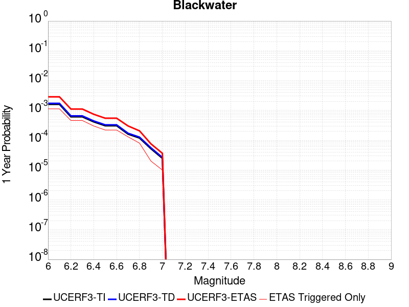
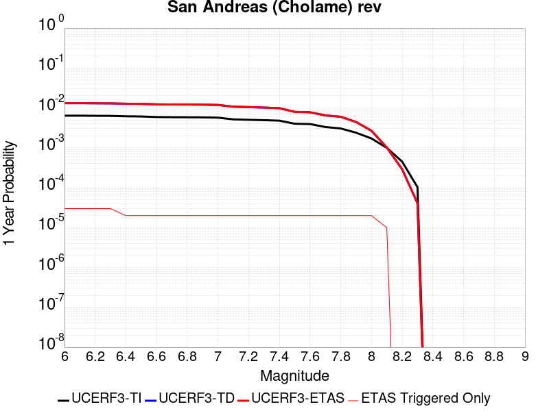
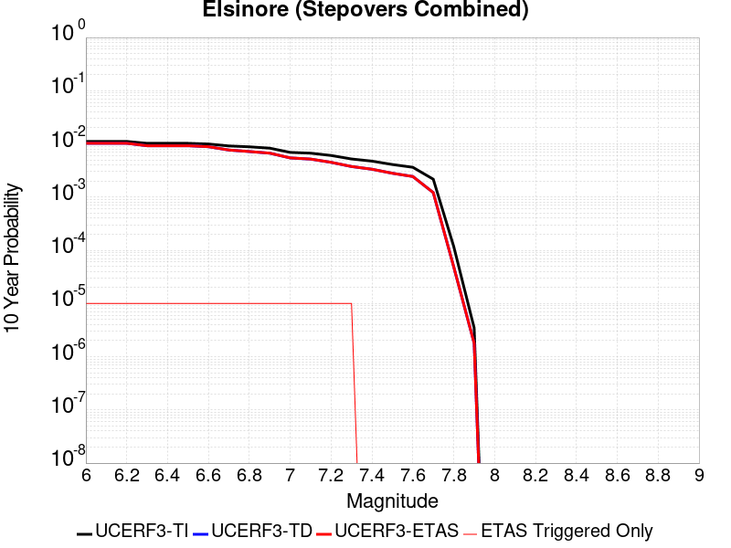
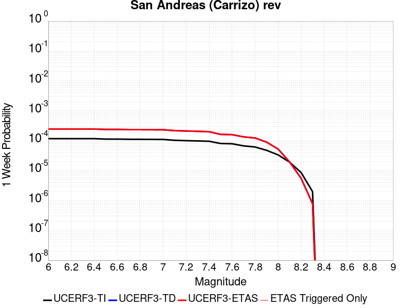
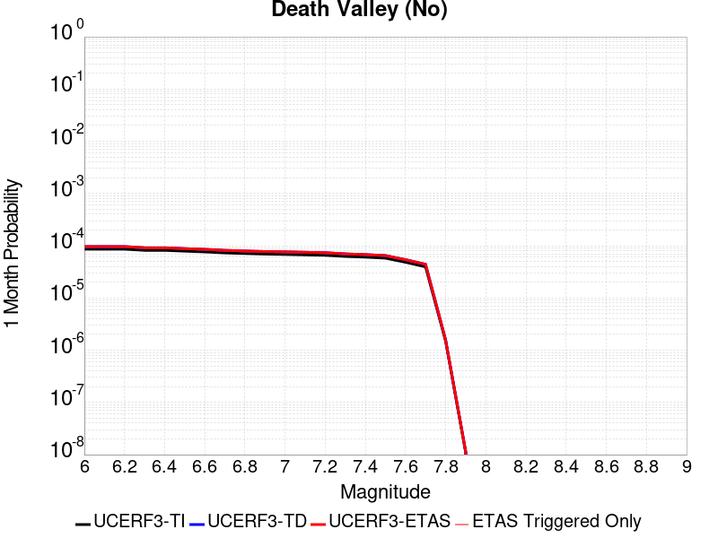
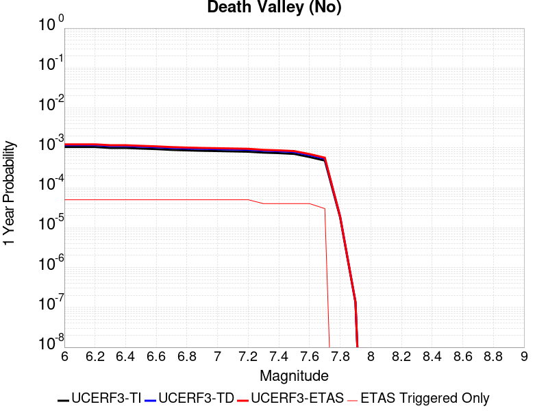

# Parent Section Magnitude-Probability Distributions

Only fault sections with at least one triggered aftershock are plotted. Sections are sorted by total supraseismogenic trigger rate (decreasing)

## Table Of Contents

* [Garlock (Central)](#garlock-central)
* [Tank Canyon](#tank-canyon)
* [Little Lake](#little-lake)
* [Owl Lake](#owl-lake)
* [Airport Lake](#airport-lake)
* [Garlock (East)](#garlock-east)
* [Panamint Valley](#panamint-valley)
* [Ash Hill](#ash-hill)
* [Hunter Mountain-Saline Valley](#hunter-mountain-saline-valley)
* [Garlock (West)](#garlock-west)
* [Blackwater](#blackwater)
* [Towne Pass](#towne-pass)
* [So Sierra Nevada](#so-sierra-nevada)
* [Death Valley (So)](#death-valley-so)
* [Gravel Hills-Harper Lk](#gravel-hills-harper-lk)
* [McLean Lake](#mclean-lake)
* [San Andreas (Mojave S)](#san-andreas-mojave-s)
* [Goldstone Lake](#goldstone-lake)
* [San Andreas (San Bernardino N)](#san-andreas-san-bernardino-n)
* [Coyote Canyon](#coyote-canyon)
* [San Andreas (Mojave N)](#san-andreas-mojave-n)
* [Lenwood-Lockhart-Old Woman Springs](#lenwood-lockhart-old-woman-springs)
* [San Andreas (Parkfield)](#san-andreas-parkfield)
* [San Jacinto (San Bernardino)](#san-jacinto-san-bernardino)
* [Paradise](#paradise)
* [San Andreas (San Bernardino S)](#san-andreas-san-bernardino-s)
* [Elsinore (Glen Ivy) rev](#elsinore-glen-ivy-rev)
* [Nelson Lake](#nelson-lake)
* [San Andreas (Cholame) rev](#san-andreas-cholame-rev)
* [San Andreas (Creeping Section) 2011 CFM](#san-andreas-creeping-section-2011-cfm)
* [Chino alt 1](#chino-alt-1)
* [Elsinore (Julian)](#elsinore-julian)
* [Elsinore (Stepovers Combined)](#elsinore-stepovers-combined)
* [Bullion Mountains](#bullion-mountains)
* [San Andreas (Carrizo) rev](#san-andreas-carrizo-rev)
* [San Clemente](#san-clemente)
* [Garlic Springs](#garlic-springs)
* [Elsinore (Temecula) rev](#elsinore-temecula-rev)
* [Hunting Creek - Berryessa 2011 CFM](#hunting-creek---berryessa-2011-cfm)
* [San Jacinto (San Jacinto Valley) rev](#san-jacinto-san-jacinto-valley-rev)
* [White Wolf (Extension)](#white-wolf-extension)
* [San Andreas (Big Bend)](#san-andreas-big-bend)
* [Death Valley (No)](#death-valley-no)
* [San Jacinto (Lytle Creek connector)](#san-jacinto-lytle-creek-connector)
* [Death Valley (Black Mtns Frontal)](#death-valley-black-mtns-frontal)
* [Cady](#cady)
* [Baker](#baker)

## Garlock (Central)
*[(top)](#table-of-contents)*

| 1 Week | 1 Month | 1 Year | 10 Year |
|-----|-----|-----|-----|
|  |  |  |  |

| Magnitude | 1 wk TI Prob | 1 wk TD Prob | 1 wk ETAS Prob | 1 wk ETAS/TD Gain | 1 wk ETAS Triggered Only | 1 mo TI Prob | 1 mo TD Prob | 1 mo ETAS Prob | 1 mo ETAS/TD Gain | 1 mo ETAS Triggered Only | 1 yr TI Prob | 1 yr TD Prob | 1 yr ETAS Prob | 1 yr ETAS/TD Gain | 1 yr ETAS Triggered Only | 10 yr TI Prob | 10 yr TD Prob | 10 yr ETAS Prob | 10 yr ETAS/TD Gain | 10 yr ETAS Triggered Only |
|-----|-----|-----|-----|-----|-----|-----|-----|-----|-----|-----|-----|-----|-----|-----|-----|-----|-----|-----|-----|-----|
| 6.0 | 5.5131142E-5 | 7.035651E-5 | 6.10859E-4 | 8.682338 | 5.4054055E-4 | 2.3625491E-4 | 3.0149342E-4 | 0.0021928148 | 7.2731767 | 0.0018918919 | 0.0028726095 | 0.0036645688 | 0.0206292 | 5.6293664 | 0.017027028 | 0.028357591 | 0.0361181 | 0.075454906 | 2.0891159 | 0.040810812 |
| 6.1 | 5.5131142E-5 | 7.035651E-5 | 6.10859E-4 | 8.682338 | 5.4054055E-4 | 2.3625491E-4 | 3.0149342E-4 | 0.0021928148 | 7.2731767 | 0.0018918919 | 0.0028726095 | 0.0036645688 | 0.0206292 | 5.6293664 | 0.017027028 | 0.028357591 | 0.0361181 | 0.075454906 | 2.0891159 | 0.040810812 |
| 6.2 | 4.216245E-5 | 5.1760762E-5 | 3.2201703E-4 | 6.2212577 | 2.7027028E-4 | 1.806837E-4 | 2.2181314E-4 | 0.0010324441 | 4.654567 | 8.1081083E-4 | 0.0021976046 | 0.002697262 | 0.01293983 | 4.7973948 | 0.0102702705 | 0.021759989 | 0.0267309 | 0.050405014 | 1.8856459 | 0.024324324 |
| 6.3 | 4.216245E-5 | 5.1760762E-5 | 3.2201703E-4 | 6.2212577 | 2.7027028E-4 | 1.806837E-4 | 2.2181314E-4 | 0.0010324441 | 4.654567 | 8.1081083E-4 | 0.0021976046 | 0.002697262 | 0.01293983 | 4.7973948 | 0.0102702705 | 0.021759989 | 0.0267309 | 0.050405014 | 1.8856459 | 0.024324324 |
| 6.4 | 3.6858168E-5 | 4.4206416E-5 | 3.1446473E-4 | 7.113554 | 2.7027028E-4 | 1.5795401E-4 | 1.8944245E-4 | 7.298806E-4 | 3.8527827 | 5.4054055E-4 | 0.0019213937 | 0.0023040473 | 0.010393474 | 4.510964 | 0.008108108 | 0.019048655 | 0.022870028 | 0.040828094 | 1.7852226 | 0.018378379 |
| 6.5 | 3.39199E-5 | 4.01114E-5 | 3.1037084E-4 | 7.7377205 | 2.7027028E-4 | 1.453629E-4 | 1.718948E-4 | 7.1234244E-4 | 4.14406 | 5.4054055E-4 | 0.0017683565 | 0.0020908322 | 0.009642578 | 4.611837 | 0.0075675678 | 0.017543508 | 0.020802973 | 0.03694649 | 1.7760198 | 0.016486486 |
| 6.6 | 3.3571985E-5 | 3.9565E-5 | 3.0982457E-4 | 7.8307743 | 2.7027028E-4 | 1.4387199E-4 | 1.6955339E-4 | 7.1000226E-4 | 4.187485 | 5.4054055E-4 | 0.0017502342 | 0.0020623798 | 0.009344627 | 4.5309925 | 0.0072972975 | 0.017365133 | 0.020523785 | 0.036407184 | 1.773902 | 0.016216217 |
| 6.7 | 3.2580007E-5 | 3.8180824E-5 | 3.0844077E-4 | 8.078421 | 2.7027028E-4 | 1.3962112E-4 | 1.6362197E-4 | 7.0407405E-4 | 4.3030534 | 5.4054055E-4 | 0.0016985617 | 0.0019902987 | 0.00900334 | 4.523612 | 0.007027027 | 0.016856372 | 0.019819157 | 0.03491924 | 1.7618933 | 0.015405405 |
| 6.8 | 3.2185937E-5 | 3.7607628E-5 | 3.0786774E-4 | 8.186311 | 2.7027028E-4 | 1.3793244E-4 | 1.6116572E-4 | 7.0161914E-4 | 4.353402 | 5.4054055E-4 | 0.0016780337 | 0.0019604482 | 0.008973699 | 4.577371 | 0.007027027 | 0.016654192 | 0.019525932 | 0.034630533 | 1.7735661 | 0.015405405 |
| 6.9 | 3.165394E-5 | 3.6811605E-5 | 3.0707192E-4 | 8.341716 | 2.7027028E-4 | 1.3565269E-4 | 1.5775459E-4 | 6.9820986E-4 | 4.4259243 | 5.4054055E-4 | 0.0016503202 | 0.0019189917 | 0.008932534 | 4.654806 | 0.007027027 | 0.01638118 | 0.019119278 | 0.034230143 | 1.7903471 | 0.015405405 |
| 7.0 | 3.0903822E-5 | 3.5716203E-5 | 3.5716203E-5 | 1.0 | 0.0 | 1.3243823E-4 | 1.5306058E-4 | 4.232895E-4 | 2.765503 | 2.7027028E-4 | 0.0016112428 | 0.0018619411 | 0.00833635 | 4.4772363 | 0.0064864866 | 0.015996104 | 0.018558139 | 0.03314714 | 1.7861241 | 0.014864865 |
| 7.1 | 3.0069863E-5 | 3.4481687E-5 | 3.4481687E-5 | 1.0 | 0.0 | 1.2886449E-4 | 1.477704E-4 | 4.1800074E-4 | 2.8287175 | 2.7027028E-4 | 0.0015677959 | 0.0017976413 | 0.008272467 | 4.6018457 | 0.0064864866 | 0.01556781 | 0.017925408 | 0.031727538 | 1.7699758 | 0.014054054 |
| 7.2 | 2.7957109E-5 | 3.1369047E-5 | 3.1369047E-5 | 1.0 | 0.0 | 1.1981068E-4 | 1.3443196E-4 | 1.3443196E-4 | 1.0 | 0.0 | 0.0014577188 | 0.0016354999 | 0.0070320647 | 4.2996426 | 0.0054054055 | 0.014481937 | 0.016327986 | 0.028025707 | 1.7164215 | 0.011891892 |
| 7.3 | 2.4519275E-5 | 2.6797032E-5 | 2.6797032E-5 | 1.0 | 0.0 | 1.0507837E-4 | 1.1483945E-4 | 1.1483945E-4 | 1.0 | 0.0 | 0.0012785783 | 0.0013972883 | 0.0043661073 | 3.1247003 | 0.002972973 | 0.012712469 | 0.013969704 | 0.021698048 | 1.5532218 | 0.007837838 |
| 7.4 | 2.3225532E-5 | 2.5279978E-5 | 2.5279978E-5 | 1.0 | 0.0 | 9.95342E-5 | 1.0833835E-4 | 1.0833835E-4 | 1.0 | 0.0 | 0.0012111551 | 0.0013182356 | 0.0040173754 | 3.0475397 | 0.0027027028 | 0.012045753 | 0.013186504 | 0.020654282 | 1.5663197 | 0.0075675678 |
| 7.5 | 2.097765E-5 | 2.256026E-5 | 2.256026E-5 | 1.0 | 0.0 | 8.9901114E-5 | 9.668331E-5 | 9.668331E-5 | 1.0 | 0.0 | 0.0010939965 | 0.0011764955 | 0.0033361139 | 2.8356369 | 0.0021621622 | 0.010886264 | 0.011779194 | 0.018456362 | 1.5668612 | 0.006756757 |
| 7.6 | 1.511254E-5 | 1.6062562E-5 | 1.6062562E-5 | 1.0 | 0.0 | 6.476642E-5 | 6.883778E-5 | 6.883778E-5 | 1.0 | 0.0 | 7.882459E-4 | 8.3778554E-4 | 0.0019179609 | 2.2893221 | 0.0010810811 | 0.007854558 | 0.008419968 | 0.012171893 | 1.4455984 | 0.0037837839 |
| 7.7 | 9.934069E-6 | 1.0744918E-5 | 1.0744918E-5 | 1.0 | 0.0 | 4.2573887E-5 | 4.6048837E-5 | 4.6048837E-5 | 1.0 | 0.0 | 5.182138E-4 | 5.605008E-4 | 8.3061954E-4 | 1.481924 | 2.7027028E-4 | 0.00517007 | 0.0056618536 | 0.0064680735 | 1.1423951 | 8.1081083E-4 |
| 7.8 | 6.7562896E-6 | 8.482805E-6 | 8.482805E-6 | 1.0 | 0.0 | 2.8955206E-5 | 3.6354373E-5 | 3.6354373E-5 | 1.0 | 0.0 | 3.5247262E-4 | 4.4252476E-4 | 7.1267545E-4 | 1.6104758 | 2.7027028E-4 | 0.0035191406 | 0.004474724 | 0.0052819066 | 1.1803871 | 8.1081083E-4 |
| 7.9 | 3.975453E-6 | 5.4041707E-6 | 5.4041707E-6 | 1.0 | 0.0 | 1.7037546E-5 | 2.3160526E-5 | 2.3160526E-5 | 1.0 | 0.0 | 2.0741238E-4 | 2.8194304E-4 | 5.521371E-4 | 1.9583286 | 2.7027028E-4 | 0.002072189 | 0.0028507726 | 0.0033897723 | 1.1890714 | 5.4054055E-4 |
| 8.0 | 1.6729537E-6 | 2.0887928E-6 | 2.0887928E-6 | 1.0 | 0.0 | 7.169782E-6 | 8.951938E-6 | 8.951938E-6 | 1.0 | 0.0 | 8.7288594E-5 | 1.0898444E-4 | 1.0898444E-4 | 1.0 | 0.0 | 8.7254314E-4 | 0.0011025992 | 0.0011025992 | 1.0 | 0.0 |
| 8.1 | 3.6733252E-7 | 3.164752E-7 | 3.164752E-7 | 1.0 | 0.0 | 1.5742813E-6 | 1.3563216E-6 | 1.3563216E-6 | 1.0 | 0.0 | 1.9166706E-5 | 1.6513108E-5 | 1.6513108E-5 | 1.0 | 0.0 | 1.9165053E-4 | 1.6726229E-4 | 1.6726229E-4 | 1.0 | 0.0 |

## Tank Canyon
*[(top)](#table-of-contents)*

| 1 Week | 1 Month | 1 Year | 10 Year |
|-----|-----|-----|-----|
|  |  |  |  |

| Magnitude | 1 wk TI Prob | 1 wk TD Prob | 1 wk ETAS Prob | 1 wk ETAS/TD Gain | 1 wk ETAS Triggered Only | 1 mo TI Prob | 1 mo TD Prob | 1 mo ETAS Prob | 1 mo ETAS/TD Gain | 1 mo ETAS Triggered Only | 1 yr TI Prob | 1 yr TD Prob | 1 yr ETAS Prob | 1 yr ETAS/TD Gain | 1 yr ETAS Triggered Only | 10 yr TI Prob | 10 yr TD Prob | 10 yr ETAS Prob | 10 yr ETAS/TD Gain | 10 yr ETAS Triggered Only |
|-----|-----|-----|-----|-----|-----|-----|-----|-----|-----|-----|-----|-----|-----|-----|-----|-----|-----|-----|-----|-----|
| 6.0 | 4.8284557E-5 | 5.7991037E-5 | 8.687548E-4 | 14.980846 | 8.1081083E-4 | 2.0691741E-4 | 2.4851318E-4 | 0.0015995287 | 6.4363937 | 0.0013513514 | 0.0025163088 | 0.003022118 | 0.010836269 | 3.585654 | 0.007837838 | 0.02488006 | 0.029877583 | 0.053475156 | 1.7898086 | 0.024324324 |
| 6.1 | 1.7796336E-5 | 2.0881414E-5 | 2.9114605E-4 | 13.942832 | 2.7027028E-4 | 7.626778E-5 | 8.948892E-5 | 9.0022717E-4 | 10.0596485 | 8.1081083E-4 | 9.281647E-4 | 0.0010890213 | 0.0037887807 | 3.4790692 | 0.0027027028 | 0.009242975 | 0.010841259 | 0.019930827 | 1.8384235 | 0.009189189 |
| 6.2 | 1.7796336E-5 | 2.0881414E-5 | 2.9114605E-4 | 13.942832 | 2.7027028E-4 | 7.626778E-5 | 8.948892E-5 | 9.0022717E-4 | 10.0596485 | 8.1081083E-4 | 9.281647E-4 | 0.0010890213 | 0.0037887807 | 3.4790692 | 0.0027027028 | 0.009242975 | 0.010841259 | 0.019930827 | 1.8384235 | 0.009189189 |
| 6.3 | 1.3515912E-5 | 1.5765387E-5 | 2.860314E-4 | 18.143 | 2.7027028E-4 | 5.792405E-5 | 6.756433E-5 | 6.0806837E-4 | 8.999843 | 5.4054055E-4 | 7.049971E-4 | 8.2230894E-4 | 0.002172549 | 2.6420107 | 0.0013513514 | 0.007027647 | 0.008195594 | 0.0140928095 | 1.7195592 | 0.005945946 |
| 6.4 | 1.0870146E-5 | 1.2622489E-5 | 2.8288935E-4 | 22.411535 | 2.7027028E-4 | 4.658551E-5 | 5.409536E-5 | 5.946067E-4 | 10.991824 | 5.4054055E-4 | 5.67031E-4 | 6.584297E-4 | 0.0017387989 | 2.6408272 | 0.0010810811 | 0.005655863 | 0.006567119 | 0.010863045 | 1.6541568 | 0.0043243244 |
| 6.5 | 7.964826E-6 | 9.199161E-6 | 9.199161E-6 | 1.0 | 0.0 | 3.4134522E-5 | 3.9424438E-5 | 3.9424438E-5 | 1.0 | 0.0 | 4.1550855E-4 | 4.798974E-4 | 0.0010201785 | 2.1258264 | 5.4054055E-4 | 0.0041473247 | 0.004790228 | 0.0077489596 | 1.6176599 | 0.002972973 |
| 6.6 | 6.6317E-6 | 7.614703E-6 | 7.614703E-6 | 1.0 | 0.0 | 2.8421264E-5 | 3.2634085E-5 | 3.2634085E-5 | 1.0 | 0.0 | 3.4597394E-4 | 3.9725663E-4 | 9.3758246E-4 | 2.360143 | 5.4054055E-4 | 0.0034543579 | 0.0039669327 | 0.0066589136 | 1.6786052 | 0.0027027028 |
| 6.7 | 4.793663E-6 | 5.432297E-6 | 5.432297E-6 | 1.0 | 0.0 | 2.0544108E-5 | 2.3281089E-5 | 2.3281089E-5 | 1.0 | 0.0 | 2.500958E-4 | 2.8341476E-4 | 2.8341476E-4 | 1.0 | 0.0 | 0.0024981452 | 0.0028315398 | 0.00444857 | 1.571078 | 0.0016216217 |
| 6.8 | 4.382823E-6 | 4.9705927E-6 | 4.9705927E-6 | 1.0 | 0.0 | 1.8783392E-5 | 2.130239E-5 | 2.130239E-5 | 1.0 | 0.0 | 2.286638E-4 | 2.5933E-4 | 2.5933E-4 | 1.0 | 0.0 | 0.0022842865 | 0.0025912935 | 0.0039391434 | 1.5201454 | 0.0013513514 |
| 6.9 | 2.729601E-6 | 3.0743E-6 | 3.0743E-6 | 1.0 | 0.0 | 1.1698237E-5 | 1.3175511E-5 | 1.3175511E-5 | 1.0 | 0.0 | 1.4241673E-4 | 1.6040127E-4 | 1.6040127E-4 | 1.0 | 0.0 | 0.001423255 | 0.0016030794 | 0.0021427535 | 1.3366483 | 5.4054055E-4 |
| 7.0 | 1.8987357E-6 | 2.1273395E-6 | 2.1273395E-6 | 1.0 | 0.0 | 8.137413E-6 | 9.117141E-6 | 9.117141E-6 | 1.0 | 0.0 | 9.90685E-5 | 1.1099624E-4 | 1.1099624E-4 | 1.0 | 0.0 | 9.902435E-4 | 0.0011094767 | 0.0013794472 | 1.2433313 | 2.7027028E-4 |
| 7.1 | 1.4928986E-6 | 1.6644419E-6 | 1.6644419E-6 | 1.0 | 0.0 | 6.398121E-6 | 7.1333066E-6 | 7.1333066E-6 | 1.0 | 0.0 | 7.789434E-5 | 8.684513E-5 | 8.684513E-5 | 1.0 | 0.0 | 7.786704E-4 | 8.681699E-4 | 8.681699E-4 | 1.0 | 0.0 |
| 7.2 | 1.069082E-6 | 1.1830984E-6 | 1.1830984E-6 | 1.0 | 0.0 | 4.581772E-6 | 5.070415E-6 | 5.070415E-6 | 1.0 | 0.0 | 5.5781646E-5 | 6.173109E-5 | 6.173109E-5 | 1.0 | 0.0 | 5.576765E-4 | 6.1719166E-4 | 6.1719166E-4 | 1.0 | 0.0 |
| 7.3 | 8.776551E-7 | 9.772074E-7 | 9.772074E-7 | 1.0 | 0.0 | 3.7613736E-6 | 4.188028E-6 | 4.188028E-6 | 1.0 | 0.0 | 4.579376E-5 | 5.098857E-5 | 5.098857E-5 | 1.0 | 0.0 | 4.5784327E-4 | 5.098197E-4 | 5.098197E-4 | 1.0 | 0.0 |
| 7.4 | 7.55721E-7 | 8.511005E-7 | 8.511005E-7 | 1.0 | 0.0 | 3.2388E-6 | 3.6475712E-6 | 3.6475712E-6 | 1.0 | 0.0 | 3.9431678E-5 | 4.4408793E-5 | 4.4408793E-5 | 1.0 | 0.0 | 3.942468E-4 | 4.4405003E-4 | 4.4405003E-4 | 1.0 | 0.0 |
| 7.5 | 5.587665E-7 | 6.306174E-7 | 6.306174E-7 | 1.0 | 0.0 | 2.3947114E-6 | 2.702646E-6 | 2.702646E-6 | 1.0 | 0.0 | 2.915522E-5 | 3.2904714E-5 | 3.2904714E-5 | 1.0 | 0.0 | 2.9151395E-4 | 3.2904715E-4 | 3.2904715E-4 | 1.0 | 0.0 |

## Little Lake
*[(top)](#table-of-contents)*

| 1 Week | 1 Month | 1 Year | 10 Year |
|-----|-----|-----|-----|
|  |  |  |  |

| Magnitude | 1 wk TI Prob | 1 wk TD Prob | 1 wk ETAS Prob | 1 wk ETAS/TD Gain | 1 wk ETAS Triggered Only | 1 mo TI Prob | 1 mo TD Prob | 1 mo ETAS Prob | 1 mo ETAS/TD Gain | 1 mo ETAS Triggered Only | 1 yr TI Prob | 1 yr TD Prob | 1 yr ETAS Prob | 1 yr ETAS/TD Gain | 1 yr ETAS Triggered Only | 10 yr TI Prob | 10 yr TD Prob | 10 yr ETAS Prob | 10 yr ETAS/TD Gain | 10 yr ETAS Triggered Only |
|-----|-----|-----|-----|-----|-----|-----|-----|-----|-----|-----|-----|-----|-----|-----|-----|-----|-----|-----|-----|-----|
| 6.0 | 2.8424427E-5 | 3.1213367E-5 | 3.014752E-4 | 9.658528 | 2.7027028E-4 | 1.2181328E-4 | 1.3376547E-4 | 0.0012147019 | 9.080833 | 0.0010810811 | 0.0014820677 | 0.0016275112 | 0.010801745 | 6.636971 | 0.009189189 | 0.014722223 | 0.016169336 | 0.034782346 | 2.1511304 | 0.018918918 |
| 6.1 | 2.8424427E-5 | 3.1213367E-5 | 3.014752E-4 | 9.658528 | 2.7027028E-4 | 1.2181328E-4 | 1.3376547E-4 | 0.0012147019 | 9.080833 | 0.0010810811 | 0.0014820677 | 0.0016275112 | 0.010801745 | 6.636971 | 0.009189189 | 0.014722223 | 0.016169336 | 0.034782346 | 2.1511304 | 0.018918918 |
| 6.2 | 2.8424427E-5 | 3.1213367E-5 | 3.014752E-4 | 9.658528 | 2.7027028E-4 | 1.2181328E-4 | 1.3376547E-4 | 0.0012147019 | 9.080833 | 0.0010810811 | 0.0014820677 | 0.0016275112 | 0.010801745 | 6.636971 | 0.009189189 | 0.014722223 | 0.016169336 | 0.034782346 | 2.1511304 | 0.018918918 |
| 6.3 | 1.48860645E-5 | 1.608494E-5 | 2.8635087E-4 | 17.802422 | 2.7027028E-4 | 6.379586E-5 | 6.893379E-5 | 3.3918544E-4 | 4.920452 | 2.7027028E-4 | 7.7643775E-4 | 8.3897397E-4 | 0.006509888 | 7.759344 | 0.005675676 | 0.007737305 | 0.008360886 | 0.020153351 | 2.4104323 | 0.011891892 |
| 6.4 | 1.48860645E-5 | 1.608494E-5 | 2.8635087E-4 | 17.802422 | 2.7027028E-4 | 6.379586E-5 | 6.893379E-5 | 3.3918544E-4 | 4.920452 | 2.7027028E-4 | 7.7643775E-4 | 8.3897397E-4 | 0.006509888 | 7.759344 | 0.005675676 | 0.007737305 | 0.008360886 | 0.020153351 | 2.4104323 | 0.011891892 |
| 6.5 | 1.2797581E-5 | 1.3768532E-5 | 2.8403508E-4 | 20.629293 | 2.7027028E-4 | 5.4845623E-5 | 5.9006805E-5 | 3.2926112E-4 | 5.5800533 | 2.7027028E-4 | 6.675408E-4 | 7.1819674E-4 | 0.00611972 | 8.520952 | 0.0054054055 | 0.006655392 | 0.0071613085 | 0.0178947 | 2.4988031 | 0.010810811 |
| 6.6 | 9.661896E-6 | 1.0291131E-5 | 2.8055863E-4 | 27.262175 | 2.7027028E-4 | 4.1407468E-5 | 4.4104192E-5 | 3.1436255E-4 | 7.1277246 | 2.7027028E-4 | 5.040193E-4 | 5.368525E-4 | 0.0053991056 | 10.056963 | 0.004864865 | 0.005028777 | 0.0053571616 | 0.015034768 | 2.8064802 | 0.00972973 |
| 6.7 | 7.767871E-6 | 8.201281E-6 | 2.7846935E-4 | 33.95437 | 2.7027028E-4 | 3.329045E-5 | 3.5147954E-5 | 3.0540873E-4 | 8.689232 | 2.7027028E-4 | 4.0523586E-4 | 4.2785605E-4 | 0.0052906396 | 12.365466 | 0.004864865 | 0.004044977 | 0.0042716754 | 0.013421611 | 3.1420016 | 0.009189189 |
| 6.8 | 6.4235196E-6 | 6.7370365E-6 | 2.7700549E-4 | 41.116814 | 2.7027028E-4 | 2.752908E-5 | 2.8872768E-5 | 2.9913522E-4 | 10.360463 | 2.7027028E-4 | 3.35115E-4 | 3.5148207E-4 | 0.004133936 | 11.761441 | 0.0037837839 | 0.003346101 | 0.0035105227 | 0.010782203 | 3.0713954 | 0.0072972975 |
| 6.9 | 3.1283696E-6 | 3.1126344E-6 | 2.7338206E-4 | 87.8298 | 2.7027028E-4 | 1.3407229E-5 | 1.33398025E-5 | 2.8360647E-4 | 21.26017 | 2.7027028E-4 | 1.6322079E-4 | 1.624015E-4 | 0.0025944388 | 15.975462 | 0.0024324325 | 0.0016310095 | 0.0016229765 | 0.0067497776 | 4.158888 | 0.0051351353 |
| 7.0 | 2.290603E-6 | 2.229024E-6 | 2.724987E-4 | 122.25023 | 2.7027028E-4 | 9.816834E-6 | 9.552931E-6 | 2.798206E-4 | 29.2916 | 2.7027028E-4 | 1.19513395E-4 | 1.16301766E-4 | 0.0022782125 | 19.588804 | 0.0021621622 | 0.0011944914 | 0.0011625112 | 0.004401984 | 3.7866166 | 0.0032432433 |
| 7.1 | 1.293693E-6 | 1.1778933E-6 | 2.7144785E-4 | 230.45198 | 2.7027028E-4 | 5.5443866E-6 | 5.048108E-6 | 2.7531703E-4 | 54.53865 | 2.7027028E-4 | 6.750081E-5 | 6.145968E-5 | 8.7222067E-4 | 14.191753 | 8.1081083E-4 | 6.7480316E-4 | 6.1449537E-4 | 0.0019650164 | 3.1977725 | 0.0013513514 |
| 7.2 | 4.715842E-7 | 3.092757E-7 | 3.092757E-7 | 1.0 | 0.0 | 2.0210737E-6 | 1.3254667E-6 | 1.3254667E-6 | 1.0 | 0.0 | 2.4606294E-5 | 1.6137443E-5 | 1.6137443E-5 | 1.0 | 0.0 | 2.460357E-4 | 1.6136325E-4 | 1.6136325E-4 | 1.0 | 0.0 |
| 7.3 | 3.9430947E-7 | 2.3106372E-7 | 2.3106372E-7 | 1.0 | 0.0 | 1.6898966E-6 | 9.902727E-7 | 9.902727E-7 | 1.0 | 0.0 | 2.0574296E-5 | 1.2056505E-5 | 1.2056505E-5 | 1.0 | 0.0 | 2.0572392E-4 | 1.2055858E-4 | 1.2055858E-4 | 1.0 | 0.0 |
| 7.4 | 3.547123E-7 | 1.9687333E-7 | 1.9687333E-7 | 1.0 | 0.0 | 1.5201948E-6 | 8.4374255E-7 | 8.4374255E-7 | 1.0 | 0.0 | 1.8508214E-5 | 1.0272518E-5 | 1.0272518E-5 | 1.0 | 0.0 | 1.8506673E-4 | 1.0272049E-4 | 1.0272049E-4 | 1.0 | 0.0 |
| 7.5 | 2.6354266E-7 | 1.4428804E-7 | 1.4428804E-7 | 1.0 | 0.0 | 1.129468E-6 | 6.1837716E-7 | 6.1837716E-7 | 1.0 | 0.0 | 1.3751187E-5 | 7.528716E-6 | 7.528716E-6 | 1.0 | 0.0 | 1.3750336E-4 | 7.528466E-5 | 7.528466E-5 | 1.0 | 0.0 |
| 7.6 | 1.269913E-7 | 7.574927E-8 | 7.574927E-8 | 1.0 | 0.0 | 5.4424834E-7 | 3.246397E-7 | 3.246397E-7 | 1.0 | 0.0 | 6.6262032E-6 | 3.9524816E-6 | 3.9524816E-6 | 1.0 | 0.0 | 6.626006E-5 | 3.9524148E-5 | 3.9524148E-5 | 1.0 | 0.0 |

## Owl Lake
*[(top)](#table-of-contents)*

| 1 Week | 1 Month | 1 Year | 10 Year |
|-----|-----|-----|-----|
|  |  |  |  |

| Magnitude | 1 wk TI Prob | 1 wk TD Prob | 1 wk ETAS Prob | 1 wk ETAS/TD Gain | 1 wk ETAS Triggered Only | 1 mo TI Prob | 1 mo TD Prob | 1 mo ETAS Prob | 1 mo ETAS/TD Gain | 1 mo ETAS Triggered Only | 1 yr TI Prob | 1 yr TD Prob | 1 yr ETAS Prob | 1 yr ETAS/TD Gain | 1 yr ETAS Triggered Only | 10 yr TI Prob | 10 yr TD Prob | 10 yr ETAS Prob | 10 yr ETAS/TD Gain | 10 yr ETAS Triggered Only |
|-----|-----|-----|-----|-----|-----|-----|-----|-----|-----|-----|-----|-----|-----|-----|-----|-----|-----|-----|-----|-----|
| 6.0 | 5.0320643E-5 | 6.641298E-5 | 6.641298E-5 | 1.0 | 0.0 | 2.1564208E-4 | 2.8460217E-4 | 2.8460217E-4 | 1.0 | 0.0 | 0.0026222812 | 0.0034604163 | 0.008308447 | 2.4009962 | 0.004864865 | 0.02591553 | 0.034168873 | 0.04565443 | 1.336141 | 0.011891892 |
| 6.1 | 5.0320643E-5 | 6.641298E-5 | 6.641298E-5 | 1.0 | 0.0 | 2.1564208E-4 | 2.8460217E-4 | 2.8460217E-4 | 1.0 | 0.0 | 0.0026222812 | 0.0034604163 | 0.008308447 | 2.4009962 | 0.004864865 | 0.02591553 | 0.034168873 | 0.04565443 | 1.336141 | 0.011891892 |
| 6.2 | 2.4125871E-5 | 3.1009058E-5 | 3.1009058E-5 | 1.0 | 0.0 | 1.0339249E-4 | 1.3289036E-4 | 1.3289036E-4 | 1.0 | 0.0 | 0.0012580766 | 0.0016169107 | 0.0048549096 | 3.002584 | 0.0032432433 | 0.012509781 | 0.016085263 | 0.02486072 | 1.5455587 | 0.008918919 |
| 6.3 | 1.7433485E-5 | 2.2378465E-5 | 2.2378465E-5 | 1.0 | 0.0 | 7.471279E-5 | 9.590507E-5 | 9.590507E-5 | 1.0 | 0.0 | 9.0924866E-4 | 0.0011671559 | 0.0044066138 | 3.7755144 | 0.0032432433 | 0.009055373 | 0.011640848 | 0.018853199 | 1.6195726 | 0.0072972975 |
| 6.4 | 1.7433485E-5 | 2.2378465E-5 | 2.2378465E-5 | 1.0 | 0.0 | 7.471279E-5 | 9.590507E-5 | 9.590507E-5 | 1.0 | 0.0 | 9.0924866E-4 | 0.0011671559 | 0.0044066138 | 3.7755144 | 0.0032432433 | 0.009055373 | 0.011640848 | 0.018853199 | 1.6195726 | 0.0072972975 |
| 6.5 | 1.5182742E-5 | 1.9450263E-5 | 1.9450263E-5 | 1.0 | 0.0 | 6.506727E-5 | 8.335646E-5 | 8.335646E-5 | 1.0 | 0.0 | 7.919061E-4 | 0.001014528 | 0.004254481 | 4.193557 | 0.0032432433 | 0.0078909 | 0.01012941 | 0.01735279 | 1.7131096 | 0.0072972975 |
| 6.6 | 6.7271576E-6 | 8.561506E-6 | 8.561506E-6 | 1.0 | 0.0 | 2.8830356E-5 | 3.6691687E-5 | 3.6691687E-5 | 1.0 | 0.0 | 3.5095305E-4 | 4.4663536E-4 | 0.0028779814 | 6.4436936 | 0.0024324325 | 0.0035039932 | 0.004475178 | 0.009318273 | 2.0822124 | 0.004864865 |
| 6.7 | 6.682835E-6 | 8.4939265E-6 | 8.4939265E-6 | 1.0 | 0.0 | 2.8640408E-5 | 3.6402067E-5 | 3.6402067E-5 | 1.0 | 0.0 | 3.4864116E-4 | 4.431107E-4 | 0.0028744652 | 6.487014 | 0.0024324325 | 0.003480947 | 0.00444009 | 0.0092833545 | 2.0908031 | 0.004864865 |
| 6.8 | 6.5774975E-6 | 8.340327E-6 | 8.340327E-6 | 1.0 | 0.0 | 2.8188972E-5 | 3.5743804E-5 | 3.5743804E-5 | 1.0 | 0.0 | 3.4314668E-4 | 4.3509956E-4 | 0.0028664737 | 6.5880866 | 0.0024324325 | 0.0034261728 | 0.0043602297 | 0.009203883 | 2.110871 | 0.004864865 |
| 6.9 | 6.363419E-6 | 8.013318E-6 | 8.013318E-6 | 1.0 | 0.0 | 2.727151E-5 | 3.4342367E-5 | 3.4342367E-5 | 1.0 | 0.0 | 3.3198006E-4 | 4.1804372E-4 | 0.0028494592 | 6.8161755 | 0.0024324325 | 0.0033148455 | 0.004190137 | 0.009034618 | 2.1561627 | 0.004864865 |
| 7.0 | 6.1342453E-6 | 7.645282E-6 | 7.645282E-6 | 1.0 | 0.0 | 2.6289357E-5 | 3.276511E-5 | 3.276511E-5 | 1.0 | 0.0 | 3.2002592E-4 | 3.9884774E-4 | 0.00283031 | 7.096217 | 0.0024324325 | 0.0031956544 | 0.003998714 | 0.008844126 | 2.2117424 | 0.004864865 |
| 7.1 | 5.842926E-6 | 7.155487E-6 | 7.155487E-6 | 1.0 | 0.0 | 2.504087E-5 | 3.066604E-5 | 3.066604E-5 | 1.0 | 0.0 | 3.0482994E-4 | 3.733005E-4 | 0.0028048248 | 7.513584 | 0.0024324325 | 0.0030441214 | 0.0037440478 | 0.008052181 | 2.1506622 | 0.0043243244 |
| 7.2 | 4.77173E-6 | 5.3705085E-6 | 5.3705085E-6 | 1.0 | 0.0 | 2.045011E-5 | 2.3016284E-5 | 2.3016284E-5 | 1.0 | 0.0 | 2.4895166E-4 | 2.8019128E-4 | 0.0019013586 | 6.78593 | 0.0016216217 | 0.0024867293 | 0.0028149132 | 0.0057795173 | 2.0531778 | 0.002972973 |
| 7.3 | 3.0494948E-6 | 2.7192577E-6 | 2.7192577E-6 | 1.0 | 0.0 | 1.3069198E-5 | 1.1653911E-5 | 1.1653911E-5 | 1.0 | 0.0 | 1.5910587E-4 | 1.4187729E-4 | 6.8234117E-4 | 4.8093753 | 5.4054055E-4 | 0.0015899199 | 0.0014278062 | 0.001967575 | 1.3780407 | 5.4054055E-4 |
| 7.4 | 2.7263884E-6 | 2.3139278E-6 | 2.3139278E-6 | 1.0 | 0.0 | 1.1684469E-5 | 9.916796E-6 | 9.916796E-6 | 1.0 | 0.0 | 1.4224913E-4 | 1.2073041E-4 | 6.612057E-4 | 5.476712 | 5.4054055E-4 | 0.0014215811 | 0.0012154713 | 0.0017553548 | 1.4441763 | 5.4054055E-4 |
| 7.5 | 2.6090431E-6 | 2.173696E-6 | 2.173696E-6 | 1.0 | 0.0 | 1.1181565E-5 | 9.315807E-6 | 9.315807E-6 | 1.0 | 0.0 | 1.3612706E-4 | 1.1341415E-4 | 6.538934E-4 | 5.7655363 | 5.4054055E-4 | 0.001360437 | 0.001142131 | 0.0016820541 | 1.4727331 | 5.4054055E-4 |
| 7.6 | 2.3008756E-6 | 1.8804336E-6 | 1.8804336E-6 | 1.0 | 0.0 | 9.860858E-6 | 8.058977E-6 | 8.058977E-6 | 1.0 | 0.0 | 1.20049335E-4 | 9.8113705E-5 | 9.8113705E-5 | 1.0 | 0.0 | 0.001199845 | 9.889243E-4 | 9.889243E-4 | 1.0 | 0.0 |
| 7.7 | 1.7184348E-6 | 1.3489819E-6 | 1.3489819E-6 | 1.0 | 0.0 | 7.3646997E-6 | 5.781338E-6 | 5.781338E-6 | 1.0 | 0.0 | 8.966153E-5 | 7.038556E-5 | 7.038556E-5 | 1.0 | 0.0 | 8.962536E-4 | 7.115331E-4 | 7.115331E-4 | 1.0 | 0.0 |
| 7.8 | 8.4612907E-7 | 8.4566835E-7 | 8.4566835E-7 | 1.0 | 0.0 | 3.6262625E-6 | 3.624288E-6 | 3.624288E-6 | 1.0 | 0.0 | 4.4148852E-5 | 4.4124834E-5 | 4.4124834E-5 | 1.0 | 0.0 | 4.414008E-4 | 4.4665742E-4 | 4.4665742E-4 | 1.0 | 0.0 |
| 7.9 | 2.716738E-7 | 3.7908913E-7 | 3.7908913E-7 | 1.0 | 0.0 | 1.1643157E-6 | 1.6246668E-6 | 1.6246668E-6 | 1.0 | 0.0 | 1.4175452E-5 | 1.978015E-5 | 1.978015E-5 | 1.0 | 0.0 | 1.4174548E-4 | 1.9954717E-4 | 1.9954717E-4 | 1.0 | 0.0 |
| 8.0 | 2.1995428E-8 | 3.406613E-8 | 3.406613E-8 | 1.0 | 0.0 | 9.426611E-8 | 1.459977E-7 | 1.459977E-7 | 1.0 | 0.0 | 1.1476893E-6 | 1.7775212E-6 | 1.7775212E-6 | 1.0 | 0.0 | 1.14768345E-5 | 1.7979468E-5 | 1.7979468E-5 | 1.0 | 0.0 |

## Airport Lake
*[(top)](#table-of-contents)*

| 1 Week | 1 Month | 1 Year | 10 Year |
|-----|-----|-----|-----|
|  |  |  |  |

| Magnitude | 1 wk TI Prob | 1 wk TD Prob | 1 wk ETAS Prob | 1 wk ETAS/TD Gain | 1 wk ETAS Triggered Only | 1 mo TI Prob | 1 mo TD Prob | 1 mo ETAS Prob | 1 mo ETAS/TD Gain | 1 mo ETAS Triggered Only | 1 yr TI Prob | 1 yr TD Prob | 1 yr ETAS Prob | 1 yr ETAS/TD Gain | 1 yr ETAS Triggered Only | 10 yr TI Prob | 10 yr TD Prob | 10 yr ETAS Prob | 10 yr ETAS/TD Gain | 10 yr ETAS Triggered Only |
|-----|-----|-----|-----|-----|-----|-----|-----|-----|-----|-----|-----|-----|-----|-----|-----|-----|-----|-----|-----|-----|
| 6.0 | 1.2387061E-5 | 1.3104909E-5 | 2.8337163E-4 | 21.62332 | 2.7027028E-4 | 5.3086325E-5 | 5.6162848E-5 | 3.2641794E-4 | 5.8119907 | 2.7027028E-4 | 6.461343E-4 | 6.8359653E-4 | 0.006085307 | 8.901898 | 0.0054054055 | 0.0064425888 | 0.0068177483 | 0.018896991 | 2.7717352 | 0.012162162 |
| 6.1 | 1.2387061E-5 | 1.3104909E-5 | 2.8337163E-4 | 21.62332 | 2.7027028E-4 | 5.3086325E-5 | 5.6162848E-5 | 3.2641794E-4 | 5.8119907 | 2.7027028E-4 | 6.461343E-4 | 6.8359653E-4 | 0.006085307 | 8.901898 | 0.0054054055 | 0.0064425888 | 0.0068177483 | 0.018896991 | 2.7717352 | 0.012162162 |
| 6.2 | 1.2387061E-5 | 1.3104909E-5 | 2.8337163E-4 | 21.62332 | 2.7027028E-4 | 5.3086325E-5 | 5.6162848E-5 | 3.2641794E-4 | 5.8119907 | 2.7027028E-4 | 6.461343E-4 | 6.8359653E-4 | 0.006085307 | 8.901898 | 0.0054054055 | 0.0064425888 | 0.0068177483 | 0.018896991 | 2.7717352 | 0.012162162 |
| 6.3 | 1.2387061E-5 | 1.3104909E-5 | 2.8337163E-4 | 21.62332 | 2.7027028E-4 | 5.3086325E-5 | 5.6162848E-5 | 3.2641794E-4 | 5.8119907 | 2.7027028E-4 | 6.461343E-4 | 6.8359653E-4 | 0.006085307 | 8.901898 | 0.0054054055 | 0.0064425888 | 0.0068177483 | 0.018896991 | 2.7717352 | 0.012162162 |
| 6.4 | 1.2387061E-5 | 1.3104909E-5 | 2.8337163E-4 | 21.62332 | 2.7027028E-4 | 5.3086325E-5 | 5.6162848E-5 | 3.2641794E-4 | 5.8119907 | 2.7027028E-4 | 6.461343E-4 | 6.8359653E-4 | 0.006085307 | 8.901898 | 0.0054054055 | 0.0064425888 | 0.0068177483 | 0.018896991 | 2.7717352 | 0.012162162 |
| 6.5 | 6.9922594E-6 | 7.385884E-6 | 2.7765415E-4 | 37.59254 | 2.7027028E-4 | 2.996648E-5 | 3.1653435E-5 | 3.0191516E-4 | 9.538148 | 2.7027028E-4 | 3.6478083E-4 | 3.8531786E-4 | 0.005518474 | 14.321876 | 0.0051351353 | 0.003641826 | 0.003847035 | 0.013539335 | 3.5194204 | 0.00972973 |
| 6.6 | 6.9922594E-6 | 7.385884E-6 | 2.7765415E-4 | 37.59254 | 2.7027028E-4 | 2.996648E-5 | 3.1653435E-5 | 3.0191516E-4 | 9.538148 | 2.7027028E-4 | 3.6478083E-4 | 3.8531786E-4 | 0.005518474 | 14.321876 | 0.0051351353 | 0.003641826 | 0.003847035 | 0.013539335 | 3.5194204 | 0.00972973 |
| 6.7 | 5.477277E-6 | 5.786823E-6 | 2.7605554E-4 | 47.704163 | 2.7027028E-4 | 2.3473833E-5 | 2.4800454E-5 | 2.9506403E-4 | 11.897525 | 2.7027028E-4 | 2.8575645E-4 | 3.019076E-4 | 0.0048951153 | 16.213951 | 0.0045945947 | 0.0028538927 | 0.0030153585 | 0.011907384 | 3.9489117 | 0.008918919 |
| 6.8 | 3.9950432E-6 | 4.2196343E-6 | 2.7448876E-4 | 65.05037 | 2.7027028E-4 | 1.7121502E-5 | 1.8084036E-5 | 2.8834943E-4 | 15.94497 | 2.7027028E-4 | 2.0843433E-4 | 2.2015366E-4 | 0.0040031043 | 18.18323 | 0.0037837839 | 0.0020823893 | 0.0021996265 | 0.009750549 | 4.43282 | 0.0075675678 |
| 6.9 | 2.95695E-6 | 3.12343E-6 | 2.7339286E-4 | 87.52969 | 2.7027028E-4 | 1.2672582E-5 | 1.3386072E-5 | 2.836527E-4 | 21.19014 | 2.7027028E-4 | 1.5427776E-4 | 1.629655E-4 | 0.0028652279 | 17.581806 | 0.0027027028 | 0.001541707 | 0.0016286825 | 0.0072951145 | 4.479151 | 0.005675676 |
| 7.0 | 1.456072E-6 | 1.5410193E-6 | 2.7181086E-4 | 176.38382 | 2.7027028E-4 | 6.2402937E-6 | 6.604357E-6 | 2.7687283E-4 | 41.922752 | 2.7027028E-4 | 7.597293E-5 | 8.040609E-5 | 0.0022423945 | 27.888365 | 0.0021621622 | 7.594696E-4 | 8.038689E-4 | 0.004044505 | 5.031299 | 0.0032432433 |
| 7.1 | 6.995192E-7 | 7.4099876E-7 | 2.7101106E-4 | 365.73755 | 2.7027028E-4 | 2.997936E-6 | 3.1757088E-6 | 2.7344513E-4 | 86.105225 | 2.7027028E-4 | 3.649926E-5 | 3.8664257E-5 | 8.494437E-4 | 21.969742 | 8.1081083E-4 | 3.6493264E-4 | 3.8664255E-4 | 0.0017374714 | 4.4937406 | 0.0013513514 |

## Garlock (East)
*[(top)](#table-of-contents)*

| 1 Week | 1 Month | 1 Year | 10 Year |
|-----|-----|-----|-----|
|  |  |  |  |

| Magnitude | 1 wk TI Prob | 1 wk TD Prob | 1 wk ETAS Prob | 1 wk ETAS/TD Gain | 1 wk ETAS Triggered Only | 1 mo TI Prob | 1 mo TD Prob | 1 mo ETAS Prob | 1 mo ETAS/TD Gain | 1 mo ETAS Triggered Only | 1 yr TI Prob | 1 yr TD Prob | 1 yr ETAS Prob | 1 yr ETAS/TD Gain | 1 yr ETAS Triggered Only | 10 yr TI Prob | 10 yr TD Prob | 10 yr ETAS Prob | 10 yr ETAS/TD Gain | 10 yr ETAS Triggered Only |
|-----|-----|-----|-----|-----|-----|-----|-----|-----|-----|-----|-----|-----|-----|-----|-----|-----|-----|-----|-----|-----|
| 6.0 | 4.5092507E-5 | 6.296638E-5 | 6.296638E-5 | 1.0 | 0.0 | 1.9323928E-4 | 2.698305E-4 | 2.698305E-4 | 1.0 | 0.0 | 0.0023501497 | 0.003280684 | 0.007860205 | 2.3959045 | 0.0045945947 | 0.023254504 | 0.032422677 | 0.041575436 | 1.282295 | 0.009459459 |
| 6.1 | 4.5092507E-5 | 6.296638E-5 | 6.296638E-5 | 1.0 | 0.0 | 1.9323928E-4 | 2.698305E-4 | 2.698305E-4 | 1.0 | 0.0 | 0.0023501497 | 0.003280684 | 0.007860205 | 2.3959045 | 0.0045945947 | 0.023254504 | 0.032422677 | 0.041575436 | 1.282295 | 0.009459459 |
| 6.2 | 2.6674514E-5 | 3.456096E-5 | 3.456096E-5 | 1.0 | 0.0 | 1.1431433E-4 | 1.4811018E-4 | 1.4811018E-4 | 1.0 | 0.0 | 0.0013908884 | 0.001801783 | 0.0055787493 | 3.0962381 | 0.0037837839 | 0.01382215 | 0.017910836 | 0.024812002 | 1.3853068 | 0.007027027 |
| 6.3 | 2.6674514E-5 | 3.456096E-5 | 3.456096E-5 | 1.0 | 0.0 | 1.1431433E-4 | 1.4811018E-4 | 1.4811018E-4 | 1.0 | 0.0 | 0.0013908884 | 0.001801783 | 0.0055787493 | 3.0962381 | 0.0037837839 | 0.01382215 | 0.017910836 | 0.024812002 | 1.3853068 | 0.007027027 |
| 6.4 | 2.5312667E-5 | 3.2388867E-5 | 3.2388867E-5 | 1.0 | 0.0 | 1.0847834E-4 | 1.3880222E-4 | 1.3880222E-4 | 1.0 | 0.0 | 0.0013199237 | 0.0016886365 | 0.005466031 | 3.2369494 | 0.0037837839 | 0.013121112 | 0.016810471 | 0.023719372 | 1.4109879 | 0.007027027 |
| 6.5 | 2.5312667E-5 | 3.2388867E-5 | 3.2388867E-5 | 1.0 | 0.0 | 1.0847834E-4 | 1.3880222E-4 | 1.3880222E-4 | 1.0 | 0.0 | 0.0013199237 | 0.0016886365 | 0.005466031 | 3.2369494 | 0.0037837839 | 0.013121112 | 0.016810471 | 0.023719372 | 1.4109879 | 0.007027027 |
| 6.6 | 2.246556E-5 | 2.8180817E-5 | 2.8180817E-5 | 1.0 | 0.0 | 9.627742E-5 | 1.2076947E-4 | 1.2076947E-4 | 1.0 | 0.0 | 0.0011715472 | 0.0014694002 | 0.004707878 | 3.2039452 | 0.0032432433 | 0.011653901 | 0.014652344 | 0.020777479 | 1.418031 | 0.0062162164 |
| 6.7 | 2.2241198E-5 | 2.7850401E-5 | 2.7850401E-5 | 1.0 | 0.0 | 9.531594E-5 | 1.19353535E-4 | 1.19353535E-4 | 1.0 | 0.0 | 0.0011598538 | 0.0014521842 | 0.0046907174 | 3.230112 | 0.0032432433 | 0.011538187 | 0.014481625 | 0.020341463 | 1.4046396 | 0.005945946 |
| 6.8 | 1.9528685E-5 | 2.3941871E-5 | 2.3941871E-5 | 1.0 | 0.0 | 8.369167E-5 | 1.026041E-4 | 1.026041E-4 | 1.0 | 0.0 | 0.0010184698 | 0.0012485087 | 0.0044877026 | 3.5944505 | 0.0032432433 | 0.010138147 | 0.012461547 | 0.018333396 | 1.4711976 | 0.005945946 |
| 6.9 | 1.3318621E-5 | 1.5236135E-5 | 1.5236135E-5 | 1.0 | 0.0 | 5.7078556E-5 | 6.5296124E-5 | 6.5296124E-5 | 1.0 | 0.0 | 6.9470983E-4 | 7.9469604E-4 | 0.0034952508 | 4.398224 | 0.0027027028 | 0.0069254204 | 0.007959486 | 0.01251751 | 1.572653 | 0.0045945947 |
| 7.0 | 1.1760853E-5 | 1.3143669E-5 | 1.3143669E-5 | 1.0 | 0.0 | 5.0402683E-5 | 5.6328823E-5 | 5.6328823E-5 | 1.0 | 0.0 | 6.134799E-4 | 6.8559265E-4 | 0.0033864423 | 4.939438 | 0.0027027028 | 0.0061178906 | 0.0068753036 | 0.011438309 | 1.6636806 | 0.0045945947 |
| 7.1 | 1.0064758E-5 | 1.0937537E-5 | 1.0937537E-5 | 1.0 | 0.0 | 4.3133965E-5 | 4.6874335E-5 | 4.6874335E-5 | 1.0 | 0.0 | 5.2502943E-4 | 5.705491E-4 | 0.0027314776 | 4.787454 | 0.0021621622 | 0.005237907 | 0.0057307025 | 0.009761524 | 1.703373 | 0.004054054 |
| 7.2 | 9.768808E-6 | 1.0533159E-5 | 1.0533159E-5 | 1.0 | 0.0 | 4.186565E-5 | 4.514135E-5 | 4.514135E-5 | 1.0 | 0.0 | 5.095951E-4 | 5.494608E-4 | 0.002710435 | 4.9328995 | 0.0021621622 | 0.0050842804 | 0.0055208574 | 0.009283751 | 1.6815778 | 0.0037837839 |
| 7.3 | 9.344516E-6 | 9.978153E-6 | 9.978153E-6 | 1.0 | 0.0 | 4.004731E-5 | 4.2762833E-5 | 4.2762833E-5 | 1.0 | 0.0 | 4.8746695E-4 | 5.205166E-4 | 0.0018711645 | 3.5948222 | 0.0013513514 | 0.0048639905 | 0.0052322084 | 0.008189626 | 1.5652332 | 0.002972973 |
| 7.4 | 9.023491E-6 | 9.523662E-6 | 9.523662E-6 | 1.0 | 0.0 | 3.867153E-5 | 4.0815077E-5 | 4.0815077E-5 | 1.0 | 0.0 | 4.7072413E-4 | 4.968136E-4 | 0.0015773576 | 3.1749485 | 0.0010810811 | 0.004697283 | 0.004995214 | 0.007684416 | 1.5383557 | 0.0027027028 |
| 7.5 | 7.081253E-6 | 7.1169666E-6 | 7.1169666E-6 | 1.0 | 0.0 | 3.0347876E-5 | 3.0500933E-5 | 3.0500933E-5 | 1.0 | 0.0 | 3.6942272E-4 | 3.7128633E-4 | 9.1162615E-4 | 2.4553185 | 5.4054055E-4 | 0.003688092 | 0.003739278 | 0.005624096 | 1.5040592 | 0.0018918919 |
| 7.6 | 6.116396E-6 | 5.9870563E-6 | 5.9870563E-6 | 1.0 | 0.0 | 2.6212863E-5 | 2.565856E-5 | 2.565856E-5 | 1.0 | 0.0 | 3.1909486E-4 | 3.1234848E-4 | 8.527202E-4 | 2.7300284 | 5.4054055E-4 | 0.0031863707 | 0.0031501288 | 0.004497223 | 1.4276315 | 0.0013513514 |
| 7.7 | 4.797145E-6 | 4.7835583E-6 | 4.7835583E-6 | 1.0 | 0.0 | 2.055903E-5 | 2.0500804E-5 | 2.0500804E-5 | 1.0 | 0.0 | 2.5027743E-4 | 2.495688E-4 | 5.1977165E-4 | 2.0826786 | 2.7027028E-4 | 0.0024999576 | 0.0025229412 | 0.003062118 | 1.2137096 | 5.4054055E-4 |
| 7.8 | 3.4028885E-6 | 4.0020077E-6 | 4.0020077E-6 | 1.0 | 0.0 | 1.4583726E-5 | 1.715135E-5 | 1.715135E-5 | 1.0 | 0.0 | 1.775424E-4 | 2.0879775E-4 | 4.790116E-4 | 2.2941415 | 2.7027028E-4 | 0.0017740062 | 0.0021133528 | 0.0026527508 | 1.2552334 | 5.4054055E-4 |
| 7.9 | 2.5928412E-6 | 3.3924102E-6 | 3.3924102E-6 | 1.0 | 0.0 | 1.1112129E-5 | 1.453882E-5 | 1.453882E-5 | 1.0 | 0.0 | 1.3528178E-4 | 1.7699582E-4 | 4.4721825E-4 | 2.5267165 | 2.7027028E-4 | 0.0013519945 | 0.0017916125 | 0.0023311847 | 1.3011656 | 5.4054055E-4 |
| 8.0 | 1.3743648E-6 | 1.6825641E-6 | 1.6825641E-6 | 1.0 | 0.0 | 5.8901214E-6 | 7.210969E-6 | 7.210969E-6 | 1.0 | 0.0 | 7.1709874E-5 | 8.7790046E-5 | 8.7790046E-5 | 1.0 | 0.0 | 7.1686733E-4 | 8.883735E-4 | 8.883735E-4 | 1.0 | 0.0 |
| 8.1 | 3.6733252E-7 | 3.164752E-7 | 3.164752E-7 | 1.0 | 0.0 | 1.5742813E-6 | 1.3563216E-6 | 1.3563216E-6 | 1.0 | 0.0 | 1.9166706E-5 | 1.6513108E-5 | 1.6513108E-5 | 1.0 | 0.0 | 1.9165053E-4 | 1.6726229E-4 | 1.6726229E-4 | 1.0 | 0.0 |

## Panamint Valley
*[(top)](#table-of-contents)*

| 1 Week | 1 Month | 1 Year | 10 Year |
|-----|-----|-----|-----|
|  |  |  |  |

| Magnitude | 1 wk TI Prob | 1 wk TD Prob | 1 wk ETAS Prob | 1 wk ETAS/TD Gain | 1 wk ETAS Triggered Only | 1 mo TI Prob | 1 mo TD Prob | 1 mo ETAS Prob | 1 mo ETAS/TD Gain | 1 mo ETAS Triggered Only | 1 yr TI Prob | 1 yr TD Prob | 1 yr ETAS Prob | 1 yr ETAS/TD Gain | 1 yr ETAS Triggered Only | 10 yr TI Prob | 10 yr TD Prob | 10 yr ETAS Prob | 10 yr ETAS/TD Gain | 10 yr ETAS Triggered Only |
|-----|-----|-----|-----|-----|-----|-----|-----|-----|-----|-----|-----|-----|-----|-----|-----|-----|-----|-----|-----|-----|
| 6.0 | 3.0211835E-5 | 3.3999226E-5 | 3.3999226E-5 | 1.0 | 0.0 | 1.2947287E-4 | 1.45703E-4 | 4.159339E-4 | 2.8546693 | 2.7027028E-4 | 0.0015751923 | 0.0017725201 | 0.0047402233 | 2.6742847 | 0.002972973 | 0.015640736 | 0.017591003 | 0.027149577 | 1.5433786 | 0.00972973 |
| 6.1 | 3.0211835E-5 | 3.3999226E-5 | 3.3999226E-5 | 1.0 | 0.0 | 1.2947287E-4 | 1.45703E-4 | 4.159339E-4 | 2.8546693 | 2.7027028E-4 | 0.0015751923 | 0.0017725201 | 0.0047402233 | 2.6742847 | 0.002972973 | 0.015640736 | 0.017591003 | 0.027149577 | 1.5433786 | 0.00972973 |
| 6.2 | 3.0211835E-5 | 3.3999226E-5 | 3.3999226E-5 | 1.0 | 0.0 | 1.2947287E-4 | 1.45703E-4 | 4.159339E-4 | 2.8546693 | 2.7027028E-4 | 0.0015751923 | 0.0017725201 | 0.0047402233 | 2.6742847 | 0.002972973 | 0.015640736 | 0.017591003 | 0.027149577 | 1.5433786 | 0.00972973 |
| 6.3 | 2.8573924E-5 | 3.2116626E-5 | 3.2116626E-5 | 1.0 | 0.0 | 1.2245393E-4 | 1.3763558E-4 | 4.0786865E-4 | 2.9633954 | 2.7027028E-4 | 0.001489857 | 0.001674453 | 0.0041028126 | 2.4502404 | 0.0024324325 | 0.01479908 | 0.016625157 | 0.025661575 | 1.5435388 | 0.009189189 |
| 6.4 | 2.8573924E-5 | 3.2116626E-5 | 3.2116626E-5 | 1.0 | 0.0 | 1.2245393E-4 | 1.3763558E-4 | 4.0786865E-4 | 2.9633954 | 2.7027028E-4 | 0.001489857 | 0.001674453 | 0.0041028126 | 2.4502404 | 0.0024324325 | 0.01479908 | 0.016625157 | 0.025661575 | 1.5435388 | 0.009189189 |
| 6.5 | 2.7468774E-5 | 3.0841835E-5 | 3.0841835E-5 | 1.0 | 0.0 | 1.1771801E-4 | 1.3217276E-4 | 4.024073E-4 | 3.0445557 | 2.7027028E-4 | 0.0014322745 | 0.0016080429 | 0.004036564 | 2.5102339 | 0.0024324325 | 0.014230782 | 0.01597076 | 0.024481284 | 1.5328815 | 0.008648649 |
| 6.6 | 2.6135967E-5 | 2.926532E-5 | 2.926532E-5 | 1.0 | 0.0 | 1.1200648E-4 | 1.2541692E-4 | 3.956533E-4 | 3.1547043 | 2.7027028E-4 | 0.0013628257 | 0.001525908 | 0.003684771 | 2.4148054 | 0.0021621622 | 0.013544982 | 0.015160798 | 0.022613635 | 1.4915861 | 0.0075675678 |
| 6.7 | 2.4498746E-5 | 2.7354E-5 | 2.7354E-5 | 1.0 | 0.0 | 1.04990395E-4 | 1.1722631E-4 | 3.8746488E-4 | 3.3052726 | 2.7027028E-4 | 0.0012775084 | 0.001426321 | 0.0033155144 | 2.324522 | 0.0018918919 | 0.012701893 | 0.014177947 | 0.021371784 | 1.5073962 | 0.0072972975 |
| 6.8 | 2.2244329E-5 | 2.4947252E-5 | 2.4947252E-5 | 1.0 | 0.0 | 9.532935E-5 | 1.0691254E-4 | 3.7715392E-4 | 3.5276864 | 2.7027028E-4 | 0.0011600169 | 0.0013009048 | 0.0031903354 | 2.4523973 | 0.0018918919 | 0.011539802 | 0.012938806 | 0.019608138 | 1.5154519 | 0.006756757 |
| 6.9 | 1.9902658E-5 | 2.2301174E-5 | 2.2301174E-5 | 1.0 | 0.0 | 8.529431E-5 | 9.5573065E-5 | 3.658175E-4 | 3.8276215 | 2.7027028E-4 | 0.0010379635 | 0.0011629994 | 0.003052691 | 2.6248431 | 0.0018918919 | 0.010331288 | 0.011574146 | 0.017718416 | 1.5308615 | 0.0062162164 |
| 7.0 | 1.8353881E-5 | 2.0576585E-5 | 2.0576585E-5 | 1.0 | 0.0 | 7.865712E-5 | 8.818248E-5 | 3.5842892E-4 | 4.064627 | 2.7027028E-4 | 9.5722964E-4 | 0.0010731106 | 0.0029629723 | 2.761106 | 0.0018918919 | 0.009531168 | 0.010684091 | 0.01656651 | 1.5505774 | 0.005945946 |
| 7.1 | 1.7667631E-5 | 1.9782776E-5 | 1.9782776E-5 | 1.0 | 0.0 | 7.571623E-5 | 8.4780666E-5 | 3.5502802E-4 | 4.187606 | 2.7027028E-4 | 9.2145515E-4 | 0.0010317335 | 0.0029216735 | 2.8318105 | 0.0018918919 | 0.009176437 | 0.01027419 | 0.016159046 | 1.5727805 | 0.005945946 |
| 7.2 | 1.6381597E-5 | 1.8167568E-5 | 1.8167568E-5 | 1.0 | 0.0 | 7.020495E-5 | 7.785878E-5 | 7.785878E-5 | 1.0 | 0.0 | 8.544101E-4 | 9.4753574E-4 | 0.0025676207 | 2.7097878 | 0.0016216217 | 0.008511325 | 0.009439452 | 0.014526114 | 1.5388726 | 0.0051351353 |
| 7.3 | 1.4520491E-5 | 1.597386E-5 | 1.597386E-5 | 1.0 | 0.0 | 6.222919E-5 | 6.845769E-5 | 6.845769E-5 | 1.0 | 0.0 | 7.57377E-4 | 8.331699E-4 | 0.0019133502 | 2.2964706 | 0.0010810811 | 0.0075480095 | 0.008303438 | 0.012323829 | 1.4841839 | 0.004054054 |
| 7.4 | 1.2852287E-5 | 1.41519E-5 | 1.41519E-5 | 1.0 | 0.0 | 5.5080065E-5 | 6.064968E-5 | 6.064968E-5 | 1.0 | 0.0 | 6.7039346E-4 | 7.381755E-4 | 0.0018184585 | 2.4634502 | 0.0010810811 | 0.0066837464 | 0.0073600365 | 0.011115971 | 1.5103147 | 0.0037837839 |
| 7.5 | 1.1637851E-5 | 1.2842981E-5 | 1.2842981E-5 | 1.0 | 0.0 | 4.987555E-5 | 5.5040273E-5 | 5.5040273E-5 | 1.0 | 0.0 | 6.070656E-4 | 6.69925E-4 | 0.0017502818 | 2.6126535 | 0.0010810811 | 0.006054099 | 0.0066818423 | 0.010440343 | 1.5624948 | 0.0037837839 |
| 7.6 | 3.0068115E-6 | 3.3354997E-6 | 3.3354997E-6 | 1.0 | 0.0 | 1.2886271E-5 | 1.4294961E-5 | 1.4294961E-5 | 1.0 | 0.0 | 1.5687906E-4 | 1.7403455E-4 | 7.14481E-4 | 4.1053977 | 5.4054055E-4 | 0.0015676835 | 0.0017403618 | 0.003628961 | 2.0851762 | 0.0018918919 |

## Ash Hill
*[(top)](#table-of-contents)*

| 1 Week | 1 Month | 1 Year | 10 Year |
|-----|-----|-----|-----|
|  |  |  |  |

| Magnitude | 1 wk TI Prob | 1 wk TD Prob | 1 wk ETAS Prob | 1 wk ETAS/TD Gain | 1 wk ETAS Triggered Only | 1 mo TI Prob | 1 mo TD Prob | 1 mo ETAS Prob | 1 mo ETAS/TD Gain | 1 mo ETAS Triggered Only | 1 yr TI Prob | 1 yr TD Prob | 1 yr ETAS Prob | 1 yr ETAS/TD Gain | 1 yr ETAS Triggered Only | 10 yr TI Prob | 10 yr TD Prob | 10 yr ETAS Prob | 10 yr ETAS/TD Gain | 10 yr ETAS Triggered Only |
|-----|-----|-----|-----|-----|-----|-----|-----|-----|-----|-----|-----|-----|-----|-----|-----|-----|-----|-----|-----|-----|
| 6.0 | 2.1545662E-5 | 2.3198552E-5 | 2.3198552E-5 | 1.0 | 0.0 | 9.2335285E-5 | 9.941903E-5 | 3.6966242E-4 | 3.718226 | 2.7027028E-4 | 0.0011236023 | 0.0012098346 | 0.0020196645 | 1.6693724 | 8.1081083E-4 | 0.011179381 | 0.012040469 | 0.015778694 | 1.3104718 | 0.0037837839 |
| 6.1 | 2.1545662E-5 | 2.3198552E-5 | 2.3198552E-5 | 1.0 | 0.0 | 9.2335285E-5 | 9.941903E-5 | 3.6966242E-4 | 3.718226 | 2.7027028E-4 | 0.0011236023 | 0.0012098346 | 0.0020196645 | 1.6693724 | 8.1081083E-4 | 0.011179381 | 0.012040469 | 0.015778694 | 1.3104718 | 0.0037837839 |
| 6.2 | 2.1545662E-5 | 2.3198552E-5 | 2.3198552E-5 | 1.0 | 0.0 | 9.2335285E-5 | 9.941903E-5 | 3.6966242E-4 | 3.718226 | 2.7027028E-4 | 0.0011236023 | 0.0012098346 | 0.0020196645 | 1.6693724 | 8.1081083E-4 | 0.011179381 | 0.012040469 | 0.015778694 | 1.3104718 | 0.0037837839 |
| 6.3 | 1.0025529E-5 | 1.0748722E-5 | 1.0748722E-5 | 1.0 | 0.0 | 4.2965847E-5 | 4.606521E-5 | 3.1632304E-4 | 6.8668528 | 2.7027028E-4 | 5.229836E-4 | 5.607129E-4 | 0.0013710691 | 2.4452248 | 8.1081083E-4 | 0.005217545 | 0.0055942945 | 0.0074756024 | 1.3362905 | 0.0018918919 |
| 6.4 | 1.0025529E-5 | 1.0748722E-5 | 1.0748722E-5 | 1.0 | 0.0 | 4.2965847E-5 | 4.606521E-5 | 3.1632304E-4 | 6.8668528 | 2.7027028E-4 | 5.229836E-4 | 5.607129E-4 | 0.0013710691 | 2.4452248 | 8.1081083E-4 | 0.005217545 | 0.0055942945 | 0.0074756024 | 1.3362905 | 0.0018918919 |
| 6.5 | 6.9617327E-6 | 7.4578593E-6 | 7.4578593E-6 | 1.0 | 0.0 | 2.9835655E-5 | 3.1961914E-5 | 3.1961914E-5 | 1.0 | 0.0 | 3.6318856E-4 | 3.8907546E-4 | 6.592406E-4 | 1.6943772 | 2.7027028E-4 | 0.0036259557 | 0.0038847975 | 0.005230899 | 1.3465049 | 0.0013513514 |
| 6.6 | 4.9919777E-6 | 5.3475665E-6 | 5.3475665E-6 | 1.0 | 0.0 | 2.1394015E-5 | 2.2917979E-5 | 2.2917979E-5 | 1.0 | 0.0 | 2.60441E-4 | 2.7899738E-4 | 2.7899738E-4 | 1.0 | 0.0 | 0.0026013597 | 0.0027871297 | 0.0033261639 | 1.1934011 | 5.4054055E-4 |
| 6.7 | 3.6630722E-6 | 3.9252714E-6 | 3.9252714E-6 | 1.0 | 0.0 | 1.5698786E-5 | 1.6822516E-5 | 1.6822516E-5 | 1.0 | 0.0 | 1.9111596E-4 | 2.0480063E-4 | 2.0480063E-4 | 1.0 | 0.0 | 0.0019095168 | 0.002046682 | 0.0023163992 | 1.1317827 | 2.7027028E-4 |
| 6.8 | 2.5599613E-6 | 2.7453837E-6 | 2.7453837E-6 | 1.0 | 0.0 | 1.0971216E-5 | 1.1765905E-5 | 1.1765905E-5 | 1.0 | 0.0 | 1.3356637E-4 | 1.4324542E-4 | 1.4324542E-4 | 1.0 | 0.0 | 0.0013348613 | 0.0014320159 | 0.0017018992 | 1.1884638 | 2.7027028E-4 |
| 6.9 | 1.7684905E-6 | 1.897189E-6 | 1.897189E-6 | 1.0 | 0.0 | 7.579223E-6 | 8.13081E-6 | 8.13081E-6 | 1.0 | 0.0 | 9.2273134E-5 | 9.899261E-5 | 9.899261E-5 | 1.0 | 0.0 | 9.223483E-4 | 9.899262E-4 | 9.899262E-4 | 1.0 | 0.0 |

## Hunter Mountain-Saline Valley
*[(top)](#table-of-contents)*

| 1 Week | 1 Month | 1 Year | 10 Year |
|-----|-----|-----|-----|
|  |  |  |  |

| Magnitude | 1 wk TI Prob | 1 wk TD Prob | 1 wk ETAS Prob | 1 wk ETAS/TD Gain | 1 wk ETAS Triggered Only | 1 mo TI Prob | 1 mo TD Prob | 1 mo ETAS Prob | 1 mo ETAS/TD Gain | 1 mo ETAS Triggered Only | 1 yr TI Prob | 1 yr TD Prob | 1 yr ETAS Prob | 1 yr ETAS/TD Gain | 1 yr ETAS Triggered Only | 10 yr TI Prob | 10 yr TD Prob | 10 yr ETAS Prob | 10 yr ETAS/TD Gain | 10 yr ETAS Triggered Only |
|-----|-----|-----|-----|-----|-----|-----|-----|-----|-----|-----|-----|-----|-----|-----|-----|-----|-----|-----|-----|-----|
| 6.0 | 4.5103672E-5 | 5.4598844E-5 | 5.4598844E-5 | 1.0 | 0.0 | 1.9328714E-4 | 2.3397508E-4 | 2.3397508E-4 | 1.0 | 0.0 | 0.002350731 | 0.0028451039 | 0.0039231093 | 1.3788984 | 0.0010810811 | 0.023260195 | 0.028107068 | 0.031521827 | 1.1214911 | 0.0035135136 |
| 6.1 | 4.5103672E-5 | 5.4598844E-5 | 5.4598844E-5 | 1.0 | 0.0 | 1.9328714E-4 | 2.3397508E-4 | 2.3397508E-4 | 1.0 | 0.0 | 0.002350731 | 0.0028451039 | 0.0039231093 | 1.3788984 | 0.0010810811 | 0.023260195 | 0.028107068 | 0.031521827 | 1.1214911 | 0.0035135136 |
| 6.2 | 3.9363465E-5 | 4.7087524E-5 | 4.7087524E-5 | 1.0 | 0.0 | 1.6868966E-4 | 2.0178875E-4 | 2.0178875E-4 | 1.0 | 0.0 | 0.002051862 | 0.0024541437 | 0.0035325717 | 1.4394314 | 0.0010810811 | 0.020330196 | 0.024286084 | 0.02771427 | 1.1411583 | 0.0035135136 |
| 6.3 | 3.9363465E-5 | 4.7087524E-5 | 4.7087524E-5 | 1.0 | 0.0 | 1.6868966E-4 | 2.0178875E-4 | 2.0178875E-4 | 1.0 | 0.0 | 0.002051862 | 0.0024541437 | 0.0035325717 | 1.4394314 | 0.0010810811 | 0.020330196 | 0.024286084 | 0.02771427 | 1.1411583 | 0.0035135136 |
| 6.4 | 3.2311684E-5 | 3.7969927E-5 | 3.7969927E-5 | 1.0 | 0.0 | 1.384713E-4 | 1.6271851E-4 | 1.6271851E-4 | 1.0 | 0.0 | 0.0016845843 | 0.0019793664 | 0.0030583078 | 1.5450943 | 0.0010810811 | 0.016718714 | 0.019626025 | 0.023070583 | 1.1755097 | 0.0035135136 |
| 6.5 | 3.2311684E-5 | 3.7969927E-5 | 3.7969927E-5 | 1.0 | 0.0 | 1.384713E-4 | 1.6271851E-4 | 1.6271851E-4 | 1.0 | 0.0 | 0.0016845843 | 0.0019793664 | 0.0030583078 | 1.5450943 | 0.0010810811 | 0.016718714 | 0.019626025 | 0.023070583 | 1.1755097 | 0.0035135136 |
| 6.6 | 2.9305844E-5 | 3.4198583E-5 | 3.4198583E-5 | 1.0 | 0.0 | 1.2559042E-4 | 1.4655748E-4 | 1.4655748E-4 | 1.0 | 0.0 | 0.0015279909 | 0.0017829385 | 0.002862092 | 1.6052668 | 0.0010810811 | 0.015175272 | 0.017694132 | 0.021145478 | 1.1950558 | 0.0035135136 |
| 6.7 | 2.7826512E-5 | 3.2359956E-5 | 3.2359956E-5 | 1.0 | 0.0 | 1.19251024E-4 | 1.3867849E-4 | 1.3867849E-4 | 1.0 | 0.0 | 0.0014509142 | 0.0016871633 | 0.0027664204 | 1.6396874 | 0.0010810811 | 0.014414776 | 0.016751112 | 0.02020577 | 1.2062346 | 0.0035135136 |
| 6.8 | 2.3389874E-5 | 2.6879417E-5 | 2.6879417E-5 | 1.0 | 0.0 | 1.0023846E-4 | 1.15192684E-4 | 1.15192684E-4 | 1.0 | 0.0 | 0.00121972 | 0.001401616 | 0.0024811819 | 1.7702293 | 0.0010810811 | 0.01213047 | 0.01393385 | 0.017398408 | 1.2486432 | 0.0035135136 |
| 6.9 | 2.069209E-5 | 2.3581042E-5 | 2.3581042E-5 | 1.0 | 0.0 | 8.867737E-5 | 1.010579E-4 | 1.010579E-4 | 1.0 | 0.0 | 0.0010791123 | 0.0012297217 | 0.0023094732 | 1.8780456 | 0.0010810811 | 0.010738871 | 0.012234077 | 0.015704606 | 1.2836772 | 0.0035135136 |
| 7.0 | 1.7462342E-5 | 1.9642564E-5 | 1.9642564E-5 | 1.0 | 0.0 | 7.483646E-5 | 8.417983E-5 | 8.417983E-5 | 1.0 | 0.0 | 9.1075303E-4 | 0.0010244302 | 0.0021044037 | 2.0542188 | 0.0010810811 | 0.009070295 | 0.010200586 | 0.01367826 | 1.3409288 | 0.0035135136 |
| 7.1 | 1.4807709E-5 | 1.6449274E-5 | 1.6449274E-5 | 1.0 | 0.0 | 6.3460066E-5 | 7.049507E-5 | 7.049507E-5 | 1.0 | 0.0 | 7.723524E-4 | 8.5795607E-4 | 0.0019381096 | 2.2589846 | 0.0010810811 | 0.007696735 | 0.0085493 | 0.012032775 | 1.4074574 | 0.0035135136 |
| 7.2 | 1.4180048E-5 | 1.5705544E-5 | 1.5705544E-5 | 1.0 | 0.0 | 6.077022E-5 | 6.730783E-5 | 6.730783E-5 | 1.0 | 0.0 | 7.396263E-4 | 8.19181E-4 | 0.0018993764 | 2.3186285 | 0.0010810811 | 0.0073716943 | 0.008164439 | 0.011649267 | 1.42683 | 0.0035135136 |
| 7.3 | 1.3730402E-5 | 1.5179074E-5 | 1.5179074E-5 | 1.0 | 0.0 | 5.8843252E-5 | 6.5051645E-5 | 6.5051645E-5 | 1.0 | 0.0 | 7.161811E-4 | 7.9173205E-4 | 0.0018719572 | 2.3643823 | 0.0010810811 | 0.007138774 | 0.007891921 | 0.011377706 | 1.4416903 | 0.0035135136 |
| 7.4 | 1.2810095E-5 | 1.4115724E-5 | 1.4115724E-5 | 1.0 | 0.0 | 5.489925E-5 | 6.0494647E-5 | 6.0494647E-5 | 1.0 | 0.0 | 6.681934E-4 | 7.3628925E-4 | 0.0018165744 | 2.467202 | 0.0010810811 | 0.006661878 | 0.007341268 | 0.010828988 | 1.4750842 | 0.0035135136 |
| 7.5 | 1.1595659E-5 | 1.2806805E-5 | 1.2806805E-5 | 1.0 | 0.0 | 4.9694736E-5 | 5.488524E-5 | 5.488524E-5 | 1.0 | 0.0 | 6.0486543E-4 | 6.680386E-4 | 0.0017483975 | 2.6172101 | 0.0010810811 | 0.006032217 | 0.0066630607 | 0.010153163 | 1.5237987 | 0.0035135136 |
| 7.6 | 2.997694E-6 | 3.327617E-6 | 3.327617E-6 | 1.0 | 0.0 | 1.28471975E-5 | 1.4261179E-5 | 1.4261179E-5 | 1.0 | 0.0 | 1.564034E-4 | 1.7362331E-4 | 7.1407E-4 | 4.1127543 | 5.4054055E-4 | 0.0015629337 | 0.0017362454 | 0.0036248525 | 2.0877535 | 0.0018918919 |

## Garlock (West)
*[(top)](#table-of-contents)*

| 1 Week | 1 Month | 1 Year | 10 Year |
|-----|-----|-----|-----|
|  |  |  |  |

| Magnitude | 1 wk TI Prob | 1 wk TD Prob | 1 wk ETAS Prob | 1 wk ETAS/TD Gain | 1 wk ETAS Triggered Only | 1 mo TI Prob | 1 mo TD Prob | 1 mo ETAS Prob | 1 mo ETAS/TD Gain | 1 mo ETAS Triggered Only | 1 yr TI Prob | 1 yr TD Prob | 1 yr ETAS Prob | 1 yr ETAS/TD Gain | 1 yr ETAS Triggered Only | 10 yr TI Prob | 10 yr TD Prob | 10 yr ETAS Prob | 10 yr ETAS/TD Gain | 10 yr ETAS Triggered Only |
|-----|-----|-----|-----|-----|-----|-----|-----|-----|-----|-----|-----|-----|-----|-----|-----|-----|-----|-----|-----|-----|
| 6.0 | 2.5181727E-5 | 2.5283342E-5 | 2.5283342E-5 | 1.0 | 0.0 | 1.0791722E-4 | 1.083527E-4 | 1.083527E-4 | 1.0 | 0.0 | 0.0013131002 | 0.0013183992 | 0.002398055 | 1.8189142 | 0.0010810811 | 0.013053683 | 0.01318547 | 0.01638595 | 1.2427278 | 0.0032432433 |
| 6.1 | 2.5077732E-5 | 2.5184368E-5 | 2.5184368E-5 | 1.0 | 0.0 | 1.0747157E-4 | 1.0792856E-4 | 1.0792856E-4 | 1.0 | 0.0 | 0.001307681 | 0.0013132415 | 0.002392903 | 1.8221346 | 0.0010810811 | 0.013000126 | 0.013134505 | 0.01633515 | 1.2436821 | 0.0032432433 |
| 6.2 | 2.494612E-5 | 2.5065981E-5 | 2.5065981E-5 | 1.0 | 0.0 | 1.0690756E-4 | 1.0742123E-4 | 1.0742123E-4 | 1.0 | 0.0 | 0.0013008224 | 0.0013070722 | 0.0023867402 | 1.8260202 | 0.0010810811 | 0.012932341 | 0.013073538 | 0.016274381 | 1.2448337 | 0.0032432433 |
| 6.3 | 2.4733758E-5 | 2.4885285E-5 | 2.4885285E-5 | 1.0 | 0.0 | 1.0599751E-4 | 1.0664688E-4 | 1.0664688E-4 | 1.0 | 0.0 | 0.0012897556 | 0.0012976559 | 0.002377334 | 1.8320221 | 0.0010810811 | 0.012822957 | 0.012980479 | 0.016181624 | 1.2466122 | 0.0032432433 |
| 6.4 | 2.3237335E-5 | 2.3263985E-5 | 2.3263985E-5 | 1.0 | 0.0 | 9.958477E-5 | 9.9699E-5 | 9.9699E-5 | 1.0 | 0.0 | 0.0012117702 | 0.0012131622 | 0.0022929318 | 1.8900455 | 0.0010810811 | 0.012051838 | 0.01214505 | 0.015348904 | 1.2637992 | 0.0032432433 |
| 6.5 | 2.2732203E-5 | 2.3078326E-5 | 2.3078326E-5 | 1.0 | 0.0 | 9.742009E-5 | 9.890338E-5 | 9.890338E-5 | 1.0 | 0.0 | 0.0011854442 | 0.0012034862 | 0.0022832663 | 1.8972101 | 0.0010810811 | 0.011791403 | 0.012049343 | 0.015253508 | 1.2659203 | 0.0032432433 |
| 6.6 | 2.1319436E-5 | 2.1857622E-5 | 2.1857622E-5 | 1.0 | 0.0 | 9.136581E-5 | 9.367218E-5 | 9.367218E-5 | 1.0 | 0.0 | 0.001111811 | 0.0011398644 | 0.0022197133 | 1.9473485 | 0.0010810811 | 0.011062649 | 0.0114198085 | 0.014626015 | 1.2807583 | 0.0032432433 |
| 6.7 | 1.970802E-5 | 2.0476651E-5 | 2.0476651E-5 | 1.0 | 0.0 | 8.446021E-5 | 8.775414E-5 | 8.775414E-5 | 1.0 | 0.0 | 0.001027818 | 0.0010678847 | 0.0021478112 | 2.0112765 | 0.0010810811 | 0.010230771 | 0.01070713 | 0.013915647 | 1.2996618 | 0.0032432433 |
| 6.8 | 1.8744462E-5 | 1.9983867E-5 | 1.9983867E-5 | 1.0 | 0.0 | 8.033094E-5 | 8.564234E-5 | 8.564234E-5 | 1.0 | 0.0 | 9.775903E-4 | 0.0010421984 | 0.0021221528 | 2.0362272 | 0.0010810811 | 0.009733009 | 0.010452707 | 0.0136620505 | 1.3070346 | 0.0032432433 |
| 6.9 | 1.7559682E-5 | 1.9035691E-5 | 1.9035691E-5 | 1.0 | 0.0 | 7.5253614E-5 | 8.157899E-5 | 8.157899E-5 | 1.0 | 0.0 | 9.158276E-4 | 9.927731E-4 | 0.0020727809 | 2.0878696 | 0.0010810811 | 0.0091206245 | 0.009963013 | 0.013173944 | 1.322285 | 0.0032432433 |
| 7.0 | 1.6794445E-5 | 1.829792E-5 | 1.829792E-5 | 1.0 | 0.0 | 7.197421E-5 | 7.841731E-5 | 7.841731E-5 | 1.0 | 0.0 | 8.759337E-4 | 9.5431396E-4 | 0.0020343633 | 2.1317549 | 0.0010810811 | 0.008724891 | 0.009581639 | 0.012793807 | 1.3352419 | 0.0032432433 |
| 7.1 | 1.6337795E-5 | 1.7798287E-5 | 1.7798287E-5 | 1.0 | 0.0 | 7.0017246E-5 | 7.6276156E-5 | 7.6276156E-5 | 1.0 | 0.0 | 8.521265E-4 | 9.2826784E-4 | 0.0020083454 | 2.1635408 | 0.0010810811 | 0.008488664 | 0.009323265 | 0.0125362715 | 1.3446224 | 0.0032432433 |
| 7.2 | 1.5780008E-5 | 1.7246624E-5 | 1.7246624E-5 | 1.0 | 0.0 | 6.762685E-5 | 7.391202E-5 | 7.391202E-5 | 1.0 | 0.0 | 8.2304585E-4 | 8.9950865E-4 | 0.0019796172 | 2.2007763 | 0.0010810811 | 0.008200042 | 0.009037967 | 0.012251898 | 1.3556033 | 0.0032432433 |
| 7.3 | 1.5058865E-5 | 1.66991E-5 | 1.66991E-5 | 1.0 | 0.0 | 6.45364E-5 | 7.156561E-5 | 7.156561E-5 | 1.0 | 0.0 | 7.854473E-4 | 8.7096426E-4 | 0.0019511038 | 2.2401652 | 0.0010810811 | 0.00782677 | 0.00875437 | 0.01196922 | 1.3672282 | 0.0032432433 |
| 7.4 | 1.4887923E-5 | 1.6534816E-5 | 1.6534816E-5 | 1.0 | 0.0 | 6.380382E-5 | 7.086158E-5 | 7.086158E-5 | 1.0 | 0.0 | 7.7653467E-4 | 8.623994E-4 | 0.0019425482 | 2.2524924 | 0.0010810811 | 0.0077382675 | 0.008669155 | 0.011884281 | 1.3708698 | 0.0032432433 |
| 7.5 | 1.4509299E-5 | 1.6126263E-5 | 1.6126263E-5 | 1.0 | 0.0 | 6.218123E-5 | 6.911073E-5 | 6.911073E-5 | 1.0 | 0.0 | 7.567935E-4 | 8.410995E-4 | 0.0019212713 | 2.2842379 | 0.0010810811 | 0.0075422134 | 0.008457162 | 0.011672977 | 1.3802475 | 0.0032432433 |
| 7.6 | 1.2756717E-5 | 1.4127087E-5 | 1.4127087E-5 | 1.0 | 0.0 | 5.4670498E-5 | 6.0543254E-5 | 6.0543254E-5 | 1.0 | 0.0 | 6.6541E-4 | 7.368655E-4 | 0.0012770077 | 1.7330269 | 5.4054055E-4 | 0.006634211 | 0.007420682 | 0.009298535 | 1.2530566 | 0.0018918919 |
| 7.7 | 1.0328985E-5 | 1.1532095E-5 | 1.1532095E-5 | 1.0 | 0.0 | 4.4266326E-5 | 4.9422335E-5 | 4.9422335E-5 | 1.0 | 0.0 | 5.388092E-4 | 6.015512E-4 | 8.7165885E-4 | 1.4490186 | 2.7027028E-4 | 0.0053750467 | 0.006075411 | 0.006881296 | 1.1326469 | 8.1081083E-4 |
| 7.8 | 7.0306583E-6 | 8.957247E-6 | 8.957247E-6 | 1.0 | 0.0 | 3.0131043E-5 | 3.8387636E-5 | 3.8387636E-5 | 1.0 | 0.0 | 3.667837E-4 | 4.6726942E-4 | 7.374134E-4 | 1.5781332 | 2.7027028E-4 | 0.003661789 | 0.004725001 | 0.0055319807 | 1.1707894 | 8.1081083E-4 |
| 7.9 | 4.060633E-6 | 5.499178E-6 | 5.499178E-6 | 1.0 | 0.0 | 1.7402595E-5 | 2.3567693E-5 | 2.3567693E-5 | 1.0 | 0.0 | 2.11856E-4 | 2.8689898E-4 | 5.570917E-4 | 1.9417696 | 2.7027028E-4 | 0.0021165414 | 0.0029016812 | 0.0034406532 | 1.1857448 | 5.4054055E-4 |
| 8.0 | 1.6729537E-6 | 2.0887928E-6 | 2.0887928E-6 | 1.0 | 0.0 | 7.169782E-6 | 8.951938E-6 | 8.951938E-6 | 1.0 | 0.0 | 8.7288594E-5 | 1.0898444E-4 | 1.0898444E-4 | 1.0 | 0.0 | 8.7254314E-4 | 0.0011025992 | 0.0011025992 | 1.0 | 0.0 |
| 8.1 | 3.6733252E-7 | 3.164752E-7 | 3.164752E-7 | 1.0 | 0.0 | 1.5742813E-6 | 1.3563216E-6 | 1.3563216E-6 | 1.0 | 0.0 | 1.9166706E-5 | 1.6513108E-5 | 1.6513108E-5 | 1.0 | 0.0 | 1.9165053E-4 | 1.6726229E-4 | 1.6726229E-4 | 1.0 | 0.0 |

## Blackwater
*[(top)](#table-of-contents)*

| 1 Week | 1 Month | 1 Year | 10 Year |
|-----|-----|-----|-----|
|  |  |  |  |

| Magnitude | 1 wk TI Prob | 1 wk TD Prob | 1 wk ETAS Prob | 1 wk ETAS/TD Gain | 1 wk ETAS Triggered Only | 1 mo TI Prob | 1 mo TD Prob | 1 mo ETAS Prob | 1 mo ETAS/TD Gain | 1 mo ETAS Triggered Only | 1 yr TI Prob | 1 yr TD Prob | 1 yr ETAS Prob | 1 yr ETAS/TD Gain | 1 yr ETAS Triggered Only | 10 yr TI Prob | 10 yr TD Prob | 10 yr ETAS Prob | 10 yr ETAS/TD Gain | 10 yr ETAS Triggered Only |
|-----|-----|-----|-----|-----|-----|-----|-----|-----|-----|-----|-----|-----|-----|-----|-----|-----|-----|-----|-----|-----|
| 6.0 | 3.0708583E-5 | 3.3101805E-5 | 3.3101805E-5 | 1.0 | 0.0 | 1.3160157E-4 | 1.4185793E-4 | 1.4185793E-4 | 1.0 | 0.0 | 0.0016010714 | 0.0017258888 | 0.0025353003 | 1.4689823 | 8.1081083E-4 | 0.015895851 | 0.017138693 | 0.018998161 | 1.1084952 | 0.0018918919 |
| 6.1 | 3.0708583E-5 | 3.3101805E-5 | 3.3101805E-5 | 1.0 | 0.0 | 1.3160157E-4 | 1.4185793E-4 | 1.4185793E-4 | 1.0 | 0.0 | 0.0016010714 | 0.0017258888 | 0.0025353003 | 1.4689823 | 8.1081083E-4 | 0.015895851 | 0.017138693 | 0.018998161 | 1.1084952 | 0.0018918919 |
| 6.2 | 1.1707779E-5 | 1.2547198E-5 | 1.2547198E-5 | 1.0 | 0.0 | 5.017523E-5 | 5.377265E-5 | 5.377265E-5 | 1.0 | 0.0 | 6.107122E-4 | 6.54495E-4 | 0.0014647751 | 2.2380235 | 8.1081083E-4 | 0.006090366 | 0.0065266457 | 0.0078691775 | 1.2057 | 0.0013513514 |
| 6.3 | 1.1707779E-5 | 1.2547198E-5 | 1.2547198E-5 | 1.0 | 0.0 | 5.017523E-5 | 5.377265E-5 | 5.377265E-5 | 1.0 | 0.0 | 6.107122E-4 | 6.54495E-4 | 0.0014647751 | 2.2380235 | 8.1081083E-4 | 0.006090366 | 0.0065266457 | 0.0078691775 | 1.2057 | 0.0013513514 |
| 6.4 | 7.929244E-6 | 8.48146E-6 | 8.48146E-6 | 1.0 | 0.0 | 3.3982033E-5 | 3.6348632E-5 | 3.6348632E-5 | 1.0 | 0.0 | 4.136527E-4 | 4.4245878E-4 | 7.1260944E-4 | 1.610567 | 2.7027028E-4 | 0.0041288356 | 0.0044161836 | 0.005223414 | 1.1827891 | 8.1081083E-4 |
| 6.5 | 5.8832115E-6 | 6.286986E-6 | 6.286986E-6 | 1.0 | 0.0 | 2.521352E-5 | 2.694396E-5 | 2.694396E-5 | 1.0 | 0.0 | 3.0693135E-4 | 3.279959E-4 | 5.981775E-4 | 1.8237348 | 2.7027028E-4 | 0.0030650778 | 0.0032753714 | 0.0040835263 | 1.2467369 | 8.1081083E-4 |
| 6.6 | 5.8832115E-6 | 6.286986E-6 | 6.286986E-6 | 1.0 | 0.0 | 2.521352E-5 | 2.694396E-5 | 2.694396E-5 | 1.0 | 0.0 | 3.0693135E-4 | 3.279959E-4 | 5.981775E-4 | 1.8237348 | 2.7027028E-4 | 0.0030650778 | 0.0032753714 | 0.0040835263 | 1.2467369 | 8.1081083E-4 |
| 6.7 | 3.0715053E-6 | 3.2819846E-6 | 3.2819846E-6 | 1.0 | 0.0 | 1.3163528E-5 | 1.4065579E-5 | 1.4065579E-5 | 1.0 | 0.0 | 1.6025416E-4 | 1.7123614E-4 | 1.7123614E-4 | 1.0 | 0.0 | 0.0016013865 | 0.0017111566 | 0.0019809643 | 1.1576757 | 2.7027028E-4 |
| 6.8 | 2.2722281E-6 | 2.4291405E-6 | 2.4291405E-6 | 1.0 | 0.0 | 9.738084E-6 | 1.0410566E-5 | 1.0410566E-5 | 1.0 | 0.0 | 1.1855473E-4 | 1.2674218E-4 | 1.2674218E-4 | 1.0 | 0.0 | 0.001184915 | 0.0012667892 | 0.001536717 | 1.2130804 | 2.7027028E-4 |
| 6.9 | 9.952399E-7 | 1.0655224E-6 | 1.0655224E-6 | 1.0 | 0.0 | 4.265307E-6 | 4.5665192E-6 | 4.5665192E-6 | 1.0 | 0.0 | 5.1928873E-5 | 5.559647E-5 | 5.559647E-5 | 1.0 | 0.0 | 5.191674E-4 | 5.5587624E-4 | 8.259963E-4 | 1.4859356 | 2.7027028E-4 |
| 7.0 | 4.7385504E-7 | 5.076394E-7 | 5.076394E-7 | 1.0 | 0.0 | 2.0308057E-6 | 2.1755973E-6 | 2.1755973E-6 | 1.0 | 0.0 | 2.4724779E-5 | 2.6487898E-5 | 2.6487898E-5 | 1.0 | 0.0 | 2.4722028E-4 | 2.64879E-4 | 2.64879E-4 | 1.0 | 0.0 |

## Towne Pass
*[(top)](#table-of-contents)*

| 1 Week | 1 Month | 1 Year | 10 Year |
|-----|-----|-----|-----|
|  |  |  |  |

| Magnitude | 1 wk TI Prob | 1 wk TD Prob | 1 wk ETAS Prob | 1 wk ETAS/TD Gain | 1 wk ETAS Triggered Only | 1 mo TI Prob | 1 mo TD Prob | 1 mo ETAS Prob | 1 mo ETAS/TD Gain | 1 mo ETAS Triggered Only | 1 yr TI Prob | 1 yr TD Prob | 1 yr ETAS Prob | 1 yr ETAS/TD Gain | 1 yr ETAS Triggered Only | 10 yr TI Prob | 10 yr TD Prob | 10 yr ETAS Prob | 10 yr ETAS/TD Gain | 10 yr ETAS Triggered Only |
|-----|-----|-----|-----|-----|-----|-----|-----|-----|-----|-----|-----|-----|-----|-----|-----|-----|-----|-----|-----|-----|
| 6.0 | 3.849728E-6 | 3.894684E-6 | 3.894684E-6 | 1.0 | 0.0 | 1.649873E-5 | 1.6691421E-5 | 1.6691421E-5 | 1.0 | 0.0 | 2.0085352E-4 | 2.0320347E-4 | 7.436342E-4 | 3.6595545 | 5.4054055E-4 | 0.0020067208 | 0.002030606 | 0.0036489347 | 1.7969685 | 0.0016216217 |
| 6.1 | 3.849728E-6 | 3.894684E-6 | 3.894684E-6 | 1.0 | 0.0 | 1.649873E-5 | 1.6691421E-5 | 1.6691421E-5 | 1.0 | 0.0 | 2.0085352E-4 | 2.0320347E-4 | 7.436342E-4 | 3.6595545 | 5.4054055E-4 | 0.0020067208 | 0.002030606 | 0.0036489347 | 1.7969685 | 0.0016216217 |
| 6.2 | 3.849728E-6 | 3.894684E-6 | 3.894684E-6 | 1.0 | 0.0 | 1.649873E-5 | 1.6691421E-5 | 1.6691421E-5 | 1.0 | 0.0 | 2.0085352E-4 | 2.0320347E-4 | 7.436342E-4 | 3.6595545 | 5.4054055E-4 | 0.0020067208 | 0.002030606 | 0.0036489347 | 1.7969685 | 0.0016216217 |
| 6.3 | 3.849728E-6 | 3.894684E-6 | 3.894684E-6 | 1.0 | 0.0 | 1.649873E-5 | 1.6691421E-5 | 1.6691421E-5 | 1.0 | 0.0 | 2.0085352E-4 | 2.0320347E-4 | 7.436342E-4 | 3.6595545 | 5.4054055E-4 | 0.0020067208 | 0.002030606 | 0.0036489347 | 1.7969685 | 0.0016216217 |
| 6.4 | 3.849728E-6 | 3.894684E-6 | 3.894684E-6 | 1.0 | 0.0 | 1.649873E-5 | 1.6691421E-5 | 1.6691421E-5 | 1.0 | 0.0 | 2.0085352E-4 | 2.0320347E-4 | 7.436342E-4 | 3.6595545 | 5.4054055E-4 | 0.0020067208 | 0.002030606 | 0.0036489347 | 1.7969685 | 0.0016216217 |
| 6.5 | 1.1953545E-6 | 1.2031078E-6 | 1.2031078E-6 | 1.0 | 0.0 | 5.1229376E-6 | 5.1561665E-6 | 5.1561665E-6 | 1.0 | 0.0 | 6.236998E-5 | 6.277464E-5 | 6.277464E-5 | 1.0 | 0.0 | 6.235248E-4 | 6.275808E-4 | 0.0011677821 | 1.8607677 | 5.4054055E-4 |
| 6.6 | 1.1953545E-6 | 1.2031078E-6 | 1.2031078E-6 | 1.0 | 0.0 | 5.1229376E-6 | 5.1561665E-6 | 5.1561665E-6 | 1.0 | 0.0 | 6.236998E-5 | 6.277464E-5 | 6.277464E-5 | 1.0 | 0.0 | 6.235248E-4 | 6.275808E-4 | 0.0011677821 | 1.8607677 | 5.4054055E-4 |
| 6.7 | 8.375951E-7 | 8.411129E-7 | 8.411129E-7 | 1.0 | 0.0 | 3.5896885E-6 | 3.604765E-6 | 3.604765E-6 | 1.0 | 0.0 | 4.370358E-5 | 4.3887187E-5 | 4.3887187E-5 | 1.0 | 0.0 | 4.3694986E-4 | 4.387909E-4 | 9.790943E-4 | 2.231346 | 5.4054055E-4 |
| 6.8 | 6.38041E-7 | 6.3925614E-7 | 6.3925614E-7 | 1.0 | 0.0 | 2.7344586E-6 | 2.7396666E-6 | 2.7396666E-6 | 1.0 | 0.0 | 3.3291526E-5 | 3.335497E-5 | 3.335497E-5 | 1.0 | 0.0 | 3.3286537E-4 | 3.3350344E-4 | 6.036836E-4 | 1.810127 | 2.7027028E-4 |
| 6.9 | 5.3460053E-7 | 5.345709E-7 | 5.345709E-7 | 1.0 | 0.0 | 2.2911431E-6 | 2.2910162E-6 | 2.2910162E-6 | 1.0 | 0.0 | 2.789431E-5 | 2.78928E-5 | 2.78928E-5 | 1.0 | 0.0 | 2.789081E-4 | 2.788963E-4 | 5.490912E-4 | 1.9688005 | 2.7027028E-4 |
| 7.0 | 3.557783E-7 | 3.5327406E-7 | 3.5327406E-7 | 1.0 | 0.0 | 1.5247632E-6 | 1.5140308E-6 | 1.5140308E-6 | 1.0 | 0.0 | 1.8563835E-5 | 1.8433178E-5 | 1.8433178E-5 | 1.0 | 0.0 | 1.8562283E-4 | 1.8431734E-4 | 1.8431734E-4 | 1.0 | 0.0 |
| 7.1 | 3.037942E-7 | 3.0005106E-7 | 3.0005106E-7 | 1.0 | 0.0 | 1.3019744E-6 | 1.2859325E-6 | 1.2859325E-6 | 1.0 | 0.0 | 1.5851423E-5 | 1.5656124E-5 | 1.5656124E-5 | 1.0 | 0.0 | 1.5850292E-4 | 1.5655096E-4 | 1.5655096E-4 | 1.0 | 0.0 |
| 7.2 | 2.0808248E-7 | 2.0220024E-7 | 2.0220024E-7 | 1.0 | 0.0 | 8.917818E-7 | 8.665722E-7 | 8.665722E-7 | 1.0 | 0.0 | 1.0857389E-5 | 1.05504705E-5 | 1.05504705E-5 | 1.0 | 0.0 | 1.0856859E-4 | 1.05500156E-4 | 1.05500156E-4 | 1.0 | 0.0 |
| 7.3 | 1.1162073E-7 | 1.0638276E-7 | 1.0638276E-7 | 1.0 | 0.0 | 4.7837443E-7 | 4.5592603E-7 | 4.5592603E-7 | 1.0 | 0.0 | 5.8241935E-6 | 5.550887E-6 | 5.550887E-6 | 1.0 | 0.0 | 5.8240406E-5 | 5.5507688E-5 | 5.5507688E-5 | 1.0 | 0.0 |

## So Sierra Nevada
*[(top)](#table-of-contents)*

| 1 Week | 1 Month | 1 Year | 10 Year |
|-----|-----|-----|-----|
|  |  |  |  |

| Magnitude | 1 wk TI Prob | 1 wk TD Prob | 1 wk ETAS Prob | 1 wk ETAS/TD Gain | 1 wk ETAS Triggered Only | 1 mo TI Prob | 1 mo TD Prob | 1 mo ETAS Prob | 1 mo ETAS/TD Gain | 1 mo ETAS Triggered Only | 1 yr TI Prob | 1 yr TD Prob | 1 yr ETAS Prob | 1 yr ETAS/TD Gain | 1 yr ETAS Triggered Only | 10 yr TI Prob | 10 yr TD Prob | 10 yr ETAS Prob | 10 yr ETAS/TD Gain | 10 yr ETAS Triggered Only |
|-----|-----|-----|-----|-----|-----|-----|-----|-----|-----|-----|-----|-----|-----|-----|-----|-----|-----|-----|-----|-----|
| 6.0 | 1.15488665E-5 | 1.1081001E-5 | 1.1081001E-5 | 1.0 | 0.0 | 4.9494203E-5 | 4.7489208E-5 | 4.7489208E-5 | 1.0 | 0.0 | 6.024253E-4 | 5.780405E-4 | 0.0016584967 | 2.8691704 | 0.0010810811 | 0.006007948 | 0.005766639 | 0.0073789093 | 1.2795858 | 0.0016216217 |
| 6.1 | 1.15488665E-5 | 1.1081001E-5 | 1.1081001E-5 | 1.0 | 0.0 | 4.9494203E-5 | 4.7489208E-5 | 4.7489208E-5 | 1.0 | 0.0 | 6.024253E-4 | 5.780405E-4 | 0.0016584967 | 2.8691704 | 0.0010810811 | 0.006007948 | 0.005766639 | 0.0073789093 | 1.2795858 | 0.0016216217 |
| 6.2 | 1.15488665E-5 | 1.1081001E-5 | 1.1081001E-5 | 1.0 | 0.0 | 4.9494203E-5 | 4.7489208E-5 | 4.7489208E-5 | 1.0 | 0.0 | 6.024253E-4 | 5.780405E-4 | 0.0016584967 | 2.8691704 | 0.0010810811 | 0.006007948 | 0.005766639 | 0.0073789093 | 1.2795858 | 0.0016216217 |
| 6.3 | 1.15488665E-5 | 1.1081001E-5 | 1.1081001E-5 | 1.0 | 0.0 | 4.9494203E-5 | 4.7489208E-5 | 4.7489208E-5 | 1.0 | 0.0 | 6.024253E-4 | 5.780405E-4 | 0.0016584967 | 2.8691704 | 0.0010810811 | 0.006007948 | 0.005766639 | 0.0073789093 | 1.2795858 | 0.0016216217 |
| 6.4 | 1.15488665E-5 | 1.1081001E-5 | 1.1081001E-5 | 1.0 | 0.0 | 4.9494203E-5 | 4.7489208E-5 | 4.7489208E-5 | 1.0 | 0.0 | 6.024253E-4 | 5.780405E-4 | 0.0016584967 | 2.8691704 | 0.0010810811 | 0.006007948 | 0.005766639 | 0.0073789093 | 1.2795858 | 0.0016216217 |
| 6.5 | 1.15488665E-5 | 1.1081001E-5 | 1.1081001E-5 | 1.0 | 0.0 | 4.9494203E-5 | 4.7489208E-5 | 4.7489208E-5 | 1.0 | 0.0 | 6.024253E-4 | 5.780405E-4 | 0.0016584967 | 2.8691704 | 0.0010810811 | 0.006007948 | 0.005766639 | 0.0073789093 | 1.2795858 | 0.0016216217 |
| 6.6 | 7.587044E-6 | 6.9365515E-6 | 6.9365515E-6 | 1.0 | 0.0 | 3.2515498E-5 | 2.9727757E-5 | 2.9727757E-5 | 1.0 | 0.0 | 3.9580427E-4 | 3.6187825E-4 | 0.0011723957 | 3.2397516 | 8.1081083E-4 | 0.003951 | 0.0036131814 | 0.004690356 | 1.2981237 | 0.0010810811 |
| 6.7 | 7.587044E-6 | 6.9365515E-6 | 6.9365515E-6 | 1.0 | 0.0 | 3.2515498E-5 | 2.9727757E-5 | 2.9727757E-5 | 1.0 | 0.0 | 3.9580427E-4 | 3.6187825E-4 | 0.0011723957 | 3.2397516 | 8.1081083E-4 | 0.003951 | 0.0036131814 | 0.004690356 | 1.2981237 | 0.0010810811 |
| 6.8 | 5.9026956E-6 | 5.1801358E-6 | 5.1801358E-6 | 1.0 | 0.0 | 2.5297022E-5 | 2.2200398E-5 | 2.2200398E-5 | 1.0 | 0.0 | 3.0794772E-4 | 2.702575E-4 | 0.0010808492 | 3.999331 | 8.1081083E-4 | 0.0030752132 | 0.0026994045 | 0.0035080267 | 1.2995558 | 8.1081083E-4 |
| 6.9 | 5.0118915E-6 | 4.253081E-6 | 4.253081E-6 | 1.0 | 0.0 | 2.1479358E-5 | 1.8227367E-5 | 1.8227367E-5 | 1.0 | 0.0 | 2.614798E-4 | 2.2189633E-4 | 7.623169E-4 | 3.4354644 | 5.4054055E-4 | 0.0026117235 | 0.0022168201 | 0.0027561625 | 1.2432954 | 5.4054055E-4 |
| 7.0 | 4.4924795E-6 | 3.714527E-6 | 3.714527E-6 | 1.0 | 0.0 | 1.925334E-5 | 1.5919308E-5 | 1.5919308E-5 | 1.0 | 0.0 | 2.3438422E-4 | 1.9380097E-4 | 4.6401887E-4 | 2.3943062 | 2.7027028E-4 | 0.0023413717 | 0.0019363826 | 0.0022061295 | 1.1393045 | 2.7027028E-4 |
| 7.1 | 3.9118436E-6 | 3.1125317E-6 | 3.1125317E-6 | 1.0 | 0.0 | 1.6764936E-5 | 1.3339357E-5 | 1.3339357E-5 | 1.0 | 0.0 | 2.0409399E-4 | 1.6239512E-4 | 4.326215E-4 | 2.6640055 | 2.7027028E-4 | 0.0020390663 | 0.0016228207 | 0.0018926524 | 1.1662732 | 2.7027028E-4 |
| 7.2 | 3.4200818E-6 | 2.6059638E-6 | 2.6059638E-6 | 1.0 | 0.0 | 1.4657411E-5 | 1.1168371E-5 | 1.1168371E-5 | 1.0 | 0.0 | 1.7843937E-4 | 1.3596694E-4 | 4.0620047E-4 | 2.9874942 | 2.7027028E-4 | 0.0017829615 | 0.0013588873 | 0.0016287903 | 1.1986206 | 2.7027028E-4 |
| 7.3 | 2.6593618E-6 | 1.8288628E-6 | 1.8288628E-6 | 1.0 | 0.0 | 1.13972155E-5 | 7.837962E-6 | 7.837962E-6 | 1.0 | 0.0 | 1.3875226E-4 | 9.54233E-5 | 3.6566777E-4 | 3.8320599 | 2.7027028E-4 | 0.0013866565 | 9.5385214E-4 | 0.0012238646 | 1.2830758 | 2.7027028E-4 |
| 7.4 | 2.2577992E-6 | 1.4368397E-6 | 1.4368397E-6 | 1.0 | 0.0 | 9.676246E-6 | 6.1578717E-6 | 6.1578717E-6 | 1.0 | 0.0 | 1.1780193E-4 | 7.4969765E-5 | 3.4521977E-4 | 4.604787 | 2.7027028E-4 | 0.001177395 | 7.494698E-4 | 0.0010195374 | 1.360345 | 2.7027028E-4 |
| 7.5 | 1.489319E-6 | 7.357061E-7 | 7.357061E-7 | 1.0 | 0.0 | 6.3827797E-6 | 3.1530224E-6 | 3.1530224E-6 | 1.0 | 0.0 | 7.770758E-5 | 3.8387378E-5 | 3.8387378E-5 | 1.0 | 0.0 | 7.7680405E-4 | 3.838079E-4 | 3.838079E-4 | 1.0 | 0.0 |
| 7.6 | 1.0680322E-6 | 4.661944E-7 | 4.661944E-7 | 1.0 | 0.0 | 4.577273E-6 | 1.9979743E-6 | 1.9979743E-6 | 1.0 | 0.0 | 5.5726876E-5 | 2.432507E-5 | 2.432507E-5 | 1.0 | 0.0 | 5.5712904E-4 | 2.4322433E-4 | 2.4322433E-4 | 1.0 | 0.0 |
| 7.7 | 5.509146E-7 | 1.5591806E-7 | 1.5591806E-7 | 1.0 | 0.0 | 2.3610605E-6 | 6.682201E-7 | 6.682201E-7 | 1.0 | 0.0 | 2.8745531E-5 | 8.13555E-6 | 8.13555E-6 | 1.0 | 0.0 | 2.8741814E-4 | 8.135264E-5 | 8.135264E-5 | 1.0 | 0.0 |

## Death Valley (So)
*[(top)](#table-of-contents)*

| 1 Week | 1 Month | 1 Year | 10 Year |
|-----|-----|-----|-----|
|  |  |  |  |

| Magnitude | 1 wk TI Prob | 1 wk TD Prob | 1 wk ETAS Prob | 1 wk ETAS/TD Gain | 1 wk ETAS Triggered Only | 1 mo TI Prob | 1 mo TD Prob | 1 mo ETAS Prob | 1 mo ETAS/TD Gain | 1 mo ETAS Triggered Only | 1 yr TI Prob | 1 yr TD Prob | 1 yr ETAS Prob | 1 yr ETAS/TD Gain | 1 yr ETAS Triggered Only | 10 yr TI Prob | 10 yr TD Prob | 10 yr ETAS Prob | 10 yr ETAS/TD Gain | 10 yr ETAS Triggered Only |
|-----|-----|-----|-----|-----|-----|-----|-----|-----|-----|-----|-----|-----|-----|-----|-----|-----|-----|-----|-----|-----|
| 6.0 | 2.0684236E-5 | 2.5629335E-5 | 2.5629335E-5 | 1.0 | 0.0 | 8.864371E-5 | 1.09835484E-4 | 1.09835484E-4 | 1.0 | 0.0 | 0.0010787029 | 0.0013364436 | 0.002685989 | 2.0098035 | 0.0013513514 | 0.010734817 | 0.01328996 | 0.01489003 | 1.120397 | 0.0016216217 |
| 6.1 | 2.0684236E-5 | 2.5629335E-5 | 2.5629335E-5 | 1.0 | 0.0 | 8.864371E-5 | 1.09835484E-4 | 1.09835484E-4 | 1.0 | 0.0 | 0.0010787029 | 0.0013364436 | 0.002685989 | 2.0098035 | 0.0013513514 | 0.010734817 | 0.01328996 | 0.01489003 | 1.120397 | 0.0016216217 |
| 6.2 | 2.0684236E-5 | 2.5629335E-5 | 2.5629335E-5 | 1.0 | 0.0 | 8.864371E-5 | 1.09835484E-4 | 1.09835484E-4 | 1.0 | 0.0 | 0.0010787029 | 0.0013364436 | 0.002685989 | 2.0098035 | 0.0013513514 | 0.010734817 | 0.01328996 | 0.01489003 | 1.120397 | 0.0016216217 |
| 6.3 | 2.0240292E-5 | 2.5129275E-5 | 2.5129275E-5 | 1.0 | 0.0 | 8.6741224E-5 | 1.0769254E-4 | 1.0769254E-4 | 1.0 | 0.0 | 0.0010555626 | 0.0013103848 | 0.0023900492 | 1.8239293 | 0.0010810811 | 0.010505628 | 0.013032447 | 0.014099439 | 1.081872 | 0.0010810811 |
| 6.4 | 2.0240292E-5 | 2.5129275E-5 | 2.5129275E-5 | 1.0 | 0.0 | 8.6741224E-5 | 1.0769254E-4 | 1.0769254E-4 | 1.0 | 0.0 | 0.0010555626 | 0.0013103848 | 0.0023900492 | 1.8239293 | 0.0010810811 | 0.010505628 | 0.013032447 | 0.014099439 | 1.081872 | 0.0010810811 |
| 6.5 | 1.9962767E-5 | 2.481844E-5 | 2.481844E-5 | 1.0 | 0.0 | 8.55519E-5 | 1.0636051E-4 | 1.0636051E-4 | 1.0 | 0.0 | 0.0010410968 | 0.0012941867 | 0.0023738686 | 1.8342552 | 0.0010810811 | 0.010362327 | 0.01287235 | 0.013939515 | 1.0829036 | 0.0010810811 |
| 6.6 | 1.8937297E-5 | 2.3321747E-5 | 2.3321747E-5 | 1.0 | 0.0 | 8.115732E-5 | 9.994659E-5 | 9.994659E-5 | 1.0 | 0.0 | 9.876423E-4 | 0.001216185 | 0.0022959514 | 1.8878306 | 0.0010810811 | 0.009832645 | 0.012101053 | 0.013169052 | 1.0882567 | 0.0010810811 |
| 6.7 | 1.8621096E-5 | 2.2922268E-5 | 2.2922268E-5 | 1.0 | 0.0 | 7.980225E-5 | 9.8234676E-5 | 9.8234676E-5 | 1.0 | 0.0 | 9.711593E-4 | 0.0011953654 | 0.0022751542 | 1.9033127 | 0.0010810811 | 0.009669261 | 0.011895108 | 0.012963329 | 1.0898035 | 0.0010810811 |
| 6.8 | 1.7830353E-5 | 2.1815722E-5 | 2.1815722E-5 | 1.0 | 0.0 | 7.641356E-5 | 9.349268E-5 | 9.349268E-5 | 1.0 | 0.0 | 9.29938E-4 | 0.0011376931 | 0.0022175442 | 1.9491585 | 0.0010810811 | 0.009260561 | 0.011324307 | 0.012393146 | 1.0943844 | 0.0010810811 |
| 6.9 | 1.3135183E-5 | 1.5309559E-5 | 1.5309559E-5 | 1.0 | 0.0 | 5.6292425E-5 | 6.561078E-5 | 6.561078E-5 | 1.0 | 0.0 | 6.8514474E-4 | 7.9852494E-4 | 0.0013386338 | 1.6763833 | 5.4054055E-4 | 0.006830362 | 0.007958136 | 0.008494374 | 1.0673825 | 5.4054055E-4 |
| 7.0 | 1.1507512E-5 | 1.3158512E-5 | 1.3158512E-5 | 1.0 | 0.0 | 4.9316975E-5 | 5.6392437E-5 | 5.6392437E-5 | 1.0 | 0.0 | 6.002687E-4 | 6.863674E-4 | 0.0012265369 | 1.7869977 | 5.4054055E-4 | 0.0059864987 | 0.0068436232 | 0.0073804646 | 1.078444 | 5.4054055E-4 |
| 7.1 | 9.715903E-6 | 1.0868354E-5 | 1.0868354E-5 | 1.0 | 0.0 | 4.1638916E-5 | 4.6577854E-5 | 4.6577854E-5 | 1.0 | 0.0 | 5.068359E-4 | 5.669421E-4 | 5.669421E-4 | 1.0 | 0.0 | 0.0050568148 | 0.0056554037 | 0.0056554037 | 1.0 | 0.0 |
| 7.2 | 9.233269E-6 | 1.0289147E-5 | 1.0289147E-5 | 1.0 | 0.0 | 3.9570554E-5 | 4.4095625E-5 | 4.4095625E-5 | 1.0 | 0.0 | 4.81665E-4 | 5.367362E-4 | 5.367362E-4 | 1.0 | 0.0 | 0.0048062233 | 0.0053548305 | 0.0053548305 | 1.0 | 0.0 |
| 7.3 | 8.8041315E-6 | 9.810763E-6 | 9.810763E-6 | 1.0 | 0.0 | 3.7731446E-5 | 4.204547E-5 | 4.204547E-5 | 1.0 | 0.0 | 4.592835E-4 | 5.117876E-4 | 5.117876E-4 | 1.0 | 0.0 | 0.0045833546 | 0.0051065166 | 0.0051065166 | 1.0 | 0.0 |
| 7.4 | 8.708749E-6 | 9.70976E-6 | 9.70976E-6 | 1.0 | 0.0 | 3.7322676E-5 | 4.1612617E-5 | 4.1612617E-5 | 1.0 | 0.0 | 4.5430884E-4 | 5.0652004E-4 | 5.0652004E-4 | 1.0 | 0.0 | 0.004533812 | 0.005054082 | 0.005054082 | 1.0 | 0.0 |
| 7.5 | 8.612678E-6 | 9.607386E-6 | 9.607386E-6 | 1.0 | 0.0 | 3.6910955E-5 | 4.1173884E-5 | 4.1173884E-5 | 1.0 | 0.0 | 4.492982E-4 | 5.0118094E-4 | 5.0118094E-4 | 1.0 | 0.0 | 0.004483909 | 0.0050009326 | 0.0050009326 | 1.0 | 0.0 |
| 7.6 | 8.319024E-6 | 9.286416E-6 | 9.286416E-6 | 1.0 | 0.0 | 3.5652476E-5 | 3.979834E-5 | 3.979834E-5 | 1.0 | 0.0 | 4.3398244E-4 | 4.8444126E-4 | 4.8444126E-4 | 1.0 | 0.0 | 0.0043313587 | 0.004834276 | 0.004834276 | 1.0 | 0.0 |
| 7.7 | 7.4718328E-6 | 8.347432E-6 | 8.347432E-6 | 1.0 | 0.0 | 3.2021748E-5 | 3.5774243E-5 | 3.5774243E-5 | 1.0 | 0.0 | 3.8979502E-4 | 4.3546842E-4 | 4.3546842E-4 | 1.0 | 0.0 | 0.00389112 | 0.0043465565 | 0.0043465565 | 1.0 | 0.0 |
| 7.8 | 3.4586725E-7 | 3.6487262E-7 | 3.6487262E-7 | 1.0 | 0.0 | 1.4822873E-6 | 1.5637388E-6 | 1.5637388E-6 | 1.0 | 0.0 | 1.80467E-5 | 1.9038358E-5 | 1.9038358E-5 | 1.0 | 0.0 | 1.8045233E-4 | 1.9036772E-4 | 1.9036772E-4 | 1.0 | 0.0 |
| 7.9 | 2.5591178E-9 | 2.6699385E-9 | 2.6699385E-9 | 1.0 | 0.0 | 1.0967647E-8 | 1.1442593E-8 | 1.1442593E-8 | 1.0 | 0.0 | 1.335311E-7 | 1.3931357E-7 | 1.3931357E-7 | 1.0 | 0.0 | 1.3353102E-6 | 1.3931357E-6 | 1.3931357E-6 | 1.0 | 0.0 |

## Gravel Hills-Harper Lk
*[(top)](#table-of-contents)*

| 1 Week | 1 Month | 1 Year | 10 Year |
|-----|-----|-----|-----|
|  |  |  |  |

| Magnitude | 1 wk TI Prob | 1 wk TD Prob | 1 wk ETAS Prob | 1 wk ETAS/TD Gain | 1 wk ETAS Triggered Only | 1 mo TI Prob | 1 mo TD Prob | 1 mo ETAS Prob | 1 mo ETAS/TD Gain | 1 mo ETAS Triggered Only | 1 yr TI Prob | 1 yr TD Prob | 1 yr ETAS Prob | 1 yr ETAS/TD Gain | 1 yr ETAS Triggered Only | 10 yr TI Prob | 10 yr TD Prob | 10 yr ETAS Prob | 10 yr ETAS/TD Gain | 10 yr ETAS Triggered Only |
|-----|-----|-----|-----|-----|-----|-----|-----|-----|-----|-----|-----|-----|-----|-----|-----|-----|-----|-----|-----|-----|
| 6.0 | 3.0679566E-5 | 3.147399E-5 | 3.147399E-5 | 1.0 | 0.0 | 1.3147724E-4 | 1.3488278E-4 | 1.3488278E-4 | 1.0 | 0.0 | 0.0015995599 | 0.001641178 | 0.0027204847 | 1.6576415 | 0.0010810811 | 0.015880952 | 0.016312161 | 0.01764147 | 1.0814918 | 0.0013513514 |
| 6.1 | 3.0679566E-5 | 3.147399E-5 | 3.147399E-5 | 1.0 | 0.0 | 1.3147724E-4 | 1.3488278E-4 | 1.3488278E-4 | 1.0 | 0.0 | 0.0015995599 | 0.001641178 | 0.0027204847 | 1.6576415 | 0.0010810811 | 0.015880952 | 0.016312161 | 0.01764147 | 1.0814918 | 0.0013513514 |
| 6.2 | 1.514536E-5 | 1.3638413E-5 | 1.3638413E-5 | 1.0 | 0.0 | 6.490707E-5 | 5.8449103E-5 | 5.8449103E-5 | 1.0 | 0.0 | 7.8995706E-4 | 7.113974E-4 | 0.0015216314 | 2.1389332 | 8.1081083E-4 | 0.007871548 | 0.007092403 | 0.007897463 | 1.1135103 | 8.1081083E-4 |
| 6.3 | 1.514536E-5 | 1.3638413E-5 | 1.3638413E-5 | 1.0 | 0.0 | 6.490707E-5 | 5.8449103E-5 | 5.8449103E-5 | 1.0 | 0.0 | 7.8995706E-4 | 7.113974E-4 | 0.0015216314 | 2.1389332 | 8.1081083E-4 | 0.007871548 | 0.007092403 | 0.007897463 | 1.1135103 | 8.1081083E-4 |
| 6.4 | 1.2532521E-5 | 1.0692025E-5 | 1.0692025E-5 | 1.0 | 0.0 | 5.37097E-5 | 4.582219E-5 | 4.582219E-5 | 1.0 | 0.0 | 6.537194E-4 | 5.577482E-4 | 0.0013681068 | 2.4529111 | 8.1081083E-4 | 0.0065179965 | 0.0055640745 | 0.0063703735 | 1.1449116 | 8.1081083E-4 |
| 6.5 | 1.1094058E-5 | 9.085563E-6 | 9.085563E-6 | 1.0 | 0.0 | 4.7545094E-5 | 3.893757E-5 | 3.893757E-5 | 1.0 | 0.0 | 5.787078E-4 | 4.7396583E-4 | 4.7396583E-4 | 1.0 | 0.0 | 0.0057720304 | 0.0047299573 | 0.0047299573 | 1.0 | 0.0 |
| 6.6 | 9.688328E-6 | 7.53322E-6 | 7.53322E-6 | 1.0 | 0.0 | 4.1520743E-5 | 3.2284843E-5 | 3.2284843E-5 | 1.0 | 0.0 | 5.053978E-4 | 3.9299965E-4 | 3.9299965E-4 | 1.0 | 0.0 | 0.0050424994 | 0.0039233034 | 0.0039233034 | 1.0 | 0.0 |
| 6.7 | 8.974824E-6 | 6.750763E-6 | 6.750763E-6 | 1.0 | 0.0 | 3.8462964E-5 | 2.8931534E-5 | 2.8931534E-5 | 1.0 | 0.0 | 4.6818596E-4 | 3.521867E-4 | 3.521867E-4 | 1.0 | 0.0 | 0.004672008 | 0.0035165066 | 0.0035165066 | 1.0 | 0.0 |
| 6.8 | 7.4780046E-6 | 5.1171987E-6 | 5.1171987E-6 | 1.0 | 0.0 | 3.20482E-5 | 2.1930675E-5 | 2.1930675E-5 | 1.0 | 0.0 | 3.9011694E-4 | 2.6697465E-4 | 2.6697465E-4 | 1.0 | 0.0 | 0.0038943281 | 0.0026666776 | 0.0026666776 | 1.0 | 0.0 |
| 6.9 | 6.3409307E-6 | 3.9082747E-6 | 3.9082747E-6 | 1.0 | 0.0 | 2.7175134E-5 | 1.6749647E-5 | 1.6749647E-5 | 1.0 | 0.0 | 3.3080703E-4 | 2.0390886E-4 | 2.0390886E-4 | 1.0 | 0.0 | 0.0033031502 | 0.0020373159 | 0.0020373159 | 1.0 | 0.0 |
| 7.0 | 5.1239335E-6 | 2.606393E-6 | 2.606393E-6 | 1.0 | 0.0 | 2.195953E-5 | 1.117021E-5 | 1.117021E-5 | 1.0 | 0.0 | 2.6732447E-4 | 1.3598907E-4 | 1.3598907E-4 | 1.0 | 0.0 | 0.0026700313 | 0.0013590838 | 0.0013590838 | 1.0 | 0.0 |
| 7.1 | 4.438899E-6 | 2.098922E-6 | 2.098922E-6 | 1.0 | 0.0 | 1.9023713E-5 | 8.995351E-6 | 8.995351E-6 | 1.0 | 0.0 | 2.315891E-4 | 1.09513116E-4 | 1.09513116E-4 | 1.0 | 0.0 | 0.002313479 | 0.0010946133 | 0.0010946133 | 1.0 | 0.0 |
| 7.2 | 3.50367E-6 | 1.2619003E-6 | 1.2619003E-6 | 1.0 | 0.0 | 1.5015643E-5 | 5.408133E-6 | 5.408133E-6 | 1.0 | 0.0 | 1.8280011E-4 | 6.584211E-5 | 6.584211E-5 | 1.0 | 0.0 | 0.0018264982 | 6.582343E-4 | 6.582343E-4 | 1.0 | 0.0 |
| 7.3 | 2.561638E-6 | 7.1213157E-7 | 7.1213157E-7 | 1.0 | 0.0 | 1.0978401E-5 | 3.051989E-6 | 3.051989E-6 | 1.0 | 0.0 | 1.3365384E-4 | 3.7157355E-5 | 3.7157355E-5 | 1.0 | 0.0 | 0.0013357349 | 3.715134E-4 | 3.715134E-4 | 1.0 | 0.0 |
| 7.4 | 2.0368864E-6 | 5.3065446E-7 | 5.3065446E-7 | 1.0 | 0.0 | 8.729483E-6 | 2.2742315E-6 | 2.2742315E-6 | 1.0 | 0.0 | 1.06276275E-4 | 2.7688422E-5 | 2.7688422E-5 | 1.0 | 0.0 | 0.0010622547 | 2.7685025E-4 | 2.7685025E-4 | 1.0 | 0.0 |
| 7.5 | 1.1681728E-6 | 3.6040865E-7 | 3.6040865E-7 | 1.0 | 0.0 | 5.0064455E-6 | 1.5446077E-6 | 1.5446077E-6 | 1.0 | 0.0 | 6.0951766E-5 | 1.880544E-5 | 1.880544E-5 | 1.0 | 0.0 | 6.093505E-4 | 1.8803896E-4 | 1.8803896E-4 | 1.0 | 0.0 |
| 7.6 | 1.3154387E-7 | 7.121198E-8 | 7.121198E-8 | 1.0 | 0.0 | 5.6375933E-7 | 3.051942E-7 | 3.051942E-7 | 1.0 | 0.0 | 6.863748E-6 | 3.7157345E-6 | 3.7157345E-6 | 1.0 | 0.0 | 6.863536E-5 | 3.7156882E-5 | 3.7156882E-5 | 1.0 | 0.0 |

## McLean Lake
*[(top)](#table-of-contents)*

| 1 Week | 1 Month | 1 Year | 10 Year |
|-----|-----|-----|-----|
|  |  |  |  |

| Magnitude | 1 wk TI Prob | 1 wk TD Prob | 1 wk ETAS Prob | 1 wk ETAS/TD Gain | 1 wk ETAS Triggered Only | 1 mo TI Prob | 1 mo TD Prob | 1 mo ETAS Prob | 1 mo ETAS/TD Gain | 1 mo ETAS Triggered Only | 1 yr TI Prob | 1 yr TD Prob | 1 yr ETAS Prob | 1 yr ETAS/TD Gain | 1 yr ETAS Triggered Only | 10 yr TI Prob | 10 yr TD Prob | 10 yr ETAS Prob | 10 yr ETAS/TD Gain | 10 yr ETAS Triggered Only |
|-----|-----|-----|-----|-----|-----|-----|-----|-----|-----|-----|-----|-----|-----|-----|-----|-----|-----|-----|-----|-----|
| 6.0 | 1.7360222E-5 | 1.8504445E-5 | 1.8504445E-5 | 1.0 | 0.0 | 7.439883E-5 | 7.930263E-5 | 7.930263E-5 | 1.0 | 0.0 | 9.0542925E-4 | 9.6513046E-4 | 9.6513046E-4 | 1.0 | 0.0 | 0.009017491 | 0.009614232 | 0.010952591 | 1.139206 | 0.0013513514 |
| 6.1 | 9.062689E-6 | 9.59349E-6 | 9.59349E-6 | 1.0 | 0.0 | 3.8839516E-5 | 4.1114363E-5 | 4.1114363E-5 | 1.0 | 0.0 | 4.727685E-4 | 5.0046126E-4 | 5.0046126E-4 | 1.0 | 0.0 | 0.0047176396 | 0.004994225 | 0.006069907 | 1.2153852 | 0.0010810811 |
| 6.2 | 9.062689E-6 | 9.59349E-6 | 9.59349E-6 | 1.0 | 0.0 | 3.8839516E-5 | 4.1114363E-5 | 4.1114363E-5 | 1.0 | 0.0 | 4.727685E-4 | 5.0046126E-4 | 5.0046126E-4 | 1.0 | 0.0 | 0.0047176396 | 0.004994225 | 0.006069907 | 1.2153852 | 0.0010810811 |
| 6.3 | 7.2575485E-6 | 7.668712E-6 | 7.668712E-6 | 1.0 | 0.0 | 3.110341E-5 | 3.2865533E-5 | 3.2865533E-5 | 1.0 | 0.0 | 3.786182E-4 | 4.0007156E-4 | 4.0007156E-4 | 1.0 | 0.0 | 0.0037797375 | 0.003994218 | 0.00480179 | 1.2021853 | 8.1081083E-4 |
| 6.4 | 7.2575485E-6 | 7.668712E-6 | 7.668712E-6 | 1.0 | 0.0 | 3.110341E-5 | 3.2865533E-5 | 3.2865533E-5 | 1.0 | 0.0 | 3.786182E-4 | 4.0007156E-4 | 4.0007156E-4 | 1.0 | 0.0 | 0.0037797375 | 0.003994218 | 0.00480179 | 1.2021853 | 8.1081083E-4 |
| 6.5 | 6.06582E-6 | 6.4047026E-6 | 6.4047026E-6 | 1.0 | 0.0 | 2.5996113E-5 | 2.7448474E-5 | 2.7448474E-5 | 1.0 | 0.0 | 3.164567E-4 | 3.341404E-4 | 3.341404E-4 | 1.0 | 0.0 | 0.0031600643 | 0.003337019 | 0.004145124 | 1.2421638 | 8.1081083E-4 |
| 6.6 | 5.598744E-6 | 5.911023E-6 | 5.911023E-6 | 1.0 | 0.0 | 2.3994397E-5 | 2.5332745E-5 | 2.5332745E-5 | 1.0 | 0.0 | 2.9209262E-4 | 3.0838893E-4 | 3.0838893E-4 | 1.0 | 0.0 | 0.0029170897 | 0.003080239 | 0.0036191146 | 1.1749461 | 5.4054055E-4 |
| 6.7 | 5.246996E-6 | 5.5398755E-6 | 5.5398755E-6 | 1.0 | 0.0 | 2.2486933E-5 | 2.3742145E-5 | 2.3742145E-5 | 1.0 | 0.0 | 2.73744E-4 | 2.890286E-4 | 2.890286E-4 | 1.0 | 0.0 | 0.0027340704 | 0.002887151 | 0.0034261309 | 1.1866822 | 5.4054055E-4 |
| 6.8 | 4.02324E-6 | 4.2474508E-6 | 4.2474508E-6 | 1.0 | 0.0 | 1.7242342E-5 | 1.8203267E-5 | 1.8203267E-5 | 1.0 | 0.0 | 2.099053E-4 | 2.2160819E-4 | 2.2160819E-4 | 1.0 | 0.0 | 0.0020970714 | 0.0022144564 | 0.0027538 | 1.2435557 | 5.4054055E-4 |
| 6.9 | 6.835972E-7 | 7.1406623E-7 | 7.1406623E-7 | 1.0 | 0.0 | 2.9296991E-6 | 3.0602819E-6 | 3.0602819E-6 | 1.0 | 0.0 | 3.56685E-5 | 3.7258615E-5 | 3.7258615E-5 | 1.0 | 0.0 | 3.5662777E-4 | 3.7255493E-4 | 6.427245E-4 | 1.7251805 | 2.7027028E-4 |

## San Andreas (Mojave S)
*[(top)](#table-of-contents)*

| 1 Week | 1 Month | 1 Year | 10 Year |
|-----|-----|-----|-----|
|  |  |  |  |

| Magnitude | 1 wk TI Prob | 1 wk TD Prob | 1 wk ETAS Prob | 1 wk ETAS/TD Gain | 1 wk ETAS Triggered Only | 1 mo TI Prob | 1 mo TD Prob | 1 mo ETAS Prob | 1 mo ETAS/TD Gain | 1 mo ETAS Triggered Only | 1 yr TI Prob | 1 yr TD Prob | 1 yr ETAS Prob | 1 yr ETAS/TD Gain | 1 yr ETAS Triggered Only | 10 yr TI Prob | 10 yr TD Prob | 10 yr ETAS Prob | 10 yr ETAS/TD Gain | 10 yr ETAS Triggered Only |
|-----|-----|-----|-----|-----|-----|-----|-----|-----|-----|-----|-----|-----|-----|-----|-----|-----|-----|-----|-----|-----|
| 6.0 | 3.1064058E-4 | 6.763318E-4 | 6.763318E-4 | 1.0 | 0.0 | 0.0013306376 | 0.0028954733 | 0.0028954733 | 1.0 | 0.0 | 0.016080605 | 0.034809835 | 0.0350707 | 1.007494 | 2.7027028E-4 | 0.1496549 | 0.28715077 | 0.28792143 | 1.0026838 | 0.0010810811 |
| 6.1 | 3.1064058E-4 | 6.763318E-4 | 6.763318E-4 | 1.0 | 0.0 | 0.0013306376 | 0.0028954733 | 0.0028954733 | 1.0 | 0.0 | 0.016080605 | 0.034809835 | 0.0350707 | 1.007494 | 2.7027028E-4 | 0.1496549 | 0.28715077 | 0.28792143 | 1.0026838 | 0.0010810811 |
| 6.2 | 3.1064058E-4 | 6.763318E-4 | 6.763318E-4 | 1.0 | 0.0 | 0.0013306376 | 0.0028954733 | 0.0028954733 | 1.0 | 0.0 | 0.016080605 | 0.034809835 | 0.0350707 | 1.007494 | 2.7027028E-4 | 0.1496549 | 0.28715077 | 0.28792143 | 1.0026838 | 0.0010810811 |
| 6.3 | 3.1064058E-4 | 6.763318E-4 | 6.763318E-4 | 1.0 | 0.0 | 0.0013306376 | 0.0028954733 | 0.0028954733 | 1.0 | 0.0 | 0.016080605 | 0.034809835 | 0.0350707 | 1.007494 | 2.7027028E-4 | 0.1496549 | 0.28715077 | 0.28792143 | 1.0026838 | 0.0010810811 |
| 6.4 | 1.9872203E-4 | 4.334337E-4 | 4.334337E-4 | 1.0 | 0.0 | 8.5138786E-4 | 0.001856279 | 0.001856279 | 1.0 | 0.0 | 0.010316478 | 0.02237215 | 0.022636374 | 1.0118104 | 2.7027028E-4 | 0.098504856 | 0.19763272 | 0.19850014 | 1.004389 | 0.0010810811 |
| 6.5 | 1.291105E-4 | 2.890843E-4 | 2.890843E-4 | 1.0 | 0.0 | 5.5321335E-4 | 0.0012383471 | 0.0012383471 | 1.0 | 0.0 | 0.006714592 | 0.014973483 | 0.015239706 | 1.0177797 | 2.7027028E-4 | 0.065152965 | 0.13866335 | 0.13959453 | 1.0067154 | 0.0010810811 |
| 6.6 | 1.291105E-4 | 2.890843E-4 | 2.890843E-4 | 1.0 | 0.0 | 5.5321335E-4 | 0.0012383471 | 0.0012383471 | 1.0 | 0.0 | 0.006714592 | 0.014973483 | 0.015239706 | 1.0177797 | 2.7027028E-4 | 0.065152965 | 0.13866335 | 0.13959453 | 1.0067154 | 0.0010810811 |
| 6.7 | 1.08001186E-4 | 2.4487232E-4 | 2.4487232E-4 | 1.0 | 0.0 | 4.6278012E-4 | 0.0010490314 | 0.0010490314 | 1.0 | 0.0 | 0.0056198016 | 0.012697467 | 0.012964305 | 1.021015 | 2.7027028E-4 | 0.054797906 | 0.119827196 | 0.12077873 | 1.0079409 | 0.0010810811 |
| 6.8 | 1.0624356E-4 | 2.4004445E-4 | 2.4004445E-4 | 1.0 | 0.0 | 4.5525006E-4 | 0.0010283568 | 0.0010283568 | 1.0 | 0.0 | 0.0055285925 | 0.012448649 | 0.012715555 | 1.0214405 | 2.7027028E-4 | 0.053930566 | 0.117782384 | 0.11873613 | 1.0080975 | 0.0010810811 |
| 6.9 | 1.0393785E-4 | 2.337423E-4 | 2.337423E-4 | 1.0 | 0.0 | 4.4537184E-4 | 0.0010013686 | 0.0010013686 | 1.0 | 0.0 | 0.0054089287 | 0.012123764 | 0.012390758 | 1.0220224 | 2.7027028E-4 | 0.05279156 | 0.115076795 | 0.116033465 | 1.0083133 | 0.0010810811 |
| 7.0 | 1.0155622E-4 | 2.2743084E-4 | 2.2743084E-4 | 1.0 | 0.0 | 4.3516833E-4 | 9.743399E-4 | 9.743399E-4 | 1.0 | 0.0 | 0.005285311 | 0.011798294 | 0.012065376 | 1.0226372 | 2.7027028E-4 | 0.05161361 | 0.11233516 | 0.113294795 | 1.0085427 | 0.0010810811 |
| 7.1 | 9.885595E-5 | 2.2030735E-4 | 2.2030735E-4 | 1.0 | 0.0 | 4.2359953E-4 | 9.438331E-4 | 9.438331E-4 | 1.0 | 0.0 | 0.0051451353 | 0.011430825 | 0.011698006 | 1.0233737 | 2.7027028E-4 | 0.05027629 | 0.109215386 | 0.110178396 | 1.0088176 | 0.0010810811 |
| 7.2 | 9.6411415E-5 | 2.1393E-4 | 2.1393E-4 | 1.0 | 0.0 | 4.1312634E-4 | 9.1652106E-4 | 9.1652106E-4 | 1.0 | 0.0 | 0.005018219 | 0.011101737 | 0.011369007 | 1.0240746 | 2.7027028E-4 | 0.049064007 | 0.10640601 | 0.10737206 | 1.0090789 | 0.0010810811 |
| 7.3 | 9.1180635E-5 | 1.9617204E-4 | 1.9617204E-4 | 1.0 | 0.0 | 3.907156E-4 | 8.404665E-4 | 8.404665E-4 | 1.0 | 0.0 | 0.004746591 | 0.010184784 | 0.010452302 | 1.0262665 | 2.7027028E-4 | 0.046464786 | 0.098593675 | 0.099568166 | 1.0098839 | 0.0010810811 |
| 7.4 | 8.887388E-5 | 1.8864141E-4 | 1.8864141E-4 | 1.0 | 0.0 | 3.8083247E-4 | 8.082128E-4 | 8.082128E-4 | 1.0 | 0.0 | 0.0046267817 | 0.009795695 | 0.010063318 | 1.0273205 | 2.7027028E-4 | 0.045316286 | 0.09522193 | 0.096200064 | 1.0102721 | 0.0010810811 |
| 7.5 | 8.6750515E-5 | 1.819408E-4 | 1.819408E-4 | 1.0 | 0.0 | 3.7173493E-4 | 7.795134E-4 | 7.795134E-4 | 1.0 | 0.0 | 0.004516484 | 0.009449365 | 0.009717081 | 1.0283316 | 2.7027028E-4 | 0.04425787 | 0.09218029 | 0.09316172 | 1.0106468 | 0.0010810811 |
| 7.6 | 8.453092E-5 | 1.757977E-4 | 1.757977E-4 | 1.0 | 0.0 | 3.6222505E-4 | 7.5320125E-4 | 7.5320125E-4 | 1.0 | 0.0 | 0.0044011753 | 0.0091317445 | 0.009399546 | 1.0293266 | 2.7027028E-4 | 0.04315024 | 0.089331865 | 0.09031637 | 1.0110208 | 0.0010810811 |
| 7.7 | 8.259102E-5 | 1.710036E-4 | 1.710036E-4 | 1.0 | 0.0 | 3.539135E-4 | 7.3266675E-4 | 7.3266675E-4 | 1.0 | 0.0 | 0.004300386 | 0.008883804 | 0.009151673 | 1.0301526 | 2.7027028E-4 | 0.042181134 | 0.08707786 | 0.088064805 | 1.0113341 | 0.0010810811 |
| 7.8 | 7.444844E-5 | 1.5410404E-4 | 1.5410404E-4 | 1.0 | 0.0 | 3.1902574E-4 | 6.602787E-4 | 6.602787E-4 | 1.0 | 0.0 | 0.0038772223 | 0.008009314 | 0.008277419 | 1.0334742 | 2.7027028E-4 | 0.03810269 | 0.07886064 | 0.07985647 | 1.0126277 | 0.0010810811 |
| 7.9 | 5.2586525E-5 | 1.0093456E-4 | 1.0093456E-4 | 1.0 | 0.0 | 2.2535135E-4 | 4.3250498E-4 | 4.3250498E-4 | 1.0 | 0.0 | 0.0027402006 | 0.005253046 | 0.0055218963 | 1.0511799 | 2.7027028E-4 | 0.027066574 | 0.052607328 | 0.053375483 | 1.0146017 | 8.1081083E-4 |
| 8.0 | 3.379877E-5 | 5.457745E-5 | 5.457745E-5 | 1.0 | 0.0 | 1.4484383E-4 | 2.3388238E-4 | 2.3388238E-4 | 1.0 | 0.0 | 0.0017620471 | 0.0028438016 | 0.0028438016 | 1.0 | 0.0 | 0.017481409 | 0.02908164 | 0.02908164 | 1.0 | 0.0 |
| 8.1 | 1.8668277E-5 | 1.9548539E-5 | 1.9548539E-5 | 1.0 | 0.0 | 8.000444E-5 | 8.3776766E-5 | 8.3776766E-5 | 1.0 | 0.0 | 9.736188E-4 | 0.0010195056 | 0.0010195056 | 1.0 | 0.0 | 0.009693642 | 0.01092413 | 0.01092413 | 1.0 | 0.0 |
| 8.2 | 8.541571E-6 | 5.551756E-6 | 5.551756E-6 | 1.0 | 0.0 | 3.660622E-5 | 2.3793024E-5 | 2.3793024E-5 | 1.0 | 0.0 | 4.455896E-4 | 2.8964164E-4 | 2.8964164E-4 | 1.0 | 0.0 | 0.0044469717 | 0.0032905824 | 0.0032905824 | 1.0 | 0.0 |
| 8.3 | 1.983087E-6 | 7.808603E-7 | 7.808603E-7 | 1.0 | 0.0 | 8.498917E-6 | 3.34654E-6 | 3.34654E-6 | 1.0 | 0.0 | 1.034694E-4 | 4.074338E-5 | 4.074338E-5 | 1.0 | 0.0 | 0.0010342124 | 4.8047924E-4 | 4.8047924E-4 | 1.0 | 0.0 |

## Goldstone Lake
*[(top)](#table-of-contents)*

| 1 Week | 1 Month | 1 Year | 10 Year |
|-----|-----|-----|-----|
|  |  |  |  |

| Magnitude | 1 wk TI Prob | 1 wk TD Prob | 1 wk ETAS Prob | 1 wk ETAS/TD Gain | 1 wk ETAS Triggered Only | 1 mo TI Prob | 1 mo TD Prob | 1 mo ETAS Prob | 1 mo ETAS/TD Gain | 1 mo ETAS Triggered Only | 1 yr TI Prob | 1 yr TD Prob | 1 yr ETAS Prob | 1 yr ETAS/TD Gain | 1 yr ETAS Triggered Only | 10 yr TI Prob | 10 yr TD Prob | 10 yr ETAS Prob | 10 yr ETAS/TD Gain | 10 yr ETAS Triggered Only |
|-----|-----|-----|-----|-----|-----|-----|-----|-----|-----|-----|-----|-----|-----|-----|-----|-----|-----|-----|-----|-----|
| 6.0 | 2.671352E-5 | 3.0385483E-5 | 3.0385483E-5 | 1.0 | 0.0 | 1.1448149E-4 | 1.302181E-4 | 1.302181E-4 | 1.0 | 0.0 | 0.001392921 | 0.0015844489 | 0.001854291 | 1.1703066 | 2.7027028E-4 | 0.013842222 | 0.015751032 | 0.016815085 | 1.0675545 | 0.0010810811 |
| 6.1 | 2.671352E-5 | 3.0385483E-5 | 3.0385483E-5 | 1.0 | 0.0 | 1.1448149E-4 | 1.302181E-4 | 1.302181E-4 | 1.0 | 0.0 | 0.001392921 | 0.0015844489 | 0.001854291 | 1.1703066 | 2.7027028E-4 | 0.013842222 | 0.015751032 | 0.016815085 | 1.0675545 | 0.0010810811 |
| 6.2 | 1.4197047E-5 | 1.610098E-5 | 1.610098E-5 | 1.0 | 0.0 | 6.0843064E-5 | 6.900293E-5 | 6.900293E-5 | 1.0 | 0.0 | 7.4051257E-4 | 8.3988556E-4 | 8.3988556E-4 | 1.0 | 0.0 | 0.007380498 | 0.008376815 | 0.008376815 | 1.0 | 0.0 |
| 6.3 | 1.4197047E-5 | 1.610098E-5 | 1.610098E-5 | 1.0 | 0.0 | 6.0843064E-5 | 6.900293E-5 | 6.900293E-5 | 1.0 | 0.0 | 7.4051257E-4 | 8.3988556E-4 | 8.3988556E-4 | 1.0 | 0.0 | 0.007380498 | 0.008376815 | 0.008376815 | 1.0 | 0.0 |
| 6.4 | 1.3238931E-5 | 1.50128535E-5 | 1.50128535E-5 | 1.0 | 0.0 | 5.6737044E-5 | 6.4339765E-5 | 6.4339765E-5 | 1.0 | 0.0 | 6.9055456E-4 | 7.831532E-4 | 7.831532E-4 | 1.0 | 0.0 | 0.006884126 | 0.007813565 | 0.007813565 | 1.0 | 0.0 |
| 6.5 | 1.3238931E-5 | 1.50128535E-5 | 1.50128535E-5 | 1.0 | 0.0 | 5.6737044E-5 | 6.4339765E-5 | 6.4339765E-5 | 1.0 | 0.0 | 6.9055456E-4 | 7.831532E-4 | 7.831532E-4 | 1.0 | 0.0 | 0.006884126 | 0.007813565 | 0.007813565 | 1.0 | 0.0 |
| 6.6 | 1.1328278E-5 | 1.2858927E-5 | 1.2858927E-5 | 1.0 | 0.0 | 4.8548856E-5 | 5.5109063E-5 | 5.5109063E-5 | 1.0 | 0.0 | 5.90922E-4 | 6.7084207E-4 | 6.7084207E-4 | 1.0 | 0.0 | 0.0058935313 | 0.006697565 | 0.006697565 | 1.0 | 0.0 |
| 6.7 | 8.651175E-6 | 9.8274E-6 | 9.8274E-6 | 1.0 | 0.0 | 3.707594E-5 | 4.2117263E-5 | 4.2117263E-5 | 1.0 | 0.0 | 4.5130608E-4 | 5.127476E-4 | 5.127476E-4 | 1.0 | 0.0 | 0.0045039062 | 0.0051245294 | 0.0051245294 | 1.0 | 0.0 |
| 6.8 | 1.0215377E-6 | 1.1756342E-6 | 1.1756342E-6 | 1.0 | 0.0 | 4.378012E-6 | 5.0384233E-6 | 5.0384233E-6 | 1.0 | 0.0 | 5.3300988E-5 | 6.134119E-5 | 6.134119E-5 | 1.0 | 0.0 | 5.3288206E-4 | 6.1325385E-4 | 6.1325385E-4 | 1.0 | 0.0 |
| 6.9 | 7.9360774E-7 | 9.2845545E-7 | 9.2845545E-7 | 1.0 | 0.0 | 3.4011714E-6 | 3.9790893E-6 | 3.9790893E-6 | 1.0 | 0.0 | 4.1408475E-5 | 4.8444406E-5 | 4.8444406E-5 | 1.0 | 0.0 | 4.140076E-4 | 4.8434545E-4 | 4.8434545E-4 | 1.0 | 0.0 |
| 7.0 | 7.4382757E-7 | 8.7483915E-7 | 8.7483915E-7 | 1.0 | 0.0 | 3.1878285E-6 | 3.7493057E-6 | 3.7493057E-6 | 1.0 | 0.0 | 3.8811122E-5 | 4.5646906E-5 | 4.5646906E-5 | 1.0 | 0.0 | 3.8804344E-4 | 4.5638197E-4 | 4.5638197E-4 | 1.0 | 0.0 |
| 7.1 | 6.4709513E-7 | 7.712193E-7 | 7.712193E-7 | 1.0 | 0.0 | 2.773262E-6 | 3.3052218E-6 | 3.3052218E-6 | 1.0 | 0.0 | 3.376394E-5 | 4.0240393E-5 | 4.0240393E-5 | 1.0 | 0.0 | 3.375881E-4 | 4.02337E-4 | 4.02337E-4 | 1.0 | 0.0 |
| 7.2 | 6.356704E-7 | 7.589231E-7 | 7.589231E-7 | 1.0 | 0.0 | 2.7242988E-6 | 3.2525238E-6 | 3.2525238E-6 | 1.0 | 0.0 | 3.3167835E-5 | 3.9598817E-5 | 3.9598817E-5 | 1.0 | 0.0 | 3.3162883E-4 | 3.9592356E-4 | 3.9592356E-4 | 1.0 | 0.0 |
| 7.3 | 5.7695723E-7 | 6.8973634E-7 | 6.8973634E-7 | 1.0 | 0.0 | 2.4726714E-6 | 2.95601E-6 | 2.95601E-6 | 1.0 | 0.0 | 3.0104358E-5 | 3.5988884E-5 | 3.5988884E-5 | 1.0 | 0.0 | 3.0100282E-4 | 3.598363E-4 | 3.598363E-4 | 1.0 | 0.0 |
| 7.4 | 5.209647E-7 | 6.19418E-7 | 6.19418E-7 | 1.0 | 0.0 | 2.232704E-6 | 2.654646E-6 | 2.654646E-6 | 1.0 | 0.0 | 2.718283E-5 | 3.2319895E-5 | 3.2319895E-5 | 1.0 | 0.0 | 2.7179506E-4 | 3.231575E-4 | 3.231575E-4 | 1.0 | 0.0 |
| 7.5 | 4.512955E-7 | 5.349427E-7 | 5.349427E-7 | 1.0 | 0.0 | 1.934122E-6 | 2.29261E-6 | 2.29261E-6 | 1.0 | 0.0 | 2.3547682E-5 | 2.7912223E-5 | 2.7912223E-5 | 1.0 | 0.0 | 2.3545188E-4 | 2.790925E-4 | 2.790925E-4 | 1.0 | 0.0 |
| 7.6 | 2.21172E-7 | 2.604147E-7 | 2.604147E-7 | 1.0 | 0.0 | 9.478797E-7 | 1.1160627E-6 | 1.1160627E-6 | 1.0 | 0.0 | 1.1540374E-5 | 1.3588007E-5 | 1.3588007E-5 | 1.0 | 0.0 | 1.1539775E-4 | 1.3587458E-4 | 1.3587458E-4 | 1.0 | 0.0 |

## San Andreas (San Bernardino N)
*[(top)](#table-of-contents)*

| 1 Week | 1 Month | 1 Year | 10 Year |
|-----|-----|-----|-----|
|  |  |  |  |

| Magnitude | 1 wk TI Prob | 1 wk TD Prob | 1 wk ETAS Prob | 1 wk ETAS/TD Gain | 1 wk ETAS Triggered Only | 1 mo TI Prob | 1 mo TD Prob | 1 mo ETAS Prob | 1 mo ETAS/TD Gain | 1 mo ETAS Triggered Only | 1 yr TI Prob | 1 yr TD Prob | 1 yr ETAS Prob | 1 yr ETAS/TD Gain | 1 yr ETAS Triggered Only | 10 yr TI Prob | 10 yr TD Prob | 10 yr ETAS Prob | 10 yr ETAS/TD Gain | 10 yr ETAS Triggered Only |
|-----|-----|-----|-----|-----|-----|-----|-----|-----|-----|-----|-----|-----|-----|-----|-----|-----|-----|-----|-----|-----|
| 6.0 | 1.4273766E-4 | 3.173715E-4 | 3.173715E-4 | 1.0 | 0.0 | 6.115894E-4 | 0.0013594606 | 0.0013594606 | 1.0 | 0.0 | 0.0074207084 | 0.016427329 | 0.01669316 | 1.0161822 | 2.7027028E-4 | 0.07177748 | 0.15079449 | 0.15171255 | 1.0060881 | 0.0010810811 |
| 6.1 | 1.4273766E-4 | 3.173715E-4 | 3.173715E-4 | 1.0 | 0.0 | 6.115894E-4 | 0.0013594606 | 0.0013594606 | 1.0 | 0.0 | 0.0074207084 | 0.016427329 | 0.01669316 | 1.0161822 | 2.7027028E-4 | 0.07177748 | 0.15079449 | 0.15171255 | 1.0060881 | 0.0010810811 |
| 6.2 | 1.4273766E-4 | 3.173715E-4 | 3.173715E-4 | 1.0 | 0.0 | 6.115894E-4 | 0.0013594606 | 0.0013594606 | 1.0 | 0.0 | 0.0074207084 | 0.016427329 | 0.01669316 | 1.0161822 | 2.7027028E-4 | 0.07177748 | 0.15079449 | 0.15171255 | 1.0060881 | 0.0010810811 |
| 6.3 | 1.3730655E-4 | 3.0641313E-4 | 3.0641313E-4 | 1.0 | 0.0 | 5.883239E-4 | 0.001312544 | 0.001312544 | 1.0 | 0.0 | 0.0071393442 | 0.01586454 | 0.016130524 | 1.0167658 | 2.7027028E-4 | 0.06914291 | 0.1461046 | 0.14702773 | 1.0063183 | 0.0010810811 |
| 6.4 | 1.3730655E-4 | 3.0641313E-4 | 3.0641313E-4 | 1.0 | 0.0 | 5.883239E-4 | 0.001312544 | 0.001312544 | 1.0 | 0.0 | 0.0071393442 | 0.01586454 | 0.016130524 | 1.0167658 | 2.7027028E-4 | 0.06914291 | 0.1461046 | 0.14702773 | 1.0063183 | 0.0010810811 |
| 6.5 | 1.2942807E-4 | 2.905482E-4 | 2.905482E-4 | 1.0 | 0.0 | 5.545738E-4 | 0.0012446175 | 0.0012446175 | 1.0 | 0.0 | 0.0067310524 | 0.015049187 | 0.015315389 | 1.0176889 | 2.7027028E-4 | 0.06530788 | 0.13926533 | 0.14019586 | 1.0066817 | 0.0010810811 |
| 6.6 | 1.1125901E-4 | 2.5491248E-4 | 2.5491248E-4 | 1.0 | 0.0 | 4.767372E-4 | 0.0010920269 | 0.0010920269 | 1.0 | 0.0 | 0.005788839 | 0.013215015 | 0.013481714 | 1.0201815 | 2.7027028E-4 | 0.056403454 | 0.1235622 | 0.12450971 | 1.0076683 | 0.0010810811 |
| 6.7 | 1.02209575E-4 | 2.3625269E-4 | 2.3625269E-4 | 1.0 | 0.0 | 4.3796748E-4 | 0.00101212 | 0.00101212 | 1.0 | 0.0 | 0.0053192247 | 0.012253365 | 0.012520323 | 1.0217866 | 2.7027028E-4 | 0.051936906 | 0.1153299 | 0.1162863 | 1.0082927 | 0.0010810811 |
| 6.8 | 9.610582E-5 | 2.2149194E-4 | 2.2149194E-4 | 1.0 | 0.0 | 4.1181705E-4 | 9.489065E-4 | 9.489065E-4 | 1.0 | 0.0 | 0.0050023515 | 0.011492007 | 0.011759172 | 1.0232478 | 2.7027028E-4 | 0.048912346 | 0.10874456 | 0.10970808 | 1.0088603 | 0.0010810811 |
| 6.9 | 9.3877505E-5 | 2.1604224E-4 | 2.1604224E-4 | 1.0 | 0.0 | 4.0227012E-4 | 9.255674E-4 | 9.255674E-4 | 1.0 | 0.0 | 0.0048866454 | 0.011210808 | 0.011478048 | 1.0238377 | 2.7027028E-4 | 0.04780577 | 0.106329076 | 0.10729521 | 1.0090863 | 0.0010810811 |
| 7.0 | 9.1019785E-5 | 2.09303E-4 | 2.09303E-4 | 1.0 | 0.0 | 3.900265E-4 | 8.9670514E-4 | 8.9670514E-4 | 1.0 | 0.0 | 0.0047382377 | 0.010862962 | 0.011130297 | 1.0246097 | 2.7027028E-4 | 0.046384744 | 0.103294924 | 0.104264334 | 1.0093849 | 0.0010810811 |
| 7.1 | 8.771155E-5 | 2.0103931E-4 | 2.0103931E-4 | 1.0 | 0.0 | 3.758525E-4 | 8.613131E-4 | 8.613131E-4 | 1.0 | 0.0 | 0.0045664064 | 0.010436265 | 0.010703715 | 1.0256269 | 2.7027028E-4 | 0.044737056 | 0.09960176 | 0.10033181 | 1.0073297 | 8.1081083E-4 |
| 7.2 | 8.0830236E-5 | 1.8507679E-4 | 1.8507679E-4 | 1.0 | 0.0 | 3.4636928E-4 | 7.9294527E-4 | 7.9294527E-4 | 1.0 | 0.0 | 0.0042088944 | 0.009611482 | 0.009879154 | 1.0278492 | 2.7027028E-4 | 0.041300658 | 0.09232472 | 0.09306067 | 1.0079714 | 8.1081083E-4 |
| 7.3 | 7.7668235E-5 | 1.7448979E-4 | 1.7448979E-4 | 1.0 | 0.0 | 3.328214E-4 | 7.475992E-4 | 7.475992E-4 | 1.0 | 0.0 | 0.0040445733 | 0.009064115 | 0.009331935 | 1.0295473 | 2.7027028E-4 | 0.03971748 | 0.08758465 | 0.08832444 | 1.0084467 | 8.1081083E-4 |
| 7.4 | 7.520177E-5 | 1.6667467E-4 | 1.6667467E-4 | 1.0 | 0.0 | 3.2225347E-4 | 7.1412453E-4 | 7.1412453E-4 | 1.0 | 0.0 | 0.0039163795 | 0.008659873 | 0.0089278035 | 1.0309392 | 2.7027028E-4 | 0.038480744 | 0.084034465 | 0.08477714 | 1.0088377 | 8.1081083E-4 |
| 7.5 | 7.274697E-5 | 1.5953516E-4 | 1.5953516E-4 | 1.0 | 0.0 | 3.1173544E-4 | 6.8354304E-4 | 6.8354304E-4 | 1.0 | 0.0 | 0.003788775 | 0.008290439 | 0.008558469 | 1.0323299 | 2.7027028E-4 | 0.03724827 | 0.0807453 | 0.08149064 | 1.0092307 | 8.1081083E-4 |
| 7.6 | 7.1185845E-5 | 1.5522348E-4 | 1.5522348E-4 | 1.0 | 0.0 | 3.0504653E-4 | 6.650739E-4 | 6.650739E-4 | 1.0 | 0.0 | 0.0037076178 | 0.008067265 | 0.008335356 | 1.0332319 | 2.7027028E-4 | 0.036463667 | 0.07873109 | 0.07947807 | 1.0094876 | 8.1081083E-4 |
| 7.7 | 6.709961E-5 | 1.4428512E-4 | 1.4428512E-4 | 1.0 | 0.0 | 2.8753807E-4 | 6.182183E-4 | 6.182183E-4 | 1.0 | 0.0 | 0.003495157 | 0.0075008716 | 0.0077691143 | 1.0357616 | 2.7027028E-4 | 0.034406938 | 0.073550776 | 0.07430195 | 1.010213 | 8.1081083E-4 |
| 7.8 | 6.300812E-5 | 1.3306897E-4 | 1.3306897E-4 | 1.0 | 0.0 | 2.7000686E-4 | 5.7017093E-4 | 5.7017093E-4 | 1.0 | 0.0 | 0.0032823787 | 0.0069197654 | 0.0071881656 | 1.0387875 | 2.7027028E-4 | 0.032343175 | 0.06818765 | 0.06894317 | 1.01108 | 8.1081083E-4 |
| 7.9 | 4.983037E-5 | 9.806052E-5 | 9.806052E-5 | 1.0 | 0.0 | 2.1354125E-4 | 4.2019167E-4 | 4.2019167E-4 | 1.0 | 0.0 | 0.0025967648 | 0.0051038438 | 0.0053727347 | 1.052684 | 2.7027028E-4 | 0.025666296 | 0.051034477 | 0.051803906 | 1.0150768 | 8.1081083E-4 |
| 8.0 | 3.2211527E-5 | 5.3789874E-5 | 5.3789874E-5 | 1.0 | 0.0 | 1.380421E-4 | 2.3050766E-4 | 2.3050766E-4 | 1.0 | 0.0 | 0.0016793669 | 0.0028028209 | 0.0028028209 | 1.0 | 0.0 | 0.016667323 | 0.028598139 | 0.028598139 | 1.0 | 0.0 |
| 8.1 | 1.743376E-5 | 1.9051051E-5 | 1.9051051E-5 | 1.0 | 0.0 | 7.471398E-5 | 8.164481E-5 | 8.164481E-5 | 1.0 | 0.0 | 9.0926304E-4 | 9.935729E-4 | 9.935729E-4 | 1.0 | 0.0 | 0.009055517 | 0.010602049 | 0.010602049 | 1.0 | 0.0 |
| 8.2 | 7.831616E-6 | 5.2386067E-6 | 5.2386067E-6 | 1.0 | 0.0 | 3.3563636E-5 | 2.2450979E-5 | 2.2450979E-5 | 1.0 | 0.0 | 4.0856065E-4 | 2.7330648E-4 | 2.7330648E-4 | 1.0 | 0.0 | 0.004078103 | 0.0030872403 | 0.0030872403 | 1.0 | 0.0 |
| 8.3 | 1.983087E-6 | 7.808603E-7 | 7.808603E-7 | 1.0 | 0.0 | 8.498917E-6 | 3.34654E-6 | 3.34654E-6 | 1.0 | 0.0 | 1.034694E-4 | 4.074338E-5 | 4.074338E-5 | 1.0 | 0.0 | 0.0010342124 | 4.8047924E-4 | 4.8047924E-4 | 1.0 | 0.0 |

## Coyote Canyon
*[(top)](#table-of-contents)*

| 1 Week | 1 Month | 1 Year | 10 Year |
|-----|-----|-----|-----|
|  |  |  |  |

| Magnitude | 1 wk TI Prob | 1 wk TD Prob | 1 wk ETAS Prob | 1 wk ETAS/TD Gain | 1 wk ETAS Triggered Only | 1 mo TI Prob | 1 mo TD Prob | 1 mo ETAS Prob | 1 mo ETAS/TD Gain | 1 mo ETAS Triggered Only | 1 yr TI Prob | 1 yr TD Prob | 1 yr ETAS Prob | 1 yr ETAS/TD Gain | 1 yr ETAS Triggered Only | 10 yr TI Prob | 10 yr TD Prob | 10 yr ETAS Prob | 10 yr ETAS/TD Gain | 10 yr ETAS Triggered Only |
|-----|-----|-----|-----|-----|-----|-----|-----|-----|-----|-----|-----|-----|-----|-----|-----|-----|-----|-----|-----|-----|
| 6.0 | 3.5090034E-5 | 4.0378352E-5 | 4.0378352E-5 | 1.0 | 0.0 | 1.503772E-4 | 1.7304007E-4 | 1.7304007E-4 | 1.0 | 0.0 | 0.0018293047 | 0.0021049846 | 0.0023746858 | 1.1281251 | 2.7027028E-4 | 0.018143194 | 0.020876396 | 0.021934908 | 1.0507038 | 0.0010810811 |
| 6.1 | 3.5090034E-5 | 4.0378352E-5 | 4.0378352E-5 | 1.0 | 0.0 | 1.503772E-4 | 1.7304007E-4 | 1.7304007E-4 | 1.0 | 0.0 | 0.0018293047 | 0.0021049846 | 0.0023746858 | 1.1281251 | 2.7027028E-4 | 0.018143194 | 0.020876396 | 0.021934908 | 1.0507038 | 0.0010810811 |
| 6.2 | 1.841879E-5 | 2.1066777E-5 | 2.1066777E-5 | 1.0 | 0.0 | 7.8935285E-5 | 9.028364E-5 | 9.028364E-5 | 1.0 | 0.0 | 9.606133E-4 | 0.0010987511 | 0.0010987511 | 1.0 | 0.0 | 0.0095647145 | 0.01094328 | 0.0112105915 | 1.024427 | 2.7027028E-4 |
| 6.3 | 1.841879E-5 | 2.1066777E-5 | 2.1066777E-5 | 1.0 | 0.0 | 7.8935285E-5 | 9.028364E-5 | 9.028364E-5 | 1.0 | 0.0 | 9.606133E-4 | 0.0010987511 | 0.0010987511 | 1.0 | 0.0 | 0.0095647145 | 0.01094328 | 0.0112105915 | 1.024427 | 2.7027028E-4 |
| 6.4 | 1.712201E-5 | 1.957167E-5 | 1.957167E-5 | 1.0 | 0.0 | 7.337798E-5 | 8.387645E-5 | 8.387645E-5 | 1.0 | 0.0 | 8.930107E-4 | 0.001020818 | 0.001020818 | 1.0 | 0.0 | 0.008894307 | 0.010171213 | 0.010171213 | 1.0 | 0.0 |
| 6.5 | 1.4744935E-5 | 1.6842498E-5 | 1.6842498E-5 | 1.0 | 0.0 | 6.3191044E-5 | 7.218066E-5 | 7.218066E-5 | 1.0 | 0.0 | 7.6907943E-4 | 8.7853876E-4 | 8.7853876E-4 | 1.0 | 0.0 | 0.007664232 | 0.008759859 | 0.008759859 | 1.0 | 0.0 |
| 6.6 | 1.2017839E-5 | 1.3728596E-5 | 1.3728596E-5 | 1.0 | 0.0 | 5.150401E-5 | 5.8836013E-5 | 5.8836013E-5 | 1.0 | 0.0 | 6.268809E-4 | 7.1618165E-4 | 7.1618165E-4 | 1.0 | 0.0 | 0.0062511545 | 0.007147435 | 0.007147435 | 1.0 | 0.0 |
| 6.7 | 1.00956095E-5 | 1.1537316E-5 | 1.1537316E-5 | 1.0 | 0.0 | 4.326618E-5 | 4.9445192E-5 | 4.9445192E-5 | 1.0 | 0.0 | 5.266384E-4 | 6.01916E-4 | 6.01916E-4 | 1.0 | 0.0 | 0.005253921 | 0.0060113897 | 0.0060113897 | 1.0 | 0.0 |

## San Andreas (Mojave N)
*[(top)](#table-of-contents)*

| 1 Week | 1 Month | 1 Year | 10 Year |
|-----|-----|-----|-----|
|  |  |  |  |

| Magnitude | 1 wk TI Prob | 1 wk TD Prob | 1 wk ETAS Prob | 1 wk ETAS/TD Gain | 1 wk ETAS Triggered Only | 1 mo TI Prob | 1 mo TD Prob | 1 mo ETAS Prob | 1 mo ETAS/TD Gain | 1 mo ETAS Triggered Only | 1 yr TI Prob | 1 yr TD Prob | 1 yr ETAS Prob | 1 yr ETAS/TD Gain | 1 yr ETAS Triggered Only | 10 yr TI Prob | 10 yr TD Prob | 10 yr ETAS Prob | 10 yr ETAS/TD Gain | 10 yr ETAS Triggered Only |
|-----|-----|-----|-----|-----|-----|-----|-----|-----|-----|-----|-----|-----|-----|-----|-----|-----|-----|-----|-----|-----|
| 6.0 | 9.877682E-5 | 1.9555743E-4 | 1.9555743E-4 | 1.0 | 0.0 | 4.2326056E-4 | 8.3783426E-4 | 8.3783426E-4 | 1.0 | 0.0 | 0.0051410277 | 0.0101530515 | 0.010420578 | 1.0263493 | 2.7027028E-4 | 0.05023708 | 0.099000715 | 0.09997477 | 1.0098388 | 0.0010810811 |
| 6.1 | 9.877682E-5 | 1.9555743E-4 | 1.9555743E-4 | 1.0 | 0.0 | 4.2326056E-4 | 8.3783426E-4 | 8.3783426E-4 | 1.0 | 0.0 | 0.0051410277 | 0.0101530515 | 0.010420578 | 1.0263493 | 2.7027028E-4 | 0.05023708 | 0.099000715 | 0.09997477 | 1.0098388 | 0.0010810811 |
| 6.2 | 9.877682E-5 | 1.9555743E-4 | 1.9555743E-4 | 1.0 | 0.0 | 4.2326056E-4 | 8.3783426E-4 | 8.3783426E-4 | 1.0 | 0.0 | 0.0051410277 | 0.0101530515 | 0.010420578 | 1.0263493 | 2.7027028E-4 | 0.05023708 | 0.099000715 | 0.09997477 | 1.0098388 | 0.0010810811 |
| 6.3 | 9.877682E-5 | 1.9555743E-4 | 1.9555743E-4 | 1.0 | 0.0 | 4.2326056E-4 | 8.3783426E-4 | 8.3783426E-4 | 1.0 | 0.0 | 0.0051410277 | 0.0101530515 | 0.010420578 | 1.0263493 | 2.7027028E-4 | 0.05023708 | 0.099000715 | 0.09997477 | 1.0098388 | 0.0010810811 |
| 6.4 | 9.877682E-5 | 1.9555743E-4 | 1.9555743E-4 | 1.0 | 0.0 | 4.2326056E-4 | 8.3783426E-4 | 8.3783426E-4 | 1.0 | 0.0 | 0.0051410277 | 0.0101530515 | 0.010420578 | 1.0263493 | 2.7027028E-4 | 0.05023708 | 0.099000715 | 0.09997477 | 1.0098388 | 0.0010810811 |
| 6.5 | 9.861474E-5 | 1.9529465E-4 | 1.9529465E-4 | 1.0 | 0.0 | 4.2256617E-4 | 8.367088E-4 | 8.367088E-4 | 1.0 | 0.0 | 0.0051326132 | 0.010139477 | 0.010407007 | 1.026385 | 2.7027028E-4 | 0.050156746 | 0.09887851 | 0.09985269 | 1.0098523 | 0.0010810811 |
| 6.6 | 9.861474E-5 | 1.9529465E-4 | 1.9529465E-4 | 1.0 | 0.0 | 4.2256617E-4 | 8.367088E-4 | 8.367088E-4 | 1.0 | 0.0 | 0.0051326132 | 0.010139477 | 0.010407007 | 1.026385 | 2.7027028E-4 | 0.050156746 | 0.09887851 | 0.09985269 | 1.0098523 | 0.0010810811 |
| 6.7 | 9.8552715E-5 | 1.95194E-4 | 1.95194E-4 | 1.0 | 0.0 | 4.223004E-4 | 8.3627773E-4 | 8.3627773E-4 | 1.0 | 0.0 | 0.0051293927 | 0.010134278 | 0.010401809 | 1.0263987 | 2.7027028E-4 | 0.050125998 | 0.09883151 | 0.09980575 | 1.0098575 | 0.0010810811 |
| 6.8 | 9.8464974E-5 | 1.9504518E-4 | 1.9504518E-4 | 1.0 | 0.0 | 4.219245E-4 | 8.3564036E-4 | 8.3564036E-4 | 1.0 | 0.0 | 0.0051248376 | 0.01012659 | 0.010394123 | 1.0264189 | 2.7027028E-4 | 0.05008251 | 0.09876127 | 0.09973558 | 1.0098653 | 0.0010810811 |
| 6.9 | 9.825824E-5 | 1.9472446E-4 | 1.9472446E-4 | 1.0 | 0.0 | 4.2103877E-4 | 8.342667E-4 | 8.342667E-4 | 1.0 | 0.0 | 0.0051141046 | 0.010110022 | 0.010377559 | 1.0264627 | 2.7027028E-4 | 0.049980022 | 0.09861024 | 0.09958471 | 1.0098821 | 0.0010810811 |
| 7.0 | 9.781462E-5 | 1.9403637E-4 | 1.9403637E-4 | 1.0 | 0.0 | 4.1913814E-4 | 8.3131966E-4 | 8.3131966E-4 | 1.0 | 0.0 | 0.005091073 | 0.010074473 | 0.010342021 | 1.026557 | 2.7027028E-4 | 0.04976007 | 0.09828596 | 0.099260785 | 1.0099182 | 0.0010810811 |
| 7.1 | 9.7121134E-5 | 1.930511E-4 | 1.930511E-4 | 1.0 | 0.0 | 4.1616702E-4 | 8.270998E-4 | 8.270998E-4 | 1.0 | 0.0 | 0.005055068 | 0.01002357 | 0.010291131 | 1.0266932 | 2.7027028E-4 | 0.04941613 | 0.097821824 | 0.09879716 | 1.0099704 | 0.0010810811 |
| 7.2 | 9.663819E-5 | 1.9235726E-4 | 1.9235726E-4 | 1.0 | 0.0 | 4.1409794E-4 | 8.241279E-4 | 8.241279E-4 | 1.0 | 0.0 | 0.0050299936 | 0.00998772 | 0.010255291 | 1.02679 | 2.7027028E-4 | 0.049176537 | 0.09749441 | 0.09847009 | 1.0100076 | 0.0010810811 |
| 7.3 | 9.6277574E-5 | 1.9188022E-4 | 1.9188022E-4 | 1.0 | 0.0 | 4.125529E-4 | 8.220848E-4 | 8.220848E-4 | 1.0 | 0.0 | 0.0050112694 | 0.009963073 | 0.01023065 | 1.0268569 | 2.7027028E-4 | 0.04899759 | 0.09726707 | 0.09824299 | 1.0100335 | 0.0010810811 |
| 7.4 | 9.593308E-5 | 1.9127571E-4 | 1.9127571E-4 | 1.0 | 0.0 | 4.1107697E-4 | 8.194957E-4 | 8.194957E-4 | 1.0 | 0.0 | 0.0049933824 | 0.009931838 | 0.010199425 | 1.0269423 | 2.7027028E-4 | 0.04882661 | 0.09698384 | 0.09796008 | 1.0100659 | 0.0010810811 |
| 7.5 | 9.561707E-5 | 1.9073434E-4 | 1.9073434E-4 | 1.0 | 0.0 | 4.0972308E-4 | 8.17177E-4 | 8.17177E-4 | 1.0 | 0.0 | 0.0049769743 | 0.009903865 | 0.010171459 | 1.0270191 | 2.7027028E-4 | 0.048669744 | 0.09672959 | 0.0977061 | 1.0100952 | 0.0010810811 |
| 7.6 | 9.418194E-5 | 1.872441E-4 | 1.872441E-4 | 1.0 | 0.0 | 4.0357444E-4 | 8.022281E-4 | 8.022281E-4 | 1.0 | 0.0 | 0.004902454 | 0.009723501 | 0.009991143 | 1.0275253 | 2.7027028E-4 | 0.047957025 | 0.09510631 | 0.09608458 | 1.010286 | 0.0010810811 |
| 7.7 | 8.202141E-5 | 1.6160595E-4 | 1.6160595E-4 | 1.0 | 0.0 | 3.51473E-4 | 6.924131E-4 | 6.924131E-4 | 1.0 | 0.0 | 0.00427079 | 0.0083976025 | 0.008665603 | 1.031914 | 2.7027028E-4 | 0.04189639 | 0.082856454 | 0.08384796 | 1.0119666 | 0.0010810811 |
| 7.8 | 7.2859846E-5 | 1.4641749E-4 | 1.4641749E-4 | 1.0 | 0.0 | 3.1221908E-4 | 6.273527E-4 | 6.273527E-4 | 1.0 | 0.0 | 0.003794643 | 0.0076113115 | 0.0078795245 | 1.0352387 | 2.7027028E-4 | 0.037304975 | 0.07529156 | 0.07629124 | 1.0132775 | 0.0010810811 |
| 7.9 | 5.3874453E-5 | 1.0133717E-4 | 1.0133717E-4 | 1.0 | 0.0 | 2.3087008E-4 | 4.3422988E-4 | 4.3422988E-4 | 1.0 | 0.0 | 0.0028072202 | 0.005273945 | 0.00554279 | 1.050976 | 2.7027028E-4 | 0.02772022 | 0.05283702 | 0.053604994 | 1.0145347 | 8.1081083E-4 |
| 8.0 | 3.468538E-5 | 5.4768807E-5 | 5.4768807E-5 | 1.0 | 0.0 | 1.4864317E-4 | 2.3470235E-4 | 2.3470235E-4 | 1.0 | 0.0 | 0.0018082283 | 0.0028537586 | 0.0028537586 | 1.0 | 0.0 | 0.017935853 | 0.029197201 | 0.029197201 | 1.0 | 0.0 |
| 8.1 | 1.9152367E-5 | 1.9644443E-5 | 1.9644443E-5 | 1.0 | 0.0 | 8.207899E-5 | 8.4187755E-5 | 8.4187755E-5 | 1.0 | 0.0 | 9.988535E-4 | 0.0010245047 | 0.0010245047 | 1.0 | 0.0 | 0.009943757 | 0.010983018 | 0.010983018 | 1.0 | 0.0 |
| 8.2 | 8.643924E-6 | 5.5660976E-6 | 5.5660976E-6 | 1.0 | 0.0 | 3.704486E-5 | 2.3854487E-5 | 2.3854487E-5 | 1.0 | 0.0 | 4.5092785E-4 | 2.9038975E-4 | 2.9038975E-4 | 1.0 | 0.0 | 0.0045001395 | 0.0032986484 | 0.0032986484 | 1.0 | 0.0 |
| 8.3 | 1.983087E-6 | 7.808603E-7 | 7.808603E-7 | 1.0 | 0.0 | 8.498917E-6 | 3.34654E-6 | 3.34654E-6 | 1.0 | 0.0 | 1.034694E-4 | 4.074338E-5 | 4.074338E-5 | 1.0 | 0.0 | 0.0010342124 | 4.8047924E-4 | 4.8047924E-4 | 1.0 | 0.0 |

## Lenwood-Lockhart-Old Woman Springs
*[(top)](#table-of-contents)*

| 1 Week | 1 Month | 1 Year | 10 Year |
|-----|-----|-----|-----|
|  |  |  |  |

| Magnitude | 1 wk TI Prob | 1 wk TD Prob | 1 wk ETAS Prob | 1 wk ETAS/TD Gain | 1 wk ETAS Triggered Only | 1 mo TI Prob | 1 mo TD Prob | 1 mo ETAS Prob | 1 mo ETAS/TD Gain | 1 mo ETAS Triggered Only | 1 yr TI Prob | 1 yr TD Prob | 1 yr ETAS Prob | 1 yr ETAS/TD Gain | 1 yr ETAS Triggered Only | 10 yr TI Prob | 10 yr TD Prob | 10 yr ETAS Prob | 10 yr ETAS/TD Gain | 10 yr ETAS Triggered Only |
|-----|-----|-----|-----|-----|-----|-----|-----|-----|-----|-----|-----|-----|-----|-----|-----|-----|-----|-----|-----|-----|
| 6.0 | 3.744542E-5 | 4.3970504E-5 | 4.3970504E-5 | 1.0 | 0.0 | 1.604705E-4 | 1.8843237E-4 | 1.8843237E-4 | 1.0 | 0.0 | 0.0019519776 | 0.0022919225 | 0.0025615734 | 1.1176527 | 2.7027028E-4 | 0.019349206 | 0.022700869 | 0.023493273 | 1.0349064 | 8.1081083E-4 |
| 6.1 | 3.744542E-5 | 4.3970504E-5 | 4.3970504E-5 | 1.0 | 0.0 | 1.604705E-4 | 1.8843237E-4 | 1.8843237E-4 | 1.0 | 0.0 | 0.0019519776 | 0.0022919225 | 0.0025615734 | 1.1176527 | 2.7027028E-4 | 0.019349206 | 0.022700869 | 0.023493273 | 1.0349064 | 8.1081083E-4 |
| 6.2 | 3.744542E-5 | 4.3970504E-5 | 4.3970504E-5 | 1.0 | 0.0 | 1.604705E-4 | 1.8843237E-4 | 1.8843237E-4 | 1.0 | 0.0 | 0.0019519776 | 0.0022919225 | 0.0025615734 | 1.1176527 | 2.7027028E-4 | 0.019349206 | 0.022700869 | 0.023493273 | 1.0349064 | 8.1081083E-4 |
| 6.3 | 2.1079984E-5 | 2.5356492E-5 | 2.5356492E-5 | 1.0 | 0.0 | 9.0339665E-5 | 1.0866627E-4 | 1.0866627E-4 | 1.0 | 0.0 | 0.0010993304 | 0.0013222288 | 0.0015921417 | 1.2041348 | 2.7027028E-4 | 0.010939079 | 0.013145832 | 0.01341255 | 1.0202891 | 2.7027028E-4 |
| 6.4 | 2.1079984E-5 | 2.5356492E-5 | 2.5356492E-5 | 1.0 | 0.0 | 9.0339665E-5 | 1.0866627E-4 | 1.0866627E-4 | 1.0 | 0.0 | 0.0010993304 | 0.0013222288 | 0.0015921417 | 1.2041348 | 2.7027028E-4 | 0.010939079 | 0.013145832 | 0.01341255 | 1.0202891 | 2.7027028E-4 |
| 6.5 | 1.7397282E-5 | 2.066491E-5 | 2.066491E-5 | 1.0 | 0.0 | 7.455765E-5 | 8.8560955E-5 | 8.8560955E-5 | 1.0 | 0.0 | 9.073613E-4 | 0.0010777081 | 0.0010777081 | 1.0 | 0.0 | 0.009036654 | 0.010726111 | 0.010726111 | 1.0 | 0.0 |
| 6.6 | 1.52050325E-5 | 1.7681523E-5 | 1.7681523E-5 | 1.0 | 0.0 | 6.51628E-5 | 7.57758E-5 | 7.57758E-5 | 1.0 | 0.0 | 7.9306826E-4 | 9.221878E-4 | 9.221878E-4 | 1.0 | 0.0 | 0.007902439 | 0.009184472 | 0.009184472 | 1.0 | 0.0 |
| 6.7 | 1.332523E-5 | 1.5265648E-5 | 1.5265648E-5 | 1.0 | 0.0 | 5.7106878E-5 | 6.54226E-5 | 6.54226E-5 | 1.0 | 0.0 | 6.950544E-4 | 7.9623493E-4 | 7.9623493E-4 | 1.0 | 0.0 | 0.006928845 | 0.007934451 | 0.007934451 | 1.0 | 0.0 |
| 6.8 | 1.1525329E-5 | 1.3032466E-5 | 1.3032466E-5 | 1.0 | 0.0 | 4.9393333E-5 | 5.5852255E-5 | 5.5852255E-5 | 1.0 | 0.0 | 6.011979E-4 | 6.797933E-4 | 6.797933E-4 | 1.0 | 0.0 | 0.00599574 | 0.00677759 | 0.00677759 | 1.0 | 0.0 |
| 6.9 | 1.0253909E-5 | 1.1515697E-5 | 1.1515697E-5 | 1.0 | 0.0 | 4.3944583E-5 | 4.9352075E-5 | 4.9352075E-5 | 1.0 | 0.0 | 5.3489394E-4 | 6.006995E-4 | 6.006995E-4 | 1.0 | 0.0 | 0.0053360825 | 0.005991137 | 0.005991137 | 1.0 | 0.0 |
| 7.0 | 8.104563E-6 | 8.992067E-6 | 8.992067E-6 | 1.0 | 0.0 | 3.4733377E-5 | 3.8536873E-5 | 3.8536873E-5 | 1.0 | 0.0 | 4.2279682E-4 | 4.6908783E-4 | 4.6908783E-4 | 1.0 | 0.0 | 0.0042199334 | 0.004681225 | 0.004681225 | 1.0 | 0.0 |
| 7.1 | 6.7986157E-6 | 7.5164803E-6 | 7.5164803E-6 | 1.0 | 0.0 | 2.91366E-5 | 3.22131E-5 | 3.22131E-5 | 1.0 | 0.0 | 3.5468035E-4 | 3.9212606E-4 | 3.9212606E-4 | 1.0 | 0.0 | 0.003541148 | 0.003914558 | 0.003914558 | 1.0 | 0.0 |
| 7.2 | 5.6893327E-6 | 6.280517E-6 | 6.280517E-6 | 1.0 | 0.0 | 2.4382627E-5 | 2.6916236E-5 | 2.6916236E-5 | 1.0 | 0.0 | 2.9681803E-4 | 3.2765788E-4 | 3.2765788E-4 | 1.0 | 0.0 | 0.002964219 | 0.0032719465 | 0.0032719465 | 1.0 | 0.0 |
| 7.3 | 4.253348E-6 | 4.7073513E-6 | 4.7073513E-6 | 1.0 | 0.0 | 1.8228506E-5 | 2.0174217E-5 | 2.0174217E-5 | 1.0 | 0.0 | 2.2190946E-4 | 2.4559523E-4 | 2.4559523E-4 | 1.0 | 0.0 | 0.00221688 | 0.0024534191 | 0.0024534191 | 1.0 | 0.0 |
| 7.4 | 2.5448119E-6 | 2.852203E-6 | 2.852203E-6 | 1.0 | 0.0 | 1.0906291E-5 | 1.2223679E-5 | 1.2223679E-5 | 1.0 | 0.0 | 1.3277601E-4 | 1.4881478E-4 | 1.4881478E-4 | 1.0 | 0.0 | 0.001326967 | 0.0014873134 | 0.0014873134 | 1.0 | 0.0 |
| 7.5 | 4.3706837E-8 | 4.563373E-8 | 4.563373E-8 | 1.0 | 0.0 | 1.8731501E-7 | 1.9557312E-7 | 1.9557312E-7 | 1.0 | 0.0 | 2.2805577E-6 | 2.3811006E-6 | 2.3811006E-6 | 1.0 | 0.0 | 2.2805343E-5 | 2.3810806E-5 | 2.3810806E-5 | 1.0 | 0.0 |

## San Andreas (Parkfield)
*[(top)](#table-of-contents)*

| 1 Week | 1 Month | 1 Year | 10 Year |
|-----|-----|-----|-----|
|  |  |  |  |

| Magnitude | 1 wk TI Prob | 1 wk TD Prob | 1 wk ETAS Prob | 1 wk ETAS/TD Gain | 1 wk ETAS Triggered Only | 1 mo TI Prob | 1 mo TD Prob | 1 mo ETAS Prob | 1 mo ETAS/TD Gain | 1 mo ETAS Triggered Only | 1 yr TI Prob | 1 yr TD Prob | 1 yr ETAS Prob | 1 yr ETAS/TD Gain | 1 yr ETAS Triggered Only | 10 yr TI Prob | 10 yr TD Prob | 10 yr ETAS Prob | 10 yr ETAS/TD Gain | 10 yr ETAS Triggered Only |
|-----|-----|-----|-----|-----|-----|-----|-----|-----|-----|-----|-----|-----|-----|-----|-----|-----|-----|-----|-----|-----|
| 6.0 | 5.556969E-4 | 7.954992E-4 | 0.0010655544 | 1.339479 | 2.7027028E-4 | 0.0023793848 | 0.0034054073 | 0.0036747572 | 1.0790948 | 2.7027028E-4 | 0.028586963 | 0.04096938 | 0.041228577 | 1.0063266 | 2.7027028E-4 | 0.25176284 | 0.3397343 | 0.34009117 | 1.0010505 | 5.4054055E-4 |
| 6.1 | 1.925858E-4 | 3.0775374E-4 | 3.0775374E-4 | 1.0 | 0.0 | 8.2510663E-4 | 0.0013183774 | 0.0013183774 | 1.0 | 0.0 | 0.0099994885 | 0.016019296 | 0.016019296 | 1.0 | 0.0 | 0.095613256 | 0.15090741 | 0.15113689 | 1.0015208 | 2.7027028E-4 |
| 6.2 | 9.4306815E-5 | 1.8380945E-4 | 1.8380945E-4 | 1.0 | 0.0 | 4.0410945E-4 | 7.875182E-4 | 7.875182E-4 | 1.0 | 0.0 | 0.0049089384 | 0.009546112 | 0.009546112 | 1.0 | 0.0 | 0.048019063 | 0.092463985 | 0.092709266 | 1.0026528 | 2.7027028E-4 |
| 6.3 | 9.283051E-5 | 1.8077034E-4 | 1.8077034E-4 | 1.0 | 0.0 | 3.9778434E-4 | 7.7450124E-4 | 7.7450124E-4 | 1.0 | 0.0 | 0.0048322747 | 0.009389 | 0.009389 | 1.0 | 0.0 | 0.047285385 | 0.09111662 | 0.09136227 | 1.0026959 | 2.7027028E-4 |
| 6.4 | 9.138826E-5 | 1.7838326E-4 | 1.7838326E-4 | 1.0 | 0.0 | 3.916052E-4 | 7.642769E-4 | 7.642769E-4 | 1.0 | 0.0 | 0.0047573745 | 0.00926559 | 0.00926559 | 1.0 | 0.0 | 0.046568092 | 0.09001747 | 0.09026341 | 1.0027322 | 2.7027028E-4 |
| 6.5 | 9.000255E-5 | 1.7595605E-4 | 1.7595605E-4 | 1.0 | 0.0 | 3.8566816E-4 | 7.538806E-4 | 7.538806E-4 | 1.0 | 0.0 | 0.0046854047 | 0.009140087 | 0.009140087 | 1.0 | 0.0 | 0.045878403 | 0.08889803 | 0.089144275 | 1.00277 | 2.7027028E-4 |
| 6.6 | 8.8109264E-5 | 1.7275041E-4 | 1.7275041E-4 | 1.0 | 0.0 | 3.7755648E-4 | 7.4015E-4 | 7.4015E-4 | 1.0 | 0.0 | 0.0045870654 | 0.008974318 | 0.008974318 | 1.0 | 0.0 | 0.04493529 | 0.08742356 | 0.08767021 | 1.0028212 | 2.7027028E-4 |
| 6.7 | 8.738073E-5 | 1.7141737E-4 | 1.7141737E-4 | 1.0 | 0.0 | 3.7443507E-4 | 7.344402E-4 | 7.344402E-4 | 1.0 | 0.0 | 0.0045492216 | 0.008905407 | 0.008905407 | 1.0 | 0.0 | 0.04457213 | 0.086822286 | 0.087069094 | 1.0028427 | 2.7027028E-4 |
| 6.8 | 8.710195E-5 | 1.7086939E-4 | 1.7086939E-4 | 1.0 | 0.0 | 3.7324068E-4 | 7.3209306E-4 | 7.3209306E-4 | 1.0 | 0.0 | 0.0045347405 | 0.008877072 | 0.008877072 | 1.0 | 0.0 | 0.04443313 | 0.08656893 | 0.0868158 | 1.0028517 | 2.7027028E-4 |
| 6.9 | 8.6801556E-5 | 1.702762E-4 | 1.702762E-4 | 1.0 | 0.0 | 3.7195362E-4 | 7.295522E-4 | 7.295522E-4 | 1.0 | 0.0 | 0.0045191357 | 0.008846388 | 0.008846388 | 1.0 | 0.0 | 0.044283327 | 0.08629421 | 0.08654116 | 1.0028617 | 2.7027028E-4 |
| 7.0 | 8.5571606E-5 | 1.6779368E-4 | 1.6779368E-4 | 1.0 | 0.0 | 3.6668387E-4 | 7.1891875E-4 | 7.1891875E-4 | 1.0 | 0.0 | 0.004455241 | 0.008717968 | 0.008717968 | 1.0 | 0.0 | 0.043669727 | 0.08513857 | 0.08538583 | 1.0029042 | 2.7027028E-4 |
| 7.1 | 7.82589E-5 | 1.5255272E-4 | 1.5255272E-4 | 1.0 | 0.0 | 3.3535215E-4 | 6.5363426E-4 | 6.5363426E-4 | 1.0 | 0.0 | 0.0040752706 | 0.007929132 | 0.007929132 | 1.0 | 0.0 | 0.040013418 | 0.07803519 | 0.07828437 | 1.0031931 | 2.7027028E-4 |
| 7.2 | 7.690929E-5 | 1.4991156E-4 | 1.4991156E-4 | 1.0 | 0.0 | 3.2956956E-4 | 6.4232067E-4 | 6.4232067E-4 | 1.0 | 0.0 | 0.004005129 | 0.007792382 | 0.007792382 | 1.0 | 0.0 | 0.0393371 | 0.0768037 | 0.07705321 | 1.0032487 | 2.7027028E-4 |
| 7.3 | 7.5543794E-5 | 1.4685914E-4 | 1.4685914E-4 | 1.0 | 0.0 | 3.2371894E-4 | 6.2924525E-4 | 6.2924525E-4 | 1.0 | 0.0 | 0.003934157 | 0.0076343147 | 0.0076343147 | 1.0 | 0.0 | 0.038652334 | 0.075360335 | 0.075610235 | 1.003316 | 2.7027028E-4 |
| 7.4 | 7.4214564E-5 | 1.4385211E-4 | 1.4385211E-4 | 1.0 | 0.0 | 3.1802364E-4 | 6.163641E-4 | 6.163641E-4 | 1.0 | 0.0 | 0.003865065 | 0.007478574 | 0.007478574 | 1.0 | 0.0 | 0.03798529 | 0.073928304 | 0.07417859 | 1.0033855 | 2.7027028E-4 |
| 7.5 | 6.149578E-5 | 1.1296149E-4 | 1.1296149E-4 | 1.0 | 0.0 | 2.6352672E-4 | 4.8403096E-4 | 4.8403096E-4 | 1.0 | 0.0 | 0.0032037178 | 0.0058771856 | 0.0058771856 | 1.0 | 0.0 | 0.03157923 | 0.059049904 | 0.059304215 | 1.0043067 | 2.7027028E-4 |
| 7.6 | 6.0643448E-5 | 1.1123779E-4 | 1.1123779E-4 | 1.0 | 0.0 | 2.598746E-4 | 4.7664638E-4 | 4.7664638E-4 | 1.0 | 0.0 | 0.0031593828 | 0.00578776 | 0.00578776 | 1.0 | 0.0 | 0.031148417 | 0.058206882 | 0.05846142 | 1.004373 | 2.7027028E-4 |
| 7.7 | 5.1652263E-5 | 9.2685426E-5 | 9.2685426E-5 | 1.0 | 0.0 | 2.2134806E-4 | 3.971628E-4 | 3.971628E-4 | 1.0 | 0.0 | 0.002691582 | 0.0048247464 | 0.0048247464 | 1.0 | 0.0 | 0.026592141 | 0.04897893 | 0.04923596 | 1.0052478 | 2.7027028E-4 |
| 7.8 | 4.8090482E-5 | 8.645958E-5 | 8.645958E-5 | 1.0 | 0.0 | 2.060858E-4 | 3.7048844E-4 | 3.7048844E-4 | 1.0 | 0.0 | 0.0025062072 | 0.004501376 | 0.004501376 | 1.0 | 0.0 | 0.024781305 | 0.045710493 | 0.04596841 | 1.0056424 | 2.7027028E-4 |
| 7.9 | 3.970278E-5 | 6.8176494E-5 | 6.8176494E-5 | 1.0 | 0.0 | 1.7014367E-4 | 2.9215228E-4 | 2.9215228E-4 | 1.0 | 0.0 | 0.002069531 | 0.0035511565 | 0.0035511565 | 1.0 | 0.0 | 0.020503636 | 0.03620482 | 0.036465302 | 1.0071948 | 2.7027028E-4 |
| 8.0 | 2.8982335E-5 | 4.1123396E-5 | 4.1123396E-5 | 1.0 | 0.0 | 1.2420409E-4 | 1.7623122E-4 | 1.7623122E-4 | 1.0 | 0.0 | 0.0015111357 | 0.002143505 | 0.002143505 | 1.0 | 0.0 | 0.015009012 | 0.022223437 | 0.022223437 | 1.0 | 0.0 |
| 8.1 | 1.8836186E-5 | 1.8920584E-5 | 1.8920584E-5 | 1.0 | 0.0 | 8.0724014E-5 | 8.1085695E-5 | 8.1085695E-5 | 1.0 | 0.0 | 9.823717E-4 | 9.867719E-4 | 9.867719E-4 | 1.0 | 0.0 | 0.009780403 | 0.010613913 | 0.010613913 | 1.0 | 0.0 |
| 8.2 | 8.643924E-6 | 5.5660976E-6 | 5.5660976E-6 | 1.0 | 0.0 | 3.704486E-5 | 2.3854487E-5 | 2.3854487E-5 | 1.0 | 0.0 | 4.5092785E-4 | 2.9038975E-4 | 2.9038975E-4 | 1.0 | 0.0 | 0.0045001395 | 0.0032986484 | 0.0032986484 | 1.0 | 0.0 |
| 8.3 | 1.983087E-6 | 7.808603E-7 | 7.808603E-7 | 1.0 | 0.0 | 8.498917E-6 | 3.34654E-6 | 3.34654E-6 | 1.0 | 0.0 | 1.034694E-4 | 4.074338E-5 | 4.074338E-5 | 1.0 | 0.0 | 0.0010342124 | 4.8047924E-4 | 4.8047924E-4 | 1.0 | 0.0 |

## San Jacinto (San Bernardino)
*[(top)](#table-of-contents)*

| 1 Week | 1 Month | 1 Year | 10 Year |
|-----|-----|-----|-----|
|  |  |  |  |

| Magnitude | 1 wk TI Prob | 1 wk TD Prob | 1 wk ETAS Prob | 1 wk ETAS/TD Gain | 1 wk ETAS Triggered Only | 1 mo TI Prob | 1 mo TD Prob | 1 mo ETAS Prob | 1 mo ETAS/TD Gain | 1 mo ETAS Triggered Only | 1 yr TI Prob | 1 yr TD Prob | 1 yr ETAS Prob | 1 yr ETAS/TD Gain | 1 yr ETAS Triggered Only | 10 yr TI Prob | 10 yr TD Prob | 10 yr ETAS Prob | 10 yr ETAS/TD Gain | 10 yr ETAS Triggered Only |
|-----|-----|-----|-----|-----|-----|-----|-----|-----|-----|-----|-----|-----|-----|-----|-----|-----|-----|-----|-----|-----|
| 6.0 | 3.409352E-5 | 3.6263704E-5 | 3.6263704E-5 | 1.0 | 0.0 | 1.461069E-4 | 1.5540663E-4 | 1.5540663E-4 | 1.0 | 0.0 | 0.0017774 | 0.0018904353 | 0.0021601946 | 1.142697 | 2.7027028E-4 | 0.01763251 | 0.019491682 | 0.020021686 | 1.0271913 | 5.4054055E-4 |
| 6.1 | 3.409352E-5 | 3.6263704E-5 | 3.6263704E-5 | 1.0 | 0.0 | 1.461069E-4 | 1.5540663E-4 | 1.5540663E-4 | 1.0 | 0.0 | 0.0017774 | 0.0018904353 | 0.0021601946 | 1.142697 | 2.7027028E-4 | 0.01763251 | 0.019491682 | 0.020021686 | 1.0271913 | 5.4054055E-4 |
| 6.2 | 3.409352E-5 | 3.6263704E-5 | 3.6263704E-5 | 1.0 | 0.0 | 1.461069E-4 | 1.5540663E-4 | 1.5540663E-4 | 1.0 | 0.0 | 0.0017774 | 0.0018904353 | 0.0021601946 | 1.142697 | 2.7027028E-4 | 0.01763251 | 0.019491682 | 0.020021686 | 1.0271913 | 5.4054055E-4 |
| 6.3 | 3.409352E-5 | 3.6263704E-5 | 3.6263704E-5 | 1.0 | 0.0 | 1.461069E-4 | 1.5540663E-4 | 1.5540663E-4 | 1.0 | 0.0 | 0.0017774 | 0.0018904353 | 0.0021601946 | 1.142697 | 2.7027028E-4 | 0.01763251 | 0.019491682 | 0.020021686 | 1.0271913 | 5.4054055E-4 |
| 6.4 | 3.400795E-5 | 3.6156307E-5 | 3.6156307E-5 | 1.0 | 0.0 | 1.4574021E-4 | 1.549464E-4 | 1.549464E-4 | 1.0 | 0.0 | 0.0017729428 | 0.001884842 | 0.0021546027 | 1.1431212 | 2.7027028E-4 | 0.017588645 | 0.01943674 | 0.019966774 | 1.0272697 | 5.4054055E-4 |
| 6.5 | 3.341482E-5 | 3.541652E-5 | 3.541652E-5 | 1.0 | 0.0 | 1.4319851E-4 | 1.5177626E-4 | 1.5177626E-4 | 1.0 | 0.0 | 0.0017420477 | 0.0018463111 | 0.0021160825 | 1.1461136 | 2.7027028E-4 | 0.017284546 | 0.019058121 | 0.01958836 | 1.0278223 | 5.4054055E-4 |
| 6.6 | 3.3364955E-5 | 3.53537E-5 | 3.53537E-5 | 1.0 | 0.0 | 1.4298483E-4 | 1.5150706E-4 | 1.5150706E-4 | 1.0 | 0.0 | 0.0017394501 | 0.0018430393 | 0.0021128114 | 1.1463735 | 2.7027028E-4 | 0.017258976 | 0.019025972 | 0.019556228 | 1.0278702 | 5.4054055E-4 |
| 6.7 | 3.335922E-5 | 3.534347E-5 | 3.534347E-5 | 1.0 | 0.0 | 1.4296026E-4 | 1.5146322E-4 | 1.5146322E-4 | 1.0 | 0.0 | 0.0017391514 | 0.0018425063 | 0.0021122787 | 1.146416 | 2.7027028E-4 | 0.017256035 | 0.019020762 | 0.019551022 | 1.0278779 | 5.4054055E-4 |
| 6.8 | 3.327683E-5 | 3.5237466E-5 | 3.5237466E-5 | 1.0 | 0.0 | 1.4260718E-4 | 1.5100898E-4 | 1.5100898E-4 | 1.0 | 0.0 | 0.0017348597 | 0.0018369853 | 0.0021067592 | 1.1468568 | 2.7027028E-4 | 0.017213784 | 0.018966507 | 0.019496795 | 1.0279592 | 5.4054055E-4 |
| 6.9 | 3.3235785E-5 | 3.517838E-5 | 3.517838E-5 | 1.0 | 0.0 | 1.4243131E-4 | 1.5075578E-4 | 1.5075578E-4 | 1.0 | 0.0 | 0.0017327217 | 0.0018339078 | 0.0021036824 | 1.1471037 | 2.7027028E-4 | 0.017192734 | 0.018936358 | 0.019466663 | 1.0280045 | 5.4054055E-4 |
| 7.0 | 3.3197095E-5 | 3.511826E-5 | 3.511826E-5 | 1.0 | 0.0 | 1.422655E-4 | 1.5049815E-4 | 1.5049815E-4 | 1.0 | 0.0 | 0.0017307063 | 0.0018307766 | 0.002100552 | 1.1473558 | 2.7027028E-4 | 0.017172894 | 0.018905716 | 0.019436037 | 1.0280509 | 5.4054055E-4 |
| 7.1 | 3.3129716E-5 | 3.499836E-5 | 3.499836E-5 | 1.0 | 0.0 | 1.4197677E-4 | 1.4998435E-4 | 1.4998435E-4 | 1.0 | 0.0 | 0.0017271966 | 0.0018245316 | 0.0020943086 | 1.147861 | 2.7027028E-4 | 0.017138338 | 0.018844748 | 0.0193751 | 1.0281433 | 5.4054055E-4 |
| 7.2 | 3.3034008E-5 | 3.486572E-5 | 3.486572E-5 | 1.0 | 0.0 | 1.4156665E-4 | 1.4941597E-4 | 1.4941597E-4 | 1.0 | 0.0 | 0.0017222111 | 0.001817623 | 0.002087402 | 1.148424 | 2.7027028E-4 | 0.017089253 | 0.018777112 | 0.019307502 | 1.0282466 | 5.4054055E-4 |
| 7.3 | 3.2956614E-5 | 3.4733315E-5 | 3.4733315E-5 | 1.0 | 0.0 | 1.4123498E-4 | 1.4884857E-4 | 1.4884857E-4 | 1.0 | 0.0 | 0.0017181796 | 0.0018107265 | 0.0020805073 | 1.1489904 | 2.7027028E-4 | 0.017049557 | 0.01870978 | 0.019240208 | 1.0283502 | 5.4054055E-4 |
| 7.4 | 3.2915937E-5 | 3.465488E-5 | 3.465488E-5 | 1.0 | 0.0 | 1.4106068E-4 | 1.4851247E-4 | 1.4851247E-4 | 1.0 | 0.0 | 0.0017160608 | 0.0018066412 | 0.0020764233 | 1.1493279 | 2.7027028E-4 | 0.017028693 | 0.018669993 | 0.019200442 | 1.0284119 | 5.4054055E-4 |
| 7.5 | 3.281791E-5 | 3.4519595E-5 | 3.4519595E-5 | 1.0 | 0.0 | 1.406406E-4 | 1.4793273E-4 | 1.4793273E-4 | 1.0 | 0.0 | 0.0017109542 | 0.0017995946 | 0.0020693785 | 1.1499137 | 2.7027028E-4 | 0.016978411 | 0.018600788 | 0.019131275 | 1.0285195 | 5.4054055E-4 |
| 7.6 | 3.2521442E-5 | 3.4244018E-5 | 3.4244018E-5 | 1.0 | 0.0 | 1.3937015E-4 | 1.4675183E-4 | 1.4675183E-4 | 1.0 | 0.0 | 0.0016955109 | 0.0017852407 | 0.0020550285 | 1.1511213 | 2.7027028E-4 | 0.016826328 | 0.018458195 | 0.018988758 | 1.0287441 | 5.4054055E-4 |
| 7.7 | 3.0287873E-5 | 3.2724896E-5 | 3.2724896E-5 | 1.0 | 0.0 | 1.297987E-4 | 1.4024203E-4 | 1.4024203E-4 | 1.0 | 0.0 | 0.0015791537 | 0.0017061107 | 0.0019759198 | 1.1581428 | 2.7027028E-4 | 0.01567979 | 0.01766762 | 0.01819861 | 1.0300545 | 5.4054055E-4 |
| 7.8 | 2.6316151E-5 | 2.9925775E-5 | 2.9925775E-5 | 1.0 | 0.0 | 1.1277862E-4 | 1.2824702E-4 | 1.2824702E-4 | 1.0 | 0.0 | 0.0013722149 | 0.0015602902 | 0.0018301387 | 1.1729476 | 2.7027028E-4 | 0.013637724 | 0.016204199 | 0.01673598 | 1.0328175 | 5.4054055E-4 |
| 7.9 | 2.0761147E-5 | 2.3646511E-5 | 2.3646511E-5 | 1.0 | 0.0 | 8.897331E-5 | 1.0133826E-4 | 1.0133826E-4 | 1.0 | 0.0 | 0.0010827117 | 0.0012330959 | 0.0015030329 | 1.21891 | 2.7027028E-4 | 0.010774517 | 0.012911175 | 0.013444737 | 1.0413256 | 5.4054055E-4 |
| 8.0 | 1.5738568E-5 | 1.6204982E-5 | 1.6204982E-5 | 1.0 | 0.0 | 6.744926E-5 | 6.944808E-5 | 6.944808E-5 | 1.0 | 0.0 | 8.2088535E-4 | 8.4520306E-4 | 8.4520306E-4 | 1.0 | 0.0 | 0.008178596 | 0.008956207 | 0.008956207 | 1.0 | 0.0 |
| 8.1 | 1.0105832E-5 | 8.430248E-6 | 8.430248E-6 | 1.0 | 0.0 | 4.3309992E-5 | 3.612914E-5 | 3.612914E-5 | 1.0 | 0.0 | 5.2717153E-4 | 4.39784E-4 | 4.39784E-4 | 1.0 | 0.0 | 0.005259227 | 0.00473087 | 0.00473087 | 1.0 | 0.0 |
| 8.2 | 4.189207E-6 | 1.6069746E-6 | 1.6069746E-6 | 1.0 | 0.0 | 1.7953622E-5 | 6.887016E-6 | 6.887016E-6 | 1.0 | 0.0 | 2.1856341E-4 | 8.384622E-5 | 8.384622E-5 | 1.0 | 0.0 | 0.0021834858 | 9.729523E-4 | 9.729523E-4 | 1.0 | 0.0 |
| 8.3 | 1.2758221E-6 | 3.6914315E-7 | 3.6914315E-7 | 1.0 | 0.0 | 5.4677976E-6 | 1.5820413E-6 | 1.5820413E-6 | 1.0 | 0.0 | 6.65684E-5 | 1.9261186E-5 | 1.9261186E-5 | 1.0 | 0.0 | 6.6548464E-4 | 2.3201035E-4 | 2.3201035E-4 | 1.0 | 0.0 |

## Paradise
*[(top)](#table-of-contents)*

| 1 Week | 1 Month | 1 Year | 10 Year |
|-----|-----|-----|-----|
|  |  |  |  |

| Magnitude | 1 wk TI Prob | 1 wk TD Prob | 1 wk ETAS Prob | 1 wk ETAS/TD Gain | 1 wk ETAS Triggered Only | 1 mo TI Prob | 1 mo TD Prob | 1 mo ETAS Prob | 1 mo ETAS/TD Gain | 1 mo ETAS Triggered Only | 1 yr TI Prob | 1 yr TD Prob | 1 yr ETAS Prob | 1 yr ETAS/TD Gain | 1 yr ETAS Triggered Only | 10 yr TI Prob | 10 yr TD Prob | 10 yr ETAS Prob | 10 yr ETAS/TD Gain | 10 yr ETAS Triggered Only |
|-----|-----|-----|-----|-----|-----|-----|-----|-----|-----|-----|-----|-----|-----|-----|-----|-----|-----|-----|-----|-----|
| 6.0 | 1.4851273E-5 | 1.6697952E-5 | 1.6697952E-5 | 1.0 | 0.0 | 6.364676E-5 | 7.156082E-5 | 7.156082E-5 | 1.0 | 0.0 | 7.7462377E-4 | 8.7092834E-4 | 8.7092834E-4 | 1.0 | 0.0 | 0.0077192914 | 0.008677532 | 0.009213381 | 1.0617515 | 5.4054055E-4 |
| 6.1 | 1.4851273E-5 | 1.6697952E-5 | 1.6697952E-5 | 1.0 | 0.0 | 6.364676E-5 | 7.156082E-5 | 7.156082E-5 | 1.0 | 0.0 | 7.7462377E-4 | 8.7092834E-4 | 8.7092834E-4 | 1.0 | 0.0 | 0.0077192914 | 0.008677532 | 0.009213381 | 1.0617515 | 5.4054055E-4 |
| 6.2 | 1.4851273E-5 | 1.6697952E-5 | 1.6697952E-5 | 1.0 | 0.0 | 6.364676E-5 | 7.156082E-5 | 7.156082E-5 | 1.0 | 0.0 | 7.7462377E-4 | 8.7092834E-4 | 8.7092834E-4 | 1.0 | 0.0 | 0.0077192914 | 0.008677532 | 0.009213381 | 1.0617515 | 5.4054055E-4 |
| 6.3 | 1.0426831E-5 | 1.189092E-5 | 1.189092E-5 | 1.0 | 0.0 | 4.4685654E-5 | 5.0960127E-5 | 5.0960127E-5 | 1.0 | 0.0 | 5.43912E-4 | 6.2026887E-4 | 6.2026887E-4 | 1.0 | 0.0 | 0.0054258266 | 0.0061859847 | 0.006454583 | 1.0434204 | 2.7027028E-4 |
| 6.4 | 1.0426831E-5 | 1.189092E-5 | 1.189092E-5 | 1.0 | 0.0 | 4.4685654E-5 | 5.0960127E-5 | 5.0960127E-5 | 1.0 | 0.0 | 5.43912E-4 | 6.2026887E-4 | 6.2026887E-4 | 1.0 | 0.0 | 0.0054258266 | 0.0061859847 | 0.006454583 | 1.0434204 | 2.7027028E-4 |
| 6.5 | 9.25027E-6 | 1.062203E-5 | 1.062203E-5 | 1.0 | 0.0 | 3.964341E-5 | 4.5522218E-5 | 4.5522218E-5 | 1.0 | 0.0 | 4.8255164E-4 | 5.54097E-4 | 5.54097E-4 | 1.0 | 0.0 | 0.0048150513 | 0.0055276537 | 0.0055276537 | 1.0 | 0.0 |
| 6.6 | 7.904275E-6 | 9.161307E-6 | 9.161307E-6 | 1.0 | 0.0 | 3.3875025E-5 | 3.9262177E-5 | 3.9262177E-5 | 1.0 | 0.0 | 4.1235037E-4 | 4.779161E-4 | 4.779161E-4 | 1.0 | 0.0 | 0.0041158604 | 0.00476928 | 0.00476928 | 1.0 | 0.0 |
| 6.7 | 7.2061953E-6 | 8.408895E-6 | 8.408895E-6 | 1.0 | 0.0 | 3.088333E-5 | 3.6037647E-5 | 3.6037647E-5 | 1.0 | 0.0 | 3.7593965E-4 | 4.3867368E-4 | 4.3867368E-4 | 1.0 | 0.0 | 0.003753043 | 0.004378447 | 0.004378447 | 1.0 | 0.0 |
| 6.8 | 6.6948724E-6 | 7.843716E-6 | 7.843716E-6 | 1.0 | 0.0 | 2.8691995E-5 | 3.3615514E-5 | 3.3615514E-5 | 1.0 | 0.0 | 3.4926904E-4 | 4.0919558E-4 | 4.0919558E-4 | 1.0 | 0.0 | 0.003487206 | 0.004084779 | 0.004084779 | 1.0 | 0.0 |
| 6.9 | 6.0421025E-6 | 7.1320496E-6 | 7.1320496E-6 | 1.0 | 0.0 | 2.5894467E-5 | 3.056559E-5 | 3.056559E-5 | 1.0 | 0.0 | 3.1521954E-4 | 3.7207588E-4 | 3.7207588E-4 | 1.0 | 0.0 | 0.0031477278 | 0.0037148676 | 0.0037148676 | 1.0 | 0.0 |
| 7.0 | 4.134091E-6 | 5.0814306E-6 | 5.0814306E-6 | 1.0 | 0.0 | 1.7717413E-5 | 2.1777387E-5 | 2.1777387E-5 | 1.0 | 0.0 | 2.1568815E-4 | 2.6510895E-4 | 2.6510895E-4 | 1.0 | 0.0 | 0.0021547892 | 0.00264808 | 0.00264808 | 1.0 | 0.0 |
| 7.1 | 3.7674888E-6 | 4.632913E-6 | 4.632913E-6 | 1.0 | 0.0 | 1.6146281E-5 | 1.9855197E-5 | 1.9855197E-5 | 1.0 | 0.0 | 1.9656324E-4 | 2.4171174E-4 | 2.4171174E-4 | 1.0 | 0.0 | 0.0019638946 | 0.002414639 | 0.002414639 | 1.0 | 0.0 |
| 7.2 | 3.4065345E-6 | 4.157691E-6 | 4.157691E-6 | 1.0 | 0.0 | 1.4599351E-5 | 1.7818562E-5 | 1.7818562E-5 | 1.0 | 0.0 | 1.777326E-4 | 2.1692089E-4 | 2.1692089E-4 | 1.0 | 0.0 | 0.0017759053 | 0.0021672398 | 0.0021672398 | 1.0 | 0.0 |
| 7.3 | 2.9934936E-6 | 3.6299864E-6 | 3.6299864E-6 | 1.0 | 0.0 | 1.2829195E-5 | 1.5557E-5 | 1.5557E-5 | 1.0 | 0.0 | 1.5618425E-4 | 1.8939149E-4 | 1.8939149E-4 | 1.0 | 0.0 | 0.0015607453 | 0.0018924462 | 0.0018924462 | 1.0 | 0.0 |
| 7.4 | 2.4049796E-6 | 2.8893596E-6 | 2.8893596E-6 | 1.0 | 0.0 | 1.0307015E-5 | 1.23829195E-5 | 1.23829195E-5 | 1.0 | 0.0 | 1.2548068E-4 | 1.5075305E-4 | 1.5075305E-4 | 1.0 | 0.0 | 0.0012540985 | 0.0015066493 | 0.0015066493 | 1.0 | 0.0 |
| 7.5 | 1.2710091E-6 | 1.5136467E-6 | 1.5136467E-6 | 1.0 | 0.0 | 5.44717E-6 | 6.487048E-6 | 6.487048E-6 | 1.0 | 0.0 | 6.631728E-5 | 7.89782E-5 | 7.89782E-5 | 1.0 | 0.0 | 6.6297496E-4 | 7.8962394E-4 | 7.8962394E-4 | 1.0 | 0.0 |
| 7.6 | 2.21172E-7 | 2.604147E-7 | 2.604147E-7 | 1.0 | 0.0 | 9.478797E-7 | 1.1160627E-6 | 1.1160627E-6 | 1.0 | 0.0 | 1.1540374E-5 | 1.3588007E-5 | 1.3588007E-5 | 1.0 | 0.0 | 1.1539775E-4 | 1.3587458E-4 | 1.3587458E-4 | 1.0 | 0.0 |

## San Andreas (San Bernardino S)
*[(top)](#table-of-contents)*

| 1 Week | 1 Month | 1 Year | 10 Year |
|-----|-----|-----|-----|
|  |  |  |  |

| Magnitude | 1 wk TI Prob | 1 wk TD Prob | 1 wk ETAS Prob | 1 wk ETAS/TD Gain | 1 wk ETAS Triggered Only | 1 mo TI Prob | 1 mo TD Prob | 1 mo ETAS Prob | 1 mo ETAS/TD Gain | 1 mo ETAS Triggered Only | 1 yr TI Prob | 1 yr TD Prob | 1 yr ETAS Prob | 1 yr ETAS/TD Gain | 1 yr ETAS Triggered Only | 10 yr TI Prob | 10 yr TD Prob | 10 yr ETAS Prob | 10 yr ETAS/TD Gain | 10 yr ETAS Triggered Only |
|-----|-----|-----|-----|-----|-----|-----|-----|-----|-----|-----|-----|-----|-----|-----|-----|-----|-----|-----|-----|-----|
| 6.0 | 1.2336002E-4 | 3.0091533E-4 | 3.0091533E-4 | 1.0 | 0.0 | 5.2857865E-4 | 0.0012890259 | 0.0012890259 | 1.0 | 0.0 | 0.006416472 | 0.01558593 | 0.01558593 | 1.0 | 0.0 | 0.06234337 | 0.1432102 | 0.14367333 | 1.0032339 | 5.4054055E-4 |
| 6.1 | 1.2336002E-4 | 3.0091533E-4 | 3.0091533E-4 | 1.0 | 0.0 | 5.2857865E-4 | 0.0012890259 | 0.0012890259 | 1.0 | 0.0 | 0.006416472 | 0.01558593 | 0.01558593 | 1.0 | 0.0 | 0.06234337 | 0.1432102 | 0.14367333 | 1.0032339 | 5.4054055E-4 |
| 6.2 | 1.2336002E-4 | 3.0091533E-4 | 3.0091533E-4 | 1.0 | 0.0 | 5.2857865E-4 | 0.0012890259 | 0.0012890259 | 1.0 | 0.0 | 0.006416472 | 0.01558593 | 0.01558593 | 1.0 | 0.0 | 0.06234337 | 0.1432102 | 0.14367333 | 1.0032339 | 5.4054055E-4 |
| 6.3 | 1.1712257E-4 | 2.8878928E-4 | 2.8878928E-4 | 1.0 | 0.0 | 5.018573E-4 | 0.0012371071 | 0.0012371071 | 1.0 | 0.0 | 0.006093008 | 0.014962618 | 0.014962618 | 1.0 | 0.0 | 0.059286322 | 0.13792342 | 0.13838941 | 1.0033786 | 5.4054055E-4 |
| 6.4 | 1.1712257E-4 | 2.8878928E-4 | 2.8878928E-4 | 1.0 | 0.0 | 5.018573E-4 | 0.0012371071 | 0.0012371071 | 1.0 | 0.0 | 0.006093008 | 0.014962618 | 0.014962618 | 1.0 | 0.0 | 0.059286322 | 0.13792342 | 0.13838941 | 1.0033786 | 5.4054055E-4 |
| 6.5 | 1.0689076E-4 | 2.6890213E-4 | 2.6890213E-4 | 1.0 | 0.0 | 4.5802278E-4 | 0.0011519536 | 0.0011519536 | 1.0 | 0.0 | 0.0055621783 | 0.013939476 | 0.013939476 | 1.0 | 0.0 | 0.05425003 | 0.1292026 | 0.1296733 | 1.0036432 | 5.4054055E-4 |
| 6.6 | 9.7648895E-5 | 2.5133646E-4 | 2.5133646E-4 | 1.0 | 0.0 | 4.1842813E-4 | 0.0010767353 | 0.0010767353 | 1.0 | 0.0 | 0.005082469 | 0.013034834 | 0.013034834 | 1.0 | 0.0 | 0.049677886 | 0.121355705 | 0.12183065 | 1.0039136 | 5.4054055E-4 |
| 6.7 | 8.757013E-5 | 2.3202866E-4 | 2.3202866E-4 | 1.0 | 0.0 | 3.7524657E-4 | 9.940519E-4 | 9.940519E-4 | 1.0 | 0.0 | 0.00455906 | 0.01203952 | 0.01203952 | 1.0 | 0.0 | 0.04466656 | 0.11270812 | 0.11318774 | 1.0042554 | 5.4054055E-4 |
| 6.8 | 8.562978E-5 | 2.2762059E-4 | 2.2762059E-4 | 1.0 | 0.0 | 3.6693315E-4 | 9.751744E-4 | 9.751744E-4 | 1.0 | 0.0 | 0.004458263 | 0.011812193 | 0.011812193 | 1.0 | 0.0 | 0.043698758 | 0.110711694 | 0.11119239 | 1.0043418 | 5.4054055E-4 |
| 6.9 | 6.124075E-5 | 1.7139417E-4 | 1.7139417E-4 | 1.0 | 0.0 | 2.6243398E-4 | 7.343405E-4 | 7.343405E-4 | 1.0 | 0.0 | 0.0031904527 | 0.0089041535 | 0.0089041535 | 1.0 | 0.0 | 0.031450346 | 0.08451004 | 0.0850049 | 1.0058557 | 5.4054055E-4 |
| 7.0 | 5.8598747E-5 | 1.6567636E-4 | 1.6567636E-4 | 1.0 | 0.0 | 2.5111332E-4 | 7.098491E-4 | 7.098491E-4 | 1.0 | 0.0 | 0.0030530186 | 0.008608363 | 0.008608363 | 1.0 | 0.0 | 0.03011414 | 0.081825376 | 0.08232169 | 1.0060655 | 5.4054055E-4 |
| 7.1 | 5.613814E-5 | 1.5985253E-4 | 1.5985253E-4 | 1.0 | 0.0 | 2.4056983E-4 | 6.849031E-4 | 6.849031E-4 | 1.0 | 0.0 | 0.0029250039 | 0.008306996 | 0.008306996 | 1.0 | 0.0 | 0.028868021 | 0.07911957 | 0.07936846 | 1.0031457 | 2.7027028E-4 |
| 7.2 | 4.991222E-5 | 1.4590108E-4 | 1.4590108E-4 | 1.0 | 0.0 | 2.1389198E-4 | 6.251409E-4 | 6.251409E-4 | 1.0 | 0.0 | 0.002601025 | 0.007584634 | 0.007584634 | 1.0 | 0.0 | 0.025707912 | 0.07256349 | 0.07281415 | 1.0034543 | 2.7027028E-4 |
| 7.3 | 4.7410045E-5 | 1.3782637E-4 | 1.3782637E-4 | 1.0 | 0.0 | 2.0317009E-4 | 5.9055106E-4 | 5.9055106E-4 | 1.0 | 0.0 | 0.0024707897 | 0.007166343 | 0.007166343 | 1.0 | 0.0 | 0.024434982 | 0.06883803 | 0.069089696 | 1.0036559 | 2.7027028E-4 |
| 7.4 | 4.5556746E-5 | 1.3189387E-4 | 1.3189387E-4 | 1.0 | 0.0 | 1.952286E-4 | 5.651373E-4 | 5.651373E-4 | 1.0 | 0.0 | 0.002374317 | 0.0068589193 | 0.0068589193 | 1.0 | 0.0 | 0.023491086 | 0.06608479 | 0.0663372 | 1.0038195 | 2.7027028E-4 |
| 7.5 | 4.3084514E-5 | 1.2423217E-4 | 1.2423217E-4 | 1.0 | 0.0 | 1.8463485E-4 | 5.323153E-4 | 5.323153E-4 | 1.0 | 0.0 | 0.0022456115 | 0.006461752 | 0.006461752 | 1.0 | 0.0 | 0.022230545 | 0.06247893 | 0.06273232 | 1.0040555 | 2.7027028E-4 |
| 7.6 | 3.408608E-5 | 9.896081E-5 | 9.896081E-5 | 1.0 | 0.0 | 1.4607502E-4 | 4.2404892E-4 | 4.2404892E-4 | 1.0 | 0.0 | 0.0017770125 | 0.0051506 | 0.0051506 | 1.0 | 0.0 | 0.017628696 | 0.050289597 | 0.050546277 | 1.0051041 | 2.7027028E-4 |
| 7.7 | 2.8315713E-5 | 8.305614E-5 | 8.305614E-5 | 1.0 | 0.0 | 1.2134742E-4 | 3.5590635E-4 | 3.5590635E-4 | 1.0 | 0.0 | 0.0014764034 | 0.0043245596 | 0.0043245596 | 1.0 | 0.0 | 0.01466633 | 0.042526137 | 0.042784914 | 1.0060852 | 2.7027028E-4 |
| 7.8 | 2.6222975E-5 | 7.5163094E-5 | 7.5163094E-5 | 1.0 | 0.0 | 1.1237934E-4 | 3.220878E-4 | 3.220878E-4 | 1.0 | 0.0 | 0.0013673597 | 0.0039143744 | 0.0039143744 | 1.0 | 0.0 | 0.013589768 | 0.03867635 | 0.038936168 | 1.0067177 | 2.7027028E-4 |
| 7.9 | 2.1469694E-5 | 5.8323218E-5 | 5.8323218E-5 | 1.0 | 0.0 | 9.200973E-5 | 2.4993272E-4 | 2.4993272E-4 | 1.0 | 0.0 | 0.0011196428 | 0.0030386879 | 0.0030386879 | 1.0 | 0.0 | 0.011140184 | 0.030355671 | 0.030617736 | 1.0086331 | 2.7027028E-4 |
| 8.0 | 1.2420249E-5 | 3.1568103E-5 | 3.1568103E-5 | 1.0 | 0.0 | 5.322855E-5 | 1.3528486E-4 | 1.3528486E-4 | 1.0 | 0.0 | 6.478649E-4 | 0.0016458498 | 0.0016458498 | 1.0 | 0.0 | 0.0064597935 | 0.01663909 | 0.01663909 | 1.0 | 0.0 |
| 8.1 | 4.9197724E-6 | 7.915485E-6 | 7.915485E-6 | 1.0 | 0.0 | 2.1084568E-5 | 3.392307E-5 | 3.392307E-5 | 1.0 | 0.0 | 2.566744E-4 | 4.1293522E-4 | 4.1293522E-4 | 1.0 | 0.0 | 0.002563781 | 0.004431343 | 0.004431343 | 1.0 | 0.0 |
| 8.2 | 2.5634774E-6 | 2.949789E-6 | 2.949789E-6 | 1.0 | 0.0 | 1.0986286E-5 | 1.2641892E-5 | 1.2641892E-5 | 1.0 | 0.0 | 1.3374983E-4 | 1.5390421E-4 | 1.5390421E-4 | 1.0 | 0.0 | 0.0013366934 | 0.0017276118 | 0.0017276118 | 1.0 | 0.0 |
| 8.3 | 5.2850464E-7 | 3.2664715E-7 | 3.2664715E-7 | 1.0 | 0.0 | 2.2650179E-6 | 1.3999157E-6 | 1.3999157E-6 | 1.0 | 0.0 | 2.7576245E-5 | 1.7043852E-5 | 1.7043852E-5 | 1.0 | 0.0 | 2.7572823E-4 | 2.0193194E-4 | 2.0193194E-4 | 1.0 | 0.0 |

## Elsinore (Glen Ivy) rev
*[(top)](#table-of-contents)*

| 1 Week | 1 Month | 1 Year | 10 Year |
|-----|-----|-----|-----|
|  |  |  |  |

| Magnitude | 1 wk TI Prob | 1 wk TD Prob | 1 wk ETAS Prob | 1 wk ETAS/TD Gain | 1 wk ETAS Triggered Only | 1 mo TI Prob | 1 mo TD Prob | 1 mo ETAS Prob | 1 mo ETAS/TD Gain | 1 mo ETAS Triggered Only | 1 yr TI Prob | 1 yr TD Prob | 1 yr ETAS Prob | 1 yr ETAS/TD Gain | 1 yr ETAS Triggered Only | 10 yr TI Prob | 10 yr TD Prob | 10 yr ETAS Prob | 10 yr ETAS/TD Gain | 10 yr ETAS Triggered Only |
|-----|-----|-----|-----|-----|-----|-----|-----|-----|-----|-----|-----|-----|-----|-----|-----|-----|-----|-----|-----|-----|
| 6.0 | 1.6204086E-4 | 2.9416234E-4 | 2.9416234E-4 | 1.0 | 0.0 | 6.94276E-4 | 0.0012601413 | 0.0012601413 | 1.0 | 0.0 | 0.008420097 | 0.015255925 | 0.01578822 | 1.034891 | 5.4054055E-4 | 0.081081145 | 0.1399143 | 0.14037922 | 1.0033228 | 5.4054055E-4 |
| 6.1 | 1.6204086E-4 | 2.9416234E-4 | 2.9416234E-4 | 1.0 | 0.0 | 6.94276E-4 | 0.0012601413 | 0.0012601413 | 1.0 | 0.0 | 0.008420097 | 0.015255925 | 0.01578822 | 1.034891 | 5.4054055E-4 | 0.081081145 | 0.1399143 | 0.14037922 | 1.0033228 | 5.4054055E-4 |
| 6.2 | 1.6204086E-4 | 2.9416234E-4 | 2.9416234E-4 | 1.0 | 0.0 | 6.94276E-4 | 0.0012601413 | 0.0012601413 | 1.0 | 0.0 | 0.008420097 | 0.015255925 | 0.01578822 | 1.034891 | 5.4054055E-4 | 0.081081145 | 0.1399143 | 0.14037922 | 1.0033228 | 5.4054055E-4 |
| 6.3 | 1.0111737E-4 | 1.7737556E-4 | 1.7737556E-4 | 1.0 | 0.0 | 4.332882E-4 | 7.600767E-4 | 7.600767E-4 | 1.0 | 0.0 | 0.005262531 | 0.009235453 | 0.009771001 | 1.0579883 | 5.4054055E-4 | 0.0513964 | 0.08713894 | 0.08763239 | 1.0056627 | 5.4054055E-4 |
| 6.4 | 1.0111737E-4 | 1.7737556E-4 | 1.7737556E-4 | 1.0 | 0.0 | 4.332882E-4 | 7.600767E-4 | 7.600767E-4 | 1.0 | 0.0 | 0.005262531 | 0.009235453 | 0.009771001 | 1.0579883 | 5.4054055E-4 | 0.0513964 | 0.08713894 | 0.08763239 | 1.0056627 | 5.4054055E-4 |
| 6.5 | 3.6624708E-5 | 4.6430177E-5 | 4.6430177E-5 | 1.0 | 0.0 | 1.569536E-4 | 1.9897327E-4 | 1.9897327E-4 | 1.0 | 0.0 | 0.001909235 | 0.0024201695 | 0.0026897856 | 1.1114038 | 2.7027028E-4 | 0.01892915 | 0.023791492 | 0.024055332 | 1.0110897 | 2.7027028E-4 |
| 6.6 | 2.5051324E-5 | 2.6176222E-5 | 2.6176222E-5 | 1.0 | 0.0 | 1.073584E-4 | 1.1217924E-4 | 1.1217924E-4 | 1.0 | 0.0 | 0.0013063047 | 0.0013649712 | 0.0016348725 | 1.1977341 | 2.7027028E-4 | 0.012986525 | 0.013582029 | 0.013848629 | 1.0196289 | 2.7027028E-4 |
| 6.7 | 2.2189772E-5 | 2.2091886E-5 | 2.2091886E-5 | 1.0 | 0.0 | 9.509556E-5 | 9.467628E-5 | 9.467628E-5 | 1.0 | 0.0 | 0.0011571734 | 0.0011521106 | 0.0014220695 | 1.2343168 | 2.7027028E-4 | 0.011511663 | 0.011477983 | 0.01174515 | 1.0232766 | 2.7027028E-4 |
| 6.8 | 1.6654378E-5 | 1.4449492E-5 | 1.4449492E-5 | 1.0 | 0.0 | 7.137396E-5 | 6.1924955E-5 | 6.1924955E-5 | 1.0 | 0.0 | 8.686314E-4 | 7.5368065E-4 | 0.0010237473 | 1.3583302 | 2.7027028E-4 | 0.008652439 | 0.0075164316 | 0.00778467 | 1.035687 | 2.7027028E-4 |
| 6.9 | 1.5042909E-5 | 1.2342169E-5 | 1.2342169E-5 | 1.0 | 0.0 | 6.446802E-5 | 5.2893953E-5 | 5.2893953E-5 | 1.0 | 0.0 | 7.8461546E-4 | 6.4379675E-4 | 9.13893E-4 | 1.4195366 | 2.7027028E-4 | 0.007818509 | 0.0064234105 | 0.006691945 | 1.0418055 | 2.7027028E-4 |
| 7.0 | 1.4361385E-5 | 1.1460876E-5 | 1.1460876E-5 | 1.0 | 0.0 | 6.154734E-5 | 4.911713E-5 | 4.911713E-5 | 1.0 | 0.0 | 7.490812E-4 | 5.9783994E-4 | 8.6794863E-4 | 1.4518077 | 2.7027028E-4 | 0.007465612 | 0.0059662526 | 0.0062349103 | 1.0450295 | 2.7027028E-4 |
| 7.1 | 1.3265571E-5 | 1.0253452E-5 | 1.0253452E-5 | 1.0 | 0.0 | 5.6851208E-5 | 4.394264E-5 | 4.394264E-5 | 1.0 | 0.0 | 6.919436E-4 | 5.348729E-4 | 8.0499856E-4 | 1.5050279 | 2.7027028E-4 | 0.006897931 | 0.0053390316 | 0.0056078588 | 1.0503513 | 2.7027028E-4 |
| 7.2 | 1.1596403E-5 | 8.512154E-6 | 8.512154E-6 | 1.0 | 0.0 | 4.9697923E-5 | 3.6480156E-5 | 3.6480156E-5 | 1.0 | 0.0 | 6.049042E-4 | 4.440571E-4 | 7.1420736E-4 | 1.6083683 | 2.7027028E-4 | 0.006032603 | 0.0044329935 | 0.004702066 | 1.0606977 | 2.7027028E-4 |
| 7.3 | 1.0150827E-5 | 7.24474E-6 | 7.24474E-6 | 1.0 | 0.0 | 4.3502816E-5 | 3.1048527E-5 | 3.1048527E-5 | 1.0 | 0.0 | 5.2951806E-4 | 3.7795166E-4 | 6.481198E-4 | 1.7148219 | 2.7027028E-4 | 0.005282581 | 0.003773445 | 0.0040426953 | 1.071354 | 2.7027028E-4 |
| 7.4 | 9.080705E-6 | 6.357734E-6 | 6.357734E-6 | 1.0 | 0.0 | 3.8916725E-5 | 2.7247155E-5 | 2.7247155E-5 | 1.0 | 0.0 | 4.7370812E-4 | 3.3168498E-4 | 3.3168498E-4 | 1.0 | 0.0 | 0.004726996 | 0.0033120539 | 0.0033120539 | 1.0 | 0.0 |
| 7.5 | 7.671649E-6 | 5.229976E-6 | 5.229976E-6 | 1.0 | 0.0 | 3.287808E-5 | 2.2413999E-5 | 2.2413999E-5 | 1.0 | 0.0 | 4.0021708E-4 | 2.7285752E-4 | 2.7285752E-4 | 1.0 | 0.0 | 0.0039949706 | 0.00272535 | 0.00272535 | 1.0 | 0.0 |
| 7.6 | 6.990086E-6 | 4.6915106E-6 | 4.6915106E-6 | 1.0 | 0.0 | 2.9957167E-5 | 2.0106325E-5 | 2.0106325E-5 | 1.0 | 0.0 | 3.6466747E-4 | 2.447682E-4 | 2.447682E-4 | 1.0 | 0.0 | 0.0036406964 | 0.0024451024 | 0.0024451024 | 1.0 | 0.0 |
| 7.7 | 4.163505E-6 | 2.3316434E-6 | 2.3316434E-6 | 1.0 | 0.0 | 1.7843471E-5 | 9.992723E-6 | 9.992723E-6 | 1.0 | 0.0 | 2.172226E-4 | 1.2165536E-4 | 1.2165536E-4 | 1.0 | 0.0 | 0.0021701038 | 0.0012159608 | 0.0012159608 | 1.0 | 0.0 |
| 7.8 | 2.2692414E-7 | 9.3929124E-8 | 9.3929124E-8 | 1.0 | 0.0 | 9.725317E-7 | 4.0255333E-7 | 4.0255333E-7 | 1.0 | 0.0 | 1.1840509E-5 | 4.901079E-6 | 4.901079E-6 | 1.0 | 0.0 | 1.1839878E-4 | 4.901004E-5 | 4.901004E-5 | 1.0 | 0.0 |
| 7.9 | 6.676829E-9 | 3.4418608E-9 | 3.4418608E-9 | 1.0 | 0.0 | 2.861498E-8 | 1.4750832E-8 | 1.4750832E-8 | 1.0 | 0.0 | 3.4838732E-7 | 1.7959135E-7 | 1.7959135E-7 | 1.0 | 0.0 | 3.4838679E-6 | 1.7959123E-6 | 1.7959123E-6 | 1.0 | 0.0 |

## Nelson Lake
*[(top)](#table-of-contents)*

| 1 Week | 1 Month | 1 Year | 10 Year |
|-----|-----|-----|-----|
|  |  |  |  |

| Magnitude | 1 wk TI Prob | 1 wk TD Prob | 1 wk ETAS Prob | 1 wk ETAS/TD Gain | 1 wk ETAS Triggered Only | 1 mo TI Prob | 1 mo TD Prob | 1 mo ETAS Prob | 1 mo ETAS/TD Gain | 1 mo ETAS Triggered Only | 1 yr TI Prob | 1 yr TD Prob | 1 yr ETAS Prob | 1 yr ETAS/TD Gain | 1 yr ETAS Triggered Only | 10 yr TI Prob | 10 yr TD Prob | 10 yr ETAS Prob | 10 yr ETAS/TD Gain | 10 yr ETAS Triggered Only |
|-----|-----|-----|-----|-----|-----|-----|-----|-----|-----|-----|-----|-----|-----|-----|-----|-----|-----|-----|-----|-----|
| 6.0 | 9.913453E-6 | 1.0192919E-5 | 1.0192919E-5 | 1.0 | 0.0 | 4.2485535E-5 | 4.3683263E-5 | 4.3683263E-5 | 1.0 | 0.0 | 5.1713863E-4 | 5.317243E-4 | 5.317243E-4 | 1.0 | 0.0 | 0.0051593683 | 0.005305548 | 0.005843221 | 1.1013416 | 5.4054055E-4 |
| 6.1 | 9.913453E-6 | 1.0192919E-5 | 1.0192919E-5 | 1.0 | 0.0 | 4.2485535E-5 | 4.3683263E-5 | 4.3683263E-5 | 1.0 | 0.0 | 5.1713863E-4 | 5.317243E-4 | 5.317243E-4 | 1.0 | 0.0 | 0.0051593683 | 0.005305548 | 0.005843221 | 1.1013416 | 5.4054055E-4 |
| 6.2 | 4.5596407E-6 | 4.6966393E-6 | 4.6966393E-6 | 1.0 | 0.0 | 1.954117E-5 | 2.0128306E-5 | 2.0128306E-5 | 1.0 | 0.0 | 2.3788778E-4 | 2.4503583E-4 | 2.4503583E-4 | 1.0 | 0.0 | 0.0023763329 | 0.0024477826 | 0.0027173914 | 1.110144 | 2.7027028E-4 |
| 6.3 | 4.5596407E-6 | 4.6966393E-6 | 4.6966393E-6 | 1.0 | 0.0 | 1.954117E-5 | 2.0128306E-5 | 2.0128306E-5 | 1.0 | 0.0 | 2.3788778E-4 | 2.4503583E-4 | 2.4503583E-4 | 1.0 | 0.0 | 0.0023763329 | 0.0024477826 | 0.0027173914 | 1.110144 | 2.7027028E-4 |
| 6.4 | 3.4025713E-6 | 3.5101536E-6 | 3.5101536E-6 | 1.0 | 0.0 | 1.4582367E-5 | 1.5043433E-5 | 1.5043433E-5 | 1.0 | 0.0 | 1.7752586E-4 | 1.8313926E-4 | 1.8313926E-4 | 1.0 | 0.0 | 0.001773841 | 0.0018299662 | 0.002099742 | 1.1474211 | 2.7027028E-4 |
| 6.5 | 2.8352947E-6 | 2.9280775E-6 | 2.9280775E-6 | 1.0 | 0.0 | 1.2151207E-5 | 1.2548848E-5 | 1.2548848E-5 | 1.0 | 0.0 | 1.479309E-4 | 1.5277226E-4 | 1.5277226E-4 | 1.0 | 0.0 | 0.0014783246 | 0.0015267462 | 0.0017966039 | 1.1767534 | 2.7027028E-4 |
| 6.6 | 2.251518E-6 | 2.3292534E-6 | 2.3292534E-6 | 1.0 | 0.0 | 9.649328E-6 | 9.98248E-6 | 9.98248E-6 | 1.0 | 0.0 | 1.1747423E-4 | 1.21530546E-4 | 1.21530546E-4 | 1.0 | 0.0 | 0.0011741214 | 0.0012147026 | 0.0014846446 | 1.2222289 | 2.7027028E-4 |
| 6.7 | 1.8911853E-6 | 1.9593028E-6 | 1.9593028E-6 | 1.0 | 0.0 | 8.105055E-6 | 8.396988E-6 | 8.396988E-6 | 1.0 | 0.0 | 9.867457E-5 | 1.0222912E-4 | 1.0222912E-4 | 1.0 | 0.0 | 9.863076E-4 | 0.0010218784 | 0.0012918725 | 1.2642136 | 2.7027028E-4 |
| 6.8 | 1.4874814E-6 | 1.5439659E-6 | 1.5439659E-6 | 1.0 | 0.0 | 6.374905E-6 | 6.616983E-6 | 6.616983E-6 | 1.0 | 0.0 | 7.76117E-5 | 8.055931E-5 | 8.055931E-5 | 1.0 | 0.0 | 7.75846E-4 | 8.053522E-4 | 0.0010754048 | 1.3353224 | 2.7027028E-4 |
| 6.9 | 6.835972E-7 | 7.1406623E-7 | 7.1406623E-7 | 1.0 | 0.0 | 2.9296991E-6 | 3.0602819E-6 | 3.0602819E-6 | 1.0 | 0.0 | 3.56685E-5 | 3.7258615E-5 | 3.7258615E-5 | 1.0 | 0.0 | 3.5662777E-4 | 3.7255493E-4 | 6.427245E-4 | 1.7251805 | 2.7027028E-4 |

## San Andreas (Cholame) rev
*[(top)](#table-of-contents)*

| 1 Week | 1 Month | 1 Year | 10 Year |
|-----|-----|-----|-----|
|  |  |  |  |

| Magnitude | 1 wk TI Prob | 1 wk TD Prob | 1 wk ETAS Prob | 1 wk ETAS/TD Gain | 1 wk ETAS Triggered Only | 1 mo TI Prob | 1 mo TD Prob | 1 mo ETAS Prob | 1 mo ETAS/TD Gain | 1 mo ETAS Triggered Only | 1 yr TI Prob | 1 yr TD Prob | 1 yr ETAS Prob | 1 yr ETAS/TD Gain | 1 yr ETAS Triggered Only | 10 yr TI Prob | 10 yr TD Prob | 10 yr ETAS Prob | 10 yr ETAS/TD Gain | 10 yr ETAS Triggered Only |
|-----|-----|-----|-----|-----|-----|-----|-----|-----|-----|-----|-----|-----|-----|-----|-----|-----|-----|-----|-----|-----|
| 6.0 | 1.2302514E-4 | 2.5377126E-4 | 2.5377126E-4 | 1.0 | 0.0 | 5.27144E-4 | 0.0010871394 | 0.0010871394 | 1.0 | 0.0 | 0.0063991086 | 0.0131561095 | 0.0131561095 | 1.0 | 0.0 | 0.06217949 | 0.12514783 | 0.12538427 | 1.0018893 | 2.7027028E-4 |
| 6.1 | 1.2302514E-4 | 2.5377126E-4 | 2.5377126E-4 | 1.0 | 0.0 | 5.27144E-4 | 0.0010871394 | 0.0010871394 | 1.0 | 0.0 | 0.0063991086 | 0.0131561095 | 0.0131561095 | 1.0 | 0.0 | 0.06217949 | 0.12514783 | 0.12538427 | 1.0018893 | 2.7027028E-4 |
| 6.2 | 1.2203569E-4 | 2.5193702E-4 | 2.5193702E-4 | 1.0 | 0.0 | 5.2290526E-4 | 0.0010792849 | 0.0010792849 | 1.0 | 0.0 | 0.006347804 | 0.0130616315 | 0.0130616315 | 1.0 | 0.0 | 0.061695136 | 0.12433341 | 0.12457008 | 1.0019035 | 2.7027028E-4 |
| 6.3 | 1.2142645E-4 | 2.5079545E-4 | 2.5079545E-4 | 1.0 | 0.0 | 5.202953E-4 | 0.0010743965 | 0.0010743965 | 1.0 | 0.0 | 0.006316212 | 0.013002829 | 0.013002829 | 1.0 | 0.0 | 0.06139677 | 0.12382682 | 0.124063626 | 1.0019124 | 2.7027028E-4 |
| 6.4 | 1.1865206E-4 | 2.4584043E-4 | 2.4584043E-4 | 1.0 | 0.0 | 5.0840975E-4 | 0.001053178 | 0.001053178 | 1.0 | 0.0 | 0.006172335 | 0.01274754 | 0.01274754 | 1.0 | 0.0 | 0.060036868 | 0.12161498 | 0.12185238 | 1.001952 | 2.7027028E-4 |
| 6.5 | 1.17443946E-4 | 2.4376677E-4 | 2.4376677E-4 | 1.0 | 0.0 | 5.032341E-4 | 0.001044298 | 0.001044298 | 1.0 | 0.0 | 0.006109677 | 0.012640683 | 0.012640683 | 1.0 | 0.0 | 0.059444077 | 0.12068456 | 0.12092221 | 1.0019692 | 2.7027028E-4 |
| 6.6 | 1.13579066E-4 | 2.3683684E-4 | 2.3683684E-4 | 1.0 | 0.0 | 4.866766E-4 | 0.0010146217 | 0.0010146217 | 1.0 | 0.0 | 0.0059092017 | 0.012283501 | 0.012283501 | 1.0 | 0.0 | 0.057545185 | 0.11758657 | 0.11782506 | 1.0020282 | 2.7027028E-4 |
| 6.7 | 1.1271412E-4 | 2.3527596E-4 | 2.3527596E-4 | 1.0 | 0.0 | 4.829711E-4 | 0.0010079374 | 0.0010079374 | 1.0 | 0.0 | 0.005864331 | 0.012203034 | 0.012203034 | 1.0 | 0.0 | 0.057119697 | 0.11688864 | 0.117127314 | 1.0020419 | 2.7027028E-4 |
| 6.8 | 1.1217975E-4 | 2.3415616E-4 | 2.3415616E-4 | 1.0 | 0.0 | 4.8068175E-4 | 0.001003142 | 0.001003142 | 1.0 | 0.0 | 0.005836608 | 0.012145302 | 0.012145302 | 1.0 | 0.0 | 0.056856725 | 0.11638556 | 0.11662437 | 1.002052 | 2.7027028E-4 |
| 6.9 | 1.1146753E-4 | 2.3263908E-4 | 2.3263908E-4 | 1.0 | 0.0 | 4.7763053E-4 | 9.966452E-4 | 9.966452E-4 | 1.0 | 0.0 | 0.0057996577 | 0.012067083 | 0.012067083 | 1.0 | 0.0 | 0.056506127 | 0.115704976 | 0.115943976 | 1.0020655 | 2.7027028E-4 |
| 7.0 | 1.0965793E-4 | 2.2885925E-4 | 2.2885925E-4 | 1.0 | 0.0 | 4.698779E-4 | 9.804582E-4 | 9.804582E-4 | 1.0 | 0.0 | 0.005705768 | 0.0118721705 | 0.0118721705 | 1.0 | 0.0 | 0.055614736 | 0.114002086 | 0.11424155 | 1.0021005 | 2.7027028E-4 |
| 7.1 | 9.927982E-5 | 2.0698967E-4 | 2.0698967E-4 | 1.0 | 0.0 | 4.2541555E-4 | 8.86798E-4 | 8.86798E-4 | 1.0 | 0.0 | 0.0051671406 | 0.010743615 | 0.010743615 | 1.0 | 0.0 | 0.05048634 | 0.10407128 | 0.10431342 | 1.0023267 | 2.7027028E-4 |
| 7.2 | 9.696786E-5 | 2.0202059E-4 | 2.0202059E-4 | 1.0 | 0.0 | 4.1551032E-4 | 8.6551625E-4 | 8.6551625E-4 | 1.0 | 0.0 | 0.00504711 | 0.010487032 | 0.010487032 | 1.0 | 0.0 | 0.04934009 | 0.10180742 | 0.10205018 | 1.0023844 | 2.7027028E-4 |
| 7.3 | 9.4727984E-5 | 1.9628562E-4 | 1.9628562E-4 | 1.0 | 0.0 | 4.0591392E-4 | 8.4095384E-4 | 8.4095384E-4 | 1.0 | 0.0 | 0.0049308087 | 0.01019082 | 0.01019082 | 1.0 | 0.0 | 0.048228268 | 0.09916703 | 0.0994105 | 1.0024551 | 2.7027028E-4 |
| 7.4 | 9.220358E-5 | 1.8996334E-4 | 1.8996334E-4 | 1.0 | 0.0 | 3.9509835E-4 | 8.1387546E-4 | 8.1387546E-4 | 1.0 | 0.0 | 0.004799717 | 0.009864165 | 0.009864165 | 1.0 | 0.0 | 0.046973653 | 0.09623134 | 0.0964756 | 1.0025383 | 2.7027028E-4 |
| 7.5 | 7.71631E-5 | 1.5311953E-4 | 1.5311953E-4 | 1.0 | 0.0 | 3.306571E-4 | 6.560617E-4 | 6.560617E-4 | 1.0 | 0.0 | 0.0040183207 | 0.007958371 | 0.007958371 | 1.0 | 0.0 | 0.03946433 | 0.07889292 | 0.07914186 | 1.0031555 | 2.7027028E-4 |
| 7.6 | 7.5634416E-5 | 1.4969675E-4 | 1.4969675E-4 | 1.0 | 0.0 | 3.241072E-4 | 6.4139994E-4 | 6.4139994E-4 | 1.0 | 0.0 | 0.0039388672 | 0.007781152 | 0.007781152 | 1.0 | 0.0 | 0.038697794 | 0.07724949 | 0.07749888 | 1.0032284 | 2.7027028E-4 |
| 7.7 | 6.3783E-5 | 1.2477368E-4 | 1.2477368E-4 | 1.0 | 0.0 | 2.7332708E-4 | 5.346348E-4 | 5.346348E-4 | 1.0 | 0.0 | 0.0033226798 | 0.006489779 | 0.006489779 | 1.0 | 0.0 | 0.032734364 | 0.06508352 | 0.0653362 | 1.0038824 | 2.7027028E-4 |
| 7.8 | 5.863422E-5 | 1.1523914E-4 | 1.1523914E-4 | 1.0 | 0.0 | 2.512653E-4 | 4.9378857E-4 | 4.9378857E-4 | 1.0 | 0.0 | 0.003054864 | 0.0059953257 | 0.0059953257 | 1.0 | 0.0 | 0.030132094 | 0.060156144 | 0.060410153 | 1.0042225 | 2.7027028E-4 |
| 7.9 | 4.595283E-5 | 8.505152E-5 | 8.505152E-5 | 1.0 | 0.0 | 1.9692584E-4 | 3.644556E-4 | 3.644556E-4 | 1.0 | 0.0 | 0.0023949358 | 0.004428226 | 0.004428226 | 1.0 | 0.0 | 0.023692891 | 0.044735484 | 0.04499366 | 1.0057713 | 2.7027028E-4 |
| 8.0 | 3.2950178E-5 | 5.1265073E-5 | 5.1265073E-5 | 1.0 | 0.0 | 1.412074E-4 | 2.1968897E-4 | 2.1968897E-4 | 1.0 | 0.0 | 0.0017178444 | 0.002671434 | 0.002671434 | 1.0 | 0.0 | 0.017046256 | 0.027423028 | 0.027423028 | 1.0 | 0.0 |
| 8.1 | 1.9177472E-5 | 1.9428777E-5 | 1.9428777E-5 | 1.0 | 0.0 | 8.218658E-5 | 8.326353E-5 | 8.326353E-5 | 1.0 | 0.0 | 0.0010001622 | 0.0010132627 | 0.0010132627 | 1.0 | 0.0 | 0.009956728 | 0.010886158 | 0.010886158 | 1.0 | 0.0 |
| 8.2 | 8.643924E-6 | 5.5660976E-6 | 5.5660976E-6 | 1.0 | 0.0 | 3.704486E-5 | 2.3854487E-5 | 2.3854487E-5 | 1.0 | 0.0 | 4.5092785E-4 | 2.9038975E-4 | 2.9038975E-4 | 1.0 | 0.0 | 0.0045001395 | 0.0032986484 | 0.0032986484 | 1.0 | 0.0 |
| 8.3 | 1.983087E-6 | 7.808603E-7 | 7.808603E-7 | 1.0 | 0.0 | 8.498917E-6 | 3.34654E-6 | 3.34654E-6 | 1.0 | 0.0 | 1.034694E-4 | 4.074338E-5 | 4.074338E-5 | 1.0 | 0.0 | 0.0010342124 | 4.8047924E-4 | 4.8047924E-4 | 1.0 | 0.0 |

## San Andreas (Creeping Section) 2011 CFM
*[(top)](#table-of-contents)*

| 1 Week | 1 Month | 1 Year | 10 Year |
|-----|-----|-----|-----|
|  |  |  |  |

| Magnitude | 1 wk TI Prob | 1 wk TD Prob | 1 wk ETAS Prob | 1 wk ETAS/TD Gain | 1 wk ETAS Triggered Only | 1 mo TI Prob | 1 mo TD Prob | 1 mo ETAS Prob | 1 mo ETAS/TD Gain | 1 mo ETAS Triggered Only | 1 yr TI Prob | 1 yr TD Prob | 1 yr ETAS Prob | 1 yr ETAS/TD Gain | 1 yr ETAS Triggered Only | 10 yr TI Prob | 10 yr TD Prob | 10 yr ETAS Prob | 10 yr ETAS/TD Gain | 10 yr ETAS Triggered Only |
|-----|-----|-----|-----|-----|-----|-----|-----|-----|-----|-----|-----|-----|-----|-----|-----|-----|-----|-----|-----|-----|
| 6.0 | 5.986481E-4 | 0.0012296456 | 0.0012296456 | 1.0 | 0.0 | 0.0025631124 | 0.005254341 | 0.005254341 | 1.0 | 0.0 | 0.030762846 | 0.061305527 | 0.061305527 | 1.0 | 0.0 | 0.26835477 | 0.4264582 | 0.4266132 | 1.0003635 | 2.7027028E-4 |
| 6.1 | 5.015945E-4 | 0.0010234866 | 0.0010234866 | 1.0 | 0.0 | 0.00214792 | 0.0043750973 | 0.0043750973 | 1.0 | 0.0 | 0.025839351 | 0.051332634 | 0.051332634 | 1.0 | 0.0 | 0.23032776 | 0.37335575 | 0.3735251 | 1.0004536 | 2.7027028E-4 |
| 6.2 | 4.073338E-4 | 8.124015E-4 | 8.124015E-4 | 1.0 | 0.0 | 0.0017445484 | 0.0034742658 | 0.0034742658 | 1.0 | 0.0 | 0.021034058 | 0.041016787 | 0.041016787 | 1.0 | 0.0 | 0.19150782 | 0.31357464 | 0.31376016 | 1.0005916 | 2.7027028E-4 |
| 6.3 | 3.464099E-4 | 6.755968E-4 | 6.755968E-4 | 1.0 | 0.0 | 0.0014837692 | 0.0028901014 | 0.0028901014 | 1.0 | 0.0 | 0.017915873 | 0.03427386 | 0.03427386 | 1.0 | 0.0 | 0.16538359 | 0.27189106 | 0.27208784 | 1.0007237 | 2.7027028E-4 |
| 6.4 | 2.935057E-4 | 5.561046E-4 | 5.561046E-4 | 1.0 | 0.0 | 0.0012572751 | 0.0023796957 | 0.0023796957 | 1.0 | 0.0 | 0.015200248 | 0.028349606 | 0.028349606 | 1.0 | 0.0 | 0.14201577 | 0.2335917 | 0.23379885 | 1.0008868 | 2.7027028E-4 |
| 6.5 | 2.3409708E-4 | 4.2260851E-4 | 4.2260851E-4 | 1.0 | 0.0 | 0.0010028875 | 0.001809147 | 0.001809147 | 1.0 | 0.0 | 0.012141965 | 0.021673217 | 0.021673217 | 1.0 | 0.0 | 0.11499573 | 0.18746719 | 0.1876868 | 1.0011715 | 2.7027028E-4 |
| 6.6 | 1.5842178E-4 | 2.5236266E-4 | 2.5236266E-4 | 1.0 | 0.0 | 6.7877385E-4 | 0.001081097 | 0.001081097 | 1.0 | 0.0 | 0.0082328 | 0.013081544 | 0.013081544 | 1.0 | 0.0 | 0.07934396 | 0.12383671 | 0.12407351 | 1.0019122 | 2.7027028E-4 |
| 6.7 | 1.5616413E-4 | 2.4772403E-4 | 2.4772403E-4 | 1.0 | 0.0 | 6.691031E-4 | 0.0010612368 | 0.0010612368 | 1.0 | 0.0 | 0.0081159435 | 0.012843214 | 0.012843214 | 1.0 | 0.0 | 0.0782586 | 0.121863864 | 0.1221012 | 1.0019475 | 2.7027028E-4 |
| 6.8 | 1.5538467E-4 | 2.4595915E-4 | 2.4595915E-4 | 1.0 | 0.0 | 6.6576427E-4 | 0.0010536796 | 0.0010536796 | 1.0 | 0.0 | 0.008075596 | 0.012752443 | 0.012752443 | 1.0 | 0.0 | 0.07788358 | 0.12109404 | 0.12133158 | 1.0019616 | 2.7027028E-4 |
| 6.9 | 1.5153569E-4 | 2.3703737E-4 | 2.3703737E-4 | 1.0 | 0.0 | 6.49277E-4 | 0.0010154808 | 0.0010154808 | 1.0 | 0.0 | 0.007876333 | 0.012293921 | 0.012293921 | 1.0 | 0.0 | 0.07602952 | 0.117161654 | 0.11740026 | 1.0020366 | 2.7027028E-4 |
| 7.0 | 1.4588932E-4 | 2.255909E-4 | 2.255909E-4 | 1.0 | 0.0 | 6.250901E-4 | 9.6646196E-4 | 9.6646196E-4 | 1.0 | 0.0 | 0.0075839474 | 0.011703694 | 0.011703694 | 1.0 | 0.0 | 0.073302895 | 0.112004645 | 0.11224464 | 1.0021428 | 2.7027028E-4 |
| 7.1 | 1.1565079E-4 | 1.6422855E-4 | 1.6422855E-4 | 1.0 | 0.0 | 4.955521E-4 | 7.036476E-4 | 7.036476E-4 | 1.0 | 0.0 | 0.006016669 | 0.008533464 | 0.008533464 | 1.0 | 0.0 | 0.058563538 | 0.08429675 | 0.084544234 | 1.0029359 | 2.7027028E-4 |
| 7.2 | 1.0393792E-4 | 1.4748852E-4 | 1.4748852E-4 | 1.0 | 0.0 | 4.4537216E-4 | 6.319413E-4 | 6.319413E-4 | 1.0 | 0.0 | 0.005408933 | 0.0076669157 | 0.0076669157 | 1.0 | 0.0 | 0.052791595 | 0.07621685 | 0.076466516 | 1.0032758 | 2.7027028E-4 |
| 7.3 | 9.332884E-5 | 1.2897016E-4 | 1.2897016E-4 | 1.0 | 0.0 | 3.999194E-4 | 5.526128E-4 | 5.526128E-4 | 1.0 | 0.0 | 0.0048581534 | 0.0067074425 | 0.0067074425 | 1.0 | 0.0 | 0.047533102 | 0.06701397 | 0.06726613 | 1.0037627 | 2.7027028E-4 |
| 7.4 | 8.670252E-5 | 1.1812041E-4 | 1.1812041E-4 | 1.0 | 0.0 | 3.715293E-4 | 5.061327E-4 | 5.061327E-4 | 1.0 | 0.0 | 0.004513991 | 0.0061448775 | 0.0061448775 | 1.0 | 0.0 | 0.044233937 | 0.061651915 | 0.061905526 | 1.0041136 | 2.7027028E-4 |
| 7.5 | 7.3036405E-5 | 9.0977126E-5 | 9.0977126E-5 | 1.0 | 0.0 | 3.129756E-4 | 3.898438E-4 | 3.898438E-4 | 1.0 | 0.0 | 0.0038038217 | 0.0047360407 | 0.0047360407 | 1.0 | 0.0 | 0.03739367 | 0.048315093 | 0.048572306 | 1.0053236 | 2.7027028E-4 |
| 7.6 | 6.3935775E-5 | 8.363241E-5 | 8.363241E-5 | 1.0 | 0.0 | 2.7398168E-4 | 3.5837546E-4 | 3.5837546E-4 | 1.0 | 0.0 | 0.0033306254 | 0.004354511 | 0.004354511 | 1.0 | 0.0 | 0.032811474 | 0.044386487 | 0.04464476 | 1.0058187 | 2.7027028E-4 |
| 7.7 | 5.5050095E-5 | 6.735321E-5 | 6.735321E-5 | 1.0 | 0.0 | 2.3590765E-4 | 2.886247E-4 | 2.886247E-4 | 1.0 | 0.0 | 0.0028683927 | 0.0035083478 | 0.0035083478 | 1.0 | 0.0 | 0.0283165 | 0.03615235 | 0.03641285 | 1.0072056 | 2.7027028E-4 |
| 7.8 | 5.027131E-5 | 6.23001E-5 | 6.23001E-5 | 1.0 | 0.0 | 2.1543067E-4 | 2.6697316E-4 | 2.6697316E-4 | 1.0 | 0.0 | 0.0026197135 | 0.003245557 | 0.003245557 | 1.0 | 0.0 | 0.025890453 | 0.03345289 | 0.03371412 | 1.0078088 | 2.7027028E-4 |
| 7.9 | 3.7271806E-5 | 5.0765004E-5 | 5.0765004E-5 | 1.0 | 0.0 | 1.5972654E-4 | 2.1754617E-4 | 2.1754617E-4 | 1.0 | 0.0 | 0.0019429359 | 0.0026454097 | 0.0026454097 | 1.0 | 0.0 | 0.019260362 | 0.027332399 | 0.027595282 | 1.009618 | 2.7027028E-4 |
| 8.0 | 2.7310243E-5 | 3.1784784E-5 | 3.1784784E-5 | 1.0 | 0.0 | 1.17038646E-4 | 1.3621339E-4 | 1.3621339E-4 | 1.0 | 0.0 | 0.0014240141 | 0.0016571374 | 0.0016571374 | 1.0 | 0.0 | 0.014149235 | 0.01739505 | 0.01739505 | 1.0 | 0.0 |
| 8.1 | 1.7940547E-5 | 1.7628343E-5 | 1.7628343E-5 | 1.0 | 0.0 | 7.688579E-5 | 7.5547854E-5 | 7.5547854E-5 | 1.0 | 0.0 | 9.3568244E-4 | 9.194075E-4 | 9.194075E-4 | 1.0 | 0.0 | 0.009317525 | 0.009918832 | 0.009918832 | 1.0 | 0.0 |
| 8.2 | 8.643924E-6 | 5.5660976E-6 | 5.5660976E-6 | 1.0 | 0.0 | 3.704486E-5 | 2.3854487E-5 | 2.3854487E-5 | 1.0 | 0.0 | 4.5092785E-4 | 2.9038975E-4 | 2.9038975E-4 | 1.0 | 0.0 | 0.0045001395 | 0.0032986484 | 0.0032986484 | 1.0 | 0.0 |
| 8.3 | 1.983087E-6 | 7.808603E-7 | 7.808603E-7 | 1.0 | 0.0 | 8.498917E-6 | 3.34654E-6 | 3.34654E-6 | 1.0 | 0.0 | 1.034694E-4 | 4.074338E-5 | 4.074338E-5 | 1.0 | 0.0 | 0.0010342124 | 4.8047924E-4 | 4.8047924E-4 | 1.0 | 0.0 |

## Chino alt 1
*[(top)](#table-of-contents)*

| 1 Week | 1 Month | 1 Year | 10 Year |
|-----|-----|-----|-----|
|  |  |  |  |

| Magnitude | 1 wk TI Prob | 1 wk TD Prob | 1 wk ETAS Prob | 1 wk ETAS/TD Gain | 1 wk ETAS Triggered Only | 1 mo TI Prob | 1 mo TD Prob | 1 mo ETAS Prob | 1 mo ETAS/TD Gain | 1 mo ETAS Triggered Only | 1 yr TI Prob | 1 yr TD Prob | 1 yr ETAS Prob | 1 yr ETAS/TD Gain | 1 yr ETAS Triggered Only | 10 yr TI Prob | 10 yr TD Prob | 10 yr ETAS Prob | 10 yr ETAS/TD Gain | 10 yr ETAS Triggered Only |
|-----|-----|-----|-----|-----|-----|-----|-----|-----|-----|-----|-----|-----|-----|-----|-----|-----|-----|-----|-----|-----|
| 6.0 | 3.939946E-5 | 4.898629E-5 | 4.898629E-5 | 1.0 | 0.0 | 1.6884391E-4 | 2.099273E-4 | 2.099273E-4 | 1.0 | 0.0 | 0.0020537362 | 0.0025533803 | 0.0028229605 | 1.1055777 | 2.7027028E-4 | 0.020348595 | 0.025299244 | 0.025562676 | 1.0104127 | 2.7027028E-4 |
| 6.1 | 2.1505624E-5 | 2.69053E-5 | 2.69053E-5 | 1.0 | 0.0 | 9.2163704E-5 | 1.15303956E-4 | 1.15303956E-4 | 1.0 | 0.0 | 0.0011215154 | 0.0014030316 | 0.0016729226 | 1.1923628 | 2.7027028E-4 | 0.011158722 | 0.0139606 | 0.014227097 | 1.0190892 | 2.7027028E-4 |
| 6.2 | 2.1505624E-5 | 2.69053E-5 | 2.69053E-5 | 1.0 | 0.0 | 9.2163704E-5 | 1.15303956E-4 | 1.15303956E-4 | 1.0 | 0.0 | 0.0011215154 | 0.0014030316 | 0.0016729226 | 1.1923628 | 2.7027028E-4 | 0.011158722 | 0.0139606 | 0.014227097 | 1.0190892 | 2.7027028E-4 |
| 6.3 | 1.4290785E-5 | 1.8187131E-5 | 1.8187131E-5 | 1.0 | 0.0 | 6.1244784E-5 | 7.794277E-5 | 7.794277E-5 | 1.0 | 0.0 | 7.454001E-4 | 9.485855E-4 | 0.0012185994 | 1.284649 | 2.7027028E-4 | 0.007429048 | 0.00945781 | 0.009725524 | 1.0283061 | 2.7027028E-4 |
| 6.4 | 1.4290785E-5 | 1.8187131E-5 | 1.8187131E-5 | 1.0 | 0.0 | 6.1244784E-5 | 7.794277E-5 | 7.794277E-5 | 1.0 | 0.0 | 7.454001E-4 | 9.485855E-4 | 0.0012185994 | 1.284649 | 2.7027028E-4 | 0.007429048 | 0.00945781 | 0.009725524 | 1.0283061 | 2.7027028E-4 |
| 6.5 | 1.3017944E-5 | 1.6673432E-5 | 1.6673432E-5 | 1.0 | 0.0 | 5.5789995E-5 | 7.1455856E-5 | 7.1455856E-5 | 1.0 | 0.0 | 6.790315E-4 | 8.696716E-4 | 0.0011397068 | 1.3105025 | 2.7027028E-4 | 0.0067696036 | 0.00867497 | 0.008942896 | 1.0308849 | 2.7027028E-4 |
| 6.6 | 9.470016E-6 | 1.2056756E-5 | 1.2056756E-5 | 1.0 | 0.0 | 4.058515E-5 | 5.167098E-5 | 5.167098E-5 | 1.0 | 0.0 | 4.940122E-4 | 6.289466E-4 | 8.990469E-4 | 1.4294487 | 2.7027028E-4 | 0.004929154 | 0.0062836586 | 0.0065522306 | 1.0427413 | 2.7027028E-4 |
| 6.7 | 8.314155E-6 | 1.0417481E-5 | 1.0417481E-5 | 1.0 | 0.0 | 3.5631605E-5 | 4.4645763E-5 | 4.4645763E-5 | 1.0 | 0.0 | 4.3372845E-4 | 5.434589E-4 | 8.1358233E-4 | 1.4970447 | 2.7027028E-4 | 0.004328829 | 0.0054337406 | 0.005702542 | 1.049469 | 2.7027028E-4 |
| 6.8 | 3.4856364E-6 | 3.816789E-6 | 3.816789E-6 | 1.0 | 0.0 | 1.4938357E-5 | 1.6357577E-5 | 1.6357577E-5 | 1.0 | 0.0 | 1.8185932E-4 | 1.9913739E-4 | 4.6935384E-4 | 2.3569348 | 2.7027028E-4 | 0.0018171056 | 0.0019911258 | 0.002260858 | 1.1354672 | 2.7027028E-4 |
| 6.9 | 2.2645952E-6 | 2.154997E-6 | 2.154997E-6 | 1.0 | 0.0 | 9.705372E-6 | 9.23567E-6 | 9.23567E-6 | 1.0 | 0.0 | 1.18156495E-4 | 1.124387E-4 | 3.8267858E-4 | 3.403442 | 2.7027028E-4 | 0.0011809369 | 0.0011243611 | 0.0013943275 | 1.2401065 | 2.7027028E-4 |
| 7.0 | 1.7864003E-6 | 1.5448495E-6 | 1.5448495E-6 | 1.0 | 0.0 | 7.655979E-6 | 6.620767E-6 | 6.620767E-6 | 1.0 | 0.0 | 9.3207556E-5 | 8.060492E-5 | 3.508534E-4 | 4.352754 | 2.7027028E-4 | 9.316847E-4 | 8.061676E-4 | 0.00107622 | 1.334983 | 2.7027028E-4 |
| 7.1 | 1.7315456E-6 | 1.4750826E-6 | 1.4750826E-6 | 1.0 | 0.0 | 7.420889E-6 | 6.3217676E-6 | 6.3217676E-6 | 1.0 | 0.0 | 9.034557E-5 | 7.696486E-5 | 3.4721434E-4 | 4.511336 | 2.7027028E-4 | 9.0308854E-4 | 7.69779E-4 | 0.0010398412 | 1.3508308 | 2.7027028E-4 |
| 7.2 | 1.6008337E-6 | 1.3590618E-6 | 1.3590618E-6 | 1.0 | 0.0 | 6.860698E-6 | 5.8245378E-6 | 5.8245378E-6 | 1.0 | 0.0 | 8.352579E-5 | 7.09115E-5 | 3.411626E-4 | 4.8111043 | 2.7027028E-4 | 8.34944E-4 | 7.092711E-4 | 9.793497E-4 | 1.3807833 | 2.7027028E-4 |
| 7.3 | 1.3320939E-6 | 1.1232352E-6 | 1.1232352E-6 | 1.0 | 0.0 | 5.7089615E-6 | 4.8138563E-6 | 4.8138563E-6 | 1.0 | 0.0 | 6.9504385E-5 | 5.8607173E-5 | 3.288616E-4 | 5.6112857 | 2.7027028E-4 | 6.9482654E-4 | 5.8604265E-4 | 8.5615454E-4 | 1.4609083 | 2.7027028E-4 |
| 7.4 | 1.114294E-6 | 9.250058E-7 | 9.250058E-7 | 1.0 | 0.0 | 4.775537E-6 | 3.9643046E-6 | 3.9643046E-6 | 1.0 | 0.0 | 5.8140613E-5 | 4.8264377E-5 | 4.8264377E-5 | 1.0 | 0.0 | 5.81254E-4 | 4.825592E-4 | 4.825592E-4 | 1.0 | 0.0 |
| 7.5 | 9.354081E-7 | 7.63515E-7 | 7.63515E-7 | 1.0 | 0.0 | 4.0088858E-6 | 3.2722032E-6 | 3.2722032E-6 | 1.0 | 0.0 | 4.8807087E-5 | 3.983838E-5 | 3.983838E-5 | 1.0 | 0.0 | 4.879637E-4 | 3.9831578E-4 | 3.9831578E-4 | 1.0 | 0.0 |
| 7.6 | 8.521771E-7 | 6.891905E-7 | 6.891905E-7 | 1.0 | 0.0 | 3.6521824E-6 | 2.9536702E-6 | 2.9536702E-6 | 1.0 | 0.0 | 4.4464414E-5 | 3.5960373E-5 | 3.5960373E-5 | 1.0 | 0.0 | 4.4455516E-4 | 3.5954872E-4 | 3.5954872E-4 | 1.0 | 0.0 |
| 7.7 | 2.1803626E-7 | 1.4217508E-7 | 1.4217508E-7 | 1.0 | 0.0 | 9.344408E-7 | 6.0932166E-7 | 6.0932166E-7 | 1.0 | 0.0 | 1.1376757E-5 | 7.418476E-6 | 7.418476E-6 | 1.0 | 0.0 | 1.13761744E-4 | 7.418325E-5 | 7.418325E-5 | 1.0 | 0.0 |

## Elsinore (Julian)
*[(top)](#table-of-contents)*

| 1 Week | 1 Month | 1 Year | 10 Year |
|-----|-----|-----|-----|
|  |  |  |  |

| Magnitude | 1 wk TI Prob | 1 wk TD Prob | 1 wk ETAS Prob | 1 wk ETAS/TD Gain | 1 wk ETAS Triggered Only | 1 mo TI Prob | 1 mo TD Prob | 1 mo ETAS Prob | 1 mo ETAS/TD Gain | 1 mo ETAS Triggered Only | 1 yr TI Prob | 1 yr TD Prob | 1 yr ETAS Prob | 1 yr ETAS/TD Gain | 1 yr ETAS Triggered Only | 10 yr TI Prob | 10 yr TD Prob | 10 yr ETAS Prob | 10 yr ETAS/TD Gain | 10 yr ETAS Triggered Only |
|-----|-----|-----|-----|-----|-----|-----|-----|-----|-----|-----|-----|-----|-----|-----|-----|-----|-----|-----|-----|-----|
| 6.0 | 1.1710231E-5 | 8.851974E-6 | 8.851974E-6 | 1.0 | 0.0 | 5.0185736E-5 | 3.793649E-5 | 3.793649E-5 | 1.0 | 0.0 | 6.1084004E-4 | 4.6178055E-4 | 7.31926E-4 | 1.5850083 | 2.7027028E-4 | 0.006091637 | 0.0046083946 | 0.0048774197 | 1.0583771 | 2.7027028E-4 |
| 6.1 | 1.1710231E-5 | 8.851974E-6 | 8.851974E-6 | 1.0 | 0.0 | 5.0185736E-5 | 3.793649E-5 | 3.793649E-5 | 1.0 | 0.0 | 6.1084004E-4 | 4.6178055E-4 | 7.31926E-4 | 1.5850083 | 2.7027028E-4 | 0.006091637 | 0.0046083946 | 0.0048774197 | 1.0583771 | 2.7027028E-4 |
| 6.2 | 1.1710231E-5 | 8.851974E-6 | 8.851974E-6 | 1.0 | 0.0 | 5.0185736E-5 | 3.793649E-5 | 3.793649E-5 | 1.0 | 0.0 | 6.1084004E-4 | 4.6178055E-4 | 7.31926E-4 | 1.5850083 | 2.7027028E-4 | 0.006091637 | 0.0046083946 | 0.0048774197 | 1.0583771 | 2.7027028E-4 |
| 6.3 | 1.1710231E-5 | 8.851974E-6 | 8.851974E-6 | 1.0 | 0.0 | 5.0185736E-5 | 3.793649E-5 | 3.793649E-5 | 1.0 | 0.0 | 6.1084004E-4 | 4.6178055E-4 | 7.31926E-4 | 1.5850083 | 2.7027028E-4 | 0.006091637 | 0.0046083946 | 0.0048774197 | 1.0583771 | 2.7027028E-4 |
| 6.4 | 1.1710231E-5 | 8.851974E-6 | 8.851974E-6 | 1.0 | 0.0 | 5.0185736E-5 | 3.793649E-5 | 3.793649E-5 | 1.0 | 0.0 | 6.1084004E-4 | 4.6178055E-4 | 7.31926E-4 | 1.5850083 | 2.7027028E-4 | 0.006091637 | 0.0046083946 | 0.0048774197 | 1.0583771 | 2.7027028E-4 |
| 6.5 | 1.1710231E-5 | 8.851974E-6 | 8.851974E-6 | 1.0 | 0.0 | 5.0185736E-5 | 3.793649E-5 | 3.793649E-5 | 1.0 | 0.0 | 6.1084004E-4 | 4.6178055E-4 | 7.31926E-4 | 1.5850083 | 2.7027028E-4 | 0.006091637 | 0.0046083946 | 0.0048774197 | 1.0583771 | 2.7027028E-4 |
| 6.6 | 1.1650619E-5 | 8.784331E-6 | 8.784331E-6 | 1.0 | 0.0 | 4.993027E-5 | 3.7646598E-5 | 3.7646598E-5 | 1.0 | 0.0 | 6.0773146E-4 | 4.5825262E-4 | 7.28399E-4 | 1.5895141 | 2.7027028E-4 | 0.0060607214 | 0.004573261 | 0.0048422953 | 1.0588276 | 2.7027028E-4 |
| 6.7 | 1.1650619E-5 | 8.784331E-6 | 8.784331E-6 | 1.0 | 0.0 | 4.993027E-5 | 3.7646598E-5 | 3.7646598E-5 | 1.0 | 0.0 | 6.0773146E-4 | 4.5825262E-4 | 7.28399E-4 | 1.5895141 | 2.7027028E-4 | 0.0060607214 | 0.004573261 | 0.0048422953 | 1.0588276 | 2.7027028E-4 |
| 6.8 | 1.1442698E-5 | 8.567436E-6 | 8.567436E-6 | 1.0 | 0.0 | 4.9039216E-5 | 3.6717076E-5 | 3.6717076E-5 | 1.0 | 0.0 | 5.968889E-4 | 4.469404E-4 | 7.1708986E-4 | 1.6044419 | 2.7027028E-4 | 0.0059528816 | 0.0044605974 | 0.004729662 | 1.0603204 | 2.7027028E-4 |
| 6.9 | 1.1300589E-5 | 8.415267E-6 | 8.415267E-6 | 1.0 | 0.0 | 4.8430196E-5 | 3.6064943E-5 | 3.6064943E-5 | 1.0 | 0.0 | 5.894781E-4 | 4.3900387E-4 | 7.091555E-4 | 1.6153741 | 2.7027028E-4 | 0.005879169 | 0.0043815468 | 0.004650633 | 1.0614135 | 2.7027028E-4 |
| 7.0 | 1.1117729E-5 | 8.232366E-6 | 8.232366E-6 | 1.0 | 0.0 | 4.764654E-5 | 3.52811E-5 | 3.52811E-5 | 1.0 | 0.0 | 5.799422E-4 | 4.294644E-4 | 6.996186E-4 | 1.6290492 | 2.7027028E-4 | 0.0057843104 | 0.004286523 | 0.0045556347 | 1.0627809 | 2.7027028E-4 |
| 7.1 | 1.08053955E-5 | 7.917936E-6 | 7.917936E-6 | 1.0 | 0.0 | 4.6308014E-5 | 3.393358E-5 | 3.393358E-5 | 1.0 | 0.0 | 5.6365423E-4 | 4.1306464E-4 | 6.8322325E-4 | 1.6540347 | 2.7027028E-4 | 0.005622267 | 0.0041231443 | 0.0043923003 | 1.0652792 | 2.7027028E-4 |
| 7.2 | 1.032804E-5 | 7.439094E-6 | 7.439094E-6 | 1.0 | 0.0 | 4.4262277E-5 | 3.188145E-5 | 3.188145E-5 | 1.0 | 0.0 | 5.387599E-4 | 3.880891E-4 | 6.582545E-4 | 1.6961427 | 2.7027028E-4 | 0.0053745564 | 0.0038742812 | 0.0041435044 | 1.0694898 | 2.7027028E-4 |
| 7.3 | 9.622426E-6 | 6.903467E-6 | 6.903467E-6 | 1.0 | 0.0 | 4.1238312E-5 | 2.9585959E-5 | 2.9585959E-5 | 1.0 | 0.0 | 5.019608E-4 | 3.6015094E-4 | 6.303239E-4 | 1.7501658 | 2.7027028E-4 | 0.005008285 | 0.0035958246 | 0.003865123 | 1.0748919 | 2.7027028E-4 |
| 7.4 | 9.144434E-6 | 6.5016234E-6 | 6.5016234E-6 | 1.0 | 0.0 | 3.9189843E-5 | 2.786381E-5 | 2.786381E-5 | 1.0 | 0.0 | 4.7703186E-4 | 3.3919045E-4 | 3.3919045E-4 | 1.0 | 0.0 | 0.0047600917 | 0.0033868735 | 0.0033868735 | 1.0 | 0.0 |
| 7.5 | 7.988981E-6 | 5.5027535E-6 | 5.5027535E-6 | 1.0 | 0.0 | 3.4238044E-5 | 2.3583023E-5 | 2.3583023E-5 | 1.0 | 0.0 | 4.1676845E-4 | 2.8708673E-4 | 2.8708673E-4 | 1.0 | 0.0 | 0.0041598766 | 0.0028672863 | 0.0028672863 | 1.0 | 0.0 |
| 7.6 | 6.9554876E-6 | 4.666489E-6 | 4.666489E-6 | 1.0 | 0.0 | 2.9808893E-5 | 1.9999092E-5 | 1.9999092E-5 | 1.0 | 0.0 | 3.6286283E-4 | 2.434629E-4 | 2.434629E-4 | 1.0 | 0.0 | 0.0036227088 | 0.0024320781 | 0.0024320781 | 1.0 | 0.0 |
| 7.7 | 4.1557314E-6 | 2.3267528E-6 | 2.3267528E-6 | 1.0 | 0.0 | 1.7810156E-5 | 9.971764E-6 | 9.971764E-6 | 1.0 | 0.0 | 2.1681708E-4 | 1.21400204E-4 | 1.21400204E-4 | 1.0 | 0.0 | 0.0021660565 | 0.001213412 | 0.001213412 | 1.0 | 0.0 |
| 7.8 | 2.2597293E-7 | 9.340327E-8 | 9.340327E-8 | 1.0 | 0.0 | 9.684551E-7 | 4.0029968E-7 | 4.0029968E-7 | 1.0 | 0.0 | 1.1790877E-5 | 4.873641E-6 | 4.873641E-6 | 1.0 | 0.0 | 1.17902506E-4 | 4.873567E-5 | 4.873567E-5 | 1.0 | 0.0 |
| 7.9 | 6.676829E-9 | 3.4418608E-9 | 3.4418608E-9 | 1.0 | 0.0 | 2.861498E-8 | 1.4750832E-8 | 1.4750832E-8 | 1.0 | 0.0 | 3.4838732E-7 | 1.7959135E-7 | 1.7959135E-7 | 1.0 | 0.0 | 3.4838679E-6 | 1.7959123E-6 | 1.7959123E-6 | 1.0 | 0.0 |

## Elsinore (Stepovers Combined)
*[(top)](#table-of-contents)*

| 1 Week | 1 Month | 1 Year | 10 Year |
|-----|-----|-----|-----|
|  |  |  |  |

| Magnitude | 1 wk TI Prob | 1 wk TD Prob | 1 wk ETAS Prob | 1 wk ETAS/TD Gain | 1 wk ETAS Triggered Only | 1 mo TI Prob | 1 mo TD Prob | 1 mo ETAS Prob | 1 mo ETAS/TD Gain | 1 mo ETAS Triggered Only | 1 yr TI Prob | 1 yr TD Prob | 1 yr ETAS Prob | 1 yr ETAS/TD Gain | 1 yr ETAS Triggered Only | 10 yr TI Prob | 10 yr TD Prob | 10 yr ETAS Prob | 10 yr ETAS/TD Gain | 10 yr ETAS Triggered Only |
|-----|-----|-----|-----|-----|-----|-----|-----|-----|-----|-----|-----|-----|-----|-----|-----|-----|-----|-----|-----|-----|
| 6.0 | 2.144392E-5 | 1.9774543E-5 | 1.9774543E-5 | 1.0 | 0.0 | 9.189928E-5 | 8.474533E-5 | 8.474533E-5 | 1.0 | 0.0 | 0.0011182994 | 0.0010313056 | 0.0013012972 | 1.2617959 | 2.7027028E-4 | 0.011126885 | 0.010272467 | 0.01053996 | 1.0260398 | 2.7027028E-4 |
| 6.1 | 2.144392E-5 | 1.9774543E-5 | 1.9774543E-5 | 1.0 | 0.0 | 9.189928E-5 | 8.474533E-5 | 8.474533E-5 | 1.0 | 0.0 | 0.0011182994 | 0.0010313056 | 0.0013012972 | 1.2617959 | 2.7027028E-4 | 0.011126885 | 0.010272467 | 0.01053996 | 1.0260398 | 2.7027028E-4 |
| 6.2 | 2.144392E-5 | 1.9774543E-5 | 1.9774543E-5 | 1.0 | 0.0 | 9.189928E-5 | 8.474533E-5 | 8.474533E-5 | 1.0 | 0.0 | 0.0011182994 | 0.0010313056 | 0.0013012972 | 1.2617959 | 2.7027028E-4 | 0.011126885 | 0.010272467 | 0.01053996 | 1.0260398 | 2.7027028E-4 |
| 6.3 | 1.9751555E-5 | 1.7754899E-5 | 1.7754899E-5 | 1.0 | 0.0 | 8.4646774E-5 | 7.609022E-5 | 7.609022E-5 | 1.0 | 0.0 | 0.0010300872 | 9.2601933E-4 | 0.0011960394 | 1.2915921 | 2.7027028E-4 | 0.010253254 | 0.009228367 | 0.009496143 | 1.0290166 | 2.7027028E-4 |
| 6.4 | 1.9751555E-5 | 1.7754899E-5 | 1.7754899E-5 | 1.0 | 0.0 | 8.4646774E-5 | 7.609022E-5 | 7.609022E-5 | 1.0 | 0.0 | 0.0010300872 | 9.2601933E-4 | 0.0011960394 | 1.2915921 | 2.7027028E-4 | 0.010253254 | 0.009228367 | 0.009496143 | 1.0290166 | 2.7027028E-4 |
| 6.5 | 1.9751555E-5 | 1.7754899E-5 | 1.7754899E-5 | 1.0 | 0.0 | 8.4646774E-5 | 7.609022E-5 | 7.609022E-5 | 1.0 | 0.0 | 0.0010300872 | 9.2601933E-4 | 0.0011960394 | 1.2915921 | 2.7027028E-4 | 0.010253254 | 0.009228367 | 0.009496143 | 1.0290166 | 2.7027028E-4 |
| 6.6 | 1.9188685E-5 | 1.7016308E-5 | 1.7016308E-5 | 1.0 | 0.0 | 8.2234634E-5 | 7.292508E-5 | 7.292508E-5 | 1.0 | 0.0 | 0.0010007467 | 8.875174E-4 | 0.0011575478 | 1.3042536 | 2.7027028E-4 | 0.00996252 | 0.008846682 | 0.009114561 | 1.0302802 | 2.7027028E-4 |
| 6.7 | 1.7608272E-5 | 1.4743814E-5 | 1.4743814E-5 | 1.0 | 0.0 | 7.546184E-5 | 6.31863E-5 | 6.31863E-5 | 1.0 | 0.0 | 9.183606E-4 | 7.6903147E-4 | 0.0010390938 | 1.3511721 | 2.7027028E-4 | 0.009145746 | 0.0076707136 | 0.00793891 | 1.0349637 | 2.7027028E-4 |
| 6.8 | 1.697165E-5 | 1.3793744E-5 | 1.3793744E-5 | 1.0 | 0.0 | 7.273361E-5 | 5.9114755E-5 | 5.9114755E-5 | 1.0 | 0.0 | 8.8517193E-4 | 7.194932E-4 | 9.89569E-4 | 1.3753695 | 2.7027028E-4 | 0.008816543 | 0.007178198 | 0.0074465284 | 1.0373813 | 2.7027028E-4 |
| 6.9 | 1.600365E-5 | 1.2856681E-5 | 1.2856681E-5 | 1.0 | 0.0 | 6.858527E-5 | 5.5098943E-5 | 5.5098943E-5 | 1.0 | 0.0 | 8.347058E-4 | 6.706309E-4 | 9.407199E-4 | 1.4027387 | 2.7027028E-4 | 0.008315775 | 0.0066922423 | 0.006960704 | 1.0401154 | 2.7027028E-4 |
| 7.0 | 1.3314581E-5 | 1.04562205E-5 | 1.04562205E-5 | 1.0 | 0.0 | 5.7061243E-5 | 4.481162E-5 | 4.481162E-5 | 1.0 | 0.0 | 6.944992E-4 | 5.454476E-4 | 8.155704E-4 | 1.4952315 | 2.7027028E-4 | 0.006923327 | 0.005445206 | 0.0057140044 | 1.0493642 | 2.7027028E-4 |
| 7.1 | 1.2865345E-5 | 9.945721E-6 | 9.945721E-6 | 1.0 | 0.0 | 5.5136024E-5 | 4.262384E-5 | 4.262384E-5 | 1.0 | 0.0 | 6.710743E-4 | 5.188242E-4 | 7.8895426E-4 | 1.5206581 | 2.7027028E-4 | 0.0066905143 | 0.0051792823 | 0.005448153 | 1.0519127 | 2.7027028E-4 |
| 7.2 | 1.1650051E-5 | 8.640887E-6 | 8.640887E-6 | 1.0 | 0.0 | 4.9927836E-5 | 3.703186E-5 | 3.703186E-5 | 1.0 | 0.0 | 6.0770183E-4 | 4.5077136E-4 | 7.209198E-4 | 1.5993025 | 2.7027028E-4 | 0.0060604266 | 0.0044998745 | 0.0047689285 | 1.0597914 | 2.7027028E-4 |
| 7.3 | 1.0008533E-5 | 7.206928E-6 | 7.206928E-6 | 1.0 | 0.0 | 4.2893007E-5 | 3.0886476E-5 | 3.0886476E-5 | 1.0 | 0.0 | 5.220972E-4 | 3.759794E-4 | 6.4614805E-4 | 1.718573 | 2.7027028E-4 | 0.005208723 | 0.00375379 | 0.0040230458 | 1.0717291 | 2.7027028E-4 |
| 7.4 | 9.116759E-6 | 6.4152687E-6 | 6.4152687E-6 | 1.0 | 0.0 | 3.907124E-5 | 2.7493727E-5 | 2.7493727E-5 | 1.0 | 0.0 | 4.7558855E-4 | 3.3468608E-4 | 3.3468608E-4 | 1.0 | 0.0 | 0.00474572 | 0.0033419759 | 0.0033419759 | 1.0 | 0.0 |
| 7.5 | 7.870524E-6 | 5.386936E-6 | 5.386936E-6 | 1.0 | 0.0 | 3.3730383E-5 | 2.3086672E-5 | 2.3086672E-5 | 1.0 | 0.0 | 4.1059E-4 | 2.8104524E-4 | 2.8104524E-4 | 1.0 | 0.0 | 0.0040983222 | 0.0028070249 | 0.0028070249 | 1.0 | 0.0 |
| 7.6 | 6.9774537E-6 | 4.681569E-6 | 4.681569E-6 | 1.0 | 0.0 | 2.990303E-5 | 2.0063719E-5 | 2.0063719E-5 | 1.0 | 0.0 | 3.640086E-4 | 2.4424956E-4 | 2.4424956E-4 | 1.0 | 0.0 | 0.003634129 | 0.0024399275 | 0.0024399275 | 1.0 | 0.0 |
| 7.7 | 4.1616954E-6 | 2.3304488E-6 | 2.3304488E-6 | 1.0 | 0.0 | 1.7835715E-5 | 9.987603E-6 | 9.987603E-6 | 1.0 | 0.0 | 2.171282E-4 | 1.2159303E-4 | 1.2159303E-4 | 1.0 | 0.0 | 0.0021691616 | 0.0012153382 | 0.0012153382 | 1.0 | 0.0 |
| 7.8 | 2.2692414E-7 | 9.3929124E-8 | 9.3929124E-8 | 1.0 | 0.0 | 9.725317E-7 | 4.0255333E-7 | 4.0255333E-7 | 1.0 | 0.0 | 1.1840509E-5 | 4.901079E-6 | 4.901079E-6 | 1.0 | 0.0 | 1.1839878E-4 | 4.901004E-5 | 4.901004E-5 | 1.0 | 0.0 |
| 7.9 | 6.676829E-9 | 3.4418608E-9 | 3.4418608E-9 | 1.0 | 0.0 | 2.861498E-8 | 1.4750832E-8 | 1.4750832E-8 | 1.0 | 0.0 | 3.4838732E-7 | 1.7959135E-7 | 1.7959135E-7 | 1.0 | 0.0 | 3.4838679E-6 | 1.7959123E-6 | 1.7959123E-6 | 1.0 | 0.0 |

## Bullion Mountains
*[(top)](#table-of-contents)*

| 1 Week | 1 Month | 1 Year | 10 Year |
|-----|-----|-----|-----|
|  |  |  |  |

| Magnitude | 1 wk TI Prob | 1 wk TD Prob | 1 wk ETAS Prob | 1 wk ETAS/TD Gain | 1 wk ETAS Triggered Only | 1 mo TI Prob | 1 mo TD Prob | 1 mo ETAS Prob | 1 mo ETAS/TD Gain | 1 mo ETAS Triggered Only | 1 yr TI Prob | 1 yr TD Prob | 1 yr ETAS Prob | 1 yr ETAS/TD Gain | 1 yr ETAS Triggered Only | 10 yr TI Prob | 10 yr TD Prob | 10 yr ETAS Prob | 10 yr ETAS/TD Gain | 10 yr ETAS Triggered Only |
|-----|-----|-----|-----|-----|-----|-----|-----|-----|-----|-----|-----|-----|-----|-----|-----|-----|-----|-----|-----|-----|
| 6.0 | 1.6420427E-5 | 1.4695805E-5 | 1.4695805E-5 | 1.0 | 0.0 | 7.037136E-5 | 6.298071E-5 | 6.298071E-5 | 1.0 | 0.0 | 8.5643446E-4 | 7.665588E-4 | 7.665588E-4 | 1.0 | 0.0 | 0.008531413 | 0.0076429415 | 0.007911147 | 1.0350918 | 2.7027028E-4 |
| 6.1 | 1.6420427E-5 | 1.4695805E-5 | 1.4695805E-5 | 1.0 | 0.0 | 7.037136E-5 | 6.298071E-5 | 6.298071E-5 | 1.0 | 0.0 | 8.5643446E-4 | 7.665588E-4 | 7.665588E-4 | 1.0 | 0.0 | 0.008531413 | 0.0076429415 | 0.007911147 | 1.0350918 | 2.7027028E-4 |
| 6.2 | 1.6420427E-5 | 1.4695805E-5 | 1.4695805E-5 | 1.0 | 0.0 | 7.037136E-5 | 6.298071E-5 | 6.298071E-5 | 1.0 | 0.0 | 8.5643446E-4 | 7.665588E-4 | 7.665588E-4 | 1.0 | 0.0 | 0.008531413 | 0.0076429415 | 0.007911147 | 1.0350918 | 2.7027028E-4 |
| 6.3 | 1.2046778E-5 | 9.864884E-6 | 9.864884E-6 | 1.0 | 0.0 | 5.1628023E-5 | 4.2277523E-5 | 4.2277523E-5 | 1.0 | 0.0 | 6.283899E-4 | 5.1463046E-4 | 5.1463046E-4 | 1.0 | 0.0 | 0.0062661595 | 0.0051366696 | 0.0054055518 | 1.0523456 | 2.7027028E-4 |
| 6.4 | 1.2046778E-5 | 9.864884E-6 | 9.864884E-6 | 1.0 | 0.0 | 5.1628023E-5 | 4.2277523E-5 | 4.2277523E-5 | 1.0 | 0.0 | 6.283899E-4 | 5.1463046E-4 | 5.1463046E-4 | 1.0 | 0.0 | 0.0062661595 | 0.0051366696 | 0.0054055518 | 1.0523456 | 2.7027028E-4 |
| 6.5 | 1.0244343E-5 | 7.881549E-6 | 7.881549E-6 | 1.0 | 0.0 | 4.390359E-5 | 3.3777746E-5 | 3.3777746E-5 | 1.0 | 0.0 | 5.343951E-4 | 4.1118715E-4 | 4.1118715E-4 | 1.0 | 0.0 | 0.005331118 | 0.0041062953 | 0.004375456 | 1.0655483 | 2.7027028E-4 |
| 6.6 | 9.605408E-6 | 7.179427E-6 | 7.179427E-6 | 1.0 | 0.0 | 4.1165385E-5 | 3.0768722E-5 | 3.0768722E-5 | 1.0 | 0.0 | 5.010733E-4 | 3.745652E-4 | 3.745652E-4 | 1.0 | 0.0 | 0.00499945 | 0.0037413368 | 0.0037413368 | 1.0 | 0.0 |
| 6.7 | 8.60418E-6 | 6.1256856E-6 | 6.1256856E-6 | 1.0 | 0.0 | 3.687454E-5 | 2.6252785E-5 | 2.6252785E-5 | 1.0 | 0.0 | 4.48855E-4 | 3.1960028E-4 | 3.1960028E-4 | 1.0 | 0.0 | 0.004479495 | 0.0031933193 | 0.0031933193 | 1.0 | 0.0 |
| 6.8 | 5.187994E-6 | 2.5640145E-6 | 2.5640145E-6 | 1.0 | 0.0 | 2.223407E-5 | 1.098861E-5 | 1.098861E-5 | 1.0 | 0.0 | 2.7066618E-4 | 1.3378212E-4 | 1.3378212E-4 | 1.0 | 0.0 | 0.0027033675 | 0.0013374075 | 0.0013374075 | 1.0 | 0.0 |
| 6.9 | 4.5302368E-6 | 2.345053E-6 | 2.345053E-6 | 1.0 | 0.0 | 1.9415156E-5 | 1.0050211E-5 | 1.0050211E-5 | 1.0 | 0.0 | 2.3635388E-4 | 1.2235841E-4 | 1.2235841E-4 | 1.0 | 0.0 | 0.0023610266 | 0.0012232999 | 0.0012232999 | 1.0 | 0.0 |
| 7.0 | 3.431668E-6 | 1.6888065E-6 | 1.6888065E-6 | 1.0 | 0.0 | 1.4707065E-5 | 7.237742E-6 | 7.237742E-6 | 1.0 | 0.0 | 1.7904381E-4 | 8.811951E-5 | 8.811951E-5 | 1.0 | 0.0 | 0.0017889962 | 8.8119507E-4 | 8.8119507E-4 | 1.0 | 0.0 |

## San Andreas (Carrizo) rev
*[(top)](#table-of-contents)*

| 1 Week | 1 Month | 1 Year | 10 Year |
|-----|-----|-----|-----|
|  |  |  |  |

| Magnitude | 1 wk TI Prob | 1 wk TD Prob | 1 wk ETAS Prob | 1 wk ETAS/TD Gain | 1 wk ETAS Triggered Only | 1 mo TI Prob | 1 mo TD Prob | 1 mo ETAS Prob | 1 mo ETAS/TD Gain | 1 mo ETAS Triggered Only | 1 yr TI Prob | 1 yr TD Prob | 1 yr ETAS Prob | 1 yr ETAS/TD Gain | 1 yr ETAS Triggered Only | 10 yr TI Prob | 10 yr TD Prob | 10 yr ETAS Prob | 10 yr ETAS/TD Gain | 10 yr ETAS Triggered Only |
|-----|-----|-----|-----|-----|-----|-----|-----|-----|-----|-----|-----|-----|-----|-----|-----|-----|-----|-----|-----|-----|
| 6.0 | 1.1674632E-4 | 2.4493932E-4 | 2.4493932E-4 | 1.0 | 0.0 | 5.002454E-4 | 0.0010493193 | 0.0010493193 | 1.0 | 0.0 | 0.006073493 | 0.012701117 | 0.012701117 | 1.0 | 0.0 | 0.0591016 | 0.121357135 | 0.12159461 | 1.0019568 | 2.7027028E-4 |
| 6.1 | 1.1674632E-4 | 2.4493932E-4 | 2.4493932E-4 | 1.0 | 0.0 | 5.002454E-4 | 0.0010493193 | 0.0010493193 | 1.0 | 0.0 | 0.006073493 | 0.012701117 | 0.012701117 | 1.0 | 0.0 | 0.0591016 | 0.121357135 | 0.12159461 | 1.0019568 | 2.7027028E-4 |
| 6.2 | 1.1674632E-4 | 2.4493932E-4 | 2.4493932E-4 | 1.0 | 0.0 | 5.002454E-4 | 0.0010493193 | 0.0010493193 | 1.0 | 0.0 | 0.006073493 | 0.012701117 | 0.012701117 | 1.0 | 0.0 | 0.0591016 | 0.121357135 | 0.12159461 | 1.0019568 | 2.7027028E-4 |
| 6.3 | 1.1674632E-4 | 2.4493932E-4 | 2.4493932E-4 | 1.0 | 0.0 | 5.002454E-4 | 0.0010493193 | 0.0010493193 | 1.0 | 0.0 | 0.006073493 | 0.012701117 | 0.012701117 | 1.0 | 0.0 | 0.0591016 | 0.121357135 | 0.12159461 | 1.0019568 | 2.7027028E-4 |
| 6.4 | 1.1674632E-4 | 2.4493932E-4 | 2.4493932E-4 | 1.0 | 0.0 | 5.002454E-4 | 0.0010493193 | 0.0010493193 | 1.0 | 0.0 | 0.006073493 | 0.012701117 | 0.012701117 | 1.0 | 0.0 | 0.0591016 | 0.121357135 | 0.12159461 | 1.0019568 | 2.7027028E-4 |
| 6.5 | 1.13136164E-4 | 2.3813234E-4 | 2.3813234E-4 | 1.0 | 0.0 | 4.847792E-4 | 0.0010201696 | 0.0010201696 | 1.0 | 0.0 | 0.0058862255 | 0.012350284 | 0.012350284 | 1.0 | 0.0 | 0.057327334 | 0.118321046 | 0.11855934 | 1.0020139 | 2.7027028E-4 |
| 6.6 | 1.13136164E-4 | 2.3813234E-4 | 2.3813234E-4 | 1.0 | 0.0 | 4.847792E-4 | 0.0010201696 | 0.0010201696 | 1.0 | 0.0 | 0.0058862255 | 0.012350284 | 0.012350284 | 1.0 | 0.0 | 0.057327334 | 0.118321046 | 0.11855934 | 1.0020139 | 2.7027028E-4 |
| 6.7 | 1.1149675E-4 | 2.3504133E-4 | 2.3504133E-4 | 1.0 | 0.0 | 4.777557E-4 | 0.0010069326 | 0.0010069326 | 1.0 | 0.0 | 0.0058011734 | 0.012190935 | 0.012190935 | 1.0 | 0.0 | 0.05652051 | 0.11693912 | 0.117177784 | 1.002041 | 2.7027028E-4 |
| 6.8 | 1.1103589E-4 | 2.3406085E-4 | 2.3406085E-4 | 1.0 | 0.0 | 4.7578133E-4 | 0.0010027338 | 0.0010027338 | 1.0 | 0.0 | 0.005777263 | 0.012140386 | 0.012140386 | 1.0 | 0.0 | 0.056293584 | 0.11649932 | 0.1167381 | 1.0020497 | 2.7027028E-4 |
| 6.9 | 1.1053259E-4 | 2.3298238E-4 | 2.3298238E-4 | 1.0 | 0.0 | 4.7362508E-4 | 9.981153E-4 | 9.981153E-4 | 1.0 | 0.0 | 0.0057511497 | 0.012084781 | 0.012084781 | 1.0 | 0.0 | 0.05604569 | 0.11601515 | 0.11625407 | 1.0020593 | 2.7027028E-4 |
| 7.0 | 1.1005377E-4 | 2.3198874E-4 | 2.3198874E-4 | 1.0 | 0.0 | 4.7157376E-4 | 9.938602E-4 | 9.938602E-4 | 1.0 | 0.0 | 0.0057263062 | 0.012033548 | 0.012033548 | 1.0 | 0.0 | 0.055809796 | 0.11556642 | 0.115805455 | 1.0020684 | 2.7027028E-4 |
| 7.1 | 1.0308142E-4 | 2.1705501E-4 | 2.1705501E-4 | 1.0 | 0.0 | 4.417027E-4 | 9.2990516E-4 | 9.2990516E-4 | 1.0 | 0.0 | 0.0053644776 | 0.011263144 | 0.011263144 | 1.0 | 0.0 | 0.052368138 | 0.108812615 | 0.10905348 | 1.0022136 | 2.7027028E-4 |
| 7.2 | 1.0027479E-4 | 2.1112041E-4 | 2.1112041E-4 | 1.0 | 0.0 | 4.296783E-4 | 9.04489E-4 | 9.04489E-4 | 1.0 | 0.0 | 0.0052187922 | 0.010956854 | 0.010956854 | 1.0 | 0.0 | 0.050979212 | 0.106117465 | 0.10635905 | 1.0022767 | 2.7027028E-4 |
| 7.3 | 9.816942E-5 | 2.0584959E-4 | 2.0584959E-4 | 1.0 | 0.0 | 4.2065824E-4 | 8.819152E-4 | 8.819152E-4 | 1.0 | 0.0 | 0.005109493 | 0.010684745 | 0.010684745 | 1.0 | 0.0 | 0.049935985 | 0.10369145 | 0.1039337 | 1.0023363 | 2.7027028E-4 |
| 7.4 | 9.5634205E-5 | 1.9951664E-4 | 1.9951664E-4 | 1.0 | 0.0 | 4.0979648E-4 | 8.54792E-4 | 8.54792E-4 | 1.0 | 0.0 | 0.0049778637 | 0.010357699 | 0.010357699 | 1.0 | 0.0 | 0.048678253 | 0.10076431 | 0.10100735 | 1.002412 | 2.7027028E-4 |
| 7.5 | 8.052417E-5 | 1.6252958E-4 | 1.6252958E-4 | 1.0 | 0.0 | 3.4505792E-4 | 6.963696E-4 | 6.963696E-4 | 1.0 | 0.0 | 0.0041929903 | 0.008445424 | 0.008445424 | 1.0 | 0.0 | 0.04114753 | 0.083443135 | 0.08369085 | 1.0029687 | 2.7027028E-4 |
| 7.6 | 7.897024E-5 | 1.5904442E-4 | 1.5904442E-4 | 1.0 | 0.0 | 3.384E-4 | 6.8144104E-4 | 6.8144104E-4 | 1.0 | 0.0 | 0.0041122385 | 0.008265062 | 0.008265062 | 1.0 | 0.0 | 0.040369697 | 0.08177752 | 0.08202569 | 1.0030347 | 2.7027028E-4 |
| 7.7 | 6.707427E-5 | 1.340106E-4 | 1.340106E-4 | 1.0 | 0.0 | 2.8742946E-4 | 5.742047E-4 | 5.742047E-4 | 1.0 | 0.0 | 0.003493839 | 0.006968567 | 0.006968567 | 1.0 | 0.0 | 0.034394164 | 0.06961693 | 0.069868386 | 1.0036119 | 2.7027028E-4 |
| 7.8 | 6.147705E-5 | 1.231055E-4 | 1.231055E-4 | 1.0 | 0.0 | 2.6344648E-4 | 5.2748836E-4 | 5.2748836E-4 | 1.0 | 0.0 | 0.0032027436 | 0.0064032855 | 0.0064032855 | 1.0 | 0.0 | 0.031569764 | 0.06403331 | 0.06428627 | 1.0039505 | 2.7027028E-4 |
| 7.9 | 4.7636717E-5 | 8.96141E-5 | 8.96141E-5 | 1.0 | 0.0 | 2.0414138E-4 | 3.840039E-4 | 3.840039E-4 | 1.0 | 0.0 | 0.0024825884 | 0.004665233 | 0.004665233 | 1.0 | 0.0 | 0.024550365 | 0.047013443 | 0.047271006 | 1.0054785 | 2.7027028E-4 |
| 8.0 | 3.3554235E-5 | 5.2638316E-5 | 5.2638316E-5 | 1.0 | 0.0 | 1.4379594E-4 | 2.2557328E-4 | 2.2557328E-4 | 1.0 | 0.0 | 0.0017493097 | 0.0027428977 | 0.0027428977 | 1.0 | 0.0 | 0.017356034 | 0.028128056 | 0.028128056 | 1.0 | 0.0 |
| 8.1 | 1.9175432E-5 | 1.9428602E-5 | 1.9428602E-5 | 1.0 | 0.0 | 8.217783E-5 | 8.3262785E-5 | 8.3262785E-5 | 1.0 | 0.0 | 0.0010000558 | 0.0010132536 | 0.0010132536 | 1.0 | 0.0 | 0.009955673 | 0.01088604 | 0.01088604 | 1.0 | 0.0 |
| 8.2 | 8.643924E-6 | 5.5660976E-6 | 5.5660976E-6 | 1.0 | 0.0 | 3.704486E-5 | 2.3854487E-5 | 2.3854487E-5 | 1.0 | 0.0 | 4.5092785E-4 | 2.9038975E-4 | 2.9038975E-4 | 1.0 | 0.0 | 0.0045001395 | 0.0032986484 | 0.0032986484 | 1.0 | 0.0 |
| 8.3 | 1.983087E-6 | 7.808603E-7 | 7.808603E-7 | 1.0 | 0.0 | 8.498917E-6 | 3.34654E-6 | 3.34654E-6 | 1.0 | 0.0 | 1.034694E-4 | 4.074338E-5 | 4.074338E-5 | 1.0 | 0.0 | 0.0010342124 | 4.8047924E-4 | 4.8047924E-4 | 1.0 | 0.0 |

## San Clemente
*[(top)](#table-of-contents)*

| 1 Week | 1 Month | 1 Year | 10 Year |
|-----|-----|-----|-----|
|  |  |  |  |

| Magnitude | 1 wk TI Prob | 1 wk TD Prob | 1 wk ETAS Prob | 1 wk ETAS/TD Gain | 1 wk ETAS Triggered Only | 1 mo TI Prob | 1 mo TD Prob | 1 mo ETAS Prob | 1 mo ETAS/TD Gain | 1 mo ETAS Triggered Only | 1 yr TI Prob | 1 yr TD Prob | 1 yr ETAS Prob | 1 yr ETAS/TD Gain | 1 yr ETAS Triggered Only | 10 yr TI Prob | 10 yr TD Prob | 10 yr ETAS Prob | 10 yr ETAS/TD Gain | 10 yr ETAS Triggered Only |
|-----|-----|-----|-----|-----|-----|-----|-----|-----|-----|-----|-----|-----|-----|-----|-----|-----|-----|-----|-----|-----|
| 6.0 | 6.681379E-5 | 8.1680366E-5 | 8.1680366E-5 | 1.0 | 0.0 | 2.8631336E-4 | 3.5001338E-4 | 3.5001338E-4 | 1.0 | 0.0 | 0.003480294 | 0.0042535863 | 0.004522707 | 1.0632691 | 2.7027028E-4 | 0.03426291 | 0.041776925 | 0.042035904 | 1.0061991 | 2.7027028E-4 |
| 6.1 | 6.681379E-5 | 8.1680366E-5 | 8.1680366E-5 | 1.0 | 0.0 | 2.8631336E-4 | 3.5001338E-4 | 3.5001338E-4 | 1.0 | 0.0 | 0.003480294 | 0.0042535863 | 0.004522707 | 1.0632691 | 2.7027028E-4 | 0.03426291 | 0.041776925 | 0.042035904 | 1.0061991 | 2.7027028E-4 |
| 6.2 | 3.9400576E-5 | 4.6471752E-5 | 4.6471752E-5 | 1.0 | 0.0 | 1.6884868E-4 | 1.9914978E-4 | 1.9914978E-4 | 1.0 | 0.0 | 0.0020537945 | 0.002422007 | 0.002422007 | 1.0 | 0.0 | 0.020349167 | 0.023962757 | 0.023962757 | 1.0 | 0.0 |
| 6.3 | 3.2590255E-5 | 3.794358E-5 | 3.794358E-5 | 1.0 | 0.0 | 1.3966505E-4 | 1.6260539E-4 | 1.6260539E-4 | 1.0 | 0.0 | 0.0016990956 | 0.0019779531 | 0.0019779531 | 1.0 | 0.0 | 0.01686163 | 0.019607276 | 0.019607276 | 1.0 | 0.0 |
| 6.4 | 2.9454652E-5 | 3.411026E-5 | 3.411026E-5 | 1.0 | 0.0 | 1.2622811E-4 | 1.4617879E-4 | 1.4617879E-4 | 1.0 | 0.0 | 0.0015357438 | 0.0017783 | 0.0017783 | 1.0 | 0.0 | 0.015251739 | 0.017643873 | 0.017643873 | 1.0 | 0.0 |
| 6.5 | 2.790836E-5 | 3.2259115E-5 | 3.2259115E-5 | 1.0 | 0.0 | 1.1960178E-4 | 1.3824616E-4 | 1.3824616E-4 | 1.0 | 0.0 | 0.001455179 | 0.0016818731 | 0.0016818731 | 1.0 | 0.0 | 0.014456868 | 0.01669446 | 0.01669446 | 1.0 | 0.0 |
| 6.6 | 2.2492153E-5 | 2.5771387E-5 | 2.5771387E-5 | 1.0 | 0.0 | 9.639138E-5 | 1.1044421E-4 | 1.1044421E-4 | 1.0 | 0.0 | 0.0011729331 | 0.0013438435 | 0.0013438435 | 1.0 | 0.0 | 0.011667615 | 0.013358889 | 0.013358889 | 1.0 | 0.0 |
| 6.7 | 1.9862755E-5 | 2.2673834E-5 | 2.2673834E-5 | 1.0 | 0.0 | 8.512331E-5 | 9.7170014E-5 | 9.7170014E-5 | 1.0 | 0.0 | 0.0010358836 | 0.0011824141 | 0.0011824141 | 1.0 | 0.0 | 0.010310682 | 0.011762523 | 0.011762523 | 1.0 | 0.0 |
| 6.8 | 1.6697575E-5 | 1.8983706E-5 | 1.8983706E-5 | 1.0 | 0.0 | 7.155907E-5 | 8.135625E-5 | 8.135625E-5 | 1.0 | 0.0 | 8.7088346E-4 | 9.900717E-4 | 9.900717E-4 | 1.0 | 0.0 | 0.008674784 | 0.009857636 | 0.009857636 | 1.0 | 0.0 |
| 6.9 | 1.5218415E-5 | 1.7274784E-5 | 1.7274784E-5 | 1.0 | 0.0 | 6.522015E-5 | 7.403274E-5 | 7.403274E-5 | 1.0 | 0.0 | 7.93766E-4 | 9.009847E-4 | 9.009847E-4 | 1.0 | 0.0 | 0.007909367 | 0.008974264 | 0.008974264 | 1.0 | 0.0 |
| 7.0 | 1.2392958E-5 | 1.40373095E-5 | 1.40373095E-5 | 1.0 | 0.0 | 5.3111595E-5 | 6.0158556E-5 | 6.0158556E-5 | 1.0 | 0.0 | 6.4644177E-4 | 7.3219184E-4 | 7.3219184E-4 | 1.0 | 0.0 | 0.0064456454 | 0.0072985813 | 0.0072985813 | 1.0 | 0.0 |
| 7.1 | 1.0934128E-5 | 1.2378909E-5 | 1.2378909E-5 | 1.0 | 0.0 | 4.6859706E-5 | 5.305143E-5 | 5.305143E-5 | 1.0 | 0.0 | 5.7036756E-4 | 6.457171E-4 | 6.457171E-4 | 1.0 | 0.0 | 0.0056890585 | 0.0064391554 | 0.0064391554 | 1.0 | 0.0 |
| 7.2 | 9.5798805E-6 | 1.0848246E-5 | 1.0848246E-5 | 1.0 | 0.0 | 4.1055984E-5 | 4.6491696E-5 | 4.6491696E-5 | 1.0 | 0.0 | 4.9974193E-4 | 5.658966E-4 | 5.658966E-4 | 1.0 | 0.0 | 0.0049861963 | 0.0056452802 | 0.0056452802 | 1.0 | 0.0 |
| 7.3 | 8.0167365E-6 | 9.086713E-6 | 9.086713E-6 | 1.0 | 0.0 | 3.4356988E-5 | 3.8942515E-5 | 3.8942515E-5 | 1.0 | 0.0 | 4.1821605E-4 | 4.7402905E-4 | 4.7402905E-4 | 1.0 | 0.0 | 0.0041742986 | 0.0047308826 | 0.0047308826 | 1.0 | 0.0 |
| 7.4 | 2.9581017E-6 | 3.3634417E-6 | 3.3634417E-6 | 1.0 | 0.0 | 1.2677518E-5 | 1.4414699E-5 | 1.4414699E-5 | 1.0 | 0.0 | 1.5433785E-4 | 1.7548987E-4 | 1.7548987E-4 | 1.0 | 0.0 | 0.001542307 | 0.0017540083 | 0.0017540083 | 1.0 | 0.0 |

## Garlic Springs
*[(top)](#table-of-contents)*

| 1 Week | 1 Month | 1 Year | 10 Year |
|-----|-----|-----|-----|
|  |  |  |  |

| Magnitude | 1 wk TI Prob | 1 wk TD Prob | 1 wk ETAS Prob | 1 wk ETAS/TD Gain | 1 wk ETAS Triggered Only | 1 mo TI Prob | 1 mo TD Prob | 1 mo ETAS Prob | 1 mo ETAS/TD Gain | 1 mo ETAS Triggered Only | 1 yr TI Prob | 1 yr TD Prob | 1 yr ETAS Prob | 1 yr ETAS/TD Gain | 1 yr ETAS Triggered Only | 10 yr TI Prob | 10 yr TD Prob | 10 yr ETAS Prob | 10 yr ETAS/TD Gain | 10 yr ETAS Triggered Only |
|-----|-----|-----|-----|-----|-----|-----|-----|-----|-----|-----|-----|-----|-----|-----|-----|-----|-----|-----|-----|-----|
| 6.0 | 1.6760017E-5 | 1.878206E-5 | 1.878206E-5 | 1.0 | 0.0 | 7.182667E-5 | 8.0492726E-5 | 3.5074123E-4 | 4.357428 | 2.7027028E-4 | 8.7413884E-4 | 9.796758E-4 | 0.0012496812 | 1.275607 | 2.7027028E-4 | 0.008707083 | 0.009765121 | 0.0100327525 | 1.0274068 | 2.7027028E-4 |
| 6.1 | 9.852767E-6 | 1.0976473E-5 | 1.0976473E-5 | 1.0 | 0.0 | 4.222546E-5 | 4.7041583E-5 | 4.7041583E-5 | 1.0 | 0.0 | 5.139737E-4 | 5.7265174E-4 | 5.7265174E-4 | 1.0 | 0.0 | 0.005127866 | 0.005718723 | 0.005718723 | 1.0 | 0.0 |
| 6.2 | 9.852767E-6 | 1.0976473E-5 | 1.0976473E-5 | 1.0 | 0.0 | 4.222546E-5 | 4.7041583E-5 | 4.7041583E-5 | 1.0 | 0.0 | 5.139737E-4 | 5.7265174E-4 | 5.7265174E-4 | 1.0 | 0.0 | 0.005127866 | 0.005718723 | 0.005718723 | 1.0 | 0.0 |
| 6.3 | 4.3167724E-6 | 4.7792087E-6 | 4.7792087E-6 | 1.0 | 0.0 | 1.8500323E-5 | 2.0482294E-5 | 2.0482294E-5 | 1.0 | 0.0 | 2.2521814E-4 | 2.4936642E-4 | 2.4936642E-4 | 1.0 | 0.0 | 0.0022499003 | 0.0024931254 | 0.0024931254 | 1.0 | 0.0 |
| 6.4 | 4.3167724E-6 | 4.7792087E-6 | 4.7792087E-6 | 1.0 | 0.0 | 1.8500323E-5 | 2.0482294E-5 | 2.0482294E-5 | 1.0 | 0.0 | 2.2521814E-4 | 2.4936642E-4 | 2.4936642E-4 | 1.0 | 0.0 | 0.0022499003 | 0.0024931254 | 0.0024931254 | 1.0 | 0.0 |
| 6.5 | 4.3167724E-6 | 4.7792087E-6 | 4.7792087E-6 | 1.0 | 0.0 | 1.8500323E-5 | 2.0482294E-5 | 2.0482294E-5 | 1.0 | 0.0 | 2.2521814E-4 | 2.4936642E-4 | 2.4936642E-4 | 1.0 | 0.0 | 0.0022499003 | 0.0024931254 | 0.0024931254 | 1.0 | 0.0 |
| 6.6 | 4.301311E-6 | 4.762073E-6 | 4.762073E-6 | 1.0 | 0.0 | 1.8434059E-5 | 2.0408854E-5 | 2.0408854E-5 | 1.0 | 0.0 | 2.2441156E-4 | 2.4847253E-4 | 2.4847253E-4 | 1.0 | 0.0 | 0.0022418506 | 0.0024842063 | 0.0024842063 | 1.0 | 0.0 |
| 6.7 | 3.8599724E-6 | 4.2721113E-6 | 4.2721113E-6 | 1.0 | 0.0 | 1.6542634E-5 | 1.8309049E-5 | 1.8309049E-5 | 1.0 | 0.0 | 2.0138794E-4 | 2.2291267E-4 | 2.2291267E-4 | 1.0 | 0.0 | 0.0020120554 | 0.0022291266 | 0.0022291266 | 1.0 | 0.0 |

## Elsinore (Temecula) rev
*[(top)](#table-of-contents)*

| 1 Week | 1 Month | 1 Year | 10 Year |
|-----|-----|-----|-----|
|  |  |  |  |

| Magnitude | 1 wk TI Prob | 1 wk TD Prob | 1 wk ETAS Prob | 1 wk ETAS/TD Gain | 1 wk ETAS Triggered Only | 1 mo TI Prob | 1 mo TD Prob | 1 mo ETAS Prob | 1 mo ETAS/TD Gain | 1 mo ETAS Triggered Only | 1 yr TI Prob | 1 yr TD Prob | 1 yr ETAS Prob | 1 yr ETAS/TD Gain | 1 yr ETAS Triggered Only | 10 yr TI Prob | 10 yr TD Prob | 10 yr ETAS Prob | 10 yr ETAS/TD Gain | 10 yr ETAS Triggered Only |
|-----|-----|-----|-----|-----|-----|-----|-----|-----|-----|-----|-----|-----|-----|-----|-----|-----|-----|-----|-----|-----|
| 6.0 | 2.9514995E-5 | 2.253612E-5 | 2.253612E-5 | 1.0 | 0.0 | 1.264867E-4 | 9.6579926E-5 | 9.6579926E-5 | 1.0 | 0.0 | 0.0015388876 | 0.0011752483 | 0.001445201 | 1.2296984 | 2.7027028E-4 | 0.015282745 | 0.011701733 | 0.011968841 | 1.0228263 | 2.7027028E-4 |
| 6.1 | 2.9514995E-5 | 2.253612E-5 | 2.253612E-5 | 1.0 | 0.0 | 1.264867E-4 | 9.6579926E-5 | 9.6579926E-5 | 1.0 | 0.0 | 0.0015388876 | 0.0011752483 | 0.001445201 | 1.2296984 | 2.7027028E-4 | 0.015282745 | 0.011701733 | 0.011968841 | 1.0228263 | 2.7027028E-4 |
| 6.2 | 2.9514995E-5 | 2.253612E-5 | 2.253612E-5 | 1.0 | 0.0 | 1.264867E-4 | 9.6579926E-5 | 9.6579926E-5 | 1.0 | 0.0 | 0.0015388876 | 0.0011752483 | 0.001445201 | 1.2296984 | 2.7027028E-4 | 0.015282745 | 0.011701733 | 0.011968841 | 1.0228263 | 2.7027028E-4 |
| 6.3 | 2.3223649E-5 | 1.8420413E-5 | 1.8420413E-5 | 1.0 | 0.0 | 9.952613E-5 | 7.8942336E-5 | 7.8942336E-5 | 1.0 | 0.0 | 0.001211057 | 9.6071634E-4 | 0.001230727 | 1.2810514 | 2.7027028E-4 | 0.012044783 | 0.00958644 | 0.009854119 | 1.0279227 | 2.7027028E-4 |
| 6.4 | 2.3223649E-5 | 1.8420413E-5 | 1.8420413E-5 | 1.0 | 0.0 | 9.952613E-5 | 7.8942336E-5 | 7.8942336E-5 | 1.0 | 0.0 | 0.001211057 | 9.6071634E-4 | 0.001230727 | 1.2810514 | 2.7027028E-4 | 0.012044783 | 0.00958644 | 0.009854119 | 1.0279227 | 2.7027028E-4 |
| 6.5 | 1.8338875E-5 | 1.476089E-5 | 1.476089E-5 | 1.0 | 0.0 | 7.8592806E-5 | 6.3259475E-5 | 6.3259475E-5 | 1.0 | 0.0 | 9.5644733E-4 | 7.699207E-4 | 0.0010399829 | 1.3507662 | 2.7027028E-4 | 0.009523412 | 0.007687971 | 0.007956164 | 1.0348847 | 2.7027028E-4 |
| 6.6 | 1.8223333E-5 | 1.4623386E-5 | 1.4623386E-5 | 1.0 | 0.0 | 7.809766E-5 | 6.2670195E-5 | 6.2670195E-5 | 1.0 | 0.0 | 9.504242E-4 | 7.627513E-4 | 0.0010328154 | 1.3540658 | 2.7027028E-4 | 0.009463696 | 0.00761677 | 0.007884982 | 1.0352134 | 2.7027028E-4 |
| 6.7 | 1.7512752E-5 | 1.4037719E-5 | 1.4037719E-5 | 1.0 | 0.0 | 7.505249E-5 | 6.0160313E-5 | 6.0160313E-5 | 1.0 | 0.0 | 9.13381E-4 | 7.3221425E-4 | 0.0010022866 | 1.3688434 | 2.7027028E-4 | 0.00909636 | 0.0073046805 | 0.0075729764 | 1.0367293 | 2.7027028E-4 |
| 6.8 | 1.7417142E-5 | 1.3961668E-5 | 1.3961668E-5 | 1.0 | 0.0 | 7.4642754E-5 | 5.9834398E-5 | 5.9834398E-5 | 1.0 | 0.0 | 9.083966E-4 | 7.2824885E-4 | 9.983223E-4 | 1.3708532 | 2.7027028E-4 | 0.009046922 | 0.007264553 | 0.0075328597 | 1.0369337 | 2.7027028E-4 |
| 6.9 | 1.6402591E-5 | 1.2998666E-5 | 1.2998666E-5 | 1.0 | 0.0 | 7.0294926E-5 | 5.570742E-5 | 5.570742E-5 | 1.0 | 0.0 | 8.5550465E-4 | 6.780345E-4 | 9.481215E-4 | 1.3983382 | 2.7027028E-4 | 0.008522186 | 0.006765701 | 0.0070341425 | 1.0396769 | 2.7027028E-4 |
| 7.0 | 1.3912486E-5 | 1.088713E-5 | 1.088713E-5 | 1.0 | 0.0 | 5.9623577E-5 | 4.665831E-5 | 4.665831E-5 | 1.0 | 0.0 | 7.2567526E-4 | 5.679196E-4 | 8.3803636E-4 | 1.475625 | 2.7027028E-4 | 0.0072331014 | 0.00566878 | 0.0059375176 | 1.0474067 | 2.7027028E-4 |
| 7.1 | 1.3405147E-5 | 1.0335882E-5 | 1.0335882E-5 | 1.0 | 0.0 | 5.7449364E-5 | 4.42959E-5 | 4.42959E-5 | 1.0 | 0.0 | 6.9922156E-4 | 5.391717E-4 | 8.092962E-4 | 1.5009991 | 2.7027028E-4 | 0.0069702556 | 0.005381785 | 0.005650601 | 1.0499492 | 2.7027028E-4 |
| 7.2 | 1.21402E-5 | 9.0040585E-6 | 9.0040585E-6 | 1.0 | 0.0 | 5.202839E-5 | 3.858826E-5 | 3.858826E-5 | 1.0 | 0.0 | 6.332616E-4 | 4.6971257E-4 | 7.398559E-4 | 1.5751247 | 2.7027028E-4 | 0.0063146 | 0.004688504 | 0.004957507 | 1.0573751 | 2.7027028E-4 |
| 7.3 | 1.05047775E-5 | 7.577904E-6 | 7.577904E-6 | 1.0 | 0.0 | 4.5019697E-5 | 3.2476335E-5 | 3.2476335E-5 | 1.0 | 0.0 | 5.4797693E-4 | 3.9532912E-4 | 6.6549255E-4 | 1.6833886 | 2.7027028E-4 | 0.005466277 | 0.0039466177 | 0.004215821 | 1.0682112 | 2.7027028E-4 |
| 7.4 | 9.624483E-6 | 6.7923206E-6 | 6.7923206E-6 | 1.0 | 0.0 | 4.124713E-5 | 2.9109628E-5 | 2.9109628E-5 | 1.0 | 0.0 | 5.0206814E-4 | 3.5435348E-4 | 3.5435348E-4 | 1.0 | 0.0 | 0.005009353 | 0.003538042 | 0.003538042 | 1.0 | 0.0 |
| 7.5 | 8.215151E-6 | 5.64005E-6 | 5.64005E-6 | 1.0 | 0.0 | 3.5207315E-5 | 2.4171426E-5 | 2.4171426E-5 | 1.0 | 0.0 | 4.2856473E-4 | 2.9424866E-4 | 2.9424866E-4 | 1.0 | 0.0 | 0.004277392 | 0.0029387185 | 0.0029387185 | 1.0 | 0.0 |
| 7.6 | 6.975058E-6 | 4.6800064E-6 | 4.6800064E-6 | 1.0 | 0.0 | 2.9892764E-5 | 2.0057023E-5 | 2.0057023E-5 | 1.0 | 0.0 | 3.6388362E-4 | 2.4416807E-4 | 2.4416807E-4 | 1.0 | 0.0 | 0.0036328835 | 0.0024391143 | 0.0024391143 | 1.0 | 0.0 |
| 7.7 | 4.159604E-6 | 2.3291004E-6 | 2.3291004E-6 | 1.0 | 0.0 | 1.7826753E-5 | 9.981824E-6 | 9.981824E-6 | 1.0 | 0.0 | 2.1701909E-4 | 1.2152268E-4 | 1.2152268E-4 | 1.0 | 0.0 | 0.0021680726 | 0.0012146354 | 0.0012146354 | 1.0 | 0.0 |
| 7.8 | 2.2692414E-7 | 9.3929124E-8 | 9.3929124E-8 | 1.0 | 0.0 | 9.725317E-7 | 4.0255333E-7 | 4.0255333E-7 | 1.0 | 0.0 | 1.1840509E-5 | 4.901079E-6 | 4.901079E-6 | 1.0 | 0.0 | 1.1839878E-4 | 4.901004E-5 | 4.901004E-5 | 1.0 | 0.0 |
| 7.9 | 6.676829E-9 | 3.4418608E-9 | 3.4418608E-9 | 1.0 | 0.0 | 2.861498E-8 | 1.4750832E-8 | 1.4750832E-8 | 1.0 | 0.0 | 3.4838732E-7 | 1.7959135E-7 | 1.7959135E-7 | 1.0 | 0.0 | 3.4838679E-6 | 1.7959123E-6 | 1.7959123E-6 | 1.0 | 0.0 |

## Hunting Creek - Berryessa 2011 CFM
*[(top)](#table-of-contents)*

| 1 Week | 1 Month | 1 Year | 10 Year |
|-----|-----|-----|-----|
|  |  |  |  |

| Magnitude | 1 wk TI Prob | 1 wk TD Prob | 1 wk ETAS Prob | 1 wk ETAS/TD Gain | 1 wk ETAS Triggered Only | 1 mo TI Prob | 1 mo TD Prob | 1 mo ETAS Prob | 1 mo ETAS/TD Gain | 1 mo ETAS Triggered Only | 1 yr TI Prob | 1 yr TD Prob | 1 yr ETAS Prob | 1 yr ETAS/TD Gain | 1 yr ETAS Triggered Only | 10 yr TI Prob | 10 yr TD Prob | 10 yr ETAS Prob | 10 yr ETAS/TD Gain | 10 yr ETAS Triggered Only |
|-----|-----|-----|-----|-----|-----|-----|-----|-----|-----|-----|-----|-----|-----|-----|-----|-----|-----|-----|-----|-----|
| 6.0 | 1.1270982E-4 | 2.0046889E-4 | 2.0046889E-4 | 1.0 | 0.0 | 4.8295266E-4 | 8.587646E-4 | 8.587646E-4 | 1.0 | 0.0 | 0.0058641075 | 0.010395558 | 0.010395558 | 1.0 | 0.0 | 0.057117578 | 0.09811872 | 0.09836247 | 1.0024842 | 2.7027028E-4 |
| 6.1 | 1.1239393E-4 | 1.999498E-4 | 1.999498E-4 | 1.0 | 0.0 | 4.8159933E-4 | 8.5654156E-4 | 8.5654156E-4 | 1.0 | 0.0 | 0.0058477195 | 0.0103687765 | 0.0103687765 | 1.0 | 0.0 | 0.056962132 | 0.097876996 | 0.09812081 | 1.002491 | 2.7027028E-4 |
| 6.2 | 7.596265E-5 | 1.2946293E-4 | 1.2946293E-4 | 1.0 | 0.0 | 3.2551357E-4 | 5.5470574E-4 | 5.5470574E-4 | 1.0 | 0.0 | 0.0039559277 | 0.0067280144 | 0.0067280144 | 1.0 | 0.0 | 0.038862433 | 0.06465001 | 0.06465001 | 1.0 | 0.0 |
| 6.3 | 6.78794E-5 | 1.1459746E-4 | 1.1459746E-4 | 1.0 | 0.0 | 2.9087928E-4 | 4.910299E-4 | 4.910299E-4 | 1.0 | 0.0 | 0.003535705 | 0.005958668 | 0.005958668 | 1.0 | 0.0 | 0.034799766 | 0.057518788 | 0.057518788 | 1.0 | 0.0 |
| 6.4 | 6.2165134E-5 | 1.0445682E-4 | 1.0445682E-4 | 1.0 | 0.0 | 2.6639478E-4 | 4.4758598E-4 | 4.4758598E-4 | 1.0 | 0.0 | 0.0032385332 | 0.0054330784 | 0.0054330784 | 1.0 | 0.0 | 0.03191742 | 0.052601237 | 0.052601237 | 1.0 | 0.0 |
| 6.5 | 5.4368087E-5 | 9.080262E-5 | 9.080262E-5 | 1.0 | 0.0 | 2.3298527E-4 | 3.8908646E-4 | 3.8908646E-4 | 1.0 | 0.0 | 0.0028329059 | 0.004724869 | 0.004724869 | 1.0 | 0.0 | 0.027970633 | 0.045926675 | 0.045926675 | 1.0 | 0.0 |
| 6.6 | 4.729947E-5 | 7.8552395E-5 | 7.8552395E-5 | 1.0 | 0.0 | 2.0269625E-4 | 3.3659991E-4 | 3.3659991E-4 | 1.0 | 0.0 | 0.002465034 | 0.0040889867 | 0.0040889867 | 1.0 | 0.0 | 0.02437869 | 0.039890103 | 0.039890103 | 1.0 | 0.0 |
| 6.7 | 3.6875328E-5 | 6.0510494E-5 | 6.0510494E-5 | 1.0 | 0.0 | 1.5802756E-4 | 2.593074E-4 | 2.593074E-4 | 1.0 | 0.0 | 0.0019222875 | 0.0031518096 | 0.0031518096 | 1.0 | 0.0 | 0.019057442 | 0.030925045 | 0.030925045 | 1.0 | 0.0 |
| 6.8 | 2.0292036E-5 | 2.8993138E-5 | 2.8993138E-5 | 1.0 | 0.0 | 8.6962966E-5 | 1.2425036E-4 | 1.2425036E-4 | 1.0 | 0.0 | 0.0010582599 | 0.0015116856 | 0.0015116856 | 1.0 | 0.0 | 0.010532344 | 0.014987091 | 0.014987091 | 1.0 | 0.0 |
| 6.9 | 1.7871042E-5 | 2.448719E-5 | 2.448719E-5 | 1.0 | 0.0 | 7.658793E-5 | 1.0494089E-4 | 1.0494089E-4 | 1.0 | 0.0 | 9.320591E-4 | 0.001276906 | 0.001276906 | 1.0 | 0.0 | 0.009281595 | 0.012687645 | 0.012687645 | 1.0 | 0.0 |
| 7.0 | 1.6415532E-5 | 2.1920323E-5 | 2.1920323E-5 | 1.0 | 0.0 | 7.035038E-5 | 9.3940864E-5 | 9.3940864E-5 | 1.0 | 0.0 | 8.561793E-4 | 0.001143131 | 0.001143131 | 1.0 | 0.0 | 0.008528882 | 0.011371805 | 0.011371805 | 1.0 | 0.0 |
| 7.1 | 1.5409885E-5 | 2.0359845E-5 | 2.0359845E-5 | 1.0 | 0.0 | 6.6040695E-5 | 8.7253575E-5 | 8.7253575E-5 | 1.0 | 0.0 | 8.0374884E-4 | 0.0010617973 | 0.0010617973 | 1.0 | 0.0 | 0.00800848 | 0.010567706 | 0.010567706 | 1.0 | 0.0 |
| 7.2 | 1.4497423E-5 | 1.9067871E-5 | 1.9067871E-5 | 1.0 | 0.0 | 6.213033E-5 | 8.1716906E-5 | 8.1716906E-5 | 1.0 | 0.0 | 7.5617427E-4 | 9.944523E-4 | 9.944523E-4 | 1.0 | 0.0 | 0.0075360634 | 0.009900762 | 0.009900762 | 1.0 | 0.0 |
| 7.3 | 1.3615175E-5 | 1.7838613E-5 | 1.7838613E-5 | 1.0 | 0.0 | 5.8349444E-5 | 7.6448974E-5 | 7.6448974E-5 | 1.0 | 0.0 | 7.101729E-4 | 9.3037175E-4 | 9.3037175E-4 | 1.0 | 0.0 | 0.0070790765 | 0.009265545 | 0.009265545 | 1.0 | 0.0 |
| 7.4 | 1.2252825E-5 | 1.6037822E-5 | 1.6037822E-5 | 1.0 | 0.0 | 5.251105E-5 | 6.873173E-5 | 6.873173E-5 | 1.0 | 0.0 | 6.391345E-4 | 8.3649036E-4 | 8.3649036E-4 | 1.0 | 0.0 | 0.0063729943 | 0.008334056 | 0.008334056 | 1.0 | 0.0 |
| 7.5 | 1.0913301E-5 | 1.4251292E-5 | 1.4251292E-5 | 1.0 | 0.0 | 4.6770452E-5 | 6.107555E-5 | 6.107555E-5 | 1.0 | 0.0 | 5.6928146E-4 | 7.433439E-4 | 7.433439E-4 | 1.0 | 0.0 | 0.0056782532 | 0.0074091647 | 0.0074091647 | 1.0 | 0.0 |
| 7.6 | 8.623192E-6 | 1.1243386E-5 | 1.1243386E-5 | 1.0 | 0.0 | 3.6956015E-5 | 4.8185066E-5 | 4.8185066E-5 | 1.0 | 0.0 | 4.4984656E-4 | 5.8649783E-4 | 5.8649783E-4 | 1.0 | 0.0 | 0.00448937 | 0.005850074 | 0.005850074 | 1.0 | 0.0 |
| 7.7 | 2.0993634E-6 | 2.664365E-6 | 2.664365E-6 | 1.0 | 0.0 | 8.997241E-6 | 1.1418658E-5 | 1.1418658E-5 | 1.0 | 0.0 | 1.09535904E-4 | 1.3901335E-4 | 1.3901335E-4 | 1.0 | 0.0 | 0.0010948193 | 0.0013892625 | 0.0013892625 | 1.0 | 0.0 |
| 7.8 | 1.8428308E-7 | 2.173257E-7 | 2.173257E-7 | 1.0 | 0.0 | 7.897844E-7 | 9.3139556E-7 | 9.3139556E-7 | 1.0 | 0.0 | 9.615583E-6 | 1.1339685E-5 | 1.1339685E-5 | 1.0 | 0.0 | 9.615166E-5 | 1.13384194E-4 | 1.13384194E-4 | 1.0 | 0.0 |

## San Jacinto (San Jacinto Valley) rev
*[(top)](#table-of-contents)*

| 1 Week | 1 Month | 1 Year | 10 Year |
|-----|-----|-----|-----|
|  |  |  |  |

| Magnitude | 1 wk TI Prob | 1 wk TD Prob | 1 wk ETAS Prob | 1 wk ETAS/TD Gain | 1 wk ETAS Triggered Only | 1 mo TI Prob | 1 mo TD Prob | 1 mo ETAS Prob | 1 mo ETAS/TD Gain | 1 mo ETAS Triggered Only | 1 yr TI Prob | 1 yr TD Prob | 1 yr ETAS Prob | 1 yr ETAS/TD Gain | 1 yr ETAS Triggered Only | 10 yr TI Prob | 10 yr TD Prob | 10 yr ETAS Prob | 10 yr ETAS/TD Gain | 10 yr ETAS Triggered Only |
|-----|-----|-----|-----|-----|-----|-----|-----|-----|-----|-----|-----|-----|-----|-----|-----|-----|-----|-----|-----|-----|
| 6.0 | 3.652694E-5 | 3.466426E-5 | 3.466426E-5 | 1.0 | 0.0 | 1.5653463E-4 | 1.4855266E-4 | 1.4855266E-4 | 1.0 | 0.0 | 0.0019041431 | 0.0018071302 | 0.002076912 | 1.1492875 | 2.7027028E-4 | 0.018879099 | 0.018662075 | 0.018927302 | 1.014212 | 2.7027028E-4 |
| 6.1 | 3.652694E-5 | 3.466426E-5 | 3.466426E-5 | 1.0 | 0.0 | 1.5653463E-4 | 1.4855266E-4 | 1.4855266E-4 | 1.0 | 0.0 | 0.0019041431 | 0.0018071302 | 0.002076912 | 1.1492875 | 2.7027028E-4 | 0.018879099 | 0.018662075 | 0.018927302 | 1.014212 | 2.7027028E-4 |
| 6.2 | 3.652694E-5 | 3.466426E-5 | 3.466426E-5 | 1.0 | 0.0 | 1.5653463E-4 | 1.4855266E-4 | 1.4855266E-4 | 1.0 | 0.0 | 0.0019041431 | 0.0018071302 | 0.002076912 | 1.1492875 | 2.7027028E-4 | 0.018879099 | 0.018662075 | 0.018927302 | 1.014212 | 2.7027028E-4 |
| 6.3 | 3.652694E-5 | 3.466426E-5 | 3.466426E-5 | 1.0 | 0.0 | 1.5653463E-4 | 1.4855266E-4 | 1.4855266E-4 | 1.0 | 0.0 | 0.0019041431 | 0.0018071302 | 0.002076912 | 1.1492875 | 2.7027028E-4 | 0.018879099 | 0.018662075 | 0.018927302 | 1.014212 | 2.7027028E-4 |
| 6.4 | 3.646941E-5 | 3.4585773E-5 | 3.4585773E-5 | 1.0 | 0.0 | 1.5628811E-4 | 1.4821634E-4 | 1.4821634E-4 | 1.0 | 0.0 | 0.0019011468 | 0.0018030425 | 0.0020728256 | 1.1496265 | 2.7027028E-4 | 0.018849645 | 0.01862193 | 0.018887168 | 1.0142432 | 2.7027028E-4 |
| 6.5 | 3.646941E-5 | 3.4585773E-5 | 3.4585773E-5 | 1.0 | 0.0 | 1.5628811E-4 | 1.4821634E-4 | 1.4821634E-4 | 1.0 | 0.0 | 0.0019011468 | 0.0018030425 | 0.0020728256 | 1.1496265 | 2.7027028E-4 | 0.018849645 | 0.01862193 | 0.018887168 | 1.0142432 | 2.7027028E-4 |
| 6.6 | 3.6442503E-5 | 3.454913E-5 | 3.454913E-5 | 1.0 | 0.0 | 1.561728E-4 | 1.4805932E-4 | 1.4805932E-4 | 1.0 | 0.0 | 0.0018997455 | 0.0018011342 | 0.0020709177 | 1.1497853 | 2.7027028E-4 | 0.018835869 | 0.018603187 | 0.01886843 | 1.0142579 | 2.7027028E-4 |
| 6.7 | 3.6432113E-5 | 3.4534696E-5 | 3.4534696E-5 | 1.0 | 0.0 | 1.5612828E-4 | 1.4799745E-4 | 1.4799745E-4 | 1.0 | 0.0 | 0.0018992044 | 0.0018003823 | 0.002070166 | 1.149848 | 2.7027028E-4 | 0.018830549 | 0.018595805 | 0.01886105 | 1.0142636 | 2.7027028E-4 |
| 6.8 | 3.6409598E-5 | 3.4503722E-5 | 3.4503722E-5 | 1.0 | 0.0 | 1.560318E-4 | 1.4786473E-4 | 1.4786473E-4 | 1.0 | 0.0 | 0.0018980318 | 0.0017987692 | 0.0020685534 | 1.1499826 | 2.7027028E-4 | 0.018819023 | 0.018579949 | 0.018845199 | 1.014276 | 2.7027028E-4 |
| 6.9 | 3.638078E-5 | 3.4464112E-5 | 3.4464112E-5 | 1.0 | 0.0 | 1.5590832E-4 | 1.47695E-4 | 1.47695E-4 | 1.0 | 0.0 | 0.0018965311 | 0.001796706 | 0.0020664907 | 1.1501552 | 2.7027028E-4 | 0.018804269 | 0.018559668 | 0.018824922 | 1.014292 | 2.7027028E-4 |
| 7.0 | 3.6294874E-5 | 3.434603E-5 | 3.434603E-5 | 1.0 | 0.0 | 1.5554018E-4 | 1.4718898E-4 | 1.4718898E-4 | 1.0 | 0.0 | 0.0018920569 | 0.0017905557 | 0.0020603419 | 1.1506718 | 2.7027028E-4 | 0.018760284 | 0.018499207 | 0.018764477 | 1.0143396 | 2.7027028E-4 |
| 7.1 | 3.6260717E-5 | 3.4302288E-5 | 3.4302288E-5 | 1.0 | 0.0 | 1.5539382E-4 | 1.4700153E-4 | 1.4700153E-4 | 1.0 | 0.0 | 0.001890278 | 0.0017882772 | 0.002058064 | 1.1508641 | 2.7027028E-4 | 0.018742796 | 0.0184768 | 0.018742077 | 1.0143573 | 2.7027028E-4 |
| 7.2 | 3.6210204E-5 | 3.423638E-5 | 3.423638E-5 | 1.0 | 0.0 | 1.5517735E-4 | 1.467191E-4 | 1.467191E-4 | 1.0 | 0.0 | 0.001887647 | 0.0017848442 | 0.0020546322 | 1.1511549 | 2.7027028E-4 | 0.01871693 | 0.018443028 | 0.018708313 | 1.014384 | 2.7027028E-4 |
| 7.3 | 3.6119454E-5 | 3.4124372E-5 | 3.4124372E-5 | 1.0 | 0.0 | 1.5478847E-4 | 1.4623914E-4 | 1.4623914E-4 | 1.0 | 0.0 | 0.0018829206 | 0.00177901 | 0.0020487995 | 1.1516515 | 2.7027028E-4 | 0.018670462 | 0.01838543 | 0.018650733 | 1.0144299 | 2.7027028E-4 |
| 7.4 | 3.607848E-5 | 3.4071756E-5 | 3.4071756E-5 | 1.0 | 0.0 | 1.5461289E-4 | 1.4601364E-4 | 1.4601364E-4 | 1.0 | 0.0 | 0.0018807866 | 0.0017762693 | 0.0020460596 | 1.1518859 | 2.7027028E-4 | 0.018649481 | 0.018358368 | 0.018623678 | 1.0144516 | 2.7027028E-4 |
| 7.5 | 3.5856774E-5 | 3.3880297E-5 | 3.3880297E-5 | 1.0 | 0.0 | 1.5366284E-4 | 1.451932E-4 | 1.451932E-4 | 1.0 | 0.0 | 0.0018692396 | 0.0017662967 | 0.0020360895 | 1.152745 | 2.7027028E-4 | 0.018535944 | 0.018258838 | 0.018524174 | 1.0145319 | 2.7027028E-4 |
| 7.6 | 3.286655E-5 | 3.2392913E-5 | 3.2392913E-5 | 1.0 | 0.0 | 1.4084904E-4 | 1.3881939E-4 | 1.3881939E-4 | 1.0 | 0.0 | 0.001713488 | 0.0016888179 | 0.0019586317 | 1.1597649 | 2.7027028E-4 | 0.017003361 | 0.017473182 | 0.017738728 | 1.0151974 | 2.7027028E-4 |
| 7.7 | 2.8882527E-5 | 2.9480356E-5 | 2.9480356E-5 | 1.0 | 0.0 | 1.237764E-4 | 1.2633827E-4 | 1.2633827E-4 | 1.0 | 0.0 | 0.0015059357 | 0.0015370842 | 0.001806939 | 1.1755629 | 2.7027028E-4 | 0.014957713 | 0.015956964 | 0.016222922 | 1.0166671 | 2.7027028E-4 |
| 7.8 | 2.4950225E-5 | 2.6761902E-5 | 2.6761902E-5 | 1.0 | 0.0 | 1.0692515E-4 | 1.1468883E-4 | 1.1468883E-4 | 1.0 | 0.0 | 0.0013010362 | 0.001395443 | 0.0016653361 | 1.1934104 | 2.7027028E-4 | 0.012934455 | 0.014533543 | 0.014799885 | 1.018326 | 2.7027028E-4 |
| 7.9 | 1.9881603E-5 | 2.1718288E-5 | 2.1718288E-5 | 1.0 | 0.0 | 8.520408E-5 | 9.3075054E-5 | 9.3075054E-5 | 1.0 | 0.0 | 0.001036866 | 0.0011326005 | 0.0014025647 | 1.2383578 | 2.7027028E-4 | 0.010320415 | 0.011886757 | 0.012153815 | 1.0224668 | 2.7027028E-4 |
| 8.0 | 1.563292E-5 | 1.6107258E-5 | 1.6107258E-5 | 1.0 | 0.0 | 6.6996516E-5 | 6.902929E-5 | 6.902929E-5 | 1.0 | 0.0 | 8.153773E-4 | 8.401082E-4 | 8.401082E-4 | 1.0 | 0.0 | 0.00812392 | 0.008899998 | 0.008899998 | 1.0 | 0.0 |
| 8.1 | 1.0045313E-5 | 8.400946E-6 | 8.400946E-6 | 1.0 | 0.0 | 4.305063E-5 | 3.600356E-5 | 3.600356E-5 | 1.0 | 0.0 | 5.2401534E-4 | 4.382557E-4 | 4.382557E-4 | 1.0 | 0.0 | 0.0052278144 | 0.0047124038 | 0.0047124038 | 1.0 | 0.0 |
| 8.2 | 4.1554413E-6 | 1.5938106E-6 | 1.5938106E-6 | 1.0 | 0.0 | 1.7808914E-5 | 6.830599E-6 | 6.830599E-6 | 1.0 | 0.0 | 2.1680194E-4 | 8.315939E-5 | 8.315939E-5 | 1.0 | 0.0 | 0.0021659054 | 9.644863E-4 | 9.644863E-4 | 1.0 | 0.0 |
| 8.3 | 1.2758221E-6 | 3.6914315E-7 | 3.6914315E-7 | 1.0 | 0.0 | 5.4677976E-6 | 1.5820413E-6 | 1.5820413E-6 | 1.0 | 0.0 | 6.65684E-5 | 1.9261186E-5 | 1.9261186E-5 | 1.0 | 0.0 | 6.6548464E-4 | 2.3201035E-4 | 2.3201035E-4 | 1.0 | 0.0 |

## White Wolf (Extension)
*[(top)](#table-of-contents)*

| 1 Week | 1 Month | 1 Year | 10 Year |
|-----|-----|-----|-----|
|  |  |  |  |

| Magnitude | 1 wk TI Prob | 1 wk TD Prob | 1 wk ETAS Prob | 1 wk ETAS/TD Gain | 1 wk ETAS Triggered Only | 1 mo TI Prob | 1 mo TD Prob | 1 mo ETAS Prob | 1 mo ETAS/TD Gain | 1 mo ETAS Triggered Only | 1 yr TI Prob | 1 yr TD Prob | 1 yr ETAS Prob | 1 yr ETAS/TD Gain | 1 yr ETAS Triggered Only | 10 yr TI Prob | 10 yr TD Prob | 10 yr ETAS Prob | 10 yr ETAS/TD Gain | 10 yr ETAS Triggered Only |
|-----|-----|-----|-----|-----|-----|-----|-----|-----|-----|-----|-----|-----|-----|-----|-----|-----|-----|-----|-----|-----|
| 6.0 | 8.222555E-6 | 6.067321E-6 | 6.067321E-6 | 1.0 | 0.0 | 3.5239045E-5 | 2.6002583E-5 | 2.6002583E-5 | 1.0 | 0.0 | 4.289509E-4 | 3.1654208E-4 | 5.8672676E-4 | 1.8535508 | 2.7027028E-4 | 0.0042812387 | 0.003161564 | 0.0034309798 | 1.085216 | 2.7027028E-4 |
| 6.1 | 8.222555E-6 | 6.067321E-6 | 6.067321E-6 | 1.0 | 0.0 | 3.5239045E-5 | 2.6002583E-5 | 2.6002583E-5 | 1.0 | 0.0 | 4.289509E-4 | 3.1654208E-4 | 5.8672676E-4 | 1.8535508 | 2.7027028E-4 | 0.0042812387 | 0.003161564 | 0.0034309798 | 1.085216 | 2.7027028E-4 |
| 6.2 | 8.222555E-6 | 6.067321E-6 | 6.067321E-6 | 1.0 | 0.0 | 3.5239045E-5 | 2.6002583E-5 | 2.6002583E-5 | 1.0 | 0.0 | 4.289509E-4 | 3.1654208E-4 | 5.8672676E-4 | 1.8535508 | 2.7027028E-4 | 0.0042812387 | 0.003161564 | 0.0034309798 | 1.085216 | 2.7027028E-4 |
| 6.3 | 8.222555E-6 | 6.067321E-6 | 6.067321E-6 | 1.0 | 0.0 | 3.5239045E-5 | 2.6002583E-5 | 2.6002583E-5 | 1.0 | 0.0 | 4.289509E-4 | 3.1654208E-4 | 5.8672676E-4 | 1.8535508 | 2.7027028E-4 | 0.0042812387 | 0.003161564 | 0.0034309798 | 1.085216 | 2.7027028E-4 |
| 6.4 | 5.821773E-6 | 3.5575688E-6 | 3.5575688E-6 | 1.0 | 0.0 | 2.4950215E-5 | 1.5246641E-5 | 1.5246641E-5 | 1.0 | 0.0 | 3.0372653E-4 | 1.8561314E-4 | 4.5583324E-4 | 2.4558241 | 2.7027028E-4 | 0.0030331176 | 0.0018546894 | 0.0021244586 | 1.1454524 | 2.7027028E-4 |
| 6.5 | 5.766023E-6 | 3.4994973E-6 | 3.4994973E-6 | 1.0 | 0.0 | 2.4711293E-5 | 1.4997766E-5 | 1.4997766E-5 | 1.0 | 0.0 | 3.0081844E-4 | 1.825836E-4 | 4.5280452E-4 | 2.4799848 | 2.7027028E-4 | 0.0030041158 | 0.001824444 | 0.0020942213 | 1.1478682 | 2.7027028E-4 |
| 6.6 | 4.643576E-6 | 2.332905E-6 | 2.332905E-6 | 1.0 | 0.0 | 1.9900888E-5 | 9.998129E-6 | 9.998129E-6 | 1.0 | 0.0 | 2.4226638E-4 | 1.2172085E-4 | 1.2172085E-4 | 1.0 | 0.0 | 0.0024200242 | 0.0012165842 | 0.0012165842 | 1.0 | 0.0 |
| 6.7 | 3.9529173E-6 | 1.6485654E-6 | 1.6485654E-6 | 1.0 | 0.0 | 1.6940963E-5 | 7.0652623E-6 | 7.0652623E-6 | 1.0 | 0.0 | 2.0623671E-4 | 8.6016364E-5 | 8.6016364E-5 | 1.0 | 0.0 | 0.002060454 | 8.598492E-4 | 8.598492E-4 | 1.0 | 0.0 |
| 6.8 | 3.4377522E-6 | 1.2246993E-6 | 1.2246993E-6 | 1.0 | 0.0 | 1.473314E-5 | 5.248701E-6 | 5.248701E-6 | 1.0 | 0.0 | 1.7936122E-4 | 6.3901156E-5 | 6.3901156E-5 | 1.0 | 0.0 | 0.0017921652 | 6.3883694E-4 | 6.3883694E-4 | 1.0 | 0.0 |
| 6.9 | 3.1367306E-6 | 1.0035287E-6 | 1.0035287E-6 | 1.0 | 0.0 | 1.3443062E-5 | 4.300831E-6 | 4.300831E-6 | 1.0 | 0.0 | 1.63657E-4 | 5.2361436E-5 | 5.2361436E-5 | 1.0 | 0.0 | 0.0016353652 | 5.2349863E-4 | 5.2349863E-4 | 1.0 | 0.0 |
| 7.0 | 2.8298145E-6 | 7.429934E-7 | 7.429934E-7 | 1.0 | 0.0 | 1.2127721E-5 | 3.184254E-6 | 3.184254E-6 | 1.0 | 0.0 | 1.47645E-4 | 3.8767652E-5 | 3.8767652E-5 | 1.0 | 0.0 | 0.0014754693 | 3.876139E-4 | 3.876139E-4 | 1.0 | 0.0 |
| 7.1 | 2.4091064E-6 | 5.4237466E-7 | 5.4237466E-7 | 1.0 | 0.0 | 1.03247E-5 | 2.324461E-6 | 2.324461E-6 | 1.0 | 0.0 | 1.2569598E-4 | 2.8299988E-5 | 2.8299988E-5 | 1.0 | 0.0 | 0.001256249 | 2.8296787E-4 | 2.8296787E-4 | 1.0 | 0.0 |
| 7.2 | 1.3875518E-6 | 1.07468495E-7 | 1.07468495E-7 | 1.0 | 0.0 | 5.9466374E-6 | 4.6057917E-7 | 4.6057917E-7 | 1.0 | 0.0 | 7.23979E-5 | 5.6075382E-6 | 5.6075382E-6 | 1.0 | 0.0 | 7.2374323E-4 | 5.607408E-5 | 5.607408E-5 | 1.0 | 0.0 |
| 7.3 | 7.056077E-7 | 5.0039706E-8 | 5.0039706E-8 | 1.0 | 0.0 | 3.0240296E-6 | 2.1445587E-7 | 2.1445587E-7 | 1.0 | 0.0 | 3.681694E-5 | 2.6109974E-6 | 2.6109974E-6 | 1.0 | 0.0 | 3.681084E-4 | 2.6109714E-5 | 2.6109714E-5 | 1.0 | 0.0 |
| 7.4 | 5.9334678E-8 | 4.865539E-9 | 4.865539E-9 | 1.0 | 0.0 | 2.5429145E-7 | 2.085231E-8 | 2.085231E-8 | 1.0 | 0.0 | 3.095994E-6 | 2.5387686E-7 | 2.5387686E-7 | 1.0 | 0.0 | 3.095951E-5 | 2.538767E-6 | 2.538767E-6 | 1.0 | 0.0 |

## San Andreas (Big Bend)
*[(top)](#table-of-contents)*

| 1 Week | 1 Month | 1 Year | 10 Year |
|-----|-----|-----|-----|
|  |  |  |  |

| Magnitude | 1 wk TI Prob | 1 wk TD Prob | 1 wk ETAS Prob | 1 wk ETAS/TD Gain | 1 wk ETAS Triggered Only | 1 mo TI Prob | 1 mo TD Prob | 1 mo ETAS Prob | 1 mo ETAS/TD Gain | 1 mo ETAS Triggered Only | 1 yr TI Prob | 1 yr TD Prob | 1 yr ETAS Prob | 1 yr ETAS/TD Gain | 1 yr ETAS Triggered Only | 10 yr TI Prob | 10 yr TD Prob | 10 yr ETAS Prob | 10 yr ETAS/TD Gain | 10 yr ETAS Triggered Only |
|-----|-----|-----|-----|-----|-----|-----|-----|-----|-----|-----|-----|-----|-----|-----|-----|-----|-----|-----|-----|-----|
| 6.0 | 1.0179969E-4 | 2.0224464E-4 | 2.0224464E-4 | 1.0 | 0.0 | 4.362114E-4 | 8.6647586E-4 | 8.6647586E-4 | 1.0 | 0.0 | 0.0052979486 | 0.010498604 | 0.010498604 | 1.0 | 0.0 | 0.051734097 | 0.10209795 | 0.10234063 | 1.0023769 | 2.7027028E-4 |
| 6.1 | 1.0179969E-4 | 2.0224464E-4 | 2.0224464E-4 | 1.0 | 0.0 | 4.362114E-4 | 8.6647586E-4 | 8.6647586E-4 | 1.0 | 0.0 | 0.0052979486 | 0.010498604 | 0.010498604 | 1.0 | 0.0 | 0.051734097 | 0.10209795 | 0.10234063 | 1.0023769 | 2.7027028E-4 |
| 6.2 | 1.0179969E-4 | 2.0224464E-4 | 2.0224464E-4 | 1.0 | 0.0 | 4.362114E-4 | 8.6647586E-4 | 8.6647586E-4 | 1.0 | 0.0 | 0.0052979486 | 0.010498604 | 0.010498604 | 1.0 | 0.0 | 0.051734097 | 0.10209795 | 0.10234063 | 1.0023769 | 2.7027028E-4 |
| 6.3 | 1.0179969E-4 | 2.0224464E-4 | 2.0224464E-4 | 1.0 | 0.0 | 4.362114E-4 | 8.6647586E-4 | 8.6647586E-4 | 1.0 | 0.0 | 0.0052979486 | 0.010498604 | 0.010498604 | 1.0 | 0.0 | 0.051734097 | 0.10209795 | 0.10234063 | 1.0023769 | 2.7027028E-4 |
| 6.4 | 9.1639464E-5 | 1.8578598E-4 | 1.8578598E-4 | 1.0 | 0.0 | 3.9268145E-4 | 7.959829E-4 | 7.959829E-4 | 1.0 | 0.0 | 0.0047704205 | 0.00964815 | 0.00964815 | 1.0 | 0.0 | 0.046693064 | 0.09443592 | 0.094680674 | 1.0025917 | 2.7027028E-4 |
| 6.5 | 9.1639464E-5 | 1.8578598E-4 | 1.8578598E-4 | 1.0 | 0.0 | 3.9268145E-4 | 7.959829E-4 | 7.959829E-4 | 1.0 | 0.0 | 0.0047704205 | 0.00964815 | 0.00964815 | 1.0 | 0.0 | 0.046693064 | 0.09443592 | 0.094680674 | 1.0025917 | 2.7027028E-4 |
| 6.6 | 9.042622E-5 | 1.8385253E-4 | 1.8385253E-4 | 1.0 | 0.0 | 3.8748336E-4 | 7.8770175E-4 | 7.8770175E-4 | 1.0 | 0.0 | 0.0047074095 | 0.009548212 | 0.009548212 | 1.0 | 0.0 | 0.046089325 | 0.093532145 | 0.093777135 | 1.0026194 | 2.7027028E-4 |
| 6.7 | 8.9836685E-5 | 1.8299464E-4 | 1.8299464E-4 | 1.0 | 0.0 | 3.8495753E-4 | 7.840273E-4 | 7.840273E-4 | 1.0 | 0.0 | 0.00467679 | 0.009503867 | 0.009503867 | 1.0 | 0.0 | 0.045795817 | 0.09312612 | 0.09337122 | 1.0026319 | 2.7027028E-4 |
| 6.8 | 8.9471854E-5 | 1.82461E-4 | 1.82461E-4 | 1.0 | 0.0 | 3.8339442E-4 | 7.817415E-4 | 7.817415E-4 | 1.0 | 0.0 | 0.004657841 | 0.00947628 | 0.00947628 | 1.0 | 0.0 | 0.04561414 | 0.092873074 | 0.09311824 | 1.0026399 | 2.7027028E-4 |
| 6.9 | 8.858234E-5 | 1.8127837E-4 | 1.8127837E-4 | 1.0 | 0.0 | 3.7958333E-4 | 7.766762E-4 | 7.766762E-4 | 1.0 | 0.0 | 0.004611638 | 0.009415144 | 0.009415144 | 1.0 | 0.0 | 0.04517103 | 0.0923123 | 0.09255762 | 1.0026575 | 2.7027028E-4 |
| 7.0 | 8.7433385E-5 | 1.7966273E-4 | 1.7966273E-4 | 1.0 | 0.0 | 3.746607E-4 | 7.697561E-4 | 7.697561E-4 | 1.0 | 0.0 | 0.004551957 | 0.009331617 | 0.009331617 | 1.0 | 0.0 | 0.044598386 | 0.09154516 | 0.09179069 | 1.0026821 | 2.7027028E-4 |
| 7.1 | 8.684964E-5 | 1.7877997E-4 | 1.7877997E-4 | 1.0 | 0.0 | 3.7215967E-4 | 7.659751E-4 | 7.659751E-4 | 1.0 | 0.0 | 0.0045216335 | 0.009285975 | 0.009285975 | 1.0 | 0.0 | 0.04430731 | 0.09112593 | 0.091371566 | 1.0026957 | 2.7027028E-4 |
| 7.2 | 8.606521E-5 | 1.7768375E-4 | 1.7768375E-4 | 1.0 | 0.0 | 3.6879873E-4 | 7.612798E-4 | 7.612798E-4 | 1.0 | 0.0 | 0.0044808835 | 0.009229296 | 0.009229296 | 1.0 | 0.0 | 0.043916024 | 0.09060563 | 0.09085142 | 1.0027126 | 2.7027028E-4 |
| 7.3 | 8.568266E-5 | 1.7710112E-4 | 1.7710112E-4 | 1.0 | 0.0 | 3.6715972E-4 | 7.587842E-4 | 7.587842E-4 | 1.0 | 0.0 | 0.0044610105 | 0.009199169 | 0.009199169 | 1.0 | 0.0 | 0.043725148 | 0.09032571 | 0.090571575 | 1.0027219 | 2.7027028E-4 |
| 7.4 | 8.5432206E-5 | 1.7672523E-4 | 1.7672523E-4 | 1.0 | 0.0 | 3.6608664E-4 | 7.571742E-4 | 7.571742E-4 | 1.0 | 0.0 | 0.004447999 | 0.009179733 | 0.009179733 | 1.0 | 0.0 | 0.043600157 | 0.09014526 | 0.09039117 | 1.0027279 | 2.7027028E-4 |
| 7.5 | 8.4791965E-5 | 1.754126E-4 | 1.754126E-4 | 1.0 | 0.0 | 3.633435E-4 | 7.515519E-4 | 7.515519E-4 | 1.0 | 0.0 | 0.0044147377 | 0.009111856 | 0.009111856 | 1.0 | 0.0 | 0.043280575 | 0.08952057 | 0.08976665 | 1.0027488 | 2.7027028E-4 |
| 7.6 | 8.241105E-5 | 1.6984239E-4 | 1.6984239E-4 | 1.0 | 0.0 | 3.531424E-4 | 7.276931E-4 | 7.276931E-4 | 1.0 | 0.0 | 0.0042910352 | 0.008823764 | 0.008823764 | 1.0 | 0.0 | 0.042091176 | 0.08688739 | 0.087134175 | 1.0028403 | 2.7027028E-4 |
| 7.7 | 7.00432E-5 | 1.4334435E-4 | 1.4334435E-4 | 1.0 | 0.0 | 3.001506E-4 | 6.141884E-4 | 6.141884E-4 | 1.0 | 0.0 | 0.0036482112 | 0.0074521457 | 0.0074521457 | 1.0 | 0.0 | 0.035888977 | 0.074104704 | 0.07435495 | 1.0033768 | 2.7027028E-4 |
| 7.8 | 6.415362E-5 | 1.3086096E-4 | 1.3086096E-4 | 1.0 | 0.0 | 2.749151E-4 | 5.607122E-4 | 5.607122E-4 | 1.0 | 0.0 | 0.0033419547 | 0.0068053333 | 0.0068053333 | 1.0 | 0.0 | 0.03292141 | 0.067786686 | 0.068038635 | 1.0037168 | 2.7027028E-4 |
| 7.9 | 4.939911E-5 | 9.425331E-5 | 9.425331E-5 | 1.0 | 0.0 | 2.116933E-4 | 4.0388023E-4 | 4.0388023E-4 | 1.0 | 0.0 | 0.0025743195 | 0.0049061645 | 0.0049061645 | 1.0 | 0.0 | 0.025447013 | 0.049310107 | 0.04956705 | 1.0052108 | 2.7027028E-4 |
| 8.0 | 3.344983E-5 | 5.2727875E-5 | 5.2727875E-5 | 1.0 | 0.0 | 1.4334853E-4 | 2.2595705E-4 | 2.2595705E-4 | 1.0 | 0.0 | 0.0017438711 | 0.0027475583 | 0.0027475583 | 1.0 | 0.0 | 0.017302496 | 0.028168954 | 0.028168954 | 1.0 | 0.0 |
| 8.1 | 1.9104898E-5 | 1.941631E-5 | 1.941631E-5 | 1.0 | 0.0 | 8.1875565E-5 | 8.321011E-5 | 8.321011E-5 | 1.0 | 0.0 | 9.963791E-4 | 0.0010126128 | 0.0010126128 | 1.0 | 0.0 | 0.009919235 | 0.0108775785 | 0.0108775785 | 1.0 | 0.0 |
| 8.2 | 8.643924E-6 | 5.5660976E-6 | 5.5660976E-6 | 1.0 | 0.0 | 3.704486E-5 | 2.3854487E-5 | 2.3854487E-5 | 1.0 | 0.0 | 4.5092785E-4 | 2.9038975E-4 | 2.9038975E-4 | 1.0 | 0.0 | 0.0045001395 | 0.0032986484 | 0.0032986484 | 1.0 | 0.0 |
| 8.3 | 1.983087E-6 | 7.808603E-7 | 7.808603E-7 | 1.0 | 0.0 | 8.498917E-6 | 3.34654E-6 | 3.34654E-6 | 1.0 | 0.0 | 1.034694E-4 | 4.074338E-5 | 4.074338E-5 | 1.0 | 0.0 | 0.0010342124 | 4.8047924E-4 | 4.8047924E-4 | 1.0 | 0.0 |

## Death Valley (No)
*[(top)](#table-of-contents)*

| 1 Week | 1 Month | 1 Year | 10 Year |
|-----|-----|-----|-----|
|  |  |  |  |

| Magnitude | 1 wk TI Prob | 1 wk TD Prob | 1 wk ETAS Prob | 1 wk ETAS/TD Gain | 1 wk ETAS Triggered Only | 1 mo TI Prob | 1 mo TD Prob | 1 mo ETAS Prob | 1 mo ETAS/TD Gain | 1 mo ETAS Triggered Only | 1 yr TI Prob | 1 yr TD Prob | 1 yr ETAS Prob | 1 yr ETAS/TD Gain | 1 yr ETAS Triggered Only | 10 yr TI Prob | 10 yr TD Prob | 10 yr ETAS Prob | 10 yr ETAS/TD Gain | 10 yr ETAS Triggered Only |
|-----|-----|-----|-----|-----|-----|-----|-----|-----|-----|-----|-----|-----|-----|-----|-----|-----|-----|-----|-----|-----|
| 6.0 | 2.0074807E-5 | 2.2506398E-5 | 2.2506398E-5 | 1.0 | 0.0 | 8.603206E-5 | 9.6452466E-5 | 9.6452466E-5 | 1.0 | 0.0 | 0.001046937 | 0.0011736836 | 0.0011736836 | 1.0 | 0.0 | 0.010420183 | 0.011675763 | 0.011942877 | 1.0228777 | 2.7027028E-4 |
| 6.1 | 2.0074807E-5 | 2.2506398E-5 | 2.2506398E-5 | 1.0 | 0.0 | 8.603206E-5 | 9.6452466E-5 | 9.6452466E-5 | 1.0 | 0.0 | 0.001046937 | 0.0011736836 | 0.0011736836 | 1.0 | 0.0 | 0.010420183 | 0.011675763 | 0.011942877 | 1.0228777 | 2.7027028E-4 |
| 6.2 | 2.0074807E-5 | 2.2506398E-5 | 2.2506398E-5 | 1.0 | 0.0 | 8.603206E-5 | 9.6452466E-5 | 9.6452466E-5 | 1.0 | 0.0 | 0.001046937 | 0.0011736836 | 0.0011736836 | 1.0 | 0.0 | 0.010420183 | 0.011675763 | 0.011942877 | 1.0228777 | 2.7027028E-4 |
| 6.3 | 1.9050609E-5 | 2.1342896E-5 | 2.1342896E-5 | 1.0 | 0.0 | 8.164292E-5 | 9.146639E-5 | 9.146639E-5 | 1.0 | 0.0 | 9.935491E-4 | 0.0011130412 | 0.0011130412 | 1.0 | 0.0 | 0.009891188 | 0.011075489 | 0.011342766 | 1.0241323 | 2.7027028E-4 |
| 6.4 | 1.9050609E-5 | 2.1342896E-5 | 2.1342896E-5 | 1.0 | 0.0 | 8.164292E-5 | 9.146639E-5 | 9.146639E-5 | 1.0 | 0.0 | 9.935491E-4 | 0.0011130412 | 0.0011130412 | 1.0 | 0.0 | 0.009891188 | 0.011075489 | 0.011342766 | 1.0241323 | 2.7027028E-4 |
| 6.5 | 1.8367004E-5 | 2.0566715E-5 | 2.0566715E-5 | 1.0 | 0.0 | 7.8713354E-5 | 8.814012E-5 | 8.814012E-5 | 1.0 | 0.0 | 9.5791375E-4 | 0.0010725843 | 0.0010725843 | 1.0 | 0.0 | 0.009537951 | 0.010674862 | 0.010674862 | 1.0 | 0.0 |
| 6.6 | 1.779439E-5 | 1.9916431E-5 | 1.9916431E-5 | 1.0 | 0.0 | 7.625944E-5 | 8.535338E-5 | 8.535338E-5 | 1.0 | 0.0 | 9.280632E-4 | 0.0010386884 | 0.0010386884 | 1.0 | 0.0 | 0.009241969 | 0.010339095 | 0.010339095 | 1.0 | 0.0 |
| 6.7 | 1.7025437E-5 | 1.904867E-5 | 1.904867E-5 | 1.0 | 0.0 | 7.296412E-5 | 8.163464E-5 | 8.163464E-5 | 1.0 | 0.0 | 8.87976E-4 | 9.934547E-4 | 9.934547E-4 | 1.0 | 0.0 | 0.008844362 | 0.009890855 | 0.009890855 | 1.0 | 0.0 |
| 6.8 | 1.6545107E-5 | 1.851766E-5 | 1.851766E-5 | 1.0 | 0.0 | 7.090568E-5 | 7.9359015E-5 | 7.9359015E-5 | 1.0 | 0.0 | 8.629347E-4 | 9.657738E-4 | 9.657738E-4 | 1.0 | 0.0 | 0.008595915 | 0.009616472 | 0.009616472 | 1.0 | 0.0 |
| 6.9 | 1.615478E-5 | 1.8092618E-5 | 1.8092618E-5 | 1.0 | 0.0 | 6.9232934E-5 | 7.753752E-5 | 7.753752E-5 | 1.0 | 0.0 | 8.4258494E-4 | 9.4361656E-4 | 9.4361656E-4 | 1.0 | 0.0 | 0.008393973 | 0.009396792 | 0.009396792 | 1.0 | 0.0 |
| 7.0 | 1.5894311E-5 | 1.7810518E-5 | 1.7810518E-5 | 1.0 | 0.0 | 6.81167E-5 | 7.632859E-5 | 7.632859E-5 | 1.0 | 0.0 | 8.2900526E-4 | 9.289105E-4 | 9.289105E-4 | 1.0 | 0.0 | 0.008259195 | 0.009250966 | 0.009250966 | 1.0 | 0.0 |
| 7.1 | 1.5602263E-5 | 1.7488393E-5 | 1.7488393E-5 | 1.0 | 0.0 | 6.6865134E-5 | 7.494814E-5 | 7.494814E-5 | 1.0 | 0.0 | 8.137789E-4 | 9.1211766E-4 | 9.1211766E-4 | 1.0 | 0.0 | 0.008108052 | 0.009084423 | 0.009084423 | 1.0 | 0.0 |
| 7.2 | 1.5323829E-5 | 1.7175431E-5 | 1.7175431E-5 | 1.0 | 0.0 | 6.56719E-5 | 7.360695E-5 | 7.360695E-5 | 1.0 | 0.0 | 7.99262E-4 | 8.9580216E-4 | 8.9580216E-4 | 1.0 | 0.0 | 0.007963934 | 0.008922589 | 0.008922589 | 1.0 | 0.0 |
| 7.3 | 1.4556212E-5 | 1.6306993E-5 | 1.6306993E-5 | 1.0 | 0.0 | 6.238227E-5 | 6.988527E-5 | 6.988527E-5 | 1.0 | 0.0 | 7.592395E-4 | 8.505269E-4 | 8.505269E-4 | 1.0 | 0.0 | 0.0075665074 | 0.008473362 | 0.008473362 | 1.0 | 0.0 |
| 7.4 | 1.411725E-5 | 1.5812351E-5 | 1.5812351E-5 | 1.0 | 0.0 | 6.0501097E-5 | 6.77655E-5 | 6.77655E-5 | 1.0 | 0.0 | 7.363519E-4 | 8.247384E-4 | 8.247384E-4 | 1.0 | 0.0 | 0.0073391674 | 0.008217411 | 0.008217411 | 1.0 | 0.0 |
| 7.5 | 1.3503312E-5 | 1.5130505E-5 | 1.5130505E-5 | 1.0 | 0.0 | 5.7870053E-5 | 6.484344E-5 | 6.484344E-5 | 1.0 | 0.0 | 7.043401E-4 | 7.891888E-4 | 7.891888E-4 | 1.0 | 0.0 | 0.007021119 | 0.007864487 | 0.007864487 | 1.0 | 0.0 |
| 7.6 | 1.1279839E-5 | 1.2629821E-5 | 1.2629821E-5 | 1.0 | 0.0 | 4.834127E-5 | 5.412671E-5 | 5.412671E-5 | 1.0 | 0.0 | 5.88396E-4 | 6.587988E-4 | 6.587988E-4 | 1.0 | 0.0 | 0.005868405 | 0.00656901 | 0.00656901 | 1.0 | 0.0 |
| 7.7 | 9.189108E-6 | 1.0286198E-5 | 1.0286198E-5 | 1.0 | 0.0 | 3.93813E-5 | 4.408299E-5 | 4.408299E-5 | 1.0 | 0.0 | 4.7936183E-4 | 5.3658325E-4 | 5.3658325E-4 | 1.0 | 0.0 | 0.004783291 | 0.005353388 | 0.005353388 | 1.0 | 0.0 |
| 7.8 | 3.4586725E-7 | 3.6487262E-7 | 3.6487262E-7 | 1.0 | 0.0 | 1.4822873E-6 | 1.5637388E-6 | 1.5637388E-6 | 1.0 | 0.0 | 1.80467E-5 | 1.9038358E-5 | 1.9038358E-5 | 1.0 | 0.0 | 1.8045233E-4 | 1.9036772E-4 | 1.9036772E-4 | 1.0 | 0.0 |
| 7.9 | 2.5591178E-9 | 2.6699385E-9 | 2.6699385E-9 | 1.0 | 0.0 | 1.0967647E-8 | 1.1442593E-8 | 1.1442593E-8 | 1.0 | 0.0 | 1.335311E-7 | 1.3931357E-7 | 1.3931357E-7 | 1.0 | 0.0 | 1.3353102E-6 | 1.3931357E-6 | 1.3931357E-6 | 1.0 | 0.0 |

## San Jacinto (Lytle Creek connector)
*[(top)](#table-of-contents)*

| 1 Week | 1 Month | 1 Year | 10 Year |
|-----|-----|-----|-----|
|  |  |  |  |

| Magnitude | 1 wk TI Prob | 1 wk TD Prob | 1 wk ETAS Prob | 1 wk ETAS/TD Gain | 1 wk ETAS Triggered Only | 1 mo TI Prob | 1 mo TD Prob | 1 mo ETAS Prob | 1 mo ETAS/TD Gain | 1 mo ETAS Triggered Only | 1 yr TI Prob | 1 yr TD Prob | 1 yr ETAS Prob | 1 yr ETAS/TD Gain | 1 yr ETAS Triggered Only | 10 yr TI Prob | 10 yr TD Prob | 10 yr ETAS Prob | 10 yr ETAS/TD Gain | 10 yr ETAS Triggered Only |
|-----|-----|-----|-----|-----|-----|-----|-----|-----|-----|-----|-----|-----|-----|-----|-----|-----|-----|-----|-----|-----|
| 6.0 | 6.693995E-6 | 6.7076135E-6 | 6.7076135E-6 | 1.0 | 0.0 | 2.8688235E-5 | 2.8746597E-5 | 2.8746597E-5 | 1.0 | 0.0 | 3.492233E-4 | 3.499337E-4 | 6.201094E-4 | 1.7720768 | 2.7027028E-4 | 0.00348675 | 0.0035741166 | 0.003843421 | 1.0753485 | 2.7027028E-4 |
| 6.1 | 6.693995E-6 | 6.7076135E-6 | 6.7076135E-6 | 1.0 | 0.0 | 2.8688235E-5 | 2.8746597E-5 | 2.8746597E-5 | 1.0 | 0.0 | 3.492233E-4 | 3.499337E-4 | 6.201094E-4 | 1.7720768 | 2.7027028E-4 | 0.00348675 | 0.0035741166 | 0.003843421 | 1.0753485 | 2.7027028E-4 |
| 6.2 | 6.693995E-6 | 6.7076135E-6 | 6.7076135E-6 | 1.0 | 0.0 | 2.8688235E-5 | 2.8746597E-5 | 2.8746597E-5 | 1.0 | 0.0 | 3.492233E-4 | 3.499337E-4 | 6.201094E-4 | 1.7720768 | 2.7027028E-4 | 0.00348675 | 0.0035741166 | 0.003843421 | 1.0753485 | 2.7027028E-4 |
| 6.3 | 6.693995E-6 | 6.7076135E-6 | 6.7076135E-6 | 1.0 | 0.0 | 2.8688235E-5 | 2.8746597E-5 | 2.8746597E-5 | 1.0 | 0.0 | 3.492233E-4 | 3.499337E-4 | 6.201094E-4 | 1.7720768 | 2.7027028E-4 | 0.00348675 | 0.0035741166 | 0.003843421 | 1.0753485 | 2.7027028E-4 |
| 6.4 | 6.693995E-6 | 6.7076135E-6 | 6.7076135E-6 | 1.0 | 0.0 | 2.8688235E-5 | 2.8746597E-5 | 2.8746597E-5 | 1.0 | 0.0 | 3.492233E-4 | 3.499337E-4 | 6.201094E-4 | 1.7720768 | 2.7027028E-4 | 0.00348675 | 0.0035741166 | 0.003843421 | 1.0753485 | 2.7027028E-4 |
| 6.5 | 6.6561875E-6 | 6.6678267E-6 | 6.6678267E-6 | 1.0 | 0.0 | 2.8526205E-5 | 2.8576087E-5 | 2.8576087E-5 | 1.0 | 0.0 | 3.472512E-4 | 3.4785838E-4 | 6.180346E-4 | 1.7766846 | 2.7027028E-4 | 0.0034670907 | 0.00355343 | 0.00382274 | 1.0757887 | 2.7027028E-4 |
| 6.6 | 6.6561875E-6 | 6.6678267E-6 | 6.6678267E-6 | 1.0 | 0.0 | 2.8526205E-5 | 2.8576087E-5 | 2.8576087E-5 | 1.0 | 0.0 | 3.472512E-4 | 3.4785838E-4 | 6.180346E-4 | 1.7766846 | 2.7027028E-4 | 0.0034670907 | 0.00355343 | 0.00382274 | 1.0757887 | 2.7027028E-4 |
| 6.7 | 6.5802237E-6 | 6.586992E-6 | 6.586992E-6 | 1.0 | 0.0 | 2.8200653E-5 | 2.822966E-5 | 2.822966E-5 | 1.0 | 0.0 | 3.4328885E-4 | 3.43642E-4 | 6.138194E-4 | 1.7862177 | 2.7027028E-4 | 0.0034275902 | 0.0035113997 | 0.003780721 | 1.0766991 | 2.7027028E-4 |
| 6.8 | 6.575632E-6 | 6.581479E-6 | 6.581479E-6 | 1.0 | 0.0 | 2.8180975E-5 | 2.8206034E-5 | 2.8206034E-5 | 1.0 | 0.0 | 3.4304935E-4 | 3.4335442E-4 | 6.135319E-4 | 1.7868763 | 2.7027028E-4 | 0.0034252026 | 0.0035085331 | 0.0037778553 | 1.076762 | 2.7027028E-4 |
| 6.9 | 6.570433E-6 | 6.572866E-6 | 6.572866E-6 | 1.0 | 0.0 | 2.8158694E-5 | 2.8169123E-5 | 2.8169123E-5 | 1.0 | 0.0 | 3.4277816E-4 | 3.4290517E-4 | 6.130828E-4 | 1.7879076 | 2.7027028E-4 | 0.0034224992 | 0.0035040549 | 0.003773378 | 1.0768604 | 2.7027028E-4 |
| 7.0 | 6.5643826E-6 | 6.5629793E-6 | 6.5629793E-6 | 1.0 | 0.0 | 2.8132765E-5 | 2.8126751E-5 | 2.8126751E-5 | 1.0 | 0.0 | 3.424626E-4 | 3.4238945E-4 | 6.125672E-4 | 1.7890948 | 2.7027028E-4 | 0.0034193532 | 0.003498914 | 0.0037682387 | 1.0769738 | 2.7027028E-4 |
| 7.1 | 6.557402E-6 | 6.551683E-6 | 6.551683E-6 | 1.0 | 0.0 | 2.8102848E-5 | 2.8078339E-5 | 2.8078339E-5 | 1.0 | 0.0 | 3.4209844E-4 | 3.4180022E-4 | 6.119781E-4 | 1.7904556 | 2.7027028E-4 | 0.0034157229 | 0.0034930408 | 0.0037623672 | 1.0771036 | 2.7027028E-4 |
| 7.2 | 6.546394E-6 | 6.533633E-6 | 6.533633E-6 | 1.0 | 0.0 | 2.8055672E-5 | 2.8000984E-5 | 2.8000984E-5 | 1.0 | 0.0 | 3.4152428E-4 | 3.4085874E-4 | 6.110369E-4 | 1.7926396 | 2.7027028E-4 | 0.0034099987 | 0.0034836603 | 0.003752989 | 1.077312 | 2.7027028E-4 |
| 7.3 | 6.5364216E-6 | 6.5143886E-6 | 6.5143886E-6 | 1.0 | 0.0 | 2.8012933E-5 | 2.791851E-5 | 2.791851E-5 | 1.0 | 0.0 | 3.4100408E-4 | 3.3985492E-4 | 6.1003334E-4 | 1.7949816 | 2.7027028E-4 | 0.003404813 | 0.0034736688 | 0.0037430003 | 1.0775352 | 2.7027028E-4 |
| 7.4 | 6.5269523E-6 | 6.4954406E-6 | 6.4954406E-6 | 1.0 | 0.0 | 2.7972354E-5 | 2.7837306E-5 | 2.7837306E-5 | 1.0 | 0.0 | 3.4051016E-4 | 3.3886658E-4 | 6.0904527E-4 | 1.797301 | 2.7027028E-4 | 0.0033998888 | 0.0034638257 | 0.0037331597 | 1.0777563 | 2.7027028E-4 |
| 7.5 | 6.5111835E-6 | 6.471678E-6 | 6.471678E-6 | 1.0 | 0.0 | 2.7904773E-5 | 2.7735468E-5 | 2.7735468E-5 | 1.0 | 0.0 | 3.3968766E-4 | 3.3762708E-4 | 6.078061E-4 | 1.8002292 | 2.7027028E-4 | 0.0033916887 | 0.0034514794 | 0.0037208167 | 1.0780354 | 2.7027028E-4 |
| 7.6 | 6.4768806E-6 | 6.430728E-6 | 6.430728E-6 | 1.0 | 0.0 | 2.7757764E-5 | 2.755997E-5 | 2.755997E-5 | 1.0 | 0.0 | 3.3789838E-4 | 3.3549106E-4 | 6.056707E-4 | 1.8053257 | 2.7027028E-4 | 0.0033738504 | 0.00343018 | 0.0036995232 | 1.0785216 | 2.7027028E-4 |
| 7.7 | 6.1655364E-6 | 6.2228432E-6 | 6.2228432E-6 | 1.0 | 0.0 | 2.642346E-5 | 2.6669055E-5 | 2.6669055E-5 | 1.0 | 0.0 | 3.2165812E-4 | 3.2464744E-4 | 5.9482997E-4 | 1.8322337 | 2.7027028E-4 | 0.0032119295 | 0.0033216004 | 0.0035909729 | 1.0810972 | 2.7027028E-4 |
| 7.8 | 5.5043524E-6 | 5.782465E-6 | 5.782465E-6 | 1.0 | 0.0 | 2.3589868E-5 | 2.4781757E-5 | 2.4781757E-5 | 1.0 | 0.0 | 2.871688E-4 | 3.0167616E-4 | 5.718649E-4 | 1.895625 | 2.7027028E-4 | 0.0028679797 | 0.0030909872 | 0.003360422 | 1.0871679 | 2.7027028E-4 |
| 7.9 | 3.889249E-6 | 4.1135077E-6 | 4.1135077E-6 | 1.0 | 0.0 | 1.6668104E-5 | 1.76292E-5 | 1.76292E-5 | 1.0 | 0.0 | 2.0291525E-4 | 2.1461441E-4 | 4.8482668E-4 | 2.2590592 | 2.7027028E-4 | 0.0020273007 | 0.0022136394 | 0.0024833116 | 1.121823 | 2.7027028E-4 |
| 8.0 | 2.668535E-6 | 2.556784E-6 | 2.556784E-6 | 1.0 | 0.0 | 1.1436528E-5 | 1.0957599E-5 | 1.0957599E-5 | 1.0 | 0.0 | 1.3923083E-4 | 1.3340064E-4 | 1.3340064E-4 | 1.0 | 0.0 | 0.0013914363 | 0.0013892549 | 0.0013892549 | 1.0 | 0.0 |
| 8.1 | 1.5911459E-6 | 1.2321565E-6 | 1.2321565E-6 | 1.0 | 0.0 | 6.8191785E-6 | 5.28066E-6 | 5.28066E-6 | 1.0 | 0.0 | 8.3020335E-5 | 6.429016E-5 | 6.429016E-5 | 1.0 | 0.0 | 8.298933E-4 | 6.7662075E-4 | 6.7662075E-4 | 1.0 | 0.0 |
| 8.2 | 6.1294963E-7 | 2.2207072E-7 | 2.2207072E-7 | 1.0 | 0.0 | 2.6269242E-6 | 9.517313E-7 | 9.517313E-7 | 1.0 | 0.0 | 3.1982334E-5 | 1.1587267E-5 | 1.1587267E-5 | 1.0 | 0.0 | 3.1977732E-4 | 1.3006543E-4 | 1.3006543E-4 | 1.0 | 0.0 |
| 8.3 | 1.762871E-7 | 4.853769E-8 | 4.853769E-8 | 1.0 | 0.0 | 7.5551594E-7 | 2.0801865E-7 | 2.0801865E-7 | 1.0 | 0.0 | 9.1983675E-6 | 2.5326242E-6 | 2.5326242E-6 | 1.0 | 0.0 | 9.197987E-5 | 2.9258856E-5 | 2.9258856E-5 | 1.0 | 0.0 |

## Death Valley (Black Mtns Frontal)
*[(top)](#table-of-contents)*

| 1 Week | 1 Month | 1 Year | 10 Year |
|-----|-----|-----|-----|
|  |  |  |  |

| Magnitude | 1 wk TI Prob | 1 wk TD Prob | 1 wk ETAS Prob | 1 wk ETAS/TD Gain | 1 wk ETAS Triggered Only | 1 mo TI Prob | 1 mo TD Prob | 1 mo ETAS Prob | 1 mo ETAS/TD Gain | 1 mo ETAS Triggered Only | 1 yr TI Prob | 1 yr TD Prob | 1 yr ETAS Prob | 1 yr ETAS/TD Gain | 1 yr ETAS Triggered Only | 10 yr TI Prob | 10 yr TD Prob | 10 yr ETAS Prob | 10 yr ETAS/TD Gain | 10 yr ETAS Triggered Only |
|-----|-----|-----|-----|-----|-----|-----|-----|-----|-----|-----|-----|-----|-----|-----|-----|-----|-----|-----|-----|-----|
| 6.0 | 1.6707214E-5 | 1.8675355E-5 | 1.8675355E-5 | 1.0 | 0.0 | 7.160038E-5 | 8.003482E-5 | 8.003482E-5 | 1.0 | 0.0 | 8.71386E-4 | 9.7399595E-4 | 9.7399595E-4 | 1.0 | 0.0 | 0.00867977 | 0.0096981255 | 0.009965775 | 1.027598 | 2.7027028E-4 |
| 6.1 | 1.6707214E-5 | 1.8675355E-5 | 1.8675355E-5 | 1.0 | 0.0 | 7.160038E-5 | 8.003482E-5 | 8.003482E-5 | 1.0 | 0.0 | 8.71386E-4 | 9.7399595E-4 | 9.7399595E-4 | 1.0 | 0.0 | 0.00867977 | 0.0096981255 | 0.009965775 | 1.027598 | 2.7027028E-4 |
| 6.2 | 1.6707214E-5 | 1.8675355E-5 | 1.8675355E-5 | 1.0 | 0.0 | 7.160038E-5 | 8.003482E-5 | 8.003482E-5 | 1.0 | 0.0 | 8.71386E-4 | 9.7399595E-4 | 9.7399595E-4 | 1.0 | 0.0 | 0.00867977 | 0.0096981255 | 0.009965775 | 1.027598 | 2.7027028E-4 |
| 6.3 | 1.6707214E-5 | 1.8675355E-5 | 1.8675355E-5 | 1.0 | 0.0 | 7.160038E-5 | 8.003482E-5 | 8.003482E-5 | 1.0 | 0.0 | 8.71386E-4 | 9.7399595E-4 | 9.7399595E-4 | 1.0 | 0.0 | 0.00867977 | 0.0096981255 | 0.009965775 | 1.027598 | 2.7027028E-4 |
| 6.4 | 1.5515609E-5 | 1.7342936E-5 | 1.7342936E-5 | 1.0 | 0.0 | 6.649377E-5 | 7.432479E-5 | 7.432479E-5 | 1.0 | 0.0 | 8.0926094E-4 | 9.045347E-4 | 9.045347E-4 | 1.0 | 0.0 | 0.008063202 | 0.009009215 | 0.00927705 | 1.029729 | 2.7027028E-4 |
| 6.5 | 1.5515609E-5 | 1.7342936E-5 | 1.7342936E-5 | 1.0 | 0.0 | 6.649377E-5 | 7.432479E-5 | 7.432479E-5 | 1.0 | 0.0 | 8.0926094E-4 | 9.045347E-4 | 9.045347E-4 | 1.0 | 0.0 | 0.008063202 | 0.009009215 | 0.00927705 | 1.029729 | 2.7027028E-4 |
| 6.6 | 1.5041828E-5 | 1.6813725E-5 | 1.6813725E-5 | 1.0 | 0.0 | 6.4463384E-5 | 7.2056864E-5 | 7.2056864E-5 | 1.0 | 0.0 | 7.8455906E-4 | 8.769451E-4 | 8.769451E-4 | 1.0 | 0.0 | 0.00781795 | 0.008735501 | 0.008735501 | 1.0 | 0.0 |
| 6.7 | 1.4634985E-5 | 1.6360476E-5 | 1.6360476E-5 | 1.0 | 0.0 | 6.271985E-5 | 7.0114475E-5 | 7.0114475E-5 | 1.0 | 0.0 | 7.6334673E-4 | 8.533152E-4 | 8.533152E-4 | 1.0 | 0.0 | 0.007607299 | 0.008501024 | 0.008501024 | 1.0 | 0.0 |
| 6.8 | 1.4209158E-5 | 1.5886384E-5 | 1.5886384E-5 | 1.0 | 0.0 | 6.089497E-5 | 6.808276E-5 | 6.808276E-5 | 1.0 | 0.0 | 7.4114406E-4 | 8.28598E-4 | 8.28598E-4 | 1.0 | 0.0 | 0.007386771 | 0.008255701 | 0.008255701 | 1.0 | 0.0 |
| 6.9 | 1.3780098E-5 | 1.5408805E-5 | 1.5408805E-5 | 1.0 | 0.0 | 5.9056227E-5 | 6.60361E-5 | 6.60361E-5 | 1.0 | 0.0 | 7.1877235E-4 | 8.036984E-4 | 8.036984E-4 | 1.0 | 0.0 | 0.0071645193 | 0.008008514 | 0.008008514 | 1.0 | 0.0 |
| 7.0 | 1.3585064E-5 | 1.5192312E-5 | 1.5192312E-5 | 1.0 | 0.0 | 5.8220405E-5 | 6.510832E-5 | 6.510832E-5 | 1.0 | 0.0 | 7.086029E-4 | 7.924109E-4 | 7.924109E-4 | 1.0 | 0.0 | 0.007063476 | 0.007896447 | 0.007896447 | 1.0 | 0.0 |
| 7.1 | 1.3398601E-5 | 1.4985444E-5 | 1.4985444E-5 | 1.0 | 0.0 | 5.742131E-5 | 6.4221786E-5 | 6.4221786E-5 | 1.0 | 0.0 | 6.9888023E-4 | 7.8162516E-4 | 7.8162516E-4 | 1.0 | 0.0 | 0.0069668638 | 0.0077893496 | 0.0077893496 | 1.0 | 0.0 |
| 7.2 | 1.3126312E-5 | 1.468359E-5 | 1.468359E-5 | 1.0 | 0.0 | 5.6254412E-5 | 6.2928186E-5 | 6.2928186E-5 | 1.0 | 0.0 | 6.846822E-4 | 7.658868E-4 | 7.658868E-4 | 1.0 | 0.0 | 0.006825765 | 0.007633057 | 0.007633057 | 1.0 | 0.0 |
| 7.3 | 1.2922429E-5 | 1.4457762E-5 | 1.4457762E-5 | 1.0 | 0.0 | 5.5380664E-5 | 6.1960396E-5 | 6.1960396E-5 | 1.0 | 0.0 | 6.74051E-4 | 7.5411214E-4 | 7.5411214E-4 | 1.0 | 0.0 | 0.006720101 | 0.0075161126 | 0.0075161126 | 1.0 | 0.0 |
| 7.4 | 1.2768878E-5 | 1.42877025E-5 | 1.42877025E-5 | 1.0 | 0.0 | 5.4722615E-5 | 6.12316E-5 | 6.12316E-5 | 1.0 | 0.0 | 6.660441E-4 | 7.452452E-4 | 7.452452E-4 | 1.0 | 0.0 | 0.0066405144 | 0.00742804 | 0.00742804 | 1.0 | 0.0 |
| 7.5 | 1.2521929E-5 | 1.4015882E-5 | 1.4015882E-5 | 1.0 | 0.0 | 5.366431E-5 | 6.006671E-5 | 6.006671E-5 | 1.0 | 0.0 | 6.531671E-4 | 7.310723E-4 | 7.310723E-4 | 1.0 | 0.0 | 0.006512506 | 0.007287249 | 0.007287249 | 1.0 | 0.0 |
| 7.6 | 1.1301089E-5 | 1.2651644E-5 | 1.2651644E-5 | 1.0 | 0.0 | 4.8432343E-5 | 5.4220236E-5 | 5.4220236E-5 | 1.0 | 0.0 | 5.895042E-4 | 6.5993675E-4 | 6.5993675E-4 | 1.0 | 0.0 | 0.0058794282 | 0.0065803225 | 0.0065803225 | 1.0 | 0.0 |
| 7.7 | 9.189108E-6 | 1.0286198E-5 | 1.0286198E-5 | 1.0 | 0.0 | 3.93813E-5 | 4.408299E-5 | 4.408299E-5 | 1.0 | 0.0 | 4.7936183E-4 | 5.3658325E-4 | 5.3658325E-4 | 1.0 | 0.0 | 0.004783291 | 0.005353388 | 0.005353388 | 1.0 | 0.0 |
| 7.8 | 3.4586725E-7 | 3.6487262E-7 | 3.6487262E-7 | 1.0 | 0.0 | 1.4822873E-6 | 1.5637388E-6 | 1.5637388E-6 | 1.0 | 0.0 | 1.80467E-5 | 1.9038358E-5 | 1.9038358E-5 | 1.0 | 0.0 | 1.8045233E-4 | 1.9036772E-4 | 1.9036772E-4 | 1.0 | 0.0 |
| 7.9 | 2.5591178E-9 | 2.6699385E-9 | 2.6699385E-9 | 1.0 | 0.0 | 1.0967647E-8 | 1.1442593E-8 | 1.1442593E-8 | 1.0 | 0.0 | 1.335311E-7 | 1.3931357E-7 | 1.3931357E-7 | 1.0 | 0.0 | 1.3353102E-6 | 1.3931357E-6 | 1.3931357E-6 | 1.0 | 0.0 |

## Cady
*[(top)](#table-of-contents)*

| 1 Week | 1 Month | 1 Year | 10 Year |
|-----|-----|-----|-----|
|  |  |  |  |

| Magnitude | 1 wk TI Prob | 1 wk TD Prob | 1 wk ETAS Prob | 1 wk ETAS/TD Gain | 1 wk ETAS Triggered Only | 1 mo TI Prob | 1 mo TD Prob | 1 mo ETAS Prob | 1 mo ETAS/TD Gain | 1 mo ETAS Triggered Only | 1 yr TI Prob | 1 yr TD Prob | 1 yr ETAS Prob | 1 yr ETAS/TD Gain | 1 yr ETAS Triggered Only | 10 yr TI Prob | 10 yr TD Prob | 10 yr ETAS Prob | 10 yr ETAS/TD Gain | 10 yr ETAS Triggered Only |
|-----|-----|-----|-----|-----|-----|-----|-----|-----|-----|-----|-----|-----|-----|-----|-----|-----|-----|-----|-----|-----|
| 6.0 | 1.9892565E-5 | 2.1863727E-5 | 2.1863727E-5 | 1.0 | 0.0 | 8.525106E-5 | 9.3698836E-5 | 9.3698836E-5 | 1.0 | 0.0 | 0.0010374374 | 0.0011402773 | 0.0011402773 | 1.0 | 0.0 | 0.010326075 | 0.011353283 | 0.011620485 | 1.0235353 | 2.7027028E-4 |
| 6.1 | 1.9892565E-5 | 2.1863727E-5 | 2.1863727E-5 | 1.0 | 0.0 | 8.525106E-5 | 9.3698836E-5 | 9.3698836E-5 | 1.0 | 0.0 | 0.0010374374 | 0.0011402773 | 0.0011402773 | 1.0 | 0.0 | 0.010326075 | 0.011353283 | 0.011620485 | 1.0235353 | 2.7027028E-4 |
| 6.2 | 1.9892565E-5 | 2.1863727E-5 | 2.1863727E-5 | 1.0 | 0.0 | 8.525106E-5 | 9.3698836E-5 | 9.3698836E-5 | 1.0 | 0.0 | 0.0010374374 | 0.0011402773 | 0.0011402773 | 1.0 | 0.0 | 0.010326075 | 0.011353283 | 0.011620485 | 1.0235353 | 2.7027028E-4 |
| 6.3 | 1.1117327E-5 | 1.2179267E-5 | 1.2179267E-5 | 1.0 | 0.0 | 4.764482E-5 | 5.2195992E-5 | 5.2195992E-5 | 1.0 | 0.0 | 5.7992124E-4 | 6.353324E-4 | 6.353324E-4 | 1.0 | 0.0 | 0.0057841022 | 0.0063382685 | 0.0063382685 | 1.0 | 0.0 |
| 6.4 | 1.1117327E-5 | 1.2179267E-5 | 1.2179267E-5 | 1.0 | 0.0 | 4.764482E-5 | 5.2195992E-5 | 5.2195992E-5 | 1.0 | 0.0 | 5.7992124E-4 | 6.353324E-4 | 6.353324E-4 | 1.0 | 0.0 | 0.0057841022 | 0.0063382685 | 0.0063382685 | 1.0 | 0.0 |
| 6.5 | 6.103093E-6 | 6.6734597E-6 | 6.6734597E-6 | 1.0 | 0.0 | 2.615585E-5 | 2.86003E-5 | 2.86003E-5 | 1.0 | 0.0 | 3.1840094E-4 | 3.4816557E-4 | 3.4816557E-4 | 1.0 | 0.0 | 0.0031794512 | 0.0034774356 | 0.0034774356 | 1.0 | 0.0 |
| 6.6 | 5.817237E-6 | 6.367047E-6 | 6.367047E-6 | 1.0 | 0.0 | 2.4930776E-5 | 2.7287128E-5 | 2.7287128E-5 | 1.0 | 0.0 | 3.034899E-4 | 3.321826E-4 | 3.321826E-4 | 1.0 | 0.0 | 0.0030307577 | 0.0033180832 | 0.0033180832 | 1.0 | 0.0 |
| 6.7 | 4.8846314E-6 | 5.3417216E-6 | 5.3417216E-6 | 1.0 | 0.0 | 2.0933967E-5 | 2.2892957E-5 | 2.2892957E-5 | 1.0 | 0.0 | 2.5484123E-4 | 2.786979E-4 | 2.786979E-4 | 1.0 | 0.0 | 0.0025454918 | 0.0027846398 | 0.0027846398 | 1.0 | 0.0 |
| 6.8 | 1.7788773E-6 | 1.9403142E-6 | 1.9403142E-6 | 1.0 | 0.0 | 7.6237375E-6 | 8.315615E-6 | 8.315615E-6 | 1.0 | 0.0 | 9.281505E-5 | 1.01239486E-4 | 1.01239486E-4 | 1.0 | 0.0 | 9.2776294E-4 | 0.0010120883 | 0.0010120883 | 1.0 | 0.0 |
| 6.9 | 7.5455404E-7 | 8.299003E-7 | 8.299003E-7 | 1.0 | 0.0 | 3.233799E-6 | 3.5567125E-6 | 3.5567125E-6 | 1.0 | 0.0 | 3.937079E-5 | 4.330245E-5 | 4.330245E-5 | 1.0 | 0.0 | 3.9363815E-4 | 4.329731E-4 | 4.329731E-4 | 1.0 | 0.0 |
| 7.0 | 6.8578805E-7 | 7.543555E-7 | 7.543555E-7 | 1.0 | 0.0 | 2.9390883E-6 | 3.23295E-6 | 3.23295E-6 | 1.0 | 0.0 | 3.578281E-5 | 3.9360788E-5 | 3.9360788E-5 | 1.0 | 0.0 | 3.577705E-4 | 3.9357063E-4 | 3.9357063E-4 | 1.0 | 0.0 |

## Baker
*[(top)](#table-of-contents)*

| 1 Week | 1 Month | 1 Year | 10 Year |
|-----|-----|-----|-----|
|  |  |  |  |

| Magnitude | 1 wk TI Prob | 1 wk TD Prob | 1 wk ETAS Prob | 1 wk ETAS/TD Gain | 1 wk ETAS Triggered Only | 1 mo TI Prob | 1 mo TD Prob | 1 mo ETAS Prob | 1 mo ETAS/TD Gain | 1 mo ETAS Triggered Only | 1 yr TI Prob | 1 yr TD Prob | 1 yr ETAS Prob | 1 yr ETAS/TD Gain | 1 yr ETAS Triggered Only | 10 yr TI Prob | 10 yr TD Prob | 10 yr ETAS Prob | 10 yr ETAS/TD Gain | 10 yr ETAS Triggered Only |
|-----|-----|-----|-----|-----|-----|-----|-----|-----|-----|-----|-----|-----|-----|-----|-----|-----|-----|-----|-----|-----|
| 6.0 | 5.695525E-6 | 5.835169E-6 | 5.835169E-6 | 1.0 | 0.0 | 2.4409164E-5 | 2.500765E-5 | 2.500765E-5 | 1.0 | 0.0 | 2.9714106E-4 | 3.0442962E-4 | 3.0442962E-4 | 1.0 | 0.0 | 0.0029674405 | 0.0030405214 | 0.00330997 | 1.0886192 | 2.7027028E-4 |
| 6.1 | 5.695525E-6 | 5.835169E-6 | 5.835169E-6 | 1.0 | 0.0 | 2.4409164E-5 | 2.500765E-5 | 2.500765E-5 | 1.0 | 0.0 | 2.9714106E-4 | 3.0442962E-4 | 3.0442962E-4 | 1.0 | 0.0 | 0.0029674405 | 0.0030405214 | 0.00330997 | 1.0886192 | 2.7027028E-4 |
| 6.2 | 5.695525E-6 | 5.835169E-6 | 5.835169E-6 | 1.0 | 0.0 | 2.4409164E-5 | 2.500765E-5 | 2.500765E-5 | 1.0 | 0.0 | 2.9714106E-4 | 3.0442962E-4 | 3.0442962E-4 | 1.0 | 0.0 | 0.0029674405 | 0.0030405214 | 0.00330997 | 1.0886192 | 2.7027028E-4 |
| 6.3 | 3.2995713E-6 | 3.3838683E-6 | 3.3838683E-6 | 1.0 | 0.0 | 1.4140943E-5 | 1.4502214E-5 | 1.4502214E-5 | 1.0 | 0.0 | 1.7215237E-4 | 1.7655063E-4 | 1.7655063E-4 | 1.0 | 0.0 | 0.0017201907 | 0.0017641508 | 0.0017641508 | 1.0 | 0.0 |
| 6.4 | 3.2995713E-6 | 3.3838683E-6 | 3.3838683E-6 | 1.0 | 0.0 | 1.4140943E-5 | 1.4502214E-5 | 1.4502214E-5 | 1.0 | 0.0 | 1.7215237E-4 | 1.7655063E-4 | 1.7655063E-4 | 1.0 | 0.0 | 0.0017201907 | 0.0017641508 | 0.0017641508 | 1.0 | 0.0 |
| 6.5 | 2.782202E-6 | 2.8560169E-6 | 2.8560169E-6 | 1.0 | 0.0 | 1.1923668E-5 | 1.2240017E-5 | 1.2240017E-5 | 1.0 | 0.0 | 1.4516099E-4 | 1.4901234E-4 | 1.4901234E-4 | 1.0 | 0.0 | 0.001450662 | 0.001489157 | 0.001489157 | 1.0 | 0.0 |
| 6.6 | 2.3163404E-6 | 2.381075E-6 | 2.381075E-6 | 1.0 | 0.0 | 9.927136E-6 | 1.0204569E-5 | 1.0204569E-5 | 1.0 | 0.0 | 1.20856166E-4 | 1.2423375E-4 | 1.2423375E-4 | 1.0 | 0.0 | 0.0012079047 | 0.0012416631 | 0.0012416631 | 1.0 | 0.0 |
| 6.7 | 2.037056E-6 | 2.0966434E-6 | 2.0966434E-6 | 1.0 | 0.0 | 8.7302105E-6 | 8.985585E-6 | 8.985585E-6 | 1.0 | 0.0 | 1.0628513E-4 | 1.0939417E-4 | 1.0939417E-4 | 1.0 | 0.0 | 0.0010623431 | 0.0010934193 | 0.0010934193 | 1.0 | 0.0 |
| 6.8 | 1.8356744E-6 | 1.8916633E-6 | 1.8916633E-6 | 1.0 | 0.0 | 7.867153E-6 | 8.107104E-6 | 8.107104E-6 | 1.0 | 0.0 | 9.577837E-5 | 9.869966E-5 | 9.869966E-5 | 1.0 | 0.0 | 9.57371E-4 | 9.865721E-4 | 9.865721E-4 | 1.0 | 0.0 |
| 6.9 | 1.6310546E-6 | 1.683333E-6 | 1.683333E-6 | 1.0 | 0.0 | 6.9902153E-6 | 7.214265E-6 | 7.214265E-6 | 1.0 | 0.0 | 8.510255E-5 | 8.783025E-5 | 8.783025E-5 | 1.0 | 0.0 | 8.5069967E-4 | 8.7796664E-4 | 8.7796664E-4 | 1.0 | 0.0 |
| 7.0 | 1.2058036E-6 | 1.2509757E-6 | 1.2509757E-6 | 1.0 | 0.0 | 5.1677193E-6 | 5.3613135E-6 | 5.3613135E-6 | 1.0 | 0.0 | 6.291517E-5 | 6.527206E-5 | 6.527206E-5 | 1.0 | 0.0 | 6.289736E-4 | 6.525312E-4 | 6.525312E-4 | 1.0 | 0.0 |
| 7.1 | 1.052382E-6 | 1.0952647E-6 | 1.0952647E-6 | 1.0 | 0.0 | 4.5102006E-6 | 4.693983E-6 | 4.693983E-6 | 1.0 | 0.0 | 5.491031E-5 | 5.7147754E-5 | 5.7147754E-5 | 1.0 | 0.0 | 5.4896745E-4 | 5.713315E-4 | 5.713315E-4 | 1.0 | 0.0 |
| 7.2 | 1.0067454E-6 | 1.0488731E-6 | 1.0488731E-6 | 1.0 | 0.0 | 4.3146156E-6 | 4.4951626E-6 | 4.4951626E-6 | 1.0 | 0.0 | 5.252918E-5 | 5.472724E-5 | 5.472724E-5 | 1.0 | 0.0 | 5.251676E-4 | 5.471385E-4 | 5.471385E-4 | 1.0 | 0.0 |
| 7.3 | 9.3596316E-7 | 9.768715E-7 | 9.768715E-7 | 1.0 | 0.0 | 4.0112645E-6 | 4.1865856E-6 | 4.1865856E-6 | 1.0 | 0.0 | 4.8836053E-5 | 5.097049E-5 | 5.097049E-5 | 1.0 | 0.0 | 4.8825322E-4 | 5.095888E-4 | 5.095888E-4 | 1.0 | 0.0 |
| 7.4 | 8.8117395E-7 | 9.208626E-7 | 9.208626E-7 | 1.0 | 0.0 | 3.7764542E-6 | 3.946548E-6 | 3.946548E-6 | 1.0 | 0.0 | 4.5977362E-5 | 4.8048172E-5 | 4.8048172E-5 | 1.0 | 0.0 | 4.596785E-4 | 4.803786E-4 | 4.803786E-4 | 1.0 | 0.0 |
| 7.5 | 8.292386E-7 | 8.6755256E-7 | 8.6755256E-7 | 1.0 | 0.0 | 3.5538749E-6 | 3.718077E-6 | 3.718077E-6 | 1.0 | 0.0 | 4.326757E-5 | 4.5266657E-5 | 4.5266657E-5 | 1.0 | 0.0 | 4.3259145E-4 | 4.525751E-4 | 4.525751E-4 | 1.0 | 0.0 |
| 7.6 | 7.553842E-7 | 7.915349E-7 | 7.915349E-7 | 1.0 | 0.0 | 3.2373566E-6 | 3.3922881E-6 | 3.3922881E-6 | 1.0 | 0.0 | 3.9414106E-5 | 4.1300333E-5 | 4.1300333E-5 | 1.0 | 0.0 | 3.9407116E-4 | 4.1292727E-4 | 4.1292727E-4 | 1.0 | 0.0 |
| 7.7 | 6.5285366E-7 | 6.8535877E-7 | 6.8535877E-7 | 1.0 | 0.0 | 2.797941E-6 | 2.9372486E-6 | 2.9372486E-6 | 1.0 | 0.0 | 3.40644E-5 | 3.5760422E-5 | 3.5760422E-5 | 1.0 | 0.0 | 3.405918E-4 | 3.5754734E-4 | 3.5754734E-4 | 1.0 | 0.0 |
| 7.8 | 3.4586725E-7 | 3.6487262E-7 | 3.6487262E-7 | 1.0 | 0.0 | 1.4822873E-6 | 1.5637388E-6 | 1.5637388E-6 | 1.0 | 0.0 | 1.80467E-5 | 1.9038358E-5 | 1.9038358E-5 | 1.0 | 0.0 | 1.8045233E-4 | 1.9036772E-4 | 1.9036772E-4 | 1.0 | 0.0 |
| 7.9 | 2.5591178E-9 | 2.6699385E-9 | 2.6699385E-9 | 1.0 | 0.0 | 1.0967647E-8 | 1.1442593E-8 | 1.1442593E-8 | 1.0 | 0.0 | 1.335311E-7 | 1.3931357E-7 | 1.3931357E-7 | 1.0 | 0.0 | 1.3353102E-6 | 1.3931357E-6 | 1.3931357E-6 | 1.0 | 0.0 |

