# ComCat M7.1 (ci38457511), ShakeMap Surfaces, kCOV=1.16 Results

|   | ComCat M7.1 (ci38457511), ShakeMap Surfaces, kCOV=1.16 |
|-----|-----|
| Num Simulations | 70693 (incomplete) |
| Start Time | 2019/07/06 03:19:54 UTC |
| Start Time Epoch Milliseconds | 1562383194040 |
| Duration | 10 Years |
| Includes Spontaneous? | false |
| Trigger Ruptures | 283 Trigger Ruptures |
|   | First: M3.98 at 2019/07/04 17:02:55 UTC |
|   | Last: M7.1 at 2019/07/06 03:19:53 UTC |
|   | Largest: M7.1 at 2019/07/06 03:19:53 UTC |
| Trigger Ruptures | *(none)* |
| Config Generated With | u3etas_comcat_event_config_builder.sh --event-id ci38457511 --mag-complete 3.5 --num-simulations 100000 --days-before 7 --etas-k-cov 1.16 --finite-surf-shakemap --finite-surf-shakemap-min-mag 5 --hpc-site USC_HPC --nodes 36 --hours 24 --queue scec |

## Table Of Contents

* [Probabilities Summary Table](#probabilities-summary-table)
* [Magnitude Number Distribution](#magnitude-number-distribution)
  * [10 Year Magnitude Number Distribution](#10-year-magnitude-number-distribution)
  * [1 Year Magnitude Number Distribution](#1-year-magnitude-number-distribution)
  * [1 Month Magnitude Number Distribution](#1-month-magnitude-number-distribution)
  * [1 Week Magnitude Number Distribution](#1-week-magnitude-number-distribution)
  * [1 Day Magnitude Number Distribution](#1-day-magnitude-number-distribution)
  * [1 Hour Magnitude Number Distribution](#1-hour-magnitude-number-distribution)
* [Hazard Change Over Time](#hazard-change-over-time)
  * [M&ge;5.0 Hazard Change Over Time](#m50-hazard-change-over-time)
  * [M&ge;6.0 Hazard Change Over Time](#m60-hazard-change-over-time)
  * [M&ge;7.0 Hazard Change Over Time](#m70-hazard-change-over-time)
  * [M&ge;8.0 Hazard Change Over Time](#m80-hazard-change-over-time)
* [Trigger Rupture Fault Map](#trigger-rupture-fault-map)
* [Trigger Rupture Depth Map](#trigger-rupture-depth-map)
* [Fault Distances To Triggers](#fault-distances-to-triggers)
* [Individual Simulated Catalog Maps](#individual-simulated-catalog-maps)
* [ComCat Data Comparisons](#comcat-data-comparisons)
  * [ComCat Magnitude-Number Distributions](#comcat-magnitude-number-distributions)
  * [ComCat Time-Dependent Mc](#comcat-time-dependent-mc)
  * [ComCat Cumulative Number Vs Time](#comcat-cumulative-number-vs-time)
  * [ComCat Cumulative Number Simulation Percentiles](#comcat-cumulative-number-simulation-percentiles)
  * [ComCat Probability Spatial Distribution](#comcat-probability-spatial-distribution)
  * [ComCat Mean Expectation Spatial Distribution](#comcat-mean-expectation-spatial-distribution)
  * [ComCat Depth Distribution](#comcat-depth-distribution)
* [Section Participation](#section-participation)
  * [Section Participation Plots](#section-participation-plots)
  * [Supra-Seismogenic Parent Sections Table](#supra-seismogenic-parent-sections-table)
  * [M≥6.5 Parent Sections Table](#m65-parent-sections-table)
  * [M≥7 Parent Sections Table](#m7-parent-sections-table)
  * [M≥7.5 Parent Sections Table](#m75-parent-sections-table)
  * [M≥8 Parent Sections Table](#m8-parent-sections-table)
  * [Fault Magnitude-Probability Distributions](#fault-magnitude-probability-distributions)
* [Gridded Nucleation](#gridded-nucleation)
* [JSON Input File](#json-input-file)

## Probabilities Summary Table
*[(top)](#table-of-contents)*

| Magnitude | 1 Hour Prob | 1 Day Prob | 1 Week Prob | 1 Month Prob | 1 Year Prob | 10 Year Prob |
|-----|-----|-----|-----|-----|-----|-----|
| **M&ge;4** | 0.983 (98.28%) | 0.999 (99.90%) | 1.000 (99.99%) | 1.000 (100.00%) | 1.000 (100.00%) | 1.000 (100.00%) |
| **M&ge;4.5** | 0.878 (87.76%) | 0.977 (97.70%) | 0.993 (99.28%) | 0.997 (99.71%) | 0.999 (99.91%) | 1.000 (99.97%) |
| **M&ge;5** | 0.614 (61.41%) | 0.850 (84.98%) | 0.918 (91.76%) | 0.947 (94.74%) | 0.973 (97.27%) | 0.984 (98.42%) |
| **M&ge;5.5** | 0.304 (30.44%) | 0.556 (55.59%) | 0.668 (66.79%) | 0.732 (73.16%) | 0.809 (80.93%) | 0.856 (85.64%) |
| **M&ge;6** | 0.103 (10.31%) | 0.238 (23.81%) | 0.320 (32.01%) | 0.378 (37.82%) | 0.465 (46.54%) | 0.533 (53.28%) |
| **M&ge;6.5** | 0.025 (2.46%) | 0.064 (6.42%) | 0.092 (9.20%) | 0.114 (11.39%) | 0.154 (15.36%) | 0.188 (18.81%) |
| **M&ge;7** | 8.77E-3 (0.88%) | 0.024 (2.41%) | 0.034 (3.45%) | 0.043 (4.29%) | 0.059 (5.89%) | 0.072 (7.21%) |
| **M&ge;7.1** | 7.26E-3 (0.73%) | 0.020 (2.00%) | 0.029 (2.90%) | 0.036 (3.60%) | 0.050 (4.96%) | 0.061 (6.11%) |
| **M&ge;7.5** | 2.49E-3 (0.25%) | 7.40E-3 (0.74%) | 0.011 (1.07%) | 0.013 (1.33%) | 0.019 (1.86%) | 0.023 (2.31%) |
| **M&ge;8** | 2.83E-5 (0.00%) | 2.12E-4 (0.02%) | 3.11E-4 (0.03%) | 3.25E-4 (0.03%) | 4.67E-4 (0.05%) | 5.94E-4 (0.06%) |

## Magnitude Number Distribution
*[(top)](#table-of-contents)*

### 10 Year Magnitude Number Distribution
*[(top)](#table-of-contents)*

**Legend**
* **Mean** (thick black line): mean expected number across all 70693 catalogs
* **2.5%,97.5%** (thin black lines): expected number percentiles across all 70693 catalogs
* **Median** (thin blue line): median expected number across all 70693 catalogs
* **Mode** (thin cyan line): modal expected number across all 70693 catalogs
* **10 yr Probability** (thin red line): 10 year probability calculated as the fraction of catalogs with at least 1 occurrence
* **10 yr Supraseismogenic Probability** (thin dashed red line): same as above, but only for supraseismogenic ruptures on explicitly modeled UCERF3 faults
* **95% Conf** (light red shaded region): binomial 95% confidence bounds on probability
* **Primary** (thin green line): mean expected number from primary triggered aftershocks only (no secondary, tertiary, etc...) across all 70693 catalogs


| Mag | Mean | 2.5 %ile | 97.5 %ile | Median | Mode | 10 yr Probability | 10 yr Supra-Seis Prob | Primary Aftershocks Mean |
|-----|-----|-----|-----|-----|-----|-----|-----|-----|
| **M&ge;2.5** | 5416.803 | 739.000 | 23057.000 | 3370.000 | 1729.000 | 1.000 (100.00%) | 0.272 (27.17%) | 2391.386 |
| **M&ge;2.6** | 4302.596 | 586.000 | 18320.000 | 2678.000 | 1920.000 | 1.000 (100.00%) | 0.272 (27.17%) | 1899.436 |
| **M&ge;2.7** | 3417.321 | 466.000 | 14538.000 | 2126.000 | 1329.000 | 1.000 (100.00%) | 0.272 (27.17%) | 1508.517 |
| **M&ge;2.8** | 2714.369 | 369.000 | 11558.000 | 1689.000 | 697.000 | 1.000 (100.00%) | 0.272 (27.17%) | 1198.198 |
| **M&ge;2.9** | 2156.175 | 293.000 | 9199.000 | 1342.000 | 907.000 | 1.000 (100.00%) | 0.272 (27.17%) | 951.782 |
| **M&ge;3** | 1712.496 | 233.000 | 7304.000 | 1065.000 | 524.000 | 1.000 (100.00%) | 0.272 (27.17%) | 755.943 |
| **M&ge;3.1** | 1360.234 | 184.000 | 5793.000 | 847.000 | 461.000 | 1.000 (100.00%) | 0.272 (27.17%) | 600.427 |
| **M&ge;3.2** | 1080.419 | 145.000 | 4608.000 | 672.000 | 338.000 | 1.000 (100.00%) | 0.272 (27.17%) | 476.936 |
| **M&ge;3.3** | 858.090 | 115.000 | 3656.000 | 534.000 | 244.000 | 1.000 (100.00%) | 0.272 (27.17%) | 378.827 |
| **M&ge;3.4** | 681.424 | 91.000 | 2902.000 | 424.000 | 194.000 | 1.000 (100.00%) | 0.272 (27.17%) | 300.810 |
| **M&ge;3.5** | 541.221 | 72.000 | 2303.000 | 337.000 | 158.000 | 1.000 (100.00%) | 0.272 (27.17%) | 238.902 |
| **M&ge;3.6** | 429.780 | 56.000 | 1831.000 | 267.000 | 108.000 | 1.000 (100.00%) | 0.272 (27.17%) | 189.720 |
| **M&ge;3.7** | 341.284 | 44.000 | 1457.000 | 212.000 | 97.000 | 1.000 (100.00%) | 0.272 (27.17%) | 150.648 |
| **M&ge;3.8** | 271.002 | 35.000 | 1158.000 | 168.000 | 68.000 | 1.000 (100.00%) | 0.272 (27.17%) | 119.652 |
| **M&ge;3.9** | 215.186 | 27.000 | 920.000 | 134.000 | 60.000 | 1.000 (100.00%) | 0.272 (27.17%) | 95.000 |
| **M&ge;4** | 170.819 | 21.000 | 731.000 | 106.000 | 51.000 | 1.000 (100.00%) | 0.272 (27.17%) | 75.393 |
| **M&ge;4.1** | 135.572 | 16.000 | 582.000 | 84.000 | 35.000 | 1.000 (100.00%) | 0.272 (27.17%) | 59.837 |
| **M&ge;4.2** | 107.587 | 13.000 | 463.000 | 67.000 | 28.000 | 1.000 (100.00%) | 0.272 (27.17%) | 47.488 |
| **M&ge;4.3** | 85.348 | 10.000 | 367.000 | 53.000 | 28.000 | 1.000 (100.00%) | 0.272 (27.17%) | 37.662 |
| **M&ge;4.4** | 67.678 | 7.000 | 291.000 | 42.000 | 20.000 | 1.000 (99.99%) | 0.272 (27.17%) | 29.876 |
| **M&ge;4.5** | 53.670 | 5.000 | 232.000 | 33.000 | 15.000 | 1.000 (99.97%) | 0.272 (27.17%) | 23.693 |
| **M&ge;4.6** | 42.526 | 4.000 | 184.000 | 26.000 | 12.000 | 0.999 (99.92%) | 0.272 (27.17%) | 18.774 |
| **M&ge;4.7** | 33.690 | 3.000 | 146.000 | 21.000 | 8.000 | 0.998 (99.80%) | 0.272 (27.17%) | 14.873 |
| **M&ge;4.8** | 26.646 | 2.000 | 116.000 | 17.000 | 8.000 | 0.996 (99.57%) | 0.272 (27.17%) | 11.760 |
| **M&ge;4.9** | 21.073 | 1.000 | 92.000 | 13.000 | 5.000 | 0.992 (99.15%) | 0.272 (27.17%) | 9.302 |
| **M&ge;5** | 16.632 | 1.000 | 72.000 | 10.000 | 4.000 | 0.984 (98.42%) | 0.272 (27.17%) | 7.342 |
| **M&ge;5.1** | 13.110 | 0.000 | 58.000 | 8.000 | 3.000 | 0.973 (97.25%) | 0.272 (27.17%) | 5.788 |
| **M&ge;5.2** | 10.315 | 0.000 | 45.000 | 6.000 | 2.000 | 0.955 (95.46%) | 0.272 (27.17%) | 4.559 |
| **M&ge;5.3** | 8.088 | 0.000 | 36.000 | 5.000 | 2.000 | 0.930 (92.97%) | 0.272 (27.17%) | 3.574 |
| **M&ge;5.4** | 6.321 | 0.000 | 29.000 | 4.000 | 1.000 | 0.898 (89.77%) | 0.272 (27.17%) | 2.799 |
| **M&ge;5.5** | 4.911 | 0.000 | 23.000 | 3.000 | 1.000 | 0.856 (85.64%) | 0.272 (27.17%) | 2.176 |
| **M&ge;5.6** | 3.794 | 0.000 | 18.000 | 2.000 | 0.000 | 0.805 (80.46%) | 0.272 (27.17%) | 1.685 |
| **M&ge;5.7** | 2.911 | 0.000 | 14.000 | 2.000 | 0.000 | 0.746 (74.61%) | 0.272 (27.17%) | 1.296 |
| **M&ge;5.8** | 2.209 | 0.000 | 11.000 | 1.000 | 0.000 | 0.679 (67.88%) | 0.272 (27.17%) | 0.985 |
| **M&ge;5.9** | 1.652 | 0.000 | 8.000 | 1.000 | 0.000 | 0.604 (60.41%) | 0.272 (27.16%) | 0.737 |
| **M&ge;6** | 1.264 | 0.000 | 7.000 | 1.000 | 0.000 | 0.533 (53.28%) | 0.272 (27.15%) | 0.559 |
| **M&ge;6.1** | 0.916 | 0.000 | 5.000 | 0.000 | 0.000 | 0.448 (44.81%) | 0.237 (23.71%) | 0.412 |
| **M&ge;6.2** | 0.601 | 0.000 | 4.000 | 0.000 | 0.000 | 0.348 (34.82%) | 0.191 (19.06%) | 0.273 |
| **M&ge;6.3** | 0.449 | 0.000 | 3.000 | 0.000 | 0.000 | 0.286 (28.62%) | 0.165 (16.46%) | 0.206 |
| **M&ge;6.4** | 0.341 | 0.000 | 2.000 | 0.000 | 0.000 | 0.232 (23.16%) | 0.144 (14.43%) | 0.154 |
| **M&ge;6.5** | 0.262 | 0.000 | 2.000 | 0.000 | 0.000 | 0.188 (18.81%) | 0.128 (12.75%) | 0.118 |
| **M&ge;6.6** | 0.211 | 0.000 | 2.000 | 0.000 | 0.000 | 0.162 (16.20%) | 0.118 (11.81%) | 0.099 |
| **M&ge;6.7** | 0.170 | 0.000 | 2.000 | 0.000 | 0.000 | 0.136 (13.56%) | 0.104 (10.43%) | 0.081 |
| **M&ge;6.8** | 0.134 | 0.000 | 1.000 | 0.000 | 0.000 | 0.113 (11.27%) | 0.091 (9.09%) | 0.066 |
| **M&ge;6.9** | 0.103 | 0.000 | 1.000 | 0.000 | 0.000 | 0.091 (9.12%) | 0.076 (7.64%) | 0.052 |
| **M&ge;7** | 0.079 | 0.000 | 1.000 | 0.000 | 0.000 | 0.072 (7.21%) | 0.063 (6.29%) | 0.040 |
| **M&ge;7.1** | 0.065 | 0.000 | 1.000 | 0.000 | 0.000 | 0.061 (6.11%) | 0.055 (5.54%) | 0.033 |
| **M&ge;7.2** | 0.049 | 0.000 | 1.000 | 0.000 | 0.000 | 0.047 (4.66%) | 0.043 (4.33%) | 0.024 |
| **M&ge;7.3** | 0.035 | 0.000 | 1.000 | 0.000 | 0.000 | 0.033 (3.31%) | 0.032 (3.15%) | 0.017 |
| **M&ge;7.4** | 0.031 | 0.000 | 1.000 | 0.000 | 0.000 | 0.030 (2.95%) | 0.029 (2.88%) | 0.015 |
| **M&ge;7.5** | 0.024 | 0.000 | 0.000 | 0.000 | 0.000 | 0.023 (2.31%) | 0.023 (2.28%) | 0.012 |
| **M&ge;7.6** | 0.013 | 0.000 | 0.000 | 0.000 | 0.000 | 0.012 (1.24%) | 0.012 (1.22%) | 6.42E-3 |
| **M&ge;7.7** | 4.26E-3 | 0.000 | 0.000 | 0.000 | 0.000 | 4.20E-3 (0.42%) | 4.14E-3 (0.41%) | 1.90E-3 |
| **M&ge;7.8** | 2.67E-3 | 0.000 | 0.000 | 0.000 | 0.000 | 2.67E-3 (0.27%) | 2.65E-3 (0.26%) | 1.34E-3 |
| **M&ge;7.9** | 1.67E-3 | 0.000 | 0.000 | 0.000 | 0.000 | 1.67E-3 (0.17%) | 1.67E-3 (0.17%) | 8.35E-4 |
| **M&ge;8** | 5.94E-4 | 0.000 | 0.000 | 0.000 | 0.000 | 5.94E-4 (0.06%) | 5.94E-4 (0.06%) | 3.39E-4 |
| **M&ge;8.1** | 5.66E-5 | 0.000 | 0.000 | 0.000 | 0.000 | 5.66E-5 (0.01%) | 5.66E-5 (0.01%) | 2.83E-5 |
| **M&ge;8.2** | 0.000 | 0.000 | 0.000 | 0.000 | 0.000 | 0.000 (0.00%) | 0.000 (0.00%) | 0.000 |
| **M&ge;8.3** | 0.000 | 0.000 | 0.000 | 0.000 | 0.000 | 0.000 (0.00%) | 0.000 (0.00%) | 0.000 |
| **M&ge;8.4** | 0.000 | 0.000 | 0.000 | 0.000 | 0.000 | 0.000 (0.00%) | 0.000 (0.00%) | 0.000 |
| **M&ge;8.5** | 0.000 | 0.000 | 0.000 | 0.000 | 0.000 | 0.000 (0.00%) | 0.000 (0.00%) | 0.000 |
| **M&ge;8.6** | 0.000 | 0.000 | 0.000 | 0.000 | 0.000 | 0.000 (0.00%) | 0.000 (0.00%) | 0.000 |
| **M&ge;8.7** | 0.000 | 0.000 | 0.000 | 0.000 | 0.000 | 0.000 (0.00%) | 0.000 (0.00%) | 0.000 |
| **M&ge;8.8** | 0.000 | 0.000 | 0.000 | 0.000 | 0.000 | 0.000 (0.00%) | 0.000 (0.00%) | 0.000 |
| **M&ge;8.9** | 0.000 | 0.000 | 0.000 | 0.000 | 0.000 | 0.000 (0.00%) | 0.000 (0.00%) | 0.000 |
| **M&ge;9** | 0.000 | 0.000 | 0.000 | 0.000 | 0.000 | 0.000 (0.00%) | 0.000 (0.00%) | 0.000 |

### 1 Year Magnitude Number Distribution
*[(top)](#table-of-contents)*

**Legend**
* **Mean** (thick black line): mean expected number across all 70693 catalogs
* **2.5%,97.5%** (thin black lines): expected number percentiles across all 70693 catalogs
* **Median** (thin blue line): median expected number across all 70693 catalogs
* **Mode** (thin cyan line): modal expected number across all 70693 catalogs
* **1 yr Probability** (thin red line): 1 year probability calculated as the fraction of catalogs with at least 1 occurrence
* **1 yr Supraseismogenic Probability** (thin dashed red line): same as above, but only for supraseismogenic ruptures on explicitly modeled UCERF3 faults
* **95% Conf** (light red shaded region): binomial 95% confidence bounds on probability
* **Primary** (thin green line): mean expected number from primary triggered aftershocks only (no secondary, tertiary, etc...) across all 70693 catalogs


| Mag | Mean | 2.5 %ile | 97.5 %ile | Median | Mode | 1 yr Probability | 1 yr Supra-Seis Prob | Primary Aftershocks Mean |
|-----|-----|-----|-----|-----|-----|-----|-----|-----|
| **M&ge;2.5** | 4116.181 | 570.000 | 17198.000 | 2597.000 | 801.000 | 1.000 (100.00%) | 0.223 (22.33%) | 2083.115 |
| **M&ge;2.6** | 3269.506 | 452.000 | 13658.000 | 2064.000 | 1052.000 | 1.000 (100.00%) | 0.223 (22.33%) | 1654.604 |
| **M&ge;2.7** | 2596.783 | 359.000 | 10848.000 | 1641.000 | 664.000 | 1.000 (100.00%) | 0.223 (22.33%) | 1314.084 |
| **M&ge;2.8** | 2062.589 | 284.000 | 8609.000 | 1303.000 | 722.000 | 1.000 (100.00%) | 0.223 (22.33%) | 1043.776 |
| **M&ge;2.9** | 1638.382 | 226.000 | 6846.000 | 1035.000 | 537.000 | 1.000 (100.00%) | 0.223 (22.33%) | 829.126 |
| **M&ge;3** | 1301.274 | 179.000 | 5435.000 | 822.000 | 368.000 | 1.000 (100.00%) | 0.223 (22.33%) | 658.502 |
| **M&ge;3.1** | 1033.616 | 142.000 | 4318.000 | 653.000 | 360.000 | 1.000 (100.00%) | 0.223 (22.33%) | 523.054 |
| **M&ge;3.2** | 821.010 | 112.000 | 3424.000 | 518.000 | 264.000 | 1.000 (100.00%) | 0.223 (22.33%) | 415.473 |
| **M&ge;3.3** | 652.064 | 88.000 | 2722.000 | 412.000 | 191.000 | 1.000 (100.00%) | 0.223 (22.33%) | 330.022 |
| **M&ge;3.4** | 517.830 | 69.000 | 2160.000 | 327.000 | 129.000 | 1.000 (100.00%) | 0.223 (22.33%) | 262.061 |
| **M&ge;3.5** | 411.252 | 55.000 | 1721.000 | 259.000 | 132.000 | 1.000 (100.00%) | 0.223 (22.33%) | 208.121 |
| **M&ge;3.6** | 326.588 | 43.000 | 1370.000 | 206.000 | 88.000 | 1.000 (100.00%) | 0.223 (22.33%) | 165.285 |
| **M&ge;3.7** | 259.338 | 34.000 | 1092.000 | 164.000 | 73.000 | 1.000 (100.00%) | 0.223 (22.33%) | 131.243 |
| **M&ge;3.8** | 205.934 | 27.000 | 869.000 | 130.000 | 60.000 | 1.000 (100.00%) | 0.223 (22.33%) | 104.238 |
| **M&ge;3.9** | 163.505 | 21.000 | 690.000 | 103.000 | 45.000 | 1.000 (100.00%) | 0.223 (22.33%) | 82.752 |
| **M&ge;4** | 129.787 | 16.000 | 546.000 | 82.000 | 36.000 | 1.000 (100.00%) | 0.223 (22.33%) | 65.675 |
| **M&ge;4.1** | 103.003 | 12.000 | 433.000 | 65.000 | 26.000 | 1.000 (100.00%) | 0.223 (22.33%) | 52.122 |
| **M&ge;4.2** | 81.748 | 9.000 | 344.000 | 52.000 | 20.000 | 1.000 (100.00%) | 0.223 (22.33%) | 41.362 |
| **M&ge;4.3** | 64.834 | 7.000 | 274.000 | 41.000 | 16.000 | 1.000 (99.99%) | 0.223 (22.33%) | 32.799 |
| **M&ge;4.4** | 51.415 | 5.000 | 218.000 | 32.000 | 14.000 | 1.000 (99.96%) | 0.223 (22.33%) | 26.018 |
| **M&ge;4.5** | 40.773 | 4.000 | 173.000 | 26.000 | 11.000 | 0.999 (99.91%) | 0.223 (22.33%) | 20.634 |
| **M&ge;4.6** | 32.306 | 3.000 | 137.000 | 20.000 | 11.000 | 0.998 (99.79%) | 0.223 (22.33%) | 16.348 |
| **M&ge;4.7** | 25.594 | 2.000 | 109.000 | 16.000 | 8.000 | 0.996 (99.56%) | 0.223 (22.33%) | 12.949 |
| **M&ge;4.8** | 20.234 | 1.000 | 86.000 | 13.000 | 6.000 | 0.991 (99.15%) | 0.223 (22.33%) | 10.235 |
| **M&ge;4.9** | 16.004 | 1.000 | 69.000 | 10.000 | 4.000 | 0.984 (98.41%) | 0.223 (22.33%) | 8.099 |
| **M&ge;5** | 12.633 | 0.000 | 55.000 | 8.000 | 3.000 | 0.973 (97.27%) | 0.223 (22.33%) | 6.394 |
| **M&ge;5.1** | 9.957 | 0.000 | 43.000 | 6.000 | 3.000 | 0.956 (95.56%) | 0.223 (22.33%) | 5.040 |
| **M&ge;5.2** | 7.838 | 0.000 | 34.000 | 5.000 | 2.000 | 0.931 (93.12%) | 0.223 (22.33%) | 3.970 |
| **M&ge;5.3** | 6.146 | 0.000 | 27.000 | 4.000 | 1.000 | 0.899 (89.87%) | 0.223 (22.33%) | 3.113 |
| **M&ge;5.4** | 4.804 | 0.000 | 22.000 | 3.000 | 1.000 | 0.858 (85.83%) | 0.223 (22.33%) | 2.438 |
| **M&ge;5.5** | 3.733 | 0.000 | 17.000 | 2.000 | 1.000 | 0.809 (80.93%) | 0.223 (22.33%) | 1.895 |
| **M&ge;5.6** | 2.884 | 0.000 | 13.000 | 2.000 | 0.000 | 0.750 (75.03%) | 0.223 (22.33%) | 1.467 |
| **M&ge;5.7** | 2.213 | 0.000 | 11.000 | 1.000 | 0.000 | 0.686 (68.58%) | 0.223 (22.33%) | 1.127 |
| **M&ge;5.8** | 1.681 | 0.000 | 8.000 | 1.000 | 0.000 | 0.613 (61.32%) | 0.223 (22.33%) | 0.857 |
| **M&ge;5.9** | 1.258 | 0.000 | 6.000 | 1.000 | 0.000 | 0.536 (53.62%) | 0.223 (22.32%) | 0.641 |
| **M&ge;6** | 0.963 | 0.000 | 5.000 | 0.000 | 0.000 | 0.465 (46.54%) | 0.223 (22.31%) | 0.487 |
| **M&ge;6.1** | 0.698 | 0.000 | 4.000 | 0.000 | 0.000 | 0.385 (38.54%) | 0.194 (19.42%) | 0.359 |
| **M&ge;6.2** | 0.459 | 0.000 | 3.000 | 0.000 | 0.000 | 0.293 (29.29%) | 0.155 (15.49%) | 0.238 |
| **M&ge;6.3** | 0.343 | 0.000 | 2.000 | 0.000 | 0.000 | 0.238 (23.80%) | 0.134 (13.37%) | 0.180 |
| **M&ge;6.4** | 0.260 | 0.000 | 2.000 | 0.000 | 0.000 | 0.191 (19.07%) | 0.117 (11.72%) | 0.135 |
| **M&ge;6.5** | 0.200 | 0.000 | 2.000 | 0.000 | 0.000 | 0.154 (15.36%) | 0.104 (10.37%) | 0.104 |
| **M&ge;6.6** | 0.162 | 0.000 | 1.000 | 0.000 | 0.000 | 0.132 (13.17%) | 0.096 (9.62%) | 0.088 |
| **M&ge;6.7** | 0.132 | 0.000 | 1.000 | 0.000 | 0.000 | 0.110 (10.99%) | 0.085 (8.45%) | 0.071 |
| **M&ge;6.8** | 0.105 | 0.000 | 1.000 | 0.000 | 0.000 | 0.092 (9.16%) | 0.074 (7.38%) | 0.059 |
| **M&ge;6.9** | 0.081 | 0.000 | 1.000 | 0.000 | 0.000 | 0.074 (7.41%) | 0.062 (6.20%) | 0.047 |
| **M&ge;7** | 0.063 | 0.000 | 1.000 | 0.000 | 0.000 | 0.059 (5.89%) | 0.051 (5.12%) | 0.035 |
| **M&ge;7.1** | 0.052 | 0.000 | 1.000 | 0.000 | 0.000 | 0.050 (4.96%) | 0.045 (4.49%) | 0.029 |
| **M&ge;7.2** | 0.039 | 0.000 | 1.000 | 0.000 | 0.000 | 0.037 (3.75%) | 0.035 (3.48%) | 0.022 |
| **M&ge;7.3** | 0.027 | 0.000 | 1.000 | 0.000 | 0.000 | 0.027 (2.66%) | 0.025 (2.53%) | 0.015 |
| **M&ge;7.4** | 0.024 | 0.000 | 0.000 | 0.000 | 0.000 | 0.024 (2.38%) | 0.023 (2.32%) | 0.014 |
| **M&ge;7.5** | 0.019 | 0.000 | 0.000 | 0.000 | 0.000 | 0.019 (1.86%) | 0.018 (1.84%) | 0.011 |
| **M&ge;7.6** | 0.010 | 0.000 | 0.000 | 0.000 | 0.000 | 0.010 (1.00%) | 9.90E-3 (0.99%) | 5.83E-3 |
| **M&ge;7.7** | 3.30E-3 | 0.000 | 0.000 | 0.000 | 0.000 | 3.28E-3 (0.33%) | 3.23E-3 (0.32%) | 1.70E-3 |
| **M&ge;7.8** | 2.09E-3 | 0.000 | 0.000 | 0.000 | 0.000 | 2.09E-3 (0.21%) | 2.07E-3 (0.21%) | 1.20E-3 |
| **M&ge;7.9** | 1.27E-3 | 0.000 | 0.000 | 0.000 | 0.000 | 1.27E-3 (0.13%) | 1.27E-3 (0.13%) | 7.78E-4 |
| **M&ge;8** | 4.67E-4 | 0.000 | 0.000 | 0.000 | 0.000 | 4.67E-4 (0.05%) | 4.67E-4 (0.05%) | 3.25E-4 |
| **M&ge;8.1** | 5.66E-5 | 0.000 | 0.000 | 0.000 | 0.000 | 5.66E-5 (0.01%) | 5.66E-5 (0.01%) | 2.83E-5 |
| **M&ge;8.2** | 0.000 | 0.000 | 0.000 | 0.000 | 0.000 | 0.000 (0.00%) | 0.000 (0.00%) | 0.000 |
| **M&ge;8.3** | 0.000 | 0.000 | 0.000 | 0.000 | 0.000 | 0.000 (0.00%) | 0.000 (0.00%) | 0.000 |
| **M&ge;8.4** | 0.000 | 0.000 | 0.000 | 0.000 | 0.000 | 0.000 (0.00%) | 0.000 (0.00%) | 0.000 |
| **M&ge;8.5** | 0.000 | 0.000 | 0.000 | 0.000 | 0.000 | 0.000 (0.00%) | 0.000 (0.00%) | 0.000 |
| **M&ge;8.6** | 0.000 | 0.000 | 0.000 | 0.000 | 0.000 | 0.000 (0.00%) | 0.000 (0.00%) | 0.000 |
| **M&ge;8.7** | 0.000 | 0.000 | 0.000 | 0.000 | 0.000 | 0.000 (0.00%) | 0.000 (0.00%) | 0.000 |
| **M&ge;8.8** | 0.000 | 0.000 | 0.000 | 0.000 | 0.000 | 0.000 (0.00%) | 0.000 (0.00%) | 0.000 |
| **M&ge;8.9** | 0.000 | 0.000 | 0.000 | 0.000 | 0.000 | 0.000 (0.00%) | 0.000 (0.00%) | 0.000 |
| **M&ge;9** | 0.000 | 0.000 | 0.000 | 0.000 | 0.000 | 0.000 (0.00%) | 0.000 (0.00%) | 0.000 |

### 1 Month Magnitude Number Distribution
*[(top)](#table-of-contents)*

**Legend**
* **Mean** (thick black line): mean expected number across all 70693 catalogs
* **2.5%,97.5%** (thin black lines): expected number percentiles across all 70693 catalogs
* **Median** (thin blue line): median expected number across all 70693 catalogs
* **Mode** (thin cyan line): modal expected number across all 70693 catalogs
* **1 mo Probability** (thin red line): 1 month probability calculated as the fraction of catalogs with at least 1 occurrence
* **1 mo Supraseismogenic Probability** (thin dashed red line): same as above, but only for supraseismogenic ruptures on explicitly modeled UCERF3 faults
* **95% Conf** (light red shaded region): binomial 95% confidence bounds on probability
* **Primary** (thin green line): mean expected number from primary triggered aftershocks only (no secondary, tertiary, etc...) across all 70693 catalogs

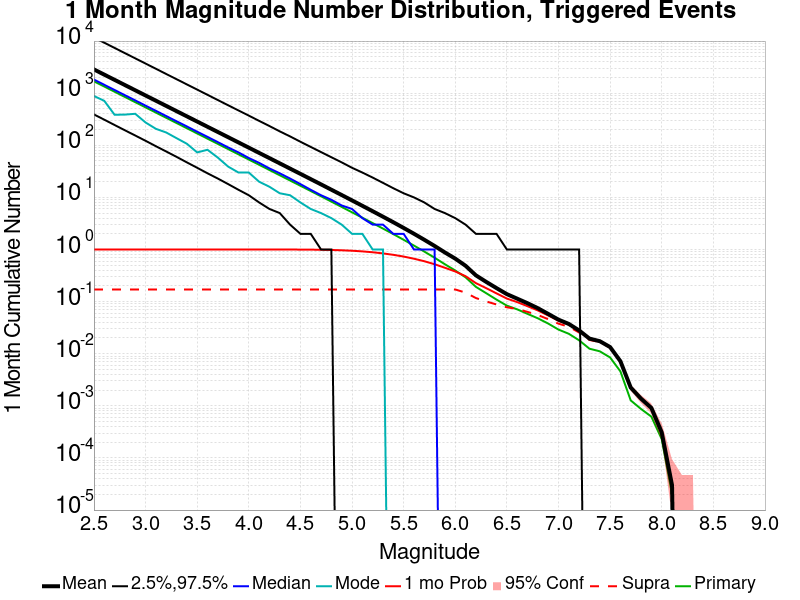

| Mag | Mean | 2.5 %ile | 97.5 %ile | Median | Mode | 1 mo Probability | 1 mo Supra-Seis Prob | Primary Aftershocks Mean |
|-----|-----|-----|-----|-----|-----|-----|-----|-----|
| **M&ge;2.5** | 2856.122 | 390.000 | 11733.000 | 1820.000 | 905.000 | 1.000 (100.00%) | 0.171 (17.07%) | 1688.644 |
| **M&ge;2.6** | 2268.611 | 309.000 | 9323.000 | 1445.000 | 713.000 | 1.000 (100.00%) | 0.171 (17.07%) | 1341.277 |
| **M&ge;2.7** | 1801.827 | 244.000 | 7399.000 | 1148.000 | 629.000 | 1.000 (100.00%) | 0.171 (17.07%) | 1065.237 |
| **M&ge;2.8** | 1431.115 | 193.000 | 5873.000 | 912.000 | 388.000 | 1.000 (100.00%) | 0.171 (17.07%) | 846.077 |
| **M&ge;2.9** | 1136.764 | 154.000 | 4676.000 | 724.000 | 402.000 | 1.000 (100.00%) | 0.171 (17.07%) | 672.058 |
| **M&ge;3** | 902.893 | 121.000 | 3715.000 | 575.000 | 318.000 | 1.000 (100.00%) | 0.171 (17.07%) | 533.774 |
| **M&ge;3.1** | 717.208 | 96.000 | 2953.000 | 457.000 | 256.000 | 1.000 (100.00%) | 0.171 (17.07%) | 423.995 |
| **M&ge;3.2** | 569.707 | 76.000 | 2342.000 | 363.000 | 176.000 | 1.000 (100.00%) | 0.171 (17.07%) | 336.805 |
| **M&ge;3.3** | 452.505 | 60.000 | 1864.000 | 288.000 | 157.000 | 1.000 (100.00%) | 0.171 (17.07%) | 267.532 |
| **M&ge;3.4** | 359.361 | 47.000 | 1479.000 | 229.000 | 107.000 | 1.000 (100.00%) | 0.171 (17.07%) | 212.444 |
| **M&ge;3.5** | 285.396 | 37.000 | 1175.000 | 182.000 | 91.000 | 1.000 (100.00%) | 0.171 (17.07%) | 168.716 |
| **M&ge;3.6** | 226.644 | 29.000 | 933.000 | 144.000 | 82.000 | 1.000 (100.00%) | 0.171 (17.07%) | 133.981 |
| **M&ge;3.7** | 179.981 | 23.000 | 742.000 | 115.000 | 58.000 | 1.000 (100.00%) | 0.171 (17.07%) | 106.394 |
| **M&ge;3.8** | 142.936 | 18.000 | 589.000 | 91.000 | 44.000 | 1.000 (100.00%) | 0.171 (17.07%) | 84.506 |
| **M&ge;3.9** | 113.484 | 14.000 | 468.000 | 72.000 | 30.000 | 1.000 (100.00%) | 0.171 (17.07%) | 67.085 |
| **M&ge;4** | 90.071 | 10.000 | 372.000 | 57.000 | 30.000 | 1.000 (100.00%) | 0.171 (17.07%) | 53.238 |
| **M&ge;4.1** | 71.485 | 8.000 | 296.000 | 46.000 | 20.000 | 1.000 (99.99%) | 0.171 (17.07%) | 42.253 |
| **M&ge;4.2** | 56.726 | 6.000 | 235.000 | 36.000 | 20.000 | 1.000 (99.97%) | 0.171 (17.07%) | 33.530 |
| **M&ge;4.3** | 44.996 | 5.000 | 185.000 | 29.000 | 12.000 | 0.999 (99.94%) | 0.171 (17.07%) | 26.595 |
| **M&ge;4.4** | 35.684 | 3.000 | 148.000 | 23.000 | 11.000 | 0.999 (99.86%) | 0.171 (17.07%) | 21.096 |
| **M&ge;4.5** | 28.297 | 2.000 | 118.000 | 18.000 | 8.000 | 0.997 (99.71%) | 0.171 (17.07%) | 16.734 |
| **M&ge;4.6** | 22.421 | 2.000 | 94.000 | 14.000 | 8.000 | 0.994 (99.38%) | 0.171 (17.07%) | 13.254 |
| **M&ge;4.7** | 17.759 | 1.000 | 75.000 | 11.000 | 5.000 | 0.988 (98.83%) | 0.171 (17.07%) | 10.497 |
| **M&ge;4.8** | 14.035 | 1.000 | 60.000 | 9.000 | 4.000 | 0.979 (97.94%) | 0.171 (17.07%) | 8.295 |
| **M&ge;4.9** | 11.104 | 0.000 | 47.000 | 7.000 | 2.000 | 0.966 (96.61%) | 0.171 (17.07%) | 6.565 |
| **M&ge;5** | 8.759 | 0.000 | 37.000 | 6.000 | 2.000 | 0.947 (94.74%) | 0.171 (17.07%) | 5.178 |
| **M&ge;5.1** | 6.904 | 0.000 | 30.000 | 4.000 | 2.000 | 0.921 (92.10%) | 0.171 (17.07%) | 4.083 |
| **M&ge;5.2** | 5.433 | 0.000 | 24.000 | 3.000 | 1.000 | 0.885 (88.54%) | 0.171 (17.07%) | 3.215 |
| **M&ge;5.3** | 4.259 | 0.000 | 19.000 | 3.000 | 1.000 | 0.841 (84.13%) | 0.171 (17.07%) | 2.519 |
| **M&ge;5.4** | 3.332 | 0.000 | 15.000 | 2.000 | 0.000 | 0.790 (78.98%) | 0.171 (17.07%) | 1.973 |
| **M&ge;5.5** | 2.592 | 0.000 | 12.000 | 2.000 | 0.000 | 0.732 (73.16%) | 0.171 (17.07%) | 1.534 |
| **M&ge;5.6** | 2.004 | 0.000 | 10.000 | 1.000 | 0.000 | 0.665 (66.52%) | 0.171 (17.07%) | 1.187 |
| **M&ge;5.7** | 1.536 | 0.000 | 8.000 | 1.000 | 0.000 | 0.595 (59.50%) | 0.171 (17.07%) | 0.912 |
| **M&ge;5.8** | 1.168 | 0.000 | 6.000 | 1.000 | 0.000 | 0.521 (52.14%) | 0.171 (17.07%) | 0.694 |
| **M&ge;5.9** | 0.874 | 0.000 | 5.000 | 0.000 | 0.000 | 0.444 (44.45%) | 0.171 (17.06%) | 0.519 |
| **M&ge;6** | 0.668 | 0.000 | 4.000 | 0.000 | 0.000 | 0.378 (37.82%) | 0.171 (17.05%) | 0.394 |
| **M&ge;6.1** | 0.486 | 0.000 | 3.000 | 0.000 | 0.000 | 0.306 (30.58%) | 0.148 (14.83%) | 0.292 |
| **M&ge;6.2** | 0.319 | 0.000 | 2.000 | 0.000 | 0.000 | 0.225 (22.52%) | 0.117 (11.68%) | 0.191 |
| **M&ge;6.3** | 0.239 | 0.000 | 2.000 | 0.000 | 0.000 | 0.181 (18.07%) | 0.101 (10.07%) | 0.145 |
| **M&ge;6.4** | 0.181 | 0.000 | 2.000 | 0.000 | 0.000 | 0.143 (14.32%) | 0.088 (8.81%) | 0.109 |
| **M&ge;6.5** | 0.139 | 0.000 | 1.000 | 0.000 | 0.000 | 0.114 (11.39%) | 0.078 (7.81%) | 0.083 |
| **M&ge;6.6** | 0.114 | 0.000 | 1.000 | 0.000 | 0.000 | 0.098 (9.75%) | 0.072 (7.25%) | 0.071 |
| **M&ge;6.7** | 0.093 | 0.000 | 1.000 | 0.000 | 0.000 | 0.081 (8.13%) | 0.064 (6.35%) | 0.058 |
| **M&ge;6.8** | 0.075 | 0.000 | 1.000 | 0.000 | 0.000 | 0.068 (6.75%) | 0.055 (5.53%) | 0.048 |
| **M&ge;6.9** | 0.058 | 0.000 | 1.000 | 0.000 | 0.000 | 0.054 (5.42%) | 0.046 (4.62%) | 0.038 |
| **M&ge;7** | 0.045 | 0.000 | 1.000 | 0.000 | 0.000 | 0.043 (4.29%) | 0.038 (3.78%) | 0.029 |
| **M&ge;7.1** | 0.037 | 0.000 | 1.000 | 0.000 | 0.000 | 0.036 (3.60%) | 0.033 (3.29%) | 0.024 |
| **M&ge;7.2** | 0.028 | 0.000 | 1.000 | 0.000 | 0.000 | 0.027 (2.70%) | 0.025 (2.52%) | 0.018 |
| **M&ge;7.3** | 0.019 | 0.000 | 0.000 | 0.000 | 0.000 | 0.019 (1.91%) | 0.018 (1.83%) | 0.012 |
| **M&ge;7.4** | 0.017 | 0.000 | 0.000 | 0.000 | 0.000 | 0.017 (1.71%) | 0.017 (1.67%) | 0.011 |
| **M&ge;7.5** | 0.013 | 0.000 | 0.000 | 0.000 | 0.000 | 0.013 (1.33%) | 0.013 (1.32%) | 8.50E-3 |
| **M&ge;7.6** | 7.29E-3 | 0.000 | 0.000 | 0.000 | 0.000 | 7.23E-3 (0.72%) | 7.16E-3 (0.72%) | 4.68E-3 |
| **M&ge;7.7** | 2.29E-3 | 0.000 | 0.000 | 0.000 | 0.000 | 2.28E-3 (0.23%) | 2.26E-3 (0.23%) | 1.30E-3 |
| **M&ge;7.8** | 1.43E-3 | 0.000 | 0.000 | 0.000 | 0.000 | 1.43E-3 (0.14%) | 1.43E-3 (0.14%) | 8.77E-4 |
| **M&ge;7.9** | 9.34E-4 | 0.000 | 0.000 | 0.000 | 0.000 | 9.34E-4 (0.09%) | 9.34E-4 (0.09%) | 6.22E-4 |
| **M&ge;8** | 3.25E-4 | 0.000 | 0.000 | 0.000 | 0.000 | 3.25E-4 (0.03%) | 3.25E-4 (0.03%) | 2.40E-4 |
| **M&ge;8.1** | 2.83E-5 | 0.000 | 0.000 | 0.000 | 0.000 | 2.83E-5 (0.00%) | 2.83E-5 (0.00%) | 2.83E-5 |
| **M&ge;8.2** | 0.000 | 0.000 | 0.000 | 0.000 | 0.000 | 0.000 (0.00%) | 0.000 (0.00%) | 0.000 |
| **M&ge;8.3** | 0.000 | 0.000 | 0.000 | 0.000 | 0.000 | 0.000 (0.00%) | 0.000 (0.00%) | 0.000 |
| **M&ge;8.4** | 0.000 | 0.000 | 0.000 | 0.000 | 0.000 | 0.000 (0.00%) | 0.000 (0.00%) | 0.000 |
| **M&ge;8.5** | 0.000 | 0.000 | 0.000 | 0.000 | 0.000 | 0.000 (0.00%) | 0.000 (0.00%) | 0.000 |
| **M&ge;8.6** | 0.000 | 0.000 | 0.000 | 0.000 | 0.000 | 0.000 (0.00%) | 0.000 (0.00%) | 0.000 |
| **M&ge;8.7** | 0.000 | 0.000 | 0.000 | 0.000 | 0.000 | 0.000 (0.00%) | 0.000 (0.00%) | 0.000 |
| **M&ge;8.8** | 0.000 | 0.000 | 0.000 | 0.000 | 0.000 | 0.000 (0.00%) | 0.000 (0.00%) | 0.000 |
| **M&ge;8.9** | 0.000 | 0.000 | 0.000 | 0.000 | 0.000 | 0.000 (0.00%) | 0.000 (0.00%) | 0.000 |
| **M&ge;9** | 0.000 | 0.000 | 0.000 | 0.000 | 0.000 | 0.000 (0.00%) | 0.000 (0.00%) | 0.000 |

### 1 Week Magnitude Number Distribution
*[(top)](#table-of-contents)*

**Legend**
* **Mean** (thick black line): mean expected number across all 70693 catalogs
* **2.5%,97.5%** (thin black lines): expected number percentiles across all 70693 catalogs
* **Median** (thin blue line): median expected number across all 70693 catalogs
* **Mode** (thin cyan line): modal expected number across all 70693 catalogs
* **1 wk Probability** (thin red line): 1 week probability calculated as the fraction of catalogs with at least 1 occurrence
* **1 wk Supraseismogenic Probability** (thin dashed red line): same as above, but only for supraseismogenic ruptures on explicitly modeled UCERF3 faults
* **95% Conf** (light red shaded region): binomial 95% confidence bounds on probability
* **Primary** (thin green line): mean expected number from primary triggered aftershocks only (no secondary, tertiary, etc...) across all 70693 catalogs


| Mag | Mean | 2.5 %ile | 97.5 %ile | Median | Mode | 1 wk Probability | 1 wk Supra-Seis Prob | Primary Aftershocks Mean |
|-----|-----|-----|-----|-----|-----|-----|-----|-----|
| **M&ge;2.5** | 2206.118 | 287.000 | 9101.000 | 1403.000 | 770.000 | 1.000 (100.00%) | 0.140 (13.97%) | 1429.652 |
| **M&ge;2.6** | 1752.253 | 228.000 | 7235.000 | 1115.000 | 366.000 | 1.000 (100.00%) | 0.140 (13.97%) | 1135.543 |
| **M&ge;2.7** | 1391.684 | 180.000 | 5738.000 | 885.000 | 443.000 | 1.000 (100.00%) | 0.140 (13.97%) | 901.851 |
| **M&ge;2.8** | 1105.347 | 143.000 | 4560.000 | 703.000 | 343.000 | 1.000 (100.00%) | 0.140 (13.97%) | 716.306 |
| **M&ge;2.9** | 878.031 | 113.000 | 3622.000 | 558.000 | 297.000 | 1.000 (100.00%) | 0.140 (13.97%) | 569.009 |
| **M&ge;3** | 697.377 | 90.000 | 2876.000 | 443.000 | 225.000 | 1.000 (100.00%) | 0.140 (13.97%) | 451.940 |
| **M&ge;3.1** | 553.967 | 71.000 | 2281.000 | 352.000 | 173.000 | 1.000 (100.00%) | 0.140 (13.97%) | 359.005 |
| **M&ge;3.2** | 440.041 | 56.000 | 1812.000 | 280.000 | 160.000 | 1.000 (100.00%) | 0.140 (13.97%) | 285.185 |
| **M&ge;3.3** | 349.511 | 44.000 | 1441.000 | 222.000 | 108.000 | 1.000 (100.00%) | 0.140 (13.97%) | 226.536 |
| **M&ge;3.4** | 277.578 | 35.000 | 1147.000 | 176.000 | 88.000 | 1.000 (100.00%) | 0.140 (13.97%) | 179.900 |
| **M&ge;3.5** | 220.425 | 27.000 | 911.000 | 140.000 | 67.000 | 1.000 (100.00%) | 0.140 (13.97%) | 142.863 |
| **M&ge;3.6** | 175.047 | 21.000 | 723.000 | 111.000 | 46.000 | 1.000 (100.00%) | 0.140 (13.97%) | 113.452 |
| **M&ge;3.7** | 139.022 | 17.000 | 574.000 | 88.000 | 40.000 | 1.000 (100.00%) | 0.140 (13.97%) | 90.096 |
| **M&ge;3.8** | 110.415 | 13.000 | 455.000 | 70.000 | 30.000 | 1.000 (100.00%) | 0.140 (13.97%) | 71.563 |
| **M&ge;3.9** | 87.659 | 10.000 | 363.000 | 56.000 | 30.000 | 1.000 (100.00%) | 0.140 (13.97%) | 56.807 |
| **M&ge;4** | 69.579 | 7.000 | 289.000 | 44.000 | 18.000 | 1.000 (99.99%) | 0.140 (13.97%) | 45.083 |
| **M&ge;4.1** | 55.221 | 6.000 | 229.000 | 35.000 | 17.000 | 1.000 (99.97%) | 0.140 (13.97%) | 35.780 |
| **M&ge;4.2** | 43.807 | 4.000 | 181.000 | 28.000 | 13.000 | 0.999 (99.92%) | 0.140 (13.97%) | 28.384 |
| **M&ge;4.3** | 34.747 | 3.000 | 144.000 | 22.000 | 9.000 | 0.998 (99.83%) | 0.140 (13.97%) | 22.513 |
| **M&ge;4.4** | 27.559 | 2.000 | 115.000 | 18.000 | 9.000 | 0.997 (99.66%) | 0.140 (13.97%) | 17.856 |
| **M&ge;4.5** | 21.851 | 1.000 | 91.000 | 14.000 | 7.000 | 0.993 (99.28%) | 0.140 (13.97%) | 14.161 |
| **M&ge;4.6** | 17.308 | 1.000 | 72.000 | 11.000 | 5.000 | 0.987 (98.70%) | 0.140 (13.97%) | 11.216 |
| **M&ge;4.7** | 13.705 | 1.000 | 58.000 | 9.000 | 3.000 | 0.977 (97.75%) | 0.140 (13.97%) | 8.879 |
| **M&ge;4.8** | 10.834 | 0.000 | 46.000 | 7.000 | 3.000 | 0.963 (96.33%) | 0.140 (13.97%) | 7.016 |
| **M&ge;4.9** | 8.571 | 0.000 | 37.000 | 5.000 | 2.000 | 0.943 (94.33%) | 0.140 (13.97%) | 5.553 |
| **M&ge;5** | 6.762 | 0.000 | 29.000 | 4.000 | 2.000 | 0.918 (91.76%) | 0.140 (13.97%) | 4.380 |
| **M&ge;5.1** | 5.332 | 0.000 | 23.000 | 3.000 | 1.000 | 0.883 (88.33%) | 0.140 (13.97%) | 3.454 |
| **M&ge;5.2** | 4.195 | 0.000 | 19.000 | 3.000 | 1.000 | 0.840 (83.97%) | 0.140 (13.97%) | 2.718 |
| **M&ge;5.3** | 3.290 | 0.000 | 15.000 | 2.000 | 0.000 | 0.788 (78.81%) | 0.140 (13.97%) | 2.130 |
| **M&ge;5.4** | 2.575 | 0.000 | 12.000 | 1.000 | 0.000 | 0.731 (73.06%) | 0.140 (13.97%) | 1.667 |
| **M&ge;5.5** | 2.002 | 0.000 | 10.000 | 1.000 | 0.000 | 0.668 (66.79%) | 0.140 (13.97%) | 1.297 |
| **M&ge;5.6** | 1.548 | 0.000 | 8.000 | 1.000 | 0.000 | 0.598 (59.77%) | 0.140 (13.97%) | 1.004 |
| **M&ge;5.7** | 1.187 | 0.000 | 6.000 | 1.000 | 0.000 | 0.526 (52.57%) | 0.140 (13.97%) | 0.771 |
| **M&ge;5.8** | 0.904 | 0.000 | 5.000 | 0.000 | 0.000 | 0.454 (45.43%) | 0.140 (13.97%) | 0.588 |
| **M&ge;5.9** | 0.676 | 0.000 | 4.000 | 0.000 | 0.000 | 0.381 (38.14%) | 0.140 (13.96%) | 0.439 |
| **M&ge;6** | 0.516 | 0.000 | 3.000 | 0.000 | 0.000 | 0.320 (32.01%) | 0.140 (13.96%) | 0.333 |
| **M&ge;6.1** | 0.377 | 0.000 | 3.000 | 0.000 | 0.000 | 0.256 (25.60%) | 0.122 (12.16%) | 0.246 |
| **M&ge;6.2** | 0.247 | 0.000 | 2.000 | 0.000 | 0.000 | 0.185 (18.50%) | 0.095 (9.50%) | 0.161 |
| **M&ge;6.3** | 0.186 | 0.000 | 2.000 | 0.000 | 0.000 | 0.148 (14.79%) | 0.082 (8.18%) | 0.122 |
| **M&ge;6.4** | 0.141 | 0.000 | 1.000 | 0.000 | 0.000 | 0.116 (11.61%) | 0.071 (7.14%) | 0.092 |
| **M&ge;6.5** | 0.108 | 0.000 | 1.000 | 0.000 | 0.000 | 0.092 (9.20%) | 0.063 (6.31%) | 0.070 |
| **M&ge;6.6** | 0.089 | 0.000 | 1.000 | 0.000 | 0.000 | 0.079 (7.87%) | 0.059 (5.88%) | 0.060 |
| **M&ge;6.7** | 0.073 | 0.000 | 1.000 | 0.000 | 0.000 | 0.065 (6.54%) | 0.051 (5.14%) | 0.049 |
| **M&ge;6.8** | 0.059 | 0.000 | 1.000 | 0.000 | 0.000 | 0.054 (5.44%) | 0.045 (4.47%) | 0.040 |
| **M&ge;6.9** | 0.046 | 0.000 | 1.000 | 0.000 | 0.000 | 0.044 (4.38%) | 0.037 (3.74%) | 0.032 |
| **M&ge;7** | 0.036 | 0.000 | 1.000 | 0.000 | 0.000 | 0.034 (3.45%) | 0.031 (3.05%) | 0.025 |
| **M&ge;7.1** | 0.030 | 0.000 | 1.000 | 0.000 | 0.000 | 0.029 (2.90%) | 0.027 (2.65%) | 0.020 |
| **M&ge;7.2** | 0.022 | 0.000 | 0.000 | 0.000 | 0.000 | 0.022 (2.16%) | 0.020 (2.02%) | 0.015 |
| **M&ge;7.3** | 0.016 | 0.000 | 0.000 | 0.000 | 0.000 | 0.015 (1.53%) | 0.015 (1.47%) | 0.011 |
| **M&ge;7.4** | 0.014 | 0.000 | 0.000 | 0.000 | 0.000 | 0.014 (1.37%) | 0.013 (1.34%) | 9.51E-3 |
| **M&ge;7.5** | 0.011 | 0.000 | 0.000 | 0.000 | 0.000 | 0.011 (1.07%) | 0.011 (1.07%) | 7.29E-3 |
| **M&ge;7.6** | 6.07E-3 | 0.000 | 0.000 | 0.000 | 0.000 | 6.03E-3 (0.60%) | 5.97E-3 (0.60%) | 4.17E-3 |
| **M&ge;7.7** | 1.90E-3 | 0.000 | 0.000 | 0.000 | 0.000 | 1.90E-3 (0.19%) | 1.88E-3 (0.19%) | 1.17E-3 |
| **M&ge;7.8** | 1.20E-3 | 0.000 | 0.000 | 0.000 | 0.000 | 1.20E-3 (0.12%) | 1.20E-3 (0.12%) | 7.78E-4 |
| **M&ge;7.9** | 8.35E-4 | 0.000 | 0.000 | 0.000 | 0.000 | 8.35E-4 (0.08%) | 8.35E-4 (0.08%) | 5.66E-4 |
| **M&ge;8** | 3.11E-4 | 0.000 | 0.000 | 0.000 | 0.000 | 3.11E-4 (0.03%) | 3.11E-4 (0.03%) | 2.26E-4 |
| **M&ge;8.1** | 2.83E-5 | 0.000 | 0.000 | 0.000 | 0.000 | 2.83E-5 (0.00%) | 2.83E-5 (0.00%) | 2.83E-5 |
| **M&ge;8.2** | 0.000 | 0.000 | 0.000 | 0.000 | 0.000 | 0.000 (0.00%) | 0.000 (0.00%) | 0.000 |
| **M&ge;8.3** | 0.000 | 0.000 | 0.000 | 0.000 | 0.000 | 0.000 (0.00%) | 0.000 (0.00%) | 0.000 |
| **M&ge;8.4** | 0.000 | 0.000 | 0.000 | 0.000 | 0.000 | 0.000 (0.00%) | 0.000 (0.00%) | 0.000 |
| **M&ge;8.5** | 0.000 | 0.000 | 0.000 | 0.000 | 0.000 | 0.000 (0.00%) | 0.000 (0.00%) | 0.000 |
| **M&ge;8.6** | 0.000 | 0.000 | 0.000 | 0.000 | 0.000 | 0.000 (0.00%) | 0.000 (0.00%) | 0.000 |
| **M&ge;8.7** | 0.000 | 0.000 | 0.000 | 0.000 | 0.000 | 0.000 (0.00%) | 0.000 (0.00%) | 0.000 |
| **M&ge;8.8** | 0.000 | 0.000 | 0.000 | 0.000 | 0.000 | 0.000 (0.00%) | 0.000 (0.00%) | 0.000 |
| **M&ge;8.9** | 0.000 | 0.000 | 0.000 | 0.000 | 0.000 | 0.000 (0.00%) | 0.000 (0.00%) | 0.000 |
| **M&ge;9** | 0.000 | 0.000 | 0.000 | 0.000 | 0.000 | 0.000 (0.00%) | 0.000 (0.00%) | 0.000 |

### 1 Day Magnitude Number Distribution
*[(top)](#table-of-contents)*

**Legend**
* **Mean** (thick black line): mean expected number across all 70693 catalogs
* **2.5%,97.5%** (thin black lines): expected number percentiles across all 70693 catalogs
* **Median** (thin blue line): median expected number across all 70693 catalogs
* **Mode** (thin cyan line): modal expected number across all 70693 catalogs
* **1 d Probability** (thin red line): 1 day probability calculated as the fraction of catalogs with at least 1 occurrence
* **1 d Supraseismogenic Probability** (thin dashed red line): same as above, but only for supraseismogenic ruptures on explicitly modeled UCERF3 faults
* **95% Conf** (light red shaded region): binomial 95% confidence bounds on probability
* **Primary** (thin green line): mean expected number from primary triggered aftershocks only (no secondary, tertiary, etc...) across all 70693 catalogs


| Mag | Mean | 2.5 %ile | 97.5 %ile | Median | Mode | 1 d Probability | 1 d Supra-Seis Prob | Primary Aftershocks Mean |
|-----|-----|-----|-----|-----|-----|-----|-----|-----|
| **M&ge;2.5** | 1447.632 | 169.000 | 5970.000 | 919.000 | 392.000 | 1.000 (100.00%) | 0.099 (9.93%) | 1063.501 |
| **M&ge;2.6** | 1149.775 | 134.000 | 4740.000 | 731.000 | 231.000 | 1.000 (100.00%) | 0.099 (9.93%) | 844.699 |
| **M&ge;2.7** | 913.183 | 107.000 | 3775.000 | 580.000 | 312.000 | 1.000 (100.00%) | 0.099 (9.93%) | 670.861 |
| **M&ge;2.8** | 725.311 | 84.000 | 3001.000 | 461.000 | 243.000 | 1.000 (100.00%) | 0.099 (9.93%) | 532.832 |
| **M&ge;2.9** | 576.172 | 67.000 | 2387.000 | 366.000 | 108.000 | 1.000 (100.00%) | 0.099 (9.93%) | 423.280 |
| **M&ge;3** | 457.605 | 53.000 | 1894.000 | 291.000 | 175.000 | 1.000 (100.00%) | 0.099 (9.93%) | 336.152 |
| **M&ge;3.1** | 363.505 | 42.000 | 1504.000 | 231.000 | 115.000 | 1.000 (100.00%) | 0.099 (9.93%) | 267.035 |
| **M&ge;3.2** | 288.741 | 33.000 | 1195.000 | 183.000 | 68.000 | 1.000 (100.00%) | 0.099 (9.93%) | 212.129 |
| **M&ge;3.3** | 229.338 | 26.000 | 949.000 | 145.000 | 61.000 | 1.000 (100.00%) | 0.099 (9.93%) | 168.506 |
| **M&ge;3.4** | 182.116 | 20.000 | 754.000 | 116.000 | 61.000 | 1.000 (100.00%) | 0.099 (9.93%) | 133.811 |
| **M&ge;3.5** | 144.639 | 16.000 | 601.000 | 92.000 | 41.000 | 1.000 (100.00%) | 0.099 (9.93%) | 106.264 |
| **M&ge;3.6** | 114.863 | 12.000 | 476.000 | 73.000 | 41.000 | 1.000 (100.00%) | 0.099 (9.93%) | 84.386 |
| **M&ge;3.7** | 91.208 | 9.000 | 379.000 | 58.000 | 28.000 | 1.000 (99.99%) | 0.099 (9.93%) | 67.003 |
| **M&ge;3.8** | 72.439 | 7.000 | 301.000 | 46.000 | 22.000 | 1.000 (99.98%) | 0.099 (9.93%) | 53.213 |
| **M&ge;3.9** | 57.505 | 5.000 | 240.000 | 36.000 | 15.000 | 1.000 (99.96%) | 0.099 (9.93%) | 42.234 |
| **M&ge;4** | 45.640 | 4.000 | 190.000 | 29.000 | 16.000 | 0.999 (99.90%) | 0.099 (9.93%) | 33.515 |
| **M&ge;4.1** | 36.227 | 3.000 | 150.000 | 23.000 | 13.000 | 0.998 (99.80%) | 0.099 (9.93%) | 26.601 |
| **M&ge;4.2** | 28.732 | 2.000 | 120.000 | 18.000 | 10.000 | 0.996 (99.57%) | 0.099 (9.93%) | 21.099 |
| **M&ge;4.3** | 22.796 | 1.000 | 95.000 | 14.000 | 5.000 | 0.992 (99.24%) | 0.099 (9.93%) | 16.740 |
| **M&ge;4.4** | 18.075 | 1.000 | 75.000 | 11.000 | 4.000 | 0.987 (98.66%) | 0.099 (9.93%) | 13.276 |
| **M&ge;4.5** | 14.339 | 1.000 | 60.000 | 9.000 | 3.000 | 0.977 (97.70%) | 0.099 (9.93%) | 10.533 |
| **M&ge;4.6** | 11.349 | 0.000 | 48.000 | 7.000 | 3.000 | 0.963 (96.28%) | 0.099 (9.93%) | 8.337 |
| **M&ge;4.7** | 8.989 | 0.000 | 38.000 | 6.000 | 2.000 | 0.944 (94.39%) | 0.099 (9.93%) | 6.603 |
| **M&ge;4.8** | 7.105 | 0.000 | 31.000 | 4.000 | 2.000 | 0.920 (91.99%) | 0.099 (9.93%) | 5.218 |
| **M&ge;4.9** | 5.622 | 0.000 | 24.000 | 3.000 | 1.000 | 0.888 (88.85%) | 0.099 (9.93%) | 4.131 |
| **M&ge;5** | 4.434 | 0.000 | 20.000 | 3.000 | 1.000 | 0.850 (84.98%) | 0.099 (9.93%) | 3.259 |
| **M&ge;5.1** | 3.497 | 0.000 | 16.000 | 2.000 | 1.000 | 0.803 (80.28%) | 0.099 (9.93%) | 2.570 |
| **M&ge;5.2** | 2.751 | 0.000 | 13.000 | 2.000 | 0.000 | 0.748 (74.83%) | 0.099 (9.93%) | 2.022 |
| **M&ge;5.3** | 2.157 | 0.000 | 10.000 | 1.000 | 0.000 | 0.687 (68.69%) | 0.099 (9.93%) | 1.584 |
| **M&ge;5.4** | 1.688 | 0.000 | 8.000 | 1.000 | 0.000 | 0.622 (62.18%) | 0.099 (9.93%) | 1.239 |
| **M&ge;5.5** | 1.313 | 0.000 | 7.000 | 1.000 | 0.000 | 0.556 (55.59%) | 0.099 (9.93%) | 0.963 |
| **M&ge;5.6** | 1.015 | 0.000 | 5.000 | 0.000 | 0.000 | 0.485 (48.52%) | 0.099 (9.93%) | 0.745 |
| **M&ge;5.7** | 0.778 | 0.000 | 4.000 | 0.000 | 0.000 | 0.417 (41.68%) | 0.099 (9.93%) | 0.572 |
| **M&ge;5.8** | 0.594 | 0.000 | 4.000 | 0.000 | 0.000 | 0.353 (35.27%) | 0.099 (9.93%) | 0.436 |
| **M&ge;5.9** | 0.444 | 0.000 | 3.000 | 0.000 | 0.000 | 0.290 (28.99%) | 0.099 (9.92%) | 0.326 |
| **M&ge;6** | 0.338 | 0.000 | 2.000 | 0.000 | 0.000 | 0.238 (23.81%) | 0.099 (9.92%) | 0.248 |
| **M&ge;6.1** | 0.248 | 0.000 | 2.000 | 0.000 | 0.000 | 0.187 (18.68%) | 0.087 (8.68%) | 0.183 |
| **M&ge;6.2** | 0.162 | 0.000 | 1.000 | 0.000 | 0.000 | 0.132 (13.17%) | 0.067 (6.71%) | 0.120 |
| **M&ge;6.3** | 0.123 | 0.000 | 1.000 | 0.000 | 0.000 | 0.104 (10.44%) | 0.058 (5.80%) | 0.091 |
| **M&ge;6.4** | 0.093 | 0.000 | 1.000 | 0.000 | 0.000 | 0.081 (8.11%) | 0.051 (5.05%) | 0.069 |
| **M&ge;6.5** | 0.072 | 0.000 | 1.000 | 0.000 | 0.000 | 0.064 (6.42%) | 0.045 (4.48%) | 0.053 |
| **M&ge;6.6** | 0.060 | 0.000 | 1.000 | 0.000 | 0.000 | 0.055 (5.55%) | 0.042 (4.17%) | 0.045 |
| **M&ge;6.7** | 0.049 | 0.000 | 1.000 | 0.000 | 0.000 | 0.046 (4.60%) | 0.036 (3.65%) | 0.037 |
| **M&ge;6.8** | 0.040 | 0.000 | 1.000 | 0.000 | 0.000 | 0.038 (3.84%) | 0.032 (3.19%) | 0.031 |
| **M&ge;6.9** | 0.032 | 0.000 | 1.000 | 0.000 | 0.000 | 0.031 (3.08%) | 0.026 (2.65%) | 0.025 |
| **M&ge;7** | 0.025 | 0.000 | 0.000 | 0.000 | 0.000 | 0.024 (2.41%) | 0.021 (2.14%) | 0.019 |
| **M&ge;7.1** | 0.020 | 0.000 | 0.000 | 0.000 | 0.000 | 0.020 (2.00%) | 0.018 (1.85%) | 0.015 |
| **M&ge;7.2** | 0.015 | 0.000 | 0.000 | 0.000 | 0.000 | 0.015 (1.48%) | 0.014 (1.39%) | 0.011 |
| **M&ge;7.3** | 0.011 | 0.000 | 0.000 | 0.000 | 0.000 | 0.010 (1.05%) | 0.010 (1.01%) | 8.12E-3 |
| **M&ge;7.4** | 9.41E-3 | 0.000 | 0.000 | 0.000 | 0.000 | 9.36E-3 (0.94%) | 9.22E-3 (0.92%) | 7.26E-3 |
| **M&ge;7.5** | 7.40E-3 | 0.000 | 0.000 | 0.000 | 0.000 | 7.40E-3 (0.74%) | 7.37E-3 (0.74%) | 5.64E-3 |
| **M&ge;7.6** | 4.24E-3 | 0.000 | 0.000 | 0.000 | 0.000 | 4.24E-3 (0.42%) | 4.23E-3 (0.42%) | 3.28E-3 |
| **M&ge;7.7** | 1.41E-3 | 0.000 | 0.000 | 0.000 | 0.000 | 1.41E-3 (0.14%) | 1.40E-3 (0.14%) | 1.00E-3 |
| **M&ge;7.8** | 9.05E-4 | 0.000 | 0.000 | 0.000 | 0.000 | 9.05E-4 (0.09%) | 9.05E-4 (0.09%) | 6.65E-4 |
| **M&ge;7.9** | 6.08E-4 | 0.000 | 0.000 | 0.000 | 0.000 | 6.08E-4 (0.06%) | 6.08E-4 (0.06%) | 4.53E-4 |
| **M&ge;8** | 2.12E-4 | 0.000 | 0.000 | 0.000 | 0.000 | 2.12E-4 (0.02%) | 2.12E-4 (0.02%) | 1.84E-4 |
| **M&ge;8.1** | 2.83E-5 | 0.000 | 0.000 | 0.000 | 0.000 | 2.83E-5 (0.00%) | 2.83E-5 (0.00%) | 2.83E-5 |
| **M&ge;8.2** | 0.000 | 0.000 | 0.000 | 0.000 | 0.000 | 0.000 (0.00%) | 0.000 (0.00%) | 0.000 |
| **M&ge;8.3** | 0.000 | 0.000 | 0.000 | 0.000 | 0.000 | 0.000 (0.00%) | 0.000 (0.00%) | 0.000 |
| **M&ge;8.4** | 0.000 | 0.000 | 0.000 | 0.000 | 0.000 | 0.000 (0.00%) | 0.000 (0.00%) | 0.000 |
| **M&ge;8.5** | 0.000 | 0.000 | 0.000 | 0.000 | 0.000 | 0.000 (0.00%) | 0.000 (0.00%) | 0.000 |
| **M&ge;8.6** | 0.000 | 0.000 | 0.000 | 0.000 | 0.000 | 0.000 (0.00%) | 0.000 (0.00%) | 0.000 |
| **M&ge;8.7** | 0.000 | 0.000 | 0.000 | 0.000 | 0.000 | 0.000 (0.00%) | 0.000 (0.00%) | 0.000 |
| **M&ge;8.8** | 0.000 | 0.000 | 0.000 | 0.000 | 0.000 | 0.000 (0.00%) | 0.000 (0.00%) | 0.000 |
| **M&ge;8.9** | 0.000 | 0.000 | 0.000 | 0.000 | 0.000 | 0.000 (0.00%) | 0.000 (0.00%) | 0.000 |
| **M&ge;9** | 0.000 | 0.000 | 0.000 | 0.000 | 0.000 | 0.000 (0.00%) | 0.000 (0.00%) | 0.000 |

### 1 Hour Magnitude Number Distribution
*[(top)](#table-of-contents)*

**Legend**
* **Mean** (thick black line): mean expected number across all 70693 catalogs
* **2.5%,97.5%** (thin black lines): expected number percentiles across all 70693 catalogs
* **Median** (thin blue line): median expected number across all 70693 catalogs
* **Mode** (thin cyan line): modal expected number across all 70693 catalogs
* **1 hr Probability** (thin red line): 1 hour probability calculated as the fraction of catalogs with at least 1 occurrence
* **1 hr Supraseismogenic Probability** (thin dashed red line): same as above, but only for supraseismogenic ruptures on explicitly modeled UCERF3 faults
* **95% Conf** (light red shaded region): binomial 95% confidence bounds on probability
* **Primary** (thin green line): mean expected number from primary triggered aftershocks only (no secondary, tertiary, etc...) across all 70693 catalogs


| Mag | Mean | 2.5 %ile | 97.5 %ile | Median | Mode | 1 hr Probability | 1 hr Supra-Seis Prob | Primary Aftershocks Mean |
|-----|-----|-----|-----|-----|-----|-----|-----|-----|
| **M&ge;2.5** | 507.327 | 55.000 | 2053.000 | 328.000 | 121.000 | 1.000 (100.00%) | 0.038 (3.84%) | 457.001 |
| **M&ge;2.6** | 402.925 | 43.000 | 1631.000 | 261.000 | 118.000 | 1.000 (100.00%) | 0.038 (3.84%) | 362.966 |
| **M&ge;2.7** | 320.023 | 34.000 | 1293.000 | 207.000 | 111.000 | 1.000 (100.00%) | 0.038 (3.84%) | 288.289 |
| **M&ge;2.8** | 254.145 | 27.000 | 1028.000 | 164.000 | 96.000 | 1.000 (100.00%) | 0.038 (3.84%) | 228.955 |
| **M&ge;2.9** | 201.877 | 21.000 | 818.000 | 131.000 | 62.000 | 1.000 (100.00%) | 0.038 (3.84%) | 181.866 |
| **M&ge;3** | 160.310 | 17.000 | 650.000 | 104.000 | 48.000 | 1.000 (100.00%) | 0.038 (3.84%) | 144.423 |
| **M&ge;3.1** | 127.312 | 13.000 | 516.000 | 82.000 | 36.000 | 1.000 (100.00%) | 0.038 (3.84%) | 114.700 |
| **M&ge;3.2** | 101.131 | 10.000 | 410.000 | 66.000 | 34.000 | 1.000 (99.99%) | 0.038 (3.84%) | 91.121 |
| **M&ge;3.3** | 80.315 | 8.000 | 326.000 | 52.000 | 26.000 | 1.000 (99.97%) | 0.038 (3.84%) | 72.368 |
| **M&ge;3.4** | 63.762 | 6.000 | 259.000 | 41.000 | 18.000 | 1.000 (99.96%) | 0.038 (3.84%) | 57.454 |
| **M&ge;3.5** | 50.637 | 4.000 | 206.000 | 33.000 | 17.000 | 0.999 (99.92%) | 0.038 (3.84%) | 45.625 |
| **M&ge;3.6** | 40.216 | 3.000 | 163.000 | 26.000 | 12.000 | 0.998 (99.84%) | 0.038 (3.84%) | 36.235 |
| **M&ge;3.7** | 31.929 | 2.000 | 130.000 | 21.000 | 9.000 | 0.997 (99.66%) | 0.038 (3.84%) | 28.769 |
| **M&ge;3.8** | 25.362 | 2.000 | 103.000 | 16.000 | 7.000 | 0.994 (99.40%) | 0.038 (3.84%) | 22.847 |
| **M&ge;3.9** | 20.121 | 1.000 | 82.000 | 13.000 | 7.000 | 0.990 (99.00%) | 0.038 (3.84%) | 18.127 |
| **M&ge;4** | 15.966 | 1.000 | 66.000 | 10.000 | 4.000 | 0.983 (98.28%) | 0.038 (3.84%) | 14.383 |
| **M&ge;4.1** | 12.678 | 0.000 | 52.000 | 8.000 | 4.000 | 0.973 (97.28%) | 0.038 (3.84%) | 11.421 |
| **M&ge;4.2** | 10.054 | 0.000 | 42.000 | 6.000 | 2.000 | 0.957 (95.72%) | 0.038 (3.84%) | 9.055 |
| **M&ge;4.3** | 7.983 | 0.000 | 33.000 | 5.000 | 2.000 | 0.937 (93.72%) | 0.038 (3.84%) | 7.190 |
| **M&ge;4.4** | 6.336 | 0.000 | 27.000 | 4.000 | 2.000 | 0.911 (91.10%) | 0.038 (3.84%) | 5.705 |
| **M&ge;4.5** | 5.030 | 0.000 | 21.000 | 3.000 | 1.000 | 0.878 (87.76%) | 0.038 (3.84%) | 4.529 |
| **M&ge;4.6** | 3.986 | 0.000 | 17.000 | 2.000 | 1.000 | 0.838 (83.77%) | 0.038 (3.84%) | 3.589 |
| **M&ge;4.7** | 3.156 | 0.000 | 14.000 | 2.000 | 0.000 | 0.789 (78.94%) | 0.038 (3.84%) | 2.841 |
| **M&ge;4.8** | 2.495 | 0.000 | 11.000 | 2.000 | 0.000 | 0.736 (73.56%) | 0.038 (3.84%) | 2.246 |
| **M&ge;4.9** | 1.979 | 0.000 | 9.000 | 1.000 | 0.000 | 0.676 (67.65%) | 0.038 (3.84%) | 1.781 |
| **M&ge;5** | 1.560 | 0.000 | 7.000 | 1.000 | 0.000 | 0.614 (61.41%) | 0.038 (3.84%) | 1.404 |
| **M&ge;5.1** | 1.230 | 0.000 | 6.000 | 1.000 | 0.000 | 0.550 (54.97%) | 0.038 (3.84%) | 1.106 |
| **M&ge;5.2** | 0.969 | 0.000 | 5.000 | 0.000 | 0.000 | 0.485 (48.49%) | 0.038 (3.84%) | 0.872 |
| **M&ge;5.3** | 0.761 | 0.000 | 4.000 | 0.000 | 0.000 | 0.420 (42.04%) | 0.038 (3.84%) | 0.686 |
| **M&ge;5.4** | 0.595 | 0.000 | 3.000 | 0.000 | 0.000 | 0.361 (36.13%) | 0.038 (3.84%) | 0.535 |
| **M&ge;5.5** | 0.462 | 0.000 | 3.000 | 0.000 | 0.000 | 0.304 (30.44%) | 0.038 (3.84%) | 0.416 |
| **M&ge;5.6** | 0.359 | 0.000 | 2.000 | 0.000 | 0.000 | 0.254 (25.36%) | 0.038 (3.84%) | 0.323 |
| **M&ge;5.7** | 0.276 | 0.000 | 2.000 | 0.000 | 0.000 | 0.208 (20.78%) | 0.038 (3.84%) | 0.248 |
| **M&ge;5.8** | 0.210 | 0.000 | 2.000 | 0.000 | 0.000 | 0.168 (16.77%) | 0.038 (3.84%) | 0.189 |
| **M&ge;5.9** | 0.156 | 0.000 | 1.000 | 0.000 | 0.000 | 0.131 (13.09%) | 0.038 (3.84%) | 0.141 |
| **M&ge;6** | 0.118 | 0.000 | 1.000 | 0.000 | 0.000 | 0.103 (10.31%) | 0.038 (3.84%) | 0.107 |
| **M&ge;6.1** | 0.087 | 0.000 | 1.000 | 0.000 | 0.000 | 0.078 (7.81%) | 0.034 (3.38%) | 0.079 |
| **M&ge;6.2** | 0.058 | 0.000 | 1.000 | 0.000 | 0.000 | 0.053 (5.34%) | 0.026 (2.61%) | 0.052 |
| **M&ge;6.3** | 0.043 | 0.000 | 1.000 | 0.000 | 0.000 | 0.041 (4.11%) | 0.022 (2.23%) | 0.040 |
| **M&ge;6.4** | 0.033 | 0.000 | 1.000 | 0.000 | 0.000 | 0.031 (3.12%) | 0.019 (1.94%) | 0.030 |
| **M&ge;6.5** | 0.025 | 0.000 | 0.000 | 0.000 | 0.000 | 0.025 (2.46%) | 0.017 (1.71%) | 0.023 |
| **M&ge;6.6** | 0.022 | 0.000 | 0.000 | 0.000 | 0.000 | 0.021 (2.11%) | 0.016 (1.59%) | 0.020 |
| **M&ge;6.7** | 0.018 | 0.000 | 0.000 | 0.000 | 0.000 | 0.017 (1.73%) | 0.014 (1.37%) | 0.016 |
| **M&ge;6.8** | 0.015 | 0.000 | 0.000 | 0.000 | 0.000 | 0.014 (1.45%) | 0.012 (1.20%) | 0.014 |
| **M&ge;6.9** | 0.012 | 0.000 | 0.000 | 0.000 | 0.000 | 0.012 (1.15%) | 9.85E-3 (0.98%) | 0.011 |
| **M&ge;7** | 8.84E-3 | 0.000 | 0.000 | 0.000 | 0.000 | 8.77E-3 (0.88%) | 7.67E-3 (0.77%) | 8.08E-3 |
| **M&ge;7.1** | 7.30E-3 | 0.000 | 0.000 | 0.000 | 0.000 | 7.26E-3 (0.73%) | 6.66E-3 (0.67%) | 6.65E-3 |
| **M&ge;7.2** | 5.21E-3 | 0.000 | 0.000 | 0.000 | 0.000 | 5.18E-3 (0.52%) | 4.84E-3 (0.48%) | 4.78E-3 |
| **M&ge;7.3** | 3.69E-3 | 0.000 | 0.000 | 0.000 | 0.000 | 3.68E-3 (0.37%) | 3.55E-3 (0.36%) | 3.45E-3 |
| **M&ge;7.4** | 3.32E-3 | 0.000 | 0.000 | 0.000 | 0.000 | 3.31E-3 (0.33%) | 3.27E-3 (0.33%) | 3.10E-3 |
| **M&ge;7.5** | 2.49E-3 | 0.000 | 0.000 | 0.000 | 0.000 | 2.49E-3 (0.25%) | 2.46E-3 (0.25%) | 2.32E-3 |
| **M&ge;7.6** | 1.44E-3 | 0.000 | 0.000 | 0.000 | 0.000 | 1.44E-3 (0.14%) | 1.43E-3 (0.14%) | 1.34E-3 |
| **M&ge;7.7** | 4.39E-4 | 0.000 | 0.000 | 0.000 | 0.000 | 4.39E-4 (0.04%) | 4.24E-4 (0.04%) | 3.96E-4 |
| **M&ge;7.8** | 2.97E-4 | 0.000 | 0.000 | 0.000 | 0.000 | 2.97E-4 (0.03%) | 2.97E-4 (0.03%) | 2.69E-4 |
| **M&ge;7.9** | 1.70E-4 | 0.000 | 0.000 | 0.000 | 0.000 | 1.70E-4 (0.02%) | 1.70E-4 (0.02%) | 1.70E-4 |
| **M&ge;8** | 2.83E-5 | 0.000 | 0.000 | 0.000 | 0.000 | 2.83E-5 (0.00%) | 2.83E-5 (0.00%) | 2.83E-5 |
| **M&ge;8.1** | 1.41E-5 | 0.000 | 0.000 | 0.000 | 0.000 | 1.41E-5 (0.00%) | 1.41E-5 (0.00%) | 1.41E-5 |
| **M&ge;8.2** | 0.000 | 0.000 | 0.000 | 0.000 | 0.000 | 0.000 (0.00%) | 0.000 (0.00%) | 0.000 |
| **M&ge;8.3** | 0.000 | 0.000 | 0.000 | 0.000 | 0.000 | 0.000 (0.00%) | 0.000 (0.00%) | 0.000 |
| **M&ge;8.4** | 0.000 | 0.000 | 0.000 | 0.000 | 0.000 | 0.000 (0.00%) | 0.000 (0.00%) | 0.000 |
| **M&ge;8.5** | 0.000 | 0.000 | 0.000 | 0.000 | 0.000 | 0.000 (0.00%) | 0.000 (0.00%) | 0.000 |
| **M&ge;8.6** | 0.000 | 0.000 | 0.000 | 0.000 | 0.000 | 0.000 (0.00%) | 0.000 (0.00%) | 0.000 |
| **M&ge;8.7** | 0.000 | 0.000 | 0.000 | 0.000 | 0.000 | 0.000 (0.00%) | 0.000 (0.00%) | 0.000 |
| **M&ge;8.8** | 0.000 | 0.000 | 0.000 | 0.000 | 0.000 | 0.000 (0.00%) | 0.000 (0.00%) | 0.000 |
| **M&ge;8.9** | 0.000 | 0.000 | 0.000 | 0.000 | 0.000 | 0.000 (0.00%) | 0.000 (0.00%) | 0.000 |
| **M&ge;9** | 0.000 | 0.000 | 0.000 | 0.000 | 0.000 | 0.000 (0.00%) | 0.000 (0.00%) | 0.000 |


## Hazard Change Over Time
*[(top)](#table-of-contents)*

These plots show how the probability of ruptures of various magnitudes within the region used to fetch ComCat trigger ruptures changes over time

### M&ge;5.0 Hazard Change Over Time
*[(top)](#table-of-contents)*


| Forecast Duration | UCERF3-ETAS [95% Conf] | UCERF3-ETAS Triggered Only | UCERF3-TD | UCERF3-ETAS/TD Gain | UCERF3-TI |
|-----|-----|-----|-----|-----|-----|
| 1 Hour | 0.610 [0.607 - 0.614] | 0.610 | 3.02E-5 | 20194 | 3.00E-5 |
| 1 Day | 0.847 [0.844 - 0.850] | 0.847 | 7.25E-4 | 1167.87 | 7.20E-4 |
| 1 Week | 0.916 [0.914 - 0.918] | 0.915 | 5.07E-3 | 180.77 | 5.03E-3 |
| 1 Month | 0.947 [0.945 - 0.948] | 0.945 | 0.022 | 43.98 | 0.021 |
| 1 Year | 0.978 [0.977 - 0.979] | 0.972 | 0.233 | 4.2 | 0.231 |
| 10 Years | 0.999 [0.999 - 0.999] | 0.983 | 0.929 | 1.07 | 0.928 |
| 30 Years | 1.000 [1.000 - 1.000] \* | \* | 1.000 | 1 \* | 1.000 |
| 100 Years | 1.000 [1.000 - 1.000] \* | \* | 1.000 | 1 \* | 1.000 |

\* *forecast duration is longer than simulation length, only ETAS ruptures from the first 10 years are included*
### M&ge;6.0 Hazard Change Over Time
*[(top)](#table-of-contents)*


| Forecast Duration | UCERF3-ETAS [95% Conf] | UCERF3-ETAS Triggered Only | UCERF3-TD | UCERF3-ETAS/TD Gain | UCERF3-TI |
|-----|-----|-----|-----|-----|-----|
| 1 Hour | 0.101 [0.099 - 0.103] | 0.101 | 3.50E-6 | 28838.34 | 3.28E-6 |
| 1 Day | 0.233 [0.230 - 0.236] | 0.233 | 8.40E-5 | 2776 | 7.86E-5 |
| 1 Week | 0.314 [0.311 - 0.317] | 0.314 | 5.88E-4 | 534.08 | 5.50E-4 |
| 1 Month | 0.372 [0.369 - 0.376] | 0.371 | 2.52E-3 | 147.91 | 2.36E-3 |
| 1 Year | 0.473 [0.469 - 0.476] | 0.456 | 0.030 | 15.64 | 0.028 |
| 10 Years | 0.649 [0.646 - 0.652] | 0.523 | 0.264 | 2.45 | 0.250 |
| 30 Years | 0.811 [0.809 - 0.812] \* | \* | 0.603 | 1.34 \* | 0.577 |
| 100 Years | 0.979 [0.979 - 0.979] \* | \* | 0.956 | 1.02 \* | 0.943 |

\* *forecast duration is longer than simulation length, only ETAS ruptures from the first 10 years are included*
### M&ge;7.0 Hazard Change Over Time
*[(top)](#table-of-contents)*


| Forecast Duration | UCERF3-ETAS [95% Conf] | UCERF3-ETAS Triggered Only | UCERF3-TD | UCERF3-ETAS/TD Gain | UCERF3-TI |
|-----|-----|-----|-----|-----|-----|
| 1 Hour | 8.66E-3 [7.99E-3 - 9.37E-3] | 8.66E-3 | 3.60E-7 | 24053.72 | 3.21E-7 |
| 1 Day | 0.024 [0.023 - 0.025] | 0.024 | 8.64E-6 | 2740.65 | 7.71E-6 |
| 1 Week | 0.034 [0.033 - 0.035] | 0.034 | 6.05E-5 | 560.8 | 5.39E-5 |
| 1 Month | 0.042 [0.041 - 0.044] | 0.042 | 2.59E-4 | 163.26 | 2.31E-4 |
| 1 Year | 0.060 [0.059 - 0.062] | 0.057 | 3.15E-3 | 19.16 | 2.81E-3 |
| 10 Years | 0.099 [0.097 - 0.101] | 0.070 | 0.031 | 3.18 | 0.028 |
| 30 Years | 0.156 [0.155 - 0.158] \* | \* | 0.093 | 1.69 \* | 0.081 |
| 100 Years | 0.343 [0.342 - 0.345] \* | \* | 0.294 | 1.17 \* | 0.245 |

\* *forecast duration is longer than simulation length, only ETAS ruptures from the first 10 years are included*
### M&ge;8.0 Hazard Change Over Time
*[(top)](#table-of-contents)*

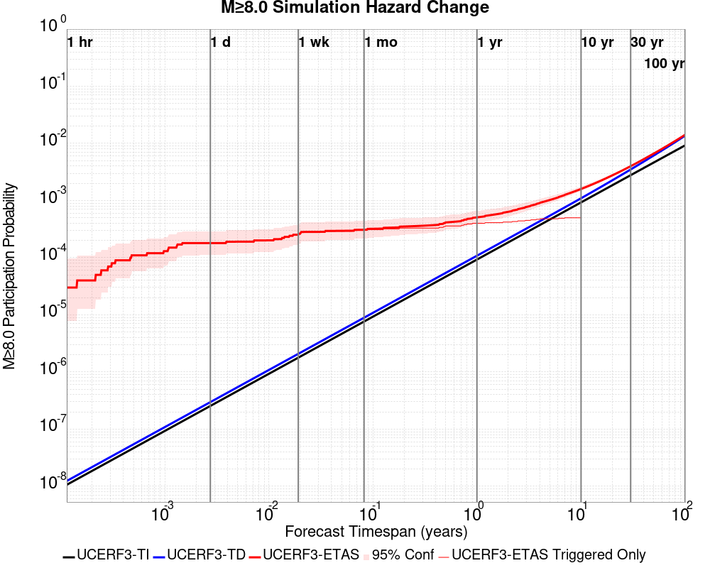

| Forecast Duration | UCERF3-ETAS [95% Conf] | UCERF3-ETAS Triggered Only | UCERF3-TD | UCERF3-ETAS/TD Gain | UCERF3-TI |
|-----|-----|-----|-----|-----|-----|
| 1 Hour | 2.83E-5 [4.91E-6 - 1.14E-4] | 2.83E-5 | 1.24E-8 | 2288.8 | 1.06E-8 |
| 1 Day | 1.98E-4 [1.13E-4 - 3.42E-4] | 1.98E-4 | 2.97E-7 | 668.27 | 2.54E-7 |
| 1 Week | 2.99E-4 [1.91E-4 - 4.65E-4] | 2.97E-4 | 2.08E-6 | 143.99 | 1.78E-6 |
| 1 Month | 3.20E-4 [2.09E-4 - 4.89E-4] | 3.11E-4 | 8.90E-6 | 35.95 | 7.63E-6 |
| 1 Year | 5.33E-4 [4.00E-4 - 7.22E-4] | 4.24E-4 | 1.08E-4 | 4.91 | 9.29E-5 |
| 10 Years | 1.62E-3 [1.47E-3 - 1.83E-3] | 5.23E-4 | 1.10E-3 | 1.48 | 9.29E-4 |
| 30 Years | 4.02E-3 [3.88E-3 - 4.23E-3] \* | \* | 3.50E-3 | 1.15 \* | 2.78E-3 |
| 100 Years | 0.014 [0.014 - 0.014] \* | \* | 0.014 | 1.04 \* | 9.25E-3 |

\* *forecast duration is longer than simulation length, only ETAS ruptures from the first 10 years are included*

## Trigger Rupture Fault Map
*[(top)](#table-of-contents)*


## Trigger Rupture Depth Map
*[(top)](#table-of-contents)*


## Fault Distances To Triggers
*[(top)](#table-of-contents)*

| Section Name | Strike, Dip, Rake | # Hypos In Poly | Max Mag w/ Hypo In Poly | # Surfs In Poly | Max Mag w/ Surf In Poly | Min Dist To Any (km) | Min Poly Dist To Any (km) | Min Dist To Largest (km) | Min Poly Dist To Largest (km) | Min Hypo Dist To Largest (km) | Min Hypo Poly Dist To Largest (km) |
|-----|-----|-----|-----|-----|-----|-----|-----|-----|-----|-----|-----|
| Airport Lake | 359, 50, -90 | 92 | 7.1 | 92 | 7.1 | 0.036 | 0.000 | 0.036 | 0.000 | 5.612 | 0.000 |
| Little Lake | 327, 90, 180 | 16 | 3.75 | 17 | 7.1 | 2.268 | 0.000 | 11.284 | 0.000 | 13.471 | 1.469 |
| Garlock (Central) | 71, 90, 0 | 2 | 2.76 | 3 | 7.1 | 5.600 | 0.000 | 5.600 | 0.000 | 22.766 | 10.797 |
| So Sierra Nevada | 2, 50, -90 | 0 |  | 0 |  | 4.248 | 4.233 | 4.248 | 4.233 | 16.191 | 15.188 |
| Tank Canyon | 189, 50, -90 | 0 |  | 0 |  | 9.015 | 9.011 | 9.015 | 9.011 | 17.039 | 16.895 |
| Blackwater | 323, 90, 180 | 0 |  | 0 |  | 14.394 | 8.726 | 14.394 | 8.726 | 29.622 | 27.613 |

## Individual Simulated Catalog Maps
*[(top)](#table-of-contents)*

These are map plots of individual catalogs from the simulations, selected as the closest catalog to each of the given percentiles in terms of total number of events.

| Duration | p0.0 %-ile | p25.0 %-ile | p50.0 %-ile | p75.0 %-ile | p90.0 %-ile | p95.0 %-ile | p97.5 %-ile | p98.0 %-ile | p99.0 %-ile | p99.5 %-ile | p99.9 %-ile | p99.998585 %-ile |
|-----|-----|-----|-----|-----|-----|-----|-----|-----|-----|-----|-----|-----|
| **1 Week** |  |  |  |  |  |  |  |  |  |  |  |  |
| **1 Month** |  |  |  |  |  |  |  | 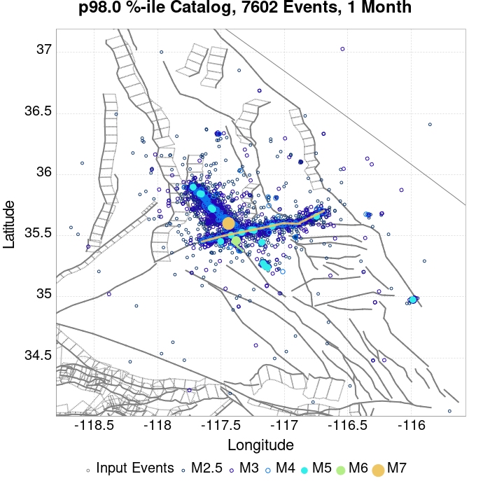 |  | 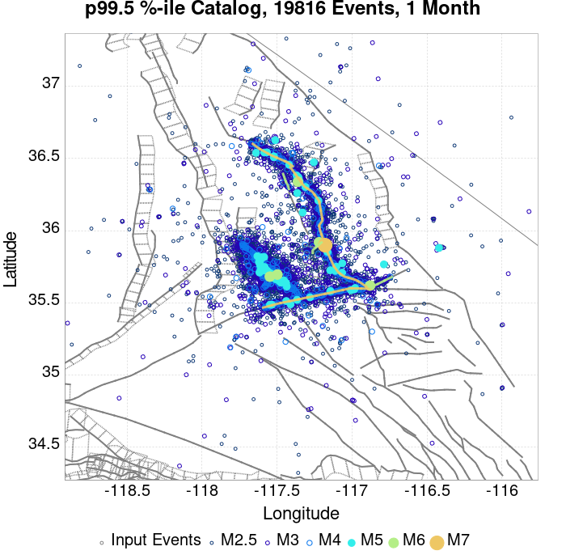 | 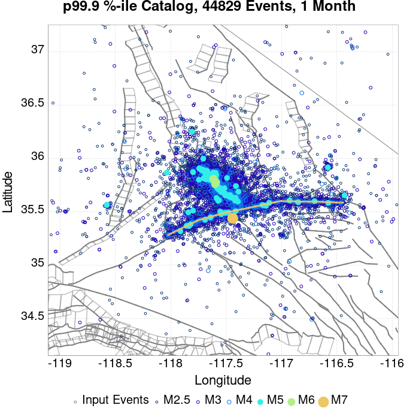 |  |
| **1 Year** |  |  |  |  |  |  |  |  |  |  |  |  |
| **10 Year** |  |  |  |  |  | 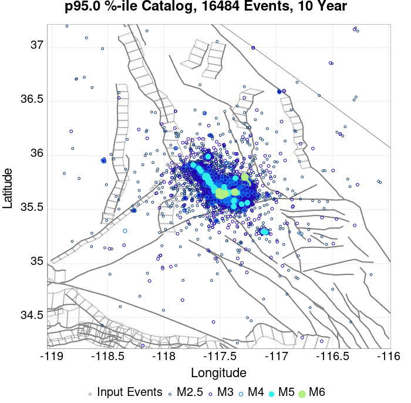 |  |  |  |  |  |  |

## ComCat Data Comparisons
*[(top)](#table-of-contents)*

These plots compare simulated sequences with data from ComCat. All plots only consider events with hypocenters inside the ComCat region defined in the JSON input file.

Last updated at 2019/11/05 23:33:14 UTC, 4 mo after the simulation start time

### ComCat Magnitude-Number Distributions
*[(top)](#table-of-contents)*

| Incremental MND | Cumulative MND |
|-----|-----|
|  |  |

### ComCat Time-Dependent Mc
*[(top)](#table-of-contents)*

The following plots compare simulation results with ComCat data above a magnitude threshold. Plots labeled as *M&ge;Mc(t)* use the time-dependent magnitude of completeness (Mc) defined in Helmstetter et al. (2006), which is plotted below. In the case of multiple M&ge;5 ruptures, either as input to the simulation or in the comparison data, the maximum calculated time-dependent Mc is used. This time-dependent Mc function is plotted below.


### ComCat Cumulative Number Vs Time
*[(top)](#table-of-contents)*

| M&ge;Mc(t) | M&ge;3.5 | M&ge;4 | M&ge;5 | M&ge;6 | M&ge;7 |
|-----|-----|-----|-----|-----|-----|
| 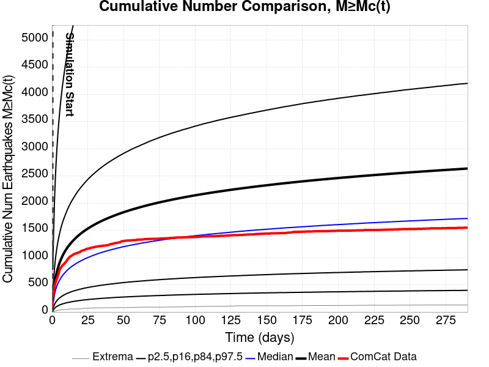 |  | 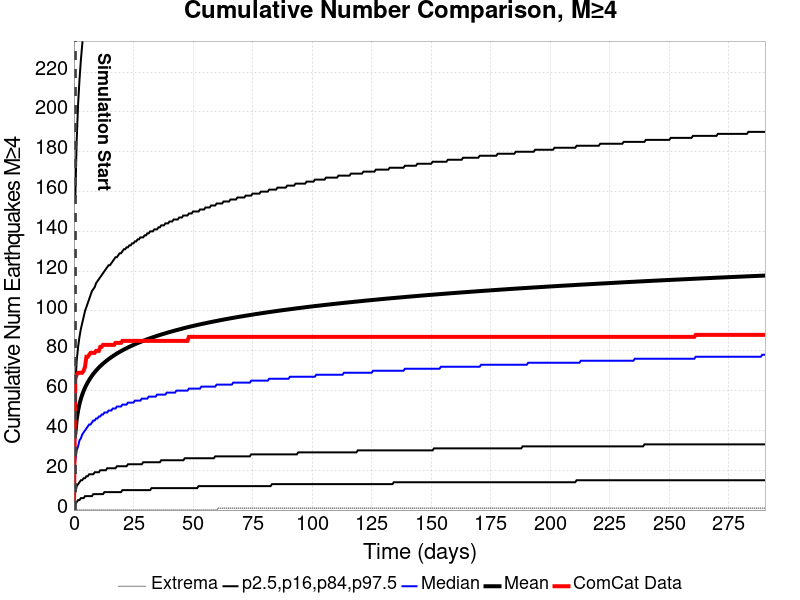 | 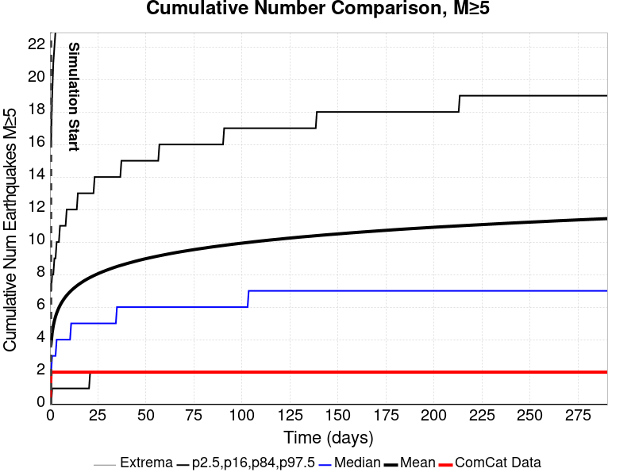 |  | 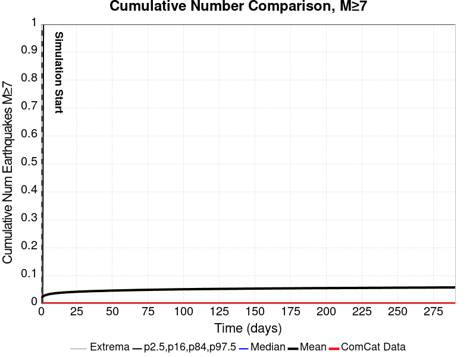 |

### ComCat Cumulative Number Simulation Percentiles
*[(top)](#table-of-contents)*


### ComCat Probability Spatial Distribution
*[(top)](#table-of-contents)*

|  | 1 Day | 1 Week | 1 Month | Current (4 Month) |
|-----|-----|-----|-----|-----|
| **M&ge;Mc(t)** |  |  | 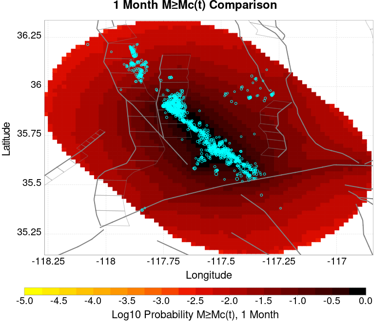 |  |
| **M&ge;3.5** |  |  |  |  |
| **M&ge;4** |  |  |  |  |
| **M&ge;5** |  |  |  |  |
| **M&ge;6** |  |  |  |  |
| **M&ge;7** |  |  |  |  |
| **M&ge;8** |  |  |  |  |

### ComCat Mean Expectation Spatial Distribution
*[(top)](#table-of-contents)*

|  | 1 Day | 1 Week | 1 Month | Current (4 Month) |
|-----|-----|-----|-----|-----|
| **M&ge;Mc(t)** |  |  |  |  |
| **M&ge;3.5** |  |  |  |  |
| **M&ge;4** |  | 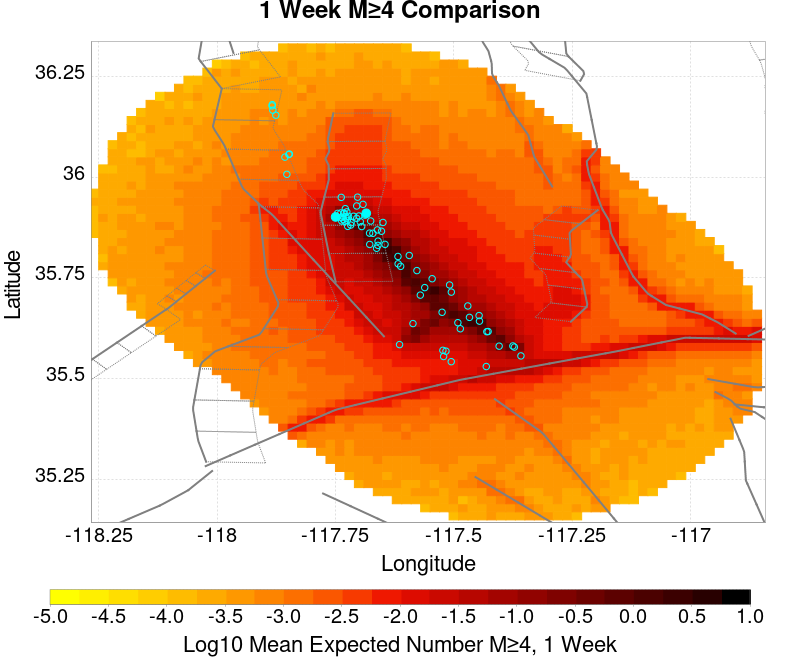 |  |  |
| **M&ge;5** |  |  |  |  |
| **M&ge;6** |  | 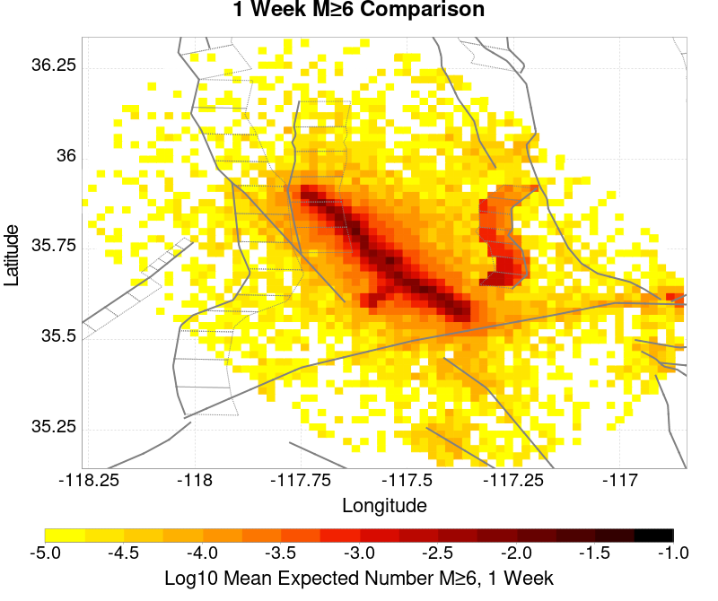 |  |  |
| **M&ge;7** |  |  |  |  |
| **M&ge;8** |  |  |  |  |

### ComCat Depth Distribution
*[(top)](#table-of-contents)*

| M&ge;Mc(t) | M&ge;3.5 | M&ge;4 | M&ge;5 | M&ge;6 | M&ge;7 | M&ge;8 |
|-----|-----|-----|-----|-----|-----|-----|
|  |  | 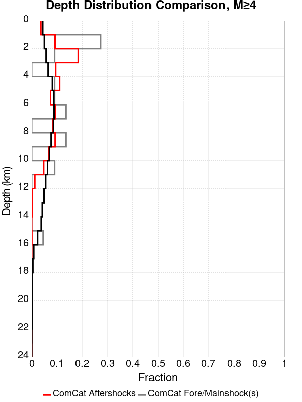 |  |  | 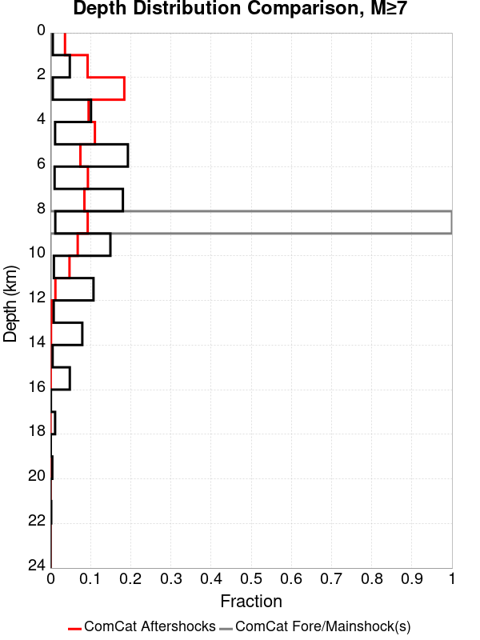 |  |

## Section Participation
*[(top)](#table-of-contents)*

### Section Participation Plots
*[(top)](#table-of-contents)*

| Min Mag | 1 yr Triggered Ruptures (no spontaneous) | 10 yr Triggered Ruptures (no spontaneous) | 10 yr Triggered Ruptures (primary aftershocks only) |
|-----|-----|-----|-----|
| **All Supra. Seis.** |  |  |  |
| **M&ge;6.5** |  |  |  |
| **M&ge;7** | 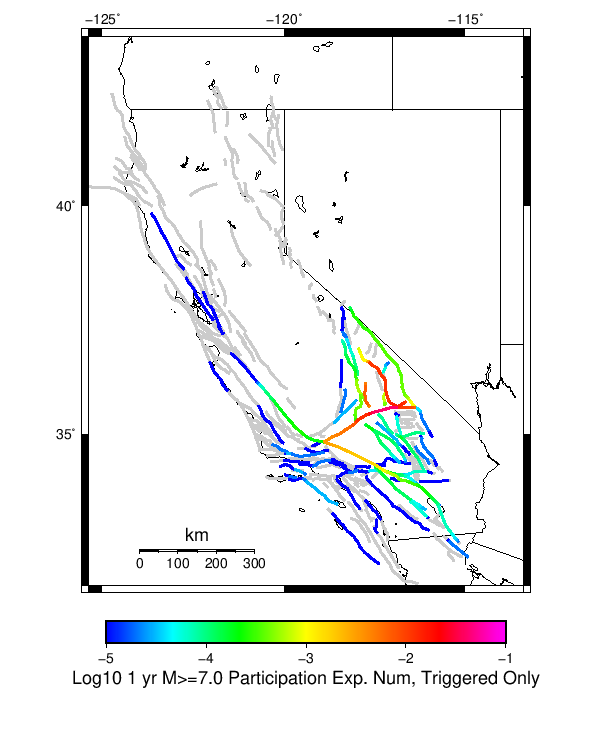 | 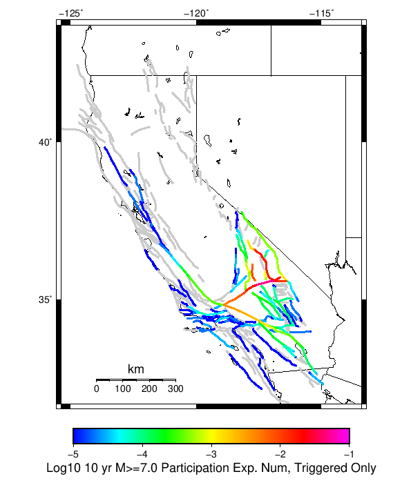 |  |
| **M&ge;7.5** |  |  |  |
| **M&ge;8** |  |  |  |

### Supra-Seismogenic Parent Sections Table
*[(top)](#table-of-contents)*

*First 10 of 206 with matching ruptures shown*

| Parent Name | Triggered 10 Year Mean Count | Triggered 1 Day Prob | Triggered 1 Week Prob | Triggered 1 Month Prob | Triggered 1 Year Prob | Triggered 10 Year Prob | Triggered 10 Year Primary Mean Count |
|-----|-----|-----|-----|-----|-----|-----|-----|
| Garlock (Central) | 0.13535994 | 0.0460866 | 0.064985216 | 0.07944209 | 0.10438091 | 0.12759396 | 0.074434526 |
| Tank Canyon | 0.11306636 | 0.02301501 | 0.036156338 | 0.047472876 | 0.070219114 | 0.094365776 | 0.03000297 |
| Little Lake | 0.06402331 | 0.02147313 | 0.030696109 | 0.03808015 | 0.049396686 | 0.060812246 | 0.03566124 |
| Airport Lake | 0.052310694 | 0.020284893 | 0.02775381 | 0.03376572 | 0.04346965 | 0.052084364 | 0.034557875 |
| Owl Lake | 0.041489255 | 0.009222978 | 0.014612479 | 0.019040074 | 0.027683081 | 0.03663729 | 0.011415557 |
| Panamint Valley | 0.03196922 | 0.008077179 | 0.012363317 | 0.016225087 | 0.023821311 | 0.030936586 | 0.01147214 |
| Garlock (East) | 0.027287 | 0.0061958046 | 0.009590765 | 0.012377463 | 0.018120605 | 0.02461347 | 0.007864994 |
| Hunter Mountain-Saline Valley | 0.014697353 | 0.004356867 | 0.0065211547 | 0.00820449 | 0.011585305 | 0.014456877 | 0.006860651 |
| Blackwater | 0.013127184 | 0.0023623272 | 0.0037627488 | 0.004922694 | 0.008388383 | 0.012547211 | 0.0029564456 |
| Ash Hill | 0.012052112 | 0.0020794137 | 0.0037203117 | 0.005035859 | 0.0076952456 | 0.011104353 | 0.00189552 |

### M≥6.5 Parent Sections Table
*[(top)](#table-of-contents)*

*First 10 of 171 with matching ruptures shown*

| Parent Name | Triggered 10 Year Mean Count | Triggered 1 Day Prob | Triggered 1 Week Prob | Triggered 1 Month Prob | Triggered 1 Year Prob | Triggered 10 Year Prob | Triggered 10 Year Primary Mean Count |
|-----|-----|-----|-----|-----|-----|-----|-----|
| Garlock (Central) | 0.057968963 | 0.01918153 | 0.027640643 | 0.034204233 | 0.046129037 | 0.05680902 | 0.030399049 |
| Airport Lake | 0.039183512 | 0.015291472 | 0.020794138 | 0.025207588 | 0.032535046 | 0.039112784 | 0.02588658 |
| Little Lake | 0.039141074 | 0.014159818 | 0.019860523 | 0.024641762 | 0.031530704 | 0.03816502 | 0.02317061 |
| Panamint Valley | 0.029507872 | 0.007864994 | 0.011882365 | 0.0153622 | 0.022307726 | 0.02863084 | 0.011330684 |
| Owl Lake | 0.023580836 | 0.0071011274 | 0.010566817 | 0.01326864 | 0.01843181 | 0.02343938 | 0.0100292815 |
| Garlock (East) | 0.018728869 | 0.005064151 | 0.00758208 | 0.009520037 | 0.013424243 | 0.017766964 | 0.0072991666 |
| Hunter Mountain-Saline Valley | 0.01441444 | 0.0043427213 | 0.006464572 | 0.008119616 | 0.011429703 | 0.014230547 | 0.006846505 |
| Tank Canyon | 0.012391609 | 0.0027018234 | 0.004130536 | 0.005615832 | 0.008543986 | 0.012320881 | 0.0031544848 |
| Garlock (West) | 0.009887825 | 0.0033949614 | 0.0047953827 | 0.005828017 | 0.007949867 | 0.009887825 | 0.0051207333 |
| So Sierra Nevada | 0.0045973435 | 9.760514E-4 | 0.0015418782 | 0.0021218508 | 0.0032110675 | 0.0045407605 | 8.9117733E-4 |

### M≥7 Parent Sections Table
*[(top)](#table-of-contents)*

*First 10 of 128 with matching ruptures shown*

| Parent Name | Triggered 10 Year Mean Count | Triggered 1 Day Prob | Triggered 1 Week Prob | Triggered 1 Month Prob | Triggered 1 Year Prob | Triggered 10 Year Prob | Triggered 10 Year Primary Mean Count |
|-----|-----|-----|-----|-----|-----|-----|-----|
| Garlock (Central) | 0.05184389 | 0.017186992 | 0.024797363 | 0.030696109 | 0.04140438 | 0.051037584 | 0.027173836 |
| Panamint Valley | 0.020143436 | 0.0060684932 | 0.009109813 | 0.011387266 | 0.016055338 | 0.019959543 | 0.009505891 |
| Owl Lake | 0.017936712 | 0.0061392216 | 0.008756171 | 0.01084973 | 0.014485168 | 0.017936712 | 0.00967564 |
| Garlock (East) | 0.01399007 | 0.0045549064 | 0.006648466 | 0.008147907 | 0.010906314 | 0.01389105 | 0.007030399 |
| Hunter Mountain-Saline Valley | 0.01399007 | 0.004286139 | 0.0064079897 | 0.0080347415 | 0.011231664 | 0.013961778 | 0.0067474856 |
| Garlock (West) | 0.009732222 | 0.0033949614 | 0.0047529456 | 0.0057572885 | 0.007879139 | 0.009732222 | 0.005050005 |
| Little Lake | 0.008614714 | 0.0033383786 | 0.004484178 | 0.0055451035 | 0.00715771 | 0.008586423 | 0.0054177926 |
| Airport Lake | 0.008147907 | 0.003196922 | 0.004271993 | 0.005276336 | 0.006804068 | 0.008147907 | 0.0051490245 |
| San Andreas (Mojave N) | 0.0042012646 | 0.0014570042 | 0.0019662485 | 0.002334036 | 0.003239359 | 0.004102245 | 0.0020086854 |
| San Andreas (Mojave S) | 0.0031686306 | 0.001032634 | 0.0014287129 | 0.001725772 | 0.0024754927 | 0.0031544848 | 0.0014852956 |

### M≥7.5 Parent Sections Table
*[(top)](#table-of-contents)*

*First 10 of 64 with matching ruptures shown*

| Parent Name | Triggered 10 Year Mean Count | Triggered 1 Day Prob | Triggered 1 Week Prob | Triggered 1 Month Prob | Triggered 1 Year Prob | Triggered 10 Year Prob | Triggered 10 Year Primary Mean Count |
|-----|-----|-----|-----|-----|-----|-----|-----|
| Garlock (Central) | 0.021161925 | 0.0070586903 | 0.010085864 | 0.0124199 | 0.017017243 | 0.021006323 | 0.011061915 |
| Panamint Valley | 0.013537408 | 0.0042437017 | 0.0063372613 | 0.0079215765 | 0.010934604 | 0.013537408 | 0.006648466 |
| Hunter Mountain-Saline Valley | 0.013494971 | 0.0042154104 | 0.0063089696 | 0.007893285 | 0.010892168 | 0.013494971 | 0.006606029 |
| Garlock (West) | 0.00862886 | 0.003013028 | 0.004144682 | 0.0050217137 | 0.0068747965 | 0.00862886 | 0.0046256348 |
| Garlock (East) | 0.005615832 | 0.0020086854 | 0.0027442605 | 0.003281796 | 0.004399304 | 0.005615832 | 0.0030837564 |
| San Andreas (Mojave N) | 0.0042012646 | 0.0014570042 | 0.0019662485 | 0.002334036 | 0.003239359 | 0.004102245 | 0.0020086854 |
| San Andreas (Mojave S) | 0.003112048 | 0.0010184884 | 0.0014004215 | 0.0016833349 | 0.00241891 | 0.0030979023 | 0.0014852956 |
| San Andreas (San Bernardino N) | 0.0019945398 | 6.7899225E-4 | 9.05323E-4 | 0.0010609254 | 0.0014994412 | 0.0019945398 | 9.760514E-4 |
| Owl Lake | 0.0017116263 | 5.375355E-4 | 7.78012E-4 | 9.619057E-4 | 0.0013721302 | 0.0017116263 | 8.20449E-4 |
| San Andreas (San Bernardino S) | 9.05323E-4 | 2.4047642E-4 | 3.6778746E-4 | 4.102245E-4 | 6.6484656E-4 | 9.05323E-4 | 4.2437017E-4 |

### M≥8 Parent Sections Table
*[(top)](#table-of-contents)*

*First 10 of 27 with matching ruptures shown*

| Parent Name | Triggered 10 Year Mean Count | Triggered 1 Day Prob | Triggered 1 Week Prob | Triggered 1 Month Prob | Triggered 1 Year Prob | Triggered 10 Year Prob | Triggered 10 Year Primary Mean Count |
|-----|-----|-----|-----|-----|-----|-----|-----|
| San Andreas (Mojave N) | 5.941182E-4 | 2.1218508E-4 | 3.1120479E-4 | 3.2535047E-4 | 4.668072E-4 | 5.941182E-4 | 3.3949612E-4 |
| San Andreas (Mojave S) | 5.941182E-4 | 2.1218508E-4 | 3.1120479E-4 | 3.2535047E-4 | 4.668072E-4 | 5.941182E-4 | 3.3949612E-4 |
| San Andreas (San Bernardino N) | 5.941182E-4 | 2.1218508E-4 | 3.1120479E-4 | 3.2535047E-4 | 4.668072E-4 | 5.941182E-4 | 3.3949612E-4 |
| Garlock (Central) | 5.2338984E-4 | 1.9803942E-4 | 2.970591E-4 | 3.1120479E-4 | 4.2437017E-4 | 5.2338984E-4 | 3.1120479E-4 |
| Garlock (West) | 5.2338984E-4 | 1.9803942E-4 | 2.970591E-4 | 3.1120479E-4 | 4.2437017E-4 | 5.2338984E-4 | 3.1120479E-4 |
| Garlock (East) | 4.668072E-4 | 1.6974806E-4 | 2.546221E-4 | 2.6876776E-4 | 3.6778746E-4 | 4.668072E-4 | 2.6876776E-4 |
| San Andreas (San Bernardino S) | 3.3949612E-4 | 1.1316538E-4 | 1.6974806E-4 | 1.8389373E-4 | 2.546221E-4 | 3.3949612E-4 | 2.1218508E-4 |
| San Andreas (San Gorgonio Pass-Garnet HIll) | 3.2535047E-4 | 1.1316538E-4 | 1.5560239E-4 | 1.6974806E-4 | 2.4047642E-4 | 3.2535047E-4 | 2.1218508E-4 |
| San Andreas (Coachella) rev | 2.8291345E-4 | 8.487403E-5 | 9.901971E-5 | 1.1316538E-4 | 1.9803942E-4 | 2.8291345E-4 | 1.8389373E-4 |
| San Jacinto (San Bernardino) | 1.6974806E-4 | 4.2437016E-5 | 8.487403E-5 | 8.487403E-5 | 1.4145672E-4 | 1.6974806E-4 | 7.072836E-5 |

### Fault Magnitude-Probability Distributions
*[(top)](#table-of-contents)*

The first 5 sections (sorted by trigger rate) are plotted below. All fault MPDs are available [here](plots/parent_sect_mpds/README.md)

| 1 Week | 1 Month | 1 Year | 10 Year |
|-----|-----|-----|-----|
|  | 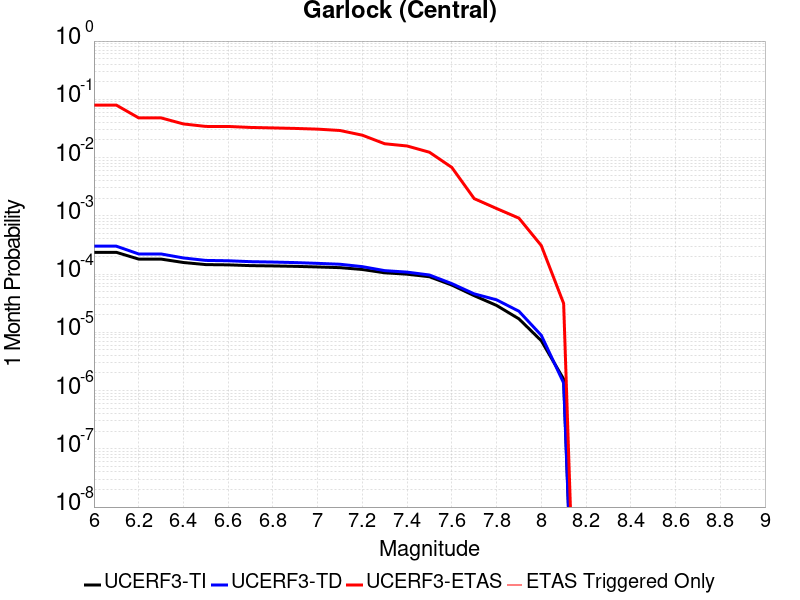 |  |  |
| 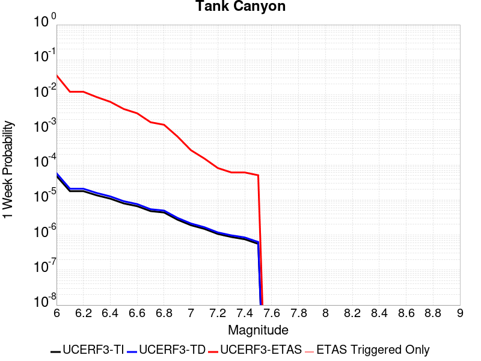 |  |  |  |
|  |  |  |  |
|  |  | 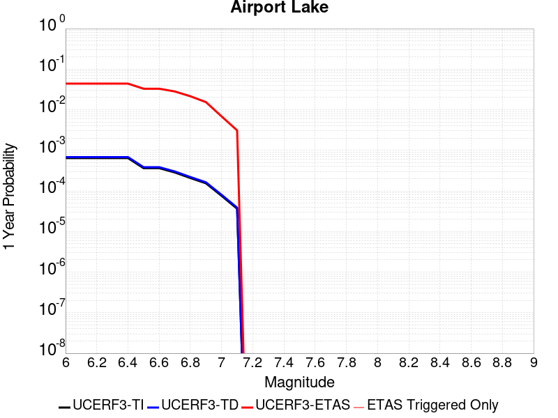 |  |
|  |  |  |  |

## Gridded Nucleation
*[(top)](#table-of-contents)*

| Min Mag | Triggered Ruptures (no spontaneous) | Triggered Ruptures (primary aftershocks only) |
|-----|-----|-----|
| **M&ge;2.5** |  |  |
| **M&ge;5** | 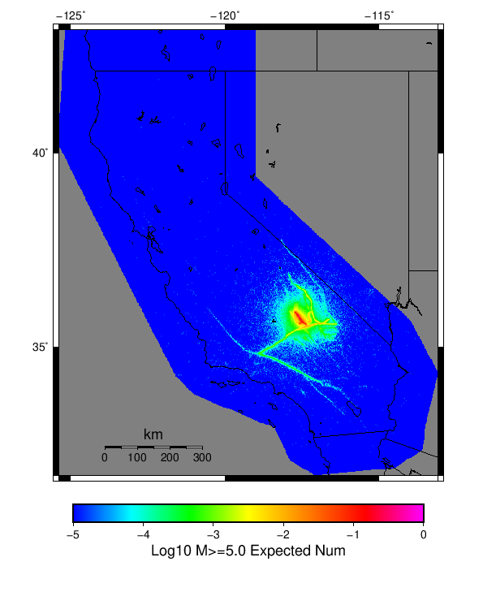 |  |
| **M&ge;6** |  |  |
| **M&ge;7** |  |  |


## JSON Input File
*[(top)](#table-of-contents)*

```
{
  "numSimulations": 100000,
  "duration": 10.0,
  "startTimeMillis": 1562383194040,
  "includeSpontaneous": false,
  "randomSeed": 1572975569068,
  "binaryOutput": true,
  "binaryOutputFilters": [
    {
      "prefix": "results_complete",
      "descendantsOnly": false
    },
    {
      "prefix": "results_m5_preserve_chain",
      "minMag": 5.0,
      "preserveChainBelowMag": true,
      "descendantsOnly": false
    }
  ],
  "forceRecalc": false,
  "simulationName": "ComCat M7.1 (ci38457511), ShakeMap Surfaces, kCOV\u003d1.16",
  "numRetries": 3,
  "outputDir": "/home/scec-02/kmilner/ucerf3/etas_sim/2019_11_05-ComCatM7p1_ci38457511_ShakeMapSurfaces_kCOV1p16",
  "treatTriggerCatalogAsSpontaneous": false,
  "triggerRuptures": [
    "omitted due to length, see original input file"
  ],
  "cacheDir": "/home/scec-02/kmilner/ucerf3/ucerf3-etas-launcher/inputs/cache_fm3p1_ba",
  "fssFile": "/home/scec-02/kmilner/ucerf3/ucerf3-etas-launcher/inputs/2013_05_10-ucerf3p3-production-10runs_COMPOUND_SOL_FM3_1_SpatSeisU3_MEAN_BRANCH_AVG_SOL.zip",
  "probModel": "FULL_TD",
  "applySubSeisForSupraNucl": true,
  "totRateScaleFactor": 1.14,
  "gridSeisCorr": true,
  "timeIndependentERF": false,
  "griddedOnly": false,
  "imposeGR": false,
  "includeIndirectTriggering": true,
  "gridSeisDiscr": 0.1,
  "catalogCompletenessModel": "RELAXED",
  "etas_k_cov": 1.16,
  "configCommand": "u3etas_comcat_event_config_builder.sh --event-id ci38457511 --mag-complete 3.5 --num-simulations 100000 --days-before 7 --etas-k-cov 1.16 --finite-surf-shakemap --finite-surf-shakemap-min-mag 5 --hpc-site USC_HPC --nodes 36 --hours 24 --queue scec",
  "configTime": 1572975569068,
  "comcatMetadata": {
    "region": {
      "border": [
        {
          "latitude": 35.15123745324938,
          "longitude": -117.46198765392752
        },
        {
          "latitude": 35.170513097218205,
          "longitude": -117.55046477274733
        },
        {
          "latitude": 35.201997575622634,
          "longitude": -117.63356287896195
        },
        {
          "latitude": 35.24474776584818,
          "longitude": -117.70878534540662
        },
        {
          "latitude": 35.2893890362986,
          "longitude": -117.76387551603122
        },
        {
          "latitude": 35.288830898189985,
          "longitude": -117.76465036296011
        },
        {
          "latitude": 35.62116745212862,
          "longitude": -118.13026990137416
        },
        {
          "latitude": 35.621789874646055,
          "longitude": -118.12940866580139
        },
        {
          "latitude": 35.621789874646055,
          "longitude": -118.12940866580136
        },
        {
          "latitude": 35.63100857737423,
          "longitude": -118.14083341711117
        },
        {
          "latitude": 35.69213881200874,
          "longitude": -118.19401186444136
        },
        {
          "latitude": 35.759827796433385,
          "longitude": -118.23338865654299
        },
        {
          "latitude": 35.8320329014668,
          "longitude": -118.25773927868946
        },
        {
          "latitude": 35.906569563076914,
          "longitude": -118.26628547708222
        },
        {
          "latitude": 35.9811764992231,
          "longitude": -118.25872343341653
        },
        {
          "latitude": 36.05358395358725,
          "longitude": -118.23523828089384
        },
        {
          "latitude": 36.12158296055357,
          "longitude": -118.19650389473806
        },
        {
          "latitude": 36.18309350302806,
          "longitude": -118.14366730262441
        },
        {
          "latitude": 36.23622937613509,
          "longitude": -118.07831757407638
        },
        {
          "latitude": 36.279357589115186,
          "longitude": -118.00243964650828
        },
        {
          "latitude": 36.31115024550475,
          "longitude": -117.91835419890715
        },
        {
          "latitude": 36.33062704347584,
          "longitude": -117.82864534929934
        },
        {
          "latitude": 36.337186832826475,
          "longitude": -117.7360785775
        },
        {
          "latitude": 36.33062704347584,
          "longitude": -117.64351180570065
        },
        {
          "latitude": 36.31115024550475,
          "longitude": -117.55380295609284
        },
        {
          "latitude": 36.279357589115186,
          "longitude": -117.46971750849171
        },
        {
          "latitude": 36.23622937613509,
          "longitude": -117.39383958092363
        },
        {
          "latitude": 36.19237301765921,
          "longitude": -117.33990236386252
        },
        {
          "latitude": 36.19237301765921,
          "longitude": -117.3399023638625
        },
        {
          "latitude": 36.19300476664728,
          "longitude": -117.33902822340912
        },
        {
          "latitude": 35.858277657147454,
          "longitude": -116.97410396317103
        },
        {
          "latitude": 35.85771127553969,
          "longitude": -116.97489025431044
        },
        {
          "latitude": 35.849566414597014,
          "longitude": -116.96491461360324
        },
        {
          "latitude": 35.78805819220281,
          "longitude": -116.9122967694479
        },
        {
          "latitude": 35.72006106557635,
          "longitude": -116.87372034968973
        },
        {
          "latitude": 35.64765482528862,
          "longitude": -116.85032807444419
        },
        {
          "latitude": 35.57304829206068,
          "longitude": -116.8427916482061
        },
        {
          "latitude": 35.49851117585832,
          "longitude": -116.8512961557198
        },
        {
          "latitude": 35.42630481575459,
          "longitude": -116.87553976530553
        },
        {
          "latitude": 35.35861392859174,
          "longitude": -116.91474809853695
        },
        {
          "latitude": 35.29748137319737,
          "longitude": -116.96770221389164
        },
        {
          "latitude": 35.24474776584818,
          "longitude": -117.03277884359336
        },
        {
          "latitude": 35.201997575622634,
          "longitude": -117.10800131003803
        },
        {
          "latitude": 35.170513097218205,
          "longitude": -117.19109941625265
        },
        {
          "latitude": 35.15123745324938,
          "longitude": -117.27957653507247
        },
        {
          "latitude": 35.14474752487352,
          "longitude": -117.3707820945
        }
      ]
    },
    "eventID": "ci38457511",
    "minDepth": -10.0,
    "maxDepth": 24.0,
    "minMag": 2.5,
    "startTime": 1561778393040,
    "endTime": 1562383193040,
    "magComplete": 3.5
  }
}
```

