# ComCat M7.1 (ci38457511), ShakeMap Surfaces, kCOV=1.16 Results

|   | ComCat M7.1 (ci38457511), ShakeMap Surfaces, kCOV=1.16 |
|-----|-----|
| Num Simulations | 100000 |
| Start Time | 2019/07/06 03:19:54 UTC |
| Start Time Epoch Milliseconds | 1562383194040 |
| Duration | 10 Years |
| Includes Spontaneous? | false |
| Trigger Ruptures | 283 Trigger Ruptures |
|   | First: M3.98 at 2019/07/04 17:02:55 UTC |
|   | Last: M7.1 at 2019/07/06 03:19:53 UTC |
|   | Largest: M7.1 at 2019/07/06 03:19:53 UTC |
| Trigger Ruptures | *(none)* |
| Config Generated With | u3etas_comcat_event_config_builder.sh --event-id ci38457511 --mag-complete 3.5 --num-simulations 100000 --days-before 7 --etas-k-cov 1.16 --finite-surf-shakemap --finite-surf-shakemap-min-mag 5 --hpc-site USC_HPC --nodes 36 --hours 24 --queue scec |

## Table Of Contents

* [Probabilities Summary Table](#probabilities-summary-table)
* [Magnitude Number Distribution](#magnitude-number-distribution)
  * [10 Year Magnitude Number Distribution](#10-year-magnitude-number-distribution)
  * [1 Year Magnitude Number Distribution](#1-year-magnitude-number-distribution)
  * [1 Month Magnitude Number Distribution](#1-month-magnitude-number-distribution)
  * [1 Week Magnitude Number Distribution](#1-week-magnitude-number-distribution)
  * [1 Day Magnitude Number Distribution](#1-day-magnitude-number-distribution)
  * [1 Hour Magnitude Number Distribution](#1-hour-magnitude-number-distribution)
* [Hazard Change Over Time](#hazard-change-over-time)
  * [M&ge;5.0 Hazard Change Over Time](#m50-hazard-change-over-time)
  * [M&ge;6.0 Hazard Change Over Time](#m60-hazard-change-over-time)
  * [M&ge;7.0 Hazard Change Over Time](#m70-hazard-change-over-time)
  * [M&ge;8.0 Hazard Change Over Time](#m80-hazard-change-over-time)
* [Trigger Rupture Fault Map](#trigger-rupture-fault-map)
* [Trigger Rupture Depth Map](#trigger-rupture-depth-map)
* [Fault Distances To Triggers](#fault-distances-to-triggers)
* [Individual Simulated Catalog Maps](#individual-simulated-catalog-maps)
* [ComCat Data Comparisons](#comcat-data-comparisons)
  * [ComCat Magnitude-Number Distributions](#comcat-magnitude-number-distributions)
  * [ComCat Magnitude-Time Functions](#comcat-magnitude-time-functions)
  * [ComCat Time-Dependent Mc](#comcat-time-dependent-mc)
  * [ComCat Probability Spatial Distribution](#comcat-probability-spatial-distribution)
  * [ComCat Mean Expectation Spatial Distribution](#comcat-mean-expectation-spatial-distribution)
  * [ComCat Depth Distribution](#comcat-depth-distribution)
* [Section Participation](#section-participation)
  * [Section Participation Plots](#section-participation-plots)
  * [Supra-Seismogenic Parent Sections Table](#supra-seismogenic-parent-sections-table)
  * [M≥6.5 Parent Sections Table](#m65-parent-sections-table)
  * [M≥7 Parent Sections Table](#m7-parent-sections-table)
  * [M≥7.5 Parent Sections Table](#m75-parent-sections-table)
  * [M≥8 Parent Sections Table](#m8-parent-sections-table)
* [Fault Magnitude-Probability Distributions](#fault-magnitude-probability-distributions)
* [Gridded Nucleation](#gridded-nucleation)
* [JSON Input File](#json-input-file)

## Probabilities Summary Table
*[(top)](#table-of-contents)*

| Magnitude | 1 Hour Prob | 1 Day Prob | 1 Week Prob | 1 Month Prob | 1 Year Prob | 10 Year Prob |
|-----|-----|-----|-----|-----|-----|-----|
| **M&ge;4** | 0.983 (98.29%) | 0.999 (99.90%) | 1.000 (99.99%) | 1.000 (100.00%) | 1.000 (100.00%) | 1.000 (100.00%) |
| *95% Conf* | *[98.21% 98.37%]* | *[99.87% 99.92%]* | *[99.98% 99.99%]* | *[99.99% 100.00%]* | *[100.00% 100.00%]* | *[100.00% 100.00%]* |
| **M&ge;4.5** | 0.878 (87.78%) | 0.978 (97.75%) | 0.993 (99.28%) | 0.997 (99.70%) | 0.999 (99.91%) | 1.000 (99.97%) |
| *95% Conf* | *[87.57% 87.98%]* | *[97.66% 97.84%]* | *[99.22% 99.33%]* | *[99.67% 99.74%]* | *[99.89% 99.93%]* | *[99.96% 99.98%]* |
| **M&ge;5** | 0.614 (61.45%) | 0.850 (85.00%) | 0.918 (91.78%) | 0.947 (94.74%) | 0.973 (97.30%) | 0.984 (98.44%) |
| *95% Conf* | *[61.14% 61.75%]* | *[84.78% 85.22%]* | *[91.61% 91.95%]* | *[94.60% 94.88%]* | *[97.20% 97.40%]* | *[98.36% 98.51%]* |
| **M&ge;5.5** | 0.305 (30.53%) | 0.557 (55.72%) | 0.669 (66.88%) | 0.732 (73.21%) | 0.810 (81.03%) | 0.857 (85.70%) |
| *95% Conf* | *[30.24% 30.81%]* | *[55.41% 56.03%]* | *[66.59% 67.17%]* | *[72.94% 73.49%]* | *[80.79% 81.27%]* | *[85.48% 85.92%]* |
| **M&ge;6** | 0.103 (10.33%) | 0.239 (23.86%) | 0.321 (32.07%) | 0.379 (37.91%) | 0.466 (46.59%) | 0.533 (53.30%) |
| *95% Conf* | *[10.14% 10.52%]* | *[23.59% 24.12%]* | *[31.78% 32.36%]* | *[37.61% 38.21%]* | *[46.29% 46.90%]* | *[52.99% 53.61%]* |
| **M&ge;6.5** | 0.024 (2.42%) | 0.064 (6.39%) | 0.092 (9.25%) | 0.114 (11.44%) | 0.154 (15.38%) | 0.189 (18.91%) |
| *95% Conf* | *[2.32% 2.52%]* | *[6.24% 6.54%]* | *[9.07% 9.43%]* | *[11.24% 11.64%]* | *[15.16% 15.61%]* | *[18.66% 19.15%]* |
| **M&ge;7** | 8.79E-3 (0.88%) | 0.024 (2.40%) | 0.035 (3.47%) | 0.043 (4.30%) | 0.059 (5.89%) | 0.073 (7.26%) |
| *95% Conf* | *[0.82% 0.94%]* | *[2.30% 2.49%]* | *[3.36% 3.59%]* | *[4.18% 4.43%]* | *[5.75% 6.04%]* | *[7.10% 7.42%]* |
| **M&ge;7.1** | 7.38E-3 (0.74%) | 0.020 (2.01%) | 0.029 (2.92%) | 0.036 (3.62%) | 0.050 (4.96%) | 0.062 (6.15%) |
| *95% Conf* | *[0.69% 0.79%]* | *[1.93% 2.10%]* | *[2.82% 3.03%]* | *[3.50% 3.73%]* | *[4.82% 5.09%]* | *[6.00% 6.30%]* |
| **M&ge;7.5** | 2.48E-3 (0.25%) | 7.32E-3 (0.73%) | 0.011 (1.07%) | 0.013 (1.33%) | 0.018 (1.84%) | 0.023 (2.30%) |
| *95% Conf* | *[0.22% 0.28%]* | *[0.68% 0.79%]* | *[1.01% 1.14%]* | *[1.26% 1.40%]* | *[1.76% 1.93%]* | *[2.20% 2.39%]* |
| **M&ge;8** | 3.00E-5 (0.00%) | 1.90E-4 (0.02%) | 2.60E-4 (0.03%) | 3.10E-4 (0.03%) | 4.30E-4 (0.04%) | 5.50E-4 (0.06%) |
| *95% Conf* | *[0.00% 0.01%]* | *[0.01% 0.03%]* | *[0.02% 0.04%]* | *[0.02% 0.04%]* | *[0.03% 0.06%]* | *[0.04% 0.07%]* |

## Magnitude Number Distribution
*[(top)](#table-of-contents)*

### 10 Year Magnitude Number Distribution
*[(top)](#table-of-contents)*

**Legend**
* **Mean** (thick black line): mean expected number across all 100000 catalogs
* **2.5%,97.5%** (thin black lines): expected number percentiles across all 100000 catalogs
* **Median** (thin blue line): median expected number across all 100000 catalogs
* **Mode** (thin cyan line): modal expected number across all 100000 catalogs
* **10 yr Probability** (thin red line): 10 year probability calculated as the fraction of catalogs with at least 1 occurrence
* **10 yr Supraseismogenic Probability** (thin dashed red line): same as above, but only for supraseismogenic ruptures on explicitly modeled UCERF3 faults
* **95% Conf** (light red shaded region): binomial 95% confidence bounds on probability
* **Primary** (thin green line): mean expected number from primary triggered aftershocks only (no secondary, tertiary, etc...) across all 100000 catalogs


| Mag | Mean | 2.5 %ile | 97.5 %ile | Median | Mode | 10 yr Probability | 10 yr Prob 95% Conf | 10 yr Supra-Seis Prob | Primary Aftershocks Mean |
|-----|-----|-----|-----|-----|-----|-----|-----|-----|-----|
| **M&ge;2.5** | 5414.588 | 742.000 | 22859.000 | 3382.000 | 1687.000 | 1.000 (100.00%) | [100.00% 100.00%] | 0.273 (27.26%) | 2391.435 |
| **M&ge;2.6** | 4300.931 | 590.000 | 18167.000 | 2687.000 | 1740.000 | 1.000 (100.00%) | [100.00% 100.00%] | 0.273 (27.26%) | 1899.500 |
| **M&ge;2.7** | 3416.071 | 469.000 | 14434.000 | 2133.000 | 1329.000 | 1.000 (100.00%) | [100.00% 100.00%] | 0.273 (27.26%) | 1508.614 |
| **M&ge;2.8** | 2713.380 | 371.000 | 11458.000 | 1695.000 | 697.000 | 1.000 (100.00%) | [100.00% 100.00%] | 0.273 (27.26%) | 1198.257 |
| **M&ge;2.9** | 2155.332 | 294.000 | 9108.000 | 1346.000 | 559.000 | 1.000 (100.00%) | [100.00% 100.00%] | 0.273 (27.26%) | 951.802 |
| **M&ge;3** | 1711.837 | 234.000 | 7227.000 | 1069.000 | 524.000 | 1.000 (100.00%) | [100.00% 100.00%] | 0.273 (27.26%) | 755.948 |
| **M&ge;3.1** | 1359.763 | 185.000 | 5741.000 | 850.000 | 330.000 | 1.000 (100.00%) | [100.00% 100.00%] | 0.273 (27.26%) | 600.478 |
| **M&ge;3.2** | 1080.024 | 146.000 | 4561.000 | 675.000 | 289.000 | 1.000 (100.00%) | [100.00% 100.00%] | 0.273 (27.26%) | 476.959 |
| **M&ge;3.3** | 857.754 | 115.000 | 3623.000 | 536.000 | 244.000 | 1.000 (100.00%) | [100.00% 100.00%] | 0.273 (27.26%) | 378.806 |
| **M&ge;3.4** | 681.189 | 91.000 | 2881.000 | 425.000 | 185.000 | 1.000 (100.00%) | [100.00% 100.00%] | 0.273 (27.26%) | 300.836 |
| **M&ge;3.5** | 541.032 | 72.000 | 2290.000 | 338.000 | 147.000 | 1.000 (100.00%) | [100.00% 100.00%] | 0.273 (27.26%) | 238.920 |
| **M&ge;3.6** | 429.626 | 57.000 | 1818.000 | 268.000 | 129.000 | 1.000 (100.00%) | [100.00% 100.00%] | 0.273 (27.26%) | 189.749 |
| **M&ge;3.7** | 341.171 | 45.000 | 1446.000 | 213.000 | 78.000 | 1.000 (100.00%) | [100.00% 100.00%] | 0.273 (27.26%) | 150.687 |
| **M&ge;3.8** | 270.893 | 35.000 | 1148.000 | 169.000 | 83.000 | 1.000 (100.00%) | [100.00% 100.00%] | 0.273 (27.26%) | 119.660 |
| **M&ge;3.9** | 215.076 | 27.000 | 914.000 | 134.000 | 55.000 | 1.000 (100.00%) | [100.00% 100.00%] | 0.273 (27.26%) | 94.995 |
| **M&ge;4** | 170.736 | 21.000 | 725.000 | 107.000 | 65.000 | 1.000 (100.00%) | [100.00% 100.00%] | 0.273 (27.26%) | 75.390 |
| **M&ge;4.1** | 135.504 | 16.000 | 576.000 | 85.000 | 38.000 | 1.000 (100.00%) | [100.00% 100.00%] | 0.273 (27.26%) | 59.830 |
| **M&ge;4.2** | 107.539 | 13.000 | 458.000 | 67.000 | 28.000 | 1.000 (100.00%) | [100.00% 100.00%] | 0.273 (27.26%) | 47.485 |
| **M&ge;4.3** | 85.298 | 10.000 | 365.000 | 53.000 | 28.000 | 1.000 (100.00%) | [99.99% 100.00%] | 0.273 (27.26%) | 37.658 |
| **M&ge;4.4** | 67.636 | 7.000 | 289.000 | 42.000 | 20.000 | 1.000 (99.99%) | [99.98% 99.99%] | 0.273 (27.26%) | 29.867 |
| **M&ge;4.5** | 53.633 | 5.000 | 229.000 | 33.000 | 16.000 | 1.000 (99.97%) | [99.96% 99.98%] | 0.273 (27.26%) | 23.688 |
| **M&ge;4.6** | 42.498 | 4.000 | 183.000 | 27.000 | 12.000 | 0.999 (99.92%) | [99.90% 99.94%] | 0.273 (27.26%) | 18.773 |
| **M&ge;4.7** | 33.674 | 3.000 | 145.000 | 21.000 | 8.000 | 0.998 (99.81%) | [99.79% 99.84%] | 0.273 (27.26%) | 14.874 |
| **M&ge;4.8** | 26.631 | 2.000 | 115.000 | 17.000 | 8.000 | 0.996 (99.58%) | [99.54% 99.62%] | 0.273 (27.26%) | 11.760 |
| **M&ge;4.9** | 21.051 | 1.000 | 91.000 | 13.000 | 6.000 | 0.992 (99.15%) | [99.09% 99.21%] | 0.273 (27.26%) | 9.294 |
| **M&ge;5** | 16.616 | 1.000 | 72.000 | 10.000 | 4.000 | 0.984 (98.44%) | [98.36% 98.51%] | 0.273 (27.26%) | 7.335 |
| **M&ge;5.1** | 13.100 | 0.000 | 57.000 | 8.000 | 3.000 | 0.973 (97.27%) | [97.17% 97.37%] | 0.273 (27.26%) | 5.786 |
| **M&ge;5.2** | 10.308 | 0.000 | 45.000 | 6.000 | 2.000 | 0.955 (95.51%) | [95.38% 95.64%] | 0.273 (27.26%) | 4.556 |
| **M&ge;5.3** | 8.083 | 0.000 | 36.000 | 5.000 | 2.000 | 0.930 (93.01%) | [92.85% 93.16%] | 0.273 (27.26%) | 3.574 |
| **M&ge;5.4** | 6.320 | 0.000 | 28.000 | 4.000 | 1.000 | 0.898 (89.82%) | [89.63% 90.00%] | 0.273 (27.26%) | 2.798 |
| **M&ge;5.5** | 4.913 | 0.000 | 22.000 | 3.000 | 1.000 | 0.857 (85.70%) | [85.48% 85.92%] | 0.273 (27.26%) | 2.176 |
| **M&ge;5.6** | 3.797 | 0.000 | 17.000 | 2.000 | 0.000 | 0.805 (80.53%) | [80.28% 80.77%] | 0.273 (27.26%) | 1.685 |
| **M&ge;5.7** | 2.914 | 0.000 | 14.000 | 2.000 | 0.000 | 0.747 (74.68%) | [74.41% 74.95%] | 0.273 (27.26%) | 1.296 |
| **M&ge;5.8** | 2.211 | 0.000 | 11.000 | 1.000 | 0.000 | 0.679 (67.94%) | [67.65% 68.23%] | 0.273 (27.26%) | 0.986 |
| **M&ge;5.9** | 1.656 | 0.000 | 8.000 | 1.000 | 0.000 | 0.605 (60.54%) | [60.23% 60.84%] | 0.273 (27.25%) | 0.739 |
| **M&ge;6** | 1.266 | 0.000 | 7.000 | 1.000 | 0.000 | 0.533 (53.30%) | [52.99% 53.61%] | 0.272 (27.24%) | 0.560 |
| **M&ge;6.1** | 0.918 | 0.000 | 5.000 | 0.000 | 0.000 | 0.449 (44.94%) | [44.63% 45.25%] | 0.238 (23.81%) | 0.413 |
| **M&ge;6.2** | 0.604 | 0.000 | 4.000 | 0.000 | 0.000 | 0.350 (34.96%) | [34.66% 35.25%] | 0.192 (19.19%) | 0.273 |
| **M&ge;6.3** | 0.451 | 0.000 | 3.000 | 0.000 | 0.000 | 0.288 (28.79%) | [28.51% 29.07%] | 0.166 (16.56%) | 0.206 |
| **M&ge;6.4** | 0.343 | 0.000 | 2.000 | 0.000 | 0.000 | 0.233 (23.33%) | [23.06% 23.59%] | 0.145 (14.54%) | 0.154 |
| **M&ge;6.5** | 0.263 | 0.000 | 2.000 | 0.000 | 0.000 | 0.189 (18.91%) | [18.66% 19.15%] | 0.128 (12.81%) | 0.118 |
| **M&ge;6.6** | 0.211 | 0.000 | 2.000 | 0.000 | 0.000 | 0.163 (16.28%) | [16.05% 16.51%] | 0.119 (11.86%) | 0.100 |
| **M&ge;6.7** | 0.171 | 0.000 | 2.000 | 0.000 | 0.000 | 0.137 (13.66%) | [13.45% 13.87%] | 0.105 (10.46%) | 0.081 |
| **M&ge;6.8** | 0.135 | 0.000 | 1.000 | 0.000 | 0.000 | 0.113 (11.34%) | [11.14% 11.54%] | 0.091 (9.13%) | 0.067 |
| **M&ge;6.9** | 0.103 | 0.000 | 1.000 | 0.000 | 0.000 | 0.091 (9.15%) | [8.97% 9.33%] | 0.076 (7.65%) | 0.052 |
| **M&ge;7** | 0.079 | 0.000 | 1.000 | 0.000 | 0.000 | 0.073 (7.26%) | [7.10% 7.42%] | 0.063 (6.31%) | 0.040 |
| **M&ge;7.1** | 0.065 | 0.000 | 1.000 | 0.000 | 0.000 | 0.062 (6.15%) | [6.00% 6.30%] | 0.056 (5.58%) | 0.033 |
| **M&ge;7.2** | 0.049 | 0.000 | 1.000 | 0.000 | 0.000 | 0.047 (4.70%) | [4.57% 4.83%] | 0.044 (4.38%) | 0.024 |
| **M&ge;7.3** | 0.035 | 0.000 | 1.000 | 0.000 | 0.000 | 0.033 (3.32%) | [3.21% 3.43%] | 0.032 (3.17%) | 0.017 |
| **M&ge;7.4** | 0.031 | 0.000 | 1.000 | 0.000 | 0.000 | 0.030 (2.96%) | [2.85% 3.06%] | 0.029 (2.88%) | 0.015 |
| **M&ge;7.5** | 0.024 | 0.000 | 0.000 | 0.000 | 0.000 | 0.023 (2.30%) | [2.20% 2.39%] | 0.023 (2.27%) | 0.012 |
| **M&ge;7.6** | 0.013 | 0.000 | 0.000 | 0.000 | 0.000 | 0.012 (1.23%) | [1.17% 1.30%] | 0.012 (1.22%) | 6.37E-3 |
| **M&ge;7.7** | 4.09E-3 | 0.000 | 0.000 | 0.000 | 0.000 | 4.04E-3 (0.40%) | [0.37% 0.45%] | 3.99E-3 (0.40%) | 1.82E-3 |
| **M&ge;7.8** | 2.48E-3 | 0.000 | 0.000 | 0.000 | 0.000 | 2.48E-3 (0.25%) | [0.22% 0.28%] | 2.46E-3 (0.25%) | 1.26E-3 |
| **M&ge;7.9** | 1.59E-3 | 0.000 | 0.000 | 0.000 | 0.000 | 1.59E-3 (0.16%) | [0.14% 0.19%] | 1.59E-3 (0.16%) | 8.20E-4 |
| **M&ge;8** | 5.50E-4 | 0.000 | 0.000 | 0.000 | 0.000 | 5.50E-4 (0.06%) | [0.04% 0.07%] | 5.50E-4 (0.06%) | 3.10E-4 |
| **M&ge;8.1** | 5.00E-5 | 0.000 | 0.000 | 0.000 | 0.000 | 5.00E-5 (0.01%) | [0.00% 0.01%] | 5.00E-5 (0.01%) | 2.00E-5 |
| **M&ge;8.2** | 0.000 | 0.000 | 0.000 | 0.000 | 0.000 | 0.000 (0.00%) | [0.00% 0.00%] | 0.000 (0.00%) | 0.000 |
| **M&ge;8.3** | 0.000 | 0.000 | 0.000 | 0.000 | 0.000 | 0.000 (0.00%) | [0.00% 0.00%] | 0.000 (0.00%) | 0.000 |
| **M&ge;8.4** | 0.000 | 0.000 | 0.000 | 0.000 | 0.000 | 0.000 (0.00%) | [0.00% 0.00%] | 0.000 (0.00%) | 0.000 |
| **M&ge;8.5** | 0.000 | 0.000 | 0.000 | 0.000 | 0.000 | 0.000 (0.00%) | [0.00% 0.00%] | 0.000 (0.00%) | 0.000 |
| **M&ge;8.6** | 0.000 | 0.000 | 0.000 | 0.000 | 0.000 | 0.000 (0.00%) | [0.00% 0.00%] | 0.000 (0.00%) | 0.000 |
| **M&ge;8.7** | 0.000 | 0.000 | 0.000 | 0.000 | 0.000 | 0.000 (0.00%) | [0.00% 0.00%] | 0.000 (0.00%) | 0.000 |
| **M&ge;8.8** | 0.000 | 0.000 | 0.000 | 0.000 | 0.000 | 0.000 (0.00%) | [0.00% 0.00%] | 0.000 (0.00%) | 0.000 |
| **M&ge;8.9** | 0.000 | 0.000 | 0.000 | 0.000 | 0.000 | 0.000 (0.00%) | [0.00% 0.00%] | 0.000 (0.00%) | 0.000 |
| **M&ge;9** | 0.000 | 0.000 | 0.000 | 0.000 | 0.000 | 0.000 (0.00%) | [0.00% 0.00%] | 0.000 (0.00%) | 0.000 |

### 1 Year Magnitude Number Distribution
*[(top)](#table-of-contents)*

**Legend**
* **Mean** (thick black line): mean expected number across all 100000 catalogs
* **2.5%,97.5%** (thin black lines): expected number percentiles across all 100000 catalogs
* **Median** (thin blue line): median expected number across all 100000 catalogs
* **Mode** (thin cyan line): modal expected number across all 100000 catalogs
* **1 yr Probability** (thin red line): 1 year probability calculated as the fraction of catalogs with at least 1 occurrence
* **1 yr Supraseismogenic Probability** (thin dashed red line): same as above, but only for supraseismogenic ruptures on explicitly modeled UCERF3 faults
* **95% Conf** (light red shaded region): binomial 95% confidence bounds on probability
* **Primary** (thin green line): mean expected number from primary triggered aftershocks only (no secondary, tertiary, etc...) across all 100000 catalogs


| Mag | Mean | 2.5 %ile | 97.5 %ile | Median | Mode | 1 yr Probability | 1 yr Prob 95% Conf | 1 yr Supra-Seis Prob | Primary Aftershocks Mean |
|-----|-----|-----|-----|-----|-----|-----|-----|-----|-----|
| **M&ge;2.5** | 4116.059 | 574.000 | 17090.000 | 2608.000 | 1088.000 | 1.000 (100.00%) | [100.00% 100.00%] | 0.224 (22.39%) | 2083.073 |
| **M&ge;2.6** | 3269.439 | 455.000 | 13584.000 | 2072.000 | 863.000 | 1.000 (100.00%) | [100.00% 100.00%] | 0.224 (22.39%) | 1654.581 |
| **M&ge;2.7** | 2596.780 | 361.000 | 10772.000 | 1647.000 | 1052.000 | 1.000 (100.00%) | [100.00% 100.00%] | 0.224 (22.39%) | 1314.106 |
| **M&ge;2.8** | 2062.584 | 287.000 | 8556.000 | 1307.000 | 696.000 | 1.000 (100.00%) | [100.00% 100.00%] | 0.224 (22.39%) | 1043.768 |
| **M&ge;2.9** | 1638.368 | 228.000 | 6802.000 | 1039.000 | 549.000 | 1.000 (100.00%) | [100.00% 100.00%] | 0.224 (22.39%) | 829.105 |
| **M&ge;3** | 1301.263 | 180.000 | 5403.000 | 825.000 | 368.000 | 1.000 (100.00%) | [100.00% 100.00%] | 0.224 (22.39%) | 658.490 |
| **M&ge;3.1** | 1033.656 | 143.000 | 4285.000 | 656.000 | 360.000 | 1.000 (100.00%) | [100.00% 100.00%] | 0.224 (22.39%) | 523.091 |
| **M&ge;3.2** | 821.006 | 112.000 | 3400.000 | 520.000 | 239.000 | 1.000 (100.00%) | [100.00% 100.00%] | 0.224 (22.39%) | 415.485 |
| **M&ge;3.3** | 652.042 | 89.000 | 2700.000 | 413.000 | 182.000 | 1.000 (100.00%) | [100.00% 100.00%] | 0.224 (22.39%) | 329.987 |
| **M&ge;3.4** | 517.841 | 70.000 | 2149.000 | 328.000 | 135.000 | 1.000 (100.00%) | [100.00% 100.00%] | 0.224 (22.39%) | 262.073 |
| **M&ge;3.5** | 411.278 | 55.000 | 1710.000 | 260.000 | 117.000 | 1.000 (100.00%) | [100.00% 100.00%] | 0.224 (22.39%) | 208.139 |
| **M&ge;3.6** | 326.603 | 44.000 | 1359.000 | 207.000 | 88.000 | 1.000 (100.00%) | [100.00% 100.00%] | 0.224 (22.39%) | 165.302 |
| **M&ge;3.7** | 259.352 | 34.000 | 1081.000 | 164.000 | 73.000 | 1.000 (100.00%) | [100.00% 100.00%] | 0.224 (22.39%) | 131.264 |
| **M&ge;3.8** | 205.935 | 27.000 | 860.000 | 131.000 | 60.000 | 1.000 (100.00%) | [100.00% 100.00%] | 0.224 (22.39%) | 104.238 |
| **M&ge;3.9** | 163.495 | 21.000 | 683.000 | 104.000 | 42.000 | 1.000 (100.00%) | [100.00% 100.00%] | 0.224 (22.39%) | 82.743 |
| **M&ge;4** | 129.790 | 16.000 | 543.000 | 82.000 | 36.000 | 1.000 (100.00%) | [100.00% 100.00%] | 0.224 (22.39%) | 65.671 |
| **M&ge;4.1** | 103.005 | 12.000 | 430.000 | 65.000 | 30.000 | 1.000 (100.00%) | [100.00% 100.00%] | 0.224 (22.39%) | 52.114 |
| **M&ge;4.2** | 81.754 | 9.000 | 342.000 | 52.000 | 22.000 | 1.000 (100.00%) | [99.99% 100.00%] | 0.224 (22.39%) | 41.360 |
| **M&ge;4.3** | 64.834 | 7.000 | 271.000 | 41.000 | 19.000 | 1.000 (99.99%) | [99.98% 100.00%] | 0.224 (22.39%) | 32.796 |
| **M&ge;4.4** | 51.411 | 5.000 | 216.000 | 33.000 | 14.000 | 1.000 (99.96%) | [99.95% 99.97%] | 0.224 (22.39%) | 26.012 |
| **M&ge;4.5** | 40.769 | 4.000 | 171.000 | 26.000 | 11.000 | 0.999 (99.91%) | [99.89% 99.93%] | 0.224 (22.39%) | 20.631 |
| **M&ge;4.6** | 32.306 | 3.000 | 136.000 | 20.000 | 9.000 | 0.998 (99.79%) | [99.76% 99.82%] | 0.224 (22.39%) | 16.349 |
| **M&ge;4.7** | 25.602 | 2.000 | 109.000 | 16.000 | 7.000 | 0.996 (99.58%) | [99.54% 99.62%] | 0.224 (22.39%) | 12.953 |
| **M&ge;4.8** | 20.240 | 1.000 | 86.000 | 13.000 | 6.000 | 0.992 (99.17%) | [99.11% 99.22%] | 0.224 (22.39%) | 10.237 |
| **M&ge;4.9** | 15.999 | 1.000 | 68.000 | 10.000 | 4.000 | 0.984 (98.43%) | [98.35% 98.51%] | 0.224 (22.39%) | 8.093 |
| **M&ge;5** | 12.629 | 0.000 | 54.000 | 8.000 | 3.000 | 0.973 (97.30%) | [97.20% 97.40%] | 0.224 (22.39%) | 6.388 |
| **M&ge;5.1** | 9.956 | 0.000 | 43.000 | 6.000 | 3.000 | 0.956 (95.59%) | [95.46% 95.72%] | 0.224 (22.39%) | 5.038 |
| **M&ge;5.2** | 7.837 | 0.000 | 34.000 | 5.000 | 2.000 | 0.932 (93.19%) | [93.04% 93.35%] | 0.224 (22.39%) | 3.968 |
| **M&ge;5.3** | 6.148 | 0.000 | 27.000 | 4.000 | 1.000 | 0.899 (89.94%) | [89.75% 90.12%] | 0.224 (22.39%) | 3.113 |
| **M&ge;5.4** | 4.808 | 0.000 | 21.000 | 3.000 | 1.000 | 0.859 (85.94%) | [85.72% 86.16%] | 0.224 (22.39%) | 2.437 |
| **M&ge;5.5** | 3.738 | 0.000 | 17.000 | 2.000 | 1.000 | 0.810 (81.03%) | [80.79% 81.27%] | 0.224 (22.39%) | 1.896 |
| **M&ge;5.6** | 2.888 | 0.000 | 13.000 | 2.000 | 0.000 | 0.751 (75.12%) | [74.86% 75.39%] | 0.224 (22.39%) | 1.467 |
| **M&ge;5.7** | 2.216 | 0.000 | 11.000 | 1.000 | 0.000 | 0.687 (68.69%) | [68.41% 68.98%] | 0.224 (22.39%) | 1.127 |
| **M&ge;5.8** | 1.683 | 0.000 | 8.000 | 1.000 | 0.000 | 0.614 (61.43%) | [61.13% 61.73%] | 0.224 (22.39%) | 0.858 |
| **M&ge;5.9** | 1.261 | 0.000 | 7.000 | 1.000 | 0.000 | 0.538 (53.79%) | [53.48% 54.10%] | 0.224 (22.38%) | 0.643 |
| **M&ge;6** | 0.963 | 0.000 | 5.000 | 0.000 | 0.000 | 0.466 (46.59%) | [46.29% 46.90%] | 0.224 (22.38%) | 0.487 |
| **M&ge;6.1** | 0.700 | 0.000 | 4.000 | 0.000 | 0.000 | 0.387 (38.66%) | [38.36% 38.96%] | 0.195 (19.48%) | 0.360 |
| **M&ge;6.2** | 0.460 | 0.000 | 3.000 | 0.000 | 0.000 | 0.294 (29.37%) | [29.09% 29.65%] | 0.155 (15.54%) | 0.238 |
| **M&ge;6.3** | 0.343 | 0.000 | 2.000 | 0.000 | 0.000 | 0.239 (23.86%) | [23.59% 24.12%] | 0.134 (13.39%) | 0.180 |
| **M&ge;6.4** | 0.261 | 0.000 | 2.000 | 0.000 | 0.000 | 0.191 (19.14%) | [18.90% 19.38%] | 0.117 (11.75%) | 0.135 |
| **M&ge;6.5** | 0.200 | 0.000 | 2.000 | 0.000 | 0.000 | 0.154 (15.38%) | [15.16% 15.61%] | 0.104 (10.36%) | 0.104 |
| **M&ge;6.6** | 0.162 | 0.000 | 1.000 | 0.000 | 0.000 | 0.132 (13.19%) | [12.98% 13.40%] | 0.096 (9.62%) | 0.088 |
| **M&ge;6.7** | 0.132 | 0.000 | 1.000 | 0.000 | 0.000 | 0.110 (11.04%) | [10.85% 11.24%] | 0.085 (8.46%) | 0.072 |
| **M&ge;6.8** | 0.105 | 0.000 | 1.000 | 0.000 | 0.000 | 0.092 (9.19%) | [9.01% 9.37%] | 0.074 (7.39%) | 0.059 |
| **M&ge;6.9** | 0.081 | 0.000 | 1.000 | 0.000 | 0.000 | 0.074 (7.40%) | [7.24% 7.57%] | 0.062 (6.19%) | 0.047 |
| **M&ge;7** | 0.063 | 0.000 | 1.000 | 0.000 | 0.000 | 0.059 (5.89%) | [5.75% 6.04%] | 0.051 (5.12%) | 0.036 |
| **M&ge;7.1** | 0.052 | 0.000 | 1.000 | 0.000 | 0.000 | 0.050 (4.96%) | [4.82% 5.09%] | 0.045 (4.50%) | 0.029 |
| **M&ge;7.2** | 0.039 | 0.000 | 1.000 | 0.000 | 0.000 | 0.038 (3.75%) | [3.64% 3.88%] | 0.035 (3.50%) | 0.022 |
| **M&ge;7.3** | 0.027 | 0.000 | 1.000 | 0.000 | 0.000 | 0.026 (2.65%) | [2.55% 2.75%] | 0.025 (2.53%) | 0.015 |
| **M&ge;7.4** | 0.024 | 0.000 | 0.000 | 0.000 | 0.000 | 0.024 (2.37%) | [2.28% 2.47%] | 0.023 (2.31%) | 0.014 |
| **M&ge;7.5** | 0.019 | 0.000 | 0.000 | 0.000 | 0.000 | 0.018 (1.84%) | [1.76% 1.93%] | 0.018 (1.83%) | 0.010 |
| **M&ge;7.6** | 0.010 | 0.000 | 0.000 | 0.000 | 0.000 | 9.87E-3 (0.99%) | [0.93% 1.05%] | 9.77E-3 (0.98%) | 5.70E-3 |
| **M&ge;7.7** | 3.20E-3 | 0.000 | 0.000 | 0.000 | 0.000 | 3.18E-3 (0.32%) | [0.28% 0.36%] | 3.13E-3 (0.31%) | 1.61E-3 |
| **M&ge;7.8** | 1.97E-3 | 0.000 | 0.000 | 0.000 | 0.000 | 1.97E-3 (0.20%) | [0.17% 0.23%] | 1.95E-3 (0.19%) | 1.13E-3 |
| **M&ge;7.9** | 1.25E-3 | 0.000 | 0.000 | 0.000 | 0.000 | 1.25E-3 (0.12%) | [0.10% 0.15%] | 1.25E-3 (0.12%) | 7.60E-4 |
| **M&ge;8** | 4.30E-4 | 0.000 | 0.000 | 0.000 | 0.000 | 4.30E-4 (0.04%) | [0.03% 0.06%] | 4.30E-4 (0.04%) | 2.90E-4 |
| **M&ge;8.1** | 5.00E-5 | 0.000 | 0.000 | 0.000 | 0.000 | 5.00E-5 (0.01%) | [0.00% 0.01%] | 5.00E-5 (0.01%) | 2.00E-5 |
| **M&ge;8.2** | 0.000 | 0.000 | 0.000 | 0.000 | 0.000 | 0.000 (0.00%) | [0.00% 0.00%] | 0.000 (0.00%) | 0.000 |
| **M&ge;8.3** | 0.000 | 0.000 | 0.000 | 0.000 | 0.000 | 0.000 (0.00%) | [0.00% 0.00%] | 0.000 (0.00%) | 0.000 |
| **M&ge;8.4** | 0.000 | 0.000 | 0.000 | 0.000 | 0.000 | 0.000 (0.00%) | [0.00% 0.00%] | 0.000 (0.00%) | 0.000 |
| **M&ge;8.5** | 0.000 | 0.000 | 0.000 | 0.000 | 0.000 | 0.000 (0.00%) | [0.00% 0.00%] | 0.000 (0.00%) | 0.000 |
| **M&ge;8.6** | 0.000 | 0.000 | 0.000 | 0.000 | 0.000 | 0.000 (0.00%) | [0.00% 0.00%] | 0.000 (0.00%) | 0.000 |
| **M&ge;8.7** | 0.000 | 0.000 | 0.000 | 0.000 | 0.000 | 0.000 (0.00%) | [0.00% 0.00%] | 0.000 (0.00%) | 0.000 |
| **M&ge;8.8** | 0.000 | 0.000 | 0.000 | 0.000 | 0.000 | 0.000 (0.00%) | [0.00% 0.00%] | 0.000 (0.00%) | 0.000 |
| **M&ge;8.9** | 0.000 | 0.000 | 0.000 | 0.000 | 0.000 | 0.000 (0.00%) | [0.00% 0.00%] | 0.000 (0.00%) | 0.000 |
| **M&ge;9** | 0.000 | 0.000 | 0.000 | 0.000 | 0.000 | 0.000 (0.00%) | [0.00% 0.00%] | 0.000 (0.00%) | 0.000 |

### 1 Month Magnitude Number Distribution
*[(top)](#table-of-contents)*

**Legend**
* **Mean** (thick black line): mean expected number across all 100000 catalogs
* **2.5%,97.5%** (thin black lines): expected number percentiles across all 100000 catalogs
* **Median** (thin blue line): median expected number across all 100000 catalogs
* **Mode** (thin cyan line): modal expected number across all 100000 catalogs
* **1 mo Probability** (thin red line): 1 month probability calculated as the fraction of catalogs with at least 1 occurrence
* **1 mo Supraseismogenic Probability** (thin dashed red line): same as above, but only for supraseismogenic ruptures on explicitly modeled UCERF3 faults
* **95% Conf** (light red shaded region): binomial 95% confidence bounds on probability
* **Primary** (thin green line): mean expected number from primary triggered aftershocks only (no secondary, tertiary, etc...) across all 100000 catalogs


| Mag | Mean | 2.5 %ile | 97.5 %ile | Median | Mode | 1 mo Probability | 1 mo Prob 95% Conf | 1 mo Supra-Seis Prob | Primary Aftershocks Mean |
|-----|-----|-----|-----|-----|-----|-----|-----|-----|-----|
| **M&ge;2.5** | 2855.983 | 391.000 | 11695.000 | 1826.000 | 882.000 | 1.000 (100.00%) | [100.00% 100.00%] | 0.171 (17.11%) | 1688.476 |
| **M&ge;2.6** | 2268.538 | 310.000 | 9301.000 | 1449.000 | 713.000 | 1.000 (100.00%) | [100.00% 100.00%] | 0.171 (17.11%) | 1341.164 |
| **M&ge;2.7** | 1801.783 | 245.000 | 7384.000 | 1151.000 | 385.000 | 1.000 (100.00%) | [100.00% 100.00%] | 0.171 (17.11%) | 1065.151 |
| **M&ge;2.8** | 1431.095 | 194.000 | 5861.000 | 915.000 | 388.000 | 1.000 (100.00%) | [100.00% 100.00%] | 0.171 (17.11%) | 846.000 |
| **M&ge;2.9** | 1136.727 | 154.000 | 4661.000 | 727.000 | 402.000 | 1.000 (100.00%) | [100.00% 100.00%] | 0.171 (17.11%) | 671.991 |
| **M&ge;3** | 902.850 | 122.000 | 3701.000 | 577.000 | 274.000 | 1.000 (100.00%) | [100.00% 100.00%] | 0.171 (17.11%) | 533.712 |
| **M&ge;3.1** | 717.209 | 96.000 | 2943.000 | 459.000 | 207.000 | 1.000 (100.00%) | [100.00% 100.00%] | 0.171 (17.11%) | 423.987 |
| **M&ge;3.2** | 569.663 | 76.000 | 2333.000 | 364.000 | 176.000 | 1.000 (100.00%) | [100.00% 100.00%] | 0.171 (17.11%) | 336.779 |
| **M&ge;3.3** | 452.449 | 60.000 | 1856.000 | 289.000 | 137.000 | 1.000 (100.00%) | [100.00% 100.00%] | 0.171 (17.11%) | 267.480 |
| **M&ge;3.4** | 359.344 | 47.000 | 1473.000 | 230.000 | 107.000 | 1.000 (100.00%) | [100.00% 100.00%] | 0.171 (17.11%) | 212.437 |
| **M&ge;3.5** | 285.387 | 37.000 | 1171.000 | 182.000 | 73.000 | 1.000 (100.00%) | [100.00% 100.00%] | 0.171 (17.11%) | 168.709 |
| **M&ge;3.6** | 226.622 | 29.000 | 930.000 | 145.000 | 82.000 | 1.000 (100.00%) | [100.00% 100.00%] | 0.171 (17.11%) | 133.974 |
| **M&ge;3.7** | 179.969 | 23.000 | 738.000 | 115.000 | 58.000 | 1.000 (100.00%) | [100.00% 100.00%] | 0.171 (17.11%) | 106.395 |
| **M&ge;3.8** | 142.914 | 18.000 | 586.000 | 91.000 | 39.000 | 1.000 (100.00%) | [100.00% 100.00%] | 0.171 (17.11%) | 84.492 |
| **M&ge;3.9** | 113.462 | 14.000 | 466.000 | 73.000 | 30.000 | 1.000 (100.00%) | [100.00% 100.00%] | 0.171 (17.11%) | 67.070 |
| **M&ge;4** | 90.063 | 11.000 | 371.000 | 57.000 | 30.000 | 1.000 (100.00%) | [99.99% 100.00%] | 0.171 (17.11%) | 53.229 |
| **M&ge;4.1** | 71.479 | 8.000 | 294.000 | 46.000 | 20.000 | 1.000 (99.99%) | [99.98% 100.00%] | 0.171 (17.11%) | 42.246 |
| **M&ge;4.2** | 56.727 | 6.000 | 234.000 | 36.000 | 16.000 | 1.000 (99.98%) | [99.97% 99.99%] | 0.171 (17.11%) | 33.530 |
| **M&ge;4.3** | 44.990 | 5.000 | 185.000 | 29.000 | 12.000 | 1.000 (99.95%) | [99.93% 99.96%] | 0.171 (17.11%) | 26.590 |
| **M&ge;4.4** | 35.680 | 3.000 | 148.000 | 23.000 | 11.000 | 0.999 (99.87%) | [99.84% 99.89%] | 0.171 (17.11%) | 21.089 |
| **M&ge;4.5** | 28.293 | 2.000 | 117.000 | 18.000 | 8.000 | 0.997 (99.70%) | [99.67% 99.74%] | 0.171 (17.11%) | 16.728 |
| **M&ge;4.6** | 22.417 | 2.000 | 93.000 | 14.000 | 6.000 | 0.994 (99.39%) | [99.34% 99.43%] | 0.171 (17.11%) | 13.252 |
| **M&ge;4.7** | 17.761 | 1.000 | 74.000 | 11.000 | 5.000 | 0.989 (98.86%) | [98.80% 98.93%] | 0.171 (17.11%) | 10.497 |
| **M&ge;4.8** | 14.037 | 1.000 | 59.000 | 9.000 | 4.000 | 0.980 (97.97%) | [97.88% 98.06%] | 0.171 (17.11%) | 8.295 |
| **M&ge;4.9** | 11.096 | 0.000 | 47.000 | 7.000 | 3.000 | 0.966 (96.63%) | [96.52% 96.74%] | 0.171 (17.11%) | 6.559 |
| **M&ge;5** | 8.755 | 0.000 | 37.000 | 6.000 | 2.000 | 0.947 (94.74%) | [94.60% 94.88%] | 0.171 (17.11%) | 5.173 |
| **M&ge;5.1** | 6.900 | 0.000 | 30.000 | 4.000 | 2.000 | 0.921 (92.07%) | [91.90% 92.23%] | 0.171 (17.11%) | 4.080 |
| **M&ge;5.2** | 5.430 | 0.000 | 24.000 | 3.000 | 1.000 | 0.885 (88.54%) | [88.34% 88.74%] | 0.171 (17.11%) | 3.212 |
| **M&ge;5.3** | 4.262 | 0.000 | 19.000 | 3.000 | 1.000 | 0.842 (84.17%) | [83.94% 84.40%] | 0.171 (17.11%) | 2.520 |
| **M&ge;5.4** | 3.336 | 0.000 | 15.000 | 2.000 | 0.000 | 0.791 (79.08%) | [78.83% 79.33%] | 0.171 (17.11%) | 1.974 |
| **M&ge;5.5** | 2.594 | 0.000 | 12.000 | 2.000 | 0.000 | 0.732 (73.21%) | [72.94% 73.49%] | 0.171 (17.11%) | 1.536 |
| **M&ge;5.6** | 2.006 | 0.000 | 10.000 | 1.000 | 0.000 | 0.666 (66.57%) | [66.27% 66.86%] | 0.171 (17.11%) | 1.189 |
| **M&ge;5.7** | 1.538 | 0.000 | 8.000 | 1.000 | 0.000 | 0.596 (59.58%) | [59.27% 59.88%] | 0.171 (17.11%) | 0.913 |
| **M&ge;5.8** | 1.169 | 0.000 | 6.000 | 1.000 | 0.000 | 0.522 (52.16%) | [51.85% 52.47%] | 0.171 (17.11%) | 0.695 |
| **M&ge;5.9** | 0.877 | 0.000 | 5.000 | 0.000 | 0.000 | 0.446 (44.61%) | [44.31% 44.92%] | 0.171 (17.11%) | 0.521 |
| **M&ge;6** | 0.669 | 0.000 | 4.000 | 0.000 | 0.000 | 0.379 (37.91%) | [37.61% 38.21%] | 0.171 (17.10%) | 0.396 |
| **M&ge;6.1** | 0.487 | 0.000 | 3.000 | 0.000 | 0.000 | 0.308 (30.75%) | [30.47% 31.04%] | 0.149 (14.88%) | 0.293 |
| **M&ge;6.2** | 0.319 | 0.000 | 2.000 | 0.000 | 0.000 | 0.226 (22.63%) | [22.37% 22.89%] | 0.117 (11.71%) | 0.192 |
| **M&ge;6.3** | 0.239 | 0.000 | 2.000 | 0.000 | 0.000 | 0.181 (18.14%) | [17.90% 18.38%] | 0.101 (10.07%) | 0.145 |
| **M&ge;6.4** | 0.182 | 0.000 | 2.000 | 0.000 | 0.000 | 0.144 (14.38%) | [14.17% 14.60%] | 0.088 (8.81%) | 0.109 |
| **M&ge;6.5** | 0.139 | 0.000 | 1.000 | 0.000 | 0.000 | 0.114 (11.44%) | [11.24% 11.64%] | 0.078 (7.78%) | 0.084 |
| **M&ge;6.6** | 0.114 | 0.000 | 1.000 | 0.000 | 0.000 | 0.098 (9.79%) | [9.61% 9.98%] | 0.072 (7.22%) | 0.071 |
| **M&ge;6.7** | 0.093 | 0.000 | 1.000 | 0.000 | 0.000 | 0.082 (8.17%) | [8.00% 8.34%] | 0.064 (6.35%) | 0.058 |
| **M&ge;6.8** | 0.075 | 0.000 | 1.000 | 0.000 | 0.000 | 0.068 (6.77%) | [6.62% 6.93%] | 0.055 (5.54%) | 0.048 |
| **M&ge;6.9** | 0.058 | 0.000 | 1.000 | 0.000 | 0.000 | 0.054 (5.43%) | [5.29% 5.57%] | 0.046 (4.61%) | 0.038 |
| **M&ge;7** | 0.045 | 0.000 | 1.000 | 0.000 | 0.000 | 0.043 (4.30%) | [4.18% 4.43%] | 0.038 (3.77%) | 0.029 |
| **M&ge;7.1** | 0.037 | 0.000 | 1.000 | 0.000 | 0.000 | 0.036 (3.62%) | [3.50% 3.73%] | 0.033 (3.30%) | 0.024 |
| **M&ge;7.2** | 0.028 | 0.000 | 1.000 | 0.000 | 0.000 | 0.027 (2.73%) | [2.63% 2.83%] | 0.026 (2.55%) | 0.018 |
| **M&ge;7.3** | 0.020 | 0.000 | 0.000 | 0.000 | 0.000 | 0.019 (1.92%) | [1.83% 2.00%] | 0.018 (1.84%) | 0.012 |
| **M&ge;7.4** | 0.017 | 0.000 | 0.000 | 0.000 | 0.000 | 0.017 (1.71%) | [1.63% 1.80%] | 0.017 (1.68%) | 0.011 |
| **M&ge;7.5** | 0.013 | 0.000 | 0.000 | 0.000 | 0.000 | 0.013 (1.33%) | [1.26% 1.40%] | 0.013 (1.32%) | 8.48E-3 |
| **M&ge;7.6** | 7.18E-3 | 0.000 | 0.000 | 0.000 | 0.000 | 7.12E-3 (0.71%) | [0.66% 0.77%] | 7.06E-3 (0.71%) | 4.58E-3 |
| **M&ge;7.7** | 2.24E-3 | 0.000 | 0.000 | 0.000 | 0.000 | 2.22E-3 (0.22%) | [0.19% 0.25%] | 2.20E-3 (0.22%) | 1.27E-3 |
| **M&ge;7.8** | 1.37E-3 | 0.000 | 0.000 | 0.000 | 0.000 | 1.37E-3 (0.14%) | [0.12% 0.16%] | 1.37E-3 (0.14%) | 8.70E-4 |
| **M&ge;7.9** | 9.10E-4 | 0.000 | 0.000 | 0.000 | 0.000 | 9.10E-4 (0.09%) | [0.07% 0.11%] | 9.10E-4 (0.09%) | 6.20E-4 |
| **M&ge;8** | 3.10E-4 | 0.000 | 0.000 | 0.000 | 0.000 | 3.10E-4 (0.03%) | [0.02% 0.04%] | 3.10E-4 (0.03%) | 2.30E-4 |
| **M&ge;8.1** | 3.00E-5 | 0.000 | 0.000 | 0.000 | 0.000 | 3.00E-5 (0.00%) | [0.00% 0.01%] | 3.00E-5 (0.00%) | 2.00E-5 |
| **M&ge;8.2** | 0.000 | 0.000 | 0.000 | 0.000 | 0.000 | 0.000 (0.00%) | [0.00% 0.00%] | 0.000 (0.00%) | 0.000 |
| **M&ge;8.3** | 0.000 | 0.000 | 0.000 | 0.000 | 0.000 | 0.000 (0.00%) | [0.00% 0.00%] | 0.000 (0.00%) | 0.000 |
| **M&ge;8.4** | 0.000 | 0.000 | 0.000 | 0.000 | 0.000 | 0.000 (0.00%) | [0.00% 0.00%] | 0.000 (0.00%) | 0.000 |
| **M&ge;8.5** | 0.000 | 0.000 | 0.000 | 0.000 | 0.000 | 0.000 (0.00%) | [0.00% 0.00%] | 0.000 (0.00%) | 0.000 |
| **M&ge;8.6** | 0.000 | 0.000 | 0.000 | 0.000 | 0.000 | 0.000 (0.00%) | [0.00% 0.00%] | 0.000 (0.00%) | 0.000 |
| **M&ge;8.7** | 0.000 | 0.000 | 0.000 | 0.000 | 0.000 | 0.000 (0.00%) | [0.00% 0.00%] | 0.000 (0.00%) | 0.000 |
| **M&ge;8.8** | 0.000 | 0.000 | 0.000 | 0.000 | 0.000 | 0.000 (0.00%) | [0.00% 0.00%] | 0.000 (0.00%) | 0.000 |
| **M&ge;8.9** | 0.000 | 0.000 | 0.000 | 0.000 | 0.000 | 0.000 (0.00%) | [0.00% 0.00%] | 0.000 (0.00%) | 0.000 |
| **M&ge;9** | 0.000 | 0.000 | 0.000 | 0.000 | 0.000 | 0.000 (0.00%) | [0.00% 0.00%] | 0.000 (0.00%) | 0.000 |

### 1 Week Magnitude Number Distribution
*[(top)](#table-of-contents)*

**Legend**
* **Mean** (thick black line): mean expected number across all 100000 catalogs
* **2.5%,97.5%** (thin black lines): expected number percentiles across all 100000 catalogs
* **Median** (thin blue line): median expected number across all 100000 catalogs
* **Mode** (thin cyan line): modal expected number across all 100000 catalogs
* **1 wk Probability** (thin red line): 1 week probability calculated as the fraction of catalogs with at least 1 occurrence
* **1 wk Supraseismogenic Probability** (thin dashed red line): same as above, but only for supraseismogenic ruptures on explicitly modeled UCERF3 faults
* **95% Conf** (light red shaded region): binomial 95% confidence bounds on probability
* **Primary** (thin green line): mean expected number from primary triggered aftershocks only (no secondary, tertiary, etc...) across all 100000 catalogs


| Mag | Mean | 2.5 %ile | 97.5 %ile | Median | Mode | 1 wk Probability | 1 wk Prob 95% Conf | 1 wk Supra-Seis Prob | Primary Aftershocks Mean |
|-----|-----|-----|-----|-----|-----|-----|-----|-----|-----|
| **M&ge;2.5** | 2205.933 | 290.000 | 9054.000 | 1409.000 | 638.000 | 1.000 (100.00%) | [100.00% 100.00%] | 0.140 (14.03%) | 1429.410 |
| **M&ge;2.6** | 1752.156 | 230.000 | 7190.000 | 1120.000 | 366.000 | 1.000 (100.00%) | [100.00% 100.00%] | 0.140 (14.03%) | 1135.375 |
| **M&ge;2.7** | 1391.626 | 182.000 | 5703.000 | 889.000 | 404.000 | 1.000 (100.00%) | [100.00% 100.00%] | 0.140 (14.03%) | 901.726 |
| **M&ge;2.8** | 1105.301 | 144.000 | 4538.000 | 706.000 | 386.000 | 1.000 (100.00%) | [100.00% 100.00%] | 0.140 (14.03%) | 716.193 |
| **M&ge;2.9** | 877.980 | 114.000 | 3606.000 | 561.000 | 297.000 | 1.000 (100.00%) | [100.00% 100.00%] | 0.140 (14.03%) | 568.907 |
| **M&ge;3** | 697.341 | 90.000 | 2859.000 | 445.000 | 222.000 | 1.000 (100.00%) | [100.00% 100.00%] | 0.140 (14.03%) | 451.857 |
| **M&ge;3.1** | 553.969 | 71.000 | 2270.000 | 354.000 | 179.000 | 1.000 (100.00%) | [100.00% 100.00%] | 0.140 (14.03%) | 358.971 |
| **M&ge;3.2** | 440.005 | 56.000 | 1806.000 | 281.000 | 160.000 | 1.000 (100.00%) | [100.00% 100.00%] | 0.140 (14.03%) | 285.138 |
| **M&ge;3.3** | 349.468 | 44.000 | 1435.000 | 223.000 | 127.000 | 1.000 (100.00%) | [100.00% 100.00%] | 0.140 (14.03%) | 226.476 |
| **M&ge;3.4** | 277.558 | 35.000 | 1138.000 | 177.000 | 88.000 | 1.000 (100.00%) | [100.00% 100.00%] | 0.140 (14.03%) | 179.876 |
| **M&ge;3.5** | 220.417 | 27.000 | 906.000 | 141.000 | 72.000 | 1.000 (100.00%) | [100.00% 100.00%] | 0.140 (14.03%) | 142.844 |
| **M&ge;3.6** | 175.026 | 21.000 | 720.000 | 112.000 | 46.000 | 1.000 (100.00%) | [100.00% 100.00%] | 0.140 (14.03%) | 113.430 |
| **M&ge;3.7** | 139.009 | 17.000 | 572.000 | 89.000 | 40.000 | 1.000 (100.00%) | [100.00% 100.00%] | 0.140 (14.03%) | 90.083 |
| **M&ge;3.8** | 110.392 | 13.000 | 453.000 | 71.000 | 30.000 | 1.000 (100.00%) | [100.00% 100.00%] | 0.140 (14.03%) | 71.539 |
| **M&ge;3.9** | 87.635 | 10.000 | 361.000 | 56.000 | 25.000 | 1.000 (100.00%) | [99.99% 100.00%] | 0.140 (14.03%) | 56.784 |
| **M&ge;4** | 69.562 | 8.000 | 287.000 | 44.000 | 18.000 | 1.000 (99.99%) | [99.98% 99.99%] | 0.140 (14.03%) | 45.067 |
| **M&ge;4.1** | 55.210 | 6.000 | 227.000 | 35.000 | 17.000 | 1.000 (99.97%) | [99.96% 99.98%] | 0.140 (14.03%) | 35.768 |
| **M&ge;4.2** | 43.808 | 4.000 | 180.000 | 28.000 | 13.000 | 0.999 (99.93%) | [99.91% 99.94%] | 0.140 (14.03%) | 28.383 |
| **M&ge;4.3** | 34.744 | 3.000 | 144.000 | 22.000 | 9.000 | 0.998 (99.84%) | [99.82% 99.87%] | 0.140 (14.03%) | 22.509 |
| **M&ge;4.4** | 27.554 | 2.000 | 115.000 | 18.000 | 8.000 | 0.997 (99.66%) | [99.63% 99.70%] | 0.140 (14.03%) | 17.852 |
| **M&ge;4.5** | 21.845 | 2.000 | 91.000 | 14.000 | 7.000 | 0.993 (99.28%) | [99.22% 99.33%] | 0.140 (14.03%) | 14.157 |
| **M&ge;4.6** | 17.303 | 1.000 | 72.000 | 11.000 | 5.000 | 0.987 (98.71%) | [98.64% 98.78%] | 0.140 (14.03%) | 11.215 |
| **M&ge;4.7** | 13.706 | 1.000 | 58.000 | 9.000 | 3.000 | 0.978 (97.78%) | [97.68% 97.87%] | 0.140 (14.03%) | 8.880 |
| **M&ge;4.8** | 10.833 | 0.000 | 46.000 | 7.000 | 3.000 | 0.963 (96.34%) | [96.22% 96.46%] | 0.140 (14.03%) | 7.016 |
| **M&ge;4.9** | 8.564 | 0.000 | 37.000 | 5.000 | 2.000 | 0.944 (94.37%) | [94.23% 94.52%] | 0.140 (14.03%) | 5.548 |
| **M&ge;5** | 6.758 | 0.000 | 29.000 | 4.000 | 2.000 | 0.918 (91.78%) | [91.61% 91.95%] | 0.140 (14.03%) | 4.376 |
| **M&ge;5.1** | 5.329 | 0.000 | 23.000 | 3.000 | 1.000 | 0.883 (88.32%) | [88.12% 88.52%] | 0.140 (14.03%) | 3.452 |
| **M&ge;5.2** | 4.193 | 0.000 | 19.000 | 3.000 | 1.000 | 0.840 (84.01%) | [83.78% 84.24%] | 0.140 (14.03%) | 2.717 |
| **M&ge;5.3** | 3.291 | 0.000 | 15.000 | 2.000 | 0.000 | 0.789 (78.94%) | [78.69% 79.20%] | 0.140 (14.03%) | 2.132 |
| **M&ge;5.4** | 2.577 | 0.000 | 12.000 | 2.000 | 0.000 | 0.732 (73.23%) | [72.95% 73.50%] | 0.140 (14.03%) | 1.669 |
| **M&ge;5.5** | 2.004 | 0.000 | 9.000 | 1.000 | 0.000 | 0.669 (66.88%) | [66.59% 67.17%] | 0.140 (14.03%) | 1.300 |
| **M&ge;5.6** | 1.550 | 0.000 | 8.000 | 1.000 | 0.000 | 0.599 (59.89%) | [59.58% 60.19%] | 0.140 (14.03%) | 1.007 |
| **M&ge;5.7** | 1.189 | 0.000 | 6.000 | 1.000 | 0.000 | 0.528 (52.75%) | [52.44% 53.06%] | 0.140 (14.03%) | 0.773 |
| **M&ge;5.8** | 0.905 | 0.000 | 5.000 | 0.000 | 0.000 | 0.455 (45.50%) | [45.19% 45.80%] | 0.140 (14.03%) | 0.589 |
| **M&ge;5.9** | 0.678 | 0.000 | 4.000 | 0.000 | 0.000 | 0.383 (38.29%) | [37.99% 38.59%] | 0.140 (14.02%) | 0.441 |
| **M&ge;6** | 0.517 | 0.000 | 3.000 | 0.000 | 0.000 | 0.321 (32.07%) | [31.78% 32.36%] | 0.140 (14.01%) | 0.334 |
| **M&ge;6.1** | 0.378 | 0.000 | 3.000 | 0.000 | 0.000 | 0.257 (25.71%) | [25.44% 25.99%] | 0.122 (12.20%) | 0.247 |
| **M&ge;6.2** | 0.247 | 0.000 | 2.000 | 0.000 | 0.000 | 0.186 (18.56%) | [18.32% 18.80%] | 0.095 (9.52%) | 0.162 |
| **M&ge;6.3** | 0.186 | 0.000 | 2.000 | 0.000 | 0.000 | 0.148 (14.83%) | [14.61% 15.05%] | 0.082 (8.17%) | 0.123 |
| **M&ge;6.4** | 0.141 | 0.000 | 1.000 | 0.000 | 0.000 | 0.117 (11.66%) | [11.46% 11.86%] | 0.071 (7.14%) | 0.092 |
| **M&ge;6.5** | 0.109 | 0.000 | 1.000 | 0.000 | 0.000 | 0.092 (9.25%) | [9.07% 9.43%] | 0.063 (6.30%) | 0.071 |
| **M&ge;6.6** | 0.090 | 0.000 | 1.000 | 0.000 | 0.000 | 0.079 (7.90%) | [7.74% 8.07%] | 0.059 (5.87%) | 0.060 |
| **M&ge;6.7** | 0.073 | 0.000 | 1.000 | 0.000 | 0.000 | 0.066 (6.58%) | [6.43% 6.74%] | 0.051 (5.15%) | 0.049 |
| **M&ge;6.8** | 0.059 | 0.000 | 1.000 | 0.000 | 0.000 | 0.055 (5.47%) | [5.33% 5.61%] | 0.045 (4.49%) | 0.041 |
| **M&ge;6.9** | 0.047 | 0.000 | 1.000 | 0.000 | 0.000 | 0.044 (4.40%) | [4.27% 4.53%] | 0.037 (3.74%) | 0.032 |
| **M&ge;7** | 0.036 | 0.000 | 1.000 | 0.000 | 0.000 | 0.035 (3.47%) | [3.36% 3.59%] | 0.031 (3.05%) | 0.025 |
| **M&ge;7.1** | 0.030 | 0.000 | 1.000 | 0.000 | 0.000 | 0.029 (2.92%) | [2.82% 3.03%] | 0.027 (2.66%) | 0.021 |
| **M&ge;7.2** | 0.022 | 0.000 | 0.000 | 0.000 | 0.000 | 0.022 (2.20%) | [2.11% 2.29%] | 0.021 (2.05%) | 0.016 |
| **M&ge;7.3** | 0.016 | 0.000 | 0.000 | 0.000 | 0.000 | 0.016 (1.55%) | [1.48% 1.63%] | 0.015 (1.49%) | 0.011 |
| **M&ge;7.4** | 0.014 | 0.000 | 0.000 | 0.000 | 0.000 | 0.014 (1.39%) | [1.32% 1.46%] | 0.014 (1.36%) | 9.70E-3 |
| **M&ge;7.5** | 0.011 | 0.000 | 0.000 | 0.000 | 0.000 | 0.011 (1.07%) | [1.01% 1.14%] | 0.011 (1.06%) | 7.33E-3 |
| **M&ge;7.6** | 5.85E-3 | 0.000 | 0.000 | 0.000 | 0.000 | 5.80E-3 (0.58%) | [0.53% 0.63%] | 5.75E-3 (0.57%) | 4.02E-3 |
| **M&ge;7.7** | 1.79E-3 | 0.000 | 0.000 | 0.000 | 0.000 | 1.78E-3 (0.18%) | [0.15% 0.21%] | 1.76E-3 (0.18%) | 1.08E-3 |
| **M&ge;7.8** | 1.10E-3 | 0.000 | 0.000 | 0.000 | 0.000 | 1.10E-3 (0.11%) | [0.09% 0.13%] | 1.10E-3 (0.11%) | 7.20E-4 |
| **M&ge;7.9** | 7.60E-4 | 0.000 | 0.000 | 0.000 | 0.000 | 7.60E-4 (0.08%) | [0.06% 0.10%] | 7.60E-4 (0.08%) | 5.20E-4 |
| **M&ge;8** | 2.60E-4 | 0.000 | 0.000 | 0.000 | 0.000 | 2.60E-4 (0.03%) | [0.02% 0.04%] | 2.60E-4 (0.03%) | 1.90E-4 |
| **M&ge;8.1** | 3.00E-5 | 0.000 | 0.000 | 0.000 | 0.000 | 3.00E-5 (0.00%) | [0.00% 0.01%] | 3.00E-5 (0.00%) | 2.00E-5 |
| **M&ge;8.2** | 0.000 | 0.000 | 0.000 | 0.000 | 0.000 | 0.000 (0.00%) | [0.00% 0.00%] | 0.000 (0.00%) | 0.000 |
| **M&ge;8.3** | 0.000 | 0.000 | 0.000 | 0.000 | 0.000 | 0.000 (0.00%) | [0.00% 0.00%] | 0.000 (0.00%) | 0.000 |
| **M&ge;8.4** | 0.000 | 0.000 | 0.000 | 0.000 | 0.000 | 0.000 (0.00%) | [0.00% 0.00%] | 0.000 (0.00%) | 0.000 |
| **M&ge;8.5** | 0.000 | 0.000 | 0.000 | 0.000 | 0.000 | 0.000 (0.00%) | [0.00% 0.00%] | 0.000 (0.00%) | 0.000 |
| **M&ge;8.6** | 0.000 | 0.000 | 0.000 | 0.000 | 0.000 | 0.000 (0.00%) | [0.00% 0.00%] | 0.000 (0.00%) | 0.000 |
| **M&ge;8.7** | 0.000 | 0.000 | 0.000 | 0.000 | 0.000 | 0.000 (0.00%) | [0.00% 0.00%] | 0.000 (0.00%) | 0.000 |
| **M&ge;8.8** | 0.000 | 0.000 | 0.000 | 0.000 | 0.000 | 0.000 (0.00%) | [0.00% 0.00%] | 0.000 (0.00%) | 0.000 |
| **M&ge;8.9** | 0.000 | 0.000 | 0.000 | 0.000 | 0.000 | 0.000 (0.00%) | [0.00% 0.00%] | 0.000 (0.00%) | 0.000 |
| **M&ge;9** | 0.000 | 0.000 | 0.000 | 0.000 | 0.000 | 0.000 (0.00%) | [0.00% 0.00%] | 0.000 (0.00%) | 0.000 |

### 1 Day Magnitude Number Distribution
*[(top)](#table-of-contents)*

**Legend**
* **Mean** (thick black line): mean expected number across all 100000 catalogs
* **2.5%,97.5%** (thin black lines): expected number percentiles across all 100000 catalogs
* **Median** (thin blue line): median expected number across all 100000 catalogs
* **Mode** (thin cyan line): modal expected number across all 100000 catalogs
* **1 d Probability** (thin red line): 1 day probability calculated as the fraction of catalogs with at least 1 occurrence
* **1 d Supraseismogenic Probability** (thin dashed red line): same as above, but only for supraseismogenic ruptures on explicitly modeled UCERF3 faults
* **95% Conf** (light red shaded region): binomial 95% confidence bounds on probability
* **Primary** (thin green line): mean expected number from primary triggered aftershocks only (no secondary, tertiary, etc...) across all 100000 catalogs


| Mag | Mean | 2.5 %ile | 97.5 %ile | Median | Mode | 1 d Probability | 1 d Prob 95% Conf | 1 d Supra-Seis Prob | Primary Aftershocks Mean |
|-----|-----|-----|-----|-----|-----|-----|-----|-----|-----|
| **M&ge;2.5** | 1446.567 | 171.000 | 5938.000 | 923.000 | 537.000 | 1.000 (100.00%) | [100.00% 100.00%] | 0.099 (9.95%) | 1063.232 |
| **M&ge;2.6** | 1148.999 | 135.000 | 4715.000 | 733.000 | 231.000 | 1.000 (100.00%) | [100.00% 100.00%] | 0.099 (9.95%) | 844.528 |
| **M&ge;2.7** | 912.570 | 107.000 | 3752.000 | 582.000 | 312.000 | 1.000 (100.00%) | [100.00% 100.00%] | 0.099 (9.95%) | 670.725 |
| **M&ge;2.8** | 724.800 | 85.000 | 2987.000 | 462.000 | 240.000 | 1.000 (100.00%) | [100.00% 100.00%] | 0.099 (9.95%) | 532.706 |
| **M&ge;2.9** | 575.735 | 67.000 | 2373.000 | 367.000 | 108.000 | 1.000 (100.00%) | [100.00% 100.00%] | 0.099 (9.95%) | 423.155 |
| **M&ge;3** | 457.266 | 53.000 | 1884.000 | 292.000 | 127.000 | 1.000 (100.00%) | [100.00% 100.00%] | 0.099 (9.95%) | 336.069 |
| **M&ge;3.1** | 363.272 | 42.000 | 1495.000 | 232.000 | 95.000 | 1.000 (100.00%) | [100.00% 100.00%] | 0.099 (9.95%) | 267.004 |
| **M&ge;3.2** | 288.538 | 33.000 | 1188.000 | 184.000 | 86.000 | 1.000 (100.00%) | [100.00% 100.00%] | 0.099 (9.95%) | 212.092 |
| **M&ge;3.3** | 229.168 | 26.000 | 944.000 | 146.000 | 65.000 | 1.000 (100.00%) | [100.00% 100.00%] | 0.099 (9.95%) | 168.465 |
| **M&ge;3.4** | 181.999 | 20.000 | 750.000 | 116.000 | 55.000 | 1.000 (100.00%) | [100.00% 100.00%] | 0.099 (9.95%) | 133.800 |
| **M&ge;3.5** | 144.543 | 16.000 | 596.000 | 92.000 | 41.000 | 1.000 (100.00%) | [100.00% 100.00%] | 0.099 (9.95%) | 106.252 |
| **M&ge;3.6** | 114.784 | 12.000 | 473.000 | 73.000 | 31.000 | 1.000 (100.00%) | [99.99% 100.00%] | 0.099 (9.95%) | 84.373 |
| **M&ge;3.7** | 91.148 | 9.000 | 377.000 | 58.000 | 28.000 | 1.000 (99.99%) | [99.98% 100.00%] | 0.099 (9.95%) | 66.997 |
| **M&ge;3.8** | 72.388 | 7.000 | 299.000 | 46.000 | 20.000 | 1.000 (99.98%) | [99.97% 99.99%] | 0.099 (9.95%) | 53.205 |
| **M&ge;3.9** | 57.464 | 5.000 | 238.000 | 37.000 | 15.000 | 1.000 (99.96%) | [99.94% 99.97%] | 0.099 (9.95%) | 42.231 |
| **M&ge;4** | 45.608 | 4.000 | 189.000 | 29.000 | 10.000 | 0.999 (99.90%) | [99.87% 99.92%] | 0.099 (9.95%) | 33.514 |
| **M&ge;4.1** | 36.202 | 3.000 | 150.000 | 23.000 | 9.000 | 0.998 (99.80%) | [99.77% 99.83%] | 0.099 (9.95%) | 26.600 |
| **M&ge;4.2** | 28.721 | 2.000 | 119.000 | 18.000 | 7.000 | 0.996 (99.59%) | [99.55% 99.63%] | 0.099 (9.95%) | 21.107 |
| **M&ge;4.3** | 22.781 | 1.000 | 94.000 | 14.000 | 5.000 | 0.993 (99.27%) | [99.22% 99.33%] | 0.099 (9.95%) | 16.743 |
| **M&ge;4.4** | 18.065 | 1.000 | 75.000 | 11.000 | 4.000 | 0.987 (98.69%) | [98.62% 98.76%] | 0.099 (9.95%) | 13.277 |
| **M&ge;4.5** | 14.328 | 1.000 | 60.000 | 9.000 | 3.000 | 0.978 (97.75%) | [97.66% 97.84%] | 0.099 (9.95%) | 10.532 |
| **M&ge;4.6** | 11.342 | 0.000 | 48.000 | 7.000 | 3.000 | 0.964 (96.35%) | [96.24% 96.47%] | 0.099 (9.95%) | 8.341 |
| **M&ge;4.7** | 8.985 | 0.000 | 38.000 | 6.000 | 2.000 | 0.945 (94.50%) | [94.36% 94.64%] | 0.099 (9.95%) | 6.607 |
| **M&ge;4.8** | 7.101 | 0.000 | 30.000 | 4.000 | 2.000 | 0.920 (92.03%) | [91.85% 92.19%] | 0.099 (9.95%) | 5.220 |
| **M&ge;4.9** | 5.612 | 0.000 | 24.000 | 3.000 | 1.000 | 0.889 (88.88%) | [88.68% 89.07%] | 0.099 (9.95%) | 4.126 |
| **M&ge;5** | 4.429 | 0.000 | 19.000 | 3.000 | 1.000 | 0.850 (85.00%) | [84.78% 85.22%] | 0.099 (9.95%) | 3.256 |
| **M&ge;5.1** | 3.492 | 0.000 | 16.000 | 2.000 | 1.000 | 0.803 (80.28%) | [80.03% 80.52%] | 0.099 (9.95%) | 2.569 |
| **M&ge;5.2** | 2.747 | 0.000 | 13.000 | 2.000 | 0.000 | 0.749 (74.85%) | [74.58% 75.12%] | 0.099 (9.95%) | 2.021 |
| **M&ge;5.3** | 2.157 | 0.000 | 10.000 | 1.000 | 0.000 | 0.688 (68.81%) | [68.52% 69.10%] | 0.099 (9.95%) | 1.586 |
| **M&ge;5.4** | 1.688 | 0.000 | 8.000 | 1.000 | 0.000 | 0.624 (62.37%) | [62.07% 62.67%] | 0.099 (9.95%) | 1.240 |
| **M&ge;5.5** | 1.313 | 0.000 | 7.000 | 1.000 | 0.000 | 0.557 (55.72%) | [55.41% 56.03%] | 0.099 (9.95%) | 0.966 |
| **M&ge;5.6** | 1.015 | 0.000 | 5.000 | 0.000 | 0.000 | 0.487 (48.67%) | [48.36% 48.98%] | 0.099 (9.95%) | 0.748 |
| **M&ge;5.7** | 0.779 | 0.000 | 4.000 | 0.000 | 0.000 | 0.419 (41.89%) | [41.58% 42.20%] | 0.099 (9.95%) | 0.574 |
| **M&ge;5.8** | 0.593 | 0.000 | 4.000 | 0.000 | 0.000 | 0.353 (35.35%) | [35.05% 35.64%] | 0.099 (9.95%) | 0.437 |
| **M&ge;5.9** | 0.445 | 0.000 | 3.000 | 0.000 | 0.000 | 0.291 (29.12%) | [28.84% 29.41%] | 0.099 (9.94%) | 0.328 |
| **M&ge;6** | 0.339 | 0.000 | 2.000 | 0.000 | 0.000 | 0.239 (23.86%) | [23.59% 24.12%] | 0.099 (9.94%) | 0.249 |
| **M&ge;6.1** | 0.248 | 0.000 | 2.000 | 0.000 | 0.000 | 0.188 (18.75%) | [18.51% 19.00%] | 0.087 (8.68%) | 0.184 |
| **M&ge;6.2** | 0.162 | 0.000 | 1.000 | 0.000 | 0.000 | 0.132 (13.22%) | [13.01% 13.43%] | 0.067 (6.68%) | 0.120 |
| **M&ge;6.3** | 0.123 | 0.000 | 1.000 | 0.000 | 0.000 | 0.104 (10.42%) | [10.23% 10.61%] | 0.057 (5.74%) | 0.091 |
| **M&ge;6.4** | 0.093 | 0.000 | 1.000 | 0.000 | 0.000 | 0.081 (8.09%) | [7.93% 8.26%] | 0.050 (5.01%) | 0.069 |
| **M&ge;6.5** | 0.072 | 0.000 | 1.000 | 0.000 | 0.000 | 0.064 (6.39%) | [6.24% 6.54%] | 0.044 (4.43%) | 0.053 |
| **M&ge;6.6** | 0.060 | 0.000 | 1.000 | 0.000 | 0.000 | 0.055 (5.50%) | [5.36% 5.65%] | 0.041 (4.12%) | 0.045 |
| **M&ge;6.7** | 0.049 | 0.000 | 1.000 | 0.000 | 0.000 | 0.046 (4.57%) | [4.45% 4.71%] | 0.036 (3.61%) | 0.037 |
| **M&ge;6.8** | 0.040 | 0.000 | 1.000 | 0.000 | 0.000 | 0.038 (3.81%) | [3.69% 3.93%] | 0.032 (3.16%) | 0.031 |
| **M&ge;6.9** | 0.032 | 0.000 | 1.000 | 0.000 | 0.000 | 0.031 (3.06%) | [2.96% 3.17%] | 0.026 (2.63%) | 0.025 |
| **M&ge;7** | 0.024 | 0.000 | 0.000 | 0.000 | 0.000 | 0.024 (2.40%) | [2.30% 2.49%] | 0.021 (2.13%) | 0.019 |
| **M&ge;7.1** | 0.020 | 0.000 | 0.000 | 0.000 | 0.000 | 0.020 (2.01%) | [1.93% 2.10%] | 0.019 (1.85%) | 0.016 |
| **M&ge;7.2** | 0.015 | 0.000 | 0.000 | 0.000 | 0.000 | 0.015 (1.51%) | [1.43% 1.58%] | 0.014 (1.42%) | 0.012 |
| **M&ge;7.3** | 0.011 | 0.000 | 0.000 | 0.000 | 0.000 | 0.011 (1.06%) | [1.00% 1.13%] | 0.010 (1.02%) | 8.28E-3 |
| **M&ge;7.4** | 9.49E-3 | 0.000 | 0.000 | 0.000 | 0.000 | 9.43E-3 (0.94%) | [0.88% 1.01%] | 9.28E-3 (0.93%) | 7.34E-3 |
| **M&ge;7.5** | 7.35E-3 | 0.000 | 0.000 | 0.000 | 0.000 | 7.32E-3 (0.73%) | [0.68% 0.79%] | 7.29E-3 (0.73%) | 5.60E-3 |
| **M&ge;7.6** | 4.03E-3 | 0.000 | 0.000 | 0.000 | 0.000 | 4.02E-3 (0.40%) | [0.36% 0.44%] | 4.01E-3 (0.40%) | 3.09E-3 |
| **M&ge;7.7** | 1.33E-3 | 0.000 | 0.000 | 0.000 | 0.000 | 1.33E-3 (0.13%) | [0.11% 0.16%] | 1.32E-3 (0.13%) | 9.00E-4 |
| **M&ge;7.8** | 8.20E-4 | 0.000 | 0.000 | 0.000 | 0.000 | 8.20E-4 (0.08%) | [0.07% 0.10%] | 8.20E-4 (0.08%) | 6.00E-4 |
| **M&ge;7.9** | 5.60E-4 | 0.000 | 0.000 | 0.000 | 0.000 | 5.60E-4 (0.06%) | [0.04% 0.07%] | 5.60E-4 (0.06%) | 4.10E-4 |
| **M&ge;8** | 1.90E-4 | 0.000 | 0.000 | 0.000 | 0.000 | 1.90E-4 (0.02%) | [0.01% 0.03%] | 1.90E-4 (0.02%) | 1.60E-4 |
| **M&ge;8.1** | 3.00E-5 | 0.000 | 0.000 | 0.000 | 0.000 | 3.00E-5 (0.00%) | [0.00% 0.01%] | 3.00E-5 (0.00%) | 2.00E-5 |
| **M&ge;8.2** | 0.000 | 0.000 | 0.000 | 0.000 | 0.000 | 0.000 (0.00%) | [0.00% 0.00%] | 0.000 (0.00%) | 0.000 |
| **M&ge;8.3** | 0.000 | 0.000 | 0.000 | 0.000 | 0.000 | 0.000 (0.00%) | [0.00% 0.00%] | 0.000 (0.00%) | 0.000 |
| **M&ge;8.4** | 0.000 | 0.000 | 0.000 | 0.000 | 0.000 | 0.000 (0.00%) | [0.00% 0.00%] | 0.000 (0.00%) | 0.000 |
| **M&ge;8.5** | 0.000 | 0.000 | 0.000 | 0.000 | 0.000 | 0.000 (0.00%) | [0.00% 0.00%] | 0.000 (0.00%) | 0.000 |
| **M&ge;8.6** | 0.000 | 0.000 | 0.000 | 0.000 | 0.000 | 0.000 (0.00%) | [0.00% 0.00%] | 0.000 (0.00%) | 0.000 |
| **M&ge;8.7** | 0.000 | 0.000 | 0.000 | 0.000 | 0.000 | 0.000 (0.00%) | [0.00% 0.00%] | 0.000 (0.00%) | 0.000 |
| **M&ge;8.8** | 0.000 | 0.000 | 0.000 | 0.000 | 0.000 | 0.000 (0.00%) | [0.00% 0.00%] | 0.000 (0.00%) | 0.000 |
| **M&ge;8.9** | 0.000 | 0.000 | 0.000 | 0.000 | 0.000 | 0.000 (0.00%) | [0.00% 0.00%] | 0.000 (0.00%) | 0.000 |
| **M&ge;9** | 0.000 | 0.000 | 0.000 | 0.000 | 0.000 | 0.000 (0.00%) | [0.00% 0.00%] | 0.000 (0.00%) | 0.000 |

### 1 Hour Magnitude Number Distribution
*[(top)](#table-of-contents)*

**Legend**
* **Mean** (thick black line): mean expected number across all 100000 catalogs
* **2.5%,97.5%** (thin black lines): expected number percentiles across all 100000 catalogs
* **Median** (thin blue line): median expected number across all 100000 catalogs
* **Mode** (thin cyan line): modal expected number across all 100000 catalogs
* **1 hr Probability** (thin red line): 1 hour probability calculated as the fraction of catalogs with at least 1 occurrence
* **1 hr Supraseismogenic Probability** (thin dashed red line): same as above, but only for supraseismogenic ruptures on explicitly modeled UCERF3 faults
* **95% Conf** (light red shaded region): binomial 95% confidence bounds on probability
* **Primary** (thin green line): mean expected number from primary triggered aftershocks only (no secondary, tertiary, etc...) across all 100000 catalogs


| Mag | Mean | 2.5 %ile | 97.5 %ile | Median | Mode | 1 hr Probability | 1 hr Prob 95% Conf | 1 hr Supra-Seis Prob | Primary Aftershocks Mean |
|-----|-----|-----|-----|-----|-----|-----|-----|-----|-----|
| **M&ge;2.5** | 506.899 | 56.000 | 2033.000 | 329.000 | 149.000 | 1.000 (100.00%) | [100.00% 100.00%] | 0.039 (3.86%) | 456.851 |
| **M&ge;2.6** | 402.607 | 44.000 | 1615.000 | 262.000 | 118.000 | 1.000 (100.00%) | [100.00% 100.00%] | 0.039 (3.86%) | 362.862 |
| **M&ge;2.7** | 319.754 | 34.000 | 1283.000 | 208.000 | 102.000 | 1.000 (100.00%) | [100.00% 100.00%] | 0.039 (3.86%) | 288.187 |
| **M&ge;2.8** | 253.941 | 27.000 | 1021.000 | 165.000 | 81.000 | 1.000 (100.00%) | [100.00% 100.00%] | 0.039 (3.86%) | 228.879 |
| **M&ge;2.9** | 201.716 | 21.000 | 811.000 | 131.000 | 67.000 | 1.000 (100.00%) | [100.00% 100.00%] | 0.039 (3.86%) | 181.809 |
| **M&ge;3** | 160.198 | 17.000 | 645.000 | 104.000 | 48.000 | 1.000 (100.00%) | [99.99% 100.00%] | 0.039 (3.86%) | 144.394 |
| **M&ge;3.1** | 127.240 | 13.000 | 513.000 | 83.000 | 36.000 | 1.000 (100.00%) | [99.99% 100.00%] | 0.039 (3.86%) | 114.693 |
| **M&ge;3.2** | 101.069 | 10.000 | 407.000 | 66.000 | 31.000 | 1.000 (99.99%) | [99.98% 100.00%] | 0.039 (3.86%) | 91.109 |
| **M&ge;3.3** | 80.252 | 8.000 | 324.000 | 52.000 | 19.000 | 1.000 (99.98%) | [99.97% 99.99%] | 0.039 (3.86%) | 72.344 |
| **M&ge;3.4** | 63.729 | 6.000 | 258.000 | 41.000 | 18.000 | 1.000 (99.96%) | [99.94% 99.97%] | 0.039 (3.86%) | 57.451 |
| **M&ge;3.5** | 50.600 | 4.000 | 205.000 | 33.000 | 12.000 | 0.999 (99.92%) | [99.90% 99.94%] | 0.039 (3.86%) | 45.615 |
| **M&ge;3.6** | 40.184 | 3.000 | 162.000 | 26.000 | 10.000 | 0.998 (99.84%) | [99.81% 99.86%] | 0.039 (3.86%) | 36.222 |
| **M&ge;3.7** | 31.907 | 2.000 | 129.000 | 21.000 | 8.000 | 0.997 (99.66%) | [99.62% 99.70%] | 0.039 (3.86%) | 28.760 |
| **M&ge;3.8** | 25.346 | 2.000 | 103.000 | 16.000 | 7.000 | 0.994 (99.41%) | [99.36% 99.46%] | 0.039 (3.86%) | 22.842 |
| **M&ge;3.9** | 20.112 | 1.000 | 82.000 | 13.000 | 5.000 | 0.990 (99.00%) | [98.94% 99.06%] | 0.039 (3.86%) | 18.126 |
| **M&ge;4** | 15.960 | 1.000 | 65.000 | 10.000 | 4.000 | 0.983 (98.29%) | [98.21% 98.37%] | 0.039 (3.86%) | 14.383 |
| **M&ge;4.1** | 12.669 | 0.000 | 52.000 | 8.000 | 4.000 | 0.973 (97.30%) | [97.20% 97.40%] | 0.039 (3.86%) | 11.417 |
| **M&ge;4.2** | 10.049 | 0.000 | 42.000 | 6.000 | 2.000 | 0.958 (95.76%) | [95.63% 95.88%] | 0.039 (3.86%) | 9.055 |
| **M&ge;4.3** | 7.973 | 0.000 | 33.000 | 5.000 | 2.000 | 0.938 (93.76%) | [93.60% 93.90%] | 0.039 (3.86%) | 7.185 |
| **M&ge;4.4** | 6.328 | 0.000 | 26.000 | 4.000 | 2.000 | 0.911 (91.09%) | [90.91% 91.26%] | 0.039 (3.86%) | 5.701 |
| **M&ge;4.5** | 5.021 | 0.000 | 21.000 | 3.000 | 1.000 | 0.878 (87.78%) | [87.57% 87.98%] | 0.039 (3.86%) | 4.524 |
| **M&ge;4.6** | 3.976 | 0.000 | 17.000 | 2.000 | 1.000 | 0.838 (83.78%) | [83.55% 84.01%] | 0.039 (3.86%) | 3.583 |
| **M&ge;4.7** | 3.149 | 0.000 | 14.000 | 2.000 | 1.000 | 0.790 (79.00%) | [78.74% 79.25%] | 0.039 (3.86%) | 2.838 |
| **M&ge;4.8** | 2.488 | 0.000 | 11.000 | 2.000 | 0.000 | 0.736 (73.58%) | [73.31% 73.85%] | 0.039 (3.86%) | 2.242 |
| **M&ge;4.9** | 1.971 | 0.000 | 9.000 | 1.000 | 0.000 | 0.676 (67.64%) | [67.35% 67.93%] | 0.039 (3.86%) | 1.776 |
| **M&ge;5** | 1.556 | 0.000 | 7.000 | 1.000 | 0.000 | 0.614 (61.45%) | [61.14% 61.75%] | 0.039 (3.86%) | 1.401 |
| **M&ge;5.1** | 1.226 | 0.000 | 6.000 | 1.000 | 0.000 | 0.551 (55.05%) | [54.74% 55.36%] | 0.039 (3.86%) | 1.104 |
| **M&ge;5.2** | 0.966 | 0.000 | 5.000 | 0.000 | 0.000 | 0.486 (48.56%) | [48.25% 48.87%] | 0.039 (3.86%) | 0.870 |
| **M&ge;5.3** | 0.759 | 0.000 | 4.000 | 0.000 | 0.000 | 0.422 (42.15%) | [41.85% 42.46%] | 0.039 (3.86%) | 0.684 |
| **M&ge;5.4** | 0.593 | 0.000 | 3.000 | 0.000 | 0.000 | 0.362 (36.17%) | [35.87% 36.46%] | 0.039 (3.86%) | 0.534 |
| **M&ge;5.5** | 0.461 | 0.000 | 3.000 | 0.000 | 0.000 | 0.305 (30.53%) | [30.24% 30.81%] | 0.039 (3.86%) | 0.416 |
| **M&ge;5.6** | 0.358 | 0.000 | 2.000 | 0.000 | 0.000 | 0.254 (25.44%) | [25.17% 25.71%] | 0.039 (3.86%) | 0.322 |
| **M&ge;5.7** | 0.275 | 0.000 | 2.000 | 0.000 | 0.000 | 0.209 (20.86%) | [20.60% 21.11%] | 0.039 (3.86%) | 0.248 |
| **M&ge;5.8** | 0.209 | 0.000 | 2.000 | 0.000 | 0.000 | 0.167 (16.74%) | [16.51% 16.98%] | 0.039 (3.86%) | 0.189 |
| **M&ge;5.9** | 0.156 | 0.000 | 1.000 | 0.000 | 0.000 | 0.131 (13.14%) | [12.93% 13.35%] | 0.039 (3.86%) | 0.141 |
| **M&ge;6** | 0.119 | 0.000 | 1.000 | 0.000 | 0.000 | 0.103 (10.33%) | [10.14% 10.52%] | 0.039 (3.86%) | 0.107 |
| **M&ge;6.1** | 0.087 | 0.000 | 1.000 | 0.000 | 0.000 | 0.078 (7.83%) | [7.66% 7.99%] | 0.034 (3.38%) | 0.079 |
| **M&ge;6.2** | 0.057 | 0.000 | 1.000 | 0.000 | 0.000 | 0.053 (5.33%) | [5.19% 5.47%] | 0.026 (2.60%) | 0.052 |
| **M&ge;6.3** | 0.043 | 0.000 | 1.000 | 0.000 | 0.000 | 0.041 (4.08%) | [3.96% 4.21%] | 0.022 (2.21%) | 0.039 |
| **M&ge;6.4** | 0.032 | 0.000 | 1.000 | 0.000 | 0.000 | 0.031 (3.09%) | [2.98% 3.20%] | 0.019 (1.92%) | 0.029 |
| **M&ge;6.5** | 0.025 | 0.000 | 0.000 | 0.000 | 0.000 | 0.024 (2.42%) | [2.32% 2.52%] | 0.017 (1.69%) | 0.023 |
| **M&ge;6.6** | 0.021 | 0.000 | 0.000 | 0.000 | 0.000 | 0.021 (2.07%) | [1.98% 2.16%] | 0.016 (1.57%) | 0.020 |
| **M&ge;6.7** | 0.017 | 0.000 | 0.000 | 0.000 | 0.000 | 0.017 (1.71%) | [1.64% 1.80%] | 0.014 (1.37%) | 0.016 |
| **M&ge;6.8** | 0.014 | 0.000 | 0.000 | 0.000 | 0.000 | 0.014 (1.41%) | [1.34% 1.49%] | 0.012 (1.18%) | 0.013 |
| **M&ge;6.9** | 0.011 | 0.000 | 0.000 | 0.000 | 0.000 | 0.011 (1.14%) | [1.07% 1.21%] | 9.78E-3 (0.98%) | 0.011 |
| **M&ge;7** | 8.85E-3 | 0.000 | 0.000 | 0.000 | 0.000 | 8.79E-3 (0.88%) | [0.82% 0.94%] | 7.75E-3 (0.78%) | 8.13E-3 |
| **M&ge;7.1** | 7.42E-3 | 0.000 | 0.000 | 0.000 | 0.000 | 7.38E-3 (0.74%) | [0.69% 0.79%] | 6.78E-3 (0.68%) | 6.79E-3 |
| **M&ge;7.2** | 5.45E-3 | 0.000 | 0.000 | 0.000 | 0.000 | 5.43E-3 (0.54%) | [0.50% 0.59%] | 5.10E-3 (0.51%) | 5.03E-3 |
| **M&ge;7.3** | 3.75E-3 | 0.000 | 0.000 | 0.000 | 0.000 | 3.74E-3 (0.37%) | [0.34% 0.41%] | 3.64E-3 (0.36%) | 3.51E-3 |
| **M&ge;7.4** | 3.33E-3 | 0.000 | 0.000 | 0.000 | 0.000 | 3.32E-3 (0.33%) | [0.30% 0.37%] | 3.28E-3 (0.33%) | 3.10E-3 |
| **M&ge;7.5** | 2.48E-3 | 0.000 | 0.000 | 0.000 | 0.000 | 2.48E-3 (0.25%) | [0.22% 0.28%] | 2.46E-3 (0.25%) | 2.31E-3 |
| **M&ge;7.6** | 1.31E-3 | 0.000 | 0.000 | 0.000 | 0.000 | 1.31E-3 (0.13%) | [0.11% 0.16%] | 1.30E-3 (0.13%) | 1.20E-3 |
| **M&ge;7.7** | 4.20E-4 | 0.000 | 0.000 | 0.000 | 0.000 | 4.20E-4 (0.04%) | [0.03% 0.06%] | 4.10E-4 (0.04%) | 3.60E-4 |
| **M&ge;7.8** | 2.60E-4 | 0.000 | 0.000 | 0.000 | 0.000 | 2.60E-4 (0.03%) | [0.02% 0.04%] | 2.60E-4 (0.03%) | 2.40E-4 |
| **M&ge;7.9** | 1.50E-4 | 0.000 | 0.000 | 0.000 | 0.000 | 1.50E-4 (0.01%) | [0.01% 0.03%] | 1.50E-4 (0.01%) | 1.50E-4 |
| **M&ge;8** | 3.00E-5 | 0.000 | 0.000 | 0.000 | 0.000 | 3.00E-5 (0.00%) | [0.00% 0.01%] | 3.00E-5 (0.00%) | 3.00E-5 |
| **M&ge;8.1** | 1.00E-5 | 0.000 | 0.000 | 0.000 | 0.000 | 1.00E-5 (0.00%) | [0.00% 0.01%] | 1.00E-5 (0.00%) | 1.00E-5 |
| **M&ge;8.2** | 0.000 | 0.000 | 0.000 | 0.000 | 0.000 | 0.000 (0.00%) | [0.00% 0.00%] | 0.000 (0.00%) | 0.000 |
| **M&ge;8.3** | 0.000 | 0.000 | 0.000 | 0.000 | 0.000 | 0.000 (0.00%) | [0.00% 0.00%] | 0.000 (0.00%) | 0.000 |
| **M&ge;8.4** | 0.000 | 0.000 | 0.000 | 0.000 | 0.000 | 0.000 (0.00%) | [0.00% 0.00%] | 0.000 (0.00%) | 0.000 |
| **M&ge;8.5** | 0.000 | 0.000 | 0.000 | 0.000 | 0.000 | 0.000 (0.00%) | [0.00% 0.00%] | 0.000 (0.00%) | 0.000 |
| **M&ge;8.6** | 0.000 | 0.000 | 0.000 | 0.000 | 0.000 | 0.000 (0.00%) | [0.00% 0.00%] | 0.000 (0.00%) | 0.000 |
| **M&ge;8.7** | 0.000 | 0.000 | 0.000 | 0.000 | 0.000 | 0.000 (0.00%) | [0.00% 0.00%] | 0.000 (0.00%) | 0.000 |
| **M&ge;8.8** | 0.000 | 0.000 | 0.000 | 0.000 | 0.000 | 0.000 (0.00%) | [0.00% 0.00%] | 0.000 (0.00%) | 0.000 |
| **M&ge;8.9** | 0.000 | 0.000 | 0.000 | 0.000 | 0.000 | 0.000 (0.00%) | [0.00% 0.00%] | 0.000 (0.00%) | 0.000 |
| **M&ge;9** | 0.000 | 0.000 | 0.000 | 0.000 | 0.000 | 0.000 (0.00%) | [0.00% 0.00%] | 0.000 (0.00%) | 0.000 |


## Hazard Change Over Time
*[(top)](#table-of-contents)*

These plots show how the probability of ruptures of various magnitudes within the region used to fetch ComCat trigger ruptures changes over time

### M&ge;5.0 Hazard Change Over Time
*[(top)](#table-of-contents)*


| Forecast Duration | UCERF3-ETAS [95% Conf] | UCERF3-ETAS Triggered Only | UCERF3-TD | UCERF3-ETAS/TD Gain | UCERF3-TI |
|-----|-----|-----|-----|-----|-----|
| 1 Hour | 0.610 [0.607 - 0.613] | 0.610 | 3.02E-5 | 20196.73 | 3.00E-5 |
| 1 Day | 0.847 [0.845 - 0.849] | 0.847 | 7.25E-4 | 1168.15 | 7.20E-4 |
| 1 Week | 0.916 [0.914 - 0.917] | 0.915 | 5.07E-3 | 180.8 | 5.03E-3 |
| 1 Month | 0.947 [0.945 - 0.948] | 0.946 | 0.022 | 43.98 | 0.021 |
| 1 Year | 0.978 [0.978 - 0.979] | 0.972 | 0.233 | 4.2 | 0.231 |
| 10 Years | 0.999 [0.999 - 0.999] | 0.984 | 0.929 | 1.07 | 0.928 |
| 30 Years | 1.000 [1.000 - 1.000] \* | \* | 1.000 | 1 \* | 1.000 |
| 100 Years | 1.000 [1.000 - 1.000] \* | \* | 1.000 | 1 \* | 1.000 |

\* *forecast duration is longer than simulation length, only ETAS ruptures from the first 10 years are included*
### M&ge;6.0 Hazard Change Over Time
*[(top)](#table-of-contents)*


| Forecast Duration | UCERF3-ETAS [95% Conf] | UCERF3-ETAS Triggered Only | UCERF3-TD | UCERF3-ETAS/TD Gain | UCERF3-TI |
|-----|-----|-----|-----|-----|-----|
| 1 Hour | 0.101 [0.099 - 0.103] | 0.101 | 3.50E-6 | 28889.95 | 3.28E-6 |
| 1 Day | 0.234 [0.231 - 0.236] | 0.234 | 8.40E-5 | 2781.04 | 7.86E-5 |
| 1 Week | 0.315 [0.312 - 0.318] | 0.314 | 5.88E-4 | 535.29 | 5.50E-4 |
| 1 Month | 0.373 [0.370 - 0.376] | 0.372 | 2.52E-3 | 148.25 | 2.36E-3 |
| 1 Year | 0.473 [0.470 - 0.476] | 0.457 | 0.030 | 15.66 | 0.028 |
| 10 Years | 0.649 [0.647 - 0.651] | 0.523 | 0.264 | 2.45 | 0.250 |
| 30 Years | 0.811 [0.810 - 0.812] \* | \* | 0.603 | 1.34 \* | 0.577 |
| 100 Years | 0.979 [0.979 - 0.979] \* | \* | 0.956 | 1.02 \* | 0.943 |

\* *forecast duration is longer than simulation length, only ETAS ruptures from the first 10 years are included*
### M&ge;7.0 Hazard Change Over Time
*[(top)](#table-of-contents)*


| Forecast Duration | UCERF3-ETAS [95% Conf] | UCERF3-ETAS Triggered Only | UCERF3-TD | UCERF3-ETAS/TD Gain | UCERF3-TI |
|-----|-----|-----|-----|-----|-----|
| 1 Hour | 8.69E-3 [8.13E-3 - 9.29E-3] | 8.69E-3 | 3.60E-7 | 24144.99 | 3.21E-7 |
| 1 Day | 0.024 [0.023 - 0.025] | 0.024 | 8.64E-6 | 2731.89 | 7.71E-6 |
| 1 Week | 0.034 [0.033 - 0.035] | 0.034 | 6.05E-5 | 565.42 | 5.39E-5 |
| 1 Month | 0.042 [0.041 - 0.044] | 0.042 | 2.59E-4 | 163.86 | 2.31E-4 |
| 1 Year | 0.060 [0.059 - 0.062] | 0.057 | 3.15E-3 | 19.19 | 2.81E-3 |
| 10 Years | 0.100 [0.098 - 0.101] | 0.071 | 0.031 | 3.2 | 0.028 |
| 30 Years | 0.157 [0.155 - 0.158] \* | \* | 0.093 | 1.69 \* | 0.081 |
| 100 Years | 0.344 [0.343 - 0.345] \* | \* | 0.294 | 1.17 \* | 0.245 |

\* *forecast duration is longer than simulation length, only ETAS ruptures from the first 10 years are included*
### M&ge;8.0 Hazard Change Over Time
*[(top)](#table-of-contents)*


| Forecast Duration | UCERF3-ETAS [95% Conf] | UCERF3-ETAS Triggered Only | UCERF3-TD | UCERF3-ETAS/TD Gain | UCERF3-TI |
|-----|-----|-----|-----|-----|-----|
| 1 Hour | 3.00E-5 [7.76E-6 - 9.56E-5] | 3.00E-5 | 1.24E-8 | 2426.97 | 1.06E-8 |
| 1 Day | 1.80E-4 [1.10E-4 - 2.91E-4] | 1.80E-4 | 2.97E-7 | 607.49 | 2.54E-7 |
| 1 Week | 2.52E-4 [1.67E-4 - 3.77E-4] | 2.50E-4 | 2.08E-6 | 121.34 | 1.78E-6 |
| 1 Month | 3.09E-4 [2.15E-4 - 4.43E-4] | 3.00E-4 | 8.90E-6 | 34.69 | 7.63E-6 |
| 1 Year | 5.08E-4 [3.98E-4 - 6.59E-4] | 4.00E-4 | 1.08E-4 | 4.69 | 9.29E-5 |
| 10 Years | 1.60E-3 [1.47E-3 - 1.76E-3] | 5.00E-4 | 1.10E-3 | 1.46 | 9.29E-4 |
| 30 Years | 4.00E-3 [3.88E-3 - 4.17E-3] \* | \* | 3.50E-3 | 1.14 \* | 2.78E-3 |
| 100 Years | 0.014 [0.014 - 0.014] \* | \* | 0.014 | 1.04 \* | 9.25E-3 |

\* *forecast duration is longer than simulation length, only ETAS ruptures from the first 10 years are included*

## Trigger Rupture Fault Map
*[(top)](#table-of-contents)*


## Trigger Rupture Depth Map
*[(top)](#table-of-contents)*


## Fault Distances To Triggers
*[(top)](#table-of-contents)*

| Section Name | Strike, Dip, Rake | # Hypos In Poly | Max Mag w/ Hypo In Poly | # Surfs In Poly | Max Mag w/ Surf In Poly | Min Dist To Any (km) | Min Poly Dist To Any (km) | Min Dist To Largest (km) | Min Poly Dist To Largest (km) | Min Hypo Dist To Largest (km) | Min Hypo Poly Dist To Largest (km) |
|-----|-----|-----|-----|-----|-----|-----|-----|-----|-----|-----|-----|
| Airport Lake | 359, 50, -90 | 92 | 7.1 | 92 | 7.1 | 0.036 | 0.000 | 0.036 | 0.000 | 5.612 | 0.000 |
| Little Lake | 327, 90, 180 | 16 | 3.75 | 17 | 7.1 | 2.268 | 0.000 | 11.284 | 0.000 | 13.471 | 1.469 |
| Garlock (Central) | 71, 90, 0 | 2 | 2.76 | 3 | 7.1 | 5.600 | 0.000 | 5.600 | 0.000 | 22.766 | 10.797 |
| So Sierra Nevada | 2, 50, -90 | 0 |  | 0 |  | 4.248 | 4.233 | 4.248 | 4.233 | 16.191 | 15.188 |
| Tank Canyon | 189, 50, -90 | 0 |  | 0 |  | 9.015 | 9.011 | 9.015 | 9.011 | 17.039 | 16.895 |
| Blackwater | 323, 90, 180 | 0 |  | 0 |  | 14.394 | 8.726 | 14.394 | 8.726 | 29.622 | 27.613 |

## Individual Simulated Catalog Maps
*[(top)](#table-of-contents)*

These are map plots of individual catalogs from the simulations, selected as the closest catalog to each of the given percentiles in terms of total number of events.

| Duration | p0.0 %-ile | p25.0 %-ile | p50.0 %-ile | p75.0 %-ile | p90.0 %-ile | p95.0 %-ile | p97.5 %-ile | p98.0 %-ile | p99.0 %-ile | p99.5 %-ile | p99.9 %-ile | p99.999 %-ile |
|-----|-----|-----|-----|-----|-----|-----|-----|-----|-----|-----|-----|-----|
| **1 Week** |  |  |  |  | 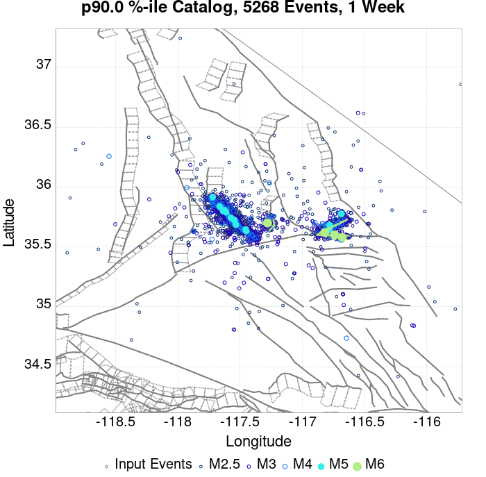 |  |  |  |  | 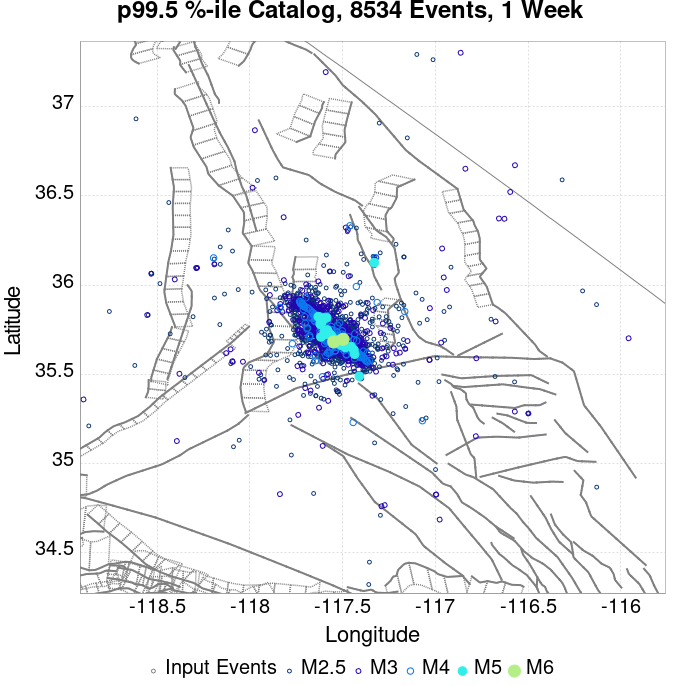 |  |  |
| **1 Month** |  |  |  |  |  | 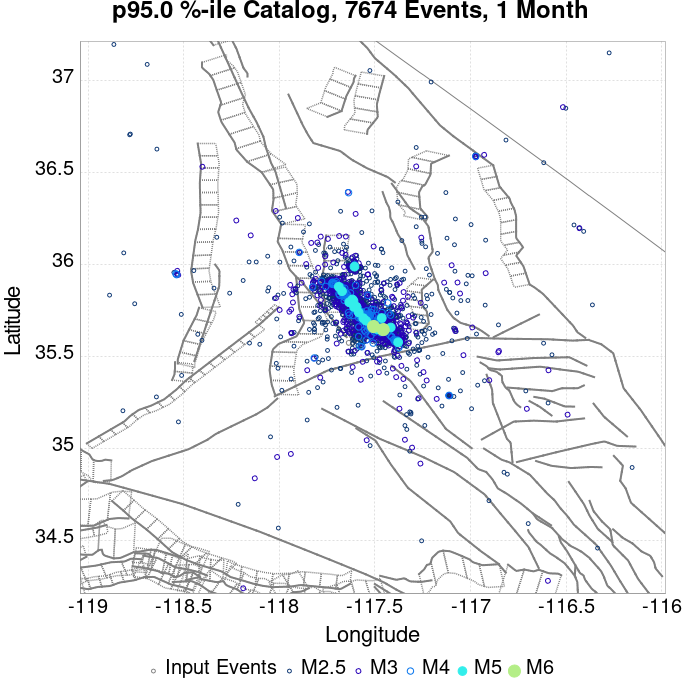 |  |  |  |  |  |  |
| **1 Year** |  |  |  |  |  |  |  |  |  |  | 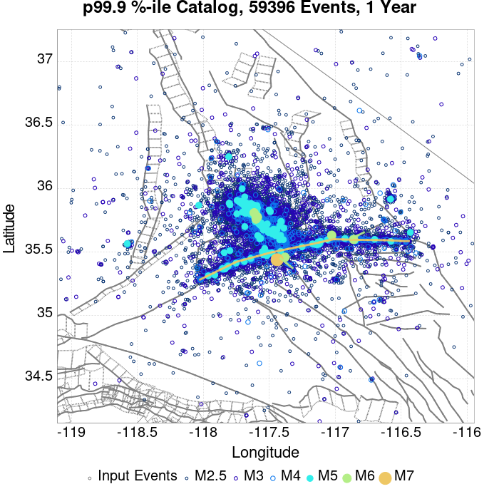 | 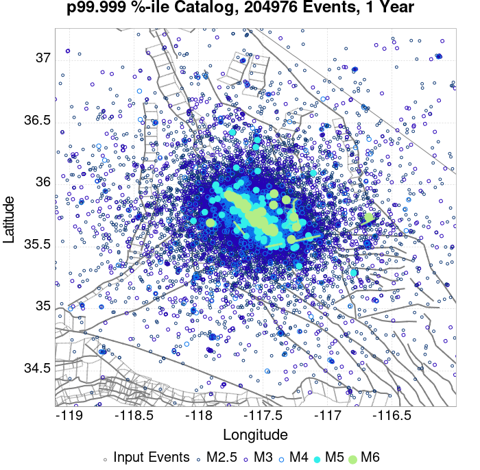 |
| **10 Year** |  |  |  |  |  |  |  |  |  |  |  |  |

## ComCat Data Comparisons
*[(top)](#table-of-contents)*

These plots compare simulated sequences with data from ComCat. All plots only consider events with hypocenters inside the ComCat region defined in the JSON input file.

Last updated at 2020/05/06 15:37:27 UTC, 10 months after the simulation start time.

Total matching ComCat events found: 2402

### ComCat Magnitude-Number Distributions
*[(top)](#table-of-contents)*

| Incremental MND | Cumulative MND |
|-----|-----|
|  |  |

### ComCat Magnitude-Time Functions
*[(top)](#table-of-contents)*

These plots show the show the magnitude versus time probability function since simulation start. Observed event data lie on top, with those input to the simulation plotted as magenta circles and those that occurred after the simulation start time as cyan circles. Time is relative to the mainshock (M7.1, ci38457511, plotted as a brown circle). Probabilities are only shown above the minimum simulated magnitude, M=2.5.

| 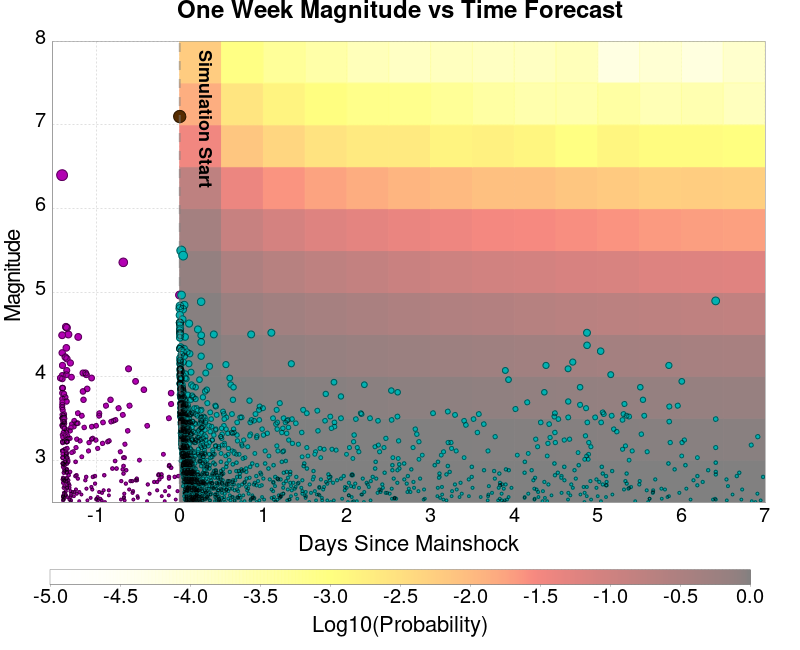 |
|-----|
| 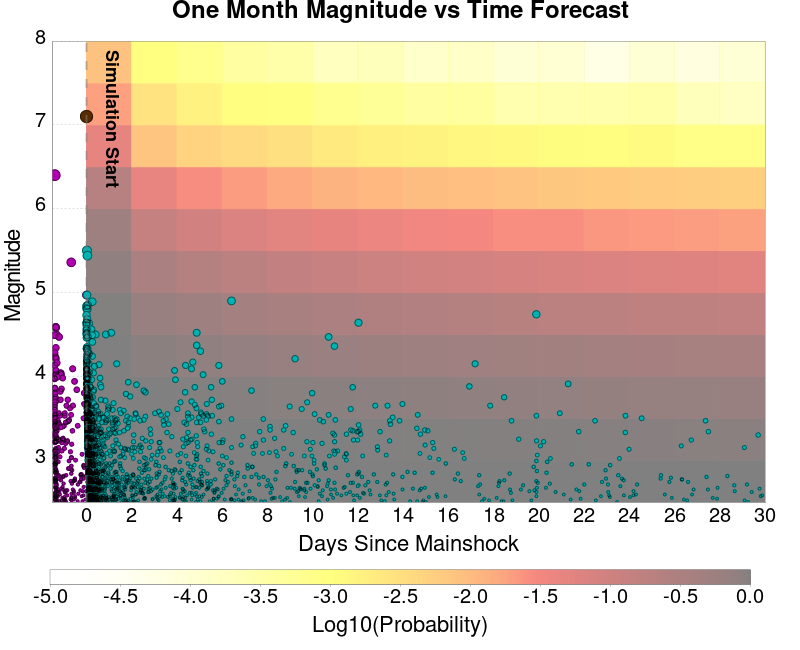 |

### ComCat Time-Dependent Mc
*[(top)](#table-of-contents)*

The following plots compare simulation results with ComCat data above a magnitude threshold. Plots labeled as *M&ge;Mc(t)* use the time-dependent magnitude of completeness (Mc) defined in Helmstetter et al. (2006), which is plotted below. In the case of multiple M&ge;5 ruptures, either as input to the simulation or in the comparison data, the maximum calculated time-dependent Mc is used. This time-dependent Mc function is plotted below.


### ComCat Probability Spatial Distribution
*[(top)](#table-of-contents)*

*Note: maps labeled 'Forecast' are for a duration that extends into the future, only forecasted values are plotted (ComCat data omitted)*

|  | 1 Day | 1 Week | 1 Month | Current (10 Month) | Forecast: 1 Year |
|-----|-----|-----|-----|-----|-----|
| **M&ge;Mc(t)** |  | 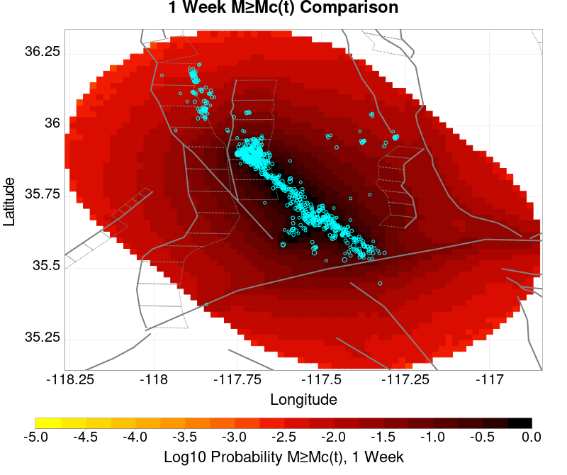 |  |  | 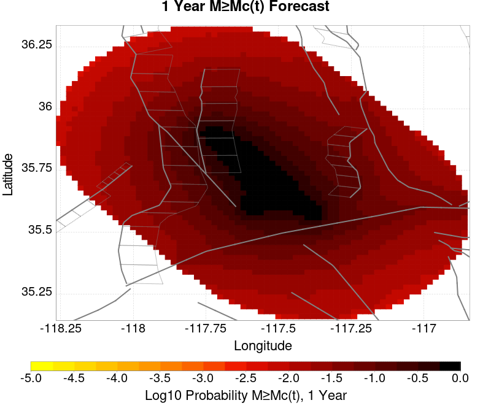 |
|  | Prob: 100.00%, Actual: 332 | Prob: 100.00%, Actual: 843 | Prob: 100.00%, Actual: 1197 | Prob: 100.00%, Actual: 1556 | Prob: 100.00% |
| **M&ge;3.5** |  |  |  |  |  |
|  | Prob: 100.00%, Actual: 246 | Prob: 100.00%, Actual: 306 | Prob: 100.00%, Actual: 334 | Prob: 100.00%, Actual: 366 | Prob: 100.00% |
| **M&ge;4** |  |  |  |  |  |
|  | Prob: 99.89%, Actual: 67 | Prob: 99.99%, Actual: 79 | Prob: 100.00%, Actual: 85 | Prob: 100.00%, Actual: 89 | Prob: 100.00% |
| **M&ge;5** |  |  |  |  | 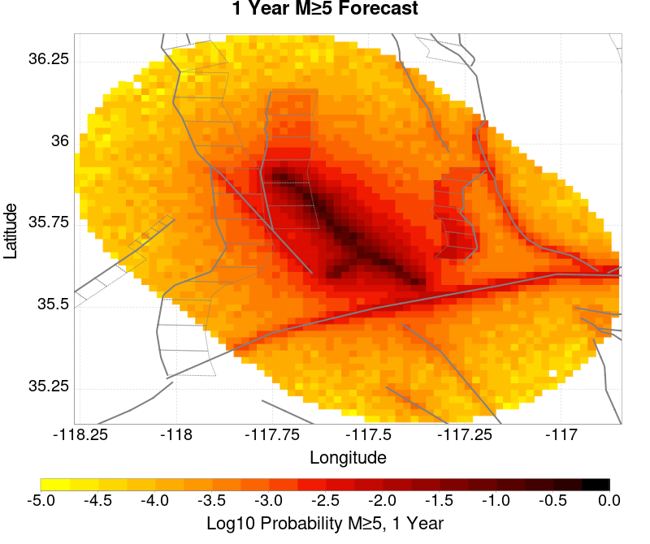 |
|  | Prob: 84.69%, Actual: 2 | Prob: 91.53%, Actual: 2 | Prob: 94.55%, Actual: 2 | Prob: 97.08%, Actual: 2 | Prob: 97.19% |
| **M&ge;6** | 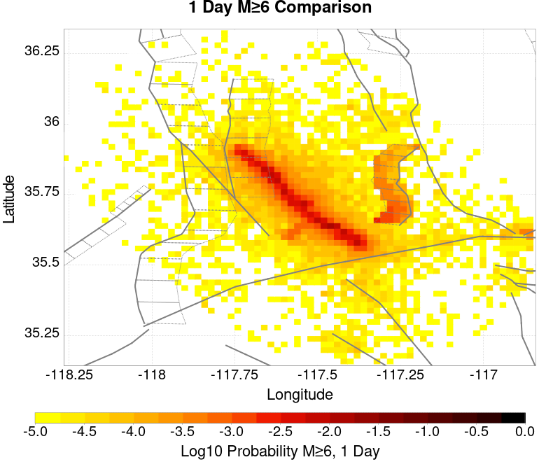 |  |  |  |  |
|  | Prob: 23.27%, Actual: 0 | Prob: 31.31%, Actual: 0 | Prob: 37.03%, Actual: 0 | Prob: 44.94%, Actual: 0 | Prob: 45.53% |
| **M&ge;7** |  | 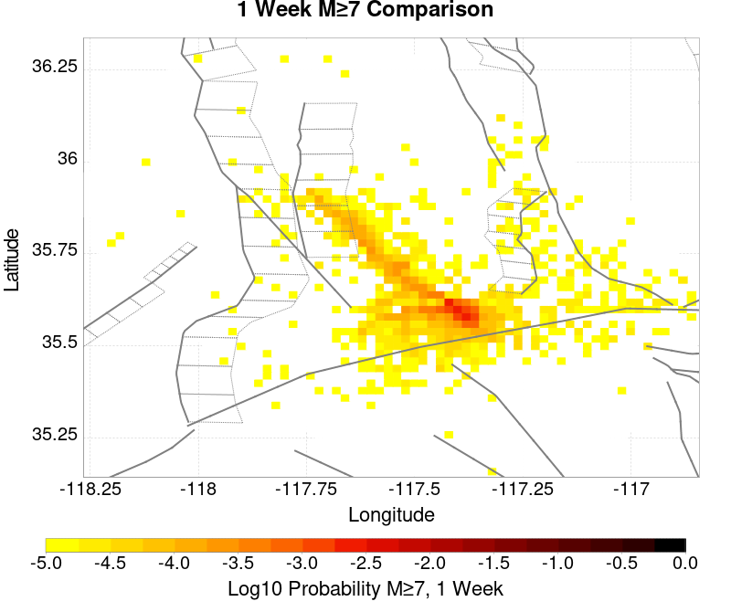 |  |  |  |
|  | Prob: 2.34%, Actual: 0 | Prob: 3.37%, Actual: 0 | Prob: 4.18%, Actual: 0 | Prob: 5.56%, Actual: 0 | Prob: 5.68% |
| **M&ge;8** | 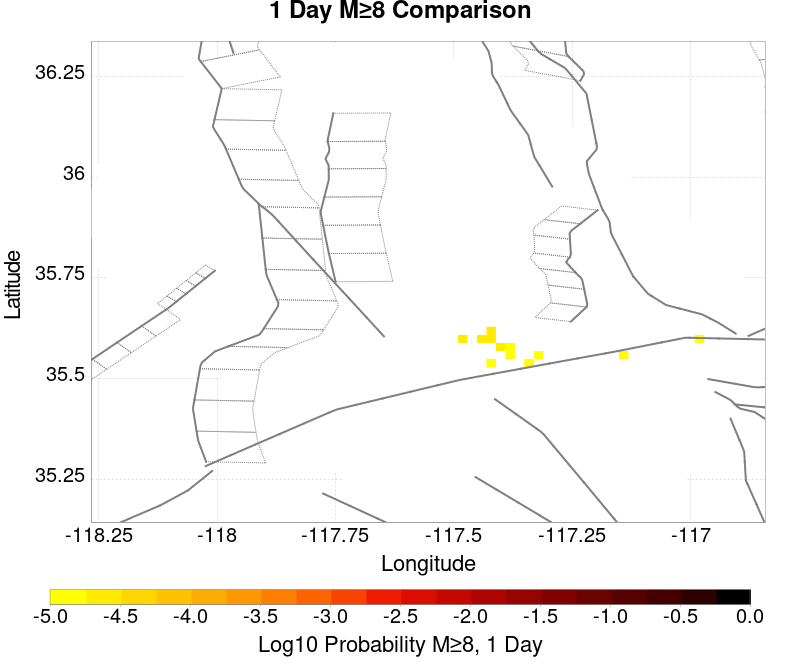 |  |  |  | 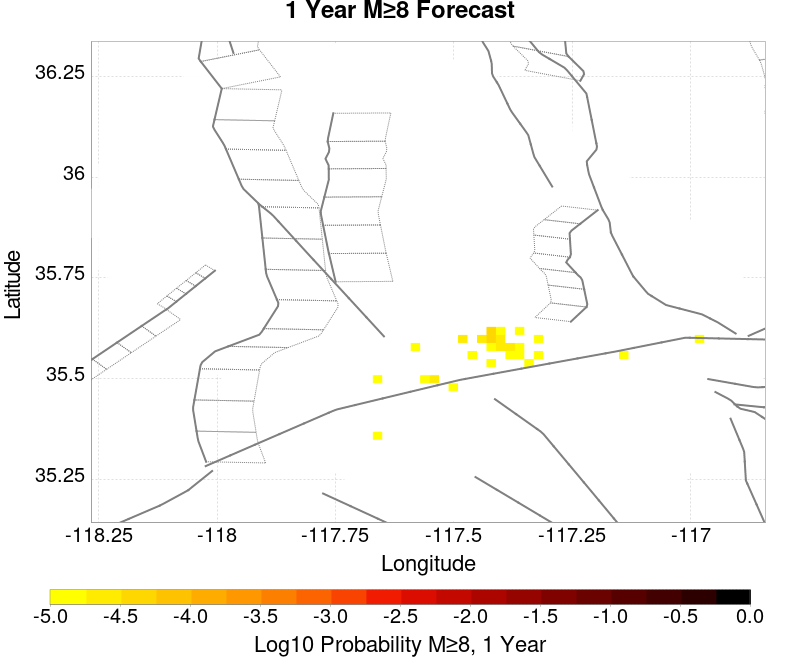 |
|  | Prob: 0.02%, Actual: 0 | Prob: 0.03%, Actual: 0 | Prob: 0.03%, Actual: 0 | Prob: 0.04%, Actual: 0 | Prob: 0.04% |

### ComCat Mean Expectation Spatial Distribution
*[(top)](#table-of-contents)*

*Note: maps labeled 'Forecast' are for a duration that extends into the future, only forecasted values are plotted (ComCat data omitted)*

|  | 1 Day | 1 Week | 1 Month | Current (10 Month) | Forecast: 1 Year |
|-----|-----|-----|-----|-----|-----|
| **M&ge;Mc(t)** |  |  |  |  | 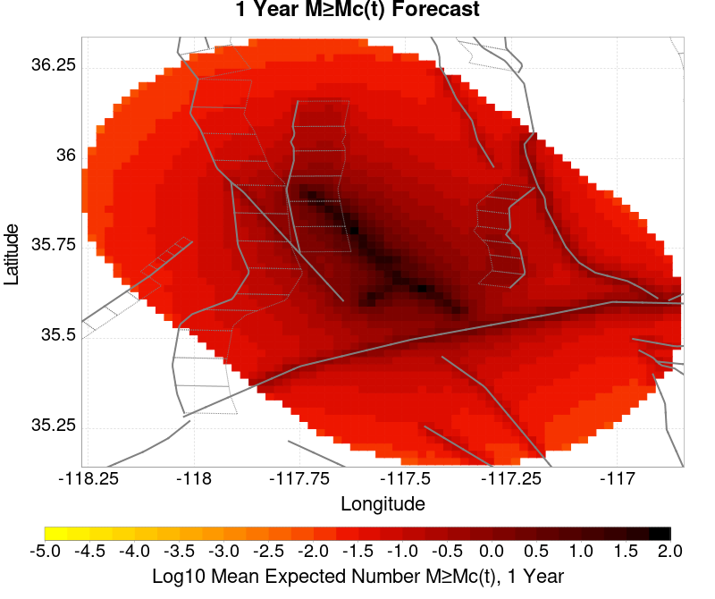 |
|  | Mean: 306.619, Actual: 332 | Mean: 1008.940, Actual: 843 | Mean: 1609.407, Actual: 1197 | Mean: 2660.297, Actual: 1556 | Mean: 2745.517 |
| **M&ge;3.5** |  |  |  |  | 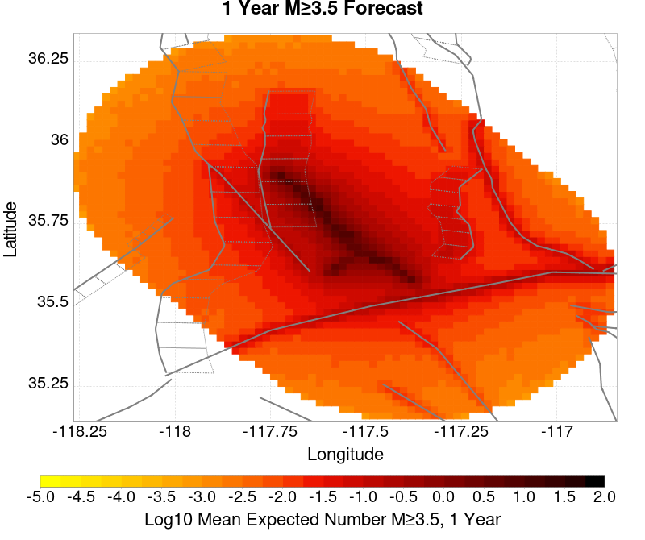 |
|  | Mean: 139.438, Actual: 246 | Mean: 210.671, Actual: 306 | Mean: 270.683, Actual: 334 | Mean: 375.675, Actual: 366 | Mean: 384.201 |
| **M&ge;4** |  |  | 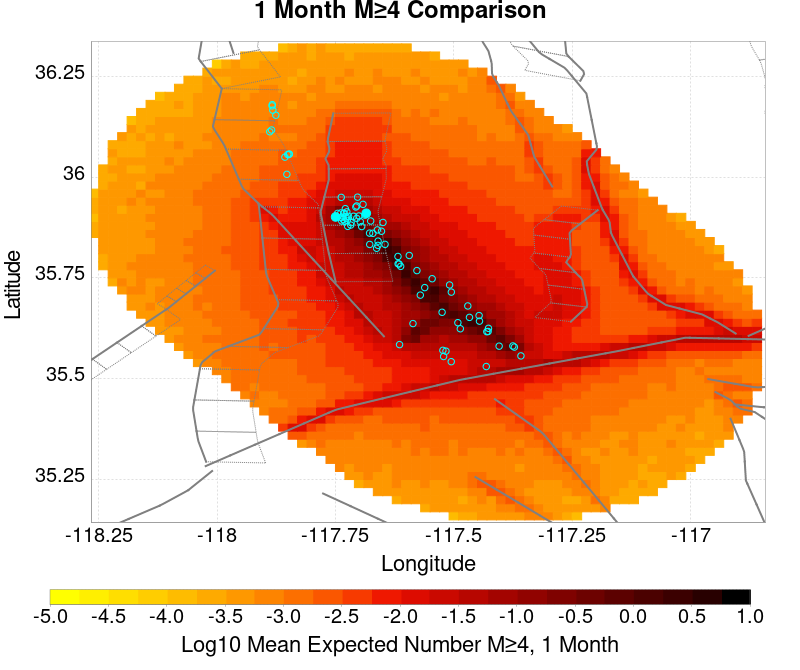 |  |  |
|  | Mean: 43.996, Actual: 67 | Mean: 66.478, Actual: 79 | Mean: 85.411, Actual: 85 | Mean: 118.539, Actual: 89 | Mean: 121.231 |
| **M&ge;5** |  | 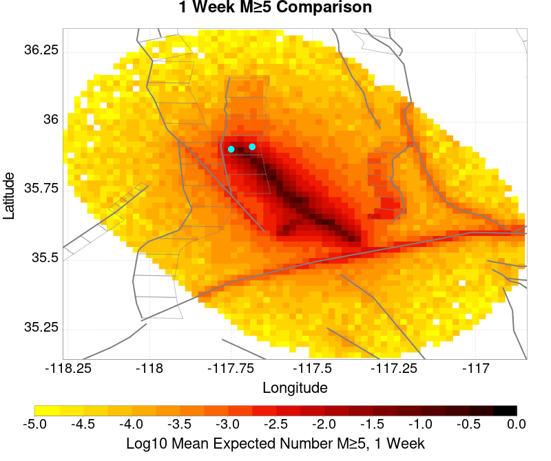 | 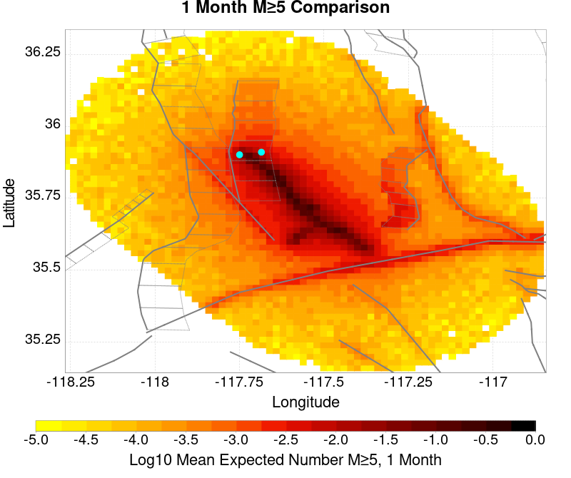 |  | 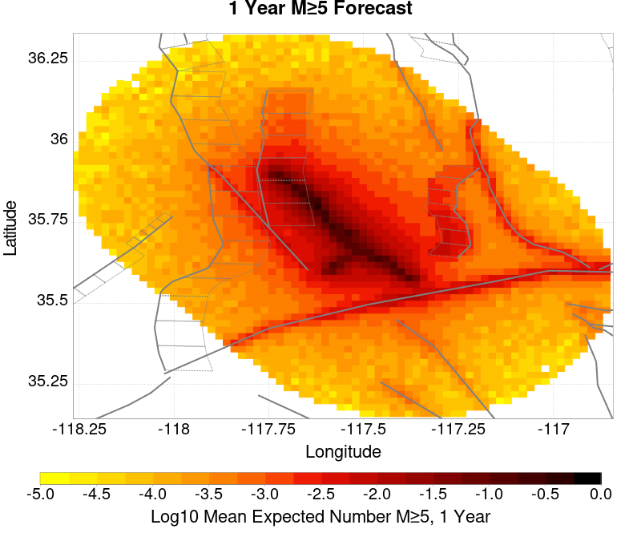 |
|  | Mean: 4.269, Actual: 2 | Mean: 6.448, Actual: 2 | Mean: 8.290, Actual: 2 | Mean: 11.511, Actual: 2 | Mean: 11.777 |
| **M&ge;6** |  |  |  | 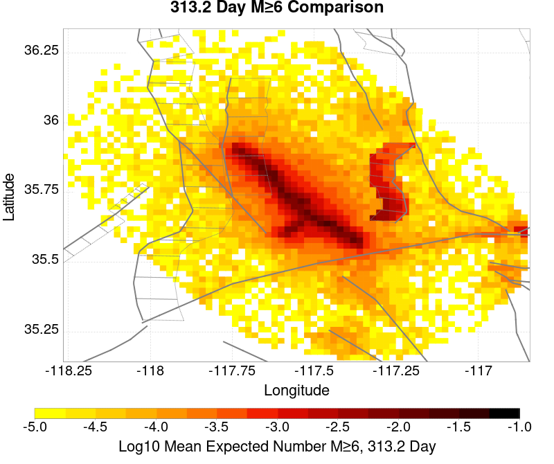 | 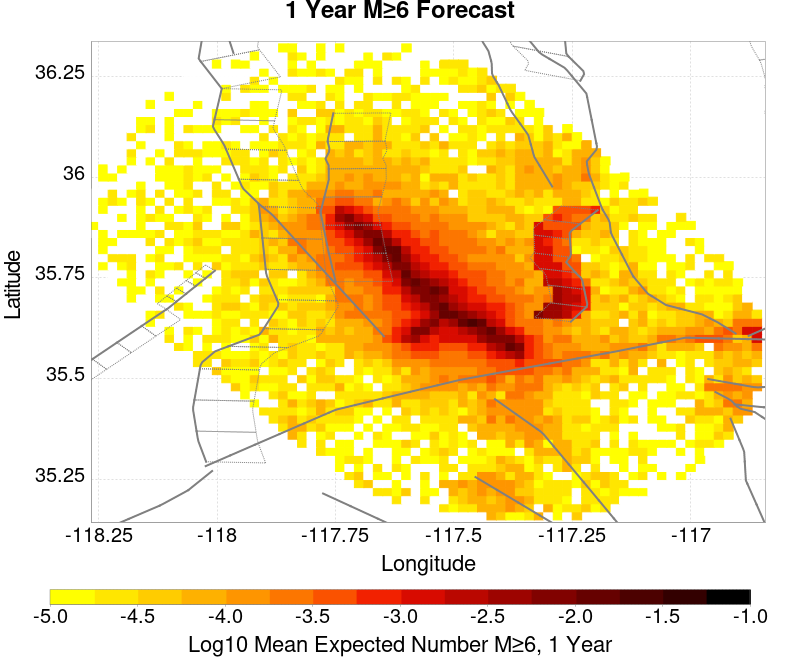 |
|  | Mean: 0.321, Actual: 0 | Mean: 0.484, Actual: 0 | Mean: 0.621, Actual: 0 | Mean: 0.860, Actual: 0 | Mean: 0.879 |
| **M&ge;7** |  |  |  |  |  |
|  | Mean: 0.024, Actual: 0 | Mean: 0.035, Actual: 0 | Mean: 0.043, Actual: 0 | Mean: 0.058, Actual: 0 | Mean: 0.059 |
| **M&ge;8** |  |  |  |  | 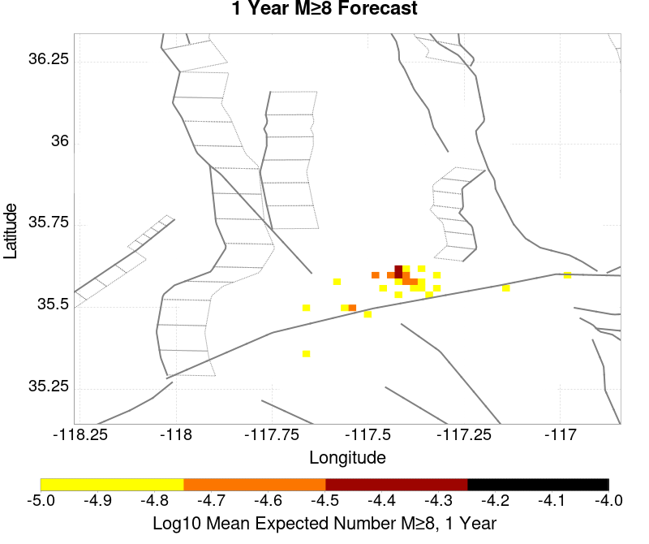 |
|  | Mean: 1.80E-4, Actual: 0 | Mean: 2.50E-4, Actual: 0 | Mean: 3.00E-4, Actual: 0 | Mean: 3.90E-4, Actual: 0 | Mean: 4.00E-4 |

### ComCat Depth Distribution
*[(top)](#table-of-contents)*

| M&ge;Mc(t) | M&ge;3.5 | M&ge;4 | M&ge;5 | M&ge;6 | M&ge;7 | M&ge;8 |
|-----|-----|-----|-----|-----|-----|-----|
|  | 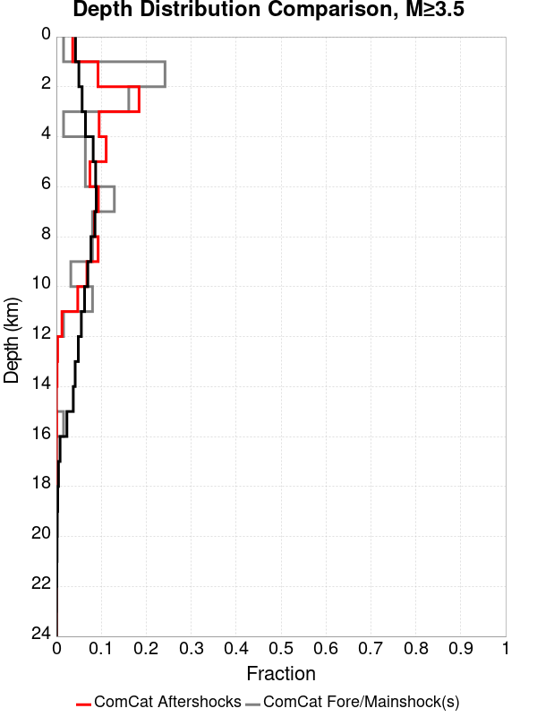 |  |  |  |  |  |

## Section Participation
*[(top)](#table-of-contents)*

### Section Participation Plots
*[(top)](#table-of-contents)*

| Min Mag | 1 yr Triggered Ruptures (no spontaneous) | 10 yr Triggered Ruptures (no spontaneous) | 10 yr Triggered Ruptures (primary aftershocks only) |
|-----|-----|-----|-----|
| **All Supra. Seis.** |  |  |  |
| **M&ge;6.5** |  |  |  |
| **M&ge;7** |  |  |  |
| **M&ge;7.5** |  |  |  |
| **M&ge;8** |  | 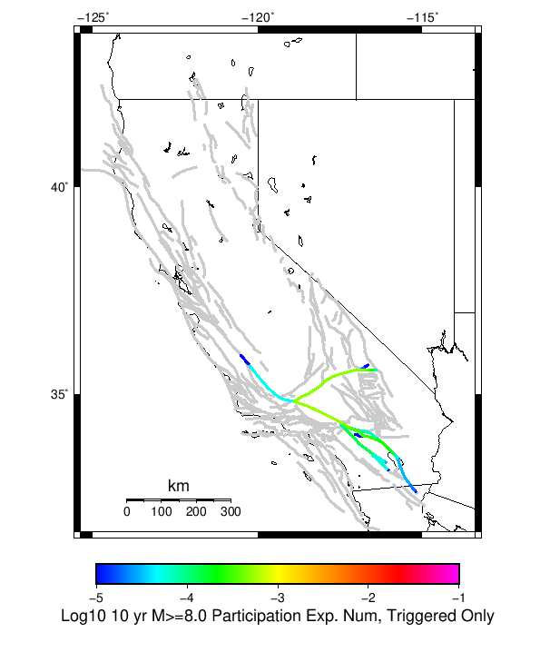 |  |

### Supra-Seismogenic Parent Sections Table
*[(top)](#table-of-contents)*

*First 10 of 224 with matching ruptures shown*

| Parent Name | Triggered 10 Year Mean Count | Triggered 1 Day Prob | Triggered 1 Day 95% Conf | Triggered 1 Week Prob | Triggered 1 Week 95% Conf | Triggered 1 Month Prob | Triggered 1 Month 95% Conf | Triggered 1 Year Prob | Triggered 1 Year 95% Conf | Triggered 10 Year Prob | Triggered 10 Year 95% Conf | Triggered 10 Year Primary Mean Count |
|-----|-----|-----|-----|-----|-----|-----|-----|-----|-----|-----|-----|-----|
| Garlock (Central) | 0.1354 | 0.046 (4.65%) | [4.52% 4.78%] | 0.065 (6.51%) | [6.36% 6.67%] | 0.079 (7.93%) | [7.76% 8.10%] | 0.104 (10.43%) | [10.24% 10.62%] | 0.128 (12.78%) | [12.57% 12.98%] | 0.0746 |
| Tank Canyon | 0.11324 | 0.023 (2.28%) | [2.19% 2.38%] | 0.036 (3.59%) | [3.48% 3.71%] | 0.047 (4.74%) | [4.61% 4.87%] | 0.070 (7.02%) | [6.86% 7.18%] | 0.095 (9.46%) | [9.28% 9.65%] | 0.03023 |
| Little Lake | 0.06419 | 0.021 (2.15%) | [2.06% 2.24%] | 0.031 (3.08%) | [2.97% 3.18%] | 0.038 (3.79%) | [3.67% 3.91%] | 0.049 (4.93%) | [4.80% 5.07%] | 0.061 (6.09%) | [5.94% 6.24%] | 0.036 |
| Airport Lake | 0.05232 | 0.020 (2.00%) | [1.92% 2.09%] | 0.028 (2.77%) | [2.67% 2.88%] | 0.034 (3.35%) | [3.24% 3.46%] | 0.043 (4.35%) | [4.22% 4.47%] | 0.052 (5.21%) | [5.07% 5.35%] | 0.03458 |
| Owl Lake | 0.04176 | 9.44E-3 (0.94%) | [0.89% 1.01%] | 0.015 (1.47%) | [1.39% 1.54%] | 0.019 (1.92%) | [1.84% 2.01%] | 0.028 (2.77%) | [2.67% 2.88%] | 0.037 (3.67%) | [3.56% 3.79%] | 0.01138 |
| Panamint Valley | 0.0322 | 7.85E-3 (0.78%) | [0.73% 0.84%] | 0.012 (1.22%) | [1.16% 1.29%] | 0.016 (1.61%) | [1.54% 1.69%] | 0.024 (2.40%) | [2.30% 2.50%] | 0.031 (3.12%) | [3.02% 3.23%] | 0.01156 |
| Garlock (East) | 0.02712 | 6.19E-3 (0.62%) | [0.57% 0.67%] | 9.51E-3 (0.95%) | [0.89% 1.01%] | 0.012 (1.23%) | [1.16% 1.30%] | 0.018 (1.80%) | [1.72% 1.89%] | 0.024 (2.44%) | [2.34% 2.53%] | 0.0078 |
| Hunter Mountain-Saline Valley | 0.0147 | 4.30E-3 (0.43%) | [0.39% 0.47%] | 6.56E-3 (0.66%) | [0.61% 0.71%] | 8.20E-3 (0.82%) | [0.77% 0.88%] | 0.012 (1.15%) | [1.09% 1.22%] | 0.014 (1.44%) | [1.37% 1.52%] | 0.00694 |
| Blackwater | 0.01296 | 2.24E-3 (0.22%) | [0.20% 0.26%] | 3.72E-3 (0.37%) | [0.34% 0.41%] | 4.99E-3 (0.50%) | [0.46% 0.55%] | 8.24E-3 (0.82%) | [0.77% 0.88%] | 0.012 (1.23%) | [1.17% 1.31%] | 0.00278 |
| Ash Hill | 0.01194 | 1.94E-3 (0.19%) | [0.17% 0.22%] | 3.49E-3 (0.35%) | [0.31% 0.39%] | 4.79E-3 (0.48%) | [0.44% 0.52%] | 7.59E-3 (0.76%) | [0.71% 0.82%] | 0.011 (1.10%) | [1.03% 1.16%] | 0.0018 |

### M≥6.5 Parent Sections Table
*[(top)](#table-of-contents)*

*First 10 of 186 with matching ruptures shown*

| Parent Name | Triggered 10 Year Mean Count | Triggered 1 Day Prob | Triggered 1 Day 95% Conf | Triggered 1 Week Prob | Triggered 1 Week 95% Conf | Triggered 1 Month Prob | Triggered 1 Month 95% Conf | Triggered 1 Year Prob | Triggered 1 Year 95% Conf | Triggered 10 Year Prob | Triggered 10 Year 95% Conf | Triggered 10 Year Primary Mean Count |
|-----|-----|-----|-----|-----|-----|-----|-----|-----|-----|-----|-----|-----|
| Garlock (Central) | 0.05779 | 0.019 (1.92%) | [1.83% 2.00%] | 0.028 (2.76%) | [2.66% 2.86%] | 0.034 (3.41%) | [3.29% 3.52%] | 0.046 (4.58%) | [4.46% 4.72%] | 0.057 (5.68%) | [5.53% 5.82%] | 0.03043 |
| Airport Lake | 0.03937 | 0.015 (1.50%) | [1.43% 1.58%] | 0.021 (2.08%) | [1.99% 2.17%] | 0.025 (2.51%) | [2.41% 2.61%] | 0.033 (3.27%) | [3.16% 3.38%] | 0.039 (3.93%) | [3.81% 4.05%] | 0.02598 |
| Little Lake | 0.03919 | 0.014 (1.38%) | [1.31% 1.46%] | 0.020 (1.97%) | [1.88% 2.06%] | 0.024 (2.43%) | [2.33% 2.52%] | 0.031 (3.14%) | [3.03% 3.25%] | 0.038 (3.82%) | [3.70% 3.94%] | 0.02326 |
| Panamint Valley | 0.02975 | 7.63E-3 (0.76%) | [0.71% 0.82%] | 0.012 (1.18%) | [1.11% 1.25%] | 0.015 (1.52%) | [1.45% 1.60%] | 0.022 (2.25%) | [2.16% 2.34%] | 0.029 (2.90%) | [2.79% 3.00%] | 0.01136 |
| Owl Lake | 0.02343 | 7.11E-3 (0.71%) | [0.66% 0.77%] | 0.010 (1.05%) | [0.98% 1.11%] | 0.013 (1.32%) | [1.25% 1.39%] | 0.018 (1.83%) | [1.75% 1.92%] | 0.023 (2.33%) | [2.24% 2.43%] | 0.01004 |
| Garlock (East) | 0.0188 | 5.12E-3 (0.51%) | [0.47% 0.56%] | 7.56E-3 (0.76%) | [0.70% 0.81%] | 9.55E-3 (0.95%) | [0.90% 1.02%] | 0.013 (1.34%) | [1.27% 1.42%] | 0.018 (1.78%) | [1.70% 1.86%] | 0.0073 |
| Hunter Mountain-Saline Valley | 0.01445 | 4.29E-3 (0.43%) | [0.39% 0.47%] | 6.51E-3 (0.65%) | [0.60% 0.70%] | 8.13E-3 (0.81%) | [0.76% 0.87%] | 0.011 (1.14%) | [1.08% 1.21%] | 0.014 (1.43%) | [1.35% 1.50%] | 0.00692 |
| Tank Canyon | 0.01248 | 2.59E-3 (0.26%) | [0.23% 0.29%] | 3.93E-3 (0.39%) | [0.36% 0.43%] | 5.39E-3 (0.54%) | [0.50% 0.59%] | 8.46E-3 (0.85%) | [0.79% 0.91%] | 0.012 (1.24%) | [1.17% 1.31%] | 0.00305 |
| Garlock (West) | 0.00971 | 3.30E-3 (0.33%) | [0.30% 0.37%] | 4.64E-3 (0.46%) | [0.42% 0.51%] | 5.68E-3 (0.57%) | [0.52% 0.62%] | 7.78E-3 (0.78%) | [0.72% 0.83%] | 9.71E-3 (0.97%) | [0.91% 1.03%] | 0.00495 |
| So Sierra Nevada | 0.00484 | 1.07E-3 (0.11%) | [0.09% 0.13%] | 1.70E-3 (0.17%) | [0.15% 0.20%] | 2.30E-3 (0.23%) | [0.20% 0.26%] | 3.36E-3 (0.34%) | [0.30% 0.37%] | 4.78E-3 (0.48%) | [0.44% 0.52%] | 9.3E-4 |

### M≥7 Parent Sections Table
*[(top)](#table-of-contents)*

*First 10 of 141 with matching ruptures shown*

| Parent Name | Triggered 10 Year Mean Count | Triggered 1 Day Prob | Triggered 1 Day 95% Conf | Triggered 1 Week Prob | Triggered 1 Week 95% Conf | Triggered 1 Month Prob | Triggered 1 Month 95% Conf | Triggered 1 Year Prob | Triggered 1 Year 95% Conf | Triggered 10 Year Prob | Triggered 10 Year 95% Conf | Triggered 10 Year Primary Mean Count |
|-----|-----|-----|-----|-----|-----|-----|-----|-----|-----|-----|-----|-----|
| Garlock (Central) | 0.05178 | 0.017 (1.72%) | [1.64% 1.80%] | 0.025 (2.48%) | [2.39% 2.58%] | 0.031 (3.06%) | [2.96% 3.17%] | 0.041 (4.13%) | [4.01% 4.25%] | 0.051 (5.11%) | [4.97% 5.25%] | 0.02721 |
| Panamint Valley | 0.02031 | 5.98E-3 (0.60%) | [0.55% 0.65%] | 9.11E-3 (0.91%) | [0.85% 0.97%] | 0.011 (1.14%) | [1.07% 1.21%] | 0.016 (1.62%) | [1.54% 1.70%] | 0.020 (2.02%) | [1.93% 2.10%] | 0.00959 |
| Owl Lake | 0.01798 | 6.21E-3 (0.62%) | [0.57% 0.67%] | 8.80E-3 (0.88%) | [0.82% 0.94%] | 0.011 (1.09%) | [1.03% 1.16%] | 0.015 (1.45%) | [1.38% 1.53%] | 0.018 (1.80%) | [1.72% 1.88%] | 0.00971 |
| Hunter Mountain-Saline Valley | 0.01409 | 4.25E-3 (0.43%) | [0.39% 0.47%] | 6.47E-3 (0.65%) | [0.60% 0.70%] | 8.06E-3 (0.81%) | [0.75% 0.86%] | 0.011 (1.13%) | [1.06% 1.19%] | 0.014 (1.41%) | [1.33% 1.48%] | 0.00684 |
| Garlock (East) | 0.01399 | 4.64E-3 (0.46%) | [0.42% 0.51%] | 6.65E-3 (0.66%) | [0.62% 0.72%] | 8.12E-3 (0.81%) | [0.76% 0.87%] | 0.011 (1.08%) | [1.02% 1.15%] | 0.014 (1.39%) | [1.32% 1.46%] | 0.00708 |
| Garlock (West) | 0.00956 | 3.30E-3 (0.33%) | [0.30% 0.37%] | 4.61E-3 (0.46%) | [0.42% 0.51%] | 5.63E-3 (0.56%) | [0.52% 0.61%] | 7.72E-3 (0.77%) | [0.72% 0.83%] | 9.56E-3 (0.96%) | [0.90% 1.02%] | 0.00489 |
| Little Lake | 0.00864 | 3.19E-3 (0.32%) | [0.29% 0.36%] | 4.43E-3 (0.44%) | [0.40% 0.49%] | 5.50E-3 (0.55%) | [0.51% 0.60%] | 7.25E-3 (0.73%) | [0.67% 0.78%] | 8.62E-3 (0.86%) | [0.81% 0.92%] | 0.00552 |
| Airport Lake | 0.00808 | 2.97E-3 (0.30%) | [0.26% 0.33%] | 4.14E-3 (0.41%) | [0.38% 0.46%] | 5.15E-3 (0.52%) | [0.47% 0.56%] | 6.81E-3 (0.68%) | [0.63% 0.73%] | 8.08E-3 (0.81%) | [0.75% 0.87%] | 0.00519 |
| San Andreas (Mojave N) | 0.00397 | 1.34E-3 (0.13%) | [0.11% 0.16%] | 1.80E-3 (0.18%) | [0.16% 0.21%] | 2.21E-3 (0.22%) | [0.19% 0.25%] | 3.07E-3 (0.31%) | [0.27% 0.34%] | 3.89E-3 (0.39%) | [0.35% 0.43%] | 0.0019 |
| San Andreas (Mojave S) | 0.00304 | 9.80E-4 (0.10%) | [0.08% 0.12%] | 1.34E-3 (0.13%) | [0.11% 0.16%] | 1.69E-3 (0.17%) | [0.14% 0.20%] | 2.41E-3 (0.24%) | [0.21% 0.27%] | 3.03E-3 (0.30%) | [0.27% 0.34%] | 0.00145 |

### M≥7.5 Parent Sections Table
*[(top)](#table-of-contents)*

*First 10 of 80 with matching ruptures shown*

| Parent Name | Triggered 10 Year Mean Count | Triggered 1 Day Prob | Triggered 1 Day 95% Conf | Triggered 1 Week Prob | Triggered 1 Week 95% Conf | Triggered 1 Month Prob | Triggered 1 Month 95% Conf | Triggered 1 Year Prob | Triggered 1 Year 95% Conf | Triggered 10 Year Prob | Triggered 10 Year 95% Conf | Triggered 10 Year Primary Mean Count |
|-----|-----|-----|-----|-----|-----|-----|-----|-----|-----|-----|-----|-----|
| Garlock (Central) | 0.02094 | 6.88E-3 (0.69%) | [0.64% 0.74%] | 9.93E-3 (0.99%) | [0.93% 1.06%] | 0.012 (1.23%) | [1.16% 1.30%] | 0.017 (1.68%) | [1.60% 1.76%] | 0.021 (2.08%) | [1.99% 2.17%] | 0.01092 |
| Panamint Valley | 0.01359 | 4.18E-3 (0.42%) | [0.38% 0.46%] | 6.37E-3 (0.64%) | [0.59% 0.69%] | 7.91E-3 (0.79%) | [0.74% 0.85%] | 0.011 (1.09%) | [1.03% 1.16%] | 0.014 (1.36%) | [1.29% 1.43%] | 0.00675 |
| Hunter Mountain-Saline Valley | 0.01354 | 4.15E-3 (0.41%) | [0.38% 0.46%] | 6.34E-3 (0.63%) | [0.59% 0.69%] | 7.88E-3 (0.79%) | [0.73% 0.85%] | 0.011 (1.09%) | [1.03% 1.15%] | 0.014 (1.35%) | [1.28% 1.43%] | 0.00671 |
| Garlock (West) | 0.00845 | 2.96E-3 (0.30%) | [0.26% 0.33%] | 4.04E-3 (0.40%) | [0.37% 0.45%] | 4.93E-3 (0.49%) | [0.45% 0.54%] | 6.76E-3 (0.68%) | [0.63% 0.73%] | 8.45E-3 (0.84%) | [0.79% 0.90%] | 0.00443 |
| Garlock (East) | 0.00542 | 1.98E-3 (0.20%) | [0.17% 0.23%] | 2.69E-3 (0.27%) | [0.24% 0.30%] | 3.19E-3 (0.32%) | [0.29% 0.36%] | 4.29E-3 (0.43%) | [0.39% 0.47%] | 5.42E-3 (0.54%) | [0.50% 0.59%] | 0.00295 |
| San Andreas (Mojave N) | 0.00397 | 1.34E-3 (0.13%) | [0.11% 0.16%] | 1.80E-3 (0.18%) | [0.16% 0.21%] | 2.21E-3 (0.22%) | [0.19% 0.25%] | 3.07E-3 (0.31%) | [0.27% 0.34%] | 3.89E-3 (0.39%) | [0.35% 0.43%] | 0.0019 |
| San Andreas (Mojave S) | 0.00297 | 9.60E-4 (0.10%) | [0.08% 0.12%] | 1.31E-3 (0.13%) | [0.11% 0.16%] | 1.64E-3 (0.16%) | [0.14% 0.19%] | 2.34E-3 (0.23%) | [0.21% 0.27%] | 2.96E-3 (0.30%) | [0.26% 0.33%] | 0.00144 |
| San Andreas (San Bernardino N) | 0.00191 | 6.40E-4 (0.06%) | [0.05% 0.08%] | 8.50E-4 (0.08%) | [0.07% 0.11%] | 1.05E-3 (0.10%) | [0.09% 0.13%] | 1.48E-3 (0.15%) | [0.13% 0.17%] | 1.91E-3 (0.19%) | [0.17% 0.22%] | 9.5E-4 |
| Owl Lake | 0.00178 | 5.40E-4 (0.05%) | [0.04% 0.07%] | 7.60E-4 (0.08%) | [0.06% 0.10%] | 9.90E-4 (0.10%) | [0.08% 0.12%] | 1.42E-3 (0.14%) | [0.12% 0.17%] | 1.78E-3 (0.18%) | [0.15% 0.21%] | 8.0E-4 |
| San Andreas (San Bernardino S) | 9.2E-4 | 2.50E-4 (0.03%) | [0.02% 0.04%] | 3.90E-4 (0.04%) | [0.03% 0.05%] | 4.60E-4 (0.05%) | [0.03% 0.06%] | 6.90E-4 (0.07%) | [0.05% 0.09%] | 9.10E-4 (0.09%) | [0.07% 0.11%] | 4.2E-4 |

### M≥8 Parent Sections Table
*[(top)](#table-of-contents)*

*First 10 of 27 with matching ruptures shown*

| Parent Name | Triggered 10 Year Mean Count | Triggered 1 Day Prob | Triggered 1 Day 95% Conf | Triggered 1 Week Prob | Triggered 1 Week 95% Conf | Triggered 1 Month Prob | Triggered 1 Month 95% Conf | Triggered 1 Year Prob | Triggered 1 Year 95% Conf | Triggered 10 Year Prob | Triggered 10 Year 95% Conf | Triggered 10 Year Primary Mean Count |
|-----|-----|-----|-----|-----|-----|-----|-----|-----|-----|-----|-----|-----|
| San Andreas (Mojave N) | 5.5E-4 | 1.90E-4 (0.02%) | [0.01% 0.03%] | 2.60E-4 (0.03%) | [0.02% 0.04%] | 3.10E-4 (0.03%) | [0.02% 0.04%] | 4.30E-4 (0.04%) | [0.03% 0.06%] | 5.50E-4 (0.06%) | [0.04% 0.07%] | 3.1E-4 |
| San Andreas (Mojave S) | 5.5E-4 | 1.90E-4 (0.02%) | [0.01% 0.03%] | 2.60E-4 (0.03%) | [0.02% 0.04%] | 3.10E-4 (0.03%) | [0.02% 0.04%] | 4.30E-4 (0.04%) | [0.03% 0.06%] | 5.50E-4 (0.06%) | [0.04% 0.07%] | 3.1E-4 |
| San Andreas (San Bernardino N) | 5.5E-4 | 1.90E-4 (0.02%) | [0.01% 0.03%] | 2.60E-4 (0.03%) | [0.02% 0.04%] | 3.10E-4 (0.03%) | [0.02% 0.04%] | 4.30E-4 (0.04%) | [0.03% 0.06%] | 5.50E-4 (0.06%) | [0.04% 0.07%] | 3.1E-4 |
| Garlock (Central) | 5.0E-4 | 1.80E-4 (0.02%) | [0.01% 0.03%] | 2.50E-4 (0.03%) | [0.02% 0.04%] | 3.00E-4 (0.03%) | [0.02% 0.04%] | 4.00E-4 (0.04%) | [0.03% 0.06%] | 5.00E-4 (0.05%) | [0.04% 0.07%] | 2.9E-4 |
| Garlock (West) | 5.0E-4 | 1.80E-4 (0.02%) | [0.01% 0.03%] | 2.50E-4 (0.03%) | [0.02% 0.04%] | 3.00E-4 (0.03%) | [0.02% 0.04%] | 4.00E-4 (0.04%) | [0.03% 0.06%] | 5.00E-4 (0.05%) | [0.04% 0.07%] | 2.9E-4 |
| Garlock (East) | 4.3E-4 | 1.60E-4 (0.02%) | [0.01% 0.03%] | 2.20E-4 (0.02%) | [0.01% 0.03%] | 2.60E-4 (0.03%) | [0.02% 0.04%] | 3.40E-4 (0.03%) | [0.02% 0.05%] | 4.30E-4 (0.04%) | [0.03% 0.06%] | 2.4E-4 |
| San Andreas (San Bernardino S) | 3.2E-4 | 1.10E-4 (0.01%) | [0.01% 0.02%] | 1.50E-4 (0.01%) | [0.01% 0.03%] | 1.70E-4 (0.02%) | [0.01% 0.03%] | 2.40E-4 (0.02%) | [0.02% 0.04%] | 3.20E-4 (0.03%) | [0.02% 0.05%] | 1.9E-4 |
| San Andreas (San Gorgonio Pass-Garnet HIll) | 2.9E-4 | 1.10E-4 (0.01%) | [0.01% 0.02%] | 1.40E-4 (0.01%) | [0.01% 0.02%] | 1.60E-4 (0.02%) | [0.01% 0.03%] | 2.20E-4 (0.02%) | [0.01% 0.03%] | 2.90E-4 (0.03%) | [0.02% 0.04%] | 1.9E-4 |
| San Andreas (Coachella) rev | 2.5E-4 | 7.00E-5 (0.01%) | [0.00% 0.02%] | 8.00E-5 (0.01%) | [0.00% 0.02%] | 1.10E-4 (0.01%) | [0.01% 0.02%] | 1.70E-4 (0.02%) | [0.01% 0.03%] | 2.50E-4 (0.03%) | [0.02% 0.04%] | 1.7E-4 |
| San Jacinto (San Bernardino) | 1.4E-4 | 4.00E-5 (0.00%) | [0.00% 0.01%] | 7.00E-5 (0.01%) | [0.00% 0.02%] | 8.00E-5 (0.01%) | [0.00% 0.02%] | 1.20E-4 (0.01%) | [0.01% 0.02%] | 1.40E-4 (0.01%) | [0.01% 0.02%] | 6.0E-5 |

## Fault Magnitude-Probability Distributions
*[(top)](#table-of-contents)*

The first 5 sections (sorted by trigger rate) are plotted below. All fault MPDs are available [here](plots/parent_sect_mpds/README.md)

| 1 Week | 1 Month | 1 Year | 10 Year |
|-----|-----|-----|-----|
|  |  |  |  |
|  |  |  |  |
|  |  |  |  |
|  |  |  |  |
|  |  |  |  |

## Gridded Nucleation
*[(top)](#table-of-contents)*

| Min Mag | Triggered Ruptures (no spontaneous) | Triggered Ruptures (primary aftershocks only) |
|-----|-----|-----|
| **M&ge;2.5** | 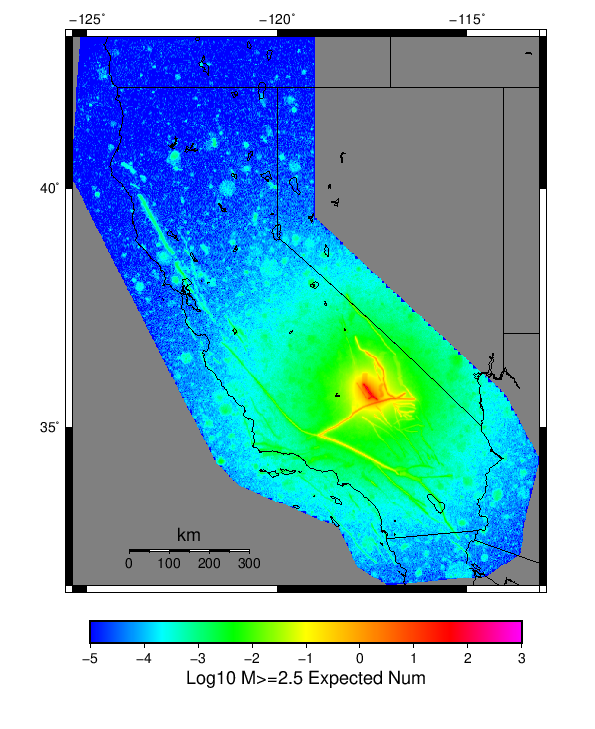 | 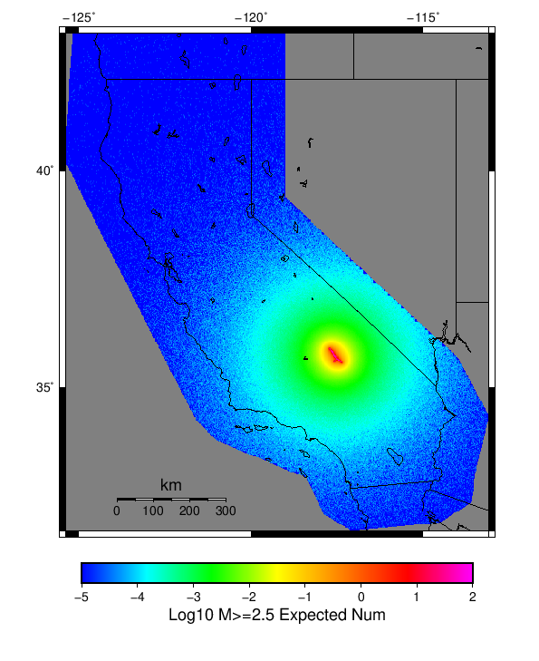 |
| **M&ge;5** |  |  |
| **M&ge;6** |  |  |
| **M&ge;7** |  |  |


## JSON Input File
*[(top)](#table-of-contents)*

```
{
  "numSimulations": 100000,
  "duration": 10.0,
  "startTimeMillis": 1562383194040,
  "includeSpontaneous": false,
  "randomSeed": 1572975569068,
  "binaryOutput": true,
  "binaryOutputFilters": [
    {
      "prefix": "results_complete",
      "descendantsOnly": false
    },
    {
      "prefix": "results_m5_preserve_chain",
      "minMag": 5.0,
      "preserveChainBelowMag": true,
      "descendantsOnly": false
    }
  ],
  "forceRecalc": false,
  "simulationName": "ComCat M7.1 (ci38457511), ShakeMap Surfaces, kCOV\u003d1.16",
  "numRetries": 3,
  "outputDir": "/home/scec-02/kmilner/ucerf3/etas_sim/2019_11_05-ComCatM7p1_ci38457511_ShakeMapSurfaces_kCOV1p16",
  "treatTriggerCatalogAsSpontaneous": false,
  "triggerRuptures": [
    "omitted due to length, see original input file"
  ],
  "cacheDir": "/home/scec-02/kmilner/ucerf3/ucerf3-etas-launcher/inputs/cache_fm3p1_ba",
  "fssFile": "/home/scec-02/kmilner/ucerf3/ucerf3-etas-launcher/inputs/2013_05_10-ucerf3p3-production-10runs_COMPOUND_SOL_FM3_1_SpatSeisU3_MEAN_BRANCH_AVG_SOL.zip",
  "probModel": "FULL_TD",
  "applySubSeisForSupraNucl": true,
  "totRateScaleFactor": 1.14,
  "gridSeisCorr": true,
  "timeIndependentERF": false,
  "griddedOnly": false,
  "imposeGR": false,
  "includeIndirectTriggering": true,
  "gridSeisDiscr": 0.1,
  "catalogCompletenessModel": "RELAXED",
  "etas_k_cov": 1.16,
  "configCommand": "u3etas_comcat_event_config_builder.sh --event-id ci38457511 --mag-complete 3.5 --num-simulations 100000 --days-before 7 --etas-k-cov 1.16 --finite-surf-shakemap --finite-surf-shakemap-min-mag 5 --hpc-site USC_HPC --nodes 36 --hours 24 --queue scec",
  "configTime": 1572975569068,
  "comcatMetadata": {
    "region": {
      "border": [
        {
          "latitude": 35.15123745324938,
          "longitude": -117.46198765392752
        },
        {
          "latitude": 35.170513097218205,
          "longitude": -117.55046477274733
        },
        {
          "latitude": 35.201997575622634,
          "longitude": -117.63356287896195
        },
        {
          "latitude": 35.24474776584818,
          "longitude": -117.70878534540662
        },
        {
          "latitude": 35.2893890362986,
          "longitude": -117.76387551603122
        },
        {
          "latitude": 35.288830898189985,
          "longitude": -117.76465036296011
        },
        {
          "latitude": 35.62116745212862,
          "longitude": -118.13026990137416
        },
        {
          "latitude": 35.621789874646055,
          "longitude": -118.12940866580139
        },
        {
          "latitude": 35.621789874646055,
          "longitude": -118.12940866580136
        },
        {
          "latitude": 35.63100857737423,
          "longitude": -118.14083341711117
        },
        {
          "latitude": 35.69213881200874,
          "longitude": -118.19401186444136
        },
        {
          "latitude": 35.759827796433385,
          "longitude": -118.23338865654299
        },
        {
          "latitude": 35.8320329014668,
          "longitude": -118.25773927868946
        },
        {
          "latitude": 35.906569563076914,
          "longitude": -118.26628547708222
        },
        {
          "latitude": 35.9811764992231,
          "longitude": -118.25872343341653
        },
        {
          "latitude": 36.05358395358725,
          "longitude": -118.23523828089384
        },
        {
          "latitude": 36.12158296055357,
          "longitude": -118.19650389473806
        },
        {
          "latitude": 36.18309350302806,
          "longitude": -118.14366730262441
        },
        {
          "latitude": 36.23622937613509,
          "longitude": -118.07831757407638
        },
        {
          "latitude": 36.279357589115186,
          "longitude": -118.00243964650828
        },
        {
          "latitude": 36.31115024550475,
          "longitude": -117.91835419890715
        },
        {
          "latitude": 36.33062704347584,
          "longitude": -117.82864534929934
        },
        {
          "latitude": 36.337186832826475,
          "longitude": -117.7360785775
        },
        {
          "latitude": 36.33062704347584,
          "longitude": -117.64351180570065
        },
        {
          "latitude": 36.31115024550475,
          "longitude": -117.55380295609284
        },
        {
          "latitude": 36.279357589115186,
          "longitude": -117.46971750849171
        },
        {
          "latitude": 36.23622937613509,
          "longitude": -117.39383958092363
        },
        {
          "latitude": 36.19237301765921,
          "longitude": -117.33990236386252
        },
        {
          "latitude": 36.19237301765921,
          "longitude": -117.3399023638625
        },
        {
          "latitude": 36.19300476664728,
          "longitude": -117.33902822340912
        },
        {
          "latitude": 35.858277657147454,
          "longitude": -116.97410396317103
        },
        {
          "latitude": 35.85771127553969,
          "longitude": -116.97489025431044
        },
        {
          "latitude": 35.849566414597014,
          "longitude": -116.96491461360324
        },
        {
          "latitude": 35.78805819220281,
          "longitude": -116.9122967694479
        },
        {
          "latitude": 35.72006106557635,
          "longitude": -116.87372034968973
        },
        {
          "latitude": 35.64765482528862,
          "longitude": -116.85032807444419
        },
        {
          "latitude": 35.57304829206068,
          "longitude": -116.8427916482061
        },
        {
          "latitude": 35.49851117585832,
          "longitude": -116.8512961557198
        },
        {
          "latitude": 35.42630481575459,
          "longitude": -116.87553976530553
        },
        {
          "latitude": 35.35861392859174,
          "longitude": -116.91474809853695
        },
        {
          "latitude": 35.29748137319737,
          "longitude": -116.96770221389164
        },
        {
          "latitude": 35.24474776584818,
          "longitude": -117.03277884359336
        },
        {
          "latitude": 35.201997575622634,
          "longitude": -117.10800131003803
        },
        {
          "latitude": 35.170513097218205,
          "longitude": -117.19109941625265
        },
        {
          "latitude": 35.15123745324938,
          "longitude": -117.27957653507247
        },
        {
          "latitude": 35.14474752487352,
          "longitude": -117.3707820945
        }
      ]
    },
    "eventID": "ci38457511",
    "minDepth": -10.0,
    "maxDepth": 24.0,
    "minMag": 2.5,
    "startTime": 1561778393040,
    "endTime": 1562383193040,
    "magComplete": 3.5
  }
}
```

