# ComCat M7.1 (ci38457511), ShakeMap Surfaces, kCOV=1.16 Results

|   | ComCat M7.1 (ci38457511), ShakeMap Surfaces, kCOV=1.16 |
|-----|-----|
| Num Simulations | 41319 (incomplete) |
| Start Time | 2019/07/06 03:19:54 UTC |
| Start Time Epoch Milliseconds | 1562383194040 |
| Duration | 10 Years |
| Includes Spontaneous? | false |
| Trigger Ruptures | 283 Trigger Ruptures |
|   | First: M3.98 at 2019/07/04 17:02:55 UTC |
|   | Last: M7.1 at 2019/07/06 03:19:53 UTC |
|   | Largest: M7.1 at 2019/07/06 03:19:53 UTC |
| Trigger Ruptures | *(none)* |
| Config Generated With | u3etas_comcat_event_config_builder.sh --event-id ci38457511 --mag-complete 3.5 --num-simulations 100000 --days-before 7 --etas-k-cov 1.16 --finite-surf-shakemap --finite-surf-shakemap-min-mag 5 --hpc-site USC_HPC --nodes 36 --hours 24 --queue scec |

## Table Of Contents

* [Probabilities Summary Table](#probabilities-summary-table)
* [Magnitude Number Distribution](#magnitude-number-distribution)
  * [10 Year Magnitude Number Distribution](#10-year-magnitude-number-distribution)
  * [1 Year Magnitude Number Distribution](#1-year-magnitude-number-distribution)
  * [1 Month Magnitude Number Distribution](#1-month-magnitude-number-distribution)
  * [1 Week Magnitude Number Distribution](#1-week-magnitude-number-distribution)
  * [1 Day Magnitude Number Distribution](#1-day-magnitude-number-distribution)
  * [1 Hour Magnitude Number Distribution](#1-hour-magnitude-number-distribution)
* [Hazard Change Over Time](#hazard-change-over-time)
  * [M&ge;5.0 Hazard Change Over Time](#m50-hazard-change-over-time)
  * [M&ge;6.0 Hazard Change Over Time](#m60-hazard-change-over-time)
  * [M&ge;7.0 Hazard Change Over Time](#m70-hazard-change-over-time)
  * [M&ge;8.0 Hazard Change Over Time](#m80-hazard-change-over-time)
* [Trigger Rupture Fault Map](#trigger-rupture-fault-map)
* [Trigger Rupture Depth Map](#trigger-rupture-depth-map)
* [Fault Distances To Triggers](#fault-distances-to-triggers)
* [Individual Simulated Catalog Maps](#individual-simulated-catalog-maps)
* [ComCat Data Comparisons](#comcat-data-comparisons)
  * [ComCat Magnitude-Number Distributions](#comcat-magnitude-number-distributions)
  * [ComCat Time-Dependent Mc](#comcat-time-dependent-mc)
  * [ComCat Cumulative Number Vs Time](#comcat-cumulative-number-vs-time)
  * [ComCat Cumulative Number Simulation Percentiles](#comcat-cumulative-number-simulation-percentiles)
  * [ComCat Probability Spatial Distribution](#comcat-probability-spatial-distribution)
  * [ComCat Mean Expectation Spatial Distribution](#comcat-mean-expectation-spatial-distribution)
  * [ComCat Depth Distribution](#comcat-depth-distribution)
* [Section Participation](#section-participation)
  * [Section Participation Plots](#section-participation-plots)
  * [Supra-Seismogenic Parent Sections Table](#supra-seismogenic-parent-sections-table)
  * [M≥6.5 Parent Sections Table](#m65-parent-sections-table)
  * [M≥7 Parent Sections Table](#m7-parent-sections-table)
  * [M≥7.5 Parent Sections Table](#m75-parent-sections-table)
  * [M≥8 Parent Sections Table](#m8-parent-sections-table)
  * [Fault Magnitude-Probability Distributions](#fault-magnitude-probability-distributions)
* [Gridded Nucleation](#gridded-nucleation)
* [JSON Input File](#json-input-file)

## Probabilities Summary Table
*[(top)](#table-of-contents)*

| Magnitude | 1 Hour Prob | 1 Day Prob | 1 Week Prob | 1 Month Prob | 1 Year Prob | 10 Year Prob |
|-----|-----|-----|-----|-----|-----|-----|
| **M&ge;4** | 0.983 (98.27%) | 0.999 (99.90%) | 1.000 (99.98%) | 1.000 (100.00%) | 1.000 (100.00%) | 1.000 (100.00%) |
| **M&ge;4.5** | 0.876 (87.64%) | 0.977 (97.75%) | 0.993 (99.30%) | 0.997 (99.70%) | 0.999 (99.91%) | 1.000 (99.98%) |
| **M&ge;5** | 0.613 (61.33%) | 0.850 (84.97%) | 0.917 (91.74%) | 0.947 (94.75%) | 0.973 (97.26%) | 0.984 (98.40%) |
| **M&ge;5.5** | 0.305 (30.54%) | 0.557 (55.69%) | 0.670 (66.99%) | 0.733 (73.35%) | 0.811 (81.07%) | 0.858 (85.78%) |
| **M&ge;6** | 0.102 (10.23%) | 0.238 (23.84%) | 0.321 (32.15%) | 0.379 (37.90%) | 0.467 (46.66%) | 0.534 (53.41%) |
| **M&ge;6.5** | 0.024 (2.41%) | 0.064 (6.41%) | 0.092 (9.16%) | 0.112 (11.24%) | 0.152 (15.19%) | 0.187 (18.69%) |
| **M&ge;7** | 8.47E-3 (0.85%) | 0.023 (2.34%) | 0.034 (3.35%) | 0.042 (4.16%) | 0.058 (5.82%) | 0.072 (7.16%) |
| **M&ge;7.1** | 6.99E-3 (0.70%) | 0.019 (1.94%) | 0.028 (2.82%) | 0.035 (3.50%) | 0.049 (4.90%) | 0.061 (6.07%) |
| **M&ge;7.5** | 2.25E-3 (0.23%) | 6.90E-3 (0.69%) | 9.87E-3 (0.99%) | 0.012 (1.24%) | 0.018 (1.81%) | 0.023 (2.28%) |
| **M&ge;8** | 4.84E-5 (0.00%) | 2.90E-4 (0.03%) | 3.63E-4 (0.04%) | 3.87E-4 (0.04%) | 5.32E-4 (0.05%) | 6.53E-4 (0.07%) |

## Magnitude Number Distribution
*[(top)](#table-of-contents)*

### 10 Year Magnitude Number Distribution
*[(top)](#table-of-contents)*

**Legend**
* **Mean** (thick black line): mean expected number across all 41319 catalogs
* **2.5%,97.5%** (thin black lines): expected number percentiles across all 41319 catalogs
* **Median** (thin blue line): median expected number across all 41319 catalogs
* **Mode** (thin cyan line): modal expected number across all 41319 catalogs
* **10 yr Probability** (thin red line): 10 year probability calculated as the fraction of catalogs with at least 1 occurrence
* **10 yr Supraseismogenic Probability** (thin dashed red line): same as above, but only for supraseismogenic ruptures on explicitly modeled UCERF3 faults
* **95% Conf** (light red shaded region): binomial 95% confidence bounds on probability
* **Primary** (thin green line): mean expected number from primary triggered aftershocks only (no secondary, tertiary, etc...) across all 41319 catalogs


| Mag | Mean | 2.5 %ile | 97.5 %ile | Median | Mode | 10 yr Probability | 10 yr Supra-Seis Prob | Primary Aftershocks Mean |
|-----|-----|-----|-----|-----|-----|-----|-----|-----|
| **M&ge;2.5** | 5427.767 | 749.000 | 23047.000 | 3356.000 | 1812.000 | 1.000 (100.00%) | 0.271 (27.10%) | 2393.057 |
| **M&ge;2.6** | 4311.315 | 595.000 | 18268.000 | 2669.000 | 1069.000 | 1.000 (100.00%) | 0.271 (27.10%) | 1900.819 |
| **M&ge;2.7** | 3424.242 | 471.000 | 14521.000 | 2118.000 | 1329.000 | 1.000 (100.00%) | 0.271 (27.10%) | 1509.677 |
| **M&ge;2.8** | 2719.801 | 374.000 | 11560.000 | 1682.000 | 667.000 | 1.000 (100.00%) | 0.271 (27.10%) | 1199.130 |
| **M&ge;2.9** | 2160.427 | 297.000 | 9212.000 | 1337.000 | 653.000 | 1.000 (100.00%) | 0.271 (27.10%) | 952.422 |
| **M&ge;3** | 1715.859 | 236.000 | 7304.000 | 1062.000 | 566.000 | 1.000 (100.00%) | 0.271 (27.10%) | 756.481 |
| **M&ge;3.1** | 1362.870 | 186.000 | 5791.000 | 844.000 | 461.000 | 1.000 (100.00%) | 0.271 (27.10%) | 600.833 |
| **M&ge;3.2** | 1082.489 | 147.000 | 4605.000 | 670.000 | 326.000 | 1.000 (100.00%) | 0.271 (27.10%) | 477.288 |
| **M&ge;3.3** | 859.700 | 116.000 | 3654.000 | 533.000 | 231.000 | 1.000 (100.00%) | 0.271 (27.10%) | 379.063 |
| **M&ge;3.4** | 682.697 | 92.000 | 2898.000 | 423.000 | 199.000 | 1.000 (100.00%) | 0.271 (27.10%) | 301.007 |
| **M&ge;3.5** | 542.238 | 72.000 | 2303.000 | 336.000 | 169.000 | 1.000 (100.00%) | 0.271 (27.10%) | 239.068 |
| **M&ge;3.6** | 430.548 | 57.000 | 1830.000 | 267.000 | 133.000 | 1.000 (100.00%) | 0.271 (27.10%) | 189.840 |
| **M&ge;3.7** | 341.913 | 45.000 | 1455.000 | 211.000 | 76.000 | 1.000 (100.00%) | 0.271 (27.10%) | 150.743 |
| **M&ge;3.8** | 271.520 | 35.000 | 1156.000 | 168.000 | 68.000 | 1.000 (100.00%) | 0.271 (27.10%) | 119.742 |
| **M&ge;3.9** | 215.589 | 27.000 | 919.000 | 133.000 | 60.000 | 1.000 (100.00%) | 0.271 (27.10%) | 95.061 |
| **M&ge;4** | 171.167 | 21.000 | 731.000 | 106.000 | 47.000 | 1.000 (100.00%) | 0.271 (27.10%) | 75.449 |
| **M&ge;4.1** | 135.852 | 16.000 | 581.000 | 84.000 | 35.000 | 1.000 (100.00%) | 0.271 (27.10%) | 59.889 |
| **M&ge;4.2** | 107.820 | 13.000 | 463.000 | 67.000 | 28.000 | 1.000 (100.00%) | 0.271 (27.10%) | 47.525 |
| **M&ge;4.3** | 85.541 | 10.000 | 366.000 | 53.000 | 28.000 | 1.000 (100.00%) | 0.271 (27.10%) | 37.699 |
| **M&ge;4.4** | 67.826 | 7.000 | 291.000 | 42.000 | 16.000 | 1.000 (99.99%) | 0.271 (27.10%) | 29.888 |
| **M&ge;4.5** | 53.784 | 5.000 | 232.000 | 33.000 | 15.000 | 1.000 (99.98%) | 0.271 (27.10%) | 23.691 |
| **M&ge;4.6** | 42.627 | 4.000 | 184.000 | 26.000 | 12.000 | 0.999 (99.92%) | 0.271 (27.10%) | 18.779 |
| **M&ge;4.7** | 33.771 | 3.000 | 147.000 | 21.000 | 11.000 | 0.998 (99.80%) | 0.271 (27.10%) | 14.886 |
| **M&ge;4.8** | 26.700 | 2.000 | 116.000 | 17.000 | 6.000 | 0.996 (99.58%) | 0.271 (27.10%) | 11.765 |
| **M&ge;4.9** | 21.111 | 1.000 | 92.000 | 13.000 | 5.000 | 0.992 (99.15%) | 0.271 (27.10%) | 9.307 |
| **M&ge;5** | 16.664 | 1.000 | 73.000 | 10.000 | 4.000 | 0.984 (98.40%) | 0.271 (27.10%) | 7.349 |
| **M&ge;5.1** | 13.140 | 0.000 | 58.000 | 8.000 | 3.000 | 0.972 (97.20%) | 0.271 (27.10%) | 5.800 |
| **M&ge;5.2** | 10.333 | 0.000 | 46.000 | 6.000 | 2.000 | 0.955 (95.51%) | 0.271 (27.10%) | 4.566 |
| **M&ge;5.3** | 8.103 | 0.000 | 36.000 | 5.000 | 2.000 | 0.931 (93.10%) | 0.271 (27.10%) | 3.581 |
| **M&ge;5.4** | 6.332 | 0.000 | 29.000 | 4.000 | 1.000 | 0.899 (89.94%) | 0.271 (27.10%) | 2.808 |
| **M&ge;5.5** | 4.915 | 0.000 | 23.000 | 3.000 | 1.000 | 0.858 (85.78%) | 0.271 (27.10%) | 2.179 |
| **M&ge;5.6** | 3.796 | 0.000 | 17.000 | 2.000 | 0.000 | 0.806 (80.65%) | 0.271 (27.10%) | 1.687 |
| **M&ge;5.7** | 2.918 | 0.000 | 14.000 | 2.000 | 0.000 | 0.749 (74.90%) | 0.271 (27.10%) | 1.303 |
| **M&ge;5.8** | 2.213 | 0.000 | 11.000 | 1.000 | 0.000 | 0.680 (68.01%) | 0.271 (27.10%) | 0.990 |
| **M&ge;5.9** | 1.654 | 0.000 | 8.000 | 1.000 | 0.000 | 0.605 (60.49%) | 0.271 (27.09%) | 0.742 |
| **M&ge;6** | 1.267 | 0.000 | 7.000 | 1.000 | 0.000 | 0.534 (53.41%) | 0.271 (27.08%) | 0.564 |
| **M&ge;6.1** | 0.915 | 0.000 | 5.000 | 0.000 | 0.000 | 0.448 (44.84%) | 0.236 (23.60%) | 0.414 |
| **M&ge;6.2** | 0.599 | 0.000 | 4.000 | 0.000 | 0.000 | 0.347 (34.68%) | 0.189 (18.92%) | 0.273 |
| **M&ge;6.3** | 0.446 | 0.000 | 3.000 | 0.000 | 0.000 | 0.285 (28.49%) | 0.164 (16.35%) | 0.206 |
| **M&ge;6.4** | 0.340 | 0.000 | 2.000 | 0.000 | 0.000 | 0.231 (23.06%) | 0.143 (14.33%) | 0.154 |
| **M&ge;6.5** | 0.259 | 0.000 | 2.000 | 0.000 | 0.000 | 0.187 (18.69%) | 0.126 (12.63%) | 0.117 |
| **M&ge;6.6** | 0.209 | 0.000 | 2.000 | 0.000 | 0.000 | 0.161 (16.15%) | 0.117 (11.70%) | 0.098 |
| **M&ge;6.7** | 0.169 | 0.000 | 2.000 | 0.000 | 0.000 | 0.135 (13.48%) | 0.103 (10.32%) | 0.080 |
| **M&ge;6.8** | 0.133 | 0.000 | 1.000 | 0.000 | 0.000 | 0.112 (11.18%) | 0.090 (9.01%) | 0.065 |
| **M&ge;6.9** | 0.102 | 0.000 | 1.000 | 0.000 | 0.000 | 0.090 (9.05%) | 0.076 (7.57%) | 0.051 |
| **M&ge;7** | 0.078 | 0.000 | 1.000 | 0.000 | 0.000 | 0.072 (7.16%) | 0.062 (6.24%) | 0.039 |
| **M&ge;7.1** | 0.065 | 0.000 | 1.000 | 0.000 | 0.000 | 0.061 (6.07%) | 0.055 (5.50%) | 0.032 |
| **M&ge;7.2** | 0.049 | 0.000 | 1.000 | 0.000 | 0.000 | 0.046 (4.63%) | 0.043 (4.31%) | 0.024 |
| **M&ge;7.3** | 0.034 | 0.000 | 1.000 | 0.000 | 0.000 | 0.033 (3.27%) | 0.031 (3.12%) | 0.016 |
| **M&ge;7.4** | 0.030 | 0.000 | 1.000 | 0.000 | 0.000 | 0.029 (2.91%) | 0.029 (2.85%) | 0.015 |
| **M&ge;7.5** | 0.024 | 0.000 | 0.000 | 0.000 | 0.000 | 0.023 (2.28%) | 0.023 (2.25%) | 0.011 |
| **M&ge;7.6** | 0.013 | 0.000 | 0.000 | 0.000 | 0.000 | 0.012 (1.23%) | 0.012 (1.21%) | 6.44E-3 |
| **M&ge;7.7** | 4.09E-3 | 0.000 | 0.000 | 0.000 | 0.000 | 4.02E-3 (0.40%) | 3.94E-3 (0.39%) | 1.69E-3 |
| **M&ge;7.8** | 2.64E-3 | 0.000 | 0.000 | 0.000 | 0.000 | 2.64E-3 (0.26%) | 2.59E-3 (0.26%) | 1.21E-3 |
| **M&ge;7.9** | 1.69E-3 | 0.000 | 0.000 | 0.000 | 0.000 | 1.69E-3 (0.17%) | 1.69E-3 (0.17%) | 7.74E-4 |
| **M&ge;8** | 6.53E-4 | 0.000 | 0.000 | 0.000 | 0.000 | 6.53E-4 (0.07%) | 6.53E-4 (0.07%) | 3.87E-4 |
| **M&ge;8.1** | 9.68E-5 | 0.000 | 0.000 | 0.000 | 0.000 | 9.68E-5 (0.01%) | 9.68E-5 (0.01%) | 4.84E-5 |
| **M&ge;8.2** | 0.000 | 0.000 | 0.000 | 0.000 | 0.000 | 0.000 (0.00%) | 0.000 (0.00%) | 0.000 |
| **M&ge;8.3** | 0.000 | 0.000 | 0.000 | 0.000 | 0.000 | 0.000 (0.00%) | 0.000 (0.00%) | 0.000 |
| **M&ge;8.4** | 0.000 | 0.000 | 0.000 | 0.000 | 0.000 | 0.000 (0.00%) | 0.000 (0.00%) | 0.000 |
| **M&ge;8.5** | 0.000 | 0.000 | 0.000 | 0.000 | 0.000 | 0.000 (0.00%) | 0.000 (0.00%) | 0.000 |
| **M&ge;8.6** | 0.000 | 0.000 | 0.000 | 0.000 | 0.000 | 0.000 (0.00%) | 0.000 (0.00%) | 0.000 |
| **M&ge;8.7** | 0.000 | 0.000 | 0.000 | 0.000 | 0.000 | 0.000 (0.00%) | 0.000 (0.00%) | 0.000 |
| **M&ge;8.8** | 0.000 | 0.000 | 0.000 | 0.000 | 0.000 | 0.000 (0.00%) | 0.000 (0.00%) | 0.000 |
| **M&ge;8.9** | 0.000 | 0.000 | 0.000 | 0.000 | 0.000 | 0.000 (0.00%) | 0.000 (0.00%) | 0.000 |
| **M&ge;9** | 0.000 | 0.000 | 0.000 | 0.000 | 0.000 | 0.000 (0.00%) | 0.000 (0.00%) | 0.000 |

### 1 Year Magnitude Number Distribution
*[(top)](#table-of-contents)*

**Legend**
* **Mean** (thick black line): mean expected number across all 41319 catalogs
* **2.5%,97.5%** (thin black lines): expected number percentiles across all 41319 catalogs
* **Median** (thin blue line): median expected number across all 41319 catalogs
* **Mode** (thin cyan line): modal expected number across all 41319 catalogs
* **1 yr Probability** (thin red line): 1 year probability calculated as the fraction of catalogs with at least 1 occurrence
* **1 yr Supraseismogenic Probability** (thin dashed red line): same as above, but only for supraseismogenic ruptures on explicitly modeled UCERF3 faults
* **95% Conf** (light red shaded region): binomial 95% confidence bounds on probability
* **Primary** (thin green line): mean expected number from primary triggered aftershocks only (no secondary, tertiary, etc...) across all 41319 catalogs


| Mag | Mean | 2.5 %ile | 97.5 %ile | Median | Mode | 1 yr Probability | 1 yr Supra-Seis Prob | Primary Aftershocks Mean |
|-----|-----|-----|-----|-----|-----|-----|-----|-----|
| **M&ge;2.5** | 4117.669 | 579.000 | 17081.000 | 2590.000 | 1543.000 | 1.000 (100.00%) | 0.223 (22.29%) | 2084.568 |
| **M&ge;2.6** | 3270.698 | 458.000 | 13565.000 | 2058.000 | 1052.000 | 1.000 (100.00%) | 0.223 (22.29%) | 1655.826 |
| **M&ge;2.7** | 2597.754 | 364.000 | 10765.000 | 1635.000 | 889.000 | 1.000 (100.00%) | 0.223 (22.29%) | 1315.112 |
| **M&ge;2.8** | 2063.357 | 289.000 | 8536.000 | 1301.000 | 722.000 | 1.000 (100.00%) | 0.223 (22.29%) | 1044.599 |
| **M&ge;2.9** | 1638.975 | 230.000 | 6798.000 | 1033.000 | 451.000 | 1.000 (100.00%) | 0.223 (22.29%) | 829.716 |
| **M&ge;3** | 1301.699 | 182.000 | 5388.000 | 820.000 | 368.000 | 1.000 (100.00%) | 0.223 (22.29%) | 658.967 |
| **M&ge;3.1** | 1033.920 | 143.000 | 4289.000 | 652.000 | 322.000 | 1.000 (100.00%) | 0.223 (22.29%) | 523.408 |
| **M&ge;3.2** | 821.237 | 113.000 | 3400.000 | 517.000 | 265.000 | 1.000 (100.00%) | 0.223 (22.29%) | 415.785 |
| **M&ge;3.3** | 652.207 | 90.000 | 2702.000 | 410.000 | 191.000 | 1.000 (100.00%) | 0.223 (22.29%) | 330.233 |
| **M&ge;3.4** | 517.962 | 71.000 | 2151.000 | 326.000 | 172.000 | 1.000 (100.00%) | 0.223 (22.29%) | 262.239 |
| **M&ge;3.5** | 411.346 | 56.000 | 1711.000 | 259.000 | 117.000 | 1.000 (100.00%) | 0.223 (22.29%) | 208.274 |
| **M&ge;3.6** | 326.603 | 44.000 | 1361.000 | 205.000 | 90.000 | 1.000 (100.00%) | 0.223 (22.29%) | 165.390 |
| **M&ge;3.7** | 259.347 | 34.000 | 1086.000 | 163.000 | 87.000 | 1.000 (100.00%) | 0.223 (22.29%) | 131.327 |
| **M&ge;3.8** | 205.972 | 27.000 | 865.000 | 130.000 | 60.000 | 1.000 (100.00%) | 0.223 (22.29%) | 104.324 |
| **M&ge;3.9** | 163.528 | 21.000 | 685.000 | 103.000 | 69.000 | 1.000 (100.00%) | 0.223 (22.29%) | 82.812 |
| **M&ge;4** | 129.820 | 16.000 | 545.000 | 82.000 | 36.000 | 1.000 (100.00%) | 0.223 (22.29%) | 65.726 |
| **M&ge;4.1** | 103.031 | 12.000 | 432.000 | 65.000 | 29.000 | 1.000 (100.00%) | 0.223 (22.29%) | 52.167 |
| **M&ge;4.2** | 81.770 | 9.000 | 343.000 | 51.000 | 28.000 | 1.000 (100.00%) | 0.223 (22.29%) | 41.397 |
| **M&ge;4.3** | 64.849 | 7.000 | 272.000 | 41.000 | 26.000 | 1.000 (99.99%) | 0.223 (22.29%) | 32.831 |
| **M&ge;4.4** | 51.411 | 5.000 | 217.000 | 32.000 | 20.000 | 1.000 (99.97%) | 0.223 (22.29%) | 26.025 |
| **M&ge;4.5** | 40.764 | 4.000 | 172.000 | 26.000 | 11.000 | 0.999 (99.91%) | 0.223 (22.29%) | 20.630 |
| **M&ge;4.6** | 32.306 | 3.000 | 137.000 | 20.000 | 10.000 | 0.998 (99.78%) | 0.223 (22.29%) | 16.350 |
| **M&ge;4.7** | 25.600 | 2.000 | 109.000 | 16.000 | 8.000 | 0.995 (99.55%) | 0.223 (22.29%) | 12.958 |
| **M&ge;4.8** | 20.228 | 1.000 | 86.000 | 13.000 | 6.000 | 0.991 (99.13%) | 0.223 (22.29%) | 10.237 |
| **M&ge;4.9** | 15.992 | 1.000 | 69.000 | 10.000 | 4.000 | 0.984 (98.40%) | 0.223 (22.29%) | 8.100 |
| **M&ge;5** | 12.628 | 0.000 | 54.000 | 8.000 | 3.000 | 0.973 (97.26%) | 0.223 (22.29%) | 6.398 |
| **M&ge;5.1** | 9.953 | 0.000 | 43.000 | 6.000 | 3.000 | 0.956 (95.56%) | 0.223 (22.29%) | 5.047 |
| **M&ge;5.2** | 7.833 | 0.000 | 34.000 | 5.000 | 2.000 | 0.932 (93.21%) | 0.223 (22.29%) | 3.973 |
| **M&ge;5.3** | 6.142 | 0.000 | 27.000 | 4.000 | 1.000 | 0.900 (90.00%) | 0.223 (22.29%) | 3.116 |
| **M&ge;5.4** | 4.801 | 0.000 | 21.000 | 3.000 | 1.000 | 0.860 (85.99%) | 0.223 (22.29%) | 2.443 |
| **M&ge;5.5** | 3.726 | 0.000 | 17.000 | 2.000 | 1.000 | 0.811 (81.07%) | 0.223 (22.29%) | 1.897 |
| **M&ge;5.6** | 2.877 | 0.000 | 13.000 | 2.000 | 0.000 | 0.752 (75.22%) | 0.223 (22.29%) | 1.468 |
| **M&ge;5.7** | 2.213 | 0.000 | 11.000 | 1.000 | 0.000 | 0.689 (68.86%) | 0.223 (22.29%) | 1.132 |
| **M&ge;5.8** | 1.681 | 0.000 | 8.000 | 1.000 | 0.000 | 0.614 (61.43%) | 0.223 (22.29%) | 0.860 |
| **M&ge;5.9** | 1.256 | 0.000 | 6.000 | 1.000 | 0.000 | 0.536 (53.64%) | 0.223 (22.29%) | 0.644 |
| **M&ge;6** | 0.964 | 0.000 | 5.000 | 0.000 | 0.000 | 0.467 (46.66%) | 0.223 (22.28%) | 0.490 |
| **M&ge;6.1** | 0.697 | 0.000 | 4.000 | 0.000 | 0.000 | 0.385 (38.53%) | 0.194 (19.36%) | 0.360 |
| **M&ge;6.2** | 0.458 | 0.000 | 3.000 | 0.000 | 0.000 | 0.292 (29.16%) | 0.154 (15.42%) | 0.238 |
| **M&ge;6.3** | 0.341 | 0.000 | 2.000 | 0.000 | 0.000 | 0.236 (23.64%) | 0.133 (13.28%) | 0.180 |
| **M&ge;6.4** | 0.259 | 0.000 | 2.000 | 0.000 | 0.000 | 0.190 (18.95%) | 0.116 (11.61%) | 0.135 |
| **M&ge;6.5** | 0.198 | 0.000 | 2.000 | 0.000 | 0.000 | 0.152 (15.19%) | 0.102 (10.22%) | 0.103 |
| **M&ge;6.6** | 0.160 | 0.000 | 1.000 | 0.000 | 0.000 | 0.130 (13.04%) | 0.095 (9.48%) | 0.086 |
| **M&ge;6.7** | 0.130 | 0.000 | 1.000 | 0.000 | 0.000 | 0.108 (10.83%) | 0.083 (8.32%) | 0.070 |
| **M&ge;6.8** | 0.103 | 0.000 | 1.000 | 0.000 | 0.000 | 0.090 (9.03%) | 0.073 (7.27%) | 0.057 |
| **M&ge;6.9** | 0.080 | 0.000 | 1.000 | 0.000 | 0.000 | 0.073 (7.32%) | 0.061 (6.11%) | 0.046 |
| **M&ge;7** | 0.062 | 0.000 | 1.000 | 0.000 | 0.000 | 0.058 (5.82%) | 0.051 (5.06%) | 0.035 |
| **M&ge;7.1** | 0.051 | 0.000 | 1.000 | 0.000 | 0.000 | 0.049 (4.90%) | 0.044 (4.43%) | 0.029 |
| **M&ge;7.2** | 0.038 | 0.000 | 1.000 | 0.000 | 0.000 | 0.037 (3.70%) | 0.034 (3.44%) | 0.021 |
| **M&ge;7.3** | 0.027 | 0.000 | 1.000 | 0.000 | 0.000 | 0.026 (2.61%) | 0.025 (2.49%) | 0.015 |
| **M&ge;7.4** | 0.024 | 0.000 | 0.000 | 0.000 | 0.000 | 0.023 (2.34%) | 0.023 (2.28%) | 0.013 |
| **M&ge;7.5** | 0.018 | 0.000 | 0.000 | 0.000 | 0.000 | 0.018 (1.81%) | 0.018 (1.79%) | 0.010 |
| **M&ge;7.6** | 9.95E-3 | 0.000 | 0.000 | 0.000 | 0.000 | 9.80E-3 (0.98%) | 9.66E-3 (0.97%) | 5.81E-3 |
| **M&ge;7.7** | 3.07E-3 | 0.000 | 0.000 | 0.000 | 0.000 | 3.05E-3 (0.30%) | 2.98E-3 (0.30%) | 1.52E-3 |
| **M&ge;7.8** | 1.94E-3 | 0.000 | 0.000 | 0.000 | 0.000 | 1.94E-3 (0.19%) | 1.89E-3 (0.19%) | 1.09E-3 |
| **M&ge;7.9** | 1.21E-3 | 0.000 | 0.000 | 0.000 | 0.000 | 1.21E-3 (0.12%) | 1.21E-3 (0.12%) | 7.26E-4 |
| **M&ge;8** | 5.32E-4 | 0.000 | 0.000 | 0.000 | 0.000 | 5.32E-4 (0.05%) | 5.32E-4 (0.05%) | 3.87E-4 |
| **M&ge;8.1** | 9.68E-5 | 0.000 | 0.000 | 0.000 | 0.000 | 9.68E-5 (0.01%) | 9.68E-5 (0.01%) | 4.84E-5 |
| **M&ge;8.2** | 0.000 | 0.000 | 0.000 | 0.000 | 0.000 | 0.000 (0.00%) | 0.000 (0.00%) | 0.000 |
| **M&ge;8.3** | 0.000 | 0.000 | 0.000 | 0.000 | 0.000 | 0.000 (0.00%) | 0.000 (0.00%) | 0.000 |
| **M&ge;8.4** | 0.000 | 0.000 | 0.000 | 0.000 | 0.000 | 0.000 (0.00%) | 0.000 (0.00%) | 0.000 |
| **M&ge;8.5** | 0.000 | 0.000 | 0.000 | 0.000 | 0.000 | 0.000 (0.00%) | 0.000 (0.00%) | 0.000 |
| **M&ge;8.6** | 0.000 | 0.000 | 0.000 | 0.000 | 0.000 | 0.000 (0.00%) | 0.000 (0.00%) | 0.000 |
| **M&ge;8.7** | 0.000 | 0.000 | 0.000 | 0.000 | 0.000 | 0.000 (0.00%) | 0.000 (0.00%) | 0.000 |
| **M&ge;8.8** | 0.000 | 0.000 | 0.000 | 0.000 | 0.000 | 0.000 (0.00%) | 0.000 (0.00%) | 0.000 |
| **M&ge;8.9** | 0.000 | 0.000 | 0.000 | 0.000 | 0.000 | 0.000 (0.00%) | 0.000 (0.00%) | 0.000 |
| **M&ge;9** | 0.000 | 0.000 | 0.000 | 0.000 | 0.000 | 0.000 (0.00%) | 0.000 (0.00%) | 0.000 |

### 1 Month Magnitude Number Distribution
*[(top)](#table-of-contents)*

**Legend**
* **Mean** (thick black line): mean expected number across all 41319 catalogs
* **2.5%,97.5%** (thin black lines): expected number percentiles across all 41319 catalogs
* **Median** (thin blue line): median expected number across all 41319 catalogs
* **Mode** (thin cyan line): modal expected number across all 41319 catalogs
* **1 mo Probability** (thin red line): 1 month probability calculated as the fraction of catalogs with at least 1 occurrence
* **1 mo Supraseismogenic Probability** (thin dashed red line): same as above, but only for supraseismogenic ruptures on explicitly modeled UCERF3 faults
* **95% Conf** (light red shaded region): binomial 95% confidence bounds on probability
* **Primary** (thin green line): mean expected number from primary triggered aftershocks only (no secondary, tertiary, etc...) across all 41319 catalogs


| Mag | Mean | 2.5 %ile | 97.5 %ile | Median | Mode | 1 mo Probability | 1 mo Supra-Seis Prob | Primary Aftershocks Mean |
|-----|-----|-----|-----|-----|-----|-----|-----|-----|
| **M&ge;2.5** | 2852.093 | 393.000 | 11644.000 | 1818.000 | 796.000 | 1.000 (100.00%) | 0.170 (16.96%) | 1689.720 |
| **M&ge;2.6** | 2265.387 | 312.000 | 9251.000 | 1443.000 | 772.000 | 1.000 (100.00%) | 0.170 (16.96%) | 1342.163 |
| **M&ge;2.7** | 1799.340 | 246.000 | 7349.000 | 1146.000 | 597.000 | 1.000 (100.00%) | 0.170 (16.96%) | 1066.011 |
| **M&ge;2.8** | 1429.119 | 195.000 | 5842.000 | 910.000 | 480.000 | 1.000 (100.00%) | 0.170 (16.96%) | 846.662 |
| **M&ge;2.9** | 1135.156 | 155.000 | 4641.000 | 723.000 | 383.000 | 1.000 (100.00%) | 0.170 (16.96%) | 672.482 |
| **M&ge;3** | 901.590 | 122.000 | 3689.000 | 574.000 | 276.000 | 1.000 (100.00%) | 0.170 (16.96%) | 534.115 |
| **M&ge;3.1** | 716.124 | 96.000 | 2926.000 | 456.000 | 307.000 | 1.000 (100.00%) | 0.170 (16.96%) | 424.246 |
| **M&ge;3.2** | 568.817 | 76.000 | 2325.000 | 362.000 | 176.000 | 1.000 (100.00%) | 0.170 (16.96%) | 337.015 |
| **M&ge;3.3** | 451.785 | 60.000 | 1852.000 | 288.000 | 137.000 | 1.000 (100.00%) | 0.170 (16.96%) | 267.678 |
| **M&ge;3.4** | 358.816 | 47.000 | 1470.000 | 228.000 | 111.000 | 1.000 (100.00%) | 0.170 (16.96%) | 212.561 |
| **M&ge;3.5** | 284.952 | 37.000 | 1168.000 | 181.000 | 82.000 | 1.000 (100.00%) | 0.170 (16.96%) | 168.813 |
| **M&ge;3.6** | 226.254 | 29.000 | 926.000 | 144.000 | 56.000 | 1.000 (100.00%) | 0.170 (16.96%) | 134.061 |
| **M&ge;3.7** | 179.671 | 23.000 | 738.000 | 114.000 | 52.000 | 1.000 (100.00%) | 0.170 (16.96%) | 106.461 |
| **M&ge;3.8** | 142.709 | 18.000 | 586.000 | 91.000 | 38.000 | 1.000 (100.00%) | 0.170 (16.96%) | 84.578 |
| **M&ge;3.9** | 113.303 | 14.000 | 467.000 | 72.000 | 30.000 | 1.000 (100.00%) | 0.170 (16.96%) | 67.146 |
| **M&ge;4** | 89.934 | 11.000 | 370.000 | 57.000 | 24.000 | 1.000 (100.00%) | 0.170 (16.96%) | 53.290 |
| **M&ge;4.1** | 71.367 | 8.000 | 295.000 | 46.000 | 20.000 | 1.000 (99.99%) | 0.170 (16.96%) | 42.298 |
| **M&ge;4.2** | 56.636 | 6.000 | 234.000 | 36.000 | 15.000 | 1.000 (99.98%) | 0.170 (16.96%) | 33.565 |
| **M&ge;4.3** | 44.920 | 5.000 | 185.000 | 29.000 | 13.000 | 0.999 (99.94%) | 0.170 (16.96%) | 26.622 |
| **M&ge;4.4** | 35.610 | 3.000 | 147.000 | 23.000 | 11.000 | 0.999 (99.86%) | 0.170 (16.96%) | 21.106 |
| **M&ge;4.5** | 28.232 | 2.000 | 117.000 | 18.000 | 8.000 | 0.997 (99.70%) | 0.170 (16.96%) | 16.732 |
| **M&ge;4.6** | 22.376 | 2.000 | 94.000 | 14.000 | 7.000 | 0.993 (99.33%) | 0.170 (16.96%) | 13.257 |
| **M&ge;4.7** | 17.731 | 1.000 | 74.000 | 11.000 | 5.000 | 0.988 (98.78%) | 0.170 (16.96%) | 10.506 |
| **M&ge;4.8** | 14.005 | 1.000 | 59.000 | 9.000 | 4.000 | 0.979 (97.91%) | 0.170 (16.96%) | 8.299 |
| **M&ge;4.9** | 11.076 | 0.000 | 47.000 | 7.000 | 2.000 | 0.966 (96.59%) | 0.170 (16.96%) | 6.569 |
| **M&ge;5** | 8.745 | 0.000 | 37.000 | 6.000 | 2.000 | 0.947 (94.75%) | 0.170 (16.96%) | 5.187 |
| **M&ge;5.1** | 6.895 | 0.000 | 30.000 | 4.000 | 2.000 | 0.922 (92.16%) | 0.170 (16.96%) | 4.091 |
| **M&ge;5.2** | 5.421 | 0.000 | 24.000 | 3.000 | 1.000 | 0.887 (88.65%) | 0.170 (16.96%) | 3.218 |
| **M&ge;5.3** | 4.250 | 0.000 | 19.000 | 3.000 | 1.000 | 0.843 (84.29%) | 0.170 (16.96%) | 2.523 |
| **M&ge;5.4** | 3.326 | 0.000 | 15.000 | 2.000 | 0.000 | 0.792 (79.21%) | 0.170 (16.96%) | 1.979 |
| **M&ge;5.5** | 2.583 | 0.000 | 12.000 | 2.000 | 0.000 | 0.733 (73.35%) | 0.170 (16.96%) | 1.536 |
| **M&ge;5.6** | 1.994 | 0.000 | 9.000 | 1.000 | 0.000 | 0.667 (66.73%) | 0.170 (16.96%) | 1.188 |
| **M&ge;5.7** | 1.532 | 0.000 | 8.000 | 1.000 | 0.000 | 0.598 (59.84%) | 0.170 (16.96%) | 0.916 |
| **M&ge;5.8** | 1.164 | 0.000 | 6.000 | 1.000 | 0.000 | 0.523 (52.28%) | 0.170 (16.96%) | 0.696 |
| **M&ge;5.9** | 0.869 | 0.000 | 5.000 | 0.000 | 0.000 | 0.445 (44.45%) | 0.170 (16.96%) | 0.522 |
| **M&ge;6** | 0.665 | 0.000 | 4.000 | 0.000 | 0.000 | 0.379 (37.90%) | 0.170 (16.95%) | 0.397 |
| **M&ge;6.1** | 0.482 | 0.000 | 3.000 | 0.000 | 0.000 | 0.305 (30.53%) | 0.147 (14.72%) | 0.292 |
| **M&ge;6.2** | 0.315 | 0.000 | 2.000 | 0.000 | 0.000 | 0.223 (22.33%) | 0.116 (11.57%) | 0.191 |
| **M&ge;6.3** | 0.236 | 0.000 | 2.000 | 0.000 | 0.000 | 0.178 (17.84%) | 0.099 (9.91%) | 0.144 |
| **M&ge;6.4** | 0.179 | 0.000 | 2.000 | 0.000 | 0.000 | 0.142 (14.18%) | 0.087 (8.66%) | 0.109 |
| **M&ge;6.5** | 0.137 | 0.000 | 1.000 | 0.000 | 0.000 | 0.112 (11.24%) | 0.076 (7.63%) | 0.083 |
| **M&ge;6.6** | 0.111 | 0.000 | 1.000 | 0.000 | 0.000 | 0.096 (9.61%) | 0.071 (7.09%) | 0.070 |
| **M&ge;6.7** | 0.090 | 0.000 | 1.000 | 0.000 | 0.000 | 0.079 (7.94%) | 0.062 (6.21%) | 0.057 |
| **M&ge;6.8** | 0.073 | 0.000 | 1.000 | 0.000 | 0.000 | 0.066 (6.61%) | 0.054 (5.41%) | 0.046 |
| **M&ge;6.9** | 0.057 | 0.000 | 1.000 | 0.000 | 0.000 | 0.053 (5.30%) | 0.045 (4.50%) | 0.037 |
| **M&ge;7** | 0.044 | 0.000 | 1.000 | 0.000 | 0.000 | 0.042 (4.16%) | 0.037 (3.67%) | 0.028 |
| **M&ge;7.1** | 0.036 | 0.000 | 1.000 | 0.000 | 0.000 | 0.035 (3.50%) | 0.032 (3.18%) | 0.023 |
| **M&ge;7.2** | 0.027 | 0.000 | 1.000 | 0.000 | 0.000 | 0.026 (2.59%) | 0.024 (2.42%) | 0.017 |
| **M&ge;7.3** | 0.018 | 0.000 | 0.000 | 0.000 | 0.000 | 0.018 (1.80%) | 0.017 (1.73%) | 0.012 |
| **M&ge;7.4** | 0.016 | 0.000 | 0.000 | 0.000 | 0.000 | 0.016 (1.61%) | 0.016 (1.58%) | 0.010 |
| **M&ge;7.5** | 0.013 | 0.000 | 0.000 | 0.000 | 0.000 | 0.012 (1.24%) | 0.012 (1.23%) | 8.11E-3 |
| **M&ge;7.6** | 6.87E-3 | 0.000 | 0.000 | 0.000 | 0.000 | 6.78E-3 (0.68%) | 6.73E-3 (0.67%) | 4.57E-3 |
| **M&ge;7.7** | 2.08E-3 | 0.000 | 0.000 | 0.000 | 0.000 | 2.06E-3 (0.21%) | 2.06E-3 (0.21%) | 1.21E-3 |
| **M&ge;7.8** | 1.28E-3 | 0.000 | 0.000 | 0.000 | 0.000 | 1.28E-3 (0.13%) | 1.28E-3 (0.13%) | 7.99E-4 |
| **M&ge;7.9** | 8.71E-4 | 0.000 | 0.000 | 0.000 | 0.000 | 8.71E-4 (0.09%) | 8.71E-4 (0.09%) | 6.05E-4 |
| **M&ge;8** | 3.87E-4 | 0.000 | 0.000 | 0.000 | 0.000 | 3.87E-4 (0.04%) | 3.87E-4 (0.04%) | 3.15E-4 |
| **M&ge;8.1** | 4.84E-5 | 0.000 | 0.000 | 0.000 | 0.000 | 4.84E-5 (0.00%) | 4.84E-5 (0.00%) | 4.84E-5 |
| **M&ge;8.2** | 0.000 | 0.000 | 0.000 | 0.000 | 0.000 | 0.000 (0.00%) | 0.000 (0.00%) | 0.000 |
| **M&ge;8.3** | 0.000 | 0.000 | 0.000 | 0.000 | 0.000 | 0.000 (0.00%) | 0.000 (0.00%) | 0.000 |
| **M&ge;8.4** | 0.000 | 0.000 | 0.000 | 0.000 | 0.000 | 0.000 (0.00%) | 0.000 (0.00%) | 0.000 |
| **M&ge;8.5** | 0.000 | 0.000 | 0.000 | 0.000 | 0.000 | 0.000 (0.00%) | 0.000 (0.00%) | 0.000 |
| **M&ge;8.6** | 0.000 | 0.000 | 0.000 | 0.000 | 0.000 | 0.000 (0.00%) | 0.000 (0.00%) | 0.000 |
| **M&ge;8.7** | 0.000 | 0.000 | 0.000 | 0.000 | 0.000 | 0.000 (0.00%) | 0.000 (0.00%) | 0.000 |
| **M&ge;8.8** | 0.000 | 0.000 | 0.000 | 0.000 | 0.000 | 0.000 (0.00%) | 0.000 (0.00%) | 0.000 |
| **M&ge;8.9** | 0.000 | 0.000 | 0.000 | 0.000 | 0.000 | 0.000 (0.00%) | 0.000 (0.00%) | 0.000 |
| **M&ge;9** | 0.000 | 0.000 | 0.000 | 0.000 | 0.000 | 0.000 (0.00%) | 0.000 (0.00%) | 0.000 |

### 1 Week Magnitude Number Distribution
*[(top)](#table-of-contents)*

**Legend**
* **Mean** (thick black line): mean expected number across all 41319 catalogs
* **2.5%,97.5%** (thin black lines): expected number percentiles across all 41319 catalogs
* **Median** (thin blue line): median expected number across all 41319 catalogs
* **Mode** (thin cyan line): modal expected number across all 41319 catalogs
* **1 wk Probability** (thin red line): 1 week probability calculated as the fraction of catalogs with at least 1 occurrence
* **1 wk Supraseismogenic Probability** (thin dashed red line): same as above, but only for supraseismogenic ruptures on explicitly modeled UCERF3 faults
* **95% Conf** (light red shaded region): binomial 95% confidence bounds on probability
* **Primary** (thin green line): mean expected number from primary triggered aftershocks only (no secondary, tertiary, etc...) across all 41319 catalogs


| Mag | Mean | 2.5 %ile | 97.5 %ile | Median | Mode | 1 wk Probability | 1 wk Supra-Seis Prob | Primary Aftershocks Mean |
|-----|-----|-----|-----|-----|-----|-----|-----|-----|
| **M&ge;2.5** | 2204.567 | 291.000 | 9086.000 | 1405.000 | 676.000 | 1.000 (100.00%) | 0.139 (13.91%) | 1430.504 |
| **M&ge;2.6** | 1751.078 | 231.000 | 7218.000 | 1115.000 | 575.000 | 1.000 (100.00%) | 0.139 (13.91%) | 1136.266 |
| **M&ge;2.7** | 1390.822 | 182.000 | 5730.000 | 885.000 | 404.000 | 1.000 (100.00%) | 0.139 (13.91%) | 902.447 |
| **M&ge;2.8** | 1104.657 | 144.000 | 4556.000 | 703.000 | 324.000 | 1.000 (100.00%) | 0.139 (13.91%) | 716.761 |
| **M&ge;2.9** | 877.463 | 114.000 | 3617.000 | 558.000 | 262.000 | 1.000 (100.00%) | 0.139 (13.91%) | 569.323 |
| **M&ge;3** | 696.872 | 90.000 | 2869.000 | 442.000 | 222.000 | 1.000 (100.00%) | 0.139 (13.91%) | 452.191 |
| **M&ge;3.1** | 553.541 | 71.000 | 2273.000 | 352.000 | 173.000 | 1.000 (100.00%) | 0.139 (13.91%) | 359.195 |
| **M&ge;3.2** | 439.686 | 56.000 | 1809.000 | 280.000 | 142.000 | 1.000 (100.00%) | 0.139 (13.91%) | 285.335 |
| **M&ge;3.3** | 349.229 | 44.000 | 1440.000 | 222.000 | 120.000 | 1.000 (100.00%) | 0.139 (13.91%) | 226.653 |
| **M&ge;3.4** | 277.389 | 35.000 | 1143.000 | 176.000 | 77.000 | 1.000 (100.00%) | 0.139 (13.91%) | 179.998 |
| **M&ge;3.5** | 220.264 | 27.000 | 908.000 | 140.000 | 67.000 | 1.000 (100.00%) | 0.139 (13.91%) | 142.950 |
| **M&ge;3.6** | 174.899 | 21.000 | 722.000 | 111.000 | 46.000 | 1.000 (100.00%) | 0.139 (13.91%) | 113.520 |
| **M&ge;3.7** | 138.903 | 17.000 | 574.000 | 88.000 | 40.000 | 1.000 (100.00%) | 0.139 (13.91%) | 90.147 |
| **M&ge;3.8** | 110.334 | 13.000 | 454.000 | 70.000 | 30.000 | 1.000 (100.00%) | 0.139 (13.91%) | 71.620 |
| **M&ge;3.9** | 87.599 | 10.000 | 362.000 | 56.000 | 30.000 | 1.000 (99.99%) | 0.139 (13.91%) | 56.852 |
| **M&ge;4** | 69.540 | 7.000 | 288.000 | 44.000 | 23.000 | 1.000 (99.98%) | 0.139 (13.91%) | 45.124 |
| **M&ge;4.1** | 55.183 | 6.000 | 229.000 | 35.000 | 13.000 | 1.000 (99.97%) | 0.139 (13.91%) | 35.814 |
| **M&ge;4.2** | 43.785 | 4.000 | 181.000 | 28.000 | 13.000 | 0.999 (99.92%) | 0.139 (13.91%) | 28.416 |
| **M&ge;4.3** | 34.727 | 3.000 | 144.000 | 22.000 | 8.000 | 0.998 (99.83%) | 0.139 (13.91%) | 22.538 |
| **M&ge;4.4** | 27.536 | 2.000 | 115.000 | 18.000 | 9.000 | 0.997 (99.69%) | 0.139 (13.91%) | 17.869 |
| **M&ge;4.5** | 21.826 | 1.000 | 91.000 | 14.000 | 7.000 | 0.993 (99.30%) | 0.139 (13.91%) | 14.162 |
| **M&ge;4.6** | 17.291 | 1.000 | 72.000 | 11.000 | 5.000 | 0.987 (98.68%) | 0.139 (13.91%) | 11.219 |
| **M&ge;4.7** | 13.696 | 1.000 | 58.000 | 9.000 | 3.000 | 0.977 (97.70%) | 0.139 (13.91%) | 8.887 |
| **M&ge;4.8** | 10.821 | 0.000 | 46.000 | 7.000 | 3.000 | 0.963 (96.30%) | 0.139 (13.91%) | 7.020 |
| **M&ge;4.9** | 8.557 | 0.000 | 37.000 | 5.000 | 2.000 | 0.943 (94.28%) | 0.139 (13.91%) | 5.555 |
| **M&ge;5** | 6.757 | 0.000 | 29.000 | 4.000 | 2.000 | 0.917 (91.74%) | 0.139 (13.91%) | 4.387 |
| **M&ge;5.1** | 5.331 | 0.000 | 23.000 | 3.000 | 1.000 | 0.884 (88.38%) | 0.139 (13.91%) | 3.461 |
| **M&ge;5.2** | 4.190 | 0.000 | 19.000 | 3.000 | 1.000 | 0.841 (84.08%) | 0.139 (13.91%) | 2.721 |
| **M&ge;5.3** | 3.287 | 0.000 | 15.000 | 2.000 | 0.000 | 0.790 (78.96%) | 0.139 (13.91%) | 2.133 |
| **M&ge;5.4** | 2.575 | 0.000 | 12.000 | 1.000 | 0.000 | 0.733 (73.33%) | 0.139 (13.91%) | 1.672 |
| **M&ge;5.5** | 1.997 | 0.000 | 9.000 | 1.000 | 0.000 | 0.670 (66.99%) | 0.139 (13.91%) | 1.299 |
| **M&ge;5.6** | 1.544 | 0.000 | 8.000 | 1.000 | 0.000 | 0.600 (59.98%) | 0.139 (13.91%) | 1.005 |
| **M&ge;5.7** | 1.186 | 0.000 | 6.000 | 1.000 | 0.000 | 0.529 (52.89%) | 0.139 (13.91%) | 0.774 |
| **M&ge;5.8** | 0.904 | 0.000 | 5.000 | 0.000 | 0.000 | 0.456 (45.59%) | 0.139 (13.91%) | 0.590 |
| **M&ge;5.9** | 0.675 | 0.000 | 4.000 | 0.000 | 0.000 | 0.382 (38.22%) | 0.139 (13.91%) | 0.441 |
| **M&ge;6** | 0.517 | 0.000 | 3.000 | 0.000 | 0.000 | 0.321 (32.15%) | 0.139 (13.90%) | 0.335 |
| **M&ge;6.1** | 0.376 | 0.000 | 3.000 | 0.000 | 0.000 | 0.256 (25.61%) | 0.121 (12.10%) | 0.246 |
| **M&ge;6.2** | 0.246 | 0.000 | 2.000 | 0.000 | 0.000 | 0.185 (18.49%) | 0.095 (9.46%) | 0.161 |
| **M&ge;6.3** | 0.185 | 0.000 | 2.000 | 0.000 | 0.000 | 0.148 (14.75%) | 0.081 (8.11%) | 0.122 |
| **M&ge;6.4** | 0.140 | 0.000 | 1.000 | 0.000 | 0.000 | 0.116 (11.60%) | 0.071 (7.08%) | 0.092 |
| **M&ge;6.5** | 0.108 | 0.000 | 1.000 | 0.000 | 0.000 | 0.092 (9.16%) | 0.062 (6.23%) | 0.070 |
| **M&ge;6.6** | 0.088 | 0.000 | 1.000 | 0.000 | 0.000 | 0.078 (7.82%) | 0.058 (5.81%) | 0.059 |
| **M&ge;6.7** | 0.071 | 0.000 | 1.000 | 0.000 | 0.000 | 0.064 (6.43%) | 0.051 (5.06%) | 0.048 |
| **M&ge;6.8** | 0.058 | 0.000 | 1.000 | 0.000 | 0.000 | 0.053 (5.34%) | 0.044 (4.40%) | 0.039 |
| **M&ge;6.9** | 0.045 | 0.000 | 1.000 | 0.000 | 0.000 | 0.043 (4.29%) | 0.037 (3.66%) | 0.031 |
| **M&ge;7** | 0.035 | 0.000 | 1.000 | 0.000 | 0.000 | 0.034 (3.35%) | 0.030 (2.97%) | 0.024 |
| **M&ge;7.1** | 0.029 | 0.000 | 1.000 | 0.000 | 0.000 | 0.028 (2.82%) | 0.026 (2.58%) | 0.020 |
| **M&ge;7.2** | 0.021 | 0.000 | 0.000 | 0.000 | 0.000 | 0.021 (2.07%) | 0.019 (1.94%) | 0.014 |
| **M&ge;7.3** | 0.015 | 0.000 | 0.000 | 0.000 | 0.000 | 0.015 (1.45%) | 0.014 (1.39%) | 0.010 |
| **M&ge;7.4** | 0.013 | 0.000 | 0.000 | 0.000 | 0.000 | 0.013 (1.29%) | 0.013 (1.27%) | 8.95E-3 |
| **M&ge;7.5** | 0.010 | 0.000 | 0.000 | 0.000 | 0.000 | 9.87E-3 (0.99%) | 9.83E-3 (0.98%) | 6.82E-3 |
| **M&ge;7.6** | 5.71E-3 | 0.000 | 0.000 | 0.000 | 0.000 | 5.64E-3 (0.56%) | 5.61E-3 (0.56%) | 4.07E-3 |
| **M&ge;7.7** | 1.72E-3 | 0.000 | 0.000 | 0.000 | 0.000 | 1.72E-3 (0.17%) | 1.72E-3 (0.17%) | 1.11E-3 |
| **M&ge;7.8** | 1.11E-3 | 0.000 | 0.000 | 0.000 | 0.000 | 1.11E-3 (0.11%) | 1.11E-3 (0.11%) | 7.26E-4 |
| **M&ge;7.9** | 7.99E-4 | 0.000 | 0.000 | 0.000 | 0.000 | 7.99E-4 (0.08%) | 7.99E-4 (0.08%) | 5.57E-4 |
| **M&ge;8** | 3.63E-4 | 0.000 | 0.000 | 0.000 | 0.000 | 3.63E-4 (0.04%) | 3.63E-4 (0.04%) | 2.90E-4 |
| **M&ge;8.1** | 4.84E-5 | 0.000 | 0.000 | 0.000 | 0.000 | 4.84E-5 (0.00%) | 4.84E-5 (0.00%) | 4.84E-5 |
| **M&ge;8.2** | 0.000 | 0.000 | 0.000 | 0.000 | 0.000 | 0.000 (0.00%) | 0.000 (0.00%) | 0.000 |
| **M&ge;8.3** | 0.000 | 0.000 | 0.000 | 0.000 | 0.000 | 0.000 (0.00%) | 0.000 (0.00%) | 0.000 |
| **M&ge;8.4** | 0.000 | 0.000 | 0.000 | 0.000 | 0.000 | 0.000 (0.00%) | 0.000 (0.00%) | 0.000 |
| **M&ge;8.5** | 0.000 | 0.000 | 0.000 | 0.000 | 0.000 | 0.000 (0.00%) | 0.000 (0.00%) | 0.000 |
| **M&ge;8.6** | 0.000 | 0.000 | 0.000 | 0.000 | 0.000 | 0.000 (0.00%) | 0.000 (0.00%) | 0.000 |
| **M&ge;8.7** | 0.000 | 0.000 | 0.000 | 0.000 | 0.000 | 0.000 (0.00%) | 0.000 (0.00%) | 0.000 |
| **M&ge;8.8** | 0.000 | 0.000 | 0.000 | 0.000 | 0.000 | 0.000 (0.00%) | 0.000 (0.00%) | 0.000 |
| **M&ge;8.9** | 0.000 | 0.000 | 0.000 | 0.000 | 0.000 | 0.000 (0.00%) | 0.000 (0.00%) | 0.000 |
| **M&ge;9** | 0.000 | 0.000 | 0.000 | 0.000 | 0.000 | 0.000 (0.00%) | 0.000 (0.00%) | 0.000 |

### 1 Day Magnitude Number Distribution
*[(top)](#table-of-contents)*

**Legend**
* **Mean** (thick black line): mean expected number across all 41319 catalogs
* **2.5%,97.5%** (thin black lines): expected number percentiles across all 41319 catalogs
* **Median** (thin blue line): median expected number across all 41319 catalogs
* **Mode** (thin cyan line): modal expected number across all 41319 catalogs
* **1 d Probability** (thin red line): 1 day probability calculated as the fraction of catalogs with at least 1 occurrence
* **1 d Supraseismogenic Probability** (thin dashed red line): same as above, but only for supraseismogenic ruptures on explicitly modeled UCERF3 faults
* **95% Conf** (light red shaded region): binomial 95% confidence bounds on probability
* **Primary** (thin green line): mean expected number from primary triggered aftershocks only (no secondary, tertiary, etc...) across all 41319 catalogs


| Mag | Mean | 2.5 %ile | 97.5 %ile | Median | Mode | 1 d Probability | 1 d Supra-Seis Prob | Primary Aftershocks Mean |
|-----|-----|-----|-----|-----|-----|-----|-----|-----|
| **M&ge;2.5** | 1447.914 | 170.000 | 6000.000 | 919.000 | 324.000 | 1.000 (100.00%) | 0.098 (9.82%) | 1064.014 |
| **M&ge;2.6** | 1150.125 | 135.000 | 4771.000 | 730.000 | 254.000 | 1.000 (100.00%) | 0.098 (9.82%) | 845.220 |
| **M&ge;2.7** | 913.466 | 108.000 | 3791.000 | 580.000 | 308.000 | 1.000 (100.00%) | 0.098 (9.82%) | 671.263 |
| **M&ge;2.8** | 725.535 | 85.000 | 3018.000 | 461.000 | 243.000 | 1.000 (100.00%) | 0.098 (9.82%) | 533.145 |
| **M&ge;2.9** | 576.352 | 67.000 | 2397.000 | 366.000 | 182.000 | 1.000 (100.00%) | 0.098 (9.82%) | 423.511 |
| **M&ge;3** | 457.711 | 53.000 | 1903.000 | 290.000 | 113.000 | 1.000 (100.00%) | 0.098 (9.82%) | 336.336 |
| **M&ge;3.1** | 363.586 | 42.000 | 1511.000 | 230.000 | 139.000 | 1.000 (100.00%) | 0.098 (9.82%) | 267.182 |
| **M&ge;3.2** | 288.807 | 33.000 | 1199.000 | 183.000 | 74.000 | 1.000 (100.00%) | 0.098 (9.82%) | 212.241 |
| **M&ge;3.3** | 229.396 | 26.000 | 952.000 | 146.000 | 65.000 | 1.000 (100.00%) | 0.098 (9.82%) | 168.602 |
| **M&ge;3.4** | 182.173 | 20.000 | 758.000 | 116.000 | 64.000 | 1.000 (100.00%) | 0.098 (9.82%) | 133.893 |
| **M&ge;3.5** | 144.675 | 16.000 | 603.000 | 92.000 | 46.000 | 1.000 (100.00%) | 0.098 (9.82%) | 106.325 |
| **M&ge;3.6** | 114.868 | 12.000 | 479.000 | 73.000 | 32.000 | 1.000 (100.00%) | 0.098 (9.82%) | 84.428 |
| **M&ge;3.7** | 91.216 | 9.000 | 380.000 | 58.000 | 23.000 | 1.000 (99.99%) | 0.098 (9.82%) | 67.038 |
| **M&ge;3.8** | 72.459 | 7.000 | 303.000 | 46.000 | 20.000 | 1.000 (99.99%) | 0.098 (9.82%) | 53.254 |
| **M&ge;3.9** | 57.520 | 5.000 | 241.000 | 36.000 | 19.000 | 1.000 (99.96%) | 0.098 (9.82%) | 42.270 |
| **M&ge;4** | 45.664 | 4.000 | 191.000 | 29.000 | 11.000 | 0.999 (99.90%) | 0.098 (9.82%) | 33.554 |
| **M&ge;4.1** | 36.242 | 3.000 | 151.000 | 23.000 | 9.000 | 0.998 (99.80%) | 0.098 (9.82%) | 26.629 |
| **M&ge;4.2** | 28.754 | 2.000 | 120.000 | 18.000 | 9.000 | 0.996 (99.59%) | 0.098 (9.82%) | 21.128 |
| **M&ge;4.3** | 22.809 | 1.000 | 95.000 | 14.000 | 5.000 | 0.993 (99.28%) | 0.098 (9.82%) | 16.762 |
| **M&ge;4.4** | 18.081 | 1.000 | 76.000 | 11.000 | 5.000 | 0.987 (98.70%) | 0.098 (9.82%) | 13.289 |
| **M&ge;4.5** | 14.338 | 1.000 | 60.000 | 9.000 | 4.000 | 0.977 (97.75%) | 0.098 (9.82%) | 10.533 |
| **M&ge;4.6** | 11.348 | 0.000 | 48.000 | 7.000 | 3.000 | 0.963 (96.30%) | 0.098 (9.82%) | 8.339 |
| **M&ge;4.7** | 8.991 | 0.000 | 39.000 | 6.000 | 2.000 | 0.943 (94.34%) | 0.098 (9.82%) | 6.606 |
| **M&ge;4.8** | 7.107 | 0.000 | 31.000 | 4.000 | 2.000 | 0.920 (91.99%) | 0.098 (9.82%) | 5.220 |
| **M&ge;4.9** | 5.619 | 0.000 | 24.000 | 3.000 | 1.000 | 0.888 (88.82%) | 0.098 (9.82%) | 4.130 |
| **M&ge;5** | 4.440 | 0.000 | 20.000 | 3.000 | 1.000 | 0.850 (84.97%) | 0.098 (9.82%) | 3.264 |
| **M&ge;5.1** | 3.502 | 0.000 | 16.000 | 2.000 | 1.000 | 0.803 (80.27%) | 0.098 (9.82%) | 2.576 |
| **M&ge;5.2** | 2.752 | 0.000 | 13.000 | 2.000 | 0.000 | 0.748 (74.77%) | 0.098 (9.82%) | 2.025 |
| **M&ge;5.3** | 2.157 | 0.000 | 10.000 | 1.000 | 0.000 | 0.687 (68.72%) | 0.098 (9.82%) | 1.586 |
| **M&ge;5.4** | 1.690 | 0.000 | 8.000 | 1.000 | 0.000 | 0.623 (62.33%) | 0.098 (9.82%) | 1.243 |
| **M&ge;5.5** | 1.310 | 0.000 | 7.000 | 1.000 | 0.000 | 0.557 (55.69%) | 0.098 (9.82%) | 0.964 |
| **M&ge;5.6** | 1.012 | 0.000 | 5.000 | 0.000 | 0.000 | 0.486 (48.64%) | 0.098 (9.82%) | 0.746 |
| **M&ge;5.7** | 0.777 | 0.000 | 4.000 | 0.000 | 0.000 | 0.419 (41.88%) | 0.098 (9.82%) | 0.574 |
| **M&ge;5.8** | 0.592 | 0.000 | 4.000 | 0.000 | 0.000 | 0.353 (35.34%) | 0.098 (9.82%) | 0.437 |
| **M&ge;5.9** | 0.443 | 0.000 | 3.000 | 0.000 | 0.000 | 0.290 (28.98%) | 0.098 (9.82%) | 0.327 |
| **M&ge;6** | 0.338 | 0.000 | 2.000 | 0.000 | 0.000 | 0.238 (23.84%) | 0.098 (9.82%) | 0.249 |
| **M&ge;6.1** | 0.247 | 0.000 | 2.000 | 0.000 | 0.000 | 0.186 (18.61%) | 0.086 (8.56%) | 0.183 |
| **M&ge;6.2** | 0.161 | 0.000 | 1.000 | 0.000 | 0.000 | 0.131 (13.05%) | 0.066 (6.62%) | 0.119 |
| **M&ge;6.3** | 0.123 | 0.000 | 1.000 | 0.000 | 0.000 | 0.104 (10.39%) | 0.057 (5.73%) | 0.091 |
| **M&ge;6.4** | 0.093 | 0.000 | 1.000 | 0.000 | 0.000 | 0.081 (8.10%) | 0.050 (5.00%) | 0.069 |
| **M&ge;6.5** | 0.072 | 0.000 | 1.000 | 0.000 | 0.000 | 0.064 (6.41%) | 0.044 (4.44%) | 0.052 |
| **M&ge;6.6** | 0.060 | 0.000 | 1.000 | 0.000 | 0.000 | 0.055 (5.53%) | 0.041 (4.13%) | 0.045 |
| **M&ge;6.7** | 0.049 | 0.000 | 1.000 | 0.000 | 0.000 | 0.046 (4.57%) | 0.036 (3.62%) | 0.037 |
| **M&ge;6.8** | 0.040 | 0.000 | 1.000 | 0.000 | 0.000 | 0.038 (3.79%) | 0.032 (3.15%) | 0.030 |
| **M&ge;6.9** | 0.031 | 0.000 | 1.000 | 0.000 | 0.000 | 0.030 (3.02%) | 0.026 (2.59%) | 0.024 |
| **M&ge;7** | 0.024 | 0.000 | 0.000 | 0.000 | 0.000 | 0.023 (2.34%) | 0.021 (2.08%) | 0.018 |
| **M&ge;7.1** | 0.020 | 0.000 | 0.000 | 0.000 | 0.000 | 0.019 (1.94%) | 0.018 (1.78%) | 0.015 |
| **M&ge;7.2** | 0.014 | 0.000 | 0.000 | 0.000 | 0.000 | 0.014 (1.41%) | 0.013 (1.34%) | 0.011 |
| **M&ge;7.3** | 9.92E-3 | 0.000 | 0.000 | 0.000 | 0.000 | 9.87E-3 (0.99%) | 9.51E-3 (0.95%) | 7.67E-3 |
| **M&ge;7.4** | 8.83E-3 | 0.000 | 0.000 | 0.000 | 0.000 | 8.79E-3 (0.88%) | 8.64E-3 (0.86%) | 6.87E-3 |
| **M&ge;7.5** | 6.90E-3 | 0.000 | 0.000 | 0.000 | 0.000 | 6.90E-3 (0.69%) | 6.90E-3 (0.69%) | 5.37E-3 |
| **M&ge;7.6** | 4.11E-3 | 0.000 | 0.000 | 0.000 | 0.000 | 4.11E-3 (0.41%) | 4.11E-3 (0.41%) | 3.34E-3 |
| **M&ge;7.7** | 1.31E-3 | 0.000 | 0.000 | 0.000 | 0.000 | 1.31E-3 (0.13%) | 1.31E-3 (0.13%) | 9.68E-4 |
| **M&ge;7.8** | 8.47E-4 | 0.000 | 0.000 | 0.000 | 0.000 | 8.47E-4 (0.08%) | 8.47E-4 (0.08%) | 6.29E-4 |
| **M&ge;7.9** | 6.05E-4 | 0.000 | 0.000 | 0.000 | 0.000 | 6.05E-4 (0.06%) | 6.05E-4 (0.06%) | 4.60E-4 |
| **M&ge;8** | 2.90E-4 | 0.000 | 0.000 | 0.000 | 0.000 | 2.90E-4 (0.03%) | 2.90E-4 (0.03%) | 2.66E-4 |
| **M&ge;8.1** | 4.84E-5 | 0.000 | 0.000 | 0.000 | 0.000 | 4.84E-5 (0.00%) | 4.84E-5 (0.00%) | 4.84E-5 |
| **M&ge;8.2** | 0.000 | 0.000 | 0.000 | 0.000 | 0.000 | 0.000 (0.00%) | 0.000 (0.00%) | 0.000 |
| **M&ge;8.3** | 0.000 | 0.000 | 0.000 | 0.000 | 0.000 | 0.000 (0.00%) | 0.000 (0.00%) | 0.000 |
| **M&ge;8.4** | 0.000 | 0.000 | 0.000 | 0.000 | 0.000 | 0.000 (0.00%) | 0.000 (0.00%) | 0.000 |
| **M&ge;8.5** | 0.000 | 0.000 | 0.000 | 0.000 | 0.000 | 0.000 (0.00%) | 0.000 (0.00%) | 0.000 |
| **M&ge;8.6** | 0.000 | 0.000 | 0.000 | 0.000 | 0.000 | 0.000 (0.00%) | 0.000 (0.00%) | 0.000 |
| **M&ge;8.7** | 0.000 | 0.000 | 0.000 | 0.000 | 0.000 | 0.000 (0.00%) | 0.000 (0.00%) | 0.000 |
| **M&ge;8.8** | 0.000 | 0.000 | 0.000 | 0.000 | 0.000 | 0.000 (0.00%) | 0.000 (0.00%) | 0.000 |
| **M&ge;8.9** | 0.000 | 0.000 | 0.000 | 0.000 | 0.000 | 0.000 (0.00%) | 0.000 (0.00%) | 0.000 |
| **M&ge;9** | 0.000 | 0.000 | 0.000 | 0.000 | 0.000 | 0.000 (0.00%) | 0.000 (0.00%) | 0.000 |

### 1 Hour Magnitude Number Distribution
*[(top)](#table-of-contents)*

**Legend**
* **Mean** (thick black line): mean expected number across all 41319 catalogs
* **2.5%,97.5%** (thin black lines): expected number percentiles across all 41319 catalogs
* **Median** (thin blue line): median expected number across all 41319 catalogs
* **Mode** (thin cyan line): modal expected number across all 41319 catalogs
* **1 hr Probability** (thin red line): 1 hour probability calculated as the fraction of catalogs with at least 1 occurrence
* **1 hr Supraseismogenic Probability** (thin dashed red line): same as above, but only for supraseismogenic ruptures on explicitly modeled UCERF3 faults
* **95% Conf** (light red shaded region): binomial 95% confidence bounds on probability
* **Primary** (thin green line): mean expected number from primary triggered aftershocks only (no secondary, tertiary, etc...) across all 41319 catalogs


| Mag | Mean | 2.5 %ile | 97.5 %ile | Median | Mode | 1 hr Probability | 1 hr Supra-Seis Prob | Primary Aftershocks Mean |
|-----|-----|-----|-----|-----|-----|-----|-----|-----|
| **M&ge;2.5** | 507.312 | 55.000 | 2059.000 | 328.000 | 113.000 | 1.000 (100.00%) | 0.037 (3.72%) | 457.217 |
| **M&ge;2.6** | 402.957 | 44.000 | 1636.000 | 260.000 | 135.000 | 1.000 (100.00%) | 0.037 (3.72%) | 363.171 |
| **M&ge;2.7** | 320.010 | 34.000 | 1297.000 | 207.000 | 97.000 | 1.000 (100.00%) | 0.037 (3.72%) | 288.413 |
| **M&ge;2.8** | 254.153 | 27.000 | 1028.000 | 164.000 | 96.000 | 1.000 (100.00%) | 0.037 (3.72%) | 229.060 |
| **M&ge;2.9** | 201.913 | 21.000 | 818.000 | 130.000 | 62.000 | 1.000 (100.00%) | 0.037 (3.72%) | 181.970 |
| **M&ge;3** | 160.359 | 17.000 | 651.000 | 104.000 | 60.000 | 1.000 (100.00%) | 0.037 (3.72%) | 144.542 |
| **M&ge;3.1** | 127.354 | 13.000 | 519.000 | 82.000 | 36.000 | 1.000 (100.00%) | 0.037 (3.72%) | 114.800 |
| **M&ge;3.2** | 101.180 | 10.000 | 411.000 | 65.000 | 34.000 | 1.000 (99.99%) | 0.037 (3.72%) | 91.211 |
| **M&ge;3.3** | 80.346 | 8.000 | 327.000 | 52.000 | 23.000 | 1.000 (99.98%) | 0.037 (3.72%) | 72.437 |
| **M&ge;3.4** | 63.787 | 6.000 | 260.000 | 41.000 | 15.000 | 1.000 (99.96%) | 0.037 (3.72%) | 57.511 |
| **M&ge;3.5** | 50.654 | 4.000 | 207.000 | 33.000 | 14.000 | 0.999 (99.93%) | 0.037 (3.72%) | 45.668 |
| **M&ge;3.6** | 40.212 | 3.000 | 164.000 | 26.000 | 10.000 | 0.998 (99.85%) | 0.037 (3.72%) | 36.255 |
| **M&ge;3.7** | 31.929 | 2.000 | 130.000 | 21.000 | 8.000 | 0.997 (99.69%) | 0.037 (3.72%) | 28.790 |
| **M&ge;3.8** | 25.366 | 2.000 | 104.000 | 16.000 | 7.000 | 0.994 (99.42%) | 0.037 (3.72%) | 22.868 |
| **M&ge;3.9** | 20.124 | 1.000 | 82.000 | 13.000 | 5.000 | 0.990 (99.01%) | 0.037 (3.72%) | 18.146 |
| **M&ge;4** | 15.972 | 1.000 | 66.000 | 10.000 | 4.000 | 0.983 (98.27%) | 0.037 (3.72%) | 14.400 |
| **M&ge;4.1** | 12.675 | 0.000 | 52.000 | 8.000 | 4.000 | 0.972 (97.24%) | 0.037 (3.72%) | 11.429 |
| **M&ge;4.2** | 10.050 | 0.000 | 42.000 | 6.000 | 2.000 | 0.957 (95.68%) | 0.037 (3.72%) | 9.061 |
| **M&ge;4.3** | 7.975 | 0.000 | 33.000 | 5.000 | 2.000 | 0.936 (93.64%) | 0.037 (3.72%) | 7.191 |
| **M&ge;4.4** | 6.330 | 0.000 | 27.000 | 4.000 | 2.000 | 0.911 (91.06%) | 0.037 (3.72%) | 5.705 |
| **M&ge;4.5** | 5.023 | 0.000 | 21.000 | 3.000 | 1.000 | 0.876 (87.64%) | 0.037 (3.72%) | 4.527 |
| **M&ge;4.6** | 3.980 | 0.000 | 17.000 | 2.000 | 1.000 | 0.836 (83.59%) | 0.037 (3.72%) | 3.587 |
| **M&ge;4.7** | 3.153 | 0.000 | 14.000 | 2.000 | 0.000 | 0.787 (78.75%) | 0.037 (3.72%) | 2.841 |
| **M&ge;4.8** | 2.493 | 0.000 | 11.000 | 2.000 | 0.000 | 0.735 (73.47%) | 0.037 (3.72%) | 2.247 |
| **M&ge;4.9** | 1.979 | 0.000 | 9.000 | 1.000 | 0.000 | 0.676 (67.58%) | 0.037 (3.72%) | 1.783 |
| **M&ge;5** | 1.562 | 0.000 | 7.000 | 1.000 | 0.000 | 0.613 (61.33%) | 0.037 (3.72%) | 1.408 |
| **M&ge;5.1** | 1.234 | 0.000 | 6.000 | 1.000 | 0.000 | 0.550 (55.05%) | 0.037 (3.72%) | 1.112 |
| **M&ge;5.2** | 0.973 | 0.000 | 5.000 | 0.000 | 0.000 | 0.485 (48.51%) | 0.037 (3.72%) | 0.876 |
| **M&ge;5.3** | 0.763 | 0.000 | 4.000 | 0.000 | 0.000 | 0.421 (42.10%) | 0.037 (3.72%) | 0.688 |
| **M&ge;5.4** | 0.597 | 0.000 | 3.000 | 0.000 | 0.000 | 0.362 (36.24%) | 0.037 (3.72%) | 0.538 |
| **M&ge;5.5** | 0.463 | 0.000 | 3.000 | 0.000 | 0.000 | 0.305 (30.54%) | 0.037 (3.72%) | 0.418 |
| **M&ge;5.6** | 0.360 | 0.000 | 2.000 | 0.000 | 0.000 | 0.254 (25.44%) | 0.037 (3.72%) | 0.324 |
| **M&ge;5.7** | 0.276 | 0.000 | 2.000 | 0.000 | 0.000 | 0.209 (20.86%) | 0.037 (3.72%) | 0.249 |
| **M&ge;5.8** | 0.210 | 0.000 | 2.000 | 0.000 | 0.000 | 0.168 (16.77%) | 0.037 (3.72%) | 0.190 |
| **M&ge;5.9** | 0.155 | 0.000 | 1.000 | 0.000 | 0.000 | 0.131 (13.06%) | 0.037 (3.72%) | 0.141 |
| **M&ge;6** | 0.117 | 0.000 | 1.000 | 0.000 | 0.000 | 0.102 (10.23%) | 0.037 (3.72%) | 0.107 |
| **M&ge;6.1** | 0.086 | 0.000 | 1.000 | 0.000 | 0.000 | 0.077 (7.69%) | 0.032 (3.25%) | 0.078 |
| **M&ge;6.2** | 0.057 | 0.000 | 1.000 | 0.000 | 0.000 | 0.053 (5.25%) | 0.025 (2.53%) | 0.052 |
| **M&ge;6.3** | 0.043 | 0.000 | 1.000 | 0.000 | 0.000 | 0.040 (4.04%) | 0.022 (2.21%) | 0.039 |
| **M&ge;6.4** | 0.032 | 0.000 | 1.000 | 0.000 | 0.000 | 0.031 (3.06%) | 0.019 (1.93%) | 0.029 |
| **M&ge;6.5** | 0.025 | 0.000 | 0.000 | 0.000 | 0.000 | 0.024 (2.41%) | 0.017 (1.69%) | 0.023 |
| **M&ge;6.6** | 0.021 | 0.000 | 0.000 | 0.000 | 0.000 | 0.021 (2.09%) | 0.016 (1.59%) | 0.020 |
| **M&ge;6.7** | 0.017 | 0.000 | 0.000 | 0.000 | 0.000 | 0.017 (1.72%) | 0.014 (1.36%) | 0.016 |
| **M&ge;6.8** | 0.014 | 0.000 | 0.000 | 0.000 | 0.000 | 0.014 (1.43%) | 0.012 (1.20%) | 0.014 |
| **M&ge;6.9** | 0.011 | 0.000 | 0.000 | 0.000 | 0.000 | 0.011 (1.14%) | 9.70E-3 (0.97%) | 0.011 |
| **M&ge;7** | 8.52E-3 | 0.000 | 0.000 | 0.000 | 0.000 | 8.47E-3 (0.85%) | 7.43E-3 (0.74%) | 7.94E-3 |
| **M&ge;7.1** | 7.02E-3 | 0.000 | 0.000 | 0.000 | 0.000 | 6.99E-3 (0.70%) | 6.41E-3 (0.64%) | 6.49E-3 |
| **M&ge;7.2** | 4.94E-3 | 0.000 | 0.000 | 0.000 | 0.000 | 4.91E-3 (0.49%) | 4.62E-3 (0.46%) | 4.65E-3 |
| **M&ge;7.3** | 3.39E-3 | 0.000 | 0.000 | 0.000 | 0.000 | 3.39E-3 (0.34%) | 3.27E-3 (0.33%) | 3.24E-3 |
| **M&ge;7.4** | 3.05E-3 | 0.000 | 0.000 | 0.000 | 0.000 | 3.05E-3 (0.30%) | 3.03E-3 (0.30%) | 2.90E-3 |
| **M&ge;7.5** | 2.25E-3 | 0.000 | 0.000 | 0.000 | 0.000 | 2.25E-3 (0.23%) | 2.25E-3 (0.23%) | 2.11E-3 |
| **M&ge;7.6** | 1.43E-3 | 0.000 | 0.000 | 0.000 | 0.000 | 1.43E-3 (0.14%) | 1.43E-3 (0.14%) | 1.36E-3 |
| **M&ge;7.7** | 3.63E-4 | 0.000 | 0.000 | 0.000 | 0.000 | 3.63E-4 (0.04%) | 3.63E-4 (0.04%) | 3.39E-4 |
| **M&ge;7.8** | 2.66E-4 | 0.000 | 0.000 | 0.000 | 0.000 | 2.66E-4 (0.03%) | 2.66E-4 (0.03%) | 2.42E-4 |
| **M&ge;7.9** | 1.45E-4 | 0.000 | 0.000 | 0.000 | 0.000 | 1.45E-4 (0.01%) | 1.45E-4 (0.01%) | 1.45E-4 |
| **M&ge;8** | 4.84E-5 | 0.000 | 0.000 | 0.000 | 0.000 | 4.84E-5 (0.00%) | 4.84E-5 (0.00%) | 4.84E-5 |
| **M&ge;8.1** | 2.42E-5 | 0.000 | 0.000 | 0.000 | 0.000 | 2.42E-5 (0.00%) | 2.42E-5 (0.00%) | 2.42E-5 |
| **M&ge;8.2** | 0.000 | 0.000 | 0.000 | 0.000 | 0.000 | 0.000 (0.00%) | 0.000 (0.00%) | 0.000 |
| **M&ge;8.3** | 0.000 | 0.000 | 0.000 | 0.000 | 0.000 | 0.000 (0.00%) | 0.000 (0.00%) | 0.000 |
| **M&ge;8.4** | 0.000 | 0.000 | 0.000 | 0.000 | 0.000 | 0.000 (0.00%) | 0.000 (0.00%) | 0.000 |
| **M&ge;8.5** | 0.000 | 0.000 | 0.000 | 0.000 | 0.000 | 0.000 (0.00%) | 0.000 (0.00%) | 0.000 |
| **M&ge;8.6** | 0.000 | 0.000 | 0.000 | 0.000 | 0.000 | 0.000 (0.00%) | 0.000 (0.00%) | 0.000 |
| **M&ge;8.7** | 0.000 | 0.000 | 0.000 | 0.000 | 0.000 | 0.000 (0.00%) | 0.000 (0.00%) | 0.000 |
| **M&ge;8.8** | 0.000 | 0.000 | 0.000 | 0.000 | 0.000 | 0.000 (0.00%) | 0.000 (0.00%) | 0.000 |
| **M&ge;8.9** | 0.000 | 0.000 | 0.000 | 0.000 | 0.000 | 0.000 (0.00%) | 0.000 (0.00%) | 0.000 |
| **M&ge;9** | 0.000 | 0.000 | 0.000 | 0.000 | 0.000 | 0.000 (0.00%) | 0.000 (0.00%) | 0.000 |


## Hazard Change Over Time
*[(top)](#table-of-contents)*

These plots show how the probability of ruptures of various magnitudes within the region used to fetch ComCat trigger ruptures changes over time

### M&ge;5.0 Hazard Change Over Time
*[(top)](#table-of-contents)*


| Forecast Duration | UCERF3-ETAS [95% Conf] | UCERF3-ETAS Triggered Only | UCERF3-TD | UCERF3-ETAS/TD Gain | UCERF3-TI |
|-----|-----|-----|-----|-----|-----|
| 1 Hour | 0.609 [0.605 - 0.614] | 0.609 | 3.02E-5 | 20164.08 | 3.00E-5 |
| 1 Day | 0.847 [0.843 - 0.850] | 0.847 | 7.25E-4 | 1167.51 | 7.20E-4 |
| 1 Week | 0.915 [0.912 - 0.918] | 0.915 | 5.07E-3 | 180.69 | 5.03E-3 |
| 1 Month | 0.947 [0.945 - 0.949] | 0.946 | 0.022 | 43.98 | 0.021 |
| 1 Year | 0.978 [0.977 - 0.979] | 0.971 | 0.233 | 4.2 | 0.231 |
| 10 Years | 0.999 [0.999 - 0.999] | 0.983 | 0.929 | 1.07 | 0.928 |
| 30 Years | 1.000 [1.000 - 1.000] \* | \* | 1.000 | 1 \* | 1.000 |
| 100 Years | 1.000 [1.000 - 1.000] \* | \* | 1.000 | 1 \* | 1.000 |

\* *forecast duration is longer than simulation length, only ETAS ruptures from the first 10 years are included*
### M&ge;6.0 Hazard Change Over Time
*[(top)](#table-of-contents)*


| Forecast Duration | UCERF3-ETAS [95% Conf] | UCERF3-ETAS Triggered Only | UCERF3-TD | UCERF3-ETAS/TD Gain | UCERF3-TI |
|-----|-----|-----|-----|-----|-----|
| 1 Hour | 0.100 [0.097 - 0.103] | 0.100 | 3.50E-6 | 28601.15 | 3.28E-6 |
| 1 Day | 0.234 [0.229 - 0.238] | 0.234 | 8.40E-5 | 2780.69 | 7.86E-5 |
| 1 Week | 0.315 [0.311 - 0.320] | 0.315 | 5.88E-4 | 536.46 | 5.50E-4 |
| 1 Month | 0.373 [0.368 - 0.378] | 0.372 | 2.52E-3 | 148.26 | 2.36E-3 |
| 1 Year | 0.474 [0.469 - 0.479] | 0.458 | 0.030 | 15.68 | 0.028 |
| 10 Years | 0.650 [0.647 - 0.654] | 0.524 | 0.264 | 2.46 | 0.250 |
| 30 Years | 0.811 [0.809 - 0.813] \* | \* | 0.603 | 1.34 \* | 0.577 |
| 100 Years | 0.979 [0.979 - 0.979] \* | \* | 0.956 | 1.02 \* | 0.943 |

\* *forecast duration is longer than simulation length, only ETAS ruptures from the first 10 years are included*
### M&ge;7.0 Hazard Change Over Time
*[(top)](#table-of-contents)*

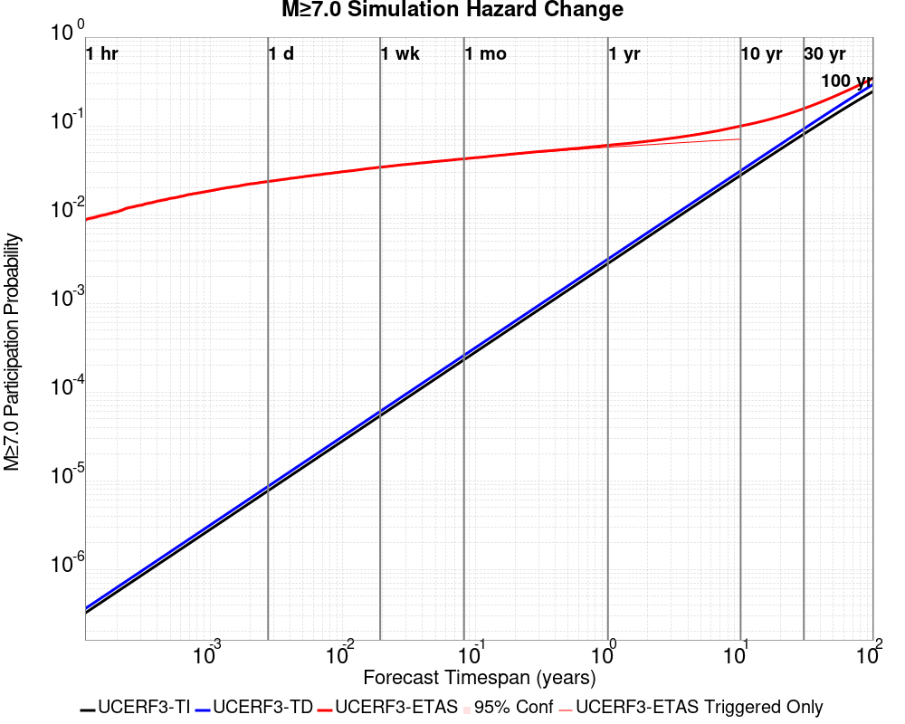

| Forecast Duration | UCERF3-ETAS [95% Conf] | UCERF3-ETAS Triggered Only | UCERF3-TD | UCERF3-ETAS/TD Gain | UCERF3-TI |
|-----|-----|-----|-----|-----|-----|
| 1 Hour | 8.42E-3 [7.57E-3 - 9.36E-3] | 8.42E-3 | 3.60E-7 | 23401.15 | 3.21E-7 |
| 1 Day | 0.023 [0.022 - 0.024] | 0.023 | 8.64E-6 | 2659.84 | 7.71E-6 |
| 1 Week | 0.033 [0.031 - 0.035] | 0.033 | 6.05E-5 | 545.32 | 5.39E-5 |
| 1 Month | 0.041 [0.039 - 0.043] | 0.041 | 2.59E-4 | 158.62 | 2.31E-4 |
| 1 Year | 0.060 [0.058 - 0.062] | 0.057 | 3.15E-3 | 18.97 | 2.81E-3 |
| 10 Years | 0.099 [0.096 - 0.101] | 0.070 | 0.031 | 3.17 | 0.028 |
| 30 Years | 0.156 [0.154 - 0.158] \* | \* | 0.093 | 1.68 \* | 0.081 |
| 100 Years | 0.343 [0.341 - 0.345] \* | \* | 0.294 | 1.17 \* | 0.245 |

\* *forecast duration is longer than simulation length, only ETAS ruptures from the first 10 years are included*
### M&ge;8.0 Hazard Change Over Time
*[(top)](#table-of-contents)*


| Forecast Duration | UCERF3-ETAS [95% Conf] | UCERF3-ETAS Triggered Only | UCERF3-TD | UCERF3-ETAS/TD Gain | UCERF3-TI |
|-----|-----|-----|-----|-----|-----|
| 1 Hour | 4.84E-5 [8.40E-6 - 1.95E-4] | 4.84E-5 | 1.24E-8 | 3915.21 | 1.06E-8 |
| 1 Day | 2.67E-4 [1.40E-4 - 4.92E-4] | 2.66E-4 | 2.97E-7 | 898.01 | 2.54E-7 |
| 1 Week | 3.41E-4 [1.95E-4 - 5.86E-4] | 3.39E-4 | 2.08E-6 | 164.09 | 1.78E-6 |
| 1 Month | 3.72E-4 [2.20E-4 - 6.23E-4] | 3.63E-4 | 8.90E-6 | 41.77 | 7.63E-6 |
| 1 Year | 5.92E-4 [4.12E-4 - 8.71E-4] | 4.84E-4 | 1.08E-4 | 5.46 | 9.29E-5 |
| 10 Years | 1.68E-3 [1.48E-3 - 1.97E-3] | 5.81E-4 | 1.10E-3 | 1.53 | 9.29E-4 |
| 30 Years | 4.08E-3 [3.88E-3 - 4.38E-3] \* | \* | 3.50E-3 | 1.17 \* | 2.78E-3 |
| 100 Years | 0.014 [0.014 - 0.015] \* | \* | 0.014 | 1.04 \* | 9.25E-3 |

\* *forecast duration is longer than simulation length, only ETAS ruptures from the first 10 years are included*

## Trigger Rupture Fault Map
*[(top)](#table-of-contents)*


## Trigger Rupture Depth Map
*[(top)](#table-of-contents)*


## Fault Distances To Triggers
*[(top)](#table-of-contents)*

| Section Name | Strike, Dip, Rake | # Hypos In Poly | Max Mag w/ Hypo In Poly | # Surfs In Poly | Max Mag w/ Surf In Poly | Min Dist To Any (km) | Min Poly Dist To Any (km) | Min Dist To Largest (km) | Min Poly Dist To Largest (km) | Min Hypo Dist To Largest (km) | Min Hypo Poly Dist To Largest (km) |
|-----|-----|-----|-----|-----|-----|-----|-----|-----|-----|-----|-----|
| Airport Lake | 359, 50, -90 | 92 | 7.1 | 92 | 7.1 | 0.036 | 0.000 | 0.036 | 0.000 | 5.612 | 0.000 |
| Little Lake | 327, 90, 180 | 16 | 3.75 | 17 | 7.1 | 2.268 | 0.000 | 11.284 | 0.000 | 13.471 | 1.469 |
| Garlock (Central) | 71, 90, 0 | 2 | 2.76 | 3 | 7.1 | 5.600 | 0.000 | 5.600 | 0.000 | 22.766 | 10.797 |
| So Sierra Nevada | 2, 50, -90 | 0 |  | 0 |  | 4.248 | 4.233 | 4.248 | 4.233 | 16.191 | 15.188 |
| Tank Canyon | 189, 50, -90 | 0 |  | 0 |  | 9.015 | 9.011 | 9.015 | 9.011 | 17.039 | 16.895 |
| Blackwater | 323, 90, 180 | 0 |  | 0 |  | 14.394 | 8.726 | 14.394 | 8.726 | 29.622 | 27.613 |

## Individual Simulated Catalog Maps
*[(top)](#table-of-contents)*

These are map plots of individual catalogs from the simulations, selected as the closest catalog to each of the given percentiles in terms of total number of events.

| Duration | p0.0 %-ile | p25.0 %-ile | p50.0 %-ile | p75.0 %-ile | p90.0 %-ile | p95.0 %-ile | p97.5 %-ile | p98.0 %-ile | p99.0 %-ile | p99.5 %-ile | p99.9 %-ile | p99.99758 %-ile |
|-----|-----|-----|-----|-----|-----|-----|-----|-----|-----|-----|-----|-----|
| **1 Week** |  |  | 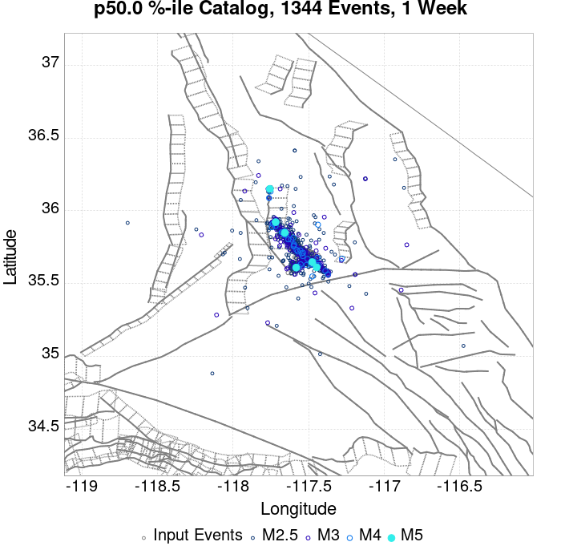 |  |  |  |  |  |  |  |  |  |
| **1 Month** | 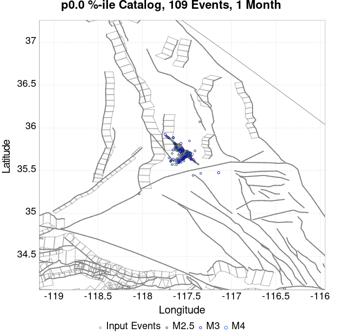 |  | 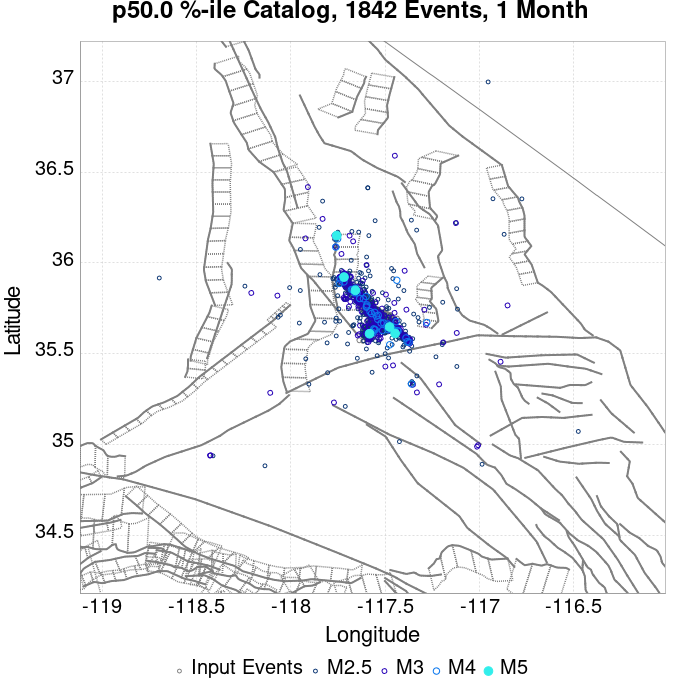 |  |  |  |  |  |  |  |  |  |
| **1 Year** |  |  |  |  |  |  | 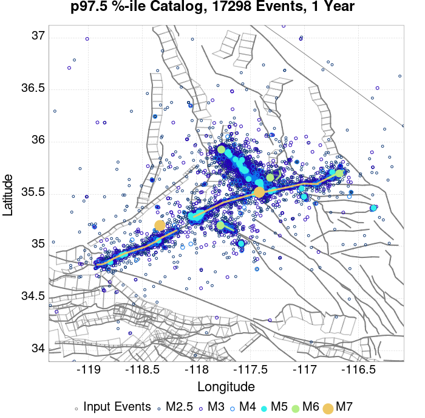 | 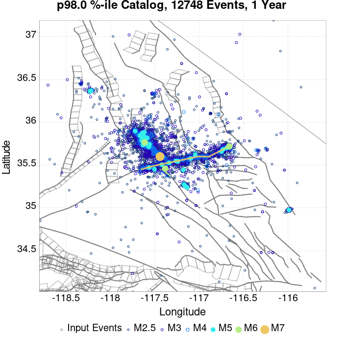 |  |  |  |  |
| **10 Year** |  |  |  |  |  |  |  |  |  | 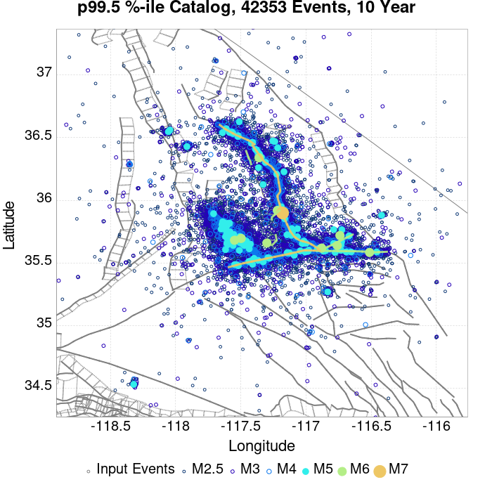 | 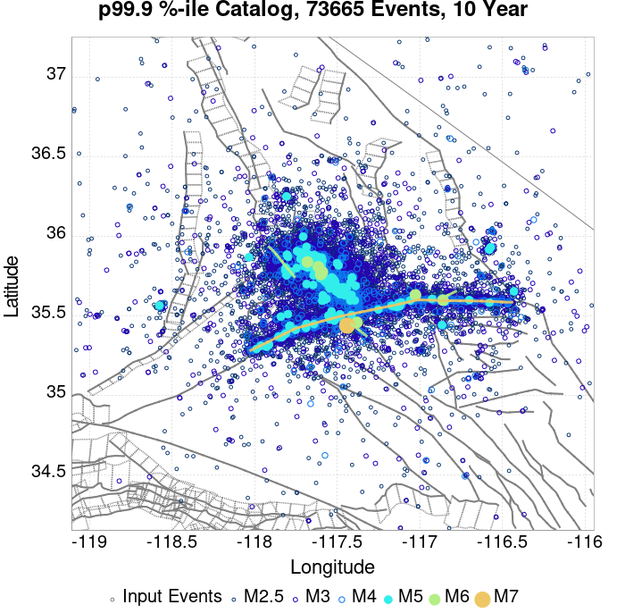 |  |

## ComCat Data Comparisons
*[(top)](#table-of-contents)*

These plots compare simulated sequences with data from ComCat. All plots only consider events with hypocenters inside the ComCat region defined in the JSON input file.

Last updated at 2019/11/05 20:33:19 UTC, 4 mo after the simulation start time

### ComCat Magnitude-Number Distributions
*[(top)](#table-of-contents)*

| Incremental MND | Cumulative MND |
|-----|-----|
|  |  |

### ComCat Time-Dependent Mc
*[(top)](#table-of-contents)*

The following plots compare simulation results with ComCat data above a magnitude threshold. Plots labeled as *M&ge;Mc(t)* use the time-dependent magnitude of completeness (Mc) defined in Helmstetter et al. (2006), which is plotted below. In the case of multiple M&ge;5 ruptures, either as input to the simulation or in the comparison data, the maximum calculated time-dependent Mc is used. This time-dependent Mc function is plotted below.

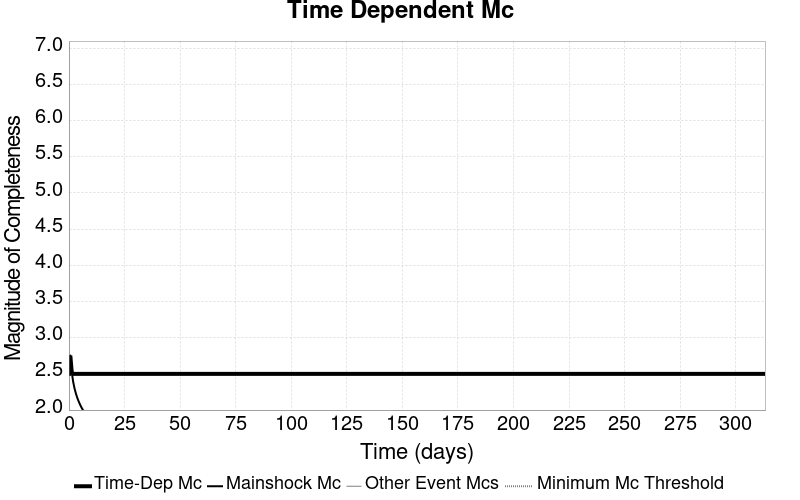

### ComCat Cumulative Number Vs Time
*[(top)](#table-of-contents)*

| M&ge;Mc(t) | M&ge;3.5 | M&ge;4 | M&ge;5 | M&ge;6 | M&ge;7 |
|-----|-----|-----|-----|-----|-----|
|  |  |  |  |  |  |

### ComCat Cumulative Number Simulation Percentiles
*[(top)](#table-of-contents)*


### ComCat Probability Spatial Distribution
*[(top)](#table-of-contents)*

|  | 1 Day | 1 Week | 1 Month | Current (4 Month) |
|-----|-----|-----|-----|-----|
| **M&ge;Mc(t)** |  |  |  |  |
| **M&ge;3.5** |  |  |  | 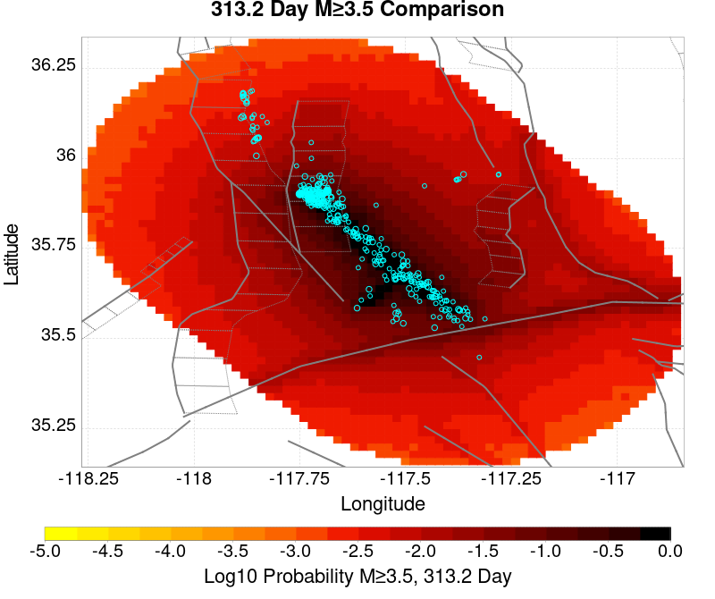 |
| **M&ge;4** |  |  |  |  |
| **M&ge;5** |  |  |  |  |
| **M&ge;6** |  | 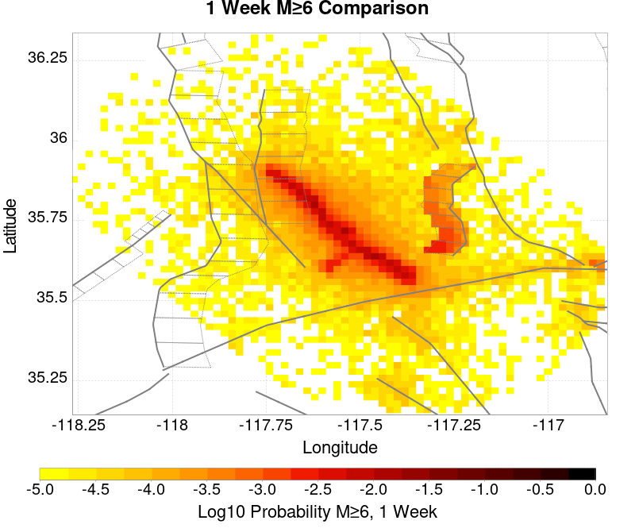 |  |  |
| **M&ge;7** | 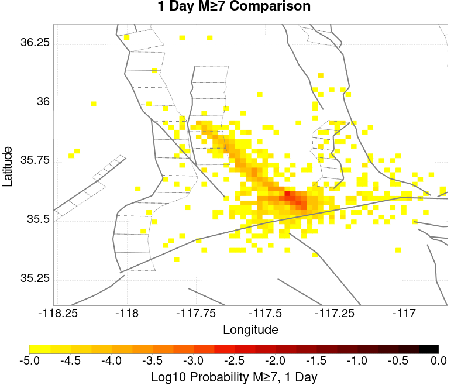 |  |  |  |
| **M&ge;8** |  |  |  | 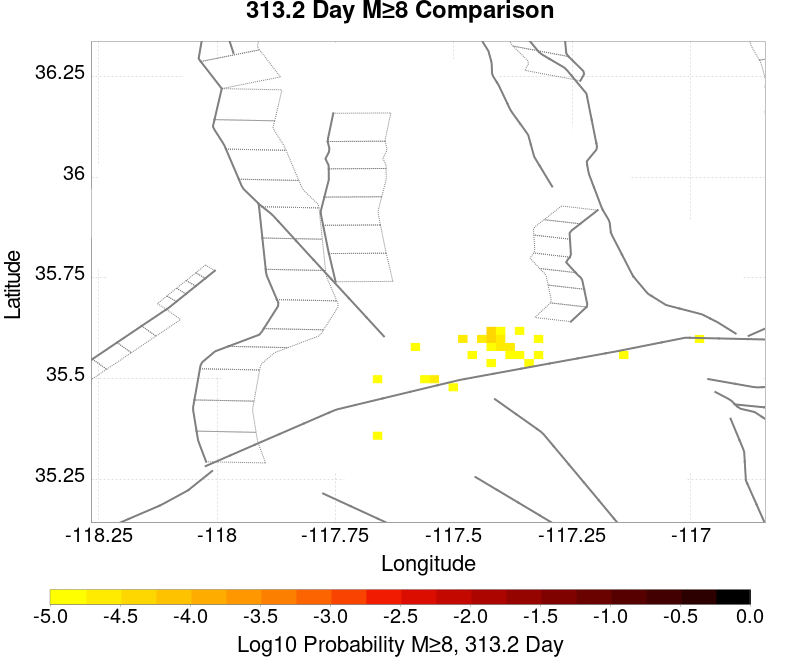 |

### ComCat Mean Expectation Spatial Distribution
*[(top)](#table-of-contents)*

|  | 1 Day | 1 Week | 1 Month | Current (4 Month) |
|-----|-----|-----|-----|-----|
| **M&ge;Mc(t)** |  |  |  |  |
| **M&ge;3.5** |  | 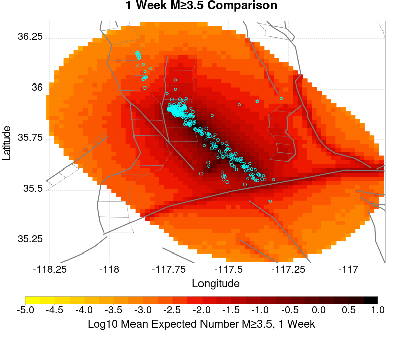 |  |  |
| **M&ge;4** |  |  |  |  |
| **M&ge;5** |  |  |  |  |
| **M&ge;6** |  |  |  |  |
| **M&ge;7** |  |  |  |  |
| **M&ge;8** |  | 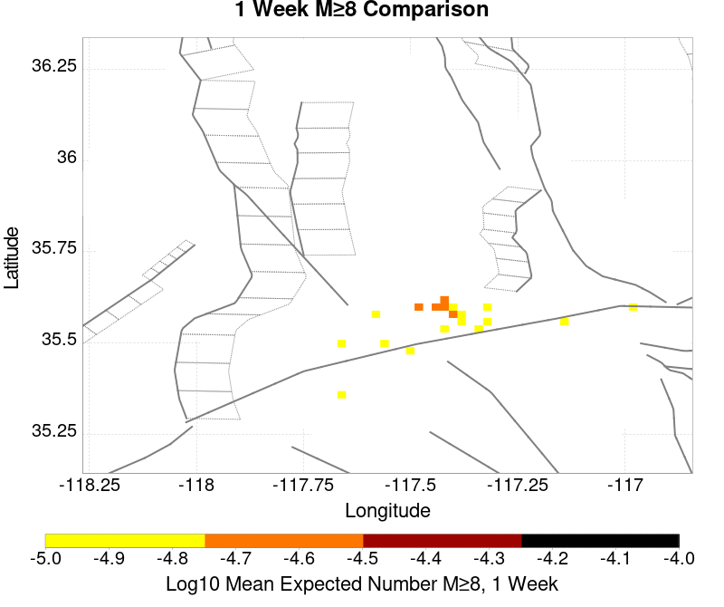 |  |  |

### ComCat Depth Distribution
*[(top)](#table-of-contents)*

| M&ge;Mc(t) | M&ge;3.5 | M&ge;4 | M&ge;5 | M&ge;6 | M&ge;7 | M&ge;8 |
|-----|-----|-----|-----|-----|-----|-----|
|  |  |  |  |  |  |  |

## Section Participation
*[(top)](#table-of-contents)*

### Section Participation Plots
*[(top)](#table-of-contents)*

| Min Mag | 1 yr Triggered Ruptures (no spontaneous) | 10 yr Triggered Ruptures (no spontaneous) | 10 yr Triggered Ruptures (primary aftershocks only) |
|-----|-----|-----|-----|
| **All Supra. Seis.** |  |  | 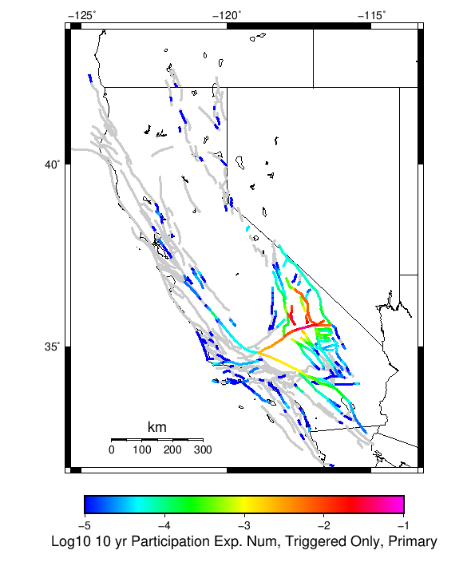 |
| **M&ge;6.5** |  |  |  |
| **M&ge;7** |  |  | 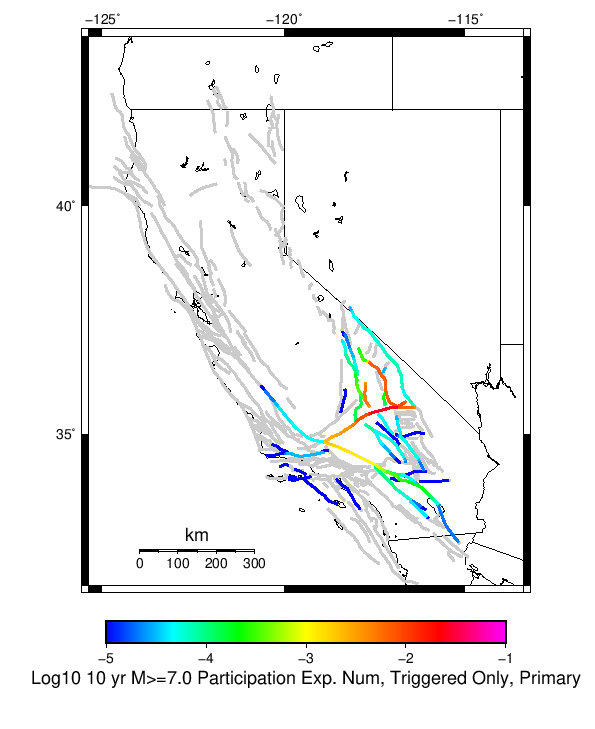 |
| **M&ge;7.5** |  |  |  |
| **M&ge;8** |  |  |  |

### Supra-Seismogenic Parent Sections Table
*[(top)](#table-of-contents)*

*First 10 of 176 with matching ruptures shown*

| Parent Name | Triggered 10 Year Mean Count | Triggered 1 Day Prob | Triggered 1 Week Prob | Triggered 1 Month Prob | Triggered 1 Year Prob | Triggered 10 Year Prob | Triggered 10 Year Primary Mean Count |
|-----|-----|-----|-----|-----|-----|-----|-----|
| Garlock (Central) | 0.13526465 | 0.045330234 | 0.06401414 | 0.0785595 | 0.10387473 | 0.12742321 | 0.0748082 |
| Tank Canyon | 0.11360391 | 0.022798229 | 0.036302913 | 0.04762942 | 0.0710569 | 0.094823204 | 0.030615455 |
| Little Lake | 0.06411094 | 0.022023767 | 0.03126891 | 0.038335875 | 0.049468767 | 0.060795277 | 0.03581887 |
| Airport Lake | 0.052397203 | 0.020499043 | 0.027880635 | 0.03354389 | 0.043224666 | 0.052227788 | 0.03429415 |
| Owl Lake | 0.040828675 | 0.009027324 | 0.014327549 | 0.0187081 | 0.027517607 | 0.036302913 | 0.01147172 |
| Panamint Valley | 0.032115977 | 0.007672015 | 0.011907355 | 0.015537646 | 0.023354873 | 0.031002687 | 0.011181297 |
| Garlock (East) | 0.026888356 | 0.0059052734 | 0.00934195 | 0.01210097 | 0.017909436 | 0.024032528 | 0.007381592 |
| Hunter Mountain-Saline Valley | 0.014956799 | 0.0042111375 | 0.006123091 | 0.007793025 | 0.011544326 | 0.01471478 | 0.006945957 |
| Blackwater | 0.012706019 | 0.002032963 | 0.0031704542 | 0.0043079457 | 0.00810765 | 0.012149374 | 0.002880031 |
| Ash Hill | 0.012197779 | 0.002032963 | 0.0039207144 | 0.0050824075 | 0.007793025 | 0.011181297 | 0.0021539729 |

### M≥6.5 Parent Sections Table
*[(top)](#table-of-contents)*

*First 10 of 148 with matching ruptures shown*

| Parent Name | Triggered 10 Year Mean Count | Triggered 1 Day Prob | Triggered 1 Week Prob | Triggered 1 Month Prob | Triggered 1 Year Prob | Triggered 10 Year Prob | Triggered 10 Year Primary Mean Count |
|-----|-----|-----|-----|-----|-----|-----|-----|
| Garlock (Central) | 0.057407003 | 0.018466081 | 0.026694741 | 0.03305985 | 0.04537864 | 0.056172706 | 0.029889397 |
| Airport Lake | 0.03915874 | 0.015731262 | 0.020983083 | 0.025073212 | 0.032091774 | 0.039110336 | 0.025508845 |
| Little Lake | 0.038965125 | 0.014763184 | 0.020232823 | 0.024589172 | 0.03129311 | 0.038093854 | 0.023209661 |
| Panamint Valley | 0.02955057 | 0.0074783997 | 0.011423316 | 0.01471478 | 0.021902757 | 0.028630896 | 0.011060287 |
| Owl Lake | 0.02318546 | 0.0071395724 | 0.010503642 | 0.013117452 | 0.018224062 | 0.02306445 | 0.01021322 |
| Garlock (East) | 0.018151456 | 0.0046225707 | 0.0071637747 | 0.009051526 | 0.0131416535 | 0.017086571 | 0.0068249474 |
| Hunter Mountain-Saline Valley | 0.014593771 | 0.0041869357 | 0.0060262834 | 0.0076478133 | 0.01135071 | 0.014424357 | 0.006945957 |
| Tank Canyon | 0.012875432 | 0.0027832233 | 0.0043321475 | 0.005760062 | 0.00897892 | 0.012778625 | 0.0033640699 |
| Garlock (West) | 0.009462959 | 0.0030010408 | 0.0044047534 | 0.005324427 | 0.0075752074 | 0.009462959 | 0.0048403884 |
| So Sierra Nevada | 0.004574167 | 9.1967377E-4 | 0.0014763183 | 0.0021055688 | 0.00324306 | 0.004549965 | 9.1967377E-4 |

### M≥7 Parent Sections Table
*[(top)](#table-of-contents)*

*First 10 of 113 with matching ruptures shown*

| Parent Name | Triggered 10 Year Mean Count | Triggered 1 Day Prob | Triggered 1 Week Prob | Triggered 1 Month Prob | Triggered 1 Year Prob | Triggered 10 Year Prob | Triggered 10 Year Primary Mean Count |
|-----|-----|-----|-----|-----|-----|-----|-----|
| Garlock (Central) | 0.051404923 | 0.016408917 | 0.02393572 | 0.029719984 | 0.04080447 | 0.050533652 | 0.026767347 |
| Panamint Valley | 0.020281227 | 0.00561485 | 0.008591689 | 0.010866672 | 0.015779665 | 0.02006341 | 0.009317747 |
| Owl Lake | 0.017643215 | 0.0061714947 | 0.008688496 | 0.01072146 | 0.014279145 | 0.017643215 | 0.009825988 |
| Hunter Mountain-Saline Valley | 0.014182338 | 0.00411433 | 0.0059536775 | 0.0075752074 | 0.011132893 | 0.014158135 | 0.0068249474 |
| Garlock (East) | 0.013480481 | 0.0041869357 | 0.0063409084 | 0.007793025 | 0.010745662 | 0.0133836735 | 0.0066071297 |
| Garlock (West) | 0.009293545 | 0.0030010408 | 0.0043563494 | 0.005251821 | 0.0075026015 | 0.009293545 | 0.0047435802 |
| Little Lake | 0.008833708 | 0.0034850794 | 0.004574167 | 0.0055180425 | 0.00723638 | 0.008809507 | 0.0054454366 |
| Airport Lake | 0.008277064 | 0.0033398678 | 0.0043321475 | 0.005251821 | 0.0068491492 | 0.008277064 | 0.0051550134 |
| San Andreas (Mojave N) | 0.0040417244 | 0.0013311068 | 0.0017667417 | 0.002081367 | 0.0029768387 | 0.0038965126 | 0.0018151456 |
| San Andreas (Mojave S) | 0.0030252426 | 9.680776E-4 | 0.0012827029 | 0.0015005204 | 0.0022507806 | 0.0030010408 | 0.0013069048 |

### M≥7.5 Parent Sections Table
*[(top)](#table-of-contents)*

*First 10 of 64 with matching ruptures shown*

| Parent Name | Triggered 10 Year Mean Count | Triggered 1 Day Prob | Triggered 1 Week Prob | Triggered 1 Month Prob | Triggered 1 Year Prob | Triggered 10 Year Prob | Triggered 10 Year Primary Mean Count |
|-----|-----|-----|-----|-----|-----|-----|-----|
| Garlock (Central) | 0.020958882 | 0.006558726 | 0.009245141 | 0.011544326 | 0.01657833 | 0.020789467 | 0.0108424695 |
| Panamint Valley | 0.013770904 | 0.004138532 | 0.0059536775 | 0.0075510056 | 0.010866672 | 0.013770904 | 0.0067523415 |
| Hunter Mountain-Saline Valley | 0.013722501 | 0.00411433 | 0.0059294757 | 0.0075268038 | 0.010818267 | 0.013722501 | 0.0067039374 |
| Garlock (West) | 0.008180256 | 0.0026380115 | 0.0037513007 | 0.004525763 | 0.0065345243 | 0.008180256 | 0.0043563494 |
| Garlock (East) | 0.005372831 | 0.0016941358 | 0.002468598 | 0.0029526367 | 0.00423534 | 0.005372831 | 0.002880031 |
| San Andreas (Mojave N) | 0.0040417244 | 0.0013311068 | 0.0017667417 | 0.002081367 | 0.0029768387 | 0.0038965126 | 0.0018151456 |
| San Andreas (Mojave S) | 0.0029768387 | 9.438757E-4 | 0.001258501 | 0.0014763183 | 0.0022023767 | 0.0029526367 | 0.0013069048 |
| San Andreas (San Bernardino N) | 0.002032963 | 6.534524E-4 | 8.470679E-4 | 9.680776E-4 | 0.0014037126 | 0.002032963 | 9.1967377E-4 |
| Owl Lake | 0.0015005204 | 4.840388E-4 | 7.260582E-4 | 8.470679E-4 | 0.0011858951 | 0.0015005204 | 7.018563E-4 |
| San Andreas (San Bernardino S) | 9.1967377E-4 | 2.6622135E-4 | 3.630291E-4 | 3.8723106E-4 | 6.534524E-4 | 9.1967377E-4 | 3.630291E-4 |

### M≥8 Parent Sections Table
*[(top)](#table-of-contents)*

*First 10 of 25 with matching ruptures shown*

| Parent Name | Triggered 10 Year Mean Count | Triggered 1 Day Prob | Triggered 1 Week Prob | Triggered 1 Month Prob | Triggered 1 Year Prob | Triggered 10 Year Prob | Triggered 10 Year Primary Mean Count |
|-----|-----|-----|-----|-----|-----|-----|-----|
| San Andreas (Mojave N) | 6.534524E-4 | 2.9042328E-4 | 3.630291E-4 | 3.8723106E-4 | 5.324427E-4 | 6.534524E-4 | 3.8723106E-4 |
| San Andreas (Mojave S) | 6.534524E-4 | 2.9042328E-4 | 3.630291E-4 | 3.8723106E-4 | 5.324427E-4 | 6.534524E-4 | 3.8723106E-4 |
| San Andreas (San Bernardino N) | 6.534524E-4 | 2.9042328E-4 | 3.630291E-4 | 3.8723106E-4 | 5.324427E-4 | 6.534524E-4 | 3.8723106E-4 |
| Garlock (Central) | 5.8084656E-4 | 2.6622135E-4 | 3.3882717E-4 | 3.630291E-4 | 4.840388E-4 | 5.8084656E-4 | 3.630291E-4 |
| Garlock (West) | 5.8084656E-4 | 2.6622135E-4 | 3.3882717E-4 | 3.630291E-4 | 4.840388E-4 | 5.8084656E-4 | 3.630291E-4 |
| Garlock (East) | 5.5664463E-4 | 2.420194E-4 | 3.1462524E-4 | 3.3882717E-4 | 4.5983688E-4 | 5.5664463E-4 | 3.3882717E-4 |
| San Andreas (San Bernardino S) | 2.9042328E-4 | 1.4521164E-4 | 1.6941359E-4 | 1.9361553E-4 | 2.420194E-4 | 2.9042328E-4 | 1.6941359E-4 |
| San Andreas (San Gorgonio Pass-Garnet HIll) | 2.9042328E-4 | 1.6941359E-4 | 1.6941359E-4 | 1.9361553E-4 | 2.420194E-4 | 2.9042328E-4 | 1.9361553E-4 |
| San Andreas (Coachella) rev | 2.6622135E-4 | 1.210097E-4 | 1.210097E-4 | 1.4521164E-4 | 2.1781746E-4 | 2.6622135E-4 | 1.6941359E-4 |
| San Jacinto (San Bernardino) | 2.1781746E-4 | 4.8403883E-5 | 9.6807766E-5 | 9.6807766E-5 | 1.6941359E-4 | 2.1781746E-4 | 1.210097E-4 |

### Fault Magnitude-Probability Distributions
*[(top)](#table-of-contents)*

The first 5 sections (sorted by trigger rate) are plotted below. All fault MPDs are available [here](plots/parent_sect_mpds/README.md)

| 1 Week | 1 Month | 1 Year | 10 Year |
|-----|-----|-----|-----|
|  |  |  |  |
|  |  |  |  |
|  |  |  | 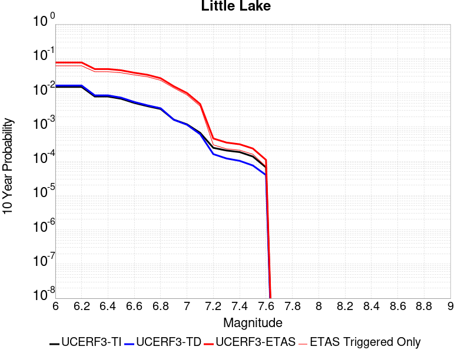 |
|  |  |  |  |
|  |  |  |  |

## Gridded Nucleation
*[(top)](#table-of-contents)*

| Min Mag | Triggered Ruptures (no spontaneous) | Triggered Ruptures (primary aftershocks only) |
|-----|-----|-----|
| **M&ge;2.5** |  |  |
| **M&ge;5** |  |  |
| **M&ge;6** |  |  |
| **M&ge;7** |  |  |


## JSON Input File
*[(top)](#table-of-contents)*

```
{
  "numSimulations": 100000,
  "duration": 10.0,
  "startTimeMillis": 1562383194040,
  "includeSpontaneous": false,
  "randomSeed": 1572975569068,
  "binaryOutput": true,
  "binaryOutputFilters": [
    {
      "prefix": "results_complete",
      "descendantsOnly": false
    },
    {
      "prefix": "results_m5_preserve_chain",
      "minMag": 5.0,
      "preserveChainBelowMag": true,
      "descendantsOnly": false
    }
  ],
  "forceRecalc": false,
  "simulationName": "ComCat M7.1 (ci38457511), ShakeMap Surfaces, kCOV\u003d1.16",
  "numRetries": 3,
  "outputDir": "/home/scec-02/kmilner/ucerf3/etas_sim/2019_11_05-ComCatM7p1_ci38457511_ShakeMapSurfaces_kCOV1p16",
  "treatTriggerCatalogAsSpontaneous": false,
  "triggerRuptures": [
    "omitted due to length, see original input file"
  ],
  "cacheDir": "/home/scec-02/kmilner/ucerf3/ucerf3-etas-launcher/inputs/cache_fm3p1_ba",
  "fssFile": "/home/scec-02/kmilner/ucerf3/ucerf3-etas-launcher/inputs/2013_05_10-ucerf3p3-production-10runs_COMPOUND_SOL_FM3_1_SpatSeisU3_MEAN_BRANCH_AVG_SOL.zip",
  "probModel": "FULL_TD",
  "applySubSeisForSupraNucl": true,
  "totRateScaleFactor": 1.14,
  "gridSeisCorr": true,
  "timeIndependentERF": false,
  "griddedOnly": false,
  "imposeGR": false,
  "includeIndirectTriggering": true,
  "gridSeisDiscr": 0.1,
  "catalogCompletenessModel": "RELAXED",
  "etas_k_cov": 1.16,
  "configCommand": "u3etas_comcat_event_config_builder.sh --event-id ci38457511 --mag-complete 3.5 --num-simulations 100000 --days-before 7 --etas-k-cov 1.16 --finite-surf-shakemap --finite-surf-shakemap-min-mag 5 --hpc-site USC_HPC --nodes 36 --hours 24 --queue scec",
  "configTime": 1572975569068,
  "comcatMetadata": {
    "region": {
      "border": [
        {
          "latitude": 35.15123745324938,
          "longitude": -117.46198765392752
        },
        {
          "latitude": 35.170513097218205,
          "longitude": -117.55046477274733
        },
        {
          "latitude": 35.201997575622634,
          "longitude": -117.63356287896195
        },
        {
          "latitude": 35.24474776584818,
          "longitude": -117.70878534540662
        },
        {
          "latitude": 35.2893890362986,
          "longitude": -117.76387551603122
        },
        {
          "latitude": 35.288830898189985,
          "longitude": -117.76465036296011
        },
        {
          "latitude": 35.62116745212862,
          "longitude": -118.13026990137416
        },
        {
          "latitude": 35.621789874646055,
          "longitude": -118.12940866580139
        },
        {
          "latitude": 35.621789874646055,
          "longitude": -118.12940866580136
        },
        {
          "latitude": 35.63100857737423,
          "longitude": -118.14083341711117
        },
        {
          "latitude": 35.69213881200874,
          "longitude": -118.19401186444136
        },
        {
          "latitude": 35.759827796433385,
          "longitude": -118.23338865654299
        },
        {
          "latitude": 35.8320329014668,
          "longitude": -118.25773927868946
        },
        {
          "latitude": 35.906569563076914,
          "longitude": -118.26628547708222
        },
        {
          "latitude": 35.9811764992231,
          "longitude": -118.25872343341653
        },
        {
          "latitude": 36.05358395358725,
          "longitude": -118.23523828089384
        },
        {
          "latitude": 36.12158296055357,
          "longitude": -118.19650389473806
        },
        {
          "latitude": 36.18309350302806,
          "longitude": -118.14366730262441
        },
        {
          "latitude": 36.23622937613509,
          "longitude": -118.07831757407638
        },
        {
          "latitude": 36.279357589115186,
          "longitude": -118.00243964650828
        },
        {
          "latitude": 36.31115024550475,
          "longitude": -117.91835419890715
        },
        {
          "latitude": 36.33062704347584,
          "longitude": -117.82864534929934
        },
        {
          "latitude": 36.337186832826475,
          "longitude": -117.7360785775
        },
        {
          "latitude": 36.33062704347584,
          "longitude": -117.64351180570065
        },
        {
          "latitude": 36.31115024550475,
          "longitude": -117.55380295609284
        },
        {
          "latitude": 36.279357589115186,
          "longitude": -117.46971750849171
        },
        {
          "latitude": 36.23622937613509,
          "longitude": -117.39383958092363
        },
        {
          "latitude": 36.19237301765921,
          "longitude": -117.33990236386252
        },
        {
          "latitude": 36.19237301765921,
          "longitude": -117.3399023638625
        },
        {
          "latitude": 36.19300476664728,
          "longitude": -117.33902822340912
        },
        {
          "latitude": 35.858277657147454,
          "longitude": -116.97410396317103
        },
        {
          "latitude": 35.85771127553969,
          "longitude": -116.97489025431044
        },
        {
          "latitude": 35.849566414597014,
          "longitude": -116.96491461360324
        },
        {
          "latitude": 35.78805819220281,
          "longitude": -116.9122967694479
        },
        {
          "latitude": 35.72006106557635,
          "longitude": -116.87372034968973
        },
        {
          "latitude": 35.64765482528862,
          "longitude": -116.85032807444419
        },
        {
          "latitude": 35.57304829206068,
          "longitude": -116.8427916482061
        },
        {
          "latitude": 35.49851117585832,
          "longitude": -116.8512961557198
        },
        {
          "latitude": 35.42630481575459,
          "longitude": -116.87553976530553
        },
        {
          "latitude": 35.35861392859174,
          "longitude": -116.91474809853695
        },
        {
          "latitude": 35.29748137319737,
          "longitude": -116.96770221389164
        },
        {
          "latitude": 35.24474776584818,
          "longitude": -117.03277884359336
        },
        {
          "latitude": 35.201997575622634,
          "longitude": -117.10800131003803
        },
        {
          "latitude": 35.170513097218205,
          "longitude": -117.19109941625265
        },
        {
          "latitude": 35.15123745324938,
          "longitude": -117.27957653507247
        },
        {
          "latitude": 35.14474752487352,
          "longitude": -117.3707820945
        }
      ]
    },
    "eventID": "ci38457511",
    "minDepth": -10.0,
    "maxDepth": 24.0,
    "minMag": 2.5,
    "startTime": 1561778393040,
    "endTime": 1562383193040,
    "magComplete": 3.5
  }
}
```

