# ComCat M7.1 (ci38457511), ShakeMap Surfaces, kCOV=1.16 Results

|   | ComCat M7.1 (ci38457511), ShakeMap Surfaces, kCOV=1.16 |
|-----|-----|
| Num Simulations | 60801 (incomplete) |
| Start Time | 2019/07/06 03:19:54 UTC |
| Start Time Epoch Milliseconds | 1562383194040 |
| Duration | 10 Years |
| Includes Spontaneous? | false |
| Trigger Ruptures | 283 Trigger Ruptures |
|   | First: M3.98 at 2019/07/04 17:02:55 UTC |
|   | Last: M7.1 at 2019/07/06 03:19:53 UTC |
|   | Largest: M7.1 at 2019/07/06 03:19:53 UTC |
| Trigger Ruptures | *(none)* |
| Config Generated With | u3etas_comcat_event_config_builder.sh --event-id ci38457511 --mag-complete 3.5 --num-simulations 100000 --days-before 7 --etas-k-cov 1.16 --finite-surf-shakemap --finite-surf-shakemap-min-mag 5 --hpc-site USC_HPC --nodes 36 --hours 24 --queue scec |

## Table Of Contents

* [Probabilities Summary Table](#probabilities-summary-table)
* [Magnitude Number Distribution](#magnitude-number-distribution)
  * [10 Year Magnitude Number Distribution](#10-year-magnitude-number-distribution)
  * [1 Year Magnitude Number Distribution](#1-year-magnitude-number-distribution)
  * [1 Month Magnitude Number Distribution](#1-month-magnitude-number-distribution)
  * [1 Week Magnitude Number Distribution](#1-week-magnitude-number-distribution)
  * [1 Day Magnitude Number Distribution](#1-day-magnitude-number-distribution)
  * [1 Hour Magnitude Number Distribution](#1-hour-magnitude-number-distribution)
* [Hazard Change Over Time](#hazard-change-over-time)
  * [M&ge;5.0 Hazard Change Over Time](#m50-hazard-change-over-time)
  * [M&ge;6.0 Hazard Change Over Time](#m60-hazard-change-over-time)
  * [M&ge;7.0 Hazard Change Over Time](#m70-hazard-change-over-time)
  * [M&ge;8.0 Hazard Change Over Time](#m80-hazard-change-over-time)
* [Trigger Rupture Fault Map](#trigger-rupture-fault-map)
* [Trigger Rupture Depth Map](#trigger-rupture-depth-map)
* [Fault Distances To Triggers](#fault-distances-to-triggers)
* [Individual Simulated Catalog Maps](#individual-simulated-catalog-maps)
* [ComCat Data Comparisons](#comcat-data-comparisons)
  * [ComCat Magnitude-Number Distributions](#comcat-magnitude-number-distributions)
  * [ComCat Time-Dependent Mc](#comcat-time-dependent-mc)
  * [ComCat Cumulative Number Vs Time](#comcat-cumulative-number-vs-time)
  * [ComCat Cumulative Number Simulation Percentiles](#comcat-cumulative-number-simulation-percentiles)
  * [ComCat Probability Spatial Distribution](#comcat-probability-spatial-distribution)
  * [ComCat Mean Expectation Spatial Distribution](#comcat-mean-expectation-spatial-distribution)
  * [ComCat Depth Distribution](#comcat-depth-distribution)
* [Section Participation](#section-participation)
  * [Section Participation Plots](#section-participation-plots)
  * [Supra-Seismogenic Parent Sections Table](#supra-seismogenic-parent-sections-table)
  * [M≥6.5 Parent Sections Table](#m65-parent-sections-table)
  * [M≥7 Parent Sections Table](#m7-parent-sections-table)
  * [M≥7.5 Parent Sections Table](#m75-parent-sections-table)
  * [M≥8 Parent Sections Table](#m8-parent-sections-table)
  * [Fault Magnitude-Probability Distributions](#fault-magnitude-probability-distributions)
* [Gridded Nucleation](#gridded-nucleation)
* [JSON Input File](#json-input-file)

## Probabilities Summary Table
*[(top)](#table-of-contents)*

| Magnitude | 1 Hour Prob | 1 Day Prob | 1 Week Prob | 1 Month Prob | 1 Year Prob | 10 Year Prob |
|-----|-----|-----|-----|-----|-----|-----|
| **M&ge;4** | 0.983 (98.28%) | 0.999 (99.90%) | 1.000 (99.98%) | 1.000 (100.00%) | 1.000 (100.00%) | 1.000 (100.00%) |
| **M&ge;4.5** | 0.877 (87.71%) | 0.977 (97.69%) | 0.993 (99.27%) | 0.997 (99.72%) | 0.999 (99.92%) | 1.000 (99.98%) |
| **M&ge;5** | 0.614 (61.43%) | 0.850 (84.97%) | 0.918 (91.79%) | 0.948 (94.78%) | 0.973 (97.26%) | 0.984 (98.42%) |
| **M&ge;5.5** | 0.305 (30.53%) | 0.557 (55.67%) | 0.669 (66.88%) | 0.732 (73.23%) | 0.810 (81.01%) | 0.858 (85.75%) |
| **M&ge;6** | 0.103 (10.32%) | 0.238 (23.84%) | 0.321 (32.05%) | 0.379 (37.90%) | 0.467 (46.66%) | 0.534 (53.39%) |
| **M&ge;6.5** | 0.024 (2.44%) | 0.064 (6.39%) | 0.092 (9.19%) | 0.113 (11.35%) | 0.153 (15.32%) | 0.188 (18.78%) |
| **M&ge;7** | 8.80E-3 (0.88%) | 0.024 (2.41%) | 0.034 (3.44%) | 0.043 (4.31%) | 0.059 (5.95%) | 0.073 (7.29%) |
| **M&ge;7.1** | 7.35E-3 (0.74%) | 0.020 (2.00%) | 0.029 (2.89%) | 0.036 (3.61%) | 0.050 (5.01%) | 0.062 (6.17%) |
| **M&ge;7.5** | 2.50E-3 (0.25%) | 7.48E-3 (0.75%) | 0.011 (1.07%) | 0.013 (1.33%) | 0.019 (1.90%) | 0.024 (2.35%) |
| **M&ge;8** | 3.29E-5 (0.00%) | 2.47E-4 (0.02%) | 3.45E-4 (0.03%) | 3.62E-4 (0.04%) | 5.10E-4 (0.05%) | 6.41E-4 (0.06%) |

## Magnitude Number Distribution
*[(top)](#table-of-contents)*

### 10 Year Magnitude Number Distribution
*[(top)](#table-of-contents)*

**Legend**
* **Mean** (thick black line): mean expected number across all 60801 catalogs
* **2.5%,97.5%** (thin black lines): expected number percentiles across all 60801 catalogs
* **Median** (thin blue line): median expected number across all 60801 catalogs
* **Mode** (thin cyan line): modal expected number across all 60801 catalogs
* **10 yr Probability** (thin red line): 10 year probability calculated as the fraction of catalogs with at least 1 occurrence
* **10 yr Supraseismogenic Probability** (thin dashed red line): same as above, but only for supraseismogenic ruptures on explicitly modeled UCERF3 faults
* **95% Conf** (light red shaded region): binomial 95% confidence bounds on probability
* **Primary** (thin green line): mean expected number from primary triggered aftershocks only (no secondary, tertiary, etc...) across all 60801 catalogs


| Mag | Mean | 2.5 %ile | 97.5 %ile | Median | Mode | 10 yr Probability | 10 yr Supra-Seis Prob | Primary Aftershocks Mean |
|-----|-----|-----|-----|-----|-----|-----|-----|-----|
| **M&ge;2.5** | 5430.927 | 740.000 | 23094.000 | 3375.000 | 1537.000 | 1.000 (100.00%) | 0.272 (27.21%) | 2393.646 |
| **M&ge;2.6** | 4313.869 | 587.000 | 18322.000 | 2681.000 | 1920.000 | 1.000 (100.00%) | 0.272 (27.21%) | 1901.212 |
| **M&ge;2.7** | 3426.202 | 467.000 | 14542.000 | 2129.000 | 1329.000 | 1.000 (100.00%) | 0.272 (27.21%) | 1509.935 |
| **M&ge;2.8** | 2721.320 | 370.000 | 11560.000 | 1691.000 | 697.000 | 1.000 (100.00%) | 0.272 (27.21%) | 1199.282 |
| **M&ge;2.9** | 2161.715 | 293.000 | 9209.000 | 1343.000 | 490.000 | 1.000 (100.00%) | 0.272 (27.21%) | 952.634 |
| **M&ge;3** | 1716.871 | 233.000 | 7312.000 | 1066.000 | 511.000 | 1.000 (100.00%) | 0.272 (27.21%) | 756.629 |
| **M&ge;3.1** | 1363.668 | 184.000 | 5797.000 | 848.000 | 461.000 | 1.000 (100.00%) | 0.272 (27.21%) | 600.957 |
| **M&ge;3.2** | 1083.164 | 146.000 | 4611.000 | 673.000 | 338.000 | 1.000 (100.00%) | 0.272 (27.21%) | 477.375 |
| **M&ge;3.3** | 860.260 | 115.000 | 3656.000 | 535.000 | 259.000 | 1.000 (100.00%) | 0.272 (27.21%) | 379.166 |
| **M&ge;3.4** | 683.148 | 91.000 | 2902.000 | 425.000 | 184.000 | 1.000 (100.00%) | 0.272 (27.21%) | 301.080 |
| **M&ge;3.5** | 542.590 | 72.000 | 2304.000 | 337.000 | 143.000 | 1.000 (100.00%) | 0.272 (27.21%) | 239.120 |
| **M&ge;3.6** | 430.846 | 56.000 | 1831.000 | 268.000 | 138.000 | 1.000 (100.00%) | 0.272 (27.21%) | 189.884 |
| **M&ge;3.7** | 342.126 | 44.000 | 1456.000 | 212.000 | 123.000 | 1.000 (100.00%) | 0.272 (27.21%) | 150.782 |
| **M&ge;3.8** | 271.660 | 35.000 | 1156.000 | 169.000 | 68.000 | 1.000 (100.00%) | 0.272 (27.21%) | 119.757 |
| **M&ge;3.9** | 215.693 | 27.000 | 919.000 | 134.000 | 66.000 | 1.000 (100.00%) | 0.272 (27.21%) | 95.080 |
| **M&ge;4** | 171.219 | 21.000 | 731.000 | 107.000 | 51.000 | 1.000 (100.00%) | 0.272 (27.21%) | 75.453 |
| **M&ge;4.1** | 135.881 | 16.000 | 582.000 | 84.000 | 38.000 | 1.000 (100.00%) | 0.272 (27.21%) | 59.886 |
| **M&ge;4.2** | 107.832 | 13.000 | 462.000 | 67.000 | 28.000 | 1.000 (100.00%) | 0.272 (27.21%) | 47.522 |
| **M&ge;4.3** | 85.536 | 10.000 | 367.000 | 53.000 | 28.000 | 1.000 (100.00%) | 0.272 (27.21%) | 37.688 |
| **M&ge;4.4** | 67.828 | 7.000 | 291.000 | 42.000 | 22.000 | 1.000 (99.99%) | 0.272 (27.21%) | 29.900 |
| **M&ge;4.5** | 53.792 | 5.000 | 232.000 | 33.000 | 15.000 | 1.000 (99.98%) | 0.272 (27.21%) | 23.713 |
| **M&ge;4.6** | 42.627 | 4.000 | 184.000 | 27.000 | 13.000 | 0.999 (99.92%) | 0.272 (27.21%) | 18.794 |
| **M&ge;4.7** | 33.777 | 3.000 | 146.000 | 21.000 | 8.000 | 0.998 (99.80%) | 0.272 (27.21%) | 14.895 |
| **M&ge;4.8** | 26.713 | 2.000 | 115.000 | 17.000 | 8.000 | 0.996 (99.58%) | 0.272 (27.21%) | 11.776 |
| **M&ge;4.9** | 21.124 | 1.000 | 91.000 | 13.000 | 5.000 | 0.992 (99.16%) | 0.272 (27.21%) | 9.316 |
| **M&ge;5** | 16.677 | 1.000 | 73.000 | 10.000 | 4.000 | 0.984 (98.42%) | 0.272 (27.21%) | 7.355 |
| **M&ge;5.1** | 13.145 | 0.000 | 58.000 | 8.000 | 3.000 | 0.973 (97.26%) | 0.272 (27.21%) | 5.800 |
| **M&ge;5.2** | 10.338 | 0.000 | 45.000 | 6.000 | 2.000 | 0.955 (95.50%) | 0.272 (27.21%) | 4.567 |
| **M&ge;5.3** | 8.106 | 0.000 | 36.000 | 5.000 | 2.000 | 0.930 (93.03%) | 0.272 (27.21%) | 3.581 |
| **M&ge;5.4** | 6.333 | 0.000 | 28.000 | 4.000 | 1.000 | 0.899 (89.87%) | 0.272 (27.21%) | 2.803 |
| **M&ge;5.5** | 4.920 | 0.000 | 23.000 | 3.000 | 1.000 | 0.858 (85.75%) | 0.272 (27.21%) | 2.180 |
| **M&ge;5.6** | 3.800 | 0.000 | 18.000 | 2.000 | 0.000 | 0.806 (80.55%) | 0.272 (27.21%) | 1.687 |
| **M&ge;5.7** | 2.916 | 0.000 | 14.000 | 2.000 | 0.000 | 0.747 (74.74%) | 0.272 (27.21%) | 1.298 |
| **M&ge;5.8** | 2.214 | 0.000 | 11.000 | 1.000 | 0.000 | 0.679 (67.93%) | 0.272 (27.20%) | 0.988 |
| **M&ge;5.9** | 1.656 | 0.000 | 8.000 | 1.000 | 0.000 | 0.605 (60.47%) | 0.272 (27.20%) | 0.739 |
| **M&ge;6** | 1.266 | 0.000 | 7.000 | 1.000 | 0.000 | 0.534 (53.39%) | 0.272 (27.19%) | 0.561 |
| **M&ge;6.1** | 0.917 | 0.000 | 5.000 | 0.000 | 0.000 | 0.449 (44.90%) | 0.237 (23.70%) | 0.413 |
| **M&ge;6.2** | 0.601 | 0.000 | 4.000 | 0.000 | 0.000 | 0.349 (34.86%) | 0.190 (19.04%) | 0.272 |
| **M&ge;6.3** | 0.449 | 0.000 | 3.000 | 0.000 | 0.000 | 0.286 (28.62%) | 0.164 (16.45%) | 0.206 |
| **M&ge;6.4** | 0.341 | 0.000 | 2.000 | 0.000 | 0.000 | 0.232 (23.16%) | 0.144 (14.43%) | 0.154 |
| **M&ge;6.5** | 0.261 | 0.000 | 2.000 | 0.000 | 0.000 | 0.188 (18.78%) | 0.128 (12.76%) | 0.118 |
| **M&ge;6.6** | 0.211 | 0.000 | 2.000 | 0.000 | 0.000 | 0.162 (16.23%) | 0.118 (11.82%) | 0.099 |
| **M&ge;6.7** | 0.171 | 0.000 | 2.000 | 0.000 | 0.000 | 0.136 (13.60%) | 0.105 (10.46%) | 0.081 |
| **M&ge;6.8** | 0.135 | 0.000 | 1.000 | 0.000 | 0.000 | 0.113 (11.30%) | 0.091 (9.12%) | 0.066 |
| **M&ge;6.9** | 0.104 | 0.000 | 1.000 | 0.000 | 0.000 | 0.092 (9.18%) | 0.077 (7.68%) | 0.053 |
| **M&ge;7** | 0.080 | 0.000 | 1.000 | 0.000 | 0.000 | 0.073 (7.29%) | 0.064 (6.36%) | 0.040 |
| **M&ge;7.1** | 0.066 | 0.000 | 1.000 | 0.000 | 0.000 | 0.062 (6.17%) | 0.056 (5.60%) | 0.033 |
| **M&ge;7.2** | 0.049 | 0.000 | 1.000 | 0.000 | 0.000 | 0.047 (4.71%) | 0.044 (4.39%) | 0.024 |
| **M&ge;7.3** | 0.035 | 0.000 | 1.000 | 0.000 | 0.000 | 0.034 (3.36%) | 0.032 (3.21%) | 0.017 |
| **M&ge;7.4** | 0.031 | 0.000 | 1.000 | 0.000 | 0.000 | 0.030 (3.00%) | 0.029 (2.92%) | 0.015 |
| **M&ge;7.5** | 0.024 | 0.000 | 0.000 | 0.000 | 0.000 | 0.024 (2.35%) | 0.023 (2.33%) | 0.012 |
| **M&ge;7.6** | 0.013 | 0.000 | 0.000 | 0.000 | 0.000 | 0.013 (1.28%) | 0.013 (1.26%) | 6.76E-3 |
| **M&ge;7.7** | 4.33E-3 | 0.000 | 0.000 | 0.000 | 0.000 | 4.28E-3 (0.43%) | 4.21E-3 (0.42%) | 2.01E-3 |
| **M&ge;7.8** | 2.78E-3 | 0.000 | 0.000 | 0.000 | 0.000 | 2.78E-3 (0.28%) | 2.75E-3 (0.27%) | 1.43E-3 |
| **M&ge;7.9** | 1.76E-3 | 0.000 | 0.000 | 0.000 | 0.000 | 1.76E-3 (0.18%) | 1.76E-3 (0.18%) | 8.88E-4 |
| **M&ge;8** | 6.41E-4 | 0.000 | 0.000 | 0.000 | 0.000 | 6.41E-4 (0.06%) | 6.41E-4 (0.06%) | 3.62E-4 |
| **M&ge;8.1** | 6.58E-5 | 0.000 | 0.000 | 0.000 | 0.000 | 6.58E-5 (0.01%) | 6.58E-5 (0.01%) | 3.29E-5 |
| **M&ge;8.2** | 0.000 | 0.000 | 0.000 | 0.000 | 0.000 | 0.000 (0.00%) | 0.000 (0.00%) | 0.000 |
| **M&ge;8.3** | 0.000 | 0.000 | 0.000 | 0.000 | 0.000 | 0.000 (0.00%) | 0.000 (0.00%) | 0.000 |
| **M&ge;8.4** | 0.000 | 0.000 | 0.000 | 0.000 | 0.000 | 0.000 (0.00%) | 0.000 (0.00%) | 0.000 |
| **M&ge;8.5** | 0.000 | 0.000 | 0.000 | 0.000 | 0.000 | 0.000 (0.00%) | 0.000 (0.00%) | 0.000 |
| **M&ge;8.6** | 0.000 | 0.000 | 0.000 | 0.000 | 0.000 | 0.000 (0.00%) | 0.000 (0.00%) | 0.000 |
| **M&ge;8.7** | 0.000 | 0.000 | 0.000 | 0.000 | 0.000 | 0.000 (0.00%) | 0.000 (0.00%) | 0.000 |
| **M&ge;8.8** | 0.000 | 0.000 | 0.000 | 0.000 | 0.000 | 0.000 (0.00%) | 0.000 (0.00%) | 0.000 |
| **M&ge;8.9** | 0.000 | 0.000 | 0.000 | 0.000 | 0.000 | 0.000 (0.00%) | 0.000 (0.00%) | 0.000 |
| **M&ge;9** | 0.000 | 0.000 | 0.000 | 0.000 | 0.000 | 0.000 (0.00%) | 0.000 (0.00%) | 0.000 |

### 1 Year Magnitude Number Distribution
*[(top)](#table-of-contents)*

**Legend**
* **Mean** (thick black line): mean expected number across all 60801 catalogs
* **2.5%,97.5%** (thin black lines): expected number percentiles across all 60801 catalogs
* **Median** (thin blue line): median expected number across all 60801 catalogs
* **Mode** (thin cyan line): modal expected number across all 60801 catalogs
* **1 yr Probability** (thin red line): 1 year probability calculated as the fraction of catalogs with at least 1 occurrence
* **1 yr Supraseismogenic Probability** (thin dashed red line): same as above, but only for supraseismogenic ruptures on explicitly modeled UCERF3 faults
* **95% Conf** (light red shaded region): binomial 95% confidence bounds on probability
* **Primary** (thin green line): mean expected number from primary triggered aftershocks only (no secondary, tertiary, etc...) across all 60801 catalogs


| Mag | Mean | 2.5 %ile | 97.5 %ile | Median | Mode | 1 yr Probability | 1 yr Supra-Seis Prob | Primary Aftershocks Mean |
|-----|-----|-----|-----|-----|-----|-----|-----|-----|
| **M&ge;2.5** | 4128.362 | 570.000 | 17225.000 | 2602.000 | 1088.000 | 1.000 (100.00%) | 0.224 (22.40%) | 2085.081 |
| **M&ge;2.6** | 3279.200 | 451.000 | 13692.000 | 2068.000 | 761.000 | 1.000 (100.00%) | 0.224 (22.40%) | 1656.140 |
| **M&ge;2.7** | 2604.414 | 359.000 | 10885.000 | 1644.000 | 1052.000 | 1.000 (100.00%) | 0.224 (22.40%) | 1315.298 |
| **M&ge;2.8** | 2068.573 | 285.000 | 8629.000 | 1305.000 | 641.000 | 1.000 (100.00%) | 0.224 (22.40%) | 1044.706 |
| **M&ge;2.9** | 1643.162 | 226.000 | 6857.000 | 1037.000 | 537.000 | 1.000 (100.00%) | 0.224 (22.40%) | 829.863 |
| **M&ge;3** | 1305.070 | 179.000 | 5447.000 | 824.000 | 368.000 | 1.000 (100.00%) | 0.224 (22.40%) | 659.097 |
| **M&ge;3.1** | 1036.612 | 142.000 | 4325.000 | 655.000 | 334.000 | 1.000 (100.00%) | 0.224 (22.40%) | 523.523 |
| **M&ge;3.2** | 823.412 | 112.000 | 3430.000 | 519.000 | 264.000 | 1.000 (100.00%) | 0.224 (22.40%) | 415.872 |
| **M&ge;3.3** | 653.960 | 89.000 | 2725.000 | 413.000 | 191.000 | 1.000 (100.00%) | 0.224 (22.40%) | 330.330 |
| **M&ge;3.4** | 519.331 | 70.000 | 2165.000 | 328.000 | 129.000 | 1.000 (100.00%) | 0.224 (22.40%) | 262.307 |
| **M&ge;3.5** | 412.440 | 55.000 | 1723.000 | 260.000 | 132.000 | 1.000 (100.00%) | 0.224 (22.40%) | 208.318 |
| **M&ge;3.6** | 327.503 | 43.000 | 1372.000 | 206.000 | 88.000 | 1.000 (100.00%) | 0.224 (22.40%) | 165.433 |
| **M&ge;3.7** | 260.055 | 34.000 | 1094.000 | 164.000 | 87.000 | 1.000 (100.00%) | 0.224 (22.40%) | 131.363 |
| **M&ge;3.8** | 206.499 | 27.000 | 871.000 | 130.000 | 60.000 | 1.000 (100.00%) | 0.224 (22.40%) | 104.336 |
| **M&ge;3.9** | 163.948 | 21.000 | 691.000 | 104.000 | 47.000 | 1.000 (100.00%) | 0.224 (22.40%) | 82.830 |
| **M&ge;4** | 130.134 | 16.000 | 548.000 | 82.000 | 36.000 | 1.000 (100.00%) | 0.224 (22.40%) | 65.732 |
| **M&ge;4.1** | 103.279 | 12.000 | 434.000 | 65.000 | 26.000 | 1.000 (100.00%) | 0.224 (22.40%) | 52.169 |
| **M&ge;4.2** | 81.963 | 9.000 | 345.000 | 52.000 | 28.000 | 1.000 (100.00%) | 0.224 (22.40%) | 41.396 |
| **M&ge;4.3** | 64.996 | 7.000 | 275.000 | 41.000 | 21.000 | 1.000 (99.99%) | 0.224 (22.40%) | 32.823 |
| **M&ge;4.4** | 51.538 | 5.000 | 218.000 | 33.000 | 15.000 | 1.000 (99.97%) | 0.224 (22.40%) | 26.037 |
| **M&ge;4.5** | 40.871 | 4.000 | 173.000 | 26.000 | 11.000 | 0.999 (99.92%) | 0.224 (22.40%) | 20.650 |
| **M&ge;4.6** | 32.389 | 3.000 | 138.000 | 20.000 | 11.000 | 0.998 (99.79%) | 0.224 (22.40%) | 16.364 |
| **M&ge;4.7** | 25.665 | 2.000 | 109.000 | 16.000 | 8.000 | 0.996 (99.57%) | 0.224 (22.40%) | 12.966 |
| **M&ge;4.8** | 20.290 | 1.000 | 86.000 | 13.000 | 6.000 | 0.992 (99.15%) | 0.224 (22.40%) | 10.249 |
| **M&ge;4.9** | 16.046 | 1.000 | 69.000 | 10.000 | 4.000 | 0.984 (98.42%) | 0.224 (22.40%) | 8.110 |
| **M&ge;5** | 12.671 | 0.000 | 55.000 | 8.000 | 3.000 | 0.973 (97.26%) | 0.224 (22.40%) | 6.406 |
| **M&ge;5.1** | 9.985 | 0.000 | 43.000 | 6.000 | 3.000 | 0.956 (95.55%) | 0.224 (22.40%) | 5.051 |
| **M&ge;5.2** | 7.857 | 0.000 | 34.000 | 5.000 | 2.000 | 0.931 (93.14%) | 0.224 (22.40%) | 3.976 |
| **M&ge;5.3** | 6.161 | 0.000 | 27.000 | 4.000 | 1.000 | 0.899 (89.92%) | 0.224 (22.40%) | 3.119 |
| **M&ge;5.4** | 4.814 | 0.000 | 22.000 | 3.000 | 1.000 | 0.859 (85.90%) | 0.224 (22.40%) | 2.441 |
| **M&ge;5.5** | 3.741 | 0.000 | 17.000 | 2.000 | 1.000 | 0.810 (81.01%) | 0.224 (22.40%) | 1.899 |
| **M&ge;5.6** | 2.888 | 0.000 | 13.000 | 2.000 | 0.000 | 0.751 (75.10%) | 0.224 (22.40%) | 1.469 |
| **M&ge;5.7** | 2.217 | 0.000 | 11.000 | 1.000 | 0.000 | 0.687 (68.68%) | 0.224 (22.40%) | 1.130 |
| **M&ge;5.8** | 1.685 | 0.000 | 8.000 | 1.000 | 0.000 | 0.614 (61.38%) | 0.224 (22.40%) | 0.859 |
| **M&ge;5.9** | 1.261 | 0.000 | 6.000 | 1.000 | 0.000 | 0.537 (53.68%) | 0.224 (22.39%) | 0.643 |
| **M&ge;6** | 0.965 | 0.000 | 5.000 | 0.000 | 0.000 | 0.467 (46.66%) | 0.224 (22.39%) | 0.489 |
| **M&ge;6.1** | 0.700 | 0.000 | 4.000 | 0.000 | 0.000 | 0.386 (38.64%) | 0.195 (19.46%) | 0.360 |
| **M&ge;6.2** | 0.460 | 0.000 | 3.000 | 0.000 | 0.000 | 0.294 (29.36%) | 0.155 (15.53%) | 0.238 |
| **M&ge;6.3** | 0.343 | 0.000 | 2.000 | 0.000 | 0.000 | 0.238 (23.83%) | 0.134 (13.40%) | 0.180 |
| **M&ge;6.4** | 0.260 | 0.000 | 2.000 | 0.000 | 0.000 | 0.191 (19.06%) | 0.117 (11.73%) | 0.135 |
| **M&ge;6.5** | 0.200 | 0.000 | 2.000 | 0.000 | 0.000 | 0.153 (15.32%) | 0.104 (10.37%) | 0.103 |
| **M&ge;6.6** | 0.162 | 0.000 | 1.000 | 0.000 | 0.000 | 0.132 (13.18%) | 0.096 (9.63%) | 0.088 |
| **M&ge;6.7** | 0.132 | 0.000 | 1.000 | 0.000 | 0.000 | 0.110 (11.00%) | 0.085 (8.49%) | 0.072 |
| **M&ge;6.8** | 0.105 | 0.000 | 1.000 | 0.000 | 0.000 | 0.092 (9.17%) | 0.074 (7.41%) | 0.059 |
| **M&ge;6.9** | 0.082 | 0.000 | 1.000 | 0.000 | 0.000 | 0.075 (7.46%) | 0.063 (6.25%) | 0.047 |
| **M&ge;7** | 0.063 | 0.000 | 1.000 | 0.000 | 0.000 | 0.059 (5.95%) | 0.052 (5.19%) | 0.036 |
| **M&ge;7.1** | 0.052 | 0.000 | 1.000 | 0.000 | 0.000 | 0.050 (5.01%) | 0.045 (4.55%) | 0.030 |
| **M&ge;7.2** | 0.039 | 0.000 | 1.000 | 0.000 | 0.000 | 0.038 (3.80%) | 0.035 (3.54%) | 0.022 |
| **M&ge;7.3** | 0.028 | 0.000 | 1.000 | 0.000 | 0.000 | 0.027 (2.71%) | 0.026 (2.59%) | 0.016 |
| **M&ge;7.4** | 0.025 | 0.000 | 0.000 | 0.000 | 0.000 | 0.024 (2.43%) | 0.024 (2.37%) | 0.014 |
| **M&ge;7.5** | 0.019 | 0.000 | 0.000 | 0.000 | 0.000 | 0.019 (1.90%) | 0.019 (1.87%) | 0.011 |
| **M&ge;7.6** | 0.010 | 0.000 | 0.000 | 0.000 | 0.000 | 0.010 (1.03%) | 0.010 (1.01%) | 6.12E-3 |
| **M&ge;7.7** | 3.34E-3 | 0.000 | 0.000 | 0.000 | 0.000 | 3.32E-3 (0.33%) | 3.26E-3 (0.33%) | 1.79E-3 |
| **M&ge;7.8** | 2.15E-3 | 0.000 | 0.000 | 0.000 | 0.000 | 2.15E-3 (0.22%) | 2.12E-3 (0.21%) | 1.28E-3 |
| **M&ge;7.9** | 1.33E-3 | 0.000 | 0.000 | 0.000 | 0.000 | 1.33E-3 (0.13%) | 1.33E-3 (0.13%) | 8.39E-4 |
| **M&ge;8** | 5.10E-4 | 0.000 | 0.000 | 0.000 | 0.000 | 5.10E-4 (0.05%) | 5.10E-4 (0.05%) | 3.62E-4 |
| **M&ge;8.1** | 6.58E-5 | 0.000 | 0.000 | 0.000 | 0.000 | 6.58E-5 (0.01%) | 6.58E-5 (0.01%) | 3.29E-5 |
| **M&ge;8.2** | 0.000 | 0.000 | 0.000 | 0.000 | 0.000 | 0.000 (0.00%) | 0.000 (0.00%) | 0.000 |
| **M&ge;8.3** | 0.000 | 0.000 | 0.000 | 0.000 | 0.000 | 0.000 (0.00%) | 0.000 (0.00%) | 0.000 |
| **M&ge;8.4** | 0.000 | 0.000 | 0.000 | 0.000 | 0.000 | 0.000 (0.00%) | 0.000 (0.00%) | 0.000 |
| **M&ge;8.5** | 0.000 | 0.000 | 0.000 | 0.000 | 0.000 | 0.000 (0.00%) | 0.000 (0.00%) | 0.000 |
| **M&ge;8.6** | 0.000 | 0.000 | 0.000 | 0.000 | 0.000 | 0.000 (0.00%) | 0.000 (0.00%) | 0.000 |
| **M&ge;8.7** | 0.000 | 0.000 | 0.000 | 0.000 | 0.000 | 0.000 (0.00%) | 0.000 (0.00%) | 0.000 |
| **M&ge;8.8** | 0.000 | 0.000 | 0.000 | 0.000 | 0.000 | 0.000 (0.00%) | 0.000 (0.00%) | 0.000 |
| **M&ge;8.9** | 0.000 | 0.000 | 0.000 | 0.000 | 0.000 | 0.000 (0.00%) | 0.000 (0.00%) | 0.000 |
| **M&ge;9** | 0.000 | 0.000 | 0.000 | 0.000 | 0.000 | 0.000 (0.00%) | 0.000 (0.00%) | 0.000 |

### 1 Month Magnitude Number Distribution
*[(top)](#table-of-contents)*

**Legend**
* **Mean** (thick black line): mean expected number across all 60801 catalogs
* **2.5%,97.5%** (thin black lines): expected number percentiles across all 60801 catalogs
* **Median** (thin blue line): median expected number across all 60801 catalogs
* **Mode** (thin cyan line): modal expected number across all 60801 catalogs
* **1 mo Probability** (thin red line): 1 month probability calculated as the fraction of catalogs with at least 1 occurrence
* **1 mo Supraseismogenic Probability** (thin dashed red line): same as above, but only for supraseismogenic ruptures on explicitly modeled UCERF3 faults
* **95% Conf** (light red shaded region): binomial 95% confidence bounds on probability
* **Primary** (thin green line): mean expected number from primary triggered aftershocks only (no secondary, tertiary, etc...) across all 60801 catalogs


| Mag | Mean | 2.5 %ile | 97.5 %ile | Median | Mode | 1 mo Probability | 1 mo Supra-Seis Prob | Primary Aftershocks Mean |
|-----|-----|-----|-----|-----|-----|-----|-----|-----|
| **M&ge;2.5** | 2862.221 | 389.000 | 11751.000 | 1823.000 | 905.000 | 1.000 (100.00%) | 0.171 (17.10%) | 1690.202 |
| **M&ge;2.6** | 2273.449 | 309.000 | 9335.000 | 1447.000 | 713.000 | 1.000 (100.00%) | 0.171 (17.10%) | 1342.501 |
| **M&ge;2.7** | 1805.640 | 244.000 | 7409.000 | 1150.000 | 638.000 | 1.000 (100.00%) | 0.171 (17.10%) | 1066.207 |
| **M&ge;2.8** | 1434.091 | 193.000 | 5884.000 | 914.000 | 388.000 | 1.000 (100.00%) | 0.171 (17.10%) | 846.805 |
| **M&ge;2.9** | 1139.149 | 153.000 | 4682.000 | 725.000 | 402.000 | 1.000 (100.00%) | 0.171 (17.10%) | 672.636 |
| **M&ge;3** | 904.794 | 121.000 | 3722.000 | 576.000 | 318.000 | 1.000 (100.00%) | 0.171 (17.10%) | 534.247 |
| **M&ge;3.1** | 718.697 | 96.000 | 2959.000 | 458.000 | 199.000 | 1.000 (100.00%) | 0.171 (17.10%) | 424.361 |
| **M&ge;3.2** | 570.909 | 76.000 | 2345.000 | 364.000 | 176.000 | 1.000 (100.00%) | 0.171 (17.10%) | 337.116 |
| **M&ge;3.3** | 453.450 | 60.000 | 1868.000 | 289.000 | 157.000 | 1.000 (100.00%) | 0.171 (17.10%) | 267.771 |
| **M&ge;3.4** | 360.115 | 47.000 | 1480.000 | 229.000 | 128.000 | 1.000 (100.00%) | 0.171 (17.10%) | 212.633 |
| **M&ge;3.5** | 285.995 | 37.000 | 1177.000 | 182.000 | 91.000 | 1.000 (100.00%) | 0.171 (17.10%) | 168.867 |
| **M&ge;3.6** | 227.106 | 29.000 | 934.000 | 145.000 | 82.000 | 1.000 (100.00%) | 0.171 (17.10%) | 134.102 |
| **M&ge;3.7** | 180.340 | 23.000 | 743.000 | 115.000 | 52.000 | 1.000 (100.00%) | 0.171 (17.10%) | 106.495 |
| **M&ge;3.8** | 143.223 | 18.000 | 590.000 | 91.000 | 44.000 | 1.000 (100.00%) | 0.171 (17.10%) | 84.591 |
| **M&ge;3.9** | 113.709 | 14.000 | 470.000 | 73.000 | 30.000 | 1.000 (100.00%) | 0.171 (17.10%) | 67.155 |
| **M&ge;4** | 90.247 | 10.000 | 373.000 | 57.000 | 30.000 | 1.000 (100.00%) | 0.171 (17.10%) | 53.292 |
| **M&ge;4.1** | 71.622 | 8.000 | 297.000 | 46.000 | 20.000 | 1.000 (99.99%) | 0.171 (17.10%) | 42.298 |
| **M&ge;4.2** | 56.833 | 6.000 | 235.000 | 36.000 | 20.000 | 1.000 (99.98%) | 0.171 (17.10%) | 33.562 |
| **M&ge;4.3** | 45.076 | 5.000 | 186.000 | 29.000 | 12.000 | 1.000 (99.95%) | 0.171 (17.10%) | 26.618 |
| **M&ge;4.4** | 35.742 | 3.000 | 148.000 | 23.000 | 11.000 | 0.999 (99.87%) | 0.171 (17.10%) | 21.112 |
| **M&ge;4.5** | 28.346 | 2.000 | 118.000 | 18.000 | 8.000 | 0.997 (99.72%) | 0.171 (17.10%) | 16.747 |
| **M&ge;4.6** | 22.464 | 2.000 | 94.000 | 14.000 | 8.000 | 0.994 (99.38%) | 0.171 (17.10%) | 13.267 |
| **M&ge;4.7** | 17.798 | 1.000 | 75.000 | 11.000 | 5.000 | 0.988 (98.83%) | 0.171 (17.10%) | 10.510 |
| **M&ge;4.8** | 14.064 | 1.000 | 60.000 | 9.000 | 4.000 | 0.979 (97.94%) | 0.171 (17.10%) | 8.305 |
| **M&ge;4.9** | 11.127 | 0.000 | 47.000 | 7.000 | 3.000 | 0.966 (96.62%) | 0.171 (17.10%) | 6.575 |
| **M&ge;5** | 8.782 | 0.000 | 37.000 | 6.000 | 2.000 | 0.948 (94.78%) | 0.171 (17.10%) | 5.189 |
| **M&ge;5.1** | 6.921 | 0.000 | 30.000 | 4.000 | 1.000 | 0.921 (92.14%) | 0.171 (17.10%) | 4.092 |
| **M&ge;5.2** | 5.443 | 0.000 | 24.000 | 3.000 | 1.000 | 0.886 (88.56%) | 0.171 (17.10%) | 3.220 |
| **M&ge;5.3** | 4.268 | 0.000 | 19.000 | 3.000 | 1.000 | 0.842 (84.19%) | 0.171 (17.10%) | 2.524 |
| **M&ge;5.4** | 3.337 | 0.000 | 15.000 | 2.000 | 0.000 | 0.791 (79.06%) | 0.171 (17.10%) | 1.976 |
| **M&ge;5.5** | 2.596 | 0.000 | 12.000 | 2.000 | 0.000 | 0.732 (73.23%) | 0.171 (17.10%) | 1.537 |
| **M&ge;5.6** | 2.006 | 0.000 | 10.000 | 1.000 | 0.000 | 0.666 (66.62%) | 0.171 (17.10%) | 1.189 |
| **M&ge;5.7** | 1.538 | 0.000 | 8.000 | 1.000 | 0.000 | 0.596 (59.59%) | 0.171 (17.10%) | 0.914 |
| **M&ge;5.8** | 1.171 | 0.000 | 6.000 | 1.000 | 0.000 | 0.522 (52.20%) | 0.171 (17.10%) | 0.696 |
| **M&ge;5.9** | 0.876 | 0.000 | 5.000 | 0.000 | 0.000 | 0.445 (44.50%) | 0.171 (17.09%) | 0.520 |
| **M&ge;6** | 0.669 | 0.000 | 4.000 | 0.000 | 0.000 | 0.379 (37.90%) | 0.171 (17.08%) | 0.396 |
| **M&ge;6.1** | 0.486 | 0.000 | 3.000 | 0.000 | 0.000 | 0.306 (30.61%) | 0.148 (14.84%) | 0.292 |
| **M&ge;6.2** | 0.318 | 0.000 | 2.000 | 0.000 | 0.000 | 0.225 (22.49%) | 0.117 (11.67%) | 0.191 |
| **M&ge;6.3** | 0.238 | 0.000 | 2.000 | 0.000 | 0.000 | 0.180 (18.00%) | 0.100 (10.04%) | 0.145 |
| **M&ge;6.4** | 0.181 | 0.000 | 2.000 | 0.000 | 0.000 | 0.143 (14.26%) | 0.088 (8.78%) | 0.109 |
| **M&ge;6.5** | 0.138 | 0.000 | 1.000 | 0.000 | 0.000 | 0.113 (11.35%) | 0.078 (7.79%) | 0.083 |
| **M&ge;6.6** | 0.113 | 0.000 | 1.000 | 0.000 | 0.000 | 0.097 (9.74%) | 0.072 (7.24%) | 0.071 |
| **M&ge;6.7** | 0.093 | 0.000 | 1.000 | 0.000 | 0.000 | 0.081 (8.11%) | 0.064 (6.37%) | 0.058 |
| **M&ge;6.8** | 0.075 | 0.000 | 1.000 | 0.000 | 0.000 | 0.068 (6.76%) | 0.056 (5.55%) | 0.048 |
| **M&ge;6.9** | 0.058 | 0.000 | 1.000 | 0.000 | 0.000 | 0.054 (5.43%) | 0.046 (4.63%) | 0.038 |
| **M&ge;7** | 0.045 | 0.000 | 1.000 | 0.000 | 0.000 | 0.043 (4.31%) | 0.038 (3.80%) | 0.029 |
| **M&ge;7.1** | 0.037 | 0.000 | 1.000 | 0.000 | 0.000 | 0.036 (3.61%) | 0.033 (3.30%) | 0.024 |
| **M&ge;7.2** | 0.028 | 0.000 | 1.000 | 0.000 | 0.000 | 0.027 (2.72%) | 0.025 (2.54%) | 0.018 |
| **M&ge;7.3** | 0.019 | 0.000 | 0.000 | 0.000 | 0.000 | 0.019 (1.91%) | 0.018 (1.84%) | 0.012 |
| **M&ge;7.4** | 0.017 | 0.000 | 0.000 | 0.000 | 0.000 | 0.017 (1.71%) | 0.017 (1.68%) | 0.011 |
| **M&ge;7.5** | 0.013 | 0.000 | 0.000 | 0.000 | 0.000 | 0.013 (1.33%) | 0.013 (1.32%) | 8.72E-3 |
| **M&ge;7.6** | 7.32E-3 | 0.000 | 0.000 | 0.000 | 0.000 | 7.25E-3 (0.73%) | 7.17E-3 (0.72%) | 4.84E-3 |
| **M&ge;7.7** | 2.29E-3 | 0.000 | 0.000 | 0.000 | 0.000 | 2.27E-3 (0.23%) | 2.25E-3 (0.23%) | 1.35E-3 |
| **M&ge;7.8** | 1.46E-3 | 0.000 | 0.000 | 0.000 | 0.000 | 1.46E-3 (0.15%) | 1.46E-3 (0.15%) | 9.21E-4 |
| **M&ge;7.9** | 9.87E-4 | 0.000 | 0.000 | 0.000 | 0.000 | 9.87E-4 (0.10%) | 9.87E-4 (0.10%) | 6.74E-4 |
| **M&ge;8** | 3.62E-4 | 0.000 | 0.000 | 0.000 | 0.000 | 3.62E-4 (0.04%) | 3.62E-4 (0.04%) | 2.80E-4 |
| **M&ge;8.1** | 3.29E-5 | 0.000 | 0.000 | 0.000 | 0.000 | 3.29E-5 (0.00%) | 3.29E-5 (0.00%) | 3.29E-5 |
| **M&ge;8.2** | 0.000 | 0.000 | 0.000 | 0.000 | 0.000 | 0.000 (0.00%) | 0.000 (0.00%) | 0.000 |
| **M&ge;8.3** | 0.000 | 0.000 | 0.000 | 0.000 | 0.000 | 0.000 (0.00%) | 0.000 (0.00%) | 0.000 |
| **M&ge;8.4** | 0.000 | 0.000 | 0.000 | 0.000 | 0.000 | 0.000 (0.00%) | 0.000 (0.00%) | 0.000 |
| **M&ge;8.5** | 0.000 | 0.000 | 0.000 | 0.000 | 0.000 | 0.000 (0.00%) | 0.000 (0.00%) | 0.000 |
| **M&ge;8.6** | 0.000 | 0.000 | 0.000 | 0.000 | 0.000 | 0.000 (0.00%) | 0.000 (0.00%) | 0.000 |
| **M&ge;8.7** | 0.000 | 0.000 | 0.000 | 0.000 | 0.000 | 0.000 (0.00%) | 0.000 (0.00%) | 0.000 |
| **M&ge;8.8** | 0.000 | 0.000 | 0.000 | 0.000 | 0.000 | 0.000 (0.00%) | 0.000 (0.00%) | 0.000 |
| **M&ge;8.9** | 0.000 | 0.000 | 0.000 | 0.000 | 0.000 | 0.000 (0.00%) | 0.000 (0.00%) | 0.000 |
| **M&ge;9** | 0.000 | 0.000 | 0.000 | 0.000 | 0.000 | 0.000 (0.00%) | 0.000 (0.00%) | 0.000 |

### 1 Week Magnitude Number Distribution
*[(top)](#table-of-contents)*

**Legend**
* **Mean** (thick black line): mean expected number across all 60801 catalogs
* **2.5%,97.5%** (thin black lines): expected number percentiles across all 60801 catalogs
* **Median** (thin blue line): median expected number across all 60801 catalogs
* **Mode** (thin cyan line): modal expected number across all 60801 catalogs
* **1 wk Probability** (thin red line): 1 week probability calculated as the fraction of catalogs with at least 1 occurrence
* **1 wk Supraseismogenic Probability** (thin dashed red line): same as above, but only for supraseismogenic ruptures on explicitly modeled UCERF3 faults
* **95% Conf** (light red shaded region): binomial 95% confidence bounds on probability
* **Primary** (thin green line): mean expected number from primary triggered aftershocks only (no secondary, tertiary, etc...) across all 60801 catalogs


| Mag | Mean | 2.5 %ile | 97.5 %ile | Median | Mode | 1 wk Probability | 1 wk Supra-Seis Prob | Primary Aftershocks Mean |
|-----|-----|-----|-----|-----|-----|-----|-----|-----|
| **M&ge;2.5** | 2210.145 | 287.000 | 9091.000 | 1405.000 | 676.000 | 1.000 (100.00%) | 0.140 (13.96%) | 1430.968 |
| **M&ge;2.6** | 1755.474 | 228.000 | 7226.000 | 1117.000 | 527.000 | 1.000 (100.00%) | 0.140 (13.96%) | 1136.587 |
| **M&ge;2.7** | 1394.210 | 180.000 | 5730.000 | 886.000 | 443.000 | 1.000 (100.00%) | 0.140 (13.96%) | 902.662 |
| **M&ge;2.8** | 1107.319 | 143.000 | 4558.000 | 704.000 | 324.000 | 1.000 (100.00%) | 0.140 (13.96%) | 716.918 |
| **M&ge;2.9** | 879.614 | 113.000 | 3618.000 | 558.000 | 262.000 | 1.000 (100.00%) | 0.140 (13.96%) | 569.490 |
| **M&ge;3** | 698.637 | 89.000 | 2873.000 | 444.000 | 225.000 | 1.000 (100.00%) | 0.140 (13.96%) | 452.337 |
| **M&ge;3.1** | 554.943 | 71.000 | 2277.000 | 353.000 | 173.000 | 1.000 (100.00%) | 0.140 (13.96%) | 359.305 |
| **M&ge;3.2** | 440.834 | 56.000 | 1809.000 | 280.000 | 160.000 | 1.000 (100.00%) | 0.140 (13.96%) | 285.434 |
| **M&ge;3.3** | 350.135 | 44.000 | 1440.000 | 223.000 | 120.000 | 1.000 (100.00%) | 0.140 (13.96%) | 226.730 |
| **M&ge;3.4** | 278.075 | 35.000 | 1145.000 | 177.000 | 68.000 | 1.000 (100.00%) | 0.140 (13.96%) | 180.052 |
| **M&ge;3.5** | 220.815 | 27.000 | 909.000 | 140.000 | 67.000 | 1.000 (100.00%) | 0.140 (13.96%) | 142.983 |
| **M&ge;3.6** | 175.352 | 21.000 | 723.000 | 111.000 | 52.000 | 1.000 (100.00%) | 0.140 (13.96%) | 113.549 |
| **M&ge;3.7** | 139.260 | 17.000 | 574.000 | 89.000 | 40.000 | 1.000 (100.00%) | 0.140 (13.96%) | 90.179 |
| **M&ge;3.8** | 110.606 | 13.000 | 454.000 | 70.000 | 30.000 | 1.000 (100.00%) | 0.140 (13.96%) | 71.631 |
| **M&ge;3.9** | 87.812 | 10.000 | 362.000 | 56.000 | 30.000 | 1.000 (100.00%) | 0.140 (13.96%) | 56.862 |
| **M&ge;4** | 69.702 | 7.000 | 288.000 | 44.000 | 16.000 | 1.000 (99.98%) | 0.140 (13.96%) | 45.125 |
| **M&ge;4.1** | 55.319 | 6.000 | 229.000 | 35.000 | 13.000 | 1.000 (99.97%) | 0.140 (13.96%) | 35.817 |
| **M&ge;4.2** | 43.886 | 4.000 | 181.000 | 28.000 | 13.000 | 0.999 (99.92%) | 0.140 (13.96%) | 28.412 |
| **M&ge;4.3** | 34.805 | 3.000 | 144.000 | 22.000 | 12.000 | 0.998 (99.84%) | 0.140 (13.96%) | 22.532 |
| **M&ge;4.4** | 27.601 | 2.000 | 115.000 | 18.000 | 9.000 | 0.997 (99.68%) | 0.140 (13.96%) | 17.869 |
| **M&ge;4.5** | 21.889 | 1.000 | 91.000 | 14.000 | 7.000 | 0.993 (99.27%) | 0.140 (13.96%) | 14.172 |
| **M&ge;4.6** | 17.341 | 1.000 | 73.000 | 11.000 | 5.000 | 0.987 (98.70%) | 0.140 (13.96%) | 11.226 |
| **M&ge;4.7** | 13.733 | 1.000 | 58.000 | 9.000 | 3.000 | 0.977 (97.73%) | 0.140 (13.96%) | 8.889 |
| **M&ge;4.8** | 10.856 | 0.000 | 46.000 | 7.000 | 3.000 | 0.963 (96.32%) | 0.140 (13.96%) | 7.024 |
| **M&ge;4.9** | 8.588 | 0.000 | 37.000 | 5.000 | 2.000 | 0.943 (94.33%) | 0.140 (13.96%) | 5.560 |
| **M&ge;5** | 6.780 | 0.000 | 29.000 | 4.000 | 2.000 | 0.918 (91.79%) | 0.140 (13.96%) | 4.389 |
| **M&ge;5.1** | 5.347 | 0.000 | 23.000 | 3.000 | 1.000 | 0.884 (88.38%) | 0.140 (13.96%) | 3.461 |
| **M&ge;5.2** | 4.204 | 0.000 | 19.000 | 3.000 | 1.000 | 0.840 (84.01%) | 0.140 (13.96%) | 2.722 |
| **M&ge;5.3** | 3.298 | 0.000 | 15.000 | 2.000 | 0.000 | 0.789 (78.88%) | 0.140 (13.96%) | 2.133 |
| **M&ge;5.4** | 2.580 | 0.000 | 12.000 | 2.000 | 0.000 | 0.732 (73.18%) | 0.140 (13.96%) | 1.669 |
| **M&ge;5.5** | 2.007 | 0.000 | 10.000 | 1.000 | 0.000 | 0.669 (66.88%) | 0.140 (13.96%) | 1.299 |
| **M&ge;5.6** | 1.551 | 0.000 | 8.000 | 1.000 | 0.000 | 0.599 (59.88%) | 0.140 (13.96%) | 1.006 |
| **M&ge;5.7** | 1.190 | 0.000 | 6.000 | 1.000 | 0.000 | 0.527 (52.67%) | 0.140 (13.96%) | 0.772 |
| **M&ge;5.8** | 0.907 | 0.000 | 5.000 | 0.000 | 0.000 | 0.455 (45.49%) | 0.140 (13.96%) | 0.589 |
| **M&ge;5.9** | 0.678 | 0.000 | 4.000 | 0.000 | 0.000 | 0.382 (38.19%) | 0.140 (13.95%) | 0.440 |
| **M&ge;6** | 0.518 | 0.000 | 3.000 | 0.000 | 0.000 | 0.321 (32.05%) | 0.140 (13.95%) | 0.334 |
| **M&ge;6.1** | 0.378 | 0.000 | 3.000 | 0.000 | 0.000 | 0.256 (25.59%) | 0.121 (12.14%) | 0.247 |
| **M&ge;6.2** | 0.247 | 0.000 | 2.000 | 0.000 | 0.000 | 0.185 (18.50%) | 0.095 (9.48%) | 0.161 |
| **M&ge;6.3** | 0.186 | 0.000 | 2.000 | 0.000 | 0.000 | 0.148 (14.76%) | 0.081 (8.14%) | 0.122 |
| **M&ge;6.4** | 0.141 | 0.000 | 1.000 | 0.000 | 0.000 | 0.116 (11.58%) | 0.071 (7.12%) | 0.092 |
| **M&ge;6.5** | 0.108 | 0.000 | 1.000 | 0.000 | 0.000 | 0.092 (9.19%) | 0.063 (6.31%) | 0.070 |
| **M&ge;6.6** | 0.089 | 0.000 | 1.000 | 0.000 | 0.000 | 0.079 (7.87%) | 0.059 (5.89%) | 0.060 |
| **M&ge;6.7** | 0.073 | 0.000 | 1.000 | 0.000 | 0.000 | 0.065 (6.53%) | 0.052 (5.16%) | 0.049 |
| **M&ge;6.8** | 0.059 | 0.000 | 1.000 | 0.000 | 0.000 | 0.054 (5.44%) | 0.045 (4.50%) | 0.041 |
| **M&ge;6.9** | 0.046 | 0.000 | 1.000 | 0.000 | 0.000 | 0.044 (4.38%) | 0.037 (3.75%) | 0.032 |
| **M&ge;7** | 0.036 | 0.000 | 1.000 | 0.000 | 0.000 | 0.034 (3.44%) | 0.031 (3.06%) | 0.025 |
| **M&ge;7.1** | 0.030 | 0.000 | 1.000 | 0.000 | 0.000 | 0.029 (2.89%) | 0.027 (2.66%) | 0.020 |
| **M&ge;7.2** | 0.022 | 0.000 | 0.000 | 0.000 | 0.000 | 0.022 (2.17%) | 0.020 (2.03%) | 0.015 |
| **M&ge;7.3** | 0.016 | 0.000 | 0.000 | 0.000 | 0.000 | 0.015 (1.54%) | 0.015 (1.47%) | 0.011 |
| **M&ge;7.4** | 0.014 | 0.000 | 0.000 | 0.000 | 0.000 | 0.014 (1.37%) | 0.013 (1.35%) | 9.65E-3 |
| **M&ge;7.5** | 0.011 | 0.000 | 0.000 | 0.000 | 0.000 | 0.011 (1.07%) | 0.011 (1.06%) | 7.45E-3 |
| **M&ge;7.6** | 6.13E-3 | 0.000 | 0.000 | 0.000 | 0.000 | 6.09E-3 (0.61%) | 6.02E-3 (0.60%) | 4.33E-3 |
| **M&ge;7.7** | 1.91E-3 | 0.000 | 0.000 | 0.000 | 0.000 | 1.91E-3 (0.19%) | 1.89E-3 (0.19%) | 1.22E-3 |
| **M&ge;7.8** | 1.23E-3 | 0.000 | 0.000 | 0.000 | 0.000 | 1.23E-3 (0.12%) | 1.23E-3 (0.12%) | 8.06E-4 |
| **M&ge;7.9** | 8.88E-4 | 0.000 | 0.000 | 0.000 | 0.000 | 8.88E-4 (0.09%) | 8.88E-4 (0.09%) | 6.09E-4 |
| **M&ge;8** | 3.45E-4 | 0.000 | 0.000 | 0.000 | 0.000 | 3.45E-4 (0.03%) | 3.45E-4 (0.03%) | 2.63E-4 |
| **M&ge;8.1** | 3.29E-5 | 0.000 | 0.000 | 0.000 | 0.000 | 3.29E-5 (0.00%) | 3.29E-5 (0.00%) | 3.29E-5 |
| **M&ge;8.2** | 0.000 | 0.000 | 0.000 | 0.000 | 0.000 | 0.000 (0.00%) | 0.000 (0.00%) | 0.000 |
| **M&ge;8.3** | 0.000 | 0.000 | 0.000 | 0.000 | 0.000 | 0.000 (0.00%) | 0.000 (0.00%) | 0.000 |
| **M&ge;8.4** | 0.000 | 0.000 | 0.000 | 0.000 | 0.000 | 0.000 (0.00%) | 0.000 (0.00%) | 0.000 |
| **M&ge;8.5** | 0.000 | 0.000 | 0.000 | 0.000 | 0.000 | 0.000 (0.00%) | 0.000 (0.00%) | 0.000 |
| **M&ge;8.6** | 0.000 | 0.000 | 0.000 | 0.000 | 0.000 | 0.000 (0.00%) | 0.000 (0.00%) | 0.000 |
| **M&ge;8.7** | 0.000 | 0.000 | 0.000 | 0.000 | 0.000 | 0.000 (0.00%) | 0.000 (0.00%) | 0.000 |
| **M&ge;8.8** | 0.000 | 0.000 | 0.000 | 0.000 | 0.000 | 0.000 (0.00%) | 0.000 (0.00%) | 0.000 |
| **M&ge;8.9** | 0.000 | 0.000 | 0.000 | 0.000 | 0.000 | 0.000 (0.00%) | 0.000 (0.00%) | 0.000 |
| **M&ge;9** | 0.000 | 0.000 | 0.000 | 0.000 | 0.000 | 0.000 (0.00%) | 0.000 (0.00%) | 0.000 |

### 1 Day Magnitude Number Distribution
*[(top)](#table-of-contents)*

**Legend**
* **Mean** (thick black line): mean expected number across all 60801 catalogs
* **2.5%,97.5%** (thin black lines): expected number percentiles across all 60801 catalogs
* **Median** (thin blue line): median expected number across all 60801 catalogs
* **Mode** (thin cyan line): modal expected number across all 60801 catalogs
* **1 d Probability** (thin red line): 1 day probability calculated as the fraction of catalogs with at least 1 occurrence
* **1 d Supraseismogenic Probability** (thin dashed red line): same as above, but only for supraseismogenic ruptures on explicitly modeled UCERF3 faults
* **95% Conf** (light red shaded region): binomial 95% confidence bounds on probability
* **Primary** (thin green line): mean expected number from primary triggered aftershocks only (no secondary, tertiary, etc...) across all 60801 catalogs


| Mag | Mean | 2.5 %ile | 97.5 %ile | Median | Mode | 1 d Probability | 1 d Supra-Seis Prob | Primary Aftershocks Mean |
|-----|-----|-----|-----|-----|-----|-----|-----|-----|
| **M&ge;2.5** | 1449.448 | 169.000 | 5970.000 | 919.000 | 444.000 | 1.000 (100.00%) | 0.099 (9.87%) | 1064.423 |
| **M&ge;2.6** | 1151.253 | 134.000 | 4739.000 | 731.000 | 254.000 | 1.000 (100.00%) | 0.099 (9.87%) | 845.452 |
| **M&ge;2.7** | 914.319 | 106.000 | 3773.000 | 580.000 | 312.000 | 1.000 (100.00%) | 0.099 (9.87%) | 671.436 |
| **M&ge;2.8** | 726.181 | 84.000 | 2999.000 | 461.000 | 243.000 | 1.000 (100.00%) | 0.099 (9.87%) | 533.258 |
| **M&ge;2.9** | 576.878 | 67.000 | 2387.000 | 366.000 | 182.000 | 1.000 (100.00%) | 0.099 (9.87%) | 423.620 |
| **M&ge;3** | 458.174 | 53.000 | 1894.000 | 291.000 | 175.000 | 1.000 (100.00%) | 0.099 (9.87%) | 336.433 |
| **M&ge;3.1** | 363.935 | 42.000 | 1502.000 | 231.000 | 71.000 | 1.000 (100.00%) | 0.099 (9.87%) | 267.245 |
| **M&ge;3.2** | 289.094 | 33.000 | 1195.000 | 183.000 | 74.000 | 1.000 (100.00%) | 0.099 (9.87%) | 212.303 |
| **M&ge;3.3** | 229.620 | 26.000 | 949.000 | 146.000 | 70.000 | 1.000 (100.00%) | 0.099 (9.87%) | 168.646 |
| **M&ge;3.4** | 182.336 | 20.000 | 753.000 | 116.000 | 65.000 | 1.000 (100.00%) | 0.099 (9.87%) | 133.919 |
| **M&ge;3.5** | 144.809 | 16.000 | 600.000 | 92.000 | 49.000 | 1.000 (100.00%) | 0.099 (9.87%) | 106.348 |
| **M&ge;3.6** | 114.992 | 12.000 | 476.000 | 73.000 | 41.000 | 1.000 (100.00%) | 0.099 (9.87%) | 84.450 |
| **M&ge;3.7** | 91.308 | 9.000 | 379.000 | 58.000 | 30.000 | 1.000 (100.00%) | 0.099 (9.87%) | 67.058 |
| **M&ge;3.8** | 72.520 | 7.000 | 300.000 | 46.000 | 22.000 | 1.000 (99.99%) | 0.099 (9.87%) | 53.257 |
| **M&ge;3.9** | 57.571 | 5.000 | 239.000 | 37.000 | 19.000 | 1.000 (99.96%) | 0.099 (9.87%) | 42.271 |
| **M&ge;4** | 45.695 | 4.000 | 190.000 | 29.000 | 10.000 | 0.999 (99.90%) | 0.099 (9.87%) | 33.546 |
| **M&ge;4.1** | 36.270 | 3.000 | 150.000 | 23.000 | 9.000 | 0.998 (99.80%) | 0.099 (9.87%) | 26.626 |
| **M&ge;4.2** | 28.769 | 2.000 | 120.000 | 18.000 | 10.000 | 0.996 (99.58%) | 0.099 (9.87%) | 21.120 |
| **M&ge;4.3** | 22.822 | 1.000 | 95.000 | 14.000 | 5.000 | 0.993 (99.27%) | 0.099 (9.87%) | 16.753 |
| **M&ge;4.4** | 18.093 | 1.000 | 75.000 | 11.000 | 4.000 | 0.987 (98.67%) | 0.099 (9.87%) | 13.284 |
| **M&ge;4.5** | 14.354 | 1.000 | 60.000 | 9.000 | 3.000 | 0.977 (97.69%) | 0.099 (9.87%) | 10.539 |
| **M&ge;4.6** | 11.358 | 0.000 | 48.000 | 7.000 | 3.000 | 0.963 (96.27%) | 0.099 (9.87%) | 8.341 |
| **M&ge;4.7** | 8.996 | 0.000 | 38.000 | 6.000 | 2.000 | 0.944 (94.38%) | 0.099 (9.87%) | 6.606 |
| **M&ge;4.8** | 7.112 | 0.000 | 31.000 | 4.000 | 2.000 | 0.920 (91.98%) | 0.099 (9.87%) | 5.221 |
| **M&ge;4.9** | 5.627 | 0.000 | 24.000 | 3.000 | 1.000 | 0.888 (88.83%) | 0.099 (9.87%) | 4.133 |
| **M&ge;5** | 4.441 | 0.000 | 20.000 | 3.000 | 1.000 | 0.850 (84.97%) | 0.099 (9.87%) | 3.263 |
| **M&ge;5.1** | 3.504 | 0.000 | 16.000 | 2.000 | 1.000 | 0.803 (80.28%) | 0.099 (9.87%) | 2.574 |
| **M&ge;5.2** | 2.754 | 0.000 | 13.000 | 2.000 | 0.000 | 0.748 (74.81%) | 0.099 (9.87%) | 2.023 |
| **M&ge;5.3** | 2.159 | 0.000 | 10.000 | 1.000 | 0.000 | 0.687 (68.74%) | 0.099 (9.87%) | 1.585 |
| **M&ge;5.4** | 1.689 | 0.000 | 8.000 | 1.000 | 0.000 | 0.623 (62.28%) | 0.099 (9.87%) | 1.239 |
| **M&ge;5.5** | 1.314 | 0.000 | 7.000 | 1.000 | 0.000 | 0.557 (55.67%) | 0.099 (9.87%) | 0.964 |
| **M&ge;5.6** | 1.015 | 0.000 | 5.000 | 0.000 | 0.000 | 0.486 (48.63%) | 0.099 (9.87%) | 0.746 |
| **M&ge;5.7** | 0.779 | 0.000 | 4.000 | 0.000 | 0.000 | 0.418 (41.81%) | 0.099 (9.87%) | 0.574 |
| **M&ge;5.8** | 0.594 | 0.000 | 4.000 | 0.000 | 0.000 | 0.354 (35.36%) | 0.099 (9.87%) | 0.437 |
| **M&ge;5.9** | 0.445 | 0.000 | 3.000 | 0.000 | 0.000 | 0.291 (29.06%) | 0.099 (9.87%) | 0.327 |
| **M&ge;6** | 0.338 | 0.000 | 2.000 | 0.000 | 0.000 | 0.238 (23.84%) | 0.099 (9.86%) | 0.248 |
| **M&ge;6.1** | 0.248 | 0.000 | 2.000 | 0.000 | 0.000 | 0.187 (18.68%) | 0.086 (8.63%) | 0.184 |
| **M&ge;6.2** | 0.162 | 0.000 | 1.000 | 0.000 | 0.000 | 0.131 (13.12%) | 0.066 (6.64%) | 0.120 |
| **M&ge;6.3** | 0.123 | 0.000 | 1.000 | 0.000 | 0.000 | 0.104 (10.38%) | 0.057 (5.74%) | 0.091 |
| **M&ge;6.4** | 0.093 | 0.000 | 1.000 | 0.000 | 0.000 | 0.081 (8.07%) | 0.050 (5.01%) | 0.069 |
| **M&ge;6.5** | 0.072 | 0.000 | 1.000 | 0.000 | 0.000 | 0.064 (6.39%) | 0.045 (4.46%) | 0.053 |
| **M&ge;6.6** | 0.060 | 0.000 | 1.000 | 0.000 | 0.000 | 0.055 (5.54%) | 0.042 (4.16%) | 0.045 |
| **M&ge;6.7** | 0.049 | 0.000 | 1.000 | 0.000 | 0.000 | 0.046 (4.61%) | 0.037 (3.66%) | 0.037 |
| **M&ge;6.8** | 0.041 | 0.000 | 1.000 | 0.000 | 0.000 | 0.039 (3.85%) | 0.032 (3.22%) | 0.031 |
| **M&ge;6.9** | 0.032 | 0.000 | 1.000 | 0.000 | 0.000 | 0.031 (3.08%) | 0.027 (2.66%) | 0.025 |
| **M&ge;7** | 0.025 | 0.000 | 0.000 | 0.000 | 0.000 | 0.024 (2.41%) | 0.021 (2.15%) | 0.019 |
| **M&ge;7.1** | 0.020 | 0.000 | 0.000 | 0.000 | 0.000 | 0.020 (2.00%) | 0.019 (1.85%) | 0.016 |
| **M&ge;7.2** | 0.015 | 0.000 | 0.000 | 0.000 | 0.000 | 0.015 (1.49%) | 0.014 (1.40%) | 0.012 |
| **M&ge;7.3** | 0.011 | 0.000 | 0.000 | 0.000 | 0.000 | 0.011 (1.06%) | 0.010 (1.02%) | 8.32E-3 |
| **M&ge;7.4** | 9.51E-3 | 0.000 | 0.000 | 0.000 | 0.000 | 9.47E-3 (0.95%) | 9.31E-3 (0.93%) | 7.45E-3 |
| **M&ge;7.5** | 7.48E-3 | 0.000 | 0.000 | 0.000 | 0.000 | 7.48E-3 (0.75%) | 7.45E-3 (0.75%) | 5.84E-3 |
| **M&ge;7.6** | 4.34E-3 | 0.000 | 0.000 | 0.000 | 0.000 | 4.34E-3 (0.43%) | 4.33E-3 (0.43%) | 3.44E-3 |
| **M&ge;7.7** | 1.41E-3 | 0.000 | 0.000 | 0.000 | 0.000 | 1.41E-3 (0.14%) | 1.40E-3 (0.14%) | 1.02E-3 |
| **M&ge;7.8** | 9.21E-4 | 0.000 | 0.000 | 0.000 | 0.000 | 9.21E-4 (0.09%) | 9.21E-4 (0.09%) | 6.74E-4 |
| **M&ge;7.9** | 6.41E-4 | 0.000 | 0.000 | 0.000 | 0.000 | 6.41E-4 (0.06%) | 6.41E-4 (0.06%) | 4.77E-4 |
| **M&ge;8** | 2.47E-4 | 0.000 | 0.000 | 0.000 | 0.000 | 2.47E-4 (0.02%) | 2.47E-4 (0.02%) | 2.14E-4 |
| **M&ge;8.1** | 3.29E-5 | 0.000 | 0.000 | 0.000 | 0.000 | 3.29E-5 (0.00%) | 3.29E-5 (0.00%) | 3.29E-5 |
| **M&ge;8.2** | 0.000 | 0.000 | 0.000 | 0.000 | 0.000 | 0.000 (0.00%) | 0.000 (0.00%) | 0.000 |
| **M&ge;8.3** | 0.000 | 0.000 | 0.000 | 0.000 | 0.000 | 0.000 (0.00%) | 0.000 (0.00%) | 0.000 |
| **M&ge;8.4** | 0.000 | 0.000 | 0.000 | 0.000 | 0.000 | 0.000 (0.00%) | 0.000 (0.00%) | 0.000 |
| **M&ge;8.5** | 0.000 | 0.000 | 0.000 | 0.000 | 0.000 | 0.000 (0.00%) | 0.000 (0.00%) | 0.000 |
| **M&ge;8.6** | 0.000 | 0.000 | 0.000 | 0.000 | 0.000 | 0.000 (0.00%) | 0.000 (0.00%) | 0.000 |
| **M&ge;8.7** | 0.000 | 0.000 | 0.000 | 0.000 | 0.000 | 0.000 (0.00%) | 0.000 (0.00%) | 0.000 |
| **M&ge;8.8** | 0.000 | 0.000 | 0.000 | 0.000 | 0.000 | 0.000 (0.00%) | 0.000 (0.00%) | 0.000 |
| **M&ge;8.9** | 0.000 | 0.000 | 0.000 | 0.000 | 0.000 | 0.000 (0.00%) | 0.000 (0.00%) | 0.000 |
| **M&ge;9** | 0.000 | 0.000 | 0.000 | 0.000 | 0.000 | 0.000 (0.00%) | 0.000 (0.00%) | 0.000 |

### 1 Hour Magnitude Number Distribution
*[(top)](#table-of-contents)*

**Legend**
* **Mean** (thick black line): mean expected number across all 60801 catalogs
* **2.5%,97.5%** (thin black lines): expected number percentiles across all 60801 catalogs
* **Median** (thin blue line): median expected number across all 60801 catalogs
* **Mode** (thin cyan line): modal expected number across all 60801 catalogs
* **1 hr Probability** (thin red line): 1 hour probability calculated as the fraction of catalogs with at least 1 occurrence
* **1 hr Supraseismogenic Probability** (thin dashed red line): same as above, but only for supraseismogenic ruptures on explicitly modeled UCERF3 faults
* **95% Conf** (light red shaded region): binomial 95% confidence bounds on probability
* **Primary** (thin green line): mean expected number from primary triggered aftershocks only (no secondary, tertiary, etc...) across all 60801 catalogs


| Mag | Mean | 2.5 %ile | 97.5 %ile | Median | Mode | 1 hr Probability | 1 hr Supra-Seis Prob | Primary Aftershocks Mean |
|-----|-----|-----|-----|-----|-----|-----|-----|-----|
| **M&ge;2.5** | 507.795 | 54.000 | 2052.000 | 328.000 | 121.000 | 1.000 (100.00%) | 0.038 (3.83%) | 457.423 |
| **M&ge;2.6** | 403.306 | 43.000 | 1632.000 | 261.000 | 118.000 | 1.000 (100.00%) | 0.038 (3.83%) | 363.305 |
| **M&ge;2.7** | 320.317 | 34.000 | 1294.000 | 207.000 | 97.000 | 1.000 (100.00%) | 0.038 (3.83%) | 288.549 |
| **M&ge;2.8** | 254.381 | 27.000 | 1028.000 | 165.000 | 96.000 | 1.000 (100.00%) | 0.038 (3.83%) | 229.164 |
| **M&ge;2.9** | 202.066 | 21.000 | 817.000 | 131.000 | 62.000 | 1.000 (100.00%) | 0.038 (3.83%) | 182.027 |
| **M&ge;3** | 160.467 | 16.000 | 650.000 | 104.000 | 48.000 | 1.000 (100.00%) | 0.038 (3.83%) | 144.559 |
| **M&ge;3.1** | 127.424 | 13.000 | 516.000 | 83.000 | 36.000 | 1.000 (100.00%) | 0.038 (3.83%) | 114.798 |
| **M&ge;3.2** | 101.228 | 10.000 | 409.000 | 66.000 | 35.000 | 1.000 (99.99%) | 0.038 (3.83%) | 91.207 |
| **M&ge;3.3** | 80.387 | 8.000 | 326.000 | 52.000 | 26.000 | 1.000 (99.98%) | 0.038 (3.83%) | 72.431 |
| **M&ge;3.4** | 63.821 | 6.000 | 259.000 | 41.000 | 18.000 | 1.000 (99.96%) | 0.038 (3.83%) | 57.508 |
| **M&ge;3.5** | 50.681 | 4.000 | 206.000 | 33.000 | 17.000 | 0.999 (99.92%) | 0.038 (3.83%) | 45.664 |
| **M&ge;3.6** | 40.248 | 3.000 | 163.000 | 26.000 | 12.000 | 0.998 (99.84%) | 0.038 (3.83%) | 36.264 |
| **M&ge;3.7** | 31.953 | 2.000 | 130.000 | 21.000 | 8.000 | 0.997 (99.68%) | 0.038 (3.83%) | 28.791 |
| **M&ge;3.8** | 25.378 | 2.000 | 103.000 | 16.000 | 8.000 | 0.994 (99.44%) | 0.038 (3.83%) | 22.862 |
| **M&ge;3.9** | 20.134 | 1.000 | 82.000 | 13.000 | 7.000 | 0.990 (99.03%) | 0.038 (3.83%) | 18.140 |
| **M&ge;4** | 15.977 | 1.000 | 66.000 | 10.000 | 4.000 | 0.983 (98.28%) | 0.038 (3.83%) | 14.394 |
| **M&ge;4.1** | 12.686 | 0.000 | 52.000 | 8.000 | 4.000 | 0.973 (97.28%) | 0.038 (3.83%) | 11.429 |
| **M&ge;4.2** | 10.062 | 0.000 | 42.000 | 6.000 | 2.000 | 0.957 (95.72%) | 0.038 (3.83%) | 9.062 |
| **M&ge;4.3** | 7.985 | 0.000 | 34.000 | 5.000 | 2.000 | 0.937 (93.69%) | 0.038 (3.83%) | 7.192 |
| **M&ge;4.4** | 6.337 | 0.000 | 27.000 | 4.000 | 2.000 | 0.911 (91.09%) | 0.038 (3.83%) | 5.705 |
| **M&ge;4.5** | 5.032 | 0.000 | 21.000 | 3.000 | 1.000 | 0.877 (87.71%) | 0.038 (3.83%) | 4.531 |
| **M&ge;4.6** | 3.987 | 0.000 | 17.000 | 2.000 | 1.000 | 0.837 (83.70%) | 0.038 (3.83%) | 3.590 |
| **M&ge;4.7** | 3.156 | 0.000 | 14.000 | 2.000 | 0.000 | 0.788 (78.84%) | 0.038 (3.83%) | 2.842 |
| **M&ge;4.8** | 2.496 | 0.000 | 11.000 | 2.000 | 0.000 | 0.735 (73.54%) | 0.038 (3.83%) | 2.247 |
| **M&ge;4.9** | 1.980 | 0.000 | 9.000 | 1.000 | 0.000 | 0.677 (67.66%) | 0.038 (3.83%) | 1.783 |
| **M&ge;5** | 1.563 | 0.000 | 7.000 | 1.000 | 0.000 | 0.614 (61.43%) | 0.038 (3.83%) | 1.407 |
| **M&ge;5.1** | 1.233 | 0.000 | 6.000 | 1.000 | 0.000 | 0.550 (55.01%) | 0.038 (3.83%) | 1.109 |
| **M&ge;5.2** | 0.971 | 0.000 | 5.000 | 0.000 | 0.000 | 0.485 (48.51%) | 0.038 (3.83%) | 0.874 |
| **M&ge;5.3** | 0.762 | 0.000 | 4.000 | 0.000 | 0.000 | 0.421 (42.10%) | 0.038 (3.83%) | 0.686 |
| **M&ge;5.4** | 0.595 | 0.000 | 3.000 | 0.000 | 0.000 | 0.362 (36.15%) | 0.038 (3.83%) | 0.535 |
| **M&ge;5.5** | 0.463 | 0.000 | 3.000 | 0.000 | 0.000 | 0.305 (30.53%) | 0.038 (3.83%) | 0.417 |
| **M&ge;5.6** | 0.360 | 0.000 | 2.000 | 0.000 | 0.000 | 0.255 (25.46%) | 0.038 (3.83%) | 0.324 |
| **M&ge;5.7** | 0.277 | 0.000 | 2.000 | 0.000 | 0.000 | 0.209 (20.86%) | 0.038 (3.83%) | 0.249 |
| **M&ge;5.8** | 0.210 | 0.000 | 2.000 | 0.000 | 0.000 | 0.168 (16.80%) | 0.038 (3.83%) | 0.190 |
| **M&ge;5.9** | 0.156 | 0.000 | 1.000 | 0.000 | 0.000 | 0.131 (13.10%) | 0.038 (3.83%) | 0.141 |
| **M&ge;6** | 0.119 | 0.000 | 1.000 | 0.000 | 0.000 | 0.103 (10.32%) | 0.038 (3.82%) | 0.107 |
| **M&ge;6.1** | 0.087 | 0.000 | 1.000 | 0.000 | 0.000 | 0.078 (7.79%) | 0.034 (3.35%) | 0.079 |
| **M&ge;6.2** | 0.057 | 0.000 | 1.000 | 0.000 | 0.000 | 0.053 (5.31%) | 0.026 (2.58%) | 0.052 |
| **M&ge;6.3** | 0.043 | 0.000 | 1.000 | 0.000 | 0.000 | 0.041 (4.09%) | 0.022 (2.23%) | 0.040 |
| **M&ge;6.4** | 0.033 | 0.000 | 1.000 | 0.000 | 0.000 | 0.031 (3.10%) | 0.019 (1.93%) | 0.030 |
| **M&ge;6.5** | 0.025 | 0.000 | 0.000 | 0.000 | 0.000 | 0.024 (2.44%) | 0.017 (1.71%) | 0.023 |
| **M&ge;6.6** | 0.022 | 0.000 | 0.000 | 0.000 | 0.000 | 0.021 (2.11%) | 0.016 (1.59%) | 0.020 |
| **M&ge;6.7** | 0.018 | 0.000 | 0.000 | 0.000 | 0.000 | 0.017 (1.74%) | 0.014 (1.38%) | 0.016 |
| **M&ge;6.8** | 0.015 | 0.000 | 0.000 | 0.000 | 0.000 | 0.015 (1.45%) | 0.012 (1.21%) | 0.014 |
| **M&ge;6.9** | 0.012 | 0.000 | 0.000 | 0.000 | 0.000 | 0.012 (1.17%) | 0.010 (1.00%) | 0.011 |
| **M&ge;7** | 8.83E-3 | 0.000 | 0.000 | 0.000 | 0.000 | 8.80E-3 (0.88%) | 7.73E-3 (0.77%) | 8.17E-3 |
| **M&ge;7.1** | 7.37E-3 | 0.000 | 0.000 | 0.000 | 0.000 | 7.35E-3 (0.74%) | 6.79E-3 (0.68%) | 6.79E-3 |
| **M&ge;7.2** | 5.18E-3 | 0.000 | 0.000 | 0.000 | 0.000 | 5.16E-3 (0.52%) | 4.88E-3 (0.49%) | 4.85E-3 |
| **M&ge;7.3** | 3.72E-3 | 0.000 | 0.000 | 0.000 | 0.000 | 3.72E-3 (0.37%) | 3.60E-3 (0.36%) | 3.54E-3 |
| **M&ge;7.4** | 3.36E-3 | 0.000 | 0.000 | 0.000 | 0.000 | 3.36E-3 (0.34%) | 3.31E-3 (0.33%) | 3.17E-3 |
| **M&ge;7.5** | 2.50E-3 | 0.000 | 0.000 | 0.000 | 0.000 | 2.50E-3 (0.25%) | 2.47E-3 (0.25%) | 2.37E-3 |
| **M&ge;7.6** | 1.46E-3 | 0.000 | 0.000 | 0.000 | 0.000 | 1.46E-3 (0.15%) | 1.45E-3 (0.14%) | 1.40E-3 |
| **M&ge;7.7** | 4.44E-4 | 0.000 | 0.000 | 0.000 | 0.000 | 4.44E-4 (0.04%) | 4.28E-4 (0.04%) | 4.11E-4 |
| **M&ge;7.8** | 3.12E-4 | 0.000 | 0.000 | 0.000 | 0.000 | 3.12E-4 (0.03%) | 3.12E-4 (0.03%) | 2.80E-4 |
| **M&ge;7.9** | 1.64E-4 | 0.000 | 0.000 | 0.000 | 0.000 | 1.64E-4 (0.02%) | 1.64E-4 (0.02%) | 1.64E-4 |
| **M&ge;8** | 3.29E-5 | 0.000 | 0.000 | 0.000 | 0.000 | 3.29E-5 (0.00%) | 3.29E-5 (0.00%) | 3.29E-5 |
| **M&ge;8.1** | 1.64E-5 | 0.000 | 0.000 | 0.000 | 0.000 | 1.64E-5 (0.00%) | 1.64E-5 (0.00%) | 1.64E-5 |
| **M&ge;8.2** | 0.000 | 0.000 | 0.000 | 0.000 | 0.000 | 0.000 (0.00%) | 0.000 (0.00%) | 0.000 |
| **M&ge;8.3** | 0.000 | 0.000 | 0.000 | 0.000 | 0.000 | 0.000 (0.00%) | 0.000 (0.00%) | 0.000 |
| **M&ge;8.4** | 0.000 | 0.000 | 0.000 | 0.000 | 0.000 | 0.000 (0.00%) | 0.000 (0.00%) | 0.000 |
| **M&ge;8.5** | 0.000 | 0.000 | 0.000 | 0.000 | 0.000 | 0.000 (0.00%) | 0.000 (0.00%) | 0.000 |
| **M&ge;8.6** | 0.000 | 0.000 | 0.000 | 0.000 | 0.000 | 0.000 (0.00%) | 0.000 (0.00%) | 0.000 |
| **M&ge;8.7** | 0.000 | 0.000 | 0.000 | 0.000 | 0.000 | 0.000 (0.00%) | 0.000 (0.00%) | 0.000 |
| **M&ge;8.8** | 0.000 | 0.000 | 0.000 | 0.000 | 0.000 | 0.000 (0.00%) | 0.000 (0.00%) | 0.000 |
| **M&ge;8.9** | 0.000 | 0.000 | 0.000 | 0.000 | 0.000 | 0.000 (0.00%) | 0.000 (0.00%) | 0.000 |
| **M&ge;9** | 0.000 | 0.000 | 0.000 | 0.000 | 0.000 | 0.000 (0.00%) | 0.000 (0.00%) | 0.000 |


## Hazard Change Over Time
*[(top)](#table-of-contents)*

These plots show how the probability of ruptures of various magnitudes within the region used to fetch ComCat trigger ruptures changes over time

### M&ge;5.0 Hazard Change Over Time
*[(top)](#table-of-contents)*


| Forecast Duration | UCERF3-ETAS [95% Conf] | UCERF3-ETAS Triggered Only | UCERF3-TD | UCERF3-ETAS/TD Gain | UCERF3-TI |
|-----|-----|-----|-----|-----|-----|
| 1 Hour | 0.611 [0.607 - 0.614] | 0.610 | 3.02E-5 | 20198.71 | 3.00E-5 |
| 1 Day | 0.847 [0.844 - 0.850] | 0.847 | 7.25E-4 | 1167.67 | 7.20E-4 |
| 1 Week | 0.916 [0.914 - 0.918] | 0.915 | 5.07E-3 | 180.81 | 5.03E-3 |
| 1 Month | 0.947 [0.945 - 0.949] | 0.946 | 0.022 | 43.99 | 0.021 |
| 1 Year | 0.978 [0.977 - 0.979] | 0.972 | 0.233 | 4.2 | 0.231 |
| 10 Years | 0.999 [0.999 - 0.999] | 0.983 | 0.929 | 1.07 | 0.928 |
| 30 Years | 1.000 [1.000 - 1.000] \* | \* | 1.000 | 1 \* | 1.000 |
| 100 Years | 1.000 [1.000 - 1.000] \* | \* | 1.000 | 1 \* | 1.000 |

\* *forecast duration is longer than simulation length, only ETAS ruptures from the first 10 years are included*
### M&ge;6.0 Hazard Change Over Time
*[(top)](#table-of-contents)*


| Forecast Duration | UCERF3-ETAS [95% Conf] | UCERF3-ETAS Triggered Only | UCERF3-TD | UCERF3-ETAS/TD Gain | UCERF3-TI |
|-----|-----|-----|-----|-----|-----|
| 1 Hour | 0.101 [0.099 - 0.103] | 0.101 | 3.50E-6 | 28849.59 | 3.28E-6 |
| 1 Day | 0.233 [0.230 - 0.237] | 0.233 | 8.40E-5 | 2777.94 | 7.86E-5 |
| 1 Week | 0.314 [0.311 - 0.318] | 0.314 | 5.88E-4 | 534.74 | 5.50E-4 |
| 1 Month | 0.373 [0.369 - 0.377] | 0.371 | 2.52E-3 | 148.21 | 2.36E-3 |
| 1 Year | 0.474 [0.470 - 0.478] | 0.457 | 0.030 | 15.68 | 0.028 |
| 10 Years | 0.650 [0.647 - 0.653] | 0.524 | 0.264 | 2.46 | 0.250 |
| 30 Years | 0.811 [0.810 - 0.813] \* | \* | 0.603 | 1.34 \* | 0.577 |
| 100 Years | 0.979 [0.979 - 0.979] \* | \* | 0.956 | 1.02 \* | 0.943 |

\* *forecast duration is longer than simulation length, only ETAS ruptures from the first 10 years are included*
### M&ge;7.0 Hazard Change Over Time
*[(top)](#table-of-contents)*


| Forecast Duration | UCERF3-ETAS [95% Conf] | UCERF3-ETAS Triggered Only | UCERF3-TD | UCERF3-ETAS/TD Gain | UCERF3-TI |
|-----|-----|-----|-----|-----|-----|
| 1 Hour | 8.68E-3 [7.97E-3 - 9.46E-3] | 8.68E-3 | 3.60E-7 | 24128.51 | 3.21E-7 |
| 1 Day | 0.024 [0.023 - 0.025] | 0.024 | 8.64E-6 | 2744.65 | 7.71E-6 |
| 1 Week | 0.034 [0.032 - 0.035] | 0.034 | 6.05E-5 | 559.67 | 5.39E-5 |
| 1 Month | 0.042 [0.041 - 0.044] | 0.042 | 2.59E-4 | 163.77 | 2.31E-4 |
| 1 Year | 0.061 [0.059 - 0.063] | 0.058 | 3.15E-3 | 19.35 | 2.81E-3 |
| 10 Years | 0.100 [0.098 - 0.102] | 0.071 | 0.031 | 3.2 | 0.028 |
| 30 Years | 0.157 [0.155 - 0.159] \* | \* | 0.093 | 1.69 \* | 0.081 |
| 100 Years | 0.344 [0.342 - 0.345] \* | \* | 0.294 | 1.17 \* | 0.245 |

\* *forecast duration is longer than simulation length, only ETAS ruptures from the first 10 years are included*
### M&ge;8.0 Hazard Change Over Time
*[(top)](#table-of-contents)*


| Forecast Duration | UCERF3-ETAS [95% Conf] | UCERF3-ETAS Triggered Only | UCERF3-TD | UCERF3-ETAS/TD Gain | UCERF3-TI |
|-----|-----|-----|-----|-----|-----|
| 1 Hour | 3.29E-5 [5.71E-6 - 1.33E-4] | 3.29E-5 | 1.24E-8 | 2661.01 | 1.06E-8 |
| 1 Day | 2.31E-4 [1.31E-4 - 3.97E-4] | 2.30E-4 | 2.97E-7 | 776.84 | 2.54E-7 |
| 1 Week | 3.31E-4 [2.09E-4 - 5.20E-4] | 3.29E-4 | 2.08E-6 | 159.33 | 1.78E-6 |
| 1 Month | 3.54E-4 [2.28E-4 - 5.47E-4] | 3.45E-4 | 8.90E-6 | 39.79 | 7.63E-6 |
| 1 Year | 5.85E-4 [4.34E-4 - 8.03E-4] | 4.77E-4 | 1.08E-4 | 5.4 | 9.29E-5 |
| 10 Years | 1.67E-3 [1.50E-3 - 1.91E-3] | 5.76E-4 | 1.10E-3 | 1.52 | 9.29E-4 |
| 30 Years | 4.08E-3 [3.91E-3 - 4.31E-3] \* | \* | 3.50E-3 | 1.16 \* | 2.78E-3 |
| 100 Years | 0.014 [0.014 - 0.014] \* | \* | 0.014 | 1.04 \* | 9.25E-3 |

\* *forecast duration is longer than simulation length, only ETAS ruptures from the first 10 years are included*

## Trigger Rupture Fault Map
*[(top)](#table-of-contents)*


## Trigger Rupture Depth Map
*[(top)](#table-of-contents)*


## Fault Distances To Triggers
*[(top)](#table-of-contents)*

| Section Name | Strike, Dip, Rake | # Hypos In Poly | Max Mag w/ Hypo In Poly | # Surfs In Poly | Max Mag w/ Surf In Poly | Min Dist To Any (km) | Min Poly Dist To Any (km) | Min Dist To Largest (km) | Min Poly Dist To Largest (km) | Min Hypo Dist To Largest (km) | Min Hypo Poly Dist To Largest (km) |
|-----|-----|-----|-----|-----|-----|-----|-----|-----|-----|-----|-----|
| Airport Lake | 359, 50, -90 | 92 | 7.1 | 92 | 7.1 | 0.036 | 0.000 | 0.036 | 0.000 | 5.612 | 0.000 |
| Little Lake | 327, 90, 180 | 16 | 3.75 | 17 | 7.1 | 2.268 | 0.000 | 11.284 | 0.000 | 13.471 | 1.469 |
| Garlock (Central) | 71, 90, 0 | 2 | 2.76 | 3 | 7.1 | 5.600 | 0.000 | 5.600 | 0.000 | 22.766 | 10.797 |
| So Sierra Nevada | 2, 50, -90 | 0 |  | 0 |  | 4.248 | 4.233 | 4.248 | 4.233 | 16.191 | 15.188 |
| Tank Canyon | 189, 50, -90 | 0 |  | 0 |  | 9.015 | 9.011 | 9.015 | 9.011 | 17.039 | 16.895 |
| Blackwater | 323, 90, 180 | 0 |  | 0 |  | 14.394 | 8.726 | 14.394 | 8.726 | 29.622 | 27.613 |

## Individual Simulated Catalog Maps
*[(top)](#table-of-contents)*

These are map plots of individual catalogs from the simulations, selected as the closest catalog to each of the given percentiles in terms of total number of events.

| Duration | p0.0 %-ile | p25.0 %-ile | p50.0 %-ile | p75.0 %-ile | p90.0 %-ile | p95.0 %-ile | p97.5 %-ile | p98.0 %-ile | p99.0 %-ile | p99.5 %-ile | p99.9 %-ile | p99.998355 %-ile |
|-----|-----|-----|-----|-----|-----|-----|-----|-----|-----|-----|-----|-----|
| **1 Week** |  | 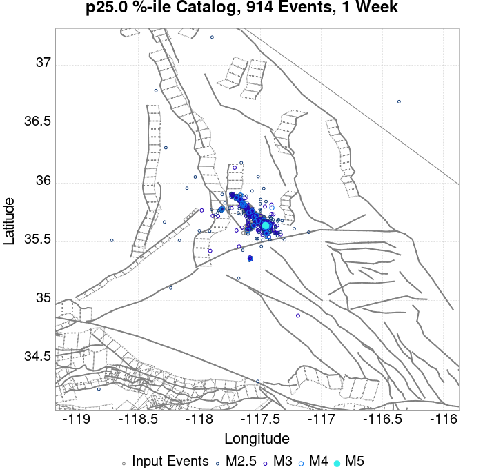 |  |  |  |  | 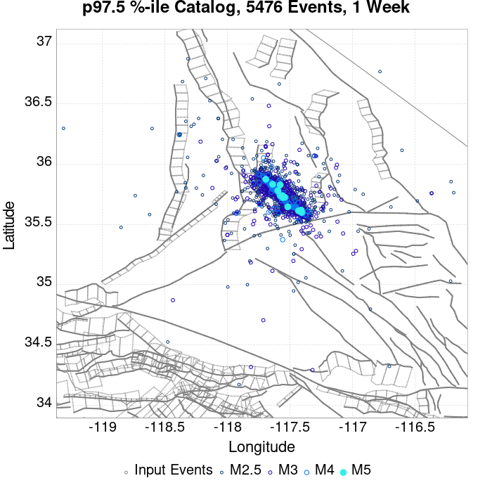 |  |  |  |  |  |
| **1 Month** |  |  |  |  |  |  |  |  |  |  |  |  |
| **1 Year** |  |  |  | 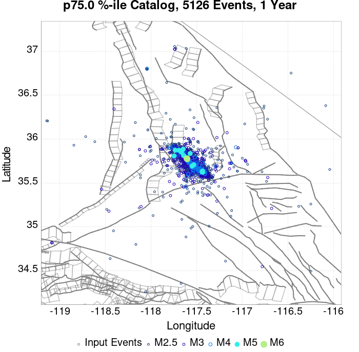 |  |  |  |  |  |  |  |  |
| **10 Year** |  |  |  |  |  |  |  |  |  |  |  |  |

## ComCat Data Comparisons
*[(top)](#table-of-contents)*

These plots compare simulated sequences with data from ComCat. All plots only consider events with hypocenters inside the ComCat region defined in the JSON input file.

Last updated at 2019/11/05 22:33:20 UTC, 4 mo after the simulation start time

### ComCat Magnitude-Number Distributions
*[(top)](#table-of-contents)*

| Incremental MND | Cumulative MND |
|-----|-----|
|  | 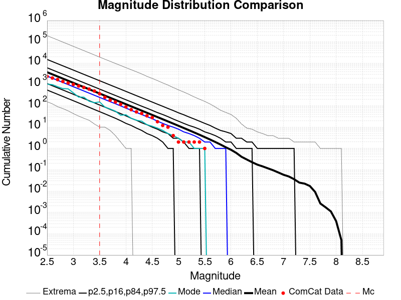 |

### ComCat Time-Dependent Mc
*[(top)](#table-of-contents)*

The following plots compare simulation results with ComCat data above a magnitude threshold. Plots labeled as *M&ge;Mc(t)* use the time-dependent magnitude of completeness (Mc) defined in Helmstetter et al. (2006), which is plotted below. In the case of multiple M&ge;5 ruptures, either as input to the simulation or in the comparison data, the maximum calculated time-dependent Mc is used. This time-dependent Mc function is plotted below.


### ComCat Cumulative Number Vs Time
*[(top)](#table-of-contents)*

| M&ge;Mc(t) | M&ge;3.5 | M&ge;4 | M&ge;5 | M&ge;6 | M&ge;7 |
|-----|-----|-----|-----|-----|-----|
|  |  |  |  |  |  |

### ComCat Cumulative Number Simulation Percentiles
*[(top)](#table-of-contents)*


### ComCat Probability Spatial Distribution
*[(top)](#table-of-contents)*

|  | 1 Day | 1 Week | 1 Month | Current (4 Month) |
|-----|-----|-----|-----|-----|
| **M&ge;Mc(t)** |  |  |  |  |
| **M&ge;3.5** |  |  |  |  |
| **M&ge;4** |  |  | 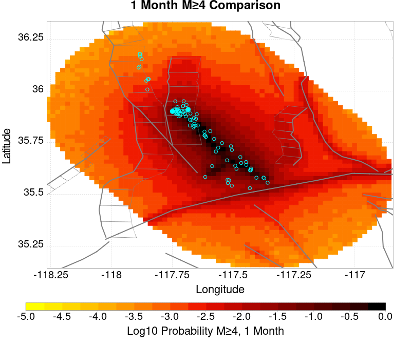 | 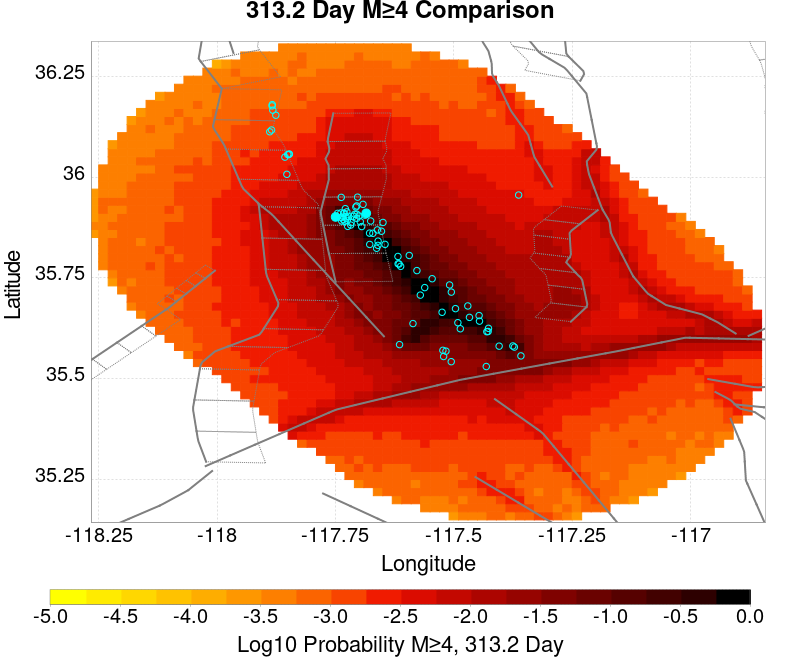 |
| **M&ge;5** |  |  |  |  |
| **M&ge;6** |  |  |  |  |
| **M&ge;7** |  |  |  | 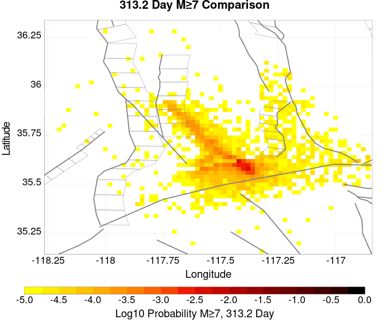 |
| **M&ge;8** |  |  |  |  |

### ComCat Mean Expectation Spatial Distribution
*[(top)](#table-of-contents)*

|  | 1 Day | 1 Week | 1 Month | Current (4 Month) |
|-----|-----|-----|-----|-----|
| **M&ge;Mc(t)** |  |  |  |  |
| **M&ge;3.5** |  |  |  |  |
| **M&ge;4** | 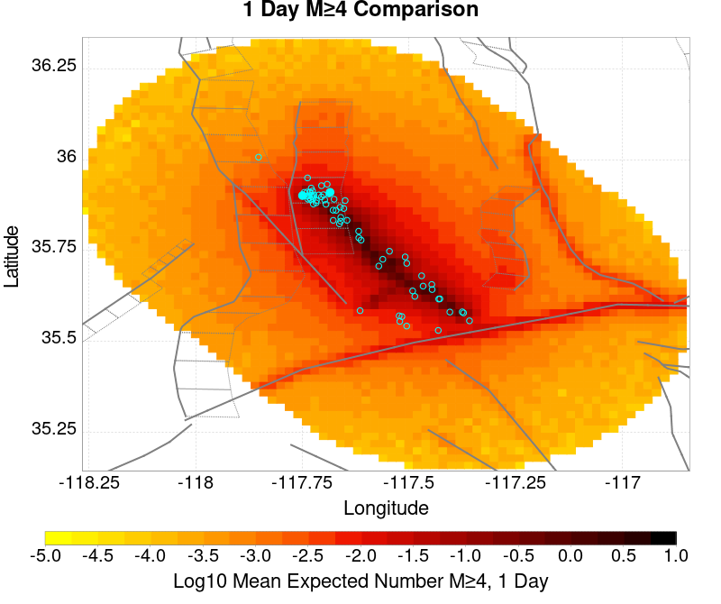 |  |  |  |
| **M&ge;5** |  |  |  |  |
| **M&ge;6** |  |  | 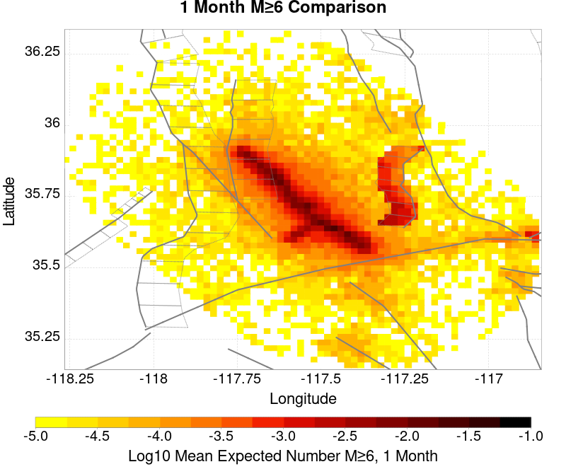 |  |
| **M&ge;7** |  | 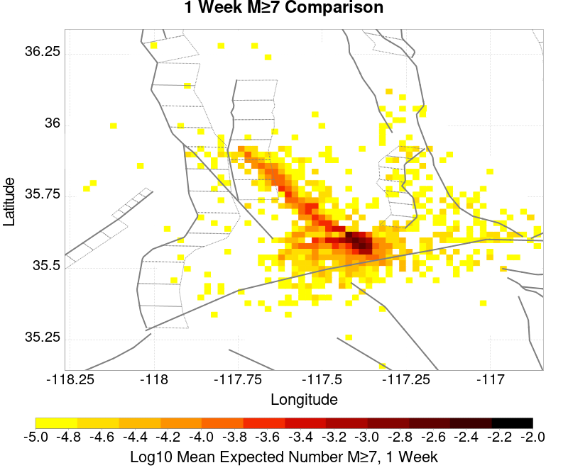 |  |  |
| **M&ge;8** |  |  |  |  |

### ComCat Depth Distribution
*[(top)](#table-of-contents)*

| M&ge;Mc(t) | M&ge;3.5 | M&ge;4 | M&ge;5 | M&ge;6 | M&ge;7 | M&ge;8 |
|-----|-----|-----|-----|-----|-----|-----|
|  |  |  |  |  |  | 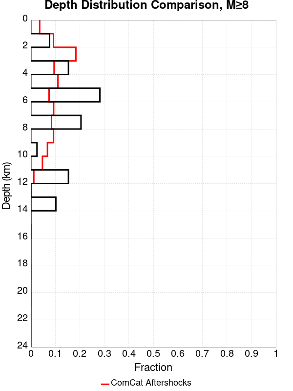 |

## Section Participation
*[(top)](#table-of-contents)*

### Section Participation Plots
*[(top)](#table-of-contents)*

| Min Mag | 1 yr Triggered Ruptures (no spontaneous) | 10 yr Triggered Ruptures (no spontaneous) | 10 yr Triggered Ruptures (primary aftershocks only) |
|-----|-----|-----|-----|
| **All Supra. Seis.** |  |  |  |
| **M&ge;6.5** |  | 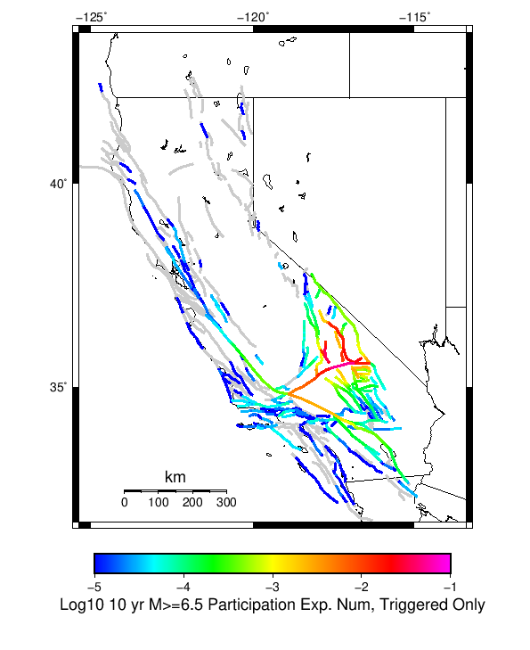 |  |
| **M&ge;7** |  |  |  |
| **M&ge;7.5** |  | 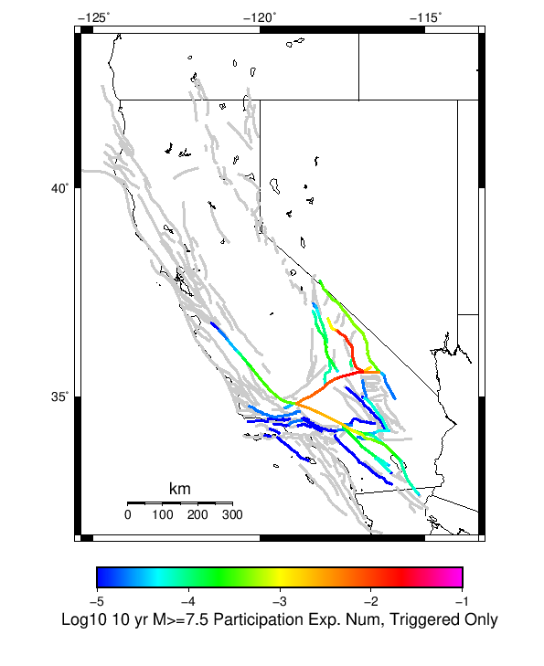 |  |
| **M&ge;8** |  |  |  |

### Supra-Seismogenic Parent Sections Table
*[(top)](#table-of-contents)*

*First 10 of 200 with matching ruptures shown*

| Parent Name | Triggered 10 Year Mean Count | Triggered 1 Day Prob | Triggered 1 Week Prob | Triggered 1 Month Prob | Triggered 1 Year Prob | Triggered 10 Year Prob | Triggered 10 Year Primary Mean Count |
|-----|-----|-----|-----|-----|-----|-----|-----|
| Garlock (Central) | 0.13605039 | 0.046167005 | 0.06504827 | 0.07965329 | 0.104751565 | 0.12789263 | 0.074916534 |
| Tank Canyon | 0.11332051 | 0.022729889 | 0.036167167 | 0.047614347 | 0.070607394 | 0.09488331 | 0.030509366 |
| Little Lake | 0.064193025 | 0.021414122 | 0.03077252 | 0.038223054 | 0.049555104 | 0.060952947 | 0.035953358 |
| Airport Lake | 0.052005723 | 0.020147694 | 0.02759823 | 0.03355208 | 0.04319008 | 0.051759016 | 0.0342922 |
| Owl Lake | 0.041578263 | 0.009193928 | 0.014522787 | 0.01909508 | 0.027844938 | 0.036759265 | 0.01156231 |
| Panamint Valley | 0.0323021 | 0.007993289 | 0.012285982 | 0.016167497 | 0.024012763 | 0.031265933 | 0.011397839 |
| Garlock (East) | 0.027515994 | 0.0062663443 | 0.009703788 | 0.012499794 | 0.018354962 | 0.024851564 | 0.007894607 |
| Hunter Mountain-Saline Valley | 0.015032647 | 0.004490058 | 0.006562392 | 0.008289337 | 0.011891251 | 0.014769494 | 0.007055805 |
| Blackwater | 0.013042549 | 0.0022696995 | 0.003552573 | 0.0047367644 | 0.008174208 | 0.0124669 | 0.0029933718 |
| Ash Hill | 0.011940593 | 0.0019736518 | 0.0037170441 | 0.004999918 | 0.0076643475 | 0.010970214 | 0.0019572047 |

### M≥6.5 Parent Sections Table
*[(top)](#table-of-contents)*

*First 10 of 167 with matching ruptures shown*

| Parent Name | Triggered 10 Year Mean Count | Triggered 1 Day Prob | Triggered 1 Week Prob | Triggered 1 Month Prob | Triggered 1 Year Prob | Triggered 10 Year Prob | Triggered 10 Year Primary Mean Count |
|-----|-----|-----|-----|-----|-----|-----|-----|
| Garlock (Central) | 0.058518775 | 0.01921021 | 0.027647572 | 0.0342922 | 0.046594627 | 0.057318136 | 0.030673837 |
| Little Lake | 0.03916054 | 0.014276081 | 0.020049013 | 0.024719989 | 0.03151264 | 0.038173713 | 0.023371326 |
| Airport Lake | 0.039078306 | 0.01524646 | 0.020805579 | 0.025180507 | 0.03236789 | 0.03899607 | 0.025805498 |
| Panamint Valley | 0.029802142 | 0.0078123715 | 0.011825464 | 0.015328695 | 0.022516077 | 0.028930446 | 0.011282709 |
| Owl Lake | 0.023453562 | 0.007039358 | 0.010509696 | 0.013239914 | 0.018322067 | 0.023305537 | 0.010114965 |
| Garlock (East) | 0.018667456 | 0.005065706 | 0.007565665 | 0.00940774 | 0.013437279 | 0.017713524 | 0.0073682996 |
| Hunter Mountain-Saline Valley | 0.014703706 | 0.004473611 | 0.0064966036 | 0.008190655 | 0.011710334 | 0.01450634 | 0.007039358 |
| Tank Canyon | 0.0125162415 | 0.0025493002 | 0.0040624333 | 0.005509778 | 0.008519596 | 0.012434006 | 0.0031413957 |
| Garlock (West) | 0.009950494 | 0.003371655 | 0.004720317 | 0.0056742486 | 0.007943949 | 0.009950494 | 0.005279518 |
| So Sierra Nevada | 0.004539399 | 9.5393165E-4 | 0.0014802389 | 0.0020887814 | 0.0032071841 | 0.004490058 | 8.8814326E-4 |

### M≥7 Parent Sections Table
*[(top)](#table-of-contents)*

*First 10 of 126 with matching ruptures shown*

| Parent Name | Triggered 10 Year Mean Count | Triggered 1 Day Prob | Triggered 1 Week Prob | Triggered 1 Month Prob | Triggered 1 Year Prob | Triggered 10 Year Prob | Triggered 10 Year Primary Mean Count |
|-----|-----|-----|-----|-----|-----|-----|-----|
| Garlock (Central) | 0.05225243 | 0.017154323 | 0.024752883 | 0.03077252 | 0.041808523 | 0.051446524 | 0.0274831 |
| Panamint Valley | 0.02046019 | 0.006019638 | 0.009013009 | 0.011364944 | 0.016348416 | 0.020295719 | 0.009572211 |
| Owl Lake | 0.017812207 | 0.0060525322 | 0.008667621 | 0.010838637 | 0.014325422 | 0.017812207 | 0.009753129 |
| Hunter Mountain-Saline Valley | 0.014292528 | 0.004407822 | 0.0064308154 | 0.0081248665 | 0.011529416 | 0.014276081 | 0.0069406754 |
| Garlock (East) | 0.014160952 | 0.0046051876 | 0.006710416 | 0.008157761 | 0.011134685 | 0.014062269 | 0.007121593 |
| Garlock (West) | 0.00980247 | 0.003371655 | 0.004687423 | 0.0056249076 | 0.007894607 | 0.00980247 | 0.00521373 |
| Little Lake | 0.00878275 | 0.0034209965 | 0.004539399 | 0.0056413547 | 0.007269617 | 0.008749856 | 0.005559119 |
| Airport Lake | 0.008256443 | 0.0032729725 | 0.0043091397 | 0.005345307 | 0.006874887 | 0.008256443 | 0.0052630715 |
| San Andreas (Mojave N) | 0.0042762454 | 0.0014473447 | 0.0019407575 | 0.0023025938 | 0.0032729725 | 0.004177563 | 0.0021052286 |
| San Andreas (Mojave S) | 0.0032729725 | 0.0010690613 | 0.0014637917 | 0.0017598395 | 0.0025493002 | 0.0032565254 | 0.0015789215 |

### M≥7.5 Parent Sections Table
*[(top)](#table-of-contents)*

*First 10 of 64 with matching ruptures shown*

| Parent Name | Triggered 10 Year Mean Count | Triggered 1 Day Prob | Triggered 1 Week Prob | Triggered 1 Month Prob | Triggered 1 Year Prob | Triggered 10 Year Prob | Triggered 10 Year Primary Mean Count |
|-----|-----|-----|-----|-----|-----|-----|-----|
| Garlock (Central) | 0.021562146 | 0.0071709347 | 0.010065624 | 0.012450453 | 0.017368136 | 0.021414122 | 0.011414286 |
| Panamint Valley | 0.013799115 | 0.004342034 | 0.0063485797 | 0.007993289 | 0.011200474 | 0.013799115 | 0.006825546 |
| Hunter Mountain-Saline Valley | 0.013766221 | 0.004325587 | 0.0063321325 | 0.007976842 | 0.011167579 | 0.013766221 | 0.0067926515 |
| Garlock (West) | 0.008716962 | 0.0029933718 | 0.0040788804 | 0.004917682 | 0.0069242283 | 0.008716962 | 0.0047861054 |
| Garlock (East) | 0.0056413547 | 0.002006546 | 0.002680877 | 0.003157843 | 0.004391375 | 0.0056413547 | 0.003157843 |
| San Andreas (Mojave N) | 0.0042762454 | 0.0014473447 | 0.0019407575 | 0.0023025938 | 0.0032729725 | 0.004177563 | 0.0021052286 |
| San Andreas (Mojave S) | 0.0032071841 | 0.0010526143 | 0.0014308975 | 0.0017104982 | 0.0024835118 | 0.003190737 | 0.0015789215 |
| San Andreas (San Bernardino N) | 0.0021216755 | 7.0722523E-4 | 9.5393165E-4 | 0.0011184027 | 0.0015789215 | 0.0021216755 | 0.0010361671 |
| Owl Lake | 0.0017104982 | 5.0986005E-4 | 7.730136E-4 | 9.5393165E-4 | 0.0013486621 | 0.0017104982 | 8.7169616E-4 |
| San Andreas (San Bernardino S) | 9.5393165E-4 | 2.6315358E-4 | 3.9473036E-4 | 4.4407163E-4 | 7.0722523E-4 | 9.5393165E-4 | 4.4407163E-4 |

### M≥8 Parent Sections Table
*[(top)](#table-of-contents)*

*First 10 of 26 with matching ruptures shown*

| Parent Name | Triggered 10 Year Mean Count | Triggered 1 Day Prob | Triggered 1 Week Prob | Triggered 1 Month Prob | Triggered 1 Year Prob | Triggered 10 Year Prob | Triggered 10 Year Primary Mean Count |
|-----|-----|-----|-----|-----|-----|-----|-----|
| San Andreas (Mojave N) | 6.4143684E-4 | 2.4670648E-4 | 3.4538907E-4 | 3.6183617E-4 | 5.0986005E-4 | 6.4143684E-4 | 3.6183617E-4 |
| San Andreas (Mojave S) | 6.4143684E-4 | 2.4670648E-4 | 3.4538907E-4 | 3.6183617E-4 | 5.0986005E-4 | 6.4143684E-4 | 3.6183617E-4 |
| San Andreas (San Bernardino N) | 6.4143684E-4 | 2.4670648E-4 | 3.4538907E-4 | 3.6183617E-4 | 5.0986005E-4 | 6.4143684E-4 | 3.6183617E-4 |
| Garlock (Central) | 5.7564845E-4 | 2.3025936E-4 | 3.2894197E-4 | 3.4538907E-4 | 4.7696583E-4 | 5.7564845E-4 | 3.4538907E-4 |
| Garlock (West) | 5.7564845E-4 | 2.3025936E-4 | 3.2894197E-4 | 3.4538907E-4 | 4.7696583E-4 | 5.7564845E-4 | 3.4538907E-4 |
| Garlock (East) | 5.0986005E-4 | 1.9736518E-4 | 2.7960067E-4 | 2.9604777E-4 | 4.1117746E-4 | 5.0986005E-4 | 2.9604777E-4 |
| San Andreas (San Bernardino S) | 3.4538907E-4 | 1.3157679E-4 | 1.8091808E-4 | 1.9736518E-4 | 2.6315358E-4 | 3.4538907E-4 | 2.1381228E-4 |
| San Andreas (San Gorgonio Pass-Garnet HIll) | 3.2894197E-4 | 1.3157679E-4 | 1.6447098E-4 | 1.8091808E-4 | 2.4670648E-4 | 3.2894197E-4 | 2.1381228E-4 |
| San Andreas (Coachella) rev | 2.9604777E-4 | 9.868259E-5 | 1.1512968E-4 | 1.3157679E-4 | 2.1381228E-4 | 2.9604777E-4 | 1.8091808E-4 |
| San Jacinto (San Bernardino) | 1.9736518E-4 | 4.9341295E-5 | 9.868259E-5 | 9.868259E-5 | 1.6447098E-4 | 1.9736518E-4 | 8.223549E-5 |

### Fault Magnitude-Probability Distributions
*[(top)](#table-of-contents)*

The first 5 sections (sorted by trigger rate) are plotted below. All fault MPDs are available [here](plots/parent_sect_mpds/README.md)

| 1 Week | 1 Month | 1 Year | 10 Year |
|-----|-----|-----|-----|
|  |  |  |  |
|  |  |  |  |
|  |  |  |  |
|  |  |  |  |
|  |  |  |  |

## Gridded Nucleation
*[(top)](#table-of-contents)*

| Min Mag | Triggered Ruptures (no spontaneous) | Triggered Ruptures (primary aftershocks only) |
|-----|-----|-----|
| **M&ge;2.5** |  |  |
| **M&ge;5** |  |  |
| **M&ge;6** |  |  |
| **M&ge;7** |  |  |


## JSON Input File
*[(top)](#table-of-contents)*

```
{
  "numSimulations": 100000,
  "duration": 10.0,
  "startTimeMillis": 1562383194040,
  "includeSpontaneous": false,
  "randomSeed": 1572975569068,
  "binaryOutput": true,
  "binaryOutputFilters": [
    {
      "prefix": "results_complete",
      "descendantsOnly": false
    },
    {
      "prefix": "results_m5_preserve_chain",
      "minMag": 5.0,
      "preserveChainBelowMag": true,
      "descendantsOnly": false
    }
  ],
  "forceRecalc": false,
  "simulationName": "ComCat M7.1 (ci38457511), ShakeMap Surfaces, kCOV\u003d1.16",
  "numRetries": 3,
  "outputDir": "/home/scec-02/kmilner/ucerf3/etas_sim/2019_11_05-ComCatM7p1_ci38457511_ShakeMapSurfaces_kCOV1p16",
  "treatTriggerCatalogAsSpontaneous": false,
  "triggerRuptures": [
    "omitted due to length, see original input file"
  ],
  "cacheDir": "/home/scec-02/kmilner/ucerf3/ucerf3-etas-launcher/inputs/cache_fm3p1_ba",
  "fssFile": "/home/scec-02/kmilner/ucerf3/ucerf3-etas-launcher/inputs/2013_05_10-ucerf3p3-production-10runs_COMPOUND_SOL_FM3_1_SpatSeisU3_MEAN_BRANCH_AVG_SOL.zip",
  "probModel": "FULL_TD",
  "applySubSeisForSupraNucl": true,
  "totRateScaleFactor": 1.14,
  "gridSeisCorr": true,
  "timeIndependentERF": false,
  "griddedOnly": false,
  "imposeGR": false,
  "includeIndirectTriggering": true,
  "gridSeisDiscr": 0.1,
  "catalogCompletenessModel": "RELAXED",
  "etas_k_cov": 1.16,
  "configCommand": "u3etas_comcat_event_config_builder.sh --event-id ci38457511 --mag-complete 3.5 --num-simulations 100000 --days-before 7 --etas-k-cov 1.16 --finite-surf-shakemap --finite-surf-shakemap-min-mag 5 --hpc-site USC_HPC --nodes 36 --hours 24 --queue scec",
  "configTime": 1572975569068,
  "comcatMetadata": {
    "region": {
      "border": [
        {
          "latitude": 35.15123745324938,
          "longitude": -117.46198765392752
        },
        {
          "latitude": 35.170513097218205,
          "longitude": -117.55046477274733
        },
        {
          "latitude": 35.201997575622634,
          "longitude": -117.63356287896195
        },
        {
          "latitude": 35.24474776584818,
          "longitude": -117.70878534540662
        },
        {
          "latitude": 35.2893890362986,
          "longitude": -117.76387551603122
        },
        {
          "latitude": 35.288830898189985,
          "longitude": -117.76465036296011
        },
        {
          "latitude": 35.62116745212862,
          "longitude": -118.13026990137416
        },
        {
          "latitude": 35.621789874646055,
          "longitude": -118.12940866580139
        },
        {
          "latitude": 35.621789874646055,
          "longitude": -118.12940866580136
        },
        {
          "latitude": 35.63100857737423,
          "longitude": -118.14083341711117
        },
        {
          "latitude": 35.69213881200874,
          "longitude": -118.19401186444136
        },
        {
          "latitude": 35.759827796433385,
          "longitude": -118.23338865654299
        },
        {
          "latitude": 35.8320329014668,
          "longitude": -118.25773927868946
        },
        {
          "latitude": 35.906569563076914,
          "longitude": -118.26628547708222
        },
        {
          "latitude": 35.9811764992231,
          "longitude": -118.25872343341653
        },
        {
          "latitude": 36.05358395358725,
          "longitude": -118.23523828089384
        },
        {
          "latitude": 36.12158296055357,
          "longitude": -118.19650389473806
        },
        {
          "latitude": 36.18309350302806,
          "longitude": -118.14366730262441
        },
        {
          "latitude": 36.23622937613509,
          "longitude": -118.07831757407638
        },
        {
          "latitude": 36.279357589115186,
          "longitude": -118.00243964650828
        },
        {
          "latitude": 36.31115024550475,
          "longitude": -117.91835419890715
        },
        {
          "latitude": 36.33062704347584,
          "longitude": -117.82864534929934
        },
        {
          "latitude": 36.337186832826475,
          "longitude": -117.7360785775
        },
        {
          "latitude": 36.33062704347584,
          "longitude": -117.64351180570065
        },
        {
          "latitude": 36.31115024550475,
          "longitude": -117.55380295609284
        },
        {
          "latitude": 36.279357589115186,
          "longitude": -117.46971750849171
        },
        {
          "latitude": 36.23622937613509,
          "longitude": -117.39383958092363
        },
        {
          "latitude": 36.19237301765921,
          "longitude": -117.33990236386252
        },
        {
          "latitude": 36.19237301765921,
          "longitude": -117.3399023638625
        },
        {
          "latitude": 36.19300476664728,
          "longitude": -117.33902822340912
        },
        {
          "latitude": 35.858277657147454,
          "longitude": -116.97410396317103
        },
        {
          "latitude": 35.85771127553969,
          "longitude": -116.97489025431044
        },
        {
          "latitude": 35.849566414597014,
          "longitude": -116.96491461360324
        },
        {
          "latitude": 35.78805819220281,
          "longitude": -116.9122967694479
        },
        {
          "latitude": 35.72006106557635,
          "longitude": -116.87372034968973
        },
        {
          "latitude": 35.64765482528862,
          "longitude": -116.85032807444419
        },
        {
          "latitude": 35.57304829206068,
          "longitude": -116.8427916482061
        },
        {
          "latitude": 35.49851117585832,
          "longitude": -116.8512961557198
        },
        {
          "latitude": 35.42630481575459,
          "longitude": -116.87553976530553
        },
        {
          "latitude": 35.35861392859174,
          "longitude": -116.91474809853695
        },
        {
          "latitude": 35.29748137319737,
          "longitude": -116.96770221389164
        },
        {
          "latitude": 35.24474776584818,
          "longitude": -117.03277884359336
        },
        {
          "latitude": 35.201997575622634,
          "longitude": -117.10800131003803
        },
        {
          "latitude": 35.170513097218205,
          "longitude": -117.19109941625265
        },
        {
          "latitude": 35.15123745324938,
          "longitude": -117.27957653507247
        },
        {
          "latitude": 35.14474752487352,
          "longitude": -117.3707820945
        }
      ]
    },
    "eventID": "ci38457511",
    "minDepth": -10.0,
    "maxDepth": 24.0,
    "minMag": 2.5,
    "startTime": 1561778393040,
    "endTime": 1562383193040,
    "magComplete": 3.5
  }
}
```

