# Parent Section Magnitude-Probability Distributions

Only fault sections with at least one triggered aftershock are plotted. Sections are sorted by total supraseismogenic trigger rate (decreasing)

## Table Of Contents

* [Garlock (Central)](#garlock-central)
* [Tank Canyon](#tank-canyon)
* [Little Lake](#little-lake)
* [Airport Lake](#airport-lake)
* [Owl Lake](#owl-lake)
* [Panamint Valley](#panamint-valley)
* [Garlock (East)](#garlock-east)
* [Hunter Mountain-Saline Valley](#hunter-mountain-saline-valley)
* [Blackwater](#blackwater)
* [Ash Hill](#ash-hill)
* [Garlock (West)](#garlock-west)
* [McLean Lake](#mclean-lake)
* [Gravel Hills-Harper Lk](#gravel-hills-harper-lk)
* [Goldstone Lake](#goldstone-lake)
* [Coyote Canyon](#coyote-canyon)
* [So Sierra Nevada](#so-sierra-nevada)
* [San Andreas (Mojave S)](#san-andreas-mojave-s)
* [San Andreas (Mojave N)](#san-andreas-mojave-n)
* [Nelson Lake](#nelson-lake)
* [Death Valley (So)](#death-valley-so)
* [Lenwood-Lockhart-Old Woman Springs](#lenwood-lockhart-old-woman-springs)
* [Towne Pass](#towne-pass)
* [San Andreas (San Bernardino N)](#san-andreas-san-bernardino-n)
* [Bicycle Lake](#bicycle-lake)
* [Garlic Springs](#garlic-springs)
* [Paradise](#paradise)
* [Coyote Lake](#coyote-lake)
* [San Andreas (San Bernardino S)](#san-andreas-san-bernardino-s)
* [San Andreas (Big Bend)](#san-andreas-big-bend)
* [Death Valley (Black Mtns Frontal)](#death-valley-black-mtns-frontal)
* [Helendale-So Lockhart](#helendale-so-lockhart)
* [San Andreas (Carrizo) rev](#san-andreas-carrizo-rev)
* [San Andreas (Cholame) rev](#san-andreas-cholame-rev)
* [Elsinore (Glen Ivy) rev](#elsinore-glen-ivy-rev)
* [Sierra Nevada  (No Extension)](#sierra-nevada--no-extension)
* [San Andreas (San Gorgonio Pass-Garnet HIll)](#san-andreas-san-gorgonio-pass-garnet-hill)
* [San Andreas (Parkfield)](#san-andreas-parkfield)
* [Cady](#cady)
* [Manix-Afton Hills](#manix-afton-hills)
* [Calico-Hidalgo](#calico-hidalgo)
* [Death Valley (No)](#death-valley-no)
* [Death Valley (Fish Lake Valley)](#death-valley-fish-lake-valley)
* [San Andreas (North Branch Mill Creek)](#san-andreas-north-branch-mill-creek)
* [Ludlow](#ludlow)
* [San Jacinto (San Bernardino)](#san-jacinto-san-bernardino)
* [San Andreas (Coachella) rev](#san-andreas-coachella-rev)
* [San Andreas (Creeping Section) 2011 CFM](#san-andreas-creeping-section-2011-cfm)
* [White Wolf (Extension)](#white-wolf-extension)
* [Scodie Lineament](#scodie-lineament)
* [Santa Rosa Island](#santa-rosa-island)
* [Lake Isabella (Seismicity)](#lake-isabella-seismicity)
* [San Jacinto (Stepovers Combined)](#san-jacinto-stepovers-combined)
* [Rose Canyon](#rose-canyon)
* [Red Pass](#red-pass)
* [Pinto Mtn](#pinto-mtn)
* [Brawley (Seismic Zone) alt 1](#brawley-seismic-zone-alt-1)
* [San Jacinto (San Jacinto Valley) rev](#san-jacinto-san-jacinto-valley-rev)
* [Owens Valley](#owens-valley)
* [Big Pine (East)](#big-pine-east)
* [Tin Mountain](#tin-mountain)
* [Baker](#baker)
* [Imperial](#imperial)
* [San Jacinto (Anza) rev](#san-jacinto-anza-rev)
* [Santa Ynez (West)](#santa-ynez-west)
* [Oak Ridge (Onshore)](#oak-ridge-onshore)
* [Independence rev 2011](#independence-rev-2011)
* [San Jacinto (Lytle Creek connector)](#san-jacinto-lytle-creek-connector)
* [Santa Ynez (East)](#santa-ynez-east)
* [Raymond](#raymond)
* [Simi-Santa Rosa](#simi-santa-rosa)
* [Mission Ridge-Arroyo Parida-Santa Ana](#mission-ridge-arroyo-parida-santa-ana)
* [Big Pine (Central)](#big-pine-central)
* [San Jacinto (Borrego)](#san-jacinto-borrego)
* [Mission Creek](#mission-creek)
* [Whittier alt 1](#whittier-alt-1)
* [Cucamonga](#cucamonga)
* [Kern Canyon (North Kern) 2011](#kern-canyon-north-kern-2011)
* [San Jacinto (Coyote Creek)](#san-jacinto-coyote-creek)
* [Chino alt 1](#chino-alt-1)
* [Cleghorn Pass](#cleghorn-pass)
* [Pine Mtn](#pine-mtn)
* [Dry Mountain](#dry-mountain)
* [Deep Springs](#deep-springs)
* [San Jacinto (Clark) rev](#san-jacinto-clark-rev)
* [Owens Valley Keough Hot Springs](#owens-valley-keough-hot-springs)
* [Santa Ynez River](#santa-ynez-river)
* [Santa Cruz Island](#santa-cruz-island)
* [Pleito](#pleito)
* [Ventura-Pitas Point](#ventura-pitas-point)
* [Santa Cruz Catalina Ridge alt1](#santa-cruz-catalina-ridge-alt1)
* [Pisgah-Bullion Mtn-Mesquite Lk](#pisgah-bullion-mtn-mesquite-lk)
* [White Mountains](#white-mountains)
* [San Pedro Basin](#san-pedro-basin)
* [Calaveras (So) - Paicines extension 2011 CFM](#calaveras-so---paicines-extension-2011-cfm)
* [Santa Susana East (connector)](#santa-susana-east-connector)
* [Santa Susana alt 1](#santa-susana-alt-1)
* [Coronado Bank alt1](#coronado-bank-alt1)
* [Palos Verdes](#palos-verdes)
* [Hayward (No) 2011 CFM](#hayward-no-2011-cfm)
* [Newport-Inglewood (Offshore)](#newport-inglewood-offshore)
* [Lost Hills](#lost-hills)
* [Oceanic - West Huasna](#oceanic---west-huasna)
* [Elysian Park (Upper)](#elysian-park-upper)
* [Kern Canyon (Lake Isabella) 2011](#kern-canyon-lake-isabella-2011)
* [Sierra Madre](#sierra-madre)
* [Kern Canyon (South Kern) 2011](#kern-canyon-south-kern-2011)
* [Los Osos 2011](#los-osos-2011)
* [Bullion Mountains](#bullion-mountains)
* [Channel Islands Western Deep Ramp](#channel-islands-western-deep-ramp)
* [Red Mountain](#red-mountain)
* [Robinson Creek](#robinson-creek)
* [Blue Cut](#blue-cut)
* [Cleghorn](#cleghorn)
* [San Juan](#san-juan)
* [Cleghorn Lake](#cleghorn-lake)
* [Fish Slough 2011 CFM](#fish-slough-2011-cfm)
* [North Frontal  (East)](#north-frontal--east)
* [Rodgers Creek - Healdsburg 2011 CFM](#rodgers-creek---healdsburg-2011-cfm)
* [Elsinore (Coyote Mountains)](#elsinore-coyote-mountains)
* [Mono Lake 2011 CFM](#mono-lake-2011-cfm)
* [Great Valley 03a Dunnigan Hills](#great-valley-03a-dunnigan-hills)
* [Likely 2011 CFM](#likely-2011-cfm)
* [Hector Mine](#hector-mine)
* [Hayward (So) 2011 CFM](#hayward-so-2011-cfm)
* [Newport-Inglewood alt 1](#newport-inglewood-alt-1)
* [Bennett Valley 2011 CFM](#bennett-valley-2011-cfm)
* [Great Valley 09 (Laguna Seca)](#great-valley-09-laguna-seca)
* [Hollywood](#hollywood)
* [Great Valley 07 (Orestimba)](#great-valley-07-orestimba)
* [Garberville - Briceland 2011 CFM](#garberville---briceland-2011-cfm)
* [San Jose](#san-jose)
* [Elsinore (Temecula) rev](#elsinore-temecula-rev)
* [Del Valle](#del-valle)
* [Los Alamos 2011 CFM](#los-alamos-2011-cfm)
* [San Gregorio (North) 2011 CFM](#san-gregorio-north-2011-cfm)
* [Channel Islands Thrust](#channel-islands-thrust)
* [San Gorgonio Pass](#san-gorgonio-pass)
* [San Jacinto (Superstition Mtn)](#san-jacinto-superstition-mtn)
* [Ortigalita (South)](#ortigalita-south)
* [North Frontal  (West)](#north-frontal--west)
* [Calaveras (Central) 2011 CFM](#calaveras-central-2011-cfm)
* [Santa Monica alt 1](#santa-monica-alt-1)
* [Los Alamos extension](#los-alamos-extension)
* [Sheephole](#sheephole)
* [Maacama 2011 CFM](#maacama-2011-cfm)
* [Camp Rock 2011](#camp-rock-2011)
* [Russ 2011 CFM](#russ-2011-cfm)
* [San Diego Trough north alt1](#san-diego-trough-north-alt1)
* [East Huasna 2011 CFM](#east-huasna-2011-cfm)
* [Carson Range (Genoa)](#carson-range-genoa)
* [Hosgri](#hosgri)
* [Sierra Madre (San Fernando)](#sierra-madre-san-fernando)
* [Sisar](#sisar)
* [Elmore Ranch](#elmore-ranch)
* [San Luis Range 2011 CFM](#san-luis-range-2011-cfm)
* [San Clemente](#san-clemente)
* [Rinconada 2011 CFM](#rinconada-2011-cfm)
* [Calaveras (So) 2011 CFM](#calaveras-so-2011-cfm)
* [Davis Creek](#davis-creek)
* [Holser alt 1](#holser-alt-1)
* [White Wolf](#white-wolf)

## Garlock (Central)
*[(top)](#table-of-contents)*

| 1 Week | 1 Month | 1 Year | 10 Year |
|-----|-----|-----|-----|
| 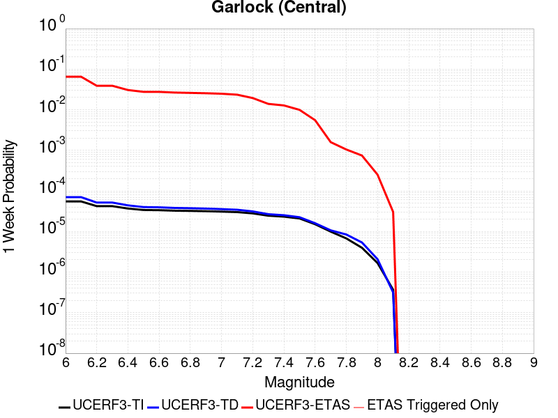 |  |  |  |

| Magnitude | 1 wk TI Prob | 1 wk TD Prob | 1 wk ETAS Prob | 1 wk ETAS/TD Gain | 1 wk ETAS Triggered Only | 1 mo TI Prob | 1 mo TD Prob | 1 mo ETAS Prob | 1 mo ETAS/TD Gain | 1 mo ETAS Triggered Only | 1 yr TI Prob | 1 yr TD Prob | 1 yr ETAS Prob | 1 yr ETAS/TD Gain | 1 yr ETAS Triggered Only | 10 yr TI Prob | 10 yr TD Prob | 10 yr ETAS Prob | 10 yr ETAS/TD Gain | 10 yr ETAS Triggered Only |
|-----|-----|-----|-----|-----|-----|-----|-----|-----|-----|-----|-----|-----|-----|-----|-----|-----|-----|-----|-----|-----|
| 6.0 | 5.5131142E-5 | 7.02476E-5 | 0.06331402 | 901.29803 | 0.06324822 | 2.3625491E-4 | 3.0102677E-4 | 0.078023106 | 259.18994 | 0.07774548 | 0.0028726095 | 0.003658906 | 0.106043965 | 28.982426 | 0.10276105 | 0.028357591 | 0.036136657 | 0.1574283 | 4.356471 | 0.12583904 |
| 6.1 | 5.5131142E-5 | 7.02476E-5 | 0.06331402 | 901.29803 | 0.06324822 | 2.3625491E-4 | 3.0102677E-4 | 0.078023106 | 259.18994 | 0.07774548 | 0.0028726095 | 0.003658906 | 0.106043965 | 28.982426 | 0.10276105 | 0.028357591 | 0.036136657 | 0.1574283 | 4.356471 | 0.12583904 |
| 6.2 | 4.216245E-5 | 5.1661802E-5 | 0.037659574 | 728.9636 | 0.037609853 | 1.806837E-4 | 2.213891E-4 | 0.046678476 | 210.8436 | 0.04646737 | 0.0021976046 | 0.002692112 | 0.06514894 | 24.199938 | 0.06262542 | 0.021759989 | 0.026701318 | 0.10243825 | 3.8364491 | 0.07781468 |
| 6.3 | 4.216245E-5 | 5.1661802E-5 | 0.037659574 | 728.9636 | 0.037609853 | 1.806837E-4 | 2.213891E-4 | 0.046678476 | 210.8436 | 0.04646737 | 0.0021976046 | 0.002692112 | 0.06514894 | 24.199938 | 0.06262542 | 0.021759989 | 0.026701318 | 0.10243825 | 3.8364491 | 0.07781468 |
| 6.4 | 3.6858168E-5 | 4.411026E-5 | 0.029729327 | 673.9776 | 0.029686527 | 1.5795401E-4 | 1.8903041E-4 | 0.03685776 | 194.98323 | 0.03667566 | 0.0019213937 | 0.0022990413 | 0.051421195 | 22.366364 | 0.049235348 | 0.019048655 | 0.022866098 | 0.08307908 | 3.633286 | 0.061622035 |
| 6.5 | 3.39199E-5 | 4.0018425E-5 | 0.026749903 | 668.4397 | 0.026710954 | 1.453629E-4 | 1.7149639E-4 | 0.03345068 | 195.05182 | 0.033284895 | 0.0017683565 | 0.0020859907 | 0.04700628 | 22.53427 | 0.045014188 | 0.017543508 | 0.020758783 | 0.07557894 | 3.6408176 | 0.055982284 |
| 6.6 | 3.3571985E-5 | 3.947258E-5 | 0.026714774 | 676.7932 | 0.026676355 | 1.4387199E-4 | 1.6915736E-4 | 0.033413827 | 197.53104 | 0.033250295 | 0.0017502342 | 0.0020575672 | 0.046875548 | 22.782026 | 0.044910386 | 0.017365133 | 0.020480042 | 0.07511246 | 3.6675932 | 0.05577469 |
| 6.7 | 3.2580007E-5 | 3.808902E-5 | 0.025467886 | 668.6412 | 0.025430767 | 1.3962112E-4 | 1.6322857E-4 | 0.031920552 | 195.55739 | 0.031762507 | 0.0016985617 | 0.0019855178 | 0.044631284 | 22.478409 | 0.042730607 | 0.016856372 | 0.019770874 | 0.07206875 | 3.6451983 | 0.05335271 |
| 6.8 | 3.2185937E-5 | 3.7516216E-5 | 0.025155943 | 670.5352 | 0.025119368 | 1.3793244E-4 | 1.60774E-4 | 0.03146845 | 195.73099 | 0.03131271 | 0.0016780337 | 0.0019556875 | 0.04398115 | 22.488844 | 0.042107813 | 0.016654192 | 0.019477878 | 0.07087539 | 3.6387637 | 0.05241852 |
| 6.9 | 3.165394E-5 | 3.672075E-5 | 0.02463619 | 670.9065 | 0.024600374 | 1.3565269E-4 | 1.5736527E-4 | 0.030842453 | 195.99275 | 0.030689918 | 0.0016503202 | 0.00191426 | 0.043112665 | 22.521845 | 0.04127742 | 0.01638118 | 0.019071518 | 0.069438204 | 3.6409373 | 0.051345926 |
| 7.0 | 3.0903822E-5 | 3.562591E-5 | 0.023943154 | 672.07135 | 0.02390838 | 1.3243823E-4 | 1.5267366E-4 | 0.03000764 | 196.54759 | 0.029859526 | 0.0016112428 | 0.0018572382 | 0.042021934 | 22.626034 | 0.04023943 | 0.015996104 | 0.018513493 | 0.067584425 | 3.6505497 | 0.04999654 |
| 7.1 | 3.0069863E-5 | 3.4392175E-5 | 0.022454215 | 652.8873 | 0.022420594 | 1.2886449E-4 | 1.4738683E-4 | 0.028203594 | 191.35762 | 0.028060341 | 0.0015677959 | 0.0017929787 | 0.039888002 | 22.246778 | 0.03816345 | 0.01556781 | 0.01788099 | 0.06453691 | 3.6092472 | 0.047505364 |
| 7.2 | 2.7957109E-5 | 3.128141E-5 | 0.018195545 | 581.6727 | 0.018164832 | 1.1981068E-4 | 1.3405642E-4 | 0.023105165 | 172.35403 | 0.02297419 | 0.0014577188 | 0.0016309345 | 0.03313438 | 20.316193 | 0.03155491 | 0.014481937 | 0.016284352 | 0.05505164 | 3.3806465 | 0.039409038 |
| 7.3 | 2.4519275E-5 | 2.6714602E-5 | 0.013070446 | 489.26224 | 0.01304408 | 1.0507837E-4 | 1.1448621E-4 | 0.016374474 | 143.02574 | 0.01626185 | 0.0012785783 | 0.001392993 | 0.02388601 | 17.147257 | 0.022524392 | 0.012712469 | 0.01392861 | 0.041529875 | 2.981624 | 0.027991142 |
| 7.4 | 2.3225532E-5 | 2.5199166E-5 | 0.011857992 | 470.5708 | 0.011833091 | 9.95342E-5 | 1.0799204E-4 | 0.0149150565 | 138.11255 | 0.014808664 | 0.0012111551 | 0.0013140244 | 0.02183923 | 16.620108 | 0.02055221 | 0.012045753 | 0.013146196 | 0.038379222 | 2.9194167 | 0.025569165 |
| 7.5 | 2.097765E-5 | 2.2483406E-5 | 0.009191193 | 408.79895 | 0.009168915 | 8.9901114E-5 | 9.6353964E-5 | 0.011547745 | 119.84712 | 0.011452494 | 0.0010939965 | 0.00117249 | 0.017380714 | 14.823764 | 0.01622725 | 0.010886264 | 0.0117406575 | 0.031812217 | 2.7095773 | 0.020310013 |
| 7.6 | 1.511254E-5 | 1.5990969E-5 | 0.0053442568 | 334.20468 | 0.005328351 | 6.476642E-5 | 6.8530964E-5 | 0.0063998387 | 93.386086 | 0.006331742 | 7.882459E-4 | 8.34053E-4 | 0.009684184 | 11.610994 | 0.008857518 | 0.007854558 | 0.008383867 | 0.01939725 | 2.3136399 | 0.011106498 |
| 7.7 | 9.934069E-6 | 1.0678523E-5 | 0.0015330482 | 143.5637 | 0.001522386 | 4.2573887E-5 | 4.5764296E-5 | 0.0017410711 | 38.044308 | 0.0016953844 | 5.182138E-4 | 5.570383E-4 | 0.0030122472 | 5.407613 | 0.0024565775 | 0.00517007 | 0.005627419 | 0.008758272 | 1.5563568 | 0.0031485711 |
| 7.8 | 6.7562896E-6 | 8.42837E-6 | 0.0010118107 | 120.0482 | 0.0010033908 | 2.8955206E-5 | 3.6121084E-5 | 0.0011432709 | 31.651068 | 0.0011071898 | 3.5247262E-4 | 4.3968562E-4 | 0.0019959868 | 4.539577 | 0.0015569857 | 0.0035191406 | 0.004446416 | 0.006547612 | 1.4725595 | 0.0021105807 |
| 7.9 | 3.975453E-6 | 5.3710532E-6 | 7.6655997E-4 | 142.72061 | 7.61193E-4 | 1.7037546E-5 | 2.3018596E-5 | 8.1879296E-4 | 35.570934 | 7.957927E-4 | 2.0741238E-4 | 2.8021546E-4 | 0.001317915 | 4.7032204 | 0.0010379904 | 0.002072189 | 0.0028335669 | 0.0042826356 | 1.5113939 | 0.0014531866 |
| 8.0 | 1.6729537E-6 | 2.0775192E-6 | 2.788744E-4 | 134.23433 | 2.7679745E-4 | 7.169782E-6 | 8.903624E-6 | 2.8569862E-4 | 32.087902 | 2.7679745E-4 | 8.7288594E-5 | 1.0839626E-4 | 4.889515E-4 | 4.5107784 | 3.805965E-4 | 8.7254314E-4 | 0.001096854 | 0.0016152799 | 1.4726481 | 5.189952E-4 |
| 8.1 | 3.6733252E-7 | 3.1489736E-7 | 6.951424E-5 | 220.75204 | 6.919936E-5 | 1.5742813E-6 | 1.3495595E-6 | 7.054883E-5 | 52.275448 | 6.919936E-5 | 1.9166706E-5 | 1.643078E-5 | 1.5482723E-4 | 9.422999 | 1.3839873E-4 | 1.9165053E-4 | 1.662928E-4 | 3.046685E-4 | 1.8321209 | 1.3839873E-4 |

## Tank Canyon
*[(top)](#table-of-contents)*

| 1 Week | 1 Month | 1 Year | 10 Year |
|-----|-----|-----|-----|
|  |  |  |  |

| Magnitude | 1 wk TI Prob | 1 wk TD Prob | 1 wk ETAS Prob | 1 wk ETAS/TD Gain | 1 wk ETAS Triggered Only | 1 mo TI Prob | 1 mo TD Prob | 1 mo ETAS Prob | 1 mo ETAS/TD Gain | 1 mo ETAS Triggered Only | 1 yr TI Prob | 1 yr TD Prob | 1 yr ETAS Prob | 1 yr ETAS/TD Gain | 1 yr ETAS Triggered Only | 10 yr TI Prob | 10 yr TD Prob | 10 yr ETAS Prob | 10 yr ETAS/TD Gain | 10 yr ETAS Triggered Only |
|-----|-----|-----|-----|-----|-----|-----|-----|-----|-----|-----|-----|-----|-----|-----|-----|-----|-----|-----|-----|-----|
| 6.0 | 4.8284557E-5 | 5.796445E-5 | 0.036800697 | 634.8839 | 0.036744863 | 2.0691741E-4 | 2.4839927E-4 | 0.04864133 | 195.81914 | 0.048404954 | 0.0025163088 | 0.0030207336 | 0.07480517 | 24.763908 | 0.072001934 | 0.02488006 | 0.029863616 | 0.122003414 | 4.085353 | 0.09497613 |
| 6.1 | 1.7796336E-5 | 2.0873378E-5 | 0.01309928 | 627.5592 | 0.013078679 | 7.626778E-5 | 8.945448E-5 | 0.017283957 | 193.21512 | 0.017196042 | 9.281647E-4 | 0.0010886024 | 0.026975553 | 24.77999 | 0.02591516 | 0.009242975 | 0.010836642 | 0.045882773 | 4.23404 | 0.035430074 |
| 6.2 | 1.7796336E-5 | 2.0873378E-5 | 0.01309928 | 627.5592 | 0.013078679 | 7.626778E-5 | 8.945448E-5 | 0.017283957 | 193.21512 | 0.017196042 | 9.281647E-4 | 0.0010886024 | 0.026975553 | 24.77999 | 0.02591516 | 0.009242975 | 0.010836642 | 0.045882773 | 4.23404 | 0.035430074 |
| 6.3 | 1.3515912E-5 | 1.5759651E-5 | 0.009184531 | 582.78766 | 0.009168915 | 5.792405E-5 | 6.7539746E-5 | 0.011969026 | 177.21455 | 0.01190229 | 7.049971E-4 | 8.2200987E-4 | 0.019352194 | 23.542534 | 0.01854543 | 0.007027647 | 0.008192157 | 0.03434113 | 4.1919518 | 0.026364958 |
| 6.4 | 1.0870146E-5 | 1.2618114E-5 | 0.0067940704 | 538.43787 | 0.0067815376 | 4.658551E-5 | 5.4076605E-5 | 0.008876518 | 164.14711 | 0.008822919 | 5.67031E-4 | 6.582015E-4 | 0.014385234 | 21.855364 | 0.013736074 | 0.005655863 | 0.006564382 | 0.026191112 | 3.9898822 | 0.019756418 |
| 6.5 | 7.964826E-6 | 9.196184E-6 | 0.0042995173 | 467.53278 | 0.0042903605 | 3.4134522E-5 | 3.941168E-5 | 0.005817331 | 147.60423 | 0.005778147 | 4.1550855E-4 | 4.797421E-4 | 0.009505927 | 19.81466 | 0.009030517 | 0.0041473247 | 0.004788209 | 0.017942002 | 3.7471213 | 0.0132170785 |
| 6.6 | 6.6317E-6 | 7.612378E-6 | 0.003294557 | 432.7895 | 0.0032869698 | 2.8421264E-5 | 3.262412E-5 | 0.004357443 | 133.56508 | 0.00432496 | 3.4597394E-4 | 3.9713533E-4 | 0.0068647065 | 17.285559 | 0.0064701405 | 0.0034543579 | 0.0039652516 | 0.013649209 | 3.4422054 | 0.00972251 |
| 6.7 | 4.793663E-6 | 5.4308593E-6 | 0.0017700051 | 325.9162 | 0.0017645838 | 2.0544108E-5 | 2.3274928E-5 | 0.0023759985 | 102.08404 | 0.0023527783 | 2.500958E-4 | 2.833398E-4 | 0.0038460973 | 13.574152 | 0.0035637673 | 0.0024981452 | 0.0028303189 | 0.008385101 | 2.9625995 | 0.0055705486 |
| 6.8 | 4.382823E-6 | 4.969325E-6 | 0.0015619473 | 314.31778 | 0.0015569857 | 1.8783392E-5 | 2.1296957E-5 | 0.0020972337 | 98.47574 | 0.0020759809 | 2.286638E-4 | 2.5926388E-4 | 0.0034416092 | 13.274543 | 0.0031831707 | 0.0022842865 | 0.0025901233 | 0.0074905525 | 2.8919675 | 0.004913155 |
| 6.9 | 2.729601E-6 | 3.0735862E-6 | 5.566668E-4 | 181.11313 | 5.535949E-4 | 1.1698237E-5 | 1.3172453E-5 | 8.781531E-4 | 66.66588 | 8.6499203E-4 | 1.4241673E-4 | 1.6036403E-4 | 0.0015787235 | 9.844624 | 0.0014185869 | 0.001423255 | 0.0016024808 | 0.0038824005 | 2.4227438 | 0.002283579 |
| 7.0 | 1.8987357E-6 | 2.126971E-6 | 2.0972462E-4 | 98.602486 | 2.0759809E-4 | 8.137413E-6 | 9.115562E-6 | 2.859105E-4 | 31.365097 | 2.7679745E-4 | 9.90685E-5 | 1.1097702E-4 | 5.953188E-4 | 5.364343 | 4.8439554E-4 | 9.902435E-4 | 0.0011092846 | 0.0019733172 | 1.7789097 | 8.6499203E-4 |
| 7.1 | 1.4928986E-6 | 1.6641525E-6 | 1.4006265E-4 | 84.16455 | 1.3839873E-4 | 6.398121E-6 | 7.132066E-6 | 1.8012924E-4 | 25.25625 | 1.729984E-4 | 7.789434E-5 | 8.6830034E-5 | 3.2900678E-4 | 3.7890897 | 2.4219777E-4 | 7.786704E-4 | 8.6801895E-4 | 0.0013174244 | 1.5177369 | 4.4979586E-4 |
| 7.2 | 1.069082E-6 | 1.1828765E-6 | 7.038216E-5 | 59.500847 | 6.919936E-5 | 4.581772E-6 | 5.0694644E-6 | 7.426848E-5 | 14.650163 | 6.919936E-5 | 5.5781646E-5 | 6.171951E-5 | 1.6551215E-4 | 2.6816828 | 1.03799044E-4 | 5.576765E-4 | 6.1707594E-4 | 7.553893E-4 | 1.2241431 | 1.3839873E-4 |
| 7.3 | 8.776551E-7 | 9.770151E-7 | 3.5576664E-5 | 36.413624 | 3.459968E-5 | 3.7613736E-6 | 4.187204E-6 | 3.878674E-5 | 9.26316 | 3.459968E-5 | 4.579376E-5 | 5.0978535E-5 | 1.2017437E-4 | 2.3573523 | 6.919936E-5 | 4.5784327E-4 | 5.097194E-4 | 6.1346556E-4 | 1.2035358 | 1.03799044E-4 |
| 7.4 | 7.55721E-7 | 8.5103835E-7 | 3.5450692E-5 | 41.655807 | 3.459968E-5 | 3.2388E-6 | 3.6473052E-6 | 3.824686E-5 | 10.486334 | 3.459968E-5 | 3.9431678E-5 | 4.4405555E-5 | 7.90037E-5 | 1.77914 | 3.459968E-5 | 3.942468E-4 | 4.4401767E-4 | 5.1318627E-4 | 1.155779 | 6.919936E-5 |
| 7.5 | 5.587665E-7 | 6.305732E-7 | 3.5230234E-5 | 55.870174 | 3.459968E-5 | 2.3947114E-6 | 2.7024564E-6 | 3.7302045E-5 | 13.803014 | 3.459968E-5 | 2.915522E-5 | 3.2902408E-5 | 6.750095E-5 | 2.0515504 | 3.459968E-5 | 2.9151395E-4 | 3.2902407E-4 | 3.6361237E-4 | 1.1051239 | 3.459968E-5 |

## Little Lake
*[(top)](#table-of-contents)*

| 1 Week | 1 Month | 1 Year | 10 Year |
|-----|-----|-----|-----|
| 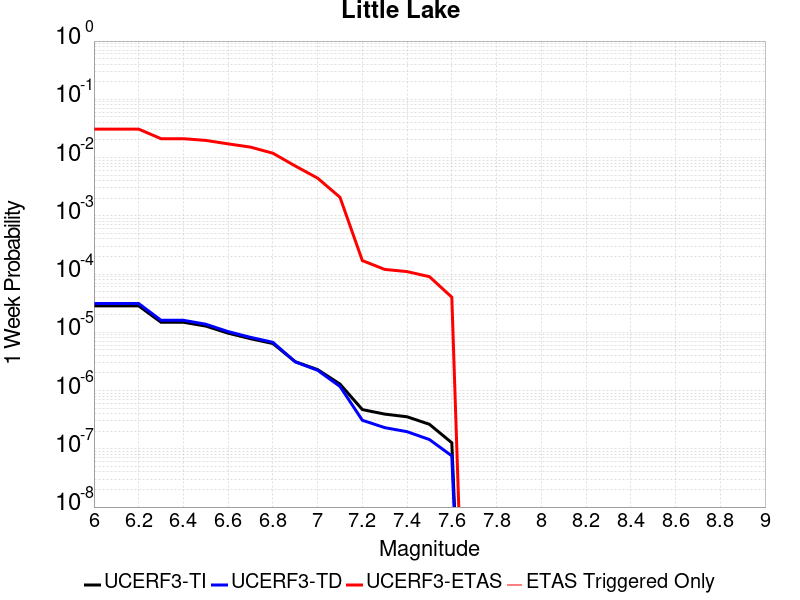 |  |  |  |

| Magnitude | 1 wk TI Prob | 1 wk TD Prob | 1 wk ETAS Prob | 1 wk ETAS/TD Gain | 1 wk ETAS Triggered Only | 1 mo TI Prob | 1 mo TD Prob | 1 mo ETAS Prob | 1 mo ETAS/TD Gain | 1 mo ETAS Triggered Only | 1 yr TI Prob | 1 yr TD Prob | 1 yr ETAS Prob | 1 yr ETAS/TD Gain | 1 yr ETAS Triggered Only | 10 yr TI Prob | 10 yr TD Prob | 10 yr ETAS Prob | 10 yr ETAS/TD Gain | 10 yr ETAS Triggered Only |
|-----|-----|-----|-----|-----|-----|-----|-----|-----|-----|-----|-----|-----|-----|-----|-----|-----|-----|-----|-----|-----|
| 6.0 | 2.8424427E-5 | 3.1205716E-5 | 0.03141214 | 1006.61487 | 0.031381913 | 1.2181328E-4 | 1.3373268E-4 | 0.038361266 | 286.85037 | 0.038232647 | 0.0014820677 | 0.0016271125 | 0.051369585 | 31.57101 | 0.04982354 | 0.014722223 | 0.016165398 | 0.07668917 | 4.744032 | 0.061518233 |
| 6.1 | 2.8424427E-5 | 3.1205716E-5 | 0.03141214 | 1006.61487 | 0.031381913 | 1.2181328E-4 | 1.3373268E-4 | 0.038361266 | 286.85037 | 0.038232647 | 0.0014820677 | 0.0016271125 | 0.051369585 | 31.57101 | 0.04982354 | 0.014722223 | 0.016165398 | 0.07668917 | 4.744032 | 0.061518233 |
| 6.2 | 2.8424427E-5 | 3.1205716E-5 | 0.03141214 | 1006.61487 | 0.031381913 | 1.2181328E-4 | 1.3373268E-4 | 0.038361266 | 286.85037 | 0.038232647 | 0.0014820677 | 0.0016271125 | 0.051369585 | 31.57101 | 0.04982354 | 0.014722223 | 0.016165398 | 0.07668917 | 4.744032 | 0.061518233 |
| 6.3 | 1.48860645E-5 | 1.6081383E-5 | 0.021709733 | 1349.9916 | 0.021694 | 6.379586E-5 | 6.8918554E-5 | 0.026259072 | 381.016 | 0.02619196 | 7.7643775E-4 | 8.387886E-4 | 0.034683466 | 41.349472 | 0.03387309 | 0.007737305 | 0.008359045 | 0.049565908 | 5.9296136 | 0.041554216 |
| 6.4 | 1.48860645E-5 | 1.6081383E-5 | 0.021709733 | 1349.9916 | 0.021694 | 6.379586E-5 | 6.8918554E-5 | 0.026259072 | 381.016 | 0.02619196 | 7.7643775E-4 | 8.387886E-4 | 0.034683466 | 41.349472 | 0.03387309 | 0.007737305 | 0.008359045 | 0.049565908 | 5.9296136 | 0.041554216 |
| 6.5 | 1.2797581E-5 | 1.376556E-5 | 0.020461896 | 1486.4558 | 0.020448413 | 5.4845623E-5 | 5.8994065E-5 | 0.02462332 | 417.38635 | 0.024565773 | 6.675408E-4 | 7.1804173E-4 | 0.03242317 | 45.15499 | 0.031727906 | 0.006655392 | 0.007159767 | 0.04584007 | 6.4024525 | 0.038959242 |
| 6.6 | 9.661896E-6 | 1.0289033E-5 | 0.017759742 | 1726.0848 | 0.017749637 | 4.1407468E-5 | 4.40952E-5 | 0.021287363 | 482.7592 | 0.021244204 | 5.040193E-4 | 5.36743E-4 | 0.027959563 | 52.091152 | 0.027437547 | 0.005028777 | 0.0053560715 | 0.038806833 | 7.245391 | 0.03363089 |
| 6.7 | 7.767871E-6 | 8.199681E-6 | 0.015266534 | 1861.8448 | 0.015258459 | 3.329045E-5 | 3.5141096E-5 | 0.018510722 | 526.7543 | 0.01847623 | 4.0523586E-4 | 4.2777258E-4 | 0.02429134 | 56.785645 | 0.02387378 | 0.004044977 | 0.004270843 | 0.03341716 | 7.8244877 | 0.02927133 |
| 6.8 | 6.4235196E-6 | 6.735739E-6 | 0.011978145 | 1778.297 | 0.0119714895 | 2.752908E-5 | 2.8867207E-5 | 0.014629511 | 506.78653 | 0.014601066 | 3.35115E-4 | 3.5141438E-4 | 0.019236201 | 54.73937 | 0.018891426 | 0.003346101 | 0.0035098472 | 0.026644748 | 7.5914264 | 0.023216387 |
| 6.9 | 3.1283696E-6 | 3.1121751E-6 | 0.0076150186 | 2446.8477 | 0.00761193 | 1.3407229E-5 | 1.33378335E-5 | 0.009078333 | 680.64526 | 0.009065117 | 1.6322079E-4 | 1.6237753E-4 | 0.012166518 | 74.927345 | 0.012006089 | 0.0016310095 | 0.0016227372 | 0.016096478 | 9.919338 | 0.014497267 |
| 7.0 | 2.290603E-6 | 2.2286763E-6 | 0.0044655777 | 2003.6907 | 0.004463359 | 9.816834E-6 | 9.551441E-6 | 0.005303252 | 555.23065 | 0.005293751 | 1.19513395E-4 | 1.1628362E-4 | 0.0073121805 | 62.88229 | 0.0071967337 | 0.0011944914 | 0.0011623299 | 0.009905875 | 8.522429 | 0.00875372 |
| 7.1 | 1.293693E-6 | 1.1776774E-6 | 0.0021463553 | 1822.5326 | 0.0021451802 | 5.5443866E-6 | 5.047183E-6 | 0.002392413 | 474.00958 | 0.0023873781 | 6.750081E-5 | 6.1448416E-5 | 0.0033482162 | 54.48824 | 0.0032869698 | 6.7480316E-4 | 6.1438273E-4 | 0.004694637 | 7.641225 | 0.0040827626 |
| 7.2 | 4.715842E-7 | 3.091732E-7 | 1.04108185E-4 | 336.73096 | 1.03799044E-4 | 2.0210737E-6 | 1.3250274E-6 | 1.0512394E-4 | 79.33718 | 1.03799044E-4 | 2.4606294E-5 | 1.6132095E-5 | 1.891277E-4 | 11.723693 | 1.729984E-4 | 2.460357E-4 | 1.6130977E-4 | 4.380626E-4 | 2.7156606 | 2.7679745E-4 |
| 7.3 | 3.9430947E-7 | 2.3096938E-7 | 1.0402999E-4 | 450.40598 | 1.03799044E-4 | 1.6898966E-6 | 9.898685E-7 | 1.0478881E-4 | 105.86135 | 1.03799044E-4 | 2.0574296E-5 | 1.2051582E-5 | 1.850479E-4 | 15.354657 | 1.729984E-4 | 2.0572392E-4 | 1.2050936E-4 | 3.6267794E-4 | 3.0095417 | 2.4219777E-4 |
| 7.4 | 3.547123E-7 | 1.9678579E-7 | 1.0399581E-4 | 528.47217 | 1.03799044E-4 | 1.5201948E-6 | 8.433674E-7 | 1.0464233E-4 | 124.0768 | 1.03799044E-4 | 1.8508214E-5 | 1.02679505E-5 | 1.8326458E-4 | 17.848215 | 1.729984E-4 | 1.8506673E-4 | 1.0267482E-4 | 3.102516E-4 | 3.021691 | 2.0759809E-4 |
| 7.5 | 2.6354266E-7 | 1.4422719E-7 | 6.934358E-5 | 480.7941 | 6.919936E-5 | 1.129468E-6 | 6.1811636E-7 | 6.981743E-5 | 112.951935 | 6.919936E-5 | 1.3751187E-5 | 7.525541E-6 | 1.4592323E-4 | 19.390396 | 1.3839873E-4 | 1.3750336E-4 | 7.5252916E-5 | 2.482383E-4 | 3.2987201 | 1.729984E-4 |
| 7.6 | 1.269913E-7 | 7.572344E-8 | 7.572344E-8 | 1.0 | 0.0 | 5.4424834E-7 | 3.24529E-7 | 3.24529E-7 | 1.0 | 0.0 | 6.6262032E-6 | 3.9511337E-6 | 3.855068E-5 | 9.756865 | 3.459968E-5 | 6.626006E-5 | 3.9510673E-5 | 7.410898E-5 | 1.8756702 | 3.459968E-5 |

## Airport Lake
*[(top)](#table-of-contents)*

| 1 Week | 1 Month | 1 Year | 10 Year |
|-----|-----|-----|-----|
|  |  |  |  |

| Magnitude | 1 wk TI Prob | 1 wk TD Prob | 1 wk ETAS Prob | 1 wk ETAS/TD Gain | 1 wk ETAS Triggered Only | 1 mo TI Prob | 1 mo TD Prob | 1 mo ETAS Prob | 1 mo ETAS/TD Gain | 1 mo ETAS Triggered Only | 1 yr TI Prob | 1 yr TD Prob | 1 yr ETAS Prob | 1 yr ETAS/TD Gain | 1 yr ETAS Triggered Only | 10 yr TI Prob | 10 yr TD Prob | 10 yr ETAS Prob | 10 yr ETAS/TD Gain | 10 yr ETAS Triggered Only |
|-----|-----|-----|-----|-----|-----|-----|-----|-----|-----|-----|-----|-----|-----|-----|-----|-----|-----|-----|-----|-----|
| 6.0 | 1.2387061E-5 | 1.3103157E-5 | 0.02751949 | 2100.2183 | 0.027506746 | 5.3086325E-5 | 5.615534E-5 | 0.033131592 | 589.999 | 0.033077296 | 6.461343E-4 | 6.8350515E-4 | 0.04428388 | 64.78939 | 0.043630198 | 0.0064425888 | 0.0068168393 | 0.059221666 | 8.687555 | 0.052764516 |
| 6.1 | 1.2387061E-5 | 1.3103157E-5 | 0.02751949 | 2100.2183 | 0.027506746 | 5.3086325E-5 | 5.615534E-5 | 0.033131592 | 589.999 | 0.033077296 | 6.461343E-4 | 6.8350515E-4 | 0.04428388 | 64.78939 | 0.043630198 | 0.0064425888 | 0.0068168393 | 0.059221666 | 8.687555 | 0.052764516 |
| 6.2 | 1.2387061E-5 | 1.3103157E-5 | 0.02751949 | 2100.2183 | 0.027506746 | 5.3086325E-5 | 5.615534E-5 | 0.033131592 | 589.999 | 0.033077296 | 6.461343E-4 | 6.8350515E-4 | 0.04428388 | 64.78939 | 0.043630198 | 0.0064425888 | 0.0068168393 | 0.059221666 | 8.687555 | 0.052764516 |
| 6.3 | 1.2387061E-5 | 1.3103157E-5 | 0.02751949 | 2100.2183 | 0.027506746 | 5.3086325E-5 | 5.615534E-5 | 0.033131592 | 589.999 | 0.033077296 | 6.461343E-4 | 6.8350515E-4 | 0.04428388 | 64.78939 | 0.043630198 | 0.0064425888 | 0.0068168393 | 0.059221666 | 8.687555 | 0.052764516 |
| 6.4 | 1.2387061E-5 | 1.3103157E-5 | 0.02751949 | 2100.2183 | 0.027506746 | 5.3086325E-5 | 5.615534E-5 | 0.033131592 | 589.999 | 0.033077296 | 6.461343E-4 | 6.8350515E-4 | 0.04428388 | 64.78939 | 0.043630198 | 0.0064425888 | 0.0068168393 | 0.059221666 | 8.687555 | 0.052764516 |
| 6.5 | 6.9922594E-6 | 7.384925E-6 | 0.020697841 | 2802.715 | 0.020690609 | 2.996648E-5 | 3.1649324E-5 | 0.024596646 | 777.16174 | 0.024565773 | 3.6478083E-4 | 3.8526783E-4 | 0.032446817 | 84.21886 | 0.032073904 | 0.003641826 | 0.0038465366 | 0.042828254 | 11.134237 | 0.03913224 |
| 6.6 | 6.9922594E-6 | 7.384925E-6 | 0.020697841 | 2802.715 | 0.020690609 | 2.996648E-5 | 3.1649324E-5 | 0.024596646 | 777.16174 | 0.024565773 | 3.6478083E-4 | 3.8526783E-4 | 0.032446817 | 84.21886 | 0.032073904 | 0.003641826 | 0.0038465366 | 0.042828254 | 11.134237 | 0.03913224 |
| 6.7 | 5.477277E-6 | 5.7860684E-6 | 0.018135915 | 3134.4106 | 0.018130234 | 2.3473833E-5 | 2.4797222E-5 | 0.021545265 | 868.85803 | 0.021521002 | 2.8575645E-4 | 3.0186825E-4 | 0.02835374 | 93.92753 | 0.028060341 | 0.0028538927 | 0.003014966 | 0.0369929 | 12.269757 | 0.034080688 |
| 6.8 | 3.9950432E-6 | 4.2190873E-6 | 0.013947832 | 3305.8887 | 0.013943672 | 1.7121502E-5 | 1.8081691E-5 | 0.016625628 | 919.4731 | 0.016607847 | 2.0843433E-4 | 2.2012512E-4 | 0.021598022 | 98.11703 | 0.021382604 | 0.0020823893 | 0.0021993418 | 0.027953936 | 12.710137 | 0.025811363 |
| 6.9 | 2.95695E-6 | 3.1230243E-6 | 0.010279196 | 3291.4238 | 0.010276105 | 1.2672582E-5 | 1.3384334E-5 | 0.0122269085 | 913.52386 | 0.012213687 | 1.5427776E-4 | 1.6294434E-4 | 0.01586864 | 97.38687 | 0.015708255 | 0.001541707 | 0.0016284712 | 0.020627307 | 12.66667 | 0.019029824 |
| 7.0 | 1.456072E-6 | 1.540812E-6 | 0.0042572953 | 2763.0205 | 0.004255761 | 6.2402937E-6 | 6.603469E-6 | 0.0050581237 | 765.9798 | 0.0050515537 | 7.597293E-5 | 8.039528E-5 | 0.0068959845 | 85.77599 | 0.006816137 | 7.594696E-4 | 8.0376083E-4 | 0.008997294 | 11.1939945 | 0.008200125 |
| 7.1 | 6.995192E-7 | 7.4089746E-7 | 0.0020421206 | 2756.2798 | 0.0020413813 | 2.997936E-6 | 3.1752747E-6 | 0.002286747 | 720.173 | 0.002283579 | 3.649926E-5 | 3.865897E-5 | 0.0030833133 | 79.75674 | 0.003044772 | 3.6493264E-4 | 3.865897E-4 | 0.0040873243 | 10.572771 | 0.003702166 |

## Owl Lake
*[(top)](#table-of-contents)*

| 1 Week | 1 Month | 1 Year | 10 Year |
|-----|-----|-----|-----|
|  |  |  |  |

| Magnitude | 1 wk TI Prob | 1 wk TD Prob | 1 wk ETAS Prob | 1 wk ETAS/TD Gain | 1 wk ETAS Triggered Only | 1 mo TI Prob | 1 mo TD Prob | 1 mo ETAS Prob | 1 mo ETAS/TD Gain | 1 mo ETAS Triggered Only | 1 yr TI Prob | 1 yr TD Prob | 1 yr ETAS Prob | 1 yr ETAS/TD Gain | 1 yr ETAS Triggered Only | 10 yr TI Prob | 10 yr TD Prob | 10 yr ETAS Prob | 10 yr ETAS/TD Gain | 10 yr ETAS Triggered Only |
|-----|-----|-----|-----|-----|-----|-----|-----|-----|-----|-----|-----|-----|-----|-----|-----|-----|-----|-----|-----|-----|
| 6.0 | 5.0320643E-5 | 6.6358676E-5 | 0.014424274 | 217.36832 | 0.014358868 | 2.1564208E-4 | 2.843643E-4 | 0.019101238 | 67.171715 | 0.018822227 | 0.0026222812 | 0.003457547 | 0.030386467 | 8.788446 | 0.02702235 | 0.02591553 | 0.034141295 | 0.069030106 | 2.021895 | 0.03612207 |
| 6.1 | 5.0320643E-5 | 6.6358676E-5 | 0.014424274 | 217.36832 | 0.014358868 | 2.1564208E-4 | 2.843643E-4 | 0.019101238 | 67.171715 | 0.018822227 | 0.0026222812 | 0.003457547 | 0.030386467 | 8.788446 | 0.02702235 | 0.02591553 | 0.034141295 | 0.069030106 | 2.021895 | 0.03612207 |
| 6.2 | 2.4125871E-5 | 3.0980515E-5 | 0.011898303 | 384.05765 | 0.011867691 | 1.0339249E-4 | 1.3276804E-4 | 0.0152854165 | 115.12874 | 0.015154661 | 0.0012580766 | 0.0016154252 | 0.022583505 | 13.979913 | 0.021002008 | 0.012509781 | 0.016070755 | 0.043033317 | 2.6777408 | 0.027402949 |
| 6.3 | 1.7433485E-5 | 2.2355545E-5 | 0.011094006 | 496.253 | 0.011071898 | 7.471279E-5 | 9.580685E-5 | 0.0138997575 | 145.08104 | 0.013805273 | 9.0924866E-4 | 0.001165962 | 0.019862564 | 17.035345 | 0.018718427 | 0.009055373 | 0.0116291465 | 0.03580665 | 3.0790436 | 0.024461975 |
| 6.4 | 1.7433485E-5 | 2.2355545E-5 | 0.011094006 | 496.253 | 0.011071898 | 7.471279E-5 | 9.580685E-5 | 0.0138997575 | 145.08104 | 0.013805273 | 9.0924866E-4 | 0.001165962 | 0.019862564 | 17.035345 | 0.018718427 | 0.009055373 | 0.0116291465 | 0.03580665 | 3.0790436 | 0.024461975 |
| 6.5 | 1.5182742E-5 | 1.9429277E-5 | 0.010710523 | 551.2569 | 0.010691302 | 6.506727E-5 | 8.3266525E-5 | 0.013368438 | 160.54997 | 0.013286278 | 7.919061E-4 | 0.0010134344 | 0.018848777 | 18.598913 | 0.017853435 | 0.0078909 | 0.010118678 | 0.032791898 | 3.2407296 | 0.022904988 |
| 6.6 | 6.7271576E-6 | 8.547518E-6 | 0.008935189 | 1045.3549 | 0.008926718 | 2.8830356E-5 | 3.6631736E-5 | 0.010969731 | 299.45975 | 0.0109335 | 3.5095305E-4 | 4.4590578E-4 | 0.014487113 | 32.489178 | 0.014047471 | 0.0035039932 | 0.0044680187 | 0.022310575 | 4.9933934 | 0.017922634 |
| 6.7 | 6.682835E-6 | 8.479961E-6 | 0.008935122 | 1053.6749 | 0.008926718 | 2.8640408E-5 | 3.6342215E-5 | 0.010969444 | 301.83752 | 0.0109335 | 3.4864116E-4 | 4.423823E-4 | 0.014483639 | 32.740097 | 0.014047471 | 0.003480947 | 0.0044329325 | 0.022276118 | 5.0251427 | 0.017922634 |
| 6.8 | 6.5774975E-6 | 8.326427E-6 | 0.00893497 | 1073.0857 | 0.008926718 | 2.8188972E-5 | 3.5684232E-5 | 0.010968793 | 307.3849 | 0.0109335 | 3.4314668E-4 | 4.3437455E-4 | 0.014475743 | 33.32549 | 0.014047471 | 0.0034261728 | 0.0043531056 | 0.022094375 | 5.075543 | 0.017818836 |
| 6.9 | 6.363419E-6 | 7.999591E-6 | 0.008900046 | 1112.5627 | 0.008892118 | 2.727151E-5 | 3.428354E-5 | 0.01093281 | 318.89383 | 0.010898899 | 3.3198006E-4 | 4.1732774E-4 | 0.014355181 | 34.397858 | 0.013943672 | 0.0033148455 | 0.0041830647 | 0.021823999 | 5.217227 | 0.017715037 |
| 7.0 | 6.1342453E-6 | 7.631779E-6 | 0.008692086 | 1138.933 | 0.00868452 | 2.6289357E-5 | 3.2707245E-5 | 0.010723659 | 327.86798 | 0.010691302 | 3.2002592E-4 | 3.9814346E-4 | 0.014128748 | 35.486576 | 0.013736074 | 0.0031956544 | 0.003991739 | 0.02136037 | 5.351144 | 0.01743824 |
| 7.1 | 5.842926E-6 | 7.142312E-6 | 0.00806881 | 1129.7197 | 0.008061726 | 2.504087E-5 | 3.060958E-5 | 0.010029611 | 327.6625 | 0.009999308 | 3.0482994E-4 | 3.7261334E-4 | 0.013342659 | 35.808327 | 0.012974881 | 0.0030441214 | 0.0037371595 | 0.020351881 | 5.4458156 | 0.016677046 |
| 7.2 | 4.77173E-6 | 5.358478E-6 | 0.0048838872 | 911.43176 | 0.004878555 | 2.045011E-5 | 2.2964727E-5 | 0.0062507642 | 272.1898 | 0.0062279426 | 2.4895166E-4 | 2.7956374E-4 | 0.008373626 | 29.952475 | 0.008096325 | 0.0024867293 | 0.0028086212 | 0.013366387 | 4.7590566 | 0.010587502 |
| 7.3 | 3.0494948E-6 | 2.710356E-6 | 0.001455893 | 537.1593 | 0.0014531866 | 1.3069198E-5 | 1.1615762E-5 | 0.0017069805 | 146.95381 | 0.0016953844 | 1.5910587E-4 | 1.4141288E-4 | 0.0023208845 | 16.412117 | 0.00217978 | 0.0015899199 | 0.0014231089 | 0.004256245 | 2.9908078 | 0.0028371739 |
| 7.4 | 2.7263884E-6 | 2.3055634E-6 | 9.710944E-4 | 421.19617 | 9.687911E-4 | 1.1684469E-5 | 9.880949E-6 | 0.0011170598 | 113.05188 | 0.0011071898 | 1.4224913E-4 | 1.2029401E-4 | 0.0016079013 | 13.366428 | 0.0014877863 | 0.0014215811 | 0.0012110578 | 0.0031117357 | 2.5694363 | 0.0019029825 |
| 7.5 | 2.6090431E-6 | 2.1655019E-6 | 8.3255605E-4 | 384.46335 | 8.3039235E-4 | 1.1181565E-5 | 9.2806895E-6 | 9.780627E-4 | 105.38686 | 9.687911E-4 | 1.3612706E-4 | 1.1298663E-4 | 0.001427626 | 12.635353 | 0.0013147879 | 0.001360437 | 0.0011378126 | 0.0027967077 | 2.4579685 | 0.0016607847 |
| 7.6 | 2.3008756E-6 | 1.8726826E-6 | 5.900662E-4 | 315.0914 | 5.881946E-4 | 9.860858E-6 | 8.025758E-6 | 7.346132E-4 | 91.531944 | 7.265933E-4 | 1.20049335E-4 | 9.770931E-5 | 0.0010664057 | 10.914065 | 9.687911E-4 | 0.001199845 | 9.848307E-4 | 0.0021600612 | 2.1933327 | 0.0011763892 |
| 7.7 | 1.7184348E-6 | 1.341808E-6 | 3.4733815E-4 | 258.8583 | 3.459968E-4 | 7.3646997E-6 | 5.750593E-6 | 3.863449E-4 | 67.18349 | 3.805965E-4 | 8.966153E-5 | 7.0011265E-5 | 5.8897014E-4 | 8.412505 | 5.189952E-4 | 8.962536E-4 | 7.0769014E-4 | 0.0013646189 | 1.9282717 | 6.5739395E-4 |
| 7.8 | 8.4612907E-7 | 8.4054994E-7 | 1.3923916E-4 | 165.65245 | 1.3839873E-4 | 3.6262625E-6 | 3.602352E-6 | 1.4200059E-4 | 39.41885 | 1.3839873E-4 | 4.4148852E-5 | 4.3857777E-5 | 2.168486E-4 | 4.9443593 | 1.729984E-4 | 4.414008E-4 | 4.4386165E-4 | 7.5512053E-4 | 1.7012521 | 3.1139713E-4 |
| 7.9 | 2.716738E-7 | 3.7681625E-7 | 6.9576156E-5 | 184.64214 | 6.919936E-5 | 1.1643157E-6 | 1.6149258E-6 | 7.0814174E-5 | 43.8498 | 6.919936E-5 | 1.4175452E-5 | 1.9661555E-5 | 1.2345857E-4 | 6.279186 | 1.03799044E-4 | 1.4174548E-4 | 1.9829652E-4 | 3.7126063E-4 | 1.8722498 | 1.729984E-4 |
| 8.0 | 2.1995428E-8 | 3.3853325E-8 | 3.3853325E-8 | 1.0 | 0.0 | 9.426611E-8 | 1.4508568E-7 | 1.4508568E-7 | 1.0 | 0.0 | 1.1476893E-6 | 1.7664173E-6 | 1.7664173E-6 | 1.0 | 0.0 | 1.14768345E-5 | 1.7869768E-5 | 1.7869768E-5 | 1.0 | 0.0 |

## Panamint Valley
*[(top)](#table-of-contents)*

| 1 Week | 1 Month | 1 Year | 10 Year |
|-----|-----|-----|-----|
| 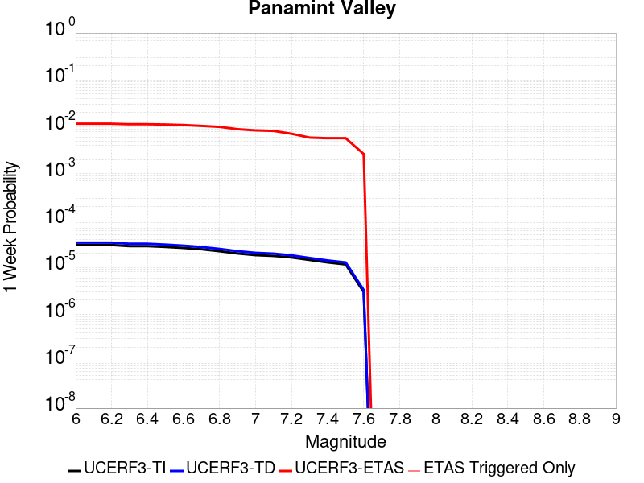 | 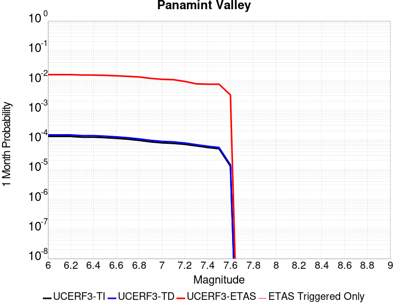 | 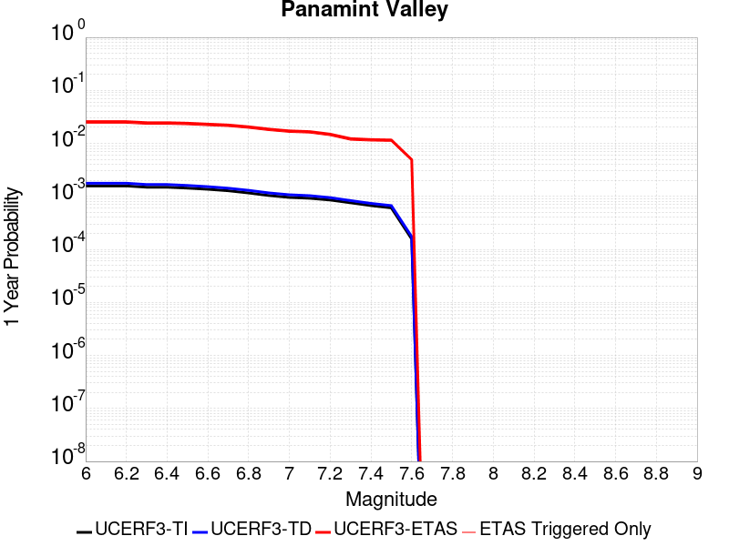 | 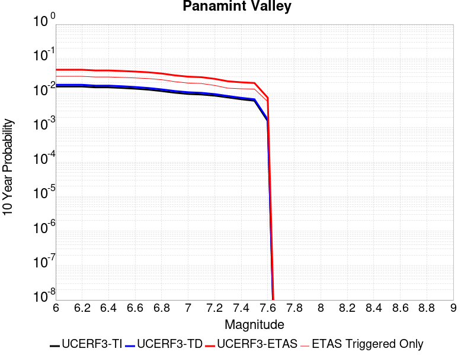 |

| Magnitude | 1 wk TI Prob | 1 wk TD Prob | 1 wk ETAS Prob | 1 wk ETAS/TD Gain | 1 wk ETAS Triggered Only | 1 mo TI Prob | 1 mo TD Prob | 1 mo ETAS Prob | 1 mo ETAS/TD Gain | 1 mo ETAS Triggered Only | 1 yr TI Prob | 1 yr TD Prob | 1 yr ETAS Prob | 1 yr ETAS/TD Gain | 1 yr ETAS Triggered Only | 10 yr TI Prob | 10 yr TD Prob | 10 yr ETAS Prob | 10 yr ETAS/TD Gain | 10 yr ETAS Triggered Only |
|-----|-----|-----|-----|-----|-----|-----|-----|-----|-----|-----|-----|-----|-----|-----|-----|-----|-----|-----|-----|-----|
| 6.0 | 3.0211835E-5 | 3.3984263E-5 | 0.011659082 | 343.073 | 0.011625493 | 1.2947287E-4 | 1.4563887E-4 | 0.015574849 | 106.94157 | 0.015431458 | 0.0015751923 | 0.0017717406 | 0.024670687 | 13.924547 | 0.022939589 | 0.015640736 | 0.017583003 | 0.047903255 | 2.724407 | 0.030862916 |
| 6.1 | 3.0211835E-5 | 3.3984263E-5 | 0.011659082 | 343.073 | 0.011625493 | 1.2947287E-4 | 1.4563887E-4 | 0.015574849 | 106.94157 | 0.015431458 | 0.0015751923 | 0.0017717406 | 0.024670687 | 13.924547 | 0.022939589 | 0.015640736 | 0.017583003 | 0.047903255 | 2.724407 | 0.030862916 |
| 6.2 | 3.0211835E-5 | 3.3984263E-5 | 0.011659082 | 343.073 | 0.011625493 | 1.2947287E-4 | 1.4563887E-4 | 0.015574849 | 106.94157 | 0.015431458 | 0.0015751923 | 0.0017717406 | 0.024670687 | 13.924547 | 0.022939589 | 0.015640736 | 0.017583003 | 0.047903255 | 2.724407 | 0.030862916 |
| 6.3 | 2.8573924E-5 | 3.2102445E-5 | 0.011380434 | 354.50366 | 0.0113486955 | 1.2245393E-4 | 1.375748E-4 | 0.015082581 | 109.63186 | 0.014947062 | 0.001489857 | 0.0016737141 | 0.023918616 | 14.290741 | 0.022282194 | 0.01479908 | 0.016618038 | 0.04570916 | 2.750575 | 0.029582728 |
| 6.4 | 2.8573924E-5 | 3.2102445E-5 | 0.011380434 | 354.50366 | 0.0113486955 | 1.2245393E-4 | 1.375748E-4 | 0.015082581 | 109.63186 | 0.014947062 | 0.001489857 | 0.0016737141 | 0.023918616 | 14.290741 | 0.022282194 | 0.01479908 | 0.016618038 | 0.04570916 | 2.750575 | 0.029582728 |
| 6.5 | 2.7468774E-5 | 3.0828138E-5 | 0.011206181 | 363.50494 | 0.011175697 | 1.1771801E-4 | 1.3211406E-4 | 0.014731251 | 111.504036 | 0.014601066 | 0.0014322745 | 0.0016073292 | 0.023197372 | 14.432246 | 0.021624802 | 0.014230782 | 0.015963882 | 0.044155076 | 2.765936 | 0.028648537 |
| 6.6 | 2.6135967E-5 | 2.9252153E-5 | 0.010927833 | 373.57364 | 0.010898899 | 1.1200648E-4 | 1.2536049E-4 | 0.014240261 | 113.59449 | 0.01411667 | 0.0013628257 | 0.0015252219 | 0.022529744 | 14.771452 | 0.021036606 | 0.013544982 | 0.015154343 | 0.04248277 | 2.8033397 | 0.027748944 |
| 6.7 | 2.4498746E-5 | 2.7341044E-5 | 0.010476159 | 383.16602 | 0.010449104 | 1.04990395E-4 | 1.17170785E-4 | 0.013644061 | 116.44593 | 0.013528476 | 0.0012775084 | 0.0014256459 | 0.021533953 | 15.1047 | 0.020137014 | 0.012701893 | 0.014171593 | 0.04043579 | 2.8532991 | 0.026641754 |
| 6.8 | 2.2244329E-5 | 2.4935374E-5 | 0.009989395 | 400.6114 | 0.009964708 | 9.532935E-5 | 1.0686163E-4 | 0.013011164 | 121.75711 | 0.0129056815 | 0.0011600169 | 0.0013002857 | 0.020236257 | 15.562931 | 0.018960625 | 0.011539802 | 0.012932955 | 0.03731763 | 2.885468 | 0.024704173 |
| 6.9 | 1.9902658E-5 | 2.2290182E-5 | 0.00891421 | 399.91644 | 0.008892118 | 8.529431E-5 | 9.552596E-5 | 0.011650716 | 121.963875 | 0.011556294 | 0.0010379635 | 0.0011624265 | 0.017992884 | 15.478728 | 0.016850045 | 0.010331288 | 0.011569021 | 0.032977846 | 2.8505301 | 0.0216594 |
| 7.0 | 1.8353881E-5 | 2.056605E-5 | 0.008393517 | 408.12485 | 0.008373123 | 7.865712E-5 | 8.813734E-5 | 0.01084769 | 123.07712 | 0.010760501 | 9.5722964E-4 | 0.0010725616 | 0.016694844 | 15.565394 | 0.015639056 | 0.009531168 | 0.01067939 | 0.030224822 | 2.8302011 | 0.019756418 |
| 7.1 | 1.7667631E-5 | 1.9772435E-5 | 0.008185136 | 413.967 | 0.008165525 | 7.571623E-5 | 8.4736355E-5 | 0.010532955 | 124.302666 | 0.010449104 | 9.2145515E-4 | 0.0010311945 | 0.016170228 | 15.681066 | 0.015154661 | 0.009176437 | 0.0102695925 | 0.029172478 | 2.8406656 | 0.019099025 |
| 7.2 | 1.6381597E-5 | 1.8158042E-5 | 0.007110964 | 391.61514 | 0.0070929346 | 7.020495E-5 | 7.781795E-5 | 0.009211423 | 118.37144 | 0.009134316 | 8.544101E-4 | 9.470391E-4 | 0.014324435 | 15.125495 | 0.013390076 | 0.008511325 | 0.009435269 | 0.026126329 | 2.7690074 | 0.016850045 |
| 7.3 | 1.4520491E-5 | 1.596657E-5 | 0.0058978186 | 369.38544 | 0.005881946 | 6.222919E-5 | 6.842646E-5 | 0.007645238 | 111.72927 | 0.0075773303 | 7.57377E-4 | 8.327899E-4 | 0.0117917545 | 14.159339 | 0.010968099 | 0.0075480095 | 0.008300399 | 0.022196958 | 2.6742036 | 0.014012871 |
| 7.4 | 1.2852287E-5 | 1.41454875E-5 | 0.005723012 | 404.58218 | 0.0057089473 | 5.5080065E-5 | 6.06222E-5 | 0.0074299076 | 122.560844 | 0.007369732 | 6.7039346E-4 | 7.378411E-4 | 0.01138668 | 15.432428 | 0.010656702 | 0.0066837464 | 0.007357429 | 0.020752024 | 2.8205538 | 0.013493876 |
| 7.5 | 1.1637851E-5 | 1.2836868E-5 | 0.005721711 | 445.72485 | 0.0057089473 | 4.987555E-5 | 5.5014076E-5 | 0.007424341 | 134.95348 | 0.007369732 | 6.070656E-4 | 6.696062E-4 | 0.01114629 | 16.646036 | 0.010483704 | 0.006054099 | 0.0066793845 | 0.01980818 | 2.9655697 | 0.0132170785 |
| 7.6 | 3.0068115E-6 | 3.3330623E-6 | 0.0026329001 | 789.93427 | 0.0026295758 | 1.2886271E-5 | 1.4284516E-5 | 0.003232009 | 226.25961 | 0.0032177705 | 1.5687906E-4 | 1.7390738E-4 | 0.0047056773 | 27.058527 | 0.0045325584 | 0.0015676835 | 0.0017397973 | 0.0074388124 | 4.2756777 | 0.0057089473 |

## Garlock (East)
*[(top)](#table-of-contents)*

| 1 Week | 1 Month | 1 Year | 10 Year |
|-----|-----|-----|-----|
| 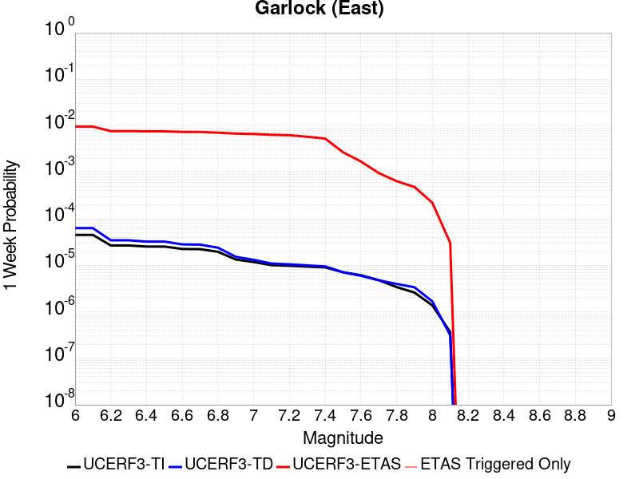 | 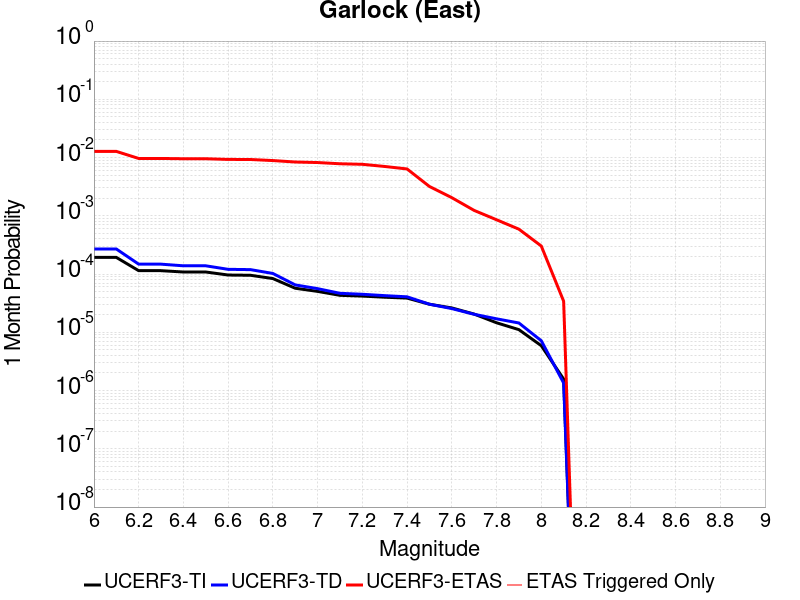 | 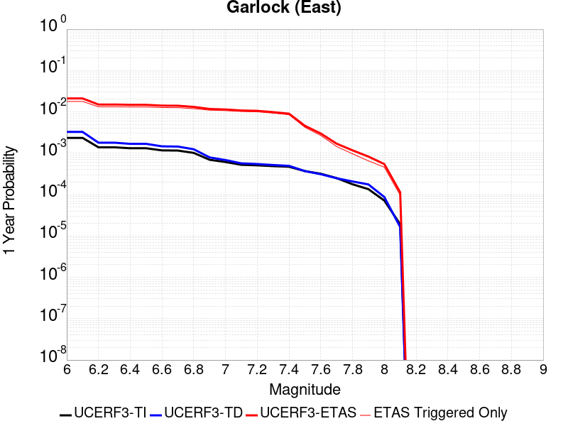 | 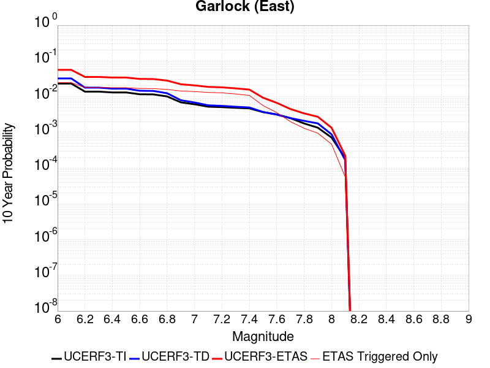 |

| Magnitude | 1 wk TI Prob | 1 wk TD Prob | 1 wk ETAS Prob | 1 wk ETAS/TD Gain | 1 wk ETAS Triggered Only | 1 mo TI Prob | 1 mo TD Prob | 1 mo ETAS Prob | 1 mo ETAS/TD Gain | 1 mo ETAS Triggered Only | 1 yr TI Prob | 1 yr TD Prob | 1 yr ETAS Prob | 1 yr ETAS/TD Gain | 1 yr ETAS Triggered Only | 10 yr TI Prob | 10 yr TD Prob | 10 yr ETAS Prob | 10 yr ETAS/TD Gain | 10 yr ETAS Triggered Only |
|-----|-----|-----|-----|-----|-----|-----|-----|-----|-----|-----|-----|-----|-----|-----|-----|-----|-----|-----|-----|-----|
| 6.0 | 4.5092507E-5 | 6.2904815E-5 | 0.009265841 | 147.2994 | 0.009203515 | 1.9323928E-4 | 2.6956675E-4 | 0.012341601 | 45.7831 | 0.012075289 | 0.0023501497 | 0.003277482 | 0.020727541 | 6.3242273 | 0.01750744 | 0.023254504 | 0.03235377 | 0.055354703 | 1.7109197 | 0.023769982 |
| 6.1 | 4.5092507E-5 | 6.2904815E-5 | 0.009265841 | 147.2994 | 0.009203515 | 1.9323928E-4 | 2.6956675E-4 | 0.012341601 | 45.7831 | 0.012075289 | 0.0023501497 | 0.003277482 | 0.020727541 | 6.3242273 | 0.01750744 | 0.023254504 | 0.03235377 | 0.055354703 | 1.7109197 | 0.023769982 |
| 6.2 | 2.6674514E-5 | 3.4511588E-5 | 0.0072655957 | 210.52626 | 0.0072313333 | 1.1431433E-4 | 1.4789861E-4 | 0.009211674 | 62.283714 | 0.009065117 | 0.0013908884 | 0.0017992114 | 0.014785285 | 8.217648 | 0.01300948 | 0.01382215 | 0.017872788 | 0.034727506 | 1.9430381 | 0.017161442 |
| 6.3 | 2.6674514E-5 | 3.4511588E-5 | 0.0072655957 | 210.52626 | 0.0072313333 | 1.1431433E-4 | 1.4789861E-4 | 0.009211674 | 62.283714 | 0.009065117 | 0.0013908884 | 0.0017992114 | 0.014785285 | 8.217648 | 0.01300948 | 0.01382215 | 0.017872788 | 0.034727506 | 1.9430381 | 0.017161442 |
| 6.4 | 2.5312667E-5 | 3.2340467E-5 | 0.0071250456 | 220.31363 | 0.0070929346 | 1.0847834E-4 | 1.3859481E-4 | 0.009064076 | 65.39982 | 0.008926718 | 0.0013199237 | 0.0016861152 | 0.014500953 | 8.600215 | 0.012836481 | 0.013121112 | 0.016772287 | 0.033407755 | 1.9918427 | 0.016919244 |
| 6.5 | 2.5312667E-5 | 3.2340467E-5 | 0.0071250456 | 220.31363 | 0.0070929346 | 1.0847834E-4 | 1.3859481E-4 | 0.009064076 | 65.39982 | 0.008926718 | 0.0013199237 | 0.0016861152 | 0.014500953 | 8.600215 | 0.012836481 | 0.013121112 | 0.016772287 | 0.033407755 | 1.9918427 | 0.016919244 |
| 6.6 | 2.246556E-5 | 2.8134691E-5 | 0.006982475 | 248.18027 | 0.006954536 | 9.627742E-5 | 1.2057181E-4 | 0.008804045 | 73.0191 | 0.00868452 | 0.0011715472 | 0.0014669969 | 0.013800963 | 9.40763 | 0.012352087 | 0.011653901 | 0.014613169 | 0.030603288 | 2.0942266 | 0.01622725 |
| 6.7 | 2.2241198E-5 | 2.7804432E-5 | 0.006982147 | 251.11635 | 0.006954536 | 9.531594E-5 | 1.1915654E-4 | 0.008802642 | 73.8746 | 0.00868452 | 0.0011598538 | 0.0014497889 | 0.013749418 | 9.483738 | 0.012317487 | 0.011538187 | 0.014442829 | 0.030367512 | 2.1026013 | 0.016158052 |
| 6.8 | 1.9528685E-5 | 2.3898969E-5 | 0.0067706755 | 283.3041 | 0.006746938 | 8.369167E-5 | 1.0242024E-4 | 0.008474685 | 82.74425 | 0.008373123 | 0.0010184698 | 0.0012462728 | 0.012960947 | 10.399768 | 0.011729292 | 0.010138147 | 0.012436723 | 0.02740291 | 2.2033865 | 0.015154661 |
| 6.9 | 1.3318621E-5 | 1.5198818E-5 | 0.006450642 | 424.41733 | 0.006435541 | 5.7078556E-5 | 6.51362E-5 | 0.007918753 | 121.57222 | 0.007854127 | 6.9470983E-4 | 7.927504E-4 | 0.011510149 | 14.519259 | 0.010725901 | 0.0069254204 | 0.007940721 | 0.021533394 | 2.7117684 | 0.013701474 |
| 7.0 | 1.1760853E-5 | 1.3107653E-5 | 0.0063447664 | 484.05054 | 0.006331742 | 5.0402683E-5 | 5.6174475E-5 | 0.00777147 | 138.34523 | 0.007715729 | 6.134799E-4 | 6.8371464E-4 | 0.0111256745 | 16.272394 | 0.010449104 | 0.0061178906 | 0.006857401 | 0.01991512 | 2.9041789 | 0.013147879 |
| 7.1 | 1.0064758E-5 | 1.0902761E-5 | 0.0061003803 | 559.52625 | 0.006089544 | 4.3133965E-5 | 4.67253E-5 | 0.0074161133 | 158.7173 | 0.007369732 | 5.2502943E-4 | 5.6873553E-4 | 0.010493197 | 18.450045 | 0.009930109 | 0.005237907 | 0.0057133473 | 0.018098067 | 3.167682 | 0.012455885 |
| 7.2 | 9.768808E-6 | 1.0498628E-5 | 0.0059961807 | 571.1394 | 0.0059857448 | 4.186565E-5 | 4.499337E-5 | 0.0073105996 | 162.48172 | 0.0072659333 | 5.095951E-4 | 5.4766005E-4 | 0.0102994265 | 18.80624 | 0.00975711 | 0.0050842804 | 0.005503584 | 0.017650053 | 3.2070107 | 0.012213687 |
| 7.3 | 9.344516E-6 | 9.9442705E-6 | 0.0054420405 | 547.25385 | 0.00543215 | 4.004731E-5 | 4.2617627E-5 | 0.006616277 | 155.24744 | 0.0065739397 | 4.8746695E-4 | 5.187495E-4 | 0.0094408365 | 18.19922 | 0.008926718 | 0.0048639905 | 0.005215269 | 0.016298262 | 3.125105 | 0.011141097 |
| 7.4 | 9.023491E-6 | 9.490441E-6 | 0.005026397 | 529.6273 | 0.0050169537 | 3.867153E-5 | 4.0672705E-5 | 0.006129969 | 150.71457 | 0.006089544 | 4.7072413E-4 | 4.95081E-4 | 0.00862198 | 17.415293 | 0.008130925 | 0.004697283 | 0.0049787266 | 0.015134815 | 3.0398967 | 0.010206906 |
| 7.5 | 7.081253E-6 | 7.0873994E-6 | 0.0025328463 | 357.37317 | 0.0025257769 | 3.0347876E-5 | 3.0374218E-5 | 0.0029366591 | 96.682625 | 0.0029063732 | 3.6942272E-4 | 3.697441E-4 | 0.004450997 | 12.038047 | 0.0040827626 | 0.003688092 | 0.0037244745 | 0.008964038 | 2.4067929 | 0.0052591516 |
| 7.6 | 6.116396E-6 | 5.9589424E-6 | 0.0017013332 | 285.50925 | 0.0016953844 | 2.6212863E-5 | 2.5538076E-5 | 0.001928472 | 75.513596 | 0.0019029825 | 3.1909486E-4 | 3.1088197E-4 | 0.0028358735 | 9.122026 | 0.0025257769 | 0.0031863707 | 0.0031359126 | 0.0064125746 | 2.044883 | 0.0032869698 |
| 7.7 | 4.797145E-6 | 4.7571157E-6 | 9.0434455E-4 | 190.10355 | 8.995917E-4 | 2.055903E-5 | 2.0387479E-5 | 0.0010237577 | 50.215027 | 0.0010033908 | 2.5027743E-4 | 2.481894E-4 | 0.00152806 | 6.1568294 | 0.0012801882 | 0.0024999576 | 0.0025094065 | 0.0042350492 | 1.6876696 | 0.0017299841 |
| 7.8 | 3.4028885E-6 | 3.978375E-6 | 5.9217063E-4 | 148.84737 | 5.881946E-4 | 1.4583726E-5 | 1.7050066E-5 | 6.744328E-4 | 39.556023 | 6.5739395E-4 | 1.775424E-4 | 2.0756487E-4 | 0.0010031924 | 4.8331513 | 7.957927E-4 | 0.0017740062 | 0.0021012141 | 0.0032060775 | 1.5258214 | 0.0011071898 |
| 7.9 | 2.5928412E-6 | 3.372436E-6 | 4.1856722E-4 | 124.11421 | 4.1519618E-4 | 1.1112129E-5 | 1.4453217E-5 | 4.296434E-4 | 29.726488 | 4.1519618E-4 | 1.3528178E-4 | 1.7595377E-4 | 6.948577E-4 | 3.9490921 | 5.189952E-4 | 0.0013519945 | 0.0017812426 | 0.0026101558 | 1.4653567 | 8.3039235E-4 |
| 8.0 | 1.3743648E-6 | 1.6734741E-6 | 2.4387085E-4 | 145.7273 | 2.4219777E-4 | 5.8901214E-6 | 7.1720124E-6 | 2.4936805E-4 | 34.769608 | 2.4219777E-4 | 7.1709874E-5 | 8.731578E-5 | 4.3328237E-4 | 4.962246 | 3.459968E-4 | 7.1686733E-4 | 8.837377E-4 | 0.0013677052 | 1.547637 | 4.8439554E-4 |
| 8.1 | 3.6733252E-7 | 3.1489736E-7 | 6.951424E-5 | 220.75204 | 6.919936E-5 | 1.5742813E-6 | 1.3495595E-6 | 7.054883E-5 | 52.275448 | 6.919936E-5 | 1.9166706E-5 | 1.643078E-5 | 1.5482723E-4 | 9.422999 | 1.3839873E-4 | 1.9165053E-4 | 1.662928E-4 | 3.046685E-4 | 1.8321209 | 1.3839873E-4 |

## Hunter Mountain-Saline Valley
*[(top)](#table-of-contents)*

| 1 Week | 1 Month | 1 Year | 10 Year |
|-----|-----|-----|-----|
| 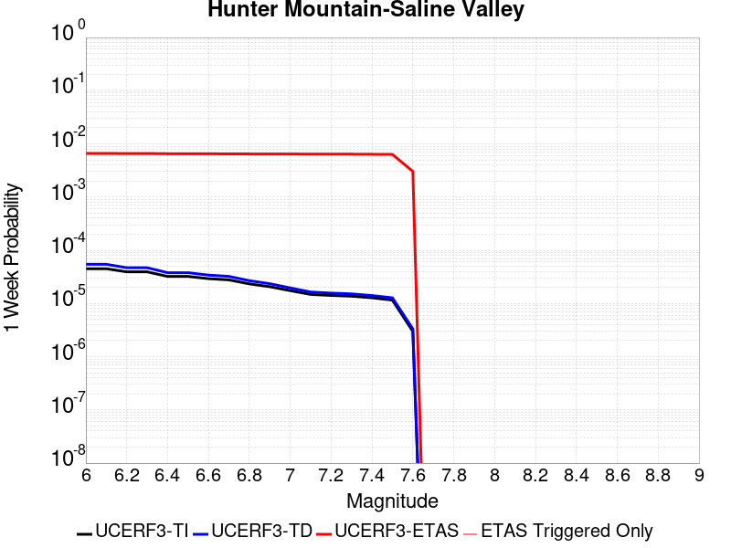 | 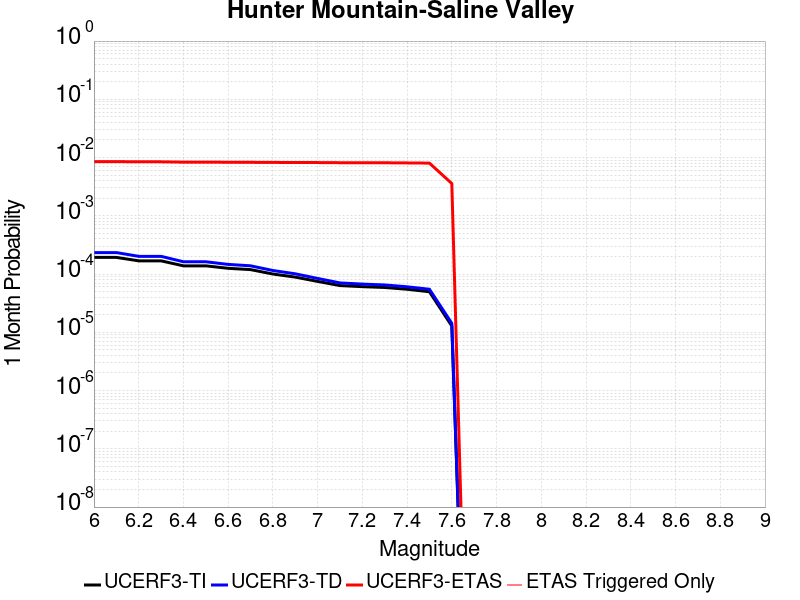 | 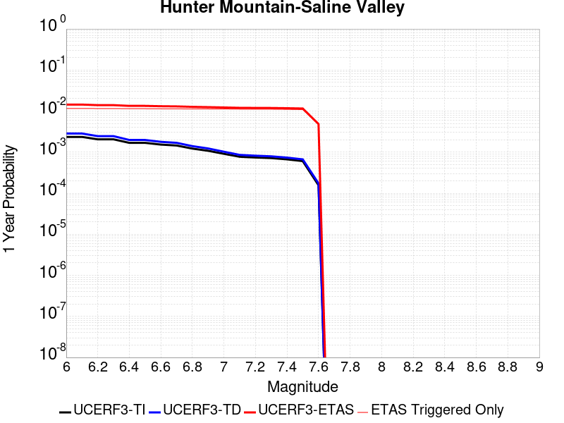 |  |

| Magnitude | 1 wk TI Prob | 1 wk TD Prob | 1 wk ETAS Prob | 1 wk ETAS/TD Gain | 1 wk ETAS Triggered Only | 1 mo TI Prob | 1 mo TD Prob | 1 mo ETAS Prob | 1 mo ETAS/TD Gain | 1 mo ETAS Triggered Only | 1 yr TI Prob | 1 yr TD Prob | 1 yr ETAS Prob | 1 yr ETAS/TD Gain | 1 yr ETAS Triggered Only | 10 yr TI Prob | 10 yr TD Prob | 10 yr ETAS Prob | 10 yr ETAS/TD Gain | 10 yr ETAS Triggered Only |
|-----|-----|-----|-----|-----|-----|-----|-----|-----|-----|-----|-----|-----|-----|-----|-----|-----|-----|-----|-----|-----|
| 6.0 | 4.5103672E-5 | 5.456906E-5 | 0.0059361937 | 108.78314 | 0.005881946 | 1.9328714E-4 | 2.3384714E-4 | 0.0078094057 | 33.395344 | 0.0075773303 | 0.002350731 | 0.0028435462 | 0.013952963 | 4.9068885 | 0.011141097 | 0.023260195 | 0.028092625 | 0.04181272 | 1.4883878 | 0.01411667 |
| 6.1 | 4.5103672E-5 | 5.456906E-5 | 0.0059361937 | 108.78314 | 0.005881946 | 1.9328714E-4 | 2.3384714E-4 | 0.0078094057 | 33.395344 | 0.0075773303 | 0.002350731 | 0.0028435462 | 0.013952963 | 4.9068885 | 0.011141097 | 0.023260195 | 0.028092625 | 0.04181272 | 1.4883878 | 0.01411667 |
| 6.2 | 3.9363465E-5 | 4.706271E-5 | 0.005894134 | 125.24 | 0.005847346 | 1.6868966E-4 | 2.016826E-4 | 0.007742892 | 38.39147 | 0.007542731 | 0.002051862 | 0.0024528534 | 0.013532109 | 5.5168843 | 0.011106498 | 0.020330196 | 0.024274187 | 0.038014427 | 1.5660433 | 0.01408207 |
| 6.3 | 3.9363465E-5 | 4.706271E-5 | 0.005894134 | 125.24 | 0.005847346 | 1.6868966E-4 | 2.016826E-4 | 0.007742892 | 38.39147 | 0.007542731 | 0.002051862 | 0.0024528534 | 0.013532109 | 5.5168843 | 0.011106498 | 0.020330196 | 0.024274187 | 0.038014427 | 1.5660433 | 0.01408207 |
| 6.4 | 3.2311684E-5 | 3.795112E-5 | 0.0057812803 | 152.33492 | 0.0057435473 | 1.384713E-4 | 1.6263791E-4 | 0.0076003596 | 46.73178 | 0.0074389316 | 0.0016845843 | 0.001978387 | 0.012959318 | 6.5504465 | 0.011002699 | 0.016718714 | 0.019617118 | 0.033253334 | 1.6951182 | 0.013909072 |
| 6.5 | 3.2311684E-5 | 3.795112E-5 | 0.0057812803 | 152.33492 | 0.0057435473 | 1.384713E-4 | 1.6263791E-4 | 0.0076003596 | 46.73178 | 0.0074389316 | 0.0016845843 | 0.001978387 | 0.012959318 | 6.5504465 | 0.011002699 | 0.016718714 | 0.019617118 | 0.033253334 | 1.6951182 | 0.013909072 |
| 6.6 | 2.9305844E-5 | 3.418196E-5 | 0.0057775327 | 169.02286 | 0.0057435473 | 1.2559042E-4 | 1.4648624E-4 | 0.0075843283 | 51.775017 | 0.0074389316 | 0.0015279909 | 0.0017820727 | 0.012696087 | 7.1243377 | 0.0109335 | 0.015175272 | 0.017686324 | 0.03128142 | 1.7686784 | 0.013839873 |
| 6.7 | 2.7826512E-5 | 3.2344353E-5 | 0.005775706 | 178.56921 | 0.0057435473 | 1.19251024E-4 | 1.3861163E-4 | 0.007576512 | 54.66 | 0.0074389316 | 0.0014509142 | 0.0016863506 | 0.012566871 | 7.452111 | 0.010898899 | 0.014414776 | 0.016743818 | 0.030317938 | 1.8106945 | 0.013805273 |
| 6.8 | 2.3389874E-5 | 2.6866792E-5 | 0.005735661 | 213.48515 | 0.0057089473 | 1.0023846E-4 | 1.1513857E-4 | 0.007518618 | 65.3006 | 0.007404332 | 0.00121972 | 0.001400958 | 0.012215487 | 8.71938 | 0.0108297 | 0.01213047 | 0.013928067 | 0.027472824 | 1.9724793 | 0.013736074 |
| 6.9 | 2.069209E-5 | 2.357011E-5 | 0.005697784 | 241.7377 | 0.0056743477 | 8.867737E-5 | 1.0101105E-4 | 0.0074699987 | 73.95229 | 0.007369732 | 0.0010791123 | 0.0012291519 | 0.0119764265 | 9.743651 | 0.010760501 | 0.010738871 | 0.012229158 | 0.025728896 | 2.1038978 | 0.013666875 |
| 7.0 | 1.7462342E-5 | 1.9633622E-5 | 0.00569387 | 290.00607 | 0.0056743477 | 7.483646E-5 | 8.414151E-5 | 0.0074532535 | 88.57998 | 0.007369732 | 9.1075303E-4 | 0.0010239641 | 0.011773447 | 11.49791 | 0.010760501 | 0.009070295 | 0.010196688 | 0.023724204 | 2.326658 | 0.013666875 |
| 7.1 | 1.4807709E-5 | 1.6441827E-5 | 0.005690696 | 346.11096 | 0.0056743477 | 6.3460066E-5 | 7.046316E-5 | 0.007405079 | 105.09149 | 0.0073351325 | 7.723524E-4 | 8.575678E-4 | 0.011505131 | 13.416001 | 0.010656702 | 0.007696735 | 0.008546168 | 0.02199333 | 2.573473 | 0.013563075 |
| 7.2 | 1.4180048E-5 | 1.5698413E-5 | 0.005689957 | 362.45428 | 0.0056743477 | 6.077022E-5 | 6.727727E-5 | 0.007401916 | 110.02106 | 0.0073351325 | 7.396263E-4 | 8.1880915E-4 | 0.011466785 | 14.004222 | 0.010656702 | 0.0073716943 | 0.008161469 | 0.02161385 | 2.6482792 | 0.013563075 |
| 7.3 | 1.3730402E-5 | 1.5172151E-5 | 0.005689434 | 374.9919 | 0.0056743477 | 5.8843252E-5 | 6.502197E-5 | 0.0073996778 | 113.80273 | 0.0073351325 | 7.161811E-4 | 7.9137104E-4 | 0.0114050675 | 14.411782 | 0.010622102 | 0.007138774 | 0.007889058 | 0.021310806 | 2.7013118 | 0.013528476 |
| 7.4 | 1.2810095E-5 | 1.4109353E-5 | 0.005688377 | 403.16357 | 0.0056743477 | 5.489925E-5 | 6.0467344E-5 | 0.007395156 | 122.3 | 0.0073351325 | 6.681934E-4 | 7.3595706E-4 | 0.0113502415 | 15.422424 | 0.010622102 | 0.006661878 | 0.0073386896 | 0.020699192 | 2.820557 | 0.013459276 |
| 7.5 | 1.1595659E-5 | 1.2800734E-5 | 0.0056870757 | 444.27734 | 0.0056743477 | 4.9694736E-5 | 5.485922E-5 | 0.007389589 | 134.70094 | 0.0073351325 | 6.0486543E-4 | 6.67722E-4 | 0.0111098485 | 16.638433 | 0.010449104 | 0.006032217 | 0.006660632 | 0.019755308 | 2.9659808 | 0.013182479 |
| 7.6 | 2.997694E-6 | 3.3251877E-6 | 0.0026328922 | 791.8026 | 0.0026295758 | 1.28471975E-5 | 1.4250767E-5 | 0.0032319752 | 226.79308 | 0.0032177705 | 1.564034E-4 | 1.7349655E-4 | 0.0047052684 | 27.120241 | 0.0045325584 | 0.0015629337 | 0.0017356955 | 0.007434734 | 4.283432 | 0.0057089473 |

## Blackwater
*[(top)](#table-of-contents)*

| 1 Week | 1 Month | 1 Year | 10 Year |
|-----|-----|-----|-----|
| 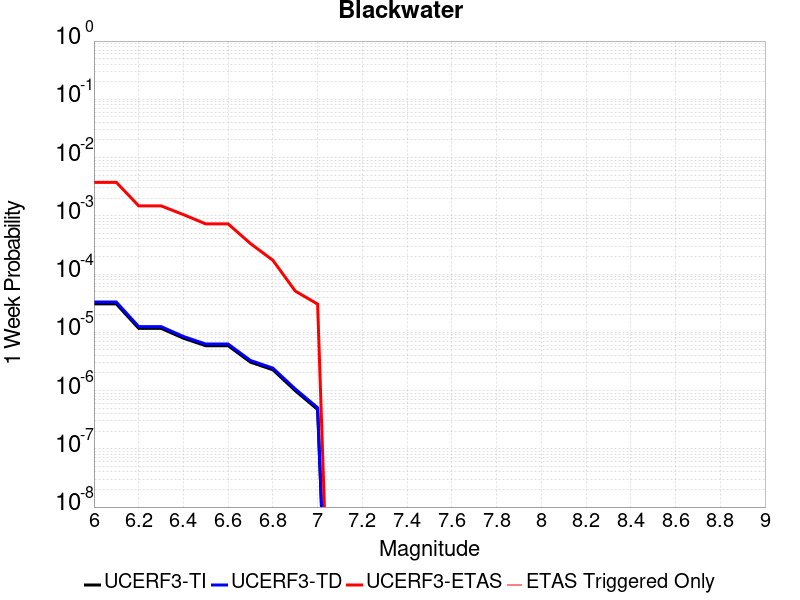 | 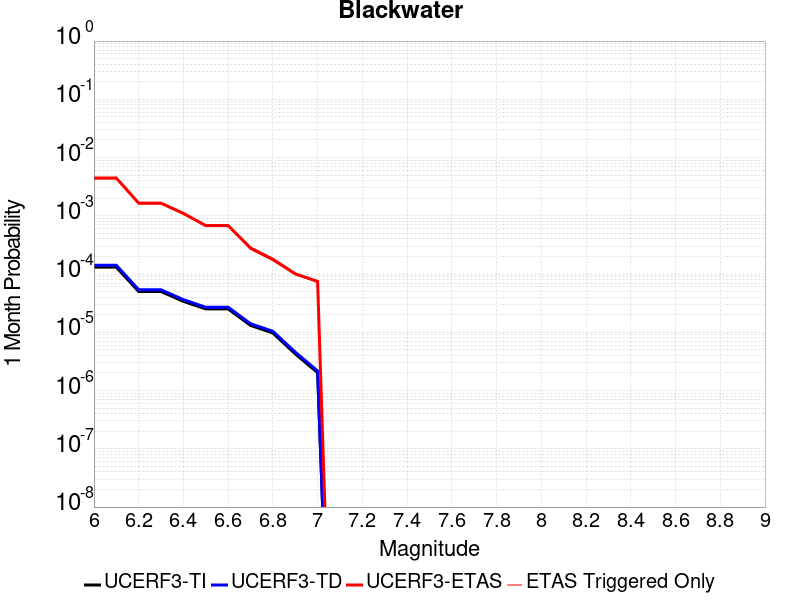 | 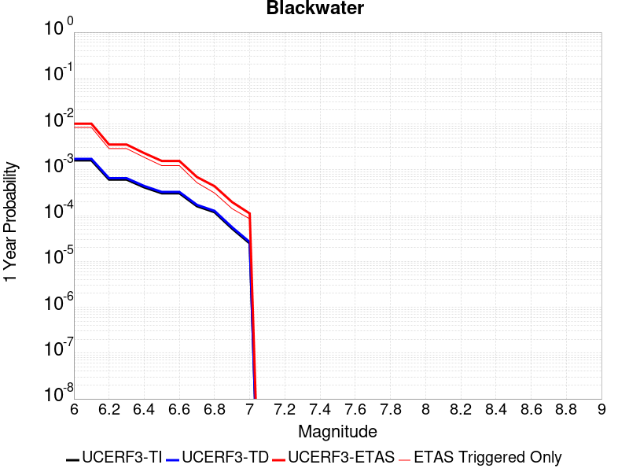 | 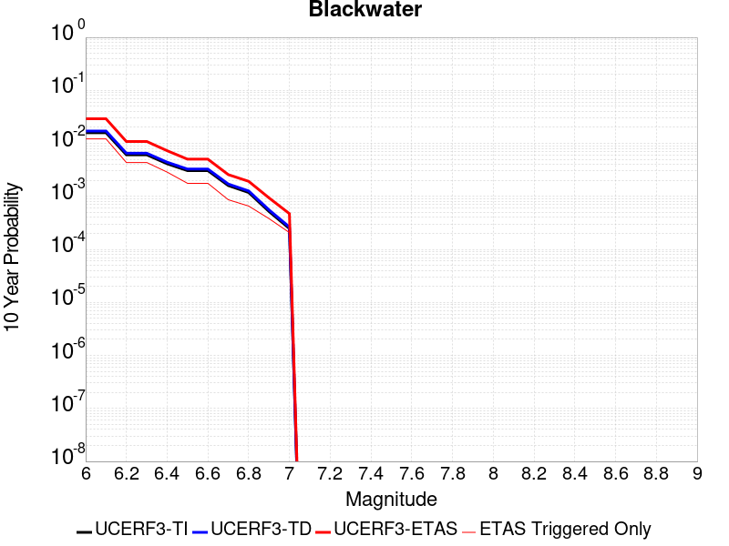 |

| Magnitude | 1 wk TI Prob | 1 wk TD Prob | 1 wk ETAS Prob | 1 wk ETAS/TD Gain | 1 wk ETAS Triggered Only | 1 mo TI Prob | 1 mo TD Prob | 1 mo ETAS Prob | 1 mo ETAS/TD Gain | 1 mo ETAS Triggered Only | 1 yr TI Prob | 1 yr TD Prob | 1 yr ETAS Prob | 1 yr ETAS/TD Gain | 1 yr ETAS Triggered Only | 10 yr TI Prob | 10 yr TD Prob | 10 yr ETAS Prob | 10 yr ETAS/TD Gain | 10 yr ETAS Triggered Only |
|-----|-----|-----|-----|-----|-----|-----|-----|-----|-----|-----|-----|-----|-----|-----|-----|-----|-----|-----|-----|-----|
| 6.0 | 3.0708583E-5 | 3.3095846E-5 | 0.0029047744 | 87.76855 | 0.0028717737 | 1.3160157E-4 | 1.4183241E-4 | 0.004189421 | 29.537827 | 0.0040481626 | 0.0016010714 | 0.0017255784 | 0.009738853 | 5.6438193 | 0.008027126 | 0.015895851 | 0.017135633 | 0.029106025 | 1.6985673 | 0.012179088 |
| 6.1 | 3.0708583E-5 | 3.3095846E-5 | 0.0029047744 | 87.76855 | 0.0028717737 | 1.3160157E-4 | 1.4183241E-4 | 0.004189421 | 29.537827 | 0.0040481626 | 0.0016010714 | 0.0017255784 | 0.009738853 | 5.6438193 | 0.008027126 | 0.015895851 | 0.017135633 | 0.029106025 | 1.6985673 | 0.012179088 |
| 6.2 | 1.1707779E-5 | 1.2545122E-5 | 0.0011543203 | 92.01347 | 0.0011417895 | 5.017523E-5 | 5.3763757E-5 | 0.0017144592 | 31.888754 | 0.0016607847 | 6.107122E-4 | 6.5438676E-4 | 0.003455127 | 5.2799463 | 0.0028025743 | 0.006090366 | 0.0065255696 | 0.010856681 | 1.6637139 | 0.00435956 |
| 6.3 | 1.1707779E-5 | 1.2545122E-5 | 0.0011543203 | 92.01347 | 0.0011417895 | 5.017523E-5 | 5.3763757E-5 | 0.0017144592 | 31.888754 | 0.0016607847 | 6.107122E-4 | 6.5438676E-4 | 0.003455127 | 5.2799463 | 0.0028025743 | 0.006090366 | 0.0065255696 | 0.010856681 | 1.6637139 | 0.00435956 |
| 6.4 | 7.929244E-6 | 8.480098E-6 | 9.080642E-4 | 107.0818 | 8.995917E-4 | 3.3982033E-5 | 3.6342793E-5 | 0.0012472876 | 34.32008 | 0.0012109888 | 4.136527E-4 | 4.423877E-4 | 0.0023445284 | 5.299714 | 0.0019029825 | 0.0041288356 | 0.0044154758 | 0.0072745695 | 1.6475165 | 0.0028717737 |
| 6.5 | 5.8832115E-6 | 6.285991E-6 | 5.5987743E-4 | 89.06749 | 5.535949E-4 | 2.521352E-5 | 2.6939697E-5 | 7.881122E-4 | 29.254679 | 7.61193E-4 | 3.0693135E-4 | 3.27944E-4 | 0.001469359 | 4.4805183 | 0.0011417895 | 0.0030650778 | 0.0032748538 | 0.005033659 | 1.5370637 | 0.0017645838 |
| 6.6 | 5.8832115E-6 | 6.285991E-6 | 5.5987743E-4 | 89.06749 | 5.535949E-4 | 2.521352E-5 | 2.6939697E-5 | 7.881122E-4 | 29.254679 | 7.61193E-4 | 3.0693135E-4 | 3.27944E-4 | 0.001469359 | 4.4805183 | 0.0011417895 | 0.0030650778 | 0.0032748538 | 0.005033659 | 1.5370637 | 0.0017645838 |
| 6.7 | 3.0715053E-6 | 3.2814662E-6 | 1.7627931E-4 | 53.719677 | 1.729984E-4 | 1.3163528E-5 | 1.4063357E-5 | 3.2545612E-4 | 23.142136 | 3.1139713E-4 | 1.6025416E-4 | 1.7120909E-4 | 6.2092795E-4 | 3.626723 | 4.4979586E-4 | 0.0016013865 | 0.0017108864 | 0.0025743986 | 1.5047163 | 8.6499203E-4 |
| 6.8 | 2.2722281E-6 | 2.4287538E-6 | 1.4082715E-4 | 57.983295 | 1.3839873E-4 | 9.738084E-6 | 1.0408908E-5 | 2.5260416E-4 | 24.268076 | 2.4219777E-4 | 1.1855473E-4 | 1.26722E-4 | 5.072703E-4 | 4.0030165 | 3.805965E-4 | 0.001184915 | 0.0012665876 | 0.0019231489 | 1.5183703 | 6.5739395E-4 |
| 6.9 | 9.952399E-7 | 1.0653489E-6 | 7.0264636E-5 | 65.95458 | 6.919936E-5 | 4.265307E-6 | 4.5657757E-6 | 1.4296387E-4 | 31.312065 | 1.3839873E-4 | 5.1928873E-5 | 5.5587418E-5 | 2.6317398E-4 | 4.734416 | 2.0759809E-4 | 5.191674E-4 | 5.557858E-4 | 9.3617075E-4 | 1.6844094 | 3.805965E-4 |
| 7.0 | 4.7385504E-7 | 5.0755597E-7 | 3.510722E-5 | 69.16917 | 3.459968E-5 | 2.0308057E-6 | 2.1752398E-6 | 1.0597406E-4 | 48.718334 | 1.03799044E-4 | 2.4724779E-5 | 2.6483543E-5 | 1.6487861E-4 | 6.2257004 | 1.3839873E-4 | 2.4722028E-4 | 2.6483546E-4 | 4.7237854E-4 | 1.7836682 | 2.0759809E-4 |

## Ash Hill
*[(top)](#table-of-contents)*

| 1 Week | 1 Month | 1 Year | 10 Year |
|-----|-----|-----|-----|
| 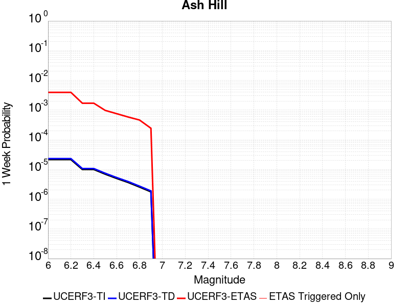 | 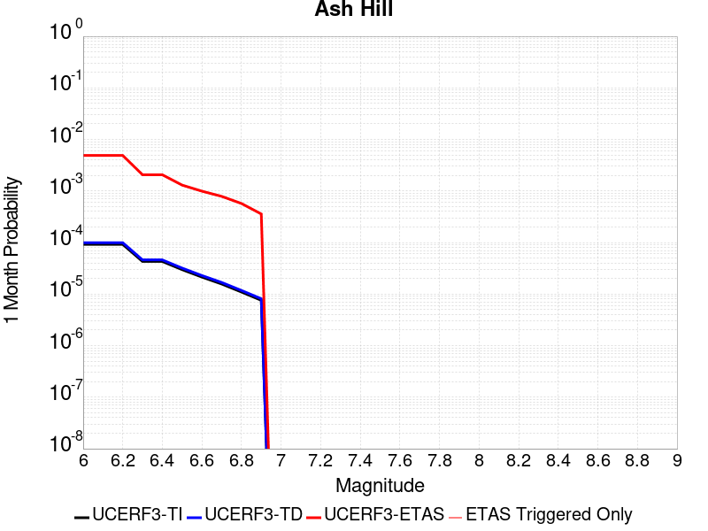 |  | 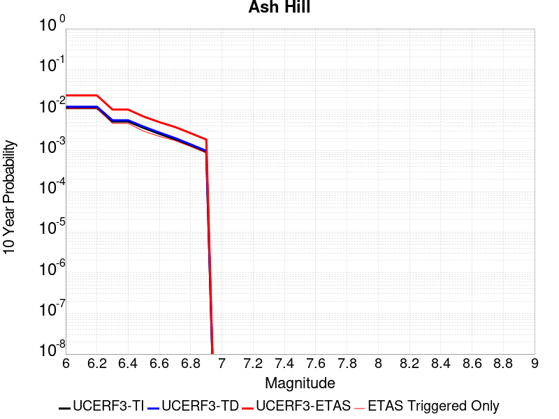 |

| Magnitude | 1 wk TI Prob | 1 wk TD Prob | 1 wk ETAS Prob | 1 wk ETAS/TD Gain | 1 wk ETAS Triggered Only | 1 mo TI Prob | 1 mo TD Prob | 1 mo ETAS Prob | 1 mo ETAS/TD Gain | 1 mo ETAS Triggered Only | 1 yr TI Prob | 1 yr TD Prob | 1 yr ETAS Prob | 1 yr ETAS/TD Gain | 1 yr ETAS Triggered Only | 10 yr TI Prob | 10 yr TD Prob | 10 yr ETAS Prob | 10 yr ETAS/TD Gain | 10 yr ETAS Triggered Only |
|-----|-----|-----|-----|-----|-----|-----|-----|-----|-----|-----|-----|-----|-----|-----|-----|-----|-----|-----|-----|-----|
| 6.0 | 2.1545662E-5 | 2.3194447E-5 | 0.0040020654 | 172.54413 | 0.0039789635 | 9.2335285E-5 | 9.940143E-5 | 0.005185049 | 52.16272 | 0.0050861533 | 0.0011236023 | 0.0012096206 | 0.00870867 | 7.1995053 | 0.0075081307 | 0.011179381 | 0.012038348 | 0.023147875 | 1.9228448 | 0.011244897 |
| 6.1 | 2.1545662E-5 | 2.3194447E-5 | 0.0040020654 | 172.54413 | 0.0039789635 | 9.2335285E-5 | 9.940143E-5 | 0.005185049 | 52.16272 | 0.0050861533 | 0.0011236023 | 0.0012096206 | 0.00870867 | 7.1995053 | 0.0075081307 | 0.011179381 | 0.012038348 | 0.023147875 | 1.9228448 | 0.011244897 |
| 6.2 | 2.1545662E-5 | 2.3194447E-5 | 0.0040020654 | 172.54413 | 0.0039789635 | 9.2335285E-5 | 9.940143E-5 | 0.005185049 | 52.16272 | 0.0050861533 | 0.0011236023 | 0.0012096206 | 0.00870867 | 7.1995053 | 0.0075081307 | 0.011179381 | 0.012038348 | 0.023147875 | 1.9228448 | 0.011244897 |
| 6.3 | 1.0025529E-5 | 1.0746934E-5 | 0.0018099111 | 168.41185 | 0.0017991834 | 4.2965847E-5 | 4.605755E-5 | 0.0022603353 | 49.07632 | 0.0022143796 | 5.229836E-4 | 5.6061964E-4 | 0.0037765861 | 6.7364497 | 0.0032177705 | 0.005217545 | 0.0055933665 | 0.010375822 | 1.8550227 | 0.004809356 |
| 6.4 | 1.0025529E-5 | 1.0746934E-5 | 0.0018099111 | 168.41185 | 0.0017991834 | 4.2965847E-5 | 4.605755E-5 | 0.0022603353 | 49.07632 | 0.0022143796 | 5.229836E-4 | 5.6061964E-4 | 0.0037765861 | 6.7364497 | 0.0032177705 | 0.005217545 | 0.0055933665 | 0.010375822 | 1.8550227 | 0.004809356 |
| 6.5 | 6.9617327E-6 | 7.456634E-6 | 0.00101084 | 135.5625 | 0.0010033908 | 2.9835655E-5 | 3.195666E-5 | 0.0012083083 | 37.81084 | 0.0011763892 | 3.6318856E-4 | 3.8901155E-4 | 0.0021529088 | 5.5343056 | 0.0017645838 | 0.0036259557 | 0.0038841602 | 0.0067792446 | 1.7453566 | 0.0029063732 |
| 6.6 | 4.9919777E-6 | 5.3466883E-6 | 6.973366E-4 | 130.42403 | 6.919936E-4 | 2.1394015E-5 | 2.2914215E-5 | 8.1868866E-4 | 35.72842 | 7.957927E-4 | 2.60441E-4 | 2.7895154E-4 | 0.0015587826 | 5.588005 | 0.0012801882 | 0.0026013597 | 0.0027866727 | 0.004925875 | 1.7676547 | 0.0021451802 |
| 6.7 | 3.6630722E-6 | 3.924624E-6 | 5.2291784E-4 | 133.24025 | 5.189952E-4 | 1.5698786E-5 | 1.681974E-5 | 6.3960353E-4 | 38.02696 | 6.2279426E-4 | 1.9111596E-4 | 2.0476682E-4 | 0.0011733596 | 5.7302227 | 9.687911E-4 | 0.0019095168 | 0.0020463446 | 0.0036692019 | 1.7930518 | 0.001626185 |
| 6.8 | 2.5599613E-6 | 2.744925E-6 | 4.1793997E-4 | 152.25916 | 4.1519618E-4 | 1.0971216E-5 | 1.1763939E-5 | 4.615545E-4 | 39.234688 | 4.4979586E-4 | 1.3356637E-4 | 1.4322149E-4 | 8.6971076E-4 | 6.0724874 | 7.265933E-4 | 0.0013348613 | 0.0014317769 | 0.0027101322 | 1.8928453 | 0.0012801882 |
| 6.9 | 1.7684905E-6 | 1.8968707E-6 | 2.4409419E-4 | 128.68256 | 2.4219777E-4 | 7.579223E-6 | 8.129446E-6 | 2.8492464E-4 | 35.04847 | 2.7679745E-4 | 9.2273134E-5 | 9.8976E-5 | 5.833236E-4 | 5.893586 | 4.8439554E-4 | 9.223483E-4 | 9.8976E-4 | 0.0019230269 | 1.9429222 | 9.341914E-4 |

## Garlock (West)
*[(top)](#table-of-contents)*

| 1 Week | 1 Month | 1 Year | 10 Year |
|-----|-----|-----|-----|
| 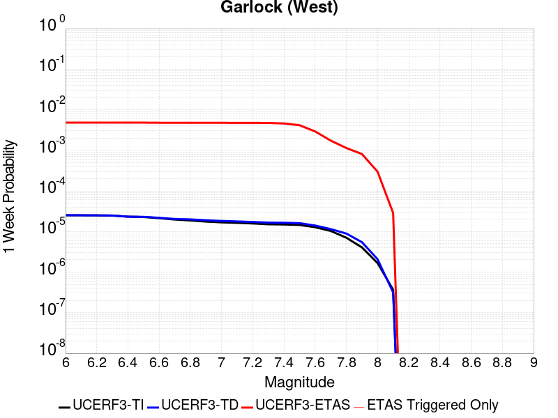 | 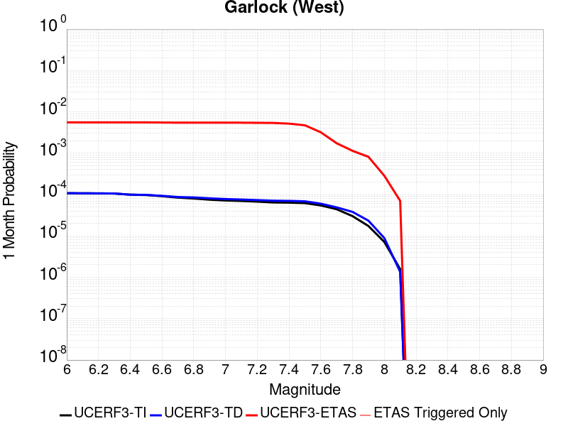 |  | 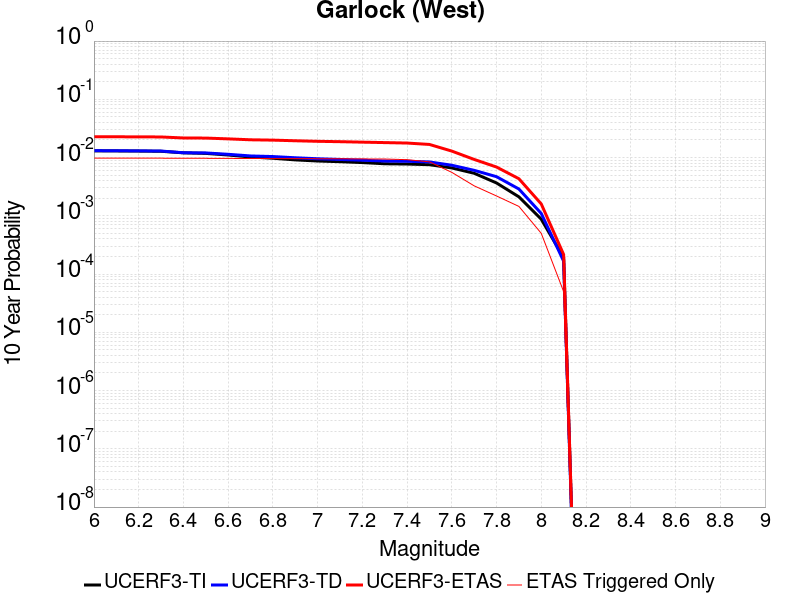 |

| Magnitude | 1 wk TI Prob | 1 wk TD Prob | 1 wk ETAS Prob | 1 wk ETAS/TD Gain | 1 wk ETAS Triggered Only | 1 mo TI Prob | 1 mo TD Prob | 1 mo ETAS Prob | 1 mo ETAS/TD Gain | 1 mo ETAS Triggered Only | 1 yr TI Prob | 1 yr TD Prob | 1 yr ETAS Prob | 1 yr ETAS/TD Gain | 1 yr ETAS Triggered Only | 10 yr TI Prob | 10 yr TD Prob | 10 yr ETAS Prob | 10 yr ETAS/TD Gain | 10 yr ETAS Triggered Only |
|-----|-----|-----|-----|-----|-----|-----|-----|-----|-----|-----|-----|-----|-----|-----|-----|-----|-----|-----|-----|-----|
| 6.0 | 2.5181727E-5 | 2.5197181E-5 | 0.004557641 | 180.87901 | 0.0045325584 | 1.0791722E-4 | 1.0798347E-4 | 0.005574143 | 51.620335 | 0.00546675 | 0.0013131002 | 0.0013139093 | 0.008950392 | 6.8120317 | 0.0076465295 | 0.013053683 | 0.013141794 | 0.022634098 | 1.722299 | 0.009618712 |
| 6.1 | 2.5077732E-5 | 2.5098223E-5 | 0.004557543 | 181.58826 | 0.0045325584 | 1.0747157E-4 | 1.075594E-4 | 0.005573721 | 51.819935 | 0.00546675 | 0.001307681 | 0.0013087525 | 0.008945275 | 6.834963 | 0.0076465295 | 0.013000126 | 0.013090835 | 0.02258363 | 1.7251481 | 0.009618712 |
| 6.2 | 2.494612E-5 | 2.4979914E-5 | 0.004557425 | 182.44357 | 0.0045325584 | 1.0690756E-4 | 1.070524E-4 | 0.005573217 | 52.060642 | 0.00546675 | 0.0013008224 | 0.0013025872 | 0.008939156 | 6.862617 | 0.0076465295 | 0.012932341 | 0.013029906 | 0.022523288 | 1.7285839 | 0.009618712 |
| 6.3 | 2.4733758E-5 | 2.4799276E-5 | 0.004557245 | 183.76524 | 0.0045325584 | 1.0599751E-4 | 1.06278305E-4 | 0.005572447 | 52.432594 | 0.00546675 | 0.0012897556 | 0.0012931736 | 0.008929815 | 6.9053483 | 0.0076465295 | 0.012822957 | 0.0129368715 | 0.022396995 | 1.7312528 | 0.009584112 |
| 6.4 | 2.3237335E-5 | 2.3178607E-5 | 0.004555632 | 196.54468 | 0.0045325584 | 9.958477E-5 | 9.933313E-5 | 0.00556554 | 56.02904 | 0.00546675 | 0.0012117702 | 0.0012087126 | 0.008811442 | 7.2899394 | 0.00761193 | 0.012051838 | 0.012101731 | 0.021535678 | 1.7795534 | 0.0095495125 |
| 6.5 | 2.2732203E-5 | 2.2992977E-5 | 0.004555447 | 198.12341 | 0.0045325584 | 9.742009E-5 | 9.8537625E-5 | 0.005564749 | 56.47334 | 0.00546675 | 0.0011854442 | 0.0011990381 | 0.008801841 | 7.340752 | 0.00761193 | 0.011791403 | 0.012006035 | 0.021440895 | 1.7858431 | 0.0095495125 |
| 6.6 | 2.1319436E-5 | 2.1773201E-5 | 0.004519634 | 207.57782 | 0.004497959 | 9.136581E-5 | 9.3310395E-5 | 0.0055249534 | 59.21048 | 0.00543215 | 0.001111811 | 0.0011354643 | 0.008704191 | 7.6657543 | 0.0075773303 | 0.011062649 | 0.011376952 | 0.020749407 | 1.8238108 | 0.0094803125 |
| 6.7 | 1.970802E-5 | 2.0393094E-5 | 0.00451826 | 221.55833 | 0.004497959 | 8.446021E-5 | 8.739606E-5 | 0.005484475 | 62.754257 | 0.0053975503 | 0.001027818 | 0.0010635294 | 0.008598238 | 8.084627 | 0.007542731 | 0.010230771 | 0.0106646875 | 0.019975435 | 1.8730445 | 0.009411113 |
| 6.8 | 1.8744462E-5 | 1.9900775E-5 | 0.00451777 | 227.01477 | 0.004497959 | 8.033094E-5 | 8.528626E-5 | 0.005482376 | 64.28206 | 0.0053975503 | 9.775903E-4 | 0.0010378672 | 0.008572769 | 8.259987 | 0.007542731 | 0.009733009 | 0.010410495 | 0.019689394 | 1.8913025 | 0.009376514 |
| 6.9 | 1.7559682E-5 | 1.8953151E-5 | 0.0045168265 | 238.31534 | 0.004497959 | 7.5253614E-5 | 8.122527E-5 | 0.0054783374 | 67.44622 | 0.0053975503 | 9.158276E-4 | 9.884704E-4 | 0.008523745 | 8.623166 | 0.007542731 | 0.0091206245 | 0.009921073 | 0.019204563 | 1.9357343 | 0.009376514 |
| 7.0 | 1.6794445E-5 | 1.8215967E-5 | 0.0045160926 | 247.91945 | 0.004497959 | 7.197421E-5 | 7.806611E-5 | 0.005475195 | 70.13537 | 0.0053975503 | 8.759337E-4 | 9.5004175E-4 | 0.008485607 | 8.931825 | 0.007542731 | 0.008724891 | 0.009539958 | 0.01879275 | 1.9698987 | 0.009341914 |
| 7.1 | 1.6337795E-5 | 1.771677E-5 | 0.0045155957 | 254.87692 | 0.004497959 | 7.0017246E-5 | 7.592681E-5 | 0.0054730675 | 72.083466 | 0.0053975503 | 8.521265E-4 | 9.2401815E-4 | 0.008459779 | 9.155425 | 0.007542731 | 0.008488664 | 0.009281721 | 0.018536925 | 1.9971431 | 0.009341914 |
| 7.2 | 1.5780008E-5 | 1.71654E-5 | 0.0045150467 | 263.03186 | 0.004497959 | 6.762685E-5 | 7.3563926E-5 | 0.00543612 | 73.896545 | 0.0053629507 | 8.2304585E-4 | 8.952741E-4 | 0.008396683 | 9.378897 | 0.0075081307 | 0.008200042 | 0.008996559 | 0.01822014 | 2.0252342 | 0.009307315 |
| 7.3 | 1.5058865E-5 | 1.6618484E-5 | 0.0044799033 | 269.57355 | 0.004463359 | 6.45364E-5 | 7.122013E-5 | 0.0053991918 | 75.809906 | 0.005328351 | 7.854473E-4 | 8.667614E-4 | 0.008333815 | 9.61489 | 0.007473531 | 0.00782677 | 0.008713263 | 0.017905183 | 2.0549343 | 0.009272715 |
| 7.4 | 1.4887923E-5 | 1.6454453E-5 | 0.0043413434 | 263.84006 | 0.00432496 | 6.380382E-5 | 7.0517184E-5 | 0.005190909 | 73.61198 | 0.005120753 | 7.7653467E-4 | 8.5820974E-4 | 0.008083337 | 9.418837 | 0.0072313333 | 0.0077382675 | 0.008628101 | 0.017580703 | 2.0376096 | 0.009030517 |
| 7.5 | 1.4509299E-5 | 1.6046468E-5 | 0.003960347 | 246.80489 | 0.003944364 | 6.218123E-5 | 6.876877E-5 | 0.0047394047 | 68.91798 | 0.004670957 | 7.567935E-4 | 8.369394E-4 | 0.0074745184 | 8.930777 | 0.006643139 | 0.0075422134 | 0.008416411 | 0.016684754 | 1.9824073 | 0.008338523 |
| 7.6 | 1.2756717E-5 | 1.4050529E-5 | 0.002747387 | 195.5362 | 0.002733375 | 5.4670498E-5 | 6.0215163E-5 | 0.0032085965 | 53.285522 | 0.0031485711 | 6.6541E-4 | 7.328737E-4 | 0.0050892388 | 6.9442234 | 0.00435956 | 0.006634211 | 0.007381374 | 0.012773427 | 1.7304945 | 0.00543215 |
| 7.7 | 1.0328985E-5 | 1.146033E-5 | 0.0015338289 | 133.8381 | 0.001522386 | 4.4266326E-5 | 4.9114777E-5 | 0.001744416 | 35.517128 | 0.0016953844 | 5.388092E-4 | 5.9780874E-4 | 0.0030529175 | 5.106847 | 0.0024565775 | 0.0053750467 | 0.006038286 | 0.009167844 | 1.518286 | 0.0031485711 |
| 7.8 | 7.0306583E-6 | 8.899537E-6 | 0.0010122814 | 113.7454 | 0.0010033908 | 3.0131043E-5 | 3.8140315E-5 | 0.0011452879 | 30.028276 | 0.0011071898 | 3.667837E-4 | 4.6425956E-4 | 0.0020205225 | 4.3521395 | 0.0015569857 | 0.003661789 | 0.0046950667 | 0.006795738 | 1.447421 | 0.0021105807 |
| 7.9 | 4.060633E-6 | 5.465412E-6 | 7.6665427E-4 | 140.27382 | 7.61193E-4 | 1.7402595E-5 | 2.3422985E-5 | 8.1919704E-4 | 34.974068 | 7.957927E-4 | 2.11856E-4 | 2.8513762E-4 | 0.0013228321 | 4.639276 | 0.0010379904 | 0.0021165414 | 0.002884143 | 0.0043331385 | 1.5024006 | 0.0014531866 |
| 8.0 | 1.6729537E-6 | 2.0775192E-6 | 2.788744E-4 | 134.23433 | 2.7679745E-4 | 7.169782E-6 | 8.903624E-6 | 2.8569862E-4 | 32.087902 | 2.7679745E-4 | 8.7288594E-5 | 1.0839626E-4 | 4.889515E-4 | 4.5107784 | 3.805965E-4 | 8.7254314E-4 | 0.001096854 | 0.0016152799 | 1.4726481 | 5.189952E-4 |
| 8.1 | 3.6733252E-7 | 3.1489736E-7 | 6.951424E-5 | 220.75204 | 6.919936E-5 | 1.5742813E-6 | 1.3495595E-6 | 7.054883E-5 | 52.275448 | 6.919936E-5 | 1.9166706E-5 | 1.643078E-5 | 1.5482723E-4 | 9.422999 | 1.3839873E-4 | 1.9165053E-4 | 1.662928E-4 | 3.046685E-4 | 1.8321209 | 1.3839873E-4 |

## McLean Lake
*[(top)](#table-of-contents)*

| 1 Week | 1 Month | 1 Year | 10 Year |
|-----|-----|-----|-----|
| 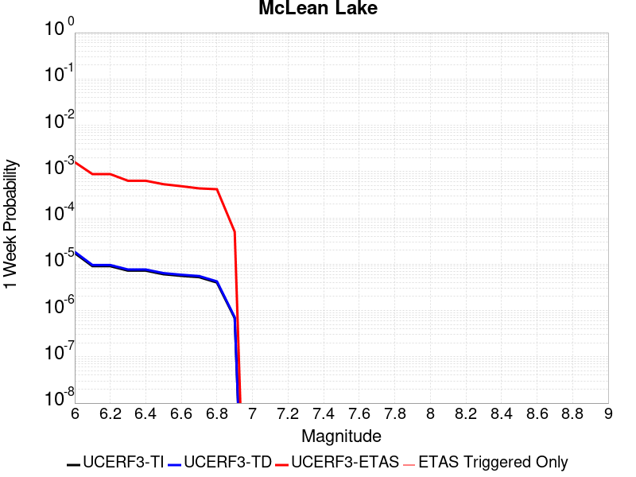 |  | 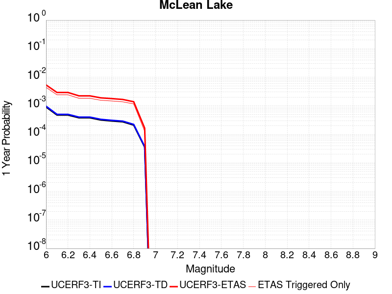 | 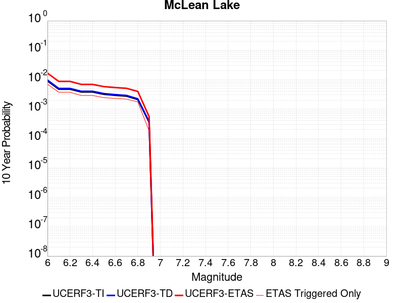 |

| Magnitude | 1 wk TI Prob | 1 wk TD Prob | 1 wk ETAS Prob | 1 wk ETAS/TD Gain | 1 wk ETAS Triggered Only | 1 mo TI Prob | 1 mo TD Prob | 1 mo ETAS Prob | 1 mo ETAS/TD Gain | 1 mo ETAS Triggered Only | 1 yr TI Prob | 1 yr TD Prob | 1 yr ETAS Prob | 1 yr ETAS/TD Gain | 1 yr ETAS Triggered Only | 10 yr TI Prob | 10 yr TD Prob | 10 yr ETAS Prob | 10 yr ETAS/TD Gain | 10 yr ETAS Triggered Only |
|-----|-----|-----|-----|-----|-----|-----|-----|-----|-----|-----|-----|-----|-----|-----|-----|-----|-----|-----|-----|-----|
| 6.0 | 1.7360222E-5 | 1.8501627E-5 | 0.0018522508 | 100.11286 | 0.0018337831 | 7.439883E-5 | 7.9290556E-5 | 0.0029854334 | 37.651817 | 0.0029063732 | 9.0542925E-4 | 9.6498354E-4 | 0.005493168 | 5.692499 | 0.0045325584 | 0.009017491 | 0.0096127745 | 0.016877396 | 1.7557257 | 0.0073351325 |
| 6.1 | 9.062689E-6 | 9.592193E-6 | 0.0010475727 | 109.21096 | 0.0010379904 | 3.8839516E-5 | 4.1108804E-5 | 0.001667227 | 40.556446 | 0.001626185 | 4.727685E-4 | 5.003936E-4 | 0.0031978183 | 6.390606 | 0.0026987751 | 0.0047176396 | 0.004993552 | 0.009055926 | 1.8135241 | 0.0040827626 |
| 6.2 | 9.062689E-6 | 9.592193E-6 | 0.0010475727 | 109.21096 | 0.0010379904 | 3.8839516E-5 | 4.1108804E-5 | 0.001667227 | 40.556446 | 0.001626185 | 4.727685E-4 | 5.003936E-4 | 0.0031978183 | 6.390606 | 0.0026987751 | 0.0047176396 | 0.004993552 | 0.009055926 | 1.8135241 | 0.0040827626 |
| 6.3 | 7.2575485E-6 | 7.66771E-6 | 7.342555E-4 | 95.75943 | 7.265933E-4 | 3.110341E-5 | 3.2861237E-5 | 0.0011054161 | 33.63891 | 0.0010725901 | 3.786182E-4 | 4.0001926E-4 | 0.0023022406 | 5.7553244 | 0.0019029825 | 0.0037797375 | 0.0039936965 | 0.0070607704 | 1.7679785 | 0.0030793718 |
| 6.4 | 7.2575485E-6 | 7.66771E-6 | 7.342555E-4 | 95.75943 | 7.265933E-4 | 3.110341E-5 | 3.2861237E-5 | 0.0011054161 | 33.63891 | 0.0010725901 | 3.786182E-4 | 4.0001926E-4 | 0.0023022406 | 5.7553244 | 0.0019029825 | 0.0037797375 | 0.0039936965 | 0.0070607704 | 1.7679785 | 0.0030793718 |
| 6.5 | 6.06582E-6 | 6.4038773E-6 | 5.945947E-4 | 92.849174 | 5.881946E-4 | 2.5996113E-5 | 2.7444936E-5 | 9.2701195E-4 | 33.77716 | 8.995917E-4 | 3.164567E-4 | 3.3409733E-4 | 0.001959739 | 5.8657727 | 0.001626185 | 0.0031600643 | 0.0033365893 | 0.006060844 | 1.8164788 | 0.002733375 |
| 6.6 | 5.598744E-6 | 5.910262E-6 | 5.595019E-4 | 94.66617 | 5.535949E-4 | 2.3994397E-5 | 2.5329486E-5 | 8.902996E-4 | 35.148746 | 8.6499203E-4 | 2.9209262E-4 | 3.0834923E-4 | 0.0018648548 | 6.047866 | 0.0015569857 | 0.0029170897 | 0.003079843 | 0.0057013202 | 1.8511723 | 0.0026295758 |
| 6.7 | 5.246996E-6 | 5.539162E-6 | 4.5533254E-4 | 82.20242 | 4.4979586E-4 | 2.2486933E-5 | 2.3739085E-5 | 7.84914E-4 | 33.064205 | 7.61193E-4 | 2.73744E-4 | 2.8899137E-4 | 0.0017417581 | 6.0270243 | 0.0014531866 | 0.0027340704 | 0.0028867796 | 0.005370765 | 1.8604695 | 0.002491177 |
| 6.8 | 4.02324E-6 | 4.2469046E-6 | 4.5404086E-4 | 106.91101 | 4.4979586E-4 | 1.7242342E-5 | 1.8200926E-5 | 6.755829E-4 | 37.118053 | 6.5739395E-4 | 2.099053E-4 | 2.2157968E-4 | 0.0014668922 | 6.6201563 | 0.0012455885 | 0.0020970714 | 0.002214172 | 0.004147464 | 1.8731445 | 0.0019375822 |
| 6.9 | 6.835972E-7 | 7.1399285E-7 | 6.991331E-5 | 97.91878 | 6.919936E-5 | 2.9296991E-6 | 3.0599674E-6 | 7.225912E-5 | 23.614342 | 6.919936E-5 | 3.56685E-5 | 3.7254784E-5 | 2.1024676E-4 | 5.643483 | 1.729984E-4 | 3.5662777E-4 | 3.7251666E-4 | 6.146242E-4 | 1.649924 | 2.4219777E-4 |

## Gravel Hills-Harper Lk
*[(top)](#table-of-contents)*

| 1 Week | 1 Month | 1 Year | 10 Year |
|-----|-----|-----|-----|
| 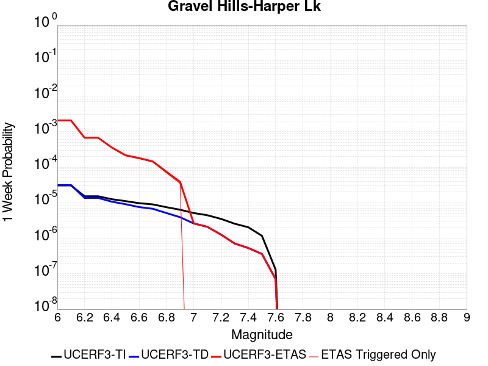 | 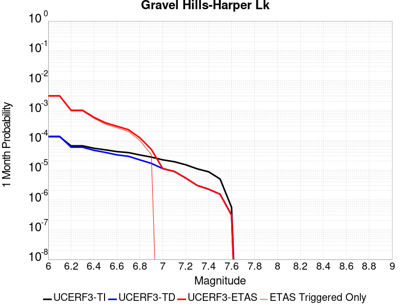 | 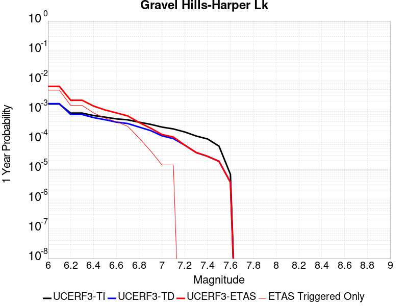 | 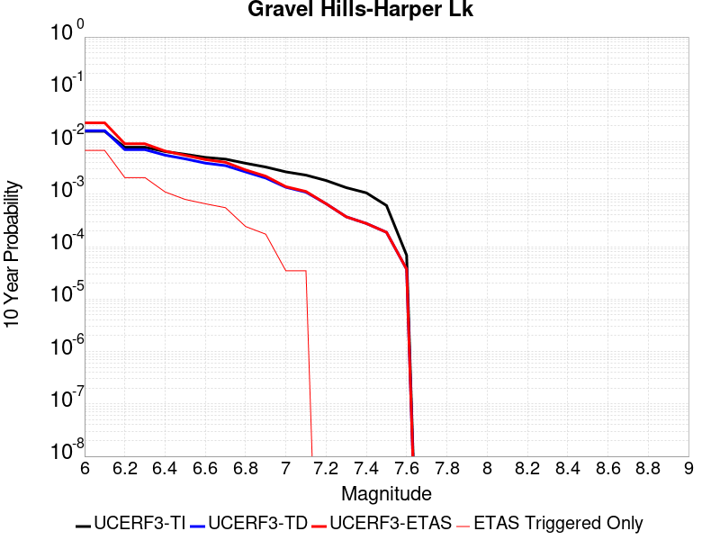 |

| Magnitude | 1 wk TI Prob | 1 wk TD Prob | 1 wk ETAS Prob | 1 wk ETAS/TD Gain | 1 wk ETAS Triggered Only | 1 mo TI Prob | 1 mo TD Prob | 1 mo ETAS Prob | 1 mo ETAS/TD Gain | 1 mo ETAS Triggered Only | 1 yr TI Prob | 1 yr TD Prob | 1 yr ETAS Prob | 1 yr ETAS/TD Gain | 1 yr ETAS Triggered Only | 10 yr TI Prob | 10 yr TD Prob | 10 yr ETAS Prob | 10 yr ETAS/TD Gain | 10 yr ETAS Triggered Only |
|-----|-----|-----|-----|-----|-----|-----|-----|-----|-----|-----|-----|-----|-----|-----|-----|-----|-----|-----|-----|-----|
| 6.0 | 3.0679566E-5 | 3.1464628E-5 | 0.0020727816 | 65.87657 | 0.0020413813 | 1.3147724E-4 | 1.3484266E-4 | 0.003040824 | 22.550907 | 0.0029063732 | 0.0015995599 | 0.00164069 | 0.0063039833 | 3.8422759 | 0.004670957 | 0.015880952 | 0.016307337 | 0.023046358 | 1.4132508 | 0.006850737 |
| 6.1 | 3.0679566E-5 | 3.1464628E-5 | 0.0020727816 | 65.87657 | 0.0020413813 | 1.3147724E-4 | 1.3484266E-4 | 0.003040824 | 22.550907 | 0.0029063732 | 0.0015995599 | 0.00164069 | 0.0063039833 | 3.8422759 | 0.004670957 | 0.015880952 | 0.016307337 | 0.023046358 | 1.4132508 | 0.006850737 |
| 6.2 | 1.514536E-5 | 1.36352E-5 | 6.710202E-4 | 49.212345 | 6.5739395E-4 | 6.490707E-5 | 5.843533E-5 | 9.5797447E-4 | 16.393755 | 8.995917E-4 | 7.8995706E-4 | 7.112298E-4 | 0.002197958 | 3.0903625 | 0.0014877863 | 0.007871548 | 0.007090737 | 0.009151998 | 1.2906977 | 0.0020759809 |
| 6.3 | 1.514536E-5 | 1.36352E-5 | 6.710202E-4 | 49.212345 | 6.5739395E-4 | 6.490707E-5 | 5.843533E-5 | 9.5797447E-4 | 16.393755 | 8.995917E-4 | 7.8995706E-4 | 7.112298E-4 | 0.002197958 | 3.0903625 | 0.0014877863 | 0.007871548 | 0.007090737 | 0.009151998 | 1.2906977 | 0.0020759809 |
| 6.4 | 1.2532521E-5 | 1.0689684E-5 | 3.566828E-4 | 33.367012 | 3.459968E-4 | 5.37097E-5 | 4.581216E-5 | 5.301855E-4 | 11.57303 | 4.8439554E-4 | 6.537194E-4 | 5.5762613E-4 | 0.001352975 | 2.4263122 | 7.957927E-4 | 0.0065179965 | 0.005562859 | 0.00666389 | 1.1979253 | 0.0011071898 |
| 6.5 | 1.1094058E-5 | 9.083657E-6 | 2.1667987E-4 | 23.853815 | 2.0759809E-4 | 4.7545094E-5 | 3.89294E-5 | 3.1571608E-4 | 8.109965 | 2.7679745E-4 | 5.787078E-4 | 4.7386638E-4 | 9.926157E-4 | 2.0947163 | 5.189952E-4 | 0.0057720304 | 0.004728967 | 0.005520996 | 1.1674846 | 7.957927E-4 |
| 6.6 | 9.688328E-6 | 7.531688E-6 | 1.8052879E-4 | 23.969234 | 1.729984E-4 | 4.1520743E-5 | 3.227828E-5 | 2.3986967E-4 | 7.431303 | 2.0759809E-4 | 5.053978E-4 | 3.9291973E-4 | 7.7336666E-4 | 1.9682562 | 3.805965E-4 | 0.0050424994 | 0.0039225067 | 0.0045773224 | 1.166938 | 6.5739395E-4 |
| 6.7 | 8.974824E-6 | 6.749406E-6 | 1.451472E-4 | 21.50518 | 1.3839873E-4 | 3.8462964E-5 | 2.8925719E-5 | 2.0191912E-4 | 6.980609 | 1.729984E-4 | 4.6818596E-4 | 3.5211592E-4 | 6.288159E-4 | 1.7858207 | 2.7679745E-4 | 0.004672008 | 0.003515801 | 0.0040674494 | 1.1569055 | 5.535949E-4 |
| 6.8 | 7.4780046E-6 | 5.1161865E-6 | 7.43152E-5 | 14.525506 | 6.919936E-5 | 3.20482E-5 | 2.1926337E-5 | 1.257231E-4 | 5.733886 | 1.03799044E-4 | 3.9011694E-4 | 2.6692182E-4 | 4.0528362E-4 | 1.5183607 | 1.3839873E-4 | 0.0038943281 | 0.0026661505 | 0.0029077027 | 1.0905995 | 2.4219777E-4 |
| 6.9 | 6.3409307E-6 | 3.907489E-6 | 3.8507034E-5 | 9.854675 | 3.459968E-5 | 2.7175134E-5 | 1.674628E-5 | 8.5944484E-5 | 5.132154 | 6.919936E-5 | 3.3080703E-4 | 2.0386786E-4 | 3.0764577E-4 | 1.5090448 | 1.03799044E-4 | 0.0033031502 | 0.0020369065 | 0.0022095526 | 1.0847589 | 1.729984E-4 |
| 7.0 | 5.1239335E-6 | 2.6058492E-6 | 2.6058492E-6 | 1.0 | 0.0 | 2.195953E-5 | 1.1167879E-5 | 1.1167879E-5 | 1.0 | 0.0 | 2.6732447E-4 | 1.359607E-4 | 1.7055568E-4 | 1.2544484 | 3.459968E-5 | 0.0026700313 | 0.0013588005 | 0.0013933531 | 1.0254288 | 3.459968E-5 |
| 7.1 | 4.438899E-6 | 2.0984692E-6 | 2.0984692E-6 | 1.0 | 0.0 | 1.9023713E-5 | 8.99341E-6 | 8.99341E-6 | 1.0 | 0.0 | 2.315891E-4 | 1.0948948E-4 | 1.4408538E-4 | 1.3159746 | 3.459968E-5 | 0.002313479 | 0.0010943774 | 0.0011289391 | 1.0315813 | 3.459968E-5 |
| 7.2 | 3.50367E-6 | 1.2615715E-6 | 1.2615715E-6 | 1.0 | 0.0 | 1.5015643E-5 | 5.406724E-6 | 5.406724E-6 | 1.0 | 0.0 | 1.8280011E-4 | 6.5824956E-5 | 6.5824956E-5 | 1.0 | 0.0 | 0.0018264982 | 6.580628E-4 | 6.580628E-4 | 1.0 | 0.0 |
| 7.3 | 2.561638E-6 | 7.118686E-7 | 7.118686E-7 | 1.0 | 0.0 | 1.0978401E-5 | 3.050862E-6 | 3.050862E-6 | 1.0 | 0.0 | 1.3365384E-4 | 3.7143633E-5 | 3.7143633E-5 | 1.0 | 0.0 | 0.0013357349 | 3.7137623E-4 | 3.7137623E-4 | 1.0 | 0.0 |
| 7.4 | 2.0368864E-6 | 5.304471E-7 | 5.304471E-7 | 1.0 | 0.0 | 8.729483E-6 | 2.2733427E-6 | 2.2733427E-6 | 1.0 | 0.0 | 1.06276275E-4 | 2.76776E-5 | 2.76776E-5 | 1.0 | 0.0 | 0.0010622547 | 2.767421E-4 | 2.767421E-4 | 1.0 | 0.0 |
| 7.5 | 1.1681728E-6 | 3.6028484E-7 | 3.6028484E-7 | 1.0 | 0.0 | 5.0064455E-6 | 1.544077E-6 | 1.544077E-6 | 1.0 | 0.0 | 6.0951766E-5 | 1.879898E-5 | 1.879898E-5 | 1.0 | 0.0 | 6.093505E-4 | 1.8797436E-4 | 1.8797436E-4 | 1.0 | 0.0 |
| 7.6 | 1.3154387E-7 | 7.1196716E-8 | 7.1196716E-8 | 1.0 | 0.0 | 5.6375933E-7 | 3.0512876E-7 | 3.0512876E-7 | 1.0 | 0.0 | 6.863748E-6 | 3.714938E-6 | 3.714938E-6 | 1.0 | 0.0 | 6.863536E-5 | 3.7148915E-5 | 3.7148915E-5 | 1.0 | 0.0 |

## Goldstone Lake
*[(top)](#table-of-contents)*

| 1 Week | 1 Month | 1 Year | 10 Year |
|-----|-----|-----|-----|
| 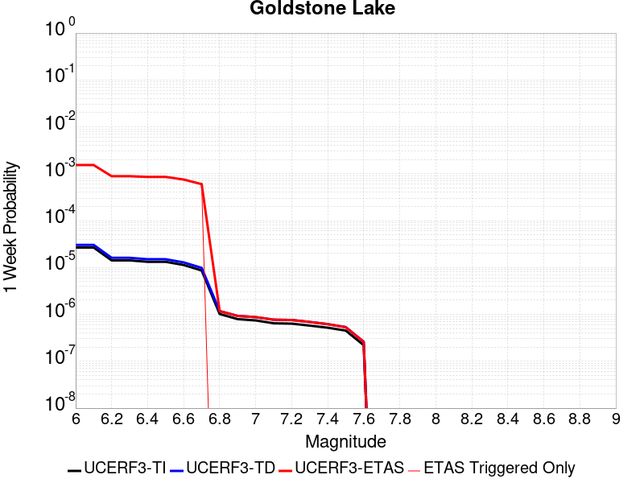 | 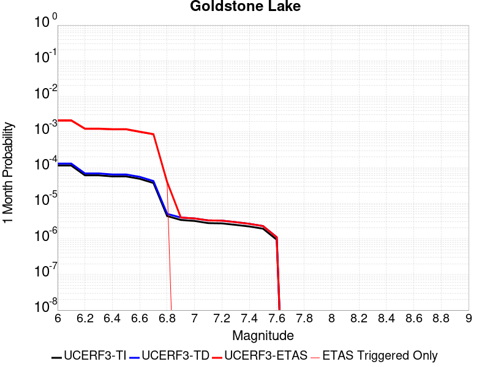 | 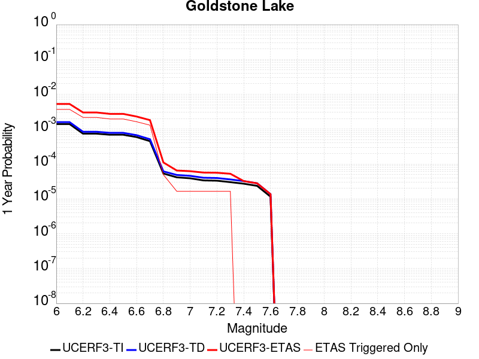 | 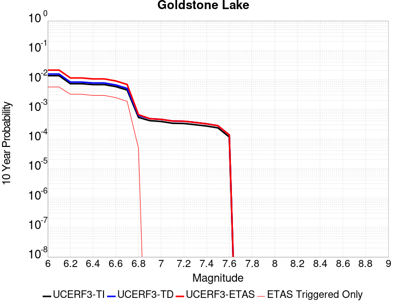 |

| Magnitude | 1 wk TI Prob | 1 wk TD Prob | 1 wk ETAS Prob | 1 wk ETAS/TD Gain | 1 wk ETAS Triggered Only | 1 mo TI Prob | 1 mo TD Prob | 1 mo ETAS Prob | 1 mo ETAS/TD Gain | 1 mo ETAS Triggered Only | 1 yr TI Prob | 1 yr TD Prob | 1 yr ETAS Prob | 1 yr ETAS/TD Gain | 1 yr ETAS Triggered Only | 10 yr TI Prob | 10 yr TD Prob | 10 yr ETAS Prob | 10 yr ETAS/TD Gain | 10 yr ETAS Triggered Only |
|-----|-----|-----|-----|-----|-----|-----|-----|-----|-----|-----|-----|-----|-----|-----|-----|-----|-----|-----|-----|-----|
| 6.0 | 2.671352E-5 | 3.0376103E-5 | 0.0014835186 | 48.838345 | 0.0014531866 | 1.1448149E-4 | 1.3017791E-4 | 0.0021366982 | 16.413677 | 0.0020067815 | 0.001392921 | 0.0015839601 | 0.0051420825 | 3.246346 | 0.0035637673 | 0.013842222 | 0.015746202 | 0.021433365 | 1.3611768 | 0.005778147 |
| 6.1 | 2.671352E-5 | 3.0376103E-5 | 0.0014835186 | 48.838345 | 0.0014531866 | 1.1448149E-4 | 1.3017791E-4 | 0.0021366982 | 16.413677 | 0.0020067815 | 0.001392921 | 0.0015839601 | 0.0051420825 | 3.246346 | 0.0035637673 | 0.013842222 | 0.015746202 | 0.021433365 | 1.3611768 | 0.005778147 |
| 6.2 | 1.4197047E-5 | 1.6096254E-5 | 7.77277E-4 | 48.28931 | 7.61193E-4 | 6.0843064E-5 | 6.898268E-5 | 0.0012452907 | 18.052223 | 0.0011763892 | 7.4051257E-4 | 8.3963916E-4 | 0.0029484476 | 3.5115652 | 0.0021105807 | 0.007380498 | 0.008374364 | 0.011599498 | 1.3851198 | 0.00325237 |
| 6.3 | 1.4197047E-5 | 1.6096254E-5 | 7.77277E-4 | 48.28931 | 7.61193E-4 | 6.0843064E-5 | 6.898268E-5 | 0.0012452907 | 18.052223 | 0.0011763892 | 7.4051257E-4 | 8.3963916E-4 | 0.0029484476 | 3.5115652 | 0.0021105807 | 0.007380498 | 0.008374364 | 0.011599498 | 1.3851198 | 0.00325237 |
| 6.4 | 1.3238931E-5 | 1.500847E-5 | 7.4159086E-4 | 49.41149 | 7.265933E-4 | 5.6737044E-5 | 6.432098E-5 | 0.001206037 | 18.75029 | 0.0011417895 | 6.9055456E-4 | 7.8292453E-4 | 0.0026844172 | 3.4287047 | 0.0019029825 | 0.006884126 | 0.007811289 | 0.010694959 | 1.3691671 | 0.0029063732 |
| 6.5 | 1.3238931E-5 | 1.500847E-5 | 7.4159086E-4 | 49.41149 | 7.265933E-4 | 5.6737044E-5 | 6.432098E-5 | 0.001206037 | 18.75029 | 0.0011417895 | 6.9055456E-4 | 7.8292453E-4 | 0.0026844172 | 3.4287047 | 0.0019029825 | 0.006884126 | 0.007811289 | 0.010694959 | 1.3691671 | 0.0029063732 |
| 6.6 | 1.1328278E-5 | 1.2855176E-5 | 6.010422E-4 | 46.754883 | 5.881946E-4 | 4.8548856E-5 | 5.5092984E-5 | 0.0010238307 | 18.583685 | 9.687911E-4 | 5.90922E-4 | 6.706464E-4 | 0.0023303172 | 3.4747334 | 0.0016607847 | 0.0058935313 | 0.0066956137 | 0.009204479 | 1.3747028 | 0.0025257769 |
| 6.7 | 8.651175E-6 | 9.824575E-6 | 5.288147E-4 | 53.82571 | 5.189952E-4 | 3.707594E-5 | 4.2105148E-5 | 8.724625E-4 | 20.72104 | 8.3039235E-4 | 4.5130608E-4 | 5.126002E-4 | 0.001861296 | 3.6310875 | 0.0013493876 | 0.0045039062 | 0.0051230565 | 0.0070851347 | 1.3829898 | 0.001972182 |
| 6.8 | 1.0215377E-6 | 1.1754802E-6 | 1.1754802E-6 | 1.0 | 0.0 | 4.378012E-6 | 5.037763E-6 | 3.963727E-5 | 7.86803 | 3.459968E-5 | 5.3300988E-5 | 6.133315E-5 | 1.3052828E-4 | 2.1281846 | 6.919936E-5 | 5.3288206E-4 | 6.131735E-4 | 6.8233046E-4 | 1.1127852 | 6.919936E-5 |
| 6.9 | 7.9360774E-7 | 9.283496E-7 | 9.283496E-7 | 1.0 | 0.0 | 3.4011714E-6 | 3.9786355E-6 | 3.9786355E-6 | 1.0 | 0.0 | 4.1408475E-5 | 4.843888E-5 | 4.843888E-5 | 1.0 | 0.0 | 4.140076E-4 | 4.842902E-4 | 4.842902E-4 | 1.0 | 0.0 |
| 7.0 | 7.4382757E-7 | 8.747428E-7 | 8.747428E-7 | 1.0 | 0.0 | 3.1878285E-6 | 3.7488926E-6 | 3.7488926E-6 | 1.0 | 0.0 | 3.8811122E-5 | 4.564188E-5 | 4.564188E-5 | 1.0 | 0.0 | 3.8804344E-4 | 4.563317E-4 | 4.563317E-4 | 1.0 | 0.0 |
| 7.1 | 6.4709513E-7 | 7.711399E-7 | 7.711399E-7 | 1.0 | 0.0 | 2.773262E-6 | 3.3048816E-6 | 3.3048816E-6 | 1.0 | 0.0 | 3.376394E-5 | 4.023625E-5 | 4.023625E-5 | 1.0 | 0.0 | 3.375881E-4 | 4.022956E-4 | 4.022956E-4 | 1.0 | 0.0 |
| 7.2 | 6.356704E-7 | 7.588459E-7 | 7.588459E-7 | 1.0 | 0.0 | 2.7242988E-6 | 3.252193E-6 | 3.252193E-6 | 1.0 | 0.0 | 3.3167835E-5 | 3.959479E-5 | 3.959479E-5 | 1.0 | 0.0 | 3.3162883E-4 | 3.9588328E-4 | 3.9588328E-4 | 1.0 | 0.0 |
| 7.3 | 5.7695723E-7 | 6.896648E-7 | 6.896648E-7 | 1.0 | 0.0 | 2.4726714E-6 | 2.9557032E-6 | 2.9557032E-6 | 1.0 | 0.0 | 3.0104358E-5 | 3.598515E-5 | 3.598515E-5 | 1.0 | 0.0 | 3.0100282E-4 | 3.5979896E-4 | 3.5979896E-4 | 1.0 | 0.0 |
| 7.4 | 5.209647E-7 | 6.193583E-7 | 6.193583E-7 | 1.0 | 0.0 | 2.232704E-6 | 2.6543903E-6 | 2.6543903E-6 | 1.0 | 0.0 | 2.718283E-5 | 3.2316777E-5 | 3.2316777E-5 | 1.0 | 0.0 | 2.7179506E-4 | 3.2312635E-4 | 3.2312635E-4 | 1.0 | 0.0 |
| 7.5 | 4.512955E-7 | 5.3489487E-7 | 5.3489487E-7 | 1.0 | 0.0 | 1.934122E-6 | 2.2924048E-6 | 2.2924048E-6 | 1.0 | 0.0 | 2.3547682E-5 | 2.7909726E-5 | 2.7909726E-5 | 1.0 | 0.0 | 2.3545188E-4 | 2.7906752E-4 | 2.7906752E-4 | 1.0 | 0.0 |
| 7.6 | 2.21172E-7 | 2.6040198E-7 | 2.6040198E-7 | 1.0 | 0.0 | 9.478797E-7 | 1.1160082E-6 | 1.1160082E-6 | 1.0 | 0.0 | 1.1540374E-5 | 1.3587343E-5 | 1.3587343E-5 | 1.0 | 0.0 | 1.1539775E-4 | 1.3586794E-4 | 1.3586794E-4 | 1.0 | 0.0 |

## Coyote Canyon
*[(top)](#table-of-contents)*

| 1 Week | 1 Month | 1 Year | 10 Year |
|-----|-----|-----|-----|
| 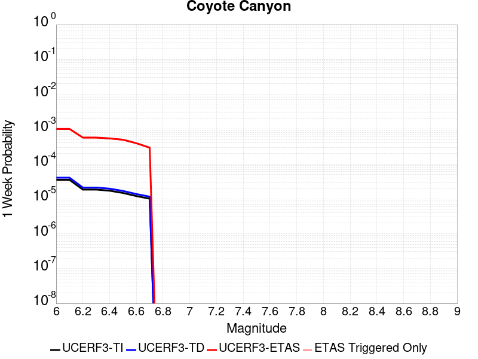 | 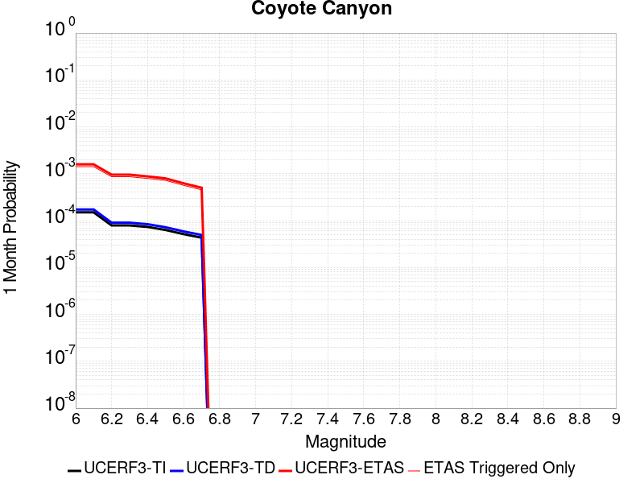 | 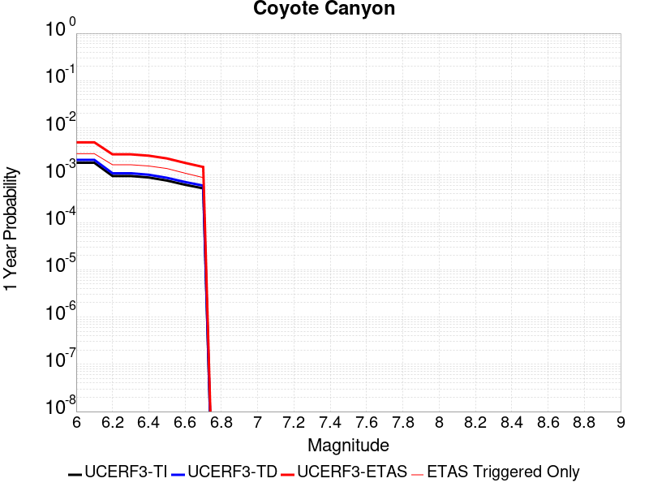 | 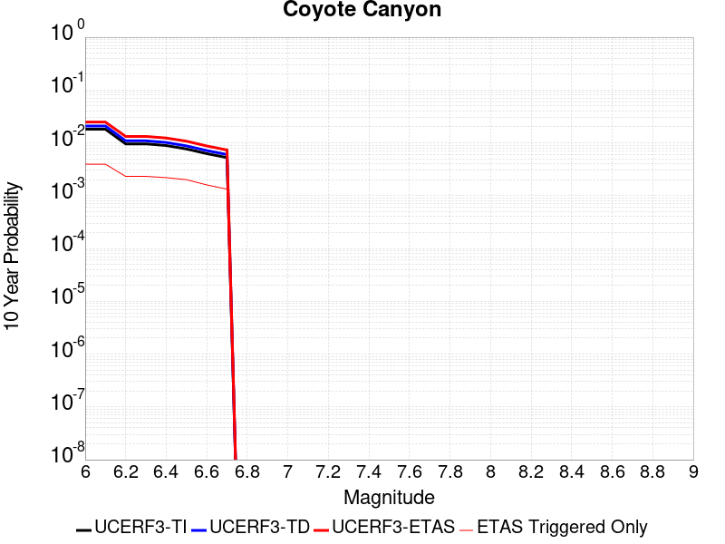 |

| Magnitude | 1 wk TI Prob | 1 wk TD Prob | 1 wk ETAS Prob | 1 wk ETAS/TD Gain | 1 wk ETAS Triggered Only | 1 mo TI Prob | 1 mo TD Prob | 1 mo ETAS Prob | 1 mo ETAS/TD Gain | 1 mo ETAS Triggered Only | 1 yr TI Prob | 1 yr TD Prob | 1 yr ETAS Prob | 1 yr ETAS/TD Gain | 1 yr ETAS Triggered Only | 10 yr TI Prob | 10 yr TD Prob | 10 yr ETAS Prob | 10 yr ETAS/TD Gain | 10 yr ETAS Triggered Only |
|-----|-----|-----|-----|-----|-----|-----|-----|-----|-----|-----|-----|-----|-----|-----|-----|-----|-----|-----|-----|-----|
| 6.0 | 3.5090034E-5 | 4.0364317E-5 | 8.361249E-4 | 20.714457 | 7.957927E-4 | 1.503772E-4 | 1.7297991E-4 | 0.0015567278 | 8.999472 | 0.0013839873 | 0.0018293047 | 0.0021042533 | 0.0048664035 | 2.312651 | 0.0027679745 | 0.018143194 | 0.020869205 | 0.024900641 | 1.1931763 | 0.004117362 |
| 6.1 | 3.5090034E-5 | 4.0364317E-5 | 8.361249E-4 | 20.714457 | 7.957927E-4 | 1.503772E-4 | 1.7297991E-4 | 0.0015567278 | 8.999472 | 0.0013839873 | 0.0018293047 | 0.0021042533 | 0.0048664035 | 2.312651 | 0.0027679745 | 0.018143194 | 0.020869205 | 0.024900641 | 1.1931763 | 0.004117362 |
| 6.2 | 1.841879E-5 | 2.1059794E-5 | 4.708462E-4 | 22.357588 | 4.4979586E-4 | 7.8935285E-5 | 9.025371E-5 | 9.551677E-4 | 10.58314 | 8.6499203E-4 | 9.606133E-4 | 0.0010983871 | 0.0026882242 | 2.447429 | 0.0015915853 | 0.0095647145 | 0.010939668 | 0.013164043 | 1.2033312 | 0.0022489794 |
| 6.3 | 1.841879E-5 | 2.1059794E-5 | 4.708462E-4 | 22.357588 | 4.4979586E-4 | 7.8935285E-5 | 9.025371E-5 | 9.551677E-4 | 10.58314 | 8.6499203E-4 | 9.606133E-4 | 0.0010983871 | 0.0026882242 | 2.447429 | 0.0015915853 | 0.0095647145 | 0.010939668 | 0.013164043 | 1.2033312 | 0.0022489794 |
| 6.4 | 1.712201E-5 | 1.9565212E-5 | 4.6935226E-4 | 23.989122 | 4.4979586E-4 | 7.337798E-5 | 8.3848776E-5 | 8.7957474E-4 | 10.490012 | 7.957927E-4 | 8.930107E-4 | 0.0010204813 | 0.0025067495 | 2.4564383 | 0.0014877863 | 0.008894307 | 0.010167871 | 0.01229124 | 1.2088312 | 0.0021451802 |
| 6.5 | 1.4744935E-5 | 1.6836972E-5 | 3.9742707E-4 | 23.604427 | 3.805965E-4 | 6.3191044E-5 | 7.215698E-5 | 7.295035E-4 | 10.10995 | 6.5739395E-4 | 7.6907943E-4 | 8.782507E-4 | 0.002088176 | 2.3776538 | 0.0012109888 | 0.007664232 | 0.008756994 | 0.010609016 | 1.2114905 | 0.0018683828 |
| 6.6 | 1.2017839E-5 | 1.3724089E-5 | 3.5971616E-4 | 26.210567 | 3.459968E-4 | 5.150401E-5 | 5.88167E-5 | 5.777814E-4 | 9.823424 | 5.189952E-4 | 6.268809E-4 | 7.159466E-4 | 0.0016840441 | 2.3521924 | 9.687911E-4 | 0.0062511545 | 0.0071450938 | 0.008519192 | 1.1923136 | 0.0013839873 |
| 6.7 | 1.00956095E-5 | 1.1533517E-5 | 2.537285E-4 | 21.999231 | 2.4219777E-4 | 4.326618E-5 | 4.942891E-5 | 4.6460456E-4 | 9.39945 | 4.1519618E-4 | 5.266384E-4 | 6.017178E-4 | 0.0013970316 | 2.321739 | 7.957927E-4 | 0.005253921 | 0.0060094125 | 0.007109949 | 1.1831354 | 0.0011071898 |

## So Sierra Nevada
*[(top)](#table-of-contents)*

| 1 Week | 1 Month | 1 Year | 10 Year |
|-----|-----|-----|-----|
| 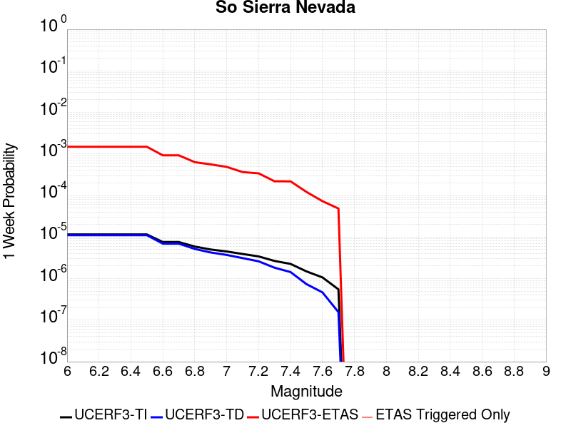 | 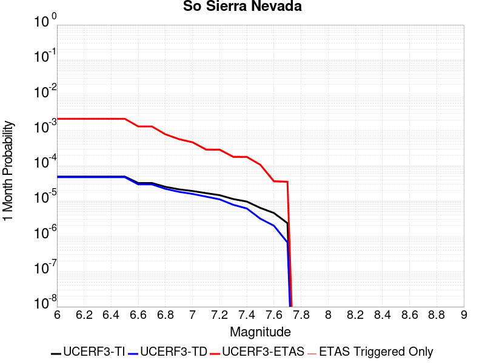 | 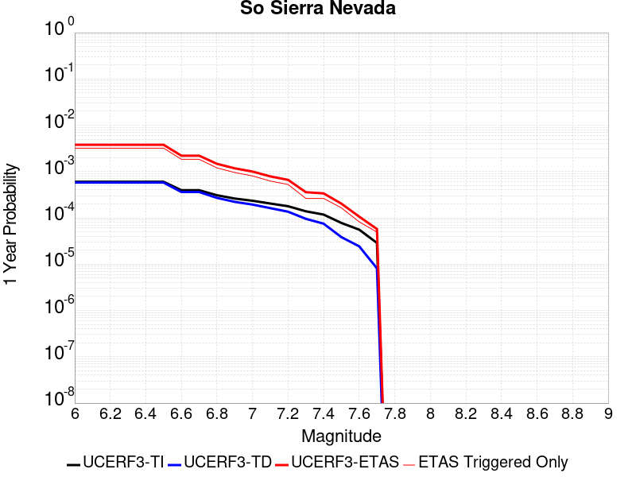 | 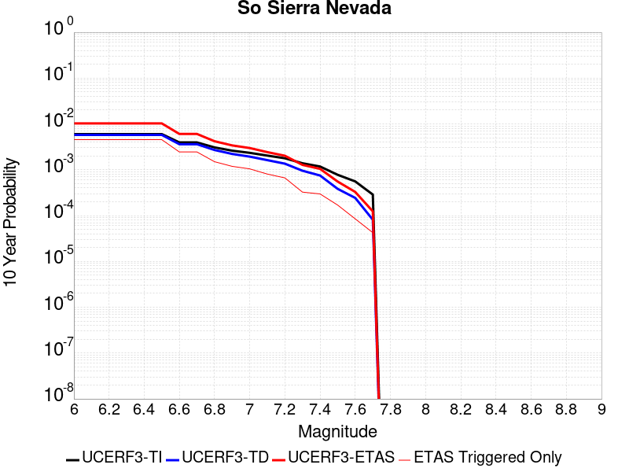 |

| Magnitude | 1 wk TI Prob | 1 wk TD Prob | 1 wk ETAS Prob | 1 wk ETAS/TD Gain | 1 wk ETAS Triggered Only | 1 mo TI Prob | 1 mo TD Prob | 1 mo ETAS Prob | 1 mo ETAS/TD Gain | 1 mo ETAS Triggered Only | 1 yr TI Prob | 1 yr TD Prob | 1 yr ETAS Prob | 1 yr ETAS/TD Gain | 1 yr ETAS Triggered Only | 10 yr TI Prob | 10 yr TD Prob | 10 yr ETAS Prob | 10 yr ETAS/TD Gain | 10 yr ETAS Triggered Only |
|-----|-----|-----|-----|-----|-----|-----|-----|-----|-----|-----|-----|-----|-----|-----|-----|-----|-----|-----|-----|-----|
| 6.0 | 1.15488665E-5 | 1.1079612E-5 | 0.0014642501 | 132.15718 | 0.0014531866 | 4.9494203E-5 | 4.7483256E-5 | 0.0021579636 | 45.44683 | 0.0021105807 | 6.024253E-4 | 5.779681E-4 | 0.0037938787 | 6.5641665 | 0.0032177705 | 0.006007948 | 0.005765918 | 0.010272342 | 1.7815622 | 0.0045325584 |
| 6.1 | 1.15488665E-5 | 1.1079612E-5 | 0.0014642501 | 132.15718 | 0.0014531866 | 4.9494203E-5 | 4.7483256E-5 | 0.0021579636 | 45.44683 | 0.0021105807 | 6.024253E-4 | 5.779681E-4 | 0.0037938787 | 6.5641665 | 0.0032177705 | 0.006007948 | 0.005765918 | 0.010272342 | 1.7815622 | 0.0045325584 |
| 6.2 | 1.15488665E-5 | 1.1079612E-5 | 0.0014642501 | 132.15718 | 0.0014531866 | 4.9494203E-5 | 4.7483256E-5 | 0.0021579636 | 45.44683 | 0.0021105807 | 6.024253E-4 | 5.779681E-4 | 0.0037938787 | 6.5641665 | 0.0032177705 | 0.006007948 | 0.005765918 | 0.010272342 | 1.7815622 | 0.0045325584 |
| 6.3 | 1.15488665E-5 | 1.1079612E-5 | 0.0014642501 | 132.15718 | 0.0014531866 | 4.9494203E-5 | 4.7483256E-5 | 0.0021579636 | 45.44683 | 0.0021105807 | 6.024253E-4 | 5.779681E-4 | 0.0037938787 | 6.5641665 | 0.0032177705 | 0.006007948 | 0.005765918 | 0.010272342 | 1.7815622 | 0.0045325584 |
| 6.4 | 1.15488665E-5 | 1.1079612E-5 | 0.0014642501 | 132.15718 | 0.0014531866 | 4.9494203E-5 | 4.7483256E-5 | 0.0021579636 | 45.44683 | 0.0021105807 | 6.024253E-4 | 5.779681E-4 | 0.0037938787 | 6.5641665 | 0.0032177705 | 0.006007948 | 0.005765918 | 0.010272342 | 1.7815622 | 0.0045325584 |
| 6.5 | 1.15488665E-5 | 1.1079612E-5 | 0.0014642501 | 132.15718 | 0.0014531866 | 4.9494203E-5 | 4.7483256E-5 | 0.0021579636 | 45.44683 | 0.0021105807 | 6.024253E-4 | 5.779681E-4 | 0.0037938787 | 6.5641665 | 0.0032177705 | 0.006007948 | 0.005765918 | 0.010272342 | 1.7815622 | 0.0045325584 |
| 6.6 | 7.587044E-6 | 6.9356042E-6 | 9.065211E-4 | 130.70543 | 8.995917E-4 | 3.2515498E-5 | 2.9723697E-5 | 0.0013098739 | 44.068336 | 0.0012801882 | 3.9580427E-4 | 3.6182883E-4 | 0.0022641227 | 6.2574415 | 0.0019029825 | 0.003951 | 0.0036126887 | 0.0062327646 | 1.7252426 | 0.0026295758 |
| 6.7 | 7.587044E-6 | 6.9356042E-6 | 9.065211E-4 | 130.70543 | 8.995917E-4 | 3.2515498E-5 | 2.9723697E-5 | 0.0013098739 | 44.068336 | 0.0012801882 | 3.9580427E-4 | 3.6182883E-4 | 0.0022641227 | 6.2574415 | 0.0019029825 | 0.003951 | 0.0036126887 | 0.0062327646 | 1.7252426 | 0.0026295758 |
| 6.8 | 5.9026956E-6 | 5.179362E-6 | 5.9337093E-4 | 114.56448 | 5.881946E-4 | 2.5297022E-5 | 2.2197082E-5 | 7.833732E-4 | 35.291718 | 7.61193E-4 | 3.0794772E-4 | 2.7021713E-4 | 0.0014116981 | 5.22431 | 0.0011417895 | 0.0030752132 | 0.002699002 | 0.004251785 | 1.5753176 | 0.0015569857 |
| 6.9 | 5.0118915E-6 | 4.2523943E-6 | 5.232454E-4 | 123.04724 | 5.189952E-4 | 2.1479358E-5 | 1.8224424E-5 | 5.7180924E-4 | 31.375984 | 5.535949E-4 | 2.614798E-4 | 2.2186051E-4 | 0.0010866607 | 4.8979454 | 8.6499203E-4 | 0.0026117235 | 0.0022164627 | 0.0034592904 | 1.5607258 | 0.0012455885 |
| 7.0 | 4.4924795E-6 | 3.7138868E-6 | 4.1890852E-4 | 112.79518 | 4.1519618E-4 | 1.925334E-5 | 1.5916565E-5 | 4.6570526E-4 | 29.259157 | 4.4979586E-4 | 2.3438422E-4 | 1.9376757E-4 | 9.202201E-4 | 4.7490926 | 7.265933E-4 | 0.0023413717 | 0.0019360491 | 0.0030410953 | 1.5707738 | 0.0011071898 |
| 7.1 | 3.9118436E-6 | 3.1119469E-6 | 2.7990853E-4 | 89.946434 | 2.7679745E-4 | 1.6764936E-5 | 1.333685E-5 | 2.901306E-4 | 21.754057 | 2.7679745E-4 | 2.0409399E-4 | 1.6236462E-4 | 7.1586965E-4 | 4.4090247 | 5.535949E-4 | 0.0020390663 | 0.0016225161 | 0.0024861046 | 1.5322527 | 8.6499203E-4 |
| 7.2 | 3.4200818E-6 | 2.6054236E-6 | 2.7940216E-4 | 107.23866 | 2.7679745E-4 | 1.4657411E-5 | 1.11660565E-5 | 2.8796043E-4 | 25.78891 | 2.7679745E-4 | 1.7843937E-4 | 1.3593875E-4 | 6.2026846E-4 | 4.562852 | 4.8439554E-4 | 0.0017829615 | 0.0013586058 | 0.002084212 | 1.5340815 | 7.265933E-4 |
| 7.3 | 2.6593618E-6 | 1.8283897E-6 | 1.7482648E-4 | 95.61774 | 1.729984E-4 | 1.13972155E-5 | 7.8359335E-6 | 1.8083298E-4 | 23.0774 | 1.729984E-4 | 1.3875226E-4 | 9.539862E-5 | 3.7216966E-4 | 3.9012063 | 2.7679745E-4 | 0.0013866565 | 9.536055E-4 | 0.0014029725 | 1.4712293 | 4.4979586E-4 |
| 7.4 | 2.2577992E-6 | 1.4364078E-6 | 1.7443456E-4 | 121.43806 | 1.729984E-4 | 9.676246E-6 | 6.1560204E-6 | 1.7915336E-4 | 29.10214 | 1.729984E-4 | 1.1780193E-4 | 7.4947224E-5 | 3.5172392E-4 | 4.6929545 | 2.7679745E-4 | 0.001177395 | 7.4924453E-4 | 0.0011295559 | 1.507593 | 3.805965E-4 |
| 7.5 | 1.489319E-6 | 7.353661E-7 | 1.0453434E-4 | 142.15279 | 1.03799044E-4 | 6.3827797E-6 | 3.1515651E-6 | 1.0695028E-4 | 33.935608 | 1.03799044E-4 | 7.770758E-5 | 3.8369635E-5 | 2.4595976E-4 | 6.410271 | 2.0759809E-4 | 7.7680405E-4 | 3.8363054E-4 | 6.257354E-4 | 1.6310886 | 2.4219777E-4 |
| 7.6 | 1.0680322E-6 | 4.65941E-7 | 3.506561E-5 | 75.257614 | 3.459968E-5 | 4.577273E-6 | 1.9968884E-6 | 3.6596502E-5 | 18.326763 | 3.459968E-5 | 5.5726876E-5 | 2.4311848E-5 | 9.350953E-5 | 3.8462534 | 6.919936E-5 | 5.5712904E-4 | 2.4309216E-4 | 3.122747E-4 | 1.2845939 | 6.919936E-5 |
| 7.7 | 5.509146E-7 | 1.5578539E-7 | 3.4755463E-5 | 223.09834 | 3.459968E-5 | 2.3610605E-6 | 6.676515E-7 | 3.526731E-5 | 52.822933 | 3.459968E-5 | 2.8745531E-5 | 8.128628E-6 | 4.272803E-5 | 5.2564874 | 3.459968E-5 | 2.8741814E-4 | 8.128342E-5 | 1.1588029E-4 | 1.4256326 | 3.459968E-5 |

## San Andreas (Mojave S)
*[(top)](#table-of-contents)*

| 1 Week | 1 Month | 1 Year | 10 Year |
|-----|-----|-----|-----|
| 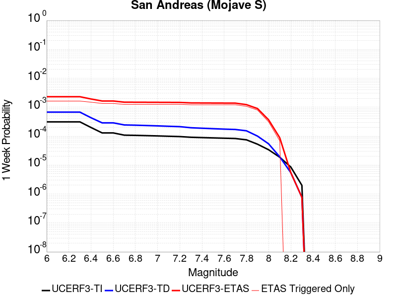 | 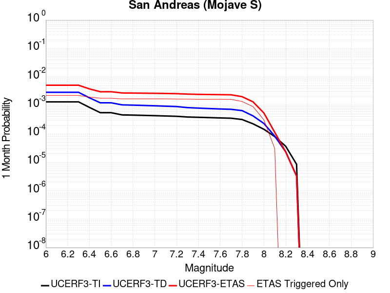 | 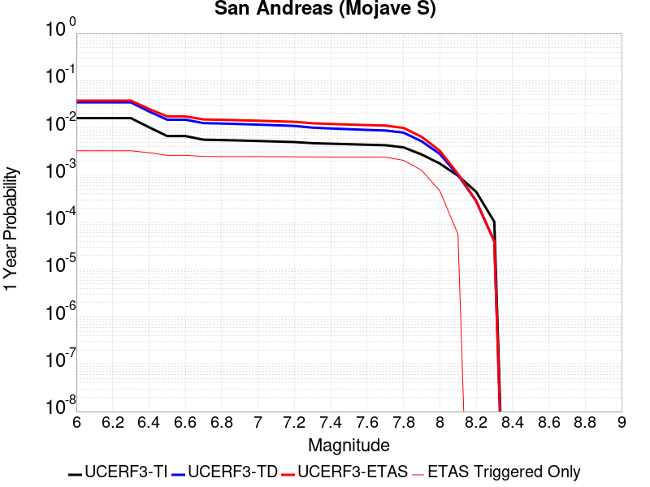 | 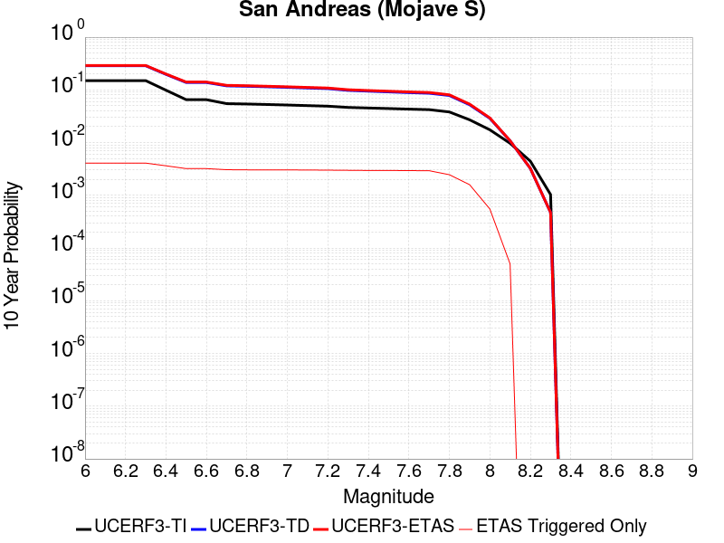 |

| Magnitude | 1 wk TI Prob | 1 wk TD Prob | 1 wk ETAS Prob | 1 wk ETAS/TD Gain | 1 wk ETAS Triggered Only | 1 mo TI Prob | 1 mo TD Prob | 1 mo ETAS Prob | 1 mo ETAS/TD Gain | 1 mo ETAS Triggered Only | 1 yr TI Prob | 1 yr TD Prob | 1 yr ETAS Prob | 1 yr ETAS/TD Gain | 1 yr ETAS Triggered Only | 10 yr TI Prob | 10 yr TD Prob | 10 yr ETAS Prob | 10 yr ETAS/TD Gain | 10 yr ETAS Triggered Only |
|-----|-----|-----|-----|-----|-----|-----|-----|-----|-----|-----|-----|-----|-----|-----|-----|-----|-----|-----|-----|-----|
| 6.0 | 3.1064058E-4 | 6.7462435E-4 | 0.0022997123 | 3.4088783 | 0.001626185 | 0.0013306376 | 0.002888172 | 0.0047856583 | 1.6569853 | 0.0019029825 | 0.016080605 | 0.034565594 | 0.03737151 | 1.0811765 | 0.0029063732 | 0.1496549 | 0.28654557 | 0.28928566 | 1.0095624 | 0.0038405648 |
| 6.1 | 3.1064058E-4 | 6.7462435E-4 | 0.0022997123 | 3.4088783 | 0.001626185 | 0.0013306376 | 0.002888172 | 0.0047856583 | 1.6569853 | 0.0019029825 | 0.016080605 | 0.034565594 | 0.03737151 | 1.0811765 | 0.0029063732 | 0.1496549 | 0.28654557 | 0.28928566 | 1.0095624 | 0.0038405648 |
| 6.2 | 3.1064058E-4 | 6.7462435E-4 | 0.0022997123 | 3.4088783 | 0.001626185 | 0.0013306376 | 0.002888172 | 0.0047856583 | 1.6569853 | 0.0019029825 | 0.016080605 | 0.034565594 | 0.03737151 | 1.0811765 | 0.0029063732 | 0.1496549 | 0.28654557 | 0.28928566 | 1.0095624 | 0.0038405648 |
| 6.3 | 3.1064058E-4 | 6.7462435E-4 | 0.0022997123 | 3.4088783 | 0.001626185 | 0.0013306376 | 0.002888172 | 0.0047856583 | 1.6569853 | 0.0019029825 | 0.016080605 | 0.034565594 | 0.03737151 | 1.0811765 | 0.0029063732 | 0.1496549 | 0.28654557 | 0.28928566 | 1.0095624 | 0.0038405648 |
| 6.4 | 1.9872203E-4 | 4.3181062E-4 | 0.0019189545 | 4.4439726 | 0.0014877863 | 8.5138786E-4 | 0.0018493326 | 0.0035415818 | 1.9150593 | 0.0016953844 | 0.010316478 | 0.02228931 | 0.02496176 | 1.1198983 | 0.002733375 | 0.098504856 | 0.19686839 | 0.19975835 | 1.0146797 | 0.0035983669 |
| 6.5 | 1.291105E-4 | 2.8754136E-4 | 0.001636541 | 5.6914973 | 0.0013493876 | 5.5321335E-4 | 0.0012317409 | 0.0027868089 | 2.2624958 | 0.0015569857 | 0.006714592 | 0.014894155 | 0.01721189 | 1.1556138 | 0.0023527783 | 0.065152965 | 0.13800792 | 0.1407518 | 1.019882 | 0.0031831707 |
| 6.6 | 1.291105E-4 | 2.8754136E-4 | 0.001636541 | 5.6914973 | 0.0013493876 | 5.5321335E-4 | 0.0012317409 | 0.0027868089 | 2.2624958 | 0.0015569857 | 0.006714592 | 0.014894155 | 0.01721189 | 1.1556138 | 0.0023527783 | 0.065152965 | 0.13800792 | 0.1407518 | 1.019882 | 0.0031831707 |
| 6.7 | 1.08001186E-4 | 2.4335351E-4 | 0.0014886389 | 6.117187 | 0.0012455885 | 4.6278012E-4 | 0.0010425274 | 0.0024596355 | 2.3593006 | 0.0014185869 | 0.0056198016 | 0.0126192 | 0.014771473 | 1.1705555 | 0.00217978 | 0.054797906 | 0.11918431 | 0.121835716 | 1.0222462 | 0.0030101724 |
| 6.8 | 1.0624356E-4 | 2.3853009E-4 | 0.0014838215 | 6.2206893 | 0.0012455885 | 4.5525006E-4 | 0.0010218718 | 0.0024390093 | 2.3868053 | 0.0014185869 | 0.0055285925 | 0.012370593 | 0.014523407 | 1.1740268 | 0.00217978 | 0.053930566 | 0.11713308 | 0.11979066 | 1.0226885 | 0.0030101724 |
| 6.9 | 1.0393785E-4 | 2.3223337E-4 | 0.0014775327 | 6.362275 | 0.0012455885 | 4.4537184E-4 | 9.949068E-4 | 0.0024120824 | 2.4244306 | 0.0014185869 | 0.0054089287 | 0.012045963 | 0.014199486 | 1.1787754 | 0.00217978 | 0.05279156 | 0.114433445 | 0.117068514 | 1.0230271 | 0.0029755726 |
| 7.0 | 1.0155622E-4 | 2.2592908E-4 | 0.0014712362 | 6.5119386 | 0.0012455885 | 4.3516833E-4 | 9.6790853E-4 | 0.0023851225 | 2.4642022 | 0.0014185869 | 0.005285311 | 0.011720838 | 0.013875069 | 1.183795 | 0.00217978 | 0.05161361 | 0.11169745 | 0.11434066 | 1.023664 | 0.0029755726 |
| 7.1 | 9.885595E-5 | 2.188132E-4 | 0.0014641292 | 6.691229 | 0.0012455885 | 4.2359953E-4 | 9.374342E-4 | 0.0023546913 | 2.511847 | 0.0014185869 | 0.0051451353 | 0.011353733 | 0.013474558 | 1.1867954 | 0.0021451802 | 0.05027629 | 0.10857607 | 0.11119772 | 1.0241457 | 0.002940973 |
| 7.2 | 9.6411415E-5 | 2.1244297E-4 | 0.0014577669 | 6.861921 | 0.0012455885 | 4.1312634E-4 | 9.101525E-4 | 0.0023274482 | 2.5572069 | 0.0014185869 | 0.005018219 | 0.011024987 | 0.013146517 | 1.1924292 | 0.0021451802 | 0.049064007 | 0.1057697 | 0.10839961 | 1.0248644 | 0.002940973 |
| 7.3 | 9.1180635E-5 | 1.9472656E-4 | 0.0014054796 | 7.2177086 | 0.0012109888 | 3.907156E-4 | 8.342756E-4 | 0.0022171082 | 2.657525 | 0.0013839873 | 0.004746591 | 0.010110112 | 0.012199354 | 1.2066488 | 0.0021105807 | 0.046464786 | 0.09796176 | 0.10058342 | 1.0267621 | 0.0029063732 |
| 7.4 | 8.887388E-5 | 1.872126E-4 | 0.0013979748 | 7.467311 | 0.0012109888 | 3.8083247E-4 | 8.020931E-4 | 0.0021849703 | 2.7240856 | 0.0013839873 | 0.0046267817 | 0.009721855 | 0.011811917 | 1.214986 | 0.0021105807 | 0.045316286 | 0.094593845 | 0.09722529 | 1.0278184 | 0.0029063732 |
| 7.5 | 8.6750515E-5 | 1.80528E-4 | 0.0013912983 | 7.706828 | 0.0012109888 | 3.7173493E-4 | 7.734621E-4 | 0.002156379 | 2.7879567 | 0.0013839873 | 0.004516484 | 0.009376327 | 0.011467118 | 1.2229862 | 0.0021105807 | 0.04425787 | 0.09155606 | 0.094196334 | 1.0288378 | 0.0029063732 |
| 7.6 | 8.453092E-5 | 1.7440386E-4 | 0.0013851816 | 7.9423785 | 0.0012109888 | 3.6222505E-4 | 7.4723107E-4 | 0.002130184 | 2.8507702 | 0.0013839873 | 0.0044011753 | 0.009059664 | 0.011151124 | 1.2308539 | 0.0021105807 | 0.04315024 | 0.08871447 | 0.09136301 | 1.0298547 | 0.0029063732 |
| 7.7 | 8.259102E-5 | 1.6962511E-4 | 0.0013804085 | 8.137997 | 0.0012109888 | 3.539135E-4 | 7.267622E-4 | 0.0021097437 | 2.902935 | 0.0013839873 | 0.004300386 | 0.0088125 | 0.010904482 | 1.2373879 | 0.0021105807 | 0.042181134 | 0.086465426 | 0.0891205 | 1.0307068 | 0.0029063732 |
| 7.8 | 7.444844E-5 | 1.528469E-4 | 0.0012252731 | 8.016342 | 0.0010725901 | 3.1902574E-4 | 6.5489375E-4 | 0.0018650895 | 2.8479269 | 0.0012109888 | 0.0038772223 | 0.007944231 | 0.009729122 | 1.2246776 | 0.0017991834 | 0.03810269 | 0.078293875 | 0.08068568 | 1.030549 | 0.0025949762 |
| 7.9 | 5.2586525E-5 | 1.0007023E-4 | 8.957833E-4 | 8.951546 | 7.957927E-4 | 2.2535135E-4 | 4.2880196E-4 | 0.0012588382 | 2.9357102 | 8.3039235E-4 | 0.0027402006 | 0.005208178 | 0.00637844 | 1.2246971 | 0.0011763892 | 0.027066574 | 0.052201588 | 0.053841267 | 1.0314105 | 0.0017299841 |
| 8.0 | 3.379877E-5 | 5.4075565E-5 | 3.6545587E-4 | 6.758244 | 3.1139713E-4 | 1.4484383E-4 | 2.3173184E-4 | 5.430568E-4 | 2.3434708 | 3.1139713E-4 | 0.0017620471 | 0.0028176866 | 0.003266215 | 1.1591833 | 4.4979586E-4 | 0.017481409 | 0.028835917 | 0.029440751 | 1.0209751 | 6.2279426E-4 |
| 8.1 | 1.8668277E-5 | 1.9308145E-5 | 8.8506175E-5 | 4.5838776 | 6.919936E-5 | 8.000444E-5 | 8.274657E-5 | 1.519402E-4 | 1.8362116 | 6.919936E-5 | 9.736188E-4 | 0.0010069745 | 0.0011452339 | 1.1373018 | 1.3839873E-4 | 0.009693642 | 0.010798624 | 0.010935527 | 1.0126779 | 1.3839873E-4 |
| 8.2 | 8.541571E-6 | 5.4596358E-6 | 5.4596358E-6 | 1.0 | 0.0 | 3.660622E-5 | 2.339823E-5 | 2.339823E-5 | 1.0 | 0.0 | 4.455896E-4 | 2.848363E-4 | 2.848363E-4 | 1.0 | 0.0 | 0.0044469717 | 0.003240283 | 0.003240283 | 1.0 | 0.0 |
| 8.3 | 1.983087E-6 | 7.6564595E-7 | 7.6564595E-7 | 1.0 | 0.0 | 8.498917E-6 | 3.281336E-6 | 3.281336E-6 | 1.0 | 0.0 | 1.034694E-4 | 3.9949547E-5 | 3.9949547E-5 | 1.0 | 0.0 | 0.0010342124 | 4.717979E-4 | 4.717979E-4 | 1.0 | 0.0 |

## San Andreas (Mojave N)
*[(top)](#table-of-contents)*

| 1 Week | 1 Month | 1 Year | 10 Year |
|-----|-----|-----|-----|
|  | 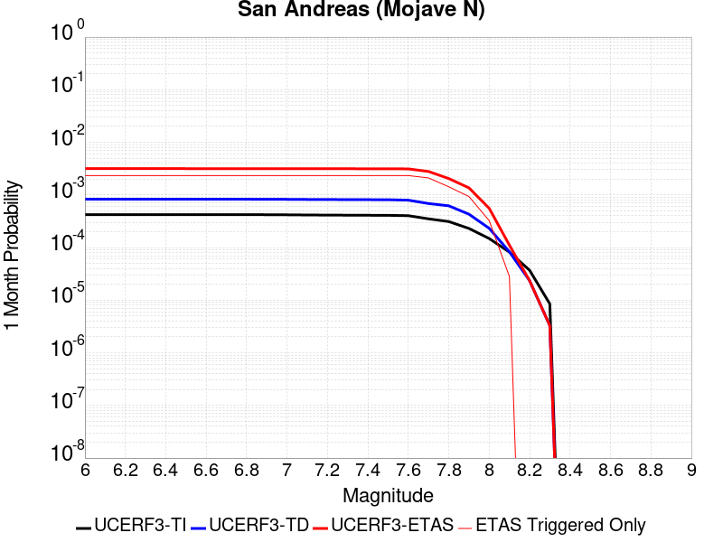 | 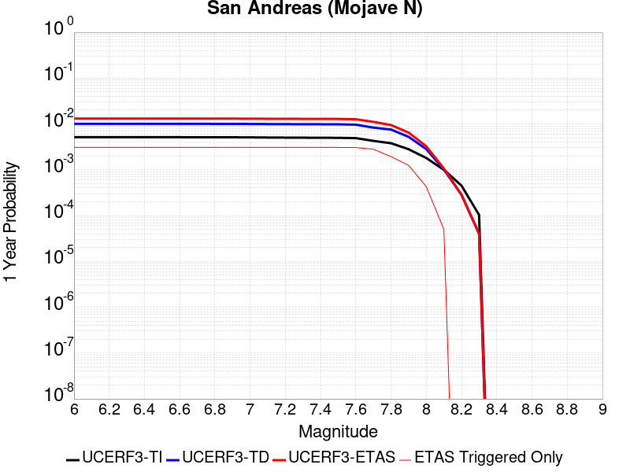 | 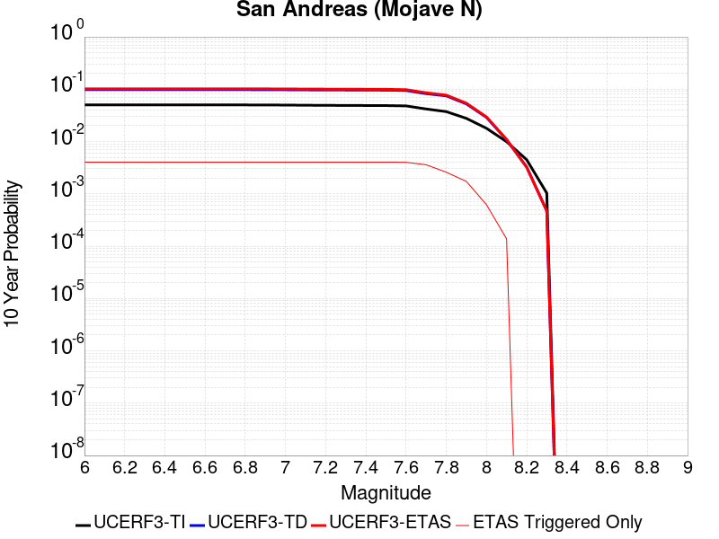 |

| Magnitude | 1 wk TI Prob | 1 wk TD Prob | 1 wk ETAS Prob | 1 wk ETAS/TD Gain | 1 wk ETAS Triggered Only | 1 mo TI Prob | 1 mo TD Prob | 1 mo ETAS Prob | 1 mo ETAS/TD Gain | 1 mo ETAS Triggered Only | 1 yr TI Prob | 1 yr TD Prob | 1 yr ETAS Prob | 1 yr ETAS/TD Gain | 1 yr ETAS Triggered Only | 10 yr TI Prob | 10 yr TD Prob | 10 yr ETAS Prob | 10 yr ETAS/TD Gain | 10 yr ETAS Triggered Only |
|-----|-----|-----|-----|-----|-----|-----|-----|-----|-----|-----|-----|-----|-----|-----|-----|-----|-----|-----|-----|-----|
| 6.0 | 9.877682E-5 | 1.9402112E-4 | 0.0019928555 | 10.271333 | 0.0017991834 | 4.2326056E-4 | 8.312543E-4 | 0.0029055094 | 3.4953318 | 0.0020759809 | 0.0051410277 | 0.010073684 | 0.013122035 | 1.3026054 | 0.0030793718 | 0.05023708 | 0.09832245 | 0.101972595 | 1.0371242 | 0.0040481626 |
| 6.1 | 9.877682E-5 | 1.9402112E-4 | 0.0019928555 | 10.271333 | 0.0017991834 | 4.2326056E-4 | 8.312543E-4 | 0.0029055094 | 3.4953318 | 0.0020759809 | 0.0051410277 | 0.010073684 | 0.013122035 | 1.3026054 | 0.0030793718 | 0.05023708 | 0.09832245 | 0.101972595 | 1.0371242 | 0.0040481626 |
| 6.2 | 9.877682E-5 | 1.9402112E-4 | 0.0019928555 | 10.271333 | 0.0017991834 | 4.2326056E-4 | 8.312543E-4 | 0.0029055094 | 3.4953318 | 0.0020759809 | 0.0051410277 | 0.010073684 | 0.013122035 | 1.3026054 | 0.0030793718 | 0.05023708 | 0.09832245 | 0.101972595 | 1.0371242 | 0.0040481626 |
| 6.3 | 9.877682E-5 | 1.9402112E-4 | 0.0019928555 | 10.271333 | 0.0017991834 | 4.2326056E-4 | 8.312543E-4 | 0.0029055094 | 3.4953318 | 0.0020759809 | 0.0051410277 | 0.010073684 | 0.013122035 | 1.3026054 | 0.0030793718 | 0.05023708 | 0.09832245 | 0.101972595 | 1.0371242 | 0.0040481626 |
| 6.4 | 9.877682E-5 | 1.9402112E-4 | 0.0019928555 | 10.271333 | 0.0017991834 | 4.2326056E-4 | 8.312543E-4 | 0.0029055094 | 3.4953318 | 0.0020759809 | 0.0051410277 | 0.010073684 | 0.013122035 | 1.3026054 | 0.0030793718 | 0.05023708 | 0.09832245 | 0.101972595 | 1.0371242 | 0.0040481626 |
| 6.5 | 9.861474E-5 | 1.937588E-4 | 0.0019925938 | 10.283887 | 0.0017991834 | 4.2256617E-4 | 8.3013077E-4 | 0.0029043884 | 3.4987118 | 0.0020759809 | 0.0051326132 | 0.0100601325 | 0.013108525 | 1.3030171 | 0.0030793718 | 0.050156746 | 0.09820035 | 0.10185098 | 1.0371753 | 0.0040481626 |
| 6.6 | 9.861474E-5 | 1.937588E-4 | 0.0019925938 | 10.283887 | 0.0017991834 | 4.2256617E-4 | 8.3013077E-4 | 0.0029043884 | 3.4987118 | 0.0020759809 | 0.0051326132 | 0.0100601325 | 0.013108525 | 1.3030171 | 0.0030793718 | 0.050156746 | 0.09820035 | 0.10185098 | 1.0371753 | 0.0040481626 |
| 6.7 | 9.8552715E-5 | 1.9365833E-4 | 0.0019924934 | 10.288705 | 0.0017991834 | 4.223004E-4 | 8.2970044E-4 | 0.002903959 | 3.5000088 | 0.0020759809 | 0.0051293927 | 0.010054941 | 0.01310335 | 1.3031752 | 0.0030793718 | 0.050125998 | 0.09815356 | 0.10180438 | 1.037195 | 0.0040481626 |
| 6.8 | 9.8464974E-5 | 1.9350994E-4 | 0.0019923453 | 10.295829 | 0.0017991834 | 4.219245E-4 | 8.290649E-4 | 0.0029033248 | 3.501927 | 0.0020759809 | 0.0051248376 | 0.010047276 | 0.013095708 | 1.3034089 | 0.0030793718 | 0.05008251 | 0.09808378 | 0.101734884 | 1.0372243 | 0.0040481626 |
| 6.9 | 9.825824E-5 | 1.9319002E-4 | 0.0019920259 | 10.311226 | 0.0017991834 | 4.2103877E-4 | 8.276947E-4 | 0.0029019574 | 3.506072 | 0.0020759809 | 0.0051141046 | 0.010030746 | 0.01307923 | 1.303914 | 0.0030793718 | 0.049980022 | 0.097932965 | 0.10158468 | 1.037288 | 0.0040481626 |
| 7.0 | 9.781462E-5 | 1.9250368E-4 | 0.0019913407 | 10.34443 | 0.0017991834 | 4.1913814E-4 | 8.247551E-4 | 0.0028990237 | 3.5150118 | 0.0020759809 | 0.005091073 | 0.009995285 | 0.013043878 | 1.305003 | 0.0030793718 | 0.04976007 | 0.09760912 | 0.101262145 | 1.037425 | 0.0040481626 |
| 7.1 | 9.7121134E-5 | 1.9152075E-4 | 0.0019903595 | 10.392397 | 0.0017991834 | 4.1616702E-4 | 8.205452E-4 | 0.0028948227 | 3.527926 | 0.0020759809 | 0.005055068 | 0.0099444995 | 0.012993248 | 1.3065764 | 0.0030793718 | 0.04941613 | 0.09714571 | 0.10080061 | 1.0376229 | 0.0040481626 |
| 7.2 | 9.663819E-5 | 1.9082859E-4 | 0.0019896687 | 10.426471 | 0.0017991834 | 4.1409794E-4 | 8.175807E-4 | 0.0028918644 | 3.5370996 | 0.0020759809 | 0.0050299936 | 0.009908735 | 0.012957594 | 1.3076941 | 0.0030793718 | 0.049176537 | 0.09681883 | 0.10047505 | 1.0377636 | 0.0040481626 |
| 7.3 | 9.6277574E-5 | 1.9035369E-4 | 0.0019891947 | 10.449993 | 0.0017991834 | 4.125529E-4 | 8.1554666E-4 | 0.0028898346 | 3.5434325 | 0.0020759809 | 0.0050112694 | 0.009884195 | 0.01293313 | 1.3084656 | 0.0030793718 | 0.04899759 | 0.09659228 | 0.10024942 | 1.0378616 | 0.0040481626 |
| 7.4 | 9.593308E-5 | 1.8975153E-4 | 0.0019885935 | 10.479987 | 0.0017991834 | 4.1107697E-4 | 8.129676E-4 | 0.0028872609 | 3.551508 | 0.0020759809 | 0.0049933824 | 0.009853081 | 0.012902111 | 1.3094494 | 0.0030793718 | 0.04882661 | 0.09630986 | 0.09996814 | 1.0379845 | 0.0040481626 |
| 7.5 | 9.561707E-5 | 1.8921228E-4 | 0.0019880552 | 10.50701 | 0.0017991834 | 4.0972308E-4 | 8.106579E-4 | 0.0028849558 | 3.5587833 | 0.0020759809 | 0.0049769743 | 0.009825215 | 0.01287433 | 1.3103359 | 0.0030793718 | 0.048669744 | 0.096056245 | 0.09971556 | 1.0380955 | 0.0040481626 |
| 7.6 | 9.418194E-5 | 1.8573487E-4 | 0.0019845841 | 10.685038 | 0.0017991834 | 4.0357444E-4 | 7.95764E-4 | 0.0028700929 | 3.6067138 | 0.0020759809 | 0.004902454 | 0.009645499 | 0.012660903 | 1.3126229 | 0.003044772 | 0.047957025 | 0.094437465 | 0.098072 | 1.0384861 | 0.004013563 |
| 7.7 | 8.202141E-5 | 1.6022482E-4 | 0.0017515551 | 10.931859 | 0.0015915853 | 3.51473E-4 | 6.8649714E-4 | 0.0024844455 | 3.6190178 | 0.0017991834 | 0.00427079 | 0.008326128 | 0.0110024335 | 1.3214345 | 0.0026987751 | 0.04189639 | 0.082237914 | 0.08554036 | 1.0401572 | 0.0035983669 |
| 7.8 | 7.2859846E-5 | 1.4517571E-4 | 0.0012176101 | 8.387148 | 0.0010725901 | 3.1221908E-4 | 6.2203326E-4 | 0.0018322689 | 2.9456122 | 0.0012109888 | 0.003794643 | 0.0075469986 | 0.009332604 | 1.236598 | 0.0017991834 | 0.037304975 | 0.07472766 | 0.07712872 | 1.0321308 | 0.0025949762 |
| 7.9 | 5.3874453E-5 | 1.00462625E-4 | 8.9617533E-4 | 8.920485 | 7.957927E-4 | 2.3087008E-4 | 4.3048308E-4 | 0.001260518 | 2.9281476 | 8.3039235E-4 | 0.0028072202 | 0.0052285474 | 0.006398786 | 1.2238171 | 0.0011763892 | 0.02772022 | 0.052425884 | 0.05406517 | 1.0312687 | 0.0017299841 |
| 8.0 | 3.468538E-5 | 5.4261534E-5 | 3.6564178E-4 | 6.7385077 | 3.1139713E-4 | 1.4864317E-4 | 2.3252872E-4 | 5.4385344E-4 | 2.3388658 | 3.1139713E-4 | 0.0018082283 | 0.0028273636 | 0.0032758878 | 1.1586369 | 4.4979586E-4 | 0.017935853 | 0.028948462 | 0.029553227 | 1.0208911 | 6.2279426E-4 |
| 8.1 | 1.9152367E-5 | 1.9401303E-5 | 8.859932E-5 | 4.566669 | 6.919936E-5 | 8.207899E-5 | 8.3145795E-5 | 1.523394E-4 | 1.8321961 | 6.919936E-5 | 9.988535E-4 | 0.0010118305 | 0.0011500892 | 1.1366421 | 1.3839873E-4 | 0.009943757 | 0.01085595 | 0.010992847 | 1.0126102 | 1.3839873E-4 |
| 8.2 | 8.643924E-6 | 5.473668E-6 | 5.473668E-6 | 1.0 | 0.0 | 3.704486E-5 | 2.3458366E-5 | 2.3458366E-5 | 1.0 | 0.0 | 4.5092785E-4 | 2.8556827E-4 | 2.8556827E-4 | 1.0 | 0.0 | 0.0045001395 | 0.0032481793 | 0.0032481793 | 1.0 | 0.0 |
| 8.3 | 1.983087E-6 | 7.6564595E-7 | 7.6564595E-7 | 1.0 | 0.0 | 8.498917E-6 | 3.281336E-6 | 3.281336E-6 | 1.0 | 0.0 | 1.034694E-4 | 3.9949547E-5 | 3.9949547E-5 | 1.0 | 0.0 | 0.0010342124 | 4.717979E-4 | 4.717979E-4 | 1.0 | 0.0 |

## Nelson Lake
*[(top)](#table-of-contents)*

| 1 Week | 1 Month | 1 Year | 10 Year |
|-----|-----|-----|-----|
| 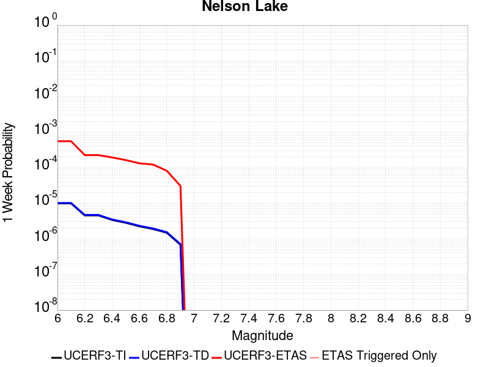 | 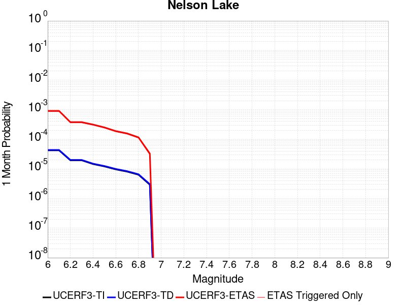 | 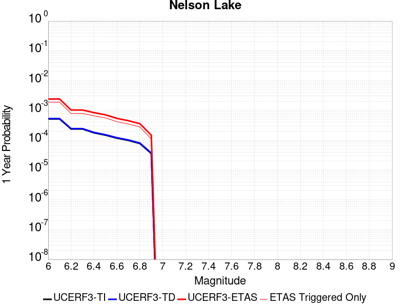 | 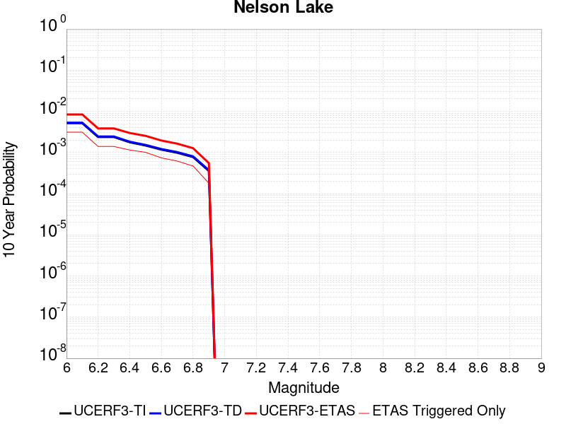 |

| Magnitude | 1 wk TI Prob | 1 wk TD Prob | 1 wk ETAS Prob | 1 wk ETAS/TD Gain | 1 wk ETAS Triggered Only | 1 mo TI Prob | 1 mo TD Prob | 1 mo ETAS Prob | 1 mo ETAS/TD Gain | 1 mo ETAS Triggered Only | 1 yr TI Prob | 1 yr TD Prob | 1 yr ETAS Prob | 1 yr ETAS/TD Gain | 1 yr ETAS Triggered Only | 10 yr TI Prob | 10 yr TD Prob | 10 yr ETAS Prob | 10 yr ETAS/TD Gain | 10 yr ETAS Triggered Only |
|-----|-----|-----|-----|-----|-----|-----|-----|-----|-----|-----|-----|-----|-----|-----|-----|-----|-----|-----|-----|-----|
| 6.0 | 9.913453E-6 | 1.0192255E-5 | 6.329802E-4 | 62.104034 | 6.2279426E-4 | 4.2485535E-5 | 4.3680422E-5 | 0.0010470274 | 23.970175 | 0.0010033908 | 5.1713863E-4 | 5.316897E-4 | 0.002502823 | 4.7073 | 0.001972182 | 0.0051593683 | 0.005305204 | 0.0087124 | 1.6422366 | 0.0034253686 |
| 6.1 | 9.913453E-6 | 1.0192255E-5 | 6.329802E-4 | 62.104034 | 6.2279426E-4 | 4.2485535E-5 | 4.3680422E-5 | 0.0010470274 | 23.970175 | 0.0010033908 | 5.1713863E-4 | 5.316897E-4 | 0.002502823 | 4.7073 | 0.001972182 | 0.0051593683 | 0.005305204 | 0.0087124 | 1.6422366 | 0.0034253686 |
| 6.2 | 4.5596407E-6 | 4.696313E-6 | 2.4689295E-4 | 52.571655 | 2.4219777E-4 | 1.954117E-5 | 2.0126909E-5 | 4.3531472E-4 | 21.628496 | 4.1519618E-4 | 2.3788778E-4 | 2.4501883E-4 | 0.0011789814 | 4.811799 | 9.341914E-4 | 0.0023763329 | 0.0024476128 | 0.004138848 | 1.6909732 | 0.0016953844 |
| 6.3 | 4.5596407E-6 | 4.696313E-6 | 2.4689295E-4 | 52.571655 | 2.4219777E-4 | 1.954117E-5 | 2.0126909E-5 | 4.3531472E-4 | 21.628496 | 4.1519618E-4 | 2.3788778E-4 | 2.4501883E-4 | 0.0011789814 | 4.811799 | 9.341914E-4 | 0.0023763329 | 0.0024476128 | 0.004138848 | 1.6909732 | 0.0016953844 |
| 6.4 | 3.4025713E-6 | 3.5098972E-6 | 2.4570682E-4 | 70.00399 | 2.4219777E-4 | 1.4582367E-5 | 1.5042335E-5 | 3.956331E-4 | 26.30131 | 3.805965E-4 | 1.7752586E-4 | 1.8312587E-4 | 0.0010133662 | 5.533714 | 8.3039235E-4 | 0.001773841 | 0.0018298327 | 0.0032803603 | 1.7927105 | 0.0014531866 |
| 6.5 | 2.8352947E-6 | 2.927856E-6 | 2.4512492E-4 | 83.72164 | 2.4219777E-4 | 1.2151207E-5 | 1.2547898E-5 | 3.5854036E-4 | 28.573738 | 3.459968E-4 | 1.479309E-4 | 1.5276071E-4 | 8.79243E-4 | 5.7556887 | 7.265933E-4 | 0.0014783246 | 0.0015266308 | 0.0027703177 | 1.8146613 | 0.0012455885 |
| 6.6 | 2.251518E-6 | 2.3290677E-6 | 2.4452628E-4 | 104.988914 | 2.4219777E-4 | 9.649328E-6 | 9.981683E-6 | 3.213757E-4 | 32.196545 | 3.1139713E-4 | 1.1747423E-4 | 1.2152085E-4 | 7.0964394E-4 | 5.8396893 | 5.881946E-4 | 0.0011741214 | 0.0012146058 | 0.0022513354 | 1.8535525 | 0.0010379904 |
| 6.7 | 1.8911853E-6 | 1.9591396E-6 | 2.4415643E-4 | 124.62431 | 2.4219777E-4 | 8.105055E-6 | 8.39629E-6 | 3.1979082E-4 | 38.08716 | 3.1139713E-4 | 9.867457E-5 | 1.0222061E-4 | 5.8656663E-4 | 5.738242 | 4.8439554E-4 | 9.863076E-4 | 0.0010217935 | 0.0018859017 | 1.845678 | 8.6499203E-4 |
| 6.8 | 1.4874814E-6 | 1.5438305E-6 | 2.091416E-4 | 135.46928 | 2.0759809E-4 | 6.374905E-6 | 6.6164025E-6 | 2.8341202E-4 | 42.834763 | 2.7679745E-4 | 7.76117E-5 | 8.055224E-5 | 4.9571495E-4 | 6.1539564 | 4.1519618E-4 | 7.75846E-4 | 8.0528157E-4 | 0.0014275743 | 1.7727642 | 6.2279426E-4 |
| 6.9 | 6.835972E-7 | 7.1399285E-7 | 6.991331E-5 | 97.91878 | 6.919936E-5 | 2.9296991E-6 | 3.0599674E-6 | 7.225912E-5 | 23.614342 | 6.919936E-5 | 3.56685E-5 | 3.7254784E-5 | 2.1024676E-4 | 5.643483 | 1.729984E-4 | 3.5662777E-4 | 3.7251666E-4 | 6.146242E-4 | 1.649924 | 2.4219777E-4 |

## Death Valley (So)
*[(top)](#table-of-contents)*

| 1 Week | 1 Month | 1 Year | 10 Year |
|-----|-----|-----|-----|
| 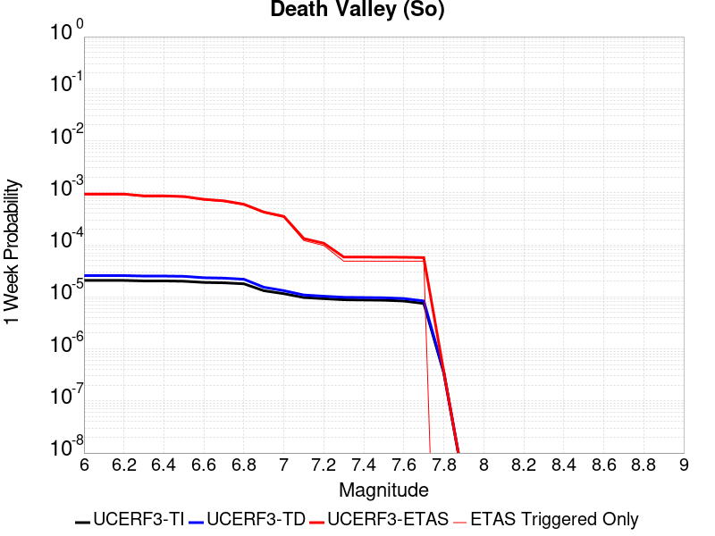 | 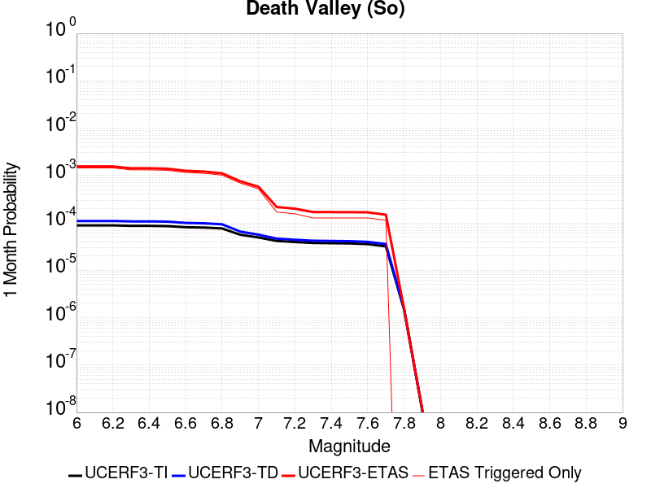 | 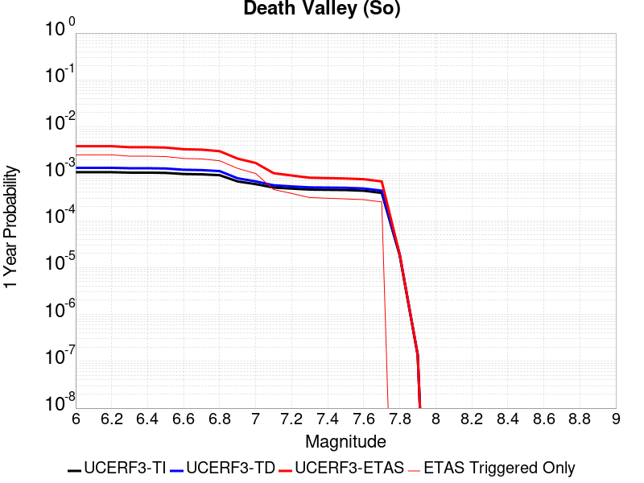 | 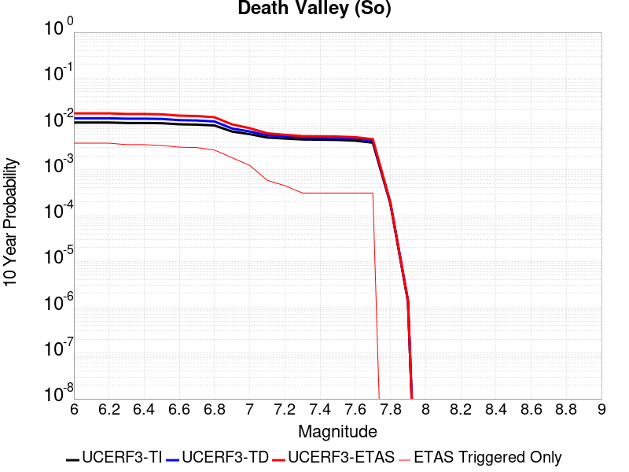 |

| Magnitude | 1 wk TI Prob | 1 wk TD Prob | 1 wk ETAS Prob | 1 wk ETAS/TD Gain | 1 wk ETAS Triggered Only | 1 mo TI Prob | 1 mo TD Prob | 1 mo ETAS Prob | 1 mo ETAS/TD Gain | 1 mo ETAS Triggered Only | 1 yr TI Prob | 1 yr TD Prob | 1 yr ETAS Prob | 1 yr ETAS/TD Gain | 1 yr ETAS Triggered Only | 10 yr TI Prob | 10 yr TD Prob | 10 yr ETAS Prob | 10 yr ETAS/TD Gain | 10 yr ETAS Triggered Only |
|-----|-----|-----|-----|-----|-----|-----|-----|-----|-----|-----|-----|-----|-----|-----|-----|-----|-----|-----|-----|-----|
| 6.0 | 2.0684236E-5 | 2.5618314E-5 | 9.943846E-4 | 38.81538 | 9.687911E-4 | 8.864371E-5 | 1.0978825E-4 | 0.0015628154 | 14.234815 | 0.0014531866 | 0.0010787029 | 0.0013358692 | 0.0038237185 | 2.862345 | 0.002491177 | 0.010734817 | 0.013279985 | 0.017035406 | 1.2827882 | 0.003805965 |
| 6.1 | 2.0684236E-5 | 2.5618314E-5 | 9.943846E-4 | 38.81538 | 9.687911E-4 | 8.864371E-5 | 1.0978825E-4 | 0.0015628154 | 14.234815 | 0.0014531866 | 0.0010787029 | 0.0013358692 | 0.0038237185 | 2.862345 | 0.002491177 | 0.010734817 | 0.013279985 | 0.017035406 | 1.2827882 | 0.003805965 |
| 6.2 | 2.0684236E-5 | 2.5618314E-5 | 9.943846E-4 | 38.81538 | 9.687911E-4 | 8.864371E-5 | 1.0978825E-4 | 0.0015628154 | 14.234815 | 0.0014531866 | 0.0010787029 | 0.0013358692 | 0.0038237185 | 2.862345 | 0.002491177 | 0.010734817 | 0.013279985 | 0.017035406 | 1.2827882 | 0.003805965 |
| 6.3 | 2.0240292E-5 | 2.51184E-5 | 9.5928635E-4 | 38.190586 | 9.341914E-4 | 8.6741224E-5 | 1.0764593E-4 | 0.0015260802 | 14.176849 | 0.0014185869 | 0.0010555626 | 0.001309818 | 0.0036595147 | 2.7939107 | 0.0023527783 | 0.010505628 | 0.013022543 | 0.016505752 | 1.2674754 | 0.0035291675 |
| 6.4 | 2.0240292E-5 | 2.51184E-5 | 9.5928635E-4 | 38.190586 | 9.341914E-4 | 8.6741224E-5 | 1.0764593E-4 | 0.0015260802 | 14.176849 | 0.0014185869 | 0.0010555626 | 0.001309818 | 0.0036595147 | 2.7939107 | 0.0023527783 | 0.010505628 | 0.013022543 | 0.016505752 | 1.2674754 | 0.0035291675 |
| 6.5 | 1.9962767E-5 | 2.4807652E-5 | 9.2437706E-4 | 37.261772 | 8.995917E-4 | 8.55519E-5 | 1.0631427E-4 | 0.0014555583 | 13.691092 | 0.0013493876 | 0.0010410968 | 0.0012936244 | 0.0035396942 | 2.7362614 | 0.0022489794 | 0.010362327 | 0.01286249 | 0.016209645 | 1.260226 | 0.0033907688 |
| 6.6 | 1.8937297E-5 | 2.3311462E-5 | 8.190856E-4 | 35.136604 | 7.957927E-4 | 8.115732E-5 | 9.990252E-5 | 0.0012761742 | 12.774194 | 0.0011763892 | 9.876423E-4 | 0.0012156491 | 0.0032545486 | 2.6772106 | 0.0020413813 | 0.009832645 | 0.0120915035 | 0.015167822 | 1.2544199 | 0.0031139713 |
| 6.7 | 1.8621096E-5 | 2.2912098E-5 | 7.8408764E-4 | 34.221558 | 7.61193E-4 | 7.980225E-5 | 9.8191085E-5 | 0.0012398685 | 12.627098 | 0.0011417895 | 9.711593E-4 | 0.0011948354 | 0.0031992192 | 2.6775396 | 0.0020067815 | 0.009669261 | 0.011885625 | 0.014894208 | 1.2531278 | 0.003044772 |
| 6.8 | 1.7830353E-5 | 2.1806083E-5 | 6.791857E-4 | 31.146616 | 6.5739395E-4 | 7.641356E-5 | 9.3451374E-5 | 0.001062152 | 11.365825 | 9.687911E-4 | 9.29938E-4 | 0.0011371907 | 0.0028652074 | 2.519549 | 0.0017299841 | 0.009260561 | 0.01131609 | 0.013984325 | 1.2357913 | 0.0026987751 |
| 6.9 | 1.3135183E-5 | 1.5304031E-5 | 4.65093E-4 | 30.39023 | 4.4979586E-4 | 5.6292425E-5 | 6.558709E-5 | 7.229379E-4 | 11.022565 | 6.5739395E-4 | 6.8514474E-4 | 7.982367E-4 | 0.0019736867 | 2.4725583 | 0.0011763892 | 0.006830362 | 0.007955158 | 0.009774353 | 1.2286812 | 0.0018337831 |
| 7.0 | 1.1507512E-5 | 1.3154237E-5 | 3.591465E-4 | 27.302723 | 3.459968E-4 | 4.9316975E-5 | 5.637412E-5 | 5.7534006E-4 | 10.205749 | 5.189952E-4 | 6.002687E-4 | 6.861445E-4 | 0.001585119 | 2.3101823 | 8.995917E-4 | 0.0059864987 | 0.0068414924 | 0.008078559 | 1.1808183 | 0.0012455885 |
| 7.1 | 9.715903E-6 | 1.0865287E-5 | 1.4926252E-4 | 13.737558 | 1.3839873E-4 | 4.1638916E-5 | 4.6564706E-5 | 2.887512E-4 | 6.201074 | 2.4219777E-4 | 5.068359E-4 | 5.667821E-4 | 9.125828E-4 | 1.6101123 | 3.459968E-4 | 0.0050568148 | 0.005653834 | 0.0062387027 | 1.1034465 | 5.881946E-4 |
| 7.2 | 9.233269E-6 | 1.0286314E-5 | 1.14084294E-4 | 11.090882 | 1.03799044E-4 | 3.9570554E-5 | 4.408348E-5 | 2.516724E-4 | 5.7089963 | 2.0759809E-4 | 4.81665E-4 | 5.365884E-4 | 8.1323733E-4 | 1.51557 | 2.7679745E-4 | 0.0048062233 | 0.0053533595 | 0.0058007473 | 1.0835714 | 4.4979586E-4 |
| 7.3 | 8.8041315E-6 | 9.808164E-6 | 7.900685E-5 | 8.055213 | 6.919936E-5 | 3.7731446E-5 | 4.2034335E-5 | 2.1502547E-4 | 5.1154723 | 1.729984E-4 | 4.592835E-4 | 5.1165203E-4 | 7.537259E-4 | 1.473122 | 2.4219777E-4 | 0.0045833546 | 0.005105167 | 0.0054149744 | 1.060685 | 3.1139713E-4 |
| 7.4 | 8.708749E-6 | 9.707175E-6 | 7.890587E-5 | 8.1286125 | 6.919936E-5 | 3.7322676E-5 | 4.160154E-5 | 2.1459276E-4 | 5.158289 | 1.729984E-4 | 4.5430884E-4 | 5.0638523E-4 | 7.4846036E-4 | 1.4780453 | 2.4219777E-4 | 0.004533812 | 0.0050527398 | 0.0053625633 | 1.0613179 | 3.1139713E-4 |
| 7.5 | 8.612678E-6 | 9.604817E-6 | 7.880352E-5 | 8.204582 | 6.919936E-5 | 3.6910955E-5 | 4.1162875E-5 | 2.1415416E-4 | 5.2026043 | 1.729984E-4 | 4.492982E-4 | 5.01047E-4 | 7.431234E-4 | 1.4831412 | 2.4219777E-4 | 0.004483909 | 0.0049995985 | 0.005309439 | 1.061973 | 3.1139713E-4 |
| 7.6 | 8.319024E-6 | 9.283916E-6 | 7.848264E-5 | 8.453613 | 6.919936E-5 | 3.5652476E-5 | 3.978763E-5 | 2.1277915E-4 | 5.3478723 | 1.729984E-4 | 4.3398244E-4 | 4.8431093E-4 | 7.263914E-4 | 1.4998451 | 2.4219777E-4 | 0.0043313587 | 0.0048329784 | 0.0051428704 | 1.0641203 | 3.1139713E-4 |
| 7.7 | 7.4718328E-6 | 8.34517E-6 | 7.7543955E-5 | 9.292076 | 6.919936E-5 | 3.2021748E-5 | 3.5764548E-5 | 2.0875677E-4 | 5.836975 | 1.729984E-4 | 3.8979502E-4 | 4.353504E-4 | 6.774427E-4 | 1.5560862 | 2.4219777E-4 | 0.00389112 | 0.0043453807 | 0.0046554245 | 1.0713502 | 3.1139713E-4 |
| 7.8 | 3.4586725E-7 | 3.6482615E-7 | 3.6482615E-7 | 1.0 | 0.0 | 1.4822873E-6 | 1.5635396E-6 | 1.5635396E-6 | 1.0 | 0.0 | 1.80467E-5 | 1.9035933E-5 | 1.9035933E-5 | 1.0 | 0.0 | 1.8045233E-4 | 1.9034347E-4 | 1.9034347E-4 | 1.0 | 0.0 |
| 7.9 | 2.5591178E-9 | 2.6696718E-9 | 2.6696718E-9 | 1.0 | 0.0 | 1.0967647E-8 | 1.14414505E-8 | 1.14414505E-8 | 1.0 | 0.0 | 1.335311E-7 | 1.3929966E-7 | 1.3929966E-7 | 1.0 | 0.0 | 1.3353102E-6 | 1.3929966E-6 | 1.3929966E-6 | 1.0 | 0.0 |

## Lenwood-Lockhart-Old Woman Springs
*[(top)](#table-of-contents)*

| 1 Week | 1 Month | 1 Year | 10 Year |
|-----|-----|-----|-----|
|  | 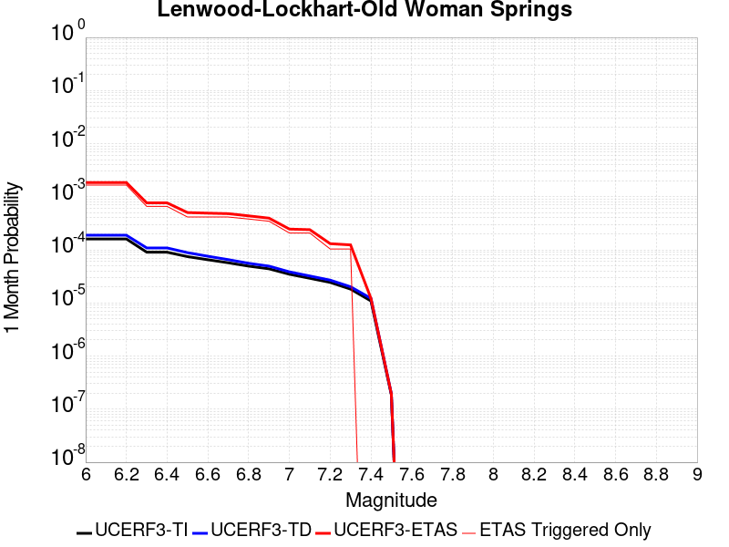 | 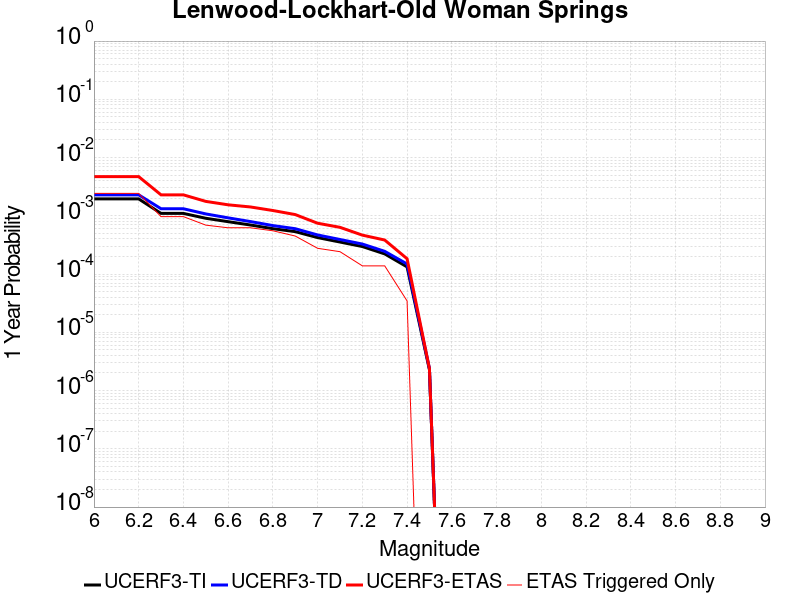 | 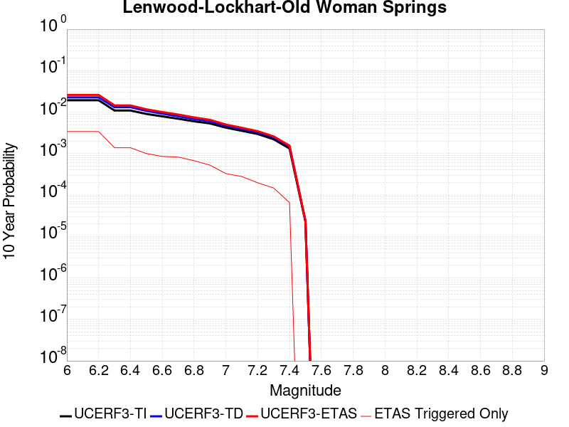 |

| Magnitude | 1 wk TI Prob | 1 wk TD Prob | 1 wk ETAS Prob | 1 wk ETAS/TD Gain | 1 wk ETAS Triggered Only | 1 mo TI Prob | 1 mo TD Prob | 1 mo ETAS Prob | 1 mo ETAS/TD Gain | 1 mo ETAS Triggered Only | 1 yr TI Prob | 1 yr TD Prob | 1 yr ETAS Prob | 1 yr ETAS/TD Gain | 1 yr ETAS Triggered Only | 10 yr TI Prob | 10 yr TD Prob | 10 yr ETAS Prob | 10 yr ETAS/TD Gain | 10 yr ETAS Triggered Only |
|-----|-----|-----|-----|-----|-----|-----|-----|-----|-----|-----|-----|-----|-----|-----|-----|-----|-----|-----|-----|-----|
| 6.0 | 3.744542E-5 | 4.396349E-5 | 0.0011165065 | 25.396221 | 0.0010725901 | 1.604705E-4 | 1.8840231E-4 | 0.0018488741 | 9.8134365 | 0.0016607847 | 0.0019519776 | 0.0022915571 | 0.0047079846 | 2.0544915 | 0.0024219777 | 0.019349206 | 0.022697281 | 0.026213976 | 1.1549389 | 0.0035983669 |
| 6.1 | 3.744542E-5 | 4.396349E-5 | 0.0011165065 | 25.396221 | 0.0010725901 | 1.604705E-4 | 1.8840231E-4 | 0.0018488741 | 9.8134365 | 0.0016607847 | 0.0019519776 | 0.0022915571 | 0.0047079846 | 2.0544915 | 0.0024219777 | 0.019349206 | 0.022697281 | 0.026213976 | 1.1549389 | 0.0035983669 |
| 6.2 | 3.744542E-5 | 4.396349E-5 | 0.0011165065 | 25.396221 | 0.0010725901 | 1.604705E-4 | 1.8840231E-4 | 0.0018488741 | 9.8134365 | 0.0016607847 | 0.0019519776 | 0.0022915571 | 0.0047079846 | 2.0544915 | 0.0024219777 | 0.019349206 | 0.022697281 | 0.026213976 | 1.1549389 | 0.0035983669 |
| 6.3 | 2.1079984E-5 | 2.5354384E-5 | 5.0973764E-4 | 20.104517 | 4.8439554E-4 | 9.0339665E-5 | 1.0865723E-4 | 7.6597976E-4 | 7.049505 | 6.5739395E-4 | 0.0010993304 | 0.0013221189 | 0.0022896293 | 1.7317876 | 9.687911E-4 | 0.010939079 | 0.013144747 | 0.014476397 | 1.1013067 | 0.0013493876 |
| 6.4 | 2.1079984E-5 | 2.5354384E-5 | 5.0973764E-4 | 20.104517 | 4.8439554E-4 | 9.0339665E-5 | 1.0865723E-4 | 7.6597976E-4 | 7.049505 | 6.5739395E-4 | 0.0010993304 | 0.0013221189 | 0.0022896293 | 1.7317876 | 9.687911E-4 | 0.010939079 | 0.013144747 | 0.014476397 | 1.1013067 | 0.0013493876 |
| 6.5 | 1.7397282E-5 | 2.0663285E-5 | 3.3205398E-4 | 16.069757 | 3.1139713E-4 | 7.455765E-5 | 8.8554E-5 | 5.037134E-4 | 5.688206 | 4.1519618E-4 | 9.073613E-4 | 0.0010776235 | 0.0017688713 | 1.6414559 | 6.919936E-4 | 0.009036654 | 0.010725273 | 0.011683674 | 1.089359 | 9.687911E-4 |
| 6.6 | 1.52050325E-5 | 1.7680086E-5 | 3.290717E-4 | 18.612564 | 3.1139713E-4 | 6.51628E-5 | 7.576964E-5 | 4.9093436E-4 | 6.479302 | 4.1519618E-4 | 7.9306826E-4 | 9.221128E-4 | 0.0015443328 | 1.6747764 | 6.2279426E-4 | 0.007902439 | 0.009183729 | 0.010040777 | 1.0933225 | 8.6499203E-4 |
| 6.7 | 1.332523E-5 | 1.5264379E-5 | 3.2665677E-4 | 21.399937 | 3.1139713E-4 | 5.7106878E-5 | 6.541716E-5 | 4.8058617E-4 | 7.3464847 | 4.1519618E-4 | 6.950544E-4 | 7.9616875E-4 | 0.0014184671 | 1.7816162 | 6.2279426E-4 | 0.006928845 | 0.0079337945 | 0.008757599 | 1.1038349 | 8.3039235E-4 |
| 6.8 | 1.1525329E-5 | 1.3031365E-5 | 3.2442444E-4 | 24.89566 | 3.1139713E-4 | 4.9393333E-5 | 5.5847537E-5 | 4.3642276E-4 | 7.8145394 | 3.805965E-4 | 6.011979E-4 | 6.7973585E-4 | 0.0012329544 | 1.8138729 | 5.535949E-4 | 0.00599574 | 0.0067770192 | 0.007464323 | 1.1014168 | 6.919936E-4 |
| 6.9 | 1.0253909E-5 | 1.1514835E-5 | 2.883091E-4 | 25.03806 | 2.7679745E-4 | 4.3944583E-5 | 4.934838E-5 | 3.9532813E-4 | 8.010964 | 3.459968E-4 | 5.3489394E-4 | 6.006545E-4 | 0.0010501802 | 1.748393 | 4.4979586E-4 | 0.0053360825 | 0.0059906896 | 0.0065753604 | 1.0975966 | 5.881946E-4 |
| 7.0 | 8.104563E-6 | 8.99143E-6 | 2.1658765E-4 | 24.08823 | 2.0759809E-4 | 3.4733377E-5 | 3.853415E-5 | 2.4612423E-4 | 6.387172 | 2.0759809E-4 | 4.2279682E-4 | 4.6905465E-4 | 7.4572227E-4 | 1.5898409 | 2.7679745E-4 | 0.0042199334 | 0.0046808943 | 0.0050597093 | 1.0809278 | 3.805965E-4 |
| 7.1 | 6.7986157E-6 | 7.5159796E-6 | 2.1511251E-4 | 28.620687 | 2.0759809E-4 | 2.91366E-5 | 3.2210955E-5 | 2.3980236E-4 | 7.444745 | 2.0759809E-4 | 3.5468035E-4 | 3.9209996E-4 | 6.342028E-4 | 1.6174518 | 2.4219777E-4 | 0.003541148 | 0.003914298 | 0.004224476 | 1.0792423 | 3.1139713E-4 |
| 7.2 | 5.6893327E-6 | 6.280132E-6 | 1.1007852E-4 | 17.528059 | 1.03799044E-4 | 2.4382627E-5 | 2.6914584E-5 | 1.3071083E-4 | 4.856506 | 1.03799044E-4 | 2.9681803E-4 | 3.276378E-4 | 4.6599118E-4 | 1.4222754 | 1.3839873E-4 | 0.002964219 | 0.003271746 | 0.0034441785 | 1.0527035 | 1.729984E-4 |
| 7.3 | 4.253348E-6 | 4.707075E-6 | 1.0850563E-4 | 23.051605 | 1.03799044E-4 | 1.8228506E-5 | 2.017303E-5 | 1.2396998E-4 | 6.1453323 | 1.03799044E-4 | 2.2190946E-4 | 2.455808E-4 | 3.8394556E-4 | 1.5634184 | 1.3839873E-4 | 0.00221688 | 0.0024532753 | 0.002625849 | 1.0703443 | 1.729984E-4 |
| 7.4 | 2.5448119E-6 | 2.8520594E-6 | 2.8520594E-6 | 1.0 | 0.0 | 1.0906291E-5 | 1.2223064E-5 | 1.2223064E-5 | 1.0 | 0.0 | 1.3277601E-4 | 1.4880729E-4 | 1.8340183E-4 | 1.2324787 | 3.459968E-5 | 0.001326967 | 0.0014872387 | 0.0015217869 | 1.0232297 | 3.459968E-5 |
| 7.5 | 4.3706837E-8 | 4.562909E-8 | 4.562909E-8 | 1.0 | 0.0 | 1.8731501E-7 | 1.9555324E-7 | 1.9555324E-7 | 1.0 | 0.0 | 2.2805577E-6 | 2.3808586E-6 | 2.3808586E-6 | 1.0 | 0.0 | 2.2805343E-5 | 2.3808387E-5 | 2.3808387E-5 | 1.0 | 0.0 |

## Towne Pass
*[(top)](#table-of-contents)*

| 1 Week | 1 Month | 1 Year | 10 Year |
|-----|-----|-----|-----|
| 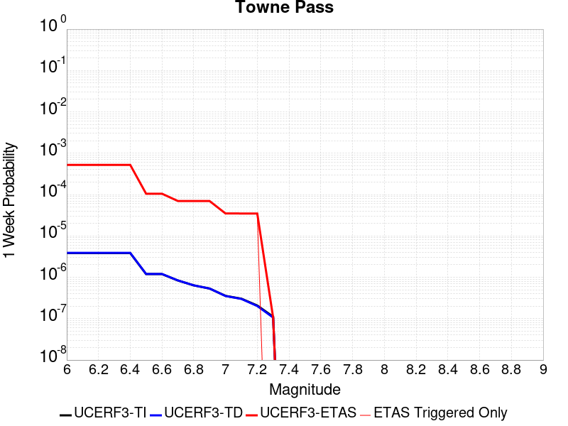 | 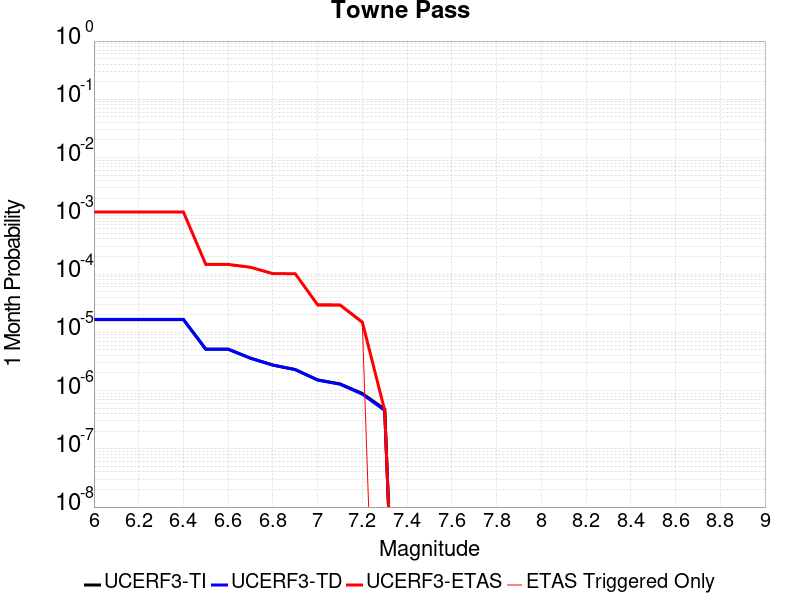 | 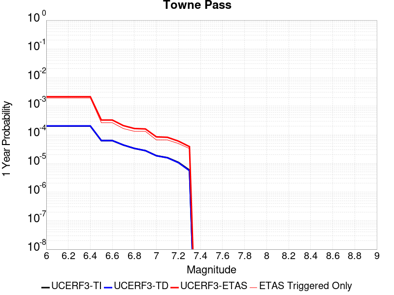 | 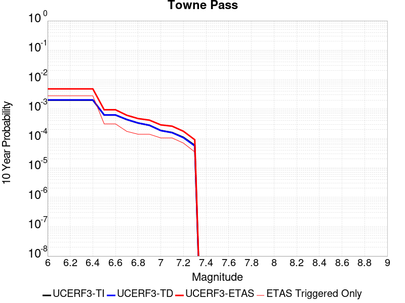 |

| Magnitude | 1 wk TI Prob | 1 wk TD Prob | 1 wk ETAS Prob | 1 wk ETAS/TD Gain | 1 wk ETAS Triggered Only | 1 mo TI Prob | 1 mo TD Prob | 1 mo ETAS Prob | 1 mo ETAS/TD Gain | 1 mo ETAS Triggered Only | 1 yr TI Prob | 1 yr TD Prob | 1 yr ETAS Prob | 1 yr ETAS/TD Gain | 1 yr ETAS Triggered Only | 10 yr TI Prob | 10 yr TD Prob | 10 yr ETAS Prob | 10 yr ETAS/TD Gain | 10 yr ETAS Triggered Only |
|-----|-----|-----|-----|-----|-----|-----|-----|-----|-----|-----|-----|-----|-----|-----|-----|-----|-----|-----|-----|-----|
| 6.0 | 3.849728E-6 | 3.894542E-6 | 5.2288774E-4 | 134.26167 | 5.189952E-4 | 1.649873E-5 | 1.6690812E-5 | 7.778711E-4 | 46.604748 | 7.61193E-4 | 2.0085352E-4 | 2.0319606E-4 | 0.0020020138 | 9.852622 | 0.0017991834 | 0.0020067208 | 0.0020305319 | 0.004827415 | 2.3774142 | 0.0028025743 |
| 6.1 | 3.849728E-6 | 3.894542E-6 | 5.2288774E-4 | 134.26167 | 5.189952E-4 | 1.649873E-5 | 1.6690812E-5 | 7.778711E-4 | 46.604748 | 7.61193E-4 | 2.0085352E-4 | 2.0319606E-4 | 0.0020020138 | 9.852622 | 0.0017991834 | 0.0020067208 | 0.0020305319 | 0.004827415 | 2.3774142 | 0.0028025743 |
| 6.2 | 3.849728E-6 | 3.894542E-6 | 5.2288774E-4 | 134.26167 | 5.189952E-4 | 1.649873E-5 | 1.6690812E-5 | 7.778711E-4 | 46.604748 | 7.61193E-4 | 2.0085352E-4 | 2.0319606E-4 | 0.0020020138 | 9.852622 | 0.0017991834 | 0.0020067208 | 0.0020305319 | 0.004827415 | 2.3774142 | 0.0028025743 |
| 6.3 | 3.849728E-6 | 3.894542E-6 | 5.2288774E-4 | 134.26167 | 5.189952E-4 | 1.649873E-5 | 1.6690812E-5 | 7.778711E-4 | 46.604748 | 7.61193E-4 | 2.0085352E-4 | 2.0319606E-4 | 0.0020020138 | 9.852622 | 0.0017991834 | 0.0020067208 | 0.0020305319 | 0.004827415 | 2.3774142 | 0.0028025743 |
| 6.4 | 3.849728E-6 | 3.894542E-6 | 5.2288774E-4 | 134.26167 | 5.189952E-4 | 1.649873E-5 | 1.6690812E-5 | 7.778711E-4 | 46.604748 | 7.61193E-4 | 2.0085352E-4 | 2.0319606E-4 | 0.0020020138 | 9.852622 | 0.0017991834 | 0.0020067208 | 0.0020305319 | 0.004827415 | 2.3774142 | 0.0028025743 |
| 6.5 | 1.1953545E-6 | 1.2030526E-6 | 1.0500197E-4 | 87.27962 | 1.03799044E-4 | 5.1229376E-6 | 5.15593E-6 | 1.4355395E-4 | 27.842491 | 1.3839873E-4 | 6.236998E-5 | 6.277176E-5 | 3.3955183E-4 | 5.409309 | 2.7679745E-4 | 6.235248E-4 | 6.2755204E-4 | 9.387537E-4 | 1.4958979 | 3.1139713E-4 |
| 6.6 | 1.1953545E-6 | 1.2030526E-6 | 1.0500197E-4 | 87.27962 | 1.03799044E-4 | 5.1229376E-6 | 5.15593E-6 | 1.4355395E-4 | 27.842491 | 1.3839873E-4 | 6.236998E-5 | 6.277176E-5 | 3.3955183E-4 | 5.409309 | 2.7679745E-4 | 6.235248E-4 | 6.2755204E-4 | 9.387537E-4 | 1.4958979 | 3.1139713E-4 |
| 6.7 | 8.375951E-7 | 8.410676E-7 | 7.0040376E-5 | 83.27556 | 6.919936E-5 | 3.5896885E-6 | 3.6045708E-6 | 1.0740324E-4 | 29.796402 | 1.03799044E-4 | 4.370358E-5 | 4.3884826E-5 | 2.1687565E-4 | 4.941928 | 1.729984E-4 | 4.3694986E-4 | 4.3876728E-4 | 6.116898E-4 | 1.3941098 | 1.729984E-4 |
| 6.8 | 6.38041E-7 | 6.3921624E-7 | 6.9838534E-5 | 109.256516 | 6.919936E-5 | 2.7344586E-6 | 2.7394954E-6 | 1.0653825E-4 | 38.889736 | 1.03799044E-4 | 3.3291526E-5 | 3.3352884E-5 | 1.71747E-4 | 5.1493893 | 1.3839873E-4 | 3.3286537E-4 | 3.334826E-4 | 4.7183517E-4 | 1.4148719 | 1.3839873E-4 |
| 6.9 | 5.3460053E-7 | 5.345339E-7 | 6.973386E-5 | 130.45732 | 6.919936E-5 | 2.2911431E-6 | 2.2908578E-6 | 1.0608967E-4 | 46.31002 | 1.03799044E-4 | 2.789431E-5 | 2.7890868E-5 | 1.6628574E-4 | 5.9620132 | 1.3839873E-4 | 2.789081E-4 | 2.78877E-4 | 4.1723714E-4 | 1.4961332 | 1.3839873E-4 |
| 7.0 | 3.557783E-7 | 3.5324283E-7 | 3.495291E-5 | 98.94868 | 3.459968E-5 | 1.5247632E-6 | 1.513897E-6 | 7.0713155E-5 | 46.709354 | 6.919936E-5 | 1.8563835E-5 | 1.8431549E-5 | 1.2222868E-4 | 6.6314926 | 1.03799044E-4 | 1.8562283E-4 | 1.8430105E-4 | 2.8808098E-4 | 1.5631 | 1.03799044E-4 |
| 7.1 | 3.037942E-7 | 3.0002275E-7 | 3.4899695E-5 | 116.32349 | 3.459968E-5 | 1.3019744E-6 | 1.2858112E-6 | 7.048508E-5 | 54.8176 | 6.919936E-5 | 1.5851423E-5 | 1.5654647E-5 | 1.1945207E-4 | 7.630454 | 1.03799044E-4 | 1.5850292E-4 | 1.5653619E-4 | 2.6031898E-4 | 1.6629956 | 1.03799044E-4 |
| 7.2 | 2.0808248E-7 | 2.0217735E-7 | 3.480185E-5 | 172.13527 | 3.459968E-5 | 8.917818E-7 | 8.6647407E-7 | 3.5466124E-5 | 40.93155 | 3.459968E-5 | 1.0857389E-5 | 1.0549275E-5 | 7.974791E-5 | 7.5595627 | 6.919936E-5 | 1.0856859E-4 | 1.0548821E-4 | 1.7468027E-4 | 1.6559223 | 6.919936E-5 |
| 7.3 | 1.1162073E-7 | 1.0636902E-7 | 1.0636902E-7 | 1.0 | 0.0 | 4.7837443E-7 | 4.5586717E-7 | 4.5586717E-7 | 1.0 | 0.0 | 5.8241935E-6 | 5.5501705E-6 | 4.014966E-5 | 7.2339506 | 3.459968E-5 | 5.8240406E-5 | 5.550052E-5 | 9.0098285E-5 | 1.6233772 | 3.459968E-5 |

## San Andreas (San Bernardino N)
*[(top)](#table-of-contents)*

| 1 Week | 1 Month | 1 Year | 10 Year |
|-----|-----|-----|-----|
| 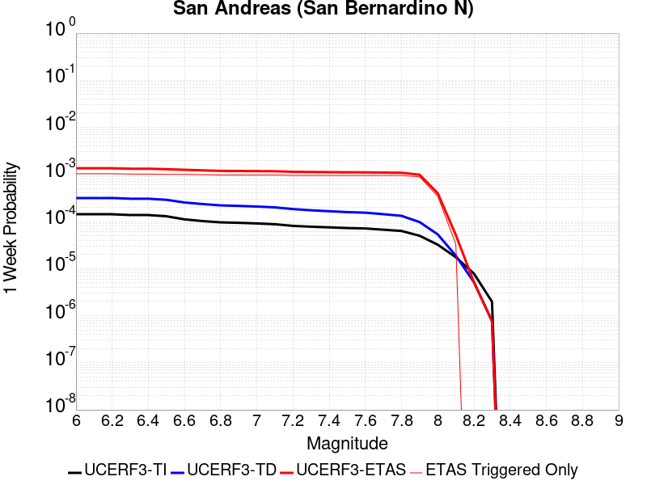 | 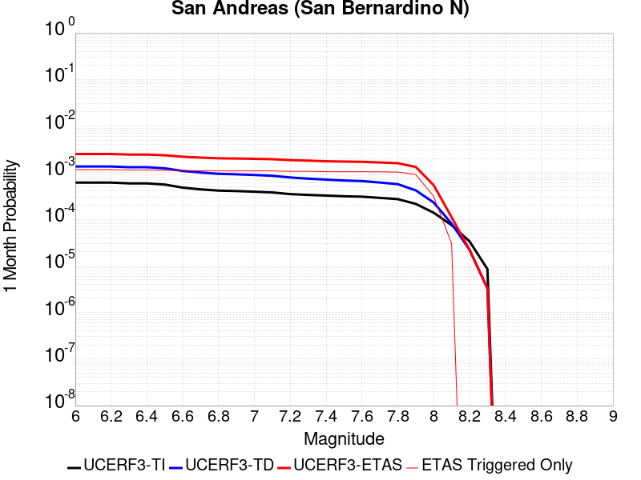 | 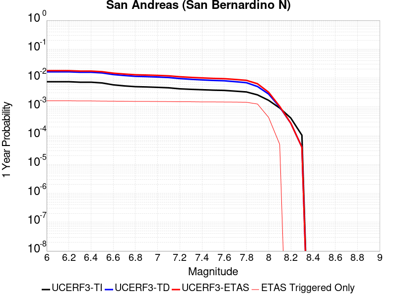 | 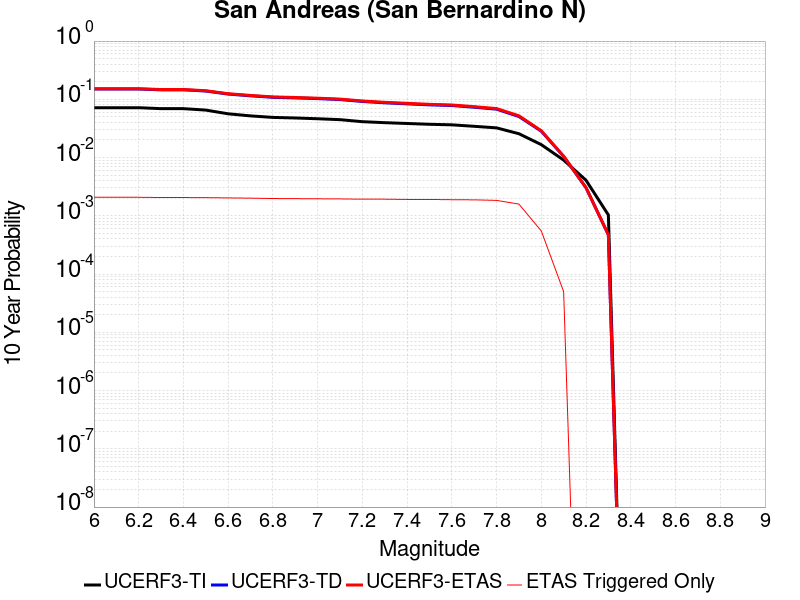 |

| Magnitude | 1 wk TI Prob | 1 wk TD Prob | 1 wk ETAS Prob | 1 wk ETAS/TD Gain | 1 wk ETAS Triggered Only | 1 mo TI Prob | 1 mo TD Prob | 1 mo ETAS Prob | 1 mo ETAS/TD Gain | 1 mo ETAS Triggered Only | 1 yr TI Prob | 1 yr TD Prob | 1 yr ETAS Prob | 1 yr ETAS/TD Gain | 1 yr ETAS Triggered Only | 10 yr TI Prob | 10 yr TD Prob | 10 yr ETAS Prob | 10 yr ETAS/TD Gain | 10 yr ETAS Triggered Only |
|-----|-----|-----|-----|-----|-----|-----|-----|-----|-----|-----|-----|-----|-----|-----|-----|-----|-----|-----|-----|-----|
| 6.0 | 1.4273766E-4 | 3.160784E-4 | 0.0012845633 | 4.0640655 | 9.687911E-4 | 6.115894E-4 | 0.0013539245 | 0.0023905095 | 1.7656151 | 0.0010379904 | 0.0074207084 | 0.016360939 | 0.017858418 | 1.0915277 | 0.001522386 | 0.07177748 | 0.15021163 | 0.15209338 | 1.0125273 | 0.0022143796 |
| 6.1 | 1.4273766E-4 | 3.160784E-4 | 0.0012845633 | 4.0640655 | 9.687911E-4 | 6.115894E-4 | 0.0013539245 | 0.0023905095 | 1.7656151 | 0.0010379904 | 0.0074207084 | 0.016360939 | 0.017858418 | 1.0915277 | 0.001522386 | 0.07177748 | 0.15021163 | 0.15209338 | 1.0125273 | 0.0022143796 |
| 6.2 | 1.4273766E-4 | 3.160784E-4 | 0.0012845633 | 4.0640655 | 9.687911E-4 | 6.115894E-4 | 0.0013539245 | 0.0023905095 | 1.7656151 | 0.0010379904 | 0.0074207084 | 0.016360939 | 0.017858418 | 1.0915277 | 0.001522386 | 0.07177748 | 0.15021163 | 0.15209338 | 1.0125273 | 0.0022143796 |
| 6.3 | 1.3730655E-4 | 3.0512668E-4 | 0.0012390331 | 4.0607166 | 9.341914E-4 | 5.883239E-4 | 0.001307036 | 0.0023091154 | 1.7666807 | 0.0010033908 | 0.0071393442 | 0.015798455 | 0.017262736 | 1.0926851 | 0.0014877863 | 0.06914291 | 0.1455135 | 0.1473761 | 1.0128001 | 0.00217978 |
| 6.4 | 1.3730655E-4 | 3.0512668E-4 | 0.0012390331 | 4.0607166 | 9.341914E-4 | 5.883239E-4 | 0.001307036 | 0.0023091154 | 1.7666807 | 0.0010033908 | 0.0071393442 | 0.015798455 | 0.017262736 | 1.0926851 | 0.0014877863 | 0.06914291 | 0.1455135 | 0.1473761 | 1.0128001 | 0.00217978 |
| 6.5 | 1.2942807E-4 | 2.8927144E-4 | 0.001188603 | 4.1089535 | 8.995917E-4 | 5.545738E-4 | 0.0012391509 | 0.0022067416 | 1.7808497 | 9.687911E-4 | 0.0067310524 | 0.014983548 | 0.01641496 | 1.0955323 | 0.0014531866 | 0.06530788 | 0.13865088 | 0.14052843 | 1.0135416 | 0.00217978 |
| 6.6 | 1.1125901E-4 | 2.5365927E-4 | 0.0011530227 | 4.5455575 | 8.995917E-4 | 4.767372E-4 | 0.0010866605 | 0.0020543989 | 1.8905618 | 9.687911E-4 | 0.005788839 | 0.0131504685 | 0.014584545 | 1.1090513 | 0.0014531866 | 0.056403454 | 0.12300496 | 0.12491661 | 1.0155413 | 0.00217978 |
| 6.7 | 1.02209575E-4 | 2.3500937E-4 | 0.0010997981 | 4.6798053 | 8.6499203E-4 | 4.3796748E-4 | 0.0010067957 | 0.0019400466 | 1.9269516 | 9.341914E-4 | 0.0053192247 | 0.012189267 | 0.013590562 | 1.1149614 | 0.0014185869 | 0.051936906 | 0.114792764 | 0.11669169 | 1.0165422 | 0.0021451802 |
| 6.8 | 9.610582E-5 | 2.2026796E-4 | 0.0010504774 | 4.7690887 | 8.3039235E-4 | 4.1181705E-4 | 9.436647E-4 | 0.0018424075 | 1.9523964 | 8.995917E-4 | 0.0050023515 | 0.011428859 | 0.012797029 | 1.1197119 | 0.0013839873 | 0.048912346 | 0.10820469 | 0.110086896 | 1.0173949 | 0.0021105807 |
| 6.9 | 9.3877505E-5 | 2.1482339E-4 | 0.0010450374 | 4.864635 | 8.3039235E-4 | 4.0227012E-4 | 9.203475E-4 | 0.0018191113 | 1.9765483 | 8.995917E-4 | 0.0048866454 | 0.011147907 | 0.012516466 | 1.1227638 | 0.0013839873 | 0.04780577 | 0.105798274 | 0.107654616 | 1.017546 | 0.0020759809 |
| 7.0 | 9.1019785E-5 | 2.0809306E-4 | 0.0010383126 | 4.989655 | 8.3039235E-4 | 3.900265E-4 | 8.915232E-4 | 0.0017903129 | 2.0081506 | 8.995917E-4 | 0.0047382377 | 0.0108004995 | 0.012169539 | 1.126757 | 0.0013839873 | 0.046384744 | 0.10276815 | 0.10463079 | 1.0181247 | 0.0020759809 |
| 7.1 | 8.771155E-5 | 1.9983841E-4 | 0.0010300648 | 5.1544886 | 8.3039235E-4 | 3.758525E-4 | 8.5616973E-4 | 0.0017549912 | 2.049817 | 8.995917E-4 | 0.0045664064 | 0.010374243 | 0.011709631 | 1.1287216 | 0.0013493876 | 0.044737056 | 0.09907644 | 0.100915566 | 1.0185627 | 0.0020413813 |
| 7.2 | 8.0830236E-5 | 1.8389444E-4 | 0.0010141341 | 5.5147624 | 8.3039235E-4 | 3.4636928E-4 | 7.8788114E-4 | 0.0016867641 | 2.1408865 | 8.995917E-4 | 0.0042088944 | 0.009550368 | 0.010886869 | 1.1399423 | 0.0013493876 | 0.041300658 | 0.09180518 | 0.093659155 | 1.0201946 | 0.0020413813 |
| 7.3 | 7.7668235E-5 | 1.7333007E-4 | 0.0010035785 | 5.7899847 | 8.3039235E-4 | 3.328214E-4 | 7.426318E-4 | 0.0016415555 | 2.2104568 | 8.995917E-4 | 0.0040445733 | 0.009004138 | 0.010341376 | 1.1485137 | 0.0013493876 | 0.03971748 | 0.08706761 | 0.088931255 | 1.0214045 | 0.0020413813 |
| 7.4 | 7.520177E-5 | 1.655312E-4 | 9.95786E-4 | 6.015701 | 8.3039235E-4 | 3.2225347E-4 | 7.092266E-4 | 0.0016081802 | 2.2675128 | 8.995917E-4 | 0.0039163795 | 0.008600714 | 0.009938495 | 1.1555431 | 0.0013493876 | 0.038480744 | 0.08352157 | 0.085392445 | 1.0224 | 0.0020413813 |
| 7.5 | 7.274697E-5 | 1.584075E-4 | 9.886683E-4 | 6.2412972 | 8.3039235E-4 | 3.1173544E-4 | 6.7871273E-4 | 0.0015776939 | 2.3245385 | 8.995917E-4 | 0.003788775 | 0.008232076 | 0.0095703555 | 1.1625689 | 0.0013493876 | 0.03724827 | 0.08023654 | 0.08211413 | 1.0234007 | 0.0020413813 |
| 7.6 | 7.1185845E-5 | 1.5410586E-4 | 9.843702E-4 | 6.387624 | 8.3039235E-4 | 3.0504653E-4 | 6.602866E-4 | 0.0015592843 | 2.3615267 | 8.995917E-4 | 0.0037076178 | 0.0080094095 | 0.009347989 | 1.1671259 | 0.0013493876 | 0.036463667 | 0.07822661 | 0.08010831 | 1.0240544 | 0.0020413813 |
| 7.7 | 6.709961E-5 | 1.4319421E-4 | 9.7346766E-4 | 6.7982335 | 8.3039235E-4 | 2.8753807E-4 | 6.135452E-4 | 0.001512585 | 2.4653196 | 8.995917E-4 | 0.003495157 | 0.0074443663 | 0.008783708 | 1.1799135 | 0.0013493876 | 0.034406938 | 0.07305558 | 0.07494783 | 1.0259014 | 0.0020413813 |
| 7.8 | 6.300812E-5 | 1.320343E-4 | 9.6231705E-4 | 7.2883863 | 8.3039235E-4 | 2.7000686E-4 | 5.657386E-4 | 0.0014648214 | 2.5892193 | 8.995917E-4 | 0.0032823787 | 0.006866143 | 0.008206266 | 1.1951784 | 0.0013493876 | 0.032343175 | 0.06771385 | 0.069616996 | 1.0281057 | 0.0020413813 |
| 7.9 | 4.983037E-5 | 9.7241085E-5 | 8.929564E-4 | 9.182913 | 7.957927E-4 | 2.1354125E-4 | 4.1668097E-4 | 0.0012467273 | 2.992043 | 8.3039235E-4 | 0.0025967648 | 0.0050613005 | 0.0062317355 | 1.2312518 | 0.0011763892 | 0.025666296 | 0.050650507 | 0.05229287 | 1.0324253 | 0.0017299841 |
| 8.0 | 3.2211527E-5 | 5.3306234E-5 | 3.6468677E-4 | 6.8413534 | 3.1139713E-4 | 1.380421E-4 | 2.2843528E-4 | 5.3976127E-4 | 2.362863 | 3.1139713E-4 | 0.0016793669 | 0.0027776542 | 0.0032262008 | 1.1614839 | 4.4979586E-4 | 0.016667323 | 0.028362568 | 0.028967699 | 1.0213355 | 6.2279426E-4 |
| 8.1 | 1.743376E-5 | 1.8823403E-5 | 8.8021465E-5 | 4.676172 | 6.919936E-5 | 7.471398E-5 | 8.066923E-5 | 1.4986302E-4 | 1.8577468 | 6.919936E-5 | 9.0926304E-4 | 9.81706E-4 | 0.0011199688 | 1.1408393 | 1.3839873E-4 | 0.009055517 | 0.010483979 | 0.010620927 | 1.0130626 | 1.3839873E-4 |
| 8.2 | 7.831616E-6 | 5.1540533E-6 | 5.1540533E-6 | 1.0 | 0.0 | 3.3563636E-5 | 2.2088612E-5 | 2.2088612E-5 | 1.0 | 0.0 | 4.0856065E-4 | 2.6889573E-4 | 2.6889573E-4 | 1.0 | 0.0 | 0.004078103 | 0.0030413668 | 0.0030413668 | 1.0 | 0.0 |
| 8.3 | 1.983087E-6 | 7.6564595E-7 | 7.6564595E-7 | 1.0 | 0.0 | 8.498917E-6 | 3.281336E-6 | 3.281336E-6 | 1.0 | 0.0 | 1.034694E-4 | 3.9949547E-5 | 3.9949547E-5 | 1.0 | 0.0 | 0.0010342124 | 4.717979E-4 | 4.717979E-4 | 1.0 | 0.0 |

## Bicycle Lake
*[(top)](#table-of-contents)*

| 1 Week | 1 Month | 1 Year | 10 Year |
|-----|-----|-----|-----|
| 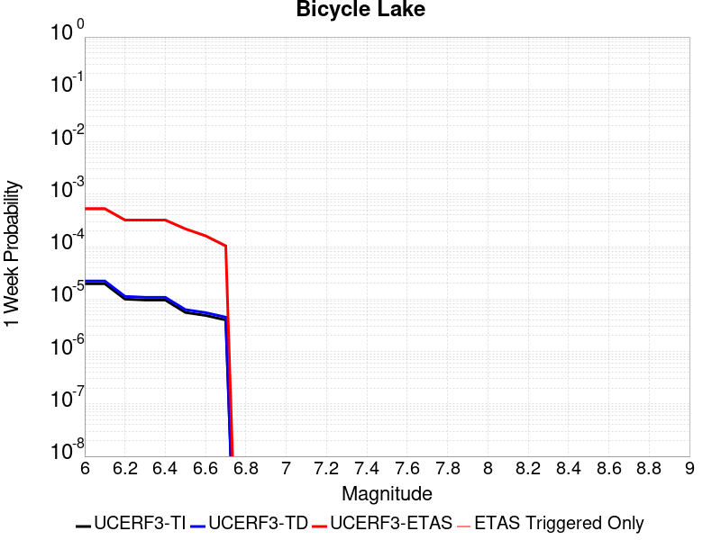 | 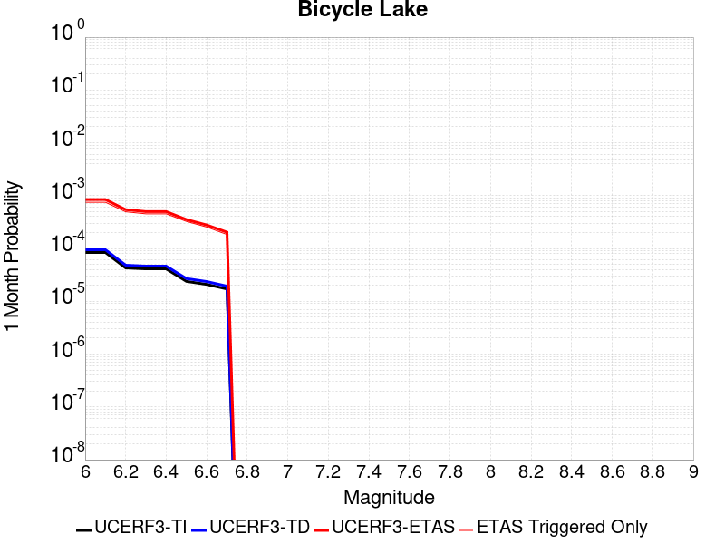 | 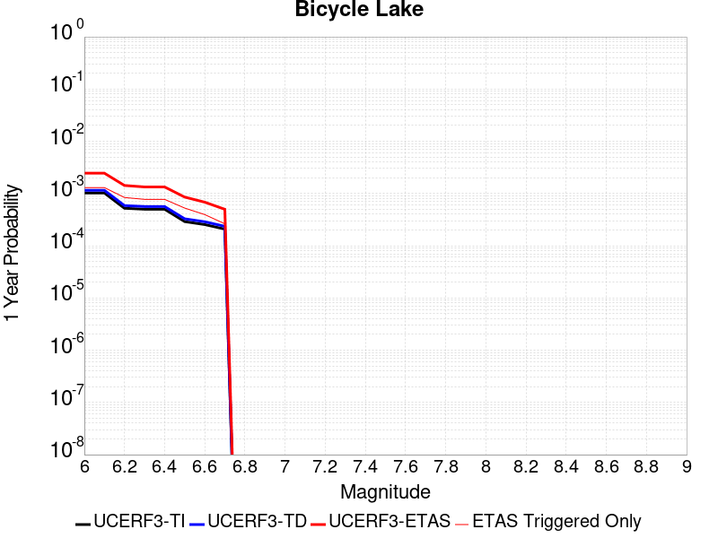 | 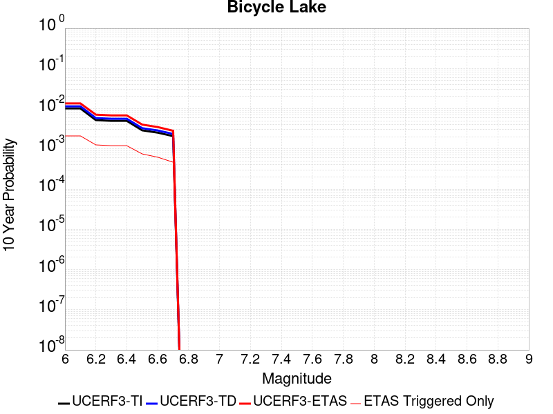 |

| Magnitude | 1 wk TI Prob | 1 wk TD Prob | 1 wk ETAS Prob | 1 wk ETAS/TD Gain | 1 wk ETAS Triggered Only | 1 mo TI Prob | 1 mo TD Prob | 1 mo ETAS Prob | 1 mo ETAS/TD Gain | 1 mo ETAS Triggered Only | 1 yr TI Prob | 1 yr TD Prob | 1 yr ETAS Prob | 1 yr ETAS/TD Gain | 1 yr ETAS Triggered Only | 10 yr TI Prob | 10 yr TD Prob | 10 yr ETAS Prob | 10 yr ETAS/TD Gain | 10 yr ETAS Triggered Only |
|-----|-----|-----|-----|-----|-----|-----|-----|-----|-----|-----|-----|-----|-----|-----|-----|-----|-----|-----|-----|-----|
| 6.0 | 1.9621975E-5 | 2.2097078E-5 | 5.064819E-4 | 22.920765 | 4.8439554E-4 | 8.4091465E-5 | 9.4699084E-5 | 9.250128E-4 | 9.767917 | 8.3039235E-4 | 0.0010233327 | 0.0011524865 | 0.0024657592 | 2.1395123 | 0.0013147879 | 0.01018633 | 0.011478408 | 0.013735776 | 1.1966621 | 0.002283579 |
| 6.1 | 1.9621975E-5 | 2.2097078E-5 | 5.064819E-4 | 22.920765 | 4.8439554E-4 | 8.4091465E-5 | 9.4699084E-5 | 9.250128E-4 | 9.767917 | 8.3039235E-4 | 0.0010233327 | 0.0011524865 | 0.0024657592 | 2.1395123 | 0.0013147879 | 0.01018633 | 0.011478408 | 0.013735776 | 1.1966621 | 0.002283579 |
| 6.2 | 9.9971285E-6 | 1.125564E-5 | 3.2264926E-4 | 28.665565 | 3.1139713E-4 | 4.2844134E-5 | 4.8237856E-5 | 6.0180604E-4 | 12.475804 | 5.535949E-4 | 5.2150246E-4 | 5.871897E-4 | 0.0014516738 | 2.47224 | 8.6499203E-4 | 0.0052028033 | 0.005861487 | 0.0072373617 | 1.2347314 | 0.0013839873 |
| 6.3 | 9.589428E-6 | 1.0798346E-5 | 3.2219212E-4 | 29.837173 | 3.1139713E-4 | 4.10969E-5 | 4.62781E-5 | 5.3065125E-4 | 11.466574 | 4.8439554E-4 | 5.002399E-4 | 5.6334207E-4 | 0.0013241062 | 2.3504481 | 7.61193E-4 | 0.0049911533 | 0.0056242296 | 0.0068972176 | 1.22634 | 0.0012801882 |
| 6.4 | 9.589428E-6 | 1.0798346E-5 | 3.2219212E-4 | 29.837173 | 3.1139713E-4 | 4.10969E-5 | 4.62781E-5 | 5.3065125E-4 | 11.466574 | 4.8439554E-4 | 5.002399E-4 | 5.6334207E-4 | 0.0013241062 | 2.3504481 | 7.61193E-4 | 0.0049911533 | 0.0056242296 | 0.0068972176 | 1.22634 | 0.0012801882 |
| 6.5 | 5.557707E-6 | 6.2856016E-6 | 2.1388239E-4 | 34.027355 | 2.0759809E-4 | 2.3818526E-5 | 2.6938165E-5 | 3.7292566E-4 | 13.843766 | 3.459968E-4 | 2.8995197E-4 | 3.279497E-4 | 9.159514E-4 | 2.792963 | 5.881946E-4 | 0.0028957394 | 0.0032772934 | 0.0040359916 | 1.2315015 | 7.61193E-4 |
| 6.6 | 4.8742945E-6 | 5.5132896E-6 | 1.7851075E-4 | 32.37826 | 1.729984E-4 | 2.0889667E-5 | 2.3628318E-5 | 3.0041923E-4 | 12.714372 | 2.7679745E-4 | 2.54302E-4 | 2.87663E-4 | 7.373295E-4 | 2.5631711 | 4.4979586E-4 | 0.002540112 | 0.0028754752 | 0.0034964788 | 1.2159655 | 6.2279426E-4 |
| 6.7 | 3.991108E-6 | 4.5159104E-6 | 7.371496E-5 | 16.32339 | 6.919936E-5 | 1.7104636E-5 | 1.9353902E-5 | 1.9234896E-4 | 9.938511 | 1.729984E-4 | 2.0822904E-4 | 2.3563375E-4 | 5.12366E-4 | 2.1744168 | 2.7679745E-4 | 0.0020803404 | 0.0023563374 | 0.0027360371 | 1.1611397 | 3.805965E-4 |

## Garlic Springs
*[(top)](#table-of-contents)*

| 1 Week | 1 Month | 1 Year | 10 Year |
|-----|-----|-----|-----|
| 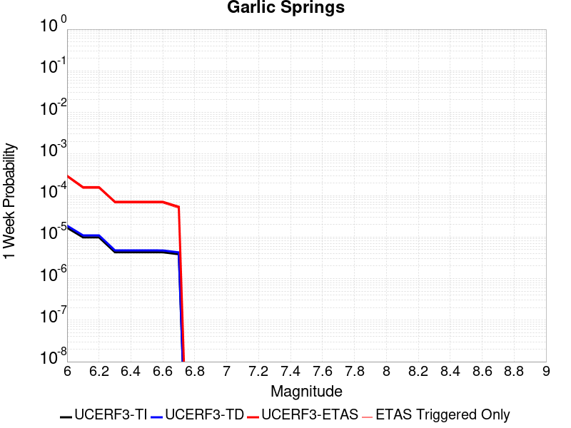 | 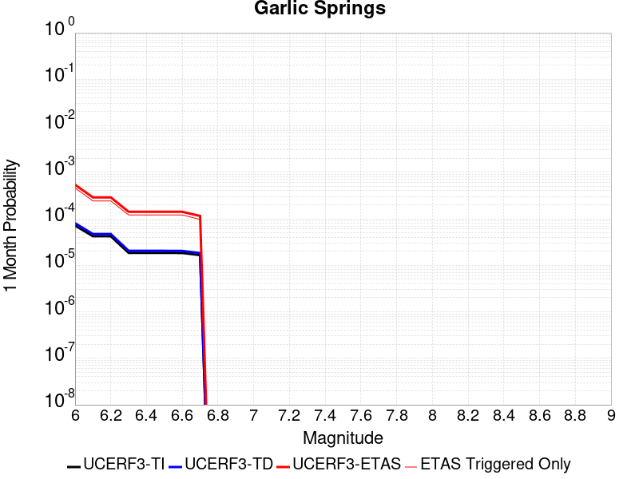 | 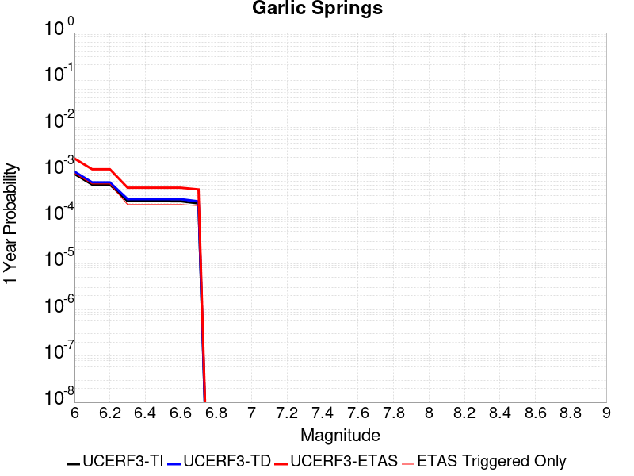 | 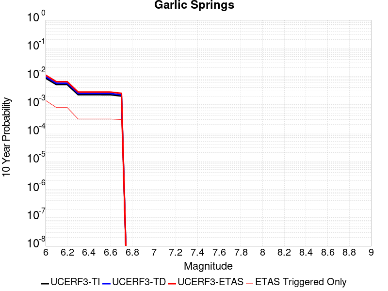 |

| Magnitude | 1 wk TI Prob | 1 wk TD Prob | 1 wk ETAS Prob | 1 wk ETAS/TD Gain | 1 wk ETAS Triggered Only | 1 mo TI Prob | 1 mo TD Prob | 1 mo ETAS Prob | 1 mo ETAS/TD Gain | 1 mo ETAS Triggered Only | 1 yr TI Prob | 1 yr TD Prob | 1 yr ETAS Prob | 1 yr ETAS/TD Gain | 1 yr ETAS Triggered Only | 10 yr TI Prob | 10 yr TD Prob | 10 yr ETAS Prob | 10 yr ETAS/TD Gain | 10 yr ETAS Triggered Only |
|-----|-----|-----|-----|-----|-----|-----|-----|-----|-----|-----|-----|-----|-----|-----|-----|-----|-----|-----|-----|-----|
| 6.0 | 1.6760017E-5 | 1.8776833E-5 | 2.955691E-4 | 15.7411585 | 2.7679745E-4 | 7.182667E-5 | 8.0470316E-5 | 4.610362E-4 | 5.72927 | 3.805965E-4 | 8.7413884E-4 | 9.794032E-4 | 0.0018781138 | 1.9176105 | 8.995917E-4 | 0.008707083 | 0.009762413 | 0.011304199 | 1.1579309 | 0.0015569857 |
| 6.1 | 9.852767E-6 | 1.0973587E-5 | 1.14771494E-4 | 10.458886 | 1.03799044E-4 | 4.222546E-5 | 4.702921E-5 | 2.2001949E-4 | 4.678358 | 1.729984E-4 | 5.139737E-4 | 5.7250116E-4 | 0.0010911992 | 1.906021 | 5.189952E-4 | 0.005127866 | 0.005717221 | 0.0065084645 | 1.1383964 | 7.957927E-4 |
| 6.2 | 9.852767E-6 | 1.0973587E-5 | 1.14771494E-4 | 10.458886 | 1.03799044E-4 | 4.222546E-5 | 4.702921E-5 | 2.2001949E-4 | 4.678358 | 1.729984E-4 | 5.139737E-4 | 5.7250116E-4 | 0.0010911992 | 1.906021 | 5.189952E-4 | 0.005127866 | 0.005717221 | 0.0065084645 | 1.1383964 | 7.957927E-4 |
| 6.3 | 4.3167724E-6 | 4.7780286E-6 | 7.397706E-5 | 15.4827585 | 6.919936E-5 | 1.8500323E-5 | 2.0477235E-5 | 1.2427416E-4 | 6.0688934 | 1.03799044E-4 | 2.2521814E-4 | 2.4930484E-4 | 4.5685118E-4 | 1.8325002 | 2.0759809E-4 | 0.0022499003 | 0.00249251 | 0.0028721578 | 1.1523155 | 3.805965E-4 |
| 6.4 | 4.3167724E-6 | 4.7780286E-6 | 7.397706E-5 | 15.4827585 | 6.919936E-5 | 1.8500323E-5 | 2.0477235E-5 | 1.2427416E-4 | 6.0688934 | 1.03799044E-4 | 2.2521814E-4 | 2.4930484E-4 | 4.5685118E-4 | 1.8325002 | 2.0759809E-4 | 0.0022499003 | 0.00249251 | 0.0028721578 | 1.1523155 | 3.805965E-4 |
| 6.5 | 4.3167724E-6 | 4.7780286E-6 | 7.397706E-5 | 15.4827585 | 6.919936E-5 | 1.8500323E-5 | 2.0477235E-5 | 1.2427416E-4 | 6.0688934 | 1.03799044E-4 | 2.2521814E-4 | 2.4930484E-4 | 4.5685118E-4 | 1.8325002 | 2.0759809E-4 | 0.0022499003 | 0.00249251 | 0.0028721578 | 1.1523155 | 3.805965E-4 |
| 6.6 | 4.301311E-6 | 4.760897E-6 | 7.3959935E-5 | 15.534873 | 6.919936E-5 | 1.8434059E-5 | 2.0403815E-5 | 1.2420074E-4 | 6.0871334 | 1.03799044E-4 | 2.2441156E-4 | 2.4841115E-4 | 4.5595766E-4 | 1.835496 | 2.0759809E-4 | 0.0022418506 | 0.002483593 | 0.0028632444 | 1.1528637 | 3.805965E-4 |
| 6.7 | 3.8599724E-6 | 4.27106E-6 | 7.3470124E-5 | 17.201849 | 6.919936E-5 | 1.6542634E-5 | 1.8304541E-5 | 1.2210169E-4 | 6.6705675 | 1.03799044E-4 | 2.0138794E-4 | 2.228578E-4 | 4.3040962E-4 | 1.9313196 | 2.0759809E-4 | 0.0020120554 | 0.002228578 | 0.0026083263 | 1.1703994 | 3.805965E-4 |

## Paradise
*[(top)](#table-of-contents)*

| 1 Week | 1 Month | 1 Year | 10 Year |
|-----|-----|-----|-----|
| 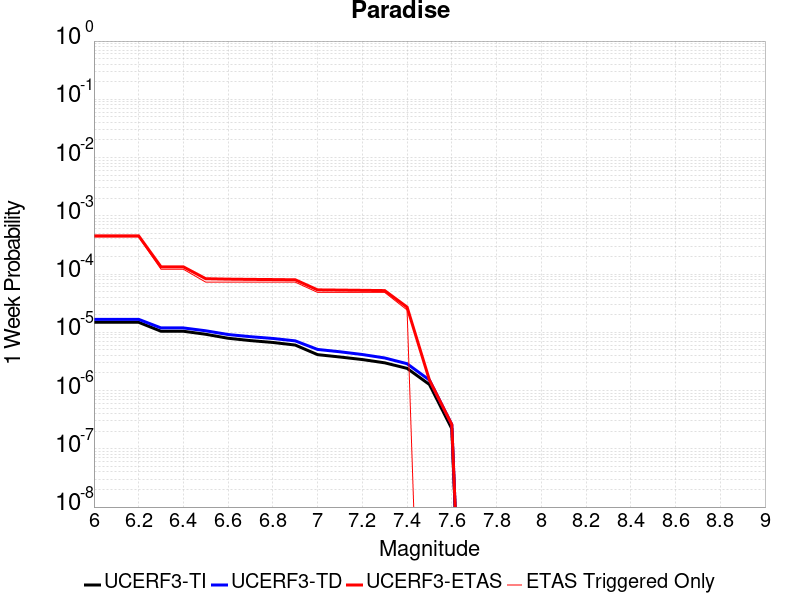 | 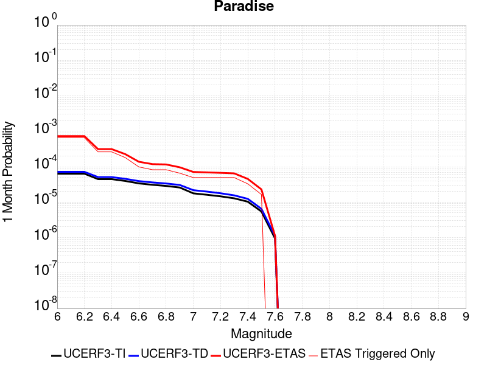 | 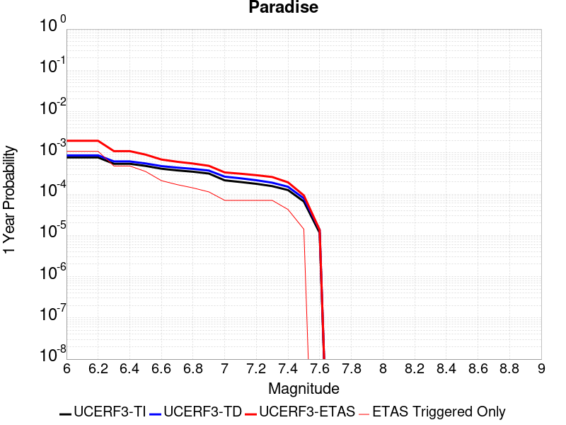 | 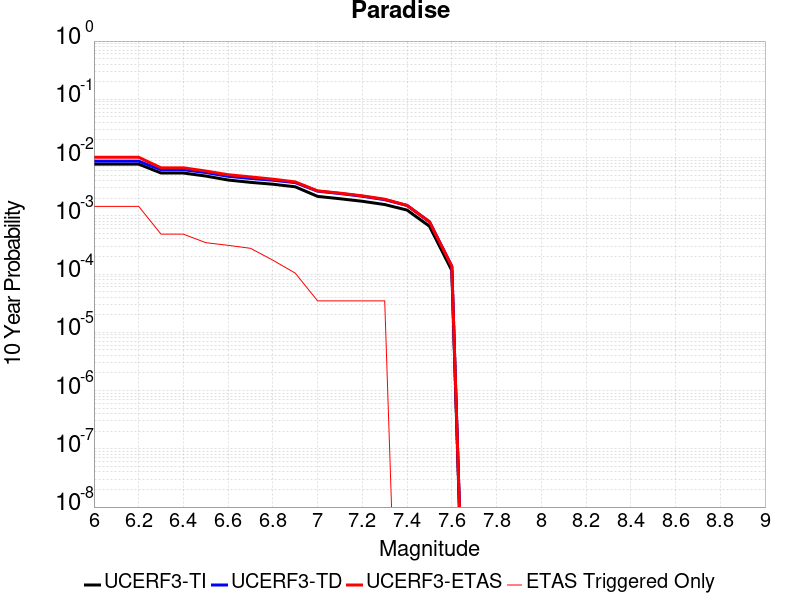 |

| Magnitude | 1 wk TI Prob | 1 wk TD Prob | 1 wk ETAS Prob | 1 wk ETAS/TD Gain | 1 wk ETAS Triggered Only | 1 mo TI Prob | 1 mo TD Prob | 1 mo ETAS Prob | 1 mo ETAS/TD Gain | 1 mo ETAS Triggered Only | 1 yr TI Prob | 1 yr TD Prob | 1 yr ETAS Prob | 1 yr ETAS/TD Gain | 1 yr ETAS Triggered Only | 10 yr TI Prob | 10 yr TD Prob | 10 yr ETAS Prob | 10 yr ETAS/TD Gain | 10 yr ETAS Triggered Only |
|-----|-----|-----|-----|-----|-----|-----|-----|-----|-----|-----|-----|-----|-----|-----|-----|-----|-----|-----|-----|-----|
| 6.0 | 1.4851273E-5 | 1.6694768E-5 | 4.6648312E-4 | 27.941874 | 4.4979586E-4 | 6.364676E-5 | 7.154718E-5 | 5.9050525E-4 | 8.253369 | 5.189952E-4 | 7.7462377E-4 | 8.707624E-4 | 0.0018387099 | 2.1116092 | 9.687911E-4 | 0.0077192914 | 0.008675884 | 0.0101164635 | 1.166044 | 0.0014531866 |
| 6.1 | 1.4851273E-5 | 1.6694768E-5 | 4.6648312E-4 | 27.941874 | 4.4979586E-4 | 6.364676E-5 | 7.154718E-5 | 5.9050525E-4 | 8.253369 | 5.189952E-4 | 7.7462377E-4 | 8.707624E-4 | 0.0018387099 | 2.1116092 | 9.687911E-4 | 0.0077192914 | 0.008675884 | 0.0101164635 | 1.166044 | 0.0014531866 |
| 6.2 | 1.4851273E-5 | 1.6694768E-5 | 4.6648312E-4 | 27.941874 | 4.4979586E-4 | 6.364676E-5 | 7.154718E-5 | 5.9050525E-4 | 8.253369 | 5.189952E-4 | 7.7462377E-4 | 8.707624E-4 | 0.0018387099 | 2.1116092 | 9.687911E-4 | 0.0077192914 | 0.008675884 | 0.0101164635 | 1.166044 | 0.0014531866 |
| 6.3 | 1.0426831E-5 | 1.1888697E-5 | 1.5028578E-4 | 12.641063 | 1.3839873E-4 | 4.4685654E-5 | 5.09506E-5 | 2.239402E-4 | 4.3952417 | 1.729984E-4 | 5.43912E-4 | 6.201529E-4 | 9.31357E-4 | 1.5018182 | 3.1139713E-4 | 0.0054258266 | 0.0061848317 | 0.0066662314 | 1.0778356 | 4.8439554E-4 |
| 6.4 | 1.0426831E-5 | 1.1888697E-5 | 1.5028578E-4 | 12.641063 | 1.3839873E-4 | 4.4685654E-5 | 5.09506E-5 | 2.239402E-4 | 4.3952417 | 1.729984E-4 | 5.43912E-4 | 6.201529E-4 | 9.31357E-4 | 1.5018182 | 3.1139713E-4 | 0.0054258266 | 0.0061848317 | 0.0066662314 | 1.0778356 | 4.8439554E-4 |
| 6.5 | 9.25027E-6 | 1.0620037E-5 | 7.981867E-5 | 7.5158553 | 6.919936E-5 | 3.964341E-5 | 4.551368E-5 | 1.49308E-4 | 3.2805083 | 1.03799044E-4 | 4.8255164E-4 | 5.5399304E-4 | 7.614761E-4 | 1.3745229 | 2.0759809E-4 | 0.0048150513 | 0.0055266195 | 0.005870704 | 1.0622596 | 3.459968E-4 |
| 6.6 | 7.904275E-6 | 9.159602E-6 | 7.835833E-5 | 8.554774 | 6.919936E-5 | 3.3875025E-5 | 3.925487E-5 | 1.4304984E-4 | 3.6441298 | 1.03799044E-4 | 4.1235037E-4 | 4.7782718E-4 | 6.8532606E-4 | 1.4342551 | 2.0759809E-4 | 0.0041158604 | 0.004768395 | 0.005078307 | 1.064993 | 3.1139713E-4 |
| 6.7 | 7.2061953E-6 | 8.407326E-6 | 7.7606106E-5 | 9.230772 | 6.919936E-5 | 3.088333E-5 | 3.603092E-5 | 1.3982622E-4 | 3.8807287 | 1.03799044E-4 | 3.7593965E-4 | 4.3859181E-4 | 6.115144E-4 | 1.3942676 | 1.729984E-4 | 0.003753043 | 0.004377631 | 0.004653217 | 1.0629531 | 2.7679745E-4 |
| 6.8 | 6.6948724E-6 | 7.842242E-6 | 7.704106E-5 | 9.823857 | 6.919936E-5 | 2.8691995E-5 | 3.3609194E-5 | 1.3740476E-4 | 4.0883083 | 1.03799044E-4 | 3.4926904E-4 | 4.091187E-4 | 5.474608E-4 | 1.3381466 | 1.3839873E-4 | 0.003487206 | 0.0040840125 | 0.0042563044 | 1.0421869 | 1.729984E-4 |
| 6.9 | 6.0421025E-6 | 7.1306963E-6 | 7.632957E-5 | 10.704364 | 6.919936E-5 | 2.5894467E-5 | 3.0559786E-5 | 9.975704E-5 | 3.2643237 | 6.919936E-5 | 3.1521954E-4 | 3.7200528E-4 | 4.411789E-4 | 1.1859479 | 6.919936E-5 | 0.0031477278 | 0.0037141638 | 0.0038175774 | 1.027843 | 1.03799044E-4 |
| 7.0 | 4.134091E-6 | 5.0803824E-6 | 3.967989E-5 | 7.8104134 | 3.459968E-5 | 1.7717413E-5 | 2.1772896E-5 | 5.6371824E-5 | 2.5890825 | 3.459968E-5 | 2.1568815E-4 | 2.650543E-4 | 2.996448E-4 | 1.1305035 | 3.459968E-5 | 0.0021547892 | 0.0026475347 | 0.0026820428 | 1.013034 | 3.459968E-5 |
| 7.1 | 3.7674888E-6 | 4.631936E-6 | 3.9231458E-5 | 8.469775 | 3.459968E-5 | 1.6146281E-5 | 1.9851012E-5 | 5.4450007E-5 | 2.7429335 | 3.459968E-5 | 1.9656324E-4 | 2.4166079E-4 | 2.762521E-4 | 1.14314 | 3.459968E-5 | 0.0019638946 | 0.0024141306 | 0.0024486468 | 1.0142976 | 3.459968E-5 |
| 7.2 | 3.4065345E-6 | 4.156782E-6 | 3.875632E-5 | 9.323635 | 3.459968E-5 | 1.4599351E-5 | 1.7814667E-5 | 5.2413732E-5 | 2.9421673 | 3.459968E-5 | 1.777326E-4 | 2.168735E-4 | 2.5146565E-4 | 1.1595039 | 3.459968E-5 | 0.0017759053 | 0.0021667667 | 0.0022012913 | 1.0159338 | 3.459968E-5 |
| 7.3 | 2.9934936E-6 | 3.6293673E-6 | 3.822892E-5 | 10.53322 | 3.459968E-5 | 1.2829195E-5 | 1.5554348E-5 | 5.015349E-5 | 3.2244036 | 3.459968E-5 | 1.5618425E-4 | 1.8935918E-4 | 2.2395232E-4 | 1.1826853 | 3.459968E-5 | 0.0015607453 | 0.0018921237 | 0.001926658 | 1.0182515 | 3.459968E-5 |
| 7.4 | 2.4049796E-6 | 2.8890186E-6 | 2.8890186E-6 | 1.0 | 0.0 | 1.0307015E-5 | 1.2381457E-5 | 1.2381457E-5 | 1.0 | 0.0 | 1.2548068E-4 | 1.5073526E-4 | 1.5073526E-4 | 1.0 | 0.0 | 0.0012540985 | 0.0015064715 | 0.0015064715 | 1.0 | 0.0 |
| 7.5 | 1.2710091E-6 | 1.5134859E-6 | 1.5134859E-6 | 1.0 | 0.0 | 5.44717E-6 | 6.4863593E-6 | 6.4863593E-6 | 1.0 | 0.0 | 6.631728E-5 | 7.896981E-5 | 7.896981E-5 | 1.0 | 0.0 | 6.6297496E-4 | 7.895401E-4 | 7.895401E-4 | 1.0 | 0.0 |
| 7.6 | 2.21172E-7 | 2.6040198E-7 | 2.6040198E-7 | 1.0 | 0.0 | 9.478797E-7 | 1.1160082E-6 | 1.1160082E-6 | 1.0 | 0.0 | 1.1540374E-5 | 1.3587343E-5 | 1.3587343E-5 | 1.0 | 0.0 | 1.1539775E-4 | 1.3586794E-4 | 1.3586794E-4 | 1.0 | 0.0 |

## Coyote Lake
*[(top)](#table-of-contents)*

| 1 Week | 1 Month | 1 Year | 10 Year |
|-----|-----|-----|-----|
| 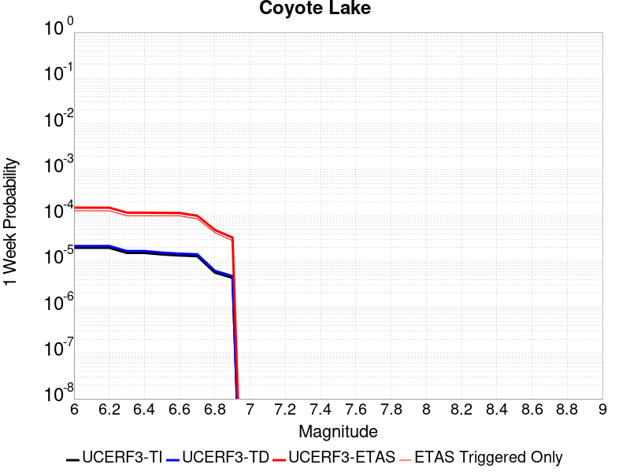 | 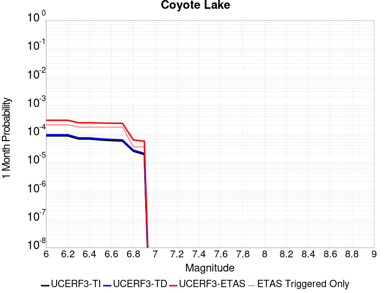 | 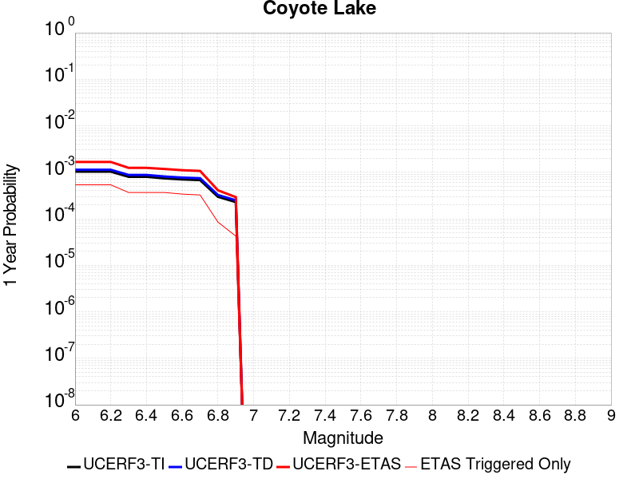 | 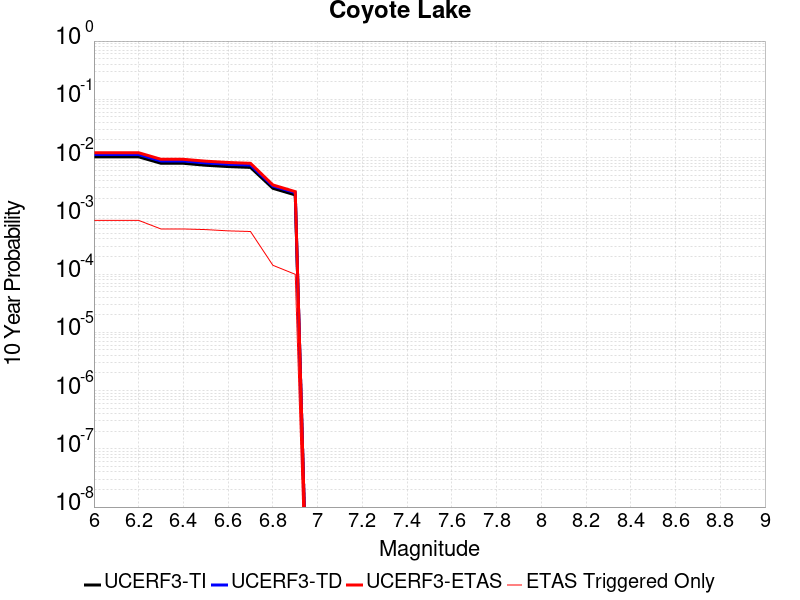 |

| Magnitude | 1 wk TI Prob | 1 wk TD Prob | 1 wk ETAS Prob | 1 wk ETAS/TD Gain | 1 wk ETAS Triggered Only | 1 mo TI Prob | 1 mo TD Prob | 1 mo ETAS Prob | 1 mo ETAS/TD Gain | 1 mo ETAS Triggered Only | 1 yr TI Prob | 1 yr TD Prob | 1 yr ETAS Prob | 1 yr ETAS/TD Gain | 1 yr ETAS Triggered Only | 10 yr TI Prob | 10 yr TD Prob | 10 yr ETAS Prob | 10 yr ETAS/TD Gain | 10 yr ETAS Triggered Only |
|-----|-----|-----|-----|-----|-----|-----|-----|-----|-----|-----|-----|-----|-----|-----|-----|-----|-----|-----|-----|-----|
| 6.0 | 1.980352E-5 | 2.1706745E-5 | 1.2550353E-4 | 5.781776 | 1.03799044E-4 | 8.486947E-5 | 9.302599E-5 | 3.0060476E-4 | 3.2314062 | 2.0759809E-4 | 0.0010327959 | 0.0011320751 | 0.0017196038 | 1.5189838 | 5.881946E-4 | 0.010280091 | 0.011270258 | 0.01222813 | 1.0849912 | 9.687911E-4 |
| 6.1 | 1.980352E-5 | 2.1706745E-5 | 1.2550353E-4 | 5.781776 | 1.03799044E-4 | 8.486947E-5 | 9.302599E-5 | 3.0060476E-4 | 3.2314062 | 2.0759809E-4 | 0.0010327959 | 0.0011320751 | 0.0017196038 | 1.5189838 | 5.881946E-4 | 0.010280091 | 0.011270258 | 0.01222813 | 1.0849912 | 9.687911E-4 |
| 6.2 | 1.980352E-5 | 2.1706745E-5 | 1.2550353E-4 | 5.781776 | 1.03799044E-4 | 8.486947E-5 | 9.302599E-5 | 3.0060476E-4 | 3.2314062 | 2.0759809E-4 | 0.0010327959 | 0.0011320751 | 0.0017196038 | 1.5189838 | 5.881946E-4 | 0.010280091 | 0.011270258 | 0.01222813 | 1.0849912 | 9.687911E-4 |
| 6.3 | 1.5344787E-5 | 1.682067E-5 | 1.20617966E-4 | 7.170819 | 1.03799044E-4 | 6.576172E-5 | 7.2086936E-5 | 2.4507288E-4 | 3.399685 | 1.729984E-4 | 8.003548E-4 | 8.773662E-4 | 0.0012576288 | 1.4334137 | 3.805965E-4 | 0.007974784 | 0.00874507 | 0.009396714 | 1.0745157 | 6.5739395E-4 |
| 6.4 | 1.5344787E-5 | 1.682067E-5 | 1.20617966E-4 | 7.170819 | 1.03799044E-4 | 6.576172E-5 | 7.2086936E-5 | 2.4507288E-4 | 3.399685 | 1.729984E-4 | 8.003548E-4 | 8.773662E-4 | 0.0012576288 | 1.4334137 | 3.805965E-4 | 0.007974784 | 0.00874507 | 0.009396714 | 1.0745157 | 6.5739395E-4 |
| 6.5 | 1.4189697E-5 | 1.5557987E-5 | 1.1935542E-4 | 7.671649 | 1.03799044E-4 | 6.081157E-5 | 6.6675726E-5 | 2.396626E-4 | 3.5944507 | 1.729984E-4 | 7.401293E-4 | 8.115349E-4 | 0.0011918225 | 1.4686029 | 3.805965E-4 | 0.0073766913 | 0.008091656 | 0.008709411 | 1.0763447 | 6.2279426E-4 |
| 6.6 | 1.3469301E-5 | 1.4771577E-5 | 1.1856909E-4 | 8.02684 | 1.03799044E-4 | 5.7724297E-5 | 6.330556E-5 | 2.3629302E-4 | 3.7325792 | 1.729984E-4 | 7.025667E-4 | 7.7053264E-4 | 0.0011508359 | 1.4935589 | 3.805965E-4 | 0.0070034964 | 0.0076845144 | 0.008302523 | 1.0804225 | 6.2279426E-4 |
| 6.7 | 1.3027966E-5 | 1.4281745E-5 | 1.18079304E-4 | 8.267849 | 1.03799044E-4 | 5.5832945E-5 | 6.120638E-5 | 2.341942E-4 | 3.8263037 | 1.729984E-4 | 6.7955407E-4 | 7.4499263E-4 | 0.0011253055 | 1.5104922 | 3.805965E-4 | 0.006774798 | 0.0074308286 | 0.008048995 | 1.0831895 | 6.2279426E-4 |
| 6.8 | 5.695434E-6 | 6.2244176E-6 | 4.0823885E-5 | 6.558667 | 3.459968E-5 | 2.4408775E-5 | 2.6675973E-5 | 6.127473E-5 | 2.297001 | 3.459968E-5 | 2.971363E-4 | 3.2476155E-4 | 3.5935E-4 | 1.1065041 | 3.459968E-5 | 0.0029673933 | 0.0032458105 | 0.0033492725 | 1.0318756 | 1.03799044E-4 |
| 6.9 | 4.385688E-6 | 4.7930553E-6 | 3.9392573E-5 | 8.218677 | 3.459968E-5 | 1.879567E-5 | 2.0541665E-5 | 5.5140637E-5 | 2.6843314 | 3.459968E-5 | 2.2881327E-4 | 2.5009477E-4 | 2.846858E-4 | 1.1383116 | 3.459968E-5 | 0.002285778 | 0.0025009478 | 0.0026044874 | 1.0414001 | 1.03799044E-4 |

## San Andreas (San Bernardino S)
*[(top)](#table-of-contents)*

| 1 Week | 1 Month | 1 Year | 10 Year |
|-----|-----|-----|-----|
| 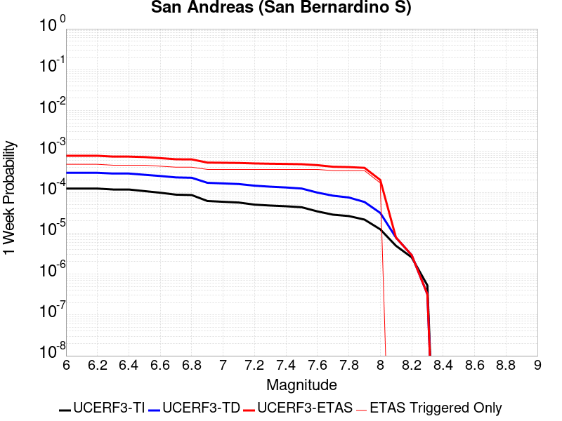 | 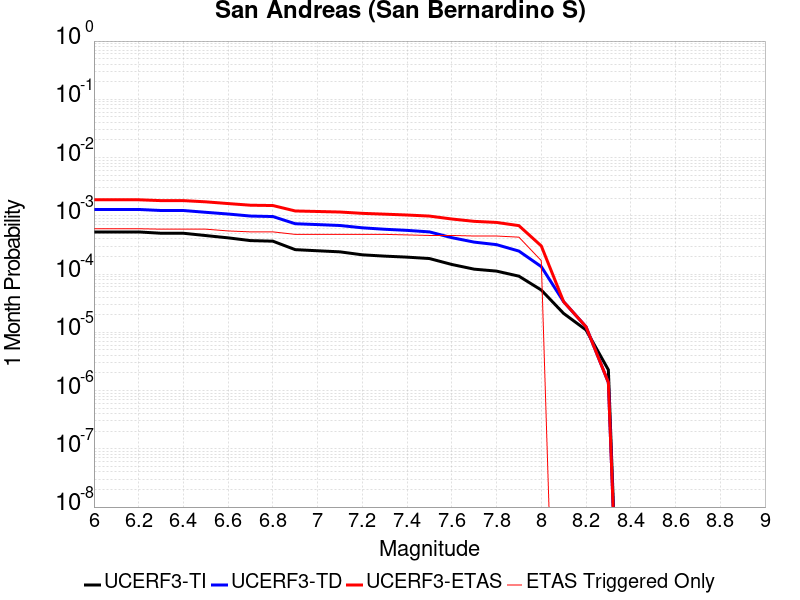 | 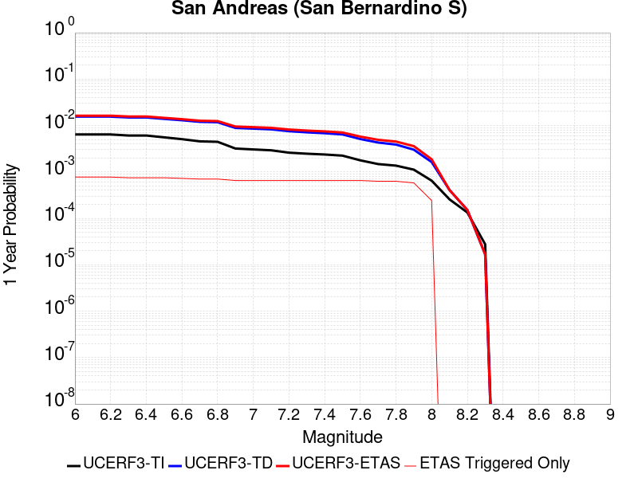 | 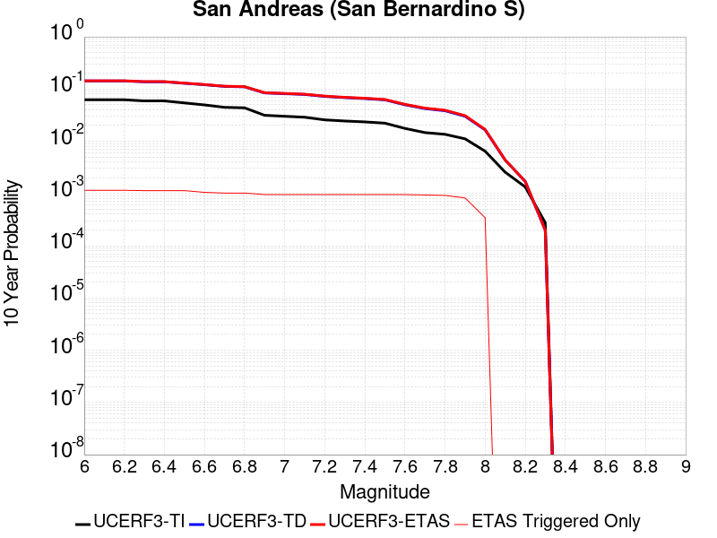 |

| Magnitude | 1 wk TI Prob | 1 wk TD Prob | 1 wk ETAS Prob | 1 wk ETAS/TD Gain | 1 wk ETAS Triggered Only | 1 mo TI Prob | 1 mo TD Prob | 1 mo ETAS Prob | 1 mo ETAS/TD Gain | 1 mo ETAS Triggered Only | 1 yr TI Prob | 1 yr TD Prob | 1 yr ETAS Prob | 1 yr ETAS/TD Gain | 1 yr ETAS Triggered Only | 10 yr TI Prob | 10 yr TD Prob | 10 yr ETAS Prob | 10 yr ETAS/TD Gain | 10 yr ETAS Triggered Only |
|-----|-----|-----|-----|-----|-----|-----|-----|-----|-----|-----|-----|-----|-----|-----|-----|-----|-----|-----|-----|-----|
| 6.0 | 1.2336002E-4 | 3.0005194E-4 | 6.459449E-4 | 2.1527772 | 3.459968E-4 | 5.2857865E-4 | 0.0012853292 | 0.0016308812 | 1.2688433 | 3.459968E-4 | 0.006416472 | 0.015541554 | 0.01615467 | 1.03945 | 6.2279426E-4 | 0.06234337 | 0.14294699 | 0.1437773 | 1.0058085 | 9.687911E-4 |
| 6.1 | 1.2336002E-4 | 3.0005194E-4 | 6.459449E-4 | 2.1527772 | 3.459968E-4 | 5.2857865E-4 | 0.0012853292 | 0.0016308812 | 1.2688433 | 3.459968E-4 | 0.006416472 | 0.015541554 | 0.01615467 | 1.03945 | 6.2279426E-4 | 0.06234337 | 0.14294699 | 0.1437773 | 1.0058085 | 9.687911E-4 |
| 6.2 | 1.2336002E-4 | 3.0005194E-4 | 6.459449E-4 | 2.1527772 | 3.459968E-4 | 5.2857865E-4 | 0.0012853292 | 0.0016308812 | 1.2688433 | 3.459968E-4 | 0.006416472 | 0.015541554 | 0.01615467 | 1.03945 | 6.2279426E-4 | 0.06234337 | 0.14294699 | 0.1437773 | 1.0058085 | 9.687911E-4 |
| 6.3 | 1.1712257E-4 | 2.8793467E-4 | 6.3383183E-4 | 2.2013044 | 3.459968E-4 | 5.018573E-4 | 0.0012334478 | 0.0015790178 | 1.2801659 | 3.459968E-4 | 0.006093008 | 0.014918666 | 0.015532169 | 1.0411232 | 6.2279426E-4 | 0.059286322 | 0.13765779 | 0.13849321 | 1.006069 | 9.687911E-4 |
| 6.4 | 1.1712257E-4 | 2.8793467E-4 | 6.3383183E-4 | 2.2013044 | 3.459968E-4 | 5.018573E-4 | 0.0012334478 | 0.0015790178 | 1.2801659 | 3.459968E-4 | 0.006093008 | 0.014918666 | 0.015532169 | 1.0411232 | 6.2279426E-4 | 0.059286322 | 0.13765779 | 0.13849321 | 1.006069 | 9.687911E-4 |
| 6.5 | 1.0689076E-4 | 2.6806415E-4 | 6.1396824E-4 | 2.2903779 | 3.459968E-4 | 4.5802278E-4 | 0.0011483653 | 0.0014939648 | 1.3009491 | 3.459968E-4 | 0.0055621783 | 0.013896335 | 0.014510475 | 1.0441943 | 6.2279426E-4 | 0.05425003 | 0.1288989 | 0.12974282 | 1.0065471 | 9.687911E-4 |
| 6.6 | 9.7648895E-5 | 2.505129E-4 | 5.6183204E-4 | 2.2427268 | 3.1139713E-4 | 4.1842813E-4 | 0.0010732086 | 0.0013842715 | 1.2898439 | 3.1139713E-4 | 0.005082469 | 0.012992399 | 0.013572951 | 1.044684 | 5.881946E-4 | 0.049677886 | 0.121077746 | 0.12189883 | 1.0067815 | 9.341914E-4 |
| 6.7 | 8.757013E-5 | 2.3122175E-4 | 5.079552E-4 | 2.1968315 | 2.7679745E-4 | 3.7524657E-4 | 9.905964E-4 | 0.0012671195 | 1.2791482 | 2.7679745E-4 | 0.00455906 | 0.011997902 | 0.012544855 | 1.0455874 | 5.535949E-4 | 0.04466656 | 0.112373024 | 0.113171525 | 1.0071058 | 8.995917E-4 |
| 6.8 | 8.562978E-5 | 2.2682057E-4 | 5.0355523E-4 | 2.2200599 | 2.7679745E-4 | 3.6693315E-4 | 9.7174826E-4 | 0.0012482767 | 1.2845681 | 2.7679745E-4 | 0.004458263 | 0.011770921 | 0.012318 | 1.0464771 | 5.535949E-4 | 0.043698758 | 0.11037863 | 0.11117893 | 1.0072504 | 8.995917E-4 |
| 6.9 | 6.124075E-5 | 1.7066885E-4 | 3.7823152E-4 | 2.216172 | 2.0759809E-4 | 2.6243398E-4 | 7.312337E-4 | 9.3868E-4 | 1.2836936 | 2.0759809E-4 | 0.0031904527 | 0.008866636 | 0.009346737 | 1.0541469 | 4.8439554E-4 | 0.031450346 | 0.08420262 | 0.0849314 | 1.0086552 | 7.957927E-4 |
| 7.0 | 5.8598747E-5 | 1.6495936E-4 | 3.725232E-4 | 2.2582726 | 2.0759809E-4 | 2.5111332E-4 | 7.067779E-4 | 9.1422925E-4 | 1.293517 | 2.0759809E-4 | 0.0030530186 | 0.008571265 | 0.009051509 | 1.0560294 | 4.8439554E-4 | 0.03011414 | 0.08151562 | 0.082246535 | 1.0089667 | 7.957927E-4 |
| 7.1 | 5.613814E-5 | 1.5914452E-4 | 3.6670957E-4 | 2.3042552 | 2.0759809E-4 | 2.4056983E-4 | 6.818704E-4 | 8.893269E-4 | 1.3042463 | 2.0759809E-4 | 0.0029250039 | 0.008270353 | 0.008750742 | 1.0580857 | 4.8439554E-4 | 0.028868021 | 0.07881268 | 0.07954576 | 1.0093014 | 7.957927E-4 |
| 7.2 | 4.991222E-5 | 1.4520933E-4 | 3.5277728E-4 | 2.4294395 | 2.0759809E-4 | 2.1389198E-4 | 6.221777E-4 | 8.296466E-4 | 1.333456 | 2.0759809E-4 | 0.002601025 | 0.0075488063 | 0.008029545 | 1.0636841 | 4.8439554E-4 | 0.025707912 | 0.07226191 | 0.07300019 | 1.0102168 | 7.957927E-4 |
| 7.3 | 4.7410045E-5 | 1.371513E-4 | 3.4472093E-4 | 2.5134351 | 2.0759809E-4 | 2.0317009E-4 | 5.8765925E-4 | 7.9513533E-4 | 1.3530551 | 2.0759809E-4 | 0.0024707897 | 0.0071313656 | 0.0076123066 | 1.0674403 | 4.8439554E-4 | 0.024434982 | 0.068541944 | 0.06928319 | 1.0108145 | 7.957927E-4 |
| 7.4 | 4.5556746E-5 | 1.3123035E-4 | 3.3880118E-4 | 2.581729 | 2.0759809E-4 | 1.952286E-4 | 5.6229485E-4 | 7.6977623E-4 | 1.3689903 | 2.0759809E-4 | 0.002374317 | 0.0068245293 | 0.0073056193 | 1.0704942 | 4.8439554E-4 | 0.023491086 | 0.06579143 | 0.06653486 | 1.0112998 | 7.957927E-4 |
| 7.5 | 4.3084514E-5 | 1.2358342E-4 | 3.3115587E-4 | 2.6796138 | 2.0759809E-4 | 1.8463485E-4 | 5.2953605E-4 | 7.370242E-4 | 1.3918301 | 2.0759809E-4 | 0.0022456115 | 0.0064281146 | 0.0069093965 | 1.0748714 | 4.8439554E-4 | 0.022230545 | 0.062190283 | 0.06293659 | 1.0120003 | 7.957927E-4 |
| 7.6 | 3.408608E-5 | 9.836477E-5 | 3.0594243E-4 | 3.1102848 | 2.0759809E-4 | 1.4607502E-4 | 4.214953E-4 | 6.290059E-4 | 1.4923201 | 2.0759809E-4 | 0.0017770125 | 0.005119656 | 0.0056015714 | 1.0941305 | 4.8439554E-4 | 0.017628696 | 0.05002244 | 0.050778423 | 1.0151129 | 7.957927E-4 |
| 7.7 | 2.8315713E-5 | 8.2495724E-5 | 2.5547986E-4 | 3.0968862 | 1.729984E-4 | 1.2134742E-4 | 3.5350522E-4 | 5.264425E-4 | 1.489207 | 1.729984E-4 | 0.0014764034 | 0.004295442 | 0.0047433055 | 1.1042649 | 4.4979586E-4 | 0.01466633 | 0.042272415 | 0.043001432 | 1.0172457 | 7.61193E-4 |
| 7.8 | 2.6222975E-5 | 7.463898E-5 | 2.4762447E-4 | 3.3176296 | 1.729984E-4 | 1.1237934E-4 | 3.1984213E-4 | 4.9278524E-4 | 1.5407139 | 1.729984E-4 | 0.0013673597 | 0.003887131 | 0.0043351785 | 1.1152643 | 4.4979586E-4 | 0.013589768 | 0.038437475 | 0.03916941 | 1.0190423 | 7.61193E-4 |
| 7.9 | 2.1469694E-5 | 5.7884805E-5 | 2.308732E-4 | 3.9884942 | 1.729984E-4 | 9.200973E-5 | 2.4805416E-4 | 4.2100967E-4 | 1.6972489 | 1.729984E-4 | 0.0011196428 | 0.00301588 | 0.003429824 | 1.1372548 | 4.1519618E-4 | 0.011140184 | 0.030153265 | 0.030790837 | 1.0211444 | 6.5739395E-4 |
| 8.0 | 1.2420249E-5 | 3.1321662E-5 | 1.0051886E-4 | 3.209244 | 6.919936E-5 | 5.322855E-5 | 1.342288E-4 | 2.0341888E-4 | 1.5154637 | 6.919936E-5 | 6.478649E-4 | 0.0016330116 | 0.0017711843 | 1.0846123 | 1.3839873E-4 | 0.0064597935 | 0.01652369 | 0.01672786 | 1.012356 | 2.0759809E-4 |
| 8.1 | 4.9197724E-6 | 7.822525E-6 | 7.822525E-6 | 1.0 | 0.0 | 2.1084568E-5 | 3.3524673E-5 | 3.3524673E-5 | 1.0 | 0.0 | 2.566744E-4 | 4.080866E-4 | 4.080866E-4 | 1.0 | 0.0 | 0.002563781 | 0.004384557 | 0.004384557 | 1.0 | 0.0 |
| 8.2 | 2.5634774E-6 | 2.9065757E-6 | 2.9065757E-6 | 1.0 | 0.0 | 1.0986286E-5 | 1.2456694E-5 | 1.2456694E-5 | 1.0 | 0.0 | 1.3374983E-4 | 1.5164974E-4 | 1.5164974E-4 | 1.0 | 0.0 | 0.0013366934 | 0.001704941 | 0.001704941 | 1.0 | 0.0 |
| 8.3 | 5.2850464E-7 | 3.2080476E-7 | 3.2080476E-7 | 1.0 | 0.0 | 2.2650179E-6 | 1.3748769E-6 | 1.3748769E-6 | 1.0 | 0.0 | 2.7576245E-5 | 1.673901E-5 | 1.673901E-5 | 1.0 | 0.0 | 2.7572823E-4 | 1.986671E-4 | 1.986671E-4 | 1.0 | 0.0 |

## San Andreas (Big Bend)
*[(top)](#table-of-contents)*

| 1 Week | 1 Month | 1 Year | 10 Year |
|-----|-----|-----|-----|
| 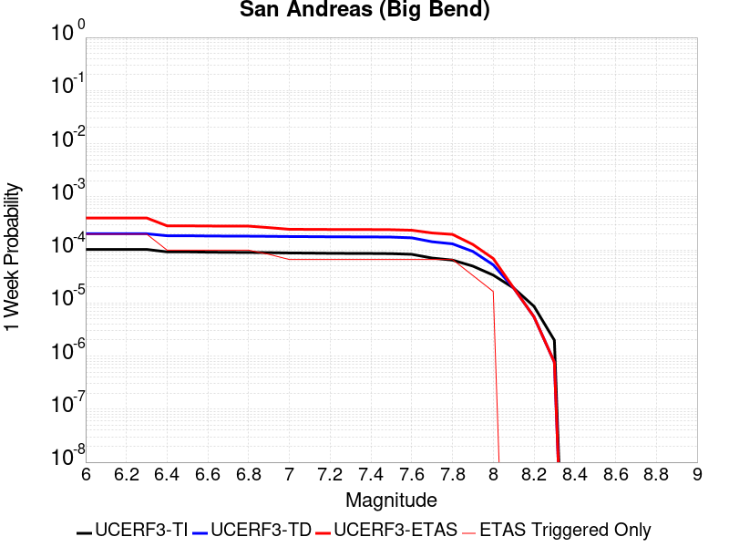 |  | 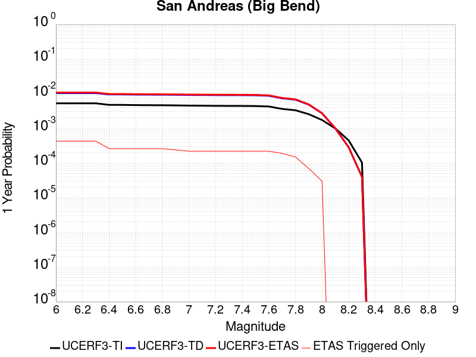 | 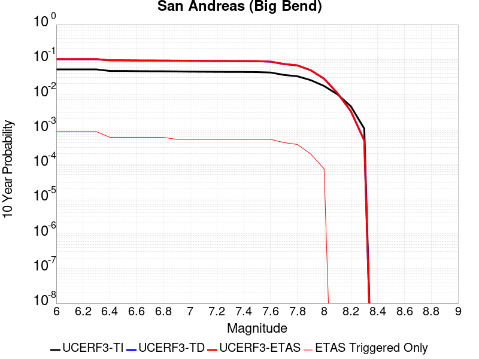 |

| Magnitude | 1 wk TI Prob | 1 wk TD Prob | 1 wk ETAS Prob | 1 wk ETAS/TD Gain | 1 wk ETAS Triggered Only | 1 mo TI Prob | 1 mo TD Prob | 1 mo ETAS Prob | 1 mo ETAS/TD Gain | 1 mo ETAS Triggered Only | 1 yr TI Prob | 1 yr TD Prob | 1 yr ETAS Prob | 1 yr ETAS/TD Gain | 1 yr ETAS Triggered Only | 10 yr TI Prob | 10 yr TD Prob | 10 yr ETAS Prob | 10 yr ETAS/TD Gain | 10 yr ETAS Triggered Only |
|-----|-----|-----|-----|-----|-----|-----|-----|-----|-----|-----|-----|-----|-----|-----|-----|-----|-----|-----|-----|-----|
| 6.0 | 1.0179969E-4 | 2.0073925E-4 | 4.0829566E-4 | 2.0339603 | 2.0759809E-4 | 4.362114E-4 | 8.6002843E-4 | 0.0011365878 | 1.32157 | 2.7679745E-4 | 0.0052979486 | 0.010420859 | 0.011002924 | 1.0558558 | 5.881946E-4 | 0.051734097 | 0.101455905 | 0.10232641 | 1.0085801 | 9.687911E-4 |
| 6.1 | 1.0179969E-4 | 2.0073925E-4 | 4.0829566E-4 | 2.0339603 | 2.0759809E-4 | 4.362114E-4 | 8.6002843E-4 | 0.0011365878 | 1.32157 | 2.7679745E-4 | 0.0052979486 | 0.010420859 | 0.011002924 | 1.0558558 | 5.881946E-4 | 0.051734097 | 0.101455905 | 0.10232641 | 1.0085801 | 9.687911E-4 |
| 6.2 | 1.0179969E-4 | 2.0073925E-4 | 4.0829566E-4 | 2.0339603 | 2.0759809E-4 | 4.362114E-4 | 8.6002843E-4 | 0.0011365878 | 1.32157 | 2.7679745E-4 | 0.0052979486 | 0.010420859 | 0.011002924 | 1.0558558 | 5.881946E-4 | 0.051734097 | 0.101455905 | 0.10232641 | 1.0085801 | 9.687911E-4 |
| 6.3 | 1.0179969E-4 | 2.0073925E-4 | 4.0829566E-4 | 2.0339603 | 2.0759809E-4 | 4.362114E-4 | 8.6002843E-4 | 0.0011365878 | 1.32157 | 2.7679745E-4 | 0.0052979486 | 0.010420859 | 0.011002924 | 1.0558558 | 5.881946E-4 | 0.051734097 | 0.101455905 | 0.10232641 | 1.0085801 | 9.687911E-4 |
| 6.4 | 9.1639464E-5 | 1.8430917E-4 | 2.880891E-4 | 1.5630752 | 1.03799044E-4 | 3.9268145E-4 | 7.896575E-4 | 9.625194E-4 | 1.2189072 | 1.729984E-4 | 0.0047704205 | 0.009571818 | 0.009948771 | 1.0393816 | 3.805965E-4 | 0.046693064 | 0.09378695 | 0.0944454 | 1.0070207 | 7.265933E-4 |
| 6.5 | 9.1639464E-5 | 1.8430917E-4 | 2.880891E-4 | 1.5630752 | 1.03799044E-4 | 3.9268145E-4 | 7.896575E-4 | 9.625194E-4 | 1.2189072 | 1.729984E-4 | 0.0047704205 | 0.009571818 | 0.009948771 | 1.0393816 | 3.805965E-4 | 0.046693064 | 0.09378695 | 0.0944454 | 1.0070207 | 7.265933E-4 |
| 6.6 | 9.042622E-5 | 1.8238011E-4 | 2.8616024E-4 | 1.569032 | 1.03799044E-4 | 3.8748336E-4 | 7.813951E-4 | 9.542584E-4 | 1.2212238 | 1.729984E-4 | 0.0047074095 | 0.0094721 | 0.009849091 | 1.0398002 | 3.805965E-4 | 0.046089325 | 0.09287721 | 0.09353632 | 1.0070965 | 7.265933E-4 |
| 6.7 | 8.9836685E-5 | 1.8152347E-4 | 2.8530366E-4 | 1.5717179 | 1.03799044E-4 | 3.8495753E-4 | 7.7772595E-4 | 9.5058983E-4 | 1.2222683 | 1.729984E-4 | 0.00467679 | 0.009427815 | 0.0098048225 | 1.039989 | 3.805965E-4 | 0.045795817 | 0.09247148 | 0.09313089 | 1.0071309 | 7.265933E-4 |
| 6.8 | 8.9471854E-5 | 1.8099119E-4 | 2.8477146E-4 | 1.5733994 | 1.03799044E-4 | 3.8339442E-4 | 7.754462E-4 | 9.483104E-4 | 1.2229223 | 1.729984E-4 | 0.004657841 | 0.009400298 | 0.009777317 | 1.0401071 | 3.805965E-4 | 0.04561414 | 0.0922192 | 0.092878796 | 1.0071524 | 7.265933E-4 |
| 6.9 | 8.858234E-5 | 1.7981093E-4 | 2.4899785E-4 | 1.384776 | 6.919936E-5 | 3.7958333E-4 | 7.7039085E-4 | 8.741099E-4 | 1.1346318 | 1.03799044E-4 | 0.004611638 | 0.009339278 | 0.009647767 | 1.0330313 | 3.1139713E-4 | 0.04517103 | 0.09165911 | 0.092224814 | 1.006172 | 6.2279426E-4 |
| 7.0 | 8.7433385E-5 | 1.7819891E-4 | 2.4738593E-4 | 1.3882574 | 6.919936E-5 | 3.746607E-4 | 7.6348626E-4 | 8.672061E-4 | 1.1358502 | 1.03799044E-4 | 0.004551957 | 0.009255932 | 0.009564446 | 1.0333316 | 3.1139713E-4 | 0.044598386 | 0.09089323 | 0.091459416 | 1.0062292 | 6.2279426E-4 |
| 7.1 | 8.684964E-5 | 1.7731842E-4 | 2.4650551E-4 | 1.3901856 | 6.919936E-5 | 3.7215967E-4 | 7.597149E-4 | 8.6343515E-4 | 1.1365252 | 1.03799044E-4 | 0.0045216335 | 0.009210405 | 0.009518934 | 1.0334979 | 3.1139713E-4 | 0.04430731 | 0.09047475 | 0.0910412 | 1.0062609 | 6.2279426E-4 |
| 7.2 | 8.606521E-5 | 1.7622454E-4 | 2.454117E-4 | 1.392608 | 6.919936E-5 | 3.6879873E-4 | 7.550296E-4 | 8.5875025E-4 | 1.137373 | 1.03799044E-4 | 0.0044808835 | 0.009153842 | 0.009462388 | 1.0337068 | 3.1139713E-4 | 0.043916024 | 0.08995518 | 0.09052195 | 1.0063006 | 6.2279426E-4 |
| 7.3 | 8.568266E-5 | 1.7564454E-4 | 2.4483175E-4 | 1.3939047 | 6.919936E-5 | 3.6715972E-4 | 7.5254537E-4 | 8.562663E-4 | 1.1378268 | 1.03799044E-4 | 0.0044610105 | 0.00912385 | 0.009432406 | 1.0338186 | 3.1139713E-4 | 0.043725148 | 0.08967623 | 0.090243176 | 1.0063221 | 6.2279426E-4 |
| 7.4 | 8.5432206E-5 | 1.752704E-4 | 2.4445762E-4 | 1.3947457 | 6.919936E-5 | 3.6608664E-4 | 7.509428E-4 | 8.546639E-4 | 1.1381211 | 1.03799044E-4 | 0.004447999 | 0.009104501 | 0.0094130635 | 1.0338912 | 3.1139713E-4 | 0.043600157 | 0.08949642 | 0.090063475 | 1.0063361 | 6.2279426E-4 |
| 7.5 | 8.4791965E-5 | 1.7396381E-4 | 2.4315114E-4 | 1.397711 | 6.919936E-5 | 3.633435E-4 | 7.4534636E-4 | 8.4906805E-4 | 1.1391591 | 1.03799044E-4 | 0.0044147377 | 0.009036932 | 0.009345516 | 1.0341469 | 3.1139713E-4 | 0.043280575 | 0.08887209 | 0.08943953 | 1.006385 | 6.2279426E-4 |
| 7.6 | 8.241105E-5 | 1.6841735E-4 | 2.3760505E-4 | 1.4108111 | 6.919936E-5 | 3.531424E-4 | 7.2158914E-4 | 8.2531327E-4 | 1.1437441 | 1.03799044E-4 | 0.0042910352 | 0.008750047 | 0.0090587195 | 1.0352767 | 3.1139713E-4 | 0.042091176 | 0.08625032 | 0.0868194 | 1.006598 | 6.2279426E-4 |
| 7.7 | 7.00432E-5 | 1.4205615E-4 | 2.1124569E-4 | 1.4870577 | 6.919936E-5 | 3.001506E-4 | 6.0867006E-4 | 7.124059E-4 | 1.1704304 | 1.03799044E-4 | 0.0036482112 | 0.0073854174 | 0.0076258266 | 1.0325519 | 2.4219777E-4 | 0.035888977 | 0.07352299 | 0.07397177 | 1.006104 | 4.8439554E-4 |
| 7.8 | 6.415362E-5 | 1.2969968E-4 | 1.9889006E-4 | 1.5334661 | 6.919936E-5 | 2.749151E-4 | 5.557374E-4 | 6.5947877E-4 | 1.1866734 | 1.03799044E-4 | 0.0033419547 | 0.0067451415 | 0.006985706 | 1.0356648 | 2.4219777E-4 | 0.03292141 | 0.06725514 | 0.06770696 | 1.0067179 | 4.8439554E-4 |
| 7.9 | 4.939911E-5 | 9.341721E-5 | 1.2801366E-4 | 1.3703434 | 3.459968E-5 | 2.116933E-4 | 4.0029807E-4 | 4.348839E-4 | 1.0864002 | 3.459968E-5 | 0.0025743195 | 0.004862747 | 0.005000473 | 1.0283226 | 1.3839873E-4 | 0.025447013 | 0.048915803 | 0.04917906 | 1.0053818 | 2.7679745E-4 |
| 8.0 | 3.344983E-5 | 5.2228E-5 | 8.682587E-5 | 1.6624392 | 3.459968E-5 | 1.4334853E-4 | 2.2381509E-4 | 2.5840703E-4 | 1.1545559 | 3.459968E-5 | 0.0017438711 | 0.0027215453 | 0.0027905563 | 1.0253572 | 6.919936E-5 | 0.017302496 | 0.027923161 | 0.028024063 | 1.0036135 | 1.03799044E-4 |
| 8.1 | 1.9104898E-5 | 1.9171663E-5 | 1.9171663E-5 | 1.0 | 0.0 | 8.1875565E-5 | 8.2161685E-5 | 8.2161685E-5 | 1.0 | 0.0 | 9.963791E-4 | 9.9986E-4 | 9.9986E-4 | 1.0 | 0.0 | 0.009919235 | 0.010749552 | 0.010749552 | 1.0 | 0.0 |
| 8.2 | 8.643924E-6 | 5.473668E-6 | 5.473668E-6 | 1.0 | 0.0 | 3.704486E-5 | 2.3458366E-5 | 2.3458366E-5 | 1.0 | 0.0 | 4.5092785E-4 | 2.8556827E-4 | 2.8556827E-4 | 1.0 | 0.0 | 0.0045001395 | 0.0032481793 | 0.0032481793 | 1.0 | 0.0 |
| 8.3 | 1.983087E-6 | 7.6564595E-7 | 7.6564595E-7 | 1.0 | 0.0 | 8.498917E-6 | 3.281336E-6 | 3.281336E-6 | 1.0 | 0.0 | 1.034694E-4 | 3.9949547E-5 | 3.9949547E-5 | 1.0 | 0.0 | 0.0010342124 | 4.717979E-4 | 4.717979E-4 | 1.0 | 0.0 |

## Death Valley (Black Mtns Frontal)
*[(top)](#table-of-contents)*

| 1 Week | 1 Month | 1 Year | 10 Year |
|-----|-----|-----|-----|
| 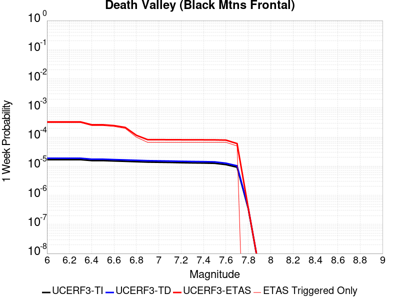 | 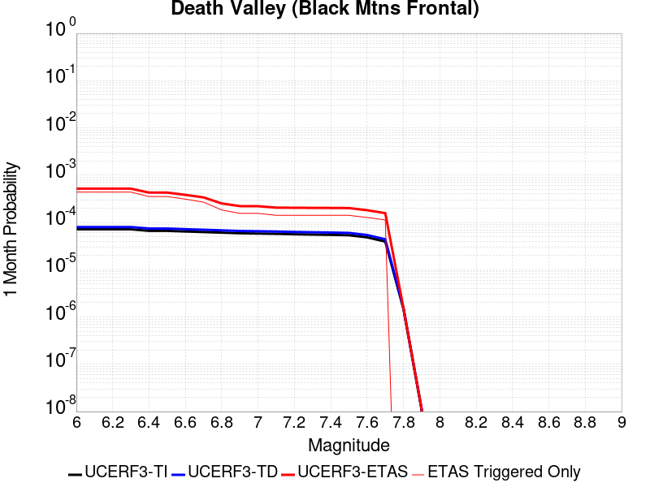 | 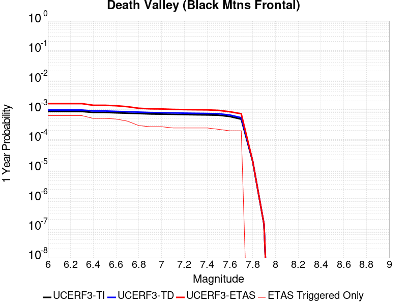 | 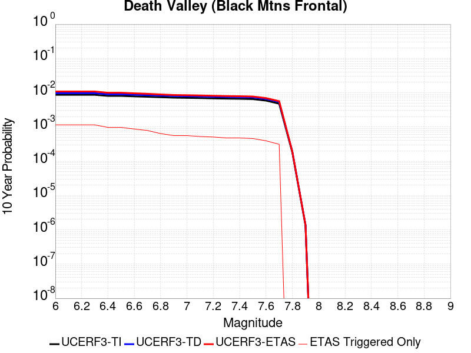 |

| Magnitude | 1 wk TI Prob | 1 wk TD Prob | 1 wk ETAS Prob | 1 wk ETAS/TD Gain | 1 wk ETAS Triggered Only | 1 mo TI Prob | 1 mo TD Prob | 1 mo ETAS Prob | 1 mo ETAS/TD Gain | 1 mo ETAS Triggered Only | 1 yr TI Prob | 1 yr TD Prob | 1 yr ETAS Prob | 1 yr ETAS/TD Gain | 1 yr ETAS Triggered Only | 10 yr TI Prob | 10 yr TD Prob | 10 yr ETAS Prob | 10 yr ETAS/TD Gain | 10 yr ETAS Triggered Only |
|-----|-----|-----|-----|-----|-----|-----|-----|-----|-----|-----|-----|-----|-----|-----|-----|-----|-----|-----|-----|-----|
| 6.0 | 1.6707214E-5 | 1.867027E-5 | 2.9546255E-4 | 15.825297 | 2.7679745E-4 | 7.160038E-5 | 8.001303E-5 | 4.95176E-4 | 6.188692 | 4.1519618E-4 | 8.71386E-4 | 9.737309E-4 | 0.0015613526 | 1.6034746 | 5.881946E-4 | 0.00867977 | 0.009695496 | 0.010654895 | 1.098953 | 9.687911E-4 |
| 6.1 | 1.6707214E-5 | 1.867027E-5 | 2.9546255E-4 | 15.825297 | 2.7679745E-4 | 7.160038E-5 | 8.001303E-5 | 4.95176E-4 | 6.188692 | 4.1519618E-4 | 8.71386E-4 | 9.737309E-4 | 0.0015613526 | 1.6034746 | 5.881946E-4 | 0.00867977 | 0.009695496 | 0.010654895 | 1.098953 | 9.687911E-4 |
| 6.2 | 1.6707214E-5 | 1.867027E-5 | 2.9546255E-4 | 15.825297 | 2.7679745E-4 | 7.160038E-5 | 8.001303E-5 | 4.95176E-4 | 6.188692 | 4.1519618E-4 | 8.71386E-4 | 9.737309E-4 | 0.0015613526 | 1.6034746 | 5.881946E-4 | 0.00867977 | 0.009695496 | 0.010654895 | 1.098953 | 9.687911E-4 |
| 6.3 | 1.6707214E-5 | 1.867027E-5 | 2.9546255E-4 | 15.825297 | 2.7679745E-4 | 7.160038E-5 | 8.001303E-5 | 4.95176E-4 | 6.188692 | 4.1519618E-4 | 8.71386E-4 | 9.737309E-4 | 0.0015613526 | 1.6034746 | 5.881946E-4 | 0.00867977 | 0.009695496 | 0.010654895 | 1.098953 | 9.687911E-4 |
| 6.4 | 1.5515609E-5 | 1.7338214E-5 | 1.9033362E-4 | 10.977695 | 1.729984E-4 | 6.649377E-5 | 7.4304546E-5 | 3.5108143E-4 | 4.7248983 | 2.7679745E-4 | 8.0926094E-4 | 9.042885E-4 | 0.0013191092 | 1.458726 | 4.1519618E-4 | 0.008063202 | 0.009006773 | 0.00976111 | 1.0837522 | 7.61193E-4 |
| 6.5 | 1.5515609E-5 | 1.7338214E-5 | 1.9033362E-4 | 10.977695 | 1.729984E-4 | 6.649377E-5 | 7.4304546E-5 | 3.5108143E-4 | 4.7248983 | 2.7679745E-4 | 8.0926094E-4 | 9.042885E-4 | 0.0013191092 | 1.458726 | 4.1519618E-4 | 0.008063202 | 0.009006773 | 0.00976111 | 1.0837522 | 7.61193E-4 |
| 6.6 | 1.5041828E-5 | 1.6809145E-5 | 1.8980465E-4 | 11.291749 | 1.729984E-4 | 6.4463384E-5 | 7.203723E-5 | 3.4881476E-4 | 4.842145 | 2.7679745E-4 | 7.8455906E-4 | 8.767063E-4 | 0.0012569692 | 1.4337403 | 3.805965E-4 | 0.00781795 | 0.008733132 | 0.009384785 | 1.0746185 | 6.5739395E-4 |
| 6.7 | 1.4634985E-5 | 1.6356016E-5 | 1.5475247E-4 | 9.461502 | 1.3839873E-4 | 6.271985E-5 | 7.009536E-5 | 3.1227616E-4 | 4.455019 | 2.4219777E-4 | 7.6334673E-4 | 8.5308263E-4 | 0.0011987843 | 1.4052382 | 3.459968E-4 | 0.007607299 | 0.008498715 | 0.009047606 | 1.0645851 | 5.535949E-4 |
| 6.8 | 1.4209158E-5 | 1.5882048E-5 | 1.1967945E-4 | 7.535517 | 1.03799044E-4 | 6.089497E-5 | 6.8064175E-5 | 2.7564814E-4 | 4.049827 | 2.0759809E-4 | 7.4114406E-4 | 8.2837185E-4 | 0.001139511 | 1.3756033 | 3.1139713E-4 | 0.007386771 | 0.008253456 | 0.008733854 | 1.0582056 | 4.8439554E-4 |
| 6.9 | 1.3780098E-5 | 1.5404594E-5 | 8.460289E-5 | 5.4920564 | 6.919936E-5 | 5.9056227E-5 | 6.6018045E-5 | 2.3900504E-4 | 3.6202986 | 1.729984E-4 | 7.1877235E-4 | 8.0347876E-4 | 0.0010800539 | 1.344222 | 2.7679745E-4 | 0.0071645193 | 0.008006332 | 0.008418204 | 1.0514432 | 4.1519618E-4 |
| 7.0 | 1.3585064E-5 | 1.5188155E-5 | 8.438647E-5 | 5.556071 | 6.919936E-5 | 5.8220405E-5 | 6.50905E-5 | 2.3807764E-4 | 3.6576405 | 1.729984E-4 | 7.086029E-4 | 7.9219416E-4 | 0.0010687724 | 1.3491293 | 2.7679745E-4 | 0.007063476 | 0.007894293 | 0.008306213 | 1.0521792 | 4.1519618E-4 |
| 7.1 | 1.3398601E-5 | 1.49813395E-5 | 8.4179665E-5 | 5.618968 | 6.919936E-5 | 5.742131E-5 | 6.420419E-5 | 2.3719149E-4 | 3.6943305 | 1.729984E-4 | 6.9888023E-4 | 7.8141113E-4 | 0.0010579923 | 1.3539509 | 2.7679745E-4 | 0.0069668638 | 0.007787224 | 0.008199187 | 1.0529025 | 4.1519618E-4 |
| 7.2 | 1.3126312E-5 | 1.4679561E-5 | 8.387791E-5 | 5.713925 | 6.919936E-5 | 5.6254412E-5 | 6.291092E-5 | 2.3589843E-4 | 3.749722 | 1.729984E-4 | 6.846822E-4 | 7.6567667E-4 | 0.0010422622 | 1.3612301 | 2.7679745E-4 | 0.006825765 | 0.00763097 | 0.008042998 | 1.0539942 | 4.1519618E-4 |
| 7.3 | 1.2922429E-5 | 1.4453788E-5 | 8.365215E-5 | 5.787559 | 6.919936E-5 | 5.5380664E-5 | 6.194336E-5 | 2.3493105E-4 | 3.792675 | 1.729984E-4 | 6.74051E-4 | 7.53905E-4 | 0.0010304938 | 1.3668748 | 2.7679745E-4 | 0.006720101 | 0.007514055 | 0.007891792 | 1.0502707 | 3.805965E-4 |
| 7.4 | 1.2768878E-5 | 1.4283772E-5 | 8.348215E-5 | 5.8445454 | 6.919936E-5 | 5.4722615E-5 | 6.1214756E-5 | 2.3420257E-4 | 3.825917 | 1.729984E-4 | 6.660441E-4 | 7.4504025E-4 | 0.0010216315 | 1.3712434 | 2.7679745E-4 | 0.0066405144 | 0.0074260035 | 0.0078037735 | 1.0508713 | 3.805965E-4 |
| 7.5 | 1.2521929E-5 | 1.40120155E-5 | 8.321041E-5 | 5.938504 | 6.919936E-5 | 5.366431E-5 | 6.005014E-5 | 2.3303817E-4 | 3.8807263 | 1.729984E-4 | 6.531671E-4 | 7.3087064E-4 | 0.0010074658 | 1.3784461 | 2.7679745E-4 | 0.006512506 | 0.0072852457 | 0.0076630693 | 1.0518615 | 3.805965E-4 |
| 7.6 | 1.1301089E-5 | 1.2648149E-5 | 8.1846636E-5 | 6.471037 | 6.919936E-5 | 4.8432343E-5 | 5.4205255E-5 | 2.271943E-4 | 4.19137 | 1.729984E-4 | 5.895042E-4 | 6.5975444E-4 | 9.0179243E-4 | 1.3668607 | 2.4219777E-4 | 0.0058794282 | 0.00657851 | 0.006922231 | 1.052249 | 3.459968E-4 |
| 7.7 | 9.189108E-6 | 1.0283358E-5 | 7.948201E-5 | 7.729188 | 6.919936E-5 | 3.93813E-5 | 4.407082E-5 | 2.170616E-4 | 4.925291 | 1.729984E-4 | 4.7936183E-4 | 5.3643517E-4 | 7.78503E-4 | 1.4512527 | 2.4219777E-4 | 0.004783291 | 0.005351914 | 0.0056616445 | 1.0578729 | 3.1139713E-4 |
| 7.8 | 3.4586725E-7 | 3.6482615E-7 | 3.6482615E-7 | 1.0 | 0.0 | 1.4822873E-6 | 1.5635396E-6 | 1.5635396E-6 | 1.0 | 0.0 | 1.80467E-5 | 1.9035933E-5 | 1.9035933E-5 | 1.0 | 0.0 | 1.8045233E-4 | 1.9034347E-4 | 1.9034347E-4 | 1.0 | 0.0 |
| 7.9 | 2.5591178E-9 | 2.6696718E-9 | 2.6696718E-9 | 1.0 | 0.0 | 1.0967647E-8 | 1.14414505E-8 | 1.14414505E-8 | 1.0 | 0.0 | 1.335311E-7 | 1.3929966E-7 | 1.3929966E-7 | 1.0 | 0.0 | 1.3353102E-6 | 1.3929966E-6 | 1.3929966E-6 | 1.0 | 0.0 |

## Helendale-So Lockhart
*[(top)](#table-of-contents)*

| 1 Week | 1 Month | 1 Year | 10 Year |
|-----|-----|-----|-----|
| 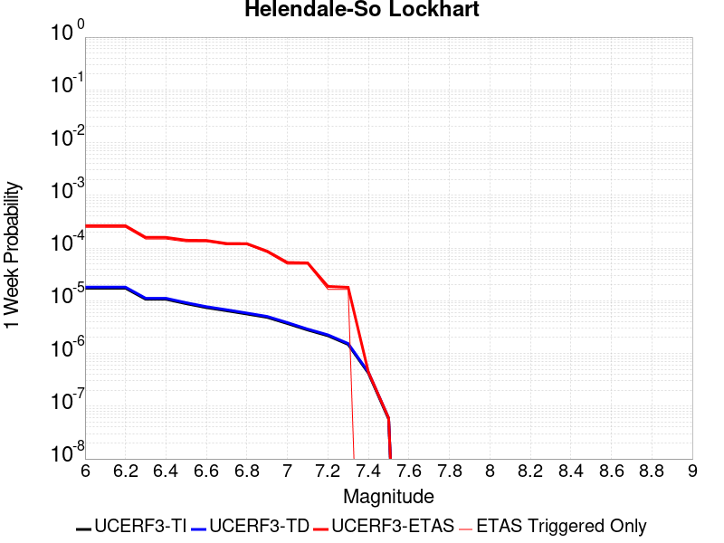 | 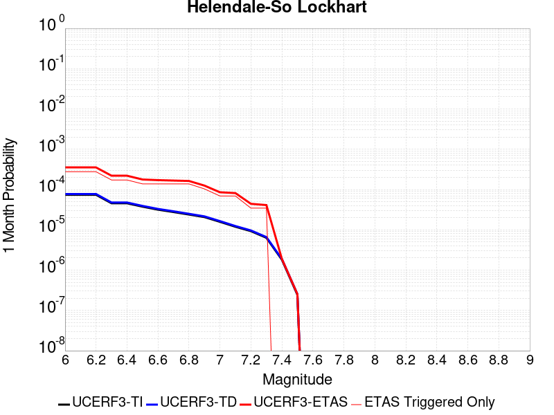 | 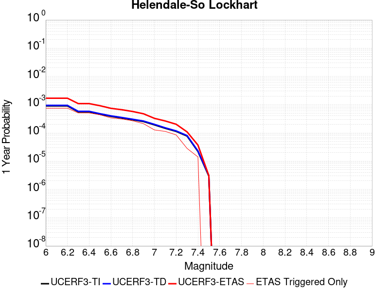 | 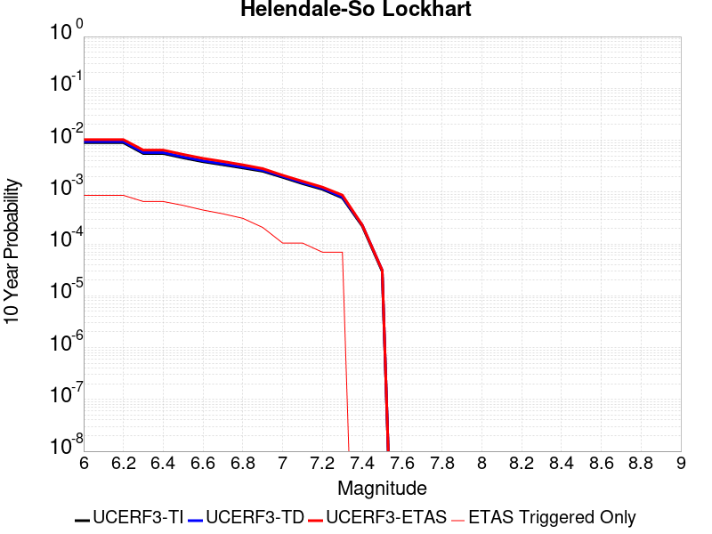 |

| Magnitude | 1 wk TI Prob | 1 wk TD Prob | 1 wk ETAS Prob | 1 wk ETAS/TD Gain | 1 wk ETAS Triggered Only | 1 mo TI Prob | 1 mo TD Prob | 1 mo ETAS Prob | 1 mo ETAS/TD Gain | 1 mo ETAS Triggered Only | 1 yr TI Prob | 1 yr TD Prob | 1 yr ETAS Prob | 1 yr ETAS/TD Gain | 1 yr ETAS Triggered Only | 10 yr TI Prob | 10 yr TD Prob | 10 yr ETAS Prob | 10 yr ETAS/TD Gain | 10 yr ETAS Triggered Only |
|-----|-----|-----|-----|-----|-----|-----|-----|-----|-----|-----|-----|-----|-----|-----|-----|-----|-----|-----|-----|-----|
| 6.0 | 1.7296055E-5 | 1.8103729E-5 | 2.6029712E-4 | 14.378094 | 2.4219777E-4 | 7.412385E-5 | 7.7585224E-5 | 3.543612E-4 | 4.56738 | 2.7679745E-4 | 9.0208417E-4 | 9.4421144E-4 | 0.0014972837 | 1.5857503 | 5.535949E-4 | 0.008984311 | 0.009404116 | 0.010260974 | 1.0911151 | 8.6499203E-4 |
| 6.1 | 1.7296055E-5 | 1.8103729E-5 | 2.6029712E-4 | 14.378094 | 2.4219777E-4 | 7.412385E-5 | 7.7585224E-5 | 3.543612E-4 | 4.56738 | 2.7679745E-4 | 9.0208417E-4 | 9.4421144E-4 | 0.0014972837 | 1.5857503 | 5.535949E-4 | 0.008984311 | 0.009404116 | 0.010260974 | 1.0911151 | 8.6499203E-4 |
| 6.2 | 1.7296055E-5 | 1.8103729E-5 | 2.6029712E-4 | 14.378094 | 2.4219777E-4 | 7.412385E-5 | 7.7585224E-5 | 3.543612E-4 | 4.56738 | 2.7679745E-4 | 9.0208417E-4 | 9.4421144E-4 | 0.0014972837 | 1.5857503 | 5.535949E-4 | 0.008984311 | 0.009404116 | 0.010260974 | 1.0911151 | 8.6499203E-4 |
| 6.3 | 1.0669118E-5 | 1.1135425E-5 | 1.841319E-4 | 16.535688 | 1.729984E-4 | 4.5723988E-5 | 4.772239E-5 | 2.2071254E-4 | 4.6249266 | 1.729984E-4 | 5.5654737E-4 | 5.80868E-4 | 9.612434E-4 | 1.6548396 | 3.805965E-4 | 0.0055515557 | 0.0057937936 | 0.0064473785 | 1.1128078 | 6.5739395E-4 |
| 6.4 | 1.0669118E-5 | 1.1135425E-5 | 1.841319E-4 | 16.535688 | 1.729984E-4 | 4.5723988E-5 | 4.772239E-5 | 2.2071254E-4 | 4.6249266 | 1.729984E-4 | 5.5654737E-4 | 5.80868E-4 | 9.612434E-4 | 1.6548396 | 3.805965E-4 | 0.0055515557 | 0.0057937936 | 0.0064473785 | 1.1128078 | 6.5739395E-4 |
| 6.5 | 8.790038E-6 | 9.170197E-6 | 1.4756765E-4 | 16.092093 | 1.3839873E-4 | 3.767105E-5 | 3.930026E-5 | 1.7769355E-4 | 4.5214343 | 1.3839873E-4 | 4.585485E-4 | 4.7837716E-4 | 7.8962534E-4 | 1.6506335 | 3.1139713E-4 | 0.0045760344 | 0.004773638 | 0.0053245905 | 1.1154156 | 5.535949E-4 |
| 6.6 | 7.396949E-6 | 7.715537E-6 | 1.4611319E-4 | 18.937529 | 1.3839873E-4 | 3.1700827E-5 | 3.3066175E-5 | 1.7146033E-4 | 5.1853695 | 1.3839873E-4 | 3.858892E-4 | 4.025073E-4 | 6.446076E-4 | 1.6014805 | 2.4219777E-4 | 0.003852198 | 0.00401789 | 0.0044658785 | 1.1114985 | 4.4979586E-4 |
| 6.7 | 6.4600285E-6 | 6.738031E-6 | 1.4513583E-4 | 21.539797 | 1.3839873E-4 | 2.7685543E-5 | 2.887696E-5 | 1.6727169E-4 | 5.792566 | 1.3839873E-4 | 3.3701936E-4 | 3.5152107E-4 | 5.5904617E-4 | 1.5903633 | 2.0759809E-4 | 0.0033650869 | 0.003509732 | 0.0038889926 | 1.1080598 | 3.805965E-4 |
| 6.8 | 5.600104E-6 | 5.836009E-6 | 1.4423393E-4 | 24.714478 | 1.3839873E-4 | 2.4000226E-5 | 2.5011232E-5 | 1.634065E-4 | 6.5333247 | 1.3839873E-4 | 2.9216358E-4 | 3.044698E-4 | 5.1200466E-4 | 1.6816272 | 2.0759809E-4 | 0.0029177975 | 0.003040588 | 0.0033510383 | 1.102102 | 3.1139713E-4 |
| 6.9 | 4.839122E-6 | 5.0395092E-6 | 1.0883803E-4 | 21.59695 | 1.03799044E-4 | 2.0738931E-5 | 2.159772E-5 | 1.2539452E-4 | 5.805915 | 1.03799044E-4 | 2.5246723E-4 | 2.6292098E-4 | 3.6669275E-4 | 1.394688 | 1.03799044E-4 | 0.002521806 | 0.002626147 | 0.0028331997 | 1.0788429 | 2.0759809E-4 |
| 7.0 | 3.6937633E-6 | 3.845208E-6 | 7.3044306E-5 | 18.996191 | 6.919936E-5 | 1.5830317E-5 | 1.647936E-5 | 8.567758E-5 | 5.1990843 | 6.919936E-5 | 1.9271708E-4 | 2.0061806E-4 | 2.6980354E-4 | 1.3448617 | 6.919936E-5 | 0.0019255003 | 0.002004401 | 0.0021079918 | 1.0516818 | 1.03799044E-4 |
| 7.1 | 2.7858857E-6 | 2.8978538E-6 | 7.209702E-5 | 24.879454 | 6.919936E-5 | 1.1939455E-5 | 1.2419316E-5 | 8.161782E-5 | 6.571845 | 6.919936E-5 | 1.4535317E-4 | 1.511949E-4 | 2.203838E-4 | 1.4576141 | 6.919936E-5 | 0.0014525814 | 0.0015109418 | 0.001614584 | 1.0685945 | 1.03799044E-4 |
| 7.2 | 2.1672065E-6 | 2.2540128E-6 | 3.6853617E-5 | 16.350225 | 3.459968E-5 | 9.2879945E-6 | 9.66002E-6 | 4.4259366E-5 | 4.5817056 | 3.459968E-5 | 1.1307546E-4 | 1.1760458E-4 | 1.522002E-4 | 1.294169 | 3.459968E-5 | 0.0011301794 | 0.0011754417 | 0.0012445597 | 1.0588018 | 6.919936E-5 |
| 7.3 | 1.4823496E-6 | 1.5422102E-6 | 3.614184E-5 | 23.435093 | 3.459968E-5 | 6.3529114E-6 | 6.6094562E-6 | 4.120891E-5 | 6.234841 | 3.459968E-5 | 7.734395E-5 | 8.046731E-5 | 1.1506421E-4 | 1.4299496 | 3.459968E-5 | 7.731704E-4 | 8.0439687E-4 | 8.735406E-4 | 1.0859572 | 6.919936E-5 |
| 7.4 | 4.2321457E-7 | 4.4108765E-7 | 4.4108765E-7 | 1.0 | 0.0 | 1.8137755E-6 | 1.8903745E-6 | 1.8903745E-6 | 1.0 | 0.0 | 2.2082493E-5 | 2.3015113E-5 | 2.3015113E-5 | 1.0 | 0.0 | 2.2080299E-4 | 2.3013182E-4 | 2.3013182E-4 | 1.0 | 0.0 |
| 7.5 | 5.6942316E-8 | 5.9415648E-8 | 5.9415648E-8 | 1.0 | 0.0 | 2.440385E-7 | 2.5463845E-7 | 2.5463845E-7 | 1.0 | 0.0 | 2.9711643E-6 | 3.1002196E-6 | 3.1002196E-6 | 1.0 | 0.0 | 2.9711247E-5 | 3.1001844E-5 | 3.1001844E-5 | 1.0 | 0.0 |

## San Andreas (Carrizo) rev
*[(top)](#table-of-contents)*

| 1 Week | 1 Month | 1 Year | 10 Year |
|-----|-----|-----|-----|
| 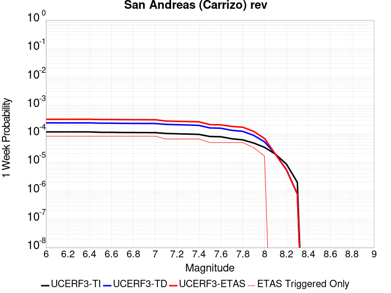 | 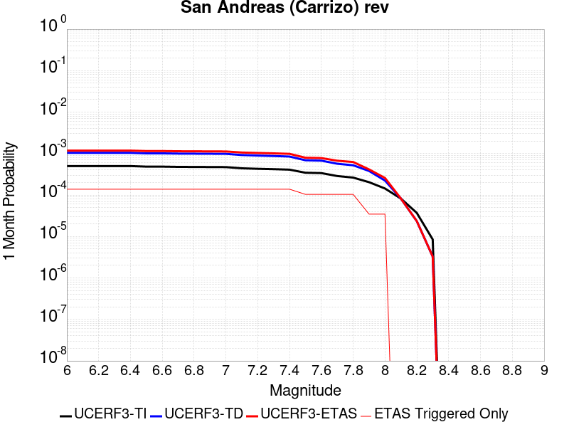 | 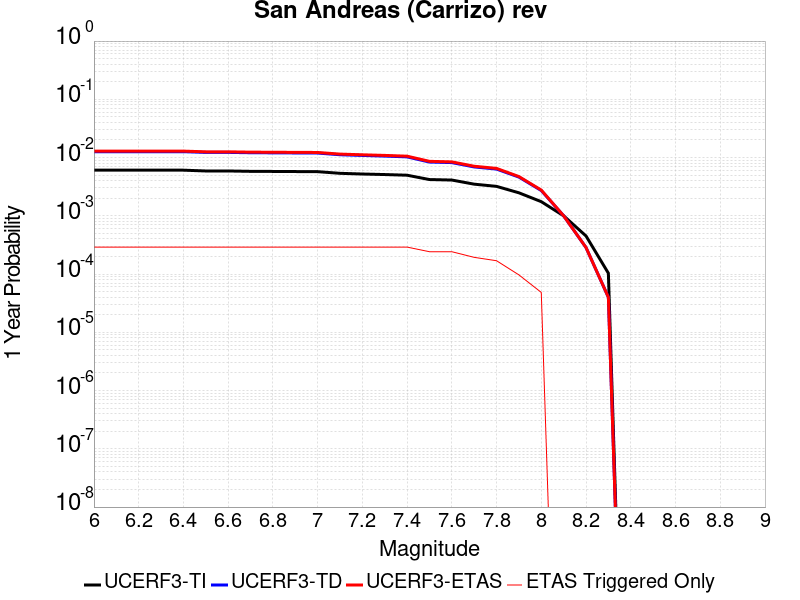 | 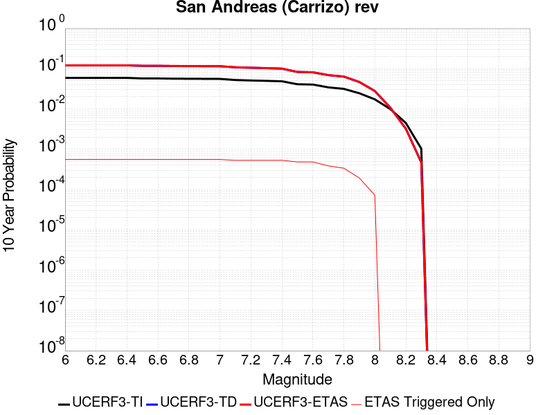 |

| Magnitude | 1 wk TI Prob | 1 wk TD Prob | 1 wk ETAS Prob | 1 wk ETAS/TD Gain | 1 wk ETAS Triggered Only | 1 mo TI Prob | 1 mo TD Prob | 1 mo ETAS Prob | 1 mo ETAS/TD Gain | 1 mo ETAS Triggered Only | 1 yr TI Prob | 1 yr TD Prob | 1 yr ETAS Prob | 1 yr ETAS/TD Gain | 1 yr ETAS Triggered Only | 10 yr TI Prob | 10 yr TD Prob | 10 yr ETAS Prob | 10 yr ETAS/TD Gain | 10 yr ETAS Triggered Only |
|-----|-----|-----|-----|-----|-----|-----|-----|-----|-----|-----|-----|-----|-----|-----|-----|-----|-----|-----|-----|-----|
| 6.0 | 1.1674632E-4 | 2.4324407E-4 | 3.124266E-4 | 1.2844161 | 6.919936E-5 | 5.002454E-4 | 0.0010420597 | 0.0011803142 | 1.1326742 | 1.3839873E-4 | 0.006073493 | 0.012613757 | 0.012955389 | 1.0270841 | 3.459968E-4 | 0.0591016 | 0.120640226 | 0.12121831 | 1.0047919 | 6.5739395E-4 |
| 6.1 | 1.1674632E-4 | 2.4324407E-4 | 3.124266E-4 | 1.2844161 | 6.919936E-5 | 5.002454E-4 | 0.0010420597 | 0.0011803142 | 1.1326742 | 1.3839873E-4 | 0.006073493 | 0.012613757 | 0.012955389 | 1.0270841 | 3.459968E-4 | 0.0591016 | 0.120640226 | 0.12121831 | 1.0047919 | 6.5739395E-4 |
| 6.2 | 1.1674632E-4 | 2.4324407E-4 | 3.124266E-4 | 1.2844161 | 6.919936E-5 | 5.002454E-4 | 0.0010420597 | 0.0011803142 | 1.1326742 | 1.3839873E-4 | 0.006073493 | 0.012613757 | 0.012955389 | 1.0270841 | 3.459968E-4 | 0.0591016 | 0.120640226 | 0.12121831 | 1.0047919 | 6.5739395E-4 |
| 6.3 | 1.1674632E-4 | 2.4324407E-4 | 3.124266E-4 | 1.2844161 | 6.919936E-5 | 5.002454E-4 | 0.0010420597 | 0.0011803142 | 1.1326742 | 1.3839873E-4 | 0.006073493 | 0.012613757 | 0.012955389 | 1.0270841 | 3.459968E-4 | 0.0591016 | 0.120640226 | 0.12121831 | 1.0047919 | 6.5739395E-4 |
| 6.4 | 1.1674632E-4 | 2.4324407E-4 | 3.124266E-4 | 1.2844161 | 6.919936E-5 | 5.002454E-4 | 0.0010420597 | 0.0011803142 | 1.1326742 | 1.3839873E-4 | 0.006073493 | 0.012613757 | 0.012955389 | 1.0270841 | 3.459968E-4 | 0.0591016 | 0.120640226 | 0.12121831 | 1.0047919 | 6.5739395E-4 |
| 6.5 | 1.13136164E-4 | 2.3644442E-4 | 3.056274E-4 | 1.2925973 | 6.919936E-5 | 4.847792E-4 | 0.0010129412 | 0.0011511998 | 1.1364921 | 1.3839873E-4 | 0.0058862255 | 0.012263271 | 0.0126050245 | 1.027868 | 3.459968E-4 | 0.057327334 | 0.11761008 | 0.11819016 | 1.0049322 | 6.5739395E-4 |
| 6.6 | 1.13136164E-4 | 2.3644442E-4 | 3.056274E-4 | 1.2925973 | 6.919936E-5 | 4.847792E-4 | 0.0010129412 | 0.0011511998 | 1.1364921 | 1.3839873E-4 | 0.0058862255 | 0.012263271 | 0.0126050245 | 1.027868 | 3.459968E-4 | 0.057327334 | 0.11761008 | 0.11819016 | 1.0049322 | 6.5739395E-4 |
| 6.7 | 1.1149675E-4 | 2.3335687E-4 | 3.0254008E-4 | 1.2964696 | 6.919936E-5 | 4.777557E-4 | 9.997191E-4 | 0.0011379794 | 1.1382992 | 1.3839873E-4 | 0.0058011734 | 0.012104088 | 0.012445897 | 1.0282391 | 3.459968E-4 | 0.05652051 | 0.1162291 | 0.11681009 | 1.0049987 | 6.5739395E-4 |
| 6.8 | 1.1103589E-4 | 2.3237852E-4 | 3.0156178E-4 | 1.297718 | 6.919936E-5 | 4.7578133E-4 | 9.955293E-4 | 0.0011337902 | 1.1388818 | 1.3839873E-4 | 0.005777263 | 0.012053643 | 0.0123954695 | 1.0283587 | 3.459968E-4 | 0.056293584 | 0.11578894 | 0.116370216 | 1.0050201 | 6.5739395E-4 |
| 6.9 | 1.1053259E-4 | 2.3130233E-4 | 3.004857E-4 | 1.2991036 | 6.919936E-5 | 4.7362508E-4 | 9.909206E-4 | 0.0011291822 | 1.1395284 | 1.3839873E-4 | 0.0057511497 | 0.011998152 | 0.012339997 | 1.0284915 | 3.459968E-4 | 0.05604569 | 0.11530445 | 0.11588604 | 1.005044 | 6.5739395E-4 |
| 7.0 | 1.1005377E-4 | 2.3031076E-4 | 2.994942E-4 | 1.3003917 | 6.919936E-5 | 4.7157376E-4 | 9.866742E-4 | 0.0011249364 | 1.1401294 | 1.3839873E-4 | 0.0057263062 | 0.011947021 | 0.012288884 | 1.0286149 | 3.459968E-4 | 0.055809796 | 0.11485658 | 0.11543847 | 1.0050662 | 6.5739395E-4 |
| 7.1 | 1.0308142E-4 | 2.1540876E-4 | 2.8459323E-4 | 1.3211776 | 6.919936E-5 | 4.417027E-4 | 9.228548E-4 | 0.0010611259 | 1.1498296 | 1.3839873E-4 | 0.0053644776 | 0.011178188 | 0.011520318 | 1.0306069 | 3.459968E-4 | 0.052368138 | 0.10809042 | 0.1086459 | 1.005139 | 6.2279426E-4 |
| 7.2 | 1.0027479E-4 | 2.094876E-4 | 2.7867247E-4 | 1.3302575 | 6.919936E-5 | 4.296783E-4 | 8.9749607E-4 | 0.0010357706 | 1.154067 | 1.3839873E-4 | 0.0052187922 | 0.010872566 | 0.011214801 | 1.031477 | 3.459968E-4 | 0.050979212 | 0.10539086 | 0.105948016 | 1.0052866 | 6.2279426E-4 |
| 7.3 | 9.816942E-5 | 2.0423878E-4 | 2.73424E-4 | 1.3387468 | 6.919936E-5 | 4.2065824E-4 | 8.7501644E-4 | 0.0010132941 | 1.1580286 | 1.3839873E-4 | 0.005109493 | 0.010601572 | 0.010943901 | 1.0322903 | 3.459968E-4 | 0.049935985 | 0.10297546 | 0.10353412 | 1.0054252 | 6.2279426E-4 |
| 7.4 | 9.5634205E-5 | 1.9793298E-4 | 2.6711865E-4 | 1.3495408 | 6.919936E-5 | 4.0979648E-4 | 8.4800937E-4 | 9.862907E-4 | 1.1630658 | 1.3839873E-4 | 0.0049778637 | 0.010275901 | 0.010618343 | 1.0333247 | 3.459968E-4 | 0.048678253 | 0.100067884 | 0.10062835 | 1.0056009 | 6.2279426E-4 |
| 7.5 | 8.052417E-5 | 1.6113915E-4 | 2.3032736E-4 | 1.4293693 | 6.919936E-5 | 3.4505792E-4 | 6.9041376E-4 | 7.9414115E-4 | 1.1502395 | 1.03799044E-4 | 0.0041929903 | 0.008373471 | 0.008682261 | 1.0368772 | 3.1139713E-4 | 0.04114753 | 0.082815245 | 0.08335473 | 1.0065143 | 5.881946E-4 |
| 7.6 | 7.897024E-5 | 1.5767086E-4 | 2.2685931E-4 | 1.4388157 | 6.919936E-5 | 3.384E-4 | 6.755574E-4 | 7.792864E-4 | 1.1535456 | 1.03799044E-4 | 0.0041122385 | 0.00819397 | 0.008502816 | 1.0376918 | 3.1139713E-4 | 0.040369697 | 0.08115866 | 0.08169912 | 1.0066593 | 5.881946E-4 |
| 7.7 | 6.707427E-5 | 1.3277122E-4 | 2.019614E-4 | 1.5211233 | 6.919936E-5 | 2.8742946E-4 | 5.688955E-4 | 6.726355E-4 | 1.1823534 | 1.03799044E-4 | 0.003493839 | 0.0069043385 | 0.007144864 | 1.0348369 | 2.4219777E-4 | 0.034394164 | 0.06905339 | 0.06947213 | 1.0060639 | 4.4979586E-4 |
| 7.8 | 6.147705E-5 | 1.2198445E-4 | 1.9117538E-4 | 1.567211 | 6.919936E-5 | 2.6344648E-4 | 5.226858E-4 | 6.264306E-4 | 1.1984841 | 1.03799044E-4 | 0.0032027436 | 0.006345156 | 0.0065858173 | 1.0379283 | 2.4219777E-4 | 0.031569764 | 0.0635172 | 0.063938424 | 1.0066317 | 4.4979586E-4 |
| 7.9 | 4.7636717E-5 | 8.8802946E-5 | 1.2339956E-4 | 1.3895885 | 3.459968E-5 | 2.0414138E-4 | 3.8052857E-4 | 4.151151E-4 | 1.0908908 | 3.459968E-5 | 0.0024825884 | 0.004623101 | 0.00476086 | 1.0297979 | 1.3839873E-4 | 0.024550365 | 0.046629366 | 0.046893254 | 1.0056593 | 2.7679745E-4 |
| 8.0 | 3.3554235E-5 | 5.2138024E-5 | 8.6735905E-5 | 1.6635824 | 3.459968E-5 | 1.4379594E-4 | 2.2342955E-4 | 2.580215E-4 | 1.1548226 | 3.459968E-5 | 0.0017493097 | 0.002716863 | 0.0027858745 | 1.0254011 | 6.919936E-5 | 0.017356034 | 0.027881905 | 0.02798281 | 1.003619 | 1.03799044E-4 |
| 8.1 | 1.9175432E-5 | 1.9183564E-5 | 1.9183564E-5 | 1.0 | 0.0 | 8.217783E-5 | 8.221269E-5 | 8.221269E-5 | 1.0 | 0.0 | 0.0010000558 | 0.0010004805 | 0.0010004805 | 1.0 | 0.0 | 0.009955673 | 0.010757771 | 0.010757771 | 1.0 | 0.0 |
| 8.2 | 8.643924E-6 | 5.473668E-6 | 5.473668E-6 | 1.0 | 0.0 | 3.704486E-5 | 2.3458366E-5 | 2.3458366E-5 | 1.0 | 0.0 | 4.5092785E-4 | 2.8556827E-4 | 2.8556827E-4 | 1.0 | 0.0 | 0.0045001395 | 0.0032481793 | 0.0032481793 | 1.0 | 0.0 |
| 8.3 | 1.983087E-6 | 7.6564595E-7 | 7.6564595E-7 | 1.0 | 0.0 | 8.498917E-6 | 3.281336E-6 | 3.281336E-6 | 1.0 | 0.0 | 1.034694E-4 | 3.9949547E-5 | 3.9949547E-5 | 1.0 | 0.0 | 0.0010342124 | 4.717979E-4 | 4.717979E-4 | 1.0 | 0.0 |

## San Andreas (Cholame) rev
*[(top)](#table-of-contents)*

| 1 Week | 1 Month | 1 Year | 10 Year |
|-----|-----|-----|-----|
| 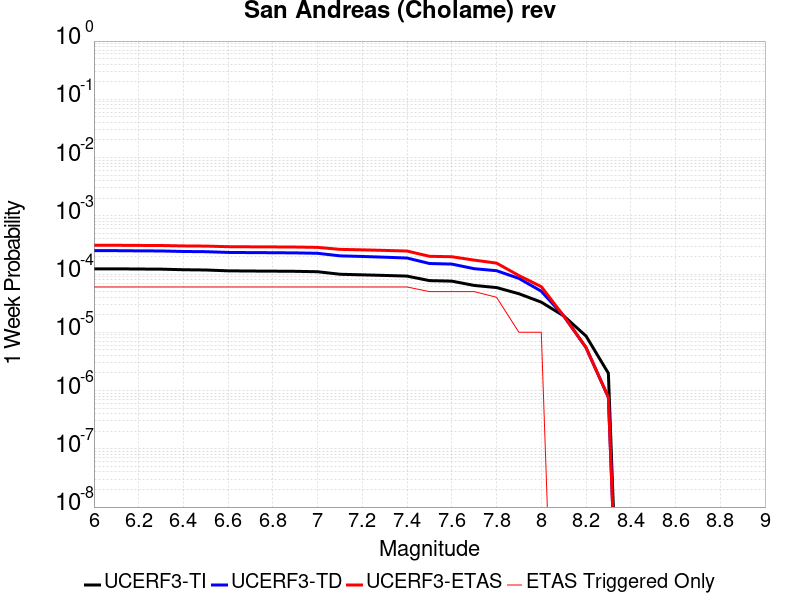 | 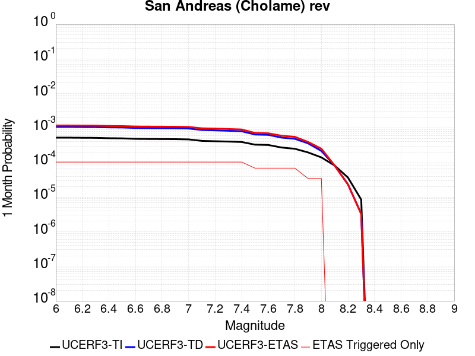 | 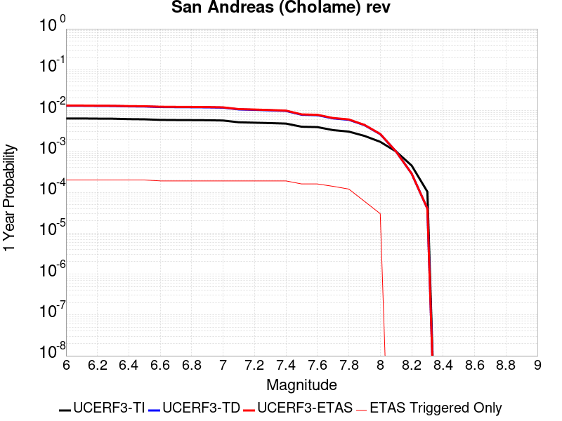 | 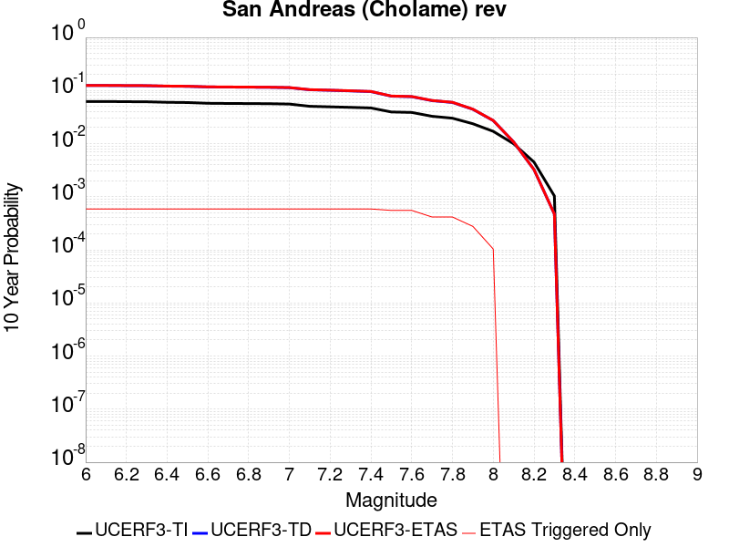 |

| Magnitude | 1 wk TI Prob | 1 wk TD Prob | 1 wk ETAS Prob | 1 wk ETAS/TD Gain | 1 wk ETAS Triggered Only | 1 mo TI Prob | 1 mo TD Prob | 1 mo ETAS Prob | 1 mo ETAS/TD Gain | 1 mo ETAS Triggered Only | 1 yr TI Prob | 1 yr TD Prob | 1 yr ETAS Prob | 1 yr ETAS/TD Gain | 1 yr ETAS Triggered Only | 10 yr TI Prob | 10 yr TD Prob | 10 yr ETAS Prob | 10 yr ETAS/TD Gain | 10 yr ETAS Triggered Only |
|-----|-----|-----|-----|-----|-----|-----|-----|-----|-----|-----|-----|-----|-----|-----|-----|-----|-----|-----|-----|-----|
| 6.0 | 1.2302514E-4 | 2.5205986E-4 | 3.212418E-4 | 1.2744663 | 6.919936E-5 | 5.27144E-4 | 0.0010798109 | 0.001183498 | 1.0960232 | 1.03799044E-4 | 0.0063991086 | 0.013067958 | 0.013375286 | 1.0235176 | 3.1139713E-4 | 0.06217949 | 0.12438412 | 0.12489915 | 1.0041406 | 5.881946E-4 |
| 6.1 | 1.2302514E-4 | 2.5205986E-4 | 3.212418E-4 | 1.2744663 | 6.919936E-5 | 5.27144E-4 | 0.0010798109 | 0.001183498 | 1.0960232 | 1.03799044E-4 | 0.0063991086 | 0.013067958 | 0.013375286 | 1.0235176 | 3.1139713E-4 | 0.06217949 | 0.12438412 | 0.12489915 | 1.0041406 | 5.881946E-4 |
| 6.2 | 1.2203569E-4 | 2.502277E-4 | 3.1940974E-4 | 1.2764764 | 6.919936E-5 | 5.2290526E-4 | 0.0010719653 | 0.0011756531 | 1.0967268 | 1.03799044E-4 | 0.006347804 | 0.012973578 | 0.013280936 | 1.023691 | 3.1139713E-4 | 0.061695136 | 0.123571314 | 0.12408682 | 1.0041717 | 5.881946E-4 |
| 6.3 | 1.2142645E-4 | 2.4908737E-4 | 3.182695E-4 | 1.2777424 | 6.919936E-5 | 5.202953E-4 | 0.0010670823 | 0.0011707705 | 1.0971699 | 1.03799044E-4 | 0.006316212 | 0.012914834 | 0.013222209 | 1.0238001 | 3.1139713E-4 | 0.06139677 | 0.12306532 | 0.12358113 | 1.0041913 | 5.881946E-4 |
| 6.4 | 1.1865206E-4 | 2.4414246E-4 | 3.1332494E-4 | 1.2833693 | 6.919936E-5 | 5.0840975E-4 | 0.0010459068 | 0.0011495973 | 1.0991393 | 1.03799044E-4 | 0.006172335 | 0.012660044 | 0.012967499 | 1.0242854 | 3.1139713E-4 | 0.060036868 | 0.12085904 | 0.12137615 | 1.0042785 | 5.881946E-4 |
| 6.5 | 1.17443946E-4 | 2.4207575E-4 | 3.1125837E-4 | 1.2857891 | 6.919936E-5 | 5.032341E-4 | 0.0010370566 | 0.001140748 | 1.0999862 | 1.03799044E-4 | 0.006109677 | 0.012553536 | 0.012861024 | 1.0244942 | 3.1139713E-4 | 0.059444077 | 0.11993008 | 0.12044773 | 1.0043163 | 5.881946E-4 |
| 6.6 | 1.13579066E-4 | 2.3516564E-4 | 3.0434874E-4 | 1.2941887 | 6.919936E-5 | 4.866766E-4 | 0.001007465 | 0.0011111595 | 1.1029261 | 1.03799044E-4 | 0.0059092017 | 0.012197345 | 0.012504944 | 1.0252185 | 3.1139713E-4 | 0.057545185 | 0.1168492 | 0.11736866 | 1.0044456 | 5.881946E-4 |
| 6.7 | 1.1271412E-4 | 2.336088E-4 | 3.02792E-4 | 1.2961498 | 6.919936E-5 | 4.829711E-4 | 0.001000798 | 0.0011044932 | 1.1036125 | 1.03799044E-4 | 0.005864331 | 0.012117079 | 0.012424704 | 1.0253876 | 3.1139713E-4 | 0.057119697 | 0.11615275 | 0.11667263 | 1.0044758 | 5.881946E-4 |
| 6.8 | 1.1217975E-4 | 2.3249313E-4 | 3.016764E-4 | 1.2975713 | 6.919936E-5 | 4.8068175E-4 | 9.960202E-4 | 0.0010997158 | 1.10411 | 1.03799044E-4 | 0.005836608 | 0.012059555 | 0.012367197 | 1.0255102 | 3.1139713E-4 | 0.056856725 | 0.11565061 | 0.11617078 | 1.0044978 | 5.881946E-4 |
| 6.9 | 1.1146753E-4 | 2.3098059E-4 | 3.0016396E-4 | 1.2995204 | 6.919936E-5 | 4.7763053E-4 | 9.895428E-4 | 0.001093239 | 1.1047921 | 1.03799044E-4 | 0.0057996577 | 0.011981564 | 0.01228923 | 1.0256783 | 3.1139713E-4 | 0.056506127 | 0.11497027 | 0.11549083 | 1.0045278 | 5.881946E-4 |
| 7.0 | 1.0965793E-4 | 2.2721413E-4 | 2.9639777E-4 | 1.3044865 | 6.919936E-5 | 4.698779E-4 | 9.734129E-4 | 0.0010771109 | 1.1065303 | 1.03799044E-4 | 0.005705768 | 0.011787324 | 0.012095051 | 1.0261066 | 3.1139713E-4 | 0.055614736 | 0.11327011 | 0.11379168 | 1.0046047 | 5.881946E-4 |
| 7.1 | 9.927982E-5 | 2.0540332E-4 | 2.7458847E-4 | 1.3368258 | 6.919936E-5 | 4.2541555E-4 | 8.8000396E-4 | 9.837117E-4 | 1.1178491 | 1.03799044E-4 | 0.0051671406 | 0.010661708 | 0.010969786 | 1.0288956 | 3.1139713E-4 | 0.05048634 | 0.10336573 | 0.10389312 | 1.0051023 | 5.881946E-4 |
| 7.2 | 9.696786E-5 | 2.0044584E-4 | 2.6963133E-4 | 1.3451581 | 6.919936E-5 | 4.1551032E-4 | 8.587718E-4 | 9.6248166E-4 | 1.1207653 | 1.03799044E-4 | 0.00504711 | 0.010405703 | 0.01071386 | 1.0296142 | 3.1139713E-4 | 0.04934009 | 0.10110233 | 0.10163106 | 1.0052296 | 5.881946E-4 |
| 7.3 | 9.4727984E-5 | 1.9473763E-4 | 2.6392352E-4 | 1.3552774 | 6.919936E-5 | 4.0591392E-4 | 8.343239E-4 | 9.380363E-4 | 1.1243072 | 1.03799044E-4 | 0.0049308087 | 0.010110851 | 0.0104191 | 1.030487 | 3.1139713E-4 | 0.048228268 | 0.09847412 | 0.099004395 | 1.0053849 | 5.881946E-4 |
| 7.4 | 9.220358E-5 | 1.8844259E-4 | 2.576289E-4 | 1.367148 | 6.919936E-5 | 3.9509835E-4 | 8.07362E-4 | 9.1107725E-4 | 1.1284618 | 1.03799044E-4 | 0.004799717 | 0.009785578 | 0.010093927 | 1.0315107 | 3.1139713E-4 | 0.046973653 | 0.09555831 | 0.096090294 | 1.0055672 | 5.881946E-4 |
| 7.5 | 7.71631E-5 | 1.5179155E-4 | 2.2098041E-4 | 1.455815 | 6.919936E-5 | 3.306571E-4 | 6.5037323E-4 | 7.1952754E-4 | 1.1063303 | 6.919936E-5 | 0.0040183207 | 0.007889617 | 0.008164231 | 1.034807 | 2.7679745E-4 | 0.03946433 | 0.078289196 | 0.07879945 | 1.0065175 | 5.535949E-4 |
| 7.6 | 7.5634416E-5 | 1.4838556E-4 | 2.1757465E-4 | 1.4662791 | 6.919936E-5 | 3.241072E-4 | 6.357833E-4 | 7.0493866E-4 | 1.1087719 | 6.919936E-5 | 0.0039388672 | 0.007713256 | 0.007987918 | 1.0356091 | 2.7679745E-4 | 0.038697794 | 0.076654874 | 0.077166036 | 1.0066683 | 5.535949E-4 |
| 7.7 | 6.3783E-5 | 1.2359623E-4 | 1.9278705E-4 | 1.5598133 | 6.919936E-5 | 2.7332708E-4 | 5.2959064E-4 | 5.9875334E-4 | 1.1305965 | 6.919936E-5 | 0.0033226798 | 0.0064287307 | 0.006634994 | 1.0320846 | 2.0759809E-4 | 0.032734364 | 0.06454488 | 0.06493328 | 1.0060174 | 4.1519618E-4 |
| 7.8 | 5.863422E-5 | 1.14169685E-4 | 1.8336115E-4 | 1.6060406 | 6.919936E-5 | 2.512653E-4 | 4.892069E-4 | 5.5837247E-4 | 1.1413829 | 6.919936E-5 | 0.003054864 | 0.0059398497 | 0.0061462144 | 1.0347425 | 2.0759809E-4 | 0.030132094 | 0.05966162 | 0.060052045 | 1.006544 | 4.1519618E-4 |
| 7.9 | 4.595283E-5 | 8.426815E-5 | 1.1886492E-4 | 1.4105556 | 3.459968E-5 | 1.9692584E-4 | 3.6109926E-4 | 3.9568642E-4 | 1.095783 | 3.459968E-5 | 0.0023949358 | 0.0043875277 | 0.004525319 | 1.0314053 | 1.3839873E-4 | 0.023692891 | 0.044363137 | 0.044627655 | 1.0059626 | 2.7679745E-4 |
| 8.0 | 3.2950178E-5 | 5.077396E-5 | 8.537189E-5 | 1.6814108 | 3.459968E-5 | 1.412074E-4 | 2.1758456E-4 | 2.5217672E-4 | 1.1589826 | 3.459968E-5 | 0.0017178444 | 0.0026458753 | 0.0027148917 | 1.0260844 | 6.919936E-5 | 0.017046256 | 0.027181072 | 0.02728205 | 1.003715 | 1.03799044E-4 |
| 8.1 | 1.9177472E-5 | 1.9183733E-5 | 1.9183733E-5 | 1.0 | 0.0 | 8.218658E-5 | 8.221342E-5 | 8.221342E-5 | 1.0 | 0.0 | 0.0010001622 | 0.0010004893 | 0.0010004893 | 1.0 | 0.0 | 0.009956728 | 0.010757887 | 0.010757887 | 1.0 | 0.0 |
| 8.2 | 8.643924E-6 | 5.473668E-6 | 5.473668E-6 | 1.0 | 0.0 | 3.704486E-5 | 2.3458366E-5 | 2.3458366E-5 | 1.0 | 0.0 | 4.5092785E-4 | 2.8556827E-4 | 2.8556827E-4 | 1.0 | 0.0 | 0.0045001395 | 0.0032481793 | 0.0032481793 | 1.0 | 0.0 |
| 8.3 | 1.983087E-6 | 7.6564595E-7 | 7.6564595E-7 | 1.0 | 0.0 | 8.498917E-6 | 3.281336E-6 | 3.281336E-6 | 1.0 | 0.0 | 1.034694E-4 | 3.9949547E-5 | 3.9949547E-5 | 1.0 | 0.0 | 0.0010342124 | 4.717979E-4 | 4.717979E-4 | 1.0 | 0.0 |

## Elsinore (Glen Ivy) rev
*[(top)](#table-of-contents)*

| 1 Week | 1 Month | 1 Year | 10 Year |
|-----|-----|-----|-----|
| 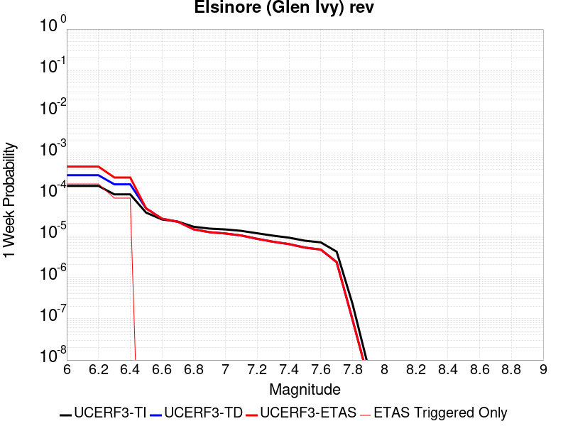 | 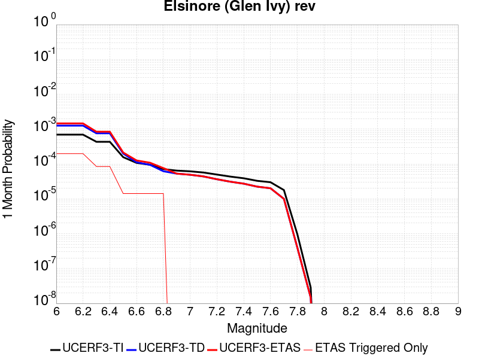 | 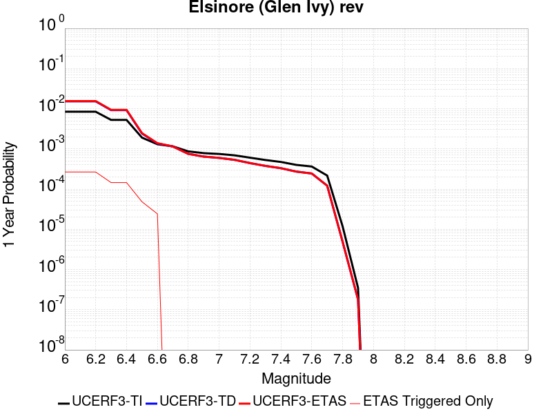 | 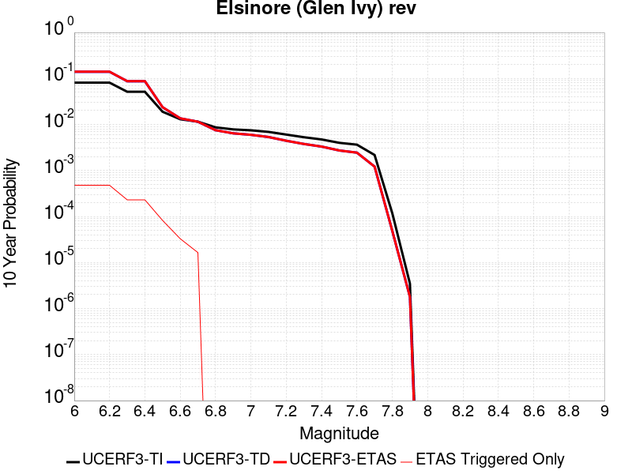 |

| Magnitude | 1 wk TI Prob | 1 wk TD Prob | 1 wk ETAS Prob | 1 wk ETAS/TD Gain | 1 wk ETAS Triggered Only | 1 mo TI Prob | 1 mo TD Prob | 1 mo ETAS Prob | 1 mo ETAS/TD Gain | 1 mo ETAS Triggered Only | 1 yr TI Prob | 1 yr TD Prob | 1 yr ETAS Prob | 1 yr ETAS/TD Gain | 1 yr ETAS Triggered Only | 10 yr TI Prob | 10 yr TD Prob | 10 yr ETAS Prob | 10 yr ETAS/TD Gain | 10 yr ETAS Triggered Only |
|-----|-----|-----|-----|-----|-----|-----|-----|-----|-----|-----|-----|-----|-----|-----|-----|-----|-----|-----|-----|-----|
| 6.0 | 1.6204086E-4 | 2.937271E-4 | 4.6667468E-4 | 1.5888036 | 1.729984E-4 | 6.94276E-4 | 0.0012583778 | 0.0014311585 | 1.1373043 | 1.729984E-4 | 0.008420097 | 0.0152346175 | 0.015575344 | 1.0223652 | 3.459968E-4 | 0.081081145 | 0.13962454 | 0.1400413 | 1.0029849 | 4.8439554E-4 |
| 6.1 | 1.6204086E-4 | 2.937271E-4 | 4.6667468E-4 | 1.5888036 | 1.729984E-4 | 6.94276E-4 | 0.0012583778 | 0.0014311585 | 1.1373043 | 1.729984E-4 | 0.008420097 | 0.0152346175 | 0.015575344 | 1.0223652 | 3.459968E-4 | 0.081081145 | 0.13962454 | 0.1400413 | 1.0029849 | 4.8439554E-4 |
| 6.2 | 1.6204086E-4 | 2.937271E-4 | 4.6667468E-4 | 1.5888036 | 1.729984E-4 | 6.94276E-4 | 0.0012583778 | 0.0014311585 | 1.1373043 | 1.729984E-4 | 0.008420097 | 0.0152346175 | 0.015575344 | 1.0223652 | 3.459968E-4 | 0.081081145 | 0.13962454 | 0.1400413 | 1.0029849 | 4.8439554E-4 |
| 6.3 | 1.0111737E-4 | 1.7703463E-4 | 2.1162818E-4 | 1.1954056 | 3.459968E-5 | 4.332882E-4 | 7.5861585E-4 | 7.931893E-4 | 1.0455743 | 3.459968E-5 | 0.005262531 | 0.0092177205 | 0.009389125 | 1.018595 | 1.729984E-4 | 0.0513964 | 0.08707393 | 0.08732663 | 1.002902 | 2.7679745E-4 |
| 6.4 | 1.0111737E-4 | 1.7703463E-4 | 2.1162818E-4 | 1.1954056 | 3.459968E-5 | 4.332882E-4 | 7.5861585E-4 | 7.931893E-4 | 1.0455743 | 3.459968E-5 | 0.005262531 | 0.0092177205 | 0.009389125 | 1.018595 | 1.729984E-4 | 0.0513964 | 0.08707393 | 0.08732663 | 1.002902 | 2.7679745E-4 |
| 6.5 | 3.6624708E-5 | 4.6391986E-5 | 4.6391986E-5 | 1.0 | 0.0 | 1.569536E-4 | 1.9880968E-4 | 1.9880968E-4 | 1.0 | 0.0 | 0.001909235 | 0.0024181814 | 0.0024872134 | 1.028547 | 6.919936E-5 | 0.01892915 | 0.023697061 | 0.023832181 | 1.0057019 | 1.3839873E-4 |
| 6.6 | 2.5051324E-5 | 2.6147465E-5 | 2.6147465E-5 | 1.0 | 0.0 | 1.073584E-4 | 1.12056E-4 | 1.12056E-4 | 1.0 | 0.0 | 0.0013063047 | 0.0013634725 | 0.001398025 | 1.0253415 | 3.459968E-5 | 0.012986525 | 0.013565759 | 0.013599889 | 1.0025159 | 3.459968E-5 |
| 6.7 | 2.2189772E-5 | 2.2072489E-5 | 2.2072489E-5 | 1.0 | 0.0 | 9.509556E-5 | 9.459316E-5 | 9.459316E-5 | 1.0 | 0.0 | 0.0011571734 | 0.0011510996 | 0.0011510996 | 1.0 | 0.0 | 0.011511663 | 0.0114663225 | 0.0114663225 | 1.0 | 0.0 |
| 6.8 | 1.6654378E-5 | 1.44376E-5 | 1.44376E-5 | 1.0 | 0.0 | 7.137396E-5 | 6.187399E-5 | 6.187399E-5 | 1.0 | 0.0 | 8.686314E-4 | 7.5306057E-4 | 7.5306057E-4 | 1.0 | 0.0 | 0.008652439 | 0.0075100763 | 0.0075100763 | 1.0 | 0.0 |
| 6.9 | 1.5042909E-5 | 1.2331886E-5 | 1.2331886E-5 | 1.0 | 0.0 | 6.446802E-5 | 5.2849886E-5 | 5.2849886E-5 | 1.0 | 0.0 | 7.8461546E-4 | 6.4326054E-4 | 6.4326054E-4 | 1.0 | 0.0 | 0.007818509 | 0.006417925 | 0.006417925 | 1.0 | 0.0 |
| 7.0 | 1.4361385E-5 | 1.1451172E-5 | 1.1451172E-5 | 1.0 | 0.0 | 6.154734E-5 | 4.9075545E-5 | 4.9075545E-5 | 1.0 | 0.0 | 7.490812E-4 | 5.973339E-4 | 5.973339E-4 | 1.0 | 0.0 | 0.007465612 | 0.005960982 | 0.005960982 | 1.0 | 0.0 |
| 7.1 | 1.3265571E-5 | 1.0244736E-5 | 1.0244736E-5 | 1.0 | 0.0 | 5.6851208E-5 | 4.3905282E-5 | 4.3905282E-5 | 1.0 | 0.0 | 6.919436E-4 | 5.344183E-4 | 5.344183E-4 | 1.0 | 0.0 | 0.006897931 | 0.0053346003 | 0.0053346003 | 1.0 | 0.0 |
| 7.2 | 1.1596403E-5 | 8.504847E-6 | 8.504847E-6 | 1.0 | 0.0 | 4.9697923E-5 | 3.6448844E-5 | 3.6448844E-5 | 1.0 | 0.0 | 6.049042E-4 | 4.4367602E-4 | 4.4367602E-4 | 1.0 | 0.0 | 0.006032603 | 0.004429357 | 0.004429357 | 1.0 | 0.0 |
| 7.3 | 1.0150827E-5 | 7.238537E-6 | 7.238537E-6 | 1.0 | 0.0 | 4.3502816E-5 | 3.102194E-5 | 3.102194E-5 | 1.0 | 0.0 | 5.2951806E-4 | 3.776281E-4 | 3.776281E-4 | 1.0 | 0.0 | 0.005282581 | 0.003770271 | 0.003770271 | 1.0 | 0.0 |
| 7.4 | 9.080705E-6 | 6.352307E-6 | 6.352307E-6 | 1.0 | 0.0 | 3.8916725E-5 | 2.7223898E-5 | 2.7223898E-5 | 1.0 | 0.0 | 4.7370812E-4 | 3.314019E-4 | 3.314019E-4 | 1.0 | 0.0 | 0.004726996 | 0.0033092257 | 0.0033092257 | 1.0 | 0.0 |
| 7.5 | 7.671649E-6 | 5.225419E-6 | 5.225419E-6 | 1.0 | 0.0 | 3.287808E-5 | 2.2394468E-5 | 2.2394468E-5 | 1.0 | 0.0 | 4.0021708E-4 | 2.7261977E-4 | 2.7261977E-4 | 1.0 | 0.0 | 0.0039949706 | 0.0027229784 | 0.0027229784 | 1.0 | 0.0 |
| 7.6 | 6.990086E-6 | 4.687336E-6 | 4.687336E-6 | 1.0 | 0.0 | 2.9957167E-5 | 2.0088435E-5 | 2.0088435E-5 | 1.0 | 0.0 | 3.6466747E-4 | 2.445504E-4 | 2.445504E-4 | 1.0 | 0.0 | 0.0036406964 | 0.0024429292 | 0.0024429292 | 1.0 | 0.0 |
| 7.7 | 4.163505E-6 | 2.329331E-6 | 2.329331E-6 | 1.0 | 0.0 | 1.7843471E-5 | 9.982813E-6 | 9.982813E-6 | 1.0 | 0.0 | 2.172226E-4 | 1.2153471E-4 | 1.2153471E-4 | 1.0 | 0.0 | 0.0021701038 | 0.0012147555 | 0.0012147555 | 1.0 | 0.0 |
| 7.8 | 2.2692414E-7 | 9.384417E-8 | 9.384417E-8 | 1.0 | 0.0 | 9.725317E-7 | 4.0218927E-7 | 4.0218927E-7 | 1.0 | 0.0 | 1.1840509E-5 | 4.8966467E-6 | 4.8966467E-6 | 1.0 | 0.0 | 1.1839878E-4 | 4.8965718E-5 | 4.8965718E-5 | 1.0 | 0.0 |
| 7.9 | 6.676829E-9 | 3.4397174E-9 | 3.4397174E-9 | 1.0 | 0.0 | 2.861498E-8 | 1.4741646E-8 | 1.4741646E-8 | 1.0 | 0.0 | 3.4838732E-7 | 1.7947953E-7 | 1.7947953E-7 | 1.0 | 0.0 | 3.4838679E-6 | 1.794794E-6 | 1.794794E-6 | 1.0 | 0.0 |

## Sierra Nevada  (No Extension)
*[(top)](#table-of-contents)*

| 1 Week | 1 Month | 1 Year | 10 Year |
|-----|-----|-----|-----|
| 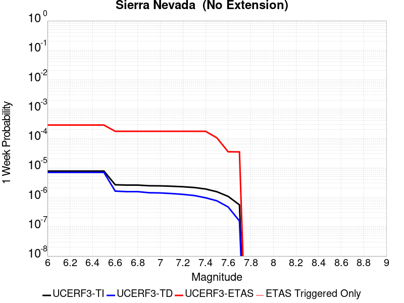 | 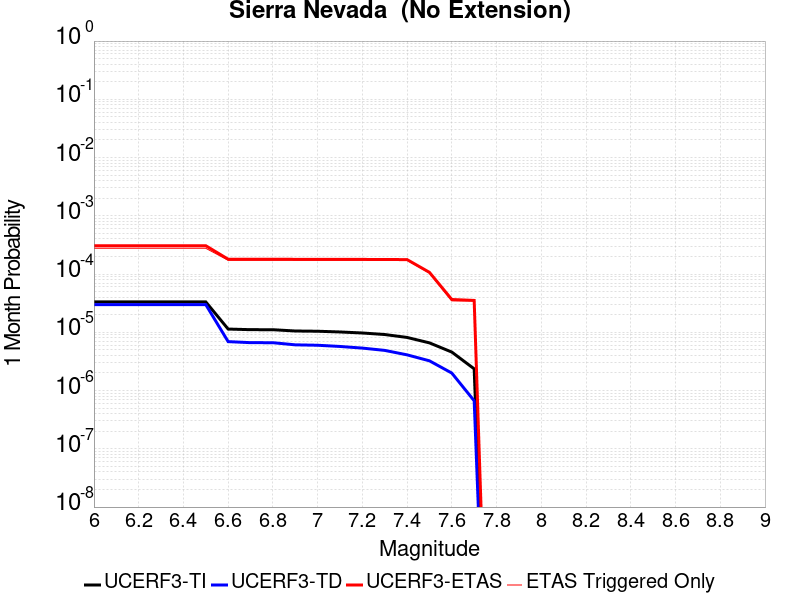 | 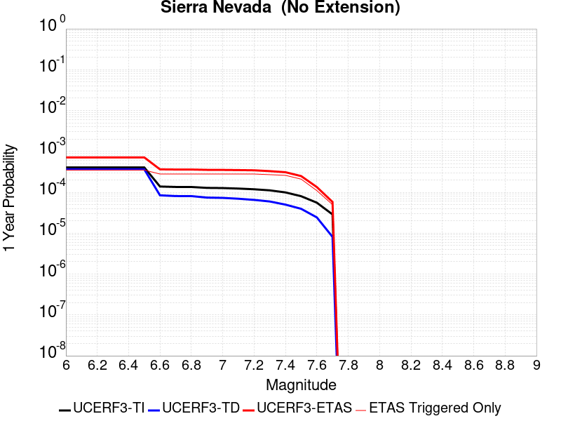 | 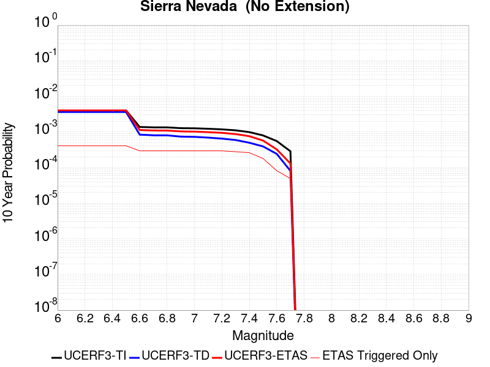 |

| Magnitude | 1 wk TI Prob | 1 wk TD Prob | 1 wk ETAS Prob | 1 wk ETAS/TD Gain | 1 wk ETAS Triggered Only | 1 mo TI Prob | 1 mo TD Prob | 1 mo ETAS Prob | 1 mo ETAS/TD Gain | 1 mo ETAS Triggered Only | 1 yr TI Prob | 1 yr TD Prob | 1 yr ETAS Prob | 1 yr ETAS/TD Gain | 1 yr ETAS Triggered Only | 10 yr TI Prob | 10 yr TD Prob | 10 yr ETAS Prob | 10 yr ETAS/TD Gain | 10 yr ETAS Triggered Only |
|-----|-----|-----|-----|-----|-----|-----|-----|-----|-----|-----|-----|-----|-----|-----|-----|-----|-----|-----|-----|-----|
| 6.0 | 7.7690465E-6 | 6.9762887E-6 | 2.837718E-4 | 40.676617 | 2.7679745E-4 | 3.329549E-5 | 2.989824E-5 | 3.066874E-4 | 10.257709 | 2.7679745E-4 | 4.0529718E-4 | 3.6398612E-4 | 7.444441E-4 | 2.045254 | 3.805965E-4 | 0.004045588 | 0.0036374154 | 0.004154523 | 1.1421634 | 5.189952E-4 |
| 6.1 | 7.7690465E-6 | 6.9762887E-6 | 2.837718E-4 | 40.676617 | 2.7679745E-4 | 3.329549E-5 | 2.989824E-5 | 3.066874E-4 | 10.257709 | 2.7679745E-4 | 4.0529718E-4 | 3.6398612E-4 | 7.444441E-4 | 2.045254 | 3.805965E-4 | 0.004045588 | 0.0036374154 | 0.004154523 | 1.1421634 | 5.189952E-4 |
| 6.2 | 7.7690465E-6 | 6.9762887E-6 | 2.837718E-4 | 40.676617 | 2.7679745E-4 | 3.329549E-5 | 2.989824E-5 | 3.066874E-4 | 10.257709 | 2.7679745E-4 | 4.0529718E-4 | 3.6398612E-4 | 7.444441E-4 | 2.045254 | 3.805965E-4 | 0.004045588 | 0.0036374154 | 0.004154523 | 1.1421634 | 5.189952E-4 |
| 6.3 | 7.7690465E-6 | 6.9762887E-6 | 2.837718E-4 | 40.676617 | 2.7679745E-4 | 3.329549E-5 | 2.989824E-5 | 3.066874E-4 | 10.257709 | 2.7679745E-4 | 4.0529718E-4 | 3.6398612E-4 | 7.444441E-4 | 2.045254 | 3.805965E-4 | 0.004045588 | 0.0036374154 | 0.004154523 | 1.1421634 | 5.189952E-4 |
| 6.4 | 7.7690465E-6 | 6.9762887E-6 | 2.837718E-4 | 40.676617 | 2.7679745E-4 | 3.329549E-5 | 2.989824E-5 | 3.066874E-4 | 10.257709 | 2.7679745E-4 | 4.0529718E-4 | 3.6398612E-4 | 7.444441E-4 | 2.045254 | 3.805965E-4 | 0.004045588 | 0.0036374154 | 0.004154523 | 1.1421634 | 5.189952E-4 |
| 6.5 | 7.7690465E-6 | 6.9762887E-6 | 2.837718E-4 | 40.676617 | 2.7679745E-4 | 3.329549E-5 | 2.989824E-5 | 3.066874E-4 | 10.257709 | 2.7679745E-4 | 4.0529718E-4 | 3.6398612E-4 | 7.444441E-4 | 2.045254 | 3.805965E-4 | 0.004045588 | 0.0036374154 | 0.004154523 | 1.1421634 | 5.189952E-4 |
| 6.6 | 2.653E-6 | 1.6148208E-6 | 1.7461296E-4 | 108.13147 | 1.729984E-4 | 1.136995E-5 | 6.9206426E-6 | 1.7991786E-4 | 25.997276 | 1.729984E-4 | 1.3842035E-4 | 8.42556E-5 | 3.6102973E-4 | 4.2849345 | 2.7679745E-4 | 0.0013833415 | 8.4224E-4 | 0.001222516 | 1.4515054 | 3.805965E-4 |
| 6.7 | 2.5902466E-6 | 1.5501544E-6 | 1.7454829E-4 | 112.600586 | 1.729984E-4 | 1.11010095E-5 | 6.643502E-6 | 1.7964076E-4 | 27.04007 | 1.729984E-4 | 1.351464E-4 | 8.088166E-5 | 3.5765674E-4 | 4.4219756 | 2.7679745E-4 | 0.0013506424 | 8.0852525E-4 | 0.001188814 | 1.4703487 | 3.805965E-4 |
| 6.8 | 2.5853892E-6 | 1.5469546E-6 | 1.745451E-4 | 112.83142 | 1.729984E-4 | 1.1080193E-5 | 6.629789E-6 | 1.7962705E-4 | 27.093931 | 1.729984E-4 | 1.34893E-4 | 8.071472E-5 | 3.5748983E-4 | 4.429054 | 2.7679745E-4 | 0.0013481114 | 8.06857E-4 | 0.0011871464 | 1.471322 | 3.805965E-4 |
| 6.9 | 2.458257E-6 | 1.422029E-6 | 1.7442019E-4 | 122.65587 | 1.729984E-4 | 1.0535345E-5 | 6.0943958E-6 | 1.7909174E-4 | 29.386303 | 1.729984E-4 | 1.2826028E-4 | 7.419676E-5 | 3.5097369E-4 | 4.73031 | 2.7679745E-4 | 0.0012818627 | 7.4172183E-4 | 0.001122036 | 1.512745 | 3.805965E-4 |
| 7.0 | 2.4341468E-6 | 1.3989927E-6 | 1.7439717E-4 | 124.65909 | 1.729984E-4 | 1.0432016E-5 | 5.9956697E-6 | 1.7899304E-4 | 29.85372 | 1.729984E-4 | 1.270024E-4 | 7.299485E-5 | 3.497721E-4 | 4.7917366 | 2.7679745E-4 | 0.0012692984 | 7.297107E-4 | 0.0011100294 | 1.5211912 | 3.805965E-4 |
| 7.1 | 2.3652476E-6 | 1.3339427E-6 | 1.7433212E-4 | 130.68936 | 1.729984E-4 | 1.0136736E-5 | 5.716885E-6 | 1.787143E-4 | 31.260784 | 1.729984E-4 | 1.2340778E-4 | 6.9600865E-5 | 3.4637906E-4 | 4.976649 | 2.7679745E-4 | 0.0012333926 | 6.957924E-4 | 0.001076124 | 1.5466167 | 3.805965E-4 |
| 7.2 | 2.272158E-6 | 1.2502497E-6 | 1.7424845E-4 | 139.37091 | 1.729984E-4 | 9.737784E-6 | 5.358202E-6 | 1.7835568E-4 | 33.28648 | 1.729984E-4 | 1.1855107E-4 | 6.523417E-5 | 3.4201358E-4 | 5.242859 | 2.7679745E-4 | 0.0011848784 | 6.5215176E-4 | 0.0010325001 | 1.5832206 | 3.805965E-4 |
| 7.3 | 2.1382127E-6 | 1.1419382E-6 | 1.7414015E-4 | 152.49524 | 1.729984E-4 | 9.163737E-6 | 4.894012E-6 | 1.7789158E-4 | 36.348824 | 1.729984E-4 | 1.1156279E-4 | 5.9582977E-5 | 3.3636394E-4 | 5.645303 | 2.7679745E-4 | 0.001115068 | 5.956712E-4 | 9.4146194E-4 | 1.580506 | 3.459968E-4 |
| 7.4 | 1.9048055E-6 | 9.574928E-7 | 1.7395573E-4 | 181.67838 | 1.729984E-4 | 8.163426E-6 | 4.103534E-6 | 1.7710123E-4 | 43.15822 | 1.729984E-4 | 9.9385186E-5 | 4.995939E-5 | 3.2674303E-4 | 6.540172 | 2.7679745E-4 | 9.934074E-4 | 4.9948227E-4 | 8.1072387E-4 | 1.6231284 | 3.1139713E-4 |
| 7.5 | 1.5373403E-6 | 7.559763E-7 | 1.0455494E-4 | 138.30452 | 1.03799044E-4 | 6.5885843E-6 | 3.2398946E-6 | 1.07038606E-4 | 33.03768 | 1.03799044E-4 | 8.021306E-5 | 3.9445007E-5 | 2.470349E-4 | 6.262768 | 2.0759809E-4 | 8.0184115E-4 | 3.9438053E-4 | 6.364828E-4 | 1.6138798 | 2.4219777E-4 |
| 7.6 | 1.0680322E-6 | 4.65941E-7 | 3.506561E-5 | 75.257614 | 3.459968E-5 | 4.577273E-6 | 1.9968884E-6 | 3.6596502E-5 | 18.326763 | 3.459968E-5 | 5.5726876E-5 | 2.4311848E-5 | 9.350953E-5 | 3.8462534 | 6.919936E-5 | 5.5712904E-4 | 2.4309216E-4 | 3.122747E-4 | 1.2845939 | 6.919936E-5 |
| 7.7 | 5.509146E-7 | 1.5578539E-7 | 3.4755463E-5 | 223.09834 | 3.459968E-5 | 2.3610605E-6 | 6.676515E-7 | 3.526731E-5 | 52.822933 | 3.459968E-5 | 2.8745531E-5 | 8.128628E-6 | 4.272803E-5 | 5.2564874 | 3.459968E-5 | 2.8741814E-4 | 8.128342E-5 | 1.1588029E-4 | 1.4256326 | 3.459968E-5 |

## San Andreas (San Gorgonio Pass-Garnet HIll)
*[(top)](#table-of-contents)*

| 1 Week | 1 Month | 1 Year | 10 Year |
|-----|-----|-----|-----|
| 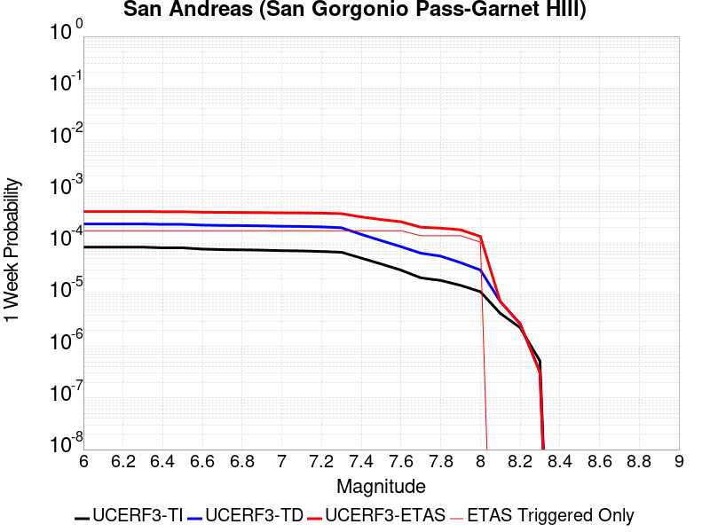 | 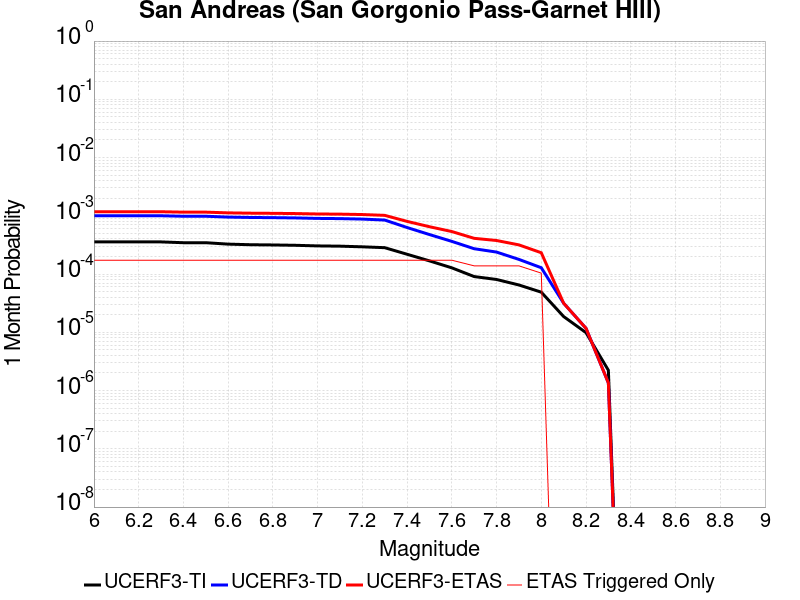 | 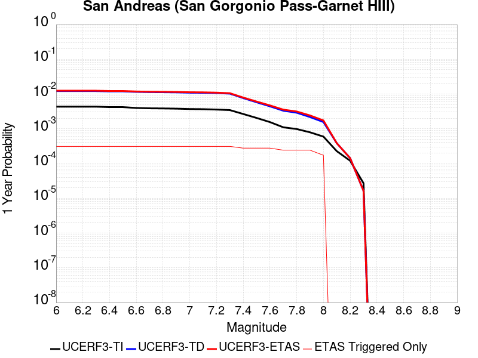 | 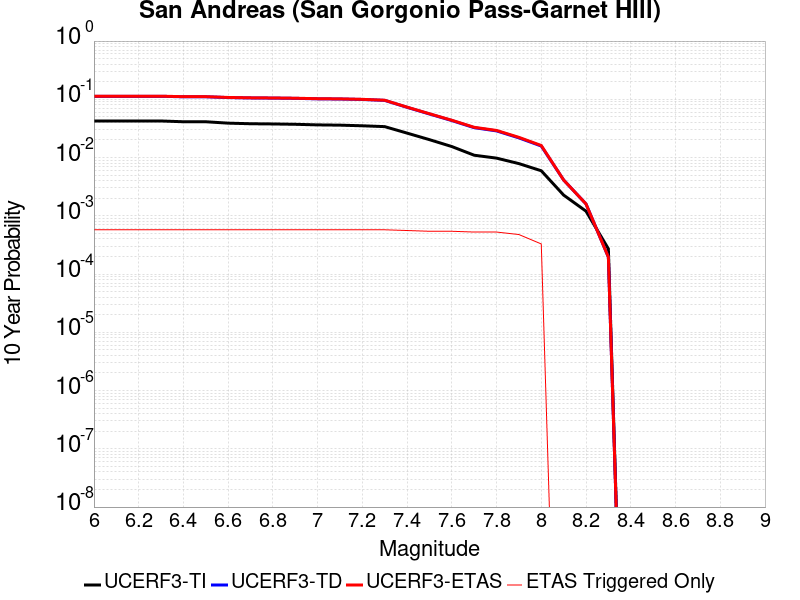 |

| Magnitude | 1 wk TI Prob | 1 wk TD Prob | 1 wk ETAS Prob | 1 wk ETAS/TD Gain | 1 wk ETAS Triggered Only | 1 mo TI Prob | 1 mo TD Prob | 1 mo ETAS Prob | 1 mo ETAS/TD Gain | 1 mo ETAS Triggered Only | 1 yr TI Prob | 1 yr TD Prob | 1 yr ETAS Prob | 1 yr ETAS/TD Gain | 1 yr ETAS Triggered Only | 10 yr TI Prob | 10 yr TD Prob | 10 yr ETAS Prob | 10 yr ETAS/TD Gain | 10 yr ETAS Triggered Only |
|-----|-----|-----|-----|-----|-----|-----|-----|-----|-----|-----|-----|-----|-----|-----|-----|-----|-----|-----|-----|-----|
| 6.0 | 8.31567E-5 | 2.3384395E-4 | 4.068019E-4 | 1.7396297 | 1.729984E-4 | 3.5633717E-4 | 0.0010018025 | 0.0011746276 | 1.1725141 | 1.729984E-4 | 0.004329778 | 0.012128622 | 0.012436243 | 1.0253632 | 3.1139713E-4 | 0.042463828 | 0.11258187 | 0.11301173 | 1.0038182 | 4.8439554E-4 |
| 6.1 | 8.31567E-5 | 2.3384395E-4 | 4.068019E-4 | 1.7396297 | 1.729984E-4 | 3.5633717E-4 | 0.0010018025 | 0.0011746276 | 1.1725141 | 1.729984E-4 | 0.004329778 | 0.012128622 | 0.012436243 | 1.0253632 | 3.1139713E-4 | 0.042463828 | 0.11258187 | 0.11301173 | 1.0038182 | 4.8439554E-4 |
| 6.2 | 8.31567E-5 | 2.3384395E-4 | 4.068019E-4 | 1.7396297 | 1.729984E-4 | 3.5633717E-4 | 0.0010018025 | 0.0011746276 | 1.1725141 | 1.729984E-4 | 0.004329778 | 0.012128622 | 0.012436243 | 1.0253632 | 3.1139713E-4 | 0.042463828 | 0.11258187 | 0.11301173 | 1.0038182 | 4.8439554E-4 |
| 6.3 | 8.31567E-5 | 2.3384395E-4 | 4.068019E-4 | 1.7396297 | 1.729984E-4 | 3.5633717E-4 | 0.0010018025 | 0.0011746276 | 1.1725141 | 1.729984E-4 | 0.004329778 | 0.012128622 | 0.012436243 | 1.0253632 | 3.1139713E-4 | 0.042463828 | 0.11258187 | 0.11301173 | 1.0038182 | 4.8439554E-4 |
| 6.4 | 8.059055E-5 | 2.2941893E-4 | 4.0237766E-4 | 1.7538991 | 1.729984E-4 | 3.4534236E-4 | 9.828559E-4 | 0.0011556844 | 1.175843 | 1.729984E-4 | 0.0041964394 | 0.011900819 | 0.01220851 | 1.0258546 | 3.1139713E-4 | 0.041180745 | 0.110562965 | 0.1109938 | 1.0038968 | 4.8439554E-4 |
| 6.5 | 8.059055E-5 | 2.2941893E-4 | 4.0237766E-4 | 1.7538991 | 1.729984E-4 | 3.4534236E-4 | 9.828559E-4 | 0.0011556844 | 1.175843 | 1.729984E-4 | 0.0041964394 | 0.011900819 | 0.01220851 | 1.0258546 | 3.1139713E-4 | 0.041180745 | 0.110562965 | 0.1109938 | 1.0038968 | 4.8439554E-4 |
| 6.6 | 7.619237E-5 | 2.2186468E-4 | 3.9482472E-4 | 1.7795744 | 1.729984E-4 | 3.2649786E-4 | 9.5050444E-4 | 0.0011233384 | 1.181834 | 1.729984E-4 | 0.0039678677 | 0.0115115335 | 0.011819346 | 1.0267395 | 3.1139713E-4 | 0.03897764 | 0.10709954 | 0.107532054 | 1.0040385 | 4.8439554E-4 |
| 6.7 | 7.440636E-5 | 2.1862281E-4 | 3.915834E-4 | 1.791137 | 1.729984E-4 | 3.188454E-4 | 9.3662075E-4 | 0.0011094571 | 1.1845319 | 1.729984E-4 | 0.0038750346 | 0.011344268 | 0.0116521325 | 1.0271384 | 3.1139713E-4 | 0.038081564 | 0.1056081 | 0.10604134 | 1.0041023 | 4.8439554E-4 |
| 6.8 | 7.3735864E-5 | 2.1709445E-4 | 3.900553E-4 | 1.7967079 | 1.729984E-4 | 3.1597257E-4 | 9.300753E-4 | 0.0011029128 | 1.1858318 | 1.729984E-4 | 0.0038401815 | 0.011265406 | 0.011573296 | 1.0273305 | 3.1139713E-4 | 0.03774495 | 0.104909696 | 0.105343275 | 1.0041329 | 4.8439554E-4 |
| 6.9 | 7.27575E-5 | 2.1478413E-4 | 3.877454E-4 | 1.8052795 | 1.729984E-4 | 3.117806E-4 | 9.20181E-4 | 0.0010930202 | 1.1878318 | 1.729984E-4 | 0.003789323 | 0.011146182 | 0.011454108 | 1.0276262 | 3.1139713E-4 | 0.037253562 | 0.10385753 | 0.10429162 | 1.0041796 | 4.8439554E-4 |
| 7.0 | 7.102591E-5 | 2.1062451E-4 | 3.8358648E-4 | 1.8211863 | 1.729984E-4 | 3.0436125E-4 | 9.023664E-4 | 0.0010752088 | 1.1915433 | 1.729984E-4 | 0.003699303 | 0.010931484 | 0.011239477 | 1.0281749 | 3.1139713E-4 | 0.03638325 | 0.101959534 | 0.10239454 | 1.0042665 | 4.8439554E-4 |
| 7.1 | 7.028513E-5 | 2.0898094E-4 | 3.819432E-4 | 1.8276461 | 1.729984E-4 | 3.0118722E-4 | 8.953274E-4 | 0.0010681709 | 1.1930506 | 1.729984E-4 | 0.0036607897 | 0.010846641 | 0.011154661 | 1.0283977 | 3.1139713E-4 | 0.036010686 | 0.10120243 | 0.1016378 | 1.004302 | 4.8439554E-4 |
| 7.2 | 6.8498244E-5 | 2.050596E-4 | 3.7802252E-4 | 1.8434764 | 1.729984E-4 | 2.9353087E-4 | 8.7853306E-4 | 0.0010513795 | 1.1967443 | 1.729984E-4 | 0.003567883 | 0.0106441835 | 0.010952266 | 1.0289438 | 3.1139713E-4 | 0.035111405 | 0.09939449 | 0.09983074 | 1.004389 | 4.8439554E-4 |
| 7.3 | 6.622592E-5 | 1.9733235E-4 | 3.7029662E-4 | 1.8765125 | 1.729984E-4 | 2.8379448E-4 | 8.4543816E-4 | 0.0010182903 | 1.2044528 | 1.729984E-4 | 0.0034497243 | 0.010245111 | 0.010553317 | 1.0300833 | 3.1139713E-4 | 0.033966612 | 0.095891245 | 0.0963292 | 1.0045671 | 4.8439554E-4 |
| 7.4 | 5.1050705E-5 | 1.4690042E-4 | 3.1987342E-4 | 2.1774848 | 1.729984E-4 | 2.1877038E-4 | 6.294222E-4 | 8.0231176E-4 | 1.2746798 | 1.729984E-4 | 0.002660276 | 0.007636482 | 0.007911166 | 1.03597 | 2.7679745E-4 | 0.02628654 | 0.07286554 | 0.073282555 | 1.0057231 | 4.4979586E-4 |
| 7.5 | 3.9302922E-5 | 1.11307076E-4 | 2.8428622E-4 | 2.5540714 | 1.729984E-4 | 1.6843023E-4 | 4.7694342E-4 | 6.498593E-4 | 1.3625501 | 1.729984E-4 | 0.0020487092 | 0.0057913954 | 0.0060665896 | 1.0475178 | 2.7679745E-4 | 0.020299247 | 0.05601151 | 0.05643611 | 1.0075806 | 4.4979586E-4 |
| 7.6 | 2.9851626E-5 | 8.4956984E-5 | 2.579407E-4 | 3.0361328 | 1.729984E-4 | 1.2792926E-4 | 3.6405068E-4 | 5.369861E-4 | 1.4750311 | 1.729984E-4 | 0.0015564259 | 0.0044233347 | 0.004698908 | 1.0622998 | 2.7679745E-4 | 0.0154556995 | 0.043196145 | 0.043626513 | 1.009963 | 4.4979586E-4 |
| 7.7 | 2.1135214E-5 | 6.353527E-5 | 2.019252E-4 | 3.1781592 | 1.3839873E-4 | 9.0576345E-5 | 2.722656E-4 | 4.1062667E-4 | 1.5081841 | 1.3839873E-4 | 0.0011022091 | 0.0033098008 | 0.0035511968 | 1.0729338 | 2.4219777E-4 | 0.010967582 | 0.03258456 | 0.032986227 | 1.012327 | 4.1519618E-4 |
| 7.8 | 1.883379E-5 | 5.564576E-5 | 1.9403678E-4 | 3.4870002 | 1.3839873E-4 | 8.0713755E-5 | 2.3846005E-4 | 3.7682577E-4 | 1.5802469 | 1.3839873E-4 | 9.822468E-4 | 0.002899389 | 0.0031408847 | 1.0832919 | 2.4219777E-4 | 0.0097791655 | 0.028696978 | 0.02910026 | 1.0140531 | 4.1519618E-4 |
| 7.9 | 1.5156185E-5 | 4.1662403E-5 | 1.8005536E-4 | 4.3217707 | 1.3839873E-4 | 6.495346E-5 | 1.7854095E-4 | 3.1691496E-4 | 1.7750268 | 1.3839873E-4 | 7.9052144E-4 | 0.0021715704 | 0.0024132421 | 1.111289 | 2.4219777E-4 | 0.007877152 | 0.021760946 | 0.02213326 | 1.0171093 | 3.805965E-4 |
| 8.0 | 1.1405907E-5 | 2.9976925E-5 | 1.3377286E-4 | 4.4625278 | 1.03799044E-4 | 4.8881542E-5 | 1.2846621E-4 | 2.3225193E-4 | 1.8078833 | 1.03799044E-4 | 5.9497025E-4 | 0.0015629551 | 0.0017356831 | 1.1105137 | 1.729984E-4 | 0.005933798 | 0.015774013 | 0.016012391 | 1.015112 | 2.4219777E-4 |
| 8.1 | 4.3511436E-6 | 7.369465E-6 | 7.369465E-6 | 1.0 | 0.0 | 1.8647626E-5 | 3.158304E-5 | 3.158304E-5 | 1.0 | 0.0 | 2.2701119E-4 | 3.844558E-4 | 3.844558E-4 | 1.0 | 0.0 | 0.0022677942 | 0.0041165445 | 0.0041165445 | 1.0 | 0.0 |
| 8.2 | 2.3042528E-6 | 2.7328301E-6 | 2.7328301E-6 | 1.0 | 0.0 | 9.875332E-6 | 1.1712076E-5 | 1.1712076E-5 | 1.0 | 0.0 | 1.2022553E-4 | 1.4258524E-4 | 1.4258524E-4 | 1.0 | 0.0 | 0.0012016051 | 0.0015979637 | 0.0015979637 | 1.0 | 0.0 |
| 8.3 | 5.202968E-7 | 3.1590292E-7 | 3.1590292E-7 | 1.0 | 0.0 | 2.2298414E-6 | 1.353869E-6 | 1.353869E-6 | 1.0 | 0.0 | 2.714798E-5 | 1.6483244E-5 | 1.6483244E-5 | 1.0 | 0.0 | 2.7144665E-4 | 1.955901E-4 | 1.955901E-4 | 1.0 | 0.0 |

## San Andreas (Parkfield)
*[(top)](#table-of-contents)*

| 1 Week | 1 Month | 1 Year | 10 Year |
|-----|-----|-----|-----|
| 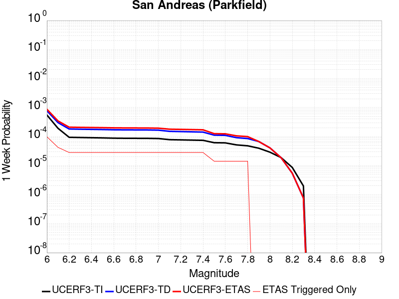 | 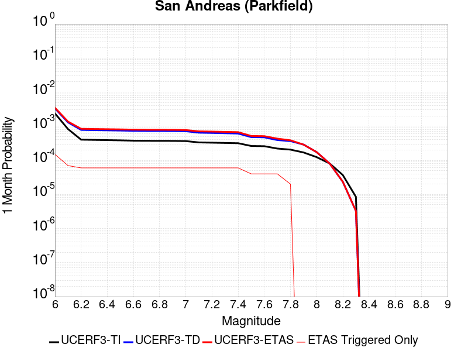 | 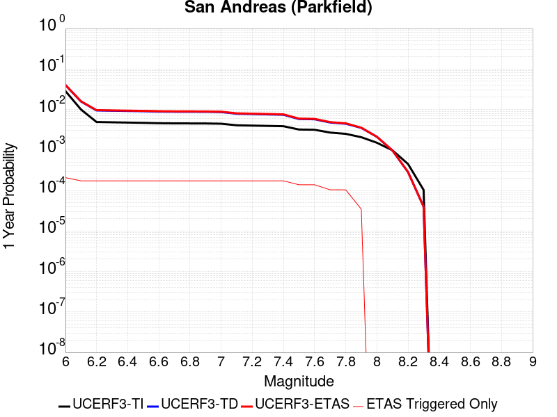 | 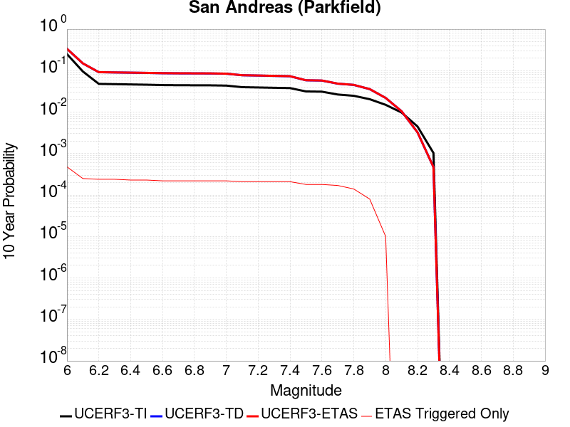 |

| Magnitude | 1 wk TI Prob | 1 wk TD Prob | 1 wk ETAS Prob | 1 wk ETAS/TD Gain | 1 wk ETAS Triggered Only | 1 mo TI Prob | 1 mo TD Prob | 1 mo ETAS Prob | 1 mo ETAS/TD Gain | 1 mo ETAS Triggered Only | 1 yr TI Prob | 1 yr TD Prob | 1 yr ETAS Prob | 1 yr ETAS/TD Gain | 1 yr ETAS Triggered Only | 10 yr TI Prob | 10 yr TD Prob | 10 yr ETAS Prob | 10 yr ETAS/TD Gain | 10 yr ETAS Triggered Only |
|-----|-----|-----|-----|-----|-----|-----|-----|-----|-----|-----|-----|-----|-----|-----|-----|-----|-----|-----|-----|-----|
| 6.0 | 5.556969E-4 | 7.778562E-4 | 8.4700173E-4 | 1.0888925 | 6.919936E-5 | 0.0023793848 | 0.0033299583 | 0.0034334117 | 1.0310675 | 1.03799044E-4 | 0.028586963 | 0.040235043 | 0.040434286 | 1.0049521 | 2.0759809E-4 | 0.25176284 | 0.3371973 | 0.33751836 | 1.0009521 | 4.8439554E-4 |
| 6.1 | 1.925858E-4 | 3.0278185E-4 | 3.3737105E-4 | 1.114238 | 3.459968E-5 | 8.2510663E-4 | 0.001297085 | 0.0013661946 | 1.0532807 | 6.919936E-5 | 0.0099994885 | 0.01577393 | 0.0159442 | 1.0107944 | 1.729984E-4 | 0.095613256 | 0.14975825 | 0.15002301 | 1.001768 | 3.1139713E-4 |
| 6.2 | 9.4306815E-5 | 1.8243887E-4 | 2.1703224E-4 | 1.1896162 | 3.459968E-5 | 4.0410945E-4 | 7.8164786E-4 | 8.507931E-4 | 1.0884609 | 6.919936E-5 | 0.0049089384 | 0.009475246 | 0.009646606 | 1.0180849 | 1.729984E-4 | 0.048019063 | 0.0918565 | 0.092139296 | 1.0030787 | 3.1139713E-4 |
| 6.3 | 9.283051E-5 | 1.794041E-4 | 2.1399758E-4 | 1.1928244 | 3.459968E-5 | 3.9778434E-4 | 7.686494E-4 | 8.3779555E-4 | 1.0899581 | 6.919936E-5 | 0.0048322747 | 0.009318355 | 0.00948974 | 1.0183923 | 1.729984E-4 | 0.047285385 | 0.090509474 | 0.090792686 | 1.0031291 | 3.1139713E-4 |
| 6.4 | 9.138826E-5 | 1.7702584E-4 | 2.116194E-4 | 1.1954153 | 3.459968E-5 | 3.916052E-4 | 7.5846276E-4 | 8.276096E-4 | 1.0911671 | 6.919936E-5 | 0.0047573745 | 0.009195387 | 0.009366795 | 1.0186406 | 1.729984E-4 | 0.046568092 | 0.0894136 | 0.08969715 | 1.0031712 | 3.1139713E-4 |
| 6.5 | 9.000255E-5 | 1.746064E-4 | 2.0920004E-4 | 1.1981236 | 3.459968E-5 | 3.8566816E-4 | 7.4809964E-4 | 8.1724726E-4 | 1.092431 | 6.919936E-5 | 0.0046854047 | 0.009070284 | 0.009241713 | 1.0189002 | 1.729984E-4 | 0.045878403 | 0.08829608 | 0.088579975 | 1.0032153 | 3.1139713E-4 |
| 6.6 | 8.8109264E-5 | 1.7141816E-4 | 2.060119E-4 | 1.2018092 | 3.459968E-5 | 3.7755648E-4 | 7.3444354E-4 | 8.035921E-4 | 1.0941509 | 6.919936E-5 | 0.0045870654 | 0.008905404 | 0.009076862 | 1.0192533 | 1.729984E-4 | 0.04493529 | 0.08682707 | 0.08711143 | 1.003275 | 3.1139713E-4 |
| 6.7 | 8.738073E-5 | 1.7008898E-4 | 2.0468279E-4 | 1.2033864 | 3.459968E-5 | 3.7443507E-4 | 7.287503E-4 | 7.9789927E-4 | 1.094887 | 6.919936E-5 | 0.0045492216 | 0.008836695 | 0.0090081645 | 1.0194043 | 1.729984E-4 | 0.04457213 | 0.0862268 | 0.08651134 | 1.0033 | 3.1139713E-4 |
| 6.8 | 8.710195E-5 | 1.6954402E-4 | 2.0413783E-4 | 1.2040403 | 3.459968E-5 | 3.7324068E-4 | 7.26416E-4 | 7.9556514E-4 | 1.0951922 | 6.919936E-5 | 0.0045347405 | 0.008808513 | 0.008979987 | 1.0194669 | 1.729984E-4 | 0.04443313 | 0.08597436 | 0.086258985 | 1.0033106 | 3.1139713E-4 |
| 6.9 | 8.6801556E-5 | 1.6895356E-4 | 2.0354739E-4 | 1.2047535 | 3.459968E-5 | 3.7195362E-4 | 7.238869E-4 | 7.9303613E-4 | 1.095525 | 6.919936E-5 | 0.0045191357 | 0.0087779695 | 0.008949449 | 1.0195353 | 1.729984E-4 | 0.044283327 | 0.08570042 | 0.08598513 | 1.0033221 | 3.1139713E-4 |
| 7.0 | 8.5571606E-5 | 1.664819E-4 | 2.0107582E-4 | 1.2077938 | 3.459968E-5 | 3.6668387E-4 | 7.132999E-4 | 7.824499E-4 | 1.0969439 | 6.919936E-5 | 0.004455241 | 0.008650103 | 0.008821605 | 1.0198265 | 1.729984E-4 | 0.043669727 | 0.08454836 | 0.084833436 | 1.0033717 | 3.1139713E-4 |
| 7.1 | 7.82589E-5 | 1.5128969E-4 | 1.8588413E-4 | 1.2286637 | 3.459968E-5 | 3.3535215E-4 | 6.4822397E-4 | 7.1737845E-4 | 1.106683 | 6.919936E-5 | 0.0040752706 | 0.007863738 | 0.008035376 | 1.0218265 | 1.729984E-4 | 0.040013418 | 0.077460445 | 0.07774772 | 1.0037087 | 3.1139713E-4 |
| 7.2 | 7.690929E-5 | 1.4866212E-4 | 1.8325665E-4 | 1.2327058 | 3.459968E-5 | 3.2956956E-4 | 6.369685E-4 | 7.0612377E-4 | 1.1085694 | 6.919936E-5 | 0.004005129 | 0.0077276826 | 0.007899344 | 1.0222138 | 1.729984E-4 | 0.0393371 | 0.07623341 | 0.07652107 | 1.0037733 | 3.1139713E-4 |
| 7.3 | 7.5543794E-5 | 1.4562748E-4 | 1.8022212E-4 | 1.2375557 | 3.459968E-5 | 3.2371894E-4 | 6.239692E-4 | 6.9312536E-4 | 1.1108327 | 6.919936E-5 | 0.003934157 | 0.0075705256 | 0.0077422145 | 1.0226786 | 1.729984E-4 | 0.038652334 | 0.07479777 | 0.07508588 | 1.0038518 | 3.1139713E-4 |
| 7.4 | 7.4214564E-5 | 1.4263717E-4 | 1.7723192E-4 | 1.2425367 | 3.459968E-5 | 3.1802364E-4 | 6.1115966E-4 | 6.8031676E-4 | 1.1131572 | 6.919936E-5 | 0.003865065 | 0.0074156416 | 0.007587357 | 1.0231558 | 1.729984E-4 | 0.03798529 | 0.07337152 | 0.073660076 | 1.0039327 | 3.1139713E-4 |
| 7.5 | 6.149578E-5 | 1.1191443E-4 | 1.4651024E-4 | 1.3091273 | 3.459968E-5 | 2.6352672E-4 | 4.795452E-4 | 5.141283E-4 | 1.0721164 | 3.459968E-5 | 0.0032037178 | 0.005822865 | 0.005960458 | 1.0236298 | 1.3839873E-4 | 0.03157923 | 0.058559462 | 0.05882005 | 1.00445 | 2.7679745E-4 |
| 7.6 | 6.0643448E-5 | 1.102009E-4 | 1.4479677E-4 | 1.3139346 | 3.459968E-5 | 2.598746E-4 | 4.7220418E-4 | 5.067875E-4 | 1.0732381 | 3.459968E-5 | 0.0031593828 | 0.005733962 | 0.005871567 | 1.0239983 | 1.3839873E-4 | 0.031148417 | 0.05772042 | 0.057981238 | 1.0045187 | 2.7679745E-4 |
| 7.7 | 5.1652263E-5 | 9.175265E-5 | 1.2634916E-4 | 1.3770628 | 3.459968E-5 | 2.2134806E-4 | 3.9316638E-4 | 4.2775247E-4 | 1.087968 | 3.459968E-5 | 0.002691582 | 0.0047763046 | 0.004879608 | 1.0216283 | 1.03799044E-4 | 0.026592141 | 0.04853641 | 0.048766848 | 1.0047479 | 2.4219777E-4 |
| 7.8 | 4.8090482E-5 | 8.560165E-5 | 1.2019837E-4 | 1.4041595 | 3.459968E-5 | 2.060858E-4 | 3.6681266E-4 | 4.0139965E-4 | 1.0942906 | 3.459968E-5 | 0.0025062072 | 0.004456807 | 0.0045601437 | 1.0231862 | 1.03799044E-4 | 0.024781305 | 0.045302264 | 0.045533493 | 1.0051041 | 2.4219777E-4 |
| 7.9 | 3.970278E-5 | 6.7507375E-5 | 6.7507375E-5 | 1.0 | 0.0 | 1.7014367E-4 | 2.8928524E-4 | 2.8928524E-4 | 1.0 | 0.0 | 0.002069531 | 0.0035163634 | 0.0035508415 | 1.009805 | 3.459968E-5 | 0.020503636 | 0.03588176 | 0.036015194 | 1.0037187 | 1.3839873E-4 |
| 8.0 | 2.8982335E-5 | 4.0698153E-5 | 4.0698153E-5 | 1.0 | 0.0 | 1.2420409E-4 | 1.7440901E-4 | 1.7440901E-4 | 1.0 | 0.0 | 0.0015111357 | 0.0021213628 | 0.0021213628 | 1.0 | 0.0 | 0.015009012 | 0.02201118 | 0.02201118 | 1.0 | 0.0 |
| 8.1 | 1.8836186E-5 | 1.867974E-5 | 1.867974E-5 | 1.0 | 0.0 | 8.0724014E-5 | 8.005358E-5 | 8.005358E-5 | 1.0 | 0.0 | 9.823717E-4 | 9.742171E-4 | 9.742171E-4 | 1.0 | 0.0 | 0.009780403 | 0.010487711 | 0.010487711 | 1.0 | 0.0 |
| 8.2 | 8.643924E-6 | 5.473668E-6 | 5.473668E-6 | 1.0 | 0.0 | 3.704486E-5 | 2.3458366E-5 | 2.3458366E-5 | 1.0 | 0.0 | 4.5092785E-4 | 2.8556827E-4 | 2.8556827E-4 | 1.0 | 0.0 | 0.0045001395 | 0.0032481793 | 0.0032481793 | 1.0 | 0.0 |
| 8.3 | 1.983087E-6 | 7.6564595E-7 | 7.6564595E-7 | 1.0 | 0.0 | 8.498917E-6 | 3.281336E-6 | 3.281336E-6 | 1.0 | 0.0 | 1.034694E-4 | 3.9949547E-5 | 3.9949547E-5 | 1.0 | 0.0 | 0.0010342124 | 4.717979E-4 | 4.717979E-4 | 1.0 | 0.0 |

## Cady
*[(top)](#table-of-contents)*

| 1 Week | 1 Month | 1 Year | 10 Year |
|-----|-----|-----|-----|
| 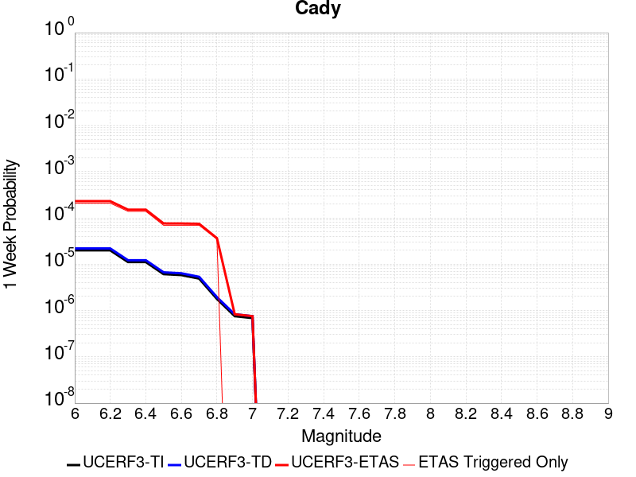 | 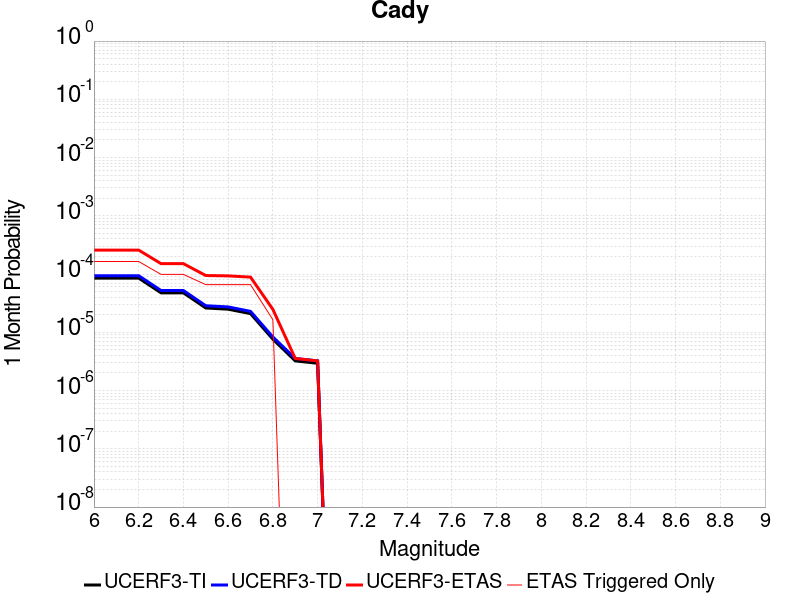 | 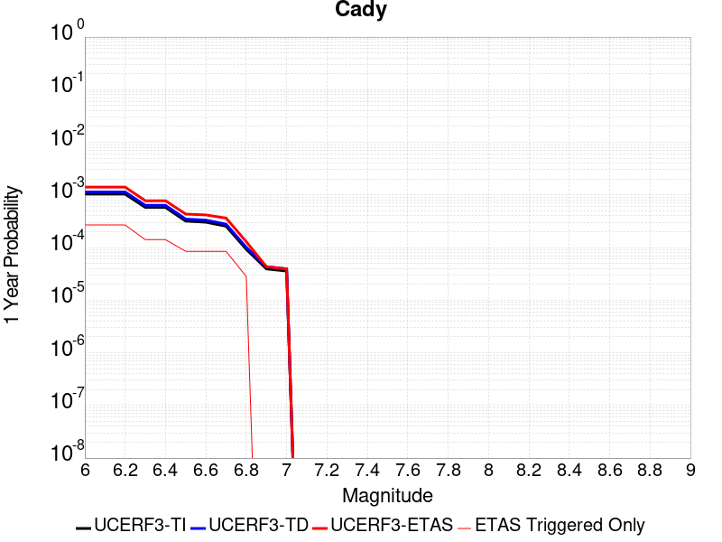 |  |

| Magnitude | 1 wk TI Prob | 1 wk TD Prob | 1 wk ETAS Prob | 1 wk ETAS/TD Gain | 1 wk ETAS Triggered Only | 1 mo TI Prob | 1 mo TD Prob | 1 mo ETAS Prob | 1 mo ETAS/TD Gain | 1 mo ETAS Triggered Only | 1 yr TI Prob | 1 yr TD Prob | 1 yr ETAS Prob | 1 yr ETAS/TD Gain | 1 yr ETAS Triggered Only | 10 yr TI Prob | 10 yr TD Prob | 10 yr ETAS Prob | 10 yr ETAS/TD Gain | 10 yr ETAS Triggered Only |
|-----|-----|-----|-----|-----|-----|-----|-----|-----|-----|-----|-----|-----|-----|-----|-----|-----|-----|-----|-----|-----|
| 6.0 | 1.9892565E-5 | 2.1858728E-5 | 2.2945229E-4 | 10.497055 | 2.0759809E-4 | 8.525106E-5 | 9.3677416E-5 | 3.358525E-4 | 3.5852025 | 2.4219777E-4 | 0.0010374374 | 0.0011400167 | 0.0014510589 | 1.27284 | 3.1139713E-4 | 0.010326075 | 0.011350701 | 0.011829598 | 1.042191 | 4.8439554E-4 |
| 6.1 | 1.9892565E-5 | 2.1858728E-5 | 2.2945229E-4 | 10.497055 | 2.0759809E-4 | 8.525106E-5 | 9.3677416E-5 | 3.358525E-4 | 3.5852025 | 2.4219777E-4 | 0.0010374374 | 0.0011400167 | 0.0014510589 | 1.27284 | 3.1139713E-4 | 0.010326075 | 0.011350701 | 0.011829598 | 1.042191 | 4.8439554E-4 |
| 6.2 | 1.9892565E-5 | 2.1858728E-5 | 2.2945229E-4 | 10.497055 | 2.0759809E-4 | 8.525106E-5 | 9.3677416E-5 | 3.358525E-4 | 3.5852025 | 2.4219777E-4 | 0.0010374374 | 0.0011400167 | 0.0014510589 | 1.27284 | 3.1139713E-4 | 0.010326075 | 0.011350701 | 0.011829598 | 1.042191 | 4.8439554E-4 |
| 6.3 | 1.1117327E-5 | 1.2176583E-5 | 1.5057363E-4 | 12.365835 | 1.3839873E-4 | 4.764482E-5 | 5.2184492E-5 | 1.90576E-4 | 3.651966 | 1.3839873E-4 | 5.7992124E-4 | 6.351925E-4 | 8.08081E-4 | 1.2721828 | 1.729984E-4 | 0.0057841022 | 0.0063368753 | 0.006611919 | 1.0434036 | 2.7679745E-4 |
| 6.4 | 1.1117327E-5 | 1.2176583E-5 | 1.5057363E-4 | 12.365835 | 1.3839873E-4 | 4.764482E-5 | 5.2184492E-5 | 1.90576E-4 | 3.651966 | 1.3839873E-4 | 5.7992124E-4 | 6.351925E-4 | 8.08081E-4 | 1.2721828 | 1.729984E-4 | 0.0057841022 | 0.0063368753 | 0.006611919 | 1.0434036 | 2.7679745E-4 |
| 6.5 | 6.103093E-6 | 6.672021E-6 | 7.587092E-5 | 11.371506 | 6.919936E-5 | 2.615585E-5 | 2.8594131E-5 | 9.779152E-5 | 3.4199855 | 6.919936E-5 | 3.1840094E-4 | 3.480905E-4 | 4.518534E-4 | 1.2980918 | 1.03799044E-4 | 0.0031794512 | 0.0034766865 | 0.0036490837 | 1.0495865 | 1.729984E-4 |
| 6.6 | 5.817237E-6 | 6.3656585E-6 | 7.556458E-5 | 11.870662 | 6.919936E-5 | 2.4930776E-5 | 2.728118E-5 | 9.647865E-5 | 3.5364547 | 6.919936E-5 | 3.034899E-4 | 3.3211018E-4 | 4.3587474E-4 | 1.3124402 | 1.03799044E-4 | 0.0030307577 | 0.0033173605 | 0.0034897851 | 1.0519764 | 1.729984E-4 |
| 6.7 | 4.8846314E-6 | 5.3405684E-6 | 7.453956E-5 | 13.957234 | 6.919936E-5 | 2.0933967E-5 | 2.2888014E-5 | 9.208579E-5 | 4.0233192 | 6.919936E-5 | 2.5484123E-4 | 2.7863772E-4 | 3.8240786E-4 | 1.3724195 | 1.03799044E-4 | 0.0025454918 | 0.0027840391 | 0.002956556 | 1.0619664 | 1.729984E-4 |
| 6.8 | 1.7788773E-6 | 1.9399079E-6 | 3.653952E-5 | 18.8357 | 3.459968E-5 | 7.6237375E-6 | 8.313874E-6 | 4.2913267E-5 | 5.1616454 | 3.459968E-5 | 9.281505E-5 | 1.01218284E-4 | 1.7041064E-4 | 1.6835954 | 6.919936E-5 | 9.2776294E-4 | 0.0010118765 | 0.0010810058 | 1.068318 | 6.919936E-5 |
| 6.9 | 7.5455404E-7 | 8.297092E-7 | 8.297092E-7 | 1.0 | 0.0 | 3.233799E-6 | 3.5558937E-6 | 3.5558937E-6 | 1.0 | 0.0 | 3.937079E-5 | 4.3292483E-5 | 4.3292483E-5 | 1.0 | 0.0 | 3.9363815E-4 | 4.3287344E-4 | 4.3287344E-4 | 1.0 | 0.0 |
| 7.0 | 6.8578805E-7 | 7.541816E-7 | 7.541816E-7 | 1.0 | 0.0 | 2.9390883E-6 | 3.2322048E-6 | 3.2322048E-6 | 1.0 | 0.0 | 3.578281E-5 | 3.9351715E-5 | 3.9351715E-5 | 1.0 | 0.0 | 3.577705E-4 | 3.9347992E-4 | 3.9347992E-4 | 1.0 | 0.0 |

## Manix-Afton Hills
*[(top)](#table-of-contents)*

| 1 Week | 1 Month | 1 Year | 10 Year |
|-----|-----|-----|-----|
| 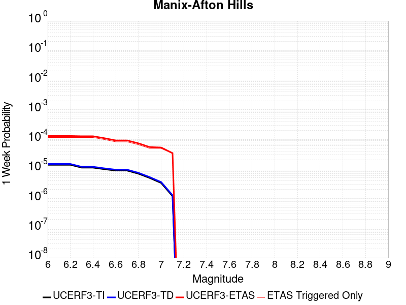 | 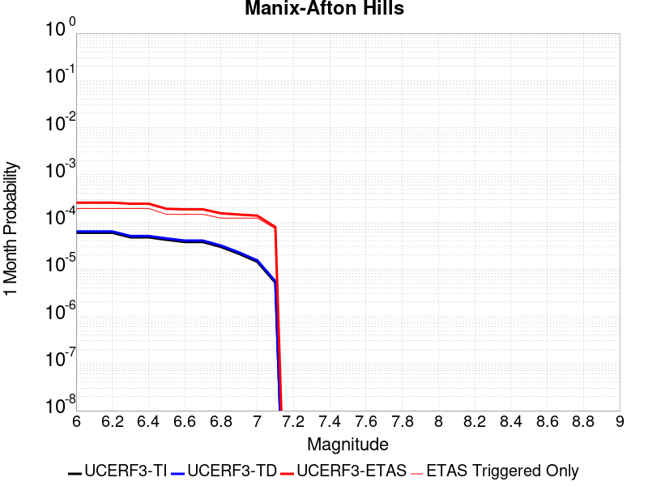 |  | 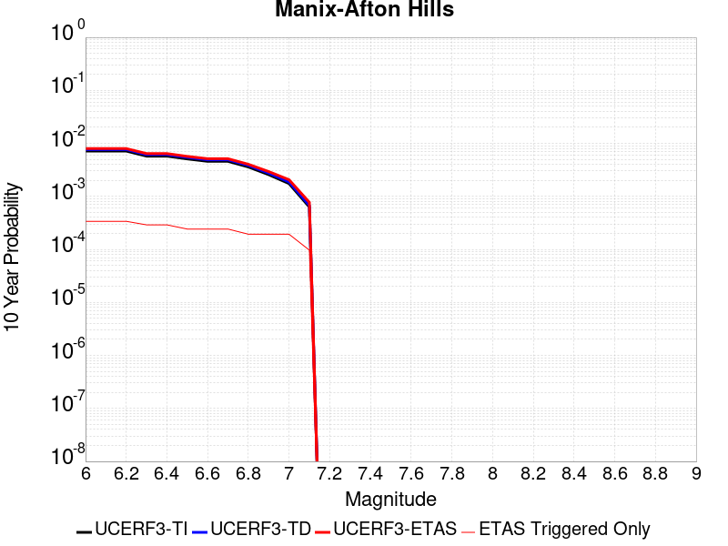 |

| Magnitude | 1 wk TI Prob | 1 wk TD Prob | 1 wk ETAS Prob | 1 wk ETAS/TD Gain | 1 wk ETAS Triggered Only | 1 mo TI Prob | 1 mo TD Prob | 1 mo ETAS Prob | 1 mo ETAS/TD Gain | 1 mo ETAS Triggered Only | 1 yr TI Prob | 1 yr TD Prob | 1 yr ETAS Prob | 1 yr ETAS/TD Gain | 1 yr ETAS Triggered Only | 10 yr TI Prob | 10 yr TD Prob | 10 yr ETAS Prob | 10 yr ETAS/TD Gain | 10 yr ETAS Triggered Only |
|-----|-----|-----|-----|-----|-----|-----|-----|-----|-----|-----|-----|-----|-----|-----|-----|-----|-----|-----|-----|-----|
| 6.0 | 1.3783202E-5 | 1.47110895E-5 | 1.1850861E-4 | 8.055733 | 1.03799044E-4 | 5.906953E-5 | 6.30461E-5 | 2.3603361E-4 | 3.7438254 | 1.729984E-4 | 7.189342E-4 | 7.6733343E-4 | 0.0010439185 | 1.3604497 | 2.7679745E-4 | 0.0071661277 | 0.007648596 | 0.007991946 | 1.0448906 | 3.459968E-4 |
| 6.1 | 1.3783202E-5 | 1.47110895E-5 | 1.1850861E-4 | 8.055733 | 1.03799044E-4 | 5.906953E-5 | 6.30461E-5 | 2.3603361E-4 | 3.7438254 | 1.729984E-4 | 7.189342E-4 | 7.6733343E-4 | 0.0010439185 | 1.3604497 | 2.7679745E-4 | 0.0071661277 | 0.007648596 | 0.007991946 | 1.0448906 | 3.459968E-4 |
| 6.2 | 1.3783202E-5 | 1.47110895E-5 | 1.1850861E-4 | 8.055733 | 1.03799044E-4 | 5.906953E-5 | 6.30461E-5 | 2.3603361E-4 | 3.7438254 | 1.729984E-4 | 7.189342E-4 | 7.6733343E-4 | 0.0010439185 | 1.3604497 | 2.7679745E-4 | 0.0071661277 | 0.007648596 | 0.007991946 | 1.0448906 | 3.459968E-4 |
| 6.3 | 1.10494875E-5 | 1.1793136E-5 | 1.15590956E-4 | 9.801545 | 1.03799044E-4 | 4.7354086E-5 | 5.054109E-5 | 2.2353075E-4 | 4.422753 | 1.729984E-4 | 5.763835E-4 | 6.151744E-4 | 8.918016E-4 | 1.4496728 | 2.7679745E-4 | 0.005748908 | 0.0061357557 | 0.006445242 | 1.0504398 | 3.1139713E-4 |
| 6.4 | 1.10494875E-5 | 1.1793136E-5 | 1.15590956E-4 | 9.801545 | 1.03799044E-4 | 4.7354086E-5 | 5.054109E-5 | 2.2353075E-4 | 4.422753 | 1.729984E-4 | 5.763835E-4 | 6.151744E-4 | 8.918016E-4 | 1.4496728 | 2.7679745E-4 | 0.005748908 | 0.0061357557 | 0.006445242 | 1.0504398 | 3.1139713E-4 |
| 6.5 | 9.788949E-6 | 1.045432E-5 | 1.1425228E-4 | 10.928715 | 1.03799044E-4 | 4.1951964E-5 | 4.480351E-5 | 1.8319604E-4 | 4.0888767 | 1.3839873E-4 | 5.1064545E-4 | 5.453555E-4 | 7.874212E-4 | 1.4438677 | 2.4219777E-4 | 0.0050947363 | 0.0054410985 | 0.00571639 | 1.0505948 | 2.7679745E-4 |
| 6.6 | 8.810006E-6 | 9.4136285E-6 | 1.13211696E-4 | 12.026361 | 1.03799044E-4 | 3.775662E-5 | 4.0343548E-5 | 1.787367E-4 | 4.4303665 | 1.3839873E-4 | 4.5958988E-4 | 4.9108086E-4 | 7.331597E-4 | 1.492951 | 2.4219777E-4 | 0.0045864056 | 0.004900839 | 0.00517628 | 1.0562028 | 2.7679745E-4 |
| 6.7 | 8.80128E-6 | 9.404108E-6 | 1.1320218E-4 | 12.037524 | 1.03799044E-4 | 3.7719226E-5 | 4.0302748E-5 | 1.7869589E-4 | 4.4338393 | 1.3839873E-4 | 4.591348E-4 | 4.9058435E-4 | 7.326633E-4 | 1.4934502 | 2.4219777E-4 | 0.004581874 | 0.0048958957 | 0.005171338 | 1.0562599 | 2.7679745E-4 |
| 6.8 | 6.8994877E-6 | 7.380076E-6 | 7.657893E-5 | 10.376442 | 6.919936E-5 | 2.9568899E-5 | 3.162856E-5 | 1.3542433E-4 | 4.28171 | 1.03799044E-4 | 3.5994186E-4 | 3.8501783E-4 | 5.92536E-4 | 1.5389832 | 2.0759809E-4 | 0.003593594 | 0.0038443129 | 0.004051113 | 1.0537938 | 2.0759809E-4 |
| 6.9 | 4.9328037E-6 | 5.2709615E-6 | 3.987046E-5 | 7.5641723 | 3.459968E-5 | 2.1140417E-5 | 2.2589675E-5 | 1.2638637E-4 | 5.594874 | 1.03799044E-4 | 2.5735417E-4 | 2.7500073E-4 | 4.8254174E-4 | 1.7546926 | 2.0759809E-4 | 0.0025705635 | 0.0027472095 | 0.0029542372 | 1.0753593 | 2.0759809E-4 |
| 7.0 | 3.347973E-6 | 3.59003E-6 | 3.8189588E-5 | 10.637679 | 3.459968E-5 | 1.4348378E-5 | 1.5385775E-5 | 1.1918322E-4 | 7.7463255 | 1.03799044E-4 | 1.746775E-4 | 1.8730981E-4 | 3.94869E-4 | 2.1081064 | 2.0759809E-4 | 0.0017454025 | 0.0018719219 | 0.0020791315 | 1.1106935 | 2.0759809E-4 |
| 7.1 | 1.2073567E-6 | 1.293482E-6 | 3.5893117E-5 | 27.74922 | 3.459968E-5 | 5.1743755E-6 | 5.543492E-6 | 7.474247E-5 | 13.482923 | 6.919936E-5 | 6.29962E-5 | 6.749156E-5 | 1.712836E-4 | 2.5378523 | 1.03799044E-4 | 6.297835E-4 | 6.7487074E-4 | 7.7859976E-4 | 1.153702 | 1.03799044E-4 |

## Calico-Hidalgo
*[(top)](#table-of-contents)*

| 1 Week | 1 Month | 1 Year | 10 Year |
|-----|-----|-----|-----|
| 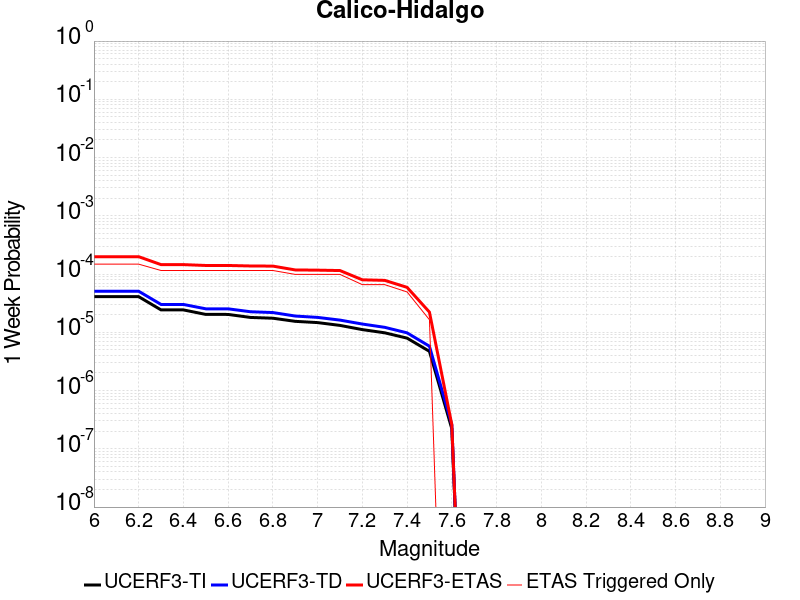 | 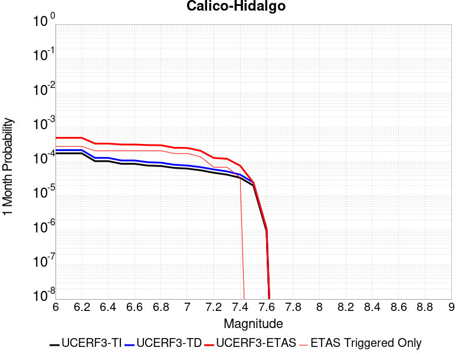 | 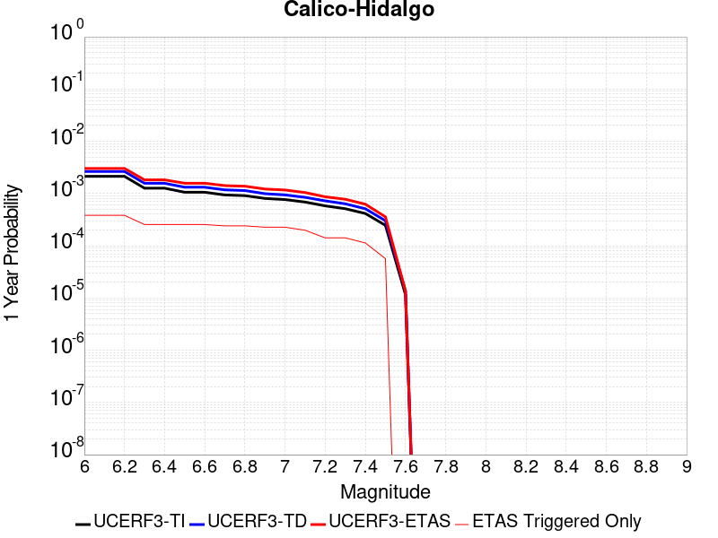 | 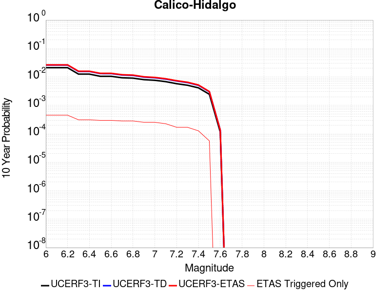 |

| Magnitude | 1 wk TI Prob | 1 wk TD Prob | 1 wk ETAS Prob | 1 wk ETAS/TD Gain | 1 wk ETAS Triggered Only | 1 mo TI Prob | 1 mo TD Prob | 1 mo ETAS Prob | 1 mo ETAS/TD Gain | 1 mo ETAS Triggered Only | 1 yr TI Prob | 1 yr TD Prob | 1 yr ETAS Prob | 1 yr ETAS/TD Gain | 1 yr ETAS Triggered Only | 10 yr TI Prob | 10 yr TD Prob | 10 yr ETAS Prob | 10 yr ETAS/TD Gain | 10 yr ETAS Triggered Only |
|-----|-----|-----|-----|-----|-----|-----|-----|-----|-----|-----|-----|-----|-----|-----|-----|-----|-----|-----|-----|-----|
| 6.0 | 4.0906612E-5 | 5.0704355E-5 | 2.5829193E-4 | 5.0940776 | 2.0759809E-4 | 1.7530227E-4 | 2.1728857E-4 | 4.940259E-4 | 2.2735934 | 2.7679745E-4 | 0.0021322158 | 0.002642678 | 0.0030222689 | 1.1436386 | 3.805965E-4 | 0.02111873 | 0.026152814 | 0.026557151 | 1.0154606 | 4.1519618E-4 |
| 6.1 | 4.0906612E-5 | 5.0704355E-5 | 2.5829193E-4 | 5.0940776 | 2.0759809E-4 | 1.7530227E-4 | 2.1728857E-4 | 4.940259E-4 | 2.2735934 | 2.7679745E-4 | 0.0021322158 | 0.002642678 | 0.0030222689 | 1.1436386 | 3.805965E-4 | 0.02111873 | 0.026152814 | 0.026557151 | 1.0154606 | 4.1519618E-4 |
| 6.2 | 4.0906612E-5 | 5.0704355E-5 | 2.5829193E-4 | 5.0940776 | 2.0759809E-4 | 1.7530227E-4 | 2.1728857E-4 | 4.940259E-4 | 2.2735934 | 2.7679745E-4 | 0.0021322158 | 0.002642678 | 0.0030222689 | 1.1436386 | 3.805965E-4 | 0.02111873 | 0.026152814 | 0.026557151 | 1.0154606 | 4.1519618E-4 |
| 6.3 | 2.4242801E-5 | 3.0090967E-5 | 1.6848552E-4 | 5.599206 | 1.3839873E-4 | 1.0389358E-4 | 1.289551E-4 | 3.3652643E-4 | 2.6096401 | 2.0759809E-4 | 0.0012641704 | 0.0015689312 | 0.0018452944 | 1.1761475 | 2.7679745E-4 | 0.01257003 | 0.015582229 | 0.015888773 | 1.0196728 | 3.1139713E-4 |
| 6.4 | 2.4242801E-5 | 3.0090967E-5 | 1.6848552E-4 | 5.599206 | 1.3839873E-4 | 1.0389358E-4 | 1.289551E-4 | 3.3652643E-4 | 2.6096401 | 2.0759809E-4 | 0.0012641704 | 0.0015689312 | 0.0018452944 | 1.1761475 | 2.7679745E-4 | 0.01257003 | 0.015582229 | 0.015888773 | 1.0196728 | 3.1139713E-4 |
| 6.5 | 2.0286952E-5 | 2.5316054E-5 | 1.6371127E-4 | 6.4666977 | 1.3839873E-4 | 8.694118E-5 | 1.0849296E-4 | 3.1606853E-4 | 2.913263 | 2.0759809E-4 | 0.0010579949 | 0.0013201186 | 0.0015965506 | 1.2093995 | 2.7679745E-4 | 0.010529719 | 0.013124701 | 0.013397865 | 1.020813 | 2.7679745E-4 |
| 6.6 | 2.0269223E-5 | 2.5297004E-5 | 1.6369222E-4 | 6.4708147 | 1.3839873E-4 | 8.6865206E-5 | 1.08411325E-4 | 3.159869E-4 | 2.9147038 | 2.0759809E-4 | 0.0010570707 | 0.0013191258 | 0.0015955581 | 1.2095572 | 2.7679745E-4 | 0.010520565 | 0.01311489 | 0.013388057 | 1.0208288 | 2.7679745E-4 |
| 6.7 | 1.799852E-5 | 2.2540933E-5 | 1.6093654E-4 | 7.139746 | 1.3839873E-4 | 7.713423E-5 | 9.660051E-5 | 3.0417854E-4 | 3.1488297 | 2.0759809E-4 | 9.3870464E-4 | 0.0011754911 | 0.0014519633 | 1.2351971 | 2.7679745E-4 | 0.009347493 | 0.011694346 | 0.011967906 | 1.0233926 | 2.7679745E-4 |
| 6.8 | 1.7458793E-5 | 2.184258E-5 | 1.6023828E-4 | 7.336051 | 1.3839873E-4 | 7.4821255E-5 | 9.360778E-5 | 3.0118643E-4 | 3.2175364 | 2.0759809E-4 | 9.10568E-4 | 0.0011390933 | 0.0014155755 | 1.2427212 | 2.7679745E-4 | 0.009068459 | 0.011334131 | 0.01160779 | 1.0241448 | 2.7679745E-4 |
| 6.9 | 1.542884E-5 | 1.9026285E-5 | 1.2282336E-4 | 6.4554563 | 1.03799044E-4 | 6.612192E-5 | 8.153875E-5 | 2.5452304E-4 | 3.121498 | 1.729984E-4 | 8.04737E-4 | 9.922953E-4 | 0.0012342527 | 1.2438362 | 2.4219777E-4 | 0.008018291 | 0.009880043 | 0.010119848 | 1.0242716 | 2.4219777E-4 |
| 7.0 | 1.468253E-5 | 1.803109E-5 | 1.2182826E-4 | 6.756566 | 1.03799044E-4 | 6.292361E-5 | 7.727389E-5 | 2.5025892E-4 | 3.2385962 | 1.729984E-4 | 7.658257E-4 | 9.4041653E-4 | 0.0011823865 | 1.2573009 | 2.4219777E-4 | 0.0076319184 | 0.009365736 | 0.009605666 | 1.0256178 | 2.4219777E-4 |
| 7.1 | 1.3139281E-5 | 1.620139E-5 | 1.1999875E-4 | 7.4066954 | 1.03799044E-4 | 5.6309986E-5 | 6.943275E-5 | 2.0782187E-4 | 2.993139 | 1.3839873E-4 | 6.853584E-4 | 8.4502844E-4 | 0.0010524511 | 1.2454623 | 2.0759809E-4 | 0.0068324856 | 0.008419449 | 0.0086253 | 1.0244493 | 2.0759809E-4 |
| 7.2 | 1.1127404E-5 | 1.3867038E-5 | 8.306544E-5 | 5.9901357 | 6.919936E-5 | 4.7688E-5 | 5.9428872E-5 | 1.2862413E-4 | 2.1643372 | 6.919936E-5 | 5.8044674E-4 | 7.233172E-4 | 8.2704116E-4 | 1.1434004 | 1.03799044E-4 | 0.0057893298 | 0.007210737 | 0.007313788 | 1.0142913 | 1.03799044E-4 |
| 7.3 | 9.808154E-6 | 1.2176586E-5 | 8.13751E-5 | 6.6829166 | 6.919936E-5 | 4.2034266E-5 | 5.2184383E-5 | 1.2138014E-4 | 2.325986 | 6.919936E-5 | 5.11647E-4 | 6.351704E-4 | 7.389035E-4 | 1.1633154 | 1.03799044E-4 | 0.0051047057 | 0.006334625 | 0.006437767 | 1.0162822 | 1.03799044E-4 |
| 7.4 | 7.942452E-6 | 9.792348E-6 | 4.439169E-5 | 4.533304 | 3.459968E-5 | 3.4038632E-5 | 4.1966585E-5 | 7.6564815E-5 | 1.8244233 | 3.459968E-5 | 4.1434157E-4 | 5.108328E-4 | 5.7999685E-4 | 1.1353946 | 6.919936E-5 | 0.0041356985 | 0.005097527 | 0.0051663737 | 1.0135059 | 6.919936E-5 |
| 7.5 | 4.7121216E-6 | 5.7729717E-6 | 5.7729717E-6 | 1.0 | 0.0 | 2.019465E-5 | 2.4741115E-5 | 2.4741115E-5 | 1.0 | 0.0 | 2.4584212E-4 | 3.011891E-4 | 3.3577837E-4 | 1.1148423 | 3.459968E-5 | 0.0024557032 | 0.0030085614 | 0.0030430572 | 1.0114658 | 3.459968E-5 |
| 7.6 | 2.21172E-7 | 2.6040198E-7 | 2.6040198E-7 | 1.0 | 0.0 | 9.478797E-7 | 1.1160082E-6 | 1.1160082E-6 | 1.0 | 0.0 | 1.1540374E-5 | 1.3587343E-5 | 1.3587343E-5 | 1.0 | 0.0 | 1.1539775E-4 | 1.3586794E-4 | 1.3586794E-4 | 1.0 | 0.0 |

## Death Valley (No)
*[(top)](#table-of-contents)*

| 1 Week | 1 Month | 1 Year | 10 Year |
|-----|-----|-----|-----|
| 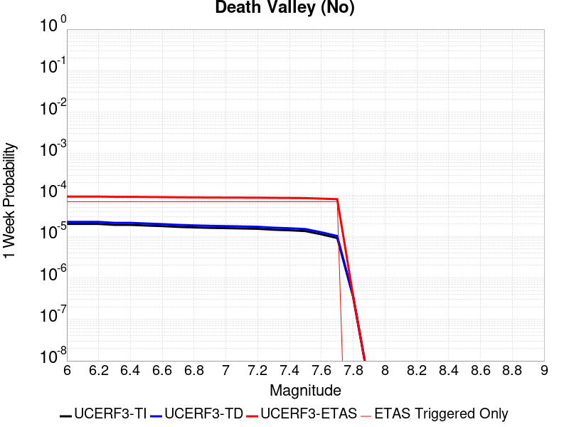 | 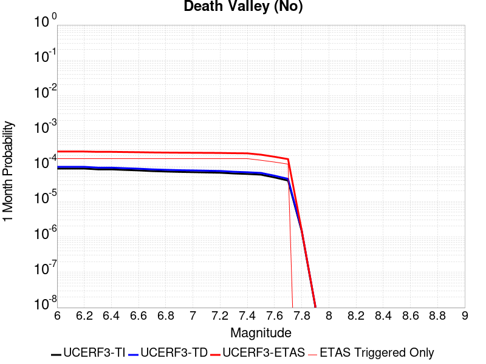 | 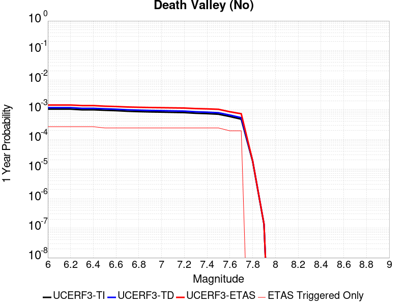 | 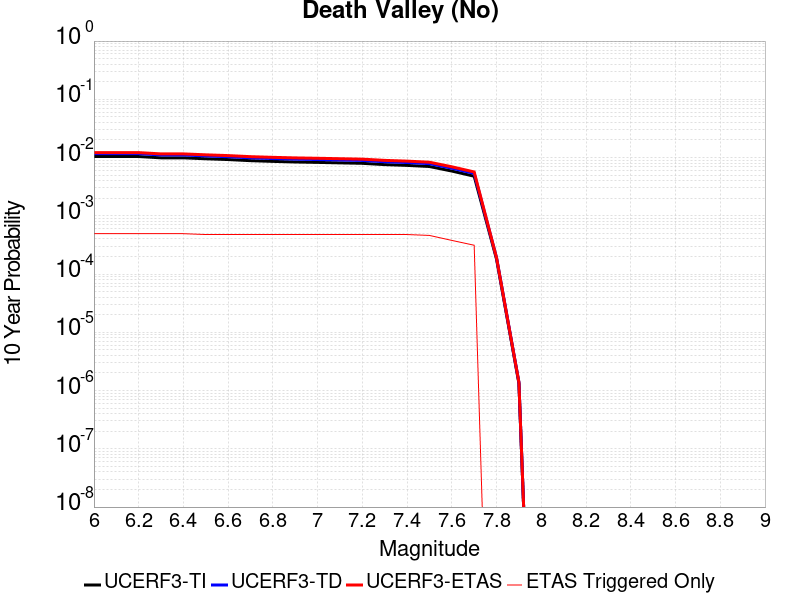 |

| Magnitude | 1 wk TI Prob | 1 wk TD Prob | 1 wk ETAS Prob | 1 wk ETAS/TD Gain | 1 wk ETAS Triggered Only | 1 mo TI Prob | 1 mo TD Prob | 1 mo ETAS Prob | 1 mo ETAS/TD Gain | 1 mo ETAS Triggered Only | 1 yr TI Prob | 1 yr TD Prob | 1 yr ETAS Prob | 1 yr ETAS/TD Gain | 1 yr ETAS Triggered Only | 10 yr TI Prob | 10 yr TD Prob | 10 yr ETAS Prob | 10 yr ETAS/TD Gain | 10 yr ETAS Triggered Only |
|-----|-----|-----|-----|-----|-----|-----|-----|-----|-----|-----|-----|-----|-----|-----|-----|-----|-----|-----|-----|-----|
| 6.0 | 2.0074807E-5 | 2.2500084E-5 | 9.169789E-5 | 4.0754466 | 6.919936E-5 | 8.603206E-5 | 9.642541E-5 | 2.6940714E-4 | 2.7939434 | 1.729984E-4 | 0.001046937 | 0.0011733545 | 0.0014843863 | 1.2650791 | 3.1139713E-4 | 0.010420183 | 0.011672506 | 0.012082856 | 1.0351553 | 4.1519618E-4 |
| 6.1 | 2.0074807E-5 | 2.2500084E-5 | 9.169789E-5 | 4.0754466 | 6.919936E-5 | 8.603206E-5 | 9.642541E-5 | 2.6940714E-4 | 2.7939434 | 1.729984E-4 | 0.001046937 | 0.0011733545 | 0.0014843863 | 1.2650791 | 3.1139713E-4 | 0.010420183 | 0.011672506 | 0.012082856 | 1.0351553 | 4.1519618E-4 |
| 6.2 | 2.0074807E-5 | 2.2500084E-5 | 9.169789E-5 | 4.0754466 | 6.919936E-5 | 8.603206E-5 | 9.642541E-5 | 2.6940714E-4 | 2.7939434 | 1.729984E-4 | 0.001046937 | 0.0011733545 | 0.0014843863 | 1.2650791 | 3.1139713E-4 | 0.010420183 | 0.011672506 | 0.012082856 | 1.0351553 | 4.1519618E-4 |
| 6.3 | 1.9050609E-5 | 2.1336948E-5 | 9.0534835E-5 | 4.2431016 | 6.919936E-5 | 8.164292E-5 | 9.1440896E-5 | 2.644235E-4 | 2.8917422 | 1.729984E-4 | 9.935491E-4 | 0.001112731 | 0.0014237817 | 1.279538 | 3.1139713E-4 | 0.009891188 | 0.011072419 | 0.011483017 | 1.037083 | 4.1519618E-4 |
| 6.4 | 1.9050609E-5 | 2.1336948E-5 | 9.0534835E-5 | 4.2431016 | 6.919936E-5 | 8.164292E-5 | 9.1440896E-5 | 2.644235E-4 | 2.8917422 | 1.729984E-4 | 9.935491E-4 | 0.001112731 | 0.0014237817 | 1.279538 | 3.1139713E-4 | 0.009891188 | 0.011072419 | 0.011483017 | 1.037083 | 4.1519618E-4 |
| 6.5 | 1.8367004E-5 | 2.0561009E-5 | 8.975895E-5 | 4.3654933 | 6.919936E-5 | 7.8713354E-5 | 8.811567E-5 | 2.6109884E-4 | 2.9631374 | 1.729984E-4 | 9.5791375E-4 | 0.0010722869 | 0.00138335 | 1.2900933 | 3.1139713E-4 | 0.009537951 | 0.0106719155 | 0.011082681 | 1.0384903 | 4.1519618E-4 |
| 6.6 | 1.779439E-5 | 1.9910927E-5 | 8.9108915E-5 | 4.475377 | 6.919936E-5 | 7.625944E-5 | 8.53298E-5 | 2.5831343E-4 | 3.0272362 | 1.729984E-4 | 9.280632E-4 | 0.0010384015 | 0.0013494752 | 1.2995698 | 3.1139713E-4 | 0.009241969 | 0.010336253 | 0.010747157 | 1.0397537 | 4.1519618E-4 |
| 6.7 | 1.7025437E-5 | 1.9043426E-5 | 8.824147E-5 | 4.6336975 | 6.919936E-5 | 7.296412E-5 | 8.161216E-5 | 2.5459644E-4 | 3.1195896 | 1.729984E-4 | 8.87976E-4 | 9.931813E-4 | 0.0013042692 | 1.3132236 | 3.1139713E-4 | 0.008844362 | 0.009888145 | 0.010299236 | 1.0415741 | 4.1519618E-4 |
| 6.8 | 1.6545107E-5 | 1.8512545E-5 | 8.771063E-5 | 4.737902 | 6.919936E-5 | 7.090568E-5 | 7.93371E-5 | 2.523218E-4 | 3.1803756 | 1.729984E-4 | 8.629347E-4 | 9.655073E-4 | 0.0012766038 | 1.3222104 | 3.1139713E-4 | 0.008595915 | 0.009613829 | 0.010025034 | 1.0427722 | 4.1519618E-4 |
| 6.9 | 1.615478E-5 | 1.8087594E-5 | 8.7285705E-5 | 4.825722 | 6.919936E-5 | 6.9232934E-5 | 7.751599E-5 | 2.5050098E-4 | 3.231604 | 1.729984E-4 | 8.4258494E-4 | 9.433546E-4 | 0.001254458 | 1.3297842 | 3.1139713E-4 | 0.008393973 | 0.009394196 | 0.009805491 | 1.0437819 | 4.1519618E-4 |
| 7.0 | 1.5894311E-5 | 1.780555E-5 | 8.700368E-5 | 4.886324 | 6.919936E-5 | 6.81167E-5 | 7.6307304E-5 | 2.492925E-4 | 3.266955 | 1.729984E-4 | 8.2900526E-4 | 9.286515E-4 | 0.0012397595 | 1.3350104 | 3.1139713E-4 | 0.008259195 | 0.009248397 | 0.009659754 | 1.0444787 | 4.1519618E-4 |
| 7.1 | 1.5602263E-5 | 1.7483504E-5 | 8.6681655E-5 | 4.957911 | 6.919936E-5 | 6.6865134E-5 | 7.492718E-5 | 2.4791263E-4 | 3.3087142 | 1.729984E-4 | 8.137789E-4 | 9.118627E-4 | 0.0012229759 | 1.3411843 | 3.1139713E-4 | 0.008108052 | 0.009081894 | 0.009493319 | 1.0453017 | 4.1519618E-4 |
| 7.2 | 1.5323829E-5 | 1.717063E-5 | 8.6368804E-5 | 5.030031 | 6.919936E-5 | 6.56719E-5 | 7.358637E-5 | 2.4657205E-4 | 3.350784 | 1.729984E-4 | 7.99262E-4 | 8.9555193E-4 | 0.0012066702 | 1.3474039 | 3.1139713E-4 | 0.007963934 | 0.008920107 | 0.009331599 | 1.0461309 | 4.1519618E-4 |
| 7.3 | 1.4556212E-5 | 1.6302456E-5 | 8.550069E-5 | 5.2446513 | 6.919936E-5 | 6.238227E-5 | 6.9865826E-5 | 2.4285215E-4 | 3.475979 | 1.729984E-4 | 7.592395E-4 | 8.5029035E-4 | 0.0011614227 | 1.365913 | 3.1139713E-4 | 0.0075665074 | 0.008471014 | 0.008882693 | 1.0485985 | 4.1519618E-4 |
| 7.4 | 1.411725E-5 | 1.580796E-5 | 8.500623E-5 | 5.377432 | 6.919936E-5 | 6.0501097E-5 | 6.7746674E-5 | 2.4073337E-4 | 3.5534344 | 1.729984E-4 | 7.363519E-4 | 8.245094E-4 | 0.0011356499 | 1.3773643 | 3.1139713E-4 | 0.0073391674 | 0.008215138 | 0.008626924 | 1.0501251 | 4.1519618E-4 |
| 7.5 | 1.3503312E-5 | 1.5126289E-5 | 8.432461E-5 | 5.5747056 | 6.919936E-5 | 5.7870053E-5 | 6.482538E-5 | 2.3781256E-4 | 3.6685104 | 1.729984E-4 | 7.043401E-4 | 7.8896893E-4 | 0.0011001204 | 1.3943774 | 3.1139713E-4 | 0.007021119 | 0.007862304 | 0.008274236 | 1.0523933 | 4.1519618E-4 |
| 7.6 | 1.1279839E-5 | 1.2626327E-5 | 8.1824815E-5 | 6.4804926 | 6.919936E-5 | 4.834127E-5 | 5.4111737E-5 | 2.2710078E-4 | 4.196886 | 1.729984E-4 | 5.88396E-4 | 6.5861654E-4 | 9.006548E-4 | 1.367495 | 2.4219777E-4 | 0.005868405 | 0.006567199 | 0.006910923 | 1.0523396 | 3.459968E-4 |
| 7.7 | 9.189108E-6 | 1.0283358E-5 | 7.948201E-5 | 7.729188 | 6.919936E-5 | 3.93813E-5 | 4.407082E-5 | 2.170616E-4 | 4.925291 | 1.729984E-4 | 4.7936183E-4 | 5.3643517E-4 | 7.78503E-4 | 1.4512527 | 2.4219777E-4 | 0.004783291 | 0.005351914 | 0.0056616445 | 1.0578729 | 3.1139713E-4 |
| 7.8 | 3.4586725E-7 | 3.6482615E-7 | 3.6482615E-7 | 1.0 | 0.0 | 1.4822873E-6 | 1.5635396E-6 | 1.5635396E-6 | 1.0 | 0.0 | 1.80467E-5 | 1.9035933E-5 | 1.9035933E-5 | 1.0 | 0.0 | 1.8045233E-4 | 1.9034347E-4 | 1.9034347E-4 | 1.0 | 0.0 |
| 7.9 | 2.5591178E-9 | 2.6696718E-9 | 2.6696718E-9 | 1.0 | 0.0 | 1.0967647E-8 | 1.14414505E-8 | 1.14414505E-8 | 1.0 | 0.0 | 1.335311E-7 | 1.3929966E-7 | 1.3929966E-7 | 1.0 | 0.0 | 1.3353102E-6 | 1.3929966E-6 | 1.3929966E-6 | 1.0 | 0.0 |

## Death Valley (Fish Lake Valley)
*[(top)](#table-of-contents)*

| 1 Week | 1 Month | 1 Year | 10 Year |
|-----|-----|-----|-----|
| 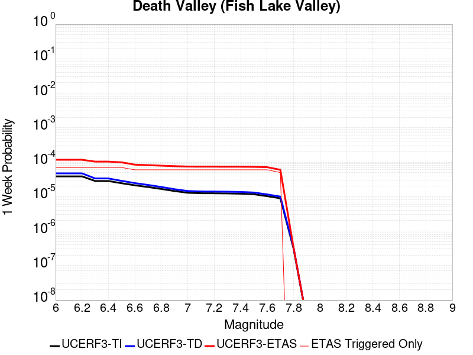 | 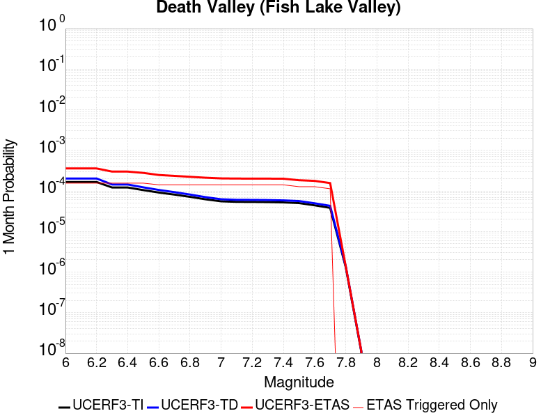 | 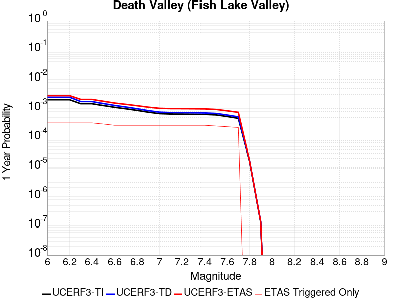 | 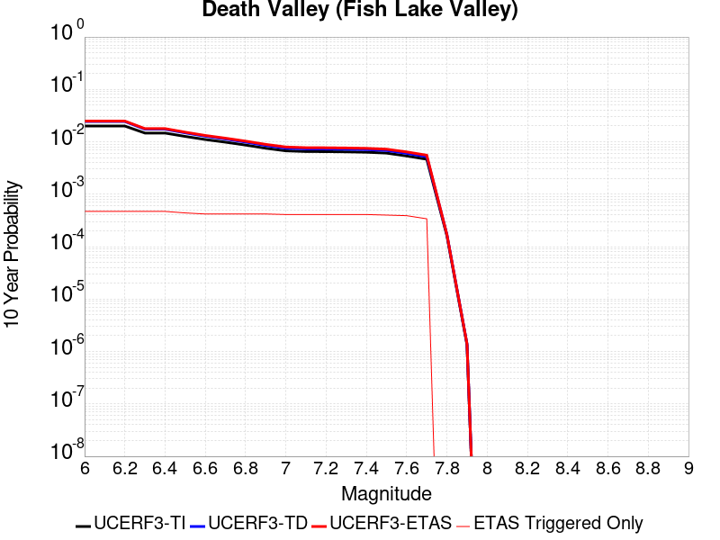 |

| Magnitude | 1 wk TI Prob | 1 wk TD Prob | 1 wk ETAS Prob | 1 wk ETAS/TD Gain | 1 wk ETAS Triggered Only | 1 mo TI Prob | 1 mo TD Prob | 1 mo ETAS Prob | 1 mo ETAS/TD Gain | 1 mo ETAS Triggered Only | 1 yr TI Prob | 1 yr TD Prob | 1 yr ETAS Prob | 1 yr ETAS/TD Gain | 1 yr ETAS Triggered Only | 10 yr TI Prob | 10 yr TD Prob | 10 yr ETAS Prob | 10 yr ETAS/TD Gain | 10 yr ETAS Triggered Only |
|-----|-----|-----|-----|-----|-----|-----|-----|-----|-----|-----|-----|-----|-----|-----|-----|-----|-----|-----|-----|-----|
| 6.0 | 3.872328E-5 | 4.7265705E-5 | 1.1646179E-4 | 2.463981 | 6.919936E-5 | 1.6594635E-4 | 2.0255324E-4 | 3.7551663E-4 | 1.8539156 | 1.729984E-4 | 0.0020185246 | 0.0024635606 | 0.0027741906 | 1.1260898 | 3.1139713E-4 | 0.02000288 | 0.024388338 | 0.024793407 | 1.0166092 | 4.1519618E-4 |
| 6.1 | 3.872328E-5 | 4.7265705E-5 | 1.1646179E-4 | 2.463981 | 6.919936E-5 | 1.6594635E-4 | 2.0255324E-4 | 3.7551663E-4 | 1.8539156 | 1.729984E-4 | 0.0020185246 | 0.0024635606 | 0.0027741906 | 1.1260898 | 3.1139713E-4 | 0.02000288 | 0.024388338 | 0.024793407 | 1.0166092 | 4.1519618E-4 |
| 6.2 | 3.872328E-5 | 4.7265705E-5 | 1.1646179E-4 | 2.463981 | 6.919936E-5 | 1.6594635E-4 | 2.0255324E-4 | 3.7551663E-4 | 1.8539156 | 1.729984E-4 | 0.0020185246 | 0.0024635606 | 0.0027741906 | 1.1260898 | 3.1139713E-4 | 0.02000288 | 0.024388338 | 0.024793407 | 1.0166092 | 4.1519618E-4 |
| 6.3 | 2.8356371E-5 | 3.360979E-5 | 1.0280683E-4 | 3.0588357 | 6.919936E-5 | 1.2152165E-4 | 1.4403443E-4 | 3.170079E-4 | 2.2009177 | 1.729984E-4 | 0.0014785219 | 0.0017522788 | 0.0020631303 | 1.1773984 | 3.1139713E-4 | 0.014687235 | 0.017391816 | 0.017799791 | 1.0234579 | 4.1519618E-4 |
| 6.4 | 2.8356371E-5 | 3.360979E-5 | 1.0280683E-4 | 3.0588357 | 6.919936E-5 | 1.2152165E-4 | 1.4403443E-4 | 3.170079E-4 | 2.2009177 | 1.729984E-4 | 0.0014785219 | 0.0017522788 | 0.0020631303 | 1.1773984 | 3.1139713E-4 | 0.014687235 | 0.017391816 | 0.017799791 | 1.0234579 | 4.1519618E-4 |
| 6.5 | 2.4448687E-5 | 2.8607585E-5 | 9.780497E-5 | 3.4188473 | 6.919936E-5 | 1.0477588E-4 | 1.2259845E-4 | 2.9557565E-4 | 2.410925 | 1.729984E-4 | 0.0012748998 | 0.0014916616 | 0.0017680463 | 1.1852864 | 2.7679745E-4 | 0.012676105 | 0.014821392 | 0.015196347 | 1.0252982 | 3.805965E-4 |
| 6.6 | 2.1298161E-5 | 2.4660083E-5 | 9.385774E-5 | 3.8060594 | 6.919936E-5 | 9.127464E-5 | 1.0568197E-4 | 2.786621E-4 | 2.6367989 | 1.729984E-4 | 0.0011107022 | 0.0012859512 | 0.0015623928 | 1.2149705 | 2.7679745E-4 | 0.011051672 | 0.01278853 | 0.0131642595 | 1.0293802 | 3.805965E-4 |
| 6.7 | 1.8959729E-5 | 2.1781027E-5 | 9.097888E-5 | 4.1769786 | 6.919936E-5 | 8.125345E-5 | 9.334406E-5 | 2.6632633E-4 | 2.8531685 | 1.729984E-4 | 9.888117E-4 | 0.001135897 | 0.00141238 | 1.243405 | 2.7679745E-4 | 0.009844234 | 0.01130357 | 0.0116798645 | 1.0332899 | 3.805965E-4 |
| 6.8 | 1.6691629E-5 | 1.9018351E-5 | 8.82164E-5 | 4.6384883 | 6.919936E-5 | 7.153359E-5 | 8.150477E-5 | 2.5448907E-4 | 3.1223826 | 1.729984E-4 | 8.7057345E-4 | 9.918857E-4 | 0.0012684086 | 1.278785 | 2.7679745E-4 | 0.008671708 | 0.009876343 | 0.010253182 | 1.0381556 | 3.805965E-4 |
| 6.9 | 1.450505E-5 | 1.638954E-5 | 8.5587766E-5 | 5.2220974 | 6.919936E-5 | 6.216302E-5 | 7.0239046E-5 | 2.432253E-4 | 3.462822 | 1.729984E-4 | 7.5657194E-4 | 8.5483363E-4 | 0.0011313944 | 1.3235259 | 2.7679745E-4 | 0.007540013 | 0.008516386 | 0.008893741 | 1.0443093 | 3.805965E-4 |
| 7.0 | 1.2940855E-5 | 1.4537972E-5 | 8.3736326E-5 | 5.7598357 | 6.919936E-5 | 5.545963E-5 | 6.230414E-5 | 2.3529177E-4 | 3.776503 | 1.729984E-4 | 6.750118E-4 | 7.5829466E-4 | 0.0010348823 | 1.3647494 | 2.7679745E-4 | 0.006729651 | 0.0075576897 | 0.00793541 | 1.0499783 | 3.805965E-4 |
| 7.1 | 1.2544658E-5 | 1.4078208E-5 | 8.3276595E-5 | 5.915284 | 6.919936E-5 | 5.3761712E-5 | 6.0333812E-5 | 2.3332179E-4 | 3.8671813 | 1.729984E-4 | 6.5435225E-4 | 7.343222E-4 | 0.0010109164 | 1.376666 | 2.7679745E-4 | 0.006524288 | 0.007319551 | 0.0076973615 | 1.0516167 | 3.805965E-4 |
| 7.2 | 1.2489416E-5 | 1.4015674E-5 | 8.3214065E-5 | 5.937215 | 6.919936E-5 | 5.3524967E-5 | 6.0065824E-5 | 2.3305384E-4 | 3.8799741 | 1.729984E-4 | 6.514716E-4 | 7.310616E-4 | 0.0010076567 | 1.3783472 | 2.7679745E-4 | 0.006495651 | 0.0072871596 | 0.0076649827 | 1.0518478 | 3.805965E-4 |
| 7.3 | 1.2368307E-5 | 1.3879812E-5 | 8.3078216E-5 | 5.9855433 | 6.919936E-5 | 5.3005948E-5 | 5.9483587E-5 | 2.324717E-4 | 3.9081657 | 1.729984E-4 | 6.451563E-4 | 7.2397763E-4 | 0.0010005747 | 1.382052 | 2.7679745E-4 | 0.0064328653 | 0.007216782 | 0.0075946315 | 1.0523571 | 3.805965E-4 |
| 7.4 | 1.2161707E-5 | 1.36478675E-5 | 8.284629E-5 | 6.0702734 | 6.919936E-5 | 5.212056E-5 | 5.8489582E-5 | 2.3147787E-4 | 3.9575915 | 1.729984E-4 | 6.3438306E-4 | 7.118836E-4 | 9.88484E-4 | 1.3885472 | 2.7679745E-4 | 0.006325751 | 0.0070966207 | 0.007474516 | 1.0532501 | 3.805965E-4 |
| 7.5 | 1.1707948E-5 | 1.3145515E-5 | 8.234397E-5 | 6.264035 | 6.919936E-5 | 5.0175953E-5 | 5.6336736E-5 | 2.293254E-4 | 4.070619 | 1.729984E-4 | 6.10721E-4 | 6.856895E-4 | 9.6229714E-4 | 1.4034008 | 2.7679745E-4 | 0.0060904534 | 0.006836321 | 0.0072143157 | 1.0552921 | 3.805965E-4 |
| 7.6 | 1.0319538E-5 | 1.1579622E-5 | 8.077818E-5 | 6.975891 | 6.919936E-5 | 4.4225842E-5 | 4.9626036E-5 | 2.2261585E-4 | 4.485868 | 1.729984E-4 | 5.383166E-4 | 6.040347E-4 | 8.460862E-4 | 1.4007244 | 2.4219777E-4 | 0.0053701443 | 0.0060244603 | 0.0063683726 | 1.057086 | 3.459968E-4 |
| 7.7 | 8.937764E-6 | 1.0022779E-5 | 7.922145E-5 | 7.90414 | 6.919936E-5 | 3.830414E-5 | 4.295409E-5 | 2.1594507E-4 | 5.027346 | 1.729984E-4 | 4.6625308E-4 | 5.228456E-4 | 7.649167E-4 | 1.4629878 | 2.4219777E-4 | 0.0046527605 | 0.005216664 | 0.005526437 | 1.0593814 | 3.1139713E-4 |
| 7.8 | 3.108007E-7 | 3.284654E-7 | 3.284654E-7 | 1.0 | 0.0 | 1.3320023E-6 | 1.407708E-6 | 1.407708E-6 | 1.0 | 0.0 | 1.6217007E-5 | 1.7138715E-5 | 1.7138715E-5 | 1.0 | 0.0 | 1.6215823E-4 | 1.7137431E-4 | 1.7137431E-4 | 1.0 | 0.0 |
| 7.9 | 2.5591178E-9 | 2.6696718E-9 | 2.6696718E-9 | 1.0 | 0.0 | 1.0967647E-8 | 1.14414505E-8 | 1.14414505E-8 | 1.0 | 0.0 | 1.335311E-7 | 1.3929966E-7 | 1.3929966E-7 | 1.0 | 0.0 | 1.3353102E-6 | 1.3929966E-6 | 1.3929966E-6 | 1.0 | 0.0 |

## San Andreas (North Branch Mill Creek)
*[(top)](#table-of-contents)*

| 1 Week | 1 Month | 1 Year | 10 Year |
|-----|-----|-----|-----|
| 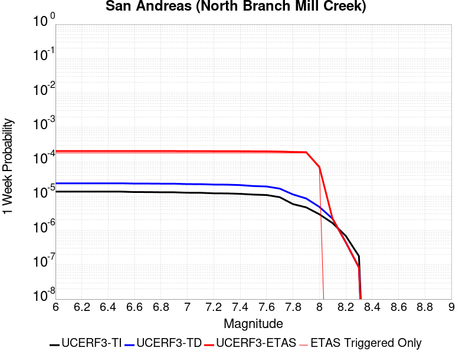 | 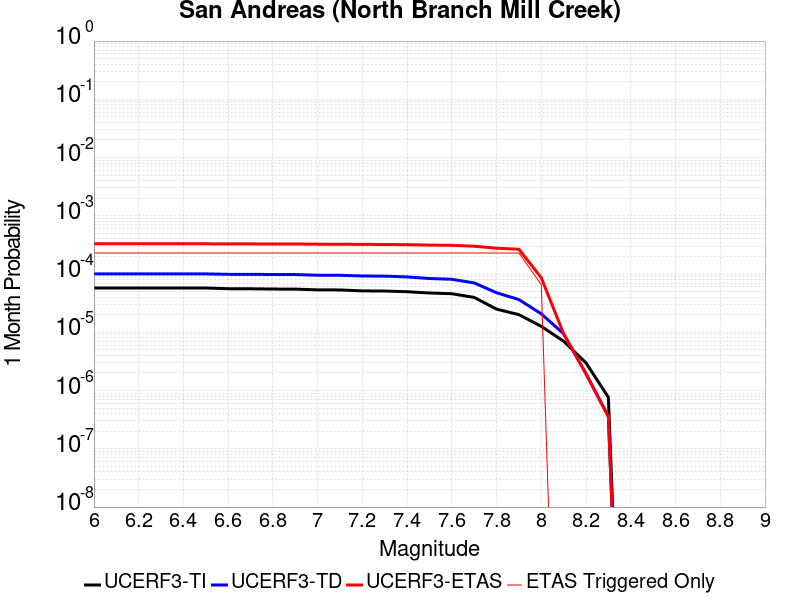 | 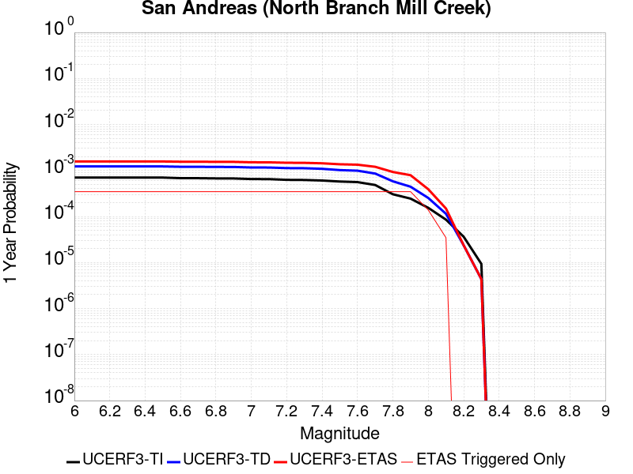 | 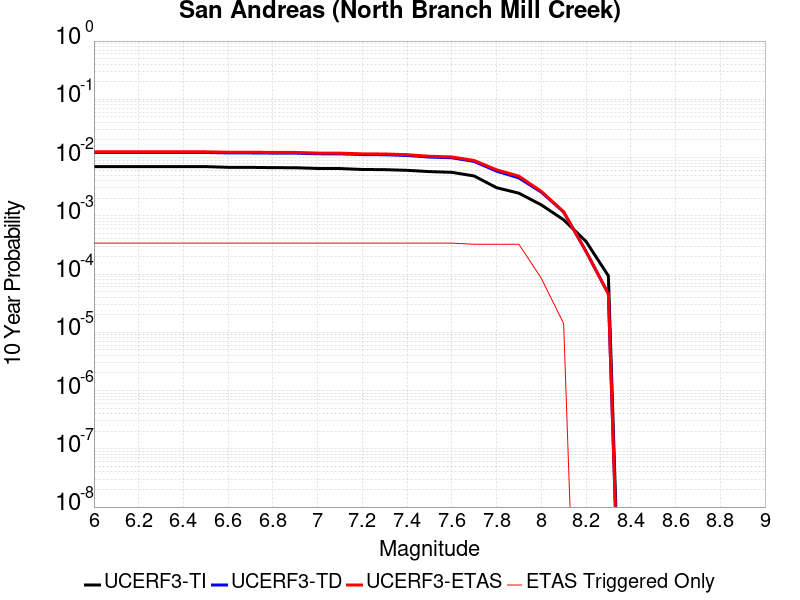 |

| Magnitude | 1 wk TI Prob | 1 wk TD Prob | 1 wk ETAS Prob | 1 wk ETAS/TD Gain | 1 wk ETAS Triggered Only | 1 mo TI Prob | 1 mo TD Prob | 1 mo ETAS Prob | 1 mo ETAS/TD Gain | 1 mo ETAS Triggered Only | 1 yr TI Prob | 1 yr TD Prob | 1 yr ETAS Prob | 1 yr ETAS/TD Gain | 1 yr ETAS Triggered Only | 10 yr TI Prob | 10 yr TD Prob | 10 yr ETAS Prob | 10 yr ETAS/TD Gain | 10 yr ETAS Triggered Only |
|-----|-----|-----|-----|-----|-----|-----|-----|-----|-----|-----|-----|-----|-----|-----|-----|-----|-----|-----|-----|-----|
| 6.0 | 1.3461156E-5 | 2.3500992E-5 | 2.6569306E-4 | 11.305611 | 2.4219777E-4 | 5.7689394E-5 | 1.00714664E-4 | 3.7748425E-4 | 3.7480564 | 2.7679745E-4 | 7.02142E-4 | 0.0012255146 | 0.0015710874 | 1.2819818 | 3.459968E-4 | 0.0069992766 | 0.012228744 | 0.012638863 | 1.0335373 | 4.1519618E-4 |
| 6.1 | 1.3461156E-5 | 2.3500992E-5 | 2.6569306E-4 | 11.305611 | 2.4219777E-4 | 5.7689394E-5 | 1.00714664E-4 | 3.7748425E-4 | 3.7480564 | 2.7679745E-4 | 7.02142E-4 | 0.0012255146 | 0.0015710874 | 1.2819818 | 3.459968E-4 | 0.0069992766 | 0.012228744 | 0.012638863 | 1.0335373 | 4.1519618E-4 |
| 6.2 | 1.3461156E-5 | 2.3500992E-5 | 2.6569306E-4 | 11.305611 | 2.4219777E-4 | 5.7689394E-5 | 1.00714664E-4 | 3.7748425E-4 | 3.7480564 | 2.7679745E-4 | 7.02142E-4 | 0.0012255146 | 0.0015710874 | 1.2819818 | 3.459968E-4 | 0.0069992766 | 0.012228744 | 0.012638863 | 1.0335373 | 4.1519618E-4 |
| 6.3 | 1.3461156E-5 | 2.3500992E-5 | 2.6569306E-4 | 11.305611 | 2.4219777E-4 | 5.7689394E-5 | 1.00714664E-4 | 3.7748425E-4 | 3.7480564 | 2.7679745E-4 | 7.02142E-4 | 0.0012255146 | 0.0015710874 | 1.2819818 | 3.459968E-4 | 0.0069992766 | 0.012228744 | 0.012638863 | 1.0335373 | 4.1519618E-4 |
| 6.4 | 1.3461156E-5 | 2.3500992E-5 | 2.6569306E-4 | 11.305611 | 2.4219777E-4 | 5.7689394E-5 | 1.00714664E-4 | 3.7748425E-4 | 3.7480564 | 2.7679745E-4 | 7.02142E-4 | 0.0012255146 | 0.0015710874 | 1.2819818 | 3.459968E-4 | 0.0069992766 | 0.012228744 | 0.012638863 | 1.0335373 | 4.1519618E-4 |
| 6.5 | 1.3450706E-5 | 2.348995E-5 | 2.6568203E-4 | 11.310454 | 2.4219777E-4 | 5.764461E-5 | 1.00667356E-4 | 3.7743695E-4 | 3.749348 | 2.7679745E-4 | 7.0159714E-4 | 0.0012249392 | 0.0015705122 | 1.2821144 | 3.459968E-4 | 0.006993862 | 0.012223054 | 0.012633175 | 1.0335531 | 4.1519618E-4 |
| 6.6 | 1.3074523E-5 | 2.3104236E-5 | 2.652964E-4 | 11.482588 | 2.4219777E-4 | 5.6032466E-5 | 9.901441E-5 | 3.7578447E-4 | 3.7952502 | 2.7679745E-4 | 6.8198174E-4 | 0.001204837 | 0.0015504169 | 1.2868271 | 3.459968E-4 | 0.006798926 | 0.012024219 | 0.012434423 | 1.0341148 | 4.1519618E-4 |
| 6.7 | 1.3050216E-5 | 2.3079532E-5 | 2.6527172E-4 | 11.493808 | 2.4219777E-4 | 5.59283E-5 | 9.890855E-5 | 3.7567862E-4 | 3.798242 | 2.7679745E-4 | 6.8071426E-4 | 0.0012035496 | 0.00154913 | 1.2871343 | 3.459968E-4 | 0.0067863287 | 0.012011484 | 0.012421694 | 1.0341514 | 4.1519618E-4 |
| 6.8 | 1.29049395E-5 | 2.2927941E-5 | 2.6512015E-4 | 11.563191 | 2.4219777E-4 | 5.530571E-5 | 9.825892E-5 | 3.7502917E-4 | 3.8167443 | 2.7679745E-4 | 6.73139E-4 | 0.001195649 | 0.0015412321 | 1.2890339 | 3.459968E-4 | 0.0067110364 | 0.011933329 | 0.01234357 | 1.0343778 | 4.1519618E-4 |
| 6.9 | 1.2867369E-5 | 2.2887343E-5 | 2.6507958E-4 | 11.581928 | 2.4219777E-4 | 5.51447E-5 | 9.808494E-5 | 3.7485524E-4 | 3.8217409 | 2.7679745E-4 | 6.711799E-4 | 0.0011935332 | 0.0015391171 | 1.289547 | 3.459968E-4 | 0.006691564 | 0.011912397 | 0.0123226475 | 1.034439 | 4.1519618E-4 |
| 7.0 | 1.2495996E-5 | 2.2287419E-5 | 2.644798E-4 | 11.8667755 | 2.4219777E-4 | 5.3553173E-5 | 9.551403E-5 | 3.7228505E-4 | 3.8977 | 2.7679745E-4 | 6.518148E-4 | 0.0011622658 | 0.0015078605 | 1.2973456 | 3.459968E-4 | 0.0064990623 | 0.011603 | 0.012013379 | 1.0353683 | 4.1519618E-4 |
| 7.1 | 1.2452067E-5 | 2.2232492E-5 | 2.644249E-4 | 11.893623 | 2.4219777E-4 | 5.3364907E-5 | 9.527864E-5 | 3.7204972E-4 | 3.9048595 | 2.7679745E-4 | 6.4952404E-4 | 0.001159403 | 0.0015049987 | 1.2980807 | 3.459968E-4 | 0.0064762887 | 0.011574671 | 0.011985062 | 1.035456 | 4.1519618E-4 |
| 7.2 | 1.2002777E-5 | 2.1611015E-5 | 2.6380355E-4 | 12.2069025 | 2.4219777E-4 | 5.143946E-5 | 9.261536E-5 | 3.6938718E-4 | 3.988401 | 2.7679745E-4 | 6.2609545E-4 | 0.0011270114 | 0.0014726182 | 1.3066578 | 3.459968E-4 | 0.006243344 | 0.011254058 | 0.0116645815 | 1.0364778 | 4.1519618E-4 |
| 7.3 | 1.1923425E-5 | 2.1480853E-5 | 2.6367343E-4 | 12.274811 | 2.4219777E-4 | 5.109939E-5 | 9.205757E-5 | 3.6882955E-4 | 4.00651 | 2.7679745E-4 | 6.219575E-4 | 0.0011202273 | 0.0014658365 | 1.3085171 | 3.459968E-4 | 0.0062021962 | 0.011186945 | 0.011597496 | 1.0366992 | 4.1519618E-4 |
| 7.4 | 1.16105175E-5 | 2.0854808E-5 | 2.6304752E-4 | 12.61328 | 2.4219777E-4 | 4.975841E-5 | 8.93747E-5 | 3.661474E-4 | 4.096768 | 2.7679745E-4 | 6.0564023E-4 | 0.0010875963 | 0.0014332169 | 1.3177838 | 3.459968E-4 | 0.006039923 | 0.010864409 | 0.011275094 | 1.037801 | 4.1519618E-4 |
| 7.5 | 1.1037265E-5 | 1.9554842E-5 | 2.617479E-4 | 13.385323 | 2.4219777E-4 | 4.7301706E-5 | 8.380379E-5 | 3.6057804E-4 | 4.302646 | 2.7679745E-4 | 5.757461E-4 | 0.0010198357 | 0.0013654797 | 1.3389212 | 3.459968E-4 | 0.005742567 | 0.010195527 | 0.010606491 | 1.0403081 | 4.1519618E-4 |
| 7.6 | 1.0720915E-5 | 1.8996727E-5 | 2.611899E-4 | 13.749205 | 2.4219777E-4 | 4.5945973E-5 | 8.141202E-5 | 3.5818692E-4 | 4.399681 | 2.7679745E-4 | 5.592486E-4 | 9.907428E-4 | 0.0013363968 | 1.3488837 | 3.459968E-4 | 0.005578433 | 0.009907238 | 0.010318321 | 1.0414932 | 4.1519618E-4 |
| 7.7 | 9.276279E-6 | 1.6442464E-5 | 2.5863625E-4 | 15.729774 | 2.4219777E-4 | 3.9754876E-5 | 7.046581E-5 | 3.4724377E-4 | 4.927833 | 2.7679745E-4 | 4.839081E-4 | 8.5758517E-4 | 0.0012032853 | 1.4031087 | 3.459968E-4 | 0.0048285574 | 0.008586576 | 0.008998207 | 1.047939 | 4.1519618E-4 |
| 7.8 | 5.8346777E-6 | 1.11555855E-5 | 2.5335065E-4 | 22.710655 | 2.4219777E-4 | 2.5005522E-5 | 4.7808775E-5 | 3.2459298E-4 | 6.789402 | 2.7679745E-4 | 3.043997E-4 | 5.819165E-4 | 9.2771195E-4 | 1.5942355 | 3.459968E-4 | 0.0030398308 | 0.0058473335 | 0.0062601017 | 1.0705909 | 4.1519618E-4 |
| 7.9 | 4.690204E-6 | 8.509473E-6 | 2.507052E-4 | 29.461891 | 2.4219777E-4 | 2.0100719E-5 | 3.6468664E-5 | 3.1325602E-4 | 8.589731 | 2.7679745E-4 | 2.4469878E-4 | 4.439156E-4 | 7.8975887E-4 | 1.7790742 | 3.459968E-4 | 0.002444295 | 0.004471165 | 0.0048845047 | 1.0924456 | 4.1519618E-4 |
| 8.0 | 2.9570454E-6 | 4.8470656E-6 | 1.0864561E-4 | 22.414717 | 1.03799044E-4 | 1.267299E-5 | 2.0772974E-5 | 1.2456987E-4 | 5.9967275 | 1.03799044E-4 | 1.5428272E-4 | 2.5288164E-4 | 3.9124535E-4 | 1.5471482 | 1.3839873E-4 | 0.0015417566 | 0.002549932 | 0.0027224894 | 1.0676713 | 1.729984E-4 |
| 8.1 | 1.6376824E-6 | 2.1968672E-6 | 2.1968672E-6 | 1.0 | 0.0 | 7.01862E-6 | 9.415111E-6 | 9.415111E-6 | 1.0 | 0.0 | 8.544835E-5 | 1.1462297E-4 | 1.4921869E-4 | 1.3018218 | 3.459968E-5 | 8.54155E-4 | 0.0011607445 | 0.001195304 | 1.0297736 | 3.459968E-5 |
| 8.2 | 6.9631557E-7 | 4.535001E-7 | 4.535001E-7 | 1.0 | 0.0 | 2.984206E-6 | 1.9435704E-6 | 1.9435704E-6 | 1.0 | 0.0 | 3.63321E-5 | 2.3662713E-5 | 2.3662713E-5 | 1.0 | 0.0 | 3.6326164E-4 | 2.4510184E-4 | 2.4510184E-4 | 1.0 | 0.0 |
| 8.3 | 1.7876137E-7 | 8.357368E-8 | 8.357368E-8 | 1.0 | 0.0 | 7.661199E-7 | 3.5817288E-7 | 3.5817288E-7 | 1.0 | 0.0 | 9.32747E-6 | 4.3607465E-6 | 4.3607465E-6 | 1.0 | 0.0 | 9.3270784E-5 | 4.5800018E-5 | 4.5800018E-5 | 1.0 | 0.0 |

## Ludlow
*[(top)](#table-of-contents)*

| 1 Week | 1 Month | 1 Year | 10 Year |
|-----|-----|-----|-----|
|  | 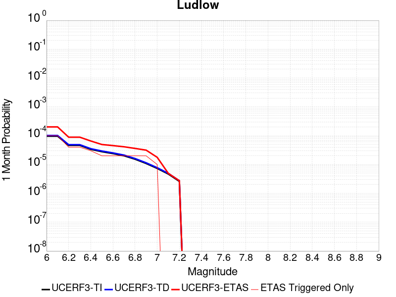 | 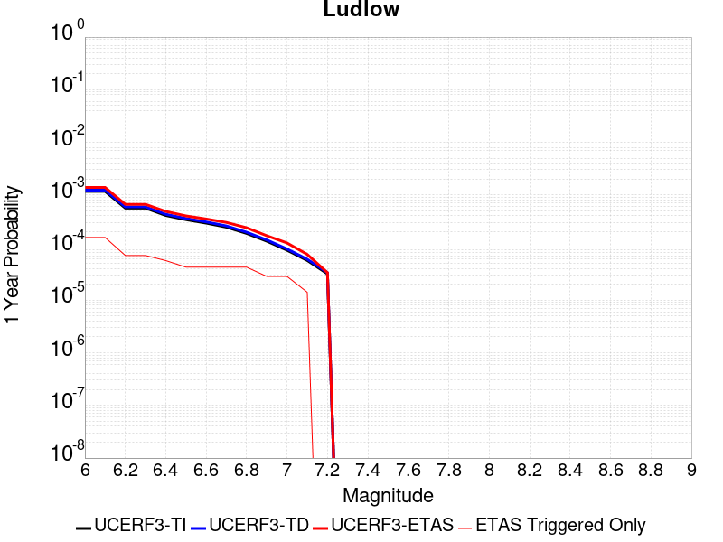 | 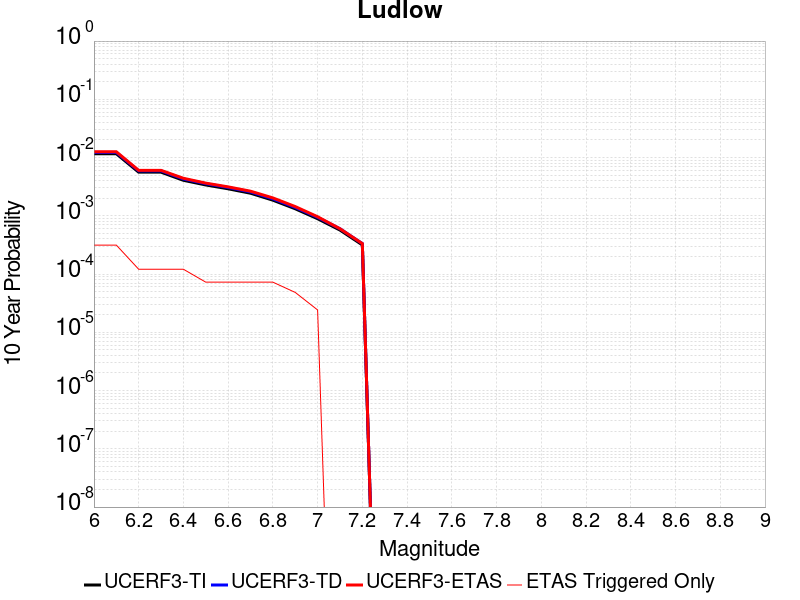 |

| Magnitude | 1 wk TI Prob | 1 wk TD Prob | 1 wk ETAS Prob | 1 wk ETAS/TD Gain | 1 wk ETAS Triggered Only | 1 mo TI Prob | 1 mo TD Prob | 1 mo ETAS Prob | 1 mo ETAS/TD Gain | 1 mo ETAS Triggered Only | 1 yr TI Prob | 1 yr TD Prob | 1 yr ETAS Prob | 1 yr ETAS/TD Gain | 1 yr ETAS Triggered Only | 10 yr TI Prob | 10 yr TD Prob | 10 yr ETAS Prob | 10 yr ETAS/TD Gain | 10 yr ETAS Triggered Only |
|-----|-----|-----|-----|-----|-----|-----|-----|-----|-----|-----|-----|-----|-----|-----|-----|-----|-----|-----|-----|-----|
| 6.0 | 2.2407607E-5 | 2.3657254E-5 | 5.8256115E-5 | 2.4625056 | 3.459968E-5 | 9.602906E-5 | 1.0138454E-4 | 2.0517306E-4 | 2.0237114 | 1.03799044E-4 | 0.0011685267 | 0.001233702 | 0.001406487 | 1.1400541 | 1.729984E-4 | 0.011624013 | 0.012273042 | 0.012614792 | 1.0278456 | 3.459968E-4 |
| 6.1 | 2.2407607E-5 | 2.3657254E-5 | 5.8256115E-5 | 2.4625056 | 3.459968E-5 | 9.602906E-5 | 1.0138454E-4 | 2.0517306E-4 | 2.0237114 | 1.03799044E-4 | 0.0011685267 | 0.001233702 | 0.001406487 | 1.1400541 | 1.729984E-4 | 0.011624013 | 0.012273042 | 0.012614792 | 1.0278456 | 3.459968E-4 |
| 6.2 | 1.0781252E-5 | 1.1365663E-5 | 1.1365663E-5 | 1.0 | 0.0 | 4.620455E-5 | 4.8709102E-5 | 8.3307095E-5 | 1.7102984 | 3.459968E-5 | 5.623952E-4 | 5.9287593E-4 | 6.620343E-4 | 1.1166489 | 6.919936E-5 | 0.00560974 | 0.0059133614 | 0.0060165464 | 1.0174495 | 1.03799044E-4 |
| 6.3 | 1.0781252E-5 | 1.1365663E-5 | 1.1365663E-5 | 1.0 | 0.0 | 4.620455E-5 | 4.8709102E-5 | 8.3307095E-5 | 1.7102984 | 3.459968E-5 | 5.623952E-4 | 5.9287593E-4 | 6.620343E-4 | 1.1166489 | 6.919936E-5 | 0.00560974 | 0.0059133614 | 0.0060165464 | 1.0174495 | 1.03799044E-4 |
| 6.4 | 7.814439E-6 | 8.237729E-6 | 8.237729E-6 | 1.0 | 0.0 | 3.3490025E-5 | 3.530408E-5 | 6.990254E-5 | 1.980013 | 3.459968E-5 | 4.0766477E-4 | 4.2974384E-4 | 4.9891346E-4 | 1.1609554 | 6.919936E-5 | 0.0040691774 | 0.0042892746 | 0.0043926286 | 1.0240959 | 1.03799044E-4 |
| 6.5 | 6.4986366E-6 | 6.85092E-6 | 6.85092E-6 | 1.0 | 0.0 | 2.7851002E-5 | 2.9360759E-5 | 2.9360759E-5 | 1.0 | 0.0 | 3.390332E-4 | 3.5740953E-4 | 3.9199684E-4 | 1.0967722 | 3.459968E-5 | 0.003385164 | 0.0035684432 | 0.0036373958 | 1.0193229 | 6.919936E-5 |
| 6.6 | 5.582177E-6 | 5.8860055E-6 | 5.8860055E-6 | 1.0 | 0.0 | 2.3923398E-5 | 2.5225498E-5 | 2.5225498E-5 | 1.0 | 0.0 | 2.9122844E-4 | 3.0707786E-4 | 3.4166692E-4 | 1.1126393 | 3.459968E-5 | 0.0029084706 | 0.003066609 | 0.003135596 | 1.0224962 | 6.919936E-5 |
| 6.7 | 4.6858763E-6 | 4.940427E-6 | 4.940427E-6 | 1.0 | 0.0 | 2.0082172E-5 | 2.1173091E-5 | 2.1173091E-5 | 1.0 | 0.0 | 2.4447302E-4 | 2.5775246E-4 | 2.923432E-4 | 1.1342015 | 3.459968E-5 | 0.0024420423 | 0.0025745912 | 0.0026436124 | 1.0268086 | 6.919936E-5 |
| 6.8 | 3.5584908E-6 | 3.7520183E-6 | 3.7520183E-6 | 1.0 | 0.0 | 1.5250586E-5 | 1.6079981E-5 | 1.6079981E-5 | 1.0 | 0.0 | 1.8566006E-4 | 1.957566E-4 | 2.3034951E-4 | 1.1767138 | 3.459968E-5 | 0.0018550502 | 0.0019558826 | 0.0020249467 | 1.0353109 | 6.919936E-5 |
| 6.9 | 2.532834E-6 | 2.6710034E-6 | 2.6710034E-6 | 1.0 | 0.0 | 1.0854958E-5 | 1.1447109E-5 | 1.1447109E-5 | 1.0 | 0.0 | 1.3215111E-4 | 1.3935992E-4 | 1.3935992E-4 | 1.0 | 0.0 | 0.0013207254 | 0.0013927529 | 0.0014273043 | 1.024808 | 3.459968E-5 |
| 7.0 | 1.7083285E-6 | 1.8019439E-6 | 1.8019439E-6 | 1.0 | 0.0 | 7.3213873E-6 | 7.722595E-6 | 7.722595E-6 | 1.0 | 0.0 | 8.913424E-5 | 9.40187E-5 | 9.40187E-5 | 1.0 | 0.0 | 8.9098496E-4 | 9.3980576E-4 | 9.3980576E-4 | 1.0 | 0.0 |
| 7.1 | 1.0905424E-6 | 1.1497619E-6 | 1.1497619E-6 | 1.0 | 0.0 | 4.6737446E-6 | 4.9275427E-6 | 4.9275427E-6 | 1.0 | 0.0 | 5.6901354E-5 | 5.999128E-5 | 5.999128E-5 | 1.0 | 0.0 | 5.6886784E-4 | 5.997606E-4 | 5.997606E-4 | 1.0 | 0.0 |
| 7.2 | 6.06668E-7 | 6.387277E-7 | 6.387277E-7 | 1.0 | 0.0 | 2.600003E-6 | 2.7374022E-6 | 2.7374022E-6 | 1.0 | 0.0 | 3.1654577E-5 | 3.3327433E-5 | 3.3327433E-5 | 1.0 | 0.0 | 3.1650066E-4 | 3.3323118E-4 | 3.3323118E-4 | 1.0 | 0.0 |

## San Jacinto (San Bernardino)
*[(top)](#table-of-contents)*

| 1 Week | 1 Month | 1 Year | 10 Year |
|-----|-----|-----|-----|
| 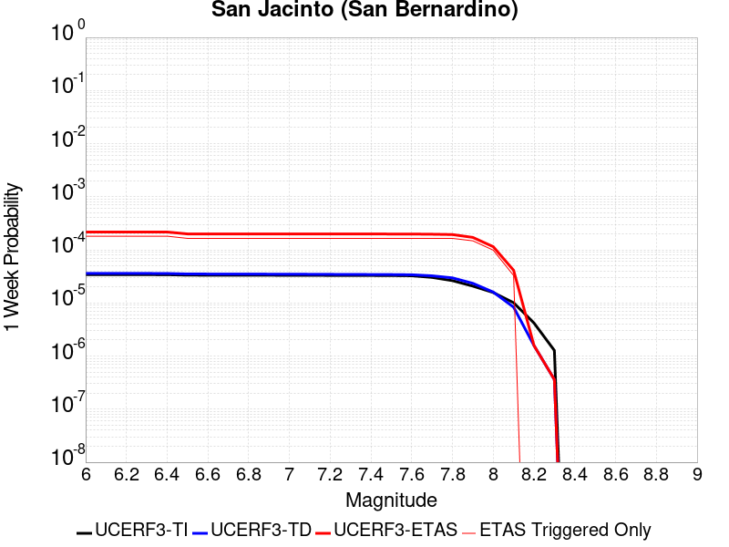 |  | 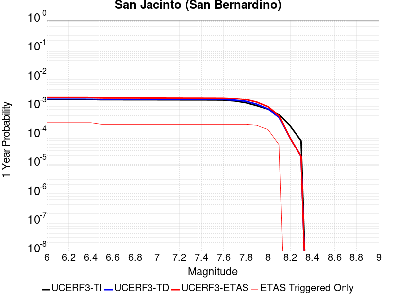 |  |

| Magnitude | 1 wk TI Prob | 1 wk TD Prob | 1 wk ETAS Prob | 1 wk ETAS/TD Gain | 1 wk ETAS Triggered Only | 1 mo TI Prob | 1 mo TD Prob | 1 mo ETAS Prob | 1 mo ETAS/TD Gain | 1 mo ETAS Triggered Only | 1 yr TI Prob | 1 yr TD Prob | 1 yr ETAS Prob | 1 yr ETAS/TD Gain | 1 yr ETAS Triggered Only | 10 yr TI Prob | 10 yr TD Prob | 10 yr ETAS Prob | 10 yr ETAS/TD Gain | 10 yr ETAS Triggered Only |
|-----|-----|-----|-----|-----|-----|-----|-----|-----|-----|-----|-----|-----|-----|-----|-----|-----|-----|-----|-----|-----|
| 6.0 | 3.409352E-5 | 3.598562E-5 | 2.089778E-4 | 5.8072586 | 1.729984E-4 | 1.461069E-4 | 1.5421498E-4 | 3.2718672E-4 | 2.1216273 | 1.729984E-4 | 0.0017774 | 0.0018759521 | 0.0021176955 | 1.1288644 | 2.4219777E-4 | 0.01763251 | 0.019349992 | 0.019689295 | 1.017535 | 3.459968E-4 |
| 6.1 | 3.409352E-5 | 3.598562E-5 | 2.089778E-4 | 5.8072586 | 1.729984E-4 | 1.461069E-4 | 1.5421498E-4 | 3.2718672E-4 | 2.1216273 | 1.729984E-4 | 0.0017774 | 0.0018759521 | 0.0021176955 | 1.1288644 | 2.4219777E-4 | 0.01763251 | 0.019349992 | 0.019689295 | 1.017535 | 3.459968E-4 |
| 6.2 | 3.409352E-5 | 3.598562E-5 | 2.089778E-4 | 5.8072586 | 1.729984E-4 | 1.461069E-4 | 1.5421498E-4 | 3.2718672E-4 | 2.1216273 | 1.729984E-4 | 0.0017774 | 0.0018759521 | 0.0021176955 | 1.1288644 | 2.4219777E-4 | 0.01763251 | 0.019349992 | 0.019689295 | 1.017535 | 3.459968E-4 |
| 6.3 | 3.409352E-5 | 3.598562E-5 | 2.089778E-4 | 5.8072586 | 1.729984E-4 | 1.461069E-4 | 1.5421498E-4 | 3.2718672E-4 | 2.1216273 | 1.729984E-4 | 0.0017774 | 0.0018759521 | 0.0021176955 | 1.1288644 | 2.4219777E-4 | 0.01763251 | 0.019349992 | 0.019689295 | 1.017535 | 3.459968E-4 |
| 6.4 | 3.400795E-5 | 3.5878285E-5 | 2.0887048E-4 | 5.821641 | 1.729984E-4 | 1.4574021E-4 | 1.5375503E-4 | 3.2672685E-4 | 2.124983 | 1.729984E-4 | 0.0017729428 | 0.0018703619 | 0.0021121067 | 1.1292503 | 2.4219777E-4 | 0.017588645 | 0.019295074 | 0.019634396 | 1.0175859 | 3.459968E-4 |
| 6.5 | 3.341482E-5 | 3.5138914E-5 | 2.0813124E-4 | 5.923098 | 1.729984E-4 | 1.4319851E-4 | 1.5058667E-4 | 3.23559E-4 | 2.1486566 | 1.729984E-4 | 0.0017420477 | 0.0018318522 | 0.00203907 | 1.1131192 | 2.0759809E-4 | 0.017284546 | 0.018916616 | 0.019222122 | 1.0161501 | 3.1139713E-4 |
| 6.6 | 3.3364955E-5 | 3.5076133E-5 | 2.0806848E-4 | 5.9319105 | 1.729984E-4 | 1.4298483E-4 | 1.5031763E-4 | 3.2329003E-4 | 2.1507127 | 1.729984E-4 | 0.0017394501 | 0.0018285823 | 0.0020358008 | 1.1133219 | 2.0759809E-4 | 0.017258976 | 0.01888448 | 0.019189997 | 1.0161781 | 3.1139713E-4 |
| 6.7 | 3.335922E-5 | 3.5065907E-5 | 2.0805825E-4 | 5.9333487 | 1.729984E-4 | 1.4296026E-4 | 1.5027382E-4 | 3.2324623E-4 | 2.1510482 | 1.729984E-4 | 0.0017391514 | 0.0018280497 | 0.0020352683 | 1.113355 | 2.0759809E-4 | 0.017256035 | 0.018879272 | 0.01918479 | 1.0161828 | 3.1139713E-4 |
| 6.8 | 3.327683E-5 | 3.4959972E-5 | 2.0795234E-4 | 5.948298 | 1.729984E-4 | 1.4260718E-4 | 1.4981985E-4 | 3.2279236E-4 | 2.1545365 | 1.729984E-4 | 0.0017348597 | 0.001822532 | 0.002029752 | 1.1136988 | 2.0759809E-4 | 0.017213784 | 0.018825045 | 0.019130578 | 1.0162302 | 3.1139713E-4 |
| 6.9 | 3.3235785E-5 | 3.4900928E-5 | 2.078933E-4 | 5.95667 | 1.729984E-4 | 1.4243131E-4 | 1.4956683E-4 | 3.2253936E-4 | 2.1564898 | 1.729984E-4 | 0.0017327217 | 0.0018194567 | 0.0020266771 | 1.1138914 | 2.0759809E-4 | 0.017192734 | 0.018794911 | 0.019100456 | 1.0162568 | 3.1139713E-4 |
| 7.0 | 3.3197095E-5 | 3.4840854E-5 | 2.0783323E-4 | 5.965216 | 1.729984E-4 | 1.422655E-4 | 1.4930942E-4 | 3.22282E-4 | 2.158484 | 1.729984E-4 | 0.0017307063 | 0.0018163278 | 0.0020235488 | 1.1140879 | 2.0759809E-4 | 0.017172894 | 0.01876429 | 0.019069843 | 1.0162838 | 3.1139713E-4 |
| 7.1 | 3.3129716E-5 | 3.4721066E-5 | 2.0771347E-4 | 5.9823475 | 1.729984E-4 | 1.4197677E-4 | 1.4879608E-4 | 3.2176875E-4 | 2.1624813 | 1.729984E-4 | 0.0017271966 | 0.0018100884 | 0.0020173108 | 1.1144819 | 2.0759809E-4 | 0.017138338 | 0.018703366 | 0.019008938 | 1.0163379 | 3.1139713E-4 |
| 7.2 | 3.3034008E-5 | 3.4588513E-5 | 2.0758093E-4 | 6.001442 | 1.729984E-4 | 1.4156665E-4 | 1.4822806E-4 | 3.2120082E-4 | 2.1669366 | 1.729984E-4 | 0.0017222111 | 0.0018031843 | 0.002010408 | 1.114921 | 2.0759809E-4 | 0.017089253 | 0.01863575 | 0.018941345 | 1.0163983 | 3.1139713E-4 |
| 7.3 | 3.2956614E-5 | 3.4456265E-5 | 2.0744871E-4 | 6.020638 | 1.729984E-4 | 1.4123498E-4 | 1.4766137E-4 | 3.2063422E-4 | 2.1714158 | 1.729984E-4 | 0.0017181796 | 0.0017962961 | 0.0020035212 | 1.1153625 | 2.0759809E-4 | 0.017049557 | 0.018568495 | 0.01887411 | 1.0164587 | 3.1139713E-4 |
| 7.4 | 3.2915937E-5 | 3.4377957E-5 | 2.0737042E-4 | 6.032075 | 1.729984E-4 | 1.4106068E-4 | 1.473258E-4 | 3.202987E-4 | 2.1740844 | 1.729984E-4 | 0.0017160608 | 0.0017922173 | 0.0019994434 | 1.1156255 | 2.0759809E-4 | 0.017028693 | 0.018528769 | 0.018834397 | 1.0164948 | 3.1139713E-4 |
| 7.5 | 3.281791E-5 | 3.424287E-5 | 2.0723535E-4 | 6.051927 | 1.729984E-4 | 1.406406E-4 | 1.4674691E-4 | 3.1971993E-4 | 2.1787167 | 1.729984E-4 | 0.0017109542 | 0.0017851809 | 0.0019924084 | 1.1160821 | 2.0759809E-4 | 0.016978411 | 0.018459652 | 0.0187653 | 1.0165577 | 3.1139713E-4 |
| 7.6 | 3.2521442E-5 | 3.396782E-5 | 2.0696035E-4 | 6.092836 | 1.729984E-4 | 1.3937015E-4 | 1.4556825E-4 | 3.1854148E-4 | 2.188262 | 1.729984E-4 | 0.0016955109 | 0.0017708542 | 0.0019780847 | 1.1170229 | 2.0759809E-4 | 0.016826328 | 0.018317295 | 0.018622989 | 1.0166888 | 3.1139713E-4 |
| 7.7 | 3.0287873E-5 | 3.245191E-5 | 2.0544471E-4 | 6.330743 | 1.729984E-4 | 1.297987E-4 | 1.3907222E-4 | 3.1204656E-4 | 2.2437737 | 1.729984E-4 | 0.0015791537 | 0.0016918903 | 0.0018991372 | 1.1224942 | 2.0759809E-4 | 0.01567979 | 0.017528199 | 0.017834138 | 1.0174541 | 3.1139713E-4 |
| 7.8 | 2.6316151E-5 | 2.9662837E-5 | 2.0265611E-4 | 6.831987 | 1.729984E-4 | 1.1277862E-4 | 1.2712025E-4 | 3.0009667E-4 | 2.3607306 | 1.729984E-4 | 0.0013722149 | 0.0015465913 | 0.0017538683 | 1.1340219 | 2.0759809E-4 | 0.013637724 | 0.016069878 | 0.01637627 | 1.0190663 | 3.1139713E-4 |
| 7.9 | 2.0761147E-5 | 2.3417291E-5 | 1.9641165E-4 | 8.387463 | 1.729984E-4 | 8.897331E-5 | 1.0035596E-4 | 2.73337E-4 | 2.7236748 | 1.729984E-4 | 0.0010827117 | 0.0012211498 | 0.0014284945 | 1.1697946 | 2.0759809E-4 | 0.010774517 | 0.012793272 | 0.013100685 | 1.0240293 | 3.1139713E-4 |
| 8.0 | 1.5738568E-5 | 1.6032505E-5 | 1.5442901E-4 | 9.632244 | 1.3839873E-4 | 6.744926E-5 | 6.8708934E-5 | 2.0709814E-4 | 3.0141373 | 1.3839873E-4 | 8.2088535E-4 | 8.3621085E-4 | 0.0010090646 | 1.2067107 | 1.729984E-4 | 0.008178596 | 0.008865741 | 0.009105791 | 1.0270762 | 2.4219777E-4 |
| 8.1 | 1.0105832E-5 | 8.329479E-6 | 7.752827E-5 | 9.307697 | 6.919936E-5 | 4.3309992E-5 | 3.569728E-5 | 1.0489417E-4 | 2.938436 | 6.919936E-5 | 5.2717153E-4 | 4.3452822E-4 | 5.3828215E-4 | 1.2387738 | 1.03799044E-4 | 0.005259227 | 0.0046768794 | 0.004780193 | 1.0220903 | 1.03799044E-4 |
| 8.2 | 4.189207E-6 | 1.577699E-6 | 1.577699E-6 | 1.0 | 0.0 | 1.7953622E-5 | 6.7615497E-6 | 6.7615497E-6 | 1.0 | 0.0 | 2.1856341E-4 | 8.231879E-5 | 8.231879E-5 | 1.0 | 0.0 | 0.0021834858 | 9.562628E-4 | 9.562628E-4 | 1.0 | 0.0 |
| 8.3 | 1.2758221E-6 | 3.612677E-7 | 3.612677E-7 | 1.0 | 0.0 | 5.4677976E-6 | 1.5482892E-6 | 1.5482892E-6 | 1.0 | 0.0 | 6.65684E-5 | 1.8850264E-5 | 1.8850264E-5 | 1.0 | 0.0 | 6.6548464E-4 | 2.2739546E-4 | 2.2739546E-4 | 1.0 | 0.0 |

## San Andreas (Coachella) rev
*[(top)](#table-of-contents)*

| 1 Week | 1 Month | 1 Year | 10 Year |
|-----|-----|-----|-----|
| 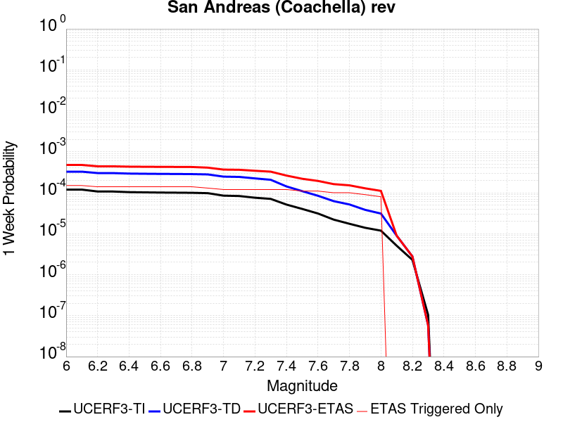 | 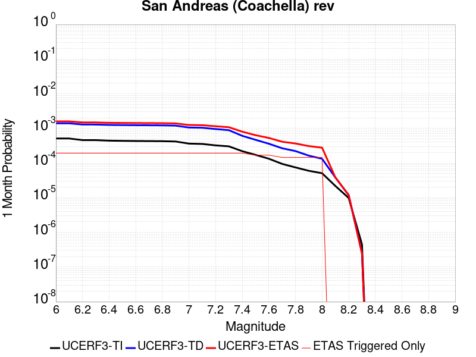 | 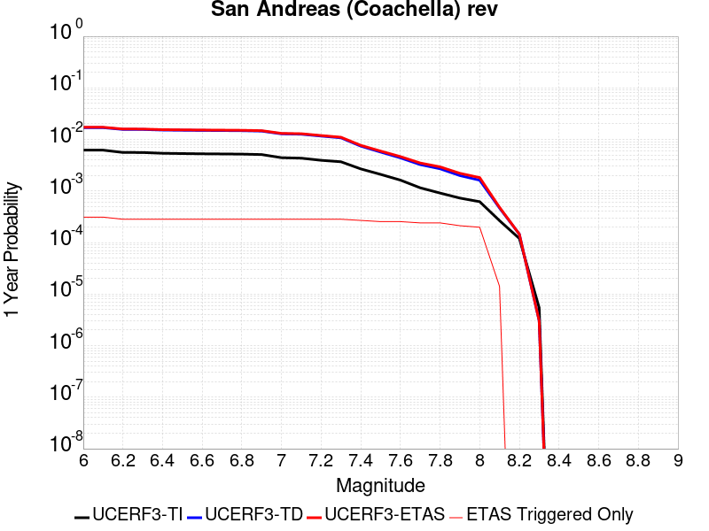 |  |

| Magnitude | 1 wk TI Prob | 1 wk TD Prob | 1 wk ETAS Prob | 1 wk ETAS/TD Gain | 1 wk ETAS Triggered Only | 1 mo TI Prob | 1 mo TD Prob | 1 mo ETAS Prob | 1 mo ETAS/TD Gain | 1 mo ETAS Triggered Only | 1 yr TI Prob | 1 yr TD Prob | 1 yr ETAS Prob | 1 yr ETAS/TD Gain | 1 yr ETAS Triggered Only | 10 yr TI Prob | 10 yr TD Prob | 10 yr ETAS Prob | 10 yr ETAS/TD Gain | 10 yr ETAS Triggered Only |
|-----|-----|-----|-----|-----|-----|-----|-----|-----|-----|-----|-----|-----|-----|-----|-----|-----|-----|-----|-----|-----|
| 6.0 | 1.1925945E-4 | 3.273077E-4 | 4.3107278E-4 | 1.317026 | 1.03799044E-4 | 5.110118E-4 | 0.001401998 | 0.0015056515 | 1.0739328 | 1.03799044E-4 | 0.0062038354 | 0.016937068 | 0.017175162 | 1.0140576 | 2.4219777E-4 | 0.060334753 | 0.15267672 | 0.15294057 | 1.0017282 | 3.1139713E-4 |
| 6.1 | 1.1925945E-4 | 3.273077E-4 | 4.3107278E-4 | 1.317026 | 1.03799044E-4 | 5.110118E-4 | 0.001401998 | 0.0015056515 | 1.0739328 | 1.03799044E-4 | 0.0062038354 | 0.016937068 | 0.017175162 | 1.0140576 | 2.4219777E-4 | 0.060334753 | 0.15267672 | 0.15294057 | 1.0017282 | 3.1139713E-4 |
| 6.2 | 1.07432395E-4 | 3.0231563E-4 | 4.0608327E-4 | 1.3432428 | 1.03799044E-4 | 4.603433E-4 | 0.001294999 | 0.0013986636 | 1.08005 | 1.03799044E-4 | 0.005590286 | 0.015653731 | 0.015892137 | 1.0152301 | 2.4219777E-4 | 0.05451731 | 0.14182784 | 0.14209506 | 1.0018842 | 3.1139713E-4 |
| 6.3 | 1.0718766E-4 | 3.0176868E-4 | 4.055364E-4 | 1.3438652 | 1.03799044E-4 | 4.592948E-4 | 0.0012926573 | 0.0013963222 | 1.0801952 | 1.03799044E-4 | 0.005577586 | 0.01562563 | 0.015864043 | 1.0152578 | 2.4219777E-4 | 0.054396555 | 0.14159605 | 0.14186336 | 1.0018878 | 3.1139713E-4 |
| 6.4 | 1.0355944E-4 | 2.9384956E-4 | 3.976181E-4 | 1.353135 | 1.03799044E-4 | 4.4375064E-4 | 0.0012587514 | 0.0013624197 | 1.0823581 | 1.03799044E-4 | 0.0053892885 | 0.015218662 | 0.015457174 | 1.0156723 | 2.4219777E-4 | 0.052604496 | 0.13815795 | 0.13842633 | 1.0019425 | 3.1139713E-4 |
| 6.5 | 1.0227914E-4 | 2.9104383E-4 | 3.9481267E-4 | 1.3565402 | 1.03799044E-4 | 4.382655E-4 | 0.0012467385 | 0.0013504081 | 1.0831527 | 1.03799044E-4 | 0.0053228354 | 0.015074439 | 0.0153129855 | 1.0158246 | 2.4219777E-4 | 0.051971316 | 0.13694239 | 0.13721113 | 1.0019625 | 3.1139713E-4 |
| 6.6 | 1.0116757E-4 | 2.8870135E-4 | 3.9247042E-4 | 1.359434 | 1.03799044E-4 | 4.3350324E-4 | 0.0012367087 | 0.0013403794 | 1.0838279 | 1.03799044E-4 | 0.0052651367 | 0.014954008 | 0.015192584 | 1.015954 | 2.4219777E-4 | 0.051421247 | 0.13591973 | 0.13618882 | 1.0019796 | 3.1139713E-4 |
| 6.7 | 1.0050676E-4 | 2.8728697E-4 | 3.910562E-4 | 1.361204 | 1.03799044E-4 | 4.3067214E-4 | 0.0012306528 | 0.0013343241 | 1.0842409 | 1.03799044E-4 | 0.005230834 | 0.014881288 | 0.015119881 | 1.0160332 | 2.4219777E-4 | 0.051094085 | 0.13530464 | 0.13557391 | 1.0019901 | 3.1139713E-4 |
| 6.8 | 9.976819E-5 | 2.8532353E-4 | 3.8909295E-4 | 1.3636904 | 1.03799044E-4 | 4.2750788E-4 | 0.001222246 | 0.0013259181 | 1.084821 | 1.03799044E-4 | 0.0051924936 | 0.014780328 | 0.015018946 | 1.0161443 | 2.4219777E-4 | 0.050728295 | 0.13445628 | 0.13472581 | 1.0020046 | 3.1139713E-4 |
| 6.9 | 9.77719E-5 | 2.802926E-4 | 3.8406253E-4 | 1.3702201 | 1.03799044E-4 | 4.1895514E-4 | 0.0012007048 | 0.0013043792 | 1.0863446 | 1.03799044E-4 | 0.0050888555 | 0.0145215895 | 0.014760271 | 1.0164362 | 2.4219777E-4 | 0.049738888 | 0.13228476 | 0.13255496 | 1.0020427 | 3.1139713E-4 |
| 7.0 | 8.500761E-5 | 2.4763815E-4 | 3.514115E-4 | 1.4190524 | 1.03799044E-4 | 3.6426744E-4 | 0.0010608779 | 0.0011645668 | 1.0977387 | 1.03799044E-4 | 0.0044259406 | 0.01284047 | 0.0130795585 | 1.0186199 | 2.4219777E-4 | 0.04338823 | 0.11813616 | 0.118410766 | 1.0023245 | 3.1139713E-4 |
| 7.1 | 8.319876E-5 | 2.4366553E-4 | 3.474393E-4 | 1.425886 | 1.03799044E-4 | 3.5651738E-4 | 0.0010438662 | 0.0011475568 | 1.0993333 | 1.03799044E-4 | 0.004331963 | 0.012635773 | 0.012874911 | 1.0189254 | 2.4219777E-4 | 0.042484846 | 0.11635632 | 0.11663148 | 1.0023649 | 3.1139713E-4 |
| 7.2 | 7.563917E-5 | 2.2414974E-4 | 3.2792552E-4 | 1.4629753 | 1.03799044E-4 | 3.2412758E-4 | 9.602912E-4 | 0.0010639905 | 1.1079874 | 1.03799044E-4 | 0.0039391145 | 0.011629559 | 0.011868941 | 1.0205839 | 2.4219777E-4 | 0.03870018 | 0.10776202 | 0.108039856 | 1.0025783 | 3.1139713E-4 |
| 7.3 | 7.082985E-5 | 2.07311E-4 | 3.1108852E-4 | 1.5005887 | 1.03799044E-4 | 3.0352117E-4 | 8.881761E-4 | 9.918829E-4 | 1.1167638 | 1.03799044E-4 | 0.0036891096 | 0.010760553 | 0.011000145 | 1.0222657 | 2.4219777E-4 | 0.03628465 | 0.10028403 | 0.100564204 | 1.0027938 | 3.1139713E-4 |
| 7.4 | 5.146215E-5 | 1.4274761E-4 | 2.4653182E-4 | 1.7270471 | 1.03799044E-4 | 2.2053342E-4 | 6.1163295E-4 | 7.153685E-4 | 1.1696043 | 1.03799044E-4 | 0.0026816884 | 0.0074213943 | 0.007627452 | 1.0277653 | 2.0759809E-4 | 0.02649557 | 0.07085049 | 0.07110768 | 1.00363 | 2.7679745E-4 |
| 7.5 | 4.0285166E-5 | 1.0942422E-4 | 2.132119E-4 | 1.9484892 | 1.03799044E-4 | 1.7263928E-4 | 4.6887697E-4 | 5.7262735E-4 | 1.2212743 | 1.03799044E-4 | 0.002099857 | 0.0056937044 | 0.0059001204 | 1.0362533 | 2.0759809E-4 | 0.020801254 | 0.055013083 | 0.05527465 | 1.0047547 | 2.7679745E-4 |
| 7.6 | 3.1168736E-5 | 8.439599E-5 | 1.8818628E-4 | 2.2298012 | 1.03799044E-4 | 1.3357346E-4 | 3.616471E-4 | 4.654086E-4 | 1.2869136 | 1.03799044E-4 | 0.0016250437 | 0.004394191 | 0.0046008765 | 1.0470362 | 2.0759809E-4 | 0.016132116 | 0.042812478 | 0.043077424 | 1.0061885 | 2.7679745E-4 |
| 7.7 | 2.2100989E-5 | 6.239345E-5 | 1.315885E-4 | 2.1090114 | 6.919936E-5 | 9.4715084E-5 | 2.6737314E-4 | 3.36554E-4 | 1.2587428 | 6.919936E-5 | 0.001152546 | 0.0032504152 | 0.0034228512 | 1.0530505 | 1.729984E-4 | 0.011465867 | 0.031902168 | 0.03213664 | 1.0073497 | 2.4219777E-4 |
| 7.8 | 1.7484861E-5 | 5.180078E-5 | 1.2099656E-4 | 2.3358057 | 6.919936E-5 | 7.493296E-5 | 2.2198448E-4 | 2.911685E-4 | 1.3116615 | 6.919936E-5 | 9.1192697E-4 | 0.0026993142 | 0.0028718456 | 1.0639168 | 1.729984E-4 | 0.009081938 | 0.026641788 | 0.026877532 | 1.0088487 | 2.4219777E-4 |
| 7.9 | 1.3967285E-5 | 3.8226146E-5 | 1.07422864E-4 | 2.8101933 | 6.919936E-5 | 5.985842E-5 | 1.6381606E-4 | 2.3300409E-4 | 1.422352 | 6.919936E-5 | 7.2853256E-4 | 0.0019926373 | 0.002165291 | 1.0866458 | 1.729984E-4 | 0.0072614877 | 0.019911002 | 0.020148378 | 1.0119218 | 2.4219777E-4 |
| 8.0 | 1.1887396E-5 | 3.106798E-5 | 1.0026519E-4 | 3.227284 | 6.919936E-5 | 5.094499E-5 | 1.331417E-4 | 2.0233185E-4 | 1.519673 | 6.919936E-5 | 6.200787E-4 | 0.0016197958 | 0.001792514 | 1.1066296 | 1.729984E-4 | 0.006183513 | 0.016280567 | 0.016518822 | 1.0146343 | 2.4219777E-4 |
| 8.1 | 5.100864E-6 | 8.973766E-6 | 8.973766E-6 | 1.0 | 0.0 | 2.1860664E-5 | 3.845843E-5 | 3.845843E-5 | 1.0 | 0.0 | 2.6612106E-4 | 4.6813092E-4 | 5.027144E-4 | 1.0738757 | 3.459968E-5 | 0.002658026 | 0.004918092 | 0.0049525215 | 1.0070006 | 3.459968E-5 |
| 8.2 | 2.3004484E-6 | 2.7863473E-6 | 2.7863473E-6 | 1.0 | 0.0 | 9.859027E-6 | 1.19414335E-5 | 1.19414335E-5 | 1.0 | 0.0 | 1.2002704E-4 | 1.4537729E-4 | 1.4537729E-4 | 1.0 | 0.0 | 0.0011996223 | 0.0015973782 | 0.0015973782 | 1.0 | 0.0 |
| 8.3 | 1.0424446E-7 | 5.814421E-8 | 5.814421E-8 | 1.0 | 0.0 | 4.4676187E-7 | 2.4918944E-7 | 2.4918944E-7 | 1.0 | 0.0 | 5.439312E-6 | 3.0338776E-6 | 3.0338776E-6 | 1.0 | 0.0 | 5.4391792E-5 | 3.189592E-5 | 3.189592E-5 | 1.0 | 0.0 |

## San Andreas (Creeping Section) 2011 CFM
*[(top)](#table-of-contents)*

| 1 Week | 1 Month | 1 Year | 10 Year |
|-----|-----|-----|-----|
| 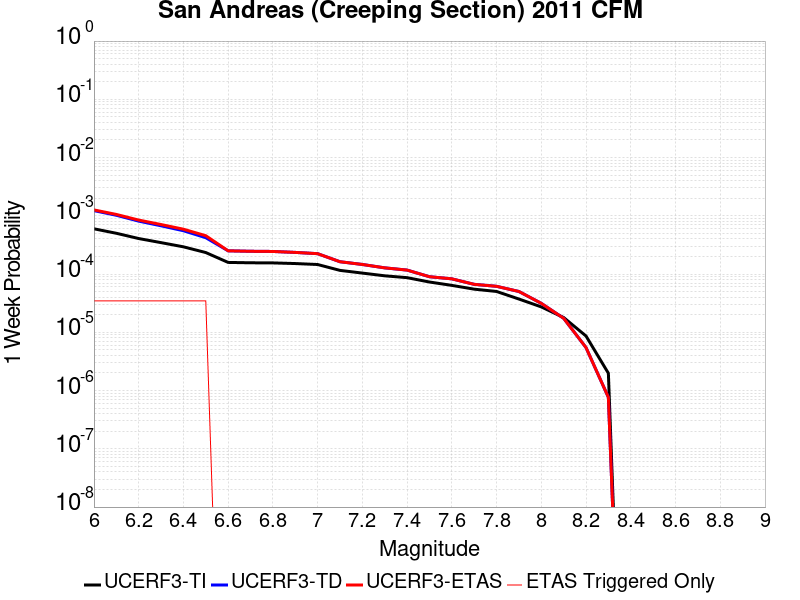 |  | 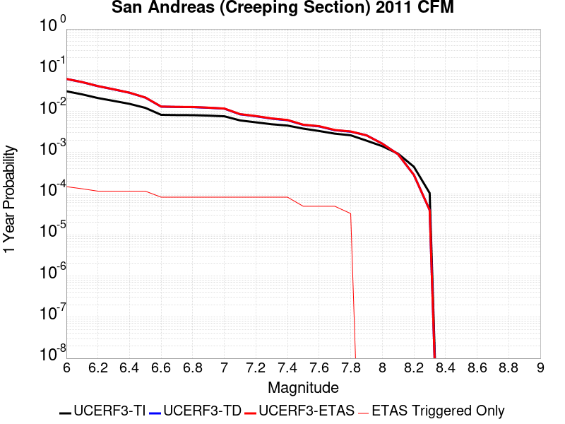 | 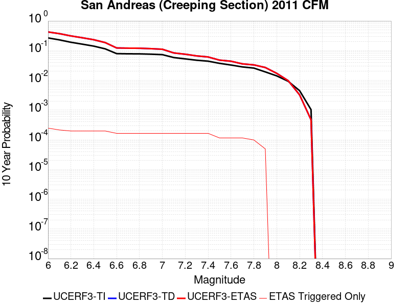 |

| Magnitude | 1 wk TI Prob | 1 wk TD Prob | 1 wk ETAS Prob | 1 wk ETAS/TD Gain | 1 wk ETAS Triggered Only | 1 mo TI Prob | 1 mo TD Prob | 1 mo ETAS Prob | 1 mo ETAS/TD Gain | 1 mo ETAS Triggered Only | 1 yr TI Prob | 1 yr TD Prob | 1 yr ETAS Prob | 1 yr ETAS/TD Gain | 1 yr ETAS Triggered Only | 10 yr TI Prob | 10 yr TD Prob | 10 yr ETAS Prob | 10 yr ETAS/TD Gain | 10 yr ETAS Triggered Only |
|-----|-----|-----|-----|-----|-----|-----|-----|-----|-----|-----|-----|-----|-----|-----|-----|-----|-----|-----|-----|-----|
| 6.0 | 5.986481E-4 | 0.0012275929 | 0.0012621501 | 1.0281504 | 3.459968E-5 | 0.0025631124 | 0.005245547 | 0.005314383 | 1.0131228 | 6.919936E-5 | 0.030762846 | 0.06120491 | 0.061334837 | 1.0021229 | 1.3839873E-4 | 0.26835477 | 0.42593494 | 0.42609385 | 1.000373 | 2.7679745E-4 |
| 6.1 | 5.015945E-4 | 0.0010217986 | 0.0010563629 | 1.033827 | 3.459968E-5 | 0.00214792 | 0.0043678596 | 0.0044367565 | 1.0157737 | 6.919936E-5 | 0.025839351 | 0.05124837 | 0.05134685 | 1.0019217 | 1.03799044E-4 | 0.23032776 | 0.37285668 | 0.37298688 | 1.0003492 | 2.0759809E-4 |
| 6.2 | 4.073338E-4 | 8.1073755E-4 | 8.453092E-4 | 1.0426422 | 3.459968E-5 | 0.0017445484 | 0.0034671477 | 0.003536107 | 1.0198894 | 6.919936E-5 | 0.021034058 | 0.04093317 | 0.041032717 | 1.002432 | 1.03799044E-4 | 0.19150782 | 0.31303346 | 0.31317607 | 1.0004556 | 2.0759809E-4 |
| 6.3 | 3.464099E-4 | 6.7391695E-4 | 7.084933E-4 | 1.0513066 | 3.459968E-5 | 0.0014837692 | 0.0028829593 | 0.0029519591 | 1.0239336 | 6.919936E-5 | 0.017915873 | 0.034189582 | 0.034289833 | 1.0029322 | 1.03799044E-4 | 0.16538359 | 0.2713166 | 0.27146786 | 1.0005575 | 2.0759809E-4 |
| 6.4 | 2.935057E-4 | 5.5442745E-4 | 5.890079E-4 | 1.0623715 | 3.459968E-5 | 0.0012572751 | 0.0023725363 | 0.0024415716 | 1.0290977 | 6.919936E-5 | 0.015200248 | 0.02826451 | 0.028365375 | 1.0035686 | 1.03799044E-4 | 0.14201577 | 0.23298529 | 0.23314452 | 1.0006834 | 2.0759809E-4 |
| 6.5 | 2.3409708E-4 | 4.2093755E-4 | 4.5552268E-4 | 1.0821621 | 3.459968E-5 | 0.0010028875 | 0.0018019684 | 0.0018710431 | 1.0383329 | 6.919936E-5 | 0.012141965 | 0.021587461 | 0.02168902 | 1.0047045 | 1.03799044E-4 | 0.11499573 | 0.18682368 | 0.1869925 | 1.0009036 | 2.0759809E-4 |
| 6.6 | 1.5842178E-4 | 2.506933E-4 | 2.506933E-4 | 1.0 | 0.0 | 6.7877385E-4 | 0.0010739497 | 0.0011085123 | 1.0321826 | 3.459968E-5 | 0.0082328 | 0.012995575 | 0.013063875 | 1.0052557 | 6.919936E-5 | 0.07934396 | 0.12314638 | 0.12329807 | 1.0012318 | 1.729984E-4 |
| 6.7 | 1.5616413E-4 | 2.4605883E-4 | 2.4605883E-4 | 1.0 | 0.0 | 6.691031E-4 | 0.0010541069 | 0.00108867 | 1.0327891 | 3.459968E-5 | 0.0081159435 | 0.01275744 | 0.012825756 | 1.005355 | 6.919936E-5 | 0.0782586 | 0.12117351 | 0.121325545 | 1.0012547 | 1.729984E-4 |
| 6.8 | 1.5538467E-4 | 2.4429744E-4 | 2.4429744E-4 | 1.0 | 0.0 | 6.6576427E-4 | 0.0010465645 | 0.001081128 | 1.0330256 | 3.459968E-5 | 0.008075596 | 0.012666838 | 0.012735162 | 1.0053939 | 6.919936E-5 | 0.07788358 | 0.120404355 | 0.120556526 | 1.0012639 | 1.729984E-4 |
| 6.9 | 1.5153569E-4 | 2.3539034E-4 | 2.3539034E-4 | 1.0 | 0.0 | 6.49277E-4 | 0.0010084276 | 0.0010429925 | 1.0342759 | 3.459968E-5 | 0.007876333 | 0.01220901 | 0.012277365 | 1.0055987 | 6.919936E-5 | 0.07602952 | 0.11647445 | 0.1166273 | 1.0013123 | 1.729984E-4 |
| 7.0 | 1.4588932E-4 | 2.2396253E-4 | 2.2396253E-4 | 1.0 | 0.0 | 6.250901E-4 | 9.5948833E-4 | 9.940548E-4 | 1.036026 | 3.459968E-5 | 0.0075839474 | 0.011619697 | 0.011688092 | 1.0058862 | 6.919936E-5 | 0.073302895 | 0.11132046 | 0.11147419 | 1.001381 | 1.729984E-4 |
| 7.1 | 1.1565079E-4 | 1.6281738E-4 | 1.6281738E-4 | 1.0 | 0.0 | 4.955521E-4 | 6.9760304E-4 | 7.3217857E-4 | 1.0495634 | 3.459968E-5 | 0.006016669 | 0.0084604435 | 0.008529057 | 1.0081099 | 6.919936E-5 | 0.058563538 | 0.08367046 | 0.083828986 | 1.0018946 | 1.729984E-4 |
| 7.2 | 1.0393792E-4 | 1.4615769E-4 | 1.4615769E-4 | 1.0 | 0.0 | 4.4537216E-4 | 6.2624045E-4 | 6.608185E-4 | 1.0552152 | 3.459968E-5 | 0.005408933 | 0.0075979927 | 0.007666666 | 1.0090383 | 6.919936E-5 | 0.052791595 | 0.07561969 | 0.07577961 | 1.0021148 | 1.729984E-4 |
| 7.3 | 9.332884E-5 | 1.2780898E-4 | 1.2780898E-4 | 1.0 | 0.0 | 3.999194E-4 | 5.4763845E-4 | 5.8221916E-4 | 1.0631452 | 3.459968E-5 | 0.0048581534 | 0.006647249 | 0.0067159883 | 1.010341 | 6.919936E-5 | 0.047533102 | 0.06648326 | 0.06664475 | 1.0024291 | 1.729984E-4 |
| 7.4 | 8.670252E-5 | 1.17032345E-4 | 1.17032345E-4 | 1.0 | 0.0 | 3.715293E-4 | 5.0147134E-4 | 5.360537E-4 | 1.0689617 | 3.459968E-5 | 0.004513991 | 0.006088443 | 0.006157221 | 1.0112965 | 6.919936E-5 | 0.044233937 | 0.061151642 | 0.06131406 | 1.002656 | 1.729984E-4 |
| 7.5 | 7.3036405E-5 | 9.005856E-5 | 9.005856E-5 | 1.0 | 0.0 | 3.129756E-4 | 3.8590826E-4 | 3.8590826E-4 | 1.0 | 0.0 | 0.0038038217 | 0.0046883323 | 0.00472277 | 1.0073453 | 3.459968E-5 | 0.03739367 | 0.047877792 | 0.048009567 | 1.0027523 | 1.3839873E-4 |
| 7.6 | 6.3935775E-5 | 8.280385E-5 | 8.280385E-5 | 1.0 | 0.0 | 2.7398168E-4 | 3.5482543E-4 | 3.5482543E-4 | 1.0 | 0.0 | 0.0033306254 | 0.004311461 | 0.0043459116 | 1.0079905 | 3.459968E-5 | 0.032811474 | 0.04399201 | 0.044124316 | 1.0030077 | 1.3839873E-4 |
| 7.7 | 5.5050095E-5 | 6.6618326E-5 | 6.6618326E-5 | 1.0 | 0.0 | 2.3590765E-4 | 2.854759E-4 | 2.854759E-4 | 1.0 | 0.0 | 0.0028683927 | 0.003470134 | 0.0035046136 | 1.0099361 | 3.459968E-5 | 0.0283165 | 0.035796214 | 0.035929658 | 1.0037279 | 1.3839873E-4 |
| 7.8 | 5.027131E-5 | 6.162871E-5 | 6.162871E-5 | 1.0 | 0.0 | 2.1543067E-4 | 2.640963E-4 | 2.640963E-4 | 1.0 | 0.0 | 0.0026197135 | 0.003210635 | 0.0032451237 | 1.010742 | 3.459968E-5 | 0.025890453 | 0.03312666 | 0.033260472 | 1.0040395 | 1.3839873E-4 |
| 7.9 | 3.7271806E-5 | 5.022507E-5 | 5.022507E-5 | 1.0 | 0.0 | 1.5972654E-4 | 2.1523255E-4 | 2.1523255E-4 | 1.0 | 0.0 | 0.0019429359 | 0.002617309 | 0.002617309 | 1.0 | 0.0 | 0.019260362 | 0.027067466 | 0.027134791 | 1.0024873 | 6.919936E-5 |
| 8.0 | 2.7310243E-5 | 3.1427757E-5 | 3.1427757E-5 | 1.0 | 0.0 | 1.17038646E-4 | 1.3468343E-4 | 1.3468343E-4 | 1.0 | 0.0 | 0.0014240141 | 0.0016385383 | 0.0016385383 | 1.0 | 0.0 | 0.014149235 | 0.01721386 | 0.01721386 | 1.0 | 0.0 |
| 8.1 | 1.7940547E-5 | 1.7399378E-5 | 1.7399378E-5 | 1.0 | 0.0 | 7.688579E-5 | 7.456663E-5 | 7.456663E-5 | 1.0 | 0.0 | 9.3568244E-4 | 9.074711E-4 | 9.074711E-4 | 1.0 | 0.0 | 0.009317525 | 0.009798636 | 0.009798636 | 1.0 | 0.0 |
| 8.2 | 8.643924E-6 | 5.473668E-6 | 5.473668E-6 | 1.0 | 0.0 | 3.704486E-5 | 2.3458366E-5 | 2.3458366E-5 | 1.0 | 0.0 | 4.5092785E-4 | 2.8556827E-4 | 2.8556827E-4 | 1.0 | 0.0 | 0.0045001395 | 0.0032481793 | 0.0032481793 | 1.0 | 0.0 |
| 8.3 | 1.983087E-6 | 7.6564595E-7 | 7.6564595E-7 | 1.0 | 0.0 | 8.498917E-6 | 3.281336E-6 | 3.281336E-6 | 1.0 | 0.0 | 1.034694E-4 | 3.9949547E-5 | 3.9949547E-5 | 1.0 | 0.0 | 0.0010342124 | 4.717979E-4 | 4.717979E-4 | 1.0 | 0.0 |

## White Wolf (Extension)
*[(top)](#table-of-contents)*

| 1 Week | 1 Month | 1 Year | 10 Year |
|-----|-----|-----|-----|
| 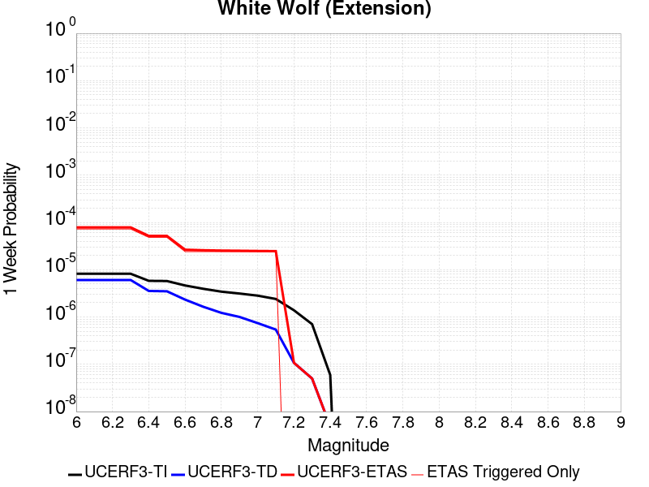 | 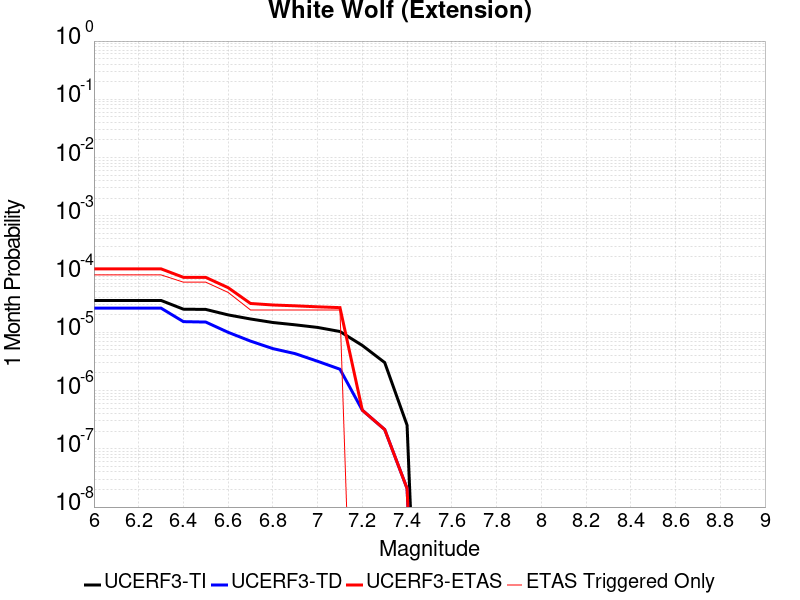 | 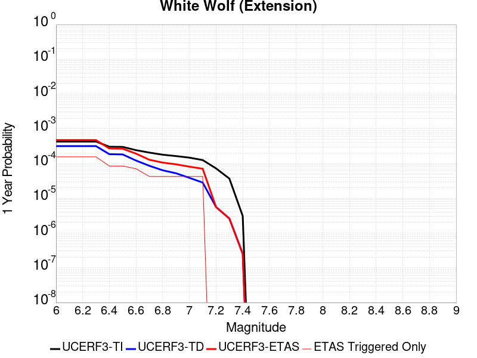 | 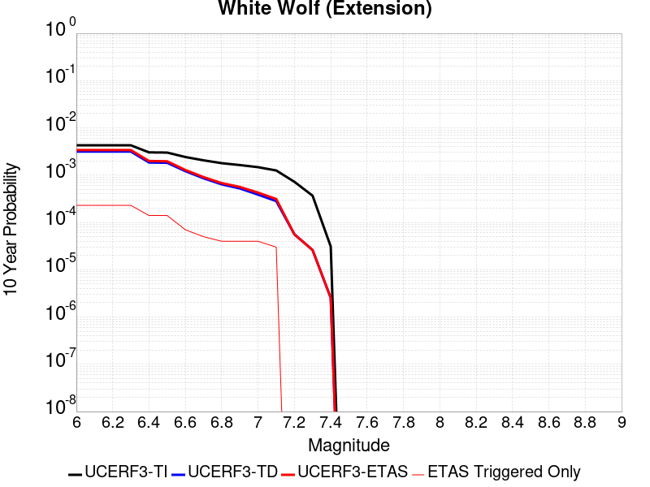 |

| Magnitude | 1 wk TI Prob | 1 wk TD Prob | 1 wk ETAS Prob | 1 wk ETAS/TD Gain | 1 wk ETAS Triggered Only | 1 mo TI Prob | 1 mo TD Prob | 1 mo ETAS Prob | 1 mo ETAS/TD Gain | 1 mo ETAS Triggered Only | 1 yr TI Prob | 1 yr TD Prob | 1 yr ETAS Prob | 1 yr ETAS/TD Gain | 1 yr ETAS Triggered Only | 10 yr TI Prob | 10 yr TD Prob | 10 yr ETAS Prob | 10 yr ETAS/TD Gain | 10 yr ETAS Triggered Only |
|-----|-----|-----|-----|-----|-----|-----|-----|-----|-----|-----|-----|-----|-----|-----|-----|-----|-----|-----|-----|-----|
| 6.0 | 8.222555E-6 | 6.066615E-6 | 7.526556E-5 | 12.406517 | 6.919936E-5 | 3.5239045E-5 | 2.5999556E-5 | 1.297959E-4 | 4.992235 | 1.03799044E-4 | 4.289509E-4 | 3.1650523E-4 | 5.2403763E-4 | 1.6556997 | 2.0759809E-4 | 0.0042812387 | 0.0031611966 | 0.003437119 | 1.0872842 | 2.7679745E-4 |
| 6.1 | 8.222555E-6 | 6.066615E-6 | 7.526556E-5 | 12.406517 | 6.919936E-5 | 3.5239045E-5 | 2.5999556E-5 | 1.297959E-4 | 4.992235 | 1.03799044E-4 | 4.289509E-4 | 3.1650523E-4 | 5.2403763E-4 | 1.6556997 | 2.0759809E-4 | 0.0042812387 | 0.0031611966 | 0.003437119 | 1.0872842 | 2.7679745E-4 |
| 6.2 | 8.222555E-6 | 6.066615E-6 | 7.526556E-5 | 12.406517 | 6.919936E-5 | 3.5239045E-5 | 2.5999556E-5 | 1.297959E-4 | 4.992235 | 1.03799044E-4 | 4.289509E-4 | 3.1650523E-4 | 5.2403763E-4 | 1.6556997 | 2.0759809E-4 | 0.0042812387 | 0.0031611966 | 0.003437119 | 1.0872842 | 2.7679745E-4 |
| 6.3 | 8.222555E-6 | 6.066615E-6 | 7.526556E-5 | 12.406517 | 6.919936E-5 | 3.5239045E-5 | 2.5999556E-5 | 1.297959E-4 | 4.992235 | 1.03799044E-4 | 4.289509E-4 | 3.1650523E-4 | 5.2403763E-4 | 1.6556997 | 2.0759809E-4 | 0.0042812387 | 0.0031611966 | 0.003437119 | 1.0872842 | 2.7679745E-4 |
| 6.4 | 5.821773E-6 | 3.5571256E-6 | 3.8156686E-5 | 10.7268305 | 3.459968E-5 | 2.4950215E-5 | 1.5244741E-5 | 8.444305E-5 | 5.5391593 | 6.919936E-5 | 3.0372653E-4 | 1.8559002E-4 | 2.5477653E-4 | 1.3727922 | 6.919936E-5 | 0.0030331176 | 0.0018544586 | 0.0019926007 | 1.0744919 | 1.3839873E-4 |
| 6.5 | 5.766023E-6 | 3.4990599E-6 | 3.809862E-5 | 10.888245 | 3.459968E-5 | 2.4711293E-5 | 1.49958905E-5 | 8.419422E-5 | 5.6144857 | 6.919936E-5 | 3.0081844E-4 | 1.8256076E-4 | 2.517475E-4 | 1.3789792 | 6.919936E-5 | 0.0030041158 | 0.0018242161 | 0.0019623623 | 1.0757291 | 1.3839873E-4 |
| 6.6 | 4.643576E-6 | 2.3325733E-6 | 3.6932175E-5 | 15.833232 | 3.459968E-5 | 1.9900888E-5 | 9.9967065E-6 | 7.919538E-5 | 7.922147 | 6.919936E-5 | 2.4226638E-4 | 1.2170354E-4 | 1.9089448E-4 | 1.5685204 | 6.919936E-5 | 0.0024200242 | 0.0012164112 | 0.0013200841 | 1.0852284 | 1.03799044E-4 |
| 6.7 | 3.9529173E-6 | 1.6482975E-6 | 3.6247922E-5 | 21.991129 | 3.459968E-5 | 1.6940963E-5 | 7.064114E-6 | 4.1663552E-5 | 5.897916 | 3.459968E-5 | 2.0623671E-4 | 8.600239E-5 | 1.2059909E-4 | 1.4022762 | 3.459968E-5 | 0.002060454 | 8.597095E-4 | 9.288494E-4 | 1.0804224 | 6.919936E-5 |
| 6.8 | 3.4377522E-6 | 1.2244764E-6 | 3.5824116E-5 | 29.256683 | 3.459968E-5 | 1.473314E-5 | 5.247746E-6 | 3.9847248E-5 | 7.593212 | 3.459968E-5 | 1.7936122E-4 | 6.388952E-5 | 9.848699E-5 | 1.5415202 | 3.459968E-5 | 0.0017921652 | 6.3872064E-4 | 6.7329826E-4 | 1.0541357 | 3.459968E-5 |
| 6.9 | 3.1367306E-6 | 1.0033316E-6 | 3.5602978E-5 | 35.48476 | 3.459968E-5 | 1.3443062E-5 | 4.299986E-6 | 3.8899518E-5 | 9.04643 | 3.459968E-5 | 1.63657E-4 | 5.2351144E-5 | 8.694902E-5 | 1.6608808 | 3.459968E-5 | 0.0016353652 | 5.233958E-4 | 5.5797736E-4 | 1.0660715 | 3.459968E-5 |
| 7.0 | 2.8298145E-6 | 7.4282326E-7 | 3.534248E-5 | 47.578583 | 3.459968E-5 | 1.2127721E-5 | 3.1835248E-6 | 3.7783095E-5 | 11.868322 | 3.459968E-5 | 1.47645E-4 | 3.8758775E-5 | 7.3357114E-5 | 1.8926582 | 3.459968E-5 | 0.0014754693 | 3.8752513E-4 | 4.2211142E-4 | 1.0892491 | 3.459968E-5 |
| 7.1 | 2.4091064E-6 | 5.4223835E-7 | 3.51419E-5 | 64.80895 | 3.459968E-5 | 1.03247E-5 | 2.3238767E-6 | 3.6923477E-5 | 15.8887415 | 3.459968E-5 | 1.2569598E-4 | 2.8292874E-5 | 6.289157E-5 | 2.222877 | 3.459968E-5 | 0.001256249 | 2.8289677E-4 | 3.1748664E-4 | 1.1222703 | 3.459968E-5 |
| 7.2 | 1.3875518E-6 | 1.0740268E-7 | 1.0740268E-7 | 1.0 | 0.0 | 5.9466374E-6 | 4.6029712E-7 | 4.6029712E-7 | 1.0 | 0.0 | 7.23979E-5 | 5.604104E-6 | 5.604104E-6 | 1.0 | 0.0 | 7.2374323E-4 | 5.6039742E-5 | 5.6039742E-5 | 1.0 | 0.0 |
| 7.3 | 7.056077E-7 | 5.0002956E-8 | 5.0002956E-8 | 1.0 | 0.0 | 3.0240296E-6 | 2.1429837E-7 | 2.1429837E-7 | 1.0 | 0.0 | 3.681694E-5 | 2.60908E-6 | 2.60908E-6 | 1.0 | 0.0 | 3.681084E-4 | 2.609054E-5 | 2.609054E-5 | 1.0 | 0.0 |
| 7.4 | 5.9334678E-8 | 4.8638475E-9 | 4.8638475E-9 | 1.0 | 0.0 | 2.5429145E-7 | 2.084506E-8 | 2.084506E-8 | 1.0 | 0.0 | 3.095994E-6 | 2.5378858E-7 | 2.5378858E-7 | 1.0 | 0.0 | 3.095951E-5 | 2.5378843E-6 | 2.5378843E-6 | 1.0 | 0.0 |

## Scodie Lineament
*[(top)](#table-of-contents)*

| 1 Week | 1 Month | 1 Year | 10 Year |
|-----|-----|-----|-----|
| 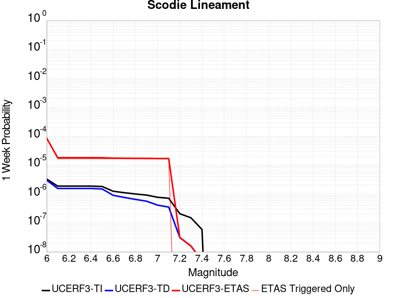 | 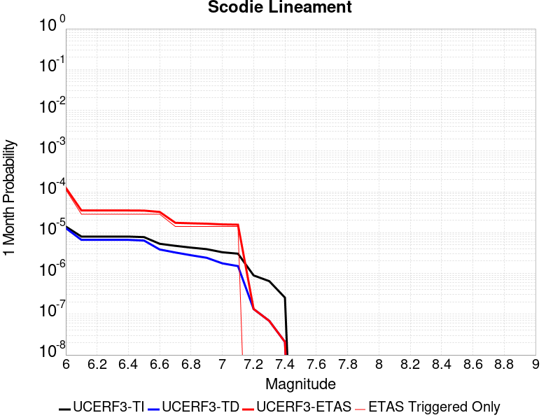 | 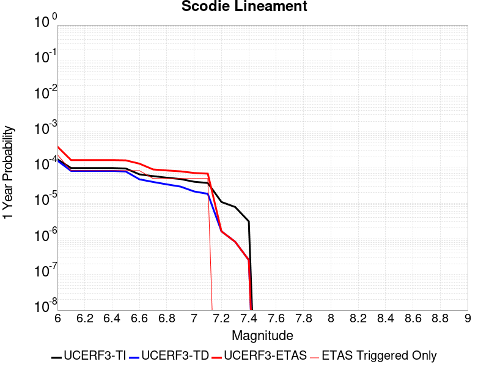 | 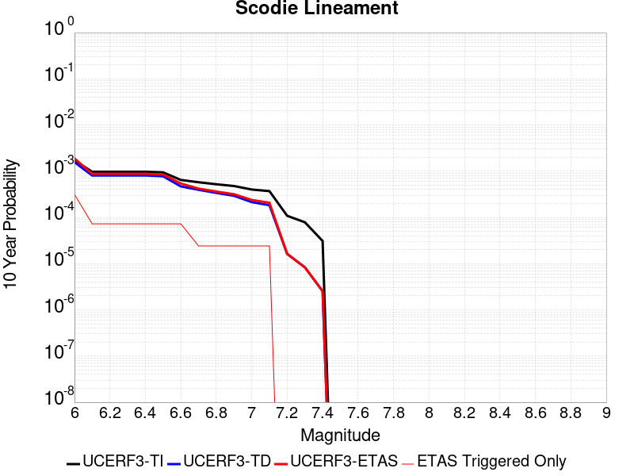 |

| Magnitude | 1 wk TI Prob | 1 wk TD Prob | 1 wk ETAS Prob | 1 wk ETAS/TD Gain | 1 wk ETAS Triggered Only | 1 mo TI Prob | 1 mo TD Prob | 1 mo ETAS Prob | 1 mo ETAS/TD Gain | 1 mo ETAS Triggered Only | 1 yr TI Prob | 1 yr TD Prob | 1 yr ETAS Prob | 1 yr ETAS/TD Gain | 1 yr ETAS Triggered Only | 10 yr TI Prob | 10 yr TD Prob | 10 yr ETAS Prob | 10 yr ETAS/TD Gain | 10 yr ETAS Triggered Only |
|-----|-----|-----|-----|-----|-----|-----|-----|-----|-----|-----|-----|-----|-----|-----|-----|-----|-----|-----|-----|-----|
| 6.0 | 3.2919327E-6 | 3.0133303E-6 | 7.221248E-5 | 23.964344 | 6.919936E-5 | 1.4108206E-5 | 1.2914227E-5 | 1.1671193E-4 | 9.037469 | 1.03799044E-4 | 1.7175387E-4 | 1.5722254E-4 | 3.9938223E-4 | 2.540235 | 2.4219777E-4 | 0.0017162118 | 0.0015714248 | 0.0018823325 | 1.197851 | 3.1139713E-4 |
| 6.1 | 1.8663811E-6 | 1.5490382E-6 | 3.6148667E-5 | 23.3362 | 3.459968E-5 | 7.998751E-6 | 6.6387206E-6 | 7.5837626E-5 | 11.42353 | 6.919936E-5 | 9.738045E-5 | 8.082393E-5 | 1.500177E-4 | 1.8561051 | 6.919936E-5 | 9.7337784E-4 | 8.079941E-4 | 8.771376E-4 | 1.0855742 | 6.919936E-5 |
| 6.2 | 1.8663811E-6 | 1.5490382E-6 | 3.6148667E-5 | 23.3362 | 3.459968E-5 | 7.998751E-6 | 6.6387206E-6 | 7.5837626E-5 | 11.42353 | 6.919936E-5 | 9.738045E-5 | 8.082393E-5 | 1.500177E-4 | 1.8561051 | 6.919936E-5 | 9.7337784E-4 | 8.079941E-4 | 8.771376E-4 | 1.0855742 | 6.919936E-5 |
| 6.3 | 1.8663811E-6 | 1.5490382E-6 | 3.6148667E-5 | 23.3362 | 3.459968E-5 | 7.998751E-6 | 6.6387206E-6 | 7.5837626E-5 | 11.42353 | 6.919936E-5 | 9.738045E-5 | 8.082393E-5 | 1.500177E-4 | 1.8561051 | 6.919936E-5 | 9.7337784E-4 | 8.079941E-4 | 8.771376E-4 | 1.0855742 | 6.919936E-5 |
| 6.4 | 1.8663811E-6 | 1.5490382E-6 | 3.6148667E-5 | 23.3362 | 3.459968E-5 | 7.998751E-6 | 6.6387206E-6 | 7.5837626E-5 | 11.42353 | 6.919936E-5 | 9.738045E-5 | 8.082393E-5 | 1.500177E-4 | 1.8561051 | 6.919936E-5 | 9.7337784E-4 | 8.079941E-4 | 8.771376E-4 | 1.0855742 | 6.919936E-5 |
| 6.5 | 1.8106311E-6 | 1.4909722E-6 | 3.60906E-5 | 24.206087 | 3.459968E-5 | 7.759824E-6 | 6.389868E-6 | 7.558879E-5 | 11.829476 | 6.919936E-5 | 9.447177E-5 | 7.779436E-5 | 1.4698834E-4 | 1.8894472 | 6.919936E-5 | 9.4431615E-4 | 7.7771995E-4 | 8.4686547E-4 | 1.0889081 | 6.919936E-5 |
| 6.6 | 1.2414679E-6 | 8.9974395E-7 | 3.5499394E-5 | 39.454994 | 3.459968E-5 | 5.320566E-6 | 3.85604E-6 | 7.305514E-5 | 18.945637 | 6.919936E-5 | 6.477596E-5 | 4.6946367E-5 | 1.1614248E-4 | 2.4739397 | 6.919936E-5 | 6.475708E-4 | 4.6937316E-4 | 5.3854E-4 | 1.1473601 | 6.919936E-5 |
| 6.7 | 1.1062215E-6 | 7.594193E-7 | 3.5359073E-5 | 46.560673 | 3.459968E-5 | 4.7409408E-6 | 3.2546504E-6 | 3.785422E-5 | 11.63081 | 3.459968E-5 | 5.7719422E-5 | 3.962472E-5 | 7.422303E-5 | 1.8731496 | 3.459968E-5 | 5.770443E-4 | 3.9618355E-4 | 4.3076952E-4 | 1.0872979 | 3.459968E-5 |
| 6.8 | 1.0006736E-6 | 6.5002786E-7 | 3.5249686E-5 | 54.227962 | 3.459968E-5 | 4.288594E-6 | 2.7858312E-6 | 3.7385416E-5 | 13.419843 | 3.459968E-5 | 5.221238E-5 | 3.391703E-5 | 6.851554E-5 | 2.0200925 | 3.459968E-5 | 5.220012E-4 | 3.3912458E-4 | 3.7371254E-4 | 1.1019919 | 3.459968E-5 |
| 6.9 | 9.167364E-7 | 5.6315065E-7 | 3.516281E-5 | 62.43944 | 3.459968E-5 | 3.9288643E-6 | 2.413501E-6 | 3.70131E-5 | 15.335855 | 3.459968E-5 | 4.7832873E-5 | 2.9384037E-5 | 6.39827E-5 | 2.1774647 | 3.459968E-5 | 4.782258E-4 | 2.9380718E-4 | 3.283967E-4 | 1.1177286 | 3.459968E-5 |
| 7.0 | 7.6987664E-7 | 4.113265E-7 | 3.5010995E-5 | 85.11728 | 3.459968E-5 | 3.2994672E-6 | 1.7628269E-6 | 3.6362446E-5 | 20.62735 | 3.459968E-5 | 4.0170275E-5 | 2.1462245E-5 | 5.6061184E-5 | 2.612084 | 3.459968E-5 | 4.0163012E-4 | 2.1460558E-4 | 2.4919785E-4 | 1.1611899 | 3.459968E-5 |
| 7.1 | 7.1038727E-7 | 3.5210306E-7 | 3.4951772E-5 | 99.26575 | 3.459968E-5 | 3.0445133E-6 | 1.5090123E-6 | 3.6108642E-5 | 23.928658 | 3.459968E-5 | 3.706632E-5 | 1.8372106E-5 | 5.2971154E-5 | 2.8832378 | 3.459968E-5 | 3.7060137E-4 | 1.8370937E-4 | 2.183027E-4 | 1.1883047 | 3.459968E-5 |
| 7.2 | 2.0799602E-7 | 3.1178534E-8 | 3.1178534E-8 | 1.0 | 0.0 | 8.914113E-7 | 1.3362228E-7 | 1.3362228E-7 | 1.0 | 0.0 | 1.0852878E-5 | 1.6268501E-6 | 1.6268501E-6 | 1.0 | 0.0 | 1.08523476E-4 | 1.626839E-5 | 1.626839E-5 | 1.0 | 0.0 |
| 7.3 | 1.5048182E-7 | 1.5939106E-8 | 1.5939106E-8 | 1.0 | 0.0 | 6.449219E-7 | 6.8310456E-8 | 6.8310456E-8 | 1.0 | 0.0 | 7.851896E-6 | 8.316795E-7 | 8.316795E-7 | 1.0 | 0.0 | 7.851618E-5 | 8.316767E-6 | 8.316767E-6 | 1.0 | 0.0 |
| 7.4 | 5.9334678E-8 | 4.8638475E-9 | 4.8638475E-9 | 1.0 | 0.0 | 2.5429145E-7 | 2.084506E-8 | 2.084506E-8 | 1.0 | 0.0 | 3.095994E-6 | 2.5378858E-7 | 2.5378858E-7 | 1.0 | 0.0 | 3.095951E-5 | 2.5378843E-6 | 2.5378843E-6 | 1.0 | 0.0 |

## Santa Rosa Island
*[(top)](#table-of-contents)*

| 1 Week | 1 Month | 1 Year | 10 Year |
|-----|-----|-----|-----|
| 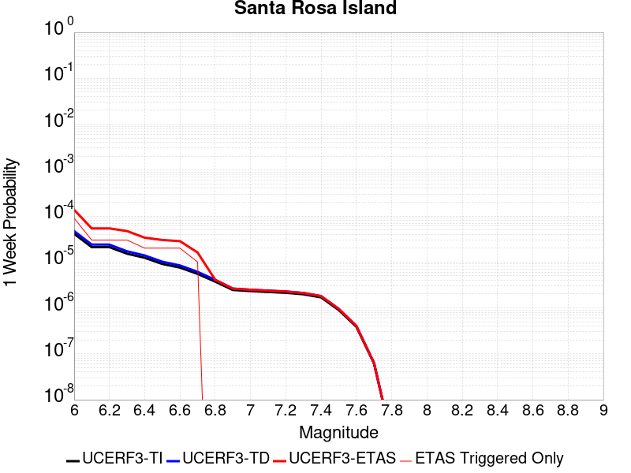 | 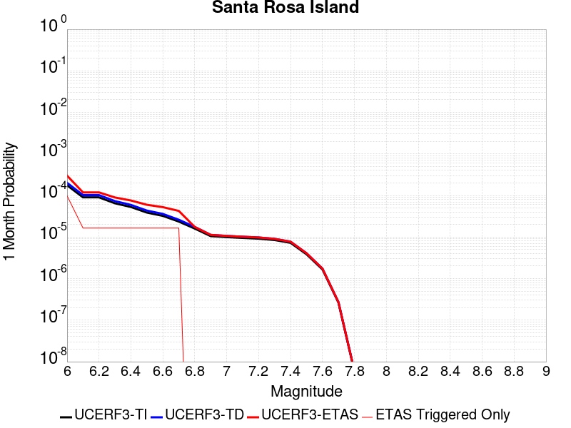 | 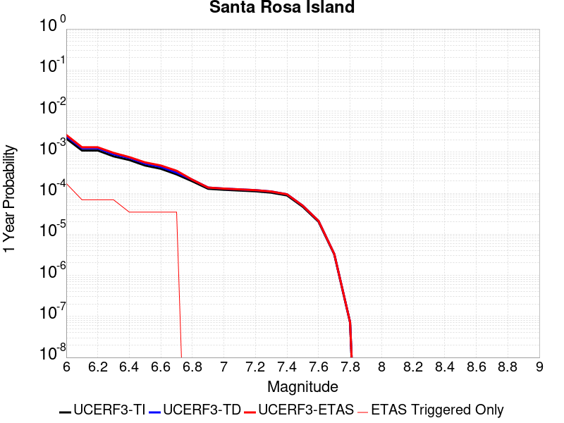 | 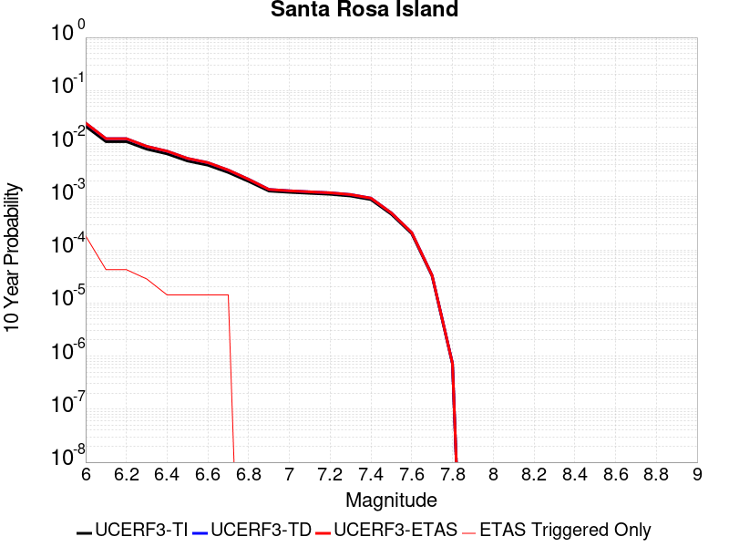 |

| Magnitude | 1 wk TI Prob | 1 wk TD Prob | 1 wk ETAS Prob | 1 wk ETAS/TD Gain | 1 wk ETAS Triggered Only | 1 mo TI Prob | 1 mo TD Prob | 1 mo ETAS Prob | 1 mo ETAS/TD Gain | 1 mo ETAS Triggered Only | 1 yr TI Prob | 1 yr TD Prob | 1 yr ETAS Prob | 1 yr ETAS/TD Gain | 1 yr ETAS Triggered Only | 10 yr TI Prob | 10 yr TD Prob | 10 yr ETAS Prob | 10 yr ETAS/TD Gain | 10 yr ETAS Triggered Only |
|-----|-----|-----|-----|-----|-----|-----|-----|-----|-----|-----|-----|-----|-----|-----|-----|-----|-----|-----|-----|-----|
| 6.0 | 4.1143165E-5 | 4.709113E-5 | 1.5088529E-4 | 3.2041128 | 1.03799044E-4 | 1.7631594E-4 | 2.0180462E-4 | 3.055827E-4 | 1.5142504 | 1.03799044E-4 | 0.002144533 | 0.0024543991 | 0.002626973 | 1.070312 | 1.729984E-4 | 0.021239553 | 0.024293557 | 0.02456363 | 1.0111171 | 2.7679745E-4 |
| 6.1 | 2.1061249E-5 | 2.3864959E-5 | 5.8463815E-5 | 2.4497764 | 3.459968E-5 | 9.0259375E-5 | 1.0227455E-4 | 1.3687069E-4 | 1.3382673 | 3.459968E-5 | 0.0010983539 | 0.0012445103 | 0.0013136236 | 1.0555345 | 6.919936E-5 | 0.01092941 | 0.01237845 | 0.012480964 | 1.0082817 | 1.03799044E-4 |
| 6.2 | 2.1061249E-5 | 2.3864959E-5 | 5.8463815E-5 | 2.4497764 | 3.459968E-5 | 9.0259375E-5 | 1.0227455E-4 | 1.3687069E-4 | 1.3382673 | 3.459968E-5 | 0.0010983539 | 0.0012445103 | 0.0013136236 | 1.0555345 | 6.919936E-5 | 0.01092941 | 0.01237845 | 0.012480964 | 1.0082817 | 1.03799044E-4 |
| 6.3 | 1.5158236E-5 | 1.7074419E-5 | 5.167351E-5 | 3.02637 | 3.459968E-5 | 6.496225E-5 | 7.3174095E-5 | 1.07771244E-4 | 1.472806 | 3.459968E-5 | 7.906284E-4 | 8.9054246E-4 | 9.596802E-4 | 1.0776355 | 6.919936E-5 | 0.007878214 | 0.00887099 | 0.008939575 | 1.0077314 | 6.919936E-5 |
| 6.4 | 1.2341918E-5 | 1.3852917E-5 | 4.845212E-5 | 3.4976113 | 3.459968E-5 | 5.2892858E-5 | 5.9368336E-5 | 9.3965966E-5 | 1.5827622 | 3.459968E-5 | 6.437803E-4 | 7.225779E-4 | 7.571526E-4 | 1.047849 | 3.459968E-5 | 0.006419184 | 0.0072031217 | 0.007237472 | 1.0047688 | 3.459968E-5 |
| 6.5 | 9.061158E-6 | 1.0117032E-5 | 4.4716362E-5 | 4.4199095 | 3.459968E-5 | 3.883296E-5 | 4.3358017E-5 | 7.7956196E-5 | 1.797965 | 3.459968E-5 | 4.726887E-4 | 5.277613E-4 | 5.6234276E-4 | 1.0655247 | 3.459968E-5 | 0.004716845 | 0.0052656177 | 0.0053000352 | 1.0065362 | 3.459968E-5 |
| 6.6 | 7.5461685E-6 | 8.400734E-6 | 4.3000124E-5 | 5.118615 | 3.459968E-5 | 3.2340322E-5 | 3.600267E-5 | 7.0601105E-5 | 1.9609964 | 3.459968E-5 | 3.936723E-4 | 4.3824868E-4 | 4.728332E-4 | 1.0789152 | 3.459968E-5 | 0.003929756 | 0.0043742736 | 0.0044087223 | 1.0078752 | 3.459968E-5 |
| 6.7 | 5.5023775E-6 | 6.087381E-6 | 4.0686853E-5 | 6.6838026 | 3.459968E-5 | 2.3581404E-5 | 2.6088532E-5 | 6.068731E-5 | 2.3262064 | 3.459968E-5 | 2.8706578E-4 | 3.1758484E-4 | 3.5217352E-4 | 1.1089116 | 3.459968E-5 | 0.0028669522 | 0.0031716316 | 0.0032061215 | 1.0108745 | 3.459968E-5 |
| 6.8 | 3.7351679E-6 | 4.0831405E-6 | 4.0831405E-6 | 1.0 | 0.0 | 1.6007763E-5 | 1.7499071E-5 | 1.7499071E-5 | 1.0 | 0.0 | 1.948771E-4 | 2.1303285E-4 | 2.1303285E-4 | 1.0 | 0.0 | 0.0019470629 | 0.0021285315 | 0.0021285315 | 1.0 | 0.0 |
| 6.9 | 2.456366E-6 | 2.6292707E-6 | 2.6292707E-6 | 1.0 | 0.0 | 1.0527241E-5 | 1.1268255E-5 | 1.1268255E-5 | 1.0 | 0.0 | 1.2816161E-4 | 1.3718239E-4 | 1.3718239E-4 | 1.0 | 0.0 | 0.0012808773 | 0.0013709799 | 0.0013709799 | 1.0 | 0.0 |
| 7.0 | 2.3245157E-6 | 2.4827784E-6 | 2.4827784E-6 | 1.0 | 0.0 | 9.962172E-6 | 1.0640436E-5 | 1.0640436E-5 | 1.0 | 0.0 | 1.2128269E-4 | 1.2953962E-4 | 1.2953962E-4 | 1.0 | 0.0 | 0.0012121652 | 0.0012946434 | 0.0012946434 | 1.0 | 0.0 |
| 7.1 | 2.2248344E-6 | 2.37325E-6 | 2.37325E-6 | 1.0 | 0.0 | 9.53497E-6 | 1.0171032E-5 | 1.0171032E-5 | 1.0 | 0.0 | 1.1608207E-4 | 1.238253E-4 | 1.238253E-4 | 1.0 | 0.0 | 0.0011602144 | 0.0012375651 | 0.0012375651 | 1.0 | 0.0 |
| 7.2 | 2.1350402E-6 | 2.2761542E-6 | 2.2761542E-6 | 1.0 | 0.0 | 9.150141E-6 | 9.75491E-6 | 9.75491E-6 | 1.0 | 0.0 | 1.1139726E-4 | 1.1875957E-4 | 1.1875957E-4 | 1.0 | 0.0 | 0.0011134144 | 0.0011869629 | 0.0011869629 | 1.0 | 0.0 |
| 7.3 | 1.9793572E-6 | 2.1087192E-6 | 2.1087192E-6 | 1.0 | 0.0 | 8.482932E-6 | 9.037337E-6 | 9.037337E-6 | 1.0 | 0.0 | 1.032748E-4 | 1.1002403E-4 | 1.1002403E-4 | 1.0 | 0.0 | 0.0010322682 | 0.0010996974 | 0.0010996974 | 1.0 | 0.0 |
| 7.4 | 1.6951194E-6 | 1.8045735E-6 | 1.8045735E-6 | 1.0 | 0.0 | 7.264777E-6 | 7.733864E-6 | 7.733864E-6 | 1.0 | 0.0 | 8.844508E-5 | 9.415574E-5 | 9.415574E-5 | 1.0 | 0.0 | 8.840988E-4 | 9.411601E-4 | 9.411601E-4 | 1.0 | 0.0 |
| 7.5 | 8.987207E-7 | 9.512216E-7 | 9.512216E-7 | 1.0 | 0.0 | 3.8516546E-6 | 4.0766577E-6 | 4.0766577E-6 | 1.0 | 0.0 | 4.6892885E-5 | 4.9632188E-5 | 4.9632188E-5 | 1.0 | 0.0 | 4.688299E-4 | 4.962122E-4 | 4.962122E-4 | 1.0 | 0.0 |
| 7.6 | 3.8783037E-7 | 4.0529335E-7 | 4.0529335E-7 | 1.0 | 0.0 | 1.6621291E-6 | 1.7369704E-6 | 1.7369704E-6 | 1.0 | 0.0 | 2.0236233E-5 | 2.1147416E-5 | 2.1147416E-5 | 1.0 | 0.0 | 2.023439E-4 | 2.114547E-4 | 2.114547E-4 | 1.0 | 0.0 |
| 7.7 | 6.181804E-8 | 6.339047E-8 | 6.339047E-8 | 1.0 | 0.0 | 2.6493444E-7 | 2.7167343E-7 | 2.7167343E-7 | 1.0 | 0.0 | 3.225572E-6 | 3.307619E-6 | 3.307619E-6 | 1.0 | 0.0 | 3.225525E-5 | 3.3075703E-5 | 3.3075703E-5 | 1.0 | 0.0 |
| 7.8 | 1.3704449E-9 | 1.3964153E-9 | 1.3964153E-9 | 1.0 | 0.0 | 5.873335E-9 | 5.984637E-9 | 5.984637E-9 | 1.0 | 0.0 | 7.1507856E-8 | 7.286295E-8 | 7.286295E-8 | 1.0 | 0.0 | 7.1507833E-7 | 7.286294E-7 | 7.286294E-7 | 1.0 | 0.0 |

## Lake Isabella (Seismicity)
*[(top)](#table-of-contents)*

| 1 Week | 1 Month | 1 Year | 10 Year |
|-----|-----|-----|-----|
| 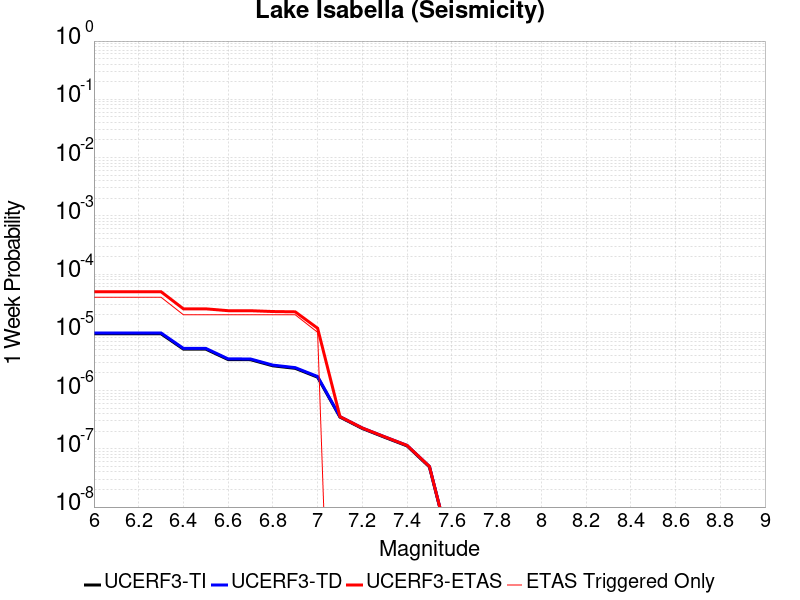 | 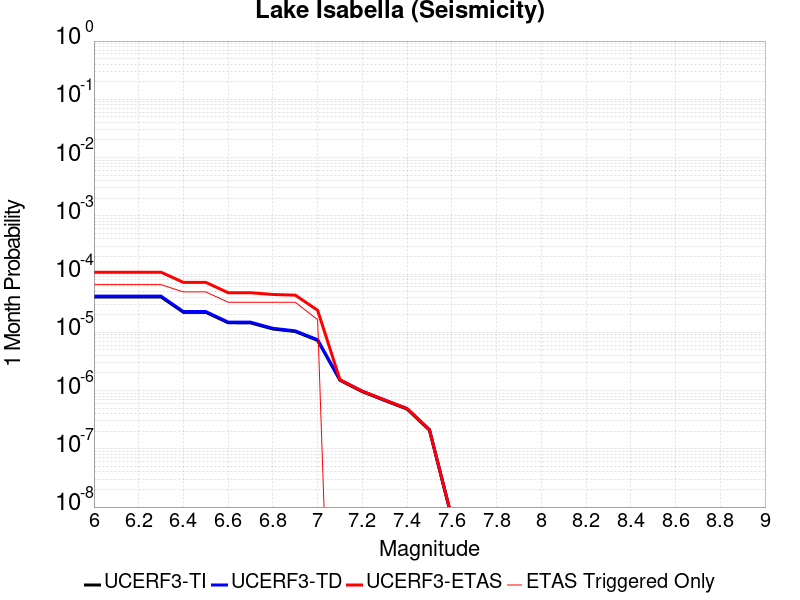 | 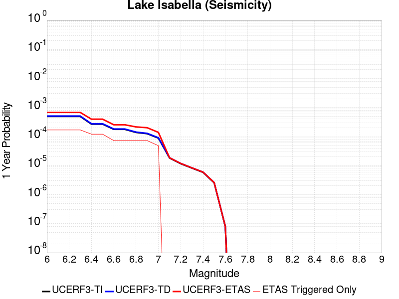 | 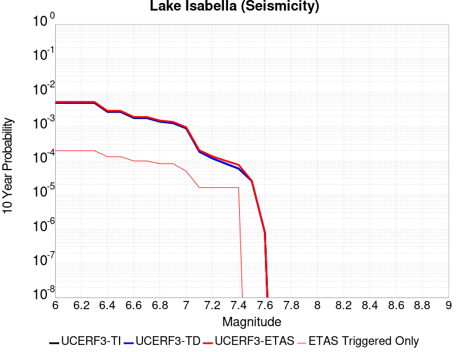 |

| Magnitude | 1 wk TI Prob | 1 wk TD Prob | 1 wk ETAS Prob | 1 wk ETAS/TD Gain | 1 wk ETAS Triggered Only | 1 mo TI Prob | 1 mo TD Prob | 1 mo ETAS Prob | 1 mo ETAS/TD Gain | 1 mo ETAS Triggered Only | 1 yr TI Prob | 1 yr TD Prob | 1 yr ETAS Prob | 1 yr ETAS/TD Gain | 1 yr ETAS Triggered Only | 10 yr TI Prob | 10 yr TD Prob | 10 yr ETAS Prob | 10 yr ETAS/TD Gain | 10 yr ETAS Triggered Only |
|-----|-----|-----|-----|-----|-----|-----|-----|-----|-----|-----|-----|-----|-----|-----|-----|-----|-----|-----|-----|-----|
| 6.0 | 9.431637E-6 | 9.741651E-6 | 7.894034E-5 | 8.103384 | 6.919936E-5 | 4.0420677E-5 | 4.1749343E-5 | 1.4554405E-4 | 3.48614 | 1.03799044E-4 | 4.920106E-4 | 5.0819275E-4 | 7.1568537E-4 | 1.408295 | 2.0759809E-4 | 0.004909227 | 0.005071599 | 0.0053469925 | 1.0543011 | 2.7679745E-4 |
| 6.1 | 9.431637E-6 | 9.741651E-6 | 7.894034E-5 | 8.103384 | 6.919936E-5 | 4.0420677E-5 | 4.1749343E-5 | 1.4554405E-4 | 3.48614 | 1.03799044E-4 | 4.920106E-4 | 5.0819275E-4 | 7.1568537E-4 | 1.408295 | 2.0759809E-4 | 0.004909227 | 0.005071599 | 0.0053469925 | 1.0543011 | 2.7679745E-4 |
| 6.2 | 9.431637E-6 | 9.741651E-6 | 7.894034E-5 | 8.103384 | 6.919936E-5 | 4.0420677E-5 | 4.1749343E-5 | 1.4554405E-4 | 3.48614 | 1.03799044E-4 | 4.920106E-4 | 5.0819275E-4 | 7.1568537E-4 | 1.408295 | 2.0759809E-4 | 0.004909227 | 0.005071599 | 0.0053469925 | 1.0543011 | 2.7679745E-4 |
| 6.3 | 9.431637E-6 | 9.741651E-6 | 7.894034E-5 | 8.103384 | 6.919936E-5 | 4.0420677E-5 | 4.1749343E-5 | 1.4554405E-4 | 3.48614 | 1.03799044E-4 | 4.920106E-4 | 5.0819275E-4 | 7.1568537E-4 | 1.408295 | 2.0759809E-4 | 0.004909227 | 0.005071599 | 0.0053469925 | 1.0543011 | 2.7679745E-4 |
| 6.4 | 5.144063E-6 | 5.3000763E-6 | 7.4499076E-5 | 14.056227 | 6.919936E-5 | 2.2045799E-5 | 2.2714434E-5 | 1.2651112E-4 | 5.569636 | 1.03799044E-4 | 2.6837454E-4 | 2.765166E-4 | 4.4946716E-4 | 1.6254618 | 1.729984E-4 | 0.0026805066 | 0.0027620657 | 0.0029690904 | 1.0749528 | 2.0759809E-4 |
| 6.5 | 5.144063E-6 | 5.3000763E-6 | 7.4499076E-5 | 14.056227 | 6.919936E-5 | 2.2045799E-5 | 2.2714434E-5 | 1.2651112E-4 | 5.569636 | 1.03799044E-4 | 2.6837454E-4 | 2.765166E-4 | 4.4946716E-4 | 1.6254618 | 1.729984E-4 | 0.0026805066 | 0.0027620657 | 0.0029690904 | 1.0749528 | 2.0759809E-4 |
| 6.6 | 3.4009804E-6 | 3.498786E-6 | 7.2697905E-5 | 20.778036 | 6.919936E-5 | 1.4575549E-5 | 1.4994721E-5 | 8.4193045E-5 | 5.6148458 | 6.919936E-5 | 1.7744285E-4 | 1.8254704E-4 | 2.8632712E-4 | 1.5685116 | 1.03799044E-4 | 0.0017730123 | 0.0018241286 | 0.0019622748 | 1.0757327 | 1.3839873E-4 |
| 6.7 | 3.3880428E-6 | 3.4856528E-6 | 7.268477E-5 | 20.852558 | 6.919936E-5 | 1.4520103E-5 | 1.4938435E-5 | 8.4136766E-5 | 5.632234 | 6.919936E-5 | 1.767679E-4 | 1.8186188E-4 | 2.8564205E-4 | 1.5706538 | 1.03799044E-4 | 0.0017662736 | 0.0018172882 | 0.0019554354 | 1.0760183 | 1.3839873E-4 |
| 6.8 | 2.6582E-6 | 2.7337003E-6 | 7.1932875E-5 | 26.313374 | 6.919936E-5 | 1.1392236E-5 | 1.1715813E-5 | 8.091437E-5 | 6.9064236 | 6.919936E-5 | 1.3869164E-4 | 1.4263204E-4 | 2.4641628E-4 | 1.7276363 | 1.03799044E-4 | 0.0013860512 | 0.0014255369 | 0.0015637383 | 1.096947 | 1.3839873E-4 |
| 6.9 | 2.406011E-6 | 2.4743288E-6 | 7.167352E-5 | 28.966854 | 6.919936E-5 | 1.0311434E-5 | 1.0604231E-5 | 7.980286E-5 | 7.525568 | 6.919936E-5 | 1.2553448E-4 | 1.2910018E-4 | 2.3288582E-4 | 1.8039156 | 1.03799044E-4 | 0.0012546359 | 0.0012903814 | 0.0014286016 | 1.1071157 | 1.3839873E-4 |
| 7.0 | 1.6953097E-6 | 1.7429371E-6 | 3.6342557E-5 | 20.85133 | 3.459968E-5 | 7.265593E-6 | 7.469715E-6 | 4.206914E-5 | 5.63196 | 3.459968E-5 | 8.8455E-5 | 9.094104E-5 | 1.601341E-4 | 1.7608564 | 6.919936E-5 | 8.84198E-4 | 9.09141E-4 | 0.0010128457 | 1.1140689 | 1.03799044E-4 |
| 7.1 | 3.5013824E-7 | 3.5714822E-7 | 3.5714822E-7 | 1.0 | 0.0 | 1.5005916E-6 | 1.5306344E-6 | 1.5306344E-6 | 1.0 | 0.0 | 1.826955E-5 | 1.8635317E-5 | 1.8635317E-5 | 1.0 | 0.0 | 1.8268047E-4 | 1.863378E-4 | 2.2093103E-4 | 1.185648 | 3.459968E-5 |
| 7.2 | 2.2321095E-7 | 2.2750574E-7 | 2.2750574E-7 | 1.0 | 0.0 | 9.56618E-7 | 9.750242E-7 | 9.750242E-7 | 1.0 | 0.0 | 1.1646762E-5 | 1.1870856E-5 | 1.1870856E-5 | 1.0 | 0.0 | 1.1646151E-4 | 1.1870232E-4 | 1.532979E-4 | 1.2914481 | 3.459968E-5 |
| 7.3 | 1.5760406E-7 | 1.6060922E-7 | 1.6060922E-7 | 1.0 | 0.0 | 6.7544585E-7 | 6.8832503E-7 | 6.8832503E-7 | 1.0 | 0.0 | 8.223522E-6 | 8.380326E-6 | 8.380326E-6 | 1.0 | 0.0 | 8.2232174E-5 | 8.3800165E-5 | 1.1839694E-4 | 1.4128486 | 3.459968E-5 |
| 7.4 | 1.1216497E-7 | 1.1431706E-7 | 1.1431706E-7 | 1.0 | 0.0 | 4.8070694E-7 | 4.899302E-7 | 4.899302E-7 | 1.0 | 0.0 | 5.852591E-6 | 5.964884E-6 | 5.964884E-6 | 1.0 | 0.0 | 5.8524372E-5 | 5.9647282E-5 | 9.4244904E-5 | 1.5800368 | 3.459968E-5 |
| 7.5 | 4.885185E-8 | 4.9787737E-8 | 4.9787737E-8 | 1.0 | 0.0 | 2.0936506E-7 | 2.13376E-7 | 2.13376E-7 | 1.0 | 0.0 | 2.5490165E-6 | 2.59785E-6 | 2.59785E-6 | 1.0 | 0.0 | 2.5489873E-5 | 2.5978214E-5 | 2.5978214E-5 | 1.0 | 0.0 |
| 7.6 | 1.504641E-9 | 1.5317903E-9 | 1.5317903E-9 | 1.0 | 0.0 | 6.4484613E-9 | 6.5648154E-9 | 6.5648154E-9 | 1.0 | 0.0 | 7.851001E-8 | 7.992663E-8 | 7.992663E-8 | 1.0 | 0.0 | 7.8509987E-7 | 7.992663E-7 | 7.992663E-7 | 1.0 | 0.0 |

## San Jacinto (Stepovers Combined)
*[(top)](#table-of-contents)*

| 1 Week | 1 Month | 1 Year | 10 Year |
|-----|-----|-----|-----|
| 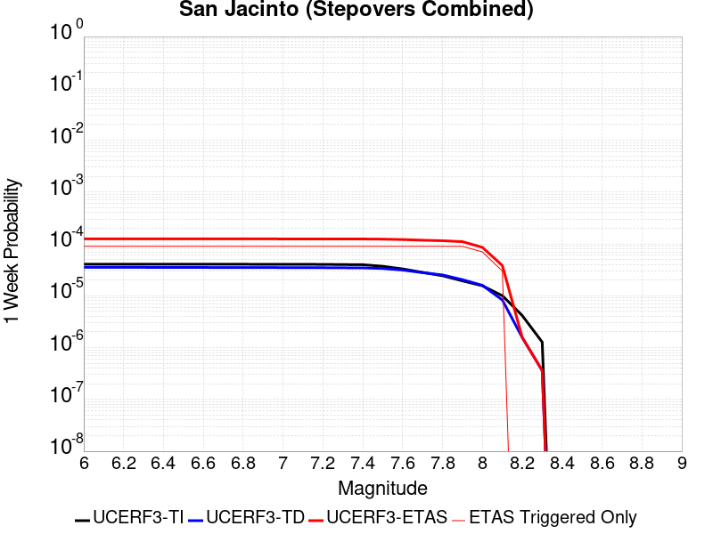 | 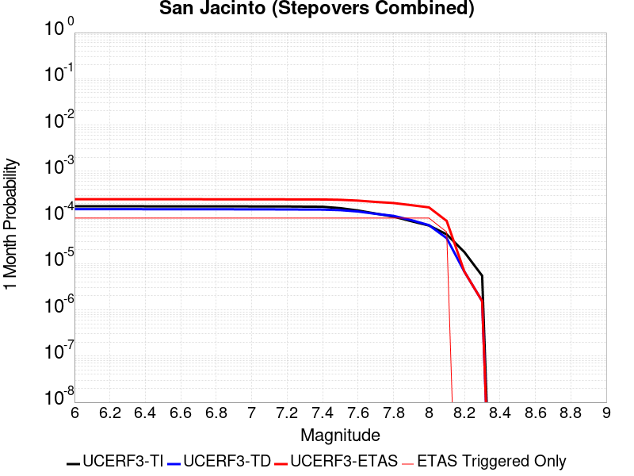 | 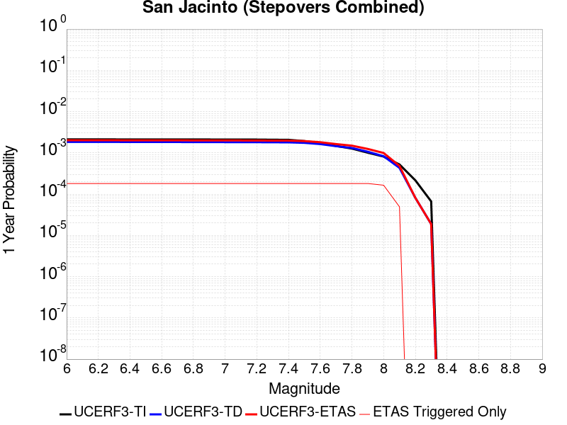 | 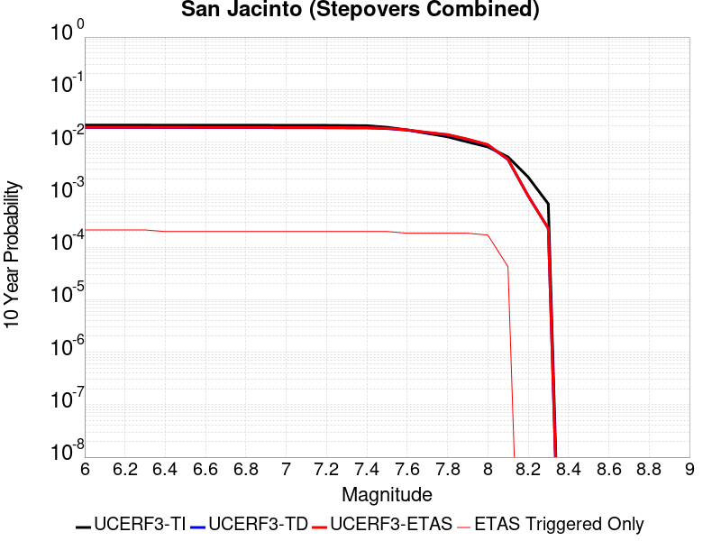 |

| Magnitude | 1 wk TI Prob | 1 wk TD Prob | 1 wk ETAS Prob | 1 wk ETAS/TD Gain | 1 wk ETAS Triggered Only | 1 mo TI Prob | 1 mo TD Prob | 1 mo ETAS Prob | 1 mo ETAS/TD Gain | 1 mo ETAS Triggered Only | 1 yr TI Prob | 1 yr TD Prob | 1 yr ETAS Prob | 1 yr ETAS/TD Gain | 1 yr ETAS Triggered Only | 10 yr TI Prob | 10 yr TD Prob | 10 yr ETAS Prob | 10 yr ETAS/TD Gain | 10 yr ETAS Triggered Only |
|-----|-----|-----|-----|-----|-----|-----|-----|-----|-----|-----|-----|-----|-----|-----|-----|-----|-----|-----|-----|-----|
| 6.0 | 4.0667746E-5 | 3.5271103E-5 | 1.7366494E-4 | 4.9237175 | 1.3839873E-4 | 1.742787E-4 | 1.5115313E-4 | 2.8953093E-4 | 1.915481 | 1.3839873E-4 | 0.0021197782 | 0.0018387372 | 0.0020114174 | 1.0939125 | 1.729984E-4 | 0.020996714 | 0.018986495 | 0.019258037 | 1.0143019 | 2.7679745E-4 |
| 6.1 | 4.0667746E-5 | 3.5271103E-5 | 1.7366494E-4 | 4.9237175 | 1.3839873E-4 | 1.742787E-4 | 1.5115313E-4 | 2.8953093E-4 | 1.915481 | 1.3839873E-4 | 0.0021197782 | 0.0018387372 | 0.0020114174 | 1.0939125 | 1.729984E-4 | 0.020996714 | 0.018986495 | 0.019258037 | 1.0143019 | 2.7679745E-4 |
| 6.2 | 4.0667746E-5 | 3.5271103E-5 | 1.7366494E-4 | 4.9237175 | 1.3839873E-4 | 1.742787E-4 | 1.5115313E-4 | 2.8953093E-4 | 1.915481 | 1.3839873E-4 | 0.0021197782 | 0.0018387372 | 0.0020114174 | 1.0939125 | 1.729984E-4 | 0.020996714 | 0.018986495 | 0.019258037 | 1.0143019 | 2.7679745E-4 |
| 6.3 | 4.0667746E-5 | 3.5271103E-5 | 1.7366494E-4 | 4.9237175 | 1.3839873E-4 | 1.742787E-4 | 1.5115313E-4 | 2.8953093E-4 | 1.915481 | 1.3839873E-4 | 0.0021197782 | 0.0018387372 | 0.0020114174 | 1.0939125 | 1.729984E-4 | 0.020996714 | 0.018986495 | 0.019258037 | 1.0143019 | 2.7679745E-4 |
| 6.4 | 4.0577226E-5 | 3.5143014E-5 | 1.7353687E-4 | 4.9380193 | 1.3839873E-4 | 1.738908E-4 | 1.5060425E-4 | 2.8898212E-4 | 1.918818 | 1.3839873E-4 | 0.0021150648 | 0.0018320669 | 0.0020047484 | 1.094255 | 1.729984E-4 | 0.020950472 | 0.018921062 | 0.019158678 | 1.0125582 | 2.4219777E-4 |
| 6.5 | 4.0577226E-5 | 3.5143014E-5 | 1.7353687E-4 | 4.9380193 | 1.3839873E-4 | 1.738908E-4 | 1.5060425E-4 | 2.8898212E-4 | 1.918818 | 1.3839873E-4 | 0.0021150648 | 0.0018320669 | 0.0020047484 | 1.094255 | 1.729984E-4 | 0.020950472 | 0.018921062 | 0.019158678 | 1.0125582 | 2.4219777E-4 |
| 6.6 | 4.053861E-5 | 3.5088357E-5 | 1.7348223E-4 | 4.944154 | 1.3839873E-4 | 1.7372532E-4 | 1.5037002E-4 | 2.8874795E-4 | 1.9202493 | 1.3839873E-4 | 0.0021130538 | 0.0018292206 | 0.0020019026 | 1.094402 | 1.729984E-4 | 0.020930743 | 0.01889314 | 0.019130763 | 1.0125772 | 2.4219777E-4 |
| 6.7 | 4.0516545E-5 | 3.505743E-5 | 1.734513E-4 | 4.9476333 | 1.3839873E-4 | 1.7363077E-4 | 1.502375E-4 | 2.8861544E-4 | 1.9210613 | 1.3839873E-4 | 0.002111905 | 0.0018276101 | 0.0020002923 | 1.0944853 | 1.729984E-4 | 0.020919468 | 0.018877337 | 0.019114962 | 1.0125879 | 2.4219777E-4 |
| 6.8 | 4.049434E-5 | 3.5028992E-5 | 1.7342287E-4 | 4.950838 | 1.3839873E-4 | 1.7353562E-4 | 1.5011564E-4 | 2.8849358E-4 | 1.9218091 | 1.3839873E-4 | 0.0021107488 | 0.0018261289 | 0.0019988115 | 1.094562 | 1.729984E-4 | 0.020908125 | 0.018862749 | 0.019100377 | 1.0125978 | 2.4219777E-4 |
| 6.9 | 4.046386E-5 | 3.4991554E-5 | 1.7338544E-4 | 4.9550653 | 1.3839873E-4 | 1.73405E-4 | 1.499552E-4 | 2.8833316E-4 | 1.9227954 | 1.3839873E-4 | 0.0021091616 | 0.0018241788 | 0.0019968618 | 1.0946633 | 1.729984E-4 | 0.020892553 | 0.018843522 | 0.019081157 | 1.0126109 | 2.4219777E-4 |
| 7.0 | 4.036382E-5 | 3.4872126E-5 | 1.7326603E-4 | 4.9686112 | 1.3839873E-4 | 1.7297632E-4 | 1.4944343E-4 | 2.8782146E-4 | 1.9259561 | 1.3839873E-4 | 0.0021039525 | 0.0018179584 | 0.0019906424 | 1.0949879 | 1.729984E-4 | 0.02084144 | 0.018782137 | 0.019019784 | 1.0126529 | 2.4219777E-4 |
| 7.1 | 4.0343282E-5 | 3.485059E-5 | 1.732445E-4 | 4.9710636 | 1.3839873E-4 | 1.7288832E-4 | 1.4935112E-4 | 2.877292E-4 | 1.9265283 | 1.3839873E-4 | 0.002102883 | 0.0018168368 | 0.0019895209 | 1.0950465 | 1.729984E-4 | 0.020830948 | 0.018771008 | 0.019008659 | 1.0126605 | 2.4219777E-4 |
| 7.2 | 4.0257353E-5 | 3.475509E-5 | 1.73149E-4 | 4.9819756 | 1.3839873E-4 | 1.725201E-4 | 1.489419E-4 | 2.8732E-4 | 1.9290745 | 1.3839873E-4 | 0.0020984085 | 0.0018118626 | 0.0019845476 | 1.095308 | 1.729984E-4 | 0.020787042 | 0.018721746 | 0.01895941 | 1.0126945 | 2.4219777E-4 |
| 7.3 | 3.9940667E-5 | 3.458276E-5 | 1.729767E-4 | 5.0018187 | 1.3839873E-4 | 1.7116306E-4 | 1.4820343E-4 | 2.8658164E-4 | 1.9337046 | 1.3839873E-4 | 0.0020819185 | 0.0018028866 | 0.0019755731 | 1.0957834 | 1.729984E-4 | 0.020625217 | 0.018630387 | 0.018868072 | 1.0127579 | 2.4219777E-4 |
| 7.4 | 3.9721202E-5 | 3.4468165E-5 | 1.7286213E-4 | 5.015124 | 1.3839873E-4 | 1.7022261E-4 | 1.4771236E-4 | 2.8609065E-4 | 1.9368091 | 1.3839873E-4 | 0.0020704903 | 0.0017969179 | 0.0019696055 | 1.0961021 | 1.729984E-4 | 0.020513052 | 0.018569522 | 0.018807221 | 1.0128006 | 2.4219777E-4 |
| 7.5 | 3.7036873E-5 | 3.3535776E-5 | 1.7192986E-4 | 5.1267595 | 1.3839873E-4 | 1.5871979E-4 | 1.4371685E-4 | 2.820957E-4 | 1.9628575 | 1.3839873E-4 | 0.0019307006 | 0.0017483513 | 0.0019210472 | 1.0987765 | 1.729984E-4 | 0.019140124 | 0.018071128 | 0.018308949 | 1.0131602 | 2.4219777E-4 |
| 7.6 | 3.2940967E-5 | 3.13167E-5 | 1.697111E-4 | 5.419188 | 1.3839873E-4 | 1.4116794E-4 | 1.3420754E-4 | 2.725877E-4 | 2.0310907 | 1.3839873E-4 | 0.0017173645 | 0.0016327545 | 0.0018054704 | 1.1057819 | 1.729984E-4 | 0.01704153 | 0.016904091 | 0.017142195 | 1.0140855 | 2.4219777E-4 |
| 7.7 | 2.8236149E-5 | 2.7882697E-5 | 1.6627756E-4 | 5.9634676 | 1.3839873E-4 | 1.2100645E-4 | 1.1949181E-4 | 2.57874E-4 | 2.1580894 | 1.3839873E-4 | 0.0014722579 | 0.0014538429 | 0.0016265898 | 1.1188209 | 1.729984E-4 | 0.014625421 | 0.015114912 | 0.015353449 | 1.0157815 | 2.4219777E-4 |
| 7.8 | 2.4329287E-5 | 2.5206451E-5 | 1.6360168E-4 | 6.490469 | 1.3839873E-4 | 1.042642E-4 | 1.08023174E-4 | 2.4640694E-4 | 2.2810564 | 1.3839873E-4 | 0.0012686774 | 0.0013143895 | 0.0014871606 | 1.1314459 | 1.729984E-4 | 0.012614589 | 0.013712341 | 0.013951217 | 1.0174205 | 2.4219777E-4 |
| 7.9 | 1.9370926E-5 | 2.0420413E-5 | 1.5881631E-4 | 7.7773314 | 1.3839873E-4 | 8.301561E-5 | 8.751312E-5 | 2.2589974E-4 | 2.581324 | 1.3839873E-4 | 0.0010102465 | 0.0010649522 | 0.0012377665 | 1.1622741 | 1.729984E-4 | 0.0100566605 | 0.011199402 | 0.011438887 | 1.0213838 | 2.4219777E-4 |
| 8.0 | 1.5583017E-5 | 1.5885415E-5 | 1.5428194E-4 | 9.712175 | 1.3839873E-4 | 6.6782646E-5 | 6.807858E-5 | 2.0646788E-4 | 3.0327878 | 1.3839873E-4 | 8.127754E-4 | 8.2854216E-4 | 0.0010013973 | 1.2086256 | 1.729984E-4 | 0.008098091 | 0.008781636 | 0.009021707 | 1.0273378 | 2.4219777E-4 |
| 8.1 | 1.0024873E-5 | 8.291399E-6 | 7.7490186E-5 | 9.345852 | 6.919936E-5 | 4.2963035E-5 | 3.553409E-5 | 1.0473099E-4 | 2.9473388 | 6.919936E-5 | 5.229494E-4 | 4.3254215E-4 | 5.362963E-4 | 1.2398705 | 1.03799044E-4 | 0.0052172043 | 0.0046530655 | 0.0047563817 | 1.0222039 | 1.03799044E-4 |
| 8.2 | 4.142796E-6 | 1.5602761E-6 | 1.5602761E-6 | 1.0 | 0.0 | 1.775472E-5 | 6.6868806E-6 | 6.6868806E-6 | 1.0 | 0.0 | 2.1614227E-4 | 8.140976E-5 | 8.140976E-5 | 1.0 | 0.0 | 0.0021593217 | 9.4514614E-4 | 9.4514614E-4 | 1.0 | 0.0 |
| 8.3 | 1.2750878E-6 | 3.609817E-7 | 3.609817E-7 | 1.0 | 0.0 | 5.4646503E-6 | 1.5470634E-6 | 1.5470634E-6 | 1.0 | 0.0 | 6.653009E-5 | 1.8835339E-5 | 1.8835339E-5 | 1.0 | 0.0 | 6.6510175E-4 | 2.272251E-4 | 2.272251E-4 | 1.0 | 0.0 |

## Rose Canyon
*[(top)](#table-of-contents)*

| 1 Week | 1 Month | 1 Year | 10 Year |
|-----|-----|-----|-----|
| 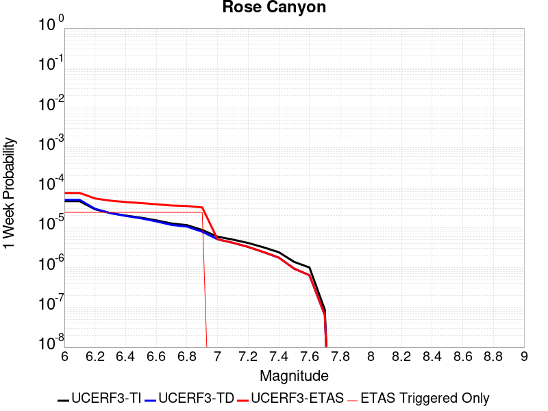 | 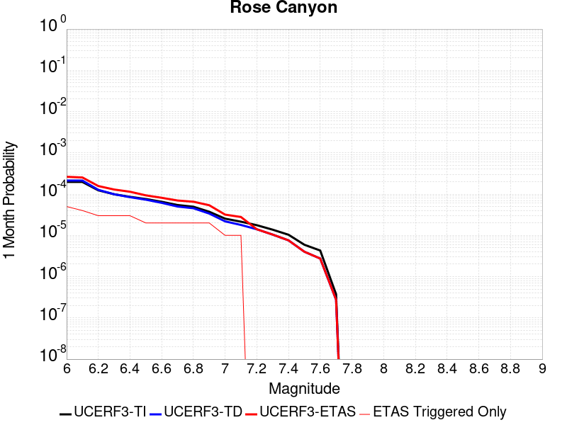 | 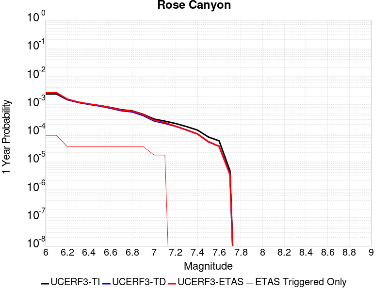 | 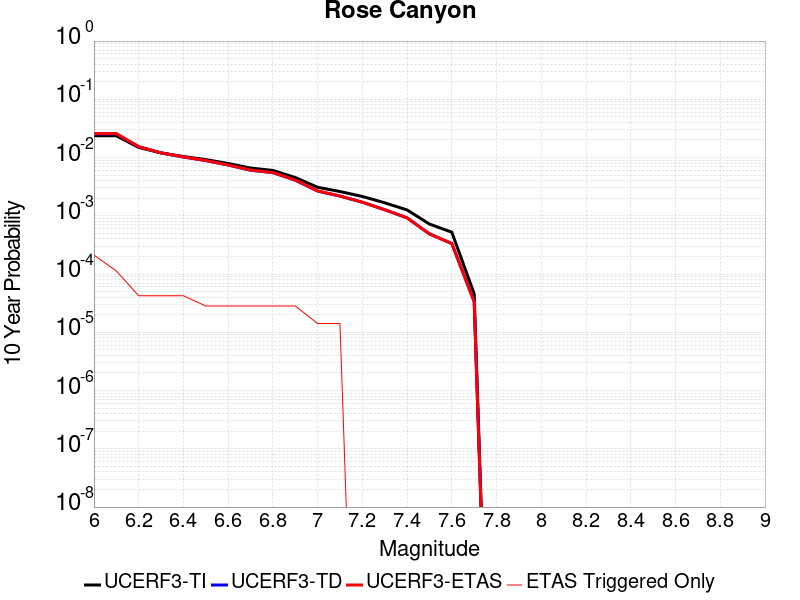 |

| Magnitude | 1 wk TI Prob | 1 wk TD Prob | 1 wk ETAS Prob | 1 wk ETAS/TD Gain | 1 wk ETAS Triggered Only | 1 mo TI Prob | 1 mo TD Prob | 1 mo ETAS Prob | 1 mo ETAS/TD Gain | 1 mo ETAS Triggered Only | 1 yr TI Prob | 1 yr TD Prob | 1 yr ETAS Prob | 1 yr ETAS/TD Gain | 1 yr ETAS Triggered Only | 10 yr TI Prob | 10 yr TD Prob | 10 yr ETAS Prob | 10 yr ETAS/TD Gain | 10 yr ETAS Triggered Only |
|-----|-----|-----|-----|-----|-----|-----|-----|-----|-----|-----|-----|-----|-----|-----|-----|-----|-----|-----|-----|-----|
| 6.0 | 4.5923203E-5 | 4.9714607E-5 | 8.431257E-5 | 1.6959316 | 3.459968E-5 | 1.9679888E-4 | 2.1304654E-4 | 2.4763885E-4 | 1.1623697 | 3.459968E-5 | 0.0023933933 | 0.0025909478 | 0.0026599679 | 1.026639 | 6.919936E-5 | 0.023677798 | 0.025618518 | 0.025854511 | 1.0092118 | 2.4219777E-4 |
| 6.1 | 4.5923203E-5 | 4.9714607E-5 | 8.431257E-5 | 1.6959316 | 3.459968E-5 | 1.9679888E-4 | 2.1304654E-4 | 2.4763885E-4 | 1.1623697 | 3.459968E-5 | 0.0023933933 | 0.0025909478 | 0.0026599679 | 1.026639 | 6.919936E-5 | 0.023677798 | 0.025618518 | 0.025685944 | 1.0026319 | 6.919936E-5 |
| 6.2 | 2.8844734E-5 | 2.9669678E-5 | 6.426833E-5 | 2.1661284 | 3.459968E-5 | 1.2361443E-4 | 1.2714976E-4 | 1.6174505E-4 | 1.2720829 | 3.459968E-5 | 0.0015039665 | 0.001546976 | 0.0015815223 | 1.0223314 | 3.459968E-5 | 0.0149382865 | 0.015364873 | 0.015398941 | 1.0022173 | 3.459968E-5 |
| 6.3 | 2.3171577E-5 | 2.3162425E-5 | 5.7761306E-5 | 2.4937503 | 3.459968E-5 | 9.9302975E-5 | 9.926383E-5 | 1.3386009E-4 | 1.3485283 | 3.459968E-5 | 0.0012083431 | 0.0012078804 | 0.0012424383 | 1.0286103 | 3.459968E-5 | 0.012017938 | 0.012012152 | 0.012046336 | 1.0028458 | 3.459968E-5 |
| 6.4 | 2.0066604E-5 | 1.9668067E-5 | 5.4267068E-5 | 2.759146 | 3.459968E-5 | 8.599689E-5 | 8.428905E-5 | 1.18885815E-4 | 1.4104539 | 3.459968E-5 | 0.0010465092 | 0.001025746 | 0.0010603103 | 1.0336967 | 3.459968E-5 | 0.010415946 | 0.010211479 | 0.010245725 | 1.0033537 | 3.459968E-5 |
| 6.5 | 1.776989E-5 | 1.7115402E-5 | 5.171449E-5 | 3.0215178 | 3.459968E-5 | 7.615444E-5 | 7.33497E-5 | 1.0794684E-4 | 1.471674 | 3.459968E-5 | 9.267859E-4 | 8.926737E-4 | 9.2724245E-4 | 1.038725 | 3.459968E-5 | 0.009229303 | 0.008874663 | 0.008908956 | 1.003864 | 3.459968E-5 |
| 6.6 | 1.5227364E-5 | 1.4340872E-5 | 4.894006E-5 | 3.4126277 | 3.459968E-5 | 6.52585E-5 | 6.145947E-5 | 9.605702E-5 | 1.562933 | 3.459968E-5 | 7.942326E-4 | 7.480173E-4 | 7.825911E-4 | 1.0462205 | 3.459968E-5 | 0.007914 | 0.0074410336 | 0.0074753757 | 1.0046153 | 3.459968E-5 |
| 6.7 | 1.2703898E-5 | 1.1674277E-5 | 4.6273555E-5 | 3.9637191 | 3.459968E-5 | 5.4444143E-5 | 5.0031682E-5 | 8.462963E-5 | 1.6915208 | 3.459968E-5 | 6.626558E-4 | 6.089697E-4 | 6.435483E-4 | 1.0567821 | 3.459968E-5 | 0.006606833 | 0.0060623093 | 0.0060966993 | 1.0056727 | 3.459968E-5 |
| 6.8 | 1.1554917E-5 | 1.0610384E-5 | 4.5209697E-5 | 4.2608914 | 3.459968E-5 | 4.9520135E-5 | 4.547231E-5 | 8.0070415E-5 | 1.760861 | 3.459968E-5 | 6.0274085E-4 | 5.5348873E-4 | 5.8806926E-4 | 1.0624774 | 3.459968E-5 | 0.0060110865 | 0.005504414 | 0.005538823 | 1.0062512 | 3.459968E-5 |
| 6.9 | 8.732078E-6 | 7.882285E-6 | 4.2481694E-5 | 5.389515 | 3.459968E-5 | 3.7422655E-5 | 3.37808E-5 | 6.837932E-5 | 2.0242064 | 3.459968E-5 | 4.5552556E-4 | 4.112066E-4 | 4.4579204E-4 | 1.0841073 | 3.459968E-5 | 0.0045459294 | 0.004089515 | 0.004123973 | 1.008426 | 3.459968E-5 |
| 7.0 | 5.9337494E-6 | 5.107436E-6 | 5.107436E-6 | 1.0 | 0.0 | 2.5430107E-5 | 2.1888829E-5 | 2.1888829E-5 | 1.0 | 0.0 | 3.0956755E-4 | 2.6646405E-4 | 2.6646405E-4 | 1.0 | 0.0 | 0.0030913667 | 0.002661461 | 0.002661461 | 1.0 | 0.0 |
| 7.1 | 5.013409E-6 | 4.17734E-6 | 4.17734E-6 | 1.0 | 0.0 | 2.1485863E-5 | 1.7902763E-5 | 1.7902763E-5 | 1.0 | 0.0 | 2.6155898E-4 | 2.1794444E-4 | 2.1794444E-4 | 1.0 | 0.0 | 0.0026125133 | 0.0021773188 | 0.0021773188 | 1.0 | 0.0 |
| 7.2 | 4.120763E-6 | 3.2820917E-6 | 3.2820917E-6 | 1.0 | 0.0 | 1.7660293E-5 | 1.4066032E-5 | 1.4066032E-5 | 1.0 | 0.0 | 2.1499286E-4 | 1.7124058E-4 | 1.7124058E-4 | 1.0 | 0.0 | 0.0021478499 | 0.0017110958 | 0.0017110958 | 1.0 | 0.0 |
| 7.3 | 3.2081239E-6 | 2.4404965E-6 | 2.4404965E-6 | 1.0 | 0.0 | 1.374903E-5 | 1.0459229E-5 | 1.0459229E-5 | 1.0 | 0.0 | 1.6738157E-4 | 1.2733374E-4 | 1.2733374E-4 | 1.0 | 0.0 | 0.0016725556 | 0.0012726148 | 0.0012726148 | 1.0 | 0.0 |
| 7.4 | 2.4194755E-6 | 1.7680321E-6 | 1.7680321E-6 | 1.0 | 0.0 | 1.0369139E-5 | 7.5772587E-6 | 7.5772587E-6 | 1.0 | 0.0 | 1.2623696E-4 | 9.224927E-5 | 9.224927E-5 | 1.0 | 0.0 | 0.0012616527 | 9.221151E-4 | 9.221151E-4 | 1.0 | 0.0 |
| 7.5 | 1.3842889E-6 | 9.3782967E-7 | 9.3782967E-7 | 1.0 | 0.0 | 5.9326535E-6 | 4.019264E-6 | 4.019264E-6 | 1.0 | 0.0 | 7.222766E-5 | 4.8933474E-5 | 4.8933474E-5 | 1.0 | 0.0 | 7.220419E-4 | 4.8923056E-4 | 4.8923056E-4 | 1.0 | 0.0 |
| 7.6 | 1.0021575E-6 | 6.4113493E-7 | 6.4113493E-7 | 1.0 | 0.0 | 4.2949537E-6 | 2.7477186E-6 | 2.7477186E-6 | 1.0 | 0.0 | 5.2289808E-5 | 3.345298E-5 | 3.345298E-5 | 1.0 | 0.0 | 5.2277505E-4 | 3.344816E-4 | 3.344816E-4 | 1.0 | 0.0 |
| 7.7 | 8.7620116E-8 | 6.449304E-8 | 6.449304E-8 | 1.0 | 0.0 | 3.7551473E-7 | 2.763987E-7 | 2.763987E-7 | 1.0 | 0.0 | 4.5718825E-6 | 3.3651493E-6 | 3.3651493E-6 | 1.0 | 0.0 | 4.5717883E-5 | 3.3651013E-5 | 3.3651013E-5 | 1.0 | 0.0 |

## Red Pass
*[(top)](#table-of-contents)*

| 1 Week | 1 Month | 1 Year | 10 Year |
|-----|-----|-----|-----|
| 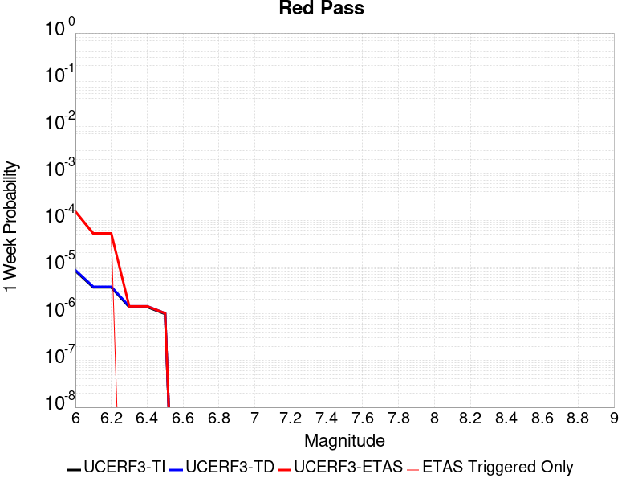 | 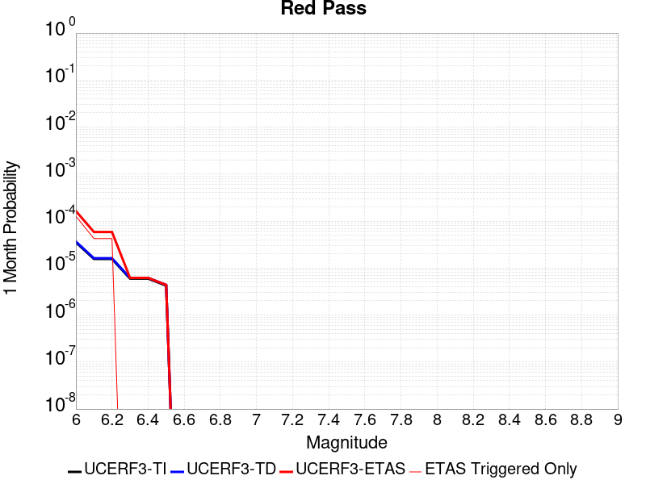 | 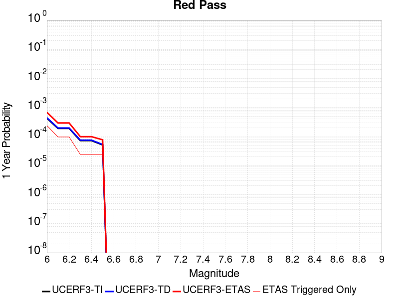 | 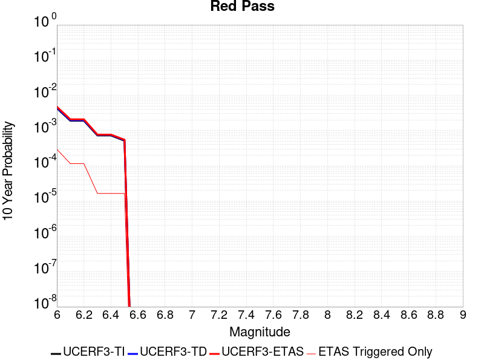 |

| Magnitude | 1 wk TI Prob | 1 wk TD Prob | 1 wk ETAS Prob | 1 wk ETAS/TD Gain | 1 wk ETAS Triggered Only | 1 mo TI Prob | 1 mo TD Prob | 1 mo ETAS Prob | 1 mo ETAS/TD Gain | 1 mo ETAS Triggered Only | 1 yr TI Prob | 1 yr TD Prob | 1 yr ETAS Prob | 1 yr ETAS/TD Gain | 1 yr ETAS Triggered Only | 10 yr TI Prob | 10 yr TD Prob | 10 yr ETAS Prob | 10 yr ETAS/TD Gain | 10 yr ETAS Triggered Only |
|-----|-----|-----|-----|-----|-----|-----|-----|-----|-----|-----|-----|-----|-----|-----|-----|-----|-----|-----|-----|-----|
| 6.0 | 8.258278E-6 | 8.551265E-6 | 1.469488E-4 | 17.184452 | 1.3839873E-4 | 3.539214E-5 | 3.6647863E-5 | 1.7504152E-4 | 4.776309 | 1.3839873E-4 | 4.308141E-4 | 4.4611428E-4 | 6.88204E-4 | 1.542663 | 2.4219777E-4 | 0.0042997985 | 0.004453945 | 0.004695064 | 1.054136 | 2.4219777E-4 |
| 6.1 | 3.649988E-6 | 3.7753161E-6 | 3.8374867E-5 | 10.164677 | 3.459968E-5 | 1.5642712E-5 | 1.6179853E-5 | 5.0778974E-5 | 3.1384077 | 3.459968E-5 | 1.9043336E-4 | 1.9697666E-4 | 2.661624E-4 | 1.3512383 | 6.919936E-5 | 0.0019027026 | 0.001968488 | 0.0020375513 | 1.0350844 | 6.919936E-5 |
| 6.2 | 3.649988E-6 | 3.7753161E-6 | 3.8374867E-5 | 10.164677 | 3.459968E-5 | 1.5642712E-5 | 1.6179853E-5 | 5.0778974E-5 | 3.1384077 | 3.459968E-5 | 1.9043336E-4 | 1.9697666E-4 | 2.661624E-4 | 1.3512383 | 6.919936E-5 | 0.0019027026 | 0.001968488 | 0.0020375513 | 1.0350844 | 6.919936E-5 |
| 6.3 | 1.3924937E-6 | 1.4411166E-6 | 1.4411166E-6 | 1.0 | 0.0 | 5.9678164E-6 | 6.1762075E-6 | 6.1762075E-6 | 1.0 | 0.0 | 7.265574E-5 | 7.519415E-5 | 7.519415E-5 | 1.0 | 0.0 | 7.263199E-4 | 7.518258E-4 | 7.518258E-4 | 1.0 | 0.0 |
| 6.4 | 1.3924937E-6 | 1.4411166E-6 | 1.4411166E-6 | 1.0 | 0.0 | 5.9678164E-6 | 6.1762075E-6 | 6.1762075E-6 | 1.0 | 0.0 | 7.265574E-5 | 7.519415E-5 | 7.519415E-5 | 1.0 | 0.0 | 7.263199E-4 | 7.518258E-4 | 7.518258E-4 | 1.0 | 0.0 |
| 6.5 | 9.876812E-7 | 1.0221912E-6 | 1.0221912E-6 | 1.0 | 0.0 | 4.2329125E-6 | 4.3808195E-6 | 4.3808195E-6 | 1.0 | 0.0 | 5.153449E-5 | 5.3336476E-5 | 5.3336476E-5 | 1.0 | 0.0 | 5.1522546E-4 | 5.333648E-4 | 5.333648E-4 | 1.0 | 0.0 |

## Pinto Mtn
*[(top)](#table-of-contents)*

| 1 Week | 1 Month | 1 Year | 10 Year |
|-----|-----|-----|-----|
| 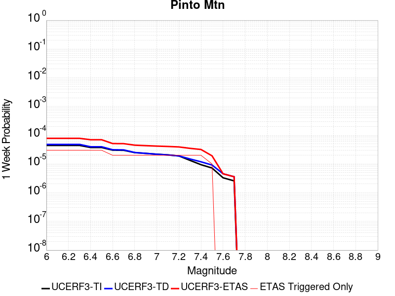 | 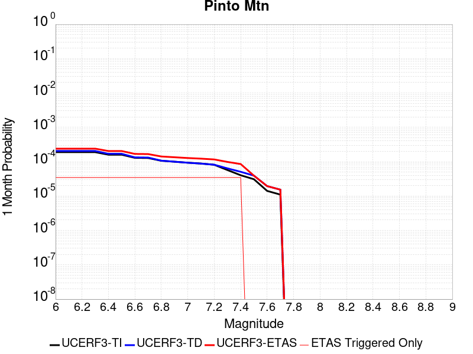 | 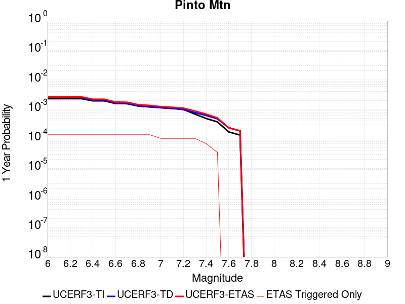 | 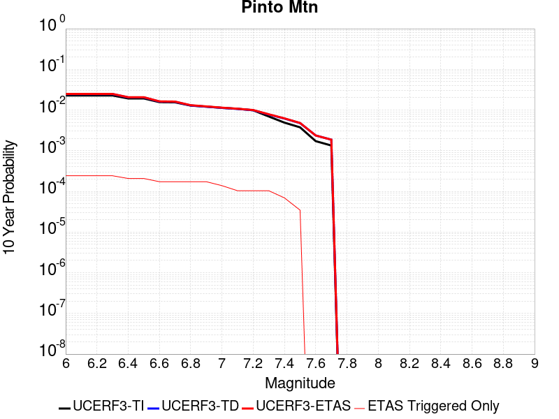 |

| Magnitude | 1 wk TI Prob | 1 wk TD Prob | 1 wk ETAS Prob | 1 wk ETAS/TD Gain | 1 wk ETAS Triggered Only | 1 mo TI Prob | 1 mo TD Prob | 1 mo ETAS Prob | 1 mo ETAS/TD Gain | 1 mo ETAS Triggered Only | 1 yr TI Prob | 1 yr TD Prob | 1 yr ETAS Prob | 1 yr ETAS/TD Gain | 1 yr ETAS Triggered Only | 10 yr TI Prob | 10 yr TD Prob | 10 yr ETAS Prob | 10 yr ETAS/TD Gain | 10 yr ETAS Triggered Only |
|-----|-----|-----|-----|-----|-----|-----|-----|-----|-----|-----|-----|-----|-----|-----|-----|-----|-----|-----|-----|-----|
| 6.0 | 4.4194956E-5 | 4.7853926E-5 | 8.245195E-5 | 1.7229924 | 3.459968E-5 | 1.893932E-4 | 2.0507304E-4 | 2.3966563E-4 | 1.1686842 | 3.459968E-5 | 0.0023034236 | 0.0024940688 | 0.0026321223 | 1.0553527 | 1.3839873E-4 | 0.022796938 | 0.024678305 | 0.024914525 | 1.009572 | 2.4219777E-4 |
| 6.1 | 4.4194956E-5 | 4.7853926E-5 | 8.245195E-5 | 1.7229924 | 3.459968E-5 | 1.893932E-4 | 2.0507304E-4 | 2.3966563E-4 | 1.1686842 | 3.459968E-5 | 0.0023034236 | 0.0024940688 | 0.0026321223 | 1.0553527 | 1.3839873E-4 | 0.022796938 | 0.024678305 | 0.024914525 | 1.009572 | 2.4219777E-4 |
| 6.2 | 4.4194956E-5 | 4.7853926E-5 | 8.245195E-5 | 1.7229924 | 3.459968E-5 | 1.893932E-4 | 2.0507304E-4 | 2.3966563E-4 | 1.1686842 | 3.459968E-5 | 0.0023034236 | 0.0024940688 | 0.0026321223 | 1.0553527 | 1.3839873E-4 | 0.022796938 | 0.024678305 | 0.024914525 | 1.009572 | 2.4219777E-4 |
| 6.3 | 4.4194956E-5 | 4.7853926E-5 | 8.245195E-5 | 1.7229924 | 3.459968E-5 | 1.893932E-4 | 2.0507304E-4 | 2.3966563E-4 | 1.1686842 | 3.459968E-5 | 0.0023034236 | 0.0024940688 | 0.0026321223 | 1.0553527 | 1.3839873E-4 | 0.022796938 | 0.024678305 | 0.024914525 | 1.009572 | 2.4219777E-4 |
| 6.4 | 3.729929E-5 | 3.960349E-5 | 7.42018E-5 | 1.8736178 | 3.459968E-5 | 1.5984432E-4 | 1.6971873E-4 | 2.0431254E-4 | 1.2038302 | 3.459968E-5 | 0.0019443673 | 0.0020644604 | 0.0022025735 | 1.0669003 | 1.3839873E-4 | 0.019274427 | 0.020462848 | 0.020666199 | 1.0099375 | 2.0759809E-4 |
| 6.5 | 3.729929E-5 | 3.960349E-5 | 7.42018E-5 | 1.8736178 | 3.459968E-5 | 1.5984432E-4 | 1.6971873E-4 | 2.0431254E-4 | 1.2038302 | 3.459968E-5 | 0.0019443673 | 0.0020644604 | 0.0022025735 | 1.0669003 | 1.3839873E-4 | 0.019274427 | 0.020462848 | 0.020666199 | 1.0099375 | 2.0759809E-4 |
| 6.6 | 3.0204548E-5 | 3.12056E-5 | 6.5804204E-5 | 2.1087306 | 3.459968E-5 | 1.2944164E-4 | 1.3373162E-4 | 1.6832669E-4 | 1.2586901 | 3.459968E-5 | 0.0015748127 | 0.0016270012 | 0.0017651748 | 1.0849253 | 1.3839873E-4 | 0.015636992 | 0.016154764 | 0.016324969 | 1.0105358 | 1.729984E-4 |
| 6.7 | 2.9857754E-5 | 3.0814987E-5 | 6.54136E-5 | 2.1227853 | 3.459968E-5 | 1.2795553E-4 | 1.3205773E-4 | 1.6665284E-4 | 1.2619696 | 3.459968E-5 | 0.0015567453 | 0.0016066517 | 0.0017448281 | 1.0860027 | 1.3839873E-4 | 0.015458848 | 0.015954204 | 0.016124442 | 1.0106704 | 1.729984E-4 |
| 6.8 | 2.4819734E-5 | 2.5009665E-5 | 5.9608483E-5 | 2.3834178 | 3.459968E-5 | 1.0636595E-4 | 1.0718E-4 | 1.4177598E-4 | 1.3227838 | 3.459968E-5 | 0.0012942362 | 0.001304157 | 0.0014423752 | 1.1059828 | 1.3839873E-4 | 0.012867244 | 0.012967403 | 0.013138158 | 1.013168 | 1.729984E-4 |
| 6.9 | 2.331124E-5 | 2.3337945E-5 | 5.793682E-5 | 2.4825158 | 3.459968E-5 | 9.990149E-5 | 1.0001605E-4 | 1.3461227E-4 | 1.3459067 | 3.459968E-5 | 0.001215622 | 0.0012170355 | 0.0013552657 | 1.1135795 | 1.3839873E-4 | 0.012089936 | 0.012105897 | 0.012276801 | 1.0141175 | 1.729984E-4 |
| 7.0 | 2.1818534E-5 | 2.1761074E-5 | 5.6360004E-5 | 2.5899458 | 3.459968E-5 | 9.3504656E-5 | 9.3258524E-5 | 1.2785498E-4 | 1.3709737 | 3.459968E-5 | 0.0011378246 | 0.0011348509 | 0.0012385321 | 1.0913612 | 1.03799044E-4 | 0.011320163 | 0.01129266 | 0.011429495 | 1.0121173 | 1.3839873E-4 |
| 7.1 | 2.066081E-5 | 2.0540718E-5 | 5.5139688E-5 | 2.6844091 | 3.459968E-5 | 8.854332E-5 | 8.8028784E-5 | 1.2262542E-4 | 1.393015 | 3.459968E-5 | 0.0010774818 | 0.0010712431 | 0.001174931 | 1.0967921 | 1.03799044E-4 | 0.010722724 | 0.0106628435 | 0.010765536 | 1.0096308 | 1.03799044E-4 |
| 7.2 | 1.8990233E-5 | 1.9054001E-5 | 5.3653024E-5 | 2.8158402 | 3.459968E-5 | 8.138417E-5 | 8.165756E-5 | 1.16254414E-4 | 1.4236822 | 3.459968E-5 | 9.904018E-4 | 9.937467E-4 | 0.0010974426 | 1.1043484 | 1.03799044E-4 | 0.009859995 | 0.009895029 | 0.009997801 | 1.0103862 | 1.03799044E-4 |
| 7.3 | 1.3335872E-5 | 1.4906713E-5 | 4.9505878E-5 | 3.321046 | 3.459968E-5 | 5.7152483E-5 | 6.388442E-5 | 9.848189E-5 | 1.5415635 | 3.459968E-5 | 6.956093E-4 | 7.77528E-4 | 8.8124635E-4 | 1.133395 | 1.03799044E-4 | 0.006934359 | 0.007749376 | 0.007852371 | 1.0132908 | 1.03799044E-4 |
| 7.4 | 9.414066E-6 | 1.186096E-5 | 4.646023E-5 | 3.9170718 | 3.459968E-5 | 4.0345374E-5 | 5.083175E-5 | 8.5429674E-5 | 1.680636 | 3.459968E-5 | 4.910942E-4 | 6.1871024E-4 | 6.8786676E-4 | 1.1117754 | 6.919936E-5 | 0.0049001034 | 0.0061708256 | 0.0062395977 | 1.0111448 | 6.919936E-5 |
| 7.5 | 7.2101157E-6 | 9.158192E-6 | 9.158192E-6 | 1.0 | 0.0 | 3.090013E-5 | 3.9248847E-5 | 3.9248847E-5 | 1.0 | 0.0 | 3.7614413E-4 | 4.7775774E-4 | 5.123409E-4 | 1.0723864 | 3.459968E-5 | 0.0037550807 | 0.004768082 | 0.0048025167 | 1.0072219 | 3.459968E-5 |
| 7.6 | 3.296375E-6 | 4.5455017E-6 | 4.5455017E-6 | 1.0 | 0.0 | 1.4127245E-5 | 1.9480583E-5 | 1.9480583E-5 | 1.0 | 0.0 | 1.7198564E-4 | 2.3715167E-4 | 2.3715167E-4 | 1.0 | 0.0 | 0.0017185259 | 0.0023691233 | 0.0023691233 | 1.0 | 0.0 |
| 7.7 | 2.5741092E-6 | 3.5844084E-6 | 3.5844084E-6 | 1.0 | 0.0 | 1.103185E-5 | 1.5361667E-5 | 1.5361667E-5 | 1.0 | 0.0 | 1.3430449E-4 | 1.8701357E-4 | 1.8701357E-4 | 1.0 | 0.0 | 0.0013422335 | 0.0018686918 | 0.0018686918 | 1.0 | 0.0 |

## Brawley (Seismic Zone) alt 1
*[(top)](#table-of-contents)*

| 1 Week | 1 Month | 1 Year | 10 Year |
|-----|-----|-----|-----|
| 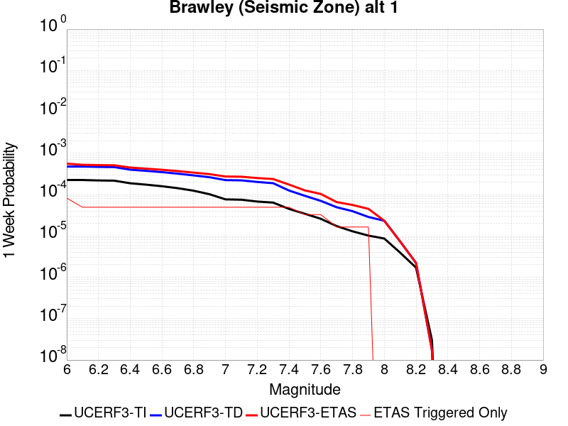 | 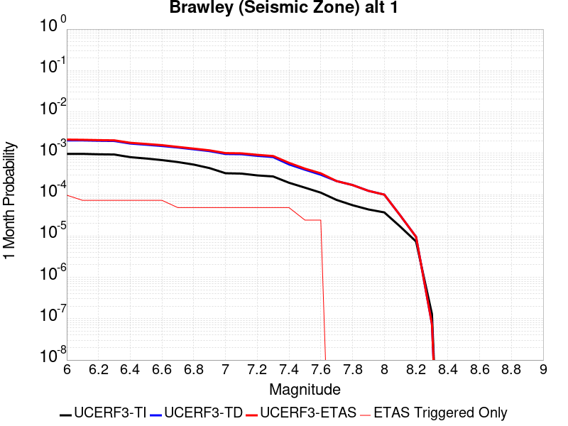 | 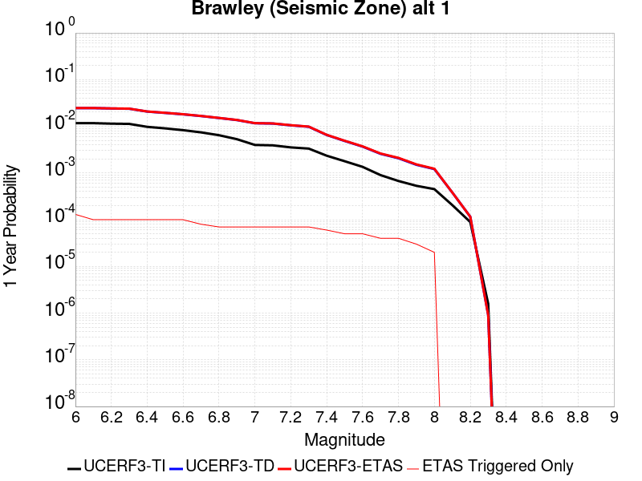 | 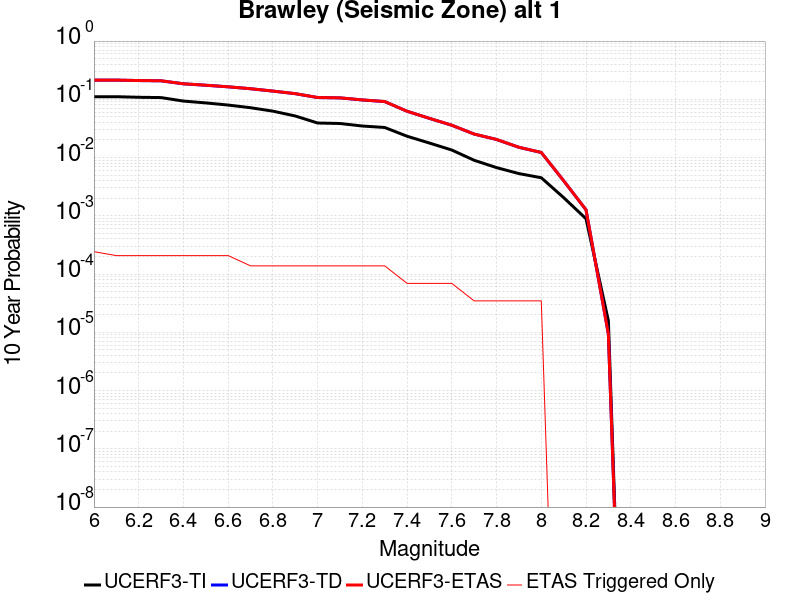 |

| Magnitude | 1 wk TI Prob | 1 wk TD Prob | 1 wk ETAS Prob | 1 wk ETAS/TD Gain | 1 wk ETAS Triggered Only | 1 mo TI Prob | 1 mo TD Prob | 1 mo ETAS Prob | 1 mo ETAS/TD Gain | 1 mo ETAS Triggered Only | 1 yr TI Prob | 1 yr TD Prob | 1 yr ETAS Prob | 1 yr ETAS/TD Gain | 1 yr ETAS Triggered Only | 10 yr TI Prob | 10 yr TD Prob | 10 yr ETAS Prob | 10 yr ETAS/TD Gain | 10 yr ETAS Triggered Only |
|-----|-----|-----|-----|-----|-----|-----|-----|-----|-----|-----|-----|-----|-----|-----|-----|-----|-----|-----|-----|-----|
| 6.0 | 2.2521618E-4 | 4.763429E-4 | 5.455093E-4 | 1.145203 | 6.919936E-5 | 9.6485513E-4 | 0.0020399094 | 0.0021434966 | 1.0507803 | 1.03799044E-4 | 0.011683988 | 0.024544531 | 0.024747035 | 1.0082505 | 2.0759809E-4 | 0.11088423 | 0.21349923 | 0.21368971 | 1.0008923 | 2.4219777E-4 |
| 6.1 | 2.2521618E-4 | 4.763429E-4 | 5.1092607E-4 | 1.0726014 | 3.459968E-5 | 9.6485513E-4 | 0.0020399094 | 0.0021089676 | 1.0338535 | 6.919936E-5 | 0.011683988 | 0.024544531 | 0.024713283 | 1.0068754 | 1.729984E-4 | 0.11088423 | 0.21349923 | 0.2136625 | 1.0007647 | 2.0759809E-4 |
| 6.2 | 2.198148E-4 | 4.6718874E-4 | 5.017723E-4 | 1.0740247 | 3.459968E-5 | 9.417233E-4 | 0.0020007377 | 0.0020697985 | 1.0345178 | 6.919936E-5 | 0.011405343 | 0.024078513 | 0.024247346 | 1.0070118 | 1.729984E-4 | 0.10837428 | 0.20993572 | 0.21009974 | 1.0007813 | 2.0759809E-4 |
| 6.3 | 2.1704129E-4 | 4.615455E-4 | 4.961292E-4 | 1.0749302 | 3.459968E-5 | 9.298453E-4 | 0.0019765892 | 0.002045652 | 1.0349402 | 6.919936E-5 | 0.011262234 | 0.023792034 | 0.023960916 | 1.0070983 | 1.729984E-4 | 0.107082725 | 0.20782684 | 0.20799129 | 1.0007913 | 2.0759809E-4 |
| 6.4 | 1.876142E-4 | 4.004663E-4 | 4.3505212E-4 | 1.0863639 | 3.459968E-5 | 8.038131E-4 | 0.0017151695 | 0.0017842503 | 1.0402763 | 6.919936E-5 | 0.00974259 | 0.020678662 | 0.020848082 | 1.008193 | 1.729984E-4 | 0.093263686 | 0.18457787 | 0.18474714 | 1.0009171 | 2.0759809E-4 |
| 6.5 | 1.7390939E-4 | 3.7478763E-4 | 4.0937436E-4 | 1.0922835 | 3.459968E-5 | 7.45113E-4 | 0.0016052561 | 0.0016743444 | 1.0430388 | 6.919936E-5 | 0.009034078 | 0.019367293 | 0.01953694 | 1.0087595 | 1.729984E-4 | 0.086755216 | 0.17440015 | 0.17457154 | 1.0009828 | 2.0759809E-4 |
| 6.6 | 1.591791E-4 | 3.4893592E-4 | 3.8352353E-4 | 1.0991231 | 3.459968E-5 | 6.8201777E-4 | 0.0014945926 | 0.0015636885 | 1.0462307 | 6.919936E-5 | 0.008271996 | 0.018045008 | 0.018214885 | 1.0094141 | 1.729984E-4 | 0.07970774 | 0.16380787 | 0.16398145 | 1.0010598 | 2.0759809E-4 |
| 6.7 | 1.4268003E-4 | 3.2059717E-4 | 3.5518577E-4 | 1.107888 | 3.459968E-5 | 6.1134255E-4 | 0.0013732726 | 0.0014078248 | 1.0251604 | 3.459968E-5 | 0.007417723 | 0.01659171 | 0.016693786 | 1.0061523 | 1.03799044E-4 | 0.07174956 | 0.15193594 | 0.1520533 | 1.0007725 | 1.3839873E-4 |
| 6.8 | 1.239713E-4 | 2.9055026E-4 | 3.251399E-4 | 1.1190487 | 3.459968E-5 | 5.3119735E-4 | 0.0012446274 | 0.001279184 | 1.0277647 | 3.459968E-5 | 0.0064481674 | 0.015049482 | 0.015151719 | 1.0067934 | 1.03799044E-4 | 0.06264243 | 0.13838051 | 0.13849975 | 1.0008618 | 1.3839873E-4 |
| 6.9 | 1.0180238E-4 | 2.6255674E-4 | 2.9714734E-4 | 1.1317452 | 3.459968E-5 | 4.3622297E-4 | 0.0011247622 | 0.001159323 | 1.0307271 | 3.459968E-5 | 0.005298089 | 0.013608998 | 0.013711384 | 1.0075234 | 1.03799044E-4 | 0.05173543 | 0.12496473 | 0.12508583 | 1.000969 | 1.3839873E-4 |
| 7.0 | 7.6619996E-5 | 2.2400476E-4 | 2.585967E-4 | 1.154425 | 3.459968E-5 | 3.283301E-4 | 9.596704E-4 | 9.942369E-4 | 1.0360191 | 3.459968E-5 | 0.0039900932 | 0.011622103 | 0.011724696 | 1.0088273 | 1.03799044E-4 | 0.039192066 | 0.10726982 | 0.10739338 | 1.0011518 | 1.3839873E-4 |
| 7.1 | 7.5127435E-5 | 2.2083633E-4 | 2.5542837E-4 | 1.1566411 | 3.459968E-5 | 3.2193496E-4 | 9.461013E-4 | 9.806682E-4 | 1.0365362 | 3.459968E-5 | 0.0039125155 | 0.011458648 | 0.011561258 | 1.0089548 | 1.03799044E-4 | 0.038443442 | 0.10583378 | 0.10595753 | 1.0011693 | 1.3839873E-4 |
| 7.2 | 6.788582E-5 | 2.0211334E-4 | 2.3670604E-4 | 1.1711549 | 3.459968E-5 | 2.9090676E-4 | 8.6591556E-4 | 9.0048526E-4 | 1.0399227 | 3.459968E-5 | 0.0035360386 | 0.0104922 | 0.01059491 | 1.0097892 | 1.03799044E-4 | 0.034803 | 0.097503684 | 0.097628586 | 1.001281 | 1.3839873E-4 |
| 7.3 | 6.399602E-5 | 1.8842232E-4 | 2.2301548E-4 | 1.1835938 | 3.459968E-5 | 2.7423984E-4 | 8.0727716E-4 | 8.418489E-4 | 1.0428251 | 3.459968E-5 | 0.0033337586 | 0.009784897 | 0.0098876795 | 1.0105042 | 1.03799044E-4 | 0.03284188 | 0.091397986 | 0.09152374 | 1.0013758 | 1.3839873E-4 |
| 7.4 | 4.506759E-5 | 1.2530042E-4 | 1.5989576E-4 | 1.2760992 | 3.459968E-5 | 1.9313251E-4 | 5.3689216E-4 | 5.7147327E-4 | 1.0644097 | 3.459968E-5 | 0.0023488526 | 0.006517245 | 0.0065859933 | 1.0105487 | 6.919936E-5 | 0.023241805 | 0.062364522 | 0.062429406 | 1.0010403 | 6.919936E-5 |
| 7.5 | 3.43289E-5 | 9.336103E-5 | 1.2795748E-4 | 1.3705662 | 3.459968E-5 | 1.4711556E-4 | 4.0005764E-4 | 4.346435E-4 | 1.0864521 | 3.459968E-5 | 0.0017896603 | 0.004859886 | 0.0049287495 | 1.0141697 | 6.919936E-5 | 0.01775316 | 0.047057066 | 0.04712301 | 1.0014013 | 6.919936E-5 |
| 7.6 | 2.5980507E-5 | 7.053672E-5 | 1.05133964E-4 | 1.4904855 | 3.459968E-5 | 1.1134028E-4 | 3.0226534E-4 | 3.3685457E-4 | 1.1144333 | 3.459968E-5 | 0.001354725 | 0.0036738948 | 0.00374284 | 1.0187662 | 6.919936E-5 | 0.013464959 | 0.03584298 | 0.0359097 | 1.0018615 | 6.919936E-5 |
| 7.7 | 1.7292105E-5 | 4.9412036E-5 | 4.9412036E-5 | 1.0 | 0.0 | 7.4106916E-5 | 2.1174872E-4 | 2.1174872E-4 | 1.0 | 0.0 | 9.018782E-4 | 0.0025749984 | 0.002609509 | 1.0134022 | 3.459968E-5 | 0.008982267 | 0.025292097 | 0.02532582 | 1.0013334 | 3.459968E-5 |
| 7.8 | 1.2927471E-5 | 3.9697254E-5 | 3.9697254E-5 | 1.0 | 0.0 | 5.5402274E-5 | 1.7012001E-4 | 1.7012001E-4 | 1.0 | 0.0 | 6.743139E-4 | 0.0020692463 | 0.0021037743 | 1.0166863 | 3.459968E-5 | 0.0067227143 | 0.020433145 | 0.020467037 | 1.0016587 | 3.459968E-5 |
| 7.9 | 1.0200774E-5 | 2.8748475E-5 | 2.8748475E-5 | 1.0 | 0.0 | 4.371687E-5 | 1.2320194E-4 | 1.2320194E-4 | 1.0 | 0.0 | 5.321229E-4 | 0.0014989526 | 0.0015335004 | 1.0230479 | 3.459968E-5 | 0.005308505 | 0.014992895 | 0.015026975 | 1.0022731 | 3.459968E-5 |
| 8.0 | 8.650396E-6 | 2.3279512E-5 | 2.3279512E-5 | 1.0 | 0.0 | 3.70726E-5 | 9.976552E-5 | 9.976552E-5 | 1.0 | 0.0 | 4.5126543E-4 | 0.0012139693 | 0.001248527 | 1.0284667 | 3.459968E-5 | 0.0045035016 | 0.012212164 | 0.012246341 | 1.0027986 | 3.459968E-5 |
| 8.1 | 3.9368224E-6 | 7.3283345E-6 | 7.3283345E-6 | 1.0 | 0.0 | 1.6871985E-5 | 3.1406773E-5 | 3.1406773E-5 | 1.0 | 0.0 | 2.0539707E-4 | 3.8231048E-4 | 3.8231048E-4 | 1.0 | 0.0 | 0.0020520731 | 0.0040015313 | 0.0040015313 | 1.0 | 0.0 |
| 8.2 | 1.7101195E-6 | 2.2178374E-6 | 2.2178374E-6 | 1.0 | 0.0 | 7.329063E-6 | 9.504983E-6 | 9.504983E-6 | 1.0 | 0.0 | 8.922769E-5 | 1.15717055E-4 | 1.15717055E-4 | 1.0 | 0.0 | 8.9191867E-4 | 0.00126669 | 0.00126669 | 1.0 | 0.0 |
| 8.3 | 3.0346666E-8 | 1.721086E-8 | 1.721086E-8 | 1.0 | 0.0 | 1.3005713E-7 | 7.376083E-8 | 7.376083E-8 | 1.0 | 0.0 | 1.5834444E-6 | 8.98038E-7 | 8.98038E-7 | 1.0 | 0.0 | 1.5834332E-5 | 9.36379E-6 | 9.36379E-6 | 1.0 | 0.0 |

## San Jacinto (San Jacinto Valley) rev
*[(top)](#table-of-contents)*

| 1 Week | 1 Month | 1 Year | 10 Year |
|-----|-----|-----|-----|
| 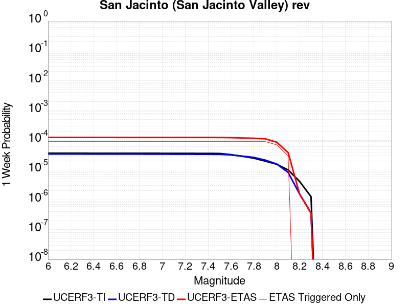 | 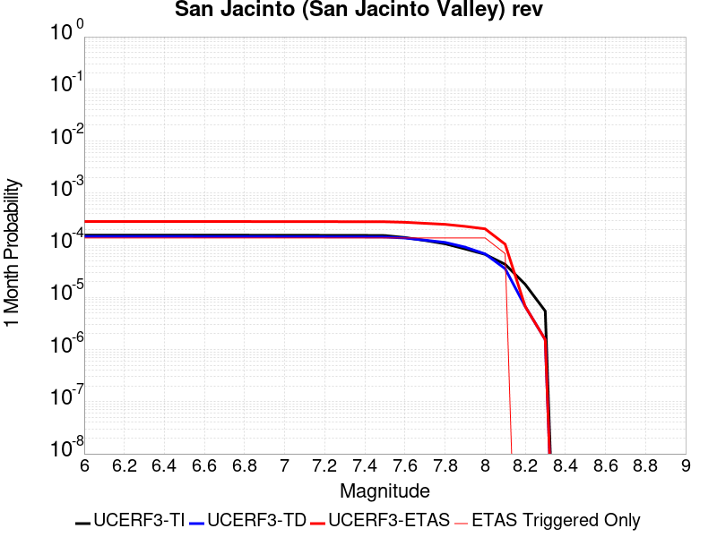 | 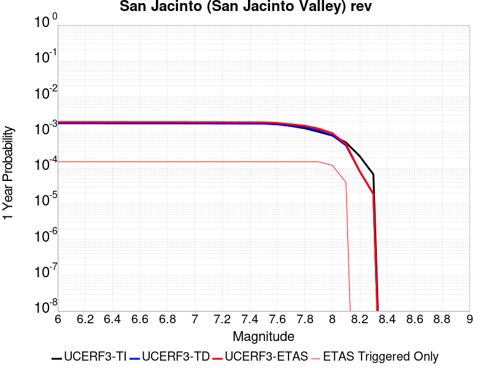 | 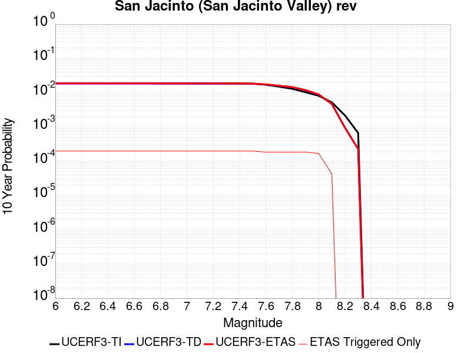 |

| Magnitude | 1 wk TI Prob | 1 wk TD Prob | 1 wk ETAS Prob | 1 wk ETAS/TD Gain | 1 wk ETAS Triggered Only | 1 mo TI Prob | 1 mo TD Prob | 1 mo ETAS Prob | 1 mo ETAS/TD Gain | 1 mo ETAS Triggered Only | 1 yr TI Prob | 1 yr TD Prob | 1 yr ETAS Prob | 1 yr ETAS/TD Gain | 1 yr ETAS Triggered Only | 10 yr TI Prob | 10 yr TD Prob | 10 yr ETAS Prob | 10 yr ETAS/TD Gain | 10 yr ETAS Triggered Only |
|-----|-----|-----|-----|-----|-----|-----|-----|-----|-----|-----|-----|-----|-----|-----|-----|-----|-----|-----|-----|-----|
| 6.0 | 3.652694E-5 | 3.4401106E-5 | 1.7279507E-4 | 5.022951 | 1.3839873E-4 | 1.5653463E-4 | 1.4742499E-4 | 2.858033E-4 | 1.9386355 | 1.3839873E-4 | 0.0019041431 | 0.0017934233 | 0.0019661116 | 1.0962896 | 1.729984E-4 | 0.018879099 | 0.018526303 | 0.018764013 | 1.012831 | 2.4219777E-4 |
| 6.1 | 3.652694E-5 | 3.4401106E-5 | 1.7279507E-4 | 5.022951 | 1.3839873E-4 | 1.5653463E-4 | 1.4742499E-4 | 2.858033E-4 | 1.9386355 | 1.3839873E-4 | 0.0019041431 | 0.0017934233 | 0.0019661116 | 1.0962896 | 1.729984E-4 | 0.018879099 | 0.018526303 | 0.018764013 | 1.012831 | 2.4219777E-4 |
| 6.2 | 3.652694E-5 | 3.4401106E-5 | 1.7279507E-4 | 5.022951 | 1.3839873E-4 | 1.5653463E-4 | 1.4742499E-4 | 2.858033E-4 | 1.9386355 | 1.3839873E-4 | 0.0019041431 | 0.0017934233 | 0.0019661116 | 1.0962896 | 1.729984E-4 | 0.018879099 | 0.018526303 | 0.018764013 | 1.012831 | 2.4219777E-4 |
| 6.3 | 3.652694E-5 | 3.4401106E-5 | 1.7279507E-4 | 5.022951 | 1.3839873E-4 | 1.5653463E-4 | 1.4742499E-4 | 2.858033E-4 | 1.9386355 | 1.3839873E-4 | 0.0019041431 | 0.0017934233 | 0.0019661116 | 1.0962896 | 1.729984E-4 | 0.018879099 | 0.018526303 | 0.018764013 | 1.012831 | 2.4219777E-4 |
| 6.4 | 3.646941E-5 | 3.432268E-5 | 1.7271665E-4 | 5.0321436 | 1.3839873E-4 | 1.5628811E-4 | 1.4708891E-4 | 2.8546728E-4 | 1.9407804 | 1.3839873E-4 | 0.0019011468 | 0.0017893389 | 0.0019620277 | 1.0965098 | 1.729984E-4 | 0.018849645 | 0.018486181 | 0.018723903 | 1.0128593 | 2.4219777E-4 |
| 6.5 | 3.646941E-5 | 3.432268E-5 | 1.7271665E-4 | 5.0321436 | 1.3839873E-4 | 1.5628811E-4 | 1.4708891E-4 | 2.8546728E-4 | 1.9407804 | 1.3839873E-4 | 0.0019011468 | 0.0017893389 | 0.0019620277 | 1.0965098 | 1.729984E-4 | 0.018849645 | 0.018486181 | 0.018723903 | 1.0128593 | 2.4219777E-4 |
| 6.6 | 3.6442503E-5 | 3.4286066E-5 | 1.7268005E-4 | 5.0364494 | 1.3839873E-4 | 1.561728E-4 | 1.4693203E-4 | 2.853104E-4 | 1.9417851 | 1.3839873E-4 | 0.0018997455 | 0.001787432 | 0.001960121 | 1.096613 | 1.729984E-4 | 0.018835869 | 0.01846745 | 0.018705176 | 1.0128727 | 2.4219777E-4 |
| 6.7 | 3.6432113E-5 | 3.427164E-5 | 1.7266562E-4 | 5.0381484 | 1.3839873E-4 | 1.5612828E-4 | 1.4687021E-4 | 2.8524862E-4 | 1.9421816 | 1.3839873E-4 | 0.0018992044 | 0.0017866807 | 0.00195937 | 1.0966537 | 1.729984E-4 | 0.018830549 | 0.018460074 | 0.018697802 | 1.012878 | 2.4219777E-4 |
| 6.8 | 3.6409598E-5 | 3.4240697E-5 | 1.7263468E-4 | 5.041798 | 1.3839873E-4 | 1.560318E-4 | 1.4673761E-4 | 2.8511602E-4 | 1.9430331 | 1.3839873E-4 | 0.0018980318 | 0.0017850689 | 0.0019577586 | 1.0967411 | 1.729984E-4 | 0.018819023 | 0.018444229 | 0.01868196 | 1.0128891 | 2.4219777E-4 |
| 6.9 | 3.638078E-5 | 3.4201123E-5 | 1.7259512E-4 | 5.0464754 | 1.3839873E-4 | 1.5590832E-4 | 1.4656801E-4 | 2.8494647E-4 | 1.9441245 | 1.3839873E-4 | 0.0018965311 | 0.0017830075 | 0.0019556975 | 1.0968531 | 1.729984E-4 | 0.018804269 | 0.018423963 | 0.018661698 | 1.0129036 | 2.4219777E-4 |
| 7.0 | 3.6294874E-5 | 3.408314E-5 | 1.7247714E-4 | 5.060483 | 1.3839873E-4 | 1.5554018E-4 | 1.4606243E-4 | 2.8444093E-4 | 1.947393 | 1.3839873E-4 | 0.0018920569 | 0.0017768623 | 0.0019495533 | 1.0971887 | 1.729984E-4 | 0.018760284 | 0.018363545 | 0.018601295 | 1.0129468 | 2.4219777E-4 |
| 7.1 | 3.6260717E-5 | 3.403942E-5 | 1.7243344E-4 | 5.065698 | 1.3839873E-4 | 1.5539382E-4 | 1.4587509E-4 | 2.8425362E-4 | 1.9486097 | 1.3839873E-4 | 0.001890278 | 0.0017745851 | 0.0019472765 | 1.0973136 | 1.729984E-4 | 0.018742796 | 0.018341139 | 0.018578894 | 1.0129629 | 2.4219777E-4 |
| 7.2 | 3.6210204E-5 | 3.397364E-5 | 1.7236767E-4 | 5.0735707 | 1.3839873E-4 | 1.5517735E-4 | 1.455932E-4 | 2.8397178E-4 | 1.9504466 | 1.3839873E-4 | 0.001887647 | 0.0017711588 | 0.0019438508 | 1.0975022 | 1.729984E-4 | 0.01871693 | 0.018307408 | 0.018545171 | 1.0129873 | 2.4219777E-4 |
| 7.3 | 3.6119454E-5 | 3.386193E-5 | 1.7225597E-4 | 5.0870104 | 1.3839873E-4 | 1.5478847E-4 | 1.4511449E-4 | 2.8349314E-4 | 1.9535825 | 1.3839873E-4 | 0.0018829206 | 0.0017653398 | 0.0019380328 | 1.0978242 | 1.729984E-4 | 0.018670462 | 0.01824996 | 0.018487738 | 1.013029 | 2.4219777E-4 |
| 7.4 | 3.607848E-5 | 3.380943E-5 | 1.7220348E-4 | 5.0933566 | 1.3839873E-4 | 1.5461289E-4 | 1.4488952E-4 | 2.832682E-4 | 1.9550635 | 1.3839873E-4 | 0.0018807866 | 0.0017626052 | 0.0019352987 | 1.0979763 | 1.729984E-4 | 0.018649481 | 0.018222956 | 0.01846074 | 1.0130486 | 2.4219777E-4 |
| 7.5 | 3.5856774E-5 | 3.3619202E-5 | 1.7201327E-4 | 5.1165185 | 1.3839873E-4 | 1.5366284E-4 | 1.4407437E-4 | 2.8245314E-4 | 1.9604678 | 1.3839873E-4 | 0.0018692396 | 0.0017526967 | 0.0019253918 | 1.0985311 | 1.729984E-4 | 0.018535944 | 0.018124057 | 0.018361865 | 1.0131211 | 2.4219777E-4 |
| 7.6 | 3.286655E-5 | 3.2142278E-5 | 1.7053656E-4 | 5.3056774 | 1.3839873E-4 | 1.4084904E-4 | 1.3774536E-4 | 2.76125E-4 | 2.004605 | 1.3839873E-4 | 0.001713488 | 0.0016757617 | 0.0018484702 | 1.1030626 | 1.729984E-4 | 0.017003361 | 0.017343804 | 0.0175818 | 1.0137223 | 2.4219777E-4 |
| 7.7 | 2.8882527E-5 | 2.9235205E-5 | 1.6762989E-4 | 5.7338367 | 1.3839873E-4 | 1.237764E-4 | 1.2528773E-4 | 2.6366912E-4 | 2.1045086 | 1.3839873E-4 | 0.0015059357 | 0.0015243118 | 0.0016970464 | 1.1133198 | 1.729984E-4 | 0.014957713 | 0.015830338 | 0.0160687 | 1.0150574 | 2.4219777E-4 |
| 7.8 | 2.4950225E-5 | 2.6526219E-5 | 1.6492128E-4 | 6.217293 | 1.3839873E-4 | 1.0692515E-4 | 1.1367885E-4 | 2.5206184E-4 | 2.2173152 | 1.3839873E-4 | 0.0013010362 | 0.0013831621 | 0.0015559213 | 1.1249015 | 1.729984E-4 | 0.012934455 | 0.01441176 | 0.014650467 | 1.0165634 | 2.4219777E-4 |
| 7.9 | 1.9881603E-5 | 2.150649E-5 | 1.5990224E-4 | 7.435069 | 1.3839873E-4 | 8.520408E-5 | 9.216742E-5 | 2.3055339E-4 | 2.501463 | 1.3839873E-4 | 0.001036866 | 0.0011215615 | 0.0012943659 | 1.1540748 | 1.729984E-4 | 0.010320415 | 0.011776998 | 0.012016343 | 1.0203232 | 2.4219777E-4 |
| 8.0 | 1.563292E-5 | 1.5936288E-5 | 1.5433281E-4 | 9.684364 | 1.3839873E-4 | 6.6996516E-5 | 6.829659E-5 | 2.0668587E-4 | 3.0262985 | 1.3839873E-4 | 8.153773E-4 | 8.3119445E-4 | 0.0010040491 | 1.2079593 | 1.729984E-4 | 0.00812392 | 0.008810331 | 0.009050395 | 1.027248 | 2.4219777E-4 |
| 8.1 | 1.0045313E-5 | 8.300794E-6 | 7.7499586E-5 | 9.336406 | 6.919936E-5 | 4.305063E-5 | 3.557435E-5 | 1.0477125E-4 | 2.9451346 | 6.919936E-5 | 5.2401534E-4 | 4.3303217E-4 | 5.367863E-4 | 1.2395991 | 1.03799044E-4 | 0.0052278144 | 0.0046587666 | 0.0047620824 | 1.0221766 | 1.03799044E-4 |
| 8.2 | 4.1554413E-6 | 1.5648296E-6 | 1.5648296E-6 | 1.0 | 0.0 | 1.7808914E-5 | 6.7063957E-6 | 6.7063957E-6 | 1.0 | 0.0 | 2.1680194E-4 | 8.164734E-5 | 8.164734E-5 | 1.0 | 0.0 | 0.0021659054 | 9.479703E-4 | 9.479703E-4 | 1.0 | 0.0 |
| 8.3 | 1.2758221E-6 | 3.612677E-7 | 3.612677E-7 | 1.0 | 0.0 | 5.4677976E-6 | 1.5482892E-6 | 1.5482892E-6 | 1.0 | 0.0 | 6.65684E-5 | 1.8850264E-5 | 1.8850264E-5 | 1.0 | 0.0 | 6.6548464E-4 | 2.2739546E-4 | 2.2739546E-4 | 1.0 | 0.0 |

## Owens Valley
*[(top)](#table-of-contents)*

| 1 Week | 1 Month | 1 Year | 10 Year |
|-----|-----|-----|-----|
| 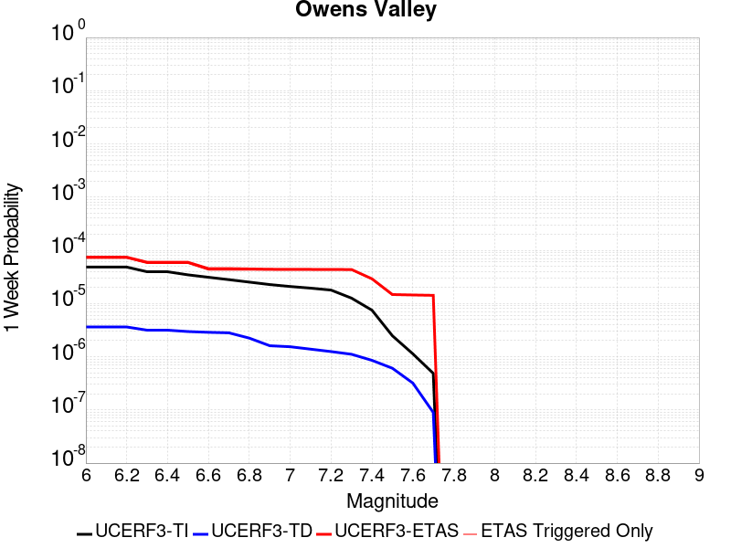 | 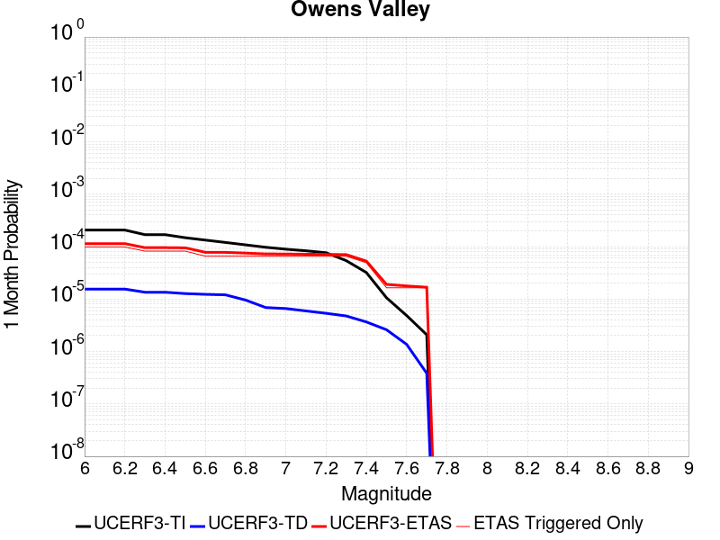 | 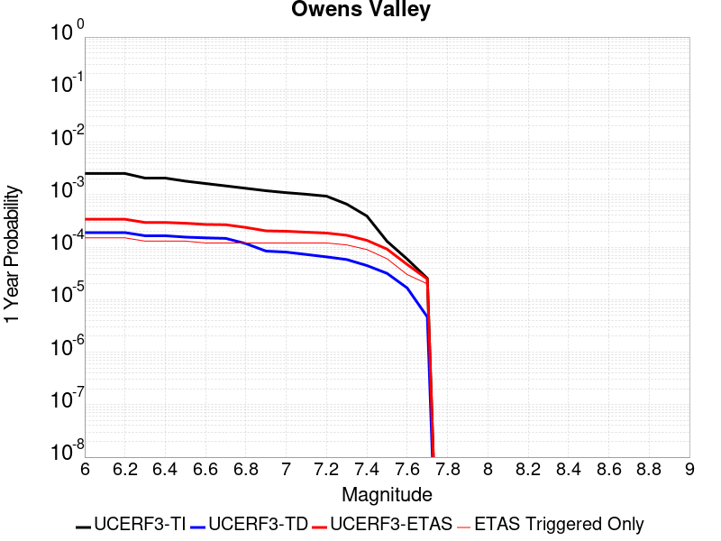 | 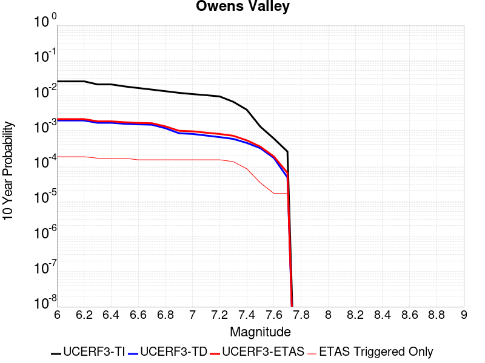 |

| Magnitude | 1 wk TI Prob | 1 wk TD Prob | 1 wk ETAS Prob | 1 wk ETAS/TD Gain | 1 wk ETAS Triggered Only | 1 mo TI Prob | 1 mo TD Prob | 1 mo ETAS Prob | 1 mo ETAS/TD Gain | 1 mo ETAS Triggered Only | 1 yr TI Prob | 1 yr TD Prob | 1 yr ETAS Prob | 1 yr ETAS/TD Gain | 1 yr ETAS Triggered Only | 10 yr TI Prob | 10 yr TD Prob | 10 yr ETAS Prob | 10 yr ETAS/TD Gain | 10 yr ETAS Triggered Only |
|-----|-----|-----|-----|-----|-----|-----|-----|-----|-----|-----|-----|-----|-----|-----|-----|-----|-----|-----|-----|-----|
| 6.0 | 4.83821E-5 | 3.6210524E-6 | 7.282016E-5 | 20.110222 | 6.919936E-5 | 2.0733538E-4 | 1.551871E-5 | 8.4717E-5 | 5.4590235 | 6.919936E-5 | 0.002521386 | 1.889249E-4 | 2.9270432E-4 | 1.5493158 | 1.03799044E-4 | 0.024929691 | 0.0019297141 | 0.0021369117 | 1.1073722 | 2.0759809E-4 |
| 6.1 | 4.83821E-5 | 3.6210524E-6 | 7.282016E-5 | 20.110222 | 6.919936E-5 | 2.0733538E-4 | 1.551871E-5 | 8.4717E-5 | 5.4590235 | 6.919936E-5 | 0.002521386 | 1.889249E-4 | 2.9270432E-4 | 1.5493158 | 1.03799044E-4 | 0.024929691 | 0.0019297141 | 0.0021369117 | 1.1073722 | 2.0759809E-4 |
| 6.2 | 4.83821E-5 | 3.6210524E-6 | 7.282016E-5 | 20.110222 | 6.919936E-5 | 2.0733538E-4 | 1.551871E-5 | 8.4717E-5 | 5.4590235 | 6.919936E-5 | 0.002521386 | 1.889249E-4 | 2.9270432E-4 | 1.5493158 | 1.03799044E-4 | 0.024929691 | 0.0019297141 | 0.0021369117 | 1.1073722 | 2.0759809E-4 |
| 6.3 | 3.953008E-5 | 3.1530958E-6 | 7.235224E-5 | 22.946413 | 6.919936E-5 | 1.6940363E-4 | 1.3513202E-5 | 8.271163E-5 | 6.1208014 | 6.919936E-5 | 0.002060538 | 1.6451156E-4 | 2.6829352E-4 | 1.6308491 | 1.03799044E-4 | 0.020415364 | 0.0016621627 | 0.0018694157 | 1.1246887 | 2.0759809E-4 |
| 6.4 | 3.953008E-5 | 3.1530958E-6 | 7.235224E-5 | 22.946413 | 6.919936E-5 | 1.6940363E-4 | 1.3513202E-5 | 8.271163E-5 | 6.1208014 | 6.919936E-5 | 0.002060538 | 1.6451156E-4 | 2.6829352E-4 | 1.6308491 | 1.03799044E-4 | 0.020415364 | 0.0016621627 | 0.0018694157 | 1.1246887 | 2.0759809E-4 |
| 6.5 | 3.457342E-5 | 2.9707387E-6 | 7.2169896E-5 | 24.293585 | 6.919936E-5 | 1.4816338E-4 | 1.273168E-5 | 8.1930164E-5 | 6.4351416 | 6.919936E-5 | 0.0018023965 | 1.5499788E-4 | 2.5878084E-4 | 1.6695766 | 1.03799044E-4 | 0.017878477 | 0.0015563119 | 0.0017635868 | 1.1331835 | 2.0759809E-4 |
| 6.6 | 3.1127765E-5 | 2.8737306E-6 | 7.207289E-5 | 25.079906 | 6.919936E-5 | 1.3339789E-4 | 1.2315934E-5 | 8.1514445E-5 | 6.6186166 | 6.919936E-5 | 0.0016229092 | 1.4993687E-4 | 2.5372035E-4 | 1.6921812 | 1.03799044E-4 | 0.016111081 | 0.0015013438 | 0.0017086302 | 1.1380672 | 2.0759809E-4 |
| 6.7 | 2.806885E-5 | 2.8101606E-6 | 7.200933E-5 | 25.624632 | 6.919936E-5 | 1.2028952E-4 | 1.2043493E-5 | 8.1242026E-5 | 6.745719 | 6.919936E-5 | 0.001463541 | 1.4662035E-4 | 2.5040418E-4 | 1.7078406 | 1.03799044E-4 | 0.014539397 | 0.0014656087 | 0.0016729025 | 1.1414387 | 2.0759809E-4 |
| 6.8 | 2.524524E-5 | 2.2351392E-6 | 7.143435E-5 | 31.959688 | 6.919936E-5 | 1.0818939E-4 | 9.579134E-6 | 7.877783E-5 | 8.223899 | 6.919936E-5 | 0.0013164099 | 1.16620016E-4 | 2.2040696E-4 | 1.8899581 | 1.03799044E-4 | 0.01308639 | 0.001165827 | 0.0013731831 | 1.1778618 | 2.0759809E-4 |
| 6.9 | 2.2704568E-5 | 1.6079711E-6 | 7.0807226E-5 | 44.035137 | 6.919936E-5 | 9.730166E-5 | 6.8912864E-6 | 7.6090175E-5 | 11.041505 | 6.919936E-5 | 0.0011840039 | 8.38982E-5 | 1.8768854E-4 | 2.2370985 | 1.03799044E-4 | 0.011777153 | 8.38853E-4 | 0.001046277 | 1.247271 | 2.0759809E-4 |
| 7.0 | 2.0871712E-5 | 1.5393621E-6 | 7.073862E-5 | 45.9532 | 6.919936E-5 | 8.944713E-5 | 6.5972495E-6 | 7.579615E-5 | 11.489054 | 6.919936E-5 | 0.0010884746 | 8.031857E-5 | 1.8410927E-4 | 2.292238 | 1.03799044E-4 | 0.010831586 | 8.030395E-4 | 0.0010104709 | 1.2583078 | 2.0759809E-4 |
| 7.1 | 1.944928E-5 | 1.3862556E-6 | 7.058552E-5 | 50.918118 | 6.919936E-5 | 8.335139E-5 | 5.941082E-6 | 7.514004E-5 | 12.647534 | 6.919936E-5 | 0.0010143308 | 7.233028E-5 | 1.7612182E-4 | 2.4349666 | 1.03799044E-4 | 0.010097133 | 7.2319806E-4 | 9.30646E-4 | 1.2868481 | 2.0759809E-4 |
| 7.2 | 1.7876306E-5 | 1.2487686E-6 | 7.044805E-5 | 56.414013 | 6.919936E-5 | 7.6610486E-5 | 5.3518543E-6 | 7.4550844E-5 | 13.92991 | 6.919936E-5 | 9.3233347E-4 | 6.515689E-5 | 1.6894918E-4 | 2.5929594 | 1.03799044E-4 | 0.009284316 | 6.5148395E-4 | 8.5894676E-4 | 1.3184466 | 2.0759809E-4 |
| 7.3 | 1.2618672E-5 | 1.1113839E-6 | 7.031067E-5 | 63.264072 | 6.919936E-5 | 5.40789E-5 | 4.763065E-6 | 7.3962095E-5 | 15.528256 | 6.919936E-5 | 6.582117E-4 | 5.7988782E-5 | 1.617818E-4 | 2.789881 | 1.03799044E-4 | 0.0065626553 | 5.7983754E-4 | 7.5273565E-4 | 1.2981837 | 1.729984E-4 |
| 7.4 | 7.4874442E-6 | 8.547518E-7 | 7.0054055E-5 | 81.95836 | 6.919936E-5 | 3.208865E-5 | 3.6632168E-6 | 7.286233E-5 | 19.890257 | 6.919936E-5 | 3.906093E-4 | 4.4598757E-5 | 1.1379503E-4 | 2.5515292 | 6.919936E-5 | 0.003899234 | 4.459579E-4 | 5.4971065E-4 | 1.2326515 | 1.03799044E-4 |
| 7.5 | 2.4734156E-6 | 6.0679935E-7 | 3.520646E-5 | 58.019936 | 3.459968E-5 | 1.060031E-5 | 2.6005662E-6 | 3.720016E-5 | 14.304638 | 3.459968E-5 | 1.2905113E-4 | 3.1661435E-5 | 6.626002E-5 | 2.0927675 | 3.459968E-5 | 0.0012897621 | 3.1656958E-4 | 3.8574703E-4 | 1.2185221 | 6.919936E-5 |
| 7.6 | 1.1328841E-6 | 3.1961991E-7 | 3.491929E-5 | 109.25255 | 3.459968E-5 | 4.8552088E-6 | 1.369799E-6 | 3.5969435E-5 | 26.258913 | 3.459968E-5 | 5.9110564E-5 | 1.6677177E-5 | 5.127628E-5 | 3.074638 | 3.459968E-5 | 5.9094845E-4 | 1.6675945E-4 | 2.0135335E-4 | 1.207448 | 3.459968E-5 |
| 7.7 | 4.8613185E-7 | 8.962742E-8 | 3.4689307E-5 | 387.039 | 3.459968E-5 | 2.0834207E-6 | 3.8411747E-7 | 3.4983786E-5 | 91.07575 | 3.459968E-5 | 2.536535E-5 | 4.676621E-6 | 3.927614E-5 | 8.398402 | 3.459968E-5 | 2.5362454E-4 | 4.676529E-5 | 8.136335E-5 | 1.7398236 | 3.459968E-5 |

## Big Pine (East)
*[(top)](#table-of-contents)*

| 1 Week | 1 Month | 1 Year | 10 Year |
|-----|-----|-----|-----|
| 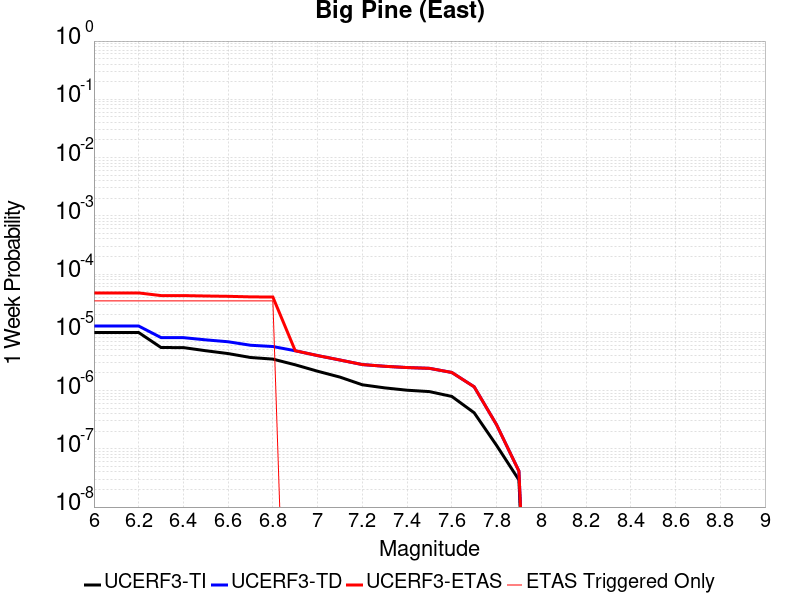 | 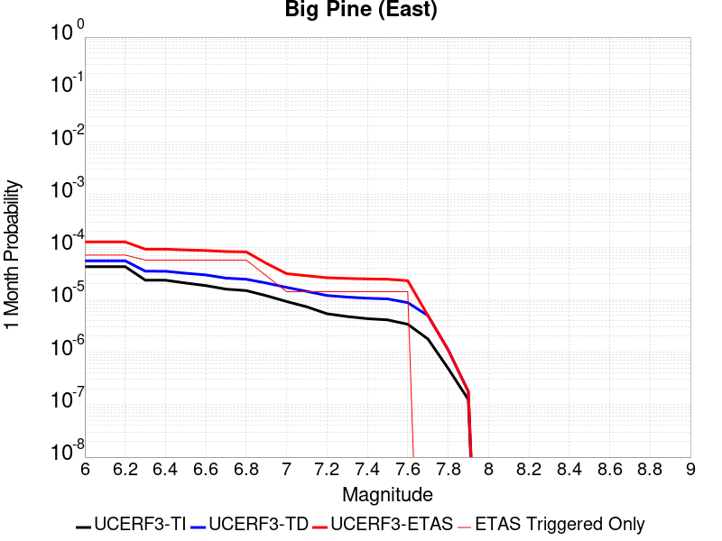 | 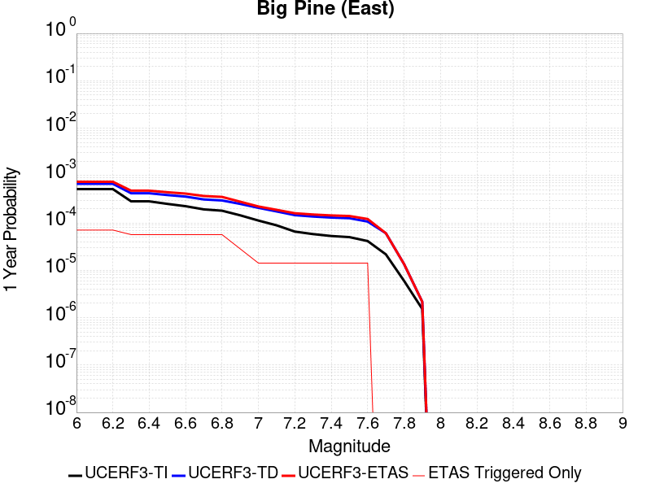 | 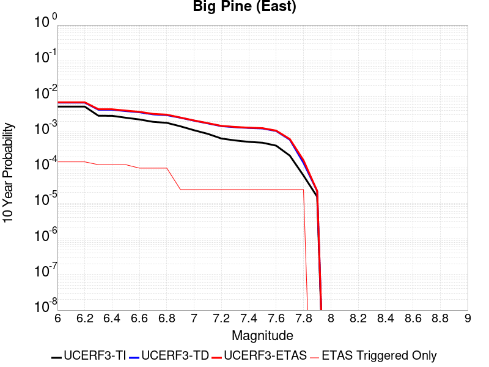 |

| Magnitude | 1 wk TI Prob | 1 wk TD Prob | 1 wk ETAS Prob | 1 wk ETAS/TD Gain | 1 wk ETAS Triggered Only | 1 mo TI Prob | 1 mo TD Prob | 1 mo ETAS Prob | 1 mo ETAS/TD Gain | 1 mo ETAS Triggered Only | 1 yr TI Prob | 1 yr TD Prob | 1 yr ETAS Prob | 1 yr ETAS/TD Gain | 1 yr ETAS Triggered Only | 10 yr TI Prob | 10 yr TD Prob | 10 yr ETAS Prob | 10 yr ETAS/TD Gain | 10 yr ETAS Triggered Only |
|-----|-----|-----|-----|-----|-----|-----|-----|-----|-----|-----|-----|-----|-----|-----|-----|-----|-----|-----|-----|-----|
| 6.0 | 9.916913E-6 | 1.28172705E-5 | 4.741651E-5 | 3.6994233 | 3.459968E-5 | 4.250036E-5 | 5.493013E-5 | 1.5872347E-4 | 2.889552 | 1.03799044E-4 | 5.173191E-4 | 6.685912E-4 | 7.7232084E-4 | 1.1551466 | 1.03799044E-4 | 0.0051611643 | 0.006670449 | 0.006876662 | 1.0309144 | 2.0759809E-4 |
| 6.1 | 9.916913E-6 | 1.28172705E-5 | 4.741651E-5 | 3.6994233 | 3.459968E-5 | 4.250036E-5 | 5.493013E-5 | 1.5872347E-4 | 2.889552 | 1.03799044E-4 | 5.173191E-4 | 6.685912E-4 | 7.7232084E-4 | 1.1551466 | 1.03799044E-4 | 0.0051611643 | 0.006670449 | 0.006876662 | 1.0309144 | 2.0759809E-4 |
| 6.2 | 9.916913E-6 | 1.28172705E-5 | 4.741651E-5 | 3.6994233 | 3.459968E-5 | 4.250036E-5 | 5.493013E-5 | 1.5872347E-4 | 2.889552 | 1.03799044E-4 | 5.173191E-4 | 6.685912E-4 | 7.7232084E-4 | 1.1551466 | 1.03799044E-4 | 0.0051611643 | 0.006670449 | 0.006876662 | 1.0309144 | 2.0759809E-4 |
| 6.3 | 5.479711E-6 | 8.1132375E-6 | 4.271264E-5 | 5.2645617 | 3.459968E-5 | 2.3484265E-5 | 3.4770575E-5 | 1.0396753E-4 | 2.990101 | 6.919936E-5 | 2.858834E-4 | 4.232527E-4 | 4.924228E-4 | 1.163425 | 6.919936E-5 | 0.0028551589 | 0.0042272513 | 0.0043995185 | 1.0407516 | 1.729984E-4 |
| 6.4 | 5.465009E-6 | 8.0975315E-6 | 4.2696935E-5 | 5.2728333 | 3.459968E-5 | 2.3421257E-5 | 3.4703262E-5 | 1.0390022E-4 | 2.9939613 | 6.919936E-5 | 2.851165E-4 | 4.2243348E-4 | 4.916036E-4 | 1.1637421 | 6.919936E-5 | 0.0028475097 | 0.00421909 | 0.0043913587 | 1.0408307 | 1.729984E-4 |
| 6.5 | 4.826767E-6 | 7.4225877E-6 | 4.2022013E-5 | 5.66137 | 3.459968E-5 | 2.068598E-5 | 3.1810716E-5 | 1.0100788E-4 | 3.1752782 | 6.919936E-5 | 2.518227E-4 | 3.8722943E-4 | 4.56402E-4 | 1.1786345 | 6.919936E-5 | 0.0025153751 | 0.0038682907 | 0.00404062 | 1.0445492 | 1.729984E-4 |
| 6.6 | 4.3146847E-6 | 6.8825234E-6 | 4.1481966E-5 | 6.027145 | 3.459968E-5 | 1.8491375E-5 | 2.949621E-5 | 9.8693534E-5 | 3.3459733 | 6.919936E-5 | 2.2510924E-4 | 3.5905963E-4 | 4.2823414E-4 | 1.1926547 | 6.919936E-5 | 0.0022488134 | 0.0035875062 | 0.0037254083 | 1.0384396 | 1.3839873E-4 |
| 6.7 | 3.6968106E-6 | 5.9957474E-6 | 4.0595223E-5 | 6.770669 | 3.459968E-5 | 1.5843378E-5 | 2.5695816E-5 | 9.48934E-5 | 3.6929514 | 6.919936E-5 | 1.9287605E-4 | 3.128032E-4 | 3.819809E-4 | 1.2211541 | 6.919936E-5 | 0.0019270873 | 0.0031262499 | 0.003264216 | 1.0441315 | 1.3839873E-4 |
| 6.8 | 3.4671132E-6 | 5.7024477E-6 | 4.0301933E-5 | 7.0674796 | 3.459968E-5 | 1.4858972E-5 | 2.4438841E-5 | 9.363651E-5 | 3.8314629 | 6.919936E-5 | 1.8089297E-4 | 2.9750372E-4 | 3.6668248E-4 | 1.2325308 | 6.919936E-5 | 0.0018074579 | 0.0029736666 | 0.0031116537 | 1.046403 | 1.3839873E-4 |
| 6.9 | 2.7686972E-6 | 4.8254797E-6 | 4.8254797E-6 | 1.0 | 0.0 | 1.1865792E-5 | 2.0680467E-5 | 2.0680467E-5 | 1.0 | 0.0 | 1.4445644E-4 | 2.5175634E-4 | 2.5175634E-4 | 1.0 | 0.0 | 0.0014436257 | 0.002517256 | 0.0025517684 | 1.0137104 | 3.459968E-5 |
| 7.0 | 2.1472624E-6 | 3.985277E-6 | 3.985277E-6 | 1.0 | 0.0 | 9.20252E-6 | 1.707965E-5 | 1.707965E-5 | 1.0 | 0.0 | 1.12034926E-4 | 2.0792543E-4 | 2.0792543E-4 | 1.0 | 0.0 | 0.0011197845 | 0.0020798238 | 0.0021143516 | 1.0166013 | 3.459968E-5 |
| 7.1 | 1.7018335E-6 | 3.3450835E-6 | 3.3450835E-6 | 1.0 | 0.0 | 7.293552E-6 | 1.4335996E-5 | 1.4335996E-5 | 1.0 | 0.0 | 8.879537E-5 | 1.7452713E-4 | 1.7452713E-4 | 1.0 | 0.0 | 8.87599E-4 | 0.0017463792 | 0.0017809185 | 1.0197777 | 3.459968E-5 |
| 7.2 | 1.25603E-6 | 2.794679E-6 | 2.794679E-6 | 1.0 | 0.0 | 5.3829745E-6 | 1.1977142E-5 | 1.1977142E-5 | 1.0 | 0.0 | 6.553574E-5 | 1.4581217E-4 | 1.4581217E-4 | 1.0 | 0.0 | 6.551642E-4 | 0.0014596173 | 0.0014941664 | 1.0236701 | 3.459968E-5 |
| 7.3 | 1.112297E-6 | 2.610519E-6 | 2.610519E-6 | 1.0 | 0.0 | 4.7669787E-6 | 1.1187892E-5 | 1.1187892E-5 | 1.0 | 0.0 | 5.803642E-5 | 1.3620428E-4 | 1.3620428E-4 | 1.0 | 0.0 | 5.802127E-4 | 0.001363502 | 0.0013980544 | 1.025341 | 3.459968E-5 |
| 7.4 | 1.0137181E-6 | 2.4836752E-6 | 2.4836752E-6 | 1.0 | 0.0 | 4.3444993E-6 | 1.064428E-5 | 1.064428E-5 | 1.0 | 0.0 | 5.2892992E-5 | 1.2958662E-4 | 1.2958662E-4 | 1.0 | 0.0 | 5.288041E-4 | 0.0012971918 | 0.0013317466 | 1.0266382 | 3.459968E-5 |
| 7.5 | 9.598608E-7 | 2.407328E-6 | 2.407328E-6 | 1.0 | 0.0 | 4.1136827E-6 | 1.03170805E-5 | 1.03170805E-5 | 1.0 | 0.0 | 5.0082934E-5 | 1.2560343E-4 | 1.2560343E-4 | 1.0 | 0.0 | 5.007165E-4 | 0.0012572132 | 0.0012917694 | 1.0274863 | 3.459968E-5 |
| 7.6 | 7.929459E-7 | 2.0450152E-6 | 2.0450152E-6 | 1.0 | 0.0 | 3.3983351E-6 | 8.764322E-6 | 8.764322E-6 | 1.0 | 0.0 | 4.1373947E-5 | 1.0670057E-4 | 1.0670057E-4 | 1.0 | 0.0 | 4.1366243E-4 | 0.0010685825 | 0.0011031452 | 1.0323445 | 3.459968E-5 |
| 7.7 | 4.155788E-7 | 1.1606729E-6 | 1.1606729E-6 | 1.0 | 0.0 | 1.7810507E-6 | 4.974303E-6 | 4.974303E-6 | 1.0 | 0.0 | 2.1684076E-5 | 6.05605E-5 | 6.05605E-5 | 1.0 | 0.0 | 2.1681961E-4 | 6.085995E-4 | 6.431782E-4 | 1.0568167 | 3.459968E-5 |
| 7.8 | 1.14666925E-7 | 2.592197E-7 | 2.592197E-7 | 1.0 | 0.0 | 4.914296E-7 | 1.1109411E-6 | 1.1109411E-6 | 1.0 | 0.0 | 5.9831386E-6 | 1.3525627E-5 | 1.3525627E-5 | 1.0 | 0.0 | 5.9829777E-5 | 1.3636416E-4 | 1.7095913E-4 | 1.2536954 | 3.459968E-5 |
| 7.9 | 2.9231824E-8 | 4.1462318E-8 | 4.1462318E-8 | 1.0 | 0.0 | 1.2527924E-7 | 1.7769564E-7 | 1.7769564E-7 | 1.0 | 0.0 | 1.5252737E-6 | 2.1634426E-6 | 2.1634426E-6 | 1.0 | 0.0 | 1.5252632E-5 | 2.197062E-5 | 2.197062E-5 | 1.0 | 0.0 |

## Tin Mountain
*[(top)](#table-of-contents)*

| 1 Week | 1 Month | 1 Year | 10 Year |
|-----|-----|-----|-----|
| 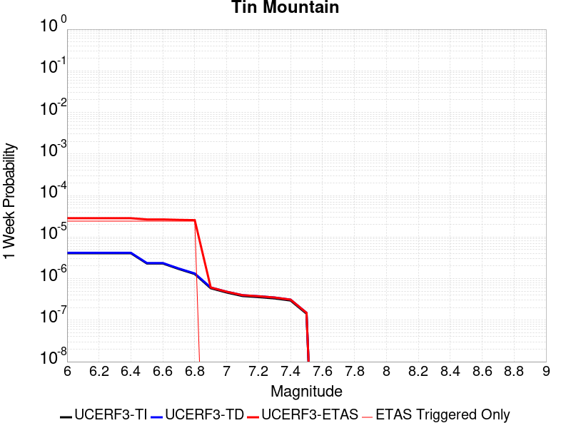 | 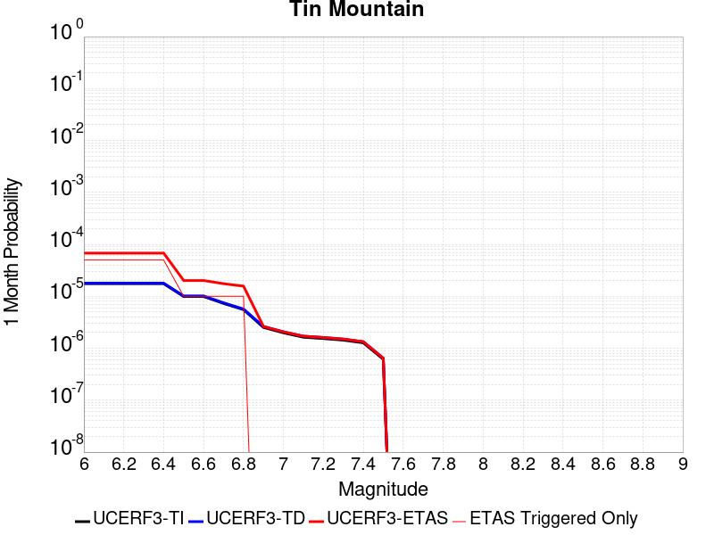 | 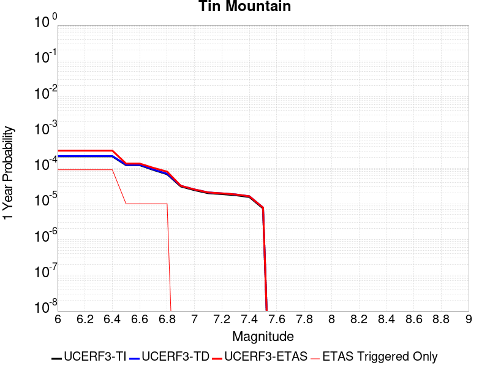 | 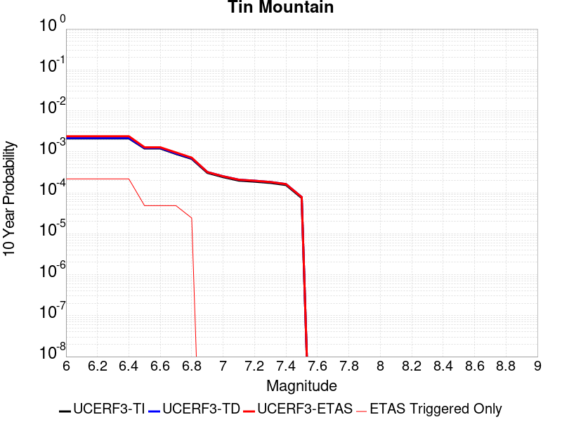 |

| Magnitude | 1 wk TI Prob | 1 wk TD Prob | 1 wk ETAS Prob | 1 wk ETAS/TD Gain | 1 wk ETAS Triggered Only | 1 mo TI Prob | 1 mo TD Prob | 1 mo ETAS Prob | 1 mo ETAS/TD Gain | 1 mo ETAS Triggered Only | 1 yr TI Prob | 1 yr TD Prob | 1 yr ETAS Prob | 1 yr ETAS/TD Gain | 1 yr ETAS Triggered Only | 10 yr TI Prob | 10 yr TD Prob | 10 yr ETAS Prob | 10 yr ETAS/TD Gain | 10 yr ETAS Triggered Only |
|-----|-----|-----|-----|-----|-----|-----|-----|-----|-----|-----|-----|-----|-----|-----|-----|-----|-----|-----|-----|-----|
| 6.0 | 4.083776E-6 | 4.1815365E-6 | 3.8781072E-5 | 9.27436 | 3.459968E-5 | 1.750178E-5 | 1.792077E-5 | 8.711889E-5 | 4.8613367 | 6.919936E-5 | 2.1306332E-4 | 2.1816725E-4 | 3.5653578E-4 | 1.6342314 | 1.3839873E-4 | 0.0021285915 | 0.0021798965 | 0.002387042 | 1.0950254 | 2.0759809E-4 |
| 6.1 | 4.083776E-6 | 4.1815365E-6 | 3.8781072E-5 | 9.27436 | 3.459968E-5 | 1.750178E-5 | 1.792077E-5 | 8.711889E-5 | 4.8613367 | 6.919936E-5 | 2.1306332E-4 | 2.1816725E-4 | 3.5653578E-4 | 1.6342314 | 1.3839873E-4 | 0.0021285915 | 0.0021798965 | 0.002387042 | 1.0950254 | 2.0759809E-4 |
| 6.2 | 4.083776E-6 | 4.1815365E-6 | 3.8781072E-5 | 9.27436 | 3.459968E-5 | 1.750178E-5 | 1.792077E-5 | 8.711889E-5 | 4.8613367 | 6.919936E-5 | 2.1306332E-4 | 2.1816725E-4 | 3.5653578E-4 | 1.6342314 | 1.3839873E-4 | 0.0021285915 | 0.0021798965 | 0.002387042 | 1.0950254 | 2.0759809E-4 |
| 6.3 | 4.083776E-6 | 4.1815365E-6 | 3.8781072E-5 | 9.27436 | 3.459968E-5 | 1.750178E-5 | 1.792077E-5 | 8.711889E-5 | 4.8613367 | 6.919936E-5 | 2.1306332E-4 | 2.1816725E-4 | 3.5653578E-4 | 1.6342314 | 1.3839873E-4 | 0.0021285915 | 0.0021798965 | 0.002387042 | 1.0950254 | 2.0759809E-4 |
| 6.4 | 4.083776E-6 | 4.1815365E-6 | 3.8781072E-5 | 9.27436 | 3.459968E-5 | 1.750178E-5 | 1.792077E-5 | 8.711889E-5 | 4.8613367 | 6.919936E-5 | 2.1306332E-4 | 2.1816725E-4 | 3.5653578E-4 | 1.6342314 | 1.3839873E-4 | 0.0021285915 | 0.0021798965 | 0.002387042 | 1.0950254 | 2.0759809E-4 |
| 6.5 | 2.3143427E-6 | 2.3731573E-6 | 3.6972757E-5 | 15.579565 | 3.459968E-5 | 9.9185745E-6 | 1.0170638E-5 | 4.4769968E-5 | 4.4018836 | 3.459968E-5 | 1.2075195E-4 | 1.2382126E-4 | 1.5841666E-4 | 1.2793978 | 3.459968E-5 | 0.0012068636 | 0.0012375986 | 0.0012721554 | 1.0279225 | 3.459968E-5 |
| 6.6 | 2.3143427E-6 | 2.3731573E-6 | 3.6972757E-5 | 15.579565 | 3.459968E-5 | 9.9185745E-6 | 1.0170638E-5 | 4.4769968E-5 | 4.4018836 | 3.459968E-5 | 1.2075195E-4 | 1.2382126E-4 | 1.5841666E-4 | 1.2793978 | 3.459968E-5 | 0.0012068636 | 0.0012375986 | 0.0012721554 | 1.0279225 | 3.459968E-5 |
| 6.7 | 1.7029532E-6 | 1.7497915E-6 | 3.634941E-5 | 20.773567 | 3.459968E-5 | 7.2983503E-6 | 7.499088E-6 | 4.209851E-5 | 5.613817 | 3.459968E-5 | 8.885379E-5 | 9.1298105E-5 | 1.2589463E-4 | 1.3789402 | 3.459968E-5 | 8.881827E-4 | 9.1265864E-4 | 9.472267E-4 | 1.0378762 | 3.459968E-5 |
| 6.8 | 1.2914646E-6 | 1.3299378E-6 | 3.5929574E-5 | 27.01598 | 3.459968E-5 | 5.534837E-6 | 5.6997237E-6 | 4.029921E-5 | 7.0703793 | 3.459968E-5 | 6.738455E-5 | 6.939237E-5 | 1.0398965E-4 | 1.4985747 | 3.459968E-5 | 6.736412E-4 | 6.9375033E-4 | 7.2832603E-4 | 1.0498388 | 3.459968E-5 |
| 6.9 | 5.8708974E-7 | 6.1169936E-7 | 6.1169936E-7 | 1.0 | 0.0 | 2.5160964E-6 | 2.6215664E-6 | 2.6215664E-6 | 1.0 | 0.0 | 3.0633044E-5 | 3.1917145E-5 | 3.1917145E-5 | 1.0 | 0.0 | 3.0628822E-4 | 3.191297E-4 | 3.191297E-4 | 1.0 | 0.0 |
| 7.0 | 4.6248786E-7 | 4.832015E-7 | 4.832015E-7 | 1.0 | 0.0 | 1.9820893E-6 | 2.0708624E-6 | 2.0708624E-6 | 1.0 | 0.0 | 2.413167E-5 | 2.5212494E-5 | 2.5212494E-5 | 1.0 | 0.0 | 2.412905E-4 | 2.5210003E-4 | 2.5210003E-4 | 1.0 | 0.0 |
| 7.1 | 3.804606E-7 | 3.987147E-7 | 3.987147E-7 | 1.0 | 0.0 | 1.6305444E-6 | 1.7087764E-6 | 1.7087764E-6 | 1.0 | 0.0 | 1.9851697E-5 | 2.0804187E-5 | 2.0804187E-5 | 1.0 | 0.0 | 1.9849923E-4 | 2.0802575E-4 | 2.0802575E-4 | 1.0 | 0.0 |
| 7.2 | 3.5864858E-7 | 3.7616863E-7 | 3.7616863E-7 | 1.0 | 0.0 | 1.5370645E-6 | 1.6121504E-6 | 1.6121504E-6 | 1.0 | 0.0 | 1.87136E-5 | 1.9627789E-5 | 1.9627789E-5 | 1.0 | 0.0 | 1.8712023E-4 | 1.9626386E-4 | 1.9626386E-4 | 1.0 | 0.0 |
| 7.3 | 3.342063E-7 | 3.506347E-7 | 3.506347E-7 | 1.0 | 0.0 | 1.4323119E-6 | 1.5027196E-6 | 1.5027196E-6 | 1.0 | 0.0 | 1.7438259E-5 | 1.829549E-5 | 1.829549E-5 | 1.0 | 0.0 | 1.743689E-4 | 1.8294314E-4 | 1.8294314E-4 | 1.0 | 0.0 |
| 7.4 | 2.971242E-7 | 3.1165817E-7 | 3.1165817E-7 | 1.0 | 0.0 | 1.2733886E-6 | 1.3356774E-6 | 1.3356774E-6 | 1.0 | 0.0 | 1.5503398E-5 | 1.6261785E-5 | 1.6261785E-5 | 1.0 | 0.0 | 1.5502315E-4 | 1.6260923E-4 | 1.6260923E-4 | 1.0 | 0.0 |
| 7.5 | 1.4326713E-7 | 1.5012525E-7 | 1.5012525E-7 | 1.0 | 0.0 | 6.140018E-7 | 6.433939E-7 | 6.433939E-7 | 1.0 | 0.0 | 7.4754466E-6 | 7.8333205E-6 | 7.8333205E-6 | 1.0 | 0.0 | 7.475195E-5 | 7.833321E-5 | 7.833321E-5 | 1.0 | 0.0 |

## Baker
*[(top)](#table-of-contents)*

| 1 Week | 1 Month | 1 Year | 10 Year |
|-----|-----|-----|-----|
| 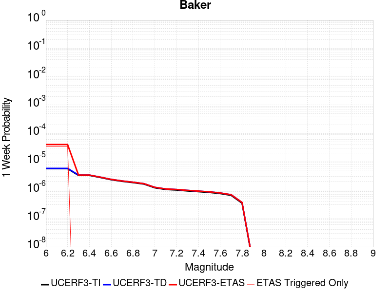 | 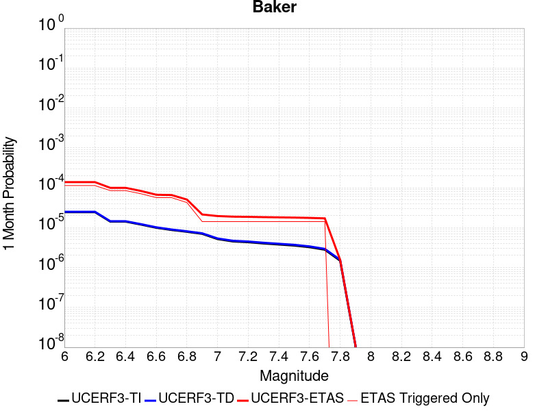 | 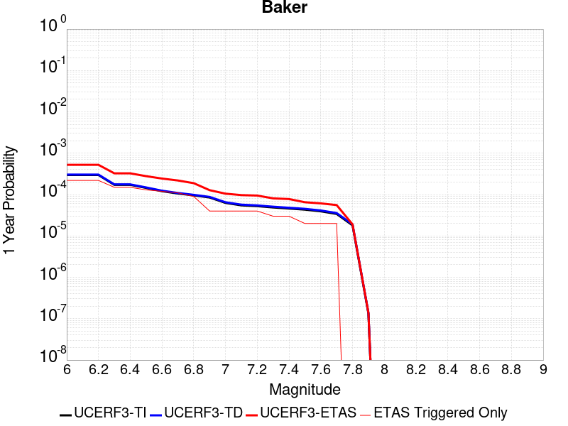 | 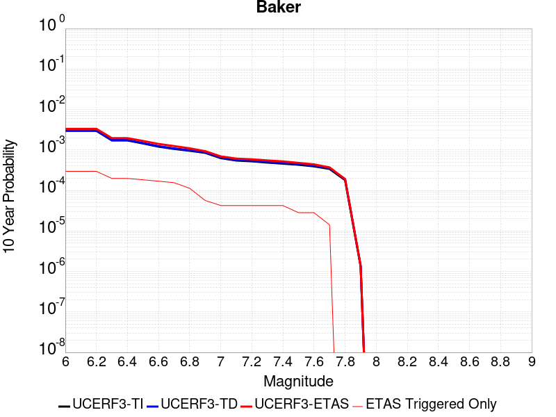 |

| Magnitude | 1 wk TI Prob | 1 wk TD Prob | 1 wk ETAS Prob | 1 wk ETAS/TD Gain | 1 wk ETAS Triggered Only | 1 mo TI Prob | 1 mo TD Prob | 1 mo ETAS Prob | 1 mo ETAS/TD Gain | 1 mo ETAS Triggered Only | 1 yr TI Prob | 1 yr TD Prob | 1 yr ETAS Prob | 1 yr ETAS/TD Gain | 1 yr ETAS Triggered Only | 10 yr TI Prob | 10 yr TD Prob | 10 yr ETAS Prob | 10 yr ETAS/TD Gain | 10 yr ETAS Triggered Only |
|-----|-----|-----|-----|-----|-----|-----|-----|-----|-----|-----|-----|-----|-----|-----|-----|-----|-----|-----|-----|-----|
| 6.0 | 5.695525E-6 | 5.8348373E-6 | 4.0434315E-5 | 6.9298105 | 3.459968E-5 | 2.4409164E-5 | 2.5006228E-5 | 1.2880268E-4 | 5.150824 | 1.03799044E-4 | 2.9714106E-4 | 3.044123E-4 | 4.7735803E-4 | 1.5681299 | 1.729984E-4 | 0.0029674405 | 0.0030403486 | 0.0032473155 | 1.0680734 | 2.0759809E-4 |
| 6.1 | 5.695525E-6 | 5.8348373E-6 | 4.0434315E-5 | 6.9298105 | 3.459968E-5 | 2.4409164E-5 | 2.5006228E-5 | 1.2880268E-4 | 5.150824 | 1.03799044E-4 | 2.9714106E-4 | 3.044123E-4 | 4.7735803E-4 | 1.5681299 | 1.729984E-4 | 0.0029674405 | 0.0030403486 | 0.0032473155 | 1.0680734 | 2.0759809E-4 |
| 6.2 | 5.695525E-6 | 5.8348373E-6 | 4.0434315E-5 | 6.9298105 | 3.459968E-5 | 2.4409164E-5 | 2.5006228E-5 | 1.2880268E-4 | 5.150824 | 1.03799044E-4 | 2.9714106E-4 | 3.044123E-4 | 4.7735803E-4 | 1.5681299 | 1.729984E-4 | 0.0029674405 | 0.0030403486 | 0.0032473155 | 1.0680734 | 2.0759809E-4 |
| 6.3 | 3.2995713E-6 | 3.383667E-6 | 3.383667E-6 | 1.0 | 0.0 | 1.4140943E-5 | 1.4501353E-5 | 4.9100534E-5 | 3.385928 | 3.459968E-5 | 1.7215237E-4 | 1.7654014E-4 | 2.8032085E-4 | 1.587859 | 1.03799044E-4 | 0.0017201907 | 0.001764046 | 0.0019022006 | 1.0783169 | 1.3839873E-4 |
| 6.4 | 3.2995713E-6 | 3.383667E-6 | 3.383667E-6 | 1.0 | 0.0 | 1.4140943E-5 | 1.4501353E-5 | 4.9100534E-5 | 3.385928 | 3.459968E-5 | 1.7215237E-4 | 1.7654014E-4 | 2.8032085E-4 | 1.587859 | 1.03799044E-4 | 0.0017201907 | 0.001764046 | 0.0019022006 | 1.0783169 | 1.3839873E-4 |
| 6.5 | 2.782202E-6 | 2.8558404E-6 | 2.8558404E-6 | 1.0 | 0.0 | 1.1923668E-5 | 1.223926E-5 | 4.683852E-5 | 3.8269076 | 3.459968E-5 | 1.4516099E-4 | 1.4900314E-4 | 2.527867E-4 | 1.6965194 | 1.03799044E-4 | 0.001450662 | 0.0014890651 | 0.0016272577 | 1.092805 | 1.3839873E-4 |
| 6.6 | 2.3163404E-6 | 2.38092E-6 | 2.38092E-6 | 1.0 | 0.0 | 9.927136E-6 | 1.0203904E-5 | 4.4803233E-5 | 4.3907933 | 3.459968E-5 | 1.20856166E-4 | 1.2422565E-4 | 2.280118E-4 | 1.8354647 | 1.03799044E-4 | 0.0012079047 | 0.0012415823 | 0.0013798092 | 1.1113312 | 1.3839873E-4 |
| 6.7 | 2.037056E-6 | 2.0965003E-6 | 2.0965003E-6 | 1.0 | 0.0 | 8.7302105E-6 | 8.984972E-6 | 4.3584343E-5 | 4.8508043 | 3.459968E-5 | 1.0628513E-4 | 1.093867E-4 | 1.785785E-4 | 1.632543 | 6.919936E-5 | 0.0010623431 | 0.0010933448 | 0.0011970303 | 1.0948334 | 1.03799044E-4 |
| 6.8 | 1.8356744E-6 | 1.8915287E-6 | 1.8915287E-6 | 1.0 | 0.0 | 7.867153E-6 | 8.106527E-6 | 4.2705928E-5 | 5.2680917 | 3.459968E-5 | 9.577837E-5 | 9.869264E-5 | 1.6788517E-4 | 1.7010912 | 6.919936E-5 | 9.57371E-4 | 9.86502E-4 | 0.0010901986 | 1.1051155 | 1.03799044E-4 |
| 6.9 | 1.6310546E-6 | 1.6832072E-6 | 1.6832072E-6 | 1.0 | 0.0 | 6.9902153E-6 | 7.213726E-6 | 4.1813157E-5 | 5.7963333 | 3.459968E-5 | 8.510255E-5 | 8.782368E-5 | 1.2242033E-4 | 1.3939329 | 3.459968E-5 | 8.5069967E-4 | 8.7790104E-4 | 9.470397E-4 | 1.0787544 | 6.919936E-5 |
| 7.0 | 1.2058036E-6 | 1.2508665E-6 | 1.2508665E-6 | 1.0 | 0.0 | 5.1677193E-6 | 5.3608455E-6 | 3.996034E-5 | 7.4541116 | 3.459968E-5 | 6.291517E-5 | 6.5266366E-5 | 9.986379E-5 | 1.5300958 | 3.459968E-5 | 6.289736E-4 | 6.524743E-4 | 6.870514E-4 | 1.0529938 | 3.459968E-5 |
| 7.1 | 1.052382E-6 | 1.0951609E-6 | 1.0951609E-6 | 1.0 | 0.0 | 4.5102006E-6 | 4.693538E-6 | 3.9293056E-5 | 8.371735 | 3.459968E-5 | 5.491031E-5 | 5.7142337E-5 | 9.174004E-5 | 1.6054653 | 3.459968E-5 | 5.4896745E-4 | 5.7127734E-4 | 6.0585723E-4 | 1.0605309 | 3.459968E-5 |
| 7.2 | 1.0067454E-6 | 1.0487711E-6 | 1.0487711E-6 | 1.0 | 0.0 | 4.3146156E-6 | 4.4947255E-6 | 3.909425E-5 | 8.697806 | 3.459968E-5 | 5.252918E-5 | 5.4721917E-5 | 8.931971E-5 | 1.6322473 | 3.459968E-5 | 5.251676E-4 | 5.470853E-4 | 5.81666E-4 | 1.063209 | 3.459968E-5 |
| 7.3 | 9.3596316E-7 | 9.767723E-7 | 9.767723E-7 | 1.0 | 0.0 | 4.0112645E-6 | 4.1861604E-6 | 3.8785696E-5 | 9.26522 | 3.459968E-5 | 4.8836053E-5 | 5.096532E-5 | 8.556324E-5 | 1.6788522 | 3.459968E-5 | 4.8825322E-4 | 5.095371E-4 | 5.4411916E-4 | 1.0678695 | 3.459968E-5 |
| 7.4 | 8.8117395E-7 | 9.2076635E-7 | 9.2076635E-7 | 1.0 | 0.0 | 3.7764542E-6 | 3.9461356E-6 | 3.854568E-5 | 9.767957 | 3.459968E-5 | 4.5977362E-5 | 4.8043148E-5 | 8.264117E-5 | 1.7201447 | 3.459968E-5 | 4.596785E-4 | 4.8032837E-4 | 5.1491143E-4 | 1.0719988 | 3.459968E-5 |
| 7.5 | 8.292386E-7 | 8.6745956E-7 | 8.6745956E-7 | 1.0 | 0.0 | 3.5538749E-6 | 3.7176785E-6 | 3.831723E-5 | 10.306763 | 3.459968E-5 | 4.326757E-5 | 4.5261804E-5 | 7.985992E-5 | 1.7643999 | 3.459968E-5 | 4.3259145E-4 | 4.5252658E-4 | 4.871106E-4 | 1.0764242 | 3.459968E-5 |
| 7.6 | 7.553842E-7 | 7.9144706E-7 | 7.9144706E-7 | 1.0 | 0.0 | 3.2373566E-6 | 3.3919116E-6 | 3.7991475E-5 | 11.200609 | 3.459968E-5 | 3.9414106E-5 | 4.129575E-5 | 7.5894E-5 | 1.8378164 | 3.459968E-5 | 3.9407116E-4 | 4.1288146E-4 | 4.4746685E-4 | 1.083766 | 3.459968E-5 |
| 7.7 | 6.5285366E-7 | 6.852797E-7 | 6.852797E-7 | 1.0 | 0.0 | 2.797941E-6 | 2.9369096E-6 | 3.753649E-5 | 12.780949 | 3.459968E-5 | 3.40644E-5 | 3.5756293E-5 | 7.035474E-5 | 1.9676182 | 3.459968E-5 | 3.405918E-4 | 3.5750607E-4 | 3.9209338E-4 | 1.0967461 | 3.459968E-5 |
| 7.8 | 3.4586725E-7 | 3.6482615E-7 | 3.6482615E-7 | 1.0 | 0.0 | 1.4822873E-6 | 1.5635396E-6 | 1.5635396E-6 | 1.0 | 0.0 | 1.80467E-5 | 1.9035933E-5 | 1.9035933E-5 | 1.0 | 0.0 | 1.8045233E-4 | 1.9034347E-4 | 1.9034347E-4 | 1.0 | 0.0 |
| 7.9 | 2.5591178E-9 | 2.6696718E-9 | 2.6696718E-9 | 1.0 | 0.0 | 1.0967647E-8 | 1.14414505E-8 | 1.14414505E-8 | 1.0 | 0.0 | 1.335311E-7 | 1.3929966E-7 | 1.3929966E-7 | 1.0 | 0.0 | 1.3353102E-6 | 1.3929966E-6 | 1.3929966E-6 | 1.0 | 0.0 |

## Imperial
*[(top)](#table-of-contents)*

| 1 Week | 1 Month | 1 Year | 10 Year |
|-----|-----|-----|-----|
| 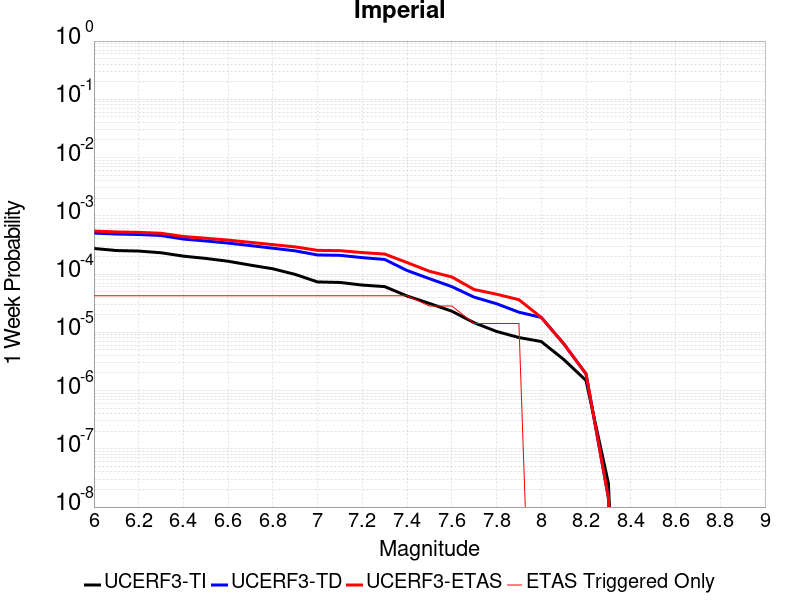 | 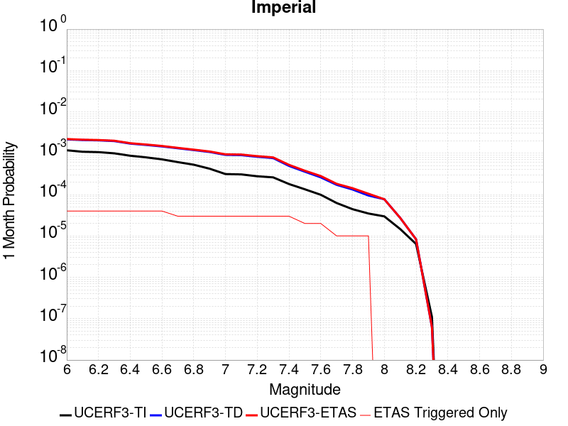 | 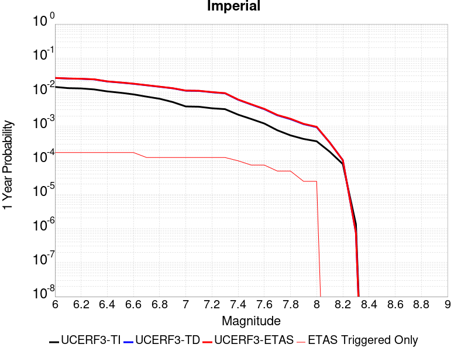 | 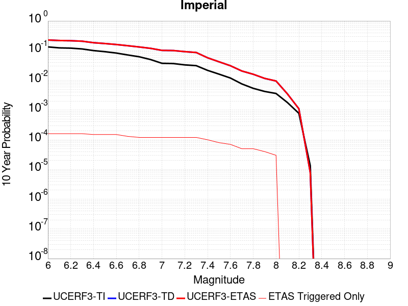 |

| Magnitude | 1 wk TI Prob | 1 wk TD Prob | 1 wk ETAS Prob | 1 wk ETAS/TD Gain | 1 wk ETAS Triggered Only | 1 mo TI Prob | 1 mo TD Prob | 1 mo ETAS Prob | 1 mo ETAS/TD Gain | 1 mo ETAS Triggered Only | 1 yr TI Prob | 1 yr TD Prob | 1 yr ETAS Prob | 1 yr ETAS/TD Gain | 1 yr ETAS Triggered Only | 10 yr TI Prob | 10 yr TD Prob | 10 yr ETAS Prob | 10 yr ETAS/TD Gain | 10 yr ETAS Triggered Only |
|-----|-----|-----|-----|-----|-----|-----|-----|-----|-----|-----|-----|-----|-----|-----|-----|-----|-----|-----|-----|-----|
| 6.0 | 2.7496446E-4 | 5.055345E-4 | 5.4011674E-4 | 1.0684072 | 3.459968E-5 | 0.0011778869 | 0.002164817 | 0.0022338666 | 1.0318962 | 6.919936E-5 | 0.0142467655 | 0.026048409 | 0.026216902 | 1.0064684 | 1.729984E-4 | 0.13367249 | 0.22807029 | 0.22823054 | 1.0007026 | 2.0759809E-4 |
| 6.1 | 2.5356023E-4 | 4.8657708E-4 | 5.211599E-4 | 1.0710738 | 3.459968E-5 | 0.001086234 | 0.002083702 | 0.0021527573 | 1.0331407 | 6.919936E-5 | 0.013144928 | 0.02507094 | 0.0252396 | 1.0067273 | 1.729984E-4 | 0.123940155 | 0.21949561 | 0.21965764 | 1.0007381 | 2.0759809E-4 |
| 6.2 | 2.4820742E-4 | 4.775311E-4 | 5.1211426E-4 | 1.0724207 | 3.459968E-5 | 0.0010633124 | 0.0020449946 | 0.0021140524 | 1.0337692 | 6.919936E-5 | 0.01286919 | 0.024610676 | 0.024779417 | 1.0068564 | 1.729984E-4 | 0.12148927 | 0.21600136 | 0.21616413 | 1.0007535 | 2.0759809E-4 |
| 6.3 | 2.3205351E-4 | 4.5892023E-4 | 4.9350405E-4 | 1.0753591 | 3.459968E-5 | 9.94136E-4 | 0.0019653554 | 0.0020344188 | 1.0351404 | 6.919936E-5 | 0.012036599 | 0.023661187 | 0.023830092 | 1.0071385 | 1.729984E-4 | 0.11405133 | 0.20793827 | 0.2081027 | 1.0007907 | 2.0759809E-4 |
| 6.4 | 2.0304754E-4 | 3.9878016E-4 | 4.3336602E-4 | 1.0867292 | 3.459968E-5 | 8.6991355E-4 | 0.0017079529 | 0.0017770341 | 1.0404468 | 6.919936E-5 | 0.010539869 | 0.020595418 | 0.020764854 | 1.0082269 | 1.729984E-4 | 0.100537635 | 0.18507113 | 0.1852403 | 1.0009141 | 2.0759809E-4 |
| 6.5 | 1.854992E-4 | 3.6990462E-4 | 4.0449153E-4 | 1.0935022 | 3.459968E-5 | 7.9475436E-4 | 0.0015843548 | 0.0016534445 | 1.0436075 | 6.919936E-5 | 0.009633281 | 0.01911443 | 0.01928412 | 1.0088776 | 1.729984E-4 | 0.0922623 | 0.1733039 | 0.17347552 | 1.0009903 | 2.0759809E-4 |
| 6.6 | 1.6586106E-4 | 3.4036173E-4 | 3.7494965E-4 | 1.101621 | 3.459968E-5 | 7.106394E-4 | 0.0014578878 | 0.0015269864 | 1.0473963 | 6.919936E-5 | 0.008617763 | 0.017607626 | 0.017777577 | 1.0096523 | 1.729984E-4 | 0.08291132 | 0.16078055 | 0.16095476 | 1.0010836 | 2.0759809E-4 |
| 6.7 | 1.4224656E-4 | 3.076812E-4 | 3.4227024E-4 | 1.1124184 | 3.459968E-5 | 6.094856E-4 | 0.0013179756 | 0.0013525296 | 1.0262176 | 3.459968E-5 | 0.0073952693 | 0.015928522 | 0.016030667 | 1.0064127 | 1.03799044E-4 | 0.07153955 | 0.14648798 | 0.1466061 | 1.0008063 | 1.3839873E-4 |
| 6.8 | 1.2317259E-4 | 2.779231E-4 | 3.1251315E-4 | 1.1244591 | 3.459968E-5 | 5.2777573E-4 | 0.0011905615 | 0.0012251199 | 1.0290271 | 3.459968E-5 | 0.0064067547 | 0.014400131 | 0.014502435 | 1.0071044 | 1.03799044E-4 | 0.06225166 | 0.13294089 | 0.13306089 | 1.0009027 | 1.3839873E-4 |
| 6.9 | 9.859898E-5 | 2.5015484E-4 | 2.8474585E-4 | 1.1382785 | 3.459968E-5 | 4.2249862E-4 | 0.0010716559 | 0.0011062186 | 1.0322516 | 3.459968E-5 | 0.0051317946 | 0.012970319 | 0.013072771 | 1.007899 | 1.03799044E-4 | 0.05014893 | 0.119408876 | 0.119530745 | 1.0010207 | 1.3839873E-4 |
| 7.0 | 7.3191884E-5 | 2.1267848E-4 | 2.472708E-4 | 1.1626508 | 3.459968E-5 | 3.136418E-4 | 9.11164E-4 | 9.457322E-4 | 1.0379385 | 3.459968E-5 | 0.003811904 | 0.011037681 | 0.011140334 | 1.0093002 | 1.03799044E-4 | 0.037471764 | 0.10206756 | 0.102191836 | 1.0012176 | 1.3839873E-4 |
| 7.1 | 7.1760296E-5 | 2.0969207E-4 | 2.4428449E-4 | 1.1649678 | 3.459968E-5 | 3.0750787E-4 | 8.9837395E-4 | 9.3294255E-4 | 1.0384791 | 3.459968E-5 | 0.003737482 | 0.010883528 | 0.010986198 | 1.0094335 | 1.03799044E-4 | 0.03675245 | 0.10070406 | 0.10082852 | 1.001236 | 1.3839873E-4 |
| 7.2 | 6.46614E-5 | 1.9137723E-4 | 2.2597029E-4 | 1.1807585 | 3.459968E-5 | 2.7709085E-4 | 8.199333E-4 | 8.5450464E-4 | 1.0421636 | 3.459968E-5 | 0.0033683628 | 0.009937617 | 0.010040385 | 1.0103413 | 1.03799044E-4 | 0.033177625 | 0.092511006 | 0.0926366 | 1.0013577 | 1.3839873E-4 |
| 7.3 | 6.088115E-5 | 1.780939E-4 | 2.1268742E-4 | 1.1942432 | 3.459968E-5 | 2.6089314E-4 | 7.6303916E-4 | 7.976125E-4 | 1.04531 | 3.459968E-5 | 0.0031717476 | 0.009251006 | 0.009353844 | 1.0111165 | 1.03799044E-4 | 0.031268585 | 0.08656135 | 0.08668777 | 1.0014604 | 1.3839873E-4 |
| 7.4 | 4.199346E-5 | 1.1511097E-4 | 1.4970667E-4 | 1.3005421 | 3.459968E-5 | 1.7995955E-4 | 4.932403E-4 | 5.2782294E-4 | 1.0701131 | 3.459968E-5 | 0.0021888057 | 0.005988835 | 0.00605762 | 1.0114856 | 6.919936E-5 | 0.02167372 | 0.05744024 | 0.057505466 | 1.0011355 | 6.919936E-5 |
| 7.5 | 3.130448E-5 | 8.333871E-5 | 1.1793551E-4 | 1.4151348 | 3.459968E-5 | 1.3415517E-4 | 3.5711733E-4 | 3.9170467E-4 | 1.0968515 | 3.459968E-5 | 0.0016321153 | 0.0043392954 | 0.004408194 | 1.015878 | 6.919936E-5 | 0.016201803 | 0.042133506 | 0.04219979 | 1.0015732 | 6.919936E-5 |
| 7.6 | 2.3074248E-5 | 6.0849357E-5 | 9.5446936E-5 | 1.5685775 | 3.459968E-5 | 9.888588E-5 | 2.6075702E-4 | 2.9534768E-4 | 1.1326548 | 3.459968E-5 | 0.0012032706 | 0.0031701182 | 0.0032390982 | 1.0217594 | 6.919936E-5 | 0.011967761 | 0.03102816 | 0.031095214 | 1.002161 | 6.919936E-5 |
| 7.7 | 1.45864815E-5 | 4.0128452E-5 | 4.0128452E-5 | 1.0 | 0.0 | 6.2511994E-5 | 1.7196777E-4 | 1.7196777E-4 | 1.0 | 0.0 | 7.608177E-4 | 0.0020917025 | 0.00212623 | 1.0165068 | 3.459968E-5 | 0.007582182 | 0.02062909 | 0.020662975 | 1.0016426 | 3.459968E-5 |
| 7.8 | 1.0352979E-5 | 3.096395E-5 | 3.096395E-5 | 1.0 | 0.0 | 4.4369157E-5 | 1.326959E-4 | 1.326959E-4 | 1.0 | 0.0 | 5.400606E-4 | 0.0016143778 | 0.0016489216 | 1.0213976 | 3.459968E-5 | 0.0053875 | 0.016017893 | 0.016051939 | 1.0021255 | 3.459968E-5 |
| 7.9 | 8.137906E-6 | 2.2151205E-5 | 2.2151205E-5 | 1.0 | 0.0 | 3.4876273E-5 | 9.493029E-5 | 9.493029E-5 | 1.0 | 0.0 | 4.2453592E-4 | 0.0011551644 | 0.0011897242 | 1.0299176 | 3.459968E-5 | 0.004237258 | 0.011618842 | 0.011653041 | 1.0029433 | 3.459968E-5 |
| 8.0 | 6.93792E-6 | 1.8010365E-5 | 1.8010365E-5 | 1.0 | 0.0 | 2.9733603E-5 | 7.7185E-5 | 7.7185E-5 | 1.0 | 0.0 | 3.6194647E-4 | 9.3932304E-4 | 9.738902E-4 | 1.0368001 | 3.459968E-5 | 0.0036135751 | 0.009502415 | 0.009536685 | 1.0036066 | 3.459968E-5 |
| 8.1 | 3.4286315E-6 | 6.380179E-6 | 6.380179E-6 | 1.0 | 0.0 | 1.4694053E-5 | 2.734334E-5 | 2.734334E-5 | 1.0 | 0.0 | 1.7888541E-4 | 3.3285443E-4 | 3.3285443E-4 | 1.0 | 0.0 | 0.0017874148 | 0.0034863674 | 0.0034863674 | 1.0 | 0.0 |
| 8.2 | 1.4906886E-6 | 1.936633E-6 | 1.936633E-6 | 1.0 | 0.0 | 6.3886496E-6 | 8.2998295E-6 | 8.2998295E-6 | 1.0 | 0.0 | 7.7779034E-5 | 1.0104576E-4 | 1.0104576E-4 | 1.0 | 0.0 | 7.775182E-4 | 0.0011075423 | 0.0011075423 | 1.0 | 0.0 |
| 8.3 | 2.5758007E-8 | 1.4495866E-8 | 1.4495866E-8 | 1.0 | 0.0 | 1.10391454E-7 | 6.212514E-8 | 6.212514E-8 | 1.0 | 0.0 | 1.3440151E-6 | 7.563736E-7 | 7.563736E-7 | 1.0 | 0.0 | 1.344007E-5 | 7.884359E-6 | 7.884359E-6 | 1.0 | 0.0 |

## San Jacinto (Anza) rev
*[(top)](#table-of-contents)*

| 1 Week | 1 Month | 1 Year | 10 Year |
|-----|-----|-----|-----|
| 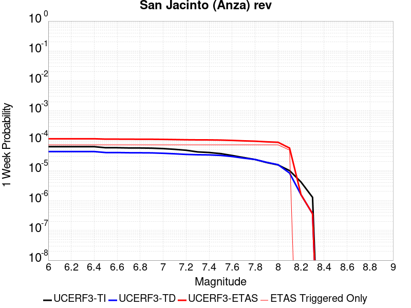 | 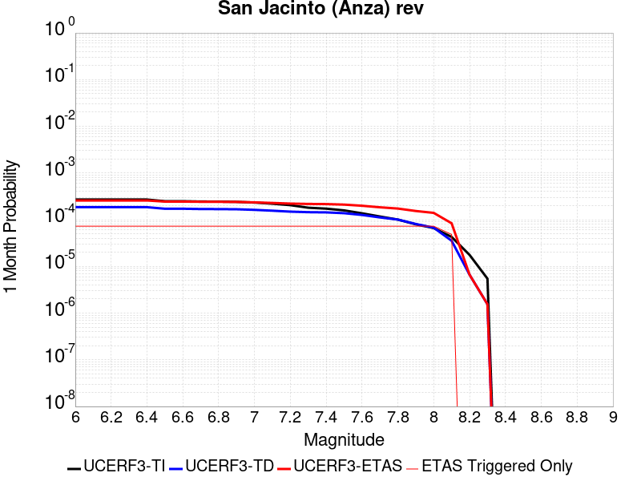 |  | 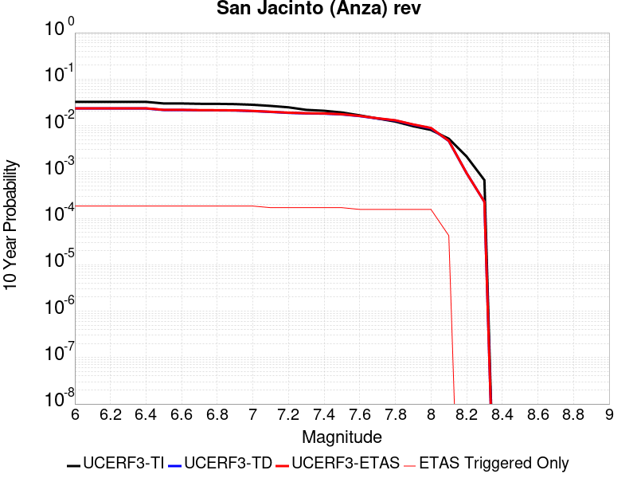 |

| Magnitude | 1 wk TI Prob | 1 wk TD Prob | 1 wk ETAS Prob | 1 wk ETAS/TD Gain | 1 wk ETAS Triggered Only | 1 mo TI Prob | 1 mo TD Prob | 1 mo ETAS Prob | 1 mo ETAS/TD Gain | 1 mo ETAS Triggered Only | 1 yr TI Prob | 1 yr TD Prob | 1 yr ETAS Prob | 1 yr ETAS/TD Gain | 1 yr ETAS Triggered Only | 10 yr TI Prob | 10 yr TD Prob | 10 yr ETAS Prob | 10 yr ETAS/TD Gain | 10 yr ETAS Triggered Only |
|-----|-----|-----|-----|-----|-----|-----|-----|-----|-----|-----|-----|-----|-----|-----|-----|-----|-----|-----|-----|-----|
| 6.0 | 6.3015636E-5 | 4.3298347E-5 | 1.470929E-4 | 3.3971941 | 1.03799044E-4 | 2.7003905E-4 | 1.8555121E-4 | 2.89331E-4 | 1.5593053 | 1.03799044E-4 | 0.0032827691 | 0.0022567573 | 0.0023948438 | 1.061188 | 1.3839873E-4 | 0.032346968 | 0.02329361 | 0.023496373 | 1.0087047 | 2.0759809E-4 |
| 6.1 | 6.3015636E-5 | 4.3298347E-5 | 1.470929E-4 | 3.3971941 | 1.03799044E-4 | 2.7003905E-4 | 1.8555121E-4 | 2.89331E-4 | 1.5593053 | 1.03799044E-4 | 0.0032827691 | 0.0022567573 | 0.0023948438 | 1.061188 | 1.3839873E-4 | 0.032346968 | 0.02329361 | 0.023496373 | 1.0087047 | 2.0759809E-4 |
| 6.2 | 6.3015636E-5 | 4.3298347E-5 | 1.470929E-4 | 3.3971941 | 1.03799044E-4 | 2.7003905E-4 | 1.8555121E-4 | 2.89331E-4 | 1.5593053 | 1.03799044E-4 | 0.0032827691 | 0.0022567573 | 0.0023948438 | 1.061188 | 1.3839873E-4 | 0.032346968 | 0.02329361 | 0.023496373 | 1.0087047 | 2.0759809E-4 |
| 6.3 | 6.3015636E-5 | 4.3298347E-5 | 1.470929E-4 | 3.3971941 | 1.03799044E-4 | 2.7003905E-4 | 1.8555121E-4 | 2.89331E-4 | 1.5593053 | 1.03799044E-4 | 0.0032827691 | 0.0022567573 | 0.0023948438 | 1.061188 | 1.3839873E-4 | 0.032346968 | 0.02329361 | 0.023496373 | 1.0087047 | 2.0759809E-4 |
| 6.4 | 6.3015636E-5 | 4.3298347E-5 | 1.470929E-4 | 3.3971941 | 1.03799044E-4 | 2.7003905E-4 | 1.8555121E-4 | 2.89331E-4 | 1.5593053 | 1.03799044E-4 | 0.0032827691 | 0.0022567573 | 0.0023948438 | 1.061188 | 1.3839873E-4 | 0.032346968 | 0.02329361 | 0.023496373 | 1.0087047 | 2.0759809E-4 |
| 6.5 | 5.811017E-5 | 4.0080286E-5 | 1.4387516E-4 | 3.5896742 | 1.03799044E-4 | 2.4901982E-4 | 1.7176138E-4 | 2.7554258E-4 | 1.6042174 | 1.03799044E-4 | 0.0030276014 | 0.0020891947 | 0.0022273043 | 1.0661066 | 1.3839873E-4 | 0.02986684 | 0.021590833 | 0.021793948 | 1.0094075 | 2.0759809E-4 |
| 6.6 | 5.811017E-5 | 4.0080286E-5 | 1.4387516E-4 | 3.5896742 | 1.03799044E-4 | 2.4901982E-4 | 1.7176138E-4 | 2.7554258E-4 | 1.6042174 | 1.03799044E-4 | 0.0030276014 | 0.0020891947 | 0.0022273043 | 1.0661066 | 1.3839873E-4 | 0.02986684 | 0.021590833 | 0.021793948 | 1.0094075 | 2.0759809E-4 |
| 6.7 | 5.712442E-5 | 3.950301E-5 | 1.4329796E-4 | 3.6275198 | 1.03799044E-4 | 2.4479596E-4 | 1.6928767E-4 | 2.7306913E-4 | 1.6130481 | 1.03799044E-4 | 0.0029763177 | 0.0020591344 | 0.0021972482 | 1.0670737 | 1.3839873E-4 | 0.029367693 | 0.021282919 | 0.021486098 | 1.0095466 | 2.0759809E-4 |
| 6.8 | 5.6967532E-5 | 3.93593E-5 | 1.4315426E-4 | 3.637114 | 1.03799044E-4 | 2.4412372E-4 | 1.6867183E-4 | 2.7245338E-4 | 1.6152867 | 1.03799044E-4 | 0.0029681553 | 0.0020516508 | 0.0021897657 | 1.0673188 | 1.3839873E-4 | 0.029288229 | 0.02120852 | 0.021411715 | 1.0095809 | 2.0759809E-4 |
| 6.9 | 5.6211324E-5 | 3.9064216E-5 | 1.4285921E-4 | 3.657035 | 1.03799044E-4 | 2.4088343E-4 | 1.6740736E-4 | 2.7118903E-4 | 1.6199349 | 1.03799044E-4 | 0.0029288116 | 0.0020362847 | 0.0021744017 | 1.0678279 | 1.3839873E-4 | 0.028905109 | 0.021047527 | 0.021250756 | 1.0096557 | 2.0759809E-4 |
| 7.0 | 5.4383527E-5 | 3.7925012E-5 | 1.4172011E-4 | 3.7368512 | 1.03799044E-4 | 2.3305144E-4 | 1.6252567E-4 | 2.6630785E-4 | 1.6385587 | 1.03799044E-4 | 0.0028337094 | 0.001976959 | 0.002115084 | 1.0698675 | 1.3839873E-4 | 0.027978465 | 0.02044095 | 0.020644303 | 1.0099484 | 2.0759809E-4 |
| 7.1 | 5.1393665E-5 | 3.638787E-5 | 1.4018314E-4 | 3.852469 | 1.03799044E-4 | 2.2023996E-4 | 1.5593872E-4 | 2.5972156E-4 | 1.6655362 | 1.03799044E-4 | 0.0026781242 | 0.0018969048 | 0.002035041 | 1.0728219 | 1.3839873E-4 | 0.026460782 | 0.019616077 | 0.019819602 | 1.0103755 | 2.0759809E-4 |
| 7.2 | 4.785222E-5 | 3.4738845E-5 | 1.3853428E-4 | 3.9878783 | 1.03799044E-4 | 2.0506482E-4 | 1.4887229E-4 | 2.5265588E-4 | 1.6971318 | 1.03799044E-4 | 0.0024938055 | 0.0018110167 | 0.0019491648 | 1.076282 | 1.3839873E-4 | 0.024660049 | 0.018728783 | 0.018932493 | 1.0108769 | 2.0759809E-4 |
| 7.3 | 4.2143256E-5 | 3.3834414E-5 | 1.3762995E-4 | 4.0677505 | 1.03799044E-4 | 1.8060145E-4 | 1.449966E-4 | 2.487806E-4 | 1.7157686 | 1.03799044E-4 | 0.002196605 | 0.0017639075 | 0.0019020621 | 1.078323 | 1.3839873E-4 | 0.02175019 | 0.018236695 | 0.018440507 | 1.011176 | 2.0759809E-4 |
| 7.4 | 4.0264713E-5 | 3.3472694E-5 | 1.3726826E-4 | 4.100903 | 1.03799044E-4 | 1.7255165E-4 | 1.4344654E-4 | 2.472307E-4 | 1.7235041 | 1.03799044E-4 | 0.002098792 | 0.0017450659 | 0.0018832232 | 1.0791702 | 1.3839873E-4 | 0.020790804 | 0.018041389 | 0.018245243 | 1.0112991 | 2.0759809E-4 |
| 7.5 | 3.694492E-5 | 3.2186905E-5 | 1.3598261E-4 | 4.2247806 | 1.03799044E-4 | 1.5832575E-4 | 1.379366E-4 | 2.4172133E-4 | 1.7524089 | 1.03799044E-4 | 0.0019259118 | 0.0016780876 | 0.0018162541 | 1.0823357 | 1.3839873E-4 | 0.01909306 | 0.017357888 | 0.017561883 | 1.0117522 | 2.0759809E-4 |
| 7.6 | 3.200565E-5 | 2.9502702E-5 | 1.3329869E-4 | 4.5181856 | 1.03799044E-4 | 1.3715986E-4 | 1.2643404E-4 | 2.3021996E-4 | 1.82087 | 1.03799044E-4 | 0.001668642 | 0.0015382497 | 0.0016764356 | 1.0898331 | 1.3839873E-4 | 0.01656168 | 0.015946016 | 0.016150305 | 1.0128112 | 2.0759809E-4 |
| 7.7 | 2.731642E-5 | 2.6091477E-5 | 1.2988782E-4 | 4.9781704 | 1.03799044E-4 | 1.1706512E-4 | 1.11815825E-4 | 2.1560326E-4 | 1.9281999 | 1.03799044E-4 | 0.001424336 | 0.0013605085 | 0.001498719 | 1.1015873 | 1.3839873E-4 | 0.014152412 | 0.0141668 | 0.014371457 | 1.0144463 | 2.0759809E-4 |
| 7.8 | 2.3466424E-5 | 2.3503619E-5 | 1.2730023E-4 | 5.416197 | 1.03799044E-4 | 1.0056651E-4 | 1.0072591E-4 | 2.0451451E-4 | 2.030406 | 1.03799044E-4 | 0.0012237094 | 0.0012256489 | 0.001363878 | 1.1127803 | 1.3839873E-4 | 0.012169928 | 0.012808796 | 0.013013735 | 1.0159999 | 2.0759809E-4 |
| 7.9 | 1.8611925E-5 | 1.890698E-5 | 1.2270406E-4 | 6.4898815 | 1.03799044E-4 | 7.9762955E-5 | 8.10274E-5 | 1.8481804E-4 | 2.2809324 | 1.03799044E-4 | 9.7068126E-4 | 9.860628E-4 | 0.0011243251 | 1.1402165 | 1.3839873E-4 | 0.0096645225 | 0.010393705 | 0.010599146 | 1.0197659 | 2.0759809E-4 |
| 8.0 | 1.5460775E-5 | 1.5739915E-5 | 1.19537326E-4 | 7.5945344 | 1.03799044E-4 | 6.6258784E-5 | 6.745504E-5 | 1.7124708E-4 | 2.5386848 | 1.03799044E-4 | 8.0640207E-4 | 8.2095637E-4 | 9.592415E-4 | 1.1684439 | 1.3839873E-4 | 0.008034821 | 0.008702706 | 0.008908497 | 1.0236468 | 2.0759809E-4 |
| 8.1 | 9.983884E-6 | 8.268954E-6 | 7.746775E-5 | 9.3685055 | 6.919936E-5 | 4.2787375E-5 | 3.5437897E-5 | 1.0463481E-4 | 2.9526246 | 6.919936E-5 | 5.2081177E-4 | 4.313715E-4 | 5.351258E-4 | 1.2405219 | 1.03799044E-4 | 0.0051959283 | 0.00463968 | 0.0047429977 | 1.0222682 | 1.03799044E-4 |
| 8.2 | 4.1226E-6 | 1.5522551E-6 | 1.5522551E-6 | 1.0 | 0.0 | 1.7668166E-5 | 6.6525045E-6 | 6.6525045E-6 | 1.0 | 0.0 | 2.1508869E-4 | 8.099126E-5 | 8.099126E-5 | 1.0 | 0.0 | 0.0021488064 | 9.401847E-4 | 9.401847E-4 | 1.0 | 0.0 |
| 8.3 | 1.2750878E-6 | 3.609817E-7 | 3.609817E-7 | 1.0 | 0.0 | 5.4646503E-6 | 1.5470634E-6 | 1.5470634E-6 | 1.0 | 0.0 | 6.653009E-5 | 1.8835339E-5 | 1.8835339E-5 | 1.0 | 0.0 | 6.6510175E-4 | 2.272251E-4 | 2.272251E-4 | 1.0 | 0.0 |

## Santa Ynez (West)
*[(top)](#table-of-contents)*

| 1 Week | 1 Month | 1 Year | 10 Year |
|-----|-----|-----|-----|
| 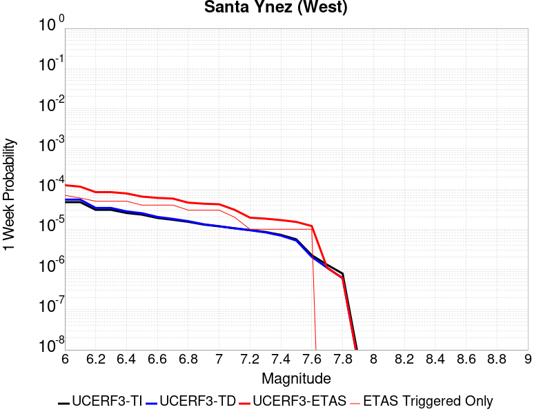 | 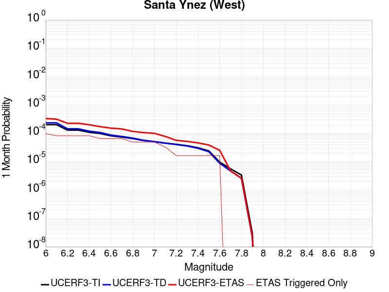 | 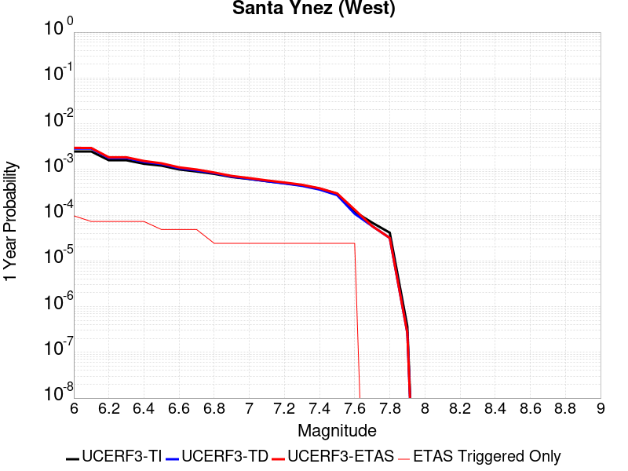 | 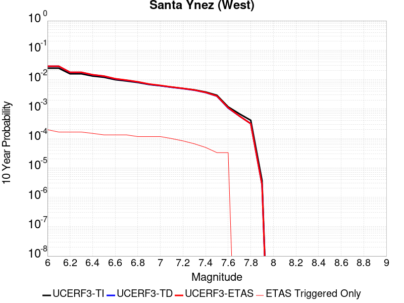 |

| Magnitude | 1 wk TI Prob | 1 wk TD Prob | 1 wk ETAS Prob | 1 wk ETAS/TD Gain | 1 wk ETAS Triggered Only | 1 mo TI Prob | 1 mo TD Prob | 1 mo ETAS Prob | 1 mo ETAS/TD Gain | 1 mo ETAS Triggered Only | 1 yr TI Prob | 1 yr TD Prob | 1 yr ETAS Prob | 1 yr ETAS/TD Gain | 1 yr ETAS Triggered Only | 10 yr TI Prob | 10 yr TD Prob | 10 yr ETAS Prob | 10 yr ETAS/TD Gain | 10 yr ETAS Triggered Only |
|-----|-----|-----|-----|-----|-----|-----|-----|-----|-----|-----|-----|-----|-----|-----|-----|-----|-----|-----|-----|-----|
| 6.0 | 4.7352758E-5 | 5.497084E-5 | 1.5876417E-4 | 2.8881526 | 1.03799044E-4 | 2.0292461E-4 | 2.3556968E-4 | 3.3934426E-4 | 1.4405261 | 1.03799044E-4 | 0.0024678076 | 0.002864558 | 0.0029680596 | 1.0361319 | 1.03799044E-4 | 0.024405818 | 0.028304456 | 0.028438937 | 1.0047512 | 1.3839873E-4 |
| 6.1 | 4.7352758E-5 | 5.497084E-5 | 1.241664E-4 | 2.2587686 | 6.919936E-5 | 2.0292461E-4 | 2.3556968E-4 | 3.0475273E-4 | 1.2936841 | 6.919936E-5 | 0.0024678076 | 0.002864558 | 0.002933559 | 1.0240879 | 6.919936E-5 | 0.024405818 | 0.028304456 | 0.028405316 | 1.0035634 | 1.03799044E-4 |
| 6.2 | 3.0415853E-5 | 3.3925004E-5 | 1.03122016E-4 | 3.0397055 | 6.919936E-5 | 1.3034715E-4 | 1.4538495E-4 | 2.1457426E-4 | 1.4759041 | 6.919936E-5 | 0.0015858212 | 0.0017686592 | 0.0018377361 | 1.0390562 | 6.919936E-5 | 0.015745522 | 0.01754978 | 0.017651757 | 1.0058107 | 1.03799044E-4 |
| 6.3 | 3.0415853E-5 | 3.3925004E-5 | 1.03122016E-4 | 3.0397055 | 6.919936E-5 | 1.3034715E-4 | 1.4538495E-4 | 2.1457426E-4 | 1.4759041 | 6.919936E-5 | 0.0015858212 | 0.0017686592 | 0.0018377361 | 1.0390562 | 6.919936E-5 | 0.015745522 | 0.01754978 | 0.017651757 | 1.0058107 | 1.03799044E-4 |
| 6.4 | 2.5452082E-5 | 2.7912318E-5 | 9.710975E-5 | 3.4791 | 6.919936E-5 | 1.09075794E-4 | 1.1961885E-4 | 1.8880994E-4 | 1.5784296 | 6.919936E-5 | 0.0013271887 | 0.0014554056 | 0.0015245043 | 1.0474772 | 6.919936E-5 | 0.013192902 | 0.01446091 | 0.014563208 | 1.0070741 | 1.03799044E-4 |
| 6.5 | 2.3143784E-5 | 2.5128133E-5 | 9.4325755E-5 | 3.753791 | 6.919936E-5 | 9.9183875E-5 | 1.07687636E-4 | 1.7687955E-4 | 1.6425242 | 6.919936E-5 | 0.0012068948 | 0.001310323 | 0.0013794317 | 1.0527418 | 6.919936E-5 | 0.012003611 | 0.013027638 | 0.013130085 | 1.0078638 | 1.03799044E-4 |
| 6.6 | 1.9118515E-5 | 2.0354244E-5 | 8.95522E-5 | 4.3996816 | 6.919936E-5 | 8.193392E-5 | 8.722961E-5 | 1.5642293E-4 | 1.7932321 | 6.919936E-5 | 9.97089E-4 | 0.001061511 | 0.0011306369 | 1.0651203 | 6.919936E-5 | 0.00992627 | 0.010565317 | 0.010668019 | 1.0097207 | 1.03799044E-4 |
| 6.7 | 1.722807E-5 | 1.8146253E-5 | 8.7344364E-5 | 4.813355 | 6.919936E-5 | 7.3832496E-5 | 7.776737E-5 | 1.4696135E-4 | 1.889756 | 6.919936E-5 | 8.985399E-4 | 9.4641204E-4 | 0.0010155459 | 1.0730484 | 6.919936E-5 | 0.008949154 | 0.009424461 | 0.009527282 | 1.01091 | 1.03799044E-4 |
| 6.8 | 1.5317364E-5 | 1.5926391E-5 | 5.0525523E-5 | 3.17244 | 3.459968E-5 | 6.56442E-5 | 6.82542E-5 | 1.0285152E-4 | 1.5068892 | 3.459968E-5 | 7.98925E-4 | 8.3068234E-4 | 8.652533E-4 | 1.0416175 | 3.459968E-5 | 0.007960589 | 0.008276261 | 0.008344888 | 1.008292 | 6.919936E-5 |
| 6.9 | 1.3071226E-5 | 1.332953E-5 | 4.7928752E-5 | 3.595682 | 3.459968E-5 | 5.6018336E-5 | 5.712532E-5 | 9.172302E-5 | 1.6056458 | 3.459968E-5 | 6.8180985E-4 | 6.952811E-4 | 7.298567E-4 | 1.049729 | 3.459968E-5 | 0.0067972173 | 0.0069313184 | 0.007000038 | 1.0099144 | 6.919936E-5 |
| 7.0 | 1.1836986E-5 | 1.1932688E-5 | 4.6531957E-5 | 3.8995368 | 3.459968E-5 | 5.0728955E-5 | 5.1139097E-5 | 8.573701E-5 | 1.6765453 | 3.459968E-5 | 6.1745E-4 | 6.2244234E-4 | 6.570205E-4 | 1.0555524 | 3.459968E-5 | 0.006157372 | 0.0062071825 | 0.0062759523 | 1.0110791 | 6.919936E-5 |
| 7.1 | 1.0597169E-5 | 1.0542107E-5 | 4.5141423E-5 | 4.2820115 | 3.459968E-5 | 4.541565E-5 | 4.5179684E-5 | 7.9777805E-5 | 1.7657893 | 3.459968E-5 | 5.5279525E-4 | 5.4992497E-4 | 5.845056E-4 | 1.0628825 | 3.459968E-5 | 0.0055142213 | 0.005485772 | 0.005554592 | 1.0125451 | 6.919936E-5 |
| 7.2 | 9.59113E-6 | 9.45905E-6 | 4.4058404E-5 | 4.6578045 | 3.459968E-5 | 4.11042E-5 | 4.053816E-5 | 7.513644E-5 | 1.8534743 | 3.459968E-5 | 5.0032866E-4 | 4.934414E-4 | 5.2802404E-4 | 1.0700846 | 3.459968E-5 | 0.004992037 | 0.0049235765 | 0.004992435 | 1.0139855 | 6.919936E-5 |
| 7.3 | 8.586084E-6 | 8.379489E-6 | 4.297888E-5 | 5.1290574 | 3.459968E-5 | 3.679698E-5 | 3.591161E-5 | 7.051005E-5 | 1.9634333 | 3.459968E-5 | 4.4791115E-4 | 4.3713715E-4 | 4.7172172E-4 | 1.079116 | 3.459968E-5 | 0.004470094 | 0.004362884 | 0.0044317814 | 1.0157918 | 6.919936E-5 |
| 7.4 | 7.2622997E-6 | 6.9514485E-6 | 4.155089E-5 | 5.977299 | 3.459968E-5 | 3.112377E-5 | 2.9791589E-5 | 6.439024E-5 | 2.1613564 | 3.459968E-5 | 3.78866E-4 | 3.6265317E-4 | 3.972403E-4 | 1.0953724 | 3.459968E-5 | 0.0037822074 | 0.003620714 | 0.0036896628 | 1.0190428 | 6.919936E-5 |
| 7.5 | 5.627296E-6 | 5.2514984E-6 | 3.9851E-5 | 7.5885005 | 3.459968E-5 | 2.411676E-5 | 2.2506232E-5 | 5.7105135E-5 | 2.5373032 | 3.459968E-5 | 2.9358198E-4 | 2.7397962E-4 | 3.0856984E-4 | 1.126251 | 3.459968E-5 | 0.0029319443 | 0.0027364905 | 0.0027709955 | 1.0126092 | 3.459968E-5 |
| 7.6 | 2.265244E-6 | 2.0608632E-6 | 3.6660473E-5 | 17.788893 | 3.459968E-5 | 9.708152E-6 | 8.832241E-6 | 4.3431617E-5 | 4.917395 | 3.459968E-5 | 1.18190335E-4 | 1.0752732E-4 | 1.4212327E-4 | 1.3217411 | 3.459968E-5 | 0.001181275 | 0.0010747615 | 0.001109324 | 1.0321583 | 3.459968E-5 |
| 7.7 | 1.3099874E-6 | 1.1016228E-6 | 1.1016228E-6 | 1.0 | 0.0 | 5.61422E-6 | 4.7212325E-6 | 4.7212325E-6 | 1.0 | 0.0 | 6.8350986E-5 | 5.7479516E-5 | 5.7479516E-5 | 1.0 | 0.0 | 6.832996E-4 | 5.7464885E-4 | 5.7464885E-4 | 1.0 | 0.0 |
| 7.8 | 7.903951E-7 | 6.0710704E-7 | 6.0710704E-7 | 1.0 | 0.0 | 3.3874032E-6 | 2.601885E-6 | 2.601885E-6 | 1.0 | 0.0 | 4.1240855E-5 | 3.16775E-5 | 3.16775E-5 | 1.0 | 0.0 | 4.12332E-4 | 3.167312E-4 | 3.167312E-4 | 1.0 | 0.0 |
| 7.9 | 7.0753297E-9 | 5.090092E-9 | 5.090092E-9 | 1.0 | 0.0 | 3.032284E-8 | 2.181468E-8 | 2.181468E-8 | 1.0 | 0.0 | 3.6918053E-7 | 2.655937E-7 | 2.655937E-7 | 1.0 | 0.0 | 3.691799E-6 | 2.6559348E-6 | 2.6559348E-6 | 1.0 | 0.0 |

## Oak Ridge (Onshore)
*[(top)](#table-of-contents)*

| 1 Week | 1 Month | 1 Year | 10 Year |
|-----|-----|-----|-----|
| 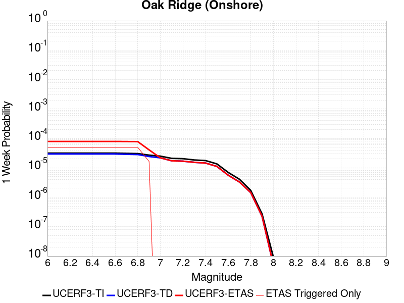 |  | 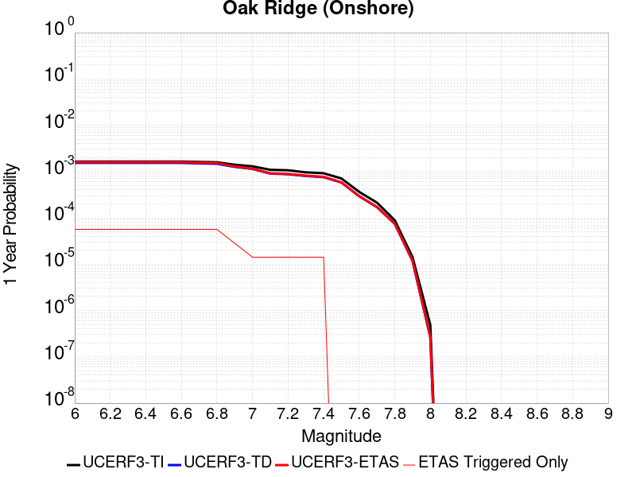 | 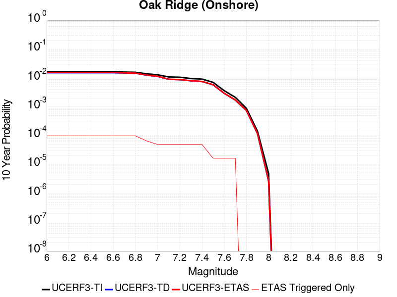 |

| Magnitude | 1 wk TI Prob | 1 wk TD Prob | 1 wk ETAS Prob | 1 wk ETAS/TD Gain | 1 wk ETAS Triggered Only | 1 mo TI Prob | 1 mo TD Prob | 1 mo ETAS Prob | 1 mo ETAS/TD Gain | 1 mo ETAS Triggered Only | 1 yr TI Prob | 1 yr TD Prob | 1 yr ETAS Prob | 1 yr ETAS/TD Gain | 1 yr ETAS Triggered Only | 10 yr TI Prob | 10 yr TD Prob | 10 yr ETAS Prob | 10 yr ETAS/TD Gain | 10 yr ETAS Triggered Only |
|-----|-----|-----|-----|-----|-----|-----|-----|-----|-----|-----|-----|-----|-----|-----|-----|-----|-----|-----|-----|-----|
| 6.0 | 3.155064E-5 | 2.9526076E-5 | 9.8723394E-5 | 3.3436003 | 6.919936E-5 | 1.3521002E-4 | 1.265344E-4 | 1.9572502E-4 | 1.5468125 | 6.919936E-5 | 0.001644939 | 0.0015395058 | 0.0016431451 | 1.0673199 | 1.03799044E-4 | 0.01632816 | 0.015293054 | 0.015429337 | 1.0089114 | 1.3839873E-4 |
| 6.1 | 3.155064E-5 | 2.9526076E-5 | 9.8723394E-5 | 3.3436003 | 6.919936E-5 | 1.3521002E-4 | 1.265344E-4 | 1.9572502E-4 | 1.5468125 | 6.919936E-5 | 0.001644939 | 0.0015395058 | 0.0016431451 | 1.0673199 | 1.03799044E-4 | 0.01632816 | 0.015293054 | 0.015429337 | 1.0089114 | 1.3839873E-4 |
| 6.2 | 3.155064E-5 | 2.9526076E-5 | 9.8723394E-5 | 3.3436003 | 6.919936E-5 | 1.3521002E-4 | 1.265344E-4 | 1.9572502E-4 | 1.5468125 | 6.919936E-5 | 0.001644939 | 0.0015395058 | 0.0016431451 | 1.0673199 | 1.03799044E-4 | 0.01632816 | 0.015293054 | 0.015429337 | 1.0089114 | 1.3839873E-4 |
| 6.3 | 3.155064E-5 | 2.9526076E-5 | 9.8723394E-5 | 3.3436003 | 6.919936E-5 | 1.3521002E-4 | 1.265344E-4 | 1.9572502E-4 | 1.5468125 | 6.919936E-5 | 0.001644939 | 0.0015395058 | 0.0016431451 | 1.0673199 | 1.03799044E-4 | 0.01632816 | 0.015293054 | 0.015429337 | 1.0089114 | 1.3839873E-4 |
| 6.4 | 3.155064E-5 | 2.9526076E-5 | 9.8723394E-5 | 3.3436003 | 6.919936E-5 | 1.3521002E-4 | 1.265344E-4 | 1.9572502E-4 | 1.5468125 | 6.919936E-5 | 0.001644939 | 0.0015395058 | 0.0016431451 | 1.0673199 | 1.03799044E-4 | 0.01632816 | 0.015293054 | 0.015429337 | 1.0089114 | 1.3839873E-4 |
| 6.5 | 3.155064E-5 | 2.9526076E-5 | 9.8723394E-5 | 3.3436003 | 6.919936E-5 | 1.3521002E-4 | 1.265344E-4 | 1.9572502E-4 | 1.5468125 | 6.919936E-5 | 0.001644939 | 0.0015395058 | 0.0016431451 | 1.0673199 | 1.03799044E-4 | 0.01632816 | 0.015293054 | 0.015429337 | 1.0089114 | 1.3839873E-4 |
| 6.6 | 3.155064E-5 | 2.9526076E-5 | 9.8723394E-5 | 3.3436003 | 6.919936E-5 | 1.3521002E-4 | 1.265344E-4 | 1.9572502E-4 | 1.5468125 | 6.919936E-5 | 0.001644939 | 0.0015395058 | 0.0016431451 | 1.0673199 | 1.03799044E-4 | 0.01632816 | 0.015293054 | 0.015429337 | 1.0089114 | 1.3839873E-4 |
| 6.7 | 3.098897E-5 | 2.8864279E-5 | 9.8061646E-5 | 3.3973358 | 6.919936E-5 | 1.328031E-4 | 1.236984E-4 | 1.928892E-4 | 1.5593508 | 6.919936E-5 | 0.0016156785 | 0.0015050253 | 0.0016086681 | 1.0688645 | 1.03799044E-4 | 0.016039822 | 0.014952909 | 0.015089239 | 1.0091172 | 1.3839873E-4 |
| 6.8 | 3.0449872E-5 | 2.8239476E-5 | 9.743689E-5 | 3.4503787 | 6.919936E-5 | 1.3049292E-4 | 1.2102092E-4 | 1.9021191E-4 | 1.5717275 | 6.919936E-5 | 0.0015875935 | 0.001472471 | 0.0015761172 | 1.0703893 | 1.03799044E-4 | 0.015762992 | 0.014631658 | 0.014768031 | 1.0093205 | 1.3839873E-4 |
| 6.9 | 2.697928E-5 | 2.4219877E-5 | 2.4219877E-5 | 1.0 | 0.0 | 1.15620365E-4 | 1.03795464E-4 | 1.03795464E-4 | 1.0 | 0.0 | 0.0014067689 | 0.0012629988 | 0.0012975547 | 1.0273603 | 3.459968E-5 | 0.0139789665 | 0.012561066 | 0.012629396 | 1.0054399 | 6.919936E-5 |
| 7.0 | 2.4893961E-5 | 2.1862146E-5 | 2.1862146E-5 | 1.0 | 0.0 | 1.0668404E-4 | 9.369165E-5 | 9.369165E-5 | 1.0 | 0.0 | 0.0012981043 | 0.0011401166 | 0.0011746768 | 1.0303129 | 3.459968E-5 | 0.012905477 | 0.011345102 | 0.0114135165 | 1.0060303 | 6.919936E-5 |
| 7.1 | 2.0945363E-5 | 1.7354592E-5 | 1.7354592E-5 | 1.0 | 0.0 | 8.976275E-5 | 7.437473E-5 | 7.437473E-5 | 1.0 | 0.0 | 0.0010923136 | 9.0514094E-4 | 9.397093E-4 | 1.0381912 | 3.459968E-5 | 0.0108696 | 0.009015621 | 0.009084196 | 1.0076063 | 6.919936E-5 |
| 7.2 | 2.0439404E-5 | 1.680953E-5 | 1.680953E-5 | 1.0 | 0.0 | 8.7594504E-5 | 7.203888E-5 | 7.203888E-5 | 1.0 | 0.0 | 0.0010659413 | 8.767251E-4 | 9.112944E-4 | 1.0394301 | 3.459968E-5 | 0.010608427 | 0.008733723 | 0.008802318 | 1.007854 | 6.919936E-5 |
| 7.3 | 1.8463334E-5 | 1.5381947E-5 | 1.5381947E-5 | 1.0 | 0.0 | 7.912617E-5 | 6.592098E-5 | 6.592098E-5 | 1.0 | 0.0 | 9.6293533E-4 | 8.0229685E-4 | 8.3686877E-4 | 1.0430912 | 3.459968E-5 | 0.009587734 | 0.0079950085 | 0.008063654 | 1.0085862 | 6.919936E-5 |
| 7.4 | 1.763139E-5 | 1.4516977E-5 | 1.4516977E-5 | 1.0 | 0.0 | 7.556091E-5 | 6.221415E-5 | 6.221415E-5 | 1.0 | 0.0 | 9.1956573E-4 | 7.57198E-4 | 7.917715E-4 | 1.0456598 | 3.459968E-5 | 0.009157699 | 0.007547126 | 0.0076158033 | 1.0090997 | 6.919936E-5 |
| 7.5 | 1.3594944E-5 | 1.1163363E-5 | 1.1163363E-5 | 1.0 | 0.0 | 5.8262744E-5 | 4.7842117E-5 | 4.7842117E-5 | 1.0 | 0.0 | 7.0911803E-4 | 5.8232463E-4 | 5.8232463E-4 | 1.0 | 0.0 | 0.007068595 | 0.005808362 | 0.00584276 | 1.0059223 | 3.459968E-5 |
| 7.6 | 6.9889534E-6 | 5.6367194E-6 | 5.6367194E-6 | 1.0 | 0.0 | 2.9952313E-5 | 2.4157147E-5 | 2.4157147E-5 | 1.0 | 0.0 | 3.646084E-4 | 2.94074E-4 | 2.94074E-4 | 1.0 | 0.0 | 0.0036401073 | 0.0029368924 | 0.0029713905 | 1.0117464 | 3.459968E-5 |
| 7.7 | 4.0824193E-6 | 3.2832731E-6 | 3.2832731E-6 | 1.0 | 0.0 | 1.7495966E-5 | 1.4071096E-5 | 1.4071096E-5 | 1.0 | 0.0 | 2.1299256E-4 | 1.7130225E-4 | 1.7130225E-4 | 1.0 | 0.0 | 0.0021278851 | 0.0017117155 | 0.001746256 | 1.0201788 | 3.459968E-5 |
| 7.8 | 1.7023609E-6 | 1.43706E-6 | 1.43706E-6 | 1.0 | 0.0 | 7.295812E-6 | 6.158814E-6 | 6.158814E-6 | 1.0 | 0.0 | 8.882289E-5 | 7.4981006E-5 | 7.4981006E-5 | 1.0 | 0.0 | 8.8787393E-4 | 7.4955984E-4 | 7.4955984E-4 | 1.0 | 0.0 |
| 7.9 | 2.721225E-7 | 2.261692E-7 | 2.261692E-7 | 1.0 | 0.0 | 1.1662388E-6 | 9.692963E-7 | 9.692963E-7 | 1.0 | 0.0 | 1.4198865E-5 | 1.1801121E-5 | 1.1801121E-5 | 1.0 | 0.0 | 1.4197957E-4 | 1.1800523E-4 | 1.1800523E-4 | 1.0 | 0.0 |
| 8.0 | 9.364255E-9 | 5.1204916E-9 | 5.1204916E-9 | 1.0 | 0.0 | 4.0132523E-8 | 2.1944963E-8 | 2.1944963E-8 | 1.0 | 0.0 | 4.8861335E-7 | 2.671799E-7 | 2.671799E-7 | 1.0 | 0.0 | 4.8861225E-6 | 2.6717962E-6 | 2.6717962E-6 | 1.0 | 0.0 |

## Independence rev 2011
*[(top)](#table-of-contents)*

| 1 Week | 1 Month | 1 Year | 10 Year |
|-----|-----|-----|-----|
| 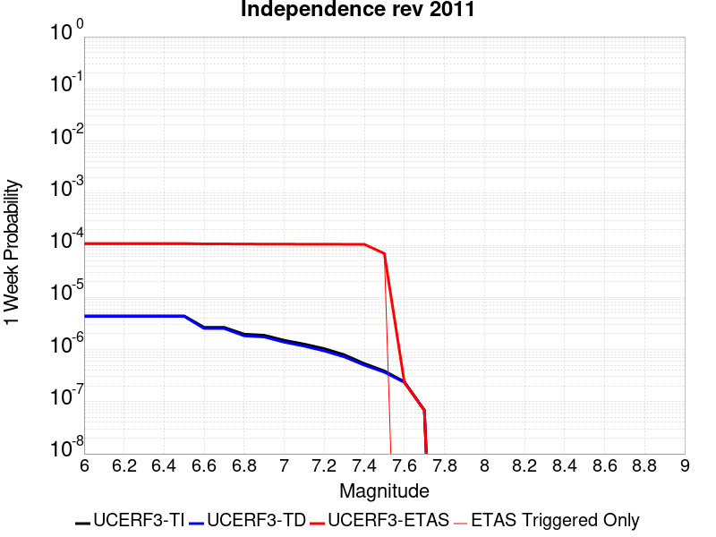 | 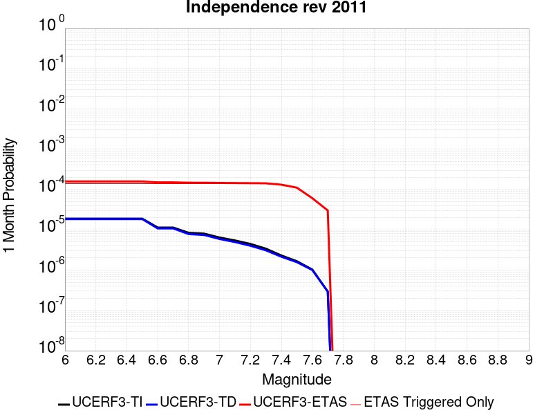 | 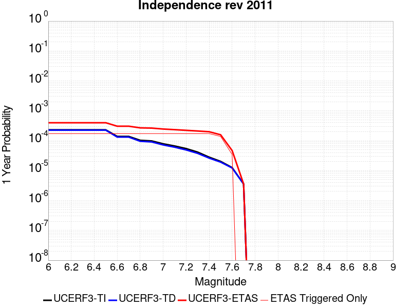 | 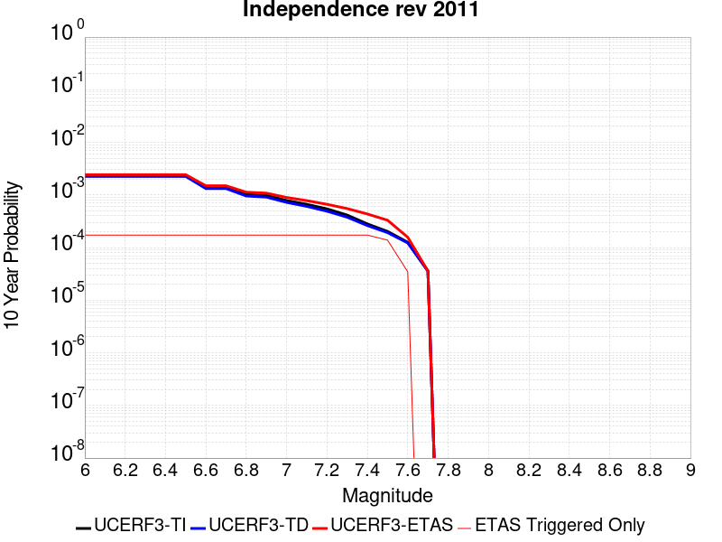 |

| Magnitude | 1 wk TI Prob | 1 wk TD Prob | 1 wk ETAS Prob | 1 wk ETAS/TD Gain | 1 wk ETAS Triggered Only | 1 mo TI Prob | 1 mo TD Prob | 1 mo ETAS Prob | 1 mo ETAS/TD Gain | 1 mo ETAS Triggered Only | 1 yr TI Prob | 1 yr TD Prob | 1 yr ETAS Prob | 1 yr ETAS/TD Gain | 1 yr ETAS Triggered Only | 10 yr TI Prob | 10 yr TD Prob | 10 yr ETAS Prob | 10 yr ETAS/TD Gain | 10 yr ETAS Triggered Only |
|-----|-----|-----|-----|-----|-----|-----|-----|-----|-----|-----|-----|-----|-----|-----|-----|-----|-----|-----|-----|-----|
| 6.0 | 4.422171E-6 | 4.3262253E-6 | 1.0812482E-4 | 24.992878 | 1.03799044E-4 | 1.8952025E-5 | 1.8540852E-5 | 1.2233797E-4 | 6.5982933 | 1.03799044E-4 | 2.3071647E-4 | 2.2571447E-4 | 3.9867382E-4 | 1.766275 | 1.729984E-4 | 0.0023047708 | 0.0022551457 | 0.002427754 | 1.0765398 | 1.729984E-4 |
| 6.1 | 4.422171E-6 | 4.3262253E-6 | 1.0812482E-4 | 24.992878 | 1.03799044E-4 | 1.8952025E-5 | 1.8540852E-5 | 1.2233797E-4 | 6.5982933 | 1.03799044E-4 | 2.3071647E-4 | 2.2571447E-4 | 3.9867382E-4 | 1.766275 | 1.729984E-4 | 0.0023047708 | 0.0022551457 | 0.002427754 | 1.0765398 | 1.729984E-4 |
| 6.2 | 4.422171E-6 | 4.3262253E-6 | 1.0812482E-4 | 24.992878 | 1.03799044E-4 | 1.8952025E-5 | 1.8540852E-5 | 1.2233797E-4 | 6.5982933 | 1.03799044E-4 | 2.3071647E-4 | 2.2571447E-4 | 3.9867382E-4 | 1.766275 | 1.729984E-4 | 0.0023047708 | 0.0022551457 | 0.002427754 | 1.0765398 | 1.729984E-4 |
| 6.3 | 4.422171E-6 | 4.3262253E-6 | 1.0812482E-4 | 24.992878 | 1.03799044E-4 | 1.8952025E-5 | 1.8540852E-5 | 1.2233797E-4 | 6.5982933 | 1.03799044E-4 | 2.3071647E-4 | 2.2571447E-4 | 3.9867382E-4 | 1.766275 | 1.729984E-4 | 0.0023047708 | 0.0022551457 | 0.002427754 | 1.0765398 | 1.729984E-4 |
| 6.4 | 4.422171E-6 | 4.3262253E-6 | 1.0812482E-4 | 24.992878 | 1.03799044E-4 | 1.8952025E-5 | 1.8540852E-5 | 1.2233797E-4 | 6.5982933 | 1.03799044E-4 | 2.3071647E-4 | 2.2571447E-4 | 3.9867382E-4 | 1.766275 | 1.729984E-4 | 0.0023047708 | 0.0022551457 | 0.002427754 | 1.0765398 | 1.729984E-4 |
| 6.5 | 4.422171E-6 | 4.3262253E-6 | 1.0812482E-4 | 24.992878 | 1.03799044E-4 | 1.8952025E-5 | 1.8540852E-5 | 1.2233797E-4 | 6.5982933 | 1.03799044E-4 | 2.3071647E-4 | 2.2571447E-4 | 3.9867382E-4 | 1.766275 | 1.729984E-4 | 0.0023047708 | 0.0022551457 | 0.002427754 | 1.0765398 | 1.729984E-4 |
| 6.6 | 2.663744E-6 | 2.5319846E-6 | 1.06330765E-4 | 41.99503 | 1.03799044E-4 | 1.1415996E-5 | 1.08513195E-5 | 1.14649236E-4 | 10.565465 | 1.03799044E-4 | 1.3898089E-4 | 1.321073E-4 | 3.0508285E-4 | 2.3093565 | 1.729984E-4 | 0.0013889399 | 0.0013203359 | 0.0014931059 | 1.130853 | 1.729984E-4 |
| 6.7 | 2.663744E-6 | 2.5319846E-6 | 1.06330765E-4 | 41.99503 | 1.03799044E-4 | 1.1415996E-5 | 1.08513195E-5 | 1.14649236E-4 | 10.565465 | 1.03799044E-4 | 1.3898089E-4 | 1.321073E-4 | 3.0508285E-4 | 2.3093565 | 1.729984E-4 | 0.0013889399 | 0.0013203359 | 0.0014931059 | 1.130853 | 1.729984E-4 |
| 6.8 | 1.9716529E-6 | 1.8322567E-6 | 1.0563111E-4 | 57.65083 | 1.03799044E-4 | 8.449913E-6 | 7.852505E-6 | 1.11650734E-4 | 14.218486 | 1.03799044E-4 | 1.0287284E-4 | 9.560019E-5 | 2.6858205E-4 | 2.8094301 | 1.729984E-4 | 0.0010282523 | 9.5560355E-4 | 0.0011284366 | 1.1808628 | 1.729984E-4 |
| 6.9 | 1.8788617E-6 | 1.7429976E-6 | 1.0554186E-4 | 60.551926 | 1.03799044E-4 | 8.0522395E-6 | 7.4699688E-6 | 1.1126824E-4 | 14.895409 | 1.03799044E-4 | 9.80316E-5 | 9.09432E-5 | 2.6392587E-4 | 2.9020958 | 1.729984E-4 | 9.798837E-4 | 9.090718E-4 | 0.001081913 | 1.1901293 | 1.729984E-4 |
| 7.0 | 1.5045488E-6 | 1.3849498E-6 | 1.0518385E-4 | 75.94778 | 1.03799044E-4 | 6.44805E-6 | 5.9354857E-6 | 1.0973391E-4 | 18.487774 | 1.03799044E-4 | 7.8502184E-5 | 7.226219E-5 | 2.452481E-4 | 3.3938646 | 1.729984E-4 | 7.8474457E-4 | 7.223921E-4 | 8.9526555E-4 | 1.2393069 | 1.729984E-4 |
| 7.1 | 1.272341E-6 | 1.1625089E-6 | 1.0496144E-4 | 90.28872 | 1.03799044E-4 | 5.4528787E-6 | 4.9821715E-6 | 1.08780696E-4 | 21.833994 | 1.03799044E-4 | 6.6386776E-5 | 6.0656283E-5 | 2.336442E-4 | 3.8519373 | 1.729984E-4 | 6.636695E-4 | 6.064005E-4 | 7.7929394E-4 | 1.2851144 | 1.729984E-4 |
| 7.2 | 1.0416892E-6 | 9.409871E-7 | 1.04739935E-4 | 111.30858 | 1.03799044E-4 | 4.464375E-6 | 4.032796E-6 | 1.0783142E-4 | 26.738626 | 1.03799044E-4 | 5.4352407E-5 | 4.9098202E-5 | 2.2208811E-4 | 4.5233455 | 1.729984E-4 | 5.4339116E-4 | 4.908754E-4 | 6.637889E-4 | 1.3522553 | 1.729984E-4 |
| 7.3 | 7.9450155E-7 | 7.2350036E-7 | 1.0452247E-4 | 144.46776 | 1.03799044E-4 | 3.4050022E-6 | 3.1007123E-6 | 1.0689944E-4 | 34.47577 | 1.03799044E-4 | 4.1455114E-5 | 3.7750528E-5 | 2.1074241E-4 | 5.5825024 | 1.729984E-4 | 4.144738E-4 | 3.7744228E-4 | 5.503754E-4 | 1.458171 | 1.729984E-4 |
| 7.4 | 5.3893444E-7 | 5.0195166E-7 | 1.0430095E-4 | 207.79082 | 1.03799044E-4 | 2.309717E-6 | 2.1512196E-6 | 1.0595004E-4 | 49.251152 | 1.03799044E-4 | 2.8120441E-5 | 2.6190788E-5 | 1.9918467E-4 | 7.605142 | 1.729984E-4 | 2.8116882E-4 | 2.6187746E-4 | 4.3483058E-4 | 1.6604352 | 1.729984E-4 |
| 7.5 | 3.8852085E-7 | 3.6825622E-7 | 6.956759E-5 | 188.91084 | 6.919936E-5 | 1.6650882E-6 | 1.57824E-6 | 7.0777496E-5 | 44.845837 | 6.919936E-5 | 2.027226E-5 | 1.9214905E-5 | 1.5761098E-4 | 8.202537 | 1.3839873E-4 | 2.0270412E-4 | 1.9213265E-4 | 3.305048E-4 | 1.7201906 | 1.3839873E-4 |
| 7.6 | 2.414929E-7 | 2.3457605E-7 | 2.3457605E-7 | 1.0 | 0.0 | 1.0349692E-6 | 1.0053255E-6 | 1.0053255E-6 | 1.0 | 0.0 | 1.2600677E-5 | 1.2239771E-5 | 4.6839028E-5 | 3.8267896 | 3.459968E-5 | 1.2599962E-4 | 1.223911E-4 | 1.5698654E-4 | 1.2826631 | 3.459968E-5 |
| 7.7 | 6.8298014E-8 | 6.8589785E-8 | 6.8589785E-8 | 1.0 | 0.0 | 2.9270575E-7 | 2.939562E-7 | 2.939562E-7 | 1.0 | 0.0 | 3.5636867E-6 | 3.5789112E-6 | 3.5789112E-6 | 1.0 | 0.0 | 3.5636294E-5 | 3.5788584E-5 | 3.5788584E-5 | 1.0 | 0.0 |

## San Jacinto (Lytle Creek connector)
*[(top)](#table-of-contents)*

| 1 Week | 1 Month | 1 Year | 10 Year |
|-----|-----|-----|-----|
| 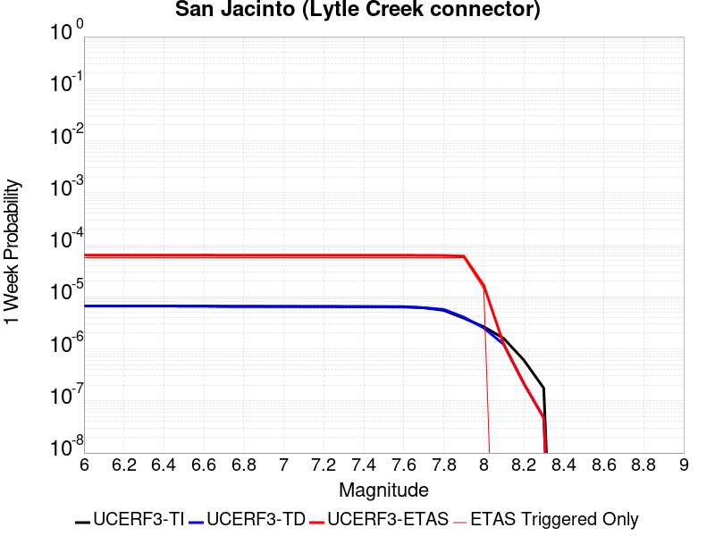 | 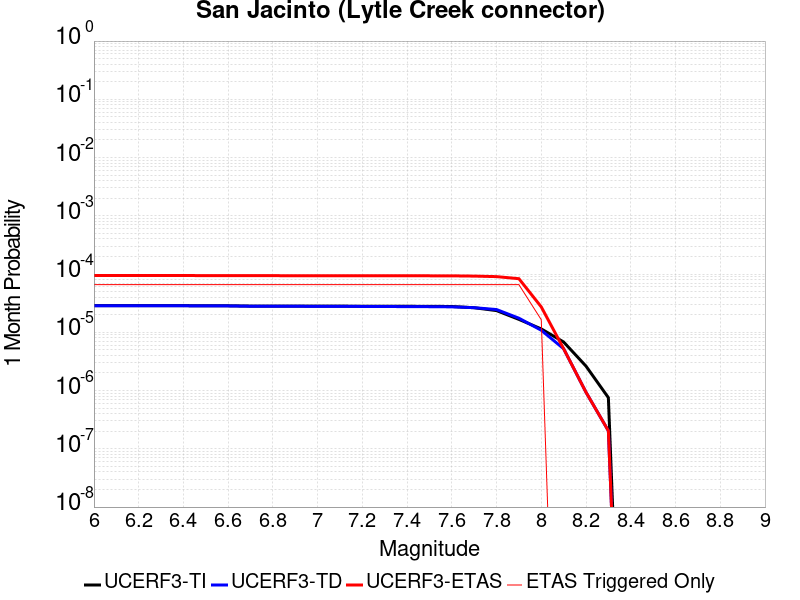 | 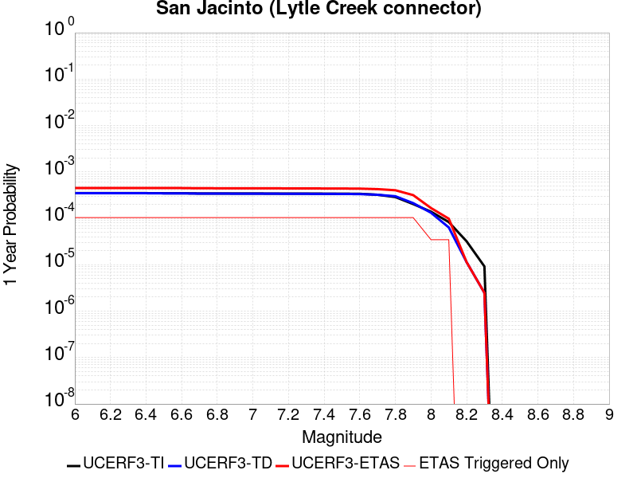 | 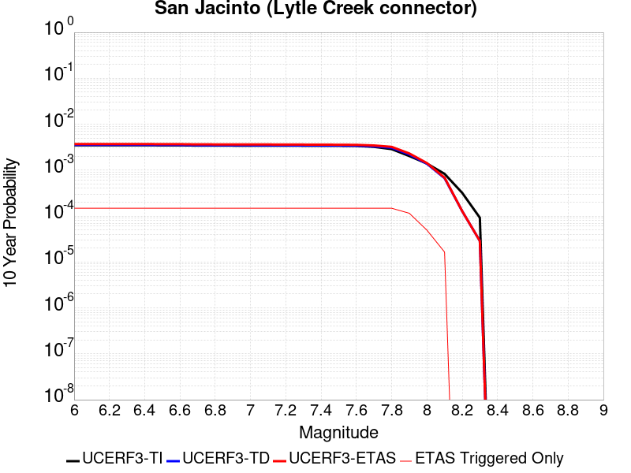 |

| Magnitude | 1 wk TI Prob | 1 wk TD Prob | 1 wk ETAS Prob | 1 wk ETAS/TD Gain | 1 wk ETAS Triggered Only | 1 mo TI Prob | 1 mo TD Prob | 1 mo ETAS Prob | 1 mo ETAS/TD Gain | 1 mo ETAS Triggered Only | 1 yr TI Prob | 1 yr TD Prob | 1 yr ETAS Prob | 1 yr ETAS/TD Gain | 1 yr ETAS Triggered Only | 10 yr TI Prob | 10 yr TD Prob | 10 yr ETAS Prob | 10 yr ETAS/TD Gain | 10 yr ETAS Triggered Only |
|-----|-----|-----|-----|-----|-----|-----|-----|-----|-----|-----|-----|-----|-----|-----|-----|-----|-----|-----|-----|-----|
| 6.0 | 6.693995E-6 | 6.660123E-6 | 7.5859025E-5 | 11.390034 | 6.919936E-5 | 2.8688235E-5 | 2.8543072E-5 | 9.774046E-5 | 3.4243147 | 6.919936E-5 | 3.492233E-4 | 3.4745657E-4 | 4.5121956E-4 | 1.2986358 | 1.03799044E-4 | 0.00348675 | 0.0035491167 | 0.0037215012 | 1.0485711 | 1.729984E-4 |
| 6.1 | 6.693995E-6 | 6.660123E-6 | 7.5859025E-5 | 11.390034 | 6.919936E-5 | 2.8688235E-5 | 2.8543072E-5 | 9.774046E-5 | 3.4243147 | 6.919936E-5 | 3.492233E-4 | 3.4745657E-4 | 4.5121956E-4 | 1.2986358 | 1.03799044E-4 | 0.00348675 | 0.0035491167 | 0.0037215012 | 1.0485711 | 1.729984E-4 |
| 6.2 | 6.693995E-6 | 6.660123E-6 | 7.5859025E-5 | 11.390034 | 6.919936E-5 | 2.8688235E-5 | 2.8543072E-5 | 9.774046E-5 | 3.4243147 | 6.919936E-5 | 3.492233E-4 | 3.4745657E-4 | 4.5121956E-4 | 1.2986358 | 1.03799044E-4 | 0.00348675 | 0.0035491167 | 0.0037215012 | 1.0485711 | 1.729984E-4 |
| 6.3 | 6.693995E-6 | 6.660123E-6 | 7.5859025E-5 | 11.390034 | 6.919936E-5 | 2.8688235E-5 | 2.8543072E-5 | 9.774046E-5 | 3.4243147 | 6.919936E-5 | 3.492233E-4 | 3.4745657E-4 | 4.5121956E-4 | 1.2986358 | 1.03799044E-4 | 0.00348675 | 0.0035491167 | 0.0037215012 | 1.0485711 | 1.729984E-4 |
| 6.4 | 6.693995E-6 | 6.660123E-6 | 7.5859025E-5 | 11.390034 | 6.919936E-5 | 2.8688235E-5 | 2.8543072E-5 | 9.774046E-5 | 3.4243147 | 6.919936E-5 | 3.492233E-4 | 3.4745657E-4 | 4.5121956E-4 | 1.2986358 | 1.03799044E-4 | 0.00348675 | 0.0035491167 | 0.0037215012 | 1.0485711 | 1.729984E-4 |
| 6.5 | 6.6561875E-6 | 6.620341E-6 | 7.581925E-5 | 11.452469 | 6.919936E-5 | 2.8526205E-5 | 2.8372582E-5 | 9.756998E-5 | 3.4388828 | 6.919936E-5 | 3.472512E-4 | 3.453815E-4 | 4.491447E-4 | 1.3004307 | 1.03799044E-4 | 0.0034670907 | 0.0035284322 | 0.0037008203 | 1.0488569 | 1.729984E-4 |
| 6.6 | 6.6561875E-6 | 6.620341E-6 | 7.581925E-5 | 11.452469 | 6.919936E-5 | 2.8526205E-5 | 2.8372582E-5 | 9.756998E-5 | 3.4388828 | 6.919936E-5 | 3.472512E-4 | 3.453815E-4 | 4.491447E-4 | 1.3004307 | 1.03799044E-4 | 0.0034670907 | 0.0035284322 | 0.0037008203 | 1.0488569 | 1.729984E-4 |
| 6.7 | 6.5802237E-6 | 6.539518E-6 | 7.5738426E-5 | 11.581654 | 6.919936E-5 | 2.8200653E-5 | 2.8026205E-5 | 9.722363E-5 | 3.4690259 | 6.919936E-5 | 3.4328885E-4 | 3.4116567E-4 | 4.4492932E-4 | 1.3041444 | 1.03799044E-4 | 0.0034275902 | 0.0034864065 | 0.0036588018 | 1.0494479 | 1.729984E-4 |
| 6.8 | 6.575632E-6 | 6.5340073E-6 | 7.573292E-5 | 11.590577 | 6.919936E-5 | 2.8180975E-5 | 2.8002589E-5 | 9.720001E-5 | 3.4711082 | 6.919936E-5 | 3.4304935E-4 | 3.4087826E-4 | 4.4464192E-4 | 1.3044009 | 1.03799044E-4 | 0.0034252026 | 0.0034835413 | 0.003655937 | 1.0494887 | 1.729984E-4 |
| 6.9 | 6.570433E-6 | 6.525401E-6 | 7.572431E-5 | 11.604545 | 6.919936E-5 | 2.8158694E-5 | 2.7965707E-5 | 9.716314E-5 | 3.4743671 | 6.919936E-5 | 3.4277816E-4 | 3.4042934E-4 | 4.4419305E-4 | 1.3048024 | 1.03799044E-4 | 0.0034224992 | 0.0034790665 | 0.003651463 | 1.0495526 | 1.729984E-4 |
| 7.0 | 6.5643826E-6 | 6.5155223E-6 | 7.571444E-5 | 11.620624 | 6.919936E-5 | 2.8132765E-5 | 2.7923368E-5 | 9.71208E-5 | 3.4781191 | 6.919936E-5 | 3.424626E-4 | 3.3991406E-4 | 4.4367783E-4 | 1.3052647 | 1.03799044E-4 | 0.0034193532 | 0.0034739296 | 0.003646327 | 1.0496261 | 1.729984E-4 |
| 7.1 | 6.557402E-6 | 6.504234E-6 | 7.5703145E-5 | 11.639056 | 6.919936E-5 | 2.8102848E-5 | 2.7874992E-5 | 9.707243E-5 | 3.48242 | 6.919936E-5 | 3.4209844E-4 | 3.3932526E-4 | 4.4308905E-4 | 1.3057946 | 1.03799044E-4 | 0.0034157229 | 0.0034680606 | 0.0036404592 | 1.0497103 | 1.729984E-4 |
| 7.2 | 6.546394E-6 | 6.4862006E-6 | 7.5685115E-5 | 11.668636 | 6.919936E-5 | 2.8055672E-5 | 2.7797707E-5 | 9.699514E-5 | 3.489322 | 6.919936E-5 | 3.4152428E-4 | 3.383846E-4 | 4.421485E-4 | 1.3066449 | 1.03799044E-4 | 0.0034099987 | 0.0034586883 | 0.0036310882 | 1.0498455 | 1.729984E-4 |
| 7.3 | 6.5364216E-6 | 6.4669857E-6 | 7.56659E-5 | 11.7003355 | 6.919936E-5 | 2.8012933E-5 | 2.771536E-5 | 9.69128E-5 | 3.4967184 | 6.919936E-5 | 3.4100408E-4 | 3.373823E-4 | 4.4114635E-4 | 1.3075562 | 1.03799044E-4 | 0.003404813 | 0.0034487103 | 0.003621112 | 1.0499902 | 1.729984E-4 |
| 7.4 | 6.5269523E-6 | 6.4480723E-6 | 7.564699E-5 | 11.731722 | 6.919936E-5 | 2.7972354E-5 | 2.7634303E-5 | 9.6831754E-5 | 3.504042 | 6.919936E-5 | 3.4051016E-4 | 3.3639578E-4 | 4.401599E-4 | 1.3084584 | 1.03799044E-4 | 0.0033998888 | 0.0034388923 | 0.0036112957 | 1.0501335 | 1.729984E-4 |
| 7.5 | 6.5111835E-6 | 6.424346E-6 | 7.562326E-5 | 11.771357 | 6.919936E-5 | 2.7904773E-5 | 2.753262E-5 | 9.673008E-5 | 3.51329 | 6.919936E-5 | 3.3968766E-4 | 3.3515817E-4 | 4.3892243E-4 | 1.3095978 | 1.03799044E-4 | 0.0033916887 | 0.0034265644 | 0.00359897 | 1.0503144 | 1.729984E-4 |
| 7.6 | 6.4768806E-6 | 6.383454E-6 | 7.558238E-5 | 11.840357 | 6.919936E-5 | 2.7757764E-5 | 2.7357375E-5 | 9.6554846E-5 | 3.52939 | 6.919936E-5 | 3.3789838E-4 | 3.330252E-4 | 4.3678968E-4 | 1.3115815 | 1.03799044E-4 | 0.0033738504 | 0.0034052972 | 0.0035777064 | 1.0506297 | 1.729984E-4 |
| 7.7 | 6.1655364E-6 | 6.1759456E-6 | 7.537488E-5 | 12.20459 | 6.919936E-5 | 2.642346E-5 | 2.646807E-5 | 9.56656E-5 | 3.6143777 | 6.919936E-5 | 3.2165812E-4 | 3.2220117E-4 | 4.2596678E-4 | 1.3220522 | 1.03799044E-4 | 0.0032119295 | 0.0032969362 | 0.0034693643 | 1.0522995 | 1.729984E-4 |
| 7.8 | 5.5043524E-6 | 5.7370175E-6 | 7.493598E-5 | 13.061836 | 6.919936E-5 | 2.3589868E-5 | 2.4586987E-5 | 9.378465E-5 | 3.8144019 | 6.919936E-5 | 2.871688E-4 | 2.993055E-4 | 4.0307347E-4 | 1.3466959 | 1.03799044E-4 | 0.0028679797 | 0.0030670585 | 0.0032395264 | 1.0562323 | 1.729984E-4 |
| 7.9 | 3.889249E-6 | 4.0766436E-6 | 7.3275725E-5 | 17.974524 | 6.919936E-5 | 1.6668104E-5 | 1.7471213E-5 | 8.6669366E-5 | 4.9606953 | 6.919936E-5 | 2.0291525E-4 | 2.126913E-4 | 3.1646827E-4 | 1.4879229 | 1.03799044E-4 | 0.0020273007 | 0.0021941073 | 0.0023322024 | 1.062939 | 1.3839873E-4 |
| 8.0 | 2.668535E-6 | 2.5313454E-6 | 2.5313454E-6 | 1.0 | 0.0 | 1.1436528E-5 | 1.0848577E-5 | 1.0848577E-5 | 1.0 | 0.0 | 1.3923083E-4 | 1.3207346E-4 | 1.6666857E-4 | 1.2619385 | 3.459968E-5 | 0.0013914363 | 0.0013755665 | 0.0014446707 | 1.0502369 | 6.919936E-5 |
| 8.1 | 1.5911459E-6 | 1.2185134E-6 | 1.2185134E-6 | 1.0 | 0.0 | 6.8191785E-6 | 5.2221894E-6 | 5.2221894E-6 | 1.0 | 0.0 | 8.3020335E-5 | 6.357832E-5 | 9.8175806E-5 | 1.544171 | 3.459968E-5 | 8.298933E-4 | 6.6911156E-4 | 7.0368807E-4 | 1.0516753 | 3.459968E-5 |
| 8.2 | 6.1294963E-7 | 2.1802066E-7 | 2.1802066E-7 | 1.0 | 0.0 | 2.6269242E-6 | 9.3437393E-7 | 9.3437393E-7 | 1.0 | 0.0 | 3.1982334E-5 | 1.1375943E-5 | 1.1375943E-5 | 1.0 | 0.0 | 3.1977732E-4 | 1.2778955E-4 | 1.2778955E-4 | 1.0 | 0.0 |
| 8.3 | 1.762871E-7 | 4.7516316E-8 | 4.7516316E-8 | 1.0 | 0.0 | 7.5551594E-7 | 2.0364133E-7 | 2.0364133E-7 | 1.0 | 0.0 | 9.1983675E-6 | 2.4793305E-6 | 2.4793305E-6 | 1.0 | 0.0 | 9.197987E-5 | 2.8671833E-5 | 2.8671833E-5 | 1.0 | 0.0 |

## Santa Ynez (East)
*[(top)](#table-of-contents)*

| 1 Week | 1 Month | 1 Year | 10 Year |
|-----|-----|-----|-----|
| 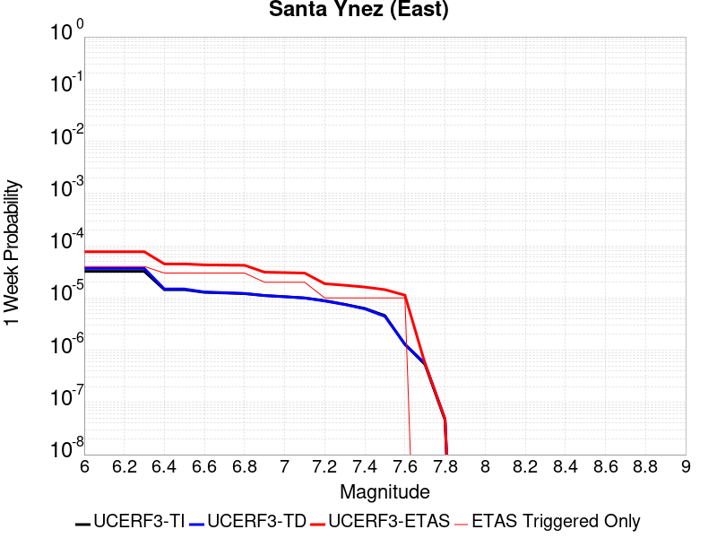 | 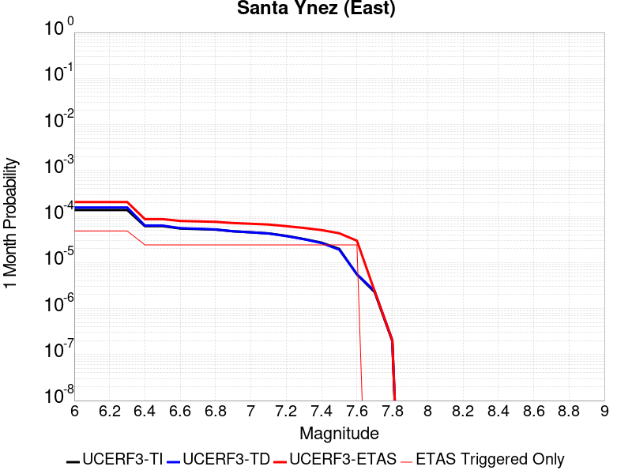 | 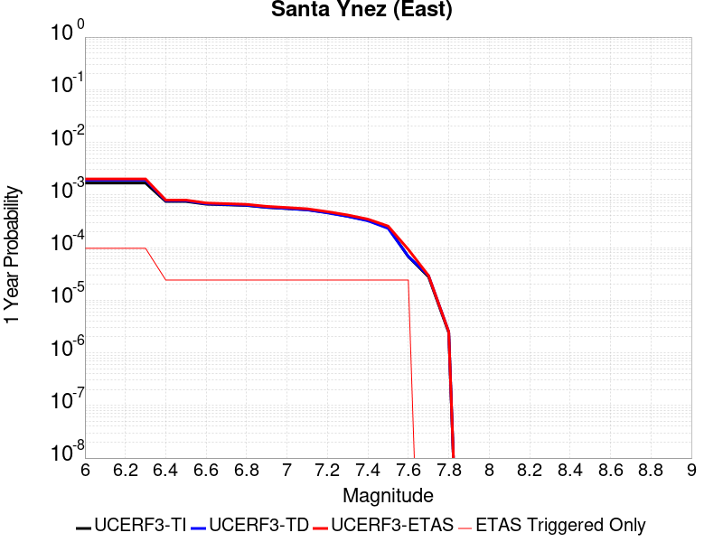 | 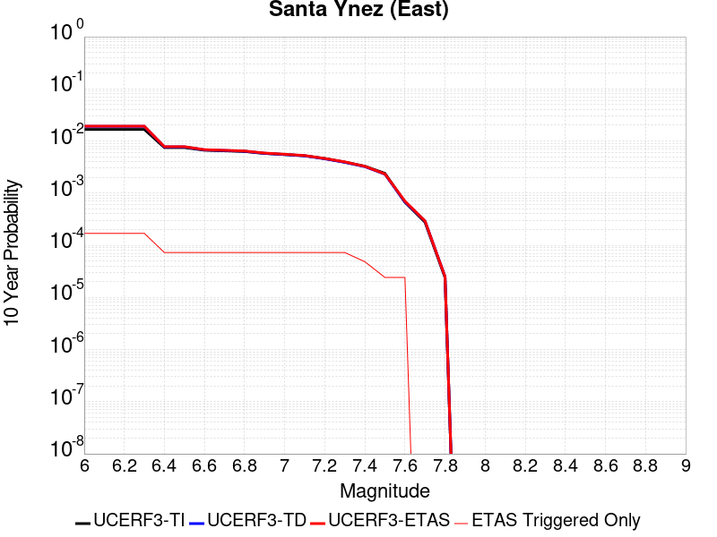 |

| Magnitude | 1 wk TI Prob | 1 wk TD Prob | 1 wk ETAS Prob | 1 wk ETAS/TD Gain | 1 wk ETAS Triggered Only | 1 mo TI Prob | 1 mo TD Prob | 1 mo ETAS Prob | 1 mo ETAS/TD Gain | 1 mo ETAS Triggered Only | 1 yr TI Prob | 1 yr TD Prob | 1 yr ETAS Prob | 1 yr ETAS/TD Gain | 1 yr ETAS Triggered Only | 10 yr TI Prob | 10 yr TD Prob | 10 yr ETAS Prob | 10 yr ETAS/TD Gain | 10 yr ETAS Triggered Only |
|-----|-----|-----|-----|-----|-----|-----|-----|-----|-----|-----|-----|-----|-----|-----|-----|-----|-----|-----|-----|-----|
| 6.0 | 3.2269712E-5 | 3.6750775E-5 | 1.0594759E-4 | 2.882867 | 6.919936E-5 | 1.3829143E-4 | 1.5749714E-4 | 2.266856E-4 | 1.4392998 | 6.919936E-5 | 0.0016823979 | 0.0019164253 | 0.001985492 | 1.0360394 | 6.919936E-5 | 0.016697178 | 0.019056438 | 0.0191922 | 1.0071242 | 1.3839873E-4 |
| 6.1 | 3.2269712E-5 | 3.6750775E-5 | 1.0594759E-4 | 2.882867 | 6.919936E-5 | 1.3829143E-4 | 1.5749714E-4 | 2.266856E-4 | 1.4392998 | 6.919936E-5 | 0.0016823979 | 0.0019164253 | 0.001985492 | 1.0360394 | 6.919936E-5 | 0.016697178 | 0.019056438 | 0.0191922 | 1.0071242 | 1.3839873E-4 |
| 6.2 | 3.2269712E-5 | 3.6750775E-5 | 1.0594759E-4 | 2.882867 | 6.919936E-5 | 1.3829143E-4 | 1.5749714E-4 | 2.266856E-4 | 1.4392998 | 6.919936E-5 | 0.0016823979 | 0.0019164253 | 0.001985492 | 1.0360394 | 6.919936E-5 | 0.016697178 | 0.019056438 | 0.0191922 | 1.0071242 | 1.3839873E-4 |
| 6.3 | 3.2269712E-5 | 3.6750775E-5 | 1.0594759E-4 | 2.882867 | 6.919936E-5 | 1.3829143E-4 | 1.5749714E-4 | 2.266856E-4 | 1.4392998 | 6.919936E-5 | 0.0016823979 | 0.0019164253 | 0.001985492 | 1.0360394 | 6.919936E-5 | 0.016697178 | 0.019056438 | 0.0191922 | 1.0071242 | 1.3839873E-4 |
| 6.4 | 1.4404779E-5 | 1.48492945E-5 | 4.9448463E-5 | 3.3300211 | 3.459968E-5 | 6.1733306E-5 | 6.363831E-5 | 9.823579E-5 | 1.543658 | 3.459968E-5 | 7.513438E-4 | 7.7452604E-4 | 8.0909894E-4 | 1.0446374 | 3.459968E-5 | 0.0074880854 | 0.007718817 | 0.007787482 | 1.0088959 | 6.919936E-5 |
| 6.5 | 1.4404779E-5 | 1.48492945E-5 | 4.9448463E-5 | 3.3300211 | 3.459968E-5 | 6.1733306E-5 | 6.363831E-5 | 9.823579E-5 | 1.543658 | 3.459968E-5 | 7.513438E-4 | 7.7452604E-4 | 8.0909894E-4 | 1.0446374 | 3.459968E-5 | 0.0074880854 | 0.007718817 | 0.007787482 | 1.0088959 | 6.919936E-5 |
| 6.6 | 1.280208E-5 | 1.301186E-5 | 4.761109E-5 | 3.6590536 | 3.459968E-5 | 5.4864904E-5 | 5.5763932E-5 | 9.036168E-5 | 1.6204325 | 3.459968E-5 | 6.6777546E-4 | 6.7871617E-4 | 7.1329233E-4 | 1.0509435 | 3.459968E-5 | 0.006657724 | 0.0067666434 | 0.0068353745 | 1.0101573 | 6.919936E-5 |
| 6.7 | 1.2457027E-5 | 1.262838E-5 | 4.7227626E-5 | 3.7398007 | 3.459968E-5 | 5.3386164E-5 | 5.4120515E-5 | 8.871833E-5 | 1.6392734 | 3.459968E-5 | 6.497827E-4 | 6.5871974E-4 | 6.9329666E-4 | 1.0524911 | 3.459968E-5 | 0.00647886 | 0.00656787 | 0.0066366144 | 1.0104668 | 6.919936E-5 |
| 6.8 | 1.2095134E-5 | 1.2230827E-5 | 4.6830086E-5 | 3.8288567 | 3.459968E-5 | 5.1835254E-5 | 5.2416784E-5 | 8.7014654E-5 | 1.6600533 | 3.459968E-5 | 6.309115E-4 | 6.3798914E-4 | 6.725667E-4 | 1.0541978 | 3.459968E-5 | 0.0062912325 | 0.006361764 | 0.006430523 | 1.0108082 | 6.919936E-5 |
| 6.9 | 1.1104036E-5 | 1.115726E-5 | 4.5756555E-5 | 4.1010566 | 3.459968E-5 | 4.758786E-5 | 4.781596E-5 | 8.2413986E-5 | 1.7235665 | 3.459968E-5 | 5.7922816E-4 | 5.82005E-4 | 6.165846E-4 | 1.0594145 | 3.459968E-5 | 0.005777207 | 0.0058049536 | 0.0058737514 | 1.0118515 | 6.919936E-5 |
| 7.0 | 1.0577444E-5 | 1.05815925E-5 | 4.518091E-5 | 4.2697644 | 3.459968E-5 | 4.5331115E-5 | 4.53489E-5 | 7.9947014E-5 | 1.7629317 | 3.459968E-5 | 5.5176654E-4 | 5.5198424E-4 | 5.865648E-4 | 1.0626478 | 3.459968E-5 | 0.0055039856 | 0.00550627 | 0.0055750883 | 1.0124981 | 6.919936E-5 |
| 7.1 | 1.0021775E-5 | 9.9809E-6 | 4.4580236E-5 | 4.4665546 | 3.459968E-5 | 4.294976E-5 | 4.277459E-5 | 7.7372795E-5 | 1.8088493 | 3.459968E-5 | 5.2278786E-4 | 5.206574E-4 | 5.5523904E-4 | 1.0664192 | 3.459968E-5 | 0.0052155964 | 0.005194508 | 0.005263348 | 1.0132525 | 6.919936E-5 |
| 7.2 | 8.874109E-6 | 8.748706E-6 | 4.3348085E-5 | 4.9547997 | 3.459968E-5 | 3.8031343E-5 | 3.7493923E-5 | 7.2092305E-5 | 1.9227731 | 3.459968E-5 | 4.629332E-4 | 4.56394E-4 | 4.909779E-4 | 1.0757763 | 3.459968E-5 | 0.0046197 | 0.0045546847 | 0.004623569 | 1.0151238 | 6.919936E-5 |
| 7.3 | 7.5504267E-6 | 7.5050243E-6 | 4.2104446E-5 | 5.610168 | 3.459968E-5 | 3.235857E-5 | 3.2164E-5 | 6.6762565E-5 | 2.0756924 | 3.459968E-5 | 3.9389438E-4 | 3.9152734E-4 | 4.2611346E-4 | 1.0883365 | 3.459968E-5 | 0.0039319694 | 0.0039084824 | 0.0039774114 | 1.0176357 | 6.919936E-5 |
| 7.4 | 6.309394E-6 | 6.183062E-6 | 4.078253E-5 | 6.5958467 | 3.459968E-5 | 2.703998E-5 | 2.6498574E-5 | 6.109734E-5 | 2.305684 | 3.459968E-5 | 3.2916202E-4 | 3.2257332E-4 | 3.5716186E-4 | 1.1072268 | 3.459968E-5 | 0.003286749 | 0.0032211484 | 0.0032901247 | 1.0214137 | 6.919936E-5 |
| 7.5 | 4.6103073E-6 | 4.4408016E-6 | 3.904033E-5 | 8.79128 | 3.459968E-5 | 1.975831E-5 | 1.9031871E-5 | 5.3630894E-5 | 2.8179517 | 3.459968E-5 | 2.4053088E-4 | 2.316891E-4 | 2.6628075E-4 | 1.1493021 | 3.459968E-5 | 0.002402707 | 0.002314545 | 0.0023490645 | 1.0149142 | 3.459968E-5 |
| 7.6 | 1.2858658E-6 | 1.3008196E-6 | 3.5900455E-5 | 27.598337 | 3.459968E-5 | 5.5108417E-6 | 5.574929E-6 | 4.017442E-5 | 7.206265 | 3.459968E-5 | 6.7092435E-5 | 6.787272E-5 | 1.02470054E-4 | 1.5097384 | 3.459968E-5 | 6.707218E-4 | 6.7852676E-4 | 7.13103E-4 | 1.0509578 | 3.459968E-5 |
| 7.7 | 5.3302307E-7 | 5.612138E-7 | 5.612138E-7 | 1.0 | 0.0 | 2.2843826E-6 | 2.4052001E-6 | 2.4052001E-6 | 1.0 | 0.0 | 2.7812002E-5 | 2.9282955E-5 | 2.9282955E-5 | 1.0 | 0.0 | 2.7808524E-4 | 2.9279455E-4 | 2.9279455E-4 | 1.0 | 0.0 |
| 7.8 | 4.613933E-8 | 4.80301E-8 | 4.80301E-8 | 1.0 | 0.0 | 1.9773998E-7 | 2.0584326E-7 | 2.0584326E-7 | 1.0 | 0.0 | 2.4074816E-6 | 2.5061388E-6 | 2.5061388E-6 | 1.0 | 0.0 | 2.4074554E-5 | 2.5061116E-5 | 2.5061116E-5 | 1.0 | 0.0 |

## Raymond
*[(top)](#table-of-contents)*

| 1 Week | 1 Month | 1 Year | 10 Year |
|-----|-----|-----|-----|
| 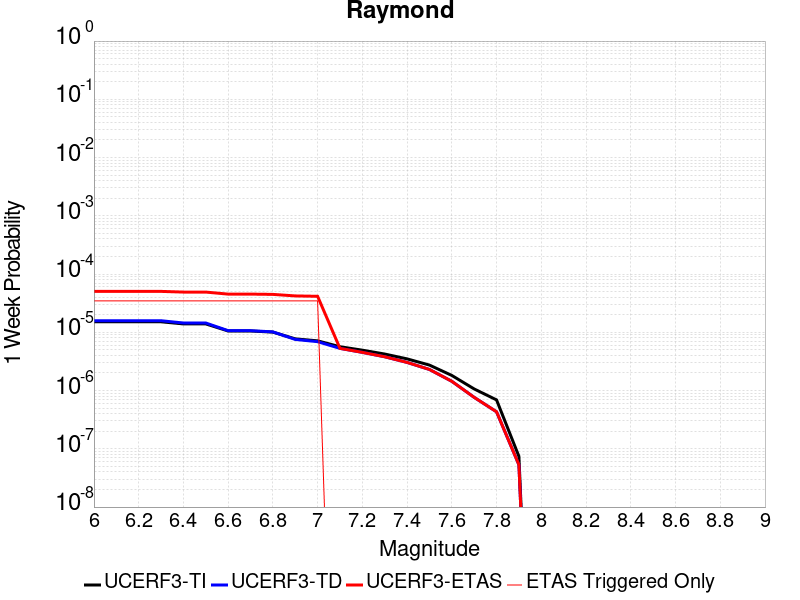 | 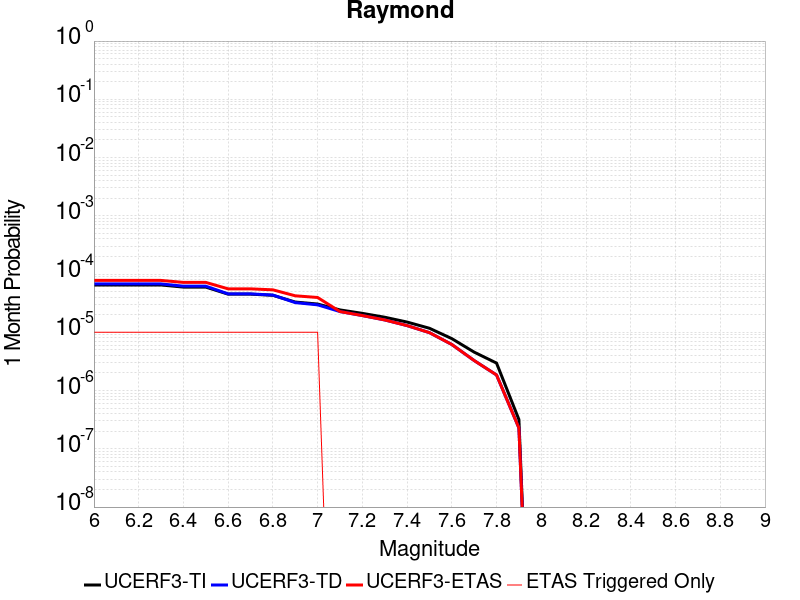 | 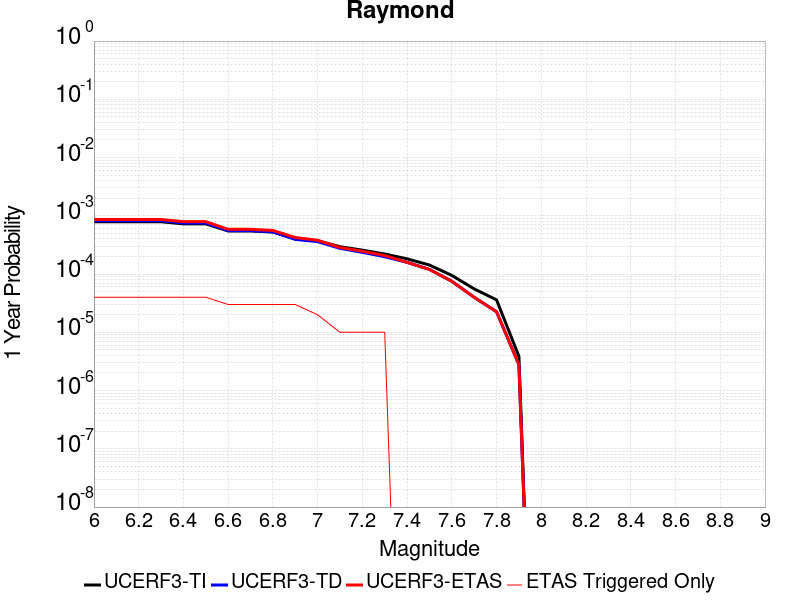 | 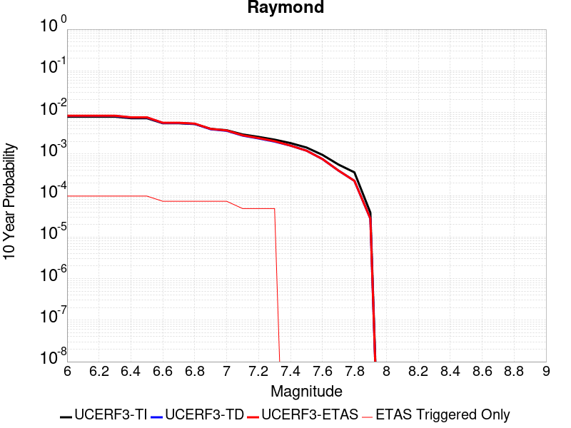 |

| Magnitude | 1 wk TI Prob | 1 wk TD Prob | 1 wk ETAS Prob | 1 wk ETAS/TD Gain | 1 wk ETAS Triggered Only | 1 mo TI Prob | 1 mo TD Prob | 1 mo ETAS Prob | 1 mo ETAS/TD Gain | 1 mo ETAS Triggered Only | 1 yr TI Prob | 1 yr TD Prob | 1 yr ETAS Prob | 1 yr ETAS/TD Gain | 1 yr ETAS Triggered Only | 10 yr TI Prob | 10 yr TD Prob | 10 yr ETAS Prob | 10 yr ETAS/TD Gain | 10 yr ETAS Triggered Only |
|-----|-----|-----|-----|-----|-----|-----|-----|-----|-----|-----|-----|-----|-----|-----|-----|-----|-----|-----|-----|-----|
| 6.0 | 1.5157413E-5 | 1.5810125E-5 | 5.040926E-5 | 3.1884162 | 3.459968E-5 | 6.4958724E-5 | 6.775606E-5 | 1.023534E-4 | 1.5106161 | 3.459968E-5 | 7.905855E-4 | 8.246429E-4 | 9.2835637E-4 | 1.1257677 | 1.03799044E-4 | 0.007877788 | 0.008218355 | 0.008355616 | 1.0167018 | 1.3839873E-4 |
| 6.1 | 1.5157413E-5 | 1.5810125E-5 | 5.040926E-5 | 3.1884162 | 3.459968E-5 | 6.4958724E-5 | 6.775606E-5 | 1.023534E-4 | 1.5106161 | 3.459968E-5 | 7.905855E-4 | 8.246429E-4 | 9.2835637E-4 | 1.1257677 | 1.03799044E-4 | 0.007877788 | 0.008218355 | 0.008355616 | 1.0167018 | 1.3839873E-4 |
| 6.2 | 1.5157413E-5 | 1.5810125E-5 | 5.040926E-5 | 3.1884162 | 3.459968E-5 | 6.4958724E-5 | 6.775606E-5 | 1.023534E-4 | 1.5106161 | 3.459968E-5 | 7.905855E-4 | 8.246429E-4 | 9.2835637E-4 | 1.1257677 | 1.03799044E-4 | 0.007877788 | 0.008218355 | 0.008355616 | 1.0167018 | 1.3839873E-4 |
| 6.3 | 1.5157413E-5 | 1.5810125E-5 | 5.040926E-5 | 3.1884162 | 3.459968E-5 | 6.4958724E-5 | 6.775606E-5 | 1.023534E-4 | 1.5106161 | 3.459968E-5 | 7.905855E-4 | 8.246429E-4 | 9.2835637E-4 | 1.1257677 | 1.03799044E-4 | 0.007877788 | 0.008218355 | 0.008355616 | 1.0167018 | 1.3839873E-4 |
| 6.4 | 1.3941944E-5 | 1.4454688E-5 | 4.905387E-5 | 3.3936305 | 3.459968E-5 | 5.9749822E-5 | 6.194732E-5 | 9.654486E-5 | 1.5584993 | 3.459968E-5 | 7.2721124E-4 | 7.53971E-4 | 8.576918E-4 | 1.137566 | 1.03799044E-4 | 0.007248361 | 0.007516471 | 0.0076538296 | 1.0182743 | 1.3839873E-4 |
| 6.5 | 1.3941944E-5 | 1.4454688E-5 | 4.905387E-5 | 3.3936305 | 3.459968E-5 | 5.9749822E-5 | 6.194732E-5 | 9.654486E-5 | 1.5584993 | 3.459968E-5 | 7.2721124E-4 | 7.53971E-4 | 8.576918E-4 | 1.137566 | 1.03799044E-4 | 0.007248361 | 0.007516471 | 0.0076538296 | 1.0182743 | 1.3839873E-4 |
| 6.6 | 1.0542609E-5 | 1.067111E-5 | 4.5270423E-5 | 4.242335 | 3.459968E-5 | 4.5181827E-5 | 4.573256E-5 | 8.033066E-5 | 1.756531 | 3.459968E-5 | 5.499499E-4 | 5.566571E-4 | 6.25818E-4 | 1.1242431 | 6.919936E-5 | 0.005485909 | 0.0055531966 | 0.0056564193 | 1.018588 | 1.03799044E-4 |
| 6.7 | 1.0542609E-5 | 1.067111E-5 | 4.5270423E-5 | 4.242335 | 3.459968E-5 | 4.5181827E-5 | 4.573256E-5 | 8.033066E-5 | 1.756531 | 3.459968E-5 | 5.499499E-4 | 5.566571E-4 | 6.25818E-4 | 1.1242431 | 6.919936E-5 | 0.005485909 | 0.0055531966 | 0.0056564193 | 1.018588 | 1.03799044E-4 |
| 6.8 | 1.0079132E-5 | 1.0176644E-5 | 4.4775974E-5 | 4.3998766 | 3.459968E-5 | 4.3195567E-5 | 4.3613487E-5 | 7.821166E-5 | 1.7932906 | 3.459968E-5 | 5.257791E-4 | 5.308702E-4 | 6.0003286E-4 | 1.1302816 | 6.919936E-5 | 0.0052453685 | 0.0052965777 | 0.005399827 | 1.0194936 | 1.03799044E-4 |
| 6.9 | 7.721598E-6 | 7.548902E-6 | 4.2148324E-5 | 5.583371 | 3.459968E-5 | 3.3092143E-5 | 3.2352043E-5 | 6.6950604E-5 | 2.06944 | 3.459968E-5 | 4.0282236E-4 | 3.9381615E-4 | 4.6298828E-4 | 1.1756457 | 6.919936E-5 | 0.0040209293 | 0.003931324 | 0.004034715 | 1.0262992 | 1.03799044E-4 |
| 7.0 | 7.137566E-6 | 6.911303E-6 | 4.1510746E-5 | 6.0062113 | 3.459968E-5 | 3.058921E-5 | 2.961954E-5 | 6.42182E-5 | 2.1681025 | 3.459968E-5 | 3.7236E-4 | 3.605593E-4 | 4.2973371E-4 | 1.191853 | 6.919936E-5 | 0.0037173668 | 0.003599869 | 0.0037032943 | 1.0287303 | 1.03799044E-4 |
| 7.1 | 5.654976E-6 | 5.299538E-6 | 5.299538E-6 | 1.0 | 0.0 | 2.4235387E-5 | 2.2712107E-5 | 2.2712107E-5 | 1.0 | 0.0 | 2.9502588E-4 | 2.7648505E-4 | 3.1107516E-4 | 1.1251067 | 3.459968E-5 | 0.0029463451 | 0.0027614492 | 0.0028304574 | 1.0249898 | 6.919936E-5 |
| 7.2 | 4.9358455E-6 | 4.526655E-6 | 4.526655E-6 | 1.0 | 0.0 | 2.1153453E-5 | 1.9399806E-5 | 1.9399806E-5 | 1.0 | 0.0 | 2.5751285E-4 | 2.3616718E-4 | 2.707587E-4 | 1.1464704 | 3.459968E-5 | 0.0025721465 | 0.002359192 | 0.0024282278 | 1.0292627 | 6.919936E-5 |
| 7.3 | 4.2368597E-6 | 3.8056128E-6 | 3.8056128E-6 | 1.0 | 0.0 | 1.8157843E-5 | 1.6309668E-5 | 1.6309668E-5 | 1.0 | 0.0 | 2.2104931E-4 | 1.9855222E-4 | 2.3314504E-4 | 1.1742252 | 3.459968E-5 | 0.0022082955 | 0.0019837746 | 0.0020528366 | 1.0348135 | 6.919936E-5 |
| 7.4 | 3.4999923E-6 | 3.0437407E-6 | 3.0437407E-6 | 1.0 | 0.0 | 1.49998805E-5 | 1.3044538E-5 | 1.3044538E-5 | 1.0 | 0.0 | 1.8260824E-4 | 1.5880575E-4 | 1.5880575E-4 | 1.0 | 0.0 | 0.0018245826 | 0.0015869461 | 0.0015869461 | 1.0 | 0.0 |
| 7.5 | 2.738017E-6 | 2.3020405E-6 | 2.3020405E-6 | 1.0 | 0.0 | 1.1734306E-5 | 9.865851E-6 | 9.865851E-6 | 1.0 | 0.0 | 1.428558E-4 | 1.20110184E-4 | 1.20110184E-4 | 1.0 | 0.0 | 0.0014276401 | 0.0012004747 | 0.0012004747 | 1.0 | 0.0 |
| 7.6 | 1.8186392E-6 | 1.442302E-6 | 1.442302E-6 | 1.0 | 0.0 | 7.794145E-6 | 6.1812802E-6 | 6.1812802E-6 | 1.0 | 0.0 | 9.488958E-5 | 7.5254524E-5 | 7.5254524E-5 | 1.0 | 0.0 | 9.4849075E-4 | 7.5230957E-4 | 7.5230957E-4 | 1.0 | 0.0 |
| 7.7 | 1.0660348E-6 | 7.6437E-7 | 7.6437E-7 | 1.0 | 0.0 | 4.5687125E-6 | 3.2758674E-6 | 3.2758674E-6 | 1.0 | 0.0 | 5.5622655E-5 | 3.988297E-5 | 3.988297E-5 | 1.0 | 0.0 | 5.5608735E-4 | 3.9877492E-4 | 3.9877492E-4 | 1.0 | 0.0 |
| 7.8 | 6.913602E-7 | 4.3202903E-7 | 4.3202903E-7 | 1.0 | 0.0 | 2.962969E-6 | 1.8515517E-6 | 1.8515517E-6 | 1.0 | 0.0 | 3.607355E-5 | 2.2542416E-5 | 2.2542416E-5 | 1.0 | 0.0 | 3.6067693E-4 | 2.2541684E-4 | 2.2541684E-4 | 1.0 | 0.0 |
| 7.9 | 7.425201E-8 | 5.322267E-8 | 5.322267E-8 | 1.0 | 0.0 | 3.1822285E-7 | 2.2809714E-7 | 2.2809714E-7 | 1.0 | 0.0 | 3.874356E-6 | 2.7770805E-6 | 2.7770805E-6 | 1.0 | 0.0 | 3.8742884E-5 | 2.7770588E-5 | 2.7770588E-5 | 1.0 | 0.0 |

## Simi-Santa Rosa
*[(top)](#table-of-contents)*

| 1 Week | 1 Month | 1 Year | 10 Year |
|-----|-----|-----|-----|
| 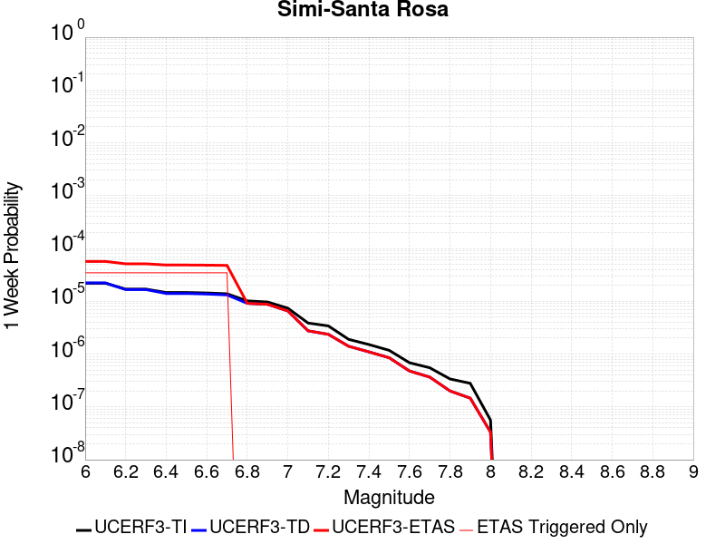 | 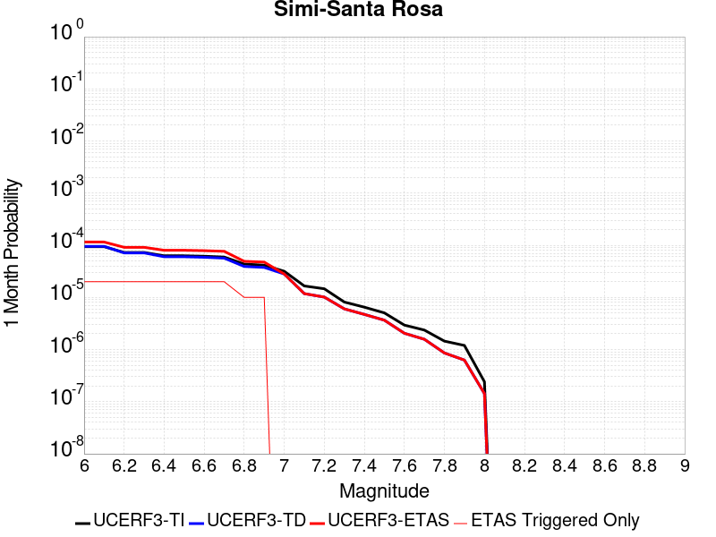 | 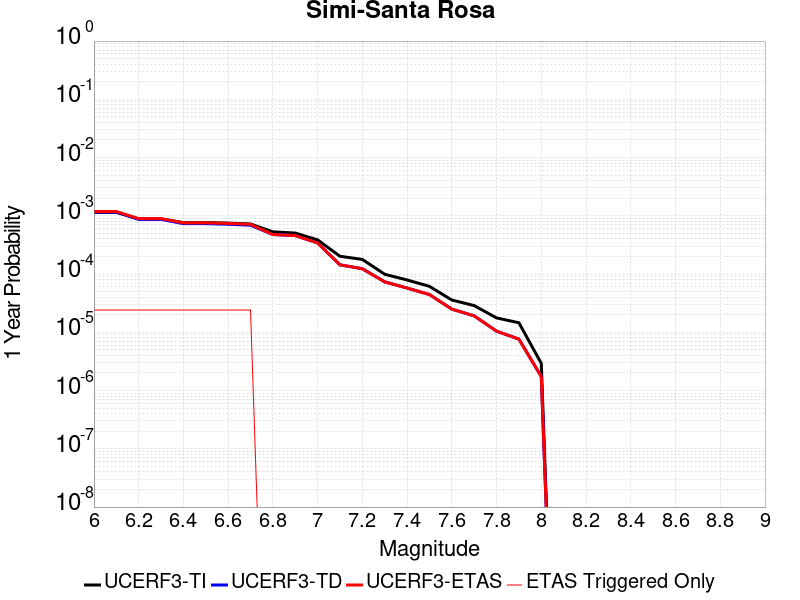 | 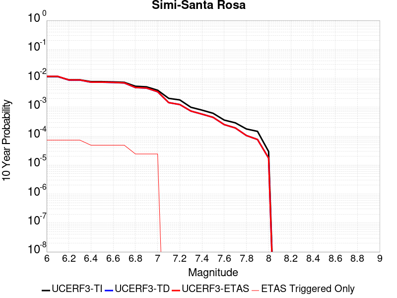 |

| Magnitude | 1 wk TI Prob | 1 wk TD Prob | 1 wk ETAS Prob | 1 wk ETAS/TD Gain | 1 wk ETAS Triggered Only | 1 mo TI Prob | 1 mo TD Prob | 1 mo ETAS Prob | 1 mo ETAS/TD Gain | 1 mo ETAS Triggered Only | 1 yr TI Prob | 1 yr TD Prob | 1 yr ETAS Prob | 1 yr ETAS/TD Gain | 1 yr ETAS Triggered Only | 10 yr TI Prob | 10 yr TD Prob | 10 yr ETAS Prob | 10 yr ETAS/TD Gain | 10 yr ETAS Triggered Only |
|-----|-----|-----|-----|-----|-----|-----|-----|-----|-----|-----|-----|-----|-----|-----|-----|-----|-----|-----|-----|-----|
| 6.0 | 2.198912E-5 | 2.2275388E-5 | 5.6874298E-5 | 2.5532348 | 3.459968E-5 | 9.4235686E-5 | 9.54627E-5 | 1.3005908E-4 | 1.3624073 | 3.459968E-5 | 0.0011467156 | 0.0011616825 | 0.001196242 | 1.0297495 | 3.459968E-5 | 0.011408163 | 0.011560547 | 0.011663146 | 1.0088749 | 1.03799044E-4 |
| 6.1 | 2.198912E-5 | 2.2275388E-5 | 5.6874298E-5 | 2.5532348 | 3.459968E-5 | 9.4235686E-5 | 9.54627E-5 | 1.3005908E-4 | 1.3624073 | 3.459968E-5 | 0.0011467156 | 0.0011616825 | 0.001196242 | 1.0297495 | 3.459968E-5 | 0.011408163 | 0.011560547 | 0.011663146 | 1.0088749 | 1.03799044E-4 |
| 6.2 | 1.69983E-5 | 1.6668506E-5 | 5.126761E-5 | 3.0757172 | 3.459968E-5 | 7.284782E-5 | 7.143466E-5 | 1.0603187E-4 | 1.4843197 | 3.459968E-5 | 8.865613E-4 | 8.6939917E-4 | 9.0396876E-4 | 1.0397626 | 3.459968E-5 | 0.008830327 | 0.0086629 | 0.0087658 | 1.0118783 | 1.03799044E-4 |
| 6.3 | 1.69983E-5 | 1.6668506E-5 | 5.126761E-5 | 3.0757172 | 3.459968E-5 | 7.284782E-5 | 7.143466E-5 | 1.0603187E-4 | 1.4843197 | 3.459968E-5 | 8.865613E-4 | 8.6939917E-4 | 9.0396876E-4 | 1.0397626 | 3.459968E-5 | 0.008830327 | 0.0086629 | 0.0087658 | 1.0118783 | 1.03799044E-4 |
| 6.4 | 1.4666188E-5 | 1.4052489E-5 | 4.8651684E-5 | 3.46214 | 3.459968E-5 | 6.285358E-5 | 6.0223705E-5 | 9.48213E-5 | 1.5744847 | 3.459968E-5 | 7.6497364E-4 | 7.330018E-4 | 7.6757616E-4 | 1.0471681 | 3.459968E-5 | 0.0076234564 | 0.0073083164 | 0.00737701 | 1.0093994 | 6.919936E-5 |
| 6.5 | 1.4666188E-5 | 1.4052489E-5 | 4.8651684E-5 | 3.46214 | 3.459968E-5 | 6.285358E-5 | 6.0223705E-5 | 9.48213E-5 | 1.5744847 | 3.459968E-5 | 7.6497364E-4 | 7.330018E-4 | 7.6757616E-4 | 1.0471681 | 3.459968E-5 | 0.0076234564 | 0.0073083164 | 0.00737701 | 1.0093994 | 6.919936E-5 |
| 6.6 | 1.4377586E-5 | 1.3729529E-5 | 4.8328737E-5 | 3.520058 | 3.459968E-5 | 6.1616774E-5 | 5.883965E-5 | 9.3437295E-5 | 1.5879989 | 3.459968E-5 | 7.4992597E-4 | 7.1616215E-4 | 7.5073703E-4 | 1.0482781 | 3.459968E-5 | 0.007474003 | 0.0071410104 | 0.007209716 | 1.0096213 | 6.919936E-5 |
| 6.7 | 1.3881404E-5 | 1.3207497E-5 | 4.7806723E-5 | 3.6196654 | 3.459968E-5 | 5.9490372E-5 | 5.6602472E-5 | 9.120019E-5 | 1.6112405 | 3.459968E-5 | 7.240546E-4 | 6.889419E-4 | 7.2351773E-4 | 1.0501869 | 3.459968E-5 | 0.007217 | 0.0068705105 | 0.0069392347 | 1.0100027 | 6.919936E-5 |
| 6.8 | 1.0176516E-5 | 9.1541E-6 | 9.1541E-6 | 1.0 | 0.0 | 4.3612912E-5 | 3.923136E-5 | 3.923136E-5 | 1.0 | 0.0 | 5.308578E-4 | 4.775537E-4 | 4.775537E-4 | 1.0 | 0.0 | 0.0052959146 | 0.004766908 | 0.0048013427 | 1.0072237 | 3.459968E-5 |
| 6.9 | 9.699797E-6 | 8.774672E-6 | 8.774672E-6 | 1.0 | 0.0 | 4.15699E-5 | 3.760529E-5 | 3.760529E-5 | 1.0 | 0.0 | 5.05996E-4 | 4.5776463E-4 | 4.5776463E-4 | 1.0 | 0.0 | 0.005048454 | 0.0045698346 | 0.0046042763 | 1.0075368 | 3.459968E-5 |
| 7.0 | 7.4049476E-6 | 6.559291E-6 | 6.559291E-6 | 1.0 | 0.0 | 3.1735104E-5 | 2.8111013E-5 | 2.8111013E-5 | 1.0 | 0.0 | 3.8630638E-4 | 3.422105E-4 | 3.422105E-4 | 1.0 | 0.0 | 0.0038563553 | 0.0034180775 | 0.003452559 | 1.010088 | 3.459968E-5 |
| 7.1 | 3.873439E-6 | 2.759473E-6 | 2.759473E-6 | 1.0 | 0.0 | 1.6600346E-5 | 1.1826261E-5 | 1.1826261E-5 | 1.0 | 0.0 | 2.0209046E-4 | 1.4397544E-4 | 1.4397544E-4 | 1.0 | 0.0 | 0.0020190678 | 0.0014388453 | 0.0014388453 | 1.0 | 0.0 |
| 7.2 | 3.417706E-6 | 2.367616E-6 | 2.367616E-6 | 1.0 | 0.0 | 1.4647229E-5 | 1.0146887E-5 | 1.0146887E-5 | 1.0 | 0.0 | 1.7831543E-4 | 1.2353157E-4 | 1.2353157E-4 | 1.0 | 0.0 | 0.0017817242 | 0.0012346513 | 0.0012346513 | 1.0 | 0.0 |
| 7.3 | 1.90225E-6 | 1.4073756E-6 | 1.4073756E-6 | 1.0 | 0.0 | 8.152474E-6 | 6.031596E-6 | 6.031596E-6 | 1.0 | 0.0 | 9.9251854E-5 | 7.343223E-5 | 7.343223E-5 | 1.0 | 0.0 | 9.920754E-4 | 7.340819E-4 | 7.340819E-4 | 1.0 | 0.0 |
| 7.4 | 1.5170556E-6 | 1.1024792E-6 | 1.1024792E-6 | 1.0 | 0.0 | 6.5016507E-6 | 4.7249023E-6 | 4.7249023E-6 | 1.0 | 0.0 | 7.915472E-5 | 5.752418E-5 | 5.752418E-5 | 1.0 | 0.0 | 7.9126534E-4 | 5.75094E-4 | 5.75094E-4 | 1.0 | 0.0 |
| 7.5 | 1.178732E-6 | 8.5351127E-7 | 8.5351127E-7 | 1.0 | 0.0 | 5.0516987E-6 | 3.6579004E-6 | 3.6579004E-6 | 1.0 | 0.0 | 6.1502695E-5 | 4.4534037E-5 | 4.4534037E-5 | 1.0 | 0.0 | 6.148568E-4 | 4.4525208E-4 | 4.4525208E-4 | 1.0 | 0.0 |
| 7.6 | 6.8722386E-7 | 4.793211E-7 | 4.793211E-7 | 1.0 | 0.0 | 2.9452417E-6 | 2.0542318E-6 | 2.0542318E-6 | 1.0 | 0.0 | 3.5857727E-5 | 2.5009986E-5 | 2.5009986E-5 | 1.0 | 0.0 | 3.5851944E-4 | 2.5007184E-4 | 2.5007184E-4 | 1.0 | 0.0 |
| 7.7 | 5.5126515E-7 | 3.6731117E-7 | 3.6731117E-7 | 1.0 | 0.0 | 2.3625628E-6 | 1.5741898E-6 | 1.5741898E-6 | 1.0 | 0.0 | 2.8763823E-5 | 1.9165593E-5 | 1.9165593E-5 | 1.0 | 0.0 | 2.87601E-4 | 1.9163951E-4 | 1.9163951E-4 | 1.0 | 0.0 |
| 7.8 | 3.3860243E-7 | 2.0075514E-7 | 2.0075514E-7 | 1.0 | 0.0 | 1.4511525E-6 | 8.6037886E-7 | 8.6037886E-7 | 1.0 | 0.0 | 1.7667637E-5 | 1.0475063E-5 | 1.0475063E-5 | 1.0 | 0.0 | 1.7666233E-4 | 1.0474575E-4 | 1.0474575E-4 | 1.0 | 0.0 |
| 7.9 | 2.7955386E-7 | 1.4648724E-7 | 1.4648724E-7 | 1.0 | 0.0 | 1.1980875E-6 | 6.278023E-7 | 6.278023E-7 | 1.0 | 0.0 | 1.4586617E-5 | 7.643467E-6 | 7.643467E-6 | 1.0 | 0.0 | 1.458566E-4 | 7.643208E-5 | 7.643208E-5 | 1.0 | 0.0 |
| 8.0 | 5.6259015E-8 | 3.335318E-8 | 3.335318E-8 | 1.0 | 0.0 | 2.4111003E-7 | 1.429422E-7 | 1.429422E-7 | 1.0 | 0.0 | 2.9355108E-6 | 1.7403199E-6 | 1.7403199E-6 | 1.0 | 0.0 | 2.935472E-5 | 1.7403077E-5 | 1.7403077E-5 | 1.0 | 0.0 |

## Mission Ridge-Arroyo Parida-Santa Ana
*[(top)](#table-of-contents)*

| 1 Week | 1 Month | 1 Year | 10 Year |
|-----|-----|-----|-----|
| 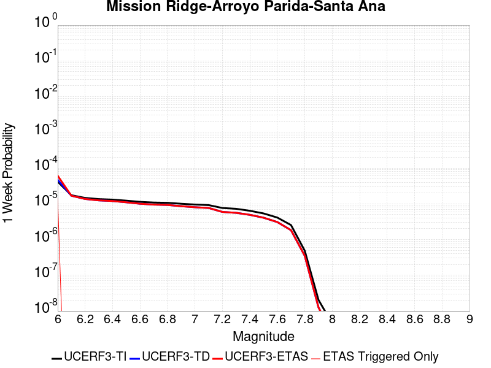 | 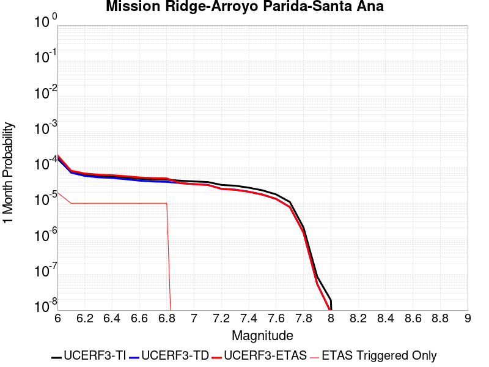 | 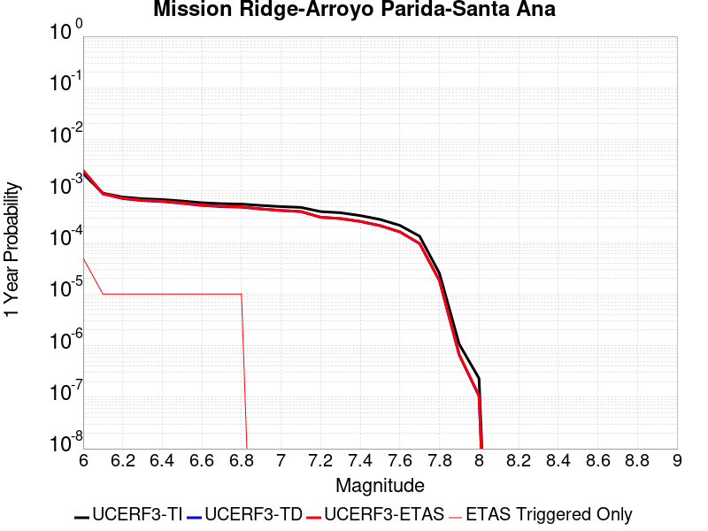 | 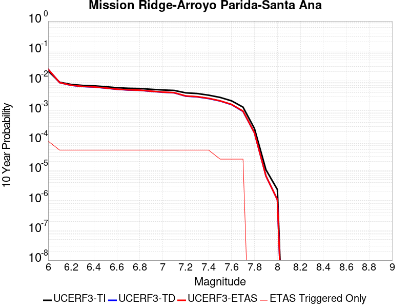 |

| Magnitude | 1 wk TI Prob | 1 wk TD Prob | 1 wk ETAS Prob | 1 wk ETAS/TD Gain | 1 wk ETAS Triggered Only | 1 mo TI Prob | 1 mo TD Prob | 1 mo ETAS Prob | 1 mo ETAS/TD Gain | 1 mo ETAS Triggered Only | 1 yr TI Prob | 1 yr TD Prob | 1 yr ETAS Prob | 1 yr ETAS/TD Gain | 1 yr ETAS Triggered Only | 10 yr TI Prob | 10 yr TD Prob | 10 yr ETAS Prob | 10 yr ETAS/TD Gain | 10 yr ETAS Triggered Only |
|-----|-----|-----|-----|-----|-----|-----|-----|-----|-----|-----|-----|-----|-----|-----|-----|-----|-----|-----|-----|-----|
| 6.0 | 4.169034E-5 | 4.7137048E-5 | 4.7137048E-5 | 1.0 | 0.0 | 1.7866064E-4 | 2.0200513E-4 | 2.0200513E-4 | 1.0 | 0.0 | 0.0021730233 | 0.0024574657 | 0.0025264951 | 1.0280896 | 6.919936E-5 | 0.021518968 | 0.02438483 | 0.024486098 | 1.0041529 | 1.03799044E-4 |
| 6.1 | 1.73813E-5 | 1.6854203E-5 | 1.6854203E-5 | 1.0 | 0.0 | 7.4489166E-5 | 7.223036E-5 | 7.223036E-5 | 1.0 | 0.0 | 9.065282E-4 | 8.790605E-4 | 8.790605E-4 | 1.0 | 0.0 | 0.009028391 | 0.008757128 | 0.008791425 | 1.0039164 | 3.459968E-5 |
| 6.2 | 1.4622182E-5 | 1.3673262E-5 | 1.3673262E-5 | 1.0 | 0.0 | 6.2664985E-5 | 5.85984E-5 | 5.85984E-5 | 1.0 | 0.0 | 7.6267915E-4 | 7.132059E-4 | 7.132059E-4 | 1.0 | 0.0 | 0.007600669 | 0.007109767 | 0.0071441205 | 1.0048319 | 3.459968E-5 |
| 6.3 | 1.3552434E-5 | 1.2482174E-5 | 1.2482174E-5 | 1.0 | 0.0 | 5.8080568E-5 | 5.349395E-5 | 5.349395E-5 | 1.0 | 0.0 | 7.069015E-4 | 6.510974E-4 | 6.510974E-4 | 1.0 | 0.0 | 0.00704657 | 0.006492415 | 0.0065267896 | 1.0052947 | 3.459968E-5 |
| 6.4 | 1.30977305E-5 | 1.1979128E-5 | 1.1979128E-5 | 1.0 | 0.0 | 5.613192E-5 | 5.133813E-5 | 5.133813E-5 | 1.0 | 0.0 | 6.831918E-4 | 6.2486547E-4 | 6.2486547E-4 | 1.0 | 0.0 | 0.006810953 | 0.006231584 | 0.006265968 | 1.0055177 | 3.459968E-5 |
| 6.5 | 1.225205E-5 | 1.1048776E-5 | 1.1048776E-5 | 1.0 | 0.0 | 5.2507727E-5 | 4.735105E-5 | 4.735105E-5 | 1.0 | 0.0 | 6.3909404E-4 | 5.7634927E-4 | 5.7634927E-4 | 1.0 | 0.0 | 0.006372592 | 0.005749009 | 0.00578341 | 1.0059838 | 3.459968E-5 |
| 6.6 | 1.1352241E-5 | 1.0063508E-5 | 1.0063508E-5 | 1.0 | 0.0 | 4.8651553E-5 | 4.3128617E-5 | 4.3128617E-5 | 1.0 | 0.0 | 5.921717E-4 | 5.249665E-4 | 5.249665E-4 | 1.0 | 0.0 | 0.0059059616 | 0.0052376646 | 0.005272083 | 1.0065713 | 3.459968E-5 |
| 6.7 | 1.0864116E-5 | 9.517E-6 | 9.517E-6 | 1.0 | 0.0 | 4.6559664E-5 | 4.0786515E-5 | 4.0786515E-5 | 1.0 | 0.0 | 5.667165E-4 | 4.964647E-4 | 4.964647E-4 | 1.0 | 0.0 | 0.005652734 | 0.0049539437 | 0.004988372 | 1.0069497 | 3.459968E-5 |
| 6.8 | 1.0666365E-5 | 9.299752E-6 | 9.299752E-6 | 1.0 | 0.0 | 4.571219E-5 | 3.985548E-5 | 3.985548E-5 | 1.0 | 0.0 | 5.564038E-4 | 4.8513446E-4 | 4.8513446E-4 | 1.0 | 0.0 | 0.005550127 | 0.00484114 | 0.0048755724 | 1.0071124 | 3.459968E-5 |
| 6.9 | 1.0038665E-5 | 8.592018E-6 | 8.592018E-6 | 1.0 | 0.0 | 4.302214E-5 | 3.682243E-5 | 3.682243E-5 | 1.0 | 0.0 | 5.236687E-4 | 4.4822265E-4 | 4.4822265E-4 | 1.0 | 0.0 | 0.005224364 | 0.0044735507 | 0.0045079957 | 1.0076997 | 3.459968E-5 |
| 7.0 | 9.5379955E-6 | 8.025047E-6 | 8.025047E-6 | 1.0 | 0.0 | 4.0876483E-5 | 3.439261E-5 | 3.439261E-5 | 1.0 | 0.0 | 4.975576E-4 | 4.1865133E-4 | 4.1865133E-4 | 1.0 | 0.0 | 0.00496445 | 0.00417898 | 0.004213435 | 1.0082449 | 3.459968E-5 |
| 7.1 | 9.207389E-6 | 7.652347E-6 | 7.652347E-6 | 1.0 | 0.0 | 3.945964E-5 | 3.2795375E-5 | 3.2795375E-5 | 1.0 | 0.0 | 4.803152E-4 | 3.992122E-4 | 3.992122E-4 | 1.0 | 0.0 | 0.004792784 | 0.003985301 | 0.004019763 | 1.0086472 | 3.459968E-5 |
| 7.2 | 7.638091E-6 | 5.9310923E-6 | 5.9310923E-6 | 1.0 | 0.0 | 3.2734264E-5 | 2.5418722E-5 | 2.5418722E-5 | 1.0 | 0.0 | 3.984668E-4 | 3.094293E-4 | 3.094293E-4 | 1.0 | 0.0 | 0.0039775306 | 0.0030901956 | 0.0031246883 | 1.011162 | 3.459968E-5 |
| 7.3 | 7.2500147E-6 | 5.596131E-6 | 5.596131E-6 | 1.0 | 0.0 | 3.1071122E-5 | 2.3983199E-5 | 2.3983199E-5 | 1.0 | 0.0 | 3.7822526E-4 | 2.9195662E-4 | 2.9195662E-4 | 1.0 | 0.0 | 0.0037758215 | 0.0029159402 | 0.002950439 | 1.011831 | 3.459968E-5 |
| 7.4 | 6.3899715E-6 | 4.9184864E-6 | 4.9184864E-6 | 1.0 | 0.0 | 2.7385306E-5 | 2.1079059E-5 | 2.1079059E-5 | 1.0 | 0.0 | 3.3336508E-4 | 2.566075E-4 | 2.566075E-4 | 1.0 | 0.0 | 0.0033286542 | 0.002563311 | 0.0025978219 | 1.0134635 | 3.459968E-5 |
| 7.5 | 5.379025E-6 | 4.0838477E-6 | 4.0838477E-6 | 1.0 | 0.0 | 2.305276E-5 | 1.7502087E-5 | 1.7502087E-5 | 1.0 | 0.0 | 2.806312E-4 | 2.1306718E-4 | 2.1306718E-4 | 1.0 | 0.0 | 0.0028027708 | 0.0021286402 | 0.0021631662 | 1.0162197 | 3.459968E-5 |
| 7.6 | 4.1270696E-6 | 3.0883373E-6 | 3.0883373E-6 | 1.0 | 0.0 | 1.768732E-5 | 1.32356645E-5 | 1.32356645E-5 | 1.0 | 0.0 | 2.1532185E-4 | 1.6113237E-4 | 1.6113237E-4 | 1.0 | 0.0 | 0.0021511333 | 0.0016101635 | 0.0016447075 | 1.0214537 | 3.459968E-5 |
| 7.7 | 2.5406805E-6 | 1.8282044E-6 | 1.8282044E-6 | 1.0 | 0.0 | 1.0888585E-5 | 7.835139E-6 | 7.835139E-6 | 1.0 | 0.0 | 1.3256045E-4 | 9.53887E-5 | 9.53887E-5 | 1.0 | 0.0 | 0.0013248142 | 9.534837E-4 | 9.880504E-4 | 1.0362531 | 3.459968E-5 |
| 7.8 | 4.8608285E-7 | 3.509864E-7 | 3.509864E-7 | 1.0 | 0.0 | 2.0832106E-6 | 1.5042266E-6 | 1.5042266E-6 | 1.0 | 0.0 | 2.5362791E-5 | 1.8313805E-5 | 1.8313805E-5 | 1.0 | 0.0 | 2.5359896E-4 | 1.8312308E-4 | 1.8312308E-4 | 1.0 | 0.0 |
| 7.9 | 2.0472514E-8 | 1.2688718E-8 | 1.2688718E-8 | 1.0 | 0.0 | 8.7739345E-8 | 5.438022E-8 | 5.438022E-8 | 1.0 | 0.0 | 1.068226E-6 | 6.6207895E-7 | 6.6207895E-7 | 1.0 | 0.0 | 1.0682209E-5 | 6.620771E-6 | 6.620771E-6 | 1.0 | 0.0 |
| 8.0 | 4.443582E-9 | 2.032067E-9 | 2.032067E-9 | 1.0 | 0.0 | 1.9043922E-8 | 8.7088585E-9 | 8.7088585E-9 | 1.0 | 0.0 | 2.3185973E-7 | 1.0603035E-7 | 1.0603035E-7 | 1.0 | 0.0 | 2.3185949E-6 | 1.0603031E-6 | 1.0603031E-6 | 1.0 | 0.0 |

## Big Pine (Central)
*[(top)](#table-of-contents)*

| 1 Week | 1 Month | 1 Year | 10 Year |
|-----|-----|-----|-----|
| 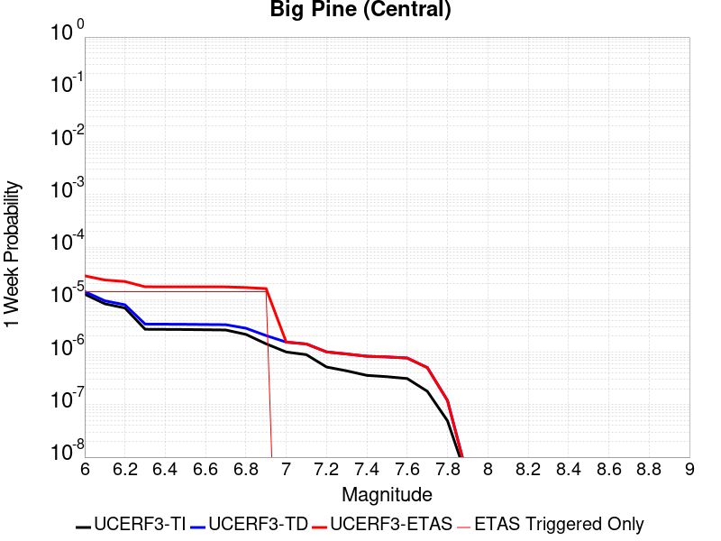 | 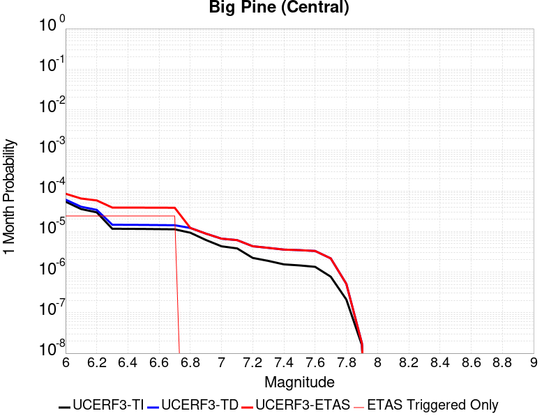 | 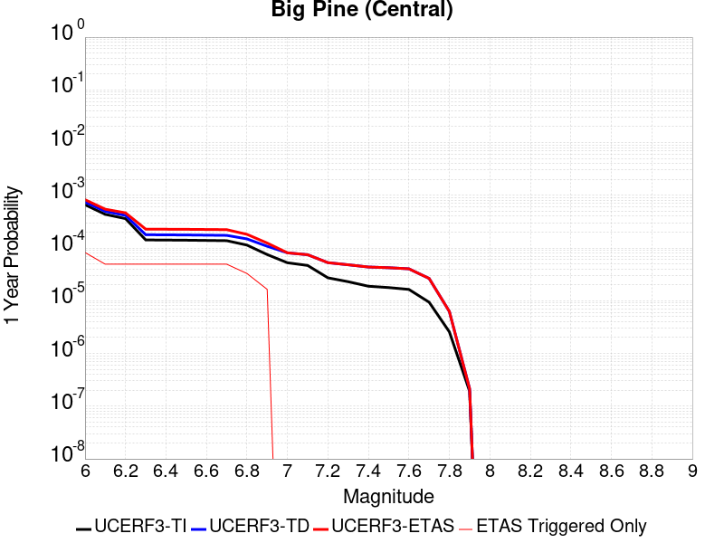 | 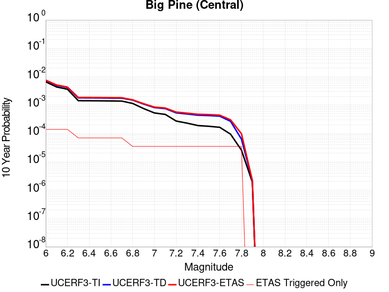 |

| Magnitude | 1 wk TI Prob | 1 wk TD Prob | 1 wk ETAS Prob | 1 wk ETAS/TD Gain | 1 wk ETAS Triggered Only | 1 mo TI Prob | 1 mo TD Prob | 1 mo ETAS Prob | 1 mo ETAS/TD Gain | 1 mo ETAS Triggered Only | 1 yr TI Prob | 1 yr TD Prob | 1 yr ETAS Prob | 1 yr ETAS/TD Gain | 1 yr ETAS Triggered Only | 10 yr TI Prob | 10 yr TD Prob | 10 yr ETAS Prob | 10 yr ETAS/TD Gain | 10 yr ETAS Triggered Only |
|-----|-----|-----|-----|-----|-----|-----|-----|-----|-----|-----|-----|-----|-----|-----|-----|-----|-----|-----|-----|-----|
| 6.0 | 1.2706755E-5 | 1.4250602E-5 | 1.4250602E-5 | 1.0 | 0.0 | 5.4456385E-5 | 6.107279E-5 | 9.567035E-5 | 1.5664973 | 3.459968E-5 | 6.628048E-4 | 7.433441E-4 | 7.7791803E-4 | 1.0465114 | 3.459968E-5 | 0.006608314 | 0.007413639 | 0.007551012 | 1.0185298 | 1.3839873E-4 |
| 6.1 | 8.342579E-6 | 9.510835E-6 | 9.510835E-6 | 1.0 | 0.0 | 3.5753423E-5 | 4.076021E-5 | 7.535848E-5 | 1.8488246 | 3.459968E-5 | 4.3521097E-4 | 4.9616426E-4 | 5.3074677E-4 | 1.0696998 | 3.459968E-5 | 0.0043435963 | 0.004954155 | 0.005091868 | 1.0277975 | 1.3839873E-4 |
| 6.2 | 6.923899E-6 | 7.967221E-6 | 7.967221E-6 | 1.0 | 0.0 | 2.9673516E-5 | 3.4144894E-5 | 6.874339E-5 | 2.0132847 | 3.459968E-5 | 3.6121515E-4 | 4.1565404E-4 | 4.5023934E-4 | 1.0832069 | 3.459968E-5 | 0.003606286 | 0.0041521094 | 0.0042899335 | 1.0331937 | 1.3839873E-4 |
| 6.3 | 2.728396E-6 | 3.4243646E-6 | 3.4243646E-6 | 1.0 | 0.0 | 1.1693074E-5 | 1.4675771E-5 | 4.9274946E-5 | 3.3575711 | 3.459968E-5 | 1.4235388E-4 | 1.7866373E-4 | 2.1325724E-4 | 1.1936235 | 3.459968E-5 | 0.0014226272 | 0.0017867433 | 0.001855819 | 1.0386602 | 6.919936E-5 |
| 6.4 | 2.7136944E-6 | 3.4086581E-6 | 3.4086581E-6 | 1.0 | 0.0 | 1.1630066E-5 | 1.4608458E-5 | 4.9207632E-5 | 3.3684347 | 3.459968E-5 | 1.4158686E-4 | 1.7784433E-4 | 2.1243785E-4 | 1.1945158 | 3.459968E-5 | 0.0014149669 | 0.0017785623 | 0.0018476386 | 1.0388383 | 6.919936E-5 |
| 6.5 | 2.6971882E-6 | 3.3910032E-6 | 3.3910032E-6 | 1.0 | 0.0 | 1.1559327E-5 | 1.4532795E-5 | 4.9131973E-5 | 3.3807657 | 3.459968E-5 | 1.4072572E-4 | 1.7692328E-4 | 2.1151685E-4 | 1.1955286 | 3.459968E-5 | 0.0014063664 | 0.0017693666 | 0.0018384435 | 1.0390404 | 6.919936E-5 |
| 6.6 | 2.669092E-6 | 3.3610236E-6 | 3.3610236E-6 | 1.0 | 0.0 | 1.1438916E-5 | 1.4404312E-5 | 4.9003494E-5 | 3.4020016 | 3.459968E-5 | 1.3925991E-4 | 1.7535927E-4 | 2.0995288E-4 | 1.1972728 | 3.459968E-5 | 0.0013917267 | 0.0017537511 | 0.0018228291 | 1.0393888 | 6.919936E-5 |
| 6.7 | 2.6408059E-6 | 3.3310494E-6 | 3.3310494E-6 | 1.0 | 0.0 | 1.1317691E-5 | 1.4275853E-5 | 4.887504E-5 | 3.4236162 | 3.459968E-5 | 1.3778417E-4 | 1.737955E-4 | 2.0838917E-4 | 1.1990482 | 3.459968E-5 | 0.0013769877 | 0.0017381381 | 0.0018072173 | 1.0397432 | 6.919936E-5 |
| 6.8 | 2.1786943E-6 | 2.8545066E-6 | 2.8545066E-6 | 1.0 | 0.0 | 9.337228E-6 | 1.2233547E-5 | 1.2233547E-5 | 1.0 | 0.0 | 1.1367482E-4 | 1.4893398E-4 | 1.4893398E-4 | 1.0 | 0.0 | 0.0011361669 | 0.0014898704 | 0.0015244186 | 1.0231887 | 3.459968E-5 |
| 6.9 | 1.4411696E-6 | 2.0685677E-6 | 2.0685677E-6 | 1.0 | 0.0 | 6.1764263E-6 | 8.865261E-6 | 8.865261E-6 | 1.0 | 0.0 | 7.51954E-5 | 1.0792949E-4 | 1.0792949E-4 | 1.0 | 0.0 | 7.5169955E-4 | 0.0010802548 | 0.0011148171 | 1.0319946 | 3.459968E-5 |
| 7.0 | 1.0073411E-6 | 1.5543274E-6 | 1.5543274E-6 | 1.0 | 0.0 | 4.317169E-6 | 6.661387E-6 | 6.661387E-6 | 1.0 | 0.0 | 5.2560266E-5 | 8.109952E-5 | 8.109952E-5 | 1.0 | 0.0 | 5.2547833E-4 | 8.1217213E-4 | 8.4674376E-4 | 1.0425668 | 3.459968E-5 |
| 7.1 | 8.947104E-7 | 1.430316E-6 | 1.430316E-6 | 1.0 | 0.0 | 3.834468E-6 | 6.1299124E-6 | 6.1299124E-6 | 1.0 | 0.0 | 4.6683643E-5 | 7.462928E-5 | 7.462928E-5 | 1.0 | 0.0 | 4.6673836E-4 | 7.4751483E-4 | 7.820886E-4 | 1.0462517 | 3.459968E-5 |
| 7.2 | 5.215166E-7 | 1.0112277E-6 | 1.0112277E-6 | 1.0 | 0.0 | 2.2350691E-6 | 4.333826E-6 | 4.333826E-6 | 1.0 | 0.0 | 2.7211627E-5 | 5.27631E-5 | 5.27631E-5 | 1.0 | 0.0 | 2.7208295E-4 | 5.289683E-4 | 5.6354963E-4 | 1.0653752 | 3.459968E-5 |
| 7.3 | 4.4024807E-7 | 9.220183E-7 | 9.220183E-7 | 1.0 | 0.0 | 1.8867761E-6 | 3.951501E-6 | 3.951501E-6 | 1.0 | 0.0 | 2.2971257E-5 | 4.8108504E-5 | 4.8108504E-5 | 1.0 | 0.0 | 2.2968883E-4 | 4.824433E-4 | 5.170263E-4 | 1.071683 | 3.459968E-5 |
| 7.4 | 3.6130905E-7 | 8.359109E-7 | 8.359109E-7 | 1.0 | 0.0 | 1.5484665E-6 | 3.5824705E-6 | 3.5824705E-6 | 1.0 | 0.0 | 1.8852415E-5 | 4.3615746E-5 | 4.3615746E-5 | 1.0 | 0.0 | 1.8850817E-4 | 4.3752496E-4 | 4.721095E-4 | 1.0790459 | 3.459968E-5 |
| 7.5 | 3.408184E-7 | 8.1087245E-7 | 8.1087245E-7 | 1.0 | 0.0 | 1.4606494E-6 | 3.475163E-6 | 3.475163E-6 | 1.0 | 0.0 | 1.7783263E-5 | 4.230933E-5 | 4.230933E-5 | 1.0 | 0.0 | 1.778184E-4 | 4.2444657E-4 | 4.5903155E-4 | 1.0814825 | 3.459968E-5 |
| 7.6 | 3.1428627E-7 | 7.732167E-7 | 7.732167E-7 | 1.0 | 0.0 | 1.3469405E-6 | 3.313782E-6 | 3.313782E-6 | 1.0 | 0.0 | 1.6398877E-5 | 4.0344585E-5 | 4.0344585E-5 | 1.0 | 0.0 | 1.6397667E-4 | 4.0477706E-4 | 4.3936275E-4 | 1.0854437 | 3.459968E-5 |
| 7.7 | 1.7972785E-7 | 5.0782415E-7 | 5.0782415E-7 | 1.0 | 0.0 | 7.70262E-7 | 2.1763874E-6 | 2.1763874E-6 | 1.0 | 0.0 | 9.377899E-6 | 2.6497206E-5 | 2.6497206E-5 | 1.0 | 0.0 | 9.377503E-5 | 2.6633305E-4 | 3.009235E-4 | 1.1298767 | 3.459968E-5 |
| 7.8 | 4.9230927E-8 | 1.1981747E-7 | 1.1981747E-7 | 1.0 | 0.0 | 2.1098968E-7 | 5.135033E-7 | 5.135033E-7 | 1.0 | 0.0 | 2.5687964E-6 | 6.2518866E-6 | 6.2518866E-6 | 1.0 | 0.0 | 2.5687666E-5 | 6.2971965E-5 | 9.7569464E-5 | 1.5494112 | 3.459968E-5 |
| 7.9 | 3.6805972E-9 | 4.1051638E-9 | 4.1051638E-9 | 1.0 | 0.0 | 1.5773987E-8 | 1.7593557E-8 | 1.7593557E-8 | 1.0 | 0.0 | 1.9204828E-7 | 2.1420155E-7 | 2.1420155E-7 | 1.0 | 0.0 | 1.920481E-6 | 2.1898923E-6 | 2.1898923E-6 | 1.0 | 0.0 |

## San Jacinto (Borrego)
*[(top)](#table-of-contents)*

| 1 Week | 1 Month | 1 Year | 10 Year |
|-----|-----|-----|-----|
| 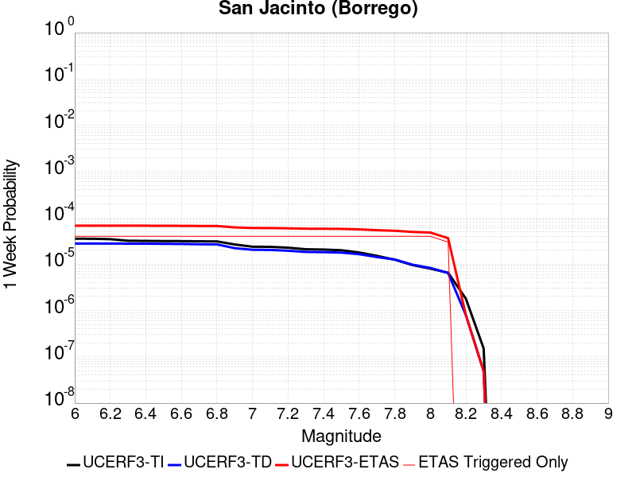 | 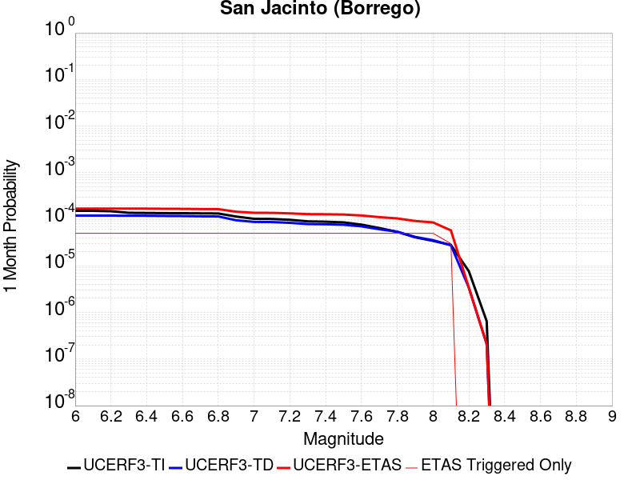 | 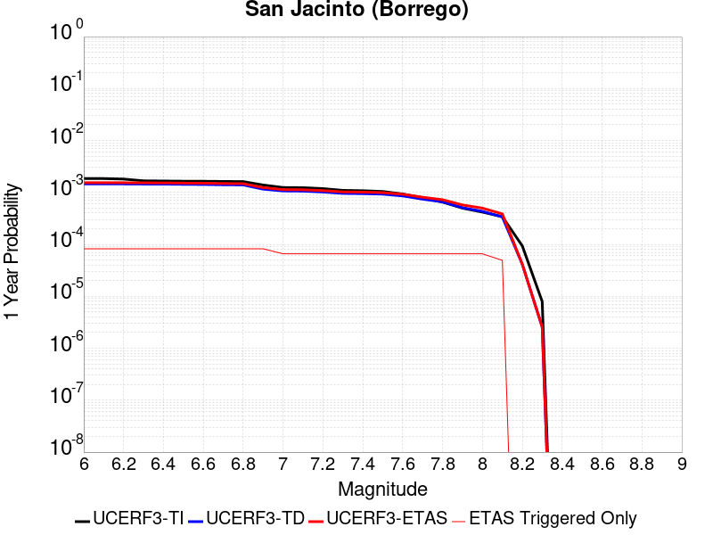 | 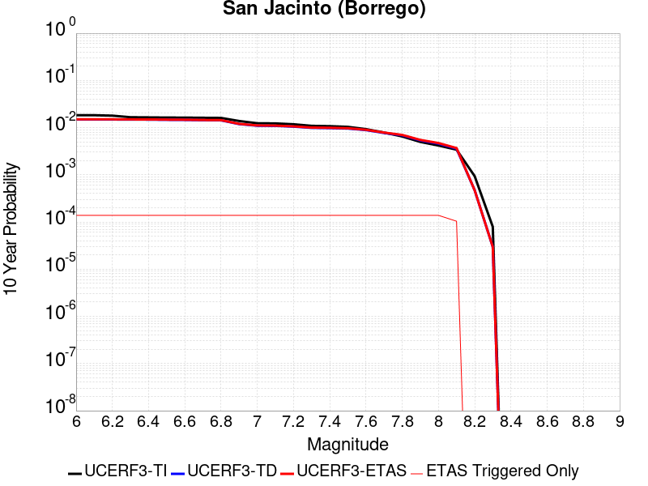 |

| Magnitude | 1 wk TI Prob | 1 wk TD Prob | 1 wk ETAS Prob | 1 wk ETAS/TD Gain | 1 wk ETAS Triggered Only | 1 mo TI Prob | 1 mo TD Prob | 1 mo ETAS Prob | 1 mo ETAS/TD Gain | 1 mo ETAS Triggered Only | 1 yr TI Prob | 1 yr TD Prob | 1 yr ETAS Prob | 1 yr ETAS/TD Gain | 1 yr ETAS Triggered Only | 10 yr TI Prob | 10 yr TD Prob | 10 yr ETAS Prob | 10 yr ETAS/TD Gain | 10 yr ETAS Triggered Only |
|-----|-----|-----|-----|-----|-----|-----|-----|-----|-----|-----|-----|-----|-----|-----|-----|-----|-----|-----|-----|-----|
| 6.0 | 3.543992E-5 | 2.7925962E-5 | 1.317221E-4 | 4.716833 | 1.03799044E-4 | 1.5187653E-4 | 1.1967727E-4 | 2.234639E-4 | 1.8672208 | 1.03799044E-4 | 0.0018475284 | 0.0014561092 | 0.0015943063 | 1.0949086 | 1.3839873E-4 | 0.018322436 | 0.01486815 | 0.015004491 | 1.00917 | 1.3839873E-4 |
| 6.1 | 3.542281E-5 | 2.7925962E-5 | 1.317221E-4 | 4.716833 | 1.03799044E-4 | 1.5180321E-4 | 1.1967727E-4 | 2.234639E-4 | 1.8672208 | 1.03799044E-4 | 0.0018466372 | 0.0014561092 | 0.0015943063 | 1.0949086 | 1.3839873E-4 | 0.018313672 | 0.01486815 | 0.015004491 | 1.00917 | 1.3839873E-4 |
| 6.2 | 3.4688688E-5 | 2.7925962E-5 | 1.317221E-4 | 4.7168336 | 1.03799044E-4 | 1.4865733E-4 | 1.1967727E-4 | 2.234639E-4 | 1.8672209 | 1.03799044E-4 | 0.0018084005 | 0.0014561091 | 0.0015943063 | 1.0949086 | 1.3839873E-4 | 0.017937548 | 0.01486815 | 0.015004491 | 1.00917 | 1.3839873E-4 |
| 6.3 | 3.2087122E-5 | 2.7771312E-5 | 1.3156747E-4 | 4.7375317 | 1.03799044E-4 | 1.3750899E-4 | 1.1901455E-4 | 2.2280125E-4 | 1.8720505 | 1.03799044E-4 | 0.0016728862 | 0.0014480512 | 0.0015862496 | 1.0954374 | 1.3839873E-4 | 0.016603488 | 0.014789308 | 0.01492566 | 1.0092196 | 1.3839873E-4 |
| 6.4 | 3.1828724E-5 | 2.773829E-5 | 1.3153446E-4 | 4.7419815 | 1.03799044E-4 | 1.364017E-4 | 1.1887303E-4 | 2.2265974E-4 | 1.8730887 | 1.03799044E-4 | 0.0016594254 | 0.0014463306 | 0.0015845291 | 1.0955511 | 1.3839873E-4 | 0.016470885 | 0.014772502 | 0.014908856 | 1.0092303 | 1.3839873E-4 |
| 6.5 | 3.1563577E-5 | 2.7477974E-5 | 1.3127417E-4 | 4.7774324 | 1.03799044E-4 | 1.3526545E-4 | 1.17757496E-4 | 2.2154432E-4 | 1.8813607 | 1.03799044E-4 | 0.0016456128 | 0.0014327668 | 0.0015709673 | 1.096457 | 1.3839873E-4 | 0.0163348 | 0.01463991 | 0.014776283 | 1.0093151 | 1.3839873E-4 |
| 6.6 | 3.1467625E-5 | 2.7322194E-5 | 1.311184E-4 | 4.7989707 | 1.03799044E-4 | 1.3485427E-4 | 1.17089934E-4 | 2.2087683E-4 | 1.8863862 | 1.03799044E-4 | 0.0016406142 | 0.0014246498 | 0.0015628514 | 1.0970074 | 1.3839873E-4 | 0.016285548 | 0.014560228 | 0.014696611 | 1.0093669 | 1.3839873E-4 |
| 6.7 | 3.1223695E-5 | 2.6940217E-5 | 1.3073647E-4 | 4.852836 | 1.03799044E-4 | 1.3380898E-4 | 1.1545303E-4 | 2.192401E-4 | 1.8989549 | 1.03799044E-4 | 0.0016279068 | 0.0014047464 | 0.0015429507 | 1.0983838 | 1.3839873E-4 | 0.01616033 | 0.01436451 | 0.01450092 | 1.0094963 | 1.3839873E-4 |
| 6.8 | 3.1015585E-5 | 2.6761221E-5 | 1.3055748E-4 | 4.8786073 | 1.03799044E-4 | 1.3291716E-4 | 1.1468597E-4 | 2.1847311E-4 | 1.904968 | 1.03799044E-4 | 0.001617065 | 0.0013954195 | 0.0015336251 | 1.0990423 | 1.3839873E-4 | 0.016053487 | 0.014271772 | 0.014408195 | 1.009559 | 1.3839873E-4 |
| 6.9 | 2.6641965E-5 | 2.2183434E-5 | 1.2598018E-4 | 5.6790204 | 1.03799044E-4 | 1.1417485E-4 | 9.506842E-5 | 1.988576E-4 | 2.0917313 | 1.03799044E-4 | 0.0013891924 | 0.0011568473 | 0.001295086 | 1.119496 | 1.3839873E-4 | 0.0138054015 | 0.011882191 | 0.012018945 | 1.0115092 | 1.3839873E-4 |
| 7.0 | 2.3854353E-5 | 2.047825E-5 | 1.2427518E-4 | 6.068642 | 1.03799044E-4 | 1.02228936E-4 | 8.776099E-5 | 1.9155093E-4 | 2.1826432 | 1.03799044E-4 | 0.0012439266 | 0.0010679689 | 0.0012062198 | 1.1294522 | 1.3839873E-4 | 0.012369866 | 0.0109826205 | 0.011119499 | 1.0124632 | 1.3839873E-4 |
| 7.1 | 2.3672901E-5 | 2.0314741E-5 | 1.2411168E-4 | 6.1094394 | 1.03799044E-4 | 1.0145135E-4 | 8.706028E-5 | 1.9085029E-4 | 2.1921625 | 1.03799044E-4 | 0.0012344702 | 0.0010594461 | 0.0011976982 | 1.1304947 | 1.3839873E-4 | 0.0122763505 | 0.010897858 | 0.0110347485 | 1.0125612 | 1.3839873E-4 |
| 7.2 | 2.2717244E-5 | 1.9542116E-5 | 1.2333914E-4 | 6.3114524 | 1.03799044E-4 | 9.735599E-5 | 8.3749255E-5 | 1.875396E-4 | 2.2392988 | 1.03799044E-4 | 0.0011846646 | 0.0010191725 | 0.0011574302 | 1.1356568 | 1.3839873E-4 | 0.01178369 | 0.010495322 | 0.010632268 | 1.0130483 | 1.3839873E-4 |
| 7.3 | 2.1016205E-5 | 1.8383771E-5 | 1.221809E-4 | 6.6461287 | 1.03799044E-4 | 9.006634E-5 | 7.878522E-5 | 1.8257608E-4 | 2.31739 | 1.03799044E-4 | 0.001096006 | 9.5879E-4 | 0.0010970561 | 1.1442089 | 1.3839873E-4 | 0.010906163 | 0.009890901 | 0.010027931 | 1.0138541 | 1.3839873E-4 |
| 7.4 | 2.0683625E-5 | 1.8186302E-5 | 1.2198346E-4 | 6.707436 | 1.03799044E-4 | 8.86411E-5 | 7.7938974E-5 | 1.8172993E-4 | 2.331695 | 1.03799044E-4 | 0.001078671 | 9.48496E-4 | 0.0010867635 | 1.1457754 | 1.3839873E-4 | 0.010734501 | 0.0097876275 | 0.009924672 | 1.0140017 | 1.3839873E-4 |
| 7.5 | 1.9993966E-5 | 1.7781347E-5 | 1.21578545E-4 | 6.8374205 | 1.03799044E-4 | 8.568561E-5 | 7.6203556E-5 | 1.7999469E-4 | 2.3620248 | 1.03799044E-4 | 0.001042723 | 9.2738547E-4 | 0.0010656558 | 1.149097 | 1.3839873E-4 | 0.010378438 | 0.009574548 | 0.009711622 | 1.0143164 | 1.3839873E-4 |
| 7.6 | 1.788966E-5 | 1.6434618E-5 | 1.20231954E-4 | 7.3157744 | 1.03799044E-4 | 7.666772E-5 | 7.043219E-5 | 1.7422393E-4 | 2.4736407 | 1.03799044E-4 | 9.3302975E-4 | 8.5717626E-4 | 9.954564E-4 | 1.1613204 | 1.3839873E-4 | 0.00929122 | 0.008866415 | 0.009003587 | 1.015471 | 1.3839873E-4 |
| 7.7 | 1.5125781E-5 | 1.4236738E-5 | 1.180343E-4 | 8.290825 | 1.03799044E-4 | 6.4823165E-5 | 6.101317E-5 | 1.6480588E-4 | 2.7011526 | 1.03799044E-4 | 7.889362E-4 | 7.4258295E-4 | 8.8087894E-4 | 1.1862364 | 1.3839873E-4 | 0.007861412 | 0.007714161 | 0.007851493 | 1.0178025 | 1.3839873E-4 |
| 7.8 | 1.250089E-5 | 1.262994E-5 | 1.1642768E-4 | 9.218387 | 1.03799044E-4 | 5.3574146E-5 | 5.4127195E-5 | 1.5792063E-4 | 2.9175837 | 1.03799044E-4 | 6.5207E-4 | 6.588E-4 | 7.971075E-4 | 1.2099386 | 1.3839873E-4 | 0.006501599 | 0.006867759 | 0.0070052072 | 1.0200136 | 1.3839873E-4 |
| 7.9 | 9.561E-6 | 9.754065E-6 | 1.13552094E-4 | 11.641516 | 1.03799044E-4 | 4.0975072E-5 | 4.180247E-5 | 1.4559718E-4 | 3.4829803 | 1.03799044E-4 | 4.987573E-4 | 5.0882675E-4 | 6.471551E-4 | 1.2718574 | 1.3839873E-4 | 0.0049763937 | 0.0053523607 | 0.0054900185 | 1.0257192 | 1.3839873E-4 |
| 8.0 | 8.01699E-6 | 8.292994E-6 | 1.1209118E-4 | 13.516371 | 1.03799044E-4 | 3.4358076E-5 | 3.554092E-5 | 1.3933628E-4 | 3.9204464 | 1.03799044E-4 | 4.1822926E-4 | 4.3262533E-4 | 5.709642E-4 | 1.3197659 | 1.3839873E-4 | 0.0041744304 | 0.0045733186 | 0.0047110845 | 1.0301238 | 1.3839873E-4 |
| 8.1 | 6.541947E-6 | 6.461784E-6 | 7.56607E-5 | 11.708949 | 6.919936E-5 | 2.8036617E-5 | 2.7693068E-5 | 9.6890515E-5 | 3.498728 | 6.919936E-5 | 3.4129233E-4 | 3.3711144E-4 | 4.408755E-4 | 1.3078034 | 1.03799044E-4 | 0.0034076865 | 0.0035805756 | 0.003684003 | 1.0288857 | 1.03799044E-4 |
| 8.2 | 1.7968189E-6 | 7.9684827E-7 | 7.9684827E-7 | 1.0 | 0.0 | 7.70063E-6 | 3.4150596E-6 | 3.4150596E-6 | 1.0 | 0.0 | 9.3751136E-5 | 4.157758E-5 | 4.157758E-5 | 1.0 | 0.0 | 9.371159E-4 | 4.7107413E-4 | 4.7107413E-4 | 1.0 | 0.0 |
| 8.3 | 1.5167889E-7 | 4.8951257E-8 | 4.8951257E-8 | 1.0 | 0.0 | 6.500522E-7 | 2.0979108E-7 | 2.0979108E-7 | 1.0 | 0.0 | 7.9143565E-6 | 2.5542038E-6 | 2.5542038E-6 | 1.0 | 0.0 | 7.914075E-5 | 2.9679897E-5 | 2.9679897E-5 | 1.0 | 0.0 |

## Mission Creek
*[(top)](#table-of-contents)*

| 1 Week | 1 Month | 1 Year | 10 Year |
|-----|-----|-----|-----|
| 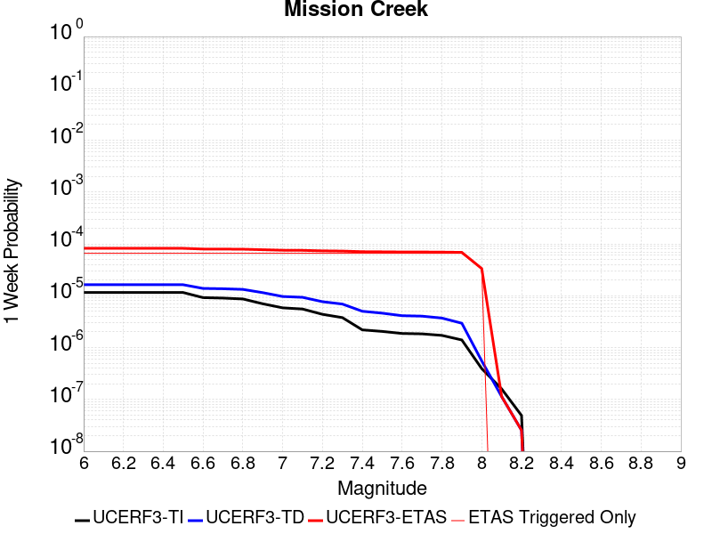 | 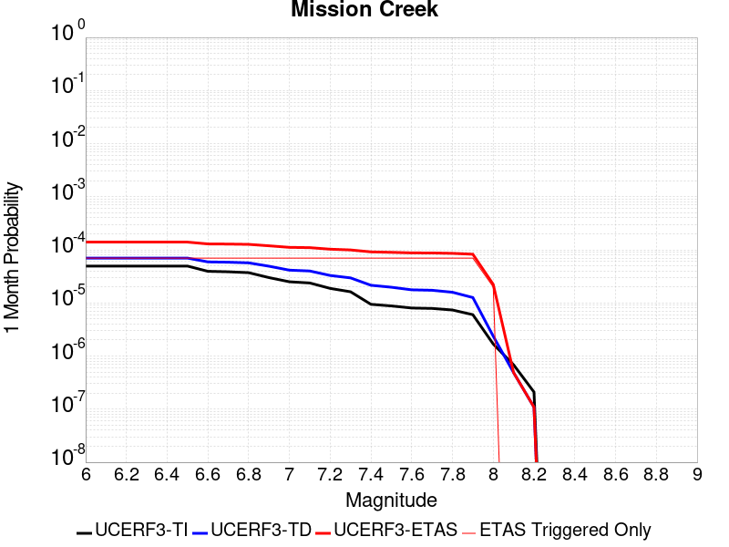 | 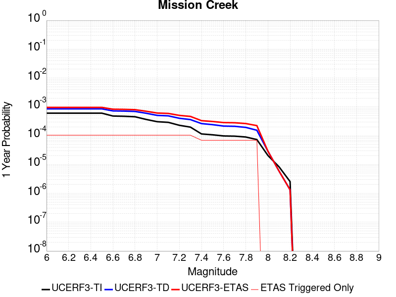 | 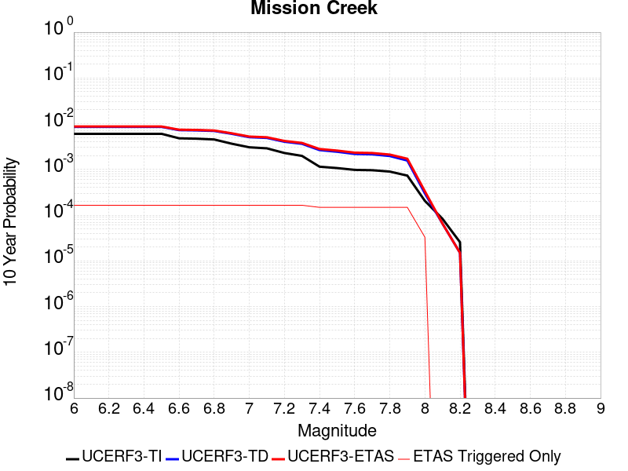 |

| Magnitude | 1 wk TI Prob | 1 wk TD Prob | 1 wk ETAS Prob | 1 wk ETAS/TD Gain | 1 wk ETAS Triggered Only | 1 mo TI Prob | 1 mo TD Prob | 1 mo ETAS Prob | 1 mo ETAS/TD Gain | 1 mo ETAS Triggered Only | 1 yr TI Prob | 1 yr TD Prob | 1 yr ETAS Prob | 1 yr ETAS/TD Gain | 1 yr ETAS Triggered Only | 10 yr TI Prob | 10 yr TD Prob | 10 yr ETAS Prob | 10 yr ETAS/TD Gain | 10 yr ETAS Triggered Only |
|-----|-----|-----|-----|-----|-----|-----|-----|-----|-----|-----|-----|-----|-----|-----|-----|-----|-----|-----|-----|-----|
| 6.0 | 1.1549387E-5 | 1.6322783E-5 | 1.6322783E-5 | 1.0 | 0.0 | 4.9496433E-5 | 6.995299E-5 | 6.995299E-5 | 1.0 | 0.0 | 6.0245243E-4 | 8.5135986E-4 | 9.5507054E-4 | 1.1218177 | 1.03799044E-4 | 0.006008218 | 0.008510157 | 0.008647378 | 1.0161244 | 1.3839873E-4 |
| 6.1 | 1.1549387E-5 | 1.6322783E-5 | 1.6322783E-5 | 1.0 | 0.0 | 4.9496433E-5 | 6.995299E-5 | 6.995299E-5 | 1.0 | 0.0 | 6.0245243E-4 | 8.5135986E-4 | 9.5507054E-4 | 1.1218177 | 1.03799044E-4 | 0.006008218 | 0.008510157 | 0.008647378 | 1.0161244 | 1.3839873E-4 |
| 6.2 | 1.1549387E-5 | 1.6322783E-5 | 1.6322783E-5 | 1.0 | 0.0 | 4.9496433E-5 | 6.995299E-5 | 6.995299E-5 | 1.0 | 0.0 | 6.0245243E-4 | 8.5135986E-4 | 9.5507054E-4 | 1.1218177 | 1.03799044E-4 | 0.006008218 | 0.008510157 | 0.008647378 | 1.0161244 | 1.3839873E-4 |
| 6.3 | 1.1549387E-5 | 1.6322783E-5 | 1.6322783E-5 | 1.0 | 0.0 | 4.9496433E-5 | 6.995299E-5 | 6.995299E-5 | 1.0 | 0.0 | 6.0245243E-4 | 8.5135986E-4 | 9.5507054E-4 | 1.1218177 | 1.03799044E-4 | 0.006008218 | 0.008510157 | 0.008647378 | 1.0161244 | 1.3839873E-4 |
| 6.4 | 1.1549387E-5 | 1.6322783E-5 | 1.6322783E-5 | 1.0 | 0.0 | 4.9496433E-5 | 6.995299E-5 | 6.995299E-5 | 1.0 | 0.0 | 6.0245243E-4 | 8.5135986E-4 | 9.5507054E-4 | 1.1218177 | 1.03799044E-4 | 0.006008218 | 0.008510157 | 0.008647378 | 1.0161244 | 1.3839873E-4 |
| 6.5 | 1.1549387E-5 | 1.6322783E-5 | 1.6322783E-5 | 1.0 | 0.0 | 4.9496433E-5 | 6.995299E-5 | 6.995299E-5 | 1.0 | 0.0 | 6.0245243E-4 | 8.5135986E-4 | 9.5507054E-4 | 1.1218177 | 1.03799044E-4 | 0.006008218 | 0.008510157 | 0.008647378 | 1.0161244 | 1.3839873E-4 |
| 6.6 | 9.202681E-6 | 1.3846059E-5 | 1.3846059E-5 | 1.0 | 0.0 | 3.9439463E-5 | 5.9338956E-5 | 5.9338956E-5 | 1.0 | 0.0 | 4.800697E-4 | 7.2222133E-4 | 8.259454E-4 | 1.1436181 | 1.03799044E-4 | 0.004790339 | 0.0072273402 | 0.0073647387 | 1.0190109 | 1.3839873E-4 |
| 6.7 | 9.019164E-6 | 1.3651728E-5 | 1.3651728E-5 | 1.0 | 0.0 | 3.8652986E-5 | 5.8506146E-5 | 5.8506146E-5 | 1.0 | 0.0 | 4.7049852E-4 | 7.1208854E-4 | 8.1581366E-4 | 1.1456633 | 1.03799044E-4 | 0.004695036 | 0.0071266647 | 0.0072640767 | 1.0192815 | 1.3839873E-4 |
| 6.8 | 8.673558E-6 | 1.3273839E-5 | 1.3273839E-5 | 1.0 | 0.0 | 3.717186E-5 | 5.688669E-5 | 5.688669E-5 | 1.0 | 0.0 | 4.524734E-4 | 6.923842E-4 | 7.9611136E-4 | 1.1498116 | 1.03799044E-4 | 0.0045155324 | 0.0069308523 | 0.0070682922 | 1.0198301 | 1.3839873E-4 |
| 6.9 | 7.002255E-6 | 1.1478069E-5 | 1.1478069E-5 | 1.0 | 0.0 | 3.000932E-5 | 4.9190832E-5 | 4.9190832E-5 | 1.0 | 0.0 | 3.653022E-4 | 5.9874065E-4 | 7.024775E-4 | 1.1732584 | 1.03799044E-4 | 0.0036470229 | 0.005999676 | 0.006137244 | 1.0229293 | 1.3839873E-4 |
| 7.0 | 5.84644E-6 | 9.675359E-6 | 9.675359E-6 | 1.0 | 0.0 | 2.5055931E-5 | 4.146519E-5 | 4.146519E-5 | 1.0 | 0.0 | 3.0501327E-4 | 5.047263E-4 | 6.0847297E-4 | 1.2055503 | 1.03799044E-4 | 0.0030459496 | 0.005063994 | 0.0052016918 | 1.0271915 | 1.3839873E-4 |
| 7.1 | 5.54703E-6 | 9.329834E-6 | 9.329834E-6 | 1.0 | 0.0 | 2.377277E-5 | 3.9984414E-5 | 3.9984414E-5 | 1.0 | 0.0 | 2.8939504E-4 | 4.8670598E-4 | 5.904545E-4 | 1.2131647 | 1.03799044E-4 | 0.0028901845 | 0.0048845876 | 0.00502231 | 1.0281954 | 1.3839873E-4 |
| 7.2 | 4.384709E-6 | 7.681918E-6 | 7.681918E-6 | 1.0 | 0.0 | 1.8791474E-5 | 3.292211E-5 | 3.292211E-5 | 1.0 | 0.0 | 2.2876218E-4 | 4.0075663E-4 | 5.045141E-4 | 1.2589039 | 1.03799044E-4 | 0.0022852682 | 0.004028542 | 0.0041663833 | 1.0342162 | 1.3839873E-4 |
| 7.3 | 3.7888456E-6 | 6.915788E-6 | 6.915788E-6 | 1.0 | 0.0 | 1.623781E-5 | 2.9638775E-5 | 2.9638775E-5 | 1.0 | 0.0 | 1.9767738E-4 | 3.6079568E-4 | 4.645573E-4 | 1.287591 | 1.03799044E-4 | 0.0019750162 | 0.00363027 | 0.0037681663 | 1.0379851 | 1.3839873E-4 |
| 7.4 | 2.1982462E-6 | 5.0241033E-6 | 5.0241033E-6 | 1.0 | 0.0 | 9.421021E-6 | 2.1531694E-5 | 2.1531694E-5 | 1.0 | 0.0 | 1.1469489E-4 | 2.6211704E-4 | 3.3129824E-4 | 1.2639326 | 6.919936E-5 | 0.0011463572 | 0.0026460327 | 0.0027495571 | 1.0391244 | 1.03799044E-4 |
| 7.5 | 2.051923E-6 | 4.6153277E-6 | 4.6153277E-6 | 1.0 | 0.0 | 8.793926E-6 | 1.9779825E-5 | 1.9779825E-5 | 1.0 | 0.0 | 1.0706078E-4 | 2.4079291E-4 | 3.099756E-4 | 1.287312 | 6.919936E-5 | 0.0010700922 | 0.0024335932 | 0.0025371395 | 1.0425488 | 1.03799044E-4 |
| 7.6 | 1.8733427E-6 | 4.1236603E-6 | 4.1236603E-6 | 1.0 | 0.0 | 8.028587E-6 | 1.7672712E-5 | 1.7672712E-5 | 1.0 | 0.0 | 9.774366E-5 | 2.151441E-4 | 2.843286E-4 | 1.3215728 | 6.919936E-5 | 9.770069E-4 | 0.0021782513 | 0.0022818241 | 1.0475487 | 1.03799044E-4 |
| 7.7 | 1.8411953E-6 | 4.0433315E-6 | 4.0433315E-6 | 1.0 | 0.0 | 7.890813E-6 | 1.732845E-5 | 1.732845E-5 | 1.0 | 0.0 | 9.606641E-5 | 2.1095353E-4 | 2.801383E-4 | 1.3279622 | 6.919936E-5 | 9.6024893E-4 | 0.0021365292 | 0.0022401065 | 1.0484792 | 1.03799044E-4 |
| 7.8 | 1.7194251E-6 | 3.71068E-6 | 3.71068E-6 | 1.0 | 0.0 | 7.368944E-6 | 1.5902819E-5 | 1.5902819E-5 | 1.0 | 0.0 | 8.97132E-5 | 1.9359968E-4 | 2.6278564E-4 | 1.3573661 | 6.919936E-5 | 8.967699E-4 | 0.0019624757 | 0.002066071 | 1.0527881 | 1.03799044E-4 |
| 7.9 | 1.4035052E-6 | 2.9502596E-6 | 2.9502596E-6 | 1.0 | 0.0 | 6.0150082E-6 | 1.2643909E-5 | 1.2643909E-5 | 1.0 | 0.0 | 7.3230265E-5 | 1.5392878E-4 | 2.2311749E-4 | 1.4494852 | 6.919936E-5 | 7.3206134E-4 | 0.0015631174 | 0.0016667541 | 1.0663013 | 1.03799044E-4 |
| 8.0 | 3.9318823E-7 | 5.528477E-7 | 5.528477E-7 | 1.0 | 0.0 | 1.6850913E-6 | 2.3693453E-6 | 2.3693453E-6 | 1.0 | 0.0 | 2.0515794E-5 | 2.8846403E-5 | 2.8846403E-5 | 1.0 | 0.0 | 2.0513899E-4 | 2.990952E-4 | 2.990952E-4 | 1.0 | 0.0 |
| 8.1 | 1.596793E-7 | 1.13775044E-7 | 1.13775044E-7 | 1.0 | 0.0 | 6.8433974E-7 | 4.876072E-7 | 4.876072E-7 | 1.0 | 0.0 | 8.331805E-6 | 5.936602E-6 | 5.936602E-6 | 1.0 | 0.0 | 8.331492E-5 | 6.5494125E-5 | 6.5494125E-5 | 1.0 | 0.0 |
| 8.2 | 4.9003038E-8 | 2.5435753E-8 | 2.5435753E-8 | 1.0 | 0.0 | 2.10013E-7 | 1.09010365E-7 | 1.09010365E-7 | 1.0 | 0.0 | 2.5569052E-6 | 1.3272004E-6 | 1.3272004E-6 | 1.0 | 0.0 | 2.556876E-5 | 1.4952613E-5 | 1.4952613E-5 | 1.0 | 0.0 |

## Whittier alt 1
*[(top)](#table-of-contents)*

| 1 Week | 1 Month | 1 Year | 10 Year |
|-----|-----|-----|-----|
| 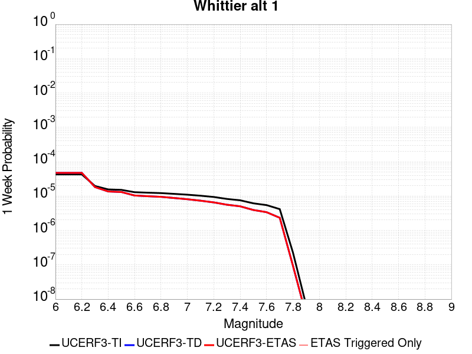 | 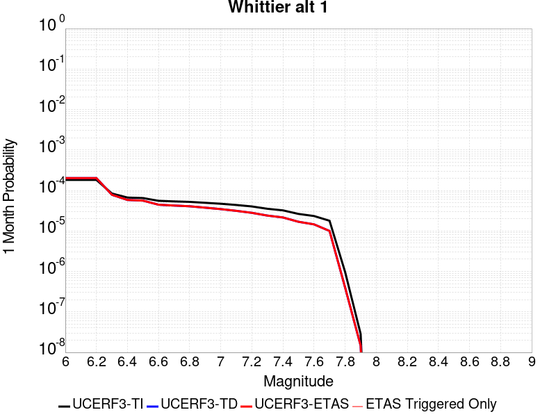 | 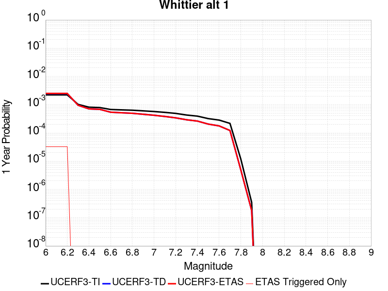 | 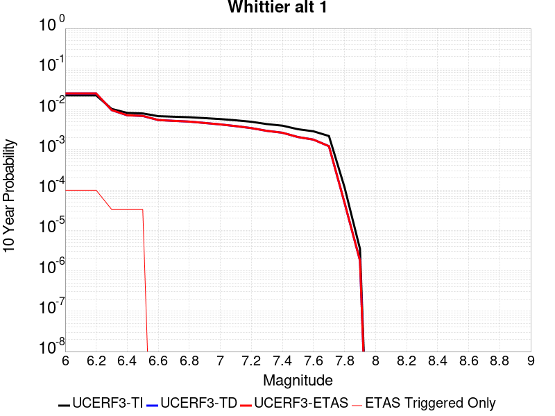 |

| Magnitude | 1 wk TI Prob | 1 wk TD Prob | 1 wk ETAS Prob | 1 wk ETAS/TD Gain | 1 wk ETAS Triggered Only | 1 mo TI Prob | 1 mo TD Prob | 1 mo ETAS Prob | 1 mo ETAS/TD Gain | 1 mo ETAS Triggered Only | 1 yr TI Prob | 1 yr TD Prob | 1 yr ETAS Prob | 1 yr ETAS/TD Gain | 1 yr ETAS Triggered Only | 10 yr TI Prob | 10 yr TD Prob | 10 yr ETAS Prob | 10 yr ETAS/TD Gain | 10 yr ETAS Triggered Only |
|-----|-----|-----|-----|-----|-----|-----|-----|-----|-----|-----|-----|-----|-----|-----|-----|-----|-----|-----|-----|-----|
| 6.0 | 4.2554693E-5 | 4.7252182E-5 | 4.7252182E-5 | 1.0 | 0.0 | 1.8236451E-4 | 2.0249544E-4 | 2.0249544E-4 | 1.0 | 0.0 | 0.002218027 | 0.0024629163 | 0.002497431 | 1.0140136 | 3.459968E-5 | 0.02196019 | 0.024390263 | 0.024525287 | 1.005536 | 1.3839873E-4 |
| 6.1 | 4.2554693E-5 | 4.7252182E-5 | 4.7252182E-5 | 1.0 | 0.0 | 1.8236451E-4 | 2.0249544E-4 | 2.0249544E-4 | 1.0 | 0.0 | 0.002218027 | 0.0024629163 | 0.002497431 | 1.0140136 | 3.459968E-5 | 0.02196019 | 0.024390263 | 0.024525287 | 1.005536 | 1.3839873E-4 |
| 6.2 | 4.2554693E-5 | 4.7252182E-5 | 4.7252182E-5 | 1.0 | 0.0 | 1.8236451E-4 | 2.0249544E-4 | 2.0249544E-4 | 1.0 | 0.0 | 0.002218027 | 0.0024629163 | 0.002497431 | 1.0140136 | 3.459968E-5 | 0.02196019 | 0.024390263 | 0.024525287 | 1.005536 | 1.3839873E-4 |
| 6.3 | 1.9617712E-5 | 1.826841E-5 | 1.826841E-5 | 1.0 | 0.0 | 8.40732E-5 | 7.829095E-5 | 7.829095E-5 | 1.0 | 0.0 | 0.0010231105 | 9.527944E-4 | 9.527944E-4 | 1.0 | 0.0 | 0.01018413 | 0.0094904 | 0.00952467 | 1.0036112 | 3.459968E-5 |
| 6.4 | 1.5611336E-5 | 1.3604089E-5 | 1.3604089E-5 | 1.0 | 0.0 | 6.690401E-5 | 5.8301972E-5 | 5.8301972E-5 | 1.0 | 0.0 | 8.142519E-4 | 7.096013E-4 | 7.096013E-4 | 1.0 | 0.0 | 0.008112748 | 0.0070753377 | 0.0071096923 | 1.0048556 | 3.459968E-5 |
| 6.5 | 1.5150166E-5 | 1.3100744E-5 | 1.3100744E-5 | 1.0 | 0.0 | 6.492767E-5 | 5.614487E-5 | 5.614487E-5 | 1.0 | 0.0 | 7.9020765E-4 | 6.8335526E-4 | 6.8335526E-4 | 1.0 | 0.0 | 0.007874036 | 0.006814508 | 0.0068488717 | 1.0050428 | 3.459968E-5 |
| 6.6 | 1.295588E-5 | 1.0380544E-5 | 1.0380544E-5 | 1.0 | 0.0 | 5.552402E-5 | 4.44873E-5 | 4.44873E-5 | 1.0 | 0.0 | 6.7579525E-4 | 5.415002E-4 | 5.415002E-4 | 1.0 | 0.0 | 0.006737438 | 0.005403343 | 0.005403343 | 1.0 | 0.0 |
| 6.7 | 1.2542085E-5 | 9.899189E-6 | 9.899189E-6 | 1.0 | 0.0 | 5.3750682E-5 | 4.2424414E-5 | 4.2424414E-5 | 1.0 | 0.0 | 6.542181E-4 | 5.163967E-4 | 5.163967E-4 | 1.0 | 0.0 | 0.006522954 | 0.005153464 | 0.005153464 | 1.0 | 0.0 |
| 6.8 | 1.2195878E-5 | 9.49523E-6 | 9.49523E-6 | 1.0 | 0.0 | 5.2267E-5 | 4.069322E-5 | 4.069322E-5 | 1.0 | 0.0 | 6.36165E-4 | 4.9532915E-4 | 4.9532915E-4 | 1.0 | 0.0 | 0.0063434686 | 0.0049436963 | 0.0049436963 | 1.0 | 0.0 |
| 6.9 | 1.1580298E-5 | 8.772739E-6 | 8.772739E-6 | 1.0 | 0.0 | 4.9628903E-5 | 3.759692E-5 | 3.759692E-5 | 1.0 | 0.0 | 6.040644E-4 | 4.5764804E-4 | 4.5764804E-4 | 1.0 | 0.0 | 0.00602425 | 0.0045684646 | 0.0045684646 | 1.0 | 0.0 |
| 7.0 | 1.0964795E-5 | 8.083794E-6 | 8.083794E-6 | 1.0 | 0.0 | 4.6991136E-5 | 3.4644378E-5 | 3.4644378E-5 | 1.0 | 0.0 | 5.7196687E-4 | 4.217152E-4 | 4.217152E-4 | 1.0 | 0.0 | 0.0057049696 | 0.004210459 | 0.004210459 | 1.0 | 0.0 |
| 7.1 | 1.0230601E-5 | 7.32646E-6 | 7.32646E-6 | 1.0 | 0.0 | 4.3844695E-5 | 3.1398744E-5 | 3.1398744E-5 | 1.0 | 0.0 | 5.336784E-4 | 3.8221394E-4 | 3.8221394E-4 | 1.0 | 0.0 | 0.005323986 | 0.0038167592 | 0.0038167592 | 1.0 | 0.0 |
| 7.2 | 9.40865E-6 | 6.5430822E-6 | 6.5430822E-6 | 1.0 | 0.0 | 4.032216E-5 | 2.8041486E-5 | 2.8041486E-5 | 1.0 | 0.0 | 4.908117E-4 | 3.4135283E-4 | 3.4135283E-4 | 1.0 | 0.0 | 0.0048972913 | 0.0034094024 | 0.0034094024 | 1.0 | 0.0 |
| 7.3 | 8.237384E-6 | 5.5975433E-6 | 5.5975433E-6 | 1.0 | 0.0 | 3.5302593E-5 | 2.3989258E-5 | 2.3989258E-5 | 1.0 | 0.0 | 4.2972428E-4 | 2.920311E-4 | 2.920311E-4 | 1.0 | 0.0 | 0.0042889426 | 0.0029167992 | 0.0029167992 | 1.0 | 0.0 |
| 7.4 | 7.5316966E-6 | 5.0276153E-6 | 5.0276153E-6 | 1.0 | 0.0 | 3.2278298E-5 | 2.154675E-5 | 2.154675E-5 | 1.0 | 0.0 | 3.9291743E-4 | 2.623011E-4 | 2.623011E-4 | 1.0 | 0.0 | 0.0039222343 | 0.0026200267 | 0.0026200267 | 1.0 | 0.0 |
| 7.5 | 6.149649E-6 | 3.9336355E-6 | 3.9336355E-6 | 1.0 | 0.0 | 2.6355372E-5 | 1.6858336E-5 | 1.6858336E-5 | 1.0 | 0.0 | 3.208294E-4 | 2.052318E-4 | 2.052318E-4 | 1.0 | 0.0 | 0.003203666 | 0.0020505118 | 0.0020505118 | 1.0 | 0.0 |
| 7.6 | 5.457711E-6 | 3.3951796E-6 | 3.3951796E-6 | 1.0 | 0.0 | 2.338998E-5 | 1.4550694E-5 | 1.4550694E-5 | 1.0 | 0.0 | 2.8473578E-4 | 1.771411E-4 | 1.771411E-4 | 1.0 | 0.0 | 0.0028437122 | 0.0017700798 | 0.0017700798 | 1.0 | 0.0 |
| 7.7 | 4.1676276E-6 | 2.3329922E-6 | 2.3329922E-6 | 1.0 | 0.0 | 1.7861139E-5 | 9.998504E-6 | 9.998504E-6 | 1.0 | 0.0 | 2.1743766E-4 | 1.2172572E-4 | 1.2172572E-4 | 1.0 | 0.0 | 0.0021722503 | 0.0012166635 | 0.0012166635 | 1.0 | 0.0 |
| 7.8 | 2.2692414E-7 | 9.384417E-8 | 9.384417E-8 | 1.0 | 0.0 | 9.725317E-7 | 4.0218927E-7 | 4.0218927E-7 | 1.0 | 0.0 | 1.1840509E-5 | 4.8966467E-6 | 4.8966467E-6 | 1.0 | 0.0 | 1.1839878E-4 | 4.8965718E-5 | 4.8965718E-5 | 1.0 | 0.0 |
| 7.9 | 6.676829E-9 | 3.4397174E-9 | 3.4397174E-9 | 1.0 | 0.0 | 2.861498E-8 | 1.4741646E-8 | 1.4741646E-8 | 1.0 | 0.0 | 3.4838732E-7 | 1.7947953E-7 | 1.7947953E-7 | 1.0 | 0.0 | 3.4838679E-6 | 1.794794E-6 | 1.794794E-6 | 1.0 | 0.0 |

## Cucamonga
*[(top)](#table-of-contents)*

| 1 Week | 1 Month | 1 Year | 10 Year |
|-----|-----|-----|-----|
| 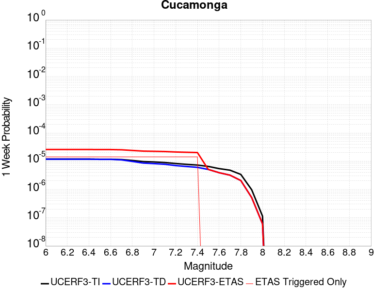 | 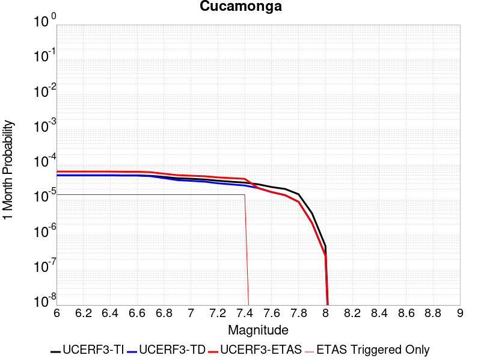 | 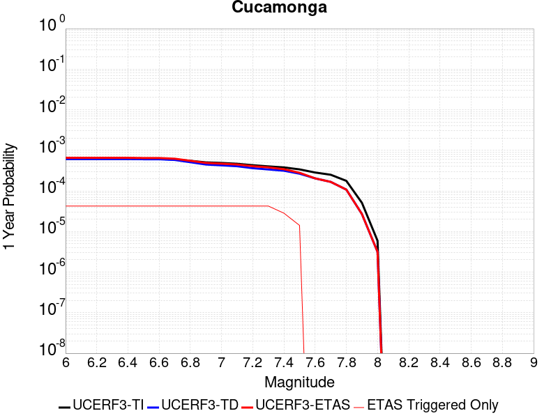 | 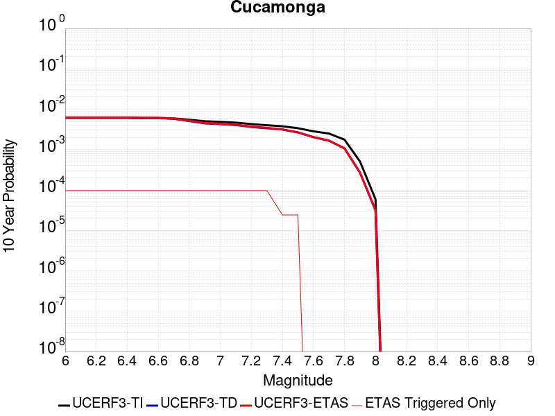 |

| Magnitude | 1 wk TI Prob | 1 wk TD Prob | 1 wk ETAS Prob | 1 wk ETAS/TD Gain | 1 wk ETAS Triggered Only | 1 mo TI Prob | 1 mo TD Prob | 1 mo ETAS Prob | 1 mo ETAS/TD Gain | 1 mo ETAS Triggered Only | 1 yr TI Prob | 1 yr TD Prob | 1 yr ETAS Prob | 1 yr ETAS/TD Gain | 1 yr ETAS Triggered Only | 10 yr TI Prob | 10 yr TD Prob | 10 yr ETAS Prob | 10 yr ETAS/TD Gain | 10 yr ETAS Triggered Only |
|-----|-----|-----|-----|-----|-----|-----|-----|-----|-----|-----|-----|-----|-----|-----|-----|-----|-----|-----|-----|-----|
| 6.0 | 1.1848348E-5 | 1.1737109E-5 | 1.1737109E-5 | 1.0 | 0.0 | 5.0777642E-5 | 5.0300943E-5 | 5.0300943E-5 | 1.0 | 0.0 | 6.180424E-4 | 6.122446E-4 | 6.814016E-4 | 1.1129565 | 6.919936E-5 | 0.0061632637 | 0.006106745 | 0.00620991 | 1.0168936 | 1.03799044E-4 |
| 6.1 | 1.1848348E-5 | 1.1737109E-5 | 1.1737109E-5 | 1.0 | 0.0 | 5.0777642E-5 | 5.0300943E-5 | 5.0300943E-5 | 1.0 | 0.0 | 6.180424E-4 | 6.122446E-4 | 6.814016E-4 | 1.1129565 | 6.919936E-5 | 0.0061632637 | 0.006106745 | 0.00620991 | 1.0168936 | 1.03799044E-4 |
| 6.2 | 1.1848348E-5 | 1.1737109E-5 | 1.1737109E-5 | 1.0 | 0.0 | 5.0777642E-5 | 5.0300943E-5 | 5.0300943E-5 | 1.0 | 0.0 | 6.180424E-4 | 6.122446E-4 | 6.814016E-4 | 1.1129565 | 6.919936E-5 | 0.0061632637 | 0.006106745 | 0.00620991 | 1.0168936 | 1.03799044E-4 |
| 6.3 | 1.1848348E-5 | 1.1737109E-5 | 1.1737109E-5 | 1.0 | 0.0 | 5.0777642E-5 | 5.0300943E-5 | 5.0300943E-5 | 1.0 | 0.0 | 6.180424E-4 | 6.122446E-4 | 6.814016E-4 | 1.1129565 | 6.919936E-5 | 0.0061632637 | 0.006106745 | 0.00620991 | 1.0168936 | 1.03799044E-4 |
| 6.4 | 1.1848348E-5 | 1.1737109E-5 | 1.1737109E-5 | 1.0 | 0.0 | 5.0777642E-5 | 5.0300943E-5 | 5.0300943E-5 | 1.0 | 0.0 | 6.180424E-4 | 6.122446E-4 | 6.814016E-4 | 1.1129565 | 6.919936E-5 | 0.0061632637 | 0.006106745 | 0.00620991 | 1.0168936 | 1.03799044E-4 |
| 6.5 | 1.16988695E-5 | 1.157614E-5 | 1.157614E-5 | 1.0 | 0.0 | 5.013705E-5 | 4.9611102E-5 | 4.9611102E-5 | 1.0 | 0.0 | 6.102476E-4 | 6.0385047E-4 | 6.7300803E-4 | 1.1145277 | 6.919936E-5 | 0.006085745 | 0.0060232594 | 0.006126433 | 1.0171292 | 1.03799044E-4 |
| 6.6 | 1.16988695E-5 | 1.157614E-5 | 1.157614E-5 | 1.0 | 0.0 | 5.013705E-5 | 4.9611102E-5 | 4.9611102E-5 | 1.0 | 0.0 | 6.102476E-4 | 6.0385047E-4 | 6.7300803E-4 | 1.1145277 | 6.919936E-5 | 0.006085745 | 0.0060232594 | 0.006126433 | 1.0171292 | 1.03799044E-4 |
| 6.7 | 1.1397107E-5 | 1.1115039E-5 | 1.1115039E-5 | 1.0 | 0.0 | 4.884383E-5 | 4.7635025E-5 | 4.7635025E-5 | 1.0 | 0.0 | 5.9451134E-4 | 5.798046E-4 | 6.4896385E-4 | 1.1192802 | 6.919936E-5 | 0.005929234 | 0.005784061 | 0.0058872597 | 1.0178419 | 1.03799044E-4 |
| 6.8 | 1.058387E-5 | 9.785037E-6 | 9.785037E-6 | 1.0 | 0.0 | 4.5358654E-5 | 4.1935207E-5 | 4.1935207E-5 | 1.0 | 0.0 | 5.521017E-4 | 5.1044265E-4 | 5.796067E-4 | 1.1354982 | 6.919936E-5 | 0.00550732 | 0.005093702 | 0.0051969723 | 1.0202742 | 1.03799044E-4 |
| 6.9 | 9.690046E-6 | 8.579504E-6 | 8.579504E-6 | 1.0 | 0.0 | 4.1528107E-5 | 3.6768783E-5 | 3.6768783E-5 | 1.0 | 0.0 | 5.054874E-4 | 4.475684E-4 | 5.1673676E-4 | 1.1545426 | 6.919936E-5 | 0.005043391 | 0.0044675954 | 0.0045709307 | 1.0231299 | 1.03799044E-4 |
| 7.0 | 9.381461E-6 | 8.18712E-6 | 8.18712E-6 | 1.0 | 0.0 | 4.020564E-5 | 3.508719E-5 | 3.508719E-5 | 1.0 | 0.0 | 4.893937E-4 | 4.2710314E-4 | 4.962729E-4 | 1.1619511 | 6.919936E-5 | 0.0048831734 | 0.004263747 | 0.004367104 | 1.0242407 | 1.03799044E-4 |
| 7.1 | 8.946492E-6 | 7.781904E-6 | 7.781904E-6 | 1.0 | 0.0 | 3.8341543E-5 | 3.3350592E-5 | 3.3350592E-5 | 1.0 | 0.0 | 4.667083E-4 | 4.0596814E-4 | 4.7513942E-4 | 1.170386 | 6.919936E-5 | 0.0046572937 | 0.0040531927 | 0.004156571 | 1.0255054 | 1.03799044E-4 |
| 7.2 | 8.251016E-6 | 6.9752878E-6 | 6.9752878E-6 | 1.0 | 0.0 | 3.5361016E-5 | 2.9893748E-5 | 2.9893748E-5 | 1.0 | 0.0 | 4.3043532E-4 | 3.6389584E-4 | 4.3307003E-4 | 1.1900934 | 6.919936E-5 | 0.0042960253 | 0.0036339252 | 0.003737347 | 1.0284601 | 1.03799044E-4 |
| 7.3 | 7.717881E-6 | 6.4863584E-6 | 6.4863584E-6 | 1.0 | 0.0 | 3.3076216E-5 | 2.7798384E-5 | 2.7798384E-5 | 1.0 | 0.0 | 4.026285E-4 | 3.38393E-4 | 4.0756894E-4 | 1.2044249 | 6.919936E-5 | 0.004018998 | 0.0033797103 | 0.0034831585 | 1.0306087 | 1.03799044E-4 |
| 7.4 | 7.275623E-6 | 6.032004E-6 | 6.032004E-6 | 1.0 | 0.0 | 3.118087E-5 | 2.5851192E-5 | 2.5851192E-5 | 1.0 | 0.0 | 3.7956095E-4 | 3.1469302E-4 | 3.4928182E-4 | 1.1099128 | 3.459968E-5 | 0.0037891332 | 0.0031434046 | 0.0031778957 | 1.0109725 | 3.459968E-5 |
| 7.5 | 6.5109502E-6 | 5.100593E-6 | 5.100593E-6 | 1.0 | 0.0 | 2.7903774E-5 | 2.1859503E-5 | 2.1859503E-5 | 1.0 | 0.0 | 3.3967546E-4 | 2.661071E-4 | 3.0069757E-4 | 1.129987 | 3.459968E-5 | 0.0033915674 | 0.0026588016 | 0.0026933094 | 1.0129787 | 3.459968E-5 |
| 7.6 | 5.4495326E-6 | 3.908547E-6 | 3.908547E-6 | 1.0 | 0.0 | 2.335493E-5 | 1.6750808E-5 | 1.6750808E-5 | 1.0 | 0.0 | 2.8430918E-4 | 2.0392207E-4 | 2.0392207E-4 | 1.0 | 0.0 | 0.0028394572 | 0.0020382616 | 0.0020382616 | 1.0 | 0.0 |
| 7.7 | 4.7997164E-6 | 3.2002263E-6 | 3.2002263E-6 | 1.0 | 0.0 | 2.057005E-5 | 1.3715184E-5 | 1.3715184E-5 | 1.0 | 0.0 | 2.504116E-4 | 1.6696959E-4 | 1.6696959E-4 | 1.0 | 0.0 | 0.002501296 | 0.0016693701 | 0.0016693701 | 1.0 | 0.0 |
| 7.8 | 3.3941733E-6 | 2.0641678E-6 | 2.0641678E-6 | 1.0 | 0.0 | 1.4546376E-5 | 8.846404E-6 | 8.846404E-6 | 1.0 | 0.0 | 1.7708774E-4 | 1.07699656E-4 | 1.07699656E-4 | 1.0 | 0.0 | 0.0017694668 | 0.0010766032 | 0.0010766032 | 1.0 | 0.0 |
| 7.9 | 9.750552E-7 | 5.155798E-7 | 5.155798E-7 | 1.0 | 0.0 | 4.178801E-6 | 2.2096258E-6 | 2.2096258E-6 | 1.0 | 0.0 | 5.0875715E-5 | 2.6901867E-5 | 2.6901867E-5 | 1.0 | 0.0 | 5.086407E-4 | 2.689865E-4 | 2.689865E-4 | 1.0 | 0.0 |
| 8.0 | 1.133857E-7 | 6.053372E-8 | 6.053372E-8 | 1.0 | 0.0 | 4.8593864E-7 | 2.594302E-7 | 2.594302E-7 | 1.0 | 0.0 | 5.9162867E-6 | 3.1585582E-6 | 3.1585582E-6 | 1.0 | 0.0 | 5.916129E-5 | 3.158515E-5 | 3.158515E-5 | 1.0 | 0.0 |

## Kern Canyon (North Kern) 2011
*[(top)](#table-of-contents)*

| 1 Week | 1 Month | 1 Year | 10 Year |
|-----|-----|-----|-----|
| 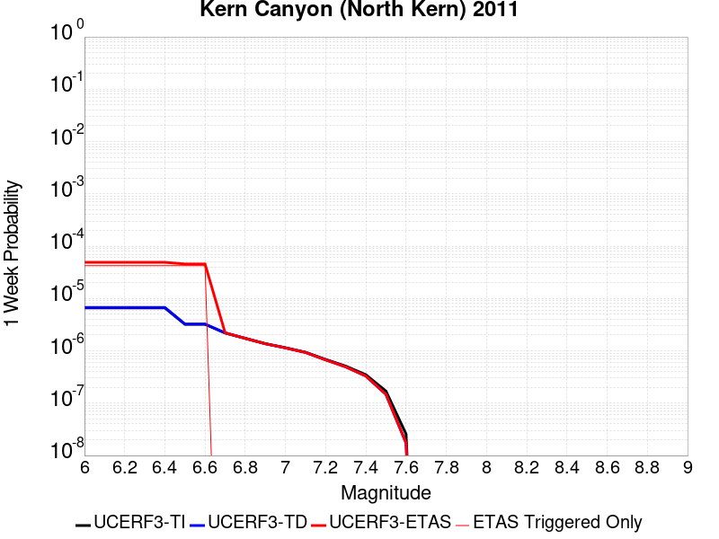 | 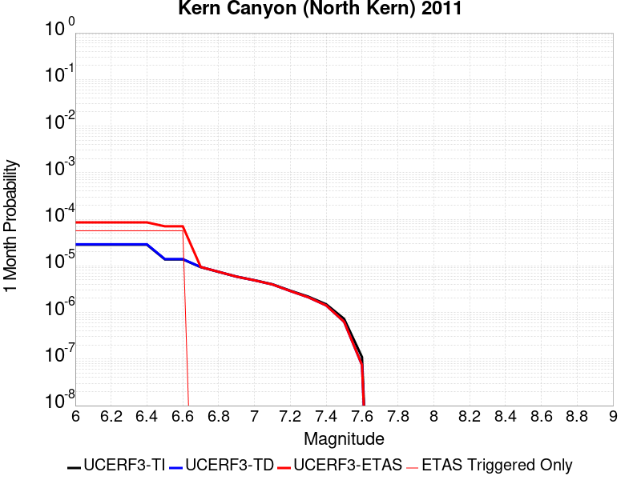 | 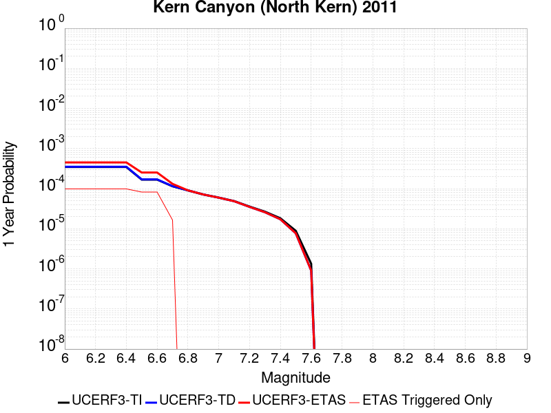 | 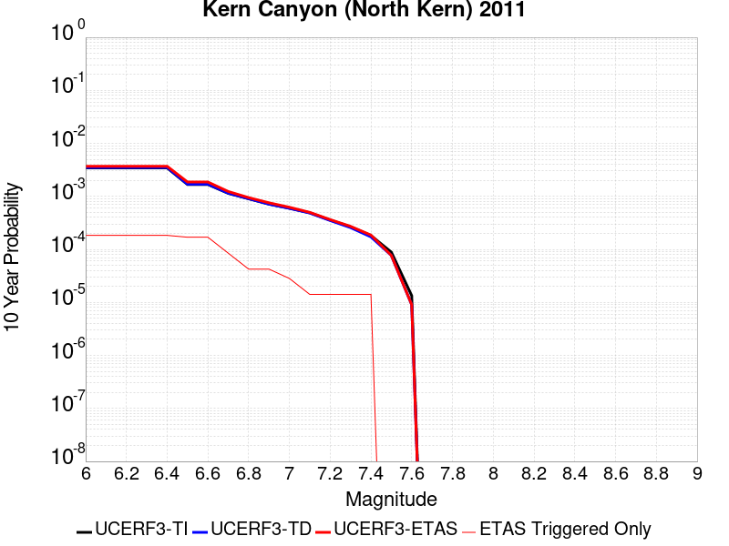 |

| Magnitude | 1 wk TI Prob | 1 wk TD Prob | 1 wk ETAS Prob | 1 wk ETAS/TD Gain | 1 wk ETAS Triggered Only | 1 mo TI Prob | 1 mo TD Prob | 1 mo ETAS Prob | 1 mo ETAS/TD Gain | 1 mo ETAS Triggered Only | 1 yr TI Prob | 1 yr TD Prob | 1 yr ETAS Prob | 1 yr ETAS/TD Gain | 1 yr ETAS Triggered Only | 10 yr TI Prob | 10 yr TD Prob | 10 yr ETAS Prob | 10 yr ETAS/TD Gain | 10 yr ETAS Triggered Only |
|-----|-----|-----|-----|-----|-----|-----|-----|-----|-----|-----|-----|-----|-----|-----|-----|-----|-----|-----|-----|-----|
| 6.0 | 6.6264497E-6 | 6.75733E-6 | 4.135678E-5 | 6.1202836 | 3.459968E-5 | 2.8398761E-5 | 2.895971E-5 | 9.815707E-5 | 3.3894355 | 6.919936E-5 | 3.4570007E-4 | 3.5253543E-4 | 4.217104E-4 | 1.1962214 | 6.919936E-5 | 0.0034516277 | 0.0035205502 | 0.0036584619 | 1.0391732 | 1.3839873E-4 |
| 6.1 | 6.6264497E-6 | 6.75733E-6 | 4.135678E-5 | 6.1202836 | 3.459968E-5 | 2.8398761E-5 | 2.895971E-5 | 9.815707E-5 | 3.3894355 | 6.919936E-5 | 3.4570007E-4 | 3.5253543E-4 | 4.217104E-4 | 1.1962214 | 6.919936E-5 | 0.0034516277 | 0.0035205502 | 0.0036584619 | 1.0391732 | 1.3839873E-4 |
| 6.2 | 6.6264497E-6 | 6.75733E-6 | 4.135678E-5 | 6.1202836 | 3.459968E-5 | 2.8398761E-5 | 2.895971E-5 | 9.815707E-5 | 3.3894355 | 6.919936E-5 | 3.4570007E-4 | 3.5253543E-4 | 4.217104E-4 | 1.1962214 | 6.919936E-5 | 0.0034516277 | 0.0035205502 | 0.0036584619 | 1.0391732 | 1.3839873E-4 |
| 6.3 | 6.6264497E-6 | 6.75733E-6 | 4.135678E-5 | 6.1202836 | 3.459968E-5 | 2.8398761E-5 | 2.895971E-5 | 9.815707E-5 | 3.3894355 | 6.919936E-5 | 3.4570007E-4 | 3.5253543E-4 | 4.217104E-4 | 1.1962214 | 6.919936E-5 | 0.0034516277 | 0.0035205502 | 0.0036584619 | 1.0391732 | 1.3839873E-4 |
| 6.4 | 6.6264497E-6 | 6.75733E-6 | 4.135678E-5 | 6.1202836 | 3.459968E-5 | 2.8398761E-5 | 2.895971E-5 | 9.815707E-5 | 3.3894355 | 6.919936E-5 | 3.4570007E-4 | 3.5253543E-4 | 4.217104E-4 | 1.1962214 | 6.919936E-5 | 0.0034516277 | 0.0035205502 | 0.0036584619 | 1.0391732 | 1.3839873E-4 |
| 6.5 | 3.2162225E-6 | 3.2570915E-6 | 3.7856662E-5 | 11.622842 | 3.459968E-5 | 1.3783738E-5 | 1.3958894E-5 | 8.315729E-5 | 5.9572983 | 6.919936E-5 | 1.6780409E-4 | 1.6993708E-4 | 2.3912468E-4 | 1.4071366 | 6.919936E-5 | 0.0016767744 | 0.001698151 | 0.0018363147 | 1.0813613 | 1.3839873E-4 |
| 6.6 | 3.2162225E-6 | 3.2570915E-6 | 3.7856662E-5 | 11.622842 | 3.459968E-5 | 1.3783738E-5 | 1.3958894E-5 | 8.315729E-5 | 5.9572983 | 6.919936E-5 | 1.6780409E-4 | 1.6993708E-4 | 2.3912468E-4 | 1.4071366 | 6.919936E-5 | 0.0016767744 | 0.001698151 | 0.0018363147 | 1.0813613 | 1.3839873E-4 |
| 6.7 | 2.1908265E-6 | 2.2071222E-6 | 2.2071222E-6 | 1.0 | 0.0 | 9.389223E-6 | 9.459062E-6 | 9.459062E-6 | 1.0 | 0.0 | 1.1430779E-4 | 1.1515819E-4 | 1.1515819E-4 | 1.0 | 0.0 | 0.0011424901 | 0.0011510046 | 0.0012201243 | 1.0600517 | 6.919936E-5 |
| 6.8 | 1.7303895E-6 | 1.736553E-6 | 1.736553E-6 | 1.0 | 0.0 | 7.415934E-6 | 7.442349E-6 | 7.442349E-6 | 1.0 | 0.0 | 9.028525E-5 | 9.060693E-5 | 9.060693E-5 | 1.0 | 0.0 | 9.024858E-4 | 9.0570963E-4 | 9.40278E-4 | 1.0381671 | 3.459968E-5 |
| 6.9 | 1.3700314E-6 | 1.3688623E-6 | 1.3688623E-6 | 1.0 | 0.0 | 5.87155E-6 | 5.86654E-6 | 5.86654E-6 | 1.0 | 0.0 | 7.148377E-5 | 7.142283E-5 | 7.142283E-5 | 1.0 | 0.0 | 7.146078E-4 | 7.140033E-4 | 7.485783E-4 | 1.0484241 | 3.459968E-5 |
| 7.0 | 1.1467797E-6 | 1.1413805E-6 | 1.1413805E-6 | 1.0 | 0.0 | 4.9147607E-6 | 4.8916218E-6 | 4.8916218E-6 | 1.0 | 0.0 | 5.983557E-5 | 5.95539E-5 | 5.95539E-5 | 1.0 | 0.0 | 5.981946E-4 | 5.9538253E-4 | 6.2996167E-4 | 1.0580788 | 3.459968E-5 |
| 7.1 | 9.3952065E-7 | 9.3026915E-7 | 9.3026915E-7 | 1.0 | 0.0 | 4.026511E-6 | 3.986862E-6 | 3.986862E-6 | 1.0 | 0.0 | 4.9021666E-5 | 4.853898E-5 | 4.853898E-5 | 1.0 | 0.0 | 4.901085E-4 | 4.8528553E-4 | 5.1986845E-4 | 1.071263 | 3.459968E-5 |
| 7.2 | 6.858055E-7 | 6.7193014E-7 | 6.7193014E-7 | 1.0 | 0.0 | 2.939163E-6 | 2.8796974E-6 | 2.8796974E-6 | 1.0 | 0.0 | 3.5783723E-5 | 3.5059762E-5 | 3.5059762E-5 | 1.0 | 0.0 | 3.5777962E-4 | 3.5054318E-4 | 3.8513073E-4 | 1.0986685 | 3.459968E-5 |
| 7.3 | 5.1101983E-7 | 4.939301E-7 | 4.939301E-7 | 1.0 | 0.0 | 2.1900833E-6 | 2.1168414E-6 | 2.1168414E-6 | 1.0 | 0.0 | 2.6663936E-5 | 2.5772246E-5 | 2.5772246E-5 | 1.0 | 0.0 | 2.6660739E-4 | 2.5769303E-4 | 2.922838E-4 | 1.1342324 | 3.459968E-5 |
| 7.4 | 3.4999414E-7 | 3.2995916E-7 | 3.2995916E-7 | 1.0 | 0.0 | 1.499974E-6 | 1.4141099E-6 | 1.4141099E-6 | 1.0 | 0.0 | 1.8262032E-5 | 1.7216655E-5 | 1.7216655E-5 | 1.0 | 0.0 | 1.826053E-4 | 1.7215345E-4 | 2.0674718E-4 | 1.200947 | 3.459968E-5 |
| 7.5 | 1.7021522E-7 | 1.4750053E-7 | 1.4750053E-7 | 1.0 | 0.0 | 7.2949354E-7 | 6.32145E-7 | 6.32145E-7 | 1.0 | 0.0 | 8.881548E-6 | 7.696339E-6 | 7.696339E-6 | 1.0 | 0.0 | 8.8811925E-5 | 7.696081E-5 | 7.696081E-5 | 1.0 | 0.0 |
| 7.6 | 2.572245E-8 | 1.735264E-8 | 1.735264E-8 | 1.0 | 0.0 | 1.10239064E-7 | 7.436845E-8 | 7.436845E-8 | 1.0 | 0.0 | 1.3421597E-6 | 9.0543557E-7 | 9.0543557E-7 | 1.0 | 0.0 | 1.3421517E-5 | 9.054324E-6 | 9.054324E-6 | 1.0 | 0.0 |

## San Jacinto (Coyote Creek)
*[(top)](#table-of-contents)*

| 1 Week | 1 Month | 1 Year | 10 Year |
|-----|-----|-----|-----|
| 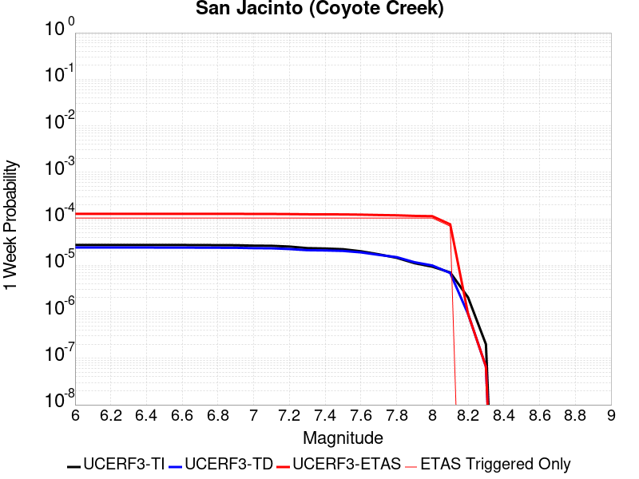 | 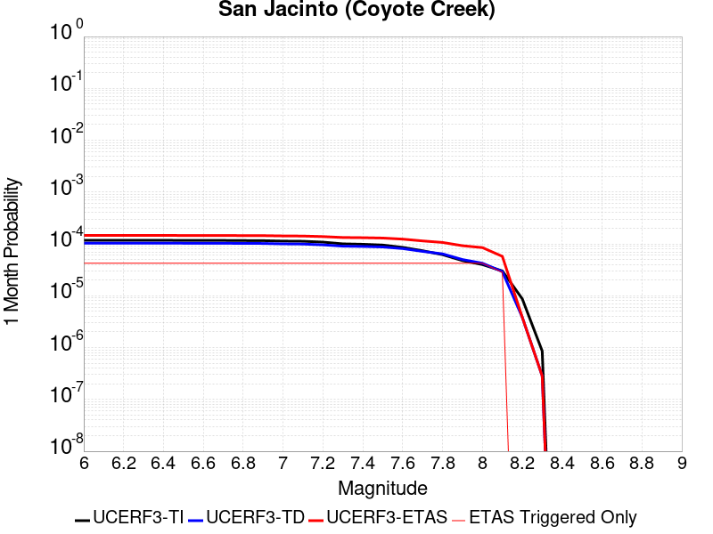 | 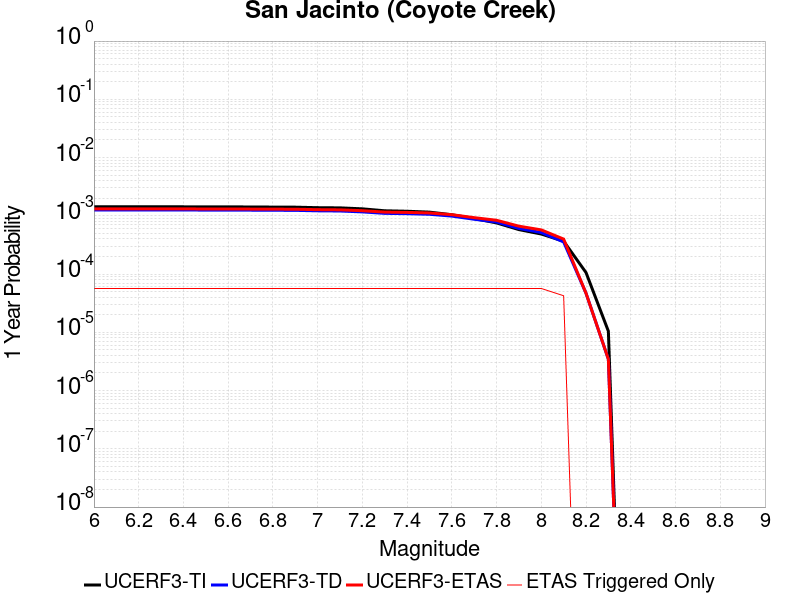 | 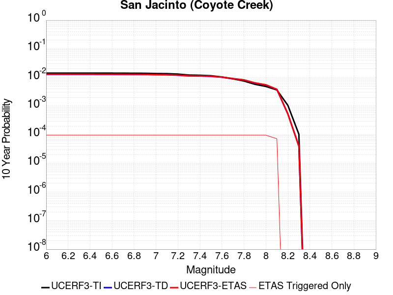 |

| Magnitude | 1 wk TI Prob | 1 wk TD Prob | 1 wk ETAS Prob | 1 wk ETAS/TD Gain | 1 wk ETAS Triggered Only | 1 mo TI Prob | 1 mo TD Prob | 1 mo ETAS Prob | 1 mo ETAS/TD Gain | 1 mo ETAS Triggered Only | 1 yr TI Prob | 1 yr TD Prob | 1 yr ETAS Prob | 1 yr ETAS/TD Gain | 1 yr ETAS Triggered Only | 10 yr TI Prob | 10 yr TD Prob | 10 yr ETAS Prob | 10 yr ETAS/TD Gain | 10 yr ETAS Triggered Only |
|-----|-----|-----|-----|-----|-----|-----|-----|-----|-----|-----|-----|-----|-----|-----|-----|-----|-----|-----|-----|-----|
| 6.0 | 2.7374346E-5 | 2.41444E-5 | 1.2794093E-4 | 5.2989902 | 1.03799044E-4 | 1.1731335E-4 | 1.034719E-4 | 2.0726021E-4 | 2.0030577 | 1.03799044E-4 | 0.0014273542 | 0.001259045 | 0.0013972694 | 1.1097852 | 1.3839873E-4 | 0.01418221 | 0.012928195 | 0.0130648045 | 1.0105668 | 1.3839873E-4 |
| 6.1 | 2.7374346E-5 | 2.41444E-5 | 1.2794093E-4 | 5.2989902 | 1.03799044E-4 | 1.1731335E-4 | 1.034719E-4 | 2.0726021E-4 | 2.0030577 | 1.03799044E-4 | 0.0014273542 | 0.001259045 | 0.0013972694 | 1.1097852 | 1.3839873E-4 | 0.01418221 | 0.012928195 | 0.0130648045 | 1.0105668 | 1.3839873E-4 |
| 6.2 | 2.7374346E-5 | 2.41444E-5 | 1.2794093E-4 | 5.2989902 | 1.03799044E-4 | 1.1731335E-4 | 1.034719E-4 | 2.0726021E-4 | 2.0030577 | 1.03799044E-4 | 0.0014273542 | 0.001259045 | 0.0013972694 | 1.1097852 | 1.3839873E-4 | 0.01418221 | 0.012928195 | 0.0130648045 | 1.0105668 | 1.3839873E-4 |
| 6.3 | 2.7374346E-5 | 2.41444E-5 | 1.2794093E-4 | 5.2989902 | 1.03799044E-4 | 1.1731335E-4 | 1.034719E-4 | 2.0726021E-4 | 2.0030577 | 1.03799044E-4 | 0.0014273542 | 0.001259045 | 0.0013972694 | 1.1097852 | 1.3839873E-4 | 0.01418221 | 0.012928195 | 0.0130648045 | 1.0105668 | 1.3839873E-4 |
| 6.4 | 2.7374346E-5 | 2.41444E-5 | 1.2794093E-4 | 5.2989902 | 1.03799044E-4 | 1.1731335E-4 | 1.034719E-4 | 2.0726021E-4 | 2.0030577 | 1.03799044E-4 | 0.0014273542 | 0.001259045 | 0.0013972694 | 1.1097852 | 1.3839873E-4 | 0.01418221 | 0.012928195 | 0.0130648045 | 1.0105668 | 1.3839873E-4 |
| 6.5 | 2.7282445E-5 | 2.4030476E-5 | 1.2782702E-4 | 5.319371 | 1.03799044E-4 | 1.16919524E-4 | 1.0298371E-4 | 2.0677206E-4 | 2.0078135 | 1.03799044E-4 | 0.0014225657 | 0.001253108 | 0.0013913334 | 1.110306 | 1.3839873E-4 | 0.014134934 | 0.012869522 | 0.01300614 | 1.0106156 | 1.3839873E-4 |
| 6.6 | 2.7282445E-5 | 2.4030476E-5 | 1.2782702E-4 | 5.319371 | 1.03799044E-4 | 1.16919524E-4 | 1.0298371E-4 | 2.0677206E-4 | 2.0078135 | 1.03799044E-4 | 0.0014225657 | 0.001253108 | 0.0013913334 | 1.110306 | 1.3839873E-4 | 0.014134934 | 0.012869522 | 0.01300614 | 1.0106156 | 1.3839873E-4 |
| 6.7 | 2.7216198E-5 | 2.3955597E-5 | 1.2775215E-4 | 5.332873 | 1.03799044E-4 | 1.1663563E-4 | 1.02662816E-4 | 2.0645121E-4 | 2.0109637 | 1.03799044E-4 | 0.0014191137 | 0.0012492058 | 0.0013874316 | 1.110651 | 1.3839873E-4 | 0.014100855 | 0.012830934 | 0.012967557 | 1.0106479 | 1.3839873E-4 |
| 6.8 | 2.7078617E-5 | 2.3872815E-5 | 1.2766938E-4 | 5.347898 | 1.03799044E-4 | 1.1604605E-4 | 1.0230807E-4 | 2.0609649E-4 | 2.0144696 | 1.03799044E-4 | 0.001411945 | 0.0012448917 | 0.0013831181 | 1.1110349 | 1.3839873E-4 | 0.014030075 | 0.0127880825 | 0.012924711 | 1.0106841 | 1.3839873E-4 |
| 6.9 | 2.6982952E-5 | 2.3792329E-5 | 1.2758891E-4 | 5.3626065 | 1.03799044E-4 | 1.15636096E-4 | 1.0196315E-4 | 2.0575161E-4 | 2.0179017 | 1.03799044E-4 | 0.0014069602 | 0.0012406971 | 0.0013789241 | 1.1114107 | 1.3839873E-4 | 0.013980856 | 0.012746378 | 0.012883013 | 1.0107195 | 1.3839873E-4 |
| 7.0 | 2.6449972E-5 | 2.3369357E-5 | 1.2716597E-4 | 5.4415693 | 1.03799044E-4 | 1.1335209E-4 | 1.0015055E-4 | 2.039392E-4 | 2.0363262 | 1.03799044E-4 | 0.001379188 | 0.0012186535 | 0.0013568836 | 1.1134285 | 1.3839873E-4 | 0.0137065975 | 0.012527733 | 0.012664398 | 1.010909 | 1.3839873E-4 |
| 7.1 | 2.6257849E-5 | 2.3195396E-5 | 1.2699203E-4 | 5.474881 | 1.03799044E-4 | 1.1252879E-4 | 9.940507E-5 | 2.0319379E-4 | 2.0440989 | 1.03799044E-4 | 0.0013691769 | 0.0012095873 | 0.0013478186 | 1.1142797 | 1.3839873E-4 | 0.013607717 | 0.012437661 | 0.012574338 | 1.010989 | 1.3839873E-4 |
| 7.2 | 2.5270041E-5 | 2.2390155E-5 | 1.2618687E-4 | 5.6358194 | 1.03799044E-4 | 1.0829568E-4 | 9.5954296E-5 | 1.9974337E-4 | 2.0816512 | 1.03799044E-4 | 0.0013177024 | 0.0011676198 | 0.0013058569 | 1.1183922 | 1.3839873E-4 | 0.013099162 | 0.0120187905 | 0.012155525 | 1.0113767 | 1.3839873E-4 |
| 7.3 | 2.339701E-5 | 2.1122027E-5 | 1.2491888E-4 | 5.914152 | 1.03799044E-4 | 1.0026905E-4 | 9.051985E-5 | 1.943095E-4 | 2.1465955 | 1.03799044E-4 | 0.001220092 | 0.001101524 | 0.0012397702 | 1.1255046 | 1.3839873E-4 | 0.012134149 | 0.011357642 | 0.011494469 | 1.0120472 | 1.3839873E-4 |
| 7.4 | 2.296333E-5 | 2.0852396E-5 | 1.2464928E-4 | 5.977696 | 1.03799044E-4 | 9.841056E-5 | 8.936436E-5 | 1.9315413E-4 | 2.1614225 | 1.03799044E-4 | 0.0011974899 | 0.0010874701 | 0.0012257183 | 1.1271282 | 1.3839873E-4 | 0.011910575 | 0.011216754 | 0.0113536 | 1.0122001 | 1.3839873E-4 |
| 7.5 | 2.2188895E-5 | 2.037534E-5 | 1.2417228E-4 | 6.0942426 | 1.03799044E-4 | 9.50918E-5 | 8.731998E-5 | 1.9110997E-4 | 2.1886168 | 1.03799044E-4 | 0.0011571277 | 0.0010626042 | 0.001200856 | 1.1301064 | 1.3839873E-4 | 0.011511209 | 0.010966369 | 0.01110325 | 1.0124819 | 1.3839873E-4 |
| 7.6 | 2.0013189E-5 | 1.8961666E-5 | 1.2275875E-4 | 6.4740486 | 1.03799044E-4 | 8.5767984E-5 | 8.126176E-5 | 1.8505237E-4 | 2.2772381 | 1.03799044E-4 | 0.001043725 | 9.889146E-4 | 0.0011271765 | 1.1398118 | 1.3839873E-4 | 0.010388365 | 0.010224371 | 0.010361355 | 1.0133978 | 1.3839873E-4 |
| 7.7 | 1.7230794E-5 | 1.6743043E-5 | 1.2054035E-4 | 7.199429 | 1.03799044E-4 | 7.384417E-5 | 7.175393E-5 | 1.7554553E-4 | 2.4464936 | 1.03799044E-4 | 8.986819E-4 | 8.732547E-4 | 0.0010115326 | 1.1583477 | 1.3839873E-4 | 0.008950562 | 0.00906292 | 0.009200064 | 1.0151324 | 1.3839873E-4 |
| 7.8 | 1.4478809E-5 | 1.499039E-5 | 1.1878788E-4 | 7.9242687 | 1.03799044E-4 | 6.205057E-5 | 6.424295E-5 | 1.6803533E-4 | 2.6156228 | 1.03799044E-4 | 7.552038E-4 | 7.8187784E-4 | 9.2016836E-4 | 1.1768698 | 1.3839873E-4 | 0.0075264242 | 0.008141388 | 0.0082786605 | 1.016861 | 1.3839873E-4 |
| 7.9 | 1.1114467E-5 | 1.1644517E-5 | 1.1544235E-4 | 9.913881 | 1.03799044E-4 | 4.7632562E-5 | 4.990412E-5 | 1.5369798E-4 | 3.0798657 | 1.03799044E-4 | 5.797721E-4 | 6.074139E-4 | 7.457285E-4 | 1.2277107 | 1.3839873E-4 | 0.0057826187 | 0.0063803545 | 0.0065178704 | 1.021553 | 1.3839873E-4 |
| 8.0 | 9.327402E-6 | 9.8986575E-6 | 1.13696675E-4 | 11.48607 | 1.03799044E-4 | 3.9973966E-5 | 4.2422133E-5 | 1.4621677E-4 | 3.4467096 | 1.03799044E-4 | 4.8657437E-4 | 5.163676E-4 | 6.5469486E-4 | 1.2678852 | 1.3839873E-4 | 0.0048551033 | 0.00544994 | 0.005587585 | 1.0252562 | 1.3839873E-4 |
| 8.1 | 7.0235833E-6 | 6.826985E-6 | 7.602588E-5 | 11.136084 | 6.919936E-5 | 3.0100724E-5 | 2.9258183E-5 | 9.845552E-5 | 3.3650594 | 6.919936E-5 | 3.664147E-4 | 3.5616063E-4 | 4.599227E-4 | 1.291335 | 1.03799044E-4 | 0.003658111 | 0.0037874572 | 0.0038908632 | 1.0273021 | 1.03799044E-4 |
| 8.2 | 2.0358202E-6 | 8.9912584E-7 | 8.9912584E-7 | 1.0 | 0.0 | 8.724915E-6 | 3.853391E-6 | 3.853391E-6 | 1.0 | 0.0 | 1.06220665E-4 | 4.6914047E-5 | 4.6914047E-5 | 1.0 | 0.0 | 0.001061699 | 5.3239096E-4 | 5.3239096E-4 | 1.0 | 0.0 |
| 8.3 | 2.0051264E-7 | 6.61379E-8 | 6.61379E-8 | 1.0 | 0.0 | 8.5933965E-7 | 2.8344812E-7 | 2.8344812E-7 | 1.0 | 0.0 | 1.046241E-5 | 3.450976E-6 | 3.450976E-6 | 1.0 | 0.0 | 1.0461917E-4 | 4.0120205E-5 | 4.0120205E-5 | 1.0 | 0.0 |

## Chino alt 1
*[(top)](#table-of-contents)*

| 1 Week | 1 Month | 1 Year | 10 Year |
|-----|-----|-----|-----|
| 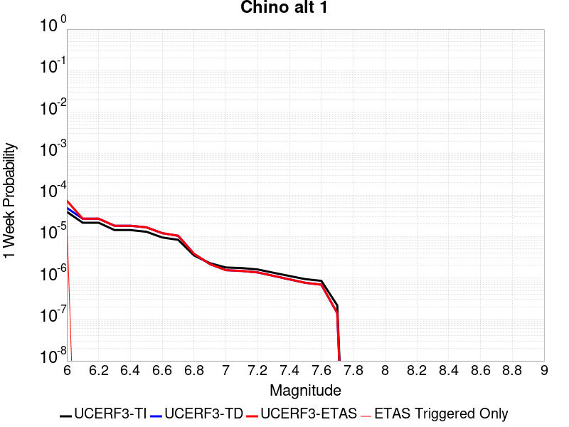 | 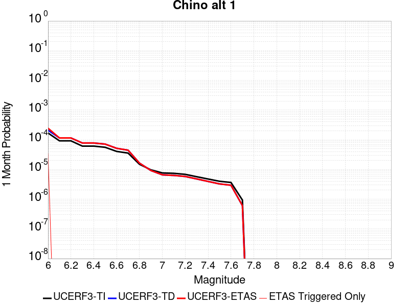 | 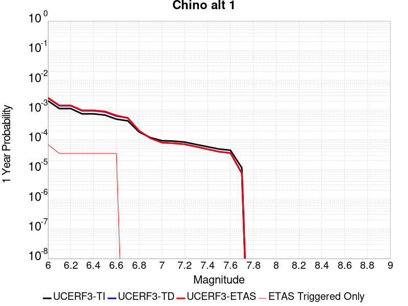 | 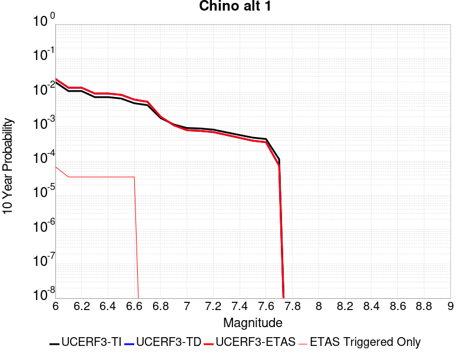 |

| Magnitude | 1 wk TI Prob | 1 wk TD Prob | 1 wk ETAS Prob | 1 wk ETAS/TD Gain | 1 wk ETAS Triggered Only | 1 mo TI Prob | 1 mo TD Prob | 1 mo ETAS Prob | 1 mo ETAS/TD Gain | 1 mo ETAS Triggered Only | 1 yr TI Prob | 1 yr TD Prob | 1 yr ETAS Prob | 1 yr ETAS/TD Gain | 1 yr ETAS Triggered Only | 10 yr TI Prob | 10 yr TD Prob | 10 yr ETAS Prob | 10 yr ETAS/TD Gain | 10 yr ETAS Triggered Only |
|-----|-----|-----|-----|-----|-----|-----|-----|-----|-----|-----|-----|-----|-----|-----|-----|-----|-----|-----|-----|-----|
| 6.0 | 3.939946E-5 | 4.894798E-5 | 8.354597E-5 | 1.7068318 | 3.459968E-5 | 1.6884391E-4 | 2.0976314E-4 | 2.4435556E-4 | 1.1649119 | 3.459968E-5 | 0.0020537362 | 0.002551385 | 0.0026204078 | 1.0270531 | 6.919936E-5 | 0.020348595 | 0.025280168 | 0.025347618 | 1.0026681 | 6.919936E-5 |
| 6.1 | 2.1505624E-5 | 2.6878823E-5 | 2.6878823E-5 | 1.0 | 0.0 | 9.2163704E-5 | 1.15190494E-4 | 1.15190494E-4 | 1.0 | 0.0 | 0.0011215154 | 0.0014016517 | 0.0014362028 | 1.0246503 | 3.459968E-5 | 0.011158722 | 0.013947425 | 0.013981543 | 1.0024462 | 3.459968E-5 |
| 6.2 | 2.1505624E-5 | 2.6878823E-5 | 2.6878823E-5 | 1.0 | 0.0 | 9.2163704E-5 | 1.15190494E-4 | 1.15190494E-4 | 1.0 | 0.0 | 0.0011215154 | 0.0014016517 | 0.0014362028 | 1.0246503 | 3.459968E-5 | 0.011158722 | 0.013947425 | 0.013981543 | 1.0024462 | 3.459968E-5 |
| 6.3 | 1.4290785E-5 | 1.8164832E-5 | 1.8164832E-5 | 1.0 | 0.0 | 6.1244784E-5 | 7.784722E-5 | 7.784722E-5 | 1.0 | 0.0 | 7.454001E-4 | 9.4742293E-4 | 9.819898E-4 | 1.0364852 | 3.459968E-5 | 0.007429048 | 0.00944674 | 0.009481013 | 1.003628 | 3.459968E-5 |
| 6.4 | 1.4290785E-5 | 1.8164832E-5 | 1.8164832E-5 | 1.0 | 0.0 | 6.1244784E-5 | 7.784722E-5 | 7.784722E-5 | 1.0 | 0.0 | 7.454001E-4 | 9.4742293E-4 | 9.819898E-4 | 1.0364852 | 3.459968E-5 | 0.007429048 | 0.00944674 | 0.009481013 | 1.003628 | 3.459968E-5 |
| 6.5 | 1.3017944E-5 | 1.6651793E-5 | 1.6651793E-5 | 1.0 | 0.0 | 5.5789995E-5 | 7.1363116E-5 | 7.1363116E-5 | 1.0 | 0.0 | 6.790315E-4 | 8.6854334E-4 | 9.03113E-4 | 1.0398018 | 3.459968E-5 | 0.0067696036 | 0.008664233 | 0.008698532 | 1.0039588 | 3.459968E-5 |
| 6.6 | 9.470016E-6 | 1.2039209E-5 | 1.2039209E-5 | 1.0 | 0.0 | 4.058515E-5 | 5.159578E-5 | 5.159578E-5 | 1.0 | 0.0 | 4.940122E-4 | 6.280315E-4 | 6.6260947E-4 | 1.0550576 | 3.459968E-5 | 0.004929154 | 0.006273248 | 0.0063076303 | 1.0054809 | 3.459968E-5 |
| 6.7 | 8.314155E-6 | 1.040749E-5 | 1.040749E-5 | 1.0 | 0.0 | 3.5631605E-5 | 4.4602948E-5 | 4.4602948E-5 | 1.0 | 0.0 | 4.3372845E-4 | 5.4293784E-4 | 5.4293784E-4 | 1.0 | 0.0 | 0.004328829 | 0.0054270807 | 0.0054270807 | 1.0 | 0.0 |
| 6.8 | 3.4856364E-6 | 3.8134033E-6 | 3.8134033E-6 | 1.0 | 0.0 | 1.4938357E-5 | 1.6343065E-5 | 1.6343065E-5 | 1.0 | 0.0 | 1.8185932E-4 | 1.9896074E-4 | 1.9896074E-4 | 1.0 | 0.0 | 0.0018171056 | 0.0019894529 | 0.0019894529 | 1.0 | 0.0 |
| 6.9 | 2.2645952E-6 | 2.152909E-6 | 2.152909E-6 | 1.0 | 0.0 | 9.705372E-6 | 9.226722E-6 | 9.226722E-6 | 1.0 | 0.0 | 1.18156495E-4 | 1.12329755E-4 | 1.12329755E-4 | 1.0 | 0.0 | 0.0011809369 | 0.0011233138 | 0.0011233138 | 1.0 | 0.0 |
| 7.0 | 1.7864003E-6 | 1.5430741E-6 | 1.5430741E-6 | 1.0 | 0.0 | 7.655979E-6 | 6.613158E-6 | 6.613158E-6 | 1.0 | 0.0 | 9.3207556E-5 | 8.051228E-5 | 8.051228E-5 | 1.0 | 0.0 | 9.316847E-4 | 8.052856E-4 | 8.052856E-4 | 1.0 | 0.0 |
| 7.1 | 1.7315456E-6 | 1.4733466E-6 | 1.4733466E-6 | 1.0 | 0.0 | 7.420889E-6 | 6.314328E-6 | 6.314328E-6 | 1.0 | 0.0 | 9.034557E-5 | 7.687428E-5 | 7.687428E-5 | 1.0 | 0.0 | 9.0308854E-4 | 7.68921E-4 | 7.68921E-4 | 1.0 | 0.0 |
| 7.2 | 1.6008337E-6 | 1.3574178E-6 | 1.3574178E-6 | 1.0 | 0.0 | 6.860698E-6 | 5.817492E-6 | 5.817492E-6 | 1.0 | 0.0 | 8.352579E-5 | 7.082572E-5 | 7.082572E-5 | 1.0 | 0.0 | 8.34944E-4 | 7.0846075E-4 | 7.0846075E-4 | 1.0 | 0.0 |
| 7.3 | 1.3320939E-6 | 1.1217794E-6 | 1.1217794E-6 | 1.0 | 0.0 | 5.7089615E-6 | 4.8076176E-6 | 4.8076176E-6 | 1.0 | 0.0 | 6.9504385E-5 | 5.853122E-5 | 5.853122E-5 | 1.0 | 0.0 | 6.9482654E-4 | 5.8530655E-4 | 5.8530655E-4 | 1.0 | 0.0 |
| 7.4 | 1.114294E-6 | 9.237087E-7 | 9.237087E-7 | 1.0 | 0.0 | 4.775537E-6 | 3.9587458E-6 | 3.9587458E-6 | 1.0 | 0.0 | 5.8140613E-5 | 4.81967E-5 | 4.81967E-5 | 1.0 | 0.0 | 5.81254E-4 | 4.8187698E-4 | 4.8187698E-4 | 1.0 | 0.0 |
| 7.5 | 9.354081E-7 | 7.6233886E-7 | 7.6233886E-7 | 1.0 | 0.0 | 4.0088858E-6 | 3.2671626E-6 | 3.2671626E-6 | 1.0 | 0.0 | 4.8807087E-5 | 3.9777013E-5 | 3.9777013E-5 | 1.0 | 0.0 | 4.879637E-4 | 3.9770233E-4 | 3.9770233E-4 | 1.0 | 0.0 |
| 7.6 | 8.521771E-7 | 6.880688E-7 | 6.880688E-7 | 1.0 | 0.0 | 3.6521824E-6 | 2.948863E-6 | 2.948863E-6 | 1.0 | 0.0 | 4.4464414E-5 | 3.590185E-5 | 3.590185E-5 | 1.0 | 0.0 | 4.4455516E-4 | 3.5896365E-4 | 3.5896365E-4 | 1.0 | 0.0 |
| 7.7 | 2.1803626E-7 | 1.4186368E-7 | 1.4186368E-7 | 1.0 | 0.0 | 9.344408E-7 | 6.0798715E-7 | 6.0798715E-7 | 1.0 | 0.0 | 1.1376757E-5 | 7.4022278E-6 | 7.4022278E-6 | 1.0 | 0.0 | 1.13761744E-4 | 7.402077E-5 | 7.402077E-5 | 1.0 | 0.0 |

## Cleghorn Pass
*[(top)](#table-of-contents)*

| 1 Week | 1 Month | 1 Year | 10 Year |
|-----|-----|-----|-----|
| 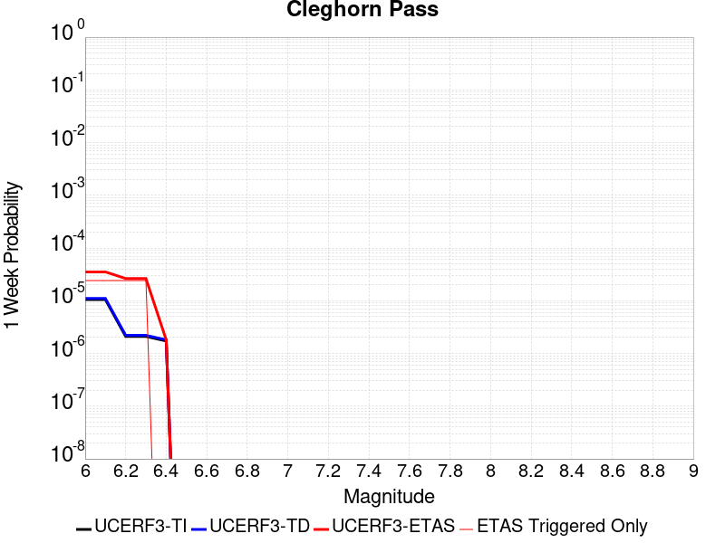 | 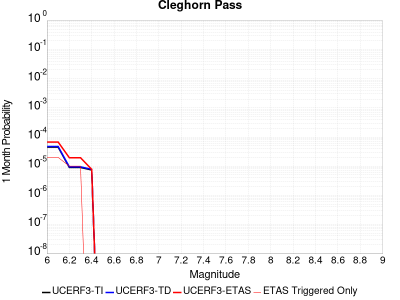 | 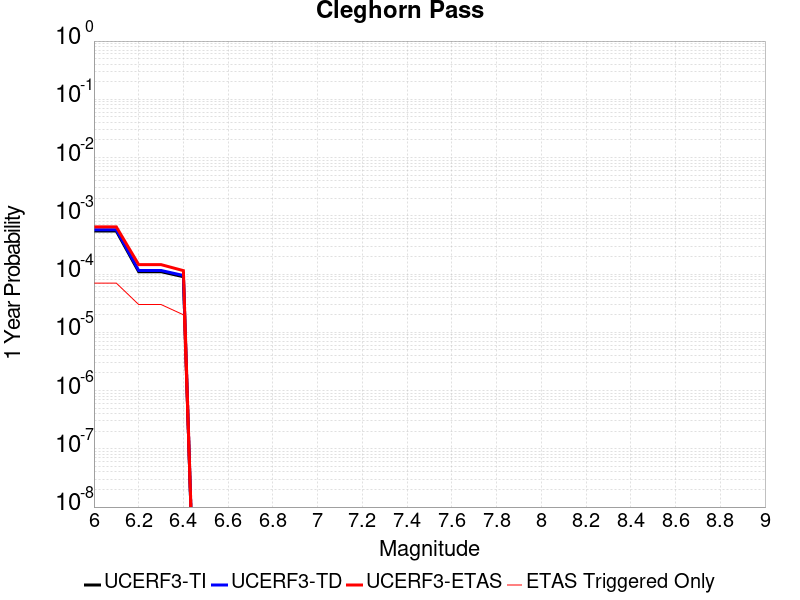 | 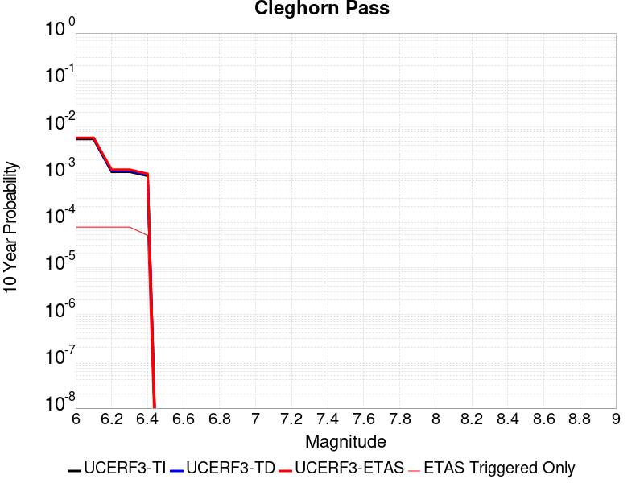 |

| Magnitude | 1 wk TI Prob | 1 wk TD Prob | 1 wk ETAS Prob | 1 wk ETAS/TD Gain | 1 wk ETAS Triggered Only | 1 mo TI Prob | 1 mo TD Prob | 1 mo ETAS Prob | 1 mo ETAS/TD Gain | 1 mo ETAS Triggered Only | 1 yr TI Prob | 1 yr TD Prob | 1 yr ETAS Prob | 1 yr ETAS/TD Gain | 1 yr ETAS Triggered Only | 10 yr TI Prob | 10 yr TD Prob | 10 yr ETAS Prob | 10 yr ETAS/TD Gain | 10 yr ETAS Triggered Only |
|-----|-----|-----|-----|-----|-----|-----|-----|-----|-----|-----|-----|-----|-----|-----|-----|-----|-----|-----|-----|-----|
| 6.0 | 1.0522846E-5 | 1.1040642E-5 | 4.5639943E-5 | 4.1338124 | 3.459968E-5 | 4.509713E-5 | 4.7316473E-5 | 8.191452E-5 | 1.731205 | 3.459968E-5 | 5.4891926E-4 | 5.759784E-4 | 6.797177E-4 | 1.1801096 | 1.03799044E-4 | 0.0054756533 | 0.005750022 | 0.005853224 | 1.0179482 | 1.03799044E-4 |
| 6.1 | 1.0522846E-5 | 1.1040642E-5 | 4.5639943E-5 | 4.1338124 | 3.459968E-5 | 4.509713E-5 | 4.7316473E-5 | 8.191452E-5 | 1.731205 | 3.459968E-5 | 5.4891926E-4 | 5.759784E-4 | 6.797177E-4 | 1.1801096 | 1.03799044E-4 | 0.0054756533 | 0.005750022 | 0.005853224 | 1.0179482 | 1.03799044E-4 |
| 6.2 | 2.1045846E-6 | 2.2082024E-6 | 3.6807807E-5 | 16.668674 | 3.459968E-5 | 9.019617E-6 | 9.463714E-6 | 4.406307E-5 | 4.6560016 | 3.459968E-5 | 1.098083E-4 | 1.1521882E-4 | 2.190059E-4 | 1.9007823 | 1.03799044E-4 | 0.0010975406 | 0.0011520023 | 0.0012556817 | 1.0899993 | 1.03799044E-4 |
| 6.3 | 2.1045846E-6 | 2.2082024E-6 | 3.6807807E-5 | 16.668674 | 3.459968E-5 | 9.019617E-6 | 9.463714E-6 | 4.406307E-5 | 4.6560016 | 3.459968E-5 | 1.098083E-4 | 1.1521882E-4 | 2.190059E-4 | 1.9007823 | 1.03799044E-4 | 0.0010975406 | 0.0011520023 | 0.0012556817 | 1.0899993 | 1.03799044E-4 |
| 6.4 | 1.7259927E-6 | 1.810877E-6 | 1.810877E-6 | 1.0 | 0.0 | 7.3970905E-6 | 7.760902E-6 | 7.760902E-6 | 1.0 | 0.0 | 9.005586E-5 | 9.4488976E-5 | 1.636818E-4 | 1.7322845 | 6.919936E-5 | 9.001937E-4 | 9.448898E-4 | 0.0010140238 | 1.0731661 | 6.919936E-5 |

## Pine Mtn
*[(top)](#table-of-contents)*

| 1 Week | 1 Month | 1 Year | 10 Year |
|-----|-----|-----|-----|
| 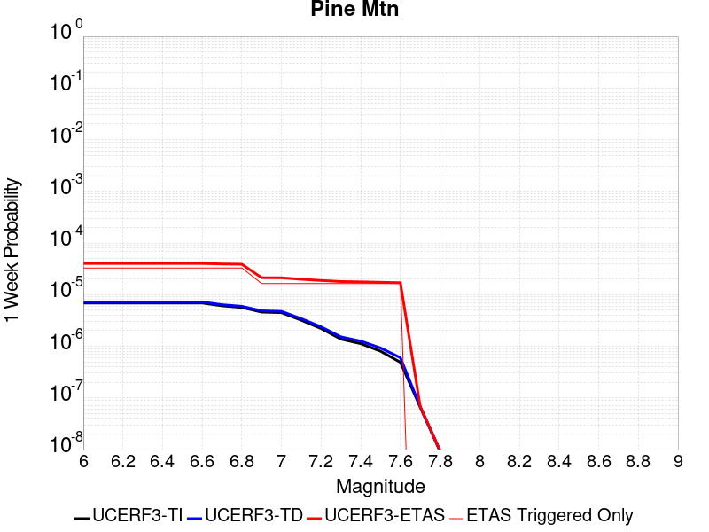 | 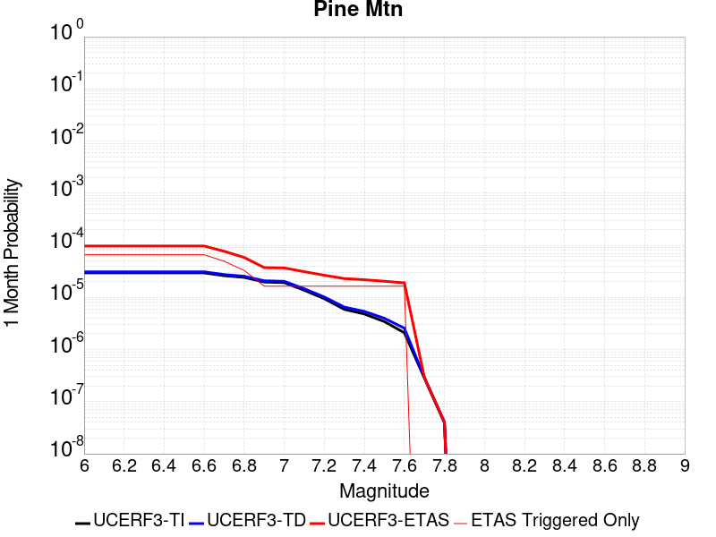 | 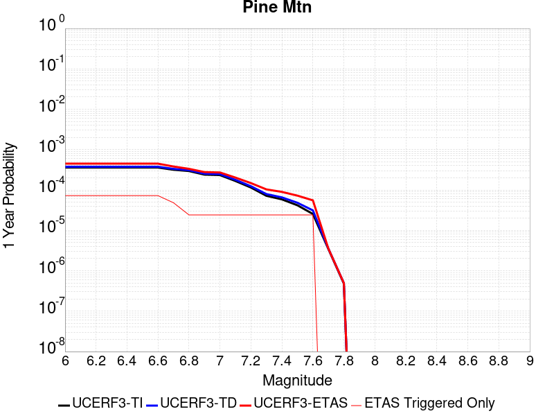 | 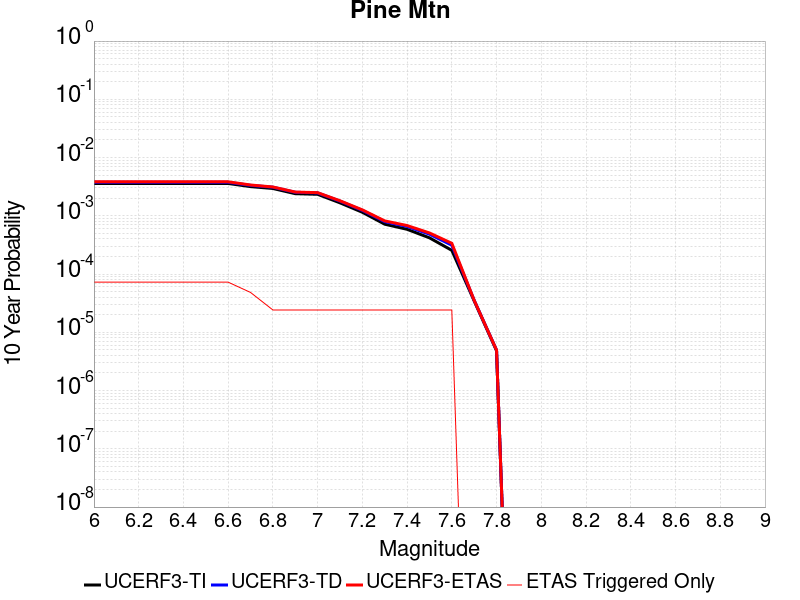 |

| Magnitude | 1 wk TI Prob | 1 wk TD Prob | 1 wk ETAS Prob | 1 wk ETAS/TD Gain | 1 wk ETAS Triggered Only | 1 mo TI Prob | 1 mo TD Prob | 1 mo ETAS Prob | 1 mo ETAS/TD Gain | 1 mo ETAS Triggered Only | 1 yr TI Prob | 1 yr TD Prob | 1 yr ETAS Prob | 1 yr ETAS/TD Gain | 1 yr ETAS Triggered Only | 10 yr TI Prob | 10 yr TD Prob | 10 yr ETAS Prob | 10 yr ETAS/TD Gain | 10 yr ETAS Triggered Only |
|-----|-----|-----|-----|-----|-----|-----|-----|-----|-----|-----|-----|-----|-----|-----|-----|-----|-----|-----|-----|-----|
| 6.0 | 6.894797E-6 | 7.2254716E-6 | 4.1824904E-5 | 5.788536 | 3.459968E-5 | 2.9548795E-5 | 3.0965955E-5 | 1.347618E-4 | 4.3519335 | 1.03799044E-4 | 3.596972E-4 | 3.7694827E-4 | 4.807082E-4 | 1.275263 | 1.03799044E-4 | 0.0035911554 | 0.0037633865 | 0.0038667948 | 1.0274775 | 1.03799044E-4 |
| 6.1 | 6.894797E-6 | 7.2254716E-6 | 4.1824904E-5 | 5.788536 | 3.459968E-5 | 2.9548795E-5 | 3.0965955E-5 | 1.347618E-4 | 4.3519335 | 1.03799044E-4 | 3.596972E-4 | 3.7694827E-4 | 4.807082E-4 | 1.275263 | 1.03799044E-4 | 0.0035911554 | 0.0037633865 | 0.0038667948 | 1.0274775 | 1.03799044E-4 |
| 6.2 | 6.894797E-6 | 7.2254716E-6 | 4.1824904E-5 | 5.788536 | 3.459968E-5 | 2.9548795E-5 | 3.0965955E-5 | 1.347618E-4 | 4.3519335 | 1.03799044E-4 | 3.596972E-4 | 3.7694827E-4 | 4.807082E-4 | 1.275263 | 1.03799044E-4 | 0.0035911554 | 0.0037633865 | 0.0038667948 | 1.0274775 | 1.03799044E-4 |
| 6.3 | 6.894797E-6 | 7.2254716E-6 | 4.1824904E-5 | 5.788536 | 3.459968E-5 | 2.9548795E-5 | 3.0965955E-5 | 1.347618E-4 | 4.3519335 | 1.03799044E-4 | 3.596972E-4 | 3.7694827E-4 | 4.807082E-4 | 1.275263 | 1.03799044E-4 | 0.0035911554 | 0.0037633865 | 0.0038667948 | 1.0274775 | 1.03799044E-4 |
| 6.4 | 6.894797E-6 | 7.2254716E-6 | 4.1824904E-5 | 5.788536 | 3.459968E-5 | 2.9548795E-5 | 3.0965955E-5 | 1.347618E-4 | 4.3519335 | 1.03799044E-4 | 3.596972E-4 | 3.7694827E-4 | 4.807082E-4 | 1.275263 | 1.03799044E-4 | 0.0035911554 | 0.0037633865 | 0.0038667948 | 1.0274775 | 1.03799044E-4 |
| 6.5 | 6.894797E-6 | 7.2254716E-6 | 4.1824904E-5 | 5.788536 | 3.459968E-5 | 2.9548795E-5 | 3.0965955E-5 | 1.347618E-4 | 4.3519335 | 1.03799044E-4 | 3.596972E-4 | 3.7694827E-4 | 4.807082E-4 | 1.275263 | 1.03799044E-4 | 0.0035911554 | 0.0037633865 | 0.0038667948 | 1.0274775 | 1.03799044E-4 |
| 6.6 | 6.894797E-6 | 7.2254716E-6 | 4.1824904E-5 | 5.788536 | 3.459968E-5 | 2.9548795E-5 | 3.0965955E-5 | 1.347618E-4 | 4.3519335 | 1.03799044E-4 | 3.596972E-4 | 3.7694827E-4 | 4.807082E-4 | 1.275263 | 1.03799044E-4 | 0.0035911554 | 0.0037633865 | 0.0038667948 | 1.0274775 | 1.03799044E-4 |
| 6.7 | 6.0867933E-6 | 6.397124E-6 | 4.0996583E-5 | 6.4085965 | 3.459968E-5 | 2.6085996E-5 | 2.7415968E-5 | 9.661343E-5 | 3.523984 | 6.919936E-5 | 3.1755073E-4 | 3.337405E-4 | 4.0291675E-4 | 1.2072756 | 6.919936E-5 | 0.0031709734 | 0.0033326119 | 0.0034015805 | 1.0206951 | 6.919936E-5 |
| 6.8 | 5.6530425E-6 | 5.950606E-6 | 4.0550083E-5 | 6.814446 | 3.459968E-5 | 2.42271E-5 | 2.5502359E-5 | 6.010116E-5 | 2.3566902 | 3.459968E-5 | 2.94925E-4 | 3.1044905E-4 | 3.45038E-4 | 1.1114159 | 3.459968E-5 | 0.002945339 | 0.0031003582 | 0.0031348506 | 1.0111253 | 3.459968E-5 |
| 6.9 | 4.6015225E-6 | 4.8638444E-6 | 3.9463357E-5 | 8.113614 | 3.459968E-5 | 1.9720663E-5 | 2.084489E-5 | 5.544385E-5 | 2.6598294 | 3.459968E-5 | 2.4007261E-4 | 2.5375842E-4 | 2.883493E-4 | 1.1363143 | 3.459968E-5 | 0.0023981342 | 0.002534831 | 0.0025693427 | 1.0136151 | 3.459968E-5 |
| 7.0 | 4.4875965E-6 | 4.7474837E-6 | 3.9347E-5 | 8.28797 | 3.459968E-5 | 1.9232413E-5 | 2.0346208E-5 | 5.4945183E-5 | 2.7005124 | 3.459968E-5 | 2.3412947E-4 | 2.4768838E-4 | 2.8227948E-4 | 1.1396558 | 3.459968E-5 | 0.0023388295 | 0.0024742668 | 0.002508781 | 1.0139492 | 3.459968E-5 |
| 7.1 | 3.203907E-6 | 3.42942E-6 | 3.8028982E-5 | 11.089043 | 3.459968E-5 | 1.3730958E-5 | 1.4697435E-5 | 4.929661E-5 | 3.354096 | 3.459968E-5 | 1.6716159E-4 | 1.7892725E-4 | 2.1352073E-4 | 1.1933383 | 3.459968E-5 | 0.0016703589 | 0.001787898 | 0.0018224358 | 1.0193175 | 3.459968E-5 |
| 7.2 | 2.2060601E-6 | 2.3784874E-6 | 3.6978086E-5 | 15.546892 | 3.459968E-5 | 9.4545085E-6 | 1.019348E-5 | 4.479281E-5 | 4.394261 | 3.459968E-5 | 1.15102564E-4 | 1.2409901E-4 | 1.586944E-4 | 1.2787725 | 3.459968E-5 | 0.0011504296 | 0.0012403419 | 0.0012748986 | 1.0278606 | 3.459968E-5 |
| 7.3 | 1.3765207E-6 | 1.5216535E-6 | 3.6121284E-5 | 23.738178 | 3.459968E-5 | 5.899361E-6 | 6.5213567E-6 | 4.1120813E-5 | 6.305561 | 3.459968E-5 | 7.182235E-5 | 7.939472E-5 | 1.1399165E-4 | 1.4357587 | 3.459968E-5 | 7.1799144E-4 | 7.9367263E-4 | 8.2824484E-4 | 1.0435598 | 3.459968E-5 |
| 7.4 | 1.1245983E-6 | 1.2587126E-6 | 3.585835E-5 | 28.488115 | 3.459968E-5 | 4.819698E-6 | 5.394472E-6 | 3.9993967E-5 | 7.41388 | 3.459968E-5 | 5.8678244E-5 | 6.56758E-5 | 1.0027321E-4 | 1.5267909 | 3.459968E-5 | 5.866275E-4 | 6.565722E-4 | 6.911492E-4 | 1.0526628 | 3.459968E-5 |
| 7.5 | 8.031682E-7 | 9.276999E-7 | 3.5527348E-5 | 38.296165 | 3.459968E-5 | 3.4421448E-6 | 3.975851E-6 | 3.8575396E-5 | 9.702425 | 3.459968E-5 | 4.1907308E-5 | 4.840498E-5 | 8.300299E-5 | 1.7147613 | 3.459968E-5 | 4.1899405E-4 | 4.8395112E-4 | 5.1853404E-4 | 1.0714595 | 3.459968E-5 |
| 7.6 | 4.8953444E-7 | 6.0030544E-7 | 3.5199966E-5 | 58.63676 | 3.459968E-5 | 2.098003E-6 | 2.5727354E-6 | 3.717233E-5 | 14.448563 | 3.459968E-5 | 2.5542888E-5 | 3.1322652E-5 | 6.592125E-5 | 2.104587 | 3.459968E-5 | 2.5539953E-4 | 3.1318725E-4 | 3.4777608E-4 | 1.1104414 | 3.459968E-5 |
| 7.7 | 6.634529E-8 | 6.788826E-8 | 6.788826E-8 | 1.0 | 0.0 | 2.843369E-7 | 2.9094966E-7 | 2.9094966E-7 | 1.0 | 0.0 | 3.4617963E-6 | 3.5423066E-6 | 3.5423066E-6 | 1.0 | 0.0 | 3.4617424E-5 | 3.542255E-5 | 3.542255E-5 | 1.0 | 0.0 |
| 7.8 | 9.235578E-9 | 9.488566E-9 | 9.488566E-9 | 1.0 | 0.0 | 3.9581046E-8 | 4.0665284E-8 | 4.0665284E-8 | 1.0 | 0.0 | 4.818991E-7 | 4.950997E-7 | 4.950997E-7 | 1.0 | 0.0 | 4.8189804E-6 | 4.950988E-6 | 4.950988E-6 | 1.0 | 0.0 |

## Dry Mountain
*[(top)](#table-of-contents)*

| 1 Week | 1 Month | 1 Year | 10 Year |
|-----|-----|-----|-----|
| 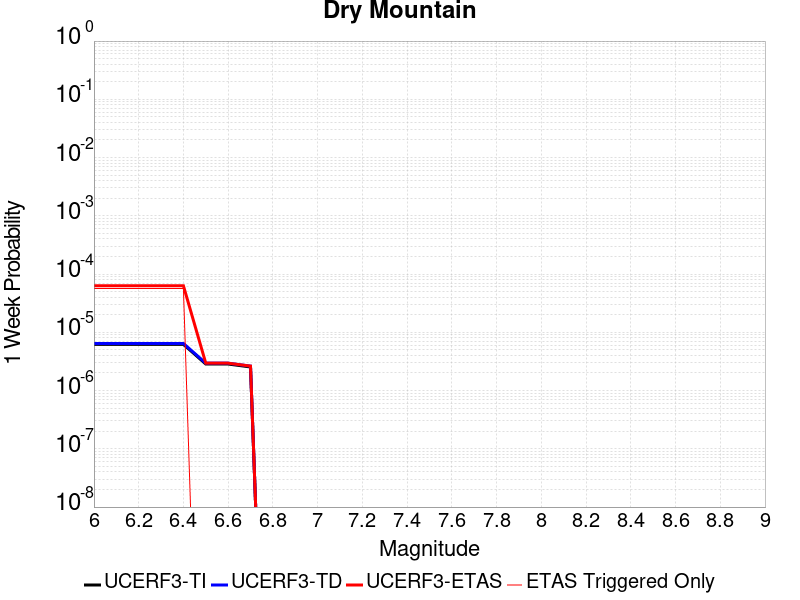 | 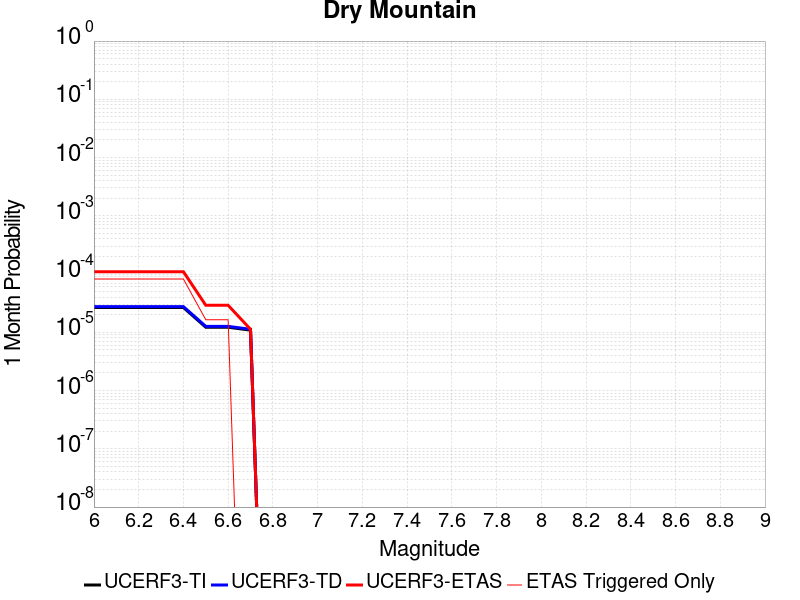 | 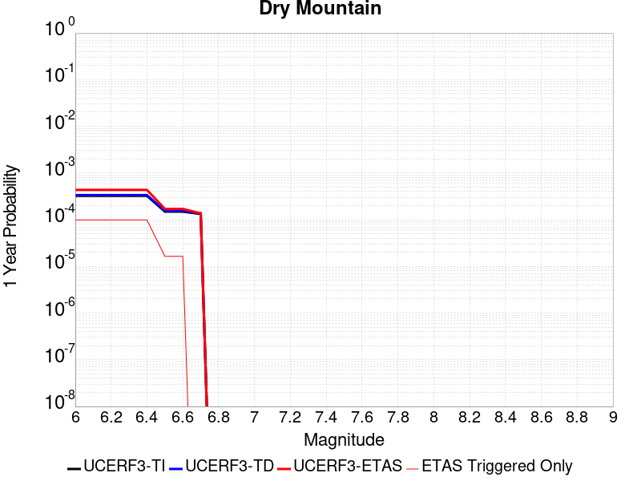 | 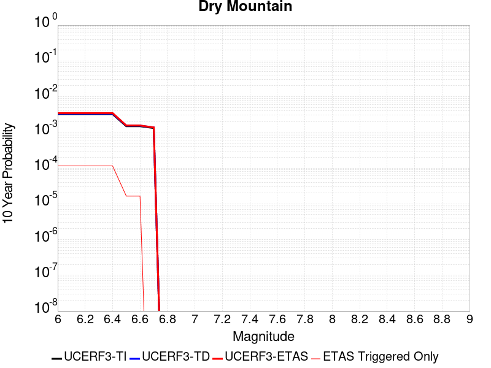 |

| Magnitude | 1 wk TI Prob | 1 wk TD Prob | 1 wk ETAS Prob | 1 wk ETAS/TD Gain | 1 wk ETAS Triggered Only | 1 mo TI Prob | 1 mo TD Prob | 1 mo ETAS Prob | 1 mo ETAS/TD Gain | 1 mo ETAS Triggered Only | 1 yr TI Prob | 1 yr TD Prob | 1 yr ETAS Prob | 1 yr ETAS/TD Gain | 1 yr ETAS Triggered Only | 10 yr TI Prob | 10 yr TD Prob | 10 yr ETAS Prob | 10 yr ETAS/TD Gain | 10 yr ETAS Triggered Only |
|-----|-----|-----|-----|-----|-----|-----|-----|-----|-----|-----|-----|-----|-----|-----|-----|-----|-----|-----|-----|-----|
| 6.0 | 6.222801E-6 | 6.439381E-6 | 7.56383E-5 | 11.746206 | 6.919936E-5 | 2.6668875E-5 | 2.7597147E-5 | 9.6794596E-5 | 3.5074134 | 6.919936E-5 | 3.2464517E-4 | 3.3595937E-4 | 4.3972355E-4 | 1.3088593 | 1.03799044E-4 | 0.0032417132 | 0.0033560768 | 0.0034595276 | 1.0308249 | 1.03799044E-4 |
| 6.1 | 6.222801E-6 | 6.439381E-6 | 7.56383E-5 | 11.746206 | 6.919936E-5 | 2.6668875E-5 | 2.7597147E-5 | 9.6794596E-5 | 3.5074134 | 6.919936E-5 | 3.2464517E-4 | 3.3595937E-4 | 4.3972355E-4 | 1.3088593 | 1.03799044E-4 | 0.0032417132 | 0.0033560768 | 0.0034595276 | 1.0308249 | 1.03799044E-4 |
| 6.2 | 6.222801E-6 | 6.439381E-6 | 7.56383E-5 | 11.746206 | 6.919936E-5 | 2.6668875E-5 | 2.7597147E-5 | 9.6794596E-5 | 3.5074134 | 6.919936E-5 | 3.2464517E-4 | 3.3595937E-4 | 4.3972355E-4 | 1.3088593 | 1.03799044E-4 | 0.0032417132 | 0.0033560768 | 0.0034595276 | 1.0308249 | 1.03799044E-4 |
| 6.3 | 6.222801E-6 | 6.439381E-6 | 7.56383E-5 | 11.746206 | 6.919936E-5 | 2.6668875E-5 | 2.7597147E-5 | 9.6794596E-5 | 3.5074134 | 6.919936E-5 | 3.2464517E-4 | 3.3595937E-4 | 4.3972355E-4 | 1.3088593 | 1.03799044E-4 | 0.0032417132 | 0.0033560768 | 0.0034595276 | 1.0308249 | 1.03799044E-4 |
| 6.4 | 6.222801E-6 | 6.439381E-6 | 7.56383E-5 | 11.746206 | 6.919936E-5 | 2.6668875E-5 | 2.7597147E-5 | 9.6794596E-5 | 3.5074134 | 6.919936E-5 | 3.2464517E-4 | 3.3595937E-4 | 4.3972355E-4 | 1.3088593 | 1.03799044E-4 | 0.0032417132 | 0.0033560768 | 0.0034595276 | 1.0308249 | 1.03799044E-4 |
| 6.5 | 2.8528623E-6 | 2.9521684E-6 | 2.9521684E-6 | 1.0 | 0.0 | 1.22264955E-5 | 1.2652138E-5 | 1.2652138E-5 | 1.0 | 0.0 | 1.4884741E-4 | 1.540376E-4 | 1.540376E-4 | 1.0 | 0.0 | 0.0014874774 | 0.0015401616 | 0.0015401616 | 1.0 | 0.0 |
| 6.6 | 2.8528623E-6 | 2.9521684E-6 | 2.9521684E-6 | 1.0 | 0.0 | 1.22264955E-5 | 1.2652138E-5 | 1.2652138E-5 | 1.0 | 0.0 | 1.4884741E-4 | 1.540376E-4 | 1.540376E-4 | 1.0 | 0.0 | 0.0014874774 | 0.0015401616 | 0.0015401616 | 1.0 | 0.0 |
| 6.7 | 2.541E-6 | 2.6293578E-6 | 2.6293578E-6 | 1.0 | 0.0 | 1.0889954E-5 | 1.1268677E-5 | 1.1268677E-5 | 1.0 | 0.0 | 1.3257713E-4 | 1.3719614E-4 | 1.3719614E-4 | 1.0 | 0.0 | 0.0013249806 | 0.0013719613 | 0.0013719613 | 1.0 | 0.0 |

## Deep Springs
*[(top)](#table-of-contents)*

| 1 Week | 1 Month | 1 Year | 10 Year |
|-----|-----|-----|-----|
| 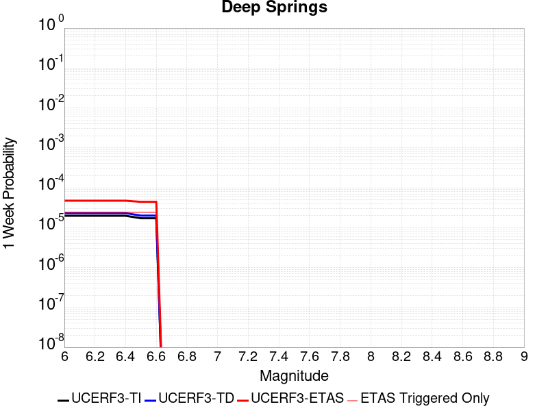 | 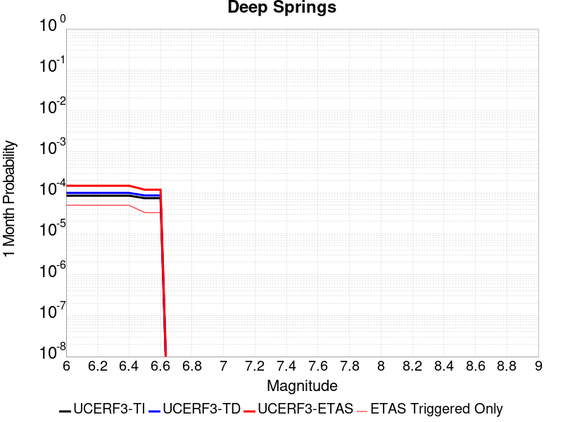 | 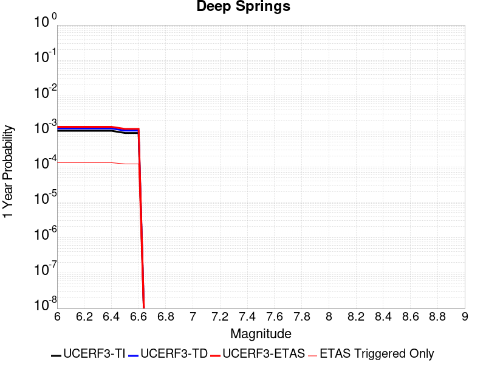 | 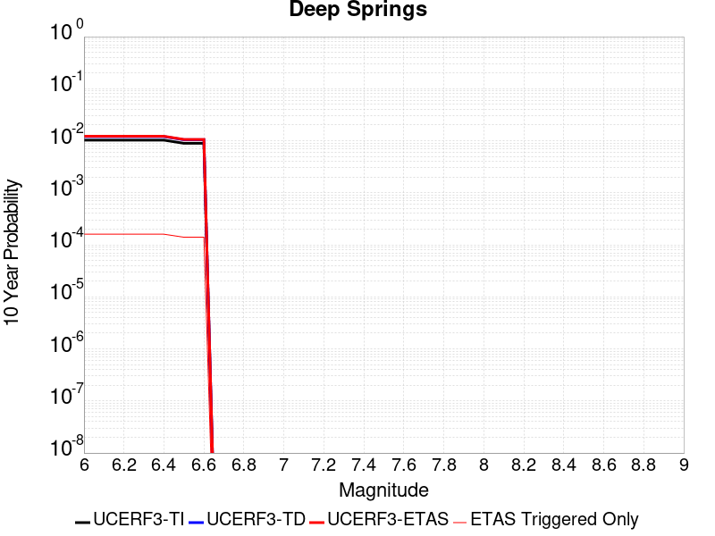 |

| Magnitude | 1 wk TI Prob | 1 wk TD Prob | 1 wk ETAS Prob | 1 wk ETAS/TD Gain | 1 wk ETAS Triggered Only | 1 mo TI Prob | 1 mo TD Prob | 1 mo ETAS Prob | 1 mo ETAS/TD Gain | 1 mo ETAS Triggered Only | 1 yr TI Prob | 1 yr TD Prob | 1 yr ETAS Prob | 1 yr ETAS/TD Gain | 1 yr ETAS Triggered Only | 10 yr TI Prob | 10 yr TD Prob | 10 yr ETAS Prob | 10 yr ETAS/TD Gain | 10 yr ETAS Triggered Only |
|-----|-----|-----|-----|-----|-----|-----|-----|-----|-----|-----|-----|-----|-----|-----|-----|-----|-----|-----|-----|-----|
| 6.0 | 1.9810619E-5 | 2.311252E-5 | 5.77114E-5 | 2.4969757 | 3.459968E-5 | 8.489989E-5 | 9.9052755E-5 | 1.6824527E-4 | 1.698542 | 6.919936E-5 | 0.001033166 | 0.0012058078 | 0.0013094817 | 1.0859787 | 1.03799044E-4 | 0.010283757 | 0.01204243 | 0.012144979 | 1.0085156 | 1.03799044E-4 |
| 6.1 | 1.9810619E-5 | 2.311252E-5 | 5.77114E-5 | 2.4969757 | 3.459968E-5 | 8.489989E-5 | 9.9052755E-5 | 1.6824527E-4 | 1.698542 | 6.919936E-5 | 0.001033166 | 0.0012058078 | 0.0013094817 | 1.0859787 | 1.03799044E-4 | 0.010283757 | 0.01204243 | 0.012144979 | 1.0085156 | 1.03799044E-4 |
| 6.2 | 1.9810619E-5 | 2.311252E-5 | 5.77114E-5 | 2.4969757 | 3.459968E-5 | 8.489989E-5 | 9.9052755E-5 | 1.6824527E-4 | 1.698542 | 6.919936E-5 | 0.001033166 | 0.0012058078 | 0.0013094817 | 1.0859787 | 1.03799044E-4 | 0.010283757 | 0.01204243 | 0.012144979 | 1.0085156 | 1.03799044E-4 |
| 6.3 | 1.9810619E-5 | 2.311252E-5 | 5.77114E-5 | 2.4969757 | 3.459968E-5 | 8.489989E-5 | 9.9052755E-5 | 1.6824527E-4 | 1.698542 | 6.919936E-5 | 0.001033166 | 0.0012058078 | 0.0013094817 | 1.0859787 | 1.03799044E-4 | 0.010283757 | 0.01204243 | 0.012144979 | 1.0085156 | 1.03799044E-4 |
| 6.4 | 1.9810619E-5 | 2.311252E-5 | 5.77114E-5 | 2.4969757 | 3.459968E-5 | 8.489989E-5 | 9.9052755E-5 | 1.6824527E-4 | 1.698542 | 6.919936E-5 | 0.001033166 | 0.0012058078 | 0.0013094817 | 1.0859787 | 1.03799044E-4 | 0.010283757 | 0.01204243 | 0.012144979 | 1.0085156 | 1.03799044E-4 |
| 6.5 | 1.7190405E-5 | 2.0050558E-5 | 5.4649547E-5 | 2.7255874 | 3.459968E-5 | 7.367108E-5 | 8.593096E-5 | 1.2052767E-4 | 1.4026105 | 3.459968E-5 | 8.9657627E-4 | 0.0010462092 | 0.0011153362 | 1.0660738 | 6.919936E-5 | 0.008929676 | 0.010462061 | 0.010530536 | 1.0065451 | 6.919936E-5 |
| 6.6 | 1.7190405E-5 | 2.0050558E-5 | 5.4649547E-5 | 2.7255874 | 3.459968E-5 | 7.367108E-5 | 8.593096E-5 | 1.2052767E-4 | 1.4026105 | 3.459968E-5 | 8.9657627E-4 | 0.0010462092 | 0.0011153362 | 1.0660738 | 6.919936E-5 | 0.008929676 | 0.010462061 | 0.010530536 | 1.0065451 | 6.919936E-5 |

## San Jacinto (Clark) rev
*[(top)](#table-of-contents)*

| 1 Week | 1 Month | 1 Year | 10 Year |
|-----|-----|-----|-----|
| 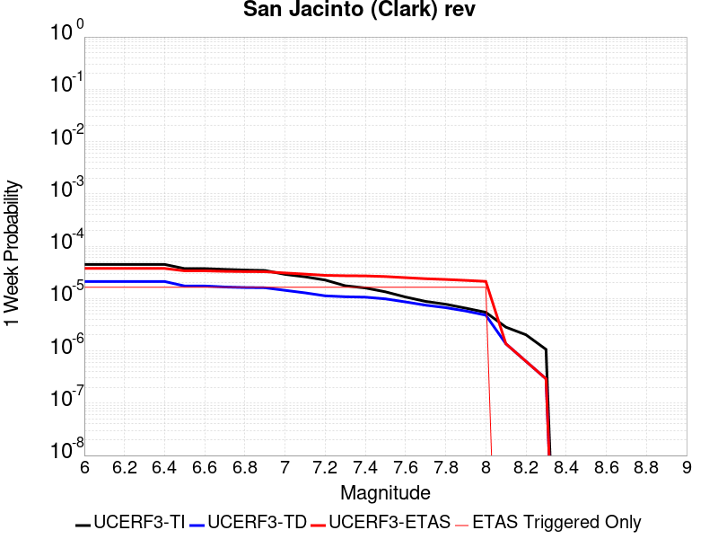 | 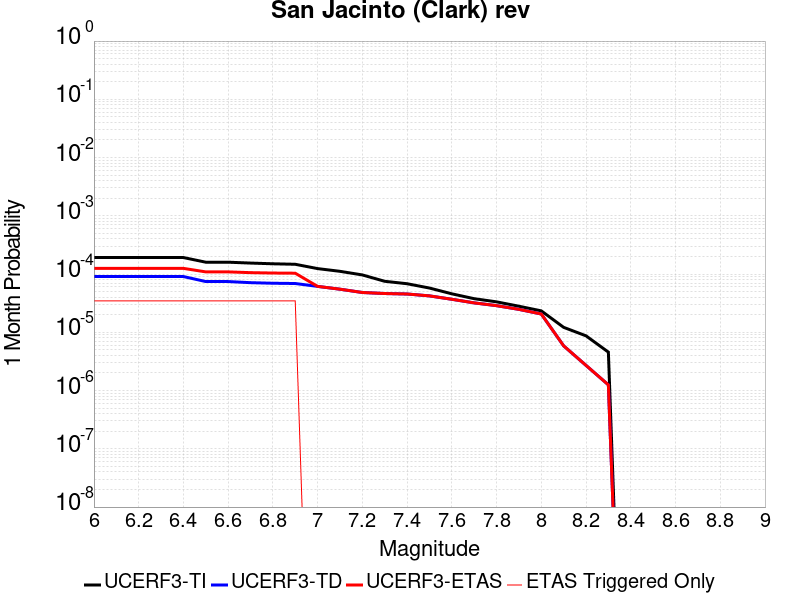 | 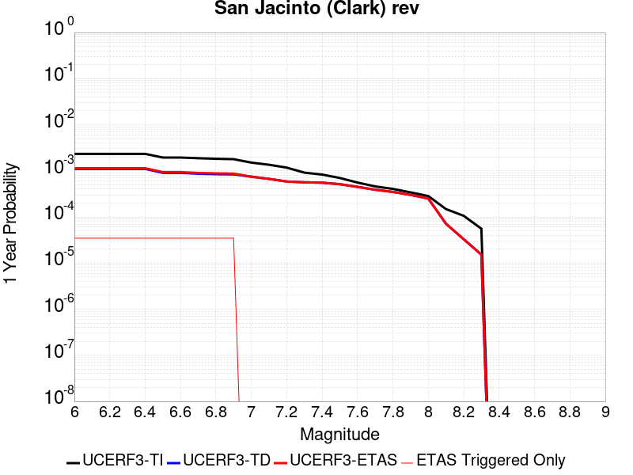 | 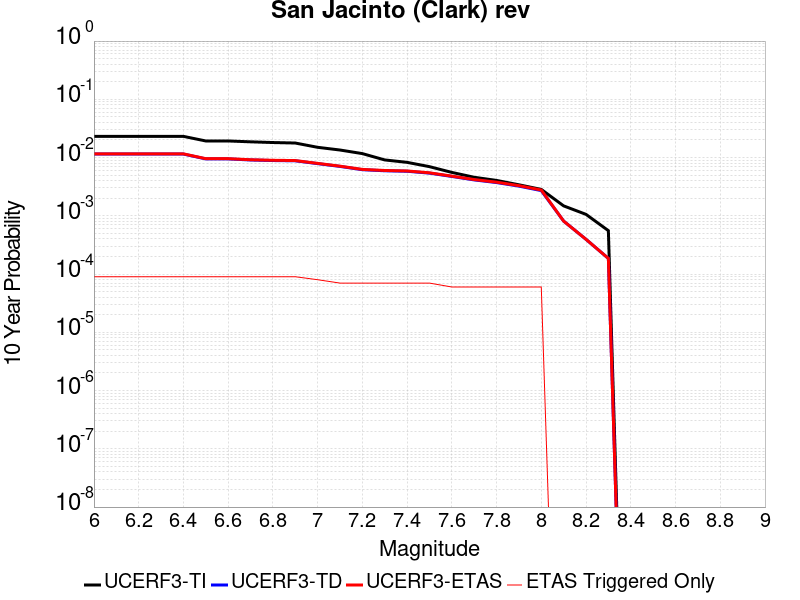 |

| Magnitude | 1 wk TI Prob | 1 wk TD Prob | 1 wk ETAS Prob | 1 wk ETAS/TD Gain | 1 wk ETAS Triggered Only | 1 mo TI Prob | 1 mo TD Prob | 1 mo ETAS Prob | 1 mo ETAS/TD Gain | 1 mo ETAS Triggered Only | 1 yr TI Prob | 1 yr TD Prob | 1 yr ETAS Prob | 1 yr ETAS/TD Gain | 1 yr ETAS Triggered Only | 10 yr TI Prob | 10 yr TD Prob | 10 yr ETAS Prob | 10 yr ETAS/TD Gain | 10 yr ETAS Triggered Only |
|-----|-----|-----|-----|-----|-----|-----|-----|-----|-----|-----|-----|-----|-----|-----|-----|-----|-----|-----|-----|-----|
| 6.0 | 4.482615E-5 | 2.1153059E-5 | 2.1153059E-5 | 1.0 | 0.0 | 1.9209793E-4 | 9.065287E-5 | 1.2524941E-4 | 1.3816376 | 3.459968E-5 | 0.0023362834 | 0.0011031491 | 0.0011377106 | 1.0313299 | 3.459968E-5 | 0.02311874 | 0.011485709 | 0.0115883155 | 1.0089334 | 1.03799044E-4 |
| 6.1 | 4.482615E-5 | 2.1153059E-5 | 2.1153059E-5 | 1.0 | 0.0 | 1.9209793E-4 | 9.065287E-5 | 1.2524941E-4 | 1.3816376 | 3.459968E-5 | 0.0023362834 | 0.0011031491 | 0.0011377106 | 1.0313299 | 3.459968E-5 | 0.02311874 | 0.011485709 | 0.0115883155 | 1.0089334 | 1.03799044E-4 |
| 6.2 | 4.482615E-5 | 2.1153059E-5 | 2.1153059E-5 | 1.0 | 0.0 | 1.9209793E-4 | 9.065287E-5 | 1.2524941E-4 | 1.3816376 | 3.459968E-5 | 0.0023362834 | 0.0011031491 | 0.0011377106 | 1.0313299 | 3.459968E-5 | 0.02311874 | 0.011485709 | 0.0115883155 | 1.0089334 | 1.03799044E-4 |
| 6.3 | 4.482615E-5 | 2.1153059E-5 | 2.1153059E-5 | 1.0 | 0.0 | 1.9209793E-4 | 9.065287E-5 | 1.2524941E-4 | 1.3816376 | 3.459968E-5 | 0.0023362834 | 0.0011031491 | 0.0011377106 | 1.0313299 | 3.459968E-5 | 0.02311874 | 0.011485709 | 0.0115883155 | 1.0089334 | 1.03799044E-4 |
| 6.4 | 4.482615E-5 | 2.1153059E-5 | 2.1153059E-5 | 1.0 | 0.0 | 1.9209793E-4 | 9.065287E-5 | 1.2524941E-4 | 1.3816376 | 3.459968E-5 | 0.0023362834 | 0.0011031491 | 0.0011377106 | 1.0313299 | 3.459968E-5 | 0.02311874 | 0.011485709 | 0.0115883155 | 1.0089334 | 1.03799044E-4 |
| 6.5 | 3.7294863E-5 | 1.7354667E-5 | 1.7354667E-5 | 1.0 | 0.0 | 1.5982533E-4 | 7.437504E-5 | 1.08972155E-4 | 1.465171 | 3.459968E-5 | 0.0019441366 | 9.051445E-4 | 9.3971286E-4 | 1.038191 | 3.459968E-5 | 0.01927216 | 0.009485902 | 0.0095887175 | 1.0108386 | 1.03799044E-4 |
| 6.6 | 3.7294863E-5 | 1.7354667E-5 | 1.7354667E-5 | 1.0 | 0.0 | 1.5982533E-4 | 7.437504E-5 | 1.08972155E-4 | 1.465171 | 3.459968E-5 | 0.0019441366 | 9.051445E-4 | 9.3971286E-4 | 1.038191 | 3.459968E-5 | 0.01927216 | 0.009485902 | 0.0095887175 | 1.0108386 | 1.03799044E-4 |
| 6.7 | 3.6039248E-5 | 1.6602684E-5 | 1.6602684E-5 | 1.0 | 0.0 | 1.5444479E-4 | 7.115244E-5 | 1.0574966E-4 | 1.4862409 | 3.459968E-5 | 0.0018787434 | 8.659408E-4 | 9.005105E-4 | 1.0399215 | 3.459968E-5 | 0.01862939 | 0.009088189 | 0.009191045 | 1.0113175 | 1.03799044E-4 |
| 6.8 | 3.5031844E-5 | 1.6231123E-5 | 1.6231123E-5 | 1.0 | 0.0 | 1.5012783E-4 | 6.956012E-5 | 1.041574E-4 | 1.4973723 | 3.459968E-5 | 0.0018262739 | 8.4656954E-4 | 8.811399E-4 | 1.0408359 | 3.459968E-5 | 0.01811338 | 0.008888788 | 0.008991664 | 1.0115737 | 1.03799044E-4 |
| 6.9 | 3.435112E-5 | 1.6061658E-5 | 1.6061658E-5 | 1.0 | 0.0 | 1.4721078E-4 | 6.8833884E-5 | 1.03431186E-4 | 1.5026202 | 3.459968E-5 | 0.0017908178 | 8.377344E-4 | 8.723051E-4 | 1.0412669 | 3.459968E-5 | 0.017764548 | 0.008796512 | 0.008899398 | 1.0116962 | 1.03799044E-4 |
| 7.0 | 2.8959772E-5 | 1.43355255E-5 | 1.43355255E-5 | 1.0 | 0.0 | 1.241074E-4 | 6.1436534E-5 | 6.1436534E-5 | 1.0 | 0.0 | 0.0015099603 | 7.477359E-4 | 7.477359E-4 | 1.0 | 0.0 | 0.014997416 | 0.007868331 | 0.007936986 | 1.0087255 | 6.919936E-5 |
| 7.1 | 2.6002877E-5 | 1.2827699E-5 | 1.2827699E-5 | 1.0 | 0.0 | 1.11436144E-4 | 5.4974706E-5 | 5.4974706E-5 | 1.0 | 0.0 | 0.0013558907 | 6.6911365E-4 | 6.6911365E-4 | 1.0 | 0.0 | 0.013476475 | 0.0070483433 | 0.0071170554 | 1.0097486 | 6.919936E-5 |
| 7.2 | 2.2544838E-5 | 1.1260331E-5 | 1.1260331E-5 | 1.0 | 0.0 | 9.661716E-5 | 4.825768E-5 | 4.825768E-5 | 1.0 | 0.0 | 0.001175679 | 5.873803E-4 | 5.873803E-4 | 1.0 | 0.0 | 0.011694785 | 0.00619256 | 0.0062613306 | 1.0111054 | 6.919936E-5 |
| 7.3 | 1.75334E-5 | 1.0810585E-5 | 1.0810585E-5 | 1.0 | 0.0 | 7.514098E-5 | 4.6330264E-5 | 4.6330264E-5 | 1.0 | 0.0 | 9.144575E-4 | 5.6392635E-4 | 5.6392635E-4 | 1.0 | 0.0 | 0.009107036 | 0.0059332196 | 0.006002008 | 1.0115938 | 6.919936E-5 |
| 7.4 | 1.5924552E-5 | 1.0610475E-5 | 1.0610475E-5 | 1.0 | 0.0 | 6.82463E-5 | 4.547268E-5 | 4.547268E-5 | 1.0 | 0.0 | 8.305819E-4 | 5.534906E-4 | 5.534906E-4 | 1.0 | 0.0 | 0.008274844 | 0.0058205863 | 0.0058893827 | 1.0118195 | 6.919936E-5 |
| 7.5 | 1.3428931E-5 | 9.851045E-6 | 9.851045E-6 | 1.0 | 0.0 | 5.7551293E-5 | 4.221809E-5 | 4.221809E-5 | 1.0 | 0.0 | 7.004617E-4 | 5.1388505E-4 | 5.1388505E-4 | 1.0 | 0.0 | 0.006982579 | 0.005406209 | 0.005475034 | 1.0127308 | 6.919936E-5 |
| 7.6 | 1.0688787E-5 | 8.614091E-6 | 8.614091E-6 | 1.0 | 0.0 | 4.5808283E-5 | 3.6917012E-5 | 3.6917012E-5 | 1.0 | 0.0 | 5.5757316E-4 | 4.4937237E-4 | 4.4937237E-4 | 1.0 | 0.0 | 0.005561762 | 0.0047413614 | 0.0048102327 | 1.0145257 | 6.919936E-5 |
| 7.7 | 8.81236E-6 | 7.4673385E-6 | 7.4673385E-6 | 1.0 | 0.0 | 3.776671E-5 | 3.200249E-5 | 3.200249E-5 | 1.0 | 0.0 | 4.597127E-4 | 3.8956082E-4 | 3.8956082E-4 | 1.0 | 0.0 | 0.0045876284 | 0.0041344194 | 0.0042033326 | 1.0166682 | 6.919936E-5 |
| 7.8 | 7.780431E-6 | 6.695928E-6 | 6.695928E-6 | 1.0 | 0.0 | 3.3344273E-5 | 2.8696519E-5 | 2.8696519E-5 | 1.0 | 0.0 | 4.0589093E-4 | 3.4932428E-4 | 3.4932428E-4 | 1.0 | 0.0 | 0.0040515037 | 0.0037226272 | 0.003791569 | 1.0185196 | 6.919936E-5 |
| 7.9 | 6.5437994E-6 | 5.7797783E-6 | 5.7797783E-6 | 1.0 | 0.0 | 2.8044553E-5 | 2.4770245E-5 | 2.4770245E-5 | 1.0 | 0.0 | 3.4138895E-4 | 3.0153614E-4 | 3.0153614E-4 | 1.0 | 0.0 | 0.0034086495 | 0.0032343294 | 0.003303305 | 1.0213261 | 6.919936E-5 |
| 8.0 | 5.4488164E-6 | 4.812793E-6 | 4.812793E-6 | 1.0 | 0.0 | 2.3351862E-5 | 2.0626094E-5 | 2.0626094E-5 | 1.0 | 0.0 | 2.8427184E-4 | 2.510939E-4 | 2.510939E-4 | 1.0 | 0.0 | 0.0028390845 | 0.0027107038 | 0.0027797155 | 1.025459 | 6.919936E-5 |
| 8.1 | 2.8397242E-6 | 1.3665673E-6 | 1.3665673E-6 | 1.0 | 0.0 | 1.217019E-5 | 5.856704E-6 | 5.856704E-6 | 1.0 | 0.0 | 1.4816198E-4 | 7.1303046E-5 | 7.1303046E-5 | 1.0 | 0.0 | 0.0014806325 | 8.113543E-4 | 8.113543E-4 | 1.0 | 0.0 |
| 8.2 | 2.030244E-6 | 6.3151083E-7 | 6.3151083E-7 | 1.0 | 0.0 | 8.701017E-6 | 2.7064723E-6 | 2.7064723E-6 | 1.0 | 0.0 | 1.05929736E-4 | 3.2950808E-5 | 3.2950808E-5 | 1.0 | 0.0 | 0.0010587925 | 3.9470522E-4 | 3.9470522E-4 | 1.0 | 0.0 |
| 8.3 | 1.0659804E-6 | 2.9230563E-7 | 2.9230563E-7 | 1.0 | 0.0 | 4.568479E-6 | 1.2527379E-6 | 1.2527379E-6 | 1.0 | 0.0 | 5.5619817E-5 | 1.5251981E-5 | 1.5251981E-5 | 1.0 | 0.0 | 5.5605895E-4 | 1.8556409E-4 | 1.8556409E-4 | 1.0 | 0.0 |

## Owens Valley Keough Hot Springs
*[(top)](#table-of-contents)*

| 1 Week | 1 Month | 1 Year | 10 Year |
|-----|-----|-----|-----|
| 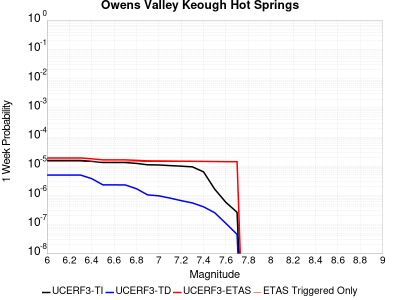 | 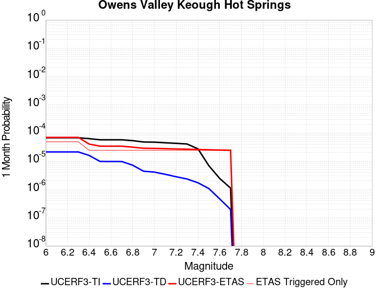 | 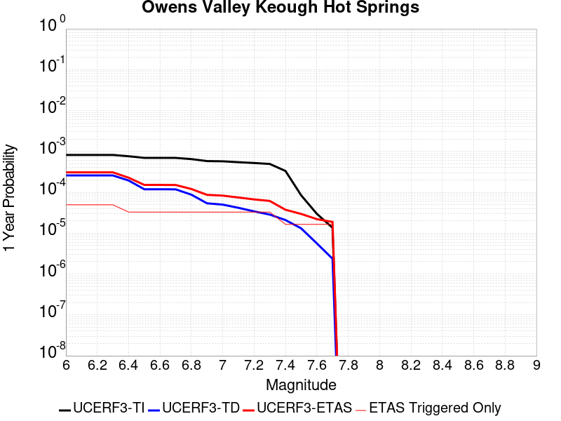 |  |

| Magnitude | 1 wk TI Prob | 1 wk TD Prob | 1 wk ETAS Prob | 1 wk ETAS/TD Gain | 1 wk ETAS Triggered Only | 1 mo TI Prob | 1 mo TD Prob | 1 mo ETAS Prob | 1 mo ETAS/TD Gain | 1 mo ETAS Triggered Only | 1 yr TI Prob | 1 yr TD Prob | 1 yr ETAS Prob | 1 yr ETAS/TD Gain | 1 yr ETAS Triggered Only | 10 yr TI Prob | 10 yr TD Prob | 10 yr ETAS Prob | 10 yr ETAS/TD Gain | 10 yr ETAS Triggered Only |
|-----|-----|-----|-----|-----|-----|-----|-----|-----|-----|-----|-----|-----|-----|-----|-----|-----|-----|-----|-----|-----|
| 6.0 | 1.5708529E-5 | 4.950463E-6 | 3.9549974E-5 | 7.989146 | 3.459968E-5 | 6.7320536E-5 | 2.1216127E-5 | 9.0414025E-5 | 4.2615705 | 6.919936E-5 | 8.193192E-4 | 2.5828084E-4 | 3.6205308E-4 | 1.4017806 | 1.03799044E-4 | 0.008163051 | 0.0025804387 | 0.00268397 | 1.0401216 | 1.03799044E-4 |
| 6.1 | 1.5708529E-5 | 4.950463E-6 | 3.9549974E-5 | 7.989146 | 3.459968E-5 | 6.7320536E-5 | 2.1216127E-5 | 9.0414025E-5 | 4.2615705 | 6.919936E-5 | 8.193192E-4 | 2.5828084E-4 | 3.6205308E-4 | 1.4017806 | 1.03799044E-4 | 0.008163051 | 0.0025804387 | 0.00268397 | 1.0401216 | 1.03799044E-4 |
| 6.2 | 1.5708529E-5 | 4.950463E-6 | 3.9549974E-5 | 7.989146 | 3.459968E-5 | 6.7320536E-5 | 2.1216127E-5 | 9.0414025E-5 | 4.2615705 | 6.919936E-5 | 8.193192E-4 | 2.5828084E-4 | 3.6205308E-4 | 1.4017806 | 1.03799044E-4 | 0.008163051 | 0.0025804387 | 0.00268397 | 1.0401216 | 1.03799044E-4 |
| 6.3 | 1.5708529E-5 | 4.950463E-6 | 3.9549974E-5 | 7.989146 | 3.459968E-5 | 6.7320536E-5 | 2.1216127E-5 | 9.0414025E-5 | 4.2615705 | 6.919936E-5 | 8.193192E-4 | 2.5828084E-4 | 3.6205308E-4 | 1.4017806 | 1.03799044E-4 | 0.008163051 | 0.0025804387 | 0.00268397 | 1.0401216 | 1.03799044E-4 |
| 6.4 | 1.4622509E-5 | 3.7263276E-6 | 3.832588E-5 | 10.285161 | 3.459968E-5 | 6.266639E-5 | 1.5969896E-5 | 5.0569026E-5 | 3.1665218 | 3.459968E-5 | 7.626962E-4 | 1.9441944E-4 | 2.6360535E-4 | 1.355859 | 6.919936E-5 | 0.007600839 | 0.0019429466 | 0.0020120116 | 1.0355464 | 6.919936E-5 |
| 6.5 | 1.3335527E-5 | 2.2775241E-6 | 3.687713E-5 | 16.191761 | 3.459968E-5 | 5.7151006E-5 | 9.760785E-6 | 4.436013E-5 | 4.5447297 | 3.459968E-5 | 6.955913E-4 | 1.1883176E-4 | 1.8802291E-4 | 1.5822613 | 6.919936E-5 | 0.0069341804 | 0.001187878 | 0.0012569951 | 1.0581855 | 6.919936E-5 |
| 6.6 | 1.3332855E-5 | 2.2746733E-6 | 3.6874277E-5 | 16.2108 | 3.459968E-5 | 5.7139558E-5 | 9.748568E-6 | 4.434791E-5 | 4.549172 | 3.459968E-5 | 6.9545204E-4 | 1.1868303E-4 | 1.8787418E-4 | 1.5829911 | 6.919936E-5 | 0.0069327964 | 0.0011863923 | 0.0012555096 | 1.0582584 | 6.919936E-5 |
| 6.7 | 1.3318214E-5 | 2.2639038E-6 | 3.686351E-5 | 16.28316 | 3.459968E-5 | 5.707681E-5 | 9.702413E-6 | 4.430176E-5 | 4.566056 | 3.459968E-5 | 6.946886E-4 | 1.18121156E-4 | 1.8731234E-4 | 1.5857645 | 6.919936E-5 | 0.0069252094 | 0.0011807795 | 0.0012498972 | 1.0585356 | 6.919936E-5 |
| 6.8 | 1.2441338E-5 | 1.677594E-6 | 3.627722E-5 | 21.624552 | 3.459968E-5 | 5.331893E-5 | 7.1896707E-6 | 4.1789102E-5 | 5.812381 | 3.459968E-5 | 6.489646E-4 | 8.753102E-5 | 1.5672433E-4 | 1.7905004 | 6.919936E-5 | 0.0064707273 | 8.751236E-4 | 9.442624E-4 | 1.0790046 | 6.919936E-5 |
| 6.9 | 1.1130476E-5 | 1.0302234E-6 | 3.562987E-5 | 34.584602 | 3.459968E-5 | 4.7701167E-5 | 4.4152357E-6 | 3.9014765E-5 | 8.836394 | 3.459968E-5 | 5.806069E-4 | 5.3754186E-5 | 1.2294983E-4 | 2.2872605 | 6.919936E-5 | 0.0057909233 | 5.375404E-4 | 6.067026E-4 | 1.1286641 | 6.919936E-5 |
| 7.0 | 1.0986073E-5 | 9.577824E-7 | 3.555743E-5 | 37.12475 | 3.459968E-5 | 4.7082318E-5 | 4.1047756E-6 | 3.8704315E-5 | 9.429094 | 3.459968E-5 | 5.730765E-4 | 4.9974507E-5 | 1.19170414E-4 | 2.384624 | 6.919936E-5 | 0.0057160086 | 4.997603E-4 | 5.689251E-4 | 1.1383959 | 6.919936E-5 |
| 7.1 | 1.0451338E-5 | 7.9988575E-7 | 3.539954E-5 | 44.255745 | 3.459968E-5 | 4.4790682E-5 | 3.4280772E-6 | 3.802764E-5 | 11.092994 | 3.459968E-5 | 5.451901E-4 | 4.1736046E-5 | 1.10932524E-4 | 2.6579547 | 6.919936E-5 | 0.005438545 | 4.1740583E-4 | 4.8657632E-4 | 1.1657152 | 6.919936E-5 |
| 7.2 | 9.989061E-6 | 6.543693E-7 | 3.525403E-5 | 53.874825 | 3.459968E-5 | 4.280956E-5 | 2.8044367E-6 | 3.740402E-5 | 13.337445 | 3.459968E-5 | 5.2108173E-4 | 3.4143486E-5 | 1.03340484E-4 | 3.026653 | 6.919936E-5 | 0.0051986156 | 3.41488E-4 | 4.1066372E-4 | 1.2025715 | 6.919936E-5 |
| 7.3 | 9.465365E-6 | 5.458855E-7 | 3.514555E-5 | 64.38264 | 3.459968E-5 | 4.056522E-5 | 2.3395073E-6 | 3.693911E-5 | 15.7892685 | 3.459968E-5 | 4.937696E-4 | 2.8483131E-5 | 9.7680524E-5 | 3.4294167 | 6.919936E-5 | 0.0049267393 | 2.8489542E-4 | 3.5407505E-4 | 1.2428247 | 6.919936E-5 |
| 7.4 | 6.3824805E-6 | 4.0153776E-7 | 3.5001205E-5 | 87.16791 | 3.459968E-5 | 2.73532E-5 | 1.7208749E-6 | 3.6320496E-5 | 21.105831 | 3.459968E-5 | 3.3297433E-4 | 2.0951453E-5 | 5.555041E-5 | 2.651387 | 3.459968E-5 | 0.0033247585 | 2.0955436E-4 | 2.441468E-4 | 1.1650761 | 3.459968E-5 |
| 7.5 | 1.6192645E-6 | 2.5156373E-7 | 3.4851237E-5 | 138.53839 | 3.459968E-5 | 6.9396865E-6 | 1.0781299E-6 | 3.5677775E-5 | 33.092278 | 3.459968E-5 | 8.448741E-5 | 1.3126153E-5 | 4.772538E-5 | 3.6359 | 3.459968E-5 | 8.4455294E-4 | 1.3125391E-4 | 1.6584905E-4 | 1.2635741 | 3.459968E-5 |
| 7.6 | 5.7062545E-7 | 1.0790214E-7 | 3.470758E-5 | 321.65793 | 3.459968E-5 | 2.4455355E-6 | 4.6243767E-7 | 3.5062105E-5 | 75.82017 | 3.459968E-5 | 2.9773988E-5 | 5.630165E-6 | 4.022965E-5 | 7.145377 | 3.459968E-5 | 2.977E-4 | 5.6300305E-5 | 9.089804E-5 | 1.6145213 | 3.459968E-5 |
| 7.7 | 2.5988817E-7 | 4.5445965E-8 | 3.4645127E-5 | 762.3367 | 3.459968E-5 | 1.113806E-6 | 1.9476842E-7 | 3.4794444E-5 | 178.6452 | 3.459968E-5 | 1.3560503E-5 | 2.3713033E-6 | 3.69709E-5 | 15.590963 | 3.459968E-5 | 1.3559677E-4 | 2.3712824E-5 | 5.8311685E-5 | 2.459078 | 3.459968E-5 |

## Santa Ynez River
*[(top)](#table-of-contents)*

| 1 Week | 1 Month | 1 Year | 10 Year |
|-----|-----|-----|-----|
| 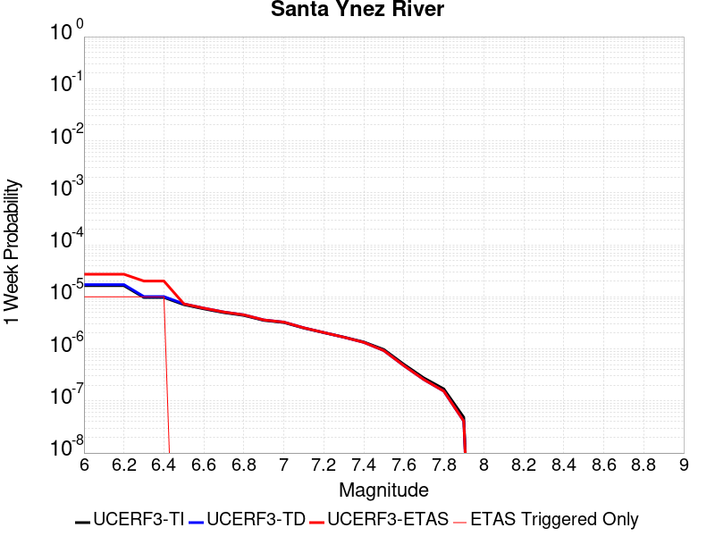 | 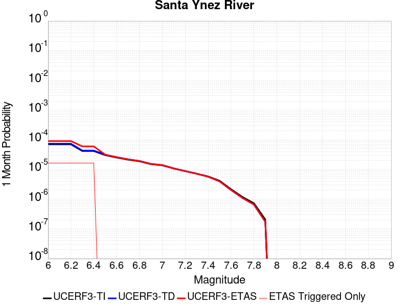 | 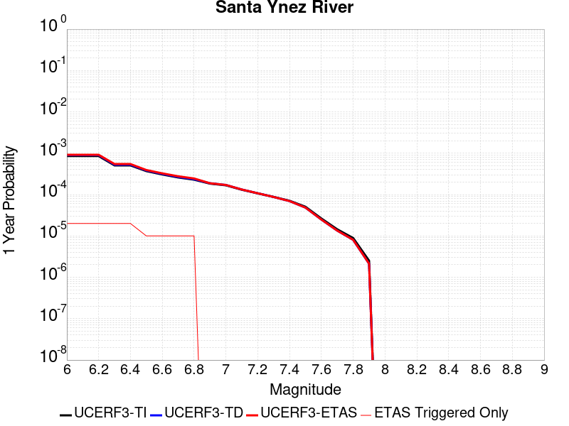 | 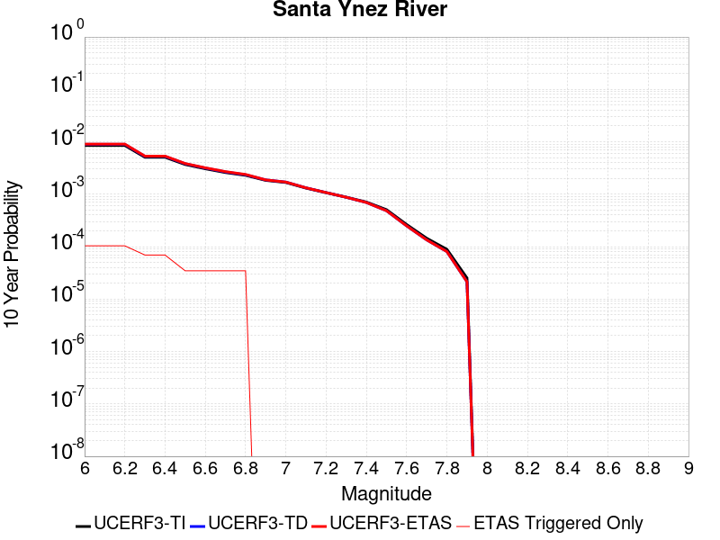 |

| Magnitude | 1 wk TI Prob | 1 wk TD Prob | 1 wk ETAS Prob | 1 wk ETAS/TD Gain | 1 wk ETAS Triggered Only | 1 mo TI Prob | 1 mo TD Prob | 1 mo ETAS Prob | 1 mo ETAS/TD Gain | 1 mo ETAS Triggered Only | 1 yr TI Prob | 1 yr TD Prob | 1 yr ETAS Prob | 1 yr ETAS/TD Gain | 1 yr ETAS Triggered Only | 10 yr TI Prob | 10 yr TD Prob | 10 yr ETAS Prob | 10 yr ETAS/TD Gain | 10 yr ETAS Triggered Only |
|-----|-----|-----|-----|-----|-----|-----|-----|-----|-----|-----|-----|-----|-----|-----|-----|-----|-----|-----|-----|-----|
| 6.0 | 1.6396456E-5 | 1.7209444E-5 | 5.1808533E-5 | 3.0104709 | 3.459968E-5 | 7.026863E-5 | 7.3752875E-5 | 1.0835001E-4 | 1.4690953 | 3.459968E-5 | 8.551848E-4 | 8.976069E-4 | 9.6674415E-4 | 1.077024 | 6.919936E-5 | 0.0085190125 | 0.008943363 | 0.009046233 | 1.0115025 | 1.03799044E-4 |
| 6.1 | 1.6396456E-5 | 1.7209444E-5 | 5.1808533E-5 | 3.0104709 | 3.459968E-5 | 7.026863E-5 | 7.3752875E-5 | 1.0835001E-4 | 1.4690953 | 3.459968E-5 | 8.551848E-4 | 8.976069E-4 | 9.6674415E-4 | 1.077024 | 6.919936E-5 | 0.0085190125 | 0.008943363 | 0.009046233 | 1.0115025 | 1.03799044E-4 |
| 6.2 | 1.6396456E-5 | 1.7209444E-5 | 5.1808533E-5 | 3.0104709 | 3.459968E-5 | 7.026863E-5 | 7.3752875E-5 | 1.0835001E-4 | 1.4690953 | 3.459968E-5 | 8.551848E-4 | 8.976069E-4 | 9.6674415E-4 | 1.077024 | 6.919936E-5 | 0.0085190125 | 0.008943363 | 0.009046233 | 1.0115025 | 1.03799044E-4 |
| 6.3 | 9.736976E-6 | 1.01223395E-5 | 4.472167E-5 | 4.418116 | 3.459968E-5 | 4.172923E-5 | 4.338076E-5 | 7.797894E-5 | 1.7975466 | 3.459968E-5 | 5.0793495E-4 | 5.280378E-4 | 5.972006E-4 | 1.1309808 | 6.919936E-5 | 0.005067755 | 0.0052683367 | 0.0053371713 | 1.0130657 | 6.919936E-5 |
| 6.4 | 9.736976E-6 | 1.01223395E-5 | 4.472167E-5 | 4.418116 | 3.459968E-5 | 4.172923E-5 | 4.338076E-5 | 7.797894E-5 | 1.7975466 | 3.459968E-5 | 5.0793495E-4 | 5.280378E-4 | 5.972006E-4 | 1.1309808 | 6.919936E-5 | 0.005067755 | 0.0052683367 | 0.0053371713 | 1.0130657 | 6.919936E-5 |
| 6.5 | 7.081964E-6 | 7.329905E-6 | 7.329905E-6 | 1.0 | 0.0 | 3.035092E-5 | 3.141351E-5 | 3.141351E-5 | 1.0 | 0.0 | 3.694598E-4 | 3.8239395E-4 | 4.1698042E-4 | 1.0904472 | 3.459968E-5 | 0.0036884616 | 0.0038175215 | 0.003851989 | 1.0090288 | 3.459968E-5 |
| 6.6 | 5.873247E-6 | 6.0597517E-6 | 6.0597517E-6 | 1.0 | 0.0 | 2.5170815E-5 | 2.5970112E-5 | 2.5970112E-5 | 1.0 | 0.0 | 3.064116E-4 | 3.161411E-4 | 3.5072982E-4 | 1.1094092 | 3.459968E-5 | 0.0030598943 | 0.003157001 | 0.0031914914 | 1.010925 | 3.459968E-5 |
| 6.7 | 4.973277E-6 | 5.11591E-6 | 5.11591E-6 | 1.0 | 0.0 | 2.1313872E-5 | 2.1925147E-5 | 2.1925147E-5 | 1.0 | 0.0 | 2.5946548E-4 | 2.6690646E-4 | 3.0149688E-4 | 1.1295977 | 3.459968E-5 | 0.0025916274 | 0.0026659078 | 0.0027004152 | 1.012944 | 3.459968E-5 |
| 6.8 | 4.396492E-6 | 4.510987E-6 | 4.510987E-6 | 1.0 | 0.0 | 1.884197E-5 | 1.933266E-5 | 1.933266E-5 | 1.0 | 0.0 | 2.2937685E-4 | 2.3535005E-4 | 2.6994158E-4 | 1.1469791 | 3.459968E-5 | 0.0022914023 | 0.0023510433 | 0.0023855618 | 1.0146822 | 3.459968E-5 |
| 6.9 | 3.5255632E-6 | 3.6013423E-6 | 3.6013423E-6 | 1.0 | 0.0 | 1.5109469E-5 | 1.5434234E-5 | 1.5434234E-5 | 1.0 | 0.0 | 1.8394225E-4 | 1.8789574E-4 | 1.8789574E-4 | 1.0 | 0.0 | 0.0018379007 | 0.001877385 | 0.001877385 | 1.0 | 0.0 |
| 7.0 | 3.211603E-6 | 3.273663E-6 | 3.273663E-6 | 1.0 | 0.0 | 1.376394E-5 | 1.402991E-5 | 1.402991E-5 | 1.0 | 0.0 | 1.6756308E-4 | 1.708009E-4 | 1.708009E-4 | 1.0 | 0.0 | 0.0016743679 | 0.0017067104 | 0.0017067104 | 1.0 | 0.0 |
| 7.1 | 2.5094619E-6 | 2.5409295E-6 | 2.5409295E-6 | 1.0 | 0.0 | 1.0754793E-5 | 1.0889652E-5 | 1.0889652E-5 | 1.0 | 0.0 | 1.3093173E-4 | 1.325735E-4 | 1.325735E-4 | 1.0 | 0.0 | 0.0013085462 | 0.0013249503 | 0.0013249503 | 1.0 | 0.0 |
| 7.2 | 2.0515774E-6 | 2.0619466E-6 | 2.0619466E-6 | 1.0 | 0.0 | 8.792445E-6 | 8.836884E-6 | 8.836884E-6 | 1.0 | 0.0 | 1.0704277E-4 | 1.0758379E-4 | 1.0758379E-4 | 1.0 | 0.0 | 0.0010699122 | 0.0010753215 | 0.0010753215 | 1.0 | 0.0 |
| 7.3 | 1.6845745E-6 | 1.6773996E-6 | 1.6773996E-6 | 1.0 | 0.0 | 7.219585E-6 | 7.1888358E-6 | 7.1888358E-6 | 1.0 | 0.0 | 8.78949E-5 | 8.752059E-5 | 8.752059E-5 | 1.0 | 0.0 | 8.7860145E-4 | 8.7486405E-4 | 8.7486405E-4 | 1.0 | 0.0 |
| 7.4 | 1.3600285E-6 | 1.3333447E-6 | 1.3333447E-6 | 1.0 | 0.0 | 5.82868E-6 | 5.714322E-6 | 5.714322E-6 | 1.0 | 0.0 | 7.096187E-5 | 6.956967E-5 | 6.956967E-5 | 1.0 | 0.0 | 7.0939213E-4 | 6.9548114E-4 | 6.9548114E-4 | 1.0 | 0.0 |
| 7.5 | 9.735342E-7 | 9.2901894E-7 | 9.2901894E-7 | 1.0 | 0.0 | 4.172283E-6 | 3.9815036E-6 | 3.9815036E-6 | 1.0 | 0.0 | 5.079636E-5 | 4.8473747E-5 | 4.8473747E-5 | 1.0 | 0.0 | 5.0784746E-4 | 4.8463346E-4 | 4.8463346E-4 | 1.0 | 0.0 |
| 7.6 | 5.067187E-7 | 4.778609E-7 | 4.778609E-7 | 1.0 | 0.0 | 2.1716498E-6 | 2.0479738E-6 | 2.0479738E-6 | 1.0 | 0.0 | 2.6439517E-5 | 2.4933803E-5 | 2.4933803E-5 | 1.0 | 0.0 | 2.643637E-4 | 2.493108E-4 | 2.493108E-4 | 1.0 | 0.0 |
| 7.7 | 2.769089E-7 | 2.5759346E-7 | 2.5759346E-7 | 1.0 | 0.0 | 1.1867519E-6 | 1.1039714E-6 | 1.1039714E-6 | 1.0 | 0.0 | 1.4448608E-5 | 1.344077E-5 | 1.344077E-5 | 1.0 | 0.0 | 1.444767E-4 | 1.343996E-4 | 1.343996E-4 | 1.0 | 0.0 |
| 7.8 | 1.7044663E-7 | 1.5449208E-7 | 1.5449208E-7 | 1.0 | 0.0 | 7.3048534E-7 | 6.6210873E-7 | 6.6210873E-7 | 1.0 | 0.0 | 8.893623E-6 | 8.061144E-6 | 8.061144E-6 | 1.0 | 0.0 | 8.893267E-5 | 8.060854E-5 | 8.060854E-5 | 1.0 | 0.0 |
| 7.9 | 4.8344287E-8 | 4.0911143E-8 | 4.0911143E-8 | 1.0 | 0.0 | 2.0718979E-7 | 1.7533345E-7 | 1.7533345E-7 | 1.0 | 0.0 | 2.5225327E-6 | 2.1346827E-6 | 2.1346827E-6 | 1.0 | 0.0 | 2.5225041E-5 | 2.1346626E-5 | 2.1346626E-5 | 1.0 | 0.0 |

## Santa Cruz Island
*[(top)](#table-of-contents)*

| 1 Week | 1 Month | 1 Year | 10 Year |
|-----|-----|-----|-----|
| 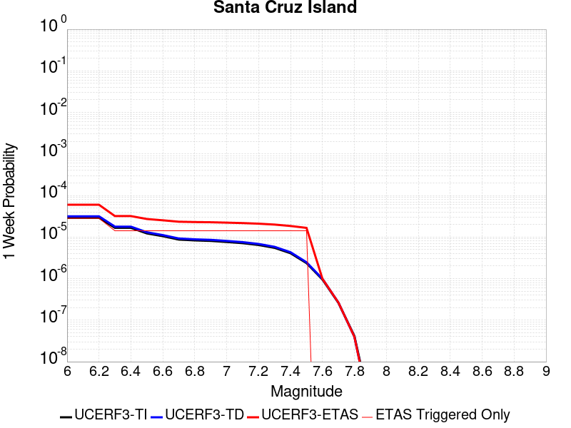 | 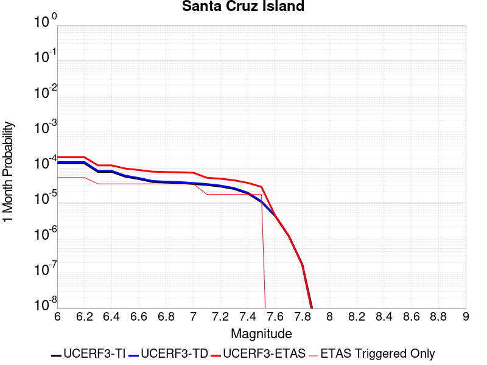 | 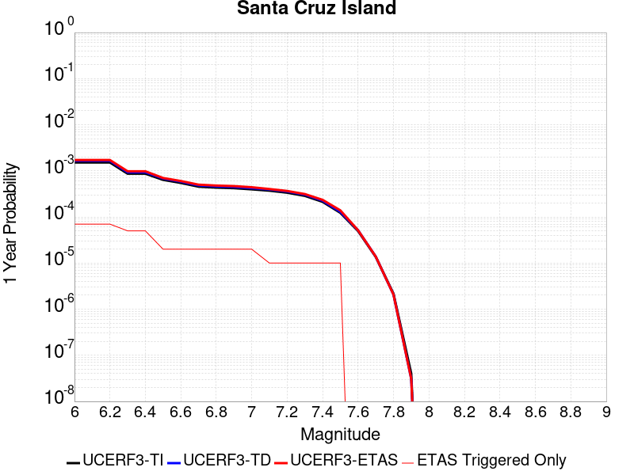 |  |

| Magnitude | 1 wk TI Prob | 1 wk TD Prob | 1 wk ETAS Prob | 1 wk ETAS/TD Gain | 1 wk ETAS Triggered Only | 1 mo TI Prob | 1 mo TD Prob | 1 mo ETAS Prob | 1 mo ETAS/TD Gain | 1 mo ETAS Triggered Only | 1 yr TI Prob | 1 yr TD Prob | 1 yr ETAS Prob | 1 yr ETAS/TD Gain | 1 yr ETAS Triggered Only | 10 yr TI Prob | 10 yr TD Prob | 10 yr ETAS Prob | 10 yr ETAS/TD Gain | 10 yr ETAS Triggered Only |
|-----|-----|-----|-----|-----|-----|-----|-----|-----|-----|-----|-----|-----|-----|-----|-----|-----|-----|-----|-----|-----|
| 6.0 | 2.9164563E-5 | 3.1599742E-5 | 1.0079692E-4 | 3.189802 | 6.919936E-5 | 1.2498499E-4 | 1.3542121E-4 | 2.046112E-4 | 1.5109243 | 6.919936E-5 | 0.0015206301 | 0.0016476426 | 0.0017512706 | 1.0628947 | 1.03799044E-4 | 0.015102667 | 0.016368 | 0.016470099 | 1.0062377 | 1.03799044E-4 |
| 6.1 | 2.9164563E-5 | 3.1599742E-5 | 1.0079692E-4 | 3.189802 | 6.919936E-5 | 1.2498499E-4 | 1.3542121E-4 | 2.046112E-4 | 1.5109243 | 6.919936E-5 | 0.0015206301 | 0.0016476426 | 0.0017512706 | 1.0628947 | 1.03799044E-4 | 0.015102667 | 0.016368 | 0.016470099 | 1.0062377 | 1.03799044E-4 |
| 6.2 | 2.9164563E-5 | 3.1599742E-5 | 1.0079692E-4 | 3.189802 | 6.919936E-5 | 1.2498499E-4 | 1.3542121E-4 | 2.046112E-4 | 1.5109243 | 6.919936E-5 | 0.0015206301 | 0.0016476426 | 0.0017512706 | 1.0628947 | 1.03799044E-4 | 0.015102667 | 0.016368 | 0.016470099 | 1.0062377 | 1.03799044E-4 |
| 6.3 | 1.6635553E-5 | 1.780436E-5 | 5.2403426E-5 | 2.943292 | 3.459968E-5 | 7.1293274E-5 | 7.630227E-5 | 1.1089931E-4 | 1.4534209 | 3.459968E-5 | 8.6765E-4 | 9.286024E-4 | 9.977375E-4 | 1.0744507 | 6.919936E-5 | 0.008642701 | 0.009249094 | 0.009317653 | 1.0074126 | 6.919936E-5 |
| 6.4 | 1.6635553E-5 | 1.780436E-5 | 5.2403426E-5 | 2.943292 | 3.459968E-5 | 7.1293274E-5 | 7.630227E-5 | 1.1089931E-4 | 1.4534209 | 3.459968E-5 | 8.6765E-4 | 9.286024E-4 | 9.977375E-4 | 1.0744507 | 6.919936E-5 | 0.008642701 | 0.009249094 | 0.009317653 | 1.0074126 | 6.919936E-5 |
| 6.5 | 1.2238748E-5 | 1.3042996E-5 | 4.7642225E-5 | 3.6527057 | 3.459968E-5 | 5.2450723E-5 | 5.5897377E-5 | 9.049512E-5 | 1.6189512 | 3.459968E-5 | 6.3840044E-4 | 6.8034173E-4 | 7.149179E-4 | 1.0508218 | 3.459968E-5 | 0.0063656955 | 0.006782988 | 0.006817353 | 1.0050664 | 3.459968E-5 |
| 6.6 | 1.0489767E-5 | 1.1156636E-5 | 4.5755933E-5 | 4.10123 | 3.459968E-5 | 4.495537E-5 | 4.781329E-5 | 8.2411316E-5 | 1.723607 | 3.459968E-5 | 5.4719415E-4 | 5.819736E-4 | 6.165531E-4 | 1.0594177 | 3.459968E-5 | 0.005458487 | 0.005804736 | 0.0058391346 | 1.005926 | 3.459968E-5 |
| 6.7 | 8.699222E-6 | 9.236783E-6 | 4.3836146E-5 | 4.7458243 | 3.459968E-5 | 3.7281847E-5 | 3.958561E-5 | 7.4183925E-5 | 1.8740124 | 3.459968E-5 | 4.5381195E-4 | 4.818488E-4 | 5.164318E-4 | 1.0717715 | 3.459968E-5 | 0.0045288634 | 0.004808108 | 0.004842541 | 1.0071615 | 3.459968E-5 |
| 6.8 | 8.307732E-6 | 8.8169045E-6 | 4.341628E-5 | 4.924209 | 3.459968E-5 | 3.560408E-5 | 3.7786187E-5 | 7.2384566E-5 | 1.9156355 | 3.459968E-5 | 4.3339343E-4 | 4.5995016E-4 | 4.945339E-4 | 1.0751903 | 3.459968E-5 | 0.004325492 | 0.0045900354 | 0.004624476 | 1.0075034 | 3.459968E-5 |
| 6.9 | 8.073121E-6 | 8.564939E-6 | 4.3164324E-5 | 5.0396533 | 3.459968E-5 | 3.459863E-5 | 3.670637E-5 | 7.130478E-5 | 1.9425725 | 3.459968E-5 | 4.2115687E-4 | 4.4680882E-4 | 4.8139304E-4 | 1.0774027 | 3.459968E-5 | 0.004203596 | 0.004459156 | 0.0044936016 | 1.0077246 | 3.459968E-5 |
| 7.0 | 7.617019E-6 | 8.074665E-6 | 4.2674066E-5 | 5.2849336 | 3.459968E-5 | 3.264396E-5 | 3.4605247E-5 | 6.9203736E-5 | 1.9998045 | 3.459968E-5 | 3.9736772E-4 | 4.2123784E-4 | 4.5582294E-4 | 1.0821035 | 3.459968E-5 | 0.003966579 | 0.0042044413 | 0.0042388956 | 1.0081947 | 3.459968E-5 |
| 7.1 | 7.1224836E-6 | 7.5457883E-6 | 4.214521E-5 | 5.585263 | 3.459968E-5 | 3.052457E-5 | 3.2338692E-5 | 6.693725E-5 | 2.0698812 | 3.459968E-5 | 3.715733E-4 | 3.9365282E-4 | 4.2823888E-4 | 1.0878593 | 3.459968E-5 | 0.003709526 | 0.0039295983 | 0.003964062 | 1.0087703 | 3.459968E-5 |
| 7.2 | 6.441115E-6 | 6.8273835E-6 | 4.142683E-5 | 6.0677457 | 3.459968E-5 | 2.7604487E-5 | 2.9259889E-5 | 6.3858555E-5 | 2.1824608 | 3.459968E-5 | 3.360328E-4 | 3.5618115E-4 | 3.9076852E-4 | 1.0971061 | 3.459968E-5 | 0.0033552512 | 0.0035561312 | 0.0035906078 | 1.0096949 | 3.459968E-5 |
| 7.3 | 5.494274E-6 | 5.8199944E-6 | 4.0419476E-5 | 6.9449334 | 3.459968E-5 | 2.3546674E-5 | 2.4942596E-5 | 5.9541417E-5 | 2.387138 | 3.459968E-5 | 2.8664304E-4 | 3.03634E-4 | 3.3822318E-4 | 1.1139174 | 3.459968E-5 | 0.002862736 | 0.0030322145 | 0.0030667093 | 1.0113761 | 3.459968E-5 |
| 7.4 | 4.0802624E-6 | 4.3122564E-6 | 3.891179E-5 | 9.023533 | 3.459968E-5 | 1.7486722E-5 | 1.8480969E-5 | 5.308001E-5 | 2.8721445 | 3.459968E-5 | 2.1288003E-4 | 2.2498264E-4 | 2.5957453E-4 | 1.1537536 | 3.459968E-5 | 0.0021267622 | 0.0022475577 | 0.0022820795 | 1.0153598 | 3.459968E-5 |
| 7.5 | 2.3584746E-6 | 2.4753099E-6 | 3.7074908E-5 | 14.977884 | 3.459968E-5 | 1.0107709E-5 | 1.0608428E-5 | 4.5207744E-5 | 4.261493 | 3.459968E-5 | 1.2305441E-4 | 1.2915001E-4 | 1.6374522E-4 | 1.2678685 | 3.459968E-5 | 0.0012298629 | 0.0012907545 | 0.0013253095 | 1.0267712 | 3.459968E-5 |
| 7.6 | 9.4981914E-7 | 9.860934E-7 | 9.860934E-7 | 1.0 | 0.0 | 4.0706473E-6 | 4.2261076E-6 | 4.2261076E-6 | 1.0 | 0.0 | 4.9559E-5 | 5.1451658E-5 | 5.1451658E-5 | 1.0 | 0.0 | 4.954795E-4 | 5.1439874E-4 | 5.1439874E-4 | 1.0 | 0.0 |
| 7.7 | 2.6013532E-7 | 2.6416632E-7 | 2.6416632E-7 | 1.0 | 0.0 | 1.1148652E-6 | 1.1321408E-6 | 1.1321408E-6 | 1.0 | 0.0 | 1.3573399E-5 | 1.3783729E-5 | 1.3783729E-5 | 1.0 | 0.0 | 1.357257E-4 | 1.378288E-4 | 1.378288E-4 | 1.0 | 0.0 |
| 7.8 | 4.1522263E-8 | 3.965698E-8 | 3.965698E-8 | 1.0 | 0.0 | 1.7795254E-7 | 1.6995848E-7 | 1.6995848E-7 | 1.0 | 0.0 | 2.16657E-6 | 2.0692428E-6 | 2.0692428E-6 | 1.0 | 0.0 | 2.1665488E-5 | 2.0692256E-5 | 2.0692256E-5 | 1.0 | 0.0 |
| 7.9 | 7.7242046E-10 | 5.9475225E-10 | 5.9475225E-10 | 1.0 | 0.0 | 3.3103735E-9 | 2.5489382E-9 | 2.5489382E-9 | 1.0 | 0.0 | 4.0303796E-8 | 3.1033323E-8 | 3.1033323E-8 | 1.0 | 0.0 | 4.030379E-7 | 3.103332E-7 | 3.103332E-7 | 1.0 | 0.0 |

## Pleito
*[(top)](#table-of-contents)*

| 1 Week | 1 Month | 1 Year | 10 Year |
|-----|-----|-----|-----|
| 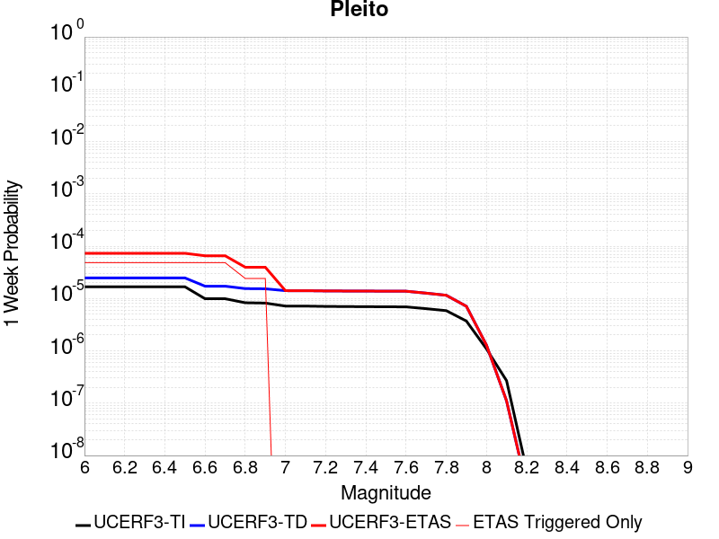 | 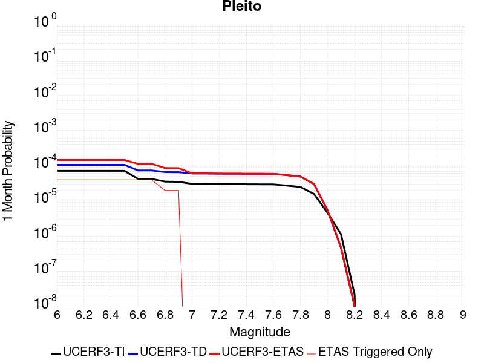 | 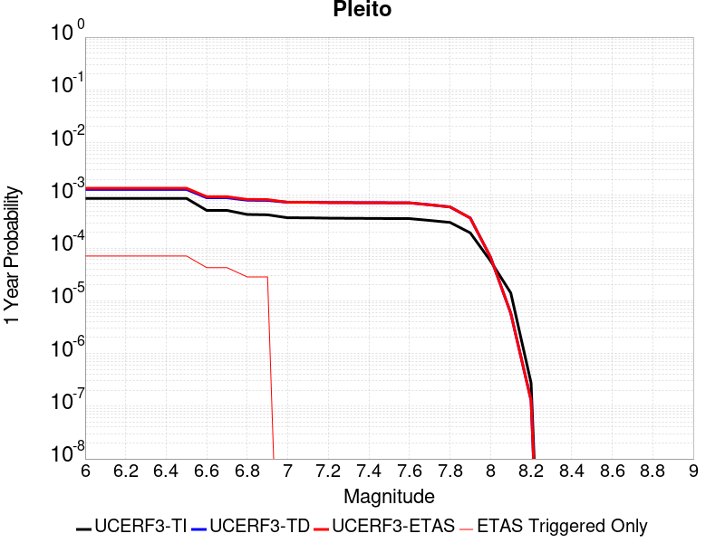 | 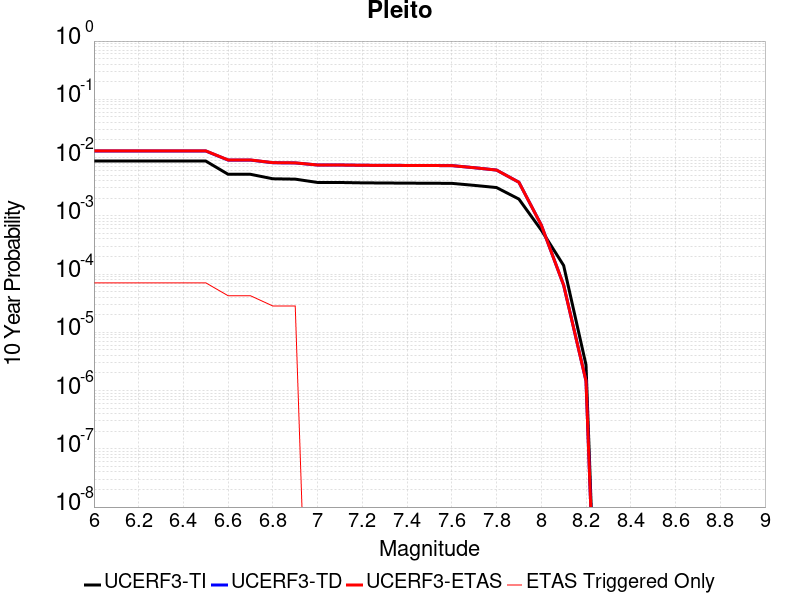 |

| Magnitude | 1 wk TI Prob | 1 wk TD Prob | 1 wk ETAS Prob | 1 wk ETAS/TD Gain | 1 wk ETAS Triggered Only | 1 mo TI Prob | 1 mo TD Prob | 1 mo ETAS Prob | 1 mo ETAS/TD Gain | 1 mo ETAS Triggered Only | 1 yr TI Prob | 1 yr TD Prob | 1 yr ETAS Prob | 1 yr ETAS/TD Gain | 1 yr ETAS Triggered Only | 10 yr TI Prob | 10 yr TD Prob | 10 yr ETAS Prob | 10 yr ETAS/TD Gain | 10 yr ETAS Triggered Only |
|-----|-----|-----|-----|-----|-----|-----|-----|-----|-----|-----|-----|-----|-----|-----|-----|-----|-----|-----|-----|-----|
| 6.0 | 1.6763008E-5 | 2.4764735E-5 | 5.936356E-5 | 2.3971004 | 3.459968E-5 | 7.183948E-5 | 1.0613067E-4 | 1.4072668E-4 | 1.3259757 | 3.459968E-5 | 8.742947E-4 | 0.001291447 | 0.001395112 | 1.0802704 | 1.03799044E-4 | 0.00870863 | 0.012954412 | 0.013056866 | 1.0079088 | 1.03799044E-4 |
| 6.1 | 1.6763008E-5 | 2.4764735E-5 | 5.936356E-5 | 2.3971004 | 3.459968E-5 | 7.183948E-5 | 1.0613067E-4 | 1.4072668E-4 | 1.3259757 | 3.459968E-5 | 8.742947E-4 | 0.001291447 | 0.001395112 | 1.0802704 | 1.03799044E-4 | 0.00870863 | 0.012954412 | 0.013056866 | 1.0079088 | 1.03799044E-4 |
| 6.2 | 1.6763008E-5 | 2.4764735E-5 | 5.936356E-5 | 2.3971004 | 3.459968E-5 | 7.183948E-5 | 1.0613067E-4 | 1.4072668E-4 | 1.3259757 | 3.459968E-5 | 8.742947E-4 | 0.001291447 | 0.001395112 | 1.0802704 | 1.03799044E-4 | 0.00870863 | 0.012954412 | 0.013056866 | 1.0079088 | 1.03799044E-4 |
| 6.3 | 1.6763008E-5 | 2.4764735E-5 | 5.936356E-5 | 2.3971004 | 3.459968E-5 | 7.183948E-5 | 1.0613067E-4 | 1.4072668E-4 | 1.3259757 | 3.459968E-5 | 8.742947E-4 | 0.001291447 | 0.001395112 | 1.0802704 | 1.03799044E-4 | 0.00870863 | 0.012954412 | 0.013056866 | 1.0079088 | 1.03799044E-4 |
| 6.4 | 1.6763008E-5 | 2.4764735E-5 | 5.936356E-5 | 2.3971004 | 3.459968E-5 | 7.183948E-5 | 1.0613067E-4 | 1.4072668E-4 | 1.3259757 | 3.459968E-5 | 8.742947E-4 | 0.001291447 | 0.001395112 | 1.0802704 | 1.03799044E-4 | 0.00870863 | 0.012954412 | 0.013056866 | 1.0079088 | 1.03799044E-4 |
| 6.5 | 1.6763008E-5 | 2.4764735E-5 | 5.936356E-5 | 2.3971004 | 3.459968E-5 | 7.183948E-5 | 1.0613067E-4 | 1.4072668E-4 | 1.3259757 | 3.459968E-5 | 8.742947E-4 | 0.001291447 | 0.001395112 | 1.0802704 | 1.03799044E-4 | 0.00870863 | 0.012954412 | 0.013056866 | 1.0079088 | 1.03799044E-4 |
| 6.6 | 9.910213E-6 | 1.721552E-5 | 5.1814604E-5 | 3.0097613 | 3.459968E-5 | 4.247165E-5 | 7.3778734E-5 | 1.0837586E-4 | 1.468931 | 3.459968E-5 | 5.169696E-4 | 8.9788967E-4 | 9.3245826E-4 | 1.0384998 | 3.459968E-5 | 0.0051576863 | 0.009051226 | 0.009085513 | 1.003788 | 3.459968E-5 |
| 6.7 | 9.910213E-6 | 1.721552E-5 | 5.1814604E-5 | 3.0097613 | 3.459968E-5 | 4.247165E-5 | 7.3778734E-5 | 1.0837586E-4 | 1.468931 | 3.459968E-5 | 5.169696E-4 | 8.9788967E-4 | 9.3245826E-4 | 1.0384998 | 3.459968E-5 | 0.0051576863 | 0.009051226 | 0.009085513 | 1.003788 | 3.459968E-5 |
| 6.8 | 8.300162E-6 | 1.5475129E-5 | 5.0074275E-5 | 3.2357905 | 3.459968E-5 | 3.557164E-5 | 6.63203E-5 | 1.0091769E-4 | 1.5216712 | 3.459968E-5 | 4.3299864E-4 | 8.07152E-4 | 8.4172376E-4 | 1.0428318 | 3.459968E-5 | 0.004321559 | 0.008150663 | 0.008184981 | 1.0042105 | 3.459968E-5 |
| 6.9 | 8.183114E-6 | 1.5346344E-5 | 4.9945495E-5 | 3.2545533 | 3.459968E-5 | 3.5070017E-5 | 6.57684E-5 | 1.003658E-4 | 1.5260491 | 3.459968E-5 | 4.2689382E-4 | 8.0043747E-4 | 8.3500944E-4 | 1.0431913 | 3.459968E-5 | 0.0042607468 | 0.008084008 | 0.008118328 | 1.0042454 | 3.459968E-5 |
| 7.0 | 7.1748823E-6 | 1.4133306E-5 | 1.4133306E-5 | 1.0 | 0.0 | 3.0749135E-5 | 6.0569906E-5 | 6.0569906E-5 | 1.0 | 0.0 | 3.743064E-4 | 7.3718966E-4 | 7.3718966E-4 | 1.0 | 0.0 | 0.0037367654 | 0.0074553755 | 0.0074553755 | 1.0 | 0.0 |
| 7.1 | 7.1671807E-6 | 1.4123676E-5 | 1.4123676E-5 | 1.0 | 0.0 | 3.0716128E-5 | 6.0528637E-5 | 6.0528637E-5 | 1.0 | 0.0 | 3.7390468E-4 | 7.366875E-4 | 7.366875E-4 | 1.0 | 0.0 | 0.0037327618 | 0.0074503883 | 0.0074503883 | 1.0 | 0.0 |
| 7.2 | 7.0649667E-6 | 1.3970962E-5 | 1.3970962E-5 | 1.0 | 0.0 | 3.0278077E-5 | 5.987418E-5 | 5.987418E-5 | 1.0 | 0.0 | 3.6857324E-4 | 7.287248E-4 | 7.287248E-4 | 1.0 | 0.0 | 0.0036796255 | 0.0073711374 | 0.0073711374 | 1.0 | 0.0 |
| 7.3 | 7.02082E-6 | 1.3914415E-5 | 1.3914415E-5 | 1.0 | 0.0 | 3.008888E-5 | 5.9631846E-5 | 5.9631846E-5 | 1.0 | 0.0 | 3.6627054E-4 | 7.257764E-4 | 7.257764E-4 | 1.0 | 0.0 | 0.0036566744 | 0.0073416373 | 0.0073416373 | 1.0 | 0.0 |
| 7.4 | 6.987146E-6 | 1.3873975E-5 | 1.3873975E-5 | 1.0 | 0.0 | 2.9944567E-5 | 5.9458544E-5 | 5.9458544E-5 | 1.0 | 0.0 | 3.6451413E-4 | 7.2366785E-4 | 7.2366785E-4 | 1.0 | 0.0 | 0.0036391679 | 0.007320571 | 0.007320571 | 1.0 | 0.0 |
| 7.5 | 6.9494554E-6 | 1.383088E-5 | 1.383088E-5 | 1.0 | 0.0 | 2.9783041E-5 | 5.9273858E-5 | 5.9273858E-5 | 1.0 | 0.0 | 3.625482E-4 | 7.2142074E-4 | 7.2142074E-4 | 1.0 | 0.0 | 0.0036195726 | 0.007298199 | 0.007298199 | 1.0 | 0.0 |
| 7.6 | 6.92694E-6 | 1.3789992E-5 | 1.3789992E-5 | 1.0 | 0.0 | 2.9686547E-5 | 5.909863E-5 | 5.909863E-5 | 1.0 | 0.0 | 3.6137376E-4 | 7.192888E-4 | 7.192888E-4 | 1.0 | 0.0 | 0.0036078666 | 0.007276951 | 0.007276951 | 1.0 | 0.0 |
| 7.7 | 6.395867E-6 | 1.26690065E-5 | 1.26690065E-5 | 1.0 | 0.0 | 2.741057E-5 | 5.4294615E-5 | 5.4294615E-5 | 1.0 | 0.0 | 3.336726E-4 | 6.6083675E-4 | 6.6083675E-4 | 1.0 | 0.0 | 0.0033317201 | 0.0066955453 | 0.0066955453 | 1.0 | 0.0 |
| 7.8 | 5.8664327E-6 | 1.1536581E-5 | 1.1536581E-5 | 1.0 | 0.0 | 2.5141611E-5 | 4.9441554E-5 | 4.9441554E-5 | 1.0 | 0.0 | 3.060561E-4 | 6.0178485E-4 | 6.0178485E-4 | 1.0 | 0.0 | 0.0030563495 | 0.0061010164 | 0.0061010164 | 1.0 | 0.0 |
| 7.9 | 3.7167474E-6 | 7.1145205E-6 | 7.1145205E-6 | 1.0 | 0.0 | 1.592882E-5 | 3.0490448E-5 | 3.0490448E-5 | 1.0 | 0.0 | 1.9391612E-4 | 3.7115812E-4 | 3.7115812E-4 | 1.0 | 0.0 | 0.0019374699 | 0.0037676243 | 0.0037676243 | 1.0 | 0.0 |
| 8.0 | 1.0903841E-6 | 1.2879104E-6 | 1.2879104E-6 | 1.0 | 0.0 | 4.6730665E-6 | 5.5196047E-6 | 5.5196047E-6 | 1.0 | 0.0 | 5.68931E-5 | 6.719913E-5 | 6.719913E-5 | 1.0 | 0.0 | 5.6878536E-4 | 6.942094E-4 | 6.942094E-4 | 1.0 | 0.0 |
| 8.1 | 2.6894583E-7 | 1.1056095E-7 | 1.1056095E-7 | 1.0 | 0.0 | 1.1526245E-6 | 4.7383253E-7 | 4.7383253E-7 | 1.0 | 0.0 | 1.4033113E-5 | 5.768896E-6 | 5.768896E-6 | 1.0 | 0.0 | 1.4032227E-4 | 6.454915E-5 | 6.454915E-5 | 1.0 | 0.0 |
| 8.2 | 5.2967013E-9 | 2.4567874E-9 | 2.4567874E-9 | 1.0 | 0.0 | 2.2700148E-8 | 1.0529089E-8 | 1.0529089E-8 | 1.0 | 0.0 | 2.7637427E-7 | 1.2819166E-7 | 1.2819166E-7 | 1.0 | 0.0 | 2.7637393E-6 | 1.4588004E-6 | 1.4588004E-6 | 1.0 | 0.0 |

## Ventura-Pitas Point
*[(top)](#table-of-contents)*

| 1 Week | 1 Month | 1 Year | 10 Year |
|-----|-----|-----|-----|
| 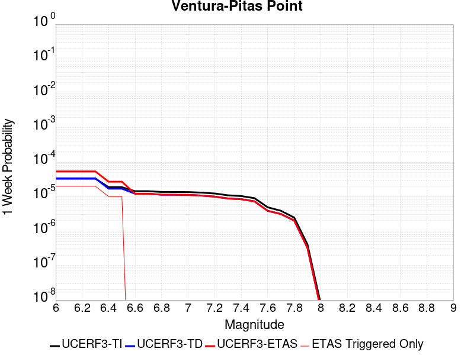 | 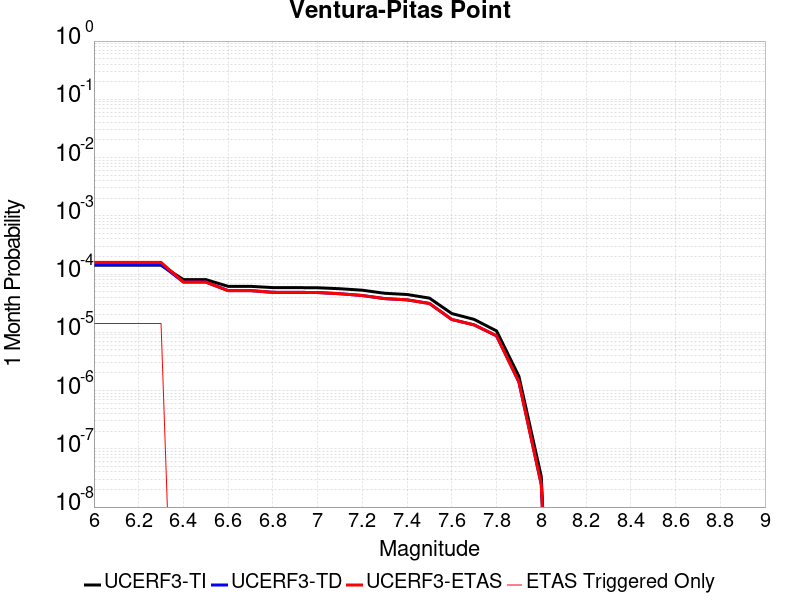 | 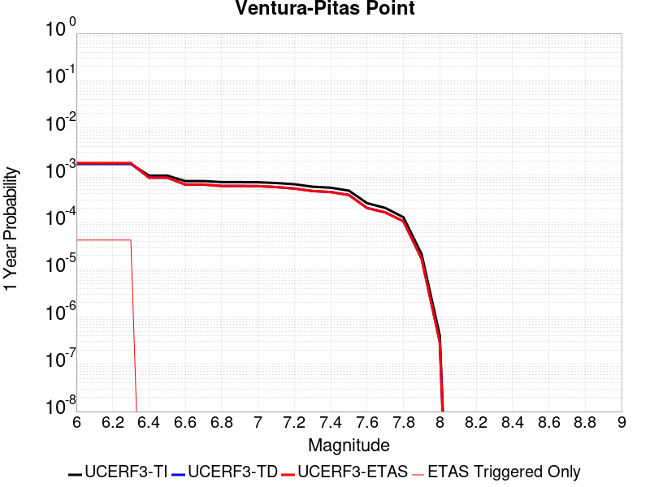 | 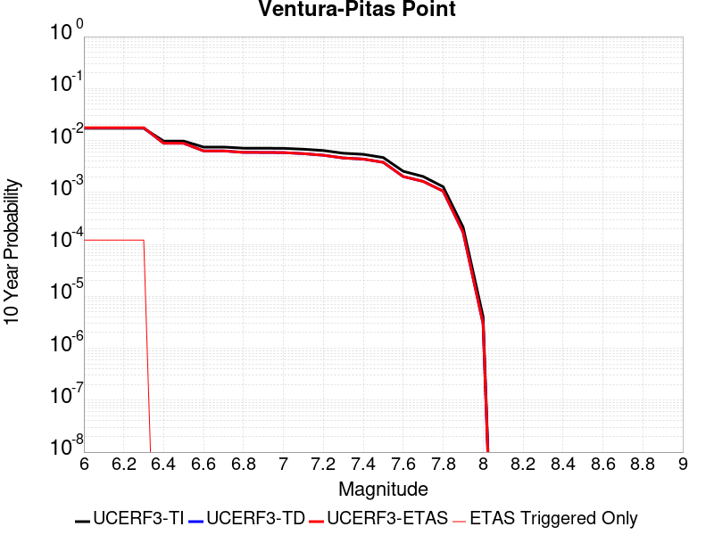 |

| Magnitude | 1 wk TI Prob | 1 wk TD Prob | 1 wk ETAS Prob | 1 wk ETAS/TD Gain | 1 wk ETAS Triggered Only | 1 mo TI Prob | 1 mo TD Prob | 1 mo ETAS Prob | 1 mo ETAS/TD Gain | 1 mo ETAS Triggered Only | 1 yr TI Prob | 1 yr TD Prob | 1 yr ETAS Prob | 1 yr ETAS/TD Gain | 1 yr ETAS Triggered Only | 10 yr TI Prob | 10 yr TD Prob | 10 yr ETAS Prob | 10 yr ETAS/TD Gain | 10 yr ETAS Triggered Only |
|-----|-----|-----|-----|-----|-----|-----|-----|-----|-----|-----|-----|-----|-----|-----|-----|-----|-----|-----|-----|-----|
| 6.0 | 3.3179622E-5 | 3.373519E-5 | 6.83337E-5 | 2.0255914 | 3.459968E-5 | 1.4219063E-4 | 1.4457281E-4 | 1.7916749E-4 | 1.2392889 | 3.459968E-5 | 0.0017297962 | 0.0017590097 | 0.0018280873 | 1.0392708 | 6.919936E-5 | 0.017163932 | 0.017476497 | 0.017578483 | 1.0058355 | 1.03799044E-4 |
| 6.1 | 3.3179622E-5 | 3.373519E-5 | 6.83337E-5 | 2.0255914 | 3.459968E-5 | 1.4219063E-4 | 1.4457281E-4 | 1.7916749E-4 | 1.2392889 | 3.459968E-5 | 0.0017297962 | 0.0017590097 | 0.0018280873 | 1.0392708 | 6.919936E-5 | 0.017163932 | 0.017476497 | 0.017578483 | 1.0058355 | 1.03799044E-4 |
| 6.2 | 3.3179622E-5 | 3.373519E-5 | 6.83337E-5 | 2.0255914 | 3.459968E-5 | 1.4219063E-4 | 1.4457281E-4 | 1.7916749E-4 | 1.2392889 | 3.459968E-5 | 0.0017297962 | 0.0017590097 | 0.0018280873 | 1.0392708 | 6.919936E-5 | 0.017163932 | 0.017476497 | 0.017578483 | 1.0058355 | 1.03799044E-4 |
| 6.3 | 3.3179622E-5 | 3.373519E-5 | 6.83337E-5 | 2.0255914 | 3.459968E-5 | 1.4219063E-4 | 1.4457281E-4 | 1.7916749E-4 | 1.2392889 | 3.459968E-5 | 0.0017297962 | 0.0017590097 | 0.0018280873 | 1.0392708 | 6.919936E-5 | 0.017163932 | 0.017476497 | 0.017578483 | 1.0058355 | 1.03799044E-4 |
| 6.4 | 1.8754668E-5 | 1.7019594E-5 | 1.7019594E-5 | 1.0 | 0.0 | 8.037467E-5 | 7.2939205E-5 | 7.2939205E-5 | 1.0 | 0.0 | 9.781223E-4 | 8.8769617E-4 | 8.8769617E-4 | 1.0 | 0.0 | 0.009738282 | 0.008843943 | 0.008843943 | 1.0 | 0.0 |
| 6.5 | 1.8754668E-5 | 1.7019594E-5 | 1.7019594E-5 | 1.0 | 0.0 | 8.037467E-5 | 7.2939205E-5 | 7.2939205E-5 | 1.0 | 0.0 | 9.781223E-4 | 8.8769617E-4 | 8.8769617E-4 | 1.0 | 0.0 | 0.009738282 | 0.008843943 | 0.008843943 | 1.0 | 0.0 |
| 6.6 | 1.4361558E-5 | 1.2122258E-5 | 1.2122258E-5 | 1.0 | 0.0 | 6.154808E-5 | 5.1951512E-5 | 5.1951512E-5 | 1.0 | 0.0 | 7.490902E-4 | 6.323284E-4 | 6.323284E-4 | 1.0 | 0.0 | 0.0074657016 | 0.006305652 | 0.006305652 | 1.0 | 0.0 |
| 6.7 | 1.4361558E-5 | 1.2122258E-5 | 1.2122258E-5 | 1.0 | 0.0 | 6.154808E-5 | 5.1951512E-5 | 5.1951512E-5 | 1.0 | 0.0 | 7.490902E-4 | 6.323284E-4 | 6.323284E-4 | 1.0 | 0.0 | 0.0074657016 | 0.006305652 | 0.006305652 | 1.0 | 0.0 |
| 6.8 | 1.3663846E-5 | 1.1344401E-5 | 1.1344401E-5 | 1.0 | 0.0 | 5.8558027E-5 | 4.8617967E-5 | 4.8617967E-5 | 1.0 | 0.0 | 7.127108E-4 | 5.917649E-4 | 5.917649E-4 | 1.0 | 0.0 | 0.007104293 | 0.0059022107 | 0.0059022107 | 1.0 | 0.0 |
| 6.9 | 1.3644157E-5 | 1.1322501E-5 | 1.1322501E-5 | 1.0 | 0.0 | 5.8473648E-5 | 4.8524114E-5 | 4.8524114E-5 | 1.0 | 0.0 | 7.116841E-4 | 5.906229E-4 | 5.906229E-4 | 1.0 | 0.0 | 0.007094092 | 0.0058908514 | 0.0058908514 | 1.0 | 0.0 |
| 7.0 | 1.3568845E-5 | 1.12420685E-5 | 1.12420685E-5 | 1.0 | 0.0 | 5.8150898E-5 | 4.8179416E-5 | 4.8179416E-5 | 1.0 | 0.0 | 7.077572E-4 | 5.8642845E-4 | 5.8642845E-4 | 1.0 | 0.0 | 0.007055073 | 0.005849128 | 0.005849128 | 1.0 | 0.0 |
| 7.1 | 1.306572E-5 | 1.0720521E-5 | 1.0720521E-5 | 1.0 | 0.0 | 5.599474E-5 | 4.594429E-5 | 4.594429E-5 | 1.0 | 0.0 | 6.815227E-4 | 5.5923004E-4 | 5.5923004E-4 | 1.0 | 0.0 | 0.0067943637 | 0.005578536 | 0.005578536 | 1.0 | 0.0 |
| 7.2 | 1.232604E-5 | 9.995121E-6 | 9.995121E-6 | 1.0 | 0.0 | 5.2824813E-5 | 4.283554E-5 | 4.283554E-5 | 1.0 | 0.0 | 6.429523E-4 | 5.2139966E-4 | 5.2139966E-4 | 1.0 | 0.0 | 0.0064109527 | 0.005202059 | 0.005202059 | 1.0 | 0.0 |
| 7.3 | 1.0917261E-5 | 8.843812E-6 | 8.843812E-6 | 1.0 | 0.0 | 4.678742E-5 | 3.7901507E-5 | 3.7901507E-5 | 1.0 | 0.0 | 5.69488E-4 | 4.6135474E-4 | 4.6135474E-4 | 1.0 | 0.0 | 0.0056803077 | 0.004604239 | 0.004604239 | 1.0 | 0.0 |
| 7.4 | 1.039959E-5 | 8.42354E-6 | 8.42354E-6 | 1.0 | 0.0 | 4.456891E-5 | 3.6100395E-5 | 3.6100395E-5 | 1.0 | 0.0 | 5.424914E-4 | 4.394352E-4 | 4.394352E-4 | 1.0 | 0.0 | 0.0054116896 | 0.0043859277 | 0.0043859277 | 1.0 | 0.0 |
| 7.5 | 9.015877E-6 | 7.29752E-6 | 7.29752E-6 | 1.0 | 0.0 | 3.86389E-5 | 3.1274718E-5 | 3.1274718E-5 | 1.0 | 0.0 | 4.7032707E-4 | 3.8070456E-4 | 3.8070456E-4 | 1.0 | 0.0 | 0.004693329 | 0.003800772 | 0.003800772 | 1.0 | 0.0 |
| 7.6 | 4.900162E-6 | 3.874119E-6 | 3.874119E-6 | 1.0 | 0.0 | 2.1000526E-5 | 1.6603262E-5 | 1.6603262E-5 | 1.0 | 0.0 | 2.556514E-4 | 2.0212609E-4 | 2.0212609E-4 | 1.0 | 0.0 | 0.0025535747 | 0.002019436 | 0.002019436 | 1.0 | 0.0 |
| 7.7 | 3.8850626E-6 | 3.12676E-6 | 3.12676E-6 | 1.0 | 0.0 | 1.6650163E-5 | 1.3400332E-5 | 1.3400332E-5 | 1.0 | 0.0 | 2.0269687E-4 | 1.6313691E-4 | 1.6313691E-4 | 1.0 | 0.0 | 0.002025121 | 0.0016301809 | 0.0016301809 | 1.0 | 0.0 |
| 7.8 | 2.4654719E-6 | 2.029902E-6 | 2.029902E-6 | 1.0 | 0.0 | 1.0566265E-5 | 8.699551E-6 | 8.699551E-6 | 1.0 | 0.0 | 1.2863669E-4 | 1.0591193E-4 | 1.0591193E-4 | 1.0 | 0.0 | 0.0012856225 | 0.0010586192 | 0.0010586192 | 1.0 | 0.0 |
| 7.9 | 4.095894E-7 | 3.2765078E-7 | 3.2765078E-7 | 1.0 | 0.0 | 1.7553821E-6 | 1.4042168E-6 | 1.4042168E-6 | 1.0 | 0.0 | 2.1371567E-5 | 1.709621E-5 | 1.709621E-5 | 1.0 | 0.0 | 2.1369511E-4 | 1.7094925E-4 | 1.7094925E-4 | 1.0 | 0.0 |
| 8.0 | 7.791402E-9 | 5.6836056E-9 | 5.6836056E-9 | 1.0 | 0.0 | 3.3391725E-8 | 2.4358311E-8 | 2.4358311E-8 | 1.0 | 0.0 | 4.0654416E-7 | 2.965624E-7 | 2.965624E-7 | 1.0 | 0.0 | 4.065434E-6 | 2.9656223E-6 | 2.9656223E-6 | 1.0 | 0.0 |

## Santa Cruz Catalina Ridge alt1
*[(top)](#table-of-contents)*

| 1 Week | 1 Month | 1 Year | 10 Year |
|-----|-----|-----|-----|
| 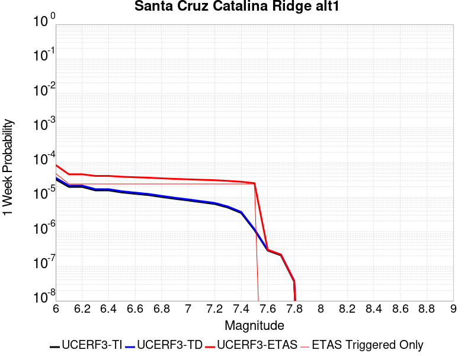 | 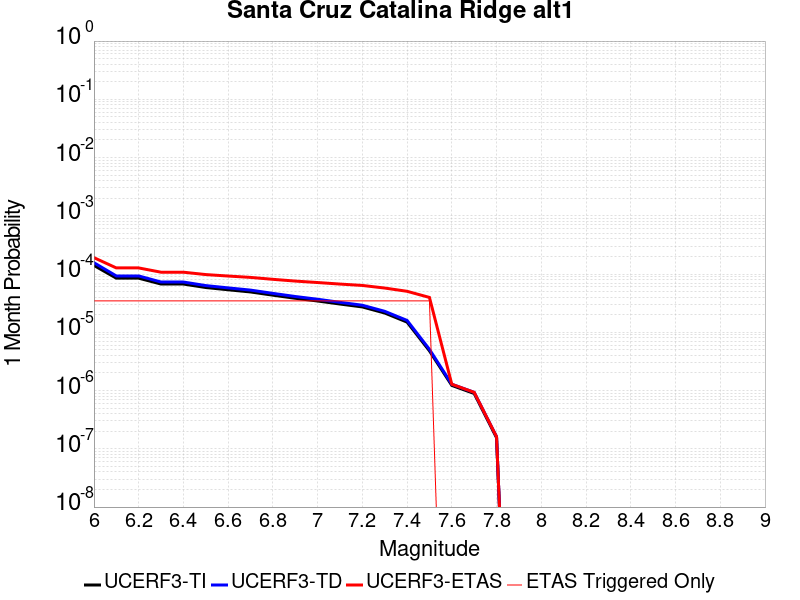 |  | 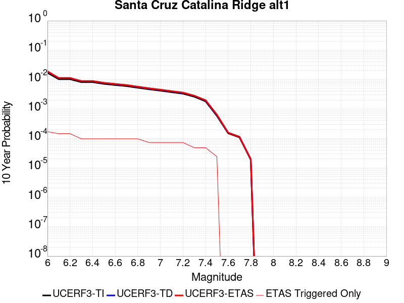 |

| Magnitude | 1 wk TI Prob | 1 wk TD Prob | 1 wk ETAS Prob | 1 wk ETAS/TD Gain | 1 wk ETAS Triggered Only | 1 mo TI Prob | 1 mo TD Prob | 1 mo ETAS Prob | 1 mo ETAS/TD Gain | 1 mo ETAS Triggered Only | 1 yr TI Prob | 1 yr TD Prob | 1 yr ETAS Prob | 1 yr ETAS/TD Gain | 1 yr ETAS Triggered Only | 10 yr TI Prob | 10 yr TD Prob | 10 yr ETAS Prob | 10 yr ETAS/TD Gain | 10 yr ETAS Triggered Only |
|-----|-----|-----|-----|-----|-----|-----|-----|-----|-----|-----|-----|-----|-----|-----|-----|-----|-----|-----|-----|-----|
| 6.0 | 3.2833184E-5 | 3.6558402E-5 | 7.1156814E-5 | 1.9463876 | 3.459968E-5 | 1.4070606E-4 | 1.5667039E-4 | 1.9126465E-4 | 1.2208092 | 3.459968E-5 | 0.00171175 | 0.0019059594 | 0.001975027 | 1.0362376 | 6.919936E-5 | 0.016986247 | 0.018913032 | 0.019014869 | 1.0053844 | 1.03799044E-4 |
| 6.1 | 1.9835548E-5 | 2.1659505E-5 | 5.625844E-5 | 2.5974019 | 3.459968E-5 | 8.500672E-5 | 9.282326E-5 | 1.2741973E-4 | 1.3727133 | 3.459968E-5 | 0.0010344655 | 0.0011295575 | 0.0011986787 | 1.0611931 | 6.919936E-5 | 0.010296632 | 0.011240296 | 0.011342928 | 1.0091307 | 1.03799044E-4 |
| 6.2 | 1.9835548E-5 | 2.1659505E-5 | 5.625844E-5 | 2.5974019 | 3.459968E-5 | 8.500672E-5 | 9.282326E-5 | 1.2741973E-4 | 1.3727133 | 3.459968E-5 | 0.0010344655 | 0.0011295575 | 0.0011986787 | 1.0611931 | 6.919936E-5 | 0.010296632 | 0.011240296 | 0.011342928 | 1.0091307 | 1.03799044E-4 |
| 6.3 | 1.5728183E-5 | 1.703395E-5 | 5.163304E-5 | 3.0311844 | 3.459968E-5 | 6.7404755E-5 | 7.300063E-5 | 1.07597785E-4 | 1.4739295 | 3.459968E-5 | 8.2034385E-4 | 8.884264E-4 | 9.229953E-4 | 1.0389103 | 3.459968E-5 | 0.008173222 | 0.008849427 | 0.00888372 | 1.0038753 | 3.459968E-5 |
| 6.4 | 1.5728183E-5 | 1.703395E-5 | 5.163304E-5 | 3.0311844 | 3.459968E-5 | 6.7404755E-5 | 7.300063E-5 | 1.07597785E-4 | 1.4739295 | 3.459968E-5 | 8.2034385E-4 | 8.884264E-4 | 9.229953E-4 | 1.0389103 | 3.459968E-5 | 0.008173222 | 0.008849427 | 0.00888372 | 1.0038753 | 3.459968E-5 |
| 6.5 | 1.3707734E-5 | 1.4794522E-5 | 4.9393693E-5 | 3.3386474 | 3.459968E-5 | 5.8746107E-5 | 6.3403575E-5 | 9.800106E-5 | 1.545671 | 3.459968E-5 | 7.1499916E-4 | 7.716686E-4 | 8.062416E-4 | 1.0448029 | 3.459968E-5 | 0.0071270303 | 0.0076902895 | 0.007724623 | 1.0044645 | 3.459968E-5 |
| 6.6 | 1.2539813E-5 | 1.3510219E-5 | 4.8109432E-5 | 3.560966 | 3.459968E-5 | 5.3740947E-5 | 5.789967E-5 | 9.249735E-5 | 1.5975454 | 3.459968E-5 | 6.540996E-4 | 7.0470315E-4 | 7.3927845E-4 | 1.0490637 | 3.459968E-5 | 0.0065217763 | 0.0070249885 | 0.007059345 | 1.0048907 | 3.459968E-5 |
| 6.7 | 1.1504083E-5 | 1.2377375E-5 | 4.6976627E-5 | 3.7953627 | 3.459968E-5 | 4.930228E-5 | 5.3044827E-5 | 8.764267E-5 | 1.6522379 | 3.459968E-5 | 6.0008996E-4 | 6.456314E-4 | 6.8020873E-4 | 1.0535558 | 3.459968E-5 | 0.005984721 | 0.006437786 | 0.006472163 | 1.0053399 | 3.459968E-5 |
| 6.8 | 1.012739E-5 | 1.0877071E-5 | 4.5476376E-5 | 4.1809397 | 3.459968E-5 | 4.340238E-5 | 4.6615194E-5 | 8.1213264E-5 | 1.7422059 | 3.459968E-5 | 5.282958E-4 | 5.673937E-4 | 6.019738E-4 | 1.0609454 | 3.459968E-5 | 0.0052704164 | 0.0056596193 | 0.0056940233 | 1.0060788 | 3.459968E-5 |
| 6.9 | 8.9607865E-6 | 9.609117E-6 | 4.4208467E-5 | 4.6006794 | 3.459968E-5 | 3.8402806E-5 | 4.1181287E-5 | 7.577954E-5 | 1.8401451 | 3.459968E-5 | 4.6745385E-4 | 5.012679E-4 | 5.3585024E-4 | 1.0689898 | 3.459968E-5 | 0.0046647177 | 0.005001492 | 0.005035918 | 1.0068833 | 3.459968E-5 |
| 7.0 | 8.046829E-6 | 8.619746E-6 | 4.321913E-5 | 5.013968 | 3.459968E-5 | 3.4485955E-5 | 3.694125E-5 | 7.153965E-5 | 1.9365791 | 3.459968E-5 | 4.1978562E-4 | 4.496677E-4 | 4.8425182E-4 | 1.0769104 | 3.459968E-5 | 0.004189935 | 0.0044876686 | 0.004522113 | 1.0076753 | 3.459968E-5 |
| 7.1 | 7.136131E-6 | 7.637656E-6 | 4.2237072E-5 | 5.5301094 | 3.459968E-5 | 3.0583058E-5 | 3.2732405E-5 | 6.7330955E-5 | 2.057012 | 3.459968E-5 | 3.7228514E-4 | 3.9844486E-4 | 4.3303077E-4 | 1.0868022 | 3.459968E-5 | 0.0037166206 | 0.003977381 | 0.0040118434 | 1.0086645 | 3.459968E-5 |
| 7.2 | 6.362014E-6 | 6.8049585E-6 | 4.1404404E-5 | 6.0844464 | 3.459968E-5 | 2.726549E-5 | 2.9163786E-5 | 6.376246E-5 | 2.1863573 | 3.459968E-5 | 3.3190678E-4 | 3.550119E-4 | 3.895993E-4 | 1.097426 | 3.459968E-5 | 0.0033141149 | 0.003544516 | 0.003578993 | 1.0097269 | 3.459968E-5 |
| 7.3 | 5.004101E-6 | 5.351715E-6 | 3.995121E-5 | 7.465123 | 3.459968E-5 | 2.1445969E-5 | 2.2935723E-5 | 5.753461E-5 | 2.5085154 | 3.459968E-5 | 2.6107338E-4 | 2.792072E-4 | 3.137972E-4 | 1.1238866 | 3.459968E-5 | 0.002607669 | 0.0027886187 | 0.0028231218 | 1.0123729 | 3.459968E-5 |
| 7.4 | 3.4901443E-6 | 3.7320526E-6 | 3.8331604E-5 | 10.270918 | 3.459968E-5 | 1.4957676E-5 | 1.5994416E-5 | 5.0593542E-5 | 3.1632006 | 3.459968E-5 | 1.8209449E-4 | 1.9471499E-4 | 2.2930793E-4 | 1.1776594 | 3.459968E-5 | 0.0018194534 | 0.0019454823 | 0.0019800148 | 1.01775 | 3.459968E-5 |
| 7.5 | 1.1215045E-6 | 1.189387E-6 | 3.5789028E-5 | 30.090313 | 3.459968E-5 | 4.806439E-6 | 5.097363E-6 | 3.9696868E-5 | 7.787726 | 3.459968E-5 | 5.851682E-5 | 6.205866E-5 | 9.665619E-5 | 1.5574973 | 3.459968E-5 | 5.850142E-4 | 6.2041637E-4 | 6.5499457E-4 | 1.0557339 | 3.459968E-5 |
| 7.6 | 2.8599047E-7 | 2.9951994E-7 | 2.9951994E-7 | 1.0 | 0.0 | 1.2256729E-6 | 1.2836562E-6 | 1.2836562E-6 | 1.0 | 0.0 | 1.4922465E-5 | 1.5628404E-5 | 1.5628404E-5 | 1.0 | 0.0 | 1.4921463E-4 | 1.5627318E-4 | 1.5627318E-4 | 1.0 | 0.0 |
| 7.7 | 2.0781519E-7 | 2.1744323E-7 | 2.1744323E-7 | 1.0 | 0.0 | 8.906362E-7 | 9.3189925E-7 | 9.3189925E-7 | 1.0 | 0.0 | 1.08434415E-5 | 1.13458145E-5 | 1.13458145E-5 | 1.0 | 0.0 | 1.0842913E-4 | 1.1345245E-4 | 1.1345245E-4 | 1.0 | 0.0 |
| 7.8 | 3.614776E-8 | 3.764102E-8 | 3.764102E-8 | 1.0 | 0.0 | 1.5491896E-7 | 1.6131864E-7 | 1.6131864E-7 | 1.0 | 0.0 | 1.8861368E-6 | 1.9640527E-6 | 1.9640527E-6 | 1.0 | 0.0 | 1.8861208E-5 | 1.9640367E-5 | 1.9640367E-5 | 1.0 | 0.0 |

## Pisgah-Bullion Mtn-Mesquite Lk
*[(top)](#table-of-contents)*

| 1 Week | 1 Month | 1 Year | 10 Year |
|-----|-----|-----|-----|
| 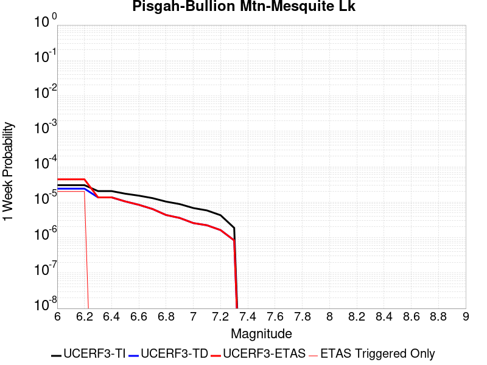 | 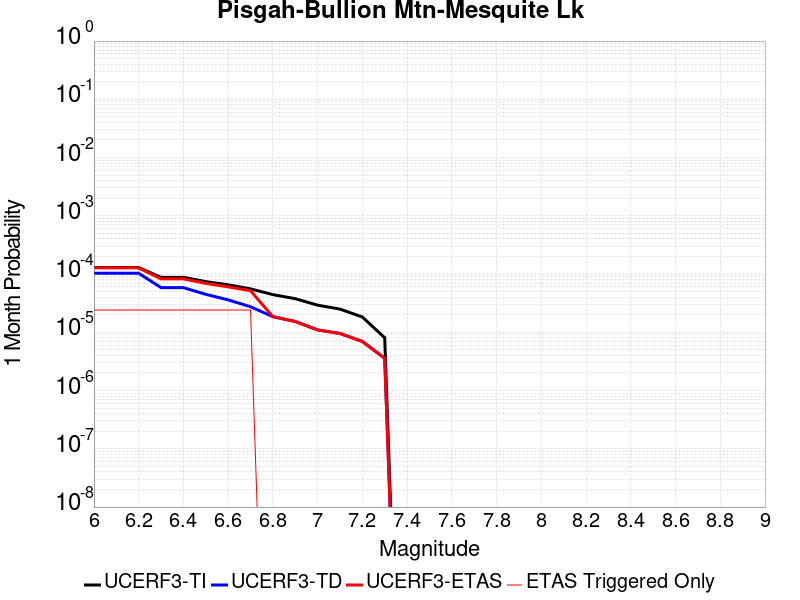 | 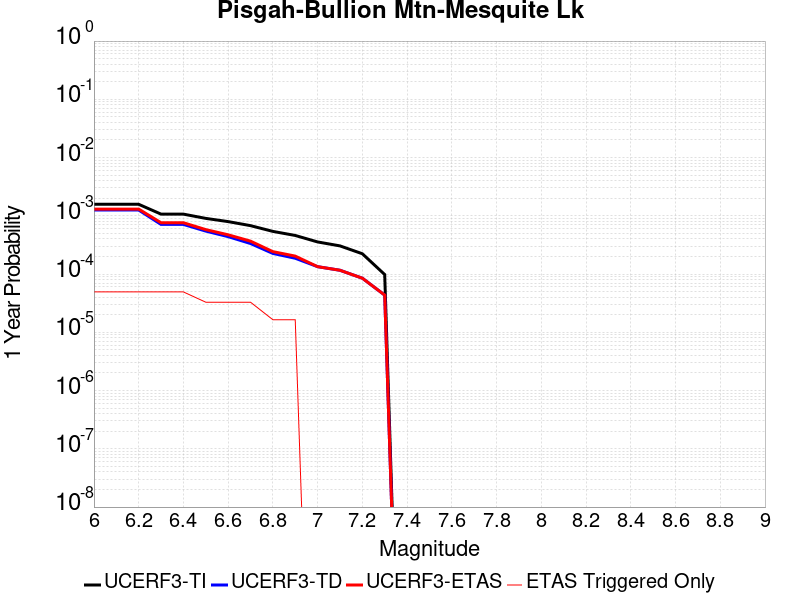 | 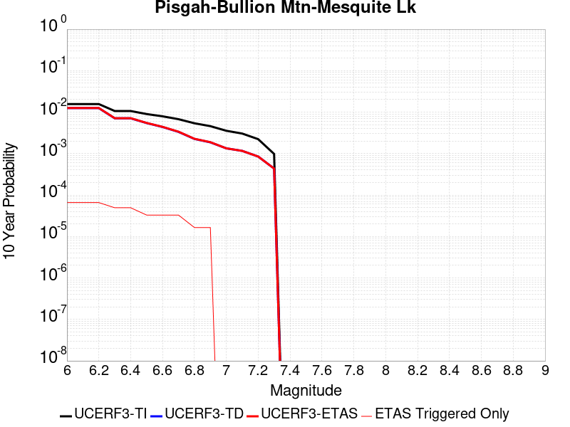 |

| Magnitude | 1 wk TI Prob | 1 wk TD Prob | 1 wk ETAS Prob | 1 wk ETAS/TD Gain | 1 wk ETAS Triggered Only | 1 mo TI Prob | 1 mo TD Prob | 1 mo ETAS Prob | 1 mo ETAS/TD Gain | 1 mo ETAS Triggered Only | 1 yr TI Prob | 1 yr TD Prob | 1 yr ETAS Prob | 1 yr ETAS/TD Gain | 1 yr ETAS Triggered Only | 10 yr TI Prob | 10 yr TD Prob | 10 yr ETAS Prob | 10 yr ETAS/TD Gain | 10 yr ETAS Triggered Only |
|-----|-----|-----|-----|-----|-----|-----|-----|-----|-----|-----|-----|-----|-----|-----|-----|-----|-----|-----|-----|-----|
| 6.0 | 3.0240792E-5 | 2.40909E-5 | 2.40909E-5 | 1.0 | 0.0 | 1.2959696E-4 | 1.032432E-4 | 1.378393E-4 | 1.3350934 | 3.459968E-5 | 0.0015767008 | 0.0012563618 | 0.0013600304 | 1.082515 | 1.03799044E-4 | 0.015655609 | 0.012502613 | 0.012605114 | 1.0081984 | 1.03799044E-4 |
| 6.1 | 3.0240792E-5 | 2.40909E-5 | 2.40909E-5 | 1.0 | 0.0 | 1.2959696E-4 | 1.032432E-4 | 1.378393E-4 | 1.3350934 | 3.459968E-5 | 0.0015767008 | 0.0012563618 | 0.0013600304 | 1.082515 | 1.03799044E-4 | 0.015655609 | 0.012502613 | 0.012605114 | 1.0081984 | 1.03799044E-4 |
| 6.2 | 3.0240792E-5 | 2.40909E-5 | 2.40909E-5 | 1.0 | 0.0 | 1.2959696E-4 | 1.032432E-4 | 1.378393E-4 | 1.3350934 | 3.459968E-5 | 0.0015767008 | 0.0012563618 | 0.0013600304 | 1.082515 | 1.03799044E-4 | 0.015655609 | 0.012502613 | 0.012605114 | 1.0081984 | 1.03799044E-4 |
| 6.3 | 2.0498217E-5 | 1.3638054E-5 | 1.3638054E-5 | 1.0 | 0.0 | 8.784654E-5 | 5.8447586E-5 | 9.3045244E-5 | 1.5919434 | 3.459968E-5 | 0.0010690069 | 7.1138324E-4 | 8.151085E-4 | 1.1458077 | 1.03799044E-4 | 0.01063879 | 0.0070926864 | 0.0071957493 | 1.0145309 | 1.03799044E-4 |
| 6.4 | 2.0498217E-5 | 1.3638054E-5 | 1.3638054E-5 | 1.0 | 0.0 | 8.784654E-5 | 5.8447586E-5 | 9.3045244E-5 | 1.5919434 | 3.459968E-5 | 0.0010690069 | 7.1138324E-4 | 8.151085E-4 | 1.1458077 | 1.03799044E-4 | 0.01063879 | 0.0070926864 | 0.0071957493 | 1.0145309 | 1.03799044E-4 |
| 6.5 | 1.7316182E-5 | 1.04769715E-5 | 1.04769715E-5 | 1.0 | 0.0 | 7.42101E-5 | 4.490059E-5 | 7.949872E-5 | 1.7705495 | 3.459968E-5 | 9.0313336E-4 | 5.465376E-4 | 6.156991E-4 | 1.126545 | 6.919936E-5 | 0.008994718 | 0.00545293 | 0.005521752 | 1.0126212 | 6.919936E-5 |
| 6.6 | 1.5251077E-5 | 8.414133E-6 | 8.414133E-6 | 1.0 | 0.0 | 6.536012E-5 | 3.606011E-5 | 7.065855E-5 | 1.9594655 | 3.459968E-5 | 7.9546886E-4 | 4.3895066E-4 | 5.0811964E-4 | 1.157578 | 6.919936E-5 | 0.007926274 | 0.0043815537 | 0.0044504497 | 1.0157242 | 6.919936E-5 |
| 6.7 | 1.2997425E-5 | 6.4112146E-6 | 6.4112146E-6 | 1.0 | 0.0 | 5.570206E-5 | 2.7476372E-5 | 6.20751E-5 | 2.2592177 | 3.459968E-5 | 6.7796157E-4 | 3.3447813E-4 | 4.0365435E-4 | 1.2068183 | 6.919936E-5 | 0.0067589693 | 0.003340207 | 0.0034091754 | 1.0206479 | 6.919936E-5 |
| 6.8 | 1.035386E-5 | 4.333145E-6 | 4.333145E-6 | 1.0 | 0.0 | 4.437293E-5 | 1.8570496E-5 | 1.8570496E-5 | 1.0 | 0.0 | 5.401065E-4 | 2.260732E-4 | 2.6066505E-4 | 1.1530118 | 3.459968E-5 | 0.0053879567 | 0.002258519 | 0.0022930405 | 1.015285 | 3.459968E-5 |
| 6.9 | 8.816252E-6 | 3.5805879E-6 | 3.5805879E-6 | 1.0 | 0.0 | 3.778339E-5 | 1.534529E-5 | 1.534529E-5 | 1.0 | 0.0 | 4.5991567E-4 | 1.8681347E-4 | 2.2140669E-4 | 1.1851752 | 3.459968E-5 | 0.00458965 | 0.0018666228 | 0.0019011579 | 1.0185014 | 3.459968E-5 |
| 7.0 | 6.8232207E-6 | 2.5674399E-6 | 2.5674399E-6 | 1.0 | 0.0 | 2.9242048E-5 | 1.100327E-5 | 1.100327E-5 | 1.0 | 0.0 | 3.5596377E-4 | 1.3395688E-4 | 1.3395688E-4 | 1.0 | 0.0 | 0.0035539411 | 0.0013387925 | 0.0013387925 | 1.0 | 0.0 |
| 7.1 | 5.837013E-6 | 2.2273143E-6 | 2.2273143E-6 | 1.0 | 0.0 | 2.501553E-5 | 9.5456E-6 | 9.5456E-6 | 1.0 | 0.0 | 3.045215E-4 | 1.1621177E-4 | 1.1621177E-4 | 1.0 | 0.0 | 0.0030410455 | 0.001161539 | 0.001161539 | 1.0 | 0.0 |
| 7.2 | 4.278052E-6 | 1.6275065E-6 | 1.6275065E-6 | 1.0 | 0.0 | 1.833438E-5 | 6.975011E-6 | 6.975011E-6 | 1.0 | 0.0 | 2.231982E-4 | 8.491768E-5 | 8.491768E-5 | 1.0 | 0.0 | 0.0022297418 | 8.4887556E-4 | 8.4887556E-4 | 1.0 | 0.0 |
| 7.3 | 1.8803692E-6 | 8.344788E-7 | 8.344788E-7 | 1.0 | 0.0 | 8.0587E-6 | 3.5763337E-6 | 3.5763337E-6 | 1.0 | 0.0 | 9.811026E-5 | 4.354114E-5 | 4.354114E-5 | 1.0 | 0.0 | 9.806695E-4 | 4.3534054E-4 | 4.3534054E-4 | 1.0 | 0.0 |

## White Mountains
*[(top)](#table-of-contents)*

| 1 Week | 1 Month | 1 Year | 10 Year |
|-----|-----|-----|-----|
| 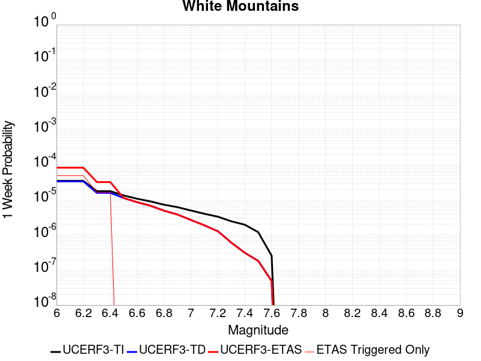 | 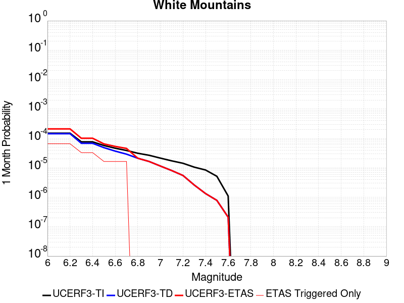 | 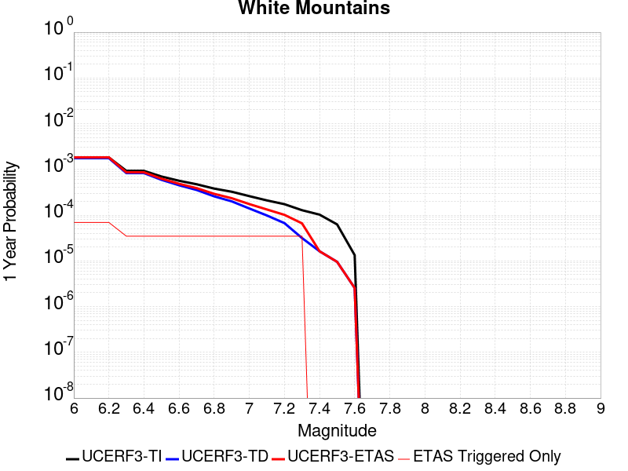 | 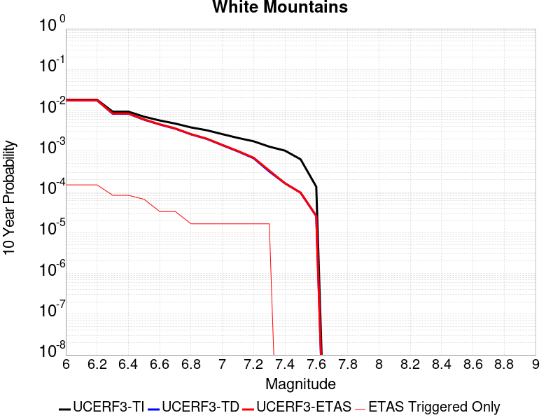 |

| Magnitude | 1 wk TI Prob | 1 wk TD Prob | 1 wk ETAS Prob | 1 wk ETAS/TD Gain | 1 wk ETAS Triggered Only | 1 mo TI Prob | 1 mo TD Prob | 1 mo ETAS Prob | 1 mo ETAS/TD Gain | 1 mo ETAS Triggered Only | 1 yr TI Prob | 1 yr TD Prob | 1 yr ETAS Prob | 1 yr ETAS/TD Gain | 1 yr ETAS Triggered Only | 10 yr TI Prob | 10 yr TD Prob | 10 yr ETAS Prob | 10 yr ETAS/TD Gain | 10 yr ETAS Triggered Only |
|-----|-----|-----|-----|-----|-----|-----|-----|-----|-----|-----|-----|-----|-----|-----|-----|-----|-----|-----|-----|-----|
| 6.0 | 3.503579E-5 | 3.3784127E-5 | 6.838264E-5 | 2.0241055 | 3.459968E-5 | 1.5014476E-4 | 1.4478175E-4 | 1.7937642E-4 | 1.2389436 | 3.459968E-5 | 0.0018264796 | 0.0017614134 | 0.0018304909 | 1.0392171 | 6.919936E-5 | 0.018115403 | 0.017486857 | 0.017554846 | 1.003888 | 6.919936E-5 |
| 6.1 | 3.503579E-5 | 3.3784127E-5 | 6.838264E-5 | 2.0241055 | 3.459968E-5 | 1.5014476E-4 | 1.4478175E-4 | 1.7937642E-4 | 1.2389436 | 3.459968E-5 | 0.0018264796 | 0.0017614134 | 0.0018304909 | 1.0392171 | 6.919936E-5 | 0.018115403 | 0.017486857 | 0.017554846 | 1.003888 | 6.919936E-5 |
| 6.2 | 3.503579E-5 | 3.3784127E-5 | 6.838264E-5 | 2.0241055 | 3.459968E-5 | 1.5014476E-4 | 1.4478175E-4 | 1.7937642E-4 | 1.2389436 | 3.459968E-5 | 0.0018264796 | 0.0017614134 | 0.0018304909 | 1.0392171 | 6.919936E-5 | 0.018115403 | 0.017486857 | 0.017554846 | 1.003888 | 6.919936E-5 |
| 6.3 | 1.7818425E-5 | 1.591616E-5 | 1.591616E-5 | 1.0 | 0.0 | 7.636245E-5 | 6.821041E-5 | 6.821041E-5 | 1.0 | 0.0 | 9.293162E-4 | 8.301596E-4 | 8.647305E-4 | 1.0416437 | 3.459968E-5 | 0.009254395 | 0.0082720425 | 0.008306356 | 1.0041481 | 3.459968E-5 |
| 6.4 | 1.7818425E-5 | 1.591616E-5 | 1.591616E-5 | 1.0 | 0.0 | 7.636245E-5 | 6.821041E-5 | 6.821041E-5 | 1.0 | 0.0 | 9.293162E-4 | 8.301596E-4 | 8.647305E-4 | 1.0416437 | 3.459968E-5 | 0.009254395 | 0.0082720425 | 0.008306356 | 1.0041481 | 3.459968E-5 |
| 6.5 | 1.3397557E-5 | 1.1336374E-5 | 1.1336374E-5 | 1.0 | 0.0 | 5.741684E-5 | 4.8583595E-5 | 4.8583595E-5 | 1.0 | 0.0 | 6.988258E-4 | 5.913517E-4 | 6.259309E-4 | 1.0584749 | 3.459968E-5 | 0.006966323 | 0.005898487 | 0.0059328824 | 1.0058312 | 3.459968E-5 |
| 6.6 | 1.0818695E-5 | 8.625434E-6 | 8.625434E-6 | 1.0 | 0.0 | 4.6365014E-5 | 3.6965648E-5 | 3.6965648E-5 | 1.0 | 0.0 | 5.6434784E-4 | 4.4996818E-4 | 4.845523E-4 | 1.076859 | 3.459968E-5 | 0.005629168 | 0.0044910074 | 0.004525452 | 1.0076696 | 3.459968E-5 |
| 6.7 | 9.067908E-6 | 6.802476E-6 | 6.802476E-6 | 1.0 | 0.0 | 3.8861883E-5 | 2.915316E-5 | 2.915316E-5 | 1.0 | 0.0 | 4.7304068E-4 | 3.548851E-4 | 3.894725E-4 | 1.0974609 | 3.459968E-5 | 0.00472035 | 0.003543501 | 0.0035779781 | 1.0097296 | 3.459968E-5 |
| 6.8 | 7.295947E-6 | 4.9364285E-6 | 4.9364285E-6 | 1.0 | 0.0 | 3.126797E-5 | 2.1155956E-5 | 2.1155956E-5 | 1.0 | 0.0 | 3.8062103E-4 | 2.5754445E-4 | 2.9213523E-4 | 1.1343099 | 3.459968E-5 | 0.0037996976 | 0.0025725728 | 0.0026070834 | 1.0134149 | 3.459968E-5 |
| 6.9 | 6.2243444E-6 | 3.8322546E-6 | 3.8322546E-6 | 1.0 | 0.0 | 2.6675489E-5 | 1.6423846E-5 | 1.6423846E-5 | 1.0 | 0.0 | 3.2472567E-4 | 1.9994251E-4 | 2.3453528E-4 | 1.1730136 | 3.459968E-5 | 0.0032425157 | 0.001997679 | 0.0020322097 | 1.0172853 | 3.459968E-5 |
| 7.0 | 4.9878413E-6 | 2.679564E-6 | 2.679564E-6 | 1.0 | 0.0 | 2.1376287E-5 | 1.1483797E-5 | 1.1483797E-5 | 1.0 | 0.0 | 2.602252E-4 | 1.3980652E-4 | 1.7440136E-4 | 1.247448 | 3.459968E-5 | 0.002599207 | 0.0013972119 | 0.0014317632 | 1.0247288 | 3.459968E-5 |
| 7.1 | 4.0252844E-6 | 1.885702E-6 | 1.885702E-6 | 1.0 | 0.0 | 1.7251105E-5 | 8.081555E-6 | 8.081555E-6 | 1.0 | 0.0 | 2.1001195E-4 | 9.838863E-5 | 1.329849E-4 | 1.3516288 | 3.459968E-5 | 0.0020981359 | 9.834635E-4 | 0.001018029 | 1.0351468 | 3.459968E-5 |
| 7.2 | 3.3284066E-6 | 1.2818929E-6 | 1.2818929E-6 | 1.0 | 0.0 | 1.4264522E-5 | 5.4938155E-6 | 5.4938155E-6 | 1.0 | 0.0 | 1.736567E-4 | 6.688525E-5 | 1.0148262E-4 | 1.5172645 | 3.459968E-5 | 0.0017352107 | 6.6866126E-4 | 7.0323783E-4 | 1.0517101 | 3.459968E-5 |
| 7.3 | 2.458226E-6 | 6.056684E-7 | 6.056684E-7 | 1.0 | 0.0 | 1.0535211E-5 | 2.5957193E-6 | 2.5957193E-6 | 1.0 | 0.0 | 1.2825865E-4 | 3.160246E-5 | 6.620105E-5 | 2.0948067 | 3.459968E-5 | 0.0012818464 | 3.1598343E-4 | 3.5057217E-4 | 1.1094638 | 3.459968E-5 |
| 7.4 | 1.965953E-6 | 3.1084684E-7 | 3.1084684E-7 | 1.0 | 0.0 | 8.425486E-6 | 1.3322001E-6 | 1.3322001E-6 | 1.0 | 0.0 | 1.0257547E-4 | 1.6219417E-5 | 1.6219417E-5 | 1.0 | 0.0 | 0.0010252813 | 1.6218246E-4 | 1.6218246E-4 | 1.0 | 0.0 |
| 7.5 | 1.2014192E-6 | 1.8241002E-7 | 1.8241002E-7 | 1.0 | 0.0 | 5.148929E-6 | 7.8175697E-7 | 7.8175697E-7 | 1.0 | 0.0 | 6.2686406E-5 | 9.51785E-6 | 9.51785E-6 | 1.0 | 0.0 | 6.266873E-4 | 9.517451E-5 | 9.517451E-5 | 1.0 | 0.0 |
| 7.6 | 2.5612175E-7 | 4.893784E-8 | 4.893784E-8 | 1.0 | 0.0 | 1.0976642E-6 | 2.0973359E-7 | 2.0973359E-7 | 1.0 | 0.0 | 1.3363979E-5 | 2.5535037E-6 | 2.5535037E-6 | 1.0 | 0.0 | 1.3363175E-4 | 2.553478E-5 | 2.553478E-5 | 1.0 | 0.0 |

## San Pedro Basin
*[(top)](#table-of-contents)*

| 1 Week | 1 Month | 1 Year | 10 Year |
|-----|-----|-----|-----|
| 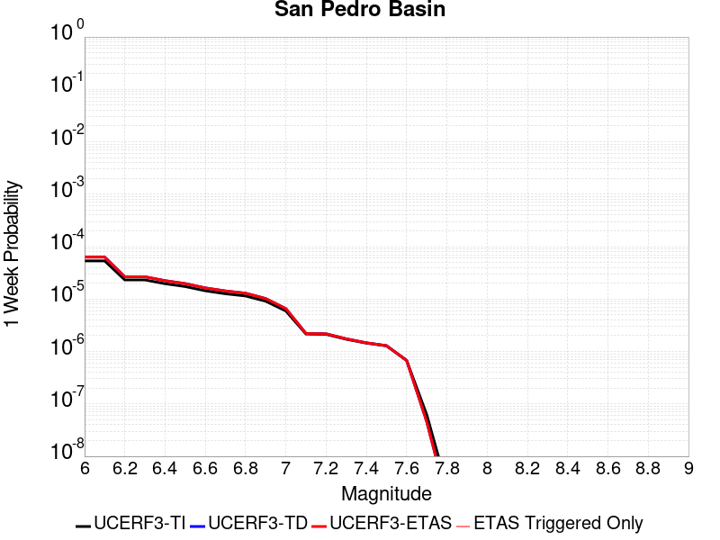 | 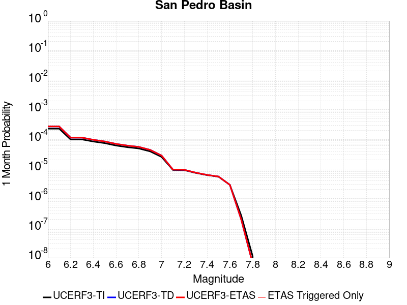 | 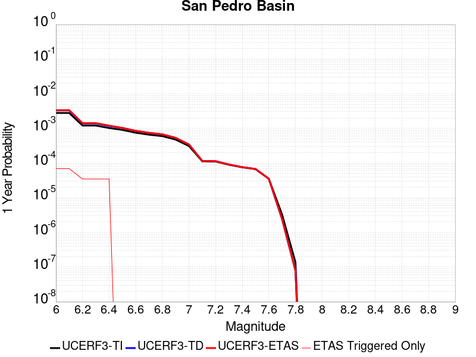 | 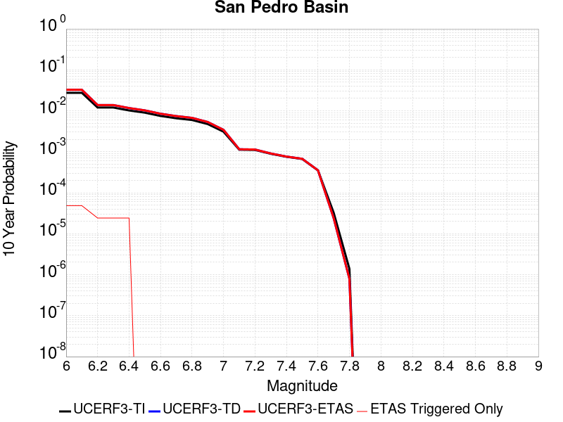 |

| Magnitude | 1 wk TI Prob | 1 wk TD Prob | 1 wk ETAS Prob | 1 wk ETAS/TD Gain | 1 wk ETAS Triggered Only | 1 mo TI Prob | 1 mo TD Prob | 1 mo ETAS Prob | 1 mo ETAS/TD Gain | 1 mo ETAS Triggered Only | 1 yr TI Prob | 1 yr TD Prob | 1 yr ETAS Prob | 1 yr ETAS/TD Gain | 1 yr ETAS Triggered Only | 10 yr TI Prob | 10 yr TD Prob | 10 yr ETAS Prob | 10 yr ETAS/TD Gain | 10 yr ETAS Triggered Only |
|-----|-----|-----|-----|-----|-----|-----|-----|-----|-----|-----|-----|-----|-----|-----|-----|-----|-----|-----|-----|-----|
| 6.0 | 5.3449043E-5 | 6.337018E-5 | 6.337018E-5 | 1.0 | 0.0 | 2.2904722E-4 | 2.7156167E-4 | 2.7156167E-4 | 1.0 | 0.0 | 0.0027850836 | 0.0033018515 | 0.0033708222 | 1.0208886 | 6.919936E-5 | 0.027504366 | 0.03258948 | 0.032656427 | 1.0020542 | 6.919936E-5 |
| 6.1 | 5.3449043E-5 | 6.337018E-5 | 6.337018E-5 | 1.0 | 0.0 | 2.2904722E-4 | 2.7156167E-4 | 2.7156167E-4 | 1.0 | 0.0 | 0.0027850836 | 0.0033018515 | 0.0033708222 | 1.0208886 | 6.919936E-5 | 0.027504366 | 0.03258948 | 0.032656427 | 1.0020542 | 6.919936E-5 |
| 6.2 | 2.3189454E-5 | 2.6642829E-5 | 2.6642829E-5 | 1.0 | 0.0 | 9.9379584E-5 | 1.1417881E-4 | 1.1417881E-4 | 1.0 | 0.0 | 0.0012092749 | 0.0013892875 | 0.0014238392 | 1.02487 | 3.459968E-5 | 0.012027155 | 0.01381089 | 0.013845012 | 1.0024706 | 3.459968E-5 |
| 6.3 | 2.3189454E-5 | 2.6642829E-5 | 2.6642829E-5 | 1.0 | 0.0 | 9.9379584E-5 | 1.1417881E-4 | 1.1417881E-4 | 1.0 | 0.0 | 0.0012092749 | 0.0013892875 | 0.0014238392 | 1.02487 | 3.459968E-5 | 0.012027155 | 0.01381089 | 0.013845012 | 1.0024706 | 3.459968E-5 |
| 6.4 | 1.966056E-5 | 2.246342E-5 | 2.246342E-5 | 1.0 | 0.0 | 8.425682E-5 | 9.626848E-5 | 9.626848E-5 | 1.0 | 0.0 | 0.001025344 | 0.0011714787 | 0.0012060378 | 1.0295005 | 3.459968E-5 | 0.010206259 | 0.011657119 | 0.011691315 | 1.0029335 | 3.459968E-5 |
| 6.5 | 1.7342953E-5 | 1.9745152E-5 | 1.9745152E-5 | 1.0 | 0.0 | 7.4324824E-5 | 8.461954E-5 | 8.461954E-5 | 1.0 | 0.0 | 9.04529E-4 | 0.0010297929 | 0.0010297929 | 1.0 | 0.0 | 0.009008561 | 0.010253932 | 0.010253932 | 1.0 | 0.0 |
| 6.6 | 1.439804E-5 | 1.6322716E-5 | 1.6322716E-5 | 1.0 | 0.0 | 6.170443E-5 | 6.99528E-5 | 6.99528E-5 | 1.0 | 0.0 | 7.509924E-4 | 8.513747E-4 | 8.513747E-4 | 1.0 | 0.0 | 0.0074845953 | 0.008484333 | 0.008484333 | 1.0 | 0.0 |
| 6.7 | 1.2634884E-5 | 1.4285298E-5 | 1.4285298E-5 | 1.0 | 0.0 | 5.414838E-5 | 6.122144E-5 | 6.122144E-5 | 1.0 | 0.0 | 6.590571E-4 | 7.451466E-4 | 7.451466E-4 | 1.0 | 0.0 | 0.006571059 | 0.007429502 | 0.007429502 | 1.0 | 0.0 |
| 6.8 | 1.146091E-5 | 1.2933193E-5 | 1.2933193E-5 | 1.0 | 0.0 | 4.911726E-5 | 5.542696E-5 | 5.542696E-5 | 1.0 | 0.0 | 5.9783855E-4 | 6.74644E-4 | 6.74644E-4 | 1.0 | 0.0 | 0.0059623276 | 0.0067288997 | 0.0067288997 | 1.0 | 0.0 |
| 6.9 | 9.109035E-6 | 1.0235013E-5 | 1.0235013E-5 | 1.0 | 0.0 | 3.9038136E-5 | 4.386376E-5 | 4.386376E-5 | 1.0 | 0.0 | 4.7518566E-4 | 5.339384E-4 | 5.339384E-4 | 1.0 | 0.0 | 0.0047417083 | 0.0053293095 | 0.0053293095 | 1.0 | 0.0 |
| 7.0 | 5.9351028E-6 | 6.583965E-6 | 6.583965E-6 | 1.0 | 0.0 | 2.5435906E-5 | 2.821682E-5 | 2.821682E-5 | 1.0 | 0.0 | 3.0963816E-4 | 3.4350925E-4 | 3.4350925E-4 | 1.0 | 0.0 | 0.0030920706 | 0.0034320997 | 0.0034320997 | 1.0 | 0.0 |
| 7.1 | 2.1557585E-6 | 2.2096492E-6 | 2.2096492E-6 | 1.0 | 0.0 | 9.238933E-6 | 9.469892E-6 | 9.469892E-6 | 1.0 | 0.0 | 1.1247819E-4 | 1.15289986E-4 | 1.15289986E-4 | 1.0 | 0.0 | 0.0011242128 | 0.0011523172 | 0.0011523172 | 1.0 | 0.0 |
| 7.2 | 2.1251979E-6 | 2.1779954E-6 | 2.1779954E-6 | 1.0 | 0.0 | 9.107958E-6 | 9.334234E-6 | 9.334234E-6 | 1.0 | 0.0 | 1.1088375E-4 | 1.13638525E-4 | 1.13638525E-4 | 1.0 | 0.0 | 0.0011082845 | 0.0011358195 | 0.0011358195 | 1.0 | 0.0 |
| 7.3 | 1.7145798E-6 | 1.7442885E-6 | 1.7442885E-6 | 1.0 | 0.0 | 7.3481783E-6 | 7.475501E-6 | 7.475501E-6 | 1.0 | 0.0 | 8.94604E-5 | 9.1010515E-5 | 9.1010515E-5 | 1.0 | 0.0 | 8.9424395E-4 | 9.0974156E-4 | 9.0974156E-4 | 1.0 | 0.0 |
| 7.4 | 1.4467993E-6 | 1.4641878E-6 | 1.4641878E-6 | 1.0 | 0.0 | 6.200554E-6 | 6.275076E-6 | 6.275076E-6 | 1.0 | 0.0 | 7.548913E-5 | 7.639644E-5 | 7.639644E-5 | 1.0 | 0.0 | 7.546349E-4 | 7.6370913E-4 | 7.6370913E-4 | 1.0 | 0.0 |
| 7.5 | 1.2803735E-6 | 1.2931506E-6 | 1.2931506E-6 | 1.0 | 0.0 | 5.487303E-6 | 5.5420624E-6 | 5.5420624E-6 | 1.0 | 0.0 | 6.680587E-5 | 6.747259E-5 | 6.747259E-5 | 1.0 | 0.0 | 6.678579E-4 | 6.745281E-4 | 6.745281E-4 | 1.0 | 0.0 |
| 7.6 | 6.755009E-7 | 6.76947E-7 | 6.76947E-7 | 1.0 | 0.0 | 2.8950008E-6 | 2.9011985E-6 | 2.9011985E-6 | 1.0 | 0.0 | 3.5246063E-5 | 3.532158E-5 | 3.532158E-5 | 1.0 | 0.0 | 3.5240475E-4 | 3.5316538E-4 | 3.5316538E-4 | 1.0 | 0.0 |
| 7.7 | 6.211885E-8 | 4.5699714E-8 | 4.5699714E-8 | 1.0 | 0.0 | 2.6622362E-7 | 1.9585592E-7 | 1.9585592E-7 | 1.0 | 0.0 | 3.2412677E-6 | 2.3845432E-6 | 2.3845432E-6 | 1.0 | 0.0 | 3.2412205E-5 | 2.3845198E-5 | 2.3845198E-5 | 1.0 | 0.0 |
| 7.8 | 2.6580573E-9 | 1.5138054E-9 | 1.5138054E-9 | 1.0 | 0.0 | 1.1391674E-8 | 6.4877375E-9 | 6.4877375E-9 | 1.0 | 0.0 | 1.3869362E-7 | 7.89882E-8 | 7.89882E-8 | 1.0 | 0.0 | 1.3869354E-6 | 7.89882E-7 | 7.89882E-7 | 1.0 | 0.0 |

## Calaveras (So) - Paicines extension 2011 CFM
*[(top)](#table-of-contents)*

| 1 Week | 1 Month | 1 Year | 10 Year |
|-----|-----|-----|-----|
|  | 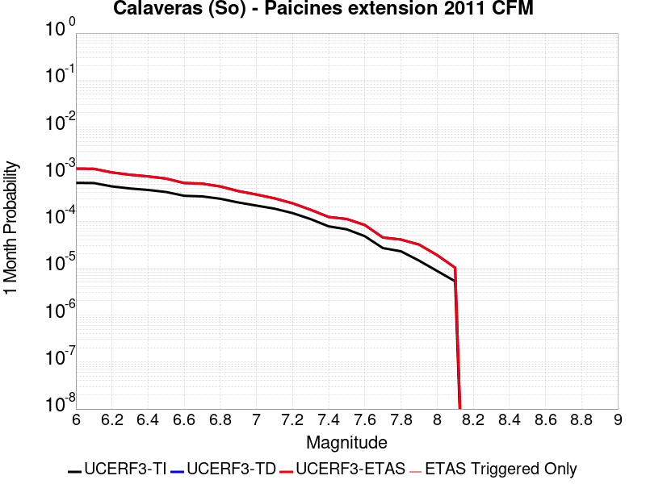 | 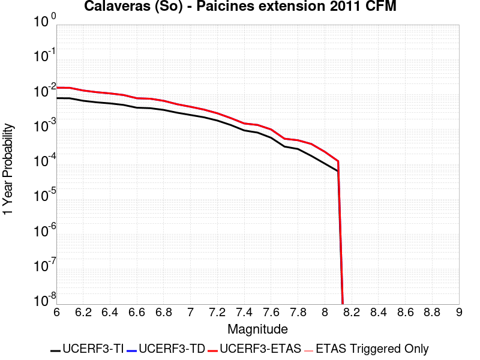 | 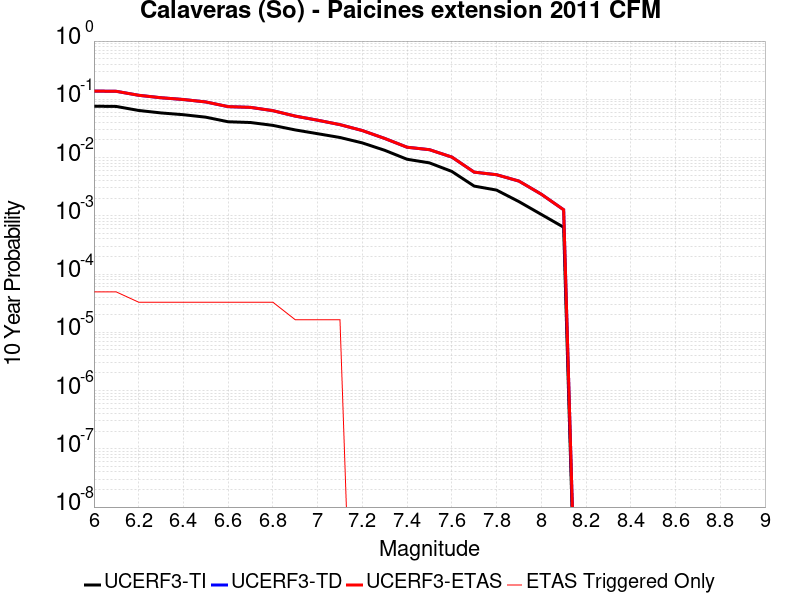 |

| Magnitude | 1 wk TI Prob | 1 wk TD Prob | 1 wk ETAS Prob | 1 wk ETAS/TD Gain | 1 wk ETAS Triggered Only | 1 mo TI Prob | 1 mo TD Prob | 1 mo ETAS Prob | 1 mo ETAS/TD Gain | 1 mo ETAS Triggered Only | 1 yr TI Prob | 1 yr TD Prob | 1 yr ETAS Prob | 1 yr ETAS/TD Gain | 1 yr ETAS Triggered Only | 10 yr TI Prob | 10 yr TD Prob | 10 yr ETAS Prob | 10 yr ETAS/TD Gain | 10 yr ETAS Triggered Only |
|-----|-----|-----|-----|-----|-----|-----|-----|-----|-----|-----|-----|-----|-----|-----|-----|-----|-----|-----|-----|-----|
| 6.0 | 1.5183659E-4 | 3.0520977E-4 | 3.0520977E-4 | 1.0 | 0.0 | 6.5056595E-4 | 0.0013068188 | 0.0013068188 | 1.0 | 0.0 | 0.007891912 | 0.015696203 | 0.015696203 | 1.0 | 0.0 | 0.076174594 | 0.13848905 | 0.13854867 | 1.0004305 | 6.919936E-5 |
| 6.1 | 1.5024997E-4 | 3.021517E-4 | 3.021517E-4 | 1.0 | 0.0 | 6.437695E-4 | 0.0012937278 | 0.0012937278 | 1.0 | 0.0 | 0.0078097614 | 0.015539596 | 0.015539596 | 1.0 | 0.0 | 0.075409345 | 0.13715863 | 0.13721834 | 1.0004354 | 6.919936E-5 |
| 6.2 | 1.2743923E-4 | 2.5313982E-4 | 2.5313982E-4 | 1.0 | 0.0 | 5.460538E-4 | 0.0010839999 | 0.0010839999 | 1.0 | 0.0 | 0.0066279583 | 0.013046881 | 0.013046881 | 1.0 | 0.0 | 0.064337276 | 0.117256075 | 0.117286615 | 1.0002605 | 3.459968E-5 |
| 6.3 | 1.1525114E-4 | 2.2599236E-4 | 2.2599236E-4 | 1.0 | 0.0 | 4.9383997E-4 | 9.678718E-4 | 9.678718E-4 | 1.0 | 0.0 | 0.0059959386 | 0.011668079 | 0.011668079 | 1.0 | 0.0 | 0.058367174 | 0.106372125 | 0.106403045 | 1.0002906 | 3.459968E-5 |
| 6.4 | 1.07200925E-4 | 2.0840544E-4 | 2.0840544E-4 | 1.0 | 0.0 | 4.5935164E-4 | 8.926123E-4 | 8.926123E-4 | 1.0 | 0.0 | 0.0055782744 | 0.010772959 | 0.010772959 | 1.0 | 0.0 | 0.0544031 | 0.099194765 | 0.09922594 | 1.0003142 | 3.459968E-5 |
| 6.5 | 9.69631E-5 | 1.8734725E-4 | 1.8734725E-4 | 1.0 | 0.0 | 4.1548995E-4 | 8.024631E-4 | 8.024631E-4 | 1.0 | 0.0 | 0.0050468626 | 0.009694842 | 0.009694842 | 1.0 | 0.0 | 0.04933773 | 0.090086564 | 0.09011805 | 1.0003495 | 3.459968E-5 |
| 6.6 | 8.0552316E-5 | 1.507068E-4 | 1.507068E-4 | 1.0 | 0.0 | 3.4517853E-4 | 6.4569083E-4 | 6.4569083E-4 | 1.0 | 0.0 | 0.0041944524 | 0.007826508 | 0.007826508 | 1.0 | 0.0 | 0.04116161 | 0.0748563 | 0.07488831 | 1.0004276 | 3.459968E-5 |
| 6.7 | 7.815757E-5 | 1.4611272E-4 | 1.4611272E-4 | 1.0 | 0.0 | 3.34918E-4 | 6.26014E-4 | 6.26014E-4 | 1.0 | 0.0 | 0.004070005 | 0.007589312 | 0.007589312 | 1.0 | 0.0 | 0.039962657 | 0.07270582 | 0.0727379 | 1.0004413 | 3.459968E-5 |
| 6.8 | 6.965264E-5 | 1.2722758E-4 | 1.2722758E-4 | 1.0 | 0.0 | 2.9847719E-4 | 5.4513285E-4 | 5.4513285E-4 | 1.0 | 0.0 | 0.0036279052 | 0.0066135945 | 0.0066135945 | 1.0 | 0.0 | 0.03569247 | 0.063801065 | 0.06383346 | 1.0005077 | 3.459968E-5 |
| 6.9 | 5.8000453E-5 | 1.01439E-4 | 1.01439E-4 | 1.0 | 0.0 | 2.4854968E-4 | 4.346666E-4 | 4.346666E-4 | 1.0 | 0.0 | 0.0030218933 | 0.005279322 | 0.005279322 | 1.0 | 0.0 | 0.029811295 | 0.051502965 | 0.05153578 | 1.0006372 | 3.459968E-5 |
| 7.0 | 4.9865852E-5 | 8.568029E-5 | 8.568029E-5 | 1.0 | 0.0 | 2.1369329E-4 | 3.6715003E-4 | 3.6715003E-4 | 1.0 | 0.0 | 0.0025986114 | 0.004460979 | 0.004460979 | 1.0 | 0.0 | 0.025684336 | 0.043782018 | 0.043815102 | 1.0007557 | 3.459968E-5 |
| 7.1 | 4.283875E-5 | 7.1124625E-5 | 7.1124625E-5 | 1.0 | 0.0 | 1.8358172E-4 | 3.0478454E-4 | 3.0478454E-4 | 1.0 | 0.0 | 0.0022328163 | 0.003704494 | 0.003704494 | 1.0 | 0.0 | 0.022105146 | 0.03673582 | 0.03676915 | 1.0009073 | 3.459968E-5 |
| 7.2 | 3.450115E-5 | 5.5778568E-5 | 5.5778568E-5 | 1.0 | 0.0 | 1.478537E-4 | 2.3902925E-4 | 2.3902925E-4 | 1.0 | 0.0 | 0.0017986323 | 0.0029063264 | 0.0029063264 | 1.0 | 0.0 | 0.017841442 | 0.029079042 | 0.029079042 | 1.0 | 0.0 |
| 7.3 | 2.5709045E-5 | 4.059001E-5 | 4.059001E-5 | 1.0 | 0.0 | 1.1017697E-4 | 1.7394568E-4 | 1.7394568E-4 | 1.0 | 0.0 | 0.0013405791 | 0.0021157486 | 0.0021157486 | 1.0 | 0.0 | 0.013325208 | 0.02129686 | 0.02129686 | 1.0 | 0.0 |
| 7.4 | 1.8003093E-5 | 2.8511378E-5 | 2.8511378E-5 | 1.0 | 0.0 | 7.715383E-5 | 1.2218591E-4 | 1.2218591E-4 | 1.0 | 0.0 | 9.3894306E-4 | 0.0014866006 | 0.0014866006 | 1.0 | 0.0 | 0.009349857 | 0.015051589 | 0.015051589 | 1.0 | 0.0 |
| 7.5 | 1.5595824E-5 | 2.5823752E-5 | 2.5823752E-5 | 1.0 | 0.0 | 6.683753E-5 | 1.10668545E-4 | 1.10668545E-4 | 1.0 | 0.0 | 8.134431E-4 | 0.0013465589 | 0.0013465589 | 1.0 | 0.0 | 0.008104719 | 0.013651571 | 0.013651571 | 1.0 | 0.0 |
| 7.6 | 1.1110309E-5 | 1.9223195E-5 | 1.9223195E-5 | 1.0 | 0.0 | 4.761474E-5 | 8.2382525E-5 | 8.2382525E-5 | 1.0 | 0.0 | 5.795553E-4 | 0.0010025471 | 0.0010025471 | 1.0 | 0.0 | 0.0057804612 | 0.01020344 | 0.01020344 | 1.0 | 0.0 |
| 7.7 | 6.2140443E-6 | 1.04376995E-5 | 1.04376995E-5 | 1.0 | 0.0 | 2.6631347E-5 | 4.4732235E-5 | 4.4732235E-5 | 1.0 | 0.0 | 3.241884E-4 | 5.4447894E-4 | 5.4447894E-4 | 1.0 | 0.0 | 0.0032371588 | 0.005620102 | 0.005620102 | 1.0 | 0.0 |
| 7.8 | 5.305533E-6 | 9.433651E-6 | 9.433651E-6 | 1.0 | 0.0 | 2.27378E-5 | 4.0429306E-5 | 4.0429306E-5 | 1.0 | 0.0 | 2.7679754E-4 | 4.9211574E-4 | 4.9211574E-4 | 1.0 | 0.0 | 0.0027645302 | 0.005074622 | 0.005074622 | 1.0 | 0.0 |
| 7.9 | 3.363505E-6 | 7.3854467E-6 | 7.3854467E-6 | 1.0 | 0.0 | 1.4414942E-5 | 3.1651532E-5 | 3.1651532E-5 | 1.0 | 0.0 | 1.7548777E-4 | 3.8528934E-4 | 3.8528934E-4 | 1.0 | 0.0 | 0.0017534926 | 0.003948784 | 0.003948784 | 1.0 | 0.0 |
| 8.0 | 2.0271132E-6 | 4.4134235E-6 | 4.4134235E-6 | 1.0 | 0.0 | 8.687599E-6 | 1.8914534E-5 | 1.8914534E-5 | 1.0 | 0.0 | 1.05766376E-4 | 2.3026018E-4 | 2.3026018E-4 | 1.0 | 0.0 | 0.0010571606 | 0.002351194 | 0.002351194 | 1.0 | 0.0 |
| 8.1 | 1.2206116E-6 | 2.3752666E-6 | 2.3752666E-6 | 1.0 | 0.0 | 5.2311816E-6 | 1.0179674E-5 | 1.0179674E-5 | 1.0 | 0.0 | 6.3687774E-5 | 1.2393051E-4 | 1.2393051E-4 | 1.0 | 0.0 | 6.366953E-4 | 0.0012705618 | 0.0012705618 | 1.0 | 0.0 |

## Santa Susana East (connector)
*[(top)](#table-of-contents)*

| 1 Week | 1 Month | 1 Year | 10 Year |
|-----|-----|-----|-----|
| 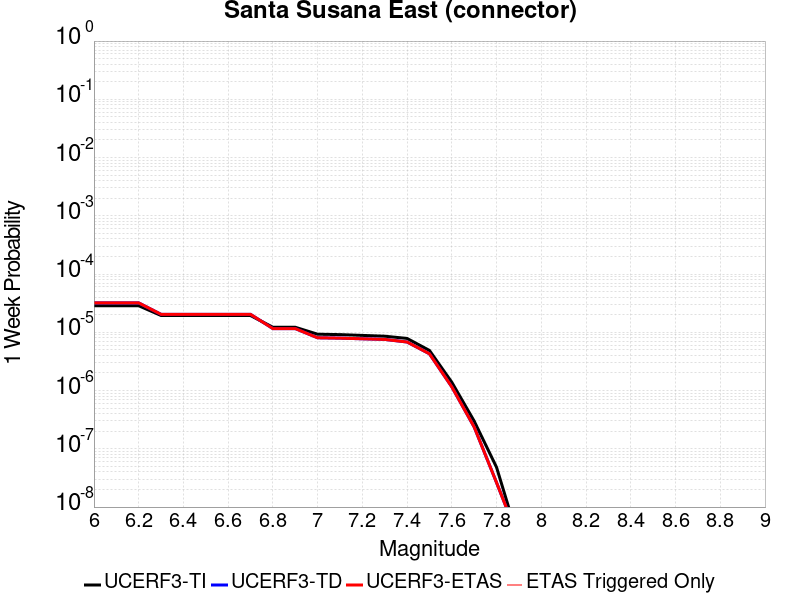 | 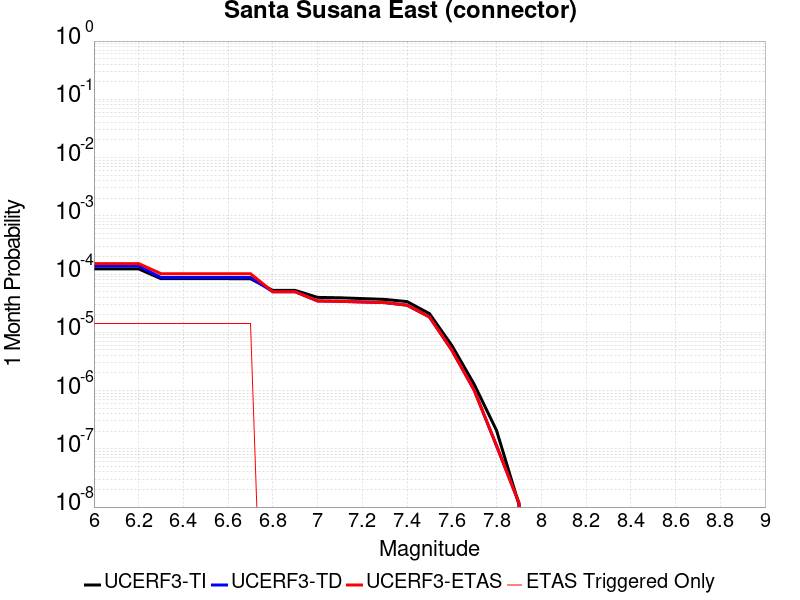 | 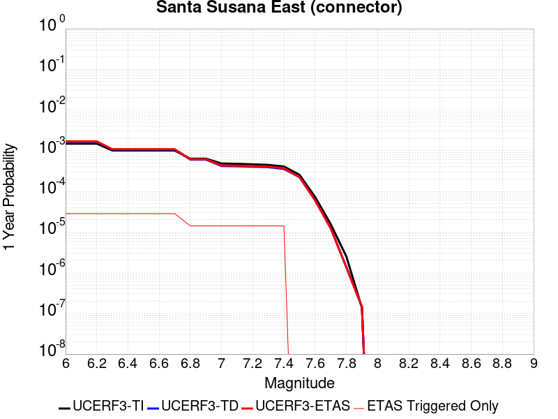 | 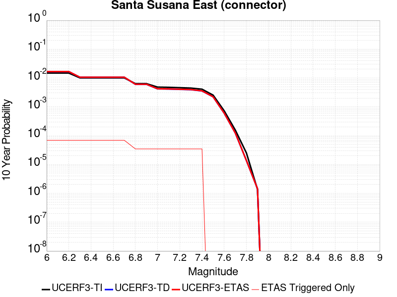 |

| Magnitude | 1 wk TI Prob | 1 wk TD Prob | 1 wk ETAS Prob | 1 wk ETAS/TD Gain | 1 wk ETAS Triggered Only | 1 mo TI Prob | 1 mo TD Prob | 1 mo ETAS Prob | 1 mo ETAS/TD Gain | 1 mo ETAS Triggered Only | 1 yr TI Prob | 1 yr TD Prob | 1 yr ETAS Prob | 1 yr ETAS/TD Gain | 1 yr ETAS Triggered Only | 10 yr TI Prob | 10 yr TD Prob | 10 yr ETAS Prob | 10 yr ETAS/TD Gain | 10 yr ETAS Triggered Only |
|-----|-----|-----|-----|-----|-----|-----|-----|-----|-----|-----|-----|-----|-----|-----|-----|-----|-----|-----|-----|-----|
| 6.0 | 2.858397E-5 | 3.2021693E-5 | 3.2021693E-5 | 1.0 | 0.0 | 1.2249697E-4 | 1.3723019E-4 | 1.7182513E-4 | 1.2520941 | 3.459968E-5 | 0.0014903803 | 0.00166977 | 0.0017388538 | 1.0413733 | 6.919936E-5 | 0.014804244 | 0.016599316 | 0.016667368 | 1.0040996 | 6.919936E-5 |
| 6.1 | 2.858397E-5 | 3.2021693E-5 | 3.2021693E-5 | 1.0 | 0.0 | 1.2249697E-4 | 1.3723019E-4 | 1.7182513E-4 | 1.2520941 | 3.459968E-5 | 0.0014903803 | 0.00166977 | 0.0017388538 | 1.0413733 | 6.919936E-5 | 0.014804244 | 0.016599316 | 0.016667368 | 1.0040996 | 6.919936E-5 |
| 6.2 | 2.858397E-5 | 3.2021693E-5 | 3.2021693E-5 | 1.0 | 0.0 | 1.2249697E-4 | 1.3723019E-4 | 1.7182513E-4 | 1.2520941 | 3.459968E-5 | 0.0014903803 | 0.00166977 | 0.0017388538 | 1.0413733 | 6.919936E-5 | 0.014804244 | 0.016599316 | 0.016667368 | 1.0040996 | 6.919936E-5 |
| 6.3 | 1.943582E-5 | 2.0367343E-5 | 2.0367343E-5 | 1.0 | 0.0 | 8.329371E-5 | 8.7286324E-5 | 1.21882986E-4 | 1.3963584 | 3.459968E-5 | 0.001013629 | 0.001062305 | 0.0011314309 | 1.0650716 | 6.919936E-5 | 0.010090181 | 0.010583852 | 0.0106523195 | 1.006469 | 6.919936E-5 |
| 6.4 | 1.943582E-5 | 2.0367343E-5 | 2.0367343E-5 | 1.0 | 0.0 | 8.329371E-5 | 8.7286324E-5 | 1.21882986E-4 | 1.3963584 | 3.459968E-5 | 0.001013629 | 0.001062305 | 0.0011314309 | 1.0650716 | 6.919936E-5 | 0.010090181 | 0.010583852 | 0.0106523195 | 1.006469 | 6.919936E-5 |
| 6.5 | 1.943582E-5 | 2.0367343E-5 | 2.0367343E-5 | 1.0 | 0.0 | 8.329371E-5 | 8.7286324E-5 | 1.21882986E-4 | 1.3963584 | 3.459968E-5 | 0.001013629 | 0.001062305 | 0.0011314309 | 1.0650716 | 6.919936E-5 | 0.010090181 | 0.010583852 | 0.0106523195 | 1.006469 | 6.919936E-5 |
| 6.6 | 1.943582E-5 | 2.0367343E-5 | 2.0367343E-5 | 1.0 | 0.0 | 8.329371E-5 | 8.7286324E-5 | 1.21882986E-4 | 1.3963584 | 3.459968E-5 | 0.001013629 | 0.001062305 | 0.0011314309 | 1.0650716 | 6.919936E-5 | 0.010090181 | 0.010583852 | 0.0106523195 | 1.006469 | 6.919936E-5 |
| 6.7 | 1.9404439E-5 | 2.0354766E-5 | 2.0354766E-5 | 1.0 | 0.0 | 8.3159226E-5 | 8.723242E-5 | 1.21829085E-4 | 1.3966032 | 3.459968E-5 | 0.0010119933 | 0.0010616493 | 0.0011307752 | 1.0651118 | 6.919936E-5 | 0.010073971 | 0.010577358 | 0.010645826 | 1.0064731 | 6.919936E-5 |
| 6.8 | 1.2217526E-5 | 1.1593157E-5 | 1.1593157E-5 | 1.0 | 0.0 | 5.2359774E-5 | 4.9684106E-5 | 4.9684106E-5 | 1.0 | 0.0 | 6.372938E-4 | 6.047529E-4 | 6.393317E-4 | 1.0571784 | 3.459968E-5 | 0.0063546924 | 0.006033274 | 0.006067665 | 1.0057002 | 3.459968E-5 |
| 6.9 | 1.2217526E-5 | 1.1593157E-5 | 1.1593157E-5 | 1.0 | 0.0 | 5.2359774E-5 | 4.9684106E-5 | 4.9684106E-5 | 1.0 | 0.0 | 6.372938E-4 | 6.047529E-4 | 6.393317E-4 | 1.0571784 | 3.459968E-5 | 0.0063546924 | 0.006033274 | 0.006067665 | 1.0057002 | 3.459968E-5 |
| 7.0 | 9.276017E-6 | 8.059273E-6 | 8.059273E-6 | 1.0 | 0.0 | 3.9753755E-5 | 3.4539302E-5 | 3.4539302E-5 | 1.0 | 0.0 | 4.8389446E-4 | 4.2043833E-4 | 4.5502346E-4 | 1.0822597 | 3.459968E-5 | 0.0048284214 | 0.0041973097 | 0.0042317645 | 1.0082088 | 3.459968E-5 |
| 7.1 | 9.130355E-6 | 7.942446E-6 | 7.942446E-6 | 1.0 | 0.0 | 3.9129503E-5 | 3.4038632E-5 | 3.4038632E-5 | 1.0 | 0.0 | 4.7629757E-4 | 4.1434498E-4 | 4.4893034E-4 | 1.0834699 | 3.459968E-5 | 0.00475278 | 0.0041366047 | 0.004171061 | 1.0083296 | 3.459968E-5 |
| 7.2 | 8.851015E-6 | 7.741608E-6 | 7.741608E-6 | 1.0 | 0.0 | 3.7932372E-5 | 3.317792E-5 | 3.317792E-5 | 1.0 | 0.0 | 4.6172875E-4 | 4.038697E-4 | 4.384554E-4 | 1.0856358 | 3.459968E-5 | 0.0046077054 | 0.0040322347 | 0.004066695 | 1.0085461 | 3.459968E-5 |
| 7.3 | 8.573006E-6 | 7.5503312E-6 | 7.5503312E-6 | 1.0 | 0.0 | 3.6740938E-5 | 3.235818E-5 | 3.235818E-5 | 1.0 | 0.0 | 4.472291E-4 | 3.9389305E-4 | 4.284791E-4 | 1.0878057 | 3.459968E-5 | 0.004463301 | 0.003932817 | 0.0039672805 | 1.0087631 | 3.459968E-5 |
| 7.4 | 7.852282E-6 | 6.8178556E-6 | 6.8178556E-6 | 1.0 | 0.0 | 3.36522E-5 | 2.921907E-5 | 2.921907E-5 | 1.0 | 0.0 | 4.096385E-4 | 3.5568717E-4 | 3.9027454E-4 | 1.097241 | 3.459968E-5 | 0.0040888423 | 0.0035519868 | 0.0035864636 | 1.0097064 | 3.459968E-5 |
| 7.5 | 4.8869324E-6 | 4.2790975E-6 | 4.2790975E-6 | 1.0 | 0.0 | 2.0943828E-5 | 1.833887E-5 | 1.833887E-5 | 1.0 | 0.0 | 2.5496128E-4 | 2.2325452E-4 | 2.2325452E-4 | 1.0 | 0.0 | 0.0025466895 | 0.00223057 | 0.00223057 | 1.0 | 0.0 |
| 7.6 | 1.3894544E-6 | 1.1568394E-6 | 1.1568394E-6 | 1.0 | 0.0 | 5.954791E-6 | 4.957875E-6 | 4.957875E-6 | 1.0 | 0.0 | 7.249717E-5 | 6.036068E-5 | 6.036068E-5 | 1.0 | 0.0 | 7.247352E-4 | 6.0346466E-4 | 6.0346466E-4 | 1.0 | 0.0 |
| 7.7 | 2.9924632E-7 | 2.3719332E-7 | 2.3719332E-7 | 1.0 | 0.0 | 1.2824837E-6 | 1.0165425E-6 | 1.0165425E-6 | 1.0 | 0.0 | 1.5614127E-5 | 1.2376341E-5 | 1.2376341E-5 | 1.0 | 0.0 | 1.5613029E-4 | 1.2375724E-4 | 1.2375724E-4 | 1.0 | 0.0 |
| 7.8 | 4.8188564E-8 | 2.6321862E-8 | 2.6321862E-8 | 1.0 | 0.0 | 2.065224E-7 | 1.12807975E-7 | 1.12807975E-7 | 1.0 | 0.0 | 2.5144072E-6 | 1.3734362E-6 | 1.3734362E-6 | 1.0 | 0.0 | 2.5143789E-5 | 1.3734286E-5 | 1.3734286E-5 | 1.0 | 0.0 |
| 7.9 | 2.6127251E-9 | 2.7681102E-9 | 2.7681102E-9 | 1.0 | 0.0 | 1.1197393E-8 | 1.186333E-8 | 1.186333E-8 | 1.0 | 0.0 | 1.3632825E-7 | 1.4443603E-7 | 1.4443603E-7 | 1.0 | 0.0 | 1.3632817E-6 | 1.4443604E-6 | 1.4443604E-6 | 1.0 | 0.0 |

## Santa Susana alt 1
*[(top)](#table-of-contents)*

| 1 Week | 1 Month | 1 Year | 10 Year |
|-----|-----|-----|-----|
|  | 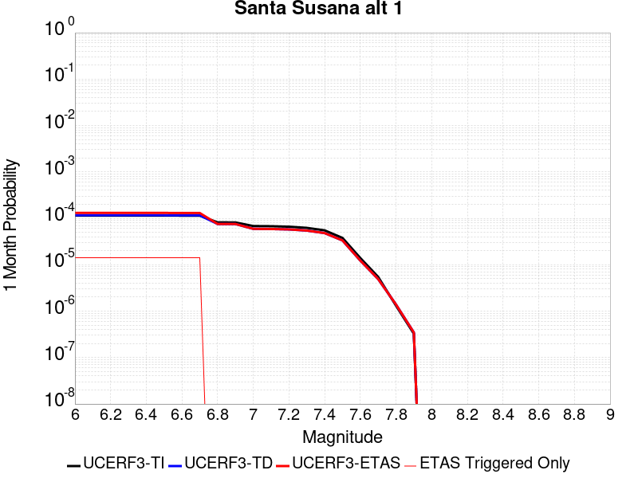 | 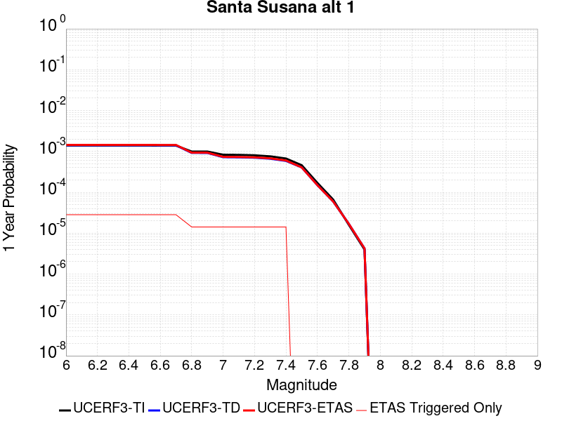 | 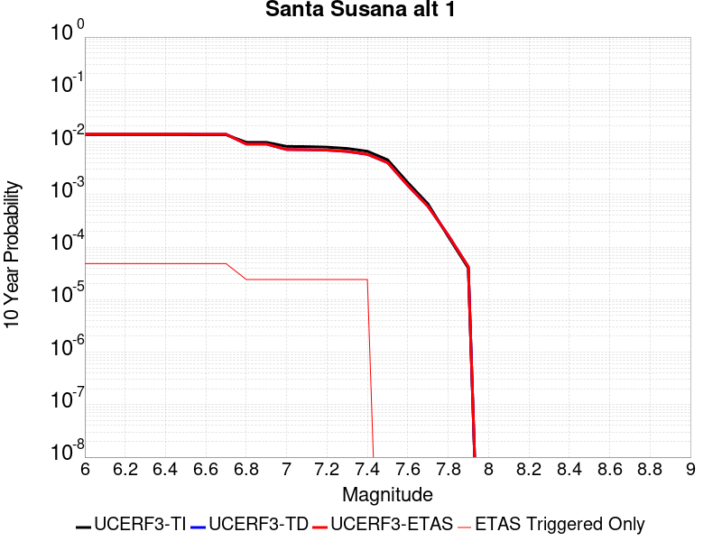 |

| Magnitude | 1 wk TI Prob | 1 wk TD Prob | 1 wk ETAS Prob | 1 wk ETAS/TD Gain | 1 wk ETAS Triggered Only | 1 mo TI Prob | 1 mo TD Prob | 1 mo ETAS Prob | 1 mo ETAS/TD Gain | 1 mo ETAS Triggered Only | 1 yr TI Prob | 1 yr TD Prob | 1 yr ETAS Prob | 1 yr ETAS/TD Gain | 1 yr ETAS Triggered Only | 10 yr TI Prob | 10 yr TD Prob | 10 yr ETAS Prob | 10 yr ETAS/TD Gain | 10 yr ETAS Triggered Only |
|-----|-----|-----|-----|-----|-----|-----|-----|-----|-----|-----|-----|-----|-----|-----|-----|-----|-----|-----|-----|-----|
| 6.0 | 2.674877E-5 | 2.7198214E-5 | 2.7198214E-5 | 1.0 | 0.0 | 1.1463255E-4 | 1.16559204E-4 | 1.5115485E-4 | 1.2968075 | 3.459968E-5 | 0.0013947578 | 0.0014182981 | 0.0014873993 | 1.0487212 | 6.919936E-5 | 0.013860362 | 0.014104388 | 0.014172611 | 1.004837 | 6.919936E-5 |
| 6.1 | 2.674877E-5 | 2.7198214E-5 | 2.7198214E-5 | 1.0 | 0.0 | 1.1463255E-4 | 1.16559204E-4 | 1.5115485E-4 | 1.2968075 | 3.459968E-5 | 0.0013947578 | 0.0014182981 | 0.0014873993 | 1.0487212 | 6.919936E-5 | 0.013860362 | 0.014104388 | 0.014172611 | 1.004837 | 6.919936E-5 |
| 6.2 | 2.674877E-5 | 2.7198214E-5 | 2.7198214E-5 | 1.0 | 0.0 | 1.1463255E-4 | 1.16559204E-4 | 1.5115485E-4 | 1.2968075 | 3.459968E-5 | 0.0013947578 | 0.0014182981 | 0.0014873993 | 1.0487212 | 6.919936E-5 | 0.013860362 | 0.014104388 | 0.014172611 | 1.004837 | 6.919936E-5 |
| 6.3 | 2.674877E-5 | 2.7198214E-5 | 2.7198214E-5 | 1.0 | 0.0 | 1.1463255E-4 | 1.16559204E-4 | 1.5115485E-4 | 1.2968075 | 3.459968E-5 | 0.0013947578 | 0.0014182981 | 0.0014873993 | 1.0487212 | 6.919936E-5 | 0.013860362 | 0.014104388 | 0.014172611 | 1.004837 | 6.919936E-5 |
| 6.4 | 2.674877E-5 | 2.7198214E-5 | 2.7198214E-5 | 1.0 | 0.0 | 1.1463255E-4 | 1.16559204E-4 | 1.5115485E-4 | 1.2968075 | 3.459968E-5 | 0.0013947578 | 0.0014182981 | 0.0014873993 | 1.0487212 | 6.919936E-5 | 0.013860362 | 0.014104388 | 0.014172611 | 1.004837 | 6.919936E-5 |
| 6.5 | 2.674877E-5 | 2.7198214E-5 | 2.7198214E-5 | 1.0 | 0.0 | 1.1463255E-4 | 1.16559204E-4 | 1.5115485E-4 | 1.2968075 | 3.459968E-5 | 0.0013947578 | 0.0014182981 | 0.0014873993 | 1.0487212 | 6.919936E-5 | 0.013860362 | 0.014104388 | 0.014172611 | 1.004837 | 6.919936E-5 |
| 6.6 | 2.6647976E-5 | 2.7074553E-5 | 2.7074553E-5 | 1.0 | 0.0 | 1.14200615E-4 | 1.16029274E-4 | 1.5062494E-4 | 1.2981633 | 3.459968E-5 | 0.0013895056 | 0.0014118546 | 0.0014809563 | 1.0489439 | 6.919936E-5 | 0.013808494 | 0.014040773 | 0.014109001 | 1.0048592 | 6.919936E-5 |
| 6.7 | 2.6647976E-5 | 2.7074553E-5 | 2.7074553E-5 | 1.0 | 0.0 | 1.14200615E-4 | 1.16029274E-4 | 1.5062494E-4 | 1.2981633 | 3.459968E-5 | 0.0013895056 | 0.0014118546 | 0.0014809563 | 1.0489439 | 6.919936E-5 | 0.013808494 | 0.014040773 | 0.014109001 | 1.0048592 | 6.919936E-5 |
| 6.8 | 1.9073179E-5 | 1.7637467E-5 | 1.7637467E-5 | 1.0 | 0.0 | 8.1739636E-5 | 7.558706E-5 | 7.558706E-5 | 1.0 | 0.0 | 9.947256E-4 | 9.19902E-4 | 9.5446984E-4 | 1.0375777 | 3.459968E-5 | 0.009902848 | 0.009163361 | 0.009197644 | 1.0037413 | 3.459968E-5 |
| 6.9 | 1.9041876E-5 | 1.7619597E-5 | 1.7619597E-5 | 1.0 | 0.0 | 8.160549E-5 | 7.551048E-5 | 7.551048E-5 | 1.0 | 0.0 | 9.930939E-4 | 9.189705E-4 | 9.5353834E-4 | 1.0376159 | 3.459968E-5 | 0.0098866755 | 0.009154123 | 0.009188406 | 1.0037451 | 3.459968E-5 |
| 7.0 | 1.5917482E-5 | 1.3864049E-5 | 1.3864049E-5 | 1.0 | 0.0 | 6.8215995E-5 | 5.9416023E-5 | 5.9416023E-5 | 1.0 | 0.0 | 8.302132E-4 | 7.2315463E-4 | 7.5772934E-4 | 1.0478109 | 3.459968E-5 | 0.008271185 | 0.0072090672 | 0.007243417 | 1.0047649 | 3.459968E-5 |
| 7.1 | 1.577788E-5 | 1.3744056E-5 | 1.3744056E-5 | 1.0 | 0.0 | 6.761774E-5 | 5.890179E-5 | 5.890179E-5 | 1.0 | 0.0 | 8.2293496E-4 | 7.16898E-4 | 7.514729E-4 | 1.0482285 | 3.459968E-5 | 0.008198941 | 0.0071469042 | 0.007181257 | 1.0048066 | 3.459968E-5 |
| 7.2 | 1.5416446E-5 | 1.34701295E-5 | 1.34701295E-5 | 1.0 | 0.0 | 6.606882E-5 | 5.7727877E-5 | 5.7727877E-5 | 1.0 | 0.0 | 8.0409093E-4 | 7.026149E-4 | 7.3719025E-4 | 1.0492096 | 3.459968E-5 | 0.008011877 | 0.0070049763 | 0.0070393337 | 1.0049047 | 3.459968E-5 |
| 7.3 | 1.4534083E-5 | 1.2718032E-5 | 1.2718032E-5 | 1.0 | 0.0 | 6.228744E-5 | 5.4504737E-5 | 5.4504737E-5 | 1.0 | 0.0 | 7.580857E-4 | 6.633976E-4 | 6.979743E-4 | 1.0521207 | 3.459968E-5 | 0.007555048 | 0.0066151717 | 0.0066495426 | 1.0051957 | 3.459968E-5 |
| 7.4 | 1.2858995E-5 | 1.1229814E-5 | 1.1229814E-5 | 1.0 | 0.0 | 5.5108816E-5 | 4.812691E-5 | 4.812691E-5 | 1.0 | 0.0 | 6.7074323E-4 | 5.8579154E-4 | 6.203709E-4 | 1.0590303 | 3.459968E-5 | 0.0066872234 | 0.0058433902 | 0.0058777877 | 1.0058866 | 3.459968E-5 |
| 7.5 | 8.827668E-6 | 7.805494E-6 | 7.805494E-6 | 1.0 | 0.0 | 3.7832317E-5 | 3.3451703E-5 | 3.3451703E-5 | 1.0 | 0.0 | 4.605111E-4 | 4.072008E-4 | 4.072008E-4 | 1.0 | 0.0 | 0.0045955796 | 0.0040648985 | 0.0040648985 | 1.0 | 0.0 |
| 7.6 | 3.2533426E-6 | 2.8720106E-6 | 2.8720106E-6 | 1.0 | 0.0 | 1.3942822E-5 | 1.230856E-5 | 1.230856E-5 | 1.0 | 0.0 | 1.6974064E-4 | 1.4984679E-4 | 1.4984679E-4 | 1.0 | 0.0 | 0.0016961104 | 0.0014974943 | 0.0014974943 | 1.0 | 0.0 |
| 7.7 | 1.2751709E-6 | 1.1491339E-6 | 1.1491339E-6 | 1.0 | 0.0 | 5.4650063E-6 | 4.9248506E-6 | 4.9248506E-6 | 1.0 | 0.0 | 6.653442E-5 | 5.99585E-5 | 5.99585E-5 | 1.0 | 0.0 | 6.6514505E-4 | 5.9943215E-4 | 5.9943215E-4 | 1.0 | 0.0 |
| 7.8 | 3.067544E-7 | 3.240052E-7 | 3.240052E-7 | 1.0 | 0.0 | 1.3146611E-6 | 1.3885931E-6 | 1.3885931E-6 | 1.0 | 0.0 | 1.600588E-5 | 1.6906E-5 | 1.6906E-5 | 1.0 | 0.0 | 1.6004729E-4 | 1.6904817E-4 | 1.6904817E-4 | 1.0 | 0.0 |
| 7.9 | 7.622999E-8 | 8.0879715E-8 | 8.0879715E-8 | 1.0 | 0.0 | 3.2669993E-7 | 3.4662733E-7 | 3.4662733E-7 | 1.0 | 0.0 | 3.977564E-6 | 4.220182E-6 | 4.220182E-6 | 1.0 | 0.0 | 3.977493E-5 | 4.2201224E-5 | 4.2201224E-5 | 1.0 | 0.0 |

## Coronado Bank alt1
*[(top)](#table-of-contents)*

| 1 Week | 1 Month | 1 Year | 10 Year |
|-----|-----|-----|-----|
| 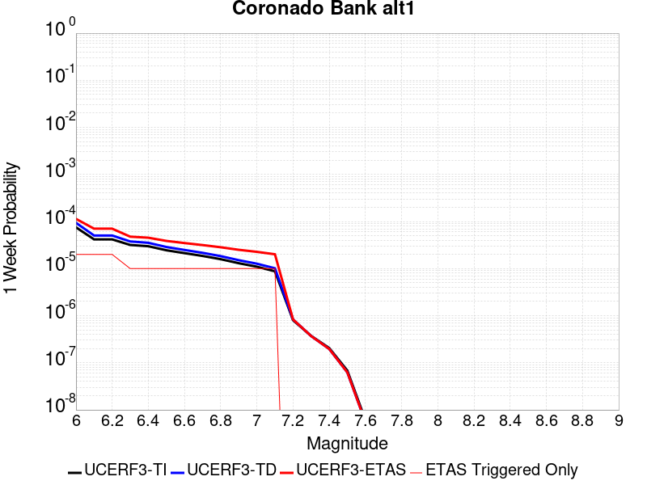 |  | 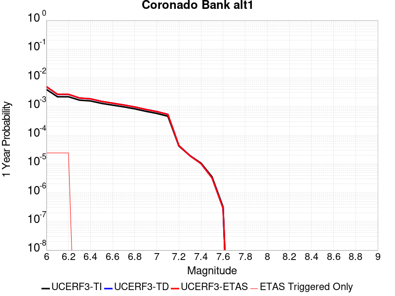 | 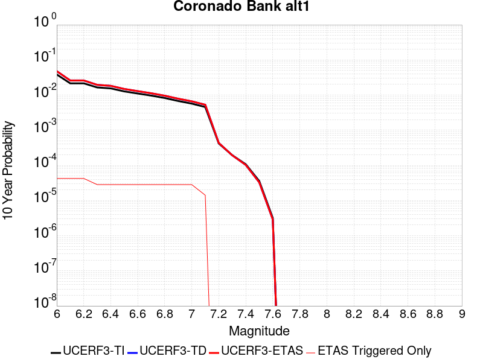 |

| Magnitude | 1 wk TI Prob | 1 wk TD Prob | 1 wk ETAS Prob | 1 wk ETAS/TD Gain | 1 wk ETAS Triggered Only | 1 mo TI Prob | 1 mo TD Prob | 1 mo ETAS Prob | 1 mo ETAS/TD Gain | 1 mo ETAS Triggered Only | 1 yr TI Prob | 1 yr TD Prob | 1 yr ETAS Prob | 1 yr ETAS/TD Gain | 1 yr ETAS Triggered Only | 10 yr TI Prob | 10 yr TD Prob | 10 yr ETAS Prob | 10 yr ETAS/TD Gain | 10 yr ETAS Triggered Only |
|-----|-----|-----|-----|-----|-----|-----|-----|-----|-----|-----|-----|-----|-----|-----|-----|-----|-----|-----|-----|-----|
| 6.0 | 7.533492E-5 | 9.3951705E-5 | 9.3951705E-5 | 1.0 | 0.0 | 3.22824E-4 | 4.025903E-4 | 4.025903E-4 | 1.0 | 0.0 | 0.0039233007 | 0.004891121 | 0.004891121 | 1.0 | 0.0 | 0.03854755 | 0.047904 | 0.047936942 | 1.0006877 | 3.459968E-5 |
| 6.1 | 4.1807285E-5 | 5.0493105E-5 | 5.0493105E-5 | 1.0 | 0.0 | 1.7916178E-4 | 2.1638138E-4 | 2.1638138E-4 | 1.0 | 0.0 | 0.0021791123 | 0.0026313365 | 0.0026313365 | 1.0 | 0.0 | 0.021578677 | 0.026011124 | 0.026044823 | 1.0012956 | 3.459968E-5 |
| 6.2 | 4.1807285E-5 | 5.0493105E-5 | 5.0493105E-5 | 1.0 | 0.0 | 1.7916178E-4 | 2.1638138E-4 | 2.1638138E-4 | 1.0 | 0.0 | 0.0021791123 | 0.0026313365 | 0.0026313365 | 1.0 | 0.0 | 0.021578677 | 0.026011124 | 0.026044823 | 1.0012956 | 3.459968E-5 |
| 6.3 | 3.1793104E-5 | 3.7711125E-5 | 3.7711125E-5 | 1.0 | 0.0 | 1.3624904E-4 | 1.6160926E-4 | 1.6160926E-4 | 1.0 | 0.0 | 0.0016575698 | 0.001965849 | 0.001965849 | 1.0 | 0.0 | 0.016452603 | 0.019488495 | 0.019522421 | 1.0017408 | 3.459968E-5 |
| 6.4 | 2.9878007E-5 | 3.5335797E-5 | 3.5335797E-5 | 1.0 | 0.0 | 1.2804232E-4 | 1.5143053E-4 | 1.5143053E-4 | 1.0 | 0.0 | 0.0015578003 | 0.0018421395 | 0.0018421395 | 1.0 | 0.0 | 0.015469253 | 0.018272463 | 0.018306432 | 1.001859 | 3.459968E-5 |
| 6.5 | 2.4512565E-5 | 2.8764101E-5 | 2.8764101E-5 | 1.0 | 0.0 | 1.0504962E-4 | 1.2326906E-4 | 1.2326906E-4 | 1.0 | 0.0 | 0.0012782287 | 0.0014997943 | 0.0014997943 | 1.0 | 0.0 | 0.012709012 | 0.0148996925 | 0.014933777 | 1.0022876 | 3.459968E-5 |
| 6.6 | 2.1317413E-5 | 2.490667E-5 | 2.490667E-5 | 1.0 | 0.0 | 9.135714E-5 | 1.0673863E-4 | 1.0673863E-4 | 1.0 | 0.0 | 0.0011117056 | 0.0012987903 | 0.0012987903 | 1.0 | 0.0 | 0.011061605 | 0.012914407 | 0.0129485605 | 1.0026445 | 3.459968E-5 |
| 6.7 | 1.8585655E-5 | 2.1634882E-5 | 2.1634882E-5 | 1.0 | 0.0 | 7.9650374E-5 | 9.271774E-5 | 9.271774E-5 | 1.0 | 0.0 | 9.6931186E-4 | 0.0011282744 | 0.0011282744 | 1.0 | 0.0 | 0.0096509475 | 0.011227623 | 0.011261834 | 1.0030471 | 3.459968E-5 |
| 6.8 | 1.5862879E-5 | 1.8419476E-5 | 1.8419476E-5 | 1.0 | 0.0 | 6.798199E-5 | 7.8938334E-5 | 7.8938334E-5 | 1.0 | 0.0 | 8.273665E-4 | 9.606697E-4 | 9.606697E-4 | 1.0 | 0.0 | 0.008242928 | 0.009567151 | 0.009601419 | 1.0035819 | 3.459968E-5 |
| 6.9 | 1.3021509E-5 | 1.5095266E-5 | 1.5095266E-5 | 1.0 | 0.0 | 5.5805274E-5 | 6.46925E-5 | 6.46925E-5 | 1.0 | 0.0 | 6.792174E-4 | 7.873646E-4 | 7.873646E-4 | 1.0 | 0.0 | 0.006771452 | 0.007847573 | 0.007881901 | 1.0043744 | 3.459968E-5 |
| 7.0 | 1.0974371E-5 | 1.2720105E-5 | 1.2720105E-5 | 1.0 | 0.0 | 4.7032172E-5 | 5.4513697E-5 | 5.4513697E-5 | 1.0 | 0.0 | 5.7246623E-4 | 6.635197E-4 | 6.635197E-4 | 1.0 | 0.0 | 0.0057099373 | 0.0066171354 | 0.006651506 | 1.0051942 | 3.459968E-5 |
| 7.1 | 8.766221E-6 | 1.0163833E-5 | 1.0163833E-5 | 1.0 | 0.0 | 3.7568978E-5 | 4.3558655E-5 | 4.3558655E-5 | 1.0 | 0.0 | 4.573063E-4 | 5.302148E-4 | 5.302148E-4 | 1.0 | 0.0 | 0.0045636636 | 0.005291197 | 0.005291197 | 1.0 | 0.0 |
| 7.2 | 8.026024E-7 | 8.331776E-7 | 8.331776E-7 | 1.0 | 0.0 | 3.43972E-6 | 3.5707562E-6 | 3.5707562E-6 | 1.0 | 0.0 | 4.1877785E-5 | 4.34731E-5 | 4.34731E-5 | 1.0 | 0.0 | 4.1869894E-4 | 4.3464705E-4 | 4.3464705E-4 | 1.0 | 0.0 |
| 7.3 | 3.7293114E-7 | 3.700106E-7 | 3.700106E-7 | 1.0 | 0.0 | 1.5982754E-6 | 1.5857588E-6 | 1.5857588E-6 | 1.0 | 0.0 | 1.9458828E-5 | 1.9306442E-5 | 1.9306442E-5 | 1.0 | 0.0 | 1.9457124E-4 | 1.9304773E-4 | 1.9304773E-4 | 1.0 | 0.0 |
| 7.4 | 2.0557036E-7 | 1.9674441E-7 | 1.9674441E-7 | 1.0 | 0.0 | 8.810155E-7 | 8.4319004E-7 | 8.4319004E-7 | 1.0 | 0.0 | 1.0726311E-5 | 1.02657905E-5 | 1.02657905E-5 | 1.0 | 0.0 | 1.0725793E-4 | 1.026532E-4 | 1.026532E-4 | 1.0 | 0.0 |
| 7.5 | 6.845446E-8 | 6.2794086E-8 | 6.2794086E-8 | 1.0 | 0.0 | 2.9337625E-7 | 2.6911746E-7 | 2.6911746E-7 | 1.0 | 0.0 | 3.5718497E-6 | 3.2765004E-6 | 3.2765004E-6 | 1.0 | 0.0 | 3.5717923E-5 | 3.276453E-5 | 3.276453E-5 | 1.0 | 0.0 |
| 7.6 | 6.0975145E-9 | 5.531901E-9 | 5.531901E-9 | 1.0 | 0.0 | 2.6132206E-8 | 2.3708148E-8 | 2.3708148E-8 | 1.0 | 0.0 | 3.1815955E-7 | 2.8864667E-7 | 2.8864667E-7 | 1.0 | 0.0 | 3.181591E-6 | 2.886464E-6 | 2.886464E-6 | 1.0 | 0.0 |

## Palos Verdes
*[(top)](#table-of-contents)*

| 1 Week | 1 Month | 1 Year | 10 Year |
|-----|-----|-----|-----|
| 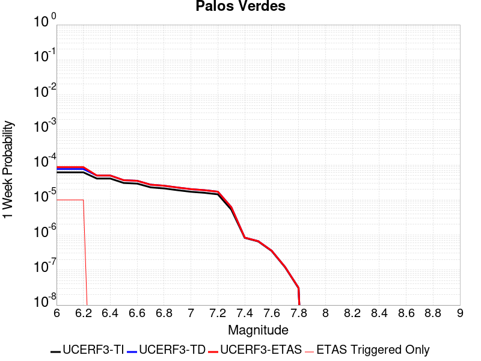 | 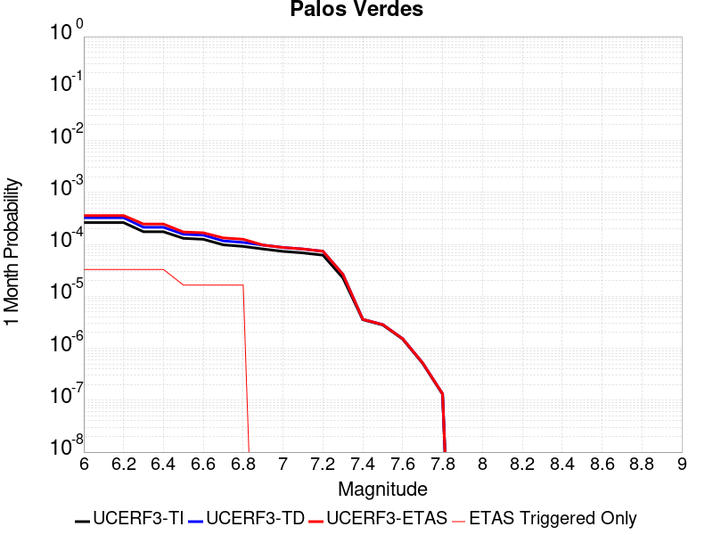 | 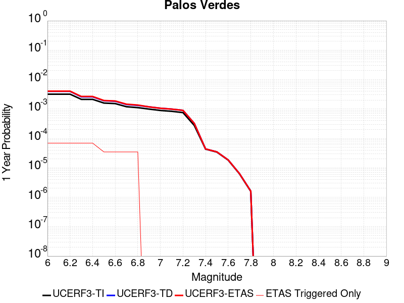 | 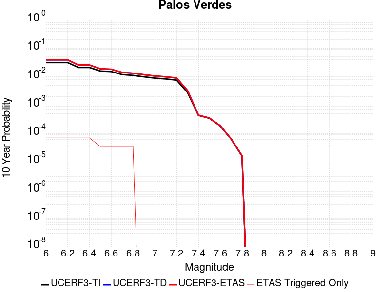 |

| Magnitude | 1 wk TI Prob | 1 wk TD Prob | 1 wk ETAS Prob | 1 wk ETAS/TD Gain | 1 wk ETAS Triggered Only | 1 mo TI Prob | 1 mo TD Prob | 1 mo ETAS Prob | 1 mo ETAS/TD Gain | 1 mo ETAS Triggered Only | 1 yr TI Prob | 1 yr TD Prob | 1 yr ETAS Prob | 1 yr ETAS/TD Gain | 1 yr ETAS Triggered Only | 10 yr TI Prob | 10 yr TD Prob | 10 yr ETAS Prob | 10 yr ETAS/TD Gain | 10 yr ETAS Triggered Only |
|-----|-----|-----|-----|-----|-----|-----|-----|-----|-----|-----|-----|-----|-----|-----|-----|-----|-----|-----|-----|-----|
| 6.0 | 6.126063E-5 | 7.622572E-5 | 7.622572E-5 | 1.0 | 0.0 | 2.6251914E-4 | 3.266441E-4 | 3.9582088E-4 | 1.2117802 | 6.919936E-5 | 0.0031914865 | 0.0039701737 | 0.0040390985 | 1.0173606 | 6.919936E-5 | 0.031460393 | 0.03904909 | 0.039115585 | 1.0017029 | 6.919936E-5 |
| 6.1 | 6.126063E-5 | 7.622572E-5 | 7.622572E-5 | 1.0 | 0.0 | 2.6251914E-4 | 3.266441E-4 | 3.9582088E-4 | 1.2117802 | 6.919936E-5 | 0.0031914865 | 0.0039701737 | 0.0040390985 | 1.0173606 | 6.919936E-5 | 0.031460393 | 0.03904909 | 0.039115585 | 1.0017029 | 6.919936E-5 |
| 6.2 | 6.126063E-5 | 7.622572E-5 | 7.622572E-5 | 1.0 | 0.0 | 2.6251914E-4 | 3.266441E-4 | 3.9582088E-4 | 1.2117802 | 6.919936E-5 | 0.0031914865 | 0.0039701737 | 0.0040390985 | 1.0173606 | 6.919936E-5 | 0.031460393 | 0.03904909 | 0.039115585 | 1.0017029 | 6.919936E-5 |
| 6.3 | 4.0838047E-5 | 4.9749007E-5 | 4.9749007E-5 | 1.0 | 0.0 | 1.7500846E-4 | 2.1319388E-4 | 2.823785E-4 | 1.324515 | 6.919936E-5 | 0.0021286458 | 0.002592754 | 0.0026617742 | 1.0266203 | 6.919936E-5 | 0.021083709 | 0.025646746 | 0.025714172 | 1.0026289 | 6.919936E-5 |
| 6.4 | 4.0838047E-5 | 4.9749007E-5 | 4.9749007E-5 | 1.0 | 0.0 | 1.7500846E-4 | 2.1319388E-4 | 2.823785E-4 | 1.324515 | 6.919936E-5 | 0.0021286458 | 0.002592754 | 0.0026617742 | 1.0266203 | 6.919936E-5 | 0.021083709 | 0.025646746 | 0.025714172 | 1.0026289 | 6.919936E-5 |
| 6.5 | 3.0512005E-5 | 3.6561592E-5 | 3.6561592E-5 | 1.0 | 0.0 | 1.3075917E-4 | 1.566838E-4 | 1.9127807E-4 | 1.2207903 | 3.459968E-5 | 0.0015908304 | 0.001906072 | 0.0019406057 | 1.0181178 | 3.459968E-5 | 0.015794903 | 0.018909173 | 0.018943118 | 1.0017952 | 3.459968E-5 |
| 6.6 | 2.9255087E-5 | 3.5154393E-5 | 3.5154393E-5 | 1.0 | 0.0 | 1.2537291E-4 | 1.5065364E-4 | 1.8524811E-4 | 1.2296292 | 3.459968E-5 | 0.0015253464 | 0.0018327782 | 0.0018673145 | 1.0188437 | 3.459968E-5 | 0.015149189 | 0.018188244 | 0.018222215 | 1.0018677 | 3.459968E-5 |
| 6.7 | 2.287198E-5 | 2.724828E-5 | 2.724828E-5 | 1.0 | 0.0 | 9.801909E-5 | 1.16773626E-4 | 1.5136927E-4 | 1.2962625 | 3.459968E-5 | 0.001192729 | 0.0014208833 | 0.0014554339 | 1.0243162 | 3.459968E-5 | 0.011863477 | 0.014127217 | 0.014161329 | 1.0024146 | 3.459968E-5 |
| 6.8 | 2.1325764E-5 | 2.5431878E-5 | 2.5431878E-5 | 1.0 | 0.0 | 9.139293E-5 | 1.0898972E-4 | 1.4358562E-4 | 1.3174236 | 3.459968E-5 | 0.001112141 | 0.0013262323 | 0.0013607861 | 1.0260541 | 3.459968E-5 | 0.011065915 | 0.013192211 | 0.0132263545 | 1.0025882 | 3.459968E-5 |
| 6.9 | 1.9009392E-5 | 2.2613547E-5 | 2.2613547E-5 | 1.0 | 0.0 | 8.1466285E-5 | 9.6912096E-5 | 9.6912096E-5 | 1.0 | 0.0 | 9.914007E-4 | 0.0011793535 | 0.0011793535 | 1.0 | 0.0 | 0.009869894 | 0.011739633 | 0.011739633 | 1.0 | 0.0 |
| 7.0 | 1.7098473E-5 | 2.0319356E-5 | 2.0319356E-5 | 1.0 | 0.0 | 7.3277115E-5 | 8.708052E-5 | 8.708052E-5 | 1.0 | 0.0 | 8.917837E-4 | 0.001059775 | 0.001059775 | 1.0 | 0.0 | 0.008882134 | 0.010555646 | 0.010555646 | 1.0 | 0.0 |
| 7.1 | 1.5982785E-5 | 1.899476E-5 | 1.899476E-5 | 1.0 | 0.0 | 6.849585E-5 | 8.1404054E-5 | 8.1404054E-5 | 1.0 | 0.0 | 8.336179E-4 | 9.907284E-4 | 9.907284E-4 | 1.0 | 0.0 | 0.008304977 | 0.009871479 | 0.009871479 | 1.0 | 0.0 |
| 7.2 | 1.4468002E-5 | 1.7197237E-5 | 1.7197237E-5 | 1.0 | 0.0 | 6.200425E-5 | 7.370083E-5 | 7.370083E-5 | 1.0 | 0.0 | 7.546402E-4 | 8.970222E-4 | 8.970222E-4 | 1.0 | 0.0 | 0.007520827 | 0.008942284 | 0.008942284 | 1.0 | 0.0 |
| 7.3 | 5.288233E-6 | 6.2036747E-6 | 6.2036747E-6 | 1.0 | 0.0 | 2.2663658E-5 | 2.6587102E-5 | 2.6587102E-5 | 1.0 | 0.0 | 2.7589512E-4 | 3.236848E-4 | 3.236848E-4 | 1.0 | 0.0 | 0.0027555283 | 0.0032355562 | 0.0032355562 | 1.0 | 0.0 |
| 7.4 | 8.279556E-7 | 8.408347E-7 | 8.408347E-7 | 1.0 | 0.0 | 3.5483763E-6 | 3.6035726E-6 | 3.6035726E-6 | 1.0 | 0.0 | 4.3200624E-5 | 4.3872686E-5 | 4.3872686E-5 | 1.0 | 0.0 | 4.3192226E-4 | 4.3864746E-4 | 4.3864746E-4 | 1.0 | 0.0 |
| 7.5 | 6.559831E-7 | 6.667229E-7 | 6.667229E-7 | 1.0 | 0.0 | 2.8113532E-6 | 2.857381E-6 | 2.857381E-6 | 1.0 | 0.0 | 3.4227687E-5 | 3.4788125E-5 | 3.4788125E-5 | 1.0 | 0.0 | 3.4222414E-4 | 3.4783344E-4 | 3.4783344E-4 | 1.0 | 0.0 |
| 7.6 | 3.5018968E-7 | 3.5620027E-7 | 3.5620027E-7 | 1.0 | 0.0 | 1.500812E-6 | 1.526572E-6 | 1.526572E-6 | 1.0 | 0.0 | 1.8272232E-5 | 1.8585903E-5 | 1.8585903E-5 | 1.0 | 0.0 | 1.8270731E-4 | 1.8584808E-4 | 1.8584808E-4 | 1.0 | 0.0 |
| 7.7 | 1.1986104E-7 | 1.2198376E-7 | 1.2198376E-7 | 1.0 | 0.0 | 5.1369005E-7 | 5.2278745E-7 | 5.2278745E-7 | 1.0 | 0.0 | 6.2541585E-6 | 6.364919E-6 | 6.364919E-6 | 1.0 | 0.0 | 6.2539824E-5 | 6.364741E-5 | 6.364741E-5 | 1.0 | 0.0 |
| 7.8 | 3.0445005E-8 | 3.1027582E-8 | 3.1027582E-8 | 1.0 | 0.0 | 1.3047858E-7 | 1.3297536E-7 | 1.3297536E-7 | 1.0 | 0.0 | 1.5885756E-6 | 1.6189739E-6 | 1.6189739E-6 | 1.0 | 0.0 | 1.5885644E-5 | 1.6189642E-5 | 1.6189642E-5 | 1.0 | 0.0 |

## Hayward (No) 2011 CFM
*[(top)](#table-of-contents)*

| 1 Week | 1 Month | 1 Year | 10 Year |
|-----|-----|-----|-----|
| 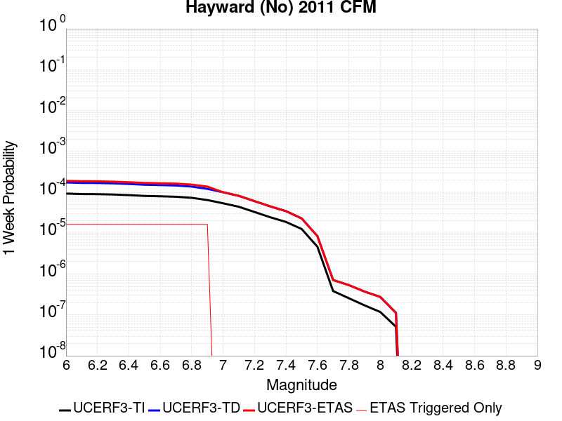 | 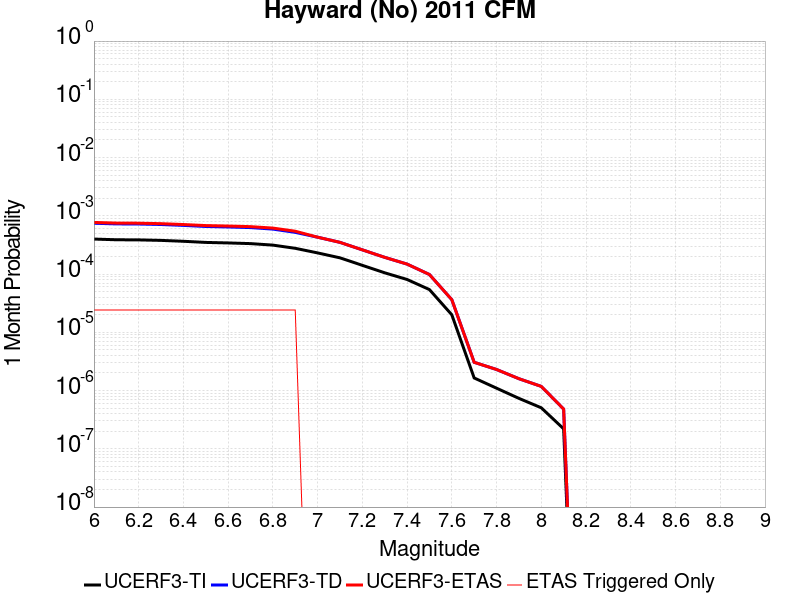 | 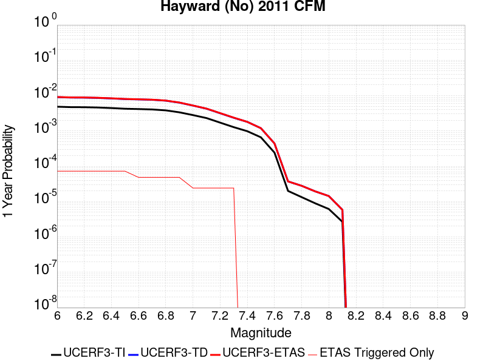 | 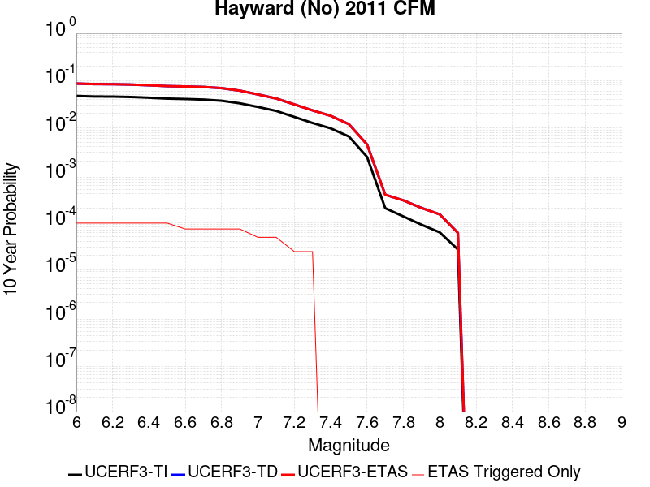 |

| Magnitude | 1 wk TI Prob | 1 wk TD Prob | 1 wk ETAS Prob | 1 wk ETAS/TD Gain | 1 wk ETAS Triggered Only | 1 mo TI Prob | 1 mo TD Prob | 1 mo ETAS Prob | 1 mo ETAS/TD Gain | 1 mo ETAS Triggered Only | 1 yr TI Prob | 1 yr TD Prob | 1 yr ETAS Prob | 1 yr ETAS/TD Gain | 1 yr ETAS Triggered Only | 10 yr TI Prob | 10 yr TD Prob | 10 yr ETAS Prob | 10 yr ETAS/TD Gain | 10 yr ETAS Triggered Only |
|-----|-----|-----|-----|-----|-----|-----|-----|-----|-----|-----|-----|-----|-----|-----|-----|-----|-----|-----|-----|-----|
| 6.0 | 9.3068506E-5 | 1.739643E-4 | 1.739643E-4 | 1.0 | 0.0 | 3.9880406E-4 | 7.453474E-4 | 7.453474E-4 | 1.0 | 0.0 | 0.0048446343 | 0.009036727 | 0.009105301 | 1.0075884 | 6.919936E-5 | 0.047403704 | 0.086396605 | 0.08645983 | 1.0007317 | 6.919936E-5 |
| 6.1 | 9.055486E-5 | 1.6947639E-4 | 1.6947639E-4 | 1.0 | 0.0 | 3.880345E-4 | 7.2612526E-4 | 7.2612526E-4 | 1.0 | 0.0 | 0.0047140904 | 0.008804814 | 0.008873404 | 1.0077901 | 6.919936E-5 | 0.046153355 | 0.08428568 | 0.084349036 | 1.0007519 | 6.919936E-5 |
| 6.2 | 9.006742E-5 | 1.6868232E-4 | 1.6868232E-4 | 1.0 | 0.0 | 3.859461E-4 | 7.227246E-4 | 7.227246E-4 | 1.0 | 0.0 | 0.0046887742 | 0.00876378 | 0.008832373 | 1.0078268 | 6.919936E-5 | 0.0459107 | 0.08390991 | 0.0839733 | 1.0007554 | 6.919936E-5 |
| 6.3 | 8.8336754E-5 | 1.6547782E-4 | 1.6547782E-4 | 1.0 | 0.0 | 3.7853114E-4 | 7.0899865E-4 | 7.0899865E-4 | 1.0 | 0.0 | 0.004598882 | 0.008598051 | 0.008666656 | 1.007979 | 6.919936E-5 | 0.04504866 | 0.08240195 | 0.08246545 | 1.0007706 | 6.919936E-5 |
| 6.4 | 8.526157E-5 | 1.5974796E-4 | 1.5974796E-4 | 1.0 | 0.0 | 3.6535555E-4 | 6.844552E-4 | 6.844552E-4 | 1.0 | 0.0 | 0.0044391346 | 0.00830156 | 0.008370184 | 1.0082664 | 6.919936E-5 | 0.043514993 | 0.07968467 | 0.07974835 | 1.0007992 | 6.919936E-5 |
| 6.5 | 8.152396E-5 | 1.5307199E-4 | 1.5307199E-4 | 1.0 | 0.0 | 3.493416E-4 | 6.558586E-4 | 6.558586E-4 | 1.0 | 0.0 | 0.0042449418 | 0.007955993 | 0.008024641 | 1.0086286 | 6.919936E-5 | 0.04164765 | 0.07651448 | 0.076578386 | 1.0008352 | 6.919936E-5 |
| 6.6 | 7.987405E-5 | 1.5011412E-4 | 1.5011412E-4 | 1.0 | 0.0 | 3.4227243E-4 | 6.431883E-4 | 6.431883E-4 | 1.0 | 0.0 | 0.0041592065 | 0.007802858 | 0.0078371875 | 1.0043997 | 3.459968E-5 | 0.04082218 | 0.075105876 | 0.075137876 | 1.000426 | 3.459968E-5 |
| 6.7 | 7.777665E-5 | 1.4650672E-4 | 1.4650672E-4 | 1.0 | 0.0 | 3.332859E-4 | 6.277355E-4 | 6.277355E-4 | 1.0 | 0.0 | 0.004050208 | 0.007616053 | 0.007650389 | 1.0045084 | 3.459968E-5 | 0.039771806 | 0.0733825 | 0.073414564 | 1.0004369 | 3.459968E-5 |
| 6.8 | 7.3284005E-5 | 1.3801287E-4 | 1.3801287E-4 | 1.0 | 0.0 | 3.140365E-4 | 5.9135025E-4 | 5.9135025E-4 | 1.0 | 0.0 | 0.0038166929 | 0.007176059 | 0.00721041 | 1.004787 | 3.459968E-5 | 0.037518036 | 0.06929624 | 0.06932844 | 1.0004647 | 3.459968E-5 |
| 6.9 | 6.458263E-5 | 1.21319164E-4 | 1.21319164E-4 | 1.0 | 0.0 | 2.7675333E-4 | 5.1983615E-4 | 5.1983615E-4 | 1.0 | 0.0 | 0.0033642664 | 0.0063107396 | 0.0063451207 | 1.0054481 | 3.459968E-5 | 0.033137884 | 0.061224625 | 0.061257105 | 1.0005305 | 3.459968E-5 |
| 7.0 | 5.3853604E-5 | 1.00254634E-4 | 1.00254634E-4 | 1.0 | 0.0 | 2.3078074E-4 | 4.295923E-4 | 4.295923E-4 | 1.0 | 0.0 | 0.0028061352 | 0.0052178074 | 0.0052522267 | 1.0065964 | 3.459968E-5 | 0.027709642 | 0.050957024 | 0.05098986 | 1.0006444 | 3.459968E-5 |
| 7.1 | 4.4308683E-5 | 8.17098E-5 | 8.17098E-5 | 1.0 | 0.0 | 1.8988053E-4 | 3.5013806E-4 | 3.5013806E-4 | 1.0 | 0.0 | 0.0023093442 | 0.0042546396 | 0.004289092 | 1.0080976 | 3.459968E-5 | 0.022854926 | 0.041824497 | 0.041857652 | 1.0007926 | 3.459968E-5 |
| 7.2 | 3.295973E-5 | 6.0774026E-5 | 6.0774026E-5 | 1.0 | 0.0 | 1.4124835E-4 | 2.6043423E-4 | 2.6043423E-4 | 1.0 | 0.0 | 0.0017183421 | 0.0031661994 | 0.0032006896 | 1.0108932 | 3.459968E-5 | 0.017051157 | 0.031370014 | 0.031403527 | 1.0010684 | 3.459968E-5 |
| 7.3 | 2.452256E-5 | 4.518223E-5 | 4.518223E-5 | 1.0 | 0.0 | 1.05092455E-4 | 1.9362383E-4 | 1.9362383E-4 | 1.0 | 0.0 | 0.0012787496 | 0.0023548352 | 0.0023893535 | 1.0146585 | 3.459968E-5 | 0.0127141625 | 0.023442036 | 0.023475824 | 1.0014414 | 3.459968E-5 |
| 7.4 | 1.8829967E-5 | 3.4604043E-5 | 3.4604043E-5 | 1.0 | 0.0 | 8.069736E-5 | 1.4829468E-4 | 1.4829468E-4 | 1.0 | 0.0 | 9.820475E-4 | 0.0018040023 | 0.0018040023 | 1.0 | 0.0 | 0.009777189 | 0.01802003 | 0.01802003 | 1.0 | 0.0 |
| 7.5 | 1.26374125E-5 | 2.292219E-5 | 2.292219E-5 | 1.0 | 0.0 | 5.4159216E-5 | 9.823428E-5 | 9.823428E-5 | 1.0 | 0.0 | 6.5918895E-4 | 0.0011953521 | 0.0011953521 | 1.0 | 0.0 | 0.00657237 | 0.011988704 | 0.011988704 | 1.0 | 0.0 |
| 7.6 | 4.666429E-6 | 8.479636E-6 | 8.479636E-6 | 1.0 | 0.0 | 1.9998828E-5 | 3.6340796E-5 | 3.6340796E-5 | 1.0 | 0.0 | 2.4345852E-4 | 4.423606E-4 | 4.423606E-4 | 1.0 | 0.0 | 0.0024319198 | 0.004458377 | 0.004458377 | 1.0 | 0.0 |
| 7.7 | 3.8399318E-7 | 7.1343146E-7 | 7.1343146E-7 | 1.0 | 0.0 | 1.6456839E-6 | 3.0575598E-6 | 3.0575598E-6 | 1.0 | 0.0 | 2.003602E-5 | 3.7225156E-5 | 3.7225156E-5 | 1.0 | 0.0 | 2.0034213E-4 | 3.86166E-4 | 3.86166E-4 | 1.0 | 0.0 |
| 7.8 | 2.5637698E-7 | 5.3666145E-7 | 5.3666145E-7 | 1.0 | 0.0 | 1.098758E-6 | 2.2999754E-6 | 2.2999754E-6 | 1.0 | 0.0 | 1.3377297E-5 | 2.8001843E-5 | 2.8001843E-5 | 1.0 | 0.0 | 1.3376492E-4 | 2.9246495E-4 | 2.9246495E-4 | 1.0 | 0.0 |
| 7.9 | 1.7141245E-7 | 3.7293606E-7 | 3.7293606E-7 | 1.0 | 0.0 | 7.3462456E-7 | 1.5982963E-6 | 1.5982963E-6 | 1.0 | 0.0 | 8.944017E-6 | 1.9459085E-5 | 1.9459085E-5 | 1.0 | 0.0 | 8.943657E-5 | 2.0246378E-4 | 2.0246378E-4 | 1.0 | 0.0 |
| 8.0 | 1.1808895E-7 | 2.7512246E-7 | 2.7512246E-7 | 1.0 | 0.0 | 5.060954E-7 | 1.1790958E-6 | 1.1790958E-6 | 1.0 | 0.0 | 6.161694E-6 | 1.4355397E-5 | 1.4355397E-5 | 1.0 | 0.0 | 6.161523E-5 | 1.4817173E-4 | 1.4817173E-4 | 1.0 | 0.0 |
| 8.1 | 5.138535E-8 | 1.12307575E-7 | 1.12307575E-7 | 1.0 | 0.0 | 2.2022292E-7 | 4.8131807E-7 | 4.8131807E-7 | 1.0 | 0.0 | 2.6812106E-6 | 5.860032E-6 | 5.860032E-6 | 1.0 | 0.0 | 2.6811784E-5 | 6.0156468E-5 | 6.0156468E-5 | 1.0 | 0.0 |

## Newport-Inglewood (Offshore)
*[(top)](#table-of-contents)*

| 1 Week | 1 Month | 1 Year | 10 Year |
|-----|-----|-----|-----|
| 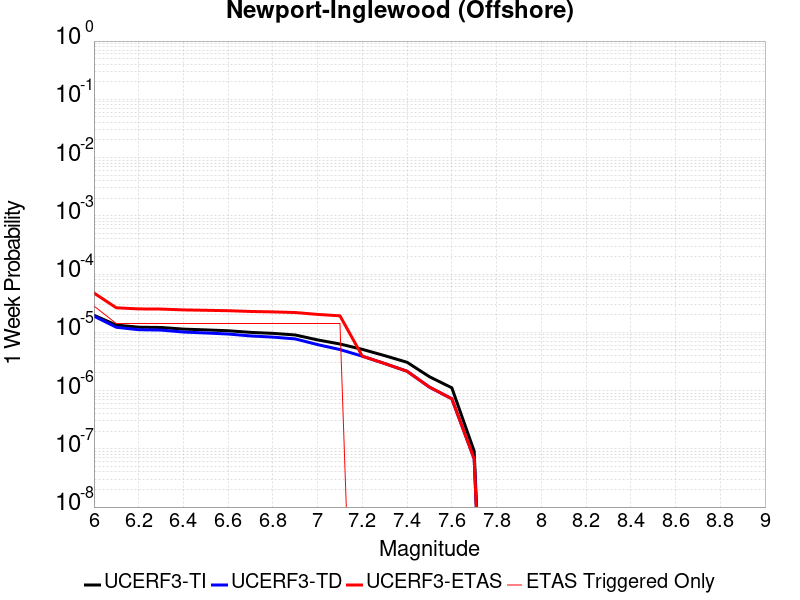 | 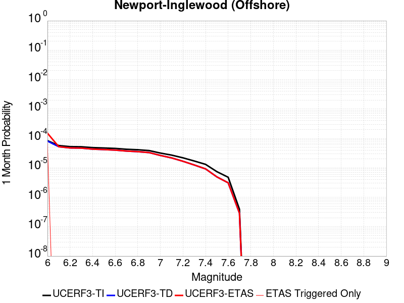 | 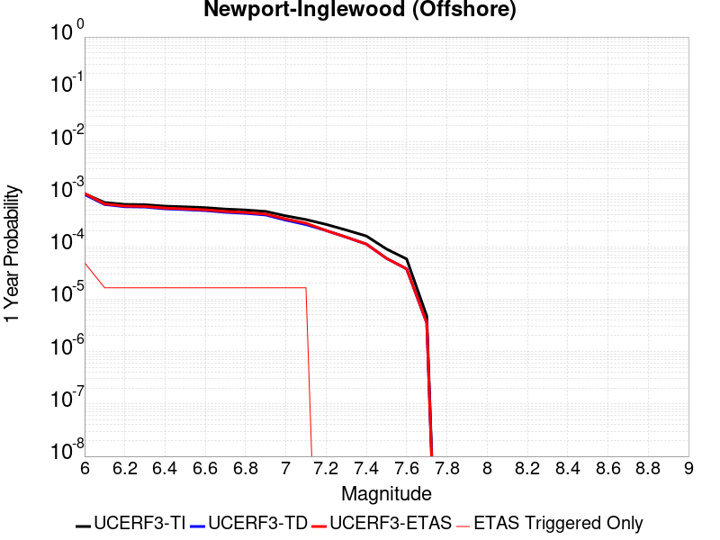 | 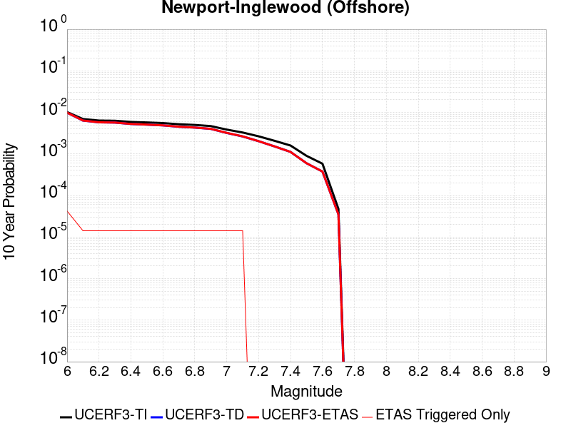 |

| Magnitude | 1 wk TI Prob | 1 wk TD Prob | 1 wk ETAS Prob | 1 wk ETAS/TD Gain | 1 wk ETAS Triggered Only | 1 mo TI Prob | 1 mo TD Prob | 1 mo ETAS Prob | 1 mo ETAS/TD Gain | 1 mo ETAS Triggered Only | 1 yr TI Prob | 1 yr TD Prob | 1 yr ETAS Prob | 1 yr ETAS/TD Gain | 1 yr ETAS Triggered Only | 10 yr TI Prob | 10 yr TD Prob | 10 yr ETAS Prob | 10 yr ETAS/TD Gain | 10 yr ETAS Triggered Only |
|-----|-----|-----|-----|-----|-----|-----|-----|-----|-----|-----|-----|-----|-----|-----|-----|-----|-----|-----|-----|-----|
| 6.0 | 1.9626508E-5 | 1.8965342E-5 | 5.3564367E-5 | 2.8243291 | 3.459968E-5 | 8.411089E-5 | 8.1277576E-5 | 1.5047131E-4 | 1.8513263 | 6.919936E-5 | 0.001023569 | 9.891179E-4 | 0.0010582488 | 1.0698915 | 6.919936E-5 | 0.010188672 | 0.009848497 | 0.009917014 | 1.0069572 | 6.919936E-5 |
| 6.1 | 1.331886E-5 | 1.2218078E-5 | 1.2218078E-5 | 1.0 | 0.0 | 5.707958E-5 | 5.2362153E-5 | 5.2362153E-5 | 1.0 | 0.0 | 6.947222E-4 | 6.3732424E-4 | 6.3732424E-4 | 1.0 | 0.0 | 0.006925544 | 0.006355142 | 0.006355142 | 1.0 | 0.0 |
| 6.2 | 1.2250852E-5 | 1.1076016E-5 | 1.1076016E-5 | 1.0 | 0.0 | 5.2502597E-5 | 4.746778E-5 | 4.746778E-5 | 1.0 | 0.0 | 6.3903164E-4 | 5.7776796E-4 | 5.7776796E-4 | 1.0 | 0.0 | 0.006371971 | 0.0057627796 | 0.0057627796 | 1.0 | 0.0 |
| 6.3 | 1.2106258E-5 | 1.0918878E-5 | 1.0918878E-5 | 1.0 | 0.0 | 5.1882926E-5 | 4.6794354E-5 | 4.6794354E-5 | 1.0 | 0.0 | 6.3149154E-4 | 5.695733E-4 | 5.695733E-4 | 1.0 | 0.0 | 0.0062970007 | 0.005681252 | 0.005681252 | 1.0 | 0.0 |
| 6.4 | 1.1348758E-5 | 1.0109348E-5 | 1.0109348E-5 | 1.0 | 0.0 | 4.8636626E-5 | 4.3325064E-5 | 4.3325064E-5 | 1.0 | 0.0 | 5.919901E-4 | 5.2735576E-4 | 5.2735576E-4 | 1.0 | 0.0 | 0.005904155 | 0.0052611395 | 0.0052611395 | 1.0 | 0.0 |
| 6.5 | 1.100837E-5 | 9.743376E-6 | 9.743376E-6 | 1.0 | 0.0 | 4.7177873E-5 | 4.175666E-5 | 4.175666E-5 | 1.0 | 0.0 | 5.7423924E-4 | 5.082695E-4 | 5.082695E-4 | 1.0 | 0.0 | 0.005727576 | 0.005071162 | 0.005071162 | 1.0 | 0.0 |
| 6.6 | 1.0634696E-5 | 9.34553E-6 | 9.34553E-6 | 1.0 | 0.0 | 4.557647E-5 | 4.0051662E-5 | 4.0051662E-5 | 1.0 | 0.0 | 5.5475225E-4 | 4.875206E-4 | 4.875206E-4 | 1.0 | 0.0 | 0.0055336943 | 0.0048645977 | 0.0048645977 | 1.0 | 0.0 |
| 6.7 | 9.9780855E-6 | 8.667898E-6 | 8.667898E-6 | 1.0 | 0.0 | 4.276252E-5 | 3.7147613E-5 | 3.7147613E-5 | 1.0 | 0.0 | 5.205093E-4 | 4.5217903E-4 | 4.5217903E-4 | 1.0 | 0.0 | 0.0051929182 | 0.0045126686 | 0.0045126686 | 1.0 | 0.0 |
| 6.8 | 9.59546E-6 | 8.272933E-6 | 8.272933E-6 | 1.0 | 0.0 | 4.1122752E-5 | 3.545495E-5 | 3.545495E-5 | 1.0 | 0.0 | 5.0055445E-4 | 4.3157916E-4 | 4.3157916E-4 | 1.0 | 0.0 | 0.004994285 | 0.004307486 | 0.004307486 | 1.0 | 0.0 |
| 6.9 | 9.000614E-6 | 7.706823E-6 | 7.706823E-6 | 1.0 | 0.0 | 3.857349E-5 | 3.3028828E-5 | 3.3028828E-5 | 1.0 | 0.0 | 4.6953102E-4 | 4.0205245E-4 | 4.0205245E-4 | 1.0 | 0.0 | 0.004685402 | 0.0040133223 | 0.0040133223 | 1.0 | 0.0 |
| 7.0 | 7.4070194E-6 | 6.148865E-6 | 6.148865E-6 | 1.0 | 0.0 | 3.1743984E-5 | 2.6352012E-5 | 2.6352012E-5 | 1.0 | 0.0 | 3.8641447E-4 | 3.2078868E-4 | 3.2078868E-4 | 1.0 | 0.0 | 0.0038574322 | 0.0032032758 | 0.0032032758 | 1.0 | 0.0 |
| 7.1 | 6.299615E-6 | 5.0565613E-6 | 5.0565613E-6 | 1.0 | 0.0 | 2.699807E-5 | 2.1670798E-5 | 2.1670798E-5 | 1.0 | 0.0 | 3.2865192E-4 | 2.6381016E-4 | 2.6381016E-4 | 1.0 | 0.0 | 0.003281663 | 0.0026349847 | 0.0026349847 | 1.0 | 0.0 |
| 7.2 | 5.096653E-6 | 3.892733E-6 | 3.892733E-6 | 1.0 | 0.0 | 2.1842614E-5 | 1.6683034E-5 | 1.6683034E-5 | 1.0 | 0.0 | 2.6590136E-4 | 2.0309711E-4 | 2.0309711E-4 | 1.0 | 0.0 | 0.0026558342 | 0.0020291263 | 0.0020291263 | 1.0 | 0.0 |
| 7.3 | 3.9753018E-6 | 2.9098787E-6 | 2.9098787E-6 | 1.0 | 0.0 | 1.7036897E-5 | 1.24708495E-5 | 1.24708495E-5 | 1.0 | 0.0 | 2.0740448E-4 | 1.518221E-4 | 1.518221E-4 | 1.0 | 0.0 | 0.00207211 | 0.0015171919 | 0.0015171919 | 1.0 | 0.0 |
| 7.4 | 3.0568392E-6 | 2.1449732E-6 | 2.1449732E-6 | 1.0 | 0.0 | 1.3100675E-5 | 9.19271E-6 | 9.19271E-6 | 1.0 | 0.0 | 1.5948903E-4 | 1.11915564E-4 | 1.11915564E-4 | 1.0 | 0.0 | 0.0015937461 | 0.0011185983 | 0.0011185983 | 1.0 | 0.0 |
| 7.5 | 1.7279019E-6 | 1.1469651E-6 | 1.1469651E-6 | 1.0 | 0.0 | 7.405273E-6 | 4.9155556E-6 | 4.9155556E-6 | 1.0 | 0.0 | 9.015547E-5 | 5.9845286E-5 | 5.9845286E-5 | 1.0 | 0.0 | 9.01189E-4 | 5.982956E-4 | 5.982956E-4 | 1.0 | 0.0 |
| 7.6 | 1.1156416E-6 | 7.222962E-7 | 7.222962E-7 | 1.0 | 0.0 | 4.7813123E-6 | 3.0955514E-6 | 3.0955514E-6 | 1.0 | 0.0 | 5.821092E-5 | 3.768771E-5 | 3.768771E-5 | 1.0 | 0.0 | 5.8195676E-4 | 3.7681553E-4 | 3.7681553E-4 | 1.0 | 0.0 |
| 7.7 | 9.117973E-8 | 6.7342256E-8 | 6.7342256E-8 | 1.0 | 0.0 | 3.907702E-7 | 2.8860964E-7 | 2.8860964E-7 | 1.0 | 0.0 | 4.757617E-6 | 3.5138169E-6 | 3.5138169E-6 | 1.0 | 0.0 | 4.7575148E-5 | 3.5137644E-5 | 3.5137644E-5 | 1.0 | 0.0 |

## Lost Hills
*[(top)](#table-of-contents)*

| 1 Week | 1 Month | 1 Year | 10 Year |
|-----|-----|-----|-----|
| 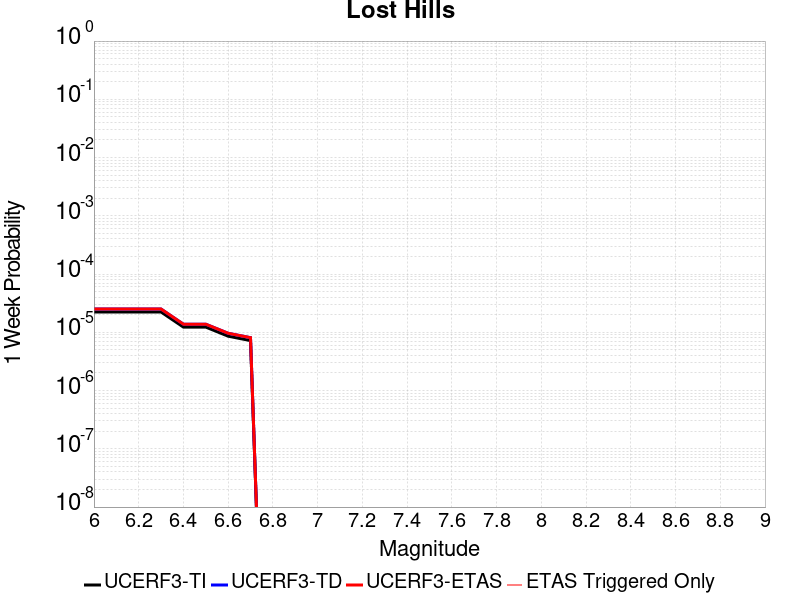 | 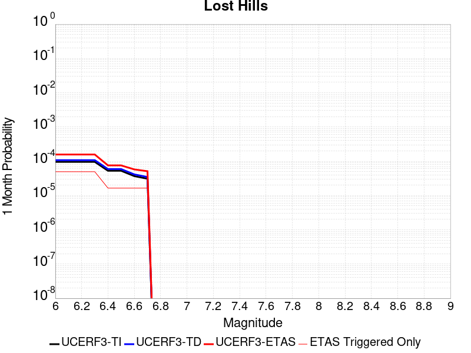 | 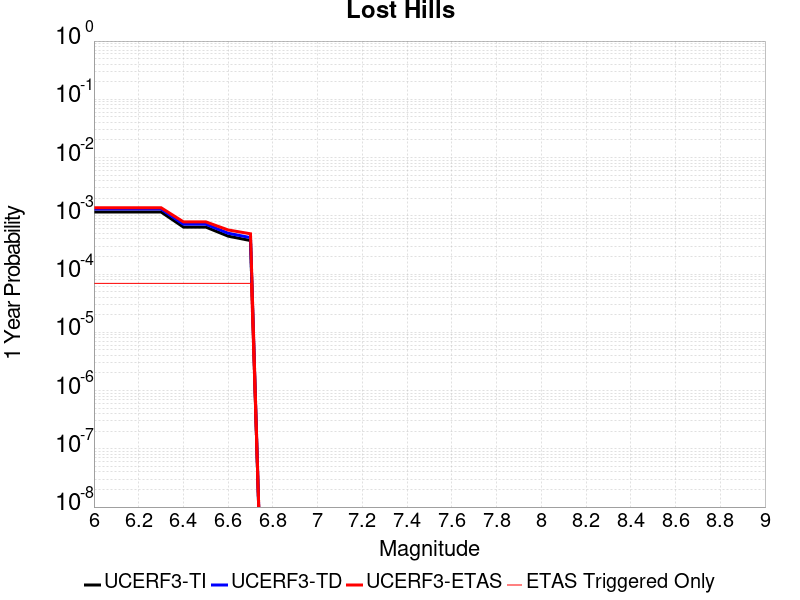 | 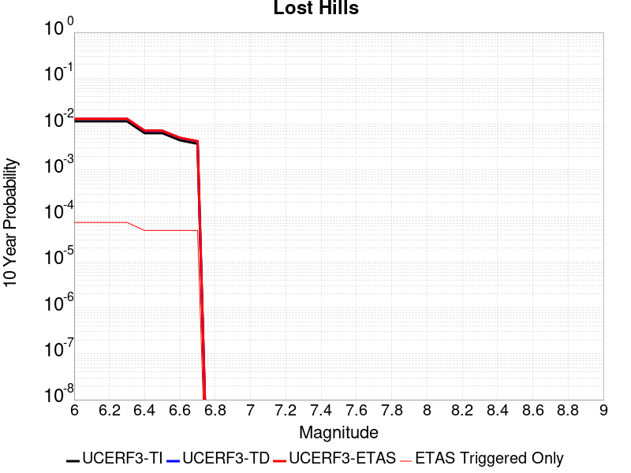 |

| Magnitude | 1 wk TI Prob | 1 wk TD Prob | 1 wk ETAS Prob | 1 wk ETAS/TD Gain | 1 wk ETAS Triggered Only | 1 mo TI Prob | 1 mo TD Prob | 1 mo ETAS Prob | 1 mo ETAS/TD Gain | 1 mo ETAS Triggered Only | 1 yr TI Prob | 1 yr TD Prob | 1 yr ETAS Prob | 1 yr ETAS/TD Gain | 1 yr ETAS Triggered Only | 10 yr TI Prob | 10 yr TD Prob | 10 yr ETAS Prob | 10 yr ETAS/TD Gain | 10 yr ETAS Triggered Only |
|-----|-----|-----|-----|-----|-----|-----|-----|-----|-----|-----|-----|-----|-----|-----|-----|-----|-----|-----|-----|-----|
| 6.0 | 2.233523E-5 | 2.5106583E-5 | 2.5106583E-5 | 1.0 | 0.0 | 9.571891E-5 | 1.0759615E-4 | 1.421921E-4 | 1.3215352 | 3.459968E-5 | 0.0011647546 | 0.001309364 | 0.0013784728 | 1.0527804 | 6.919936E-5 | 0.011586686 | 0.013033091 | 0.013101389 | 1.0052403 | 6.919936E-5 |
| 6.1 | 2.233523E-5 | 2.5106583E-5 | 2.5106583E-5 | 1.0 | 0.0 | 9.571891E-5 | 1.0759615E-4 | 1.421921E-4 | 1.3215352 | 3.459968E-5 | 0.0011647546 | 0.001309364 | 0.0013784728 | 1.0527804 | 6.919936E-5 | 0.011586686 | 0.013033091 | 0.013101389 | 1.0052403 | 6.919936E-5 |
| 6.2 | 2.233523E-5 | 2.5106583E-5 | 2.5106583E-5 | 1.0 | 0.0 | 9.571891E-5 | 1.0759615E-4 | 1.421921E-4 | 1.3215352 | 3.459968E-5 | 0.0011647546 | 0.001309364 | 0.0013784728 | 1.0527804 | 6.919936E-5 | 0.011586686 | 0.013033091 | 0.013101389 | 1.0052403 | 6.919936E-5 |
| 6.3 | 2.233523E-5 | 2.5106583E-5 | 2.5106583E-5 | 1.0 | 0.0 | 9.571891E-5 | 1.0759615E-4 | 1.421921E-4 | 1.3215352 | 3.459968E-5 | 0.0011647546 | 0.001309364 | 0.0013784728 | 1.0527804 | 6.919936E-5 | 0.011586686 | 0.013033091 | 0.013101389 | 1.0052403 | 6.919936E-5 |
| 6.4 | 1.2288092E-5 | 1.3781108E-5 | 1.3781108E-5 | 1.0 | 0.0 | 5.2662188E-5 | 5.906108E-5 | 9.365872E-5 | 1.5857942 | 3.459968E-5 | 6.409735E-4 | 7.189252E-4 | 7.8807486E-4 | 1.0961847 | 6.919936E-5 | 0.006391279 | 0.0071752006 | 0.007243904 | 1.009575 | 6.919936E-5 |
| 6.5 | 1.2288092E-5 | 1.3781108E-5 | 1.3781108E-5 | 1.0 | 0.0 | 5.2662188E-5 | 5.906108E-5 | 9.365872E-5 | 1.5857942 | 3.459968E-5 | 6.409735E-4 | 7.189252E-4 | 7.8807486E-4 | 1.0961847 | 6.919936E-5 | 0.006391279 | 0.0071752006 | 0.007243904 | 1.009575 | 6.919936E-5 |
| 6.6 | 8.58281E-6 | 9.63377E-6 | 9.63377E-6 | 1.0 | 0.0 | 3.6782953E-5 | 4.12874E-5 | 7.5885655E-5 | 1.8379858 | 3.459968E-5 | 4.4774043E-4 | 5.026414E-4 | 5.71806E-4 | 1.1376022 | 6.919936E-5 | 0.0044683935 | 0.005023205 | 0.005092057 | 1.0137067 | 6.919936E-5 |
| 6.7 | 7.205685E-6 | 8.088302E-6 | 8.088302E-6 | 1.0 | 0.0 | 3.088114E-5 | 3.466415E-5 | 6.9262634E-5 | 1.9981056 | 3.459968E-5 | 3.7591302E-4 | 4.2203604E-4 | 4.912062E-4 | 1.1638963 | 6.919936E-5 | 0.0037527776 | 0.0042203604 | 0.0042892676 | 1.0163274 | 6.919936E-5 |

## Oceanic - West Huasna
*[(top)](#table-of-contents)*

| 1 Week | 1 Month | 1 Year | 10 Year |
|-----|-----|-----|-----|
| 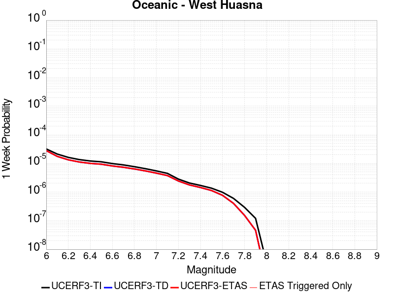 | 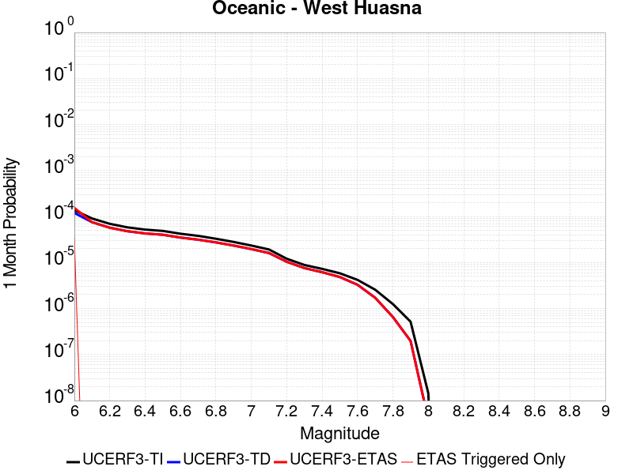 | 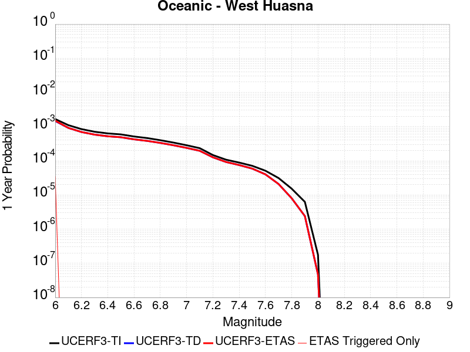 | 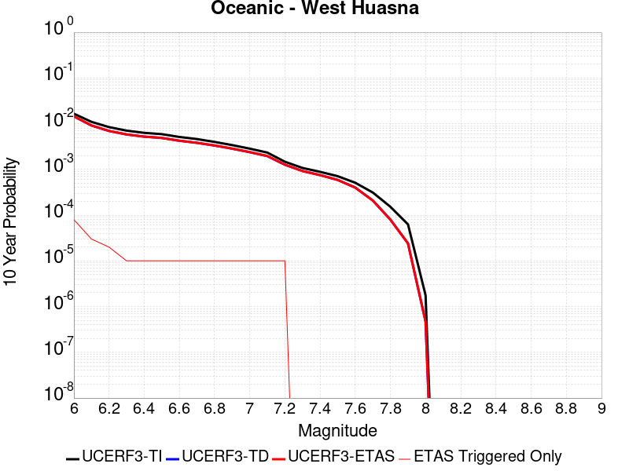 |

| Magnitude | 1 wk TI Prob | 1 wk TD Prob | 1 wk ETAS Prob | 1 wk ETAS/TD Gain | 1 wk ETAS Triggered Only | 1 mo TI Prob | 1 mo TD Prob | 1 mo ETAS Prob | 1 mo ETAS/TD Gain | 1 mo ETAS Triggered Only | 1 yr TI Prob | 1 yr TD Prob | 1 yr ETAS Prob | 1 yr ETAS/TD Gain | 1 yr ETAS Triggered Only | 10 yr TI Prob | 10 yr TD Prob | 10 yr ETAS Prob | 10 yr ETAS/TD Gain | 10 yr ETAS Triggered Only |
|-----|-----|-----|-----|-----|-----|-----|-----|-----|-----|-----|-----|-----|-----|-----|-----|-----|-----|-----|-----|-----|
| 6.0 | 3.195567E-5 | 2.7926368E-5 | 2.7926368E-5 | 1.0 | 0.0 | 1.3694567E-4 | 1.19679185E-4 | 1.5427473E-4 | 1.2890689 | 3.459968E-5 | 0.0016660384 | 0.0014561634 | 0.0014907126 | 1.0237262 | 3.459968E-5 | 0.016536033 | 0.01447077 | 0.014538968 | 1.0047128 | 6.919936E-5 |
| 6.1 | 2.1156782E-5 | 1.7573117E-5 | 1.7573117E-5 | 1.0 | 0.0 | 9.066878E-5 | 7.531123E-5 | 7.531123E-5 | 1.0 | 0.0 | 0.0011033333 | 9.1653795E-4 | 9.1653795E-4 | 1.0 | 0.0 | 0.010978713 | 0.009128587 | 0.009162871 | 1.0037557 | 3.459968E-5 |
| 6.2 | 1.6195117E-5 | 1.3327227E-5 | 1.3327227E-5 | 1.0 | 0.0 | 6.9405796E-5 | 5.7115452E-5 | 5.7115452E-5 | 1.0 | 0.0 | 8.44688E-4 | 6.9516135E-4 | 6.9516135E-4 | 1.0 | 0.0 | 0.008414844 | 0.0069301617 | 0.006964522 | 1.004958 | 3.459968E-5 |
| 6.3 | 1.3559345E-5 | 1.1179013E-5 | 1.1179013E-5 | 1.0 | 0.0 | 5.811018E-5 | 4.7909183E-5 | 4.7909183E-5 | 1.0 | 0.0 | 7.072618E-4 | 5.8313913E-4 | 5.8313913E-4 | 1.0 | 0.0 | 0.0070501505 | 0.005816208 | 0.0058506066 | 1.0059142 | 3.459968E-5 |
| 6.4 | 1.2120619E-5 | 1.0000874E-5 | 1.0000874E-5 | 1.0 | 0.0 | 5.1944477E-5 | 4.2860185E-5 | 4.2860185E-5 | 1.0 | 0.0 | 6.322405E-4 | 5.216983E-4 | 5.216983E-4 | 1.0 | 0.0 | 0.006304447 | 0.005204804 | 0.005239223 | 1.006613 | 3.459968E-5 |
| 6.5 | 1.13511915E-5 | 9.367378E-6 | 9.367378E-6 | 1.0 | 0.0 | 4.8647056E-5 | 4.0145293E-5 | 4.0145293E-5 | 1.0 | 0.0 | 5.9211696E-4 | 4.886598E-4 | 4.886598E-4 | 1.0 | 0.0 | 0.0059054173 | 0.0048759114 | 0.0049103424 | 1.0070615 | 3.459968E-5 |
| 6.6 | 9.850605E-6 | 8.1353155E-6 | 8.1353155E-6 | 1.0 | 0.0 | 4.2216197E-5 | 3.4865174E-5 | 3.4865174E-5 | 1.0 | 0.0 | 5.1386096E-4 | 4.2440102E-4 | 4.2440102E-4 | 1.0 | 0.0 | 0.0051267436 | 0.0042359377 | 0.0042703906 | 1.0081335 | 3.459968E-5 |
| 6.7 | 8.8558645E-6 | 7.318341E-6 | 7.318341E-6 | 1.0 | 0.0 | 3.7953152E-5 | 3.1363943E-5 | 3.1363943E-5 | 1.0 | 0.0 | 4.6198163E-4 | 3.8178926E-4 | 3.8178926E-4 | 1.0 | 0.0 | 0.004610224 | 0.0038113592 | 0.003845827 | 1.0090435 | 3.459968E-5 |
| 6.8 | 7.67136E-6 | 6.39169E-6 | 6.39169E-6 | 1.0 | 0.0 | 3.2876844E-5 | 2.739267E-5 | 2.739267E-5 | 1.0 | 0.0 | 4.0020206E-4 | 3.3345487E-4 | 3.3345487E-4 | 1.0 | 0.0 | 0.003994821 | 0.0033295664 | 0.0033640508 | 1.010357 | 3.459968E-5 |
| 6.9 | 6.534529E-6 | 5.458261E-6 | 5.458261E-6 | 1.0 | 0.0 | 2.8004823E-5 | 2.3392338E-5 | 2.3392338E-5 | 1.0 | 0.0 | 3.4090536E-4 | 2.8476462E-4 | 2.8476462E-4 | 1.0 | 0.0 | 0.0034038287 | 0.002844014 | 0.0028785153 | 1.0121312 | 3.459968E-5 |
| 7.0 | 5.460525E-6 | 4.5699203E-6 | 4.5699203E-6 | 1.0 | 0.0 | 2.3402039E-5 | 1.9585226E-5 | 1.9585226E-5 | 1.0 | 0.0 | 2.8488258E-4 | 2.3842414E-4 | 2.3842414E-4 | 1.0 | 0.0 | 0.0028451765 | 0.0023816973 | 0.0024162147 | 1.0144928 | 3.459968E-5 |
| 7.1 | 4.4825083E-6 | 3.7524153E-6 | 3.7524153E-6 | 1.0 | 0.0 | 1.9210609E-5 | 1.6081682E-5 | 1.6081682E-5 | 1.0 | 0.0 | 2.3386406E-4 | 1.9577699E-4 | 1.9577699E-4 | 1.0 | 0.0 | 0.002336181 | 0.001956057 | 0.001990589 | 1.017654 | 3.459968E-5 |
| 7.2 | 2.821708E-6 | 2.424941E-6 | 2.424941E-6 | 1.0 | 0.0 | 1.2092979E-5 | 1.0392562E-5 | 1.0392562E-5 | 1.0 | 0.0 | 1.4722206E-4 | 1.265221E-4 | 1.265221E-4 | 1.0 | 0.0 | 0.0014712457 | 0.0012645032 | 0.0012990593 | 1.0273277 | 3.459968E-5 |
| 7.3 | 2.0644757E-6 | 1.7687502E-6 | 1.7687502E-6 | 1.0 | 0.0 | 8.847723E-6 | 7.580336E-6 | 7.580336E-6 | 1.0 | 0.0 | 1.0771569E-4 | 9.228668E-5 | 9.228668E-5 | 1.0 | 0.0 | 0.001076635 | 9.224854E-4 | 9.224854E-4 | 1.0 | 0.0 |
| 7.4 | 1.6980367E-6 | 1.4379966E-6 | 1.4379966E-6 | 1.0 | 0.0 | 7.27728E-6 | 6.1628284E-6 | 6.1628284E-6 | 1.0 | 0.0 | 8.8597284E-5 | 7.502986E-5 | 7.502986E-5 | 1.0 | 0.0 | 8.8561967E-4 | 7.5004686E-4 | 7.5004686E-4 | 1.0 | 0.0 |
| 7.5 | 1.3637683E-6 | 1.1302697E-6 | 1.1302697E-6 | 1.0 | 0.0 | 5.844708E-6 | 4.844004E-6 | 4.844004E-6 | 1.0 | 0.0 | 7.1156996E-5 | 5.897415E-5 | 5.897415E-5 | 1.0 | 0.0 | 7.1134215E-4 | 5.8958656E-4 | 5.8958656E-4 | 1.0 | 0.0 |
| 7.6 | 9.802994E-7 | 7.6772847E-7 | 7.6772847E-7 | 1.0 | 0.0 | 4.2012766E-6 | 3.2902608E-6 | 3.2902608E-6 | 1.0 | 0.0 | 5.1149345E-5 | 4.005819E-5 | 4.005819E-5 | 1.0 | 0.0 | 5.113757E-4 | 4.0051117E-4 | 4.0051117E-4 | 1.0 | 0.0 |
| 7.7 | 5.986191E-7 | 4.0050708E-7 | 4.0050708E-7 | 1.0 | 0.0 | 2.5655079E-6 | 1.7164577E-6 | 1.7164577E-6 | 1.0 | 0.0 | 3.1234613E-5 | 2.0897673E-5 | 2.0897673E-5 | 1.0 | 0.0 | 3.123022E-4 | 2.0895849E-4 | 2.0895849E-4 | 1.0 | 0.0 |
| 7.8 | 2.9189815E-7 | 1.5285202E-7 | 1.5285202E-7 | 1.0 | 0.0 | 1.2509914E-6 | 6.5507993E-7 | 6.5507993E-7 | 1.0 | 0.0 | 1.5230714E-5 | 7.975569E-6 | 7.975569E-6 | 1.0 | 0.0 | 1.522967E-4 | 7.97542E-5 | 7.97542E-5 | 1.0 | 0.0 |
| 7.9 | 1.2057845E-7 | 4.6208047E-8 | 4.6208047E-8 | 1.0 | 0.0 | 5.1676466E-7 | 1.9803447E-7 | 1.9803447E-7 | 1.0 | 0.0 | 6.2915915E-6 | 2.411067E-6 | 2.411067E-6 | 1.0 | 0.0 | 6.2914136E-5 | 2.4111772E-5 | 2.4111772E-5 | 1.0 | 0.0 |
| 8.0 | 3.3806387E-9 | 9.0093144E-10 | 9.0093144E-10 | 1.0 | 0.0 | 1.4488451E-8 | 3.8611354E-9 | 3.8611354E-9 | 1.0 | 0.0 | 1.7639688E-7 | 4.7009323E-8 | 4.7009323E-8 | 1.0 | 0.0 | 1.7639674E-6 | 4.712806E-7 | 4.712806E-7 | 1.0 | 0.0 |

## Elysian Park (Upper)
*[(top)](#table-of-contents)*

| 1 Week | 1 Month | 1 Year | 10 Year |
|-----|-----|-----|-----|
| 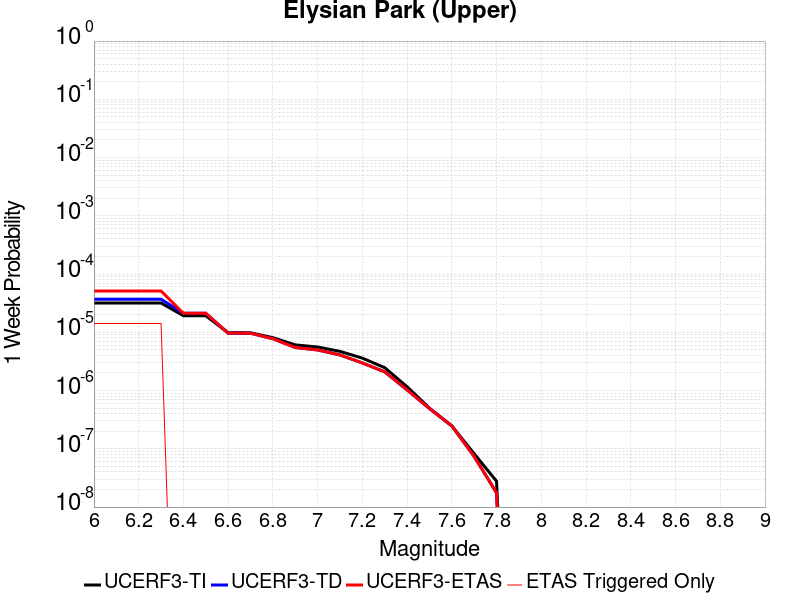 |  |  | 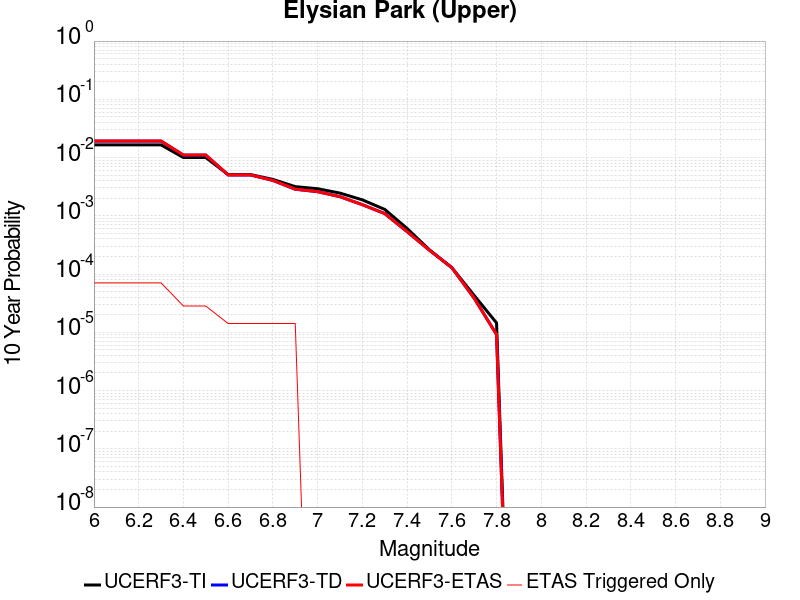 |

| Magnitude | 1 wk TI Prob | 1 wk TD Prob | 1 wk ETAS Prob | 1 wk ETAS/TD Gain | 1 wk ETAS Triggered Only | 1 mo TI Prob | 1 mo TD Prob | 1 mo ETAS Prob | 1 mo ETAS/TD Gain | 1 mo ETAS Triggered Only | 1 yr TI Prob | 1 yr TD Prob | 1 yr ETAS Prob | 1 yr ETAS/TD Gain | 1 yr ETAS Triggered Only | 10 yr TI Prob | 10 yr TD Prob | 10 yr ETAS Prob | 10 yr ETAS/TD Gain | 10 yr ETAS Triggered Only |
|-----|-----|-----|-----|-----|-----|-----|-----|-----|-----|-----|-----|-----|-----|-----|-----|-----|-----|-----|-----|-----|
| 6.0 | 3.1876025E-5 | 3.7035275E-5 | 3.7035275E-5 | 1.0 | 0.0 | 1.3660437E-4 | 1.5871569E-4 | 1.5871569E-4 | 1.0 | 0.0 | 0.0016618895 | 0.001931122 | 0.0019656548 | 1.0178822 | 3.459968E-5 | 0.016495159 | 0.019189863 | 0.019257734 | 1.0035368 | 6.919936E-5 |
| 6.1 | 3.1876025E-5 | 3.7035275E-5 | 3.7035275E-5 | 1.0 | 0.0 | 1.3660437E-4 | 1.5871569E-4 | 1.5871569E-4 | 1.0 | 0.0 | 0.0016618895 | 0.001931122 | 0.0019656548 | 1.0178822 | 3.459968E-5 | 0.016495159 | 0.019189863 | 0.019257734 | 1.0035368 | 6.919936E-5 |
| 6.2 | 3.1876025E-5 | 3.7035275E-5 | 3.7035275E-5 | 1.0 | 0.0 | 1.3660437E-4 | 1.5871569E-4 | 1.5871569E-4 | 1.0 | 0.0 | 0.0016618895 | 0.001931122 | 0.0019656548 | 1.0178822 | 3.459968E-5 | 0.016495159 | 0.019189863 | 0.019257734 | 1.0035368 | 6.919936E-5 |
| 6.3 | 3.1876025E-5 | 3.7035275E-5 | 3.7035275E-5 | 1.0 | 0.0 | 1.3660437E-4 | 1.5871569E-4 | 1.5871569E-4 | 1.0 | 0.0 | 0.0016618895 | 0.001931122 | 0.0019656548 | 1.0178822 | 3.459968E-5 | 0.016495159 | 0.019189863 | 0.019257734 | 1.0035368 | 6.919936E-5 |
| 6.4 | 1.9273462E-5 | 2.120244E-5 | 2.120244E-5 | 1.0 | 0.0 | 8.259794E-5 | 9.086542E-5 | 9.086542E-5 | 1.0 | 0.0 | 0.001005166 | 0.0011058967 | 0.0011058967 | 1.0 | 0.0 | 0.010006315 | 0.011020744 | 0.011020744 | 1.0 | 0.0 |
| 6.5 | 1.9273462E-5 | 2.120244E-5 | 2.120244E-5 | 1.0 | 0.0 | 8.259794E-5 | 9.086542E-5 | 9.086542E-5 | 1.0 | 0.0 | 0.001005166 | 0.0011058967 | 0.0011058967 | 1.0 | 0.0 | 0.010006315 | 0.011020744 | 0.011020744 | 1.0 | 0.0 |
| 6.6 | 9.813258E-6 | 9.665589E-6 | 9.665589E-6 | 1.0 | 0.0 | 4.205614E-5 | 4.1423333E-5 | 4.1423333E-5 | 1.0 | 0.0 | 5.119132E-4 | 5.042196E-4 | 5.042196E-4 | 1.0 | 0.0 | 0.005107356 | 0.0050314795 | 0.0050314795 | 1.0 | 0.0 |
| 6.7 | 9.801478E-6 | 9.653158E-6 | 9.653158E-6 | 1.0 | 0.0 | 4.2005657E-5 | 4.137006E-5 | 4.137006E-5 | 1.0 | 0.0 | 5.112989E-4 | 5.0357135E-4 | 5.0357135E-4 | 1.0 | 0.0 | 0.0051012407 | 0.005025026 | 0.005025026 | 1.0 | 0.0 |
| 6.8 | 8.102489E-6 | 7.772994E-6 | 7.772994E-6 | 1.0 | 0.0 | 3.4724493E-5 | 3.3312434E-5 | 3.3312434E-5 | 1.0 | 0.0 | 4.2268867E-4 | 4.0550836E-4 | 4.0550836E-4 | 1.0 | 0.0 | 0.004218856 | 0.0040481784 | 0.0040481784 | 1.0 | 0.0 |
| 6.9 | 6.08275E-6 | 5.481441E-6 | 5.481441E-6 | 1.0 | 0.0 | 2.6068668E-5 | 2.3491682E-5 | 2.3491682E-5 | 1.0 | 0.0 | 3.173398E-4 | 2.8597447E-4 | 2.8597447E-4 | 1.0 | 0.0 | 0.0031688702 | 0.0028561424 | 0.0028561424 | 1.0 | 0.0 |
| 7.0 | 5.5995934E-6 | 4.9827686E-6 | 4.9827686E-6 | 1.0 | 0.0 | 2.3998036E-5 | 2.1354552E-5 | 2.1354552E-5 | 1.0 | 0.0 | 2.9213692E-4 | 2.5996132E-4 | 2.5996132E-4 | 1.0 | 0.0 | 0.0029175316 | 0.0025966396 | 0.0025966396 | 1.0 | 0.0 |
| 7.1 | 4.709881E-6 | 4.0873906E-6 | 4.0873906E-6 | 1.0 | 0.0 | 2.0185047E-5 | 1.7517272E-5 | 1.7517272E-5 | 1.0 | 0.0 | 2.4572524E-4 | 2.1325232E-4 | 2.1325232E-4 | 1.0 | 0.0 | 0.002454537 | 0.0021305184 | 0.0021305184 | 1.0 | 0.0 |
| 7.2 | 3.6063436E-6 | 2.9779412E-6 | 2.9779412E-6 | 1.0 | 0.0 | 1.5455667E-5 | 1.27625435E-5 | 1.27625435E-5 | 1.0 | 0.0 | 1.881565E-4 | 1.55373E-4 | 1.55373E-4 | 1.0 | 0.0 | 0.0018799726 | 0.0015526549 | 0.0015526549 | 1.0 | 0.0 |
| 7.3 | 2.471135E-6 | 2.0954562E-6 | 2.0954562E-6 | 1.0 | 0.0 | 1.0590536E-5 | 8.980496E-6 | 8.980496E-6 | 1.0 | 0.0 | 1.2893214E-4 | 1.0933213E-4 | 1.0933213E-4 | 1.0 | 0.0 | 0.0012885736 | 0.0010927906 | 0.0010927906 | 1.0 | 0.0 |
| 7.4 | 1.163943E-6 | 1.0275061E-6 | 1.0275061E-6 | 1.0 | 0.0 | 4.988318E-6 | 4.40359E-6 | 4.40359E-6 | 1.0 | 0.0 | 6.0731076E-5 | 5.361242E-5 | 5.361242E-5 | 1.0 | 0.0 | 6.071448E-4 | 5.3599785E-4 | 5.3599785E-4 | 1.0 | 0.0 |
| 7.5 | 4.99459E-7 | 4.917601E-7 | 4.917601E-7 | 1.0 | 0.0 | 2.140537E-6 | 2.1075416E-6 | 2.1075416E-6 | 1.0 | 0.0 | 2.6060725E-5 | 2.5659032E-5 | 2.5659032E-5 | 1.0 | 0.0 | 2.605767E-4 | 2.5656226E-4 | 2.5656226E-4 | 1.0 | 0.0 |
| 7.6 | 2.4667852E-7 | 2.4778313E-7 | 2.4778313E-7 | 1.0 | 0.0 | 1.0571932E-6 | 1.0619274E-6 | 1.0619274E-6 | 1.0 | 0.0 | 1.2871251E-5 | 1.2928893E-5 | 1.2928893E-5 | 1.0 | 0.0 | 1.2870505E-4 | 1.2928178E-4 | 1.2928178E-4 | 1.0 | 0.0 |
| 7.7 | 8.2312795E-8 | 7.3864214E-8 | 7.3864214E-8 | 1.0 | 0.0 | 3.527691E-7 | 3.165609E-7 | 3.165609E-7 | 1.0 | 0.0 | 4.294955E-6 | 3.854123E-6 | 3.854123E-6 | 1.0 | 0.0 | 4.2948723E-5 | 3.854068E-5 | 3.854068E-5 | 1.0 | 0.0 |
| 7.8 | 2.7819295E-8 | 1.7565618E-8 | 1.7565618E-8 | 1.0 | 0.0 | 1.1922555E-7 | 7.528122E-8 | 7.528122E-8 | 1.0 | 0.0 | 1.45157E-6 | 9.1654863E-7 | 9.1654863E-7 | 1.0 | 0.0 | 1.45156055E-5 | 9.165463E-6 | 9.165463E-6 | 1.0 | 0.0 |

## Kern Canyon (Lake Isabella) 2011
*[(top)](#table-of-contents)*

| 1 Week | 1 Month | 1 Year | 10 Year |
|-----|-----|-----|-----|
| 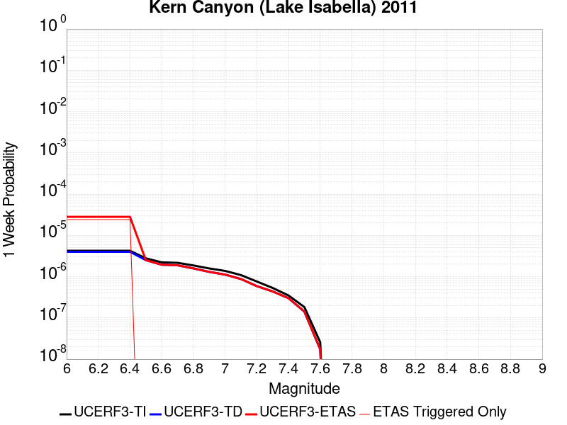 | 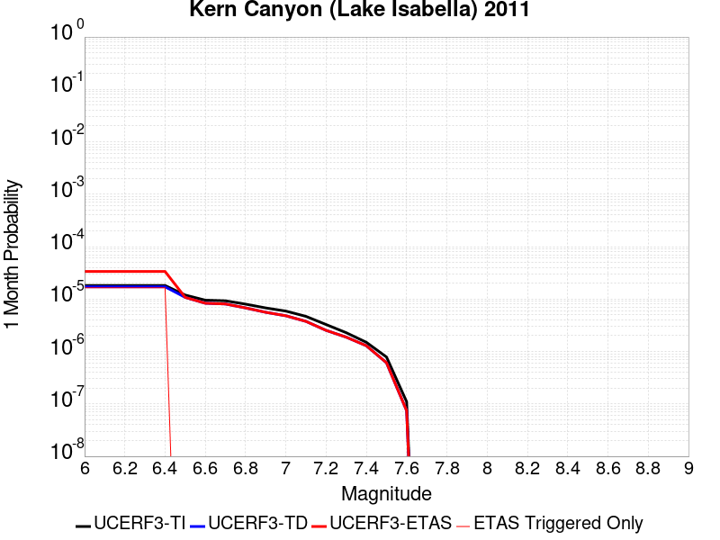 | 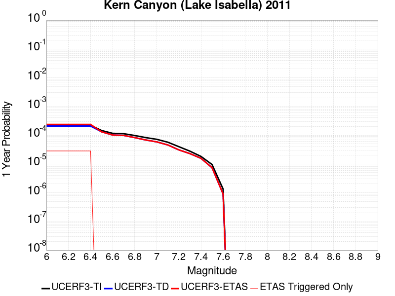 | 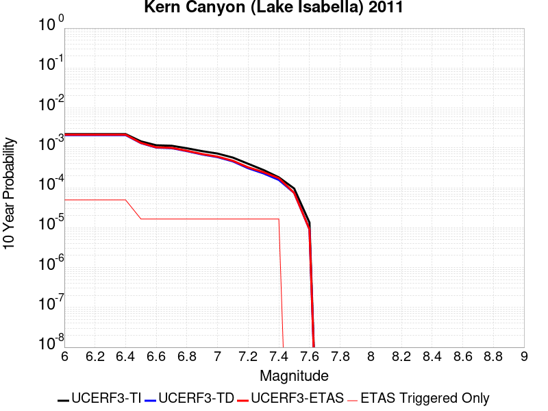 |

| Magnitude | 1 wk TI Prob | 1 wk TD Prob | 1 wk ETAS Prob | 1 wk ETAS/TD Gain | 1 wk ETAS Triggered Only | 1 mo TI Prob | 1 mo TD Prob | 1 mo ETAS Prob | 1 mo ETAS/TD Gain | 1 mo ETAS Triggered Only | 1 yr TI Prob | 1 yr TD Prob | 1 yr ETAS Prob | 1 yr ETAS/TD Gain | 1 yr ETAS Triggered Only | 10 yr TI Prob | 10 yr TD Prob | 10 yr ETAS Prob | 10 yr ETAS/TD Gain | 10 yr ETAS Triggered Only |
|-----|-----|-----|-----|-----|-----|-----|-----|-----|-----|-----|-----|-----|-----|-----|-----|-----|-----|-----|-----|-----|
| 6.0 | 4.2387383E-6 | 4.0016344E-6 | 4.0016344E-6 | 1.0 | 0.0 | 1.8165894E-5 | 1.7149758E-5 | 1.7149758E-5 | 1.0 | 0.0 | 2.2114732E-4 | 2.0878017E-4 | 2.4337263E-4 | 1.1656884 | 3.459968E-5 | 0.0022092736 | 0.002086024 | 0.002155079 | 1.0331037 | 6.919936E-5 |
| 6.1 | 4.2387383E-6 | 4.0016344E-6 | 4.0016344E-6 | 1.0 | 0.0 | 1.8165894E-5 | 1.7149758E-5 | 1.7149758E-5 | 1.0 | 0.0 | 2.2114732E-4 | 2.0878017E-4 | 2.4337263E-4 | 1.1656884 | 3.459968E-5 | 0.0022092736 | 0.002086024 | 0.002155079 | 1.0331037 | 6.919936E-5 |
| 6.2 | 4.2387383E-6 | 4.0016344E-6 | 4.0016344E-6 | 1.0 | 0.0 | 1.8165894E-5 | 1.7149758E-5 | 1.7149758E-5 | 1.0 | 0.0 | 2.2114732E-4 | 2.0878017E-4 | 2.4337263E-4 | 1.1656884 | 3.459968E-5 | 0.0022092736 | 0.002086024 | 0.002155079 | 1.0331037 | 6.919936E-5 |
| 6.3 | 4.2387383E-6 | 4.0016344E-6 | 4.0016344E-6 | 1.0 | 0.0 | 1.8165894E-5 | 1.7149758E-5 | 1.7149758E-5 | 1.0 | 0.0 | 2.2114732E-4 | 2.0878017E-4 | 2.4337263E-4 | 1.1656884 | 3.459968E-5 | 0.0022092736 | 0.002086024 | 0.002155079 | 1.0331037 | 6.919936E-5 |
| 6.4 | 4.2387383E-6 | 4.0016344E-6 | 4.0016344E-6 | 1.0 | 0.0 | 1.8165894E-5 | 1.7149758E-5 | 1.7149758E-5 | 1.0 | 0.0 | 2.2114732E-4 | 2.0878017E-4 | 2.4337263E-4 | 1.1656884 | 3.459968E-5 | 0.0022092736 | 0.002086024 | 0.002155079 | 1.0331037 | 6.919936E-5 |
| 6.5 | 2.7857532E-6 | 2.5178624E-6 | 2.5178624E-6 | 1.0 | 0.0 | 1.1938888E-5 | 1.0790796E-5 | 1.0790796E-5 | 1.0 | 0.0 | 1.4534626E-4 | 1.3137035E-4 | 1.3137035E-4 | 1.0 | 0.0 | 0.0014525123 | 0.0013129596 | 0.0013475139 | 1.0263178 | 3.459968E-5 |
| 6.6 | 2.2233348E-6 | 1.944119E-6 | 1.944119E-6 | 1.0 | 0.0 | 9.528543E-6 | 8.331913E-6 | 8.331913E-6 | 1.0 | 0.0 | 1.1600384E-4 | 1.014364E-4 | 1.014364E-4 | 1.0 | 0.0 | 0.001159433 | 0.0010139096 | 0.0010484742 | 1.0340904 | 3.459968E-5 |
| 6.7 | 2.1635126E-6 | 1.8834991E-6 | 1.8834991E-6 | 1.0 | 0.0 | 9.272164E-6 | 8.072114E-6 | 8.072114E-6 | 1.0 | 0.0 | 1.1288274E-4 | 9.827364E-5 | 9.827364E-5 | 1.0 | 0.0 | 0.0011282542 | 9.8231E-4 | 0.0010168757 | 1.0351882 | 3.459968E-5 |
| 6.8 | 1.8685711E-6 | 1.583138E-6 | 1.583138E-6 | 1.0 | 0.0 | 8.008137E-6 | 6.7848596E-6 | 6.7848596E-6 | 1.0 | 0.0 | 9.74947E-5 | 8.2602586E-5 | 8.2602586E-5 | 1.0 | 0.0 | 9.745194E-4 | 8.2572375E-4 | 8.6029485E-4 | 1.0418676 | 3.459968E-5 |
| 6.9 | 1.5815071E-6 | 1.3064887E-6 | 1.3064887E-6 | 1.0 | 0.0 | 6.77787E-6 | 5.5992255E-6 | 5.5992255E-6 | 1.0 | 0.0 | 8.251744E-5 | 6.816846E-5 | 6.816846E-5 | 1.0 | 0.0 | 8.248681E-4 | 6.8147824E-4 | 7.1605435E-4 | 1.0507369 | 3.459968E-5 |
| 7.0 | 1.3772564E-6 | 1.1210681E-6 | 1.1210681E-6 | 1.0 | 0.0 | 5.9025137E-6 | 4.8045686E-6 | 4.8045686E-6 | 1.0 | 0.0 | 7.186073E-5 | 5.8494075E-5 | 5.8494075E-5 | 1.0 | 0.0 | 7.18375E-4 | 5.8478885E-4 | 6.193683E-4 | 1.0591315 | 3.459968E-5 |
| 7.1 | 1.0916998E-6 | 8.7637505E-7 | 8.7637505E-7 | 1.0 | 0.0 | 4.678705E-6 | 3.7558877E-6 | 3.7558877E-6 | 1.0 | 0.0 | 5.6961744E-5 | 4.5726985E-5 | 4.5726985E-5 | 1.0 | 0.0 | 5.6947145E-4 | 4.571771E-4 | 4.9176096E-4 | 1.0756465 | 3.459968E-5 |
| 7.2 | 7.6277024E-7 | 5.901439E-7 | 5.901439E-7 | 1.0 | 0.0 | 3.2690114E-6 | 2.5291856E-6 | 2.5291856E-6 | 1.0 | 0.0 | 3.9799485E-5 | 3.0792406E-5 | 3.0792406E-5 | 1.0 | 0.0 | 3.9792358E-4 | 3.07882E-4 | 3.4247103E-4 | 1.1123451 | 3.459968E-5 |
| 7.3 | 5.3265916E-7 | 4.3824264E-7 | 4.3824264E-7 | 1.0 | 0.0 | 2.282823E-6 | 1.8781814E-6 | 1.8781814E-6 | 1.0 | 0.0 | 2.7793016E-5 | 2.2866623E-5 | 2.2866623E-5 | 1.0 | 0.0 | 2.778954E-4 | 2.2864307E-4 | 2.6323483E-4 | 1.1512916 | 3.459968E-5 |
| 7.4 | 3.4946007E-7 | 3.0065647E-7 | 3.0065647E-7 | 1.0 | 0.0 | 1.497685E-6 | 1.2885271E-6 | 1.2885271E-6 | 1.0 | 0.0 | 1.8234163E-5 | 1.5687707E-5 | 1.5687707E-5 | 1.0 | 0.0 | 1.8232666E-4 | 1.5686621E-4 | 1.9146047E-4 | 1.2205335 | 3.459968E-5 |
| 7.5 | 1.8317026E-7 | 1.4244755E-7 | 1.4244755E-7 | 1.0 | 0.0 | 7.850152E-7 | 6.1048934E-7 | 6.1048934E-7 | 1.0 | 0.0 | 9.557518E-6 | 7.432683E-6 | 7.432683E-6 | 1.0 | 0.0 | 9.5571064E-5 | 7.432442E-5 | 7.432442E-5 | 1.0 | 0.0 |
| 7.6 | 2.572245E-8 | 1.735264E-8 | 1.735264E-8 | 1.0 | 0.0 | 1.10239064E-7 | 7.436845E-8 | 7.436845E-8 | 1.0 | 0.0 | 1.3421597E-6 | 9.0543557E-7 | 9.0543557E-7 | 1.0 | 0.0 | 1.3421517E-5 | 9.054324E-6 | 9.054324E-6 | 1.0 | 0.0 |

## Sierra Madre
*[(top)](#table-of-contents)*

| 1 Week | 1 Month | 1 Year | 10 Year |
|-----|-----|-----|-----|
|  |  | 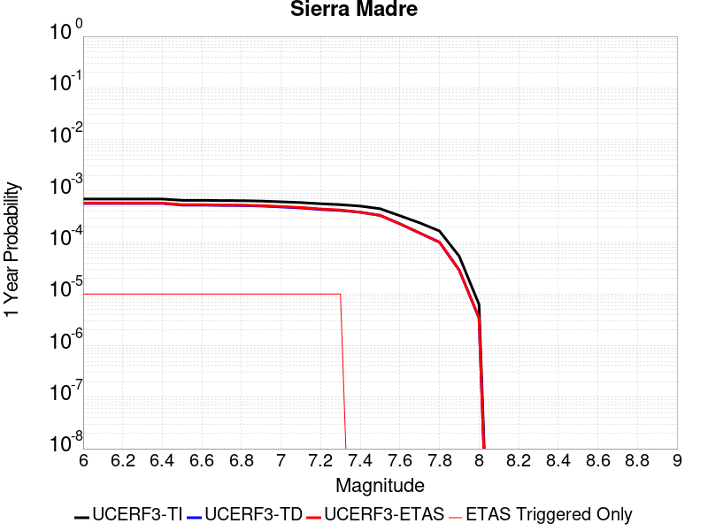 | 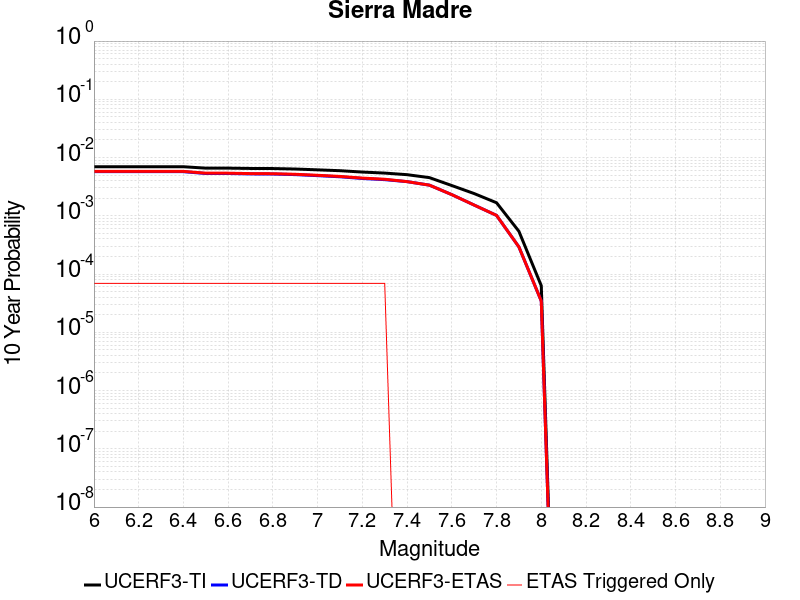 |

| Magnitude | 1 wk TI Prob | 1 wk TD Prob | 1 wk ETAS Prob | 1 wk ETAS/TD Gain | 1 wk ETAS Triggered Only | 1 mo TI Prob | 1 mo TD Prob | 1 mo ETAS Prob | 1 mo ETAS/TD Gain | 1 mo ETAS Triggered Only | 1 yr TI Prob | 1 yr TD Prob | 1 yr ETAS Prob | 1 yr ETAS/TD Gain | 1 yr ETAS Triggered Only | 10 yr TI Prob | 10 yr TD Prob | 10 yr ETAS Prob | 10 yr ETAS/TD Gain | 10 yr ETAS Triggered Only |
|-----|-----|-----|-----|-----|-----|-----|-----|-----|-----|-----|-----|-----|-----|-----|-----|-----|-----|-----|-----|-----|
| 6.0 | 1.3379373E-5 | 1.1000776E-5 | 1.1000776E-5 | 1.0 | 0.0 | 5.7338908E-5 | 4.714534E-5 | 4.714534E-5 | 1.0 | 0.0 | 6.978776E-4 | 5.738448E-4 | 6.0842466E-4 | 1.0602599 | 3.459968E-5 | 0.0069569005 | 0.0057238447 | 0.005792648 | 1.0120205 | 6.919936E-5 |
| 6.1 | 1.3379373E-5 | 1.1000776E-5 | 1.1000776E-5 | 1.0 | 0.0 | 5.7338908E-5 | 4.714534E-5 | 4.714534E-5 | 1.0 | 0.0 | 6.978776E-4 | 5.738448E-4 | 6.0842466E-4 | 1.0602599 | 3.459968E-5 | 0.0069569005 | 0.0057238447 | 0.005792648 | 1.0120205 | 6.919936E-5 |
| 6.2 | 1.3379373E-5 | 1.1000776E-5 | 1.1000776E-5 | 1.0 | 0.0 | 5.7338908E-5 | 4.714534E-5 | 4.714534E-5 | 1.0 | 0.0 | 6.978776E-4 | 5.738448E-4 | 6.0842466E-4 | 1.0602599 | 3.459968E-5 | 0.0069569005 | 0.0057238447 | 0.005792648 | 1.0120205 | 6.919936E-5 |
| 6.3 | 1.3379373E-5 | 1.1000776E-5 | 1.1000776E-5 | 1.0 | 0.0 | 5.7338908E-5 | 4.714534E-5 | 4.714534E-5 | 1.0 | 0.0 | 6.978776E-4 | 5.738448E-4 | 6.0842466E-4 | 1.0602599 | 3.459968E-5 | 0.0069569005 | 0.0057238447 | 0.005792648 | 1.0120205 | 6.919936E-5 |
| 6.4 | 1.3379373E-5 | 1.1000776E-5 | 1.1000776E-5 | 1.0 | 0.0 | 5.7338908E-5 | 4.714534E-5 | 4.714534E-5 | 1.0 | 0.0 | 6.978776E-4 | 5.738448E-4 | 6.0842466E-4 | 1.0602599 | 3.459968E-5 | 0.0069569005 | 0.0057238447 | 0.005792648 | 1.0120205 | 6.919936E-5 |
| 6.5 | 1.26563245E-5 | 1.0230232E-5 | 1.0230232E-5 | 1.0 | 0.0 | 5.4240263E-5 | 4.384312E-5 | 4.384312E-5 | 1.0 | 0.0 | 6.601751E-4 | 5.3366035E-4 | 5.682416E-4 | 1.0648 | 3.459968E-5 | 0.006582173 | 0.0053239604 | 0.0053927912 | 1.0129285 | 6.919936E-5 |
| 6.6 | 1.26563245E-5 | 1.0230232E-5 | 1.0230232E-5 | 1.0 | 0.0 | 5.4240263E-5 | 4.384312E-5 | 4.384312E-5 | 1.0 | 0.0 | 6.601751E-4 | 5.3366035E-4 | 5.682416E-4 | 1.0648 | 3.459968E-5 | 0.006582173 | 0.0053239604 | 0.0053927912 | 1.0129285 | 6.919936E-5 |
| 6.7 | 1.2502474E-5 | 1.00663765E-5 | 1.00663765E-5 | 1.0 | 0.0 | 5.3580934E-5 | 4.3140906E-5 | 4.3140906E-5 | 1.0 | 0.0 | 6.521526E-4 | 5.25115E-4 | 5.596965E-4 | 1.0658551 | 3.459968E-5 | 0.0065024206 | 0.0052389116 | 0.0053077484 | 1.0131395 | 6.919936E-5 |
| 6.8 | 1.2454966E-5 | 1.0018662E-5 | 1.0018662E-5 | 1.0 | 0.0 | 5.3377335E-5 | 4.293642E-5 | 4.293642E-5 | 1.0 | 0.0 | 6.4967526E-4 | 5.226266E-4 | 5.572082E-4 | 1.0661689 | 3.459968E-5 | 0.006477792 | 0.0052141445 | 0.0052829827 | 1.0132023 | 6.919936E-5 |
| 6.9 | 1.2225574E-5 | 9.792639E-6 | 9.792639E-6 | 1.0 | 0.0 | 5.2394265E-5 | 4.196778E-5 | 4.196778E-5 | 1.0 | 0.0 | 6.3771347E-4 | 5.10839E-4 | 5.45421E-4 | 1.0676965 | 3.459968E-5 | 0.006358865 | 0.0050968137 | 0.0051656603 | 1.0135078 | 6.919936E-5 |
| 7.0 | 1.182946E-5 | 9.399179E-6 | 9.399179E-6 | 1.0 | 0.0 | 5.06967E-5 | 4.0281582E-5 | 4.0281582E-5 | 1.0 | 0.0 | 6.1705755E-4 | 4.903189E-4 | 5.2490167E-4 | 1.070531 | 3.459968E-5 | 0.006153469 | 0.004892533 | 0.004961394 | 1.0140747 | 6.919936E-5 |
| 7.1 | 1.14369095E-5 | 8.986194E-6 | 8.986194E-6 | 1.0 | 0.0 | 4.9014405E-5 | 3.85117E-5 | 3.85117E-5 | 1.0 | 0.0 | 5.9658696E-4 | 4.6878002E-4 | 5.033635E-4 | 1.0737734 | 3.459968E-5 | 0.005949879 | 0.0046780678 | 0.0047469432 | 1.0147231 | 6.919936E-5 |
| 7.2 | 1.0836419E-5 | 8.39959E-6 | 8.39959E-6 | 1.0 | 0.0 | 4.644097E-5 | 3.599775E-5 | 3.599775E-5 | 1.0 | 0.0 | 5.652721E-4 | 4.3818538E-4 | 4.727699E-4 | 1.0789267 | 3.459968E-5 | 0.0056383642 | 0.0043733614 | 0.0044422583 | 1.0157537 | 6.919936E-5 |
| 7.3 | 1.0403439E-5 | 8.020854E-6 | 8.020854E-6 | 1.0 | 0.0 | 4.4585406E-5 | 3.437464E-5 | 3.437464E-5 | 1.0 | 0.0 | 5.426921E-4 | 4.184318E-4 | 4.5301698E-4 | 1.0826544 | 3.459968E-5 | 0.005413687 | 0.004176585 | 0.0042454954 | 1.0164992 | 6.919936E-5 |
| 7.4 | 9.768864E-6 | 7.4144855E-6 | 7.4144855E-6 | 1.0 | 0.0 | 4.186589E-5 | 3.1775984E-5 | 3.1775984E-5 | 1.0 | 0.0 | 5.09598E-4 | 3.868048E-4 | 3.868048E-4 | 1.0 | 0.0 | 0.0050843097 | 0.0038614576 | 0.0038614576 | 1.0 | 0.0 |
| 7.5 | 8.687089E-6 | 6.450183E-6 | 6.450183E-6 | 1.0 | 0.0 | 3.722985E-5 | 2.7643353E-5 | 2.7643353E-5 | 1.0 | 0.0 | 4.5317915E-4 | 3.3650672E-4 | 3.3650672E-4 | 1.0 | 0.0 | 0.004522561 | 0.003360109 | 0.003360109 | 1.0 | 0.0 |
| 7.6 | 6.3506063E-6 | 4.430329E-6 | 4.430329E-6 | 1.0 | 0.0 | 2.72166E-5 | 1.8986988E-5 | 1.8986988E-5 | 1.0 | 0.0 | 3.3131172E-4 | 2.3114232E-4 | 2.3114232E-4 | 1.0 | 0.0 | 0.003308182 | 0.0023090935 | 0.0023090935 | 1.0 | 0.0 |
| 7.7 | 4.62223E-6 | 2.9329542E-6 | 2.9329542E-6 | 1.0 | 0.0 | 1.9809406E-5 | 1.2569743E-5 | 1.2569743E-5 | 1.0 | 0.0 | 2.4115283E-4 | 1.5302589E-4 | 1.5302589E-4 | 1.0 | 0.0 | 0.0024089129 | 0.0015292577 | 0.0015292577 | 1.0 | 0.0 |
| 7.8 | 3.2145008E-6 | 1.949411E-6 | 1.949411E-6 | 1.0 | 0.0 | 1.3776359E-5 | 8.354592E-6 | 8.354592E-6 | 1.0 | 0.0 | 1.6771426E-4 | 1.01712416E-4 | 1.01712416E-4 | 1.0 | 0.0 | 0.0016758774 | 0.0010166786 | 0.0010166786 | 1.0 | 0.0 |
| 7.9 | 1.0391769E-6 | 5.602482E-7 | 5.602482E-7 | 1.0 | 0.0 | 4.4536077E-6 | 2.4010617E-6 | 2.4010617E-6 | 1.0 | 0.0 | 5.4221324E-5 | 2.9232539E-5 | 2.9232539E-5 | 1.0 | 0.0 | 5.4208096E-4 | 2.9228735E-4 | 2.9228735E-4 | 1.0 | 0.0 |
| 8.0 | 1.210983E-7 | 6.613497E-8 | 6.613497E-8 | 1.0 | 0.0 | 5.1899264E-7 | 2.8343558E-7 | 2.8343558E-7 | 1.0 | 0.0 | 6.3187167E-6 | 3.4508228E-6 | 3.4508228E-6 | 1.0 | 0.0 | 6.318537E-5 | 3.450771E-5 | 3.450771E-5 | 1.0 | 0.0 |

## Kern Canyon (South Kern) 2011
*[(top)](#table-of-contents)*

| 1 Week | 1 Month | 1 Year | 10 Year |
|-----|-----|-----|-----|
| 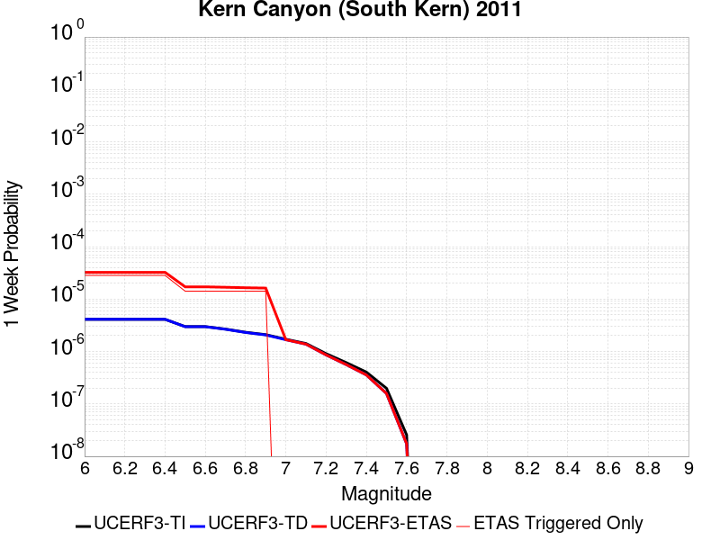 | 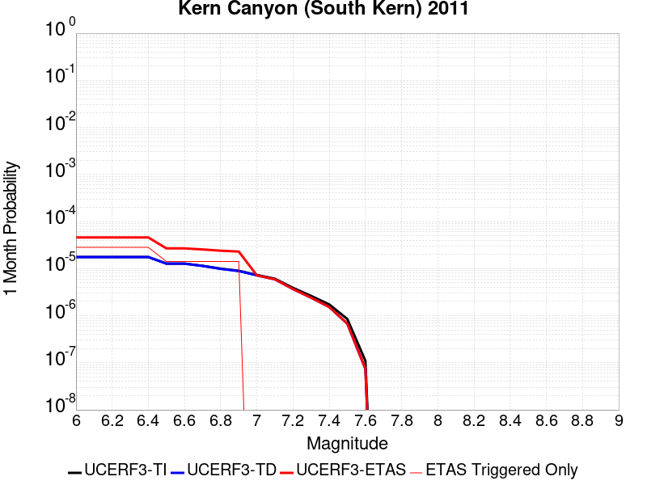 | 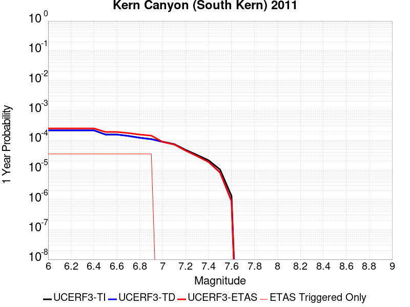 | 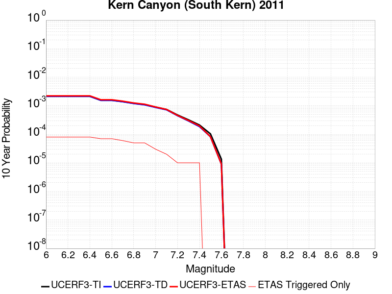 |

| Magnitude | 1 wk TI Prob | 1 wk TD Prob | 1 wk ETAS Prob | 1 wk ETAS/TD Gain | 1 wk ETAS Triggered Only | 1 mo TI Prob | 1 mo TD Prob | 1 mo ETAS Prob | 1 mo ETAS/TD Gain | 1 mo ETAS Triggered Only | 1 yr TI Prob | 1 yr TD Prob | 1 yr ETAS Prob | 1 yr ETAS/TD Gain | 1 yr ETAS Triggered Only | 10 yr TI Prob | 10 yr TD Prob | 10 yr ETAS Prob | 10 yr ETAS/TD Gain | 10 yr ETAS Triggered Only |
|-----|-----|-----|-----|-----|-----|-----|-----|-----|-----|-----|-----|-----|-----|-----|-----|-----|-----|-----|-----|-----|
| 6.0 | 4.105075E-6 | 4.113726E-6 | 3.8713264E-5 | 9.410755 | 3.459968E-5 | 1.7593058E-5 | 1.7630138E-5 | 5.222921E-5 | 2.9624958 | 3.459968E-5 | 2.1417443E-4 | 2.1462643E-4 | 2.492187E-4 | 1.1611743 | 3.459968E-5 | 0.0021396813 | 0.0021442554 | 0.0022133063 | 1.0322027 | 6.919936E-5 |
| 6.1 | 4.105075E-6 | 4.113726E-6 | 3.8713264E-5 | 9.410755 | 3.459968E-5 | 1.7593058E-5 | 1.7630138E-5 | 5.222921E-5 | 2.9624958 | 3.459968E-5 | 2.1417443E-4 | 2.1462643E-4 | 2.492187E-4 | 1.1611743 | 3.459968E-5 | 0.0021396813 | 0.0021442554 | 0.0022133063 | 1.0322027 | 6.919936E-5 |
| 6.2 | 4.105075E-6 | 4.113726E-6 | 3.8713264E-5 | 9.410755 | 3.459968E-5 | 1.7593058E-5 | 1.7630138E-5 | 5.222921E-5 | 2.9624958 | 3.459968E-5 | 2.1417443E-4 | 2.1462643E-4 | 2.492187E-4 | 1.1611743 | 3.459968E-5 | 0.0021396813 | 0.0021442554 | 0.0022133063 | 1.0322027 | 6.919936E-5 |
| 6.3 | 4.105075E-6 | 4.113726E-6 | 3.8713264E-5 | 9.410755 | 3.459968E-5 | 1.7593058E-5 | 1.7630138E-5 | 5.222921E-5 | 2.9624958 | 3.459968E-5 | 2.1417443E-4 | 2.1462643E-4 | 2.492187E-4 | 1.1611743 | 3.459968E-5 | 0.0021396813 | 0.0021442554 | 0.0022133063 | 1.0322027 | 6.919936E-5 |
| 6.4 | 4.105075E-6 | 4.113726E-6 | 3.8713264E-5 | 9.410755 | 3.459968E-5 | 1.7593058E-5 | 1.7630138E-5 | 5.222921E-5 | 2.9624958 | 3.459968E-5 | 2.1417443E-4 | 2.1462643E-4 | 2.492187E-4 | 1.1611743 | 3.459968E-5 | 0.0021396813 | 0.0021442554 | 0.0022133063 | 1.0322027 | 6.919936E-5 |
| 6.5 | 2.9849807E-6 | 2.973154E-6 | 3.7572732E-5 | 12.637331 | 3.459968E-5 | 1.2792712E-5 | 1.2742028E-5 | 4.734127E-5 | 3.7153637 | 3.459968E-5 | 1.5574014E-4 | 1.551233E-4 | 1.8971761E-4 | 1.2230117 | 3.459968E-5 | 0.0015563103 | 0.0015501654 | 0.0016192574 | 1.0445708 | 6.919936E-5 |
| 6.6 | 2.9849807E-6 | 2.973154E-6 | 3.7572732E-5 | 12.637331 | 3.459968E-5 | 1.2792712E-5 | 1.2742028E-5 | 4.734127E-5 | 3.7153637 | 3.459968E-5 | 1.5574014E-4 | 1.551233E-4 | 1.8971761E-4 | 1.2230117 | 3.459968E-5 | 0.0015563103 | 0.0015501654 | 0.0016192574 | 1.0445708 | 6.919936E-5 |
| 6.7 | 2.6756725E-6 | 2.6582202E-6 | 3.725781E-5 | 14.016074 | 3.459968E-5 | 1.1467117E-5 | 1.1392323E-5 | 4.5991612E-5 | 4.0370703 | 3.459968E-5 | 1.396032E-4 | 1.386928E-4 | 1.732877E-4 | 1.2494353 | 3.459968E-5 | 0.0013951553 | 0.0013860734 | 0.001455177 | 1.0498556 | 6.919936E-5 |
| 6.8 | 2.3283721E-6 | 2.3047783E-6 | 3.690438E-5 | 16.012117 | 3.459968E-5 | 9.9787E-6 | 9.877584E-6 | 4.4476925E-5 | 4.5028143 | 3.459968E-5 | 1.214839E-4 | 1.2025302E-4 | 1.5484855E-4 | 1.2876894 | 3.459968E-5 | 0.001214175 | 0.001201887 | 0.0012710032 | 1.0575064 | 6.919936E-5 |
| 6.9 | 2.0972677E-6 | 2.0696405E-6 | 3.666925E-5 | 17.717691 | 3.459968E-5 | 8.988259E-6 | 8.869858E-6 | 4.3469234E-5 | 4.900781 | 3.459968E-5 | 1.0942656E-4 | 1.0798523E-4 | 1.4258118E-4 | 1.3203766 | 3.459968E-5 | 0.0010937268 | 0.0010793334 | 0.0011484581 | 1.0640439 | 6.919936E-5 |
| 7.0 | 1.7132242E-6 | 1.6787029E-6 | 1.6787029E-6 | 1.0 | 0.0 | 7.3423685E-6 | 7.1944214E-6 | 7.1944214E-6 | 1.0 | 0.0 | 8.938967E-5 | 8.75886E-5 | 8.75886E-5 | 1.0 | 0.0 | 8.935372E-4 | 8.755446E-4 | 9.1011403E-4 | 1.0394833 | 3.459968E-5 |
| 7.1 | 1.4215541E-6 | 1.3815746E-6 | 1.3815746E-6 | 1.0 | 0.0 | 6.0923603E-6 | 5.9210206E-6 | 5.9210206E-6 | 1.0 | 0.0 | 7.417196E-5 | 7.208607E-5 | 7.208607E-5 | 1.0 | 0.0 | 7.414721E-4 | 7.206296E-4 | 7.552043E-4 | 1.0479785 | 3.459968E-5 |
| 7.2 | 9.097853E-7 | 8.60377E-7 | 8.60377E-7 | 1.0 | 0.0 | 3.899074E-6 | 3.6873246E-6 | 3.6873246E-6 | 1.0 | 0.0 | 4.7470192E-5 | 4.4892266E-5 | 4.4892266E-5 | 1.0 | 0.0 | 4.7460053E-4 | 4.4883305E-4 | 4.8341719E-4 | 1.0770535 | 3.459968E-5 |
| 7.3 | 6.144169E-7 | 5.628199E-7 | 5.628199E-7 | 1.0 | 0.0 | 2.6332125E-6 | 2.4120832E-6 | 2.4120832E-6 | 1.0 | 0.0 | 3.205889E-5 | 2.9366722E-5 | 2.9366722E-5 | 1.0 | 0.0 | 3.2054266E-4 | 2.9362892E-4 | 3.2821842E-4 | 1.1178001 | 3.459968E-5 |
| 7.4 | 4.049844E-7 | 3.5728252E-7 | 3.5728252E-7 | 1.0 | 0.0 | 1.7356463E-6 | 1.5312098E-6 | 1.5312098E-6 | 1.0 | 0.0 | 2.1131287E-5 | 1.8642324E-5 | 1.8642324E-5 | 1.0 | 0.0 | 2.1129279E-4 | 1.8640784E-4 | 2.2100107E-4 | 1.1855782 | 3.459968E-5 |
| 7.5 | 1.9871162E-7 | 1.5830383E-7 | 1.5830383E-7 | 1.0 | 0.0 | 8.5162094E-7 | 6.784448E-7 | 6.784448E-7 | 1.0 | 0.0 | 1.0368436E-5 | 8.260035E-6 | 8.260035E-6 | 1.0 | 0.0 | 1.0367952E-4 | 8.259736E-5 | 8.259736E-5 | 1.0 | 0.0 |
| 7.6 | 2.572245E-8 | 1.735264E-8 | 1.735264E-8 | 1.0 | 0.0 | 1.10239064E-7 | 7.436845E-8 | 7.436845E-8 | 1.0 | 0.0 | 1.3421597E-6 | 9.0543557E-7 | 9.0543557E-7 | 1.0 | 0.0 | 1.3421517E-5 | 9.054324E-6 | 9.054324E-6 | 1.0 | 0.0 |

## Los Osos 2011
*[(top)](#table-of-contents)*

| 1 Week | 1 Month | 1 Year | 10 Year |
|-----|-----|-----|-----|
| 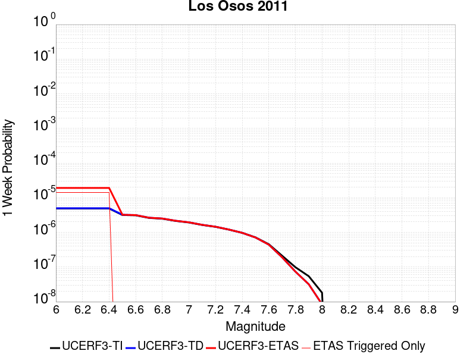 | 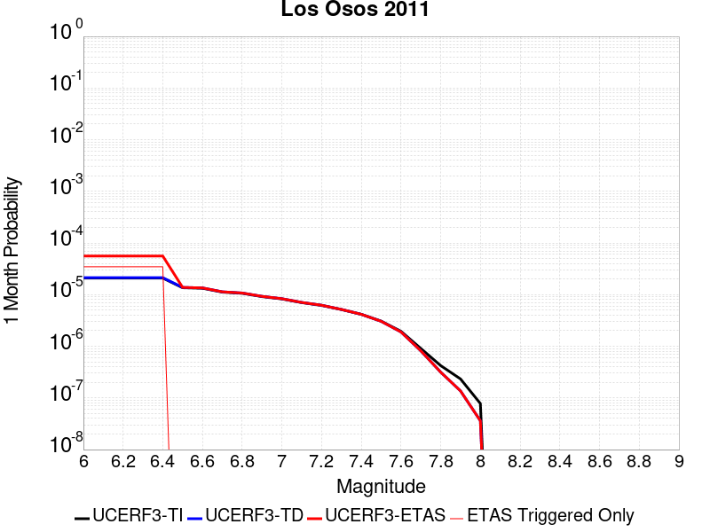 | 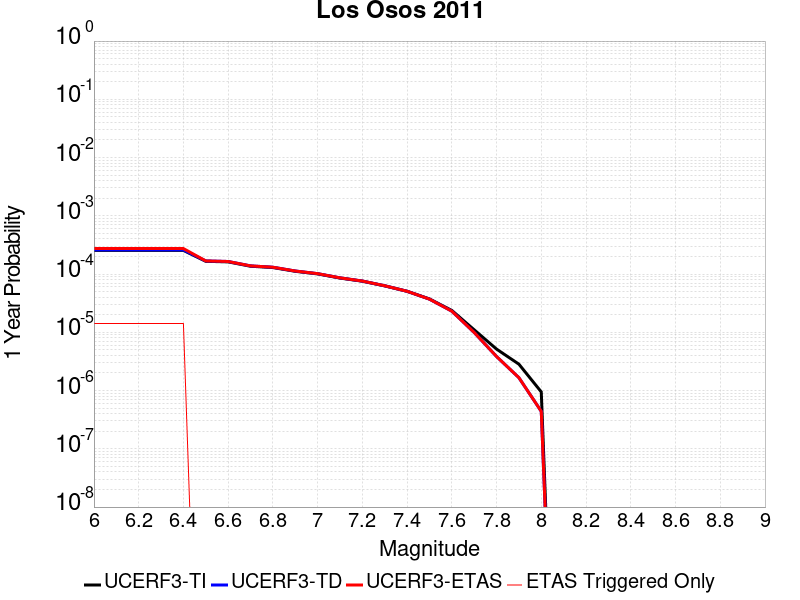 | 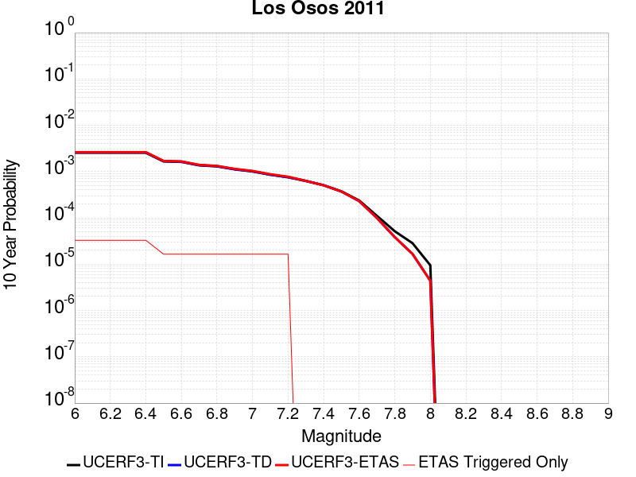 |

| Magnitude | 1 wk TI Prob | 1 wk TD Prob | 1 wk ETAS Prob | 1 wk ETAS/TD Gain | 1 wk ETAS Triggered Only | 1 mo TI Prob | 1 mo TD Prob | 1 mo ETAS Prob | 1 mo ETAS/TD Gain | 1 mo ETAS Triggered Only | 1 yr TI Prob | 1 yr TD Prob | 1 yr ETAS Prob | 1 yr ETAS/TD Gain | 1 yr ETAS Triggered Only | 10 yr TI Prob | 10 yr TD Prob | 10 yr ETAS Prob | 10 yr ETAS/TD Gain | 10 yr ETAS Triggered Only |
|-----|-----|-----|-----|-----|-----|-----|-----|-----|-----|-----|-----|-----|-----|-----|-----|-----|-----|-----|-----|-----|
| 6.0 | 4.8871775E-6 | 4.9814826E-6 | 3.958099E-5 | 7.945625 | 3.459968E-5 | 2.0944879E-5 | 2.1349053E-5 | 5.5947996E-5 | 2.6206312 | 3.459968E-5 | 2.5497406E-4 | 2.598965E-4 | 2.944872E-4 | 1.1330941 | 3.459968E-5 | 0.002546817 | 0.0025962 | 0.0026652196 | 1.0265849 | 6.919936E-5 |
| 6.1 | 4.8871775E-6 | 4.9814826E-6 | 3.958099E-5 | 7.945625 | 3.459968E-5 | 2.0944879E-5 | 2.1349053E-5 | 5.5947996E-5 | 2.6206312 | 3.459968E-5 | 2.5497406E-4 | 2.598965E-4 | 2.944872E-4 | 1.1330941 | 3.459968E-5 | 0.002546817 | 0.0025962 | 0.0026652196 | 1.0265849 | 6.919936E-5 |
| 6.2 | 4.8871775E-6 | 4.9814826E-6 | 3.958099E-5 | 7.945625 | 3.459968E-5 | 2.0944879E-5 | 2.1349053E-5 | 5.5947996E-5 | 2.6206312 | 3.459968E-5 | 2.5497406E-4 | 2.598965E-4 | 2.944872E-4 | 1.1330941 | 3.459968E-5 | 0.002546817 | 0.0025962 | 0.0026652196 | 1.0265849 | 6.919936E-5 |
| 6.3 | 4.8871775E-6 | 4.9814826E-6 | 3.958099E-5 | 7.945625 | 3.459968E-5 | 2.0944879E-5 | 2.1349053E-5 | 5.5947996E-5 | 2.6206312 | 3.459968E-5 | 2.5497406E-4 | 2.598965E-4 | 2.944872E-4 | 1.1330941 | 3.459968E-5 | 0.002546817 | 0.0025962 | 0.0026652196 | 1.0265849 | 6.919936E-5 |
| 6.4 | 4.8871775E-6 | 4.9814826E-6 | 3.958099E-5 | 7.945625 | 3.459968E-5 | 2.0944879E-5 | 2.1349053E-5 | 5.5947996E-5 | 2.6206312 | 3.459968E-5 | 2.5497406E-4 | 2.598965E-4 | 2.944872E-4 | 1.1330941 | 3.459968E-5 | 0.002546817 | 0.0025962 | 0.0026652196 | 1.0265849 | 6.919936E-5 |
| 6.5 | 3.1724062E-6 | 3.2233943E-6 | 3.2233943E-6 | 1.0 | 0.0 | 1.3595956E-5 | 1.3814474E-5 | 1.3814474E-5 | 1.0 | 0.0 | 1.6551818E-4 | 1.6817838E-4 | 1.6817838E-4 | 1.0 | 0.0 | 0.0016539496 | 0.0016805246 | 0.001715066 | 1.0205541 | 3.459968E-5 |
| 6.6 | 3.1022591E-6 | 3.1511038E-6 | 3.1511038E-6 | 1.0 | 0.0 | 1.3295328E-5 | 1.3504661E-5 | 1.3504661E-5 | 1.0 | 0.0 | 1.618586E-4 | 1.6440697E-4 | 1.6440697E-4 | 1.0 | 0.0 | 0.0016174077 | 0.0016428662 | 0.001677409 | 1.021026 | 3.459968E-5 |
| 6.7 | 2.611518E-6 | 2.6491825E-6 | 2.6491825E-6 | 1.0 | 0.0 | 1.1192172E-5 | 1.1353591E-5 | 1.1353591E-5 | 1.0 | 0.0 | 1.3625617E-4 | 1.3822124E-4 | 1.3822124E-4 | 1.0 | 0.0 | 0.0013617266 | 0.0013813572 | 0.001415909 | 1.025013 | 3.459968E-5 |
| 6.8 | 2.4780884E-6 | 2.5121587E-6 | 2.5121587E-6 | 1.0 | 0.0 | 1.0620336E-5 | 1.076635E-5 | 1.076635E-5 | 1.0 | 0.0 | 1.2929492E-4 | 1.3107246E-4 | 1.3107246E-4 | 1.0 | 0.0 | 0.0012921972 | 0.0013099556 | 0.00134451 | 1.0263783 | 3.459968E-5 |
| 6.9 | 2.1376322E-6 | 2.1635049E-6 | 2.1635049E-6 | 1.0 | 0.0 | 9.161248E-6 | 9.272131E-6 | 9.272131E-6 | 1.0 | 0.0 | 1.1153249E-4 | 1.1288237E-4 | 1.1288237E-4 | 1.0 | 0.0 | 0.0011147653 | 0.0011282521 | 0.0011628128 | 1.030632 | 3.459968E-5 |
| 7.0 | 1.9282882E-6 | 1.949458E-6 | 1.949458E-6 | 1.0 | 0.0 | 8.264066E-6 | 8.354793E-6 | 8.354793E-6 | 1.0 | 0.0 | 1.0061036E-4 | 1.0171487E-4 | 1.0171487E-4 | 1.0 | 0.0 | 0.0010056482 | 0.0010166845 | 0.001051249 | 1.0339973 | 3.459968E-5 |
| 7.1 | 1.6353226E-6 | 1.6501111E-6 | 1.6501111E-6 | 1.0 | 0.0 | 7.0085066E-6 | 7.0718856E-6 | 7.0718856E-6 | 1.0 | 0.0 | 8.532523E-5 | 8.6096814E-5 | 8.6096814E-5 | 1.0 | 0.0 | 8.529247E-4 | 8.6063537E-4 | 8.9520524E-4 | 1.0401679 | 3.459968E-5 |
| 7.2 | 1.4446276E-6 | 1.4553335E-6 | 1.4553335E-6 | 1.0 | 0.0 | 6.191247E-6 | 6.2371287E-6 | 6.2371287E-6 | 1.0 | 0.0 | 7.537582E-5 | 7.59344E-5 | 7.59344E-5 | 1.0 | 0.0 | 7.535026E-4 | 7.590851E-4 | 7.9365855E-4 | 1.0455462 | 3.459968E-5 |
| 7.3 | 1.2014582E-6 | 1.2069066E-6 | 1.2069066E-6 | 1.0 | 0.0 | 5.149096E-6 | 5.172447E-6 | 5.172447E-6 | 1.0 | 0.0 | 6.268844E-5 | 6.297272E-5 | 6.297272E-5 | 1.0 | 0.0 | 6.267076E-4 | 6.295492E-4 | 6.295492E-4 | 1.0 | 0.0 |
| 7.4 | 9.707733E-7 | 9.709767E-7 | 9.709767E-7 | 1.0 | 0.0 | 4.16045E-6 | 4.161322E-6 | 4.161322E-6 | 1.0 | 0.0 | 5.0652303E-5 | 5.066292E-5 | 5.066292E-5 | 1.0 | 0.0 | 5.064076E-4 | 5.065139E-4 | 5.065139E-4 | 1.0 | 0.0 |
| 7.5 | 7.174908E-7 | 7.114907E-7 | 7.114907E-7 | 1.0 | 0.0 | 3.074957E-6 | 3.0492424E-6 | 3.0492424E-6 | 1.0 | 0.0 | 3.743696E-5 | 3.7123897E-5 | 3.7123897E-5 | 1.0 | 0.0 | 3.7430652E-4 | 3.7117713E-4 | 3.7117713E-4 | 1.0 | 0.0 |
| 7.6 | 4.5535776E-7 | 4.4207857E-7 | 4.4207857E-7 | 1.0 | 0.0 | 1.9515319E-6 | 1.8946212E-6 | 1.8946212E-6 | 1.0 | 0.0 | 2.3759641E-5 | 2.3066768E-5 | 2.3066768E-5 | 1.0 | 0.0 | 2.37571E-4 | 2.3064384E-4 | 2.3064384E-4 | 1.0 | 0.0 |
| 7.7 | 2.1173553E-7 | 1.9060734E-7 | 1.9060734E-7 | 1.0 | 0.0 | 9.0743765E-7 | 8.1688836E-7 | 8.1688836E-7 | 1.0 | 0.0 | 1.1047998E-5 | 9.94557E-6 | 9.94557E-6 | 1.0 | 0.0 | 1.1047449E-4 | 9.945128E-5 | 9.945128E-5 | 1.0 | 0.0 |
| 7.8 | 9.873608E-8 | 7.367457E-8 | 7.367457E-8 | 1.0 | 0.0 | 4.2315455E-7 | 3.1574814E-7 | 3.1574814E-7 | 1.0 | 0.0 | 5.1518946E-6 | 3.8442267E-6 | 3.8442267E-6 | 1.0 | 0.0 | 5.1517753E-5 | 3.844161E-5 | 3.844161E-5 | 1.0 | 0.0 |
| 7.9 | 5.4399106E-8 | 3.187941E-8 | 3.187941E-8 | 1.0 | 0.0 | 2.33139E-7 | 1.3662603E-7 | 1.3662603E-7 | 1.0 | 0.0 | 2.8384638E-6 | 1.6634207E-6 | 1.6634207E-6 | 1.0 | 0.0 | 2.8384275E-5 | 1.6634083E-5 | 1.6634083E-5 | 1.0 | 0.0 |
| 8.0 | 1.817203E-8 | 8.420079E-9 | 8.420079E-9 | 1.0 | 0.0 | 7.7880124E-8 | 3.6086053E-8 | 3.6086053E-8 | 1.0 | 0.0 | 9.481901E-7 | 4.393476E-7 | 4.393476E-7 | 1.0 | 0.0 | 9.481861E-6 | 4.393468E-6 | 4.393468E-6 | 1.0 | 0.0 |

## Bullion Mountains
*[(top)](#table-of-contents)*

| 1 Week | 1 Month | 1 Year | 10 Year |
|-----|-----|-----|-----|
| 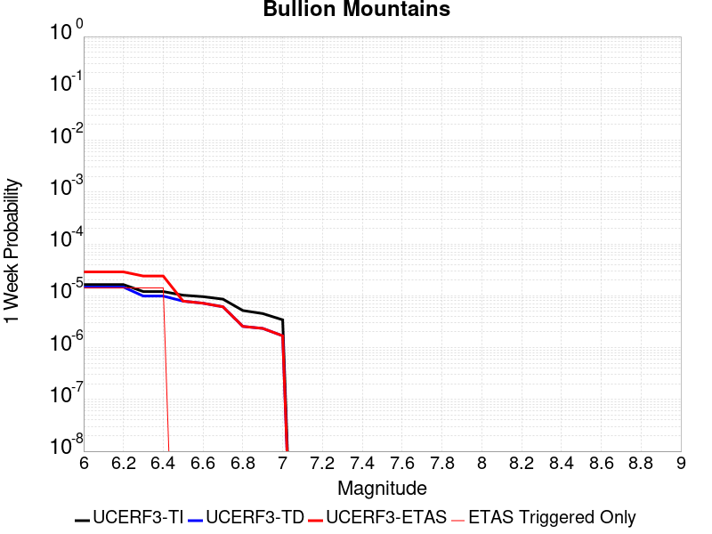 | 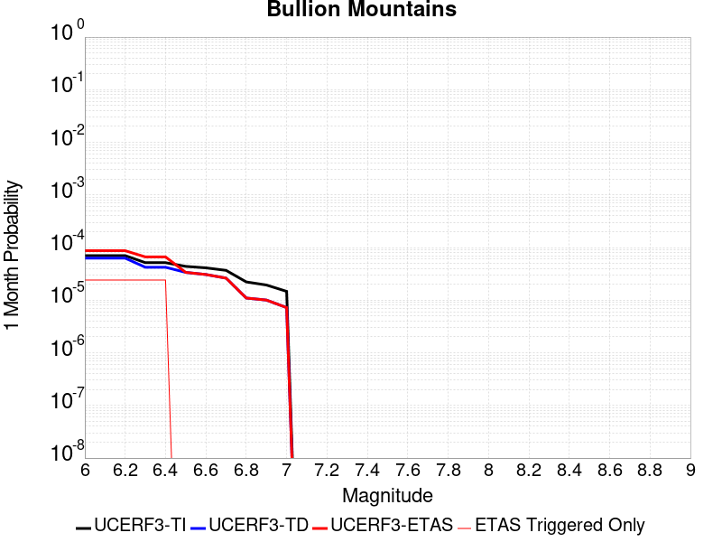 | 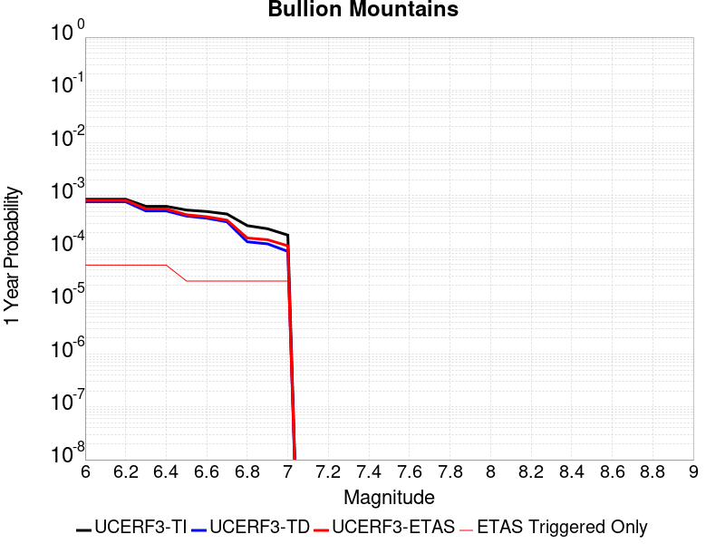 | 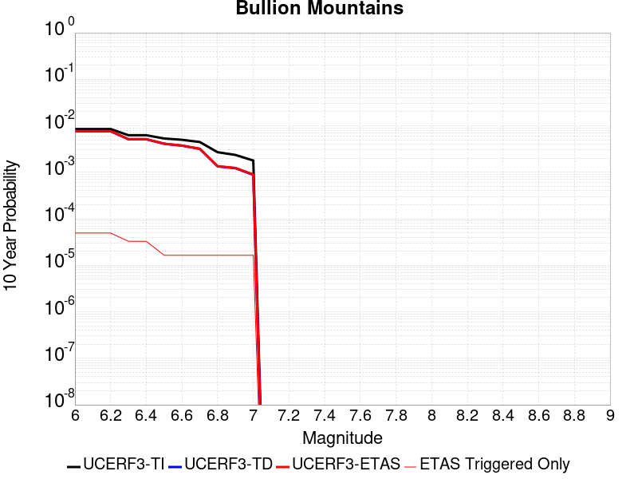 |

| Magnitude | 1 wk TI Prob | 1 wk TD Prob | 1 wk ETAS Prob | 1 wk ETAS/TD Gain | 1 wk ETAS Triggered Only | 1 mo TI Prob | 1 mo TD Prob | 1 mo ETAS Prob | 1 mo ETAS/TD Gain | 1 mo ETAS Triggered Only | 1 yr TI Prob | 1 yr TD Prob | 1 yr ETAS Prob | 1 yr ETAS/TD Gain | 1 yr ETAS Triggered Only | 10 yr TI Prob | 10 yr TD Prob | 10 yr ETAS Prob | 10 yr ETAS/TD Gain | 10 yr ETAS Triggered Only |
|-----|-----|-----|-----|-----|-----|-----|-----|-----|-----|-----|-----|-----|-----|-----|-----|-----|-----|-----|-----|-----|
| 6.0 | 1.6420427E-5 | 1.4692009E-5 | 4.9291182E-5 | 3.3549654 | 3.459968E-5 | 7.037136E-5 | 6.296445E-5 | 9.7561955E-5 | 1.5494767 | 3.459968E-5 | 8.5643446E-4 | 7.6636096E-4 | 8.355073E-4 | 1.0902269 | 6.919936E-5 | 0.008531413 | 0.0076409746 | 0.007709645 | 1.0089872 | 6.919936E-5 |
| 6.1 | 1.6420427E-5 | 1.4692009E-5 | 4.9291182E-5 | 3.3549654 | 3.459968E-5 | 7.037136E-5 | 6.296445E-5 | 9.7561955E-5 | 1.5494767 | 3.459968E-5 | 8.5643446E-4 | 7.6636096E-4 | 8.355073E-4 | 1.0902269 | 6.919936E-5 | 0.008531413 | 0.0076409746 | 0.007709645 | 1.0089872 | 6.919936E-5 |
| 6.2 | 1.6420427E-5 | 1.4692009E-5 | 4.9291182E-5 | 3.3549654 | 3.459968E-5 | 7.037136E-5 | 6.296445E-5 | 9.7561955E-5 | 1.5494767 | 3.459968E-5 | 8.5643446E-4 | 7.6636096E-4 | 8.355073E-4 | 1.0902269 | 6.919936E-5 | 0.008531413 | 0.0076409746 | 0.007709645 | 1.0089872 | 6.919936E-5 |
| 6.3 | 1.2046778E-5 | 9.862255E-6 | 4.4461594E-5 | 4.5082583 | 3.459968E-5 | 5.1628023E-5 | 4.2266256E-5 | 7.6864475E-5 | 1.8185779 | 3.459968E-5 | 6.283899E-4 | 5.144933E-4 | 5.8365706E-4 | 1.1344308 | 6.919936E-5 | 0.0062661595 | 0.0051353034 | 0.0052041477 | 1.013406 | 6.919936E-5 |
| 6.4 | 1.2046778E-5 | 9.862255E-6 | 4.4461594E-5 | 4.5082583 | 3.459968E-5 | 5.1628023E-5 | 4.2266256E-5 | 7.6864475E-5 | 1.8185779 | 3.459968E-5 | 6.283899E-4 | 5.144933E-4 | 5.8365706E-4 | 1.1344308 | 6.919936E-5 | 0.0062661595 | 0.0051353034 | 0.0052041477 | 1.013406 | 6.919936E-5 |
| 6.5 | 1.0244343E-5 | 7.879378E-6 | 7.879378E-6 | 1.0 | 0.0 | 4.390359E-5 | 3.3768443E-5 | 3.3768443E-5 | 1.0 | 0.0 | 5.343951E-4 | 4.1107394E-4 | 4.456594E-4 | 1.0841343 | 3.459968E-5 | 0.005331118 | 0.0041051665 | 0.004139624 | 1.0083938 | 3.459968E-5 |
| 6.6 | 9.605408E-6 | 7.1774166E-6 | 7.1774166E-6 | 1.0 | 0.0 | 4.1165385E-5 | 3.0760108E-5 | 3.0760108E-5 | 1.0 | 0.0 | 5.010733E-4 | 3.7446033E-4 | 4.0904706E-4 | 1.0923642 | 3.459968E-5 | 0.00499945 | 0.0037402906 | 0.0037747608 | 1.009216 | 3.459968E-5 |
| 6.7 | 8.60418E-6 | 6.123926E-6 | 6.123926E-6 | 1.0 | 0.0 | 3.687454E-5 | 2.6245243E-5 | 2.6245243E-5 | 1.0 | 0.0 | 4.48855E-4 | 3.195085E-4 | 3.540971E-4 | 1.1082557 | 3.459968E-5 | 0.004479495 | 0.0031924031 | 0.0032268923 | 1.0108036 | 3.459968E-5 |
| 6.8 | 5.187994E-6 | 2.563117E-6 | 2.563117E-6 | 1.0 | 0.0 | 2.223407E-5 | 1.0984763E-5 | 1.0984763E-5 | 1.0 | 0.0 | 2.7066618E-4 | 1.3373529E-4 | 1.6833034E-4 | 1.2586831 | 3.459968E-5 | 0.0027033675 | 0.0013369396 | 0.001371493 | 1.0258452 | 3.459968E-5 |
| 6.9 | 4.5302368E-6 | 2.3442778E-6 | 2.3442778E-6 | 1.0 | 0.0 | 1.9415156E-5 | 1.0046889E-5 | 1.0046889E-5 | 1.0 | 0.0 | 2.3635388E-4 | 1.2231797E-4 | 1.5691342E-4 | 1.2828321 | 3.459968E-5 | 0.0023610266 | 0.0012228956 | 0.001257453 | 1.0282587 | 3.459968E-5 |
| 7.0 | 3.431668E-6 | 1.6882177E-6 | 1.6882177E-6 | 1.0 | 0.0 | 1.4707065E-5 | 7.2352186E-6 | 7.2352186E-6 | 1.0 | 0.0 | 1.7904381E-4 | 8.808879E-5 | 1.2268542E-4 | 1.3927473 | 3.459968E-5 | 0.0017889962 | 8.8088785E-4 | 9.154571E-4 | 1.0392436 | 3.459968E-5 |

## Channel Islands Western Deep Ramp
*[(top)](#table-of-contents)*

| 1 Week | 1 Month | 1 Year | 10 Year |
|-----|-----|-----|-----|
| 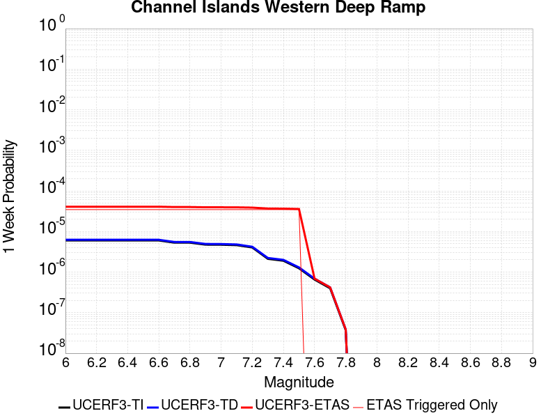 | 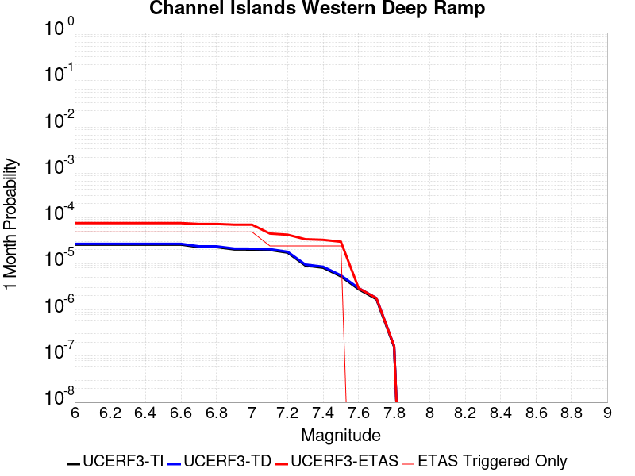 | 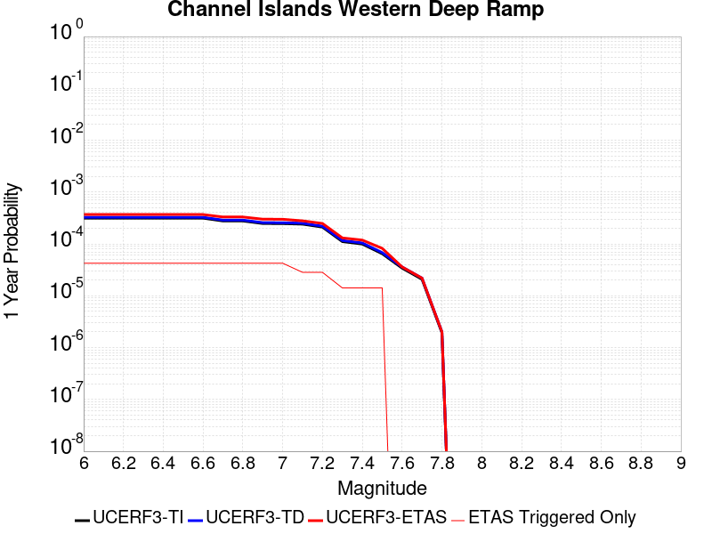 | 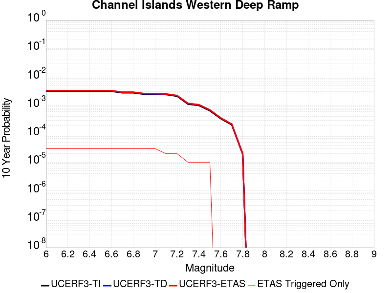 |

| Magnitude | 1 wk TI Prob | 1 wk TD Prob | 1 wk ETAS Prob | 1 wk ETAS/TD Gain | 1 wk ETAS Triggered Only | 1 mo TI Prob | 1 mo TD Prob | 1 mo ETAS Prob | 1 mo ETAS/TD Gain | 1 mo ETAS Triggered Only | 1 yr TI Prob | 1 yr TD Prob | 1 yr ETAS Prob | 1 yr ETAS/TD Gain | 1 yr ETAS Triggered Only | 10 yr TI Prob | 10 yr TD Prob | 10 yr ETAS Prob | 10 yr ETAS/TD Gain | 10 yr ETAS Triggered Only |
|-----|-----|-----|-----|-----|-----|-----|-----|-----|-----|-----|-----|-----|-----|-----|-----|-----|-----|-----|-----|-----|
| 6.0 | 6.0213506E-6 | 6.2548684E-6 | 4.0854335E-5 | 6.5316057 | 3.459968E-5 | 2.5805533E-5 | 2.6806329E-5 | 6.140508E-5 | 2.2906935 | 3.459968E-5 | 3.1413708E-4 | 3.2632265E-4 | 3.9549943E-4 | 1.2119889 | 6.919936E-5 | 0.0031369338 | 0.0032588763 | 0.00332785 | 1.0211649 | 6.919936E-5 |
| 6.1 | 6.0213506E-6 | 6.2548684E-6 | 4.0854335E-5 | 6.5316057 | 3.459968E-5 | 2.5805533E-5 | 2.6806329E-5 | 6.140508E-5 | 2.2906935 | 3.459968E-5 | 3.1413708E-4 | 3.2632265E-4 | 3.9549943E-4 | 1.2119889 | 6.919936E-5 | 0.0031369338 | 0.0032588763 | 0.00332785 | 1.0211649 | 6.919936E-5 |
| 6.2 | 6.0213506E-6 | 6.2548684E-6 | 4.0854335E-5 | 6.5316057 | 3.459968E-5 | 2.5805533E-5 | 2.6806329E-5 | 6.140508E-5 | 2.2906935 | 3.459968E-5 | 3.1413708E-4 | 3.2632265E-4 | 3.9549943E-4 | 1.2119889 | 6.919936E-5 | 0.0031369338 | 0.0032588763 | 0.00332785 | 1.0211649 | 6.919936E-5 |
| 6.3 | 6.0213506E-6 | 6.2548684E-6 | 4.0854335E-5 | 6.5316057 | 3.459968E-5 | 2.5805533E-5 | 2.6806329E-5 | 6.140508E-5 | 2.2906935 | 3.459968E-5 | 3.1413708E-4 | 3.2632265E-4 | 3.9549943E-4 | 1.2119889 | 6.919936E-5 | 0.0031369338 | 0.0032588763 | 0.00332785 | 1.0211649 | 6.919936E-5 |
| 6.4 | 6.0213506E-6 | 6.2548684E-6 | 4.0854335E-5 | 6.5316057 | 3.459968E-5 | 2.5805533E-5 | 2.6806329E-5 | 6.140508E-5 | 2.2906935 | 3.459968E-5 | 3.1413708E-4 | 3.2632265E-4 | 3.9549943E-4 | 1.2119889 | 6.919936E-5 | 0.0031369338 | 0.0032588763 | 0.00332785 | 1.0211649 | 6.919936E-5 |
| 6.5 | 6.0213506E-6 | 6.2548684E-6 | 4.0854335E-5 | 6.5316057 | 3.459968E-5 | 2.5805533E-5 | 2.6806329E-5 | 6.140508E-5 | 2.2906935 | 3.459968E-5 | 3.1413708E-4 | 3.2632265E-4 | 3.9549943E-4 | 1.2119889 | 6.919936E-5 | 0.0031369338 | 0.0032588763 | 0.00332785 | 1.0211649 | 6.919936E-5 |
| 6.6 | 6.0213506E-6 | 6.2548684E-6 | 4.0854335E-5 | 6.5316057 | 3.459968E-5 | 2.5805533E-5 | 2.6806329E-5 | 6.140508E-5 | 2.2906935 | 3.459968E-5 | 3.1413708E-4 | 3.2632265E-4 | 3.9549943E-4 | 1.2119889 | 6.919936E-5 | 0.0031369338 | 0.0032588763 | 0.00332785 | 1.0211649 | 6.919936E-5 |
| 6.7 | 5.313309E-6 | 5.5252403E-6 | 4.012473E-5 | 7.262079 | 3.459968E-5 | 2.2771126E-5 | 2.367941E-5 | 5.8278274E-5 | 2.461137 | 3.459968E-5 | 2.772032E-4 | 2.8826276E-4 | 3.574422E-4 | 1.2399874 | 6.919936E-5 | 0.0027685766 | 0.0028792918 | 0.0029482918 | 1.0239643 | 6.919936E-5 |
| 6.8 | 5.313309E-6 | 5.5252403E-6 | 4.012473E-5 | 7.262079 | 3.459968E-5 | 2.2771126E-5 | 2.367941E-5 | 5.8278274E-5 | 2.461137 | 3.459968E-5 | 2.772032E-4 | 2.8826276E-4 | 3.574422E-4 | 1.2399874 | 6.919936E-5 | 0.0027685766 | 0.0028792918 | 0.0029482918 | 1.0239643 | 6.919936E-5 |
| 6.9 | 4.744377E-6 | 4.9394303E-6 | 3.953894E-5 | 8.004757 | 3.459968E-5 | 2.0332885E-5 | 2.1168837E-5 | 5.5767785E-5 | 2.6344285 | 3.459968E-5 | 2.4752476E-4 | 2.5770385E-4 | 3.2688538E-4 | 1.2684536 | 6.919936E-5 | 0.0024724922 | 0.0025744175 | 0.0026434388 | 1.0268104 | 6.919936E-5 |
| 7.0 | 4.722209E-6 | 4.9164732E-6 | 3.9515984E-5 | 8.037466 | 3.459968E-5 | 2.0237881E-5 | 2.107045E-5 | 5.5669403E-5 | 2.6420605 | 3.459968E-5 | 2.4636835E-4 | 2.5650626E-4 | 3.2568787E-4 | 1.2697073 | 6.919936E-5 | 0.002460954 | 0.0025624693 | 0.0026314913 | 1.0269357 | 6.919936E-5 |
| 7.1 | 4.611174E-6 | 4.801409E-6 | 3.9400926E-5 | 8.206117 | 3.459968E-5 | 1.9762025E-5 | 2.0577325E-5 | 5.5176297E-5 | 2.6814125 | 3.459968E-5 | 2.4057609E-4 | 2.5050386E-4 | 3.196859E-4 | 1.2761714 | 6.919936E-5 | 0.002403158 | 0.002502582 | 0.0025716082 | 1.0275819 | 6.919936E-5 |
| 7.2 | 4.043994E-6 | 4.2120264E-6 | 3.8811562E-5 | 9.214463 | 3.459968E-5 | 1.7331287E-5 | 1.8051438E-5 | 5.2650495E-5 | 2.9166925 | 3.459968E-5 | 2.10988E-4 | 2.1975765E-4 | 2.889418E-4 | 1.3148202 | 6.919936E-5 | 0.002107878 | 0.0021957543 | 0.0022648016 | 1.0314459 | 6.919936E-5 |
| 7.3 | 2.1233036E-6 | 2.2297875E-6 | 3.682939E-5 | 16.516996 | 3.459968E-5 | 9.099841E-6 | 9.556197E-6 | 4.415555E-5 | 4.6206193 | 3.459968E-5 | 1.1078493E-4 | 1.1634055E-4 | 1.509362E-4 | 1.2973654 | 3.459968E-5 | 0.0011072971 | 0.001162802 | 0.0011973614 | 1.0297208 | 3.459968E-5 |
| 7.4 | 1.9051884E-6 | 2.0014973E-6 | 3.6601108E-5 | 18.286865 | 3.459968E-5 | 8.165067E-6 | 8.577817E-6 | 4.3177202E-5 | 5.0335884 | 3.459968E-5 | 9.940516E-5 | 1.0442998E-4 | 1.3902604E-4 | 1.3312849 | 3.459968E-5 | 9.93607E-4 | 0.0010438144 | 0.0010783778 | 1.0331128 | 3.459968E-5 |
| 7.5 | 1.2408497E-6 | 1.3038839E-6 | 3.5903522E-5 | 27.535826 | 3.459968E-5 | 5.317916E-6 | 5.588062E-6 | 4.018755E-5 | 7.1916795 | 3.459968E-5 | 6.4743705E-5 | 6.8032554E-5 | 1.0262988E-4 | 1.5085407 | 3.459968E-5 | 6.4724847E-4 | 6.8011944E-4 | 7.146956E-4 | 1.0508384 | 3.459968E-5 |
| 7.6 | 6.5440025E-7 | 6.886718E-7 | 6.886718E-7 | 1.0 | 0.0 | 2.8045695E-6 | 2.9514472E-6 | 2.9514472E-6 | 1.0 | 0.0 | 3.4145098E-5 | 3.593329E-5 | 3.593329E-5 | 1.0 | 0.0 | 3.4139853E-4 | 3.5927625E-4 | 3.5927625E-4 | 1.0 | 0.0 |
| 7.7 | 3.985963E-7 | 4.1930787E-7 | 4.1930787E-7 | 1.0 | 0.0 | 1.7082689E-6 | 1.7970326E-6 | 1.7970326E-6 | 1.0 | 0.0 | 2.0797976E-5 | 2.1878664E-5 | 2.1878664E-5 | 1.0 | 0.0 | 2.0796029E-4 | 2.1876628E-4 | 2.1876628E-4 | 1.0 | 0.0 |
| 7.8 | 3.706329E-8 | 3.8591796E-8 | 3.8591796E-8 | 1.0 | 0.0 | 1.5884267E-7 | 1.653934E-7 | 1.653934E-7 | 1.0 | 0.0 | 1.9339077E-6 | 2.0136629E-6 | 2.0136629E-6 | 1.0 | 0.0 | 1.933891E-5 | 2.0136458E-5 | 2.0136458E-5 | 1.0 | 0.0 |

## Red Mountain
*[(top)](#table-of-contents)*

| 1 Week | 1 Month | 1 Year | 10 Year |
|-----|-----|-----|-----|
|  | 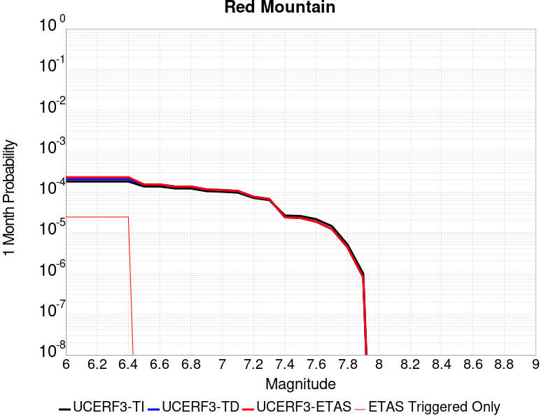 | 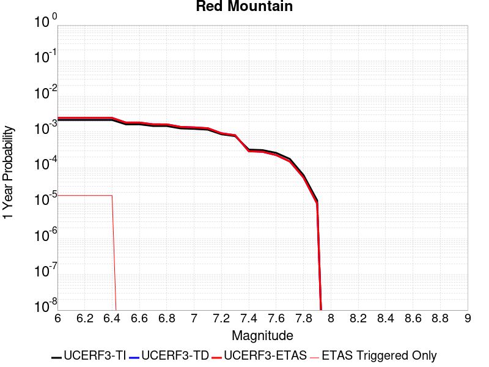 | 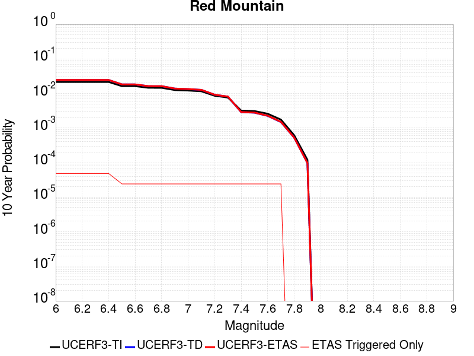 |

| Magnitude | 1 wk TI Prob | 1 wk TD Prob | 1 wk ETAS Prob | 1 wk ETAS/TD Gain | 1 wk ETAS Triggered Only | 1 mo TI Prob | 1 mo TD Prob | 1 mo ETAS Prob | 1 mo ETAS/TD Gain | 1 mo ETAS Triggered Only | 1 yr TI Prob | 1 yr TD Prob | 1 yr ETAS Prob | 1 yr ETAS/TD Gain | 1 yr ETAS Triggered Only | 10 yr TI Prob | 10 yr TD Prob | 10 yr ETAS Prob | 10 yr ETAS/TD Gain | 10 yr ETAS Triggered Only |
|-----|-----|-----|-----|-----|-----|-----|-----|-----|-----|-----|-----|-----|-----|-----|-----|-----|-----|-----|-----|-----|
| 6.0 | 4.1810763E-5 | 4.7590016E-5 | 4.7590016E-5 | 1.0 | 0.0 | 1.7917668E-4 | 2.039422E-4 | 2.039422E-4 | 1.0 | 0.0 | 0.0021792934 | 0.0024803334 | 0.0024803334 | 1.0 | 0.0 | 0.021580452 | 0.02454411 | 0.024577862 | 1.0013751 | 3.459968E-5 |
| 6.1 | 4.1810763E-5 | 4.7590016E-5 | 4.7590016E-5 | 1.0 | 0.0 | 1.7917668E-4 | 2.039422E-4 | 2.039422E-4 | 1.0 | 0.0 | 0.0021792934 | 0.0024803334 | 0.0024803334 | 1.0 | 0.0 | 0.021580452 | 0.02454411 | 0.024577862 | 1.0013751 | 3.459968E-5 |
| 6.2 | 4.1810763E-5 | 4.7590016E-5 | 4.7590016E-5 | 1.0 | 0.0 | 1.7917668E-4 | 2.039422E-4 | 2.039422E-4 | 1.0 | 0.0 | 0.0021792934 | 0.0024803334 | 0.0024803334 | 1.0 | 0.0 | 0.021580452 | 0.02454411 | 0.024577862 | 1.0013751 | 3.459968E-5 |
| 6.3 | 4.1810763E-5 | 4.7590016E-5 | 4.7590016E-5 | 1.0 | 0.0 | 1.7917668E-4 | 2.039422E-4 | 2.039422E-4 | 1.0 | 0.0 | 0.0021792934 | 0.0024803334 | 0.0024803334 | 1.0 | 0.0 | 0.021580452 | 0.02454411 | 0.024577862 | 1.0013751 | 3.459968E-5 |
| 6.4 | 4.1810763E-5 | 4.7590016E-5 | 4.7590016E-5 | 1.0 | 0.0 | 1.7917668E-4 | 2.039422E-4 | 2.039422E-4 | 1.0 | 0.0 | 0.0021792934 | 0.0024803334 | 0.0024803334 | 1.0 | 0.0 | 0.021580452 | 0.02454411 | 0.024577862 | 1.0013751 | 3.459968E-5 |
| 6.5 | 3.154503E-5 | 3.5359757E-5 | 3.5359757E-5 | 1.0 | 0.0 | 1.3518598E-4 | 1.5153353E-4 | 1.5153353E-4 | 1.0 | 0.0 | 0.0016446467 | 0.0018434518 | 0.0018434518 | 1.0 | 0.0 | 0.01632528 | 0.018291244 | 0.018325211 | 1.001857 | 3.459968E-5 |
| 6.6 | 3.1535834E-5 | 3.5349138E-5 | 3.5349138E-5 | 1.0 | 0.0 | 1.3514658E-4 | 1.5148803E-4 | 1.5148803E-4 | 1.0 | 0.0 | 0.0016441676 | 0.0018428987 | 0.0018428987 | 1.0 | 0.0 | 0.01632056 | 0.018285805 | 0.018319773 | 1.0018575 | 3.459968E-5 |
| 6.7 | 2.8267326E-5 | 3.1469353E-5 | 3.1469353E-5 | 1.0 | 0.0 | 1.2114006E-4 | 1.3486217E-4 | 1.3486217E-4 | 1.0 | 0.0 | 0.0014738824 | 0.0016407954 | 0.0016407954 | 1.0 | 0.0 | 0.014641452 | 0.01629557 | 0.016329607 | 1.0020887 | 3.459968E-5 |
| 6.8 | 2.8212884E-5 | 3.1407242E-5 | 3.1407242E-5 | 1.0 | 0.0 | 1.20906756E-4 | 1.3459599E-4 | 1.3459599E-4 | 1.0 | 0.0 | 0.0014710457 | 0.0016375595 | 0.0016375595 | 1.0 | 0.0 | 0.014613459 | 0.016263688 | 0.016297724 | 1.0020928 | 3.459968E-5 |
| 6.9 | 2.4227871E-5 | 2.6706994E-5 | 2.6706994E-5 | 1.0 | 0.0 | 1.03829596E-4 | 1.1445395E-4 | 1.1445395E-4 | 1.0 | 0.0 | 0.0012633923 | 0.0013926621 | 0.0013926621 | 1.0 | 0.0 | 0.012562336 | 0.0138470335 | 0.013881154 | 1.002464 | 3.459968E-5 |
| 7.0 | 2.348524E-5 | 2.5835778E-5 | 2.5835778E-5 | 1.0 | 0.0 | 1.0064714E-4 | 1.10720495E-4 | 1.10720495E-4 | 1.0 | 0.0 | 0.0012246901 | 0.001347264 | 0.001347264 | 1.0 | 0.0 | 0.012179627 | 0.013398598 | 0.013432734 | 1.0025477 | 3.459968E-5 |
| 7.1 | 2.2311642E-5 | 2.4462845E-5 | 2.4462845E-5 | 1.0 | 0.0 | 9.561782E-5 | 1.04836974E-4 | 1.04836974E-4 | 1.0 | 0.0 | 0.0011635252 | 0.0012757176 | 0.0012757176 | 1.0 | 0.0 | 0.01157452 | 0.01269146 | 0.01272562 | 1.0026916 | 3.459968E-5 |
| 7.2 | 1.6533986E-5 | 1.7670362E-5 | 1.7670362E-5 | 1.0 | 0.0 | 7.085802E-5 | 7.572828E-5 | 7.572828E-5 | 1.0 | 0.0 | 8.623549E-4 | 9.2166534E-4 | 9.2166534E-4 | 1.0 | 0.0 | 0.008590161 | 0.009184707 | 0.009218989 | 1.0037324 | 3.459968E-5 |
| 7.3 | 1.4703092E-5 | 1.5559537E-5 | 1.5559537E-5 | 1.0 | 0.0 | 6.301173E-5 | 6.668237E-5 | 6.668237E-5 | 1.0 | 0.0 | 7.668978E-4 | 8.1161706E-4 | 8.1161706E-4 | 1.0 | 0.0 | 0.0076425658 | 0.008092604 | 0.008126924 | 1.0042409 | 3.459968E-5 |
| 7.4 | 6.1331984E-6 | 5.5288874E-6 | 5.5288874E-6 | 1.0 | 0.0 | 2.6284872E-5 | 2.3695018E-5 | 2.3695018E-5 | 1.0 | 0.0 | 3.199713E-4 | 2.884492E-4 | 2.884492E-4 | 1.0 | 0.0 | 0.0031951098 | 0.0028808024 | 0.0029153023 | 1.0119759 | 3.459968E-5 |
| 7.5 | 5.954766E-6 | 5.338517E-6 | 5.338517E-6 | 1.0 | 0.0 | 2.5520176E-5 | 2.2879161E-5 | 2.2879161E-5 | 1.0 | 0.0 | 3.1066386E-4 | 2.785187E-4 | 2.785187E-4 | 1.0 | 0.0 | 0.003102299 | 0.0027817504 | 0.0028162538 | 1.0124035 | 3.459968E-5 |
| 7.6 | 4.9726646E-6 | 4.315309E-6 | 4.315309E-6 | 1.0 | 0.0 | 2.1311245E-5 | 1.8494053E-5 | 1.8494053E-5 | 1.0 | 0.0 | 2.5943352E-4 | 2.2514217E-4 | 2.2514217E-4 | 1.0 | 0.0 | 0.0025913084 | 0.0022491754 | 0.0022836972 | 1.0153487 | 3.459968E-5 |
| 7.7 | 3.3613894E-6 | 2.8526886E-6 | 2.8526886E-6 | 1.0 | 0.0 | 1.4405875E-5 | 1.22257525E-5 | 1.22257525E-5 | 1.0 | 0.0 | 1.7537741E-4 | 1.4883863E-4 | 1.4883863E-4 | 1.0 | 0.0 | 0.0017523908 | 0.0014874157 | 0.001521964 | 1.023227 | 3.459968E-5 |
| 7.8 | 1.1828961E-6 | 1.0122935E-6 | 1.0122935E-6 | 1.0 | 0.0 | 5.069545E-6 | 4.338394E-6 | 4.338394E-6 | 1.0 | 0.0 | 6.171996E-5 | 5.281869E-5 | 5.281869E-5 | 1.0 | 0.0 | 6.170282E-4 | 5.280643E-4 | 5.280643E-4 | 1.0 | 0.0 |
| 7.9 | 2.2967266E-7 | 1.861919E-7 | 1.861919E-7 | 1.0 | 0.0 | 9.843111E-7 | 7.97965E-7 | 7.97965E-7 | 1.0 | 0.0 | 1.19839215E-5 | 9.715184E-6 | 9.715184E-6 | 1.0 | 0.0 | 1.1983275E-4 | 9.714788E-5 | 9.714788E-5 | 1.0 | 0.0 |

## Robinson Creek
*[(top)](#table-of-contents)*

| 1 Week | 1 Month | 1 Year | 10 Year |
|-----|-----|-----|-----|
| 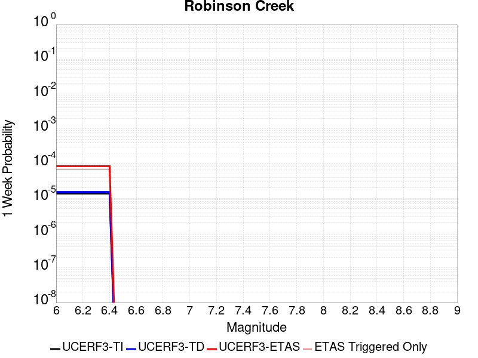 | 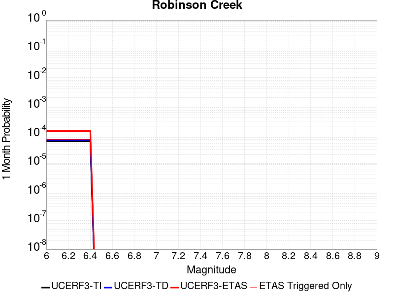 | 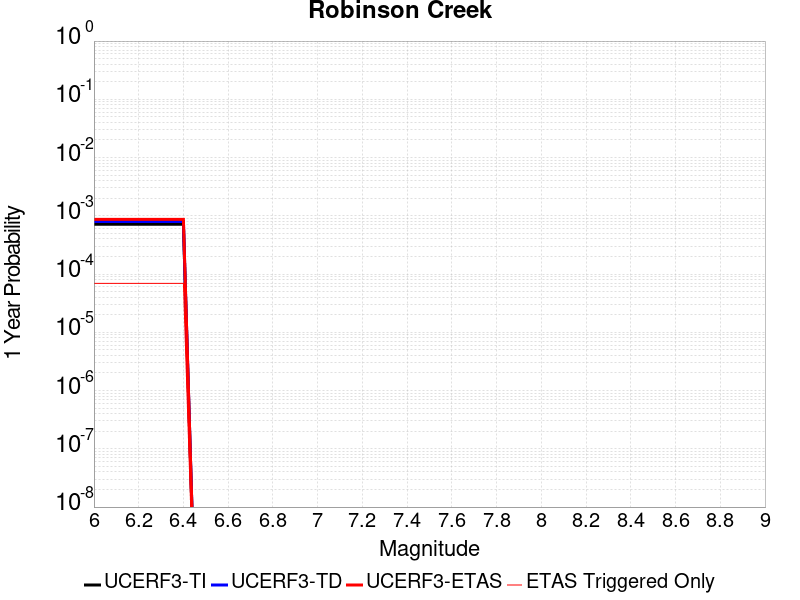 | 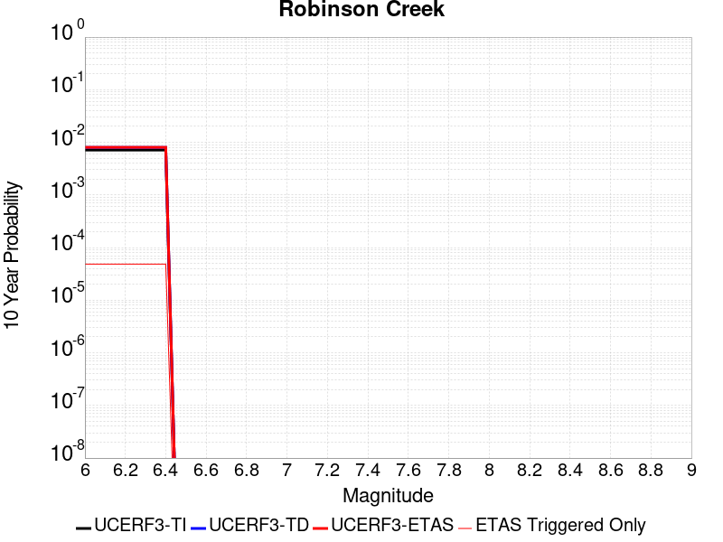 |

| Magnitude | 1 wk TI Prob | 1 wk TD Prob | 1 wk ETAS Prob | 1 wk ETAS/TD Gain | 1 wk ETAS Triggered Only | 1 mo TI Prob | 1 mo TD Prob | 1 mo ETAS Prob | 1 mo ETAS/TD Gain | 1 mo ETAS Triggered Only | 1 yr TI Prob | 1 yr TD Prob | 1 yr ETAS Prob | 1 yr ETAS/TD Gain | 1 yr ETAS Triggered Only | 10 yr TI Prob | 10 yr TD Prob | 10 yr ETAS Prob | 10 yr ETAS/TD Gain | 10 yr ETAS Triggered Only |
|-----|-----|-----|-----|-----|-----|-----|-----|-----|-----|-----|-----|-----|-----|-----|-----|-----|-----|-----|-----|-----|
| 6.0 | 1.3705327E-5 | 1.5285013E-5 | 8.448332E-5 | 5.5271997 | 6.919936E-5 | 5.8735794E-5 | 6.55072E-5 | 1.3470203E-4 | 2.0562935 | 6.919936E-5 | 7.1487366E-4 | 7.9755014E-4 | 8.666943E-4 | 1.0866957 | 6.919936E-5 | 0.0071257832 | 0.007975501 | 0.008044149 | 1.0086073 | 6.919936E-5 |
| 6.1 | 1.3705327E-5 | 1.5285013E-5 | 8.448332E-5 | 5.5271997 | 6.919936E-5 | 5.8735794E-5 | 6.55072E-5 | 1.3470203E-4 | 2.0562935 | 6.919936E-5 | 7.1487366E-4 | 7.9755014E-4 | 8.666943E-4 | 1.0866957 | 6.919936E-5 | 0.0071257832 | 0.007975501 | 0.008044149 | 1.0086073 | 6.919936E-5 |
| 6.2 | 1.3705327E-5 | 1.5285013E-5 | 8.448332E-5 | 5.5271997 | 6.919936E-5 | 5.8735794E-5 | 6.55072E-5 | 1.3470203E-4 | 2.0562935 | 6.919936E-5 | 7.1487366E-4 | 7.9755014E-4 | 8.666943E-4 | 1.0866957 | 6.919936E-5 | 0.0071257832 | 0.007975501 | 0.008044149 | 1.0086073 | 6.919936E-5 |
| 6.3 | 1.3705327E-5 | 1.5285013E-5 | 8.448332E-5 | 5.5271997 | 6.919936E-5 | 5.8735794E-5 | 6.55072E-5 | 1.3470203E-4 | 2.0562935 | 6.919936E-5 | 7.1487366E-4 | 7.9755014E-4 | 8.666943E-4 | 1.0866957 | 6.919936E-5 | 0.0071257832 | 0.007975501 | 0.008044149 | 1.0086073 | 6.919936E-5 |
| 6.4 | 1.3705327E-5 | 1.5285013E-5 | 8.448332E-5 | 5.5271997 | 6.919936E-5 | 5.8735794E-5 | 6.55072E-5 | 1.3470203E-4 | 2.0562935 | 6.919936E-5 | 7.1487366E-4 | 7.9755014E-4 | 8.666943E-4 | 1.0866957 | 6.919936E-5 | 0.0071257832 | 0.007975501 | 0.008044149 | 1.0086073 | 6.919936E-5 |

## Blue Cut
*[(top)](#table-of-contents)*

| 1 Week | 1 Month | 1 Year | 10 Year |
|-----|-----|-----|-----|
| 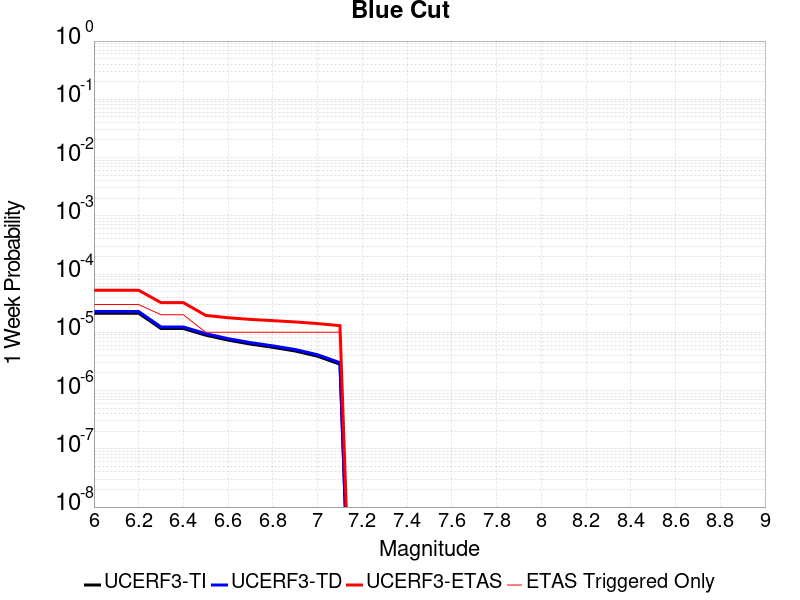 | 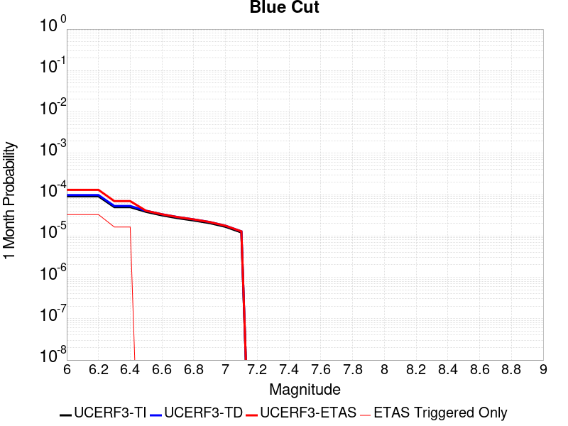 | 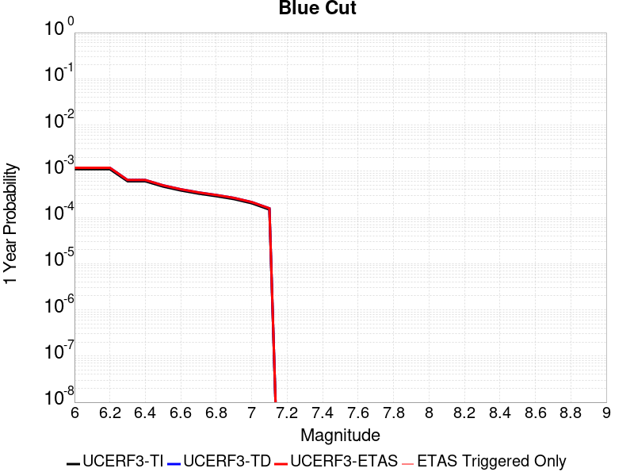 | 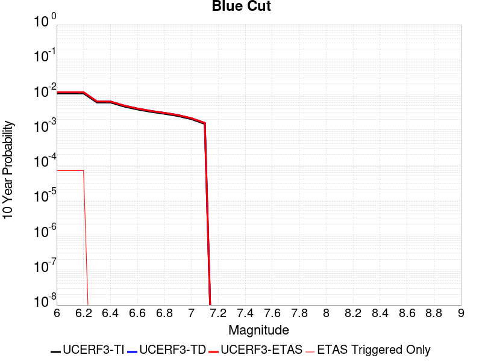 |

| Magnitude | 1 wk TI Prob | 1 wk TD Prob | 1 wk ETAS Prob | 1 wk ETAS/TD Gain | 1 wk ETAS Triggered Only | 1 mo TI Prob | 1 mo TD Prob | 1 mo ETAS Prob | 1 mo ETAS/TD Gain | 1 mo ETAS Triggered Only | 1 yr TI Prob | 1 yr TD Prob | 1 yr ETAS Prob | 1 yr ETAS/TD Gain | 1 yr ETAS Triggered Only | 10 yr TI Prob | 10 yr TD Prob | 10 yr ETAS Prob | 10 yr ETAS/TD Gain | 10 yr ETAS Triggered Only |
|-----|-----|-----|-----|-----|-----|-----|-----|-----|-----|-----|-----|-----|-----|-----|-----|-----|-----|-----|-----|-----|
| 6.0 | 2.1227985E-5 | 2.2719574E-5 | 2.2719574E-5 | 1.0 | 0.0 | 9.097391E-5 | 9.73663E-5 | 9.73663E-5 | 1.0 | 0.0 | 0.0011070445 | 0.0011848481 | 0.0011848481 | 1.0 | 0.0 | 0.011015458 | 0.011791152 | 0.011859535 | 1.0057995 | 6.919936E-5 |
| 6.1 | 2.1227985E-5 | 2.2719574E-5 | 2.2719574E-5 | 1.0 | 0.0 | 9.097391E-5 | 9.73663E-5 | 9.73663E-5 | 1.0 | 0.0 | 0.0011070445 | 0.0011848481 | 0.0011848481 | 1.0 | 0.0 | 0.011015458 | 0.011791152 | 0.011859535 | 1.0057995 | 6.919936E-5 |
| 6.2 | 2.1227985E-5 | 2.2719574E-5 | 2.2719574E-5 | 1.0 | 0.0 | 9.097391E-5 | 9.73663E-5 | 9.73663E-5 | 1.0 | 0.0 | 0.0011070445 | 0.0011848481 | 0.0011848481 | 1.0 | 0.0 | 0.011015458 | 0.011791152 | 0.011859535 | 1.0057995 | 6.919936E-5 |
| 6.3 | 1.1613981E-5 | 1.2353542E-5 | 1.2353542E-5 | 1.0 | 0.0 | 4.9773254E-5 | 5.2942745E-5 | 5.2942745E-5 | 1.0 | 0.0 | 6.0582085E-4 | 6.443998E-4 | 6.443998E-4 | 1.0 | 0.0 | 0.0060417196 | 0.0064265593 | 0.0064265593 | 1.0 | 0.0 |
| 6.4 | 1.1613981E-5 | 1.2353542E-5 | 1.2353542E-5 | 1.0 | 0.0 | 4.9773254E-5 | 5.2942745E-5 | 5.2942745E-5 | 1.0 | 0.0 | 6.0582085E-4 | 6.443998E-4 | 6.443998E-4 | 1.0 | 0.0 | 0.0060417196 | 0.0064265593 | 0.0064265593 | 1.0 | 0.0 |
| 6.5 | 8.931326E-6 | 9.4816E-6 | 9.4816E-6 | 1.0 | 0.0 | 3.8276554E-5 | 4.0634844E-5 | 4.0634844E-5 | 1.0 | 0.0 | 4.6591737E-4 | 4.946261E-4 | 4.946261E-4 | 1.0 | 0.0 | 0.0046494175 | 0.004936161 | 0.004936161 | 1.0 | 0.0 |
| 6.6 | 7.345353E-6 | 7.79028E-6 | 7.79028E-6 | 1.0 | 0.0 | 3.1479703E-5 | 3.338653E-5 | 3.338653E-5 | 1.0 | 0.0 | 3.83198E-4 | 4.064132E-4 | 4.064132E-4 | 1.0 | 0.0 | 0.0038253788 | 0.0040574907 | 0.0040574907 | 1.0 | 0.0 |
| 6.7 | 6.2775666E-6 | 6.655149E-6 | 6.655149E-6 | 1.0 | 0.0 | 2.690358E-5 | 2.8521798E-5 | 2.8521798E-5 | 1.0 | 0.0 | 3.2750185E-4 | 3.472051E-4 | 3.472051E-4 | 1.0 | 0.0 | 0.0032701963 | 0.003467367 | 0.003467367 | 1.0 | 0.0 |
| 6.8 | 5.5234095E-6 | 5.8551113E-6 | 5.8551113E-6 | 1.0 | 0.0 | 2.367154E-5 | 2.5093133E-5 | 2.5093133E-5 | 1.0 | 0.0 | 2.8816288E-4 | 3.0547334E-4 | 3.0547334E-4 | 1.0 | 0.0 | 0.002877895 | 0.0030512505 | 0.0030512505 | 1.0 | 0.0 |
| 6.9 | 4.7780054E-6 | 5.0654203E-6 | 5.0654203E-6 | 1.0 | 0.0 | 2.0477004E-5 | 2.1708804E-5 | 2.1708804E-5 | 1.0 | 0.0 | 2.4927902E-4 | 2.642797E-4 | 2.642797E-4 | 1.0 | 0.0 | 0.0024899957 | 0.002640346 | 0.002640346 | 1.0 | 0.0 |
| 7.0 | 3.883171E-6 | 4.118487E-6 | 4.118487E-6 | 1.0 | 0.0 | 1.6642054E-5 | 1.7650578E-5 | 1.7650578E-5 | 1.0 | 0.0 | 2.0259817E-4 | 2.1488148E-4 | 2.1488148E-4 | 1.0 | 0.0 | 0.0020241356 | 0.0021474129 | 0.0021474129 | 1.0 | 0.0 |
| 7.1 | 2.8358215E-6 | 3.0097158E-6 | 3.0097158E-6 | 1.0 | 0.0 | 1.2153464E-5 | 1.2898756E-5 | 1.2898756E-5 | 1.0 | 0.0 | 1.4795837E-4 | 1.5703762E-4 | 1.5703762E-4 | 1.0 | 0.0 | 0.001478599 | 0.0015699116 | 0.0015699116 | 1.0 | 0.0 |

## Cleghorn
*[(top)](#table-of-contents)*

| 1 Week | 1 Month | 1 Year | 10 Year |
|-----|-----|-----|-----|
| 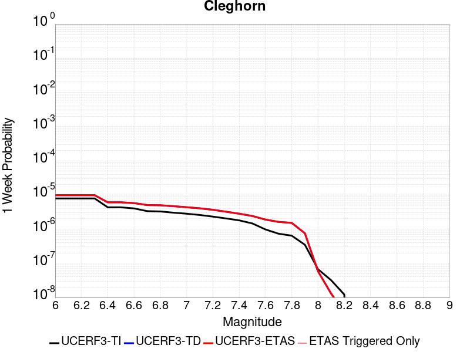 | 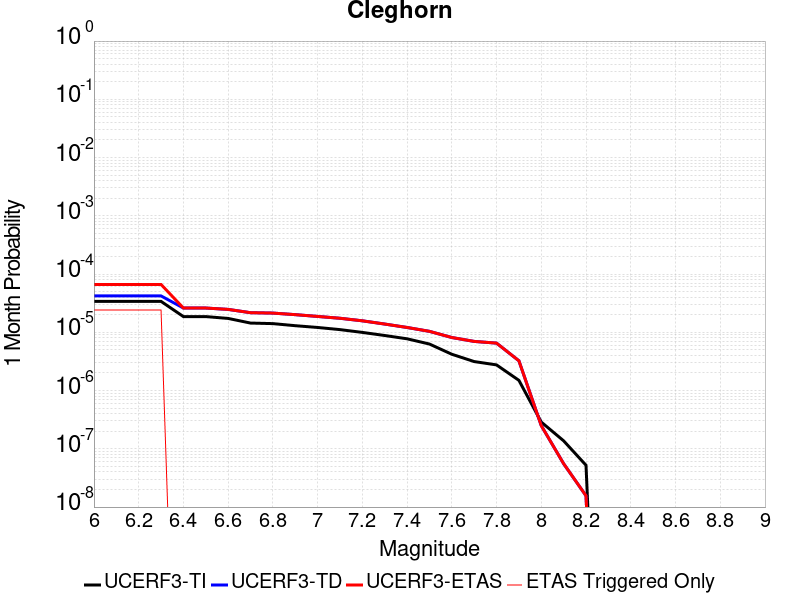 | 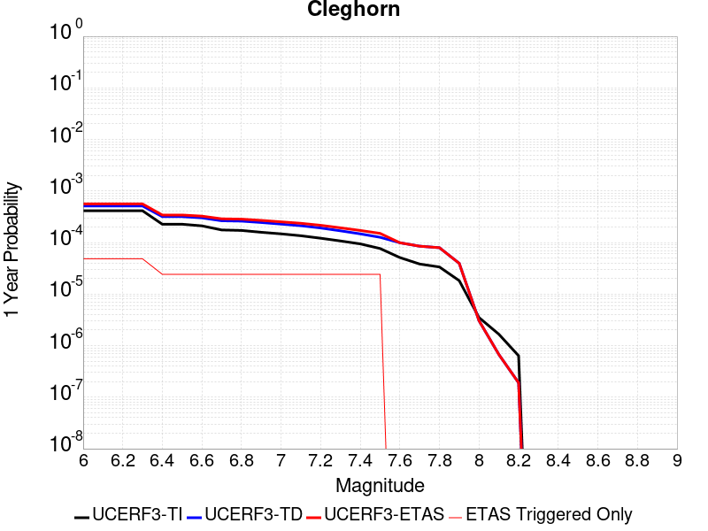 | 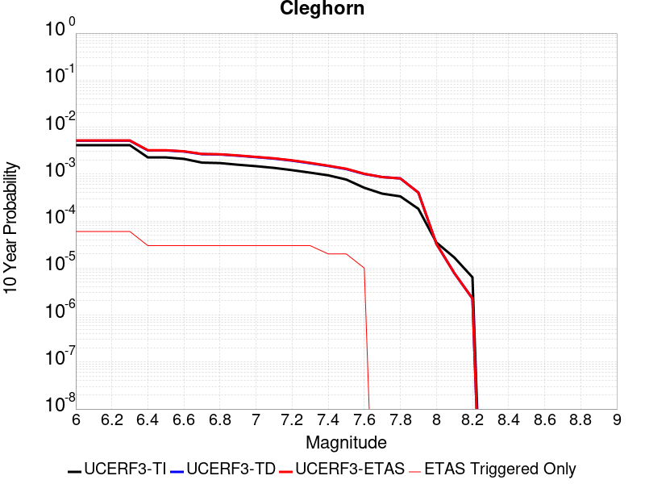 |

| Magnitude | 1 wk TI Prob | 1 wk TD Prob | 1 wk ETAS Prob | 1 wk ETAS/TD Gain | 1 wk ETAS Triggered Only | 1 mo TI Prob | 1 mo TD Prob | 1 mo ETAS Prob | 1 mo ETAS/TD Gain | 1 mo ETAS Triggered Only | 1 yr TI Prob | 1 yr TD Prob | 1 yr ETAS Prob | 1 yr ETAS/TD Gain | 1 yr ETAS Triggered Only | 10 yr TI Prob | 10 yr TD Prob | 10 yr ETAS Prob | 10 yr ETAS/TD Gain | 10 yr ETAS Triggered Only |
|-----|-----|-----|-----|-----|-----|-----|-----|-----|-----|-----|-----|-----|-----|-----|-----|-----|-----|-----|-----|-----|
| 6.0 | 7.9267165E-6 | 9.831764E-6 | 9.831764E-6 | 1.0 | 0.0 | 3.39712E-5 | 4.2135514E-5 | 7.673374E-5 | 1.8211179 | 3.459968E-5 | 4.1352084E-4 | 5.1288976E-4 | 5.820536E-4 | 1.1348513 | 6.919936E-5 | 0.004127522 | 0.005132214 | 0.0052010585 | 1.0134141 | 6.919936E-5 |
| 6.1 | 7.9267165E-6 | 9.831764E-6 | 9.831764E-6 | 1.0 | 0.0 | 3.39712E-5 | 4.2135514E-5 | 7.673374E-5 | 1.8211179 | 3.459968E-5 | 4.1352084E-4 | 5.1288976E-4 | 5.820536E-4 | 1.1348513 | 6.919936E-5 | 0.004127522 | 0.005132214 | 0.0052010585 | 1.0134141 | 6.919936E-5 |
| 6.2 | 7.9267165E-6 | 9.831764E-6 | 9.831764E-6 | 1.0 | 0.0 | 3.39712E-5 | 4.2135514E-5 | 7.673374E-5 | 1.8211179 | 3.459968E-5 | 4.1352084E-4 | 5.1288976E-4 | 5.820536E-4 | 1.1348513 | 6.919936E-5 | 0.004127522 | 0.005132214 | 0.0052010585 | 1.0134141 | 6.919936E-5 |
| 6.3 | 7.9267165E-6 | 9.831764E-6 | 9.831764E-6 | 1.0 | 0.0 | 3.39712E-5 | 4.2135514E-5 | 7.673374E-5 | 1.8211179 | 3.459968E-5 | 4.1352084E-4 | 5.1288976E-4 | 5.820536E-4 | 1.1348513 | 6.919936E-5 | 0.004127522 | 0.005132214 | 0.0052010585 | 1.0134141 | 6.919936E-5 |
| 6.4 | 4.3445207E-6 | 6.0916254E-6 | 6.0916254E-6 | 1.0 | 0.0 | 1.8619241E-5 | 2.6106709E-5 | 2.6106709E-5 | 1.0 | 0.0 | 2.2666567E-4 | 3.1780385E-4 | 3.5239253E-4 | 1.1088365 | 3.459968E-5 | 0.0022643462 | 0.0031877246 | 0.003222214 | 1.0108194 | 3.459968E-5 |
| 6.5 | 4.3445207E-6 | 6.0916254E-6 | 6.0916254E-6 | 1.0 | 0.0 | 1.8619241E-5 | 2.6106709E-5 | 2.6106709E-5 | 1.0 | 0.0 | 2.2666567E-4 | 3.1780385E-4 | 3.5239253E-4 | 1.1088365 | 3.459968E-5 | 0.0022643462 | 0.0031877246 | 0.003222214 | 1.0108194 | 3.459968E-5 |
| 6.6 | 4.040109E-6 | 5.774033E-6 | 5.774033E-6 | 1.0 | 0.0 | 1.7314638E-5 | 2.4745626E-5 | 2.4745626E-5 | 1.0 | 0.0 | 2.1078532E-4 | 3.0123728E-4 | 3.3582654E-4 | 1.1148239 | 3.459968E-5 | 0.002105855 | 0.0030225143 | 0.0030570095 | 1.0114127 | 3.459968E-5 |
| 6.7 | 3.3632055E-6 | 5.06753E-6 | 5.06753E-6 | 1.0 | 0.0 | 1.4413658E-5 | 2.1717806E-5 | 2.1717806E-5 | 1.0 | 0.0 | 1.7547216E-4 | 2.643825E-4 | 2.9897306E-4 | 1.1308352 | 3.459968E-5 | 0.0017533366 | 0.0026548486 | 0.0026893564 | 1.012998 | 3.459968E-5 |
| 6.8 | 3.2902772E-6 | 4.9894375E-6 | 4.9894375E-6 | 1.0 | 0.0 | 1.4101111E-5 | 2.138313E-5 | 2.138313E-5 | 1.0 | 0.0 | 1.716675E-4 | 2.6030882E-4 | 2.9489948E-4 | 1.1328832 | 3.459968E-5 | 0.0017153495 | 0.0026142076 | 0.0026487168 | 1.0132006 | 3.459968E-5 |
| 6.9 | 3.031547E-6 | 4.6911987E-6 | 4.6911987E-6 | 1.0 | 0.0 | 1.299228E-5 | 2.0104984E-5 | 2.0104984E-5 | 1.0 | 0.0 | 1.5816953E-4 | 2.4475096E-4 | 2.7934217E-4 | 1.1413323 | 3.459968E-5 | 0.00158057 | 0.0024589805 | 0.0024934951 | 1.0140362 | 3.459968E-5 |
| 7.0 | 2.8259715E-6 | 4.3707637E-6 | 4.3707637E-6 | 1.0 | 0.0 | 1.211125E-5 | 1.8731711E-5 | 1.8731711E-5 | 1.0 | 0.0 | 1.4744449E-4 | 2.2803496E-4 | 2.6262677E-4 | 1.1516951 | 3.459968E-5 | 0.001473467 | 0.0022921748 | 0.002326695 | 1.0150601 | 3.459968E-5 |
| 7.1 | 2.5962665E-6 | 4.065983E-6 | 4.065983E-6 | 1.0 | 0.0 | 1.1126809E-5 | 1.7425526E-5 | 1.7425526E-5 | 1.0 | 0.0 | 1.3546048E-4 | 2.1213535E-4 | 2.467277E-4 | 1.1630673 | 3.459968E-5 | 0.0013537793 | 0.0021334959 | 0.0021680216 | 1.0161828 | 3.459968E-5 |
| 7.2 | 2.3247253E-6 | 3.6765352E-6 | 3.6765352E-6 | 1.0 | 0.0 | 9.96307E-6 | 1.5756486E-5 | 1.5756486E-5 | 1.0 | 0.0 | 1.21293626E-4 | 1.9181852E-4 | 2.2641156E-4 | 1.1803426 | 3.459968E-5 | 0.0012122744 | 0.0019307166 | 0.0019652494 | 1.017886 | 3.459968E-5 |
| 7.3 | 2.056928E-6 | 3.235253E-6 | 3.235253E-6 | 1.0 | 0.0 | 8.815376E-6 | 1.3865297E-5 | 1.3865297E-5 | 1.0 | 0.0 | 1.0732192E-4 | 1.6879707E-4 | 2.0339091E-4 | 1.2049434 | 3.459968E-5 | 0.001072701 | 0.0017009423 | 0.0017354832 | 1.0203068 | 3.459968E-5 |
| 7.4 | 1.8055999E-6 | 2.8256538E-6 | 2.8256538E-6 | 1.0 | 0.0 | 7.738263E-6 | 1.210989E-5 | 1.210989E-5 | 1.0 | 0.0 | 9.4209274E-5 | 1.4742807E-4 | 1.8202265E-4 | 1.234654 | 3.459968E-5 | 9.4169343E-4 | 0.0014876705 | 0.0015222187 | 1.023223 | 3.459968E-5 |
| 7.5 | 1.4683443E-6 | 2.4248943E-6 | 2.4248943E-6 | 1.0 | 0.0 | 6.292889E-6 | 1.0392363E-5 | 1.0392363E-5 | 1.0 | 0.0 | 7.661323E-5 | 1.2651978E-4 | 1.6111508E-4 | 1.273438 | 3.459968E-5 | 7.658682E-4 | 0.0012788812 | 0.0013134367 | 1.0270201 | 3.459968E-5 |
| 7.6 | 9.804088E-7 | 1.9004091E-6 | 1.9004091E-6 | 1.0 | 0.0 | 4.201745E-6 | 8.144585E-6 | 8.144585E-6 | 1.0 | 0.0 | 5.1155046E-5 | 9.915586E-5 | 9.915586E-5 | 1.0 | 0.0 | 5.114327E-4 | 0.0010055583 | 0.0010055583 | 1.0 | 0.0 |
| 7.7 | 7.3434086E-7 | 1.6285549E-6 | 1.6285549E-6 | 1.0 | 0.0 | 3.1471714E-6 | 6.9795024E-6 | 6.9795024E-6 | 1.0 | 0.0 | 3.831614E-5 | 8.4972155E-5 | 8.4972155E-5 | 1.0 | 0.0 | 3.8309532E-4 | 8.6387293E-4 | 8.6387293E-4 | 1.0 | 0.0 |
| 7.8 | 6.434184E-7 | 1.5221389E-6 | 1.5221389E-6 | 1.0 | 0.0 | 2.7575045E-6 | 6.523436E-6 | 6.523436E-6 | 1.0 | 0.0 | 3.35721E-5 | 7.9419966E-5 | 7.9419966E-5 | 1.0 | 0.0 | 3.3567028E-4 | 8.080443E-4 | 8.080443E-4 | 1.0 | 0.0 |
| 7.9 | 3.4943926E-7 | 7.5750586E-7 | 7.5750586E-7 | 1.0 | 0.0 | 1.497596E-6 | 3.2464498E-6 | 3.2464498E-6 | 1.0 | 0.0 | 1.8233079E-5 | 3.9524817E-5 | 3.9524817E-5 | 1.0 | 0.0 | 1.8231584E-4 | 4.0401975E-4 | 4.0401975E-4 | 1.0 | 0.0 |
| 8.0 | 6.717524E-8 | 5.837515E-8 | 5.837515E-8 | 1.0 | 0.0 | 2.8789387E-7 | 2.501792E-7 | 2.501792E-7 | 1.0 | 0.0 | 3.505102E-6 | 3.0459275E-6 | 3.0459275E-6 | 1.0 | 0.0 | 3.5050467E-5 | 3.2751934E-5 | 3.2751934E-5 | 1.0 | 0.0 |
| 8.1 | 3.1984914E-8 | 1.2949885E-8 | 1.2949885E-8 | 1.0 | 0.0 | 1.370782E-7 | 5.549951E-8 | 5.549951E-8 | 1.0 | 0.0 | 1.6689258E-6 | 6.757063E-7 | 6.757063E-7 | 1.0 | 0.0 | 1.6689133E-5 | 7.741151E-6 | 7.741151E-6 | 1.0 | 0.0 |
| 8.2 | 1.21887656E-8 | 3.6471115E-9 | 3.6471115E-9 | 1.0 | 0.0 | 5.2237567E-8 | 1.563048E-8 | 1.563048E-8 | 1.0 | 0.0 | 6.359922E-7 | 1.9030107E-7 | 1.9030107E-7 | 1.0 | 0.0 | 6.3599036E-6 | 2.245849E-6 | 2.245849E-6 | 1.0 | 0.0 |

## San Juan
*[(top)](#table-of-contents)*

| 1 Week | 1 Month | 1 Year | 10 Year |
|-----|-----|-----|-----|
|  |  | 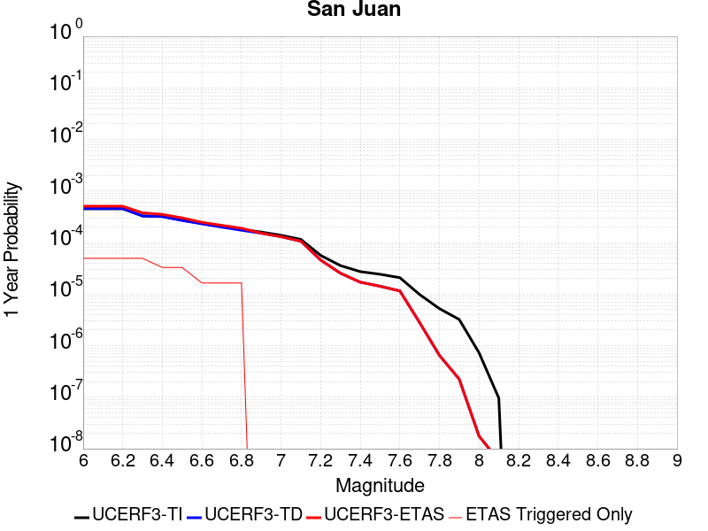 | 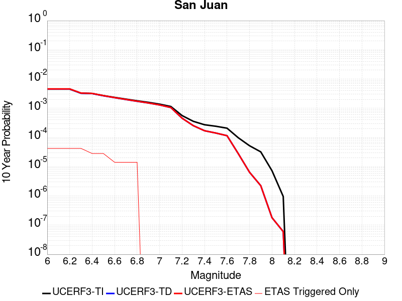 |

| Magnitude | 1 wk TI Prob | 1 wk TD Prob | 1 wk ETAS Prob | 1 wk ETAS/TD Gain | 1 wk ETAS Triggered Only | 1 mo TI Prob | 1 mo TD Prob | 1 mo ETAS Prob | 1 mo ETAS/TD Gain | 1 mo ETAS Triggered Only | 1 yr TI Prob | 1 yr TD Prob | 1 yr ETAS Prob | 1 yr ETAS/TD Gain | 1 yr ETAS Triggered Only | 10 yr TI Prob | 10 yr TD Prob | 10 yr ETAS Prob | 10 yr ETAS/TD Gain | 10 yr ETAS Triggered Only |
|-----|-----|-----|-----|-----|-----|-----|-----|-----|-----|-----|-----|-----|-----|-----|-----|-----|-----|-----|-----|-----|
| 6.0 | 8.682808E-6 | 8.74917E-6 | 8.74917E-6 | 1.0 | 0.0 | 3.72115E-5 | 3.749593E-5 | 3.749593E-5 | 1.0 | 0.0 | 4.5295584E-4 | 4.5642213E-4 | 5.255899E-4 | 1.1515434 | 6.919936E-5 | 0.004520337 | 0.004555389 | 0.0046242727 | 1.0151215 | 6.919936E-5 |
| 6.1 | 8.682808E-6 | 8.74917E-6 | 8.74917E-6 | 1.0 | 0.0 | 3.72115E-5 | 3.749593E-5 | 3.749593E-5 | 1.0 | 0.0 | 4.5295584E-4 | 4.5642213E-4 | 5.255899E-4 | 1.1515434 | 6.919936E-5 | 0.004520337 | 0.004555389 | 0.0046242727 | 1.0151215 | 6.919936E-5 |
| 6.2 | 8.682808E-6 | 8.74917E-6 | 8.74917E-6 | 1.0 | 0.0 | 3.72115E-5 | 3.749593E-5 | 3.749593E-5 | 1.0 | 0.0 | 4.5295584E-4 | 4.5642213E-4 | 5.255899E-4 | 1.1515434 | 6.919936E-5 | 0.004520337 | 0.004555389 | 0.0046242727 | 1.0151215 | 6.919936E-5 |
| 6.3 | 6.3054235E-6 | 6.282591E-6 | 6.282591E-6 | 1.0 | 0.0 | 2.7022963E-5 | 2.692512E-5 | 2.692512E-5 | 1.0 | 0.0 | 3.2895492E-4 | 3.2776545E-4 | 3.969421E-4 | 1.2110554 | 6.919936E-5 | 0.003284684 | 0.0032730205 | 0.0033419933 | 1.0210731 | 6.919936E-5 |
| 6.4 | 6.1490473E-6 | 6.1144706E-6 | 6.1144706E-6 | 1.0 | 0.0 | 2.6352795E-5 | 2.6204618E-5 | 2.6204618E-5 | 1.0 | 0.0 | 3.2079802E-4 | 3.189959E-4 | 3.5358453E-4 | 1.1084298 | 3.459968E-5 | 0.0032033534 | 0.0031855768 | 0.0032200662 | 1.0108267 | 3.459968E-5 |
| 6.5 | 5.204848E-6 | 5.137238E-6 | 5.137238E-6 | 1.0 | 0.0 | 2.23063E-5 | 2.2016555E-5 | 2.2016555E-5 | 1.0 | 0.0 | 2.7154534E-4 | 2.6801953E-4 | 3.0260993E-4 | 1.1290593 | 3.459968E-5 | 0.0027121378 | 0.0026771172 | 0.0027116244 | 1.0128896 | 3.459968E-5 |
| 6.6 | 4.5179986E-6 | 4.415036E-6 | 4.415036E-6 | 1.0 | 0.0 | 1.9362706E-5 | 1.892145E-5 | 1.892145E-5 | 1.0 | 0.0 | 2.3571544E-4 | 2.303451E-4 | 2.649368E-4 | 1.1501734 | 3.459968E-5 | 0.0023546559 | 0.0023012008 | 0.002335721 | 1.0150009 | 3.459968E-5 |
| 6.7 | 3.9442616E-6 | 3.8198336E-6 | 3.8198336E-6 | 1.0 | 0.0 | 1.6903869E-5 | 1.6370615E-5 | 1.6370615E-5 | 1.0 | 0.0 | 2.0578515E-4 | 1.9929469E-4 | 2.3388748E-4 | 1.173576 | 3.459968E-5 | 0.002055947 | 0.001991285 | 0.0020258157 | 1.0173409 | 3.459968E-5 |
| 6.8 | 3.4536245E-6 | 3.3163408E-6 | 3.3163408E-6 | 1.0 | 0.0 | 1.4801163E-5 | 1.4212815E-5 | 1.4212815E-5 | 1.0 | 0.0 | 1.8018926E-4 | 1.7302789E-4 | 2.0762159E-4 | 1.1999313 | 3.459968E-5 | 0.0018004322 | 0.001729051 | 0.0017635908 | 1.0199761 | 3.459968E-5 |
| 6.9 | 3.059865E-6 | 2.9120363E-6 | 2.9120363E-6 | 1.0 | 0.0 | 1.3113641E-5 | 1.2480099E-5 | 1.2480099E-5 | 1.0 | 0.0 | 1.596469E-4 | 1.5193518E-4 | 1.5193518E-4 | 1.0 | 0.0 | 0.0015953224 | 0.0015184281 | 0.0015184281 | 1.0 | 0.0 |
| 7.0 | 2.6504351E-6 | 2.492005E-6 | 2.492005E-6 | 1.0 | 0.0 | 1.1358958E-5 | 1.0679981E-5 | 1.0679981E-5 | 1.0 | 0.0 | 1.3828653E-4 | 1.3002155E-4 | 1.3002155E-4 | 1.0 | 0.0 | 0.0013820052 | 0.001299567 | 0.001299567 | 1.0 | 0.0 |
| 7.1 | 2.2039317E-6 | 2.0338366E-6 | 2.0338366E-6 | 1.0 | 0.0 | 9.445387E-6 | 8.716416E-6 | 8.716416E-6 | 1.0 | 0.0 | 1.1499152E-4 | 1.0611773E-4 | 1.0611773E-4 | 1.0 | 0.0 | 0.0011493203 | 0.0010607811 | 0.0010607811 | 1.0 | 0.0 |
| 7.2 | 1.0786707E-6 | 8.770239E-7 | 8.770239E-7 | 1.0 | 0.0 | 4.622866E-6 | 3.7586685E-6 | 3.7586685E-6 | 1.0 | 0.0 | 5.628194E-5 | 4.576084E-5 | 4.576084E-5 | 1.0 | 0.0 | 5.6267687E-4 | 4.5757365E-4 | 4.5757365E-4 | 1.0 | 0.0 |
| 7.3 | 6.846433E-7 | 4.868812E-7 | 4.868812E-7 | 1.0 | 0.0 | 2.9341822E-6 | 2.086632E-6 | 2.086632E-6 | 1.0 | 0.0 | 3.5723086E-5 | 2.5404452E-5 | 2.5404452E-5 | 1.0 | 0.0 | 3.571734E-4 | 2.5405022E-4 | 2.5405022E-4 | 1.0 | 0.0 |
| 7.4 | 5.23043E-7 | 3.2627884E-7 | 3.2627884E-7 | 1.0 | 0.0 | 2.2416111E-6 | 1.3983371E-6 | 1.3983371E-6 | 1.0 | 0.0 | 2.7291273E-5 | 1.7024622E-5 | 1.7024622E-5 | 1.0 | 0.0 | 2.7287923E-4 | 1.7026608E-4 | 1.7026608E-4 | 1.0 | 0.0 |
| 7.5 | 4.648444E-7 | 2.723464E-7 | 2.723464E-7 | 1.0 | 0.0 | 1.9921886E-6 | 1.1671983E-6 | 1.1671983E-6 | 1.0 | 0.0 | 2.4254627E-5 | 1.4210547E-5 | 1.4210547E-5 | 1.0 | 0.0 | 2.425198E-4 | 1.4212691E-4 | 1.4212691E-4 | 1.0 | 0.0 |
| 7.6 | 3.9906567E-7 | 2.2083036E-7 | 2.2083036E-7 | 1.0 | 0.0 | 1.7102802E-6 | 9.4641547E-7 | 9.4641547E-7 | 1.0 | 0.0 | 2.0822463E-5 | 1.1522548E-5 | 1.1522548E-5 | 1.0 | 0.0 | 2.0820512E-4 | 1.15244526E-4 | 1.15244526E-4 | 1.0 | 0.0 |
| 7.7 | 1.8784601E-7 | 5.366277E-8 | 5.366277E-8 | 1.0 | 0.0 | 8.0505407E-7 | 2.2998329E-7 | 2.2998329E-7 | 1.0 | 0.0 | 9.80149E-6 | 2.800043E-6 | 2.800043E-6 | 1.0 | 0.0 | 9.801057E-5 | 2.8008939E-5 | 2.8008939E-5 | 1.0 | 0.0 |
| 7.8 | 1.00154914E-7 | 1.2412917E-8 | 1.2412917E-8 | 1.0 | 0.0 | 4.2923529E-7 | 5.3198217E-8 | 5.3198217E-8 | 1.0 | 0.0 | 5.225927E-6 | 6.476881E-7 | 6.476881E-7 | 1.0 | 0.0 | 5.225804E-5 | 6.4827886E-6 | 6.4827886E-6 | 1.0 | 0.0 |
| 7.9 | 6.171429E-8 | 4.2946513E-9 | 4.2946513E-9 | 1.0 | 0.0 | 2.6448978E-7 | 1.8405647E-8 | 1.8405647E-8 | 1.0 | 0.0 | 3.2201583E-6 | 2.2408874E-7 | 2.2408874E-7 | 1.0 | 0.0 | 3.2201115E-5 | 2.2462114E-6 | 2.2462114E-6 | 1.0 | 0.0 |
| 8.0 | 1.3974572E-8 | 3.3737857E-10 | 3.3737857E-10 | 1.0 | 0.0 | 5.989102E-8 | 1.4459075E-9 | 1.4459075E-9 | 1.0 | 0.0 | 7.2917294E-7 | 1.760392E-8 | 1.760392E-8 | 1.0 | 0.0 | 7.2917055E-6 | 1.8038004E-7 | 1.8038004E-7 | 1.0 | 0.0 |
| 8.1 | 1.8403477E-9 | 1.1291601E-10 | 1.1291601E-10 | 1.0 | 0.0 | 7.887204E-9 | 4.839261E-10 | 4.839261E-10 | 1.0 | 0.0 | 9.602671E-8 | 5.8917977E-9 | 5.8917977E-9 | 1.0 | 0.0 | 9.602667E-7 | 6.0206084E-8 | 6.0206084E-8 | 1.0 | 0.0 |

## Cleghorn Lake
*[(top)](#table-of-contents)*

| 1 Week | 1 Month | 1 Year | 10 Year |
|-----|-----|-----|-----|
| 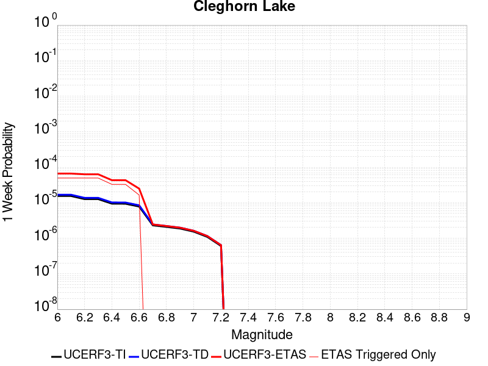 | 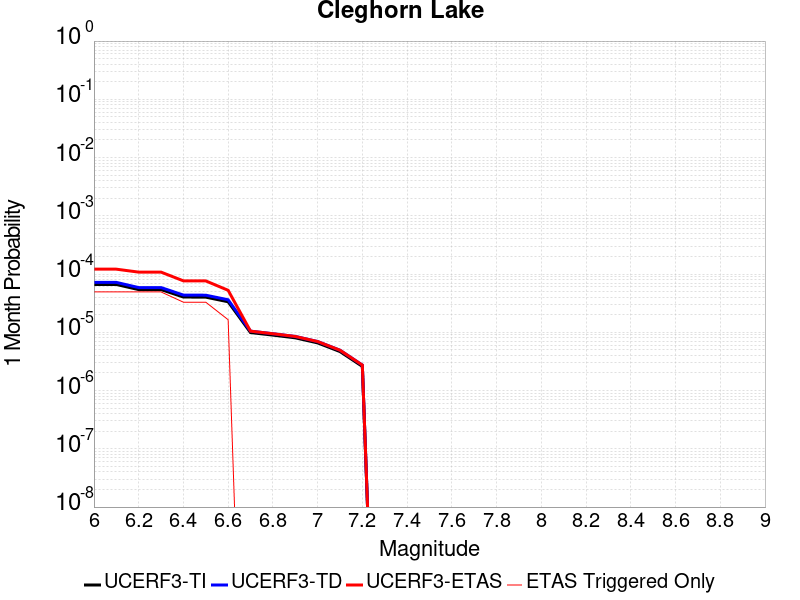 | 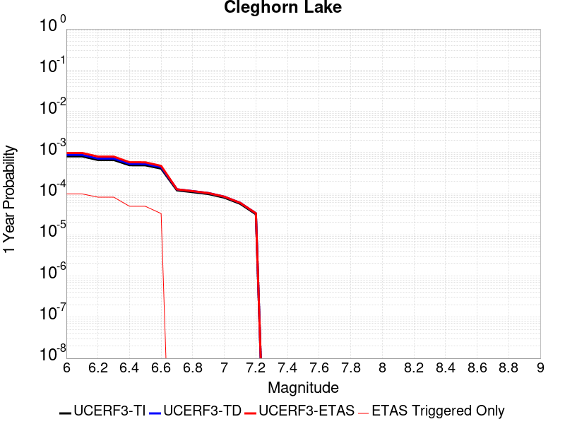 | 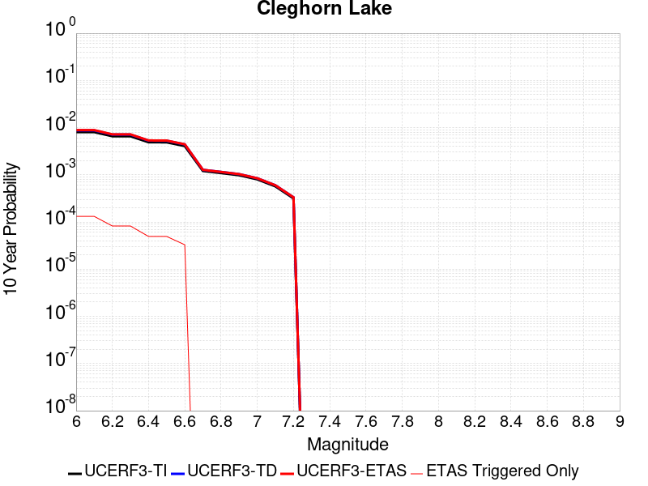 |

| Magnitude | 1 wk TI Prob | 1 wk TD Prob | 1 wk ETAS Prob | 1 wk ETAS/TD Gain | 1 wk ETAS Triggered Only | 1 mo TI Prob | 1 mo TD Prob | 1 mo ETAS Prob | 1 mo ETAS/TD Gain | 1 mo ETAS Triggered Only | 1 yr TI Prob | 1 yr TD Prob | 1 yr ETAS Prob | 1 yr ETAS/TD Gain | 1 yr ETAS Triggered Only | 10 yr TI Prob | 10 yr TD Prob | 10 yr ETAS Prob | 10 yr ETAS/TD Gain | 10 yr ETAS Triggered Only |
|-----|-----|-----|-----|-----|-----|-----|-----|-----|-----|-----|-----|-----|-----|-----|-----|-----|-----|-----|-----|-----|
| 6.0 | 1.5467183E-5 | 1.6794203E-5 | 1.6794203E-5 | 1.0 | 0.0 | 6.6286244E-5 | 7.197348E-5 | 7.197348E-5 | 1.0 | 0.0 | 8.067362E-4 | 8.759797E-4 | 9.451185E-4 | 1.0789273 | 6.919936E-5 | 0.008038137 | 0.008730696 | 0.00879929 | 1.0078567 | 6.919936E-5 |
| 6.1 | 1.5467183E-5 | 1.6794203E-5 | 1.6794203E-5 | 1.0 | 0.0 | 6.6286244E-5 | 7.197348E-5 | 7.197348E-5 | 1.0 | 0.0 | 8.067362E-4 | 8.759797E-4 | 9.451185E-4 | 1.0789273 | 6.919936E-5 | 0.008038137 | 0.008730696 | 0.00879929 | 1.0078567 | 6.919936E-5 |
| 6.2 | 1.2624631E-5 | 1.3681544E-5 | 1.3681544E-5 | 1.0 | 0.0 | 5.410444E-5 | 5.863415E-5 | 5.863415E-5 | 1.0 | 0.0 | 6.585225E-4 | 7.1368564E-4 | 7.828356E-4 | 1.0968914 | 6.919936E-5 | 0.0065657445 | 0.0071187317 | 0.0071874387 | 1.0096515 | 6.919936E-5 |
| 6.3 | 1.2624631E-5 | 1.3681544E-5 | 1.3681544E-5 | 1.0 | 0.0 | 5.410444E-5 | 5.863415E-5 | 5.863415E-5 | 1.0 | 0.0 | 6.585225E-4 | 7.1368564E-4 | 7.828356E-4 | 1.0968914 | 6.919936E-5 | 0.0065657445 | 0.0071187317 | 0.0071874387 | 1.0096515 | 6.919936E-5 |
| 6.4 | 9.417684E-6 | 1.0170118E-5 | 1.0170118E-5 | 1.0 | 0.0 | 4.036088E-5 | 4.3585722E-5 | 4.3585722E-5 | 1.0 | 0.0 | 4.912829E-4 | 5.3056807E-4 | 5.6514936E-4 | 1.0651779 | 3.459968E-5 | 0.004901982 | 0.005297049 | 0.0053314655 | 1.0064973 | 3.459968E-5 |
| 6.5 | 9.368219E-6 | 1.0117545E-5 | 1.0117545E-5 | 1.0 | 0.0 | 4.014889E-5 | 4.3360415E-5 | 4.3360415E-5 | 1.0 | 0.0 | 4.8870314E-4 | 5.2782625E-4 | 5.6240766E-4 | 1.0655167 | 3.459968E-5 | 0.004876298 | 0.0052697617 | 0.0053041787 | 1.0065311 | 3.459968E-5 |
| 6.6 | 7.803798E-6 | 8.441831E-6 | 8.441831E-6 | 1.0 | 0.0 | 3.3444423E-5 | 3.6179E-5 | 3.6179E-5 | 1.0 | 0.0 | 4.0710976E-4 | 4.4043022E-4 | 4.7501465E-4 | 1.0785242 | 3.459968E-5 | 0.0040636472 | 0.0043994905 | 0.004433938 | 1.0078299 | 3.459968E-5 |
| 6.7 | 2.3108669E-6 | 2.4438336E-6 | 2.4438336E-6 | 1.0 | 0.0 | 9.903678E-6 | 1.0473532E-5 | 1.0473532E-5 | 1.0 | 0.0 | 1.205706E-4 | 1.2750797E-4 | 1.2750797E-4 | 1.0 | 0.0 | 0.001205052 | 0.0012743667 | 0.0012743667 | 1.0 | 0.0 |
| 6.8 | 2.0882828E-6 | 2.2062823E-6 | 2.2062823E-6 | 1.0 | 0.0 | 8.949753E-6 | 9.455462E-6 | 9.455462E-6 | 1.0 | 0.0 | 1.08957785E-4 | 1.1511434E-4 | 1.1511434E-4 | 1.0 | 0.0 | 0.0010890438 | 0.0011505639 | 0.0011505639 | 1.0 | 0.0 |
| 6.9 | 1.876935E-6 | 1.981051E-6 | 1.981051E-6 | 1.0 | 0.0 | 8.043982E-6 | 8.490192E-6 | 8.490192E-6 | 1.0 | 0.0 | 9.7931086E-5 | 1.03363345E-4 | 1.03363345E-4 | 1.0 | 0.0 | 9.788794E-4 | 0.0010331686 | 0.0010331686 | 1.0 | 0.0 |
| 7.0 | 1.5357559E-6 | 1.6202807E-6 | 1.6202807E-6 | 1.0 | 0.0 | 6.5817944E-6 | 6.9440425E-6 | 6.9440425E-6 | 1.0 | 0.0 | 8.01304E-5 | 8.454057E-5 | 8.454057E-5 | 1.0 | 0.0 | 8.010151E-4 | 8.450965E-4 | 8.450965E-4 | 1.0 | 0.0 |
| 7.1 | 1.0905424E-6 | 1.1497619E-6 | 1.1497619E-6 | 1.0 | 0.0 | 4.6737446E-6 | 4.9275427E-6 | 4.9275427E-6 | 1.0 | 0.0 | 5.6901354E-5 | 5.999128E-5 | 5.999128E-5 | 1.0 | 0.0 | 5.6886784E-4 | 5.997606E-4 | 5.997606E-4 | 1.0 | 0.0 |
| 7.2 | 6.06668E-7 | 6.387277E-7 | 6.387277E-7 | 1.0 | 0.0 | 2.600003E-6 | 2.7374022E-6 | 2.7374022E-6 | 1.0 | 0.0 | 3.1654577E-5 | 3.3327433E-5 | 3.3327433E-5 | 1.0 | 0.0 | 3.1650066E-4 | 3.3323118E-4 | 3.3323118E-4 | 1.0 | 0.0 |

## Fish Slough 2011 CFM
*[(top)](#table-of-contents)*

| 1 Week | 1 Month | 1 Year | 10 Year |
|-----|-----|-----|-----|
| 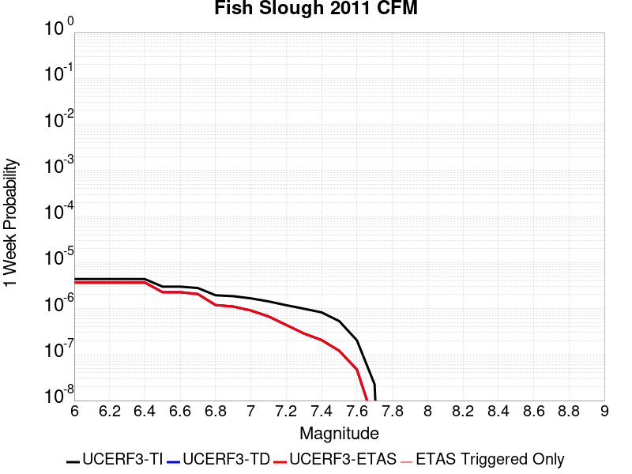 | 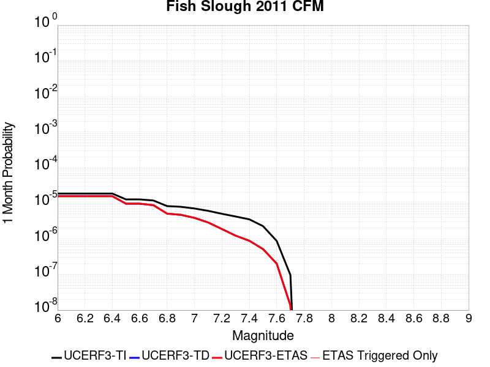 | 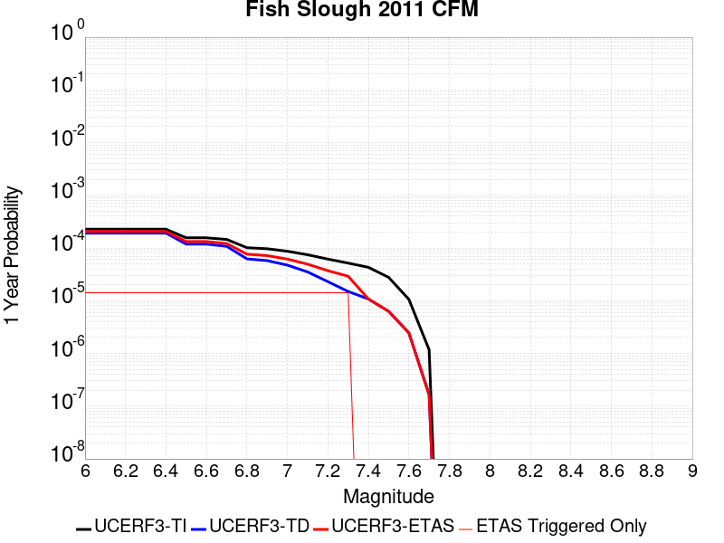 | 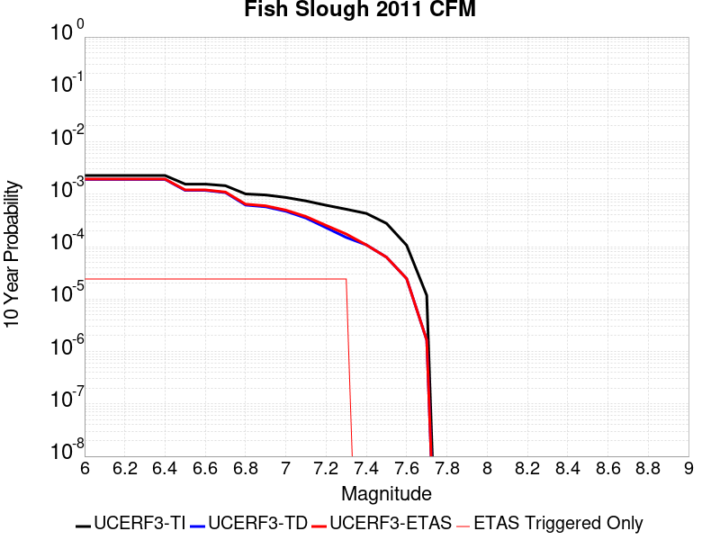 |

| Magnitude | 1 wk TI Prob | 1 wk TD Prob | 1 wk ETAS Prob | 1 wk ETAS/TD Gain | 1 wk ETAS Triggered Only | 1 mo TI Prob | 1 mo TD Prob | 1 mo ETAS Prob | 1 mo ETAS/TD Gain | 1 mo ETAS Triggered Only | 1 yr TI Prob | 1 yr TD Prob | 1 yr ETAS Prob | 1 yr ETAS/TD Gain | 1 yr ETAS Triggered Only | 10 yr TI Prob | 10 yr TD Prob | 10 yr ETAS Prob | 10 yr ETAS/TD Gain | 10 yr ETAS Triggered Only |
|-----|-----|-----|-----|-----|-----|-----|-----|-----|-----|-----|-----|-----|-----|-----|-----|-----|-----|-----|-----|-----|
| 6.0 | 4.3629925E-6 | 3.6772458E-6 | 3.6772458E-6 | 1.0 | 0.0 | 1.8698405E-5 | 1.5759542E-5 | 1.5759542E-5 | 1.0 | 0.0 | 2.276293E-4 | 1.9185765E-4 | 2.2645069E-4 | 1.1803058 | 3.459968E-5 | 0.0022739628 | 0.001917129 | 0.0019516625 | 1.018013 | 3.459968E-5 |
| 6.1 | 4.3629925E-6 | 3.6772458E-6 | 3.6772458E-6 | 1.0 | 0.0 | 1.8698405E-5 | 1.5759542E-5 | 1.5759542E-5 | 1.0 | 0.0 | 2.276293E-4 | 1.9185765E-4 | 2.2645069E-4 | 1.1803058 | 3.459968E-5 | 0.0022739628 | 0.001917129 | 0.0019516625 | 1.018013 | 3.459968E-5 |
| 6.2 | 4.3629925E-6 | 3.6772458E-6 | 3.6772458E-6 | 1.0 | 0.0 | 1.8698405E-5 | 1.5759542E-5 | 1.5759542E-5 | 1.0 | 0.0 | 2.276293E-4 | 1.9185765E-4 | 2.2645069E-4 | 1.1803058 | 3.459968E-5 | 0.0022739628 | 0.001917129 | 0.0019516625 | 1.018013 | 3.459968E-5 |
| 6.3 | 4.3629925E-6 | 3.6772458E-6 | 3.6772458E-6 | 1.0 | 0.0 | 1.8698405E-5 | 1.5759542E-5 | 1.5759542E-5 | 1.0 | 0.0 | 2.276293E-4 | 1.9185765E-4 | 2.2645069E-4 | 1.1803058 | 3.459968E-5 | 0.0022739628 | 0.001917129 | 0.0019516625 | 1.018013 | 3.459968E-5 |
| 6.4 | 4.3629925E-6 | 3.6772458E-6 | 3.6772458E-6 | 1.0 | 0.0 | 1.8698405E-5 | 1.5759542E-5 | 1.5759542E-5 | 1.0 | 0.0 | 2.276293E-4 | 1.9185765E-4 | 2.2645069E-4 | 1.1803058 | 3.459968E-5 | 0.0022739628 | 0.001917129 | 0.0019516625 | 1.018013 | 3.459968E-5 |
| 6.5 | 2.991715E-6 | 2.2703657E-6 | 2.2703657E-6 | 1.0 | 0.0 | 1.2821573E-5 | 9.730108E-6 | 9.730108E-6 | 1.0 | 0.0 | 1.5609147E-4 | 1.1845854E-4 | 1.5305412E-4 | 1.292048 | 3.459968E-5 | 0.0015598187 | 0.0011840442 | 0.0012186029 | 1.029187 | 3.459968E-5 |
| 6.6 | 2.991715E-6 | 2.2703657E-6 | 2.2703657E-6 | 1.0 | 0.0 | 1.2821573E-5 | 9.730108E-6 | 9.730108E-6 | 1.0 | 0.0 | 1.5609147E-4 | 1.1845854E-4 | 1.5305412E-4 | 1.292048 | 3.459968E-5 | 0.0015598187 | 0.0011840442 | 0.0012186029 | 1.029187 | 3.459968E-5 |
| 6.7 | 2.7890346E-6 | 2.0621612E-6 | 2.0621612E-6 | 1.0 | 0.0 | 1.1952951E-5 | 8.837809E-6 | 8.837809E-6 | 1.0 | 0.0 | 1.4551746E-4 | 1.07595915E-4 | 1.4219187E-4 | 1.321536 | 3.459968E-5 | 0.0014542221 | 0.0010755265 | 0.0011100889 | 1.0321354 | 3.459968E-5 |
| 6.8 | 1.9416723E-6 | 1.192531E-6 | 1.192531E-6 | 1.0 | 0.0 | 8.321425E-6 | 5.1108377E-6 | 5.1108377E-6 | 1.0 | 0.0 | 1.01308644E-4 | 6.2222716E-5 | 9.6820244E-5 | 1.5560273 | 3.459968E-5 | 0.0010126247 | 6.22057E-4 | 6.5663515E-4 | 1.0555868 | 3.459968E-5 |
| 6.9 | 1.8567416E-6 | 1.1046726E-6 | 1.1046726E-6 | 1.0 | 0.0 | 7.957439E-6 | 4.734303E-6 | 4.734303E-6 | 1.0 | 0.0 | 9.687752E-5 | 5.7638652E-5 | 9.223634E-5 | 1.6002516 | 3.459968E-5 | 9.6835295E-4 | 5.762409E-4 | 6.108206E-4 | 1.0600092 | 3.459968E-5 |
| 7.0 | 1.6634067E-6 | 9.0737336E-7 | 9.0737336E-7 | 1.0 | 0.0 | 7.1288664E-6 | 3.8887374E-6 | 3.8887374E-6 | 1.0 | 0.0 | 8.679049E-5 | 4.7344376E-5 | 8.1942424E-5 | 1.730774 | 3.459968E-5 | 8.6756604E-4 | 4.733458E-4 | 5.079291E-4 | 1.0730613 | 3.459968E-5 |
| 7.1 | 1.4281054E-6 | 6.736389E-7 | 6.736389E-7 | 1.0 | 0.0 | 6.1204373E-6 | 2.8870209E-6 | 2.8870209E-6 | 1.0 | 0.0 | 7.451377E-5 | 3.514893E-5 | 6.9747395E-5 | 1.9843391 | 3.459968E-5 | 7.44888E-4 | 3.5143548E-4 | 3.8602302E-4 | 1.0984179 | 3.459968E-5 |
| 7.2 | 1.1810387E-6 | 4.408126E-7 | 4.408126E-7 | 1.0 | 0.0 | 5.0615845E-6 | 1.8891956E-6 | 1.8891956E-6 | 1.0 | 0.0 | 6.1623046E-5 | 2.3000723E-5 | 5.759961E-5 | 2.5042522 | 3.459968E-5 | 6.160596E-4 | 2.2998432E-4 | 2.6457605E-4 | 1.1504091 | 3.459968E-5 |
| 7.3 | 9.918052E-7 | 2.8731267E-7 | 2.8731267E-7 | 1.0 | 0.0 | 4.2505867E-6 | 1.2313394E-6 | 1.2313394E-6 | 1.0 | 0.0 | 5.1749663E-5 | 1.4991455E-5 | 4.9590617E-5 | 3.3079255 | 3.459968E-5 | 5.173762E-4 | 1.4990455E-4 | 1.8449905E-4 | 1.2307768 | 3.459968E-5 |
| 7.4 | 8.25252E-7 | 2.0692863E-7 | 2.0692863E-7 | 1.0 | 0.0 | 3.5367896E-6 | 8.868367E-7 | 8.868367E-7 | 1.0 | 0.0 | 4.3059565E-5 | 1.0797184E-5 | 1.0797184E-5 | 1.0 | 0.0 | 4.305122E-4 | 1.0796666E-4 | 1.0796666E-4 | 1.0 | 0.0 |
| 7.5 | 5.3248567E-7 | 1.2071294E-7 | 1.2071294E-7 | 1.0 | 0.0 | 2.2820795E-6 | 5.1734105E-7 | 5.1734105E-7 | 1.0 | 0.0 | 2.7783964E-5 | 6.2986096E-6 | 6.2986096E-6 | 1.0 | 0.0 | 2.778049E-4 | 6.298435E-5 | 6.298435E-5 | 1.0 | 0.0 |
| 7.6 | 2.037542E-7 | 4.7123013E-8 | 4.7123013E-8 | 1.0 | 0.0 | 8.73232E-7 | 2.0195576E-7 | 2.0195576E-7 | 1.0 | 0.0 | 1.0631547E-5 | 2.4588087E-6 | 2.4588087E-6 | 1.0 | 0.0 | 1.0631039E-4 | 2.4587836E-5 | 2.4587836E-5 | 1.0 | 0.0 |
| 7.7 | 2.2501226E-8 | 3.1506997E-9 | 3.1506997E-9 | 1.0 | 0.0 | 9.6433816E-8 | 1.3502998E-8 | 1.3502998E-8 | 1.0 | 0.0 | 1.1740811E-6 | 1.64399E-7 | 1.64399E-7 | 1.0 | 0.0 | 1.1740749E-5 | 1.6439889E-6 | 1.6439889E-6 | 1.0 | 0.0 |

## North Frontal  (East)
*[(top)](#table-of-contents)*

| 1 Week | 1 Month | 1 Year | 10 Year |
|-----|-----|-----|-----|
|  | 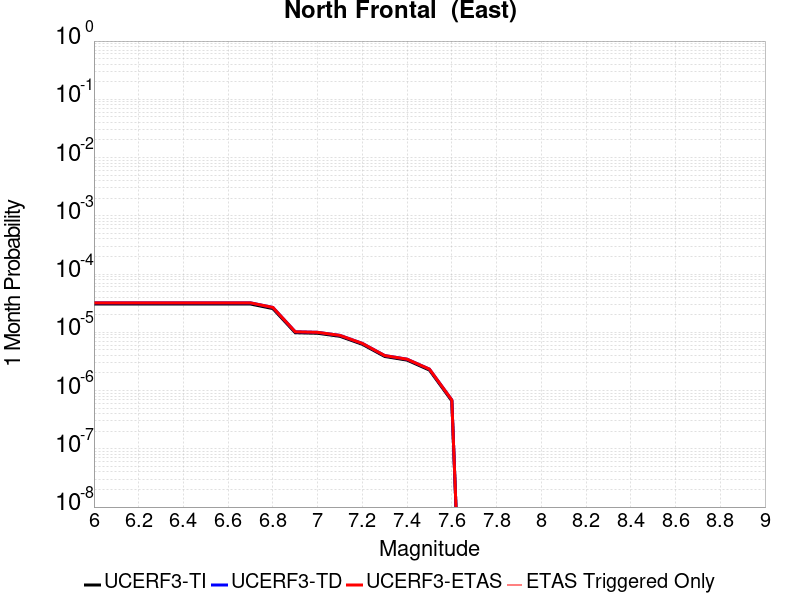 | 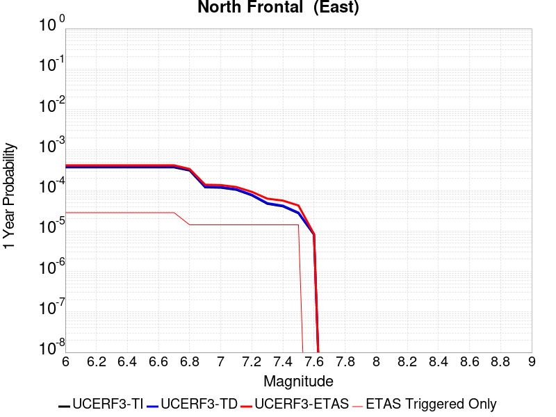 | 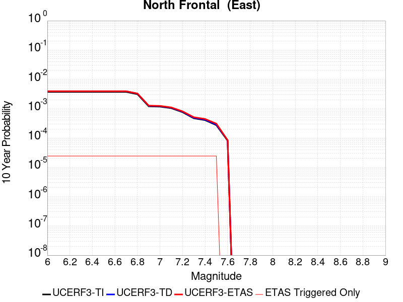 |

| Magnitude | 1 wk TI Prob | 1 wk TD Prob | 1 wk ETAS Prob | 1 wk ETAS/TD Gain | 1 wk ETAS Triggered Only | 1 mo TI Prob | 1 mo TD Prob | 1 mo ETAS Prob | 1 mo ETAS/TD Gain | 1 mo ETAS Triggered Only | 1 yr TI Prob | 1 yr TD Prob | 1 yr ETAS Prob | 1 yr ETAS/TD Gain | 1 yr ETAS Triggered Only | 10 yr TI Prob | 10 yr TD Prob | 10 yr ETAS Prob | 10 yr ETAS/TD Gain | 10 yr ETAS Triggered Only |
|-----|-----|-----|-----|-----|-----|-----|-----|-----|-----|-----|-----|-----|-----|-----|-----|-----|-----|-----|-----|-----|
| 6.0 | 7.135738E-6 | 7.4771765E-6 | 7.4771765E-6 | 1.0 | 0.0 | 3.0581377E-5 | 3.204476E-5 | 3.204476E-5 | 1.0 | 0.0 | 3.7226462E-4 | 3.9009505E-4 | 4.2468126E-4 | 1.088661 | 3.459968E-5 | 0.0037164164 | 0.0038960609 | 0.003930526 | 1.008846 | 3.459968E-5 |
| 6.1 | 7.135738E-6 | 7.4771765E-6 | 7.4771765E-6 | 1.0 | 0.0 | 3.0581377E-5 | 3.204476E-5 | 3.204476E-5 | 1.0 | 0.0 | 3.7226462E-4 | 3.9009505E-4 | 4.2468126E-4 | 1.088661 | 3.459968E-5 | 0.0037164164 | 0.0038960609 | 0.003930526 | 1.008846 | 3.459968E-5 |
| 6.2 | 7.135738E-6 | 7.4771765E-6 | 7.4771765E-6 | 1.0 | 0.0 | 3.0581377E-5 | 3.204476E-5 | 3.204476E-5 | 1.0 | 0.0 | 3.7226462E-4 | 3.9009505E-4 | 4.2468126E-4 | 1.088661 | 3.459968E-5 | 0.0037164164 | 0.0038960609 | 0.003930526 | 1.008846 | 3.459968E-5 |
| 6.3 | 7.135738E-6 | 7.4771765E-6 | 7.4771765E-6 | 1.0 | 0.0 | 3.0581377E-5 | 3.204476E-5 | 3.204476E-5 | 1.0 | 0.0 | 3.7226462E-4 | 3.9009505E-4 | 4.2468126E-4 | 1.088661 | 3.459968E-5 | 0.0037164164 | 0.0038960609 | 0.003930526 | 1.008846 | 3.459968E-5 |
| 6.4 | 7.135738E-6 | 7.4771765E-6 | 7.4771765E-6 | 1.0 | 0.0 | 3.0581377E-5 | 3.204476E-5 | 3.204476E-5 | 1.0 | 0.0 | 3.7226462E-4 | 3.9009505E-4 | 4.2468126E-4 | 1.088661 | 3.459968E-5 | 0.0037164164 | 0.0038960609 | 0.003930526 | 1.008846 | 3.459968E-5 |
| 6.5 | 7.135738E-6 | 7.4771765E-6 | 7.4771765E-6 | 1.0 | 0.0 | 3.0581377E-5 | 3.204476E-5 | 3.204476E-5 | 1.0 | 0.0 | 3.7226462E-4 | 3.9009505E-4 | 4.2468126E-4 | 1.088661 | 3.459968E-5 | 0.0037164164 | 0.0038960609 | 0.003930526 | 1.008846 | 3.459968E-5 |
| 6.6 | 7.135738E-6 | 7.4771765E-6 | 7.4771765E-6 | 1.0 | 0.0 | 3.0581377E-5 | 3.204476E-5 | 3.204476E-5 | 1.0 | 0.0 | 3.7226462E-4 | 3.9009505E-4 | 4.2468126E-4 | 1.088661 | 3.459968E-5 | 0.0037164164 | 0.0038960609 | 0.003930526 | 1.008846 | 3.459968E-5 |
| 6.7 | 7.135738E-6 | 7.4771765E-6 | 7.4771765E-6 | 1.0 | 0.0 | 3.0581377E-5 | 3.204476E-5 | 3.204476E-5 | 1.0 | 0.0 | 3.7226462E-4 | 3.9009505E-4 | 4.2468126E-4 | 1.088661 | 3.459968E-5 | 0.0037164164 | 0.0038960609 | 0.003930526 | 1.008846 | 3.459968E-5 |
| 6.8 | 5.959142E-6 | 6.236683E-6 | 6.236683E-6 | 1.0 | 0.0 | 2.553893E-5 | 2.6728469E-5 | 2.6728469E-5 | 1.0 | 0.0 | 3.108921E-4 | 3.253886E-4 | 3.59977E-4 | 1.1062988 | 3.459968E-5 | 0.0031045752 | 0.0032508948 | 0.003285382 | 1.0106086 | 3.459968E-5 |
| 6.9 | 2.2946929E-6 | 2.3824605E-6 | 2.3824605E-6 | 1.0 | 0.0 | 9.834361E-6 | 1.0210508E-5 | 1.0210508E-5 | 1.0 | 0.0 | 1.1972676E-4 | 1.2430632E-4 | 1.5890169E-4 | 1.2783076 | 3.459968E-5 | 0.0011966228 | 0.0012424142 | 0.001276971 | 1.0278141 | 3.459968E-5 |
| 7.0 | 2.2468673E-6 | 2.3321538E-6 | 2.3321538E-6 | 1.0 | 0.0 | 9.629396E-6 | 9.994909E-6 | 9.994909E-6 | 1.0 | 0.0 | 1.1723159E-4 | 1.21681696E-4 | 1.5627716E-4 | 1.2843112 | 3.459968E-5 | 0.0011716976 | 0.0012161969 | 0.0012507546 | 1.0284145 | 3.459968E-5 |
| 7.1 | 1.9921076E-6 | 2.0646032E-6 | 2.0646032E-6 | 1.0 | 0.0 | 8.537577E-6 | 8.848272E-6 | 8.848272E-6 | 1.0 | 0.0 | 1.0394004E-4 | 1.0772282E-4 | 1.4231878E-4 | 1.3211571 | 3.459968E-5 | 0.0010389143 | 0.0010767487 | 0.0011113111 | 1.0320989 | 3.459968E-5 |
| 7.2 | 1.4524545E-6 | 1.5045148E-6 | 1.5045148E-6 | 1.0 | 0.0 | 6.2247905E-6 | 6.447906E-6 | 6.447906E-6 | 1.0 | 0.0 | 7.5784184E-5 | 7.850068E-5 | 1.13097645E-4 | 1.4407219 | 3.459968E-5 | 7.575835E-4 | 7.8475394E-4 | 8.1932644E-4 | 1.0440552 | 3.459968E-5 |
| 7.3 | 8.9802575E-7 | 9.3087283E-7 | 9.3087283E-7 | 1.0 | 0.0 | 3.848676E-6 | 3.9894494E-6 | 3.9894494E-6 | 1.0 | 0.0 | 4.685662E-5 | 4.857058E-5 | 8.316858E-5 | 1.7123243 | 3.459968E-5 | 4.6846745E-4 | 4.8561094E-4 | 5.2019383E-4 | 1.0712152 | 3.459968E-5 |
| 7.4 | 7.776139E-7 | 8.0604747E-7 | 8.0604747E-7 | 1.0 | 0.0 | 3.3326266E-6 | 3.4544853E-6 | 3.4544853E-6 | 1.0 | 0.0 | 4.0573974E-5 | 4.2057654E-5 | 7.665588E-5 | 1.822638 | 3.459968E-5 | 4.0566566E-4 | 4.205077E-4 | 4.5509284E-4 | 1.0822462 | 3.459968E-5 |
| 7.5 | 5.244417E-7 | 5.441219E-7 | 5.441219E-7 | 1.0 | 0.0 | 2.2476054E-6 | 2.3319494E-6 | 2.3319494E-6 | 1.0 | 0.0 | 2.7364253E-5 | 2.839118E-5 | 6.298988E-5 | 2.2186425 | 3.459968E-5 | 2.7360884E-4 | 2.8388205E-4 | 3.184719E-4 | 1.1218458 | 3.459968E-5 |
| 7.6 | 1.5489647E-7 | 1.6089504E-7 | 1.6089504E-7 | 1.0 | 0.0 | 6.6384183E-7 | 6.895501E-7 | 6.895501E-7 | 1.0 | 0.0 | 8.082245E-6 | 8.395261E-6 | 8.395261E-6 | 1.0 | 0.0 | 8.08195E-5 | 8.395143E-5 | 8.395143E-5 | 1.0 | 0.0 |

## Rodgers Creek - Healdsburg 2011 CFM
*[(top)](#table-of-contents)*

| 1 Week | 1 Month | 1 Year | 10 Year |
|-----|-----|-----|-----|
|  | 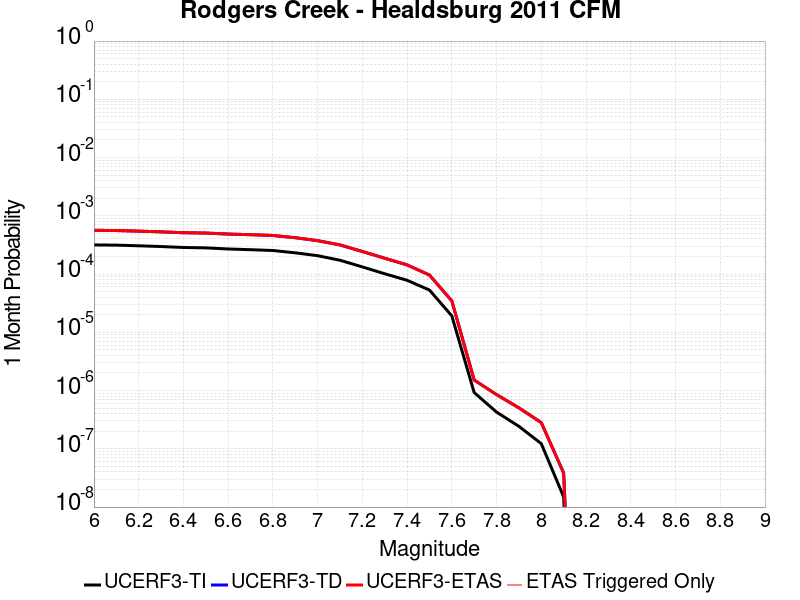 | 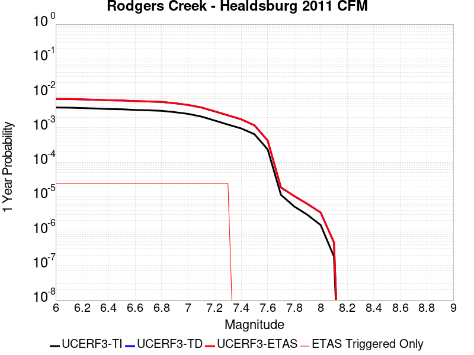 | 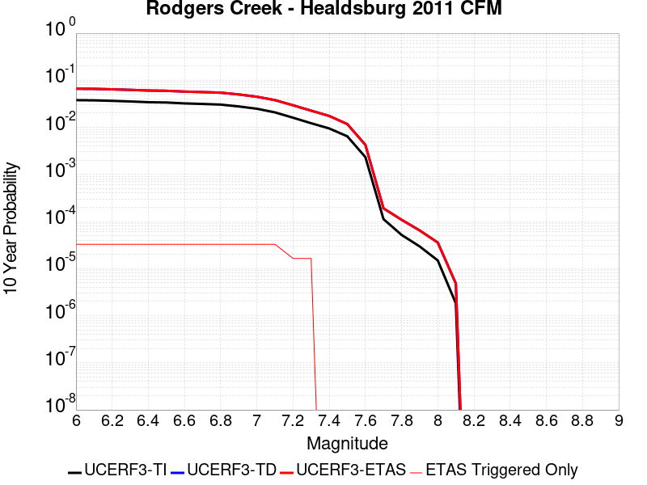 |

| Magnitude | 1 wk TI Prob | 1 wk TD Prob | 1 wk ETAS Prob | 1 wk ETAS/TD Gain | 1 wk ETAS Triggered Only | 1 mo TI Prob | 1 mo TD Prob | 1 mo ETAS Prob | 1 mo ETAS/TD Gain | 1 mo ETAS Triggered Only | 1 yr TI Prob | 1 yr TD Prob | 1 yr ETAS Prob | 1 yr ETAS/TD Gain | 1 yr ETAS Triggered Only | 10 yr TI Prob | 10 yr TD Prob | 10 yr ETAS Prob | 10 yr ETAS/TD Gain | 10 yr ETAS Triggered Only |
|-----|-----|-----|-----|-----|-----|-----|-----|-----|-----|-----|-----|-----|-----|-----|-----|-----|-----|-----|-----|-----|
| 6.0 | 7.390182E-5 | 1.3137296E-4 | 1.3137296E-4 | 1.0 | 0.0 | 3.1668364E-4 | 5.629057E-4 | 5.629057E-4 | 1.0 | 0.0 | 0.0038488081 | 0.0068318076 | 0.006866171 | 1.0050299 | 3.459968E-5 | 0.037828278 | 0.06618395 | 0.06621626 | 1.0004882 | 3.459968E-5 |
| 6.1 | 7.318768E-5 | 1.303531E-4 | 1.303531E-4 | 1.0 | 0.0 | 3.1362378E-4 | 5.585369E-4 | 5.585369E-4 | 1.0 | 0.0 | 0.0038116854 | 0.006778966 | 0.0068133315 | 1.0050694 | 3.459968E-5 | 0.037469655 | 0.06568854 | 0.06572087 | 1.0004921 | 3.459968E-5 |
| 6.2 | 7.1379836E-5 | 1.2728151E-4 | 1.2728151E-4 | 1.0 | 0.0 | 3.058777E-4 | 5.453785E-4 | 5.453785E-4 | 1.0 | 0.0 | 0.003717703 | 0.0066197454 | 0.006654116 | 1.0051922 | 3.459968E-5 | 0.0365612 | 0.06421061 | 0.06424298 | 1.0005043 | 3.459968E-5 |
| 6.3 | 6.9255926E-5 | 1.2382482E-4 | 1.2382482E-4 | 1.0 | 0.0 | 2.9677735E-4 | 5.305703E-4 | 5.305703E-4 | 1.0 | 0.0 | 0.0036072785 | 0.0064406106 | 0.0064749876 | 1.0053375 | 3.459968E-5 | 0.035492823 | 0.062541805 | 0.062574245 | 1.0005187 | 3.459968E-5 |
| 6.4 | 6.6757144E-5 | 1.195919E-4 | 1.195919E-4 | 1.0 | 0.0 | 2.8607066E-4 | 5.1243644E-4 | 5.1243644E-4 | 1.0 | 0.0 | 0.0034773487 | 0.00622114 | 0.0062555242 | 1.005527 | 3.459968E-5 | 0.034234364 | 0.060491614 | 0.06052412 | 1.0005374 | 3.459968E-5 |
| 6.5 | 6.5735134E-5 | 1.180849E-4 | 1.180849E-4 | 1.0 | 0.0 | 2.8169158E-4 | 5.059804E-4 | 5.059804E-4 | 1.0 | 0.0 | 0.003424202 | 0.0061429944 | 0.0061773816 | 1.0055978 | 3.459968E-5 | 0.03371918 | 0.059755705 | 0.05978824 | 1.0005444 | 3.459968E-5 |
| 6.6 | 6.289601E-5 | 1.13442366E-4 | 1.13442366E-4 | 1.0 | 0.0 | 2.6952647E-4 | 4.8609133E-4 | 4.8609133E-4 | 1.0 | 0.0 | 0.0032765474 | 0.005902183 | 0.0059365784 | 1.0058275 | 3.459968E-5 | 0.032286562 | 0.057495043 | 0.05752765 | 1.0005672 | 3.459968E-5 |
| 6.7 | 6.115274E-5 | 1.106132E-4 | 1.106132E-4 | 1.0 | 0.0 | 2.6205686E-4 | 4.739708E-4 | 4.739708E-4 | 1.0 | 0.0 | 0.0031858748 | 0.0057554054 | 0.0057898057 | 1.005977 | 3.459968E-5 | 0.031405866 | 0.05611361 | 0.056146268 | 1.000582 | 3.459968E-5 |
| 6.8 | 5.9232367E-5 | 1.0728657E-4 | 1.0728657E-4 | 1.0 | 0.0 | 2.538283E-4 | 4.5971893E-4 | 4.5971893E-4 | 1.0 | 0.0 | 0.0030859804 | 0.005582791 | 0.005617197 | 1.006163 | 3.459968E-5 | 0.030434765 | 0.05448041 | 0.054513127 | 1.0006005 | 3.459968E-5 |
| 6.9 | 5.4030377E-5 | 9.8228295E-5 | 9.8228295E-5 | 1.0 | 0.0 | 2.315382E-4 | 4.209108E-4 | 4.209108E-4 | 1.0 | 0.0 | 0.0028153337 | 0.0051126136 | 0.0051470366 | 1.006733 | 3.459968E-5 | 0.027799325 | 0.05001572 | 0.05004859 | 1.0006572 | 3.459968E-5 |
| 7.0 | 4.8260714E-5 | 8.7408924E-5 | 8.7408924E-5 | 1.0 | 0.0 | 2.0681522E-4 | 3.7455617E-4 | 3.7455617E-4 | 1.0 | 0.0 | 0.0025150678 | 0.0045507406 | 0.0045851828 | 1.0075685 | 3.459968E-5 | 0.024867928 | 0.044667073 | 0.044700127 | 1.00074 | 3.459968E-5 |
| 7.1 | 4.0294493E-5 | 7.389363E-5 | 7.389363E-5 | 1.0 | 0.0 | 1.7267925E-4 | 3.1664874E-4 | 3.1664874E-4 | 1.0 | 0.0 | 0.0021003427 | 0.0038484214 | 0.003882888 | 1.0089561 | 3.459968E-5 | 0.02080602 | 0.037923187 | 0.037956476 | 1.0008777 | 3.459968E-5 |
| 7.2 | 3.096388E-5 | 5.698023E-5 | 5.698023E-5 | 1.0 | 0.0 | 1.326956E-4 | 2.4417826E-4 | 2.4417826E-4 | 1.0 | 0.0 | 0.0016143717 | 0.0029688394 | 0.0030033363 | 1.0116197 | 3.459968E-5 | 0.01602694 | 0.029437006 | 0.029470587 | 1.0011408 | 3.459968E-5 |
| 7.3 | 2.3615226E-5 | 4.3629818E-5 | 4.3629818E-5 | 1.0 | 0.0 | 1.0120418E-4 | 1.869716E-4 | 1.869716E-4 | 1.0 | 0.0 | 0.0012314644 | 0.0022740164 | 0.0023085375 | 1.0151806 | 3.459968E-5 | 0.0122466255 | 0.022637889 | 0.022671705 | 1.0014938 | 3.459968E-5 |
| 7.4 | 1.8251132E-5 | 3.3542477E-5 | 3.3542477E-5 | 1.0 | 0.0 | 7.821679E-5 | 1.4374561E-4 | 1.4374561E-4 | 1.0 | 0.0 | 9.518733E-4 | 0.0017487077 | 0.0017487077 | 1.0 | 0.0 | 0.009478063 | 0.017466031 | 0.017466031 | 1.0 | 0.0 |
| 7.5 | 1.2411432E-5 | 2.2461069E-5 | 2.2461069E-5 | 1.0 | 0.0 | 5.3190768E-5 | 9.6258205E-5 | 9.6258205E-5 | 1.0 | 0.0 | 6.4740516E-4 | 0.0011713194 | 0.0011713194 | 1.0 | 0.0 | 0.006455223 | 0.011743137 | 0.011743137 | 1.0 | 0.0 |
| 7.6 | 4.4771446E-6 | 8.08443E-6 | 8.08443E-6 | 1.0 | 0.0 | 1.918762E-5 | 3.4647102E-5 | 3.4647102E-5 | 1.0 | 0.0 | 2.3358424E-4 | 4.2174806E-4 | 4.2174806E-4 | 1.0 | 0.0 | 0.0023333887 | 0.0042453306 | 0.0042453306 | 1.0 | 0.0 |
| 7.7 | 2.157941E-7 | 3.5350925E-7 | 3.5350925E-7 | 1.0 | 0.0 | 9.248315E-7 | 1.5150388E-6 | 1.5150388E-6 | 1.0 | 0.0 | 1.1259765E-5 | 1.844544E-5 | 1.844544E-5 | 1.0 | 0.0 | 1.1259195E-4 | 1.9069649E-4 | 1.9069649E-4 | 1.0 | 0.0 |
| 7.8 | 9.9623286E-8 | 1.9900986E-7 | 1.9900986E-7 | 1.0 | 0.0 | 4.269569E-7 | 8.528991E-7 | 8.528991E-7 | 1.0 | 0.0 | 5.1981874E-6 | 1.03839975E-5 | 1.03839975E-5 | 1.0 | 0.0 | 5.198066E-5 | 1.0902916E-4 | 1.0902916E-4 | 1.0 | 0.0 |
| 7.9 | 5.6745257E-8 | 1.1774714E-7 | 1.1774714E-7 | 1.0 | 0.0 | 2.4319394E-7 | 5.046305E-7 | 5.046305E-7 | 1.0 | 0.0 | 2.960882E-6 | 6.143859E-6 | 6.143859E-6 | 1.0 | 0.0 | 2.9608427E-5 | 6.471445E-5 | 6.471445E-5 | 1.0 | 0.0 |
| 8.0 | 2.8614323E-8 | 6.5789635E-8 | 6.5789635E-8 | 1.0 | 0.0 | 1.2263281E-7 | 2.8195555E-7 | 2.8195555E-7 | 1.0 | 0.0 | 1.4930534E-6 | 3.4328034E-6 | 3.4328034E-6 | 1.0 | 0.0 | 1.4930434E-5 | 3.5830046E-5 | 3.5830046E-5 | 1.0 | 0.0 |
| 8.1 | 3.5045191E-9 | 8.966459E-9 | 8.966459E-9 | 1.0 | 0.0 | 1.5019367E-8 | 3.8427682E-8 | 3.8427682E-8 | 1.0 | 0.0 | 1.8286079E-7 | 4.6785692E-7 | 4.6785692E-7 | 1.0 | 0.0 | 1.8286064E-6 | 4.834128E-6 | 4.834128E-6 | 1.0 | 0.0 |

## Elsinore (Coyote Mountains)
*[(top)](#table-of-contents)*

| 1 Week | 1 Month | 1 Year | 10 Year |
|-----|-----|-----|-----|
| 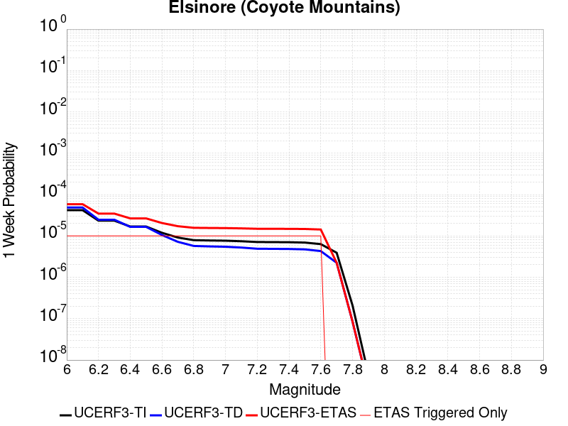 | 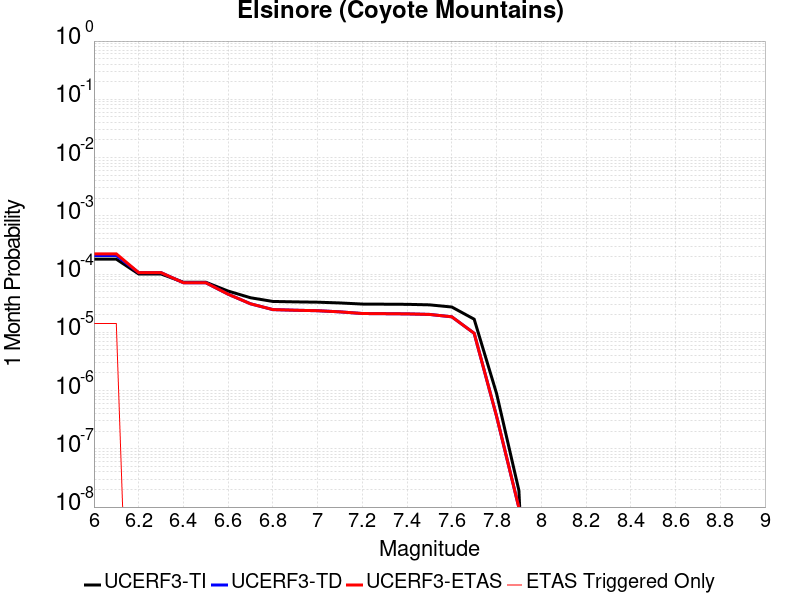 | 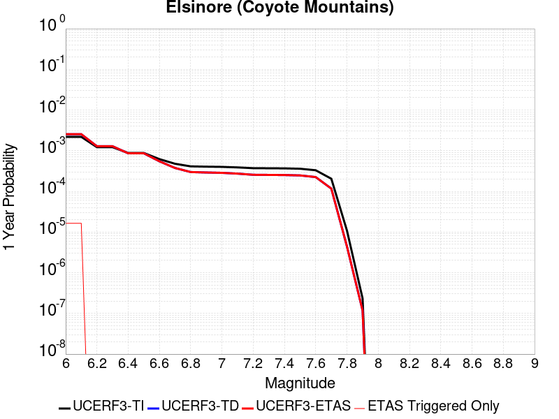 | 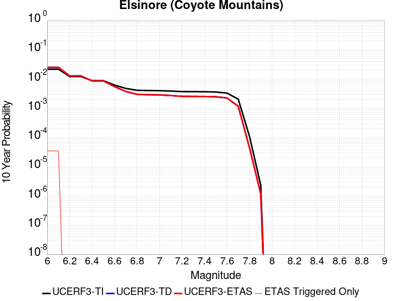 |

| Magnitude | 1 wk TI Prob | 1 wk TD Prob | 1 wk ETAS Prob | 1 wk ETAS/TD Gain | 1 wk ETAS Triggered Only | 1 mo TI Prob | 1 mo TD Prob | 1 mo ETAS Prob | 1 mo ETAS/TD Gain | 1 mo ETAS Triggered Only | 1 yr TI Prob | 1 yr TD Prob | 1 yr ETAS Prob | 1 yr ETAS/TD Gain | 1 yr ETAS Triggered Only | 10 yr TI Prob | 10 yr TD Prob | 10 yr ETAS Prob | 10 yr ETAS/TD Gain | 10 yr ETAS Triggered Only |
|-----|-----|-----|-----|-----|-----|-----|-----|-----|-----|-----|-----|-----|-----|-----|-----|-----|-----|-----|-----|-----|
| 6.0 | 4.20513E-5 | 4.8630944E-5 | 4.8630944E-5 | 1.0 | 0.0 | 1.8020741E-4 | 2.0840492E-4 | 2.429974E-4 | 1.1659868 | 3.459968E-5 | 0.0021918174 | 0.0025349057 | 0.0025694177 | 1.0136147 | 3.459968E-5 | 0.021703249 | 0.025111204 | 0.025144935 | 1.0013433 | 3.459968E-5 |
| 6.1 | 4.20513E-5 | 4.8630944E-5 | 4.8630944E-5 | 1.0 | 0.0 | 1.8020741E-4 | 2.0840492E-4 | 2.429974E-4 | 1.1659868 | 3.459968E-5 | 0.0021918174 | 0.0025349057 | 0.0025694177 | 1.0136147 | 3.459968E-5 | 0.021703249 | 0.025111204 | 0.025144935 | 1.0013433 | 3.459968E-5 |
| 6.2 | 2.3413893E-5 | 2.4695422E-5 | 2.4695422E-5 | 1.0 | 0.0 | 1.0034139E-4 | 1.0583377E-4 | 1.0583377E-4 | 1.0 | 0.0 | 0.0012209718 | 0.0012878523 | 0.0012878523 | 1.0 | 0.0 | 0.012142851 | 0.012812569 | 0.012812569 | 1.0 | 0.0 |
| 6.3 | 2.3413893E-5 | 2.4695422E-5 | 2.4695422E-5 | 1.0 | 0.0 | 1.0034139E-4 | 1.0583377E-4 | 1.0583377E-4 | 1.0 | 0.0 | 0.0012209718 | 0.0012878523 | 0.0012878523 | 1.0 | 0.0 | 0.012142851 | 0.012812569 | 0.012812569 | 1.0 | 0.0 |
| 6.4 | 1.6894814E-5 | 1.6568214E-5 | 1.6568214E-5 | 1.0 | 0.0 | 7.240433E-5 | 7.100491E-5 | 7.100491E-5 | 1.0 | 0.0 | 8.811662E-4 | 8.641788E-4 | 8.641788E-4 | 1.0 | 0.0 | 0.0087768035 | 0.008611842 | 0.008611842 | 1.0 | 0.0 |
| 6.5 | 1.6894814E-5 | 1.6568214E-5 | 1.6568214E-5 | 1.0 | 0.0 | 7.240433E-5 | 7.100491E-5 | 7.100491E-5 | 1.0 | 0.0 | 8.811662E-4 | 8.641788E-4 | 8.641788E-4 | 1.0 | 0.0 | 0.0087768035 | 0.008611842 | 0.008611842 | 1.0 | 0.0 |
| 6.6 | 1.1910969E-5 | 1.0530538E-5 | 1.0530538E-5 | 1.0 | 0.0 | 5.1046012E-5 | 4.513017E-5 | 4.513017E-5 | 1.0 | 0.0 | 6.21308E-4 | 5.493346E-4 | 5.493346E-4 | 1.0 | 0.0 | 0.0061957375 | 0.0054810685 | 0.0054810685 | 1.0 | 0.0 |
| 6.7 | 9.1486E-6 | 7.2026473E-6 | 7.2026473E-6 | 1.0 | 0.0 | 3.9207694E-5 | 3.0868145E-5 | 3.0868145E-5 | 1.0 | 0.0 | 4.7724912E-4 | 3.7575865E-4 | 3.7575865E-4 | 1.0 | 0.0 | 0.0047622547 | 0.0037516125 | 0.0037516125 | 1.0 | 0.0 |
| 6.8 | 7.90441E-6 | 5.7288153E-6 | 5.7288153E-6 | 1.0 | 0.0 | 3.3875604E-5 | 2.4551842E-5 | 2.4551842E-5 | 1.0 | 0.0 | 4.1235742E-4 | 2.9887896E-4 | 2.9887896E-4 | 1.0 | 0.0 | 0.0041159308 | 0.0029848986 | 0.0029848986 | 1.0 | 0.0 |
| 6.9 | 7.77015E-6 | 5.5827695E-6 | 5.5827695E-6 | 1.0 | 0.0 | 3.3300217E-5 | 2.3925944E-5 | 2.3925944E-5 | 1.0 | 0.0 | 4.0535472E-4 | 2.912607E-4 | 2.912607E-4 | 1.0 | 0.0 | 0.004046161 | 0.0029089167 | 0.0029089167 | 1.0 | 0.0 |
| 7.0 | 7.675798E-6 | 5.4796283E-6 | 5.4796283E-6 | 1.0 | 0.0 | 3.289586E-5 | 2.3483917E-5 | 2.3483917E-5 | 1.0 | 0.0 | 4.004335E-4 | 2.8588044E-4 | 2.8588044E-4 | 1.0 | 0.0 | 0.003997127 | 0.0028552532 | 0.0028552532 | 1.0 | 0.0 |
| 7.1 | 7.447814E-6 | 5.2385003E-6 | 5.2385003E-6 | 1.0 | 0.0 | 3.191881E-5 | 2.245053E-5 | 2.245053E-5 | 1.0 | 0.0 | 3.8854225E-4 | 2.7330214E-4 | 2.7330214E-4 | 1.0 | 0.0 | 0.003878636 | 0.0027297847 | 0.0027297847 | 1.0 | 0.0 |
| 7.2 | 7.128185E-6 | 4.905146E-6 | 4.905146E-6 | 1.0 | 0.0 | 3.0549007E-5 | 2.1021891E-5 | 2.1021891E-5 | 1.0 | 0.0 | 3.7187067E-4 | 2.5591266E-4 | 2.5591266E-4 | 1.0 | 0.0 | 0.00371249 | 0.002556298 | 0.002556298 | 1.0 | 0.0 |
| 7.3 | 7.0913875E-6 | 4.873821E-6 | 4.873821E-6 | 1.0 | 0.0 | 3.0391306E-5 | 2.0887644E-5 | 2.0887644E-5 | 1.0 | 0.0 | 3.6995133E-4 | 2.542786E-4 | 2.542786E-4 | 1.0 | 0.0 | 0.0036933604 | 0.0025399947 | 0.0025399947 | 1.0 | 0.0 |
| 7.4 | 7.051521E-6 | 4.837673E-6 | 4.837673E-6 | 1.0 | 0.0 | 3.0220453E-5 | 2.0732725E-5 | 2.0732725E-5 | 1.0 | 0.0 | 3.6787192E-4 | 2.5239287E-4 | 2.5239287E-4 | 1.0 | 0.0 | 0.0036726352 | 0.0025211805 | 0.0025211805 | 1.0 | 0.0 |
| 7.5 | 6.910666E-6 | 4.7332255E-6 | 4.7332255E-6 | 1.0 | 0.0 | 2.9616802E-5 | 2.02851E-5 | 2.02851E-5 | 1.0 | 0.0 | 3.605249E-4 | 2.4694428E-4 | 2.4694428E-4 | 1.0 | 0.0 | 0.0035994058 | 0.002466817 | 0.002466817 | 1.0 | 0.0 |
| 7.6 | 6.341753E-6 | 4.306345E-6 | 4.306345E-6 | 1.0 | 0.0 | 2.7178658E-5 | 1.8455641E-5 | 1.8455641E-5 | 1.0 | 0.0 | 3.3084993E-4 | 2.2467543E-4 | 2.2467543E-4 | 1.0 | 0.0 | 0.0033035777 | 0.002244598 | 0.002244598 | 1.0 | 0.0 |
| 7.7 | 3.9205916E-6 | 2.2437468E-6 | 2.2437468E-6 | 1.0 | 0.0 | 1.6802427E-5 | 9.616027E-6 | 9.616027E-6 | 1.0 | 0.0 | 2.0455034E-4 | 1.17069576E-4 | 1.17069576E-4 | 1.0 | 0.0 | 0.0020436216 | 0.001170152 | 0.001170152 | 1.0 | 0.0 |
| 7.8 | 2.0846227E-7 | 8.4853966E-8 | 8.4853966E-8 | 1.0 | 0.0 | 8.9340944E-7 | 3.6365984E-7 | 3.6365984E-7 | 1.0 | 0.0 | 1.0877206E-5 | 4.427553E-6 | 4.427553E-6 | 1.0 | 0.0 | 1.0876673E-4 | 4.4274973E-5 | 4.4274973E-5 | 1.0 | 0.0 |
| 7.9 | 4.4969806E-9 | 2.269088E-9 | 2.269088E-9 | 1.0 | 0.0 | 1.9272775E-8 | 9.724664E-9 | 9.724664E-9 | 1.0 | 0.0 | 2.3464601E-7 | 1.1839777E-7 | 1.1839777E-7 | 1.0 | 0.0 | 2.3464577E-6 | 1.1839772E-6 | 1.1839772E-6 | 1.0 | 0.0 |

## Mono Lake 2011 CFM
*[(top)](#table-of-contents)*

| 1 Week | 1 Month | 1 Year | 10 Year |
|-----|-----|-----|-----|
| 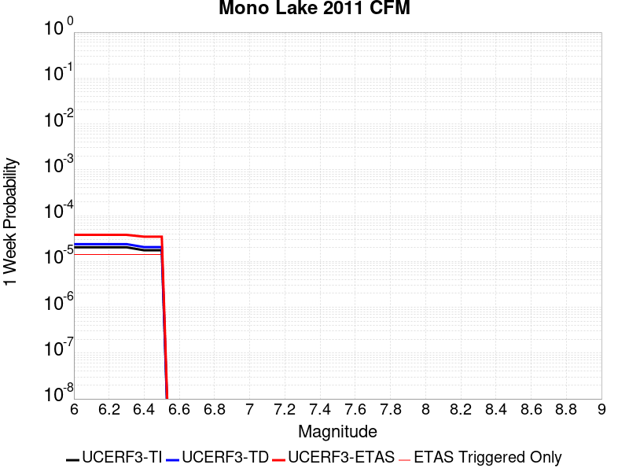 | 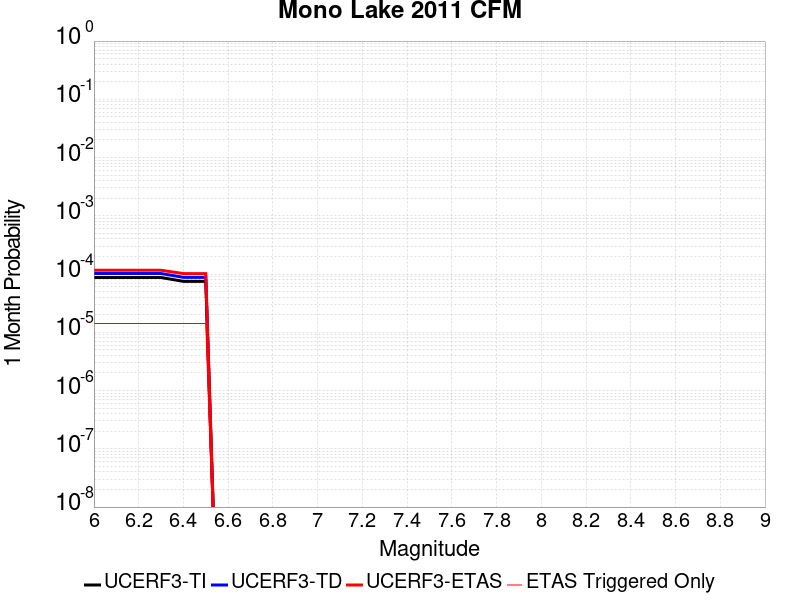 | 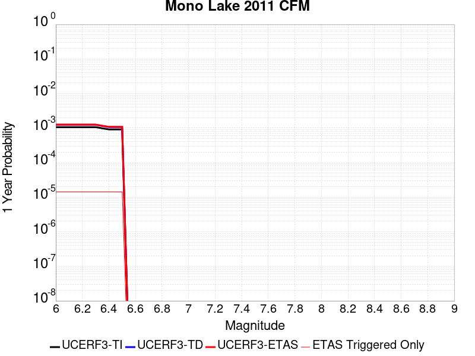 |  |

| Magnitude | 1 wk TI Prob | 1 wk TD Prob | 1 wk ETAS Prob | 1 wk ETAS/TD Gain | 1 wk ETAS Triggered Only | 1 mo TI Prob | 1 mo TD Prob | 1 mo ETAS Prob | 1 mo ETAS/TD Gain | 1 mo ETAS Triggered Only | 1 yr TI Prob | 1 yr TD Prob | 1 yr ETAS Prob | 1 yr ETAS/TD Gain | 1 yr ETAS Triggered Only | 10 yr TI Prob | 10 yr TD Prob | 10 yr ETAS Prob | 10 yr ETAS/TD Gain | 10 yr ETAS Triggered Only |
|-----|-----|-----|-----|-----|-----|-----|-----|-----|-----|-----|-----|-----|-----|-----|-----|-----|-----|-----|-----|-----|
| 6.0 | 2.0341662E-5 | 2.3828192E-5 | 2.3828192E-5 | 1.0 | 0.0 | 8.717564E-5 | 1.0211982E-4 | 1.0211982E-4 | 1.0 | 0.0 | 0.0010608466 | 0.0012431308 | 0.0012431308 | 1.0 | 0.0 | 0.010557966 | 0.012413842 | 0.012448012 | 1.0027525 | 3.459968E-5 |
| 6.1 | 2.0341662E-5 | 2.3828192E-5 | 2.3828192E-5 | 1.0 | 0.0 | 8.717564E-5 | 1.0211982E-4 | 1.0211982E-4 | 1.0 | 0.0 | 0.0010608466 | 0.0012431308 | 0.0012431308 | 1.0 | 0.0 | 0.010557966 | 0.012413842 | 0.012448012 | 1.0027525 | 3.459968E-5 |
| 6.2 | 2.0341662E-5 | 2.3828192E-5 | 2.3828192E-5 | 1.0 | 0.0 | 8.717564E-5 | 1.0211982E-4 | 1.0211982E-4 | 1.0 | 0.0 | 0.0010608466 | 0.0012431308 | 0.0012431308 | 1.0 | 0.0 | 0.010557966 | 0.012413842 | 0.012448012 | 1.0027525 | 3.459968E-5 |
| 6.3 | 2.0341662E-5 | 2.3828192E-5 | 2.3828192E-5 | 1.0 | 0.0 | 8.717564E-5 | 1.0211982E-4 | 1.0211982E-4 | 1.0 | 0.0 | 0.0010608466 | 0.0012431308 | 0.0012431308 | 1.0 | 0.0 | 0.010557966 | 0.012413842 | 0.012448012 | 1.0027525 | 3.459968E-5 |
| 6.4 | 1.749821E-5 | 2.049101E-5 | 2.049101E-5 | 1.0 | 0.0 | 7.499018E-5 | 8.781861E-5 | 8.781861E-5 | 1.0 | 0.0 | 9.1262296E-4 | 0.0010691914 | 0.0010691914 | 1.0 | 0.0 | 0.009088841 | 0.01069187 | 0.01069187 | 1.0 | 0.0 |
| 6.5 | 1.749821E-5 | 2.049101E-5 | 2.049101E-5 | 1.0 | 0.0 | 7.499018E-5 | 8.781861E-5 | 8.781861E-5 | 1.0 | 0.0 | 9.1262296E-4 | 0.0010691914 | 0.0010691914 | 1.0 | 0.0 | 0.009088841 | 0.01069187 | 0.01069187 | 1.0 | 0.0 |

## Great Valley 03a Dunnigan Hills
*[(top)](#table-of-contents)*

| 1 Week | 1 Month | 1 Year | 10 Year |
|-----|-----|-----|-----|
|  |  | 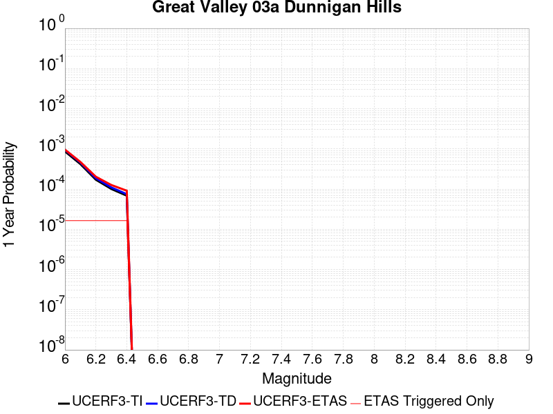 | 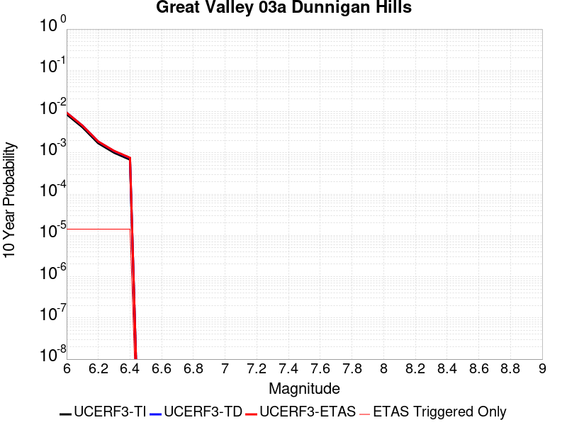 |

| Magnitude | 1 wk TI Prob | 1 wk TD Prob | 1 wk ETAS Prob | 1 wk ETAS/TD Gain | 1 wk ETAS Triggered Only | 1 mo TI Prob | 1 mo TD Prob | 1 mo ETAS Prob | 1 mo ETAS/TD Gain | 1 mo ETAS Triggered Only | 1 yr TI Prob | 1 yr TD Prob | 1 yr ETAS Prob | 1 yr ETAS/TD Gain | 1 yr ETAS Triggered Only | 10 yr TI Prob | 10 yr TD Prob | 10 yr ETAS Prob | 10 yr ETAS/TD Gain | 10 yr ETAS Triggered Only |
|-----|-----|-----|-----|-----|-----|-----|-----|-----|-----|-----|-----|-----|-----|-----|-----|-----|-----|-----|-----|-----|
| 6.0 | 1.6591328E-5 | 1.8107954E-5 | 1.8107954E-5 | 1.0 | 0.0 | 7.110376E-5 | 7.7603596E-5 | 7.7603596E-5 | 1.0 | 0.0 | 8.6534437E-4 | 9.444834E-4 | 9.790504E-4 | 1.0365988 | 3.459968E-5 | 0.008619824 | 0.009411525 | 0.0094457995 | 1.0036417 | 3.459968E-5 |
| 6.1 | 8.041125E-6 | 8.769726E-6 | 8.769726E-6 | 1.0 | 0.0 | 3.4461507E-5 | 3.7584115E-5 | 3.7584115E-5 | 1.0 | 0.0 | 4.194881E-4 | 4.5751085E-4 | 4.920947E-4 | 1.0755913 | 3.459968E-5 | 0.004186971 | 0.004567687 | 0.0046021286 | 1.0075402 | 3.459968E-5 |
| 6.2 | 3.2807004E-6 | 3.5795688E-6 | 3.5795688E-6 | 1.0 | 0.0 | 1.4060069E-5 | 1.5340942E-5 | 1.5340942E-5 | 1.0 | 0.0 | 1.7116789E-4 | 1.8676413E-4 | 2.2135735E-4 | 1.185224 | 3.459968E-5 | 0.0017103611 | 0.0018664796 | 0.0019010148 | 1.0185028 | 3.459968E-5 |
| 6.3 | 1.9339366E-6 | 2.1103806E-6 | 2.1103806E-6 | 1.0 | 0.0 | 8.288273E-6 | 9.044474E-6 | 9.044474E-6 | 1.0 | 0.0 | 1.00905054E-4 | 1.1011375E-4 | 1.4470963E-4 | 1.314183 | 3.459968E-5 | 0.0010085925 | 0.0011008718 | 0.0011354334 | 1.0313947 | 3.459968E-5 |
| 6.4 | 1.3142635E-6 | 1.4339867E-6 | 1.4339867E-6 | 1.0 | 0.0 | 5.6325457E-6 | 6.145657E-6 | 6.145657E-6 | 1.0 | 0.0 | 6.857408E-5 | 7.482337E-5 | 1.0942046E-4 | 1.4623835 | 3.459968E-5 | 6.8552926E-4 | 7.4823375E-4 | 7.8280753E-4 | 1.0462072 | 3.459968E-5 |

## Likely 2011 CFM
*[(top)](#table-of-contents)*

| 1 Week | 1 Month | 1 Year | 10 Year |
|-----|-----|-----|-----|
| 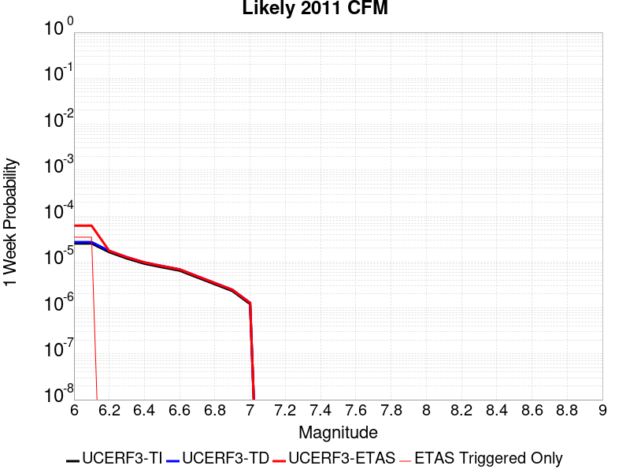 | 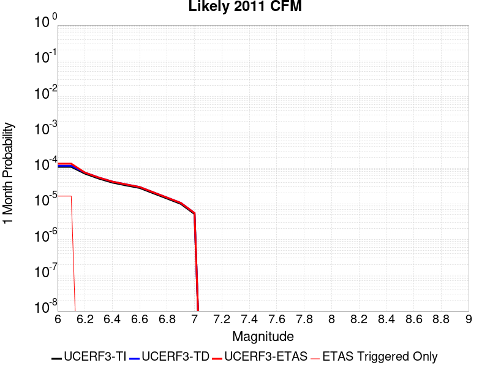 | 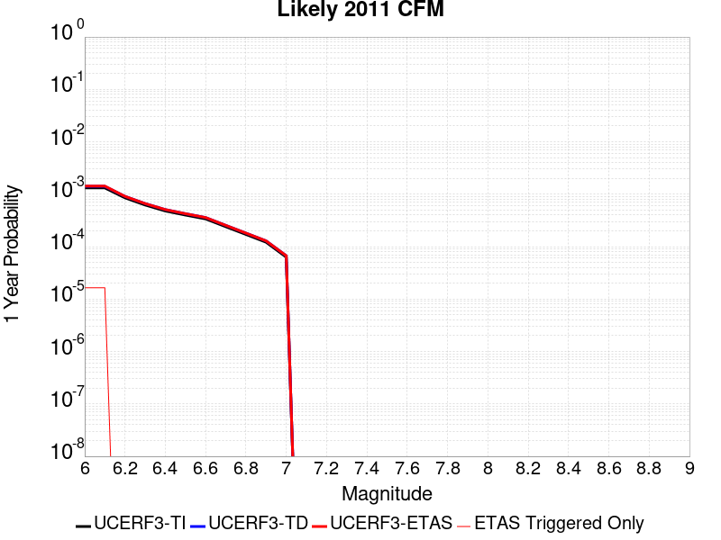 | 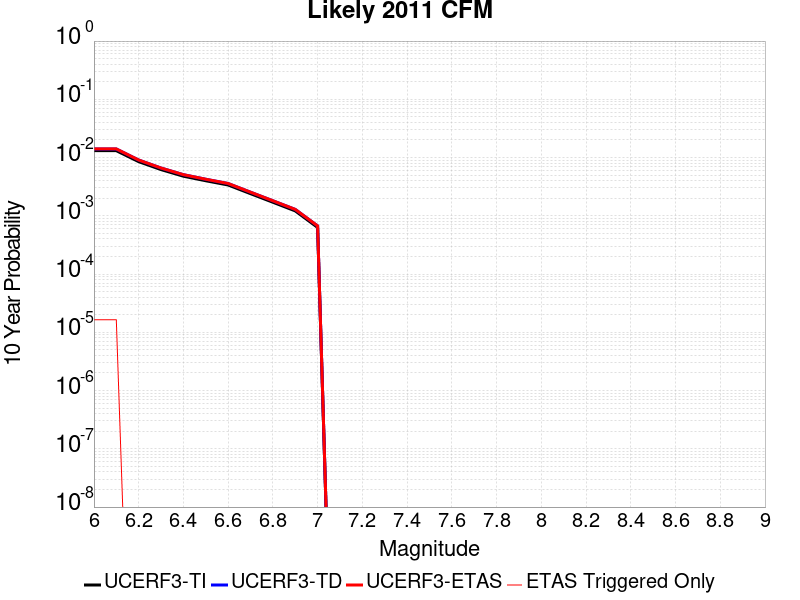 |

| Magnitude | 1 wk TI Prob | 1 wk TD Prob | 1 wk ETAS Prob | 1 wk ETAS/TD Gain | 1 wk ETAS Triggered Only | 1 mo TI Prob | 1 mo TD Prob | 1 mo ETAS Prob | 1 mo ETAS/TD Gain | 1 mo ETAS Triggered Only | 1 yr TI Prob | 1 yr TD Prob | 1 yr ETAS Prob | 1 yr ETAS/TD Gain | 1 yr ETAS Triggered Only | 10 yr TI Prob | 10 yr TD Prob | 10 yr ETAS Prob | 10 yr ETAS/TD Gain | 10 yr ETAS Triggered Only |
|-----|-----|-----|-----|-----|-----|-----|-----|-----|-----|-----|-----|-----|-----|-----|-----|-----|-----|-----|-----|-----|
| 6.0 | 2.5315949E-5 | 2.7104748E-5 | 6.170349E-5 | 2.2764828 | 3.459968E-5 | 1.0849241E-4 | 1.16158284E-4 | 1.5075394E-4 | 1.297832 | 3.459968E-5 | 0.0013200947 | 0.0014133542 | 0.001447905 | 1.0244459 | 3.459968E-5 | 0.013122803 | 0.01404831 | 0.014082424 | 1.0024283 | 3.459968E-5 |
| 6.1 | 2.5315949E-5 | 2.7104748E-5 | 6.170349E-5 | 2.2764828 | 3.459968E-5 | 1.0849241E-4 | 1.16158284E-4 | 1.5075394E-4 | 1.297832 | 3.459968E-5 | 0.0013200947 | 0.0014133542 | 0.001447905 | 1.0244459 | 3.459968E-5 | 0.013122803 | 0.01404831 | 0.014082424 | 1.0024283 | 3.459968E-5 |
| 6.2 | 1.6375941E-5 | 1.7465842E-5 | 1.7465842E-5 | 1.0 | 0.0 | 7.0180715E-5 | 7.485153E-5 | 7.485153E-5 | 1.0 | 0.0 | 8.5411523E-4 | 9.109487E-4 | 9.109487E-4 | 1.0 | 0.0 | 0.008508399 | 0.009073433 | 0.009073433 | 1.0 | 0.0 |
| 6.3 | 1.1945543E-5 | 1.2712587E-5 | 1.2712587E-5 | 1.0 | 0.0 | 5.119418E-5 | 5.4481407E-5 | 5.4481407E-5 | 1.0 | 0.0 | 6.2311086E-4 | 6.631146E-4 | 6.631146E-4 | 1.0 | 0.0 | 0.0062136655 | 0.0066119144 | 0.0066119144 | 1.0 | 0.0 |
| 6.4 | 9.192729E-6 | 9.768488E-6 | 9.768488E-6 | 1.0 | 0.0 | 3.939681E-5 | 4.1864292E-5 | 4.1864292E-5 | 1.0 | 0.0 | 4.7955062E-4 | 5.0958124E-4 | 5.0958124E-4 | 1.0 | 0.0 | 0.004785171 | 0.0050844094 | 0.0050844094 | 1.0 | 0.0 |
| 6.5 | 7.67906E-6 | 8.152622E-6 | 8.152622E-6 | 1.0 | 0.0 | 3.2909844E-5 | 3.4939352E-5 | 3.4939352E-5 | 1.0 | 0.0 | 4.006037E-4 | 4.2530545E-4 | 4.2530545E-4 | 1.0 | 0.0 | 0.0039988225 | 0.004245108 | 0.004245108 | 1.0 | 0.0 |
| 6.6 | 6.4884057E-6 | 6.8847507E-6 | 6.8847507E-6 | 1.0 | 0.0 | 2.7807157E-5 | 2.9505749E-5 | 2.9505749E-5 | 1.0 | 0.0 | 3.3849955E-4 | 3.591747E-4 | 3.591747E-4 | 1.0 | 0.0 | 0.003379844 | 0.0035860867 | 0.0035860867 | 1.0 | 0.0 |
| 6.7 | 4.6060636E-6 | 4.884041E-6 | 4.884041E-6 | 1.0 | 0.0 | 1.9740122E-5 | 2.0931442E-5 | 2.0931442E-5 | 1.0 | 0.0 | 2.403095E-4 | 2.5481134E-4 | 2.5481134E-4 | 1.0 | 0.0 | 0.002400498 | 0.0025452746 | 0.0025452746 | 1.0 | 0.0 |
| 6.8 | 3.2795615E-6 | 3.4773732E-6 | 3.4773732E-6 | 1.0 | 0.0 | 1.4055187E-5 | 1.4902946E-5 | 1.4902946E-5 | 1.0 | 0.0 | 1.7110848E-4 | 1.8142881E-4 | 1.8142881E-4 | 1.0 | 0.0 | 0.0017097679 | 0.0018128622 | 0.0018128622 | 1.0 | 0.0 |
| 6.9 | 2.3289967E-6 | 2.4705569E-6 | 2.4705569E-6 | 1.0 | 0.0 | 9.981376E-6 | 1.058806E-5 | 1.058806E-5 | 1.0 | 0.0 | 1.2151648E-4 | 1.2890245E-4 | 1.2890245E-4 | 1.0 | 0.0 | 0.0012145005 | 0.0012883197 | 0.0012883197 | 1.0 | 0.0 |
| 7.0 | 1.211292E-6 | 1.2863958E-6 | 1.2863958E-6 | 1.0 | 0.0 | 5.1912407E-6 | 5.5131145E-6 | 5.5131145E-6 | 1.0 | 0.0 | 6.320152E-5 | 6.712041E-5 | 6.712041E-5 | 1.0 | 0.0 | 6.3183554E-4 | 6.710312E-4 | 6.710312E-4 | 1.0 | 0.0 |

## Hector Mine
*[(top)](#table-of-contents)*

| 1 Week | 1 Month | 1 Year | 10 Year |
|-----|-----|-----|-----|
| 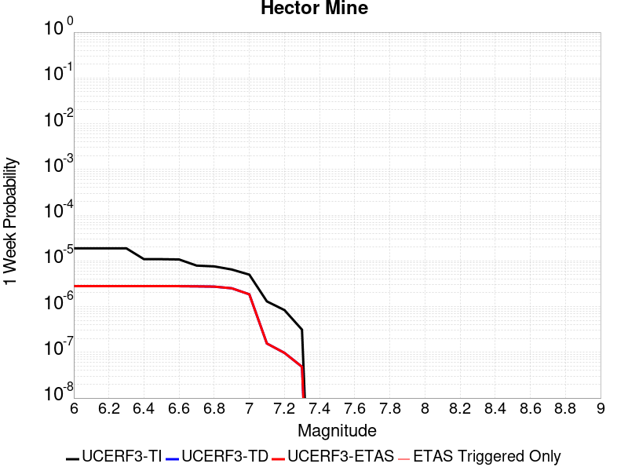 | 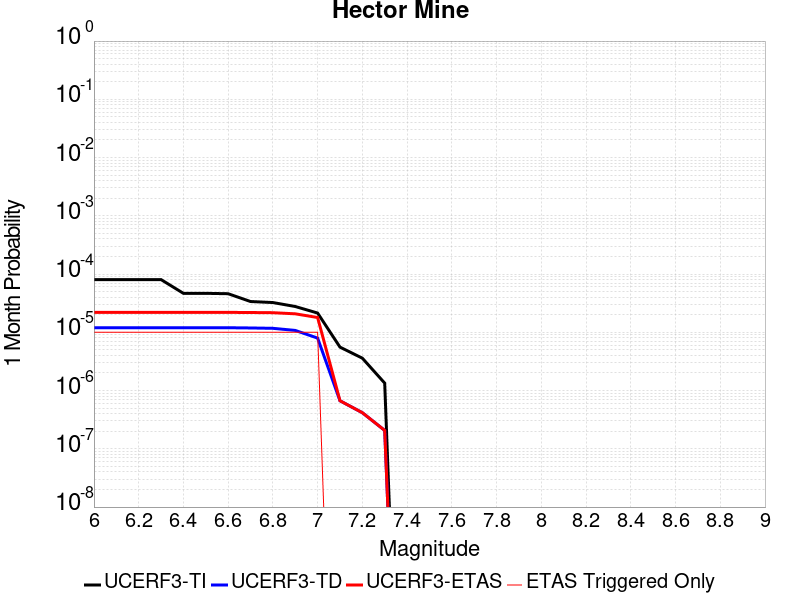 | 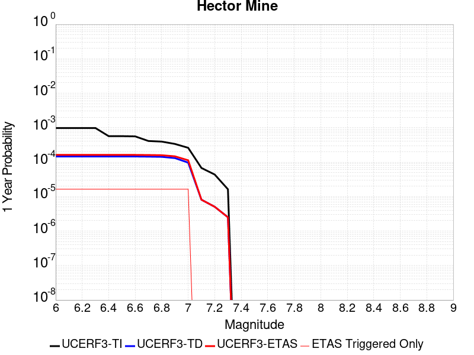 | 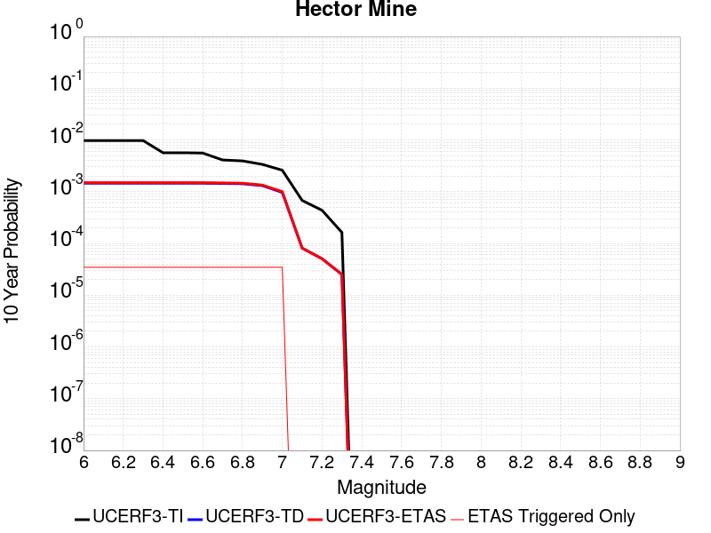 |

| Magnitude | 1 wk TI Prob | 1 wk TD Prob | 1 wk ETAS Prob | 1 wk ETAS/TD Gain | 1 wk ETAS Triggered Only | 1 mo TI Prob | 1 mo TD Prob | 1 mo ETAS Prob | 1 mo ETAS/TD Gain | 1 mo ETAS Triggered Only | 1 yr TI Prob | 1 yr TD Prob | 1 yr ETAS Prob | 1 yr ETAS/TD Gain | 1 yr ETAS Triggered Only | 10 yr TI Prob | 10 yr TD Prob | 10 yr ETAS Prob | 10 yr ETAS/TD Gain | 10 yr ETAS Triggered Only |
|-----|-----|-----|-----|-----|-----|-----|-----|-----|-----|-----|-----|-----|-----|-----|-----|-----|-----|-----|-----|-----|
| 6.0 | 1.8760093E-5 | 2.7962699E-6 | 2.7962699E-6 | 1.0 | 0.0 | 8.039792E-5 | 1.19839815E-5 | 1.19839815E-5 | 1.0 | 0.0 | 9.78405E-4 | 1.458992E-4 | 1.8049384E-4 | 1.2371132 | 3.459968E-5 | 0.009741086 | 0.0014584264 | 0.0014929756 | 1.0236894 | 3.459968E-5 |
| 6.1 | 1.8760093E-5 | 2.7962699E-6 | 2.7962699E-6 | 1.0 | 0.0 | 8.039792E-5 | 1.19839815E-5 | 1.19839815E-5 | 1.0 | 0.0 | 9.78405E-4 | 1.458992E-4 | 1.8049384E-4 | 1.2371132 | 3.459968E-5 | 0.009741086 | 0.0014584264 | 0.0014929756 | 1.0236894 | 3.459968E-5 |
| 6.2 | 1.8760093E-5 | 2.7962699E-6 | 2.7962699E-6 | 1.0 | 0.0 | 8.039792E-5 | 1.19839815E-5 | 1.19839815E-5 | 1.0 | 0.0 | 9.78405E-4 | 1.458992E-4 | 1.8049384E-4 | 1.2371132 | 3.459968E-5 | 0.009741086 | 0.0014584264 | 0.0014929756 | 1.0236894 | 3.459968E-5 |
| 6.3 | 1.8760093E-5 | 2.7962699E-6 | 2.7962699E-6 | 1.0 | 0.0 | 8.039792E-5 | 1.19839815E-5 | 1.19839815E-5 | 1.0 | 0.0 | 9.78405E-4 | 1.458992E-4 | 1.8049384E-4 | 1.2371132 | 3.459968E-5 | 0.009741086 | 0.0014584264 | 0.0014929756 | 1.0236894 | 3.459968E-5 |
| 6.4 | 1.0888055E-5 | 2.7962699E-6 | 2.7962699E-6 | 1.0 | 0.0 | 4.666226E-5 | 1.19839815E-5 | 1.19839815E-5 | 1.0 | 0.0 | 5.679649E-4 | 1.458992E-4 | 1.8049384E-4 | 1.2371132 | 3.459968E-5 | 0.0056651547 | 0.0014584264 | 0.0014929756 | 1.0236894 | 3.459968E-5 |
| 6.5 | 1.0888055E-5 | 2.7962699E-6 | 2.7962699E-6 | 1.0 | 0.0 | 4.666226E-5 | 1.19839815E-5 | 1.19839815E-5 | 1.0 | 0.0 | 5.679649E-4 | 1.458992E-4 | 1.8049384E-4 | 1.2371132 | 3.459968E-5 | 0.0056651547 | 0.0014584264 | 0.0014929756 | 1.0236894 | 3.459968E-5 |
| 6.6 | 1.0730738E-5 | 2.7962699E-6 | 2.7962699E-6 | 1.0 | 0.0 | 4.5988065E-5 | 1.19839815E-5 | 1.19839815E-5 | 1.0 | 0.0 | 5.5976084E-4 | 1.458992E-4 | 1.8049384E-4 | 1.2371132 | 3.459968E-5 | 0.0055835294 | 0.0014584264 | 0.0014929756 | 1.0236894 | 3.459968E-5 |
| 6.7 | 7.881326E-6 | 2.770952E-6 | 2.770952E-6 | 1.0 | 0.0 | 3.3776672E-5 | 1.1875478E-5 | 1.1875478E-5 | 1.0 | 0.0 | 4.111534E-4 | 1.4457834E-4 | 1.7917303E-4 | 1.2392799 | 3.459968E-5 | 0.0041039353 | 0.001445235 | 0.0014797846 | 1.0239059 | 3.459968E-5 |
| 6.8 | 7.5683483E-6 | 2.7327321E-6 | 2.7327321E-6 | 1.0 | 0.0 | 3.2435375E-5 | 1.1711679E-5 | 1.1711679E-5 | 1.0 | 0.0 | 3.9482914E-4 | 1.4258435E-4 | 1.771791E-4 | 1.2426265 | 3.459968E-5 | 0.0039412836 | 0.0014253207 | 0.0014598711 | 1.0242404 | 3.459968E-5 |
| 6.9 | 6.473048E-6 | 2.513824E-6 | 2.513824E-6 | 1.0 | 0.0 | 2.7741338E-5 | 1.07735095E-5 | 1.07735095E-5 | 1.0 | 0.0 | 3.3769844E-4 | 1.3116356E-4 | 1.657587E-4 | 1.2637558 | 3.459968E-5 | 0.0033718573 | 0.001311251 | 0.0013458052 | 1.0263522 | 3.459968E-5 |
| 7.0 | 4.9959954E-6 | 1.8564588E-6 | 1.8564588E-6 | 1.0 | 0.0 | 2.1411232E-5 | 7.956248E-6 | 7.956248E-6 | 1.0 | 0.0 | 2.6065056E-4 | 9.686658E-5 | 1.314629E-4 | 1.3571545 | 3.459968E-5 | 0.0026034506 | 9.685931E-4 | 0.0010031593 | 1.035687 | 3.459968E-5 |
| 7.1 | 1.2997541E-6 | 1.5599346E-7 | 1.5599346E-7 | 1.0 | 0.0 | 5.5703626E-6 | 6.685433E-7 | 6.685433E-7 | 1.0 | 0.0 | 6.7817055E-5 | 8.139488E-6 | 8.139488E-6 | 1.0 | 0.0 | 6.779636E-4 | 8.1392296E-5 | 8.1392296E-5 | 1.0 | 0.0 |
| 7.2 | 8.392699E-7 | 9.725453E-8 | 9.725453E-8 | 1.0 | 0.0 | 3.596866E-6 | 4.1680505E-7 | 4.1680505E-7 | 1.0 | 0.0 | 4.3790962E-5 | 5.0745916E-6 | 5.0745916E-6 | 1.0 | 0.0 | 4.3782333E-4 | 5.074495E-5 | 5.074495E-5 | 1.0 | 0.0 |
| 7.3 | 3.13015E-7 | 4.8283802E-8 | 4.8283802E-8 | 1.0 | 0.0 | 1.3414921E-6 | 2.0693057E-7 | 2.0693057E-7 | 1.0 | 0.0 | 1.6332544E-5 | 2.5193776E-6 | 2.5193776E-6 | 1.0 | 0.0 | 1.6331344E-4 | 2.5193574E-5 | 2.5193574E-5 | 1.0 | 0.0 |

## Hayward (So) 2011 CFM
*[(top)](#table-of-contents)*

| 1 Week | 1 Month | 1 Year | 10 Year |
|-----|-----|-----|-----|
| 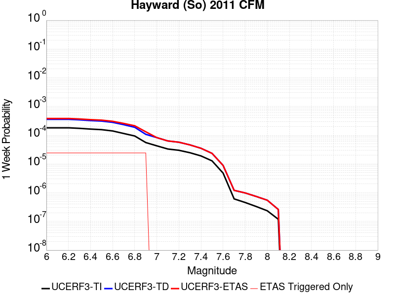 | 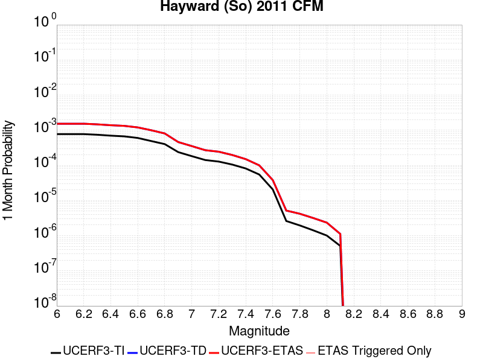 | 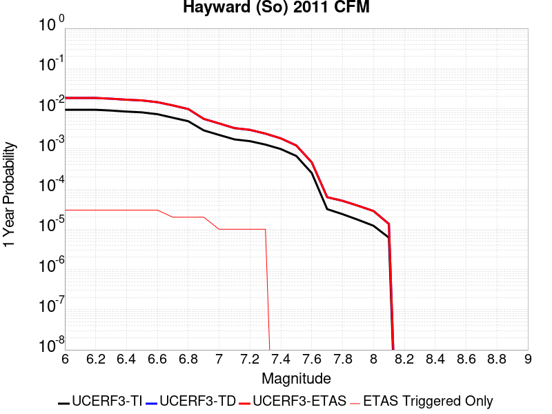 | 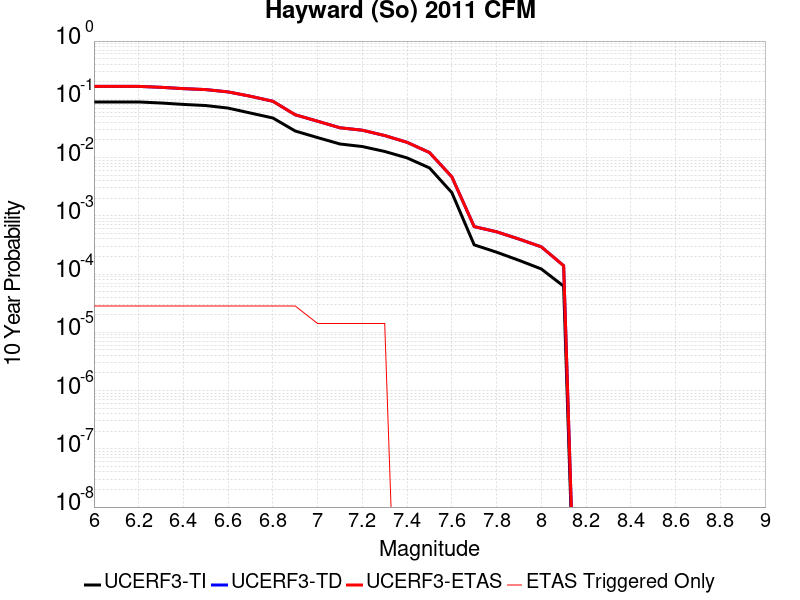 |

| Magnitude | 1 wk TI Prob | 1 wk TD Prob | 1 wk ETAS Prob | 1 wk ETAS/TD Gain | 1 wk ETAS Triggered Only | 1 mo TI Prob | 1 mo TD Prob | 1 mo ETAS Prob | 1 mo ETAS/TD Gain | 1 mo ETAS Triggered Only | 1 yr TI Prob | 1 yr TD Prob | 1 yr ETAS Prob | 1 yr ETAS/TD Gain | 1 yr ETAS Triggered Only | 10 yr TI Prob | 10 yr TD Prob | 10 yr ETAS Prob | 10 yr ETAS/TD Gain | 10 yr ETAS Triggered Only |
|-----|-----|-----|-----|-----|-----|-----|-----|-----|-----|-----|-----|-----|-----|-----|-----|-----|-----|-----|-----|-----|
| 6.0 | 1.8091932E-4 | 3.570673E-4 | 3.570673E-4 | 1.0 | 0.0 | 7.751381E-4 | 0.0015294008 | 0.0015294008 | 1.0 | 0.0 | 0.00939654 | 0.018463885 | 0.018497845 | 1.0018393 | 3.459968E-5 | 0.090090066 | 0.1667085 | 0.16673732 | 1.000173 | 3.459968E-5 |
| 6.1 | 1.8091932E-4 | 3.570673E-4 | 3.570673E-4 | 1.0 | 0.0 | 7.751381E-4 | 0.0015294008 | 0.0015294008 | 1.0 | 0.0 | 0.00939654 | 0.018463885 | 0.018497845 | 1.0018393 | 3.459968E-5 | 0.090090066 | 0.1667085 | 0.16673732 | 1.000173 | 3.459968E-5 |
| 6.2 | 1.8091932E-4 | 3.570673E-4 | 3.570673E-4 | 1.0 | 0.0 | 7.751381E-4 | 0.0015294008 | 0.0015294008 | 1.0 | 0.0 | 0.00939654 | 0.018463885 | 0.018497845 | 1.0018393 | 3.459968E-5 | 0.090090066 | 0.1667085 | 0.16673732 | 1.000173 | 3.459968E-5 |
| 6.3 | 1.7322872E-4 | 3.4263515E-4 | 3.4263515E-4 | 1.0 | 0.0 | 7.4219756E-4 | 0.0014676197 | 0.0014676197 | 1.0 | 0.0 | 0.0089988755 | 0.017724147 | 0.017758135 | 1.0019175 | 3.459968E-5 | 0.08643075 | 0.16065954 | 0.16068858 | 1.0001807 | 3.459968E-5 |
| 6.4 | 1.6334097E-4 | 3.2345165E-4 | 3.2345165E-4 | 1.0 | 0.0 | 6.998449E-4 | 0.0013854936 | 0.0013854936 | 1.0 | 0.0 | 0.008487372 | 0.016739927 | 0.016773947 | 1.0020323 | 3.459968E-5 | 0.081704415 | 0.15256606 | 0.15259537 | 1.0001922 | 3.459968E-5 |
| 6.5 | 1.5600289E-4 | 3.101982E-4 | 3.101982E-4 | 1.0 | 0.0 | 6.684125E-4 | 0.0013287518 | 0.0013287518 | 1.0 | 0.0 | 0.008107598 | 0.016059443 | 0.016093489 | 1.0021199 | 3.459968E-5 | 0.078181036 | 0.14684291 | 0.14687243 | 1.000201 | 3.459968E-5 |
| 6.6 | 1.4046066E-4 | 2.8034003E-4 | 2.8034003E-4 | 1.0 | 0.0 | 6.018354E-4 | 0.0012009109 | 0.0012009109 | 1.0 | 0.0 | 0.0073027555 | 0.014524571 | 0.014558668 | 1.0023476 | 3.459968E-5 | 0.07067384 | 0.13393044 | 0.13396041 | 1.0002238 | 3.459968E-5 |
| 6.7 | 1.14696966E-4 | 2.3272466E-4 | 2.3272466E-4 | 1.0 | 0.0 | 4.914658E-4 | 9.970153E-4 | 9.970153E-4 | 1.0 | 0.0 | 0.0059671924 | 0.012072163 | 0.012106345 | 1.0028315 | 3.459968E-5 | 0.058094822 | 0.11274141 | 0.112772115 | 1.0002723 | 3.459968E-5 |
| 6.8 | 9.3874296E-5 | 1.8862431E-4 | 1.8862431E-4 | 1.0 | 0.0 | 4.0225635E-4 | 8.081431E-4 | 8.081431E-4 | 1.0 | 0.0 | 0.0048864787 | 0.009795489 | 0.00982975 | 1.0034976 | 3.459968E-5 | 0.047804173 | 0.092592984 | 0.09262438 | 1.000339 | 3.459968E-5 |
| 6.9 | 5.551852E-5 | 1.0729875E-4 | 1.0729875E-4 | 1.0 | 0.0 | 2.3791482E-4 | 4.5977137E-4 | 4.5977137E-4 | 1.0 | 0.0 | 0.0028927654 | 0.005583468 | 0.005617874 | 1.0061622 | 3.459968E-5 | 0.028553981 | 0.054246075 | 0.0542788 | 1.0006032 | 3.459968E-5 |
| 7.0 | 4.2662363E-5 | 8.246792E-5 | 8.246792E-5 | 1.0 | 0.0 | 1.8282588E-4 | 3.5338648E-4 | 3.5338648E-4 | 1.0 | 0.0 | 0.0022236328 | 0.0042940658 | 0.004328517 | 1.0080229 | 3.459968E-5 | 0.022015138 | 0.04206509 | 0.042098235 | 1.000788 | 3.459968E-5 |
| 7.1 | 3.305886E-5 | 6.302183E-5 | 6.302183E-5 | 1.0 | 0.0 | 1.4167312E-4 | 2.7006568E-4 | 2.7006568E-4 | 1.0 | 0.0 | 0.0017235056 | 0.003283111 | 0.003317597 | 1.0105041 | 3.459968E-5 | 0.017101998 | 0.032453902 | 0.03248738 | 1.0010315 | 3.459968E-5 |
| 7.2 | 2.9856887E-5 | 5.701622E-5 | 5.701622E-5 | 1.0 | 0.0 | 1.2795182E-4 | 2.4433242E-4 | 2.4433242E-4 | 1.0 | 0.0 | 0.0015567001 | 0.0029707062 | 0.003005203 | 1.0116123 | 3.459968E-5 | 0.015458403 | 0.029454801 | 0.029488381 | 1.0011401 | 3.459968E-5 |
| 7.3 | 2.4559737E-5 | 4.599286E-5 | 4.599286E-5 | 1.0 | 0.0 | 1.0525176E-4 | 1.9709744E-4 | 1.9709744E-4 | 1.0 | 0.0 | 0.0012806869 | 0.0023970334 | 0.00243155 | 1.0143998 | 3.459968E-5 | 0.012733313 | 0.023858516 | 0.02389229 | 1.0014156 | 3.459968E-5 |
| 7.4 | 1.9002231E-5 | 3.505084E-5 | 3.505084E-5 | 1.0 | 0.0 | 8.143559E-5 | 1.502093E-4 | 1.502093E-4 | 1.0 | 0.0 | 9.910273E-4 | 0.001827274 | 0.001827274 | 1.0 | 0.0 | 0.009866194 | 0.018258808 | 0.018258808 | 1.0 | 0.0 |
| 7.5 | 1.2783333E-5 | 2.3331182E-5 | 2.3331182E-5 | 1.0 | 0.0 | 5.4784563E-5 | 9.998698E-5 | 9.998698E-5 | 1.0 | 0.0 | 6.667979E-4 | 0.0012166675 | 0.0012166675 | 1.0 | 0.0 | 0.006648007 | 0.012209443 | 0.012209443 | 1.0 | 0.0 |
| 7.6 | 4.8149627E-6 | 8.888056E-6 | 8.888056E-6 | 1.0 | 0.0 | 2.063539E-5 | 3.8091122E-5 | 3.8091122E-5 | 1.0 | 0.0 | 2.5120692E-4 | 4.6366194E-4 | 4.6366194E-4 | 1.0 | 0.0 | 0.0025092314 | 0.0046805087 | 0.0046805087 | 1.0 | 0.0 |
| 7.7 | 6.0838227E-7 | 1.205754E-6 | 1.205754E-6 | 1.0 | 0.0 | 2.6073499E-6 | 5.1675065E-6 | 5.1675065E-6 | 1.0 | 0.0 | 3.174402E-5 | 6.291258E-5 | 6.291258E-5 | 1.0 | 0.0 | 3.1739488E-4 | 6.5296254E-4 | 6.5296254E-4 | 1.0 | 0.0 |
| 7.8 | 4.5542808E-7 | 9.792941E-7 | 9.792941E-7 | 1.0 | 0.0 | 1.9518332E-6 | 4.196968E-6 | 4.196968E-6 | 1.0 | 0.0 | 2.376331E-5 | 5.109689E-5 | 5.109689E-5 | 1.0 | 0.0 | 2.3760769E-4 | 5.321693E-4 | 5.321693E-4 | 1.0 | 0.0 |
| 7.9 | 3.3016747E-7 | 7.3869535E-7 | 7.3869535E-7 | 1.0 | 0.0 | 1.4150027E-6 | 3.1658333E-6 | 3.1658333E-6 | 1.0 | 0.0 | 1.7227521E-5 | 3.854334E-5 | 3.854334E-5 | 1.0 | 0.0 | 1.7226185E-4 | 3.9932923E-4 | 3.9932923E-4 | 1.0 | 0.0 |
| 8.0 | 2.347038E-7 | 5.471963E-7 | 5.471963E-7 | 1.0 | 0.0 | 1.0058731E-6 | 2.3451248E-6 | 2.3451248E-6 | 1.0 | 0.0 | 1.2246436E-5 | 2.8551523E-5 | 2.8551523E-5 | 1.0 | 0.0 | 1.2245761E-4 | 2.9357258E-4 | 2.9357258E-4 | 1.0 | 0.0 |
| 8.1 | 1.18822804E-7 | 2.6060948E-7 | 2.6060948E-7 | 1.0 | 0.0 | 5.092405E-7 | 1.1168972E-6 | 1.1168972E-6 | 1.0 | 0.0 | 6.1999854E-6 | 1.359814E-5 | 1.359814E-5 | 1.0 | 0.0 | 6.199812E-5 | 1.3918082E-4 | 1.3918082E-4 | 1.0 | 0.0 |

## Newport-Inglewood alt 1
*[(top)](#table-of-contents)*

| 1 Week | 1 Month | 1 Year | 10 Year |
|-----|-----|-----|-----|
| 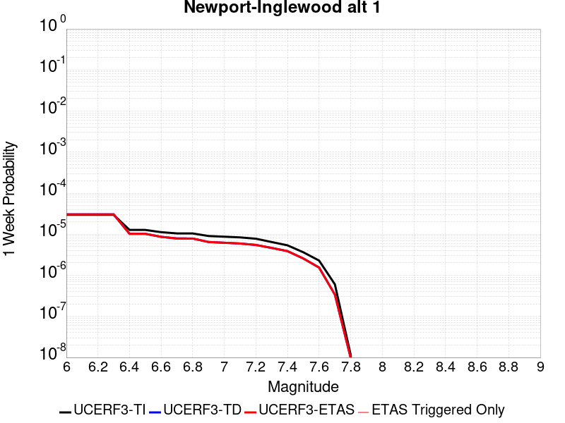 |  | 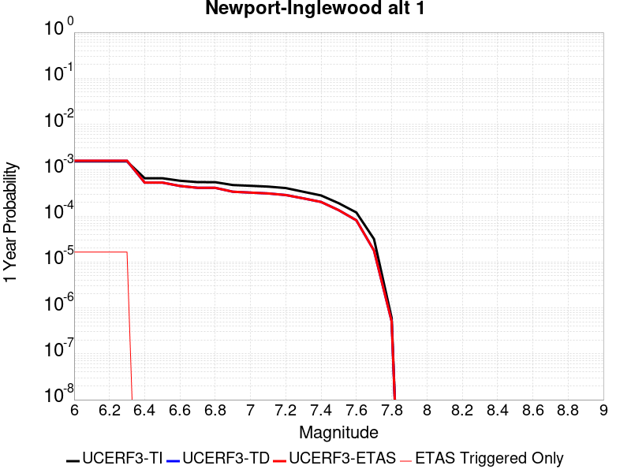 | 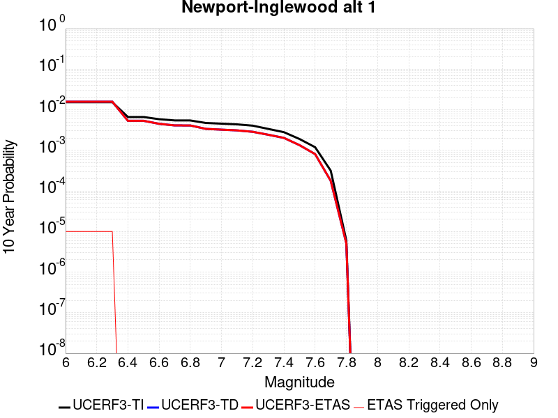 |

| Magnitude | 1 wk TI Prob | 1 wk TD Prob | 1 wk ETAS Prob | 1 wk ETAS/TD Gain | 1 wk ETAS Triggered Only | 1 mo TI Prob | 1 mo TD Prob | 1 mo ETAS Prob | 1 mo ETAS/TD Gain | 1 mo ETAS Triggered Only | 1 yr TI Prob | 1 yr TD Prob | 1 yr ETAS Prob | 1 yr ETAS/TD Gain | 1 yr ETAS Triggered Only | 10 yr TI Prob | 10 yr TD Prob | 10 yr ETAS Prob | 10 yr ETAS/TD Gain | 10 yr ETAS Triggered Only |
|-----|-----|-----|-----|-----|-----|-----|-----|-----|-----|-----|-----|-----|-----|-----|-----|-----|-----|-----|-----|-----|
| 6.0 | 2.9668912E-5 | 3.0404828E-5 | 3.0404828E-5 | 1.0 | 0.0 | 1.2714628E-4 | 1.3030265E-4 | 1.3030265E-4 | 1.0 | 0.0 | 0.0015469068 | 0.0015857654 | 0.0016203102 | 1.0217843 | 3.459968E-5 | 0.015361829 | 0.01579211 | 0.015826164 | 1.0021564 | 3.459968E-5 |
| 6.1 | 2.9668912E-5 | 3.0404828E-5 | 3.0404828E-5 | 1.0 | 0.0 | 1.2714628E-4 | 1.3030265E-4 | 1.3030265E-4 | 1.0 | 0.0 | 0.0015469068 | 0.0015857654 | 0.0016203102 | 1.0217843 | 3.459968E-5 | 0.015361829 | 0.01579211 | 0.015826164 | 1.0021564 | 3.459968E-5 |
| 6.2 | 2.9668912E-5 | 3.0404828E-5 | 3.0404828E-5 | 1.0 | 0.0 | 1.2714628E-4 | 1.3030265E-4 | 1.3030265E-4 | 1.0 | 0.0 | 0.0015469068 | 0.0015857654 | 0.0016203102 | 1.0217843 | 3.459968E-5 | 0.015361829 | 0.01579211 | 0.015826164 | 1.0021564 | 3.459968E-5 |
| 6.3 | 2.9668912E-5 | 3.0404828E-5 | 3.0404828E-5 | 1.0 | 0.0 | 1.2714628E-4 | 1.3030265E-4 | 1.3030265E-4 | 1.0 | 0.0 | 0.0015469068 | 0.0015857654 | 0.0016203102 | 1.0217843 | 3.459968E-5 | 0.015361829 | 0.01579211 | 0.015826164 | 1.0021564 | 3.459968E-5 |
| 6.4 | 1.275942E-5 | 1.02725335E-5 | 1.02725335E-5 | 1.0 | 0.0 | 5.4682085E-5 | 4.4024422E-5 | 4.4024422E-5 | 1.0 | 0.0 | 6.65551E-4 | 5.358697E-4 | 5.358697E-4 | 1.0 | 0.0 | 0.0066356123 | 0.0053462 | 0.0053462 | 1.0 | 0.0 |
| 6.5 | 1.275942E-5 | 1.02725335E-5 | 1.02725335E-5 | 1.0 | 0.0 | 5.4682085E-5 | 4.4024422E-5 | 4.4024422E-5 | 1.0 | 0.0 | 6.65551E-4 | 5.358697E-4 | 5.358697E-4 | 1.0 | 0.0 | 0.0066356123 | 0.0053462 | 0.0053462 | 1.0 | 0.0 |
| 6.6 | 1.1255358E-5 | 8.661911E-6 | 8.661911E-6 | 1.0 | 0.0 | 4.8236358E-5 | 3.7121958E-5 | 3.7121958E-5 | 1.0 | 0.0 | 5.871194E-4 | 4.5186782E-4 | 4.5186782E-4 | 1.0 | 0.0 | 0.005855706 | 0.0045096674 | 0.0045096674 | 1.0 | 0.0 |
| 6.7 | 1.0504745E-5 | 7.8998455E-6 | 7.8998455E-6 | 1.0 | 0.0 | 4.5019555E-5 | 3.385605E-5 | 3.385605E-5 | 1.0 | 0.0 | 5.4797524E-4 | 4.121207E-4 | 4.121207E-4 | 1.0 | 0.0 | 0.0054662596 | 0.004113694 | 0.004113694 | 1.0 | 0.0 |
| 6.8 | 1.0476007E-5 | 7.881227E-6 | 7.881227E-6 | 1.0 | 0.0 | 4.4896402E-5 | 3.3776258E-5 | 3.3776258E-5 | 1.0 | 0.0 | 5.464766E-4 | 4.1114958E-4 | 4.1114958E-4 | 1.0 | 0.0 | 0.005451347 | 0.004104019 | 0.004104019 | 1.0 | 0.0 |
| 6.9 | 9.076797E-6 | 6.4896567E-6 | 6.4896567E-6 | 1.0 | 0.0 | 3.889998E-5 | 2.7812519E-5 | 2.7812519E-5 | 1.0 | 0.0 | 4.7350433E-4 | 3.3856515E-4 | 3.3856515E-4 | 1.0 | 0.0 | 0.004724967 | 0.003380531 | 0.003380531 | 1.0 | 0.0 |
| 7.0 | 8.73795E-6 | 6.2120503E-6 | 6.2120503E-6 | 1.0 | 0.0 | 3.7447822E-5 | 2.6622802E-5 | 2.6622802E-5 | 1.0 | 0.0 | 4.5583185E-4 | 3.2408469E-4 | 3.2408469E-4 | 1.0 | 0.0 | 0.0045489795 | 0.0032361522 | 0.0032361522 | 1.0 | 0.0 |
| 7.1 | 8.391299E-6 | 5.9557533E-6 | 5.9557533E-6 | 1.0 | 0.0 | 3.5962214E-5 | 2.5524409E-5 | 2.5524409E-5 | 1.0 | 0.0 | 4.37752E-4 | 3.1071564E-4 | 3.1071564E-4 | 1.0 | 0.0 | 0.004368907 | 0.0031028416 | 0.0031028416 | 1.0 | 0.0 |
| 7.2 | 7.796882E-6 | 5.4964826E-6 | 5.4964826E-6 | 1.0 | 0.0 | 3.341478E-5 | 2.3556144E-5 | 2.3556144E-5 | 1.0 | 0.0 | 4.06749E-4 | 2.867585E-4 | 2.867585E-4 | 1.0 | 0.0 | 0.0040600533 | 0.002863909 | 0.002863909 | 1.0 | 0.0 |
| 7.3 | 6.4738833E-6 | 4.6477753E-6 | 4.6477753E-6 | 1.0 | 0.0 | 2.774492E-5 | 1.9918885E-5 | 1.9918885E-5 | 1.0 | 0.0 | 3.3774204E-4 | 2.424856E-4 | 2.424856E-4 | 1.0 | 0.0 | 0.0033722918 | 0.0024222268 | 0.0024222268 | 1.0 | 0.0 |
| 7.4 | 5.382145E-6 | 3.8857215E-6 | 3.8857215E-6 | 1.0 | 0.0 | 2.3066134E-5 | 1.6652988E-5 | 1.6652988E-5 | 1.0 | 0.0 | 2.8079396E-4 | 2.0273139E-4 | 2.0273139E-4 | 1.0 | 0.0 | 0.0028043943 | 0.002025479 | 0.002025479 | 1.0 | 0.0 |
| 7.5 | 3.648244E-6 | 2.5737634E-6 | 2.5737634E-6 | 1.0 | 0.0 | 1.5635238E-5 | 1.1030369E-5 | 1.1030369E-5 | 1.0 | 0.0 | 1.9034238E-4 | 1.3428657E-4 | 1.3428657E-4 | 1.0 | 0.0 | 0.0019017943 | 0.0013420646 | 0.0013420646 | 1.0 | 0.0 |
| 7.6 | 2.2906888E-6 | 1.547986E-6 | 1.547986E-6 | 1.0 | 0.0 | 9.817201E-6 | 6.634209E-6 | 6.634209E-6 | 1.0 | 0.0 | 1.1951787E-4 | 8.076857E-5 | 8.076857E-5 | 1.0 | 0.0 | 0.0011945361 | 8.073989E-4 | 8.073989E-4 | 1.0 | 0.0 |
| 7.7 | 6.0479874E-7 | 3.397468E-7 | 3.397468E-7 | 1.0 | 0.0 | 2.5919921E-6 | 1.456057E-6 | 1.456057E-6 | 1.0 | 0.0 | 3.1557047E-5 | 1.7727363E-5 | 1.7727363E-5 | 1.0 | 0.0 | 3.1552566E-4 | 1.7726087E-4 | 1.7726087E-4 | 1.0 | 0.0 |
| 7.8 | 1.16056995E-8 | 9.782997E-9 | 9.782997E-9 | 1.0 | 0.0 | 4.9738713E-8 | 4.1927127E-8 | 4.1927127E-8 | 1.0 | 0.0 | 6.0556863E-7 | 5.1046277E-7 | 5.1046277E-7 | 1.0 | 0.0 | 6.05567E-6 | 5.1046277E-6 | 5.1046277E-6 | 1.0 | 0.0 |

## Bennett Valley 2011 CFM
*[(top)](#table-of-contents)*

| 1 Week | 1 Month | 1 Year | 10 Year |
|-----|-----|-----|-----|
| 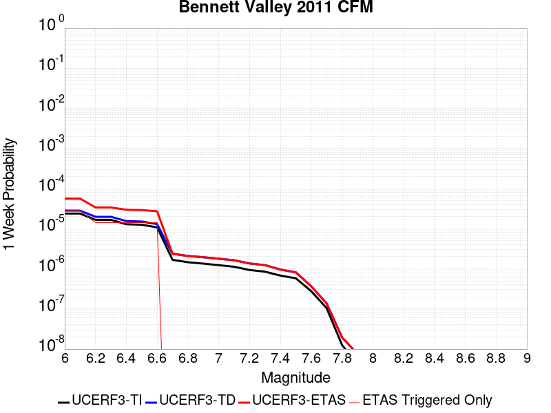 | 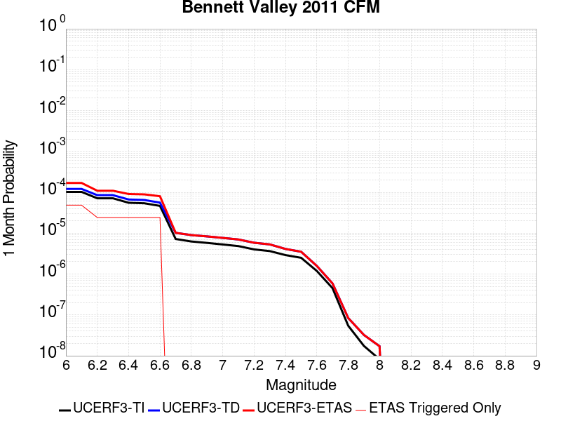 | 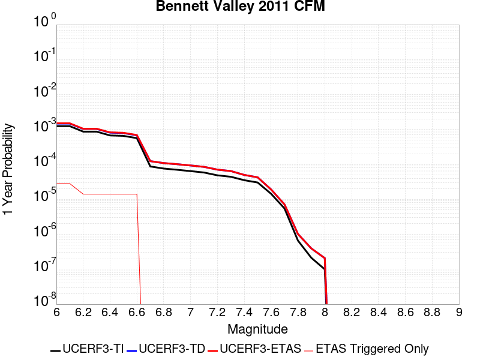 | 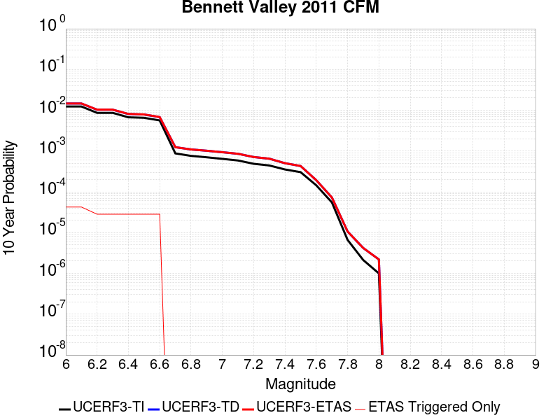 |

| Magnitude | 1 wk TI Prob | 1 wk TD Prob | 1 wk ETAS Prob | 1 wk ETAS/TD Gain | 1 wk ETAS Triggered Only | 1 mo TI Prob | 1 mo TD Prob | 1 mo ETAS Prob | 1 mo ETAS/TD Gain | 1 mo ETAS Triggered Only | 1 yr TI Prob | 1 yr TD Prob | 1 yr ETAS Prob | 1 yr ETAS/TD Gain | 1 yr ETAS Triggered Only | 10 yr TI Prob | 10 yr TD Prob | 10 yr ETAS Prob | 10 yr ETAS/TD Gain | 10 yr ETAS Triggered Only |
|-----|-----|-----|-----|-----|-----|-----|-----|-----|-----|-----|-----|-----|-----|-----|-----|-----|-----|-----|-----|-----|
| 6.0 | 2.3893934E-5 | 2.823899E-5 | 6.2837695E-5 | 2.2252104 | 3.459968E-5 | 1.0239855E-4 | 1.2101967E-4 | 1.5561517E-4 | 1.2858667 | 3.459968E-5 | 0.0012459893 | 0.0014726035 | 0.0015071522 | 1.023461 | 3.459968E-5 | 0.012390262 | 0.01465108 | 0.014685173 | 1.002327 | 3.459968E-5 |
| 6.1 | 2.3893934E-5 | 2.823899E-5 | 6.2837695E-5 | 2.2252104 | 3.459968E-5 | 1.0239855E-4 | 1.2101967E-4 | 1.5561517E-4 | 1.2858667 | 3.459968E-5 | 0.0012459893 | 0.0014726035 | 0.0015071522 | 1.023461 | 3.459968E-5 | 0.012390262 | 0.01465108 | 0.014685173 | 1.002327 | 3.459968E-5 |
| 6.2 | 1.6657146E-5 | 1.9853873E-5 | 5.4452867E-5 | 2.7426825 | 3.459968E-5 | 7.138582E-5 | 8.508605E-5 | 1.1968279E-4 | 1.4066088 | 3.459968E-5 | 8.6877577E-4 | 0.0010355718 | 0.0010701356 | 1.0333766 | 3.459968E-5 | 0.008653872 | 0.010325706 | 0.010359948 | 1.0033163 | 3.459968E-5 |
| 6.3 | 1.6657146E-5 | 1.9853873E-5 | 5.4452867E-5 | 2.7426825 | 3.459968E-5 | 7.138582E-5 | 8.508605E-5 | 1.1968279E-4 | 1.4066088 | 3.459968E-5 | 8.6877577E-4 | 0.0010355718 | 0.0010701356 | 1.0333766 | 3.459968E-5 | 0.008653872 | 0.010325706 | 0.010359948 | 1.0033163 | 3.459968E-5 |
| 6.4 | 1.29418495E-5 | 1.5567592E-5 | 5.0166735E-5 | 3.2225108 | 3.459968E-5 | 5.546389E-5 | 6.671728E-5 | 1.01314654E-4 | 1.5185668 | 3.459968E-5 | 6.7506364E-4 | 8.1211043E-4 | 8.46682E-4 | 1.04257 | 3.459968E-5 | 0.0067301663 | 0.008108544 | 0.008142863 | 1.0042324 | 3.459968E-5 |
| 6.5 | 1.2582504E-5 | 1.5134623E-5 | 4.9733782E-5 | 3.286093 | 3.459968E-5 | 5.39239E-5 | 6.486179E-5 | 9.9459234E-5 | 1.5334024 | 3.459968E-5 | 6.563257E-4 | 7.8953634E-4 | 8.241087E-4 | 1.0437882 | 3.459968E-5 | 0.006543907 | 0.007884451 | 0.007918778 | 1.0043538 | 3.459968E-5 |
| 6.6 | 1.0846706E-5 | 1.3036858E-5 | 4.7636087E-5 | 3.6539547 | 3.459968E-5 | 4.6485053E-5 | 5.5871777E-5 | 9.0469526E-5 | 1.6192348 | 3.459968E-5 | 5.6580856E-4 | 6.801549E-4 | 7.1473105E-4 | 1.0508357 | 3.459968E-5 | 0.005643701 | 0.0067976816 | 0.0068320464 | 1.0050553 | 3.459968E-5 |
| 6.7 | 1.6803231E-6 | 2.377902E-6 | 2.377902E-6 | 1.0 | 0.0 | 7.2013645E-6 | 1.019097E-5 | 1.019097E-5 | 1.0 | 0.0 | 8.7673085E-5 | 1.2406812E-4 | 1.2406812E-4 | 1.0 | 0.0 | 8.76385E-4 | 0.0012444188 | 0.0012444188 | 1.0 | 0.0 |
| 6.8 | 1.4609833E-6 | 2.0939708E-6 | 2.0939708E-6 | 1.0 | 0.0 | 6.261342E-6 | 8.974131E-6 | 8.974131E-6 | 1.0 | 0.0 | 7.6229175E-5 | 1.0925463E-4 | 1.0925463E-4 | 1.0 | 0.0 | 7.620303E-4 | 0.0010963798 | 0.0010963798 | 1.0 | 0.0 |
| 6.9 | 1.3492396E-6 | 1.9459103E-6 | 1.9459103E-6 | 1.0 | 0.0 | 5.7824427E-6 | 8.339589E-6 | 8.339589E-6 | 1.0 | 0.0 | 7.0398964E-5 | 1.01529826E-4 | 1.01529826E-4 | 1.0 | 0.0 | 7.037667E-4 | 0.001019178 | 0.001019178 | 1.0 | 0.0 |
| 7.0 | 1.2347921E-6 | 1.7888974E-6 | 1.7888974E-6 | 1.0 | 0.0 | 5.291955E-6 | 7.666681E-6 | 7.666681E-6 | 1.0 | 0.0 | 6.442765E-5 | 9.33379E-5 | 9.33379E-5 | 1.0 | 0.0 | 6.440897E-4 | 9.373068E-4 | 9.373068E-4 | 1.0 | 0.0 |
| 7.1 | 1.1262973E-6 | 1.6359154E-6 | 1.6359154E-6 | 1.0 | 0.0 | 4.8269794E-6 | 7.0110473E-6 | 7.0110473E-6 | 1.0 | 0.0 | 5.876689E-5 | 8.535621E-5 | 8.535621E-5 | 1.0 | 0.0 | 5.875135E-4 | 8.5754244E-4 | 8.5754244E-4 | 1.0 | 0.0 |
| 7.2 | 9.351744E-7 | 1.3611758E-6 | 1.3611758E-6 | 1.0 | 0.0 | 4.007884E-6 | 5.8335977E-6 | 5.8335977E-6 | 1.0 | 0.0 | 4.8794896E-5 | 7.1021765E-5 | 7.1021765E-5 | 1.0 | 0.0 | 4.878418E-4 | 7.142461E-4 | 7.142461E-4 | 1.0 | 0.0 |
| 7.3 | 8.5039534E-7 | 1.2386733E-6 | 1.2386733E-6 | 1.0 | 0.0 | 3.6445463E-6 | 5.308589E-6 | 5.308589E-6 | 1.0 | 0.0 | 4.437145E-5 | 6.463018E-5 | 6.463018E-5 | 1.0 | 0.0 | 4.436259E-4 | 6.50103E-4 | 6.50103E-4 | 1.0 | 0.0 |
| 7.4 | 6.7875015E-7 | 9.600642E-7 | 9.600642E-7 | 1.0 | 0.0 | 2.908926E-6 | 4.1145545E-6 | 4.1145545E-6 | 1.0 | 0.0 | 3.54156E-5 | 5.009356E-5 | 5.009356E-5 | 1.0 | 0.0 | 3.5409955E-4 | 5.0413073E-4 | 5.0413073E-4 | 1.0 | 0.0 |
| 7.5 | 5.826867E-7 | 8.1883735E-7 | 8.1883735E-7 | 1.0 | 0.0 | 2.4972264E-6 | 3.5092983E-6 | 3.5092983E-6 | 1.0 | 0.0 | 3.0403306E-5 | 4.2724878E-5 | 4.2724878E-5 | 1.0 | 0.0 | 3.0399146E-4 | 4.300558E-4 | 4.300558E-4 | 1.0 | 0.0 |
| 7.6 | 2.7734902E-7 | 3.6822587E-7 | 3.6822587E-7 | 1.0 | 0.0 | 1.1886381E-6 | 1.57811E-6 | 1.57811E-6 | 1.0 | 0.0 | 1.4471572E-5 | 1.9213321E-5 | 1.9213321E-5 | 1.0 | 0.0 | 1.447063E-4 | 1.9315645E-4 | 1.9315645E-4 | 1.0 | 0.0 |
| 7.7 | 1.0530888E-7 | 1.3749101E-7 | 1.3749101E-7 | 1.0 | 0.0 | 4.513237E-7 | 5.8924707E-7 | 5.8924707E-7 | 1.0 | 0.0 | 5.4948523E-6 | 7.174059E-6 | 7.174059E-6 | 1.0 | 0.0 | 5.4947162E-5 | 7.255585E-5 | 7.255585E-5 | 1.0 | 0.0 |
| 7.8 | 1.2714258E-8 | 1.9633259E-8 | 1.9633259E-8 | 1.0 | 0.0 | 5.448968E-8 | 8.4142535E-8 | 8.4142535E-8 | 1.0 | 0.0 | 6.6341164E-7 | 1.0244348E-6 | 1.0244348E-6 | 1.0 | 0.0 | 6.6340967E-6 | 1.0658595E-5 | 1.0658595E-5 | 1.0 | 0.0 |
| 7.9 | 4.075888E-9 | 7.559928E-9 | 7.559928E-9 | 1.0 | 0.0 | 1.7468091E-8 | 3.239969E-8 | 3.239969E-8 | 1.0 | 0.0 | 2.12674E-7 | 3.9446616E-7 | 3.9446616E-7 | 1.0 | 0.0 | 2.1267379E-6 | 4.1952467E-6 | 4.1952467E-6 | 1.0 | 0.0 |
| 8.0 | 1.9126138E-9 | 3.9956882E-9 | 3.9956882E-9 | 1.0 | 0.0 | 8.196917E-9 | 1.7124377E-8 | 1.7124377E-8 | 1.0 | 0.0 | 9.9797454E-8 | 2.0848927E-7 | 2.0848927E-7 | 1.0 | 0.0 | 9.979741E-7 | 2.1982228E-6 | 2.1982228E-6 | 1.0 | 0.0 |

## Great Valley 09 (Laguna Seca)
*[(top)](#table-of-contents)*

| 1 Week | 1 Month | 1 Year | 10 Year |
|-----|-----|-----|-----|
| 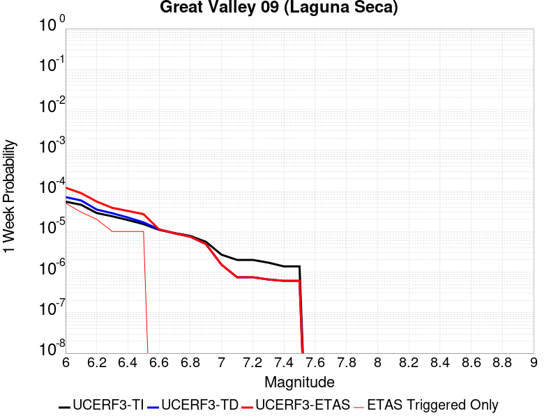 | 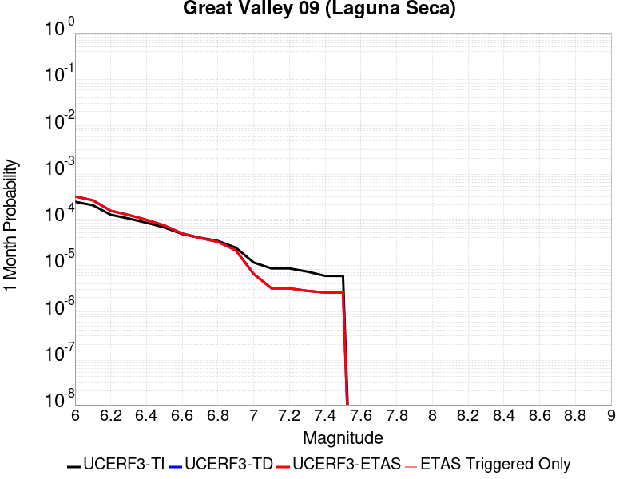 | 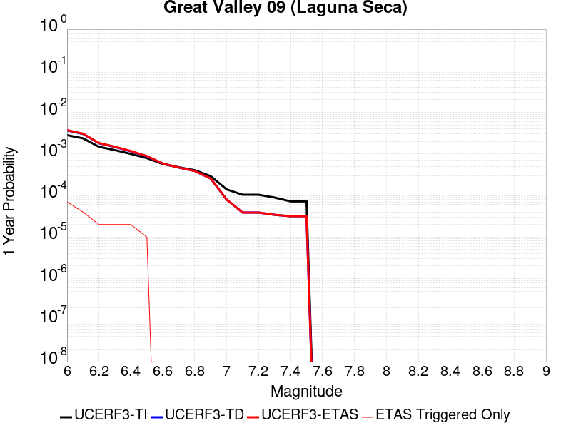 | 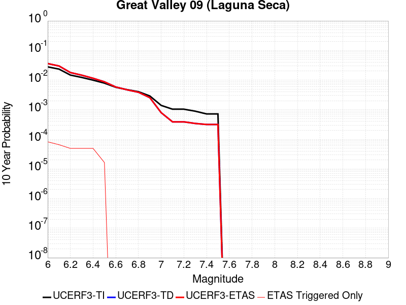 |

| Magnitude | 1 wk TI Prob | 1 wk TD Prob | 1 wk ETAS Prob | 1 wk ETAS/TD Gain | 1 wk ETAS Triggered Only | 1 mo TI Prob | 1 mo TD Prob | 1 mo ETAS Prob | 1 mo ETAS/TD Gain | 1 mo ETAS Triggered Only | 1 yr TI Prob | 1 yr TD Prob | 1 yr ETAS Prob | 1 yr ETAS/TD Gain | 1 yr ETAS Triggered Only | 10 yr TI Prob | 10 yr TD Prob | 10 yr ETAS Prob | 10 yr ETAS/TD Gain | 10 yr ETAS Triggered Only |
|-----|-----|-----|-----|-----|-----|-----|-----|-----|-----|-----|-----|-----|-----|-----|-----|-----|-----|-----|-----|-----|
| 6.0 | 5.4353277E-5 | 7.050019E-5 | 7.050019E-5 | 1.0 | 0.0 | 2.3292181E-4 | 3.0211007E-4 | 3.0211007E-4 | 1.0 | 0.0 | 0.0028321352 | 0.0036720056 | 0.0037064783 | 1.009388 | 3.459968E-5 | 0.02796312 | 0.036115844 | 0.036149193 | 1.0009234 | 3.459968E-5 |
| 6.1 | 4.5578287E-5 | 5.822054E-5 | 5.822054E-5 | 1.0 | 0.0 | 1.953209E-4 | 2.4949352E-4 | 2.4949352E-4 | 1.0 | 0.0 | 0.0023754383 | 0.0030333549 | 0.0030678497 | 1.0113719 | 3.459968E-5 | 0.023502063 | 0.029919893 | 0.029953456 | 1.0011218 | 3.459968E-5 |
| 6.2 | 2.8536782E-5 | 3.4736422E-5 | 3.4736422E-5 | 1.0 | 0.0 | 1.2229476E-4 | 1.4886161E-4 | 1.4886161E-4 | 1.0 | 0.0 | 0.0014879217 | 0.0018108576 | 0.0018108576 | 1.0 | 0.0 | 0.014779986 | 0.017958276 | 0.017958276 | 1.0 | 0.0 |
| 6.3 | 2.3698774E-5 | 2.8213344E-5 | 2.8213344E-5 | 1.0 | 0.0 | 1.01562226E-4 | 1.2090833E-4 | 1.2090833E-4 | 1.0 | 0.0 | 0.0012358186 | 0.001471051 | 0.001471051 | 1.0 | 0.0 | 0.012289686 | 0.014611455 | 0.014611455 | 1.0 | 0.0 |
| 6.4 | 1.9191197E-5 | 2.212289E-5 | 2.212289E-5 | 1.0 | 0.0 | 8.2245395E-5 | 9.4808805E-5 | 9.4808805E-5 | 1.0 | 0.0 | 0.0010008777 | 0.0011536906 | 0.0011536906 | 1.0 | 0.0 | 0.009963818 | 0.011477022 | 0.011477022 | 1.0 | 0.0 |
| 6.5 | 1.5203241E-5 | 1.6801298E-5 | 1.6801298E-5 | 1.0 | 0.0 | 6.5155116E-5 | 7.200338E-5 | 7.200338E-5 | 1.0 | 0.0 | 7.9297484E-4 | 8.76301E-4 | 8.76301E-4 | 1.0 | 0.0 | 0.007901512 | 0.008729581 | 0.008729581 | 1.0 | 0.0 |
| 6.6 | 1.0984925E-5 | 1.12425605E-5 | 1.12425605E-5 | 1.0 | 0.0 | 4.70774E-5 | 4.8181533E-5 | 4.8181533E-5 | 1.0 | 0.0 | 5.730166E-4 | 5.8645604E-4 | 5.8645604E-4 | 1.0 | 0.0 | 0.005715413 | 0.0058494755 | 0.0058494755 | 1.0 | 0.0 |
| 6.7 | 9.134616E-6 | 9.019868E-6 | 9.019868E-6 | 1.0 | 0.0 | 3.9147766E-5 | 3.865602E-5 | 3.865602E-5 | 1.0 | 0.0 | 4.7651984E-4 | 4.7053778E-4 | 4.7053778E-4 | 1.0 | 0.0 | 0.004754993 | 0.00469566 | 0.00469566 | 1.0 | 0.0 |
| 6.8 | 7.785589E-6 | 7.4519185E-6 | 7.4519185E-6 | 1.0 | 0.0 | 3.3366385E-5 | 3.1936415E-5 | 3.1936415E-5 | 1.0 | 0.0 | 4.0616E-4 | 3.887585E-4 | 3.887585E-4 | 1.0 | 0.0 | 0.0040541845 | 0.003880988 | 0.003880988 | 1.0 | 0.0 |
| 6.9 | 5.579095E-6 | 4.8984666E-6 | 4.8984666E-6 | 1.0 | 0.0 | 2.3910188E-5 | 2.0993268E-5 | 2.0993268E-5 | 1.0 | 0.0 | 2.9106764E-4 | 2.5556443E-4 | 2.5556443E-4 | 1.0 | 0.0 | 0.002906867 | 0.0025528427 | 0.0025528427 | 1.0 | 0.0 |
| 7.0 | 2.6816688E-6 | 1.521587E-6 | 1.521587E-6 | 1.0 | 0.0 | 1.1492816E-5 | 6.521071E-6 | 6.521071E-6 | 1.0 | 0.0 | 1.3991605E-4 | 7.939124E-5 | 7.939124E-5 | 1.0 | 0.0 | 0.0013982799 | 7.936375E-4 | 7.936375E-4 | 1.0 | 0.0 |
| 7.1 | 1.9951021E-6 | 7.45357E-7 | 7.45357E-7 | 1.0 | 0.0 | 8.55041E-6 | 3.1943835E-6 | 3.1943835E-6 | 1.0 | 0.0 | 1.0409627E-4 | 3.889097E-5 | 3.889097E-5 | 1.0 | 0.0 | 0.0010404752 | 3.8884574E-4 | 3.8884574E-4 | 1.0 | 0.0 |
| 7.2 | 1.9951021E-6 | 7.45357E-7 | 7.45357E-7 | 1.0 | 0.0 | 8.55041E-6 | 3.1943835E-6 | 3.1943835E-6 | 1.0 | 0.0 | 1.0409627E-4 | 3.889097E-5 | 3.889097E-5 | 1.0 | 0.0 | 0.0010404752 | 3.8884574E-4 | 3.8884574E-4 | 1.0 | 0.0 |
| 7.3 | 1.7087556E-6 | 6.578663E-7 | 6.578663E-7 | 1.0 | 0.0 | 7.3232177E-6 | 2.819424E-6 | 2.819424E-6 | 1.0 | 0.0 | 8.915652E-5 | 3.432599E-5 | 3.432599E-5 | 1.0 | 0.0 | 8.9120766E-4 | 3.432109E-4 | 3.432109E-4 | 1.0 | 0.0 |
| 7.4 | 1.3804846E-6 | 6.0737113E-7 | 6.0737113E-7 | 1.0 | 0.0 | 5.916349E-6 | 2.6030168E-6 | 2.6030168E-6 | 1.0 | 0.0 | 7.2029165E-5 | 3.169131E-5 | 3.169131E-5 | 1.0 | 0.0 | 7.200583E-4 | 3.168719E-4 | 3.168719E-4 | 1.0 | 0.0 |
| 7.5 | 1.3804846E-6 | 6.0737113E-7 | 6.0737113E-7 | 1.0 | 0.0 | 5.916349E-6 | 2.6030168E-6 | 2.6030168E-6 | 1.0 | 0.0 | 7.2029165E-5 | 3.169131E-5 | 3.169131E-5 | 1.0 | 0.0 | 7.200583E-4 | 3.168719E-4 | 3.168719E-4 | 1.0 | 0.0 |

## Hollywood
*[(top)](#table-of-contents)*

| 1 Week | 1 Month | 1 Year | 10 Year |
|-----|-----|-----|-----|
| 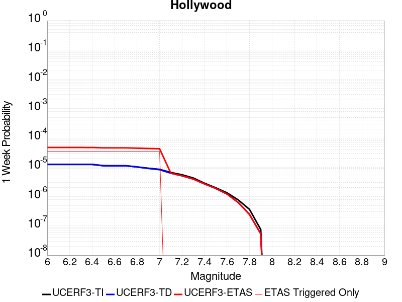 | 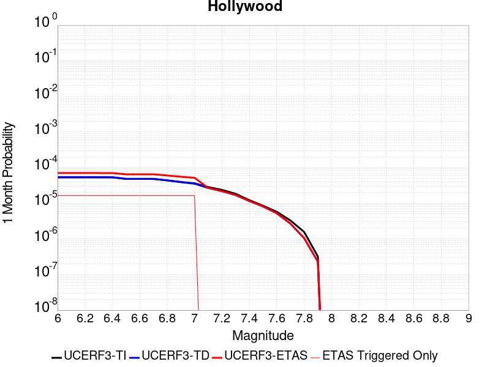 | 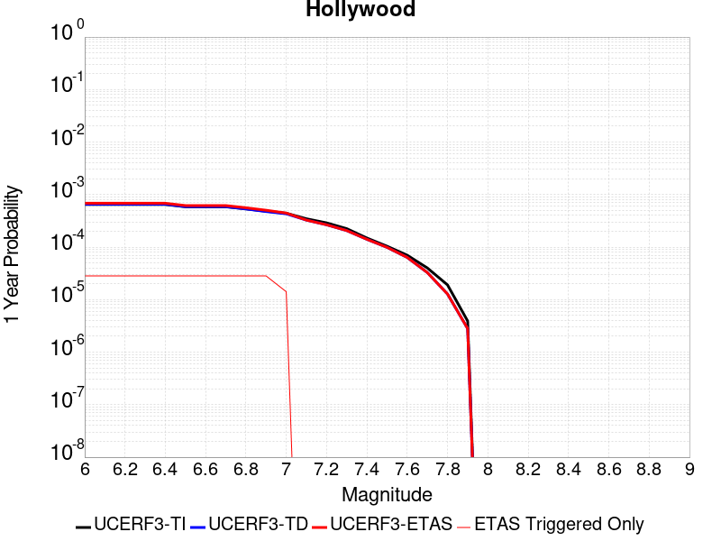 | 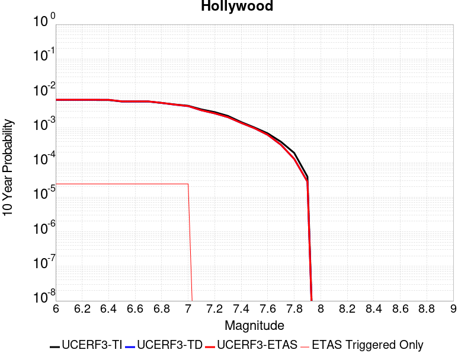 |

| Magnitude | 1 wk TI Prob | 1 wk TD Prob | 1 wk ETAS Prob | 1 wk ETAS/TD Gain | 1 wk ETAS Triggered Only | 1 mo TI Prob | 1 mo TD Prob | 1 mo ETAS Prob | 1 mo ETAS/TD Gain | 1 mo ETAS Triggered Only | 1 yr TI Prob | 1 yr TD Prob | 1 yr ETAS Prob | 1 yr ETAS/TD Gain | 1 yr ETAS Triggered Only | 10 yr TI Prob | 10 yr TD Prob | 10 yr ETAS Prob | 10 yr ETAS/TD Gain | 10 yr ETAS Triggered Only |
|-----|-----|-----|-----|-----|-----|-----|-----|-----|-----|-----|-----|-----|-----|-----|-----|-----|-----|-----|-----|-----|
| 6.0 | 1.24487615E-5 | 1.2593229E-5 | 4.7192476E-5 | 3.7474482 | 3.459968E-5 | 5.3350745E-5 | 5.3969892E-5 | 8.856771E-5 | 1.6410577 | 3.459968E-5 | 6.4935174E-4 | 6.5689E-4 | 6.9146696E-4 | 1.0526373 | 3.459968E-5 | 0.0064745755 | 0.0065499707 | 0.006584344 | 1.0052478 | 3.459968E-5 |
| 6.1 | 1.24487615E-5 | 1.2593229E-5 | 4.7192476E-5 | 3.7474482 | 3.459968E-5 | 5.3350745E-5 | 5.3969892E-5 | 8.856771E-5 | 1.6410577 | 3.459968E-5 | 6.4935174E-4 | 6.5689E-4 | 6.9146696E-4 | 1.0526373 | 3.459968E-5 | 0.0064745755 | 0.0065499707 | 0.006584344 | 1.0052478 | 3.459968E-5 |
| 6.2 | 1.24487615E-5 | 1.2593229E-5 | 4.7192476E-5 | 3.7474482 | 3.459968E-5 | 5.3350745E-5 | 5.3969892E-5 | 8.856771E-5 | 1.6410577 | 3.459968E-5 | 6.4935174E-4 | 6.5689E-4 | 6.9146696E-4 | 1.0526373 | 3.459968E-5 | 0.0064745755 | 0.0065499707 | 0.006584344 | 1.0052478 | 3.459968E-5 |
| 6.3 | 1.24487615E-5 | 1.2593229E-5 | 4.7192476E-5 | 3.7474482 | 3.459968E-5 | 5.3350745E-5 | 5.3969892E-5 | 8.856771E-5 | 1.6410577 | 3.459968E-5 | 6.4935174E-4 | 6.5689E-4 | 6.9146696E-4 | 1.0526373 | 3.459968E-5 | 0.0064745755 | 0.0065499707 | 0.006584344 | 1.0052478 | 3.459968E-5 |
| 6.4 | 1.2431024E-5 | 1.25738425E-5 | 4.717309E-5 | 3.7516844 | 3.459968E-5 | 5.327473E-5 | 5.388681E-5 | 8.848463E-5 | 1.6420461 | 3.459968E-5 | 6.4842677E-4 | 6.558791E-4 | 6.904561E-4 | 1.0527185 | 3.459968E-5 | 0.0064653796 | 0.0065399213 | 0.0065742945 | 1.0052559 | 3.459968E-5 |
| 6.5 | 1.1242222E-5 | 1.1317804E-5 | 4.5917095E-5 | 4.0570674 | 3.459968E-5 | 4.8180063E-5 | 4.8503985E-5 | 8.310199E-5 | 1.7133023 | 3.459968E-5 | 5.864344E-4 | 5.903787E-4 | 6.2495796E-4 | 1.0585713 | 3.459968E-5 | 0.0058488925 | 0.00588839 | 0.005922786 | 1.0058414 | 3.459968E-5 |
| 6.6 | 1.1234066E-5 | 1.1308918E-5 | 4.5908208E-5 | 4.0594697 | 3.459968E-5 | 4.8145106E-5 | 4.8465907E-5 | 8.306391E-5 | 1.7138628 | 3.459968E-5 | 5.86009E-4 | 5.899153E-4 | 6.2449457E-4 | 1.0586174 | 3.459968E-5 | 0.005844661 | 0.0058837803 | 0.0059181764 | 1.0058459 | 3.459968E-5 |
| 6.7 | 1.12294E-5 | 1.1303661E-5 | 4.590295E-5 | 4.0608926 | 3.459968E-5 | 4.812511E-5 | 4.8443377E-5 | 8.3041385E-5 | 1.7141948 | 3.459968E-5 | 5.857657E-4 | 5.896412E-4 | 6.2422047E-4 | 1.0586447 | 3.459968E-5 | 0.0058422405 | 0.005881054 | 0.00591545 | 1.0058486 | 3.459968E-5 |
| 6.8 | 1.0252819E-5 | 1.0218449E-5 | 4.4817778E-5 | 4.385967 | 3.459968E-5 | 4.3939912E-5 | 4.3792625E-5 | 7.839079E-5 | 1.7900455 | 3.459968E-5 | 5.3483713E-4 | 5.330469E-4 | 5.676281E-4 | 1.0648746 | 3.459968E-5 | 0.005335517 | 0.0053179096 | 0.0053523253 | 1.0064716 | 3.459968E-5 |
| 6.9 | 9.252289E-6 | 9.110309E-6 | 4.3709675E-5 | 4.7978253 | 3.459968E-5 | 3.9652066E-5 | 3.9043607E-5 | 7.364194E-5 | 1.8861458 | 3.459968E-5 | 4.8265693E-4 | 4.752539E-4 | 5.098371E-4 | 1.072768 | 3.459968E-5 | 0.0048161 | 0.004742549 | 0.0047769845 | 1.007261 | 3.459968E-5 |
| 7.0 | 8.474604E-6 | 8.25826E-6 | 4.2857657E-5 | 5.189671 | 3.459968E-5 | 3.6319227E-5 | 3.5392073E-5 | 6.999053E-5 | 1.9775765 | 3.459968E-5 | 4.4209688E-4 | 4.3081472E-4 | 4.653995E-4 | 1.0802776 | 3.459968E-5 | 0.004412184 | 0.0042999457 | 0.0043343967 | 1.0080119 | 3.459968E-5 |
| 7.1 | 6.643643E-6 | 6.2683707E-6 | 6.2683707E-6 | 1.0 | 0.0 | 2.8472443E-5 | 2.686417E-5 | 2.686417E-5 | 1.0 | 0.0 | 3.4659685E-4 | 3.2702263E-4 | 3.2702263E-4 | 1.0 | 0.0 | 0.0034605677 | 0.0032654598 | 0.0032654598 | 1.0 | 0.0 |
| 7.2 | 5.549002E-6 | 5.1087086E-6 | 5.1087086E-6 | 1.0 | 0.0 | 2.378122E-5 | 2.1894282E-5 | 2.1894282E-5 | 1.0 | 0.0 | 2.8949787E-4 | 2.665304E-4 | 2.665304E-4 | 1.0 | 0.0 | 0.0028912104 | 0.002662124 | 0.002662124 | 1.0 | 0.0 |
| 7.3 | 4.3059727E-6 | 3.9598913E-6 | 3.9598913E-6 | 1.0 | 0.0 | 1.8454039E-5 | 1.6970853E-5 | 1.6970853E-5 | 1.0 | 0.0 | 2.2465475E-4 | 2.0660064E-4 | 2.0660064E-4 | 1.0 | 0.0 | 0.0022442779 | 0.0020640958 | 0.0020640958 | 1.0 | 0.0 |
| 7.4 | 2.8550733E-6 | 2.7013002E-6 | 2.7013002E-6 | 1.0 | 0.0 | 1.2235971E-5 | 1.1576949E-5 | 1.1576949E-5 | 1.0 | 0.0 | 1.4896276E-4 | 1.4094029E-4 | 1.4094029E-4 | 1.0 | 0.0 | 0.0014886294 | 0.0014085141 | 0.0014085141 | 1.0 | 0.0 |
| 7.5 | 1.9927045E-6 | 1.8976393E-6 | 1.8976393E-6 | 1.0 | 0.0 | 8.540134E-6 | 8.132714E-6 | 8.132714E-6 | 1.0 | 0.0 | 1.0397117E-4 | 9.901134E-5 | 9.901134E-5 | 1.0 | 0.0 | 0.0010392254 | 9.896759E-4 | 9.896759E-4 | 1.0 | 0.0 |
| 7.6 | 1.345084E-6 | 1.2216018E-6 | 1.2216018E-6 | 1.0 | 0.0 | 5.764633E-6 | 5.2354258E-6 | 5.2354258E-6 | 1.0 | 0.0 | 7.018215E-5 | 6.373946E-5 | 6.373946E-5 | 1.0 | 0.0 | 7.0159987E-4 | 6.372138E-4 | 6.372138E-4 | 1.0 | 0.0 |
| 7.7 | 7.6835164E-7 | 6.2777013E-7 | 6.2777013E-7 | 1.0 | 0.0 | 3.2929315E-6 | 2.6904406E-6 | 2.6904406E-6 | 1.0 | 0.0 | 4.00907E-5 | 3.2755637E-5 | 3.2755637E-5 | 1.0 | 0.0 | 4.0083472E-4 | 3.2750957E-4 | 3.2750957E-4 | 1.0 | 0.0 |
| 7.8 | 3.6562128E-7 | 2.4534745E-7 | 2.4534745E-7 | 1.0 | 0.0 | 1.5669474E-6 | 1.0514887E-6 | 1.0514887E-6 | 1.0 | 0.0 | 1.9077417E-5 | 1.2801803E-5 | 1.2801803E-5 | 1.0 | 0.0 | 1.907578E-4 | 1.2801103E-4 | 1.2801103E-4 | 1.0 | 0.0 |
| 7.9 | 7.5024424E-8 | 5.381742E-8 | 5.381742E-8 | 1.0 | 0.0 | 3.215332E-7 | 2.3064608E-7 | 2.3064608E-7 | 1.0 | 0.0 | 3.91466E-6 | 2.8081138E-6 | 2.8081138E-6 | 1.0 | 0.0 | 3.9145907E-5 | 2.8080913E-5 | 2.8080913E-5 | 1.0 | 0.0 |

## Great Valley 07 (Orestimba)
*[(top)](#table-of-contents)*

| 1 Week | 1 Month | 1 Year | 10 Year |
|-----|-----|-----|-----|
| 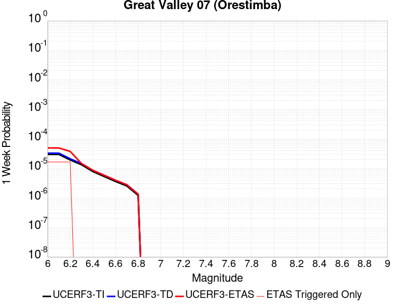 | 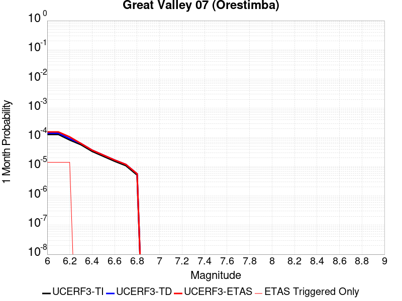 | 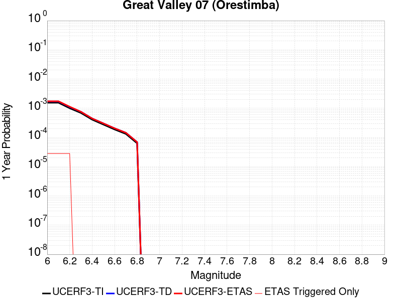 | 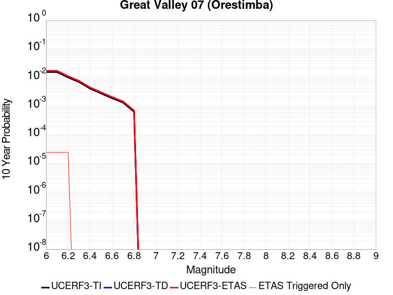 |

| Magnitude | 1 wk TI Prob | 1 wk TD Prob | 1 wk ETAS Prob | 1 wk ETAS/TD Gain | 1 wk ETAS Triggered Only | 1 mo TI Prob | 1 mo TD Prob | 1 mo ETAS Prob | 1 mo ETAS/TD Gain | 1 mo ETAS Triggered Only | 1 yr TI Prob | 1 yr TD Prob | 1 yr ETAS Prob | 1 yr ETAS/TD Gain | 1 yr ETAS Triggered Only | 10 yr TI Prob | 10 yr TD Prob | 10 yr ETAS Prob | 10 yr ETAS/TD Gain | 10 yr ETAS Triggered Only |
|-----|-----|-----|-----|-----|-----|-----|-----|-----|-----|-----|-----|-----|-----|-----|-----|-----|-----|-----|-----|-----|
| 6.0 | 2.9687902E-5 | 3.27575E-5 | 3.27575E-5 | 1.0 | 0.0 | 1.2722766E-4 | 1.4038214E-4 | 1.4038214E-4 | 1.0 | 0.0 | 0.0015478961 | 0.0017078844 | 0.001742425 | 1.0202242 | 3.459968E-5 | 0.015371585 | 0.016955135 | 0.01698915 | 1.002006 | 3.459968E-5 |
| 6.1 | 2.9687902E-5 | 3.27575E-5 | 3.27575E-5 | 1.0 | 0.0 | 1.2722766E-4 | 1.4038214E-4 | 1.4038214E-4 | 1.0 | 0.0 | 0.0015478961 | 0.0017078844 | 0.001742425 | 1.0202242 | 3.459968E-5 | 0.015371585 | 0.016955135 | 0.01698915 | 1.002006 | 3.459968E-5 |
| 6.2 | 1.9231524E-5 | 2.1159167E-5 | 2.1159167E-5 | 1.0 | 0.0 | 8.2418206E-5 | 9.067912E-5 | 9.067912E-5 | 1.0 | 0.0 | 0.0010029797 | 0.0011034822 | 0.0011380437 | 1.0313205 | 3.459968E-5 | 0.00998465 | 0.010982441 | 0.01101666 | 1.0031159 | 3.459968E-5 |
| 6.3 | 1.324766E-5 | 1.4548534E-5 | 1.4548534E-5 | 1.0 | 0.0 | 5.6774446E-5 | 6.234942E-5 | 6.234942E-5 | 1.0 | 0.0 | 6.910097E-4 | 7.5884897E-4 | 7.5884897E-4 | 1.0 | 0.0 | 0.006888649 | 0.0075635235 | 0.0075635235 | 1.0 | 0.0 |
| 6.4 | 7.818645E-6 | 8.57284E-6 | 8.57284E-6 | 1.0 | 0.0 | 3.3508048E-5 | 3.6740246E-5 | 3.6740246E-5 | 1.0 | 0.0 | 4.078841E-4 | 4.4722404E-4 | 4.4722404E-4 | 1.0 | 0.0 | 0.004071363 | 0.0044635804 | 0.0044635804 | 1.0 | 0.0 |
| 6.5 | 5.3076565E-6 | 5.8178007E-6 | 5.8178007E-6 | 1.0 | 0.0 | 2.27469E-5 | 2.4933206E-5 | 2.4933206E-5 | 1.0 | 0.0 | 2.7690834E-4 | 3.035216E-4 | 3.035216E-4 | 1.0 | 0.0 | 0.0027656353 | 0.00303128 | 0.00303128 | 1.0 | 0.0 |
| 6.6 | 3.6003578E-6 | 3.9484953E-6 | 3.9484953E-6 | 1.0 | 0.0 | 1.5430012E-5 | 1.6922022E-5 | 1.6922022E-5 | 1.0 | 0.0 | 1.8784421E-4 | 2.0600771E-4 | 2.0600771E-4 | 1.0 | 0.0 | 0.0018768552 | 0.0020583214 | 0.0020583214 | 1.0 | 0.0 |
| 6.7 | 2.5361826E-6 | 2.7834678E-6 | 2.7834678E-6 | 1.0 | 0.0 | 1.0869308E-5 | 1.1929101E-5 | 1.1929101E-5 | 1.0 | 0.0 | 1.3232579E-4 | 1.4522845E-4 | 1.4522845E-4 | 1.0 | 0.0 | 0.0013224703 | 0.0014514653 | 0.0014514653 | 1.0 | 0.0 |
| 6.8 | 1.2115831E-6 | 1.3313797E-6 | 1.3313797E-6 | 1.0 | 0.0 | 5.1924885E-6 | 5.7059065E-6 | 5.7059065E-6 | 1.0 | 0.0 | 6.3216714E-5 | 6.9468166E-5 | 6.9468166E-5 | 1.0 | 0.0 | 6.3198735E-4 | 6.945596E-4 | 6.945596E-4 | 1.0 | 0.0 |

## Garberville - Briceland 2011 CFM
*[(top)](#table-of-contents)*

| 1 Week | 1 Month | 1 Year | 10 Year |
|-----|-----|-----|-----|
|  | 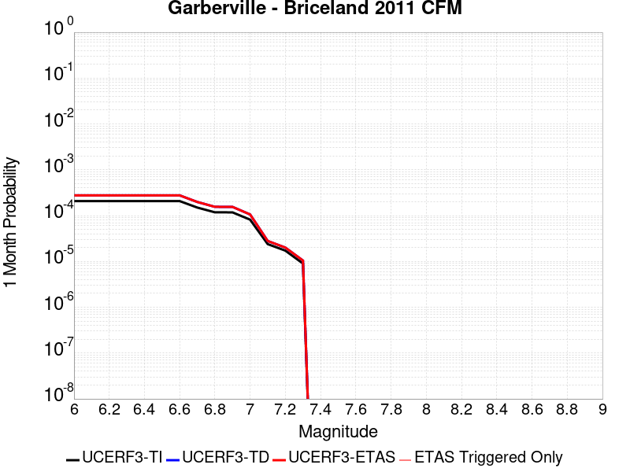 | 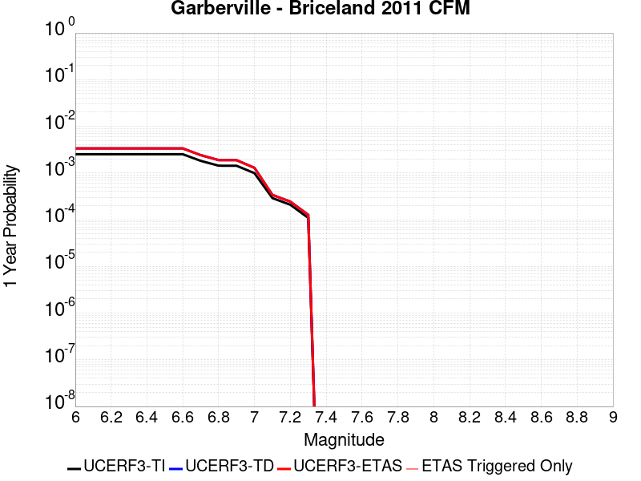 | 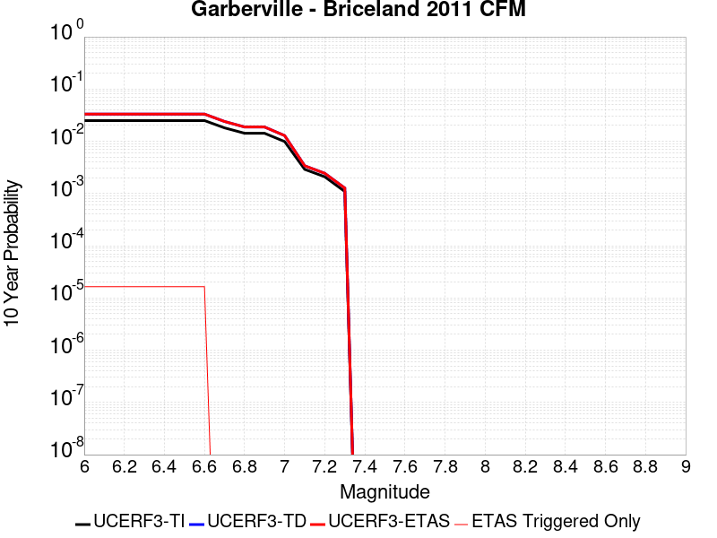 |

| Magnitude | 1 wk TI Prob | 1 wk TD Prob | 1 wk ETAS Prob | 1 wk ETAS/TD Gain | 1 wk ETAS Triggered Only | 1 mo TI Prob | 1 mo TD Prob | 1 mo ETAS Prob | 1 mo ETAS/TD Gain | 1 mo ETAS Triggered Only | 1 yr TI Prob | 1 yr TD Prob | 1 yr ETAS Prob | 1 yr ETAS/TD Gain | 1 yr ETAS Triggered Only | 10 yr TI Prob | 10 yr TD Prob | 10 yr ETAS Prob | 10 yr ETAS/TD Gain | 10 yr ETAS Triggered Only |
|-----|-----|-----|-----|-----|-----|-----|-----|-----|-----|-----|-----|-----|-----|-----|-----|-----|-----|-----|-----|-----|
| 6.0 | 4.8399295E-5 | 6.4527754E-5 | 6.4527754E-5 | 1.0 | 0.0 | 2.0740906E-4 | 2.765224E-4 | 2.765224E-4 | 1.0 | 0.0 | 0.002522281 | 0.0033621131 | 0.0033621131 | 1.0 | 0.0 | 0.024938442 | 0.03317879 | 0.033212245 | 1.0010083 | 3.459968E-5 |
| 6.1 | 4.8399295E-5 | 6.4527754E-5 | 6.4527754E-5 | 1.0 | 0.0 | 2.0740906E-4 | 2.765224E-4 | 2.765224E-4 | 1.0 | 0.0 | 0.002522281 | 0.0033621131 | 0.0033621131 | 1.0 | 0.0 | 0.024938442 | 0.03317879 | 0.033212245 | 1.0010083 | 3.459968E-5 |
| 6.2 | 4.8399295E-5 | 6.4527754E-5 | 6.4527754E-5 | 1.0 | 0.0 | 2.0740906E-4 | 2.765224E-4 | 2.765224E-4 | 1.0 | 0.0 | 0.002522281 | 0.0033621131 | 0.0033621131 | 1.0 | 0.0 | 0.024938442 | 0.03317879 | 0.033212245 | 1.0010083 | 3.459968E-5 |
| 6.3 | 4.8399295E-5 | 6.4527754E-5 | 6.4527754E-5 | 1.0 | 0.0 | 2.0740906E-4 | 2.765224E-4 | 2.765224E-4 | 1.0 | 0.0 | 0.002522281 | 0.0033621131 | 0.0033621131 | 1.0 | 0.0 | 0.024938442 | 0.03317879 | 0.033212245 | 1.0010083 | 3.459968E-5 |
| 6.4 | 4.8399295E-5 | 6.4527754E-5 | 6.4527754E-5 | 1.0 | 0.0 | 2.0740906E-4 | 2.765224E-4 | 2.765224E-4 | 1.0 | 0.0 | 0.002522281 | 0.0033621131 | 0.0033621131 | 1.0 | 0.0 | 0.024938442 | 0.03317879 | 0.033212245 | 1.0010083 | 3.459968E-5 |
| 6.5 | 4.8399295E-5 | 6.4527754E-5 | 6.4527754E-5 | 1.0 | 0.0 | 2.0740906E-4 | 2.765224E-4 | 2.765224E-4 | 1.0 | 0.0 | 0.002522281 | 0.0033621131 | 0.0033621131 | 1.0 | 0.0 | 0.024938442 | 0.03317879 | 0.033212245 | 1.0010083 | 3.459968E-5 |
| 6.6 | 4.8399295E-5 | 6.4527754E-5 | 6.4527754E-5 | 1.0 | 0.0 | 2.0740906E-4 | 2.765224E-4 | 2.765224E-4 | 1.0 | 0.0 | 0.002522281 | 0.0033621131 | 0.0033621131 | 1.0 | 0.0 | 0.024938442 | 0.03317879 | 0.033212245 | 1.0010083 | 3.459968E-5 |
| 6.7 | 3.495179E-5 | 4.630908E-5 | 4.630908E-5 | 1.0 | 0.0 | 1.4978478E-4 | 1.9845538E-4 | 1.9845538E-4 | 1.0 | 0.0 | 0.0018221042 | 0.0024140473 | 0.0024140473 | 1.0 | 0.0 | 0.018072363 | 0.023930654 | 0.023930654 | 1.0 | 0.0 |
| 6.8 | 2.7517597E-5 | 3.62417E-5 | 3.62417E-5 | 1.0 | 0.0 | 1.1792722E-4 | 1.5531495E-4 | 1.5531495E-4 | 1.0 | 0.0 | 0.0014348183 | 0.0018897917 | 0.0018897917 | 1.0 | 0.0 | 0.014255894 | 0.01878354 | 0.01878354 | 1.0 | 0.0 |
| 6.9 | 2.74461E-5 | 3.6159425E-5 | 3.6159425E-5 | 1.0 | 0.0 | 1.1762084E-4 | 1.5496238E-4 | 1.5496238E-4 | 1.0 | 0.0 | 0.001431093 | 0.0018855067 | 0.0018855067 | 1.0 | 0.0 | 0.014219119 | 0.018741412 | 0.018741412 | 1.0 | 0.0 |
| 7.0 | 1.9023773E-5 | 2.4707771E-5 | 2.4707771E-5 | 1.0 | 0.0 | 8.152791E-5 | 1.0588833E-4 | 1.0588833E-4 | 1.0 | 0.0 | 9.921503E-4 | 0.0012888273 | 0.0012888273 | 1.0 | 0.0 | 0.009877323 | 0.012852578 | 0.012852578 | 1.0 | 0.0 |
| 7.1 | 5.566844E-6 | 6.512147E-6 | 6.512147E-6 | 1.0 | 0.0 | 2.3857683E-5 | 2.7908927E-5 | 2.7908927E-5 | 1.0 | 0.0 | 2.9042858E-4 | 3.3974246E-4 | 3.3974246E-4 | 1.0 | 0.0 | 0.002900493 | 0.0033926512 | 0.0033926512 | 1.0 | 0.0 |
| 7.2 | 4.011353E-6 | 4.6746213E-6 | 4.6746213E-6 | 1.0 | 0.0 | 1.7191402E-5 | 2.0033956E-5 | 2.0033956E-5 | 1.0 | 0.0 | 2.0928521E-4 | 2.4388955E-4 | 2.4388955E-4 | 1.0 | 0.0 | 0.0020908823 | 0.0024365564 | 0.0024365564 | 1.0 | 0.0 |
| 7.3 | 2.0974871E-6 | 2.4395908E-6 | 2.4395908E-6 | 1.0 | 0.0 | 8.989199E-6 | 1.0455362E-5 | 1.0455362E-5 | 1.0 | 0.0 | 1.09438006E-4 | 1.272891E-4 | 1.272891E-4 | 1.0 | 0.0 | 0.0010938413 | 0.0012724071 | 0.0012724071 | 1.0 | 0.0 |

## San Jose
*[(top)](#table-of-contents)*

| 1 Week | 1 Month | 1 Year | 10 Year |
|-----|-----|-----|-----|
| 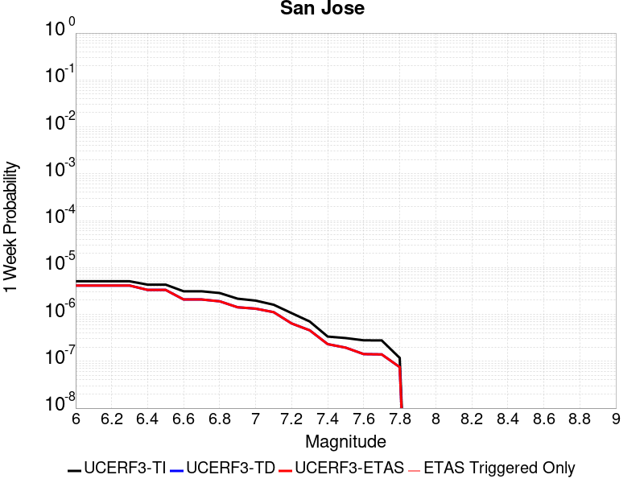 | 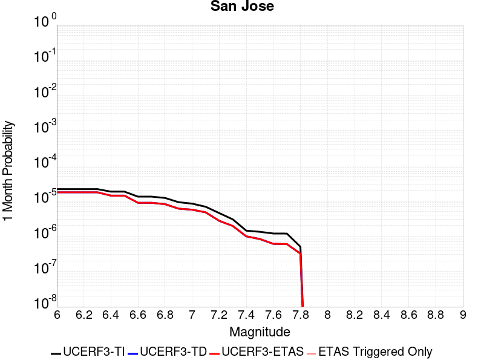 | 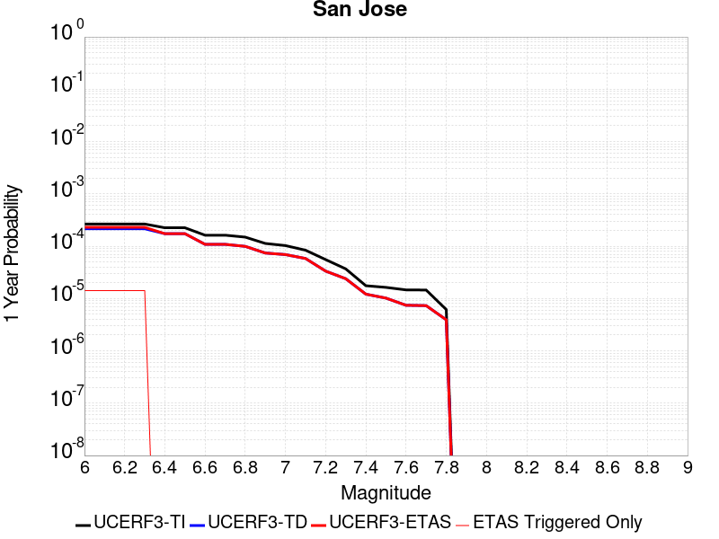 | 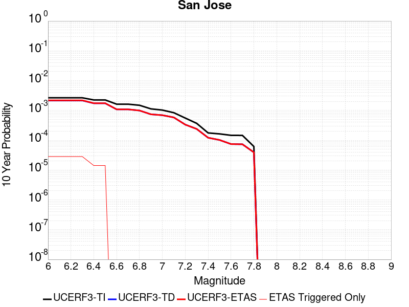 |

| Magnitude | 1 wk TI Prob | 1 wk TD Prob | 1 wk ETAS Prob | 1 wk ETAS/TD Gain | 1 wk ETAS Triggered Only | 1 mo TI Prob | 1 mo TD Prob | 1 mo ETAS Prob | 1 mo ETAS/TD Gain | 1 mo ETAS Triggered Only | 1 yr TI Prob | 1 yr TD Prob | 1 yr ETAS Prob | 1 yr ETAS/TD Gain | 1 yr ETAS Triggered Only | 10 yr TI Prob | 10 yr TD Prob | 10 yr ETAS Prob | 10 yr ETAS/TD Gain | 10 yr ETAS Triggered Only |
|-----|-----|-----|-----|-----|-----|-----|-----|-----|-----|-----|-----|-----|-----|-----|-----|-----|-----|-----|-----|-----|
| 6.0 | 5.0851277E-6 | 4.125642E-6 | 4.125642E-6 | 1.0 | 0.0 | 2.1793223E-5 | 1.768122E-5 | 1.768122E-5 | 1.0 | 0.0 | 2.653002E-4 | 2.152502E-4 | 2.152502E-4 | 1.0 | 0.0 | 0.0026498367 | 0.0021507454 | 0.0021852707 | 1.0160527 | 3.459968E-5 |
| 6.1 | 5.0851277E-6 | 4.125642E-6 | 4.125642E-6 | 1.0 | 0.0 | 2.1793223E-5 | 1.768122E-5 | 1.768122E-5 | 1.0 | 0.0 | 2.653002E-4 | 2.152502E-4 | 2.152502E-4 | 1.0 | 0.0 | 0.0026498367 | 0.0021507454 | 0.0021852707 | 1.0160527 | 3.459968E-5 |
| 6.2 | 5.0851277E-6 | 4.125642E-6 | 4.125642E-6 | 1.0 | 0.0 | 2.1793223E-5 | 1.768122E-5 | 1.768122E-5 | 1.0 | 0.0 | 2.653002E-4 | 2.152502E-4 | 2.152502E-4 | 1.0 | 0.0 | 0.0026498367 | 0.0021507454 | 0.0021852707 | 1.0160527 | 3.459968E-5 |
| 6.3 | 5.0851277E-6 | 4.125642E-6 | 4.125642E-6 | 1.0 | 0.0 | 2.1793223E-5 | 1.768122E-5 | 1.768122E-5 | 1.0 | 0.0 | 2.653002E-4 | 2.152502E-4 | 2.152502E-4 | 1.0 | 0.0 | 0.0026498367 | 0.0021507454 | 0.0021852707 | 1.0160527 | 3.459968E-5 |
| 6.4 | 4.3115124E-6 | 3.3237525E-6 | 3.3237525E-6 | 1.0 | 0.0 | 1.8477778E-5 | 1.4244589E-5 | 1.4244589E-5 | 1.0 | 0.0 | 2.2494372E-4 | 1.7341628E-4 | 1.7341628E-4 | 1.0 | 0.0 | 0.0022471617 | 0.0017330965 | 0.0017676363 | 1.0199295 | 3.459968E-5 |
| 6.5 | 4.3115124E-6 | 3.3237525E-6 | 3.3237525E-6 | 1.0 | 0.0 | 1.8477778E-5 | 1.4244589E-5 | 1.4244589E-5 | 1.0 | 0.0 | 2.2494372E-4 | 1.7341628E-4 | 1.7341628E-4 | 1.0 | 0.0 | 0.0022471617 | 0.0017330965 | 0.0017676363 | 1.0199295 | 3.459968E-5 |
| 6.6 | 3.110396E-6 | 2.0799562E-6 | 2.0799562E-6 | 1.0 | 0.0 | 1.33302E-5 | 8.9140685E-6 | 8.9140685E-6 | 1.0 | 0.0 | 1.622831E-4 | 1.0852366E-4 | 1.0852366E-4 | 1.0 | 0.0 | 0.0016216465 | 0.001084804 | 0.001084804 | 1.0 | 0.0 |
| 6.7 | 3.110396E-6 | 2.0799562E-6 | 2.0799562E-6 | 1.0 | 0.0 | 1.33302E-5 | 8.9140685E-6 | 8.9140685E-6 | 1.0 | 0.0 | 1.622831E-4 | 1.0852366E-4 | 1.0852366E-4 | 1.0 | 0.0 | 0.0016216465 | 0.001084804 | 0.001084804 | 1.0 | 0.0 |
| 6.8 | 2.856651E-6 | 1.9024077E-6 | 1.9024077E-6 | 1.0 | 0.0 | 1.2242733E-5 | 8.153152E-6 | 8.153152E-6 | 1.0 | 0.0 | 1.4904508E-4 | 9.926035E-5 | 9.926035E-5 | 1.0 | 0.0 | 0.0014894515 | 9.922545E-4 | 9.922545E-4 | 1.0 | 0.0 |
| 6.9 | 2.1618725E-6 | 1.4186406E-6 | 1.4186406E-6 | 1.0 | 0.0 | 9.265135E-6 | 6.0798748E-6 | 6.0798748E-6 | 1.0 | 0.0 | 1.12797185E-4 | 7.402005E-5 | 7.402005E-5 | 1.0 | 0.0 | 0.0011273995 | 7.4003247E-4 | 7.4003247E-4 | 1.0 | 0.0 |
| 7.0 | 1.9684312E-6 | 1.3256082E-6 | 1.3256082E-6 | 1.0 | 0.0 | 8.436106E-6 | 5.681166E-6 | 5.681166E-6 | 1.0 | 0.0 | 1.02704755E-4 | 6.916608E-5 | 6.916608E-5 | 1.0 | 0.0 | 0.001026573 | 6.9152354E-4 | 6.9152354E-4 | 1.0 | 0.0 |
| 7.1 | 1.6070337E-6 | 1.1154867E-6 | 1.1154867E-6 | 1.0 | 0.0 | 6.887269E-6 | 4.7806493E-6 | 4.7806493E-6 | 1.0 | 0.0 | 8.384928E-5 | 5.8202913E-5 | 5.8202913E-5 | 1.0 | 0.0 | 8.3817646E-4 | 5.819527E-4 | 5.819527E-4 | 1.0 | 0.0 |
| 7.2 | 1.0631658E-6 | 6.403567E-7 | 6.403567E-7 | 1.0 | 0.0 | 4.556417E-6 | 2.744383E-6 | 2.744383E-6 | 1.0 | 0.0 | 5.5472963E-5 | 3.3412365E-5 | 3.3412365E-5 | 1.0 | 0.0 | 5.545912E-4 | 3.3414463E-4 | 3.3414463E-4 | 1.0 | 0.0 |
| 7.3 | 7.060711E-7 | 4.5823228E-7 | 4.5823228E-7 | 1.0 | 0.0 | 3.0260155E-6 | 1.9638512E-6 | 1.9638512E-6 | 1.0 | 0.0 | 3.6841117E-5 | 2.3909635E-5 | 2.3909635E-5 | 1.0 | 0.0 | 3.6835007E-4 | 2.3914136E-4 | 2.3914136E-4 | 1.0 | 0.0 |
| 7.4 | 3.3677085E-7 | 2.3231999E-7 | 2.3231999E-7 | 1.0 | 0.0 | 1.4433028E-6 | 9.956567E-7 | 9.956567E-7 | 1.0 | 0.0 | 1.757207E-5 | 1.2122056E-5 | 1.2122056E-5 | 1.0 | 0.0 | 1.7570681E-4 | 1.2128407E-4 | 1.2128407E-4 | 1.0 | 0.0 |
| 7.5 | 3.129161E-7 | 1.9529637E-7 | 1.9529637E-7 | 1.0 | 0.0 | 1.3410682E-6 | 8.3698416E-7 | 8.3698416E-7 | 1.0 | 0.0 | 1.6327383E-5 | 1.0190237E-5 | 1.0190237E-5 | 1.0 | 0.0 | 1.6326184E-4 | 1.0196777E-4 | 1.0196777E-4 | 1.0 | 0.0 |
| 7.6 | 2.8008668E-7 | 1.4240818E-7 | 1.4240818E-7 | 1.0 | 0.0 | 1.2003709E-6 | 6.103206E-7 | 6.103206E-7 | 1.0 | 0.0 | 1.46144175E-5 | 7.43063E-6 | 7.43063E-6 | 1.0 | 0.0 | 1.4613457E-4 | 7.43735E-5 | 7.43735E-5 | 1.0 | 0.0 |
| 7.7 | 2.7852005E-7 | 1.4015403E-7 | 1.4015403E-7 | 1.0 | 0.0 | 1.1936568E-6 | 6.0066003E-7 | 6.0066003E-7 | 1.0 | 0.0 | 1.4532674E-5 | 7.3130127E-6 | 7.3130127E-6 | 1.0 | 0.0 | 1.4531724E-4 | 7.31974E-5 | 7.31974E-5 | 1.0 | 0.0 |
| 7.8 | 1.1810797E-7 | 7.5187074E-8 | 7.5187074E-8 | 1.0 | 0.0 | 5.0617695E-7 | 3.2223028E-7 | 3.2223028E-7 | 1.0 | 0.0 | 6.1626865E-6 | 3.9231472E-6 | 3.9231472E-6 | 1.0 | 0.0 | 6.162516E-5 | 3.9271265E-5 | 3.9271265E-5 | 1.0 | 0.0 |

## Elsinore (Temecula) rev
*[(top)](#table-of-contents)*

| 1 Week | 1 Month | 1 Year | 10 Year |
|-----|-----|-----|-----|
| 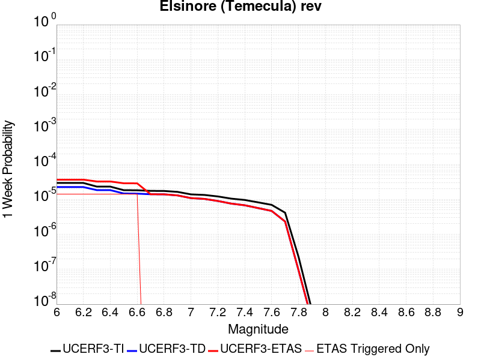 | 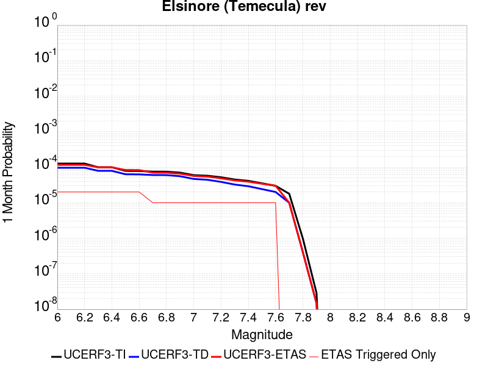 | 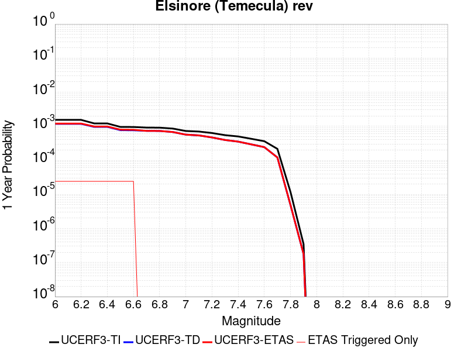 | 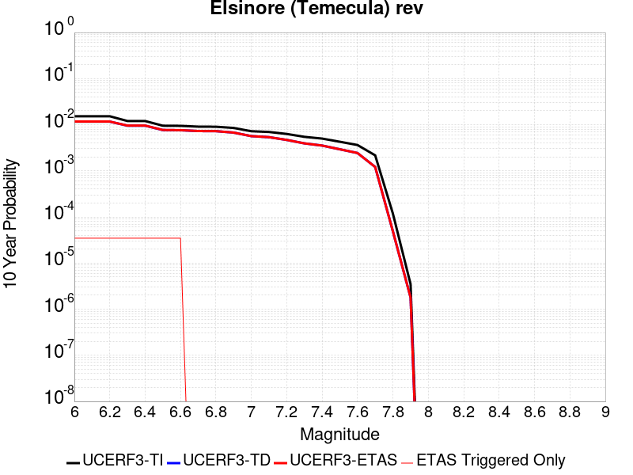 |

| Magnitude | 1 wk TI Prob | 1 wk TD Prob | 1 wk ETAS Prob | 1 wk ETAS/TD Gain | 1 wk ETAS Triggered Only | 1 mo TI Prob | 1 mo TD Prob | 1 mo ETAS Prob | 1 mo ETAS/TD Gain | 1 mo ETAS Triggered Only | 1 yr TI Prob | 1 yr TD Prob | 1 yr ETAS Prob | 1 yr ETAS/TD Gain | 1 yr ETAS Triggered Only | 10 yr TI Prob | 10 yr TD Prob | 10 yr ETAS Prob | 10 yr ETAS/TD Gain | 10 yr ETAS Triggered Only |
|-----|-----|-----|-----|-----|-----|-----|-----|-----|-----|-----|-----|-----|-----|-----|-----|-----|-----|-----|-----|-----|
| 6.0 | 2.9514995E-5 | 2.251887E-5 | 5.7117773E-5 | 2.5364404 | 3.459968E-5 | 1.264867E-4 | 9.6505995E-5 | 1.3110234E-4 | 1.358489 | 3.459968E-5 | 0.0015388876 | 0.0011743492 | 0.0012089083 | 1.0294282 | 3.459968E-5 | 0.015282745 | 0.011688135 | 0.01172233 | 1.0029256 | 3.459968E-5 |
| 6.1 | 2.9514995E-5 | 2.251887E-5 | 5.7117773E-5 | 2.5364404 | 3.459968E-5 | 1.264867E-4 | 9.6505995E-5 | 1.3110234E-4 | 1.358489 | 3.459968E-5 | 0.0015388876 | 0.0011743492 | 0.0012089083 | 1.0294282 | 3.459968E-5 | 0.015282745 | 0.011688135 | 0.01172233 | 1.0029256 | 3.459968E-5 |
| 6.2 | 2.9514995E-5 | 2.251887E-5 | 5.7117773E-5 | 2.5364404 | 3.459968E-5 | 1.264867E-4 | 9.6505995E-5 | 1.3110234E-4 | 1.358489 | 3.459968E-5 | 0.0015388876 | 0.0011743492 | 0.0012089083 | 1.0294282 | 3.459968E-5 | 0.015282745 | 0.011688135 | 0.01172233 | 1.0029256 | 3.459968E-5 |
| 6.3 | 2.3223649E-5 | 1.840822E-5 | 5.3007265E-5 | 2.8795433 | 3.459968E-5 | 9.952613E-5 | 7.889008E-5 | 1.1348703E-4 | 1.4385463 | 3.459968E-5 | 0.001211057 | 9.600807E-4 | 9.946472E-4 | 1.0360037 | 3.459968E-5 | 0.012044783 | 0.009551284 | 0.009585553 | 1.003588 | 3.459968E-5 |
| 6.4 | 2.3223649E-5 | 1.840822E-5 | 5.3007265E-5 | 2.8795433 | 3.459968E-5 | 9.952613E-5 | 7.889008E-5 | 1.1348703E-4 | 1.4385463 | 3.459968E-5 | 0.001211057 | 9.600807E-4 | 9.946472E-4 | 1.0360037 | 3.459968E-5 | 0.012044783 | 0.009551284 | 0.009585553 | 1.003588 | 3.459968E-5 |
| 6.5 | 1.8338875E-5 | 1.4750074E-5 | 4.9349244E-5 | 3.3456948 | 3.459968E-5 | 7.8592806E-5 | 6.321312E-5 | 9.781062E-5 | 1.5473151 | 3.459968E-5 | 9.5644733E-4 | 7.6935673E-4 | 8.039298E-4 | 1.0449376 | 3.459968E-5 | 0.009523412 | 0.0076699676 | 0.0077043017 | 1.0044764 | 3.459968E-5 |
| 6.6 | 1.8223333E-5 | 1.461263E-5 | 4.9211805E-5 | 3.3677583 | 3.459968E-5 | 7.809766E-5 | 6.26241E-5 | 9.722162E-5 | 1.5524633 | 3.459968E-5 | 9.504242E-4 | 7.621905E-4 | 7.967638E-4 | 1.0453604 | 3.459968E-5 | 0.009463696 | 0.007598796 | 0.007633133 | 1.0045187 | 3.459968E-5 |
| 6.7 | 1.7512752E-5 | 1.4026963E-5 | 1.4026963E-5 | 1.0 | 0.0 | 7.505249E-5 | 6.0114216E-5 | 6.0114216E-5 | 1.0 | 0.0 | 9.13381E-4 | 7.316534E-4 | 7.316534E-4 | 1.0 | 0.0 | 0.00909636 | 0.0072983317 | 0.0072983317 | 1.0 | 0.0 |
| 6.8 | 1.7417142E-5 | 1.395093E-5 | 1.395093E-5 | 1.0 | 0.0 | 7.4642754E-5 | 5.978838E-5 | 5.978838E-5 | 1.0 | 0.0 | 9.083966E-4 | 7.27689E-4 | 7.27689E-4 | 1.0 | 0.0 | 0.009046922 | 0.007259359 | 0.007259359 | 1.0 | 0.0 |
| 6.9 | 1.6402591E-5 | 1.29883665E-5 | 1.29883665E-5 | 1.0 | 0.0 | 7.0294926E-5 | 5.5663284E-5 | 5.5663284E-5 | 1.0 | 0.0 | 8.5550465E-4 | 6.774974E-4 | 6.774974E-4 | 1.0 | 0.0 | 0.008522186 | 0.0067598647 | 0.0067598647 | 1.0 | 0.0 |
| 7.0 | 1.3912486E-5 | 1.0878067E-5 | 1.0878067E-5 | 1.0 | 0.0 | 5.9623577E-5 | 4.661947E-5 | 4.661947E-5 | 1.0 | 0.0 | 7.2567526E-4 | 5.674469E-4 | 5.674469E-4 | 1.0 | 0.0 | 0.0072331014 | 0.0056635314 | 0.0056635314 | 1.0 | 0.0 |
| 7.1 | 1.3405147E-5 | 1.0327192E-5 | 1.0327192E-5 | 1.0 | 0.0 | 5.7449364E-5 | 4.4258657E-5 | 4.4258657E-5 | 1.0 | 0.0 | 6.9922156E-4 | 5.3871854E-4 | 5.3871854E-4 | 1.0 | 0.0 | 0.0069702556 | 0.005377366 | 0.005377366 | 1.0 | 0.0 |
| 7.2 | 1.21402E-5 | 8.996479E-6 | 8.996479E-6 | 1.0 | 0.0 | 5.202839E-5 | 3.8555776E-5 | 3.8555776E-5 | 1.0 | 0.0 | 6.332616E-4 | 4.6931725E-4 | 4.6931725E-4 | 1.0 | 0.0 | 0.0063146 | 0.0046847262 | 0.0046847262 | 1.0 | 0.0 |
| 7.3 | 1.05047775E-5 | 7.571515E-6 | 7.571515E-6 | 1.0 | 0.0 | 4.5019697E-5 | 3.2448956E-5 | 3.2448956E-5 | 1.0 | 0.0 | 5.4797693E-4 | 3.9499588E-4 | 3.9499588E-4 | 1.0 | 0.0 | 0.005466277 | 0.003943348 | 0.003943348 | 1.0 | 0.0 |
| 7.4 | 9.624483E-6 | 6.786621E-6 | 6.786621E-6 | 1.0 | 0.0 | 4.124713E-5 | 2.90852E-5 | 2.90852E-5 | 1.0 | 0.0 | 5.0206814E-4 | 3.5405616E-4 | 3.5405616E-4 | 1.0 | 0.0 | 0.005009353 | 0.0035350726 | 0.0035350726 | 1.0 | 0.0 |
| 7.5 | 8.215151E-6 | 5.6353133E-6 | 5.6353133E-6 | 1.0 | 0.0 | 3.5207315E-5 | 2.4151126E-5 | 2.4151126E-5 | 1.0 | 0.0 | 4.2856473E-4 | 2.9400157E-4 | 2.9400157E-4 | 1.0 | 0.0 | 0.004277392 | 0.002936254 | 0.002936254 | 1.0 | 0.0 |
| 7.6 | 6.975058E-6 | 4.675836E-6 | 4.675836E-6 | 1.0 | 0.0 | 2.9892764E-5 | 2.003915E-5 | 2.003915E-5 | 1.0 | 0.0 | 3.6388362E-4 | 2.439505E-4 | 2.439505E-4 | 1.0 | 0.0 | 0.0036328835 | 0.0024369434 | 0.0024369434 | 1.0 | 0.0 |
| 7.7 | 4.159604E-6 | 2.326789E-6 | 2.326789E-6 | 1.0 | 0.0 | 1.7826753E-5 | 9.971919E-6 | 9.971919E-6 | 1.0 | 0.0 | 2.1701909E-4 | 1.2140209E-4 | 1.2140209E-4 | 1.0 | 0.0 | 0.0021680726 | 0.0012134308 | 0.0012134308 | 1.0 | 0.0 |
| 7.8 | 2.2692414E-7 | 9.384417E-8 | 9.384417E-8 | 1.0 | 0.0 | 9.725317E-7 | 4.0218927E-7 | 4.0218927E-7 | 1.0 | 0.0 | 1.1840509E-5 | 4.8966467E-6 | 4.8966467E-6 | 1.0 | 0.0 | 1.1839878E-4 | 4.8965718E-5 | 4.8965718E-5 | 1.0 | 0.0 |
| 7.9 | 6.676829E-9 | 3.4397174E-9 | 3.4397174E-9 | 1.0 | 0.0 | 2.861498E-8 | 1.4741646E-8 | 1.4741646E-8 | 1.0 | 0.0 | 3.4838732E-7 | 1.7947953E-7 | 1.7947953E-7 | 1.0 | 0.0 | 3.4838679E-6 | 1.794794E-6 | 1.794794E-6 | 1.0 | 0.0 |

## Del Valle
*[(top)](#table-of-contents)*

| 1 Week | 1 Month | 1 Year | 10 Year |
|-----|-----|-----|-----|
|  | 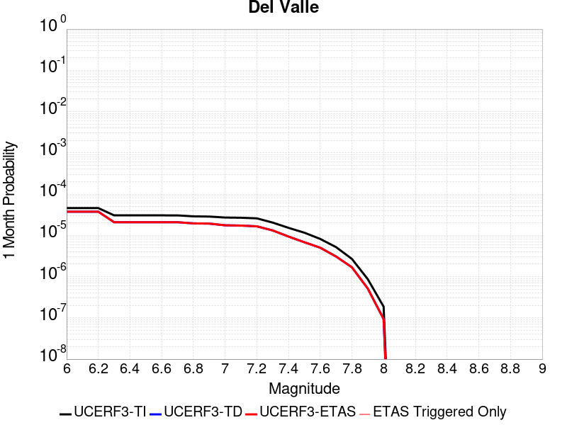 | 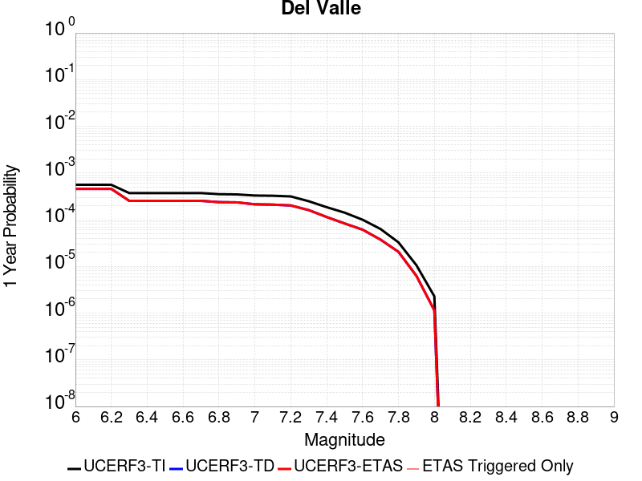 | 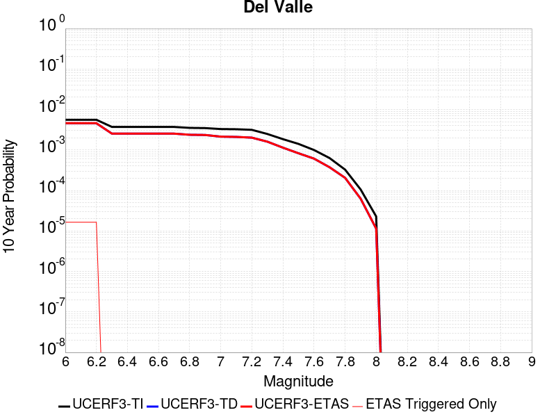 |

| Magnitude | 1 wk TI Prob | 1 wk TD Prob | 1 wk ETAS Prob | 1 wk ETAS/TD Gain | 1 wk ETAS Triggered Only | 1 mo TI Prob | 1 mo TD Prob | 1 mo ETAS Prob | 1 mo ETAS/TD Gain | 1 mo ETAS Triggered Only | 1 yr TI Prob | 1 yr TD Prob | 1 yr ETAS Prob | 1 yr ETAS/TD Gain | 1 yr ETAS Triggered Only | 10 yr TI Prob | 10 yr TD Prob | 10 yr ETAS Prob | 10 yr ETAS/TD Gain | 10 yr ETAS Triggered Only |
|-----|-----|-----|-----|-----|-----|-----|-----|-----|-----|-----|-----|-----|-----|-----|-----|-----|-----|-----|-----|-----|
| 6.0 | 1.0716125E-5 | 8.767882E-6 | 8.767882E-6 | 1.0 | 0.0 | 4.592544E-5 | 3.7576207E-5 | 3.7576207E-5 | 1.0 | 0.0 | 5.589988E-4 | 4.5741402E-4 | 4.5741402E-4 | 1.0 | 0.0 | 0.0055759475 | 0.004566694 | 0.004601136 | 1.0075419 | 3.459968E-5 |
| 6.1 | 1.0716125E-5 | 8.767882E-6 | 8.767882E-6 | 1.0 | 0.0 | 4.592544E-5 | 3.7576207E-5 | 3.7576207E-5 | 1.0 | 0.0 | 5.589988E-4 | 4.5741402E-4 | 4.5741402E-4 | 1.0 | 0.0 | 0.0055759475 | 0.004566694 | 0.004601136 | 1.0075419 | 3.459968E-5 |
| 6.2 | 1.0716125E-5 | 8.767882E-6 | 8.767882E-6 | 1.0 | 0.0 | 4.592544E-5 | 3.7576207E-5 | 3.7576207E-5 | 1.0 | 0.0 | 5.589988E-4 | 4.5741402E-4 | 4.5741402E-4 | 1.0 | 0.0 | 0.0055759475 | 0.004566694 | 0.004601136 | 1.0075419 | 3.459968E-5 |
| 6.3 | 7.1293784E-6 | 4.8658226E-6 | 4.8658226E-6 | 1.0 | 0.0 | 3.055412E-5 | 2.0853362E-5 | 2.0853362E-5 | 1.0 | 0.0 | 3.7193293E-4 | 2.5386084E-4 | 2.5386084E-4 | 1.0 | 0.0 | 0.0037131102 | 0.0025358086 | 0.0025358086 | 1.0 | 0.0 |
| 6.4 | 7.1293784E-6 | 4.8658226E-6 | 4.8658226E-6 | 1.0 | 0.0 | 3.055412E-5 | 2.0853362E-5 | 2.0853362E-5 | 1.0 | 0.0 | 3.7193293E-4 | 2.5386084E-4 | 2.5386084E-4 | 1.0 | 0.0 | 0.0037131102 | 0.0025358086 | 0.0025358086 | 1.0 | 0.0 |
| 6.5 | 7.1293784E-6 | 4.8658226E-6 | 4.8658226E-6 | 1.0 | 0.0 | 3.055412E-5 | 2.0853362E-5 | 2.0853362E-5 | 1.0 | 0.0 | 3.7193293E-4 | 2.5386084E-4 | 2.5386084E-4 | 1.0 | 0.0 | 0.0037131102 | 0.0025358086 | 0.0025358086 | 1.0 | 0.0 |
| 6.6 | 7.1293784E-6 | 4.8658226E-6 | 4.8658226E-6 | 1.0 | 0.0 | 3.055412E-5 | 2.0853362E-5 | 2.0853362E-5 | 1.0 | 0.0 | 3.7193293E-4 | 2.5386084E-4 | 2.5386084E-4 | 1.0 | 0.0 | 0.0037131102 | 0.0025358086 | 0.0025358086 | 1.0 | 0.0 |
| 6.7 | 7.12272E-6 | 4.8631982E-6 | 4.8631982E-6 | 1.0 | 0.0 | 3.0525585E-5 | 2.0842115E-5 | 2.0842115E-5 | 1.0 | 0.0 | 3.7158563E-4 | 2.5372393E-4 | 2.5372393E-4 | 1.0 | 0.0 | 0.003709649 | 0.0025344428 | 0.0025344428 | 1.0 | 0.0 |
| 6.8 | 6.7558703E-6 | 4.559404E-6 | 4.559404E-6 | 1.0 | 0.0 | 2.895341E-5 | 1.954016E-5 | 1.954016E-5 | 1.0 | 0.0 | 3.5245073E-4 | 2.3787611E-4 | 2.3787611E-4 | 1.0 | 0.0 | 0.0035189227 | 0.0023763045 | 0.0023763045 | 1.0 | 0.0 |
| 6.9 | 6.6700386E-6 | 4.5025436E-6 | 4.5025436E-6 | 1.0 | 0.0 | 2.8585566E-5 | 1.9296476E-5 | 1.9296476E-5 | 1.0 | 0.0 | 3.479737E-4 | 2.349099E-4 | 2.349099E-4 | 1.0 | 0.0 | 0.003474293 | 0.0023467052 | 0.0023467052 | 1.0 | 0.0 |
| 7.0 | 6.3181424E-6 | 4.098708E-6 | 4.098708E-6 | 1.0 | 0.0 | 2.7077473E-5 | 1.7565775E-5 | 1.7565775E-5 | 1.0 | 0.0 | 3.2961834E-4 | 2.1384275E-4 | 2.1384275E-4 | 1.0 | 0.0 | 0.0032912986 | 0.0021364389 | 0.0021364389 | 1.0 | 0.0 |
| 7.1 | 6.248759E-6 | 4.033899E-6 | 4.033899E-6 | 1.0 | 0.0 | 2.678012E-5 | 1.7288028E-5 | 1.7288028E-5 | 1.0 | 0.0 | 3.2599916E-4 | 2.1046183E-4 | 2.1046183E-4 | 1.0 | 0.0 | 0.0032552136 | 0.0021026938 | 0.0021026938 | 1.0 | 0.0 |
| 7.2 | 6.0411944E-6 | 3.869892E-6 | 3.869892E-6 | 1.0 | 0.0 | 2.5890577E-5 | 1.658515E-5 | 1.658515E-5 | 1.0 | 0.0 | 3.1517216E-4 | 2.019059E-4 | 2.019059E-4 | 1.0 | 0.0 | 0.0031472554 | 0.0020172922 | 0.0020172922 | 1.0 | 0.0 |
| 7.3 | 4.7691183E-6 | 3.0780905E-6 | 3.0780905E-6 | 1.0 | 0.0 | 2.0438918E-5 | 1.3191751E-5 | 1.3191751E-5 | 1.0 | 0.0 | 2.488154E-4 | 1.6059795E-4 | 1.6059795E-4 | 1.0 | 0.0 | 0.00248537 | 0.0016048512 | 0.0016048512 | 1.0 | 0.0 |
| 7.4 | 3.5524722E-6 | 2.1893159E-6 | 2.1893159E-6 | 1.0 | 0.0 | 1.5224792E-5 | 9.382749E-6 | 9.382749E-6 | 1.0 | 0.0 | 1.8534607E-4 | 1.14229064E-4 | 1.14229064E-4 | 1.0 | 0.0 | 0.0018519156 | 0.0011417117 | 0.0011417117 | 1.0 | 0.0 |
| 7.5 | 2.7133442E-6 | 1.5915855E-6 | 1.5915855E-6 | 1.0 | 0.0 | 1.1628566E-5 | 6.821063E-6 | 6.821063E-6 | 1.0 | 0.0 | 1.415686E-4 | 8.30433E-5 | 8.30433E-5 | 1.0 | 0.0 | 0.0014147845 | 8.301246E-4 | 8.301246E-4 | 1.0 | 0.0 |
| 7.6 | 1.915338E-6 | 1.1738952E-6 | 1.1738952E-6 | 1.0 | 0.0 | 8.208566E-6 | 5.0309695E-6 | 5.0309695E-6 | 1.0 | 0.0 | 9.993471E-5 | 6.125034E-5 | 6.125034E-5 | 1.0 | 0.0 | 9.988978E-4 | 6.123355E-4 | 6.123355E-4 | 1.0 | 0.0 |
| 7.7 | 1.2120448E-6 | 7.1801645E-7 | 7.1801645E-7 | 1.0 | 0.0 | 5.194467E-6 | 3.0772098E-6 | 3.0772098E-6 | 1.0 | 0.0 | 6.3240805E-5 | 3.746439E-5 | 3.746439E-5 | 1.0 | 0.0 | 6.322281E-4 | 3.745811E-4 | 3.745811E-4 | 1.0 | 0.0 |
| 7.8 | 6.272381E-7 | 3.93245E-7 | 3.93245E-7 | 1.0 | 0.0 | 2.6881603E-6 | 1.6853346E-6 | 1.6853346E-6 | 1.0 | 0.0 | 3.272786E-5 | 2.0518757E-5 | 2.0518757E-5 | 1.0 | 0.0 | 3.272304E-4 | 2.0516879E-4 | 2.0516879E-4 | 1.0 | 0.0 |
| 7.9 | 2.0292627E-7 | 1.2004223E-7 | 1.2004223E-7 | 1.0 | 0.0 | 8.6968373E-7 | 5.144666E-7 | 5.144666E-7 | 1.0 | 0.0 | 1.0588348E-5 | 6.2636127E-6 | 6.2636127E-6 | 1.0 | 0.0 | 1.0587843E-4 | 6.263438E-5 | 6.263438E-5 | 1.0 | 0.0 |
| 8.0 | 4.374492E-8 | 2.1898856E-8 | 2.1898856E-8 | 1.0 | 0.0 | 1.8747821E-7 | 9.3852236E-8 | 9.3852236E-8 | 1.0 | 0.0 | 2.2825448E-6 | 1.1426505E-6 | 1.1426505E-6 | 1.0 | 0.0 | 2.2825214E-5 | 1.1426449E-5 | 1.1426449E-5 | 1.0 | 0.0 |

## Los Alamos 2011 CFM
*[(top)](#table-of-contents)*

| 1 Week | 1 Month | 1 Year | 10 Year |
|-----|-----|-----|-----|
| 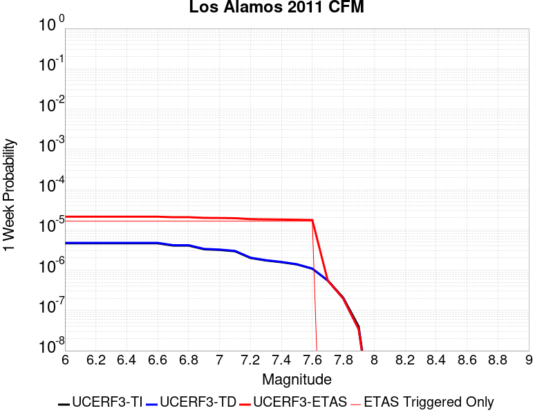 | 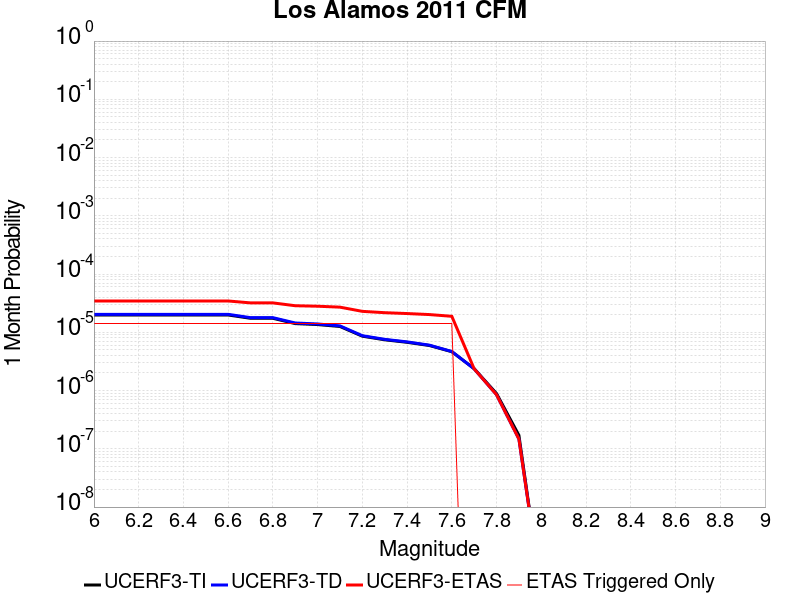 | 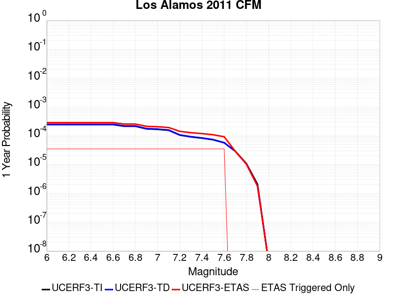 | 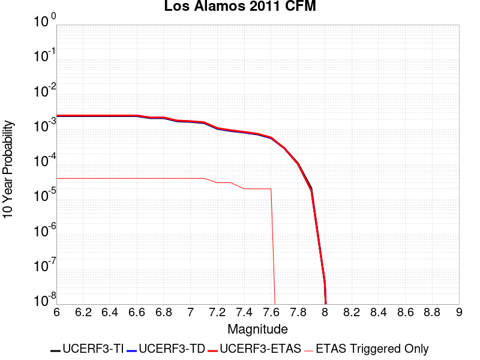 |

| Magnitude | 1 wk TI Prob | 1 wk TD Prob | 1 wk ETAS Prob | 1 wk ETAS/TD Gain | 1 wk ETAS Triggered Only | 1 mo TI Prob | 1 mo TD Prob | 1 mo ETAS Prob | 1 mo ETAS/TD Gain | 1 mo ETAS Triggered Only | 1 yr TI Prob | 1 yr TD Prob | 1 yr ETAS Prob | 1 yr ETAS/TD Gain | 1 yr ETAS Triggered Only | 10 yr TI Prob | 10 yr TD Prob | 10 yr ETAS Prob | 10 yr ETAS/TD Gain | 10 yr ETAS Triggered Only |
|-----|-----|-----|-----|-----|-----|-----|-----|-----|-----|-----|-----|-----|-----|-----|-----|-----|-----|-----|-----|-----|
| 6.0 | 4.6284417E-6 | 4.7517333E-6 | 3.935125E-5 | 8.281452 | 3.459968E-5 | 1.9836029E-5 | 2.0364423E-5 | 5.49634E-5 | 2.6989913 | 3.459968E-5 | 2.4147688E-4 | 2.479104E-4 | 2.825015E-4 | 1.1395307 | 3.459968E-5 | 0.0024121467 | 0.0024765125 | 0.0025110266 | 1.0139365 | 3.459968E-5 |
| 6.1 | 4.6284417E-6 | 4.7517333E-6 | 3.935125E-5 | 8.281452 | 3.459968E-5 | 1.9836029E-5 | 2.0364423E-5 | 5.49634E-5 | 2.6989913 | 3.459968E-5 | 2.4147688E-4 | 2.479104E-4 | 2.825015E-4 | 1.1395307 | 3.459968E-5 | 0.0024121467 | 0.0024765125 | 0.0025110266 | 1.0139365 | 3.459968E-5 |
| 6.2 | 4.6284417E-6 | 4.7517333E-6 | 3.935125E-5 | 8.281452 | 3.459968E-5 | 1.9836029E-5 | 2.0364423E-5 | 5.49634E-5 | 2.6989913 | 3.459968E-5 | 2.4147688E-4 | 2.479104E-4 | 2.825015E-4 | 1.1395307 | 3.459968E-5 | 0.0024121467 | 0.0024765125 | 0.0025110266 | 1.0139365 | 3.459968E-5 |
| 6.3 | 4.6284417E-6 | 4.7517333E-6 | 3.935125E-5 | 8.281452 | 3.459968E-5 | 1.9836029E-5 | 2.0364423E-5 | 5.49634E-5 | 2.6989913 | 3.459968E-5 | 2.4147688E-4 | 2.479104E-4 | 2.825015E-4 | 1.1395307 | 3.459968E-5 | 0.0024121467 | 0.0024765125 | 0.0025110266 | 1.0139365 | 3.459968E-5 |
| 6.4 | 4.6284417E-6 | 4.7517333E-6 | 3.935125E-5 | 8.281452 | 3.459968E-5 | 1.9836029E-5 | 2.0364423E-5 | 5.49634E-5 | 2.6989913 | 3.459968E-5 | 2.4147688E-4 | 2.479104E-4 | 2.825015E-4 | 1.1395307 | 3.459968E-5 | 0.0024121467 | 0.0024765125 | 0.0025110266 | 1.0139365 | 3.459968E-5 |
| 6.5 | 4.6284417E-6 | 4.7517333E-6 | 3.935125E-5 | 8.281452 | 3.459968E-5 | 1.9836029E-5 | 2.0364423E-5 | 5.49634E-5 | 2.6989913 | 3.459968E-5 | 2.4147688E-4 | 2.479104E-4 | 2.825015E-4 | 1.1395307 | 3.459968E-5 | 0.0024121467 | 0.0024765125 | 0.0025110266 | 1.0139365 | 3.459968E-5 |
| 6.6 | 4.6284417E-6 | 4.7517333E-6 | 3.935125E-5 | 8.281452 | 3.459968E-5 | 1.9836029E-5 | 2.0364423E-5 | 5.49634E-5 | 2.6989913 | 3.459968E-5 | 2.4147688E-4 | 2.479104E-4 | 2.825015E-4 | 1.1395307 | 3.459968E-5 | 0.0024121467 | 0.0024765125 | 0.0025110266 | 1.0139365 | 3.459968E-5 |
| 6.7 | 4.062321E-6 | 4.166351E-6 | 3.8765887E-5 | 9.304519 | 3.459968E-5 | 1.7409831E-5 | 1.7855677E-5 | 5.245474E-5 | 2.9377067 | 3.459968E-5 | 2.1194408E-4 | 2.1737268E-4 | 2.5196484E-4 | 1.1591376 | 3.459968E-5 | 0.0021174205 | 0.0021717504 | 0.0022062748 | 1.0158972 | 3.459968E-5 |
| 6.8 | 4.062321E-6 | 4.166351E-6 | 3.8765887E-5 | 9.304519 | 3.459968E-5 | 1.7409831E-5 | 1.7855677E-5 | 5.245474E-5 | 2.9377067 | 3.459968E-5 | 2.1194408E-4 | 2.1737268E-4 | 2.5196484E-4 | 1.1591376 | 3.459968E-5 | 0.0021174205 | 0.0021717504 | 0.0022062748 | 1.0158972 | 3.459968E-5 |
| 6.9 | 3.2936077E-6 | 3.37296E-6 | 3.7972524E-5 | 11.257923 | 3.459968E-5 | 1.4115385E-5 | 1.4455468E-5 | 4.9054648E-5 | 3.3935013 | 3.459968E-5 | 1.7184127E-4 | 1.7598206E-4 | 2.1057564E-4 | 1.1965746 | 3.459968E-5 | 0.0017170844 | 0.0017585196 | 0.0017930584 | 1.0196408 | 3.459968E-5 |
| 7.0 | 3.1687898E-6 | 3.2448177E-6 | 3.7844387E-5 | 11.663024 | 3.459968E-5 | 1.3580457E-5 | 1.3906293E-5 | 4.850549E-5 | 3.4880247 | 3.459968E-5 | 1.6532952E-4 | 1.692969E-4 | 2.0389071E-4 | 1.2043382 | 3.459968E-5 | 0.0016520657 | 0.0016917707 | 0.0017263119 | 1.0204172 | 3.459968E-5 |
| 7.1 | 2.9379228E-6 | 3.007328E-6 | 3.7606907E-5 | 12.50509 | 3.459968E-5 | 1.25910365E-5 | 1.288849E-5 | 4.7487727E-5 | 3.6845067 | 3.459968E-5 | 1.5328509E-4 | 1.5690697E-4 | 1.9150123E-4 | 1.2204762 | 3.459968E-5 | 0.001531794 | 0.001568051 | 0.0016025965 | 1.0220308 | 3.459968E-5 |
| 7.2 | 2.0020686E-6 | 2.041632E-6 | 3.6641242E-5 | 17.947037 | 3.459968E-5 | 8.580266E-6 | 8.749822E-6 | 4.3349202E-5 | 4.954295 | 3.459968E-5 | 1.0445973E-4 | 1.0652392E-4 | 1.4111992E-4 | 1.3247721 | 3.459968E-5 | 0.0010441064 | 0.001064733 | 0.0010992959 | 1.0324615 | 3.459968E-5 |
| 7.3 | 1.7364243E-6 | 1.7678824E-6 | 3.6367503E-5 | 20.571222 | 3.459968E-5 | 7.441797E-6 | 7.576617E-6 | 4.2176038E-5 | 5.566605 | 3.459968E-5 | 9.0600115E-5 | 9.224144E-5 | 1.2683793E-4 | 1.3750645 | 3.459968E-5 | 9.0563187E-4 | 9.2203467E-4 | 9.5660245E-4 | 1.0374907 | 3.459968E-5 |
| 7.4 | 1.5718434E-6 | 1.5983198E-6 | 3.6197947E-5 | 22.6475 | 3.459968E-5 | 6.7364545E-6 | 6.8499244E-6 | 4.144937E-5 | 6.0510697 | 3.459968E-5 | 8.201325E-5 | 8.339467E-5 | 1.1799146E-4 | 1.4148562 | 3.459968E-5 | 8.198299E-4 | 8.3363673E-4 | 8.6820754E-4 | 1.0414699 | 3.459968E-5 |
| 7.5 | 1.3841119E-6 | 1.4042814E-6 | 3.6003916E-5 | 25.638676 | 3.459968E-5 | 5.9318945E-6 | 6.018335E-6 | 4.0617808E-5 | 6.7490106 | 3.459968E-5 | 7.221842E-5 | 7.327079E-5 | 1.0786794E-4 | 1.4721819 | 3.459968E-5 | 7.2194956E-4 | 7.3246926E-4 | 7.670436E-4 | 1.0472025 | 3.459968E-5 |
| 7.6 | 1.0843726E-6 | 1.0934443E-6 | 3.5693087E-5 | 32.642803 | 3.459968E-5 | 4.647303E-6 | 4.6861815E-6 | 3.92857E-5 | 8.383307 | 3.459968E-5 | 5.6579443E-5 | 5.705279E-5 | 9.16505E-5 | 1.6064156 | 3.459968E-5 | 5.656504E-4 | 5.70384E-4 | 6.04964E-4 | 1.0606257 | 3.459968E-5 |
| 7.7 | 5.544814E-7 | 5.501884E-7 | 5.501884E-7 | 1.0 | 0.0 | 2.3763469E-6 | 2.3579482E-6 | 2.3579482E-6 | 1.0 | 0.0 | 2.8931638E-5 | 2.8707644E-5 | 2.8707644E-5 | 1.0 | 0.0 | 2.8927872E-4 | 2.870395E-4 | 2.870395E-4 | 1.0 | 0.0 |
| 7.8 | 2.0707465E-7 | 1.9778598E-7 | 1.9778598E-7 | 1.0 | 0.0 | 8.874625E-7 | 8.476539E-7 | 8.476539E-7 | 1.0 | 0.0 | 1.08048025E-5 | 1.0320137E-5 | 1.0320137E-5 | 1.0 | 0.0 | 1.0804277E-4 | 1.0319663E-4 | 1.0319663E-4 | 1.0 | 0.0 |
| 7.9 | 3.9821284E-8 | 3.4331528E-8 | 3.4331528E-8 | 1.0 | 0.0 | 1.7066264E-7 | 1.4713511E-7 | 1.4713511E-7 | 1.0 | 0.0 | 2.0778157E-6 | 1.7913685E-6 | 1.7913685E-6 | 1.0 | 0.0 | 2.0777963E-5 | 1.7913546E-5 | 1.7913546E-5 | 1.0 | 0.0 |
| 8.0 | 7.880441E-11 | 8.2353124E-11 | 8.2353124E-11 | 1.0 | 0.0 | 3.3773329E-10 | 3.52942E-10 | 3.52942E-10 | 1.0 | 0.0 | 4.1119033E-9 | 4.2970694E-9 | 4.2970694E-9 | 1.0 | 0.0 | 4.1119034E-8 | 4.2970694E-8 | 4.2970694E-8 | 1.0 | 0.0 |

## San Gregorio (North) 2011 CFM
*[(top)](#table-of-contents)*

| 1 Week | 1 Month | 1 Year | 10 Year |
|-----|-----|-----|-----|
|  |  | 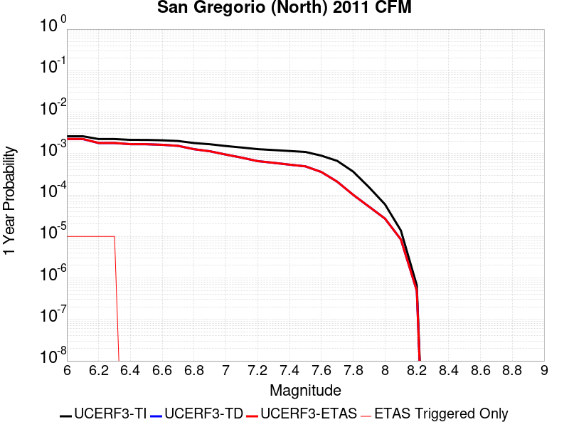 |  |

| Magnitude | 1 wk TI Prob | 1 wk TD Prob | 1 wk ETAS Prob | 1 wk ETAS/TD Gain | 1 wk ETAS Triggered Only | 1 mo TI Prob | 1 mo TD Prob | 1 mo ETAS Prob | 1 mo ETAS/TD Gain | 1 mo ETAS Triggered Only | 1 yr TI Prob | 1 yr TD Prob | 1 yr ETAS Prob | 1 yr ETAS/TD Gain | 1 yr ETAS Triggered Only | 10 yr TI Prob | 10 yr TD Prob | 10 yr ETAS Prob | 10 yr ETAS/TD Gain | 10 yr ETAS Triggered Only |
|-----|-----|-----|-----|-----|-----|-----|-----|-----|-----|-----|-----|-----|-----|-----|-----|-----|-----|-----|-----|-----|
| 6.0 | 5.0283932E-5 | 4.3057098E-5 | 4.3057098E-5 | 1.0 | 0.0 | 2.1548476E-4 | 1.8451746E-4 | 1.8451746E-4 | 1.0 | 0.0 | 0.0026203706 | 0.002244199 | 0.002278721 | 1.0153828 | 3.459968E-5 | 0.02589687 | 0.022295918 | 0.022329746 | 1.0015173 | 3.459968E-5 |
| 6.1 | 5.0283932E-5 | 4.3057098E-5 | 4.3057098E-5 | 1.0 | 0.0 | 2.1548476E-4 | 1.8451746E-4 | 1.8451746E-4 | 1.0 | 0.0 | 0.0026203706 | 0.002244199 | 0.002278721 | 1.0153828 | 3.459968E-5 | 0.02589687 | 0.022295918 | 0.022329746 | 1.0015173 | 3.459968E-5 |
| 6.2 | 4.2998647E-5 | 3.4440873E-5 | 3.4440873E-5 | 1.0 | 0.0 | 1.842669E-4 | 1.4759546E-4 | 1.4759546E-4 | 1.0 | 0.0 | 0.0022411412 | 0.001795506 | 0.0018300435 | 1.0192356 | 3.459968E-5 | 0.022186736 | 0.017884884 | 0.017918864 | 1.0019 | 3.459968E-5 |
| 6.3 | 4.2998647E-5 | 3.4440873E-5 | 3.4440873E-5 | 1.0 | 0.0 | 1.842669E-4 | 1.4759546E-4 | 1.4759546E-4 | 1.0 | 0.0 | 0.0022411412 | 0.001795506 | 0.0018300435 | 1.0192356 | 3.459968E-5 | 0.022186736 | 0.017884884 | 0.017918864 | 1.0019 | 3.459968E-5 |
| 6.4 | 4.1101295E-5 | 3.2326076E-5 | 3.2326076E-5 | 1.0 | 0.0 | 1.7613651E-4 | 1.3853304E-4 | 1.3853304E-4 | 1.0 | 0.0 | 0.0021423528 | 0.0016853481 | 0.0016853481 | 1.0 | 0.0 | 0.02121817 | 0.016800618 | 0.016800618 | 1.0 | 0.0 |
| 6.5 | 4.1032585E-5 | 3.224411E-5 | 3.224411E-5 | 1.0 | 0.0 | 1.7584208E-4 | 1.381818E-4 | 1.381818E-4 | 1.0 | 0.0 | 0.0021387753 | 0.0016810785 | 0.0016810785 | 1.0 | 0.0 | 0.021183075 | 0.01675857 | 0.01675857 | 1.0 | 0.0 |
| 6.6 | 4.011629E-5 | 3.1265718E-5 | 3.1265718E-5 | 1.0 | 0.0 | 1.7191563E-4 | 1.3398913E-4 | 1.3398913E-4 | 1.0 | 0.0 | 0.0020910634 | 0.0016301107 | 0.0016301107 | 1.0 | 0.0 | 0.020714961 | 0.016257357 | 0.016257357 | 1.0 | 0.0 |
| 6.7 | 3.8583938E-5 | 2.9452754E-5 | 2.9452754E-5 | 1.0 | 0.0 | 1.6534925E-4 | 1.2622007E-4 | 1.2622007E-4 | 1.0 | 0.0 | 0.0020112682 | 0.0015356604 | 0.0015356604 | 1.0 | 0.0 | 0.019931622 | 0.015326062 | 0.015326062 | 1.0 | 0.0 |
| 6.8 | 3.44341E-5 | 2.4450024E-5 | 2.4450024E-5 | 1.0 | 0.0 | 1.4756636E-4 | 1.0478167E-4 | 1.0478167E-4 | 1.0 | 0.0 | 0.0017951399 | 0.0012749807 | 0.0012749807 | 1.0 | 0.0 | 0.017807078 | 0.012751525 | 0.012751525 | 1.0 | 0.0 |
| 6.9 | 3.221199E-5 | 2.1777196E-5 | 2.1777196E-5 | 1.0 | 0.0 | 1.3804408E-4 | 9.3327544E-5 | 9.3327544E-5 | 1.0 | 0.0 | 0.0016793909 | 0.0011356788 | 0.0011356788 | 1.0 | 0.0 | 0.01666756 | 0.011372544 | 0.011372544 | 1.0 | 0.0 |
| 7.0 | 2.9186718E-5 | 1.814604E-5 | 1.814604E-5 | 1.0 | 0.0 | 1.2507994E-4 | 7.776645E-5 | 7.776645E-5 | 1.0 | 0.0 | 0.0015217843 | 9.463997E-4 | 9.463997E-4 | 1.0 | 0.0 | 0.015114053 | 0.0094966395 | 0.0094966395 | 1.0 | 0.0 |
| 7.1 | 2.6840138E-5 | 1.5283675E-5 | 1.5283675E-5 | 1.0 | 0.0 | 1.1502409E-4 | 6.549983E-5 | 6.549983E-5 | 1.0 | 0.0 | 0.0013995186 | 7.971706E-4 | 7.971706E-4 | 1.0 | 0.0 | 0.013907375 | 0.0080155255 | 0.0080155255 | 1.0 | 0.0 |
| 7.2 | 2.453002E-5 | 1.2605825E-5 | 1.2605825E-5 | 1.0 | 0.0 | 1.05124425E-4 | 5.4023847E-5 | 5.4023847E-5 | 1.0 | 0.0 | 0.0012791384 | 6.5754243E-4 | 6.5754243E-4 | 1.0 | 0.0 | 0.012718005 | 0.006627395 | 0.006627395 | 1.0 | 0.0 |
| 7.3 | 2.3330727E-5 | 1.1487833E-5 | 1.1487833E-5 | 1.0 | 0.0 | 9.9985E-5 | 4.923264E-5 | 4.923264E-5 | 1.0 | 0.0 | 0.0012166376 | 5.99243E-4 | 5.99243E-4 | 1.0 | 0.0 | 0.012099981 | 0.0060462817 | 0.0060462817 | 1.0 | 0.0 |
| 7.4 | 2.2136466E-5 | 1.0368137E-5 | 1.0368137E-5 | 1.0 | 0.0 | 9.486712E-5 | 4.4434113E-5 | 4.4434113E-5 | 1.0 | 0.0 | 0.0011543952 | 5.408513E-4 | 5.408513E-4 | 1.0 | 0.0 | 0.011484168 | 0.0054640025 | 0.0054640025 | 1.0 | 0.0 |
| 7.5 | 2.0994974E-5 | 9.426374E-6 | 9.426374E-6 | 1.0 | 0.0 | 8.997535E-5 | 4.0398125E-5 | 4.0398125E-5 | 1.0 | 0.0 | 0.0010948994 | 4.917364E-4 | 4.917364E-4 | 1.0 | 0.0 | 0.010895205 | 0.004973108 | 0.004973108 | 1.0 | 0.0 |
| 7.6 | 1.7091823E-5 | 6.892992E-6 | 6.892992E-6 | 1.0 | 0.0 | 7.3248615E-5 | 2.9541061E-5 | 2.9541061E-5 | 1.0 | 0.0 | 8.9143694E-4 | 3.5960317E-4 | 3.5960317E-4 | 1.0 | 0.0 | 0.008878695 | 0.0036480771 | 0.0036480771 | 1.0 | 0.0 |
| 7.7 | 1.2772179E-5 | 4.0202267E-6 | 4.0202267E-6 | 1.0 | 0.0 | 5.473676E-5 | 1.722943E-5 | 1.722943E-5 | 1.0 | 0.0 | 6.6621625E-4 | 2.0974813E-4 | 2.0974813E-4 | 1.0 | 0.0 | 0.006642225 | 0.0021365841 | 0.0021365841 | 1.0 | 0.0 |
| 7.8 | 7.041923E-6 | 1.9402341E-6 | 1.9402341E-6 | 1.0 | 0.0 | 3.017932E-5 | 8.315263E-6 | 8.315263E-6 | 1.0 | 0.0 | 3.6737128E-4 | 1.01233614E-4 | 1.01233614E-4 | 1.0 | 0.0 | 0.0036676454 | 0.0010376878 | 0.0010376878 | 1.0 | 0.0 |
| 7.9 | 2.946768E-6 | 1.0031822E-6 | 1.0031822E-6 | 1.0 | 0.0 | 1.2628945E-5 | 4.299345E-6 | 4.299345E-6 | 1.0 | 0.0 | 1.5374656E-4 | 5.2343268E-5 | 5.2343268E-5 | 1.0 | 0.0 | 0.0015364023 | 5.339059E-4 | 5.339059E-4 | 1.0 | 0.0 |
| 8.0 | 1.1433375E-6 | 5.180804E-7 | 5.180804E-7 | 1.0 | 0.0 | 4.9000087E-6 | 2.2203426E-6 | 2.2203426E-6 | 1.0 | 0.0 | 5.965597E-5 | 2.7032334E-5 | 2.7032334E-5 | 1.0 | 0.0 | 5.963996E-4 | 2.7394458E-4 | 2.7394458E-4 | 1.0 | 0.0 |
| 8.1 | 2.6675295E-7 | 1.6288074E-7 | 1.6288074E-7 | 1.0 | 0.0 | 1.1432264E-6 | 6.9806015E-7 | 6.9806015E-7 | 1.0 | 0.0 | 1.3918692E-5 | 8.498849E-6 | 8.498849E-6 | 1.0 | 0.0 | 1.391782E-4 | 8.6366665E-5 | 8.6366665E-5 | 1.0 | 0.0 |
| 8.2 | 1.2704569E-8 | 9.429871E-9 | 9.429871E-9 | 1.0 | 0.0 | 5.444815E-8 | 4.041373E-8 | 4.041373E-8 | 1.0 | 0.0 | 6.629061E-7 | 4.920371E-7 | 4.920371E-7 | 1.0 | 0.0 | 6.629041E-6 | 5.1106863E-6 | 5.1106863E-6 | 1.0 | 0.0 |

## Channel Islands Thrust
*[(top)](#table-of-contents)*

| 1 Week | 1 Month | 1 Year | 10 Year |
|-----|-----|-----|-----|
| 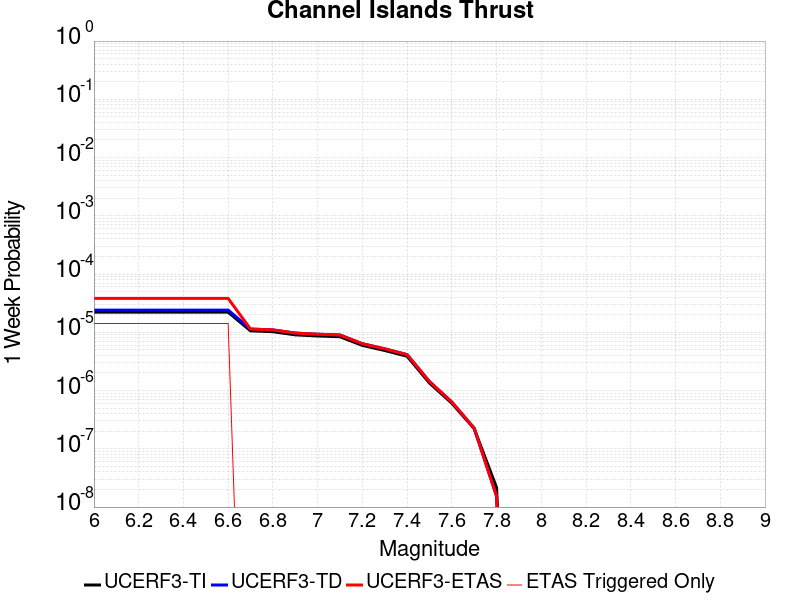 | 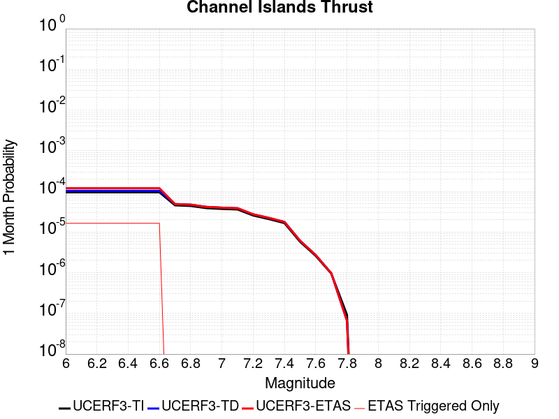 | 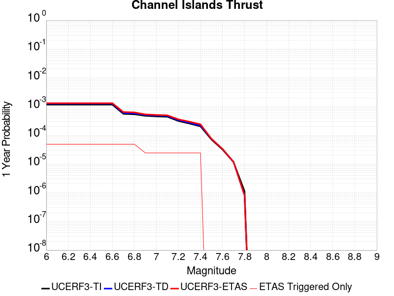 | 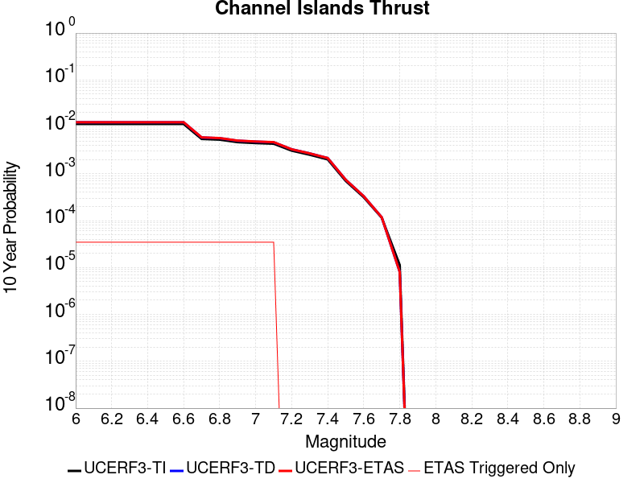 |

| Magnitude | 1 wk TI Prob | 1 wk TD Prob | 1 wk ETAS Prob | 1 wk ETAS/TD Gain | 1 wk ETAS Triggered Only | 1 mo TI Prob | 1 mo TD Prob | 1 mo ETAS Prob | 1 mo ETAS/TD Gain | 1 mo ETAS Triggered Only | 1 yr TI Prob | 1 yr TD Prob | 1 yr ETAS Prob | 1 yr ETAS/TD Gain | 1 yr ETAS Triggered Only | 10 yr TI Prob | 10 yr TD Prob | 10 yr ETAS Prob | 10 yr ETAS/TD Gain | 10 yr ETAS Triggered Only |
|-----|-----|-----|-----|-----|-----|-----|-----|-----|-----|-----|-----|-----|-----|-----|-----|-----|-----|-----|-----|-----|
| 6.0 | 2.2156251E-5 | 2.4092022E-5 | 2.4092022E-5 | 1.0 | 0.0 | 9.495191E-5 | 1.03248036E-4 | 1.03248036E-4 | 1.0 | 0.0 | 0.0011554264 | 0.0012564266 | 0.0012564266 | 1.0 | 0.0 | 0.011494373 | 0.0125038205 | 0.012537988 | 1.0027325 | 3.459968E-5 |
| 6.1 | 2.2156251E-5 | 2.4092022E-5 | 2.4092022E-5 | 1.0 | 0.0 | 9.495191E-5 | 1.03248036E-4 | 1.03248036E-4 | 1.0 | 0.0 | 0.0011554264 | 0.0012564266 | 0.0012564266 | 1.0 | 0.0 | 0.011494373 | 0.0125038205 | 0.012537988 | 1.0027325 | 3.459968E-5 |
| 6.2 | 2.2156251E-5 | 2.4092022E-5 | 2.4092022E-5 | 1.0 | 0.0 | 9.495191E-5 | 1.03248036E-4 | 1.03248036E-4 | 1.0 | 0.0 | 0.0011554264 | 0.0012564266 | 0.0012564266 | 1.0 | 0.0 | 0.011494373 | 0.0125038205 | 0.012537988 | 1.0027325 | 3.459968E-5 |
| 6.3 | 2.2156251E-5 | 2.4092022E-5 | 2.4092022E-5 | 1.0 | 0.0 | 9.495191E-5 | 1.03248036E-4 | 1.03248036E-4 | 1.0 | 0.0 | 0.0011554264 | 0.0012564266 | 0.0012564266 | 1.0 | 0.0 | 0.011494373 | 0.0125038205 | 0.012537988 | 1.0027325 | 3.459968E-5 |
| 6.4 | 2.2156251E-5 | 2.4092022E-5 | 2.4092022E-5 | 1.0 | 0.0 | 9.495191E-5 | 1.03248036E-4 | 1.03248036E-4 | 1.0 | 0.0 | 0.0011554264 | 0.0012564266 | 0.0012564266 | 1.0 | 0.0 | 0.011494373 | 0.0125038205 | 0.012537988 | 1.0027325 | 3.459968E-5 |
| 6.5 | 2.2156251E-5 | 2.4092022E-5 | 2.4092022E-5 | 1.0 | 0.0 | 9.495191E-5 | 1.03248036E-4 | 1.03248036E-4 | 1.0 | 0.0 | 0.0011554264 | 0.0012564266 | 0.0012564266 | 1.0 | 0.0 | 0.011494373 | 0.0125038205 | 0.012537988 | 1.0027325 | 3.459968E-5 |
| 6.6 | 2.2156251E-5 | 2.4092022E-5 | 2.4092022E-5 | 1.0 | 0.0 | 9.495191E-5 | 1.03248036E-4 | 1.03248036E-4 | 1.0 | 0.0 | 0.0011554264 | 0.0012564266 | 0.0012564266 | 1.0 | 0.0 | 0.011494373 | 0.0125038205 | 0.012537988 | 1.0027325 | 3.459968E-5 |
| 6.7 | 1.0601296E-5 | 1.1379544E-5 | 1.1379544E-5 | 1.0 | 0.0 | 4.5433335E-5 | 4.876859E-5 | 4.876859E-5 | 1.0 | 0.0 | 5.5301044E-4 | 5.936007E-4 | 5.936007E-4 | 1.0 | 0.0 | 0.005516363 | 0.005920653 | 0.0059550484 | 1.0058093 | 3.459968E-5 |
| 6.8 | 1.0246747E-5 | 1.0996669E-5 | 1.0996669E-5 | 1.0 | 0.0 | 4.391389E-5 | 4.7127756E-5 | 4.7127756E-5 | 1.0 | 0.0 | 5.345204E-4 | 5.7363417E-4 | 5.7363417E-4 | 1.0 | 0.0 | 0.0053323656 | 0.005722025 | 0.0057564266 | 1.0060122 | 3.459968E-5 |
| 6.9 | 9.049551E-6 | 9.699645E-6 | 9.699645E-6 | 1.0 | 0.0 | 3.878322E-5 | 4.1569267E-5 | 4.1569267E-5 | 1.0 | 0.0 | 4.7208337E-4 | 5.059924E-4 | 5.059924E-4 | 1.0 | 0.0 | 0.0047108172 | 0.0050488203 | 0.005083245 | 1.0068184 | 3.459968E-5 |
| 7.0 | 8.6542195E-6 | 9.274603E-6 | 9.274603E-6 | 1.0 | 0.0 | 3.7088983E-5 | 3.9747716E-5 | 3.9747716E-5 | 1.0 | 0.0 | 4.5146482E-4 | 4.8382508E-4 | 4.8382508E-4 | 1.0 | 0.0 | 0.004505487 | 0.0048281294 | 0.004862562 | 1.0071317 | 3.459968E-5 |
| 7.1 | 8.391028E-6 | 8.992925E-6 | 8.992925E-6 | 1.0 | 0.0 | 3.5961057E-5 | 3.8540562E-5 | 3.8540562E-5 | 1.0 | 0.0 | 4.3773788E-4 | 4.6913436E-4 | 4.6913436E-4 | 1.0 | 0.0 | 0.004368766 | 0.0046818503 | 0.0047162883 | 1.0073556 | 3.459968E-5 |
| 7.2 | 5.965188E-6 | 6.3716957E-6 | 6.3716957E-6 | 1.0 | 0.0 | 2.556484E-5 | 2.7306984E-5 | 2.7306984E-5 | 1.0 | 0.0 | 3.1120746E-4 | 3.3241237E-4 | 3.3241237E-4 | 1.0 | 0.0 | 0.00310772 | 0.0033192094 | 0.0033192094 | 1.0 | 0.0 |
| 7.3 | 4.877518E-6 | 5.206007E-6 | 5.206007E-6 | 1.0 | 0.0 | 2.0903482E-5 | 2.231127E-5 | 2.231127E-5 | 1.0 | 0.0 | 2.5447016E-4 | 2.716063E-4 | 2.716063E-4 | 1.0 | 0.0 | 0.0025417898 | 0.0027127897 | 0.0027127897 | 1.0 | 0.0 |
| 7.4 | 3.8829853E-6 | 4.141863E-6 | 4.141863E-6 | 1.0 | 0.0 | 1.664126E-5 | 1.7750723E-5 | 1.7750723E-5 | 1.0 | 0.0 | 2.0258849E-4 | 2.1609403E-4 | 2.1609403E-4 | 1.0 | 0.0 | 0.002024039 | 0.002158881 | 0.002158881 | 1.0 | 0.0 |
| 7.5 | 1.3489616E-6 | 1.4277905E-6 | 1.4277905E-6 | 1.0 | 0.0 | 5.7812517E-6 | 6.119088E-6 | 6.119088E-6 | 1.0 | 0.0 | 7.038446E-5 | 7.449739E-5 | 7.449739E-5 | 1.0 | 0.0 | 7.036218E-4 | 7.4472814E-4 | 7.4472814E-4 | 1.0 | 0.0 |
| 7.6 | 6.058192E-7 | 6.35378E-7 | 6.35378E-7 | 1.0 | 0.0 | 2.5963652E-6 | 2.7230458E-6 | 2.7230458E-6 | 1.0 | 0.0 | 3.161029E-5 | 3.3152595E-5 | 3.3152595E-5 | 1.0 | 0.0 | 3.1605794E-4 | 3.314781E-4 | 3.314781E-4 | 1.0 | 0.0 |
| 7.7 | 2.2170494E-7 | 2.2607924E-7 | 2.2607924E-7 | 1.0 | 0.0 | 9.5016367E-7 | 9.689107E-7 | 9.689107E-7 | 1.0 | 0.0 | 1.1568181E-5 | 1.17964355E-5 | 1.17964355E-5 | 1.0 | 0.0 | 1.1567579E-4 | 1.179592E-4 | 1.179592E-4 | 1.0 | 0.0 |
| 7.8 | 2.1613102E-8 | 1.5466837E-8 | 1.5466837E-8 | 1.0 | 0.0 | 9.262757E-8 | 6.628645E-8 | 6.628645E-8 | 1.0 | 0.0 | 1.1277401E-6 | 8.070372E-7 | 8.070372E-7 | 1.0 | 0.0 | 1.1277344E-5 | 8.07035E-6 | 8.07035E-6 | 1.0 | 0.0 |

## San Gorgonio Pass
*[(top)](#table-of-contents)*

| 1 Week | 1 Month | 1 Year | 10 Year |
|-----|-----|-----|-----|
| 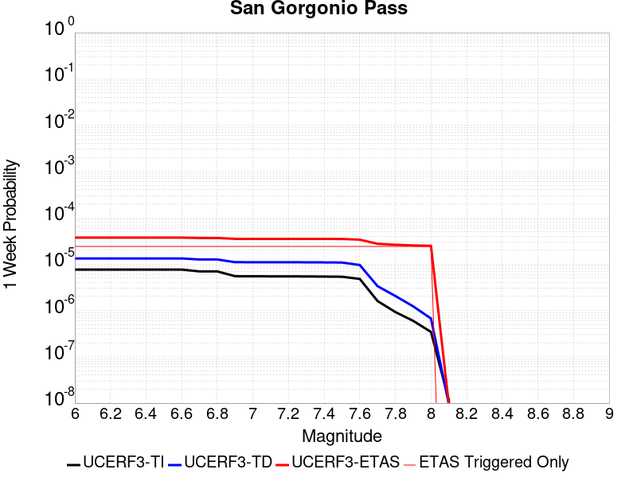 | 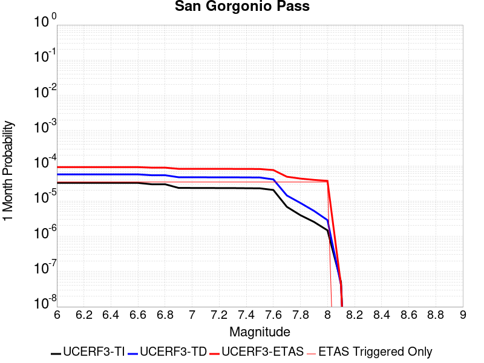 | 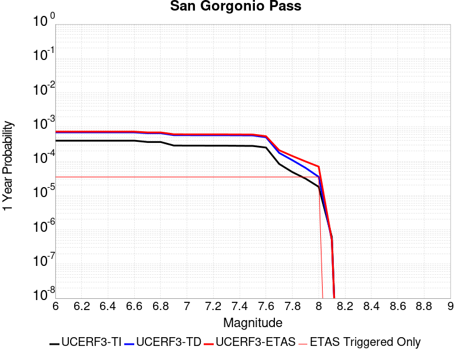 | 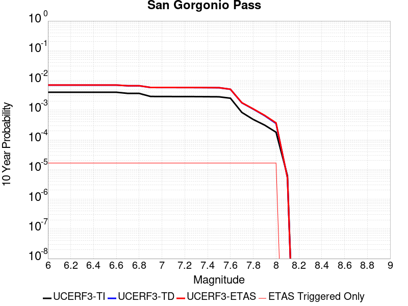 |

| Magnitude | 1 wk TI Prob | 1 wk TD Prob | 1 wk ETAS Prob | 1 wk ETAS/TD Gain | 1 wk ETAS Triggered Only | 1 mo TI Prob | 1 mo TD Prob | 1 mo ETAS Prob | 1 mo ETAS/TD Gain | 1 mo ETAS Triggered Only | 1 yr TI Prob | 1 yr TD Prob | 1 yr ETAS Prob | 1 yr ETAS/TD Gain | 1 yr ETAS Triggered Only | 10 yr TI Prob | 10 yr TD Prob | 10 yr ETAS Prob | 10 yr ETAS/TD Gain | 10 yr ETAS Triggered Only |
|-----|-----|-----|-----|-----|-----|-----|-----|-----|-----|-----|-----|-----|-----|-----|-----|-----|-----|-----|-----|-----|
| 6.0 | 7.644328E-6 | 1.331474E-5 | 4.791396E-5 | 3.5985653 | 3.459968E-5 | 3.2760996E-5 | 5.706197E-5 | 9.165968E-5 | 1.6063181 | 3.459968E-5 | 3.987921E-4 | 6.945166E-4 | 7.290922E-4 | 1.0497837 | 3.459968E-5 | 0.003980772 | 0.006930024 | 0.0069643836 | 1.0049582 | 3.459968E-5 |
| 6.1 | 7.644328E-6 | 1.331474E-5 | 4.791396E-5 | 3.5985653 | 3.459968E-5 | 3.2760996E-5 | 5.706197E-5 | 9.165968E-5 | 1.6063181 | 3.459968E-5 | 3.987921E-4 | 6.945166E-4 | 7.290922E-4 | 1.0497837 | 3.459968E-5 | 0.003980772 | 0.006930024 | 0.0069643836 | 1.0049582 | 3.459968E-5 |
| 6.2 | 7.644328E-6 | 1.331474E-5 | 4.791396E-5 | 3.5985653 | 3.459968E-5 | 3.2760996E-5 | 5.706197E-5 | 9.165968E-5 | 1.6063181 | 3.459968E-5 | 3.987921E-4 | 6.945166E-4 | 7.290922E-4 | 1.0497837 | 3.459968E-5 | 0.003980772 | 0.006930024 | 0.0069643836 | 1.0049582 | 3.459968E-5 |
| 6.3 | 7.644328E-6 | 1.331474E-5 | 4.791396E-5 | 3.5985653 | 3.459968E-5 | 3.2760996E-5 | 5.706197E-5 | 9.165968E-5 | 1.6063181 | 3.459968E-5 | 3.987921E-4 | 6.945166E-4 | 7.290922E-4 | 1.0497837 | 3.459968E-5 | 0.003980772 | 0.006930024 | 0.0069643836 | 1.0049582 | 3.459968E-5 |
| 6.4 | 7.644328E-6 | 1.331474E-5 | 4.791396E-5 | 3.5985653 | 3.459968E-5 | 3.2760996E-5 | 5.706197E-5 | 9.165968E-5 | 1.6063181 | 3.459968E-5 | 3.987921E-4 | 6.945166E-4 | 7.290922E-4 | 1.0497837 | 3.459968E-5 | 0.003980772 | 0.006930024 | 0.0069643836 | 1.0049582 | 3.459968E-5 |
| 6.5 | 7.644328E-6 | 1.331474E-5 | 4.791396E-5 | 3.5985653 | 3.459968E-5 | 3.2760996E-5 | 5.706197E-5 | 9.165968E-5 | 1.6063181 | 3.459968E-5 | 3.987921E-4 | 6.945166E-4 | 7.290922E-4 | 1.0497837 | 3.459968E-5 | 0.003980772 | 0.006930024 | 0.0069643836 | 1.0049582 | 3.459968E-5 |
| 6.6 | 7.644328E-6 | 1.331474E-5 | 4.791396E-5 | 3.5985653 | 3.459968E-5 | 3.2760996E-5 | 5.706197E-5 | 9.165968E-5 | 1.6063181 | 3.459968E-5 | 3.987921E-4 | 6.945166E-4 | 7.290922E-4 | 1.0497837 | 3.459968E-5 | 0.003980772 | 0.006930024 | 0.0069643836 | 1.0049582 | 3.459968E-5 |
| 6.7 | 6.987586E-6 | 1.2619013E-5 | 4.721826E-5 | 3.7418344 | 3.459968E-5 | 2.9946454E-5 | 5.408041E-5 | 8.867822E-5 | 1.6397475 | 3.459968E-5 | 3.645371E-4 | 6.582382E-4 | 6.928151E-4 | 1.0525295 | 3.459968E-5 | 0.0036393967 | 0.0065694 | 0.0066037723 | 1.0052322 | 3.459968E-5 |
| 6.8 | 6.987586E-6 | 1.2619013E-5 | 4.721826E-5 | 3.7418344 | 3.459968E-5 | 2.9946454E-5 | 5.408041E-5 | 8.867822E-5 | 1.6397475 | 3.459968E-5 | 3.645371E-4 | 6.582382E-4 | 6.928151E-4 | 1.0525295 | 3.459968E-5 | 0.0036393967 | 0.0065694 | 0.0066037723 | 1.0052322 | 3.459968E-5 |
| 6.9 | 5.504702E-6 | 1.1049877E-5 | 4.5649176E-5 | 4.131193 | 3.459968E-5 | 2.3591367E-5 | 4.7355785E-5 | 8.1953825E-5 | 1.7305981 | 3.459968E-5 | 2.8718702E-4 | 5.764092E-4 | 6.1098894E-4 | 1.0599916 | 3.459968E-5 | 0.0028681618 | 0.0057553523 | 0.005789753 | 1.0059772 | 3.459968E-5 |
| 7.0 | 5.4825764E-6 | 1.1026218E-5 | 4.562552E-5 | 4.137912 | 3.459968E-5 | 2.3496545E-5 | 4.725439E-5 | 8.1852435E-5 | 1.7321657 | 3.459968E-5 | 2.8603288E-4 | 5.751754E-4 | 6.0975517E-4 | 1.0601205 | 3.459968E-5 | 0.00285665 | 0.0057430784 | 0.005777479 | 1.00599 | 3.459968E-5 |
| 7.1 | 5.4692787E-6 | 1.1011928E-5 | 4.561123E-5 | 4.141984 | 3.459968E-5 | 2.3439556E-5 | 4.719315E-5 | 8.17912E-5 | 1.7331159 | 3.459968E-5 | 2.8533922E-4 | 5.744302E-4 | 6.0901E-4 | 1.0601984 | 3.459968E-5 | 0.0028497311 | 0.0057356646 | 0.005770066 | 1.0059978 | 3.459968E-5 |
| 7.2 | 5.453661E-6 | 1.0994954E-5 | 4.5594257E-5 | 4.1468344 | 3.459968E-5 | 2.3372622E-5 | 4.712041E-5 | 8.171846E-5 | 1.7342477 | 3.459968E-5 | 2.8452452E-4 | 5.7354505E-4 | 6.081249E-4 | 1.0602914 | 3.459968E-5 | 0.002841605 | 0.005726859 | 0.00576126 | 1.0060071 | 3.459968E-5 |
| 7.3 | 5.4422303E-6 | 1.09818775E-5 | 4.558118E-5 | 4.150582 | 3.459968E-5 | 2.3323635E-5 | 4.7064368E-5 | 8.166242E-5 | 1.7351221 | 3.459968E-5 | 2.8392827E-4 | 5.728631E-4 | 6.074429E-4 | 1.0603632 | 3.459968E-5 | 0.0028356577 | 0.0057200743 | 0.005754476 | 1.0060142 | 3.459968E-5 |
| 7.4 | 5.398595E-6 | 1.0929241E-5 | 4.5528544E-5 | 4.1657553 | 3.459968E-5 | 2.313663E-5 | 4.6838795E-5 | 8.1436854E-5 | 1.7386625 | 3.459968E-5 | 2.8165206E-4 | 5.701182E-4 | 6.0469814E-4 | 1.060654 | 3.459968E-5 | 0.0028129534 | 0.0056927665 | 0.005727169 | 1.0060432 | 3.459968E-5 |
| 7.5 | 5.3578788E-6 | 1.0855785E-5 | 4.545509E-5 | 4.1871767 | 3.459968E-5 | 2.2962136E-5 | 4.6523994E-5 | 8.112207E-5 | 1.7436608 | 3.459968E-5 | 2.7952815E-4 | 5.662875E-4 | 6.0086756E-4 | 1.0610646 | 3.459968E-5 | 0.002791768 | 0.0056546913 | 0.0056890952 | 1.0060842 | 3.459968E-5 |
| 7.6 | 4.8091474E-6 | 9.604131E-6 | 4.420348E-5 | 4.6025486 | 3.459968E-5 | 2.0610469E-5 | 4.1159943E-5 | 7.57582E-5 | 1.8405808 | 3.459968E-5 | 2.5090357E-4 | 5.010119E-4 | 5.3559424E-4 | 1.069025 | 3.459968E-5 | 0.0025062046 | 0.0050054584 | 0.0050398847 | 1.0068778 | 3.459968E-5 |
| 7.7 | 1.5991155E-6 | 3.353035E-6 | 3.79526E-5 | 11.31888 | 3.459968E-5 | 6.853334E-6 | 1.4370073E-5 | 4.8969257E-5 | 3.407725 | 3.459968E-5 | 8.343615E-5 | 1.7494184E-4 | 2.0953547E-4 | 1.1977437 | 3.459968E-5 | 8.340483E-4 | 0.0017535852 | 0.0017881242 | 1.0196962 | 3.459968E-5 |
| 7.8 | 9.258398E-7 | 2.0581049E-6 | 3.6657715E-5 | 17.811394 | 3.459968E-5 | 3.967879E-6 | 8.82042E-6 | 4.3419797E-5 | 4.922645 | 3.459968E-5 | 4.8307855E-5 | 1.0738334E-4 | 1.4197931E-4 | 1.3221725 | 3.459968E-5 | 4.8297356E-4 | 0.0010788103 | 0.0011133726 | 1.0320375 | 3.459968E-5 |
| 7.9 | 5.975575E-7 | 1.2292295E-6 | 3.5828867E-5 | 29.14742 | 3.459968E-5 | 2.5609581E-6 | 5.2681157E-6 | 3.9867617E-5 | 7.567718 | 3.459968E-5 | 3.117922E-5 | 6.413743E-5 | 9.873489E-5 | 1.539427 | 3.459968E-5 | 3.1174847E-4 | 6.464778E-4 | 6.810551E-4 | 1.0534858 | 3.459968E-5 |
| 8.0 | 3.4413725E-7 | 6.714992E-7 | 3.5271158E-5 | 52.525986 | 3.459968E-5 | 1.4748731E-6 | 2.8778506E-6 | 3.747743E-5 | 13.0227165 | 3.459968E-5 | 1.7956432E-5 | 3.5037272E-5 | 6.9635746E-5 | 1.9874761 | 3.459968E-5 | 1.7954981E-4 | 3.5392298E-4 | 3.885104E-4 | 1.0977259 | 3.459968E-5 |
| 8.1 | 1.1787731E-8 | 9.6332045E-9 | 9.6332045E-9 | 1.0 | 0.0 | 5.0518846E-8 | 4.1285162E-8 | 4.1285162E-8 | 1.0 | 0.0 | 6.1506677E-7 | 5.0264674E-7 | 5.0264674E-7 | 1.0 | 0.0 | 6.1506507E-6 | 5.2417968E-6 | 5.2417968E-6 | 1.0 | 0.0 |

## San Jacinto (Superstition Mtn)
*[(top)](#table-of-contents)*

| 1 Week | 1 Month | 1 Year | 10 Year |
|-----|-----|-----|-----|
| 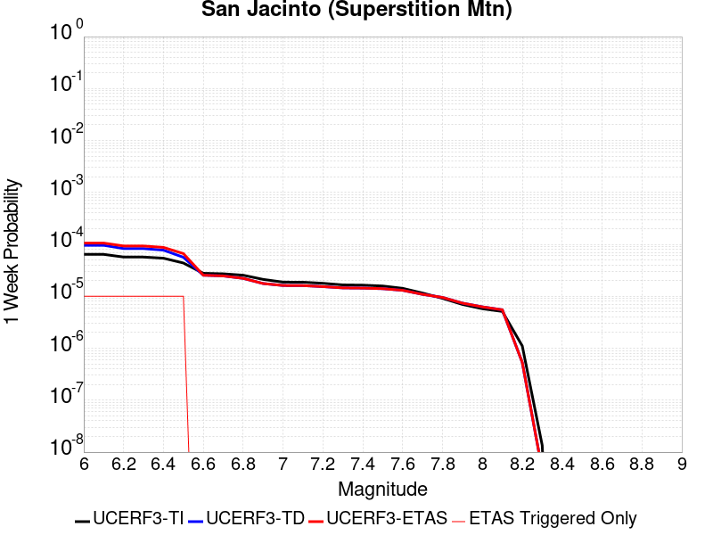 | 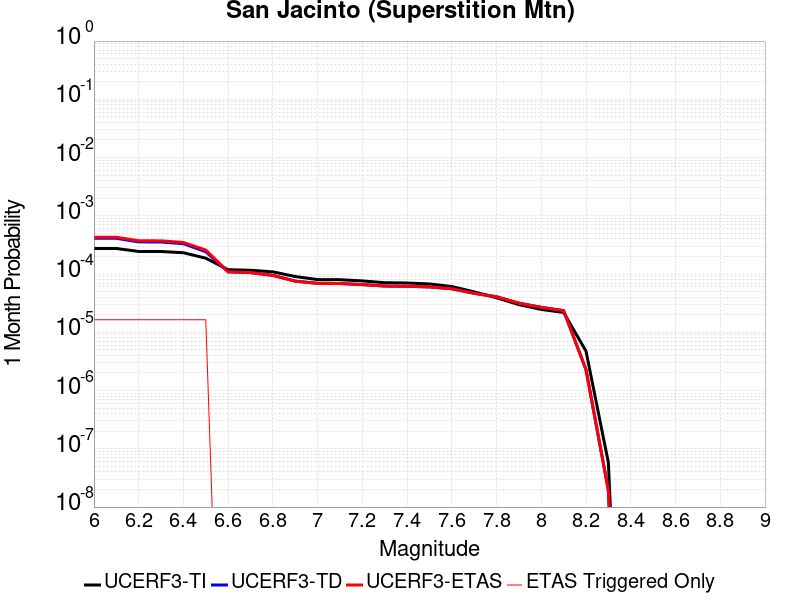 | 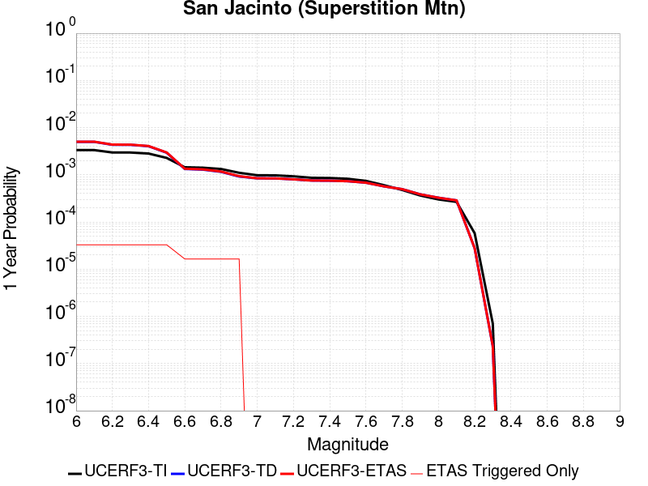 | 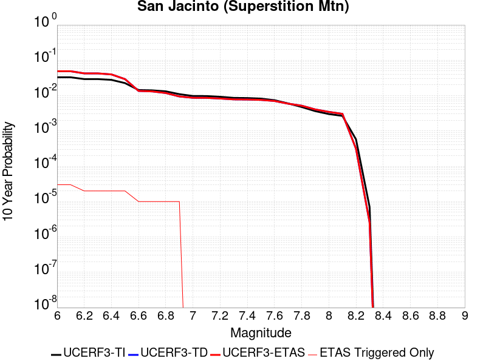 |

| Magnitude | 1 wk TI Prob | 1 wk TD Prob | 1 wk ETAS Prob | 1 wk ETAS/TD Gain | 1 wk ETAS Triggered Only | 1 mo TI Prob | 1 mo TD Prob | 1 mo ETAS Prob | 1 mo ETAS/TD Gain | 1 mo ETAS Triggered Only | 1 yr TI Prob | 1 yr TD Prob | 1 yr ETAS Prob | 1 yr ETAS/TD Gain | 1 yr ETAS Triggered Only | 10 yr TI Prob | 10 yr TD Prob | 10 yr ETAS Prob | 10 yr ETAS/TD Gain | 10 yr ETAS Triggered Only |
|-----|-----|-----|-----|-----|-----|-----|-----|-----|-----|-----|-----|-----|-----|-----|-----|-----|-----|-----|-----|-----|
| 6.0 | 6.4193904E-5 | 9.599558E-5 | 1.3059194E-4 | 1.3603953 | 3.459968E-5 | 2.7508775E-4 | 4.1135435E-4 | 4.459398E-4 | 1.084077 | 3.459968E-5 | 0.0033440501 | 0.0049981694 | 0.005032596 | 1.0068879 | 3.459968E-5 | 0.03294174 | 0.048820045 | 0.048852954 | 1.0006741 | 3.459968E-5 |
| 6.1 | 6.4193904E-5 | 9.599558E-5 | 1.3059194E-4 | 1.3603953 | 3.459968E-5 | 2.7508775E-4 | 4.1135435E-4 | 4.459398E-4 | 1.084077 | 3.459968E-5 | 0.0033440501 | 0.0049981694 | 0.005032596 | 1.0068879 | 3.459968E-5 | 0.03294174 | 0.048820045 | 0.048852954 | 1.0006741 | 3.459968E-5 |
| 6.2 | 5.7023593E-5 | 8.3144616E-5 | 1.1774142E-4 | 1.416104 | 3.459968E-5 | 2.4436394E-4 | 3.5629462E-4 | 3.9088196E-4 | 1.0970751 | 3.459968E-5 | 0.002971072 | 0.0043309047 | 0.004365355 | 1.0079545 | 3.459968E-5 | 0.029316625 | 0.042502448 | 0.042535577 | 1.0007795 | 3.459968E-5 |
| 6.3 | 5.6940098E-5 | 8.298998E-5 | 1.1758679E-4 | 1.4168794 | 3.459968E-5 | 2.4400617E-4 | 3.5563204E-4 | 3.9021944E-4 | 1.0972561 | 3.459968E-5 | 0.002966728 | 0.00432287 | 0.0043573203 | 1.0079693 | 3.459968E-5 | 0.029274331 | 0.04242582 | 0.04245895 | 1.0007809 | 3.459968E-5 |
| 6.4 | 5.4171585E-5 | 7.748391E-5 | 1.1208091E-4 | 1.4465057 | 3.459968E-5 | 2.3214328E-4 | 3.3204095E-4 | 3.6662913E-4 | 1.1041684 | 3.459968E-5 | 0.0028226813 | 0.0040367534 | 0.0040712133 | 1.0085366 | 3.459968E-5 | 0.02787096 | 0.039715026 | 0.03974825 | 1.0008366 | 3.459968E-5 |
| 6.5 | 4.375144E-5 | 5.6421442E-5 | 9.1019174E-5 | 1.6132017 | 3.459968E-5 | 1.874927E-4 | 2.417904E-4 | 2.7638173E-4 | 1.1430632 | 3.459968E-5 | 0.0022803338 | 0.002941 | 0.0029754979 | 1.01173 | 3.459968E-5 | 0.022570757 | 0.029235592 | 0.029269181 | 1.0011488 | 3.459968E-5 |
| 6.6 | 2.772192E-5 | 2.5488029E-5 | 2.5488029E-5 | 1.0 | 0.0 | 1.1880282E-4 | 1.0922994E-4 | 1.0922994E-4 | 1.0 | 0.0 | 0.0014454646 | 0.0013290826 | 0.0013290826 | 1.0 | 0.0 | 0.014360986 | 0.013540891 | 0.013540891 | 1.0 | 0.0 |
| 6.7 | 2.7124124E-5 | 2.4699055E-5 | 2.4699055E-5 | 1.0 | 0.0 | 1.1624106E-4 | 1.0584891E-4 | 1.0584891E-4 | 1.0 | 0.0 | 0.0014143161 | 0.0012879678 | 0.0012879678 | 1.0 | 0.0 | 0.014053487 | 0.013134248 | 0.013134248 | 1.0 | 0.0 |
| 6.8 | 2.5475807E-5 | 2.2164071E-5 | 2.2164071E-5 | 1.0 | 0.0 | 1.0917746E-4 | 9.498548E-5 | 9.498548E-5 | 1.0 | 0.0 | 0.001328425 | 0.0011558468 | 0.0011558468 | 1.0 | 0.0 | 0.0132051185 | 0.011821818 | 0.011821818 | 1.0 | 0.0 |
| 6.9 | 2.1162023E-5 | 1.762564E-5 | 1.762564E-5 | 1.0 | 0.0 | 9.069123E-5 | 7.553629E-5 | 7.553629E-5 | 1.0 | 0.0 | 0.0011036064 | 9.1927015E-4 | 9.1927015E-4 | 1.0 | 0.0 | 0.010981417 | 0.009446762 | 0.009446762 | 1.0 | 0.0 |
| 7.0 | 1.8754288E-5 | 1.616099E-5 | 1.616099E-5 | 1.0 | 0.0 | 8.037304E-5 | 6.9259564E-5 | 6.9259564E-5 | 1.0 | 0.0 | 9.781026E-4 | 8.429114E-4 | 8.429114E-4 | 1.0 | 0.0 | 0.009738087 | 0.008669995 | 0.008669995 | 1.0 | 0.0 |
| 7.1 | 1.8678527E-5 | 1.6086136E-5 | 1.6086136E-5 | 1.0 | 0.0 | 8.0048376E-5 | 6.8938774E-5 | 6.8938774E-5 | 1.0 | 0.0 | 9.7415317E-4 | 8.3900883E-4 | 8.3900883E-4 | 1.0 | 0.0 | 0.009698939 | 0.008631011 | 0.008631011 | 1.0 | 0.0 |
| 7.2 | 1.7804578E-5 | 1.5380709E-5 | 1.5380709E-5 | 1.0 | 0.0 | 7.6303106E-5 | 6.591567E-5 | 6.591567E-5 | 1.0 | 0.0 | 9.285943E-4 | 8.022301E-4 | 8.022301E-4 | 1.0 | 0.0 | 0.009247236 | 0.008262424 | 0.008262424 | 1.0 | 0.0 |
| 7.3 | 1.6583685E-5 | 1.4529837E-5 | 1.4529837E-5 | 1.0 | 0.0 | 7.1070994E-5 | 6.226926E-5 | 6.226926E-5 | 1.0 | 0.0 | 8.649459E-4 | 7.5786654E-4 | 7.5786654E-4 | 1.0 | 0.0 | 0.00861587 | 0.007817646 | 0.007817646 | 1.0 | 0.0 |
| 7.4 | 1.6387552E-5 | 1.4394727E-5 | 1.4394727E-5 | 1.0 | 0.0 | 7.023047E-5 | 6.169024E-5 | 6.169024E-5 | 1.0 | 0.0 | 8.5472054E-4 | 7.508219E-4 | 7.508219E-4 | 1.0 | 0.0 | 0.008514405 | 0.0077470187 | 0.0077470187 | 1.0 | 0.0 |
| 7.5 | 1.5790754E-5 | 1.40354305E-5 | 1.40354305E-5 | 1.0 | 0.0 | 6.767291E-5 | 6.015047E-5 | 6.015047E-5 | 1.0 | 0.0 | 8.236062E-4 | 7.320879E-4 | 7.320879E-4 | 1.0 | 0.0 | 0.008205604 | 0.007557581 | 0.007557581 | 1.0 | 0.0 |
| 7.6 | 1.4248672E-5 | 1.3054444E-5 | 1.3054444E-5 | 1.0 | 0.0 | 6.106431E-5 | 5.5946428E-5 | 5.5946428E-5 | 1.0 | 0.0 | 7.432043E-4 | 6.809366E-4 | 6.809366E-4 | 1.0 | 0.0 | 0.007407237 | 0.007040175 | 0.007040175 | 1.0 | 0.0 |
| 7.7 | 1.15449975E-5 | 1.0903222E-5 | 1.0903222E-5 | 1.0 | 0.0 | 4.947762E-5 | 4.672726E-5 | 4.672726E-5 | 1.0 | 0.0 | 6.022235E-4 | 5.6875666E-4 | 5.6875666E-4 | 1.0 | 0.0 | 0.006005941 | 0.0059102564 | 0.0059102564 | 1.0 | 0.0 |
| 7.8 | 9.1391985E-6 | 9.5139185E-6 | 9.5139185E-6 | 1.0 | 0.0 | 3.9167408E-5 | 4.0773306E-5 | 4.0773306E-5 | 1.0 | 0.0 | 4.767588E-4 | 4.963025E-4 | 4.963025E-4 | 1.0 | 0.0 | 0.0047573727 | 0.005176809 | 0.005176809 | 1.0 | 0.0 |
| 7.9 | 6.973017E-6 | 7.3817937E-6 | 7.3817937E-6 | 1.0 | 0.0 | 2.9884017E-5 | 3.163588E-5 | 3.163588E-5 | 1.0 | 0.0 | 3.6377716E-4 | 3.8509927E-4 | 3.8509927E-4 | 1.0 | 0.0 | 0.0036318225 | 0.004051976 | 0.004051976 | 1.0 | 0.0 |
| 8.0 | 5.7638235E-6 | 6.259641E-6 | 6.259641E-6 | 1.0 | 0.0 | 2.4701867E-5 | 2.682676E-5 | 2.682676E-5 | 1.0 | 0.0 | 3.0070372E-4 | 3.2656736E-4 | 3.2656736E-4 | 1.0 | 0.0 | 0.0030029714 | 0.0034535413 | 0.0034535413 | 1.0 | 0.0 |
| 8.1 | 5.1124434E-6 | 5.4953657E-6 | 5.4953657E-6 | 1.0 | 0.0 | 2.1910288E-5 | 2.3551356E-5 | 2.3551356E-5 | 1.0 | 0.0 | 2.6672508E-4 | 2.8670052E-4 | 2.8670052E-4 | 1.0 | 0.0 | 0.0026640517 | 0.0030403896 | 0.0030403896 | 1.0 | 0.0 |
| 8.2 | 1.1075938E-6 | 5.3348367E-7 | 5.3348367E-7 | 1.0 | 0.0 | 4.7468216E-6 | 2.2863567E-6 | 2.2863567E-6 | 1.0 | 0.0 | 5.779102E-5 | 2.7836059E-5 | 2.7836059E-5 | 1.0 | 0.0 | 5.777599E-4 | 3.133962E-4 | 3.133962E-4 | 1.0 | 0.0 |
| 8.3 | 1.3584393E-8 | 4.4718784E-9 | 4.4718784E-9 | 1.0 | 0.0 | 5.8218827E-8 | 1.9165192E-8 | 1.9165192E-8 | 1.0 | 0.0 | 7.0881396E-7 | 2.3333622E-7 | 2.3333622E-7 | 1.0 | 0.0 | 7.0881174E-6 | 2.6140672E-6 | 2.6140672E-6 | 1.0 | 0.0 |

## Ortigalita (South)
*[(top)](#table-of-contents)*

| 1 Week | 1 Month | 1 Year | 10 Year |
|-----|-----|-----|-----|
| 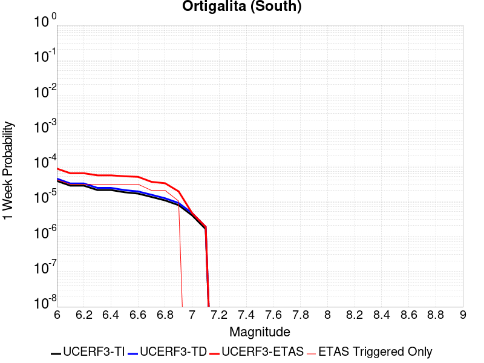 | 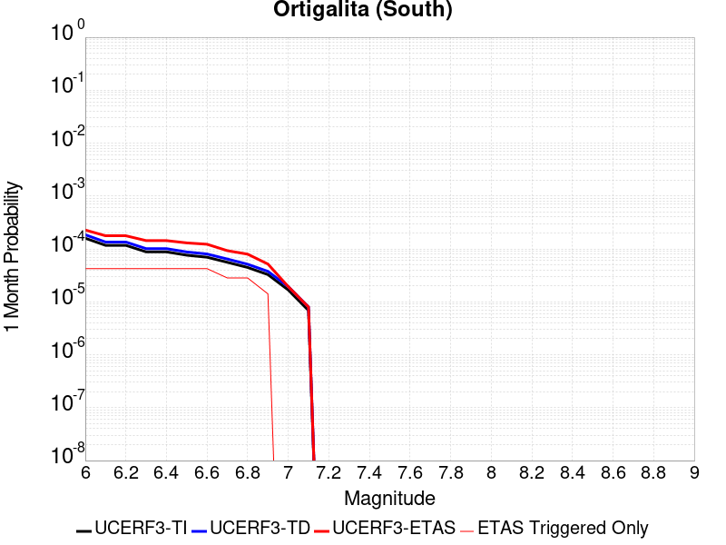 | 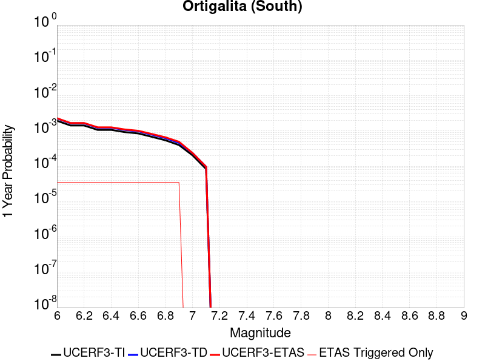 | 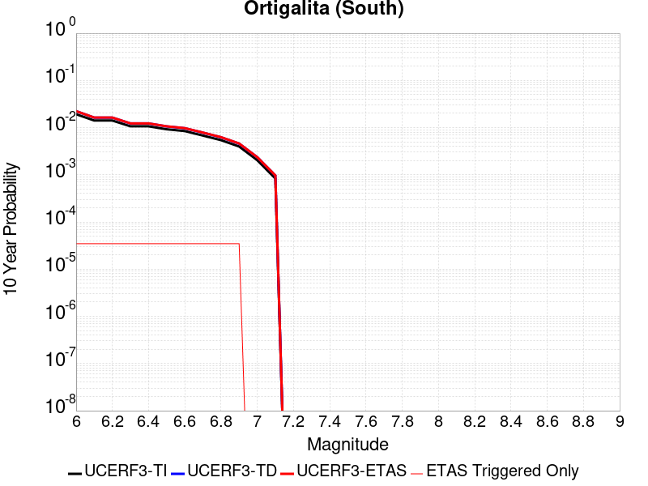 |

| Magnitude | 1 wk TI Prob | 1 wk TD Prob | 1 wk ETAS Prob | 1 wk ETAS/TD Gain | 1 wk ETAS Triggered Only | 1 mo TI Prob | 1 mo TD Prob | 1 mo ETAS Prob | 1 mo ETAS/TD Gain | 1 mo ETAS Triggered Only | 1 yr TI Prob | 1 yr TD Prob | 1 yr ETAS Prob | 1 yr ETAS/TD Gain | 1 yr ETAS Triggered Only | 10 yr TI Prob | 10 yr TD Prob | 10 yr ETAS Prob | 10 yr ETAS/TD Gain | 10 yr ETAS Triggered Only |
|-----|-----|-----|-----|-----|-----|-----|-----|-----|-----|-----|-----|-----|-----|-----|-----|-----|-----|-----|-----|-----|
| 6.0 | 3.72394E-5 | 4.32556E-5 | 7.785379E-5 | 1.7998545 | 3.459968E-5 | 1.5958765E-4 | 1.8536886E-4 | 2.1996212E-4 | 1.1866186 | 3.459968E-5 | 0.0019412481 | 0.0022546863 | 0.002289208 | 1.0153111 | 3.459968E-5 | 0.019243775 | 0.022334501 | 0.022368329 | 1.0015146 | 3.459968E-5 |
| 6.1 | 2.7299884E-5 | 3.1492036E-5 | 6.609063E-5 | 2.0986457 | 3.459968E-5 | 1.16994255E-4 | 1.349592E-4 | 1.6955422E-4 | 1.2563368 | 3.459968E-5 | 0.0014234743 | 0.0016419457 | 0.0016764886 | 1.0210378 | 3.459968E-5 | 0.014143906 | 0.016304072 | 0.016338108 | 1.0020876 | 3.459968E-5 |
| 6.2 | 2.7299884E-5 | 3.1492036E-5 | 6.609063E-5 | 2.0986457 | 3.459968E-5 | 1.16994255E-4 | 1.349592E-4 | 1.6955422E-4 | 1.2563368 | 3.459968E-5 | 0.0014234743 | 0.0016419457 | 0.0016764886 | 1.0210378 | 3.459968E-5 | 0.014143906 | 0.016304072 | 0.016338108 | 1.0020876 | 3.459968E-5 |
| 6.3 | 2.0546433E-5 | 2.3631454E-5 | 5.823032E-5 | 2.4641023 | 3.459968E-5 | 8.805317E-5 | 1.0127383E-4 | 1.3587001E-4 | 1.3416102 | 3.459968E-5 | 0.00107152 | 0.0012323305 | 0.0012668874 | 1.0280421 | 3.459968E-5 | 0.010663681 | 0.012257031 | 0.012291207 | 1.0027882 | 3.459968E-5 |
| 6.4 | 2.0546433E-5 | 2.3631454E-5 | 5.823032E-5 | 2.4641023 | 3.459968E-5 | 8.805317E-5 | 1.0127383E-4 | 1.3587001E-4 | 1.3416102 | 3.459968E-5 | 0.00107152 | 0.0012323305 | 0.0012668874 | 1.0280421 | 3.459968E-5 | 0.010663681 | 0.012257031 | 0.012291207 | 1.0027882 | 3.459968E-5 |
| 6.5 | 1.7779594E-5 | 2.0446974E-5 | 5.5045948E-5 | 2.6921318 | 3.459968E-5 | 7.619603E-5 | 8.762703E-5 | 1.2222368E-4 | 1.3948171 | 3.459968E-5 | 9.272918E-4 | 0.0010663505 | 0.0011009133 | 1.0324122 | 3.459968E-5 | 0.009234319 | 0.010613804 | 0.010648036 | 1.0032253 | 3.459968E-5 |
| 6.6 | 1.6272212E-5 | 1.8714967E-5 | 5.3314E-5 | 2.848736 | 3.459968E-5 | 6.973618E-5 | 8.0204605E-5 | 1.14801514E-4 | 1.4313581 | 3.459968E-5 | 8.487073E-4 | 9.760659E-4 | 0.0010106318 | 1.0354135 | 3.459968E-5 | 0.008454733 | 0.009719091 | 0.009753354 | 1.0035254 | 3.459968E-5 |
| 6.7 | 1.3051484E-5 | 1.5038758E-5 | 4.9637918E-5 | 3.300666 | 3.459968E-5 | 5.593373E-5 | 6.445028E-5 | 9.9047735E-5 | 1.5368084 | 3.459968E-5 | 6.807804E-4 | 7.844092E-4 | 8.1898173E-4 | 1.0440747 | 3.459968E-5 | 0.006786986 | 0.007817388 | 0.007851717 | 1.0043914 | 3.459968E-5 |
| 6.8 | 1.04277415E-5 | 1.1987235E-5 | 4.65865E-5 | 3.8863425 | 3.459968E-5 | 4.4689557E-5 | 5.1372896E-5 | 8.59708E-5 | 1.6734661 | 3.459968E-5 | 5.439595E-4 | 6.2529295E-4 | 6.59871E-4 | 1.0552989 | 3.459968E-5 | 0.0054262993 | 0.00623609 | 0.006270474 | 1.0055137 | 3.459968E-5 |
| 6.9 | 7.639968E-6 | 8.791503E-6 | 4.339088E-5 | 4.9355474 | 3.459968E-5 | 3.274231E-5 | 3.767736E-5 | 7.227574E-5 | 1.9182804 | 3.459968E-5 | 3.9856473E-4 | 4.586312E-4 | 4.93215E-4 | 1.0754066 | 3.459968E-5 | 0.003978506 | 0.004577433 | 0.0046118745 | 1.0075241 | 3.459968E-5 |
| 7.0 | 3.919831E-6 | 4.5334014E-6 | 4.5334014E-6 | 1.0 | 0.0 | 1.679917E-5 | 1.942873E-5 | 1.942873E-5 | 1.0 | 0.0 | 2.045107E-4 | 2.3652123E-4 | 2.3652123E-4 | 1.0 | 0.0 | 0.0020432258 | 0.0023629034 | 0.0023629034 | 1.0 | 0.0 |
| 7.1 | 1.6017933E-6 | 1.8570418E-6 | 1.8570418E-6 | 1.0 | 0.0 | 6.8648105E-6 | 7.958732E-6 | 7.958732E-6 | 1.0 | 0.0 | 8.357586E-5 | 9.689432E-5 | 9.689432E-5 | 1.0 | 0.0 | 8.3544437E-4 | 9.686254E-4 | 9.686254E-4 | 1.0 | 0.0 |

## North Frontal  (West)
*[(top)](#table-of-contents)*

| 1 Week | 1 Month | 1 Year | 10 Year |
|-----|-----|-----|-----|
|  |  | 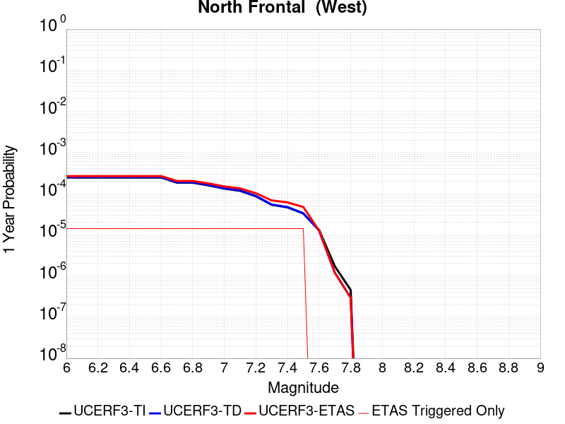 | 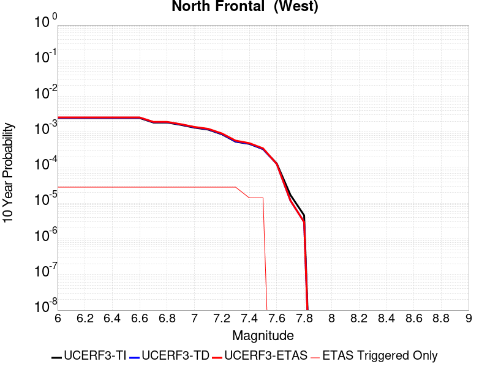 |

| Magnitude | 1 wk TI Prob | 1 wk TD Prob | 1 wk ETAS Prob | 1 wk ETAS/TD Gain | 1 wk ETAS Triggered Only | 1 mo TI Prob | 1 mo TD Prob | 1 mo ETAS Prob | 1 mo ETAS/TD Gain | 1 mo ETAS Triggered Only | 1 yr TI Prob | 1 yr TD Prob | 1 yr ETAS Prob | 1 yr ETAS/TD Gain | 1 yr ETAS Triggered Only | 10 yr TI Prob | 10 yr TD Prob | 10 yr ETAS Prob | 10 yr ETAS/TD Gain | 10 yr ETAS Triggered Only |
|-----|-----|-----|-----|-----|-----|-----|-----|-----|-----|-----|-----|-----|-----|-----|-----|-----|-----|-----|-----|-----|
| 6.0 | 4.7316266E-6 | 4.852674E-6 | 4.852674E-6 | 1.0 | 0.0 | 2.0278241E-5 | 2.0797017E-5 | 2.0797017E-5 | 1.0 | 0.0 | 2.4685962E-4 | 2.5317573E-4 | 2.8776666E-4 | 1.1366282 | 3.459968E-5 | 0.0024658558 | 0.002529019 | 0.0025635313 | 1.0136465 | 3.459968E-5 |
| 6.1 | 4.7316266E-6 | 4.852674E-6 | 4.852674E-6 | 1.0 | 0.0 | 2.0278241E-5 | 2.0797017E-5 | 2.0797017E-5 | 1.0 | 0.0 | 2.4685962E-4 | 2.5317573E-4 | 2.8776666E-4 | 1.1366282 | 3.459968E-5 | 0.0024658558 | 0.002529019 | 0.0025635313 | 1.0136465 | 3.459968E-5 |
| 6.2 | 4.7316266E-6 | 4.852674E-6 | 4.852674E-6 | 1.0 | 0.0 | 2.0278241E-5 | 2.0797017E-5 | 2.0797017E-5 | 1.0 | 0.0 | 2.4685962E-4 | 2.5317573E-4 | 2.8776666E-4 | 1.1366282 | 3.459968E-5 | 0.0024658558 | 0.002529019 | 0.0025635313 | 1.0136465 | 3.459968E-5 |
| 6.3 | 4.7316266E-6 | 4.852674E-6 | 4.852674E-6 | 1.0 | 0.0 | 2.0278241E-5 | 2.0797017E-5 | 2.0797017E-5 | 1.0 | 0.0 | 2.4685962E-4 | 2.5317573E-4 | 2.8776666E-4 | 1.1366282 | 3.459968E-5 | 0.0024658558 | 0.002529019 | 0.0025635313 | 1.0136465 | 3.459968E-5 |
| 6.4 | 4.7316266E-6 | 4.852674E-6 | 4.852674E-6 | 1.0 | 0.0 | 2.0278241E-5 | 2.0797017E-5 | 2.0797017E-5 | 1.0 | 0.0 | 2.4685962E-4 | 2.5317573E-4 | 2.8776666E-4 | 1.1366282 | 3.459968E-5 | 0.0024658558 | 0.002529019 | 0.0025635313 | 1.0136465 | 3.459968E-5 |
| 6.5 | 4.7316266E-6 | 4.852674E-6 | 4.852674E-6 | 1.0 | 0.0 | 2.0278241E-5 | 2.0797017E-5 | 2.0797017E-5 | 1.0 | 0.0 | 2.4685962E-4 | 2.5317573E-4 | 2.8776666E-4 | 1.1366282 | 3.459968E-5 | 0.0024658558 | 0.002529019 | 0.0025635313 | 1.0136465 | 3.459968E-5 |
| 6.6 | 4.7316266E-6 | 4.852674E-6 | 4.852674E-6 | 1.0 | 0.0 | 2.0278241E-5 | 2.0797017E-5 | 2.0797017E-5 | 1.0 | 0.0 | 2.4685962E-4 | 2.5317573E-4 | 2.8776666E-4 | 1.1366282 | 3.459968E-5 | 0.0024658558 | 0.002529019 | 0.0025635313 | 1.0136465 | 3.459968E-5 |
| 6.7 | 3.5382777E-6 | 3.6308872E-6 | 3.6308872E-6 | 1.0 | 0.0 | 1.516396E-5 | 1.5560858E-5 | 1.5560858E-5 | 1.0 | 0.0 | 1.8460557E-4 | 1.8943775E-4 | 2.2403087E-4 | 1.1826094 | 3.459968E-5 | 0.0018445229 | 0.0018928396 | 0.0019273737 | 1.0182446 | 3.459968E-5 |
| 6.8 | 3.5382777E-6 | 3.6308872E-6 | 3.6308872E-6 | 1.0 | 0.0 | 1.516396E-5 | 1.5560858E-5 | 1.5560858E-5 | 1.0 | 0.0 | 1.8460557E-4 | 1.8943775E-4 | 2.2403087E-4 | 1.1826094 | 3.459968E-5 | 0.0018445229 | 0.0018928396 | 0.0019273737 | 1.0182446 | 3.459968E-5 |
| 6.9 | 3.0428037E-6 | 3.1227619E-6 | 3.1227619E-6 | 1.0 | 0.0 | 1.30405215E-5 | 1.3383201E-5 | 1.3383201E-5 | 1.0 | 0.0 | 1.5875678E-4 | 1.6292896E-4 | 1.9752301E-4 | 1.2123259 | 3.459968E-5 | 0.0015864341 | 0.0016281622 | 0.0016627056 | 1.0212162 | 3.459968E-5 |
| 7.0 | 2.538778E-6 | 2.6060916E-6 | 2.6060916E-6 | 1.0 | 0.0 | 1.0880432E-5 | 1.116892E-5 | 1.116892E-5 | 1.0 | 0.0 | 1.324612E-4 | 1.3597358E-4 | 1.7056856E-4 | 1.2544242 | 3.459968E-5 | 0.0013238228 | 0.0013589506 | 0.0013935033 | 1.025426 | 3.459968E-5 |
| 7.1 | 2.2418935E-6 | 2.3012087E-6 | 2.3012087E-6 | 1.0 | 0.0 | 9.60808E-6 | 9.862288E-6 | 9.862288E-6 | 1.0 | 0.0 | 1.1697209E-4 | 1.2006718E-4 | 1.5466272E-4 | 1.2881347 | 3.459968E-5 | 0.0011691054 | 0.0012000671 | 0.0012346252 | 1.0287969 | 3.459968E-5 |
| 7.2 | 1.6526745E-6 | 1.6924864E-6 | 1.6924864E-6 | 1.0 | 0.0 | 7.082872E-6 | 7.2534945E-6 | 7.2534945E-6 | 1.0 | 0.0 | 8.623055E-5 | 8.830797E-5 | 1.229046E-4 | 1.3917724 | 3.459968E-5 | 8.61971E-4 | 8.8275387E-4 | 9.17323E-4 | 1.0391606 | 3.459968E-5 |
| 7.3 | 1.0246019E-6 | 1.0442274E-6 | 1.0442274E-6 | 1.0 | 0.0 | 4.391144E-6 | 4.4752533E-6 | 4.4752533E-6 | 1.0 | 0.0 | 5.3460866E-5 | 5.4484964E-5 | 8.908276E-5 | 1.6349971 | 3.459968E-5 | 5.344801E-4 | 5.4472755E-4 | 5.7930837E-4 | 1.0634828 | 3.459968E-5 |
| 7.4 | 8.9045164E-7 | 9.056572E-7 | 9.056572E-7 | 1.0 | 0.0 | 3.8162157E-6 | 3.881383E-6 | 3.881383E-6 | 1.0 | 0.0 | 4.646144E-5 | 4.725492E-5 | 8.1852966E-5 | 1.7321575 | 3.459968E-5 | 4.6451724E-4 | 4.7245962E-4 | 5.07043E-4 | 1.0731986 | 3.459968E-5 |
| 7.5 | 6.3357E-7 | 6.4027137E-7 | 6.4027137E-7 | 1.0 | 0.0 | 2.7152971E-6 | 2.7440176E-6 | 2.7440176E-6 | 1.0 | 0.0 | 3.305824E-5 | 3.340797E-5 | 6.80065E-5 | 2.035637 | 3.459968E-5 | 3.3053322E-4 | 3.3403604E-4 | 3.6862417E-4 | 1.103546 | 3.459968E-5 |
| 7.6 | 2.5087024E-7 | 2.436123E-7 | 2.436123E-7 | 1.0 | 0.0 | 1.0751578E-6 | 1.0440525E-6 | 1.0440525E-6 | 1.0 | 0.0 | 1.3089967E-5 | 1.2711286E-5 | 1.2711286E-5 | 1.0 | 0.0 | 1.3089196E-4 | 1.2710765E-4 | 1.2710765E-4 | 1.0 | 0.0 |
| 7.7 | 3.282987E-8 | 2.2875435E-8 | 2.2875435E-8 | 1.0 | 0.0 | 1.4069944E-7 | 9.8037575E-8 | 9.8037575E-8 | 1.0 | 0.0 | 1.7130144E-6 | 1.193607E-6 | 1.193607E-6 | 1.0 | 0.0 | 1.7130013E-5 | 1.1936014E-5 | 1.1936014E-5 | 1.0 | 0.0 |
| 7.8 | 8.77499E-9 | 5.6817466E-9 | 5.6817466E-9 | 1.0 | 0.0 | 3.7607098E-8 | 2.4350342E-8 | 2.4350342E-8 | 1.0 | 0.0 | 4.578663E-7 | 2.964654E-7 | 2.964654E-7 | 1.0 | 0.0 | 4.5786537E-6 | 2.9646512E-6 | 2.9646512E-6 | 1.0 | 0.0 |

## Calaveras (Central) 2011 CFM
*[(top)](#table-of-contents)*

| 1 Week | 1 Month | 1 Year | 10 Year |
|-----|-----|-----|-----|
| 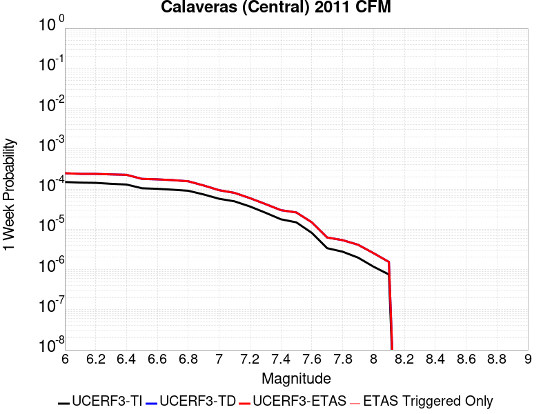 |  |  | 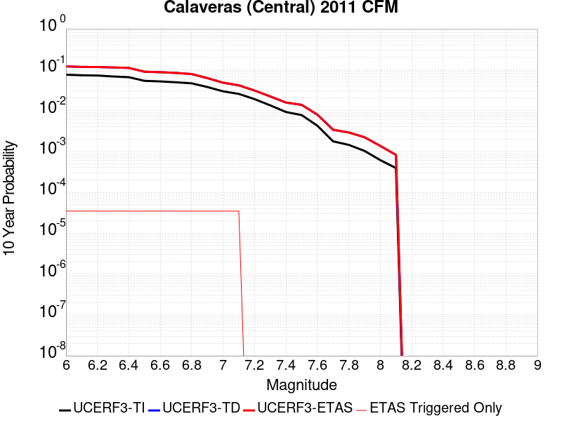 |

| Magnitude | 1 wk TI Prob | 1 wk TD Prob | 1 wk ETAS Prob | 1 wk ETAS/TD Gain | 1 wk ETAS Triggered Only | 1 mo TI Prob | 1 mo TD Prob | 1 mo ETAS Prob | 1 mo ETAS/TD Gain | 1 mo ETAS Triggered Only | 1 yr TI Prob | 1 yr TD Prob | 1 yr ETAS Prob | 1 yr ETAS/TD Gain | 1 yr ETAS Triggered Only | 10 yr TI Prob | 10 yr TD Prob | 10 yr ETAS Prob | 10 yr ETAS/TD Gain | 10 yr ETAS Triggered Only |
|-----|-----|-----|-----|-----|-----|-----|-----|-----|-----|-----|-----|-----|-----|-----|-----|-----|-----|-----|-----|-----|
| 6.0 | 1.5010907E-4 | 2.4804124E-4 | 2.4804124E-4 | 1.0 | 0.0 | 6.4316596E-4 | 0.001062498 | 0.001062498 | 1.0 | 0.0 | 0.0078024664 | 0.012850443 | 0.012850443 | 1.0 | 0.0 | 0.07534136 | 0.120411225 | 0.12044165 | 1.0002527 | 3.459968E-5 |
| 6.1 | 1.4521465E-4 | 2.3965565E-4 | 2.3965565E-4 | 1.0 | 0.0 | 6.222001E-4 | 0.0010265942 | 0.0010265942 | 1.0 | 0.0 | 0.0075490056 | 0.012419763 | 0.012419763 | 1.0 | 0.0 | 0.07297657 | 0.11668273 | 0.11671329 | 1.0002619 | 3.459968E-5 |
| 6.2 | 1.429998E-4 | 2.3896809E-4 | 2.3896809E-4 | 1.0 | 0.0 | 6.127123E-4 | 0.0010236499 | 0.0010236499 | 1.0 | 0.0 | 0.007434286 | 0.012384372 | 0.012384372 | 1.0 | 0.0 | 0.07190444 | 0.11633677 | 0.11636735 | 1.0002629 | 3.459968E-5 |
| 6.3 | 1.3536277E-4 | 2.3227946E-4 | 2.3227946E-4 | 1.0 | 0.0 | 5.799972E-4 | 9.950127E-4 | 9.950127E-4 | 1.0 | 0.0 | 0.0070386264 | 0.012040534 | 0.012040534 | 1.0 | 0.0 | 0.0681982 | 0.113249525 | 0.11328021 | 1.000271 | 3.459968E-5 |
| 6.4 | 1.2993296E-4 | 2.2651516E-4 | 2.2651516E-4 | 1.0 | 0.0 | 5.5673666E-4 | 9.703276E-4 | 9.703276E-4 | 1.0 | 0.0 | 0.006757223 | 0.011743338 | 0.011743338 | 1.0 | 0.0 | 0.06555412 | 0.11052752 | 0.1105583 | 1.0002785 | 3.459968E-5 |
| 6.5 | 1.0498927E-4 | 1.7981966E-4 | 1.7981966E-4 | 1.0 | 0.0 | 4.498764E-4 | 7.7042676E-4 | 7.7042676E-4 | 1.0 | 0.0 | 0.005463498 | 0.00933952 | 0.00933952 | 1.0 | 0.0 | 0.053311124 | 0.08920739 | 0.0892389 | 1.0003532 | 3.459968E-5 |
| 6.6 | 1.0157505E-4 | 1.7469494E-4 | 1.7469494E-4 | 1.0 | 0.0 | 4.35249E-4 | 7.4847665E-4 | 7.4847665E-4 | 1.0 | 0.0 | 0.0052862884 | 0.009074567 | 0.009074567 | 1.0 | 0.0 | 0.05162293 | 0.08678487 | 0.08681647 | 1.0003641 | 3.459968E-5 |
| 6.7 | 9.660386E-5 | 1.6728783E-4 | 1.6728783E-4 | 1.0 | 0.0 | 4.1395082E-4 | 7.167497E-4 | 7.167497E-4 | 1.0 | 0.0 | 0.0050282106 | 0.008691474 | 0.008691474 | 1.0 | 0.0 | 0.049159497 | 0.08327401 | 0.083305724 | 1.0003809 | 3.459968E-5 |
| 6.8 | 9.089927E-5 | 1.5643238E-4 | 1.5643238E-4 | 1.0 | 0.0 | 3.8951015E-4 | 6.702511E-4 | 6.702511E-4 | 1.0 | 0.0 | 0.0047319788 | 0.008129742 | 0.008129742 | 1.0 | 0.0 | 0.046324775 | 0.078163 | 0.078194894 | 1.000408 | 3.459968E-5 |
| 6.9 | 7.353187E-5 | 1.2295779E-4 | 1.2295779E-4 | 1.0 | 0.0 | 3.150985E-4 | 5.2685605E-4 | 5.2685605E-4 | 1.0 | 0.0 | 0.0038295772 | 0.006395728 | 0.006395728 | 1.0 | 0.0 | 0.037642512 | 0.06218928 | 0.06222173 | 1.0005218 | 3.459968E-5 |
| 7.0 | 5.746064E-5 | 9.3890936E-5 | 9.3890936E-5 | 1.0 | 0.0 | 2.4623662E-4 | 4.0232803E-4 | 4.0232803E-4 | 1.0 | 0.0 | 0.0029938098 | 0.0048874132 | 0.0048874132 | 1.0 | 0.0 | 0.02953797 | 0.04798713 | 0.04802007 | 1.0006864 | 3.459968E-5 |
| 7.1 | 4.9557195E-5 | 8.052768E-5 | 8.052768E-5 | 1.0 | 0.0 | 2.123707E-4 | 3.4507332E-4 | 3.4507332E-4 | 1.0 | 0.0 | 0.0025825473 | 0.004193237 | 0.004193237 | 1.0 | 0.0 | 0.0255274 | 0.041373473 | 0.04140664 | 1.0008017 | 3.459968E-5 |
| 7.2 | 3.687595E-5 | 5.952694E-5 | 5.952694E-5 | 1.0 | 0.0 | 1.5803022E-4 | 2.5509068E-4 | 2.5509068E-4 | 1.0 | 0.0 | 0.0019223199 | 0.003101335 | 0.003101335 | 1.0 | 0.0 | 0.01905776 | 0.030883823 | 0.030883823 | 1.0 | 0.0 |
| 7.3 | 2.5846984E-5 | 4.2473923E-5 | 4.2473923E-5 | 1.0 | 0.0 | 1.1076809E-4 | 1.820185E-4 | 1.820185E-4 | 1.0 | 0.0 | 0.0013477671 | 0.0022138404 | 0.0022138404 | 1.0 | 0.0 | 0.013396223 | 0.022175217 | 0.022175217 | 1.0 | 0.0 |
| 7.4 | 1.7747854E-5 | 2.993759E-5 | 2.993759E-5 | 1.0 | 0.0 | 7.6060016E-5 | 1.2829766E-4 | 1.2829766E-4 | 1.0 | 0.0 | 9.2563726E-4 | 0.0015609078 | 0.0015609078 | 1.0 | 0.0 | 0.009217911 | 0.015708687 | 0.015708687 | 1.0 | 0.0 |
| 7.5 | 1.4883479E-5 | 2.6244672E-5 | 2.6244672E-5 | 1.0 | 0.0 | 6.378478E-5 | 1.12472335E-4 | 1.12472335E-4 | 1.0 | 0.0 | 7.76303E-4 | 0.0013684932 | 0.0013684932 | 1.0 | 0.0 | 0.0077359667 | 0.013801667 | 0.013801667 | 1.0 | 0.0 |
| 7.6 | 8.166975E-6 | 1.4964299E-5 | 1.4964299E-5 | 1.0 | 0.0 | 3.5000852E-5 | 6.413114E-5 | 6.413114E-5 | 1.0 | 0.0 | 4.2605202E-4 | 7.805183E-4 | 7.805183E-4 | 1.0 | 0.0 | 0.004252361 | 0.007939203 | 0.007939203 | 1.0 | 0.0 |
| 7.7 | 3.3858064E-6 | 6.254251E-6 | 6.254251E-6 | 1.0 | 0.0 | 1.4510518E-5 | 2.6803657E-5 | 2.6803657E-5 | 1.0 | 0.0 | 1.7665124E-4 | 3.2628572E-4 | 3.2628572E-4 | 1.0 | 0.0 | 0.0017651088 | 0.003388363 | 0.003388363 | 1.0 | 0.0 |
| 7.8 | 2.7721615E-6 | 5.366695E-6 | 5.366695E-6 | 1.0 | 0.0 | 1.1880637E-5 | 2.2999919E-5 | 2.2999919E-5 | 1.0 | 0.0 | 1.4463716E-4 | 2.7998807E-4 | 2.7998807E-4 | 1.0 | 0.0 | 0.0014454306 | 0.002907615 | 0.002907615 | 1.0 | 0.0 |
| 7.9 | 1.9736292E-6 | 4.128705E-6 | 4.128705E-6 | 1.0 | 0.0 | 8.4583835E-6 | 1.769433E-5 | 1.769433E-5 | 1.0 | 0.0 | 1.0297595E-4 | 2.1540721E-4 | 2.1540721E-4 | 1.0 | 0.0 | 0.0010292825 | 0.0022237299 | 0.0022237299 | 1.0 | 0.0 |
| 8.0 | 1.1767289E-6 | 2.5546633E-6 | 2.5546633E-6 | 1.0 | 0.0 | 5.0431145E-6 | 1.0948511E-5 | 1.0948511E-5 | 1.0 | 0.0 | 6.139818E-5 | 1.3329E-4 | 1.3329E-4 | 1.0 | 0.0 | 6.1381224E-4 | 0.001366126 | 0.001366126 | 1.0 | 0.0 |
| 8.1 | 7.5112825E-7 | 1.541076E-6 | 1.541076E-6 | 1.0 | 0.0 | 3.2191172E-6 | 6.604595E-6 | 6.604595E-6 | 1.0 | 0.0 | 3.9192048E-5 | 8.0408E-5 | 8.0408E-5 | 1.0 | 0.0 | 3.9185135E-4 | 8.2356273E-4 | 8.2356273E-4 | 1.0 | 0.0 |

## Santa Monica alt 1
*[(top)](#table-of-contents)*

| 1 Week | 1 Month | 1 Year | 10 Year |
|-----|-----|-----|-----|
| 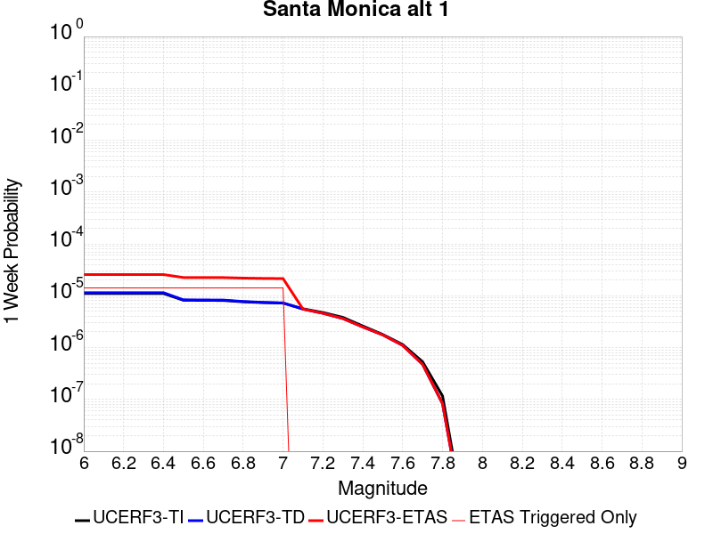 | 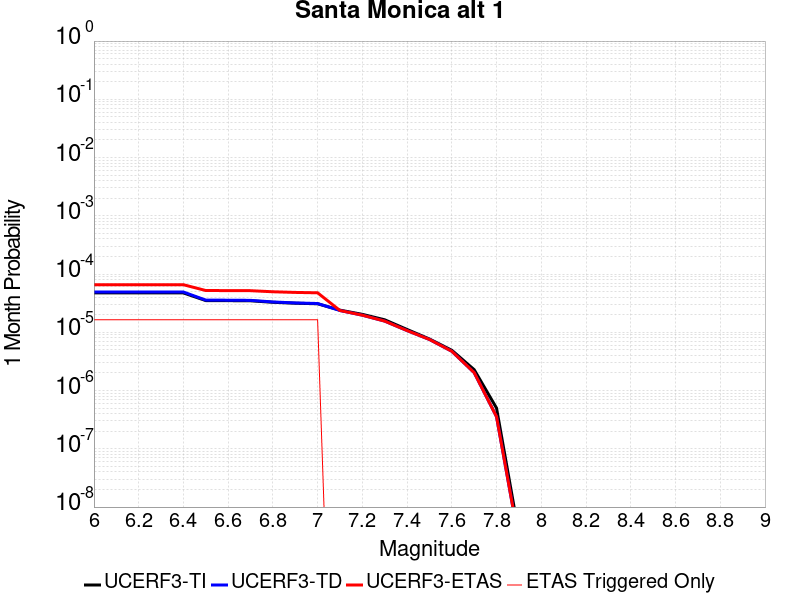 | 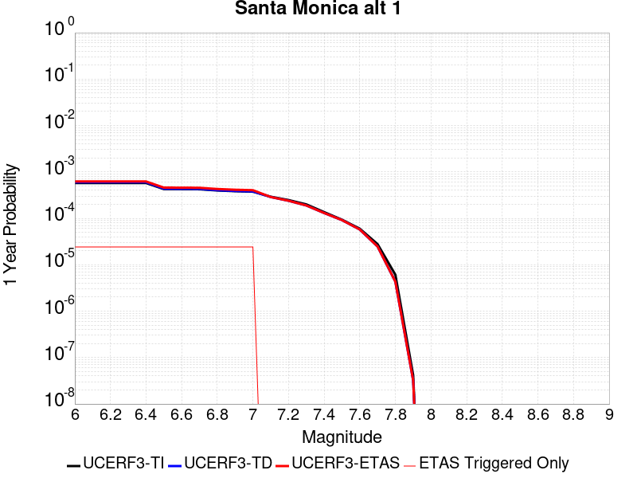 | 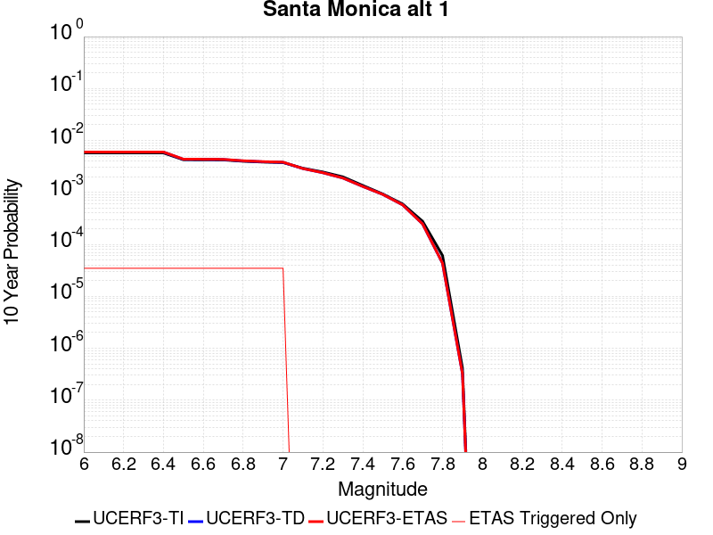 |

| Magnitude | 1 wk TI Prob | 1 wk TD Prob | 1 wk ETAS Prob | 1 wk ETAS/TD Gain | 1 wk ETAS Triggered Only | 1 mo TI Prob | 1 mo TD Prob | 1 mo ETAS Prob | 1 mo ETAS/TD Gain | 1 mo ETAS Triggered Only | 1 yr TI Prob | 1 yr TD Prob | 1 yr ETAS Prob | 1 yr ETAS/TD Gain | 1 yr ETAS Triggered Only | 10 yr TI Prob | 10 yr TD Prob | 10 yr ETAS Prob | 10 yr ETAS/TD Gain | 10 yr ETAS Triggered Only |
|-----|-----|-----|-----|-----|-----|-----|-----|-----|-----|-----|-----|-----|-----|-----|-----|-----|-----|-----|-----|-----|
| 6.0 | 1.1066008E-5 | 1.1480312E-5 | 4.6079596E-5 | 4.013793 | 3.459968E-5 | 4.742488E-5 | 4.920049E-5 | 8.379847E-5 | 1.7032039 | 3.459968E-5 | 5.7724497E-4 | 5.9886527E-4 | 6.3344423E-4 | 1.0577408 | 3.459968E-5 | 0.005757478 | 0.0059739016 | 0.0060082944 | 1.0057572 | 3.459968E-5 |
| 6.1 | 1.1066008E-5 | 1.1480312E-5 | 4.6079596E-5 | 4.013793 | 3.459968E-5 | 4.742488E-5 | 4.920049E-5 | 8.379847E-5 | 1.7032039 | 3.459968E-5 | 5.7724497E-4 | 5.9886527E-4 | 6.3344423E-4 | 1.0577408 | 3.459968E-5 | 0.005757478 | 0.0059739016 | 0.0060082944 | 1.0057572 | 3.459968E-5 |
| 6.2 | 1.1066008E-5 | 1.1480312E-5 | 4.6079596E-5 | 4.013793 | 3.459968E-5 | 4.742488E-5 | 4.920049E-5 | 8.379847E-5 | 1.7032039 | 3.459968E-5 | 5.7724497E-4 | 5.9886527E-4 | 6.3344423E-4 | 1.0577408 | 3.459968E-5 | 0.005757478 | 0.0059739016 | 0.0060082944 | 1.0057572 | 3.459968E-5 |
| 6.3 | 1.1066008E-5 | 1.1480312E-5 | 4.6079596E-5 | 4.013793 | 3.459968E-5 | 4.742488E-5 | 4.920049E-5 | 8.379847E-5 | 1.7032039 | 3.459968E-5 | 5.7724497E-4 | 5.9886527E-4 | 6.3344423E-4 | 1.0577408 | 3.459968E-5 | 0.005757478 | 0.0059739016 | 0.0060082944 | 1.0057572 | 3.459968E-5 |
| 6.4 | 1.1066008E-5 | 1.1480312E-5 | 4.6079596E-5 | 4.013793 | 3.459968E-5 | 4.742488E-5 | 4.920049E-5 | 8.379847E-5 | 1.7032039 | 3.459968E-5 | 5.7724497E-4 | 5.9886527E-4 | 6.3344423E-4 | 1.0577408 | 3.459968E-5 | 0.005757478 | 0.0059739016 | 0.0060082944 | 1.0057572 | 3.459968E-5 |
| 6.5 | 8.183544E-6 | 8.335434E-6 | 4.2934826E-5 | 5.150881 | 3.459968E-5 | 3.5071862E-5 | 3.572281E-5 | 7.032126E-5 | 1.9685254 | 3.459968E-5 | 4.2691626E-4 | 4.3483998E-4 | 4.6942462E-4 | 1.0795342 | 3.459968E-5 | 0.0042609703 | 0.004340057 | 0.0043745064 | 1.0079376 | 3.459968E-5 |
| 6.6 | 8.1543285E-6 | 8.303648E-6 | 4.2903044E-5 | 5.16677 | 3.459968E-5 | 3.4946657E-5 | 3.558659E-5 | 7.018504E-5 | 1.9722328 | 3.459968E-5 | 4.2539247E-4 | 4.3318217E-4 | 4.6776686E-4 | 1.0798386 | 3.459968E-5 | 0.0042457907 | 0.004323543 | 0.004357993 | 1.0079681 | 3.459968E-5 |
| 6.7 | 8.110878E-6 | 8.257045E-6 | 4.285644E-5 | 5.190288 | 3.459968E-5 | 3.4760444E-5 | 3.5386864E-5 | 6.998532E-5 | 1.9777204 | 3.459968E-5 | 4.231262E-4 | 4.3075148E-4 | 4.6533626E-4 | 1.0802894 | 3.459968E-5 | 0.0042232145 | 0.004299331 | 0.0043337815 | 1.0080131 | 3.459968E-5 |
| 6.8 | 7.644036E-6 | 7.751063E-6 | 4.2350475E-5 | 5.463828 | 3.459968E-5 | 3.275974E-5 | 3.3218425E-5 | 6.781696E-5 | 2.0415463 | 3.459968E-5 | 3.9877684E-4 | 4.043607E-4 | 4.389464E-4 | 1.0855318 | 3.459968E-5 | 0.00398062 | 0.004036396 | 0.0040708557 | 1.0085373 | 3.459968E-5 |
| 6.9 | 7.3698293E-6 | 7.4557215E-6 | 4.2055144E-5 | 5.640654 | 3.459968E-5 | 3.15846E-5 | 3.195271E-5 | 6.6551285E-5 | 2.0828056 | 3.459968E-5 | 3.8447464E-4 | 3.889562E-4 | 4.235424E-4 | 1.0889206 | 3.459968E-5 | 0.0038381014 | 0.0038828978 | 0.003917363 | 1.0088762 | 3.459968E-5 |
| 7.0 | 7.209872E-6 | 7.2856283E-6 | 4.1885058E-5 | 5.7489977 | 3.459968E-5 | 3.0899086E-5 | 3.1223753E-5 | 6.582236E-5 | 2.1080859 | 3.459968E-5 | 3.7613141E-4 | 3.800843E-4 | 4.1467082E-4 | 1.090997 | 3.459968E-5 | 0.0037549543 | 0.003794485 | 0.0038289533 | 1.0090839 | 3.459968E-5 |
| 7.1 | 5.603456E-6 | 5.5238947E-6 | 5.5238947E-6 | 1.0 | 0.0 | 2.4014591E-5 | 2.3673623E-5 | 2.3673623E-5 | 1.0 | 0.0 | 2.923384E-4 | 2.8818863E-4 | 2.8818863E-4 | 1.0 | 0.0 | 0.0029195412 | 0.002878191 | 0.002878191 | 1.0 | 0.0 |
| 7.2 | 4.7483613E-6 | 4.591135E-6 | 4.591135E-6 | 1.0 | 0.0 | 2.0349962E-5 | 1.9676147E-5 | 1.9676147E-5 | 1.0 | 0.0 | 2.4773262E-4 | 2.3953087E-4 | 2.3953087E-4 | 1.0 | 0.0 | 0.0024745662 | 0.0023927412 | 0.0023927412 | 1.0 | 0.0 |
| 7.3 | 3.829015E-6 | 3.6342271E-6 | 3.6342271E-6 | 1.0 | 0.0 | 1.6409962E-5 | 1.5575166E-5 | 1.5575166E-5 | 1.0 | 0.0 | 1.9977297E-4 | 1.8961124E-4 | 1.8961124E-4 | 1.0 | 0.0 | 0.0019959346 | 0.0018945034 | 0.0018945034 | 1.0 | 0.0 |
| 7.4 | 2.610755E-6 | 2.4995722E-6 | 2.4995722E-6 | 1.0 | 0.0 | 1.1188902E-5 | 1.0712408E-5 | 1.0712408E-5 | 1.0 | 0.0 | 1.3621636E-4 | 1.304158E-4 | 1.304158E-4 | 1.0 | 0.0 | 0.001361329 | 0.0013033971 | 0.0013033971 | 1.0 | 0.0 |
| 7.5 | 1.792146E-6 | 1.7584194E-6 | 1.7584194E-6 | 1.0 | 0.0 | 7.680603E-6 | 7.5360617E-6 | 7.5360617E-6 | 1.0 | 0.0 | 9.3507326E-5 | 9.174772E-5 | 9.174772E-5 | 1.0 | 0.0 | 9.3467993E-4 | 9.1710157E-4 | 9.1710157E-4 | 1.0 | 0.0 |
| 7.6 | 1.1473018E-6 | 1.102916E-6 | 1.102916E-6 | 1.0 | 0.0 | 4.9169985E-6 | 4.7267745E-6 | 4.7267745E-6 | 1.0 | 0.0 | 5.986281E-5 | 5.7546975E-5 | 5.7546975E-5 | 1.0 | 0.0 | 5.984669E-4 | 5.753224E-4 | 5.753224E-4 | 1.0 | 0.0 |
| 7.7 | 5.330919E-7 | 4.7452562E-7 | 4.7452562E-7 | 1.0 | 0.0 | 2.2846775E-6 | 2.0336797E-6 | 2.0336797E-6 | 1.0 | 0.0 | 2.7815593E-5 | 2.4759782E-5 | 2.4759782E-5 | 1.0 | 0.0 | 2.7812112E-4 | 2.4757136E-4 | 2.4757136E-4 | 1.0 | 0.0 |
| 7.8 | 1.1668574E-7 | 8.296564E-8 | 8.296564E-8 | 1.0 | 0.0 | 5.000816E-7 | 3.5556698E-7 | 3.5556698E-7 | 1.0 | 0.0 | 6.0884768E-6 | 4.3290197E-6 | 4.3290197E-6 | 1.0 | 0.0 | 6.08831E-5 | 4.3289383E-5 | 4.3289383E-5 | 1.0 | 0.0 |
| 7.9 | 8.007447E-10 | 6.161581E-10 | 6.161581E-10 | 1.0 | 0.0 | 3.4317629E-9 | 2.640678E-9 | 2.640678E-9 | 1.0 | 0.0 | 4.1781714E-8 | 3.2150254E-8 | 3.2150254E-8 | 1.0 | 0.0 | 4.1781706E-7 | 3.2150248E-7 | 3.2150248E-7 | 1.0 | 0.0 |

## Los Alamos extension
*[(top)](#table-of-contents)*

| 1 Week | 1 Month | 1 Year | 10 Year |
|-----|-----|-----|-----|
| 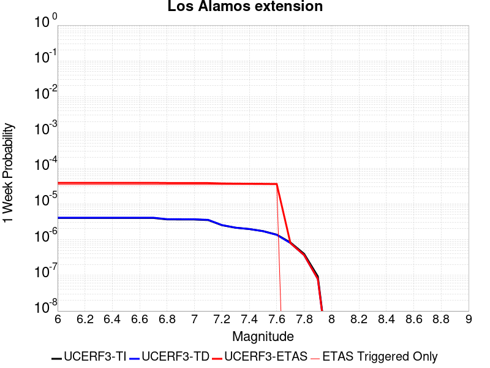 | 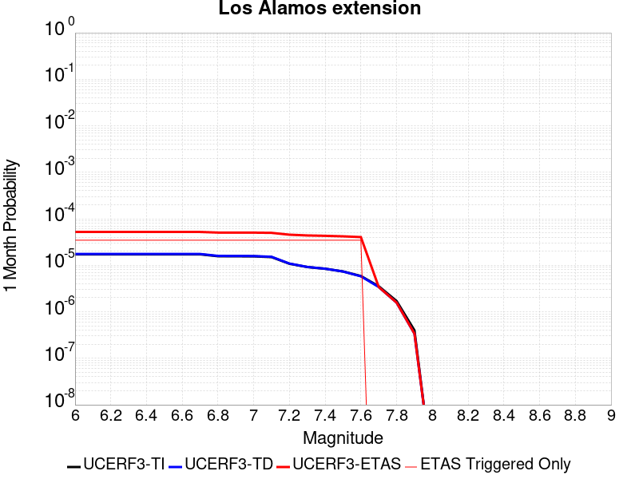 | 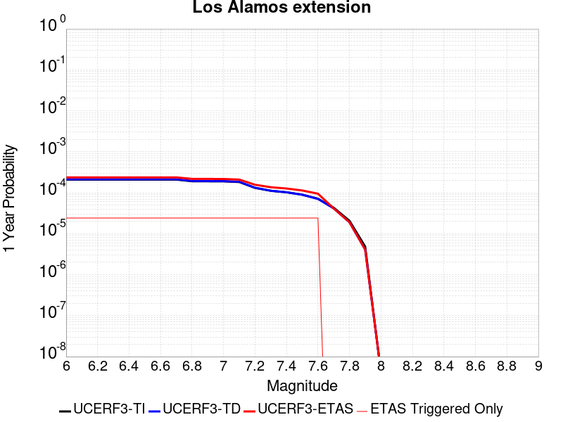 | 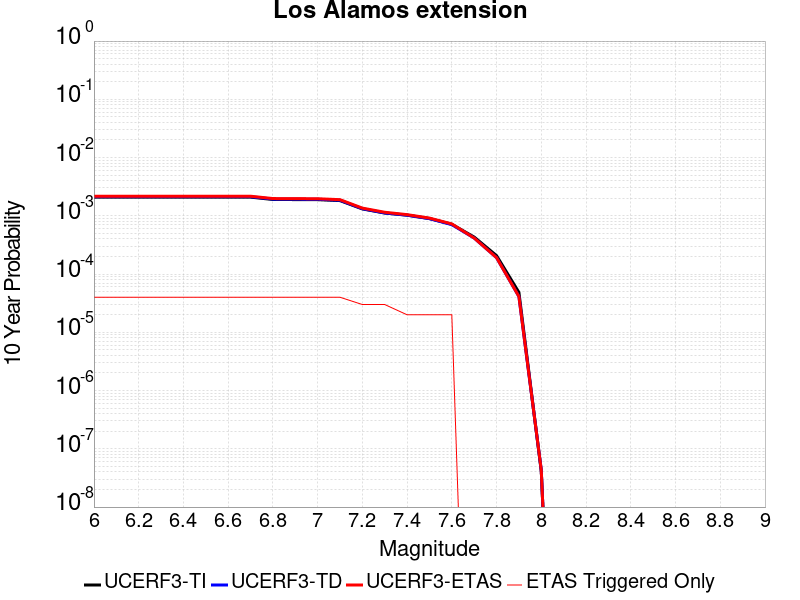 |

| Magnitude | 1 wk TI Prob | 1 wk TD Prob | 1 wk ETAS Prob | 1 wk ETAS/TD Gain | 1 wk ETAS Triggered Only | 1 mo TI Prob | 1 mo TD Prob | 1 mo ETAS Prob | 1 mo ETAS/TD Gain | 1 mo ETAS Triggered Only | 1 yr TI Prob | 1 yr TD Prob | 1 yr ETAS Prob | 1 yr ETAS/TD Gain | 1 yr ETAS Triggered Only | 10 yr TI Prob | 10 yr TD Prob | 10 yr ETAS Prob | 10 yr ETAS/TD Gain | 10 yr ETAS Triggered Only |
|-----|-----|-----|-----|-----|-----|-----|-----|-----|-----|-----|-----|-----|-----|-----|-----|-----|-----|-----|-----|-----|
| 6.0 | 4.0146506E-6 | 4.086164E-6 | 3.8685706E-5 | 9.467486 | 3.459968E-5 | 1.7205533E-5 | 1.7512022E-5 | 5.2111096E-5 | 2.9757328 | 3.459968E-5 | 2.0945723E-4 | 2.1318911E-4 | 2.477814E-4 | 1.1622611 | 3.459968E-5 | 0.0020925992 | 0.002129955 | 0.002164481 | 1.0162097 | 3.459968E-5 |
| 6.1 | 4.0146506E-6 | 4.086164E-6 | 3.8685706E-5 | 9.467486 | 3.459968E-5 | 1.7205533E-5 | 1.7512022E-5 | 5.2111096E-5 | 2.9757328 | 3.459968E-5 | 2.0945723E-4 | 2.1318911E-4 | 2.477814E-4 | 1.1622611 | 3.459968E-5 | 0.0020925992 | 0.002129955 | 0.002164481 | 1.0162097 | 3.459968E-5 |
| 6.2 | 4.0146506E-6 | 4.086164E-6 | 3.8685706E-5 | 9.467486 | 3.459968E-5 | 1.7205533E-5 | 1.7512022E-5 | 5.2111096E-5 | 2.9757328 | 3.459968E-5 | 2.0945723E-4 | 2.1318911E-4 | 2.477814E-4 | 1.1622611 | 3.459968E-5 | 0.0020925992 | 0.002129955 | 0.002164481 | 1.0162097 | 3.459968E-5 |
| 6.3 | 4.0146506E-6 | 4.086164E-6 | 3.8685706E-5 | 9.467486 | 3.459968E-5 | 1.7205533E-5 | 1.7512022E-5 | 5.2111096E-5 | 2.9757328 | 3.459968E-5 | 2.0945723E-4 | 2.1318911E-4 | 2.477814E-4 | 1.1622611 | 3.459968E-5 | 0.0020925992 | 0.002129955 | 0.002164481 | 1.0162097 | 3.459968E-5 |
| 6.4 | 4.0146506E-6 | 4.086164E-6 | 3.8685706E-5 | 9.467486 | 3.459968E-5 | 1.7205533E-5 | 1.7512022E-5 | 5.2111096E-5 | 2.9757328 | 3.459968E-5 | 2.0945723E-4 | 2.1318911E-4 | 2.477814E-4 | 1.1622611 | 3.459968E-5 | 0.0020925992 | 0.002129955 | 0.002164481 | 1.0162097 | 3.459968E-5 |
| 6.5 | 4.0146506E-6 | 4.086164E-6 | 3.8685706E-5 | 9.467486 | 3.459968E-5 | 1.7205533E-5 | 1.7512022E-5 | 5.2111096E-5 | 2.9757328 | 3.459968E-5 | 2.0945723E-4 | 2.1318911E-4 | 2.477814E-4 | 1.1622611 | 3.459968E-5 | 0.0020925992 | 0.002129955 | 0.002164481 | 1.0162097 | 3.459968E-5 |
| 6.6 | 4.0146506E-6 | 4.086164E-6 | 3.8685706E-5 | 9.467486 | 3.459968E-5 | 1.7205533E-5 | 1.7512022E-5 | 5.2111096E-5 | 2.9757328 | 3.459968E-5 | 2.0945723E-4 | 2.1318911E-4 | 2.477814E-4 | 1.1622611 | 3.459968E-5 | 0.0020925992 | 0.002129955 | 0.002164481 | 1.0162097 | 3.459968E-5 |
| 6.7 | 4.0146506E-6 | 4.086164E-6 | 3.8685706E-5 | 9.467486 | 3.459968E-5 | 1.7205533E-5 | 1.7512022E-5 | 5.2111096E-5 | 2.9757328 | 3.459968E-5 | 2.0945723E-4 | 2.1318911E-4 | 2.477814E-4 | 1.1622611 | 3.459968E-5 | 0.0020925992 | 0.002129955 | 0.002164481 | 1.0162097 | 3.459968E-5 |
| 6.8 | 3.6584688E-6 | 3.7188636E-6 | 3.8318416E-5 | 10.303798 | 3.459968E-5 | 1.5679057E-5 | 1.5937894E-5 | 5.0537026E-5 | 3.170872 | 3.459968E-5 | 1.9087581E-4 | 1.9402753E-4 | 2.286205E-4 | 1.1782889 | 3.459968E-5 | 0.0019071194 | 0.0019386737 | 0.0019732062 | 1.0178125 | 3.459968E-5 |
| 6.9 | 3.644631E-6 | 3.7045736E-6 | 3.8304126E-5 | 10.339686 | 3.459968E-5 | 1.5619753E-5 | 1.5876652E-5 | 5.0475785E-5 | 3.1792462 | 3.459968E-5 | 1.901539E-4 | 1.9328203E-4 | 2.2787502E-4 | 1.1789768 | 3.459968E-5 | 0.0018999127 | 0.0019312317 | 0.0019657644 | 1.0178813 | 3.459968E-5 |
| 7.0 | 3.6318522E-6 | 3.691334E-6 | 3.8290887E-5 | 10.373184 | 3.459968E-5 | 1.5564989E-5 | 1.5819913E-5 | 5.0419047E-5 | 3.1870623 | 3.459968E-5 | 1.8948725E-4 | 1.9259135E-4 | 2.2718437E-4 | 1.1796187 | 3.459968E-5 | 0.0018932576 | 0.0019243368 | 0.0019588699 | 1.0179454 | 3.459968E-5 |
| 7.1 | 3.5001724E-6 | 3.5554046E-6 | 3.815496E-5 | 10.731539 | 3.459968E-5 | 1.5000653E-5 | 1.5237365E-5 | 4.983652E-5 | 3.2706783 | 3.459968E-5 | 1.8261763E-4 | 1.8550004E-4 | 2.2009331E-4 | 1.1864866 | 3.459968E-5 | 0.0018246764 | 0.0018535426 | 0.0018880782 | 1.0186322 | 3.459968E-5 |
| 7.2 | 2.5204702E-6 | 2.5436989E-6 | 3.7143294E-5 | 14.602079 | 3.459968E-5 | 1.080197E-5 | 1.0901522E-5 | 4.5500827E-5 | 4.173805 | 3.459968E-5 | 1.3150605E-4 | 1.3271799E-4 | 1.6731309E-4 | 1.2606661 | 3.459968E-5 | 0.0013142825 | 0.001326393 | 0.0013609468 | 1.0260509 | 3.459968E-5 |
| 7.3 | 2.1399692E-6 | 2.1501362E-6 | 3.6749745E-5 | 17.091822 | 3.459968E-5 | 9.1712645E-6 | 9.2148375E-6 | 4.38142E-5 | 4.754745 | 3.459968E-5 | 1.1165442E-4 | 1.121849E-4 | 1.467807E-4 | 1.3083819 | 3.459968E-5 | 0.0011159834 | 0.001121286 | 0.0011558469 | 1.0308225 | 3.459968E-5 |
| 7.4 | 1.9660122E-6 | 1.970241E-6 | 3.6569854E-5 | 18.561108 | 3.459968E-5 | 8.42574E-6 | 8.4438625E-6 | 4.3043252E-5 | 5.0975785 | 3.459968E-5 | 1.0257855E-4 | 1.0279921E-4 | 1.3739534E-4 | 1.3365408 | 3.459968E-5 | 0.0010253121 | 0.0010275197 | 0.0010620839 | 1.0336384 | 3.459968E-5 |
| 7.5 | 1.7204633E-6 | 1.7151029E-6 | 3.6314726E-5 | 21.173496 | 3.459968E-5 | 7.373393E-6 | 7.3504207E-6 | 4.1949846E-5 | 5.7071357 | 3.459968E-5 | 8.976737E-5 | 8.948772E-5 | 1.2408431E-4 | 1.386607 | 3.459968E-5 | 8.9731114E-4 | 8.945199E-4 | 9.290886E-4 | 1.038645 | 3.459968E-5 |
| 7.6 | 1.3717638E-6 | 1.3535872E-6 | 3.595322E-5 | 26.561438 | 3.459968E-5 | 5.878974E-6 | 5.801075E-6 | 4.0400555E-5 | 6.964322 | 3.459968E-5 | 7.157416E-5 | 7.062583E-5 | 1.05223065E-4 | 1.4898666 | 3.459968E-5 | 7.1551115E-4 | 7.0603646E-4 | 7.406117E-4 | 1.0489709 | 3.459968E-5 |
| 7.7 | 8.272564E-7 | 7.9576733E-7 | 7.9576733E-7 | 1.0 | 0.0 | 3.5453797E-6 | 3.4104269E-6 | 3.4104269E-6 | 1.0 | 0.0 | 4.3164142E-5 | 4.1521158E-5 | 4.1521158E-5 | 1.0 | 0.0 | 4.315576E-4 | 4.151342E-4 | 4.151342E-4 | 1.0 | 0.0 |
| 7.8 | 3.9708277E-7 | 3.671937E-7 | 3.671937E-7 | 1.0 | 0.0 | 1.7017821E-6 | 1.5736864E-6 | 1.5736864E-6 | 1.0 | 0.0 | 2.0719E-5 | 1.9159465E-5 | 1.9159465E-5 | 1.0 | 0.0 | 2.071707E-4 | 1.9157819E-4 | 1.9157819E-4 | 1.0 | 0.0 |
| 7.9 | 9.292528E-8 | 7.889168E-8 | 7.889168E-8 | 1.0 | 0.0 | 3.9825116E-7 | 3.3810713E-7 | 3.3810713E-7 | 1.0 | 0.0 | 4.848697E-6 | 4.1164467E-6 | 4.1164467E-6 | 1.0 | 0.0 | 4.8485912E-5 | 4.1163716E-5 | 4.1163716E-5 | 1.0 | 0.0 |
| 8.0 | 7.880441E-11 | 8.2353124E-11 | 8.2353124E-11 | 1.0 | 0.0 | 3.3773329E-10 | 3.52942E-10 | 3.52942E-10 | 1.0 | 0.0 | 4.1119033E-9 | 4.2970694E-9 | 4.2970694E-9 | 1.0 | 0.0 | 4.1119034E-8 | 4.2970694E-8 | 4.2970694E-8 | 1.0 | 0.0 |

## Sheephole
*[(top)](#table-of-contents)*

| 1 Week | 1 Month | 1 Year | 10 Year |
|-----|-----|-----|-----|
| 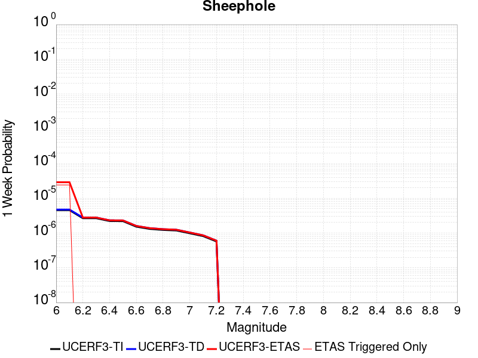 | 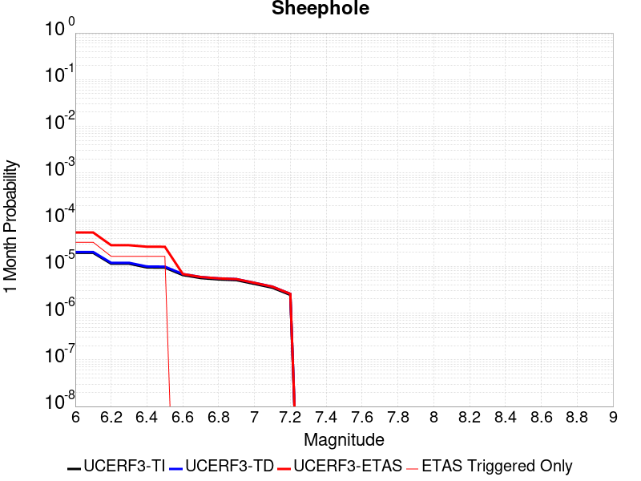 | 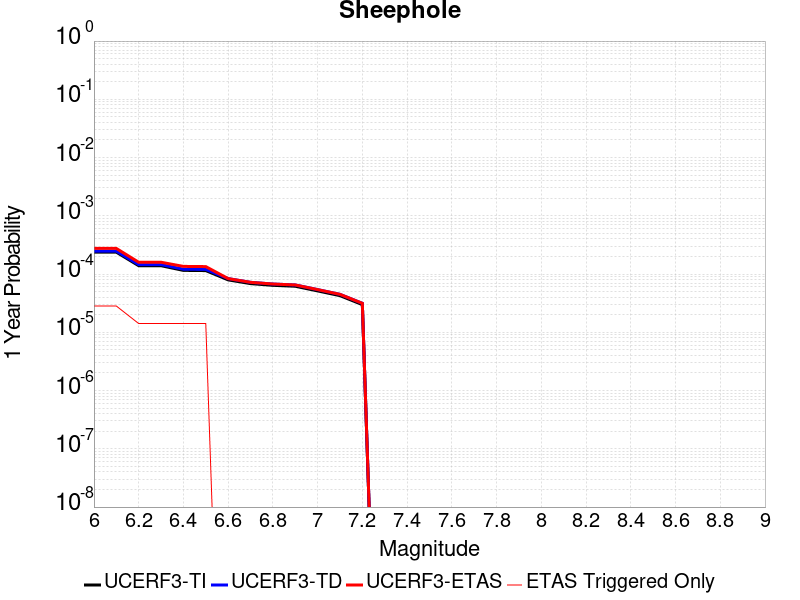 | 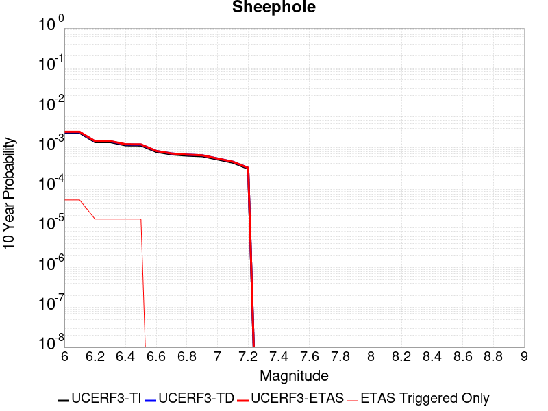 |

| Magnitude | 1 wk TI Prob | 1 wk TD Prob | 1 wk ETAS Prob | 1 wk ETAS/TD Gain | 1 wk ETAS Triggered Only | 1 mo TI Prob | 1 mo TD Prob | 1 mo ETAS Prob | 1 mo ETAS/TD Gain | 1 mo ETAS Triggered Only | 1 yr TI Prob | 1 yr TD Prob | 1 yr ETAS Prob | 1 yr ETAS/TD Gain | 1 yr ETAS Triggered Only | 10 yr TI Prob | 10 yr TD Prob | 10 yr ETAS Prob | 10 yr ETAS/TD Gain | 10 yr ETAS Triggered Only |
|-----|-----|-----|-----|-----|-----|-----|-----|-----|-----|-----|-----|-----|-----|-----|-----|-----|-----|-----|-----|-----|
| 6.0 | 4.5579695E-6 | 4.7412627E-6 | 3.934078E-5 | 8.297532 | 3.459968E-5 | 1.9534009E-5 | 2.031957E-5 | 5.491855E-5 | 2.7027416 | 3.459968E-5 | 2.3780059E-4 | 2.473682E-4 | 2.8195934E-4 | 1.1398365 | 3.459968E-5 | 0.0023754628 | 0.002471473 | 0.0025059874 | 1.013965 | 3.459968E-5 |
| 6.1 | 4.5579695E-6 | 4.7412627E-6 | 3.934078E-5 | 8.297532 | 3.459968E-5 | 1.9534009E-5 | 2.031957E-5 | 5.491855E-5 | 2.7027416 | 3.459968E-5 | 2.3780059E-4 | 2.473682E-4 | 2.8195934E-4 | 1.1398365 | 3.459968E-5 | 0.0023754628 | 0.002471473 | 0.0025059874 | 1.013965 | 3.459968E-5 |
| 6.2 | 2.6677674E-6 | 2.7873941E-6 | 2.7873941E-6 | 1.0 | 0.0 | 1.1433239E-5 | 1.1945926E-5 | 1.1945926E-5 | 1.0 | 0.0 | 1.3919079E-4 | 1.4543302E-4 | 1.4543302E-4 | 1.0 | 0.0 | 0.0013910364 | 0.0014534844 | 0.0014534844 | 1.0 | 0.0 |
| 6.3 | 2.6677674E-6 | 2.7873941E-6 | 2.7873941E-6 | 1.0 | 0.0 | 1.1433239E-5 | 1.1945926E-5 | 1.1945926E-5 | 1.0 | 0.0 | 1.3919079E-4 | 1.4543302E-4 | 1.4543302E-4 | 1.0 | 0.0 | 0.0013910364 | 0.0014534844 | 0.0014534844 | 1.0 | 0.0 |
| 6.4 | 2.2159759E-6 | 2.3228788E-6 | 2.3228788E-6 | 1.0 | 0.0 | 9.497005E-6 | 9.955161E-6 | 9.955161E-6 | 1.0 | 0.0 | 1.156199E-4 | 1.2119815E-4 | 1.2119815E-4 | 1.0 | 0.0 | 0.0011555976 | 0.0012113999 | 0.0012113999 | 1.0 | 0.0 |
| 6.5 | 2.1986082E-6 | 2.304759E-6 | 2.304759E-6 | 1.0 | 0.0 | 9.4225725E-6 | 9.877506E-6 | 9.877506E-6 | 1.0 | 0.0 | 1.1471378E-4 | 1.2025281E-4 | 1.2025281E-4 | 1.0 | 0.0 | 0.0011465458 | 0.0012019566 | 0.0012019566 | 1.0 | 0.0 |
| 6.6 | 1.5232331E-6 | 1.6018919E-6 | 1.6018919E-6 | 1.0 | 0.0 | 6.5281256E-6 | 6.865234E-6 | 6.865234E-6 | 1.0 | 0.0 | 7.947703E-5 | 8.35812E-5 | 8.35812E-5 | 1.0 | 0.0 | 7.9448614E-4 | 8.3551643E-4 | 8.3551643E-4 | 1.0 | 0.0 |
| 6.7 | 1.3137362E-6 | 1.382819E-6 | 1.382819E-6 | 1.0 | 0.0 | 5.6302856E-6 | 5.926355E-6 | 5.926355E-6 | 1.0 | 0.0 | 6.854657E-5 | 7.215112E-5 | 7.215112E-5 | 1.0 | 0.0 | 6.8525434E-4 | 7.212908E-4 | 7.212908E-4 | 1.0 | 0.0 |
| 6.8 | 1.2275751E-6 | 1.2922847E-6 | 1.2922847E-6 | 1.0 | 0.0 | 5.2610258E-6 | 5.5383516E-6 | 5.5383516E-6 | 1.0 | 0.0 | 6.4051106E-5 | 6.7427485E-5 | 6.7427485E-5 | 1.0 | 0.0 | 6.4032647E-4 | 6.740836E-4 | 6.740836E-4 | 1.0 | 0.0 |
| 6.9 | 1.1837088E-6 | 1.246102E-6 | 1.246102E-6 | 1.0 | 0.0 | 5.0730278E-6 | 5.340427E-6 | 5.340427E-6 | 1.0 | 0.0 | 6.176237E-5 | 6.501789E-5 | 6.501789E-5 | 1.0 | 0.0 | 6.17452E-4 | 6.5000186E-4 | 6.5000186E-4 | 1.0 | 0.0 |
| 7.0 | 9.849371E-7 | 1.0366288E-6 | 1.0366288E-6 | 1.0 | 0.0 | 4.2211523E-6 | 4.442688E-6 | 4.442688E-6 | 1.0 | 0.0 | 5.1391315E-5 | 5.4088487E-5 | 5.4088487E-5 | 1.0 | 0.0 | 5.137943E-4 | 5.407633E-4 | 5.407633E-4 | 1.0 | 0.0 |
| 7.1 | 8.1643645E-7 | 8.591669E-7 | 8.591669E-7 | 1.0 | 0.0 | 3.4990085E-6 | 3.682139E-6 | 3.682139E-6 | 1.0 | 0.0 | 4.2599597E-5 | 4.482921E-5 | 4.482921E-5 | 1.0 | 0.0 | 4.259143E-4 | 4.4821028E-4 | 4.4821028E-4 | 1.0 | 0.0 |
| 7.2 | 5.7295756E-7 | 6.029502E-7 | 6.029502E-7 | 1.0 | 0.0 | 2.45553E-6 | 2.58407E-6 | 2.58407E-6 | 1.0 | 0.0 | 2.9895667E-5 | 3.1460666E-5 | 3.1460666E-5 | 1.0 | 0.0 | 2.9891645E-4 | 3.145688E-4 | 3.145688E-4 | 1.0 | 0.0 |

## Maacama 2011 CFM
*[(top)](#table-of-contents)*

| 1 Week | 1 Month | 1 Year | 10 Year |
|-----|-----|-----|-----|
| 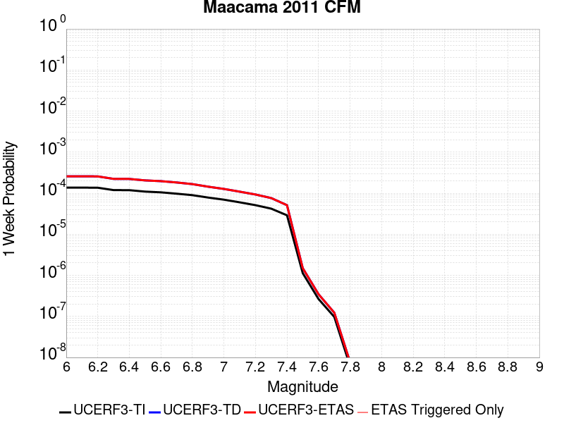 | 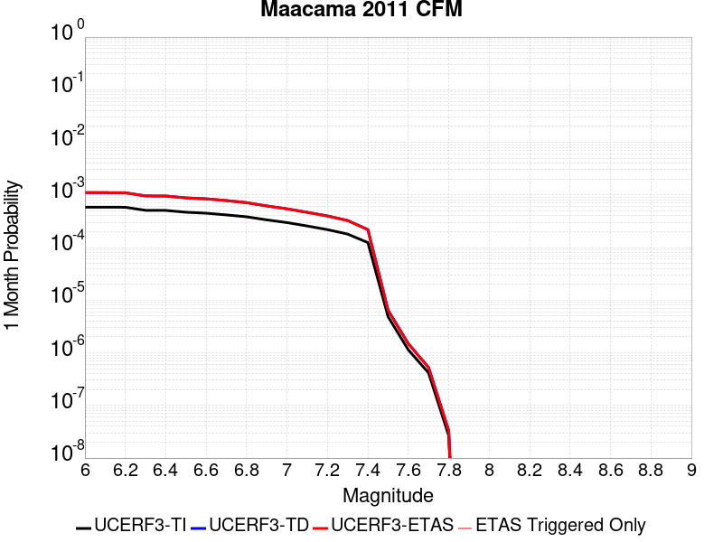 |  | 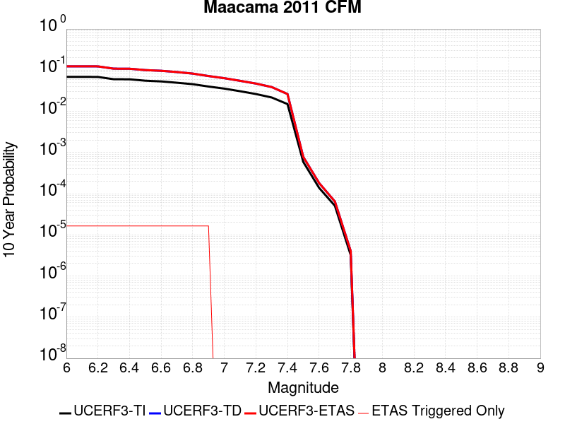 |

| Magnitude | 1 wk TI Prob | 1 wk TD Prob | 1 wk ETAS Prob | 1 wk ETAS/TD Gain | 1 wk ETAS Triggered Only | 1 mo TI Prob | 1 mo TD Prob | 1 mo ETAS Prob | 1 mo ETAS/TD Gain | 1 mo ETAS Triggered Only | 1 yr TI Prob | 1 yr TD Prob | 1 yr ETAS Prob | 1 yr ETAS/TD Gain | 1 yr ETAS Triggered Only | 10 yr TI Prob | 10 yr TD Prob | 10 yr ETAS Prob | 10 yr ETAS/TD Gain | 10 yr ETAS Triggered Only |
|-----|-----|-----|-----|-----|-----|-----|-----|-----|-----|-----|-----|-----|-----|-----|-----|-----|-----|-----|-----|-----|
| 6.0 | 1.368203E-4 | 2.579087E-4 | 2.579087E-4 | 1.0 | 0.0 | 5.862409E-4 | 0.0011047592 | 0.0011047592 | 1.0 | 0.0 | 0.0071141496 | 0.013350345 | 0.013350345 | 1.0 | 0.0 | 0.06890667 | 0.1241916 | 0.124221906 | 1.000244 | 3.459968E-5 |
| 6.1 | 1.368203E-4 | 2.579087E-4 | 2.579087E-4 | 1.0 | 0.0 | 5.862409E-4 | 0.0011047592 | 0.0011047592 | 1.0 | 0.0 | 0.0071141496 | 0.013350345 | 0.013350345 | 1.0 | 0.0 | 0.06890667 | 0.1241916 | 0.124221906 | 1.000244 | 3.459968E-5 |
| 6.2 | 1.360743E-4 | 2.566557E-4 | 2.566557E-4 | 1.0 | 0.0 | 5.8304524E-4 | 0.001099394 | 0.001099394 | 1.0 | 0.0 | 0.007075496 | 0.013285898 | 0.013285898 | 1.0 | 0.0 | 0.06854413 | 0.123625994 | 0.12365632 | 1.0002453 | 3.459968E-5 |
| 6.3 | 1.1917239E-4 | 2.236021E-4 | 2.236021E-4 | 1.0 | 0.0 | 5.1063887E-4 | 9.578717E-4 | 9.578717E-4 | 1.0 | 0.0 | 0.0061993203 | 0.0115873255 | 0.0115873255 | 1.0 | 0.0 | 0.060292065 | 0.108845875 | 0.108876705 | 1.0002832 | 3.459968E-5 |
| 6.4 | 1.1859289E-4 | 2.2263796E-4 | 2.2263796E-4 | 1.0 | 0.0 | 5.0815626E-4 | 9.537432E-4 | 9.537432E-4 | 1.0 | 0.0 | 0.006169266 | 0.011537647 | 0.011537647 | 1.0 | 0.0 | 0.06000784 | 0.10840272 | 0.108433574 | 1.0002846 | 3.459968E-5 |
| 6.5 | 1.09512424E-4 | 2.0517908E-4 | 2.0517908E-4 | 1.0 | 0.0 | 4.6925453E-4 | 8.7897904E-4 | 8.7897904E-4 | 1.0 | 0.0 | 0.005698218 | 0.010639169 | 0.010639169 | 1.0 | 0.0 | 0.055543028 | 0.1004949 | 0.10052602 | 1.0003097 | 3.459968E-5 |
| 6.6 | 1.0502928E-4 | 1.9675294E-4 | 1.9675294E-4 | 1.0 | 0.0 | 4.500478E-4 | 8.429031E-4 | 8.429031E-4 | 1.0 | 0.0 | 0.0054655746 | 0.010205293 | 0.010205293 | 1.0 | 0.0 | 0.053330887 | 0.0966474 | 0.09667865 | 1.0003234 | 3.459968E-5 |
| 6.7 | 9.739358E-5 | 1.8259176E-4 | 1.8259176E-4 | 1.0 | 0.0 | 4.173343E-4 | 7.822563E-4 | 7.822563E-4 | 1.0 | 0.0 | 0.0050692135 | 0.009475343 | 0.009475343 | 1.0 | 0.0 | 0.049551267 | 0.09012011 | 0.090151586 | 1.0003493 | 3.459968E-5 |
| 6.8 | 8.969524E-5 | 1.6658378E-4 | 1.6658378E-4 | 1.0 | 0.0 | 3.8435153E-4 | 7.1369443E-4 | 7.1369443E-4 | 1.0 | 0.0 | 0.0046694432 | 0.00864909 | 0.00864909 | 1.0 | 0.0 | 0.045725387 | 0.08265246 | 0.0826842 | 1.000384 | 3.459968E-5 |
| 6.9 | 7.838291E-5 | 1.4418772E-4 | 1.4418772E-4 | 1.0 | 0.0 | 3.358835E-4 | 6.1778206E-4 | 6.1778206E-4 | 1.0 | 0.0 | 0.0040817154 | 0.007491724 | 0.007491724 | 1.0 | 0.0 | 0.04007554 | 0.07205298 | 0.07208508 | 1.0004456 | 3.459968E-5 |
| 7.0 | 6.961957E-5 | 1.2708071E-4 | 1.2708071E-4 | 1.0 | 0.0 | 2.9833548E-4 | 5.445059E-4 | 5.445059E-4 | 1.0 | 0.0 | 0.0036261857 | 0.006606692 | 0.006606692 | 1.0 | 0.0 | 0.035675827 | 0.063871816 | 0.063871816 | 1.0 | 0.0 |
| 7.1 | 5.999398E-5 | 1.09053384E-4 | 1.09053384E-4 | 1.0 | 0.0 | 2.570917E-4 | 4.6728246E-4 | 4.6728246E-4 | 1.0 | 0.0 | 0.0031255994 | 0.00567284 | 0.00567284 | 1.0 | 0.0 | 0.030820016 | 0.055139277 | 0.055139277 | 1.0 | 0.0 |
| 7.2 | 5.116532E-5 | 9.305489E-5 | 9.305489E-5 | 1.0 | 0.0 | 2.1926152E-4 | 3.9874107E-4 | 3.9874107E-4 | 1.0 | 0.0 | 0.002666241 | 0.00484315 | 0.00484315 | 1.0 | 0.0 | 0.026344774 | 0.047303654 | 0.047303654 | 1.0 | 0.0 |
| 7.3 | 4.2087835E-5 | 7.617064E-5 | 7.617064E-5 | 1.0 | 0.0 | 1.8036396E-4 | 3.264016E-4 | 3.264016E-4 | 1.0 | 0.0 | 0.0021937196 | 0.0039662397 | 0.0039662397 | 1.0 | 0.0 | 0.0217219 | 0.038905017 | 0.038905017 | 1.0 | 0.0 |
| 7.4 | 2.8991652E-5 | 5.1163643E-5 | 5.1163643E-5 | 1.0 | 0.0 | 1.2424402E-4 | 2.1925455E-4 | 2.1925455E-4 | 1.0 | 0.0 | 0.0015116213 | 0.0026661097 | 0.0026661097 | 1.0 | 0.0 | 0.015013801 | 0.026332043 | 0.026332043 | 1.0 | 0.0 |
| 7.5 | 1.1292299E-6 | 1.4950216E-6 | 1.4950216E-6 | 1.0 | 0.0 | 4.8395473E-6 | 6.407227E-6 | 6.407227E-6 | 1.0 | 0.0 | 5.8919897E-5 | 7.8006444E-5 | 7.8006444E-5 | 1.0 | 0.0 | 5.890428E-4 | 7.805042E-4 | 7.805042E-4 | 1.0 | 0.0 |
| 7.6 | 2.6535366E-7 | 3.4720998E-7 | 3.4720998E-7 | 1.0 | 0.0 | 1.1372296E-6 | 1.4880419E-6 | 1.4880419E-6 | 1.0 | 0.0 | 1.3845682E-5 | 1.811676E-5 | 1.811676E-5 | 1.0 | 0.0 | 1.3844819E-4 | 1.8170691E-4 | 1.8170691E-4 | 1.0 | 0.0 |
| 7.7 | 9.727789E-8 | 1.2302418E-7 | 1.2302418E-7 | 1.0 | 0.0 | 4.1690518E-7 | 5.2724636E-7 | 5.2724636E-7 | 1.0 | 0.0 | 5.0758085E-6 | 6.419206E-6 | 6.419206E-6 | 1.0 | 0.0 | 5.0756928E-5 | 6.456404E-5 | 6.456404E-5 | 1.0 | 0.0 |
| 7.8 | 6.1939325E-9 | 7.711711E-9 | 7.711711E-9 | 1.0 | 0.0 | 2.6545425E-8 | 3.305019E-8 | 3.305019E-8 | 1.0 | 0.0 | 3.231905E-7 | 4.0238598E-7 | 4.0238598E-7 | 1.0 | 0.0 | 3.2319003E-6 | 4.0597915E-6 | 4.0597915E-6 | 1.0 | 0.0 |

## Camp Rock 2011
*[(top)](#table-of-contents)*

| 1 Week | 1 Month | 1 Year | 10 Year |
|-----|-----|-----|-----|
| 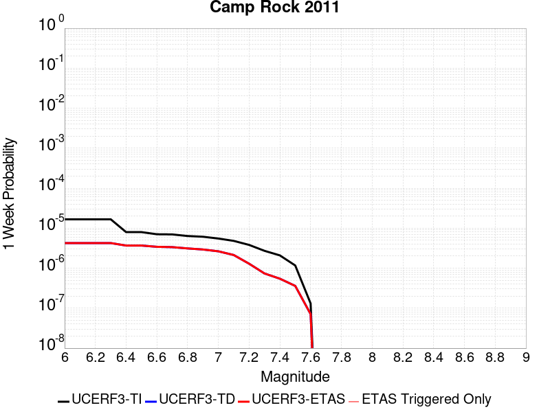 | 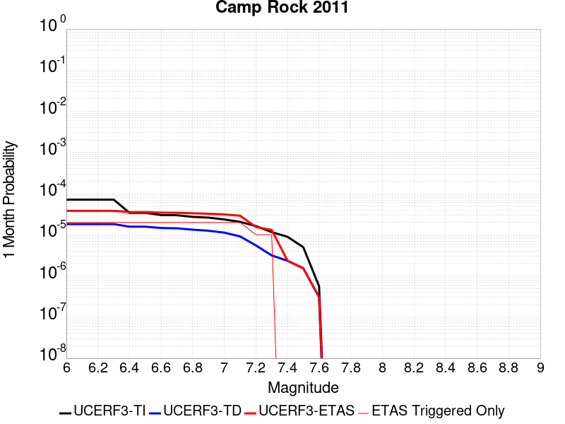 | 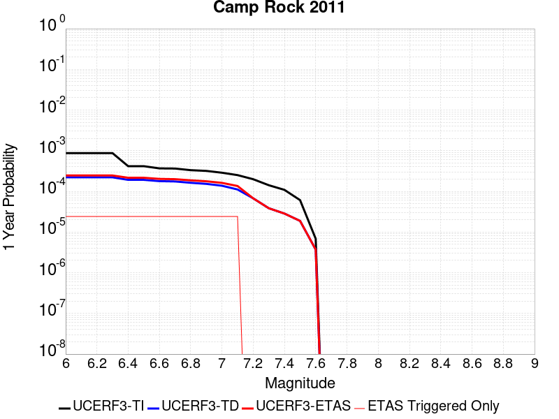 | 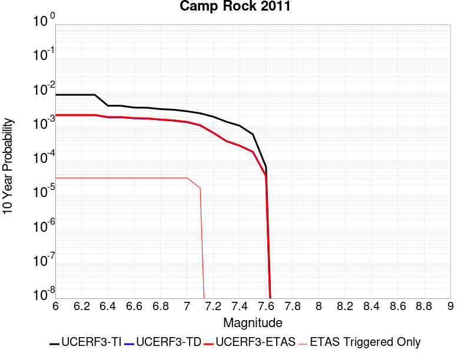 |

| Magnitude | 1 wk TI Prob | 1 wk TD Prob | 1 wk ETAS Prob | 1 wk ETAS/TD Gain | 1 wk ETAS Triggered Only | 1 mo TI Prob | 1 mo TD Prob | 1 mo ETAS Prob | 1 mo ETAS/TD Gain | 1 mo ETAS Triggered Only | 1 yr TI Prob | 1 yr TD Prob | 1 yr ETAS Prob | 1 yr ETAS/TD Gain | 1 yr ETAS Triggered Only | 10 yr TI Prob | 10 yr TD Prob | 10 yr ETAS Prob | 10 yr ETAS/TD Gain | 10 yr ETAS Triggered Only |
|-----|-----|-----|-----|-----|-----|-----|-----|-----|-----|-----|-----|-----|-----|-----|-----|-----|-----|-----|-----|-----|
| 6.0 | 1.6710783E-5 | 4.249999E-6 | 4.249999E-6 | 1.0 | 0.0 | 7.161568E-5 | 1.8214158E-5 | 1.8214158E-5 | 1.0 | 0.0 | 8.7157206E-4 | 2.2173533E-4 | 2.5632736E-4 | 1.1560059 | 3.459968E-5 | 0.008681616 | 0.0022151938 | 0.0022497168 | 1.0155847 | 3.459968E-5 |
| 6.1 | 1.6710783E-5 | 4.249999E-6 | 4.249999E-6 | 1.0 | 0.0 | 7.161568E-5 | 1.8214158E-5 | 1.8214158E-5 | 1.0 | 0.0 | 8.7157206E-4 | 2.2173533E-4 | 2.5632736E-4 | 1.1560059 | 3.459968E-5 | 0.008681616 | 0.0022151938 | 0.0022497168 | 1.0155847 | 3.459968E-5 |
| 6.2 | 1.6710783E-5 | 4.249999E-6 | 4.249999E-6 | 1.0 | 0.0 | 7.161568E-5 | 1.8214158E-5 | 1.8214158E-5 | 1.0 | 0.0 | 8.7157206E-4 | 2.2173533E-4 | 2.5632736E-4 | 1.1560059 | 3.459968E-5 | 0.008681616 | 0.0022151938 | 0.0022497168 | 1.0155847 | 3.459968E-5 |
| 6.3 | 1.6710783E-5 | 4.249999E-6 | 4.249999E-6 | 1.0 | 0.0 | 7.161568E-5 | 1.8214158E-5 | 1.8214158E-5 | 1.0 | 0.0 | 8.7157206E-4 | 2.2173533E-4 | 2.5632736E-4 | 1.1560059 | 3.459968E-5 | 0.008681616 | 0.0022151938 | 0.0022497168 | 1.0155847 | 3.459968E-5 |
| 6.4 | 7.982846E-6 | 3.6820359E-6 | 3.6820359E-6 | 1.0 | 0.0 | 3.421175E-5 | 1.578006E-5 | 1.578006E-5 | 1.0 | 0.0 | 4.1644843E-4 | 1.9210564E-4 | 2.2669867E-4 | 1.180073 | 3.459968E-5 | 0.0041566887 | 0.0019194306 | 0.001953964 | 1.0179914 | 3.459968E-5 |
| 6.5 | 7.982846E-6 | 3.6820359E-6 | 3.6820359E-6 | 1.0 | 0.0 | 3.421175E-5 | 1.578006E-5 | 1.578006E-5 | 1.0 | 0.0 | 4.1644843E-4 | 1.9210564E-4 | 2.2669867E-4 | 1.180073 | 3.459968E-5 | 0.0041566887 | 0.0019194306 | 0.001953964 | 1.0179914 | 3.459968E-5 |
| 6.6 | 7.048869E-6 | 3.4242998E-6 | 3.4242998E-6 | 1.0 | 0.0 | 3.0209088E-5 | 1.467549E-5 | 1.467549E-5 | 1.0 | 0.0 | 3.677336E-4 | 1.7865976E-4 | 2.1325325E-4 | 1.1936278 | 3.459968E-5 | 0.0036712566 | 0.0017851929 | 0.0018197309 | 1.0193468 | 3.459968E-5 |
| 6.7 | 6.987307E-6 | 3.3622775E-6 | 3.3622775E-6 | 1.0 | 0.0 | 2.9945259E-5 | 1.4409683E-5 | 1.4409683E-5 | 1.0 | 0.0 | 3.6452254E-4 | 1.7542407E-4 | 2.1001768E-4 | 1.1972 | 3.459968E-5 | 0.0036392517 | 0.0017528872 | 0.0017874262 | 1.0197041 | 3.459968E-5 |
| 6.8 | 6.3737602E-6 | 3.1178672E-6 | 3.1178672E-6 | 1.0 | 0.0 | 2.731583E-5 | 1.3362222E-5 | 1.3362222E-5 | 1.0 | 0.0 | 3.3251947E-4 | 1.6267318E-4 | 1.9726725E-4 | 1.2126598 | 3.459968E-5 | 0.0033202237 | 0.0016255698 | 0.0016601131 | 1.02125 | 3.459968E-5 |
| 6.9 | 6.112211E-6 | 2.933078E-6 | 2.933078E-6 | 1.0 | 0.0 | 2.6194928E-5 | 1.2570275E-5 | 1.2570275E-5 | 1.0 | 0.0 | 3.1887658E-4 | 1.5303263E-4 | 1.8762703E-4 | 1.2260588 | 3.459968E-5 | 0.003184194 | 0.0015293002 | 0.0015638471 | 1.0225899 | 3.459968E-5 |
| 7.0 | 5.5140117E-6 | 2.64191E-6 | 2.64191E-6 | 1.0 | 0.0 | 2.3631264E-5 | 1.1322423E-5 | 1.1322423E-5 | 1.0 | 0.0 | 2.8767265E-4 | 1.3784204E-4 | 1.7243695E-4 | 1.250975 | 3.459968E-5 | 0.0028730053 | 0.0013775907 | 0.0014121427 | 1.0250815 | 3.459968E-5 |
| 7.1 | 4.8151105E-6 | 2.1342612E-6 | 2.1342612E-6 | 1.0 | 0.0 | 2.0636026E-5 | 9.146803E-6 | 9.146803E-6 | 1.0 | 0.0 | 2.5121463E-4 | 1.1135685E-4 | 1.4595268E-4 | 1.3106754 | 3.459968E-5 | 0.0025093083 | 0.0011130325 | 0.0011475936 | 1.0310514 | 3.459968E-5 |
| 7.2 | 3.818335E-6 | 1.2937372E-6 | 1.2937372E-6 | 1.0 | 0.0 | 1.6364189E-5 | 5.5445767E-6 | 5.5445767E-6 | 1.0 | 0.0 | 1.9921579E-4 | 6.750321E-5 | 6.750321E-5 | 1.0 | 0.0 | 0.0019903728 | 6.7483535E-4 | 6.7483535E-4 | 1.0 | 0.0 |
| 7.3 | 2.7166698E-6 | 7.383078E-7 | 7.383078E-7 | 1.0 | 0.0 | 1.1642818E-5 | 3.1641725E-6 | 3.1641725E-6 | 1.0 | 0.0 | 1.4174209E-4 | 3.852314E-5 | 3.852314E-5 | 1.0 | 0.0 | 0.0014165172 | 3.8516664E-4 | 3.8516664E-4 | 1.0 | 0.0 |
| 7.4 | 2.0893426E-6 | 5.4614605E-7 | 5.4614605E-7 | 1.0 | 0.0 | 8.954295E-6 | 2.340624E-6 | 2.340624E-6 | 1.0 | 0.0 | 1.0901308E-4 | 2.8496728E-5 | 2.8496728E-5 | 1.0 | 0.0 | 0.0010895962 | 2.849313E-4 | 2.849313E-4 | 1.0 | 0.0 |
| 7.5 | 1.1681728E-6 | 3.6028484E-7 | 3.6028484E-7 | 1.0 | 0.0 | 5.0064455E-6 | 1.544077E-6 | 1.544077E-6 | 1.0 | 0.0 | 6.0951766E-5 | 1.879898E-5 | 1.879898E-5 | 1.0 | 0.0 | 6.093505E-4 | 1.8797436E-4 | 1.8797436E-4 | 1.0 | 0.0 |
| 7.6 | 1.3154387E-7 | 7.1196716E-8 | 7.1196716E-8 | 1.0 | 0.0 | 5.6375933E-7 | 3.0512876E-7 | 3.0512876E-7 | 1.0 | 0.0 | 6.863748E-6 | 3.714938E-6 | 3.714938E-6 | 1.0 | 0.0 | 6.863536E-5 | 3.7148915E-5 | 3.7148915E-5 | 1.0 | 0.0 |

## Russ 2011 CFM
*[(top)](#table-of-contents)*

| 1 Week | 1 Month | 1 Year | 10 Year |
|-----|-----|-----|-----|
| 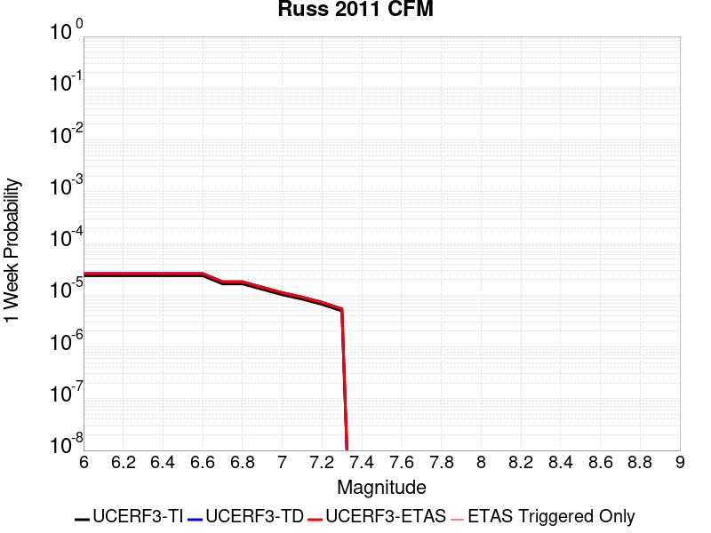 | 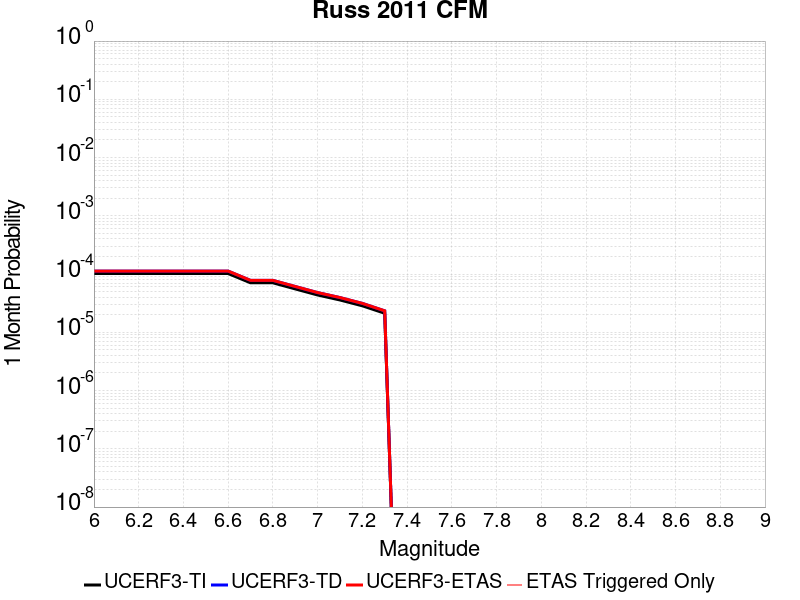 | 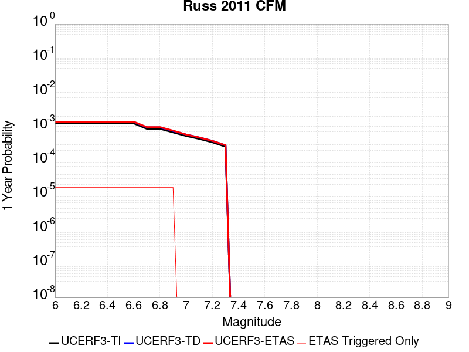 | 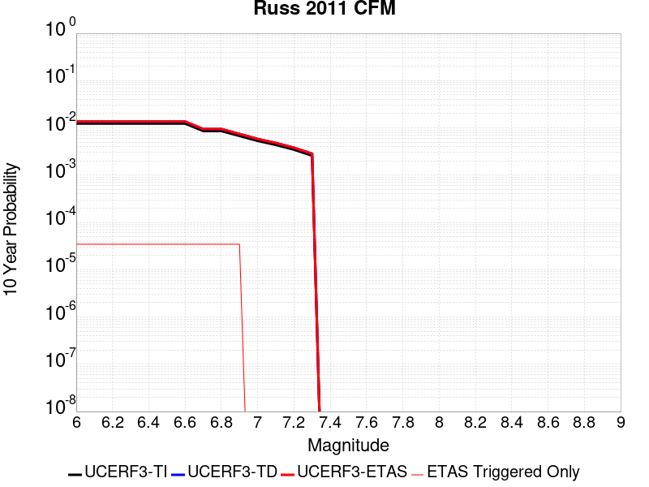 |

| Magnitude | 1 wk TI Prob | 1 wk TD Prob | 1 wk ETAS Prob | 1 wk ETAS/TD Gain | 1 wk ETAS Triggered Only | 1 mo TI Prob | 1 mo TD Prob | 1 mo ETAS Prob | 1 mo ETAS/TD Gain | 1 mo ETAS Triggered Only | 1 yr TI Prob | 1 yr TD Prob | 1 yr ETAS Prob | 1 yr ETAS/TD Gain | 1 yr ETAS Triggered Only | 10 yr TI Prob | 10 yr TD Prob | 10 yr ETAS Prob | 10 yr ETAS/TD Gain | 10 yr ETAS Triggered Only |
|-----|-----|-----|-----|-----|-----|-----|-----|-----|-----|-----|-----|-----|-----|-----|-----|-----|-----|-----|-----|-----|
| 6.0 | 2.3806366E-5 | 2.6254156E-5 | 2.6254156E-5 | 1.0 | 0.0 | 1.0202329E-4 | 1.1251331E-4 | 1.1251331E-4 | 1.0 | 0.0 | 0.0012414258 | 0.0013690525 | 0.0014036048 | 1.0252382 | 3.459968E-5 | 0.012345135 | 0.013612664 | 0.013646793 | 1.0025071 | 3.459968E-5 |
| 6.1 | 2.3806366E-5 | 2.6254156E-5 | 2.6254156E-5 | 1.0 | 0.0 | 1.0202329E-4 | 1.1251331E-4 | 1.1251331E-4 | 1.0 | 0.0 | 0.0012414258 | 0.0013690525 | 0.0014036048 | 1.0252382 | 3.459968E-5 | 0.012345135 | 0.013612664 | 0.013646793 | 1.0025071 | 3.459968E-5 |
| 6.2 | 2.3806366E-5 | 2.6254156E-5 | 2.6254156E-5 | 1.0 | 0.0 | 1.0202329E-4 | 1.1251331E-4 | 1.1251331E-4 | 1.0 | 0.0 | 0.0012414258 | 0.0013690525 | 0.0014036048 | 1.0252382 | 3.459968E-5 | 0.012345135 | 0.013612664 | 0.013646793 | 1.0025071 | 3.459968E-5 |
| 6.3 | 2.3806366E-5 | 2.6254156E-5 | 2.6254156E-5 | 1.0 | 0.0 | 1.0202329E-4 | 1.1251331E-4 | 1.1251331E-4 | 1.0 | 0.0 | 0.0012414258 | 0.0013690525 | 0.0014036048 | 1.0252382 | 3.459968E-5 | 0.012345135 | 0.013612664 | 0.013646793 | 1.0025071 | 3.459968E-5 |
| 6.4 | 2.3806366E-5 | 2.6254156E-5 | 2.6254156E-5 | 1.0 | 0.0 | 1.0202329E-4 | 1.1251331E-4 | 1.1251331E-4 | 1.0 | 0.0 | 0.0012414258 | 0.0013690525 | 0.0014036048 | 1.0252382 | 3.459968E-5 | 0.012345135 | 0.013612664 | 0.013646793 | 1.0025071 | 3.459968E-5 |
| 6.5 | 2.3806366E-5 | 2.6254156E-5 | 2.6254156E-5 | 1.0 | 0.0 | 1.0202329E-4 | 1.1251331E-4 | 1.1251331E-4 | 1.0 | 0.0 | 0.0012414258 | 0.0013690525 | 0.0014036048 | 1.0252382 | 3.459968E-5 | 0.012345135 | 0.013612664 | 0.013646793 | 1.0025071 | 3.459968E-5 |
| 6.6 | 2.3806366E-5 | 2.6254156E-5 | 2.6254156E-5 | 1.0 | 0.0 | 1.0202329E-4 | 1.1251331E-4 | 1.1251331E-4 | 1.0 | 0.0 | 0.0012414258 | 0.0013690525 | 0.0014036048 | 1.0252382 | 3.459968E-5 | 0.012345135 | 0.013612664 | 0.013646793 | 1.0025071 | 3.459968E-5 |
| 6.7 | 1.6515693E-5 | 1.8187944E-5 | 1.8187944E-5 | 1.0 | 0.0 | 7.077962E-5 | 7.79462E-5 | 7.79462E-5 | 1.0 | 0.0 | 8.6140115E-4 | 9.486156E-4 | 9.831825E-4 | 1.0364393 | 3.459968E-5 | 0.008580698 | 0.009449055 | 0.009483329 | 1.0036271 | 3.459968E-5 |
| 6.8 | 1.6515693E-5 | 1.8187944E-5 | 1.8187944E-5 | 1.0 | 0.0 | 7.077962E-5 | 7.79462E-5 | 7.79462E-5 | 1.0 | 0.0 | 8.6140115E-4 | 9.486156E-4 | 9.831825E-4 | 1.0364393 | 3.459968E-5 | 0.008580698 | 0.009449055 | 0.009483329 | 1.0036271 | 3.459968E-5 |
| 6.9 | 1.2971182E-5 | 1.4273831E-5 | 1.4273831E-5 | 1.0 | 0.0 | 5.5589593E-5 | 6.117227E-5 | 6.117227E-5 | 1.0 | 0.0 | 6.765931E-4 | 7.4454385E-4 | 7.7911775E-4 | 1.0464364 | 3.459968E-5 | 0.0067453682 | 0.0074230675 | 0.0074574105 | 1.0046265 | 3.459968E-5 |
| 7.0 | 1.0201805E-5 | 1.1221911E-5 | 1.1221911E-5 | 1.0 | 0.0 | 4.3721288E-5 | 4.8093138E-5 | 4.8093138E-5 | 1.0 | 0.0 | 5.3217664E-4 | 5.853974E-4 | 5.853974E-4 | 1.0 | 0.0 | 0.00530904 | 0.005840605 | 0.005840605 | 1.0 | 0.0 |
| 7.1 | 8.3744935E-6 | 9.2126675E-6 | 9.2126675E-6 | 1.0 | 0.0 | 3.5890193E-5 | 3.9482366E-5 | 3.9482366E-5 | 1.0 | 0.0 | 4.368755E-4 | 4.8061032E-4 | 4.8061032E-4 | 1.0 | 0.0 | 0.004360176 | 0.0047975346 | 0.0047975346 | 1.0 | 0.0 |
| 7.2 | 6.649391E-6 | 7.3170095E-6 | 7.3170095E-6 | 1.0 | 0.0 | 2.8497077E-5 | 3.135833E-5 | 3.135833E-5 | 1.0 | 0.0 | 3.4689668E-4 | 3.8173737E-4 | 3.8173737E-4 | 1.0 | 0.0 | 0.0034635565 | 0.0038124465 | 0.0038124465 | 1.0 | 0.0 |
| 7.3 | 4.9549312E-6 | 5.454593E-6 | 5.454593E-6 | 1.0 | 0.0 | 2.1235246E-5 | 2.33767E-5 | 2.33767E-5 | 1.0 | 0.0 | 2.5850846E-4 | 2.8458887E-4 | 2.8458887E-4 | 1.0 | 0.0 | 0.0025820795 | 0.0028436882 | 0.0028436882 | 1.0 | 0.0 |

## San Diego Trough north alt1
*[(top)](#table-of-contents)*

| 1 Week | 1 Month | 1 Year | 10 Year |
|-----|-----|-----|-----|
| 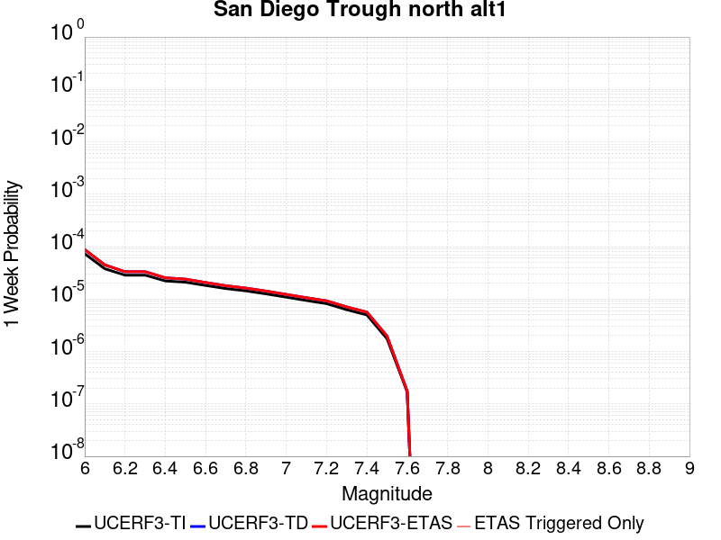 | 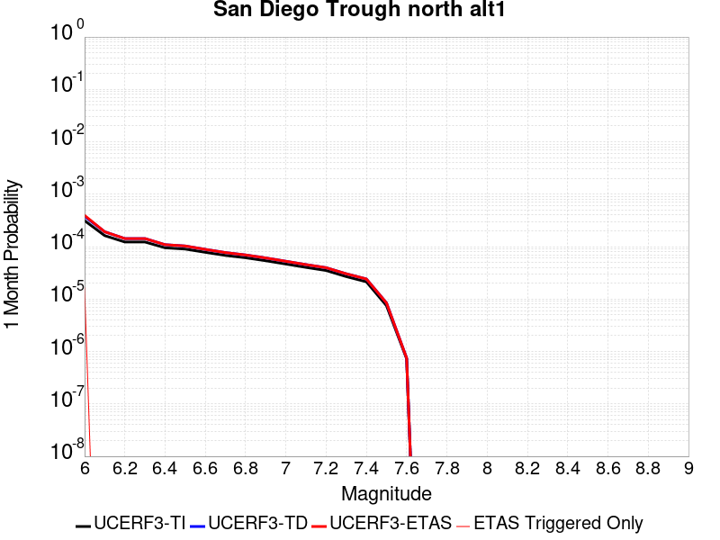 | 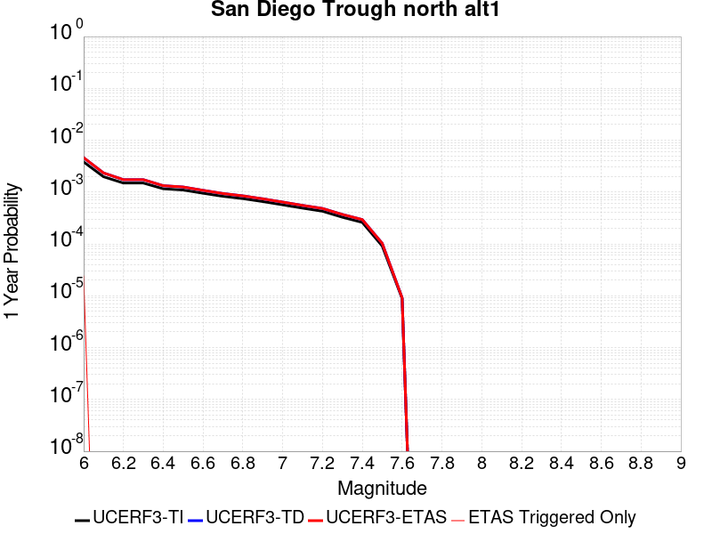 | 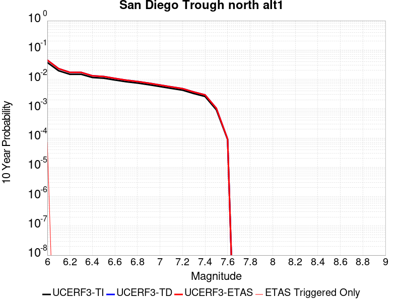 |

| Magnitude | 1 wk TI Prob | 1 wk TD Prob | 1 wk ETAS Prob | 1 wk ETAS/TD Gain | 1 wk ETAS Triggered Only | 1 mo TI Prob | 1 mo TD Prob | 1 mo ETAS Prob | 1 mo ETAS/TD Gain | 1 mo ETAS Triggered Only | 1 yr TI Prob | 1 yr TD Prob | 1 yr ETAS Prob | 1 yr ETAS/TD Gain | 1 yr ETAS Triggered Only | 10 yr TI Prob | 10 yr TD Prob | 10 yr ETAS Prob | 10 yr ETAS/TD Gain | 10 yr ETAS Triggered Only |
|-----|-----|-----|-----|-----|-----|-----|-----|-----|-----|-----|-----|-----|-----|-----|-----|-----|-----|-----|-----|-----|
| 6.0 | 7.329252E-5 | 8.821269E-5 | 8.821269E-5 | 1.0 | 0.0 | 3.14073E-4 | 3.7800326E-4 | 3.7800326E-4 | 1.0 | 0.0 | 0.0038171355 | 0.0045930487 | 0.0045930487 | 1.0 | 0.0 | 0.03752231 | 0.045045137 | 0.045078177 | 1.0007335 | 3.459968E-5 |
| 6.1 | 3.7940346E-5 | 4.4884906E-5 | 4.4884906E-5 | 1.0 | 0.0 | 1.6259136E-4 | 1.9235026E-4 | 1.9235026E-4 | 1.0 | 0.0 | 0.0019777524 | 0.002339431 | 0.002339431 | 1.0 | 0.0 | 0.019602431 | 0.023156732 | 0.023156732 | 1.0 | 0.0 |
| 6.2 | 2.8645263E-5 | 3.329672E-5 | 3.329672E-5 | 1.0 | 0.0 | 1.2275964E-4 | 1.4269259E-4 | 1.4269259E-4 | 1.0 | 0.0 | 0.0014935739 | 0.0017359206 | 0.0017359206 | 1.0 | 0.0 | 0.0148357535 | 0.017226268 | 0.017226268 | 1.0 | 0.0 |
| 6.3 | 2.8645263E-5 | 3.329672E-5 | 3.329672E-5 | 1.0 | 0.0 | 1.2275964E-4 | 1.4269259E-4 | 1.4269259E-4 | 1.0 | 0.0 | 0.0014935739 | 0.0017359206 | 0.0017359206 | 1.0 | 0.0 | 0.0148357535 | 0.017226268 | 0.017226268 | 1.0 | 0.0 |
| 6.4 | 2.2204576E-5 | 2.544832E-5 | 2.544832E-5 | 1.0 | 0.0 | 9.5159E-5 | 1.0905972E-4 | 1.0905972E-4 | 1.0 | 0.0 | 0.001157945 | 0.0013270028 | 0.0013270028 | 1.0 | 0.0 | 0.011519298 | 0.013191959 | 0.013191959 | 1.0 | 0.0 |
| 6.5 | 2.1004838E-5 | 2.4024695E-5 | 2.4024695E-5 | 1.0 | 0.0 | 9.0017624E-5 | 1.0295897E-4 | 1.0295897E-4 | 1.0 | 0.0 | 0.0010954136 | 0.0012528135 | 0.0012528135 | 1.0 | 0.0 | 0.010900296 | 0.012458592 | 0.012458592 | 1.0 | 0.0 |
| 6.6 | 1.820557E-5 | 2.070479E-5 | 2.070479E-5 | 1.0 | 0.0 | 7.802154E-5 | 8.8731824E-5 | 8.8731824E-5 | 1.0 | 0.0 | 9.4949827E-4 | 0.0010797799 | 0.0010797799 | 1.0 | 0.0 | 0.009454516 | 0.010746005 | 0.010746005 | 1.0 | 0.0 |
| 6.7 | 1.5884485E-5 | 1.7983646E-5 | 1.7983646E-5 | 1.0 | 0.0 | 6.807459E-5 | 7.707051E-5 | 7.707051E-5 | 1.0 | 0.0 | 8.284929E-4 | 9.3793223E-4 | 9.3793223E-4 | 1.0 | 0.0 | 0.008254109 | 0.009340104 | 0.009340104 | 1.0 | 0.0 |
| 6.8 | 1.4331171E-5 | 1.6201066E-5 | 1.6201066E-5 | 1.0 | 0.0 | 6.141786E-5 | 6.94313E-5 | 6.94313E-5 | 1.0 | 0.0 | 7.4750587E-4 | 8.450002E-4 | 8.450002E-4 | 1.0 | 0.0 | 0.0074499645 | 0.008418139 | 0.008418139 | 1.0 | 0.0 |
| 6.9 | 1.2574203E-5 | 1.4205835E-5 | 1.4205835E-5 | 1.0 | 0.0 | 5.3888325E-5 | 6.0880735E-5 | 6.0880735E-5 | 1.0 | 0.0 | 6.558929E-4 | 7.409723E-4 | 7.409723E-4 | 1.0 | 0.0 | 0.0065396037 | 0.007385203 | 0.007385203 | 1.0 | 0.0 |
| 7.0 | 1.0883844E-5 | 1.2289262E-5 | 1.2289262E-5 | 1.0 | 0.0 | 4.664421E-5 | 5.2667205E-5 | 5.2667205E-5 | 1.0 | 0.0 | 5.677453E-4 | 6.4103556E-4 | 6.4103556E-4 | 1.0 | 0.0 | 0.00566297 | 0.006391993 | 0.006391993 | 1.0 | 0.0 |
| 7.1 | 9.393088E-6 | 1.060702E-5 | 1.060702E-5 | 1.0 | 0.0 | 4.025547E-5 | 4.545787E-5 | 4.545787E-5 | 1.0 | 0.0 | 4.900001E-4 | 5.533098E-4 | 5.533098E-4 | 1.0 | 0.0 | 0.0048892107 | 0.005519418 | 0.005519418 | 1.0 | 0.0 |
| 7.2 | 8.190791E-6 | 9.258625E-6 | 9.258625E-6 | 1.0 | 0.0 | 3.510292E-5 | 3.9679224E-5 | 3.9679224E-5 | 1.0 | 0.0 | 4.2729423E-4 | 4.8298817E-4 | 4.8298817E-4 | 1.0 | 0.0 | 0.0042647356 | 0.004819465 | 0.004819465 | 1.0 | 0.0 |
| 7.3 | 6.268162E-6 | 7.089716E-6 | 7.089716E-6 | 1.0 | 0.0 | 2.6863276E-5 | 3.0384144E-5 | 3.0384144E-5 | 1.0 | 0.0 | 3.2701128E-4 | 3.6986457E-4 | 3.6986457E-4 | 1.0 | 0.0 | 0.003265305 | 0.003692536 | 0.003692536 | 1.0 | 0.0 |
| 7.4 | 4.985186E-6 | 5.6426816E-6 | 5.6426816E-6 | 1.0 | 0.0 | 2.1364907E-5 | 2.4182698E-5 | 2.4182698E-5 | 1.0 | 0.0 | 2.600867E-4 | 2.9438498E-4 | 2.9438498E-4 | 1.0 | 0.0 | 0.002597825 | 0.0029399914 | 0.0029399914 | 1.0 | 0.0 |
| 7.5 | 1.7489613E-6 | 1.969678E-6 | 1.969678E-6 | 1.0 | 0.0 | 7.495527E-6 | 8.4414505E-6 | 8.4414505E-6 | 1.0 | 0.0 | 9.125422E-5 | 1.02770035E-4 | 1.02770035E-4 | 1.0 | 0.0 | 9.1216754E-4 | 0.0010272472 | 0.0010272472 | 1.0 | 0.0 |
| 7.6 | 1.6988751E-7 | 1.7533823E-7 | 1.7533823E-7 | 1.0 | 0.0 | 7.2808916E-7 | 7.5144936E-7 | 7.5144936E-7 | 1.0 | 0.0 | 8.864449E-6 | 9.14886E-6 | 9.14886E-6 | 1.0 | 0.0 | 8.8640954E-5 | 9.1485024E-5 | 9.1485024E-5 | 1.0 | 0.0 |

## East Huasna 2011 CFM
*[(top)](#table-of-contents)*

| 1 Week | 1 Month | 1 Year | 10 Year |
|-----|-----|-----|-----|
|  | 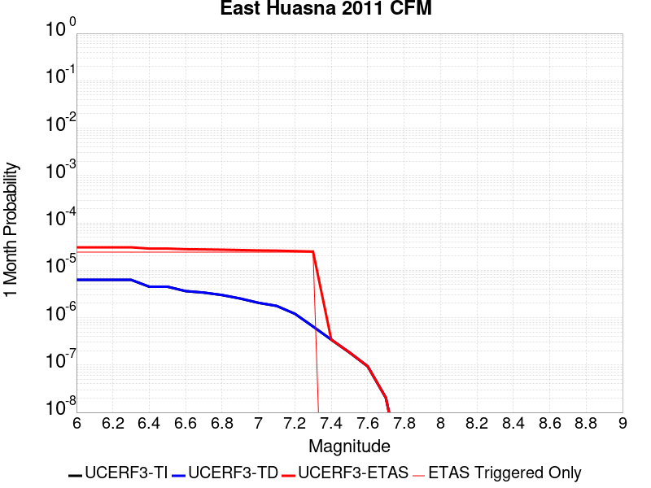 | 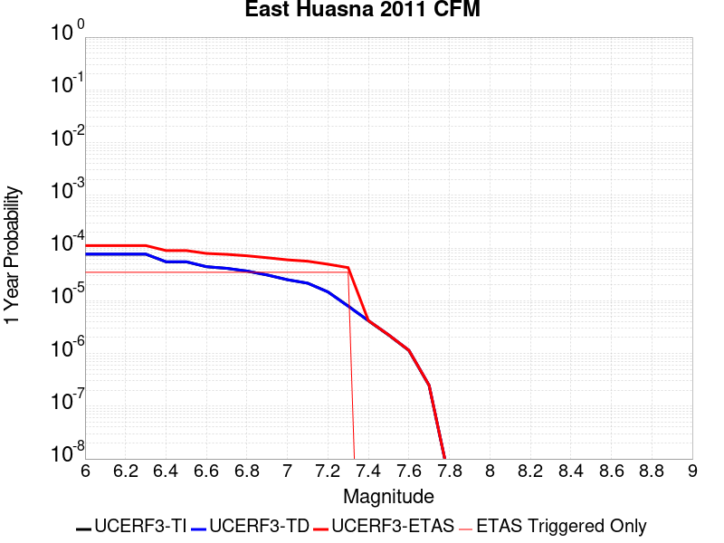 | 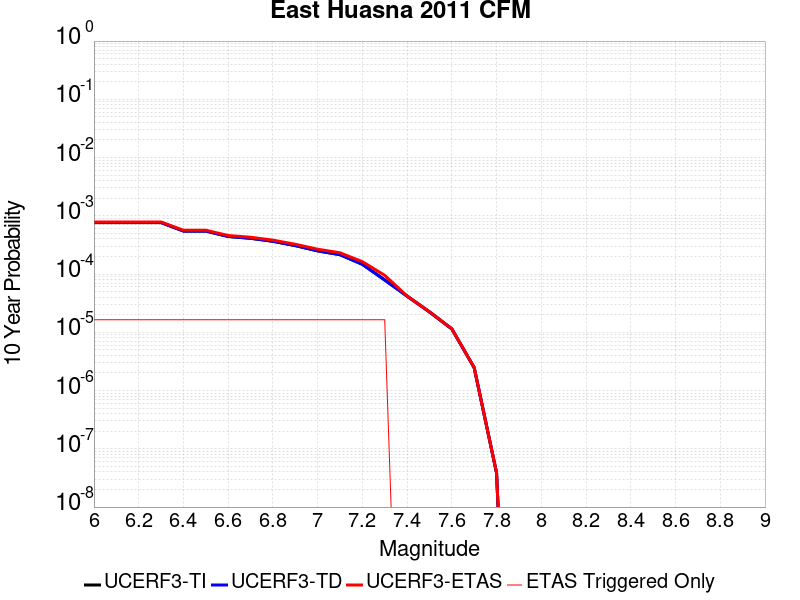 |

| Magnitude | 1 wk TI Prob | 1 wk TD Prob | 1 wk ETAS Prob | 1 wk ETAS/TD Gain | 1 wk ETAS Triggered Only | 1 mo TI Prob | 1 mo TD Prob | 1 mo ETAS Prob | 1 mo ETAS/TD Gain | 1 mo ETAS Triggered Only | 1 yr TI Prob | 1 yr TD Prob | 1 yr ETAS Prob | 1 yr ETAS/TD Gain | 1 yr ETAS Triggered Only | 10 yr TI Prob | 10 yr TD Prob | 10 yr ETAS Prob | 10 yr ETAS/TD Gain | 10 yr ETAS Triggered Only |
|-----|-----|-----|-----|-----|-----|-----|-----|-----|-----|-----|-----|-----|-----|-----|-----|-----|-----|-----|-----|-----|
| 6.0 | 1.4658423E-6 | 1.471566E-6 | 1.471566E-6 | 1.0 | 0.0 | 6.282166E-6 | 6.3066964E-6 | 4.090616E-5 | 6.486147 | 3.459968E-5 | 7.6482684E-5 | 7.67814E-5 | 1.1137842E-4 | 1.4505912 | 3.459968E-5 | 7.645637E-4 | 7.6755567E-4 | 8.021288E-4 | 1.0450431 | 3.459968E-5 |
| 6.1 | 1.4658423E-6 | 1.471566E-6 | 1.471566E-6 | 1.0 | 0.0 | 6.282166E-6 | 6.3066964E-6 | 4.090616E-5 | 6.486147 | 3.459968E-5 | 7.6482684E-5 | 7.67814E-5 | 1.1137842E-4 | 1.4505912 | 3.459968E-5 | 7.645637E-4 | 7.6755567E-4 | 8.021288E-4 | 1.0450431 | 3.459968E-5 |
| 6.2 | 1.4658423E-6 | 1.471566E-6 | 1.471566E-6 | 1.0 | 0.0 | 6.282166E-6 | 6.3066964E-6 | 4.090616E-5 | 6.486147 | 3.459968E-5 | 7.6482684E-5 | 7.67814E-5 | 1.1137842E-4 | 1.4505912 | 3.459968E-5 | 7.645637E-4 | 7.6755567E-4 | 8.021288E-4 | 1.0450431 | 3.459968E-5 |
| 6.3 | 1.4658423E-6 | 1.471566E-6 | 1.471566E-6 | 1.0 | 0.0 | 6.282166E-6 | 6.3066964E-6 | 4.090616E-5 | 6.486147 | 3.459968E-5 | 7.6482684E-5 | 7.67814E-5 | 1.1137842E-4 | 1.4505912 | 3.459968E-5 | 7.645637E-4 | 7.6755567E-4 | 8.021288E-4 | 1.0450431 | 3.459968E-5 |
| 6.4 | 1.0488257E-6 | 1.0527515E-6 | 1.0527515E-6 | 1.0 | 0.0 | 4.4949593E-6 | 4.5117845E-6 | 3.911131E-5 | 8.668701 | 3.459968E-5 | 5.472476E-5 | 5.492961E-5 | 8.952739E-5 | 1.6298567 | 3.459968E-5 | 5.4711284E-4 | 5.491622E-4 | 5.837429E-4 | 1.0629699 | 3.459968E-5 |
| 6.5 | 1.0488257E-6 | 1.0527515E-6 | 1.0527515E-6 | 1.0 | 0.0 | 4.4949593E-6 | 4.5117845E-6 | 3.911131E-5 | 8.668701 | 3.459968E-5 | 5.472476E-5 | 5.492961E-5 | 8.952739E-5 | 1.6298567 | 3.459968E-5 | 5.4711284E-4 | 5.491622E-4 | 5.837429E-4 | 1.0629699 | 3.459968E-5 |
| 6.6 | 8.463064E-7 | 8.4936323E-7 | 8.4936323E-7 | 1.0 | 0.0 | 3.6270226E-6 | 3.6401232E-6 | 3.823968E-5 | 10.505051 | 3.459968E-5 | 4.4158103E-5 | 4.4317607E-5 | 7.891576E-5 | 1.7806863 | 3.459968E-5 | 4.414933E-4 | 4.4308856E-4 | 4.776729E-4 | 1.0780529 | 3.459968E-5 |
| 6.7 | 7.876149E-7 | 7.902533E-7 | 7.902533E-7 | 1.0 | 0.0 | 3.375488E-6 | 3.3867955E-6 | 3.798636E-5 | 11.216018 | 3.459968E-5 | 4.109579E-5 | 4.1233463E-5 | 7.583172E-5 | 1.839082 | 3.459968E-5 | 4.108819E-4 | 4.1225873E-4 | 4.4684415E-4 | 1.0838925 | 3.459968E-5 |
| 6.8 | 6.9940785E-7 | 7.0165777E-7 | 7.0165777E-7 | 1.0 | 0.0 | 2.9974588E-6 | 3.0071012E-6 | 3.760668E-5 | 12.505957 | 3.459968E-5 | 3.649345E-5 | 3.6610847E-5 | 7.120926E-5 | 1.9450318 | 3.459968E-5 | 3.6487455E-4 | 3.6604863E-4 | 4.0063565E-4 | 1.0944875 | 3.459968E-5 |
| 6.9 | 5.899658E-7 | 5.9155997E-7 | 5.9155997E-7 | 1.0 | 0.0 | 2.5284223E-6 | 2.5352545E-6 | 3.7134847E-5 | 14.647386 | 3.459968E-5 | 3.0783107E-5 | 3.086629E-5 | 6.5464905E-5 | 2.1209192 | 3.459968E-5 | 3.0778843E-4 | 3.086203E-4 | 3.432093E-4 | 1.1120763 | 3.459968E-5 |
| 7.0 | 4.793814E-7 | 4.803273E-7 | 4.803273E-7 | 1.0 | 0.0 | 2.05449E-6 | 2.058544E-6 | 3.6658155E-5 | 17.807808 | 3.459968E-5 | 2.501313E-5 | 2.5062485E-5 | 5.96613E-5 | 2.3805022 | 3.459968E-5 | 2.5010316E-4 | 2.505968E-4 | 2.851878E-4 | 1.1380346 | 3.459968E-5 |
| 7.1 | 4.1256908E-7 | 4.129941E-7 | 4.129941E-7 | 1.0 | 0.0 | 1.768152E-6 | 1.7699736E-6 | 3.6369594E-5 | 20.548101 | 3.459968E-5 | 2.1527037E-5 | 2.1549216E-5 | 5.6148154E-5 | 2.6055775 | 3.459968E-5 | 2.1524953E-4 | 2.1547142E-4 | 2.5006363E-4 | 1.160542 | 3.459968E-5 |
| 7.2 | 2.822599E-7 | 2.8161418E-7 | 2.8161418E-7 | 1.0 | 0.0 | 1.2096847E-6 | 1.2069174E-6 | 3.580656E-5 | 29.667778 | 3.459968E-5 | 1.47278115E-5 | 1.4694121E-5 | 4.9293296E-5 | 3.354627 | 3.459968E-5 | 1.4726835E-4 | 1.4693156E-4 | 1.8152616E-4 | 1.235447 | 3.459968E-5 |
| 7.3 | 1.5261652E-7 | 1.5075021E-7 | 1.5075021E-7 | 1.0 | 0.0 | 6.540707E-7 | 6.460722E-7 | 3.5245732E-5 | 54.553864 | 3.459968E-5 | 7.963281E-6 | 7.8659E-6 | 4.246531E-5 | 5.3986583 | 3.459968E-5 | 7.962996E-5 | 7.865624E-5 | 1.132532E-4 | 1.4398502 | 3.459968E-5 |
| 7.4 | 7.976414E-8 | 8.057865E-8 | 8.057865E-8 | 1.0 | 0.0 | 3.418463E-7 | 3.45337E-7 | 3.45337E-7 | 1.0 | 0.0 | 4.1619705E-6 | 4.2044703E-6 | 4.2044703E-6 | 1.0 | 0.0 | 4.161893E-5 | 4.2043914E-5 | 4.2043914E-5 | 1.0 | 0.0 |
| 7.5 | 4.2715055E-8 | 4.3202512E-8 | 4.3202512E-8 | 1.0 | 0.0 | 1.830645E-7 | 1.8515361E-7 | 1.8515361E-7 | 1.0 | 0.0 | 2.228808E-6 | 2.2542429E-6 | 2.2542429E-6 | 1.0 | 0.0 | 2.2287857E-5 | 2.2542203E-5 | 2.2542203E-5 | 1.0 | 0.0 |
| 7.6 | 2.1807532E-8 | 2.2057476E-8 | 2.2057476E-8 | 1.0 | 0.0 | 9.346085E-8 | 9.4532034E-8 | 9.4532034E-8 | 1.0 | 0.0 | 1.1378852E-6 | 1.1509269E-6 | 1.1509269E-6 | 1.0 | 0.0 | 1.1378794E-5 | 1.1509211E-5 | 1.1509211E-5 | 1.0 | 0.0 |
| 7.7 | 4.7196043E-9 | 4.767283E-9 | 4.767283E-9 | 1.0 | 0.0 | 2.0226874E-8 | 2.0431212E-8 | 2.0431212E-8 | 1.0 | 0.0 | 2.4626218E-7 | 2.4874998E-7 | 2.4874998E-7 | 1.0 | 0.0 | 2.462619E-6 | 2.487497E-6 | 2.487497E-6 | 1.0 | 0.0 |
| 7.8 | 7.400003E-11 | 7.4654505E-11 | 7.4654505E-11 | 1.0 | 0.0 | 3.171432E-10 | 3.1994773E-10 | 3.1994773E-10 | 1.0 | 0.0 | 3.861218E-9 | 3.895363E-9 | 3.895363E-9 | 1.0 | 0.0 | 3.861218E-8 | 3.895363E-8 | 3.895363E-8 | 1.0 | 0.0 |

## Carson Range (Genoa)
*[(top)](#table-of-contents)*

| 1 Week | 1 Month | 1 Year | 10 Year |
|-----|-----|-----|-----|
| 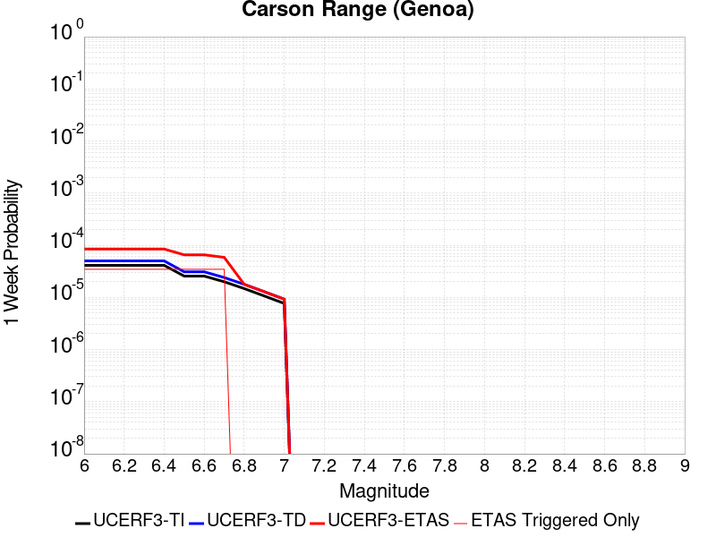 |  | 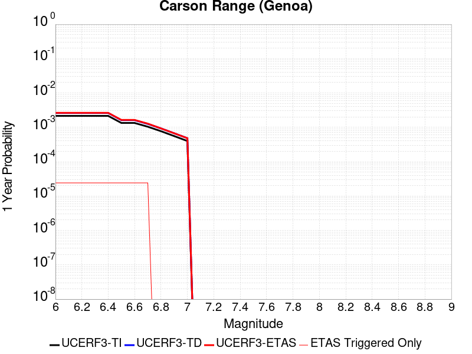 | 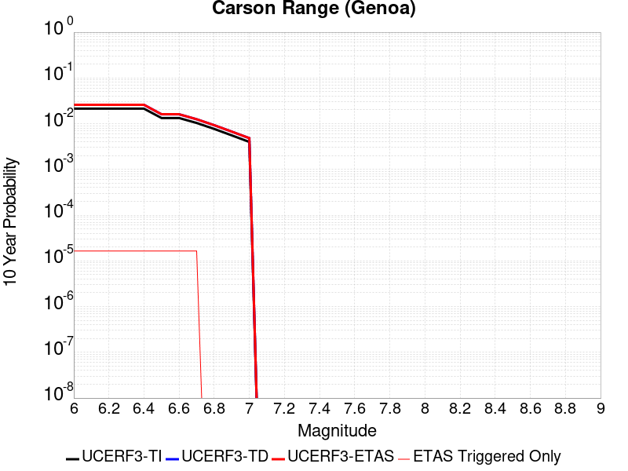 |

| Magnitude | 1 wk TI Prob | 1 wk TD Prob | 1 wk ETAS Prob | 1 wk ETAS/TD Gain | 1 wk ETAS Triggered Only | 1 mo TI Prob | 1 mo TD Prob | 1 mo ETAS Prob | 1 mo ETAS/TD Gain | 1 mo ETAS Triggered Only | 1 yr TI Prob | 1 yr TD Prob | 1 yr ETAS Prob | 1 yr ETAS/TD Gain | 1 yr ETAS Triggered Only | 10 yr TI Prob | 10 yr TD Prob | 10 yr ETAS Prob | 10 yr ETAS/TD Gain | 10 yr ETAS Triggered Only |
|-----|-----|-----|-----|-----|-----|-----|-----|-----|-----|-----|-----|-----|-----|-----|-----|-----|-----|-----|-----|-----|
| 6.0 | 4.1268457E-5 | 5.014691E-5 | 8.474486E-5 | 1.6899318 | 3.459968E-5 | 1.7685282E-4 | 2.1489977E-4 | 2.4949203E-4 | 1.1609693 | 3.459968E-5 | 0.0021510567 | 0.002613659 | 0.0026481682 | 1.0132034 | 3.459968E-5 | 0.02130354 | 0.025868865 | 0.02590257 | 1.001303 | 3.459968E-5 |
| 6.1 | 4.1268457E-5 | 5.014691E-5 | 8.474486E-5 | 1.6899318 | 3.459968E-5 | 1.7685282E-4 | 2.1489977E-4 | 2.4949203E-4 | 1.1609693 | 3.459968E-5 | 0.0021510567 | 0.002613659 | 0.0026481682 | 1.0132034 | 3.459968E-5 | 0.02130354 | 0.025868865 | 0.02590257 | 1.001303 | 3.459968E-5 |
| 6.2 | 4.1268457E-5 | 5.014691E-5 | 8.474486E-5 | 1.6899318 | 3.459968E-5 | 1.7685282E-4 | 2.1489977E-4 | 2.4949203E-4 | 1.1609693 | 3.459968E-5 | 0.0021510567 | 0.002613659 | 0.0026481682 | 1.0132034 | 3.459968E-5 | 0.02130354 | 0.025868865 | 0.02590257 | 1.001303 | 3.459968E-5 |
| 6.3 | 4.1268457E-5 | 5.014691E-5 | 8.474486E-5 | 1.6899318 | 3.459968E-5 | 1.7685282E-4 | 2.1489977E-4 | 2.4949203E-4 | 1.1609693 | 3.459968E-5 | 0.0021510567 | 0.002613659 | 0.0026481682 | 1.0132034 | 3.459968E-5 | 0.02130354 | 0.025868865 | 0.02590257 | 1.001303 | 3.459968E-5 |
| 6.4 | 4.1268457E-5 | 5.014691E-5 | 8.474486E-5 | 1.6899318 | 3.459968E-5 | 1.7685282E-4 | 2.1489977E-4 | 2.4949203E-4 | 1.1609693 | 3.459968E-5 | 0.0021510567 | 0.002613659 | 0.0026481682 | 1.0132034 | 3.459968E-5 | 0.02130354 | 0.025868865 | 0.02590257 | 1.001303 | 3.459968E-5 |
| 6.5 | 2.5677185E-5 | 3.0978295E-5 | 6.55769E-5 | 2.116866 | 3.459968E-5 | 1.1004044E-4 | 1.3275839E-4 | 1.6735349E-4 | 1.2605869 | 3.459968E-5 | 0.0013389189 | 0.0016153152 | 0.001649859 | 1.0213852 | 3.459968E-5 | 0.0133088045 | 0.01605366 | 0.016087703 | 1.0021206 | 3.459968E-5 |
| 6.6 | 2.5677185E-5 | 3.0978295E-5 | 6.55769E-5 | 2.116866 | 3.459968E-5 | 1.1004044E-4 | 1.3275839E-4 | 1.6735349E-4 | 1.2605869 | 3.459968E-5 | 0.0013389189 | 0.0016153152 | 0.001649859 | 1.0213852 | 3.459968E-5 | 0.0133088045 | 0.01605366 | 0.016087703 | 1.0021206 | 3.459968E-5 |
| 6.7 | 1.9969408E-5 | 2.4063473E-5 | 5.866232E-5 | 2.4378161 | 3.459968E-5 | 8.558037E-5 | 1.0312596E-4 | 1.3772208E-4 | 1.3354744 | 3.459968E-5 | 0.0010414429 | 0.0012549888 | 0.0012895452 | 1.0275351 | 3.459968E-5 | 0.010365757 | 0.012494174 | 0.012528341 | 1.0027347 | 3.459968E-5 |
| 6.8 | 1.4783156E-5 | 1.7817569E-5 | 1.7817569E-5 | 1.0 | 0.0 | 6.335485E-5 | 7.635951E-5 | 7.635951E-5 | 1.0 | 0.0 | 7.710722E-4 | 9.294107E-4 | 9.294107E-4 | 1.0 | 0.0 | 0.0076840227 | 0.009268024 | 0.009268024 | 1.0 | 0.0 |
| 6.9 | 1.06660555E-5 | 1.2877027E-5 | 1.2877027E-5 | 1.0 | 0.0 | 4.5710865E-5 | 5.518674E-5 | 5.518674E-5 | 1.0 | 0.0 | 5.5638765E-4 | 6.718067E-4 | 6.718067E-4 | 1.0 | 0.0 | 0.005549967 | 0.0067090564 | 0.0067090564 | 1.0 | 0.0 |
| 7.0 | 7.664838E-6 | 9.258307E-6 | 9.258307E-6 | 1.0 | 0.0 | 3.2848893E-5 | 3.9678456E-5 | 3.9678456E-5 | 1.0 | 0.0 | 3.998619E-4 | 4.830852E-4 | 4.830852E-4 | 1.0 | 0.0 | 0.0039914316 | 0.00483085 | 0.00483085 | 1.0 | 0.0 |

## Hosgri
*[(top)](#table-of-contents)*

| 1 Week | 1 Month | 1 Year | 10 Year |
|-----|-----|-----|-----|
| 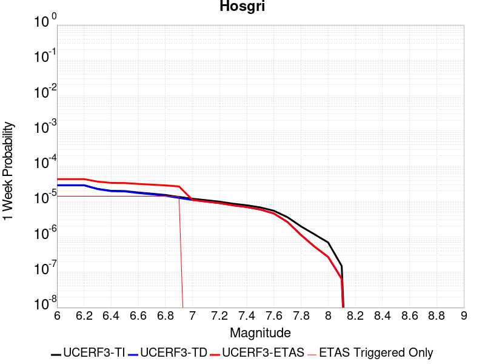 | 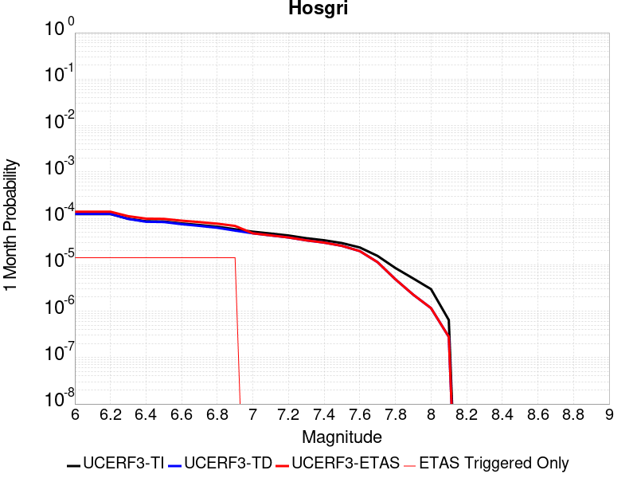 | 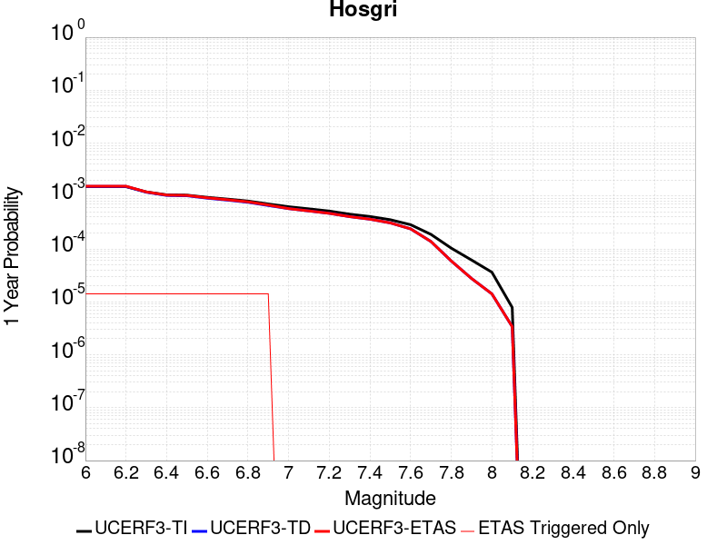 | 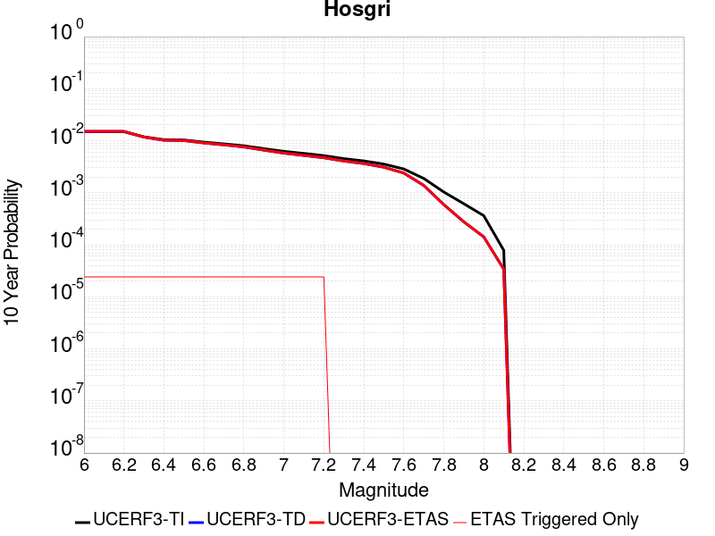 |

| Magnitude | 1 wk TI Prob | 1 wk TD Prob | 1 wk ETAS Prob | 1 wk ETAS/TD Gain | 1 wk ETAS Triggered Only | 1 mo TI Prob | 1 mo TD Prob | 1 mo ETAS Prob | 1 mo ETAS/TD Gain | 1 mo ETAS Triggered Only | 1 yr TI Prob | 1 yr TD Prob | 1 yr ETAS Prob | 1 yr ETAS/TD Gain | 1 yr ETAS Triggered Only | 10 yr TI Prob | 10 yr TD Prob | 10 yr ETAS Prob | 10 yr ETAS/TD Gain | 10 yr ETAS Triggered Only |
|-----|-----|-----|-----|-----|-----|-----|-----|-----|-----|-----|-----|-----|-----|-----|-----|-----|-----|-----|-----|-----|
| 6.0 | 2.883978E-5 | 2.9128403E-5 | 2.9128403E-5 | 1.0 | 0.0 | 1.235932E-4 | 1.248302E-4 | 1.248302E-4 | 1.0 | 0.0 | 0.0015037085 | 0.0015187752 | 0.0015187752 | 1.0 | 0.0 | 0.01493574 | 0.01508773 | 0.015121807 | 1.0022587 | 3.459968E-5 |
| 6.1 | 2.883978E-5 | 2.9128403E-5 | 2.9128403E-5 | 1.0 | 0.0 | 1.235932E-4 | 1.248302E-4 | 1.248302E-4 | 1.0 | 0.0 | 0.0015037085 | 0.0015187752 | 0.0015187752 | 1.0 | 0.0 | 0.01493574 | 0.01508773 | 0.015121807 | 1.0022587 | 3.459968E-5 |
| 6.2 | 2.883978E-5 | 2.9128403E-5 | 2.9128403E-5 | 1.0 | 0.0 | 1.235932E-4 | 1.248302E-4 | 1.248302E-4 | 1.0 | 0.0 | 0.0015037085 | 0.0015187752 | 0.0015187752 | 1.0 | 0.0 | 0.01493574 | 0.01508773 | 0.015121807 | 1.0022587 | 3.459968E-5 |
| 6.3 | 2.2914428E-5 | 2.2641956E-5 | 2.2641956E-5 | 1.0 | 0.0 | 9.8200995E-5 | 9.703337E-5 | 9.703337E-5 | 1.0 | 0.0 | 0.0011949413 | 0.001180746 | 0.001180746 | 1.0 | 0.0 | 0.011885363 | 0.011746123 | 0.011780316 | 1.002911 | 3.459968E-5 |
| 6.4 | 2.0195741E-5 | 1.9696547E-5 | 1.9696547E-5 | 1.0 | 0.0 | 8.65503E-5 | 8.4411055E-5 | 8.4411055E-5 | 1.0 | 0.0 | 0.0010532405 | 0.001027222 | 0.001027222 | 1.0 | 0.0 | 0.010482626 | 0.010225783 | 0.010260029 | 1.003349 | 3.459968E-5 |
| 6.5 | 1.9924333E-5 | 1.9408968E-5 | 1.9408968E-5 | 1.0 | 0.0 | 8.53872E-5 | 8.317865E-5 | 8.317865E-5 | 1.0 | 0.0 | 0.0010390934 | 0.0010122315 | 0.0010122315 | 1.0 | 0.0 | 0.010342481 | 0.010077244 | 0.010111494 | 1.0033989 | 3.459968E-5 |
| 6.6 | 1.809694E-5 | 1.7458287E-5 | 1.7458287E-5 | 1.0 | 0.0 | 7.7556004E-5 | 7.4819094E-5 | 7.4819094E-5 | 1.0 | 0.0 | 9.438353E-4 | 9.105431E-4 | 9.105431E-4 | 1.0 | 0.0 | 0.009398366 | 0.009069063 | 0.009103349 | 1.0037805 | 3.459968E-5 |
| 6.7 | 1.675989E-5 | 1.6042752E-5 | 1.6042752E-5 | 1.0 | 0.0 | 7.182612E-5 | 6.8752845E-5 | 6.8752845E-5 | 1.0 | 0.0 | 8.7413215E-4 | 8.3674554E-4 | 8.3674554E-4 | 1.0 | 0.0 | 0.008707017 | 0.008336853 | 0.008371164 | 1.0041156 | 3.459968E-5 |
| 6.8 | 1.5401129E-5 | 1.4614069E-5 | 1.4614069E-5 | 1.0 | 0.0 | 6.6003166E-5 | 6.263023E-5 | 6.263023E-5 | 1.0 | 0.0 | 8.032922E-4 | 7.6225714E-4 | 7.6225714E-4 | 1.0 | 0.0 | 0.008003947 | 0.0075972863 | 0.007631623 | 1.0045196 | 3.459968E-5 |
| 6.9 | 1.356559E-5 | 1.2689955E-5 | 1.2689955E-5 | 1.0 | 0.0 | 5.8136946E-5 | 5.438439E-5 | 5.438439E-5 | 1.0 | 0.0 | 7.0758746E-4 | 6.6192925E-4 | 6.6192925E-4 | 1.0 | 0.0 | 0.007053386 | 0.006600378 | 0.0066347495 | 1.0052074 | 3.459968E-5 |
| 7.0 | 1.2030819E-5 | 1.1095949E-5 | 1.1095949E-5 | 1.0 | 0.0 | 5.155963E-5 | 4.75532E-5 | 4.75532E-5 | 1.0 | 0.0 | 6.275577E-4 | 5.788065E-4 | 5.788065E-4 | 1.0 | 0.0 | 0.006257884 | 0.0057737473 | 0.005808147 | 1.005958 | 3.459968E-5 |
| 7.1 | 1.0972698E-5 | 1.0022167E-5 | 1.0022167E-5 | 1.0 | 0.0 | 4.7025E-5 | 4.2951437E-5 | 4.2951437E-5 | 1.0 | 0.0 | 5.72379E-4 | 5.2280835E-4 | 5.2280835E-4 | 1.0 | 0.0 | 0.0057090693 | 0.005216533 | 0.005250952 | 1.0065981 | 3.459968E-5 |
| 7.2 | 9.961926E-6 | 9.034732E-6 | 9.034732E-6 | 1.0 | 0.0 | 4.2693267E-5 | 3.8719707E-5 | 3.8719707E-5 | 1.0 | 0.0 | 5.1966653E-4 | 4.7131052E-4 | 4.7131052E-4 | 1.0 | 0.0 | 0.00518453 | 0.0047038523 | 0.0047382894 | 1.007321 | 3.459968E-5 |
| 7.3 | 8.700929E-6 | 7.828089E-6 | 7.828089E-6 | 1.0 | 0.0 | 3.7289166E-5 | 3.354852E-5 | 3.354852E-5 | 1.0 | 0.0 | 4.53901E-4 | 4.083767E-4 | 4.083767E-4 | 1.0 | 0.0 | 0.00452975 | 0.004076999 | 0.004076999 | 1.0 | 0.0 |
| 7.4 | 7.866285E-6 | 6.9987263E-6 | 6.9987263E-6 | 1.0 | 0.0 | 3.3712215E-5 | 2.9994197E-5 | 2.9994197E-5 | 1.0 | 0.0 | 4.103689E-4 | 3.6511818E-4 | 3.6511818E-4 | 1.0 | 0.0 | 0.004096119 | 0.0036459167 | 0.0036459167 | 1.0 | 0.0 |
| 7.5 | 6.8381305E-6 | 5.9596814E-6 | 5.9596814E-6 | 1.0 | 0.0 | 2.9305946E-5 | 2.5541241E-5 | 2.5541241E-5 | 1.0 | 0.0 | 3.5674145E-4 | 3.1092027E-4 | 3.1092027E-4 | 1.0 | 0.0 | 0.0035616932 | 0.003105584 | 0.003105584 | 1.0 | 0.0 |
| 7.6 | 5.503376E-6 | 4.595227E-6 | 4.595227E-6 | 1.0 | 0.0 | 2.3585684E-5 | 1.9693682E-5 | 1.9693682E-5 | 1.0 | 0.0 | 2.8711787E-4 | 2.397442E-4 | 2.397442E-4 | 1.0 | 0.0 | 0.002867472 | 0.0023955852 | 0.0023955852 | 1.0 | 0.0 |
| 7.7 | 3.6144982E-6 | 2.6521896E-6 | 2.6521896E-6 | 1.0 | 0.0 | 1.5490614E-5 | 1.1366477E-5 | 1.1366477E-5 | 1.0 | 0.0 | 1.8858191E-4 | 1.3837808E-4 | 1.3837808E-4 | 1.0 | 0.0 | 0.0018842196 | 0.001383647 | 0.001383647 | 1.0 | 0.0 |
| 7.8 | 1.9853494E-6 | 1.1360784E-6 | 1.1360784E-6 | 1.0 | 0.0 | 8.508612E-6 | 4.8688985E-6 | 4.8688985E-6 | 1.0 | 0.0 | 1.0358743E-4 | 5.9277223E-5 | 5.9277223E-5 | 1.0 | 0.0 | 0.0010353916 | 5.933389E-4 | 5.933389E-4 | 1.0 | 0.0 |
| 7.9 | 1.1818757E-6 | 5.29477E-7 | 5.29477E-7 | 1.0 | 0.0 | 5.0651715E-6 | 2.269185E-6 | 2.269185E-6 | 1.0 | 0.0 | 6.1666724E-5 | 2.7626977E-5 | 2.7626977E-5 | 1.0 | 0.0 | 6.1649614E-4 | 2.7691363E-4 | 2.7691363E-4 | 1.0 | 0.0 |
| 8.0 | 6.962958E-7 | 2.71365E-7 | 2.71365E-7 | 1.0 | 0.0 | 2.9841215E-6 | 1.1629924E-6 | 1.1629924E-6 | 1.0 | 0.0 | 3.6331072E-5 | 1.415934E-5 | 1.415934E-5 | 1.0 | 0.0 | 3.6325134E-4 | 1.4215276E-4 | 1.4215276E-4 | 1.0 | 0.0 |
| 8.1 | 1.5033264E-7 | 6.52693E-8 | 6.52693E-8 | 1.0 | 0.0 | 6.442826E-7 | 2.7972553E-7 | 2.7972553E-7 | 1.0 | 0.0 | 7.844113E-6 | 3.4056532E-6 | 3.4056532E-6 | 1.0 | 0.0 | 7.843835E-5 | 3.4072833E-5 | 3.4072833E-5 | 1.0 | 0.0 |

## Sierra Madre (San Fernando)
*[(top)](#table-of-contents)*

| 1 Week | 1 Month | 1 Year | 10 Year |
|-----|-----|-----|-----|
|  |  | 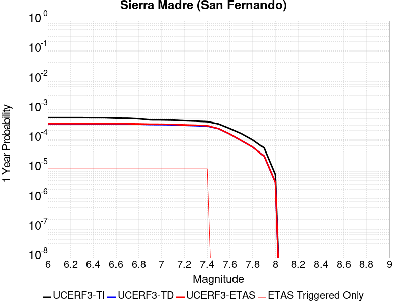 | 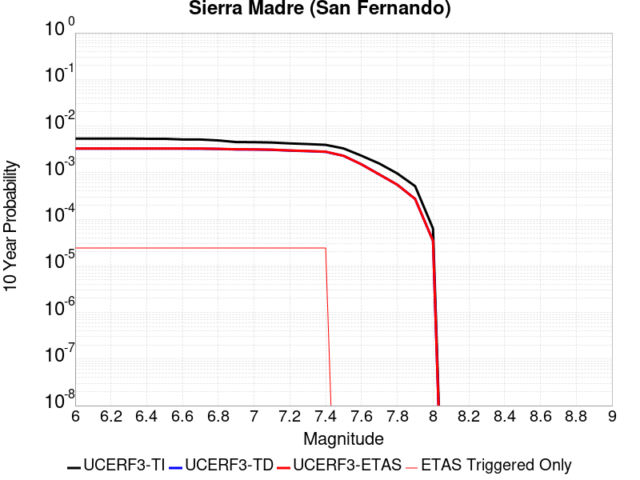 |

| Magnitude | 1 wk TI Prob | 1 wk TD Prob | 1 wk ETAS Prob | 1 wk ETAS/TD Gain | 1 wk ETAS Triggered Only | 1 mo TI Prob | 1 mo TD Prob | 1 mo ETAS Prob | 1 mo ETAS/TD Gain | 1 mo ETAS Triggered Only | 1 yr TI Prob | 1 yr TD Prob | 1 yr ETAS Prob | 1 yr ETAS/TD Gain | 1 yr ETAS Triggered Only | 10 yr TI Prob | 10 yr TD Prob | 10 yr ETAS Prob | 10 yr ETAS/TD Gain | 10 yr ETAS Triggered Only |
|-----|-----|-----|-----|-----|-----|-----|-----|-----|-----|-----|-----|-----|-----|-----|-----|-----|-----|-----|-----|-----|
| 6.0 | 1.0346413E-5 | 6.2872386E-6 | 6.2872386E-6 | 1.0 | 0.0 | 4.4341014E-5 | 2.6945036E-5 | 2.6945036E-5 | 1.0 | 0.0 | 5.3971814E-4 | 3.2800753E-4 | 3.6259586E-4 | 1.1054498 | 3.459968E-5 | 0.0053840918 | 0.0032753467 | 0.0033098331 | 1.010529 | 3.459968E-5 |
| 6.1 | 1.0346413E-5 | 6.2872386E-6 | 6.2872386E-6 | 1.0 | 0.0 | 4.4341014E-5 | 2.6945036E-5 | 2.6945036E-5 | 1.0 | 0.0 | 5.3971814E-4 | 3.2800753E-4 | 3.6259586E-4 | 1.1054498 | 3.459968E-5 | 0.0053840918 | 0.0032753467 | 0.0033098331 | 1.010529 | 3.459968E-5 |
| 6.2 | 1.0346413E-5 | 6.2872386E-6 | 6.2872386E-6 | 1.0 | 0.0 | 4.4341014E-5 | 2.6945036E-5 | 2.6945036E-5 | 1.0 | 0.0 | 5.3971814E-4 | 3.2800753E-4 | 3.6259586E-4 | 1.1054498 | 3.459968E-5 | 0.0053840918 | 0.0032753467 | 0.0033098331 | 1.010529 | 3.459968E-5 |
| 6.3 | 1.0346413E-5 | 6.2872386E-6 | 6.2872386E-6 | 1.0 | 0.0 | 4.4341014E-5 | 2.6945036E-5 | 2.6945036E-5 | 1.0 | 0.0 | 5.3971814E-4 | 3.2800753E-4 | 3.6259586E-4 | 1.1054498 | 3.459968E-5 | 0.0053840918 | 0.0032753467 | 0.0033098331 | 1.010529 | 3.459968E-5 |
| 6.4 | 1.0249558E-5 | 6.2872386E-6 | 6.2872386E-6 | 1.0 | 0.0 | 4.392594E-5 | 2.6945036E-5 | 2.6945036E-5 | 1.0 | 0.0 | 5.3466705E-4 | 3.2800753E-4 | 3.6259586E-4 | 1.1054498 | 3.459968E-5 | 0.0053338245 | 0.0032753467 | 0.0033098331 | 1.010529 | 3.459968E-5 |
| 6.5 | 1.0249558E-5 | 6.2872386E-6 | 6.2872386E-6 | 1.0 | 0.0 | 4.392594E-5 | 2.6945036E-5 | 2.6945036E-5 | 1.0 | 0.0 | 5.3466705E-4 | 3.2800753E-4 | 3.6259586E-4 | 1.1054498 | 3.459968E-5 | 0.0053338245 | 0.0032753467 | 0.0033098331 | 1.010529 | 3.459968E-5 |
| 6.6 | 9.9035515E-6 | 6.2872386E-6 | 6.2872386E-6 | 1.0 | 0.0 | 4.2443102E-5 | 2.6945036E-5 | 2.6945036E-5 | 1.0 | 0.0 | 5.166222E-4 | 3.2800753E-4 | 3.6259586E-4 | 1.1054498 | 3.459968E-5 | 0.0051542283 | 0.0032753467 | 0.0033098331 | 1.010529 | 3.459968E-5 |
| 6.7 | 9.87217E-6 | 6.274661E-6 | 6.274661E-6 | 1.0 | 0.0 | 4.2308613E-5 | 2.6891132E-5 | 2.6891132E-5 | 1.0 | 0.0 | 5.149856E-4 | 3.2735144E-4 | 3.619398E-4 | 1.1056613 | 3.459968E-5 | 0.005137938 | 0.003268805 | 0.0033032917 | 1.0105503 | 3.459968E-5 |
| 6.8 | 9.4359175E-6 | 6.1786473E-6 | 6.1786473E-6 | 1.0 | 0.0 | 4.043902E-5 | 2.6479653E-5 | 2.6479653E-5 | 1.0 | 0.0 | 4.9223384E-4 | 3.223432E-4 | 3.569317E-4 | 1.1073034 | 3.459968E-5 | 0.0049114493 | 0.0032188678 | 0.0032533563 | 1.0107144 | 3.459968E-5 |
| 6.9 | 8.700447E-6 | 6.0399334E-6 | 6.0399334E-6 | 1.0 | 0.0 | 3.72871E-5 | 2.5885178E-5 | 2.5885178E-5 | 1.0 | 0.0 | 4.5387587E-4 | 3.1510755E-4 | 3.4969632E-4 | 1.1097682 | 3.459968E-5 | 0.0045295 | 0.0031467169 | 0.0031812077 | 1.0109609 | 3.459968E-5 |
| 7.0 | 8.648878E-6 | 6.014848E-6 | 6.014848E-6 | 1.0 | 0.0 | 3.7066096E-5 | 2.5777672E-5 | 2.5777672E-5 | 1.0 | 0.0 | 4.5118626E-4 | 3.1379904E-4 | 3.4838787E-4 | 1.110226 | 3.459968E-5 | 0.004502713 | 0.0031336688 | 0.00316816 | 1.0110067 | 3.459968E-5 |
| 7.1 | 8.505786E-6 | 5.9244794E-6 | 5.9244794E-6 | 1.0 | 0.0 | 3.645286E-5 | 2.5390384E-5 | 2.5390384E-5 | 1.0 | 0.0 | 4.437232E-4 | 3.0908515E-4 | 3.4367415E-4 | 1.1119076 | 3.459968E-5 | 0.0044283825 | 0.0030866617 | 0.0031211546 | 1.0111748 | 3.459968E-5 |
| 7.2 | 8.139752E-6 | 5.698777E-6 | 5.698777E-6 | 1.0 | 0.0 | 3.4884186E-5 | 2.4423107E-5 | 2.4423107E-5 | 1.0 | 0.0 | 4.246322E-4 | 2.973118E-4 | 3.3190122E-4 | 1.1163405 | 3.459968E-5 | 0.004238217 | 0.0029692466 | 0.0030037435 | 1.0116181 | 3.459968E-5 |
| 7.3 | 7.8816E-6 | 5.5520936E-6 | 5.5520936E-6 | 1.0 | 0.0 | 3.3777847E-5 | 2.3794475E-5 | 2.3794475E-5 | 1.0 | 0.0 | 4.111677E-4 | 2.8966027E-4 | 3.2424994E-4 | 1.1194146 | 3.459968E-5 | 0.004104078 | 0.0028929329 | 0.0029274323 | 1.0119255 | 3.459968E-5 |
| 7.4 | 7.5810603E-6 | 5.356333E-6 | 5.356333E-6 | 1.0 | 0.0 | 3.2489854E-5 | 2.2955517E-5 | 2.2955517E-5 | 1.0 | 0.0 | 3.9549218E-4 | 2.7944864E-4 | 3.1403865E-4 | 1.1237795 | 3.459968E-5 | 0.0039478904 | 0.0027910774 | 0.0028255805 | 1.0123619 | 3.459968E-5 |
| 7.5 | 6.349153E-6 | 4.4075887E-6 | 4.4075887E-6 | 1.0 | 0.0 | 2.7210372E-5 | 1.8889532E-5 | 1.8889532E-5 | 1.0 | 0.0 | 3.312359E-4 | 2.2995661E-4 | 2.2995661E-4 | 1.0 | 0.0 | 0.0033074263 | 0.0022972687 | 0.0022972687 | 1.0 | 0.0 |
| 7.6 | 4.430576E-6 | 2.8905786E-6 | 2.8905786E-6 | 1.0 | 0.0 | 1.8988047E-5 | 1.23881355E-5 | 1.23881355E-5 | 1.0 | 0.0 | 2.3115493E-4 | 1.5081534E-4 | 1.5081534E-4 | 1.0 | 0.0 | 0.0023091463 | 0.0015071525 | 0.0015071525 | 1.0 | 0.0 |
| 7.7 | 3.005066E-6 | 1.7509823E-6 | 1.7509823E-6 | 1.0 | 0.0 | 1.2878791E-5 | 7.504188E-6 | 7.504188E-6 | 1.0 | 0.0 | 1.56788E-4 | 9.135967E-5 | 9.135967E-5 | 1.0 | 0.0 | 0.0015667742 | 9.1322226E-4 | 9.1322226E-4 | 1.0 | 0.0 |
| 7.8 | 1.8459098E-6 | 1.0581826E-6 | 1.0581826E-6 | 1.0 | 0.0 | 7.911018E-6 | 4.5350607E-6 | 4.5350607E-6 | 1.0 | 0.0 | 9.631238E-5 | 5.5212968E-5 | 5.5212968E-5 | 1.0 | 0.0 | 9.627065E-4 | 5.5199297E-4 | 5.5199297E-4 | 1.0 | 0.0 |
| 7.9 | 9.839262E-7 | 5.2340516E-7 | 5.2340516E-7 | 1.0 | 0.0 | 4.2168194E-6 | 2.243163E-6 | 2.243163E-6 | 1.0 | 0.0 | 5.1338568E-5 | 2.731017E-5 | 2.731017E-5 | 1.0 | 0.0 | 5.132671E-4 | 2.7306844E-4 | 2.7306844E-4 | 1.0 | 0.0 |
| 8.0 | 1.210983E-7 | 6.613497E-8 | 6.613497E-8 | 1.0 | 0.0 | 5.1899264E-7 | 2.8343558E-7 | 2.8343558E-7 | 1.0 | 0.0 | 6.3187167E-6 | 3.4508228E-6 | 3.4508228E-6 | 1.0 | 0.0 | 6.318537E-5 | 3.450771E-5 | 3.450771E-5 | 1.0 | 0.0 |

## Sisar
*[(top)](#table-of-contents)*

| 1 Week | 1 Month | 1 Year | 10 Year |
|-----|-----|-----|-----|
| 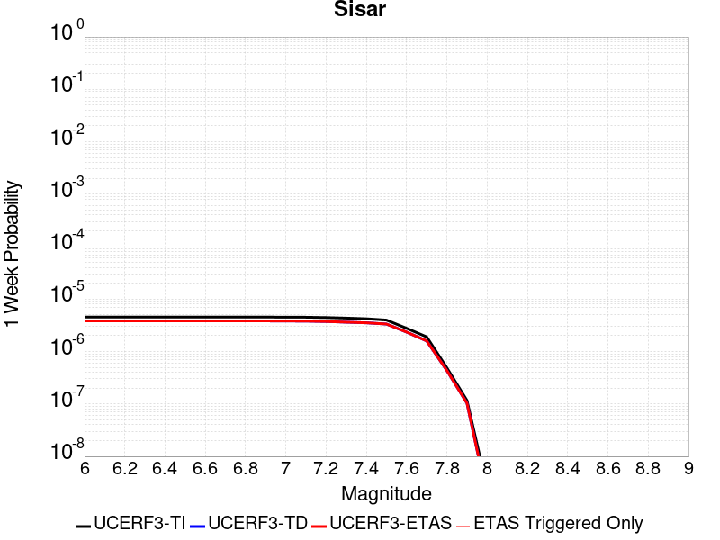 | 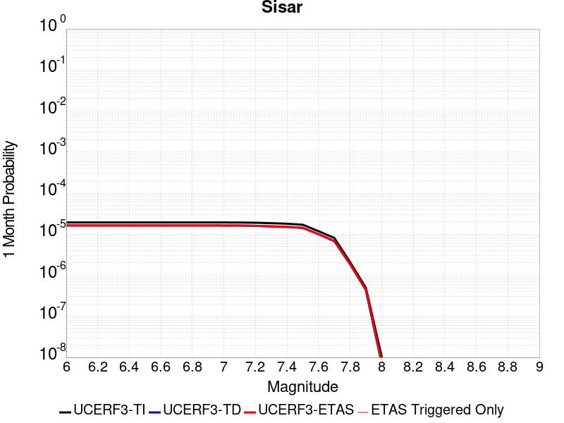 | 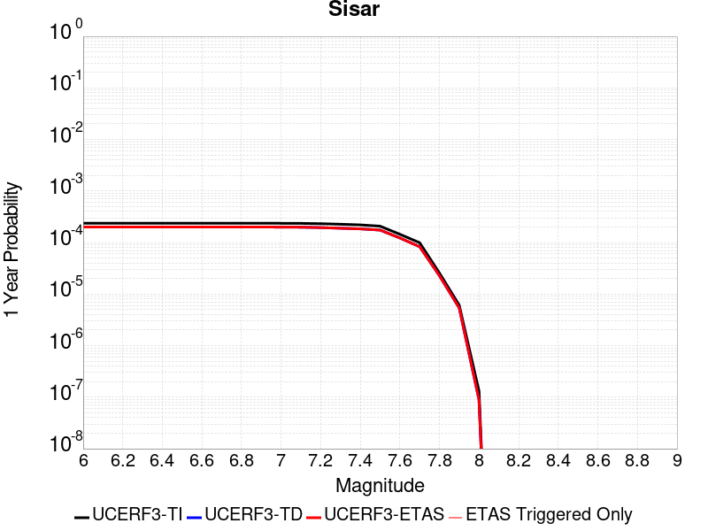 | 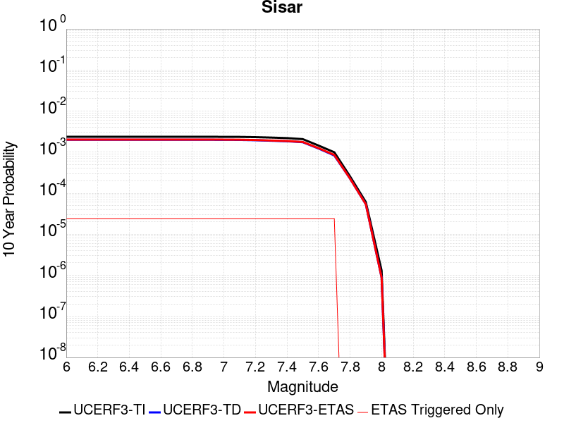 |

| Magnitude | 1 wk TI Prob | 1 wk TD Prob | 1 wk ETAS Prob | 1 wk ETAS/TD Gain | 1 wk ETAS Triggered Only | 1 mo TI Prob | 1 mo TD Prob | 1 mo ETAS Prob | 1 mo ETAS/TD Gain | 1 mo ETAS Triggered Only | 1 yr TI Prob | 1 yr TD Prob | 1 yr ETAS Prob | 1 yr ETAS/TD Gain | 1 yr ETAS Triggered Only | 10 yr TI Prob | 10 yr TD Prob | 10 yr ETAS Prob | 10 yr ETAS/TD Gain | 10 yr ETAS Triggered Only |
|-----|-----|-----|-----|-----|-----|-----|-----|-----|-----|-----|-----|-----|-----|-----|-----|-----|-----|-----|-----|-----|
| 6.0 | 4.544193E-6 | 3.8396115E-6 | 3.8396115E-6 | 1.0 | 0.0 | 1.9474966E-5 | 1.6455377E-5 | 1.6455377E-5 | 1.0 | 0.0 | 2.3708193E-4 | 2.0032612E-4 | 2.0032612E-4 | 1.0 | 0.0 | 0.0023682916 | 0.002001489 | 0.0020360197 | 1.0172523 | 3.459968E-5 |
| 6.1 | 4.544193E-6 | 3.8396115E-6 | 3.8396115E-6 | 1.0 | 0.0 | 1.9474966E-5 | 1.6455377E-5 | 1.6455377E-5 | 1.0 | 0.0 | 2.3708193E-4 | 2.0032612E-4 | 2.0032612E-4 | 1.0 | 0.0 | 0.0023682916 | 0.002001489 | 0.0020360197 | 1.0172523 | 3.459968E-5 |
| 6.2 | 4.544193E-6 | 3.8396115E-6 | 3.8396115E-6 | 1.0 | 0.0 | 1.9474966E-5 | 1.6455377E-5 | 1.6455377E-5 | 1.0 | 0.0 | 2.3708193E-4 | 2.0032612E-4 | 2.0032612E-4 | 1.0 | 0.0 | 0.0023682916 | 0.002001489 | 0.0020360197 | 1.0172523 | 3.459968E-5 |
| 6.3 | 4.544193E-6 | 3.8396115E-6 | 3.8396115E-6 | 1.0 | 0.0 | 1.9474966E-5 | 1.6455377E-5 | 1.6455377E-5 | 1.0 | 0.0 | 2.3708193E-4 | 2.0032612E-4 | 2.0032612E-4 | 1.0 | 0.0 | 0.0023682916 | 0.002001489 | 0.0020360197 | 1.0172523 | 3.459968E-5 |
| 6.4 | 4.544193E-6 | 3.8396115E-6 | 3.8396115E-6 | 1.0 | 0.0 | 1.9474966E-5 | 1.6455377E-5 | 1.6455377E-5 | 1.0 | 0.0 | 2.3708193E-4 | 2.0032612E-4 | 2.0032612E-4 | 1.0 | 0.0 | 0.0023682916 | 0.002001489 | 0.0020360197 | 1.0172523 | 3.459968E-5 |
| 6.5 | 4.544193E-6 | 3.8396115E-6 | 3.8396115E-6 | 1.0 | 0.0 | 1.9474966E-5 | 1.6455377E-5 | 1.6455377E-5 | 1.0 | 0.0 | 2.3708193E-4 | 2.0032612E-4 | 2.0032612E-4 | 1.0 | 0.0 | 0.0023682916 | 0.002001489 | 0.0020360197 | 1.0172523 | 3.459968E-5 |
| 6.6 | 4.544193E-6 | 3.8396115E-6 | 3.8396115E-6 | 1.0 | 0.0 | 1.9474966E-5 | 1.6455377E-5 | 1.6455377E-5 | 1.0 | 0.0 | 2.3708193E-4 | 2.0032612E-4 | 2.0032612E-4 | 1.0 | 0.0 | 0.0023682916 | 0.002001489 | 0.0020360197 | 1.0172523 | 3.459968E-5 |
| 6.7 | 4.544193E-6 | 3.8396115E-6 | 3.8396115E-6 | 1.0 | 0.0 | 1.9474966E-5 | 1.6455377E-5 | 1.6455377E-5 | 1.0 | 0.0 | 2.3708193E-4 | 2.0032612E-4 | 2.0032612E-4 | 1.0 | 0.0 | 0.0023682916 | 0.002001489 | 0.0020360197 | 1.0172523 | 3.459968E-5 |
| 6.8 | 4.544193E-6 | 3.8396115E-6 | 3.8396115E-6 | 1.0 | 0.0 | 1.9474966E-5 | 1.6455377E-5 | 1.6455377E-5 | 1.0 | 0.0 | 2.3708193E-4 | 2.0032612E-4 | 2.0032612E-4 | 1.0 | 0.0 | 0.0023682916 | 0.002001489 | 0.0020360197 | 1.0172523 | 3.459968E-5 |
| 6.9 | 4.542225E-6 | 3.8375733E-6 | 3.8375733E-6 | 1.0 | 0.0 | 1.9466532E-5 | 1.6446642E-5 | 1.6446642E-5 | 1.0 | 0.0 | 2.3697925E-4 | 2.0021979E-4 | 2.0021979E-4 | 1.0 | 0.0 | 0.002367267 | 0.0020004278 | 0.0020349582 | 1.0172615 | 3.459968E-5 |
| 7.0 | 4.5278484E-6 | 3.8226376E-6 | 3.8226376E-6 | 1.0 | 0.0 | 1.940492E-5 | 1.6382632E-5 | 1.6382632E-5 | 1.0 | 0.0 | 2.3622929E-4 | 1.9944062E-4 | 1.9944062E-4 | 1.0 | 0.0 | 0.0023597833 | 0.00199265 | 0.0020271807 | 1.0173291 | 3.459968E-5 |
| 7.1 | 4.5132488E-6 | 3.807425E-6 | 3.807425E-6 | 1.0 | 0.0 | 1.9342351E-5 | 1.6317435E-5 | 1.6317435E-5 | 1.0 | 0.0 | 2.3546767E-4 | 1.98647E-4 | 1.98647E-4 | 1.0 | 0.0 | 0.0023521832 | 0.001984728 | 0.0020192591 | 1.0173984 | 3.459968E-5 |
| 7.2 | 4.448859E-6 | 3.7398854E-6 | 3.7398854E-6 | 1.0 | 0.0 | 1.9066398E-5 | 1.6027983E-5 | 1.6027983E-5 | 1.0 | 0.0 | 2.3210866E-4 | 1.9512356E-4 | 1.9512356E-4 | 1.0 | 0.0 | 0.0023186638 | 0.0019495559 | 0.0019840882 | 1.0177128 | 3.459968E-5 |
| 7.3 | 4.3424366E-6 | 3.6337199E-6 | 3.6337199E-6 | 1.0 | 0.0 | 1.861031E-5 | 1.5572994E-5 | 1.5572994E-5 | 1.0 | 0.0 | 2.2655698E-4 | 1.8958503E-4 | 1.8958503E-4 | 1.0 | 0.0 | 0.0022632615 | 0.0018942665 | 0.0019288006 | 1.0182309 | 3.459968E-5 |
| 7.4 | 4.218641E-6 | 3.533073E-6 | 3.533073E-6 | 1.0 | 0.0 | 1.8079765E-5 | 1.5141655E-5 | 1.5141655E-5 | 1.0 | 0.0 | 2.2009891E-4 | 1.8433439E-4 | 1.8433439E-4 | 1.0 | 0.0 | 0.0021988105 | 0.0018418481 | 0.0018763841 | 1.0187507 | 3.459968E-5 |
| 7.5 | 3.983779E-6 | 3.3478434E-6 | 3.3478434E-6 | 1.0 | 0.0 | 1.7073227E-5 | 1.4347824E-5 | 1.4347824E-5 | 1.0 | 0.0 | 2.0784672E-4 | 1.7467108E-4 | 1.7467108E-4 | 1.0 | 0.0 | 0.0020765243 | 0.0017453709 | 0.0017799102 | 1.0197891 | 3.459968E-5 |
| 7.6 | 2.777393E-6 | 2.352273E-6 | 2.352273E-6 | 1.0 | 0.0 | 1.1903058E-5 | 1.0081131E-5 | 1.0081131E-5 | 1.0 | 0.0 | 1.449101E-4 | 1.2273094E-4 | 1.2273094E-4 | 1.0 | 0.0 | 0.0014481564 | 0.0012266394 | 0.0012611966 | 1.0281723 | 3.459968E-5 |
| 7.7 | 1.9028433E-6 | 1.5938805E-6 | 1.5938805E-6 | 1.0 | 0.0 | 8.155017E-6 | 6.8308987E-6 | 6.8308987E-6 | 1.0 | 0.0 | 9.928281E-5 | 8.316306E-5 | 8.316306E-5 | 1.0 | 0.0 | 9.923846E-4 | 8.3132414E-4 | 8.6589507E-4 | 1.0415853 | 3.459968E-5 |
| 7.8 | 4.9095956E-7 | 4.3584043E-7 | 4.3584043E-7 | 1.0 | 0.0 | 2.1041105E-6 | 1.8678862E-6 | 1.8678862E-6 | 1.0 | 0.0 | 2.5617246E-5 | 2.2741278E-5 | 2.2741278E-5 | 1.0 | 0.0 | 2.5614293E-4 | 2.273897E-4 | 2.273897E-4 | 1.0 | 0.0 |
| 7.9 | 1.16657894E-7 | 1.03356285E-7 | 1.03356285E-7 | 1.0 | 0.0 | 4.999623E-7 | 4.4295544E-7 | 4.4295544E-7 | 1.0 | 0.0 | 6.087024E-6 | 5.3929693E-6 | 5.3929693E-6 | 1.0 | 0.0 | 6.0868573E-5 | 5.3928416E-5 | 5.3928416E-5 | 1.0 | 0.0 |
| 8.0 | 2.5100346E-9 | 1.7067109E-9 | 1.7067109E-9 | 1.0 | 0.0 | 1.0757291E-8 | 7.3144757E-9 | 7.3144757E-9 | 1.0 | 0.0 | 1.3097001E-7 | 8.905374E-8 | 8.905374E-8 | 1.0 | 0.0 | 1.3096993E-6 | 8.9053714E-7 | 8.9053714E-7 | 1.0 | 0.0 |

## Elmore Ranch
*[(top)](#table-of-contents)*

| 1 Week | 1 Month | 1 Year | 10 Year |
|-----|-----|-----|-----|
| 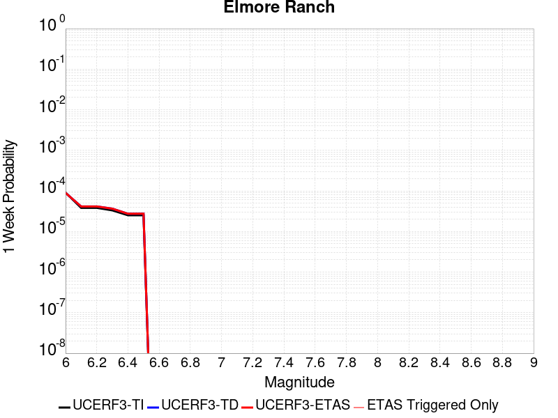 | 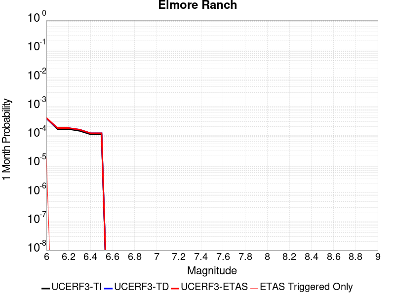 | 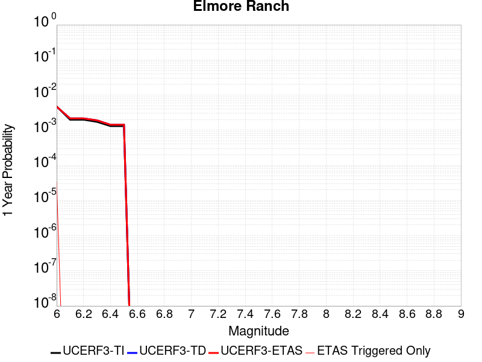 | 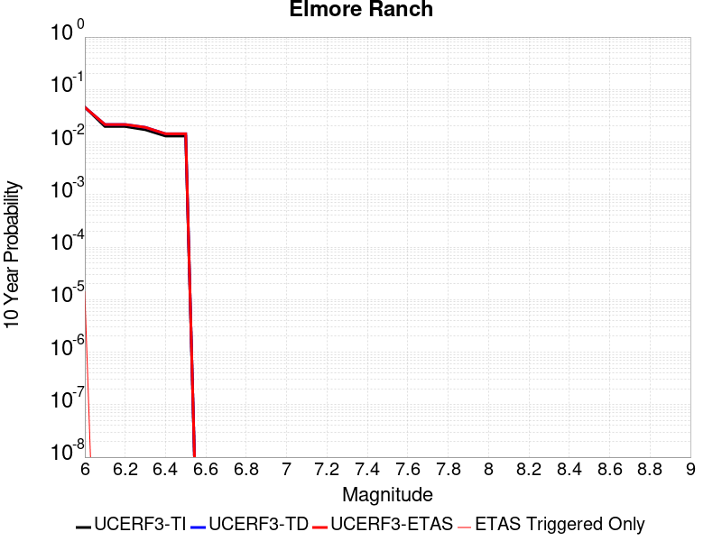 |

| Magnitude | 1 wk TI Prob | 1 wk TD Prob | 1 wk ETAS Prob | 1 wk ETAS/TD Gain | 1 wk ETAS Triggered Only | 1 mo TI Prob | 1 mo TD Prob | 1 mo ETAS Prob | 1 mo ETAS/TD Gain | 1 mo ETAS Triggered Only | 1 yr TI Prob | 1 yr TD Prob | 1 yr ETAS Prob | 1 yr ETAS/TD Gain | 1 yr ETAS Triggered Only | 10 yr TI Prob | 10 yr TD Prob | 10 yr ETAS Prob | 10 yr ETAS/TD Gain | 10 yr ETAS Triggered Only |
|-----|-----|-----|-----|-----|-----|-----|-----|-----|-----|-----|-----|-----|-----|-----|-----|-----|-----|-----|-----|-----|
| 6.0 | 9.102099E-5 | 8.953848E-5 | 8.953848E-5 | 1.0 | 0.0 | 3.9003167E-4 | 3.836898E-4 | 4.182762E-4 | 1.0901415 | 3.459968E-5 | 0.0047383 | 0.004662132 | 0.0046965703 | 1.0073868 | 3.459968E-5 | 0.046385348 | 0.04583787 | 0.045870885 | 1.0007203 | 3.459968E-5 |
| 6.1 | 3.8306698E-5 | 4.14921E-5 | 4.14921E-5 | 1.0 | 0.0 | 1.6416123E-4 | 1.7781362E-4 | 1.7781362E-4 | 1.0 | 0.0 | 0.0019968306 | 0.0021632186 | 0.0021632186 | 1.0 | 0.0 | 0.019789828 | 0.021595007 | 0.021595007 | 1.0 | 0.0 |
| 6.2 | 3.8306698E-5 | 4.14921E-5 | 4.14921E-5 | 1.0 | 0.0 | 1.6416123E-4 | 1.7781362E-4 | 1.7781362E-4 | 1.0 | 0.0 | 0.0019968306 | 0.0021632186 | 0.0021632186 | 1.0 | 0.0 | 0.019789828 | 0.021595007 | 0.021595007 | 1.0 | 0.0 |
| 6.3 | 3.3197924E-5 | 3.6550366E-5 | 3.6550366E-5 | 1.0 | 0.0 | 1.4226905E-4 | 1.56639E-4 | 1.56639E-4 | 1.0 | 0.0 | 0.0017307495 | 0.0019059771 | 0.0019059771 | 1.0 | 0.0 | 0.017173318 | 0.019057386 | 0.019057386 | 1.0 | 0.0 |
| 6.4 | 2.5148964E-5 | 2.7420736E-5 | 2.7420736E-5 | 1.0 | 0.0 | 1.0777682E-4 | 1.17515796E-4 | 1.17515796E-4 | 1.0 | 0.0 | 0.0013113929 | 0.0014304637 | 0.0014304637 | 1.0 | 0.0 | 0.01303681 | 0.014365338 | 0.014365338 | 1.0 | 0.0 |
| 6.5 | 2.5148964E-5 | 2.7420736E-5 | 2.7420736E-5 | 1.0 | 0.0 | 1.0777682E-4 | 1.17515796E-4 | 1.17515796E-4 | 1.0 | 0.0 | 0.0013113929 | 0.0014304637 | 0.0014304637 | 1.0 | 0.0 | 0.01303681 | 0.014365338 | 0.014365338 | 1.0 | 0.0 |

## San Luis Range 2011 CFM
*[(top)](#table-of-contents)*

| 1 Week | 1 Month | 1 Year | 10 Year |
|-----|-----|-----|-----|
|  | 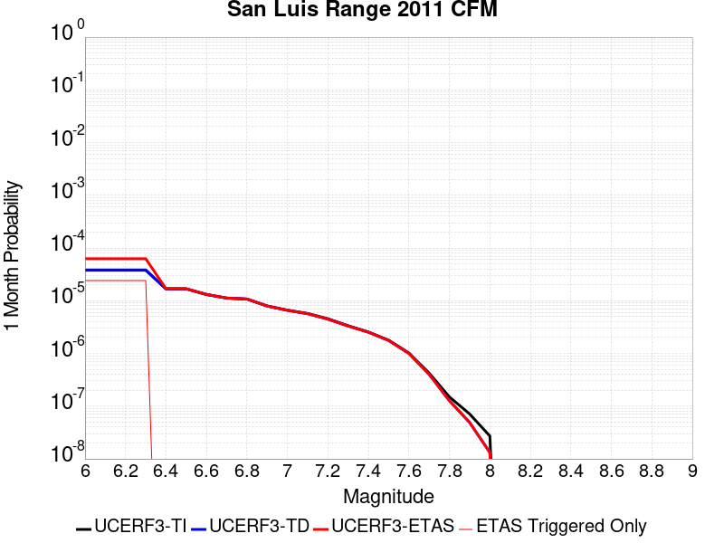 | 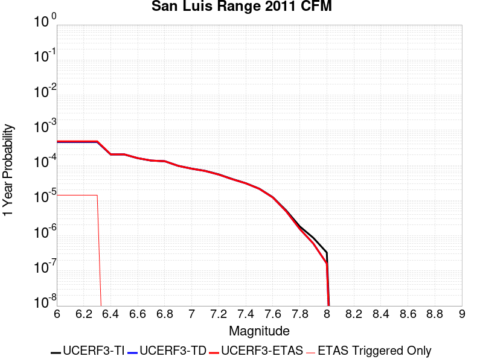 | 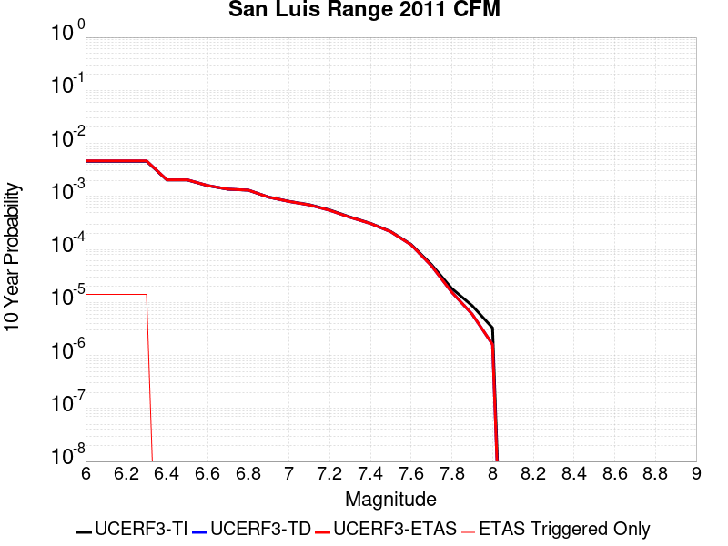 |

| Magnitude | 1 wk TI Prob | 1 wk TD Prob | 1 wk ETAS Prob | 1 wk ETAS/TD Gain | 1 wk ETAS Triggered Only | 1 mo TI Prob | 1 mo TD Prob | 1 mo ETAS Prob | 1 mo ETAS/TD Gain | 1 mo ETAS Triggered Only | 1 yr TI Prob | 1 yr TD Prob | 1 yr ETAS Prob | 1 yr ETAS/TD Gain | 1 yr ETAS Triggered Only | 10 yr TI Prob | 10 yr TD Prob | 10 yr ETAS Prob | 10 yr ETAS/TD Gain | 10 yr ETAS Triggered Only |
|-----|-----|-----|-----|-----|-----|-----|-----|-----|-----|-----|-----|-----|-----|-----|-----|-----|-----|-----|-----|-----|
| 6.0 | 8.8368415E-6 | 8.965455E-6 | 8.965455E-6 | 1.0 | 0.0 | 3.787163E-5 | 3.8422855E-5 | 7.3021205E-5 | 1.9004627 | 3.459968E-5 | 4.609895E-4 | 4.6770574E-4 | 5.022893E-4 | 1.0739429 | 3.459968E-5 | 0.0046003438 | 0.004667997 | 0.004702435 | 1.0073775 | 3.459968E-5 |
| 6.1 | 8.8368415E-6 | 8.965455E-6 | 8.965455E-6 | 1.0 | 0.0 | 3.787163E-5 | 3.8422855E-5 | 7.3021205E-5 | 1.9004627 | 3.459968E-5 | 4.609895E-4 | 4.6770574E-4 | 5.022893E-4 | 1.0739429 | 3.459968E-5 | 0.0046003438 | 0.004667997 | 0.004702435 | 1.0073775 | 3.459968E-5 |
| 6.2 | 8.8368415E-6 | 8.965455E-6 | 8.965455E-6 | 1.0 | 0.0 | 3.787163E-5 | 3.8422855E-5 | 7.3021205E-5 | 1.9004627 | 3.459968E-5 | 4.609895E-4 | 4.6770574E-4 | 5.022893E-4 | 1.0739429 | 3.459968E-5 | 0.0046003438 | 0.004667997 | 0.004702435 | 1.0073775 | 3.459968E-5 |
| 6.3 | 8.8368415E-6 | 8.965455E-6 | 8.965455E-6 | 1.0 | 0.0 | 3.787163E-5 | 3.8422855E-5 | 7.3021205E-5 | 1.9004627 | 3.459968E-5 | 4.609895E-4 | 4.6770574E-4 | 5.022893E-4 | 1.0739429 | 3.459968E-5 | 0.0046003438 | 0.004667997 | 0.004702435 | 1.0073775 | 3.459968E-5 |
| 6.4 | 3.9094193E-6 | 3.941204E-6 | 3.941204E-6 | 1.0 | 0.0 | 1.6754546E-5 | 1.6890766E-5 | 1.6890766E-5 | 1.0 | 0.0 | 2.039675E-4 | 2.0562594E-4 | 2.0562594E-4 | 1.0 | 0.0 | 0.0020378039 | 0.0020543856 | 0.0020543856 | 1.0 | 0.0 |
| 6.5 | 3.9094193E-6 | 3.941204E-6 | 3.941204E-6 | 1.0 | 0.0 | 1.6754546E-5 | 1.6890766E-5 | 1.6890766E-5 | 1.0 | 0.0 | 2.039675E-4 | 2.0562594E-4 | 2.0562594E-4 | 1.0 | 0.0 | 0.0020378039 | 0.0020543856 | 0.0020543856 | 1.0 | 0.0 |
| 6.6 | 3.0587726E-6 | 3.0753893E-6 | 3.0753893E-6 | 1.0 | 0.0 | 1.3108959E-5 | 1.3180174E-5 | 1.3180174E-5 | 1.0 | 0.0 | 1.595899E-4 | 1.6045693E-4 | 1.6045693E-4 | 1.0 | 0.0 | 0.0015947534 | 0.0016034227 | 0.0016034227 | 1.0 | 0.0 |
| 6.7 | 2.6160574E-6 | 2.6251284E-6 | 2.6251284E-6 | 1.0 | 0.0 | 1.1211626E-5 | 1.1250502E-5 | 1.1250502E-5 | 1.0 | 0.0 | 1.3649299E-4 | 1.3696631E-4 | 1.3696631E-4 | 1.0 | 0.0 | 0.0013640919 | 0.0013688251 | 0.0013688251 | 1.0 | 0.0 |
| 6.8 | 2.5110312E-6 | 2.5181412E-6 | 2.5181412E-6 | 1.0 | 0.0 | 1.0761518E-5 | 1.079199E-5 | 1.079199E-5 | 1.0 | 0.0 | 1.310136E-4 | 1.313846E-4 | 1.313846E-4 | 1.0 | 0.0 | 0.0013093639 | 0.0013130752 | 0.0013130752 | 1.0 | 0.0 |
| 6.9 | 1.8564405E-6 | 1.852488E-6 | 1.852488E-6 | 1.0 | 0.0 | 7.95615E-6 | 7.93921E-6 | 7.93921E-6 | 1.0 | 0.0 | 9.686181E-5 | 9.665562E-5 | 9.665562E-5 | 1.0 | 0.0 | 9.68196E-4 | 9.6613786E-4 | 9.6613786E-4 | 1.0 | 0.0 |
| 7.0 | 1.546127E-6 | 1.5369549E-6 | 1.5369549E-6 | 1.0 | 0.0 | 6.626242E-6 | 6.5869326E-6 | 6.5869326E-6 | 1.0 | 0.0 | 8.06715E-5 | 8.019296E-5 | 8.019296E-5 | 1.0 | 0.0 | 8.0642226E-4 | 8.016409E-4 | 8.016409E-4 | 1.0 | 0.0 |
| 7.1 | 1.3368208E-6 | 1.3235336E-6 | 1.3235336E-6 | 1.0 | 0.0 | 5.7292195E-6 | 5.6722747E-6 | 5.6722747E-6 | 1.0 | 0.0 | 6.975101E-5 | 6.905776E-5 | 6.905776E-5 | 1.0 | 0.0 | 6.972912E-4 | 6.903635E-4 | 6.903635E-4 | 1.0 | 0.0 |
| 7.2 | 1.0623363E-6 | 1.0454378E-6 | 1.0454378E-6 | 1.0 | 0.0 | 4.5528623E-6 | 4.4804397E-6 | 4.4804397E-6 | 1.0 | 0.0 | 5.5429686E-5 | 5.4547992E-5 | 5.4547992E-5 | 1.0 | 0.0 | 5.5415864E-4 | 5.453463E-4 | 5.453463E-4 | 1.0 | 0.0 |
| 7.3 | 7.831679E-7 | 7.727399E-7 | 7.727399E-7 | 1.0 | 0.0 | 3.3564295E-6 | 3.3117383E-6 | 3.3117383E-6 | 1.0 | 0.0 | 4.086376E-5 | 4.031967E-5 | 4.031967E-5 | 1.0 | 0.0 | 4.0856248E-4 | 4.0312367E-4 | 4.0312367E-4 | 1.0 | 0.0 |
| 7.4 | 5.9558846E-7 | 5.910646E-7 | 5.910646E-7 | 1.0 | 0.0 | 2.5525194E-6 | 2.5331315E-6 | 2.5331315E-6 | 1.0 | 0.0 | 3.107648E-5 | 3.084044E-5 | 3.084044E-5 | 1.0 | 0.0 | 3.1072134E-4 | 3.083617E-4 | 3.083617E-4 | 1.0 | 0.0 |
| 7.5 | 4.1616502E-7 | 4.1196404E-7 | 4.1196404E-7 | 1.0 | 0.0 | 1.7835631E-6 | 1.765559E-6 | 1.765559E-6 | 1.0 | 0.0 | 2.1714664E-5 | 2.1495469E-5 | 2.1495469E-5 | 1.0 | 0.0 | 2.1712543E-4 | 2.1493394E-4 | 2.1493394E-4 | 1.0 | 0.0 |
| 7.6 | 2.3816014E-7 | 2.3376614E-7 | 2.3376614E-7 | 1.0 | 0.0 | 1.0206859E-6 | 1.0018545E-6 | 1.0018545E-6 | 1.0 | 0.0 | 1.242678E-5 | 1.219751E-5 | 1.219751E-5 | 1.0 | 0.0 | 1.2426086E-4 | 1.2196843E-4 | 1.2196843E-4 | 1.0 | 0.0 |
| 7.7 | 9.918777E-8 | 9.3868096E-8 | 9.3868096E-8 | 1.0 | 0.0 | 4.2509038E-7 | 4.022918E-7 | 4.022918E-7 | 1.0 | 0.0 | 5.1754632E-6 | 4.8978914E-6 | 4.8978914E-6 | 1.0 | 0.0 | 5.1753424E-5 | 4.897784E-5 | 4.897784E-5 | 1.0 | 0.0 |
| 7.8 | 3.4982556E-8 | 2.968672E-8 | 2.968672E-8 | 1.0 | 0.0 | 1.4992524E-7 | 1.272288E-7 | 1.272288E-7 | 1.0 | 0.0 | 1.8253382E-6 | 1.5490094E-6 | 1.5490094E-6 | 1.0 | 0.0 | 1.8253233E-5 | 1.5489988E-5 | 1.5489988E-5 | 1.0 | 0.0 |
| 7.9 | 1.6624908E-8 | 1.1476994E-8 | 1.1476994E-8 | 1.0 | 0.0 | 7.12496E-8 | 4.9187115E-8 | 4.9187115E-8 | 1.0 | 0.0 | 8.6746354E-7 | 5.988529E-7 | 5.988529E-7 | 1.0 | 0.0 | 8.674601E-6 | 5.9885133E-6 | 5.9885133E-6 | 1.0 | 0.0 |
| 8.0 | 6.3352315E-9 | 3.0886564E-9 | 3.0886564E-9 | 1.0 | 0.0 | 2.715099E-8 | 1.32370985E-8 | 1.32370985E-8 | 1.0 | 0.0 | 3.3056327E-7 | 1.6116167E-7 | 1.6116167E-7 | 1.0 | 0.0 | 3.3056278E-6 | 1.6116155E-6 | 1.6116155E-6 | 1.0 | 0.0 |

## San Clemente
*[(top)](#table-of-contents)*

| 1 Week | 1 Month | 1 Year | 10 Year |
|-----|-----|-----|-----|
| 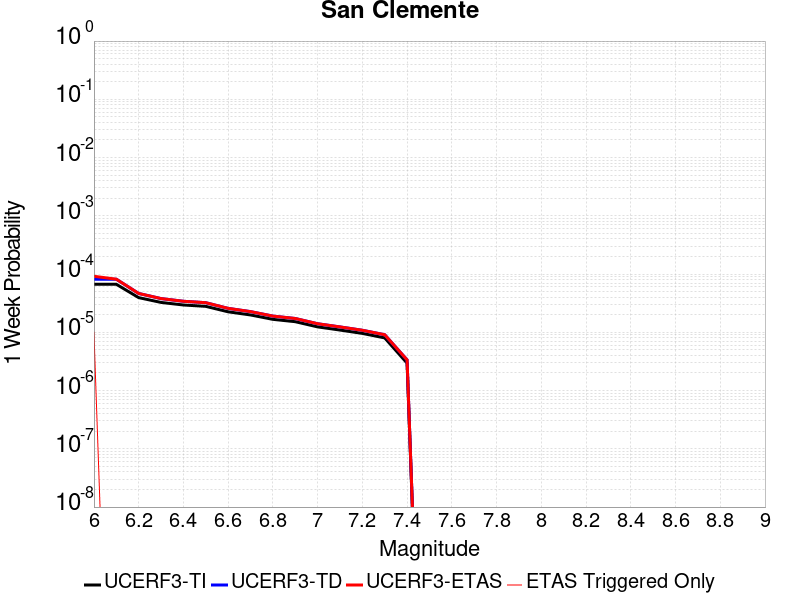 | 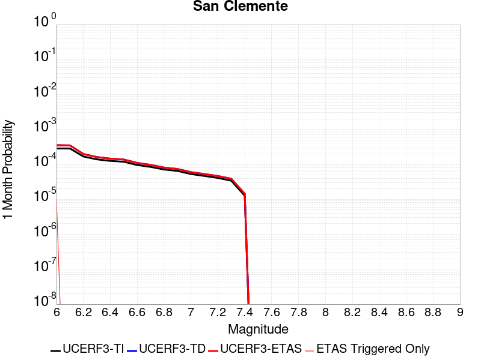 | 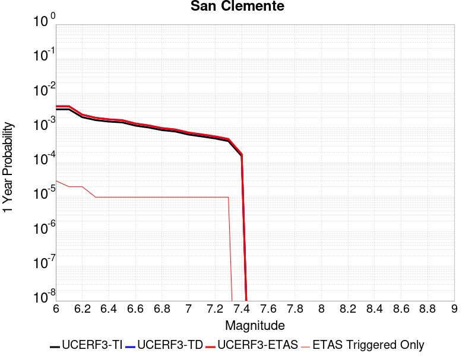 | 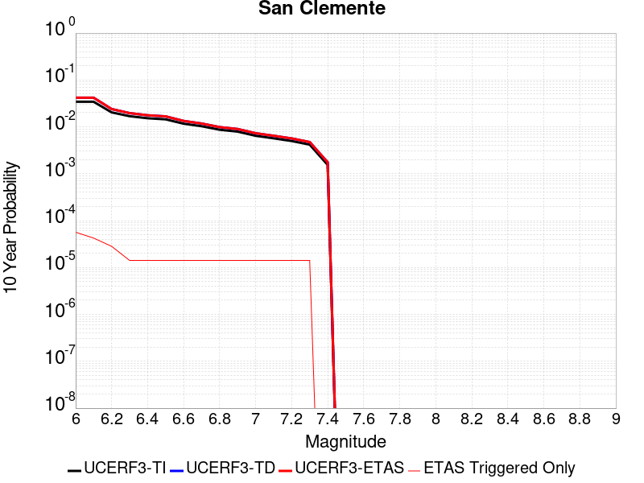 |

| Magnitude | 1 wk TI Prob | 1 wk TD Prob | 1 wk ETAS Prob | 1 wk ETAS/TD Gain | 1 wk ETAS Triggered Only | 1 mo TI Prob | 1 mo TD Prob | 1 mo ETAS Prob | 1 mo ETAS/TD Gain | 1 mo ETAS Triggered Only | 1 yr TI Prob | 1 yr TD Prob | 1 yr ETAS Prob | 1 yr ETAS/TD Gain | 1 yr ETAS Triggered Only | 10 yr TI Prob | 10 yr TD Prob | 10 yr ETAS Prob | 10 yr ETAS/TD Gain | 10 yr ETAS Triggered Only |
|-----|-----|-----|-----|-----|-----|-----|-----|-----|-----|-----|-----|-----|-----|-----|-----|-----|-----|-----|-----|-----|
| 6.0 | 6.681379E-5 | 8.163834E-5 | 8.163834E-5 | 1.0 | 0.0 | 2.8631336E-4 | 3.4983488E-4 | 3.4983488E-4 | 1.0 | 0.0 | 0.003480294 | 0.00425141 | 0.00425141 | 1.0 | 0.0 | 0.03426291 | 0.04175603 | 0.041789185 | 1.000794 | 3.459968E-5 |
| 6.1 | 6.681379E-5 | 8.163834E-5 | 8.163834E-5 | 1.0 | 0.0 | 2.8631336E-4 | 3.4983488E-4 | 3.4983488E-4 | 1.0 | 0.0 | 0.003480294 | 0.00425141 | 0.00425141 | 1.0 | 0.0 | 0.03426291 | 0.04175603 | 0.041789185 | 1.000794 | 3.459968E-5 |
| 6.2 | 3.9400576E-5 | 4.6452373E-5 | 4.6452373E-5 | 1.0 | 0.0 | 1.6884868E-4 | 1.9906677E-4 | 1.9906677E-4 | 1.0 | 0.0 | 0.0020537945 | 0.0024209984 | 0.0024209984 | 1.0 | 0.0 | 0.020349167 | 0.023952903 | 0.023952903 | 1.0 | 0.0 |
| 6.3 | 3.2590255E-5 | 3.792912E-5 | 3.792912E-5 | 1.0 | 0.0 | 1.3966505E-4 | 1.6254342E-4 | 1.6254342E-4 | 1.0 | 0.0 | 0.0016990956 | 0.0019772002 | 0.0019772002 | 1.0 | 0.0 | 0.01686163 | 0.019599883 | 0.019599883 | 1.0 | 0.0 |
| 6.4 | 2.9454652E-5 | 3.4097764E-5 | 3.4097764E-5 | 1.0 | 0.0 | 1.2622811E-4 | 1.4612524E-4 | 1.4612524E-4 | 1.0 | 0.0 | 0.0015357438 | 0.0017776493 | 0.0017776493 | 1.0 | 0.0 | 0.015251739 | 0.01763747 | 0.01763747 | 1.0 | 0.0 |
| 6.5 | 2.790836E-5 | 3.2247463E-5 | 3.2247463E-5 | 1.0 | 0.0 | 1.1960178E-4 | 1.3819624E-4 | 1.3819624E-4 | 1.0 | 0.0 | 0.001455179 | 0.0016812662 | 0.0016812662 | 1.0 | 0.0 | 0.014456868 | 0.016688485 | 0.016688485 | 1.0 | 0.0 |
| 6.6 | 2.2492153E-5 | 2.5762702E-5 | 2.5762702E-5 | 1.0 | 0.0 | 9.639138E-5 | 1.1040699E-4 | 1.1040699E-4 | 1.0 | 0.0 | 0.0011729331 | 0.0013433909 | 0.0013433909 | 1.0 | 0.0 | 0.011667615 | 0.013354417 | 0.013354417 | 1.0 | 0.0 |
| 6.7 | 1.9862755E-5 | 2.2666423E-5 | 2.2666423E-5 | 1.0 | 0.0 | 8.512331E-5 | 9.713826E-5 | 9.713826E-5 | 1.0 | 0.0 | 0.0010358836 | 0.0011820279 | 0.0011820279 | 1.0 | 0.0 | 0.010310682 | 0.011758701 | 0.011758701 | 1.0 | 0.0 |
| 6.8 | 1.6697575E-5 | 1.897771E-5 | 1.897771E-5 | 1.0 | 0.0 | 7.155907E-5 | 8.133056E-5 | 8.133056E-5 | 1.0 | 0.0 | 8.7088346E-4 | 9.897591E-4 | 9.897591E-4 | 1.0 | 0.0 | 0.008674784 | 0.0098545365 | 0.0098545365 | 1.0 | 0.0 |
| 6.9 | 1.5218415E-5 | 1.72694E-5 | 1.72694E-5 | 1.0 | 0.0 | 6.522015E-5 | 7.4009666E-5 | 7.4009666E-5 | 1.0 | 0.0 | 7.93766E-4 | 9.00704E-4 | 9.00704E-4 | 1.0 | 0.0 | 0.007909367 | 0.008971481 | 0.008971481 | 1.0 | 0.0 |
| 7.0 | 1.2392958E-5 | 1.4033016E-5 | 1.4033016E-5 | 1.0 | 0.0 | 5.3111595E-5 | 6.014015E-5 | 6.014015E-5 | 1.0 | 0.0 | 6.4644177E-4 | 7.319679E-4 | 7.319679E-4 | 1.0 | 0.0 | 0.0064456454 | 0.0072963564 | 0.0072963564 | 1.0 | 0.0 |
| 7.1 | 1.0934128E-5 | 1.2375138E-5 | 1.2375138E-5 | 1.0 | 0.0 | 4.6859706E-5 | 5.303527E-5 | 5.303527E-5 | 1.0 | 0.0 | 5.7036756E-4 | 6.455204E-4 | 6.455204E-4 | 1.0 | 0.0 | 0.0056890585 | 0.0064371997 | 0.0064371997 | 1.0 | 0.0 |
| 7.2 | 9.5798805E-6 | 1.0844935E-5 | 1.0844935E-5 | 1.0 | 0.0 | 4.1055984E-5 | 4.6477508E-5 | 4.6477508E-5 | 1.0 | 0.0 | 4.9974193E-4 | 5.657239E-4 | 5.657239E-4 | 1.0 | 0.0 | 0.0049861963 | 0.0056435615 | 0.0056435615 | 1.0 | 0.0 |
| 7.3 | 8.0167365E-6 | 9.083918E-6 | 9.083918E-6 | 1.0 | 0.0 | 3.4356988E-5 | 3.8930535E-5 | 3.8930535E-5 | 1.0 | 0.0 | 4.1821605E-4 | 4.7388324E-4 | 4.7388324E-4 | 1.0 | 0.0 | 0.0041742986 | 0.0047294297 | 0.0047294297 | 1.0 | 0.0 |
| 7.4 | 2.9581017E-6 | 3.3623792E-6 | 3.3623792E-6 | 1.0 | 0.0 | 1.2677518E-5 | 1.4410146E-5 | 1.4410146E-5 | 1.0 | 0.0 | 1.5433785E-4 | 1.7543444E-4 | 1.7543444E-4 | 1.0 | 0.0 | 0.001542307 | 0.0017534546 | 0.0017534546 | 1.0 | 0.0 |

## Rinconada 2011 CFM
*[(top)](#table-of-contents)*

| 1 Week | 1 Month | 1 Year | 10 Year |
|-----|-----|-----|-----|
| 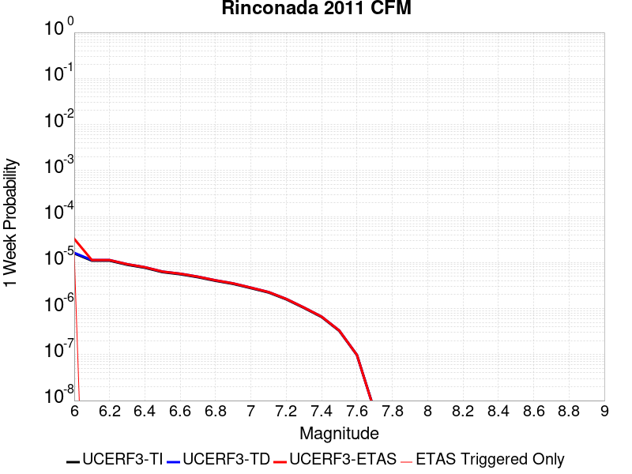 | 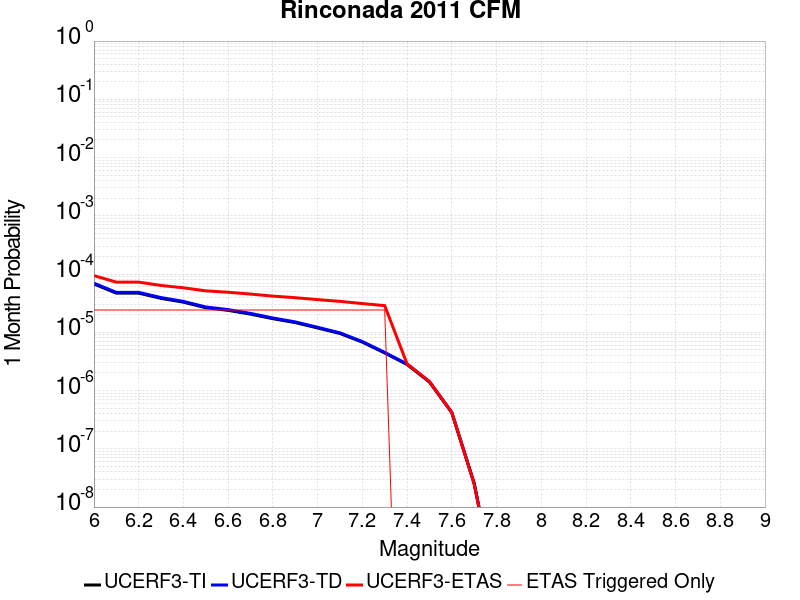 | 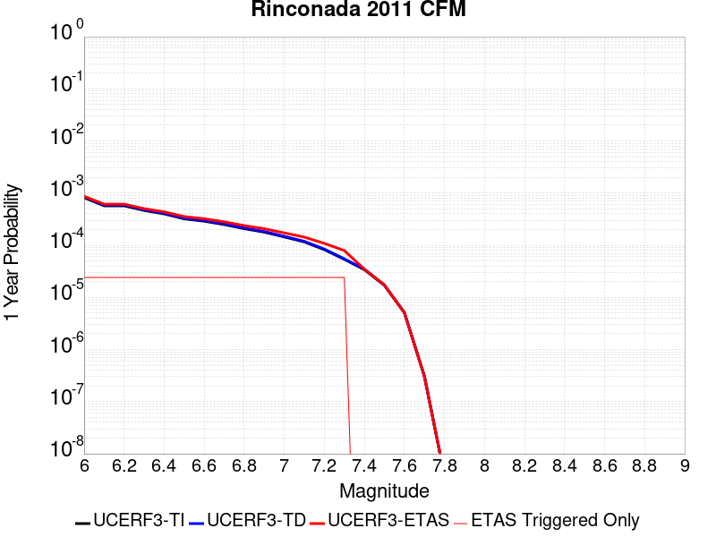 | 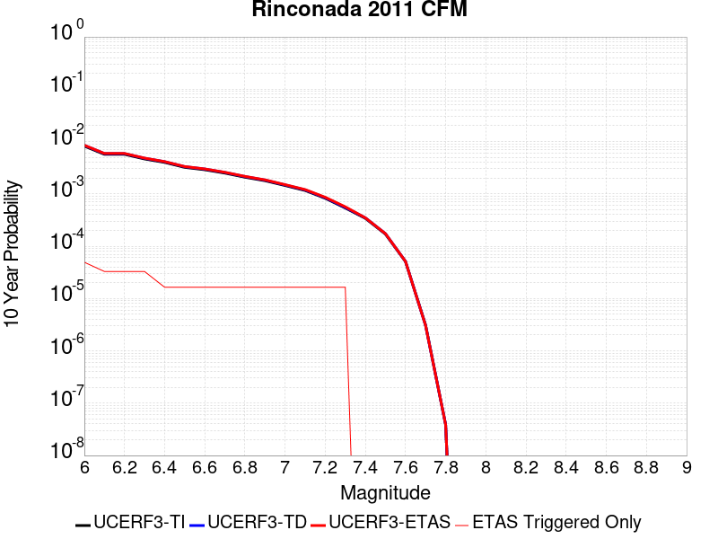 |

| Magnitude | 1 wk TI Prob | 1 wk TD Prob | 1 wk ETAS Prob | 1 wk ETAS/TD Gain | 1 wk ETAS Triggered Only | 1 mo TI Prob | 1 mo TD Prob | 1 mo ETAS Prob | 1 mo ETAS/TD Gain | 1 mo ETAS Triggered Only | 1 yr TI Prob | 1 yr TD Prob | 1 yr ETAS Prob | 1 yr ETAS/TD Gain | 1 yr ETAS Triggered Only | 10 yr TI Prob | 10 yr TD Prob | 10 yr ETAS Prob | 10 yr ETAS/TD Gain | 10 yr ETAS Triggered Only |
|-----|-----|-----|-----|-----|-----|-----|-----|-----|-----|-----|-----|-----|-----|-----|-----|-----|-----|-----|-----|-----|
| 6.0 | 1.5752368E-5 | 1.6274716E-5 | 1.6274716E-5 | 1.0 | 0.0 | 6.75084E-5 | 6.974694E-5 | 1.043442E-4 | 1.49604 | 3.459968E-5 | 8.2160486E-4 | 8.488413E-4 | 8.8341156E-4 | 1.0407264 | 3.459968E-5 | 0.008185739 | 0.00845637 | 0.008490677 | 1.0040569 | 3.459968E-5 |
| 6.1 | 1.0966133E-5 | 1.1323029E-5 | 1.1323029E-5 | 1.0 | 0.0 | 4.6996865E-5 | 4.852637E-5 | 8.3124374E-5 | 1.7129732 | 3.459968E-5 | 5.720366E-4 | 5.9064914E-4 | 6.252284E-4 | 1.0585445 | 3.459968E-5 | 0.0057056635 | 0.005890889 | 0.0059252847 | 1.0058389 | 3.459968E-5 |
| 6.2 | 1.0966133E-5 | 1.1323029E-5 | 1.1323029E-5 | 1.0 | 0.0 | 4.6996865E-5 | 4.852637E-5 | 8.3124374E-5 | 1.7129732 | 3.459968E-5 | 5.720366E-4 | 5.9064914E-4 | 6.252284E-4 | 1.0585445 | 3.459968E-5 | 0.0057056635 | 0.005890889 | 0.0059252847 | 1.0058389 | 3.459968E-5 |
| 6.3 | 8.926149E-6 | 9.212772E-6 | 9.212772E-6 | 1.0 | 0.0 | 3.8254362E-5 | 3.948271E-5 | 7.408103E-5 | 1.8762902 | 3.459968E-5 | 4.6564735E-4 | 4.8059633E-4 | 5.1517936E-4 | 1.0719587 | 3.459968E-5 | 0.0046467283 | 0.0047956146 | 0.0048300484 | 1.0071802 | 3.459968E-5 |
| 6.4 | 7.676955E-6 | 7.920191E-6 | 7.920191E-6 | 1.0 | 0.0 | 3.290082E-5 | 3.3943234E-5 | 6.854174E-5 | 2.019305 | 3.459968E-5 | 4.0049385E-4 | 4.131807E-4 | 4.477661E-4 | 1.0837052 | 3.459968E-5 | 0.0039977287 | 0.004124151 | 0.004158608 | 1.0083549 | 3.459968E-5 |
| 6.5 | 6.1671026E-6 | 6.358955E-6 | 6.358955E-6 | 1.0 | 0.0 | 2.6430173E-5 | 2.725238E-5 | 6.185112E-5 | 2.2695675 | 3.459968E-5 | 3.2173982E-4 | 3.317473E-4 | 3.663355E-4 | 1.1042607 | 3.459968E-5 | 0.003212744 | 0.0033125326 | 0.0033470178 | 1.0104104 | 3.459968E-5 |
| 6.6 | 5.553456E-6 | 5.7248126E-6 | 5.7248126E-6 | 1.0 | 0.0 | 2.3800309E-5 | 2.4534682E-5 | 5.9133516E-5 | 2.410201 | 3.459968E-5 | 2.897302E-4 | 2.9866886E-4 | 3.332582E-4 | 1.1158117 | 3.459968E-5 | 0.0028935277 | 0.0029826832 | 0.0030171797 | 1.0115656 | 3.459968E-5 |
| 6.7 | 4.787857E-6 | 4.93331E-6 | 4.93331E-6 | 1.0 | 0.0 | 2.0519226E-5 | 2.1142585E-5 | 5.5741533E-5 | 2.636458 | 3.459968E-5 | 2.4979294E-4 | 2.573806E-4 | 2.9197137E-4 | 1.1343955 | 3.459968E-5 | 0.0024951235 | 0.002570831 | 0.0026053416 | 1.0134239 | 3.459968E-5 |
| 6.8 | 3.9955166E-6 | 4.1134763E-6 | 4.1134763E-6 | 1.0 | 0.0 | 1.7123532E-5 | 1.7629065E-5 | 5.2228137E-5 | 2.9626153 | 3.459968E-5 | 2.0845905E-4 | 2.1461275E-4 | 2.49205E-4 | 1.1611845 | 3.459968E-5 | 0.002082636 | 0.0021440587 | 0.0021785842 | 1.0161029 | 3.459968E-5 |
| 6.9 | 3.4250072E-6 | 3.5224466E-6 | 3.5224466E-6 | 1.0 | 0.0 | 1.46785205E-5 | 1.5096112E-5 | 4.969527E-5 | 3.2919252 | 3.459968E-5 | 1.7869633E-4 | 1.8377969E-4 | 2.1837301E-4 | 1.1882325 | 3.459968E-5 | 0.001785527 | 0.0018362795 | 0.0018708156 | 1.0188076 | 3.459968E-5 |
| 7.0 | 2.7712713E-6 | 2.8467002E-6 | 2.8467002E-6 | 1.0 | 0.0 | 1.1876823E-5 | 1.22000865E-5 | 4.6799345E-5 | 3.8359847 | 3.459968E-5 | 1.4459073E-4 | 1.4852594E-4 | 1.8312049E-4 | 1.2329192 | 3.459968E-5 | 0.0014449668 | 0.0014842683 | 0.0015188167 | 1.0232763 | 3.459968E-5 |
| 7.1 | 2.227358E-6 | 2.2856987E-6 | 2.2856987E-6 | 1.0 | 0.0 | 9.545785E-6 | 9.795815E-6 | 4.4395158E-5 | 4.5320535 | 3.459968E-5 | 1.16213734E-4 | 1.1925753E-4 | 1.5385308E-4 | 1.2900912 | 3.459968E-5 | 0.0011615298 | 0.0011919363 | 0.0012264948 | 1.0289935 | 3.459968E-5 |
| 7.2 | 1.581796E-6 | 1.6209015E-6 | 1.6209015E-6 | 1.0 | 0.0 | 6.779108E-6 | 6.946702E-6 | 4.1546144E-5 | 5.9807005 | 3.459968E-5 | 8.253252E-5 | 8.4572814E-5 | 1.1916957E-4 | 1.4090766 | 3.459968E-5 | 8.250187E-4 | 8.4540684E-4 | 8.799773E-4 | 1.040892 | 3.459968E-5 |
| 7.3 | 1.0306567E-6 | 1.054648E-6 | 1.054648E-6 | 1.0 | 0.0 | 4.4170924E-6 | 4.519912E-6 | 3.9119437E-5 | 8.654911 | 3.459968E-5 | 5.3776774E-5 | 5.502854E-5 | 8.9626315E-5 | 1.6287242 | 3.459968E-5 | 5.376376E-4 | 5.501494E-4 | 5.8473006E-4 | 1.0628568 | 3.459968E-5 |
| 7.4 | 6.535541E-7 | 6.682744E-7 | 6.682744E-7 | 1.0 | 0.0 | 2.800943E-6 | 2.8640302E-6 | 2.8640302E-6 | 1.0 | 0.0 | 3.4100947E-5 | 3.4869012E-5 | 3.4869012E-5 | 1.0 | 0.0 | 3.4095717E-4 | 3.486355E-4 | 3.486355E-4 | 1.0 | 0.0 |
| 7.5 | 3.2656962E-7 | 3.3316712E-7 | 3.3316712E-7 | 1.0 | 0.0 | 1.3995833E-6 | 1.4278584E-6 | 1.4278584E-6 | 1.0 | 0.0 | 1.7039794E-5 | 1.7384036E-5 | 1.7384036E-5 | 1.0 | 0.0 | 1.7038487E-4 | 1.738268E-4 | 1.738268E-4 | 1.0 | 0.0 |
| 7.6 | 9.754343E-8 | 9.821017E-8 | 9.821017E-8 | 1.0 | 0.0 | 4.180432E-7 | 4.2090065E-7 | 4.2090065E-7 | 1.0 | 0.0 | 5.089664E-6 | 5.1244533E-6 | 5.1244533E-6 | 1.0 | 0.0 | 5.0895473E-5 | 5.124336E-5 | 5.124336E-5 | 1.0 | 0.0 |
| 7.7 | 6.0001453E-9 | 5.8491207E-9 | 5.8491207E-9 | 1.0 | 0.0 | 2.5714908E-8 | 2.506766E-8 | 2.506766E-8 | 1.0 | 0.0 | 3.1307894E-7 | 3.051987E-7 | 3.051987E-7 | 1.0 | 0.0 | 3.1307852E-6 | 3.0519832E-6 | 3.0519832E-6 | 1.0 | 0.0 |
| 7.8 | 7.400003E-11 | 7.4654505E-11 | 7.4654505E-11 | 1.0 | 0.0 | 3.171432E-10 | 3.1994773E-10 | 3.1994773E-10 | 1.0 | 0.0 | 3.861218E-9 | 3.895363E-9 | 3.895363E-9 | 1.0 | 0.0 | 3.861218E-8 | 3.895363E-8 | 3.895363E-8 | 1.0 | 0.0 |

## Calaveras (So) 2011 CFM
*[(top)](#table-of-contents)*

| 1 Week | 1 Month | 1 Year | 10 Year |
|-----|-----|-----|-----|
| 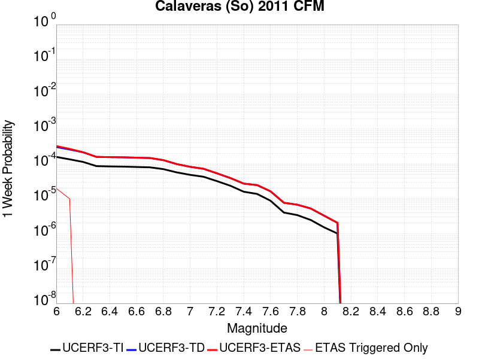 | 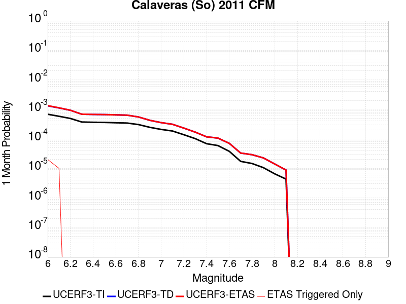 | 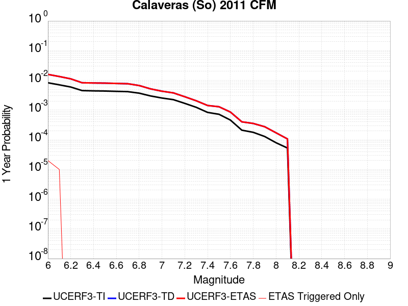 | 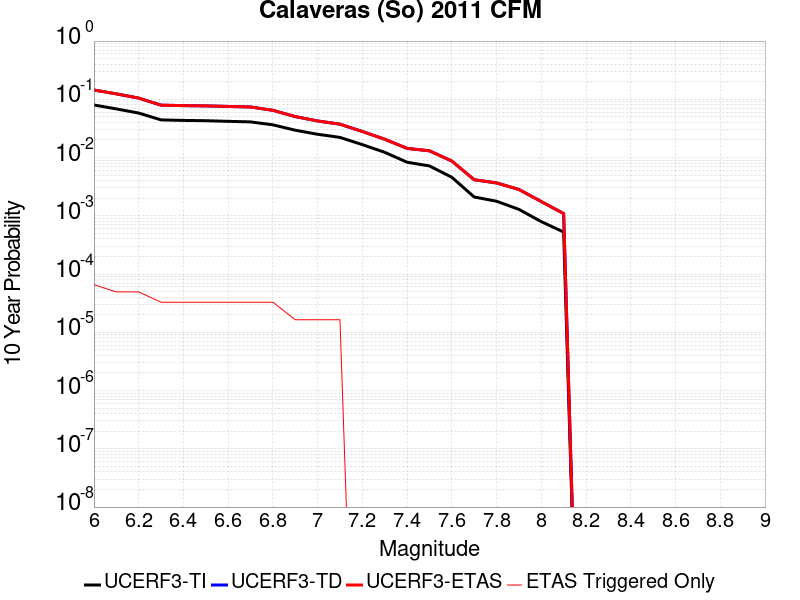 |

| Magnitude | 1 wk TI Prob | 1 wk TD Prob | 1 wk ETAS Prob | 1 wk ETAS/TD Gain | 1 wk ETAS Triggered Only | 1 mo TI Prob | 1 mo TD Prob | 1 mo ETAS Prob | 1 mo ETAS/TD Gain | 1 mo ETAS Triggered Only | 1 yr TI Prob | 1 yr TD Prob | 1 yr ETAS Prob | 1 yr ETAS/TD Gain | 1 yr ETAS Triggered Only | 10 yr TI Prob | 10 yr TD Prob | 10 yr ETAS Prob | 10 yr ETAS/TD Gain | 10 yr ETAS Triggered Only |
|-----|-----|-----|-----|-----|-----|-----|-----|-----|-----|-----|-----|-----|-----|-----|-----|-----|-----|-----|-----|-----|
| 6.0 | 1.5950744E-4 | 3.0713255E-4 | 3.0713255E-4 | 1.0 | 0.0 | 6.834242E-4 | 0.001315409 | 0.001315409 | 1.0 | 0.0 | 0.00828899 | 0.015858326 | 0.015858326 | 1.0 | 0.0 | 0.079865426 | 0.14440185 | 0.14443146 | 1.000205 | 3.459968E-5 |
| 6.1 | 1.3584697E-4 | 2.603514E-4 | 2.603514E-4 | 1.0 | 0.0 | 5.8207137E-4 | 0.0011151754 | 0.0011151754 | 1.0 | 0.0 | 0.007063716 | 0.013461385 | 0.013461385 | 1.0 | 0.0 | 0.06843361 | 0.124029994 | 0.1240603 | 1.0002444 | 3.459968E-5 |
| 6.2 | 1.14676266E-4 | 2.1714384E-4 | 2.1714384E-4 | 1.0 | 0.0 | 4.9137714E-4 | 9.30223E-4 | 9.30223E-4 | 1.0 | 0.0 | 0.0059661185 | 0.011245058 | 0.011245058 | 1.0 | 0.0 | 0.058084648 | 0.10502057 | 0.10505153 | 1.0002948 | 3.459968E-5 |
| 6.3 | 8.691518E-5 | 1.5987935E-4 | 1.5987935E-4 | 1.0 | 0.0 | 3.7244044E-4 | 6.849807E-4 | 6.849807E-4 | 1.0 | 0.0 | 0.004525038 | 0.008301122 | 0.008301122 | 1.0 | 0.0 | 0.044339992 | 0.0793365 | 0.07936835 | 1.0004015 | 3.459968E-5 |
| 6.4 | 8.50982E-5 | 1.5694331E-4 | 1.5694331E-4 | 1.0 | 0.0 | 3.646556E-4 | 6.724042E-4 | 6.724042E-4 | 1.0 | 0.0 | 0.0044306475 | 0.008149155 | 0.008149155 | 1.0 | 0.0 | 0.04343345 | 0.07794268 | 0.07797458 | 1.0004094 | 3.459968E-5 |
| 6.5 | 8.4062965E-5 | 1.5518743E-4 | 1.5518743E-4 | 1.0 | 0.0 | 3.602201E-4 | 6.6488347E-4 | 6.6488347E-4 | 1.0 | 0.0 | 0.004376863 | 0.008058365 | 0.008058365 | 1.0 | 0.0 | 0.042916555 | 0.07711388 | 0.077145815 | 1.0004141 | 3.459968E-5 |
| 6.6 | 8.194716E-5 | 1.5154552E-4 | 1.5154552E-4 | 1.0 | 0.0 | 3.5115483E-4 | 6.492843E-4 | 6.492843E-4 | 1.0 | 0.0 | 0.0042669317 | 0.007870209 | 0.007870209 | 1.0 | 0.0 | 0.04185927 | 0.07539919 | 0.07543118 | 1.0004243 | 3.459968E-5 |
| 6.7 | 8.012326E-5 | 1.4822475E-4 | 1.4822475E-4 | 1.0 | 0.0 | 3.433402E-4 | 6.350612E-4 | 6.350612E-4 | 1.0 | 0.0 | 0.004172157 | 0.007698701 | 0.007698701 | 1.0 | 0.0 | 0.040946912 | 0.07384132 | 0.07387336 | 1.0004339 | 3.459968E-5 |
| 6.8 | 7.119773E-5 | 1.2881879E-4 | 1.2881879E-4 | 1.0 | 0.0 | 3.0509746E-4 | 5.519494E-4 | 5.519494E-4 | 1.0 | 0.0 | 0.0037082357 | 0.006696066 | 0.006696066 | 1.0 | 0.0 | 0.036469642 | 0.06468575 | 0.06471811 | 1.0005003 | 3.459968E-5 |
| 6.9 | 5.7343088E-5 | 9.919277E-5 | 9.919277E-5 | 1.0 | 0.0 | 2.4573295E-4 | 4.25043E-4 | 4.25043E-4 | 1.0 | 0.0 | 0.0029876942 | 0.005162694 | 0.005162694 | 1.0 | 0.0 | 0.02947844 | 0.05051036 | 0.050543215 | 1.0006504 | 3.459968E-5 |
| 7.0 | 4.8746577E-5 | 8.2850725E-5 | 8.2850725E-5 | 1.0 | 0.0 | 2.0889717E-4 | 3.5502657E-4 | 3.5502657E-4 | 1.0 | 0.0 | 0.0025403565 | 0.004313948 | 0.004313948 | 1.0 | 0.0 | 0.025115121 | 0.042485245 | 0.042518374 | 1.0007797 | 3.459968E-5 |
| 7.1 | 4.2998014E-5 | 7.265203E-5 | 7.265203E-5 | 1.0 | 0.0 | 1.8426418E-4 | 3.1132903E-4 | 3.1132903E-4 | 1.0 | 0.0 | 0.002241108 | 0.003783903 | 0.003783903 | 1.0 | 0.0 | 0.022186412 | 0.037423562 | 0.037456866 | 1.0008899 | 3.459968E-5 |
| 7.2 | 3.221292E-5 | 5.390791E-5 | 5.390791E-5 | 1.0 | 0.0 | 1.3804805E-4 | 2.3101359E-4 | 2.3101359E-4 | 1.0 | 0.0 | 0.0016794393 | 0.0028089907 | 0.0028089907 | 1.0 | 0.0 | 0.016668037 | 0.02803602 | 0.02803602 | 1.0 | 0.0 |
| 7.3 | 2.3756531E-5 | 3.9473416E-5 | 3.9473416E-5 | 1.0 | 0.0 | 1.0180973E-4 | 1.6916092E-4 | 1.6916092E-4 | 1.0 | 0.0 | 0.0012388286 | 0.0020576057 | 0.0020576057 | 1.0 | 0.0 | 0.012319452 | 0.020643145 | 0.020643145 | 1.0 | 0.0 |
| 7.4 | 1.5997684E-5 | 2.7342163E-5 | 2.7342163E-5 | 1.0 | 0.0 | 6.8559704E-5 | 1.1717545E-4 | 1.1717545E-4 | 1.0 | 0.0 | 8.343947E-4 | 0.00142568 | 0.00142568 | 1.0 | 0.0 | 0.008312687 | 0.014376011 | 0.014376011 | 1.0 | 0.0 |
| 7.5 | 1.3814293E-5 | 2.4783874E-5 | 2.4783874E-5 | 1.0 | 0.0 | 5.9202768E-5 | 1.062123E-4 | 1.062123E-4 | 1.0 | 0.0 | 7.205553E-4 | 0.00129237 | 0.00129237 | 1.0 | 0.0 | 0.007182234 | 0.013055085 | 0.013055085 | 1.0 | 0.0 |
| 7.6 | 8.817309E-6 | 1.6430757E-5 | 1.6430757E-5 | 1.0 | 0.0 | 3.7787922E-5 | 7.0415634E-5 | 7.0415634E-5 | 1.0 | 0.0 | 4.5997082E-4 | 8.569745E-4 | 8.569745E-4 | 1.0 | 0.0 | 0.004590199 | 0.008719284 | 0.008719284 | 1.0 | 0.0 |
| 7.7 | 4.0352206E-6 | 7.707318E-6 | 7.707318E-6 | 1.0 | 0.0 | 1.7293689E-5 | 3.3030945E-5 | 3.3030945E-5 | 1.0 | 0.0 | 2.1053031E-4 | 4.0207763E-4 | 4.0207763E-4 | 1.0 | 0.0 | 0.0021033096 | 0.004165172 | 0.004165172 | 1.0 | 0.0 |
| 7.8 | 3.413169E-6 | 6.787282E-6 | 6.787282E-6 | 1.0 | 0.0 | 1.4627784E-5 | 2.9088029E-5 | 2.9088029E-5 | 1.0 | 0.0 | 1.7807873E-4 | 3.5408925E-4 | 3.5408925E-4 | 1.0 | 0.0 | 0.0017793609 | 0.0036665166 | 0.0036665166 | 1.0 | 0.0 |
| 7.9 | 2.4740732E-6 | 5.2791843E-6 | 5.2791843E-6 | 1.0 | 0.0 | 1.06031275E-5 | 2.262488E-5 | 2.262488E-5 | 1.0 | 0.0 | 1.2908543E-4 | 2.7542314E-4 | 2.7542314E-4 | 1.0 | 0.0 | 0.0012901047 | 0.0028347955 | 0.0028347955 | 1.0 | 0.0 |
| 8.0 | 1.5231818E-6 | 3.2889548E-6 | 3.2889548E-6 | 1.0 | 0.0 | 6.527906E-6 | 1.40954435E-5 | 1.40954435E-5 | 1.0 | 0.0 | 7.9474354E-5 | 1.7159856E-4 | 1.7159856E-4 | 1.0 | 0.0 | 7.944594E-4 | 0.0017564303 | 0.0017564303 | 1.0 | 0.0 |
| 8.1 | 1.0104524E-6 | 2.045782E-6 | 2.045782E-6 | 1.0 | 0.0 | 4.330503E-6 | 8.767608E-6 | 8.767608E-6 | 1.0 | 0.0 | 5.2722597E-5 | 1.0674043E-4 | 1.0674043E-4 | 1.0 | 0.0 | 5.271009E-4 | 0.001092934 | 0.001092934 | 1.0 | 0.0 |

## Davis Creek
*[(top)](#table-of-contents)*

| 1 Week | 1 Month | 1 Year | 10 Year |
|-----|-----|-----|-----|
|  | 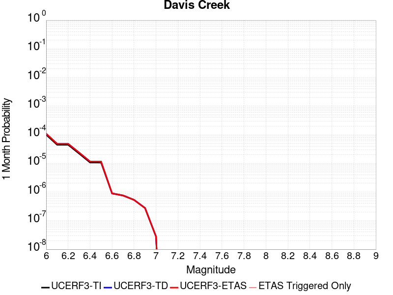 | 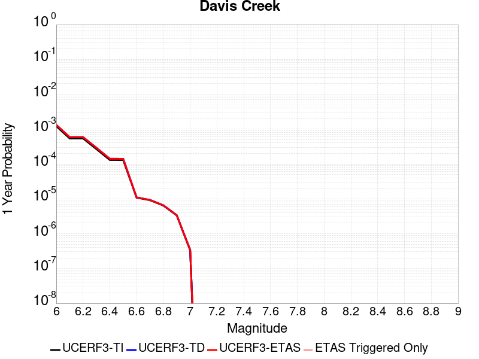 | 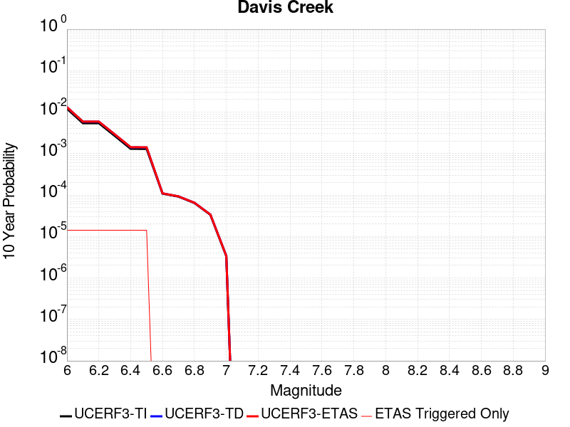 |

| Magnitude | 1 wk TI Prob | 1 wk TD Prob | 1 wk ETAS Prob | 1 wk ETAS/TD Gain | 1 wk ETAS Triggered Only | 1 mo TI Prob | 1 mo TD Prob | 1 mo ETAS Prob | 1 mo ETAS/TD Gain | 1 mo ETAS Triggered Only | 1 yr TI Prob | 1 yr TD Prob | 1 yr ETAS Prob | 1 yr ETAS/TD Gain | 1 yr ETAS Triggered Only | 10 yr TI Prob | 10 yr TD Prob | 10 yr ETAS Prob | 10 yr ETAS/TD Gain | 10 yr ETAS Triggered Only |
|-----|-----|-----|-----|-----|-----|-----|-----|-----|-----|-----|-----|-----|-----|-----|-----|-----|-----|-----|-----|-----|
| 6.0 | 2.331472E-5 | 2.5417214E-5 | 2.5417214E-5 | 1.0 | 0.0 | 9.99164E-5 | 1.0892704E-4 | 1.0892704E-4 | 1.0 | 0.0 | 0.0012158032 | 0.0013254983 | 0.0013254983 | 1.0 | 0.0 | 0.01209173 | 0.013187704 | 0.013221848 | 1.002589 | 3.459968E-5 |
| 6.1 | 1.0407654E-5 | 1.1316986E-5 | 1.1316986E-5 | 1.0 | 0.0 | 4.4603472E-5 | 4.8500624E-5 | 4.8500624E-5 | 1.0 | 0.0 | 5.4291193E-4 | 5.9036224E-4 | 5.9036224E-4 | 1.0 | 0.0 | 0.0054158745 | 0.005890611 | 0.005925007 | 1.0058391 | 3.459968E-5 |
| 6.2 | 1.0407654E-5 | 1.1316986E-5 | 1.1316986E-5 | 1.0 | 0.0 | 4.4603472E-5 | 4.8500624E-5 | 4.8500624E-5 | 1.0 | 0.0 | 5.4291193E-4 | 5.9036224E-4 | 5.9036224E-4 | 1.0 | 0.0 | 0.0054158745 | 0.005890611 | 0.005925007 | 1.0058391 | 3.459968E-5 |
| 6.3 | 5.1323277E-6 | 5.568556E-6 | 5.568556E-6 | 1.0 | 0.0 | 2.1995505E-5 | 2.386507E-5 | 2.386507E-5 | 1.0 | 0.0 | 2.6776237E-4 | 2.905271E-4 | 2.905271E-4 | 1.0 | 0.0 | 0.0026743996 | 0.0029023192 | 0.0029368184 | 1.0118868 | 3.459968E-5 |
| 6.4 | 2.4985154E-6 | 2.704538E-6 | 2.704538E-6 | 1.0 | 0.0 | 1.07078795E-5 | 1.1590847E-5 | 1.1590847E-5 | 1.0 | 0.0 | 1.3036063E-4 | 1.4111304E-4 | 1.4111304E-4 | 1.0 | 0.0 | 0.0013028418 | 0.001410589 | 0.0014451399 | 1.0244939 | 3.459968E-5 |
| 6.5 | 2.4846438E-6 | 2.6904722E-6 | 2.6904722E-6 | 1.0 | 0.0 | 1.064843E-5 | 1.1530565E-5 | 1.1530565E-5 | 1.0 | 0.0 | 1.2963692E-4 | 1.403792E-4 | 1.403792E-4 | 1.0 | 0.0 | 0.0012956132 | 0.0014032599 | 0.0014378111 | 1.0246221 | 3.459968E-5 |
| 6.6 | 2.072566E-7 | 2.1018087E-7 | 2.1018087E-7 | 1.0 | 0.0 | 8.882423E-7 | 9.0077486E-7 | 9.0077486E-7 | 1.0 | 0.0 | 1.0814296E-5 | 1.0966881E-5 | 1.0966881E-5 | 1.0 | 0.0 | 1.081377E-4 | 1.09663575E-4 | 1.09663575E-4 | 1.0 | 0.0 |
| 6.7 | 1.7544528E-7 | 1.7790826E-7 | 1.7790826E-7 | 1.0 | 0.0 | 7.5190815E-7 | 7.6246374E-7 | 7.6246374E-7 | 1.0 | 0.0 | 9.154443E-6 | 9.282958E-6 | 9.282958E-6 | 1.0 | 0.0 | 9.1540656E-5 | 9.282586E-5 | 9.282586E-5 | 1.0 | 0.0 |
| 6.8 | 1.2320395E-7 | 1.2481138E-7 | 1.2481138E-7 | 1.0 | 0.0 | 5.280168E-7 | 5.349058E-7 | 5.349058E-7 | 1.0 | 0.0 | 6.428586E-6 | 6.5124595E-6 | 6.5124595E-6 | 1.0 | 0.0 | 6.4284E-5 | 6.5122804E-5 | 6.5122804E-5 | 1.0 | 0.0 |
| 6.9 | 6.399997E-8 | 6.486058E-8 | 6.486058E-8 | 1.0 | 0.0 | 2.7428555E-7 | 2.7797387E-7 | 2.7797387E-7 | 1.0 | 0.0 | 3.3394215E-6 | 3.3843273E-6 | 3.3843273E-6 | 1.0 | 0.0 | 3.3393713E-5 | 3.384282E-5 | 3.384282E-5 | 1.0 | 0.0 |
| 7.0 | 6.4455685E-9 | 6.535264E-9 | 6.535264E-9 | 1.0 | 0.0 | 2.7623864E-8 | 2.8008275E-8 | 2.8008275E-8 | 1.0 | 0.0 | 3.3632048E-7 | 3.4100074E-7 | 3.4100074E-7 | 1.0 | 0.0 | 3.3631998E-6 | 3.4100074E-6 | 3.4100074E-6 | 1.0 | 0.0 |

## Holser alt 1
*[(top)](#table-of-contents)*

| 1 Week | 1 Month | 1 Year | 10 Year |
|-----|-----|-----|-----|
| 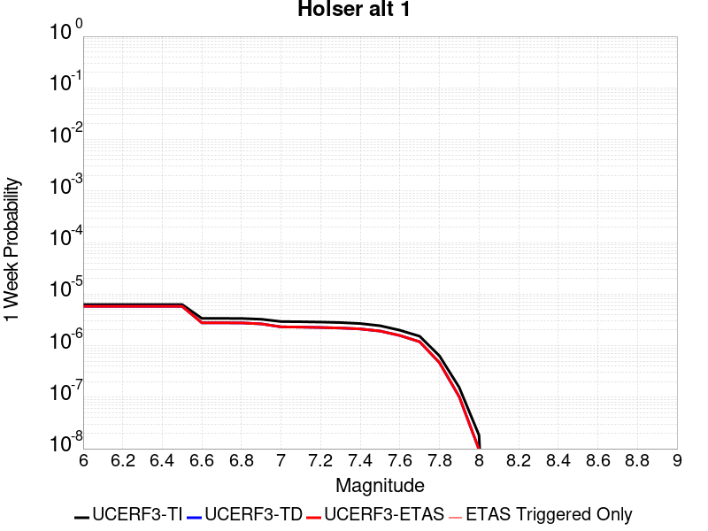 | 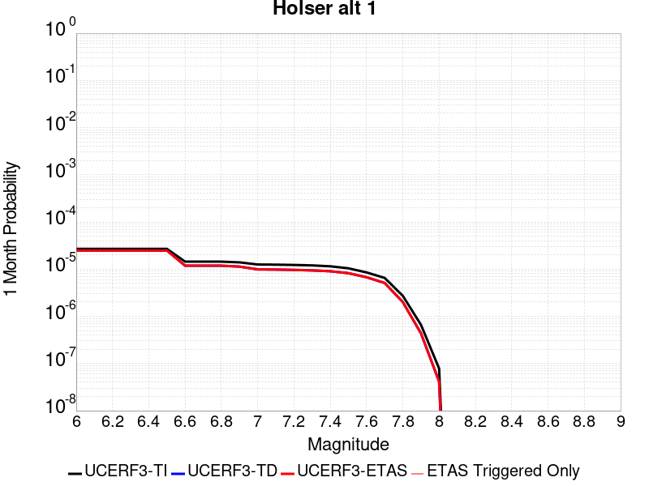 | 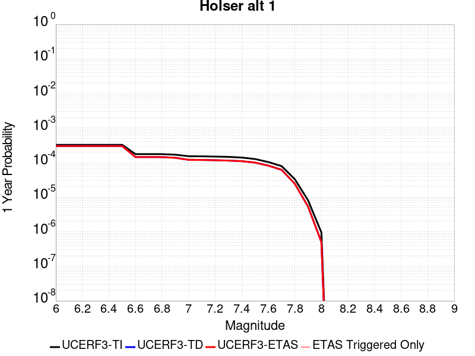 | 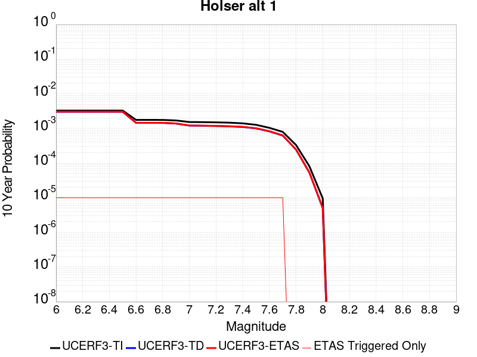 |

| Magnitude | 1 wk TI Prob | 1 wk TD Prob | 1 wk ETAS Prob | 1 wk ETAS/TD Gain | 1 wk ETAS Triggered Only | 1 mo TI Prob | 1 mo TD Prob | 1 mo ETAS Prob | 1 mo ETAS/TD Gain | 1 mo ETAS Triggered Only | 1 yr TI Prob | 1 yr TD Prob | 1 yr ETAS Prob | 1 yr ETAS/TD Gain | 1 yr ETAS Triggered Only | 10 yr TI Prob | 10 yr TD Prob | 10 yr ETAS Prob | 10 yr ETAS/TD Gain | 10 yr ETAS Triggered Only |
|-----|-----|-----|-----|-----|-----|-----|-----|-----|-----|-----|-----|-----|-----|-----|-----|-----|-----|-----|-----|-----|
| 6.0 | 6.2746653E-6 | 5.7899742E-6 | 5.7899742E-6 | 1.0 | 0.0 | 2.6891146E-5 | 2.4814004E-5 | 2.4814004E-5 | 1.0 | 0.0 | 3.273505E-4 | 3.0208015E-4 | 3.0208015E-4 | 1.0 | 0.0 | 0.0032686873 | 0.003017828 | 0.0030523234 | 1.0114305 | 3.459968E-5 |
| 6.1 | 6.2746653E-6 | 5.7899742E-6 | 5.7899742E-6 | 1.0 | 0.0 | 2.6891146E-5 | 2.4814004E-5 | 2.4814004E-5 | 1.0 | 0.0 | 3.273505E-4 | 3.0208015E-4 | 3.0208015E-4 | 1.0 | 0.0 | 0.0032686873 | 0.003017828 | 0.0030523234 | 1.0114305 | 3.459968E-5 |
| 6.2 | 6.2746653E-6 | 5.7899742E-6 | 5.7899742E-6 | 1.0 | 0.0 | 2.6891146E-5 | 2.4814004E-5 | 2.4814004E-5 | 1.0 | 0.0 | 3.273505E-4 | 3.0208015E-4 | 3.0208015E-4 | 1.0 | 0.0 | 0.0032686873 | 0.003017828 | 0.0030523234 | 1.0114305 | 3.459968E-5 |
| 6.3 | 6.2746653E-6 | 5.7899742E-6 | 5.7899742E-6 | 1.0 | 0.0 | 2.6891146E-5 | 2.4814004E-5 | 2.4814004E-5 | 1.0 | 0.0 | 3.273505E-4 | 3.0208015E-4 | 3.0208015E-4 | 1.0 | 0.0 | 0.0032686873 | 0.003017828 | 0.0030523234 | 1.0114305 | 3.459968E-5 |
| 6.4 | 6.2746653E-6 | 5.7899742E-6 | 5.7899742E-6 | 1.0 | 0.0 | 2.6891146E-5 | 2.4814004E-5 | 2.4814004E-5 | 1.0 | 0.0 | 3.273505E-4 | 3.0208015E-4 | 3.0208015E-4 | 1.0 | 0.0 | 0.0032686873 | 0.003017828 | 0.0030523234 | 1.0114305 | 3.459968E-5 |
| 6.5 | 6.2746653E-6 | 5.7899742E-6 | 5.7899742E-6 | 1.0 | 0.0 | 2.6891146E-5 | 2.4814004E-5 | 2.4814004E-5 | 1.0 | 0.0 | 3.273505E-4 | 3.0208015E-4 | 3.0208015E-4 | 1.0 | 0.0 | 0.0032686873 | 0.003017828 | 0.0030523234 | 1.0114305 | 3.459968E-5 |
| 6.6 | 3.375825E-6 | 2.7711988E-6 | 2.7711988E-6 | 1.0 | 0.0 | 1.4467741E-5 | 1.1876513E-5 | 1.1876513E-5 | 1.0 | 0.0 | 1.761305E-4 | 1.4458712E-4 | 1.4458712E-4 | 1.0 | 0.0 | 0.0017599097 | 0.0014449474 | 0.0014794972 | 1.0239106 | 3.459968E-5 |
| 6.7 | 3.375825E-6 | 2.7711988E-6 | 2.7711988E-6 | 1.0 | 0.0 | 1.4467741E-5 | 1.1876513E-5 | 1.1876513E-5 | 1.0 | 0.0 | 1.761305E-4 | 1.4458712E-4 | 1.4458712E-4 | 1.0 | 0.0 | 0.0017599097 | 0.0014449474 | 0.0014794972 | 1.0239106 | 3.459968E-5 |
| 6.8 | 3.366533E-6 | 2.7615984E-6 | 2.7615984E-6 | 1.0 | 0.0 | 1.4427919E-5 | 1.1835369E-5 | 1.1835369E-5 | 1.0 | 0.0 | 1.7564575E-4 | 1.4408625E-4 | 1.4408625E-4 | 1.0 | 0.0 | 0.0017550698 | 0.0014399453 | 0.0014744952 | 1.0239938 | 3.459968E-5 |
| 6.9 | 3.253174E-6 | 2.6438204E-6 | 2.6438204E-6 | 1.0 | 0.0 | 1.39421E-5 | 1.13306105E-5 | 1.13306105E-5 | 1.0 | 0.0 | 1.6973184E-4 | 1.379416E-4 | 1.379416E-4 | 1.0 | 0.0 | 0.0016960226 | 0.0013785758 | 0.0014131278 | 1.0250635 | 3.459968E-5 |
| 7.0 | 2.9336593E-6 | 2.3118082E-6 | 2.3118082E-6 | 1.0 | 0.0 | 1.2572766E-5 | 9.907712E-6 | 9.907712E-6 | 1.0 | 0.0 | 1.5306266E-4 | 1.2061974E-4 | 1.2061974E-4 | 1.0 | 0.0 | 0.0015295728 | 0.0012055453 | 0.0012401032 | 1.0286659 | 3.459968E-5 |
| 7.1 | 2.9087812E-6 | 2.2876604E-6 | 2.2876604E-6 | 1.0 | 0.0 | 1.2466146E-5 | 9.804223E-6 | 9.804223E-6 | 1.0 | 0.0 | 1.5176475E-4 | 1.19359895E-4 | 1.19359895E-4 | 1.0 | 0.0 | 0.0015166114 | 0.0011929603 | 0.0012275188 | 1.0289686 | 3.459968E-5 |
| 7.2 | 2.8674524E-6 | 2.247552E-6 | 2.247552E-6 | 1.0 | 0.0 | 1.2289024E-5 | 9.63233E-6 | 9.63233E-6 | 1.0 | 0.0 | 1.4960859E-4 | 1.1726733E-4 | 1.1726733E-4 | 1.0 | 0.0 | 0.0014950791 | 0.0011720568 | 0.0012066159 | 1.029486 | 3.459968E-5 |
| 7.3 | 2.8057775E-6 | 2.1954418E-6 | 2.1954418E-6 | 1.0 | 0.0 | 1.2024705E-5 | 9.409002E-6 | 9.409002E-6 | 1.0 | 0.0 | 1.4639096E-4 | 1.145486E-4 | 1.145486E-4 | 1.0 | 0.0 | 0.0014629456 | 0.0011448979 | 0.0011794579 | 1.0301862 | 3.459968E-5 |
| 7.4 | 2.683666E-6 | 2.1092408E-6 | 2.1092408E-6 | 1.0 | 0.0 | 1.1501375E-5 | 9.0395715E-6 | 9.0395715E-6 | 1.0 | 0.0 | 1.4002025E-4 | 1.1005125E-4 | 1.1005125E-4 | 1.0 | 0.0 | 0.0013993206 | 0.0010999697 | 0.0011345313 | 1.0314205 | 3.459968E-5 |
| 7.5 | 2.434495E-6 | 1.9195488E-6 | 1.9195488E-6 | 1.0 | 0.0 | 1.0433508E-5 | 8.226612E-6 | 8.226612E-6 | 1.0 | 0.0 | 1.2702055E-4 | 1.0015442E-4 | 1.0015442E-4 | 1.0 | 0.0 | 0.0012694797 | 0.0010010948 | 0.0010356599 | 1.0345272 | 3.459968E-5 |
| 7.6 | 1.9914562E-6 | 1.5731545E-6 | 1.5731545E-6 | 1.0 | 0.0 | 8.534785E-6 | 6.7420733E-6 | 6.7420733E-6 | 1.0 | 0.0 | 1.03906044E-4 | 8.2081664E-5 | 8.2081664E-5 | 1.0 | 0.0 | 0.0010385747 | 8.2051504E-4 | 8.550863E-4 | 1.0421337 | 3.459968E-5 |
| 7.7 | 1.5229501E-6 | 1.1896134E-6 | 1.1896134E-6 | 1.0 | 0.0 | 6.526913E-6 | 5.098333E-6 | 5.098333E-6 | 1.0 | 0.0 | 7.946226E-5 | 6.207045E-5 | 6.207045E-5 | 1.0 | 0.0 | 7.943385E-4 | 6.2053243E-4 | 6.5511063E-4 | 1.0557234 | 3.459968E-5 |
| 7.8 | 6.3489426E-7 | 4.6878412E-7 | 4.6878412E-7 | 1.0 | 0.0 | 2.7209726E-6 | 2.0090733E-6 | 2.0090733E-6 | 1.0 | 0.0 | 3.312734E-5 | 2.4460194E-5 | 2.4460194E-5 | 1.0 | 0.0 | 3.31224E-4 | 2.445752E-4 | 2.445752E-4 | 1.0 | 0.0 |
| 7.9 | 1.5459432E-7 | 1.01936465E-7 | 1.01936465E-7 | 1.0 | 0.0 | 6.6254694E-7 | 4.3687047E-7 | 4.3687047E-7 | 1.0 | 0.0 | 8.066479E-6 | 5.318885E-6 | 5.318885E-6 | 1.0 | 0.0 | 8.066186E-5 | 5.3187596E-5 | 5.3187596E-5 | 1.0 | 0.0 |
| 8.0 | 1.8307812E-8 | 9.690041E-9 | 9.690041E-9 | 1.0 | 0.0 | 7.846205E-8 | 4.1528747E-8 | 4.1528747E-8 | 1.0 | 0.0 | 9.55275E-7 | 5.056124E-7 | 5.056124E-7 | 1.0 | 0.0 | 9.552709E-6 | 5.0561125E-6 | 5.0561125E-6 | 1.0 | 0.0 |

## White Wolf
*[(top)](#table-of-contents)*

| 1 Week | 1 Month | 1 Year | 10 Year |
|-----|-----|-----|-----|
| 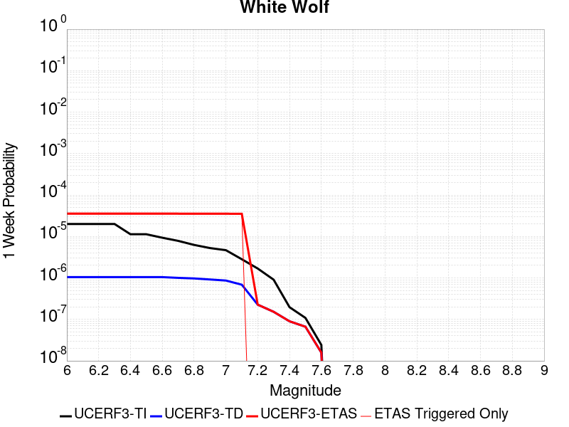 | 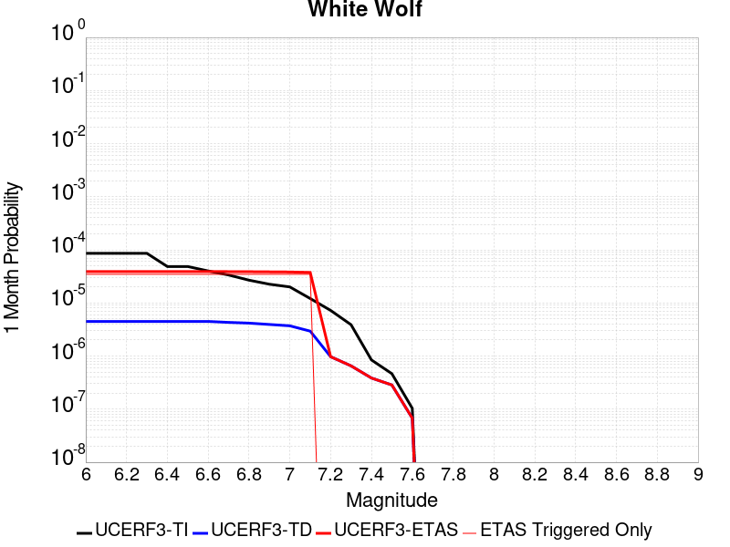 | 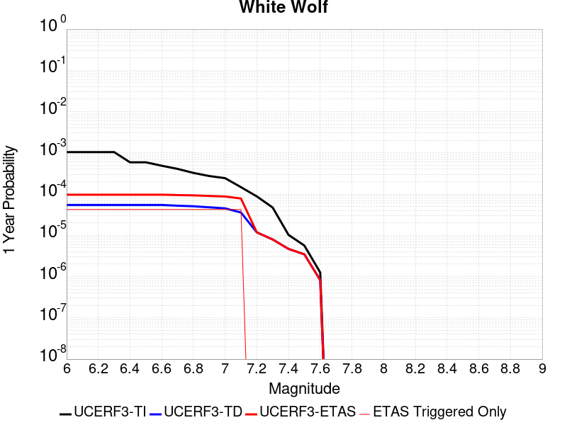 | 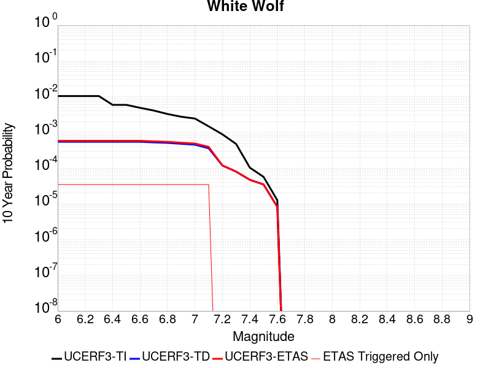 |

| Magnitude | 1 wk TI Prob | 1 wk TD Prob | 1 wk ETAS Prob | 1 wk ETAS/TD Gain | 1 wk ETAS Triggered Only | 1 mo TI Prob | 1 mo TD Prob | 1 mo ETAS Prob | 1 mo ETAS/TD Gain | 1 mo ETAS Triggered Only | 1 yr TI Prob | 1 yr TD Prob | 1 yr ETAS Prob | 1 yr ETAS/TD Gain | 1 yr ETAS Triggered Only | 10 yr TI Prob | 10 yr TD Prob | 10 yr ETAS Prob | 10 yr ETAS/TD Gain | 10 yr ETAS Triggered Only |
|-----|-----|-----|-----|-----|-----|-----|-----|-----|-----|-----|-----|-----|-----|-----|-----|-----|-----|-----|-----|-----|
| 6.0 | 2.0037822E-5 | 1.0468583E-6 | 3.5646503E-5 | 34.050934 | 3.459968E-5 | 8.587355E-5 | 4.4865283E-6 | 3.9086055E-5 | 8.711871 | 3.459968E-5 | 0.001045009 | 5.4622164E-5 | 8.921995E-5 | 1.6334021 | 3.459968E-5 | 0.010401085 | 5.4609246E-4 | 5.806732E-4 | 1.0633241 | 3.459968E-5 |
| 6.1 | 2.0037822E-5 | 1.0468583E-6 | 3.5646503E-5 | 34.050934 | 3.459968E-5 | 8.587355E-5 | 4.4865283E-6 | 3.9086055E-5 | 8.711871 | 3.459968E-5 | 0.001045009 | 5.4622164E-5 | 8.921995E-5 | 1.6334021 | 3.459968E-5 | 0.010401085 | 5.4609246E-4 | 5.806732E-4 | 1.0633241 | 3.459968E-5 |
| 6.2 | 2.0037822E-5 | 1.0468583E-6 | 3.5646503E-5 | 34.050934 | 3.459968E-5 | 8.587355E-5 | 4.4865283E-6 | 3.9086055E-5 | 8.711871 | 3.459968E-5 | 0.001045009 | 5.4622164E-5 | 8.921995E-5 | 1.6334021 | 3.459968E-5 | 0.010401085 | 5.4609246E-4 | 5.806732E-4 | 1.0633241 | 3.459968E-5 |
| 6.3 | 2.0037822E-5 | 1.0468583E-6 | 3.5646503E-5 | 34.050934 | 3.459968E-5 | 8.587355E-5 | 4.4865283E-6 | 3.9086055E-5 | 8.711871 | 3.459968E-5 | 0.001045009 | 5.4622164E-5 | 8.921995E-5 | 1.6334021 | 3.459968E-5 | 0.010401085 | 5.4609246E-4 | 5.806732E-4 | 1.0633241 | 3.459968E-5 |
| 6.4 | 1.132487E-5 | 1.0468583E-6 | 3.5646503E-5 | 34.050934 | 3.459968E-5 | 4.8534253E-5 | 4.4865283E-6 | 3.9086055E-5 | 8.711871 | 3.459968E-5 | 5.907443E-4 | 5.4622164E-5 | 8.921995E-5 | 1.6334021 | 3.459968E-5 | 0.005891764 | 5.4609246E-4 | 5.806732E-4 | 1.0633241 | 3.459968E-5 |
| 6.5 | 1.132487E-5 | 1.0468583E-6 | 3.5646503E-5 | 34.050934 | 3.459968E-5 | 4.8534253E-5 | 4.4865283E-6 | 3.9086055E-5 | 8.711871 | 3.459968E-5 | 5.907443E-4 | 5.4622164E-5 | 8.921995E-5 | 1.6334021 | 3.459968E-5 | 0.005891764 | 5.4609246E-4 | 5.806732E-4 | 1.0633241 | 3.459968E-5 |
| 6.6 | 9.347473E-6 | 1.0468583E-6 | 3.5646503E-5 | 34.050934 | 3.459968E-5 | 4.0059982E-5 | 4.4865283E-6 | 3.9086055E-5 | 8.711871 | 3.459968E-5 | 4.8762115E-4 | 5.4622164E-5 | 8.921995E-5 | 1.6334021 | 3.459968E-5 | 0.0048655253 | 5.4609246E-4 | 5.806732E-4 | 1.0633241 | 3.459968E-5 |
| 6.7 | 7.842647E-6 | 1.0047773E-6 | 3.5604426E-5 | 35.43514 | 3.459968E-5 | 3.361091E-5 | 4.306182E-6 | 3.8905713E-5 | 9.034852 | 3.459968E-5 | 4.0913603E-4 | 5.2426552E-5 | 8.702442E-5 | 1.6599302 | 3.459968E-5 | 0.004083836 | 5.241468E-4 | 5.5872835E-4 | 1.0659769 | 3.459968E-5 |
| 6.8 | 6.26597E-6 | 9.734289E-7 | 3.5573077E-5 | 36.544094 | 3.459968E-5 | 2.685388E-5 | 4.1718313E-6 | 3.877137E-5 | 9.293609 | 3.459968E-5 | 3.2689696E-4 | 5.0790914E-5 | 8.538884E-5 | 1.6811833 | 3.459968E-5 | 0.003264165 | 5.07798E-4 | 5.423801E-4 | 1.0681021 | 3.459968E-5 |
| 6.9 | 5.258436E-6 | 9.1827343E-7 | 3.551792E-5 | 38.679028 | 3.459968E-5 | 2.2535958E-5 | 3.935452E-6 | 3.8534996E-5 | 9.7917595 | 3.459968E-5 | 2.7434074E-4 | 4.7913123E-5 | 8.251115E-5 | 1.7220992 | 3.459968E-5 | 0.0027400232 | 4.7903272E-4 | 5.1361584E-4 | 1.0721936 | 3.459968E-5 |
| 7.0 | 4.675028E-6 | 8.660704E-7 | 3.546572E-5 | 40.95016 | 3.459968E-5 | 2.003568E-5 | 3.7117254E-6 | 3.831128E-5 | 10.32169 | 3.459968E-5 | 2.4390711E-4 | 4.518937E-5 | 7.978748E-5 | 1.7656252 | 3.459968E-5 | 0.0024363957 | 4.518065E-4 | 4.8639055E-4 | 1.0765462 | 3.459968E-5 |
| 7.1 | 2.8270078E-6 | 6.8737717E-7 | 3.5287034E-5 | 51.33577 | 3.459968E-5 | 1.2115692E-5 | 2.945899E-6 | 3.754548E-5 | 12.744999 | 3.459968E-5 | 1.4749856E-4 | 3.586577E-5 | 7.0464215E-5 | 1.9646646 | 3.459968E-5 | 0.001474007 | 3.5860392E-4 | 3.931912E-4 | 1.0964499 | 3.459968E-5 |
| 7.2 | 1.6881406E-6 | 2.2703432E-7 | 2.2703432E-7 | 1.0 | 0.0 | 7.2348685E-6 | 9.730038E-7 | 9.730038E-7 | 1.0 | 0.0 | 8.808096E-5 | 1.1846259E-5 | 1.1846259E-5 | 1.0 | 0.0 | 8.8046055E-4 | 1.1845643E-4 | 1.1845643E-4 | 1.0 | 0.0 |
| 7.3 | 9.086107E-7 | 1.5264496E-7 | 1.5264496E-7 | 1.0 | 0.0 | 3.8940398E-6 | 6.5419255E-7 | 6.5419255E-7 | 1.0 | 0.0 | 4.7408903E-5 | 7.964766E-6 | 7.964766E-6 | 1.0 | 0.0 | 4.739879E-4 | 7.964489E-5 | 7.964489E-5 | 1.0 | 0.0 |
| 7.4 | 1.9717383E-7 | 9.003399E-8 | 9.003399E-8 | 1.0 | 0.0 | 8.450304E-7 | 3.8585992E-7 | 3.8585992E-7 | 1.0 | 0.0 | 1.0288197E-5 | 4.697835E-6 | 4.697835E-6 | 1.0 | 0.0 | 1.028772E-4 | 4.6977384E-5 | 4.6977384E-5 | 1.0 | 0.0 |
| 7.5 | 1.086975E-7 | 6.659662E-8 | 6.659662E-8 | 1.0 | 0.0 | 4.6584634E-7 | 2.8541407E-7 | 2.8541407E-7 | 1.0 | 0.0 | 5.6716644E-6 | 3.474911E-6 | 3.474911E-6 | 1.0 | 0.0 | 5.6715195E-5 | 3.474859E-5 | 3.474859E-5 | 1.0 | 0.0 |
| 7.6 | 2.4217808E-8 | 1.5820849E-8 | 1.5820849E-8 | 1.0 | 0.0 | 1.03790605E-7 | 6.780364E-8 | 6.780364E-8 | 1.0 | 0.0 | 1.2636499E-6 | 8.25509E-7 | 8.25509E-7 | 1.0 | 0.0 | 1.2636427E-5 | 8.255064E-6 | 8.255064E-6 | 1.0 | 0.0 |

