# Parent Section Magnitude-Probability Distributions

Only fault sections with at least one triggered aftershock are plotted. Sections are sorted by total supraseismogenic trigger rate (decreasing)

## Table Of Contents

* [Garlock (Central)](#garlock-central)
* [Tank Canyon](#tank-canyon)
* [Little Lake](#little-lake)
* [Airport Lake](#airport-lake)
* [Owl Lake](#owl-lake)
* [Panamint Valley](#panamint-valley)
* [Garlock (East)](#garlock-east)
* [Hunter Mountain-Saline Valley](#hunter-mountain-saline-valley)
* [Blackwater](#blackwater)
* [Ash Hill](#ash-hill)
* [Garlock (West)](#garlock-west)
* [McLean Lake](#mclean-lake)
* [Gravel Hills-Harper Lk](#gravel-hills-harper-lk)
* [Goldstone Lake](#goldstone-lake)
* [San Andreas (Mojave S)](#san-andreas-mojave-s)
* [So Sierra Nevada](#so-sierra-nevada)
* [Coyote Canyon](#coyote-canyon)
* [San Andreas (Mojave N)](#san-andreas-mojave-n)
* [Death Valley (So)](#death-valley-so)
* [Nelson Lake](#nelson-lake)
* [Lenwood-Lockhart-Old Woman Springs](#lenwood-lockhart-old-woman-springs)
* [Towne Pass](#towne-pass)
* [San Andreas (San Bernardino N)](#san-andreas-san-bernardino-n)
* [Bicycle Lake](#bicycle-lake)
* [Paradise](#paradise)
* [Garlic Springs](#garlic-springs)
* [Death Valley (Black Mtns Frontal)](#death-valley-black-mtns-frontal)
* [San Andreas (San Bernardino S)](#san-andreas-san-bernardino-s)
* [Helendale-So Lockhart](#helendale-so-lockhart)
* [Coyote Lake](#coyote-lake)
* [San Andreas (Big Bend)](#san-andreas-big-bend)
* [San Andreas (San Gorgonio Pass-Garnet HIll)](#san-andreas-san-gorgonio-pass-garnet-hill)
* [San Andreas (Parkfield)](#san-andreas-parkfield)
* [San Andreas (Carrizo) rev](#san-andreas-carrizo-rev)
* [Death Valley (No)](#death-valley-no)
* [Elsinore (Glen Ivy) rev](#elsinore-glen-ivy-rev)
* [Calico-Hidalgo](#calico-hidalgo)
* [Death Valley (Fish Lake Valley)](#death-valley-fish-lake-valley)
* [Cady](#cady)
* [San Andreas (Cholame) rev](#san-andreas-cholame-rev)
* [San Andreas (Coachella) rev](#san-andreas-coachella-rev)
* [Sierra Nevada  (No Extension)](#sierra-nevada--no-extension)
* [Red Pass](#red-pass)
* [Manix-Afton Hills](#manix-afton-hills)
* [San Andreas (North Branch Mill Creek)](#san-andreas-north-branch-mill-creek)
* [San Jacinto (San Bernardino)](#san-jacinto-san-bernardino)
* [San Andreas (Creeping Section) 2011 CFM](#san-andreas-creeping-section-2011-cfm)
* [Ludlow](#ludlow)
* [Baker](#baker)
* [Santa Ynez (West)](#santa-ynez-west)
* [Scodie Lineament](#scodie-lineament)
* [White Wolf (Extension)](#white-wolf-extension)
* [Rose Canyon](#rose-canyon)
* [Lake Isabella (Seismicity)](#lake-isabella-seismicity)
* [San Jacinto (Stepovers Combined)](#san-jacinto-stepovers-combined)
* [Pinto Mtn](#pinto-mtn)
* [Brawley (Seismic Zone) alt 1](#brawley-seismic-zone-alt-1)
* [San Jacinto (San Jacinto Valley) rev](#san-jacinto-san-jacinto-valley-rev)
* [Santa Rosa Island](#santa-rosa-island)
* [Kern Canyon (North Kern) 2011](#kern-canyon-north-kern-2011)
* [San Jacinto (Anza) rev](#san-jacinto-anza-rev)
* [White Mountains](#white-mountains)
* [Independence rev 2011](#independence-rev-2011)
* [Imperial](#imperial)
* [Owens Valley](#owens-valley)
* [Mission Creek](#mission-creek)
* [Cleghorn Lake](#cleghorn-lake)
* [Santa Ynez (East)](#santa-ynez-east)
* [Deep Springs](#deep-springs)
* [Tin Mountain](#tin-mountain)
* [Chino alt 1](#chino-alt-1)
* [Cleghorn Pass](#cleghorn-pass)
* [San Jacinto (Clark) rev](#san-jacinto-clark-rev)
* [Big Pine (East)](#big-pine-east)
* [San Jacinto (Lytle Creek connector)](#san-jacinto-lytle-creek-connector)
* [Big Pine (Central)](#big-pine-central)
* [Great Valley 09 (Laguna Seca)](#great-valley-09-laguna-seca)
* [Santa Cruz Catalina Ridge alt1](#santa-cruz-catalina-ridge-alt1)
* [Dry Mountain](#dry-mountain)
* [Oak Ridge (Onshore)](#oak-ridge-onshore)
* [Santa Cruz Island](#santa-cruz-island)
* [Kern Canyon (South Kern) 2011](#kern-canyon-south-kern-2011)
* [Pine Mtn](#pine-mtn)
* [Mission Ridge-Arroyo Parida-Santa Ana](#mission-ridge-arroyo-parida-santa-ana)
* [Ortigalita (North)](#ortigalita-north)
* [Oceanic - West Huasna](#oceanic---west-huasna)
* [Whittier alt 1](#whittier-alt-1)
* [Cucamonga](#cucamonga)
* [Ventura-Pitas Point](#ventura-pitas-point)
* [Pisgah-Bullion Mtn-Mesquite Lk](#pisgah-bullion-mtn-mesquite-lk)
* [Simi-Santa Rosa](#simi-santa-rosa)
* [San Diego Trough south](#san-diego-trough-south)
* [Palos Verdes](#palos-verdes)
* [San Jacinto (Borrego)](#san-jacinto-borrego)
* [Red Mountain](#red-mountain)
* [Cleghorn](#cleghorn)
* [Raymond](#raymond)
* [Channel Islands Thrust](#channel-islands-thrust)
* [Elysian Park (Upper)](#elysian-park-upper)
* [San Diego Trough north alt1](#san-diego-trough-north-alt1)
* [Santa Ynez River](#santa-ynez-river)
* [Pleito](#pleito)
* [Blue Cut](#blue-cut)
* [Ortigalita (South)](#ortigalita-south)
* [Lost Hills](#lost-hills)
* [Bullion Mountains](#bullion-mountains)
* [White Wolf](#white-wolf)
* [San Jacinto (Coyote Creek)](#san-jacinto-coyote-creek)
* [San Pedro Basin](#san-pedro-basin)
* [Coronado Bank alt1](#coronado-bank-alt1)
* [Hayward (No) 2011 CFM](#hayward-no-2011-cfm)
* [San Clemente](#san-clemente)
* [Calaveras (So) 2011 CFM](#calaveras-so-2011-cfm)
* [Hunting Creek - Berryessa 2011 CFM](#hunting-creek---berryessa-2011-cfm)
* [Los Alamos 2011 CFM](#los-alamos-2011-cfm)
* [Los Alamos extension](#los-alamos-extension)
* [Sheephole](#sheephole)
* [Owens Valley Keough Hot Springs](#owens-valley-keough-hot-springs)
* [Johnson Valley (No) 2011 rev](#johnson-valley-no-2011-rev)
* [Robinson Creek](#robinson-creek)
* [Rinconada 2011 CFM](#rinconada-2011-cfm)
* [San Juan](#san-juan)
* [Malibu Coast alt 1](#malibu-coast-alt-1)
* [North Frontal  (East)](#north-frontal--east)
* [Bennett Valley 2011 CFM](#bennett-valley-2011-cfm)
* [Calaveras (So) - Paicines extension 2011 CFM](#calaveras-so---paicines-extension-2011-cfm)
* [San Jacinto (Superstition Mtn)](#san-jacinto-superstition-mtn)
* [Newport-Inglewood (Offshore)](#newport-inglewood-offshore)
* [Kern Canyon (Lake Isabella) 2011](#kern-canyon-lake-isabella-2011)
* [Channel Islands Western Deep Ramp](#channel-islands-western-deep-ramp)
* [Rodgers Creek - Healdsburg 2011 CFM](#rodgers-creek---healdsburg-2011-cfm)
* [Hollywood](#hollywood)
* [San Jose](#san-jose)
* [North Frontal  (West)](#north-frontal--west)
* [Calaveras (Central) 2011 CFM](#calaveras-central-2011-cfm)
* [Santa Monica alt 1](#santa-monica-alt-1)
* [Camp Rock 2011](#camp-rock-2011)
* [Hosgri](#hosgri)
* [Great Valley 05 Pittsburg - Kirby Hills alt1](#great-valley-05-pittsburg---kirby-hills-alt1)
* [Hayward (So) extension 2011 CFM](#hayward-so-extension-2011-cfm)
* [Carlsbad](#carlsbad)
* [Elsinore (Coyote Mountains)](#elsinore-coyote-mountains)
* [Mono Lake 2011 CFM](#mono-lake-2011-cfm)
* [Cerro Prieto](#cerro-prieto)
* [Pitas Point (Lower West)](#pitas-point-lower-west)
* [Hayward (So) 2011 CFM](#hayward-so-2011-cfm)
* [Santa Susana East (connector)](#santa-susana-east-connector)
* [Hosgri (Extension)](#hosgri-extension)
* [Great Valley 07 (Orestimba)](#great-valley-07-orestimba)
* [Santa Susana alt 1](#santa-susana-alt-1)
* [San Gorgonio Pass](#san-gorgonio-pass)
* [Great Valley 08 (Quinto)](#great-valley-08-quinto)
* [Green Valley 2011 CFM](#green-valley-2011-cfm)
* [San Cayetano](#san-cayetano)
* [Hunting Creek - Bartlett Springs connector 2011](#hunting-creek---bartlett-springs-connector-2011)
* [Sierra Madre](#sierra-madre)
* [Los Osos 2011](#los-osos-2011)
* [Fish Slough 2011 CFM](#fish-slough-2011-cfm)
* [Franklin 2011 CFM](#franklin-2011-cfm)
* [Laguna Salada](#laguna-salada)
* [Likely 2011 CFM](#likely-2011-cfm)
* [Hector Mine](#hector-mine)
* [South Klamath Lake West](#south-klamath-lake-west)
* [Newport-Inglewood alt 1](#newport-inglewood-alt-1)
* [Garberville - Briceland 2011 CFM](#garberville---briceland-2011-cfm)
* [Monterey Bay-Tularcitos](#monterey-bay-tularcitos)
* [Malibu Coast (Extension) alt 1](#malibu-coast-extension-alt-1)
* [Maacama 2011 CFM](#maacama-2011-cfm)
* [Round Valley](#round-valley)
* [Keddie Ridge 2011 CFM](#keddie-ridge-2011-cfm)
* [Carson Range (Genoa)](#carson-range-genoa)
* [Morales (East)](#morales-east)
* [Elmore Ranch](#elmore-ranch)
* [San Luis Range 2011 CFM](#san-luis-range-2011-cfm)
* [Cedar Mtn-Mahogany Mtn](#cedar-mtn-mahogany-mtn)
* [Contra Costa (Lafayette) 2011 CFM](#contra-costa-lafayette-2011-cfm)
* [Northridge](#northridge)
* [Big Lagoon - Bald Mtn 2011 CFM](#big-lagoon---bald-mtn-2011-cfm)
* [Bartlett Springs 2011 CFM](#bartlett-springs-2011-cfm)
* [Clayton](#clayton)
* [Jess Valley](#jess-valley)
* [Calaveras (No) 2011 CFM](#calaveras-no-2011-cfm)
* [Contra Costa Shear Zone (connector) 2011 CFM](#contra-costa-shear-zone-connector-2011-cfm)
* [Great Valley 03a Dunnigan Hills](#great-valley-03a-dunnigan-hills)
* [Shoreline](#shoreline)
* [Eaton Roughs 2011 CFM](#eaton-roughs-2011-cfm)
* [Elsinore (Temecula) rev](#elsinore-temecula-rev)
* [Del Valle](#del-valle)
* [San Gabriel (Extension)](#san-gabriel-extension)
* [San Gregorio (North) 2011 CFM](#san-gregorio-north-2011-cfm)
* [Elsinore (Stepovers Combined)](#elsinore-stepovers-combined)
* [Superstition Hills](#superstition-hills)
* [Rocky Ledge 2011 CFM](#rocky-ledge-2011-cfm)
* [Emerson-Copper Mtn 2011](#emerson-copper-mtn-2011)
* [Russ 2011 CFM](#russ-2011-cfm)
* [Casmalia 2011 CFM](#casmalia-2011-cfm)
* [Pittville 2011 CFM](#pittville-2011-cfm)
* [East Huasna 2011 CFM](#east-huasna-2011-cfm)
* [Sierra Madre (San Fernando)](#sierra-madre-san-fernando)
* [Sisar](#sisar)
* [San Luis Range - Pecho 2011 CFM](#san-luis-range---pecho-2011-cfm)
* [Fitzhugh Creek](#fitzhugh-creek)
* [Davis Creek](#davis-creek)
* [Holser alt 1](#holser-alt-1)
* [Almanor 2011 CFM](#almanor-2011-cfm)
* [Great Valley 10 (Panoche)](#great-valley-10-panoche)

## Garlock (Central)
*[(top)](#table-of-contents)*

| 1 Week | 1 Month | 1 Year | 10 Year |
|-----|-----|-----|-----|
|  |  | 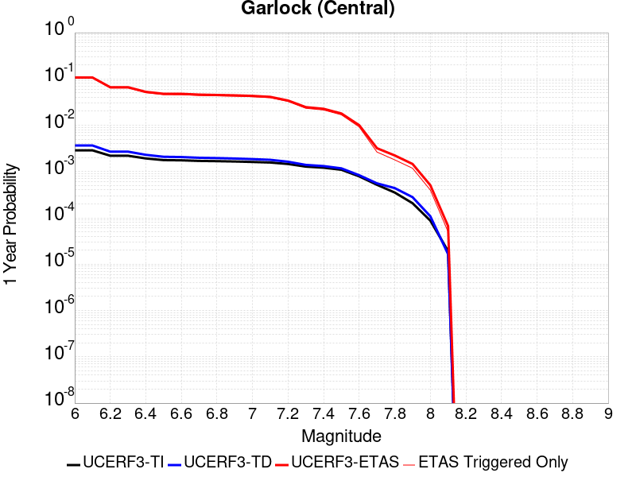 |  |

| Magnitude | 1 wk TI Prob | 1 wk TD Prob | 1 wk ETAS Prob | 1 wk ETAS/TD Gain | 1 wk ETAS Triggered Only | 1 mo TI Prob | 1 mo TD Prob | 1 mo ETAS Prob | 1 mo ETAS/TD Gain | 1 mo ETAS Triggered Only | 1 yr TI Prob | 1 yr TD Prob | 1 yr ETAS Prob | 1 yr ETAS/TD Gain | 1 yr ETAS Triggered Only | 10 yr TI Prob | 10 yr TD Prob | 10 yr ETAS Prob | 10 yr ETAS/TD Gain | 10 yr ETAS Triggered Only |
|-----|-----|-----|-----|-----|-----|-----|-----|-----|-----|-----|-----|-----|-----|-----|-----|-----|-----|-----|-----|-----|
| 6.0 | 5.5131142E-5 | 7.02476E-5 | 0.0650509 | 926.0231 | 0.064985216 | 2.3625491E-4 | 3.0102677E-4 | 0.07971921 | 264.8243 | 0.07944209 | 0.0028726095 | 0.003658906 | 0.1076579 | 29.423521 | 0.10438091 | 0.028357591 | 0.036136657 | 0.1591198 | 4.40328 | 0.12759396 |
| 6.1 | 5.5131142E-5 | 7.02476E-5 | 0.0650509 | 926.0231 | 0.064985216 | 2.3625491E-4 | 3.0102677E-4 | 0.07971921 | 264.8243 | 0.07944209 | 0.0028726095 | 0.003658906 | 0.1076579 | 29.423521 | 0.10438091 | 0.028357591 | 0.036136657 | 0.1591198 | 4.40328 | 0.12759396 |
| 6.2 | 4.216245E-5 | 5.1661802E-5 | 0.039049264 | 755.8634 | 0.038999617 | 1.806837E-4 | 2.213891E-4 | 0.04810803 | 217.30081 | 0.047897246 | 0.0021976046 | 0.002692112 | 0.06637377 | 24.65491 | 0.06385356 | 0.021759989 | 0.026701318 | 0.10333381 | 3.869989 | 0.07873481 |
| 6.3 | 4.216245E-5 | 5.1661802E-5 | 0.039049264 | 755.8634 | 0.038999617 | 1.806837E-4 | 2.213891E-4 | 0.04810803 | 217.30081 | 0.047897246 | 0.0021976046 | 0.002692112 | 0.06637377 | 24.65491 | 0.06385356 | 0.021759989 | 0.026701318 | 0.10333381 | 3.869989 | 0.07873481 |
| 6.4 | 3.6858168E-5 | 4.411026E-5 | 0.03063985 | 694.61957 | 0.030597089 | 1.5795401E-4 | 1.8903041E-4 | 0.037851833 | 200.24203 | 0.037669923 | 0.0019213937 | 0.0022990413 | 0.052767668 | 22.95203 | 0.050584923 | 0.019048655 | 0.022866098 | 0.08387736 | 3.6681972 | 0.062439 |
| 6.5 | 3.39199E-5 | 4.0018425E-5 | 0.027679555 | 691.6703 | 0.027640643 | 1.453629E-4 | 1.7149639E-4 | 0.034369867 | 200.4116 | 0.034204233 | 0.0017683565 | 0.0020859907 | 0.048118804 | 23.0676 | 0.046129037 | 0.017543508 | 0.020758783 | 0.076388516 | 3.6798167 | 0.05680902 |
| 6.6 | 3.3571985E-5 | 3.947258E-5 | 0.027650734 | 700.5049 | 0.027612353 | 1.4387199E-4 | 1.6915736E-4 | 0.03433932 | 203.00223 | 0.034175944 | 0.0017502342 | 0.0020575672 | 0.048021108 | 23.33878 | 0.04605831 | 0.017365133 | 0.020480042 | 0.07598705 | 3.7102976 | 0.056667563 |
| 6.7 | 3.2580007E-5 | 3.808902E-5 | 0.026560213 | 697.31946 | 0.026523136 | 1.3962112E-4 | 1.6322857E-4 | 0.03301826 | 202.28238 | 0.032860395 | 0.0016985617 | 0.0019855178 | 0.046074737 | 23.2054 | 0.044176932 | 0.016856372 | 0.019770874 | 0.07319657 | 3.7022426 | 0.054503273 |
| 6.8 | 3.2185937E-5 | 3.7516216E-5 | 0.026078722 | 695.132 | 0.026042182 | 1.3793244E-4 | 1.60774E-4 | 0.03240772 | 201.57315 | 0.032252133 | 0.0016780337 | 0.0019556875 | 0.045269735 | 23.147736 | 0.04339892 | 0.016654192 | 0.019477878 | 0.071962506 | 3.6945763 | 0.053527225 |
| 6.9 | 3.165394E-5 | 3.672075E-5 | 0.025568722 | 696.3017 | 0.025532939 | 1.3565269E-4 | 1.5736527E-4 | 0.031753823 | 201.78418 | 0.031601433 | 0.0016503202 | 0.00191426 | 0.044425346 | 23.207582 | 0.04259262 | 0.01638118 | 0.019071518 | 0.0705372 | 3.6985626 | 0.0524663 |
| 7.0 | 3.0903822E-5 | 3.562591E-5 | 0.024832105 | 697.02374 | 0.024797363 | 1.3243823E-4 | 1.5267366E-4 | 0.030844096 | 202.0263 | 0.030696109 | 0.0016112428 | 0.0018572382 | 0.043184724 | 23.25212 | 0.04140438 | 0.015996104 | 0.018513493 | 0.06860619 | 3.7057402 | 0.051037584 |
| 7.1 | 3.0069863E-5 | 3.4392175E-5 | 0.023501255 | 683.3315 | 0.02346767 | 1.2886449E-4 | 1.4738683E-4 | 0.029184172 | 198.01073 | 0.029041065 | 0.0015677959 | 0.0017929787 | 0.041188642 | 22.972187 | 0.039466426 | 0.01556781 | 0.01788099 | 0.06563032 | 3.670396 | 0.048618674 |
| 7.2 | 2.7957109E-5 | 3.128141E-5 | 0.019240504 | 615.0778 | 0.019209823 | 1.1981068E-4 | 1.3405642E-4 | 0.024065325 | 179.51639 | 0.023934478 | 0.0014577188 | 0.0016309345 | 0.03412704 | 20.924837 | 0.03254919 | 0.014481937 | 0.016284352 | 0.05591518 | 3.4336755 | 0.040286873 |
| 7.3 | 2.4519275E-5 | 2.6714602E-5 | 0.013931539 | 521.4953 | 0.0139051955 | 1.0507837E-4 | 1.1448621E-4 | 0.01729951 | 151.10562 | 0.017186992 | 0.0012785783 | 0.001392993 | 0.024714965 | 17.742346 | 0.023354504 | 0.012712469 | 0.01392861 | 0.04239779 | 3.0439355 | 0.028871316 |
| 7.4 | 2.3225532E-5 | 2.5199166E-5 | 0.012784274 | 507.32922 | 0.012759396 | 9.95342E-5 | 1.0799204E-4 | 0.015850425 | 146.77402 | 0.015744133 | 0.0012111551 | 0.0013140244 | 0.02280132 | 17.35228 | 0.021515567 | 0.012045753 | 0.013146196 | 0.03936253 | 2.9942145 | 0.026565572 |
| 7.5 | 2.097765E-5 | 2.2483406E-5 | 0.010108121 | 449.5814 | 0.010085864 | 8.9901114E-5 | 9.6353964E-5 | 0.012515058 | 129.88628 | 0.0124199 | 0.0010939965 | 0.00117249 | 0.018169781 | 15.496747 | 0.017017243 | 0.010886264 | 0.0117406575 | 0.032500353 | 2.7681885 | 0.021006323 |
| 7.6 | 1.511254E-5 | 1.5990969E-5 | 0.005787333 | 361.9126 | 0.0057714344 | 6.476642E-5 | 6.8530964E-5 | 0.0069287117 | 101.10337 | 0.006860651 | 7.882459E-4 | 8.34053E-4 | 0.010176543 | 12.201316 | 0.00935029 | 0.007854558 | 0.008383867 | 0.019703718 | 2.3501945 | 0.011415557 |
| 7.7 | 9.934069E-6 | 1.0678523E-5 | 0.0017364321 | 162.60976 | 0.001725772 | 4.2573887E-5 | 4.5764296E-5 | 0.0020685028 | 45.19905 | 0.002022831 | 5.182138E-4 | 5.570383E-4 | 0.0032856322 | 5.898396 | 0.0027301146 | 0.00517007 | 0.005627419 | 0.008989209 | 1.5973947 | 0.0033808157 |
| 7.8 | 6.7562896E-6 | 8.42837E-6 | 0.0011400726 | 135.26608 | 0.0011316538 | 2.8955206E-5 | 3.6121084E-5 | 0.0013799114 | 38.202377 | 0.0013438389 | 3.5247262E-4 | 4.3968562E-4 | 0.002291954 | 5.2127104 | 0.001853083 | 0.0035191406 | 0.004446416 | 0.006713743 | 1.5099223 | 0.0022774532 |
| 7.9 | 3.975453E-6 | 5.3710532E-6 | 8.1167003E-4 | 151.11935 | 8.063033E-4 | 1.7037546E-5 | 2.3018596E-5 | 9.2832075E-4 | 40.329166 | 9.05323E-4 | 2.0741238E-4 | 2.8021546E-4 | 0.0014539773 | 5.188783 | 0.0011740908 | 0.002072189 | 0.0028335669 | 0.004300548 | 1.5177155 | 0.0014711499 |
| 8.0 | 1.6729537E-6 | 2.0775192E-6 | 2.99136E-4 | 143.98712 | 2.970591E-4 | 7.169782E-6 | 8.903624E-6 | 3.2010564E-4 | 35.952286 | 3.1120479E-4 | 8.7288594E-5 | 1.0839626E-4 | 5.327204E-4 | 4.9145646 | 4.2437017E-4 | 8.7254314E-4 | 0.001096854 | 0.0016196698 | 1.4766502 | 5.2338984E-4 |
| 8.1 | 3.6733252E-7 | 3.1489736E-7 | 2.8606233E-5 | 90.84303 | 2.8291344E-5 | 1.5742813E-6 | 1.3495595E-6 | 2.9640865E-5 | 21.963362 | 2.8291344E-5 | 1.9166706E-5 | 1.643078E-5 | 7.301254E-5 | 4.443644 | 5.658269E-5 | 1.9165053E-4 | 1.662928E-4 | 2.2286607E-4 | 1.3402028 | 5.658269E-5 |

## Tank Canyon
*[(top)](#table-of-contents)*

| 1 Week | 1 Month | 1 Year | 10 Year |
|-----|-----|-----|-----|
|  |  |  |  |

| Magnitude | 1 wk TI Prob | 1 wk TD Prob | 1 wk ETAS Prob | 1 wk ETAS/TD Gain | 1 wk ETAS Triggered Only | 1 mo TI Prob | 1 mo TD Prob | 1 mo ETAS Prob | 1 mo ETAS/TD Gain | 1 mo ETAS Triggered Only | 1 yr TI Prob | 1 yr TD Prob | 1 yr ETAS Prob | 1 yr ETAS/TD Gain | 1 yr ETAS Triggered Only | 10 yr TI Prob | 10 yr TD Prob | 10 yr ETAS Prob | 10 yr ETAS/TD Gain | 10 yr ETAS Triggered Only |
|-----|-----|-----|-----|-----|-----|-----|-----|-----|-----|-----|-----|-----|-----|-----|-----|-----|-----|-----|-----|-----|
| 6.0 | 4.8284557E-5 | 5.796445E-5 | 0.036212206 | 624.7313 | 0.036156338 | 2.0691741E-4 | 2.4839927E-4 | 0.047709484 | 192.06773 | 0.047472876 | 0.0025163088 | 0.0030207336 | 0.07302774 | 24.175497 | 0.070219114 | 0.02488006 | 0.029863616 | 0.121411294 | 4.0655255 | 0.094365776 |
| 6.1 | 1.7796336E-5 | 2.0873378E-5 | 0.012511241 | 599.3875 | 0.012490628 | 7.626778E-5 | 8.945448E-5 | 0.016652554 | 186.15674 | 0.016564582 | 9.281647E-4 | 0.0010886024 | 0.026056794 | 23.936008 | 0.024995403 | 0.009242975 | 0.010836642 | 0.04556573 | 4.204783 | 0.035109557 |
| 6.2 | 1.7796336E-5 | 2.0873378E-5 | 0.012511241 | 599.3875 | 0.012490628 | 7.626778E-5 | 8.945448E-5 | 0.016652554 | 186.15674 | 0.016564582 | 9.281647E-4 | 0.0010886024 | 0.026056794 | 23.936008 | 0.024995403 | 0.009242975 | 0.010836642 | 0.04556573 | 4.204783 | 0.035109557 |
| 6.3 | 1.3515912E-5 | 1.5759651E-5 | 0.008884956 | 563.7787 | 0.008869336 | 5.792405E-5 | 6.7539746E-5 | 0.011807655 | 174.82527 | 0.011740908 | 7.049971E-4 | 8.2200987E-4 | 0.018772246 | 22.837008 | 0.017965004 | 0.007027647 | 0.008192157 | 0.03375443 | 4.120335 | 0.025773415 |
| 6.4 | 1.0870146E-5 | 1.2618114E-5 | 0.0065761274 | 521.1656 | 0.006563592 | 4.658551E-5 | 5.4076605E-5 | 0.008767339 | 162.12814 | 0.008713734 | 5.67031E-4 | 6.582015E-4 | 0.014045335 | 21.33896 | 0.013395951 | 0.005655863 | 0.006564382 | 0.025788631 | 3.9285698 | 0.01935128 |
| 6.5 | 7.964826E-6 | 9.196184E-6 | 0.0041396944 | 450.15353 | 0.004130536 | 3.4134522E-5 | 3.941168E-5 | 0.0056550223 | 143.48595 | 0.005615832 | 4.1550855E-4 | 4.797421E-4 | 0.009019629 | 18.800995 | 0.008543986 | 0.0041473247 | 0.004788209 | 0.017050095 | 3.56085 | 0.012320881 |
| 6.6 | 6.6317E-6 | 7.612378E-6 | 0.0031762188 | 417.24396 | 0.0031686306 | 2.8421264E-5 | 3.262412E-5 | 0.004304478 | 131.94157 | 0.004271993 | 3.4597394E-4 | 3.9713533E-4 | 0.00683086 | 17.200333 | 0.006436281 | 0.0034543579 | 0.0039652516 | 0.013123479 | 3.3096209 | 0.009194687 |
| 6.7 | 4.793663E-6 | 5.4308593E-6 | 0.0017311935 | 318.7697 | 0.001725772 | 2.0544108E-5 | 2.3274928E-5 | 0.0024704193 | 106.14079 | 0.0024472012 | 2.500958E-4 | 2.833398E-4 | 0.0040450227 | 14.276225 | 0.0037627488 | 0.0024981452 | 0.0028303189 | 0.00806351 | 2.8489757 | 0.005248044 |
| 6.8 | 4.382823E-6 | 4.969325E-6 | 0.0015044031 | 302.7379 | 0.0014994412 | 1.8783392E-5 | 2.1296957E-5 | 0.0021431027 | 100.62952 | 0.0021218508 | 2.286638E-4 | 2.5926388E-4 | 0.003540209 | 13.654849 | 0.003281796 | 0.0022842865 | 0.0025901233 | 0.0071896682 | 2.7758014 | 0.004611489 |
| 6.9 | 2.729601E-6 | 3.0735862E-6 | 6.8206375E-4 | 221.91138 | 6.7899225E-4 | 1.1698237E-5 | 1.3172453E-5 | 9.89211E-4 | 75.09695 | 9.760514E-4 | 1.4241673E-4 | 1.6036403E-4 | 0.0017444253 | 10.877909 | 0.0015843153 | 0.001423255 | 0.0016024808 | 0.0038480384 | 2.401301 | 0.002249162 |
| 7.0 | 1.8987357E-6 | 2.126971E-6 | 2.9918546E-4 | 140.66269 | 2.970591E-4 | 8.137413E-6 | 9.115562E-6 | 4.0519077E-4 | 44.450443 | 3.9607883E-4 | 9.90685E-5 | 1.1097702E-4 | 8.04038E-4 | 7.245086 | 6.9313793E-4 | 9.902435E-4 | 0.0011092846 | 0.0020559933 | 1.8534408 | 9.4776E-4 |
| 7.1 | 1.4928986E-6 | 1.6641525E-6 | 1.5726629E-4 | 94.50233 | 1.5560239E-4 | 6.398121E-6 | 7.132066E-6 | 2.1931564E-4 | 30.750645 | 2.1218508E-4 | 7.789434E-5 | 8.6830034E-5 | 4.6873002E-4 | 5.3982477 | 3.8193315E-4 | 7.786704E-4 | 8.6801895E-4 | 0.0013909545 | 1.6024472 | 5.2338984E-4 |
| 7.2 | 1.069082E-6 | 1.1828765E-6 | 7.1911156E-5 | 60.793453 | 7.072836E-5 | 4.581772E-6 | 5.0694644E-6 | 7.579746E-5 | 14.951771 | 7.072836E-5 | 5.5781646E-5 | 6.171951E-5 | 2.173123E-4 | 3.520966 | 1.5560239E-4 | 5.576765E-4 | 6.1707594E-4 | 8.008562E-4 | 1.2978244 | 1.8389373E-4 |
| 7.3 | 8.776551E-7 | 9.770151E-7 | 4.341399E-5 | 44.43533 | 4.2437016E-5 | 3.7613736E-6 | 4.187204E-6 | 4.662404E-5 | 11.134887 | 4.2437016E-5 | 4.579376E-5 | 5.0978535E-5 | 1.3584824E-4 | 2.6648126 | 8.487403E-5 | 4.5784327E-4 | 5.097194E-4 | 6.228271E-4 | 1.2219019 | 1.1316538E-4 |
| 7.4 | 7.55721E-7 | 8.5103835E-7 | 4.328802E-5 | 50.864944 | 4.2437016E-5 | 3.2388E-6 | 3.6473052E-6 | 4.6084166E-5 | 12.635128 | 4.2437016E-5 | 3.9431678E-5 | 4.4405555E-5 | 8.6840686E-5 | 1.9556267 | 4.2437016E-5 | 3.942468E-4 | 4.4401767E-4 | 5.0057523E-4 | 1.1273768 | 5.658269E-5 |
| 7.5 | 5.587665E-7 | 6.305732E-7 | 2.8921899E-5 | 45.866047 | 2.8291344E-5 | 2.3947114E-6 | 2.7024564E-6 | 3.0993724E-5 | 11.468722 | 2.8291344E-5 | 2.915522E-5 | 3.2902408E-5 | 6.119282E-5 | 1.8598281 | 2.8291344E-5 | 2.9151395E-4 | 3.2902407E-4 | 3.5730613E-4 | 1.0859573 | 2.8291344E-5 |

## Little Lake
*[(top)](#table-of-contents)*

| 1 Week | 1 Month | 1 Year | 10 Year |
|-----|-----|-----|-----|
|  |  |  |  |

| Magnitude | 1 wk TI Prob | 1 wk TD Prob | 1 wk ETAS Prob | 1 wk ETAS/TD Gain | 1 wk ETAS Triggered Only | 1 mo TI Prob | 1 mo TD Prob | 1 mo ETAS Prob | 1 mo ETAS/TD Gain | 1 mo ETAS Triggered Only | 1 yr TI Prob | 1 yr TD Prob | 1 yr ETAS Prob | 1 yr ETAS/TD Gain | 1 yr ETAS Triggered Only | 10 yr TI Prob | 10 yr TD Prob | 10 yr ETAS Prob | 10 yr ETAS/TD Gain | 10 yr ETAS Triggered Only |
|-----|-----|-----|-----|-----|-----|-----|-----|-----|-----|-----|-----|-----|-----|-----|-----|-----|-----|-----|-----|-----|
| 6.0 | 2.8424427E-5 | 3.1205716E-5 | 0.030726356 | 984.63873 | 0.030696109 | 1.2181328E-4 | 1.3373268E-4 | 0.03820879 | 285.7102 | 0.03808015 | 0.0014820677 | 0.0016271125 | 0.050943427 | 31.3091 | 0.049396686 | 0.014722223 | 0.016165398 | 0.07599459 | 4.701065 | 0.060812246 |
| 6.1 | 2.8424427E-5 | 3.1205716E-5 | 0.030726356 | 984.63873 | 0.030696109 | 1.2181328E-4 | 1.3373268E-4 | 0.03820879 | 285.7102 | 0.03808015 | 0.0014820677 | 0.0016271125 | 0.050943427 | 31.3091 | 0.049396686 | 0.014722223 | 0.016165398 | 0.07599459 | 4.701065 | 0.060812246 |
| 6.2 | 2.8424427E-5 | 3.1205716E-5 | 0.030726356 | 984.63873 | 0.030696109 | 1.2181328E-4 | 1.3373268E-4 | 0.03820879 | 285.7102 | 0.03808015 | 0.0014820677 | 0.0016271125 | 0.050943427 | 31.3091 | 0.049396686 | 0.014722223 | 0.016165398 | 0.07599459 | 4.701065 | 0.060812246 |
| 6.3 | 1.48860645E-5 | 1.6081383E-5 | 0.021149376 | 1315.1465 | 0.021133633 | 6.379586E-5 | 6.8918554E-5 | 0.026307331 | 381.71625 | 0.026240222 | 7.7643775E-4 | 8.387886E-4 | 0.03451965 | 41.15417 | 0.033709135 | 0.007737305 | 0.008359045 | 0.048926365 | 5.8531046 | 0.040909283 |
| 6.4 | 1.48860645E-5 | 1.6081383E-5 | 0.021149376 | 1315.1465 | 0.021133633 | 6.379586E-5 | 6.8918554E-5 | 0.026307331 | 381.71625 | 0.026240222 | 7.7643775E-4 | 8.387886E-4 | 0.03451965 | 41.15417 | 0.033709135 | 0.007737305 | 0.008359045 | 0.048926365 | 5.8531046 | 0.040909283 |
| 6.5 | 1.2797581E-5 | 1.376556E-5 | 0.019874016 | 1443.7493 | 0.019860523 | 5.4845623E-5 | 5.8994065E-5 | 0.0246993 | 418.67435 | 0.024641762 | 6.675408E-4 | 7.1804173E-4 | 0.032226104 | 44.880543 | 0.031530704 | 0.006655392 | 0.007159767 | 0.045051537 | 6.292319 | 0.03816502 |
| 6.6 | 9.661896E-6 | 1.0289033E-5 | 0.017310267 | 1682.4 | 0.017300157 | 4.1407468E-5 | 4.40952E-5 | 0.021332392 | 483.7804 | 0.021289237 | 5.040193E-4 | 5.36743E-4 | 0.027710132 | 51.62644 | 0.027187983 | 0.005028777 | 0.0053560715 | 0.038054537 | 7.104934 | 0.032874543 |
| 6.7 | 7.767871E-6 | 8.199681E-6 | 0.015101508 | 1841.7189 | 0.015093432 | 3.329045E-5 | 3.5141096E-5 | 0.018678483 | 531.52814 | 0.018643996 | 4.0523586E-4 | 4.2777258E-4 | 0.024323732 | 56.861366 | 0.023906186 | 0.004044977 | 0.004270843 | 0.033047024 | 7.7378225 | 0.028899608 |
| 6.8 | 6.4235196E-6 | 6.735739E-6 | 0.011860729 | 1760.8652 | 0.011854073 | 2.752908E-5 | 2.8867207E-5 | 0.014725796 | 510.12198 | 0.014697353 | 3.35115E-4 | 3.5141438E-4 | 0.019186828 | 54.59887 | 0.018842036 | 0.003346101 | 0.0035098472 | 0.026260829 | 7.4820433 | 0.022831114 |
| 6.9 | 3.1283696E-6 | 3.1121751E-6 | 0.0072032367 | 2314.5347 | 0.007200147 | 1.3407229E-5 | 1.33378335E-5 | 0.008910847 | 668.088 | 0.008897628 | 1.6322079E-4 | 1.6237753E-4 | 0.011618512 | 71.55246 | 0.011457995 | 0.0016310095 | 0.0016227372 | 0.0153217735 | 9.441932 | 0.013721302 |
| 7.0 | 2.290603E-6 | 2.2286763E-6 | 0.004486397 | 2013.0321 | 0.004484178 | 9.816834E-6 | 9.551441E-6 | 0.005554602 | 581.546 | 0.0055451035 | 1.19513395E-4 | 1.1628362E-4 | 0.0072731613 | 62.54674 | 0.00715771 | 0.0011944914 | 0.0011623299 | 0.009738772 | 8.378665 | 0.008586423 |
| 7.1 | 1.293693E-6 | 1.1776774E-6 | 0.0021088803 | 1790.7114 | 0.0021077052 | 5.5443866E-6 | 5.047183E-6 | 0.0025936922 | 513.88904 | 0.002588658 | 6.750081E-5 | 6.1448416E-5 | 0.0033430427 | 54.40405 | 0.003281796 | 6.7480316E-4 | 6.1438273E-4 | 0.0046151485 | 7.5118456 | 0.0040032254 |
| 7.2 | 4.715842E-7 | 3.091732E-7 | 1.1347452E-4 | 367.02573 | 1.1316538E-4 | 2.0210737E-6 | 1.3250274E-6 | 1.4278156E-4 | 107.75745 | 1.4145672E-4 | 2.4606294E-5 | 1.6132095E-5 | 2.0002287E-4 | 12.399064 | 1.8389373E-4 | 2.460357E-4 | 1.6130977E-4 | 3.8760403E-4 | 2.4028552 | 2.2633075E-4 |
| 7.3 | 3.9430947E-7 | 2.3096938E-7 | 8.5104984E-5 | 368.46866 | 8.487403E-5 | 1.6898966E-6 | 9.898685E-7 | 1.1415513E-4 | 115.32355 | 1.1316538E-4 | 2.0574296E-5 | 1.2051582E-5 | 1.676521E-4 | 13.911211 | 1.5560239E-4 | 2.0572392E-4 | 1.2050936E-4 | 3.0438093E-4 | 2.5257866 | 1.8389373E-4 |
| 7.4 | 3.547123E-7 | 1.9678579E-7 | 8.50708E-5 | 432.30154 | 8.487403E-5 | 1.5201948E-6 | 8.433674E-7 | 1.14008646E-4 | 135.18266 | 1.1316538E-4 | 1.8508214E-5 | 1.02679505E-5 | 1.6586874E-4 | 16.154026 | 1.5560239E-4 | 1.8506673E-4 | 1.0267482E-4 | 2.7240545E-4 | 2.653089 | 1.6974806E-4 |
| 7.5 | 2.6354266E-7 | 1.4422719E-7 | 5.672691E-5 | 393.3163 | 5.658269E-5 | 1.129468E-6 | 6.1811636E-7 | 7.134643E-5 | 115.42557 | 7.072836E-5 | 1.3751187E-5 | 7.525541E-6 | 1.065445E-4 | 14.15772 | 9.901971E-5 | 1.3750336E-4 | 7.5252916E-5 | 1.8840977E-4 | 2.5036874 | 1.1316538E-4 |
| 7.6 | 1.269913E-7 | 7.572344E-8 | 2.8367065E-5 | 374.61404 | 2.8291344E-5 | 5.4424834E-7 | 3.24529E-7 | 2.8615865E-5 | 88.1766 | 2.8291344E-5 | 6.6262032E-6 | 3.9511337E-6 | 4.6387984E-5 | 11.740423 | 4.2437016E-5 | 6.626006E-5 | 3.9510673E-5 | 8.194601E-5 | 2.0740223 | 4.2437016E-5 |

## Airport Lake
*[(top)](#table-of-contents)*

| 1 Week | 1 Month | 1 Year | 10 Year |
|-----|-----|-----|-----|
| 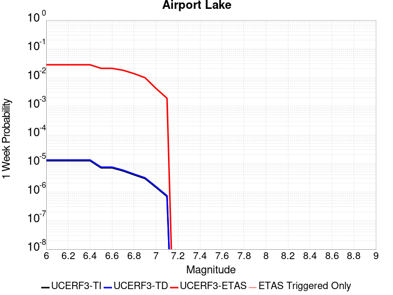 |  |  |  |

| Magnitude | 1 wk TI Prob | 1 wk TD Prob | 1 wk ETAS Prob | 1 wk ETAS/TD Gain | 1 wk ETAS Triggered Only | 1 mo TI Prob | 1 mo TD Prob | 1 mo ETAS Prob | 1 mo ETAS/TD Gain | 1 mo ETAS Triggered Only | 1 yr TI Prob | 1 yr TD Prob | 1 yr ETAS Prob | 1 yr ETAS/TD Gain | 1 yr ETAS Triggered Only | 10 yr TI Prob | 10 yr TD Prob | 10 yr ETAS Prob | 10 yr ETAS/TD Gain | 10 yr ETAS Triggered Only |
|-----|-----|-----|-----|-----|-----|-----|-----|-----|-----|-----|-----|-----|-----|-----|-----|-----|-----|-----|-----|-----|
| 6.0 | 1.2387061E-5 | 1.3103157E-5 | 0.027766548 | 2119.0732 | 0.02775381 | 5.3086325E-5 | 5.615534E-5 | 0.033819977 | 602.25757 | 0.03376572 | 6.461343E-4 | 6.8350515E-4 | 0.044123445 | 64.55466 | 0.04346965 | 0.0064425888 | 0.0068168393 | 0.058546152 | 8.58846 | 0.052084364 |
| 6.1 | 1.2387061E-5 | 1.3103157E-5 | 0.027766548 | 2119.0732 | 0.02775381 | 5.3086325E-5 | 5.615534E-5 | 0.033819977 | 602.25757 | 0.03376572 | 6.461343E-4 | 6.8350515E-4 | 0.044123445 | 64.55466 | 0.04346965 | 0.0064425888 | 0.0068168393 | 0.058546152 | 8.58846 | 0.052084364 |
| 6.2 | 1.2387061E-5 | 1.3103157E-5 | 0.027766548 | 2119.0732 | 0.02775381 | 5.3086325E-5 | 5.615534E-5 | 0.033819977 | 602.25757 | 0.03376572 | 6.461343E-4 | 6.8350515E-4 | 0.044123445 | 64.55466 | 0.04346965 | 0.0064425888 | 0.0068168393 | 0.058546152 | 8.58846 | 0.052084364 |
| 6.3 | 1.2387061E-5 | 1.3103157E-5 | 0.027766548 | 2119.0732 | 0.02775381 | 5.3086325E-5 | 5.615534E-5 | 0.033819977 | 602.25757 | 0.03376572 | 6.461343E-4 | 6.8350515E-4 | 0.044123445 | 64.55466 | 0.04346965 | 0.0064425888 | 0.0068168393 | 0.058546152 | 8.58846 | 0.052084364 |
| 6.4 | 1.2387061E-5 | 1.3103157E-5 | 0.027766548 | 2119.0732 | 0.02775381 | 5.3086325E-5 | 5.615534E-5 | 0.033819977 | 602.25757 | 0.03376572 | 6.461343E-4 | 6.8350515E-4 | 0.044123445 | 64.55466 | 0.04346965 | 0.0064425888 | 0.0068168393 | 0.058546152 | 8.58846 | 0.052084364 |
| 6.5 | 6.9922594E-6 | 7.384925E-6 | 0.02080137 | 2816.734 | 0.020794138 | 2.996648E-5 | 3.1649324E-5 | 0.02523844 | 797.44 | 0.025207588 | 3.6478083E-4 | 3.8526783E-4 | 0.03290778 | 85.41533 | 0.032535046 | 0.003641826 | 0.0038465366 | 0.04280887 | 11.129199 | 0.039112784 |
| 6.6 | 6.9922594E-6 | 7.384925E-6 | 0.02080137 | 2816.734 | 0.020794138 | 2.996648E-5 | 3.1649324E-5 | 0.02523844 | 797.44 | 0.025207588 | 3.6478083E-4 | 3.8526783E-4 | 0.03290778 | 85.41533 | 0.032535046 | 0.003641826 | 0.0038465366 | 0.04280887 | 11.129199 | 0.039112784 |
| 6.7 | 5.477277E-6 | 5.7860684E-6 | 0.01795654 | 3103.4097 | 0.017950857 | 2.3473833E-5 | 2.4797222E-5 | 0.02172372 | 876.05457 | 0.02169946 | 2.8575645E-4 | 3.0186825E-4 | 0.02835841 | 93.943 | 0.028065013 | 0.0028538927 | 0.003014966 | 0.03658016 | 12.132861 | 0.0336667 |
| 6.8 | 3.9950432E-6 | 4.2190873E-6 | 0.013725463 | 3253.183 | 0.013721302 | 1.7121502E-5 | 1.8081691E-5 | 0.016667238 | 921.7742 | 0.016649457 | 2.0843433E-4 | 2.2012512E-4 | 0.021660244 | 98.39969 | 0.021444838 | 0.0020823893 | 0.0021993418 | 0.027789041 | 12.635162 | 0.025646104 |
| 6.9 | 2.95695E-6 | 3.1230243E-6 | 0.009820188 | 3144.4485 | 0.009817096 | 1.2672582E-5 | 1.3384334E-5 | 0.011994609 | 896.1677 | 0.011981384 | 1.5427776E-4 | 1.6294434E-4 | 0.015593358 | 95.69745 | 0.015432929 | 0.001541707 | 0.0016284712 | 0.020270351 | 12.447474 | 0.018672287 |
| 7.0 | 1.456072E-6 | 1.540812E-6 | 0.0042735273 | 2773.5552 | 0.004271993 | 6.2402937E-6 | 6.603469E-6 | 0.0052829045 | 800.01953 | 0.005276336 | 7.597293E-5 | 8.039528E-5 | 0.0068839164 | 85.625885 | 0.006804068 | 7.594696E-4 | 8.0376083E-4 | 0.008945119 | 11.129081 | 0.008147907 |
| 7.1 | 6.995192E-7 | 7.4089746E-7 | 0.001966988 | 2654.872 | 0.0019662485 | 2.997936E-6 | 3.1752747E-6 | 0.002407932 | 758.33813 | 0.0024047643 | 3.649926E-5 | 3.865897E-5 | 0.0030657158 | 79.30154 | 0.003027174 | 3.6493264E-4 | 3.865897E-4 | 0.0040771826 | 10.546537 | 0.0036920204 |

## Owl Lake
*[(top)](#table-of-contents)*

| 1 Week | 1 Month | 1 Year | 10 Year |
|-----|-----|-----|-----|
|  |  |  |  |

| Magnitude | 1 wk TI Prob | 1 wk TD Prob | 1 wk ETAS Prob | 1 wk ETAS/TD Gain | 1 wk ETAS Triggered Only | 1 mo TI Prob | 1 mo TD Prob | 1 mo ETAS Prob | 1 mo ETAS/TD Gain | 1 mo ETAS Triggered Only | 1 yr TI Prob | 1 yr TD Prob | 1 yr ETAS Prob | 1 yr ETAS/TD Gain | 1 yr ETAS Triggered Only | 10 yr TI Prob | 10 yr TD Prob | 10 yr ETAS Prob | 10 yr ETAS/TD Gain | 10 yr ETAS Triggered Only |
|-----|-----|-----|-----|-----|-----|-----|-----|-----|-----|-----|-----|-----|-----|-----|-----|-----|-----|-----|-----|-----|
| 6.0 | 5.0320643E-5 | 6.6358676E-5 | 0.014677868 | 221.1899 | 0.014612479 | 2.1564208E-4 | 2.843643E-4 | 0.019319024 | 67.937584 | 0.019040074 | 0.0026222812 | 0.003457547 | 0.031044912 | 8.978884 | 0.027683081 | 0.02591553 | 0.034141295 | 0.069527745 | 2.0364704 | 0.03663729 |
| 6.1 | 5.0320643E-5 | 6.6358676E-5 | 0.014677868 | 221.1899 | 0.014612479 | 2.1564208E-4 | 2.843643E-4 | 0.019319024 | 67.937584 | 0.019040074 | 0.0026222812 | 0.003457547 | 0.031044912 | 8.978884 | 0.027683081 | 0.02591553 | 0.034141295 | 0.069527745 | 2.0364704 | 0.03663729 |
| 6.2 | 2.4125871E-5 | 3.0980515E-5 | 0.011941267 | 385.44443 | 0.011910656 | 1.0339249E-4 | 1.3276804E-4 | 0.015365634 | 115.73293 | 0.0152348885 | 0.0012580766 | 0.0016154252 | 0.02312448 | 14.3147955 | 0.021543859 | 0.012509781 | 0.016070755 | 0.043656908 | 2.7165434 | 0.028036723 |
| 6.3 | 1.7433485E-5 | 2.2355545E-5 | 0.011013297 | 492.64273 | 0.010991187 | 7.471279E-5 | 9.580685E-5 | 0.013928949 | 145.38573 | 0.013834467 | 9.0924866E-4 | 0.001165962 | 0.02045229 | 17.54113 | 0.019308843 | 0.009055373 | 0.0116291465 | 0.036152117 | 3.1087508 | 0.024811508 |
| 6.4 | 1.7433485E-5 | 2.2355545E-5 | 0.011013297 | 492.64273 | 0.010991187 | 7.471279E-5 | 9.580685E-5 | 0.013928949 | 145.38573 | 0.013834467 | 9.0924866E-4 | 0.001165962 | 0.02045229 | 17.54113 | 0.019308843 | 0.009055373 | 0.0116291465 | 0.036152117 | 3.1087508 | 0.024811508 |
| 6.5 | 1.5182742E-5 | 1.9429277E-5 | 0.010586041 | 544.85 | 0.010566817 | 6.506727E-5 | 8.3266525E-5 | 0.0133508025 | 160.33817 | 0.01326864 | 7.919061E-4 | 0.0010134344 | 0.019426566 | 19.169043 | 0.01843181 | 0.0078909 | 0.010118678 | 0.03332088 | 3.2930074 | 0.02343938 |
| 6.6 | 6.7271576E-6 | 8.547518E-6 | 0.008906099 | 1041.9515 | 0.008897628 | 2.8830356E-5 | 3.6631736E-5 | 0.011055707 | 301.8068 | 0.011019479 | 3.5095305E-4 | 4.4590578E-4 | 0.015179124 | 34.0411 | 0.01473979 | 0.0035039932 | 0.0044680187 | 0.02267665 | 5.075326 | 0.018290354 |
| 6.7 | 6.682835E-6 | 8.479961E-6 | 0.008906032 | 1050.2445 | 0.008897628 | 2.8640408E-5 | 3.6342215E-5 | 0.01105542 | 304.20325 | 0.011019479 | 3.4864116E-4 | 4.423823E-4 | 0.015175652 | 34.304382 | 0.01473979 | 0.003480947 | 0.0044329325 | 0.022642206 | 5.1077266 | 0.018290354 |
| 6.8 | 6.5774975E-6 | 8.326427E-6 | 0.008891734 | 1067.8932 | 0.008883482 | 2.8188972E-5 | 3.5684232E-5 | 0.011040624 | 309.39786 | 0.011005333 | 3.4314668E-4 | 4.3437455E-4 | 0.015153623 | 34.886074 | 0.014725645 | 0.0034261728 | 0.0043531056 | 0.022507504 | 5.1704473 | 0.01823377 |
| 6.9 | 6.363419E-6 | 7.999591E-6 | 0.008877265 | 1109.715 | 0.008869336 | 2.727151E-5 | 3.428354E-5 | 0.011010949 | 321.17303 | 0.010977042 | 3.3198006E-4 | 4.1732774E-4 | 0.015066128 | 36.10143 | 0.014654917 | 0.0033148455 | 0.0041830647 | 0.022256045 | 5.3205113 | 0.018148897 |
| 7.0 | 6.1342453E-6 | 7.631779E-6 | 0.008763736 | 1148.3214 | 0.008756171 | 2.6289357E-5 | 3.2707245E-5 | 0.010882083 | 332.71167 | 0.01084973 | 3.2002592E-4 | 3.9814346E-4 | 0.014877545 | 37.367294 | 0.014485168 | 0.0031956544 | 0.003991739 | 0.021856852 | 5.4755216 | 0.017936712 |
| 7.1 | 5.842926E-6 | 7.142312E-6 | 0.008211574 | 1149.708 | 0.00820449 | 2.504087E-5 | 3.060958E-5 | 0.010243473 | 334.64923 | 0.010213175 | 3.0482994E-4 | 3.7261334E-4 | 0.014088803 | 37.810783 | 0.013721302 | 0.0030441214 | 0.0037371595 | 0.020747177 | 5.55159 | 0.017073827 |
| 7.2 | 4.77173E-6 | 5.358478E-6 | 0.004970463 | 927.5885 | 0.0049651307 | 2.045011E-5 | 2.2964727E-5 | 0.00636008 | 276.94995 | 0.0063372613 | 2.4895166E-4 | 2.7956374E-4 | 0.008792878 | 31.452139 | 0.008515694 | 0.0024867293 | 0.0028086212 | 0.013585561 | 4.8370924 | 0.0108072935 |
| 7.3 | 3.0494948E-6 | 2.710356E-6 | 0.0013889825 | 512.4723 | 0.0013862759 | 1.3069198E-5 | 1.1615762E-5 | 0.0016666402 | 143.48093 | 0.0016550437 | 1.5910587E-4 | 1.4141288E-4 | 0.0023902566 | 16.902681 | 0.002249162 | 0.0015899199 | 0.0014231089 | 0.004219966 | 2.9653149 | 0.002800843 |
| 7.4 | 2.7263884E-6 | 2.3055634E-6 | 0.001006646 | 436.61606 | 0.0010043427 | 1.1684469E-5 | 9.880949E-6 | 0.0011981056 | 121.25411 | 0.0011882364 | 1.4224913E-4 | 1.2029401E-4 | 0.0017892825 | 14.874245 | 0.0016691893 | 0.0014215811 | 0.0012110578 | 0.0032455677 | 2.6799445 | 0.0020369769 |
| 7.5 | 2.6090431E-6 | 2.1655019E-6 | 7.801758E-4 | 360.2748 | 7.78012E-4 | 1.1181565E-5 | 9.2806895E-6 | 9.711775E-4 | 104.644966 | 9.619057E-4 | 1.3612706E-4 | 1.1298663E-4 | 0.0014849618 | 13.14281 | 0.0013721302 | 0.001360437 | 0.0011378126 | 0.0028474915 | 2.5026014 | 0.0017116263 |
| 7.6 | 2.3008756E-6 | 1.8726826E-6 | 6.1013544E-4 | 325.80826 | 6.082639E-4 | 9.860858E-6 | 8.025758E-6 | 7.860315E-4 | 97.9386 | 7.78012E-4 | 1.20049335E-4 | 9.770931E-5 | 0.001200964 | 12.291193 | 0.0011033624 | 0.001199845 | 9.848307E-4 | 0.0023132144 | 2.3488448 | 0.0013296931 |
| 7.7 | 1.7184348E-6 | 1.341808E-6 | 3.5498315E-4 | 264.55585 | 3.536418E-4 | 7.3646997E-6 | 5.750593E-6 | 4.3011832E-4 | 74.79547 | 4.2437017E-4 | 8.966153E-5 | 7.0011265E-5 | 6.782326E-4 | 9.687478 | 6.082639E-4 | 8.962536E-4 | 7.0769014E-4 | 0.0014568802 | 2.0586414 | 7.497206E-4 |
| 7.8 | 8.4612907E-7 | 8.4054994E-7 | 1.5644281E-4 | 186.11958 | 1.5560239E-4 | 3.6262625E-6 | 3.602352E-6 | 2.0164104E-4 | 55.97483 | 1.9803942E-4 | 4.4148852E-5 | 4.3857777E-5 | 3.5504892E-4 | 8.095461 | 3.1120479E-4 | 4.414008E-4 | 4.4386165E-4 | 8.5390406E-4 | 1.9238068 | 4.102245E-4 |
| 7.9 | 2.716738E-7 | 3.7681625E-7 | 8.525082E-5 | 226.23976 | 8.487403E-5 | 1.1643157E-6 | 1.6149258E-6 | 1.1478012E-4 | 71.07455 | 1.1316538E-4 | 1.4175452E-5 | 1.9661555E-5 | 1.611155E-4 | 8.194443 | 1.4145672E-4 | 1.4174548E-4 | 1.9829652E-4 | 3.8215378E-4 | 1.9271836 | 1.8389373E-4 |
| 8.0 | 2.1995428E-8 | 3.3853325E-8 | 1.4179525E-5 | 418.85175 | 1.4145672E-5 | 9.426611E-8 | 1.4508568E-7 | 1.4290756E-5 | 98.49873 | 1.4145672E-5 | 1.1476893E-6 | 1.7664173E-6 | 1.5912065E-5 | 9.0081005 | 1.4145672E-5 | 1.14768345E-5 | 1.7869768E-5 | 3.201519E-5 | 1.7915838 | 1.4145672E-5 |

## Panamint Valley
*[(top)](#table-of-contents)*

| 1 Week | 1 Month | 1 Year | 10 Year |
|-----|-----|-----|-----|
|  |  |  |  |

| Magnitude | 1 wk TI Prob | 1 wk TD Prob | 1 wk ETAS Prob | 1 wk ETAS/TD Gain | 1 wk ETAS Triggered Only | 1 mo TI Prob | 1 mo TD Prob | 1 mo ETAS Prob | 1 mo ETAS/TD Gain | 1 mo ETAS Triggered Only | 1 yr TI Prob | 1 yr TD Prob | 1 yr ETAS Prob | 1 yr ETAS/TD Gain | 1 yr ETAS Triggered Only | 10 yr TI Prob | 10 yr TD Prob | 10 yr ETAS Prob | 10 yr ETAS/TD Gain | 10 yr ETAS Triggered Only |
|-----|-----|-----|-----|-----|-----|-----|-----|-----|-----|-----|-----|-----|-----|-----|-----|-----|-----|-----|-----|-----|
| 6.0 | 3.0211835E-5 | 3.3984263E-5 | 0.012396881 | 364.78302 | 0.012363317 | 1.2947287E-4 | 1.4563887E-4 | 0.016368361 | 112.39006 | 0.016225087 | 0.0015751923 | 0.0017717406 | 0.025550848 | 14.421325 | 0.023821311 | 0.015640736 | 0.017583003 | 0.04797563 | 2.728523 | 0.030936586 |
| 6.1 | 3.0211835E-5 | 3.3984263E-5 | 0.012396881 | 364.78302 | 0.012363317 | 1.2947287E-4 | 1.4563887E-4 | 0.016368361 | 112.39006 | 0.016225087 | 0.0015751923 | 0.0017717406 | 0.025550848 | 14.421325 | 0.023821311 | 0.015640736 | 0.017583003 | 0.04797563 | 2.728523 | 0.030936586 |
| 6.2 | 3.0211835E-5 | 3.3984263E-5 | 0.012396881 | 364.78302 | 0.012363317 | 1.2947287E-4 | 1.4563887E-4 | 0.016368361 | 112.39006 | 0.016225087 | 0.0015751923 | 0.0017717406 | 0.025550848 | 14.421325 | 0.023821311 | 0.015640736 | 0.017583003 | 0.04797563 | 2.728523 | 0.030936586 |
| 6.3 | 2.8573924E-5 | 3.2102445E-5 | 0.012027247 | 374.65207 | 0.01199553 | 1.2245393E-4 | 1.375748E-4 | 0.015766392 | 114.602325 | 0.015630968 | 0.001489857 | 0.0016737141 | 0.024452494 | 14.609719 | 0.02281697 | 0.01479908 | 0.016618038 | 0.045524262 | 2.7394488 | 0.029394707 |
| 6.4 | 2.8573924E-5 | 3.2102445E-5 | 0.012027247 | 374.65207 | 0.01199553 | 1.2245393E-4 | 1.375748E-4 | 0.015766392 | 114.602325 | 0.015630968 | 0.001489857 | 0.0016737141 | 0.024452494 | 14.609719 | 0.02281697 | 0.01479908 | 0.016618038 | 0.045524262 | 2.7394488 | 0.029394707 |
| 6.5 | 2.7468774E-5 | 3.0828138E-5 | 0.011912826 | 386.42703 | 0.011882365 | 1.1771801E-4 | 1.3211406E-4 | 0.015492285 | 117.264465 | 0.0153622 | 0.0014322745 | 0.0016073292 | 0.023879198 | 14.856444 | 0.022307726 | 0.014230782 | 0.015963882 | 0.044137664 | 2.7648451 | 0.02863084 |
| 6.6 | 2.6135967E-5 | 2.9252153E-5 | 0.011486911 | 392.68604 | 0.011457995 | 1.1200648E-4 | 1.2536049E-4 | 0.014891591 | 118.790146 | 0.014768082 | 0.0013628257 | 0.0015252219 | 0.022880856 | 15.0016575 | 0.021388257 | 0.013544982 | 0.015154343 | 0.042167142 | 2.782512 | 0.027428458 |
| 6.7 | 2.4498746E-5 | 2.7341044E-5 | 0.011187972 | 409.20056 | 0.011160935 | 1.04990395E-4 | 1.17170785E-4 | 0.014473346 | 123.523506 | 0.014357857 | 0.0012775084 | 0.0014256459 | 0.022048883 | 15.465892 | 0.020652682 | 0.012701893 | 0.014171593 | 0.040137567 | 2.8322551 | 0.026339242 |
| 6.8 | 2.2244329E-5 | 2.4935374E-5 | 0.010633925 | 426.4594 | 0.010609254 | 9.532935E-5 | 1.0686163E-4 | 0.013572102 | 127.00632 | 0.0134666795 | 0.0011600169 | 0.0013002857 | 0.020499257 | 15.765195 | 0.019223968 | 0.011539802 | 0.012932955 | 0.036934882 | 2.8558733 | 0.02431641 |
| 6.9 | 1.9902658E-5 | 2.2290182E-5 | 0.009683569 | 434.432 | 0.009661494 | 8.529431E-5 | 9.552596E-5 | 0.012273787 | 128.4864 | 0.012179424 | 0.0010379635 | 0.0011624265 | 0.018400086 | 15.829031 | 0.01725772 | 0.010331288 | 0.011569021 | 0.032961514 | 2.8491185 | 0.021642879 |
| 7.0 | 1.8353881E-5 | 2.056605E-5 | 0.009130192 | 443.9448 | 0.009109813 | 7.865712E-5 | 8.813734E-5 | 0.0114744 | 130.18773 | 0.011387266 | 9.5722964E-4 | 0.0010725616 | 0.01711068 | 15.953097 | 0.016055338 | 0.009531168 | 0.01067939 | 0.030425778 | 2.8490183 | 0.019959543 |
| 7.1 | 1.7667631E-5 | 1.9772435E-5 | 0.008832352 | 446.70026 | 0.0088127535 | 7.571623E-5 | 8.4736355E-5 | 0.011074992 | 130.69942 | 0.010991187 | 9.2145515E-4 | 0.0010311945 | 0.016532995 | 16.03286 | 0.015517802 | 0.009176437 | 0.0102695925 | 0.02932414 | 2.8554335 | 0.01925226 |
| 7.2 | 1.6381597E-5 | 1.8158042E-5 | 0.007840573 | 431.79614 | 0.007822556 | 7.020495E-5 | 7.781795E-5 | 0.009837572 | 126.41776 | 0.009760514 | 8.544101E-4 | 9.470391E-4 | 0.0147118755 | 15.534602 | 0.013777885 | 0.008511325 | 0.009435269 | 0.026347999 | 2.7925012 | 0.017073827 |
| 7.3 | 1.4520491E-5 | 1.596657E-5 | 0.006565308 | 411.1909 | 0.0065494464 | 6.222919E-5 | 6.842646E-5 | 0.0082723545 | 120.8941 | 0.00820449 | 7.57377E-4 | 8.327899E-4 | 0.012210573 | 14.662249 | 0.011387266 | 0.0075480095 | 0.008300399 | 0.022454912 | 2.7052808 | 0.014272983 |
| 7.4 | 1.2852287E-5 | 1.41454875E-5 | 0.006379608 | 450.9995 | 0.0063655525 | 5.5080065E-5 | 6.06222E-5 | 0.008024152 | 132.36328 | 0.007964013 | 6.7039346E-4 | 7.378411E-4 | 0.011791595 | 15.981211 | 0.011061915 | 0.0066837464 | 0.007357429 | 0.020977778 | 2.8512375 | 0.013721302 |
| 7.5 | 1.1637851E-5 | 1.2836868E-5 | 0.0063500167 | 494.67026 | 0.0063372613 | 4.987555E-5 | 5.5014076E-5 | 0.007976155 | 144.98389 | 0.0079215765 | 6.070656E-4 | 6.696062E-4 | 0.011596889 | 17.318968 | 0.010934604 | 0.006054099 | 0.0066793845 | 0.02012637 | 3.0132074 | 0.013537408 |
| 7.6 | 3.0068115E-6 | 3.3330623E-6 | 0.0028890406 | 866.78265 | 0.0028857172 | 1.2886271E-5 | 1.4284516E-5 | 0.0034091973 | 238.66383 | 0.0033949614 | 1.5687906E-4 | 1.7390738E-4 | 0.0048694536 | 28.00027 | 0.004696363 | 0.0015676835 | 0.0017397973 | 0.0074447063 | 4.279065 | 0.0057148514 |

## Garlock (East)
*[(top)](#table-of-contents)*

| 1 Week | 1 Month | 1 Year | 10 Year |
|-----|-----|-----|-----|
|  | 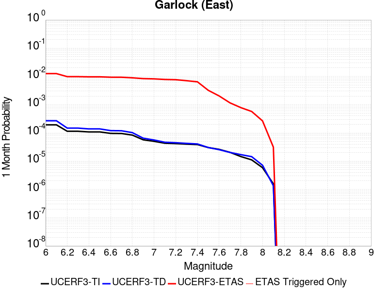 |  |  |

| Magnitude | 1 wk TI Prob | 1 wk TD Prob | 1 wk ETAS Prob | 1 wk ETAS/TD Gain | 1 wk ETAS Triggered Only | 1 mo TI Prob | 1 mo TD Prob | 1 mo ETAS Prob | 1 mo ETAS/TD Gain | 1 mo ETAS Triggered Only | 1 yr TI Prob | 1 yr TD Prob | 1 yr ETAS Prob | 1 yr ETAS/TD Gain | 1 yr ETAS Triggered Only | 10 yr TI Prob | 10 yr TD Prob | 10 yr ETAS Prob | 10 yr ETAS/TD Gain | 10 yr ETAS Triggered Only |
|-----|-----|-----|-----|-----|-----|-----|-----|-----|-----|-----|-----|-----|-----|-----|-----|-----|-----|-----|-----|-----|
| 6.0 | 4.5092507E-5 | 6.2904815E-5 | 0.009653067 | 153.45514 | 0.009590765 | 1.9323928E-4 | 2.6956675E-4 | 0.012643693 | 46.90376 | 0.012377463 | 0.0023501497 | 0.003277482 | 0.021338698 | 6.510699 | 0.018120605 | 0.023254504 | 0.03235377 | 0.056170903 | 1.7361469 | 0.02461347 |
| 6.1 | 4.5092507E-5 | 6.2904815E-5 | 0.009653067 | 153.45514 | 0.009590765 | 1.9323928E-4 | 2.6956675E-4 | 0.012643693 | 46.90376 | 0.012377463 | 0.0023501497 | 0.003277482 | 0.021338698 | 6.510699 | 0.018120605 | 0.023254504 | 0.03235377 | 0.056170903 | 1.7361469 | 0.02461347 |
| 6.2 | 2.6674514E-5 | 3.4511588E-5 | 0.0077012014 | 223.14828 | 0.0076669543 | 1.1431433E-4 | 1.4789861E-4 | 0.00975139 | 65.93294 | 0.009604911 | 0.0013908884 | 0.0017992114 | 0.015340503 | 8.5262375 | 0.0135657 | 0.01382215 | 0.017872788 | 0.035600062 | 1.9918585 | 0.018049877 |
| 6.3 | 2.6674514E-5 | 3.4511588E-5 | 0.0077012014 | 223.14828 | 0.0076669543 | 1.1431433E-4 | 1.4789861E-4 | 0.00975139 | 65.93294 | 0.009604911 | 0.0013908884 | 0.0017992114 | 0.015340503 | 8.5262375 | 0.0135657 | 0.01382215 | 0.017872788 | 0.035600062 | 1.9918585 | 0.018049877 |
| 6.4 | 2.5312667E-5 | 3.2340467E-5 | 0.0076141753 | 235.438 | 0.00758208 | 1.0847834E-4 | 1.3859481E-4 | 0.009657313 | 69.68019 | 0.009520037 | 0.0013199237 | 0.0016861152 | 0.015087723 | 8.948216 | 0.013424243 | 0.013121112 | 0.016772287 | 0.03424126 | 2.041538 | 0.017766964 |
| 6.5 | 2.5312667E-5 | 3.2340467E-5 | 0.0076141753 | 235.438 | 0.00758208 | 1.0847834E-4 | 1.3859481E-4 | 0.009657313 | 69.68019 | 0.009520037 | 0.0013199237 | 0.0016861152 | 0.015087723 | 8.948216 | 0.013424243 | 0.013121112 | 0.016772287 | 0.03424126 | 2.041538 | 0.017766964 |
| 6.6 | 2.246556E-5 | 2.8134691E-5 | 0.007383677 | 262.4403 | 0.0073557496 | 9.627742E-5 | 1.2057181E-4 | 0.009328294 | 77.36713 | 0.009208833 | 0.0011715472 | 0.0014669969 | 0.01430655 | 9.752271 | 0.012858416 | 0.011653901 | 0.014613169 | 0.031284165 | 2.14082 | 0.016918223 |
| 6.7 | 2.2241198E-5 | 2.7804432E-5 | 0.007355059 | 264.5283 | 0.0073274584 | 9.531594E-5 | 1.1915654E-4 | 0.009298604 | 78.03687 | 0.009180541 | 0.0011598538 | 0.0014497889 | 0.014233062 | 9.817334 | 0.012801833 | 0.011538187 | 0.014442829 | 0.031047 | 2.149648 | 0.016847495 |
| 6.8 | 1.9528685E-5 | 2.3898969E-5 | 0.007096566 | 296.94028 | 0.007072836 | 8.369167E-5 | 1.0242024E-4 | 0.008928415 | 87.17433 | 0.008826899 | 0.0010184698 | 0.0012462728 | 0.01339639 | 10.749164 | 0.012165278 | 0.010138147 | 0.012436723 | 0.028138718 | 2.2625508 | 0.015899735 |
| 6.9 | 1.3318621E-5 | 1.5198818E-5 | 0.006805018 | 447.73337 | 0.0067899227 | 5.7078556E-5 | 6.51362E-5 | 0.008396395 | 128.9052 | 0.008331801 | 6.9470983E-4 | 7.927504E-4 | 0.011987241 | 15.121079 | 0.011203372 | 0.0069254204 | 0.007940721 | 0.022212632 | 2.797307 | 0.014386148 |
| 7.0 | 1.1760853E-5 | 1.3107653E-5 | 0.0066614863 | 508.21353 | 0.006648466 | 5.0402683E-5 | 5.6174475E-5 | 0.008203624 | 146.03828 | 0.008147907 | 6.134799E-4 | 6.8371464E-4 | 0.011582571 | 16.94065 | 0.010906314 | 0.0061178906 | 0.006857401 | 0.020653196 | 3.0118108 | 0.01389105 |
| 7.1 | 1.0064758E-5 | 1.0902761E-5 | 0.0063622403 | 583.544 | 0.0063514067 | 4.3133965E-5 | 4.67253E-5 | 0.0077981916 | 166.89441 | 0.0077518285 | 5.2502943E-4 | 5.6873553E-4 | 0.010889203 | 19.14634 | 0.010326341 | 0.005237907 | 0.0057133473 | 0.018737402 | 3.2795837 | 0.013098893 |
| 7.2 | 9.768808E-6 | 1.0498628E-5 | 0.0062203836 | 592.4949 | 0.00620995 | 4.186565E-5 | 4.499337E-5 | 0.0076267323 | 169.50793 | 0.00758208 | 5.095951E-4 | 5.4766005E-4 | 0.010613862 | 19.380384 | 0.010071718 | 0.0050842804 | 0.005503584 | 0.018192757 | 3.3056202 | 0.012759396 |
| 7.3 | 9.344516E-6 | 9.9442705E-6 | 0.005724739 | 575.6821 | 0.0057148514 | 4.004731E-5 | 4.2617627E-5 | 0.007058572 | 165.62566 | 0.007016253 | 4.8746695E-4 | 5.187495E-4 | 0.009906603 | 19.097084 | 0.009392726 | 0.0048639905 | 0.005215269 | 0.017035663 | 3.2664976 | 0.011882365 |
| 7.4 | 9.023491E-6 | 9.490441E-6 | 0.0052150483 | 549.5054 | 0.0052056075 | 3.867153E-5 | 4.0672705E-5 | 0.0064342567 | 158.19594 | 0.006393844 | 4.7072413E-4 | 4.95081E-4 | 0.009034837 | 18.249208 | 0.008543986 | 0.004697283 | 0.0049787266 | 0.015746288 | 3.162714 | 0.010821439 |
| 7.5 | 7.081253E-6 | 7.0873994E-6 | 0.0027513283 | 388.19998 | 0.0027442605 | 3.0347876E-5 | 3.0374218E-5 | 0.0033120704 | 109.04216 | 0.003281796 | 3.6942272E-4 | 3.697441E-4 | 0.0047674216 | 12.893841 | 0.004399304 | 0.003688092 | 0.0037244745 | 0.00931939 | 2.5022027 | 0.005615832 |
| 7.6 | 6.116396E-6 | 5.9589424E-6 | 0.0018448854 | 309.59946 | 0.0018389374 | 2.6212863E-5 | 2.5538076E-5 | 0.0021897706 | 85.74532 | 0.0021642877 | 3.1909486E-4 | 3.1088197E-4 | 0.0031108544 | 10.006544 | 0.002800843 | 0.0031863707 | 0.0031359126 | 0.006703545 | 2.1376696 | 0.003578855 |
| 7.7 | 4.797145E-6 | 4.7571157E-6 | 0.0010798231 | 226.99113 | 0.001075071 | 2.055903E-5 | 2.0387479E-5 | 0.0012651812 | 62.056778 | 0.0012448191 | 2.5027743E-4 | 2.481894E-4 | 0.0018038271 | 7.267946 | 0.001556024 | 0.0024999576 | 0.0025094065 | 0.0044989414 | 1.7928307 | 0.0019945398 |
| 7.8 | 3.4028885E-6 | 3.978375E-6 | 7.1125914E-4 | 178.78134 | 7.072836E-4 | 1.4583726E-5 | 1.7050066E-5 | 8.374851E-4 | 49.119167 | 8.20449E-4 | 1.775424E-4 | 2.0756487E-4 | 0.0012399846 | 5.973962 | 0.001032634 | 0.0017740062 | 0.0021012141 | 0.0033998813 | 1.6180557 | 0.0013014019 |
| 7.9 | 2.5928412E-6 | 3.372436E-6 | 5.126149E-4 | 152.00139 | 5.092442E-4 | 1.1112129E-5 | 1.4453217E-5 | 5.6612643E-4 | 39.169582 | 5.516812E-4 | 1.3528178E-4 | 1.7595377E-4 | 8.9725613E-4 | 5.0993857 | 7.214293E-4 | 0.0013519945 | 0.0017812426 | 0.0027273144 | 1.5311303 | 9.4776E-4 |
| 8.0 | 1.3743648E-6 | 1.6734741E-6 | 2.5629514E-4 | 153.15155 | 2.546221E-4 | 5.8901214E-6 | 7.1720124E-6 | 2.7593787E-4 | 38.47426 | 2.6876776E-4 | 7.1709874E-5 | 8.731578E-5 | 4.5507113E-4 | 5.211786 | 3.6778746E-4 | 7.1686733E-4 | 8.837377E-4 | 0.0013501324 | 1.5277523 | 4.668072E-4 |
| 8.1 | 3.6733252E-7 | 3.1489736E-7 | 2.8606233E-5 | 90.84303 | 2.8291344E-5 | 1.5742813E-6 | 1.3495595E-6 | 2.9640865E-5 | 21.963362 | 2.8291344E-5 | 1.9166706E-5 | 1.643078E-5 | 7.301254E-5 | 4.443644 | 5.658269E-5 | 1.9165053E-4 | 1.662928E-4 | 2.2286607E-4 | 1.3402028 | 5.658269E-5 |

## Hunter Mountain-Saline Valley
*[(top)](#table-of-contents)*

| 1 Week | 1 Month | 1 Year | 10 Year |
|-----|-----|-----|-----|
| 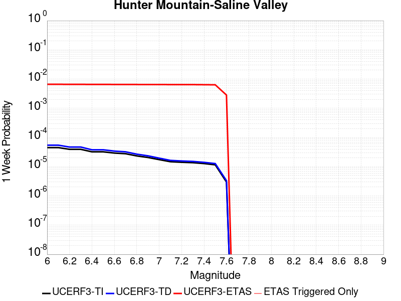 |  |  | 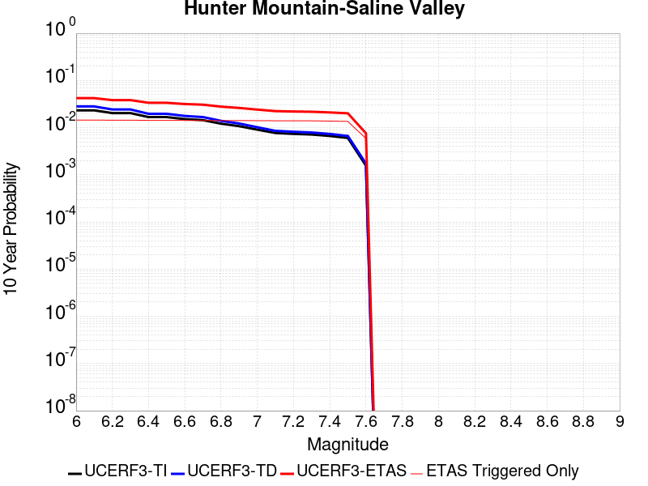 |

| Magnitude | 1 wk TI Prob | 1 wk TD Prob | 1 wk ETAS Prob | 1 wk ETAS/TD Gain | 1 wk ETAS Triggered Only | 1 mo TI Prob | 1 mo TD Prob | 1 mo ETAS Prob | 1 mo ETAS/TD Gain | 1 mo ETAS Triggered Only | 1 yr TI Prob | 1 yr TD Prob | 1 yr ETAS Prob | 1 yr ETAS/TD Gain | 1 yr ETAS Triggered Only | 10 yr TI Prob | 10 yr TD Prob | 10 yr ETAS Prob | 10 yr ETAS/TD Gain | 10 yr ETAS Triggered Only |
|-----|-----|-----|-----|-----|-----|-----|-----|-----|-----|-----|-----|-----|-----|-----|-----|-----|-----|-----|-----|-----|
| 6.0 | 4.5103672E-5 | 5.456906E-5 | 0.006575368 | 120.49626 | 0.0065211547 | 1.9328714E-4 | 2.3384714E-4 | 0.008436418 | 36.076637 | 0.00820449 | 0.002350731 | 0.0028435462 | 0.014395908 | 5.06266 | 0.011585305 | 0.023260195 | 0.028092625 | 0.04214337 | 1.5001578 | 0.014456877 |
| 6.1 | 4.5103672E-5 | 5.456906E-5 | 0.006575368 | 120.49626 | 0.0065211547 | 1.9328714E-4 | 2.3384714E-4 | 0.008436418 | 36.076637 | 0.00820449 | 0.002350731 | 0.0028435462 | 0.014395908 | 5.06266 | 0.011585305 | 0.023260195 | 0.028092625 | 0.04214337 | 1.5001578 | 0.014456877 |
| 6.2 | 3.9363465E-5 | 4.706271E-5 | 0.006553766 | 139.25603 | 0.0065070093 | 1.6868966E-4 | 2.016826E-4 | 0.008376232 | 41.531754 | 0.008176198 | 0.002051862 | 0.0024528534 | 0.013953297 | 5.6885986 | 0.011528723 | 0.020330196 | 0.024274187 | 0.038324926 | 1.5788345 | 0.014400294 |
| 6.3 | 3.9363465E-5 | 4.706271E-5 | 0.006553766 | 139.25603 | 0.0065070093 | 1.6868966E-4 | 2.016826E-4 | 0.008376232 | 41.531754 | 0.008176198 | 0.002051862 | 0.0024528534 | 0.013953297 | 5.6885986 | 0.011528723 | 0.020330196 | 0.024274187 | 0.038324926 | 1.5788345 | 0.014400294 |
| 6.4 | 3.2311684E-5 | 3.795112E-5 | 0.006502278 | 171.33298 | 0.006464572 | 1.384713E-4 | 1.6263791E-4 | 0.008280933 | 50.916374 | 0.008119616 | 0.0016845843 | 0.001978387 | 0.0133854775 | 6.765854 | 0.011429703 | 0.016718714 | 0.019617118 | 0.0335685 | 1.7111841 | 0.014230547 |
| 6.5 | 3.2311684E-5 | 3.795112E-5 | 0.006502278 | 171.33298 | 0.006464572 | 1.384713E-4 | 1.6263791E-4 | 0.008280933 | 50.916374 | 0.008119616 | 0.0016845843 | 0.001978387 | 0.0133854775 | 6.765854 | 0.011429703 | 0.016718714 | 0.019617118 | 0.0335685 | 1.7111841 | 0.014230547 |
| 6.6 | 2.9305844E-5 | 3.418196E-5 | 0.006484388 | 189.70204 | 0.0064504263 | 1.2559042E-4 | 1.4648624E-4 | 0.008250769 | 56.324528 | 0.00810547 | 0.0015279909 | 0.0017820727 | 0.013134926 | 7.3705893 | 0.01137312 | 0.015175272 | 0.017686324 | 0.03158181 | 1.7856628 | 0.014145672 |
| 6.7 | 2.7826512E-5 | 3.2344353E-5 | 0.006468417 | 199.98598 | 0.006436281 | 1.19251024E-4 | 1.3861163E-4 | 0.008214671 | 59.263935 | 0.008077179 | 0.0014509142 | 0.0016863506 | 0.012997926 | 7.707725 | 0.011330684 | 0.014414776 | 0.016743818 | 0.030597003 | 1.8273611 | 0.01408909 |
| 6.8 | 2.3389874E-5 | 2.6866792E-5 | 0.0064488295 | 240.02975 | 0.006422135 | 1.0023846E-4 | 1.1513857E-4 | 0.008177243 | 71.02088 | 0.008063033 | 0.00121972 | 0.001400958 | 0.01267339 | 9.046231 | 0.011288246 | 0.01213047 | 0.013928067 | 0.027779076 | 1.9944675 | 0.014046652 |
| 6.9 | 2.069209E-5 | 2.357011E-5 | 0.0064314087 | 272.8629 | 0.0064079897 | 8.867737E-5 | 1.0101105E-4 | 0.008149086 | 80.67519 | 0.008048887 | 0.0010791123 | 0.0012291519 | 0.012475267 | 10.149492 | 0.011259955 | 0.010738871 | 0.012229158 | 0.02604814 | 2.130003 | 0.01399007 |
| 7.0 | 1.7462342E-5 | 1.9633622E-5 | 0.006427497 | 327.37195 | 0.0064079897 | 7.483646E-5 | 8.414151E-5 | 0.008118208 | 96.48278 | 0.0080347415 | 9.1075303E-4 | 0.0010239641 | 0.012244127 | 11.957575 | 0.011231664 | 0.009070295 | 0.010196688 | 0.024016103 | 2.3552847 | 0.013961778 |
| 7.1 | 1.4807709E-5 | 1.6441827E-5 | 0.0064101806 | 389.87033 | 0.006393844 | 6.3460066E-5 | 7.046316E-5 | 0.008076349 | 114.61804 | 0.008006451 | 7.723524E-4 | 8.575678E-4 | 0.011994799 | 13.986997 | 0.011146789 | 0.007696735 | 0.008546168 | 0.022304477 | 2.6098807 | 0.013876905 |
| 7.2 | 1.4180048E-5 | 1.5698413E-5 | 0.006395296 | 407.3849 | 0.006379698 | 6.077022E-5 | 6.727727E-5 | 0.008059044 | 119.78851 | 0.007992305 | 7.396263E-4 | 8.1880915E-4 | 0.0119282035 | 14.567745 | 0.011118499 | 0.0073716943 | 0.008161469 | 0.021897057 | 2.6829798 | 0.013848613 |
| 7.3 | 1.3730402E-5 | 1.5172151E-5 | 0.0063947733 | 421.48102 | 0.006379698 | 5.8843252E-5 | 6.502197E-5 | 0.008056807 | 123.90899 | 0.007992305 | 7.161811E-4 | 7.9137104E-4 | 0.011886936 | 15.020685 | 0.011104353 | 0.007138774 | 0.007889058 | 0.021614384 | 2.7397928 | 0.013834467 |
| 7.4 | 1.2810095E-5 | 1.4109353E-5 | 0.006351281 | 450.14685 | 0.0063372613 | 5.489925E-5 | 6.0467344E-5 | 0.00799571 | 132.23186 | 0.007935722 | 6.681934E-4 | 7.3595706E-4 | 0.011747326 | 15.961971 | 0.011019479 | 0.006661878 | 0.0073386896 | 0.02091717 | 2.8502595 | 0.013678865 |
| 7.5 | 1.1595659E-5 | 1.2800734E-5 | 0.0063216896 | 493.8537 | 0.0063089696 | 4.9694736E-5 | 5.485922E-5 | 0.007947711 | 144.87466 | 0.007893285 | 6.0486543E-4 | 6.67722E-4 | 0.011552617 | 17.301537 | 0.010892168 | 0.006032217 | 0.006660632 | 0.020065717 | 3.0125847 | 0.013494971 |
| 7.6 | 2.997694E-6 | 3.3251877E-6 | 0.002874887 | 864.5789 | 0.0028715713 | 1.28471975E-5 | 1.4250767E-5 | 0.0033950182 | 238.23407 | 0.0033808157 | 1.564034E-4 | 1.7349655E-4 | 0.0048549017 | 27.982698 | 0.0046822173 | 0.0015629337 | 0.0017356955 | 0.007426507 | 4.2786922 | 0.005700706 |

## Blackwater
*[(top)](#table-of-contents)*

| 1 Week | 1 Month | 1 Year | 10 Year |
|-----|-----|-----|-----|
|  |  |  |  |

| Magnitude | 1 wk TI Prob | 1 wk TD Prob | 1 wk ETAS Prob | 1 wk ETAS/TD Gain | 1 wk ETAS Triggered Only | 1 mo TI Prob | 1 mo TD Prob | 1 mo ETAS Prob | 1 mo ETAS/TD Gain | 1 mo ETAS Triggered Only | 1 yr TI Prob | 1 yr TD Prob | 1 yr ETAS Prob | 1 yr ETAS/TD Gain | 1 yr ETAS Triggered Only | 10 yr TI Prob | 10 yr TD Prob | 10 yr ETAS Prob | 10 yr ETAS/TD Gain | 10 yr ETAS Triggered Only |
|-----|-----|-----|-----|-----|-----|-----|-----|-----|-----|-----|-----|-----|-----|-----|-----|-----|-----|-----|-----|-----|
| 6.0 | 3.0708583E-5 | 3.3095846E-5 | 0.0037957202 | 114.68871 | 0.0037627488 | 1.3160157E-4 | 1.4183241E-4 | 0.005063828 | 35.7029 | 0.004922694 | 0.0016010714 | 0.0017255784 | 0.010099487 | 5.8528123 | 0.008388383 | 0.015895851 | 0.017135633 | 0.02946784 | 1.719682 | 0.012547211 |
| 6.1 | 3.0708583E-5 | 3.3095846E-5 | 0.0037957202 | 114.68871 | 0.0037627488 | 1.3160157E-4 | 1.4183241E-4 | 0.005063828 | 35.7029 | 0.004922694 | 0.0016010714 | 0.0017255784 | 0.010099487 | 5.8528123 | 0.008388383 | 0.015895851 | 0.017135633 | 0.02946784 | 1.719682 | 0.012547211 |
| 6.2 | 1.1707779E-5 | 1.2545122E-5 | 0.0013705126 | 109.24665 | 0.0013579845 | 5.017523E-5 | 5.3763757E-5 | 0.0018643124 | 34.67601 | 0.001810646 | 6.107122E-4 | 6.5438676E-4 | 0.0035523518 | 5.4285207 | 0.0028998628 | 0.006090366 | 0.0065255696 | 0.010896166 | 1.6697646 | 0.004399304 |
| 6.3 | 1.1707779E-5 | 1.2545122E-5 | 0.0013705126 | 109.24665 | 0.0013579845 | 5.017523E-5 | 5.3763757E-5 | 0.0018643124 | 34.67601 | 0.001810646 | 6.107122E-4 | 6.5438676E-4 | 0.0035523518 | 5.4285207 | 0.0028998628 | 0.006090366 | 0.0065255696 | 0.010896166 | 1.6697646 | 0.004399304 |
| 6.4 | 7.929244E-6 | 8.480098E-6 | 9.1379543E-4 | 107.75765 | 9.05323E-4 | 3.3982033E-5 | 3.6342793E-5 | 0.0012386813 | 34.08327 | 0.0012023821 | 4.136527E-4 | 4.423877E-4 | 0.0023087903 | 5.21893 | 0.0018672288 | 0.0041288356 | 0.0044154758 | 0.007147619 | 1.6187652 | 0.0027442605 |
| 6.5 | 5.8832115E-6 | 6.285991E-6 | 6.2869163E-4 | 100.014725 | 6.2240957E-4 | 2.521352E-5 | 2.6939697E-5 | 8.1907597E-4 | 30.404053 | 7.9215766E-4 | 3.0693135E-4 | 3.27944E-4 | 0.0015582138 | 4.7514634 | 0.0012306735 | 0.0030650778 | 0.0032748538 | 0.0050513716 | 1.5424724 | 0.0017823547 |
| 6.6 | 5.8832115E-6 | 6.285991E-6 | 6.2869163E-4 | 100.014725 | 6.2240957E-4 | 2.521352E-5 | 2.6939697E-5 | 8.1907597E-4 | 30.404053 | 7.9215766E-4 | 3.0693135E-4 | 3.27944E-4 | 0.0015582138 | 4.7514634 | 0.0012306735 | 0.0030650778 | 0.0032748538 | 0.0050513716 | 1.5424724 | 0.0017823547 |
| 6.7 | 3.0715053E-6 | 3.2814662E-6 | 2.7204835E-4 | 82.90451 | 2.6876776E-4 | 1.3163528E-5 | 1.4063357E-5 | 3.6770018E-4 | 26.145975 | 3.536418E-4 | 1.6025416E-4 | 1.7120909E-4 | 6.9450936E-4 | 4.056498 | 5.2338984E-4 | 0.0016013865 | 0.0017108864 | 0.0025158103 | 1.4704719 | 8.063033E-4 |
| 6.8 | 2.2722281E-6 | 2.4287538E-6 | 1.2973949E-4 | 53.418137 | 1.2731105E-4 | 9.738084E-6 | 1.0408908E-5 | 2.0844626E-4 | 20.025757 | 1.9803942E-4 | 1.1855473E-4 | 1.26722E-4 | 4.3788736E-4 | 3.4554958 | 3.1120479E-4 | 0.001184915 | 0.0012665876 | 0.0017751867 | 1.4015508 | 5.092442E-4 |
| 6.9 | 9.952399E-7 | 1.0653489E-6 | 5.7647976E-5 | 54.11183 | 5.658269E-5 | 4.265307E-6 | 4.5657757E-6 | 1.0358503E-4 | 22.687279 | 9.901971E-5 | 5.1928873E-5 | 5.5587418E-5 | 1.9703628E-4 | 3.54462 | 1.4145672E-4 | 5.191674E-4 | 5.557858E-4 | 7.9612853E-4 | 1.4324378 | 2.4047642E-4 |
| 7.0 | 4.7385504E-7 | 5.0755597E-7 | 2.8798886E-5 | 56.74032 | 2.8291344E-5 | 2.0308057E-6 | 2.1752398E-6 | 7.2903444E-5 | 33.515133 | 7.072836E-5 | 2.4724779E-5 | 2.6483543E-5 | 1.1135533E-4 | 4.204699 | 8.487403E-5 | 2.4722028E-4 | 2.6483546E-4 | 3.7797083E-4 | 1.4271914 | 1.1316538E-4 |

## Ash Hill
*[(top)](#table-of-contents)*

| 1 Week | 1 Month | 1 Year | 10 Year |
|-----|-----|-----|-----|
| 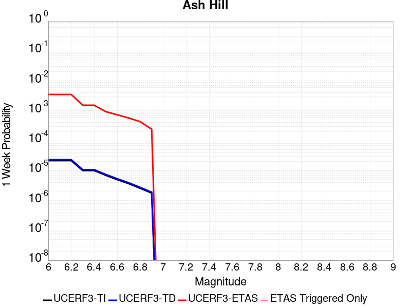 |  |  |  |

| Magnitude | 1 wk TI Prob | 1 wk TD Prob | 1 wk ETAS Prob | 1 wk ETAS/TD Gain | 1 wk ETAS Triggered Only | 1 mo TI Prob | 1 mo TD Prob | 1 mo ETAS Prob | 1 mo ETAS/TD Gain | 1 mo ETAS Triggered Only | 1 yr TI Prob | 1 yr TD Prob | 1 yr ETAS Prob | 1 yr ETAS/TD Gain | 1 yr ETAS Triggered Only | 10 yr TI Prob | 10 yr TD Prob | 10 yr ETAS Prob | 10 yr ETAS/TD Gain | 10 yr ETAS Triggered Only |
|-----|-----|-----|-----|-----|-----|-----|-----|-----|-----|-----|-----|-----|-----|-----|-----|-----|-----|-----|-----|-----|
| 6.0 | 2.1545662E-5 | 2.3194447E-5 | 0.00374342 | 161.39294 | 0.0037203117 | 9.2335285E-5 | 9.940143E-5 | 0.00513476 | 51.6568 | 0.005035859 | 0.0011236023 | 0.0012096206 | 0.008895558 | 7.354007 | 0.0076952456 | 0.011179381 | 0.012038348 | 0.023009023 | 1.9113106 | 0.011104353 |
| 6.1 | 2.1545662E-5 | 2.3194447E-5 | 0.00374342 | 161.39294 | 0.0037203117 | 9.2335285E-5 | 9.940143E-5 | 0.00513476 | 51.6568 | 0.005035859 | 0.0011236023 | 0.0012096206 | 0.008895558 | 7.354007 | 0.0076952456 | 0.011179381 | 0.012038348 | 0.023009023 | 1.9113106 | 0.011104353 |
| 6.2 | 2.1545662E-5 | 2.3194447E-5 | 0.00374342 | 161.39294 | 0.0037203117 | 9.2335285E-5 | 9.940143E-5 | 0.00513476 | 51.6568 | 0.005035859 | 0.0011236023 | 0.0012096206 | 0.008895558 | 7.354007 | 0.0076952456 | 0.011179381 | 0.012038348 | 0.023009023 | 1.9113106 | 0.011104353 |
| 6.3 | 1.0025529E-5 | 1.0746934E-5 | 0.0016940638 | 157.6323 | 0.0016833349 | 4.2965847E-5 | 4.605755E-5 | 0.0022385358 | 48.603012 | 0.0021925792 | 5.229836E-4 | 5.6061964E-4 | 0.003670923 | 6.547974 | 0.003112048 | 0.005217545 | 0.0055933665 | 0.010207195 | 1.8248751 | 0.0046397806 |
| 6.4 | 1.0025529E-5 | 1.0746934E-5 | 0.0016940638 | 157.6323 | 0.0016833349 | 4.2965847E-5 | 4.605755E-5 | 0.0022385358 | 48.603012 | 0.0021925792 | 5.229836E-4 | 5.6061964E-4 | 0.003670923 | 6.547974 | 0.003112048 | 0.005217545 | 0.0055933665 | 0.010207195 | 1.8248751 | 0.0046397806 |
| 6.5 | 6.9617327E-6 | 7.456634E-6 | 0.0010117919 | 135.69016 | 0.0010043427 | 2.9835655E-5 | 3.195666E-5 | 0.0013616073 | 42.607937 | 0.0013296931 | 3.6318856E-4 | 3.8901155E-4 | 0.002340355 | 6.016158 | 0.0019521028 | 0.0036259557 | 0.0038841602 | 0.006871395 | 1.7690811 | 0.0029988824 |
| 6.6 | 4.9919777E-6 | 5.3466883E-6 | 7.975001E-4 | 149.15778 | 7.9215766E-4 | 2.1394015E-5 | 2.2914215E-5 | 0.0010413793 | 45.446865 | 0.0010184884 | 2.60441E-4 | 2.7895154E-4 | 0.0017214076 | 6.1709914 | 0.0014428586 | 0.0026013597 | 0.0027866727 | 0.005015461 | 1.7998025 | 0.002235016 |
| 6.7 | 3.6630722E-6 | 3.924624E-6 | 6.4047734E-4 | 163.1946 | 6.3655525E-4 | 1.5698786E-5 | 1.681974E-5 | 8.6554576E-4 | 51.460117 | 8.4874034E-4 | 1.9111596E-4 | 2.0476682E-4 | 0.0013361889 | 6.525417 | 0.0011316538 | 0.0019095168 | 0.0020463446 | 0.0037827017 | 1.8485166 | 0.0017399177 |
| 6.8 | 2.5599613E-6 | 2.744925E-6 | 4.695508E-4 | 171.06143 | 4.668072E-4 | 1.0971216E-5 | 1.1763939E-5 | 6.2002067E-4 | 52.705193 | 6.082639E-4 | 1.3356637E-4 | 1.4322149E-4 | 9.352657E-4 | 6.530205 | 7.9215766E-4 | 0.0013348613 | 0.0014317769 | 0.0027030646 | 1.887909 | 0.0012731105 |
| 6.9 | 1.7684905E-6 | 1.8968707E-6 | 2.4237284E-4 | 127.7751 | 2.4047642E-4 | 7.579223E-6 | 8.129446E-6 | 3.7591392E-4 | 46.241028 | 3.6778746E-4 | 9.2273134E-5 | 9.8976E-5 | 6.2231405E-4 | 6.2875247 | 5.2338984E-4 | 9.223483E-4 | 9.8976E-4 | 0.0018659236 | 1.8852283 | 8.7703165E-4 |

## Garlock (West)
*[(top)](#table-of-contents)*

| 1 Week | 1 Month | 1 Year | 10 Year |
|-----|-----|-----|-----|
|  |  |  |  |

| Magnitude | 1 wk TI Prob | 1 wk TD Prob | 1 wk ETAS Prob | 1 wk ETAS/TD Gain | 1 wk ETAS Triggered Only | 1 mo TI Prob | 1 mo TD Prob | 1 mo ETAS Prob | 1 mo ETAS/TD Gain | 1 mo ETAS Triggered Only | 1 yr TI Prob | 1 yr TD Prob | 1 yr ETAS Prob | 1 yr ETAS/TD Gain | 1 yr ETAS Triggered Only | 10 yr TI Prob | 10 yr TD Prob | 10 yr ETAS Prob | 10 yr ETAS/TD Gain | 10 yr ETAS Triggered Only |
|-----|-----|-----|-----|-----|-----|-----|-----|-----|-----|-----|-----|-----|-----|-----|-----|-----|-----|-----|-----|-----|
| 6.0 | 2.5181727E-5 | 2.5197181E-5 | 0.0048346044 | 191.87085 | 0.0048095286 | 1.0791722E-4 | 1.0798347E-4 | 0.0059495154 | 55.096535 | 0.0058421628 | 0.0013131002 | 0.0013139093 | 0.009295713 | 7.074851 | 0.007992305 | 0.013053683 | 0.013141794 | 0.022983434 | 1.748881 | 0.009972699 |
| 6.1 | 2.5077732E-5 | 2.5098223E-5 | 0.004820361 | 192.05983 | 0.0047953827 | 1.0747157E-4 | 1.075594E-4 | 0.0059349495 | 55.17834 | 0.005828017 | 0.001307681 | 0.0013087525 | 0.00927647 | 7.088025 | 0.007978159 | 0.013000126 | 0.013090835 | 0.022919023 | 1.7507685 | 0.009958553 |
| 6.2 | 2.494612E-5 | 2.4979914E-5 | 0.004820243 | 192.96475 | 0.0047953827 | 1.0690756E-4 | 1.070524E-4 | 0.005934445 | 55.434956 | 0.005828017 | 0.0013008224 | 0.0013025872 | 0.009270354 | 7.116878 | 0.007978159 | 0.012932341 | 0.013029906 | 0.0228587 | 1.7543257 | 0.009958553 |
| 6.3 | 2.4733758E-5 | 2.4799276E-5 | 0.0048200632 | 194.36305 | 0.0047953827 | 1.0599751E-4 | 1.06278305E-4 | 0.005933676 | 55.83149 | 0.005828017 | 0.0012897556 | 0.0012931736 | 0.009261016 | 7.1614633 | 0.007978159 | 0.012822957 | 0.0129368715 | 0.02275263 | 1.7587428 | 0.009944407 |
| 6.4 | 2.3237335E-5 | 2.3178607E-5 | 0.00481845 | 207.88351 | 0.0047953827 | 9.958477E-5 | 9.933313E-5 | 0.005926771 | 59.665607 | 0.005828017 | 0.0012117702 | 0.0012087126 | 0.009148971 | 7.5691867 | 0.007949867 | 0.012051838 | 0.012101731 | 0.021869896 | 1.8071709 | 0.009887825 |
| 6.5 | 2.2732203E-5 | 2.2992977E-5 | 0.004818266 | 209.5538 | 0.0047953827 | 9.742009E-5 | 9.8537625E-5 | 0.0059259804 | 60.139267 | 0.005828017 | 0.0011854442 | 0.0011990381 | 0.009139374 | 7.622255 | 0.007949867 | 0.011791403 | 0.012006035 | 0.021775147 | 1.8136834 | 0.009887825 |
| 6.6 | 2.1319436E-5 | 2.1773201E-5 | 0.004788761 | 219.9383 | 0.0047670915 | 9.136581E-5 | 9.3310395E-5 | 0.0058924947 | 63.14939 | 0.0057997257 | 0.001111811 | 0.0011354643 | 0.009048046 | 7.968587 | 0.0079215765 | 0.011062649 | 0.011376952 | 0.021096345 | 1.8543055 | 0.009831242 |
| 6.7 | 1.970802E-5 | 2.0393094E-5 | 0.0047873873 | 234.75531 | 0.0047670915 | 8.446021E-5 | 8.739606E-5 | 0.0058724703 | 67.19376 | 0.00578558 | 0.001027818 | 0.0010635294 | 0.00896255 | 8.427177 | 0.007907431 | 0.010230771 | 0.0106646875 | 0.020349098 | 1.908082 | 0.009788805 |
| 6.8 | 1.8744462E-5 | 1.9900775E-5 | 0.004772752 | 239.82745 | 0.0047529456 | 8.033094E-5 | 8.528626E-5 | 0.005856228 | 68.66556 | 0.0057714344 | 9.775903E-4 | 0.0010378672 | 0.00892296 | 8.597401 | 0.007893285 | 0.009733009 | 0.010410495 | 0.020069396 | 1.9278044 | 0.009760514 |
| 6.9 | 1.7559682E-5 | 1.8953151E-5 | 0.004771809 | 251.76863 | 0.0047529456 | 7.5253614E-5 | 8.122527E-5 | 0.005852191 | 72.04889 | 0.0057714344 | 9.158276E-4 | 9.884704E-4 | 0.0088739535 | 8.977459 | 0.007893285 | 0.0091206245 | 0.009921073 | 0.019584753 | 1.9740558 | 0.009760514 |
| 7.0 | 1.6794445E-5 | 1.8215967E-5 | 0.004771075 | 261.9172 | 0.0047529456 | 7.197421E-5 | 7.806611E-5 | 0.0058349054 | 74.74313 | 0.0057572885 | 8.759337E-4 | 9.5004175E-4 | 0.008821696 | 9.285587 | 0.007879139 | 0.008724891 | 0.009539958 | 0.019179335 | 2.0104213 | 0.009732222 |
| 7.1 | 1.6337795E-5 | 1.771677E-5 | 0.004756433 | 268.47067 | 0.0047388 | 7.0017246E-5 | 7.592681E-5 | 0.005818634 | 76.63477 | 0.0057431427 | 8.521265E-4 | 9.2401815E-4 | 0.008781744 | 9.503865 | 0.007864994 | 0.008488664 | 0.009281721 | 0.018909598 | 2.0372944 | 0.009718076 |
| 7.2 | 1.5780008E-5 | 1.71654E-5 | 0.0047558844 | 277.06226 | 0.0047388 | 6.762685E-5 | 7.3563926E-5 | 0.0058021396 | 78.87208 | 0.0057289973 | 8.2304585E-4 | 8.952741E-4 | 0.0087249605 | 9.745575 | 0.007836702 | 0.008200042 | 0.008996559 | 0.01859917 | 2.0673647 | 0.009689786 |
| 7.3 | 1.5058865E-5 | 1.6618484E-5 | 0.004727049 | 284.44528 | 0.004710509 | 6.45364E-5 | 7.122013E-5 | 0.00577152 | 81.03776 | 0.005700706 | 7.854473E-4 | 8.667614E-4 | 0.008654271 | 9.984607 | 0.007794265 | 0.00782677 | 0.008713263 | 0.018276552 | 2.0975554 | 0.009647348 |
| 7.4 | 1.4887923E-5 | 1.6454453E-5 | 0.004599577 | 279.53387 | 0.0045831976 | 6.380382E-5 | 7.0517184E-5 | 0.0055727954 | 79.02749 | 0.0055026663 | 7.7653467E-4 | 8.5820974E-4 | 0.00841965 | 9.810713 | 0.0075679347 | 0.0077382675 | 0.008628101 | 0.01795381 | 2.080853 | 0.009406872 |
| 7.5 | 1.4509299E-5 | 1.6046468E-5 | 0.0041606617 | 259.28833 | 0.004144682 | 6.218123E-5 | 6.876877E-5 | 0.005090137 | 74.01814 | 0.0050217137 | 7.567935E-4 | 8.369394E-4 | 0.0077059823 | 9.207336 | 0.0068747965 | 0.0075422134 | 0.008416411 | 0.016972646 | 2.0166135 | 0.00862886 |
| 7.6 | 1.2756717E-5 | 1.4050529E-5 | 0.002928018 | 208.39201 | 0.0029140085 | 5.4670498E-5 | 6.0215163E-5 | 0.0035539859 | 59.021442 | 0.003493981 | 6.6541E-4 | 7.328737E-4 | 0.00541166 | 7.3841643 | 0.0046822173 | 0.006634211 | 0.007381374 | 0.013096166 | 1.7742178 | 0.0057572885 |
| 7.7 | 1.0328985E-5 | 1.146033E-5 | 0.0017372125 | 151.58487 | 0.001725772 | 4.4266326E-5 | 4.9114777E-5 | 0.0020718465 | 42.18377 | 0.002022831 | 5.388092E-4 | 5.9780874E-4 | 0.0033262915 | 5.56414 | 0.0027301146 | 0.0053750467 | 0.006038286 | 0.009398687 | 1.5565158 | 0.0033808157 |
| 7.8 | 7.0306583E-6 | 8.899537E-6 | 0.0011405433 | 128.1576 | 0.0011316538 | 3.0131043E-5 | 3.8140315E-5 | 0.0013819279 | 36.232735 | 0.0013438389 | 3.667837E-4 | 4.6425956E-4 | 0.0023164824 | 4.989628 | 0.001853083 | 0.003661789 | 0.0046950667 | 0.006961827 | 1.4827962 | 0.0022774532 |
| 7.9 | 4.060633E-6 | 5.465412E-6 | 8.1176433E-4 | 148.52756 | 8.063033E-4 | 1.7402595E-5 | 2.3422985E-5 | 9.287248E-4 | 39.650146 | 9.05323E-4 | 2.11856E-4 | 2.8513762E-4 | 0.0014588936 | 5.116454 | 0.0011740908 | 0.0021165414 | 0.002884143 | 0.00435105 | 1.508611 | 0.0014711499 |
| 8.0 | 1.6729537E-6 | 2.0775192E-6 | 2.99136E-4 | 143.98712 | 2.970591E-4 | 7.169782E-6 | 8.903624E-6 | 3.2010564E-4 | 35.952286 | 3.1120479E-4 | 8.7288594E-5 | 1.0839626E-4 | 5.327204E-4 | 4.9145646 | 4.2437017E-4 | 8.7254314E-4 | 0.001096854 | 0.0016196698 | 1.4766502 | 5.2338984E-4 |
| 8.1 | 3.6733252E-7 | 3.1489736E-7 | 2.8606233E-5 | 90.84303 | 2.8291344E-5 | 1.5742813E-6 | 1.3495595E-6 | 2.9640865E-5 | 21.963362 | 2.8291344E-5 | 1.9166706E-5 | 1.643078E-5 | 7.301254E-5 | 4.443644 | 5.658269E-5 | 1.9165053E-4 | 1.662928E-4 | 2.2286607E-4 | 1.3402028 | 5.658269E-5 |

## McLean Lake
*[(top)](#table-of-contents)*

| 1 Week | 1 Month | 1 Year | 10 Year |
|-----|-----|-----|-----|
|  | 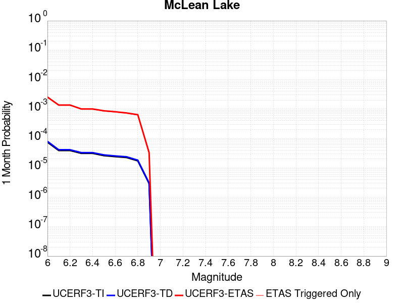 |  |  |

| Magnitude | 1 wk TI Prob | 1 wk TD Prob | 1 wk ETAS Prob | 1 wk ETAS/TD Gain | 1 wk ETAS Triggered Only | 1 mo TI Prob | 1 mo TD Prob | 1 mo ETAS Prob | 1 mo ETAS/TD Gain | 1 mo ETAS Triggered Only | 1 yr TI Prob | 1 yr TD Prob | 1 yr ETAS Prob | 1 yr ETAS/TD Gain | 1 yr ETAS Triggered Only | 10 yr TI Prob | 10 yr TD Prob | 10 yr ETAS Prob | 10 yr ETAS/TD Gain | 10 yr ETAS Triggered Only |
|-----|-----|-----|-----|-----|-----|-----|-----|-----|-----|-----|-----|-----|-----|-----|-----|-----|-----|-----|-----|-----|
| 6.0 | 1.7360222E-5 | 1.8501627E-5 | 0.0015744967 | 85.10045 | 0.001556024 | 7.439883E-5 | 7.9290556E-5 | 0.0024980088 | 31.504494 | 0.00241891 | 9.0542925E-4 | 9.6498354E-4 | 0.005360042 | 5.5545425 | 0.004399304 | 0.009017491 | 0.0096127745 | 0.016351437 | 1.7010112 | 0.006804068 |
| 6.1 | 9.062689E-6 | 9.592193E-6 | 8.724699E-4 | 90.956245 | 8.62886E-4 | 3.8839516E-5 | 4.1108804E-5 | 0.0013424571 | 32.656197 | 0.0013014019 | 4.727685E-4 | 5.003936E-4 | 0.0029180932 | 5.8315954 | 0.00241891 | 0.0047176396 | 0.004993552 | 0.00862491 | 1.7272097 | 0.0036495833 |
| 6.2 | 9.062689E-6 | 9.592193E-6 | 8.724699E-4 | 90.956245 | 8.62886E-4 | 3.8839516E-5 | 4.1108804E-5 | 0.0013424571 | 32.656197 | 0.0013014019 | 4.727685E-4 | 5.003936E-4 | 0.0029180932 | 5.8315954 | 0.00241891 | 0.0047176396 | 0.004993552 | 0.00862491 | 1.7272097 | 0.0036495833 |
| 6.3 | 7.2575485E-6 | 7.66771E-6 | 6.4421806E-4 | 84.01702 | 6.3655525E-4 | 3.110341E-5 | 3.2861237E-5 | 9.947353E-4 | 30.27078 | 9.619057E-4 | 3.786182E-4 | 4.0001926E-4 | 0.002224081 | 5.559935 | 0.0018247917 | 0.0037797375 | 0.0039936965 | 0.0068256217 | 1.7090986 | 0.00284328 |
| 6.4 | 7.2575485E-6 | 7.66771E-6 | 6.4421806E-4 | 84.01702 | 6.3655525E-4 | 3.110341E-5 | 3.2861237E-5 | 9.947353E-4 | 30.27078 | 9.619057E-4 | 3.786182E-4 | 4.0001926E-4 | 0.002224081 | 5.559935 | 0.0018247917 | 0.0037797375 | 0.0039936965 | 0.0068256217 | 1.7090986 | 0.00284328 |
| 6.5 | 6.06582E-6 | 6.4038773E-6 | 5.5808155E-4 | 87.14745 | 5.516812E-4 | 2.5996113E-5 | 2.7444936E-5 | 8.620167E-4 | 31.408953 | 8.3459466E-4 | 3.164567E-4 | 3.3409733E-4 | 0.0018896015 | 5.655841 | 0.001556024 | 0.0031600643 | 0.0033365893 | 0.0057756254 | 1.7309967 | 0.0024472012 |
| 6.6 | 5.598744E-6 | 5.910262E-6 | 5.151515E-4 | 87.1622 | 5.092442E-4 | 2.3994397E-5 | 2.5329486E-5 | 8.033218E-4 | 31.714886 | 7.78012E-4 | 2.9209262E-4 | 3.0834923E-4 | 0.0017790456 | 5.76958 | 0.0014711499 | 0.0029170897 | 0.003079843 | 0.005378486 | 1.7463508 | 0.0023057444 |
| 6.7 | 5.246996E-6 | 5.539162E-6 | 4.2990697E-4 | 77.612274 | 4.2437017E-4 | 2.2486933E-5 | 2.3739085E-5 | 7.168606E-4 | 30.19748 | 6.9313793E-4 | 2.73744E-4 | 2.8899137E-4 | 0.0016607251 | 5.746625 | 0.0013721302 | 0.0027340704 | 0.0028867796 | 0.0050589247 | 1.7524457 | 0.0021784336 |
| 6.8 | 4.02324E-6 | 4.2469046E-6 | 4.1446966E-4 | 97.59335 | 4.102245E-4 | 1.7242342E-5 | 1.8200926E-5 | 6.264538E-4 | 34.418785 | 6.082639E-4 | 2.099053E-4 | 2.2157968E-4 | 0.0013812678 | 6.2337294 | 0.0011599452 | 0.0020970714 | 0.002214172 | 0.0039643515 | 1.7904443 | 0.0017540633 |
| 6.9 | 6.835972E-7 | 7.1399285E-7 | 4.315098E-5 | 60.436153 | 4.2437016E-5 | 2.9296991E-6 | 3.0599674E-6 | 4.5496854E-5 | 14.868411 | 4.2437016E-5 | 3.56685E-5 | 3.7254784E-5 | 1.6456109E-4 | 4.41718 | 1.2731105E-4 | 3.5662777E-4 | 3.7251666E-4 | 5.8462267E-4 | 1.5693867 | 2.1218508E-4 |

## Gravel Hills-Harper Lk
*[(top)](#table-of-contents)*

| 1 Week | 1 Month | 1 Year | 10 Year |
|-----|-----|-----|-----|
|  |  |  |  |

| Magnitude | 1 wk TI Prob | 1 wk TD Prob | 1 wk ETAS Prob | 1 wk ETAS/TD Gain | 1 wk ETAS Triggered Only | 1 mo TI Prob | 1 mo TD Prob | 1 mo ETAS Prob | 1 mo ETAS/TD Gain | 1 mo ETAS Triggered Only | 1 yr TI Prob | 1 yr TD Prob | 1 yr ETAS Prob | 1 yr ETAS/TD Gain | 1 yr ETAS Triggered Only | 10 yr TI Prob | 10 yr TD Prob | 10 yr ETAS Prob | 10 yr ETAS/TD Gain | 10 yr ETAS Triggered Only |
|-----|-----|-----|-----|-----|-----|-----|-----|-----|-----|-----|-----|-----|-----|-----|-----|-----|-----|-----|-----|-----|
| 6.0 | 3.0679566E-5 | 3.1464628E-5 | 0.0020259416 | 64.38792 | 0.0019945398 | 1.3147724E-4 | 1.3484266E-4 | 0.003062602 | 22.712412 | 0.002928154 | 0.0015995599 | 0.00164069 | 0.0063152253 | 3.8491278 | 0.0046822173 | 0.015880952 | 0.016307337 | 0.023014365 | 1.4112889 | 0.006818214 |
| 6.1 | 3.0679566E-5 | 3.1464628E-5 | 0.0020259416 | 64.38792 | 0.0019945398 | 1.3147724E-4 | 1.3484266E-4 | 0.003062602 | 22.712412 | 0.002928154 | 0.0015995599 | 0.00164069 | 0.0063152253 | 3.8491278 | 0.0046822173 | 0.015880952 | 0.016307337 | 0.023014365 | 1.4112889 | 0.006818214 |
| 6.2 | 1.514536E-5 | 1.36352E-5 | 6.218908E-4 | 45.60922 | 6.082639E-4 | 6.490707E-5 | 5.843533E-5 | 9.919951E-4 | 16.975948 | 9.336144E-4 | 7.8995706E-4 | 7.112298E-4 | 0.0021389266 | 3.0073636 | 0.0014287129 | 0.007871548 | 0.007090737 | 0.009014953 | 1.2713703 | 0.0019379571 |
| 6.3 | 1.514536E-5 | 1.36352E-5 | 6.218908E-4 | 45.60922 | 6.082639E-4 | 6.490707E-5 | 5.843533E-5 | 9.919951E-4 | 16.975948 | 9.336144E-4 | 7.8995706E-4 | 7.112298E-4 | 0.0021389266 | 3.0073636 | 0.0014287129 | 0.007871548 | 0.007090737 | 0.009014953 | 1.2713703 | 0.0019379571 |
| 6.4 | 1.2532521E-5 | 1.0689684E-5 | 3.2189113E-4 | 30.112316 | 3.1120479E-4 | 5.37097E-5 | 4.581216E-5 | 5.974681E-4 | 13.041693 | 5.516812E-4 | 6.537194E-4 | 5.5762613E-4 | 0.0013634799 | 2.4451506 | 8.063033E-4 | 0.0065179965 | 0.005562859 | 0.006660084 | 1.1972411 | 0.0011033624 |
| 6.5 | 1.1094058E-5 | 9.083657E-6 | 1.9297573E-4 | 21.244278 | 1.8389373E-4 | 4.7545094E-5 | 3.89294E-5 | 3.784123E-4 | 9.720477 | 3.3949612E-4 | 5.787078E-4 | 4.7386638E-4 | 0.0010111472 | 2.1338234 | 5.375355E-4 | 0.0057720304 | 0.004728967 | 0.005475142 | 1.1577882 | 7.497206E-4 |
| 6.6 | 9.688328E-6 | 7.531688E-6 | 1.4898734E-4 | 19.7814 | 1.4145672E-4 | 4.1520743E-5 | 3.227828E-5 | 3.0103736E-4 | 9.326314 | 2.6876776E-4 | 5.053978E-4 | 3.9291973E-4 | 8.02983E-4 | 2.0436313 | 4.102245E-4 | 0.0050424994 | 0.0039225067 | 0.0045142947 | 1.1508698 | 5.941182E-4 |
| 6.7 | 8.974824E-6 | 6.749406E-6 | 9.162287E-5 | 13.574952 | 8.487403E-5 | 3.8462964E-5 | 2.8925719E-5 | 2.269594E-4 | 7.846284 | 1.9803942E-4 | 4.6818596E-4 | 3.5211592E-4 | 6.3492975E-4 | 1.8031839 | 2.8291345E-4 | 0.004672008 | 0.003515801 | 0.003966871 | 1.1282979 | 4.526615E-4 |
| 6.8 | 7.4780046E-6 | 5.1161865E-6 | 4.7552985E-5 | 9.294616 | 4.2437016E-5 | 3.20482E-5 | 2.1926337E-5 | 1.2094387E-4 | 5.515918 | 9.901971E-5 | 3.9011694E-4 | 2.6692182E-4 | 3.80057E-4 | 1.4238514 | 1.1316538E-4 | 0.0038943281 | 0.0026661505 | 0.0028636619 | 1.0740811 | 1.9803942E-4 |
| 6.9 | 6.3409307E-6 | 3.907489E-6 | 1.8053106E-5 | 4.6201296 | 1.4145672E-5 | 2.7175134E-5 | 1.674628E-5 | 4.503715E-5 | 2.6893823 | 2.8291344E-5 | 3.3080703E-4 | 2.0386786E-4 | 2.4629623E-4 | 1.208117 | 4.2437016E-5 | 0.0033031502 | 0.0020369065 | 0.0021357248 | 1.0485138 | 9.901971E-5 |
| 7.0 | 5.1239335E-6 | 2.6058492E-6 | 2.6058492E-6 | 1.0 | 0.0 | 2.195953E-5 | 1.1167879E-5 | 1.1167879E-5 | 1.0 | 0.0 | 2.6732447E-4 | 1.359607E-4 | 1.5010445E-4 | 1.1040282 | 1.4145672E-5 | 0.0026700313 | 0.0013588005 | 0.0013870533 | 1.0207925 | 2.8291344E-5 |
| 7.1 | 4.438899E-6 | 2.0984692E-6 | 2.0984692E-6 | 1.0 | 0.0 | 1.9023713E-5 | 8.99341E-6 | 8.99341E-6 | 1.0 | 0.0 | 2.315891E-4 | 1.0948948E-4 | 1.2363361E-4 | 1.1291825 | 1.4145672E-5 | 0.002313479 | 0.0010943774 | 0.0011085075 | 1.0129117 | 1.4145672E-5 |
| 7.2 | 3.50367E-6 | 1.2615715E-6 | 1.2615715E-6 | 1.0 | 0.0 | 1.5015643E-5 | 5.406724E-6 | 5.406724E-6 | 1.0 | 0.0 | 1.8280011E-4 | 6.5824956E-5 | 6.5824956E-5 | 1.0 | 0.0 | 0.0018264982 | 6.580628E-4 | 6.580628E-4 | 1.0 | 0.0 |
| 7.3 | 2.561638E-6 | 7.118686E-7 | 7.118686E-7 | 1.0 | 0.0 | 1.0978401E-5 | 3.050862E-6 | 3.050862E-6 | 1.0 | 0.0 | 1.3365384E-4 | 3.7143633E-5 | 3.7143633E-5 | 1.0 | 0.0 | 0.0013357349 | 3.7137623E-4 | 3.7137623E-4 | 1.0 | 0.0 |
| 7.4 | 2.0368864E-6 | 5.304471E-7 | 5.304471E-7 | 1.0 | 0.0 | 8.729483E-6 | 2.2733427E-6 | 2.2733427E-6 | 1.0 | 0.0 | 1.06276275E-4 | 2.76776E-5 | 2.76776E-5 | 1.0 | 0.0 | 0.0010622547 | 2.767421E-4 | 2.767421E-4 | 1.0 | 0.0 |
| 7.5 | 1.1681728E-6 | 3.6028484E-7 | 3.6028484E-7 | 1.0 | 0.0 | 5.0064455E-6 | 1.544077E-6 | 1.544077E-6 | 1.0 | 0.0 | 6.0951766E-5 | 1.879898E-5 | 1.879898E-5 | 1.0 | 0.0 | 6.093505E-4 | 1.8797436E-4 | 1.8797436E-4 | 1.0 | 0.0 |
| 7.6 | 1.3154387E-7 | 7.1196716E-8 | 7.1196716E-8 | 1.0 | 0.0 | 5.6375933E-7 | 3.0512876E-7 | 3.0512876E-7 | 1.0 | 0.0 | 6.863748E-6 | 3.714938E-6 | 3.714938E-6 | 1.0 | 0.0 | 6.863536E-5 | 3.7148915E-5 | 3.7148915E-5 | 1.0 | 0.0 |

## Goldstone Lake
*[(top)](#table-of-contents)*

| 1 Week | 1 Month | 1 Year | 10 Year |
|-----|-----|-----|-----|
|  |  |  |  |

| Magnitude | 1 wk TI Prob | 1 wk TD Prob | 1 wk ETAS Prob | 1 wk ETAS/TD Gain | 1 wk ETAS Triggered Only | 1 mo TI Prob | 1 mo TD Prob | 1 mo ETAS Prob | 1 mo ETAS/TD Gain | 1 mo ETAS Triggered Only | 1 yr TI Prob | 1 yr TD Prob | 1 yr ETAS Prob | 1 yr ETAS/TD Gain | 1 yr ETAS Triggered Only | 10 yr TI Prob | 10 yr TD Prob | 10 yr ETAS Prob | 10 yr ETAS/TD Gain | 10 yr ETAS Triggered Only |
|-----|-----|-----|-----|-----|-----|-----|-----|-----|-----|-----|-----|-----|-----|-----|-----|-----|-----|-----|-----|-----|
| 6.0 | 2.671352E-5 | 3.0376103E-5 | 0.0015297718 | 50.361027 | 0.0014994412 | 1.1448149E-4 | 1.3017791E-4 | 0.0021668896 | 16.645601 | 0.0020369769 | 0.001392921 | 0.0015839601 | 0.005298379 | 3.3450205 | 0.0037203117 | 0.013842222 | 0.015746202 | 0.021301452 | 1.3527993 | 0.005644123 |
| 6.1 | 2.671352E-5 | 3.0376103E-5 | 0.0015297718 | 50.361027 | 0.0014994412 | 1.1448149E-4 | 1.3017791E-4 | 0.0021668896 | 16.645601 | 0.0020369769 | 0.001392921 | 0.0015839601 | 0.005298379 | 3.3450205 | 0.0037203117 | 0.013842222 | 0.015746202 | 0.021301452 | 1.3527993 | 0.005644123 |
| 6.2 | 1.4197047E-5 | 1.6096254E-5 | 8.789684E-4 | 54.607014 | 8.62886E-4 | 6.0843064E-5 | 6.898268E-5 | 0.0013420053 | 19.454237 | 0.0012731105 | 7.4051257E-4 | 8.3963916E-4 | 0.0030727787 | 3.659642 | 0.002235016 | 0.007380498 | 0.008374364 | 0.011628677 | 1.3886042 | 0.003281796 |
| 6.3 | 1.4197047E-5 | 1.6096254E-5 | 8.789684E-4 | 54.607014 | 8.62886E-4 | 6.0843064E-5 | 6.898268E-5 | 0.0013420053 | 19.454237 | 0.0012731105 | 7.4051257E-4 | 8.3963916E-4 | 0.0030727787 | 3.659642 | 0.002235016 | 0.007380498 | 0.008374364 | 0.011628677 | 1.3886042 | 0.003281796 |
| 6.4 | 1.3238931E-5 | 1.500847E-5 | 8.354451E-4 | 55.664913 | 8.20449E-4 | 5.6737044E-5 | 6.432098E-5 | 0.0012807705 | 19.912174 | 0.0012165278 | 6.9055456E-4 | 7.8292453E-4 | 0.0028183064 | 3.5997167 | 0.0020369769 | 0.006884126 | 0.007811289 | 0.010814817 | 1.3845111 | 0.003027174 |
| 6.5 | 1.3238931E-5 | 1.500847E-5 | 8.354451E-4 | 55.664913 | 8.20449E-4 | 5.6737044E-5 | 6.432098E-5 | 0.0012807705 | 19.912174 | 0.0012165278 | 6.9055456E-4 | 7.8292453E-4 | 0.0028183064 | 3.5997167 | 0.0020369769 | 0.006884126 | 0.007811289 | 0.010814817 | 1.3845111 | 0.003027174 |
| 6.6 | 1.1328278E-5 | 1.2855176E-5 | 7.059842E-4 | 54.918285 | 6.9313793E-4 | 4.8548856E-5 | 5.5092984E-5 | 0.0010735253 | 19.485699 | 0.0010184884 | 5.90922E-4 | 6.706464E-4 | 0.0024093972 | 3.5926492 | 0.0017399177 | 0.0058935313 | 0.0066956137 | 0.009252888 | 1.3819327 | 0.0025745123 |
| 6.7 | 8.651175E-6 | 9.824575E-6 | 5.8979145E-4 | 60.032265 | 5.799726E-4 | 3.707594E-5 | 4.2105148E-5 | 8.483745E-4 | 20.148949 | 8.063033E-4 | 4.5130608E-4 | 5.126002E-4 | 0.0018698886 | 3.6478503 | 0.0013579845 | 0.0045039062 | 0.0051230565 | 0.0070651583 | 1.3790905 | 0.0019521028 |
| 6.8 | 1.0215377E-6 | 1.1754802E-6 | 1.1754802E-6 | 1.0 | 0.0 | 4.378012E-6 | 5.037763E-6 | 1.9183364E-5 | 3.807913 | 1.4145672E-5 | 5.3300988E-5 | 6.133315E-5 | 1.0376757E-4 | 1.6918675 | 4.2437016E-5 | 5.3288206E-4 | 6.131735E-4 | 6.555845E-4 | 1.0691664 | 4.2437016E-5 |
| 6.9 | 7.9360774E-7 | 9.283496E-7 | 9.283496E-7 | 1.0 | 0.0 | 3.4011714E-6 | 3.9786355E-6 | 3.9786355E-6 | 1.0 | 0.0 | 4.1408475E-5 | 4.843888E-5 | 6.2583866E-5 | 1.2920172 | 1.4145672E-5 | 4.140076E-4 | 4.842902E-4 | 4.9842906E-4 | 1.029195 | 1.4145672E-5 |
| 7.0 | 7.4382757E-7 | 8.747428E-7 | 8.747428E-7 | 1.0 | 0.0 | 3.1878285E-6 | 3.7488926E-6 | 3.7488926E-6 | 1.0 | 0.0 | 3.8811122E-5 | 4.564188E-5 | 5.9786908E-5 | 1.3099133 | 1.4145672E-5 | 3.8804344E-4 | 4.563317E-4 | 4.7047093E-4 | 1.0309845 | 1.4145672E-5 |
| 7.1 | 6.4709513E-7 | 7.711399E-7 | 7.711399E-7 | 1.0 | 0.0 | 2.773262E-6 | 3.3048816E-6 | 3.3048816E-6 | 1.0 | 0.0 | 3.376394E-5 | 4.023625E-5 | 5.4381355E-5 | 1.3515512 | 1.4145672E-5 | 3.375881E-4 | 4.022956E-4 | 4.164356E-4 | 1.0351483 | 1.4145672E-5 |
| 7.2 | 6.356704E-7 | 7.588459E-7 | 7.588459E-7 | 1.0 | 0.0 | 2.7242988E-6 | 3.252193E-6 | 3.252193E-6 | 1.0 | 0.0 | 3.3167835E-5 | 3.959479E-5 | 5.3739903E-5 | 1.3572468 | 1.4145672E-5 | 3.3162883E-4 | 3.9588328E-4 | 4.1002338E-4 | 1.0357177 | 1.4145672E-5 |
| 7.3 | 5.7695723E-7 | 6.896648E-7 | 6.896648E-7 | 1.0 | 0.0 | 2.4726714E-6 | 2.9557032E-6 | 2.9557032E-6 | 1.0 | 0.0 | 3.0104358E-5 | 3.598515E-5 | 5.0130315E-5 | 1.3930833 | 1.4145672E-5 | 3.0100282E-4 | 3.5979896E-4 | 3.7393955E-4 | 1.0393014 | 1.4145672E-5 |
| 7.4 | 5.209647E-7 | 6.193583E-7 | 6.193583E-7 | 1.0 | 0.0 | 2.232704E-6 | 2.6543903E-6 | 2.6543903E-6 | 1.0 | 0.0 | 2.718283E-5 | 3.2316777E-5 | 3.2316777E-5 | 1.0 | 0.0 | 2.7179506E-4 | 3.2312635E-4 | 3.2312635E-4 | 1.0 | 0.0 |
| 7.5 | 4.512955E-7 | 5.3489487E-7 | 5.3489487E-7 | 1.0 | 0.0 | 1.934122E-6 | 2.2924048E-6 | 2.2924048E-6 | 1.0 | 0.0 | 2.3547682E-5 | 2.7909726E-5 | 2.7909726E-5 | 1.0 | 0.0 | 2.3545188E-4 | 2.7906752E-4 | 2.7906752E-4 | 1.0 | 0.0 |
| 7.6 | 2.21172E-7 | 2.6040198E-7 | 2.6040198E-7 | 1.0 | 0.0 | 9.478797E-7 | 1.1160082E-6 | 1.1160082E-6 | 1.0 | 0.0 | 1.1540374E-5 | 1.3587343E-5 | 1.3587343E-5 | 1.0 | 0.0 | 1.1539775E-4 | 1.3586794E-4 | 1.3586794E-4 | 1.0 | 0.0 |

## San Andreas (Mojave S)
*[(top)](#table-of-contents)*

| 1 Week | 1 Month | 1 Year | 10 Year |
|-----|-----|-----|-----|
| 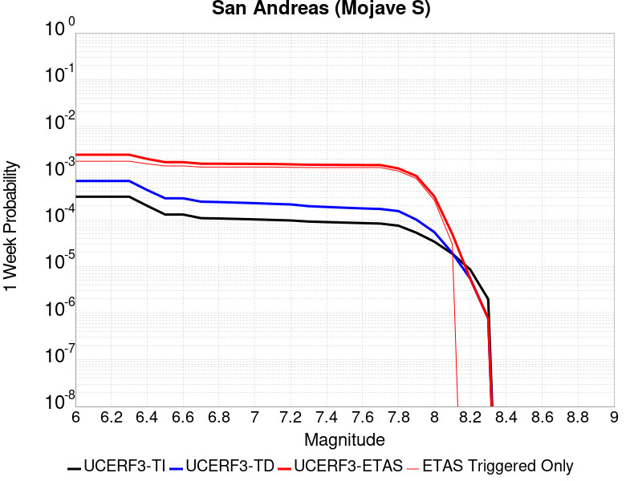 |  |  |  |

| Magnitude | 1 wk TI Prob | 1 wk TD Prob | 1 wk ETAS Prob | 1 wk ETAS/TD Gain | 1 wk ETAS Triggered Only | 1 mo TI Prob | 1 mo TD Prob | 1 mo ETAS Prob | 1 mo ETAS/TD Gain | 1 mo ETAS Triggered Only | 1 yr TI Prob | 1 yr TD Prob | 1 yr ETAS Prob | 1 yr ETAS/TD Gain | 1 yr ETAS Triggered Only | 10 yr TI Prob | 10 yr TD Prob | 10 yr ETAS Prob | 10 yr ETAS/TD Gain | 10 yr ETAS Triggered Only |
|-----|-----|-----|-----|-----|-----|-----|-----|-----|-----|-----|-----|-----|-----|-----|-----|-----|-----|-----|-----|-----|
| 6.0 | 3.1064058E-4 | 6.7462435E-4 | 0.0025830017 | 3.8288 | 0.0019096658 | 0.0013306376 | 0.002888172 | 0.005187257 | 1.7960347 | 0.0023057444 | 0.016080605 | 0.034565594 | 0.037733953 | 1.0916622 | 0.003281796 | 0.1496549 | 0.28654557 | 0.28949252 | 1.0102844 | 0.004130536 |
| 6.1 | 3.1064058E-4 | 6.7462435E-4 | 0.0025830017 | 3.8288 | 0.0019096658 | 0.0013306376 | 0.002888172 | 0.005187257 | 1.7960347 | 0.0023057444 | 0.016080605 | 0.034565594 | 0.037733953 | 1.0916622 | 0.003281796 | 0.1496549 | 0.28654557 | 0.28949252 | 1.0102844 | 0.004130536 |
| 6.2 | 3.1064058E-4 | 6.7462435E-4 | 0.0025830017 | 3.8288 | 0.0019096658 | 0.0013306376 | 0.002888172 | 0.005187257 | 1.7960347 | 0.0023057444 | 0.016080605 | 0.034565594 | 0.037733953 | 1.0916622 | 0.003281796 | 0.1496549 | 0.28654557 | 0.28949252 | 1.0102844 | 0.004130536 |
| 6.3 | 3.1064058E-4 | 6.7462435E-4 | 0.0025830017 | 3.8288 | 0.0019096658 | 0.0013306376 | 0.002888172 | 0.005187257 | 1.7960347 | 0.0023057444 | 0.016080605 | 0.034565594 | 0.037733953 | 1.0916622 | 0.003281796 | 0.1496549 | 0.28654557 | 0.28949252 | 1.0102844 | 0.004130536 |
| 6.4 | 1.9872203E-4 | 4.3181062E-4 | 0.0021285582 | 4.929379 | 0.0016974807 | 8.5138786E-4 | 0.0018493326 | 0.003868423 | 2.091794 | 0.002022831 | 0.010316478 | 0.02228931 | 0.02520752 | 1.1309241 | 0.0029847368 | 0.098504856 | 0.19686839 | 0.19989038 | 1.0153502 | 0.0037627488 |
| 6.5 | 1.291105E-4 | 2.8754136E-4 | 0.0017865514 | 6.2131977 | 0.0014994412 | 5.5321335E-4 | 0.0012317409 | 0.003054285 | 2.4796488 | 0.0018247917 | 0.006714592 | 0.014894155 | 0.017486062 | 1.1740217 | 0.002631095 | 0.065152965 | 0.13800792 | 0.14088559 | 1.0208514 | 0.0033383786 |
| 6.6 | 1.291105E-4 | 2.8754136E-4 | 0.0017865514 | 6.2131977 | 0.0014994412 | 5.5321335E-4 | 0.0012317409 | 0.003054285 | 2.4796488 | 0.0018247917 | 0.006714592 | 0.014894155 | 0.017486062 | 1.1740217 | 0.002631095 | 0.065152965 | 0.13800792 | 0.14088559 | 1.0208514 | 0.0033383786 |
| 6.7 | 1.08001186E-4 | 2.4335351E-4 | 0.0016717187 | 6.8695073 | 0.0014287129 | 4.6278012E-4 | 0.0010425274 | 0.0027665002 | 2.6536477 | 0.001725772 | 0.0056198016 | 0.0126192 | 0.0150774205 | 1.1948 | 0.0024896383 | 0.054797906 | 0.11918431 | 0.121987745 | 1.0235219 | 0.0031827763 |
| 6.8 | 1.0624356E-4 | 2.3853009E-4 | 0.0016669022 | 6.988226 | 0.0014287129 | 4.5525006E-4 | 0.0010218718 | 0.0027458803 | 2.6871083 | 0.001725772 | 0.0055285925 | 0.012370593 | 0.014815462 | 1.1976355 | 0.0024754927 | 0.053930566 | 0.11713308 | 0.11993056 | 1.0238829 | 0.0031686306 |
| 6.9 | 1.0393785E-4 | 2.3223337E-4 | 0.0016606145 | 7.150628 | 0.0014287129 | 4.4537184E-4 | 9.949068E-4 | 0.0027189618 | 2.732881 | 0.001725772 | 0.0054089287 | 0.012045963 | 0.014491636 | 1.2030284 | 0.0024754927 | 0.05279156 | 0.114433445 | 0.11722695 | 1.0244117 | 0.0031544848 |
| 7.0 | 1.0155622E-4 | 2.2592908E-4 | 0.0016543191 | 7.322294 | 0.0014287129 | 4.3516833E-4 | 9.6790853E-4 | 0.0026920103 | 2.781265 | 0.001725772 | 0.005285311 | 0.011720838 | 0.014167316 | 1.2087289 | 0.0024754927 | 0.05161361 | 0.11169745 | 0.11449959 | 1.0250869 | 0.0031544848 |
| 7.1 | 9.885595E-5 | 2.188132E-4 | 0.0016472135 | 7.5279436 | 0.0014287129 | 4.2359953E-4 | 9.374342E-4 | 0.0026615884 | 2.839227 | 0.001725772 | 0.0051451353 | 0.011353733 | 0.013787135 | 1.2143261 | 0.002461347 | 0.05027629 | 0.10857607 | 0.11137544 | 1.0257826 | 0.0031403392 |
| 7.2 | 9.6411415E-5 | 2.1244297E-4 | 0.0016267097 | 7.6571593 | 0.0014145672 | 4.1312634E-4 | 9.101525E-4 | 0.0026202209 | 2.8788812 | 0.0017116263 | 0.005018219 | 0.011024987 | 0.013445208 | 1.2195214 | 0.0024472012 | 0.049064007 | 0.1057697 | 0.10856524 | 1.0264304 | 0.0031261935 |
| 7.3 | 9.1180635E-5 | 1.9472656E-4 | 0.0015948754 | 8.190333 | 0.0014004215 | 3.907156E-4 | 8.342756E-4 | 0.00253034 | 3.0329788 | 0.0016974807 | 0.004746591 | 0.010110112 | 0.012518569 | 1.2382226 | 0.0024330555 | 0.046464786 | 0.09796176 | 0.100768946 | 1.0286559 | 0.003112048 |
| 7.4 | 8.887388E-5 | 1.872126E-4 | 0.0015873719 | 8.47898 | 0.0014004215 | 3.8083247E-4 | 8.020931E-4 | 0.0024840778 | 3.0969944 | 0.0016833349 | 0.0046267817 | 0.009721855 | 0.012117248 | 1.2463926 | 0.00241891 | 0.045316286 | 0.094593845 | 0.097398706 | 1.0296516 | 0.0030979023 |
| 7.5 | 8.6750515E-5 | 1.80528E-4 | 0.0015806967 | 8.755964 | 0.0014004215 | 3.7173493E-4 | 7.734621E-4 | 0.002455495 | 3.1746805 | 0.0016833349 | 0.004516484 | 0.009376327 | 0.011772556 | 1.2555617 | 0.00241891 | 0.04425787 | 0.09155606 | 0.09437033 | 1.0307382 | 0.0030979023 |
| 7.6 | 8.453092E-5 | 1.7440386E-4 | 0.0015745811 | 9.028361 | 0.0014004215 | 3.6222505E-4 | 7.4723107E-4 | 0.0024293081 | 3.2510803 | 0.0016833349 | 0.0044011753 | 0.009059664 | 0.01145666 | 1.2645788 | 0.00241891 | 0.04315024 | 0.08871447 | 0.09153755 | 1.031822 | 0.0030979023 |
| 7.7 | 8.259102E-5 | 1.6962511E-4 | 0.001569809 | 9.25458 | 0.0014004215 | 3.539135E-4 | 7.267622E-4 | 0.0023947384 | 3.2950783 | 0.0016691893 | 0.004300386 | 0.0088125 | 0.011196073 | 1.2704762 | 0.0024047643 | 0.042181134 | 0.086465426 | 0.08928255 | 1.0325809 | 0.0030837564 |
| 7.8 | 7.444844E-5 | 1.528469E-4 | 0.0013550452 | 8.8653755 | 0.0012023821 | 3.1902574E-4 | 6.5489375E-4 | 0.002082671 | 3.1801662 | 0.0014287129 | 0.0038772223 | 0.007944231 | 0.009993092 | 1.2579055 | 0.002065268 | 0.03810269 | 0.078293875 | 0.08073201 | 1.0311408 | 0.0026452406 |
| 7.9 | 5.2586525E-5 | 1.0007023E-4 | 9.345814E-4 | 9.339254 | 8.3459466E-4 | 2.2535135E-4 | 4.2880196E-4 | 0.001362016 | 3.176329 | 9.336144E-4 | 0.0027402006 | 0.005208178 | 0.006474658 | 1.2431715 | 0.0012731105 | 0.027066574 | 0.052201588 | 0.053783644 | 1.0303067 | 0.0016691893 |
| 8.0 | 3.379877E-5 | 5.4075565E-5 | 3.6526352E-4 | 6.7546873 | 3.1120479E-4 | 1.4484383E-4 | 2.3173184E-4 | 5.570069E-4 | 2.40367 | 3.2535047E-4 | 0.0017620471 | 0.0028176866 | 0.0032831787 | 1.1652036 | 4.668072E-4 | 0.017481409 | 0.028835917 | 0.029412903 | 1.0200093 | 5.941182E-4 |
| 8.1 | 1.8668277E-5 | 1.9308145E-5 | 4.7598944E-5 | 2.4652262 | 2.8291344E-5 | 8.000444E-5 | 8.274657E-5 | 1.1103557E-4 | 1.3418752 | 2.8291344E-5 | 9.736188E-4 | 0.0010069745 | 0.0010635002 | 1.0561342 | 5.658269E-5 | 0.009693642 | 0.010798624 | 0.010854595 | 1.0051832 | 5.658269E-5 |
| 8.2 | 8.541571E-6 | 5.4596358E-6 | 5.4596358E-6 | 1.0 | 0.0 | 3.660622E-5 | 2.339823E-5 | 2.339823E-5 | 1.0 | 0.0 | 4.455896E-4 | 2.848363E-4 | 2.848363E-4 | 1.0 | 0.0 | 0.0044469717 | 0.003240283 | 0.003240283 | 1.0 | 0.0 |
| 8.3 | 1.983087E-6 | 7.6564595E-7 | 7.6564595E-7 | 1.0 | 0.0 | 8.498917E-6 | 3.281336E-6 | 3.281336E-6 | 1.0 | 0.0 | 1.034694E-4 | 3.9949547E-5 | 3.9949547E-5 | 1.0 | 0.0 | 0.0010342124 | 4.717979E-4 | 4.717979E-4 | 1.0 | 0.0 |

## So Sierra Nevada
*[(top)](#table-of-contents)*

| 1 Week | 1 Month | 1 Year | 10 Year |
|-----|-----|-----|-----|
|  |  |  |  |

| Magnitude | 1 wk TI Prob | 1 wk TD Prob | 1 wk ETAS Prob | 1 wk ETAS/TD Gain | 1 wk ETAS Triggered Only | 1 mo TI Prob | 1 mo TD Prob | 1 mo ETAS Prob | 1 mo ETAS/TD Gain | 1 mo ETAS Triggered Only | 1 yr TI Prob | 1 yr TD Prob | 1 yr ETAS Prob | 1 yr ETAS/TD Gain | 1 yr ETAS Triggered Only | 10 yr TI Prob | 10 yr TD Prob | 10 yr ETAS Prob | 10 yr ETAS/TD Gain | 10 yr ETAS Triggered Only |
|-----|-----|-----|-----|-----|-----|-----|-----|-----|-----|-----|-----|-----|-----|-----|-----|-----|-----|-----|-----|-----|
| 6.0 | 1.15488665E-5 | 1.1079612E-5 | 0.0015529408 | 140.16203 | 0.0015418782 | 4.9494203E-5 | 4.7483256E-5 | 0.0021692333 | 45.684174 | 0.0021218508 | 6.024253E-4 | 5.779681E-4 | 0.0037871797 | 6.552576 | 0.0032110675 | 0.006007948 | 0.005765918 | 0.010280497 | 1.7829766 | 0.0045407605 |
| 6.1 | 1.15488665E-5 | 1.1079612E-5 | 0.0015529408 | 140.16203 | 0.0015418782 | 4.9494203E-5 | 4.7483256E-5 | 0.0021692333 | 45.684174 | 0.0021218508 | 6.024253E-4 | 5.779681E-4 | 0.0037871797 | 6.552576 | 0.0032110675 | 0.006007948 | 0.005765918 | 0.010280497 | 1.7829766 | 0.0045407605 |
| 6.2 | 1.15488665E-5 | 1.1079612E-5 | 0.0015529408 | 140.16203 | 0.0015418782 | 4.9494203E-5 | 4.7483256E-5 | 0.0021692333 | 45.684174 | 0.0021218508 | 6.024253E-4 | 5.779681E-4 | 0.0037871797 | 6.552576 | 0.0032110675 | 0.006007948 | 0.005765918 | 0.010280497 | 1.7829766 | 0.0045407605 |
| 6.3 | 1.15488665E-5 | 1.1079612E-5 | 0.0015529408 | 140.16203 | 0.0015418782 | 4.9494203E-5 | 4.7483256E-5 | 0.0021692333 | 45.684174 | 0.0021218508 | 6.024253E-4 | 5.779681E-4 | 0.0037871797 | 6.552576 | 0.0032110675 | 0.006007948 | 0.005765918 | 0.010280497 | 1.7829766 | 0.0045407605 |
| 6.4 | 1.15488665E-5 | 1.1079612E-5 | 0.0015529408 | 140.16203 | 0.0015418782 | 4.9494203E-5 | 4.7483256E-5 | 0.0021692333 | 45.684174 | 0.0021218508 | 6.024253E-4 | 5.779681E-4 | 0.0037871797 | 6.552576 | 0.0032110675 | 0.006007948 | 0.005765918 | 0.010280497 | 1.7829766 | 0.0045407605 |
| 6.5 | 1.15488665E-5 | 1.1079612E-5 | 0.0015529408 | 140.16203 | 0.0015418782 | 4.9494203E-5 | 4.7483256E-5 | 0.0021692333 | 45.684174 | 0.0021218508 | 6.024253E-4 | 5.779681E-4 | 0.0037871797 | 6.552576 | 0.0032110675 | 0.006007948 | 0.005765918 | 0.010280497 | 1.7829766 | 0.0045407605 |
| 6.6 | 7.587044E-6 | 6.9356042E-6 | 9.1225235E-4 | 131.53177 | 9.05323E-4 | 3.2515498E-5 | 2.9723697E-5 | 0.0012462153 | 41.926662 | 0.0012165278 | 3.9580427E-4 | 3.6182883E-4 | 0.0021435386 | 5.9241786 | 0.0017823547 | 0.003951 | 0.0036126887 | 0.006051049 | 1.6749433 | 0.0024472012 |
| 6.7 | 7.587044E-6 | 6.9356042E-6 | 9.1225235E-4 | 131.53177 | 9.05323E-4 | 3.2515498E-5 | 2.9723697E-5 | 0.0012462153 | 41.926662 | 0.0012165278 | 3.9580427E-4 | 3.6182883E-4 | 0.0021435386 | 5.9241786 | 0.0017823547 | 0.003951 | 0.0036126887 | 0.006051049 | 1.6749433 | 0.0024472012 |
| 6.8 | 5.9026956E-6 | 5.179362E-6 | 6.5587694E-4 | 126.63277 | 6.5070094E-4 | 2.5297022E-5 | 2.2197082E-5 | 8.5677323E-4 | 38.59846 | 8.3459466E-4 | 3.0794772E-4 | 2.7021713E-4 | 0.0014298488 | 5.291481 | 0.0011599452 | 0.0030752132 | 0.002699002 | 0.004194396 | 1.5540545 | 0.0014994412 |
| 6.9 | 5.0118915E-6 | 4.2523943E-6 | 5.5593124E-4 | 130.7337 | 5.516812E-4 | 2.1479358E-5 | 1.8224424E-5 | 6.547681E-4 | 35.92805 | 6.3655525E-4 | 2.614798E-4 | 2.2186051E-4 | 0.0011269826 | 5.0796905 | 9.05323E-4 | 0.0026117235 | 0.0022164627 | 0.0034020655 | 1.5349076 | 0.0011882364 |
| 7.0 | 4.4924795E-6 | 3.7138868E-6 | 4.7051933E-4 | 126.69189 | 4.668072E-4 | 1.925334E-5 | 1.5916565E-5 | 5.5344356E-4 | 34.771545 | 5.375355E-4 | 2.3438422E-4 | 1.9376757E-4 | 9.7162876E-4 | 5.0144033 | 7.78012E-4 | 0.0023413717 | 0.0019360491 | 0.0029808022 | 1.5396315 | 0.0010467797 |
| 7.1 | 3.9118436E-6 | 3.1119469E-6 | 3.4260703E-4 | 110.09411 | 3.3949612E-4 | 1.6764936E-5 | 1.333685E-5 | 4.094104E-4 | 30.697681 | 3.9607883E-4 | 2.0409399E-4 | 1.6236462E-4 | 7.705298E-4 | 4.745675 | 6.082639E-4 | 0.0020390663 | 0.0016225161 | 0.0024275112 | 1.49614 | 8.063033E-4 |
| 7.2 | 3.4200818E-6 | 2.6054236E-6 | 2.9966378E-4 | 115.01537 | 2.970591E-4 | 1.4657411E-5 | 1.11660565E-5 | 3.506584E-4 | 31.403961 | 3.3949612E-4 | 1.7843937E-4 | 1.3593875E-4 | 6.4511376E-4 | 4.7456203 | 5.092442E-4 | 0.0017829615 | 0.0013586058 | 0.002022549 | 1.4886947 | 6.6484656E-4 |
| 7.3 | 2.6593618E-6 | 1.8283897E-6 | 1.5743049E-4 | 86.10336 | 1.5560239E-4 | 1.13972155E-5 | 7.8359335E-6 | 2.0587379E-4 | 26.273039 | 1.9803942E-4 | 1.3875226E-4 | 9.539862E-5 | 3.499964E-4 | 3.668779 | 2.546221E-4 | 0.0013866565 | 9.536055E-4 | 0.0012786457 | 1.3408539 | 3.2535047E-4 |
| 7.4 | 2.2577992E-6 | 1.4364078E-6 | 1.5703858E-4 | 109.32729 | 1.5560239E-4 | 9.676246E-6 | 6.1560204E-6 | 2.041942E-4 | 33.16984 | 1.9803942E-4 | 1.1780193E-4 | 7.4947224E-5 | 3.2955024E-4 | 4.397097 | 2.546221E-4 | 0.001177395 | 7.4924453E-4 | 0.0010460811 | 1.3961811 | 2.970591E-4 |
| 7.5 | 1.489319E-6 | 7.353661E-7 | 9.9755E-5 | 135.65352 | 9.901971E-5 | 6.3827797E-6 | 3.1515651E-6 | 1.1631659E-4 | 36.907562 | 1.1316538E-4 | 7.770758E-5 | 3.8369635E-5 | 1.9396606E-4 | 5.055197 | 1.5560239E-4 | 7.7680405E-4 | 3.8363054E-4 | 5.5331347E-4 | 1.4423082 | 1.6974806E-4 |
| 7.6 | 1.0680322E-6 | 4.65941E-7 | 7.119427E-5 | 152.79674 | 7.072836E-5 | 4.577273E-6 | 1.9968884E-6 | 7.272511E-5 | 36.419212 | 7.072836E-5 | 5.5726876E-5 | 2.4311848E-5 | 1.0918382E-4 | 4.4909716 | 8.487403E-5 | 5.5712904E-4 | 2.4309216E-4 | 3.2794554E-4 | 1.3490586 | 8.487403E-5 |
| 7.7 | 5.509146E-7 | 1.5578539E-7 | 4.2592794E-5 | 273.40686 | 4.2437016E-5 | 2.3610605E-6 | 6.676515E-7 | 4.310464E-5 | 64.561584 | 4.2437016E-5 | 2.8745531E-5 | 8.128628E-6 | 5.05653E-5 | 6.220644 | 4.2437016E-5 | 2.8741814E-4 | 8.128342E-5 | 1.2371699E-4 | 1.5220445 | 4.2437016E-5 |

## Coyote Canyon
*[(top)](#table-of-contents)*

| 1 Week | 1 Month | 1 Year | 10 Year |
|-----|-----|-----|-----|
|  |  |  |  |

| Magnitude | 1 wk TI Prob | 1 wk TD Prob | 1 wk ETAS Prob | 1 wk ETAS/TD Gain | 1 wk ETAS Triggered Only | 1 mo TI Prob | 1 mo TD Prob | 1 mo ETAS Prob | 1 mo ETAS/TD Gain | 1 mo ETAS Triggered Only | 1 yr TI Prob | 1 yr TD Prob | 1 yr ETAS Prob | 1 yr ETAS/TD Gain | 1 yr ETAS Triggered Only | 10 yr TI Prob | 10 yr TD Prob | 10 yr ETAS Prob | 10 yr ETAS/TD Gain | 10 yr ETAS Triggered Only |
|-----|-----|-----|-----|-----|-----|-----|-----|-----|-----|-----|-----|-----|-----|-----|-----|-----|-----|-----|-----|-----|
| 6.0 | 3.5090034E-5 | 4.0364317E-5 | 0.0010163763 | 25.180069 | 9.760514E-4 | 1.503772E-4 | 1.7297991E-4 | 0.0015873024 | 9.176224 | 0.0014145672 | 0.0018293047 | 0.0021042533 | 0.004885087 | 2.3215299 | 0.0027866974 | 0.018143194 | 0.020869205 | 0.024733484 | 1.1851666 | 0.0039466424 |
| 6.1 | 3.5090034E-5 | 4.0364317E-5 | 0.0010163763 | 25.180069 | 9.760514E-4 | 1.503772E-4 | 1.7297991E-4 | 0.0015873024 | 9.176224 | 0.0014145672 | 0.0018293047 | 0.0021042533 | 0.004885087 | 2.3215299 | 0.0027866974 | 0.018143194 | 0.020869205 | 0.024733484 | 1.1851666 | 0.0039466424 |
| 6.2 | 1.841879E-5 | 2.1059794E-5 | 5.727294E-4 | 27.195395 | 5.516812E-4 | 7.8935285E-5 | 9.025371E-5 | 9.5306186E-4 | 10.559808 | 8.62886E-4 | 9.606133E-4 | 0.0010983871 | 0.0027374825 | 2.4922752 | 0.001640898 | 0.0095647145 | 0.010939668 | 0.0132341795 | 1.2097423 | 0.0023198903 |
| 6.3 | 1.841879E-5 | 2.1059794E-5 | 5.727294E-4 | 27.195395 | 5.516812E-4 | 7.8935285E-5 | 9.025371E-5 | 9.5306186E-4 | 10.559808 | 8.62886E-4 | 9.606133E-4 | 0.0010983871 | 0.0027374825 | 2.4922752 | 0.001640898 | 0.0095647145 | 0.010939668 | 0.0132341795 | 1.2097423 | 0.0023198903 |
| 6.4 | 1.712201E-5 | 1.9565212E-5 | 5.429448E-4 | 27.750523 | 5.2338984E-4 | 7.337798E-5 | 8.3848776E-5 | 8.7594E-4 | 10.446664 | 7.9215766E-4 | 8.930107E-4 | 0.0010204813 | 0.0025325236 | 2.4816952 | 0.001513587 | 0.008894307 | 0.010167871 | 0.012338156 | 1.2134454 | 0.0021925792 |
| 6.5 | 1.4744935E-5 | 1.6836972E-5 | 4.9778173E-4 | 29.564802 | 4.8095285E-4 | 6.3191044E-5 | 7.215698E-5 | 7.935342E-4 | 10.997331 | 7.214293E-4 | 7.6907943E-4 | 8.782507E-4 | 0.0022350426 | 2.54488 | 0.0013579845 | 0.007664232 | 0.008756994 | 0.01074809 | 1.227372 | 0.0020086854 |
| 6.6 | 1.2017839E-5 | 1.3724089E-5 | 3.95652E-4 | 28.829018 | 3.8193315E-4 | 5.150401E-5 | 5.88167E-5 | 6.246103E-4 | 10.619609 | 5.658269E-4 | 6.268809E-4 | 7.159466E-4 | 0.0018326546 | 2.5597644 | 0.001117508 | 0.0062511545 | 0.0071450938 | 0.008732134 | 1.222116 | 0.001598461 |
| 6.7 | 1.00956095E-5 | 1.1533517E-5 | 2.944437E-4 | 25.529394 | 2.8291345E-4 | 4.326618E-5 | 4.942891E-5 | 5.02068E-4 | 10.157376 | 4.526615E-4 | 5.266384E-4 | 6.017178E-4 | 0.0015206332 | 2.5271535 | 9.194687E-4 | 0.005253921 | 0.0060094125 | 0.007331115 | 1.2199388 | 0.0013296931 |

## San Andreas (Mojave N)
*[(top)](#table-of-contents)*

| 1 Week | 1 Month | 1 Year | 10 Year |
|-----|-----|-----|-----|
| 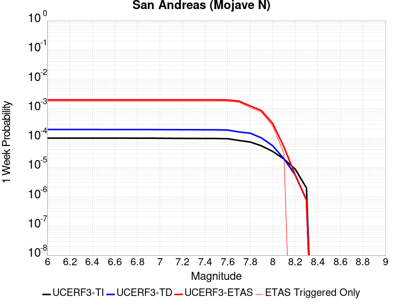 |  |  |  |

| Magnitude | 1 wk TI Prob | 1 wk TD Prob | 1 wk ETAS Prob | 1 wk ETAS/TD Gain | 1 wk ETAS Triggered Only | 1 mo TI Prob | 1 mo TD Prob | 1 mo ETAS Prob | 1 mo ETAS/TD Gain | 1 mo ETAS Triggered Only | 1 yr TI Prob | 1 yr TD Prob | 1 yr ETAS Prob | 1 yr ETAS/TD Gain | 1 yr ETAS Triggered Only | 10 yr TI Prob | 10 yr TD Prob | 10 yr ETAS Prob | 10 yr ETAS/TD Gain | 10 yr ETAS Triggered Only |
|-----|-----|-----|-----|-----|-----|-----|-----|-----|-----|-----|-----|-----|-----|-----|-----|-----|-----|-----|-----|-----|
| 6.0 | 9.877682E-5 | 1.9402112E-4 | 0.0021598882 | 11.132232 | 0.0019662485 | 4.2326056E-4 | 8.312543E-4 | 0.00316335 | 3.8055143 | 0.002334036 | 0.0051410277 | 0.010073684 | 0.013294414 | 1.3197172 | 0.0032535046 | 0.05023708 | 0.09832245 | 0.102034114 | 1.0377499 | 0.0041163904 |
| 6.1 | 9.877682E-5 | 1.9402112E-4 | 0.0021598882 | 11.132232 | 0.0019662485 | 4.2326056E-4 | 8.312543E-4 | 0.00316335 | 3.8055143 | 0.002334036 | 0.0051410277 | 0.010073684 | 0.013294414 | 1.3197172 | 0.0032535046 | 0.05023708 | 0.09832245 | 0.102034114 | 1.0377499 | 0.0041163904 |
| 6.2 | 9.877682E-5 | 1.9402112E-4 | 0.0021598882 | 11.132232 | 0.0019662485 | 4.2326056E-4 | 8.312543E-4 | 0.00316335 | 3.8055143 | 0.002334036 | 0.0051410277 | 0.010073684 | 0.013294414 | 1.3197172 | 0.0032535046 | 0.05023708 | 0.09832245 | 0.102034114 | 1.0377499 | 0.0041163904 |
| 6.3 | 9.877682E-5 | 1.9402112E-4 | 0.0021598882 | 11.132232 | 0.0019662485 | 4.2326056E-4 | 8.312543E-4 | 0.00316335 | 3.8055143 | 0.002334036 | 0.0051410277 | 0.010073684 | 0.013294414 | 1.3197172 | 0.0032535046 | 0.05023708 | 0.09832245 | 0.102034114 | 1.0377499 | 0.0041163904 |
| 6.4 | 9.877682E-5 | 1.9402112E-4 | 0.0021598882 | 11.132232 | 0.0019662485 | 4.2326056E-4 | 8.312543E-4 | 0.00316335 | 3.8055143 | 0.002334036 | 0.0051410277 | 0.010073684 | 0.013294414 | 1.3197172 | 0.0032535046 | 0.05023708 | 0.09832245 | 0.102034114 | 1.0377499 | 0.0041163904 |
| 6.5 | 9.861474E-5 | 1.937588E-4 | 0.0021596262 | 11.145951 | 0.0019662485 | 4.2256617E-4 | 8.3013077E-4 | 0.0031622292 | 3.8093143 | 0.002334036 | 0.0051326132 | 0.0100601325 | 0.013266902 | 1.3187603 | 0.003239359 | 0.050156746 | 0.09820035 | 0.10189975 | 1.037672 | 0.004102245 |
| 6.6 | 9.861474E-5 | 1.937588E-4 | 0.0021596262 | 11.145951 | 0.0019662485 | 4.2256617E-4 | 8.3013077E-4 | 0.0031622292 | 3.8093143 | 0.002334036 | 0.0051326132 | 0.0100601325 | 0.013266902 | 1.3187603 | 0.003239359 | 0.050156746 | 0.09820035 | 0.10189975 | 1.037672 | 0.004102245 |
| 6.7 | 9.8552715E-5 | 1.9365833E-4 | 0.0021595259 | 11.1512165 | 0.0019662485 | 4.223004E-4 | 8.2970044E-4 | 0.0031617999 | 3.8107727 | 0.002334036 | 0.0051293927 | 0.010054941 | 0.013261729 | 1.3189265 | 0.003239359 | 0.050125998 | 0.09815356 | 0.101853155 | 1.037692 | 0.004102245 |
| 6.8 | 9.8464974E-5 | 1.9350994E-4 | 0.0021593778 | 11.159002 | 0.0019662485 | 4.219245E-4 | 8.290649E-4 | 0.0031611659 | 3.8129292 | 0.002334036 | 0.0051248376 | 0.010047276 | 0.013254087 | 1.3191724 | 0.003239359 | 0.05008251 | 0.09808378 | 0.10178366 | 1.0377216 | 0.004102245 |
| 6.9 | 9.825824E-5 | 1.9319002E-4 | 0.0021590586 | 11.175829 | 0.0019662485 | 4.2103877E-4 | 8.276947E-4 | 0.0031597987 | 3.8175898 | 0.002334036 | 0.0051141046 | 0.010030746 | 0.013237612 | 1.3197036 | 0.003239359 | 0.049980022 | 0.097932965 | 0.10163347 | 1.037786 | 0.004102245 |
| 7.0 | 9.781462E-5 | 1.9250368E-4 | 0.0021583736 | 11.212116 | 0.0019662485 | 4.1913814E-4 | 8.247551E-4 | 0.003156866 | 3.8276405 | 0.002334036 | 0.005091073 | 0.009995285 | 0.013202266 | 1.3208493 | 0.003239359 | 0.04976007 | 0.09760912 | 0.101310946 | 1.037925 | 0.004102245 |
| 7.1 | 9.7121134E-5 | 1.9152075E-4 | 0.0021573927 | 11.264537 | 0.0019662485 | 4.1616702E-4 | 8.205452E-4 | 0.003152666 | 3.84216 | 0.002334036 | 0.005055068 | 0.0099444995 | 0.013151645 | 1.3225044 | 0.003239359 | 0.04941613 | 0.09714571 | 0.100849435 | 1.0381255 | 0.004102245 |
| 7.2 | 9.663819E-5 | 1.9082859E-4 | 0.0021567019 | 11.301775 | 0.0019662485 | 4.1409794E-4 | 8.175807E-4 | 0.0031497083 | 3.852474 | 0.002334036 | 0.0050299936 | 0.009908735 | 0.013115996 | 1.3236802 | 0.003239359 | 0.049176537 | 0.09681883 | 0.1005239 | 1.0382681 | 0.004102245 |
| 7.3 | 9.6277574E-5 | 1.9035369E-4 | 0.0021562278 | 11.327481 | 0.0019662485 | 4.125529E-4 | 8.1554666E-4 | 0.003147679 | 3.859594 | 0.002334036 | 0.0050112694 | 0.009884195 | 0.013091536 | 1.3244917 | 0.003239359 | 0.04899759 | 0.09659228 | 0.10029828 | 1.0383675 | 0.004102245 |
| 7.4 | 9.593308E-5 | 1.8975153E-4 | 0.002155627 | 11.360261 | 0.0019662485 | 4.1107697E-4 | 8.129676E-4 | 0.003145106 | 3.8686733 | 0.002334036 | 0.0049933824 | 0.009853081 | 0.013060521 | 1.3255267 | 0.003239359 | 0.04882661 | 0.09630986 | 0.10001702 | 1.038492 | 0.004102245 |
| 7.5 | 9.561707E-5 | 1.8921228E-4 | 0.0021550886 | 11.389793 | 0.0019662485 | 4.0972308E-4 | 8.106579E-4 | 0.0031428018 | 3.876853 | 0.002334036 | 0.0049769743 | 0.009825215 | 0.013032746 | 1.3264592 | 0.003239359 | 0.048669744 | 0.096056245 | 0.099764444 | 1.0386045 | 0.004102245 |
| 7.6 | 9.418194E-5 | 1.8573487E-4 | 0.002151618 | 11.584352 | 0.0019662485 | 4.0357444E-4 | 7.95764E-4 | 0.0031279426 | 3.9307415 | 0.002334036 | 0.004902454 | 0.009645499 | 0.012839603 | 1.3311497 | 0.0032252131 | 0.047957025 | 0.094437465 | 0.098139495 | 1.0392009 | 0.004088099 |
| 7.7 | 8.202141E-5 | 1.6022482E-4 | 0.0019564372 | 12.210576 | 0.0017965004 | 3.51473E-4 | 6.8649714E-4 | 0.0027927554 | 4.068124 | 0.0021077052 | 0.00427079 | 0.008326128 | 0.01124393 | 1.3504392 | 0.0029422997 | 0.04189639 | 0.082237914 | 0.08567824 | 1.0418338 | 0.0037486032 |
| 7.8 | 7.2859846E-5 | 1.4517571E-4 | 0.0013473833 | 9.281052 | 0.0012023821 | 3.1221908E-4 | 6.2203326E-4 | 0.0020498575 | 3.2954144 | 0.0014287129 | 0.003794643 | 0.0075469986 | 0.009582642 | 1.2697288 | 0.0020511225 | 0.037304975 | 0.07472766 | 0.07716214 | 1.032578 | 0.002631095 |
| 7.9 | 5.3874453E-5 | 1.00462625E-4 | 9.349734E-4 | 9.306679 | 8.3459466E-4 | 2.3087008E-4 | 4.3048308E-4 | 0.0013636956 | 3.1678262 | 9.336144E-4 | 0.0028072202 | 0.0052285474 | 0.0064950017 | 1.2422191 | 0.0012731105 | 0.02772022 | 0.052425884 | 0.054007564 | 1.0301698 | 0.0016691893 |
| 8.0 | 3.468538E-5 | 5.4261534E-5 | 3.6544944E-4 | 6.734963 | 3.1120479E-4 | 1.4864317E-4 | 2.3252872E-4 | 5.5780355E-4 | 2.3988585 | 3.2535047E-4 | 0.0018082283 | 0.0028273636 | 0.003292851 | 1.1646365 | 4.668072E-4 | 0.017935853 | 0.028948462 | 0.02952538 | 1.0199292 | 5.941182E-4 |
| 8.1 | 1.9152367E-5 | 1.9401303E-5 | 4.7692098E-5 | 2.4581904 | 2.8291344E-5 | 8.207899E-5 | 8.3145795E-5 | 1.1143478E-4 | 1.3402336 | 2.8291344E-5 | 9.988535E-4 | 0.0010118305 | 0.001068356 | 1.0558646 | 5.658269E-5 | 0.009943757 | 0.01085595 | 0.010911919 | 1.0051556 | 5.658269E-5 |
| 8.2 | 8.643924E-6 | 5.473668E-6 | 5.473668E-6 | 1.0 | 0.0 | 3.704486E-5 | 2.3458366E-5 | 2.3458366E-5 | 1.0 | 0.0 | 4.5092785E-4 | 2.8556827E-4 | 2.8556827E-4 | 1.0 | 0.0 | 0.0045001395 | 0.0032481793 | 0.0032481793 | 1.0 | 0.0 |
| 8.3 | 1.983087E-6 | 7.6564595E-7 | 7.6564595E-7 | 1.0 | 0.0 | 8.498917E-6 | 3.281336E-6 | 3.281336E-6 | 1.0 | 0.0 | 1.034694E-4 | 3.9949547E-5 | 3.9949547E-5 | 1.0 | 0.0 | 0.0010342124 | 4.717979E-4 | 4.717979E-4 | 1.0 | 0.0 |

## Death Valley (So)
*[(top)](#table-of-contents)*

| 1 Week | 1 Month | 1 Year | 10 Year |
|-----|-----|-----|-----|
|  |  | 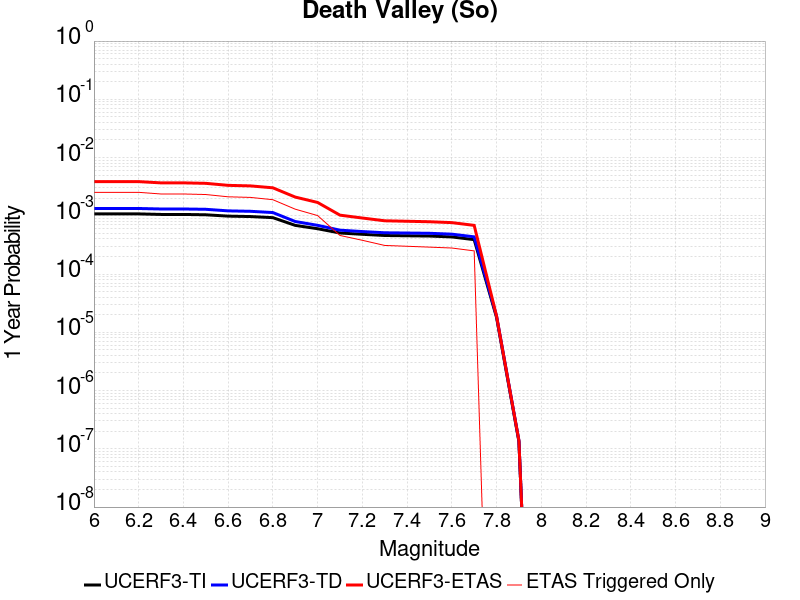 |  |

| Magnitude | 1 wk TI Prob | 1 wk TD Prob | 1 wk ETAS Prob | 1 wk ETAS/TD Gain | 1 wk ETAS Triggered Only | 1 mo TI Prob | 1 mo TD Prob | 1 mo ETAS Prob | 1 mo ETAS/TD Gain | 1 mo ETAS Triggered Only | 1 yr TI Prob | 1 yr TD Prob | 1 yr ETAS Prob | 1 yr ETAS/TD Gain | 1 yr ETAS Triggered Only | 10 yr TI Prob | 10 yr TD Prob | 10 yr ETAS Prob | 10 yr ETAS/TD Gain | 10 yr ETAS Triggered Only |
|-----|-----|-----|-----|-----|-----|-----|-----|-----|-----|-----|-----|-----|-----|-----|-----|-----|-----|-----|-----|-----|
| 6.0 | 2.0684236E-5 | 2.5618314E-5 | 0.0010016446 | 39.098774 | 9.760514E-4 | 8.864371E-5 | 1.0978825E-4 | 0.0015524884 | 14.140752 | 0.0014428586 | 0.0010787029 | 0.0013358692 | 0.003864562 | 2.8929195 | 0.0025320754 | 0.010734817 | 0.013279985 | 0.017076511 | 1.2858833 | 0.0038476228 |
| 6.1 | 2.0684236E-5 | 2.5618314E-5 | 0.0010016446 | 39.098774 | 9.760514E-4 | 8.864371E-5 | 1.0978825E-4 | 0.0015524884 | 14.140752 | 0.0014428586 | 0.0010787029 | 0.0013358692 | 0.003864562 | 2.8929195 | 0.0025320754 | 0.010734817 | 0.013279985 | 0.017076511 | 1.2858833 | 0.0038476228 |
| 6.2 | 2.0684236E-5 | 2.5618314E-5 | 0.0010016446 | 39.098774 | 9.760514E-4 | 8.864371E-5 | 1.0978825E-4 | 0.0015524884 | 14.140752 | 0.0014428586 | 0.0010787029 | 0.0013358692 | 0.003864562 | 2.8929195 | 0.0025320754 | 0.010734817 | 0.013279985 | 0.017076511 | 1.2858833 | 0.0038476228 |
| 6.3 | 2.0240292E-5 | 2.51184E-5 | 8.879827E-4 | 35.351883 | 8.62886E-4 | 8.6741224E-5 | 1.0764593E-4 | 0.0014230518 | 13.219746 | 0.0013155475 | 0.0010555626 | 0.001309818 | 0.003669051 | 2.8011916 | 0.0023623272 | 0.010505628 | 0.013022543 | 0.016596677 | 1.2744575 | 0.003621292 |
| 6.4 | 2.0240292E-5 | 2.51184E-5 | 8.879827E-4 | 35.351883 | 8.62886E-4 | 8.6741224E-5 | 1.0764593E-4 | 0.0014230518 | 13.219746 | 0.0013155475 | 0.0010555626 | 0.001309818 | 0.003669051 | 2.8011916 | 0.0023623272 | 0.010505628 | 0.013022543 | 0.016596677 | 1.2744575 | 0.003621292 |
| 6.5 | 1.9962767E-5 | 2.4807652E-5 | 8.735269E-4 | 35.211994 | 8.4874034E-4 | 8.55519E-5 | 1.0631427E-4 | 0.0013934335 | 13.106741 | 0.0012872561 | 0.0010410968 | 0.0012936244 | 0.0036105134 | 2.791006 | 0.0023198903 | 0.010362327 | 0.01286249 | 0.01635342 | 1.271404 | 0.003536418 |
| 6.6 | 1.8937297E-5 | 2.3311462E-5 | 8.013053E-4 | 34.373875 | 7.78012E-4 | 8.115732E-5 | 9.990252E-5 | 0.0012597317 | 12.609609 | 0.0011599452 | 9.876423E-4 | 0.0012156491 | 0.0033349204 | 2.743325 | 0.0021218508 | 0.009832645 | 0.0120915035 | 0.015277719 | 1.2635087 | 0.0032252131 |
| 6.7 | 1.8621096E-5 | 2.2912098E-5 | 7.7261555E-4 | 33.720856 | 7.497206E-4 | 7.980225E-5 | 9.8191085E-5 | 0.0012155895 | 12.379835 | 0.001117508 | 9.711593E-4 | 0.0011948354 | 0.0032717646 | 2.7382555 | 0.0020794137 | 0.009669261 | 0.011885625 | 0.015002618 | 1.2622489 | 0.0031544848 |
| 6.8 | 1.7830353E-5 | 2.1806083E-5 | 7.149289E-4 | 32.785755 | 6.9313793E-4 | 7.641356E-5 | 9.3451374E-5 | 0.0011118446 | 11.897573 | 0.0010184884 | 9.29938E-4 | 0.0011371907 | 0.0030164255 | 2.652524 | 0.0018813744 | 0.009260561 | 0.01131609 | 0.014197123 | 1.2545962 | 0.0029140085 |
| 6.9 | 1.3135183E-5 | 1.5304031E-5 | 4.9624953E-4 | 32.426067 | 4.8095285E-4 | 5.6292425E-5 | 6.558709E-5 | 7.586796E-4 | 11.567514 | 6.9313793E-4 | 6.8514474E-4 | 7.982367E-4 | 0.0020844652 | 2.6113374 | 0.0012872561 | 0.006830362 | 0.007955158 | 0.009891732 | 1.2434362 | 0.0019521028 |
| 7.0 | 1.1507512E-5 | 1.3154237E-5 | 3.6679138E-4 | 27.883896 | 3.536418E-4 | 4.9316975E-5 | 5.637412E-5 | 5.797345E-4 | 10.283699 | 5.2338984E-4 | 6.002687E-4 | 6.861445E-4 | 0.0016897981 | 2.4627438 | 0.0010043427 | 0.0059864987 | 0.0068414924 | 0.008260431 | 1.2074019 | 0.0014287129 |
| 7.1 | 9.715903E-6 | 1.0865287E-5 | 1.0988391E-4 | 10.113301 | 9.901971E-5 | 4.1638916E-5 | 4.6564706E-5 | 2.1630486E-4 | 4.6452537 | 1.6974806E-4 | 5.068359E-4 | 5.667821E-4 | 9.6263643E-4 | 1.6984242 | 3.9607883E-4 | 0.0050568148 | 0.005653834 | 0.006300856 | 1.1144395 | 6.5070094E-4 |
| 7.2 | 9.233269E-6 | 1.0286314E-5 | 9.515947E-5 | 9.251077 | 8.487403E-5 | 3.9570554E-5 | 4.408348E-5 | 1.9967901E-4 | 4.5295653 | 1.5560239E-4 | 4.81665E-4 | 5.365884E-4 | 8.617643E-4 | 1.6060061 | 3.2535047E-4 | 0.0048062233 | 0.0053533595 | 0.0058739474 | 1.0972451 | 5.2338984E-4 |
| 7.3 | 8.8041315E-6 | 9.808164E-6 | 6.63903E-5 | 6.7688813 | 5.658269E-5 | 3.7731446E-5 | 4.2034335E-5 | 1.6934003E-4 | 4.028612 | 1.2731105E-4 | 4.592835E-4 | 5.1165203E-4 | 7.944207E-4 | 1.5526582 | 2.8291345E-4 | 0.0045833546 | 0.005105167 | 0.0055132974 | 1.0799445 | 4.102245E-4 |
| 7.4 | 8.708749E-6 | 9.707175E-6 | 6.6289314E-5 | 6.8288984 | 5.658269E-5 | 3.7322676E-5 | 4.160154E-5 | 1.689073E-4 | 4.060121 | 1.2731105E-4 | 4.5430884E-4 | 5.0638523E-4 | 7.891554E-4 | 1.5584092 | 2.8291345E-4 | 0.004533812 | 0.0050527398 | 0.0054608914 | 1.0807784 | 4.102245E-4 |
| 7.5 | 8.612678E-6 | 9.604817E-6 | 6.618696E-5 | 6.8910174 | 5.658269E-5 | 3.6910955E-5 | 4.1162875E-5 | 1.6846869E-4 | 4.0927334 | 1.2731105E-4 | 4.492982E-4 | 5.01047E-4 | 7.696801E-4 | 1.5361435 | 2.6876776E-4 | 0.004483909 | 0.0049995985 | 0.0053936974 | 1.0788261 | 3.9607883E-4 |
| 7.6 | 8.319024E-6 | 9.283916E-6 | 6.586608E-5 | 7.0946436 | 5.658269E-5 | 3.5652476E-5 | 3.978763E-5 | 1.6709362E-4 | 4.1996374 | 1.2731105E-4 | 4.3398244E-4 | 4.8431093E-4 | 7.388097E-4 | 1.5254864 | 2.546221E-4 | 0.0043313587 | 0.0048329784 | 0.0052130655 | 1.0786445 | 3.8193315E-4 |
| 7.7 | 7.4718328E-6 | 8.34517E-6 | 5.0781833E-5 | 6.0851765 | 4.2437016E-5 | 3.2021748E-5 | 3.5764548E-5 | 1.4892587E-4 | 4.1640644 | 1.1316538E-4 | 3.8979502E-4 | 4.353504E-4 | 6.615826E-4 | 1.5196555 | 2.2633075E-4 | 0.00389112 | 0.0043453807 | 0.0046693175 | 1.0745474 | 3.2535047E-4 |
| 7.8 | 3.4586725E-7 | 3.6482615E-7 | 3.6482615E-7 | 1.0 | 0.0 | 1.4822873E-6 | 1.5635396E-6 | 1.5635396E-6 | 1.0 | 0.0 | 1.80467E-5 | 1.9035933E-5 | 1.9035933E-5 | 1.0 | 0.0 | 1.8045233E-4 | 1.9034347E-4 | 1.9034347E-4 | 1.0 | 0.0 |
| 7.9 | 2.5591178E-9 | 2.6696718E-9 | 2.6696718E-9 | 1.0 | 0.0 | 1.0967647E-8 | 1.14414505E-8 | 1.14414505E-8 | 1.0 | 0.0 | 1.335311E-7 | 1.3929966E-7 | 1.3929966E-7 | 1.0 | 0.0 | 1.3353102E-6 | 1.3929966E-6 | 1.3929966E-6 | 1.0 | 0.0 |

## Nelson Lake
*[(top)](#table-of-contents)*

| 1 Week | 1 Month | 1 Year | 10 Year |
|-----|-----|-----|-----|
|  |  |  |  |

| Magnitude | 1 wk TI Prob | 1 wk TD Prob | 1 wk ETAS Prob | 1 wk ETAS/TD Gain | 1 wk ETAS Triggered Only | 1 mo TI Prob | 1 mo TD Prob | 1 mo ETAS Prob | 1 mo ETAS/TD Gain | 1 mo ETAS Triggered Only | 1 yr TI Prob | 1 yr TD Prob | 1 yr ETAS Prob | 1 yr ETAS/TD Gain | 1 yr ETAS Triggered Only | 10 yr TI Prob | 10 yr TD Prob | 10 yr ETAS Prob | 10 yr ETAS/TD Gain | 10 yr ETAS Triggered Only |
|-----|-----|-----|-----|-----|-----|-----|-----|-----|-----|-----|-----|-----|-----|-----|-----|-----|-----|-----|-----|-----|
| 6.0 | 9.913453E-6 | 1.0192255E-5 | 5.4772233E-4 | 53.73907 | 5.375355E-4 | 4.2485535E-5 | 4.3680422E-5 | 9.206738E-4 | 21.077494 | 8.7703165E-4 | 5.1713863E-4 | 5.316897E-4 | 0.0023979256 | 4.51001 | 0.0018672288 | 0.0051593683 | 0.005305204 | 0.0083726 | 1.5781864 | 0.0030837564 |
| 6.1 | 9.913453E-6 | 1.0192255E-5 | 5.4772233E-4 | 53.73907 | 5.375355E-4 | 4.2485535E-5 | 4.3680422E-5 | 9.206738E-4 | 21.077494 | 8.7703165E-4 | 5.1713863E-4 | 5.316897E-4 | 0.0023979256 | 4.51001 | 0.0018672288 | 0.0051593683 | 0.005305204 | 0.0083726 | 1.5781864 | 0.0030837564 |
| 6.2 | 4.5596407E-6 | 4.696313E-6 | 2.31026E-4 | 49.193058 | 2.2633075E-4 | 1.954117E-5 | 2.0126909E-5 | 3.8790697E-4 | 19.273054 | 3.6778746E-4 | 2.3788778E-4 | 2.4501883E-4 | 0.0010511245 | 4.2899747 | 8.063033E-4 | 0.0023763329 | 0.0024476128 | 0.003901051 | 1.5938187 | 0.0014570042 |
| 6.3 | 4.5596407E-6 | 4.696313E-6 | 2.31026E-4 | 49.193058 | 2.2633075E-4 | 1.954117E-5 | 2.0126909E-5 | 3.8790697E-4 | 19.273054 | 3.6778746E-4 | 2.3788778E-4 | 2.4501883E-4 | 0.0010511245 | 4.2899747 | 8.063033E-4 | 0.0023763329 | 0.0024476128 | 0.003901051 | 1.5938187 | 0.0014570042 |
| 6.4 | 3.4025713E-6 | 3.5098972E-6 | 2.0154861E-4 | 57.42294 | 1.9803942E-4 | 1.4582367E-5 | 1.5042335E-5 | 3.2624244E-4 | 21.688284 | 3.1120479E-4 | 1.7752586E-4 | 1.8312587E-4 | 8.619938E-4 | 4.707111 | 6.7899225E-4 | 0.001773841 | 0.0018298327 | 0.0030017751 | 1.6404643 | 0.0011740908 |
| 6.5 | 2.8352947E-6 | 2.927856E-6 | 1.7267543E-4 | 58.976746 | 1.6974806E-4 | 1.2151207E-5 | 1.2547898E-5 | 2.671668E-4 | 21.291756 | 2.546221E-4 | 1.479309E-4 | 1.5276071E-4 | 7.326447E-4 | 4.796028 | 5.799726E-4 | 0.0014783246 | 0.0015266308 | 0.0025576884 | 1.6753811 | 0.001032634 |
| 6.6 | 2.251518E-6 | 2.3290677E-6 | 1.2963983E-4 | 55.661682 | 1.2731105E-4 | 9.649328E-6 | 9.981683E-6 | 1.9387358E-4 | 19.422935 | 1.8389373E-4 | 1.1747423E-4 | 1.2152085E-4 | 5.4583943E-4 | 4.491735 | 4.2437017E-4 | 0.0011741214 | 0.0012146058 | 0.0020199297 | 1.6630332 | 8.063033E-4 |
| 6.7 | 1.8911853E-6 | 1.9591396E-6 | 1.151243E-4 | 58.76268 | 1.1316538E-4 | 8.105055E-6 | 8.39629E-6 | 1.6399738E-4 | 19.532125 | 1.5560239E-4 | 9.867457E-5 | 1.0222061E-4 | 4.5582626E-4 | 4.4592404 | 3.536418E-4 | 9.863076E-4 | 0.0010217935 | 0.0017000919 | 1.6638314 | 6.7899225E-4 |
| 6.8 | 1.4874814E-6 | 1.5438305E-6 | 1.0056338E-4 | 65.13888 | 9.901971E-5 | 6.374905E-6 | 6.6164025E-6 | 1.4807218E-4 | 22.379562 | 1.4145672E-4 | 7.76117E-5 | 8.055224E-5 | 3.9173197E-4 | 4.8630795 | 3.1120479E-4 | 7.75846E-4 | 8.0528157E-4 | 0.0013423843 | 1.666975 | 5.375355E-4 |
| 6.9 | 6.835972E-7 | 7.1399285E-7 | 4.315098E-5 | 60.436153 | 4.2437016E-5 | 2.9296991E-6 | 3.0599674E-6 | 4.5496854E-5 | 14.868411 | 4.2437016E-5 | 3.56685E-5 | 3.7254784E-5 | 1.6456109E-4 | 4.41718 | 1.2731105E-4 | 3.5662777E-4 | 3.7251666E-4 | 5.8462267E-4 | 1.5693867 | 2.1218508E-4 |

## Lenwood-Lockhart-Old Woman Springs
*[(top)](#table-of-contents)*

| 1 Week | 1 Month | 1 Year | 10 Year |
|-----|-----|-----|-----|
| 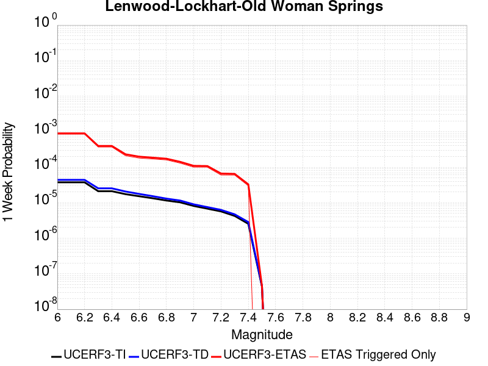 |  | 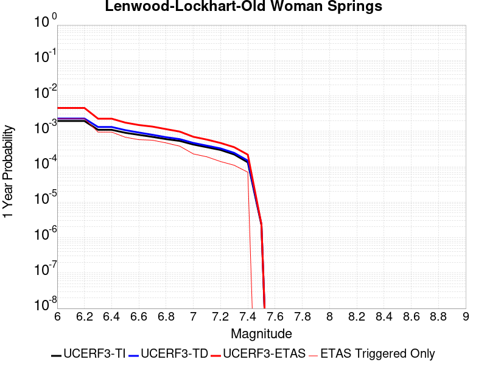 |  |

| Magnitude | 1 wk TI Prob | 1 wk TD Prob | 1 wk ETAS Prob | 1 wk ETAS/TD Gain | 1 wk ETAS Triggered Only | 1 mo TI Prob | 1 mo TD Prob | 1 mo ETAS Prob | 1 mo ETAS/TD Gain | 1 mo ETAS Triggered Only | 1 yr TI Prob | 1 yr TD Prob | 1 yr ETAS Prob | 1 yr ETAS/TD Gain | 1 yr ETAS Triggered Only | 10 yr TI Prob | 10 yr TD Prob | 10 yr ETAS Prob | 10 yr ETAS/TD Gain | 10 yr ETAS Triggered Only |
|-----|-----|-----|-----|-----|-----|-----|-----|-----|-----|-----|-----|-----|-----|-----|-----|-----|-----|-----|-----|-----|
| 6.0 | 3.744542E-5 | 4.396349E-5 | 9.916818E-4 | 22.556942 | 9.4776E-4 | 1.604705E-4 | 1.8840231E-4 | 0.001560274 | 8.281608 | 0.0013721302 | 0.0019519776 | 0.0022915571 | 0.0046484713 | 2.0285206 | 0.0023623272 | 0.019349206 | 0.022697281 | 0.025918415 | 1.1419171 | 0.0032959415 |
| 6.1 | 3.744542E-5 | 4.396349E-5 | 9.916818E-4 | 22.556942 | 9.4776E-4 | 1.604705E-4 | 1.8840231E-4 | 0.001560274 | 8.281608 | 0.0013721302 | 0.0019519776 | 0.0022915571 | 0.0046484713 | 2.0285206 | 0.0023623272 | 0.019349206 | 0.022697281 | 0.025918415 | 1.1419171 | 0.0032959415 |
| 6.2 | 3.744542E-5 | 4.396349E-5 | 9.916818E-4 | 22.556942 | 9.4776E-4 | 1.604705E-4 | 1.8840231E-4 | 0.001560274 | 8.281608 | 0.0013721302 | 0.0019519776 | 0.0022915571 | 0.0046484713 | 2.0285206 | 0.0023623272 | 0.019349206 | 0.022697281 | 0.025918415 | 1.1419171 | 0.0032959415 |
| 6.3 | 2.1079984E-5 | 2.5354384E-5 | 4.3556848E-4 | 17.179216 | 4.102245E-4 | 9.0339665E-5 | 1.0865723E-4 | 6.461344E-4 | 5.946538 | 5.375355E-4 | 0.0010993304 | 0.0013221189 | 0.00229688 | 1.7372717 | 9.760514E-4 | 0.010939079 | 0.013144747 | 0.0144150825 | 1.096642 | 0.0012872561 |
| 6.4 | 2.1079984E-5 | 2.5354384E-5 | 4.3556848E-4 | 17.179216 | 4.102245E-4 | 9.0339665E-5 | 1.0865723E-4 | 6.461344E-4 | 5.946538 | 5.375355E-4 | 0.0010993304 | 0.0013221189 | 0.00229688 | 1.7372717 | 9.760514E-4 | 0.010939079 | 0.013144747 | 0.0144150825 | 1.096642 | 0.0012872561 |
| 6.5 | 1.7397282E-5 | 2.0663285E-5 | 2.6113473E-4 | 12.63762 | 2.4047642E-4 | 7.455765E-5 | 8.8554E-5 | 4.1387565E-4 | 4.6737094 | 3.2535047E-4 | 9.073613E-4 | 0.0010776235 | 0.0017841448 | 1.6556293 | 7.072836E-4 | 0.009036654 | 0.010725273 | 0.011676862 | 1.088724 | 9.619057E-4 |
| 6.6 | 1.52050325E-5 | 1.7680086E-5 | 2.4400683E-4 | 13.801226 | 2.2633075E-4 | 6.51628E-5 | 7.576964E-5 | 3.8695085E-4 | 5.106938 | 3.1120479E-4 | 7.9306826E-4 | 9.221128E-4 | 0.0015298158 | 1.6590333 | 6.082639E-4 | 0.007902439 | 0.009183729 | 0.010010659 | 1.090043 | 8.3459466E-4 |
| 6.7 | 1.332523E-5 | 1.5264379E-5 | 2.2744622E-4 | 14.900456 | 2.1218508E-4 | 5.7106878E-5 | 6.541716E-5 | 3.6245683E-4 | 5.5406995 | 2.970591E-4 | 6.950544E-4 | 7.9616875E-4 | 0.0013756795 | 1.7278743 | 5.799726E-4 | 0.006928845 | 0.0079337945 | 0.008719667 | 1.0990539 | 7.9215766E-4 |
| 6.8 | 1.1525329E-5 | 1.3031365E-5 | 2.2521368E-4 | 17.282433 | 2.1218508E-4 | 4.9393333E-5 | 5.5847537E-5 | 3.387452E-4 | 6.065535 | 2.8291345E-4 | 6.011979E-4 | 6.7973585E-4 | 0.0011744979 | 1.7278739 | 4.9509853E-4 | 0.00599574 | 0.0067770192 | 0.00742331 | 1.095365 | 6.5070094E-4 |
| 6.9 | 1.0253909E-5 | 1.1514835E-5 | 1.9540645E-4 | 16.969975 | 1.8389373E-4 | 4.3944583E-5 | 4.934838E-5 | 2.8981295E-4 | 5.8727956 | 2.4047642E-4 | 5.3489394E-4 | 6.006545E-4 | 9.964954E-4 | 1.659016 | 3.9607883E-4 | 0.0053360825 | 0.0059906896 | 0.006510944 | 1.0868438 | 5.2338984E-4 |
| 7.0 | 8.104563E-6 | 8.99143E-6 | 1.5044688E-4 | 16.732252 | 1.4145672E-4 | 3.4733377E-5 | 3.853415E-5 | 2.0827567E-4 | 5.404964 | 1.6974806E-4 | 4.2279682E-4 | 4.6905465E-4 | 7.235573E-4 | 1.5425863 | 2.546221E-4 | 0.0042199334 | 0.0046808943 | 0.0049906424 | 1.0661728 | 3.1120479E-4 |
| 7.1 | 6.7986157E-6 | 7.5159796E-6 | 1.4897164E-4 | 19.820654 | 1.4145672E-4 | 2.91366E-5 | 3.2210955E-5 | 1.8780834E-4 | 5.830573 | 1.5560239E-4 | 3.5468035E-4 | 3.9209996E-4 | 6.1834196E-4 | 1.5770009 | 2.2633075E-4 | 0.003541148 | 0.003914298 | 0.0041820137 | 1.0683943 | 2.6876776E-4 |
| 7.2 | 5.6893327E-6 | 6.280132E-6 | 9.115363E-5 | 14.514605 | 8.487403E-5 | 2.4382627E-5 | 2.6914584E-5 | 1.2593162E-4 | 4.678936 | 9.901971E-5 | 2.9681803E-4 | 3.276378E-4 | 4.973302E-4 | 1.5179269 | 1.6974806E-4 | 0.002964219 | 0.003271746 | 0.0034691375 | 1.0603322 | 1.9803942E-4 |
| 7.3 | 4.253348E-6 | 4.707075E-6 | 8.958071E-5 | 19.031078 | 8.487403E-5 | 1.8228506E-5 | 2.017303E-5 | 1.0504535E-4 | 5.2072167 | 8.487403E-5 | 2.2190946E-4 | 2.455808E-4 | 3.870028E-4 | 1.5758674 | 1.4145672E-4 | 0.00221688 | 0.0024532753 | 0.0026084958 | 1.0632708 | 1.5560239E-4 |
| 7.4 | 2.5448119E-6 | 2.8520594E-6 | 4.5288954E-5 | 15.879387 | 4.2437016E-5 | 1.0906291E-5 | 1.2223064E-5 | 5.4659562E-5 | 4.471838 | 4.2437016E-5 | 1.3277601E-4 | 1.4880729E-4 | 2.336687E-4 | 1.5702772 | 8.487403E-5 | 0.001326967 | 0.0014872387 | 0.0015719865 | 1.0569834 | 8.487403E-5 |
| 7.5 | 4.3706837E-8 | 4.562909E-8 | 4.562909E-8 | 1.0 | 0.0 | 1.8731501E-7 | 1.9555324E-7 | 1.9555324E-7 | 1.0 | 0.0 | 2.2805577E-6 | 2.3808586E-6 | 2.3808586E-6 | 1.0 | 0.0 | 2.2805343E-5 | 2.3808387E-5 | 2.3808387E-5 | 1.0 | 0.0 |

## Towne Pass
*[(top)](#table-of-contents)*

| 1 Week | 1 Month | 1 Year | 10 Year |
|-----|-----|-----|-----|
| 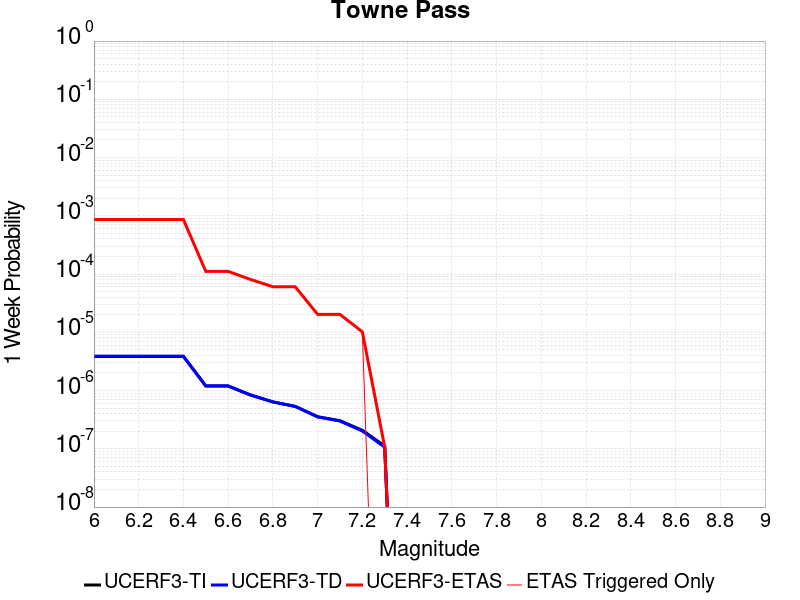 |  |  |  |

| Magnitude | 1 wk TI Prob | 1 wk TD Prob | 1 wk ETAS Prob | 1 wk ETAS/TD Gain | 1 wk ETAS Triggered Only | 1 mo TI Prob | 1 mo TD Prob | 1 mo ETAS Prob | 1 mo ETAS/TD Gain | 1 mo ETAS Triggered Only | 1 yr TI Prob | 1 yr TD Prob | 1 yr ETAS Prob | 1 yr ETAS/TD Gain | 1 yr ETAS Triggered Only | 10 yr TI Prob | 10 yr TD Prob | 10 yr ETAS Prob | 10 yr ETAS/TD Gain | 10 yr ETAS Triggered Only |
|-----|-----|-----|-----|-----|-----|-----|-----|-----|-----|-----|-----|-----|-----|-----|-----|-----|-----|-----|-----|-----|
| 6.0 | 3.849728E-6 | 3.894542E-6 | 7.677579E-4 | 197.13689 | 7.638663E-4 | 1.649873E-5 | 1.6690812E-5 | 0.0011624711 | 69.64737 | 0.0011457994 | 2.0085352E-4 | 2.0319606E-4 | 0.0021973306 | 10.813845 | 0.0019945398 | 0.0020067208 | 0.0020305319 | 0.0051927282 | 2.5573244 | 0.0031686306 |
| 6.1 | 3.849728E-6 | 3.894542E-6 | 7.677579E-4 | 197.13689 | 7.638663E-4 | 1.649873E-5 | 1.6690812E-5 | 0.0011624711 | 69.64737 | 0.0011457994 | 2.0085352E-4 | 2.0319606E-4 | 0.0021973306 | 10.813845 | 0.0019945398 | 0.0020067208 | 0.0020305319 | 0.0051927282 | 2.5573244 | 0.0031686306 |
| 6.2 | 3.849728E-6 | 3.894542E-6 | 7.677579E-4 | 197.13689 | 7.638663E-4 | 1.649873E-5 | 1.6690812E-5 | 0.0011624711 | 69.64737 | 0.0011457994 | 2.0085352E-4 | 2.0319606E-4 | 0.0021973306 | 10.813845 | 0.0019945398 | 0.0020067208 | 0.0020305319 | 0.0051927282 | 2.5573244 | 0.0031686306 |
| 6.3 | 3.849728E-6 | 3.894542E-6 | 7.677579E-4 | 197.13689 | 7.638663E-4 | 1.649873E-5 | 1.6690812E-5 | 0.0011624711 | 69.64737 | 0.0011457994 | 2.0085352E-4 | 2.0319606E-4 | 0.0021973306 | 10.813845 | 0.0019945398 | 0.0020067208 | 0.0020305319 | 0.0051927282 | 2.5573244 | 0.0031686306 |
| 6.4 | 3.849728E-6 | 3.894542E-6 | 7.677579E-4 | 197.13689 | 7.638663E-4 | 1.649873E-5 | 1.6690812E-5 | 0.0011624711 | 69.64737 | 0.0011457994 | 2.0085352E-4 | 2.0319606E-4 | 0.0021973306 | 10.813845 | 0.0019945398 | 0.0020067208 | 0.0020305319 | 0.0051927282 | 2.5573244 | 0.0031686306 |
| 6.5 | 1.1953545E-6 | 1.2030526E-6 | 8.607699E-5 | 71.54881 | 8.487403E-5 | 5.1229376E-6 | 5.15593E-6 | 1.4661193E-4 | 28.43559 | 1.4145672E-4 | 6.236998E-5 | 6.277176E-5 | 3.5981223E-4 | 5.7320714 | 2.970591E-4 | 6.235248E-4 | 6.2755204E-4 | 0.0010657926 | 1.6983336 | 4.3851582E-4 |
| 6.6 | 1.1953545E-6 | 1.2030526E-6 | 8.607699E-5 | 71.54881 | 8.487403E-5 | 5.1229376E-6 | 5.15593E-6 | 1.4661193E-4 | 28.43559 | 1.4145672E-4 | 6.236998E-5 | 6.277176E-5 | 3.5981223E-4 | 5.7320714 | 2.970591E-4 | 6.235248E-4 | 6.2755204E-4 | 0.0010657926 | 1.6983336 | 4.3851582E-4 |
| 6.7 | 8.375951E-7 | 8.410676E-7 | 7.156937E-5 | 85.093475 | 7.072836E-5 | 3.5896885E-6 | 3.6045708E-6 | 1.3091516E-4 | 36.31921 | 1.2731105E-4 | 4.370358E-5 | 4.3884826E-5 | 2.4191555E-4 | 5.5125103 | 1.9803942E-4 | 4.3694986E-4 | 4.3876728E-4 | 7.215566E-4 | 1.6445086 | 2.8291345E-4 |
| 6.8 | 6.38041E-7 | 6.3921624E-7 | 4.3076205E-5 | 67.3891 | 4.2437016E-5 | 2.7344586E-6 | 2.7394954E-6 | 1.0175893E-4 | 37.145134 | 9.901971E-5 | 3.3291526E-5 | 3.3352884E-5 | 1.7480488E-4 | 5.2410727 | 1.4145672E-4 | 3.3286537E-4 | 3.334826E-4 | 5.031741E-4 | 1.5088465 | 1.6974806E-4 |
| 6.9 | 5.3460053E-7 | 5.345339E-7 | 4.297153E-5 | 80.390656 | 4.2437016E-5 | 2.2911431E-6 | 2.2908578E-6 | 1.0131034E-4 | 44.22376 | 9.901971E-5 | 2.789431E-5 | 2.7890868E-5 | 1.6934365E-4 | 6.071652 | 1.4145672E-4 | 2.789081E-4 | 2.78877E-4 | 4.4857775E-4 | 1.6085145 | 1.6974806E-4 |
| 7.0 | 3.557783E-7 | 3.5324283E-7 | 1.449891E-5 | 41.045162 | 1.4145672E-5 | 1.5247632E-6 | 1.513897E-6 | 2.9805198E-5 | 19.68773 | 2.8291344E-5 | 1.8563835E-5 | 1.8431549E-5 | 7.5013195E-5 | 4.0698256 | 5.658269E-5 | 1.8562283E-4 | 1.8430105E-4 | 2.5501638E-4 | 1.3836946 | 7.072836E-5 |
| 7.1 | 3.037942E-7 | 3.0002275E-7 | 1.4445691E-5 | 48.14865 | 1.4145672E-5 | 1.3019744E-6 | 1.2858112E-6 | 2.9577119E-5 | 23.002691 | 2.8291344E-5 | 1.5851423E-5 | 1.5654647E-5 | 7.223645E-5 | 4.6143775 | 5.658269E-5 | 1.5850292E-4 | 1.5653619E-4 | 2.2725348E-4 | 1.4517632 | 7.072836E-5 |
| 7.2 | 2.0808248E-7 | 2.0217735E-7 | 1.4347846E-5 | 70.966644 | 1.4145672E-5 | 8.917818E-7 | 8.6647407E-7 | 1.5012134E-5 | 17.325544 | 1.4145672E-5 | 1.0857389E-5 | 1.0549275E-5 | 5.2985844E-5 | 5.0227 | 4.2437016E-5 | 1.0856859E-4 | 1.0548821E-4 | 1.6206493E-4 | 1.5363321 | 5.658269E-5 |
| 7.3 | 1.1162073E-7 | 1.0636902E-7 | 1.0636902E-7 | 1.0 | 0.0 | 4.7837443E-7 | 4.5586717E-7 | 4.5586717E-7 | 1.0 | 0.0 | 5.8241935E-6 | 5.5501705E-6 | 3.384136E-5 | 6.0973544 | 2.8291344E-5 | 5.8240406E-5 | 5.550052E-5 | 9.793518E-5 | 1.7645813 | 4.2437016E-5 |

## San Andreas (San Bernardino N)
*[(top)](#table-of-contents)*

| 1 Week | 1 Month | 1 Year | 10 Year |
|-----|-----|-----|-----|
|  |  |  |  |

| Magnitude | 1 wk TI Prob | 1 wk TD Prob | 1 wk ETAS Prob | 1 wk ETAS/TD Gain | 1 wk ETAS Triggered Only | 1 mo TI Prob | 1 mo TD Prob | 1 mo ETAS Prob | 1 mo ETAS/TD Gain | 1 mo ETAS Triggered Only | 1 yr TI Prob | 1 yr TD Prob | 1 yr ETAS Prob | 1 yr ETAS/TD Gain | 1 yr ETAS Triggered Only | 10 yr TI Prob | 10 yr TD Prob | 10 yr ETAS Prob | 10 yr ETAS/TD Gain | 10 yr ETAS Triggered Only |
|-----|-----|-----|-----|-----|-----|-----|-----|-----|-----|-----|-----|-----|-----|-----|-----|-----|-----|-----|-----|-----|
| 6.0 | 1.4273766E-4 | 3.160784E-4 | 0.0012918212 | 4.087028 | 9.760514E-4 | 6.115894E-4 | 0.0013539245 | 0.002512299 | 1.8555682 | 0.0011599452 | 0.0074207084 | 0.016360939 | 0.017961077 | 1.0978023 | 0.0016267523 | 0.07177748 | 0.15021163 | 0.15205081 | 1.012244 | 0.0021642877 |
| 6.1 | 1.4273766E-4 | 3.160784E-4 | 0.0012918212 | 4.087028 | 9.760514E-4 | 6.115894E-4 | 0.0013539245 | 0.002512299 | 1.8555682 | 0.0011599452 | 0.0074207084 | 0.016360939 | 0.017961077 | 1.0978023 | 0.0016267523 | 0.07177748 | 0.15021163 | 0.15205081 | 1.012244 | 0.0021642877 |
| 6.2 | 1.4273766E-4 | 3.160784E-4 | 0.0012918212 | 4.087028 | 9.760514E-4 | 6.115894E-4 | 0.0013539245 | 0.002512299 | 1.8555682 | 0.0011599452 | 0.0074207084 | 0.016360939 | 0.017961077 | 1.0978023 | 0.0016267523 | 0.07177748 | 0.15021163 | 0.15205081 | 1.012244 | 0.0021642877 |
| 6.3 | 1.3730655E-4 | 3.0512668E-4 | 0.0012667389 | 4.151518 | 9.619057E-4 | 5.883239E-4 | 0.001307036 | 0.0024513379 | 1.8754936 | 0.0011457994 | 0.0071393442 | 0.015798455 | 0.017385585 | 1.1004611 | 0.0016126066 | 0.06914291 | 0.1455135 | 0.14735077 | 1.012626 | 0.002150142 |
| 6.4 | 1.3730655E-4 | 3.0512668E-4 | 0.0012667389 | 4.151518 | 9.619057E-4 | 5.883239E-4 | 0.001307036 | 0.0024513379 | 1.8754936 | 0.0011457994 | 0.0071393442 | 0.015798455 | 0.017385585 | 1.1004611 | 0.0016126066 | 0.06914291 | 0.1455135 | 0.14735077 | 1.012626 | 0.002150142 |
| 6.5 | 1.2942807E-4 | 2.8927144E-4 | 0.0012367573 | 4.275421 | 9.4776E-4 | 5.545738E-4 | 0.0012391509 | 0.0023694024 | 1.9121177 | 0.0011316538 | 0.0067310524 | 0.014983548 | 0.016558059 | 1.1050826 | 0.001598461 | 0.06530788 | 0.13865088 | 0.1405029 | 1.0133574 | 0.002150142 |
| 6.6 | 1.1125901E-4 | 2.5365927E-4 | 0.0012011789 | 4.7354035 | 9.4776E-4 | 4.767372E-4 | 0.0010866605 | 0.0022029541 | 2.02727 | 0.001117508 | 0.005788839 | 0.0131504685 | 0.014713949 | 1.1188916 | 0.0015843153 | 0.056403454 | 0.12300496 | 0.12486581 | 1.0151283 | 0.0021218508 |
| 6.7 | 1.02209575E-4 | 2.3500937E-4 | 0.0011684044 | 4.971735 | 9.336144E-4 | 4.3796748E-4 | 0.0010067957 | 0.0021090473 | 2.0948117 | 0.0011033624 | 0.0053192247 | 0.012189267 | 0.013740297 | 1.1272455 | 0.0015701696 | 0.051936906 | 0.114792764 | 0.116646 | 1.0161442 | 0.0020935594 |
| 6.8 | 9.610582E-5 | 2.2026796E-4 | 0.0011395342 | 5.1733994 | 9.194687E-4 | 4.1181705E-4 | 9.436647E-4 | 0.0020318537 | 2.153152 | 0.0010892168 | 0.0050023515 | 0.011428859 | 0.012953116 | 1.1333691 | 0.0015418782 | 0.048912346 | 0.10820469 | 0.11003387 | 1.0169048 | 0.0020511225 |
| 6.9 | 9.3877505E-5 | 2.1482339E-4 | 0.0011340945 | 5.279195 | 9.194687E-4 | 4.0227012E-4 | 9.203475E-4 | 0.0020085617 | 2.182395 | 0.0010892168 | 0.0048866454 | 0.011147907 | 0.012672597 | 1.1367692 | 0.0015418782 | 0.04780577 | 0.105798274 | 0.10761974 | 1.0172164 | 0.0020369769 |
| 7.0 | 9.1019785E-5 | 2.0809306E-4 | 0.0011273704 | 5.4176264 | 9.194687E-4 | 3.900265E-4 | 8.915232E-4 | 0.001979769 | 2.2206588 | 0.0010892168 | 0.0047382377 | 0.0108004995 | 0.012325725 | 1.1412181 | 0.0015418782 | 0.046384744 | 0.10276815 | 0.104595795 | 1.0177841 | 0.0020369769 |
| 7.1 | 8.771155E-5 | 1.9983841E-4 | 0.0011191233 | 5.6001415 | 9.194687E-4 | 3.758525E-4 | 8.5616973E-4 | 0.0019444539 | 2.271108 | 0.0010892168 | 0.0045664064 | 0.010374243 | 0.011886126 | 1.1457343 | 0.0015277326 | 0.044737056 | 0.09907644 | 0.100898854 | 1.018394 | 0.002022831 |
| 7.2 | 8.0830236E-5 | 1.8389444E-4 | 0.001089051 | 5.922153 | 9.05323E-4 | 3.4636928E-4 | 7.8788114E-4 | 0.0018621052 | 2.363434 | 0.001075071 | 0.0042088944 | 0.009550368 | 0.0110495 | 1.1569711 | 0.001513587 | 0.041300658 | 0.09180518 | 0.093629465 | 1.0198712 | 0.0020086854 |
| 7.3 | 7.7668235E-5 | 1.7333007E-4 | 0.0010784962 | 6.2222104 | 9.05323E-4 | 3.328214E-4 | 7.426318E-4 | 0.0018169045 | 2.4465752 | 0.001075071 | 0.0040445733 | 0.009004138 | 0.010504097 | 1.1665854 | 0.001513587 | 0.03971748 | 0.08706761 | 0.08890141 | 1.0210618 | 0.0020086854 |
| 7.4 | 7.520177E-5 | 1.655312E-4 | 0.0010707043 | 6.4682937 | 9.05323E-4 | 3.2225347E-4 | 7.092266E-4 | 0.0017693995 | 2.4948297 | 0.0010609254 | 0.0039163795 | 0.008600714 | 0.010087258 | 1.1728398 | 0.0014994412 | 0.038480744 | 0.08352157 | 0.085349515 | 1.021886 | 0.0019945398 |
| 7.5 | 7.274697E-5 | 1.584075E-4 | 0.0010635871 | 6.714247 | 9.05323E-4 | 3.1173544E-4 | 6.7871273E-4 | 0.001738918 | 2.5620825 | 0.0010609254 | 0.003788775 | 0.008232076 | 0.009719173 | 1.1806468 | 0.0014994412 | 0.03724827 | 0.08023654 | 0.08207104 | 1.0228637 | 0.0019945398 |
| 7.6 | 7.1185845E-5 | 1.5410586E-4 | 0.0010592893 | 6.8737774 | 9.05323E-4 | 3.0504653E-4 | 6.602866E-4 | 0.0017205115 | 2.6057043 | 0.0010609254 | 0.0037076178 | 0.0080094095 | 0.009496841 | 1.1857105 | 0.0014994412 | 0.036463667 | 0.07822661 | 0.080065124 | 1.0235023 | 0.0019945398 |
| 7.7 | 6.709961E-5 | 1.4319421E-4 | 0.0010483876 | 7.3214383 | 9.05323E-4 | 2.8753807E-4 | 6.135452E-4 | 0.0016596827 | 2.70507 | 0.0010467797 | 0.003495157 | 0.0074443663 | 0.008918605 | 1.1980342 | 0.0014852956 | 0.034406938 | 0.07305558 | 0.0748913 | 1.0251276 | 0.0019803941 |
| 7.8 | 6.300812E-5 | 1.320343E-4 | 0.0010372378 | 7.8558207 | 9.05323E-4 | 2.7000686E-4 | 5.657386E-4 | 0.0016119261 | 2.849242 | 0.0010467797 | 0.0032823787 | 0.006866143 | 0.008327192 | 1.2127904 | 0.0014711499 | 0.032343175 | 0.06771385 | 0.06952058 | 1.0266819 | 0.0019379571 |
| 7.9 | 4.983037E-5 | 9.7241085E-5 | 9.317546E-4 | 9.5819025 | 8.3459466E-4 | 2.1354125E-4 | 4.1668097E-4 | 0.0013499063 | 3.239664 | 9.336144E-4 | 0.0025967648 | 0.0050613005 | 0.006327967 | 1.2502651 | 0.0012731105 | 0.025666296 | 0.050650507 | 0.052235153 | 1.0312859 | 0.0016691893 |
| 8.0 | 3.2211527E-5 | 5.3306234E-5 | 3.6449442E-4 | 6.837745 | 3.1120479E-4 | 1.380421E-4 | 2.2843528E-4 | 5.5371143E-4 | 2.4239311 | 3.2535047E-4 | 0.0016793669 | 0.0027776542 | 0.0032431649 | 1.1675912 | 4.668072E-4 | 0.016667323 | 0.028362568 | 0.028939836 | 1.0203532 | 5.941182E-4 |
| 8.1 | 1.743376E-5 | 1.8823403E-5 | 4.7114212E-5 | 2.5029595 | 2.8291344E-5 | 7.471398E-5 | 8.066923E-5 | 1.08958295E-4 | 1.3506798 | 2.8291344E-5 | 9.0926304E-4 | 9.81706E-4 | 0.0010382332 | 1.0575805 | 5.658269E-5 | 0.009055517 | 0.010483979 | 0.010539969 | 1.0053405 | 5.658269E-5 |
| 8.2 | 7.831616E-6 | 5.1540533E-6 | 5.1540533E-6 | 1.0 | 0.0 | 3.3563636E-5 | 2.2088612E-5 | 2.2088612E-5 | 1.0 | 0.0 | 4.0856065E-4 | 2.6889573E-4 | 2.6889573E-4 | 1.0 | 0.0 | 0.004078103 | 0.0030413668 | 0.0030413668 | 1.0 | 0.0 |
| 8.3 | 1.983087E-6 | 7.6564595E-7 | 7.6564595E-7 | 1.0 | 0.0 | 8.498917E-6 | 3.281336E-6 | 3.281336E-6 | 1.0 | 0.0 | 1.034694E-4 | 3.9949547E-5 | 3.9949547E-5 | 1.0 | 0.0 | 0.0010342124 | 4.717979E-4 | 4.717979E-4 | 1.0 | 0.0 |

## Bicycle Lake
*[(top)](#table-of-contents)*

| 1 Week | 1 Month | 1 Year | 10 Year |
|-----|-----|-----|-----|
|  |  |  |  |

| Magnitude | 1 wk TI Prob | 1 wk TD Prob | 1 wk ETAS Prob | 1 wk ETAS/TD Gain | 1 wk ETAS Triggered Only | 1 mo TI Prob | 1 mo TD Prob | 1 mo ETAS Prob | 1 mo ETAS/TD Gain | 1 mo ETAS Triggered Only | 1 yr TI Prob | 1 yr TD Prob | 1 yr ETAS Prob | 1 yr ETAS/TD Gain | 1 yr ETAS Triggered Only | 10 yr TI Prob | 10 yr TD Prob | 10 yr ETAS Prob | 10 yr ETAS/TD Gain | 10 yr ETAS Triggered Only |
|-----|-----|-----|-----|-----|-----|-----|-----|-----|-----|-----|-----|-----|-----|-----|-----|-----|-----|-----|-----|-----|
| 6.0 | 1.9621975E-5 | 2.2097078E-5 | 5.3133E-4 | 24.045261 | 5.092442E-4 | 8.4091465E-5 | 9.4699084E-5 | 8.443487E-4 | 8.916123 | 7.497206E-4 | 0.0010233327 | 0.0011524865 | 0.0024241298 | 2.103391 | 0.0012731105 | 0.01018633 | 0.011478408 | 0.01356192 | 1.1815158 | 0.0021077052 |
| 6.1 | 1.9621975E-5 | 2.2097078E-5 | 5.3133E-4 | 24.045261 | 5.092442E-4 | 8.4091465E-5 | 9.4699084E-5 | 8.443487E-4 | 8.916123 | 7.497206E-4 | 0.0010233327 | 0.0011524865 | 0.0024241298 | 2.103391 | 0.0012731105 | 0.01018633 | 0.011478408 | 0.01356192 | 1.1815158 | 0.0021077052 |
| 6.2 | 9.9971285E-6 | 1.125564E-5 | 3.2245694E-4 | 28.648476 | 3.1120479E-4 | 4.2844134E-5 | 4.8237856E-5 | 5.433125E-4 | 11.263197 | 4.9509853E-4 | 5.2150246E-4 | 5.871897E-4 | 0.0014071569 | 2.3964264 | 8.20449E-4 | 0.0052028033 | 0.005861487 | 0.007113072 | 1.213527 | 0.0012589648 |
| 6.3 | 9.589428E-6 | 1.0798346E-5 | 3.2199977E-4 | 29.81936 | 3.1120479E-4 | 4.10969E-5 | 4.62781E-5 | 4.9891864E-4 | 10.780881 | 4.526615E-4 | 5.002399E-4 | 5.6334207E-4 | 0.001326778 | 2.3551908 | 7.638663E-4 | 0.0049911533 | 0.0056242296 | 0.0068198494 | 1.2125837 | 0.0012023821 |
| 6.4 | 9.589428E-6 | 1.0798346E-5 | 3.2199977E-4 | 29.81936 | 3.1120479E-4 | 4.10969E-5 | 4.62781E-5 | 4.9891864E-4 | 10.780881 | 4.526615E-4 | 5.002399E-4 | 5.6334207E-4 | 0.001326778 | 2.3551908 | 7.638663E-4 | 0.0049911533 | 0.0056242296 | 0.0068198494 | 1.2125837 | 0.0012023821 |
| 6.5 | 5.557707E-6 | 6.2856016E-6 | 2.1846934E-4 | 34.75711 | 2.1218508E-4 | 2.3818526E-5 | 2.6938165E-5 | 3.5227987E-4 | 13.077352 | 3.2535047E-4 | 2.8995197E-4 | 3.279497E-4 | 8.7945E-4 | 2.6816614 | 5.516812E-4 | 0.0028957394 | 0.0032772934 | 0.004024557 | 1.2280124 | 7.497206E-4 |
| 6.6 | 4.8742945E-6 | 5.5132896E-6 | 1.6111482E-4 | 29.222992 | 1.5560239E-4 | 2.0889667E-5 | 2.3628318E-5 | 2.782444E-4 | 11.775887 | 2.546221E-4 | 2.54302E-4 | 2.87663E-4 | 7.260527E-4 | 2.5239697 | 4.3851582E-4 | 0.002540112 | 0.0028754752 | 0.003496095 | 1.2158321 | 6.2240957E-4 |
| 6.7 | 3.991108E-6 | 4.5159104E-6 | 1.0353517E-4 | 22.926754 | 9.901971E-5 | 1.7104636E-5 | 1.9353902E-5 | 2.0324408E-4 | 10.501452 | 1.8389373E-4 | 2.0822904E-4 | 2.3563375E-4 | 5.467652E-4 | 2.3204029 | 3.1120479E-4 | 0.0020803404 | 0.0023563374 | 0.0028220448 | 1.1976403 | 4.668072E-4 |

## Paradise
*[(top)](#table-of-contents)*

| 1 Week | 1 Month | 1 Year | 10 Year |
|-----|-----|-----|-----|
|  |  |  |  |

| Magnitude | 1 wk TI Prob | 1 wk TD Prob | 1 wk ETAS Prob | 1 wk ETAS/TD Gain | 1 wk ETAS Triggered Only | 1 mo TI Prob | 1 mo TD Prob | 1 mo ETAS Prob | 1 mo ETAS/TD Gain | 1 mo ETAS Triggered Only | 1 yr TI Prob | 1 yr TD Prob | 1 yr ETAS Prob | 1 yr ETAS/TD Gain | 1 yr ETAS Triggered Only | 10 yr TI Prob | 10 yr TD Prob | 10 yr ETAS Prob | 10 yr ETAS/TD Gain | 10 yr ETAS Triggered Only |
|-----|-----|-----|-----|-----|-----|-----|-----|-----|-----|-----|-----|-----|-----|-----|-----|-----|-----|-----|-----|-----|
| 6.0 | 1.4851273E-5 | 1.6694768E-5 | 4.693487E-4 | 28.11352 | 4.526615E-4 | 6.364676E-5 | 7.154718E-5 | 6.939122E-4 | 9.698667 | 6.2240957E-4 | 7.7462377E-4 | 8.707624E-4 | 0.0019590307 | 2.2497878 | 0.0010892168 | 0.0077192914 | 0.008675884 | 0.010400707 | 1.1988065 | 0.0017399177 |
| 6.1 | 1.4851273E-5 | 1.6694768E-5 | 4.693487E-4 | 28.11352 | 4.526615E-4 | 6.364676E-5 | 7.154718E-5 | 6.939122E-4 | 9.698667 | 6.2240957E-4 | 7.7462377E-4 | 8.707624E-4 | 0.0019590307 | 2.2497878 | 0.0010892168 | 0.0077192914 | 0.008675884 | 0.010400707 | 1.1988065 | 0.0017399177 |
| 6.2 | 1.4851273E-5 | 1.6694768E-5 | 4.693487E-4 | 28.11352 | 4.526615E-4 | 6.364676E-5 | 7.154718E-5 | 6.939122E-4 | 9.698667 | 6.2240957E-4 | 7.7462377E-4 | 8.707624E-4 | 0.0019590307 | 2.2497878 | 0.0010892168 | 0.0077192914 | 0.008675884 | 0.010400707 | 1.1988065 | 0.0017399177 |
| 6.3 | 1.0426831E-5 | 1.1888697E-5 | 1.6748924E-4 | 14.088106 | 1.5560239E-4 | 4.4685654E-5 | 5.09506E-5 | 3.1970468E-4 | 6.274797 | 2.6876776E-4 | 5.43912E-4 | 6.201529E-4 | 0.0011008076 | 1.7750582 | 4.8095285E-4 | 0.0054258266 | 0.0061848317 | 0.0069158575 | 1.1181965 | 7.355749E-4 |
| 6.4 | 1.0426831E-5 | 1.1888697E-5 | 1.6748924E-4 | 14.088106 | 1.5560239E-4 | 4.4685654E-5 | 5.09506E-5 | 3.1970468E-4 | 6.274797 | 2.6876776E-4 | 5.43912E-4 | 6.201529E-4 | 0.0011008076 | 1.7750582 | 4.8095285E-4 | 0.0054258266 | 0.0061848317 | 0.0069158575 | 1.1181965 | 7.355749E-4 |
| 6.5 | 9.25027E-6 | 1.0620037E-5 | 1.3792973E-4 | 12.987688 | 1.2731105E-4 | 3.964341E-5 | 4.551368E-5 | 2.4354407E-4 | 5.3510084 | 1.9803942E-4 | 4.8255164E-4 | 5.5399304E-4 | 9.074389E-4 | 1.6379969 | 3.536418E-4 | 0.0048150513 | 0.0055266195 | 0.006075252 | 1.0992708 | 5.516812E-4 |
| 6.6 | 7.904275E-6 | 9.159602E-6 | 9.403286E-5 | 10.266042 | 8.487403E-5 | 3.3875025E-5 | 3.925487E-5 | 1.524158E-4 | 3.8827233 | 1.1316538E-4 | 4.1235037E-4 | 4.7782718E-4 | 6.8991084E-4 | 1.4438502 | 2.1218508E-4 | 0.0041158604 | 0.004768395 | 0.005092194 | 1.0679053 | 3.2535047E-4 |
| 6.7 | 7.2061953E-6 | 8.407326E-6 | 7.913509E-5 | 9.412635 | 7.072836E-5 | 3.088333E-5 | 3.603092E-5 | 1.3504706E-4 | 3.748088 | 9.901971E-5 | 3.7593965E-4 | 4.3859181E-4 | 6.0826546E-4 | 1.38686 | 1.6974806E-4 | 0.003753043 | 0.004377631 | 0.0046452223 | 1.061127 | 2.6876776E-4 |
| 6.8 | 6.6948724E-6 | 7.842242E-6 | 6.442449E-5 | 8.21506 | 5.658269E-5 | 2.8691995E-5 | 3.3609194E-5 | 1.1848038E-4 | 3.5252368 | 8.487403E-5 | 3.4926904E-4 | 4.091187E-4 | 5.505175E-4 | 1.3456181 | 1.4145672E-4 | 0.003487206 | 0.0040840125 | 0.004267155 | 1.0448438 | 1.8389373E-4 |
| 6.9 | 6.0421025E-6 | 7.1306963E-6 | 6.371298E-5 | 8.93503 | 5.658269E-5 | 2.5894467E-5 | 3.0559786E-5 | 1.0128599E-4 | 3.3143551 | 7.072836E-5 | 3.1521954E-4 | 3.7200528E-4 | 4.8512858E-4 | 1.3040905 | 1.1316538E-4 | 0.0031477278 | 0.0037141638 | 0.0038691883 | 1.0417387 | 1.5560239E-4 |
| 7.0 | 4.134091E-6 | 5.0803824E-6 | 3.3371583E-5 | 6.5687146 | 2.8291344E-5 | 1.7717413E-5 | 2.1772896E-5 | 6.420899E-5 | 2.949033 | 4.2437016E-5 | 2.1568815E-4 | 2.650543E-4 | 3.357639E-4 | 1.266774 | 7.072836E-5 | 0.0021547892 | 0.0026475347 | 0.002732184 | 1.0319729 | 8.487403E-5 |
| 7.1 | 3.7674888E-6 | 4.631936E-6 | 3.2923148E-5 | 7.107859 | 2.8291344E-5 | 1.6146281E-5 | 1.9851012E-5 | 6.228719E-5 | 3.1377335 | 4.2437016E-5 | 1.9656324E-4 | 2.4166079E-4 | 3.1237205E-4 | 1.2926055 | 7.072836E-5 | 0.0019638946 | 0.0024141306 | 0.0024987997 | 1.0350723 | 8.487403E-5 |
| 7.2 | 3.4065345E-6 | 4.156782E-6 | 3.244801E-5 | 7.8060403 | 2.8291344E-5 | 1.4599351E-5 | 1.7814667E-5 | 6.0250928E-5 | 3.3820968 | 4.2437016E-5 | 1.777326E-4 | 2.168735E-4 | 2.875865E-4 | 1.3260566 | 7.072836E-5 | 0.0017759053 | 0.0021667667 | 0.0022514567 | 1.039086 | 8.487403E-5 |
| 7.3 | 2.9934936E-6 | 3.6293673E-6 | 3.192061E-5 | 8.795089 | 2.8291344E-5 | 1.2829195E-5 | 1.5554348E-5 | 5.7990703E-5 | 3.7282634 | 4.2437016E-5 | 1.5618425E-4 | 1.8935918E-4 | 2.6007416E-4 | 1.3734436 | 7.072836E-5 | 0.0015607453 | 0.0018921237 | 0.0019768372 | 1.0447717 | 8.487403E-5 |
| 7.4 | 2.4049796E-6 | 2.8890186E-6 | 1.703465E-5 | 5.896345 | 1.4145672E-5 | 1.0307015E-5 | 1.2381457E-5 | 4.067245E-5 | 3.2849486 | 2.8291344E-5 | 1.2548068E-4 | 1.5073526E-4 | 1.9316588E-4 | 1.281491 | 4.2437016E-5 | 0.0012540985 | 0.0015064715 | 0.0015488446 | 1.0281273 | 4.2437016E-5 |
| 7.5 | 1.2710091E-6 | 1.5134859E-6 | 1.5134859E-6 | 1.0 | 0.0 | 5.44717E-6 | 6.4863593E-6 | 2.063194E-5 | 3.1808197 | 1.4145672E-5 | 6.631728E-5 | 7.896981E-5 | 9.3114366E-5 | 1.1791134 | 1.4145672E-5 | 6.6297496E-4 | 7.895401E-4 | 8.0367463E-4 | 1.0179023 | 1.4145672E-5 |
| 7.6 | 2.21172E-7 | 2.6040198E-7 | 2.6040198E-7 | 1.0 | 0.0 | 9.478797E-7 | 1.1160082E-6 | 1.1160082E-6 | 1.0 | 0.0 | 1.1540374E-5 | 1.3587343E-5 | 1.3587343E-5 | 1.0 | 0.0 | 1.1539775E-4 | 1.3586794E-4 | 1.3586794E-4 | 1.0 | 0.0 |

## Garlic Springs
*[(top)](#table-of-contents)*

| 1 Week | 1 Month | 1 Year | 10 Year |
|-----|-----|-----|-----|
|  |  |  |  |

| Magnitude | 1 wk TI Prob | 1 wk TD Prob | 1 wk ETAS Prob | 1 wk ETAS/TD Gain | 1 wk ETAS Triggered Only | 1 mo TI Prob | 1 mo TD Prob | 1 mo ETAS Prob | 1 mo ETAS/TD Gain | 1 mo ETAS Triggered Only | 1 yr TI Prob | 1 yr TD Prob | 1 yr ETAS Prob | 1 yr ETAS/TD Gain | 1 yr ETAS Triggered Only | 10 yr TI Prob | 10 yr TD Prob | 10 yr ETAS Prob | 10 yr ETAS/TD Gain | 10 yr ETAS Triggered Only |
|-----|-----|-----|-----|-----|-----|-----|-----|-----|-----|-----|-----|-----|-----|-----|-----|-----|-----|-----|-----|-----|
| 6.0 | 1.6760017E-5 | 1.8776833E-5 | 3.0168495E-4 | 16.066872 | 2.8291345E-4 | 7.182667E-5 | 8.0470316E-5 | 4.7651728E-4 | 5.9216523 | 3.9607883E-4 | 8.7413884E-4 | 9.794032E-4 | 0.0018697077 | 1.9090276 | 8.9117733E-4 | 0.008707083 | 0.009762413 | 0.01116317 | 1.1434848 | 0.0014145672 |
| 6.1 | 9.852767E-6 | 1.0973587E-5 | 1.6657427E-4 | 15.179564 | 1.5560239E-4 | 4.222546E-5 | 4.702921E-5 | 2.592043E-4 | 5.51156 | 2.1218508E-4 | 5.139737E-4 | 5.7250116E-4 | 0.0010955913 | 1.9136928 | 5.2338984E-4 | 0.005127866 | 0.005717221 | 0.00650485 | 1.1377642 | 7.9215766E-4 |
| 6.2 | 9.852767E-6 | 1.0973587E-5 | 1.6657427E-4 | 15.179564 | 1.5560239E-4 | 4.222546E-5 | 4.702921E-5 | 2.592043E-4 | 5.51156 | 2.1218508E-4 | 5.139737E-4 | 5.7250116E-4 | 0.0010955913 | 1.9136928 | 5.2338984E-4 | 0.005127866 | 0.005717221 | 0.00650485 | 1.1377642 | 7.9215766E-4 |
| 6.3 | 4.3167724E-6 | 4.7780286E-6 | 6.136045E-5 | 12.84221 | 5.658269E-5 | 1.8500323E-5 | 2.0477235E-5 | 9.120414E-5 | 4.453929 | 7.072836E-5 | 2.2521814E-4 | 2.4930484E-4 | 4.1901058E-4 | 1.6807158 | 1.6974806E-4 | 0.0022499003 | 0.00249251 | 0.0028029392 | 1.1245447 | 3.1120479E-4 |
| 6.4 | 4.3167724E-6 | 4.7780286E-6 | 6.136045E-5 | 12.84221 | 5.658269E-5 | 1.8500323E-5 | 2.0477235E-5 | 9.120414E-5 | 4.453929 | 7.072836E-5 | 2.2521814E-4 | 2.4930484E-4 | 4.1901058E-4 | 1.6807158 | 1.6974806E-4 | 0.0022499003 | 0.00249251 | 0.0028029392 | 1.1245447 | 3.1120479E-4 |
| 6.5 | 4.3167724E-6 | 4.7780286E-6 | 6.136045E-5 | 12.84221 | 5.658269E-5 | 1.8500323E-5 | 2.0477235E-5 | 9.120414E-5 | 4.453929 | 7.072836E-5 | 2.2521814E-4 | 2.4930484E-4 | 4.1901058E-4 | 1.6807158 | 1.6974806E-4 | 0.0022499003 | 0.00249251 | 0.0028029392 | 1.1245447 | 3.1120479E-4 |
| 6.6 | 4.301311E-6 | 4.760897E-6 | 6.1343315E-5 | 12.884823 | 5.658269E-5 | 1.8434059E-5 | 2.0403815E-5 | 9.113073E-5 | 4.4663577 | 7.072836E-5 | 2.2441156E-4 | 2.4841115E-4 | 4.1811707E-4 | 1.6831653 | 1.6974806E-4 | 0.0022418506 | 0.002483593 | 0.002794025 | 1.1249931 | 3.1120479E-4 |
| 6.7 | 3.8599724E-6 | 4.27106E-6 | 4.6707893E-5 | 10.935903 | 4.2437016E-5 | 1.6542634E-5 | 1.8304541E-5 | 7.488619E-5 | 4.0911264 | 5.658269E-5 | 2.0138794E-4 | 2.228578E-4 | 3.7842552E-4 | 1.6980582 | 1.5560239E-4 | 0.0020120554 | 0.002228578 | 0.0025249752 | 1.1329983 | 2.970591E-4 |

## Death Valley (Black Mtns Frontal)
*[(top)](#table-of-contents)*

| 1 Week | 1 Month | 1 Year | 10 Year |
|-----|-----|-----|-----|
|  |  |  | 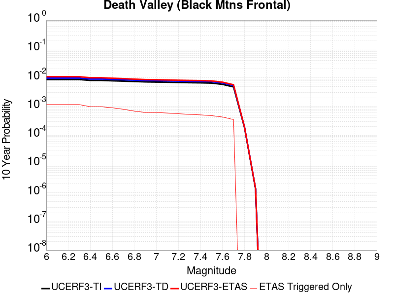 |

| Magnitude | 1 wk TI Prob | 1 wk TD Prob | 1 wk ETAS Prob | 1 wk ETAS/TD Gain | 1 wk ETAS Triggered Only | 1 mo TI Prob | 1 mo TD Prob | 1 mo ETAS Prob | 1 mo ETAS/TD Gain | 1 mo ETAS Triggered Only | 1 yr TI Prob | 1 yr TD Prob | 1 yr ETAS Prob | 1 yr ETAS/TD Gain | 1 yr ETAS Triggered Only | 10 yr TI Prob | 10 yr TD Prob | 10 yr ETAS Prob | 10 yr ETAS/TD Gain | 10 yr ETAS Triggered Only |
|-----|-----|-----|-----|-----|-----|-----|-----|-----|-----|-----|-----|-----|-----|-----|-----|-----|-----|-----|-----|-----|
| 6.0 | 1.6707214E-5 | 1.867027E-5 | 3.2986925E-4 | 17.668158 | 3.1120479E-4 | 7.160038E-5 | 8.001303E-5 | 5.1849376E-4 | 6.4801173 | 4.3851582E-4 | 8.71386E-4 | 9.737309E-4 | 0.0017509853 | 1.798223 | 7.78012E-4 | 0.00867977 | 0.009695496 | 0.010816178 | 1.1155878 | 0.0011316538 |
| 6.1 | 1.6707214E-5 | 1.867027E-5 | 3.2986925E-4 | 17.668158 | 3.1120479E-4 | 7.160038E-5 | 8.001303E-5 | 5.1849376E-4 | 6.4801173 | 4.3851582E-4 | 8.71386E-4 | 9.737309E-4 | 0.0017509853 | 1.798223 | 7.78012E-4 | 0.00867977 | 0.009695496 | 0.010816178 | 1.1155878 | 0.0011316538 |
| 6.2 | 1.6707214E-5 | 1.867027E-5 | 3.2986925E-4 | 17.668158 | 3.1120479E-4 | 7.160038E-5 | 8.001303E-5 | 5.1849376E-4 | 6.4801173 | 4.3851582E-4 | 8.71386E-4 | 9.737309E-4 | 0.0017509853 | 1.798223 | 7.78012E-4 | 0.00867977 | 0.009695496 | 0.010816178 | 1.1155878 | 0.0011316538 |
| 6.3 | 1.6707214E-5 | 1.867027E-5 | 3.2986925E-4 | 17.668158 | 3.1120479E-4 | 7.160038E-5 | 8.001303E-5 | 5.1849376E-4 | 6.4801173 | 4.3851582E-4 | 8.71386E-4 | 9.737309E-4 | 0.0017509853 | 1.798223 | 7.78012E-4 | 0.00867977 | 0.009695496 | 0.010816178 | 1.1155878 | 0.0011316538 |
| 6.4 | 1.5515609E-5 | 1.7338214E-5 | 2.5781046E-4 | 14.869494 | 2.4047642E-4 | 6.649377E-5 | 7.4304546E-5 | 4.2792008E-4 | 5.7590027 | 3.536418E-4 | 8.0926094E-4 | 9.042885E-4 | 0.001554401 | 1.7189215 | 6.5070094E-4 | 0.008063202 | 0.009006773 | 0.009931979 | 1.1027234 | 9.336144E-4 |
| 6.5 | 1.5515609E-5 | 1.7338214E-5 | 2.5781046E-4 | 14.869494 | 2.4047642E-4 | 6.649377E-5 | 7.4304546E-5 | 4.2792008E-4 | 5.7590027 | 3.536418E-4 | 8.0926094E-4 | 9.042885E-4 | 0.001554401 | 1.7189215 | 6.5070094E-4 | 0.008063202 | 0.009006773 | 0.009931979 | 1.1027234 | 9.336144E-4 |
| 6.6 | 1.5041828E-5 | 1.6809145E-5 | 2.2899066E-4 | 13.622981 | 2.1218508E-4 | 6.4463384E-5 | 7.203723E-5 | 3.832196E-4 | 5.319743 | 3.1120479E-4 | 7.8455906E-4 | 8.767063E-4 | 0.0014561705 | 1.6609558 | 5.799726E-4 | 0.00781795 | 0.008733132 | 0.009560439 | 1.0947319 | 8.3459466E-4 |
| 6.7 | 1.4634985E-5 | 1.6356016E-5 | 1.861013E-4 | 11.378156 | 1.6974806E-4 | 6.271985E-5 | 7.009536E-5 | 3.388443E-4 | 4.8340473 | 2.6876776E-4 | 7.6334673E-4 | 8.5308263E-4 | 0.0013760261 | 1.6130043 | 5.2338984E-4 | 0.007607299 | 0.008498715 | 0.009242064 | 1.087466 | 7.497206E-4 |
| 6.8 | 1.4209158E-5 | 1.5882048E-5 | 1.0075473E-4 | 6.3439384 | 8.487403E-5 | 6.089497E-5 | 6.8064175E-5 | 2.519454E-4 | 3.701586 | 1.8389373E-4 | 7.4114406E-4 | 8.2837185E-4 | 0.0012382566 | 1.4948076 | 4.102245E-4 | 0.007386771 | 0.008253456 | 0.008870729 | 1.0747895 | 6.2240957E-4 |
| 6.9 | 1.3780098E-5 | 1.5404594E-5 | 7.198641E-5 | 4.6730485 | 5.658269E-5 | 5.9056227E-5 | 6.6018045E-5 | 2.2161017E-4 | 3.356812 | 1.5560239E-4 | 7.1877235E-4 | 8.0347876E-4 | 0.0011851051 | 1.4749675 | 3.8193315E-4 | 0.0071645193 | 0.008006332 | 0.008553597 | 1.0683539 | 5.516812E-4 |
| 7.0 | 1.3585064E-5 | 1.5188155E-5 | 7.176999E-5 | 4.725392 | 5.658269E-5 | 5.8220405E-5 | 6.50905E-5 | 2.2068276E-4 | 3.390399 | 1.5560239E-4 | 7.086029E-4 | 7.9219416E-4 | 0.0011738248 | 1.4817387 | 3.8193315E-4 | 0.007063476 | 0.007894293 | 0.00844162 | 1.0693319 | 5.516812E-4 |
| 7.1 | 1.3398601E-5 | 1.49813395E-5 | 7.156318E-5 | 4.776821 | 5.658269E-5 | 5.742131E-5 | 6.420419E-5 | 2.0565183E-4 | 3.2030904 | 1.4145672E-4 | 6.9888023E-4 | 7.8141113E-4 | 0.0011347766 | 1.4522145 | 3.536418E-4 | 0.0069668638 | 0.007787224 | 0.008306538 | 1.066688 | 5.2338984E-4 |
| 7.2 | 1.3126312E-5 | 1.4679561E-5 | 7.126142E-5 | 4.8544655 | 5.658269E-5 | 5.6254412E-5 | 6.291092E-5 | 2.0435874E-4 | 3.2483828 | 1.4145672E-4 | 6.846822E-4 | 7.6567667E-4 | 0.0011049128 | 1.4430541 | 3.3949612E-4 | 0.006825765 | 0.00763097 | 0.0081222905 | 1.064385 | 4.9509853E-4 |
| 7.3 | 1.2922429E-5 | 1.4453788E-5 | 7.103566E-5 | 4.9146743 | 5.658269E-5 | 5.5380664E-5 | 6.194336E-5 | 2.0339132E-4 | 3.2835045 | 1.4145672E-4 | 6.74051E-4 | 7.53905E-4 | 0.0010790101 | 1.4312283 | 3.2535047E-4 | 0.006720101 | 0.007514055 | 0.007977354 | 1.0616578 | 4.668072E-4 |
| 7.4 | 1.2768878E-5 | 1.4283772E-5 | 7.086565E-5 | 4.9612703 | 5.658269E-5 | 5.4722615E-5 | 6.1214756E-5 | 2.0266282E-4 | 3.3106856 | 1.4145672E-4 | 6.660441E-4 | 7.4504025E-4 | 0.0010701483 | 1.4363631 | 3.2535047E-4 | 0.0066405144 | 0.0074260035 | 0.007889344 | 1.0623944 | 4.668072E-4 |
| 7.5 | 1.2521929E-5 | 1.40120155E-5 | 7.059391E-5 | 5.0380983 | 5.658269E-5 | 5.366431E-5 | 6.005014E-5 | 2.0149836E-4 | 3.355502 | 1.4145672E-4 | 6.531671E-4 | 7.3087064E-4 | 0.001041848 | 1.4254888 | 3.1120479E-4 | 0.006512506 | 0.0072852457 | 0.0077346093 | 1.0616814 | 4.526615E-4 |
| 7.6 | 1.1301089E-5 | 1.2648149E-5 | 6.923012E-5 | 5.473538 | 5.658269E-5 | 4.8432343E-5 | 5.4205255E-5 | 1.815094E-4 | 3.3485572 | 1.2731105E-4 | 5.895042E-4 | 6.5975444E-4 | 9.142086E-4 | 1.38568 | 2.546221E-4 | 0.0058794282 | 0.00657851 | 0.0069719837 | 1.059812 | 3.9607883E-4 |
| 7.7 | 9.189108E-6 | 1.0283358E-5 | 5.2719937E-5 | 5.126724 | 4.2437016E-5 | 3.93813E-5 | 4.407082E-5 | 1.572312E-4 | 3.5676942 | 1.1316538E-4 | 4.7936183E-4 | 5.3643517E-4 | 7.626445E-4 | 1.42169 | 2.2633075E-4 | 0.004783291 | 0.005351914 | 0.005675523 | 1.060466 | 3.2535047E-4 |
| 7.8 | 3.4586725E-7 | 3.6482615E-7 | 3.6482615E-7 | 1.0 | 0.0 | 1.4822873E-6 | 1.5635396E-6 | 1.5635396E-6 | 1.0 | 0.0 | 1.80467E-5 | 1.9035933E-5 | 1.9035933E-5 | 1.0 | 0.0 | 1.8045233E-4 | 1.9034347E-4 | 1.9034347E-4 | 1.0 | 0.0 |
| 7.9 | 2.5591178E-9 | 2.6696718E-9 | 2.6696718E-9 | 1.0 | 0.0 | 1.0967647E-8 | 1.14414505E-8 | 1.14414505E-8 | 1.0 | 0.0 | 1.335311E-7 | 1.3929966E-7 | 1.3929966E-7 | 1.0 | 0.0 | 1.3353102E-6 | 1.3929966E-6 | 1.3929966E-6 | 1.0 | 0.0 |

## San Andreas (San Bernardino S)
*[(top)](#table-of-contents)*

| 1 Week | 1 Month | 1 Year | 10 Year |
|-----|-----|-----|-----|
|  |  |  |  |

| Magnitude | 1 wk TI Prob | 1 wk TD Prob | 1 wk ETAS Prob | 1 wk ETAS/TD Gain | 1 wk ETAS Triggered Only | 1 mo TI Prob | 1 mo TD Prob | 1 mo ETAS Prob | 1 mo ETAS/TD Gain | 1 mo ETAS Triggered Only | 1 yr TI Prob | 1 yr TD Prob | 1 yr ETAS Prob | 1 yr ETAS/TD Gain | 1 yr ETAS Triggered Only | 10 yr TI Prob | 10 yr TD Prob | 10 yr ETAS Prob | 10 yr ETAS/TD Gain | 10 yr ETAS Triggered Only |
|-----|-----|-----|-----|-----|-----|-----|-----|-----|-----|-----|-----|-----|-----|-----|-----|-----|-----|-----|-----|-----|
| 6.0 | 1.2336002E-4 | 3.0005194E-4 | 8.0914336E-4 | 2.6966777 | 5.092442E-4 | 5.2857865E-4 | 0.0012853292 | 0.0018504288 | 1.4396536 | 5.658269E-4 | 0.006416472 | 0.015541554 | 0.016363177 | 1.0528662 | 8.3459466E-4 | 0.06234337 | 0.14294699 | 0.14389263 | 1.0066153 | 0.0011033624 |
| 6.1 | 1.2336002E-4 | 3.0005194E-4 | 8.0914336E-4 | 2.6966777 | 5.092442E-4 | 5.2857865E-4 | 0.0012853292 | 0.0018504288 | 1.4396536 | 5.658269E-4 | 0.006416472 | 0.015541554 | 0.016363177 | 1.0528662 | 8.3459466E-4 | 0.06234337 | 0.14294699 | 0.14389263 | 1.0066153 | 0.0011033624 |
| 6.2 | 1.2336002E-4 | 3.0005194E-4 | 8.0914336E-4 | 2.6966777 | 5.092442E-4 | 5.2857865E-4 | 0.0012853292 | 0.0018504288 | 1.4396536 | 5.658269E-4 | 0.006416472 | 0.015541554 | 0.016363177 | 1.0528662 | 8.3459466E-4 | 0.06234337 | 0.14294699 | 0.14389263 | 1.0066153 | 0.0011033624 |
| 6.3 | 1.1712257E-4 | 2.8793467E-4 | 7.8289065E-4 | 2.7189872 | 4.9509853E-4 | 5.018573E-4 | 0.0012334478 | 0.0017844485 | 1.446716 | 5.516812E-4 | 0.006093008 | 0.014918666 | 0.015726876 | 1.0541743 | 8.20449E-4 | 0.059286322 | 0.13765779 | 0.13859706 | 1.0068233 | 0.0010892168 |
| 6.4 | 1.1712257E-4 | 2.8793467E-4 | 7.8289065E-4 | 2.7189872 | 4.9509853E-4 | 5.018573E-4 | 0.0012334478 | 0.0017844485 | 1.446716 | 5.516812E-4 | 0.006093008 | 0.014918666 | 0.015726876 | 1.0541743 | 8.20449E-4 | 0.059286322 | 0.13765779 | 0.13859706 | 1.0068233 | 0.0010892168 |
| 6.5 | 1.0689076E-4 | 2.6806415E-4 | 7.6302997E-4 | 2.8464453 | 4.9509853E-4 | 4.5802278E-4 | 0.0011483653 | 0.001699413 | 1.479854 | 5.516812E-4 | 0.0055621783 | 0.013896335 | 0.014705383 | 1.0582203 | 8.20449E-4 | 0.05425003 | 0.1288989 | 0.12984772 | 1.0073609 | 0.0010892168 |
| 6.6 | 9.7648895E-5 | 2.505129E-4 | 7.03061E-4 | 2.8064861 | 4.526615E-4 | 4.1842813E-4 | 0.0010732086 | 0.0015677758 | 1.4608305 | 4.9509853E-4 | 0.005082469 | 0.012992399 | 0.013746341 | 1.0580294 | 7.638663E-4 | 0.049677886 | 0.121077746 | 0.12197292 | 1.0073934 | 0.0010184884 |
| 6.7 | 8.757013E-5 | 2.3122175E-4 | 6.554938E-4 | 2.834914 | 4.2437017E-4 | 3.7524657E-4 | 9.905964E-4 | 0.0014569411 | 1.4707718 | 4.668072E-4 | 0.00455906 | 0.011997902 | 0.012724652 | 1.0605731 | 7.355749E-4 | 0.04466656 | 0.112373024 | 0.11325195 | 1.0078214 | 9.901971E-4 |
| 6.8 | 8.562978E-5 | 2.2682057E-4 | 6.510945E-4 | 2.8705266 | 4.2437017E-4 | 3.6693315E-4 | 9.7174826E-4 | 0.0014381018 | 1.4799119 | 4.668072E-4 | 0.004458263 | 0.011770921 | 0.012497838 | 1.0617553 | 7.355749E-4 | 0.043698758 | 0.11037863 | 0.111259535 | 1.0079807 | 9.901971E-4 |
| 6.9 | 6.124075E-5 | 1.7066885E-4 | 5.525368E-4 | 3.237479 | 3.8193315E-4 | 2.6243398E-4 | 7.312337E-4 | 0.0011552935 | 1.5799239 | 4.2437017E-4 | 0.0031904527 | 0.008866636 | 0.009553628 | 1.0774806 | 6.9313793E-4 | 0.031450346 | 0.08420262 | 0.085057616 | 1.0101541 | 9.336144E-4 |
| 7.0 | 5.8598747E-5 | 1.6495936E-4 | 5.468295E-4 | 3.3149347 | 3.8193315E-4 | 2.5111332E-4 | 7.067779E-4 | 0.0011308482 | 1.6000049 | 4.2437017E-4 | 0.0030530186 | 0.008571265 | 0.009258462 | 1.0801744 | 6.9313793E-4 | 0.03011414 | 0.08151562 | 0.08237313 | 1.0105196 | 9.336144E-4 |
| 7.1 | 5.613814E-5 | 1.5914452E-4 | 5.4101687E-4 | 3.399532 | 3.8193315E-4 | 2.4056983E-4 | 6.818704E-4 | 0.0011059513 | 1.6219375 | 4.2437017E-4 | 0.0029250039 | 0.008270353 | 0.008957759 | 1.0831168 | 6.9313793E-4 | 0.028868021 | 0.07881268 | 0.07967272 | 1.0109124 | 9.336144E-4 |
| 7.2 | 4.991222E-5 | 1.4520933E-4 | 5.27087E-4 | 3.6298428 | 3.8193315E-4 | 2.1389198E-4 | 6.221777E-4 | 0.0010462838 | 1.681648 | 4.2437017E-4 | 0.002601025 | 0.0075488063 | 0.008222673 | 1.089268 | 6.7899225E-4 | 0.025707912 | 0.07226191 | 0.07311493 | 1.0118047 | 9.194687E-4 |
| 7.3 | 4.7410045E-5 | 1.371513E-4 | 5.1903207E-4 | 3.7843757 | 3.8193315E-4 | 2.0317009E-4 | 5.8765925E-4 | 0.00101178 | 1.7217121 | 4.2437017E-4 | 0.0024707897 | 0.0071313656 | 0.0078055155 | 1.0945331 | 6.7899225E-4 | 0.024434982 | 0.068541944 | 0.06939839 | 1.0124952 | 9.194687E-4 |
| 7.4 | 4.5556746E-5 | 1.3123035E-4 | 5.131134E-4 | 3.9100208 | 3.8193315E-4 | 1.952286E-4 | 5.6229485E-4 | 9.864264E-4 | 1.7542868 | 4.2437017E-4 | 0.002374317 | 0.0068245293 | 0.007498888 | 1.0988139 | 6.7899225E-4 | 0.023491086 | 0.06579143 | 0.066650406 | 1.013056 | 9.194687E-4 |
| 7.5 | 4.3084514E-5 | 1.2358342E-4 | 4.9132545E-4 | 3.9756582 | 3.6778746E-4 | 1.8463485E-4 | 5.2953605E-4 | 9.395433E-4 | 1.7742764 | 4.102245E-4 | 0.0022456115 | 0.0064281146 | 0.0070886873 | 1.102763 | 6.6484656E-4 | 0.022230545 | 0.062190283 | 0.0630393 | 1.013652 | 9.05323E-4 |
| 7.6 | 3.408608E-5 | 9.836477E-5 | 4.6611606E-4 | 4.7386484 | 3.6778746E-4 | 1.4607502E-4 | 4.214953E-4 | 8.3154684E-4 | 1.9728497 | 4.102245E-4 | 0.0017770125 | 0.005119656 | 0.0057810987 | 1.1291968 | 6.6484656E-4 | 0.017628696 | 0.05002244 | 0.050882474 | 1.017193 | 9.05323E-4 |
| 7.7 | 2.8315713E-5 | 8.2495724E-5 | 4.3610836E-4 | 5.2864356 | 3.536418E-4 | 1.2134742E-4 | 3.5350522E-4 | 7.49444E-4 | 2.1200366 | 3.9607883E-4 | 0.0014764034 | 0.004295442 | 0.0049433475 | 1.1508356 | 6.5070094E-4 | 0.01466633 | 0.042272415 | 0.04312592 | 1.0201906 | 8.9117733E-4 |
| 7.8 | 2.6222975E-5 | 7.463898E-5 | 4.282544E-4 | 5.7376776 | 3.536418E-4 | 1.1237934E-4 | 3.1984213E-4 | 7.157943E-4 | 2.237961 | 3.9607883E-4 | 0.0013673597 | 0.003887131 | 0.0045353025 | 1.166748 | 6.5070094E-4 | 0.013589768 | 0.038437475 | 0.039280795 | 1.0219401 | 8.7703165E-4 |
| 7.9 | 2.1469694E-5 | 5.7884805E-5 | 3.973613E-4 | 6.864691 | 3.3949612E-4 | 9.200973E-5 | 2.4805416E-4 | 6.298926E-4 | 2.5393348 | 3.8193315E-4 | 0.0011196428 | 0.00301588 | 0.0036082065 | 1.1964025 | 5.941182E-4 | 0.011140184 | 0.030153265 | 0.030921537 | 1.0254788 | 7.9215766E-4 |
| 8.0 | 1.2420249E-5 | 3.1321662E-5 | 2.0106441E-4 | 6.41934 | 1.6974806E-4 | 5.322855E-5 | 1.342288E-4 | 3.1809785E-4 | 2.3698182 | 1.8389373E-4 | 6.478649E-4 | 0.0016330116 | 0.0018872179 | 1.1556672 | 2.546221E-4 | 0.0064597935 | 0.01652369 | 0.016857577 | 1.0202066 | 3.3949612E-4 |
| 8.1 | 4.9197724E-6 | 7.822525E-6 | 7.822525E-6 | 1.0 | 0.0 | 2.1084568E-5 | 3.3524673E-5 | 3.3524673E-5 | 1.0 | 0.0 | 2.566744E-4 | 4.080866E-4 | 4.080866E-4 | 1.0 | 0.0 | 0.002563781 | 0.004384557 | 0.004384557 | 1.0 | 0.0 |
| 8.2 | 2.5634774E-6 | 2.9065757E-6 | 2.9065757E-6 | 1.0 | 0.0 | 1.0986286E-5 | 1.2456694E-5 | 1.2456694E-5 | 1.0 | 0.0 | 1.3374983E-4 | 1.5164974E-4 | 1.5164974E-4 | 1.0 | 0.0 | 0.0013366934 | 0.001704941 | 0.001704941 | 1.0 | 0.0 |
| 8.3 | 5.2850464E-7 | 3.2080476E-7 | 3.2080476E-7 | 1.0 | 0.0 | 2.2650179E-6 | 1.3748769E-6 | 1.3748769E-6 | 1.0 | 0.0 | 2.7576245E-5 | 1.673901E-5 | 1.673901E-5 | 1.0 | 0.0 | 2.7572823E-4 | 1.986671E-4 | 1.986671E-4 | 1.0 | 0.0 |

## Helendale-So Lockhart
*[(top)](#table-of-contents)*

| 1 Week | 1 Month | 1 Year | 10 Year |
|-----|-----|-----|-----|
|  | 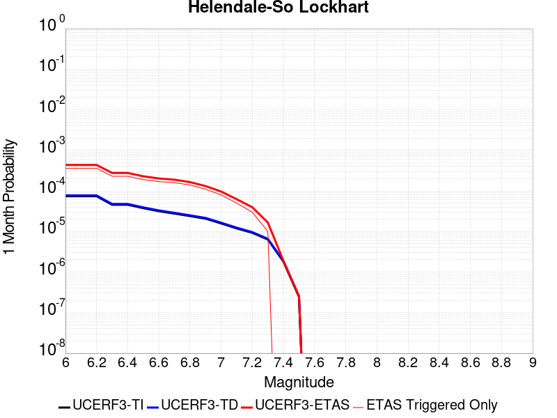 | 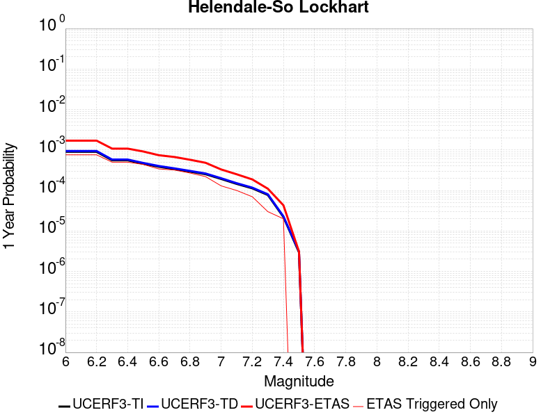 |  |

| Magnitude | 1 wk TI Prob | 1 wk TD Prob | 1 wk ETAS Prob | 1 wk ETAS/TD Gain | 1 wk ETAS Triggered Only | 1 mo TI Prob | 1 mo TD Prob | 1 mo ETAS Prob | 1 mo ETAS/TD Gain | 1 mo ETAS Triggered Only | 1 yr TI Prob | 1 yr TD Prob | 1 yr ETAS Prob | 1 yr ETAS/TD Gain | 1 yr ETAS Triggered Only | 10 yr TI Prob | 10 yr TD Prob | 10 yr ETAS Prob | 10 yr ETAS/TD Gain | 10 yr ETAS Triggered Only |
|-----|-----|-----|-----|-----|-----|-----|-----|-----|-----|-----|-----|-----|-----|-----|-----|-----|-----|-----|-----|-----|
| 6.0 | 1.7296055E-5 | 1.8103729E-5 | 2.7272123E-4 | 15.064366 | 2.546221E-4 | 7.412385E-5 | 7.7585224E-5 | 3.8876585E-4 | 5.0108237 | 3.1120479E-4 | 9.0208417E-4 | 9.4421144E-4 | 0.0016932242 | 1.793268 | 7.497206E-4 | 0.008984311 | 0.009404116 | 0.010469077 | 1.1132442 | 0.001075071 |
| 6.1 | 1.7296055E-5 | 1.8103729E-5 | 2.7272123E-4 | 15.064366 | 2.546221E-4 | 7.412385E-5 | 7.7585224E-5 | 3.8876585E-4 | 5.0108237 | 3.1120479E-4 | 9.0208417E-4 | 9.4421144E-4 | 0.0016932242 | 1.793268 | 7.497206E-4 | 0.008984311 | 0.009404116 | 0.010469077 | 1.1132442 | 0.001075071 |
| 6.2 | 1.7296055E-5 | 1.8103729E-5 | 2.7272123E-4 | 15.064366 | 2.546221E-4 | 7.412385E-5 | 7.7585224E-5 | 3.8876585E-4 | 5.0108237 | 3.1120479E-4 | 9.0208417E-4 | 9.4421144E-4 | 0.0016932242 | 1.793268 | 7.497206E-4 | 0.008984311 | 0.009404116 | 0.010469077 | 1.1132442 | 0.001075071 |
| 6.3 | 1.0669118E-5 | 1.1135425E-5 | 1.808816E-4 | 16.2438 | 1.6974806E-4 | 4.5723988E-5 | 4.772239E-5 | 2.5989735E-4 | 5.4460254 | 2.1218508E-4 | 5.5654737E-4 | 5.80868E-4 | 0.0010898164 | 1.876186 | 5.092442E-4 | 0.0055515557 | 0.0057937936 | 0.0065954253 | 1.1383604 | 8.063033E-4 |
| 6.4 | 1.0669118E-5 | 1.1135425E-5 | 1.808816E-4 | 16.2438 | 1.6974806E-4 | 4.5723988E-5 | 4.772239E-5 | 2.5989735E-4 | 5.4460254 | 2.1218508E-4 | 5.5654737E-4 | 5.80868E-4 | 0.0010898164 | 1.876186 | 5.092442E-4 | 0.0055515557 | 0.0057937936 | 0.0065954253 | 1.1383604 | 8.063033E-4 |
| 6.5 | 8.790038E-6 | 9.170197E-6 | 1.3648008E-4 | 14.883004 | 1.2731105E-4 | 3.767105E-5 | 3.930026E-5 | 1.9489654E-4 | 4.9591665 | 1.5560239E-4 | 4.585485E-4 | 4.7837716E-4 | 9.1668323E-4 | 1.9162353 | 4.3851582E-4 | 0.0045760344 | 0.004773638 | 0.005477546 | 1.1474572 | 7.072836E-4 |
| 6.6 | 7.396949E-6 | 7.715537E-6 | 1.350256E-4 | 17.50048 | 1.2731105E-4 | 3.1700827E-5 | 3.3066175E-5 | 1.8866343E-4 | 5.705632 | 1.5560239E-4 | 3.858892E-4 | 4.025073E-4 | 7.4186677E-4 | 1.8431138 | 3.3949612E-4 | 0.003852198 | 0.00401789 | 0.004609621 | 1.1472741 | 5.941182E-4 |
| 6.7 | 6.4600285E-6 | 6.738031E-6 | 1.19902645E-4 | 17.794909 | 1.1316538E-4 | 2.7685543E-5 | 2.887696E-5 | 1.703296E-4 | 5.89846 | 1.4145672E-4 | 3.3701936E-4 | 3.5152107E-4 | 6.6261645E-4 | 1.8849978 | 3.1120479E-4 | 0.0033650869 | 0.003509732 | 0.0040312847 | 1.1486019 | 5.2338984E-4 |
| 6.8 | 5.600104E-6 | 5.836009E-6 | 1.19000724E-4 | 20.39077 | 1.1316538E-4 | 2.4000226E-5 | 2.5011232E-5 | 1.6646442E-4 | 6.6555862 | 1.4145672E-4 | 2.9216358E-4 | 3.044698E-4 | 5.7315576E-4 | 1.8824716 | 2.6876776E-4 | 0.0029177975 | 0.003040588 | 0.0034495653 | 1.134506 | 4.102245E-4 |
| 6.9 | 4.839122E-6 | 5.0395092E-6 | 8.991311E-5 | 17.84164 | 8.487403E-5 | 2.0738931E-5 | 2.159772E-5 | 1.3476066E-4 | 6.239578 | 1.1316538E-4 | 2.5246723E-4 | 2.6292098E-4 | 4.7505027E-4 | 1.8068177 | 2.1218508E-4 | 0.002521806 | 0.002626147 | 0.0029365344 | 1.1181912 | 3.1120479E-4 |
| 7.0 | 3.6937633E-6 | 3.845208E-6 | 6.042768E-5 | 15.715061 | 5.658269E-5 | 1.5830317E-5 | 1.647936E-5 | 1.01351994E-4 | 6.1502385 | 8.487403E-5 | 1.9271708E-4 | 2.0061806E-4 | 3.2790357E-4 | 1.6344669 | 1.2731105E-4 | 0.0019255003 | 0.002004401 | 0.0021596914 | 1.0774747 | 1.5560239E-4 |
| 7.1 | 2.7858857E-6 | 2.8978538E-6 | 5.948038E-5 | 20.525665 | 5.658269E-5 | 1.1939455E-5 | 1.2419316E-5 | 8.31468E-5 | 6.694958 | 7.072836E-5 | 1.4535317E-4 | 1.511949E-4 | 2.6434317E-4 | 1.7483604 | 1.1316538E-4 | 0.0014525814 | 0.0015109418 | 0.0016521848 | 1.0934801 | 1.4145672E-4 |
| 7.2 | 2.1672065E-6 | 2.2540128E-6 | 3.0545292E-5 | 13.5515175 | 2.8291344E-5 | 9.2879945E-6 | 9.66002E-6 | 5.2096628E-5 | 5.3930144 | 4.2437016E-5 | 1.1307546E-4 | 1.1760458E-4 | 2.0246863E-4 | 1.721605 | 8.487403E-5 | 0.0011301794 | 0.0011754417 | 0.001288474 | 1.0961616 | 1.1316538E-4 |
| 7.3 | 1.4823496E-6 | 1.5422102E-6 | 1.5687861E-5 | 10.172323 | 1.4145672E-5 | 6.3529114E-6 | 6.6094562E-6 | 2.0755035E-5 | 3.140203 | 1.4145672E-5 | 7.734395E-5 | 8.046731E-5 | 1.0875638E-4 | 1.3515598 | 2.8291344E-5 | 7.731704E-4 | 8.0439687E-4 | 8.6093403E-4 | 1.0702852 | 5.658269E-5 |
| 7.4 | 4.2321457E-7 | 4.4108765E-7 | 4.4108765E-7 | 1.0 | 0.0 | 1.8137755E-6 | 1.8903745E-6 | 1.8903745E-6 | 1.0 | 0.0 | 2.2082493E-5 | 2.3015113E-5 | 3.716046E-5 | 1.6146111 | 1.4145672E-5 | 2.2080299E-4 | 2.3013182E-4 | 2.4427424E-4 | 1.0614536 | 1.4145672E-5 |
| 7.5 | 5.6942316E-8 | 5.9415648E-8 | 5.9415648E-8 | 1.0 | 0.0 | 2.440385E-7 | 2.5463845E-7 | 2.5463845E-7 | 1.0 | 0.0 | 2.9711643E-6 | 3.1002196E-6 | 3.1002196E-6 | 1.0 | 0.0 | 2.9711247E-5 | 3.1001844E-5 | 3.1001844E-5 | 1.0 | 0.0 |

## Coyote Lake
*[(top)](#table-of-contents)*

| 1 Week | 1 Month | 1 Year | 10 Year |
|-----|-----|-----|-----|
|  |  |  |  |

| Magnitude | 1 wk TI Prob | 1 wk TD Prob | 1 wk ETAS Prob | 1 wk ETAS/TD Gain | 1 wk ETAS Triggered Only | 1 mo TI Prob | 1 mo TD Prob | 1 mo ETAS Prob | 1 mo ETAS/TD Gain | 1 mo ETAS Triggered Only | 1 yr TI Prob | 1 yr TD Prob | 1 yr ETAS Prob | 1 yr ETAS/TD Gain | 1 yr ETAS Triggered Only | 10 yr TI Prob | 10 yr TD Prob | 10 yr ETAS Prob | 10 yr ETAS/TD Gain | 10 yr ETAS Triggered Only |
|-----|-----|-----|-----|-----|-----|-----|-----|-----|-----|-----|-----|-----|-----|-----|-----|-----|-----|-----|-----|-----|
| 6.0 | 1.980352E-5 | 2.1706745E-5 | 1.4901503E-4 | 6.864918 | 1.2731105E-4 | 8.486947E-5 | 9.302599E-5 | 3.0519135E-4 | 3.2807102 | 2.1218508E-4 | 0.0010327959 | 0.0011320751 | 0.0016690021 | 1.4742857 | 5.375355E-4 | 0.010280091 | 0.011270258 | 0.012095447 | 1.0732182 | 8.3459466E-4 |
| 6.1 | 1.980352E-5 | 2.1706745E-5 | 1.4901503E-4 | 6.864918 | 1.2731105E-4 | 8.486947E-5 | 9.302599E-5 | 3.0519135E-4 | 3.2807102 | 2.1218508E-4 | 0.0010327959 | 0.0011320751 | 0.0016690021 | 1.4742857 | 5.375355E-4 | 0.010280091 | 0.011270258 | 0.012095447 | 1.0732182 | 8.3459466E-4 |
| 6.2 | 1.980352E-5 | 2.1706745E-5 | 1.4901503E-4 | 6.864918 | 1.2731105E-4 | 8.486947E-5 | 9.302599E-5 | 3.0519135E-4 | 3.2807102 | 2.1218508E-4 | 0.0010327959 | 0.0011320751 | 0.0016690021 | 1.4742857 | 5.375355E-4 | 0.010280091 | 0.011270258 | 0.012095447 | 1.0732182 | 8.3459466E-4 |
| 6.3 | 1.5344787E-5 | 1.682067E-5 | 1.1583871E-4 | 6.8866887 | 9.901971E-5 | 6.576172E-5 | 7.2086936E-5 | 2.4182277E-4 | 3.354599 | 1.6974806E-4 | 8.003548E-4 | 8.773662E-4 | 0.001244831 | 1.4188272 | 3.6778746E-4 | 0.007974784 | 0.00874507 | 0.009333991 | 1.0673434 | 5.941182E-4 |
| 6.4 | 1.5344787E-5 | 1.682067E-5 | 1.1583871E-4 | 6.8866887 | 9.901971E-5 | 6.576172E-5 | 7.2086936E-5 | 2.4182277E-4 | 3.354599 | 1.6974806E-4 | 8.003548E-4 | 8.773662E-4 | 0.001244831 | 1.4188272 | 3.6778746E-4 | 0.007974784 | 0.00874507 | 0.009333991 | 1.0673434 | 5.941182E-4 |
| 6.5 | 1.4189697E-5 | 1.5557987E-5 | 1.1457615E-4 | 7.3644586 | 9.901971E-5 | 6.081157E-5 | 6.6675726E-5 | 2.3641247E-4 | 3.5457053 | 1.6974806E-4 | 7.401293E-4 | 8.115349E-4 | 0.0011790239 | 1.4528321 | 3.6778746E-4 | 0.0073766913 | 0.008091656 | 0.008666935 | 1.0710955 | 5.799726E-4 |
| 6.6 | 1.3469301E-5 | 1.4771577E-5 | 1.1378982E-4 | 7.703295 | 9.901971E-5 | 5.7724297E-5 | 6.330556E-5 | 2.0475333E-4 | 3.2343655 | 1.4145672E-4 | 7.025667E-4 | 7.7053264E-4 | 0.0011097671 | 1.4402598 | 3.3949612E-4 | 0.0070034964 | 0.0076845144 | 0.008231956 | 1.0712396 | 5.516812E-4 |
| 6.7 | 1.3027966E-5 | 1.4281745E-5 | 9.915457E-5 | 6.9427485 | 8.487403E-5 | 5.5832945E-5 | 6.120638E-5 | 1.8850964E-4 | 3.0799017 | 1.2731105E-4 | 6.7955407E-4 | 7.4499263E-4 | 0.0010701007 | 1.436391 | 3.2535047E-4 | 0.006774798 | 0.0074308286 | 0.00796437 | 1.0718011 | 5.375355E-4 |
| 6.8 | 5.695434E-6 | 6.2244176E-6 | 4.866117E-5 | 7.8177867 | 4.2437016E-5 | 2.4408775E-5 | 2.6675973E-5 | 6.9111855E-5 | 2.5907905 | 4.2437016E-5 | 2.971363E-4 | 3.2476155E-4 | 4.09608E-4 | 1.2612578 | 8.487403E-5 | 0.0029673933 | 0.0032458105 | 0.003386808 | 1.0434399 | 1.4145672E-4 |
| 6.9 | 4.385688E-6 | 4.7930553E-6 | 3.3084263E-5 | 6.9025416 | 2.8291344E-5 | 1.879567E-5 | 2.0541665E-5 | 4.883243E-5 | 2.377238 | 2.8291344E-5 | 2.2881327E-4 | 2.5009477E-4 | 2.9252117E-4 | 1.1696413 | 4.2437016E-5 | 0.002285778 | 0.0025009478 | 0.00259972 | 1.0394938 | 9.901971E-5 |

## San Andreas (Big Bend)
*[(top)](#table-of-contents)*

| 1 Week | 1 Month | 1 Year | 10 Year |
|-----|-----|-----|-----|
| 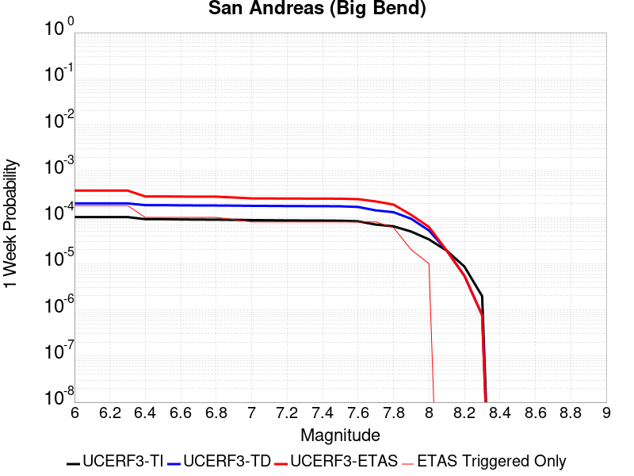 |  | 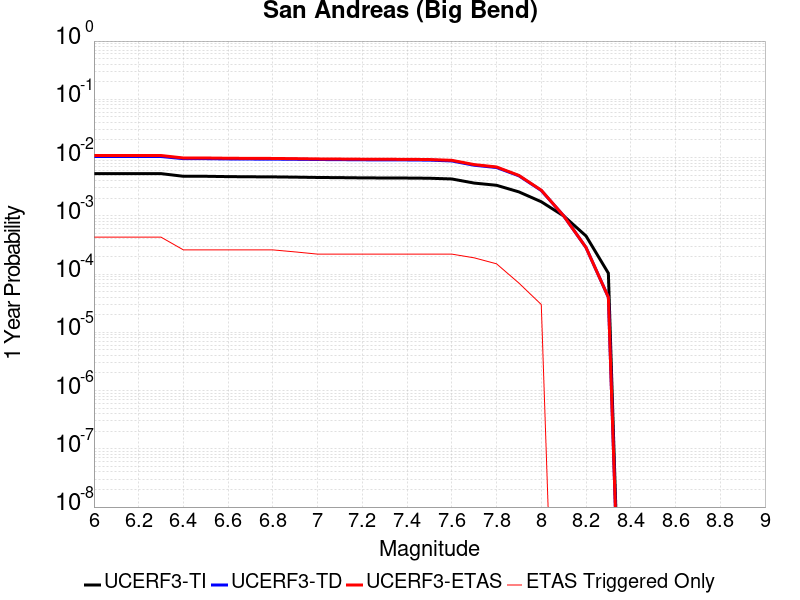 |  |

| Magnitude | 1 wk TI Prob | 1 wk TD Prob | 1 wk ETAS Prob | 1 wk ETAS/TD Gain | 1 wk ETAS Triggered Only | 1 mo TI Prob | 1 mo TD Prob | 1 mo ETAS Prob | 1 mo ETAS/TD Gain | 1 mo ETAS Triggered Only | 1 yr TI Prob | 1 yr TD Prob | 1 yr ETAS Prob | 1 yr ETAS/TD Gain | 1 yr ETAS Triggered Only | 10 yr TI Prob | 10 yr TD Prob | 10 yr ETAS Prob | 10 yr ETAS/TD Gain | 10 yr ETAS Triggered Only |
|-----|-----|-----|-----|-----|-----|-----|-----|-----|-----|-----|-----|-----|-----|-----|-----|-----|-----|-----|-----|-----|
| 6.0 | 1.0179969E-4 | 2.0073925E-4 | 3.845961E-4 | 1.9158987 | 1.8389373E-4 | 4.362114E-4 | 8.6002843E-4 | 0.001100298 | 1.279374 | 2.4047642E-4 | 0.0052979486 | 0.010420859 | 0.010910799 | 1.0470152 | 4.9509853E-4 | 0.051734097 | 0.101455905 | 0.10218041 | 1.007141 | 8.063033E-4 |
| 6.1 | 1.0179969E-4 | 2.0073925E-4 | 3.845961E-4 | 1.9158987 | 1.8389373E-4 | 4.362114E-4 | 8.6002843E-4 | 0.001100298 | 1.279374 | 2.4047642E-4 | 0.0052979486 | 0.010420859 | 0.010910799 | 1.0470152 | 4.9509853E-4 | 0.051734097 | 0.101455905 | 0.10218041 | 1.007141 | 8.063033E-4 |
| 6.2 | 1.0179969E-4 | 2.0073925E-4 | 3.845961E-4 | 1.9158987 | 1.8389373E-4 | 4.362114E-4 | 8.6002843E-4 | 0.001100298 | 1.279374 | 2.4047642E-4 | 0.0052979486 | 0.010420859 | 0.010910799 | 1.0470152 | 4.9509853E-4 | 0.051734097 | 0.101455905 | 0.10218041 | 1.007141 | 8.063033E-4 |
| 6.3 | 1.0179969E-4 | 2.0073925E-4 | 3.845961E-4 | 1.9158987 | 1.8389373E-4 | 4.362114E-4 | 8.6002843E-4 | 0.001100298 | 1.279374 | 2.4047642E-4 | 0.0052979486 | 0.010420859 | 0.010910799 | 1.0470152 | 4.9509853E-4 | 0.051734097 | 0.101455905 | 0.10218041 | 1.007141 | 8.063033E-4 |
| 6.4 | 9.1639464E-5 | 1.8430917E-4 | 2.8331063E-4 | 1.5371488 | 9.901971E-5 | 3.9268145E-4 | 7.896575E-4 | 9.4513706E-4 | 1.1968949 | 1.5560239E-4 | 0.0047704205 | 0.009571818 | 0.009894054 | 1.0336651 | 3.2535047E-4 | 0.046693064 | 0.09378695 | 0.09429971 | 1.0054673 | 5.658269E-4 |
| 6.5 | 9.1639464E-5 | 1.8430917E-4 | 2.8331063E-4 | 1.5371488 | 9.901971E-5 | 3.9268145E-4 | 7.896575E-4 | 9.4513706E-4 | 1.1968949 | 1.5560239E-4 | 0.0047704205 | 0.009571818 | 0.009894054 | 1.0336651 | 3.2535047E-4 | 0.046693064 | 0.09378695 | 0.09429971 | 1.0054673 | 5.658269E-4 |
| 6.6 | 9.042622E-5 | 1.8238011E-4 | 2.8138177E-4 | 1.5428313 | 9.901971E-5 | 3.8748336E-4 | 7.813951E-4 | 9.3687593E-4 | 1.1989784 | 1.5560239E-4 | 0.0047074095 | 0.0094721 | 0.009794368 | 1.0340229 | 3.2535047E-4 | 0.046089325 | 0.09287721 | 0.09339049 | 1.0055264 | 5.658269E-4 |
| 6.7 | 8.9836685E-5 | 1.8152347E-4 | 2.805252E-4 | 1.5453936 | 9.901971E-5 | 3.8495753E-4 | 7.7772595E-4 | 9.3320734E-4 | 1.1999179 | 1.5560239E-4 | 0.00467679 | 0.009427815 | 0.009750098 | 1.0341843 | 3.2535047E-4 | 0.045795817 | 0.09247148 | 0.09298499 | 1.0055531 | 5.658269E-4 |
| 6.8 | 8.9471854E-5 | 1.8099119E-4 | 2.79993E-4 | 1.5469978 | 9.901971E-5 | 3.8339442E-4 | 7.754462E-4 | 9.309279E-4 | 1.2005062 | 1.5560239E-4 | 0.004657841 | 0.009400298 | 0.0097225895 | 1.0342853 | 3.2535047E-4 | 0.04561414 | 0.0922192 | 0.092732854 | 1.0055698 | 5.658269E-4 |
| 6.9 | 8.858234E-5 | 1.7981093E-4 | 2.6466968E-4 | 1.4719334 | 8.487403E-5 | 3.7958333E-4 | 7.7039085E-4 | 8.976038E-4 | 1.1651279 | 1.2731105E-4 | 0.004611638 | 0.009339278 | 0.0096335625 | 1.0315105 | 2.970591E-4 | 0.04517103 | 0.09165911 | 0.09213452 | 1.0051868 | 5.2338984E-4 |
| 7.0 | 8.7433385E-5 | 1.7819891E-4 | 2.4891467E-4 | 1.396836 | 7.072836E-5 | 3.746607E-4 | 7.6348626E-4 | 8.7656523E-4 | 1.1481087 | 1.1316538E-4 | 0.004551957 | 0.009255932 | 0.009522212 | 1.0287685 | 2.6876776E-4 | 0.044598386 | 0.09089323 | 0.09134333 | 1.004952 | 4.9509853E-4 |
| 7.1 | 8.684964E-5 | 1.7731842E-4 | 2.4803422E-4 | 1.3988069 | 7.072836E-5 | 3.7215967E-4 | 7.597149E-4 | 8.7279436E-4 | 1.1488445 | 1.1316538E-4 | 0.0045216335 | 0.009210405 | 0.009476697 | 1.0289121 | 2.6876776E-4 | 0.04430731 | 0.09047475 | 0.09092505 | 1.0049771 | 4.9509853E-4 |
| 7.2 | 8.606521E-5 | 1.7622454E-4 | 2.4694044E-4 | 1.4012829 | 7.072836E-5 | 3.6879873E-4 | 7.550296E-4 | 8.681095E-4 | 1.1497688 | 1.1316538E-4 | 0.0044808835 | 0.009153842 | 0.009420149 | 1.0290924 | 2.6876776E-4 | 0.043916024 | 0.08995518 | 0.09040574 | 1.0050087 | 4.9509853E-4 |
| 7.3 | 8.568266E-5 | 1.7564454E-4 | 2.463605E-4 | 1.4026083 | 7.072836E-5 | 3.6715972E-4 | 7.5254537E-4 | 8.6562557E-4 | 1.1502637 | 1.1316538E-4 | 0.0044610105 | 0.00912385 | 0.009390165 | 1.029189 | 2.6876776E-4 | 0.043725148 | 0.08967623 | 0.09012693 | 1.0050259 | 4.9509853E-4 |
| 7.4 | 8.5432206E-5 | 1.752704E-4 | 2.4598636E-4 | 1.4034678 | 7.072836E-5 | 3.6608664E-4 | 7.509428E-4 | 8.6402317E-4 | 1.1505846 | 1.1316538E-4 | 0.004447999 | 0.009104501 | 0.009370822 | 1.0292516 | 2.6876776E-4 | 0.043600157 | 0.08949642 | 0.08994721 | 1.005037 | 4.9509853E-4 |
| 7.5 | 8.4791965E-5 | 1.7396381E-4 | 2.4467986E-4 | 1.4064987 | 7.072836E-5 | 3.633435E-4 | 7.4534636E-4 | 8.584274E-4 | 1.1517161 | 1.1316538E-4 | 0.0044147377 | 0.009036932 | 0.009303272 | 1.0294722 | 2.6876776E-4 | 0.043280575 | 0.08887209 | 0.089323185 | 1.0050758 | 4.9509853E-4 |
| 7.6 | 8.241105E-5 | 1.6841735E-4 | 2.3913379E-4 | 1.4198881 | 7.072836E-5 | 3.531424E-4 | 7.2158914E-4 | 8.346728E-4 | 1.1567148 | 1.1316538E-4 | 0.0042910352 | 0.008750047 | 0.009016463 | 1.0304474 | 2.6876776E-4 | 0.042091176 | 0.08625032 | 0.08670272 | 1.0052452 | 4.9509853E-4 |
| 7.7 | 7.00432E-5 | 1.4205615E-4 | 2.1277447E-4 | 1.4978194 | 7.072836E-5 | 3.001506E-4 | 6.0867006E-4 | 7.076295E-4 | 1.1625831 | 9.901971E-5 | 0.0036482112 | 0.0073854174 | 0.0076100766 | 1.0304193 | 2.2633075E-4 | 0.035888977 | 0.07352299 | 0.07391616 | 1.0053476 | 4.2437017E-4 |
| 7.8 | 6.415362E-5 | 1.2969968E-4 | 2.0041887E-4 | 1.5452534 | 7.072836E-5 | 2.749151E-4 | 5.557374E-4 | 6.4056425E-4 | 1.1526384 | 8.487403E-5 | 0.0033419547 | 0.0067451415 | 0.006941845 | 1.0291623 | 1.9803942E-4 | 0.03292141 | 0.06725514 | 0.067585 | 1.0049046 | 3.536418E-4 |
| 7.9 | 4.939911E-5 | 9.341721E-5 | 1.2170592E-4 | 1.302821 | 2.8291344E-5 | 2.116933E-4 | 4.0029807E-4 | 4.285781E-4 | 1.0706474 | 2.8291344E-5 | 0.0025743195 | 0.004862747 | 0.0049612853 | 1.0202639 | 9.901971E-5 | 0.025447013 | 0.048915803 | 0.049104154 | 1.0038506 | 1.9803942E-4 |
| 8.0 | 3.344983E-5 | 5.2228E-5 | 6.637293E-5 | 1.2708305 | 1.4145672E-5 | 1.4334853E-4 | 2.2381509E-4 | 2.3795759E-4 | 1.0631883 | 1.4145672E-5 | 0.0017438711 | 0.0027215453 | 0.002763867 | 1.0155505 | 4.2437016E-5 | 0.017302496 | 0.027923161 | 0.027991915 | 1.0024623 | 7.072836E-5 |
| 8.1 | 1.9104898E-5 | 1.9171663E-5 | 1.9171663E-5 | 1.0 | 0.0 | 8.1875565E-5 | 8.2161685E-5 | 8.2161685E-5 | 1.0 | 0.0 | 9.963791E-4 | 9.9986E-4 | 9.9986E-4 | 1.0 | 0.0 | 0.009919235 | 0.010749552 | 0.010749552 | 1.0 | 0.0 |
| 8.2 | 8.643924E-6 | 5.473668E-6 | 5.473668E-6 | 1.0 | 0.0 | 3.704486E-5 | 2.3458366E-5 | 2.3458366E-5 | 1.0 | 0.0 | 4.5092785E-4 | 2.8556827E-4 | 2.8556827E-4 | 1.0 | 0.0 | 0.0045001395 | 0.0032481793 | 0.0032481793 | 1.0 | 0.0 |
| 8.3 | 1.983087E-6 | 7.6564595E-7 | 7.6564595E-7 | 1.0 | 0.0 | 8.498917E-6 | 3.281336E-6 | 3.281336E-6 | 1.0 | 0.0 | 1.034694E-4 | 3.9949547E-5 | 3.9949547E-5 | 1.0 | 0.0 | 0.0010342124 | 4.717979E-4 | 4.717979E-4 | 1.0 | 0.0 |

## San Andreas (San Gorgonio Pass-Garnet HIll)
*[(top)](#table-of-contents)*

| 1 Week | 1 Month | 1 Year | 10 Year |
|-----|-----|-----|-----|
|  |  |  |  |

| Magnitude | 1 wk TI Prob | 1 wk TD Prob | 1 wk ETAS Prob | 1 wk ETAS/TD Gain | 1 wk ETAS Triggered Only | 1 mo TI Prob | 1 mo TD Prob | 1 mo ETAS Prob | 1 mo ETAS/TD Gain | 1 mo ETAS Triggered Only | 1 yr TI Prob | 1 yr TD Prob | 1 yr ETAS Prob | 1 yr ETAS/TD Gain | 1 yr ETAS Triggered Only | 10 yr TI Prob | 10 yr TD Prob | 10 yr ETAS Prob | 10 yr ETAS/TD Gain | 10 yr ETAS Triggered Only |
|-----|-----|-----|-----|-----|-----|-----|-----|-----|-----|-----|-----|-----|-----|-----|-----|-----|-----|-----|-----|-----|
| 6.0 | 8.31567E-5 | 2.3384395E-4 | 4.884065E-4 | 2.0886002 | 2.546221E-4 | 3.5633717E-4 | 0.0010018025 | 0.001270301 | 1.2680154 | 2.6876776E-4 | 0.004329778 | 0.012128622 | 0.012519897 | 1.0322604 | 3.9607883E-4 | 0.042463828 | 0.11258187 | 0.11307144 | 1.0043486 | 5.516812E-4 |
| 6.1 | 8.31567E-5 | 2.3384395E-4 | 4.884065E-4 | 2.0886002 | 2.546221E-4 | 3.5633717E-4 | 0.0010018025 | 0.001270301 | 1.2680154 | 2.6876776E-4 | 0.004329778 | 0.012128622 | 0.012519897 | 1.0322604 | 3.9607883E-4 | 0.042463828 | 0.11258187 | 0.11307144 | 1.0043486 | 5.516812E-4 |
| 6.2 | 8.31567E-5 | 2.3384395E-4 | 4.884065E-4 | 2.0886002 | 2.546221E-4 | 3.5633717E-4 | 0.0010018025 | 0.001270301 | 1.2680154 | 2.6876776E-4 | 0.004329778 | 0.012128622 | 0.012519897 | 1.0322604 | 3.9607883E-4 | 0.042463828 | 0.11258187 | 0.11307144 | 1.0043486 | 5.516812E-4 |
| 6.3 | 8.31567E-5 | 2.3384395E-4 | 4.884065E-4 | 2.0886002 | 2.546221E-4 | 3.5633717E-4 | 0.0010018025 | 0.001270301 | 1.2680154 | 2.6876776E-4 | 0.004329778 | 0.012128622 | 0.012519897 | 1.0322604 | 3.9607883E-4 | 0.042463828 | 0.11258187 | 0.11307144 | 1.0043486 | 5.516812E-4 |
| 6.4 | 8.059055E-5 | 2.2941893E-4 | 4.839826E-4 | 2.109602 | 2.546221E-4 | 3.4534236E-4 | 9.828559E-4 | 0.0012513596 | 1.2731872 | 2.6876776E-4 | 0.0041964394 | 0.011900819 | 0.012292184 | 1.0328856 | 3.9607883E-4 | 0.041180745 | 0.110562965 | 0.11105365 | 1.004438 | 5.516812E-4 |
| 6.5 | 8.059055E-5 | 2.2941893E-4 | 4.839826E-4 | 2.109602 | 2.546221E-4 | 3.4534236E-4 | 9.828559E-4 | 0.0012513596 | 1.2731872 | 2.6876776E-4 | 0.0041964394 | 0.011900819 | 0.012292184 | 1.0328856 | 3.9607883E-4 | 0.041180745 | 0.110562965 | 0.11105365 | 1.004438 | 5.516812E-4 |
| 6.6 | 7.619237E-5 | 2.2186468E-4 | 4.764303E-4 | 2.1473913 | 2.546221E-4 | 3.2649786E-4 | 9.5050444E-4 | 0.0012190167 | 1.2824945 | 2.6876776E-4 | 0.0039678677 | 0.0115115335 | 0.011903053 | 1.034011 | 3.9607883E-4 | 0.03897764 | 0.10709954 | 0.107592136 | 1.0045995 | 5.516812E-4 |
| 6.7 | 7.440636E-5 | 2.1862281E-4 | 4.7318925E-4 | 2.1644094 | 2.546221E-4 | 3.188454E-4 | 9.3662075E-4 | 0.0012051368 | 1.286686 | 2.6876776E-4 | 0.0038750346 | 0.011344268 | 0.011735854 | 1.0345184 | 3.9607883E-4 | 0.038081564 | 0.1056081 | 0.10610152 | 1.0046722 | 5.516812E-4 |
| 6.8 | 7.3735864E-5 | 2.1709445E-4 | 4.7166127E-4 | 2.1726086 | 2.546221E-4 | 3.1597257E-4 | 9.300753E-4 | 0.0011985931 | 1.2887055 | 2.6876776E-4 | 0.0038401815 | 0.011265406 | 0.011657024 | 1.0347627 | 3.9607883E-4 | 0.03774495 | 0.104909696 | 0.1054035 | 1.004707 | 5.516812E-4 |
| 6.9 | 7.27575E-5 | 2.1478413E-4 | 4.6935154E-4 | 2.1852245 | 2.546221E-4 | 3.117806E-4 | 9.20181E-4 | 0.0011887015 | 1.2918127 | 2.6876776E-4 | 0.003789323 | 0.011146182 | 0.011537846 | 1.0351388 | 3.9607883E-4 | 0.037253562 | 0.10385753 | 0.104351915 | 1.0047603 | 5.516812E-4 |
| 7.0 | 7.102591E-5 | 2.1062451E-4 | 4.6519298E-4 | 2.2086365 | 2.546221E-4 | 3.0436125E-4 | 9.023664E-4 | 0.0011708917 | 1.2975789 | 2.6876776E-4 | 0.003699303 | 0.010931484 | 0.011323233 | 1.0358368 | 3.9607883E-4 | 0.03638325 | 0.101959534 | 0.10245497 | 1.0048591 | 5.516812E-4 |
| 7.1 | 7.028513E-5 | 2.0898094E-4 | 4.6354983E-4 | 2.2181442 | 2.546221E-4 | 3.0118722E-4 | 8.953274E-4 | 0.0011638545 | 1.2999206 | 2.6876776E-4 | 0.0036607897 | 0.010846641 | 0.011238424 | 1.0361202 | 3.9607883E-4 | 0.036010686 | 0.10120243 | 0.10169828 | 1.0048996 | 5.516812E-4 |
| 7.2 | 6.8498244E-5 | 2.050596E-4 | 4.596295E-4 | 2.2414434 | 2.546221E-4 | 2.9353087E-4 | 8.7853306E-4 | 0.0011470647 | 1.3056592 | 2.6876776E-4 | 0.003567883 | 0.0106441835 | 0.011036046 | 1.0368147 | 3.9607883E-4 | 0.035111405 | 0.09939449 | 0.09989134 | 1.0049987 | 5.516812E-4 |
| 7.3 | 6.622592E-5 | 1.9733235E-4 | 4.519042E-4 | 2.2900665 | 2.546221E-4 | 2.8379448E-4 | 8.4543816E-4 | 0.0011139787 | 1.3176347 | 2.6876776E-4 | 0.0034497243 | 0.010245111 | 0.0106371315 | 1.0382642 | 3.9607883E-4 | 0.033966612 | 0.095891245 | 0.09639003 | 1.0052015 | 5.516812E-4 |
| 7.4 | 5.1050705E-5 | 1.4690042E-4 | 4.014851E-4 | 2.7330427 | 2.546221E-4 | 2.1877038E-4 | 6.294222E-4 | 8.980208E-4 | 1.4267384 | 2.6876776E-4 | 0.002660276 | 0.007636482 | 0.0080154985 | 1.0496323 | 3.8193315E-4 | 0.02628654 | 0.07286554 | 0.07336391 | 1.0068395 | 5.375355E-4 |
| 7.5 | 3.9302922E-5 | 1.11307076E-4 | 3.5175672E-4 | 3.160237 | 2.4047642E-4 | 1.6843023E-4 | 4.7694342E-4 | 7.314441E-4 | 1.5336076 | 2.546221E-4 | 0.0020487092 | 0.0057913954 | 0.0061570527 | 1.063138 | 3.6778746E-4 | 0.020299247 | 0.05601151 | 0.056505583 | 1.0088209 | 5.2338984E-4 |
| 7.6 | 2.9851626E-5 | 8.4956984E-5 | 3.2541298E-4 | 3.8303263 | 2.4047642E-4 | 1.2792926E-4 | 3.6405068E-4 | 6.185801E-4 | 1.6991593 | 2.546221E-4 | 0.0015564259 | 0.0044233347 | 0.0047894954 | 1.0827793 | 3.6778746E-4 | 0.0154556995 | 0.043196145 | 0.04369693 | 1.0115932 | 5.2338984E-4 |
| 7.7 | 2.1135214E-5 | 6.353527E-5 | 2.8985165E-4 | 4.562059 | 2.2633075E-4 | 9.0576345E-5 | 2.722656E-4 | 5.1267655E-4 | 1.8830016 | 2.4047642E-4 | 0.0011022091 | 0.0033098008 | 0.0036622721 | 1.1064932 | 3.536418E-4 | 0.010967582 | 0.03258456 | 0.033063527 | 1.0146992 | 4.9509853E-4 |
| 7.8 | 1.883379E-5 | 5.564576E-5 | 2.8196393E-4 | 5.067123 | 2.2633075E-4 | 8.0713755E-5 | 2.3846005E-4 | 4.7887914E-4 | 2.0082154 | 2.4047642E-4 | 9.822468E-4 | 0.002899389 | 0.0032520054 | 1.1216176 | 3.536418E-4 | 0.0097791655 | 0.028696978 | 0.029177869 | 1.0167575 | 4.9509853E-4 |
| 7.9 | 1.5156185E-5 | 4.1662403E-5 | 2.5383863E-4 | 6.0927505 | 2.1218508E-4 | 6.495346E-5 | 1.7854095E-4 | 4.0483128E-4 | 2.2674422 | 2.2633075E-4 | 7.9052144E-4 | 0.0021715704 | 0.0024962144 | 1.1494973 | 3.2535047E-4 | 0.007877152 | 0.021760946 | 0.022203756 | 1.0203489 | 4.526615E-4 |
| 8.0 | 1.1405907E-5 | 2.9976925E-5 | 1.8557465E-4 | 6.190583 | 1.5560239E-4 | 4.8881542E-5 | 1.2846621E-4 | 2.981925E-4 | 2.3211741 | 1.6974806E-4 | 5.9497025E-4 | 0.0015629551 | 0.0018030556 | 1.1536196 | 2.4047642E-4 | 0.005933798 | 0.015774013 | 0.016094232 | 1.0203004 | 3.2535047E-4 |
| 8.1 | 4.3511436E-6 | 7.369465E-6 | 7.369465E-6 | 1.0 | 0.0 | 1.8647626E-5 | 3.158304E-5 | 3.158304E-5 | 1.0 | 0.0 | 2.2701119E-4 | 3.844558E-4 | 3.844558E-4 | 1.0 | 0.0 | 0.0022677942 | 0.0041165445 | 0.0041165445 | 1.0 | 0.0 |
| 8.2 | 2.3042528E-6 | 2.7328301E-6 | 2.7328301E-6 | 1.0 | 0.0 | 9.875332E-6 | 1.1712076E-5 | 1.1712076E-5 | 1.0 | 0.0 | 1.2022553E-4 | 1.4258524E-4 | 1.4258524E-4 | 1.0 | 0.0 | 0.0012016051 | 0.0015979637 | 0.0015979637 | 1.0 | 0.0 |
| 8.3 | 5.202968E-7 | 3.1590292E-7 | 3.1590292E-7 | 1.0 | 0.0 | 2.2298414E-6 | 1.353869E-6 | 1.353869E-6 | 1.0 | 0.0 | 2.714798E-5 | 1.6483244E-5 | 1.6483244E-5 | 1.0 | 0.0 | 2.7144665E-4 | 1.955901E-4 | 1.955901E-4 | 1.0 | 0.0 |

## San Andreas (Parkfield)
*[(top)](#table-of-contents)*

| 1 Week | 1 Month | 1 Year | 10 Year |
|-----|-----|-----|-----|
|  | 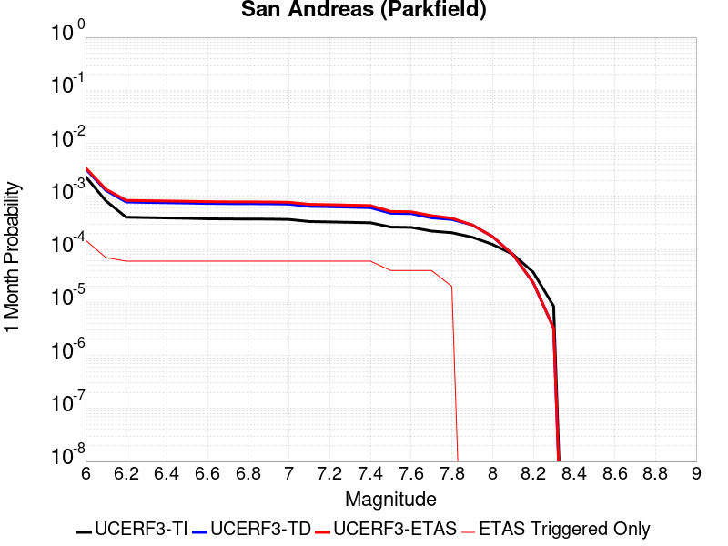 |  | 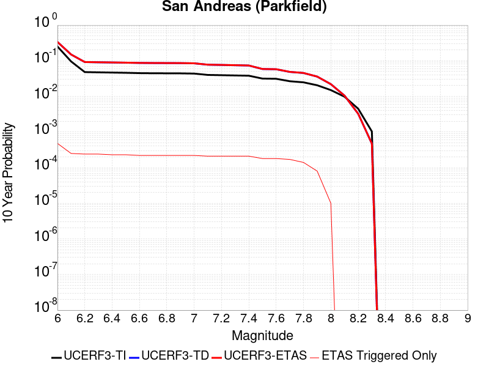 |

| Magnitude | 1 wk TI Prob | 1 wk TD Prob | 1 wk ETAS Prob | 1 wk ETAS/TD Gain | 1 wk ETAS Triggered Only | 1 mo TI Prob | 1 mo TD Prob | 1 mo ETAS Prob | 1 mo ETAS/TD Gain | 1 mo ETAS Triggered Only | 1 yr TI Prob | 1 yr TD Prob | 1 yr ETAS Prob | 1 yr ETAS/TD Gain | 1 yr ETAS Triggered Only | 10 yr TI Prob | 10 yr TD Prob | 10 yr ETAS Prob | 10 yr ETAS/TD Gain | 10 yr ETAS Triggered Only |
|-----|-----|-----|-----|-----|-----|-----|-----|-----|-----|-----|-----|-----|-----|-----|-----|-----|-----|-----|-----|-----|
| 6.0 | 5.556969E-4 | 7.778562E-4 | 8.7679893E-4 | 1.1271992 | 9.901971E-5 | 0.0023793848 | 0.0033299583 | 0.0034709438 | 1.0423386 | 1.4145672E-4 | 0.028586963 | 0.040235043 | 0.04050657 | 1.0067486 | 2.8291345E-4 | 0.25176284 | 0.3371973 | 0.33755356 | 1.0010566 | 5.375355E-4 |
| 6.1 | 1.925858E-4 | 3.0278185E-4 | 3.45206E-4 | 1.1401147 | 4.2437016E-5 | 8.2510663E-4 | 0.001297085 | 0.0013677216 | 1.054458 | 7.072836E-5 | 0.0099994885 | 0.01577393 | 0.015941 | 1.0105915 | 1.6974806E-4 | 0.095613256 | 0.14975825 | 0.15002285 | 1.0017668 | 3.1120479E-4 |
| 6.2 | 9.4306815E-5 | 1.8243887E-4 | 2.1072506E-4 | 1.1550447 | 2.8291344E-5 | 4.0410945E-4 | 7.8164786E-4 | 8.381863E-4 | 1.0723324 | 5.658269E-5 | 0.0049089384 | 0.009475246 | 0.009629374 | 1.0162663 | 1.5560239E-4 | 0.048019063 | 0.0918565 | 0.09212628 | 1.0029368 | 2.970591E-4 |
| 6.3 | 9.283051E-5 | 1.794041E-4 | 2.0769038E-4 | 1.1576679 | 2.8291344E-5 | 3.9778434E-4 | 7.686494E-4 | 8.251886E-4 | 1.0735565 | 5.658269E-5 | 0.0048322747 | 0.009318355 | 0.009472507 | 1.0165429 | 1.5560239E-4 | 0.047285385 | 0.090509474 | 0.09077965 | 1.002985 | 2.970591E-4 |
| 6.4 | 9.138826E-5 | 1.7702584E-4 | 2.0531217E-4 | 1.1597865 | 2.8291344E-5 | 3.916052E-4 | 7.5846276E-4 | 8.150025E-4 | 1.0745453 | 5.658269E-5 | 0.0047573745 | 0.009195387 | 0.009349559 | 1.0167662 | 1.5560239E-4 | 0.046568092 | 0.0894136 | 0.08967122 | 1.0028812 | 2.8291345E-4 |
| 6.5 | 9.000255E-5 | 1.746064E-4 | 2.028928E-4 | 1.162001 | 2.8291344E-5 | 3.8566816E-4 | 7.4809964E-4 | 8.0464E-4 | 1.0755787 | 5.658269E-5 | 0.0046854047 | 0.009070284 | 0.009224475 | 1.0169996 | 1.5560239E-4 | 0.045878403 | 0.08829608 | 0.08855401 | 1.0029212 | 2.8291345E-4 |
| 6.6 | 8.8109264E-5 | 1.7141816E-4 | 1.9970465E-4 | 1.1650146 | 2.8291344E-5 | 3.7755648E-4 | 7.3444354E-4 | 7.9098466E-4 | 1.076985 | 5.658269E-5 | 0.0045870654 | 0.008905404 | 0.009045601 | 1.0157429 | 1.4145672E-4 | 0.04493529 | 0.08682707 | 0.08707251 | 1.0028267 | 2.6876776E-4 |
| 6.7 | 8.738073E-5 | 1.7008898E-4 | 1.9837552E-4 | 1.1663043 | 2.8291344E-5 | 3.7443507E-4 | 7.287503E-4 | 7.852918E-4 | 1.0775869 | 5.658269E-5 | 0.0045492216 | 0.008836695 | 0.008976902 | 1.0158664 | 1.4145672E-4 | 0.04457213 | 0.0862268 | 0.08647239 | 1.0028483 | 2.6876776E-4 |
| 6.8 | 8.710195E-5 | 1.6954402E-4 | 1.9783057E-4 | 1.166839 | 2.8291344E-5 | 3.7324068E-4 | 7.26416E-4 | 7.829576E-4 | 1.0778364 | 5.658269E-5 | 0.0045347405 | 0.008808513 | 0.008948724 | 1.0159177 | 1.4145672E-4 | 0.04443313 | 0.08597436 | 0.08622002 | 1.0028573 | 2.6876776E-4 |
| 6.9 | 8.6801556E-5 | 1.6895356E-4 | 1.9724012E-4 | 1.1674222 | 2.8291344E-5 | 3.7195362E-4 | 7.238869E-4 | 7.8042864E-4 | 1.0781085 | 5.658269E-5 | 0.0045191357 | 0.0087779695 | 0.008918185 | 1.0159736 | 1.4145672E-4 | 0.044283327 | 0.08570042 | 0.08594616 | 1.0028673 | 2.6876776E-4 |
| 7.0 | 8.5571606E-5 | 1.664819E-4 | 1.9476854E-4 | 1.1699082 | 2.8291344E-5 | 3.6668387E-4 | 7.132999E-4 | 7.6984224E-4 | 1.0792687 | 5.658269E-5 | 0.004455241 | 0.008650103 | 0.008790336 | 1.0162117 | 1.4145672E-4 | 0.043669727 | 0.08454836 | 0.08479441 | 1.0029101 | 2.6876776E-4 |
| 7.1 | 7.82589E-5 | 1.5128969E-4 | 1.7957675E-4 | 1.1869729 | 2.8291344E-5 | 3.3535215E-4 | 6.4822397E-4 | 7.0477E-4 | 1.0872322 | 5.658269E-5 | 0.0040752706 | 0.007863738 | 0.008004082 | 1.0178471 | 1.4145672E-4 | 0.040013418 | 0.077460445 | 0.07770839 | 1.003201 | 2.6876776E-4 |
| 7.2 | 7.690929E-5 | 1.4866212E-4 | 1.7694925E-4 | 1.190278 | 2.8291344E-5 | 3.2956956E-4 | 6.369685E-4 | 6.935152E-4 | 1.0887747 | 5.658269E-5 | 0.004005129 | 0.0077276826 | 0.007868046 | 1.0181637 | 1.4145672E-4 | 0.0393371 | 0.07623341 | 0.076481685 | 1.0032568 | 2.6876776E-4 |
| 7.3 | 7.5543794E-5 | 1.4562748E-4 | 1.739147E-4 | 1.1942438 | 2.8291344E-5 | 3.2371894E-4 | 6.239692E-4 | 6.805166E-4 | 1.0906253 | 5.658269E-5 | 0.003934157 | 0.0075705256 | 0.007710912 | 1.0185437 | 1.4145672E-4 | 0.038652334 | 0.07479777 | 0.075046435 | 1.0033245 | 2.6876776E-4 |
| 7.4 | 7.4214564E-5 | 1.4263717E-4 | 1.7092448E-4 | 1.1983166 | 2.8291344E-5 | 3.1802364E-4 | 6.1115966E-4 | 6.6770776E-4 | 1.092526 | 5.658269E-5 | 0.003865065 | 0.0074156416 | 0.007556049 | 1.018934 | 1.4145672E-4 | 0.03798529 | 0.07337152 | 0.07362057 | 1.0033944 | 2.6876776E-4 |
| 7.5 | 6.149578E-5 | 1.1191443E-4 | 1.2605851E-4 | 1.1263831 | 1.4145672E-5 | 2.6352672E-4 | 4.795452E-4 | 5.0782296E-4 | 1.058968 | 2.8291344E-5 | 0.0032037178 | 0.005822865 | 0.0059353714 | 1.0193214 | 1.1316538E-4 | 0.03157923 | 0.058559462 | 0.05877254 | 1.0036386 | 2.2633075E-4 |
| 7.6 | 6.0643448E-5 | 1.102009E-4 | 1.2434501E-4 | 1.1283485 | 1.4145672E-5 | 2.598746E-4 | 4.7220418E-4 | 5.0048216E-4 | 1.059885 | 2.8291344E-5 | 0.0031593828 | 0.005733962 | 0.0058464785 | 1.0196228 | 1.1316538E-4 | 0.031148417 | 0.05772042 | 0.057933684 | 1.0036948 | 2.2633075E-4 |
| 7.7 | 5.1652263E-5 | 9.175265E-5 | 1.0589702E-4 | 1.1541576 | 1.4145672E-5 | 2.2134806E-4 | 3.9316638E-4 | 4.214466E-4 | 1.0719295 | 2.8291344E-5 | 0.002691582 | 0.0047763046 | 0.004874851 | 1.0206324 | 9.901971E-5 | 0.026592141 | 0.04853641 | 0.048738293 | 1.0041595 | 2.1218508E-4 |
| 7.8 | 4.8090482E-5 | 8.560165E-5 | 9.974611E-5 | 1.1652359 | 1.4145672E-5 | 2.060858E-4 | 3.6681266E-4 | 3.8095313E-4 | 1.0385497 | 1.4145672E-5 | 0.0025062072 | 0.004456807 | 0.004541303 | 1.0189588 | 8.487403E-5 | 0.024781305 | 0.045302264 | 0.04547783 | 1.0038754 | 1.8389373E-4 |
| 7.9 | 3.970278E-5 | 6.7507375E-5 | 6.7507375E-5 | 1.0 | 0.0 | 1.7014367E-4 | 2.8928524E-4 | 2.8928524E-4 | 1.0 | 0.0 | 0.002069531 | 0.0035163634 | 0.0035586513 | 1.012026 | 4.2437016E-5 | 0.020503636 | 0.03588176 | 0.035990864 | 1.0030407 | 1.1316538E-4 |
| 8.0 | 2.8982335E-5 | 4.0698153E-5 | 4.0698153E-5 | 1.0 | 0.0 | 1.2420409E-4 | 1.7440901E-4 | 1.7440901E-4 | 1.0 | 0.0 | 0.0015111357 | 0.0021213628 | 0.0021354784 | 1.006654 | 1.4145672E-5 | 0.015009012 | 0.02201118 | 0.022025015 | 1.0006285 | 1.4145672E-5 |
| 8.1 | 1.8836186E-5 | 1.867974E-5 | 1.867974E-5 | 1.0 | 0.0 | 8.0724014E-5 | 8.005358E-5 | 8.005358E-5 | 1.0 | 0.0 | 9.823717E-4 | 9.742171E-4 | 9.742171E-4 | 1.0 | 0.0 | 0.009780403 | 0.010487711 | 0.010487711 | 1.0 | 0.0 |
| 8.2 | 8.643924E-6 | 5.473668E-6 | 5.473668E-6 | 1.0 | 0.0 | 3.704486E-5 | 2.3458366E-5 | 2.3458366E-5 | 1.0 | 0.0 | 4.5092785E-4 | 2.8556827E-4 | 2.8556827E-4 | 1.0 | 0.0 | 0.0045001395 | 0.0032481793 | 0.0032481793 | 1.0 | 0.0 |
| 8.3 | 1.983087E-6 | 7.6564595E-7 | 7.6564595E-7 | 1.0 | 0.0 | 8.498917E-6 | 3.281336E-6 | 3.281336E-6 | 1.0 | 0.0 | 1.034694E-4 | 3.9949547E-5 | 3.9949547E-5 | 1.0 | 0.0 | 0.0010342124 | 4.717979E-4 | 4.717979E-4 | 1.0 | 0.0 |

## San Andreas (Carrizo) rev
*[(top)](#table-of-contents)*

| 1 Week | 1 Month | 1 Year | 10 Year |
|-----|-----|-----|-----|
|  |  |  |  |

| Magnitude | 1 wk TI Prob | 1 wk TD Prob | 1 wk ETAS Prob | 1 wk ETAS/TD Gain | 1 wk ETAS Triggered Only | 1 mo TI Prob | 1 mo TD Prob | 1 mo ETAS Prob | 1 mo ETAS/TD Gain | 1 mo ETAS Triggered Only | 1 yr TI Prob | 1 yr TD Prob | 1 yr ETAS Prob | 1 yr ETAS/TD Gain | 1 yr ETAS Triggered Only | 10 yr TI Prob | 10 yr TD Prob | 10 yr ETAS Prob | 10 yr ETAS/TD Gain | 10 yr ETAS Triggered Only |
|-----|-----|-----|-----|-----|-----|-----|-----|-----|-----|-----|-----|-----|-----|-----|-----|-----|-----|-----|-----|-----|
| 6.0 | 1.1674632E-4 | 2.4324407E-4 | 3.2809746E-4 | 1.3488405 | 8.487403E-5 | 5.002454E-4 | 0.0010420597 | 0.001183369 | 1.1356058 | 1.4145672E-4 | 0.006073493 | 0.012613757 | 0.012907069 | 1.0232533 | 2.970591E-4 | 0.0591016 | 0.120640226 | 0.12110047 | 1.003815 | 5.2338984E-4 |
| 6.1 | 1.1674632E-4 | 2.4324407E-4 | 3.2809746E-4 | 1.3488405 | 8.487403E-5 | 5.002454E-4 | 0.0010420597 | 0.001183369 | 1.1356058 | 1.4145672E-4 | 0.006073493 | 0.012613757 | 0.012907069 | 1.0232533 | 2.970591E-4 | 0.0591016 | 0.120640226 | 0.12110047 | 1.003815 | 5.2338984E-4 |
| 6.2 | 1.1674632E-4 | 2.4324407E-4 | 3.2809746E-4 | 1.3488405 | 8.487403E-5 | 5.002454E-4 | 0.0010420597 | 0.001183369 | 1.1356058 | 1.4145672E-4 | 0.006073493 | 0.012613757 | 0.012907069 | 1.0232533 | 2.970591E-4 | 0.0591016 | 0.120640226 | 0.12110047 | 1.003815 | 5.2338984E-4 |
| 6.3 | 1.1674632E-4 | 2.4324407E-4 | 3.2809746E-4 | 1.3488405 | 8.487403E-5 | 5.002454E-4 | 0.0010420597 | 0.001183369 | 1.1356058 | 1.4145672E-4 | 0.006073493 | 0.012613757 | 0.012907069 | 1.0232533 | 2.970591E-4 | 0.0591016 | 0.120640226 | 0.12110047 | 1.003815 | 5.2338984E-4 |
| 6.4 | 1.1674632E-4 | 2.4324407E-4 | 3.2809746E-4 | 1.3488405 | 8.487403E-5 | 5.002454E-4 | 0.0010420597 | 0.001183369 | 1.1356058 | 1.4145672E-4 | 0.006073493 | 0.012613757 | 0.012907069 | 1.0232533 | 2.970591E-4 | 0.0591016 | 0.120640226 | 0.12110047 | 1.003815 | 5.2338984E-4 |
| 6.5 | 1.13136164E-4 | 2.3644442E-4 | 3.2129837E-4 | 1.3588749 | 8.487403E-5 | 4.847792E-4 | 0.0010129412 | 0.0011542547 | 1.139508 | 1.4145672E-4 | 0.0058862255 | 0.012263271 | 0.012556687 | 1.0239264 | 2.970591E-4 | 0.057327334 | 0.11761008 | 0.11807191 | 1.0039269 | 5.2338984E-4 |
| 6.6 | 1.13136164E-4 | 2.3644442E-4 | 3.2129837E-4 | 1.3588749 | 8.487403E-5 | 4.847792E-4 | 0.0010129412 | 0.0011542547 | 1.139508 | 1.4145672E-4 | 0.0058862255 | 0.012263271 | 0.012556687 | 1.0239264 | 2.970591E-4 | 0.057327334 | 0.11761008 | 0.11807191 | 1.0039269 | 5.2338984E-4 |
| 6.7 | 1.1149675E-4 | 2.3335687E-4 | 3.182111E-4 | 1.3636243 | 8.487403E-5 | 4.777557E-4 | 9.997191E-4 | 0.0011410344 | 1.141355 | 1.4145672E-4 | 0.0058011734 | 0.012104088 | 0.012397552 | 1.024245 | 2.970591E-4 | 0.05652051 | 0.1162291 | 0.116691664 | 1.0039797 | 5.2338984E-4 |
| 6.8 | 1.1103589E-4 | 2.3237852E-4 | 3.1723283E-4 | 1.3651556 | 8.487403E-5 | 4.7578133E-4 | 9.955293E-4 | 0.0011368452 | 1.1419505 | 1.4145672E-4 | 0.005777263 | 0.012053643 | 0.012347122 | 1.0243477 | 2.970591E-4 | 0.056293584 | 0.11578894 | 0.11625173 | 1.0039968 | 5.2338984E-4 |
| 6.9 | 1.1053259E-4 | 2.3130233E-4 | 3.1615674E-4 | 1.3668549 | 8.487403E-5 | 4.7362508E-4 | 9.909206E-4 | 0.0011322371 | 1.1426114 | 1.4145672E-4 | 0.0057511497 | 0.011998152 | 0.012291647 | 1.0244616 | 2.970591E-4 | 0.05604569 | 0.11530445 | 0.11576749 | 1.0040158 | 5.2338984E-4 |
| 7.0 | 1.1005377E-4 | 2.3031076E-4 | 3.1516526E-4 | 1.3684348 | 8.487403E-5 | 4.7157376E-4 | 9.866742E-4 | 0.0011279915 | 1.1432258 | 1.4145672E-4 | 0.0057263062 | 0.011947021 | 0.012240531 | 1.0245676 | 2.970591E-4 | 0.055809796 | 0.11485658 | 0.115319856 | 1.0040336 | 5.2338984E-4 |
| 7.1 | 1.0308142E-4 | 2.1540876E-4 | 2.8612188E-4 | 1.3282741 | 7.072836E-5 | 4.417027E-4 | 9.228548E-4 | 0.0010359158 | 1.1225122 | 1.1316538E-4 | 0.0053644776 | 0.011178188 | 0.011443952 | 1.0237752 | 2.6876776E-4 | 0.052368138 | 0.10809042 | 0.10851939 | 1.0039686 | 4.8095285E-4 |
| 7.2 | 1.0027479E-4 | 2.094876E-4 | 2.8020114E-4 | 1.3375548 | 7.072836E-5 | 4.296783E-4 | 8.9749607E-4 | 0.0010105598 | 1.1259769 | 1.1316538E-4 | 0.0052187922 | 0.010872566 | 0.011138412 | 1.024451 | 2.6876776E-4 | 0.050979212 | 0.10539086 | 0.105821125 | 1.0040826 | 4.8095285E-4 |
| 7.3 | 9.816942E-5 | 2.0423878E-4 | 2.749527E-4 | 1.3462316 | 7.072836E-5 | 4.2065824E-4 | 8.7501644E-4 | 9.880827E-4 | 1.1292163 | 1.1316538E-4 | 0.005109493 | 0.010601572 | 0.01086749 | 1.025083 | 2.6876776E-4 | 0.049935985 | 0.10297546 | 0.103406884 | 1.0041896 | 4.8095285E-4 |
| 7.4 | 9.5634205E-5 | 1.9793298E-4 | 2.6864736E-4 | 1.3572642 | 7.072836E-5 | 4.0979648E-4 | 8.4800937E-4 | 9.610788E-4 | 1.1333351 | 1.1316538E-4 | 0.0049778637 | 0.010275901 | 0.0105419075 | 1.0258864 | 2.6876776E-4 | 0.048678253 | 0.100067884 | 0.10050071 | 1.0043253 | 4.8095285E-4 |
| 7.5 | 8.052417E-5 | 1.6113915E-4 | 2.1771273E-4 | 1.3510852 | 5.658269E-5 | 3.4505792E-4 | 6.9041376E-4 | 7.752292E-4 | 1.1228472 | 8.487403E-5 | 0.0041929903 | 0.008373471 | 0.008611934 | 1.0284784 | 2.4047642E-4 | 0.04114753 | 0.082815245 | 0.08321744 | 1.0048566 | 4.3851582E-4 |
| 7.6 | 7.897024E-5 | 1.5767086E-4 | 2.1424463E-4 | 1.3588092 | 5.658269E-5 | 3.384E-4 | 6.755574E-4 | 7.603741E-4 | 1.1255506 | 8.487403E-5 | 0.0041122385 | 0.00819397 | 0.008432476 | 1.0291075 | 2.4047642E-4 | 0.040369697 | 0.08115866 | 0.08156159 | 1.0049647 | 4.3851582E-4 |
| 7.7 | 6.707427E-5 | 1.3277122E-4 | 1.893464E-4 | 1.4261103 | 5.658269E-5 | 2.8742946E-4 | 5.688955E-4 | 6.537212E-4 | 1.149106 | 8.487403E-5 | 0.003493839 | 0.0069043385 | 0.0071150586 | 1.03052 | 2.1218508E-4 | 0.034394164 | 0.06905339 | 0.06940895 | 1.005149 | 3.8193315E-4 |
| 7.8 | 6.147705E-5 | 1.2198445E-4 | 1.7856024E-4 | 1.4637951 | 5.658269E-5 | 2.6344648E-4 | 5.226858E-4 | 5.9337716E-4 | 1.1352464 | 7.072836E-5 | 0.0032027436 | 0.006345156 | 0.006527883 | 1.0287979 | 1.8389373E-4 | 0.031569764 | 0.0635172 | 0.06382188 | 1.0047969 | 3.2535047E-4 |
| 7.9 | 4.7636717E-5 | 8.8802946E-5 | 1.1709178E-4 | 1.3185574 | 2.8291344E-5 | 2.0414138E-4 | 3.8052857E-4 | 4.0880914E-4 | 1.0743192 | 2.8291344E-5 | 0.0024825884 | 0.004623101 | 0.0047216634 | 1.0213194 | 9.901971E-5 | 0.024550365 | 0.046629366 | 0.04681817 | 1.0040491 | 1.9803942E-4 |
| 8.0 | 3.3554235E-5 | 5.2138024E-5 | 6.628296E-5 | 1.2712978 | 1.4145672E-5 | 1.4379594E-4 | 2.2342955E-4 | 2.3757207E-4 | 1.0632974 | 1.4145672E-5 | 0.0017493097 | 0.002716863 | 0.002759185 | 1.0155774 | 4.2437016E-5 | 0.017356034 | 0.027881905 | 0.027950661 | 1.002466 | 7.072836E-5 |
| 8.1 | 1.9175432E-5 | 1.9183564E-5 | 1.9183564E-5 | 1.0 | 0.0 | 8.217783E-5 | 8.221269E-5 | 8.221269E-5 | 1.0 | 0.0 | 0.0010000558 | 0.0010004805 | 0.0010004805 | 1.0 | 0.0 | 0.009955673 | 0.010757771 | 0.010757771 | 1.0 | 0.0 |
| 8.2 | 8.643924E-6 | 5.473668E-6 | 5.473668E-6 | 1.0 | 0.0 | 3.704486E-5 | 2.3458366E-5 | 2.3458366E-5 | 1.0 | 0.0 | 4.5092785E-4 | 2.8556827E-4 | 2.8556827E-4 | 1.0 | 0.0 | 0.0045001395 | 0.0032481793 | 0.0032481793 | 1.0 | 0.0 |
| 8.3 | 1.983087E-6 | 7.6564595E-7 | 7.6564595E-7 | 1.0 | 0.0 | 8.498917E-6 | 3.281336E-6 | 3.281336E-6 | 1.0 | 0.0 | 1.034694E-4 | 3.9949547E-5 | 3.9949547E-5 | 1.0 | 0.0 | 0.0010342124 | 4.717979E-4 | 4.717979E-4 | 1.0 | 0.0 |

## Death Valley (No)
*[(top)](#table-of-contents)*

| 1 Week | 1 Month | 1 Year | 10 Year |
|-----|-----|-----|-----|
|  |  |  |  |

| Magnitude | 1 wk TI Prob | 1 wk TD Prob | 1 wk ETAS Prob | 1 wk ETAS/TD Gain | 1 wk ETAS Triggered Only | 1 mo TI Prob | 1 mo TD Prob | 1 mo ETAS Prob | 1 mo ETAS/TD Gain | 1 mo ETAS Triggered Only | 1 yr TI Prob | 1 yr TD Prob | 1 yr ETAS Prob | 1 yr ETAS/TD Gain | 1 yr ETAS Triggered Only | 10 yr TI Prob | 10 yr TD Prob | 10 yr ETAS Prob | 10 yr ETAS/TD Gain | 10 yr ETAS Triggered Only |
|-----|-----|-----|-----|-----|-----|-----|-----|-----|-----|-----|-----|-----|-----|-----|-----|-----|-----|-----|-----|-----|
| 6.0 | 2.0074807E-5 | 2.2500084E-5 | 7.9081496E-5 | 3.5147202 | 5.658269E-5 | 8.603206E-5 | 9.642541E-5 | 2.520128E-4 | 2.6135519 | 1.5560239E-4 | 0.001046937 | 0.0011733545 | 0.0015265814 | 1.3010402 | 3.536418E-4 | 0.010420183 | 0.011672506 | 0.012147846 | 1.040723 | 4.8095285E-4 |
| 6.1 | 2.0074807E-5 | 2.2500084E-5 | 7.9081496E-5 | 3.5147202 | 5.658269E-5 | 8.603206E-5 | 9.642541E-5 | 2.520128E-4 | 2.6135519 | 1.5560239E-4 | 0.001046937 | 0.0011733545 | 0.0015265814 | 1.3010402 | 3.536418E-4 | 0.010420183 | 0.011672506 | 0.012147846 | 1.040723 | 4.8095285E-4 |
| 6.2 | 2.0074807E-5 | 2.2500084E-5 | 7.9081496E-5 | 3.5147202 | 5.658269E-5 | 8.603206E-5 | 9.642541E-5 | 2.520128E-4 | 2.6135519 | 1.5560239E-4 | 0.001046937 | 0.0011733545 | 0.0015265814 | 1.3010402 | 3.536418E-4 | 0.010420183 | 0.011672506 | 0.012147846 | 1.040723 | 4.8095285E-4 |
| 6.3 | 1.9050609E-5 | 2.1336948E-5 | 7.791843E-5 | 3.6518078 | 5.658269E-5 | 8.164292E-5 | 9.1440896E-5 | 2.4702906E-4 | 2.7015162 | 1.5560239E-4 | 9.935491E-4 | 0.001112731 | 0.0014659794 | 1.3174607 | 3.536418E-4 | 0.009891188 | 0.011072419 | 0.011548046 | 1.0429561 | 4.8095285E-4 |
| 6.4 | 1.9050609E-5 | 2.1336948E-5 | 7.791843E-5 | 3.6518078 | 5.658269E-5 | 8.164292E-5 | 9.1440896E-5 | 2.4702906E-4 | 2.7015162 | 1.5560239E-4 | 9.935491E-4 | 0.001112731 | 0.0014659794 | 1.3174607 | 3.536418E-4 | 0.009891188 | 0.011072419 | 0.011548046 | 1.0429561 | 4.8095285E-4 |
| 6.5 | 1.8367004E-5 | 2.0561009E-5 | 7.714253E-5 | 3.7518847 | 5.658269E-5 | 7.8713354E-5 | 8.811567E-5 | 2.4370434E-4 | 2.7657323 | 1.5560239E-4 | 9.5791375E-4 | 0.0010722869 | 0.0014114189 | 1.31627 | 3.3949612E-4 | 0.009537951 | 0.0106719155 | 0.011133741 | 1.0432749 | 4.668072E-4 |
| 6.6 | 1.779439E-5 | 1.9910927E-5 | 7.649249E-5 | 3.841734 | 5.658269E-5 | 7.625944E-5 | 8.53298E-5 | 2.409189E-4 | 2.8233855 | 1.5560239E-4 | 9.280632E-4 | 0.0010384015 | 0.0013775451 | 1.3266016 | 3.3949612E-4 | 0.009241969 | 0.010336253 | 0.0107982345 | 1.0446954 | 4.668072E-4 |
| 6.7 | 1.7025437E-5 | 1.9043426E-5 | 7.562504E-5 | 3.9711888 | 5.658269E-5 | 7.296412E-5 | 8.161216E-5 | 2.3720185E-4 | 2.9064524 | 1.5560239E-4 | 8.87976E-4 | 9.931813E-4 | 0.0013323403 | 1.3414874 | 3.3949612E-4 | 0.008844362 | 0.009888145 | 0.010350336 | 1.046742 | 4.668072E-4 |
| 6.8 | 1.6545107E-5 | 1.8512545E-5 | 7.509418E-5 | 4.0563946 | 5.658269E-5 | 7.090568E-5 | 7.93371E-5 | 2.3492715E-4 | 2.9611259 | 1.5560239E-4 | 8.629347E-4 | 9.655073E-4 | 0.0013046756 | 1.3512851 | 3.3949612E-4 | 0.008595915 | 0.009613829 | 0.010076148 | 1.048089 | 4.668072E-4 |
| 6.9 | 1.615478E-5 | 1.8087594E-5 | 7.466926E-5 | 4.128203 | 5.658269E-5 | 6.9232934E-5 | 7.751599E-5 | 2.3310633E-4 | 3.007203 | 1.5560239E-4 | 8.4258494E-4 | 9.433546E-4 | 0.0012825305 | 1.3595423 | 3.3949612E-4 | 0.008393973 | 0.009394196 | 0.009856617 | 1.0492243 | 4.668072E-4 |
| 7.0 | 1.5894311E-5 | 1.780555E-5 | 7.438723E-5 | 4.1777554 | 5.658269E-5 | 6.81167E-5 | 7.6307304E-5 | 2.3189782E-4 | 3.038999 | 1.5560239E-4 | 8.2900526E-4 | 9.286515E-4 | 0.0012678324 | 1.3652402 | 3.3949612E-4 | 0.008259195 | 0.009248397 | 0.009710887 | 1.0500076 | 4.668072E-4 |
| 7.1 | 1.5602263E-5 | 1.7483504E-5 | 7.40652E-5 | 4.236291 | 5.658269E-5 | 6.6865134E-5 | 7.492718E-5 | 2.3051792E-4 | 3.0765593 | 1.5560239E-4 | 8.137789E-4 | 9.118627E-4 | 0.0012510492 | 1.3719711 | 3.3949612E-4 | 0.008108052 | 0.009081894 | 0.009544462 | 1.050933 | 4.668072E-4 |
| 7.2 | 1.5323829E-5 | 1.717063E-5 | 7.3752344E-5 | 4.2952614 | 5.658269E-5 | 6.56719E-5 | 7.358637E-5 | 2.2917731E-4 | 3.114399 | 1.5560239E-4 | 7.99262E-4 | 8.9555193E-4 | 0.001234744 | 1.378752 | 3.3949612E-4 | 0.007963934 | 0.008920107 | 0.00938275 | 1.0518652 | 4.668072E-4 |
| 7.3 | 1.4556212E-5 | 1.6302456E-5 | 7.288422E-5 | 4.4707513 | 5.658269E-5 | 6.238227E-5 | 6.9865826E-5 | 2.2545735E-4 | 3.2270045 | 1.5560239E-4 | 7.592395E-4 | 8.5029035E-4 | 0.0011894978 | 1.3989314 | 3.3949612E-4 | 0.0075665074 | 0.008471014 | 0.008933867 | 1.0546396 | 4.668072E-4 |
| 7.4 | 1.411725E-5 | 1.580796E-5 | 7.2389754E-5 | 4.579323 | 5.658269E-5 | 6.0501097E-5 | 6.7746674E-5 | 2.2333853E-4 | 3.2966714 | 1.5560239E-4 | 7.363519E-4 | 8.245094E-4 | 0.0011637256 | 1.4114158 | 3.3949612E-4 | 0.0073391674 | 0.008215138 | 0.00867811 | 1.056356 | 4.668072E-4 |
| 7.5 | 1.3503312E-5 | 1.5126289E-5 | 7.170812E-5 | 4.7406287 | 5.658269E-5 | 5.7870053E-5 | 6.482538E-5 | 2.0627293E-4 | 3.1819782 | 1.4145672E-4 | 7.043401E-4 | 7.8896893E-4 | 0.0011140627 | 1.4120488 | 3.2535047E-4 | 0.007021119 | 0.007862304 | 0.008311407 | 1.057121 | 4.526615E-4 |
| 7.6 | 1.1279839E-5 | 1.2626327E-5 | 6.92083E-5 | 5.4812694 | 5.658269E-5 | 4.834127E-5 | 5.4111737E-5 | 1.814159E-4 | 3.3526163 | 1.2731105E-4 | 5.88396E-4 | 6.5861654E-4 | 9.13071E-4 | 1.3863468 | 2.546221E-4 | 0.005868405 | 0.006567199 | 0.0069466233 | 1.0577757 | 3.8193315E-4 |
| 7.7 | 9.189108E-6 | 1.0283358E-5 | 5.2719937E-5 | 5.126724 | 4.2437016E-5 | 3.93813E-5 | 4.407082E-5 | 1.572312E-4 | 3.5676942 | 1.1316538E-4 | 4.7936183E-4 | 5.3643517E-4 | 7.626445E-4 | 1.42169 | 2.2633075E-4 | 0.004783291 | 0.005351914 | 0.005675523 | 1.060466 | 3.2535047E-4 |
| 7.8 | 3.4586725E-7 | 3.6482615E-7 | 3.6482615E-7 | 1.0 | 0.0 | 1.4822873E-6 | 1.5635396E-6 | 1.5635396E-6 | 1.0 | 0.0 | 1.80467E-5 | 1.9035933E-5 | 1.9035933E-5 | 1.0 | 0.0 | 1.8045233E-4 | 1.9034347E-4 | 1.9034347E-4 | 1.0 | 0.0 |
| 7.9 | 2.5591178E-9 | 2.6696718E-9 | 2.6696718E-9 | 1.0 | 0.0 | 1.0967647E-8 | 1.14414505E-8 | 1.14414505E-8 | 1.0 | 0.0 | 1.335311E-7 | 1.3929966E-7 | 1.3929966E-7 | 1.0 | 0.0 | 1.3353102E-6 | 1.3929966E-6 | 1.3929966E-6 | 1.0 | 0.0 |

## Elsinore (Glen Ivy) rev
*[(top)](#table-of-contents)*

| 1 Week | 1 Month | 1 Year | 10 Year |
|-----|-----|-----|-----|
|  |  | 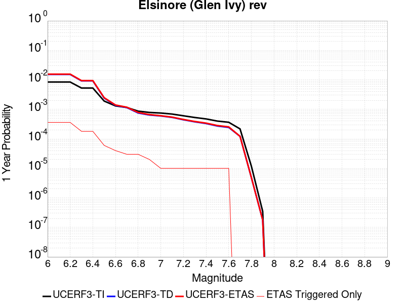 |  |

| Magnitude | 1 wk TI Prob | 1 wk TD Prob | 1 wk ETAS Prob | 1 wk ETAS/TD Gain | 1 wk ETAS Triggered Only | 1 mo TI Prob | 1 mo TD Prob | 1 mo ETAS Prob | 1 mo ETAS/TD Gain | 1 mo ETAS Triggered Only | 1 yr TI Prob | 1 yr TD Prob | 1 yr ETAS Prob | 1 yr ETAS/TD Gain | 1 yr ETAS Triggered Only | 10 yr TI Prob | 10 yr TD Prob | 10 yr ETAS Prob | 10 yr ETAS/TD Gain | 10 yr ETAS Triggered Only |
|-----|-----|-----|-----|-----|-----|-----|-----|-----|-----|-----|-----|-----|-----|-----|-----|-----|-----|-----|-----|-----|
| 6.0 | 1.6204086E-4 | 2.937271E-4 | 4.634253E-4 | 1.577741 | 1.6974806E-4 | 6.94276E-4 | 0.0012583778 | 0.001456168 | 1.1571788 | 1.9803942E-4 | 0.008420097 | 0.0152346175 | 0.015555012 | 1.0210307 | 3.2535047E-4 | 0.081081145 | 0.13962454 | 0.14000183 | 1.0027021 | 4.3851582E-4 |
| 6.1 | 1.6204086E-4 | 2.937271E-4 | 4.634253E-4 | 1.577741 | 1.6974806E-4 | 6.94276E-4 | 0.0012583778 | 0.001456168 | 1.1571788 | 1.9803942E-4 | 0.008420097 | 0.0152346175 | 0.015555012 | 1.0210307 | 3.2535047E-4 | 0.081081145 | 0.13962454 | 0.14000183 | 1.0027021 | 4.3851582E-4 |
| 6.2 | 1.6204086E-4 | 2.937271E-4 | 4.634253E-4 | 1.577741 | 1.6974806E-4 | 6.94276E-4 | 0.0012583778 | 0.001456168 | 1.1571788 | 1.9803942E-4 | 0.008420097 | 0.0152346175 | 0.015555012 | 1.0210307 | 3.2535047E-4 | 0.081081145 | 0.13962454 | 0.14000183 | 1.0027021 | 4.3851582E-4 |
| 6.3 | 1.0111737E-4 | 1.7703463E-4 | 2.6189364E-4 | 1.4793357 | 8.487403E-5 | 4.332882E-4 | 7.5861585E-4 | 8.434255E-4 | 1.1117952 | 8.487403E-5 | 0.005262531 | 0.0092177205 | 0.009385904 | 1.0182457 | 1.6974806E-4 | 0.0513964 | 0.08707393 | 0.08728056 | 1.002373 | 2.2633075E-4 |
| 6.4 | 1.0111737E-4 | 1.7703463E-4 | 2.6189364E-4 | 1.4793357 | 8.487403E-5 | 4.332882E-4 | 7.5861585E-4 | 8.434255E-4 | 1.1117952 | 8.487403E-5 | 0.005262531 | 0.0092177205 | 0.009385904 | 1.0182457 | 1.6974806E-4 | 0.0513964 | 0.08707393 | 0.08728056 | 1.002373 | 2.2633075E-4 |
| 6.5 | 3.6624708E-5 | 4.6391986E-5 | 6.0537E-5 | 1.3049022 | 1.4145672E-5 | 1.569536E-4 | 1.9880968E-4 | 2.1295254E-4 | 1.0711377 | 1.4145672E-5 | 0.001909235 | 0.0024181814 | 0.0024746272 | 1.0233423 | 5.658269E-5 | 0.01892915 | 0.023697061 | 0.023793735 | 1.0040796 | 9.901971E-5 |
| 6.6 | 2.5051324E-5 | 2.6147465E-5 | 4.0292765E-5 | 1.5409818 | 1.4145672E-5 | 1.073584E-4 | 1.12056E-4 | 1.2620009E-4 | 1.1262233 | 1.4145672E-5 | 0.0013063047 | 0.0013634725 | 0.0014058517 | 1.0310818 | 4.2437016E-5 | 0.012986525 | 0.013565759 | 0.013621574 | 1.0041144 | 5.658269E-5 |
| 6.7 | 2.2189772E-5 | 2.2072489E-5 | 3.621785E-5 | 1.6408592 | 1.4145672E-5 | 9.509556E-5 | 9.459316E-5 | 1.0873749E-4 | 1.1495281 | 1.4145672E-5 | 0.0011571734 | 0.0011510996 | 0.0011793583 | 1.0245494 | 2.8291344E-5 | 0.011511663 | 0.0114663225 | 0.011508273 | 1.0036585 | 4.2437016E-5 |
| 6.8 | 1.6654378E-5 | 1.44376E-5 | 2.8583067E-5 | 1.9797659 | 1.4145672E-5 | 7.137396E-5 | 6.187399E-5 | 7.601878E-5 | 1.2286065 | 1.4145672E-5 | 8.686314E-4 | 7.5306057E-4 | 7.8133063E-4 | 1.0375402 | 2.8291344E-5 | 0.008652439 | 0.0075100763 | 0.007538155 | 1.0037389 | 2.8291344E-5 |
| 6.9 | 1.5042909E-5 | 1.2331886E-5 | 1.2331886E-5 | 1.0 | 0.0 | 6.446802E-5 | 5.2849886E-5 | 5.2849886E-5 | 1.0 | 0.0 | 7.8461546E-4 | 6.4326054E-4 | 6.573971E-4 | 1.0219765 | 1.4145672E-5 | 0.007818509 | 0.006417925 | 0.0064319796 | 1.00219 | 1.4145672E-5 |
| 7.0 | 1.4361385E-5 | 1.1451172E-5 | 1.1451172E-5 | 1.0 | 0.0 | 6.154734E-5 | 4.9075545E-5 | 4.9075545E-5 | 1.0 | 0.0 | 7.490812E-4 | 5.973339E-4 | 5.973339E-4 | 1.0 | 0.0 | 0.007465612 | 0.005960982 | 0.005960982 | 1.0 | 0.0 |
| 7.1 | 1.3265571E-5 | 1.0244736E-5 | 1.0244736E-5 | 1.0 | 0.0 | 5.6851208E-5 | 4.3905282E-5 | 4.3905282E-5 | 1.0 | 0.0 | 6.919436E-4 | 5.344183E-4 | 5.344183E-4 | 1.0 | 0.0 | 0.006897931 | 0.0053346003 | 0.0053346003 | 1.0 | 0.0 |
| 7.2 | 1.1596403E-5 | 8.504847E-6 | 8.504847E-6 | 1.0 | 0.0 | 4.9697923E-5 | 3.6448844E-5 | 3.6448844E-5 | 1.0 | 0.0 | 6.049042E-4 | 4.4367602E-4 | 4.4367602E-4 | 1.0 | 0.0 | 0.006032603 | 0.004429357 | 0.004429357 | 1.0 | 0.0 |
| 7.3 | 1.0150827E-5 | 7.238537E-6 | 7.238537E-6 | 1.0 | 0.0 | 4.3502816E-5 | 3.102194E-5 | 3.102194E-5 | 1.0 | 0.0 | 5.2951806E-4 | 3.776281E-4 | 3.776281E-4 | 1.0 | 0.0 | 0.005282581 | 0.003770271 | 0.003770271 | 1.0 | 0.0 |
| 7.4 | 9.080705E-6 | 6.352307E-6 | 6.352307E-6 | 1.0 | 0.0 | 3.8916725E-5 | 2.7223898E-5 | 2.7223898E-5 | 1.0 | 0.0 | 4.7370812E-4 | 3.314019E-4 | 3.314019E-4 | 1.0 | 0.0 | 0.004726996 | 0.0033092257 | 0.0033092257 | 1.0 | 0.0 |
| 7.5 | 7.671649E-6 | 5.225419E-6 | 5.225419E-6 | 1.0 | 0.0 | 3.287808E-5 | 2.2394468E-5 | 2.2394468E-5 | 1.0 | 0.0 | 4.0021708E-4 | 2.7261977E-4 | 2.7261977E-4 | 1.0 | 0.0 | 0.0039949706 | 0.0027229784 | 0.0027229784 | 1.0 | 0.0 |
| 7.6 | 6.990086E-6 | 4.687336E-6 | 4.687336E-6 | 1.0 | 0.0 | 2.9957167E-5 | 2.0088435E-5 | 2.0088435E-5 | 1.0 | 0.0 | 3.6466747E-4 | 2.445504E-4 | 2.445504E-4 | 1.0 | 0.0 | 0.0036406964 | 0.0024429292 | 0.0024429292 | 1.0 | 0.0 |
| 7.7 | 4.163505E-6 | 2.329331E-6 | 2.329331E-6 | 1.0 | 0.0 | 1.7843471E-5 | 9.982813E-6 | 9.982813E-6 | 1.0 | 0.0 | 2.172226E-4 | 1.2153471E-4 | 1.2153471E-4 | 1.0 | 0.0 | 0.0021701038 | 0.0012147555 | 0.0012147555 | 1.0 | 0.0 |
| 7.8 | 2.2692414E-7 | 9.384417E-8 | 9.384417E-8 | 1.0 | 0.0 | 9.725317E-7 | 4.0218927E-7 | 4.0218927E-7 | 1.0 | 0.0 | 1.1840509E-5 | 4.8966467E-6 | 4.8966467E-6 | 1.0 | 0.0 | 1.1839878E-4 | 4.8965718E-5 | 4.8965718E-5 | 1.0 | 0.0 |
| 7.9 | 6.676829E-9 | 3.4397174E-9 | 3.4397174E-9 | 1.0 | 0.0 | 2.861498E-8 | 1.4741646E-8 | 1.4741646E-8 | 1.0 | 0.0 | 3.4838732E-7 | 1.7947953E-7 | 1.7947953E-7 | 1.0 | 0.0 | 3.4838679E-6 | 1.794794E-6 | 1.794794E-6 | 1.0 | 0.0 |

## Calico-Hidalgo
*[(top)](#table-of-contents)*

| 1 Week | 1 Month | 1 Year | 10 Year |
|-----|-----|-----|-----|
|  |  |  | 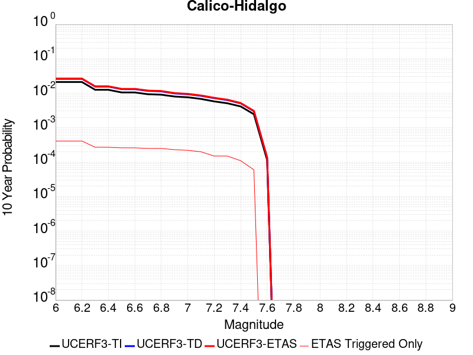 |

| Magnitude | 1 wk TI Prob | 1 wk TD Prob | 1 wk ETAS Prob | 1 wk ETAS/TD Gain | 1 wk ETAS Triggered Only | 1 mo TI Prob | 1 mo TD Prob | 1 mo ETAS Prob | 1 mo ETAS/TD Gain | 1 mo ETAS Triggered Only | 1 yr TI Prob | 1 yr TD Prob | 1 yr ETAS Prob | 1 yr ETAS/TD Gain | 1 yr ETAS Triggered Only | 10 yr TI Prob | 10 yr TD Prob | 10 yr ETAS Prob | 10 yr ETAS/TD Gain | 10 yr ETAS Triggered Only |
|-----|-----|-----|-----|-----|-----|-----|-----|-----|-----|-----|-----|-----|-----|-----|-----|-----|-----|-----|-----|-----|
| 6.0 | 4.0906612E-5 | 5.0704355E-5 | 1.7800895E-4 | 3.5107229 | 1.2731105E-4 | 1.7530227E-4 | 2.1728857E-4 | 3.8699975E-4 | 1.7810405 | 1.6974806E-4 | 0.0021322158 | 0.002642678 | 0.003023602 | 1.1441431 | 3.8193315E-4 | 0.02111873 | 0.026152814 | 0.026593637 | 1.0168557 | 4.526615E-4 |
| 6.1 | 4.0906612E-5 | 5.0704355E-5 | 1.7800895E-4 | 3.5107229 | 1.2731105E-4 | 1.7530227E-4 | 2.1728857E-4 | 3.8699975E-4 | 1.7810405 | 1.6974806E-4 | 0.0021322158 | 0.002642678 | 0.003023602 | 1.1441431 | 3.8193315E-4 | 0.02111873 | 0.026152814 | 0.026593637 | 1.0168557 | 4.526615E-4 |
| 6.2 | 4.0906612E-5 | 5.0704355E-5 | 1.7800895E-4 | 3.5107229 | 1.2731105E-4 | 1.7530227E-4 | 2.1728857E-4 | 3.8699975E-4 | 1.7810405 | 1.6974806E-4 | 0.0021322158 | 0.002642678 | 0.003023602 | 1.1441431 | 3.8193315E-4 | 0.02111873 | 0.026152814 | 0.026593637 | 1.0168557 | 4.526615E-4 |
| 6.3 | 2.4242801E-5 | 3.0090967E-5 | 1.2910769E-4 | 4.29058 | 9.901971E-5 | 1.0389358E-4 | 1.289551E-4 | 2.703936E-4 | 2.0968041 | 1.4145672E-4 | 0.0012641704 | 0.0015689312 | 0.0018231538 | 1.1620356 | 2.546221E-4 | 0.01257003 | 0.015582229 | 0.015888585 | 1.0196606 | 3.1120479E-4 |
| 6.4 | 2.4242801E-5 | 3.0090967E-5 | 1.2910769E-4 | 4.29058 | 9.901971E-5 | 1.0389358E-4 | 1.289551E-4 | 2.703936E-4 | 2.0968041 | 1.4145672E-4 | 0.0012641704 | 0.0015689312 | 0.0018231538 | 1.1620356 | 2.546221E-4 | 0.01257003 | 0.015582229 | 0.015888585 | 1.0196606 | 3.1120479E-4 |
| 6.5 | 2.0286952E-5 | 2.5316054E-5 | 1.2433325E-4 | 4.911241 | 9.901971E-5 | 8.694118E-5 | 1.0849296E-4 | 2.4993432E-4 | 2.3036916 | 1.4145672E-4 | 0.0010579949 | 0.0013201186 | 0.0015744044 | 1.1926236 | 2.546221E-4 | 0.010529719 | 0.013124701 | 0.0134178605 | 1.0223365 | 2.970591E-4 |
| 6.6 | 2.0269223E-5 | 2.5297004E-5 | 1.243142E-4 | 4.914187 | 9.901971E-5 | 8.6865206E-5 | 1.08411325E-4 | 2.4985272E-4 | 2.3046737 | 1.4145672E-4 | 0.0010570707 | 0.0013191258 | 0.001573412 | 1.1927687 | 2.546221E-4 | 0.010520565 | 0.01311489 | 0.013408054 | 1.0223534 | 2.970591E-4 |
| 6.7 | 1.799852E-5 | 2.2540933E-5 | 1.21558405E-4 | 5.392785 | 9.901971E-5 | 7.713423E-5 | 9.660051E-5 | 2.3804356E-4 | 2.4642062 | 1.4145672E-4 | 9.3870464E-4 | 0.0011754911 | 0.0014156849 | 1.2043347 | 2.4047642E-4 | 0.009347493 | 0.011694346 | 0.01197395 | 1.0239094 | 2.8291345E-4 |
| 6.8 | 1.7458793E-5 | 2.184258E-5 | 1.20860124E-4 | 5.5332346 | 9.901971E-5 | 7.4821255E-5 | 9.360778E-5 | 2.3505127E-4 | 2.5110228 | 1.4145672E-4 | 9.10568E-4 | 0.0011390933 | 0.0013792958 | 1.2108717 | 2.4047642E-4 | 0.009068459 | 0.011334131 | 0.011613837 | 1.0246782 | 2.8291345E-4 |
| 6.9 | 1.542884E-5 | 1.9026285E-5 | 1.038987E-4 | 5.4607983 | 8.487403E-5 | 6.612192E-5 | 8.153875E-5 | 2.0883941E-4 | 2.5612292 | 1.2731105E-4 | 8.04737E-4 | 9.922953E-4 | 0.0012184015 | 1.2278618 | 2.2633075E-4 | 0.008018291 | 0.009880043 | 0.010132149 | 1.0255167 | 2.546221E-4 |
| 7.0 | 1.468253E-5 | 1.803109E-5 | 1.0290359E-4 | 5.7070084 | 8.487403E-5 | 6.292361E-5 | 7.727389E-5 | 2.045751E-4 | 2.6474025 | 1.2731105E-4 | 7.658257E-4 | 9.4041653E-4 | 0.0011665345 | 1.2404444 | 2.2633075E-4 | 0.0076319184 | 0.009365736 | 0.009617973 | 1.0269319 | 2.546221E-4 |
| 7.1 | 1.3139281E-5 | 1.620139E-5 | 1.01074045E-4 | 6.2386036 | 8.487403E-5 | 5.6309986E-5 | 6.943275E-5 | 1.8259027E-4 | 2.6297429 | 1.1316538E-4 | 6.853584E-4 | 8.4502844E-4 | 0.0010429005 | 1.2341602 | 1.9803942E-4 | 0.0068324856 | 0.008419449 | 0.008643875 | 1.0266556 | 2.2633075E-4 |
| 7.2 | 1.1127404E-5 | 1.3867038E-5 | 7.044894E-5 | 5.0803165 | 5.658269E-5 | 4.7688E-5 | 5.9428872E-5 | 1.3015303E-4 | 2.190064 | 7.072836E-5 | 5.8044674E-4 | 7.233172E-4 | 8.646716E-4 | 1.1954252 | 1.4145672E-4 | 0.0057893298 | 0.007210737 | 0.0073792613 | 1.0233712 | 1.6974806E-4 |
| 7.3 | 9.808154E-6 | 1.2176586E-5 | 6.8758585E-5 | 5.6467867 | 5.658269E-5 | 4.2034266E-5 | 5.2184383E-5 | 1.2290906E-4 | 2.3552842 | 7.072836E-5 | 5.11647E-4 | 6.351704E-4 | 7.765372E-4 | 1.2225653 | 1.4145672E-4 | 0.0051047057 | 0.006334625 | 0.006503298 | 1.0266271 | 1.6974806E-4 |
| 7.4 | 7.942452E-6 | 9.792348E-6 | 5.222895E-5 | 5.333649 | 4.2437016E-5 | 3.4038632E-5 | 4.1966585E-5 | 9.8546894E-5 | 2.348223 | 5.658269E-5 | 4.1434157E-4 | 5.108328E-4 | 6.2394043E-4 | 1.221418 | 1.1316538E-4 | 0.0041356985 | 0.005097527 | 0.0052241893 | 1.0248477 | 1.2731105E-4 |
| 7.5 | 4.7121216E-6 | 5.7729717E-6 | 1.9918562E-5 | 3.4503136 | 1.4145672E-5 | 2.019465E-5 | 2.4741115E-5 | 5.303176E-5 | 2.1434667 | 2.8291344E-5 | 2.4584212E-4 | 3.011891E-4 | 3.5775476E-4 | 1.1878078 | 5.658269E-5 | 0.0024557032 | 0.0030085614 | 0.003064974 | 1.0187507 | 5.658269E-5 |
| 7.6 | 2.21172E-7 | 2.6040198E-7 | 2.6040198E-7 | 1.0 | 0.0 | 9.478797E-7 | 1.1160082E-6 | 1.1160082E-6 | 1.0 | 0.0 | 1.1540374E-5 | 1.3587343E-5 | 1.3587343E-5 | 1.0 | 0.0 | 1.1539775E-4 | 1.3586794E-4 | 1.3586794E-4 | 1.0 | 0.0 |

## Death Valley (Fish Lake Valley)
*[(top)](#table-of-contents)*

| 1 Week | 1 Month | 1 Year | 10 Year |
|-----|-----|-----|-----|
|  |  |  |  |

| Magnitude | 1 wk TI Prob | 1 wk TD Prob | 1 wk ETAS Prob | 1 wk ETAS/TD Gain | 1 wk ETAS Triggered Only | 1 mo TI Prob | 1 mo TD Prob | 1 mo ETAS Prob | 1 mo ETAS/TD Gain | 1 mo ETAS Triggered Only | 1 yr TI Prob | 1 yr TD Prob | 1 yr ETAS Prob | 1 yr ETAS/TD Gain | 1 yr ETAS Triggered Only | 10 yr TI Prob | 10 yr TD Prob | 10 yr ETAS Prob | 10 yr ETAS/TD Gain | 10 yr ETAS Triggered Only |
|-----|-----|-----|-----|-----|-----|-----|-----|-----|-----|-----|-----|-----|-----|-----|-----|-----|-----|-----|-----|-----|
| 6.0 | 3.872328E-5 | 4.7265705E-5 | 1.1799072E-4 | 2.4963284 | 7.072836E-5 | 1.6594635E-4 | 2.0255324E-4 | 3.5812412E-4 | 1.7680492 | 1.5560239E-4 | 0.0020185246 | 0.0024635606 | 0.0027881095 | 1.1317397 | 3.2535047E-4 | 0.02000288 | 0.024388338 | 0.02484376 | 1.0186738 | 4.668072E-4 |
| 6.1 | 3.872328E-5 | 4.7265705E-5 | 1.1799072E-4 | 2.4963284 | 7.072836E-5 | 1.6594635E-4 | 2.0255324E-4 | 3.5812412E-4 | 1.7680492 | 1.5560239E-4 | 0.0020185246 | 0.0024635606 | 0.0027881095 | 1.1317397 | 3.2535047E-4 | 0.02000288 | 0.024388338 | 0.02484376 | 1.0186738 | 4.668072E-4 |
| 6.2 | 3.872328E-5 | 4.7265705E-5 | 1.1799072E-4 | 2.4963284 | 7.072836E-5 | 1.6594635E-4 | 2.0255324E-4 | 3.5812412E-4 | 1.7680492 | 1.5560239E-4 | 0.0020185246 | 0.0024635606 | 0.0027881095 | 1.1317397 | 3.2535047E-4 | 0.02000288 | 0.024388338 | 0.02484376 | 1.0186738 | 4.668072E-4 |
| 6.3 | 2.8356371E-5 | 3.360979E-5 | 1.0433578E-4 | 3.104327 | 7.072836E-5 | 1.2152165E-4 | 1.4403443E-4 | 2.9961442E-4 | 2.0801582 | 1.5560239E-4 | 0.0014785219 | 0.0017522788 | 0.0020770591 | 1.1853474 | 3.2535047E-4 | 0.014687235 | 0.017391816 | 0.017850505 | 1.0263739 | 4.668072E-4 |
| 6.4 | 2.8356371E-5 | 3.360979E-5 | 1.0433578E-4 | 3.104327 | 7.072836E-5 | 1.2152165E-4 | 1.4403443E-4 | 2.9961442E-4 | 2.0801582 | 1.5560239E-4 | 0.0014785219 | 0.0017522788 | 0.0020770591 | 1.1853474 | 3.2535047E-4 | 0.014687235 | 0.017391816 | 0.017850505 | 1.0263739 | 4.668072E-4 |
| 6.5 | 2.4448687E-5 | 2.8607585E-5 | 9.933392E-5 | 3.4722931 | 7.072836E-5 | 1.0477588E-4 | 1.2259845E-4 | 2.7818177E-4 | 2.269048 | 1.5560239E-4 | 0.0012748998 | 0.0014916616 | 0.0017882776 | 1.1988494 | 2.970591E-4 | 0.012676105 | 0.014821392 | 0.015239472 | 1.0282079 | 4.2437017E-4 |
| 6.6 | 2.1298161E-5 | 2.4660083E-5 | 8.124138E-5 | 3.2944486 | 5.658269E-5 | 9.127464E-5 | 1.0568197E-4 | 2.4712374E-4 | 2.338372 | 1.4145672E-4 | 0.0011107022 | 0.0012859512 | 0.0015543734 | 1.2087343 | 2.6876776E-4 | 0.011051672 | 0.01278853 | 0.013179543 | 1.0305753 | 3.9607883E-4 |
| 6.7 | 1.8959729E-5 | 2.1781027E-5 | 7.8362486E-5 | 3.5977407 | 5.658269E-5 | 8.125345E-5 | 9.334406E-5 | 2.3478757E-4 | 2.5152922 | 1.4145672E-4 | 9.888117E-4 | 0.001135897 | 0.0014043595 | 1.236344 | 2.6876776E-4 | 0.009844234 | 0.01130357 | 0.011695172 | 1.0346441 | 3.9607883E-4 |
| 6.8 | 1.6691629E-5 | 1.9018351E-5 | 7.5599964E-5 | 3.975106 | 5.658269E-5 | 7.153359E-5 | 8.150477E-5 | 2.2294997E-4 | 2.7354221 | 1.4145672E-4 | 8.7057345E-4 | 9.918857E-4 | 0.0012603869 | 1.2706977 | 2.6876776E-4 | 0.008671708 | 0.009876343 | 0.01026851 | 1.0397077 | 3.9607883E-4 |
| 6.9 | 1.450505E-5 | 1.638954E-5 | 7.29713E-5 | 4.452309 | 5.658269E-5 | 6.216302E-5 | 7.0239046E-5 | 2.1168582E-4 | 3.0137916 | 1.4145672E-4 | 7.5657194E-4 | 8.5483363E-4 | 0.0011233717 | 1.3141407 | 2.6876776E-4 | 0.007540013 | 0.008516386 | 0.008909091 | 1.0461118 | 3.9607883E-4 |
| 7.0 | 1.2940855E-5 | 1.4537972E-5 | 7.111984E-5 | 4.8920054 | 5.658269E-5 | 5.545963E-5 | 6.230414E-5 | 2.0375205E-4 | 3.270281 | 1.4145672E-4 | 6.750118E-4 | 7.5829466E-4 | 0.0010268587 | 1.3541683 | 2.6876776E-4 | 0.006729651 | 0.0075576897 | 0.007950775 | 1.0520114 | 3.9607883E-4 |
| 7.1 | 1.2544658E-5 | 1.4078208E-5 | 7.06601E-5 | 5.019112 | 5.658269E-5 | 5.3761712E-5 | 6.0333812E-5 | 2.01782E-4 | 3.3444264 | 1.4145672E-4 | 6.5435225E-4 | 7.343222E-4 | 0.0010028926 | 1.3657392 | 2.6876776E-4 | 0.006524288 | 0.007319551 | 0.0077127307 | 1.0537164 | 3.9607883E-4 |
| 7.2 | 1.2489416E-5 | 1.4015674E-5 | 7.059757E-5 | 5.037044 | 5.658269E-5 | 5.3524967E-5 | 6.0065824E-5 | 2.0151405E-4 | 3.354887 | 1.4145672E-4 | 6.514716E-4 | 7.310616E-4 | 9.996329E-4 | 1.3673716 | 2.6876776E-4 | 0.006495651 | 0.0072871596 | 0.0076803523 | 1.0539569 | 3.9607883E-4 |
| 7.3 | 1.2368307E-5 | 1.3879812E-5 | 7.046171E-5 | 5.076561 | 5.658269E-5 | 5.3005948E-5 | 5.9483587E-5 | 2.009319E-4 | 3.3779385 | 1.4145672E-4 | 6.451563E-4 | 7.2397763E-4 | 9.925509E-4 | 1.3709689 | 2.6876776E-4 | 0.0064328653 | 0.007216782 | 0.007610002 | 1.054487 | 3.9607883E-4 |
| 7.4 | 1.2161707E-5 | 1.36478675E-5 | 7.0229784E-5 | 5.145843 | 5.658269E-5 | 5.212056E-5 | 5.8489582E-5 | 1.9993803E-4 | 3.4183528 | 1.4145672E-4 | 6.3438306E-4 | 7.118836E-4 | 9.804601E-4 | 1.3772758 | 2.6876776E-4 | 0.006325751 | 0.0070966207 | 0.0074898885 | 1.0554162 | 3.9607883E-4 |
| 7.5 | 1.1707948E-5 | 1.3145515E-5 | 6.972746E-5 | 5.3042774 | 5.658269E-5 | 5.0175953E-5 | 5.6336736E-5 | 1.8364062E-4 | 3.2596955 | 1.2731105E-4 | 6.10721E-4 | 6.856895E-4 | 9.40137E-4 | 1.3710827 | 2.546221E-4 | 0.0060904534 | 0.006836321 | 0.0072156433 | 1.0554863 | 3.8193315E-4 |
| 7.6 | 1.0319538E-5 | 1.1579622E-5 | 6.816166E-5 | 5.8863454 | 5.658269E-5 | 4.4225842E-5 | 4.9626036E-5 | 1.7693077E-4 | 3.565281 | 1.2731105E-4 | 5.383166E-4 | 6.040347E-4 | 8.4436586E-4 | 1.3978764 | 2.4047642E-4 | 0.0053701443 | 0.0060244603 | 0.0063900324 | 1.0606812 | 3.6778746E-4 |
| 7.7 | 8.937764E-6 | 1.0022779E-5 | 5.245937E-5 | 5.2340145 | 4.2437016E-5 | 3.830414E-5 | 4.295409E-5 | 1.561146E-4 | 3.6344528 | 1.1316538E-4 | 4.6625308E-4 | 5.228456E-4 | 7.49058E-4 | 1.4326563 | 2.2633075E-4 | 0.0046527605 | 0.005216664 | 0.0055403174 | 1.0620422 | 3.2535047E-4 |
| 7.8 | 3.108007E-7 | 3.284654E-7 | 3.284654E-7 | 1.0 | 0.0 | 1.3320023E-6 | 1.407708E-6 | 1.407708E-6 | 1.0 | 0.0 | 1.6217007E-5 | 1.7138715E-5 | 1.7138715E-5 | 1.0 | 0.0 | 1.6215823E-4 | 1.7137431E-4 | 1.7137431E-4 | 1.0 | 0.0 |
| 7.9 | 2.5591178E-9 | 2.6696718E-9 | 2.6696718E-9 | 1.0 | 0.0 | 1.0967647E-8 | 1.14414505E-8 | 1.14414505E-8 | 1.0 | 0.0 | 1.335311E-7 | 1.3929966E-7 | 1.3929966E-7 | 1.0 | 0.0 | 1.3353102E-6 | 1.3929966E-6 | 1.3929966E-6 | 1.0 | 0.0 |

## Cady
*[(top)](#table-of-contents)*

| 1 Week | 1 Month | 1 Year | 10 Year |
|-----|-----|-----|-----|
| 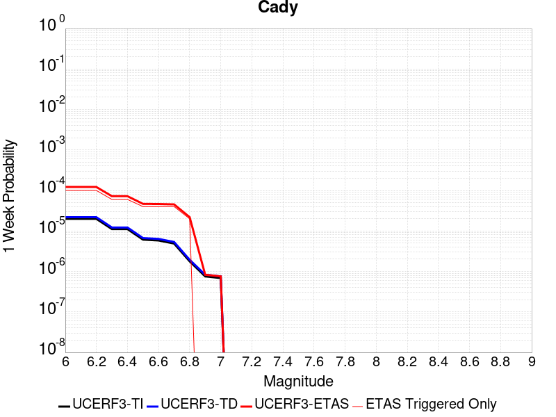 |  |  |  |

| Magnitude | 1 wk TI Prob | 1 wk TD Prob | 1 wk ETAS Prob | 1 wk ETAS/TD Gain | 1 wk ETAS Triggered Only | 1 mo TI Prob | 1 mo TD Prob | 1 mo ETAS Prob | 1 mo ETAS/TD Gain | 1 mo ETAS Triggered Only | 1 yr TI Prob | 1 yr TD Prob | 1 yr ETAS Prob | 1 yr ETAS/TD Gain | 1 yr ETAS Triggered Only | 10 yr TI Prob | 10 yr TD Prob | 10 yr ETAS Prob | 10 yr ETAS/TD Gain | 10 yr ETAS Triggered Only |
|-----|-----|-----|-----|-----|-----|-----|-----|-----|-----|-----|-----|-----|-----|-----|-----|-----|-----|-----|-----|-----|
| 6.0 | 1.9892565E-5 | 2.1858728E-5 | 1.49167E-4 | 6.8241386 | 1.2731105E-4 | 8.525106E-5 | 9.3677416E-5 | 2.6340957E-4 | 2.8118792 | 1.6974806E-4 | 0.0010374374 | 0.0011400167 | 0.0014084781 | 1.235489 | 2.6876776E-4 | 0.010326075 | 0.011350701 | 0.011770254 | 1.0369627 | 4.2437017E-4 |
| 6.1 | 1.9892565E-5 | 2.1858728E-5 | 1.49167E-4 | 6.8241386 | 1.2731105E-4 | 8.525106E-5 | 9.3677416E-5 | 2.6340957E-4 | 2.8118792 | 1.6974806E-4 | 0.0010374374 | 0.0011400167 | 0.0014084781 | 1.235489 | 2.6876776E-4 | 0.010326075 | 0.011350701 | 0.011770254 | 1.0369627 | 4.2437017E-4 |
| 6.2 | 1.9892565E-5 | 2.1858728E-5 | 1.49167E-4 | 6.8241386 | 1.2731105E-4 | 8.525106E-5 | 9.3677416E-5 | 2.6340957E-4 | 2.8118792 | 1.6974806E-4 | 0.0010374374 | 0.0011400167 | 0.0014084781 | 1.235489 | 2.6876776E-4 | 0.010326075 | 0.011350701 | 0.011770254 | 1.0369627 | 4.2437017E-4 |
| 6.3 | 1.1117327E-5 | 1.2176583E-5 | 8.290408E-5 | 6.8084846 | 7.072836E-5 | 4.764482E-5 | 5.2184492E-5 | 1.5119903E-4 | 2.897394 | 9.901971E-5 | 5.7992124E-4 | 6.351925E-4 | 7.7655935E-4 | 1.2225575 | 1.4145672E-4 | 0.0057841022 | 0.0063368753 | 0.006561772 | 1.0354902 | 2.2633075E-4 |
| 6.4 | 1.1117327E-5 | 1.2176583E-5 | 8.290408E-5 | 6.8084846 | 7.072836E-5 | 4.764482E-5 | 5.2184492E-5 | 1.5119903E-4 | 2.897394 | 9.901971E-5 | 5.7992124E-4 | 6.351925E-4 | 7.7655935E-4 | 1.2225575 | 1.4145672E-4 | 0.0057841022 | 0.0063368753 | 0.006561772 | 1.0354902 | 2.2633075E-4 |
| 6.5 | 6.103093E-6 | 6.672021E-6 | 4.9108752E-5 | 7.360402 | 4.2437016E-5 | 2.615585E-5 | 2.8594131E-5 | 9.932047E-5 | 3.4734564 | 7.072836E-5 | 3.1840094E-4 | 3.480905E-4 | 4.32935E-4 | 1.2437426 | 8.487403E-5 | 0.0031794512 | 0.0034766865 | 0.0035894585 | 1.0324366 | 1.1316538E-4 |
| 6.6 | 5.817237E-6 | 6.3656585E-6 | 4.8802405E-5 | 7.666513 | 4.2437016E-5 | 2.4930776E-5 | 2.728118E-5 | 9.800761E-5 | 3.592499 | 7.072836E-5 | 3.034899E-4 | 3.3211018E-4 | 4.1695603E-4 | 1.255475 | 8.487403E-5 | 0.0030307577 | 0.0033173605 | 0.0034301504 | 1.0339999 | 1.1316538E-4 |
| 6.7 | 4.8846314E-6 | 5.3405684E-6 | 4.7777357E-5 | 8.946119 | 4.2437016E-5 | 2.0933967E-5 | 2.2888014E-5 | 9.3614755E-5 | 4.0901213 | 7.072836E-5 | 2.5484123E-4 | 2.7863772E-4 | 3.634881E-4 | 1.3045187 | 8.487403E-5 | 0.0025454918 | 0.0027840391 | 0.0028968893 | 1.0405347 | 1.1316538E-4 |
| 6.8 | 1.7788773E-6 | 1.9399079E-6 | 1.6085552E-5 | 8.291915 | 1.4145672E-5 | 7.6237375E-6 | 8.313874E-6 | 2.2459428E-5 | 2.7014396 | 1.4145672E-5 | 9.281505E-5 | 1.01218284E-4 | 1.2950676E-4 | 1.27948 | 2.8291344E-5 | 9.2776294E-4 | 0.0010118765 | 0.0010401392 | 1.027931 | 2.8291344E-5 |
| 6.9 | 7.5455404E-7 | 8.297092E-7 | 8.297092E-7 | 1.0 | 0.0 | 3.233799E-6 | 3.5558937E-6 | 3.5558937E-6 | 1.0 | 0.0 | 3.937079E-5 | 4.3292483E-5 | 4.3292483E-5 | 1.0 | 0.0 | 3.9363815E-4 | 4.3287344E-4 | 4.3287344E-4 | 1.0 | 0.0 |
| 7.0 | 6.8578805E-7 | 7.541816E-7 | 7.541816E-7 | 1.0 | 0.0 | 2.9390883E-6 | 3.2322048E-6 | 3.2322048E-6 | 1.0 | 0.0 | 3.578281E-5 | 3.9351715E-5 | 3.9351715E-5 | 1.0 | 0.0 | 3.577705E-4 | 3.9347992E-4 | 3.9347992E-4 | 1.0 | 0.0 |

## San Andreas (Cholame) rev
*[(top)](#table-of-contents)*

| 1 Week | 1 Month | 1 Year | 10 Year |
|-----|-----|-----|-----|
|  |  |  |  |

| Magnitude | 1 wk TI Prob | 1 wk TD Prob | 1 wk ETAS Prob | 1 wk ETAS/TD Gain | 1 wk ETAS Triggered Only | 1 mo TI Prob | 1 mo TD Prob | 1 mo ETAS Prob | 1 mo ETAS/TD Gain | 1 mo ETAS Triggered Only | 1 yr TI Prob | 1 yr TD Prob | 1 yr ETAS Prob | 1 yr ETAS/TD Gain | 1 yr ETAS Triggered Only | 10 yr TI Prob | 10 yr TD Prob | 10 yr ETAS Prob | 10 yr ETAS/TD Gain | 10 yr ETAS Triggered Only |
|-----|-----|-----|-----|-----|-----|-----|-----|-----|-----|-----|-----|-----|-----|-----|-----|-----|-----|-----|-----|-----|
| 6.0 | 1.2302514E-4 | 2.5205986E-4 | 3.0862828E-4 | 1.2244246 | 5.658269E-5 | 5.27144E-4 | 0.0010798109 | 0.0011645934 | 1.078516 | 8.487403E-5 | 0.0063991086 | 0.013067958 | 0.0133052915 | 1.0181615 | 2.4047642E-4 | 0.06217949 | 0.12438412 | 0.124780476 | 1.0031866 | 4.526615E-4 |
| 6.1 | 1.2302514E-4 | 2.5205986E-4 | 3.0862828E-4 | 1.2244246 | 5.658269E-5 | 5.27144E-4 | 0.0010798109 | 0.0011645934 | 1.078516 | 8.487403E-5 | 0.0063991086 | 0.013067958 | 0.0133052915 | 1.0181615 | 2.4047642E-4 | 0.06217949 | 0.12438412 | 0.124780476 | 1.0031866 | 4.526615E-4 |
| 6.2 | 1.2203569E-4 | 2.502277E-4 | 3.0679622E-4 | 1.2260683 | 5.658269E-5 | 5.2290526E-4 | 0.0010719653 | 0.0011567484 | 1.0790912 | 8.487403E-5 | 0.006347804 | 0.012973578 | 0.013210935 | 1.0182954 | 2.4047642E-4 | 0.061695136 | 0.123571314 | 0.123968035 | 1.0032105 | 4.526615E-4 |
| 6.3 | 1.2142645E-4 | 2.4908737E-4 | 3.0565597E-4 | 1.2271035 | 5.658269E-5 | 5.202953E-4 | 0.0010670823 | 0.0011518657 | 1.0794536 | 8.487403E-5 | 0.006316212 | 0.012914834 | 0.013152204 | 1.0183797 | 2.4047642E-4 | 0.06139677 | 0.12306532 | 0.123462275 | 1.0032256 | 4.526615E-4 |
| 6.4 | 1.1865206E-4 | 2.4414246E-4 | 3.0071134E-4 | 1.2317044 | 5.658269E-5 | 5.0840975E-4 | 0.0010459068 | 0.0011306921 | 1.0810639 | 8.487403E-5 | 0.006172335 | 0.012660044 | 0.012897476 | 1.0187545 | 2.4047642E-4 | 0.060036868 | 0.12085904 | 0.12124456 | 1.0031898 | 4.3851582E-4 |
| 6.5 | 1.17443946E-4 | 2.4207575E-4 | 2.9864474E-4 | 1.233683 | 5.658269E-5 | 5.032341E-4 | 0.0010370566 | 0.0011218427 | 1.0817564 | 8.487403E-5 | 0.006109677 | 0.012553536 | 0.012790994 | 1.0189157 | 2.4047642E-4 | 0.059444077 | 0.11993008 | 0.120316006 | 1.0032179 | 4.3851582E-4 |
| 6.6 | 1.13579066E-4 | 2.3516564E-4 | 2.9173502E-4 | 1.2405512 | 5.658269E-5 | 4.866766E-4 | 0.001007465 | 0.0010922535 | 1.0841603 | 8.487403E-5 | 0.0059092017 | 0.012197345 | 0.012420915 | 1.0183294 | 2.2633075E-4 | 0.057545185 | 0.1168492 | 0.117223985 | 1.0032074 | 4.2437017E-4 |
| 6.7 | 1.1271412E-4 | 2.336088E-4 | 2.9017826E-4 | 1.2421547 | 5.658269E-5 | 4.829711E-4 | 0.001000798 | 0.0010855871 | 1.0847214 | 8.487403E-5 | 0.005864331 | 0.012117079 | 0.012340668 | 1.0184523 | 2.2633075E-4 | 0.057119697 | 0.11615275 | 0.11652783 | 1.0032291 | 4.2437017E-4 |
| 6.8 | 1.1217975E-4 | 2.3249313E-4 | 2.8906265E-4 | 1.243317 | 5.658269E-5 | 4.8068175E-4 | 9.960202E-4 | 0.0010808096 | 1.0851283 | 8.487403E-5 | 0.005836608 | 0.012059555 | 0.012283157 | 1.0185415 | 2.2633075E-4 | 0.056856725 | 0.11565061 | 0.1160259 | 1.003245 | 4.2437017E-4 |
| 6.9 | 1.1146753E-4 | 2.3098059E-4 | 2.875502E-4 | 1.2449107 | 5.658269E-5 | 4.7763053E-4 | 9.895428E-4 | 0.0010743329 | 1.0856861 | 8.487403E-5 | 0.0057996577 | 0.011981564 | 0.012205183 | 1.0186636 | 2.2633075E-4 | 0.056506127 | 0.11497027 | 0.11534584 | 1.0032668 | 4.2437017E-4 |
| 7.0 | 1.0965793E-4 | 2.2721413E-4 | 2.8378394E-4 | 1.2489715 | 5.658269E-5 | 4.698779E-4 | 9.734129E-4 | 0.0010582043 | 1.0871073 | 8.487403E-5 | 0.005705768 | 0.011787324 | 0.012010987 | 1.0189749 | 2.2633075E-4 | 0.055614736 | 0.11327011 | 0.11364642 | 1.0033221 | 4.2437017E-4 |
| 7.1 | 9.927982E-5 | 2.0540332E-4 | 2.6197438E-4 | 1.2754146 | 5.658269E-5 | 4.2541555E-4 | 8.8000396E-4 | 9.6480333E-4 | 1.0963625 | 8.487403E-5 | 0.0051671406 | 0.010661708 | 0.010885626 | 1.021002 | 2.2633075E-4 | 0.05048634 | 0.10336573 | 0.103746235 | 1.0036812 | 4.2437017E-4 |
| 7.2 | 9.696786E-5 | 2.0044584E-4 | 2.5701718E-4 | 1.2822276 | 5.658269E-5 | 4.1551032E-4 | 8.587718E-4 | 9.435729E-4 | 1.098747 | 8.487403E-5 | 0.00504711 | 0.010405703 | 0.010629679 | 1.0215243 | 2.2633075E-4 | 0.04934009 | 0.10110233 | 0.1014838 | 1.0037731 | 4.2437017E-4 |
| 7.3 | 9.4727984E-5 | 1.9473763E-4 | 2.513093E-4 | 1.290502 | 5.658269E-5 | 4.0591392E-4 | 8.343239E-4 | 9.191271E-4 | 1.1016431 | 8.487403E-5 | 0.0049308087 | 0.010110851 | 0.010334893 | 1.0221586 | 2.2633075E-4 | 0.048228268 | 0.09847412 | 0.0988567 | 1.003885 | 4.2437017E-4 |
| 7.4 | 9.220358E-5 | 1.8844259E-4 | 2.450146E-4 | 1.3002083 | 5.658269E-5 | 3.9509835E-4 | 8.07362E-4 | 8.921675E-4 | 1.1050402 | 8.487403E-5 | 0.004799717 | 0.009785578 | 0.010009694 | 1.0229027 | 2.2633075E-4 | 0.046973653 | 0.09555831 | 0.095942125 | 1.0040166 | 4.2437017E-4 |
| 7.5 | 7.71631E-5 | 1.5179155E-4 | 1.9422213E-4 | 1.2795318 | 4.2437016E-5 | 3.306571E-4 | 6.5037323E-4 | 7.069191E-4 | 1.0869437 | 5.658269E-5 | 0.0040183207 | 0.007889617 | 0.008086094 | 1.0249032 | 1.9803942E-4 | 0.03946433 | 0.078289196 | 0.07864123 | 1.0044966 | 3.8193315E-4 |
| 7.6 | 7.5634416E-5 | 1.4838556E-4 | 1.9081628E-4 | 1.2859491 | 4.2437016E-5 | 3.241072E-4 | 6.357833E-4 | 6.9233E-4 | 1.0889403 | 5.658269E-5 | 0.0039388672 | 0.007713256 | 0.007909767 | 1.0254772 | 1.9803942E-4 | 0.038697794 | 0.076654874 | 0.07700753 | 1.0046005 | 3.8193315E-4 |
| 7.7 | 6.3783E-5 | 1.2359623E-4 | 1.66028E-4 | 1.3433096 | 4.2437016E-5 | 2.7332708E-4 | 5.2959064E-4 | 5.8614335E-4 | 1.1067858 | 5.658269E-5 | 0.0033226798 | 0.0064287307 | 0.006597387 | 1.0262349 | 1.6974806E-4 | 0.032734364 | 0.06454488 | 0.06484923 | 1.0047153 | 3.2535047E-4 |
| 7.8 | 5.863422E-5 | 1.14169685E-4 | 1.5660186E-4 | 1.3716588 | 4.2437016E-5 | 2.512653E-4 | 4.892069E-4 | 5.316232E-4 | 1.0867041 | 4.2437016E-5 | 0.003054864 | 0.0059398497 | 0.006094528 | 1.0260408 | 1.5560239E-4 | 0.030132094 | 0.05966162 | 0.059940957 | 1.0046821 | 2.970591E-4 |
| 7.9 | 4.595283E-5 | 8.426815E-5 | 9.841263E-5 | 1.1678509 | 1.4145672E-5 | 1.9692584E-4 | 3.6109926E-4 | 3.7523982E-4 | 1.0391598 | 1.4145672E-5 | 0.0023949358 | 0.0043875277 | 0.0044720294 | 1.0192596 | 8.487403E-5 | 0.023692891 | 0.044363137 | 0.044538874 | 1.0039613 | 1.8389373E-4 |
| 8.0 | 3.2950178E-5 | 5.077396E-5 | 6.491892E-5 | 1.2785867 | 1.4145672E-5 | 1.412074E-4 | 2.1758456E-4 | 2.3172714E-4 | 1.0649981 | 1.4145672E-5 | 0.0017178444 | 0.0026458753 | 0.0026882002 | 1.0159965 | 4.2437016E-5 | 0.017046256 | 0.027181072 | 0.027249878 | 1.0025314 | 7.072836E-5 |
| 8.1 | 1.9177472E-5 | 1.9183733E-5 | 1.9183733E-5 | 1.0 | 0.0 | 8.218658E-5 | 8.221342E-5 | 8.221342E-5 | 1.0 | 0.0 | 0.0010001622 | 0.0010004893 | 0.0010004893 | 1.0 | 0.0 | 0.009956728 | 0.010757887 | 0.010757887 | 1.0 | 0.0 |
| 8.2 | 8.643924E-6 | 5.473668E-6 | 5.473668E-6 | 1.0 | 0.0 | 3.704486E-5 | 2.3458366E-5 | 2.3458366E-5 | 1.0 | 0.0 | 4.5092785E-4 | 2.8556827E-4 | 2.8556827E-4 | 1.0 | 0.0 | 0.0045001395 | 0.0032481793 | 0.0032481793 | 1.0 | 0.0 |
| 8.3 | 1.983087E-6 | 7.6564595E-7 | 7.6564595E-7 | 1.0 | 0.0 | 8.498917E-6 | 3.281336E-6 | 3.281336E-6 | 1.0 | 0.0 | 1.034694E-4 | 3.9949547E-5 | 3.9949547E-5 | 1.0 | 0.0 | 0.0010342124 | 4.717979E-4 | 4.717979E-4 | 1.0 | 0.0 |

## San Andreas (Coachella) rev
*[(top)](#table-of-contents)*

| 1 Week | 1 Month | 1 Year | 10 Year |
|-----|-----|-----|-----|
|  |  |  |  |

| Magnitude | 1 wk TI Prob | 1 wk TD Prob | 1 wk ETAS Prob | 1 wk ETAS/TD Gain | 1 wk ETAS Triggered Only | 1 mo TI Prob | 1 mo TD Prob | 1 mo ETAS Prob | 1 mo ETAS/TD Gain | 1 mo ETAS Triggered Only | 1 yr TI Prob | 1 yr TD Prob | 1 yr ETAS Prob | 1 yr ETAS/TD Gain | 1 yr ETAS Triggered Only | 10 yr TI Prob | 10 yr TD Prob | 10 yr ETAS Prob | 10 yr ETAS/TD Gain | 10 yr ETAS Triggered Only |
|-----|-----|-----|-----|-----|-----|-----|-----|-----|-----|-----|-----|-----|-----|-----|-----|-----|-----|-----|-----|-----|
| 6.0 | 1.1925945E-4 | 3.273077E-4 | 4.9700023E-4 | 1.5184494 | 1.6974806E-4 | 5.110118E-4 | 0.001401998 | 0.0015856338 | 1.1309816 | 1.8389373E-4 | 0.0062038354 | 0.016937068 | 0.017243002 | 1.018063 | 3.1120479E-4 | 0.060334753 | 0.15267672 | 0.15304828 | 1.0024337 | 4.3851582E-4 |
| 6.1 | 1.1925945E-4 | 3.273077E-4 | 4.9700023E-4 | 1.5184494 | 1.6974806E-4 | 5.110118E-4 | 0.001401998 | 0.0015856338 | 1.1309816 | 1.8389373E-4 | 0.0062038354 | 0.016937068 | 0.017243002 | 1.018063 | 3.1120479E-4 | 0.060334753 | 0.15267672 | 0.15304828 | 1.0024337 | 4.3851582E-4 |
| 6.2 | 1.07432395E-4 | 3.0231563E-4 | 4.5787098E-4 | 1.5145462 | 1.5560239E-4 | 4.603433E-4 | 0.001294999 | 0.0014645273 | 1.1309099 | 1.6974806E-4 | 0.005590286 | 0.015653731 | 0.015932215 | 1.0177903 | 2.8291345E-4 | 0.05451731 | 0.14182784 | 0.14217988 | 1.0024822 | 4.102245E-4 |
| 6.3 | 1.0718766E-4 | 3.0176868E-4 | 4.5732412E-4 | 1.5154791 | 1.5560239E-4 | 4.592948E-4 | 0.0012926573 | 0.001462186 | 1.1311474 | 1.6974806E-4 | 0.005577586 | 0.01562563 | 0.015904123 | 1.0178229 | 2.8291345E-4 | 0.054396555 | 0.14159605 | 0.1419482 | 1.002487 | 4.102245E-4 |
| 6.4 | 1.0355944E-4 | 2.9384956E-4 | 4.4940622E-4 | 1.5293752 | 1.5560239E-4 | 4.4375064E-4 | 0.0012587514 | 0.0014282857 | 1.1346846 | 1.6974806E-4 | 0.0053892885 | 0.015218662 | 0.01549727 | 1.018307 | 2.8291345E-4 | 0.052604496 | 0.13815795 | 0.1385115 | 1.0025591 | 4.102245E-4 |
| 6.5 | 1.0227914E-4 | 2.9104383E-4 | 4.4660096E-4 | 1.53448 | 1.5560239E-4 | 4.382655E-4 | 0.0012467385 | 0.0014162749 | 1.135984 | 1.6974806E-4 | 0.0053228354 | 0.015074439 | 0.015353087 | 1.0184848 | 2.8291345E-4 | 0.051971316 | 0.13694239 | 0.13729642 | 1.0025854 | 4.102245E-4 |
| 6.6 | 1.0116757E-4 | 2.8870135E-4 | 4.4425883E-4 | 1.538818 | 1.5560239E-4 | 4.3350324E-4 | 0.0012367087 | 0.0014062469 | 1.1370882 | 1.6974806E-4 | 0.0052651367 | 0.014954008 | 0.015232692 | 1.018636 | 2.8291345E-4 | 0.051421247 | 0.13591973 | 0.1362742 | 1.002608 | 4.102245E-4 |
| 6.7 | 1.0050676E-4 | 2.8728697E-4 | 4.4284467E-4 | 1.5414715 | 1.5560239E-4 | 4.3067214E-4 | 0.0012306528 | 0.001400192 | 1.1377636 | 1.6974806E-4 | 0.005230834 | 0.014881288 | 0.015159992 | 1.0187285 | 2.8291345E-4 | 0.051094085 | 0.13530464 | 0.13565937 | 1.0026217 | 4.102245E-4 |
| 6.8 | 9.976819E-5 | 2.8532353E-4 | 4.4088153E-4 | 1.5451987 | 1.5560239E-4 | 4.2750788E-4 | 0.001222246 | 0.0013917866 | 1.1387123 | 1.6974806E-4 | 0.0051924936 | 0.014780328 | 0.0150590595 | 1.0188583 | 2.8291345E-4 | 0.050728295 | 0.13445628 | 0.1347991 | 1.0025496 | 3.9607883E-4 |
| 6.9 | 9.77719E-5 | 2.802926E-4 | 4.3585137E-4 | 1.5549872 | 1.5560239E-4 | 4.1895514E-4 | 0.0012007048 | 0.0013702491 | 1.1412039 | 1.6974806E-4 | 0.0050888555 | 0.0145215895 | 0.014800395 | 1.0191994 | 2.8291345E-4 | 0.049738888 | 0.13228476 | 0.13262844 | 1.002598 | 3.9607883E-4 |
| 7.0 | 8.500761E-5 | 2.4763815E-4 | 4.03202E-4 | 1.6281902 | 1.5560239E-4 | 3.6426744E-4 | 0.0010608779 | 0.0012304459 | 1.1598374 | 1.6974806E-4 | 0.0044259406 | 0.01284047 | 0.013119752 | 1.0217501 | 2.8291345E-4 | 0.04338823 | 0.11813616 | 0.11848544 | 1.0029566 | 3.9607883E-4 |
| 7.1 | 8.319876E-5 | 2.4366553E-4 | 3.9923002E-4 | 1.6384345 | 1.5560239E-4 | 3.5651738E-4 | 0.0010438662 | 0.001213437 | 1.1624451 | 1.6974806E-4 | 0.004331963 | 0.012635773 | 0.012915112 | 1.022107 | 2.8291345E-4 | 0.042484846 | 0.11635632 | 0.11669381 | 1.0029005 | 3.8193315E-4 |
| 7.2 | 7.563917E-5 | 2.2414974E-4 | 3.7971727E-4 | 1.6940339 | 1.5560239E-4 | 3.2412758E-4 | 9.602912E-4 | 0.0011298762 | 1.1765976 | 1.6974806E-4 | 0.0039391145 | 0.011629559 | 0.011909183 | 1.0240442 | 2.8291345E-4 | 0.03870018 | 0.10776202 | 0.10810279 | 1.0031623 | 3.8193315E-4 |
| 7.3 | 7.082985E-5 | 2.07311E-4 | 3.6288114E-4 | 1.7504191 | 1.5560239E-4 | 3.0352117E-4 | 8.881761E-4 | 0.0010577734 | 1.19095 | 1.6974806E-4 | 0.0036891096 | 0.010760553 | 0.011040423 | 1.0260088 | 2.8291345E-4 | 0.03628465 | 0.10028403 | 0.10062767 | 1.0034266 | 3.8193315E-4 |
| 7.4 | 5.146215E-5 | 1.4274761E-4 | 2.983278E-4 | 2.089897 | 1.5560239E-4 | 2.2053342E-4 | 6.1163295E-4 | 7.812772E-4 | 1.2773628 | 1.6974806E-4 | 0.0026816884 | 0.0074213943 | 0.0076881675 | 1.0359465 | 2.6876776E-4 | 0.02649557 | 0.07085049 | 0.07119222 | 1.0048232 | 3.6778746E-4 |
| 7.5 | 4.0285166E-5 | 1.0942422E-4 | 2.5086547E-4 | 2.2925954 | 1.4145672E-4 | 1.7263928E-4 | 4.6887697E-4 | 6.244064E-4 | 1.3317063 | 1.5560239E-4 | 0.002099857 | 0.0056937044 | 0.005946877 | 1.0444653 | 2.546221E-4 | 0.020801254 | 0.055013083 | 0.055347268 | 1.0060747 | 3.536418E-4 |
| 7.6 | 3.1168736E-5 | 8.439599E-5 | 2.2584078E-4 | 2.6759655 | 1.4145672E-4 | 1.3357346E-4 | 3.616471E-4 | 5.171932E-4 | 1.4301047 | 1.5560239E-4 | 0.0016250437 | 0.004394191 | 0.004647694 | 1.0576905 | 2.546221E-4 | 0.016132116 | 0.042812478 | 0.043150976 | 1.0079066 | 3.536418E-4 |
| 7.7 | 2.2100989E-5 | 6.239345E-5 | 1.8969656E-4 | 3.040328 | 1.2731105E-4 | 9.4715084E-5 | 2.6737314E-4 | 4.0879202E-4 | 1.5289197 | 1.4145672E-4 | 0.001152546 | 0.0032504152 | 0.00349011 | 1.0737429 | 2.4047642E-4 | 0.011465867 | 0.031902168 | 0.03221714 | 1.009873 | 3.2535047E-4 |
| 7.8 | 1.7484861E-5 | 5.180078E-5 | 1.7910523E-4 | 3.457578 | 1.2731105E-4 | 7.493296E-5 | 2.2198448E-4 | 3.6340978E-4 | 1.6370956 | 1.4145672E-4 | 9.1192697E-4 | 0.0026993142 | 0.0029391416 | 1.0888475 | 2.4047642E-4 | 0.009081938 | 0.026641788 | 0.02695847 | 1.0118867 | 3.2535047E-4 |
| 7.9 | 1.3967285E-5 | 3.8226146E-5 | 1.513872E-4 | 3.960305 | 1.1316538E-4 | 5.985842E-5 | 1.6381606E-4 | 2.9110626E-4 | 1.7770312 | 1.2731105E-4 | 7.2853256E-4 | 0.0019926373 | 0.0022043996 | 1.1062723 | 2.1218508E-4 | 0.0072614877 | 0.019911002 | 0.020202147 | 1.0146223 | 2.970591E-4 |
| 8.0 | 1.1887396E-5 | 3.106798E-5 | 1.300846E-4 | 4.1870956 | 9.901971E-5 | 5.094499E-5 | 1.331417E-4 | 2.46292E-4 | 1.8498487 | 1.1316538E-4 | 6.200787E-4 | 0.0016197958 | 0.0018175144 | 1.1220639 | 1.9803942E-4 | 0.006183513 | 0.016280567 | 0.016558874 | 1.0170945 | 2.8291345E-4 |
| 8.1 | 5.100864E-6 | 8.973766E-6 | 8.973766E-6 | 1.0 | 0.0 | 2.1860664E-5 | 3.845843E-5 | 3.845843E-5 | 1.0 | 0.0 | 2.6612106E-4 | 4.6813092E-4 | 4.8226997E-4 | 1.0302032 | 1.4145672E-5 | 0.002658026 | 0.004918092 | 0.004932168 | 1.0028621 | 1.4145672E-5 |
| 8.2 | 2.3004484E-6 | 2.7863473E-6 | 2.7863473E-6 | 1.0 | 0.0 | 9.859027E-6 | 1.19414335E-5 | 1.19414335E-5 | 1.0 | 0.0 | 1.2002704E-4 | 1.4537729E-4 | 1.4537729E-4 | 1.0 | 0.0 | 0.0011996223 | 0.0015973782 | 0.0015973782 | 1.0 | 0.0 |
| 8.3 | 1.0424446E-7 | 5.814421E-8 | 5.814421E-8 | 1.0 | 0.0 | 4.4676187E-7 | 2.4918944E-7 | 2.4918944E-7 | 1.0 | 0.0 | 5.439312E-6 | 3.0338776E-6 | 3.0338776E-6 | 1.0 | 0.0 | 5.4391792E-5 | 3.189592E-5 | 3.189592E-5 | 1.0 | 0.0 |

## Sierra Nevada  (No Extension)
*[(top)](#table-of-contents)*

| 1 Week | 1 Month | 1 Year | 10 Year |
|-----|-----|-----|-----|
|  |  |  |  |

| Magnitude | 1 wk TI Prob | 1 wk TD Prob | 1 wk ETAS Prob | 1 wk ETAS/TD Gain | 1 wk ETAS Triggered Only | 1 mo TI Prob | 1 mo TD Prob | 1 mo ETAS Prob | 1 mo ETAS/TD Gain | 1 mo ETAS Triggered Only | 1 yr TI Prob | 1 yr TD Prob | 1 yr ETAS Prob | 1 yr ETAS/TD Gain | 1 yr ETAS Triggered Only | 10 yr TI Prob | 10 yr TD Prob | 10 yr ETAS Prob | 10 yr ETAS/TD Gain | 10 yr ETAS Triggered Only |
|-----|-----|-----|-----|-----|-----|-----|-----|-----|-----|-----|-----|-----|-----|-----|-----|-----|-----|-----|-----|-----|
| 6.0 | 7.7690465E-6 | 6.9762887E-6 | 2.0501432E-4 | 29.387304 | 1.9803942E-4 | 3.329549E-5 | 2.989824E-5 | 2.5622224E-4 | 8.56981 | 2.2633075E-4 | 4.0529718E-4 | 3.6398612E-4 | 6.609371E-4 | 1.8158306 | 2.970591E-4 | 0.004045588 | 0.0036374154 | 0.0040179593 | 1.1046193 | 3.8193315E-4 |
| 6.1 | 7.7690465E-6 | 6.9762887E-6 | 2.0501432E-4 | 29.387304 | 1.9803942E-4 | 3.329549E-5 | 2.989824E-5 | 2.5622224E-4 | 8.56981 | 2.2633075E-4 | 4.0529718E-4 | 3.6398612E-4 | 6.609371E-4 | 1.8158306 | 2.970591E-4 | 0.004045588 | 0.0036374154 | 0.0040179593 | 1.1046193 | 3.8193315E-4 |
| 6.2 | 7.7690465E-6 | 6.9762887E-6 | 2.0501432E-4 | 29.387304 | 1.9803942E-4 | 3.329549E-5 | 2.989824E-5 | 2.5622224E-4 | 8.56981 | 2.2633075E-4 | 4.0529718E-4 | 3.6398612E-4 | 6.609371E-4 | 1.8158306 | 2.970591E-4 | 0.004045588 | 0.0036374154 | 0.0040179593 | 1.1046193 | 3.8193315E-4 |
| 6.3 | 7.7690465E-6 | 6.9762887E-6 | 2.0501432E-4 | 29.387304 | 1.9803942E-4 | 3.329549E-5 | 2.989824E-5 | 2.5622224E-4 | 8.56981 | 2.2633075E-4 | 4.0529718E-4 | 3.6398612E-4 | 6.609371E-4 | 1.8158306 | 2.970591E-4 | 0.004045588 | 0.0036374154 | 0.0040179593 | 1.1046193 | 3.8193315E-4 |
| 6.4 | 7.7690465E-6 | 6.9762887E-6 | 2.0501432E-4 | 29.387304 | 1.9803942E-4 | 3.329549E-5 | 2.989824E-5 | 2.5622224E-4 | 8.56981 | 2.2633075E-4 | 4.0529718E-4 | 3.6398612E-4 | 6.609371E-4 | 1.8158306 | 2.970591E-4 | 0.004045588 | 0.0036374154 | 0.0040179593 | 1.1046193 | 3.8193315E-4 |
| 6.5 | 7.7690465E-6 | 6.9762887E-6 | 2.0501432E-4 | 29.387304 | 1.9803942E-4 | 3.329549E-5 | 2.989824E-5 | 2.5622224E-4 | 8.56981 | 2.2633075E-4 | 4.0529718E-4 | 3.6398612E-4 | 6.609371E-4 | 1.8158306 | 2.970591E-4 | 0.004045588 | 0.0036374154 | 0.0040179593 | 1.1046193 | 3.8193315E-4 |
| 6.6 | 2.653E-6 | 1.6148208E-6 | 1.4307132E-4 | 88.59888 | 1.4145672E-4 | 1.136995E-5 | 6.9206426E-6 | 1.7666753E-4 | 25.52762 | 1.6974806E-4 | 1.3842035E-4 | 8.42556E-5 | 3.105673E-4 | 3.6860135 | 2.2633075E-4 | 0.0013833415 | 8.4224E-4 | 0.0011107814 | 1.3188419 | 2.6876776E-4 |
| 6.7 | 2.5902466E-6 | 1.5501544E-6 | 1.4300666E-4 | 92.253174 | 1.4145672E-4 | 1.11010095E-5 | 6.643502E-6 | 1.7639044E-4 | 26.550821 | 1.6974806E-4 | 1.351464E-4 | 8.088166E-5 | 3.071941E-4 | 3.7980685 | 2.2633075E-4 | 0.0013506424 | 8.0852525E-4 | 0.0010770757 | 1.3321486 | 2.6876776E-4 |
| 6.8 | 2.5853892E-6 | 1.5469546E-6 | 1.4300346E-4 | 92.44192 | 1.4145672E-4 | 1.1080193E-5 | 6.629789E-6 | 1.7637674E-4 | 26.603672 | 1.6974806E-4 | 1.34893E-4 | 8.071472E-5 | 3.070272E-4 | 3.8038564 | 2.2633075E-4 | 0.0013481114 | 8.06857E-4 | 0.001075408 | 1.3328358 | 2.6876776E-4 |
| 6.9 | 2.458257E-6 | 1.422029E-6 | 1.4287855E-4 | 100.475136 | 1.4145672E-4 | 1.0535345E-5 | 6.0943958E-6 | 1.7584143E-4 | 28.852972 | 1.6974806E-4 | 1.2826028E-4 | 7.419676E-5 | 3.0051073E-4 | 4.0501866 | 2.2633075E-4 | 0.0012818627 | 7.4172183E-4 | 0.0010102902 | 1.3620878 | 2.6876776E-4 |
| 7.0 | 2.4341468E-6 | 1.3989927E-6 | 1.4285551E-4 | 102.11312 | 1.4145672E-4 | 1.0432016E-5 | 5.9956697E-6 | 1.7574272E-4 | 29.311607 | 1.6974806E-4 | 1.270024E-4 | 7.299485E-5 | 2.993091E-4 | 4.100414 | 2.2633075E-4 | 0.0012692984 | 7.297107E-4 | 9.982823E-4 | 1.3680522 | 2.6876776E-4 |
| 7.1 | 2.3652476E-6 | 1.3339427E-6 | 1.4279048E-4 | 107.04394 | 1.4145672E-4 | 1.0136736E-5 | 5.716885E-6 | 1.7546398E-4 | 30.692236 | 1.6974806E-4 | 1.2340778E-4 | 6.9600865E-5 | 2.9591587E-4 | 4.2516117 | 2.2633075E-4 | 0.0012333926 | 6.957924E-4 | 9.643731E-4 | 1.3860071 | 2.6876776E-4 |
| 7.2 | 2.272158E-6 | 1.2502497E-6 | 1.4270679E-4 | 114.14263 | 1.4145672E-4 | 9.737784E-6 | 5.358202E-6 | 1.7510536E-4 | 32.67987 | 1.6974806E-4 | 1.1855107E-4 | 6.523417E-5 | 2.9155015E-4 | 4.469286 | 2.2633075E-4 | 0.0011848784 | 6.5215176E-4 | 9.207442E-4 | 1.4118558 | 2.6876776E-4 |
| 7.3 | 2.1382127E-6 | 1.1419382E-6 | 1.425985E-4 | 124.87409 | 1.4145672E-4 | 9.163737E-6 | 4.894012E-6 | 1.7464125E-4 | 35.68468 | 1.6974806E-4 | 1.1156279E-4 | 5.9582977E-5 | 2.8590026E-4 | 4.7983546 | 2.2633075E-4 | 0.001115068 | 5.956712E-4 | 8.5014163E-4 | 1.4271995 | 2.546221E-4 |
| 7.4 | 1.9048055E-6 | 9.574928E-7 | 1.4241408E-4 | 148.73645 | 1.4145672E-4 | 8.163426E-6 | 4.103534E-6 | 1.738509E-4 | 42.36614 | 1.6974806E-4 | 9.9385186E-5 | 4.995939E-5 | 2.7627885E-4 | 5.530068 | 2.2633075E-4 | 9.934074E-4 | 4.9948227E-4 | 7.398386E-4 | 1.4812108 | 2.4047642E-4 |
| 7.5 | 1.5373403E-6 | 7.559763E-7 | 9.977561E-5 | 131.98245 | 9.901971E-5 | 6.5885843E-6 | 3.2398946E-6 | 1.164049E-4 | 35.928608 | 1.1316538E-4 | 8.021306E-5 | 3.9445007E-5 | 1.9504126E-4 | 4.944638 | 1.5560239E-4 | 8.0184115E-4 | 3.9438053E-4 | 5.6406163E-4 | 1.4302472 | 1.6974806E-4 |
| 7.6 | 1.0680322E-6 | 4.65941E-7 | 7.119427E-5 | 152.79674 | 7.072836E-5 | 4.577273E-6 | 1.9968884E-6 | 7.272511E-5 | 36.419212 | 7.072836E-5 | 5.5726876E-5 | 2.4311848E-5 | 1.0918382E-4 | 4.4909716 | 8.487403E-5 | 5.5712904E-4 | 2.4309216E-4 | 3.2794554E-4 | 1.3490586 | 8.487403E-5 |
| 7.7 | 5.509146E-7 | 1.5578539E-7 | 4.2592794E-5 | 273.40686 | 4.2437016E-5 | 2.3610605E-6 | 6.676515E-7 | 4.310464E-5 | 64.561584 | 4.2437016E-5 | 2.8745531E-5 | 8.128628E-6 | 5.05653E-5 | 6.220644 | 4.2437016E-5 | 2.8741814E-4 | 8.128342E-5 | 1.2371699E-4 | 1.5220445 | 4.2437016E-5 |

## Red Pass
*[(top)](#table-of-contents)*

| 1 Week | 1 Month | 1 Year | 10 Year |
|-----|-----|-----|-----|
|  |  | 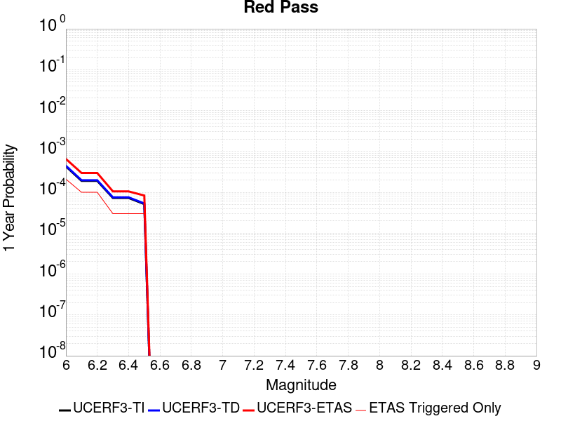 |  |

| Magnitude | 1 wk TI Prob | 1 wk TD Prob | 1 wk ETAS Prob | 1 wk ETAS/TD Gain | 1 wk ETAS Triggered Only | 1 mo TI Prob | 1 mo TD Prob | 1 mo ETAS Prob | 1 mo ETAS/TD Gain | 1 mo ETAS Triggered Only | 1 yr TI Prob | 1 yr TD Prob | 1 yr ETAS Prob | 1 yr ETAS/TD Gain | 1 yr ETAS Triggered Only | 10 yr TI Prob | 10 yr TD Prob | 10 yr ETAS Prob | 10 yr ETAS/TD Gain | 10 yr ETAS Triggered Only |
|-----|-----|-----|-----|-----|-----|-----|-----|-----|-----|-----|-----|-----|-----|-----|-----|-----|-----|-----|-----|-----|
| 6.0 | 8.258278E-6 | 8.551265E-6 | 1.0757012E-4 | 12.57944 | 9.901971E-5 | 3.539214E-5 | 3.6647863E-5 | 1.6395425E-4 | 4.4737735 | 1.2731105E-4 | 4.308141E-4 | 4.4611428E-4 | 6.7234406E-4 | 1.5071118 | 2.2633075E-4 | 0.0042997985 | 0.004453945 | 0.0048060114 | 1.079046 | 3.536418E-4 |
| 6.1 | 3.649988E-6 | 3.7753161E-6 | 4.621217E-5 | 12.24061 | 4.2437016E-5 | 1.5642712E-5 | 1.6179853E-5 | 5.8616184E-5 | 3.6227884 | 4.2437016E-5 | 1.9043336E-4 | 1.9697666E-4 | 2.9597688E-4 | 1.5025986 | 9.901971E-5 | 0.0019027026 | 0.001968488 | 0.002137902 | 1.0860629 | 1.6974806E-4 |
| 6.2 | 3.649988E-6 | 3.7753161E-6 | 4.621217E-5 | 12.24061 | 4.2437016E-5 | 1.5642712E-5 | 1.6179853E-5 | 5.8616184E-5 | 3.6227884 | 4.2437016E-5 | 1.9043336E-4 | 1.9697666E-4 | 2.9597688E-4 | 1.5025986 | 9.901971E-5 | 0.0019027026 | 0.001968488 | 0.002137902 | 1.0860629 | 1.6974806E-4 |
| 6.3 | 1.3924937E-6 | 1.4411166E-6 | 1.4411166E-6 | 1.0 | 0.0 | 5.9678164E-6 | 6.1762075E-6 | 6.1762075E-6 | 1.0 | 0.0 | 7.265574E-5 | 7.519415E-5 | 1.0348336E-4 | 1.3762157 | 2.8291344E-5 | 7.263199E-4 | 7.518258E-4 | 7.942309E-4 | 1.0564028 | 4.2437016E-5 |
| 6.4 | 1.3924937E-6 | 1.4411166E-6 | 1.4411166E-6 | 1.0 | 0.0 | 5.9678164E-6 | 6.1762075E-6 | 6.1762075E-6 | 1.0 | 0.0 | 7.265574E-5 | 7.519415E-5 | 1.0348336E-4 | 1.3762157 | 2.8291344E-5 | 7.263199E-4 | 7.518258E-4 | 7.942309E-4 | 1.0564028 | 4.2437016E-5 |
| 6.5 | 9.876812E-7 | 1.0221912E-6 | 1.0221912E-6 | 1.0 | 0.0 | 4.2329125E-6 | 4.3808195E-6 | 4.3808195E-6 | 1.0 | 0.0 | 5.153449E-5 | 5.3336476E-5 | 8.162631E-5 | 1.5304031 | 2.8291344E-5 | 5.1522546E-4 | 5.333648E-4 | 5.757792E-4 | 1.0795223 | 4.2437016E-5 |

## Manix-Afton Hills
*[(top)](#table-of-contents)*

| 1 Week | 1 Month | 1 Year | 10 Year |
|-----|-----|-----|-----|
|  |  |  | 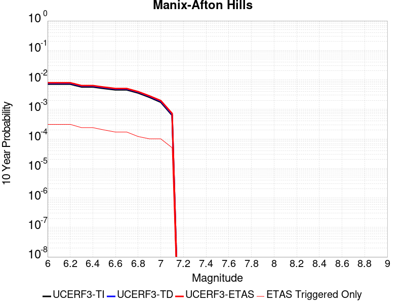 |

| Magnitude | 1 wk TI Prob | 1 wk TD Prob | 1 wk ETAS Prob | 1 wk ETAS/TD Gain | 1 wk ETAS Triggered Only | 1 mo TI Prob | 1 mo TD Prob | 1 mo ETAS Prob | 1 mo ETAS/TD Gain | 1 mo ETAS Triggered Only | 1 yr TI Prob | 1 yr TD Prob | 1 yr ETAS Prob | 1 yr ETAS/TD Gain | 1 yr ETAS Triggered Only | 10 yr TI Prob | 10 yr TD Prob | 10 yr ETAS Prob | 10 yr ETAS/TD Gain | 10 yr ETAS Triggered Only |
|-----|-----|-----|-----|-----|-----|-----|-----|-----|-----|-----|-----|-----|-----|-----|-----|-----|-----|-----|-----|-----|
| 6.0 | 1.3783202E-5 | 1.47110895E-5 | 1.4202026E-4 | 9.653959 | 1.2731105E-4 | 5.906953E-5 | 6.30461E-5 | 2.1863868E-4 | 3.4679174 | 1.5560239E-4 | 7.189342E-4 | 7.6733343E-4 | 0.0010217602 | 1.3315725 | 2.546221E-4 | 0.0071661277 | 0.007648596 | 0.007971458 | 1.0422119 | 3.2535047E-4 |
| 6.1 | 1.3783202E-5 | 1.47110895E-5 | 1.4202026E-4 | 9.653959 | 1.2731105E-4 | 5.906953E-5 | 6.30461E-5 | 2.1863868E-4 | 3.4679174 | 1.5560239E-4 | 7.189342E-4 | 7.6733343E-4 | 0.0010217602 | 1.3315725 | 2.546221E-4 | 0.0071661277 | 0.007648596 | 0.007971458 | 1.0422119 | 3.2535047E-4 |
| 6.2 | 1.3783202E-5 | 1.47110895E-5 | 1.4202026E-4 | 9.653959 | 1.2731105E-4 | 5.906953E-5 | 6.30461E-5 | 2.1863868E-4 | 3.4679174 | 1.5560239E-4 | 7.189342E-4 | 7.6733343E-4 | 0.0010217602 | 1.3315725 | 2.546221E-4 | 0.0071661277 | 0.007648596 | 0.007971458 | 1.0422119 | 3.2535047E-4 |
| 6.3 | 1.10494875E-5 | 1.1793136E-5 | 1.3910269E-4 | 11.795224 | 1.2731105E-4 | 4.7354086E-5 | 5.054109E-5 | 2.0613562E-4 | 4.078575 | 1.5560239E-4 | 5.763835E-4 | 6.151744E-4 | 8.4136595E-4 | 1.3676869 | 2.2633075E-4 | 0.005748908 | 0.0061357557 | 0.006388815 | 1.0412434 | 2.546221E-4 |
| 6.4 | 1.10494875E-5 | 1.1793136E-5 | 1.3910269E-4 | 11.795224 | 1.2731105E-4 | 4.7354086E-5 | 5.054109E-5 | 2.0613562E-4 | 4.078575 | 1.5560239E-4 | 5.763835E-4 | 6.151744E-4 | 8.4136595E-4 | 1.3676869 | 2.2633075E-4 | 0.005748908 | 0.0061357557 | 0.006388815 | 1.0412434 | 2.546221E-4 |
| 6.5 | 9.788949E-6 | 1.045432E-5 | 1.2361852E-4 | 11.824635 | 1.1316538E-4 | 4.1951964E-5 | 4.480351E-5 | 1.7210885E-4 | 3.8414145 | 1.2731105E-4 | 5.1064545E-4 | 5.453555E-4 | 7.29149E-4 | 1.3370159 | 1.8389373E-4 | 0.0050947363 | 0.0054410985 | 0.005652129 | 1.0387845 | 2.1218508E-4 |
| 6.6 | 8.810006E-6 | 9.4136285E-6 | 9.4286865E-5 | 10.015996 | 8.487403E-5 | 3.775662E-5 | 4.0343548E-5 | 1.3935925E-4 | 3.4543135 | 9.901971E-5 | 4.5958988E-4 | 4.9108086E-4 | 6.4660684E-4 | 1.3167014 | 1.5560239E-4 | 0.0045864056 | 0.004900839 | 0.0050838315 | 1.037339 | 1.8389373E-4 |
| 6.7 | 8.80128E-6 | 9.404108E-6 | 9.427734E-5 | 10.025124 | 8.487403E-5 | 3.7719226E-5 | 4.0302748E-5 | 1.3931846E-4 | 3.456798 | 9.901971E-5 | 4.591348E-4 | 4.9058435E-4 | 6.461104E-4 | 1.3170221 | 1.5560239E-4 | 0.004581874 | 0.0048958957 | 0.0050788894 | 1.0373769 | 1.8389373E-4 |
| 6.8 | 6.8994877E-6 | 7.380076E-6 | 6.396235E-5 | 8.666896 | 5.658269E-5 | 2.9568899E-5 | 3.162856E-5 | 1.0235469E-4 | 3.2361474 | 7.072836E-5 | 3.5994186E-4 | 3.8501783E-4 | 5.1227986E-4 | 1.3305354 | 1.2731105E-4 | 0.003593594 | 0.0038443129 | 0.0039711343 | 1.0329894 | 1.2731105E-4 |
| 6.9 | 4.9328037E-6 | 5.2709615E-6 | 4.7707756E-5 | 9.051054 | 4.2437016E-5 | 2.1140417E-5 | 2.2589675E-5 | 9.3316434E-5 | 4.1309333 | 7.072836E-5 | 2.5735417E-4 | 2.7500073E-4 | 4.0227675E-4 | 1.4628208 | 1.2731105E-4 | 0.0025705635 | 0.0027472095 | 0.0028741707 | 1.0462147 | 1.2731105E-4 |
| 7.0 | 3.347973E-6 | 3.59003E-6 | 4.6026893E-5 | 12.820755 | 4.2437016E-5 | 1.4348378E-5 | 1.5385775E-5 | 8.611305E-5 | 5.596926 | 7.072836E-5 | 1.746775E-4 | 1.8730981E-4 | 3.14597E-4 | 1.6795543 | 1.2731105E-4 | 0.0017454025 | 0.0018719219 | 0.0019989947 | 1.0678836 | 1.2731105E-4 |
| 7.1 | 1.2073567E-6 | 1.293482E-6 | 2.958479E-5 | 22.872208 | 2.8291344E-5 | 5.1743755E-6 | 5.543492E-6 | 4.7980273E-5 | 8.655244 | 4.2437016E-5 | 6.29962E-5 | 6.749156E-5 | 1.2407043E-4 | 1.8383104 | 5.658269E-5 | 6.297835E-4 | 6.7487074E-4 | 7.3141523E-4 | 1.0837857 | 5.658269E-5 |

## San Andreas (North Branch Mill Creek)
*[(top)](#table-of-contents)*

| 1 Week | 1 Month | 1 Year | 10 Year |
|-----|-----|-----|-----|
| 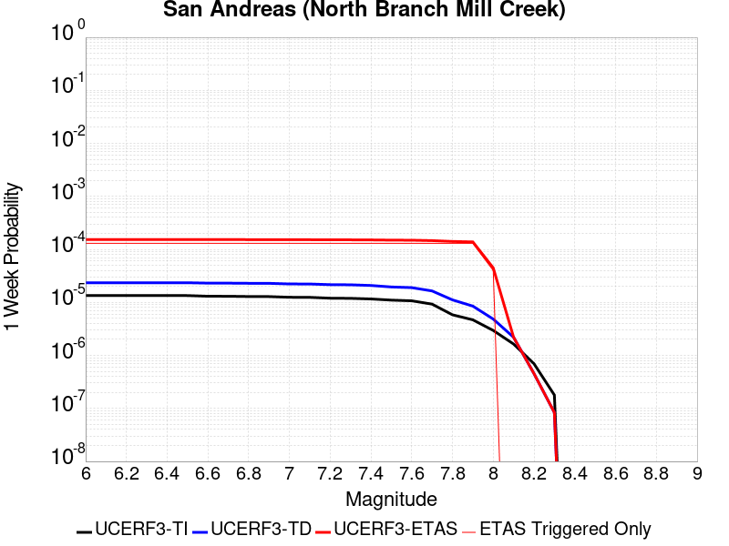 |  |  |  |

| Magnitude | 1 wk TI Prob | 1 wk TD Prob | 1 wk ETAS Prob | 1 wk ETAS/TD Gain | 1 wk ETAS Triggered Only | 1 mo TI Prob | 1 mo TD Prob | 1 mo ETAS Prob | 1 mo ETAS/TD Gain | 1 mo ETAS Triggered Only | 1 yr TI Prob | 1 yr TD Prob | 1 yr ETAS Prob | 1 yr ETAS/TD Gain | 1 yr ETAS Triggered Only | 10 yr TI Prob | 10 yr TD Prob | 10 yr ETAS Prob | 10 yr ETAS/TD Gain | 10 yr ETAS Triggered Only |
|-----|-----|-----|-----|-----|-----|-----|-----|-----|-----|-----|-----|-----|-----|-----|-----|-----|-----|-----|-----|-----|
| 6.0 | 1.3461156E-5 | 2.3500992E-5 | 2.073904E-4 | 8.824751 | 1.8389373E-4 | 5.7689394E-5 | 1.00714664E-4 | 3.4116686E-4 | 3.3874598 | 2.4047642E-4 | 7.02142E-4 | 0.0012255146 | 0.0015080813 | 1.2305698 | 2.8291345E-4 | 0.0069992766 | 0.012228744 | 0.012564088 | 1.0274227 | 3.3949612E-4 |
| 6.1 | 1.3461156E-5 | 2.3500992E-5 | 2.073904E-4 | 8.824751 | 1.8389373E-4 | 5.7689394E-5 | 1.00714664E-4 | 3.4116686E-4 | 3.3874598 | 2.4047642E-4 | 7.02142E-4 | 0.0012255146 | 0.0015080813 | 1.2305698 | 2.8291345E-4 | 0.0069992766 | 0.012228744 | 0.012564088 | 1.0274227 | 3.3949612E-4 |
| 6.2 | 1.3461156E-5 | 2.3500992E-5 | 2.073904E-4 | 8.824751 | 1.8389373E-4 | 5.7689394E-5 | 1.00714664E-4 | 3.4116686E-4 | 3.3874598 | 2.4047642E-4 | 7.02142E-4 | 0.0012255146 | 0.0015080813 | 1.2305698 | 2.8291345E-4 | 0.0069992766 | 0.012228744 | 0.012564088 | 1.0274227 | 3.3949612E-4 |
| 6.3 | 1.3461156E-5 | 2.3500992E-5 | 2.073904E-4 | 8.824751 | 1.8389373E-4 | 5.7689394E-5 | 1.00714664E-4 | 3.4116686E-4 | 3.3874598 | 2.4047642E-4 | 7.02142E-4 | 0.0012255146 | 0.0015080813 | 1.2305698 | 2.8291345E-4 | 0.0069992766 | 0.012228744 | 0.012564088 | 1.0274227 | 3.3949612E-4 |
| 6.4 | 1.3461156E-5 | 2.3500992E-5 | 2.073904E-4 | 8.824751 | 1.8389373E-4 | 5.7689394E-5 | 1.00714664E-4 | 3.4116686E-4 | 3.3874598 | 2.4047642E-4 | 7.02142E-4 | 0.0012255146 | 0.0015080813 | 1.2305698 | 2.8291345E-4 | 0.0069992766 | 0.012228744 | 0.012564088 | 1.0274227 | 3.3949612E-4 |
| 6.5 | 1.3450706E-5 | 2.348995E-5 | 2.0737937E-4 | 8.828429 | 1.8389373E-4 | 5.764461E-5 | 1.00667356E-4 | 3.4111956E-4 | 3.388582 | 2.4047642E-4 | 7.0159714E-4 | 0.0012249392 | 0.0015075061 | 1.2306783 | 2.8291345E-4 | 0.006993862 | 0.012223054 | 0.012558401 | 1.0274355 | 3.3949612E-4 |
| 6.6 | 1.3074523E-5 | 2.3104236E-5 | 2.0699372E-4 | 8.959125 | 1.8389373E-4 | 5.6032466E-5 | 9.901441E-5 | 3.3946702E-4 | 3.4284608 | 2.4047642E-4 | 6.8198174E-4 | 0.001204837 | 0.0014874096 | 1.2345318 | 2.8291345E-4 | 0.006798926 | 0.012024219 | 0.012359633 | 1.0278949 | 3.3949612E-4 |
| 6.7 | 1.3050216E-5 | 2.3079532E-5 | 2.0696902E-4 | 8.967644 | 1.8389373E-4 | 5.59283E-5 | 9.890855E-5 | 3.393612E-4 | 3.4310603 | 2.4047642E-4 | 6.8071426E-4 | 0.0012035496 | 0.0014861225 | 1.2347829 | 2.8291345E-4 | 0.0067863287 | 0.012011484 | 0.012346903 | 1.0279248 | 3.3949612E-4 |
| 6.8 | 1.29049395E-5 | 2.2927941E-5 | 2.0681747E-4 | 9.020325 | 1.8389373E-4 | 5.530571E-5 | 9.825892E-5 | 3.3871172E-4 | 3.4471345 | 2.4047642E-4 | 6.73139E-4 | 0.001195649 | 0.0014782242 | 1.2363362 | 2.8291345E-4 | 0.0067110364 | 0.011933329 | 0.012268773 | 1.0281099 | 3.3949612E-4 |
| 6.9 | 1.2867369E-5 | 2.2887343E-5 | 2.0677687E-4 | 9.034551 | 1.8389373E-4 | 5.51447E-5 | 9.808494E-5 | 3.385378E-4 | 3.4514756 | 2.4047642E-4 | 6.711799E-4 | 0.0011935332 | 0.001476109 | 1.2367557 | 2.8291345E-4 | 0.006691564 | 0.011912397 | 0.012247849 | 1.0281599 | 3.3949612E-4 |
| 7.0 | 1.2495996E-5 | 2.2287419E-5 | 2.0617706E-4 | 9.250827 | 1.8389373E-4 | 5.3553173E-5 | 9.551403E-5 | 3.359675E-4 | 3.5174675 | 2.4047642E-4 | 6.518148E-4 | 0.0011622658 | 0.0014448505 | 1.2431325 | 2.8291345E-4 | 0.0064990623 | 0.011603 | 0.011938557 | 1.0289198 | 3.3949612E-4 |
| 7.1 | 1.2452067E-5 | 2.2232492E-5 | 2.0612215E-4 | 9.271212 | 1.8389373E-4 | 5.3364907E-5 | 9.527864E-5 | 3.3573215E-4 | 3.5236874 | 2.4047642E-4 | 6.4952404E-4 | 0.001159403 | 0.0014419884 | 1.2437335 | 2.8291345E-4 | 0.0064762887 | 0.011574671 | 0.011910237 | 1.0289915 | 3.3949612E-4 |
| 7.2 | 1.2002777E-5 | 2.1611015E-5 | 2.0550078E-4 | 9.509076 | 1.8389373E-4 | 5.143946E-5 | 9.261536E-5 | 3.330695E-4 | 3.5962665 | 2.4047642E-4 | 6.2609545E-4 | 0.0011270114 | 0.001409606 | 1.2507468 | 2.8291345E-4 | 0.006243344 | 0.011254058 | 0.011589733 | 1.029827 | 3.3949612E-4 |
| 7.3 | 1.1923425E-5 | 2.1480853E-5 | 2.0537064E-4 | 9.5606365 | 1.8389373E-4 | 5.109939E-5 | 9.205757E-5 | 3.3251185E-4 | 3.611999 | 2.4047642E-4 | 6.219575E-4 | 0.0011202273 | 0.0014028238 | 1.2522671 | 2.8291345E-4 | 0.0062021962 | 0.011186945 | 0.011522643 | 1.0300081 | 3.3949612E-4 |
| 7.4 | 1.16105175E-5 | 2.0854808E-5 | 2.047447E-4 | 9.817626 | 1.8389373E-4 | 4.975841E-5 | 8.93747E-5 | 3.2982964E-4 | 3.690414 | 2.4047642E-4 | 6.0564023E-4 | 0.0010875963 | 0.001370202 | 1.2598443 | 2.8291345E-4 | 0.006039923 | 0.010864409 | 0.011200217 | 1.030909 | 3.3949612E-4 |
| 7.5 | 1.1037265E-5 | 1.9554842E-5 | 2.0344499E-4 | 10.403816 | 1.8389373E-4 | 4.7301706E-5 | 8.380379E-5 | 3.2426007E-4 | 3.869277 | 2.4047642E-4 | 5.757461E-4 | 0.0010198357 | 0.0013024607 | 1.2771279 | 2.8291345E-4 | 0.005742567 | 0.010195527 | 0.010531562 | 1.032959 | 3.3949612E-4 |
| 7.6 | 1.0720915E-5 | 1.8996727E-5 | 2.0288698E-4 | 10.680101 | 1.8389373E-4 | 4.5945973E-5 | 8.141202E-5 | 3.2186887E-4 | 3.9535792 | 2.4047642E-4 | 5.592486E-4 | 9.907428E-4 | 0.0012733759 | 1.285274 | 2.8291345E-4 | 0.005578433 | 0.009907238 | 0.010243371 | 1.033928 | 3.3949612E-4 |
| 7.7 | 9.276279E-6 | 1.6442464E-5 | 2.0033318E-4 | 12.18389 | 1.8389373E-4 | 3.9754876E-5 | 7.046581E-5 | 3.109253E-4 | 4.412428 | 2.4047642E-4 | 4.839081E-4 | 8.5758517E-4 | 0.0011402561 | 1.3296125 | 2.8291345E-4 | 0.0048285574 | 0.008586576 | 0.008909132 | 1.0375652 | 3.2535047E-4 |
| 7.8 | 5.8346777E-6 | 1.11555855E-5 | 1.9504727E-4 | 17.48427 | 1.8389373E-4 | 2.5005522E-5 | 4.7808775E-5 | 2.882737E-4 | 6.0297236 | 2.4047642E-4 | 3.043997E-4 | 5.819165E-4 | 8.646653E-4 | 1.4858924 | 2.8291345E-4 | 0.0030398308 | 0.0058473335 | 0.0061707813 | 1.0553155 | 3.2535047E-4 |
| 7.9 | 4.690204E-6 | 8.509473E-6 | 1.9240164E-4 | 22.610287 | 1.8389373E-4 | 2.0100719E-5 | 3.6468664E-5 | 2.769363E-4 | 7.593816 | 2.4047642E-4 | 2.4469878E-4 | 4.439156E-4 | 7.2670344E-4 | 1.6370306 | 2.8291345E-4 | 0.002444295 | 0.004471165 | 0.0047950605 | 1.072441 | 3.2535047E-4 |
| 8.0 | 2.9570454E-6 | 4.8470656E-6 | 6.142948E-5 | 12.67354 | 5.658269E-5 | 1.267299E-5 | 2.0772974E-5 | 7.735449E-5 | 3.7238042 | 5.658269E-5 | 1.5428272E-4 | 2.5288164E-4 | 3.235921E-4 | 1.2796189 | 7.072836E-5 | 0.0015417566 | 0.002549932 | 0.0026345898 | 1.0331999 | 8.487403E-5 |
| 8.1 | 1.6376824E-6 | 2.1968672E-6 | 2.1968672E-6 | 1.0 | 0.0 | 7.01862E-6 | 9.415111E-6 | 9.415111E-6 | 1.0 | 0.0 | 8.544835E-5 | 1.1462297E-4 | 1.2876702E-4 | 1.1233963 | 1.4145672E-5 | 8.54155E-4 | 0.0011607445 | 0.0011748737 | 1.0121726 | 1.4145672E-5 |
| 8.2 | 6.9631557E-7 | 4.535001E-7 | 4.535001E-7 | 1.0 | 0.0 | 2.984206E-6 | 1.9435704E-6 | 1.9435704E-6 | 1.0 | 0.0 | 3.63321E-5 | 2.3662713E-5 | 2.3662713E-5 | 1.0 | 0.0 | 3.6326164E-4 | 2.4510184E-4 | 2.4510184E-4 | 1.0 | 0.0 |
| 8.3 | 1.7876137E-7 | 8.357368E-8 | 8.357368E-8 | 1.0 | 0.0 | 7.661199E-7 | 3.5817288E-7 | 3.5817288E-7 | 1.0 | 0.0 | 9.32747E-6 | 4.3607465E-6 | 4.3607465E-6 | 1.0 | 0.0 | 9.3270784E-5 | 4.5800018E-5 | 4.5800018E-5 | 1.0 | 0.0 |

## San Jacinto (San Bernardino)
*[(top)](#table-of-contents)*

| 1 Week | 1 Month | 1 Year | 10 Year |
|-----|-----|-----|-----|
|  |  |  |  |

| Magnitude | 1 wk TI Prob | 1 wk TD Prob | 1 wk ETAS Prob | 1 wk ETAS/TD Gain | 1 wk ETAS Triggered Only | 1 mo TI Prob | 1 mo TD Prob | 1 mo ETAS Prob | 1 mo ETAS/TD Gain | 1 mo ETAS Triggered Only | 1 yr TI Prob | 1 yr TD Prob | 1 yr ETAS Prob | 1 yr ETAS/TD Gain | 1 yr ETAS Triggered Only | 10 yr TI Prob | 10 yr TD Prob | 10 yr ETAS Prob | 10 yr ETAS/TD Gain | 10 yr ETAS Triggered Only |
|-----|-----|-----|-----|-----|-----|-----|-----|-----|-----|-----|-----|-----|-----|-----|-----|-----|-----|-----|-----|-----|
| 6.0 | 3.409352E-5 | 3.598562E-5 | 1.9158241E-4 | 5.32386 | 1.5560239E-4 | 1.461069E-4 | 1.5421498E-4 | 3.0979337E-4 | 2.008841 | 1.5560239E-4 | 0.0017774 | 0.0018759521 | 0.0021159775 | 1.1279485 | 2.4047642E-4 | 0.01763251 | 0.019349992 | 0.019641304 | 1.0150548 | 2.970591E-4 |
| 6.1 | 3.409352E-5 | 3.598562E-5 | 1.9158241E-4 | 5.32386 | 1.5560239E-4 | 1.461069E-4 | 1.5421498E-4 | 3.0979337E-4 | 2.008841 | 1.5560239E-4 | 0.0017774 | 0.0018759521 | 0.0021159775 | 1.1279485 | 2.4047642E-4 | 0.01763251 | 0.019349992 | 0.019641304 | 1.0150548 | 2.970591E-4 |
| 6.2 | 3.409352E-5 | 3.598562E-5 | 1.9158241E-4 | 5.32386 | 1.5560239E-4 | 1.461069E-4 | 1.5421498E-4 | 3.0979337E-4 | 2.008841 | 1.5560239E-4 | 0.0017774 | 0.0018759521 | 0.0021159775 | 1.1279485 | 2.4047642E-4 | 0.01763251 | 0.019349992 | 0.019641304 | 1.0150548 | 2.970591E-4 |
| 6.3 | 3.409352E-5 | 3.598562E-5 | 1.9158241E-4 | 5.32386 | 1.5560239E-4 | 1.461069E-4 | 1.5421498E-4 | 3.0979337E-4 | 2.008841 | 1.5560239E-4 | 0.0017774 | 0.0018759521 | 0.0021159775 | 1.1279485 | 2.4047642E-4 | 0.01763251 | 0.019349992 | 0.019641304 | 1.0150548 | 2.970591E-4 |
| 6.4 | 3.400795E-5 | 3.5878285E-5 | 1.9147509E-4 | 5.3367963 | 1.5560239E-4 | 1.4574021E-4 | 1.5375503E-4 | 3.093335E-4 | 2.0118594 | 1.5560239E-4 | 0.0017729428 | 0.0018703619 | 0.0021103886 | 1.1283317 | 2.4047642E-4 | 0.017588645 | 0.019295074 | 0.019586401 | 1.0150986 | 2.970591E-4 |
| 6.5 | 3.341482E-5 | 3.5138914E-5 | 1.7659066E-4 | 5.0255013 | 1.4145672E-4 | 1.4319851E-4 | 1.5058667E-4 | 2.9202207E-4 | 1.9392294 | 1.4145672E-4 | 0.0017420477 | 0.0018318522 | 0.0020436486 | 1.1156187 | 2.1218508E-4 | 0.017284546 | 0.018916616 | 0.0191803 | 1.0139393 | 2.6876776E-4 |
| 6.6 | 3.3364955E-5 | 3.5076133E-5 | 1.7652789E-4 | 5.0327067 | 1.4145672E-4 | 1.4298483E-4 | 1.5031763E-4 | 2.917531E-4 | 1.9409107 | 1.4145672E-4 | 0.0017394501 | 0.0018285823 | 0.0020403794 | 1.1158259 | 2.1218508E-4 | 0.017258976 | 0.01888448 | 0.019148173 | 1.0139635 | 2.6876776E-4 |
| 6.7 | 3.335922E-5 | 3.5065907E-5 | 1.7651767E-4 | 5.033883 | 1.4145672E-4 | 1.4296026E-4 | 1.5027382E-4 | 2.9170926E-4 | 1.9411851 | 1.4145672E-4 | 0.0017391514 | 0.0018280497 | 0.002039847 | 1.1158596 | 2.1218508E-4 | 0.017256035 | 0.018879272 | 0.019142965 | 1.0139674 | 2.6876776E-4 |
| 6.8 | 3.327683E-5 | 3.4959972E-5 | 1.7641175E-4 | 5.046107 | 1.4145672E-4 | 1.4260718E-4 | 1.4981985E-4 | 2.912554E-4 | 1.9440373 | 1.4145672E-4 | 0.0017348597 | 0.001822532 | 0.0020343305 | 1.116211 | 2.1218508E-4 | 0.017213784 | 0.018825045 | 0.019088753 | 1.0140084 | 2.6876776E-4 |
| 6.9 | 3.3235785E-5 | 3.4900928E-5 | 1.7635271E-4 | 5.0529523 | 1.4145672E-4 | 1.4243131E-4 | 1.4956683E-4 | 2.910024E-4 | 1.9456346 | 1.4145672E-4 | 0.0017327217 | 0.0018194567 | 0.0020312557 | 1.1164079 | 2.1218508E-4 | 0.017192734 | 0.018794911 | 0.019058626 | 1.0140313 | 2.6876776E-4 |
| 7.0 | 3.3197095E-5 | 3.4840854E-5 | 1.7629265E-4 | 5.0599403 | 1.4145672E-4 | 1.422655E-4 | 1.4930942E-4 | 2.9074503E-4 | 1.9472651 | 1.4145672E-4 | 0.0017307063 | 0.0018163278 | 0.0020281274 | 1.1166087 | 2.1218508E-4 | 0.017172894 | 0.01876429 | 0.019028014 | 1.0140547 | 2.6876776E-4 |
| 7.1 | 3.3129716E-5 | 3.4721066E-5 | 1.7617288E-4 | 5.073948 | 1.4145672E-4 | 1.4197677E-4 | 1.4879608E-4 | 2.9023175E-4 | 1.9505336 | 1.4145672E-4 | 0.0017271966 | 0.0018100884 | 0.0020218894 | 1.1170114 | 2.1218508E-4 | 0.017138338 | 0.018703366 | 0.018967107 | 1.0141013 | 2.6876776E-4 |
| 7.2 | 3.3034008E-5 | 3.4588513E-5 | 1.7604034E-4 | 5.089561 | 1.4145672E-4 | 1.4156665E-4 | 1.4822806E-4 | 2.8966382E-4 | 1.9541767 | 1.4145672E-4 | 0.0017222111 | 0.0018031843 | 0.0020149867 | 1.1174603 | 2.1218508E-4 | 0.017089253 | 0.01863575 | 0.01889951 | 1.0141534 | 2.6876776E-4 |
| 7.3 | 3.2956614E-5 | 3.4456265E-5 | 1.7590812E-4 | 5.1052575 | 1.4145672E-4 | 1.4123498E-4 | 1.4766137E-4 | 2.890972E-4 | 1.9578391 | 1.4145672E-4 | 0.0017181796 | 0.0017962961 | 0.0020081 | 1.1179115 | 2.1218508E-4 | 0.017049557 | 0.018568495 | 0.018832274 | 1.0142056 | 2.6876776E-4 |
| 7.4 | 3.2915937E-5 | 3.4377957E-5 | 1.7582982E-4 | 5.114609 | 1.4145672E-4 | 1.4106068E-4 | 1.473258E-4 | 2.887617E-4 | 1.9600211 | 1.4145672E-4 | 0.0017160608 | 0.0017922173 | 0.002004022 | 1.1181803 | 2.1218508E-4 | 0.017028693 | 0.018528769 | 0.018792557 | 1.0142367 | 2.6876776E-4 |
| 7.5 | 3.281791E-5 | 3.424287E-5 | 1.7569475E-4 | 5.1308417 | 1.4145672E-4 | 1.406406E-4 | 1.4674691E-4 | 2.8818287E-4 | 1.9638088 | 1.4145672E-4 | 0.0017109542 | 0.0017851809 | 0.0019969873 | 1.118647 | 2.1218508E-4 | 0.016978411 | 0.018459652 | 0.018723458 | 1.0142909 | 2.6876776E-4 |
| 7.6 | 3.2521442E-5 | 3.396782E-5 | 1.7541973E-4 | 5.164292 | 1.4145672E-4 | 1.3937015E-4 | 1.4556825E-4 | 2.8700437E-4 | 1.9716139 | 1.4145672E-4 | 0.0016955109 | 0.0017708542 | 0.0019826635 | 1.1196085 | 2.1218508E-4 | 0.016826328 | 0.018317295 | 0.018567253 | 1.013646 | 2.546221E-4 |
| 7.7 | 3.0287873E-5 | 3.245191E-5 | 1.7390405E-4 | 5.358823 | 1.4145672E-4 | 1.297987E-4 | 1.3907222E-4 | 2.8050927E-4 | 2.0170045 | 1.4145672E-4 | 0.0015791537 | 0.0016918903 | 0.0019037164 | 1.1252009 | 2.1218508E-4 | 0.01567979 | 0.017528199 | 0.017778357 | 1.0142719 | 2.546221E-4 |
| 7.8 | 2.6316151E-5 | 2.9662837E-5 | 1.7111536E-4 | 5.768678 | 1.4145672E-4 | 1.1277862E-4 | 1.2712025E-4 | 2.68559E-4 | 2.1126373 | 1.4145672E-4 | 0.0013722149 | 0.0015465913 | 0.0017584482 | 1.1369832 | 2.1218508E-4 | 0.013637724 | 0.016069878 | 0.016320407 | 1.0155901 | 2.546221E-4 |
| 7.9 | 2.0761147E-5 | 2.3417291E-5 | 1.5072536E-4 | 6.4364986 | 1.2731105E-4 | 8.897331E-5 | 1.0035596E-4 | 2.2765424E-4 | 2.2684674 | 1.2731105E-4 | 0.0010827117 | 0.0012211498 | 0.0014189474 | 1.1619765 | 1.9803942E-4 | 0.010774517 | 0.012793272 | 0.0130306715 | 1.0185566 | 2.4047642E-4 |
| 8.0 | 1.5738568E-5 | 1.6032505E-5 | 1.0090518E-4 | 6.293787 | 8.487403E-5 | 6.744926E-5 | 6.8708934E-5 | 1.5357713E-4 | 2.2351844 | 8.487403E-5 | 8.2088535E-4 | 8.3621085E-4 | 9.775494E-4 | 1.1690224 | 1.4145672E-4 | 0.008178596 | 0.008865741 | 0.009033984 | 1.0189768 | 1.6974806E-4 |
| 8.1 | 1.0105832E-5 | 8.329479E-6 | 3.6620586E-5 | 4.396504 | 2.8291344E-5 | 4.3309992E-5 | 3.569728E-5 | 6.3987616E-5 | 1.7925067 | 2.8291344E-5 | 5.2717153E-4 | 4.3452822E-4 | 4.769468E-4 | 1.0976199 | 4.2437016E-5 | 0.005259227 | 0.0046768794 | 0.0047191177 | 1.0090313 | 4.2437016E-5 |
| 8.2 | 4.189207E-6 | 1.577699E-6 | 1.577699E-6 | 1.0 | 0.0 | 1.7953622E-5 | 6.7615497E-6 | 6.7615497E-6 | 1.0 | 0.0 | 2.1856341E-4 | 8.231879E-5 | 8.231879E-5 | 1.0 | 0.0 | 0.0021834858 | 9.562628E-4 | 9.562628E-4 | 1.0 | 0.0 |
| 8.3 | 1.2758221E-6 | 3.612677E-7 | 3.612677E-7 | 1.0 | 0.0 | 5.4677976E-6 | 1.5482892E-6 | 1.5482892E-6 | 1.0 | 0.0 | 6.65684E-5 | 1.8850264E-5 | 1.8850264E-5 | 1.0 | 0.0 | 6.6548464E-4 | 2.2739546E-4 | 2.2739546E-4 | 1.0 | 0.0 |

## San Andreas (Creeping Section) 2011 CFM
*[(top)](#table-of-contents)*

| 1 Week | 1 Month | 1 Year | 10 Year |
|-----|-----|-----|-----|
|  |  | 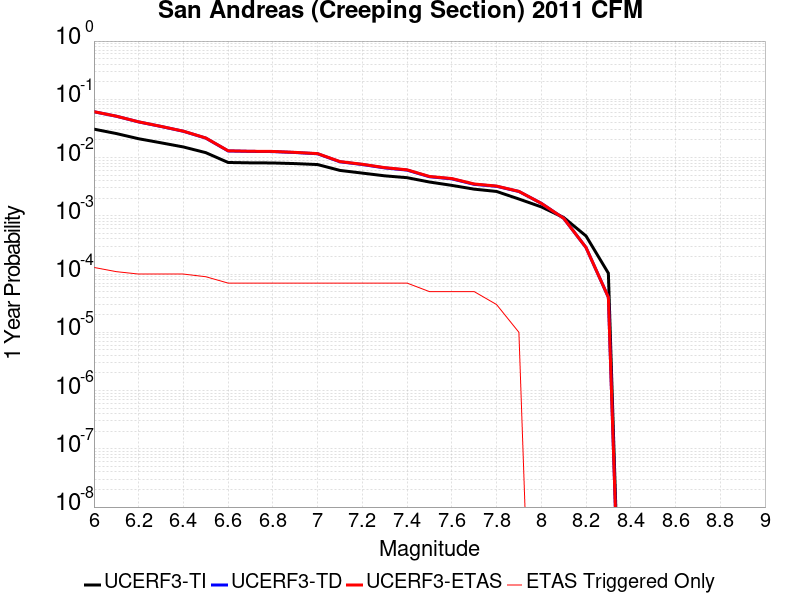 |  |

| Magnitude | 1 wk TI Prob | 1 wk TD Prob | 1 wk ETAS Prob | 1 wk ETAS/TD Gain | 1 wk ETAS Triggered Only | 1 mo TI Prob | 1 mo TD Prob | 1 mo ETAS Prob | 1 mo ETAS/TD Gain | 1 mo ETAS Triggered Only | 1 yr TI Prob | 1 yr TD Prob | 1 yr ETAS Prob | 1 yr ETAS/TD Gain | 1 yr ETAS Triggered Only | 10 yr TI Prob | 10 yr TD Prob | 10 yr ETAS Prob | 10 yr ETAS/TD Gain | 10 yr ETAS Triggered Only |
|-----|-----|-----|-----|-----|-----|-----|-----|-----|-----|-----|-----|-----|-----|-----|-----|-----|-----|-----|-----|-----|
| 6.0 | 5.986481E-4 | 0.0012275929 | 0.0012699778 | 1.0345268 | 4.2437016E-5 | 0.0025631124 | 0.005245547 | 0.005315904 | 1.0134128 | 7.072836E-5 | 0.030762846 | 0.06120491 | 0.06135099 | 1.0023867 | 1.5560239E-4 | 0.26835477 | 0.42593494 | 0.4260811 | 1.0003432 | 2.546221E-4 |
| 6.1 | 5.015945E-4 | 0.0010217986 | 0.0010641922 | 1.0414892 | 4.2437016E-5 | 0.00214792 | 0.0043678596 | 0.0044382787 | 1.0161222 | 7.072836E-5 | 0.025839351 | 0.05124837 | 0.051369157 | 1.0023569 | 1.2731105E-4 | 0.23032776 | 0.37285668 | 0.37298974 | 1.0003569 | 2.1218508E-4 |
| 6.2 | 4.073338E-4 | 8.1073755E-4 | 8.390059E-4 | 1.0348675 | 2.8291344E-5 | 0.0017445484 | 0.0034671477 | 0.0035235342 | 1.0162631 | 5.658269E-5 | 0.021034058 | 0.04093317 | 0.041041702 | 1.0026515 | 1.1316538E-4 | 0.19150782 | 0.31303346 | 0.3131695 | 1.0004346 | 1.9803942E-4 |
| 6.3 | 3.464099E-4 | 6.7391695E-4 | 7.021892E-4 | 1.0419521 | 2.8291344E-5 | 0.0014837692 | 0.0028829593 | 0.0029393788 | 1.01957 | 5.658269E-5 | 0.017915873 | 0.034189582 | 0.03429888 | 1.0031967 | 1.1316538E-4 | 0.16538359 | 0.2713166 | 0.2714609 | 1.0005319 | 1.9803942E-4 |
| 6.4 | 2.935057E-4 | 5.5442745E-4 | 5.827031E-4 | 1.0509998 | 2.8291344E-5 | 0.0012572751 | 0.0023725363 | 0.0024289847 | 1.0237925 | 5.658269E-5 | 0.015200248 | 0.02826451 | 0.028374476 | 1.0038906 | 1.1316538E-4 | 0.14201577 | 0.23298529 | 0.23313719 | 1.000652 | 1.9803942E-4 |
| 6.5 | 2.3409708E-4 | 4.2093755E-4 | 4.4921698E-4 | 1.0671821 | 2.8291344E-5 | 0.0010028875 | 0.0018019684 | 0.0018584492 | 1.0313439 | 5.658269E-5 | 0.012141965 | 0.021587461 | 0.021698184 | 1.005129 | 1.1316538E-4 | 0.11499573 | 0.18682368 | 0.18698472 | 1.000862 | 1.9803942E-4 |
| 6.6 | 1.5842178E-4 | 2.506933E-4 | 2.6483543E-4 | 1.0564121 | 1.4145672E-5 | 6.7877385E-4 | 0.0010739497 | 0.0011163412 | 1.0394725 | 4.2437016E-5 | 0.0082328 | 0.012995575 | 0.013079345 | 1.0064461 | 8.487403E-5 | 0.07934396 | 0.12314638 | 0.123295225 | 1.0012087 | 1.6974806E-4 |
| 6.7 | 1.5616413E-4 | 2.4605883E-4 | 2.6020102E-4 | 1.0574749 | 1.4145672E-5 | 6.691031E-4 | 0.0010541069 | 0.0010964992 | 1.0402163 | 4.2437016E-5 | 0.0081159435 | 0.01275744 | 0.012841231 | 1.0065681 | 8.487403E-5 | 0.0782586 | 0.12117351 | 0.12132269 | 1.0012311 | 1.6974806E-4 |
| 6.8 | 1.5538467E-4 | 2.4429744E-4 | 2.5843966E-4 | 1.0578893 | 1.4145672E-5 | 6.6576427E-4 | 0.0010465645 | 0.0010889572 | 1.0405065 | 4.2437016E-5 | 0.008075596 | 0.012666838 | 0.012750638 | 1.0066156 | 8.487403E-5 | 0.07788358 | 0.120404355 | 0.120553665 | 1.00124 | 1.6974806E-4 |
| 6.9 | 1.5153569E-4 | 2.3539034E-4 | 2.495327E-4 | 1.0600804 | 1.4145672E-5 | 6.49277E-4 | 0.0010084276 | 0.0010508219 | 1.0420399 | 4.2437016E-5 | 0.007876333 | 0.01220901 | 0.012292848 | 1.0068669 | 8.487403E-5 | 0.07602952 | 0.11647445 | 0.11662442 | 1.0012876 | 1.6974806E-4 |
| 7.0 | 1.4588932E-4 | 2.2396253E-4 | 2.3810504E-4 | 1.0631467 | 1.4145672E-5 | 6.250901E-4 | 9.5948833E-4 | 0.0010018846 | 1.0441864 | 4.2437016E-5 | 0.0075839474 | 0.011619697 | 0.011703584 | 1.0072194 | 8.487403E-5 | 0.073302895 | 0.11132046 | 0.11147131 | 1.001355 | 1.6974806E-4 |
| 7.1 | 1.1565079E-4 | 1.6281738E-4 | 1.7696075E-4 | 1.0868665 | 1.4145672E-5 | 4.955521E-4 | 6.9760304E-4 | 7.4001047E-4 | 1.0607902 | 4.2437016E-5 | 0.006016669 | 0.0084604435 | 0.008544599 | 1.009947 | 8.487403E-5 | 0.058563538 | 0.08367046 | 0.083826005 | 1.0018591 | 1.6974806E-4 |
| 7.2 | 1.0393792E-4 | 1.4615769E-4 | 1.603013E-4 | 1.0967695 | 1.4145672E-5 | 4.4537216E-4 | 6.2624045E-4 | 6.686509E-4 | 1.0677223 | 4.2437016E-5 | 0.005408933 | 0.0075979927 | 0.007682222 | 1.0110857 | 8.487403E-5 | 0.052791595 | 0.07561969 | 0.07577661 | 1.002075 | 1.6974806E-4 |
| 7.3 | 9.332884E-5 | 1.2780898E-4 | 1.4195284E-4 | 1.1106641 | 1.4145672E-5 | 3.999194E-4 | 5.4763845E-4 | 5.900522E-4 | 1.0774485 | 4.2437016E-5 | 0.0048581534 | 0.006647249 | 0.006731559 | 1.0126834 | 8.487403E-5 | 0.047533102 | 0.06648326 | 0.06664172 | 1.0023835 | 1.6974806E-4 |
| 7.4 | 8.670252E-5 | 1.17032345E-4 | 1.3117636E-4 | 1.1208556 | 1.4145672E-5 | 3.715293E-4 | 5.0147134E-4 | 5.438871E-4 | 1.0845826 | 4.2437016E-5 | 0.004513991 | 0.006088443 | 0.0061728004 | 1.0138553 | 8.487403E-5 | 0.044233937 | 0.061151642 | 0.06131101 | 1.0026062 | 1.6974806E-4 |
| 7.5 | 7.3036405E-5 | 9.005856E-5 | 9.005856E-5 | 1.0 | 0.0 | 3.129756E-4 | 3.8590826E-4 | 4.0004848E-4 | 1.0366414 | 1.4145672E-5 | 0.0038038217 | 0.0046883323 | 0.00474465 | 1.0120122 | 5.658269E-5 | 0.03739367 | 0.047877792 | 0.04799901 | 1.0025318 | 1.2731105E-4 |
| 7.6 | 6.3935775E-5 | 8.280385E-5 | 8.280385E-5 | 1.0 | 0.0 | 2.7398168E-4 | 3.5482543E-4 | 3.6896608E-4 | 1.0398524 | 1.4145672E-5 | 0.0033306254 | 0.004311461 | 0.0043678 | 1.0130672 | 5.658269E-5 | 0.032811474 | 0.04399201 | 0.044113718 | 1.0027666 | 1.2731105E-4 |
| 7.7 | 5.5050095E-5 | 6.6618326E-5 | 6.6618326E-5 | 1.0 | 0.0 | 2.3590765E-4 | 2.854759E-4 | 2.9961753E-4 | 1.0495371 | 1.4145672E-5 | 0.0028683927 | 0.003470134 | 0.0035265202 | 1.0162491 | 5.658269E-5 | 0.0283165 | 0.035796214 | 0.035918966 | 1.0034293 | 1.2731105E-4 |
| 7.8 | 5.027131E-5 | 6.162871E-5 | 6.162871E-5 | 1.0 | 0.0 | 2.1543067E-4 | 2.640963E-4 | 2.640963E-4 | 1.0 | 0.0 | 0.0026197135 | 0.003210635 | 0.0032529358 | 1.0131752 | 4.2437016E-5 | 0.025890453 | 0.03312666 | 0.0332224 | 1.0028901 | 9.901971E-5 |
| 7.9 | 3.7271806E-5 | 5.022507E-5 | 5.022507E-5 | 1.0 | 0.0 | 1.5972654E-4 | 2.1523255E-4 | 2.1523255E-4 | 1.0 | 0.0 | 0.0019429359 | 0.002617309 | 0.0026314177 | 1.0053905 | 1.4145672E-5 | 0.019260362 | 0.027067466 | 0.027122516 | 1.0020338 | 5.658269E-5 |
| 8.0 | 2.7310243E-5 | 3.1427757E-5 | 3.1427757E-5 | 1.0 | 0.0 | 1.17038646E-4 | 1.3468343E-4 | 1.3468343E-4 | 1.0 | 0.0 | 0.0014240141 | 0.0016385383 | 0.0016385383 | 1.0 | 0.0 | 0.014149235 | 0.01721386 | 0.01721386 | 1.0 | 0.0 |
| 8.1 | 1.7940547E-5 | 1.7399378E-5 | 1.7399378E-5 | 1.0 | 0.0 | 7.688579E-5 | 7.456663E-5 | 7.456663E-5 | 1.0 | 0.0 | 9.3568244E-4 | 9.074711E-4 | 9.074711E-4 | 1.0 | 0.0 | 0.009317525 | 0.009798636 | 0.009798636 | 1.0 | 0.0 |
| 8.2 | 8.643924E-6 | 5.473668E-6 | 5.473668E-6 | 1.0 | 0.0 | 3.704486E-5 | 2.3458366E-5 | 2.3458366E-5 | 1.0 | 0.0 | 4.5092785E-4 | 2.8556827E-4 | 2.8556827E-4 | 1.0 | 0.0 | 0.0045001395 | 0.0032481793 | 0.0032481793 | 1.0 | 0.0 |
| 8.3 | 1.983087E-6 | 7.6564595E-7 | 7.6564595E-7 | 1.0 | 0.0 | 8.498917E-6 | 3.281336E-6 | 3.281336E-6 | 1.0 | 0.0 | 1.034694E-4 | 3.9949547E-5 | 3.9949547E-5 | 1.0 | 0.0 | 0.0010342124 | 4.717979E-4 | 4.717979E-4 | 1.0 | 0.0 |

## Ludlow
*[(top)](#table-of-contents)*

| 1 Week | 1 Month | 1 Year | 10 Year |
|-----|-----|-----|-----|
|  |  |  |  |

| Magnitude | 1 wk TI Prob | 1 wk TD Prob | 1 wk ETAS Prob | 1 wk ETAS/TD Gain | 1 wk ETAS Triggered Only | 1 mo TI Prob | 1 mo TD Prob | 1 mo ETAS Prob | 1 mo ETAS/TD Gain | 1 mo ETAS Triggered Only | 1 yr TI Prob | 1 yr TD Prob | 1 yr ETAS Prob | 1 yr ETAS/TD Gain | 1 yr ETAS Triggered Only | 10 yr TI Prob | 10 yr TD Prob | 10 yr ETAS Prob | 10 yr ETAS/TD Gain | 10 yr ETAS Triggered Only |
|-----|-----|-----|-----|-----|-----|-----|-----|-----|-----|-----|-----|-----|-----|-----|-----|-----|-----|-----|-----|-----|
| 6.0 | 2.2407607E-5 | 2.3657254E-5 | 8.0238606E-5 | 3.3917124 | 5.658269E-5 | 9.602906E-5 | 1.0138454E-4 | 1.8624996E-4 | 1.8370647 | 8.487403E-5 | 0.0011685267 | 0.001233702 | 0.0013891123 | 1.1259708 | 1.5560239E-4 | 0.011624013 | 0.012273042 | 0.012552483 | 1.0227687 | 2.8291345E-4 |
| 6.1 | 2.2407607E-5 | 2.3657254E-5 | 8.0238606E-5 | 3.3917124 | 5.658269E-5 | 9.602906E-5 | 1.0138454E-4 | 1.8624996E-4 | 1.8370647 | 8.487403E-5 | 0.0011685267 | 0.001233702 | 0.0013891123 | 1.1259708 | 1.5560239E-4 | 0.011624013 | 0.012273042 | 0.012552483 | 1.0227687 | 2.8291345E-4 |
| 6.2 | 1.0781252E-5 | 1.1365663E-5 | 3.9656687E-5 | 3.489166 | 2.8291344E-5 | 4.620455E-5 | 4.8709102E-5 | 9.114405E-5 | 1.8711914 | 4.2437016E-5 | 5.623952E-4 | 5.9287593E-4 | 6.635624E-4 | 1.1192263 | 7.072836E-5 | 0.00560974 | 0.0059133614 | 0.0060399193 | 1.0214021 | 1.2731105E-4 |
| 6.3 | 1.0781252E-5 | 1.1365663E-5 | 3.9656687E-5 | 3.489166 | 2.8291344E-5 | 4.620455E-5 | 4.8709102E-5 | 9.114405E-5 | 1.8711914 | 4.2437016E-5 | 5.623952E-4 | 5.9287593E-4 | 6.635624E-4 | 1.1192263 | 7.072836E-5 | 0.00560974 | 0.0059133614 | 0.0060399193 | 1.0214021 | 1.2731105E-4 |
| 6.4 | 7.814439E-6 | 8.237729E-6 | 2.2383285E-5 | 2.717167 | 1.4145672E-5 | 3.3490025E-5 | 3.530408E-5 | 6.359443E-5 | 1.8013335 | 2.8291344E-5 | 4.0766477E-4 | 4.2974384E-4 | 4.863022E-4 | 1.1316096 | 5.658269E-5 | 0.0040691774 | 0.0042892746 | 0.0043737846 | 1.0197027 | 8.487403E-5 |
| 6.5 | 6.4986366E-6 | 6.85092E-6 | 2.0996495E-5 | 3.0647702 | 1.4145672E-5 | 2.7851002E-5 | 2.9360759E-5 | 4.3506017E-5 | 1.4817742 | 1.4145672E-5 | 3.390332E-4 | 3.5740953E-4 | 3.998314E-4 | 1.1186925 | 4.2437016E-5 | 0.003385164 | 0.0035684432 | 0.003624824 | 1.0157999 | 5.658269E-5 |
| 6.6 | 5.582177E-6 | 5.8860055E-6 | 2.0031594E-5 | 3.4032578 | 1.4145672E-5 | 2.3923398E-5 | 2.5225498E-5 | 3.9370814E-5 | 1.5607547 | 1.4145672E-5 | 2.9122844E-4 | 3.0707786E-4 | 3.4950185E-4 | 1.1381538 | 4.2437016E-5 | 0.0029084706 | 0.003066609 | 0.003123018 | 1.0183946 | 5.658269E-5 |
| 6.7 | 4.6858763E-6 | 4.940427E-6 | 1.908603E-5 | 3.8632345 | 1.4145672E-5 | 2.0082172E-5 | 2.1173091E-5 | 3.5318462E-5 | 1.6680826 | 1.4145672E-5 | 2.4447302E-4 | 2.5775246E-4 | 3.001785E-4 | 1.1646001 | 4.2437016E-5 | 0.0024420423 | 0.0025745912 | 0.0026310284 | 1.0219208 | 5.658269E-5 |
| 6.8 | 3.5584908E-6 | 3.7520183E-6 | 1.7897637E-5 | 4.770136 | 1.4145672E-5 | 1.5250586E-5 | 1.6079981E-5 | 3.0225427E-5 | 1.8796928 | 1.4145672E-5 | 1.8566006E-4 | 1.957566E-4 | 2.3818531E-4 | 1.2167422 | 4.2437016E-5 | 0.0018550502 | 0.0019558826 | 0.0020123548 | 1.0288728 | 5.658269E-5 |
| 6.9 | 2.532834E-6 | 2.6710034E-6 | 1.6816637E-5 | 6.296 | 1.4145672E-5 | 1.0854958E-5 | 1.1447109E-5 | 2.5592619E-5 | 2.2357278 | 1.4145672E-5 | 1.3215111E-4 | 1.3935992E-4 | 1.6764732E-4 | 1.2029809 | 2.8291344E-5 | 0.0013207254 | 0.0013927529 | 0.0014351307 | 1.0304275 | 4.2437016E-5 |
| 7.0 | 1.7083285E-6 | 1.8019439E-6 | 1.5947591E-5 | 8.850215 | 1.4145672E-5 | 7.3213873E-6 | 7.722595E-6 | 2.1868158E-5 | 2.8317113 | 1.4145672E-5 | 8.913424E-5 | 9.40187E-5 | 1.2230738E-4 | 1.3008837 | 2.8291344E-5 | 8.9098496E-4 | 9.3980576E-4 | 9.680705E-4 | 1.0300751 | 2.8291344E-5 |
| 7.1 | 1.0905424E-6 | 1.1497619E-6 | 1.1497619E-6 | 1.0 | 0.0 | 4.6737446E-6 | 4.9275427E-6 | 4.9275427E-6 | 1.0 | 0.0 | 5.6901354E-5 | 5.999128E-5 | 7.41361E-5 | 1.2357813 | 1.4145672E-5 | 5.6886784E-4 | 5.997606E-4 | 6.138978E-4 | 1.0235714 | 1.4145672E-5 |
| 7.2 | 6.06668E-7 | 6.387277E-7 | 6.387277E-7 | 1.0 | 0.0 | 2.600003E-6 | 2.7374022E-6 | 2.7374022E-6 | 1.0 | 0.0 | 3.1654577E-5 | 3.3327433E-5 | 3.3327433E-5 | 1.0 | 0.0 | 3.1650066E-4 | 3.3323118E-4 | 3.3323118E-4 | 1.0 | 0.0 |

## Baker
*[(top)](#table-of-contents)*

| 1 Week | 1 Month | 1 Year | 10 Year |
|-----|-----|-----|-----|
|  |  |  |  |

| Magnitude | 1 wk TI Prob | 1 wk TD Prob | 1 wk ETAS Prob | 1 wk ETAS/TD Gain | 1 wk ETAS Triggered Only | 1 mo TI Prob | 1 mo TD Prob | 1 mo ETAS Prob | 1 mo ETAS/TD Gain | 1 mo ETAS Triggered Only | 1 yr TI Prob | 1 yr TD Prob | 1 yr ETAS Prob | 1 yr ETAS/TD Gain | 1 yr ETAS Triggered Only | 10 yr TI Prob | 10 yr TD Prob | 10 yr ETAS Prob | 10 yr ETAS/TD Gain | 10 yr ETAS Triggered Only |
|-----|-----|-----|-----|-----|-----|-----|-----|-----|-----|-----|-----|-----|-----|-----|-----|-----|-----|-----|-----|-----|
| 6.0 | 5.695525E-6 | 5.8348373E-6 | 6.2417195E-5 | 10.697333 | 5.658269E-5 | 2.4409164E-5 | 2.5006228E-5 | 1.3816878E-4 | 5.5253744 | 1.1316538E-4 | 2.9714106E-4 | 3.044123E-4 | 5.306742E-4 | 1.7432743 | 2.2633075E-4 | 0.0029674405 | 0.0030403486 | 0.0033365046 | 1.0974085 | 2.970591E-4 |
| 6.1 | 5.695525E-6 | 5.8348373E-6 | 6.2417195E-5 | 10.697333 | 5.658269E-5 | 2.4409164E-5 | 2.5006228E-5 | 1.3816878E-4 | 5.5253744 | 1.1316538E-4 | 2.9714106E-4 | 3.044123E-4 | 5.306742E-4 | 1.7432743 | 2.2633075E-4 | 0.0029674405 | 0.0030403486 | 0.0033365046 | 1.0974085 | 2.970591E-4 |
| 6.2 | 5.695525E-6 | 5.8348373E-6 | 6.2417195E-5 | 10.697333 | 5.658269E-5 | 2.4409164E-5 | 2.5006228E-5 | 1.3816878E-4 | 5.5253744 | 1.1316538E-4 | 2.9714106E-4 | 3.044123E-4 | 5.306742E-4 | 1.7432743 | 2.2633075E-4 | 0.0029674405 | 0.0030403486 | 0.0033365046 | 1.0974085 | 2.970591E-4 |
| 6.3 | 3.2995713E-6 | 3.383667E-6 | 4.582054E-5 | 13.541681 | 4.2437016E-5 | 1.4140943E-5 | 1.4501353E-5 | 9.9374156E-5 | 6.852751 | 8.487403E-5 | 1.7215237E-4 | 1.7654014E-4 | 3.3211507E-4 | 1.881244 | 1.5560239E-4 | 0.0017201907 | 0.001764046 | 0.001961736 | 1.1120663 | 1.9803942E-4 |
| 6.4 | 3.2995713E-6 | 3.383667E-6 | 4.582054E-5 | 13.541681 | 4.2437016E-5 | 1.4140943E-5 | 1.4501353E-5 | 9.9374156E-5 | 6.852751 | 8.487403E-5 | 1.7215237E-4 | 1.7654014E-4 | 3.3211507E-4 | 1.881244 | 1.5560239E-4 | 0.0017201907 | 0.001764046 | 0.001961736 | 1.1120663 | 1.9803942E-4 |
| 6.5 | 2.782202E-6 | 2.8558404E-6 | 3.1147105E-5 | 10.906458 | 2.8291344E-5 | 1.1923668E-5 | 1.223926E-5 | 8.2966755E-5 | 6.7787395 | 7.072836E-5 | 1.4516099E-4 | 1.4900314E-4 | 2.904388E-4 | 1.9492126 | 1.4145672E-4 | 0.001450662 | 0.0014890651 | 0.001672685 | 1.1233122 | 1.8389373E-4 |
| 6.6 | 2.3163404E-6 | 2.38092E-6 | 1.652656E-5 | 6.941249 | 1.4145672E-5 | 9.927136E-6 | 1.0203904E-5 | 6.6786015E-5 | 6.5451436 | 5.658269E-5 | 1.20856166E-4 | 1.2422565E-4 | 2.515209E-4 | 2.0247097 | 1.2731105E-4 | 0.0012079047 | 0.0012415823 | 0.0014111196 | 1.1365494 | 1.6974806E-4 |
| 6.7 | 2.037056E-6 | 2.0965003E-6 | 1.6242144E-5 | 7.7472644 | 1.4145672E-5 | 8.7302105E-6 | 8.984972E-6 | 6.5567154E-5 | 7.2974243 | 5.658269E-5 | 1.0628513E-4 | 1.093867E-4 | 2.225397E-4 | 2.034431 | 1.1316538E-4 | 0.0010623431 | 0.0010933448 | 0.001248777 | 1.1421622 | 1.5560239E-4 |
| 6.8 | 1.8356744E-6 | 1.8915287E-6 | 1.6037175E-5 | 8.478419 | 1.4145672E-5 | 7.867153E-6 | 8.106527E-6 | 5.05432E-5 | 6.234877 | 4.2437016E-5 | 9.577837E-5 | 9.869264E-5 | 1.835583E-4 | 1.8598986 | 8.487403E-5 | 9.57371E-4 | 9.86502E-4 | 0.0010995558 | 1.1146007 | 1.1316538E-4 |
| 6.9 | 1.6310546E-6 | 1.6832072E-6 | 1.6832072E-6 | 1.0 | 0.0 | 6.9902153E-6 | 7.213726E-6 | 2.1359296E-5 | 2.9609244 | 1.4145672E-5 | 8.510255E-5 | 8.782368E-5 | 1.1611255E-4 | 1.3221097 | 2.8291344E-5 | 8.5069967E-4 | 8.7790104E-4 | 9.3443407E-4 | 1.0643957 | 5.658269E-5 |
| 7.0 | 1.2058036E-6 | 1.2508665E-6 | 1.2508665E-6 | 1.0 | 0.0 | 5.1677193E-6 | 5.3608455E-6 | 1.9506442E-5 | 3.6386874 | 1.4145672E-5 | 6.291517E-5 | 6.5266366E-5 | 9.3555864E-5 | 1.4334468 | 2.8291344E-5 | 6.289736E-4 | 6.524743E-4 | 6.9488364E-4 | 1.0649977 | 4.2437016E-5 |
| 7.1 | 1.052382E-6 | 1.0951609E-6 | 1.0951609E-6 | 1.0 | 0.0 | 4.5102006E-6 | 4.693538E-6 | 1.8839144E-5 | 4.013847 | 1.4145672E-5 | 5.491031E-5 | 5.7142337E-5 | 8.543207E-5 | 1.4950747 | 2.8291344E-5 | 5.4896745E-4 | 5.7127734E-4 | 6.136901E-4 | 1.074242 | 4.2437016E-5 |
| 7.2 | 1.0067454E-6 | 1.0487711E-6 | 1.0487711E-6 | 1.0 | 0.0 | 4.3146156E-6 | 4.4947255E-6 | 1.8640334E-5 | 4.1471577 | 1.4145672E-5 | 5.252918E-5 | 5.4721917E-5 | 8.301171E-5 | 1.5169737 | 2.8291344E-5 | 5.251676E-4 | 5.470853E-4 | 5.894991E-4 | 1.0775268 | 4.2437016E-5 |
| 7.3 | 9.3596316E-7 | 9.767723E-7 | 9.767723E-7 | 1.0 | 0.0 | 4.0112645E-6 | 4.1861604E-6 | 1.8331773E-5 | 4.3791375 | 1.4145672E-5 | 4.8836053E-5 | 5.096532E-5 | 7.9255224E-5 | 1.5550815 | 2.8291344E-5 | 4.8825322E-4 | 5.095371E-4 | 5.519525E-4 | 1.083243 | 4.2437016E-5 |
| 7.4 | 8.8117395E-7 | 9.2076635E-7 | 9.2076635E-7 | 1.0 | 0.0 | 3.7764542E-6 | 3.9461356E-6 | 1.8091752E-5 | 4.584676 | 1.4145672E-5 | 4.5977362E-5 | 4.8043148E-5 | 7.633313E-5 | 1.5888454 | 2.8291344E-5 | 4.596785E-4 | 4.8032837E-4 | 5.22745E-4 | 1.0883076 | 4.2437016E-5 |
| 7.5 | 8.292386E-7 | 8.6745956E-7 | 8.6745956E-7 | 1.0 | 0.0 | 3.5538749E-6 | 3.7176785E-6 | 1.7863298E-5 | 4.8049603 | 1.4145672E-5 | 4.326757E-5 | 4.5261804E-5 | 5.9406837E-5 | 1.3125159 | 1.4145672E-5 | 4.3259145E-4 | 4.5252658E-4 | 4.8080515E-4 | 1.0624903 | 2.8291344E-5 |
| 7.6 | 7.553842E-7 | 7.9144706E-7 | 7.9144706E-7 | 1.0 | 0.0 | 3.2373566E-6 | 3.3919116E-6 | 1.7537535E-5 | 5.1703987 | 1.4145672E-5 | 3.9414106E-5 | 4.129575E-5 | 5.5440836E-5 | 1.3425313 | 1.4145672E-5 | 3.9407116E-4 | 4.1288146E-4 | 4.411611E-4 | 1.0684934 | 2.8291344E-5 |
| 7.7 | 6.5285366E-7 | 6.852797E-7 | 6.852797E-7 | 1.0 | 0.0 | 2.797941E-6 | 2.9369096E-6 | 1.708254E-5 | 5.8165016 | 1.4145672E-5 | 3.40644E-5 | 3.5756293E-5 | 4.990146E-5 | 1.3955994 | 1.4145672E-5 | 3.405918E-4 | 3.5750607E-4 | 3.716467E-4 | 1.0395535 | 1.4145672E-5 |
| 7.8 | 3.4586725E-7 | 3.6482615E-7 | 3.6482615E-7 | 1.0 | 0.0 | 1.4822873E-6 | 1.5635396E-6 | 1.5635396E-6 | 1.0 | 0.0 | 1.80467E-5 | 1.9035933E-5 | 1.9035933E-5 | 1.0 | 0.0 | 1.8045233E-4 | 1.9034347E-4 | 1.9034347E-4 | 1.0 | 0.0 |
| 7.9 | 2.5591178E-9 | 2.6696718E-9 | 2.6696718E-9 | 1.0 | 0.0 | 1.0967647E-8 | 1.14414505E-8 | 1.14414505E-8 | 1.0 | 0.0 | 1.335311E-7 | 1.3929966E-7 | 1.3929966E-7 | 1.0 | 0.0 | 1.3353102E-6 | 1.3929966E-6 | 1.3929966E-6 | 1.0 | 0.0 |

## Santa Ynez (West)
*[(top)](#table-of-contents)*

| 1 Week | 1 Month | 1 Year | 10 Year |
|-----|-----|-----|-----|
|  |  | 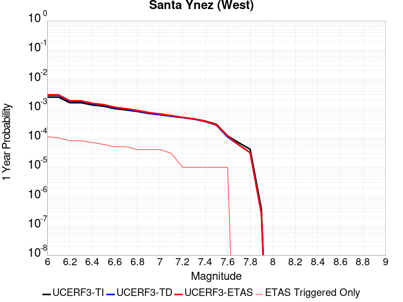 |  |

| Magnitude | 1 wk TI Prob | 1 wk TD Prob | 1 wk ETAS Prob | 1 wk ETAS/TD Gain | 1 wk ETAS Triggered Only | 1 mo TI Prob | 1 mo TD Prob | 1 mo ETAS Prob | 1 mo ETAS/TD Gain | 1 mo ETAS Triggered Only | 1 yr TI Prob | 1 yr TD Prob | 1 yr ETAS Prob | 1 yr ETAS/TD Gain | 1 yr ETAS Triggered Only | 10 yr TI Prob | 10 yr TD Prob | 10 yr ETAS Prob | 10 yr ETAS/TD Gain | 10 yr ETAS Triggered Only |
|-----|-----|-----|-----|-----|-----|-----|-----|-----|-----|-----|-----|-----|-----|-----|-----|-----|-----|-----|-----|-----|
| 6.0 | 4.7352758E-5 | 5.497084E-5 | 1.3984021E-4 | 2.5438979 | 8.487403E-5 | 2.0292461E-4 | 2.3556968E-4 | 3.2042371E-4 | 1.3602078 | 8.487403E-5 | 0.0024678076 | 0.002864558 | 0.002949189 | 1.0295441 | 8.487403E-5 | 0.024405818 | 0.028304456 | 0.02849689 | 1.0067987 | 1.9803942E-4 |
| 6.1 | 4.7352758E-5 | 5.497084E-5 | 1.2569531E-4 | 2.2865818 | 7.072836E-5 | 2.0292461E-4 | 2.3556968E-4 | 3.0628138E-4 | 1.3001732 | 7.072836E-5 | 0.0024678076 | 0.002864558 | 0.0029350838 | 1.0246202 | 7.072836E-5 | 0.024405818 | 0.028304456 | 0.028455654 | 1.0053419 | 1.5560239E-4 |
| 6.2 | 3.0415853E-5 | 3.3925004E-5 | 1.04650964E-4 | 3.084774 | 7.072836E-5 | 1.3034715E-4 | 1.4538495E-4 | 2.1610304E-4 | 1.4864194 | 7.072836E-5 | 0.0015858212 | 0.0017686592 | 0.0018392624 | 1.0399191 | 7.072836E-5 | 0.015745522 | 0.01754978 | 0.01770265 | 1.0087107 | 1.5560239E-4 |
| 6.3 | 3.0415853E-5 | 3.3925004E-5 | 1.04650964E-4 | 3.084774 | 7.072836E-5 | 1.3034715E-4 | 1.4538495E-4 | 2.1610304E-4 | 1.4864194 | 7.072836E-5 | 0.0015858212 | 0.0017686592 | 0.0018392624 | 1.0399191 | 7.072836E-5 | 0.015745522 | 0.01754978 | 0.01770265 | 1.0087107 | 1.5560239E-4 |
| 6.4 | 2.5452082E-5 | 2.7912318E-5 | 9.86387E-5 | 3.5338771 | 7.072836E-5 | 1.09075794E-4 | 1.1961885E-4 | 1.9033875E-4 | 1.5912104 | 7.072836E-5 | 0.0013271887 | 0.0014554056 | 0.001526031 | 1.0485263 | 7.072836E-5 | 0.013192902 | 0.01446091 | 0.014600321 | 1.0096406 | 1.4145672E-4 |
| 6.5 | 2.3143784E-5 | 2.5128133E-5 | 8.17094E-5 | 3.25171 | 5.658269E-5 | 9.9183875E-5 | 1.07687636E-4 | 1.6426423E-4 | 1.5253769 | 5.658269E-5 | 0.0012068948 | 0.001310323 | 0.0013668315 | 1.0431256 | 5.658269E-5 | 0.012003611 | 0.013027638 | 0.01315329 | 1.0096451 | 1.2731105E-4 |
| 6.6 | 1.9118515E-5 | 2.0354244E-5 | 7.693578E-5 | 3.7798398 | 5.658269E-5 | 8.193392E-5 | 8.722961E-5 | 1.4380735E-4 | 1.6486073 | 5.658269E-5 | 9.97089E-4 | 0.001061511 | 0.0011180335 | 1.0532473 | 5.658269E-5 | 0.00992627 | 0.010565317 | 0.010691283 | 1.0119226 | 1.2731105E-4 |
| 6.7 | 1.722807E-5 | 1.8146253E-5 | 7.472791E-5 | 4.1180906 | 5.658269E-5 | 7.3832496E-5 | 7.776737E-5 | 1.3434565E-4 | 1.7275325 | 5.658269E-5 | 8.985399E-4 | 9.4641204E-4 | 0.0010029412 | 1.0597299 | 5.658269E-5 | 0.008949154 | 0.009424461 | 0.009550572 | 1.0133812 | 1.2731105E-4 |
| 6.8 | 1.5317364E-5 | 1.5926391E-5 | 5.8362733E-5 | 3.6645296 | 4.2437016E-5 | 6.56442E-5 | 6.82542E-5 | 1.1068832E-4 | 1.6217071 | 4.2437016E-5 | 7.98925E-4 | 8.3068234E-4 | 8.730841E-4 | 1.0510445 | 4.2437016E-5 | 0.007960589 | 0.008276261 | 0.0083884895 | 1.0135603 | 1.1316538E-4 |
| 6.9 | 1.3071226E-5 | 1.332953E-5 | 5.576598E-5 | 4.183642 | 4.2437016E-5 | 5.6018336E-5 | 5.712532E-5 | 9.955991E-5 | 1.7428334 | 4.2437016E-5 | 6.8180985E-4 | 6.952811E-4 | 7.3768856E-4 | 1.0609933 | 4.2437016E-5 | 0.0067972173 | 0.0069313184 | 0.0070436993 | 1.0162135 | 1.1316538E-4 |
| 7.0 | 1.1836986E-5 | 1.1932688E-5 | 5.4369197E-5 | 4.5563245 | 4.2437016E-5 | 5.0728955E-5 | 5.1139097E-5 | 9.3573944E-5 | 1.8297926 | 4.2437016E-5 | 6.1745E-4 | 6.2244234E-4 | 6.648529E-4 | 1.0681357 | 4.2437016E-5 | 0.006157372 | 0.0062071825 | 0.0063196453 | 1.0181181 | 1.1316538E-4 |
| 7.1 | 1.0597169E-5 | 1.0542107E-5 | 3.8833154E-5 | 3.6836236 | 2.8291344E-5 | 4.541565E-5 | 4.5179684E-5 | 7.3469746E-5 | 1.6261679 | 2.8291344E-5 | 5.5279525E-4 | 5.4992497E-4 | 5.7820074E-4 | 1.0514176 | 2.8291344E-5 | 0.0055142213 | 0.005485772 | 0.005584249 | 1.0179513 | 9.901971E-5 |
| 7.2 | 9.59113E-6 | 9.45905E-6 | 2.3604589E-5 | 2.4954503 | 1.4145672E-5 | 4.11042E-5 | 4.053816E-5 | 5.468326E-5 | 1.3489329 | 1.4145672E-5 | 5.0032866E-4 | 4.934414E-4 | 5.075801E-4 | 1.0286533 | 1.4145672E-5 | 0.004992037 | 0.0049235765 | 0.0050080325 | 1.0171534 | 8.487403E-5 |
| 7.3 | 8.586084E-6 | 8.379489E-6 | 2.2525042E-5 | 2.6881166 | 1.4145672E-5 | 3.679698E-5 | 3.591161E-5 | 5.0056773E-5 | 1.3938884 | 1.4145672E-5 | 4.4791115E-4 | 4.3713715E-4 | 4.5127663E-4 | 1.0323457 | 1.4145672E-5 | 0.004470094 | 0.004362884 | 0.004433304 | 1.0161407 | 7.072836E-5 |
| 7.4 | 7.2622997E-6 | 6.9514485E-6 | 2.1097023E-5 | 3.0349102 | 1.4145672E-5 | 3.112377E-5 | 2.9791589E-5 | 4.3936838E-5 | 1.4748069 | 1.4145672E-5 | 3.78866E-4 | 3.6265317E-4 | 3.7679373E-4 | 1.0389919 | 1.4145672E-5 | 0.0037822074 | 0.003620714 | 0.0036629974 | 1.0116782 | 4.2437016E-5 |
| 7.5 | 5.627296E-6 | 5.2514984E-6 | 1.9397095E-5 | 3.6936307 | 1.4145672E-5 | 2.411676E-5 | 2.2506232E-5 | 3.6651585E-5 | 1.6285083 | 1.4145672E-5 | 2.9358198E-4 | 2.7397962E-4 | 2.8812143E-4 | 1.0516162 | 1.4145672E-5 | 0.0029319443 | 0.0027364905 | 0.0027647044 | 1.0103103 | 2.8291344E-5 |
| 7.6 | 2.265244E-6 | 2.0608632E-6 | 1.6206506E-5 | 7.863941 | 1.4145672E-5 | 9.708152E-6 | 8.832241E-6 | 2.2977789E-5 | 2.6015809 | 1.4145672E-5 | 1.18190335E-4 | 1.0752732E-4 | 1.21671466E-4 | 1.1315401 | 1.4145672E-5 | 0.001181275 | 0.0010747615 | 0.0011030225 | 1.0262951 | 2.8291344E-5 |
| 7.7 | 1.3099874E-6 | 1.1016228E-6 | 1.1016228E-6 | 1.0 | 0.0 | 5.61422E-6 | 4.7212325E-6 | 4.7212325E-6 | 1.0 | 0.0 | 6.8350986E-5 | 5.7479516E-5 | 5.7479516E-5 | 1.0 | 0.0 | 6.832996E-4 | 5.7464885E-4 | 5.7464885E-4 | 1.0 | 0.0 |
| 7.8 | 7.903951E-7 | 6.0710704E-7 | 6.0710704E-7 | 1.0 | 0.0 | 3.3874032E-6 | 2.601885E-6 | 2.601885E-6 | 1.0 | 0.0 | 4.1240855E-5 | 3.16775E-5 | 3.16775E-5 | 1.0 | 0.0 | 4.12332E-4 | 3.167312E-4 | 3.167312E-4 | 1.0 | 0.0 |
| 7.9 | 7.0753297E-9 | 5.090092E-9 | 5.090092E-9 | 1.0 | 0.0 | 3.032284E-8 | 2.181468E-8 | 2.181468E-8 | 1.0 | 0.0 | 3.6918053E-7 | 2.655937E-7 | 2.655937E-7 | 1.0 | 0.0 | 3.691799E-6 | 2.6559348E-6 | 2.6559348E-6 | 1.0 | 0.0 |

## Scodie Lineament
*[(top)](#table-of-contents)*

| 1 Week | 1 Month | 1 Year | 10 Year |
|-----|-----|-----|-----|
| 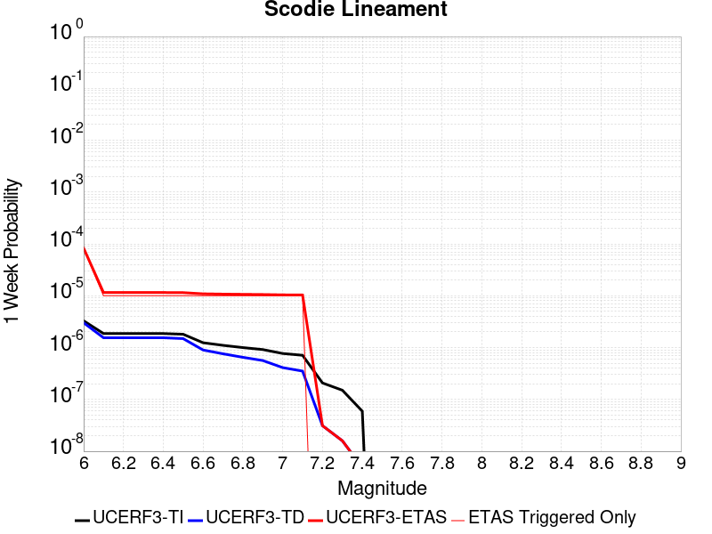 |  |  |  |

| Magnitude | 1 wk TI Prob | 1 wk TD Prob | 1 wk ETAS Prob | 1 wk ETAS/TD Gain | 1 wk ETAS Triggered Only | 1 mo TI Prob | 1 mo TD Prob | 1 mo ETAS Prob | 1 mo ETAS/TD Gain | 1 mo ETAS Triggered Only | 1 yr TI Prob | 1 yr TD Prob | 1 yr ETAS Prob | 1 yr ETAS/TD Gain | 1 yr ETAS Triggered Only | 10 yr TI Prob | 10 yr TD Prob | 10 yr ETAS Prob | 10 yr ETAS/TD Gain | 10 yr ETAS Triggered Only |
|-----|-----|-----|-----|-----|-----|-----|-----|-----|-----|-----|-----|-----|-----|-----|-----|-----|-----|-----|-----|-----|
| 6.0 | 3.2919327E-6 | 3.0133303E-6 | 1.0203274E-4 | 33.860455 | 9.901971E-5 | 1.4108206E-5 | 1.2914227E-5 | 1.2607814E-4 | 9.7627325 | 1.1316538E-4 | 1.7175387E-4 | 1.5722254E-4 | 3.835177E-4 | 2.4393303 | 2.2633075E-4 | 0.0017162118 | 0.0015714248 | 0.0018538936 | 1.1797533 | 2.8291345E-4 |
| 6.1 | 1.8663811E-6 | 1.5490382E-6 | 1.5694688E-5 | 10.131893 | 1.4145672E-5 | 7.998751E-6 | 6.6387206E-6 | 3.492988E-5 | 5.2615376 | 2.8291344E-5 | 9.738045E-5 | 8.082393E-5 | 1.5154657E-4 | 1.8750211 | 7.072836E-5 | 9.7337784E-4 | 8.079941E-4 | 8.786653E-4 | 1.087465 | 7.072836E-5 |
| 6.2 | 1.8663811E-6 | 1.5490382E-6 | 1.5694688E-5 | 10.131893 | 1.4145672E-5 | 7.998751E-6 | 6.6387206E-6 | 3.492988E-5 | 5.2615376 | 2.8291344E-5 | 9.738045E-5 | 8.082393E-5 | 1.5154657E-4 | 1.8750211 | 7.072836E-5 | 9.7337784E-4 | 8.079941E-4 | 8.786653E-4 | 1.087465 | 7.072836E-5 |
| 6.3 | 1.8663811E-6 | 1.5490382E-6 | 1.5694688E-5 | 10.131893 | 1.4145672E-5 | 7.998751E-6 | 6.6387206E-6 | 3.492988E-5 | 5.2615376 | 2.8291344E-5 | 9.738045E-5 | 8.082393E-5 | 1.5154657E-4 | 1.8750211 | 7.072836E-5 | 9.7337784E-4 | 8.079941E-4 | 8.786653E-4 | 1.087465 | 7.072836E-5 |
| 6.4 | 1.8663811E-6 | 1.5490382E-6 | 1.5694688E-5 | 10.131893 | 1.4145672E-5 | 7.998751E-6 | 6.6387206E-6 | 3.492988E-5 | 5.2615376 | 2.8291344E-5 | 9.738045E-5 | 8.082393E-5 | 1.5154657E-4 | 1.8750211 | 7.072836E-5 | 9.7337784E-4 | 8.079941E-4 | 8.786653E-4 | 1.087465 | 7.072836E-5 |
| 6.5 | 1.8106311E-6 | 1.4909722E-6 | 1.5636624E-5 | 10.487535 | 1.4145672E-5 | 7.759824E-6 | 6.389868E-6 | 3.468103E-5 | 5.4275036 | 2.8291344E-5 | 9.447177E-5 | 7.779436E-5 | 1.4851721E-4 | 1.9091 | 7.072836E-5 | 9.4431615E-4 | 7.7771995E-4 | 8.483933E-4 | 1.0908725 | 7.072836E-5 |
| 6.6 | 1.2414679E-6 | 8.9974395E-7 | 1.5045403E-5 | 16.721872 | 1.4145672E-5 | 5.320566E-6 | 3.85604E-6 | 3.2147276E-5 | 8.336862 | 2.8291344E-5 | 6.477596E-5 | 4.6946367E-5 | 1.1767141E-4 | 2.5065072 | 7.072836E-5 | 6.475708E-4 | 4.6937316E-4 | 5.400683E-4 | 1.1506162 | 7.072836E-5 |
| 6.7 | 1.1062215E-6 | 7.594193E-7 | 1.4905081E-5 | 19.626945 | 1.4145672E-5 | 4.7409408E-6 | 3.2546504E-6 | 1.7400276E-5 | 5.346281 | 1.4145672E-5 | 5.7719422E-5 | 3.962472E-5 | 8.2060054E-5 | 2.0709307 | 4.2437016E-5 | 5.770443E-4 | 3.9618355E-4 | 4.3860375E-4 | 1.1070721 | 4.2437016E-5 |
| 6.8 | 1.0006736E-6 | 6.5002786E-7 | 1.4795691E-5 | 22.761625 | 1.4145672E-5 | 4.288594E-6 | 2.7858312E-6 | 1.6931464E-5 | 6.0777063 | 1.4145672E-5 | 5.221238E-5 | 3.391703E-5 | 7.6352604E-5 | 2.2511585 | 4.2437016E-5 | 5.220012E-4 | 3.3912458E-4 | 3.815472E-4 | 1.1250945 | 4.2437016E-5 |
| 6.9 | 9.167364E-7 | 5.6315065E-7 | 1.4708815E-5 | 26.118792 | 1.4145672E-5 | 3.9288643E-6 | 2.413501E-6 | 1.655914E-5 | 6.861045 | 1.4145672E-5 | 4.7832873E-5 | 2.9384037E-5 | 7.1819806E-5 | 2.4441776 | 4.2437016E-5 | 4.782258E-4 | 2.9380718E-4 | 3.3623172E-4 | 1.1443958 | 4.2437016E-5 |
| 7.0 | 7.6987664E-7 | 4.113265E-7 | 1.4556993E-5 | 35.390358 | 1.4145672E-5 | 3.2994672E-6 | 1.7628269E-6 | 1.5908474E-5 | 9.024411 | 1.4145672E-5 | 4.0170275E-5 | 2.1462245E-5 | 6.389835E-5 | 2.9772444 | 4.2437016E-5 | 4.0163012E-4 | 2.1460558E-4 | 2.570335E-4 | 1.1977018 | 4.2437016E-5 |
| 7.1 | 7.1038727E-7 | 3.5210306E-7 | 1.449777E-5 | 41.174793 | 1.4145672E-5 | 3.0445133E-6 | 1.5090123E-6 | 1.5654663E-5 | 10.374112 | 1.4145672E-5 | 3.706632E-5 | 1.8372106E-5 | 6.0808343E-5 | 3.3098187 | 4.2437016E-5 | 3.7060137E-4 | 1.8370937E-4 | 2.261386E-4 | 1.2309583 | 4.2437016E-5 |
| 7.2 | 2.0799602E-7 | 3.1178534E-8 | 3.1178534E-8 | 1.0 | 0.0 | 8.914113E-7 | 1.3362228E-7 | 1.3362228E-7 | 1.0 | 0.0 | 1.0852878E-5 | 1.6268501E-6 | 1.6268501E-6 | 1.0 | 0.0 | 1.08523476E-4 | 1.626839E-5 | 1.626839E-5 | 1.0 | 0.0 |
| 7.3 | 1.5048182E-7 | 1.5939106E-8 | 1.5939106E-8 | 1.0 | 0.0 | 6.449219E-7 | 6.8310456E-8 | 6.8310456E-8 | 1.0 | 0.0 | 7.851896E-6 | 8.316795E-7 | 8.316795E-7 | 1.0 | 0.0 | 7.851618E-5 | 8.316767E-6 | 8.316767E-6 | 1.0 | 0.0 |
| 7.4 | 5.9334678E-8 | 4.8638475E-9 | 4.8638475E-9 | 1.0 | 0.0 | 2.5429145E-7 | 2.084506E-8 | 2.084506E-8 | 1.0 | 0.0 | 3.095994E-6 | 2.5378858E-7 | 2.5378858E-7 | 1.0 | 0.0 | 3.095951E-5 | 2.5378843E-6 | 2.5378843E-6 | 1.0 | 0.0 |

## White Wolf (Extension)
*[(top)](#table-of-contents)*

| 1 Week | 1 Month | 1 Year | 10 Year |
|-----|-----|-----|-----|
|  |  | 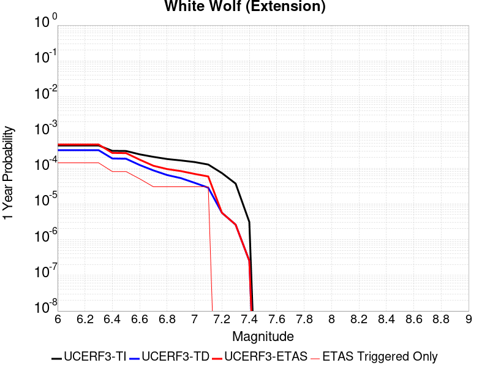 |  |

| Magnitude | 1 wk TI Prob | 1 wk TD Prob | 1 wk ETAS Prob | 1 wk ETAS/TD Gain | 1 wk ETAS Triggered Only | 1 mo TI Prob | 1 mo TD Prob | 1 mo ETAS Prob | 1 mo ETAS/TD Gain | 1 mo ETAS Triggered Only | 1 yr TI Prob | 1 yr TD Prob | 1 yr ETAS Prob | 1 yr ETAS/TD Gain | 1 yr ETAS Triggered Only | 10 yr TI Prob | 10 yr TD Prob | 10 yr ETAS Prob | 10 yr ETAS/TD Gain | 10 yr ETAS Triggered Only |
|-----|-----|-----|-----|-----|-----|-----|-----|-----|-----|-----|-----|-----|-----|-----|-----|-----|-----|-----|-----|-----|
| 6.0 | 8.222555E-6 | 6.066615E-6 | 6.2648964E-5 | 10.326839 | 5.658269E-5 | 3.5239045E-5 | 2.5999556E-5 | 9.672608E-5 | 3.7202973 | 7.072836E-5 | 4.289509E-4 | 3.1650523E-4 | 4.720584E-4 | 1.4914709 | 1.5560239E-4 | 0.0042812387 | 0.0031611966 | 0.0034009127 | 1.0758308 | 2.4047642E-4 |
| 6.1 | 8.222555E-6 | 6.066615E-6 | 6.2648964E-5 | 10.326839 | 5.658269E-5 | 3.5239045E-5 | 2.5999556E-5 | 9.672608E-5 | 3.7202973 | 7.072836E-5 | 4.289509E-4 | 3.1650523E-4 | 4.720584E-4 | 1.4914709 | 1.5560239E-4 | 0.0042812387 | 0.0031611966 | 0.0034009127 | 1.0758308 | 2.4047642E-4 |
| 6.2 | 8.222555E-6 | 6.066615E-6 | 6.2648964E-5 | 10.326839 | 5.658269E-5 | 3.5239045E-5 | 2.5999556E-5 | 9.672608E-5 | 3.7202973 | 7.072836E-5 | 4.289509E-4 | 3.1650523E-4 | 4.720584E-4 | 1.4914709 | 1.5560239E-4 | 0.0042812387 | 0.0031611966 | 0.0034009127 | 1.0758308 | 2.4047642E-4 |
| 6.3 | 8.222555E-6 | 6.066615E-6 | 6.2648964E-5 | 10.326839 | 5.658269E-5 | 3.5239045E-5 | 2.5999556E-5 | 9.672608E-5 | 3.7202973 | 7.072836E-5 | 4.289509E-4 | 3.1650523E-4 | 4.720584E-4 | 1.4914709 | 1.5560239E-4 | 0.0042812387 | 0.0031611966 | 0.0034009127 | 1.0758308 | 2.4047642E-4 |
| 6.4 | 5.821773E-6 | 3.5571256E-6 | 3.184837E-5 | 8.9534 | 2.8291344E-5 | 2.4950215E-5 | 1.5244741E-5 | 5.768111E-5 | 3.7836726 | 4.2437016E-5 | 3.0372653E-4 | 1.8559002E-4 | 2.704483E-4 | 1.4572352 | 8.487403E-5 | 0.0030331176 | 0.0018544586 | 0.001995653 | 1.0761378 | 1.4145672E-4 |
| 6.5 | 5.766023E-6 | 3.4990599E-6 | 3.1790307E-5 | 9.085385 | 2.8291344E-5 | 2.4711293E-5 | 1.49958905E-5 | 5.743227E-5 | 3.8298674 | 4.2437016E-5 | 3.0081844E-4 | 1.8256076E-4 | 2.674193E-4 | 1.4648235 | 8.487403E-5 | 0.0030041158 | 0.0018242161 | 0.0019654147 | 1.0774024 | 1.4145672E-4 |
| 6.6 | 4.643576E-6 | 2.3325733E-6 | 1.6478212E-5 | 7.064392 | 1.4145672E-5 | 1.9900888E-5 | 9.9967065E-6 | 3.828777E-5 | 3.8300383 | 2.8291344E-5 | 2.4226638E-4 | 1.2170354E-4 | 1.924233E-4 | 1.5810821 | 7.072836E-5 | 0.0024200242 | 0.0012164112 | 0.0013153105 | 1.0813041 | 9.901971E-5 |
| 6.7 | 3.9529173E-6 | 1.6482975E-6 | 1.5793947E-5 | 9.581976 | 1.4145672E-5 | 1.6940963E-5 | 7.064114E-6 | 2.1209686E-5 | 3.0024552 | 1.4145672E-5 | 2.0623671E-4 | 8.600239E-5 | 1.2843576E-4 | 1.4933976 | 4.2437016E-5 | 0.002060454 | 8.597095E-4 | 9.3037705E-4 | 1.0821993 | 7.072836E-5 |
| 6.8 | 3.4377522E-6 | 1.2244764E-6 | 1.5370131E-5 | 12.552412 | 1.4145672E-5 | 1.473314E-5 | 5.247746E-6 | 1.9393343E-5 | 3.695557 | 1.4145672E-5 | 1.7936122E-4 | 6.388952E-5 | 1.0632383E-4 | 1.6641825 | 4.2437016E-5 | 0.0017921652 | 6.3872064E-4 | 6.952672E-4 | 1.0885309 | 5.658269E-5 |
| 6.9 | 3.1367306E-6 | 1.0033316E-6 | 1.5148989E-5 | 15.098687 | 1.4145672E-5 | 1.3443062E-5 | 4.299986E-6 | 1.8445597E-5 | 4.289688 | 1.4145672E-5 | 1.63657E-4 | 5.2351144E-5 | 9.478594E-5 | 1.81058 | 4.2437016E-5 | 0.0016353652 | 5.233958E-4 | 5.799488E-4 | 1.1080503 | 5.658269E-5 |
| 7.0 | 2.8298145E-6 | 7.4282326E-7 | 1.4888485E-5 | 20.043104 | 1.4145672E-5 | 1.2127721E-5 | 3.1835248E-6 | 1.7329152E-5 | 5.4433856 | 1.4145672E-5 | 1.47645E-4 | 3.8758775E-5 | 8.119414E-5 | 2.0948584 | 4.2437016E-5 | 0.0014754693 | 3.8752513E-4 | 4.440859E-4 | 1.1459538 | 5.658269E-5 |
| 7.1 | 2.4091064E-6 | 5.4223835E-7 | 1.4687903E-5 | 27.08754 | 1.4145672E-5 | 1.03247E-5 | 2.3238767E-6 | 1.6469516E-5 | 7.0870867 | 1.4145672E-5 | 1.2569598E-4 | 2.8292874E-5 | 7.072869E-5 | 2.4998765 | 4.2437016E-5 | 0.001256249 | 2.8289677E-4 | 3.2532177E-4 | 1.1499664 | 4.2437016E-5 |
| 7.2 | 1.3875518E-6 | 1.0740268E-7 | 1.0740268E-7 | 1.0 | 0.0 | 5.9466374E-6 | 4.6029712E-7 | 4.6029712E-7 | 1.0 | 0.0 | 7.23979E-5 | 5.604104E-6 | 5.604104E-6 | 1.0 | 0.0 | 7.2374323E-4 | 5.6039742E-5 | 5.6039742E-5 | 1.0 | 0.0 |
| 7.3 | 7.056077E-7 | 5.0002956E-8 | 5.0002956E-8 | 1.0 | 0.0 | 3.0240296E-6 | 2.1429837E-7 | 2.1429837E-7 | 1.0 | 0.0 | 3.681694E-5 | 2.60908E-6 | 2.60908E-6 | 1.0 | 0.0 | 3.681084E-4 | 2.609054E-5 | 2.609054E-5 | 1.0 | 0.0 |
| 7.4 | 5.9334678E-8 | 4.8638475E-9 | 4.8638475E-9 | 1.0 | 0.0 | 2.5429145E-7 | 2.084506E-8 | 2.084506E-8 | 1.0 | 0.0 | 3.095994E-6 | 2.5378858E-7 | 2.5378858E-7 | 1.0 | 0.0 | 3.095951E-5 | 2.5378843E-6 | 2.5378843E-6 | 1.0 | 0.0 |

## Rose Canyon
*[(top)](#table-of-contents)*

| 1 Week | 1 Month | 1 Year | 10 Year |
|-----|-----|-----|-----|
| 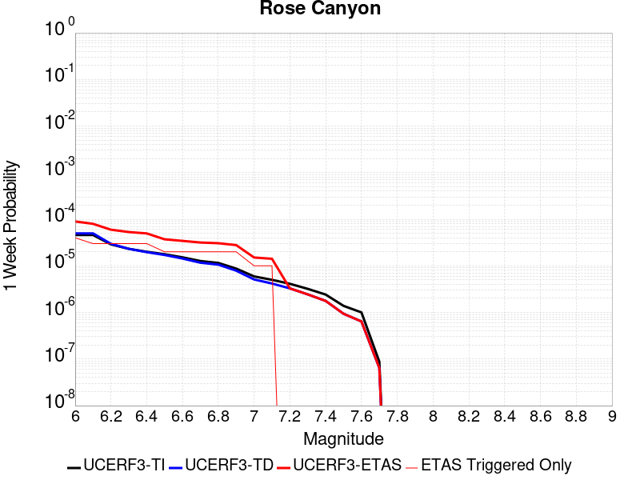 |  |  |  |

| Magnitude | 1 wk TI Prob | 1 wk TD Prob | 1 wk ETAS Prob | 1 wk ETAS/TD Gain | 1 wk ETAS Triggered Only | 1 mo TI Prob | 1 mo TD Prob | 1 mo ETAS Prob | 1 mo ETAS/TD Gain | 1 mo ETAS Triggered Only | 1 yr TI Prob | 1 yr TD Prob | 1 yr ETAS Prob | 1 yr ETAS/TD Gain | 1 yr ETAS Triggered Only | 10 yr TI Prob | 10 yr TD Prob | 10 yr ETAS Prob | 10 yr ETAS/TD Gain | 10 yr ETAS Triggered Only |
|-----|-----|-----|-----|-----|-----|-----|-----|-----|-----|-----|-----|-----|-----|-----|-----|-----|-----|-----|-----|-----|
| 6.0 | 4.5923203E-5 | 4.9714607E-5 | 9.2149516E-5 | 1.8535702 | 4.2437016E-5 | 1.9679888E-4 | 2.1304654E-4 | 2.696172E-4 | 1.2655318 | 5.658269E-5 | 0.0023933933 | 0.0025909478 | 0.002675602 | 1.032673 | 8.487403E-5 | 0.023677798 | 0.025618518 | 0.025825268 | 1.0080703 | 2.1218508E-4 |
| 6.1 | 4.5923203E-5 | 4.9714607E-5 | 7.8004545E-5 | 1.5690469 | 2.8291344E-5 | 1.9679888E-4 | 2.1304654E-4 | 2.5547453E-4 | 1.1991489 | 4.2437016E-5 | 0.0023933933 | 0.0025909478 | 0.002661493 | 1.0272275 | 7.072836E-5 | 0.023677798 | 0.025618518 | 0.025728785 | 1.0043042 | 1.1316538E-4 |
| 6.2 | 2.8844734E-5 | 2.9669678E-5 | 5.7960184E-5 | 1.9535158 | 2.8291344E-5 | 1.2361443E-4 | 1.2714976E-4 | 1.554375E-4 | 1.2224758 | 2.8291344E-5 | 0.0015039665 | 0.001546976 | 0.0015752236 | 1.0182599 | 2.8291344E-5 | 0.0149382865 | 0.015364873 | 0.015406658 | 1.0027195 | 4.2437016E-5 |
| 6.3 | 2.3171577E-5 | 2.3162425E-5 | 5.1453113E-5 | 2.2214046 | 2.8291344E-5 | 9.9302975E-5 | 9.926383E-5 | 1.2755237E-4 | 1.2849833 | 2.8291344E-5 | 0.0012083431 | 0.0012078804 | 0.0012361376 | 1.023394 | 2.8291344E-5 | 0.012017938 | 0.012012152 | 0.012054079 | 1.0034904 | 4.2437016E-5 |
| 6.4 | 2.0066604E-5 | 1.9668067E-5 | 4.7958856E-5 | 2.4384122 | 2.8291344E-5 | 8.599689E-5 | 8.428905E-5 | 1.1257801E-4 | 1.3356185 | 2.8291344E-5 | 0.0010465092 | 0.001025746 | 0.0010540084 | 1.027553 | 2.8291344E-5 | 0.010415946 | 0.010211479 | 0.0102534825 | 1.0041134 | 4.2437016E-5 |
| 6.5 | 1.776989E-5 | 1.7115402E-5 | 4.540626E-5 | 2.6529474 | 2.8291344E-5 | 7.615444E-5 | 7.33497E-5 | 1.01638965E-4 | 1.3856767 | 2.8291344E-5 | 9.267859E-4 | 8.926737E-4 | 9.209397E-4 | 1.0316645 | 2.8291344E-5 | 0.009229303 | 0.008874663 | 0.008902703 | 1.0031596 | 2.8291344E-5 |
| 6.6 | 1.5227364E-5 | 1.4340872E-5 | 4.263181E-5 | 2.9727488 | 2.8291344E-5 | 6.52585E-5 | 6.145947E-5 | 8.974907E-5 | 1.460297 | 2.8291344E-5 | 7.942326E-4 | 7.480173E-4 | 7.7628746E-4 | 1.0377935 | 2.8291344E-5 | 0.007914 | 0.0074410336 | 0.0074691144 | 1.0037738 | 2.8291344E-5 |
| 6.7 | 1.2703898E-5 | 1.1674277E-5 | 3.9965293E-5 | 3.4233632 | 2.8291344E-5 | 5.4444143E-5 | 5.0031682E-5 | 7.832161E-5 | 1.5654403 | 2.8291344E-5 | 6.626558E-4 | 6.089697E-4 | 6.3724385E-4 | 1.0464294 | 2.8291344E-5 | 0.006606833 | 0.0060623093 | 0.006090429 | 1.0046384 | 2.8291344E-5 |
| 6.8 | 1.1554917E-5 | 1.0610384E-5 | 3.8901428E-5 | 3.6663542 | 2.8291344E-5 | 4.9520135E-5 | 4.547231E-5 | 7.376236E-5 | 1.6221381 | 2.8291344E-5 | 6.0274085E-4 | 5.5348873E-4 | 5.8176444E-4 | 1.0510863 | 2.8291344E-5 | 0.0060110865 | 0.005504414 | 0.0055325497 | 1.0051115 | 2.8291344E-5 |
| 6.9 | 8.732078E-6 | 7.882285E-6 | 3.6173406E-5 | 4.589203 | 2.8291344E-5 | 3.7422655E-5 | 3.37808E-5 | 6.2071194E-5 | 1.8374695 | 2.8291344E-5 | 4.5552556E-4 | 4.112066E-4 | 4.394863E-4 | 1.0687726 | 2.8291344E-5 | 0.0045459294 | 0.004089515 | 0.0041176905 | 1.0068897 | 2.8291344E-5 |
| 7.0 | 5.9337494E-6 | 5.107436E-6 | 1.9253037E-5 | 3.7696087 | 1.4145672E-5 | 2.5430107E-5 | 2.1888829E-5 | 3.603419E-5 | 1.6462365 | 1.4145672E-5 | 3.0956755E-4 | 2.6646405E-4 | 2.8060595E-4 | 1.0530725 | 1.4145672E-5 | 0.0030913667 | 0.002661461 | 0.0026755692 | 1.0053009 | 1.4145672E-5 |
| 7.1 | 5.013409E-6 | 4.17734E-6 | 1.8322953E-5 | 4.386273 | 1.4145672E-5 | 2.1485863E-5 | 1.7902763E-5 | 3.204818E-5 | 1.7901249 | 1.4145672E-5 | 2.6155898E-4 | 2.1794444E-4 | 2.3208704E-4 | 1.0648907 | 1.4145672E-5 | 0.0026125133 | 0.0021773188 | 0.0021914337 | 1.0064827 | 1.4145672E-5 |
| 7.2 | 4.120763E-6 | 3.2820917E-6 | 3.2820917E-6 | 1.0 | 0.0 | 1.7660293E-5 | 1.4066032E-5 | 1.4066032E-5 | 1.0 | 0.0 | 2.1499286E-4 | 1.7124058E-4 | 1.7124058E-4 | 1.0 | 0.0 | 0.0021478499 | 0.0017110958 | 0.0017110958 | 1.0 | 0.0 |
| 7.3 | 3.2081239E-6 | 2.4404965E-6 | 2.4404965E-6 | 1.0 | 0.0 | 1.374903E-5 | 1.0459229E-5 | 1.0459229E-5 | 1.0 | 0.0 | 1.6738157E-4 | 1.2733374E-4 | 1.2733374E-4 | 1.0 | 0.0 | 0.0016725556 | 0.0012726148 | 0.0012726148 | 1.0 | 0.0 |
| 7.4 | 2.4194755E-6 | 1.7680321E-6 | 1.7680321E-6 | 1.0 | 0.0 | 1.0369139E-5 | 7.5772587E-6 | 7.5772587E-6 | 1.0 | 0.0 | 1.2623696E-4 | 9.224927E-5 | 9.224927E-5 | 1.0 | 0.0 | 0.0012616527 | 9.221151E-4 | 9.221151E-4 | 1.0 | 0.0 |
| 7.5 | 1.3842889E-6 | 9.3782967E-7 | 9.3782967E-7 | 1.0 | 0.0 | 5.9326535E-6 | 4.019264E-6 | 4.019264E-6 | 1.0 | 0.0 | 7.222766E-5 | 4.8933474E-5 | 4.8933474E-5 | 1.0 | 0.0 | 7.220419E-4 | 4.8923056E-4 | 4.8923056E-4 | 1.0 | 0.0 |
| 7.6 | 1.0021575E-6 | 6.4113493E-7 | 6.4113493E-7 | 1.0 | 0.0 | 4.2949537E-6 | 2.7477186E-6 | 2.7477186E-6 | 1.0 | 0.0 | 5.2289808E-5 | 3.345298E-5 | 3.345298E-5 | 1.0 | 0.0 | 5.2277505E-4 | 3.344816E-4 | 3.344816E-4 | 1.0 | 0.0 |
| 7.7 | 8.7620116E-8 | 6.449304E-8 | 6.449304E-8 | 1.0 | 0.0 | 3.7551473E-7 | 2.763987E-7 | 2.763987E-7 | 1.0 | 0.0 | 4.5718825E-6 | 3.3651493E-6 | 3.3651493E-6 | 1.0 | 0.0 | 4.5717883E-5 | 3.3651013E-5 | 3.3651013E-5 | 1.0 | 0.0 |

## Lake Isabella (Seismicity)
*[(top)](#table-of-contents)*

| 1 Week | 1 Month | 1 Year | 10 Year |
|-----|-----|-----|-----|
|  |  |  |  |

| Magnitude | 1 wk TI Prob | 1 wk TD Prob | 1 wk ETAS Prob | 1 wk ETAS/TD Gain | 1 wk ETAS Triggered Only | 1 mo TI Prob | 1 mo TD Prob | 1 mo ETAS Prob | 1 mo ETAS/TD Gain | 1 mo ETAS Triggered Only | 1 yr TI Prob | 1 yr TD Prob | 1 yr ETAS Prob | 1 yr ETAS/TD Gain | 1 yr ETAS Triggered Only | 10 yr TI Prob | 10 yr TD Prob | 10 yr ETAS Prob | 10 yr ETAS/TD Gain | 10 yr ETAS Triggered Only |
|-----|-----|-----|-----|-----|-----|-----|-----|-----|-----|-----|-----|-----|-----|-----|-----|-----|-----|-----|-----|-----|
| 6.0 | 9.431637E-6 | 9.741651E-6 | 5.2178253E-5 | 5.356202 | 4.2437016E-5 | 4.0420677E-5 | 4.1749343E-5 | 1.2661984E-4 | 3.0328581 | 8.487403E-5 | 4.920106E-4 | 5.0819275E-4 | 6.495776E-4 | 1.278211 | 1.4145672E-4 | 0.004909227 | 0.005071599 | 0.0052967817 | 1.0444008 | 2.2633075E-4 |
| 6.1 | 9.431637E-6 | 9.741651E-6 | 5.2178253E-5 | 5.356202 | 4.2437016E-5 | 4.0420677E-5 | 4.1749343E-5 | 1.2661984E-4 | 3.0328581 | 8.487403E-5 | 4.920106E-4 | 5.0819275E-4 | 6.495776E-4 | 1.278211 | 1.4145672E-4 | 0.004909227 | 0.005071599 | 0.0052967817 | 1.0444008 | 2.2633075E-4 |
| 6.2 | 9.431637E-6 | 9.741651E-6 | 5.2178253E-5 | 5.356202 | 4.2437016E-5 | 4.0420677E-5 | 4.1749343E-5 | 1.2661984E-4 | 3.0328581 | 8.487403E-5 | 4.920106E-4 | 5.0819275E-4 | 6.495776E-4 | 1.278211 | 1.4145672E-4 | 0.004909227 | 0.005071599 | 0.0052967817 | 1.0444008 | 2.2633075E-4 |
| 6.3 | 9.431637E-6 | 9.741651E-6 | 5.2178253E-5 | 5.356202 | 4.2437016E-5 | 4.0420677E-5 | 4.1749343E-5 | 1.2661984E-4 | 3.0328581 | 8.487403E-5 | 4.920106E-4 | 5.0819275E-4 | 6.495776E-4 | 1.278211 | 1.4145672E-4 | 0.004909227 | 0.005071599 | 0.0052967817 | 1.0444008 | 2.2633075E-4 |
| 6.4 | 5.144063E-6 | 5.3000763E-6 | 3.359127E-5 | 6.3378844 | 2.8291344E-5 | 2.2045799E-5 | 2.2714434E-5 | 7.929584E-5 | 3.490989 | 5.658269E-5 | 2.6837454E-4 | 2.765166E-4 | 3.6136716E-4 | 1.3068552 | 8.487403E-5 | 0.0026805066 | 0.0027620657 | 0.0029031318 | 1.0510726 | 1.4145672E-4 |
| 6.5 | 5.144063E-6 | 5.3000763E-6 | 3.359127E-5 | 6.3378844 | 2.8291344E-5 | 2.2045799E-5 | 2.2714434E-5 | 7.929584E-5 | 3.490989 | 5.658269E-5 | 2.6837454E-4 | 2.765166E-4 | 3.6136716E-4 | 1.3068552 | 8.487403E-5 | 0.0026805066 | 0.0027620657 | 0.0029031318 | 1.0510726 | 1.4145672E-4 |
| 6.6 | 3.4009804E-6 | 3.498786E-6 | 3.179003E-5 | 9.086018 | 2.8291344E-5 | 1.4575549E-5 | 1.4994721E-5 | 4.328564E-5 | 2.8867254 | 2.8291344E-5 | 1.7744285E-4 | 1.8254704E-4 | 2.249763E-4 | 1.2324293 | 4.2437016E-5 | 0.0017730123 | 0.0018241286 | 0.0019229676 | 1.0541843 | 9.901971E-5 |
| 6.7 | 3.3880428E-6 | 3.4856528E-6 | 3.1776897E-5 | 9.116485 | 2.8291344E-5 | 1.4520103E-5 | 1.4938435E-5 | 4.3229356E-5 | 2.8938344 | 2.8291344E-5 | 1.767679E-4 | 1.8186188E-4 | 2.2429117E-4 | 1.2333051 | 4.2437016E-5 | 0.0017662736 | 0.0018172882 | 0.001916128 | 1.0543886 | 9.901971E-5 |
| 6.8 | 2.6582E-6 | 2.7337003E-6 | 3.1024967E-5 | 11.349074 | 2.8291344E-5 | 1.1392236E-5 | 1.1715813E-5 | 4.0006827E-5 | 3.4147716 | 2.8291344E-5 | 1.3869164E-4 | 1.4263204E-4 | 1.8506299E-4 | 1.2974855 | 4.2437016E-5 | 0.0013860512 | 0.0014255369 | 0.00151029 | 1.0594534 | 8.487403E-5 |
| 6.9 | 2.406011E-6 | 2.4743288E-6 | 3.0765605E-5 | 12.433918 | 2.8291344E-5 | 1.0311434E-5 | 1.0604231E-5 | 3.8895276E-5 | 3.6679015 | 2.8291344E-5 | 1.2553448E-4 | 1.2910018E-4 | 1.7153172E-4 | 1.3286715 | 4.2437016E-5 | 0.0012546359 | 0.0012903814 | 0.001375146 | 1.0656894 | 8.487403E-5 |
| 7.0 | 1.6953097E-6 | 1.7429371E-6 | 1.5888585E-5 | 9.115982 | 1.4145672E-5 | 7.265593E-6 | 7.469715E-6 | 2.1615282E-5 | 2.8937223 | 1.4145672E-5 | 8.8455E-5 | 9.094104E-5 | 1.1922981E-4 | 1.3110672 | 2.8291344E-5 | 8.84198E-4 | 9.09141E-4 | 9.515394E-4 | 1.0466357 | 4.2437016E-5 |
| 7.1 | 3.5013824E-7 | 3.5714822E-7 | 3.5714822E-7 | 1.0 | 0.0 | 1.5005916E-6 | 1.5306344E-6 | 1.5306344E-6 | 1.0 | 0.0 | 1.826955E-5 | 1.8635317E-5 | 1.8635317E-5 | 1.0 | 0.0 | 1.8268047E-4 | 1.863378E-4 | 2.0048083E-4 | 1.0759 | 1.4145672E-5 |
| 7.2 | 2.2321095E-7 | 2.2750574E-7 | 2.2750574E-7 | 1.0 | 0.0 | 9.56618E-7 | 9.750242E-7 | 9.750242E-7 | 1.0 | 0.0 | 1.1646762E-5 | 1.1870856E-5 | 1.1870856E-5 | 1.0 | 0.0 | 1.1646151E-4 | 1.1870232E-4 | 1.3284631E-4 | 1.1191552 | 1.4145672E-5 |
| 7.3 | 1.5760406E-7 | 1.6060922E-7 | 1.6060922E-7 | 1.0 | 0.0 | 6.7544585E-7 | 6.8832503E-7 | 6.8832503E-7 | 1.0 | 0.0 | 8.223522E-6 | 8.380326E-6 | 8.380326E-6 | 1.0 | 0.0 | 8.2232174E-5 | 8.3800165E-5 | 9.794465E-5 | 1.1687883 | 1.4145672E-5 |
| 7.4 | 1.1216497E-7 | 1.1431706E-7 | 1.1431706E-7 | 1.0 | 0.0 | 4.8070694E-7 | 4.899302E-7 | 4.899302E-7 | 1.0 | 0.0 | 5.852591E-6 | 5.964884E-6 | 5.964884E-6 | 1.0 | 0.0 | 5.8524372E-5 | 5.9647282E-5 | 7.3792115E-5 | 1.2371413 | 1.4145672E-5 |
| 7.5 | 4.885185E-8 | 4.9787737E-8 | 4.9787737E-8 | 1.0 | 0.0 | 2.0936506E-7 | 2.13376E-7 | 2.13376E-7 | 1.0 | 0.0 | 2.5490165E-6 | 2.59785E-6 | 2.59785E-6 | 1.0 | 0.0 | 2.5489873E-5 | 2.5978214E-5 | 2.5978214E-5 | 1.0 | 0.0 |
| 7.6 | 1.504641E-9 | 1.5317903E-9 | 1.5317903E-9 | 1.0 | 0.0 | 6.4484613E-9 | 6.5648154E-9 | 6.5648154E-9 | 1.0 | 0.0 | 7.851001E-8 | 7.992663E-8 | 7.992663E-8 | 1.0 | 0.0 | 7.8509987E-7 | 7.992663E-7 | 7.992663E-7 | 1.0 | 0.0 |

## San Jacinto (Stepovers Combined)
*[(top)](#table-of-contents)*

| 1 Week | 1 Month | 1 Year | 10 Year |
|-----|-----|-----|-----|
|  |  |  |  |

| Magnitude | 1 wk TI Prob | 1 wk TD Prob | 1 wk ETAS Prob | 1 wk ETAS/TD Gain | 1 wk ETAS Triggered Only | 1 mo TI Prob | 1 mo TD Prob | 1 mo ETAS Prob | 1 mo ETAS/TD Gain | 1 mo ETAS Triggered Only | 1 yr TI Prob | 1 yr TD Prob | 1 yr ETAS Prob | 1 yr ETAS/TD Gain | 1 yr ETAS Triggered Only | 10 yr TI Prob | 10 yr TD Prob | 10 yr ETAS Prob | 10 yr ETAS/TD Gain | 10 yr ETAS Triggered Only |
|-----|-----|-----|-----|-----|-----|-----|-----|-----|-----|-----|-----|-----|-----|-----|-----|-----|-----|-----|-----|-----|
| 6.0 | 4.0667746E-5 | 3.5271103E-5 | 1.3428731E-4 | 3.8072898 | 9.901971E-5 | 1.742787E-4 | 1.5115313E-4 | 2.5015787E-4 | 1.6549963 | 9.901971E-5 | 0.0021197782 | 0.0018387372 | 0.0019940536 | 1.084469 | 1.5560239E-4 | 0.020996714 | 0.018986495 | 0.019194651 | 1.0109634 | 2.1218508E-4 |
| 6.1 | 4.0667746E-5 | 3.5271103E-5 | 1.3428731E-4 | 3.8072898 | 9.901971E-5 | 1.742787E-4 | 1.5115313E-4 | 2.5015787E-4 | 1.6549963 | 9.901971E-5 | 0.0021197782 | 0.0018387372 | 0.0019940536 | 1.084469 | 1.5560239E-4 | 0.020996714 | 0.018986495 | 0.019194651 | 1.0109634 | 2.1218508E-4 |
| 6.2 | 4.0667746E-5 | 3.5271103E-5 | 1.3428731E-4 | 3.8072898 | 9.901971E-5 | 1.742787E-4 | 1.5115313E-4 | 2.5015787E-4 | 1.6549963 | 9.901971E-5 | 0.0021197782 | 0.0018387372 | 0.0019940536 | 1.084469 | 1.5560239E-4 | 0.020996714 | 0.018986495 | 0.019194651 | 1.0109634 | 2.1218508E-4 |
| 6.3 | 4.0667746E-5 | 3.5271103E-5 | 1.3428731E-4 | 3.8072898 | 9.901971E-5 | 1.742787E-4 | 1.5115313E-4 | 2.5015787E-4 | 1.6549963 | 9.901971E-5 | 0.0021197782 | 0.0018387372 | 0.0019940536 | 1.084469 | 1.5560239E-4 | 0.020996714 | 0.018986495 | 0.019194651 | 1.0109634 | 2.1218508E-4 |
| 6.4 | 4.0577226E-5 | 3.5143014E-5 | 1.3415924E-4 | 3.8175223 | 9.901971E-5 | 1.738908E-4 | 1.5060425E-4 | 2.4960903E-4 | 1.6573838 | 9.901971E-5 | 0.0021150648 | 0.0018320669 | 0.0019873842 | 1.0847771 | 1.5560239E-4 | 0.020950472 | 0.018921062 | 0.019115355 | 1.0102686 | 1.9803942E-4 |
| 6.5 | 4.0577226E-5 | 3.5143014E-5 | 1.3415924E-4 | 3.8175223 | 9.901971E-5 | 1.738908E-4 | 1.5060425E-4 | 2.4960903E-4 | 1.6573838 | 9.901971E-5 | 0.0021150648 | 0.0018320669 | 0.0019873842 | 1.0847771 | 1.5560239E-4 | 0.020950472 | 0.018921062 | 0.019115355 | 1.0102686 | 1.9803942E-4 |
| 6.6 | 4.053861E-5 | 3.5088357E-5 | 1.3410459E-4 | 3.8219113 | 9.901971E-5 | 1.7372532E-4 | 1.5037002E-4 | 2.4937483E-4 | 1.6584079 | 9.901971E-5 | 0.0021130538 | 0.0018292206 | 0.0019845383 | 1.0849092 | 1.5560239E-4 | 0.020930743 | 0.01889314 | 0.019087438 | 1.0102841 | 1.9803942E-4 |
| 6.7 | 4.0516545E-5 | 3.505743E-5 | 1.3407366E-4 | 3.8244007 | 9.901971E-5 | 1.7363077E-4 | 1.502375E-4 | 2.4924232E-4 | 1.6589888 | 9.901971E-5 | 0.002111905 | 0.0018276101 | 0.001982928 | 1.0849842 | 1.5560239E-4 | 0.020919468 | 0.018877337 | 0.019071637 | 1.0102928 | 1.9803942E-4 |
| 6.8 | 4.049434E-5 | 3.5028992E-5 | 1.3404523E-4 | 3.8266938 | 9.901971E-5 | 1.7353562E-4 | 1.5011564E-4 | 2.4912047E-4 | 1.6595238 | 9.901971E-5 | 0.0021107488 | 0.0018261289 | 0.0019814472 | 1.0850533 | 1.5560239E-4 | 0.020908125 | 0.018862749 | 0.019057052 | 1.0103009 | 1.9803942E-4 |
| 6.9 | 4.046386E-5 | 3.4991554E-5 | 1.3400779E-4 | 3.8297184 | 9.901971E-5 | 1.73405E-4 | 1.499552E-4 | 2.4896004E-4 | 1.6602296 | 9.901971E-5 | 0.0021091616 | 0.0018241788 | 0.0019794975 | 1.0851444 | 1.5560239E-4 | 0.020892553 | 0.018843522 | 0.01903783 | 1.0103116 | 1.9803942E-4 |
| 7.0 | 4.036382E-5 | 3.4872126E-5 | 1.3388837E-4 | 3.8394098 | 9.901971E-5 | 1.7297632E-4 | 1.4944343E-4 | 2.484483E-4 | 1.662491 | 9.901971E-5 | 0.0021039525 | 0.0018179584 | 0.001973278 | 1.0854362 | 1.5560239E-4 | 0.02084144 | 0.018782137 | 0.018976456 | 1.0103459 | 1.9803942E-4 |
| 7.1 | 4.0343282E-5 | 3.485059E-5 | 1.3386684E-4 | 3.8411646 | 9.901971E-5 | 1.7288832E-4 | 1.4935112E-4 | 2.4835605E-4 | 1.6629003 | 9.901971E-5 | 0.002102883 | 0.0018168368 | 0.0019721563 | 1.085489 | 1.5560239E-4 | 0.020830948 | 0.018771008 | 0.01896533 | 1.0103523 | 1.9803942E-4 |
| 7.2 | 4.0257353E-5 | 3.475509E-5 | 1.3377135E-4 | 3.8489718 | 9.901971E-5 | 1.725201E-4 | 1.489419E-4 | 2.4794685E-4 | 1.6647221 | 9.901971E-5 | 0.0020984085 | 0.0018118626 | 0.001967183 | 1.0857242 | 1.5560239E-4 | 0.020787042 | 0.018721746 | 0.018916078 | 1.01038 | 1.9803942E-4 |
| 7.3 | 3.9940667E-5 | 3.458276E-5 | 1.3359904E-4 | 3.863169 | 9.901971E-5 | 1.7116306E-4 | 1.4820343E-4 | 2.4720846E-4 | 1.6680347 | 9.901971E-5 | 0.0020819185 | 0.0018028866 | 0.0019582086 | 1.0861517 | 1.5560239E-4 | 0.020625217 | 0.018630387 | 0.018824738 | 1.0104319 | 1.9803942E-4 |
| 7.4 | 3.9721202E-5 | 3.4468165E-5 | 1.3348446E-4 | 3.872688 | 9.901971E-5 | 1.7022261E-4 | 1.4771236E-4 | 2.4671745E-4 | 1.6702559 | 9.901971E-5 | 0.0020704903 | 0.0017969179 | 0.0019522406 | 1.0864384 | 1.5560239E-4 | 0.020513052 | 0.018569522 | 0.018763883 | 1.0104667 | 1.9803942E-4 |
| 7.5 | 3.7036873E-5 | 3.3535776E-5 | 1.3255216E-4 | 3.95256 | 9.901971E-5 | 1.5871979E-4 | 1.4371685E-4 | 2.4272232E-4 | 1.6888926 | 9.901971E-5 | 0.0019307006 | 0.0017483513 | 0.0019036817 | 1.088844 | 1.5560239E-4 | 0.019140124 | 0.018071128 | 0.018265588 | 1.0107609 | 1.9803942E-4 |
| 7.6 | 3.2940967E-5 | 3.13167E-5 | 1.3033331E-4 | 4.1617827 | 9.901971E-5 | 1.4116794E-4 | 1.3420754E-4 | 2.3321396E-4 | 1.7377113 | 9.901971E-5 | 0.0017173645 | 0.0016327545 | 0.0017881028 | 1.095145 | 1.5560239E-4 | 0.01704153 | 0.016904091 | 0.017084876 | 1.0106947 | 1.8389373E-4 |
| 7.7 | 2.8236149E-5 | 2.7882697E-5 | 1.2689964E-4 | 4.5511966 | 9.901971E-5 | 1.2100645E-4 | 1.1949181E-4 | 2.1849968E-4 | 1.8285745 | 9.901971E-5 | 0.0014722579 | 0.0014538429 | 0.0016092191 | 1.1068728 | 1.5560239E-4 | 0.014625421 | 0.015114912 | 0.015296026 | 1.0119824 | 1.8389373E-4 |
| 7.8 | 2.4329287E-5 | 2.5206451E-5 | 1.2422366E-4 | 4.928249 | 9.901971E-5 | 1.042642E-4 | 1.08023174E-4 | 2.0703218E-4 | 1.9165534 | 9.901971E-5 | 0.0012686774 | 0.0013143895 | 0.0014697874 | 1.1182282 | 1.5560239E-4 | 0.012614589 | 0.013712341 | 0.013893712 | 1.013227 | 1.8389373E-4 |
| 7.9 | 1.9370926E-5 | 2.0420413E-5 | 1.194381E-4 | 5.848956 | 9.901971E-5 | 8.301561E-5 | 8.751312E-5 | 1.8652416E-4 | 2.131385 | 9.901971E-5 | 0.0010102465 | 0.0010649522 | 0.0012203889 | 1.1459565 | 1.5560239E-4 | 0.0100566605 | 0.011199402 | 0.011381236 | 1.0162361 | 1.8389373E-4 |
| 8.0 | 1.5583017E-5 | 1.5885415E-5 | 1.007581E-4 | 6.3428054 | 8.487403E-5 | 6.6782646E-5 | 6.807858E-5 | 1.5294683E-4 | 2.246622 | 8.487403E-5 | 8.127754E-4 | 8.2854216E-4 | 9.698817E-4 | 1.1705883 | 1.4145672E-4 | 0.008098091 | 0.008781636 | 0.0089498935 | 1.0191602 | 1.6974806E-4 |
| 8.1 | 1.0024873E-5 | 8.291399E-6 | 3.658251E-5 | 4.412103 | 2.8291344E-5 | 4.2963035E-5 | 3.553409E-5 | 6.3824424E-5 | 1.7961465 | 2.8291344E-5 | 5.229494E-4 | 4.3254215E-4 | 4.749608E-4 | 1.0980682 | 4.2437016E-5 | 0.0052172043 | 0.0046530655 | 0.004695305 | 1.0090778 | 4.2437016E-5 |
| 8.2 | 4.142796E-6 | 1.5602761E-6 | 1.5602761E-6 | 1.0 | 0.0 | 1.775472E-5 | 6.6868806E-6 | 6.6868806E-6 | 1.0 | 0.0 | 2.1614227E-4 | 8.140976E-5 | 8.140976E-5 | 1.0 | 0.0 | 0.0021593217 | 9.4514614E-4 | 9.4514614E-4 | 1.0 | 0.0 |
| 8.3 | 1.2750878E-6 | 3.609817E-7 | 3.609817E-7 | 1.0 | 0.0 | 5.4646503E-6 | 1.5470634E-6 | 1.5470634E-6 | 1.0 | 0.0 | 6.653009E-5 | 1.8835339E-5 | 1.8835339E-5 | 1.0 | 0.0 | 6.6510175E-4 | 2.272251E-4 | 2.272251E-4 | 1.0 | 0.0 |

## Pinto Mtn
*[(top)](#table-of-contents)*

| 1 Week | 1 Month | 1 Year | 10 Year |
|-----|-----|-----|-----|
|  | 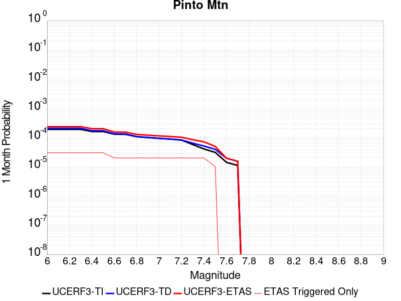 |  |  |

| Magnitude | 1 wk TI Prob | 1 wk TD Prob | 1 wk ETAS Prob | 1 wk ETAS/TD Gain | 1 wk ETAS Triggered Only | 1 mo TI Prob | 1 mo TD Prob | 1 mo ETAS Prob | 1 mo ETAS/TD Gain | 1 mo ETAS Triggered Only | 1 yr TI Prob | 1 yr TD Prob | 1 yr ETAS Prob | 1 yr ETAS/TD Gain | 1 yr ETAS Triggered Only | 10 yr TI Prob | 10 yr TD Prob | 10 yr ETAS Prob | 10 yr ETAS/TD Gain | 10 yr ETAS Triggered Only |
|-----|-----|-----|-----|-----|-----|-----|-----|-----|-----|-----|-----|-----|-----|-----|-----|-----|-----|-----|-----|-----|
| 6.0 | 4.4194956E-5 | 4.7853926E-5 | 7.6143915E-5 | 1.5911739 | 2.8291344E-5 | 1.893932E-4 | 2.0507304E-4 | 2.3335859E-4 | 1.1379291 | 2.8291344E-5 | 0.0023034236 | 0.0024940688 | 0.0026069519 | 1.0452607 | 1.1316538E-4 | 0.022796938 | 0.024678305 | 0.024871457 | 1.0078268 | 1.9803942E-4 |
| 6.1 | 4.4194956E-5 | 4.7853926E-5 | 7.6143915E-5 | 1.5911739 | 2.8291344E-5 | 1.893932E-4 | 2.0507304E-4 | 2.3335859E-4 | 1.1379291 | 2.8291344E-5 | 0.0023034236 | 0.0024940688 | 0.0026069519 | 1.0452607 | 1.1316538E-4 | 0.022796938 | 0.024678305 | 0.024871457 | 1.0078268 | 1.9803942E-4 |
| 6.2 | 4.4194956E-5 | 4.7853926E-5 | 7.6143915E-5 | 1.5911739 | 2.8291344E-5 | 1.893932E-4 | 2.0507304E-4 | 2.3335859E-4 | 1.1379291 | 2.8291344E-5 | 0.0023034236 | 0.0024940688 | 0.0026069519 | 1.0452607 | 1.1316538E-4 | 0.022796938 | 0.024678305 | 0.024871457 | 1.0078268 | 1.9803942E-4 |
| 6.3 | 4.4194956E-5 | 4.7853926E-5 | 7.6143915E-5 | 1.5911739 | 2.8291344E-5 | 1.893932E-4 | 2.0507304E-4 | 2.3335859E-4 | 1.1379291 | 2.8291344E-5 | 0.0023034236 | 0.0024940688 | 0.0026069519 | 1.0452607 | 1.1316538E-4 | 0.022796938 | 0.024678305 | 0.024871457 | 1.0078268 | 1.9803942E-4 |
| 6.4 | 3.729929E-5 | 3.960349E-5 | 6.7893714E-5 | 1.7143366 | 2.8291344E-5 | 1.5984432E-4 | 1.6971873E-4 | 1.9800528E-4 | 1.1666672 | 2.8291344E-5 | 0.0019443673 | 0.0020644604 | 0.0021773921 | 1.0547028 | 1.1316538E-4 | 0.019274427 | 0.020462848 | 0.02064298 | 1.0088028 | 1.8389373E-4 |
| 6.5 | 3.729929E-5 | 3.960349E-5 | 6.7893714E-5 | 1.7143366 | 2.8291344E-5 | 1.5984432E-4 | 1.6971873E-4 | 1.9800528E-4 | 1.1666672 | 2.8291344E-5 | 0.0019443673 | 0.0020644604 | 0.0021773921 | 1.0547028 | 1.1316538E-4 | 0.019274427 | 0.020462848 | 0.02064298 | 1.0088028 | 1.8389373E-4 |
| 6.6 | 3.0204548E-5 | 3.12056E-5 | 5.9496062E-5 | 1.9065828 | 2.8291344E-5 | 1.2944164E-4 | 1.3373162E-4 | 1.6201919E-4 | 1.2115248 | 2.8291344E-5 | 0.0015748127 | 0.0016270012 | 0.0017399825 | 1.0694414 | 1.1316538E-4 | 0.015636992 | 0.016154764 | 0.016293935 | 1.0086149 | 1.4145672E-4 |
| 6.7 | 2.9857754E-5 | 3.0814987E-5 | 5.9105456E-5 | 1.9180752 | 2.8291344E-5 | 1.2795553E-4 | 1.3205773E-4 | 1.6034534E-4 | 1.2142063 | 2.8291344E-5 | 0.0015567453 | 0.0016066517 | 0.0017196352 | 1.0703224 | 1.1316538E-4 | 0.015458848 | 0.015954204 | 0.016093405 | 1.0087249 | 1.4145672E-4 |
| 6.8 | 2.4819734E-5 | 2.5009665E-5 | 5.3300304E-5 | 2.1311882 | 2.8291344E-5 | 1.0636595E-4 | 1.0718E-4 | 1.354683E-4 | 1.2639327 | 2.8291344E-5 | 0.0012942362 | 0.001304157 | 0.0014171748 | 1.0866597 | 1.1316538E-4 | 0.012867244 | 0.012967403 | 0.013107025 | 1.0107672 | 1.4145672E-4 |
| 6.9 | 2.331124E-5 | 2.3337945E-5 | 5.162863E-5 | 2.2122183 | 2.8291344E-5 | 9.990149E-5 | 1.0001605E-4 | 1.2830456E-4 | 1.2828398 | 2.8291344E-5 | 0.001215622 | 0.0012170355 | 0.0013300631 | 1.0928713 | 1.1316538E-4 | 0.012089936 | 0.012105897 | 0.012245641 | 1.0115435 | 1.4145672E-4 |
| 7.0 | 2.1818534E-5 | 2.1761074E-5 | 5.0051804E-5 | 2.3000612 | 2.8291344E-5 | 9.3504656E-5 | 9.3258524E-5 | 1.2154723E-4 | 1.3033364 | 2.8291344E-5 | 0.0011378246 | 0.0011348509 | 0.0012196286 | 1.0747038 | 8.487403E-5 | 0.011320163 | 0.01129266 | 0.011404547 | 1.009908 | 1.1316538E-4 |
| 7.1 | 2.066081E-5 | 2.0540718E-5 | 4.883148E-5 | 2.3773017 | 2.8291344E-5 | 8.854332E-5 | 8.8028784E-5 | 1.1631764E-4 | 1.3213592 | 2.8291344E-5 | 0.0010774818 | 0.0010712431 | 0.0011560263 | 1.0791446 | 8.487403E-5 | 0.010722724 | 0.0106628435 | 0.010760807 | 1.0091875 | 9.901971E-5 |
| 7.2 | 1.8990233E-5 | 1.9054001E-5 | 4.7344805E-5 | 2.4847698 | 2.8291344E-5 | 8.138417E-5 | 8.165756E-5 | 1.09946595E-4 | 1.346435 | 2.8291344E-5 | 9.904018E-4 | 9.937467E-4 | 0.0010785364 | 1.0853232 | 8.487403E-5 | 0.009859995 | 0.009895029 | 0.009993069 | 1.009908 | 9.901971E-5 |
| 7.3 | 1.3335872E-5 | 1.4906713E-5 | 4.3197637E-5 | 2.8978646 | 2.8291344E-5 | 5.7152483E-5 | 6.388442E-5 | 9.2173956E-5 | 1.4428238 | 2.8291344E-5 | 6.956093E-4 | 7.77528E-4 | 8.62336E-4 | 1.109074 | 8.487403E-5 | 0.006934359 | 0.007749376 | 0.007847629 | 1.0126787 | 9.901971E-5 |
| 7.4 | 9.414066E-6 | 1.186096E-5 | 4.015197E-5 | 3.3852208 | 2.8291344E-5 | 4.0345374E-5 | 5.083175E-5 | 7.912165E-5 | 1.5565401 | 2.8291344E-5 | 4.910942E-4 | 6.1871024E-4 | 6.8939483E-4 | 1.114245 | 7.072836E-5 | 0.0049001034 | 0.0061708256 | 0.0062551755 | 1.0136693 | 8.487403E-5 |
| 7.5 | 7.2101157E-6 | 9.158192E-6 | 2.3303735E-5 | 2.544578 | 1.4145672E-5 | 3.090013E-5 | 3.9248847E-5 | 5.3393964E-5 | 1.3603957 | 1.4145672E-5 | 3.7614413E-4 | 4.7775774E-4 | 5.201745E-4 | 1.0887829 | 4.2437016E-5 | 0.0037550807 | 0.004768082 | 0.0048103165 | 1.0088578 | 4.2437016E-5 |
| 7.6 | 3.296375E-6 | 4.5455017E-6 | 4.5455017E-6 | 1.0 | 0.0 | 1.4127245E-5 | 1.9480583E-5 | 1.9480583E-5 | 1.0 | 0.0 | 1.7198564E-4 | 2.3715167E-4 | 2.3715167E-4 | 1.0 | 0.0 | 0.0017185259 | 0.0023691233 | 0.0023691233 | 1.0 | 0.0 |
| 7.7 | 2.5741092E-6 | 3.5844084E-6 | 3.5844084E-6 | 1.0 | 0.0 | 1.103185E-5 | 1.5361667E-5 | 1.5361667E-5 | 1.0 | 0.0 | 1.3430449E-4 | 1.8701357E-4 | 1.8701357E-4 | 1.0 | 0.0 | 0.0013422335 | 0.0018686918 | 0.0018686918 | 1.0 | 0.0 |

## Brawley (Seismic Zone) alt 1
*[(top)](#table-of-contents)*

| 1 Week | 1 Month | 1 Year | 10 Year |
|-----|-----|-----|-----|
|  |  |  |  |

| Magnitude | 1 wk TI Prob | 1 wk TD Prob | 1 wk ETAS Prob | 1 wk ETAS/TD Gain | 1 wk ETAS Triggered Only | 1 mo TI Prob | 1 mo TD Prob | 1 mo ETAS Prob | 1 mo ETAS/TD Gain | 1 mo ETAS Triggered Only | 1 yr TI Prob | 1 yr TD Prob | 1 yr ETAS Prob | 1 yr ETAS/TD Gain | 1 yr ETAS Triggered Only | 10 yr TI Prob | 10 yr TD Prob | 10 yr ETAS Prob | 10 yr ETAS/TD Gain | 10 yr ETAS Triggered Only |
|-----|-----|-----|-----|-----|-----|-----|-----|-----|-----|-----|-----|-----|-----|-----|-----|-----|-----|-----|-----|-----|
| 6.0 | 2.2521618E-4 | 4.763429E-4 | 5.470376E-4 | 1.1484113 | 7.072836E-5 | 9.6485513E-4 | 0.0020399094 | 0.0021246104 | 1.0415219 | 8.487403E-5 | 0.011683988 | 0.024544531 | 0.024696315 | 1.006184 | 1.5560239E-4 | 0.11088423 | 0.21349923 | 0.21365498 | 1.0007296 | 1.9803942E-4 |
| 6.1 | 2.2521618E-4 | 4.763429E-4 | 5.187597E-4 | 1.0890468 | 4.2437016E-5 | 9.6485513E-4 | 0.0020399094 | 0.0020963766 | 1.0276812 | 5.658269E-5 | 0.011683988 | 0.024544531 | 0.024668718 | 1.0050596 | 1.2731105E-4 | 0.11088423 | 0.21349923 | 0.21363273 | 1.0006254 | 1.6974806E-4 |
| 6.2 | 2.198148E-4 | 4.6718874E-4 | 5.096059E-4 | 1.0907924 | 4.2437016E-5 | 9.417233E-4 | 0.0020007377 | 0.0020572073 | 1.0282243 | 5.658269E-5 | 0.011405343 | 0.024078513 | 0.024202758 | 1.00516 | 1.2731105E-4 | 0.10837428 | 0.20993572 | 0.21006984 | 1.0006388 | 1.6974806E-4 |
| 6.3 | 2.1704129E-4 | 4.615455E-4 | 5.039629E-4 | 1.091903 | 4.2437016E-5 | 9.298453E-4 | 0.0019765892 | 0.0020330602 | 1.0285698 | 5.658269E-5 | 0.011262234 | 0.023792034 | 0.023916315 | 1.0052236 | 1.2731105E-4 | 0.107082725 | 0.20782684 | 0.2079613 | 1.0006471 | 1.6974806E-4 |
| 6.4 | 1.876142E-4 | 4.004663E-4 | 4.4288632E-4 | 1.1059265 | 4.2437016E-5 | 8.038131E-4 | 0.0017151695 | 0.0017716552 | 1.032933 | 5.658269E-5 | 0.00974259 | 0.020678662 | 0.02080334 | 1.0060294 | 1.2731105E-4 | 0.093263686 | 0.18457787 | 0.18471628 | 1.00075 | 1.6974806E-4 |
| 6.5 | 1.7390939E-4 | 3.7478763E-4 | 4.1720874E-4 | 1.1131871 | 4.2437016E-5 | 7.45113E-4 | 0.0016052561 | 0.001661748 | 1.0351918 | 5.658269E-5 | 0.009034078 | 0.019367293 | 0.019492138 | 1.0064462 | 1.2731105E-4 | 0.086755216 | 0.17440015 | 0.1745403 | 1.0008036 | 1.6974806E-4 |
| 6.6 | 1.591791E-4 | 3.4893592E-4 | 3.9135813E-4 | 1.121576 | 4.2437016E-5 | 6.8201777E-4 | 0.0014945926 | 0.0015510907 | 1.0378017 | 5.658269E-5 | 0.008271996 | 0.018045008 | 0.018170021 | 1.0069278 | 1.2731105E-4 | 0.07970774 | 0.16380787 | 0.1639498 | 1.0008665 | 1.6974806E-4 |
| 6.7 | 1.4268003E-4 | 3.2059717E-4 | 3.630206E-4 | 1.1323262 | 4.2437016E-5 | 6.1134255E-4 | 0.0013732726 | 0.0014156514 | 1.0308597 | 4.2437016E-5 | 0.007417723 | 0.01659171 | 0.016689086 | 1.005869 | 9.901971E-5 | 0.07174956 | 0.15193594 | 0.15205589 | 1.0007895 | 1.4145672E-4 |
| 6.8 | 1.239713E-4 | 2.9055026E-4 | 3.3297495E-4 | 1.1460149 | 4.2437016E-5 | 5.3119735E-4 | 0.0012446274 | 0.0012870115 | 1.0340537 | 4.2437016E-5 | 0.0064481674 | 0.015049482 | 0.015147012 | 1.0064806 | 9.901971E-5 | 0.06264243 | 0.13838051 | 0.13850239 | 1.0008807 | 1.4145672E-4 |
| 6.9 | 1.0180238E-4 | 2.6255674E-4 | 3.0498262E-4 | 1.1615875 | 4.2437016E-5 | 4.3622297E-4 | 0.0011247622 | 0.0011671515 | 1.0376873 | 4.2437016E-5 | 0.005298089 | 0.013608998 | 0.013706669 | 1.007177 | 9.901971E-5 | 0.05173543 | 0.12496473 | 0.1250885 | 1.0009905 | 1.4145672E-4 |
| 7.0 | 7.6619996E-5 | 2.2400476E-4 | 2.6643227E-4 | 1.1894045 | 4.2437016E-5 | 3.283301E-4 | 9.596704E-4 | 0.0010020667 | 1.044178 | 4.2437016E-5 | 0.0039900932 | 0.011622103 | 0.011719971 | 1.008421 | 9.901971E-5 | 0.039192066 | 0.10726982 | 0.10739611 | 1.0011772 | 1.4145672E-4 |
| 7.1 | 7.5127435E-5 | 2.2083633E-4 | 2.6326397E-4 | 1.1921226 | 4.2437016E-5 | 3.2193496E-4 | 9.461013E-4 | 9.884982E-4 | 1.0448122 | 4.2437016E-5 | 0.0039125155 | 0.011458648 | 0.011556533 | 1.0085424 | 9.901971E-5 | 0.038443442 | 0.10583378 | 0.105960265 | 1.0011952 | 1.4145672E-4 |
| 7.2 | 6.788582E-5 | 2.0211334E-4 | 2.445418E-4 | 1.209924 | 4.2437016E-5 | 2.9090676E-4 | 8.6591556E-4 | 9.083158E-4 | 1.0489658 | 4.2437016E-5 | 0.0035360386 | 0.0104922 | 0.010590181 | 1.0093385 | 9.901971E-5 | 0.034803 | 0.097503684 | 0.09763135 | 1.0013093 | 1.4145672E-4 |
| 7.3 | 6.399602E-5 | 1.8842232E-4 | 2.3085134E-4 | 1.2251804 | 4.2437016E-5 | 2.7423984E-4 | 8.0727716E-4 | 8.496799E-4 | 1.0525256 | 4.2437016E-5 | 0.0033337586 | 0.009784897 | 0.009882947 | 1.0100206 | 9.901971E-5 | 0.03284188 | 0.091397986 | 0.091526516 | 1.0014062 | 1.4145672E-4 |
| 7.4 | 4.506759E-5 | 1.2530042E-4 | 1.6773211E-4 | 1.3386397 | 4.2437016E-5 | 1.9313251E-4 | 5.3689216E-4 | 5.793064E-4 | 1.0789995 | 4.2437016E-5 | 0.0023488526 | 0.006517245 | 0.006601566 | 1.0129381 | 8.487403E-5 | 0.023241805 | 0.062364522 | 0.06247063 | 1.0017014 | 1.1316538E-4 |
| 7.5 | 3.43289E-5 | 9.336103E-5 | 1.2164973E-4 | 1.3030033 | 2.8291344E-5 | 1.4711556E-4 | 4.0005764E-4 | 4.283377E-4 | 1.0706899 | 2.8291344E-5 | 0.0017896603 | 0.004859886 | 0.004930271 | 1.0144827 | 7.072836E-5 | 0.01775316 | 0.047057066 | 0.047151428 | 1.0020052 | 9.901971E-5 |
| 7.6 | 2.5980507E-5 | 7.053672E-5 | 9.882607E-5 | 1.4010584 | 2.8291344E-5 | 1.1134028E-4 | 3.0226534E-4 | 3.3054812E-4 | 1.0935694 | 2.8291344E-5 | 0.001354725 | 0.0036738948 | 0.0037443633 | 1.0191809 | 7.072836E-5 | 0.013464959 | 0.03584298 | 0.03593845 | 1.0026636 | 9.901971E-5 |
| 7.7 | 1.7292105E-5 | 4.9412036E-5 | 6.355701E-5 | 1.2862657 | 1.4145672E-5 | 7.4106916E-5 | 2.1174872E-4 | 2.2589139E-4 | 1.0667899 | 1.4145672E-5 | 9.018782E-4 | 0.0025749984 | 0.0026314354 | 1.0219173 | 5.658269E-5 | 0.008982267 | 0.025292097 | 0.025361035 | 1.0027257 | 7.072836E-5 |
| 7.8 | 1.2927471E-5 | 3.9697254E-5 | 5.3842366E-5 | 1.3563247 | 1.4145672E-5 | 5.5402274E-5 | 1.7012001E-4 | 1.8426328E-4 | 1.083137 | 1.4145672E-5 | 6.743139E-4 | 0.0020692463 | 0.0021257119 | 1.027288 | 5.658269E-5 | 0.0067227143 | 0.020433145 | 0.020502428 | 1.0033907 | 7.072836E-5 |
| 7.9 | 1.0200774E-5 | 2.8748475E-5 | 4.2893742E-5 | 1.4920353 | 1.4145672E-5 | 4.371687E-5 | 1.2320194E-4 | 1.3734587E-4 | 1.1148028 | 1.4145672E-5 | 5.321229E-4 | 0.0014989526 | 0.001541326 | 1.0282687 | 4.2437016E-5 | 0.005308505 | 0.014992895 | 0.015048629 | 1.0037174 | 5.658269E-5 |
| 8.0 | 8.650396E-6 | 2.3279512E-5 | 2.3279512E-5 | 1.0 | 0.0 | 3.70726E-5 | 9.976552E-5 | 9.976552E-5 | 1.0 | 0.0 | 4.5126543E-4 | 0.0012139693 | 0.0012422262 | 1.0232766 | 2.8291344E-5 | 0.0045035016 | 0.012212164 | 0.012254083 | 1.0034325 | 4.2437016E-5 |
| 8.1 | 3.9368224E-6 | 7.3283345E-6 | 7.3283345E-6 | 1.0 | 0.0 | 1.6871985E-5 | 3.1406773E-5 | 3.1406773E-5 | 1.0 | 0.0 | 2.0539707E-4 | 3.8231048E-4 | 3.8231048E-4 | 1.0 | 0.0 | 0.0020520731 | 0.0040015313 | 0.0040015313 | 1.0 | 0.0 |
| 8.2 | 1.7101195E-6 | 2.2178374E-6 | 2.2178374E-6 | 1.0 | 0.0 | 7.329063E-6 | 9.504983E-6 | 9.504983E-6 | 1.0 | 0.0 | 8.922769E-5 | 1.15717055E-4 | 1.15717055E-4 | 1.0 | 0.0 | 8.9191867E-4 | 0.00126669 | 0.00126669 | 1.0 | 0.0 |
| 8.3 | 3.0346666E-8 | 1.721086E-8 | 1.721086E-8 | 1.0 | 0.0 | 1.3005713E-7 | 7.376083E-8 | 7.376083E-8 | 1.0 | 0.0 | 1.5834444E-6 | 8.98038E-7 | 8.98038E-7 | 1.0 | 0.0 | 1.5834332E-5 | 9.36379E-6 | 9.36379E-6 | 1.0 | 0.0 |

## San Jacinto (San Jacinto Valley) rev
*[(top)](#table-of-contents)*

| 1 Week | 1 Month | 1 Year | 10 Year |
|-----|-----|-----|-----|
|  |  |  |  |

| Magnitude | 1 wk TI Prob | 1 wk TD Prob | 1 wk ETAS Prob | 1 wk ETAS/TD Gain | 1 wk ETAS Triggered Only | 1 mo TI Prob | 1 mo TD Prob | 1 mo ETAS Prob | 1 mo ETAS/TD Gain | 1 mo ETAS Triggered Only | 1 yr TI Prob | 1 yr TD Prob | 1 yr ETAS Prob | 1 yr ETAS/TD Gain | 1 yr ETAS Triggered Only | 10 yr TI Prob | 10 yr TD Prob | 10 yr ETAS Prob | 10 yr ETAS/TD Gain | 10 yr ETAS Triggered Only |
|-----|-----|-----|-----|-----|-----|-----|-----|-----|-----|-----|-----|-----|-----|-----|-----|-----|-----|-----|-----|-----|
| 6.0 | 3.652694E-5 | 3.4401106E-5 | 1.334174E-4 | 3.8782883 | 9.901971E-5 | 1.5653463E-4 | 1.4742499E-4 | 2.464301E-4 | 1.6715626 | 9.901971E-5 | 0.0019041431 | 0.0017934233 | 0.0019487467 | 1.0866072 | 1.5560239E-4 | 0.018879099 | 0.018526303 | 0.018720672 | 1.0104916 | 1.9803942E-4 |
| 6.1 | 3.652694E-5 | 3.4401106E-5 | 1.334174E-4 | 3.8782883 | 9.901971E-5 | 1.5653463E-4 | 1.4742499E-4 | 2.464301E-4 | 1.6715626 | 9.901971E-5 | 0.0019041431 | 0.0017934233 | 0.0019487467 | 1.0866072 | 1.5560239E-4 | 0.018879099 | 0.018526303 | 0.018720672 | 1.0104916 | 1.9803942E-4 |
| 6.2 | 3.652694E-5 | 3.4401106E-5 | 1.334174E-4 | 3.8782883 | 9.901971E-5 | 1.5653463E-4 | 1.4742499E-4 | 2.464301E-4 | 1.6715626 | 9.901971E-5 | 0.0019041431 | 0.0017934233 | 0.0019487467 | 1.0866072 | 1.5560239E-4 | 0.018879099 | 0.018526303 | 0.018720672 | 1.0104916 | 1.9803942E-4 |
| 6.3 | 3.652694E-5 | 3.4401106E-5 | 1.334174E-4 | 3.8782883 | 9.901971E-5 | 1.5653463E-4 | 1.4742499E-4 | 2.464301E-4 | 1.6715626 | 9.901971E-5 | 0.0019041431 | 0.0017934233 | 0.0019487467 | 1.0866072 | 1.5560239E-4 | 0.018879099 | 0.018526303 | 0.018720672 | 1.0104916 | 1.9803942E-4 |
| 6.4 | 3.646941E-5 | 3.432268E-5 | 1.3333898E-4 | 3.8848653 | 9.901971E-5 | 1.5628811E-4 | 1.4708891E-4 | 2.4609404E-4 | 1.6730973 | 9.901971E-5 | 0.0019011468 | 0.0017893389 | 0.0019446628 | 1.0868052 | 1.5560239E-4 | 0.018849645 | 0.018486181 | 0.018680561 | 1.0105147 | 1.9803942E-4 |
| 6.5 | 3.646941E-5 | 3.432268E-5 | 1.3333898E-4 | 3.8848653 | 9.901971E-5 | 1.5628811E-4 | 1.4708891E-4 | 2.4609404E-4 | 1.6730973 | 9.901971E-5 | 0.0019011468 | 0.0017893389 | 0.0019446628 | 1.0868052 | 1.5560239E-4 | 0.018849645 | 0.018486181 | 0.018680561 | 1.0105147 | 1.9803942E-4 |
| 6.6 | 3.6442503E-5 | 3.4286066E-5 | 1.3330238E-4 | 3.8879461 | 9.901971E-5 | 1.561728E-4 | 1.4693203E-4 | 2.4593718E-4 | 1.6738161 | 9.901971E-5 | 0.0018997455 | 0.001787432 | 0.0019427562 | 1.086898 | 1.5560239E-4 | 0.018835869 | 0.01846745 | 0.018661832 | 1.0105257 | 1.9803942E-4 |
| 6.7 | 3.6432113E-5 | 3.427164E-5 | 1.3328795E-4 | 3.8891616 | 9.901971E-5 | 1.5612828E-4 | 1.4687021E-4 | 2.4587536E-4 | 1.6740997 | 9.901971E-5 | 0.0018992044 | 0.0017866807 | 0.0019420051 | 1.0869346 | 1.5560239E-4 | 0.018830549 | 0.018460074 | 0.018654458 | 1.01053 | 1.9803942E-4 |
| 6.8 | 3.6409598E-5 | 3.4240697E-5 | 1.3325701E-4 | 3.8917727 | 9.901971E-5 | 1.560318E-4 | 1.4673761E-4 | 2.457428E-4 | 1.674709 | 9.901971E-5 | 0.0018980318 | 0.0017850689 | 0.0019403936 | 1.0870132 | 1.5560239E-4 | 0.018819023 | 0.018444229 | 0.018638616 | 1.0105392 | 1.9803942E-4 |
| 6.9 | 3.638078E-5 | 3.4201123E-5 | 1.3321744E-4 | 3.8951192 | 9.901971E-5 | 1.5590832E-4 | 1.4656801E-4 | 2.455732E-4 | 1.6754898 | 9.901971E-5 | 0.0018965311 | 0.0017830075 | 0.0019383325 | 1.087114 | 1.5560239E-4 | 0.018804269 | 0.018423963 | 0.018618353 | 1.010551 | 1.9803942E-4 |
| 7.0 | 3.6294874E-5 | 3.408314E-5 | 1.3309947E-4 | 3.905141 | 9.901971E-5 | 1.5554018E-4 | 1.4606243E-4 | 2.4506767E-4 | 1.6778282 | 9.901971E-5 | 0.0018920569 | 0.0017768623 | 0.0019321882 | 1.0874158 | 1.5560239E-4 | 0.018760284 | 0.018363545 | 0.018557947 | 1.0105864 | 1.9803942E-4 |
| 7.1 | 3.6260717E-5 | 3.403942E-5 | 1.3305576E-4 | 3.9088724 | 9.901971E-5 | 1.5539382E-4 | 1.4587509E-4 | 2.4488036E-4 | 1.6786989 | 9.901971E-5 | 0.001890278 | 0.0017745851 | 0.0019299114 | 1.0875282 | 1.5560239E-4 | 0.018742796 | 0.018341139 | 0.018535545 | 1.0105995 | 1.9803942E-4 |
| 7.2 | 3.6210204E-5 | 3.397364E-5 | 1.3298998E-4 | 3.9145048 | 9.901971E-5 | 1.5517735E-4 | 1.455932E-4 | 2.445985E-4 | 1.6800131 | 9.901971E-5 | 0.001887647 | 0.0017711588 | 0.0019264856 | 1.0876979 | 1.5560239E-4 | 0.01871693 | 0.018307408 | 0.018501822 | 1.0106194 | 1.9803942E-4 |
| 7.3 | 3.6119454E-5 | 3.386193E-5 | 1.3287828E-4 | 3.9241204 | 9.901971E-5 | 1.5478847E-4 | 1.4511449E-4 | 2.4411983E-4 | 1.6822567 | 9.901971E-5 | 0.0018829206 | 0.0017653398 | 0.0019206675 | 1.0879874 | 1.5560239E-4 | 0.018670462 | 0.01824996 | 0.018444385 | 1.0106535 | 1.9803942E-4 |
| 7.4 | 3.607848E-5 | 3.380943E-5 | 1.3282578E-4 | 3.928661 | 9.901971E-5 | 1.5461289E-4 | 1.4488952E-4 | 2.4389487E-4 | 1.6833162 | 9.901971E-5 | 0.0018807866 | 0.0017626052 | 0.0019179333 | 1.0881242 | 1.5560239E-4 | 0.018649481 | 0.018222956 | 0.018417386 | 1.0106696 | 1.9803942E-4 |
| 7.5 | 3.5856774E-5 | 3.3619202E-5 | 1.3263559E-4 | 3.9452326 | 9.901971E-5 | 1.5366284E-4 | 1.4407437E-4 | 2.430798E-4 | 1.6871829 | 9.901971E-5 | 0.0018692396 | 0.0017526967 | 0.0019080264 | 1.0886233 | 1.5560239E-4 | 0.018535944 | 0.018124057 | 0.018318506 | 1.0107288 | 1.9803942E-4 |
| 7.6 | 3.286655E-5 | 3.2142278E-5 | 1.311588E-4 | 4.0805697 | 9.901971E-5 | 1.4084904E-4 | 1.3774536E-4 | 2.3675142E-4 | 1.7187616 | 9.901971E-5 | 0.001713488 | 0.0016757617 | 0.0018311033 | 1.0926992 | 1.5560239E-4 | 0.017003361 | 0.017343804 | 0.017524507 | 1.010419 | 1.8389373E-4 |
| 7.7 | 2.8882527E-5 | 2.9235205E-5 | 1.2825201E-4 | 4.3869033 | 9.901971E-5 | 1.237764E-4 | 1.2528773E-4 | 2.2429503E-4 | 1.7902395 | 9.901971E-5 | 0.0015059357 | 0.0015243118 | 0.001679677 | 1.1019248 | 1.5560239E-4 | 0.014957713 | 0.015830338 | 0.01601132 | 1.0114326 | 1.8389373E-4 |
| 7.8 | 2.4950225E-5 | 2.6526219E-5 | 1.255433E-4 | 4.7328 | 9.901971E-5 | 1.0692515E-4 | 1.1367885E-4 | 2.126873E-4 | 1.8709487 | 9.901971E-5 | 0.0013010362 | 0.0013831621 | 0.0015385493 | 1.112342 | 1.5560239E-4 | 0.012934455 | 0.01441176 | 0.014593003 | 1.0125761 | 1.8389373E-4 |
| 7.9 | 1.9881603E-5 | 2.150649E-5 | 1.2052406E-4 | 5.604079 | 9.901971E-5 | 8.520408E-5 | 9.216742E-5 | 1.91178E-4 | 2.0742471 | 9.901971E-5 | 0.001036866 | 0.0011215615 | 0.0012769894 | 1.1385816 | 1.5560239E-4 | 0.010320415 | 0.011776998 | 0.011958726 | 1.0154308 | 1.8389373E-4 |
| 8.0 | 1.563292E-5 | 1.5936288E-5 | 1.0080897E-4 | 6.32575 | 8.487403E-5 | 6.6996516E-5 | 6.829659E-5 | 1.5316483E-4 | 2.2426424 | 8.487403E-5 | 8.153773E-4 | 8.3119445E-4 | 9.725336E-4 | 1.1700435 | 1.4145672E-4 | 0.00812392 | 0.008810331 | 0.008978584 | 1.0190972 | 1.6974806E-4 |
| 8.1 | 1.0045313E-5 | 8.300794E-6 | 3.6591904E-5 | 4.4082413 | 2.8291344E-5 | 4.305063E-5 | 3.557435E-5 | 6.386469E-5 | 1.7952454 | 2.8291344E-5 | 5.2401534E-4 | 4.3303217E-4 | 4.754508E-4 | 1.0979573 | 4.2437016E-5 | 0.0052278144 | 0.0046587666 | 0.004701006 | 1.0090666 | 4.2437016E-5 |
| 8.2 | 4.1554413E-6 | 1.5648296E-6 | 1.5648296E-6 | 1.0 | 0.0 | 1.7808914E-5 | 6.7063957E-6 | 6.7063957E-6 | 1.0 | 0.0 | 2.1680194E-4 | 8.164734E-5 | 8.164734E-5 | 1.0 | 0.0 | 0.0021659054 | 9.479703E-4 | 9.479703E-4 | 1.0 | 0.0 |
| 8.3 | 1.2758221E-6 | 3.612677E-7 | 3.612677E-7 | 1.0 | 0.0 | 5.4677976E-6 | 1.5482892E-6 | 1.5482892E-6 | 1.0 | 0.0 | 6.65684E-5 | 1.8850264E-5 | 1.8850264E-5 | 1.0 | 0.0 | 6.6548464E-4 | 2.2739546E-4 | 2.2739546E-4 | 1.0 | 0.0 |

## Santa Rosa Island
*[(top)](#table-of-contents)*

| 1 Week | 1 Month | 1 Year | 10 Year |
|-----|-----|-----|-----|
|  |  |  |  |

| Magnitude | 1 wk TI Prob | 1 wk TD Prob | 1 wk ETAS Prob | 1 wk ETAS/TD Gain | 1 wk ETAS Triggered Only | 1 mo TI Prob | 1 mo TD Prob | 1 mo ETAS Prob | 1 mo ETAS/TD Gain | 1 mo ETAS Triggered Only | 1 yr TI Prob | 1 yr TD Prob | 1 yr ETAS Prob | 1 yr ETAS/TD Gain | 1 yr ETAS Triggered Only | 10 yr TI Prob | 10 yr TD Prob | 10 yr ETAS Prob | 10 yr ETAS/TD Gain | 10 yr ETAS Triggered Only |
|-----|-----|-----|-----|-----|-----|-----|-----|-----|-----|-----|-----|-----|-----|-----|-----|-----|-----|-----|-----|-----|
| 6.0 | 4.1143165E-5 | 4.709113E-5 | 1.17816155E-4 | 2.5018759 | 7.072836E-5 | 1.7631594E-4 | 2.0180462E-4 | 2.8666153E-4 | 1.4204904 | 8.487403E-5 | 0.002144533 | 0.0024543991 | 0.0025813978 | 1.0517433 | 1.2731105E-4 | 0.021239553 | 0.024293557 | 0.024472984 | 1.0073857 | 1.8389373E-4 |
| 6.1 | 2.1061249E-5 | 2.3864959E-5 | 3.8010294E-5 | 1.592724 | 1.4145672E-5 | 9.0259375E-5 | 1.0227455E-4 | 1.1641878E-4 | 1.1382966 | 1.4145672E-5 | 0.0010983539 | 0.0012445103 | 0.0012727665 | 1.0227046 | 2.8291344E-5 | 0.01092941 | 0.01237845 | 0.012420362 | 1.0033859 | 4.2437016E-5 |
| 6.2 | 2.1061249E-5 | 2.3864959E-5 | 3.8010294E-5 | 1.592724 | 1.4145672E-5 | 9.0259375E-5 | 1.0227455E-4 | 1.1641878E-4 | 1.1382966 | 1.4145672E-5 | 0.0010983539 | 0.0012445103 | 0.0012727665 | 1.0227046 | 2.8291344E-5 | 0.01092941 | 0.01237845 | 0.012420362 | 1.0033859 | 4.2437016E-5 |
| 6.3 | 1.5158236E-5 | 1.7074419E-5 | 3.121985E-5 | 1.8284575 | 1.4145672E-5 | 6.496225E-5 | 7.3174095E-5 | 8.731873E-5 | 1.1933012 | 1.4145672E-5 | 7.906284E-4 | 8.9054246E-4 | 9.188086E-4 | 1.0317404 | 2.8291344E-5 | 0.007878214 | 0.00887099 | 0.00889903 | 1.003161 | 2.8291344E-5 |
| 6.4 | 1.2341918E-5 | 1.3852917E-5 | 2.7998392E-5 | 2.0211189 | 1.4145672E-5 | 5.2892858E-5 | 5.9368336E-5 | 7.351317E-5 | 1.2382555 | 1.4145672E-5 | 6.437803E-4 | 7.225779E-4 | 7.3671335E-4 | 1.0195625 | 1.4145672E-5 | 0.006419184 | 0.0072031217 | 0.0072171655 | 1.0019497 | 1.4145672E-5 |
| 6.5 | 9.061158E-6 | 1.0117032E-5 | 2.4262561E-5 | 2.3981898 | 1.4145672E-5 | 3.883296E-5 | 4.3358017E-5 | 5.7503075E-5 | 1.3262386 | 1.4145672E-5 | 4.726887E-4 | 5.277613E-4 | 5.418995E-4 | 1.0267891 | 1.4145672E-5 | 0.004716845 | 0.0052656177 | 0.0052796886 | 1.0026723 | 1.4145672E-5 |
| 6.6 | 7.5461685E-6 | 8.400734E-6 | 2.2546286E-5 | 2.6838474 | 1.4145672E-5 | 3.2340322E-5 | 3.600267E-5 | 5.0147835E-5 | 1.392892 | 1.4145672E-5 | 3.936723E-4 | 4.3824868E-4 | 4.5238814E-4 | 1.0322636 | 1.4145672E-5 | 0.003929756 | 0.0043742736 | 0.0043883575 | 1.0032197 | 1.4145672E-5 |
| 6.7 | 5.5023775E-6 | 6.087381E-6 | 2.0232967E-5 | 3.3237557 | 1.4145672E-5 | 2.3581404E-5 | 2.6088532E-5 | 4.0233837E-5 | 1.5422039 | 1.4145672E-5 | 2.8706578E-4 | 3.1758484E-4 | 3.31726E-4 | 1.0445273 | 1.4145672E-5 | 0.0028669522 | 0.0031716316 | 0.0031857323 | 1.0044459 | 1.4145672E-5 |
| 6.8 | 3.7351679E-6 | 4.0831405E-6 | 4.0831405E-6 | 1.0 | 0.0 | 1.6007763E-5 | 1.7499071E-5 | 1.7499071E-5 | 1.0 | 0.0 | 1.948771E-4 | 2.1303285E-4 | 2.1303285E-4 | 1.0 | 0.0 | 0.0019470629 | 0.0021285315 | 0.0021285315 | 1.0 | 0.0 |
| 6.9 | 2.456366E-6 | 2.6292707E-6 | 2.6292707E-6 | 1.0 | 0.0 | 1.0527241E-5 | 1.1268255E-5 | 1.1268255E-5 | 1.0 | 0.0 | 1.2816161E-4 | 1.3718239E-4 | 1.3718239E-4 | 1.0 | 0.0 | 0.0012808773 | 0.0013709799 | 0.0013709799 | 1.0 | 0.0 |
| 7.0 | 2.3245157E-6 | 2.4827784E-6 | 2.4827784E-6 | 1.0 | 0.0 | 9.962172E-6 | 1.0640436E-5 | 1.0640436E-5 | 1.0 | 0.0 | 1.2128269E-4 | 1.2953962E-4 | 1.2953962E-4 | 1.0 | 0.0 | 0.0012121652 | 0.0012946434 | 0.0012946434 | 1.0 | 0.0 |
| 7.1 | 2.2248344E-6 | 2.37325E-6 | 2.37325E-6 | 1.0 | 0.0 | 9.53497E-6 | 1.0171032E-5 | 1.0171032E-5 | 1.0 | 0.0 | 1.1608207E-4 | 1.238253E-4 | 1.238253E-4 | 1.0 | 0.0 | 0.0011602144 | 0.0012375651 | 0.0012375651 | 1.0 | 0.0 |
| 7.2 | 2.1350402E-6 | 2.2761542E-6 | 2.2761542E-6 | 1.0 | 0.0 | 9.150141E-6 | 9.75491E-6 | 9.75491E-6 | 1.0 | 0.0 | 1.1139726E-4 | 1.1875957E-4 | 1.1875957E-4 | 1.0 | 0.0 | 0.0011134144 | 0.0011869629 | 0.0011869629 | 1.0 | 0.0 |
| 7.3 | 1.9793572E-6 | 2.1087192E-6 | 2.1087192E-6 | 1.0 | 0.0 | 8.482932E-6 | 9.037337E-6 | 9.037337E-6 | 1.0 | 0.0 | 1.032748E-4 | 1.1002403E-4 | 1.1002403E-4 | 1.0 | 0.0 | 0.0010322682 | 0.0010996974 | 0.0010996974 | 1.0 | 0.0 |
| 7.4 | 1.6951194E-6 | 1.8045735E-6 | 1.8045735E-6 | 1.0 | 0.0 | 7.264777E-6 | 7.733864E-6 | 7.733864E-6 | 1.0 | 0.0 | 8.844508E-5 | 9.415574E-5 | 9.415574E-5 | 1.0 | 0.0 | 8.840988E-4 | 9.411601E-4 | 9.411601E-4 | 1.0 | 0.0 |
| 7.5 | 8.987207E-7 | 9.512216E-7 | 9.512216E-7 | 1.0 | 0.0 | 3.8516546E-6 | 4.0766577E-6 | 4.0766577E-6 | 1.0 | 0.0 | 4.6892885E-5 | 4.9632188E-5 | 4.9632188E-5 | 1.0 | 0.0 | 4.688299E-4 | 4.962122E-4 | 4.962122E-4 | 1.0 | 0.0 |
| 7.6 | 3.8783037E-7 | 4.0529335E-7 | 4.0529335E-7 | 1.0 | 0.0 | 1.6621291E-6 | 1.7369704E-6 | 1.7369704E-6 | 1.0 | 0.0 | 2.0236233E-5 | 2.1147416E-5 | 2.1147416E-5 | 1.0 | 0.0 | 2.023439E-4 | 2.114547E-4 | 2.114547E-4 | 1.0 | 0.0 |
| 7.7 | 6.181804E-8 | 6.339047E-8 | 6.339047E-8 | 1.0 | 0.0 | 2.6493444E-7 | 2.7167343E-7 | 2.7167343E-7 | 1.0 | 0.0 | 3.225572E-6 | 3.307619E-6 | 3.307619E-6 | 1.0 | 0.0 | 3.225525E-5 | 3.3075703E-5 | 3.3075703E-5 | 1.0 | 0.0 |
| 7.8 | 1.3704449E-9 | 1.3964153E-9 | 1.3964153E-9 | 1.0 | 0.0 | 5.873335E-9 | 5.984637E-9 | 5.984637E-9 | 1.0 | 0.0 | 7.1507856E-8 | 7.286295E-8 | 7.286295E-8 | 1.0 | 0.0 | 7.1507833E-7 | 7.286294E-7 | 7.286294E-7 | 1.0 | 0.0 |

## Kern Canyon (North Kern) 2011
*[(top)](#table-of-contents)*

| 1 Week | 1 Month | 1 Year | 10 Year |
|-----|-----|-----|-----|
|  |  |  | 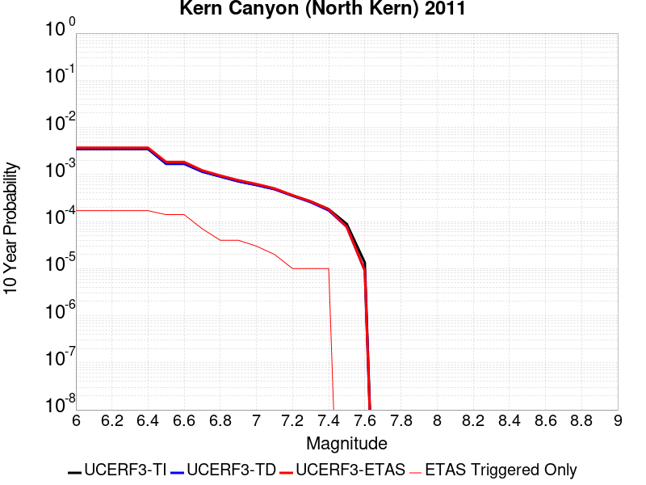 |

| Magnitude | 1 wk TI Prob | 1 wk TD Prob | 1 wk ETAS Prob | 1 wk ETAS/TD Gain | 1 wk ETAS Triggered Only | 1 mo TI Prob | 1 mo TD Prob | 1 mo ETAS Prob | 1 mo ETAS/TD Gain | 1 mo ETAS Triggered Only | 1 yr TI Prob | 1 yr TD Prob | 1 yr ETAS Prob | 1 yr ETAS/TD Gain | 1 yr ETAS Triggered Only | 10 yr TI Prob | 10 yr TD Prob | 10 yr ETAS Prob | 10 yr ETAS/TD Gain | 10 yr ETAS Triggered Only |
|-----|-----|-----|-----|-----|-----|-----|-----|-----|-----|-----|-----|-----|-----|-----|-----|-----|-----|-----|-----|-----|
| 6.0 | 6.6264497E-6 | 6.75733E-6 | 4.919406E-5 | 7.280103 | 4.2437016E-5 | 2.8398761E-5 | 2.895971E-5 | 8.554076E-5 | 2.9537852 | 5.658269E-5 | 3.4570007E-4 | 3.5253543E-4 | 4.3737955E-4 | 1.2406683 | 8.487403E-5 | 0.0034516277 | 0.0035205502 | 0.0037037965 | 1.0520505 | 1.8389373E-4 |
| 6.1 | 6.6264497E-6 | 6.75733E-6 | 4.919406E-5 | 7.280103 | 4.2437016E-5 | 2.8398761E-5 | 2.895971E-5 | 8.554076E-5 | 2.9537852 | 5.658269E-5 | 3.4570007E-4 | 3.5253543E-4 | 4.3737955E-4 | 1.2406683 | 8.487403E-5 | 0.0034516277 | 0.0035205502 | 0.0037037965 | 1.0520505 | 1.8389373E-4 |
| 6.2 | 6.6264497E-6 | 6.75733E-6 | 4.919406E-5 | 7.280103 | 4.2437016E-5 | 2.8398761E-5 | 2.895971E-5 | 8.554076E-5 | 2.9537852 | 5.658269E-5 | 3.4570007E-4 | 3.5253543E-4 | 4.3737955E-4 | 1.2406683 | 8.487403E-5 | 0.0034516277 | 0.0035205502 | 0.0037037965 | 1.0520505 | 1.8389373E-4 |
| 6.3 | 6.6264497E-6 | 6.75733E-6 | 4.919406E-5 | 7.280103 | 4.2437016E-5 | 2.8398761E-5 | 2.895971E-5 | 8.554076E-5 | 2.9537852 | 5.658269E-5 | 3.4570007E-4 | 3.5253543E-4 | 4.3737955E-4 | 1.2406683 | 8.487403E-5 | 0.0034516277 | 0.0035205502 | 0.0037037965 | 1.0520505 | 1.8389373E-4 |
| 6.4 | 6.6264497E-6 | 6.75733E-6 | 4.919406E-5 | 7.280103 | 4.2437016E-5 | 2.8398761E-5 | 2.895971E-5 | 8.554076E-5 | 2.9537852 | 5.658269E-5 | 3.4570007E-4 | 3.5253543E-4 | 4.3737955E-4 | 1.2406683 | 8.487403E-5 | 0.0034516277 | 0.0035205502 | 0.0037037965 | 1.0520505 | 1.8389373E-4 |
| 6.5 | 3.2162225E-6 | 3.2570915E-6 | 4.569397E-5 | 14.029072 | 4.2437016E-5 | 1.3783738E-5 | 1.3958894E-5 | 7.0540795E-5 | 5.053466 | 5.658269E-5 | 1.6780409E-4 | 1.6993708E-4 | 2.4065342E-4 | 1.4161325 | 7.072836E-5 | 0.0016767744 | 0.001698151 | 0.0018676108 | 1.0997908 | 1.6974806E-4 |
| 6.6 | 3.2162225E-6 | 3.2570915E-6 | 4.569397E-5 | 14.029072 | 4.2437016E-5 | 1.3783738E-5 | 1.3958894E-5 | 7.0540795E-5 | 5.053466 | 5.658269E-5 | 1.6780409E-4 | 1.6993708E-4 | 2.4065342E-4 | 1.4161325 | 7.072836E-5 | 0.0016767744 | 0.001698151 | 0.0018676108 | 1.0997908 | 1.6974806E-4 |
| 6.7 | 2.1908265E-6 | 2.2071222E-6 | 2.2071222E-6 | 1.0 | 0.0 | 9.389223E-6 | 9.459062E-6 | 9.459062E-6 | 1.0 | 0.0 | 1.1430779E-4 | 1.1515819E-4 | 1.2930224E-4 | 1.1228228 | 1.4145672E-5 | 0.0011424901 | 0.0011510046 | 0.0012357809 | 1.0736542 | 8.487403E-5 |
| 6.8 | 1.7303895E-6 | 1.736553E-6 | 1.736553E-6 | 1.0 | 0.0 | 7.415934E-6 | 7.442349E-6 | 7.442349E-6 | 1.0 | 0.0 | 9.028525E-5 | 9.060693E-5 | 9.060693E-5 | 1.0 | 0.0 | 9.024858E-4 | 9.0570963E-4 | 9.481082E-4 | 1.0468125 | 4.2437016E-5 |
| 6.9 | 1.3700314E-6 | 1.3688623E-6 | 1.3688623E-6 | 1.0 | 0.0 | 5.87155E-6 | 5.86654E-6 | 5.86654E-6 | 1.0 | 0.0 | 7.148377E-5 | 7.142283E-5 | 7.142283E-5 | 1.0 | 0.0 | 7.146078E-4 | 7.140033E-4 | 7.5641E-4 | 1.0593929 | 4.2437016E-5 |
| 7.0 | 1.1467797E-6 | 1.1413805E-6 | 1.1413805E-6 | 1.0 | 0.0 | 4.9147607E-6 | 4.8916218E-6 | 4.8916218E-6 | 1.0 | 0.0 | 5.983557E-5 | 5.95539E-5 | 5.95539E-5 | 1.0 | 0.0 | 5.981946E-4 | 5.9538253E-4 | 6.236571E-4 | 1.0474896 | 2.8291344E-5 |
| 7.1 | 9.3952065E-7 | 9.3026915E-7 | 9.3026915E-7 | 1.0 | 0.0 | 4.026511E-6 | 3.986862E-6 | 3.986862E-6 | 1.0 | 0.0 | 4.9021666E-5 | 4.853898E-5 | 4.853898E-5 | 1.0 | 0.0 | 4.901085E-4 | 4.8528553E-4 | 4.9942435E-4 | 1.029135 | 1.4145672E-5 |
| 7.2 | 6.858055E-7 | 6.7193014E-7 | 6.7193014E-7 | 1.0 | 0.0 | 2.939163E-6 | 2.8796974E-6 | 2.8796974E-6 | 1.0 | 0.0 | 3.5783723E-5 | 3.5059762E-5 | 3.5059762E-5 | 1.0 | 0.0 | 3.5777962E-4 | 3.5054318E-4 | 3.646839E-4 | 1.0403395 | 1.4145672E-5 |
| 7.3 | 5.1101983E-7 | 4.939301E-7 | 4.939301E-7 | 1.0 | 0.0 | 2.1900833E-6 | 2.1168414E-6 | 2.1168414E-6 | 1.0 | 0.0 | 2.6663936E-5 | 2.5772246E-5 | 2.5772246E-5 | 1.0 | 0.0 | 2.6660739E-4 | 2.5769303E-4 | 2.7183507E-4 | 1.0548793 | 1.4145672E-5 |
| 7.4 | 3.4999414E-7 | 3.2995916E-7 | 3.2995916E-7 | 1.0 | 0.0 | 1.499974E-6 | 1.4141099E-6 | 1.4141099E-6 | 1.0 | 0.0 | 1.8262032E-5 | 1.7216655E-5 | 1.7216655E-5 | 1.0 | 0.0 | 1.826053E-4 | 1.7215345E-4 | 1.8629669E-4 | 1.0821549 | 1.4145672E-5 |
| 7.5 | 1.7021522E-7 | 1.4750053E-7 | 1.4750053E-7 | 1.0 | 0.0 | 7.2949354E-7 | 6.32145E-7 | 6.32145E-7 | 1.0 | 0.0 | 8.881548E-6 | 7.696339E-6 | 7.696339E-6 | 1.0 | 0.0 | 8.8811925E-5 | 7.696081E-5 | 7.696081E-5 | 1.0 | 0.0 |
| 7.6 | 2.572245E-8 | 1.735264E-8 | 1.735264E-8 | 1.0 | 0.0 | 1.10239064E-7 | 7.436845E-8 | 7.436845E-8 | 1.0 | 0.0 | 1.3421597E-6 | 9.0543557E-7 | 9.0543557E-7 | 1.0 | 0.0 | 1.3421517E-5 | 9.054324E-6 | 9.054324E-6 | 1.0 | 0.0 |

## San Jacinto (Anza) rev
*[(top)](#table-of-contents)*

| 1 Week | 1 Month | 1 Year | 10 Year |
|-----|-----|-----|-----|
| 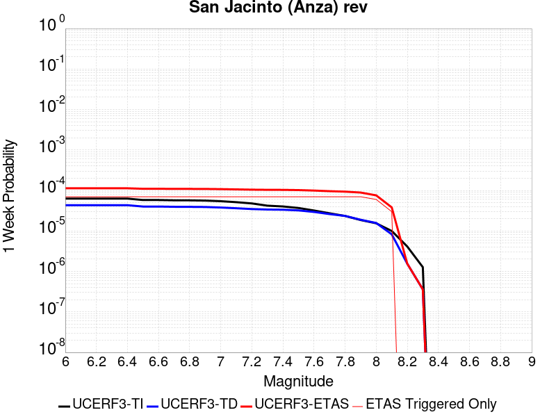 |  |  |  |

| Magnitude | 1 wk TI Prob | 1 wk TD Prob | 1 wk ETAS Prob | 1 wk ETAS/TD Gain | 1 wk ETAS Triggered Only | 1 mo TI Prob | 1 mo TD Prob | 1 mo ETAS Prob | 1 mo ETAS/TD Gain | 1 mo ETAS Triggered Only | 1 yr TI Prob | 1 yr TD Prob | 1 yr ETAS Prob | 1 yr ETAS/TD Gain | 1 yr ETAS Triggered Only | 10 yr TI Prob | 10 yr TD Prob | 10 yr ETAS Prob | 10 yr ETAS/TD Gain | 10 yr ETAS Triggered Only |
|-----|-----|-----|-----|-----|-----|-----|-----|-----|-----|-----|-----|-----|-----|-----|-----|-----|-----|-----|-----|-----|
| 6.0 | 6.3015636E-5 | 4.3298347E-5 | 1.1402365E-4 | 2.633441 | 7.072836E-5 | 2.7003905E-4 | 1.8555121E-4 | 2.5626644E-4 | 1.381109 | 7.072836E-5 | 0.0032827691 | 0.0022567573 | 0.0023978949 | 1.0625399 | 1.4145672E-4 | 0.032346968 | 0.02329361 | 0.023473222 | 1.0077107 | 1.8389373E-4 |
| 6.1 | 6.3015636E-5 | 4.3298347E-5 | 1.1402365E-4 | 2.633441 | 7.072836E-5 | 2.7003905E-4 | 1.8555121E-4 | 2.5626644E-4 | 1.381109 | 7.072836E-5 | 0.0032827691 | 0.0022567573 | 0.0023978949 | 1.0625399 | 1.4145672E-4 | 0.032346968 | 0.02329361 | 0.023473222 | 1.0077107 | 1.8389373E-4 |
| 6.2 | 6.3015636E-5 | 4.3298347E-5 | 1.1402365E-4 | 2.633441 | 7.072836E-5 | 2.7003905E-4 | 1.8555121E-4 | 2.5626644E-4 | 1.381109 | 7.072836E-5 | 0.0032827691 | 0.0022567573 | 0.0023978949 | 1.0625399 | 1.4145672E-4 | 0.032346968 | 0.02329361 | 0.023473222 | 1.0077107 | 1.8389373E-4 |
| 6.3 | 6.3015636E-5 | 4.3298347E-5 | 1.1402365E-4 | 2.633441 | 7.072836E-5 | 2.7003905E-4 | 1.8555121E-4 | 2.5626644E-4 | 1.381109 | 7.072836E-5 | 0.0032827691 | 0.0022567573 | 0.0023978949 | 1.0625399 | 1.4145672E-4 | 0.032346968 | 0.02329361 | 0.023473222 | 1.0077107 | 1.8389373E-4 |
| 6.4 | 6.3015636E-5 | 4.3298347E-5 | 1.1402365E-4 | 2.633441 | 7.072836E-5 | 2.7003905E-4 | 1.8555121E-4 | 2.5626644E-4 | 1.381109 | 7.072836E-5 | 0.0032827691 | 0.0022567573 | 0.0023978949 | 1.0625399 | 1.4145672E-4 | 0.032346968 | 0.02329361 | 0.023473222 | 1.0077107 | 1.8389373E-4 |
| 6.5 | 5.811017E-5 | 4.0080286E-5 | 1.1080581E-4 | 2.7645965 | 7.072836E-5 | 2.4901982E-4 | 1.7176138E-4 | 2.4247759E-4 | 1.4117119 | 7.072836E-5 | 0.0030276014 | 0.0020891947 | 0.002230356 | 1.0675672 | 1.4145672E-4 | 0.02986684 | 0.021590833 | 0.021770757 | 1.0083333 | 1.8389373E-4 |
| 6.6 | 5.811017E-5 | 4.0080286E-5 | 1.1080581E-4 | 2.7645965 | 7.072836E-5 | 2.4901982E-4 | 1.7176138E-4 | 2.4247759E-4 | 1.4117119 | 7.072836E-5 | 0.0030276014 | 0.0020891947 | 0.002230356 | 1.0675672 | 1.4145672E-4 | 0.02986684 | 0.021590833 | 0.021770757 | 1.0083333 | 1.8389373E-4 |
| 6.7 | 5.712442E-5 | 3.950301E-5 | 1.1022858E-4 | 2.790384 | 7.072836E-5 | 2.4479596E-4 | 1.6928767E-4 | 2.4000405E-4 | 1.4177291 | 7.072836E-5 | 0.0029763177 | 0.0020591344 | 0.0022002999 | 1.0685557 | 1.4145672E-4 | 0.029367693 | 0.021282919 | 0.021462899 | 1.0084566 | 1.8389373E-4 |
| 6.8 | 5.6967532E-5 | 3.93593E-5 | 1.10084875E-4 | 2.7969217 | 7.072836E-5 | 2.4412372E-4 | 1.6867183E-4 | 2.3938826E-4 | 1.4192545 | 7.072836E-5 | 0.0029681553 | 0.0020516508 | 0.0021928174 | 1.0688063 | 1.4145672E-4 | 0.029288229 | 0.02120852 | 0.021388512 | 1.0084869 | 1.8389373E-4 |
| 6.9 | 5.6211324E-5 | 3.9064216E-5 | 1.0978981E-4 | 2.8104959 | 7.072836E-5 | 2.4088343E-4 | 1.6740736E-4 | 2.3812387E-4 | 1.4224218 | 7.072836E-5 | 0.0029288116 | 0.0020362847 | 0.0021774534 | 1.0693266 | 1.4145672E-4 | 0.028905109 | 0.021047527 | 0.021227552 | 1.0085531 | 1.8389373E-4 |
| 7.0 | 5.4383527E-5 | 3.7925012E-5 | 1.0865069E-4 | 2.8648822 | 7.072836E-5 | 2.3305144E-4 | 1.6252567E-4 | 2.3324254E-4 | 1.435112 | 7.072836E-5 | 0.0028337094 | 0.001976959 | 0.002118136 | 1.0714113 | 1.4145672E-4 | 0.027978465 | 0.02044095 | 0.020621084 | 1.0088124 | 1.8389373E-4 |
| 7.1 | 5.1393665E-5 | 3.638787E-5 | 1.0711366E-4 | 2.9436638 | 7.072836E-5 | 2.2023996E-4 | 1.5593872E-4 | 2.2665605E-4 | 1.4534944 | 7.072836E-5 | 0.0026781242 | 0.0018969048 | 0.0020239744 | 1.0669879 | 1.2731105E-4 | 0.026460782 | 0.019616077 | 0.019782495 | 1.0084838 | 1.6974806E-4 |
| 7.2 | 4.785222E-5 | 3.4738845E-5 | 1.0546475E-4 | 3.0359313 | 7.072836E-5 | 2.0506482E-4 | 1.4887229E-4 | 2.1959012E-4 | 1.4750235 | 7.072836E-5 | 0.0024938055 | 0.0018110167 | 0.0019380972 | 1.0701708 | 1.2731105E-4 | 0.024660049 | 0.018728783 | 0.018895352 | 1.0088937 | 1.6974806E-4 |
| 7.3 | 4.2143256E-5 | 3.3834414E-5 | 1.0456038E-4 | 3.0903559 | 7.072836E-5 | 1.8060145E-4 | 1.449966E-4 | 2.157147E-4 | 1.4877225 | 7.072836E-5 | 0.002196605 | 0.0017639075 | 0.0018909939 | 1.0720483 | 1.2731105E-4 | 0.02175019 | 0.018236695 | 0.018403348 | 1.0091383 | 1.6974806E-4 |
| 7.4 | 4.0264713E-5 | 3.3472694E-5 | 1.0419868E-4 | 3.112946 | 7.072836E-5 | 1.7255165E-4 | 1.4344654E-4 | 2.1416474E-4 | 1.4929936 | 7.072836E-5 | 0.002098792 | 0.0017450659 | 0.0018721548 | 1.0728276 | 1.2731105E-4 | 0.020790804 | 0.018041389 | 0.018208075 | 1.0092391 | 1.6974806E-4 |
| 7.5 | 3.694492E-5 | 3.2186905E-5 | 1.0291299E-4 | 3.1973557 | 7.072836E-5 | 1.5832575E-4 | 1.379366E-4 | 2.0865521E-4 | 1.5126892 | 7.072836E-5 | 0.0019259118 | 0.0016780876 | 0.001805185 | 1.0757394 | 1.2731105E-4 | 0.01909306 | 0.017357888 | 0.01752469 | 1.0096096 | 1.6974806E-4 |
| 7.6 | 3.200565E-5 | 2.9502702E-5 | 1.0022898E-4 | 3.3972812 | 7.072836E-5 | 1.3715986E-4 | 1.2643404E-4 | 1.9715345E-4 | 1.5593385 | 7.072836E-5 | 0.001668642 | 0.0015382497 | 0.001665365 | 1.0826362 | 1.2731105E-4 | 0.01656168 | 0.015946016 | 0.016099138 | 1.0096024 | 1.5560239E-4 |
| 7.7 | 2.731642E-5 | 2.6091477E-5 | 9.681799E-5 | 3.7107134 | 7.072836E-5 | 1.1706512E-4 | 1.11815825E-4 | 1.8253627E-4 | 1.6324726 | 7.072836E-5 | 0.001424336 | 0.0013605085 | 0.0014876464 | 1.0934488 | 1.2731105E-4 | 0.014152412 | 0.0141668 | 0.0143201975 | 1.010828 | 1.5560239E-4 |
| 7.8 | 2.3466424E-5 | 2.3503619E-5 | 9.4230316E-5 | 4.0091834 | 7.072836E-5 | 1.0056651E-4 | 1.0072591E-4 | 1.7144714E-4 | 1.7021157 | 7.072836E-5 | 0.0012237094 | 0.0012256489 | 0.0013528039 | 1.1037451 | 1.2731105E-4 | 0.012169928 | 0.012808796 | 0.012962406 | 1.0119925 | 1.5560239E-4 |
| 7.9 | 1.8611925E-5 | 1.890698E-5 | 8.9634006E-5 | 4.740789 | 7.072836E-5 | 7.9762955E-5 | 8.10274E-5 | 1.5175004E-4 | 1.8728236 | 7.072836E-5 | 9.7068126E-4 | 9.860628E-4 | 0.0011132484 | 1.1289831 | 1.2731105E-4 | 0.0096645225 | 0.010393705 | 0.01054769 | 1.0148152 | 1.5560239E-4 |
| 8.0 | 1.5460775E-5 | 1.5739915E-5 | 8.646716E-5 | 5.493496 | 7.072836E-5 | 6.6258784E-5 | 6.745504E-5 | 1.3817863E-4 | 2.0484552 | 7.072836E-5 | 8.0640207E-4 | 8.2095637E-4 | 9.4816287E-4 | 1.1549492 | 1.2731105E-4 | 0.008034821 | 0.008702706 | 0.008856954 | 1.0177242 | 1.5560239E-4 |
| 8.1 | 9.983884E-6 | 8.268954E-6 | 3.6560064E-5 | 4.421365 | 2.8291344E-5 | 4.2787375E-5 | 3.5437897E-5 | 6.3728236E-5 | 1.7983075 | 2.8291344E-5 | 5.2081177E-4 | 4.313715E-4 | 4.737902E-4 | 1.0983346 | 4.2437016E-5 | 0.0051959283 | 0.00463968 | 0.00468192 | 1.0091041 | 4.2437016E-5 |
| 8.2 | 4.1226E-6 | 1.5522551E-6 | 1.5522551E-6 | 1.0 | 0.0 | 1.7668166E-5 | 6.6525045E-6 | 6.6525045E-6 | 1.0 | 0.0 | 2.1508869E-4 | 8.099126E-5 | 8.099126E-5 | 1.0 | 0.0 | 0.0021488064 | 9.401847E-4 | 9.401847E-4 | 1.0 | 0.0 |
| 8.3 | 1.2750878E-6 | 3.609817E-7 | 3.609817E-7 | 1.0 | 0.0 | 5.4646503E-6 | 1.5470634E-6 | 1.5470634E-6 | 1.0 | 0.0 | 6.653009E-5 | 1.8835339E-5 | 1.8835339E-5 | 1.0 | 0.0 | 6.6510175E-4 | 2.272251E-4 | 2.272251E-4 | 1.0 | 0.0 |

## White Mountains
*[(top)](#table-of-contents)*

| 1 Week | 1 Month | 1 Year | 10 Year |
|-----|-----|-----|-----|
|  |  |  |  |

| Magnitude | 1 wk TI Prob | 1 wk TD Prob | 1 wk ETAS Prob | 1 wk ETAS/TD Gain | 1 wk ETAS Triggered Only | 1 mo TI Prob | 1 mo TD Prob | 1 mo ETAS Prob | 1 mo ETAS/TD Gain | 1 mo ETAS Triggered Only | 1 yr TI Prob | 1 yr TD Prob | 1 yr ETAS Prob | 1 yr ETAS/TD Gain | 1 yr ETAS Triggered Only | 10 yr TI Prob | 10 yr TD Prob | 10 yr ETAS Prob | 10 yr ETAS/TD Gain | 10 yr ETAS Triggered Only |
|-----|-----|-----|-----|-----|-----|-----|-----|-----|-----|-----|-----|-----|-----|-----|-----|-----|-----|-----|-----|-----|
| 6.0 | 3.503579E-5 | 3.3784127E-5 | 9.0364905E-5 | 2.6747742 | 5.658269E-5 | 1.5014476E-4 | 1.4478175E-4 | 2.1549988E-4 | 1.4884464 | 7.072836E-5 | 0.0018264796 | 0.0017614134 | 0.0018743795 | 1.0641338 | 1.1316538E-4 | 0.018115403 | 0.017486857 | 0.017653637 | 1.0095375 | 1.6974806E-4 |
| 6.1 | 3.503579E-5 | 3.3784127E-5 | 9.0364905E-5 | 2.6747742 | 5.658269E-5 | 1.5014476E-4 | 1.4478175E-4 | 2.1549988E-4 | 1.4884464 | 7.072836E-5 | 0.0018264796 | 0.0017614134 | 0.0018743795 | 1.0641338 | 1.1316538E-4 | 0.018115403 | 0.017486857 | 0.017653637 | 1.0095375 | 1.6974806E-4 |
| 6.2 | 3.503579E-5 | 3.3784127E-5 | 9.0364905E-5 | 2.6747742 | 5.658269E-5 | 1.5014476E-4 | 1.4478175E-4 | 2.1549988E-4 | 1.4884464 | 7.072836E-5 | 0.0018264796 | 0.0017614134 | 0.0018743795 | 1.0641338 | 1.1316538E-4 | 0.018115403 | 0.017486857 | 0.017653637 | 1.0095375 | 1.6974806E-4 |
| 6.3 | 1.7818425E-5 | 1.591616E-5 | 4.4207052E-5 | 2.7774951 | 2.8291344E-5 | 7.636245E-5 | 6.821041E-5 | 1.1064453E-4 | 1.6221063 | 4.2437016E-5 | 9.293162E-4 | 8.301596E-4 | 8.866953E-4 | 1.0681022 | 5.658269E-5 | 0.009254395 | 0.0082720425 | 0.008384272 | 1.0135673 | 1.1316538E-4 |
| 6.4 | 1.7818425E-5 | 1.591616E-5 | 4.4207052E-5 | 2.7774951 | 2.8291344E-5 | 7.636245E-5 | 6.821041E-5 | 1.1064453E-4 | 1.6221063 | 4.2437016E-5 | 9.293162E-4 | 8.301596E-4 | 8.866953E-4 | 1.0681022 | 5.658269E-5 | 0.009254395 | 0.0082720425 | 0.008384272 | 1.0135673 | 1.1316538E-4 |
| 6.5 | 1.3397557E-5 | 1.1336374E-5 | 2.5481886E-5 | 2.2477987 | 1.4145672E-5 | 5.741684E-5 | 4.8583595E-5 | 7.687356E-5 | 1.5822947 | 2.8291344E-5 | 6.988258E-4 | 5.913517E-4 | 6.337636E-4 | 1.0717202 | 4.2437016E-5 | 0.006966323 | 0.005898487 | 0.00598286 | 1.0143043 | 8.487403E-5 |
| 6.6 | 1.0818695E-5 | 8.625434E-6 | 2.2770984E-5 | 2.6399813 | 1.4145672E-5 | 4.6365014E-5 | 3.6965648E-5 | 6.525595E-5 | 1.7653133 | 2.8291344E-5 | 5.6434784E-4 | 4.4996818E-4 | 4.923861E-4 | 1.0942687 | 4.2437016E-5 | 0.005629168 | 0.0044910074 | 0.004547336 | 1.0125425 | 5.658269E-5 |
| 6.7 | 9.067908E-6 | 6.802476E-6 | 2.0948051E-5 | 3.0794747 | 1.4145672E-5 | 3.8861883E-5 | 2.915316E-5 | 5.7443678E-5 | 1.97041 | 2.8291344E-5 | 4.7304068E-4 | 3.548851E-4 | 3.9730707E-4 | 1.1195371 | 4.2437016E-5 | 0.00472035 | 0.003543501 | 0.003599883 | 1.0159115 | 5.658269E-5 |
| 6.8 | 7.295947E-6 | 4.9364285E-6 | 4.9364285E-6 | 1.0 | 0.0 | 3.126797E-5 | 2.1155956E-5 | 2.1155956E-5 | 1.0 | 0.0 | 3.8062103E-4 | 2.5754445E-4 | 2.7168647E-4 | 1.054911 | 1.4145672E-5 | 0.0037996976 | 0.0025725728 | 0.0026007912 | 1.010969 | 2.8291344E-5 |
| 6.9 | 6.2243444E-6 | 3.8322546E-6 | 3.8322546E-6 | 1.0 | 0.0 | 2.6675489E-5 | 1.6423846E-5 | 1.6423846E-5 | 1.0 | 0.0 | 3.2472567E-4 | 1.9994251E-4 | 2.1408536E-4 | 1.0707345 | 1.4145672E-5 | 0.0032425157 | 0.001997679 | 0.0020117965 | 1.007067 | 1.4145672E-5 |
| 7.0 | 4.9878413E-6 | 2.679564E-6 | 2.679564E-6 | 1.0 | 0.0 | 2.1376287E-5 | 1.1483797E-5 | 1.1483797E-5 | 1.0 | 0.0 | 2.602252E-4 | 1.3980652E-4 | 1.5395021E-4 | 1.1011662 | 1.4145672E-5 | 0.002599207 | 0.0013972119 | 0.0014113378 | 1.01011 | 1.4145672E-5 |
| 7.1 | 4.0252844E-6 | 1.885702E-6 | 1.885702E-6 | 1.0 | 0.0 | 1.7251105E-5 | 8.081555E-6 | 8.081555E-6 | 1.0 | 0.0 | 2.1001195E-4 | 9.838863E-5 | 1.1253291E-4 | 1.1437593 | 1.4145672E-5 | 0.0020981359 | 9.834635E-4 | 9.975953E-4 | 1.0143694 | 1.4145672E-5 |
| 7.2 | 3.3284066E-6 | 1.2818929E-6 | 1.2818929E-6 | 1.0 | 0.0 | 1.4264522E-5 | 5.4938155E-6 | 5.4938155E-6 | 1.0 | 0.0 | 1.736567E-4 | 6.688525E-5 | 8.1029975E-5 | 1.2114775 | 1.4145672E-5 | 0.0017352107 | 6.6866126E-4 | 6.827975E-4 | 1.021141 | 1.4145672E-5 |
| 7.3 | 2.458226E-6 | 6.056684E-7 | 6.056684E-7 | 1.0 | 0.0 | 1.0535211E-5 | 2.5957193E-6 | 2.5957193E-6 | 1.0 | 0.0 | 1.2825865E-4 | 3.160246E-5 | 4.5747685E-5 | 1.4475988 | 1.4145672E-5 | 0.0012818464 | 3.1598343E-4 | 3.3012463E-4 | 1.044753 | 1.4145672E-5 |
| 7.4 | 1.965953E-6 | 3.1084684E-7 | 3.1084684E-7 | 1.0 | 0.0 | 8.425486E-6 | 1.3322001E-6 | 1.3322001E-6 | 1.0 | 0.0 | 1.0257547E-4 | 1.6219417E-5 | 1.6219417E-5 | 1.0 | 0.0 | 0.0010252813 | 1.6218246E-4 | 1.6218246E-4 | 1.0 | 0.0 |
| 7.5 | 1.2014192E-6 | 1.8241002E-7 | 1.8241002E-7 | 1.0 | 0.0 | 5.148929E-6 | 7.8175697E-7 | 7.8175697E-7 | 1.0 | 0.0 | 6.2686406E-5 | 9.51785E-6 | 9.51785E-6 | 1.0 | 0.0 | 6.266873E-4 | 9.517451E-5 | 9.517451E-5 | 1.0 | 0.0 |
| 7.6 | 2.5612175E-7 | 4.893784E-8 | 4.893784E-8 | 1.0 | 0.0 | 1.0976642E-6 | 2.0973359E-7 | 2.0973359E-7 | 1.0 | 0.0 | 1.3363979E-5 | 2.5535037E-6 | 2.5535037E-6 | 1.0 | 0.0 | 1.3363175E-4 | 2.553478E-5 | 2.553478E-5 | 1.0 | 0.0 |

## Independence rev 2011
*[(top)](#table-of-contents)*

| 1 Week | 1 Month | 1 Year | 10 Year |
|-----|-----|-----|-----|
|  |  |  |  |

| Magnitude | 1 wk TI Prob | 1 wk TD Prob | 1 wk ETAS Prob | 1 wk ETAS/TD Gain | 1 wk ETAS Triggered Only | 1 mo TI Prob | 1 mo TD Prob | 1 mo ETAS Prob | 1 mo ETAS/TD Gain | 1 mo ETAS Triggered Only | 1 yr TI Prob | 1 yr TD Prob | 1 yr ETAS Prob | 1 yr ETAS/TD Gain | 1 yr ETAS Triggered Only | 10 yr TI Prob | 10 yr TD Prob | 10 yr ETAS Prob | 10 yr ETAS/TD Gain | 10 yr ETAS Triggered Only |
|-----|-----|-----|-----|-----|-----|-----|-----|-----|-----|-----|-----|-----|-----|-----|-----|-----|-----|-----|-----|-----|
| 6.0 | 4.422171E-6 | 4.3262253E-6 | 1.3163673E-4 | 30.427616 | 1.2731105E-4 | 1.8952025E-5 | 1.8540852E-5 | 1.5999495E-4 | 8.629321 | 1.4145672E-4 | 2.3071647E-4 | 2.2571447E-4 | 3.954242E-4 | 1.751878 | 1.6974806E-4 | 0.0023047708 | 0.0022551457 | 0.002424511 | 1.0751017 | 1.6974806E-4 |
| 6.1 | 4.422171E-6 | 4.3262253E-6 | 1.3163673E-4 | 30.427616 | 1.2731105E-4 | 1.8952025E-5 | 1.8540852E-5 | 1.5999495E-4 | 8.629321 | 1.4145672E-4 | 2.3071647E-4 | 2.2571447E-4 | 3.954242E-4 | 1.751878 | 1.6974806E-4 | 0.0023047708 | 0.0022551457 | 0.002424511 | 1.0751017 | 1.6974806E-4 |
| 6.2 | 4.422171E-6 | 4.3262253E-6 | 1.3163673E-4 | 30.427616 | 1.2731105E-4 | 1.8952025E-5 | 1.8540852E-5 | 1.5999495E-4 | 8.629321 | 1.4145672E-4 | 2.3071647E-4 | 2.2571447E-4 | 3.954242E-4 | 1.751878 | 1.6974806E-4 | 0.0023047708 | 0.0022551457 | 0.002424511 | 1.0751017 | 1.6974806E-4 |
| 6.3 | 4.422171E-6 | 4.3262253E-6 | 1.3163673E-4 | 30.427616 | 1.2731105E-4 | 1.8952025E-5 | 1.8540852E-5 | 1.5999495E-4 | 8.629321 | 1.4145672E-4 | 2.3071647E-4 | 2.2571447E-4 | 3.954242E-4 | 1.751878 | 1.6974806E-4 | 0.0023047708 | 0.0022551457 | 0.002424511 | 1.0751017 | 1.6974806E-4 |
| 6.4 | 4.422171E-6 | 4.3262253E-6 | 1.3163673E-4 | 30.427616 | 1.2731105E-4 | 1.8952025E-5 | 1.8540852E-5 | 1.5999495E-4 | 8.629321 | 1.4145672E-4 | 2.3071647E-4 | 2.2571447E-4 | 3.954242E-4 | 1.751878 | 1.6974806E-4 | 0.0023047708 | 0.0022551457 | 0.002424511 | 1.0751017 | 1.6974806E-4 |
| 6.5 | 4.422171E-6 | 4.3262253E-6 | 1.3163673E-4 | 30.427616 | 1.2731105E-4 | 1.8952025E-5 | 1.8540852E-5 | 1.5999495E-4 | 8.629321 | 1.4145672E-4 | 2.3071647E-4 | 2.2571447E-4 | 3.954242E-4 | 1.751878 | 1.6974806E-4 | 0.0023047708 | 0.0022551457 | 0.002424511 | 1.0751017 | 1.6974806E-4 |
| 6.6 | 2.663744E-6 | 2.5319846E-6 | 1.2984271E-4 | 51.281006 | 1.2731105E-4 | 1.1415996E-5 | 1.08513195E-5 | 1.523065E-4 | 14.035759 | 1.4145672E-4 | 1.3898089E-4 | 1.321073E-4 | 3.0183294E-4 | 2.284756 | 1.6974806E-4 | 0.0013889399 | 0.0013203359 | 0.0014898599 | 1.1283946 | 1.6974806E-4 |
| 6.7 | 2.663744E-6 | 2.5319846E-6 | 1.2984271E-4 | 51.281006 | 1.2731105E-4 | 1.1415996E-5 | 1.08513195E-5 | 1.523065E-4 | 14.035759 | 1.4145672E-4 | 1.3898089E-4 | 1.321073E-4 | 3.0183294E-4 | 2.284756 | 1.6974806E-4 | 0.0013889399 | 0.0013203359 | 0.0014898599 | 1.1283946 | 1.6974806E-4 |
| 6.8 | 1.9716529E-6 | 1.8322567E-6 | 1.2914307E-4 | 70.48307 | 1.2731105E-4 | 8.449913E-6 | 7.852505E-6 | 1.4930812E-4 | 19.014074 | 1.4145672E-4 | 1.0287284E-4 | 9.560019E-5 | 2.6533203E-4 | 2.775434 | 1.6974806E-4 | 0.0010282523 | 9.5560355E-4 | 0.0011251894 | 1.1774646 | 1.6974806E-4 |
| 6.9 | 1.8788617E-6 | 1.7429976E-6 | 1.2905382E-4 | 74.04131 | 1.2731105E-4 | 8.0522395E-6 | 7.4699688E-6 | 1.4892564E-4 | 19.93658 | 1.4145672E-4 | 9.80316E-5 | 9.09432E-5 | 2.6067582E-4 | 2.8663588 | 1.6974806E-4 | 9.798837E-4 | 9.090718E-4 | 0.0010786656 | 1.186557 | 1.6974806E-4 |
| 7.0 | 1.5045488E-6 | 1.3849498E-6 | 1.2869583E-4 | 92.924545 | 1.2731105E-4 | 6.44805E-6 | 5.9354857E-6 | 1.4739137E-4 | 24.832233 | 1.4145672E-4 | 7.8502184E-5 | 7.226219E-5 | 2.4199799E-4 | 3.348888 | 1.6974806E-4 | 7.8474457E-4 | 7.223921E-4 | 8.920175E-4 | 1.2348107 | 1.6974806E-4 |
| 7.1 | 1.272341E-6 | 1.1625089E-6 | 1.2847342E-4 | 110.513916 | 1.2731105E-4 | 5.4528787E-6 | 4.9821715E-6 | 1.464382E-4 | 29.392443 | 1.4145672E-4 | 6.6386776E-5 | 6.0656283E-5 | 2.3039406E-4 | 3.7983544 | 1.6974806E-4 | 6.636695E-4 | 6.064005E-4 | 7.760456E-4 | 1.2797576 | 1.6974806E-4 |
| 7.2 | 1.0416892E-6 | 9.409871E-7 | 1.2825192E-4 | 136.29509 | 1.2731105E-4 | 4.464375E-6 | 4.032796E-6 | 1.4548894E-4 | 36.076447 | 1.4145672E-4 | 5.4352407E-5 | 4.9098202E-5 | 2.1883793E-4 | 4.4571476 | 1.6974806E-4 | 5.4339116E-4 | 4.908754E-4 | 6.605401E-4 | 1.3456371 | 1.6974806E-4 |
| 7.3 | 7.9450155E-7 | 7.2350036E-7 | 1.2803446E-4 | 176.9653 | 1.2731105E-4 | 3.4050022E-6 | 3.1007123E-6 | 1.44557E-4 | 46.62058 | 1.4145672E-4 | 4.1455114E-5 | 3.7750528E-5 | 2.0749218E-4 | 5.4964046 | 1.6974806E-4 | 4.144738E-4 | 3.7744228E-4 | 5.471263E-4 | 1.4495628 | 1.6974806E-4 |
| 7.4 | 5.3893444E-7 | 5.0195166E-7 | 1.1366727E-4 | 226.45064 | 1.1316538E-4 | 2.309717E-6 | 2.1512196E-6 | 1.29462E-4 | 60.180744 | 1.2731105E-4 | 2.8120441E-5 | 2.6190788E-5 | 1.817891E-4 | 6.9409556 | 1.5560239E-4 | 2.8116882E-4 | 2.6187746E-4 | 4.1743912E-4 | 1.5940245 | 1.5560239E-4 |
| 7.5 | 3.8852085E-7 | 3.6825622E-7 | 8.524226E-5 | 231.4754 | 8.487403E-5 | 1.6650882E-6 | 1.57824E-6 | 1.0059779E-4 | 63.740486 | 9.901971E-5 | 2.027226E-5 | 1.9214905E-5 | 1.4652351E-4 | 7.625513 | 1.2731105E-4 | 2.0270412E-4 | 1.9213265E-4 | 3.1941925E-4 | 1.6624932 | 1.2731105E-4 |
| 7.6 | 2.414929E-7 | 2.3457605E-7 | 5.681725E-5 | 242.2125 | 5.658269E-5 | 1.0349692E-6 | 1.0053255E-6 | 5.7587957E-5 | 57.282894 | 5.658269E-5 | 1.2600677E-5 | 1.2239771E-5 | 8.2967264E-5 | 6.778498 | 7.072836E-5 | 1.2599962E-4 | 1.223911E-4 | 1.931108E-4 | 1.5778174 | 7.072836E-5 |
| 7.7 | 6.8298014E-8 | 6.8589785E-8 | 2.8359933E-5 | 413.47165 | 2.8291344E-5 | 2.9270575E-7 | 2.939562E-7 | 2.8585293E-5 | 97.24338 | 2.8291344E-5 | 3.5636867E-6 | 3.5789112E-6 | 3.1870153E-5 | 8.904986 | 2.8291344E-5 | 3.5636294E-5 | 3.5788584E-5 | 6.4078915E-5 | 1.7904848 | 2.8291344E-5 |

## Imperial
*[(top)](#table-of-contents)*

| 1 Week | 1 Month | 1 Year | 10 Year |
|-----|-----|-----|-----|
|  |  |  |  |

| Magnitude | 1 wk TI Prob | 1 wk TD Prob | 1 wk ETAS Prob | 1 wk ETAS/TD Gain | 1 wk ETAS Triggered Only | 1 mo TI Prob | 1 mo TD Prob | 1 mo ETAS Prob | 1 mo ETAS/TD Gain | 1 mo ETAS Triggered Only | 1 yr TI Prob | 1 yr TD Prob | 1 yr ETAS Prob | 1 yr ETAS/TD Gain | 1 yr ETAS Triggered Only | 10 yr TI Prob | 10 yr TD Prob | 10 yr ETAS Prob | 10 yr ETAS/TD Gain | 10 yr ETAS Triggered Only |
|-----|-----|-----|-----|-----|-----|-----|-----|-----|-----|-----|-----|-----|-----|-----|-----|-----|-----|-----|-----|-----|
| 6.0 | 2.7496446E-4 | 5.055345E-4 | 5.479501E-4 | 1.0839024 | 4.2437016E-5 | 0.0011778869 | 0.002164817 | 0.0022212772 | 1.0260808 | 5.658269E-5 | 0.0142467655 | 0.026048409 | 0.026172405 | 1.0047601 | 1.2731105E-4 | 0.13367249 | 0.22807029 | 0.22820133 | 1.0005746 | 1.6974806E-4 |
| 6.1 | 2.5356023E-4 | 4.8657708E-4 | 5.2899343E-4 | 1.087173 | 4.2437016E-5 | 0.001086234 | 0.002083702 | 0.002140167 | 1.0270983 | 5.658269E-5 | 0.013144928 | 0.02507094 | 0.025195058 | 1.0049508 | 1.2731105E-4 | 0.123940155 | 0.21949561 | 0.21962811 | 1.0006036 | 1.6974806E-4 |
| 6.2 | 2.4820742E-4 | 4.775311E-4 | 5.1994785E-4 | 1.0888251 | 4.2437016E-5 | 0.0010633124 | 0.0020449946 | 0.0021014616 | 1.0276123 | 5.658269E-5 | 0.01286919 | 0.024610676 | 0.024734853 | 1.0050457 | 1.2731105E-4 | 0.12148927 | 0.21600136 | 0.21613444 | 1.0006161 | 1.6974806E-4 |
| 6.3 | 2.3205351E-4 | 4.5892023E-4 | 5.0133775E-4 | 1.092429 | 4.2437016E-5 | 9.94136E-4 | 0.0019653554 | 0.0020218268 | 1.0287335 | 5.658269E-5 | 0.012036599 | 0.023661187 | 0.023785485 | 1.0052533 | 1.2731105E-4 | 0.11405133 | 0.20793827 | 0.20807272 | 1.0006466 | 1.6974806E-4 |
| 6.4 | 2.0304754E-4 | 3.9878016E-4 | 4.4120025E-4 | 1.1063746 | 4.2437016E-5 | 8.6991355E-4 | 0.0017079529 | 0.001764439 | 1.0330724 | 5.658269E-5 | 0.010539869 | 0.020595418 | 0.020720107 | 1.0060542 | 1.2731105E-4 | 0.100537635 | 0.18507113 | 0.18520945 | 1.0007474 | 1.6974806E-4 |
| 6.5 | 1.854992E-4 | 3.6990462E-4 | 4.1232596E-4 | 1.1146817 | 4.2437016E-5 | 7.9475436E-4 | 0.0015843548 | 0.0016408478 | 1.0356568 | 5.658269E-5 | 0.009633281 | 0.01911443 | 0.019239306 | 1.0065331 | 1.2731105E-4 | 0.0922623 | 0.1733039 | 0.17344423 | 1.0008098 | 1.6974806E-4 |
| 6.6 | 1.6586106E-4 | 3.4036173E-4 | 3.8278432E-4 | 1.1246396 | 4.2437016E-5 | 7.106394E-4 | 0.0014578878 | 0.001514388 | 1.0387548 | 5.658269E-5 | 0.008617763 | 0.017607626 | 0.017732695 | 1.0071031 | 1.2731105E-4 | 0.08291132 | 0.16078055 | 0.160923 | 1.0008861 | 1.6974806E-4 |
| 6.7 | 1.4224656E-4 | 3.076812E-4 | 3.5010517E-4 | 1.1378828 | 4.2437016E-5 | 6.094856E-4 | 0.0013179756 | 0.0013603566 | 1.0321562 | 4.2437016E-5 | 0.0073952693 | 0.015928522 | 0.016025964 | 1.0061175 | 9.901971E-5 | 0.07153955 | 0.14648798 | 0.14660871 | 1.0008242 | 1.4145672E-4 |
| 6.8 | 1.2317259E-4 | 2.779231E-4 | 3.203483E-4 | 1.152651 | 4.2437016E-5 | 5.2777573E-4 | 0.0011905615 | 0.0012329479 | 1.0356021 | 4.2437016E-5 | 0.0064067547 | 0.014400131 | 0.014497724 | 1.0067773 | 9.901971E-5 | 0.06225166 | 0.13294089 | 0.13306354 | 1.0009226 | 1.4145672E-4 |
| 6.9 | 9.859898E-5 | 2.5015484E-4 | 2.9258124E-4 | 1.1696006 | 4.2437016E-5 | 4.2249862E-4 | 0.0010716559 | 0.0011140475 | 1.0395571 | 4.2437016E-5 | 0.0051317946 | 0.012970319 | 0.013068054 | 1.0075353 | 9.901971E-5 | 0.05014893 | 0.119408876 | 0.11953344 | 1.0010432 | 1.4145672E-4 |
| 7.0 | 7.3191884E-5 | 2.1267848E-4 | 2.5510648E-4 | 1.1994935 | 4.2437016E-5 | 3.136418E-4 | 9.11164E-4 | 9.535623E-4 | 1.046532 | 4.2437016E-5 | 0.003811904 | 0.011037681 | 0.011135608 | 1.008872 | 9.901971E-5 | 0.037471764 | 0.10206756 | 0.10219458 | 1.0012444 | 1.4145672E-4 |
| 7.1 | 7.1760296E-5 | 2.0969207E-4 | 2.521202E-4 | 1.2023354 | 4.2437016E-5 | 3.0750787E-4 | 8.9837395E-4 | 9.407729E-4 | 1.0471952 | 4.2437016E-5 | 0.003737482 | 0.010883528 | 0.01098147 | 1.0089991 | 9.901971E-5 | 0.03675245 | 0.10070406 | 0.10083127 | 1.0012633 | 1.4145672E-4 |
| 7.2 | 6.46614E-5 | 1.9137723E-4 | 2.3380612E-4 | 1.2217029 | 4.2437016E-5 | 2.7709085E-4 | 8.199333E-4 | 8.6233555E-4 | 1.0517142 | 4.2437016E-5 | 0.0033683628 | 0.009937617 | 0.010035653 | 1.0098652 | 9.901971E-5 | 0.033177625 | 0.092511006 | 0.09263938 | 1.0013876 | 1.4145672E-4 |
| 7.3 | 6.088115E-5 | 1.780939E-4 | 2.2052336E-4 | 1.238242 | 4.2437016E-5 | 2.6089314E-4 | 7.6303916E-4 | 8.054438E-4 | 1.0555733 | 4.2437016E-5 | 0.0031717476 | 0.009251006 | 0.00934911 | 1.0106046 | 9.901971E-5 | 0.031268585 | 0.08656135 | 0.08669057 | 1.0014927 | 1.4145672E-4 |
| 7.4 | 4.199346E-5 | 1.1511097E-4 | 1.575431E-4 | 1.3686193 | 4.2437016E-5 | 1.7995955E-4 | 4.932403E-4 | 5.356564E-4 | 1.0859947 | 4.2437016E-5 | 0.0021888057 | 0.005988835 | 0.0060732006 | 1.0140872 | 8.487403E-5 | 0.02167372 | 0.05744024 | 0.057546906 | 1.0018569 | 1.1316538E-4 |
| 7.5 | 3.130448E-5 | 8.333871E-5 | 1.116277E-4 | 1.339446 | 2.8291344E-5 | 1.3415517E-4 | 3.5711733E-4 | 3.8539857E-4 | 1.0791931 | 2.8291344E-5 | 0.0016321153 | 0.0043392954 | 0.0044097165 | 1.0162288 | 7.072836E-5 | 0.016201803 | 0.042133506 | 0.042228352 | 1.0022511 | 9.901971E-5 |
| 7.6 | 2.3074248E-5 | 6.0849357E-5 | 8.913898E-5 | 1.4649124 | 2.8291344E-5 | 9.888588E-5 | 2.6075702E-4 | 2.89041E-4 | 1.1084687 | 2.8291344E-5 | 0.0012032706 | 0.0031701182 | 0.0032406223 | 1.0222403 | 7.072836E-5 | 0.011967761 | 0.03102816 | 0.03112411 | 1.0030923 | 9.901971E-5 |
| 7.7 | 1.45864815E-5 | 4.0128452E-5 | 5.4273554E-5 | 1.3524957 | 1.4145672E-5 | 6.2511994E-5 | 1.7196777E-4 | 1.86111E-4 | 1.0822436 | 1.4145672E-5 | 7.608177E-4 | 0.0020917025 | 0.002148167 | 1.0269945 | 5.658269E-5 | 0.007582182 | 0.02062909 | 0.02069836 | 1.0033579 | 7.072836E-5 |
| 7.8 | 1.0352979E-5 | 3.096395E-5 | 4.5109184E-5 | 1.4568291 | 1.4145672E-5 | 4.4369157E-5 | 1.326959E-4 | 1.468397E-4 | 1.106588 | 1.4145672E-5 | 5.400606E-4 | 0.0016143778 | 0.0016708691 | 1.0349927 | 5.658269E-5 | 0.0053875 | 0.016017893 | 0.016087487 | 1.0043448 | 7.072836E-5 |
| 7.9 | 8.137906E-6 | 2.2151205E-5 | 3.6296566E-5 | 1.6385819 | 1.4145672E-5 | 3.4876273E-5 | 9.493029E-5 | 1.09074615E-4 | 1.1489971 | 1.4145672E-5 | 4.2453592E-4 | 0.0011551644 | 0.0011975524 | 1.0366943 | 4.2437016E-5 | 0.004237258 | 0.011618842 | 0.011674767 | 1.0048133 | 5.658269E-5 |
| 8.0 | 6.93792E-6 | 1.8010365E-5 | 1.8010365E-5 | 1.0 | 0.0 | 2.9733603E-5 | 7.7185E-5 | 7.7185E-5 | 1.0 | 0.0 | 3.6194647E-4 | 9.3932304E-4 | 9.675878E-4 | 1.0300906 | 2.8291344E-5 | 0.0036135751 | 0.009502415 | 0.009544449 | 1.0044235 | 4.2437016E-5 |
| 8.1 | 3.4286315E-6 | 6.380179E-6 | 6.380179E-6 | 1.0 | 0.0 | 1.4694053E-5 | 2.734334E-5 | 2.734334E-5 | 1.0 | 0.0 | 1.7888541E-4 | 3.3285443E-4 | 3.3285443E-4 | 1.0 | 0.0 | 0.0017874148 | 0.0034863674 | 0.0034863674 | 1.0 | 0.0 |
| 8.2 | 1.4906886E-6 | 1.936633E-6 | 1.936633E-6 | 1.0 | 0.0 | 6.3886496E-6 | 8.2998295E-6 | 8.2998295E-6 | 1.0 | 0.0 | 7.7779034E-5 | 1.0104576E-4 | 1.0104576E-4 | 1.0 | 0.0 | 7.775182E-4 | 0.0011075423 | 0.0011075423 | 1.0 | 0.0 |
| 8.3 | 2.5758007E-8 | 1.4495866E-8 | 1.4495866E-8 | 1.0 | 0.0 | 1.10391454E-7 | 6.212514E-8 | 6.212514E-8 | 1.0 | 0.0 | 1.3440151E-6 | 7.563736E-7 | 7.563736E-7 | 1.0 | 0.0 | 1.344007E-5 | 7.884359E-6 | 7.884359E-6 | 1.0 | 0.0 |

## Owens Valley
*[(top)](#table-of-contents)*

| 1 Week | 1 Month | 1 Year | 10 Year |
|-----|-----|-----|-----|
|  |  |  |  |

| Magnitude | 1 wk TI Prob | 1 wk TD Prob | 1 wk ETAS Prob | 1 wk ETAS/TD Gain | 1 wk ETAS Triggered Only | 1 mo TI Prob | 1 mo TD Prob | 1 mo ETAS Prob | 1 mo ETAS/TD Gain | 1 mo ETAS Triggered Only | 1 yr TI Prob | 1 yr TD Prob | 1 yr ETAS Prob | 1 yr ETAS/TD Gain | 1 yr ETAS Triggered Only | 10 yr TI Prob | 10 yr TD Prob | 10 yr ETAS Prob | 10 yr ETAS/TD Gain | 10 yr ETAS Triggered Only |
|-----|-----|-----|-----|-----|-----|-----|-----|-----|-----|-----|-----|-----|-----|-----|-----|-----|-----|-----|-----|-----|
| 6.0 | 4.83821E-5 | 3.6210524E-6 | 7.4349155E-5 | 20.532473 | 7.072836E-5 | 2.0733538E-4 | 1.551871E-5 | 1.0039142E-4 | 6.4690576 | 8.487403E-5 | 0.002521386 | 1.889249E-4 | 3.020689E-4 | 1.5988835 | 1.1316538E-4 | 0.024929691 | 0.0019297141 | 0.0020850163 | 1.0804794 | 1.5560239E-4 |
| 6.1 | 4.83821E-5 | 3.6210524E-6 | 7.4349155E-5 | 20.532473 | 7.072836E-5 | 2.0733538E-4 | 1.551871E-5 | 1.0039142E-4 | 6.4690576 | 8.487403E-5 | 0.002521386 | 1.889249E-4 | 3.020689E-4 | 1.5988835 | 1.1316538E-4 | 0.024929691 | 0.0019297141 | 0.0020850163 | 1.0804794 | 1.5560239E-4 |
| 6.2 | 4.83821E-5 | 3.6210524E-6 | 7.4349155E-5 | 20.532473 | 7.072836E-5 | 2.0733538E-4 | 1.551871E-5 | 1.0039142E-4 | 6.4690576 | 8.487403E-5 | 0.002521386 | 1.889249E-4 | 3.020689E-4 | 1.5988835 | 1.1316538E-4 | 0.024929691 | 0.0019297141 | 0.0020850163 | 1.0804794 | 1.5560239E-4 |
| 6.3 | 3.953008E-5 | 3.1530958E-6 | 5.9735605E-5 | 18.945065 | 5.658269E-5 | 1.6940363E-4 | 1.3513202E-5 | 8.424061E-5 | 6.2339487 | 7.072836E-5 | 0.002060538 | 1.6451156E-4 | 2.6351496E-4 | 1.6018022 | 9.901971E-5 | 0.020415364 | 0.0016621627 | 0.0018033843 | 1.0849626 | 1.4145672E-4 |
| 6.4 | 3.953008E-5 | 3.1530958E-6 | 5.9735605E-5 | 18.945065 | 5.658269E-5 | 1.6940363E-4 | 1.3513202E-5 | 8.424061E-5 | 6.2339487 | 7.072836E-5 | 0.002060538 | 1.6451156E-4 | 2.6351496E-4 | 1.6018022 | 9.901971E-5 | 0.020415364 | 0.0016621627 | 0.0018033843 | 1.0849626 | 1.4145672E-4 |
| 6.5 | 3.457342E-5 | 2.9707387E-6 | 5.955326E-5 | 20.046616 | 5.658269E-5 | 1.4816338E-4 | 1.273168E-5 | 8.345914E-5 | 6.555234 | 7.072836E-5 | 0.0018023965 | 1.5499788E-4 | 2.5400223E-4 | 1.6387466 | 9.901971E-5 | 0.017878477 | 0.0015563119 | 0.0016975483 | 1.0907508 | 1.4145672E-4 |
| 6.6 | 3.1127765E-5 | 2.8737306E-6 | 4.5310626E-5 | 15.767179 | 4.2437016E-5 | 1.3339789E-4 | 1.2315934E-5 | 6.889793E-5 | 5.59421 | 5.658269E-5 | 0.0016229092 | 1.4993687E-4 | 2.3479818E-4 | 1.5659802 | 8.487403E-5 | 0.016111081 | 0.0015013438 | 0.0016284637 | 1.0846708 | 1.2731105E-4 |
| 6.7 | 2.806885E-5 | 2.8101606E-6 | 4.5247056E-5 | 16.101236 | 4.2437016E-5 | 1.2028952E-4 | 1.2043493E-5 | 6.86255E-5 | 5.698139 | 5.658269E-5 | 0.001463541 | 1.4662035E-4 | 2.3148194E-4 | 1.5787845 | 8.487403E-5 | 0.014539397 | 0.0014656087 | 0.0015927332 | 1.0867383 | 1.2731105E-4 |
| 6.8 | 2.524524E-5 | 2.2351392E-6 | 4.4672062E-5 | 19.986256 | 4.2437016E-5 | 1.0818939E-4 | 9.579134E-6 | 6.616128E-5 | 6.906812 | 5.658269E-5 | 0.0013164099 | 1.16620016E-4 | 2.0148416E-4 | 1.7276978 | 8.487403E-5 | 0.01308639 | 0.001165827 | 0.0012929897 | 1.1090751 | 1.2731105E-4 |
| 6.9 | 2.2704568E-5 | 1.6079711E-6 | 4.404492E-5 | 27.391613 | 4.2437016E-5 | 9.730166E-5 | 6.8912864E-6 | 6.3473584E-5 | 9.210702 | 5.658269E-5 | 0.0011840039 | 8.38982E-5 | 1.6876511E-4 | 2.0115464 | 8.487403E-5 | 0.011777153 | 8.38853E-4 | 9.660573E-4 | 1.1516407 | 1.2731105E-4 |
| 7.0 | 2.0871712E-5 | 1.5393621E-6 | 4.3976313E-5 | 28.56788 | 4.2437016E-5 | 8.944713E-5 | 6.5972495E-6 | 6.317956E-5 | 9.576653 | 5.658269E-5 | 0.0010884746 | 8.031857E-5 | 1.6518579E-4 | 2.0566325 | 8.487403E-5 | 0.010831586 | 8.030395E-4 | 9.3024835E-4 | 1.1584091 | 1.2731105E-4 |
| 7.1 | 1.944928E-5 | 1.3862556E-6 | 4.3823213E-5 | 31.612652 | 4.2437016E-5 | 8.335139E-5 | 5.941082E-6 | 6.252343E-5 | 10.523914 | 5.658269E-5 | 0.0010143308 | 7.233028E-5 | 1.5719817E-4 | 2.1733384 | 8.487403E-5 | 0.010097133 | 7.2319806E-4 | 8.50417E-4 | 1.1759117 | 1.2731105E-4 |
| 7.2 | 1.7876306E-5 | 1.2487686E-6 | 4.3685734E-5 | 34.983047 | 4.2437016E-5 | 7.6610486E-5 | 5.3518543E-6 | 6.193424E-5 | 11.572482 | 5.658269E-5 | 9.3233347E-4 | 6.515689E-5 | 1.5002539E-4 | 2.3025255 | 8.487403E-5 | 0.009284316 | 6.5148395E-4 | 7.7871204E-4 | 1.1952897 | 1.2731105E-4 |
| 7.3 | 1.2618672E-5 | 1.1113839E-6 | 4.3548353E-5 | 39.1839 | 4.2437016E-5 | 5.40789E-5 | 4.763065E-6 | 6.134548E-5 | 12.879413 | 5.658269E-5 | 6.582117E-4 | 5.7988782E-5 | 1.428579E-4 | 2.4635437 | 8.487403E-5 | 0.0065626553 | 5.7983754E-4 | 6.9293735E-4 | 1.1950542 | 1.1316538E-4 |
| 7.4 | 7.4874442E-6 | 8.547518E-7 | 2.9146071E-5 | 34.098873 | 2.8291344E-5 | 3.208865E-5 | 3.6632168E-6 | 4.6100078E-5 | 12.584589 | 4.2437016E-5 | 3.906093E-4 | 4.4598757E-5 | 1.0117892E-4 | 2.2686489 | 5.658269E-5 | 0.003899234 | 4.459579E-4 | 5.1665475E-4 | 1.158528 | 7.072836E-5 |
| 7.5 | 2.4734156E-6 | 6.0679935E-7 | 1.4752463E-5 | 24.311928 | 1.4145672E-5 | 1.060031E-5 | 2.6005662E-6 | 1.6746202E-5 | 6.4394445 | 1.4145672E-5 | 1.2905113E-4 | 3.1661435E-5 | 4.580666E-5 | 1.4467651 | 1.4145672E-5 | 0.0012897621 | 3.1656958E-4 | 3.4485196E-4 | 1.0893402 | 2.8291344E-5 |
| 7.6 | 1.1328841E-6 | 3.1961991E-7 | 1.4465288E-5 | 45.25778 | 1.4145672E-5 | 4.8552088E-6 | 1.369799E-6 | 1.5515452E-5 | 11.326809 | 1.4145672E-5 | 5.9110564E-5 | 1.6677177E-5 | 3.082261E-5 | 1.8481913 | 1.4145672E-5 | 5.9094845E-4 | 1.6675945E-4 | 1.8090276E-4 | 1.0848126 | 1.4145672E-5 |
| 7.7 | 4.8613185E-7 | 8.962742E-8 | 1.4235298E-5 | 158.82748 | 1.4145672E-5 | 2.0834207E-6 | 3.8411747E-7 | 1.45297845E-5 | 37.82641 | 1.4145672E-5 | 2.536535E-5 | 4.676621E-6 | 1.8822228E-5 | 4.0247493 | 1.4145672E-5 | 2.5362454E-4 | 4.676529E-5 | 6.09103E-5 | 1.3024682 | 1.4145672E-5 |

## Mission Creek
*[(top)](#table-of-contents)*

| 1 Week | 1 Month | 1 Year | 10 Year |
|-----|-----|-----|-----|
|  |  |  |  |

| Magnitude | 1 wk TI Prob | 1 wk TD Prob | 1 wk ETAS Prob | 1 wk ETAS/TD Gain | 1 wk ETAS Triggered Only | 1 mo TI Prob | 1 mo TD Prob | 1 mo ETAS Prob | 1 mo ETAS/TD Gain | 1 mo ETAS Triggered Only | 1 yr TI Prob | 1 yr TD Prob | 1 yr ETAS Prob | 1 yr ETAS/TD Gain | 1 yr ETAS Triggered Only | 10 yr TI Prob | 10 yr TD Prob | 10 yr ETAS Prob | 10 yr ETAS/TD Gain | 10 yr ETAS Triggered Only |
|-----|-----|-----|-----|-----|-----|-----|-----|-----|-----|-----|-----|-----|-----|-----|-----|-----|-----|-----|-----|-----|
| 6.0 | 1.1549387E-5 | 1.6322783E-5 | 7.290455E-5 | 4.4664288 | 5.658269E-5 | 4.9496433E-5 | 6.995299E-5 | 1.5482109E-4 | 2.213216 | 8.487403E-5 | 6.0245243E-4 | 8.5135986E-4 | 9.926962E-4 | 1.1660124 | 1.4145672E-4 | 0.006008218 | 0.008510157 | 0.008664435 | 1.0181288 | 1.5560239E-4 |
| 6.1 | 1.1549387E-5 | 1.6322783E-5 | 7.290455E-5 | 4.4664288 | 5.658269E-5 | 4.9496433E-5 | 6.995299E-5 | 1.5482109E-4 | 2.213216 | 8.487403E-5 | 6.0245243E-4 | 8.5135986E-4 | 9.926962E-4 | 1.1660124 | 1.4145672E-4 | 0.006008218 | 0.008510157 | 0.008664435 | 1.0181288 | 1.5560239E-4 |
| 6.2 | 1.1549387E-5 | 1.6322783E-5 | 7.290455E-5 | 4.4664288 | 5.658269E-5 | 4.9496433E-5 | 6.995299E-5 | 1.5482109E-4 | 2.213216 | 8.487403E-5 | 6.0245243E-4 | 8.5135986E-4 | 9.926962E-4 | 1.1660124 | 1.4145672E-4 | 0.006008218 | 0.008510157 | 0.008664435 | 1.0181288 | 1.5560239E-4 |
| 6.3 | 1.1549387E-5 | 1.6322783E-5 | 7.290455E-5 | 4.4664288 | 5.658269E-5 | 4.9496433E-5 | 6.995299E-5 | 1.5482109E-4 | 2.213216 | 8.487403E-5 | 6.0245243E-4 | 8.5135986E-4 | 9.926962E-4 | 1.1660124 | 1.4145672E-4 | 0.006008218 | 0.008510157 | 0.008664435 | 1.0181288 | 1.5560239E-4 |
| 6.4 | 1.1549387E-5 | 1.6322783E-5 | 7.290455E-5 | 4.4664288 | 5.658269E-5 | 4.9496433E-5 | 6.995299E-5 | 1.5482109E-4 | 2.213216 | 8.487403E-5 | 6.0245243E-4 | 8.5135986E-4 | 9.926962E-4 | 1.1660124 | 1.4145672E-4 | 0.006008218 | 0.008510157 | 0.008664435 | 1.0181288 | 1.5560239E-4 |
| 6.5 | 1.1549387E-5 | 1.6322783E-5 | 7.290455E-5 | 4.4664288 | 5.658269E-5 | 4.9496433E-5 | 6.995299E-5 | 1.5482109E-4 | 2.213216 | 8.487403E-5 | 6.0245243E-4 | 8.5135986E-4 | 9.926962E-4 | 1.1660124 | 1.4145672E-4 | 0.006008218 | 0.008510157 | 0.008664435 | 1.0181288 | 1.5560239E-4 |
| 6.6 | 9.202681E-6 | 1.3846059E-5 | 7.042797E-5 | 5.0864987 | 5.658269E-5 | 3.9439463E-5 | 5.9338956E-5 | 1.4420795E-4 | 2.4302409 | 8.487403E-5 | 4.800697E-4 | 7.2222133E-4 | 8.635759E-4 | 1.195722 | 1.4145672E-4 | 0.004790339 | 0.0072273402 | 0.007381818 | 1.0213741 | 1.5560239E-4 |
| 6.7 | 9.019164E-6 | 1.3651728E-5 | 7.023365E-5 | 5.1446705 | 5.658269E-5 | 3.8652986E-5 | 5.8506146E-5 | 1.4337522E-4 | 2.4506009 | 8.487403E-5 | 4.7049852E-4 | 7.1208854E-4 | 8.534445E-4 | 1.198509 | 1.4145672E-4 | 0.004695036 | 0.0071266647 | 0.007281158 | 1.0216782 | 1.5560239E-4 |
| 6.8 | 8.673558E-6 | 1.3273839E-5 | 6.985578E-5 | 5.2626657 | 5.658269E-5 | 3.717186E-5 | 5.688669E-5 | 1.417559E-4 | 2.4918993 | 8.487403E-5 | 4.524734E-4 | 6.923842E-4 | 8.3374296E-4 | 1.2041624 | 1.4145672E-4 | 0.0045155324 | 0.0069308523 | 0.0070853764 | 1.0222951 | 1.5560239E-4 |
| 6.9 | 7.002255E-6 | 1.1478069E-5 | 6.806011E-5 | 5.929579 | 5.658269E-5 | 3.000932E-5 | 4.9190832E-5 | 1.3406068E-4 | 2.7253187 | 8.487403E-5 | 3.653022E-4 | 5.9874065E-4 | 7.401127E-4 | 1.2361156 | 1.4145672E-4 | 0.0036470229 | 0.005999676 | 0.0061543444 | 1.0257795 | 1.5560239E-4 |
| 7.0 | 5.84644E-6 | 9.675359E-6 | 6.6257504E-5 | 6.8480663 | 5.658269E-5 | 2.5055931E-5 | 4.146519E-5 | 1.2633571E-4 | 3.0467894 | 8.487403E-5 | 3.0501327E-4 | 5.047263E-4 | 6.461117E-4 | 1.2801228 | 1.4145672E-4 | 0.0030459496 | 0.005063994 | 0.0052188085 | 1.0305716 | 1.5560239E-4 |
| 7.1 | 5.54703E-6 | 9.329834E-6 | 6.5912E-5 | 7.064648 | 5.658269E-5 | 2.377277E-5 | 3.9984414E-5 | 1.2485505E-4 | 3.122593 | 8.487403E-5 | 2.8939504E-4 | 4.8670598E-4 | 6.2809384E-4 | 1.2904996 | 1.4145672E-4 | 0.0028901845 | 0.0048845876 | 0.0050394298 | 1.0317001 | 1.5560239E-4 |
| 7.2 | 4.384709E-6 | 7.681918E-6 | 6.4264175E-5 | 8.365642 | 5.658269E-5 | 1.8791474E-5 | 3.292211E-5 | 1.1779335E-4 | 3.5779405 | 8.487403E-5 | 2.2876218E-4 | 4.0075663E-4 | 5.421567E-4 | 1.3528327 | 1.4145672E-4 | 0.0022852682 | 0.004028542 | 0.0041835173 | 1.0384694 | 1.5560239E-4 |
| 7.3 | 3.7888456E-6 | 6.915788E-6 | 6.349808E-5 | 9.181612 | 5.658269E-5 | 1.623781E-5 | 2.9638775E-5 | 1.14510294E-4 | 3.86353 | 8.487403E-5 | 1.9767738E-4 | 3.6079568E-4 | 5.022014E-4 | 1.3919274 | 1.4145672E-4 | 0.0019750162 | 0.00363027 | 0.0037853075 | 1.0427068 | 1.5560239E-4 |
| 7.4 | 2.1982462E-6 | 5.0241033E-6 | 6.160651E-5 | 12.26219 | 5.658269E-5 | 9.421021E-6 | 2.1531694E-5 | 1.064039E-4 | 4.941734 | 8.487403E-5 | 1.1469489E-4 | 2.6211704E-4 | 3.893947E-4 | 1.4855758 | 1.2731105E-4 | 0.0011463572 | 0.0026460327 | 0.002787115 | 1.0533185 | 1.4145672E-4 |
| 7.5 | 2.051923E-6 | 4.6153277E-6 | 6.119775E-5 | 13.259678 | 5.658269E-5 | 8.793926E-6 | 1.9779825E-5 | 1.0465218E-4 | 5.2908545 | 8.487403E-5 | 1.0706078E-4 | 2.4079291E-4 | 3.680733E-4 | 1.5285887 | 1.2731105E-4 | 0.0010700922 | 0.0024335932 | 0.0025747055 | 1.0579852 | 1.4145672E-4 |
| 7.6 | 1.8733427E-6 | 4.1236603E-6 | 6.0706116E-5 | 14.721415 | 5.658269E-5 | 8.028587E-6 | 1.7672712E-5 | 1.02545244E-4 | 5.8024626 | 8.487403E-5 | 9.774366E-5 | 2.151441E-4 | 3.4242775E-4 | 1.5916204 | 1.2731105E-4 | 9.770069E-4 | 0.0021782513 | 0.0023193997 | 1.0647991 | 1.4145672E-4 |
| 7.7 | 1.8411953E-6 | 4.0433315E-6 | 6.0625793E-5 | 14.994019 | 5.658269E-5 | 7.890813E-6 | 1.732845E-5 | 1.0220101E-4 | 5.897874 | 8.487403E-5 | 9.606641E-5 | 2.1095353E-4 | 3.3823773E-4 | 1.6033756 | 1.2731105E-4 | 9.6024893E-4 | 0.0021365292 | 0.0022776835 | 1.0660672 | 1.4145672E-4 |
| 7.8 | 1.7194251E-6 | 3.71068E-6 | 6.0293158E-5 | 16.248547 | 5.658269E-5 | 7.368944E-6 | 1.5902819E-5 | 1.007755E-4 | 6.336959 | 8.487403E-5 | 8.97132E-5 | 1.9359968E-4 | 3.208861E-4 | 1.6574721 | 1.2731105E-4 | 8.967699E-4 | 0.0019624757 | 0.0021036547 | 1.0719393 | 1.4145672E-4 |
| 7.9 | 1.4035052E-6 | 2.9502596E-6 | 5.953278E-5 | 20.178827 | 5.658269E-5 | 6.0150082E-6 | 1.2643909E-5 | 9.7516866E-5 | 7.712557 | 8.487403E-5 | 7.3230265E-5 | 1.5392878E-4 | 2.8122024E-4 | 1.8269503 | 1.2731105E-4 | 7.3206134E-4 | 0.0015631174 | 0.001704353 | 1.090355 | 1.4145672E-4 |
| 8.0 | 3.9318823E-7 | 5.528477E-7 | 2.8844177E-5 | 52.173817 | 2.8291344E-5 | 1.6850913E-6 | 2.3693453E-6 | 3.0660623E-5 | 12.940546 | 2.8291344E-5 | 2.0515794E-5 | 2.8846403E-5 | 5.713693E-5 | 1.9807298 | 2.8291344E-5 | 2.0513899E-4 | 2.990952E-4 | 3.273781E-4 | 1.0945615 | 2.8291344E-5 |
| 8.1 | 1.596793E-7 | 1.13775044E-7 | 1.13775044E-7 | 1.0 | 0.0 | 6.8433974E-7 | 4.876072E-7 | 4.876072E-7 | 1.0 | 0.0 | 8.331805E-6 | 5.936602E-6 | 5.936602E-6 | 1.0 | 0.0 | 8.331492E-5 | 6.5494125E-5 | 6.5494125E-5 | 1.0 | 0.0 |
| 8.2 | 4.9003038E-8 | 2.5435753E-8 | 2.5435753E-8 | 1.0 | 0.0 | 2.10013E-7 | 1.09010365E-7 | 1.09010365E-7 | 1.0 | 0.0 | 2.5569052E-6 | 1.3272004E-6 | 1.3272004E-6 | 1.0 | 0.0 | 2.556876E-5 | 1.4952613E-5 | 1.4952613E-5 | 1.0 | 0.0 |

## Cleghorn Lake
*[(top)](#table-of-contents)*

| 1 Week | 1 Month | 1 Year | 10 Year |
|-----|-----|-----|-----|
|  |  |  |  |

| Magnitude | 1 wk TI Prob | 1 wk TD Prob | 1 wk ETAS Prob | 1 wk ETAS/TD Gain | 1 wk ETAS Triggered Only | 1 mo TI Prob | 1 mo TD Prob | 1 mo ETAS Prob | 1 mo ETAS/TD Gain | 1 mo ETAS Triggered Only | 1 yr TI Prob | 1 yr TD Prob | 1 yr ETAS Prob | 1 yr ETAS/TD Gain | 1 yr ETAS Triggered Only | 10 yr TI Prob | 10 yr TD Prob | 10 yr ETAS Prob | 10 yr ETAS/TD Gain | 10 yr ETAS Triggered Only |
|-----|-----|-----|-----|-----|-----|-----|-----|-----|-----|-----|-----|-----|-----|-----|-----|-----|-----|-----|-----|-----|
| 6.0 | 1.5467183E-5 | 1.6794203E-5 | 5.9230508E-5 | 3.5268424 | 4.2437016E-5 | 6.6286244E-5 | 7.197348E-5 | 1.285521E-4 | 1.7861036 | 5.658269E-5 | 8.067362E-4 | 8.759797E-4 | 9.89046E-4 | 1.1290741 | 1.1316538E-4 | 0.008038137 | 0.008730696 | 0.008884939 | 1.0176668 | 1.5560239E-4 |
| 6.1 | 1.5467183E-5 | 1.6794203E-5 | 5.9230508E-5 | 3.5268424 | 4.2437016E-5 | 6.6286244E-5 | 7.197348E-5 | 1.285521E-4 | 1.7861036 | 5.658269E-5 | 8.067362E-4 | 8.759797E-4 | 9.89046E-4 | 1.1290741 | 1.1316538E-4 | 0.008038137 | 0.008730696 | 0.008884939 | 1.0176668 | 1.5560239E-4 |
| 6.2 | 1.2624631E-5 | 1.3681544E-5 | 5.611798E-5 | 4.1017284 | 4.2437016E-5 | 5.410444E-5 | 5.863415E-5 | 1.01068676E-4 | 1.723717 | 4.2437016E-5 | 6.585225E-4 | 7.1368564E-4 | 7.984991E-4 | 1.1188387 | 8.487403E-5 | 0.0065657445 | 0.0071187317 | 0.0072030015 | 1.0118377 | 8.487403E-5 |
| 6.3 | 1.2624631E-5 | 1.3681544E-5 | 5.611798E-5 | 4.1017284 | 4.2437016E-5 | 5.410444E-5 | 5.863415E-5 | 1.01068676E-4 | 1.723717 | 4.2437016E-5 | 6.585225E-4 | 7.1368564E-4 | 7.984991E-4 | 1.1188387 | 8.487403E-5 | 0.0065657445 | 0.0071187317 | 0.0072030015 | 1.0118377 | 8.487403E-5 |
| 6.4 | 9.417684E-6 | 1.0170118E-5 | 3.8461174E-5 | 3.7817826 | 2.8291344E-5 | 4.036088E-5 | 4.3585722E-5 | 7.187583E-5 | 1.6490684 | 2.8291344E-5 | 4.912829E-4 | 5.3056807E-4 | 5.871207E-4 | 1.106589 | 5.658269E-5 | 0.004901982 | 0.005297049 | 0.005353332 | 1.0106254 | 5.658269E-5 |
| 6.5 | 9.368219E-6 | 1.0117545E-5 | 3.84086E-5 | 3.7962377 | 2.8291344E-5 | 4.014889E-5 | 4.3360415E-5 | 7.165053E-5 | 1.6524411 | 2.8291344E-5 | 4.8870314E-4 | 5.2782625E-4 | 5.843791E-4 | 1.1071429 | 5.658269E-5 | 0.004876298 | 0.0052697617 | 0.005326046 | 1.0106807 | 5.658269E-5 |
| 6.6 | 7.803798E-6 | 8.441831E-6 | 2.2587385E-5 | 2.67565 | 1.4145672E-5 | 3.3444423E-5 | 3.6179E-5 | 5.032416E-5 | 1.3909771 | 1.4145672E-5 | 4.0710976E-4 | 4.4043022E-4 | 4.8284853E-4 | 1.0963111 | 4.2437016E-5 | 0.0040636472 | 0.0043994905 | 0.004441741 | 1.0096035 | 4.2437016E-5 |
| 6.7 | 2.3108669E-6 | 2.4438336E-6 | 2.4438336E-6 | 1.0 | 0.0 | 9.903678E-6 | 1.0473532E-5 | 1.0473532E-5 | 1.0 | 0.0 | 1.205706E-4 | 1.2750797E-4 | 1.4165185E-4 | 1.1109253 | 1.4145672E-5 | 0.001205052 | 0.0012743667 | 0.0012884944 | 1.011086 | 1.4145672E-5 |
| 6.8 | 2.0882828E-6 | 2.2062823E-6 | 2.2062823E-6 | 1.0 | 0.0 | 8.949753E-6 | 9.455462E-6 | 9.455462E-6 | 1.0 | 0.0 | 1.08957785E-4 | 1.1511434E-4 | 1.2925838E-4 | 1.1228695 | 1.4145672E-5 | 0.0010890438 | 0.0011505639 | 0.0011646934 | 1.0122805 | 1.4145672E-5 |
| 6.9 | 1.876935E-6 | 1.981051E-6 | 1.981051E-6 | 1.0 | 0.0 | 8.043982E-6 | 8.490192E-6 | 8.490192E-6 | 1.0 | 0.0 | 9.7931086E-5 | 1.03363345E-4 | 1.1750755E-4 | 1.1368397 | 1.4145672E-5 | 9.788794E-4 | 0.0010331686 | 0.0010472997 | 1.0136774 | 1.4145672E-5 |
| 7.0 | 1.5357559E-6 | 1.6202807E-6 | 1.6202807E-6 | 1.0 | 0.0 | 6.5817944E-6 | 6.9440425E-6 | 6.9440425E-6 | 1.0 | 0.0 | 8.01304E-5 | 8.454057E-5 | 9.868504E-5 | 1.1673099 | 1.4145672E-5 | 8.010151E-4 | 8.450965E-4 | 8.592302E-4 | 1.0167243 | 1.4145672E-5 |
| 7.1 | 1.0905424E-6 | 1.1497619E-6 | 1.1497619E-6 | 1.0 | 0.0 | 4.6737446E-6 | 4.9275427E-6 | 4.9275427E-6 | 1.0 | 0.0 | 5.6901354E-5 | 5.999128E-5 | 7.41361E-5 | 1.2357813 | 1.4145672E-5 | 5.6886784E-4 | 5.997606E-4 | 6.138978E-4 | 1.0235714 | 1.4145672E-5 |
| 7.2 | 6.06668E-7 | 6.387277E-7 | 6.387277E-7 | 1.0 | 0.0 | 2.600003E-6 | 2.7374022E-6 | 2.7374022E-6 | 1.0 | 0.0 | 3.1654577E-5 | 3.3327433E-5 | 3.3327433E-5 | 1.0 | 0.0 | 3.1650066E-4 | 3.3323118E-4 | 3.3323118E-4 | 1.0 | 0.0 |

## Santa Ynez (East)
*[(top)](#table-of-contents)*

| 1 Week | 1 Month | 1 Year | 10 Year |
|-----|-----|-----|-----|
|  |  |  | 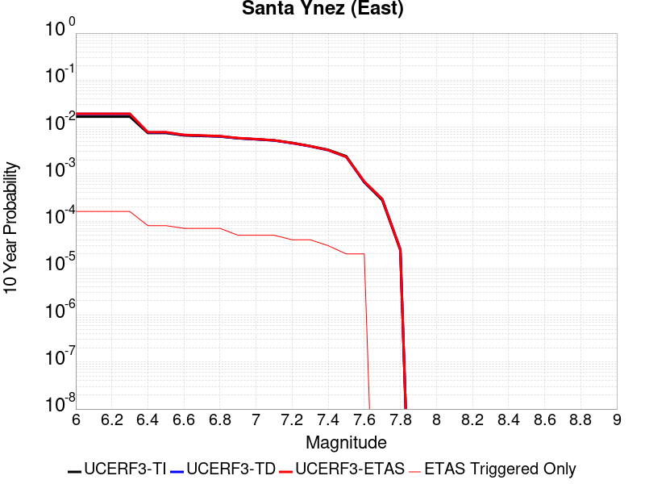 |

| Magnitude | 1 wk TI Prob | 1 wk TD Prob | 1 wk ETAS Prob | 1 wk ETAS/TD Gain | 1 wk ETAS Triggered Only | 1 mo TI Prob | 1 mo TD Prob | 1 mo ETAS Prob | 1 mo ETAS/TD Gain | 1 mo ETAS Triggered Only | 1 yr TI Prob | 1 yr TD Prob | 1 yr ETAS Prob | 1 yr ETAS/TD Gain | 1 yr ETAS Triggered Only | 10 yr TI Prob | 10 yr TD Prob | 10 yr ETAS Prob | 10 yr ETAS/TD Gain | 10 yr ETAS Triggered Only |
|-----|-----|-----|-----|-----|-----|-----|-----|-----|-----|-----|-----|-----|-----|-----|-----|-----|-----|-----|-----|-----|
| 6.0 | 3.2269712E-5 | 3.6750775E-5 | 9.3331386E-5 | 2.539576 | 5.658269E-5 | 1.3829143E-4 | 1.5749714E-4 | 2.1407091E-4 | 1.3592051 | 5.658269E-5 | 0.0016823979 | 0.0019164253 | 0.0020011368 | 1.0442028 | 8.487403E-5 | 0.016697178 | 0.019056438 | 0.019209076 | 1.0080098 | 1.5560239E-4 |
| 6.1 | 3.2269712E-5 | 3.6750775E-5 | 9.3331386E-5 | 2.539576 | 5.658269E-5 | 1.3829143E-4 | 1.5749714E-4 | 2.1407091E-4 | 1.3592051 | 5.658269E-5 | 0.0016823979 | 0.0019164253 | 0.0020011368 | 1.0442028 | 8.487403E-5 | 0.016697178 | 0.019056438 | 0.019209076 | 1.0080098 | 1.5560239E-4 |
| 6.2 | 3.2269712E-5 | 3.6750775E-5 | 9.3331386E-5 | 2.539576 | 5.658269E-5 | 1.3829143E-4 | 1.5749714E-4 | 2.1407091E-4 | 1.3592051 | 5.658269E-5 | 0.0016823979 | 0.0019164253 | 0.0020011368 | 1.0442028 | 8.487403E-5 | 0.016697178 | 0.019056438 | 0.019209076 | 1.0080098 | 1.5560239E-4 |
| 6.3 | 3.2269712E-5 | 3.6750775E-5 | 9.3331386E-5 | 2.539576 | 5.658269E-5 | 1.3829143E-4 | 1.5749714E-4 | 2.1407091E-4 | 1.3592051 | 5.658269E-5 | 0.0016823979 | 0.0019164253 | 0.0020011368 | 1.0442028 | 8.487403E-5 | 0.016697178 | 0.019056438 | 0.019209076 | 1.0080098 | 1.5560239E-4 |
| 6.4 | 1.4404779E-5 | 1.48492945E-5 | 5.728568E-5 | 3.857805 | 4.2437016E-5 | 6.1733306E-5 | 6.363831E-5 | 1.0607262E-4 | 1.6668046 | 4.2437016E-5 | 7.513438E-4 | 7.7452604E-4 | 8.169302E-4 | 1.0547485 | 4.2437016E-5 | 0.0074880854 | 0.007718817 | 0.007803036 | 1.0109109 | 8.487403E-5 |
| 6.5 | 1.4404779E-5 | 1.48492945E-5 | 5.728568E-5 | 3.857805 | 4.2437016E-5 | 6.1733306E-5 | 6.363831E-5 | 1.0607262E-4 | 1.6668046 | 4.2437016E-5 | 7.513438E-4 | 7.7452604E-4 | 8.169302E-4 | 1.0547485 | 4.2437016E-5 | 0.0074880854 | 0.007718817 | 0.007803036 | 1.0109109 | 8.487403E-5 |
| 6.6 | 1.280208E-5 | 1.301186E-5 | 5.5448323E-5 | 4.2613683 | 4.2437016E-5 | 5.4864904E-5 | 5.5763932E-5 | 9.819858E-5 | 1.7609695 | 4.2437016E-5 | 6.6777546E-4 | 6.7871617E-4 | 7.2112435E-4 | 1.062483 | 4.2437016E-5 | 0.006657724 | 0.0067666434 | 0.006850943 | 1.0124581 | 8.487403E-5 |
| 6.7 | 1.2457027E-5 | 1.262838E-5 | 5.5064862E-5 | 4.3604054 | 4.2437016E-5 | 5.3386164E-5 | 5.4120515E-5 | 9.655524E-5 | 1.7840782 | 4.2437016E-5 | 6.497827E-4 | 6.5871974E-4 | 7.011288E-4 | 1.064381 | 4.2437016E-5 | 0.00647886 | 0.00656787 | 0.006652186 | 1.0128378 | 8.487403E-5 |
| 6.8 | 1.2095134E-5 | 1.2230827E-5 | 5.4667325E-5 | 4.4696345 | 4.2437016E-5 | 5.1835254E-5 | 5.2416784E-5 | 9.485158E-5 | 1.809565 | 4.2437016E-5 | 6.309115E-4 | 6.3798914E-4 | 6.8039907E-4 | 1.0664744 | 4.2437016E-5 | 0.0062912325 | 0.006361764 | 0.006446098 | 1.0132564 | 8.487403E-5 |
| 6.9 | 1.1104036E-5 | 1.115726E-5 | 3.944829E-5 | 3.535661 | 2.8291344E-5 | 4.758786E-5 | 4.781596E-5 | 7.610595E-5 | 1.5916433 | 2.8291344E-5 | 5.7922816E-4 | 5.82005E-4 | 6.102799E-4 | 1.0485818 | 2.8291344E-5 | 0.005777207 | 0.0058049536 | 0.0058752717 | 1.0121135 | 7.072836E-5 |
| 7.0 | 1.0577444E-5 | 1.05815925E-5 | 3.8872637E-5 | 3.6736093 | 2.8291344E-5 | 4.5331115E-5 | 4.53489E-5 | 7.363896E-5 | 1.6238313 | 2.8291344E-5 | 5.5176654E-4 | 5.5198424E-4 | 5.8025995E-4 | 1.0512257 | 2.8291344E-5 | 0.0055039856 | 0.00550627 | 0.005576609 | 1.0127743 | 7.072836E-5 |
| 7.1 | 1.0021775E-5 | 9.9809E-6 | 3.8271963E-5 | 3.83452 | 2.8291344E-5 | 4.294976E-5 | 4.277459E-5 | 7.106473E-5 | 1.6613771 | 2.8291344E-5 | 5.2278786E-4 | 5.206574E-4 | 5.48934E-4 | 1.0543095 | 2.8291344E-5 | 0.0052155964 | 0.005194508 | 0.005264869 | 1.0135453 | 7.072836E-5 |
| 7.2 | 8.874109E-6 | 8.748706E-6 | 2.2894255E-5 | 2.616873 | 1.4145672E-5 | 3.8031343E-5 | 3.7493923E-5 | 5.1639065E-5 | 1.3772649 | 1.4145672E-5 | 4.629332E-4 | 4.56394E-4 | 4.705332E-4 | 1.0309802 | 1.4145672E-5 | 0.0046197 | 0.0045546847 | 0.0046110097 | 1.0123664 | 5.658269E-5 |
| 7.3 | 7.5504267E-6 | 7.5050243E-6 | 2.165059E-5 | 2.8848128 | 1.4145672E-5 | 3.235857E-5 | 3.2164E-5 | 4.6309215E-5 | 1.4397842 | 1.4145672E-5 | 3.9389438E-4 | 3.9152734E-4 | 4.0566747E-4 | 1.0361153 | 1.4145672E-5 | 0.0039319694 | 0.0039084824 | 0.003964844 | 1.0144203 | 5.658269E-5 |
| 7.4 | 6.309394E-6 | 6.183062E-6 | 2.0328647E-5 | 3.287796 | 1.4145672E-5 | 2.703998E-5 | 2.6498574E-5 | 4.064387E-5 | 1.5338136 | 1.4145672E-5 | 3.2916202E-4 | 3.2257332E-4 | 3.3671444E-4 | 1.0438384 | 1.4145672E-5 | 0.003286749 | 0.0032211484 | 0.0032634486 | 1.0131321 | 4.2437016E-5 |
| 7.5 | 4.6103073E-6 | 4.4408016E-6 | 1.858641E-5 | 4.185373 | 1.4145672E-5 | 1.975831E-5 | 1.9031871E-5 | 3.3177275E-5 | 1.7432481 | 1.4145672E-5 | 2.4053088E-4 | 2.316891E-4 | 2.458315E-4 | 1.0610404 | 1.4145672E-5 | 0.002402707 | 0.002314545 | 0.0023427708 | 1.012195 | 2.8291344E-5 |
| 7.6 | 1.2858658E-6 | 1.3008196E-6 | 1.5446472E-5 | 11.874417 | 1.4145672E-5 | 5.5108417E-6 | 5.574929E-6 | 1.9720523E-5 | 3.5373583 | 1.4145672E-5 | 6.7092435E-5 | 6.787272E-5 | 8.201743E-5 | 1.2084006 | 1.4145672E-5 | 6.707218E-4 | 6.7852676E-4 | 7.067989E-4 | 1.041667 | 2.8291344E-5 |
| 7.7 | 5.3302307E-7 | 5.612138E-7 | 5.612138E-7 | 1.0 | 0.0 | 2.2843826E-6 | 2.4052001E-6 | 2.4052001E-6 | 1.0 | 0.0 | 2.7812002E-5 | 2.9282955E-5 | 2.9282955E-5 | 1.0 | 0.0 | 2.7808524E-4 | 2.9279455E-4 | 2.9279455E-4 | 1.0 | 0.0 |
| 7.8 | 4.613933E-8 | 4.80301E-8 | 4.80301E-8 | 1.0 | 0.0 | 1.9773998E-7 | 2.0584326E-7 | 2.0584326E-7 | 1.0 | 0.0 | 2.4074816E-6 | 2.5061388E-6 | 2.5061388E-6 | 1.0 | 0.0 | 2.4074554E-5 | 2.5061116E-5 | 2.5061116E-5 | 1.0 | 0.0 |

## Deep Springs
*[(top)](#table-of-contents)*

| 1 Week | 1 Month | 1 Year | 10 Year |
|-----|-----|-----|-----|
|  | 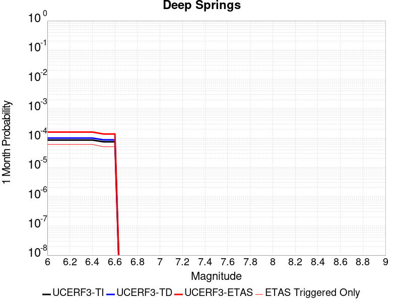 |  |  |

| Magnitude | 1 wk TI Prob | 1 wk TD Prob | 1 wk ETAS Prob | 1 wk ETAS/TD Gain | 1 wk ETAS Triggered Only | 1 mo TI Prob | 1 mo TD Prob | 1 mo ETAS Prob | 1 mo ETAS/TD Gain | 1 mo ETAS Triggered Only | 1 yr TI Prob | 1 yr TD Prob | 1 yr ETAS Prob | 1 yr ETAS/TD Gain | 1 yr ETAS Triggered Only | 10 yr TI Prob | 10 yr TD Prob | 10 yr ETAS Prob | 10 yr ETAS/TD Gain | 10 yr ETAS Triggered Only |
|-----|-----|-----|-----|-----|-----|-----|-----|-----|-----|-----|-----|-----|-----|-----|-----|-----|-----|-----|-----|-----|
| 6.0 | 1.9810619E-5 | 2.311252E-5 | 6.554856E-5 | 2.8360627 | 4.2437016E-5 | 8.489989E-5 | 9.9052755E-5 | 1.5562984E-4 | 1.5711813 | 5.658269E-5 | 0.001033166 | 0.0012058078 | 0.0013329653 | 1.1054542 | 1.2731105E-4 | 0.010283757 | 0.01204243 | 0.012196159 | 1.0127655 | 1.5560239E-4 |
| 6.1 | 1.9810619E-5 | 2.311252E-5 | 6.554856E-5 | 2.8360627 | 4.2437016E-5 | 8.489989E-5 | 9.9052755E-5 | 1.5562984E-4 | 1.5711813 | 5.658269E-5 | 0.001033166 | 0.0012058078 | 0.0013329653 | 1.1054542 | 1.2731105E-4 | 0.010283757 | 0.01204243 | 0.012196159 | 1.0127655 | 1.5560239E-4 |
| 6.2 | 1.9810619E-5 | 2.311252E-5 | 6.554856E-5 | 2.8360627 | 4.2437016E-5 | 8.489989E-5 | 9.9052755E-5 | 1.5562984E-4 | 1.5711813 | 5.658269E-5 | 0.001033166 | 0.0012058078 | 0.0013329653 | 1.1054542 | 1.2731105E-4 | 0.010283757 | 0.01204243 | 0.012196159 | 1.0127655 | 1.5560239E-4 |
| 6.3 | 1.9810619E-5 | 2.311252E-5 | 6.554856E-5 | 2.8360627 | 4.2437016E-5 | 8.489989E-5 | 9.9052755E-5 | 1.5562984E-4 | 1.5711813 | 5.658269E-5 | 0.001033166 | 0.0012058078 | 0.0013329653 | 1.1054542 | 1.2731105E-4 | 0.010283757 | 0.01204243 | 0.012196159 | 1.0127655 | 1.5560239E-4 |
| 6.4 | 1.9810619E-5 | 2.311252E-5 | 6.554856E-5 | 2.8360627 | 4.2437016E-5 | 8.489989E-5 | 9.9052755E-5 | 1.5562984E-4 | 1.5711813 | 5.658269E-5 | 0.001033166 | 0.0012058078 | 0.0013329653 | 1.1054542 | 1.2731105E-4 | 0.010283757 | 0.01204243 | 0.012196159 | 1.0127655 | 1.5560239E-4 |
| 6.5 | 1.7190405E-5 | 2.0050558E-5 | 6.2486724E-5 | 3.1164582 | 4.2437016E-5 | 7.367108E-5 | 8.593096E-5 | 1.2836434E-4 | 1.4938077 | 4.2437016E-5 | 8.9657627E-4 | 0.0010462092 | 0.0011592562 | 1.1080539 | 1.1316538E-4 | 0.008929676 | 0.010462061 | 0.01058804 | 1.0120416 | 1.2731105E-4 |
| 6.6 | 1.7190405E-5 | 2.0050558E-5 | 6.2486724E-5 | 3.1164582 | 4.2437016E-5 | 7.367108E-5 | 8.593096E-5 | 1.2836434E-4 | 1.4938077 | 4.2437016E-5 | 8.9657627E-4 | 0.0010462092 | 0.0011592562 | 1.1080539 | 1.1316538E-4 | 0.008929676 | 0.010462061 | 0.01058804 | 1.0120416 | 1.2731105E-4 |

## Tin Mountain
*[(top)](#table-of-contents)*

| 1 Week | 1 Month | 1 Year | 10 Year |
|-----|-----|-----|-----|
|  |  |  | 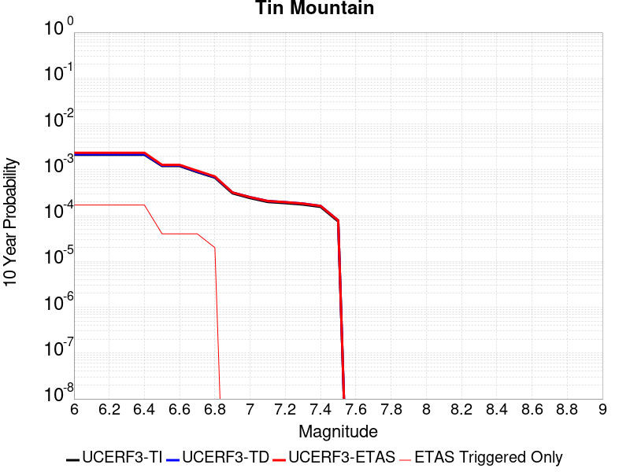 |

| Magnitude | 1 wk TI Prob | 1 wk TD Prob | 1 wk ETAS Prob | 1 wk ETAS/TD Gain | 1 wk ETAS Triggered Only | 1 mo TI Prob | 1 mo TD Prob | 1 mo ETAS Prob | 1 mo ETAS/TD Gain | 1 mo ETAS Triggered Only | 1 yr TI Prob | 1 yr TD Prob | 1 yr ETAS Prob | 1 yr ETAS/TD Gain | 1 yr ETAS Triggered Only | 10 yr TI Prob | 10 yr TD Prob | 10 yr ETAS Prob | 10 yr ETAS/TD Gain | 10 yr ETAS Triggered Only |
|-----|-----|-----|-----|-----|-----|-----|-----|-----|-----|-----|-----|-----|-----|-----|-----|-----|-----|-----|-----|-----|
| 6.0 | 4.083776E-6 | 4.1815365E-6 | 1.832715E-5 | 4.3828745 | 1.4145672E-5 | 1.750178E-5 | 1.792077E-5 | 4.6211608E-5 | 2.578662 | 2.8291344E-5 | 2.1306332E-4 | 2.1816725E-4 | 2.8888017E-4 | 1.3241225 | 7.072836E-5 | 0.0021285915 | 0.0021798965 | 0.0023351596 | 1.071225 | 1.5560239E-4 |
| 6.1 | 4.083776E-6 | 4.1815365E-6 | 1.832715E-5 | 4.3828745 | 1.4145672E-5 | 1.750178E-5 | 1.792077E-5 | 4.6211608E-5 | 2.578662 | 2.8291344E-5 | 2.1306332E-4 | 2.1816725E-4 | 2.8888017E-4 | 1.3241225 | 7.072836E-5 | 0.0021285915 | 0.0021798965 | 0.0023351596 | 1.071225 | 1.5560239E-4 |
| 6.2 | 4.083776E-6 | 4.1815365E-6 | 1.832715E-5 | 4.3828745 | 1.4145672E-5 | 1.750178E-5 | 1.792077E-5 | 4.6211608E-5 | 2.578662 | 2.8291344E-5 | 2.1306332E-4 | 2.1816725E-4 | 2.8888017E-4 | 1.3241225 | 7.072836E-5 | 0.0021285915 | 0.0021798965 | 0.0023351596 | 1.071225 | 1.5560239E-4 |
| 6.3 | 4.083776E-6 | 4.1815365E-6 | 1.832715E-5 | 4.3828745 | 1.4145672E-5 | 1.750178E-5 | 1.792077E-5 | 4.6211608E-5 | 2.578662 | 2.8291344E-5 | 2.1306332E-4 | 2.1816725E-4 | 2.8888017E-4 | 1.3241225 | 7.072836E-5 | 0.0021285915 | 0.0021798965 | 0.0023351596 | 1.071225 | 1.5560239E-4 |
| 6.4 | 4.083776E-6 | 4.1815365E-6 | 1.832715E-5 | 4.3828745 | 1.4145672E-5 | 1.750178E-5 | 1.792077E-5 | 4.6211608E-5 | 2.578662 | 2.8291344E-5 | 2.1306332E-4 | 2.1816725E-4 | 2.8888017E-4 | 1.3241225 | 7.072836E-5 | 0.0021285915 | 0.0021798965 | 0.0023351596 | 1.071225 | 1.5560239E-4 |
| 6.5 | 2.3143427E-6 | 2.3731573E-6 | 1.6518796E-5 | 6.9606833 | 1.4145672E-5 | 9.9185745E-6 | 1.0170638E-5 | 2.4316167E-5 | 2.39082 | 1.4145672E-5 | 1.2075195E-4 | 1.2382126E-4 | 1.3796518E-4 | 1.1142285 | 1.4145672E-5 | 0.0012068636 | 0.0012375986 | 0.0012658549 | 1.0228316 | 2.8291344E-5 |
| 6.6 | 2.3143427E-6 | 2.3731573E-6 | 1.6518796E-5 | 6.9606833 | 1.4145672E-5 | 9.9185745E-6 | 1.0170638E-5 | 2.4316167E-5 | 2.39082 | 1.4145672E-5 | 1.2075195E-4 | 1.2382126E-4 | 1.3796518E-4 | 1.1142285 | 1.4145672E-5 | 0.0012068636 | 0.0012375986 | 0.0012658549 | 1.0228316 | 2.8291344E-5 |
| 6.7 | 1.7029532E-6 | 1.7497915E-6 | 1.5895439E-5 | 9.08419 | 1.4145672E-5 | 7.2983503E-6 | 7.499088E-6 | 2.1644653E-5 | 2.8863049 | 1.4145672E-5 | 8.885379E-5 | 9.1298105E-5 | 1.0544249E-4 | 1.1549252 | 1.4145672E-5 | 8.881827E-4 | 9.1265864E-4 | 9.4092416E-4 | 1.0309706 | 2.8291344E-5 |
| 6.8 | 1.2914646E-6 | 1.3299378E-6 | 1.547559E-5 | 11.636327 | 1.4145672E-5 | 5.534837E-6 | 5.6997237E-6 | 1.9845314E-5 | 3.481803 | 1.4145672E-5 | 6.738455E-5 | 6.939237E-5 | 8.353706E-5 | 1.2038364 | 1.4145672E-5 | 6.736412E-4 | 6.9375033E-4 | 7.0788624E-4 | 1.020376 | 1.4145672E-5 |
| 6.9 | 5.8708974E-7 | 6.1169936E-7 | 6.1169936E-7 | 1.0 | 0.0 | 2.5160964E-6 | 2.6215664E-6 | 2.6215664E-6 | 1.0 | 0.0 | 3.0633044E-5 | 3.1917145E-5 | 3.1917145E-5 | 1.0 | 0.0 | 3.0628822E-4 | 3.191297E-4 | 3.191297E-4 | 1.0 | 0.0 |
| 7.0 | 4.6248786E-7 | 4.832015E-7 | 4.832015E-7 | 1.0 | 0.0 | 1.9820893E-6 | 2.0708624E-6 | 2.0708624E-6 | 1.0 | 0.0 | 2.413167E-5 | 2.5212494E-5 | 2.5212494E-5 | 1.0 | 0.0 | 2.412905E-4 | 2.5210003E-4 | 2.5210003E-4 | 1.0 | 0.0 |
| 7.1 | 3.804606E-7 | 3.987147E-7 | 3.987147E-7 | 1.0 | 0.0 | 1.6305444E-6 | 1.7087764E-6 | 1.7087764E-6 | 1.0 | 0.0 | 1.9851697E-5 | 2.0804187E-5 | 2.0804187E-5 | 1.0 | 0.0 | 1.9849923E-4 | 2.0802575E-4 | 2.0802575E-4 | 1.0 | 0.0 |
| 7.2 | 3.5864858E-7 | 3.7616863E-7 | 3.7616863E-7 | 1.0 | 0.0 | 1.5370645E-6 | 1.6121504E-6 | 1.6121504E-6 | 1.0 | 0.0 | 1.87136E-5 | 1.9627789E-5 | 1.9627789E-5 | 1.0 | 0.0 | 1.8712023E-4 | 1.9626386E-4 | 1.9626386E-4 | 1.0 | 0.0 |
| 7.3 | 3.342063E-7 | 3.506347E-7 | 3.506347E-7 | 1.0 | 0.0 | 1.4323119E-6 | 1.5027196E-6 | 1.5027196E-6 | 1.0 | 0.0 | 1.7438259E-5 | 1.829549E-5 | 1.829549E-5 | 1.0 | 0.0 | 1.743689E-4 | 1.8294314E-4 | 1.8294314E-4 | 1.0 | 0.0 |
| 7.4 | 2.971242E-7 | 3.1165817E-7 | 3.1165817E-7 | 1.0 | 0.0 | 1.2733886E-6 | 1.3356774E-6 | 1.3356774E-6 | 1.0 | 0.0 | 1.5503398E-5 | 1.6261785E-5 | 1.6261785E-5 | 1.0 | 0.0 | 1.5502315E-4 | 1.6260923E-4 | 1.6260923E-4 | 1.0 | 0.0 |
| 7.5 | 1.4326713E-7 | 1.5012525E-7 | 1.5012525E-7 | 1.0 | 0.0 | 6.140018E-7 | 6.433939E-7 | 6.433939E-7 | 1.0 | 0.0 | 7.4754466E-6 | 7.8333205E-6 | 7.8333205E-6 | 1.0 | 0.0 | 7.475195E-5 | 7.833321E-5 | 7.833321E-5 | 1.0 | 0.0 |

## Chino alt 1
*[(top)](#table-of-contents)*

| 1 Week | 1 Month | 1 Year | 10 Year |
|-----|-----|-----|-----|
|  | 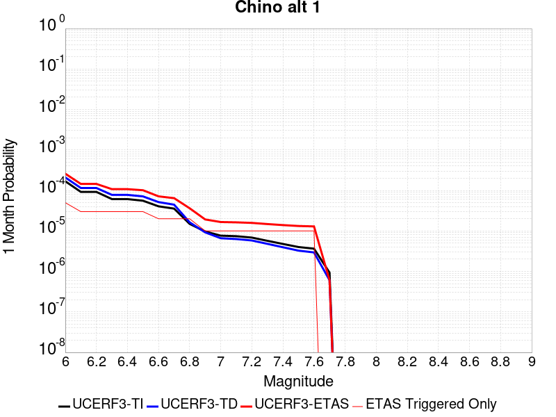 |  |  |

| Magnitude | 1 wk TI Prob | 1 wk TD Prob | 1 wk ETAS Prob | 1 wk ETAS/TD Gain | 1 wk ETAS Triggered Only | 1 mo TI Prob | 1 mo TD Prob | 1 mo ETAS Prob | 1 mo ETAS/TD Gain | 1 mo ETAS Triggered Only | 1 yr TI Prob | 1 yr TD Prob | 1 yr ETAS Prob | 1 yr ETAS/TD Gain | 1 yr ETAS Triggered Only | 10 yr TI Prob | 10 yr TD Prob | 10 yr ETAS Prob | 10 yr ETAS/TD Gain | 10 yr ETAS Triggered Only |
|-----|-----|-----|-----|-----|-----|-----|-----|-----|-----|-----|-----|-----|-----|-----|-----|-----|-----|-----|-----|-----|
| 6.0 | 3.939946E-5 | 4.894798E-5 | 7.723794E-5 | 1.5779597 | 2.8291344E-5 | 1.6884391E-4 | 2.0976314E-4 | 2.3804854E-4 | 1.1348445 | 2.8291344E-5 | 0.0020537362 | 0.002551385 | 0.002621933 | 1.0276508 | 7.072836E-5 | 0.020348595 | 0.025280168 | 0.025390472 | 1.0043633 | 1.1316538E-4 |
| 6.1 | 2.1505624E-5 | 2.6878823E-5 | 4.1024115E-5 | 1.5262616 | 1.4145672E-5 | 9.2163704E-5 | 1.15190494E-4 | 1.2933454E-4 | 1.1227883 | 1.4145672E-5 | 0.0011215154 | 0.0014016517 | 0.0014440292 | 1.030234 | 4.2437016E-5 | 0.011158722 | 0.013947425 | 0.014003218 | 1.0040003 | 5.658269E-5 |
| 6.2 | 2.1505624E-5 | 2.6878823E-5 | 4.1024115E-5 | 1.5262616 | 1.4145672E-5 | 9.2163704E-5 | 1.15190494E-4 | 1.2933454E-4 | 1.1227883 | 1.4145672E-5 | 0.0011215154 | 0.0014016517 | 0.0014440292 | 1.030234 | 4.2437016E-5 | 0.011158722 | 0.013947425 | 0.014003218 | 1.0040003 | 5.658269E-5 |
| 6.3 | 1.4290785E-5 | 1.8164832E-5 | 3.2310247E-5 | 1.7787254 | 1.4145672E-5 | 6.1244784E-5 | 7.784722E-5 | 9.199179E-5 | 1.1816965 | 1.4145672E-5 | 7.454001E-4 | 9.4742293E-4 | 9.898198E-4 | 1.0447496 | 4.2437016E-5 | 0.007429048 | 0.00944674 | 0.009502788 | 1.005933 | 5.658269E-5 |
| 6.4 | 1.4290785E-5 | 1.8164832E-5 | 3.2310247E-5 | 1.7787254 | 1.4145672E-5 | 6.1244784E-5 | 7.784722E-5 | 9.199179E-5 | 1.1816965 | 1.4145672E-5 | 7.454001E-4 | 9.4742293E-4 | 9.898198E-4 | 1.0447496 | 4.2437016E-5 | 0.007429048 | 0.00944674 | 0.009502788 | 1.005933 | 5.658269E-5 |
| 6.5 | 1.3017944E-5 | 1.6651793E-5 | 3.079723E-5 | 1.8494843 | 1.4145672E-5 | 5.5789995E-5 | 7.1363116E-5 | 8.550778E-5 | 1.1982069 | 1.4145672E-5 | 6.790315E-4 | 8.6854334E-4 | 9.1094355E-4 | 1.0488175 | 4.2437016E-5 | 0.0067696036 | 0.008664233 | 0.008720325 | 1.006474 | 5.658269E-5 |
| 6.6 | 9.470016E-6 | 1.2039209E-5 | 2.618471E-5 | 2.1749527 | 1.4145672E-5 | 4.058515E-5 | 5.159578E-5 | 6.574072E-5 | 1.2741492 | 1.4145672E-5 | 4.940122E-4 | 6.280315E-4 | 6.704419E-4 | 1.0675291 | 4.2437016E-5 | 0.004929154 | 0.006273248 | 0.0063294754 | 1.0089631 | 5.658269E-5 |
| 6.7 | 8.314155E-6 | 1.040749E-5 | 2.4553015E-5 | 2.3591678 | 1.4145672E-5 | 3.5631605E-5 | 4.4602948E-5 | 5.8747988E-5 | 1.3171325 | 1.4145672E-5 | 4.3372845E-4 | 5.4293784E-4 | 5.7121384E-4 | 1.0520796 | 2.8291344E-5 | 0.004328829 | 0.0054270807 | 0.0054692873 | 1.0077771 | 4.2437016E-5 |
| 6.8 | 3.4856364E-6 | 3.8134033E-6 | 1.795902E-5 | 4.7094474 | 1.4145672E-5 | 1.4938357E-5 | 1.6343065E-5 | 3.0488507E-5 | 1.8655317 | 1.4145672E-5 | 1.8185932E-4 | 1.9896074E-4 | 2.2724645E-4 | 1.1421673 | 2.8291344E-5 | 0.0018171056 | 0.0019894529 | 0.0020176878 | 1.0141923 | 2.8291344E-5 |
| 6.9 | 2.2645952E-6 | 2.152909E-6 | 2.152909E-6 | 1.0 | 0.0 | 9.705372E-6 | 9.226722E-6 | 9.226722E-6 | 1.0 | 0.0 | 1.18156495E-4 | 1.12329755E-4 | 1.2647384E-4 | 1.1259158 | 1.4145672E-5 | 0.0011809369 | 0.0011233138 | 0.0011374436 | 1.0125786 | 1.4145672E-5 |
| 7.0 | 1.7864003E-6 | 1.5430741E-6 | 1.5430741E-6 | 1.0 | 0.0 | 7.655979E-6 | 6.613158E-6 | 6.613158E-6 | 1.0 | 0.0 | 9.3207556E-5 | 8.051228E-5 | 8.051228E-5 | 1.0 | 0.0 | 9.316847E-4 | 8.052856E-4 | 8.052856E-4 | 1.0 | 0.0 |
| 7.1 | 1.7315456E-6 | 1.4733466E-6 | 1.4733466E-6 | 1.0 | 0.0 | 7.420889E-6 | 6.314328E-6 | 6.314328E-6 | 1.0 | 0.0 | 9.034557E-5 | 7.687428E-5 | 7.687428E-5 | 1.0 | 0.0 | 9.0308854E-4 | 7.68921E-4 | 7.68921E-4 | 1.0 | 0.0 |
| 7.2 | 1.6008337E-6 | 1.3574178E-6 | 1.3574178E-6 | 1.0 | 0.0 | 6.860698E-6 | 5.817492E-6 | 5.817492E-6 | 1.0 | 0.0 | 8.352579E-5 | 7.082572E-5 | 7.082572E-5 | 1.0 | 0.0 | 8.34944E-4 | 7.0846075E-4 | 7.0846075E-4 | 1.0 | 0.0 |
| 7.3 | 1.3320939E-6 | 1.1217794E-6 | 1.1217794E-6 | 1.0 | 0.0 | 5.7089615E-6 | 4.8076176E-6 | 4.8076176E-6 | 1.0 | 0.0 | 6.9504385E-5 | 5.853122E-5 | 5.853122E-5 | 1.0 | 0.0 | 6.9482654E-4 | 5.8530655E-4 | 5.8530655E-4 | 1.0 | 0.0 |
| 7.4 | 1.114294E-6 | 9.237087E-7 | 9.237087E-7 | 1.0 | 0.0 | 4.775537E-6 | 3.9587458E-6 | 3.9587458E-6 | 1.0 | 0.0 | 5.8140613E-5 | 4.81967E-5 | 4.81967E-5 | 1.0 | 0.0 | 5.81254E-4 | 4.8187698E-4 | 4.8187698E-4 | 1.0 | 0.0 |
| 7.5 | 9.354081E-7 | 7.6233886E-7 | 7.6233886E-7 | 1.0 | 0.0 | 4.0088858E-6 | 3.2671626E-6 | 3.2671626E-6 | 1.0 | 0.0 | 4.8807087E-5 | 3.9777013E-5 | 3.9777013E-5 | 1.0 | 0.0 | 4.879637E-4 | 3.9770233E-4 | 3.9770233E-4 | 1.0 | 0.0 |
| 7.6 | 8.521771E-7 | 6.880688E-7 | 6.880688E-7 | 1.0 | 0.0 | 3.6521824E-6 | 2.948863E-6 | 2.948863E-6 | 1.0 | 0.0 | 4.4464414E-5 | 3.590185E-5 | 3.590185E-5 | 1.0 | 0.0 | 4.4455516E-4 | 3.5896365E-4 | 3.5896365E-4 | 1.0 | 0.0 |
| 7.7 | 2.1803626E-7 | 1.4186368E-7 | 1.4186368E-7 | 1.0 | 0.0 | 9.344408E-7 | 6.0798715E-7 | 6.0798715E-7 | 1.0 | 0.0 | 1.1376757E-5 | 7.4022278E-6 | 7.4022278E-6 | 1.0 | 0.0 | 1.13761744E-4 | 7.402077E-5 | 7.402077E-5 | 1.0 | 0.0 |

## Cleghorn Pass
*[(top)](#table-of-contents)*

| 1 Week | 1 Month | 1 Year | 10 Year |
|-----|-----|-----|-----|
|  | 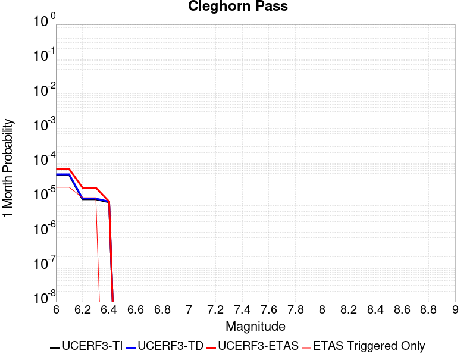 |  |  |

| Magnitude | 1 wk TI Prob | 1 wk TD Prob | 1 wk ETAS Prob | 1 wk ETAS/TD Gain | 1 wk ETAS Triggered Only | 1 mo TI Prob | 1 mo TD Prob | 1 mo ETAS Prob | 1 mo ETAS/TD Gain | 1 mo ETAS Triggered Only | 1 yr TI Prob | 1 yr TD Prob | 1 yr ETAS Prob | 1 yr ETAS/TD Gain | 1 yr ETAS Triggered Only | 10 yr TI Prob | 10 yr TD Prob | 10 yr ETAS Prob | 10 yr ETAS/TD Gain | 10 yr ETAS Triggered Only |
|-----|-----|-----|-----|-----|-----|-----|-----|-----|-----|-----|-----|-----|-----|-----|-----|-----|-----|-----|-----|-----|
| 6.0 | 1.0522846E-5 | 1.1040642E-5 | 2.5186158E-5 | 2.2812223 | 1.4145672E-5 | 4.509713E-5 | 4.7316473E-5 | 6.146148E-5 | 1.2989446 | 1.4145672E-5 | 5.4891926E-4 | 5.759784E-4 | 6.608036E-4 | 1.1472714 | 8.487403E-5 | 0.0054756533 | 0.005750022 | 0.0058766007 | 1.0220137 | 1.2731105E-4 |
| 6.1 | 1.0522846E-5 | 1.1040642E-5 | 2.5186158E-5 | 2.2812223 | 1.4145672E-5 | 4.509713E-5 | 4.7316473E-5 | 6.146148E-5 | 1.2989446 | 1.4145672E-5 | 5.4891926E-4 | 5.759784E-4 | 6.608036E-4 | 1.1472714 | 8.487403E-5 | 0.0054756533 | 0.005750022 | 0.0058766007 | 1.0220137 | 1.2731105E-4 |
| 6.2 | 2.1045846E-6 | 2.2082024E-6 | 1.6353843E-5 | 7.405953 | 1.4145672E-5 | 9.019617E-6 | 9.463714E-6 | 2.3609253E-5 | 2.4947133 | 1.4145672E-5 | 1.098083E-4 | 1.1521882E-4 | 1.5765095E-4 | 1.3682742 | 4.2437016E-5 | 0.0010975406 | 0.0011520023 | 0.0012085198 | 1.0490602 | 5.658269E-5 |
| 6.3 | 2.1045846E-6 | 2.2082024E-6 | 1.6353843E-5 | 7.405953 | 1.4145672E-5 | 9.019617E-6 | 9.463714E-6 | 2.3609253E-5 | 2.4947133 | 1.4145672E-5 | 1.098083E-4 | 1.1521882E-4 | 1.5765095E-4 | 1.3682742 | 4.2437016E-5 | 0.0010975406 | 0.0011520023 | 0.0012085198 | 1.0490602 | 5.658269E-5 |
| 6.4 | 1.7259927E-6 | 1.810877E-6 | 1.810877E-6 | 1.0 | 0.0 | 7.3970905E-6 | 7.760902E-6 | 7.760902E-6 | 1.0 | 0.0 | 9.005586E-5 | 9.4488976E-5 | 1.2277765E-4 | 1.2993859 | 2.8291344E-5 | 9.001937E-4 | 9.448898E-4 | 9.872867E-4 | 1.0448697 | 4.2437016E-5 |

## San Jacinto (Clark) rev
*[(top)](#table-of-contents)*

| 1 Week | 1 Month | 1 Year | 10 Year |
|-----|-----|-----|-----|
|  | 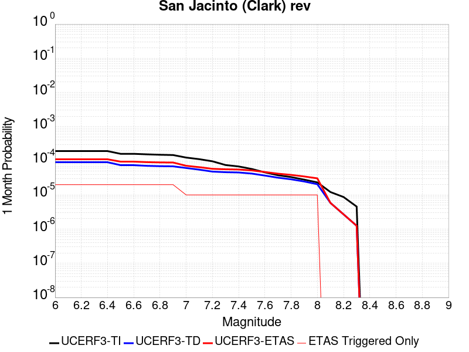 | 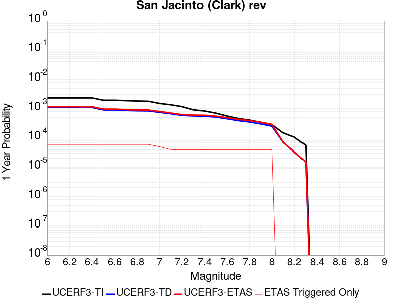 |  |

| Magnitude | 1 wk TI Prob | 1 wk TD Prob | 1 wk ETAS Prob | 1 wk ETAS/TD Gain | 1 wk ETAS Triggered Only | 1 mo TI Prob | 1 mo TD Prob | 1 mo ETAS Prob | 1 mo ETAS/TD Gain | 1 mo ETAS Triggered Only | 1 yr TI Prob | 1 yr TD Prob | 1 yr ETAS Prob | 1 yr ETAS/TD Gain | 1 yr ETAS Triggered Only | 10 yr TI Prob | 10 yr TD Prob | 10 yr ETAS Prob | 10 yr ETAS/TD Gain | 10 yr ETAS Triggered Only |
|-----|-----|-----|-----|-----|-----|-----|-----|-----|-----|-----|-----|-----|-----|-----|-----|-----|-----|-----|-----|-----|
| 6.0 | 4.482615E-5 | 2.1153059E-5 | 3.529843E-5 | 1.6687152 | 1.4145672E-5 | 1.9209793E-4 | 9.065287E-5 | 1.1894165E-4 | 1.3120561 | 2.8291344E-5 | 0.0023362834 | 0.0011031491 | 0.0011879295 | 1.076853 | 8.487403E-5 | 0.02311874 | 0.011485709 | 0.011611558 | 1.010957 | 1.2731105E-4 |
| 6.1 | 4.482615E-5 | 2.1153059E-5 | 3.529843E-5 | 1.6687152 | 1.4145672E-5 | 1.9209793E-4 | 9.065287E-5 | 1.1894165E-4 | 1.3120561 | 2.8291344E-5 | 0.0023362834 | 0.0011031491 | 0.0011879295 | 1.076853 | 8.487403E-5 | 0.02311874 | 0.011485709 | 0.011611558 | 1.010957 | 1.2731105E-4 |
| 6.2 | 4.482615E-5 | 2.1153059E-5 | 3.529843E-5 | 1.6687152 | 1.4145672E-5 | 1.9209793E-4 | 9.065287E-5 | 1.1894165E-4 | 1.3120561 | 2.8291344E-5 | 0.0023362834 | 0.0011031491 | 0.0011879295 | 1.076853 | 8.487403E-5 | 0.02311874 | 0.011485709 | 0.011611558 | 1.010957 | 1.2731105E-4 |
| 6.3 | 4.482615E-5 | 2.1153059E-5 | 3.529843E-5 | 1.6687152 | 1.4145672E-5 | 1.9209793E-4 | 9.065287E-5 | 1.1894165E-4 | 1.3120561 | 2.8291344E-5 | 0.0023362834 | 0.0011031491 | 0.0011879295 | 1.076853 | 8.487403E-5 | 0.02311874 | 0.011485709 | 0.011611558 | 1.010957 | 1.2731105E-4 |
| 6.4 | 4.482615E-5 | 2.1153059E-5 | 3.529843E-5 | 1.6687152 | 1.4145672E-5 | 1.9209793E-4 | 9.065287E-5 | 1.1894165E-4 | 1.3120561 | 2.8291344E-5 | 0.0023362834 | 0.0011031491 | 0.0011879295 | 1.076853 | 8.487403E-5 | 0.02311874 | 0.011485709 | 0.011611558 | 1.010957 | 1.2731105E-4 |
| 6.5 | 3.7294863E-5 | 1.7354667E-5 | 3.1500094E-5 | 1.8150792 | 1.4145672E-5 | 1.5982533E-4 | 7.437504E-5 | 1.02664286E-4 | 1.3803593 | 2.8291344E-5 | 0.0019441366 | 9.051445E-4 | 9.899416E-4 | 1.0936836 | 8.487403E-5 | 0.01927216 | 0.009485902 | 0.009612006 | 1.0132937 | 1.2731105E-4 |
| 6.6 | 3.7294863E-5 | 1.7354667E-5 | 3.1500094E-5 | 1.8150792 | 1.4145672E-5 | 1.5982533E-4 | 7.437504E-5 | 1.02664286E-4 | 1.3803593 | 2.8291344E-5 | 0.0019441366 | 9.051445E-4 | 9.899416E-4 | 1.0936836 | 8.487403E-5 | 0.01927216 | 0.009485902 | 0.009612006 | 1.0132937 | 1.2731105E-4 |
| 6.7 | 3.6039248E-5 | 1.6602684E-5 | 3.074812E-5 | 1.851997 | 1.4145672E-5 | 1.5444479E-4 | 7.115244E-5 | 9.944177E-5 | 1.3975877 | 2.8291344E-5 | 0.0018787434 | 8.659408E-4 | 9.5074135E-4 | 1.0979288 | 8.487403E-5 | 0.01862939 | 0.009088189 | 0.0092143435 | 1.0138811 | 1.2731105E-4 |
| 6.8 | 3.5031844E-5 | 1.6231123E-5 | 3.0376565E-5 | 1.8715012 | 1.4145672E-5 | 1.5012783E-4 | 6.956012E-5 | 9.78495E-5 | 1.4066895 | 2.8291344E-5 | 0.0018262739 | 8.4656954E-4 | 9.313717E-4 | 1.1001716 | 8.487403E-5 | 0.01811338 | 0.008888788 | 0.009014967 | 1.0141953 | 1.2731105E-4 |
| 6.9 | 3.435112E-5 | 1.6061658E-5 | 3.0207104E-5 | 1.8806964 | 1.4145672E-5 | 1.4721078E-4 | 6.8833884E-5 | 9.712328E-5 | 1.4109807 | 2.8291344E-5 | 0.0017908178 | 8.377344E-4 | 9.2253735E-4 | 1.101229 | 8.487403E-5 | 0.017764548 | 0.008796512 | 0.008922703 | 1.0143456 | 1.2731105E-4 |
| 7.0 | 2.8959772E-5 | 1.43355255E-5 | 2.8480994E-5 | 1.9867424 | 1.4145672E-5 | 1.241074E-4 | 6.1436534E-5 | 7.558134E-5 | 1.2302344 | 1.4145672E-5 | 0.0015099603 | 7.477359E-4 | 8.1841135E-4 | 1.0945193 | 7.072836E-5 | 0.014997416 | 0.007868331 | 0.007980606 | 1.0142692 | 1.1316538E-4 |
| 7.1 | 2.6002877E-5 | 1.2827699E-5 | 2.697319E-5 | 2.1027303 | 1.4145672E-5 | 1.11436144E-4 | 5.4974706E-5 | 6.9119604E-5 | 1.2572982 | 1.4145672E-5 | 0.0013558907 | 6.6911365E-4 | 7.2565844E-4 | 1.0845071 | 5.658269E-5 | 0.013476475 | 0.0070483433 | 0.0071466654 | 1.0139496 | 9.901971E-5 |
| 7.2 | 2.2544838E-5 | 1.1260331E-5 | 2.5405845E-5 | 2.2562253 | 1.4145672E-5 | 9.661716E-5 | 4.825768E-5 | 6.2402665E-5 | 1.2931137 | 1.4145672E-5 | 0.001175679 | 5.873803E-4 | 6.4392976E-4 | 1.096274 | 5.658269E-5 | 0.011694785 | 0.00619256 | 0.0062909666 | 1.0158911 | 9.901971E-5 |
| 7.3 | 1.75334E-5 | 1.0810585E-5 | 2.4956104E-5 | 2.308488 | 1.4145672E-5 | 7.514098E-5 | 4.6330264E-5 | 6.0475282E-5 | 1.3053083 | 1.4145672E-5 | 9.144575E-4 | 5.6392635E-4 | 6.2047713E-4 | 1.1002804 | 5.658269E-5 | 0.009107036 | 0.0059332196 | 0.0060316515 | 1.01659 | 9.901971E-5 |
| 7.4 | 1.5924552E-5 | 1.0610475E-5 | 2.4755996E-5 | 2.3331656 | 1.4145672E-5 | 6.82463E-5 | 4.547268E-5 | 5.961771E-5 | 1.3110665 | 1.4145672E-5 | 8.305819E-4 | 5.534906E-4 | 6.1004196E-4 | 1.1021723 | 5.658269E-5 | 0.008274844 | 0.0058205863 | 0.0059190295 | 1.0169129 | 9.901971E-5 |
| 7.5 | 1.3428931E-5 | 9.851045E-6 | 2.3996578E-5 | 2.4359424 | 1.4145672E-5 | 5.7551293E-5 | 4.221809E-5 | 5.6363162E-5 | 1.3350477 | 1.4145672E-5 | 7.004617E-4 | 5.1388505E-4 | 5.704387E-4 | 1.110051 | 5.658269E-5 | 0.006982579 | 0.005406209 | 0.0055046934 | 1.0182168 | 9.901971E-5 |
| 7.6 | 1.0688787E-5 | 8.614091E-6 | 2.2759641E-5 | 2.6421409 | 1.4145672E-5 | 4.5808283E-5 | 3.6917012E-5 | 5.106216E-5 | 1.3831607 | 1.4145672E-5 | 5.5757316E-4 | 4.4937237E-4 | 5.0592964E-4 | 1.1258583 | 5.658269E-5 | 0.005561762 | 0.0047413614 | 0.0048258333 | 1.017816 | 8.487403E-5 |
| 7.7 | 8.81236E-6 | 7.4673385E-6 | 2.1612905E-5 | 2.894325 | 1.4145672E-5 | 3.776671E-5 | 3.200249E-5 | 4.6147707E-5 | 1.4420037 | 1.4145672E-5 | 4.597127E-4 | 3.8956082E-4 | 4.4612147E-4 | 1.1451908 | 5.658269E-5 | 0.0045876284 | 0.0041344194 | 0.0042189425 | 1.0204438 | 8.487403E-5 |
| 7.8 | 7.780431E-6 | 6.695928E-6 | 2.0841506E-5 | 3.1125643 | 1.4145672E-5 | 3.3344273E-5 | 2.8696519E-5 | 4.2841784E-5 | 1.4929262 | 1.4145672E-5 | 4.0589093E-4 | 3.4932428E-4 | 4.058872E-4 | 1.1619209 | 5.658269E-5 | 0.0040515037 | 0.0037226272 | 0.0038071852 | 1.0227146 | 8.487403E-5 |
| 7.9 | 6.5437994E-6 | 5.7797783E-6 | 1.9925368E-5 | 3.4474277 | 1.4145672E-5 | 2.8044553E-5 | 2.4770245E-5 | 3.8915565E-5 | 1.571061 | 1.4145672E-5 | 3.4138895E-4 | 3.0153614E-4 | 3.581018E-4 | 1.1875916 | 5.658269E-5 | 0.0034086495 | 0.0032343294 | 0.0033189289 | 1.0261568 | 8.487403E-5 |
| 8.0 | 5.4488164E-6 | 4.812793E-6 | 1.8958397E-5 | 3.9391673 | 1.4145672E-5 | 2.3351862E-5 | 2.0626094E-5 | 3.4771474E-5 | 1.6858003 | 1.4145672E-5 | 2.8427184E-4 | 2.510939E-4 | 3.0766238E-4 | 1.2252882 | 5.658269E-5 | 0.0028390845 | 0.0027107038 | 0.0027953477 | 1.0312258 | 8.487403E-5 |
| 8.1 | 2.8397242E-6 | 1.3665673E-6 | 1.3665673E-6 | 1.0 | 0.0 | 1.217019E-5 | 5.856704E-6 | 5.856704E-6 | 1.0 | 0.0 | 1.4816198E-4 | 7.1303046E-5 | 7.1303046E-5 | 1.0 | 0.0 | 0.0014806325 | 8.113543E-4 | 8.113543E-4 | 1.0 | 0.0 |
| 8.2 | 2.030244E-6 | 6.3151083E-7 | 6.3151083E-7 | 1.0 | 0.0 | 8.701017E-6 | 2.7064723E-6 | 2.7064723E-6 | 1.0 | 0.0 | 1.05929736E-4 | 3.2950808E-5 | 3.2950808E-5 | 1.0 | 0.0 | 0.0010587925 | 3.9470522E-4 | 3.9470522E-4 | 1.0 | 0.0 |
| 8.3 | 1.0659804E-6 | 2.9230563E-7 | 2.9230563E-7 | 1.0 | 0.0 | 4.568479E-6 | 1.2527379E-6 | 1.2527379E-6 | 1.0 | 0.0 | 5.5619817E-5 | 1.5251981E-5 | 1.5251981E-5 | 1.0 | 0.0 | 5.5605895E-4 | 1.8556409E-4 | 1.8556409E-4 | 1.0 | 0.0 |

## Big Pine (East)
*[(top)](#table-of-contents)*

| 1 Week | 1 Month | 1 Year | 10 Year |
|-----|-----|-----|-----|
|  |  | 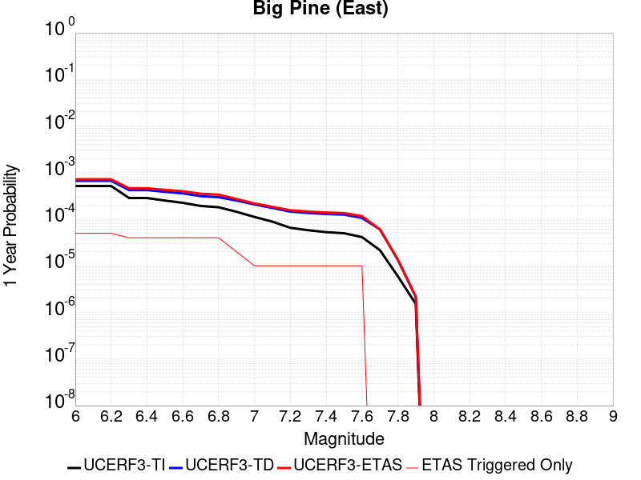 |  |

| Magnitude | 1 wk TI Prob | 1 wk TD Prob | 1 wk ETAS Prob | 1 wk ETAS/TD Gain | 1 wk ETAS Triggered Only | 1 mo TI Prob | 1 mo TD Prob | 1 mo ETAS Prob | 1 mo ETAS/TD Gain | 1 mo ETAS Triggered Only | 1 yr TI Prob | 1 yr TD Prob | 1 yr ETAS Prob | 1 yr ETAS/TD Gain | 1 yr ETAS Triggered Only | 10 yr TI Prob | 10 yr TD Prob | 10 yr ETAS Prob | 10 yr ETAS/TD Gain | 10 yr ETAS Triggered Only |
|-----|-----|-----|-----|-----|-----|-----|-----|-----|-----|-----|-----|-----|-----|-----|-----|-----|-----|-----|-----|-----|
| 6.0 | 9.916913E-6 | 1.28172705E-5 | 4.110825E-5 | 3.2072546 | 2.8291344E-5 | 4.250036E-5 | 5.493013E-5 | 1.2565461E-4 | 2.2875352 | 7.072836E-5 | 5.173191E-4 | 6.685912E-4 | 7.392723E-4 | 1.1057165 | 7.072836E-5 | 0.0051611643 | 0.006670449 | 0.0067969104 | 1.0189586 | 1.2731105E-4 |
| 6.1 | 9.916913E-6 | 1.28172705E-5 | 4.110825E-5 | 3.2072546 | 2.8291344E-5 | 4.250036E-5 | 5.493013E-5 | 1.2565461E-4 | 2.2875352 | 7.072836E-5 | 5.173191E-4 | 6.685912E-4 | 7.392723E-4 | 1.1057165 | 7.072836E-5 | 0.0051611643 | 0.006670449 | 0.0067969104 | 1.0189586 | 1.2731105E-4 |
| 6.2 | 9.916913E-6 | 1.28172705E-5 | 4.110825E-5 | 3.2072546 | 2.8291344E-5 | 4.250036E-5 | 5.493013E-5 | 1.2565461E-4 | 2.2875352 | 7.072836E-5 | 5.173191E-4 | 6.685912E-4 | 7.392723E-4 | 1.1057165 | 7.072836E-5 | 0.0051611643 | 0.006670449 | 0.0067969104 | 1.0189586 | 1.2731105E-4 |
| 6.3 | 5.479711E-6 | 8.1132375E-6 | 3.640435E-5 | 4.4870315 | 2.8291344E-5 | 2.3484265E-5 | 3.4770575E-5 | 9.135129E-5 | 2.6272588 | 5.658269E-5 | 2.858834E-4 | 4.232527E-4 | 4.7981142E-4 | 1.1336287 | 5.658269E-5 | 0.0028551589 | 0.0042272513 | 0.004339938 | 1.0266572 | 1.1316538E-4 |
| 6.4 | 5.465009E-6 | 8.0975315E-6 | 3.6388647E-5 | 4.493795 | 2.8291344E-5 | 2.3421257E-5 | 3.4703262E-5 | 9.128399E-5 | 2.6304152 | 5.658269E-5 | 2.851165E-4 | 4.2243348E-4 | 4.7899227E-4 | 1.133888 | 5.658269E-5 | 0.0028475097 | 0.00421909 | 0.0043317783 | 1.0267091 | 1.1316538E-4 |
| 6.5 | 4.826767E-6 | 7.4225877E-6 | 3.571372E-5 | 4.811492 | 2.8291344E-5 | 2.068598E-5 | 3.1810716E-5 | 8.839161E-5 | 2.778674 | 5.658269E-5 | 2.518227E-4 | 3.8722943E-4 | 4.437902E-4 | 1.1460652 | 5.658269E-5 | 0.0025153751 | 0.0038682907 | 0.0039810184 | 1.0291414 | 1.1316538E-4 |
| 6.6 | 4.3146847E-6 | 6.8825234E-6 | 3.5173674E-5 | 5.110578 | 2.8291344E-5 | 1.8491375E-5 | 2.949621E-5 | 8.607723E-5 | 2.9182472 | 5.658269E-5 | 2.2510924E-4 | 3.5905963E-4 | 4.15622E-4 | 1.1575292 | 5.658269E-5 | 0.0022488134 | 0.0035875062 | 0.0036861706 | 1.0275023 | 9.901971E-5 |
| 6.7 | 3.6968106E-6 | 5.9957474E-6 | 3.428692E-5 | 5.71854 | 2.8291344E-5 | 1.5843378E-5 | 2.5695816E-5 | 8.227705E-5 | 3.201963 | 5.658269E-5 | 1.9287605E-4 | 3.128032E-4 | 3.6936818E-4 | 1.1808325 | 5.658269E-5 | 0.0019270873 | 0.0031262499 | 0.00322496 | 1.0315746 | 9.901971E-5 |
| 6.8 | 3.4671132E-6 | 5.7024477E-6 | 3.399363E-5 | 5.961235 | 2.8291344E-5 | 1.4858972E-5 | 2.4438841E-5 | 8.1020145E-5 | 3.3152206 | 5.658269E-5 | 1.8089297E-4 | 2.9750372E-4 | 3.5406958E-4 | 1.190135 | 5.658269E-5 | 0.0018074579 | 0.0029736666 | 0.003072392 | 1.0331998 | 9.901971E-5 |
| 6.9 | 2.7686972E-6 | 4.8254797E-6 | 1.8971083E-5 | 3.9314399 | 1.4145672E-5 | 1.1865792E-5 | 2.0680467E-5 | 4.8971226E-5 | 2.367994 | 2.8291344E-5 | 1.4445644E-4 | 2.5175634E-4 | 2.8004058E-4 | 1.1123476 | 2.8291344E-5 | 0.0014436257 | 0.002517256 | 0.0025736962 | 1.0224214 | 5.658269E-5 |
| 7.0 | 2.1472624E-6 | 3.985277E-6 | 3.985277E-6 | 1.0 | 0.0 | 9.20252E-6 | 1.707965E-5 | 3.122508E-5 | 1.8282038 | 1.4145672E-5 | 1.12034926E-4 | 2.0792543E-4 | 2.2206816E-4 | 1.0680183 | 1.4145672E-5 | 0.0011197845 | 0.0020798238 | 0.0021221726 | 1.0203617 | 4.2437016E-5 |
| 7.1 | 1.7018335E-6 | 3.3450835E-6 | 3.3450835E-6 | 1.0 | 0.0 | 7.293552E-6 | 1.4335996E-5 | 2.8481465E-5 | 1.98671 | 1.4145672E-5 | 8.879537E-5 | 1.7452713E-4 | 1.8867032E-4 | 1.0810373 | 1.4145672E-5 | 8.87599E-4 | 0.0017463792 | 0.0017887421 | 1.0242575 | 4.2437016E-5 |
| 7.2 | 1.25603E-6 | 2.794679E-6 | 2.794679E-6 | 1.0 | 0.0 | 5.3829745E-6 | 1.1977142E-5 | 2.6122645E-5 | 2.1810415 | 1.4145672E-5 | 6.553574E-5 | 1.4581217E-4 | 1.5995579E-4 | 1.0969988 | 1.4145672E-5 | 6.551642E-4 | 0.0014596173 | 0.0015019923 | 1.0290316 | 4.2437016E-5 |
| 7.3 | 1.112297E-6 | 2.610519E-6 | 2.610519E-6 | 1.0 | 0.0 | 4.7669787E-6 | 1.1187892E-5 | 2.5333406E-5 | 2.2643592 | 1.4145672E-5 | 5.803642E-5 | 1.3620428E-4 | 1.5034803E-4 | 1.1038421 | 1.4145672E-5 | 5.802127E-4 | 0.001363502 | 0.0014058811 | 1.0310811 | 4.2437016E-5 |
| 7.4 | 1.0137181E-6 | 2.4836752E-6 | 2.4836752E-6 | 1.0 | 0.0 | 4.3444993E-6 | 1.064428E-5 | 2.4789802E-5 | 2.3289318 | 1.4145672E-5 | 5.2892992E-5 | 1.2958662E-4 | 1.4373046E-4 | 1.1091459 | 1.4145672E-5 | 5.288041E-4 | 0.0012971918 | 0.0013395738 | 1.032672 | 4.2437016E-5 |
| 7.5 | 9.598608E-7 | 2.407328E-6 | 2.407328E-6 | 1.0 | 0.0 | 4.1136827E-6 | 1.03170805E-5 | 2.4462606E-5 | 2.3710783 | 1.4145672E-5 | 5.0082934E-5 | 1.2560343E-4 | 1.3974732E-4 | 1.1126076 | 1.4145672E-5 | 5.007165E-4 | 0.0012572132 | 0.0012995969 | 1.0337124 | 4.2437016E-5 |
| 7.6 | 7.929459E-7 | 2.0450152E-6 | 2.0450152E-6 | 1.0 | 0.0 | 3.3983351E-6 | 8.764322E-6 | 2.290987E-5 | 2.6139922 | 1.4145672E-5 | 4.1373947E-5 | 1.0670057E-4 | 1.20844736E-4 | 1.1325594 | 1.4145672E-5 | 4.1366243E-4 | 0.0010685825 | 0.0011109742 | 1.039671 | 4.2437016E-5 |
| 7.7 | 4.155788E-7 | 1.1606729E-6 | 1.1606729E-6 | 1.0 | 0.0 | 1.7810507E-6 | 4.974303E-6 | 4.974303E-6 | 1.0 | 0.0 | 2.1684076E-5 | 6.05605E-5 | 6.05605E-5 | 1.0 | 0.0 | 2.1681961E-4 | 6.085995E-4 | 6.3687365E-4 | 1.0464576 | 2.8291344E-5 |
| 7.8 | 1.14666925E-7 | 2.592197E-7 | 2.592197E-7 | 1.0 | 0.0 | 4.914296E-7 | 1.1109411E-6 | 1.1109411E-6 | 1.0 | 0.0 | 5.9831386E-6 | 1.3525627E-5 | 1.3525627E-5 | 1.0 | 0.0 | 5.9829777E-5 | 1.3636416E-4 | 1.5050791E-4 | 1.1037204 | 1.4145672E-5 |
| 7.9 | 2.9231824E-8 | 4.1462318E-8 | 4.1462318E-8 | 1.0 | 0.0 | 1.2527924E-7 | 1.7769564E-7 | 1.7769564E-7 | 1.0 | 0.0 | 1.5252737E-6 | 2.1634426E-6 | 2.1634426E-6 | 1.0 | 0.0 | 1.5252632E-5 | 2.197062E-5 | 2.197062E-5 | 1.0 | 0.0 |

## San Jacinto (Lytle Creek connector)
*[(top)](#table-of-contents)*

| 1 Week | 1 Month | 1 Year | 10 Year |
|-----|-----|-----|-----|
|  |  | 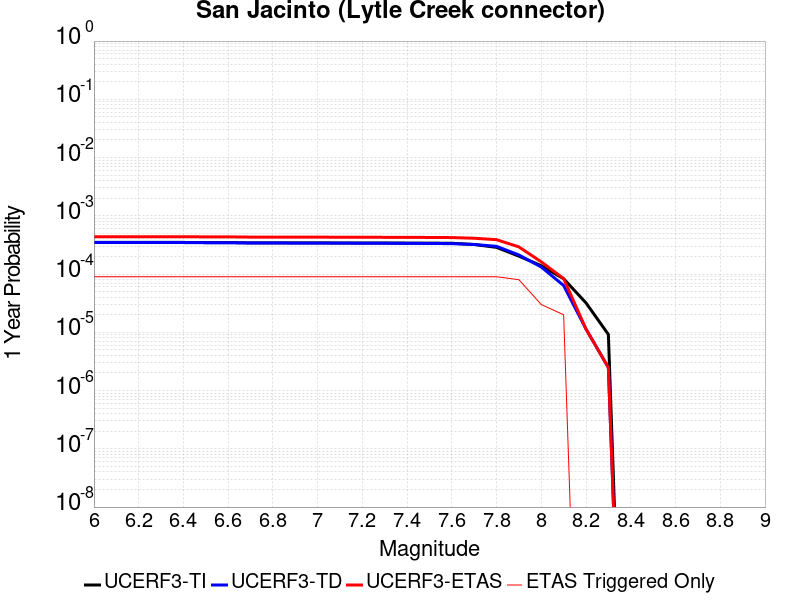 |  |

| Magnitude | 1 wk TI Prob | 1 wk TD Prob | 1 wk ETAS Prob | 1 wk ETAS/TD Gain | 1 wk ETAS Triggered Only | 1 mo TI Prob | 1 mo TD Prob | 1 mo ETAS Prob | 1 mo ETAS/TD Gain | 1 mo ETAS Triggered Only | 1 yr TI Prob | 1 yr TD Prob | 1 yr ETAS Prob | 1 yr ETAS/TD Gain | 1 yr ETAS Triggered Only | 10 yr TI Prob | 10 yr TD Prob | 10 yr ETAS Prob | 10 yr ETAS/TD Gain | 10 yr ETAS Triggered Only |
|-----|-----|-----|-----|-----|-----|-----|-----|-----|-----|-----|-----|-----|-----|-----|-----|-----|-----|-----|-----|-----|
| 6.0 | 6.693995E-6 | 6.660123E-6 | 6.3242434E-5 | 9.495686 | 5.658269E-5 | 2.8688235E-5 | 2.8543072E-5 | 8.512414E-5 | 2.982305 | 5.658269E-5 | 3.492233E-4 | 3.4745657E-4 | 4.4644187E-4 | 1.2848854 | 9.901971E-5 | 0.00348675 | 0.0035491167 | 0.0036759758 | 1.0357438 | 1.2731105E-4 |
| 6.1 | 6.693995E-6 | 6.660123E-6 | 6.3242434E-5 | 9.495686 | 5.658269E-5 | 2.8688235E-5 | 2.8543072E-5 | 8.512414E-5 | 2.982305 | 5.658269E-5 | 3.492233E-4 | 3.4745657E-4 | 4.4644187E-4 | 1.2848854 | 9.901971E-5 | 0.00348675 | 0.0035491167 | 0.0036759758 | 1.0357438 | 1.2731105E-4 |
| 6.2 | 6.693995E-6 | 6.660123E-6 | 6.3242434E-5 | 9.495686 | 5.658269E-5 | 2.8688235E-5 | 2.8543072E-5 | 8.512414E-5 | 2.982305 | 5.658269E-5 | 3.492233E-4 | 3.4745657E-4 | 4.4644187E-4 | 1.2848854 | 9.901971E-5 | 0.00348675 | 0.0035491167 | 0.0036759758 | 1.0357438 | 1.2731105E-4 |
| 6.3 | 6.693995E-6 | 6.660123E-6 | 6.3242434E-5 | 9.495686 | 5.658269E-5 | 2.8688235E-5 | 2.8543072E-5 | 8.512414E-5 | 2.982305 | 5.658269E-5 | 3.492233E-4 | 3.4745657E-4 | 4.4644187E-4 | 1.2848854 | 9.901971E-5 | 0.00348675 | 0.0035491167 | 0.0036759758 | 1.0357438 | 1.2731105E-4 |
| 6.4 | 6.693995E-6 | 6.660123E-6 | 6.3242434E-5 | 9.495686 | 5.658269E-5 | 2.8688235E-5 | 2.8543072E-5 | 8.512414E-5 | 2.982305 | 5.658269E-5 | 3.492233E-4 | 3.4745657E-4 | 4.4644187E-4 | 1.2848854 | 9.901971E-5 | 0.00348675 | 0.0035491167 | 0.0036759758 | 1.0357438 | 1.2731105E-4 |
| 6.5 | 6.6561875E-6 | 6.620341E-6 | 6.320266E-5 | 9.546737 | 5.658269E-5 | 2.8526205E-5 | 2.8372582E-5 | 8.495367E-5 | 2.994217 | 5.658269E-5 | 3.472512E-4 | 3.453815E-4 | 4.44367E-4 | 1.2865976 | 9.901971E-5 | 0.0034670907 | 0.0035284322 | 0.003655294 | 1.0359541 | 1.2731105E-4 |
| 6.6 | 6.6561875E-6 | 6.620341E-6 | 6.320266E-5 | 9.546737 | 5.658269E-5 | 2.8526205E-5 | 2.8372582E-5 | 8.495367E-5 | 2.994217 | 5.658269E-5 | 3.472512E-4 | 3.453815E-4 | 4.44367E-4 | 1.2865976 | 9.901971E-5 | 0.0034670907 | 0.0035284322 | 0.003655294 | 1.0359541 | 1.2731105E-4 |
| 6.7 | 6.5802237E-6 | 6.539518E-6 | 6.3121835E-5 | 9.652369 | 5.658269E-5 | 2.8200653E-5 | 2.8026205E-5 | 8.460731E-5 | 3.0188644 | 5.658269E-5 | 3.4328885E-4 | 3.4116567E-4 | 4.401516E-4 | 1.2901403 | 9.901971E-5 | 0.0034275902 | 0.0034864065 | 0.0036132738 | 1.0363891 | 1.2731105E-4 |
| 6.8 | 6.575632E-6 | 6.5340073E-6 | 6.311633E-5 | 9.659666 | 5.658269E-5 | 2.8180975E-5 | 2.8002589E-5 | 8.458369E-5 | 3.020567 | 5.658269E-5 | 3.4304935E-4 | 3.4087826E-4 | 4.398642E-4 | 1.290385 | 9.901971E-5 | 0.0034252026 | 0.0034835413 | 0.0036104089 | 1.0364192 | 1.2731105E-4 |
| 6.9 | 6.570433E-6 | 6.525401E-6 | 6.310772E-5 | 9.671086 | 5.658269E-5 | 2.8158694E-5 | 2.7965707E-5 | 8.454681E-5 | 3.0232317 | 5.658269E-5 | 3.4277816E-4 | 3.4042934E-4 | 4.3941534E-4 | 1.2907681 | 9.901971E-5 | 0.0034224992 | 0.0034790665 | 0.0036059346 | 1.0364661 | 1.2731105E-4 |
| 7.0 | 6.5643826E-6 | 6.5155223E-6 | 6.309784E-5 | 9.684234 | 5.658269E-5 | 2.8132765E-5 | 2.7923368E-5 | 8.450448E-5 | 3.0262995 | 5.658269E-5 | 3.424626E-4 | 3.3991406E-4 | 4.389001E-4 | 1.2912091 | 9.901971E-5 | 0.0034193532 | 0.0034739296 | 0.0036007983 | 1.0365202 | 1.2731105E-4 |
| 7.1 | 6.557402E-6 | 6.504234E-6 | 6.3086554E-5 | 9.699306 | 5.658269E-5 | 2.8102848E-5 | 2.7874992E-5 | 8.44561E-5 | 3.0298164 | 5.658269E-5 | 3.4209844E-4 | 3.3932526E-4 | 4.3831134E-4 | 1.2917145 | 9.901971E-5 | 0.0034157229 | 0.0034680606 | 0.0035949303 | 1.0365822 | 1.2731105E-4 |
| 7.2 | 6.546394E-6 | 6.4862006E-6 | 6.3068524E-5 | 9.723493 | 5.658269E-5 | 2.8055672E-5 | 2.7797707E-5 | 8.437882E-5 | 3.0354598 | 5.658269E-5 | 3.4152428E-4 | 3.383846E-4 | 4.373708E-4 | 1.2925258 | 9.901971E-5 | 0.0034099987 | 0.0034586883 | 0.0035855589 | 1.0366818 | 1.2731105E-4 |
| 7.3 | 6.5364216E-6 | 6.4669857E-6 | 6.304931E-5 | 9.749412 | 5.658269E-5 | 2.8012933E-5 | 2.771536E-5 | 8.429648E-5 | 3.0415077 | 5.658269E-5 | 3.4100408E-4 | 3.373823E-4 | 4.3636863E-4 | 1.293395 | 9.901971E-5 | 0.003404813 | 0.0034487103 | 0.0035755823 | 1.0367882 | 1.2731105E-4 |
| 7.4 | 6.5269523E-6 | 6.4480723E-6 | 6.30304E-5 | 9.775076 | 5.658269E-5 | 2.7972354E-5 | 2.7634303E-5 | 8.4215426E-5 | 3.047496 | 5.658269E-5 | 3.4051016E-4 | 3.3639578E-4 | 4.3538216E-4 | 1.2942557 | 9.901971E-5 | 0.0033998888 | 0.0034388923 | 0.0035657655 | 1.0368936 | 1.2731105E-4 |
| 7.5 | 6.5111835E-6 | 6.424346E-6 | 6.300667E-5 | 9.807485 | 5.658269E-5 | 2.7904773E-5 | 2.753262E-5 | 8.411375E-5 | 3.055058 | 5.658269E-5 | 3.3968766E-4 | 3.3515817E-4 | 4.341447E-4 | 1.2953427 | 9.901971E-5 | 0.0033916887 | 0.0034265644 | 0.0035534392 | 1.0370269 | 1.2731105E-4 |
| 7.6 | 6.4768806E-6 | 6.383454E-6 | 6.296578E-5 | 9.863904 | 5.658269E-5 | 2.7757764E-5 | 2.7357375E-5 | 8.393852E-5 | 3.0682225 | 5.658269E-5 | 3.3789838E-4 | 3.330252E-4 | 4.3201193E-4 | 1.2972349 | 9.901971E-5 | 0.0033738504 | 0.0034052972 | 0.0035321747 | 1.0372589 | 1.2731105E-4 |
| 7.7 | 6.1655364E-6 | 6.1759456E-6 | 6.2758285E-5 | 10.161729 | 5.658269E-5 | 2.642346E-5 | 2.646807E-5 | 8.3049265E-5 | 3.137715 | 5.658269E-5 | 3.2165812E-4 | 3.2220117E-4 | 4.2118898E-4 | 1.3072236 | 9.901971E-5 | 0.0032119295 | 0.0032969362 | 0.0034238275 | 1.0384877 | 1.2731105E-4 |
| 7.8 | 5.5043524E-6 | 5.7370175E-6 | 6.2319385E-5 | 10.8626795 | 5.658269E-5 | 2.3589868E-5 | 2.4586987E-5 | 8.1168284E-5 | 3.30127 | 5.658269E-5 | 2.871688E-4 | 2.993055E-4 | 3.9829558E-4 | 1.3307326 | 9.901971E-5 | 0.0028679797 | 0.0030670585 | 0.0031939792 | 1.0413818 | 1.2731105E-4 |
| 7.9 | 3.889249E-6 | 4.0766436E-6 | 6.0659102E-5 | 14.879667 | 5.658269E-5 | 1.6668104E-5 | 1.7471213E-5 | 7.4052914E-5 | 4.2385674 | 5.658269E-5 | 2.0291525E-4 | 2.126913E-4 | 2.975473E-4 | 1.3989631 | 8.487403E-5 | 0.0020273007 | 0.0021941073 | 0.00229291 | 1.0450308 | 9.901971E-5 |
| 8.0 | 2.668535E-6 | 2.5313454E-6 | 1.6676982E-5 | 6.588189 | 1.4145672E-5 | 1.1436528E-5 | 1.0848577E-5 | 2.4994097E-5 | 2.3039052 | 1.4145672E-5 | 1.3923083E-4 | 1.3207346E-4 | 1.6036106E-4 | 1.2141808 | 2.8291344E-5 | 0.0013914363 | 0.0013755665 | 0.0014179451 | 1.0308081 | 4.2437016E-5 |
| 8.1 | 1.5911459E-6 | 1.2185134E-6 | 1.2185134E-6 | 1.0 | 0.0 | 6.8191785E-6 | 5.2221894E-6 | 5.2221894E-6 | 1.0 | 0.0 | 8.3020335E-5 | 6.357832E-5 | 7.7723096E-5 | 1.2224779 | 1.4145672E-5 | 8.298933E-4 | 6.6911156E-4 | 6.8324775E-4 | 1.0211269 | 1.4145672E-5 |
| 8.2 | 6.1294963E-7 | 2.1802066E-7 | 2.1802066E-7 | 1.0 | 0.0 | 2.6269242E-6 | 9.3437393E-7 | 9.3437393E-7 | 1.0 | 0.0 | 3.1982334E-5 | 1.1375943E-5 | 1.1375943E-5 | 1.0 | 0.0 | 3.1977732E-4 | 1.2778955E-4 | 1.2778955E-4 | 1.0 | 0.0 |
| 8.3 | 1.762871E-7 | 4.7516316E-8 | 4.7516316E-8 | 1.0 | 0.0 | 7.5551594E-7 | 2.0364133E-7 | 2.0364133E-7 | 1.0 | 0.0 | 9.1983675E-6 | 2.4793305E-6 | 2.4793305E-6 | 1.0 | 0.0 | 9.197987E-5 | 2.8671833E-5 | 2.8671833E-5 | 1.0 | 0.0 |

## Big Pine (Central)
*[(top)](#table-of-contents)*

| 1 Week | 1 Month | 1 Year | 10 Year |
|-----|-----|-----|-----|
| 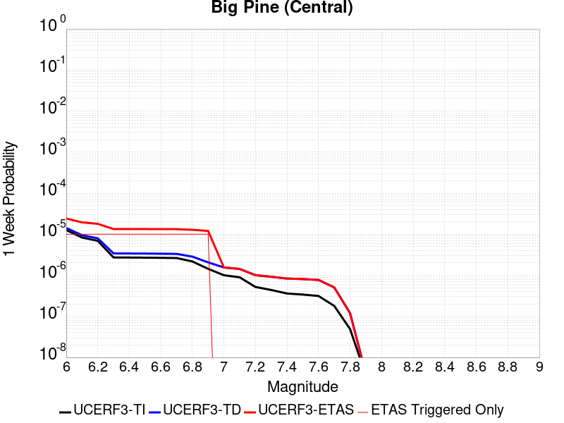 | 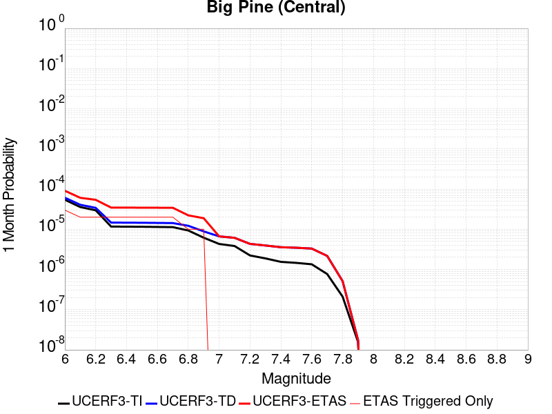 | 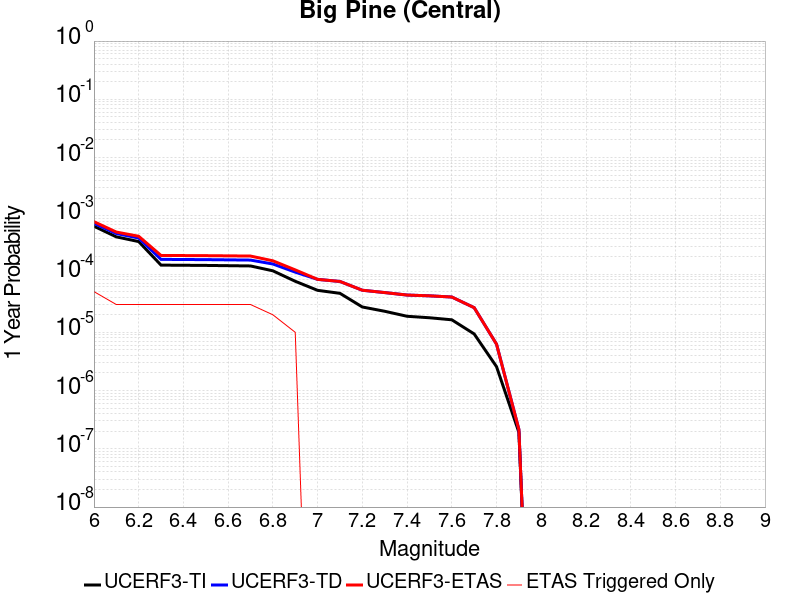 |  |

| Magnitude | 1 wk TI Prob | 1 wk TD Prob | 1 wk ETAS Prob | 1 wk ETAS/TD Gain | 1 wk ETAS Triggered Only | 1 mo TI Prob | 1 mo TD Prob | 1 mo ETAS Prob | 1 mo ETAS/TD Gain | 1 mo ETAS Triggered Only | 1 yr TI Prob | 1 yr TD Prob | 1 yr ETAS Prob | 1 yr ETAS/TD Gain | 1 yr ETAS Triggered Only | 10 yr TI Prob | 10 yr TD Prob | 10 yr ETAS Prob | 10 yr ETAS/TD Gain | 10 yr ETAS Triggered Only |
|-----|-----|-----|-----|-----|-----|-----|-----|-----|-----|-----|-----|-----|-----|-----|-----|-----|-----|-----|-----|-----|
| 6.0 | 1.2706755E-5 | 1.4250602E-5 | 2.8396073E-5 | 1.9926226 | 1.4145672E-5 | 5.4456385E-5 | 6.107279E-5 | 1.0350721E-4 | 1.6948172 | 4.2437016E-5 | 6.628048E-4 | 7.433441E-4 | 8.140199E-4 | 1.0950781 | 7.072836E-5 | 0.006608314 | 0.007413639 | 0.0075400067 | 1.0170453 | 1.2731105E-4 |
| 6.1 | 8.342579E-6 | 9.510835E-6 | 2.3656374E-5 | 2.4873075 | 1.4145672E-5 | 3.5753423E-5 | 4.076021E-5 | 6.90504E-5 | 1.6940639 | 2.8291344E-5 | 4.3521097E-4 | 4.9616426E-4 | 5.3858024E-4 | 1.0854877 | 4.2437016E-5 | 0.0043435963 | 0.004954155 | 0.0050526843 | 1.0198882 | 9.901971E-5 |
| 6.2 | 6.923899E-6 | 7.967221E-6 | 2.2112781E-5 | 2.7754695 | 1.4145672E-5 | 2.9673516E-5 | 3.4144894E-5 | 6.2435276E-5 | 1.828539 | 2.8291344E-5 | 3.6121515E-4 | 4.1565404E-4 | 4.5807342E-4 | 1.1020545 | 4.2437016E-5 | 0.003606286 | 0.0041521094 | 0.004250718 | 1.023749 | 9.901971E-5 |
| 6.3 | 2.728396E-6 | 3.4243646E-6 | 1.7569988E-5 | 5.130875 | 1.4145672E-5 | 1.1693074E-5 | 1.4675771E-5 | 4.29667E-5 | 2.9277303 | 2.8291344E-5 | 1.4235388E-4 | 1.7866373E-4 | 2.2109317E-4 | 1.2374821 | 4.2437016E-5 | 0.0014226272 | 0.0017867433 | 0.0018573452 | 1.0395143 | 7.072836E-5 |
| 6.4 | 2.7136944E-6 | 3.4086581E-6 | 1.7554283E-5 | 5.14991 | 1.4145672E-5 | 1.1630066E-5 | 1.4608458E-5 | 4.2899388E-5 | 2.936613 | 2.8291344E-5 | 1.4158686E-4 | 1.7784433E-4 | 2.202738E-4 | 1.2385764 | 4.2437016E-5 | 0.0014149669 | 0.0017785623 | 0.001849165 | 1.0396965 | 7.072836E-5 |
| 6.5 | 2.6971882E-6 | 3.3910032E-6 | 1.7536628E-5 | 5.171516 | 1.4145672E-5 | 1.1559327E-5 | 1.4532795E-5 | 4.282373E-5 | 2.946696 | 2.8291344E-5 | 1.4072572E-4 | 1.7692328E-4 | 2.1935279E-4 | 1.2398187 | 4.2437016E-5 | 0.0014063664 | 0.0017693666 | 0.0018399698 | 1.039903 | 7.072836E-5 |
| 6.6 | 2.669092E-6 | 3.3610236E-6 | 1.7506649E-5 | 5.208725 | 1.4145672E-5 | 1.1438916E-5 | 1.4404312E-5 | 4.269525E-5 | 2.9640603 | 2.8291344E-5 | 1.3925991E-4 | 1.7535927E-4 | 2.1778884E-4 | 1.241958 | 4.2437016E-5 | 0.0013917267 | 0.0017537511 | 0.0018243555 | 1.040259 | 7.072836E-5 |
| 6.7 | 2.6408059E-6 | 3.3310494E-6 | 1.7476674E-5 | 5.2465973 | 1.4145672E-5 | 1.1317691E-5 | 1.4275853E-5 | 4.2566793E-5 | 2.9817338 | 2.8291344E-5 | 1.3778417E-4 | 1.737955E-4 | 2.1622515E-4 | 1.2441354 | 4.2437016E-5 | 0.0013769877 | 0.0017381381 | 0.0018087436 | 1.0406213 | 7.072836E-5 |
| 6.8 | 2.1786943E-6 | 2.8545066E-6 | 1.7000139E-5 | 5.9555435 | 1.4145672E-5 | 9.337228E-6 | 1.2233547E-5 | 2.6379046E-5 | 2.1562877 | 1.4145672E-5 | 1.1367482E-4 | 1.4893398E-4 | 1.7722111E-4 | 1.1899307 | 2.8291344E-5 | 0.0011361669 | 0.0014898704 | 0.0015463688 | 1.0379217 | 5.658269E-5 |
| 6.9 | 1.4411696E-6 | 2.0685677E-6 | 1.6214211E-5 | 7.8383756 | 1.4145672E-5 | 6.1764263E-6 | 8.865261E-6 | 2.3010809E-5 | 2.5956151 | 1.4145672E-5 | 7.51954E-5 | 1.0792949E-4 | 1.2207363E-4 | 1.1310499 | 1.4145672E-5 | 7.5169955E-4 | 0.0010802548 | 0.001122646 | 1.0392418 | 4.2437016E-5 |
| 7.0 | 1.0073411E-6 | 1.5543274E-6 | 1.5543274E-6 | 1.0 | 0.0 | 4.317169E-6 | 6.661387E-6 | 6.661387E-6 | 1.0 | 0.0 | 5.2560266E-5 | 8.109952E-5 | 8.109952E-5 | 1.0 | 0.0 | 5.2547833E-4 | 8.1217213E-4 | 8.404405E-4 | 1.0348059 | 2.8291344E-5 |
| 7.1 | 8.947104E-7 | 1.430316E-6 | 1.430316E-6 | 1.0 | 0.0 | 3.834468E-6 | 6.1299124E-6 | 6.1299124E-6 | 1.0 | 0.0 | 4.6683643E-5 | 7.462928E-5 | 7.462928E-5 | 1.0 | 0.0 | 4.6673836E-4 | 7.4751483E-4 | 7.75785E-4 | 1.0378189 | 2.8291344E-5 |
| 7.2 | 5.215166E-7 | 1.0112277E-6 | 1.0112277E-6 | 1.0 | 0.0 | 2.2350691E-6 | 4.333826E-6 | 4.333826E-6 | 1.0 | 0.0 | 2.7211627E-5 | 5.27631E-5 | 5.27631E-5 | 1.0 | 0.0 | 2.7208295E-4 | 5.289683E-4 | 5.5724464E-4 | 1.0534557 | 2.8291344E-5 |
| 7.3 | 4.4024807E-7 | 9.220183E-7 | 9.220183E-7 | 1.0 | 0.0 | 1.8867761E-6 | 3.951501E-6 | 3.951501E-6 | 1.0 | 0.0 | 2.2971257E-5 | 4.8108504E-5 | 4.8108504E-5 | 1.0 | 0.0 | 2.2968883E-4 | 4.824433E-4 | 5.10721E-4 | 1.0586135 | 2.8291344E-5 |
| 7.4 | 3.6130905E-7 | 8.359109E-7 | 8.359109E-7 | 1.0 | 0.0 | 1.5484665E-6 | 3.5824705E-6 | 3.5824705E-6 | 1.0 | 0.0 | 1.8852415E-5 | 4.3615746E-5 | 4.3615746E-5 | 1.0 | 0.0 | 1.8850817E-4 | 4.3752496E-4 | 4.6580393E-4 | 1.064634 | 2.8291344E-5 |
| 7.5 | 3.408184E-7 | 8.1087245E-7 | 8.1087245E-7 | 1.0 | 0.0 | 1.4606494E-6 | 3.475163E-6 | 3.475163E-6 | 1.0 | 0.0 | 1.7783263E-5 | 4.230933E-5 | 4.230933E-5 | 1.0 | 0.0 | 1.778184E-4 | 4.2444657E-4 | 4.527259E-4 | 1.0666264 | 2.8291344E-5 |
| 7.6 | 3.1428627E-7 | 7.732167E-7 | 7.732167E-7 | 1.0 | 0.0 | 1.3469405E-6 | 3.313782E-6 | 3.313782E-6 | 1.0 | 0.0 | 1.6398877E-5 | 4.0344585E-5 | 4.0344585E-5 | 1.0 | 0.0 | 1.6397667E-4 | 4.0477706E-4 | 4.3305694E-4 | 1.0698653 | 2.8291344E-5 |
| 7.7 | 1.7972785E-7 | 5.0782415E-7 | 5.0782415E-7 | 1.0 | 0.0 | 7.70262E-7 | 2.1763874E-6 | 2.1763874E-6 | 1.0 | 0.0 | 9.377899E-6 | 2.6497206E-5 | 2.6497206E-5 | 1.0 | 0.0 | 9.377503E-5 | 2.6633305E-4 | 2.9461685E-4 | 1.1061971 | 2.8291344E-5 |
| 7.8 | 4.9230927E-8 | 1.1981747E-7 | 1.1981747E-7 | 1.0 | 0.0 | 2.1098968E-7 | 5.135033E-7 | 5.135033E-7 | 1.0 | 0.0 | 2.5687964E-6 | 6.2518866E-6 | 6.2518866E-6 | 1.0 | 0.0 | 2.5687666E-5 | 6.2971965E-5 | 7.711674E-5 | 1.2246203 | 1.4145672E-5 |
| 7.9 | 3.6805972E-9 | 4.1051638E-9 | 4.1051638E-9 | 1.0 | 0.0 | 1.5773987E-8 | 1.7593557E-8 | 1.7593557E-8 | 1.0 | 0.0 | 1.9204828E-7 | 2.1420155E-7 | 2.1420155E-7 | 1.0 | 0.0 | 1.920481E-6 | 2.1898923E-6 | 2.1898923E-6 | 1.0 | 0.0 |

## Great Valley 09 (Laguna Seca)
*[(top)](#table-of-contents)*

| 1 Week | 1 Month | 1 Year | 10 Year |
|-----|-----|-----|-----|
|  | 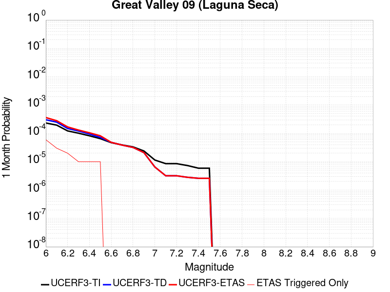 |  |  |

| Magnitude | 1 wk TI Prob | 1 wk TD Prob | 1 wk ETAS Prob | 1 wk ETAS/TD Gain | 1 wk ETAS Triggered Only | 1 mo TI Prob | 1 mo TD Prob | 1 mo ETAS Prob | 1 mo ETAS/TD Gain | 1 mo ETAS Triggered Only | 1 yr TI Prob | 1 yr TD Prob | 1 yr ETAS Prob | 1 yr ETAS/TD Gain | 1 yr ETAS Triggered Only | 10 yr TI Prob | 10 yr TD Prob | 10 yr ETAS Prob | 10 yr ETAS/TD Gain | 10 yr ETAS Triggered Only |
|-----|-----|-----|-----|-----|-----|-----|-----|-----|-----|-----|-----|-----|-----|-----|-----|-----|-----|-----|-----|-----|
| 6.0 | 5.4353277E-5 | 7.050019E-5 | 1.1293421E-4 | 1.6018995 | 4.2437016E-5 | 2.3292181E-4 | 3.0211007E-4 | 3.5867566E-4 | 1.187235 | 5.658269E-5 | 0.0028321352 | 0.0036720056 | 0.0037424744 | 1.0191908 | 7.072836E-5 | 0.02796312 | 0.036115844 | 0.03621129 | 1.0026428 | 9.901971E-5 |
| 6.1 | 4.5578287E-5 | 5.822054E-5 | 8.651024E-5 | 1.4859058 | 2.8291344E-5 | 1.953209E-4 | 2.4949352E-4 | 2.777778E-4 | 1.1133668 | 2.8291344E-5 | 0.0023754383 | 0.0030333549 | 0.0030756632 | 1.0139477 | 4.2437016E-5 | 0.023502063 | 0.029919893 | 0.029974781 | 1.0018345 | 5.658269E-5 |
| 6.2 | 2.8536782E-5 | 3.4736422E-5 | 6.302678E-5 | 1.8144294 | 2.8291344E-5 | 1.2229476E-4 | 1.4886161E-4 | 1.7714874E-4 | 1.1900231 | 2.8291344E-5 | 0.0014879217 | 0.0018108576 | 0.0018390977 | 1.0155948 | 2.8291344E-5 | 0.014779986 | 0.017958276 | 0.01799995 | 1.0023206 | 4.2437016E-5 |
| 6.3 | 2.3698774E-5 | 2.8213344E-5 | 4.2358617E-5 | 1.5013682 | 1.4145672E-5 | 1.01562226E-4 | 1.2090833E-4 | 1.3505228E-4 | 1.1169809 | 1.4145672E-5 | 0.0012358186 | 0.001471051 | 0.0014993007 | 1.0192038 | 2.8291344E-5 | 0.012289686 | 0.014611455 | 0.014653271 | 1.002862 | 4.2437016E-5 |
| 6.4 | 1.9191197E-5 | 2.212289E-5 | 3.6268248E-5 | 1.6393993 | 1.4145672E-5 | 8.2245395E-5 | 9.4808805E-5 | 1.08953136E-4 | 1.1491879 | 1.4145672E-5 | 0.0010008777 | 0.0011536906 | 0.0011819493 | 1.0244942 | 2.8291344E-5 | 0.009963818 | 0.011477022 | 0.011518972 | 1.0036551 | 4.2437016E-5 |
| 6.5 | 1.5203241E-5 | 1.6801298E-5 | 3.0946732E-5 | 1.841925 | 1.4145672E-5 | 6.5155116E-5 | 7.200338E-5 | 8.614804E-5 | 1.1964443 | 1.4145672E-5 | 7.9297484E-4 | 8.76301E-4 | 8.9043425E-4 | 1.0161283 | 1.4145672E-5 | 0.007901512 | 0.008729581 | 0.008743603 | 1.0016062 | 1.4145672E-5 |
| 6.6 | 1.0984925E-5 | 1.12425605E-5 | 1.12425605E-5 | 1.0 | 0.0 | 4.70774E-5 | 4.8181533E-5 | 4.8181533E-5 | 1.0 | 0.0 | 5.730166E-4 | 5.8645604E-4 | 5.8645604E-4 | 1.0 | 0.0 | 0.005715413 | 0.0058494755 | 0.0058494755 | 1.0 | 0.0 |
| 6.7 | 9.134616E-6 | 9.019868E-6 | 9.019868E-6 | 1.0 | 0.0 | 3.9147766E-5 | 3.865602E-5 | 3.865602E-5 | 1.0 | 0.0 | 4.7651984E-4 | 4.7053778E-4 | 4.7053778E-4 | 1.0 | 0.0 | 0.004754993 | 0.00469566 | 0.00469566 | 1.0 | 0.0 |
| 6.8 | 7.785589E-6 | 7.4519185E-6 | 7.4519185E-6 | 1.0 | 0.0 | 3.3366385E-5 | 3.1936415E-5 | 3.1936415E-5 | 1.0 | 0.0 | 4.0616E-4 | 3.887585E-4 | 3.887585E-4 | 1.0 | 0.0 | 0.0040541845 | 0.003880988 | 0.003880988 | 1.0 | 0.0 |
| 6.9 | 5.579095E-6 | 4.8984666E-6 | 4.8984666E-6 | 1.0 | 0.0 | 2.3910188E-5 | 2.0993268E-5 | 2.0993268E-5 | 1.0 | 0.0 | 2.9106764E-4 | 2.5556443E-4 | 2.5556443E-4 | 1.0 | 0.0 | 0.002906867 | 0.0025528427 | 0.0025528427 | 1.0 | 0.0 |
| 7.0 | 2.6816688E-6 | 1.521587E-6 | 1.521587E-6 | 1.0 | 0.0 | 1.1492816E-5 | 6.521071E-6 | 6.521071E-6 | 1.0 | 0.0 | 1.3991605E-4 | 7.939124E-5 | 7.939124E-5 | 1.0 | 0.0 | 0.0013982799 | 7.936375E-4 | 7.936375E-4 | 1.0 | 0.0 |
| 7.1 | 1.9951021E-6 | 7.45357E-7 | 7.45357E-7 | 1.0 | 0.0 | 8.55041E-6 | 3.1943835E-6 | 3.1943835E-6 | 1.0 | 0.0 | 1.0409627E-4 | 3.889097E-5 | 3.889097E-5 | 1.0 | 0.0 | 0.0010404752 | 3.8884574E-4 | 3.8884574E-4 | 1.0 | 0.0 |
| 7.2 | 1.9951021E-6 | 7.45357E-7 | 7.45357E-7 | 1.0 | 0.0 | 8.55041E-6 | 3.1943835E-6 | 3.1943835E-6 | 1.0 | 0.0 | 1.0409627E-4 | 3.889097E-5 | 3.889097E-5 | 1.0 | 0.0 | 0.0010404752 | 3.8884574E-4 | 3.8884574E-4 | 1.0 | 0.0 |
| 7.3 | 1.7087556E-6 | 6.578663E-7 | 6.578663E-7 | 1.0 | 0.0 | 7.3232177E-6 | 2.819424E-6 | 2.819424E-6 | 1.0 | 0.0 | 8.915652E-5 | 3.432599E-5 | 3.432599E-5 | 1.0 | 0.0 | 8.9120766E-4 | 3.432109E-4 | 3.432109E-4 | 1.0 | 0.0 |
| 7.4 | 1.3804846E-6 | 6.0737113E-7 | 6.0737113E-7 | 1.0 | 0.0 | 5.916349E-6 | 2.6030168E-6 | 2.6030168E-6 | 1.0 | 0.0 | 7.2029165E-5 | 3.169131E-5 | 3.169131E-5 | 1.0 | 0.0 | 7.200583E-4 | 3.168719E-4 | 3.168719E-4 | 1.0 | 0.0 |
| 7.5 | 1.3804846E-6 | 6.0737113E-7 | 6.0737113E-7 | 1.0 | 0.0 | 5.916349E-6 | 2.6030168E-6 | 2.6030168E-6 | 1.0 | 0.0 | 7.2029165E-5 | 3.169131E-5 | 3.169131E-5 | 1.0 | 0.0 | 7.200583E-4 | 3.168719E-4 | 3.168719E-4 | 1.0 | 0.0 |

## Santa Cruz Catalina Ridge alt1
*[(top)](#table-of-contents)*

| 1 Week | 1 Month | 1 Year | 10 Year |
|-----|-----|-----|-----|
|  | 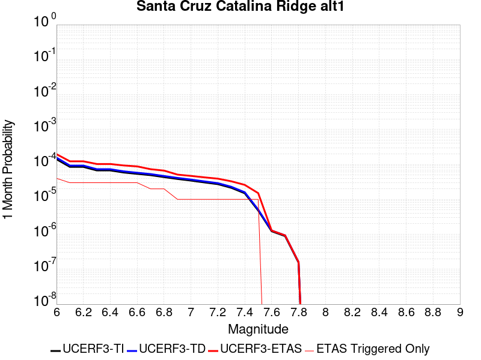 |  |  |

| Magnitude | 1 wk TI Prob | 1 wk TD Prob | 1 wk ETAS Prob | 1 wk ETAS/TD Gain | 1 wk ETAS Triggered Only | 1 mo TI Prob | 1 mo TD Prob | 1 mo ETAS Prob | 1 mo ETAS/TD Gain | 1 mo ETAS Triggered Only | 1 yr TI Prob | 1 yr TD Prob | 1 yr ETAS Prob | 1 yr ETAS/TD Gain | 1 yr ETAS Triggered Only | 10 yr TI Prob | 10 yr TD Prob | 10 yr ETAS Prob | 10 yr ETAS/TD Gain | 10 yr ETAS Triggered Only |
|-----|-----|-----|-----|-----|-----|-----|-----|-----|-----|-----|-----|-----|-----|-----|-----|-----|-----|-----|-----|-----|
| 6.0 | 3.2833184E-5 | 3.6558402E-5 | 7.8993864E-5 | 2.1607583 | 4.2437016E-5 | 1.4070606E-4 | 1.5667039E-4 | 1.9910076E-4 | 1.2708257 | 4.2437016E-5 | 0.00171175 | 0.0019059594 | 0.0020047904 | 1.0518537 | 9.901971E-5 | 0.016986247 | 0.018913032 | 0.019024057 | 1.0058703 | 1.1316538E-4 |
| 6.1 | 1.9835548E-5 | 2.1659505E-5 | 4.995024E-5 | 2.3061578 | 2.8291344E-5 | 8.500672E-5 | 9.282326E-5 | 1.2111198E-4 | 1.3047589 | 2.8291344E-5 | 0.0010344655 | 0.0011295575 | 0.0012143357 | 1.0750543 | 8.487403E-5 | 0.010296632 | 0.011240296 | 0.011338202 | 1.0087104 | 9.901971E-5 |
| 6.2 | 1.9835548E-5 | 2.1659505E-5 | 4.995024E-5 | 2.3061578 | 2.8291344E-5 | 8.500672E-5 | 9.282326E-5 | 1.2111198E-4 | 1.3047589 | 2.8291344E-5 | 0.0010344655 | 0.0011295575 | 0.0012143357 | 1.0750543 | 8.487403E-5 | 0.010296632 | 0.011240296 | 0.011338202 | 1.0087104 | 9.901971E-5 |
| 6.3 | 1.5728183E-5 | 1.703395E-5 | 4.532481E-5 | 2.6608517 | 2.8291344E-5 | 6.7404755E-5 | 7.300063E-5 | 1.0128991E-4 | 1.387521 | 2.8291344E-5 | 8.2034385E-4 | 8.884264E-4 | 9.5909194E-4 | 1.0795401 | 7.072836E-5 | 0.008173222 | 0.008849427 | 0.00891953 | 1.0079217 | 7.072836E-5 |
| 6.4 | 1.5728183E-5 | 1.703395E-5 | 4.532481E-5 | 2.6608517 | 2.8291344E-5 | 6.7404755E-5 | 7.300063E-5 | 1.0128991E-4 | 1.387521 | 2.8291344E-5 | 8.2034385E-4 | 8.884264E-4 | 9.5909194E-4 | 1.0795401 | 7.072836E-5 | 0.008173222 | 0.008849427 | 0.00891953 | 1.0079217 | 7.072836E-5 |
| 6.5 | 1.3707734E-5 | 1.4794522E-5 | 4.308545E-5 | 2.912257 | 2.8291344E-5 | 5.8746107E-5 | 6.3403575E-5 | 9.1693124E-5 | 1.4461823 | 2.8291344E-5 | 7.1499916E-4 | 7.716686E-4 | 8.423424E-4 | 1.0915856 | 7.072836E-5 | 0.0071270303 | 0.0076902895 | 0.007760474 | 1.0091264 | 7.072836E-5 |
| 6.6 | 1.2539813E-5 | 1.3510219E-5 | 4.180118E-5 | 3.0940416 | 2.8291344E-5 | 5.3740947E-5 | 5.789967E-5 | 8.618938E-5 | 1.4885987 | 2.8291344E-5 | 6.540996E-4 | 7.0470315E-4 | 7.753817E-4 | 1.1002954 | 7.072836E-5 | 0.0065217763 | 0.0070249885 | 0.00709522 | 1.0099974 | 7.072836E-5 |
| 6.7 | 1.1504083E-5 | 1.2377375E-5 | 2.6522872E-5 | 2.142851 | 1.4145672E-5 | 4.930228E-5 | 5.3044827E-5 | 6.718975E-5 | 1.2666597 | 1.4145672E-5 | 6.0008996E-4 | 6.456314E-4 | 7.021775E-4 | 1.0875827 | 5.658269E-5 | 0.005984721 | 0.006437786 | 0.0064940043 | 1.0087326 | 5.658269E-5 |
| 6.8 | 1.012739E-5 | 1.0877071E-5 | 2.502259E-5 | 2.3004897 | 1.4145672E-5 | 4.340238E-5 | 4.6615194E-5 | 6.076021E-5 | 1.3034421 | 1.4145672E-5 | 5.282958E-4 | 5.673937E-4 | 6.239443E-4 | 1.0996673 | 5.658269E-5 | 0.0052704164 | 0.0056596193 | 0.005715882 | 1.009941 | 5.658269E-5 |
| 6.9 | 8.9607865E-6 | 9.609117E-6 | 2.3754654E-5 | 2.4720953 | 1.4145672E-5 | 3.8402806E-5 | 4.1181287E-5 | 5.5326378E-5 | 1.3434834 | 1.4145672E-5 | 4.6745385E-4 | 5.012679E-4 | 5.4368365E-4 | 1.0846169 | 4.2437016E-5 | 0.0046647177 | 0.005001492 | 0.0050437166 | 1.0084424 | 4.2437016E-5 |
| 7.0 | 8.046829E-6 | 8.619746E-6 | 2.2765296E-5 | 2.6410635 | 1.4145672E-5 | 3.4485955E-5 | 3.694125E-5 | 5.1086397E-5 | 1.3829093 | 1.4145672E-5 | 4.1978562E-4 | 4.496677E-4 | 4.9208564E-4 | 1.0943317 | 4.2437016E-5 | 0.004189935 | 0.0044876686 | 0.0045299153 | 1.009414 | 4.2437016E-5 |
| 7.1 | 7.136131E-6 | 7.637656E-6 | 2.178322E-5 | 2.8520818 | 1.4145672E-5 | 3.0583058E-5 | 3.2732405E-5 | 4.6877612E-5 | 1.4321469 | 1.4145672E-5 | 3.7228514E-4 | 3.9844486E-4 | 4.4086497E-4 | 1.1064641 | 4.2437016E-5 | 0.0037166206 | 0.003977381 | 0.0040196492 | 1.0106272 | 4.2437016E-5 |
| 7.2 | 6.362014E-6 | 6.8049585E-6 | 2.0950534E-5 | 3.078716 | 1.4145672E-5 | 2.726549E-5 | 2.9163786E-5 | 4.3309046E-5 | 1.4850283 | 1.4145672E-5 | 3.3190678E-4 | 3.550119E-4 | 3.9743385E-4 | 1.1194944 | 4.2437016E-5 | 0.0033141149 | 0.003544516 | 0.0035868026 | 1.0119301 | 4.2437016E-5 |
| 7.3 | 5.004101E-6 | 5.351715E-6 | 1.949731E-5 | 3.6431894 | 1.4145672E-5 | 2.1445969E-5 | 2.2935723E-5 | 3.708107E-5 | 1.6167387 | 1.4145672E-5 | 2.6107338E-4 | 2.792072E-4 | 3.074906E-4 | 1.1012992 | 2.8291344E-5 | 0.002607669 | 0.0027886187 | 0.002816831 | 1.010117 | 2.8291344E-5 |
| 7.4 | 3.4901443E-6 | 3.7320526E-6 | 1.7877672E-5 | 4.7903056 | 1.4145672E-5 | 1.4957676E-5 | 1.5994416E-5 | 3.0139861E-5 | 1.884399 | 1.4145672E-5 | 1.8209449E-4 | 1.9471499E-4 | 2.2300082E-4 | 1.1452678 | 2.8291344E-5 | 0.0018194534 | 0.0019454823 | 0.0019737186 | 1.0145137 | 2.8291344E-5 |
| 7.5 | 1.1215045E-6 | 1.189387E-6 | 1.5335043E-5 | 12.893231 | 1.4145672E-5 | 4.806439E-6 | 5.097363E-6 | 1.9242963E-5 | 3.7750819 | 1.4145672E-5 | 5.851682E-5 | 6.205866E-5 | 7.6203454E-5 | 1.2279261 | 1.4145672E-5 | 5.850142E-4 | 6.2041637E-4 | 6.3455326E-4 | 1.0227861 | 1.4145672E-5 |
| 7.6 | 2.8599047E-7 | 2.9951994E-7 | 2.9951994E-7 | 1.0 | 0.0 | 1.2256729E-6 | 1.2836562E-6 | 1.2836562E-6 | 1.0 | 0.0 | 1.4922465E-5 | 1.5628404E-5 | 1.5628404E-5 | 1.0 | 0.0 | 1.4921463E-4 | 1.5627318E-4 | 1.5627318E-4 | 1.0 | 0.0 |
| 7.7 | 2.0781519E-7 | 2.1744323E-7 | 2.1744323E-7 | 1.0 | 0.0 | 8.906362E-7 | 9.3189925E-7 | 9.3189925E-7 | 1.0 | 0.0 | 1.08434415E-5 | 1.13458145E-5 | 1.13458145E-5 | 1.0 | 0.0 | 1.0842913E-4 | 1.1345245E-4 | 1.1345245E-4 | 1.0 | 0.0 |
| 7.8 | 3.614776E-8 | 3.764102E-8 | 3.764102E-8 | 1.0 | 0.0 | 1.5491896E-7 | 1.6131864E-7 | 1.6131864E-7 | 1.0 | 0.0 | 1.8861368E-6 | 1.9640527E-6 | 1.9640527E-6 | 1.0 | 0.0 | 1.8861208E-5 | 1.9640367E-5 | 1.9640367E-5 | 1.0 | 0.0 |

## Dry Mountain
*[(top)](#table-of-contents)*

| 1 Week | 1 Month | 1 Year | 10 Year |
|-----|-----|-----|-----|
| 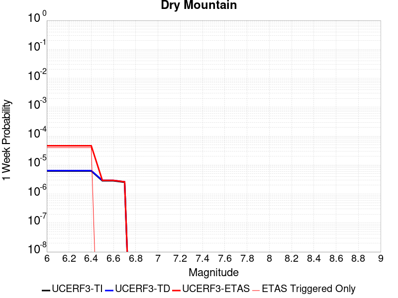 |  |  |  |

| Magnitude | 1 wk TI Prob | 1 wk TD Prob | 1 wk ETAS Prob | 1 wk ETAS/TD Gain | 1 wk ETAS Triggered Only | 1 mo TI Prob | 1 mo TD Prob | 1 mo ETAS Prob | 1 mo ETAS/TD Gain | 1 mo ETAS Triggered Only | 1 yr TI Prob | 1 yr TD Prob | 1 yr ETAS Prob | 1 yr ETAS/TD Gain | 1 yr ETAS Triggered Only | 10 yr TI Prob | 10 yr TD Prob | 10 yr ETAS Prob | 10 yr ETAS/TD Gain | 10 yr ETAS Triggered Only |
|-----|-----|-----|-----|-----|-----|-----|-----|-----|-----|-----|-----|-----|-----|-----|-----|-----|-----|-----|-----|-----|
| 6.0 | 6.222801E-6 | 6.439381E-6 | 6.3021704E-5 | 9.78692 | 5.658269E-5 | 2.6668875E-5 | 2.7597147E-5 | 9.832355E-5 | 3.5628161 | 7.072836E-5 | 3.2464517E-4 | 3.3595937E-4 | 4.208049E-4 | 1.2525469 | 8.487403E-5 | 0.0032417132 | 0.0033560768 | 0.0034547641 | 1.0294056 | 9.901971E-5 |
| 6.1 | 6.222801E-6 | 6.439381E-6 | 6.3021704E-5 | 9.78692 | 5.658269E-5 | 2.6668875E-5 | 2.7597147E-5 | 9.832355E-5 | 3.5628161 | 7.072836E-5 | 3.2464517E-4 | 3.3595937E-4 | 4.208049E-4 | 1.2525469 | 8.487403E-5 | 0.0032417132 | 0.0033560768 | 0.0034547641 | 1.0294056 | 9.901971E-5 |
| 6.2 | 6.222801E-6 | 6.439381E-6 | 6.3021704E-5 | 9.78692 | 5.658269E-5 | 2.6668875E-5 | 2.7597147E-5 | 9.832355E-5 | 3.5628161 | 7.072836E-5 | 3.2464517E-4 | 3.3595937E-4 | 4.208049E-4 | 1.2525469 | 8.487403E-5 | 0.0032417132 | 0.0033560768 | 0.0034547641 | 1.0294056 | 9.901971E-5 |
| 6.3 | 6.222801E-6 | 6.439381E-6 | 6.3021704E-5 | 9.78692 | 5.658269E-5 | 2.6668875E-5 | 2.7597147E-5 | 9.832355E-5 | 3.5628161 | 7.072836E-5 | 3.2464517E-4 | 3.3595937E-4 | 4.208049E-4 | 1.2525469 | 8.487403E-5 | 0.0032417132 | 0.0033560768 | 0.0034547641 | 1.0294056 | 9.901971E-5 |
| 6.4 | 6.222801E-6 | 6.439381E-6 | 6.3021704E-5 | 9.78692 | 5.658269E-5 | 2.6668875E-5 | 2.7597147E-5 | 9.832355E-5 | 3.5628161 | 7.072836E-5 | 3.2464517E-4 | 3.3595937E-4 | 4.208049E-4 | 1.2525469 | 8.487403E-5 | 0.0032417132 | 0.0033560768 | 0.0034547641 | 1.0294056 | 9.901971E-5 |
| 6.5 | 2.8528623E-6 | 2.9521684E-6 | 2.9521684E-6 | 1.0 | 0.0 | 1.22264955E-5 | 1.2652138E-5 | 2.679763E-5 | 2.1180317 | 1.4145672E-5 | 1.4884741E-4 | 1.540376E-4 | 1.6818108E-4 | 1.0918185 | 1.4145672E-5 | 0.0014874774 | 0.0015401616 | 0.0015542855 | 1.0091704 | 1.4145672E-5 |
| 6.6 | 2.8528623E-6 | 2.9521684E-6 | 2.9521684E-6 | 1.0 | 0.0 | 1.22264955E-5 | 1.2652138E-5 | 2.679763E-5 | 2.1180317 | 1.4145672E-5 | 1.4884741E-4 | 1.540376E-4 | 1.6818108E-4 | 1.0918185 | 1.4145672E-5 | 0.0014874774 | 0.0015401616 | 0.0015542855 | 1.0091704 | 1.4145672E-5 |
| 6.7 | 2.541E-6 | 2.6293578E-6 | 2.6293578E-6 | 1.0 | 0.0 | 1.0889954E-5 | 1.1268677E-5 | 1.1268677E-5 | 1.0 | 0.0 | 1.3257713E-4 | 1.3719614E-4 | 1.3719614E-4 | 1.0 | 0.0 | 0.0013249806 | 0.0013719613 | 0.0013719613 | 1.0 | 0.0 |

## Oak Ridge (Onshore)
*[(top)](#table-of-contents)*

| 1 Week | 1 Month | 1 Year | 10 Year |
|-----|-----|-----|-----|
|  |  | 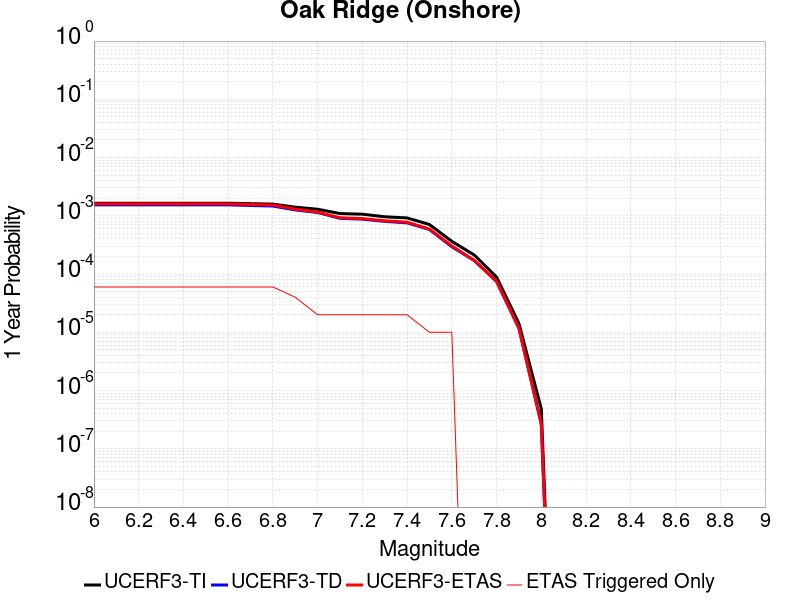 | 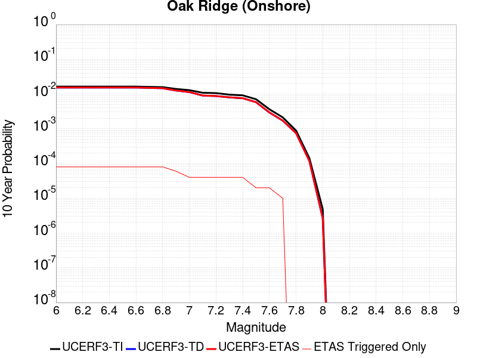 |

| Magnitude | 1 wk TI Prob | 1 wk TD Prob | 1 wk ETAS Prob | 1 wk ETAS/TD Gain | 1 wk ETAS Triggered Only | 1 mo TI Prob | 1 mo TD Prob | 1 mo ETAS Prob | 1 mo ETAS/TD Gain | 1 mo ETAS Triggered Only | 1 yr TI Prob | 1 yr TD Prob | 1 yr ETAS Prob | 1 yr ETAS/TD Gain | 1 yr ETAS Triggered Only | 10 yr TI Prob | 10 yr TD Prob | 10 yr ETAS Prob | 10 yr ETAS/TD Gain | 10 yr ETAS Triggered Only |
|-----|-----|-----|-----|-----|-----|-----|-----|-----|-----|-----|-----|-----|-----|-----|-----|-----|-----|-----|-----|-----|
| 6.0 | 3.155064E-5 | 2.9526076E-5 | 7.196184E-5 | 2.43723 | 4.2437016E-5 | 1.3521002E-4 | 1.265344E-4 | 1.6896606E-4 | 1.3353368 | 4.2437016E-5 | 0.001644939 | 0.0015395058 | 0.0015960014 | 1.0366973 | 5.658269E-5 | 0.01632816 | 0.015293054 | 0.01537663 | 1.0054649 | 8.487403E-5 |
| 6.1 | 3.155064E-5 | 2.9526076E-5 | 7.196184E-5 | 2.43723 | 4.2437016E-5 | 1.3521002E-4 | 1.265344E-4 | 1.6896606E-4 | 1.3353368 | 4.2437016E-5 | 0.001644939 | 0.0015395058 | 0.0015960014 | 1.0366973 | 5.658269E-5 | 0.01632816 | 0.015293054 | 0.01537663 | 1.0054649 | 8.487403E-5 |
| 6.2 | 3.155064E-5 | 2.9526076E-5 | 7.196184E-5 | 2.43723 | 4.2437016E-5 | 1.3521002E-4 | 1.265344E-4 | 1.6896606E-4 | 1.3353368 | 4.2437016E-5 | 0.001644939 | 0.0015395058 | 0.0015960014 | 1.0366973 | 5.658269E-5 | 0.01632816 | 0.015293054 | 0.01537663 | 1.0054649 | 8.487403E-5 |
| 6.3 | 3.155064E-5 | 2.9526076E-5 | 7.196184E-5 | 2.43723 | 4.2437016E-5 | 1.3521002E-4 | 1.265344E-4 | 1.6896606E-4 | 1.3353368 | 4.2437016E-5 | 0.001644939 | 0.0015395058 | 0.0015960014 | 1.0366973 | 5.658269E-5 | 0.01632816 | 0.015293054 | 0.01537663 | 1.0054649 | 8.487403E-5 |
| 6.4 | 3.155064E-5 | 2.9526076E-5 | 7.196184E-5 | 2.43723 | 4.2437016E-5 | 1.3521002E-4 | 1.265344E-4 | 1.6896606E-4 | 1.3353368 | 4.2437016E-5 | 0.001644939 | 0.0015395058 | 0.0015960014 | 1.0366973 | 5.658269E-5 | 0.01632816 | 0.015293054 | 0.01537663 | 1.0054649 | 8.487403E-5 |
| 6.5 | 3.155064E-5 | 2.9526076E-5 | 7.196184E-5 | 2.43723 | 4.2437016E-5 | 1.3521002E-4 | 1.265344E-4 | 1.6896606E-4 | 1.3353368 | 4.2437016E-5 | 0.001644939 | 0.0015395058 | 0.0015960014 | 1.0366973 | 5.658269E-5 | 0.01632816 | 0.015293054 | 0.01537663 | 1.0054649 | 8.487403E-5 |
| 6.6 | 3.155064E-5 | 2.9526076E-5 | 7.196184E-5 | 2.43723 | 4.2437016E-5 | 1.3521002E-4 | 1.265344E-4 | 1.6896606E-4 | 1.3353368 | 4.2437016E-5 | 0.001644939 | 0.0015395058 | 0.0015960014 | 1.0366973 | 5.658269E-5 | 0.01632816 | 0.015293054 | 0.01537663 | 1.0054649 | 8.487403E-5 |
| 6.7 | 3.098897E-5 | 2.8864279E-5 | 7.130007E-5 | 2.4701836 | 4.2437016E-5 | 1.328031E-4 | 1.236984E-4 | 1.6613016E-4 | 1.343026 | 4.2437016E-5 | 0.0016156785 | 0.0015050253 | 0.0015615228 | 1.0375392 | 5.658269E-5 | 0.016039822 | 0.014952909 | 0.015036514 | 1.0055913 | 8.487403E-5 |
| 6.8 | 3.0449872E-5 | 2.8239476E-5 | 7.067529E-5 | 2.5027127 | 4.2437016E-5 | 1.3049292E-4 | 1.2102092E-4 | 1.634528E-4 | 1.3506161 | 4.2437016E-5 | 0.0015875935 | 0.001472471 | 0.0015289704 | 1.0383705 | 5.658269E-5 | 0.015762992 | 0.014631658 | 0.01471529 | 1.0057158 | 8.487403E-5 |
| 6.9 | 2.697928E-5 | 2.4219877E-5 | 3.8365208E-5 | 1.584038 | 1.4145672E-5 | 1.15620365E-4 | 1.03795464E-4 | 1.1793967E-4 | 1.1362699 | 1.4145672E-5 | 0.0014067689 | 0.0012629988 | 0.0012912543 | 1.0223719 | 2.8291344E-5 | 0.0139789665 | 0.012561066 | 0.012616938 | 1.004448 | 5.658269E-5 |
| 7.0 | 2.4893961E-5 | 2.1862146E-5 | 2.1862146E-5 | 1.0 | 0.0 | 1.0668404E-4 | 9.369165E-5 | 9.369165E-5 | 1.0 | 0.0 | 0.0012981043 | 0.0011401166 | 0.0011542462 | 1.0123931 | 1.4145672E-5 | 0.012905477 | 0.011345102 | 0.011387058 | 1.0036981 | 4.2437016E-5 |
| 7.1 | 2.0945363E-5 | 1.7354592E-5 | 1.7354592E-5 | 1.0 | 0.0 | 8.976275E-5 | 7.437473E-5 | 7.437473E-5 | 1.0 | 0.0 | 0.0010923136 | 9.0514094E-4 | 9.1927376E-4 | 1.015614 | 1.4145672E-5 | 0.0108696 | 0.009015621 | 0.009057675 | 1.0046647 | 4.2437016E-5 |
| 7.2 | 2.0439404E-5 | 1.680953E-5 | 1.680953E-5 | 1.0 | 0.0 | 8.7594504E-5 | 7.203888E-5 | 7.203888E-5 | 1.0 | 0.0 | 0.0010659413 | 8.767251E-4 | 8.9085835E-4 | 1.0161206 | 1.4145672E-5 | 0.010608427 | 0.008733723 | 0.00877579 | 1.0048165 | 4.2437016E-5 |
| 7.3 | 1.8463334E-5 | 1.5381947E-5 | 1.5381947E-5 | 1.0 | 0.0 | 7.912617E-5 | 6.592098E-5 | 6.592098E-5 | 1.0 | 0.0 | 9.6293533E-4 | 8.0229685E-4 | 8.1643113E-4 | 1.0176173 | 1.4145672E-5 | 0.009587734 | 0.0079950085 | 0.008037106 | 1.0052655 | 4.2437016E-5 |
| 7.4 | 1.763139E-5 | 1.4516977E-5 | 1.4516977E-5 | 1.0 | 0.0 | 7.556091E-5 | 6.221415E-5 | 6.221415E-5 | 1.0 | 0.0 | 9.1956573E-4 | 7.57198E-4 | 7.71333E-4 | 1.0186675 | 1.4145672E-5 | 0.009157699 | 0.007547126 | 0.007589243 | 1.0055805 | 4.2437016E-5 |
| 7.5 | 1.3594944E-5 | 1.1163363E-5 | 1.1163363E-5 | 1.0 | 0.0 | 5.8262744E-5 | 4.7842117E-5 | 4.7842117E-5 | 1.0 | 0.0 | 7.0911803E-4 | 5.8232463E-4 | 5.8232463E-4 | 1.0 | 0.0 | 0.007068595 | 0.005808362 | 0.0058224252 | 1.0024213 | 1.4145672E-5 |
| 7.6 | 6.9889534E-6 | 5.6367194E-6 | 5.6367194E-6 | 1.0 | 0.0 | 2.9952313E-5 | 2.4157147E-5 | 2.4157147E-5 | 1.0 | 0.0 | 3.646084E-4 | 2.94074E-4 | 2.94074E-4 | 1.0 | 0.0 | 0.0036401073 | 0.0029368924 | 0.0029509966 | 1.0048023 | 1.4145672E-5 |
| 7.7 | 4.0824193E-6 | 3.2832731E-6 | 3.2832731E-6 | 1.0 | 0.0 | 1.7495966E-5 | 1.4071096E-5 | 1.4071096E-5 | 1.0 | 0.0 | 2.1299256E-4 | 1.7130225E-4 | 1.7130225E-4 | 1.0 | 0.0 | 0.0021278851 | 0.0017117155 | 0.001725837 | 1.0082499 | 1.4145672E-5 |
| 7.8 | 1.7023609E-6 | 1.43706E-6 | 1.43706E-6 | 1.0 | 0.0 | 7.295812E-6 | 6.158814E-6 | 6.158814E-6 | 1.0 | 0.0 | 8.882289E-5 | 7.4981006E-5 | 7.4981006E-5 | 1.0 | 0.0 | 8.8787393E-4 | 7.4955984E-4 | 7.4955984E-4 | 1.0 | 0.0 |
| 7.9 | 2.721225E-7 | 2.261692E-7 | 2.261692E-7 | 1.0 | 0.0 | 1.1662388E-6 | 9.692963E-7 | 9.692963E-7 | 1.0 | 0.0 | 1.4198865E-5 | 1.1801121E-5 | 1.1801121E-5 | 1.0 | 0.0 | 1.4197957E-4 | 1.1800523E-4 | 1.1800523E-4 | 1.0 | 0.0 |
| 8.0 | 9.364255E-9 | 5.1204916E-9 | 5.1204916E-9 | 1.0 | 0.0 | 4.0132523E-8 | 2.1944963E-8 | 2.1944963E-8 | 1.0 | 0.0 | 4.8861335E-7 | 2.671799E-7 | 2.671799E-7 | 1.0 | 0.0 | 4.8861225E-6 | 2.6717962E-6 | 2.6717962E-6 | 1.0 | 0.0 |

## Santa Cruz Island
*[(top)](#table-of-contents)*

| 1 Week | 1 Month | 1 Year | 10 Year |
|-----|-----|-----|-----|
|  |  |  | 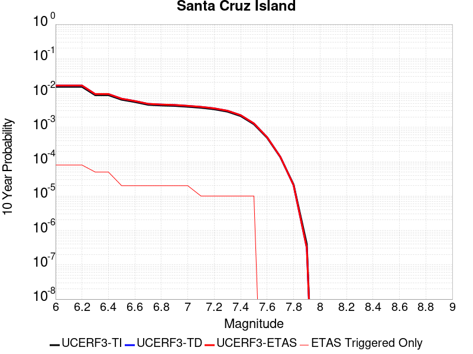 |

| Magnitude | 1 wk TI Prob | 1 wk TD Prob | 1 wk ETAS Prob | 1 wk ETAS/TD Gain | 1 wk ETAS Triggered Only | 1 mo TI Prob | 1 mo TD Prob | 1 mo ETAS Prob | 1 mo ETAS/TD Gain | 1 mo ETAS Triggered Only | 1 yr TI Prob | 1 yr TD Prob | 1 yr ETAS Prob | 1 yr ETAS/TD Gain | 1 yr ETAS Triggered Only | 10 yr TI Prob | 10 yr TD Prob | 10 yr ETAS Prob | 10 yr ETAS/TD Gain | 10 yr ETAS Triggered Only |
|-----|-----|-----|-----|-----|-----|-----|-----|-----|-----|-----|-----|-----|-----|-----|-----|-----|-----|-----|-----|-----|
| 6.0 | 2.9164563E-5 | 3.1599742E-5 | 5.9890193E-5 | 1.8952746 | 2.8291344E-5 | 1.2498499E-4 | 1.3542121E-4 | 1.7785247E-4 | 1.3133281 | 4.2437016E-5 | 0.0015206301 | 0.0016476426 | 0.0017182544 | 1.0428563 | 7.072836E-5 | 0.015102667 | 0.016368 | 0.016451484 | 1.0051005 | 8.487403E-5 |
| 6.1 | 2.9164563E-5 | 3.1599742E-5 | 5.9890193E-5 | 1.8952746 | 2.8291344E-5 | 1.2498499E-4 | 1.3542121E-4 | 1.7785247E-4 | 1.3133281 | 4.2437016E-5 | 0.0015206301 | 0.0016476426 | 0.0017182544 | 1.0428563 | 7.072836E-5 | 0.015102667 | 0.016368 | 0.016451484 | 1.0051005 | 8.487403E-5 |
| 6.2 | 2.9164563E-5 | 3.1599742E-5 | 5.9890193E-5 | 1.8952746 | 2.8291344E-5 | 1.2498499E-4 | 1.3542121E-4 | 1.7785247E-4 | 1.3133281 | 4.2437016E-5 | 0.0015206301 | 0.0016476426 | 0.0017182544 | 1.0428563 | 7.072836E-5 | 0.015102667 | 0.016368 | 0.016451484 | 1.0051005 | 8.487403E-5 |
| 6.3 | 1.6635553E-5 | 1.780436E-5 | 3.1949778E-5 | 1.794492 | 1.4145672E-5 | 7.1293274E-5 | 7.630227E-5 | 1.04591454E-4 | 1.3707516 | 2.8291344E-5 | 8.6765E-4 | 9.286024E-4 | 9.851325E-4 | 1.0608766 | 5.658269E-5 | 0.008642701 | 0.009249094 | 0.009305153 | 1.0060611 | 5.658269E-5 |
| 6.4 | 1.6635553E-5 | 1.780436E-5 | 3.1949778E-5 | 1.794492 | 1.4145672E-5 | 7.1293274E-5 | 7.630227E-5 | 1.04591454E-4 | 1.3707516 | 2.8291344E-5 | 8.6765E-4 | 9.286024E-4 | 9.851325E-4 | 1.0608766 | 5.658269E-5 | 0.008642701 | 0.009249094 | 0.009305153 | 1.0060611 | 5.658269E-5 |
| 6.5 | 1.2238748E-5 | 1.3042996E-5 | 2.7188484E-5 | 2.0845275 | 1.4145672E-5 | 5.2450723E-5 | 5.5897377E-5 | 8.418714E-5 | 1.5061018 | 2.8291344E-5 | 6.3840044E-4 | 6.8034173E-4 | 7.0861384E-4 | 1.0415558 | 2.8291344E-5 | 0.0063656955 | 0.006782988 | 0.0068110875 | 1.0041426 | 2.8291344E-5 |
| 6.6 | 1.0489767E-5 | 1.1156636E-5 | 2.530215E-5 | 2.2679014 | 1.4145672E-5 | 4.495537E-5 | 4.781329E-5 | 7.6103286E-5 | 1.5916764 | 2.8291344E-5 | 5.4719415E-4 | 5.819736E-4 | 6.102484E-4 | 1.0485845 | 2.8291344E-5 | 0.005458487 | 0.005804736 | 0.005832863 | 1.0048455 | 2.8291344E-5 |
| 6.7 | 8.699222E-6 | 9.236783E-6 | 2.3382323E-5 | 2.531436 | 1.4145672E-5 | 3.7281847E-5 | 3.958561E-5 | 6.787584E-5 | 1.7146592 | 2.8291344E-5 | 4.5381195E-4 | 4.818488E-4 | 5.101265E-4 | 1.0586859 | 2.8291344E-5 | 0.0045288634 | 0.004808108 | 0.004836263 | 1.0058558 | 2.8291344E-5 |
| 6.8 | 8.307732E-6 | 8.8169045E-6 | 2.2962451E-5 | 2.6043665 | 1.4145672E-5 | 3.560408E-5 | 3.7786187E-5 | 6.607646E-5 | 1.7486936 | 2.8291344E-5 | 4.3339343E-4 | 4.5995016E-4 | 4.8822848E-4 | 1.0614812 | 2.8291344E-5 | 0.004325492 | 0.0045900354 | 0.0046181967 | 1.0061353 | 2.8291344E-5 |
| 6.9 | 8.073121E-6 | 8.564939E-6 | 2.271049E-5 | 2.6515646 | 1.4145672E-5 | 3.459863E-5 | 3.670637E-5 | 6.4996675E-5 | 1.7707193 | 2.8291344E-5 | 4.2115687E-4 | 4.4680882E-4 | 4.7508752E-4 | 1.0632904 | 2.8291344E-5 | 0.004203596 | 0.004459156 | 0.0044873212 | 1.0063163 | 2.8291344E-5 |
| 7.0 | 7.617019E-6 | 8.074665E-6 | 2.2220222E-5 | 2.7518446 | 1.4145672E-5 | 3.264396E-5 | 3.4605247E-5 | 6.289561E-5 | 1.8175166 | 2.8291344E-5 | 3.9736772E-4 | 4.2123784E-4 | 4.4951728E-4 | 1.0671341 | 2.8291344E-5 | 0.003966579 | 0.0042044413 | 0.004232614 | 1.0067006 | 2.8291344E-5 |
| 7.1 | 7.1224836E-6 | 7.5457883E-6 | 2.1691354E-5 | 2.8746307 | 1.4145672E-5 | 3.052457E-5 | 3.2338692E-5 | 4.6483907E-5 | 1.4374083 | 1.4145672E-5 | 3.715733E-4 | 3.9365282E-4 | 4.0779292E-4 | 1.0359203 | 1.4145672E-5 | 0.003709526 | 0.0039295983 | 0.0039436882 | 1.0035856 | 1.4145672E-5 |
| 7.2 | 6.441115E-6 | 6.8273835E-6 | 2.0972959E-5 | 3.0718882 | 1.4145672E-5 | 2.7604487E-5 | 2.9259889E-5 | 4.3405147E-5 | 1.4834352 | 1.4145672E-5 | 3.360328E-4 | 3.5618115E-4 | 3.7032177E-4 | 1.0397006 | 1.4145672E-5 | 0.0033552512 | 0.0035561312 | 0.0035702265 | 1.0039637 | 1.4145672E-5 |
| 7.3 | 5.494274E-6 | 5.8199944E-6 | 1.9965584E-5 | 3.430516 | 1.4145672E-5 | 2.3546674E-5 | 2.4942596E-5 | 3.9087918E-5 | 1.567115 | 1.4145672E-5 | 2.8664304E-4 | 3.03634E-4 | 3.1777538E-4 | 1.0465738 | 1.4145672E-5 | 0.002862736 | 0.0030322145 | 0.0030463173 | 1.004651 | 1.4145672E-5 |
| 7.4 | 4.0802624E-6 | 4.3122564E-6 | 1.8457868E-5 | 4.280327 | 1.4145672E-5 | 1.7486722E-5 | 1.8480969E-5 | 3.262638E-5 | 1.7654042 | 1.4145672E-5 | 2.1288003E-4 | 2.2498264E-4 | 2.3912512E-4 | 1.0628604 | 1.4145672E-5 | 0.0021267622 | 0.0022475577 | 0.0022616715 | 1.0062797 | 1.4145672E-5 |
| 7.5 | 2.3584746E-6 | 2.4753099E-6 | 1.6620947E-5 | 6.7146935 | 1.4145672E-5 | 1.0107709E-5 | 1.0608428E-5 | 2.475395E-5 | 2.333423 | 1.4145672E-5 | 1.2305441E-4 | 1.2915001E-4 | 1.4329384E-4 | 1.1095148 | 1.4145672E-5 | 0.0012298629 | 0.0012907545 | 0.001304882 | 1.0109451 | 1.4145672E-5 |
| 7.6 | 9.4981914E-7 | 9.860934E-7 | 9.860934E-7 | 1.0 | 0.0 | 4.0706473E-6 | 4.2261076E-6 | 4.2261076E-6 | 1.0 | 0.0 | 4.9559E-5 | 5.1451658E-5 | 5.1451658E-5 | 1.0 | 0.0 | 4.954795E-4 | 5.1439874E-4 | 5.1439874E-4 | 1.0 | 0.0 |
| 7.7 | 2.6013532E-7 | 2.6416632E-7 | 2.6416632E-7 | 1.0 | 0.0 | 1.1148652E-6 | 1.1321408E-6 | 1.1321408E-6 | 1.0 | 0.0 | 1.3573399E-5 | 1.3783729E-5 | 1.3783729E-5 | 1.0 | 0.0 | 1.357257E-4 | 1.378288E-4 | 1.378288E-4 | 1.0 | 0.0 |
| 7.8 | 4.1522263E-8 | 3.965698E-8 | 3.965698E-8 | 1.0 | 0.0 | 1.7795254E-7 | 1.6995848E-7 | 1.6995848E-7 | 1.0 | 0.0 | 2.16657E-6 | 2.0692428E-6 | 2.0692428E-6 | 1.0 | 0.0 | 2.1665488E-5 | 2.0692256E-5 | 2.0692256E-5 | 1.0 | 0.0 |
| 7.9 | 7.7242046E-10 | 5.9475225E-10 | 5.9475225E-10 | 1.0 | 0.0 | 3.3103735E-9 | 2.5489382E-9 | 2.5489382E-9 | 1.0 | 0.0 | 4.0303796E-8 | 3.1033323E-8 | 3.1033323E-8 | 1.0 | 0.0 | 4.030379E-7 | 3.103332E-7 | 3.103332E-7 | 1.0 | 0.0 |

## Kern Canyon (South Kern) 2011
*[(top)](#table-of-contents)*

| 1 Week | 1 Month | 1 Year | 10 Year |
|-----|-----|-----|-----|
|  |  | 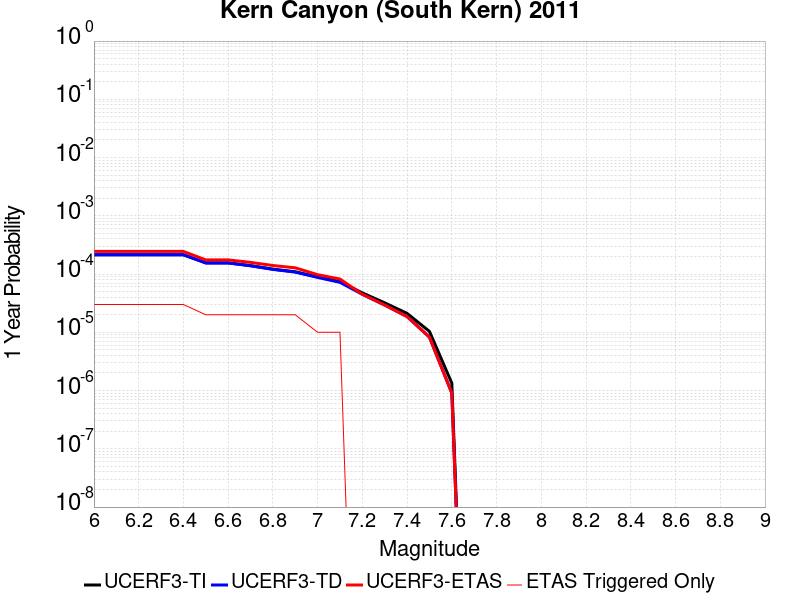 |  |

| Magnitude | 1 wk TI Prob | 1 wk TD Prob | 1 wk ETAS Prob | 1 wk ETAS/TD Gain | 1 wk ETAS Triggered Only | 1 mo TI Prob | 1 mo TD Prob | 1 mo ETAS Prob | 1 mo ETAS/TD Gain | 1 mo ETAS Triggered Only | 1 yr TI Prob | 1 yr TD Prob | 1 yr ETAS Prob | 1 yr ETAS/TD Gain | 1 yr ETAS Triggered Only | 10 yr TI Prob | 10 yr TD Prob | 10 yr ETAS Prob | 10 yr ETAS/TD Gain | 10 yr ETAS Triggered Only |
|-----|-----|-----|-----|-----|-----|-----|-----|-----|-----|-----|-----|-----|-----|-----|-----|-----|-----|-----|-----|-----|
| 6.0 | 4.105075E-6 | 4.113726E-6 | 3.2404954E-5 | 7.877276 | 2.8291344E-5 | 1.7593058E-5 | 1.7630138E-5 | 4.5920984E-5 | 2.6046865 | 2.8291344E-5 | 2.1417443E-4 | 2.1462643E-4 | 2.429117E-4 | 1.1317884 | 2.8291344E-5 | 0.0021396813 | 0.0021442554 | 0.0022430627 | 1.04608 | 9.901971E-5 |
| 6.1 | 4.105075E-6 | 4.113726E-6 | 3.2404954E-5 | 7.877276 | 2.8291344E-5 | 1.7593058E-5 | 1.7630138E-5 | 4.5920984E-5 | 2.6046865 | 2.8291344E-5 | 2.1417443E-4 | 2.1462643E-4 | 2.429117E-4 | 1.1317884 | 2.8291344E-5 | 0.0021396813 | 0.0021442554 | 0.0022430627 | 1.04608 | 9.901971E-5 |
| 6.2 | 4.105075E-6 | 4.113726E-6 | 3.2404954E-5 | 7.877276 | 2.8291344E-5 | 1.7593058E-5 | 1.7630138E-5 | 4.5920984E-5 | 2.6046865 | 2.8291344E-5 | 2.1417443E-4 | 2.1462643E-4 | 2.429117E-4 | 1.1317884 | 2.8291344E-5 | 0.0021396813 | 0.0021442554 | 0.0022430627 | 1.04608 | 9.901971E-5 |
| 6.3 | 4.105075E-6 | 4.113726E-6 | 3.2404954E-5 | 7.877276 | 2.8291344E-5 | 1.7593058E-5 | 1.7630138E-5 | 4.5920984E-5 | 2.6046865 | 2.8291344E-5 | 2.1417443E-4 | 2.1462643E-4 | 2.429117E-4 | 1.1317884 | 2.8291344E-5 | 0.0021396813 | 0.0021442554 | 0.0022430627 | 1.04608 | 9.901971E-5 |
| 6.4 | 4.105075E-6 | 4.113726E-6 | 3.2404954E-5 | 7.877276 | 2.8291344E-5 | 1.7593058E-5 | 1.7630138E-5 | 4.5920984E-5 | 2.6046865 | 2.8291344E-5 | 2.1417443E-4 | 2.1462643E-4 | 2.429117E-4 | 1.1317884 | 2.8291344E-5 | 0.0021396813 | 0.0021442554 | 0.0022430627 | 1.04608 | 9.901971E-5 |
| 6.5 | 2.9849807E-6 | 2.973154E-6 | 1.7118784E-5 | 5.757786 | 1.4145672E-5 | 1.2792712E-5 | 1.2742028E-5 | 2.688752E-5 | 2.1101444 | 1.4145672E-5 | 1.5574014E-4 | 1.551233E-4 | 1.6926677E-4 | 1.0911757 | 1.4145672E-5 | 0.0015563103 | 0.0015501654 | 0.0016349078 | 1.0546668 | 8.487403E-5 |
| 6.6 | 2.9849807E-6 | 2.973154E-6 | 1.7118784E-5 | 5.757786 | 1.4145672E-5 | 1.2792712E-5 | 1.2742028E-5 | 2.688752E-5 | 2.1101444 | 1.4145672E-5 | 1.5574014E-4 | 1.551233E-4 | 1.6926677E-4 | 1.0911757 | 1.4145672E-5 | 0.0015563103 | 0.0015501654 | 0.0016349078 | 1.0546668 | 8.487403E-5 |
| 6.7 | 2.6756725E-6 | 2.6582202E-6 | 1.6803855E-5 | 6.3214684 | 1.4145672E-5 | 1.1467117E-5 | 1.1392323E-5 | 2.5537835E-5 | 2.2416704 | 1.4145672E-5 | 1.396032E-4 | 1.386928E-4 | 1.5283652E-4 | 1.1019787 | 1.4145672E-5 | 0.0013951553 | 0.0013860734 | 0.0014567038 | 1.0509571 | 7.072836E-5 |
| 6.8 | 2.3283721E-6 | 2.3047783E-6 | 1.6450418E-5 | 7.1375275 | 1.4145672E-5 | 9.9787E-6 | 9.877584E-6 | 2.4023117E-5 | 2.4320843 | 1.4145672E-5 | 1.214839E-4 | 1.2025302E-4 | 1.3439699E-4 | 1.1176184 | 1.4145672E-5 | 0.001214175 | 0.001201887 | 0.0012584017 | 1.0470216 | 5.658269E-5 |
| 6.9 | 2.0972677E-6 | 2.0696405E-6 | 1.6215283E-5 | 7.8348308 | 1.4145672E-5 | 8.988259E-6 | 8.869858E-6 | 2.3015406E-5 | 2.5947883 | 1.4145672E-5 | 1.0942656E-4 | 1.0798523E-4 | 1.2212938E-4 | 1.1309822 | 1.4145672E-5 | 0.0010937268 | 0.0010793334 | 0.001135855 | 1.0523672 | 5.658269E-5 |
| 7.0 | 1.7132242E-6 | 1.6787029E-6 | 1.6787029E-6 | 1.0 | 0.0 | 7.3423685E-6 | 7.1944214E-6 | 7.1944214E-6 | 1.0 | 0.0 | 8.938967E-5 | 8.75886E-5 | 8.75886E-5 | 1.0 | 0.0 | 8.935372E-4 | 8.755446E-4 | 9.038112E-4 | 1.0322846 | 2.8291344E-5 |
| 7.1 | 1.4215541E-6 | 1.3815746E-6 | 1.3815746E-6 | 1.0 | 0.0 | 6.0923603E-6 | 5.9210206E-6 | 5.9210206E-6 | 1.0 | 0.0 | 7.417196E-5 | 7.208607E-5 | 7.208607E-5 | 1.0 | 0.0 | 7.414721E-4 | 7.206296E-4 | 7.34765E-4 | 1.0196154 | 1.4145672E-5 |
| 7.2 | 9.097853E-7 | 8.60377E-7 | 8.60377E-7 | 1.0 | 0.0 | 3.899074E-6 | 3.6873246E-6 | 3.6873246E-6 | 1.0 | 0.0 | 4.7470192E-5 | 4.4892266E-5 | 4.4892266E-5 | 1.0 | 0.0 | 4.7460053E-4 | 4.4883305E-4 | 4.6297236E-4 | 1.0315024 | 1.4145672E-5 |
| 7.3 | 6.144169E-7 | 5.628199E-7 | 5.628199E-7 | 1.0 | 0.0 | 2.6332125E-6 | 2.4120832E-6 | 2.4120832E-6 | 1.0 | 0.0 | 3.205889E-5 | 2.9366722E-5 | 2.9366722E-5 | 1.0 | 0.0 | 3.2054266E-4 | 2.9362892E-4 | 3.0777042E-4 | 1.0481611 | 1.4145672E-5 |
| 7.4 | 4.049844E-7 | 3.5728252E-7 | 3.5728252E-7 | 1.0 | 0.0 | 1.7356463E-6 | 1.5312098E-6 | 1.5312098E-6 | 1.0 | 0.0 | 2.1131287E-5 | 1.8642324E-5 | 1.8642324E-5 | 1.0 | 0.0 | 2.1129279E-4 | 1.8640784E-4 | 2.0055087E-4 | 1.0758715 | 1.4145672E-5 |
| 7.5 | 1.9871162E-7 | 1.5830383E-7 | 1.5830383E-7 | 1.0 | 0.0 | 8.5162094E-7 | 6.784448E-7 | 6.784448E-7 | 1.0 | 0.0 | 1.0368436E-5 | 8.260035E-6 | 8.260035E-6 | 1.0 | 0.0 | 1.0367952E-4 | 8.259736E-5 | 8.259736E-5 | 1.0 | 0.0 |
| 7.6 | 2.572245E-8 | 1.735264E-8 | 1.735264E-8 | 1.0 | 0.0 | 1.10239064E-7 | 7.436845E-8 | 7.436845E-8 | 1.0 | 0.0 | 1.3421597E-6 | 9.0543557E-7 | 9.0543557E-7 | 1.0 | 0.0 | 1.3421517E-5 | 9.054324E-6 | 9.054324E-6 | 1.0 | 0.0 |

## Pine Mtn
*[(top)](#table-of-contents)*

| 1 Week | 1 Month | 1 Year | 10 Year |
|-----|-----|-----|-----|
|  |  | 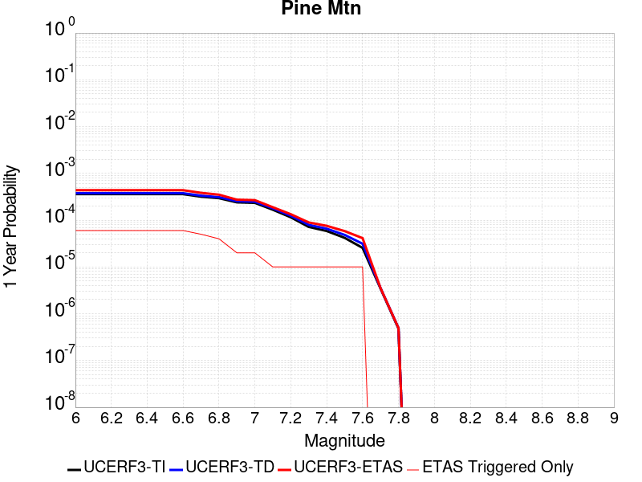 |  |

| Magnitude | 1 wk TI Prob | 1 wk TD Prob | 1 wk ETAS Prob | 1 wk ETAS/TD Gain | 1 wk ETAS Triggered Only | 1 mo TI Prob | 1 mo TD Prob | 1 mo ETAS Prob | 1 mo ETAS/TD Gain | 1 mo ETAS Triggered Only | 1 yr TI Prob | 1 yr TD Prob | 1 yr ETAS Prob | 1 yr ETAS/TD Gain | 1 yr ETAS Triggered Only | 10 yr TI Prob | 10 yr TD Prob | 10 yr ETAS Prob | 10 yr ETAS/TD Gain | 10 yr ETAS Triggered Only |
|-----|-----|-----|-----|-----|-----|-----|-----|-----|-----|-----|-----|-----|-----|-----|-----|-----|-----|-----|-----|-----|
| 6.0 | 6.894797E-6 | 7.2254716E-6 | 3.5516612E-5 | 4.915473 | 2.8291344E-5 | 2.9548795E-5 | 3.0965955E-5 | 8.754689E-5 | 2.827198 | 5.658269E-5 | 3.596972E-4 | 3.7694827E-4 | 4.4764997E-4 | 1.1875634 | 7.072836E-5 | 0.0035911554 | 0.0037633865 | 0.003847941 | 1.0224677 | 8.487403E-5 |
| 6.1 | 6.894797E-6 | 7.2254716E-6 | 3.5516612E-5 | 4.915473 | 2.8291344E-5 | 2.9548795E-5 | 3.0965955E-5 | 8.754689E-5 | 2.827198 | 5.658269E-5 | 3.596972E-4 | 3.7694827E-4 | 4.4764997E-4 | 1.1875634 | 7.072836E-5 | 0.0035911554 | 0.0037633865 | 0.003847941 | 1.0224677 | 8.487403E-5 |
| 6.2 | 6.894797E-6 | 7.2254716E-6 | 3.5516612E-5 | 4.915473 | 2.8291344E-5 | 2.9548795E-5 | 3.0965955E-5 | 8.754689E-5 | 2.827198 | 5.658269E-5 | 3.596972E-4 | 3.7694827E-4 | 4.4764997E-4 | 1.1875634 | 7.072836E-5 | 0.0035911554 | 0.0037633865 | 0.003847941 | 1.0224677 | 8.487403E-5 |
| 6.3 | 6.894797E-6 | 7.2254716E-6 | 3.5516612E-5 | 4.915473 | 2.8291344E-5 | 2.9548795E-5 | 3.0965955E-5 | 8.754689E-5 | 2.827198 | 5.658269E-5 | 3.596972E-4 | 3.7694827E-4 | 4.4764997E-4 | 1.1875634 | 7.072836E-5 | 0.0035911554 | 0.0037633865 | 0.003847941 | 1.0224677 | 8.487403E-5 |
| 6.4 | 6.894797E-6 | 7.2254716E-6 | 3.5516612E-5 | 4.915473 | 2.8291344E-5 | 2.9548795E-5 | 3.0965955E-5 | 8.754689E-5 | 2.827198 | 5.658269E-5 | 3.596972E-4 | 3.7694827E-4 | 4.4764997E-4 | 1.1875634 | 7.072836E-5 | 0.0035911554 | 0.0037633865 | 0.003847941 | 1.0224677 | 8.487403E-5 |
| 6.5 | 6.894797E-6 | 7.2254716E-6 | 3.5516612E-5 | 4.915473 | 2.8291344E-5 | 2.9548795E-5 | 3.0965955E-5 | 8.754689E-5 | 2.827198 | 5.658269E-5 | 3.596972E-4 | 3.7694827E-4 | 4.4764997E-4 | 1.1875634 | 7.072836E-5 | 0.0035911554 | 0.0037633865 | 0.003847941 | 1.0224677 | 8.487403E-5 |
| 6.6 | 6.894797E-6 | 7.2254716E-6 | 3.5516612E-5 | 4.915473 | 2.8291344E-5 | 2.9548795E-5 | 3.0965955E-5 | 8.754689E-5 | 2.827198 | 5.658269E-5 | 3.596972E-4 | 3.7694827E-4 | 4.4764997E-4 | 1.1875634 | 7.072836E-5 | 0.0035911554 | 0.0037633865 | 0.003847941 | 1.0224677 | 8.487403E-5 |
| 6.7 | 6.0867933E-6 | 6.397124E-6 | 3.4688288E-5 | 5.422482 | 2.8291344E-5 | 2.6085996E-5 | 2.7415968E-5 | 6.985182E-5 | 2.5478516 | 4.2437016E-5 | 3.1755073E-4 | 3.337405E-4 | 3.9030428E-4 | 1.1694844 | 5.658269E-5 | 0.0031709734 | 0.0033326119 | 0.0034031046 | 1.0211524 | 7.072836E-5 |
| 6.8 | 5.6530425E-6 | 5.950606E-6 | 3.424178E-5 | 5.7543354 | 2.8291344E-5 | 2.42271E-5 | 2.5502359E-5 | 5.379298E-5 | 2.1093335 | 2.8291344E-5 | 2.94925E-4 | 3.1044905E-4 | 3.5287288E-4 | 1.1366532 | 4.2437016E-5 | 0.002945339 | 0.0031003582 | 0.0031567656 | 1.0181938 | 5.658269E-5 |
| 6.9 | 4.6015225E-6 | 4.8638444E-6 | 1.9009447E-5 | 3.9083173 | 1.4145672E-5 | 1.9720663E-5 | 2.084489E-5 | 3.4990266E-5 | 1.6786017 | 1.4145672E-5 | 2.4007261E-4 | 2.5375842E-4 | 2.679005E-4 | 1.0557305 | 1.4145672E-5 | 0.0023981342 | 0.002534831 | 0.0025630505 | 1.0111327 | 2.8291344E-5 |
| 7.0 | 4.4875965E-6 | 4.7474837E-6 | 1.8893088E-5 | 3.9796007 | 1.4145672E-5 | 1.9232413E-5 | 2.0346208E-5 | 3.4491593E-5 | 1.6952344 | 1.4145672E-5 | 2.3412947E-4 | 2.4768838E-4 | 2.6183054E-4 | 1.0570966 | 1.4145672E-5 | 0.0023388295 | 0.0024742668 | 0.0025024882 | 1.011406 | 2.8291344E-5 |
| 7.1 | 3.203907E-6 | 3.42942E-6 | 1.7575043E-5 | 5.124786 | 1.4145672E-5 | 1.3730958E-5 | 1.4697435E-5 | 2.88429E-5 | 1.9624444 | 1.4145672E-5 | 1.6716159E-4 | 1.7892725E-4 | 1.9307039E-4 | 1.0790441 | 1.4145672E-5 | 0.0016703589 | 0.001787898 | 0.0018161387 | 1.0157955 | 2.8291344E-5 |
| 7.2 | 2.2060601E-6 | 2.3784874E-6 | 1.6524125E-5 | 6.947325 | 1.4145672E-5 | 9.4545085E-6 | 1.019348E-5 | 2.4339008E-5 | 2.3877034 | 1.4145672E-5 | 1.15102564E-4 | 1.2409901E-4 | 1.3824293E-4 | 1.1139728 | 1.4145672E-5 | 0.0011504296 | 0.0012403419 | 0.0012685981 | 1.022781 | 2.8291344E-5 |
| 7.3 | 1.3765207E-6 | 1.5216535E-6 | 1.5667305E-5 | 10.296236 | 1.4145672E-5 | 5.899361E-6 | 6.5213567E-6 | 2.0666936E-5 | 3.169116 | 1.4145672E-5 | 7.182235E-5 | 7.939472E-5 | 9.353927E-5 | 1.1781548 | 1.4145672E-5 | 7.1799144E-4 | 7.9367263E-4 | 8.2194153E-4 | 1.0356178 | 2.8291344E-5 |
| 7.4 | 1.1245983E-6 | 1.2587126E-6 | 1.5404366E-5 | 12.238193 | 1.4145672E-5 | 4.819698E-6 | 5.394472E-6 | 1.9540068E-5 | 3.622239 | 1.4145672E-5 | 5.8678244E-5 | 6.56758E-5 | 7.9820544E-5 | 1.2153722 | 1.4145672E-5 | 5.866275E-4 | 6.565722E-4 | 6.8484497E-4 | 1.0430611 | 2.8291344E-5 |
| 7.5 | 8.031682E-7 | 9.276999E-7 | 1.5073359E-5 | 16.248098 | 1.4145672E-5 | 3.4421448E-6 | 3.975851E-6 | 1.8121467E-5 | 4.5578837 | 1.4145672E-5 | 4.1907308E-5 | 4.840498E-5 | 6.254997E-5 | 1.2922218 | 1.4145672E-5 | 4.1899405E-4 | 4.8395112E-4 | 5.1222875E-4 | 1.0584308 | 2.8291344E-5 |
| 7.6 | 4.8953444E-7 | 6.0030544E-7 | 1.4745969E-5 | 24.56411 | 1.4145672E-5 | 2.098003E-6 | 2.5727354E-6 | 1.6718372E-5 | 6.4982862 | 1.4145672E-5 | 2.5542888E-5 | 3.1322652E-5 | 4.546788E-5 | 1.4515975 | 1.4145672E-5 | 2.5539953E-4 | 3.1318725E-4 | 3.414697E-4 | 1.0903053 | 2.8291344E-5 |
| 7.7 | 6.634529E-8 | 6.788826E-8 | 6.788826E-8 | 1.0 | 0.0 | 2.843369E-7 | 2.9094966E-7 | 2.9094966E-7 | 1.0 | 0.0 | 3.4617963E-6 | 3.5423066E-6 | 3.5423066E-6 | 1.0 | 0.0 | 3.4617424E-5 | 3.542255E-5 | 3.542255E-5 | 1.0 | 0.0 |
| 7.8 | 9.235578E-9 | 9.488566E-9 | 9.488566E-9 | 1.0 | 0.0 | 3.9581046E-8 | 4.0665284E-8 | 4.0665284E-8 | 1.0 | 0.0 | 4.818991E-7 | 4.950997E-7 | 4.950997E-7 | 1.0 | 0.0 | 4.8189804E-6 | 4.950988E-6 | 4.950988E-6 | 1.0 | 0.0 |

## Mission Ridge-Arroyo Parida-Santa Ana
*[(top)](#table-of-contents)*

| 1 Week | 1 Month | 1 Year | 10 Year |
|-----|-----|-----|-----|
|  |  |  |  |

| Magnitude | 1 wk TI Prob | 1 wk TD Prob | 1 wk ETAS Prob | 1 wk ETAS/TD Gain | 1 wk ETAS Triggered Only | 1 mo TI Prob | 1 mo TD Prob | 1 mo ETAS Prob | 1 mo ETAS/TD Gain | 1 mo ETAS Triggered Only | 1 yr TI Prob | 1 yr TD Prob | 1 yr ETAS Prob | 1 yr ETAS/TD Gain | 1 yr ETAS Triggered Only | 10 yr TI Prob | 10 yr TD Prob | 10 yr ETAS Prob | 10 yr ETAS/TD Gain | 10 yr ETAS Triggered Only |
|-----|-----|-----|-----|-----|-----|-----|-----|-----|-----|-----|-----|-----|-----|-----|-----|-----|-----|-----|-----|-----|
| 6.0 | 4.169034E-5 | 4.7137048E-5 | 6.128205E-5 | 1.3000826 | 1.4145672E-5 | 1.7866064E-4 | 2.0200513E-4 | 2.1614795E-4 | 1.0700122 | 1.4145672E-5 | 0.0021730233 | 0.0024574657 | 0.0024997985 | 1.0172262 | 4.2437016E-5 | 0.021518968 | 0.02438483 | 0.024453834 | 1.0028298 | 7.072836E-5 |
| 6.1 | 1.73813E-5 | 1.6854203E-5 | 1.6854203E-5 | 1.0 | 0.0 | 7.4489166E-5 | 7.223036E-5 | 7.223036E-5 | 1.0 | 0.0 | 9.065282E-4 | 8.790605E-4 | 8.790605E-4 | 1.0 | 0.0 | 0.009028391 | 0.008757128 | 0.008785172 | 1.0032023 | 2.8291344E-5 |
| 6.2 | 1.4622182E-5 | 1.3673262E-5 | 1.3673262E-5 | 1.0 | 0.0 | 6.2664985E-5 | 5.85984E-5 | 5.85984E-5 | 1.0 | 0.0 | 7.6267915E-4 | 7.132059E-4 | 7.132059E-4 | 1.0 | 0.0 | 0.007600669 | 0.007109767 | 0.0071378574 | 1.003951 | 2.8291344E-5 |
| 6.3 | 1.3552434E-5 | 1.2482174E-5 | 1.2482174E-5 | 1.0 | 0.0 | 5.8080568E-5 | 5.349395E-5 | 5.349395E-5 | 1.0 | 0.0 | 7.069015E-4 | 6.510974E-4 | 6.510974E-4 | 1.0 | 0.0 | 0.00704657 | 0.006492415 | 0.0065205223 | 1.0043293 | 2.8291344E-5 |
| 6.4 | 1.30977305E-5 | 1.1979128E-5 | 1.1979128E-5 | 1.0 | 0.0 | 5.613192E-5 | 5.133813E-5 | 5.133813E-5 | 1.0 | 0.0 | 6.831918E-4 | 6.2486547E-4 | 6.2486547E-4 | 1.0 | 0.0 | 0.006810953 | 0.006231584 | 0.0062596994 | 1.0045117 | 2.8291344E-5 |
| 6.5 | 1.225205E-5 | 1.1048776E-5 | 1.1048776E-5 | 1.0 | 0.0 | 5.2507727E-5 | 4.735105E-5 | 4.735105E-5 | 1.0 | 0.0 | 6.3909404E-4 | 5.7634927E-4 | 5.7634927E-4 | 1.0 | 0.0 | 0.006372592 | 0.005749009 | 0.005777138 | 1.0048928 | 2.8291344E-5 |
| 6.6 | 1.1352241E-5 | 1.0063508E-5 | 1.0063508E-5 | 1.0 | 0.0 | 4.8651553E-5 | 4.3128617E-5 | 4.3128617E-5 | 1.0 | 0.0 | 5.921717E-4 | 5.249665E-4 | 5.249665E-4 | 1.0 | 0.0 | 0.0059059616 | 0.0052376646 | 0.0052658077 | 1.0053732 | 2.8291344E-5 |
| 6.7 | 1.0864116E-5 | 9.517E-6 | 9.517E-6 | 1.0 | 0.0 | 4.6559664E-5 | 4.0786515E-5 | 4.0786515E-5 | 1.0 | 0.0 | 5.667165E-4 | 4.964647E-4 | 4.964647E-4 | 1.0 | 0.0 | 0.005652734 | 0.0049539437 | 0.0049820947 | 1.0056826 | 2.8291344E-5 |
| 6.8 | 1.0666365E-5 | 9.299752E-6 | 9.299752E-6 | 1.0 | 0.0 | 4.571219E-5 | 3.985548E-5 | 3.985548E-5 | 1.0 | 0.0 | 5.564038E-4 | 4.8513446E-4 | 4.8513446E-4 | 1.0 | 0.0 | 0.005550127 | 0.00484114 | 0.0048692944 | 1.0058156 | 2.8291344E-5 |
| 6.9 | 1.0038665E-5 | 8.592018E-6 | 8.592018E-6 | 1.0 | 0.0 | 4.302214E-5 | 3.682243E-5 | 3.682243E-5 | 1.0 | 0.0 | 5.236687E-4 | 4.4822265E-4 | 4.4822265E-4 | 1.0 | 0.0 | 0.005224364 | 0.0044735507 | 0.004501716 | 1.0062958 | 2.8291344E-5 |
| 7.0 | 9.5379955E-6 | 8.025047E-6 | 8.025047E-6 | 1.0 | 0.0 | 4.0876483E-5 | 3.439261E-5 | 3.439261E-5 | 1.0 | 0.0 | 4.975576E-4 | 4.1865133E-4 | 4.1865133E-4 | 1.0 | 0.0 | 0.00496445 | 0.00417898 | 0.004207153 | 1.0067416 | 2.8291344E-5 |
| 7.1 | 9.207389E-6 | 7.652347E-6 | 7.652347E-6 | 1.0 | 0.0 | 3.945964E-5 | 3.2795375E-5 | 3.2795375E-5 | 1.0 | 0.0 | 4.803152E-4 | 3.992122E-4 | 3.992122E-4 | 1.0 | 0.0 | 0.004792784 | 0.003985301 | 0.0040134797 | 1.0070707 | 2.8291344E-5 |
| 7.2 | 7.638091E-6 | 5.9310923E-6 | 5.9310923E-6 | 1.0 | 0.0 | 3.2734264E-5 | 2.5418722E-5 | 2.5418722E-5 | 1.0 | 0.0 | 3.984668E-4 | 3.094293E-4 | 3.094293E-4 | 1.0 | 0.0 | 0.0039775306 | 0.0030901956 | 0.0031183995 | 1.0091269 | 2.8291344E-5 |
| 7.3 | 7.2500147E-6 | 5.596131E-6 | 5.596131E-6 | 1.0 | 0.0 | 3.1071122E-5 | 2.3983199E-5 | 2.3983199E-5 | 1.0 | 0.0 | 3.7822526E-4 | 2.9195662E-4 | 2.9195662E-4 | 1.0 | 0.0 | 0.0037758215 | 0.0029159402 | 0.002944149 | 1.0096741 | 2.8291344E-5 |
| 7.4 | 6.3899715E-6 | 4.9184864E-6 | 4.9184864E-6 | 1.0 | 0.0 | 2.7385306E-5 | 2.1079059E-5 | 2.1079059E-5 | 1.0 | 0.0 | 3.3336508E-4 | 2.566075E-4 | 2.566075E-4 | 1.0 | 0.0 | 0.0033286542 | 0.002563311 | 0.0025915296 | 1.0110087 | 2.8291344E-5 |
| 7.5 | 5.379025E-6 | 4.0838477E-6 | 4.0838477E-6 | 1.0 | 0.0 | 2.305276E-5 | 1.7502087E-5 | 1.7502087E-5 | 1.0 | 0.0 | 2.806312E-4 | 2.1306718E-4 | 2.1306718E-4 | 1.0 | 0.0 | 0.0028027708 | 0.0021286402 | 0.0021427558 | 1.0066313 | 1.4145672E-5 |
| 7.6 | 4.1270696E-6 | 3.0883373E-6 | 3.0883373E-6 | 1.0 | 0.0 | 1.768732E-5 | 1.32356645E-5 | 1.32356645E-5 | 1.0 | 0.0 | 2.1532185E-4 | 1.6113237E-4 | 1.6113237E-4 | 1.0 | 0.0 | 0.0021511333 | 0.0016101635 | 0.0016242864 | 1.0087711 | 1.4145672E-5 |
| 7.7 | 2.5406805E-6 | 1.8282044E-6 | 1.8282044E-6 | 1.0 | 0.0 | 1.0888585E-5 | 7.835139E-6 | 7.835139E-6 | 1.0 | 0.0 | 1.3256045E-4 | 9.53887E-5 | 9.53887E-5 | 1.0 | 0.0 | 0.0013248142 | 9.534837E-4 | 9.6761587E-4 | 1.0148216 | 1.4145672E-5 |
| 7.8 | 4.8608285E-7 | 3.509864E-7 | 3.509864E-7 | 1.0 | 0.0 | 2.0832106E-6 | 1.5042266E-6 | 1.5042266E-6 | 1.0 | 0.0 | 2.5362791E-5 | 1.8313805E-5 | 1.8313805E-5 | 1.0 | 0.0 | 2.5359896E-4 | 1.8312308E-4 | 1.8312308E-4 | 1.0 | 0.0 |
| 7.9 | 2.0472514E-8 | 1.2688718E-8 | 1.2688718E-8 | 1.0 | 0.0 | 8.7739345E-8 | 5.438022E-8 | 5.438022E-8 | 1.0 | 0.0 | 1.068226E-6 | 6.6207895E-7 | 6.6207895E-7 | 1.0 | 0.0 | 1.0682209E-5 | 6.620771E-6 | 6.620771E-6 | 1.0 | 0.0 |
| 8.0 | 4.443582E-9 | 2.032067E-9 | 2.032067E-9 | 1.0 | 0.0 | 1.9043922E-8 | 8.7088585E-9 | 8.7088585E-9 | 1.0 | 0.0 | 2.3185973E-7 | 1.0603035E-7 | 1.0603035E-7 | 1.0 | 0.0 | 2.3185949E-6 | 1.0603031E-6 | 1.0603031E-6 | 1.0 | 0.0 |

## Ortigalita (North)
*[(top)](#table-of-contents)*

| 1 Week | 1 Month | 1 Year | 10 Year |
|-----|-----|-----|-----|
|  | 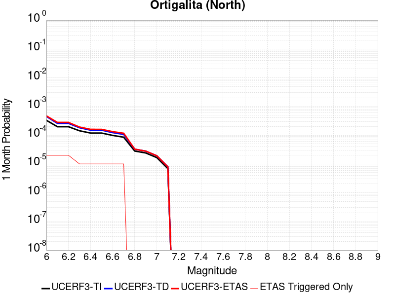 | 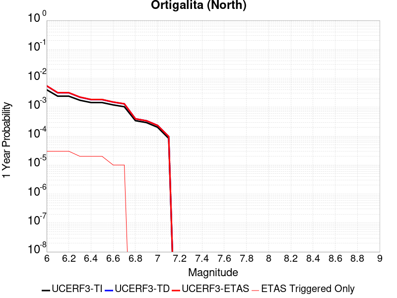 |  |

| Magnitude | 1 wk TI Prob | 1 wk TD Prob | 1 wk ETAS Prob | 1 wk ETAS/TD Gain | 1 wk ETAS Triggered Only | 1 mo TI Prob | 1 mo TD Prob | 1 mo ETAS Prob | 1 mo ETAS/TD Gain | 1 mo ETAS Triggered Only | 1 yr TI Prob | 1 yr TD Prob | 1 yr ETAS Prob | 1 yr ETAS/TD Gain | 1 yr ETAS Triggered Only | 10 yr TI Prob | 10 yr TD Prob | 10 yr ETAS Prob | 10 yr ETAS/TD Gain | 10 yr ETAS Triggered Only |
|-----|-----|-----|-----|-----|-----|-----|-----|-----|-----|-----|-----|-----|-----|-----|-----|-----|-----|-----|-----|-----|
| 6.0 | 7.711876E-5 | 1.0505308E-4 | 1.3334145E-4 | 1.269277 | 2.8291344E-5 | 3.3046713E-4 | 4.501601E-4 | 4.784387E-4 | 1.062819 | 2.8291344E-5 | 0.004016016 | 0.0054680547 | 0.00551026 | 1.0077184 | 4.2437016E-5 | 0.039442103 | 0.053455614 | 0.05352256 | 1.0012524 | 7.072836E-5 |
| 6.1 | 4.607858E-5 | 6.0239887E-5 | 8.852953E-5 | 1.4696164 | 2.8291344E-5 | 1.9746469E-4 | 2.5814763E-4 | 2.864317E-4 | 1.1095654 | 2.8291344E-5 | 0.0024014818 | 0.0031387366 | 0.0031810405 | 1.0134779 | 4.2437016E-5 | 0.023756953 | 0.030975312 | 0.031043848 | 1.0022126 | 7.072836E-5 |
| 6.2 | 4.607858E-5 | 6.0239887E-5 | 8.852953E-5 | 1.4696164 | 2.8291344E-5 | 1.9746469E-4 | 2.5814763E-4 | 2.864317E-4 | 1.1095654 | 2.8291344E-5 | 0.0024014818 | 0.0031387366 | 0.0031810405 | 1.0134779 | 4.2437016E-5 | 0.023756953 | 0.030975312 | 0.031043848 | 1.0022126 | 7.072836E-5 |
| 6.3 | 3.327423E-5 | 4.2476124E-5 | 5.6621197E-5 | 1.3330123 | 1.4145672E-5 | 1.4259605E-4 | 1.8202956E-4 | 1.9617265E-4 | 1.0776967 | 1.4145672E-5 | 0.0017347244 | 0.002214206 | 0.0022424348 | 1.012749 | 2.8291344E-5 | 0.017212452 | 0.02194574 | 0.02200108 | 1.0025218 | 5.658269E-5 |
| 6.4 | 2.7732503E-5 | 3.4999008E-5 | 4.9144182E-5 | 1.4041594 | 1.4145672E-5 | 1.1884817E-4 | 1.499886E-4 | 1.6413214E-4 | 1.0942975 | 1.4145672E-5 | 0.001446016 | 0.0018248158 | 0.0018530554 | 1.0154754 | 2.8291344E-5 | 0.014366428 | 0.018121297 | 0.018176854 | 1.0030658 | 5.658269E-5 |
| 6.5 | 2.7689714E-5 | 3.4948822E-5 | 4.9093996E-5 | 1.4047397 | 1.4145672E-5 | 1.186648E-4 | 1.4977354E-4 | 1.639171E-4 | 1.094433 | 1.4145672E-5 | 0.0014437864 | 0.0018222018 | 0.0018504416 | 1.0154976 | 2.8291344E-5 | 0.014344421 | 0.018095585 | 0.018151142 | 1.0030704 | 5.658269E-5 |
| 6.6 | 2.2976905E-5 | 2.871829E-5 | 4.2863558E-5 | 1.4925525 | 1.4145672E-5 | 9.846873E-5 | 1.23074E-4 | 1.3721794E-4 | 1.1149222 | 1.4145672E-5 | 0.0011981975 | 0.0014976348 | 0.0015117594 | 1.0094312 | 1.4145672E-5 | 0.011917574 | 0.014898733 | 0.014940538 | 1.002806 | 4.2437016E-5 |
| 6.7 | 1.9871539E-5 | 2.4904637E-5 | 3.9049955E-5 | 1.5679793 | 1.4145672E-5 | 8.516096E-5 | 1.067312E-4 | 1.2087535E-4 | 1.1325214 | 1.4145672E-5 | 0.0010363415 | 0.0012989199 | 0.0013130473 | 1.0108762 | 1.4145672E-5 | 0.010315218 | 0.012936938 | 0.012978826 | 1.0032378 | 4.2437016E-5 |
| 6.8 | 6.5640475E-6 | 7.6054926E-6 | 7.6054926E-6 | 1.0 | 0.0 | 2.813133E-5 | 3.2594577E-5 | 3.2594577E-5 | 1.0 | 0.0 | 3.424451E-4 | 3.9676955E-4 | 3.9676955E-4 | 1.0 | 0.0 | 0.0034191788 | 0.003960899 | 0.0039749886 | 1.0035572 | 1.4145672E-5 |
| 6.9 | 5.6219683E-6 | 6.5018376E-6 | 6.5018376E-6 | 1.0 | 0.0 | 2.4093928E-5 | 2.7864735E-5 | 2.7864735E-5 | 1.0 | 0.0 | 2.933041E-4 | 3.3920293E-4 | 3.3920293E-4 | 1.0 | 0.0 | 0.0029291727 | 0.003387109 | 0.0034012066 | 1.0041622 | 1.4145672E-5 |
| 7.0 | 3.875591E-6 | 4.4847548E-6 | 4.4847548E-6 | 1.0 | 0.0 | 1.6609569E-5 | 1.9220248E-5 | 1.9220248E-5 | 1.0 | 0.0 | 2.0220275E-4 | 2.339835E-4 | 2.339835E-4 | 1.0 | 0.0 | 0.0020201886 | 0.0023375798 | 0.0023375798 | 1.0 | 0.0 |
| 7.1 | 1.6017933E-6 | 1.8570418E-6 | 1.8570418E-6 | 1.0 | 0.0 | 6.8648105E-6 | 7.958732E-6 | 7.958732E-6 | 1.0 | 0.0 | 8.357586E-5 | 9.689432E-5 | 9.689432E-5 | 1.0 | 0.0 | 8.3544437E-4 | 9.686254E-4 | 9.686254E-4 | 1.0 | 0.0 |

## Oceanic - West Huasna
*[(top)](#table-of-contents)*

| 1 Week | 1 Month | 1 Year | 10 Year |
|-----|-----|-----|-----|
|  |  |  |  |

| Magnitude | 1 wk TI Prob | 1 wk TD Prob | 1 wk ETAS Prob | 1 wk ETAS/TD Gain | 1 wk ETAS Triggered Only | 1 mo TI Prob | 1 mo TD Prob | 1 mo ETAS Prob | 1 mo ETAS/TD Gain | 1 mo ETAS Triggered Only | 1 yr TI Prob | 1 yr TD Prob | 1 yr ETAS Prob | 1 yr ETAS/TD Gain | 1 yr ETAS Triggered Only | 10 yr TI Prob | 10 yr TD Prob | 10 yr ETAS Prob | 10 yr ETAS/TD Gain | 10 yr ETAS Triggered Only |
|-----|-----|-----|-----|-----|-----|-----|-----|-----|-----|-----|-----|-----|-----|-----|-----|-----|-----|-----|-----|-----|
| 6.0 | 3.195567E-5 | 2.7926368E-5 | 2.7926368E-5 | 1.0 | 0.0 | 1.3694567E-4 | 1.19679185E-4 | 1.4796715E-4 | 1.2363648 | 2.8291344E-5 | 0.0016660384 | 0.0014561634 | 0.0014985385 | 1.0291005 | 4.2437016E-5 | 0.016536033 | 0.01447077 | 0.014554416 | 1.0057803 | 8.487403E-5 |
| 6.1 | 2.1156782E-5 | 1.7573117E-5 | 1.7573117E-5 | 1.0 | 0.0 | 9.066878E-5 | 7.531123E-5 | 8.945584E-5 | 1.1878153 | 1.4145672E-5 | 0.0011033333 | 9.1653795E-4 | 9.3067065E-4 | 1.0154197 | 1.4145672E-5 | 0.010978713 | 0.009128587 | 0.009170637 | 1.0046064 | 4.2437016E-5 |
| 6.2 | 1.6195117E-5 | 1.3327227E-5 | 1.3327227E-5 | 1.0 | 0.0 | 6.9405796E-5 | 5.7115452E-5 | 7.1260314E-5 | 1.2476538 | 1.4145672E-5 | 8.44688E-4 | 6.9516135E-4 | 7.092972E-4 | 1.0203346 | 1.4145672E-5 | 0.008414844 | 0.0069301617 | 0.0069582574 | 1.0040541 | 2.8291344E-5 |
| 6.3 | 1.3559345E-5 | 1.1179013E-5 | 1.1179013E-5 | 1.0 | 0.0 | 5.811018E-5 | 4.7909183E-5 | 4.7909183E-5 | 1.0 | 0.0 | 7.072618E-4 | 5.8313913E-4 | 5.8313913E-4 | 1.0 | 0.0 | 0.0070501505 | 0.005816208 | 0.005830271 | 1.0024179 | 1.4145672E-5 |
| 6.4 | 1.2120619E-5 | 1.0000874E-5 | 1.0000874E-5 | 1.0 | 0.0 | 5.1944477E-5 | 4.2860185E-5 | 4.2860185E-5 | 1.0 | 0.0 | 6.322405E-4 | 5.216983E-4 | 5.216983E-4 | 1.0 | 0.0 | 0.006304447 | 0.005204804 | 0.0052188756 | 1.0027037 | 1.4145672E-5 |
| 6.5 | 1.13511915E-5 | 9.367378E-6 | 9.367378E-6 | 1.0 | 0.0 | 4.8647056E-5 | 4.0145293E-5 | 4.0145293E-5 | 1.0 | 0.0 | 5.9211696E-4 | 4.886598E-4 | 4.886598E-4 | 1.0 | 0.0 | 0.0059054173 | 0.0048759114 | 0.0048899883 | 1.002887 | 1.4145672E-5 |
| 6.6 | 9.850605E-6 | 8.1353155E-6 | 8.1353155E-6 | 1.0 | 0.0 | 4.2216197E-5 | 3.4865174E-5 | 3.4865174E-5 | 1.0 | 0.0 | 5.1386096E-4 | 4.2440102E-4 | 4.2440102E-4 | 1.0 | 0.0 | 0.0051267436 | 0.0042359377 | 0.0042500235 | 1.0033253 | 1.4145672E-5 |
| 6.7 | 8.8558645E-6 | 7.318341E-6 | 7.318341E-6 | 1.0 | 0.0 | 3.7953152E-5 | 3.1363943E-5 | 3.1363943E-5 | 1.0 | 0.0 | 4.6198163E-4 | 3.8178926E-4 | 3.8178926E-4 | 1.0 | 0.0 | 0.004610224 | 0.0038113592 | 0.0038254508 | 1.0036973 | 1.4145672E-5 |
| 6.8 | 7.67136E-6 | 6.39169E-6 | 6.39169E-6 | 1.0 | 0.0 | 3.2876844E-5 | 2.739267E-5 | 2.739267E-5 | 1.0 | 0.0 | 4.0020206E-4 | 3.3345487E-4 | 3.3345487E-4 | 1.0 | 0.0 | 0.003994821 | 0.0033295664 | 0.0033436648 | 1.0042343 | 1.4145672E-5 |
| 6.9 | 6.534529E-6 | 5.458261E-6 | 5.458261E-6 | 1.0 | 0.0 | 2.8004823E-5 | 2.3392338E-5 | 2.3392338E-5 | 1.0 | 0.0 | 3.4090536E-4 | 2.8476462E-4 | 2.8476462E-4 | 1.0 | 0.0 | 0.0034038287 | 0.002844014 | 0.0028581196 | 1.0049597 | 1.4145672E-5 |
| 7.0 | 5.460525E-6 | 4.5699203E-6 | 4.5699203E-6 | 1.0 | 0.0 | 2.3402039E-5 | 1.9585226E-5 | 1.9585226E-5 | 1.0 | 0.0 | 2.8488258E-4 | 2.3842414E-4 | 2.3842414E-4 | 1.0 | 0.0 | 0.0028451765 | 0.0023816973 | 0.0023958094 | 1.0059252 | 1.4145672E-5 |
| 7.1 | 4.4825083E-6 | 3.7524153E-6 | 3.7524153E-6 | 1.0 | 0.0 | 1.9210609E-5 | 1.6081682E-5 | 1.6081682E-5 | 1.0 | 0.0 | 2.3386406E-4 | 1.9577699E-4 | 1.9577699E-4 | 1.0 | 0.0 | 0.002336181 | 0.001956057 | 0.0019701752 | 1.0072175 | 1.4145672E-5 |
| 7.2 | 2.821708E-6 | 2.424941E-6 | 2.424941E-6 | 1.0 | 0.0 | 1.2092979E-5 | 1.0392562E-5 | 1.0392562E-5 | 1.0 | 0.0 | 1.4722206E-4 | 1.265221E-4 | 1.265221E-4 | 1.0 | 0.0 | 0.0014712457 | 0.0012645032 | 0.001278631 | 1.0111727 | 1.4145672E-5 |
| 7.3 | 2.0644757E-6 | 1.7687502E-6 | 1.7687502E-6 | 1.0 | 0.0 | 8.847723E-6 | 7.580336E-6 | 7.580336E-6 | 1.0 | 0.0 | 1.0771569E-4 | 9.228668E-5 | 9.228668E-5 | 1.0 | 0.0 | 0.001076635 | 9.224854E-4 | 9.224854E-4 | 1.0 | 0.0 |
| 7.4 | 1.6980367E-6 | 1.4379966E-6 | 1.4379966E-6 | 1.0 | 0.0 | 7.27728E-6 | 6.1628284E-6 | 6.1628284E-6 | 1.0 | 0.0 | 8.8597284E-5 | 7.502986E-5 | 7.502986E-5 | 1.0 | 0.0 | 8.8561967E-4 | 7.5004686E-4 | 7.5004686E-4 | 1.0 | 0.0 |
| 7.5 | 1.3637683E-6 | 1.1302697E-6 | 1.1302697E-6 | 1.0 | 0.0 | 5.844708E-6 | 4.844004E-6 | 4.844004E-6 | 1.0 | 0.0 | 7.1156996E-5 | 5.897415E-5 | 5.897415E-5 | 1.0 | 0.0 | 7.1134215E-4 | 5.8958656E-4 | 5.8958656E-4 | 1.0 | 0.0 |
| 7.6 | 9.802994E-7 | 7.6772847E-7 | 7.6772847E-7 | 1.0 | 0.0 | 4.2012766E-6 | 3.2902608E-6 | 3.2902608E-6 | 1.0 | 0.0 | 5.1149345E-5 | 4.005819E-5 | 4.005819E-5 | 1.0 | 0.0 | 5.113757E-4 | 4.0051117E-4 | 4.0051117E-4 | 1.0 | 0.0 |
| 7.7 | 5.986191E-7 | 4.0050708E-7 | 4.0050708E-7 | 1.0 | 0.0 | 2.5655079E-6 | 1.7164577E-6 | 1.7164577E-6 | 1.0 | 0.0 | 3.1234613E-5 | 2.0897673E-5 | 2.0897673E-5 | 1.0 | 0.0 | 3.123022E-4 | 2.0895849E-4 | 2.0895849E-4 | 1.0 | 0.0 |
| 7.8 | 2.9189815E-7 | 1.5285202E-7 | 1.5285202E-7 | 1.0 | 0.0 | 1.2509914E-6 | 6.5507993E-7 | 6.5507993E-7 | 1.0 | 0.0 | 1.5230714E-5 | 7.975569E-6 | 7.975569E-6 | 1.0 | 0.0 | 1.522967E-4 | 7.97542E-5 | 7.97542E-5 | 1.0 | 0.0 |
| 7.9 | 1.2057845E-7 | 4.6208047E-8 | 4.6208047E-8 | 1.0 | 0.0 | 5.1676466E-7 | 1.9803447E-7 | 1.9803447E-7 | 1.0 | 0.0 | 6.2915915E-6 | 2.411067E-6 | 2.411067E-6 | 1.0 | 0.0 | 6.2914136E-5 | 2.4111772E-5 | 2.4111772E-5 | 1.0 | 0.0 |
| 8.0 | 3.3806387E-9 | 9.0093144E-10 | 9.0093144E-10 | 1.0 | 0.0 | 1.4488451E-8 | 3.8611354E-9 | 3.8611354E-9 | 1.0 | 0.0 | 1.7639688E-7 | 4.7009323E-8 | 4.7009323E-8 | 1.0 | 0.0 | 1.7639674E-6 | 4.712806E-7 | 4.712806E-7 | 1.0 | 0.0 |

## Whittier alt 1
*[(top)](#table-of-contents)*

| 1 Week | 1 Month | 1 Year | 10 Year |
|-----|-----|-----|-----|
|  |  |  |  |

| Magnitude | 1 wk TI Prob | 1 wk TD Prob | 1 wk ETAS Prob | 1 wk ETAS/TD Gain | 1 wk ETAS Triggered Only | 1 mo TI Prob | 1 mo TD Prob | 1 mo ETAS Prob | 1 mo ETAS/TD Gain | 1 mo ETAS Triggered Only | 1 yr TI Prob | 1 yr TD Prob | 1 yr ETAS Prob | 1 yr ETAS/TD Gain | 1 yr ETAS Triggered Only | 10 yr TI Prob | 10 yr TD Prob | 10 yr ETAS Prob | 10 yr ETAS/TD Gain | 10 yr ETAS Triggered Only |
|-----|-----|-----|-----|-----|-----|-----|-----|-----|-----|-----|-----|-----|-----|-----|-----|-----|-----|-----|-----|-----|
| 6.0 | 4.2554693E-5 | 4.7252182E-5 | 4.7252182E-5 | 1.0 | 0.0 | 1.8236451E-4 | 2.0249544E-4 | 2.0249544E-4 | 1.0 | 0.0 | 0.002218027 | 0.0024629163 | 0.0024911382 | 1.0114586 | 2.8291344E-5 | 0.02196019 | 0.024390263 | 0.024473067 | 1.003395 | 8.487403E-5 |
| 6.1 | 4.2554693E-5 | 4.7252182E-5 | 4.7252182E-5 | 1.0 | 0.0 | 1.8236451E-4 | 2.0249544E-4 | 2.0249544E-4 | 1.0 | 0.0 | 0.002218027 | 0.0024629163 | 0.0024911382 | 1.0114586 | 2.8291344E-5 | 0.02196019 | 0.024390263 | 0.024473067 | 1.003395 | 8.487403E-5 |
| 6.2 | 4.2554693E-5 | 4.7252182E-5 | 4.7252182E-5 | 1.0 | 0.0 | 1.8236451E-4 | 2.0249544E-4 | 2.0249544E-4 | 1.0 | 0.0 | 0.002218027 | 0.0024629163 | 0.0024911382 | 1.0114586 | 2.8291344E-5 | 0.02196019 | 0.024390263 | 0.024473067 | 1.003395 | 8.487403E-5 |
| 6.3 | 1.9617712E-5 | 1.826841E-5 | 1.826841E-5 | 1.0 | 0.0 | 8.40732E-5 | 7.829095E-5 | 7.829095E-5 | 1.0 | 0.0 | 0.0010231105 | 9.527944E-4 | 9.527944E-4 | 1.0 | 0.0 | 0.01018413 | 0.0094904 | 0.009518422 | 1.0029528 | 2.8291344E-5 |
| 6.4 | 1.5611336E-5 | 1.3604089E-5 | 1.3604089E-5 | 1.0 | 0.0 | 6.690401E-5 | 5.8301972E-5 | 5.8301972E-5 | 1.0 | 0.0 | 8.142519E-4 | 7.096013E-4 | 7.096013E-4 | 1.0 | 0.0 | 0.008112748 | 0.0070753377 | 0.0071034287 | 1.0039703 | 2.8291344E-5 |
| 6.5 | 1.5150166E-5 | 1.3100744E-5 | 1.3100744E-5 | 1.0 | 0.0 | 6.492767E-5 | 5.614487E-5 | 5.614487E-5 | 1.0 | 0.0 | 7.9020765E-4 | 6.8335526E-4 | 6.8335526E-4 | 1.0 | 0.0 | 0.007874036 | 0.006814508 | 0.0068426062 | 1.0041233 | 2.8291344E-5 |
| 6.6 | 1.295588E-5 | 1.0380544E-5 | 1.0380544E-5 | 1.0 | 0.0 | 5.552402E-5 | 4.44873E-5 | 4.44873E-5 | 1.0 | 0.0 | 6.7579525E-4 | 5.415002E-4 | 5.415002E-4 | 1.0 | 0.0 | 0.006737438 | 0.005403343 | 0.005403343 | 1.0 | 0.0 |
| 6.7 | 1.2542085E-5 | 9.899189E-6 | 9.899189E-6 | 1.0 | 0.0 | 5.3750682E-5 | 4.2424414E-5 | 4.2424414E-5 | 1.0 | 0.0 | 6.542181E-4 | 5.163967E-4 | 5.163967E-4 | 1.0 | 0.0 | 0.006522954 | 0.005153464 | 0.005153464 | 1.0 | 0.0 |
| 6.8 | 1.2195878E-5 | 9.49523E-6 | 9.49523E-6 | 1.0 | 0.0 | 5.2267E-5 | 4.069322E-5 | 4.069322E-5 | 1.0 | 0.0 | 6.36165E-4 | 4.9532915E-4 | 4.9532915E-4 | 1.0 | 0.0 | 0.0063434686 | 0.0049436963 | 0.0049436963 | 1.0 | 0.0 |
| 6.9 | 1.1580298E-5 | 8.772739E-6 | 8.772739E-6 | 1.0 | 0.0 | 4.9628903E-5 | 3.759692E-5 | 3.759692E-5 | 1.0 | 0.0 | 6.040644E-4 | 4.5764804E-4 | 4.5764804E-4 | 1.0 | 0.0 | 0.00602425 | 0.0045684646 | 0.0045684646 | 1.0 | 0.0 |
| 7.0 | 1.0964795E-5 | 8.083794E-6 | 8.083794E-6 | 1.0 | 0.0 | 4.6991136E-5 | 3.4644378E-5 | 3.4644378E-5 | 1.0 | 0.0 | 5.7196687E-4 | 4.217152E-4 | 4.217152E-4 | 1.0 | 0.0 | 0.0057049696 | 0.004210459 | 0.004210459 | 1.0 | 0.0 |
| 7.1 | 1.0230601E-5 | 7.32646E-6 | 7.32646E-6 | 1.0 | 0.0 | 4.3844695E-5 | 3.1398744E-5 | 3.1398744E-5 | 1.0 | 0.0 | 5.336784E-4 | 3.8221394E-4 | 3.8221394E-4 | 1.0 | 0.0 | 0.005323986 | 0.0038167592 | 0.0038167592 | 1.0 | 0.0 |
| 7.2 | 9.40865E-6 | 6.5430822E-6 | 6.5430822E-6 | 1.0 | 0.0 | 4.032216E-5 | 2.8041486E-5 | 2.8041486E-5 | 1.0 | 0.0 | 4.908117E-4 | 3.4135283E-4 | 3.4135283E-4 | 1.0 | 0.0 | 0.0048972913 | 0.0034094024 | 0.0034094024 | 1.0 | 0.0 |
| 7.3 | 8.237384E-6 | 5.5975433E-6 | 5.5975433E-6 | 1.0 | 0.0 | 3.5302593E-5 | 2.3989258E-5 | 2.3989258E-5 | 1.0 | 0.0 | 4.2972428E-4 | 2.920311E-4 | 2.920311E-4 | 1.0 | 0.0 | 0.0042889426 | 0.0029167992 | 0.0029167992 | 1.0 | 0.0 |
| 7.4 | 7.5316966E-6 | 5.0276153E-6 | 5.0276153E-6 | 1.0 | 0.0 | 3.2278298E-5 | 2.154675E-5 | 2.154675E-5 | 1.0 | 0.0 | 3.9291743E-4 | 2.623011E-4 | 2.623011E-4 | 1.0 | 0.0 | 0.0039222343 | 0.0026200267 | 0.0026200267 | 1.0 | 0.0 |
| 7.5 | 6.149649E-6 | 3.9336355E-6 | 3.9336355E-6 | 1.0 | 0.0 | 2.6355372E-5 | 1.6858336E-5 | 1.6858336E-5 | 1.0 | 0.0 | 3.208294E-4 | 2.052318E-4 | 2.052318E-4 | 1.0 | 0.0 | 0.003203666 | 0.0020505118 | 0.0020505118 | 1.0 | 0.0 |
| 7.6 | 5.457711E-6 | 3.3951796E-6 | 3.3951796E-6 | 1.0 | 0.0 | 2.338998E-5 | 1.4550694E-5 | 1.4550694E-5 | 1.0 | 0.0 | 2.8473578E-4 | 1.771411E-4 | 1.771411E-4 | 1.0 | 0.0 | 0.0028437122 | 0.0017700798 | 0.0017700798 | 1.0 | 0.0 |
| 7.7 | 4.1676276E-6 | 2.3329922E-6 | 2.3329922E-6 | 1.0 | 0.0 | 1.7861139E-5 | 9.998504E-6 | 9.998504E-6 | 1.0 | 0.0 | 2.1743766E-4 | 1.2172572E-4 | 1.2172572E-4 | 1.0 | 0.0 | 0.0021722503 | 0.0012166635 | 0.0012166635 | 1.0 | 0.0 |
| 7.8 | 2.2692414E-7 | 9.384417E-8 | 9.384417E-8 | 1.0 | 0.0 | 9.725317E-7 | 4.0218927E-7 | 4.0218927E-7 | 1.0 | 0.0 | 1.1840509E-5 | 4.8966467E-6 | 4.8966467E-6 | 1.0 | 0.0 | 1.1839878E-4 | 4.8965718E-5 | 4.8965718E-5 | 1.0 | 0.0 |
| 7.9 | 6.676829E-9 | 3.4397174E-9 | 3.4397174E-9 | 1.0 | 0.0 | 2.861498E-8 | 1.4741646E-8 | 1.4741646E-8 | 1.0 | 0.0 | 3.4838732E-7 | 1.7947953E-7 | 1.7947953E-7 | 1.0 | 0.0 | 3.4838679E-6 | 1.794794E-6 | 1.794794E-6 | 1.0 | 0.0 |

## Cucamonga
*[(top)](#table-of-contents)*

| 1 Week | 1 Month | 1 Year | 10 Year |
|-----|-----|-----|-----|
|  |  | 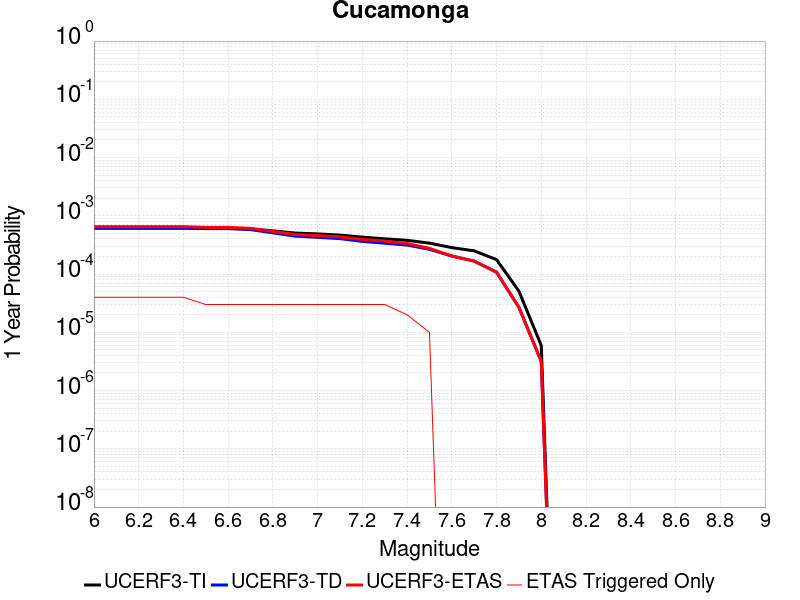 |  |

| Magnitude | 1 wk TI Prob | 1 wk TD Prob | 1 wk ETAS Prob | 1 wk ETAS/TD Gain | 1 wk ETAS Triggered Only | 1 mo TI Prob | 1 mo TD Prob | 1 mo ETAS Prob | 1 mo ETAS/TD Gain | 1 mo ETAS Triggered Only | 1 yr TI Prob | 1 yr TD Prob | 1 yr ETAS Prob | 1 yr ETAS/TD Gain | 1 yr ETAS Triggered Only | 10 yr TI Prob | 10 yr TD Prob | 10 yr ETAS Prob | 10 yr ETAS/TD Gain | 10 yr ETAS Triggered Only |
|-----|-----|-----|-----|-----|-----|-----|-----|-----|-----|-----|-----|-----|-----|-----|-----|-----|-----|-----|-----|-----|
| 6.0 | 1.1848348E-5 | 1.1737109E-5 | 2.5882615E-5 | 2.205195 | 1.4145672E-5 | 5.0777642E-5 | 5.0300943E-5 | 6.44459E-5 | 1.2812067 | 1.4145672E-5 | 6.180424E-4 | 6.122446E-4 | 6.546556E-4 | 1.0692714 | 4.2437016E-5 | 0.0061632637 | 0.006106745 | 0.006177041 | 1.0115113 | 7.072836E-5 |
| 6.1 | 1.1848348E-5 | 1.1737109E-5 | 2.5882615E-5 | 2.205195 | 1.4145672E-5 | 5.0777642E-5 | 5.0300943E-5 | 6.44459E-5 | 1.2812067 | 1.4145672E-5 | 6.180424E-4 | 6.122446E-4 | 6.546556E-4 | 1.0692714 | 4.2437016E-5 | 0.0061632637 | 0.006106745 | 0.006177041 | 1.0115113 | 7.072836E-5 |
| 6.2 | 1.1848348E-5 | 1.1737109E-5 | 2.5882615E-5 | 2.205195 | 1.4145672E-5 | 5.0777642E-5 | 5.0300943E-5 | 6.44459E-5 | 1.2812067 | 1.4145672E-5 | 6.180424E-4 | 6.122446E-4 | 6.546556E-4 | 1.0692714 | 4.2437016E-5 | 0.0061632637 | 0.006106745 | 0.006177041 | 1.0115113 | 7.072836E-5 |
| 6.3 | 1.1848348E-5 | 1.1737109E-5 | 2.5882615E-5 | 2.205195 | 1.4145672E-5 | 5.0777642E-5 | 5.0300943E-5 | 6.44459E-5 | 1.2812067 | 1.4145672E-5 | 6.180424E-4 | 6.122446E-4 | 6.546556E-4 | 1.0692714 | 4.2437016E-5 | 0.0061632637 | 0.006106745 | 0.006177041 | 1.0115113 | 7.072836E-5 |
| 6.4 | 1.1848348E-5 | 1.1737109E-5 | 2.5882615E-5 | 2.205195 | 1.4145672E-5 | 5.0777642E-5 | 5.0300943E-5 | 6.44459E-5 | 1.2812067 | 1.4145672E-5 | 6.180424E-4 | 6.122446E-4 | 6.546556E-4 | 1.0692714 | 4.2437016E-5 | 0.0061632637 | 0.006106745 | 0.006177041 | 1.0115113 | 7.072836E-5 |
| 6.5 | 1.16988695E-5 | 1.157614E-5 | 2.5721649E-5 | 2.2219539 | 1.4145672E-5 | 5.013705E-5 | 4.9611102E-5 | 6.375607E-5 | 1.285117 | 1.4145672E-5 | 6.102476E-4 | 6.0385047E-4 | 6.4626185E-4 | 1.0702349 | 4.2437016E-5 | 0.006085745 | 0.0060232594 | 0.0060935616 | 1.0116718 | 7.072836E-5 |
| 6.6 | 1.16988695E-5 | 1.157614E-5 | 2.5721649E-5 | 2.2219539 | 1.4145672E-5 | 5.013705E-5 | 4.9611102E-5 | 6.375607E-5 | 1.285117 | 1.4145672E-5 | 6.102476E-4 | 6.0385047E-4 | 6.4626185E-4 | 1.0702349 | 4.2437016E-5 | 0.006085745 | 0.0060232594 | 0.0060935616 | 1.0116718 | 7.072836E-5 |
| 6.7 | 1.1397107E-5 | 1.1115039E-5 | 2.5260553E-5 | 2.2726464 | 1.4145672E-5 | 4.884383E-5 | 4.7635025E-5 | 6.1780025E-5 | 1.2969453 | 1.4145672E-5 | 5.9451134E-4 | 5.798046E-4 | 6.22217E-4 | 1.0731494 | 4.2437016E-5 | 0.005929234 | 0.005784061 | 0.0058543803 | 1.0121574 | 7.072836E-5 |
| 6.8 | 1.058387E-5 | 9.785037E-6 | 2.3930572E-5 | 2.4456291 | 1.4145672E-5 | 4.5358654E-5 | 4.1935207E-5 | 5.6080284E-5 | 1.3373079 | 1.4145672E-5 | 5.521017E-4 | 5.1044265E-4 | 5.52858E-4 | 1.0830952 | 4.2437016E-5 | 0.00550732 | 0.005093702 | 0.00516407 | 1.0138147 | 7.072836E-5 |
| 6.9 | 9.690046E-6 | 8.579504E-6 | 2.2725055E-5 | 2.648761 | 1.4145672E-5 | 4.1528107E-5 | 3.6768783E-5 | 5.0913935E-5 | 1.3847054 | 1.4145672E-5 | 5.054874E-4 | 4.475684E-4 | 4.8998644E-4 | 1.0947744 | 4.2437016E-5 | 0.005043391 | 0.0044675954 | 0.0045380075 | 1.0157607 | 7.072836E-5 |
| 7.0 | 9.381461E-6 | 8.18712E-6 | 2.2332677E-5 | 2.7277818 | 1.4145672E-5 | 4.020564E-5 | 3.508719E-5 | 4.9232363E-5 | 1.4031436 | 1.4145672E-5 | 4.893937E-4 | 4.2710314E-4 | 4.6952203E-4 | 1.0993177 | 4.2437016E-5 | 0.0048831734 | 0.004263747 | 0.004334174 | 1.0165176 | 7.072836E-5 |
| 7.1 | 8.946492E-6 | 7.781904E-6 | 2.1927466E-5 | 2.8177507 | 1.4145672E-5 | 3.8341543E-5 | 3.3350592E-5 | 4.7495792E-5 | 1.4241364 | 1.4145672E-5 | 4.667083E-4 | 4.0596814E-4 | 4.4838793E-4 | 1.1044904 | 4.2437016E-5 | 0.0046572937 | 0.0040531927 | 0.004123634 | 1.0173793 | 7.072836E-5 |
| 7.2 | 8.251016E-6 | 6.9752878E-6 | 2.112086E-5 | 3.0279555 | 1.4145672E-5 | 3.5361016E-5 | 2.9893748E-5 | 4.4039E-5 | 1.4731842 | 1.4145672E-5 | 4.3043532E-4 | 3.6389584E-4 | 4.063174E-4 | 1.1165762 | 4.2437016E-5 | 0.0042960253 | 0.0036339252 | 0.0037043965 | 1.0193926 | 7.072836E-5 |
| 7.3 | 7.717881E-6 | 6.4863584E-6 | 2.0631938E-5 | 3.18082 | 1.4145672E-5 | 3.3076216E-5 | 2.7798384E-5 | 4.1943662E-5 | 1.5088526 | 1.4145672E-5 | 4.026285E-4 | 3.38393E-4 | 3.8081565E-4 | 1.125365 | 4.2437016E-5 | 0.004018998 | 0.0033797103 | 0.0034501995 | 1.0208566 | 7.072836E-5 |
| 7.4 | 7.275623E-6 | 6.032004E-6 | 2.0177591E-5 | 3.345089 | 1.4145672E-5 | 3.118087E-5 | 2.5851192E-5 | 3.99965E-5 | 1.547182 | 1.4145672E-5 | 3.7956095E-4 | 3.1469302E-4 | 3.4297546E-4 | 1.0898731 | 2.8291344E-5 | 0.0037891332 | 0.0031434046 | 0.0031716072 | 1.0089719 | 2.8291344E-5 |
| 7.5 | 6.5109502E-6 | 5.100593E-6 | 5.100593E-6 | 1.0 | 0.0 | 2.7903774E-5 | 2.1859503E-5 | 2.1859503E-5 | 1.0 | 0.0 | 3.3967546E-4 | 2.661071E-4 | 2.80249E-4 | 1.0531436 | 1.4145672E-5 | 0.0033915674 | 0.0026588016 | 0.0026729098 | 1.0053061 | 1.4145672E-5 |
| 7.6 | 5.4495326E-6 | 3.908547E-6 | 3.908547E-6 | 1.0 | 0.0 | 2.335493E-5 | 1.6750808E-5 | 1.6750808E-5 | 1.0 | 0.0 | 2.8430918E-4 | 2.0392207E-4 | 2.0392207E-4 | 1.0 | 0.0 | 0.0028394572 | 0.0020382616 | 0.0020382616 | 1.0 | 0.0 |
| 7.7 | 4.7997164E-6 | 3.2002263E-6 | 3.2002263E-6 | 1.0 | 0.0 | 2.057005E-5 | 1.3715184E-5 | 1.3715184E-5 | 1.0 | 0.0 | 2.504116E-4 | 1.6696959E-4 | 1.6696959E-4 | 1.0 | 0.0 | 0.002501296 | 0.0016693701 | 0.0016693701 | 1.0 | 0.0 |
| 7.8 | 3.3941733E-6 | 2.0641678E-6 | 2.0641678E-6 | 1.0 | 0.0 | 1.4546376E-5 | 8.846404E-6 | 8.846404E-6 | 1.0 | 0.0 | 1.7708774E-4 | 1.07699656E-4 | 1.07699656E-4 | 1.0 | 0.0 | 0.0017694668 | 0.0010766032 | 0.0010766032 | 1.0 | 0.0 |
| 7.9 | 9.750552E-7 | 5.155798E-7 | 5.155798E-7 | 1.0 | 0.0 | 4.178801E-6 | 2.2096258E-6 | 2.2096258E-6 | 1.0 | 0.0 | 5.0875715E-5 | 2.6901867E-5 | 2.6901867E-5 | 1.0 | 0.0 | 5.086407E-4 | 2.689865E-4 | 2.689865E-4 | 1.0 | 0.0 |
| 8.0 | 1.133857E-7 | 6.053372E-8 | 6.053372E-8 | 1.0 | 0.0 | 4.8593864E-7 | 2.594302E-7 | 2.594302E-7 | 1.0 | 0.0 | 5.9162867E-6 | 3.1585582E-6 | 3.1585582E-6 | 1.0 | 0.0 | 5.916129E-5 | 3.158515E-5 | 3.158515E-5 | 1.0 | 0.0 |

## Ventura-Pitas Point
*[(top)](#table-of-contents)*

| 1 Week | 1 Month | 1 Year | 10 Year |
|-----|-----|-----|-----|
|  |  |  |  |

| Magnitude | 1 wk TI Prob | 1 wk TD Prob | 1 wk ETAS Prob | 1 wk ETAS/TD Gain | 1 wk ETAS Triggered Only | 1 mo TI Prob | 1 mo TD Prob | 1 mo ETAS Prob | 1 mo ETAS/TD Gain | 1 mo ETAS Triggered Only | 1 yr TI Prob | 1 yr TD Prob | 1 yr ETAS Prob | 1 yr ETAS/TD Gain | 1 yr ETAS Triggered Only | 10 yr TI Prob | 10 yr TD Prob | 10 yr ETAS Prob | 10 yr ETAS/TD Gain | 10 yr ETAS Triggered Only |
|-----|-----|-----|-----|-----|-----|-----|-----|-----|-----|-----|-----|-----|-----|-----|-----|-----|-----|-----|-----|-----|
| 6.0 | 3.3179622E-5 | 3.373519E-5 | 4.788038E-5 | 1.4193009 | 1.4145672E-5 | 1.4219063E-4 | 1.4457281E-4 | 1.5871644E-4 | 1.0978305 | 1.4145672E-5 | 0.0017297962 | 0.0017590097 | 0.001801372 | 1.0240831 | 4.2437016E-5 | 0.017163932 | 0.017476497 | 0.017559888 | 1.0047716 | 8.487403E-5 |
| 6.1 | 3.3179622E-5 | 3.373519E-5 | 4.788038E-5 | 1.4193009 | 1.4145672E-5 | 1.4219063E-4 | 1.4457281E-4 | 1.5871644E-4 | 1.0978305 | 1.4145672E-5 | 0.0017297962 | 0.0017590097 | 0.001801372 | 1.0240831 | 4.2437016E-5 | 0.017163932 | 0.017476497 | 0.017559888 | 1.0047716 | 8.487403E-5 |
| 6.2 | 3.3179622E-5 | 3.373519E-5 | 4.788038E-5 | 1.4193009 | 1.4145672E-5 | 1.4219063E-4 | 1.4457281E-4 | 1.5871644E-4 | 1.0978305 | 1.4145672E-5 | 0.0017297962 | 0.0017590097 | 0.001801372 | 1.0240831 | 4.2437016E-5 | 0.017163932 | 0.017476497 | 0.017559888 | 1.0047716 | 8.487403E-5 |
| 6.3 | 3.3179622E-5 | 3.373519E-5 | 4.788038E-5 | 1.4193009 | 1.4145672E-5 | 1.4219063E-4 | 1.4457281E-4 | 1.5871644E-4 | 1.0978305 | 1.4145672E-5 | 0.0017297962 | 0.0017590097 | 0.001801372 | 1.0240831 | 4.2437016E-5 | 0.017163932 | 0.017476497 | 0.017559888 | 1.0047716 | 8.487403E-5 |
| 6.4 | 1.8754668E-5 | 1.7019594E-5 | 1.7019594E-5 | 1.0 | 0.0 | 8.037467E-5 | 7.2939205E-5 | 7.2939205E-5 | 1.0 | 0.0 | 9.781223E-4 | 8.8769617E-4 | 8.8769617E-4 | 1.0 | 0.0 | 0.009738282 | 0.008843943 | 0.008857963 | 1.0015854 | 1.4145672E-5 |
| 6.5 | 1.8754668E-5 | 1.7019594E-5 | 1.7019594E-5 | 1.0 | 0.0 | 8.037467E-5 | 7.2939205E-5 | 7.2939205E-5 | 1.0 | 0.0 | 9.781223E-4 | 8.8769617E-4 | 8.8769617E-4 | 1.0 | 0.0 | 0.009738282 | 0.008843943 | 0.008857963 | 1.0015854 | 1.4145672E-5 |
| 6.6 | 1.4361558E-5 | 1.2122258E-5 | 1.2122258E-5 | 1.0 | 0.0 | 6.154808E-5 | 5.1951512E-5 | 5.1951512E-5 | 1.0 | 0.0 | 7.490902E-4 | 6.323284E-4 | 6.323284E-4 | 1.0 | 0.0 | 0.0074657016 | 0.006305652 | 0.0063197087 | 1.0022292 | 1.4145672E-5 |
| 6.7 | 1.4361558E-5 | 1.2122258E-5 | 1.2122258E-5 | 1.0 | 0.0 | 6.154808E-5 | 5.1951512E-5 | 5.1951512E-5 | 1.0 | 0.0 | 7.490902E-4 | 6.323284E-4 | 6.323284E-4 | 1.0 | 0.0 | 0.0074657016 | 0.006305652 | 0.0063197087 | 1.0022292 | 1.4145672E-5 |
| 6.8 | 1.3663846E-5 | 1.1344401E-5 | 1.1344401E-5 | 1.0 | 0.0 | 5.8558027E-5 | 4.8617967E-5 | 4.8617967E-5 | 1.0 | 0.0 | 7.127108E-4 | 5.917649E-4 | 5.917649E-4 | 1.0 | 0.0 | 0.007104293 | 0.0059022107 | 0.005916273 | 1.0023825 | 1.4145672E-5 |
| 6.9 | 1.3644157E-5 | 1.1322501E-5 | 1.1322501E-5 | 1.0 | 0.0 | 5.8473648E-5 | 4.8524114E-5 | 4.8524114E-5 | 1.0 | 0.0 | 7.116841E-4 | 5.906229E-4 | 5.906229E-4 | 1.0 | 0.0 | 0.007094092 | 0.0058908514 | 0.005904914 | 1.0023872 | 1.4145672E-5 |
| 7.0 | 1.3568845E-5 | 1.12420685E-5 | 1.12420685E-5 | 1.0 | 0.0 | 5.8150898E-5 | 4.8179416E-5 | 4.8179416E-5 | 1.0 | 0.0 | 7.077572E-4 | 5.8642845E-4 | 5.8642845E-4 | 1.0 | 0.0 | 0.007055073 | 0.005849128 | 0.005863191 | 1.0024043 | 1.4145672E-5 |
| 7.1 | 1.306572E-5 | 1.0720521E-5 | 1.0720521E-5 | 1.0 | 0.0 | 5.599474E-5 | 4.594429E-5 | 4.594429E-5 | 1.0 | 0.0 | 6.815227E-4 | 5.5923004E-4 | 5.5923004E-4 | 1.0 | 0.0 | 0.0067943637 | 0.005578536 | 0.005578536 | 1.0 | 0.0 |
| 7.2 | 1.232604E-5 | 9.995121E-6 | 9.995121E-6 | 1.0 | 0.0 | 5.2824813E-5 | 4.283554E-5 | 4.283554E-5 | 1.0 | 0.0 | 6.429523E-4 | 5.2139966E-4 | 5.2139966E-4 | 1.0 | 0.0 | 0.0064109527 | 0.005202059 | 0.005202059 | 1.0 | 0.0 |
| 7.3 | 1.0917261E-5 | 8.843812E-6 | 8.843812E-6 | 1.0 | 0.0 | 4.678742E-5 | 3.7901507E-5 | 3.7901507E-5 | 1.0 | 0.0 | 5.69488E-4 | 4.6135474E-4 | 4.6135474E-4 | 1.0 | 0.0 | 0.0056803077 | 0.004604239 | 0.004604239 | 1.0 | 0.0 |
| 7.4 | 1.039959E-5 | 8.42354E-6 | 8.42354E-6 | 1.0 | 0.0 | 4.456891E-5 | 3.6100395E-5 | 3.6100395E-5 | 1.0 | 0.0 | 5.424914E-4 | 4.394352E-4 | 4.394352E-4 | 1.0 | 0.0 | 0.0054116896 | 0.0043859277 | 0.0043859277 | 1.0 | 0.0 |
| 7.5 | 9.015877E-6 | 7.29752E-6 | 7.29752E-6 | 1.0 | 0.0 | 3.86389E-5 | 3.1274718E-5 | 3.1274718E-5 | 1.0 | 0.0 | 4.7032707E-4 | 3.8070456E-4 | 3.8070456E-4 | 1.0 | 0.0 | 0.004693329 | 0.003800772 | 0.003800772 | 1.0 | 0.0 |
| 7.6 | 4.900162E-6 | 3.874119E-6 | 3.874119E-6 | 1.0 | 0.0 | 2.1000526E-5 | 1.6603262E-5 | 1.6603262E-5 | 1.0 | 0.0 | 2.556514E-4 | 2.0212609E-4 | 2.0212609E-4 | 1.0 | 0.0 | 0.0025535747 | 0.002019436 | 0.002019436 | 1.0 | 0.0 |
| 7.7 | 3.8850626E-6 | 3.12676E-6 | 3.12676E-6 | 1.0 | 0.0 | 1.6650163E-5 | 1.3400332E-5 | 1.3400332E-5 | 1.0 | 0.0 | 2.0269687E-4 | 1.6313691E-4 | 1.6313691E-4 | 1.0 | 0.0 | 0.002025121 | 0.0016301809 | 0.0016301809 | 1.0 | 0.0 |
| 7.8 | 2.4654719E-6 | 2.029902E-6 | 2.029902E-6 | 1.0 | 0.0 | 1.0566265E-5 | 8.699551E-6 | 8.699551E-6 | 1.0 | 0.0 | 1.2863669E-4 | 1.0591193E-4 | 1.0591193E-4 | 1.0 | 0.0 | 0.0012856225 | 0.0010586192 | 0.0010586192 | 1.0 | 0.0 |
| 7.9 | 4.095894E-7 | 3.2765078E-7 | 3.2765078E-7 | 1.0 | 0.0 | 1.7553821E-6 | 1.4042168E-6 | 1.4042168E-6 | 1.0 | 0.0 | 2.1371567E-5 | 1.709621E-5 | 1.709621E-5 | 1.0 | 0.0 | 2.1369511E-4 | 1.7094925E-4 | 1.7094925E-4 | 1.0 | 0.0 |
| 8.0 | 7.791402E-9 | 5.6836056E-9 | 5.6836056E-9 | 1.0 | 0.0 | 3.3391725E-8 | 2.4358311E-8 | 2.4358311E-8 | 1.0 | 0.0 | 4.0654416E-7 | 2.965624E-7 | 2.965624E-7 | 1.0 | 0.0 | 4.065434E-6 | 2.9656223E-6 | 2.9656223E-6 | 1.0 | 0.0 |

## Pisgah-Bullion Mtn-Mesquite Lk
*[(top)](#table-of-contents)*

| 1 Week | 1 Month | 1 Year | 10 Year |
|-----|-----|-----|-----|
|  |  |  |  |

| Magnitude | 1 wk TI Prob | 1 wk TD Prob | 1 wk ETAS Prob | 1 wk ETAS/TD Gain | 1 wk ETAS Triggered Only | 1 mo TI Prob | 1 mo TD Prob | 1 mo ETAS Prob | 1 mo ETAS/TD Gain | 1 mo ETAS Triggered Only | 1 yr TI Prob | 1 yr TD Prob | 1 yr ETAS Prob | 1 yr ETAS/TD Gain | 1 yr ETAS Triggered Only | 10 yr TI Prob | 10 yr TD Prob | 10 yr ETAS Prob | 10 yr ETAS/TD Gain | 10 yr ETAS Triggered Only |
|-----|-----|-----|-----|-----|-----|-----|-----|-----|-----|-----|-----|-----|-----|-----|-----|-----|-----|-----|-----|-----|
| 6.0 | 3.0240792E-5 | 2.40909E-5 | 2.40909E-5 | 1.0 | 0.0 | 1.2959696E-4 | 1.032432E-4 | 1.17387404E-4 | 1.136999 | 1.4145672E-5 | 0.0015767008 | 0.0012563618 | 0.0013128734 | 1.0449804 | 5.658269E-5 | 0.015655609 | 0.012502613 | 0.012586426 | 1.0067036 | 8.487403E-5 |
| 6.1 | 3.0240792E-5 | 2.40909E-5 | 2.40909E-5 | 1.0 | 0.0 | 1.2959696E-4 | 1.032432E-4 | 1.17387404E-4 | 1.136999 | 1.4145672E-5 | 0.0015767008 | 0.0012563618 | 0.0013128734 | 1.0449804 | 5.658269E-5 | 0.015655609 | 0.012502613 | 0.012586426 | 1.0067036 | 8.487403E-5 |
| 6.2 | 3.0240792E-5 | 2.40909E-5 | 2.40909E-5 | 1.0 | 0.0 | 1.2959696E-4 | 1.032432E-4 | 1.17387404E-4 | 1.136999 | 1.4145672E-5 | 0.0015767008 | 0.0012563618 | 0.0013128734 | 1.0449804 | 5.658269E-5 | 0.015655609 | 0.012502613 | 0.012586426 | 1.0067036 | 8.487403E-5 |
| 6.3 | 2.0498217E-5 | 1.3638054E-5 | 1.3638054E-5 | 1.0 | 0.0 | 8.784654E-5 | 5.8447586E-5 | 7.259243E-5 | 1.242009 | 1.4145672E-5 | 0.0010690069 | 7.1138324E-4 | 7.537901E-4 | 1.0596118 | 4.2437016E-5 | 0.01063879 | 0.0070926864 | 0.007148868 | 1.007921 | 5.658269E-5 |
| 6.4 | 2.0498217E-5 | 1.3638054E-5 | 1.3638054E-5 | 1.0 | 0.0 | 8.784654E-5 | 5.8447586E-5 | 7.259243E-5 | 1.242009 | 1.4145672E-5 | 0.0010690069 | 7.1138324E-4 | 7.537901E-4 | 1.0596118 | 4.2437016E-5 | 0.01063879 | 0.0070926864 | 0.007148868 | 1.007921 | 5.658269E-5 |
| 6.5 | 1.7316182E-5 | 1.04769715E-5 | 1.04769715E-5 | 1.0 | 0.0 | 7.42101E-5 | 4.490059E-5 | 5.904563E-5 | 1.3150301 | 1.4145672E-5 | 9.0313336E-4 | 5.465376E-4 | 5.7481346E-4 | 1.0517364 | 2.8291344E-5 | 0.008994718 | 0.00545293 | 0.0054951357 | 1.00774 | 4.2437016E-5 |
| 6.6 | 1.5251077E-5 | 8.414133E-6 | 8.414133E-6 | 1.0 | 0.0 | 6.536012E-5 | 3.606011E-5 | 5.0205275E-5 | 1.3922662 | 1.4145672E-5 | 7.9546886E-4 | 4.3895066E-4 | 4.6722958E-4 | 1.0644239 | 2.8291344E-5 | 0.007926274 | 0.0043815537 | 0.004409721 | 1.0064286 | 2.8291344E-5 |
| 6.7 | 1.2997425E-5 | 6.4112146E-6 | 6.4112146E-6 | 1.0 | 0.0 | 5.570206E-5 | 2.7476372E-5 | 4.1621654E-5 | 1.5148163 | 1.4145672E-5 | 6.7796157E-4 | 3.3447813E-4 | 3.6276E-4 | 1.0845553 | 2.8291344E-5 | 0.0067589693 | 0.003340207 | 0.003368404 | 1.0084417 | 2.8291344E-5 |
| 6.8 | 1.035386E-5 | 4.333145E-6 | 4.333145E-6 | 1.0 | 0.0 | 4.437293E-5 | 1.8570496E-5 | 1.8570496E-5 | 1.0 | 0.0 | 5.401065E-4 | 2.260732E-4 | 2.4021567E-4 | 1.0625571 | 1.4145672E-5 | 0.0053879567 | 0.002258519 | 0.0022726327 | 1.0062491 | 1.4145672E-5 |
| 6.9 | 8.816252E-6 | 3.5805879E-6 | 3.5805879E-6 | 1.0 | 0.0 | 3.778339E-5 | 1.534529E-5 | 1.534529E-5 | 1.0 | 0.0 | 4.5991567E-4 | 1.8681347E-4 | 2.009565E-4 | 1.0757067 | 1.4145672E-5 | 0.00458965 | 0.0018666228 | 0.001880742 | 1.0075641 | 1.4145672E-5 |
| 7.0 | 6.8232207E-6 | 2.5674399E-6 | 2.5674399E-6 | 1.0 | 0.0 | 2.9242048E-5 | 1.100327E-5 | 1.100327E-5 | 1.0 | 0.0 | 3.5596377E-4 | 1.3395688E-4 | 1.3395688E-4 | 1.0 | 0.0 | 0.0035539411 | 0.0013387925 | 0.0013387925 | 1.0 | 0.0 |
| 7.1 | 5.837013E-6 | 2.2273143E-6 | 2.2273143E-6 | 1.0 | 0.0 | 2.501553E-5 | 9.5456E-6 | 9.5456E-6 | 1.0 | 0.0 | 3.045215E-4 | 1.1621177E-4 | 1.1621177E-4 | 1.0 | 0.0 | 0.0030410455 | 0.001161539 | 0.001161539 | 1.0 | 0.0 |
| 7.2 | 4.278052E-6 | 1.6275065E-6 | 1.6275065E-6 | 1.0 | 0.0 | 1.833438E-5 | 6.975011E-6 | 6.975011E-6 | 1.0 | 0.0 | 2.231982E-4 | 8.491768E-5 | 8.491768E-5 | 1.0 | 0.0 | 0.0022297418 | 8.4887556E-4 | 8.4887556E-4 | 1.0 | 0.0 |
| 7.3 | 1.8803692E-6 | 8.344788E-7 | 8.344788E-7 | 1.0 | 0.0 | 8.0587E-6 | 3.5763337E-6 | 3.5763337E-6 | 1.0 | 0.0 | 9.811026E-5 | 4.354114E-5 | 4.354114E-5 | 1.0 | 0.0 | 9.806695E-4 | 4.3534054E-4 | 4.3534054E-4 | 1.0 | 0.0 |

## Simi-Santa Rosa
*[(top)](#table-of-contents)*

| 1 Week | 1 Month | 1 Year | 10 Year |
|-----|-----|-----|-----|
|  | 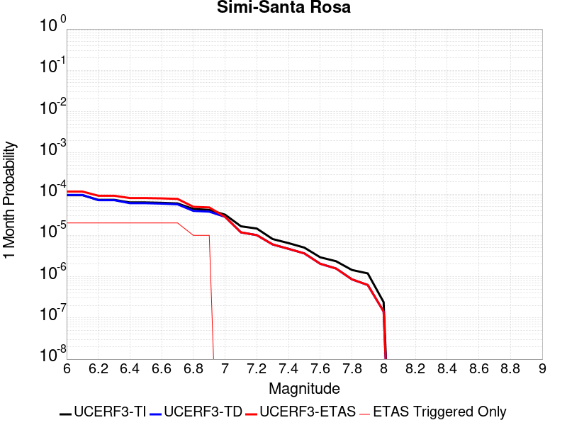 |  |  |

| Magnitude | 1 wk TI Prob | 1 wk TD Prob | 1 wk ETAS Prob | 1 wk ETAS/TD Gain | 1 wk ETAS Triggered Only | 1 mo TI Prob | 1 mo TD Prob | 1 mo ETAS Prob | 1 mo ETAS/TD Gain | 1 mo ETAS Triggered Only | 1 yr TI Prob | 1 yr TD Prob | 1 yr ETAS Prob | 1 yr ETAS/TD Gain | 1 yr ETAS Triggered Only | 10 yr TI Prob | 10 yr TD Prob | 10 yr ETAS Prob | 10 yr ETAS/TD Gain | 10 yr ETAS Triggered Only |
|-----|-----|-----|-----|-----|-----|-----|-----|-----|-----|-----|-----|-----|-----|-----|-----|-----|-----|-----|-----|-----|
| 6.0 | 2.198912E-5 | 2.2275388E-5 | 5.05661E-5 | 2.2700436 | 2.8291344E-5 | 9.4235686E-5 | 9.54627E-5 | 1.2375135E-4 | 1.2963319 | 2.8291344E-5 | 0.0011467156 | 0.0011616825 | 0.0011899411 | 1.0243255 | 2.8291344E-5 | 0.011408163 | 0.011560547 | 0.011630458 | 1.0060474 | 7.072836E-5 |
| 6.1 | 2.198912E-5 | 2.2275388E-5 | 5.05661E-5 | 2.2700436 | 2.8291344E-5 | 9.4235686E-5 | 9.54627E-5 | 1.2375135E-4 | 1.2963319 | 2.8291344E-5 | 0.0011467156 | 0.0011616825 | 0.0011899411 | 1.0243255 | 2.8291344E-5 | 0.011408163 | 0.011560547 | 0.011630458 | 1.0060474 | 7.072836E-5 |
| 6.2 | 1.69983E-5 | 1.6668506E-5 | 4.495938E-5 | 2.6972651 | 2.8291344E-5 | 7.284782E-5 | 7.143466E-5 | 9.9723984E-5 | 1.3960167 | 2.8291344E-5 | 8.865613E-4 | 8.6939917E-4 | 8.976659E-4 | 1.032513 | 2.8291344E-5 | 0.008830327 | 0.0086629 | 0.008718993 | 1.006475 | 5.658269E-5 |
| 6.3 | 1.69983E-5 | 1.6668506E-5 | 4.495938E-5 | 2.6972651 | 2.8291344E-5 | 7.284782E-5 | 7.143466E-5 | 9.9723984E-5 | 1.3960167 | 2.8291344E-5 | 8.865613E-4 | 8.6939917E-4 | 8.976659E-4 | 1.032513 | 2.8291344E-5 | 0.008830327 | 0.0086629 | 0.008718993 | 1.006475 | 5.658269E-5 |
| 6.4 | 1.4666188E-5 | 1.4052489E-5 | 4.2343436E-5 | 3.013234 | 2.8291344E-5 | 6.285358E-5 | 6.0223705E-5 | 8.851334E-5 | 1.4697427 | 2.8291344E-5 | 7.6497364E-4 | 7.330018E-4 | 7.6127244E-4 | 1.0385683 | 2.8291344E-5 | 0.0076234564 | 0.0073083164 | 0.007350443 | 1.0057642 | 4.2437016E-5 |
| 6.5 | 1.4666188E-5 | 1.4052489E-5 | 4.2343436E-5 | 3.013234 | 2.8291344E-5 | 6.285358E-5 | 6.0223705E-5 | 8.851334E-5 | 1.4697427 | 2.8291344E-5 | 7.6497364E-4 | 7.330018E-4 | 7.6127244E-4 | 1.0385683 | 2.8291344E-5 | 0.0076234564 | 0.0073083164 | 0.007350443 | 1.0057642 | 4.2437016E-5 |
| 6.6 | 1.4377586E-5 | 1.3729529E-5 | 4.2020485E-5 | 3.060592 | 2.8291344E-5 | 6.1616774E-5 | 5.883965E-5 | 8.712933E-5 | 1.4807928 | 2.8291344E-5 | 7.4992597E-4 | 7.1616215E-4 | 7.444332E-4 | 1.0394758 | 2.8291344E-5 | 0.007474003 | 0.0071410104 | 0.0071831443 | 1.0059003 | 4.2437016E-5 |
| 6.7 | 1.3881404E-5 | 1.3207497E-5 | 4.1498468E-5 | 3.1420386 | 2.8291344E-5 | 5.9490372E-5 | 5.6602472E-5 | 8.489221E-5 | 1.499797 | 2.8291344E-5 | 7.240546E-4 | 6.889419E-4 | 7.172138E-4 | 1.0410366 | 2.8291344E-5 | 0.007217 | 0.0068705105 | 0.006912656 | 1.0061343 | 4.2437016E-5 |
| 6.8 | 1.0176516E-5 | 9.1541E-6 | 2.3299643E-5 | 2.5452685 | 1.4145672E-5 | 4.3612912E-5 | 3.923136E-5 | 5.3376476E-5 | 1.3605564 | 1.4145672E-5 | 5.308578E-4 | 4.775537E-4 | 4.916926E-4 | 1.0296069 | 1.4145672E-5 | 0.0052959146 | 0.004766908 | 0.004795064 | 1.0059067 | 2.8291344E-5 |
| 6.9 | 9.699797E-6 | 8.774672E-6 | 2.292022E-5 | 2.6120884 | 1.4145672E-5 | 4.15699E-5 | 3.760529E-5 | 5.1750427E-5 | 1.3761476 | 1.4145672E-5 | 5.05996E-4 | 4.5776463E-4 | 4.7190383E-4 | 1.0308875 | 1.4145672E-5 | 0.005048454 | 0.0045698346 | 0.004597997 | 1.0061626 | 2.8291344E-5 |
| 7.0 | 7.4049476E-6 | 6.559291E-6 | 6.559291E-6 | 1.0 | 0.0 | 3.1735104E-5 | 2.8111013E-5 | 2.8111013E-5 | 1.0 | 0.0 | 3.8630638E-4 | 3.422105E-4 | 3.422105E-4 | 1.0 | 0.0 | 0.0038563553 | 0.0034180775 | 0.003432175 | 1.0041243 | 1.4145672E-5 |
| 7.1 | 3.873439E-6 | 2.759473E-6 | 2.759473E-6 | 1.0 | 0.0 | 1.6600346E-5 | 1.1826261E-5 | 1.1826261E-5 | 1.0 | 0.0 | 2.0209046E-4 | 1.4397544E-4 | 1.4397544E-4 | 1.0 | 0.0 | 0.0020190678 | 0.0014388453 | 0.0014388453 | 1.0 | 0.0 |
| 7.2 | 3.417706E-6 | 2.367616E-6 | 2.367616E-6 | 1.0 | 0.0 | 1.4647229E-5 | 1.0146887E-5 | 1.0146887E-5 | 1.0 | 0.0 | 1.7831543E-4 | 1.2353157E-4 | 1.2353157E-4 | 1.0 | 0.0 | 0.0017817242 | 0.0012346513 | 0.0012346513 | 1.0 | 0.0 |
| 7.3 | 1.90225E-6 | 1.4073756E-6 | 1.4073756E-6 | 1.0 | 0.0 | 8.152474E-6 | 6.031596E-6 | 6.031596E-6 | 1.0 | 0.0 | 9.9251854E-5 | 7.343223E-5 | 7.343223E-5 | 1.0 | 0.0 | 9.920754E-4 | 7.340819E-4 | 7.340819E-4 | 1.0 | 0.0 |
| 7.4 | 1.5170556E-6 | 1.1024792E-6 | 1.1024792E-6 | 1.0 | 0.0 | 6.5016507E-6 | 4.7249023E-6 | 4.7249023E-6 | 1.0 | 0.0 | 7.915472E-5 | 5.752418E-5 | 5.752418E-5 | 1.0 | 0.0 | 7.9126534E-4 | 5.75094E-4 | 5.75094E-4 | 1.0 | 0.0 |
| 7.5 | 1.178732E-6 | 8.5351127E-7 | 8.5351127E-7 | 1.0 | 0.0 | 5.0516987E-6 | 3.6579004E-6 | 3.6579004E-6 | 1.0 | 0.0 | 6.1502695E-5 | 4.4534037E-5 | 4.4534037E-5 | 1.0 | 0.0 | 6.148568E-4 | 4.4525208E-4 | 4.4525208E-4 | 1.0 | 0.0 |
| 7.6 | 6.8722386E-7 | 4.793211E-7 | 4.793211E-7 | 1.0 | 0.0 | 2.9452417E-6 | 2.0542318E-6 | 2.0542318E-6 | 1.0 | 0.0 | 3.5857727E-5 | 2.5009986E-5 | 2.5009986E-5 | 1.0 | 0.0 | 3.5851944E-4 | 2.5007184E-4 | 2.5007184E-4 | 1.0 | 0.0 |
| 7.7 | 5.5126515E-7 | 3.6731117E-7 | 3.6731117E-7 | 1.0 | 0.0 | 2.3625628E-6 | 1.5741898E-6 | 1.5741898E-6 | 1.0 | 0.0 | 2.8763823E-5 | 1.9165593E-5 | 1.9165593E-5 | 1.0 | 0.0 | 2.87601E-4 | 1.9163951E-4 | 1.9163951E-4 | 1.0 | 0.0 |
| 7.8 | 3.3860243E-7 | 2.0075514E-7 | 2.0075514E-7 | 1.0 | 0.0 | 1.4511525E-6 | 8.6037886E-7 | 8.6037886E-7 | 1.0 | 0.0 | 1.7667637E-5 | 1.0475063E-5 | 1.0475063E-5 | 1.0 | 0.0 | 1.7666233E-4 | 1.0474575E-4 | 1.0474575E-4 | 1.0 | 0.0 |
| 7.9 | 2.7955386E-7 | 1.4648724E-7 | 1.4648724E-7 | 1.0 | 0.0 | 1.1980875E-6 | 6.278023E-7 | 6.278023E-7 | 1.0 | 0.0 | 1.4586617E-5 | 7.643467E-6 | 7.643467E-6 | 1.0 | 0.0 | 1.458566E-4 | 7.643208E-5 | 7.643208E-5 | 1.0 | 0.0 |
| 8.0 | 5.6259015E-8 | 3.335318E-8 | 3.335318E-8 | 1.0 | 0.0 | 2.4111003E-7 | 1.429422E-7 | 1.429422E-7 | 1.0 | 0.0 | 2.9355108E-6 | 1.7403199E-6 | 1.7403199E-6 | 1.0 | 0.0 | 2.935472E-5 | 1.7403077E-5 | 1.7403077E-5 | 1.0 | 0.0 |

## San Diego Trough south
*[(top)](#table-of-contents)*

| 1 Week | 1 Month | 1 Year | 10 Year |
|-----|-----|-----|-----|
| 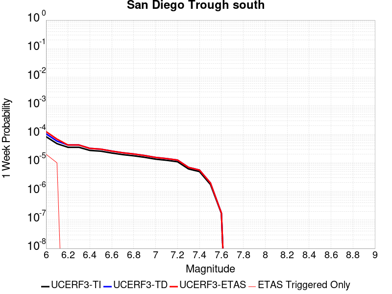 |  | 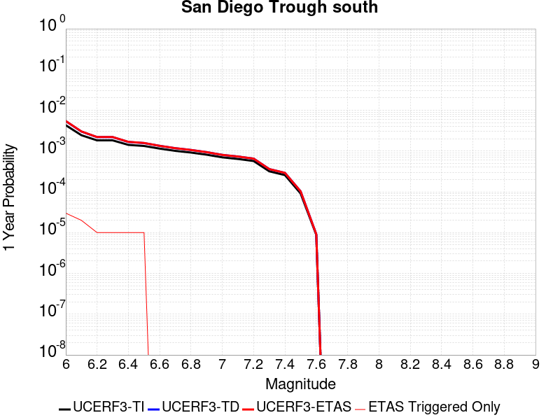 |  |

| Magnitude | 1 wk TI Prob | 1 wk TD Prob | 1 wk ETAS Prob | 1 wk ETAS/TD Gain | 1 wk ETAS Triggered Only | 1 mo TI Prob | 1 mo TD Prob | 1 mo ETAS Prob | 1 mo ETAS/TD Gain | 1 mo ETAS Triggered Only | 1 yr TI Prob | 1 yr TD Prob | 1 yr ETAS Prob | 1 yr ETAS/TD Gain | 1 yr ETAS Triggered Only | 10 yr TI Prob | 10 yr TD Prob | 10 yr ETAS Prob | 10 yr ETAS/TD Gain | 10 yr ETAS Triggered Only |
|-----|-----|-----|-----|-----|-----|-----|-----|-----|-----|-----|-----|-----|-----|-----|-----|-----|-----|-----|-----|-----|
| 6.0 | 8.279495E-5 | 1.0425541E-4 | 1.325438E-4 | 1.2713374 | 2.8291344E-5 | 3.5478722E-4 | 4.4673498E-4 | 4.750137E-4 | 1.0633008 | 2.8291344E-5 | 0.004310982 | 0.0054259133 | 0.0054681203 | 1.0077788 | 4.2437016E-5 | 0.042283054 | 0.05299303 | 0.05306001 | 1.001264 | 7.072836E-5 |
| 6.1 | 4.6961468E-5 | 5.773024E-5 | 7.1875096E-5 | 1.2450163 | 1.4145672E-5 | 2.0124791E-4 | 2.473905E-4 | 2.6153267E-4 | 1.0571654 | 1.4145672E-5 | 0.00244744 | 0.003007886 | 0.0030360923 | 1.0093775 | 2.8291344E-5 | 0.024206603 | 0.029679636 | 0.029720813 | 1.0013874 | 4.2437016E-5 |
| 6.2 | 3.5079658E-5 | 4.214258E-5 | 4.214258E-5 | 1.0 | 0.0 | 1.5033272E-4 | 1.8059829E-4 | 1.8059829E-4 | 1.0 | 0.0 | 0.0018287642 | 0.002196587 | 0.0022107016 | 1.0064257 | 1.4145672E-5 | 0.018137876 | 0.021751188 | 0.021778863 | 1.0012724 | 2.8291344E-5 |
| 6.3 | 3.5079658E-5 | 4.214258E-5 | 4.214258E-5 | 1.0 | 0.0 | 1.5033272E-4 | 1.8059829E-4 | 1.8059829E-4 | 1.0 | 0.0 | 0.0018287642 | 0.002196587 | 0.0022107016 | 1.0064257 | 1.4145672E-5 | 0.018137876 | 0.021751188 | 0.021778863 | 1.0012724 | 2.8291344E-5 |
| 6.4 | 2.7196904E-5 | 3.208715E-5 | 3.208715E-5 | 1.0 | 0.0 | 1.16552954E-4 | 1.3750911E-4 | 1.3750911E-4 | 1.0 | 0.0 | 0.0014181085 | 0.0016728995 | 0.0016870215 | 1.0084417 | 1.4145672E-5 | 0.014090929 | 0.016604666 | 0.016632488 | 1.0016755 | 2.8291344E-5 |
| 6.5 | 2.5584688E-5 | 3.0101632E-5 | 3.0101632E-5 | 1.0 | 0.0 | 1.0964406E-4 | 1.2900059E-4 | 1.2900059E-4 | 1.0 | 0.0 | 0.0013340989 | 0.0015694627 | 0.0015835861 | 1.0089989 | 1.4145672E-5 | 0.013261181 | 0.015585332 | 0.015613182 | 1.001787 | 2.8291344E-5 |
| 6.6 | 2.2034688E-5 | 2.574271E-5 | 2.574271E-5 | 1.0 | 0.0 | 9.443096E-5 | 1.1032127E-4 | 1.1032127E-4 | 1.0 | 0.0 | 0.0011490905 | 0.0013423412 | 0.0013423412 | 1.0 | 0.0 | 0.011431668 | 0.013343325 | 0.013357282 | 1.001046 | 1.4145672E-5 |
| 6.7 | 1.9394853E-5 | 2.254176E-5 | 2.254176E-5 | 1.0 | 0.0 | 8.311815E-5 | 9.6604E-5 | 9.6604E-5 | 1.0 | 0.0 | 0.0010114936 | 0.0011755243 | 0.0011755243 | 1.0 | 0.0 | 0.01006902 | 0.011693766 | 0.011707746 | 1.0011955 | 1.4145672E-5 |
| 6.8 | 1.7615313E-5 | 2.0403182E-5 | 2.0403182E-5 | 1.0 | 0.0 | 7.549201E-5 | 8.743931E-5 | 8.743931E-5 | 1.0 | 0.0 | 9.1872766E-4 | 0.0010640579 | 0.0010640579 | 1.0 | 0.0 | 0.009149387 | 0.010590198 | 0.010604194 | 1.0013216 | 1.4145672E-5 |
| 6.9 | 1.5621423E-5 | 1.8026114E-5 | 1.8026114E-5 | 1.0 | 0.0 | 6.6947236E-5 | 7.725251E-5 | 7.725251E-5 | 1.0 | 0.0 | 8.147778E-4 | 9.40147E-4 | 9.40147E-4 | 1.0 | 0.0 | 0.008117969 | 0.009362142 | 0.009362142 | 1.0 | 0.0 |
| 7.0 | 1.3444376E-5 | 1.544809E-5 | 1.544809E-5 | 1.0 | 0.0 | 5.7617483E-5 | 6.620443E-5 | 6.620443E-5 | 1.0 | 0.0 | 7.0126704E-4 | 8.057436E-4 | 8.057436E-4 | 1.0 | 0.0 | 0.006990582 | 0.008028555 | 0.008028555 | 1.0 | 0.0 |
| 7.1 | 1.2268361E-5 | 1.407303E-5 | 1.407303E-5 | 1.0 | 0.0 | 5.2577634E-5 | 6.0311606E-5 | 6.0311606E-5 | 1.0 | 0.0 | 6.399447E-4 | 7.3404907E-4 | 7.3404907E-4 | 1.0 | 0.0 | 0.0063810493 | 0.0073165493 | 0.0073165493 | 1.0 | 0.0 |
| 7.2 | 1.0922655E-5 | 1.2513563E-5 | 1.2513563E-5 | 1.0 | 0.0 | 4.681054E-5 | 5.3628468E-5 | 5.3628468E-5 | 1.0 | 0.0 | 5.697693E-4 | 6.5273355E-4 | 6.5273355E-4 | 1.0 | 0.0 | 0.0056831064 | 0.0065084435 | 0.0065084435 | 1.0 | 0.0 |
| 7.3 | 6.1106753E-6 | 6.928925E-6 | 6.928925E-6 | 1.0 | 0.0 | 2.6188345E-5 | 2.9695057E-5 | 2.9695057E-5 | 1.0 | 0.0 | 3.1879646E-4 | 3.6147775E-4 | 3.6147775E-4 | 1.0 | 0.0 | 0.0031833951 | 0.003608943 | 0.003608943 | 1.0 | 0.0 |
| 7.4 | 4.933187E-6 | 5.5895525E-6 | 5.5895525E-6 | 1.0 | 0.0 | 2.114206E-5 | 2.3955008E-5 | 2.3955008E-5 | 1.0 | 0.0 | 2.5737417E-4 | 2.9161357E-4 | 2.9161357E-4 | 1.0 | 0.0 | 0.002570763 | 0.0029123505 | 0.0029123505 | 1.0 | 0.0 |
| 7.5 | 1.7489613E-6 | 1.969678E-6 | 1.969678E-6 | 1.0 | 0.0 | 7.495527E-6 | 8.4414505E-6 | 8.4414505E-6 | 1.0 | 0.0 | 9.125422E-5 | 1.02770035E-4 | 1.02770035E-4 | 1.0 | 0.0 | 9.1216754E-4 | 0.0010272472 | 0.0010272472 | 1.0 | 0.0 |
| 7.6 | 1.6988751E-7 | 1.7533823E-7 | 1.7533823E-7 | 1.0 | 0.0 | 7.2808916E-7 | 7.5144936E-7 | 7.5144936E-7 | 1.0 | 0.0 | 8.864449E-6 | 9.14886E-6 | 9.14886E-6 | 1.0 | 0.0 | 8.8640954E-5 | 9.1485024E-5 | 9.1485024E-5 | 1.0 | 0.0 |

## Palos Verdes
*[(top)](#table-of-contents)*

| 1 Week | 1 Month | 1 Year | 10 Year |
|-----|-----|-----|-----|
|  |  |  | 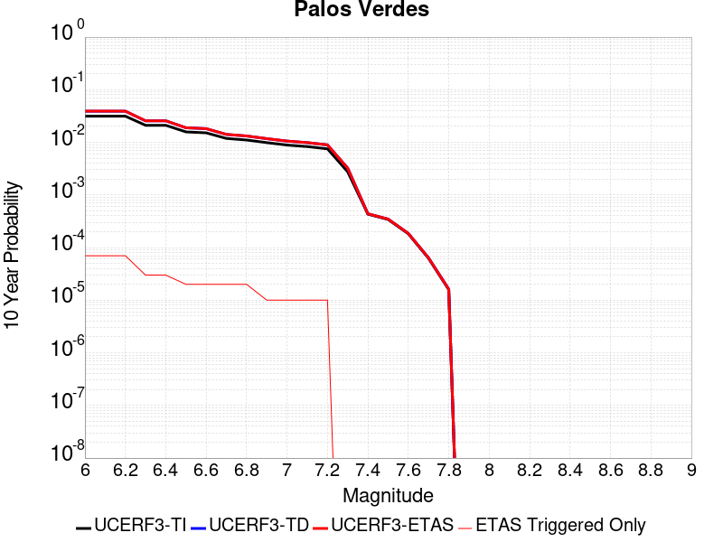 |

| Magnitude | 1 wk TI Prob | 1 wk TD Prob | 1 wk ETAS Prob | 1 wk ETAS/TD Gain | 1 wk ETAS Triggered Only | 1 mo TI Prob | 1 mo TD Prob | 1 mo ETAS Prob | 1 mo ETAS/TD Gain | 1 mo ETAS Triggered Only | 1 yr TI Prob | 1 yr TD Prob | 1 yr ETAS Prob | 1 yr ETAS/TD Gain | 1 yr ETAS Triggered Only | 10 yr TI Prob | 10 yr TD Prob | 10 yr ETAS Prob | 10 yr ETAS/TD Gain | 10 yr ETAS Triggered Only |
|-----|-----|-----|-----|-----|-----|-----|-----|-----|-----|-----|-----|-----|-----|-----|-----|-----|-----|-----|-----|-----|
| 6.0 | 6.126063E-5 | 7.622572E-5 | 7.622572E-5 | 1.0 | 0.0 | 2.6251914E-4 | 3.266441E-4 | 3.5492622E-4 | 1.0865839 | 2.8291344E-5 | 0.0031914865 | 0.0039701737 | 0.004040621 | 1.0177442 | 7.072836E-5 | 0.031460393 | 0.03904909 | 0.039117053 | 1.0017406 | 7.072836E-5 |
| 6.1 | 6.126063E-5 | 7.622572E-5 | 7.622572E-5 | 1.0 | 0.0 | 2.6251914E-4 | 3.266441E-4 | 3.5492622E-4 | 1.0865839 | 2.8291344E-5 | 0.0031914865 | 0.0039701737 | 0.004040621 | 1.0177442 | 7.072836E-5 | 0.031460393 | 0.03904909 | 0.039117053 | 1.0017406 | 7.072836E-5 |
| 6.2 | 6.126063E-5 | 7.622572E-5 | 7.622572E-5 | 1.0 | 0.0 | 2.6251914E-4 | 3.266441E-4 | 3.5492622E-4 | 1.0865839 | 2.8291344E-5 | 0.0031914865 | 0.0039701737 | 0.004040621 | 1.0177442 | 7.072836E-5 | 0.031460393 | 0.03904909 | 0.039117053 | 1.0017406 | 7.072836E-5 |
| 6.3 | 4.0838047E-5 | 4.9749007E-5 | 4.9749007E-5 | 1.0 | 0.0 | 1.7500846E-4 | 2.1319388E-4 | 2.4147918E-4 | 1.1326741 | 2.8291344E-5 | 0.0021286458 | 0.002592754 | 0.002635081 | 1.0163251 | 4.2437016E-5 | 0.021083709 | 0.025646746 | 0.025688095 | 1.0016122 | 4.2437016E-5 |
| 6.4 | 4.0838047E-5 | 4.9749007E-5 | 4.9749007E-5 | 1.0 | 0.0 | 1.7500846E-4 | 2.1319388E-4 | 2.4147918E-4 | 1.1326741 | 2.8291344E-5 | 0.0021286458 | 0.002592754 | 0.002635081 | 1.0163251 | 4.2437016E-5 | 0.021083709 | 0.025646746 | 0.025688095 | 1.0016122 | 4.2437016E-5 |
| 6.5 | 3.0512005E-5 | 3.6561592E-5 | 3.6561592E-5 | 1.0 | 0.0 | 1.3075917E-4 | 1.566838E-4 | 1.7082726E-4 | 1.0902675 | 1.4145672E-5 | 0.0015908304 | 0.001906072 | 0.0019343095 | 1.0148145 | 2.8291344E-5 | 0.015794903 | 0.018909173 | 0.018936928 | 1.0014678 | 2.8291344E-5 |
| 6.6 | 2.9255087E-5 | 3.5154393E-5 | 3.5154393E-5 | 1.0 | 0.0 | 1.2537291E-4 | 1.5065364E-4 | 1.6479718E-4 | 1.0938811 | 1.4145672E-5 | 0.0015253464 | 0.0018327782 | 0.0018610177 | 1.015408 | 2.8291344E-5 | 0.015149189 | 0.018188244 | 0.018216021 | 1.0015272 | 2.8291344E-5 |
| 6.7 | 2.287198E-5 | 2.724828E-5 | 2.724828E-5 | 1.0 | 0.0 | 9.801909E-5 | 1.16773626E-4 | 1.3091764E-4 | 1.1211234 | 1.4145672E-5 | 0.001192729 | 0.0014208833 | 0.0014491346 | 1.0198828 | 2.8291344E-5 | 0.011863477 | 0.014127217 | 0.014155109 | 1.0019743 | 2.8291344E-5 |
| 6.8 | 2.1325764E-5 | 2.5431878E-5 | 2.5431878E-5 | 1.0 | 0.0 | 9.139293E-5 | 1.0898972E-4 | 1.2313385E-4 | 1.1297749 | 1.4145672E-5 | 0.001112141 | 0.0013262323 | 0.0013544861 | 1.0213038 | 2.8291344E-5 | 0.011065915 | 0.013192211 | 0.01322013 | 1.0021162 | 2.8291344E-5 |
| 6.9 | 1.9009392E-5 | 2.2613547E-5 | 2.2613547E-5 | 1.0 | 0.0 | 8.1466285E-5 | 9.6912096E-5 | 9.6912096E-5 | 1.0 | 0.0 | 9.914007E-4 | 0.0011793535 | 0.0011934824 | 1.0119803 | 1.4145672E-5 | 0.009869894 | 0.011739633 | 0.011753612 | 1.0011908 | 1.4145672E-5 |
| 7.0 | 1.7098473E-5 | 2.0319356E-5 | 2.0319356E-5 | 1.0 | 0.0 | 7.3277115E-5 | 8.708052E-5 | 8.708052E-5 | 1.0 | 0.0 | 8.917837E-4 | 0.001059775 | 0.0010739056 | 1.0133337 | 1.4145672E-5 | 0.008882134 | 0.010555646 | 0.010569643 | 1.001326 | 1.4145672E-5 |
| 7.1 | 1.5982785E-5 | 1.899476E-5 | 1.899476E-5 | 1.0 | 0.0 | 6.849585E-5 | 8.1404054E-5 | 8.1404054E-5 | 1.0 | 0.0 | 8.336179E-4 | 9.907284E-4 | 0.00100486 | 1.0142639 | 1.4145672E-5 | 0.008304977 | 0.009871479 | 0.009885485 | 1.0014188 | 1.4145672E-5 |
| 7.2 | 1.4468002E-5 | 1.7197237E-5 | 1.7197237E-5 | 1.0 | 0.0 | 6.200425E-5 | 7.370083E-5 | 7.370083E-5 | 1.0 | 0.0 | 7.546402E-4 | 8.970222E-4 | 9.111552E-4 | 1.0157554 | 1.4145672E-5 | 0.007520827 | 0.008942284 | 0.008956303 | 1.0015677 | 1.4145672E-5 |
| 7.3 | 5.288233E-6 | 6.2036747E-6 | 6.2036747E-6 | 1.0 | 0.0 | 2.2663658E-5 | 2.6587102E-5 | 2.6587102E-5 | 1.0 | 0.0 | 2.7589512E-4 | 3.236848E-4 | 3.236848E-4 | 1.0 | 0.0 | 0.0027555283 | 0.0032355562 | 0.0032355562 | 1.0 | 0.0 |
| 7.4 | 8.279556E-7 | 8.408347E-7 | 8.408347E-7 | 1.0 | 0.0 | 3.5483763E-6 | 3.6035726E-6 | 3.6035726E-6 | 1.0 | 0.0 | 4.3200624E-5 | 4.3872686E-5 | 4.3872686E-5 | 1.0 | 0.0 | 4.3192226E-4 | 4.3864746E-4 | 4.3864746E-4 | 1.0 | 0.0 |
| 7.5 | 6.559831E-7 | 6.667229E-7 | 6.667229E-7 | 1.0 | 0.0 | 2.8113532E-6 | 2.857381E-6 | 2.857381E-6 | 1.0 | 0.0 | 3.4227687E-5 | 3.4788125E-5 | 3.4788125E-5 | 1.0 | 0.0 | 3.4222414E-4 | 3.4783344E-4 | 3.4783344E-4 | 1.0 | 0.0 |
| 7.6 | 3.5018968E-7 | 3.5620027E-7 | 3.5620027E-7 | 1.0 | 0.0 | 1.500812E-6 | 1.526572E-6 | 1.526572E-6 | 1.0 | 0.0 | 1.8272232E-5 | 1.8585903E-5 | 1.8585903E-5 | 1.0 | 0.0 | 1.8270731E-4 | 1.8584808E-4 | 1.8584808E-4 | 1.0 | 0.0 |
| 7.7 | 1.1986104E-7 | 1.2198376E-7 | 1.2198376E-7 | 1.0 | 0.0 | 5.1369005E-7 | 5.2278745E-7 | 5.2278745E-7 | 1.0 | 0.0 | 6.2541585E-6 | 6.364919E-6 | 6.364919E-6 | 1.0 | 0.0 | 6.2539824E-5 | 6.364741E-5 | 6.364741E-5 | 1.0 | 0.0 |
| 7.8 | 3.0445005E-8 | 3.1027582E-8 | 3.1027582E-8 | 1.0 | 0.0 | 1.3047858E-7 | 1.3297536E-7 | 1.3297536E-7 | 1.0 | 0.0 | 1.5885756E-6 | 1.6189739E-6 | 1.6189739E-6 | 1.0 | 0.0 | 1.5885644E-5 | 1.6189642E-5 | 1.6189642E-5 | 1.0 | 0.0 |

## San Jacinto (Borrego)
*[(top)](#table-of-contents)*

| 1 Week | 1 Month | 1 Year | 10 Year |
|-----|-----|-----|-----|
|  |  |  |  |

| Magnitude | 1 wk TI Prob | 1 wk TD Prob | 1 wk ETAS Prob | 1 wk ETAS/TD Gain | 1 wk ETAS Triggered Only | 1 mo TI Prob | 1 mo TD Prob | 1 mo ETAS Prob | 1 mo ETAS/TD Gain | 1 mo ETAS Triggered Only | 1 yr TI Prob | 1 yr TD Prob | 1 yr ETAS Prob | 1 yr ETAS/TD Gain | 1 yr ETAS Triggered Only | 10 yr TI Prob | 10 yr TD Prob | 10 yr ETAS Prob | 10 yr ETAS/TD Gain | 10 yr ETAS Triggered Only |
|-----|-----|-----|-----|-----|-----|-----|-----|-----|-----|-----|-----|-----|-----|-----|-----|-----|-----|-----|-----|-----|
| 6.0 | 3.543992E-5 | 2.7925962E-5 | 7.036179E-5 | 2.5195835 | 4.2437016E-5 | 1.5187653E-4 | 1.1967727E-4 | 1.6210921E-4 | 1.354553 | 4.2437016E-5 | 0.0018475284 | 0.0014561092 | 0.0015267346 | 1.0485028 | 7.072836E-5 | 0.018322436 | 0.01486815 | 0.014937827 | 1.0046864 | 7.072836E-5 |
| 6.1 | 3.542281E-5 | 2.7925962E-5 | 7.036179E-5 | 2.5195835 | 4.2437016E-5 | 1.5180321E-4 | 1.1967727E-4 | 1.6210921E-4 | 1.354553 | 4.2437016E-5 | 0.0018466372 | 0.0014561092 | 0.0015267346 | 1.0485028 | 7.072836E-5 | 0.018313672 | 0.01486815 | 0.014937827 | 1.0046864 | 7.072836E-5 |
| 6.2 | 3.4688688E-5 | 2.7925962E-5 | 7.036179E-5 | 2.5195835 | 4.2437016E-5 | 1.4865733E-4 | 1.1967727E-4 | 1.6210921E-4 | 1.354553 | 4.2437016E-5 | 0.0018084005 | 0.0014561091 | 0.0015267346 | 1.0485028 | 7.072836E-5 | 0.017937548 | 0.01486815 | 0.014937827 | 1.0046864 | 7.072836E-5 |
| 6.3 | 3.2087122E-5 | 2.7771312E-5 | 7.020715E-5 | 2.528046 | 4.2437016E-5 | 1.3750899E-4 | 1.1901455E-4 | 1.6144651E-4 | 1.3565276 | 4.2437016E-5 | 0.0016728862 | 0.0014480512 | 0.0015186771 | 1.048773 | 7.072836E-5 | 0.016603488 | 0.014789308 | 0.014858991 | 1.0047116 | 7.072836E-5 |
| 6.4 | 3.1828724E-5 | 2.773829E-5 | 7.017413E-5 | 2.529865 | 4.2437016E-5 | 1.364017E-4 | 1.1887303E-4 | 1.61305E-4 | 1.3569521 | 4.2437016E-5 | 0.0016594254 | 0.0014463306 | 0.0015169566 | 1.0488312 | 7.072836E-5 | 0.016470885 | 0.014772502 | 0.014842185 | 1.0047171 | 7.072836E-5 |
| 6.5 | 3.1563577E-5 | 2.7477974E-5 | 6.9913825E-5 | 2.5443587 | 4.2437016E-5 | 1.3526545E-4 | 1.17757496E-4 | 1.6018952E-4 | 1.3603339 | 4.2437016E-5 | 0.0016456128 | 0.0014327668 | 0.0015033939 | 1.0492941 | 7.072836E-5 | 0.0163348 | 0.01463991 | 0.014709603 | 1.0047605 | 7.072836E-5 |
| 6.6 | 3.1467625E-5 | 2.7322194E-5 | 6.9758054E-5 | 2.5531642 | 4.2437016E-5 | 1.3485427E-4 | 1.17089934E-4 | 1.5952198E-4 | 1.3623885 | 4.2437016E-5 | 0.0016406142 | 0.0014246498 | 0.0014952774 | 1.0495754 | 7.072836E-5 | 0.016285548 | 0.014560228 | 0.0146299265 | 1.004787 | 7.072836E-5 |
| 6.7 | 3.1223695E-5 | 2.6940217E-5 | 6.937609E-5 | 2.5751867 | 4.2437016E-5 | 1.3380898E-4 | 1.1545303E-4 | 1.5788515E-4 | 1.3675271 | 4.2437016E-5 | 0.0016279068 | 0.0014047464 | 0.0014753755 | 1.0502788 | 7.072836E-5 | 0.01616033 | 0.01436451 | 0.014434222 | 1.0048531 | 7.072836E-5 |
| 6.8 | 3.1015585E-5 | 2.6761221E-5 | 6.91971E-5 | 2.585723 | 4.2437016E-5 | 1.3291716E-4 | 1.1468597E-4 | 1.5711812E-4 | 1.3699855 | 4.2437016E-5 | 0.001617065 | 0.0013954195 | 0.0014660491 | 1.0506153 | 7.072836E-5 | 0.016053487 | 0.014271772 | 0.01434149 | 1.0048851 | 7.072836E-5 |
| 6.9 | 2.6641965E-5 | 2.2183434E-5 | 6.461951E-5 | 2.9129624 | 4.2437016E-5 | 1.1417485E-4 | 9.506842E-5 | 1.375014E-4 | 1.4463415 | 4.2437016E-5 | 0.0013891924 | 0.0011568473 | 0.0012274939 | 1.0610682 | 7.072836E-5 | 0.0138054015 | 0.011882191 | 0.011952079 | 1.0058818 | 7.072836E-5 |
| 7.0 | 2.3854353E-5 | 2.047825E-5 | 6.29144E-5 | 3.0722544 | 4.2437016E-5 | 1.02228936E-4 | 8.776099E-5 | 1.3019428E-4 | 1.4835097 | 4.2437016E-5 | 0.0012439266 | 0.0010679689 | 0.0011244911 | 1.052925 | 5.658269E-5 | 0.012369866 | 0.0109826205 | 0.011038582 | 1.0050955 | 5.658269E-5 |
| 7.1 | 2.3672901E-5 | 2.0314741E-5 | 6.275089E-5 | 3.0889342 | 4.2437016E-5 | 1.0145135E-4 | 8.706028E-5 | 1.2949361E-4 | 1.4874016 | 4.2437016E-5 | 0.0012344702 | 0.0010594461 | 0.0011159688 | 1.0533512 | 5.658269E-5 | 0.0122763505 | 0.010897858 | 0.010953825 | 1.0051355 | 5.658269E-5 |
| 7.2 | 2.2717244E-5 | 1.9542116E-5 | 6.19783E-5 | 3.1715245 | 4.2437016E-5 | 9.735599E-5 | 8.3749255E-5 | 1.2618271E-4 | 1.5066727 | 4.2437016E-5 | 0.0011846646 | 0.0010191725 | 0.0010756975 | 1.0554616 | 5.658269E-5 | 0.01178369 | 0.010495322 | 0.01055131 | 1.0053346 | 5.658269E-5 |
| 7.3 | 2.1016205E-5 | 1.8383771E-5 | 6.0820006E-5 | 3.3083532 | 4.2437016E-5 | 9.006634E-5 | 7.878522E-5 | 1.21218894E-4 | 1.5385994 | 4.2437016E-5 | 0.001096006 | 9.5879E-4 | 0.0010153184 | 1.058958 | 5.658269E-5 | 0.010906163 | 0.009890901 | 0.009946924 | 1.0056641 | 5.658269E-5 |
| 7.4 | 2.0683625E-5 | 1.8186302E-5 | 6.0622548E-5 | 3.3334181 | 4.2437016E-5 | 8.86411E-5 | 7.7938974E-5 | 1.20372686E-4 | 1.5444479 | 4.2437016E-5 | 0.001078671 | 9.48496E-4 | 0.001005025 | 1.0595986 | 5.658269E-5 | 0.010734501 | 0.0097876275 | 0.009843657 | 1.0057244 | 5.658269E-5 |
| 7.5 | 1.9993966E-5 | 1.7781347E-5 | 6.0217608E-5 | 3.3865604 | 4.2437016E-5 | 8.568561E-5 | 7.6203556E-5 | 1.1863734E-4 | 1.5568478 | 4.2437016E-5 | 0.001042723 | 9.2738547E-4 | 9.839156E-4 | 1.0609566 | 5.658269E-5 | 0.010378438 | 0.009574548 | 0.00963059 | 1.005853 | 5.658269E-5 |
| 7.6 | 1.788966E-5 | 1.6434618E-5 | 5.8870937E-5 | 3.58213 | 4.2437016E-5 | 7.666772E-5 | 7.043219E-5 | 1.1286621E-4 | 1.6024806 | 4.2437016E-5 | 9.3302975E-4 | 8.5717626E-4 | 9.1371045E-4 | 1.065954 | 5.658269E-5 | 0.00929122 | 0.008866415 | 0.008922497 | 1.0063251 | 5.658269E-5 |
| 7.7 | 1.5125781E-5 | 1.4236738E-5 | 5.667315E-5 | 3.980768 | 4.2437016E-5 | 6.4823165E-5 | 6.101317E-5 | 1.0344759E-4 | 1.6954962 | 4.2437016E-5 | 7.889362E-4 | 7.4258295E-4 | 7.9912366E-4 | 1.0761405 | 5.658269E-5 | 0.007861412 | 0.007714161 | 0.0077703074 | 1.0072783 | 5.658269E-5 |
| 7.8 | 1.250089E-5 | 1.262994E-5 | 5.506642E-5 | 4.3599906 | 4.2437016E-5 | 5.3574146E-5 | 5.4127195E-5 | 9.656192E-5 | 1.7839814 | 4.2437016E-5 | 6.5207E-4 | 6.588E-4 | 7.153454E-4 | 1.0858309 | 5.658269E-5 | 0.006501599 | 0.006867759 | 0.006923953 | 1.0081823 | 5.658269E-5 |
| 7.9 | 9.561E-6 | 9.754065E-6 | 5.2190666E-5 | 5.350658 | 4.2437016E-5 | 4.0975072E-5 | 4.180247E-5 | 8.423771E-5 | 2.0151372 | 4.2437016E-5 | 4.987573E-4 | 5.0882675E-4 | 5.653807E-4 | 1.1111457 | 5.658269E-5 | 0.0049763937 | 0.0053523607 | 0.0054086405 | 1.010515 | 5.658269E-5 |
| 8.0 | 8.01699E-6 | 8.292994E-6 | 5.0729657E-5 | 6.117171 | 4.2437016E-5 | 3.4358076E-5 | 3.554092E-5 | 7.797643E-5 | 2.1939902 | 4.2437016E-5 | 4.1822926E-4 | 4.3262533E-4 | 4.891835E-4 | 1.1307325 | 5.658269E-5 | 0.0041744304 | 0.0045733186 | 0.0046296427 | 1.0123158 | 5.658269E-5 |
| 8.1 | 6.541947E-6 | 6.461784E-6 | 3.4752946E-5 | 5.3782277 | 2.8291344E-5 | 2.8036617E-5 | 2.7693068E-5 | 5.598363E-5 | 2.0215755 | 2.8291344E-5 | 3.4129233E-4 | 3.3711144E-4 | 3.7953415E-4 | 1.1258419 | 4.2437016E-5 | 0.0034076865 | 0.0035805756 | 0.0036228606 | 1.0118096 | 4.2437016E-5 |
| 8.2 | 1.7968189E-6 | 7.9684827E-7 | 7.9684827E-7 | 1.0 | 0.0 | 7.70063E-6 | 3.4150596E-6 | 3.4150596E-6 | 1.0 | 0.0 | 9.3751136E-5 | 4.157758E-5 | 4.157758E-5 | 1.0 | 0.0 | 9.371159E-4 | 4.7107413E-4 | 4.7107413E-4 | 1.0 | 0.0 |
| 8.3 | 1.5167889E-7 | 4.8951257E-8 | 4.8951257E-8 | 1.0 | 0.0 | 6.500522E-7 | 2.0979108E-7 | 2.0979108E-7 | 1.0 | 0.0 | 7.9143565E-6 | 2.5542038E-6 | 2.5542038E-6 | 1.0 | 0.0 | 7.914075E-5 | 2.9679897E-5 | 2.9679897E-5 | 1.0 | 0.0 |

## Red Mountain
*[(top)](#table-of-contents)*

| 1 Week | 1 Month | 1 Year | 10 Year |
|-----|-----|-----|-----|
|  |  |  |  |

| Magnitude | 1 wk TI Prob | 1 wk TD Prob | 1 wk ETAS Prob | 1 wk ETAS/TD Gain | 1 wk ETAS Triggered Only | 1 mo TI Prob | 1 mo TD Prob | 1 mo ETAS Prob | 1 mo ETAS/TD Gain | 1 mo ETAS Triggered Only | 1 yr TI Prob | 1 yr TD Prob | 1 yr ETAS Prob | 1 yr ETAS/TD Gain | 1 yr ETAS Triggered Only | 10 yr TI Prob | 10 yr TD Prob | 10 yr ETAS Prob | 10 yr ETAS/TD Gain | 10 yr ETAS Triggered Only |
|-----|-----|-----|-----|-----|-----|-----|-----|-----|-----|-----|-----|-----|-----|-----|-----|-----|-----|-----|-----|-----|
| 6.0 | 4.1810763E-5 | 4.7590016E-5 | 4.7590016E-5 | 1.0 | 0.0 | 1.7917668E-4 | 2.039422E-4 | 2.1808498E-4 | 1.069347 | 1.4145672E-5 | 0.0021792934 | 0.0024803334 | 0.002494444 | 1.005689 | 1.4145672E-5 | 0.021580452 | 0.02454411 | 0.024599304 | 1.0022488 | 5.658269E-5 |
| 6.1 | 4.1810763E-5 | 4.7590016E-5 | 4.7590016E-5 | 1.0 | 0.0 | 1.7917668E-4 | 2.039422E-4 | 2.1808498E-4 | 1.069347 | 1.4145672E-5 | 0.0021792934 | 0.0024803334 | 0.002494444 | 1.005689 | 1.4145672E-5 | 0.021580452 | 0.02454411 | 0.024599304 | 1.0022488 | 5.658269E-5 |
| 6.2 | 4.1810763E-5 | 4.7590016E-5 | 4.7590016E-5 | 1.0 | 0.0 | 1.7917668E-4 | 2.039422E-4 | 2.1808498E-4 | 1.069347 | 1.4145672E-5 | 0.0021792934 | 0.0024803334 | 0.002494444 | 1.005689 | 1.4145672E-5 | 0.021580452 | 0.02454411 | 0.024599304 | 1.0022488 | 5.658269E-5 |
| 6.3 | 4.1810763E-5 | 4.7590016E-5 | 4.7590016E-5 | 1.0 | 0.0 | 1.7917668E-4 | 2.039422E-4 | 2.1808498E-4 | 1.069347 | 1.4145672E-5 | 0.0021792934 | 0.0024803334 | 0.002494444 | 1.005689 | 1.4145672E-5 | 0.021580452 | 0.02454411 | 0.024599304 | 1.0022488 | 5.658269E-5 |
| 6.4 | 4.1810763E-5 | 4.7590016E-5 | 4.7590016E-5 | 1.0 | 0.0 | 1.7917668E-4 | 2.039422E-4 | 2.1808498E-4 | 1.069347 | 1.4145672E-5 | 0.0021792934 | 0.0024803334 | 0.002494444 | 1.005689 | 1.4145672E-5 | 0.021580452 | 0.02454411 | 0.024599304 | 1.0022488 | 5.658269E-5 |
| 6.5 | 3.154503E-5 | 3.5359757E-5 | 3.5359757E-5 | 1.0 | 0.0 | 1.3518598E-4 | 1.5153353E-4 | 1.5153353E-4 | 1.0 | 0.0 | 0.0016446467 | 0.0018434518 | 0.0018434518 | 1.0 | 0.0 | 0.01632528 | 0.018291244 | 0.018332906 | 1.0022776 | 4.2437016E-5 |
| 6.6 | 3.1535834E-5 | 3.5349138E-5 | 3.5349138E-5 | 1.0 | 0.0 | 1.3514658E-4 | 1.5148803E-4 | 1.5148803E-4 | 1.0 | 0.0 | 0.0016441676 | 0.0018428987 | 0.0018428987 | 1.0 | 0.0 | 0.01632056 | 0.018285805 | 0.018327467 | 1.0022783 | 4.2437016E-5 |
| 6.7 | 2.8267326E-5 | 3.1469353E-5 | 3.1469353E-5 | 1.0 | 0.0 | 1.2114006E-4 | 1.3486217E-4 | 1.3486217E-4 | 1.0 | 0.0 | 0.0014738824 | 0.0016407954 | 0.0016407954 | 1.0 | 0.0 | 0.014641452 | 0.01629557 | 0.016323403 | 1.0017078 | 2.8291344E-5 |
| 6.8 | 2.8212884E-5 | 3.1407242E-5 | 3.1407242E-5 | 1.0 | 0.0 | 1.20906756E-4 | 1.3459599E-4 | 1.3459599E-4 | 1.0 | 0.0 | 0.0014710457 | 0.0016375595 | 0.0016375595 | 1.0 | 0.0 | 0.014613459 | 0.016263688 | 0.01629152 | 1.0017112 | 2.8291344E-5 |
| 6.9 | 2.4227871E-5 | 2.6706994E-5 | 2.6706994E-5 | 1.0 | 0.0 | 1.03829596E-4 | 1.1445395E-4 | 1.1445395E-4 | 1.0 | 0.0 | 0.0012633923 | 0.0013926621 | 0.0013926621 | 1.0 | 0.0 | 0.012562336 | 0.0138470335 | 0.013874933 | 1.0020149 | 2.8291344E-5 |
| 7.0 | 2.348524E-5 | 2.5835778E-5 | 2.5835778E-5 | 1.0 | 0.0 | 1.0064714E-4 | 1.10720495E-4 | 1.10720495E-4 | 1.0 | 0.0 | 0.0012246901 | 0.001347264 | 0.001347264 | 1.0 | 0.0 | 0.012179627 | 0.013398598 | 0.01342651 | 1.0020832 | 2.8291344E-5 |
| 7.1 | 2.2311642E-5 | 2.4462845E-5 | 2.4462845E-5 | 1.0 | 0.0 | 9.561782E-5 | 1.04836974E-4 | 1.04836974E-4 | 1.0 | 0.0 | 0.0011635252 | 0.0012757176 | 0.0012757176 | 1.0 | 0.0 | 0.01157452 | 0.01269146 | 0.012719392 | 1.0022008 | 2.8291344E-5 |
| 7.2 | 1.6533986E-5 | 1.7670362E-5 | 1.7670362E-5 | 1.0 | 0.0 | 7.085802E-5 | 7.572828E-5 | 7.572828E-5 | 1.0 | 0.0 | 8.623549E-4 | 9.2166534E-4 | 9.2166534E-4 | 1.0 | 0.0 | 0.008590161 | 0.009184707 | 0.009212738 | 1.003052 | 2.8291344E-5 |
| 7.3 | 1.4703092E-5 | 1.5559537E-5 | 1.5559537E-5 | 1.0 | 0.0 | 6.301173E-5 | 6.668237E-5 | 6.668237E-5 | 1.0 | 0.0 | 7.668978E-4 | 8.1161706E-4 | 8.1161706E-4 | 1.0 | 0.0 | 0.0076425658 | 0.008092604 | 0.008120666 | 1.0034677 | 2.8291344E-5 |
| 7.4 | 6.1331984E-6 | 5.5288874E-6 | 5.5288874E-6 | 1.0 | 0.0 | 2.6284872E-5 | 2.3695018E-5 | 2.3695018E-5 | 1.0 | 0.0 | 3.199713E-4 | 2.884492E-4 | 2.884492E-4 | 1.0 | 0.0 | 0.0031951098 | 0.0028808024 | 0.0028949073 | 1.0048962 | 1.4145672E-5 |
| 7.5 | 5.954766E-6 | 5.338517E-6 | 5.338517E-6 | 1.0 | 0.0 | 2.5520176E-5 | 2.2879161E-5 | 2.2879161E-5 | 1.0 | 0.0 | 3.1066386E-4 | 2.785187E-4 | 2.785187E-4 | 1.0 | 0.0 | 0.003102299 | 0.0027817504 | 0.0027958567 | 1.005071 | 1.4145672E-5 |
| 7.6 | 4.9726646E-6 | 4.315309E-6 | 4.315309E-6 | 1.0 | 0.0 | 2.1311245E-5 | 1.8494053E-5 | 1.8494053E-5 | 1.0 | 0.0 | 2.5943352E-4 | 2.2514217E-4 | 2.2514217E-4 | 1.0 | 0.0 | 0.0025913084 | 0.0022491754 | 0.0022632892 | 1.0062752 | 1.4145672E-5 |
| 7.7 | 3.3613894E-6 | 2.8526886E-6 | 2.8526886E-6 | 1.0 | 0.0 | 1.4405875E-5 | 1.22257525E-5 | 1.22257525E-5 | 1.0 | 0.0 | 1.7537741E-4 | 1.4883863E-4 | 1.4883863E-4 | 1.0 | 0.0 | 0.0017523908 | 0.0014874157 | 0.0015015404 | 1.0094961 | 1.4145672E-5 |
| 7.8 | 1.1828961E-6 | 1.0122935E-6 | 1.0122935E-6 | 1.0 | 0.0 | 5.069545E-6 | 4.338394E-6 | 4.338394E-6 | 1.0 | 0.0 | 6.171996E-5 | 5.281869E-5 | 5.281869E-5 | 1.0 | 0.0 | 6.170282E-4 | 5.280643E-4 | 5.280643E-4 | 1.0 | 0.0 |
| 7.9 | 2.2967266E-7 | 1.861919E-7 | 1.861919E-7 | 1.0 | 0.0 | 9.843111E-7 | 7.97965E-7 | 7.97965E-7 | 1.0 | 0.0 | 1.19839215E-5 | 9.715184E-6 | 9.715184E-6 | 1.0 | 0.0 | 1.1983275E-4 | 9.714788E-5 | 9.714788E-5 | 1.0 | 0.0 |

## Cleghorn
*[(top)](#table-of-contents)*

| 1 Week | 1 Month | 1 Year | 10 Year |
|-----|-----|-----|-----|
|  |  |  |  |

| Magnitude | 1 wk TI Prob | 1 wk TD Prob | 1 wk ETAS Prob | 1 wk ETAS/TD Gain | 1 wk ETAS Triggered Only | 1 mo TI Prob | 1 mo TD Prob | 1 mo ETAS Prob | 1 mo ETAS/TD Gain | 1 mo ETAS Triggered Only | 1 yr TI Prob | 1 yr TD Prob | 1 yr ETAS Prob | 1 yr ETAS/TD Gain | 1 yr ETAS Triggered Only | 10 yr TI Prob | 10 yr TD Prob | 10 yr ETAS Prob | 10 yr ETAS/TD Gain | 10 yr ETAS Triggered Only |
|-----|-----|-----|-----|-----|-----|-----|-----|-----|-----|-----|-----|-----|-----|-----|-----|-----|-----|-----|-----|-----|
| 6.0 | 7.9267165E-6 | 9.831764E-6 | 9.831764E-6 | 1.0 | 0.0 | 3.39712E-5 | 4.2135514E-5 | 5.628059E-5 | 1.3357043 | 1.4145672E-5 | 4.1352084E-4 | 5.1288976E-4 | 5.411666E-4 | 1.0551324 | 2.8291344E-5 | 0.004127522 | 0.005132214 | 0.00520258 | 1.0137105 | 7.072836E-5 |
| 6.1 | 7.9267165E-6 | 9.831764E-6 | 9.831764E-6 | 1.0 | 0.0 | 3.39712E-5 | 4.2135514E-5 | 5.628059E-5 | 1.3357043 | 1.4145672E-5 | 4.1352084E-4 | 5.1288976E-4 | 5.411666E-4 | 1.0551324 | 2.8291344E-5 | 0.004127522 | 0.005132214 | 0.00520258 | 1.0137105 | 7.072836E-5 |
| 6.2 | 7.9267165E-6 | 9.831764E-6 | 9.831764E-6 | 1.0 | 0.0 | 3.39712E-5 | 4.2135514E-5 | 5.628059E-5 | 1.3357043 | 1.4145672E-5 | 4.1352084E-4 | 5.1288976E-4 | 5.411666E-4 | 1.0551324 | 2.8291344E-5 | 0.004127522 | 0.005132214 | 0.00520258 | 1.0137105 | 7.072836E-5 |
| 6.3 | 7.9267165E-6 | 9.831764E-6 | 9.831764E-6 | 1.0 | 0.0 | 3.39712E-5 | 4.2135514E-5 | 5.628059E-5 | 1.3357043 | 1.4145672E-5 | 4.1352084E-4 | 5.1288976E-4 | 5.411666E-4 | 1.0551324 | 2.8291344E-5 | 0.004127522 | 0.005132214 | 0.00520258 | 1.0137105 | 7.072836E-5 |
| 6.4 | 4.3445207E-6 | 6.0916254E-6 | 6.0916254E-6 | 1.0 | 0.0 | 1.8619241E-5 | 2.6106709E-5 | 2.6106709E-5 | 1.0 | 0.0 | 2.2666567E-4 | 3.1780385E-4 | 3.3194502E-4 | 1.0444965 | 1.4145672E-5 | 0.0022643462 | 0.0031877246 | 0.0032159258 | 1.0088468 | 2.8291344E-5 |
| 6.5 | 4.3445207E-6 | 6.0916254E-6 | 6.0916254E-6 | 1.0 | 0.0 | 1.8619241E-5 | 2.6106709E-5 | 2.6106709E-5 | 1.0 | 0.0 | 2.2666567E-4 | 3.1780385E-4 | 3.3194502E-4 | 1.0444965 | 1.4145672E-5 | 0.0022643462 | 0.0031877246 | 0.0032159258 | 1.0088468 | 2.8291344E-5 |
| 6.6 | 4.040109E-6 | 5.774033E-6 | 5.774033E-6 | 1.0 | 0.0 | 1.7314638E-5 | 2.4745626E-5 | 2.4745626E-5 | 1.0 | 0.0 | 2.1078532E-4 | 3.0123728E-4 | 3.1537868E-4 | 1.0469444 | 1.4145672E-5 | 0.002105855 | 0.0030225143 | 0.0030507203 | 1.009332 | 2.8291344E-5 |
| 6.7 | 3.3632055E-6 | 5.06753E-6 | 5.06753E-6 | 1.0 | 0.0 | 1.4413658E-5 | 2.1717806E-5 | 2.1717806E-5 | 1.0 | 0.0 | 1.7547216E-4 | 2.643825E-4 | 2.7852444E-4 | 1.0534904 | 1.4145672E-5 | 0.0017533366 | 0.0026548486 | 0.002683065 | 1.0106282 | 2.8291344E-5 |
| 6.8 | 3.2902772E-6 | 4.9894375E-6 | 4.9894375E-6 | 1.0 | 0.0 | 1.4101111E-5 | 2.138313E-5 | 2.138313E-5 | 1.0 | 0.0 | 1.716675E-4 | 2.6030882E-4 | 2.744508E-4 | 1.0543277 | 1.4145672E-5 | 0.0017153495 | 0.0026142076 | 0.0026424248 | 1.0107938 | 2.8291344E-5 |
| 6.9 | 3.031547E-6 | 4.6911987E-6 | 4.6911987E-6 | 1.0 | 0.0 | 1.299228E-5 | 2.0104984E-5 | 2.0104984E-5 | 1.0 | 0.0 | 1.5816953E-4 | 2.4475096E-4 | 2.5889318E-4 | 1.057782 | 1.4145672E-5 | 0.00158057 | 0.0024589805 | 0.0024872022 | 1.011477 | 2.8291344E-5 |
| 7.0 | 2.8259715E-6 | 4.3707637E-6 | 4.3707637E-6 | 1.0 | 0.0 | 1.211125E-5 | 1.8731711E-5 | 1.8731711E-5 | 1.0 | 0.0 | 1.4744449E-4 | 2.2803496E-4 | 2.4217741E-4 | 1.0620188 | 1.4145672E-5 | 0.001473467 | 0.0022921748 | 0.0023204011 | 1.0123143 | 2.8291344E-5 |
| 7.1 | 2.5962665E-6 | 4.065983E-6 | 4.065983E-6 | 1.0 | 0.0 | 1.1126809E-5 | 1.7425526E-5 | 1.7425526E-5 | 1.0 | 0.0 | 1.3546048E-4 | 2.1213535E-4 | 2.2627802E-4 | 1.0666682 | 1.4145672E-5 | 0.0013537793 | 0.0021334959 | 0.0021617268 | 1.0132322 | 2.8291344E-5 |
| 7.2 | 2.3247253E-6 | 3.6765352E-6 | 3.6765352E-6 | 1.0 | 0.0 | 9.96307E-6 | 1.5756486E-5 | 1.5756486E-5 | 1.0 | 0.0 | 1.21293626E-4 | 1.9181852E-4 | 2.0596148E-4 | 1.073731 | 1.4145672E-5 | 0.0012122744 | 0.0019307166 | 0.0019589532 | 1.014625 | 2.8291344E-5 |
| 7.3 | 2.056928E-6 | 3.235253E-6 | 3.235253E-6 | 1.0 | 0.0 | 8.815376E-6 | 1.3865297E-5 | 1.3865297E-5 | 1.0 | 0.0 | 1.0732192E-4 | 1.6879707E-4 | 1.8294035E-4 | 1.0837886 | 1.4145672E-5 | 0.001072701 | 0.0017009423 | 0.0017291856 | 1.0166044 | 2.8291344E-5 |
| 7.4 | 1.8055999E-6 | 2.8256538E-6 | 2.8256538E-6 | 1.0 | 0.0 | 7.738263E-6 | 1.210989E-5 | 1.210989E-5 | 1.0 | 0.0 | 9.4209274E-5 | 1.4742807E-4 | 1.6157166E-4 | 1.0959355 | 1.4145672E-5 | 9.4169343E-4 | 0.0014876705 | 0.0015017951 | 1.0094944 | 1.4145672E-5 |
| 7.5 | 1.4683443E-6 | 2.4248943E-6 | 2.4248943E-6 | 1.0 | 0.0 | 6.292889E-6 | 1.0392363E-5 | 1.0392363E-5 | 1.0 | 0.0 | 7.661323E-5 | 1.2651978E-4 | 1.4066366E-4 | 1.1117918 | 1.4145672E-5 | 7.658682E-4 | 0.0012788812 | 0.0012930088 | 1.0110469 | 1.4145672E-5 |
| 7.6 | 9.804088E-7 | 1.9004091E-6 | 1.9004091E-6 | 1.0 | 0.0 | 4.201745E-6 | 8.144585E-6 | 8.144585E-6 | 1.0 | 0.0 | 5.1155046E-5 | 9.915586E-5 | 9.915586E-5 | 1.0 | 0.0 | 5.114327E-4 | 0.0010055583 | 0.0010055583 | 1.0 | 0.0 |
| 7.7 | 7.3434086E-7 | 1.6285549E-6 | 1.6285549E-6 | 1.0 | 0.0 | 3.1471714E-6 | 6.9795024E-6 | 6.9795024E-6 | 1.0 | 0.0 | 3.831614E-5 | 8.4972155E-5 | 8.4972155E-5 | 1.0 | 0.0 | 3.8309532E-4 | 8.6387293E-4 | 8.6387293E-4 | 1.0 | 0.0 |
| 7.8 | 6.434184E-7 | 1.5221389E-6 | 1.5221389E-6 | 1.0 | 0.0 | 2.7575045E-6 | 6.523436E-6 | 6.523436E-6 | 1.0 | 0.0 | 3.35721E-5 | 7.9419966E-5 | 7.9419966E-5 | 1.0 | 0.0 | 3.3567028E-4 | 8.080443E-4 | 8.080443E-4 | 1.0 | 0.0 |
| 7.9 | 3.4943926E-7 | 7.5750586E-7 | 7.5750586E-7 | 1.0 | 0.0 | 1.497596E-6 | 3.2464498E-6 | 3.2464498E-6 | 1.0 | 0.0 | 1.8233079E-5 | 3.9524817E-5 | 3.9524817E-5 | 1.0 | 0.0 | 1.8231584E-4 | 4.0401975E-4 | 4.0401975E-4 | 1.0 | 0.0 |
| 8.0 | 6.717524E-8 | 5.837515E-8 | 5.837515E-8 | 1.0 | 0.0 | 2.8789387E-7 | 2.501792E-7 | 2.501792E-7 | 1.0 | 0.0 | 3.505102E-6 | 3.0459275E-6 | 3.0459275E-6 | 1.0 | 0.0 | 3.5050467E-5 | 3.2751934E-5 | 3.2751934E-5 | 1.0 | 0.0 |
| 8.1 | 3.1984914E-8 | 1.2949885E-8 | 1.2949885E-8 | 1.0 | 0.0 | 1.370782E-7 | 5.549951E-8 | 5.549951E-8 | 1.0 | 0.0 | 1.6689258E-6 | 6.757063E-7 | 6.757063E-7 | 1.0 | 0.0 | 1.6689133E-5 | 7.741151E-6 | 7.741151E-6 | 1.0 | 0.0 |
| 8.2 | 1.21887656E-8 | 3.6471115E-9 | 3.6471115E-9 | 1.0 | 0.0 | 5.2237567E-8 | 1.563048E-8 | 1.563048E-8 | 1.0 | 0.0 | 6.359922E-7 | 1.9030107E-7 | 1.9030107E-7 | 1.0 | 0.0 | 6.3599036E-6 | 2.245849E-6 | 2.245849E-6 | 1.0 | 0.0 |

## Raymond
*[(top)](#table-of-contents)*

| 1 Week | 1 Month | 1 Year | 10 Year |
|-----|-----|-----|-----|
|  |  | 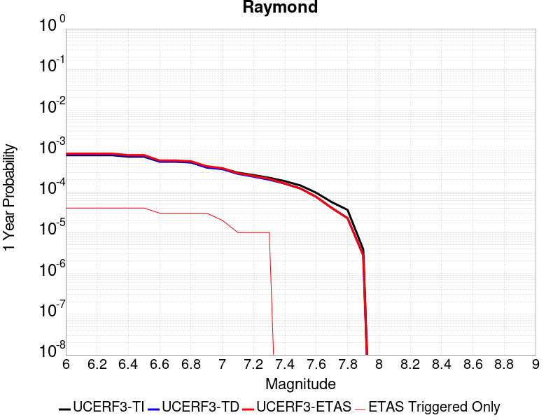 |  |

| Magnitude | 1 wk TI Prob | 1 wk TD Prob | 1 wk ETAS Prob | 1 wk ETAS/TD Gain | 1 wk ETAS Triggered Only | 1 mo TI Prob | 1 mo TD Prob | 1 mo ETAS Prob | 1 mo ETAS/TD Gain | 1 mo ETAS Triggered Only | 1 yr TI Prob | 1 yr TD Prob | 1 yr ETAS Prob | 1 yr ETAS/TD Gain | 1 yr ETAS Triggered Only | 10 yr TI Prob | 10 yr TD Prob | 10 yr ETAS Prob | 10 yr ETAS/TD Gain | 10 yr ETAS Triggered Only |
|-----|-----|-----|-----|-----|-----|-----|-----|-----|-----|-----|-----|-----|-----|-----|-----|-----|-----|-----|-----|-----|
| 6.0 | 1.5157413E-5 | 1.5810125E-5 | 2.9955574E-5 | 1.8947082 | 1.4145672E-5 | 6.4958724E-5 | 6.775606E-5 | 8.190078E-5 | 1.2087594 | 1.4145672E-5 | 7.905855E-4 | 8.246429E-4 | 8.8117894E-4 | 1.0685582 | 5.658269E-5 | 0.007877788 | 0.008218355 | 0.008288502 | 1.0085354 | 7.072836E-5 |
| 6.1 | 1.5157413E-5 | 1.5810125E-5 | 2.9955574E-5 | 1.8947082 | 1.4145672E-5 | 6.4958724E-5 | 6.775606E-5 | 8.190078E-5 | 1.2087594 | 1.4145672E-5 | 7.905855E-4 | 8.246429E-4 | 8.8117894E-4 | 1.0685582 | 5.658269E-5 | 0.007877788 | 0.008218355 | 0.008288502 | 1.0085354 | 7.072836E-5 |
| 6.2 | 1.5157413E-5 | 1.5810125E-5 | 2.9955574E-5 | 1.8947082 | 1.4145672E-5 | 6.4958724E-5 | 6.775606E-5 | 8.190078E-5 | 1.2087594 | 1.4145672E-5 | 7.905855E-4 | 8.246429E-4 | 8.8117894E-4 | 1.0685582 | 5.658269E-5 | 0.007877788 | 0.008218355 | 0.008288502 | 1.0085354 | 7.072836E-5 |
| 6.3 | 1.5157413E-5 | 1.5810125E-5 | 2.9955574E-5 | 1.8947082 | 1.4145672E-5 | 6.4958724E-5 | 6.775606E-5 | 8.190078E-5 | 1.2087594 | 1.4145672E-5 | 7.905855E-4 | 8.246429E-4 | 8.8117894E-4 | 1.0685582 | 5.658269E-5 | 0.007877788 | 0.008218355 | 0.008288502 | 1.0085354 | 7.072836E-5 |
| 6.4 | 1.3941944E-5 | 1.4454688E-5 | 2.8600156E-5 | 1.9786077 | 1.4145672E-5 | 5.9749822E-5 | 6.194732E-5 | 7.609212E-5 | 1.2283359 | 1.4145672E-5 | 7.2721124E-4 | 7.53971E-4 | 8.1051106E-4 | 1.0749897 | 5.658269E-5 | 0.007248361 | 0.007516471 | 0.007586668 | 1.0093391 | 7.072836E-5 |
| 6.5 | 1.3941944E-5 | 1.4454688E-5 | 2.8600156E-5 | 1.9786077 | 1.4145672E-5 | 5.9749822E-5 | 6.194732E-5 | 7.609212E-5 | 1.2283359 | 1.4145672E-5 | 7.2721124E-4 | 7.53971E-4 | 8.1051106E-4 | 1.0749897 | 5.658269E-5 | 0.007248361 | 0.007516471 | 0.007586668 | 1.0093391 | 7.072836E-5 |
| 6.6 | 1.0542609E-5 | 1.067111E-5 | 2.481663E-5 | 2.3255904 | 1.4145672E-5 | 4.5181827E-5 | 4.573256E-5 | 5.9877584E-5 | 1.3092988 | 1.4145672E-5 | 5.499499E-4 | 5.566571E-4 | 5.990705E-4 | 1.076193 | 4.2437016E-5 | 0.005485909 | 0.0055531966 | 0.005609465 | 1.0101327 | 5.658269E-5 |
| 6.7 | 1.0542609E-5 | 1.067111E-5 | 2.481663E-5 | 2.3255904 | 1.4145672E-5 | 4.5181827E-5 | 4.573256E-5 | 5.9877584E-5 | 1.3092988 | 1.4145672E-5 | 5.499499E-4 | 5.566571E-4 | 5.990705E-4 | 1.076193 | 4.2437016E-5 | 0.005485909 | 0.0055531966 | 0.005609465 | 1.0101327 | 5.658269E-5 |
| 6.8 | 1.0079132E-5 | 1.0176644E-5 | 2.4322171E-5 | 2.3899994 | 1.4145672E-5 | 4.3195567E-5 | 4.3613487E-5 | 5.775854E-5 | 1.3243276 | 1.4145672E-5 | 5.257791E-4 | 5.308702E-4 | 5.732847E-4 | 1.0798962 | 4.2437016E-5 | 0.0052453685 | 0.0052965777 | 0.0053528603 | 1.0106263 | 5.658269E-5 |
| 6.9 | 7.721598E-6 | 7.548902E-6 | 2.1694468E-5 | 2.8738573 | 1.4145672E-5 | 3.3092143E-5 | 3.2352043E-5 | 4.6497258E-5 | 1.4372278 | 1.4145672E-5 | 4.0282236E-4 | 3.9381615E-4 | 4.3623644E-4 | 1.107716 | 4.2437016E-5 | 0.0040209293 | 0.003931324 | 0.003987684 | 1.0143362 | 5.658269E-5 |
| 7.0 | 7.137566E-6 | 6.911303E-6 | 2.1056878E-5 | 3.0467305 | 1.4145672E-5 | 3.058921E-5 | 2.961954E-5 | 4.3764794E-5 | 1.4775649 | 1.4145672E-5 | 3.7236E-4 | 3.605593E-4 | 3.8884045E-4 | 1.0784369 | 2.8291344E-5 | 0.0037173668 | 0.003599869 | 0.0036421532 | 1.011746 | 4.2437016E-5 |
| 7.1 | 5.654976E-6 | 5.299538E-6 | 5.299538E-6 | 1.0 | 0.0 | 2.4235387E-5 | 2.2712107E-5 | 2.2712107E-5 | 1.0 | 0.0 | 2.9502588E-4 | 2.7648505E-4 | 2.906268E-4 | 1.0511484 | 1.4145672E-5 | 0.0029463451 | 0.0027614492 | 0.0027896625 | 1.0102168 | 2.8291344E-5 |
| 7.2 | 4.9358455E-6 | 4.526655E-6 | 4.526655E-6 | 1.0 | 0.0 | 2.1153453E-5 | 1.9399806E-5 | 1.9399806E-5 | 1.0 | 0.0 | 2.5751285E-4 | 2.3616718E-4 | 2.503095E-4 | 1.0598828 | 1.4145672E-5 | 0.0025721465 | 0.002359192 | 0.0023874163 | 1.0119637 | 2.8291344E-5 |
| 7.3 | 4.2368597E-6 | 3.8056128E-6 | 3.8056128E-6 | 1.0 | 0.0 | 1.8157843E-5 | 1.6309668E-5 | 1.6309668E-5 | 1.0 | 0.0 | 2.2104931E-4 | 1.9855222E-4 | 2.1269509E-4 | 1.0712299 | 1.4145672E-5 | 0.0022082955 | 0.0019837746 | 0.0020120097 | 1.0142331 | 2.8291344E-5 |
| 7.4 | 3.4999923E-6 | 3.0437407E-6 | 3.0437407E-6 | 1.0 | 0.0 | 1.49998805E-5 | 1.3044538E-5 | 1.3044538E-5 | 1.0 | 0.0 | 1.8260824E-4 | 1.5880575E-4 | 1.5880575E-4 | 1.0 | 0.0 | 0.0018245826 | 0.0015869461 | 0.0015869461 | 1.0 | 0.0 |
| 7.5 | 2.738017E-6 | 2.3020405E-6 | 2.3020405E-6 | 1.0 | 0.0 | 1.1734306E-5 | 9.865851E-6 | 9.865851E-6 | 1.0 | 0.0 | 1.428558E-4 | 1.20110184E-4 | 1.20110184E-4 | 1.0 | 0.0 | 0.0014276401 | 0.0012004747 | 0.0012004747 | 1.0 | 0.0 |
| 7.6 | 1.8186392E-6 | 1.442302E-6 | 1.442302E-6 | 1.0 | 0.0 | 7.794145E-6 | 6.1812802E-6 | 6.1812802E-6 | 1.0 | 0.0 | 9.488958E-5 | 7.5254524E-5 | 7.5254524E-5 | 1.0 | 0.0 | 9.4849075E-4 | 7.5230957E-4 | 7.5230957E-4 | 1.0 | 0.0 |
| 7.7 | 1.0660348E-6 | 7.6437E-7 | 7.6437E-7 | 1.0 | 0.0 | 4.5687125E-6 | 3.2758674E-6 | 3.2758674E-6 | 1.0 | 0.0 | 5.5622655E-5 | 3.988297E-5 | 3.988297E-5 | 1.0 | 0.0 | 5.5608735E-4 | 3.9877492E-4 | 3.9877492E-4 | 1.0 | 0.0 |
| 7.8 | 6.913602E-7 | 4.3202903E-7 | 4.3202903E-7 | 1.0 | 0.0 | 2.962969E-6 | 1.8515517E-6 | 1.8515517E-6 | 1.0 | 0.0 | 3.607355E-5 | 2.2542416E-5 | 2.2542416E-5 | 1.0 | 0.0 | 3.6067693E-4 | 2.2541684E-4 | 2.2541684E-4 | 1.0 | 0.0 |
| 7.9 | 7.425201E-8 | 5.322267E-8 | 5.322267E-8 | 1.0 | 0.0 | 3.1822285E-7 | 2.2809714E-7 | 2.2809714E-7 | 1.0 | 0.0 | 3.874356E-6 | 2.7770805E-6 | 2.7770805E-6 | 1.0 | 0.0 | 3.8742884E-5 | 2.7770588E-5 | 2.7770588E-5 | 1.0 | 0.0 |

## Channel Islands Thrust
*[(top)](#table-of-contents)*

| 1 Week | 1 Month | 1 Year | 10 Year |
|-----|-----|-----|-----|
|  |  | 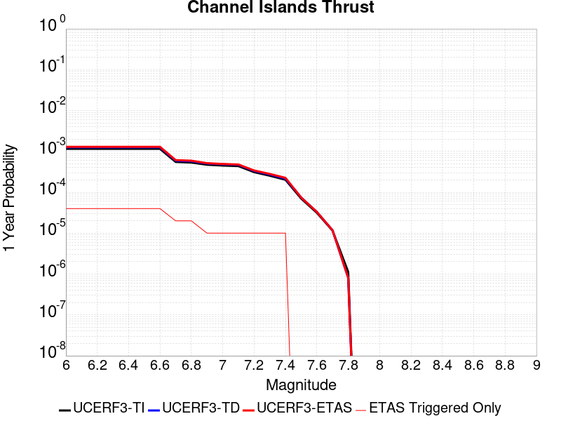 |  |

| Magnitude | 1 wk TI Prob | 1 wk TD Prob | 1 wk ETAS Prob | 1 wk ETAS/TD Gain | 1 wk ETAS Triggered Only | 1 mo TI Prob | 1 mo TD Prob | 1 mo ETAS Prob | 1 mo ETAS/TD Gain | 1 mo ETAS Triggered Only | 1 yr TI Prob | 1 yr TD Prob | 1 yr ETAS Prob | 1 yr ETAS/TD Gain | 1 yr ETAS Triggered Only | 10 yr TI Prob | 10 yr TD Prob | 10 yr ETAS Prob | 10 yr ETAS/TD Gain | 10 yr ETAS Triggered Only |
|-----|-----|-----|-----|-----|-----|-----|-----|-----|-----|-----|-----|-----|-----|-----|-----|-----|-----|-----|-----|-----|
| 6.0 | 2.2156251E-5 | 2.4092022E-5 | 3.8237355E-5 | 1.5871376 | 1.4145672E-5 | 9.495191E-5 | 1.03248036E-4 | 1.1739225E-4 | 1.1369926 | 1.4145672E-5 | 0.0011554264 | 0.0012564266 | 0.0012988102 | 1.0337335 | 4.2437016E-5 | 0.011494373 | 0.0125038205 | 0.012573665 | 1.0055858 | 7.072836E-5 |
| 6.1 | 2.2156251E-5 | 2.4092022E-5 | 3.8237355E-5 | 1.5871376 | 1.4145672E-5 | 9.495191E-5 | 1.03248036E-4 | 1.1739225E-4 | 1.1369926 | 1.4145672E-5 | 0.0011554264 | 0.0012564266 | 0.0012988102 | 1.0337335 | 4.2437016E-5 | 0.011494373 | 0.0125038205 | 0.012573665 | 1.0055858 | 7.072836E-5 |
| 6.2 | 2.2156251E-5 | 2.4092022E-5 | 3.8237355E-5 | 1.5871376 | 1.4145672E-5 | 9.495191E-5 | 1.03248036E-4 | 1.1739225E-4 | 1.1369926 | 1.4145672E-5 | 0.0011554264 | 0.0012564266 | 0.0012988102 | 1.0337335 | 4.2437016E-5 | 0.011494373 | 0.0125038205 | 0.012573665 | 1.0055858 | 7.072836E-5 |
| 6.3 | 2.2156251E-5 | 2.4092022E-5 | 3.8237355E-5 | 1.5871376 | 1.4145672E-5 | 9.495191E-5 | 1.03248036E-4 | 1.1739225E-4 | 1.1369926 | 1.4145672E-5 | 0.0011554264 | 0.0012564266 | 0.0012988102 | 1.0337335 | 4.2437016E-5 | 0.011494373 | 0.0125038205 | 0.012573665 | 1.0055858 | 7.072836E-5 |
| 6.4 | 2.2156251E-5 | 2.4092022E-5 | 3.8237355E-5 | 1.5871376 | 1.4145672E-5 | 9.495191E-5 | 1.03248036E-4 | 1.1739225E-4 | 1.1369926 | 1.4145672E-5 | 0.0011554264 | 0.0012564266 | 0.0012988102 | 1.0337335 | 4.2437016E-5 | 0.011494373 | 0.0125038205 | 0.012573665 | 1.0055858 | 7.072836E-5 |
| 6.5 | 2.2156251E-5 | 2.4092022E-5 | 3.8237355E-5 | 1.5871376 | 1.4145672E-5 | 9.495191E-5 | 1.03248036E-4 | 1.1739225E-4 | 1.1369926 | 1.4145672E-5 | 0.0011554264 | 0.0012564266 | 0.0012988102 | 1.0337335 | 4.2437016E-5 | 0.011494373 | 0.0125038205 | 0.012573665 | 1.0055858 | 7.072836E-5 |
| 6.6 | 2.2156251E-5 | 2.4092022E-5 | 3.8237355E-5 | 1.5871376 | 1.4145672E-5 | 9.495191E-5 | 1.03248036E-4 | 1.1739225E-4 | 1.1369926 | 1.4145672E-5 | 0.0011554264 | 0.0012564266 | 0.0012988102 | 1.0337335 | 4.2437016E-5 | 0.011494373 | 0.0125038205 | 0.012573665 | 1.0055858 | 7.072836E-5 |
| 6.7 | 1.0601296E-5 | 1.1379544E-5 | 1.1379544E-5 | 1.0 | 0.0 | 4.5433335E-5 | 4.876859E-5 | 4.876859E-5 | 1.0 | 0.0 | 5.5301044E-4 | 5.936007E-4 | 6.218753E-4 | 1.0476322 | 2.8291344E-5 | 0.005516363 | 0.005920653 | 0.0059628394 | 1.0071251 | 4.2437016E-5 |
| 6.8 | 1.0246747E-5 | 1.0996669E-5 | 1.0996669E-5 | 1.0 | 0.0 | 4.391389E-5 | 4.7127756E-5 | 4.7127756E-5 | 1.0 | 0.0 | 5.345204E-4 | 5.7363417E-4 | 6.019093E-4 | 1.0492913 | 2.8291344E-5 | 0.0053323656 | 0.005722025 | 0.005764219 | 1.007374 | 4.2437016E-5 |
| 6.9 | 9.049551E-6 | 9.699645E-6 | 9.699645E-6 | 1.0 | 0.0 | 3.878322E-5 | 4.1569267E-5 | 4.1569267E-5 | 1.0 | 0.0 | 4.7208337E-4 | 5.059924E-4 | 5.201309E-4 | 1.0279422 | 1.4145672E-5 | 0.0047108172 | 0.0050488203 | 0.005076969 | 1.0055753 | 2.8291344E-5 |
| 7.0 | 8.6542195E-6 | 9.274603E-6 | 9.274603E-6 | 1.0 | 0.0 | 3.7088983E-5 | 3.9747716E-5 | 3.9747716E-5 | 1.0 | 0.0 | 4.5146482E-4 | 4.8382508E-4 | 4.979639E-4 | 1.029223 | 1.4145672E-5 | 0.004505487 | 0.0048281294 | 0.004856284 | 1.0058314 | 2.8291344E-5 |
| 7.1 | 8.391028E-6 | 8.992925E-6 | 8.992925E-6 | 1.0 | 0.0 | 3.5961057E-5 | 3.8540562E-5 | 3.8540562E-5 | 1.0 | 0.0 | 4.3773788E-4 | 4.6913436E-4 | 4.832734E-4 | 1.0301386 | 1.4145672E-5 | 0.004368766 | 0.0046818503 | 0.0047100093 | 1.0060145 | 2.8291344E-5 |
| 7.2 | 5.965188E-6 | 6.3716957E-6 | 6.3716957E-6 | 1.0 | 0.0 | 2.556484E-5 | 2.7306984E-5 | 2.7306984E-5 | 1.0 | 0.0 | 3.1120746E-4 | 3.3241237E-4 | 3.4655334E-4 | 1.0425404 | 1.4145672E-5 | 0.00310772 | 0.0033192094 | 0.003333308 | 1.0042477 | 1.4145672E-5 |
| 7.3 | 4.877518E-6 | 5.206007E-6 | 5.206007E-6 | 1.0 | 0.0 | 2.0903482E-5 | 2.231127E-5 | 2.231127E-5 | 1.0 | 0.0 | 2.5447016E-4 | 2.716063E-4 | 2.8574813E-4 | 1.0520674 | 1.4145672E-5 | 0.0025417898 | 0.0027127897 | 0.002726897 | 1.0052003 | 1.4145672E-5 |
| 7.4 | 3.8829853E-6 | 4.141863E-6 | 4.141863E-6 | 1.0 | 0.0 | 1.664126E-5 | 1.7750723E-5 | 1.7750723E-5 | 1.0 | 0.0 | 2.0258849E-4 | 2.1609403E-4 | 2.3023665E-4 | 1.0654466 | 1.4145672E-5 | 0.002024039 | 0.002158881 | 0.002172996 | 1.0065382 | 1.4145672E-5 |
| 7.5 | 1.3489616E-6 | 1.4277905E-6 | 1.4277905E-6 | 1.0 | 0.0 | 5.7812517E-6 | 6.119088E-6 | 6.119088E-6 | 1.0 | 0.0 | 7.038446E-5 | 7.449739E-5 | 7.449739E-5 | 1.0 | 0.0 | 7.036218E-4 | 7.4472814E-4 | 7.4472814E-4 | 1.0 | 0.0 |
| 7.6 | 6.058192E-7 | 6.35378E-7 | 6.35378E-7 | 1.0 | 0.0 | 2.5963652E-6 | 2.7230458E-6 | 2.7230458E-6 | 1.0 | 0.0 | 3.161029E-5 | 3.3152595E-5 | 3.3152595E-5 | 1.0 | 0.0 | 3.1605794E-4 | 3.314781E-4 | 3.314781E-4 | 1.0 | 0.0 |
| 7.7 | 2.2170494E-7 | 2.2607924E-7 | 2.2607924E-7 | 1.0 | 0.0 | 9.5016367E-7 | 9.689107E-7 | 9.689107E-7 | 1.0 | 0.0 | 1.1568181E-5 | 1.17964355E-5 | 1.17964355E-5 | 1.0 | 0.0 | 1.1567579E-4 | 1.179592E-4 | 1.179592E-4 | 1.0 | 0.0 |
| 7.8 | 2.1613102E-8 | 1.5466837E-8 | 1.5466837E-8 | 1.0 | 0.0 | 9.262757E-8 | 6.628645E-8 | 6.628645E-8 | 1.0 | 0.0 | 1.1277401E-6 | 8.070372E-7 | 8.070372E-7 | 1.0 | 0.0 | 1.1277344E-5 | 8.07035E-6 | 8.07035E-6 | 1.0 | 0.0 |

## Elysian Park (Upper)
*[(top)](#table-of-contents)*

| 1 Week | 1 Month | 1 Year | 10 Year |
|-----|-----|-----|-----|
|  |  |  |  |

| Magnitude | 1 wk TI Prob | 1 wk TD Prob | 1 wk ETAS Prob | 1 wk ETAS/TD Gain | 1 wk ETAS Triggered Only | 1 mo TI Prob | 1 mo TD Prob | 1 mo ETAS Prob | 1 mo ETAS/TD Gain | 1 mo ETAS Triggered Only | 1 yr TI Prob | 1 yr TD Prob | 1 yr ETAS Prob | 1 yr ETAS/TD Gain | 1 yr ETAS Triggered Only | 10 yr TI Prob | 10 yr TD Prob | 10 yr ETAS Prob | 10 yr ETAS/TD Gain | 10 yr ETAS Triggered Only |
|-----|-----|-----|-----|-----|-----|-----|-----|-----|-----|-----|-----|-----|-----|-----|-----|-----|-----|-----|-----|-----|
| 6.0 | 3.1876025E-5 | 3.7035275E-5 | 5.1180425E-5 | 1.3819371 | 1.4145672E-5 | 1.3660437E-4 | 1.5871569E-4 | 1.7285912E-4 | 1.0891117 | 1.4145672E-5 | 0.0016618895 | 0.001931122 | 0.001973477 | 1.0219328 | 4.2437016E-5 | 0.016495159 | 0.019189863 | 0.019259233 | 1.003615 | 7.072836E-5 |
| 6.1 | 3.1876025E-5 | 3.7035275E-5 | 5.1180425E-5 | 1.3819371 | 1.4145672E-5 | 1.3660437E-4 | 1.5871569E-4 | 1.7285912E-4 | 1.0891117 | 1.4145672E-5 | 0.0016618895 | 0.001931122 | 0.001973477 | 1.0219328 | 4.2437016E-5 | 0.016495159 | 0.019189863 | 0.019259233 | 1.003615 | 7.072836E-5 |
| 6.2 | 3.1876025E-5 | 3.7035275E-5 | 5.1180425E-5 | 1.3819371 | 1.4145672E-5 | 1.3660437E-4 | 1.5871569E-4 | 1.7285912E-4 | 1.0891117 | 1.4145672E-5 | 0.0016618895 | 0.001931122 | 0.001973477 | 1.0219328 | 4.2437016E-5 | 0.016495159 | 0.019189863 | 0.019259233 | 1.003615 | 7.072836E-5 |
| 6.3 | 3.1876025E-5 | 3.7035275E-5 | 5.1180425E-5 | 1.3819371 | 1.4145672E-5 | 1.3660437E-4 | 1.5871569E-4 | 1.7285912E-4 | 1.0891117 | 1.4145672E-5 | 0.0016618895 | 0.001931122 | 0.001973477 | 1.0219328 | 4.2437016E-5 | 0.016495159 | 0.019189863 | 0.019259233 | 1.003615 | 7.072836E-5 |
| 6.4 | 1.9273462E-5 | 2.120244E-5 | 2.120244E-5 | 1.0 | 0.0 | 8.259794E-5 | 9.086542E-5 | 9.086542E-5 | 1.0 | 0.0 | 0.001005166 | 0.0011058967 | 0.0011200268 | 1.012777 | 1.4145672E-5 | 0.010006315 | 0.011020744 | 0.011048724 | 1.0025388 | 2.8291344E-5 |
| 6.5 | 1.9273462E-5 | 2.120244E-5 | 2.120244E-5 | 1.0 | 0.0 | 8.259794E-5 | 9.086542E-5 | 9.086542E-5 | 1.0 | 0.0 | 0.001005166 | 0.0011058967 | 0.0011200268 | 1.012777 | 1.4145672E-5 | 0.010006315 | 0.011020744 | 0.011048724 | 1.0025388 | 2.8291344E-5 |
| 6.6 | 9.813258E-6 | 9.665589E-6 | 9.665589E-6 | 1.0 | 0.0 | 4.205614E-5 | 4.1423333E-5 | 4.1423333E-5 | 1.0 | 0.0 | 5.119132E-4 | 5.042196E-4 | 5.1835814E-4 | 1.0280404 | 1.4145672E-5 | 0.005107356 | 0.0050314795 | 0.005045554 | 1.0027972 | 1.4145672E-5 |
| 6.7 | 9.801478E-6 | 9.653158E-6 | 9.653158E-6 | 1.0 | 0.0 | 4.2005657E-5 | 4.137006E-5 | 4.137006E-5 | 1.0 | 0.0 | 5.112989E-4 | 5.0357135E-4 | 5.177099E-4 | 1.0280765 | 1.4145672E-5 | 0.0051012407 | 0.005025026 | 0.0050391005 | 1.002801 | 1.4145672E-5 |
| 6.8 | 8.102489E-6 | 7.772994E-6 | 7.772994E-6 | 1.0 | 0.0 | 3.4724493E-5 | 3.3312434E-5 | 3.3312434E-5 | 1.0 | 0.0 | 4.2268867E-4 | 4.0550836E-4 | 4.196483E-4 | 1.0348697 | 1.4145672E-5 | 0.004218856 | 0.0040481784 | 0.0040622666 | 1.0034802 | 1.4145672E-5 |
| 6.9 | 6.08275E-6 | 5.481441E-6 | 5.481441E-6 | 1.0 | 0.0 | 2.6068668E-5 | 2.3491682E-5 | 2.3491682E-5 | 1.0 | 0.0 | 3.173398E-4 | 2.8597447E-4 | 3.001161E-4 | 1.0494506 | 1.4145672E-5 | 0.0031688702 | 0.0028561424 | 0.0028702477 | 1.0049386 | 1.4145672E-5 |
| 7.0 | 5.5995934E-6 | 4.9827686E-6 | 4.9827686E-6 | 1.0 | 0.0 | 2.3998036E-5 | 2.1354552E-5 | 2.1354552E-5 | 1.0 | 0.0 | 2.9213692E-4 | 2.5996132E-4 | 2.5996132E-4 | 1.0 | 0.0 | 0.0029175316 | 0.0025966396 | 0.0025966396 | 1.0 | 0.0 |
| 7.1 | 4.709881E-6 | 4.0873906E-6 | 4.0873906E-6 | 1.0 | 0.0 | 2.0185047E-5 | 1.7517272E-5 | 1.7517272E-5 | 1.0 | 0.0 | 2.4572524E-4 | 2.1325232E-4 | 2.1325232E-4 | 1.0 | 0.0 | 0.002454537 | 0.0021305184 | 0.0021305184 | 1.0 | 0.0 |
| 7.2 | 3.6063436E-6 | 2.9779412E-6 | 2.9779412E-6 | 1.0 | 0.0 | 1.5455667E-5 | 1.27625435E-5 | 1.27625435E-5 | 1.0 | 0.0 | 1.881565E-4 | 1.55373E-4 | 1.55373E-4 | 1.0 | 0.0 | 0.0018799726 | 0.0015526549 | 0.0015526549 | 1.0 | 0.0 |
| 7.3 | 2.471135E-6 | 2.0954562E-6 | 2.0954562E-6 | 1.0 | 0.0 | 1.0590536E-5 | 8.980496E-6 | 8.980496E-6 | 1.0 | 0.0 | 1.2893214E-4 | 1.0933213E-4 | 1.0933213E-4 | 1.0 | 0.0 | 0.0012885736 | 0.0010927906 | 0.0010927906 | 1.0 | 0.0 |
| 7.4 | 1.163943E-6 | 1.0275061E-6 | 1.0275061E-6 | 1.0 | 0.0 | 4.988318E-6 | 4.40359E-6 | 4.40359E-6 | 1.0 | 0.0 | 6.0731076E-5 | 5.361242E-5 | 5.361242E-5 | 1.0 | 0.0 | 6.071448E-4 | 5.3599785E-4 | 5.3599785E-4 | 1.0 | 0.0 |
| 7.5 | 4.99459E-7 | 4.917601E-7 | 4.917601E-7 | 1.0 | 0.0 | 2.140537E-6 | 2.1075416E-6 | 2.1075416E-6 | 1.0 | 0.0 | 2.6060725E-5 | 2.5659032E-5 | 2.5659032E-5 | 1.0 | 0.0 | 2.605767E-4 | 2.5656226E-4 | 2.5656226E-4 | 1.0 | 0.0 |
| 7.6 | 2.4667852E-7 | 2.4778313E-7 | 2.4778313E-7 | 1.0 | 0.0 | 1.0571932E-6 | 1.0619274E-6 | 1.0619274E-6 | 1.0 | 0.0 | 1.2871251E-5 | 1.2928893E-5 | 1.2928893E-5 | 1.0 | 0.0 | 1.2870505E-4 | 1.2928178E-4 | 1.2928178E-4 | 1.0 | 0.0 |
| 7.7 | 8.2312795E-8 | 7.3864214E-8 | 7.3864214E-8 | 1.0 | 0.0 | 3.527691E-7 | 3.165609E-7 | 3.165609E-7 | 1.0 | 0.0 | 4.294955E-6 | 3.854123E-6 | 3.854123E-6 | 1.0 | 0.0 | 4.2948723E-5 | 3.854068E-5 | 3.854068E-5 | 1.0 | 0.0 |
| 7.8 | 2.7819295E-8 | 1.7565618E-8 | 1.7565618E-8 | 1.0 | 0.0 | 1.1922555E-7 | 7.528122E-8 | 7.528122E-8 | 1.0 | 0.0 | 1.45157E-6 | 9.1654863E-7 | 9.1654863E-7 | 1.0 | 0.0 | 1.45156055E-5 | 9.165463E-6 | 9.165463E-6 | 1.0 | 0.0 |

## San Diego Trough north alt1
*[(top)](#table-of-contents)*

| 1 Week | 1 Month | 1 Year | 10 Year |
|-----|-----|-----|-----|
|  |  |  |  |

| Magnitude | 1 wk TI Prob | 1 wk TD Prob | 1 wk ETAS Prob | 1 wk ETAS/TD Gain | 1 wk ETAS Triggered Only | 1 mo TI Prob | 1 mo TD Prob | 1 mo ETAS Prob | 1 mo ETAS/TD Gain | 1 mo ETAS Triggered Only | 1 yr TI Prob | 1 yr TD Prob | 1 yr ETAS Prob | 1 yr ETAS/TD Gain | 1 yr ETAS Triggered Only | 10 yr TI Prob | 10 yr TD Prob | 10 yr ETAS Prob | 10 yr ETAS/TD Gain | 10 yr ETAS Triggered Only |
|-----|-----|-----|-----|-----|-----|-----|-----|-----|-----|-----|-----|-----|-----|-----|-----|-----|-----|-----|-----|-----|
| 6.0 | 7.329252E-5 | 8.821269E-5 | 1.0235712E-4 | 1.1603446 | 1.4145672E-5 | 3.14073E-4 | 3.7800326E-4 | 3.921436E-4 | 1.037408 | 1.4145672E-5 | 0.0038171355 | 0.0045930487 | 0.0046352907 | 1.009197 | 4.2437016E-5 | 0.03752231 | 0.045045137 | 0.04511268 | 1.0014994 | 7.072836E-5 |
| 6.1 | 3.7940346E-5 | 4.4884906E-5 | 4.4884906E-5 | 1.0 | 0.0 | 1.6259136E-4 | 1.9235026E-4 | 1.9235026E-4 | 1.0 | 0.0 | 0.0019777524 | 0.002339431 | 0.002339431 | 1.0 | 0.0 | 0.019602431 | 0.023156732 | 0.023156732 | 1.0 | 0.0 |
| 6.2 | 2.8645263E-5 | 3.329672E-5 | 3.329672E-5 | 1.0 | 0.0 | 1.2275964E-4 | 1.4269259E-4 | 1.4269259E-4 | 1.0 | 0.0 | 0.0014935739 | 0.0017359206 | 0.0017359206 | 1.0 | 0.0 | 0.0148357535 | 0.017226268 | 0.017226268 | 1.0 | 0.0 |
| 6.3 | 2.8645263E-5 | 3.329672E-5 | 3.329672E-5 | 1.0 | 0.0 | 1.2275964E-4 | 1.4269259E-4 | 1.4269259E-4 | 1.0 | 0.0 | 0.0014935739 | 0.0017359206 | 0.0017359206 | 1.0 | 0.0 | 0.0148357535 | 0.017226268 | 0.017226268 | 1.0 | 0.0 |
| 6.4 | 2.2204576E-5 | 2.544832E-5 | 2.544832E-5 | 1.0 | 0.0 | 9.5159E-5 | 1.0905972E-4 | 1.0905972E-4 | 1.0 | 0.0 | 0.001157945 | 0.0013270028 | 0.0013270028 | 1.0 | 0.0 | 0.011519298 | 0.013191959 | 0.013191959 | 1.0 | 0.0 |
| 6.5 | 2.1004838E-5 | 2.4024695E-5 | 2.4024695E-5 | 1.0 | 0.0 | 9.0017624E-5 | 1.0295897E-4 | 1.0295897E-4 | 1.0 | 0.0 | 0.0010954136 | 0.0012528135 | 0.0012528135 | 1.0 | 0.0 | 0.010900296 | 0.012458592 | 0.012458592 | 1.0 | 0.0 |
| 6.6 | 1.820557E-5 | 2.070479E-5 | 2.070479E-5 | 1.0 | 0.0 | 7.802154E-5 | 8.8731824E-5 | 8.8731824E-5 | 1.0 | 0.0 | 9.4949827E-4 | 0.0010797799 | 0.0010797799 | 1.0 | 0.0 | 0.009454516 | 0.010746005 | 0.010746005 | 1.0 | 0.0 |
| 6.7 | 1.5884485E-5 | 1.7983646E-5 | 1.7983646E-5 | 1.0 | 0.0 | 6.807459E-5 | 7.707051E-5 | 7.707051E-5 | 1.0 | 0.0 | 8.284929E-4 | 9.3793223E-4 | 9.3793223E-4 | 1.0 | 0.0 | 0.008254109 | 0.009340104 | 0.009340104 | 1.0 | 0.0 |
| 6.8 | 1.4331171E-5 | 1.6201066E-5 | 1.6201066E-5 | 1.0 | 0.0 | 6.141786E-5 | 6.94313E-5 | 6.94313E-5 | 1.0 | 0.0 | 7.4750587E-4 | 8.450002E-4 | 8.450002E-4 | 1.0 | 0.0 | 0.0074499645 | 0.008418139 | 0.008418139 | 1.0 | 0.0 |
| 6.9 | 1.2574203E-5 | 1.4205835E-5 | 1.4205835E-5 | 1.0 | 0.0 | 5.3888325E-5 | 6.0880735E-5 | 6.0880735E-5 | 1.0 | 0.0 | 6.558929E-4 | 7.409723E-4 | 7.409723E-4 | 1.0 | 0.0 | 0.0065396037 | 0.007385203 | 0.007385203 | 1.0 | 0.0 |
| 7.0 | 1.0883844E-5 | 1.2289262E-5 | 1.2289262E-5 | 1.0 | 0.0 | 4.664421E-5 | 5.2667205E-5 | 5.2667205E-5 | 1.0 | 0.0 | 5.677453E-4 | 6.4103556E-4 | 6.4103556E-4 | 1.0 | 0.0 | 0.00566297 | 0.006391993 | 0.006391993 | 1.0 | 0.0 |
| 7.1 | 9.393088E-6 | 1.060702E-5 | 1.060702E-5 | 1.0 | 0.0 | 4.025547E-5 | 4.545787E-5 | 4.545787E-5 | 1.0 | 0.0 | 4.900001E-4 | 5.533098E-4 | 5.533098E-4 | 1.0 | 0.0 | 0.0048892107 | 0.005519418 | 0.005519418 | 1.0 | 0.0 |
| 7.2 | 8.190791E-6 | 9.258625E-6 | 9.258625E-6 | 1.0 | 0.0 | 3.510292E-5 | 3.9679224E-5 | 3.9679224E-5 | 1.0 | 0.0 | 4.2729423E-4 | 4.8298817E-4 | 4.8298817E-4 | 1.0 | 0.0 | 0.0042647356 | 0.004819465 | 0.004819465 | 1.0 | 0.0 |
| 7.3 | 6.268162E-6 | 7.089716E-6 | 7.089716E-6 | 1.0 | 0.0 | 2.6863276E-5 | 3.0384144E-5 | 3.0384144E-5 | 1.0 | 0.0 | 3.2701128E-4 | 3.6986457E-4 | 3.6986457E-4 | 1.0 | 0.0 | 0.003265305 | 0.003692536 | 0.003692536 | 1.0 | 0.0 |
| 7.4 | 4.985186E-6 | 5.6426816E-6 | 5.6426816E-6 | 1.0 | 0.0 | 2.1364907E-5 | 2.4182698E-5 | 2.4182698E-5 | 1.0 | 0.0 | 2.600867E-4 | 2.9438498E-4 | 2.9438498E-4 | 1.0 | 0.0 | 0.002597825 | 0.0029399914 | 0.0029399914 | 1.0 | 0.0 |
| 7.5 | 1.7489613E-6 | 1.969678E-6 | 1.969678E-6 | 1.0 | 0.0 | 7.495527E-6 | 8.4414505E-6 | 8.4414505E-6 | 1.0 | 0.0 | 9.125422E-5 | 1.02770035E-4 | 1.02770035E-4 | 1.0 | 0.0 | 9.1216754E-4 | 0.0010272472 | 0.0010272472 | 1.0 | 0.0 |
| 7.6 | 1.6988751E-7 | 1.7533823E-7 | 1.7533823E-7 | 1.0 | 0.0 | 7.2808916E-7 | 7.5144936E-7 | 7.5144936E-7 | 1.0 | 0.0 | 8.864449E-6 | 9.14886E-6 | 9.14886E-6 | 1.0 | 0.0 | 8.8640954E-5 | 9.1485024E-5 | 9.1485024E-5 | 1.0 | 0.0 |

## Santa Ynez River
*[(top)](#table-of-contents)*

| 1 Week | 1 Month | 1 Year | 10 Year |
|-----|-----|-----|-----|
|  | 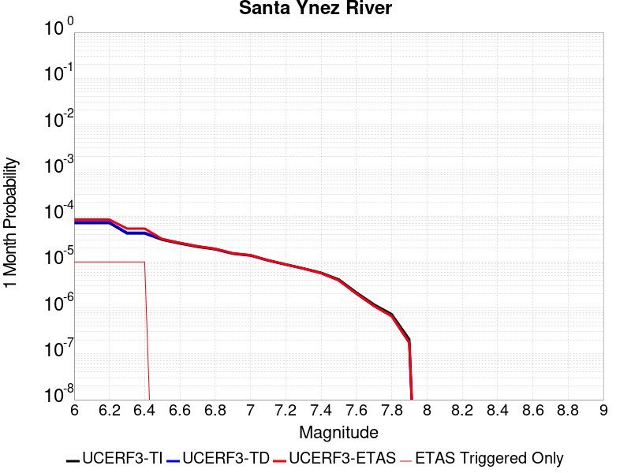 |  | 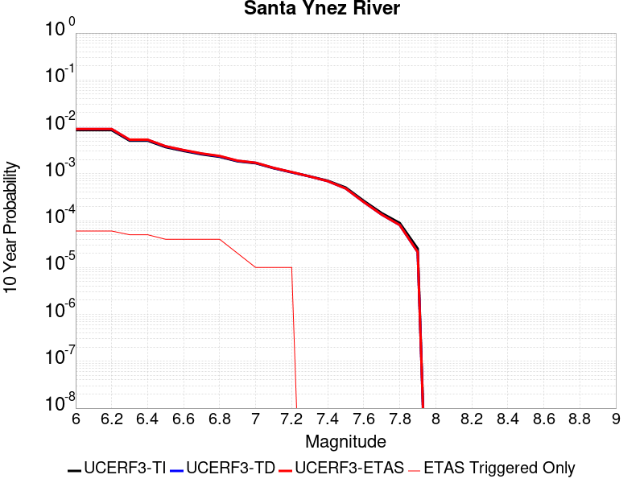 |

| Magnitude | 1 wk TI Prob | 1 wk TD Prob | 1 wk ETAS Prob | 1 wk ETAS/TD Gain | 1 wk ETAS Triggered Only | 1 mo TI Prob | 1 mo TD Prob | 1 mo ETAS Prob | 1 mo ETAS/TD Gain | 1 mo ETAS Triggered Only | 1 yr TI Prob | 1 yr TD Prob | 1 yr ETAS Prob | 1 yr ETAS/TD Gain | 1 yr ETAS Triggered Only | 10 yr TI Prob | 10 yr TD Prob | 10 yr ETAS Prob | 10 yr ETAS/TD Gain | 10 yr ETAS Triggered Only |
|-----|-----|-----|-----|-----|-----|-----|-----|-----|-----|-----|-----|-----|-----|-----|-----|-----|-----|-----|-----|-----|
| 6.0 | 1.6396456E-5 | 1.7209444E-5 | 3.1354873E-5 | 1.8219573 | 1.4145672E-5 | 7.026863E-5 | 7.3752875E-5 | 8.7897504E-5 | 1.1917841 | 1.4145672E-5 | 8.551848E-4 | 8.976069E-4 | 9.258728E-4 | 1.0314903 | 2.8291344E-5 | 0.0085190125 | 0.008943363 | 0.009013458 | 1.0078378 | 7.072836E-5 |
| 6.1 | 1.6396456E-5 | 1.7209444E-5 | 3.1354873E-5 | 1.8219573 | 1.4145672E-5 | 7.026863E-5 | 7.3752875E-5 | 8.7897504E-5 | 1.1917841 | 1.4145672E-5 | 8.551848E-4 | 8.976069E-4 | 9.258728E-4 | 1.0314903 | 2.8291344E-5 | 0.0085190125 | 0.008943363 | 0.009013458 | 1.0078378 | 7.072836E-5 |
| 6.2 | 1.6396456E-5 | 1.7209444E-5 | 3.1354873E-5 | 1.8219573 | 1.4145672E-5 | 7.026863E-5 | 7.3752875E-5 | 8.7897504E-5 | 1.1917841 | 1.4145672E-5 | 8.551848E-4 | 8.976069E-4 | 9.258728E-4 | 1.0314903 | 2.8291344E-5 | 0.0085190125 | 0.008943363 | 0.009013458 | 1.0078378 | 7.072836E-5 |
| 6.3 | 9.736976E-6 | 1.01223395E-5 | 2.4267869E-5 | 2.3974566 | 1.4145672E-5 | 4.172923E-5 | 4.338076E-5 | 5.752582E-5 | 1.3260676 | 1.4145672E-5 | 5.0793495E-4 | 5.280378E-4 | 5.563142E-4 | 1.05355 | 2.8291344E-5 | 0.005067755 | 0.0052683367 | 0.005324621 | 1.0106835 | 5.658269E-5 |
| 6.4 | 9.736976E-6 | 1.01223395E-5 | 2.4267869E-5 | 2.3974566 | 1.4145672E-5 | 4.172923E-5 | 4.338076E-5 | 5.752582E-5 | 1.3260676 | 1.4145672E-5 | 5.0793495E-4 | 5.280378E-4 | 5.563142E-4 | 1.05355 | 2.8291344E-5 | 0.005067755 | 0.0052683367 | 0.005324621 | 1.0106835 | 5.658269E-5 |
| 6.5 | 7.081964E-6 | 7.329905E-6 | 7.329905E-6 | 1.0 | 0.0 | 3.035092E-5 | 3.141351E-5 | 3.141351E-5 | 1.0 | 0.0 | 3.694598E-4 | 3.8239395E-4 | 3.9653422E-4 | 1.0369782 | 1.4145672E-5 | 0.0036884616 | 0.0038175215 | 0.0038597963 | 1.011074 | 4.2437016E-5 |
| 6.6 | 5.873247E-6 | 6.0597517E-6 | 6.0597517E-6 | 1.0 | 0.0 | 2.5170815E-5 | 2.5970112E-5 | 2.5970112E-5 | 1.0 | 0.0 | 3.064116E-4 | 3.161411E-4 | 3.302823E-4 | 1.0447307 | 1.4145672E-5 | 0.0030598943 | 0.003157001 | 0.003199304 | 1.0133997 | 4.2437016E-5 |
| 6.7 | 4.973277E-6 | 5.11591E-6 | 5.11591E-6 | 1.0 | 0.0 | 2.1313872E-5 | 2.1925147E-5 | 2.1925147E-5 | 1.0 | 0.0 | 2.5946548E-4 | 2.6690646E-4 | 2.8104833E-4 | 1.0529845 | 1.4145672E-5 | 0.0025916274 | 0.0026659078 | 0.0027082316 | 1.0158759 | 4.2437016E-5 |
| 6.8 | 4.396492E-6 | 4.510987E-6 | 4.510987E-6 | 1.0 | 0.0 | 1.884197E-5 | 1.933266E-5 | 1.933266E-5 | 1.0 | 0.0 | 2.2937685E-4 | 2.3535005E-4 | 2.4949238E-4 | 1.0600907 | 1.4145672E-5 | 0.0022914023 | 0.0023510433 | 0.0023933805 | 1.0180079 | 4.2437016E-5 |
| 6.9 | 3.5255632E-6 | 3.6013423E-6 | 3.6013423E-6 | 1.0 | 0.0 | 1.5109469E-5 | 1.5434234E-5 | 1.5434234E-5 | 1.0 | 0.0 | 1.8394225E-4 | 1.8789574E-4 | 1.8789574E-4 | 1.0 | 0.0 | 0.0018379007 | 0.001877385 | 0.0019056232 | 1.0150412 | 2.8291344E-5 |
| 7.0 | 3.211603E-6 | 3.273663E-6 | 3.273663E-6 | 1.0 | 0.0 | 1.376394E-5 | 1.402991E-5 | 1.402991E-5 | 1.0 | 0.0 | 1.6756308E-4 | 1.708009E-4 | 1.708009E-4 | 1.0 | 0.0 | 0.0016743679 | 0.0017067104 | 0.001720832 | 1.0082741 | 1.4145672E-5 |
| 7.1 | 2.5094619E-6 | 2.5409295E-6 | 2.5409295E-6 | 1.0 | 0.0 | 1.0754793E-5 | 1.0889652E-5 | 1.0889652E-5 | 1.0 | 0.0 | 1.3093173E-4 | 1.325735E-4 | 1.325735E-4 | 1.0 | 0.0 | 0.0013085462 | 0.0013249503 | 0.0013390771 | 1.0106622 | 1.4145672E-5 |
| 7.2 | 2.0515774E-6 | 2.0619466E-6 | 2.0619466E-6 | 1.0 | 0.0 | 8.792445E-6 | 8.836884E-6 | 8.836884E-6 | 1.0 | 0.0 | 1.0704277E-4 | 1.0758379E-4 | 1.0758379E-4 | 1.0 | 0.0 | 0.0010699122 | 0.0010753215 | 0.0010894518 | 1.0131407 | 1.4145672E-5 |
| 7.3 | 1.6845745E-6 | 1.6773996E-6 | 1.6773996E-6 | 1.0 | 0.0 | 7.219585E-6 | 7.1888358E-6 | 7.1888358E-6 | 1.0 | 0.0 | 8.78949E-5 | 8.752059E-5 | 8.752059E-5 | 1.0 | 0.0 | 8.7860145E-4 | 8.7486405E-4 | 8.7486405E-4 | 1.0 | 0.0 |
| 7.4 | 1.3600285E-6 | 1.3333447E-6 | 1.3333447E-6 | 1.0 | 0.0 | 5.82868E-6 | 5.714322E-6 | 5.714322E-6 | 1.0 | 0.0 | 7.096187E-5 | 6.956967E-5 | 6.956967E-5 | 1.0 | 0.0 | 7.0939213E-4 | 6.9548114E-4 | 6.9548114E-4 | 1.0 | 0.0 |
| 7.5 | 9.735342E-7 | 9.2901894E-7 | 9.2901894E-7 | 1.0 | 0.0 | 4.172283E-6 | 3.9815036E-6 | 3.9815036E-6 | 1.0 | 0.0 | 5.079636E-5 | 4.8473747E-5 | 4.8473747E-5 | 1.0 | 0.0 | 5.0784746E-4 | 4.8463346E-4 | 4.8463346E-4 | 1.0 | 0.0 |
| 7.6 | 5.067187E-7 | 4.778609E-7 | 4.778609E-7 | 1.0 | 0.0 | 2.1716498E-6 | 2.0479738E-6 | 2.0479738E-6 | 1.0 | 0.0 | 2.6439517E-5 | 2.4933803E-5 | 2.4933803E-5 | 1.0 | 0.0 | 2.643637E-4 | 2.493108E-4 | 2.493108E-4 | 1.0 | 0.0 |
| 7.7 | 2.769089E-7 | 2.5759346E-7 | 2.5759346E-7 | 1.0 | 0.0 | 1.1867519E-6 | 1.1039714E-6 | 1.1039714E-6 | 1.0 | 0.0 | 1.4448608E-5 | 1.344077E-5 | 1.344077E-5 | 1.0 | 0.0 | 1.444767E-4 | 1.343996E-4 | 1.343996E-4 | 1.0 | 0.0 |
| 7.8 | 1.7044663E-7 | 1.5449208E-7 | 1.5449208E-7 | 1.0 | 0.0 | 7.3048534E-7 | 6.6210873E-7 | 6.6210873E-7 | 1.0 | 0.0 | 8.893623E-6 | 8.061144E-6 | 8.061144E-6 | 1.0 | 0.0 | 8.893267E-5 | 8.060854E-5 | 8.060854E-5 | 1.0 | 0.0 |
| 7.9 | 4.8344287E-8 | 4.0911143E-8 | 4.0911143E-8 | 1.0 | 0.0 | 2.0718979E-7 | 1.7533345E-7 | 1.7533345E-7 | 1.0 | 0.0 | 2.5225327E-6 | 2.1346827E-6 | 2.1346827E-6 | 1.0 | 0.0 | 2.5225041E-5 | 2.1346626E-5 | 2.1346626E-5 | 1.0 | 0.0 |

## Pleito
*[(top)](#table-of-contents)*

| 1 Week | 1 Month | 1 Year | 10 Year |
|-----|-----|-----|-----|
|  |  |  |  |

| Magnitude | 1 wk TI Prob | 1 wk TD Prob | 1 wk ETAS Prob | 1 wk ETAS/TD Gain | 1 wk ETAS Triggered Only | 1 mo TI Prob | 1 mo TD Prob | 1 mo ETAS Prob | 1 mo ETAS/TD Gain | 1 mo ETAS Triggered Only | 1 yr TI Prob | 1 yr TD Prob | 1 yr ETAS Prob | 1 yr ETAS/TD Gain | 1 yr ETAS Triggered Only | 10 yr TI Prob | 10 yr TD Prob | 10 yr ETAS Prob | 10 yr ETAS/TD Gain | 10 yr ETAS Triggered Only |
|-----|-----|-----|-----|-----|-----|-----|-----|-----|-----|-----|-----|-----|-----|-----|-----|-----|-----|-----|-----|-----|
| 6.0 | 1.6763008E-5 | 2.4764735E-5 | 5.305538E-5 | 2.1423762 | 2.8291344E-5 | 7.183948E-5 | 1.0613067E-4 | 1.3441901E-4 | 1.2665426 | 2.8291344E-5 | 8.742947E-4 | 0.001291447 | 0.0013620841 | 1.0546961 | 7.072836E-5 | 0.00870863 | 0.012954412 | 0.013024224 | 1.0053891 | 7.072836E-5 |
| 6.1 | 1.6763008E-5 | 2.4764735E-5 | 5.305538E-5 | 2.1423762 | 2.8291344E-5 | 7.183948E-5 | 1.0613067E-4 | 1.3441901E-4 | 1.2665426 | 2.8291344E-5 | 8.742947E-4 | 0.001291447 | 0.0013620841 | 1.0546961 | 7.072836E-5 | 0.00870863 | 0.012954412 | 0.013024224 | 1.0053891 | 7.072836E-5 |
| 6.2 | 1.6763008E-5 | 2.4764735E-5 | 5.305538E-5 | 2.1423762 | 2.8291344E-5 | 7.183948E-5 | 1.0613067E-4 | 1.3441901E-4 | 1.2665426 | 2.8291344E-5 | 8.742947E-4 | 0.001291447 | 0.0013620841 | 1.0546961 | 7.072836E-5 | 0.00870863 | 0.012954412 | 0.013024224 | 1.0053891 | 7.072836E-5 |
| 6.3 | 1.6763008E-5 | 2.4764735E-5 | 5.305538E-5 | 2.1423762 | 2.8291344E-5 | 7.183948E-5 | 1.0613067E-4 | 1.3441901E-4 | 1.2665426 | 2.8291344E-5 | 8.742947E-4 | 0.001291447 | 0.0013620841 | 1.0546961 | 7.072836E-5 | 0.00870863 | 0.012954412 | 0.013024224 | 1.0053891 | 7.072836E-5 |
| 6.4 | 1.6763008E-5 | 2.4764735E-5 | 5.305538E-5 | 2.1423762 | 2.8291344E-5 | 7.183948E-5 | 1.0613067E-4 | 1.3441901E-4 | 1.2665426 | 2.8291344E-5 | 8.742947E-4 | 0.001291447 | 0.0013620841 | 1.0546961 | 7.072836E-5 | 0.00870863 | 0.012954412 | 0.013024224 | 1.0053891 | 7.072836E-5 |
| 6.5 | 1.6763008E-5 | 2.4764735E-5 | 5.305538E-5 | 2.1423762 | 2.8291344E-5 | 7.183948E-5 | 1.0613067E-4 | 1.3441901E-4 | 1.2665426 | 2.8291344E-5 | 8.742947E-4 | 0.001291447 | 0.0013620841 | 1.0546961 | 7.072836E-5 | 0.00870863 | 0.012954412 | 0.013024224 | 1.0053891 | 7.072836E-5 |
| 6.6 | 9.910213E-6 | 1.721552E-5 | 4.550638E-5 | 2.6433344 | 2.8291344E-5 | 4.247165E-5 | 7.3778734E-5 | 1.0206799E-4 | 1.3834337 | 2.8291344E-5 | 5.169696E-4 | 8.9788967E-4 | 9.4028853E-4 | 1.0472206 | 4.2437016E-5 | 0.0051576863 | 0.009051226 | 0.009093279 | 1.0046461 | 4.2437016E-5 |
| 6.7 | 9.910213E-6 | 1.721552E-5 | 4.550638E-5 | 2.6433344 | 2.8291344E-5 | 4.247165E-5 | 7.3778734E-5 | 1.0206799E-4 | 1.3834337 | 2.8291344E-5 | 5.169696E-4 | 8.9788967E-4 | 9.4028853E-4 | 1.0472206 | 4.2437016E-5 | 0.0051576863 | 0.009051226 | 0.009093279 | 1.0046461 | 4.2437016E-5 |
| 6.8 | 8.300162E-6 | 1.5475129E-5 | 2.9620582E-5 | 1.9140766 | 1.4145672E-5 | 3.557164E-5 | 6.63203E-5 | 8.046504E-5 | 1.2132791 | 1.4145672E-5 | 4.3299864E-4 | 8.07152E-4 | 8.354205E-4 | 1.0350225 | 2.8291344E-5 | 0.004321559 | 0.008150663 | 0.008178724 | 1.0034428 | 2.8291344E-5 |
| 6.9 | 8.183114E-6 | 1.5346344E-5 | 2.9491799E-5 | 1.9217476 | 1.4145672E-5 | 3.5070017E-5 | 6.57684E-5 | 7.991314E-5 | 1.2150689 | 1.4145672E-5 | 4.2689382E-4 | 8.0043747E-4 | 8.287062E-4 | 1.0353166 | 2.8291344E-5 | 0.0042607468 | 0.008084008 | 0.00811207 | 1.0034714 | 2.8291344E-5 |
| 7.0 | 7.1748823E-6 | 1.4133306E-5 | 1.4133306E-5 | 1.0 | 0.0 | 3.0749135E-5 | 6.0569906E-5 | 6.0569906E-5 | 1.0 | 0.0 | 3.743064E-4 | 7.3718966E-4 | 7.3718966E-4 | 1.0 | 0.0 | 0.0037367654 | 0.0074553755 | 0.0074553755 | 1.0 | 0.0 |
| 7.1 | 7.1671807E-6 | 1.4123676E-5 | 1.4123676E-5 | 1.0 | 0.0 | 3.0716128E-5 | 6.0528637E-5 | 6.0528637E-5 | 1.0 | 0.0 | 3.7390468E-4 | 7.366875E-4 | 7.366875E-4 | 1.0 | 0.0 | 0.0037327618 | 0.0074503883 | 0.0074503883 | 1.0 | 0.0 |
| 7.2 | 7.0649667E-6 | 1.3970962E-5 | 1.3970962E-5 | 1.0 | 0.0 | 3.0278077E-5 | 5.987418E-5 | 5.987418E-5 | 1.0 | 0.0 | 3.6857324E-4 | 7.287248E-4 | 7.287248E-4 | 1.0 | 0.0 | 0.0036796255 | 0.0073711374 | 0.0073711374 | 1.0 | 0.0 |
| 7.3 | 7.02082E-6 | 1.3914415E-5 | 1.3914415E-5 | 1.0 | 0.0 | 3.008888E-5 | 5.9631846E-5 | 5.9631846E-5 | 1.0 | 0.0 | 3.6627054E-4 | 7.257764E-4 | 7.257764E-4 | 1.0 | 0.0 | 0.0036566744 | 0.0073416373 | 0.0073416373 | 1.0 | 0.0 |
| 7.4 | 6.987146E-6 | 1.3873975E-5 | 1.3873975E-5 | 1.0 | 0.0 | 2.9944567E-5 | 5.9458544E-5 | 5.9458544E-5 | 1.0 | 0.0 | 3.6451413E-4 | 7.2366785E-4 | 7.2366785E-4 | 1.0 | 0.0 | 0.0036391679 | 0.007320571 | 0.007320571 | 1.0 | 0.0 |
| 7.5 | 6.9494554E-6 | 1.383088E-5 | 1.383088E-5 | 1.0 | 0.0 | 2.9783041E-5 | 5.9273858E-5 | 5.9273858E-5 | 1.0 | 0.0 | 3.625482E-4 | 7.2142074E-4 | 7.2142074E-4 | 1.0 | 0.0 | 0.0036195726 | 0.007298199 | 0.007298199 | 1.0 | 0.0 |
| 7.6 | 6.92694E-6 | 1.3789992E-5 | 1.3789992E-5 | 1.0 | 0.0 | 2.9686547E-5 | 5.909863E-5 | 5.909863E-5 | 1.0 | 0.0 | 3.6137376E-4 | 7.192888E-4 | 7.192888E-4 | 1.0 | 0.0 | 0.0036078666 | 0.007276951 | 0.007276951 | 1.0 | 0.0 |
| 7.7 | 6.395867E-6 | 1.26690065E-5 | 1.26690065E-5 | 1.0 | 0.0 | 2.741057E-5 | 5.4294615E-5 | 5.4294615E-5 | 1.0 | 0.0 | 3.336726E-4 | 6.6083675E-4 | 6.6083675E-4 | 1.0 | 0.0 | 0.0033317201 | 0.0066955453 | 0.0066955453 | 1.0 | 0.0 |
| 7.8 | 5.8664327E-6 | 1.1536581E-5 | 1.1536581E-5 | 1.0 | 0.0 | 2.5141611E-5 | 4.9441554E-5 | 4.9441554E-5 | 1.0 | 0.0 | 3.060561E-4 | 6.0178485E-4 | 6.0178485E-4 | 1.0 | 0.0 | 0.0030563495 | 0.0061010164 | 0.0061010164 | 1.0 | 0.0 |
| 7.9 | 3.7167474E-6 | 7.1145205E-6 | 7.1145205E-6 | 1.0 | 0.0 | 1.592882E-5 | 3.0490448E-5 | 3.0490448E-5 | 1.0 | 0.0 | 1.9391612E-4 | 3.7115812E-4 | 3.7115812E-4 | 1.0 | 0.0 | 0.0019374699 | 0.0037676243 | 0.0037676243 | 1.0 | 0.0 |
| 8.0 | 1.0903841E-6 | 1.2879104E-6 | 1.2879104E-6 | 1.0 | 0.0 | 4.6730665E-6 | 5.5196047E-6 | 5.5196047E-6 | 1.0 | 0.0 | 5.68931E-5 | 6.719913E-5 | 6.719913E-5 | 1.0 | 0.0 | 5.6878536E-4 | 6.942094E-4 | 6.942094E-4 | 1.0 | 0.0 |
| 8.1 | 2.6894583E-7 | 1.1056095E-7 | 1.1056095E-7 | 1.0 | 0.0 | 1.1526245E-6 | 4.7383253E-7 | 4.7383253E-7 | 1.0 | 0.0 | 1.4033113E-5 | 5.768896E-6 | 5.768896E-6 | 1.0 | 0.0 | 1.4032227E-4 | 6.454915E-5 | 6.454915E-5 | 1.0 | 0.0 |
| 8.2 | 5.2967013E-9 | 2.4567874E-9 | 2.4567874E-9 | 1.0 | 0.0 | 2.2700148E-8 | 1.0529089E-8 | 1.0529089E-8 | 1.0 | 0.0 | 2.7637427E-7 | 1.2819166E-7 | 1.2819166E-7 | 1.0 | 0.0 | 2.7637393E-6 | 1.4588004E-6 | 1.4588004E-6 | 1.0 | 0.0 |

## Blue Cut
*[(top)](#table-of-contents)*

| 1 Week | 1 Month | 1 Year | 10 Year |
|-----|-----|-----|-----|
|  |  |  |  |

| Magnitude | 1 wk TI Prob | 1 wk TD Prob | 1 wk ETAS Prob | 1 wk ETAS/TD Gain | 1 wk ETAS Triggered Only | 1 mo TI Prob | 1 mo TD Prob | 1 mo ETAS Prob | 1 mo ETAS/TD Gain | 1 mo ETAS Triggered Only | 1 yr TI Prob | 1 yr TD Prob | 1 yr ETAS Prob | 1 yr ETAS/TD Gain | 1 yr ETAS Triggered Only | 10 yr TI Prob | 10 yr TD Prob | 10 yr ETAS Prob | 10 yr ETAS/TD Gain | 10 yr ETAS Triggered Only |
|-----|-----|-----|-----|-----|-----|-----|-----|-----|-----|-----|-----|-----|-----|-----|-----|-----|-----|-----|-----|-----|
| 6.0 | 2.1227985E-5 | 2.2719574E-5 | 2.2719574E-5 | 1.0 | 0.0 | 9.097391E-5 | 9.73663E-5 | 1.2565489E-4 | 1.2905378 | 2.8291344E-5 | 0.0011070445 | 0.0011848481 | 0.001213106 | 1.0238494 | 2.8291344E-5 | 0.011015458 | 0.011791152 | 0.011861046 | 1.0059277 | 7.072836E-5 |
| 6.1 | 2.1227985E-5 | 2.2719574E-5 | 2.2719574E-5 | 1.0 | 0.0 | 9.097391E-5 | 9.73663E-5 | 1.2565489E-4 | 1.2905378 | 2.8291344E-5 | 0.0011070445 | 0.0011848481 | 0.001213106 | 1.0238494 | 2.8291344E-5 | 0.011015458 | 0.011791152 | 0.011861046 | 1.0059277 | 7.072836E-5 |
| 6.2 | 2.1227985E-5 | 2.2719574E-5 | 2.2719574E-5 | 1.0 | 0.0 | 9.097391E-5 | 9.73663E-5 | 1.2565489E-4 | 1.2905378 | 2.8291344E-5 | 0.0011070445 | 0.0011848481 | 0.001213106 | 1.0238494 | 2.8291344E-5 | 0.011015458 | 0.011791152 | 0.011861046 | 1.0059277 | 7.072836E-5 |
| 6.3 | 1.1613981E-5 | 1.2353542E-5 | 1.2353542E-5 | 1.0 | 0.0 | 4.9773254E-5 | 5.2942745E-5 | 6.708767E-5 | 1.267174 | 1.4145672E-5 | 6.0582085E-4 | 6.443998E-4 | 6.5853633E-4 | 1.0219376 | 1.4145672E-5 | 0.0060417196 | 0.0064265593 | 0.006440614 | 1.002187 | 1.4145672E-5 |
| 6.4 | 1.1613981E-5 | 1.2353542E-5 | 1.2353542E-5 | 1.0 | 0.0 | 4.9773254E-5 | 5.2942745E-5 | 6.708767E-5 | 1.267174 | 1.4145672E-5 | 6.0582085E-4 | 6.443998E-4 | 6.5853633E-4 | 1.0219376 | 1.4145672E-5 | 0.0060417196 | 0.0064265593 | 0.006440614 | 1.002187 | 1.4145672E-5 |
| 6.5 | 8.931326E-6 | 9.4816E-6 | 9.4816E-6 | 1.0 | 0.0 | 3.8276554E-5 | 4.0634844E-5 | 4.0634844E-5 | 1.0 | 0.0 | 4.6591737E-4 | 4.946261E-4 | 4.946261E-4 | 1.0 | 0.0 | 0.0046494175 | 0.004936161 | 0.004936161 | 1.0 | 0.0 |
| 6.6 | 7.345353E-6 | 7.79028E-6 | 7.79028E-6 | 1.0 | 0.0 | 3.1479703E-5 | 3.338653E-5 | 3.338653E-5 | 1.0 | 0.0 | 3.83198E-4 | 4.064132E-4 | 4.064132E-4 | 1.0 | 0.0 | 0.0038253788 | 0.0040574907 | 0.0040574907 | 1.0 | 0.0 |
| 6.7 | 6.2775666E-6 | 6.655149E-6 | 6.655149E-6 | 1.0 | 0.0 | 2.690358E-5 | 2.8521798E-5 | 2.8521798E-5 | 1.0 | 0.0 | 3.2750185E-4 | 3.472051E-4 | 3.472051E-4 | 1.0 | 0.0 | 0.0032701963 | 0.003467367 | 0.003467367 | 1.0 | 0.0 |
| 6.8 | 5.5234095E-6 | 5.8551113E-6 | 5.8551113E-6 | 1.0 | 0.0 | 2.367154E-5 | 2.5093133E-5 | 2.5093133E-5 | 1.0 | 0.0 | 2.8816288E-4 | 3.0547334E-4 | 3.0547334E-4 | 1.0 | 0.0 | 0.002877895 | 0.0030512505 | 0.0030512505 | 1.0 | 0.0 |
| 6.9 | 4.7780054E-6 | 5.0654203E-6 | 5.0654203E-6 | 1.0 | 0.0 | 2.0477004E-5 | 2.1708804E-5 | 2.1708804E-5 | 1.0 | 0.0 | 2.4927902E-4 | 2.642797E-4 | 2.642797E-4 | 1.0 | 0.0 | 0.0024899957 | 0.002640346 | 0.002640346 | 1.0 | 0.0 |
| 7.0 | 3.883171E-6 | 4.118487E-6 | 4.118487E-6 | 1.0 | 0.0 | 1.6642054E-5 | 1.7650578E-5 | 1.7650578E-5 | 1.0 | 0.0 | 2.0259817E-4 | 2.1488148E-4 | 2.1488148E-4 | 1.0 | 0.0 | 0.0020241356 | 0.0021474129 | 0.0021474129 | 1.0 | 0.0 |
| 7.1 | 2.8358215E-6 | 3.0097158E-6 | 3.0097158E-6 | 1.0 | 0.0 | 1.2153464E-5 | 1.2898756E-5 | 1.2898756E-5 | 1.0 | 0.0 | 1.4795837E-4 | 1.5703762E-4 | 1.5703762E-4 | 1.0 | 0.0 | 0.001478599 | 0.0015699116 | 0.0015699116 | 1.0 | 0.0 |

## Ortigalita (South)
*[(top)](#table-of-contents)*

| 1 Week | 1 Month | 1 Year | 10 Year |
|-----|-----|-----|-----|
| 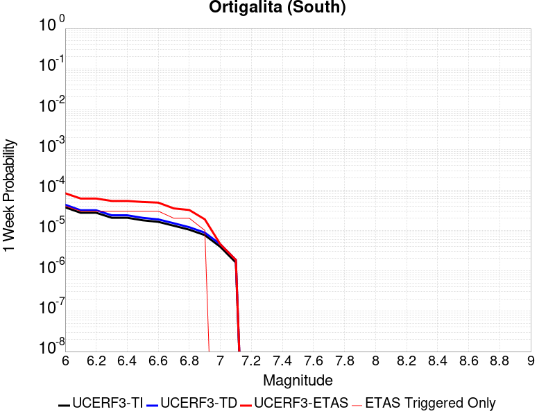 |  | 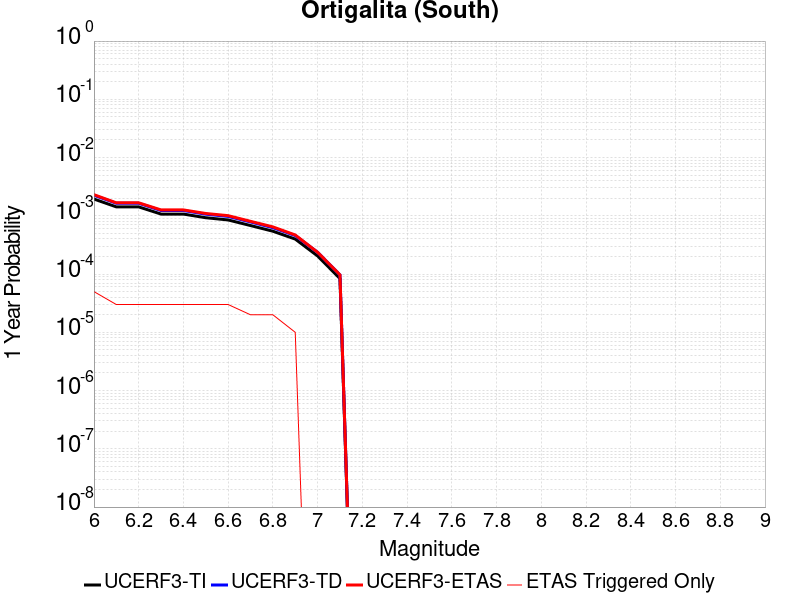 |  |

| Magnitude | 1 wk TI Prob | 1 wk TD Prob | 1 wk ETAS Prob | 1 wk ETAS/TD Gain | 1 wk ETAS Triggered Only | 1 mo TI Prob | 1 mo TD Prob | 1 mo ETAS Prob | 1 mo ETAS/TD Gain | 1 mo ETAS Triggered Only | 1 yr TI Prob | 1 yr TD Prob | 1 yr ETAS Prob | 1 yr ETAS/TD Gain | 1 yr ETAS Triggered Only | 10 yr TI Prob | 10 yr TD Prob | 10 yr ETAS Prob | 10 yr ETAS/TD Gain | 10 yr ETAS Triggered Only |
|-----|-----|-----|-----|-----|-----|-----|-----|-----|-----|-----|-----|-----|-----|-----|-----|-----|-----|-----|-----|-----|
| 6.0 | 3.72394E-5 | 4.32556E-5 | 8.569078E-5 | 1.9810332 | 4.2437016E-5 | 1.5958765E-4 | 1.8536886E-4 | 2.2779801E-4 | 1.2288904 | 4.2437016E-5 | 0.0019412481 | 0.0022546863 | 0.0022970277 | 1.0187793 | 4.2437016E-5 | 0.019243775 | 0.022334501 | 0.02238982 | 1.0024768 | 5.658269E-5 |
| 6.1 | 2.7299884E-5 | 3.1492036E-5 | 7.392772E-5 | 2.347505 | 4.2437016E-5 | 1.16994255E-4 | 1.349592E-4 | 1.773905E-4 | 1.3144009 | 4.2437016E-5 | 0.0014234743 | 0.0016419457 | 0.001684313 | 1.0258031 | 4.2437016E-5 | 0.014143906 | 0.016304072 | 0.016359732 | 1.0034139 | 5.658269E-5 |
| 6.2 | 2.7299884E-5 | 3.1492036E-5 | 7.392772E-5 | 2.347505 | 4.2437016E-5 | 1.16994255E-4 | 1.349592E-4 | 1.773905E-4 | 1.3144009 | 4.2437016E-5 | 0.0014234743 | 0.0016419457 | 0.001684313 | 1.0258031 | 4.2437016E-5 | 0.014143906 | 0.016304072 | 0.016359732 | 1.0034139 | 5.658269E-5 |
| 6.3 | 2.0546433E-5 | 2.3631454E-5 | 6.606746E-5 | 2.795743 | 4.2437016E-5 | 8.805317E-5 | 1.0127383E-4 | 1.4370655E-4 | 1.41899 | 4.2437016E-5 | 0.00107152 | 0.0012323305 | 0.0012747152 | 1.0343939 | 4.2437016E-5 | 0.010663681 | 0.012257031 | 0.012312921 | 1.0045598 | 5.658269E-5 |
| 6.4 | 2.0546433E-5 | 2.3631454E-5 | 6.606746E-5 | 2.795743 | 4.2437016E-5 | 8.805317E-5 | 1.0127383E-4 | 1.4370655E-4 | 1.41899 | 4.2437016E-5 | 0.00107152 | 0.0012323305 | 0.0012747152 | 1.0343939 | 4.2437016E-5 | 0.010663681 | 0.012257031 | 0.012312921 | 1.0045598 | 5.658269E-5 |
| 6.5 | 1.7779594E-5 | 2.0446974E-5 | 6.2883126E-5 | 3.0754242 | 4.2437016E-5 | 7.619603E-5 | 8.762703E-5 | 1.3006032E-4 | 1.484249 | 4.2437016E-5 | 9.272918E-4 | 0.0010663505 | 0.0011087422 | 1.039754 | 4.2437016E-5 | 0.009234319 | 0.010613804 | 0.010669786 | 1.0052744 | 5.658269E-5 |
| 6.6 | 1.6272212E-5 | 1.8714967E-5 | 6.115119E-5 | 3.2675018 | 4.2437016E-5 | 6.973618E-5 | 8.0204605E-5 | 1.2263822E-4 | 1.529067 | 4.2437016E-5 | 8.487073E-4 | 9.760659E-4 | 0.0010184614 | 1.0434352 | 4.2437016E-5 | 0.008454733 | 0.009719091 | 0.009775124 | 1.0057652 | 5.658269E-5 |
| 6.7 | 1.3051484E-5 | 1.5038758E-5 | 4.3329677E-5 | 2.8812006 | 2.8291344E-5 | 5.593373E-5 | 6.445028E-5 | 9.27398E-5 | 1.4389355 | 2.8291344E-5 | 6.807804E-4 | 7.844092E-4 | 8.126783E-4 | 1.0360388 | 2.8291344E-5 | 0.006786986 | 0.007817388 | 0.007859493 | 1.0053861 | 4.2437016E-5 |
| 6.8 | 1.04277415E-5 | 1.1987235E-5 | 4.027824E-5 | 3.3600943 | 2.8291344E-5 | 4.4689557E-5 | 5.1372896E-5 | 7.966279E-5 | 1.5506774 | 2.8291344E-5 | 5.439595E-4 | 6.2529295E-4 | 6.5356656E-4 | 1.0452167 | 2.8291344E-5 | 0.0054262993 | 0.00623609 | 0.0062782625 | 1.0067626 | 4.2437016E-5 |
| 6.9 | 7.639968E-6 | 8.791503E-6 | 2.293705E-5 | 2.609002 | 1.4145672E-5 | 3.274231E-5 | 3.767736E-5 | 5.18225E-5 | 1.3754281 | 1.4145672E-5 | 3.9856473E-4 | 4.586312E-4 | 4.7277036E-4 | 1.0308291 | 1.4145672E-5 | 0.003978506 | 0.004577433 | 0.004605595 | 1.0061523 | 2.8291344E-5 |
| 7.0 | 3.919831E-6 | 4.5334014E-6 | 4.5334014E-6 | 1.0 | 0.0 | 1.679917E-5 | 1.942873E-5 | 1.942873E-5 | 1.0 | 0.0 | 2.045107E-4 | 2.3652123E-4 | 2.3652123E-4 | 1.0 | 0.0 | 0.0020432258 | 0.0023629034 | 0.0023629034 | 1.0 | 0.0 |
| 7.1 | 1.6017933E-6 | 1.8570418E-6 | 1.8570418E-6 | 1.0 | 0.0 | 6.8648105E-6 | 7.958732E-6 | 7.958732E-6 | 1.0 | 0.0 | 8.357586E-5 | 9.689432E-5 | 9.689432E-5 | 1.0 | 0.0 | 8.3544437E-4 | 9.686254E-4 | 9.686254E-4 | 1.0 | 0.0 |

## Lost Hills
*[(top)](#table-of-contents)*

| 1 Week | 1 Month | 1 Year | 10 Year |
|-----|-----|-----|-----|
|  |  | 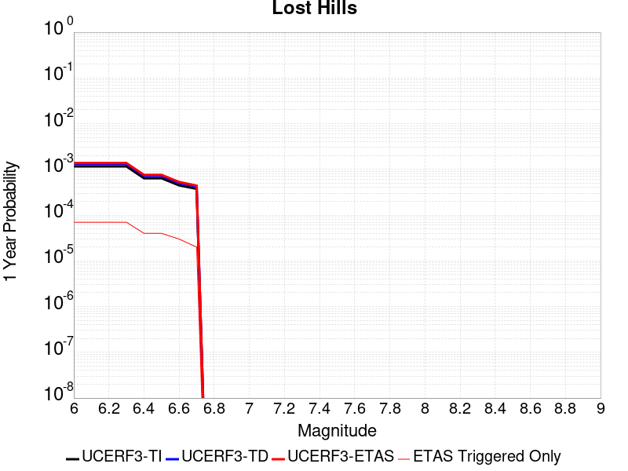 |  |

| Magnitude | 1 wk TI Prob | 1 wk TD Prob | 1 wk ETAS Prob | 1 wk ETAS/TD Gain | 1 wk ETAS Triggered Only | 1 mo TI Prob | 1 mo TD Prob | 1 mo ETAS Prob | 1 mo ETAS/TD Gain | 1 mo ETAS Triggered Only | 1 yr TI Prob | 1 yr TD Prob | 1 yr ETAS Prob | 1 yr ETAS/TD Gain | 1 yr ETAS Triggered Only | 10 yr TI Prob | 10 yr TD Prob | 10 yr ETAS Prob | 10 yr ETAS/TD Gain | 10 yr ETAS Triggered Only |
|-----|-----|-----|-----|-----|-----|-----|-----|-----|-----|-----|-----|-----|-----|-----|-----|-----|-----|-----|-----|-----|
| 6.0 | 2.233523E-5 | 2.5106583E-5 | 3.92519E-5 | 1.5634106 | 1.4145672E-5 | 9.571891E-5 | 1.0759615E-4 | 1.500286E-4 | 1.3943677 | 4.2437016E-5 | 0.0011647546 | 0.001309364 | 0.0013658726 | 1.0431573 | 5.658269E-5 | 0.011586686 | 0.013033091 | 0.013088936 | 1.0042849 | 5.658269E-5 |
| 6.1 | 2.233523E-5 | 2.5106583E-5 | 3.92519E-5 | 1.5634106 | 1.4145672E-5 | 9.571891E-5 | 1.0759615E-4 | 1.500286E-4 | 1.3943677 | 4.2437016E-5 | 0.0011647546 | 0.001309364 | 0.0013658726 | 1.0431573 | 5.658269E-5 | 0.011586686 | 0.013033091 | 0.013088936 | 1.0042849 | 5.658269E-5 |
| 6.2 | 2.233523E-5 | 2.5106583E-5 | 3.92519E-5 | 1.5634106 | 1.4145672E-5 | 9.571891E-5 | 1.0759615E-4 | 1.500286E-4 | 1.3943677 | 4.2437016E-5 | 0.0011647546 | 0.001309364 | 0.0013658726 | 1.0431573 | 5.658269E-5 | 0.011586686 | 0.013033091 | 0.013088936 | 1.0042849 | 5.658269E-5 |
| 6.3 | 2.233523E-5 | 2.5106583E-5 | 3.92519E-5 | 1.5634106 | 1.4145672E-5 | 9.571891E-5 | 1.0759615E-4 | 1.500286E-4 | 1.3943677 | 4.2437016E-5 | 0.0011647546 | 0.001309364 | 0.0013658726 | 1.0431573 | 5.658269E-5 | 0.011586686 | 0.013033091 | 0.013088936 | 1.0042849 | 5.658269E-5 |
| 6.4 | 1.2288092E-5 | 1.3781108E-5 | 1.3781108E-5 | 1.0 | 0.0 | 5.2662188E-5 | 5.906108E-5 | 7.320592E-5 | 1.239495 | 1.4145672E-5 | 6.409735E-4 | 7.189252E-4 | 7.471962E-4 | 1.0393239 | 2.8291344E-5 | 0.006391279 | 0.0071752006 | 0.0072032893 | 1.0039146 | 2.8291344E-5 |
| 6.5 | 1.2288092E-5 | 1.3781108E-5 | 1.3781108E-5 | 1.0 | 0.0 | 5.2662188E-5 | 5.906108E-5 | 7.320592E-5 | 1.239495 | 1.4145672E-5 | 6.409735E-4 | 7.189252E-4 | 7.471962E-4 | 1.0393239 | 2.8291344E-5 | 0.006391279 | 0.0071752006 | 0.0072032893 | 1.0039146 | 2.8291344E-5 |
| 6.6 | 8.58281E-6 | 9.63377E-6 | 9.63377E-6 | 1.0 | 0.0 | 3.6782953E-5 | 4.12874E-5 | 5.543249E-5 | 1.3426006 | 1.4145672E-5 | 4.4774043E-4 | 5.026414E-4 | 5.309185E-4 | 1.056257 | 2.8291344E-5 | 0.0044683935 | 0.005023205 | 0.0050513544 | 1.0056038 | 2.8291344E-5 |
| 6.7 | 7.205685E-6 | 8.088302E-6 | 8.088302E-6 | 1.0 | 0.0 | 3.088114E-5 | 3.466415E-5 | 4.8809332E-5 | 1.4080638 | 1.4145672E-5 | 3.7591302E-4 | 4.2203604E-4 | 4.5031542E-4 | 1.0670071 | 2.8291344E-5 | 0.0037527776 | 0.0042203604 | 0.0042485325 | 1.0066752 | 2.8291344E-5 |

## Bullion Mountains
*[(top)](#table-of-contents)*

| 1 Week | 1 Month | 1 Year | 10 Year |
|-----|-----|-----|-----|
|  |  |  |  |

| Magnitude | 1 wk TI Prob | 1 wk TD Prob | 1 wk ETAS Prob | 1 wk ETAS/TD Gain | 1 wk ETAS Triggered Only | 1 mo TI Prob | 1 mo TD Prob | 1 mo ETAS Prob | 1 mo ETAS/TD Gain | 1 mo ETAS Triggered Only | 1 yr TI Prob | 1 yr TD Prob | 1 yr ETAS Prob | 1 yr ETAS/TD Gain | 1 yr ETAS Triggered Only | 10 yr TI Prob | 10 yr TD Prob | 10 yr ETAS Prob | 10 yr ETAS/TD Gain | 10 yr ETAS Triggered Only |
|-----|-----|-----|-----|-----|-----|-----|-----|-----|-----|-----|-----|-----|-----|-----|-----|-----|-----|-----|-----|-----|
| 6.0 | 1.6420427E-5 | 1.4692009E-5 | 2.8837474E-5 | 1.9627998 | 1.4145672E-5 | 7.037136E-5 | 6.296445E-5 | 7.710923E-5 | 1.224647 | 1.4145672E-5 | 8.5643446E-4 | 7.6636096E-4 | 8.087654E-4 | 1.0553323 | 4.2437016E-5 | 0.008531413 | 0.0076409746 | 0.007697125 | 1.0073485 | 5.658269E-5 |
| 6.1 | 1.6420427E-5 | 1.4692009E-5 | 2.8837474E-5 | 1.9627998 | 1.4145672E-5 | 7.037136E-5 | 6.296445E-5 | 7.710923E-5 | 1.224647 | 1.4145672E-5 | 8.5643446E-4 | 7.6636096E-4 | 8.087654E-4 | 1.0553323 | 4.2437016E-5 | 0.008531413 | 0.0076409746 | 0.007697125 | 1.0073485 | 5.658269E-5 |
| 6.2 | 1.6420427E-5 | 1.4692009E-5 | 2.8837474E-5 | 1.9627998 | 1.4145672E-5 | 7.037136E-5 | 6.296445E-5 | 7.710923E-5 | 1.224647 | 1.4145672E-5 | 8.5643446E-4 | 7.6636096E-4 | 8.087654E-4 | 1.0553323 | 4.2437016E-5 | 0.008531413 | 0.0076409746 | 0.007697125 | 1.0073485 | 5.658269E-5 |
| 6.3 | 1.2046778E-5 | 9.862255E-6 | 2.4007788E-5 | 2.4343102 | 1.4145672E-5 | 5.1628023E-5 | 4.2266256E-5 | 5.641133E-5 | 1.3346659 | 1.4145672E-5 | 6.283899E-4 | 5.144933E-4 | 5.4277014E-4 | 1.0549605 | 2.8291344E-5 | 0.0062661595 | 0.0051353034 | 0.0051775225 | 1.0082214 | 4.2437016E-5 |
| 6.4 | 1.2046778E-5 | 9.862255E-6 | 2.4007788E-5 | 2.4343102 | 1.4145672E-5 | 5.1628023E-5 | 4.2266256E-5 | 5.641133E-5 | 1.3346659 | 1.4145672E-5 | 6.283899E-4 | 5.144933E-4 | 5.4277014E-4 | 1.0549605 | 2.8291344E-5 | 0.0062661595 | 0.0051353034 | 0.0051775225 | 1.0082214 | 4.2437016E-5 |
| 6.5 | 1.0244343E-5 | 7.879378E-6 | 7.879378E-6 | 1.0 | 0.0 | 4.390359E-5 | 3.3768443E-5 | 3.3768443E-5 | 1.0 | 0.0 | 5.343951E-4 | 4.1107394E-4 | 4.252138E-4 | 1.0343974 | 1.4145672E-5 | 0.005331118 | 0.0041051665 | 0.004119254 | 1.0034317 | 1.4145672E-5 |
| 6.6 | 9.605408E-6 | 7.1774166E-6 | 7.1774166E-6 | 1.0 | 0.0 | 4.1165385E-5 | 3.0760108E-5 | 3.0760108E-5 | 1.0 | 0.0 | 5.010733E-4 | 3.7446033E-4 | 3.886007E-4 | 1.037762 | 1.4145672E-5 | 0.00499945 | 0.0037402906 | 0.0037543834 | 1.0037678 | 1.4145672E-5 |
| 6.7 | 8.60418E-6 | 6.123926E-6 | 6.123926E-6 | 1.0 | 0.0 | 3.687454E-5 | 2.6245243E-5 | 2.6245243E-5 | 1.0 | 0.0 | 4.48855E-4 | 3.195085E-4 | 3.3364963E-4 | 1.0442591 | 1.4145672E-5 | 0.004479495 | 0.0031924031 | 0.0032065036 | 1.004417 | 1.4145672E-5 |
| 6.8 | 5.187994E-6 | 2.563117E-6 | 2.563117E-6 | 1.0 | 0.0 | 2.223407E-5 | 1.0984763E-5 | 1.0984763E-5 | 1.0 | 0.0 | 2.7066618E-4 | 1.3373529E-4 | 1.4787907E-4 | 1.1057595 | 1.4145672E-5 | 0.0027033675 | 0.0013369396 | 0.0013510664 | 1.0105665 | 1.4145672E-5 |
| 6.9 | 4.5302368E-6 | 2.3442778E-6 | 2.3442778E-6 | 1.0 | 0.0 | 1.9415156E-5 | 1.0046889E-5 | 1.0046889E-5 | 1.0 | 0.0 | 2.3635388E-4 | 1.2231797E-4 | 1.3646192E-4 | 1.1156325 | 1.4145672E-5 | 0.0023610266 | 0.0012228956 | 0.001237024 | 1.0115532 | 1.4145672E-5 |
| 7.0 | 3.431668E-6 | 1.6882177E-6 | 1.6882177E-6 | 1.0 | 0.0 | 1.4707065E-5 | 7.2352186E-6 | 7.2352186E-6 | 1.0 | 0.0 | 1.7904381E-4 | 8.808879E-5 | 1.02233214E-4 | 1.1605701 | 1.4145672E-5 | 0.0017889962 | 8.8088785E-4 | 8.950211E-4 | 1.0160443 | 1.4145672E-5 |

## White Wolf
*[(top)](#table-of-contents)*

| 1 Week | 1 Month | 1 Year | 10 Year |
|-----|-----|-----|-----|
|  |  |  |  |

| Magnitude | 1 wk TI Prob | 1 wk TD Prob | 1 wk ETAS Prob | 1 wk ETAS/TD Gain | 1 wk ETAS Triggered Only | 1 mo TI Prob | 1 mo TD Prob | 1 mo ETAS Prob | 1 mo ETAS/TD Gain | 1 mo ETAS Triggered Only | 1 yr TI Prob | 1 yr TD Prob | 1 yr ETAS Prob | 1 yr ETAS/TD Gain | 1 yr ETAS Triggered Only | 10 yr TI Prob | 10 yr TD Prob | 10 yr ETAS Prob | 10 yr ETAS/TD Gain | 10 yr ETAS Triggered Only |
|-----|-----|-----|-----|-----|-----|-----|-----|-----|-----|-----|-----|-----|-----|-----|-----|-----|-----|-----|-----|-----|
| 6.0 | 2.0037822E-5 | 1.0468583E-6 | 1.5192516E-5 | 14.5124855 | 1.4145672E-5 | 8.587355E-5 | 4.4865283E-6 | 1.8632138E-5 | 4.1529074 | 1.4145672E-5 | 0.001045009 | 5.4622164E-5 | 9.705686E-5 | 1.7768769 | 4.2437016E-5 | 0.010401085 | 5.4609246E-4 | 6.026442E-4 | 1.1035572 | 5.658269E-5 |
| 6.1 | 2.0037822E-5 | 1.0468583E-6 | 1.5192516E-5 | 14.5124855 | 1.4145672E-5 | 8.587355E-5 | 4.4865283E-6 | 1.8632138E-5 | 4.1529074 | 1.4145672E-5 | 0.001045009 | 5.4622164E-5 | 9.705686E-5 | 1.7768769 | 4.2437016E-5 | 0.010401085 | 5.4609246E-4 | 6.026442E-4 | 1.1035572 | 5.658269E-5 |
| 6.2 | 2.0037822E-5 | 1.0468583E-6 | 1.5192516E-5 | 14.5124855 | 1.4145672E-5 | 8.587355E-5 | 4.4865283E-6 | 1.8632138E-5 | 4.1529074 | 1.4145672E-5 | 0.001045009 | 5.4622164E-5 | 9.705686E-5 | 1.7768769 | 4.2437016E-5 | 0.010401085 | 5.4609246E-4 | 6.026442E-4 | 1.1035572 | 5.658269E-5 |
| 6.3 | 2.0037822E-5 | 1.0468583E-6 | 1.5192516E-5 | 14.5124855 | 1.4145672E-5 | 8.587355E-5 | 4.4865283E-6 | 1.8632138E-5 | 4.1529074 | 1.4145672E-5 | 0.001045009 | 5.4622164E-5 | 9.705686E-5 | 1.7768769 | 4.2437016E-5 | 0.010401085 | 5.4609246E-4 | 6.026442E-4 | 1.1035572 | 5.658269E-5 |
| 6.4 | 1.132487E-5 | 1.0468583E-6 | 1.5192516E-5 | 14.5124855 | 1.4145672E-5 | 4.8534253E-5 | 4.4865283E-6 | 1.8632138E-5 | 4.1529074 | 1.4145672E-5 | 5.907443E-4 | 5.4622164E-5 | 9.705686E-5 | 1.7768769 | 4.2437016E-5 | 0.005891764 | 5.4609246E-4 | 6.026442E-4 | 1.1035572 | 5.658269E-5 |
| 6.5 | 1.132487E-5 | 1.0468583E-6 | 1.5192516E-5 | 14.5124855 | 1.4145672E-5 | 4.8534253E-5 | 4.4865283E-6 | 1.8632138E-5 | 4.1529074 | 1.4145672E-5 | 5.907443E-4 | 5.4622164E-5 | 9.705686E-5 | 1.7768769 | 4.2437016E-5 | 0.005891764 | 5.4609246E-4 | 6.026442E-4 | 1.1035572 | 5.658269E-5 |
| 6.6 | 9.347473E-6 | 1.0468583E-6 | 1.5192516E-5 | 14.5124855 | 1.4145672E-5 | 4.0059982E-5 | 4.4865283E-6 | 1.8632138E-5 | 4.1529074 | 1.4145672E-5 | 4.8762115E-4 | 5.4622164E-5 | 9.705686E-5 | 1.7768769 | 4.2437016E-5 | 0.0048655253 | 5.4609246E-4 | 6.026442E-4 | 1.1035572 | 5.658269E-5 |
| 6.7 | 7.842647E-6 | 1.0047773E-6 | 1.51504355E-5 | 15.078401 | 1.4145672E-5 | 3.361091E-5 | 4.306182E-6 | 1.8451792E-5 | 4.2849545 | 1.4145672E-5 | 4.0913603E-4 | 5.2426552E-5 | 9.4861345E-5 | 1.8094141 | 4.2437016E-5 | 0.004083836 | 5.241468E-4 | 5.806998E-4 | 1.1078954 | 5.658269E-5 |
| 6.8 | 6.26597E-6 | 9.734289E-7 | 1.5119087E-5 | 15.531785 | 1.4145672E-5 | 2.685388E-5 | 4.1718313E-6 | 1.8317445E-5 | 4.390744 | 1.4145672E-5 | 3.2689696E-4 | 5.0790914E-5 | 9.3225775E-5 | 1.8354813 | 4.2437016E-5 | 0.003264165 | 5.07798E-4 | 5.643519E-4 | 1.1113709 | 5.658269E-5 |
| 6.9 | 5.258436E-6 | 9.1827343E-7 | 1.5063933E-5 | 16.404627 | 1.4145672E-5 | 2.2535958E-5 | 3.935452E-6 | 1.8081068E-5 | 4.594407 | 1.4145672E-5 | 2.7434074E-4 | 4.7913123E-5 | 9.0348105E-5 | 1.8856652 | 4.2437016E-5 | 0.0027400232 | 4.7903272E-4 | 5.355883E-4 | 1.118062 | 5.658269E-5 |
| 7.0 | 4.675028E-6 | 8.660704E-7 | 1.501173E-5 | 17.333153 | 1.4145672E-5 | 2.003568E-5 | 3.7117254E-6 | 1.7857345E-5 | 4.8110633 | 1.4145672E-5 | 2.4390711E-4 | 4.518937E-5 | 8.762447E-5 | 1.9390506 | 4.2437016E-5 | 0.0024363957 | 4.518065E-4 | 5.083636E-4 | 1.12518 | 5.658269E-5 |
| 7.1 | 2.8270078E-6 | 6.8737717E-7 | 1.4833039E-5 | 21.579185 | 1.4145672E-5 | 1.2115692E-5 | 2.945899E-6 | 1.709153E-5 | 5.8018045 | 1.4145672E-5 | 1.4749856E-4 | 3.586577E-5 | 7.8301266E-5 | 2.1831753 | 4.2437016E-5 | 0.001474007 | 3.5860392E-4 | 4.0102573E-4 | 1.1182971 | 4.2437016E-5 |
| 7.2 | 1.6881406E-6 | 2.2703432E-7 | 2.2703432E-7 | 1.0 | 0.0 | 7.2348685E-6 | 9.730038E-7 | 9.730038E-7 | 1.0 | 0.0 | 8.808096E-5 | 1.1846259E-5 | 1.1846259E-5 | 1.0 | 0.0 | 8.8046055E-4 | 1.1845643E-4 | 1.1845643E-4 | 1.0 | 0.0 |
| 7.3 | 9.086107E-7 | 1.5264496E-7 | 1.5264496E-7 | 1.0 | 0.0 | 3.8940398E-6 | 6.5419255E-7 | 6.5419255E-7 | 1.0 | 0.0 | 4.7408903E-5 | 7.964766E-6 | 7.964766E-6 | 1.0 | 0.0 | 4.739879E-4 | 7.964489E-5 | 7.964489E-5 | 1.0 | 0.0 |
| 7.4 | 1.9717383E-7 | 9.003399E-8 | 9.003399E-8 | 1.0 | 0.0 | 8.450304E-7 | 3.8585992E-7 | 3.8585992E-7 | 1.0 | 0.0 | 1.0288197E-5 | 4.697835E-6 | 4.697835E-6 | 1.0 | 0.0 | 1.028772E-4 | 4.6977384E-5 | 4.6977384E-5 | 1.0 | 0.0 |
| 7.5 | 1.086975E-7 | 6.659662E-8 | 6.659662E-8 | 1.0 | 0.0 | 4.6584634E-7 | 2.8541407E-7 | 2.8541407E-7 | 1.0 | 0.0 | 5.6716644E-6 | 3.474911E-6 | 3.474911E-6 | 1.0 | 0.0 | 5.6715195E-5 | 3.474859E-5 | 3.474859E-5 | 1.0 | 0.0 |
| 7.6 | 2.4217808E-8 | 1.5820849E-8 | 1.5820849E-8 | 1.0 | 0.0 | 1.03790605E-7 | 6.780364E-8 | 6.780364E-8 | 1.0 | 0.0 | 1.2636499E-6 | 8.25509E-7 | 8.25509E-7 | 1.0 | 0.0 | 1.2636427E-5 | 8.255064E-6 | 8.255064E-6 | 1.0 | 0.0 |

## San Jacinto (Coyote Creek)
*[(top)](#table-of-contents)*

| 1 Week | 1 Month | 1 Year | 10 Year |
|-----|-----|-----|-----|
|  |  | 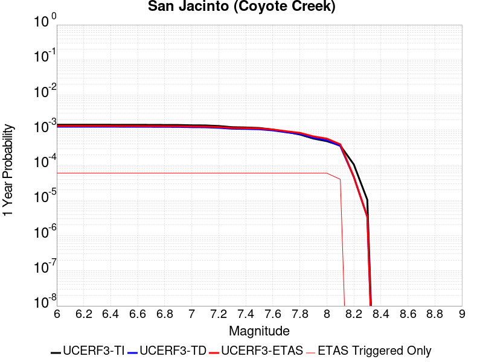 |  |

| Magnitude | 1 wk TI Prob | 1 wk TD Prob | 1 wk ETAS Prob | 1 wk ETAS/TD Gain | 1 wk ETAS Triggered Only | 1 mo TI Prob | 1 mo TD Prob | 1 mo ETAS Prob | 1 mo ETAS/TD Gain | 1 mo ETAS Triggered Only | 1 yr TI Prob | 1 yr TD Prob | 1 yr ETAS Prob | 1 yr ETAS/TD Gain | 1 yr ETAS Triggered Only | 10 yr TI Prob | 10 yr TD Prob | 10 yr ETAS Prob | 10 yr ETAS/TD Gain | 10 yr ETAS Triggered Only |
|-----|-----|-----|-----|-----|-----|-----|-----|-----|-----|-----|-----|-----|-----|-----|-----|-----|-----|-----|-----|-----|
| 6.0 | 2.7374346E-5 | 2.41444E-5 | 6.658039E-5 | 2.7575915 | 4.2437016E-5 | 1.1731335E-4 | 1.034719E-4 | 1.4590453E-4 | 1.4100884 | 4.2437016E-5 | 0.0014273542 | 0.001259045 | 0.0013155565 | 1.0448843 | 5.658269E-5 | 0.01418221 | 0.012928195 | 0.012984046 | 1.0043201 | 5.658269E-5 |
| 6.1 | 2.7374346E-5 | 2.41444E-5 | 6.658039E-5 | 2.7575915 | 4.2437016E-5 | 1.1731335E-4 | 1.034719E-4 | 1.4590453E-4 | 1.4100884 | 4.2437016E-5 | 0.0014273542 | 0.001259045 | 0.0013155565 | 1.0448843 | 5.658269E-5 | 0.01418221 | 0.012928195 | 0.012984046 | 1.0043201 | 5.658269E-5 |
| 6.2 | 2.7374346E-5 | 2.41444E-5 | 6.658039E-5 | 2.7575915 | 4.2437016E-5 | 1.1731335E-4 | 1.034719E-4 | 1.4590453E-4 | 1.4100884 | 4.2437016E-5 | 0.0014273542 | 0.001259045 | 0.0013155565 | 1.0448843 | 5.658269E-5 | 0.01418221 | 0.012928195 | 0.012984046 | 1.0043201 | 5.658269E-5 |
| 6.3 | 2.7374346E-5 | 2.41444E-5 | 6.658039E-5 | 2.7575915 | 4.2437016E-5 | 1.1731335E-4 | 1.034719E-4 | 1.4590453E-4 | 1.4100884 | 4.2437016E-5 | 0.0014273542 | 0.001259045 | 0.0013155565 | 1.0448843 | 5.658269E-5 | 0.01418221 | 0.012928195 | 0.012984046 | 1.0043201 | 5.658269E-5 |
| 6.4 | 2.7374346E-5 | 2.41444E-5 | 6.658039E-5 | 2.7575915 | 4.2437016E-5 | 1.1731335E-4 | 1.034719E-4 | 1.4590453E-4 | 1.4100884 | 4.2437016E-5 | 0.0014273542 | 0.001259045 | 0.0013155565 | 1.0448843 | 5.658269E-5 | 0.01418221 | 0.012928195 | 0.012984046 | 1.0043201 | 5.658269E-5 |
| 6.5 | 2.7282445E-5 | 2.4030476E-5 | 6.646648E-5 | 2.765924 | 4.2437016E-5 | 1.16919524E-4 | 1.0298371E-4 | 1.4541636E-4 | 1.4120326 | 4.2437016E-5 | 0.0014225657 | 0.001253108 | 0.0013096199 | 1.0450974 | 5.658269E-5 | 0.014134934 | 0.012869522 | 0.012925377 | 1.00434 | 5.658269E-5 |
| 6.6 | 2.7282445E-5 | 2.4030476E-5 | 6.646648E-5 | 2.765924 | 4.2437016E-5 | 1.16919524E-4 | 1.0298371E-4 | 1.4541636E-4 | 1.4120326 | 4.2437016E-5 | 0.0014225657 | 0.001253108 | 0.0013096199 | 1.0450974 | 5.658269E-5 | 0.014134934 | 0.012869522 | 0.012925377 | 1.00434 | 5.658269E-5 |
| 6.7 | 2.7216198E-5 | 2.3955597E-5 | 6.63916E-5 | 2.771444 | 4.2437016E-5 | 1.1663563E-4 | 1.02662816E-4 | 1.4509547E-4 | 1.4133207 | 4.2437016E-5 | 0.0014191137 | 0.0012492058 | 0.0013057177 | 1.0452384 | 5.658269E-5 | 0.014100855 | 0.012830934 | 0.012886791 | 1.0043533 | 5.658269E-5 |
| 6.8 | 2.7078617E-5 | 2.3872815E-5 | 6.630882E-5 | 2.777587 | 4.2437016E-5 | 1.1604605E-4 | 1.0230807E-4 | 1.4474074E-4 | 1.4147539 | 4.2437016E-5 | 0.001411945 | 0.0012448917 | 0.0013014039 | 1.0453954 | 5.658269E-5 | 0.014030075 | 0.0127880825 | 0.012843941 | 1.0043681 | 5.658269E-5 |
| 6.9 | 2.6982952E-5 | 2.3792329E-5 | 6.6228335E-5 | 2.7836003 | 4.2437016E-5 | 1.15636096E-4 | 1.0196315E-4 | 1.4439585E-4 | 1.4161571 | 4.2437016E-5 | 0.0014069602 | 0.0012406971 | 0.0012972096 | 1.045549 | 5.658269E-5 | 0.013980856 | 0.012746378 | 0.0128022395 | 1.0043825 | 5.658269E-5 |
| 7.0 | 2.6449972E-5 | 2.3369357E-5 | 6.580538E-5 | 2.8158834 | 4.2437016E-5 | 1.1335209E-4 | 1.0015055E-4 | 1.4258332E-4 | 1.4236897 | 4.2437016E-5 | 0.001379188 | 0.0012186535 | 0.0012751672 | 1.046374 | 5.658269E-5 | 0.0137065975 | 0.012527733 | 0.012583607 | 1.00446 | 5.658269E-5 |
| 7.1 | 2.6257849E-5 | 2.3195396E-5 | 6.563143E-5 | 2.8295023 | 4.2437016E-5 | 1.1252879E-4 | 9.940507E-5 | 1.4183787E-4 | 1.4268676 | 4.2437016E-5 | 0.0013691769 | 0.0012095873 | 0.0012661016 | 1.0467219 | 5.658269E-5 | 0.013607717 | 0.012437661 | 0.01249354 | 1.0044928 | 5.658269E-5 |
| 7.2 | 2.5270041E-5 | 2.2390155E-5 | 6.482622E-5 | 2.8953001 | 4.2437016E-5 | 1.0829568E-4 | 9.5954296E-5 | 1.3838723E-4 | 1.4422203 | 4.2437016E-5 | 0.0013177024 | 0.0011676198 | 0.0012241364 | 1.0484033 | 5.658269E-5 | 0.013099162 | 0.0120187905 | 0.012074693 | 1.0046513 | 5.658269E-5 |
| 7.3 | 2.339701E-5 | 2.1122027E-5 | 6.3558145E-5 | 3.0090933 | 4.2437016E-5 | 1.0026905E-4 | 9.051985E-5 | 1.3295302E-4 | 1.468772 | 4.2437016E-5 | 0.001220092 | 0.001101524 | 0.0011580443 | 1.051311 | 5.658269E-5 | 0.012134149 | 0.011357642 | 0.011413582 | 1.0049254 | 5.658269E-5 |
| 7.4 | 2.296333E-5 | 2.0852396E-5 | 6.328853E-5 | 3.0350723 | 4.2437016E-5 | 9.841056E-5 | 8.936436E-5 | 1.3179758E-4 | 1.4748338 | 4.2437016E-5 | 0.0011974899 | 0.0010874701 | 0.0011439912 | 1.0519749 | 5.658269E-5 | 0.011910575 | 0.011216754 | 0.011272701 | 1.004988 | 5.658269E-5 |
| 7.5 | 2.2188895E-5 | 2.037534E-5 | 6.2811494E-5 | 3.082721 | 4.2437016E-5 | 9.50918E-5 | 8.731998E-5 | 1.2975329E-4 | 1.4859519 | 4.2437016E-5 | 0.0011571277 | 0.0010626042 | 0.0011191269 | 1.0531925 | 5.658269E-5 | 0.011511209 | 0.010966369 | 0.011022331 | 1.0051031 | 5.658269E-5 |
| 7.6 | 2.0013189E-5 | 1.8961666E-5 | 6.139788E-5 | 3.2380002 | 4.2437016E-5 | 8.5767984E-5 | 8.126176E-5 | 1.2369532E-4 | 1.5221838 | 4.2437016E-5 | 0.001043725 | 9.889146E-4 | 0.0010454414 | 1.0571604 | 5.658269E-5 | 0.010388365 | 0.010224371 | 0.010280375 | 1.0054775 | 5.658269E-5 |
| 7.7 | 1.7230794E-5 | 1.6743043E-5 | 5.9179347E-5 | 3.5345635 | 4.2437016E-5 | 7.384417E-5 | 7.175393E-5 | 1.141879E-4 | 1.5913819 | 4.2437016E-5 | 8.986819E-4 | 8.732547E-4 | 9.2978805E-4 | 1.0647386 | 5.658269E-5 | 0.008950562 | 0.00906292 | 0.00911899 | 1.0061867 | 5.658269E-5 |
| 7.8 | 1.4478809E-5 | 1.499039E-5 | 5.742677E-5 | 3.8309057 | 4.2437016E-5 | 6.205057E-5 | 6.424295E-5 | 1.0667724E-4 | 1.6605284 | 4.2437016E-5 | 7.552038E-4 | 7.8187784E-4 | 8.384163E-4 | 1.072311 | 5.658269E-5 | 0.0075264242 | 0.008141388 | 0.008197511 | 1.0068934 | 5.658269E-5 |
| 7.9 | 1.1114467E-5 | 1.1644517E-5 | 5.408104E-5 | 4.6443353 | 4.2437016E-5 | 4.7632562E-5 | 4.990412E-5 | 9.233902E-5 | 1.8503286 | 4.2437016E-5 | 5.797721E-4 | 6.074139E-4 | 6.6396216E-4 | 1.0930969 | 5.658269E-5 | 0.0057826187 | 0.0063803545 | 0.006436576 | 1.0088117 | 5.658269E-5 |
| 8.0 | 9.327402E-6 | 9.8986575E-6 | 5.2335254E-5 | 5.287106 | 4.2437016E-5 | 3.9973966E-5 | 4.2422133E-5 | 8.485735E-5 | 2.0003085 | 4.2437016E-5 | 4.8657437E-4 | 5.163676E-4 | 5.7292107E-4 | 1.1095217 | 5.658269E-5 | 0.0048551033 | 0.00544994 | 0.0055062147 | 1.0103257 | 5.658269E-5 |
| 8.1 | 7.0235833E-6 | 6.826985E-6 | 3.5118137E-5 | 5.144018 | 2.8291344E-5 | 3.0100724E-5 | 2.9258183E-5 | 5.75487E-5 | 1.9669267 | 2.8291344E-5 | 3.664147E-4 | 3.5616063E-4 | 3.9858255E-4 | 1.1191089 | 4.2437016E-5 | 0.003658111 | 0.0037874572 | 0.0038297335 | 1.0111622 | 4.2437016E-5 |
| 8.2 | 2.0358202E-6 | 8.9912584E-7 | 8.9912584E-7 | 1.0 | 0.0 | 8.724915E-6 | 3.853391E-6 | 3.853391E-6 | 1.0 | 0.0 | 1.06220665E-4 | 4.6914047E-5 | 4.6914047E-5 | 1.0 | 0.0 | 0.001061699 | 5.3239096E-4 | 5.3239096E-4 | 1.0 | 0.0 |
| 8.3 | 2.0051264E-7 | 6.61379E-8 | 6.61379E-8 | 1.0 | 0.0 | 8.5933965E-7 | 2.8344812E-7 | 2.8344812E-7 | 1.0 | 0.0 | 1.046241E-5 | 3.450976E-6 | 3.450976E-6 | 1.0 | 0.0 | 1.0461917E-4 | 4.0120205E-5 | 4.0120205E-5 | 1.0 | 0.0 |

## San Pedro Basin
*[(top)](#table-of-contents)*

| 1 Week | 1 Month | 1 Year | 10 Year |
|-----|-----|-----|-----|
|  |  |  |  |

| Magnitude | 1 wk TI Prob | 1 wk TD Prob | 1 wk ETAS Prob | 1 wk ETAS/TD Gain | 1 wk ETAS Triggered Only | 1 mo TI Prob | 1 mo TD Prob | 1 mo ETAS Prob | 1 mo ETAS/TD Gain | 1 mo ETAS Triggered Only | 1 yr TI Prob | 1 yr TD Prob | 1 yr ETAS Prob | 1 yr ETAS/TD Gain | 1 yr ETAS Triggered Only | 10 yr TI Prob | 10 yr TD Prob | 10 yr ETAS Prob | 10 yr ETAS/TD Gain | 10 yr ETAS Triggered Only |
|-----|-----|-----|-----|-----|-----|-----|-----|-----|-----|-----|-----|-----|-----|-----|-----|-----|-----|-----|-----|-----|
| 6.0 | 5.3449043E-5 | 6.337018E-5 | 6.337018E-5 | 1.0 | 0.0 | 2.2904722E-4 | 2.7156167E-4 | 2.7156167E-4 | 1.0 | 0.0 | 0.0027850836 | 0.0033018515 | 0.0033582472 | 1.0170801 | 5.658269E-5 | 0.027504366 | 0.03258948 | 0.03264422 | 1.0016797 | 5.658269E-5 |
| 6.1 | 5.3449043E-5 | 6.337018E-5 | 6.337018E-5 | 1.0 | 0.0 | 2.2904722E-4 | 2.7156167E-4 | 2.7156167E-4 | 1.0 | 0.0 | 0.0027850836 | 0.0033018515 | 0.0033582472 | 1.0170801 | 5.658269E-5 | 0.027504366 | 0.03258948 | 0.03264422 | 1.0016797 | 5.658269E-5 |
| 6.2 | 2.3189454E-5 | 2.6642829E-5 | 2.6642829E-5 | 1.0 | 0.0 | 9.9379584E-5 | 1.1417881E-4 | 1.1417881E-4 | 1.0 | 0.0 | 0.0012092749 | 0.0013892875 | 0.0014175397 | 1.0203357 | 2.8291344E-5 | 0.012027155 | 0.01381089 | 0.01383879 | 1.0020202 | 2.8291344E-5 |
| 6.3 | 2.3189454E-5 | 2.6642829E-5 | 2.6642829E-5 | 1.0 | 0.0 | 9.9379584E-5 | 1.1417881E-4 | 1.1417881E-4 | 1.0 | 0.0 | 0.0012092749 | 0.0013892875 | 0.0014175397 | 1.0203357 | 2.8291344E-5 | 0.012027155 | 0.01381089 | 0.01383879 | 1.0020202 | 2.8291344E-5 |
| 6.4 | 1.966056E-5 | 2.246342E-5 | 2.246342E-5 | 1.0 | 0.0 | 8.425682E-5 | 9.626848E-5 | 9.626848E-5 | 1.0 | 0.0 | 0.001025344 | 0.0011714787 | 0.0011856077 | 1.0120609 | 1.4145672E-5 | 0.010206259 | 0.011657119 | 0.0116711 | 1.0011994 | 1.4145672E-5 |
| 6.5 | 1.7342953E-5 | 1.9745152E-5 | 1.9745152E-5 | 1.0 | 0.0 | 7.4324824E-5 | 8.461954E-5 | 8.461954E-5 | 1.0 | 0.0 | 9.04529E-4 | 0.0010297929 | 0.0010297929 | 1.0 | 0.0 | 0.009008561 | 0.010253932 | 0.010253932 | 1.0 | 0.0 |
| 6.6 | 1.439804E-5 | 1.6322716E-5 | 1.6322716E-5 | 1.0 | 0.0 | 6.170443E-5 | 6.99528E-5 | 6.99528E-5 | 1.0 | 0.0 | 7.509924E-4 | 8.513747E-4 | 8.513747E-4 | 1.0 | 0.0 | 0.0074845953 | 0.008484333 | 0.008484333 | 1.0 | 0.0 |
| 6.7 | 1.2634884E-5 | 1.4285298E-5 | 1.4285298E-5 | 1.0 | 0.0 | 5.414838E-5 | 6.122144E-5 | 6.122144E-5 | 1.0 | 0.0 | 6.590571E-4 | 7.451466E-4 | 7.451466E-4 | 1.0 | 0.0 | 0.006571059 | 0.007429502 | 0.007429502 | 1.0 | 0.0 |
| 6.8 | 1.146091E-5 | 1.2933193E-5 | 1.2933193E-5 | 1.0 | 0.0 | 4.911726E-5 | 5.542696E-5 | 5.542696E-5 | 1.0 | 0.0 | 5.9783855E-4 | 6.74644E-4 | 6.74644E-4 | 1.0 | 0.0 | 0.0059623276 | 0.0067288997 | 0.0067288997 | 1.0 | 0.0 |
| 6.9 | 9.109035E-6 | 1.0235013E-5 | 1.0235013E-5 | 1.0 | 0.0 | 3.9038136E-5 | 4.386376E-5 | 4.386376E-5 | 1.0 | 0.0 | 4.7518566E-4 | 5.339384E-4 | 5.339384E-4 | 1.0 | 0.0 | 0.0047417083 | 0.0053293095 | 0.0053293095 | 1.0 | 0.0 |
| 7.0 | 5.9351028E-6 | 6.583965E-6 | 6.583965E-6 | 1.0 | 0.0 | 2.5435906E-5 | 2.821682E-5 | 2.821682E-5 | 1.0 | 0.0 | 3.0963816E-4 | 3.4350925E-4 | 3.4350925E-4 | 1.0 | 0.0 | 0.0030920706 | 0.0034320997 | 0.0034320997 | 1.0 | 0.0 |
| 7.1 | 2.1557585E-6 | 2.2096492E-6 | 2.2096492E-6 | 1.0 | 0.0 | 9.238933E-6 | 9.469892E-6 | 9.469892E-6 | 1.0 | 0.0 | 1.1247819E-4 | 1.15289986E-4 | 1.15289986E-4 | 1.0 | 0.0 | 0.0011242128 | 0.0011523172 | 0.0011523172 | 1.0 | 0.0 |
| 7.2 | 2.1251979E-6 | 2.1779954E-6 | 2.1779954E-6 | 1.0 | 0.0 | 9.107958E-6 | 9.334234E-6 | 9.334234E-6 | 1.0 | 0.0 | 1.1088375E-4 | 1.13638525E-4 | 1.13638525E-4 | 1.0 | 0.0 | 0.0011082845 | 0.0011358195 | 0.0011358195 | 1.0 | 0.0 |
| 7.3 | 1.7145798E-6 | 1.7442885E-6 | 1.7442885E-6 | 1.0 | 0.0 | 7.3481783E-6 | 7.475501E-6 | 7.475501E-6 | 1.0 | 0.0 | 8.94604E-5 | 9.1010515E-5 | 9.1010515E-5 | 1.0 | 0.0 | 8.9424395E-4 | 9.0974156E-4 | 9.0974156E-4 | 1.0 | 0.0 |
| 7.4 | 1.4467993E-6 | 1.4641878E-6 | 1.4641878E-6 | 1.0 | 0.0 | 6.200554E-6 | 6.275076E-6 | 6.275076E-6 | 1.0 | 0.0 | 7.548913E-5 | 7.639644E-5 | 7.639644E-5 | 1.0 | 0.0 | 7.546349E-4 | 7.6370913E-4 | 7.6370913E-4 | 1.0 | 0.0 |
| 7.5 | 1.2803735E-6 | 1.2931506E-6 | 1.2931506E-6 | 1.0 | 0.0 | 5.487303E-6 | 5.5420624E-6 | 5.5420624E-6 | 1.0 | 0.0 | 6.680587E-5 | 6.747259E-5 | 6.747259E-5 | 1.0 | 0.0 | 6.678579E-4 | 6.745281E-4 | 6.745281E-4 | 1.0 | 0.0 |
| 7.6 | 6.755009E-7 | 6.76947E-7 | 6.76947E-7 | 1.0 | 0.0 | 2.8950008E-6 | 2.9011985E-6 | 2.9011985E-6 | 1.0 | 0.0 | 3.5246063E-5 | 3.532158E-5 | 3.532158E-5 | 1.0 | 0.0 | 3.5240475E-4 | 3.5316538E-4 | 3.5316538E-4 | 1.0 | 0.0 |
| 7.7 | 6.211885E-8 | 4.5699714E-8 | 4.5699714E-8 | 1.0 | 0.0 | 2.6622362E-7 | 1.9585592E-7 | 1.9585592E-7 | 1.0 | 0.0 | 3.2412677E-6 | 2.3845432E-6 | 2.3845432E-6 | 1.0 | 0.0 | 3.2412205E-5 | 2.3845198E-5 | 2.3845198E-5 | 1.0 | 0.0 |
| 7.8 | 2.6580573E-9 | 1.5138054E-9 | 1.5138054E-9 | 1.0 | 0.0 | 1.1391674E-8 | 6.4877375E-9 | 6.4877375E-9 | 1.0 | 0.0 | 1.3869362E-7 | 7.89882E-8 | 7.89882E-8 | 1.0 | 0.0 | 1.3869354E-6 | 7.89882E-7 | 7.89882E-7 | 1.0 | 0.0 |

## Coronado Bank alt1
*[(top)](#table-of-contents)*

| 1 Week | 1 Month | 1 Year | 10 Year |
|-----|-----|-----|-----|
|  |  |  |  |

| Magnitude | 1 wk TI Prob | 1 wk TD Prob | 1 wk ETAS Prob | 1 wk ETAS/TD Gain | 1 wk ETAS Triggered Only | 1 mo TI Prob | 1 mo TD Prob | 1 mo ETAS Prob | 1 mo ETAS/TD Gain | 1 mo ETAS Triggered Only | 1 yr TI Prob | 1 yr TD Prob | 1 yr ETAS Prob | 1 yr ETAS/TD Gain | 1 yr ETAS Triggered Only | 10 yr TI Prob | 10 yr TD Prob | 10 yr ETAS Prob | 10 yr ETAS/TD Gain | 10 yr ETAS Triggered Only |
|-----|-----|-----|-----|-----|-----|-----|-----|-----|-----|-----|-----|-----|-----|-----|-----|-----|-----|-----|-----|-----|
| 6.0 | 7.533492E-5 | 9.3951705E-5 | 1.222404E-4 | 1.3010981 | 2.8291344E-5 | 3.22824E-4 | 4.025903E-4 | 4.3087025E-4 | 1.070245 | 2.8291344E-5 | 0.0039233007 | 0.004891121 | 0.0049192742 | 1.0057559 | 2.8291344E-5 | 0.03854755 | 0.047904 | 0.047944404 | 1.0008434 | 4.2437016E-5 |
| 6.1 | 4.1807285E-5 | 5.0493105E-5 | 7.878302E-5 | 1.5602728 | 2.8291344E-5 | 1.7916178E-4 | 2.1638138E-4 | 2.446666E-4 | 1.1307193 | 2.8291344E-5 | 0.0021791123 | 0.0026313365 | 0.0026595534 | 1.0107234 | 2.8291344E-5 | 0.021578677 | 0.026011124 | 0.026052456 | 1.0015891 | 4.2437016E-5 |
| 6.2 | 4.1807285E-5 | 5.0493105E-5 | 7.878302E-5 | 1.5602728 | 2.8291344E-5 | 1.7916178E-4 | 2.1638138E-4 | 2.446666E-4 | 1.1307193 | 2.8291344E-5 | 0.0021791123 | 0.0026313365 | 0.0026595534 | 1.0107234 | 2.8291344E-5 | 0.021578677 | 0.026011124 | 0.026052456 | 1.0015891 | 4.2437016E-5 |
| 6.3 | 3.1793104E-5 | 3.7711125E-5 | 5.1856267E-5 | 1.3750919 | 1.4145672E-5 | 1.3624904E-4 | 1.6160926E-4 | 1.7575265E-4 | 1.087516 | 1.4145672E-5 | 0.0016575698 | 0.001965849 | 0.0019799669 | 1.0071815 | 1.4145672E-5 | 0.016452603 | 0.019488495 | 0.019516235 | 1.0014234 | 2.8291344E-5 |
| 6.4 | 2.9878007E-5 | 3.5335797E-5 | 4.948097E-5 | 1.4003072 | 1.4145672E-5 | 1.2804232E-4 | 1.5143053E-4 | 1.6557406E-4 | 1.0933994 | 1.4145672E-5 | 0.0015578003 | 0.0018421395 | 0.0018562591 | 1.0076648 | 1.4145672E-5 | 0.015469253 | 0.018272463 | 0.018300239 | 1.00152 | 2.8291344E-5 |
| 6.5 | 2.4512565E-5 | 2.8764101E-5 | 4.2909367E-5 | 1.491768 | 1.4145672E-5 | 1.0504962E-4 | 1.2326906E-4 | 1.3741298E-4 | 1.1147403 | 1.4145672E-5 | 0.0012782287 | 0.0014997943 | 0.0015139187 | 1.0094177 | 1.4145672E-5 | 0.012709012 | 0.0148996925 | 0.014927562 | 1.0018705 | 2.8291344E-5 |
| 6.6 | 2.1317413E-5 | 2.490667E-5 | 3.905199E-5 | 1.567933 | 1.4145672E-5 | 9.135714E-5 | 1.0673863E-4 | 1.20882796E-4 | 1.1325121 | 1.4145672E-5 | 0.0011117056 | 0.0012987903 | 0.0013129177 | 1.0108773 | 1.4145672E-5 | 0.011061605 | 0.012914407 | 0.012942334 | 1.0021623 | 2.8291344E-5 |
| 6.7 | 1.8585655E-5 | 2.1634882E-5 | 3.5780246E-5 | 1.6538222 | 1.4145672E-5 | 7.9650374E-5 | 9.271774E-5 | 1.068621E-4 | 1.152553 | 1.4145672E-5 | 9.6931186E-4 | 0.0011282744 | 0.001142404 | 1.0125233 | 1.4145672E-5 | 0.0096509475 | 0.011227623 | 0.011255597 | 1.0024915 | 2.8291344E-5 |
| 6.8 | 1.5862879E-5 | 1.8419476E-5 | 3.2564887E-5 | 1.7679595 | 1.4145672E-5 | 6.798199E-5 | 7.8938334E-5 | 9.308289E-5 | 1.1791849 | 1.4145672E-5 | 8.273665E-4 | 9.606697E-4 | 9.748018E-4 | 1.0147107 | 1.4145672E-5 | 0.008242928 | 0.009567151 | 0.009595172 | 1.0029289 | 2.8291344E-5 |
| 6.9 | 1.3021509E-5 | 1.5095266E-5 | 2.9240724E-5 | 1.9370792 | 1.4145672E-5 | 5.5805274E-5 | 6.46925E-5 | 7.883725E-5 | 1.218646 | 1.4145672E-5 | 6.792174E-4 | 7.873646E-4 | 8.014991E-4 | 1.0179517 | 1.4145672E-5 | 0.006771452 | 0.007847573 | 0.007875642 | 1.0035769 | 2.8291344E-5 |
| 7.0 | 1.0974371E-5 | 1.2720105E-5 | 2.6865597E-5 | 2.112058 | 1.4145672E-5 | 4.7032172E-5 | 5.4513697E-5 | 6.86586E-5 | 1.2594743 | 1.4145672E-5 | 5.7246623E-4 | 6.635197E-4 | 6.77656E-4 | 1.021305 | 1.4145672E-5 | 0.0057099373 | 0.0066171354 | 0.0066452394 | 1.0042472 | 2.8291344E-5 |
| 7.1 | 8.766221E-6 | 1.0163833E-5 | 2.4309362E-5 | 2.3917513 | 1.4145672E-5 | 3.7568978E-5 | 4.3558655E-5 | 5.770371E-5 | 1.3247359 | 1.4145672E-5 | 4.573063E-4 | 5.302148E-4 | 5.44353E-4 | 1.026665 | 1.4145672E-5 | 0.0045636636 | 0.005291197 | 0.005305268 | 1.0026593 | 1.4145672E-5 |
| 7.2 | 8.026024E-7 | 8.331776E-7 | 8.331776E-7 | 1.0 | 0.0 | 3.43972E-6 | 3.5707562E-6 | 3.5707562E-6 | 1.0 | 0.0 | 4.1877785E-5 | 4.34731E-5 | 4.34731E-5 | 1.0 | 0.0 | 4.1869894E-4 | 4.3464705E-4 | 4.3464705E-4 | 1.0 | 0.0 |
| 7.3 | 3.7293114E-7 | 3.700106E-7 | 3.700106E-7 | 1.0 | 0.0 | 1.5982754E-6 | 1.5857588E-6 | 1.5857588E-6 | 1.0 | 0.0 | 1.9458828E-5 | 1.9306442E-5 | 1.9306442E-5 | 1.0 | 0.0 | 1.9457124E-4 | 1.9304773E-4 | 1.9304773E-4 | 1.0 | 0.0 |
| 7.4 | 2.0557036E-7 | 1.9674441E-7 | 1.9674441E-7 | 1.0 | 0.0 | 8.810155E-7 | 8.4319004E-7 | 8.4319004E-7 | 1.0 | 0.0 | 1.0726311E-5 | 1.02657905E-5 | 1.02657905E-5 | 1.0 | 0.0 | 1.0725793E-4 | 1.026532E-4 | 1.026532E-4 | 1.0 | 0.0 |
| 7.5 | 6.845446E-8 | 6.2794086E-8 | 6.2794086E-8 | 1.0 | 0.0 | 2.9337625E-7 | 2.6911746E-7 | 2.6911746E-7 | 1.0 | 0.0 | 3.5718497E-6 | 3.2765004E-6 | 3.2765004E-6 | 1.0 | 0.0 | 3.5717923E-5 | 3.276453E-5 | 3.276453E-5 | 1.0 | 0.0 |
| 7.6 | 6.0975145E-9 | 5.531901E-9 | 5.531901E-9 | 1.0 | 0.0 | 2.6132206E-8 | 2.3708148E-8 | 2.3708148E-8 | 1.0 | 0.0 | 3.1815955E-7 | 2.8864667E-7 | 2.8864667E-7 | 1.0 | 0.0 | 3.181591E-6 | 2.886464E-6 | 2.886464E-6 | 1.0 | 0.0 |

## Hayward (No) 2011 CFM
*[(top)](#table-of-contents)*

| 1 Week | 1 Month | 1 Year | 10 Year |
|-----|-----|-----|-----|
|  | 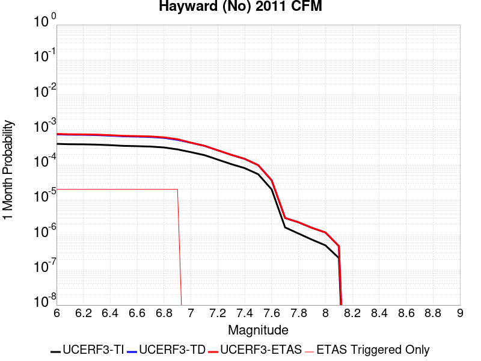 |  |  |

| Magnitude | 1 wk TI Prob | 1 wk TD Prob | 1 wk ETAS Prob | 1 wk ETAS/TD Gain | 1 wk ETAS Triggered Only | 1 mo TI Prob | 1 mo TD Prob | 1 mo ETAS Prob | 1 mo ETAS/TD Gain | 1 mo ETAS Triggered Only | 1 yr TI Prob | 1 yr TD Prob | 1 yr ETAS Prob | 1 yr ETAS/TD Gain | 1 yr ETAS Triggered Only | 10 yr TI Prob | 10 yr TD Prob | 10 yr ETAS Prob | 10 yr ETAS/TD Gain | 10 yr ETAS Triggered Only |
|-----|-----|-----|-----|-----|-----|-----|-----|-----|-----|-----|-----|-----|-----|-----|-----|-----|-----|-----|-----|-----|
| 6.0 | 9.3068506E-5 | 1.739643E-4 | 1.8810753E-4 | 1.0812995 | 1.4145672E-5 | 3.9880406E-4 | 7.453474E-4 | 7.5948256E-4 | 1.0189645 | 1.4145672E-5 | 0.0048446343 | 0.009036727 | 0.009078781 | 1.0046536 | 4.2437016E-5 | 0.047403704 | 0.086396605 | 0.086448304 | 1.0005983 | 5.658269E-5 |
| 6.1 | 9.055486E-5 | 1.6947639E-4 | 1.8361966E-4 | 1.0834528 | 1.4145672E-5 | 3.880345E-4 | 7.2612526E-4 | 7.4026064E-4 | 1.0194669 | 1.4145672E-5 | 0.0047140904 | 0.008804814 | 0.008846877 | 1.0047773 | 4.2437016E-5 | 0.046153355 | 0.08428568 | 0.08433749 | 1.0006148 | 5.658269E-5 |
| 6.2 | 9.006742E-5 | 1.6868232E-4 | 1.828256E-4 | 1.0838457 | 1.4145672E-5 | 3.859461E-4 | 7.227246E-4 | 7.3686003E-4 | 1.0195585 | 1.4145672E-5 | 0.0046887742 | 0.00876378 | 0.008805845 | 1.0047998 | 4.2437016E-5 | 0.0459107 | 0.08390991 | 0.08396175 | 1.0006177 | 5.658269E-5 |
| 6.3 | 8.8336754E-5 | 1.6547782E-4 | 1.7962114E-4 | 1.0854696 | 1.4145672E-5 | 3.7853114E-4 | 7.0899865E-4 | 7.231343E-4 | 1.0199375 | 1.4145672E-5 | 0.004598882 | 0.008598051 | 0.0086401235 | 1.0048932 | 4.2437016E-5 | 0.04504866 | 0.08240195 | 0.08245387 | 1.0006301 | 5.658269E-5 |
| 6.4 | 8.526157E-5 | 1.5974796E-4 | 1.7389137E-4 | 1.0885358 | 1.4145672E-5 | 3.6535555E-4 | 6.844552E-4 | 6.985912E-4 | 1.0206529 | 1.4145672E-5 | 0.0044391346 | 0.00830156 | 0.008343644 | 1.0050695 | 4.2437016E-5 | 0.043514993 | 0.07968467 | 0.07973674 | 1.0006535 | 5.658269E-5 |
| 6.5 | 8.152396E-5 | 1.5307199E-4 | 1.672155E-4 | 1.0923977 | 1.4145672E-5 | 3.493416E-4 | 6.558586E-4 | 6.69995E-4 | 1.021554 | 1.4145672E-5 | 0.0042449418 | 0.007955993 | 0.007998092 | 1.0052916 | 4.2437016E-5 | 0.04164765 | 0.07651448 | 0.07656673 | 1.000683 | 5.658269E-5 |
| 6.6 | 7.987405E-5 | 1.5011412E-4 | 1.6425767E-4 | 1.0942186 | 1.4145672E-5 | 3.4227243E-4 | 6.431883E-4 | 6.5732485E-4 | 1.0219789 | 1.4145672E-5 | 0.0041592065 | 0.007802858 | 0.007830929 | 1.0035975 | 2.8291344E-5 | 0.04082218 | 0.075105876 | 0.075145125 | 1.0005226 | 4.2437016E-5 |
| 6.7 | 7.777665E-5 | 1.4650672E-4 | 1.6065032E-4 | 1.0965389 | 1.4145672E-5 | 3.332859E-4 | 6.277355E-4 | 6.418723E-4 | 1.0225203 | 1.4145672E-5 | 0.004050208 | 0.007616053 | 0.0076441285 | 1.0036864 | 2.8291344E-5 | 0.039771806 | 0.0733825 | 0.07342182 | 1.0005358 | 4.2437016E-5 |
| 6.8 | 7.3284005E-5 | 1.3801287E-4 | 1.5215659E-4 | 1.1024811 | 1.4145672E-5 | 3.140365E-4 | 5.9135025E-4 | 6.0548756E-4 | 1.0239068 | 1.4145672E-5 | 0.0038166929 | 0.007176059 | 0.007204147 | 1.0039141 | 2.8291344E-5 | 0.037518036 | 0.06929624 | 0.06933574 | 1.0005699 | 4.2437016E-5 |
| 6.9 | 6.458263E-5 | 1.21319164E-4 | 1.3546312E-4 | 1.1165847 | 1.4145672E-5 | 2.7675333E-4 | 5.1983615E-4 | 5.3397444E-4 | 1.0271976 | 1.4145672E-5 | 0.0033642664 | 0.0063107396 | 0.0063388525 | 1.0044547 | 2.8291344E-5 | 0.033137884 | 0.061224625 | 0.061264463 | 1.0006506 | 4.2437016E-5 |
| 7.0 | 5.3853604E-5 | 1.00254634E-4 | 1.00254634E-4 | 1.0 | 0.0 | 2.3078074E-4 | 4.295923E-4 | 4.295923E-4 | 1.0 | 0.0 | 0.0028061352 | 0.0052178074 | 0.005231879 | 1.0026969 | 1.4145672E-5 | 0.027709642 | 0.050957024 | 0.050983872 | 1.0005269 | 2.8291344E-5 |
| 7.1 | 4.4308683E-5 | 8.17098E-5 | 8.17098E-5 | 1.0 | 0.0 | 1.8988053E-4 | 3.5013806E-4 | 3.5013806E-4 | 1.0 | 0.0 | 0.0023093442 | 0.0042546396 | 0.004268725 | 1.0033106 | 1.4145672E-5 | 0.022854926 | 0.041824497 | 0.041851606 | 1.0006481 | 2.8291344E-5 |
| 7.2 | 3.295973E-5 | 6.0774026E-5 | 6.0774026E-5 | 1.0 | 0.0 | 1.4124835E-4 | 2.6043423E-4 | 2.6043423E-4 | 1.0 | 0.0 | 0.0017183421 | 0.0031661994 | 0.0031803004 | 1.0044535 | 1.4145672E-5 | 0.017051157 | 0.031370014 | 0.031383716 | 1.0004368 | 1.4145672E-5 |
| 7.3 | 2.452256E-5 | 4.518223E-5 | 4.518223E-5 | 1.0 | 0.0 | 1.05092455E-4 | 1.9362383E-4 | 1.9362383E-4 | 1.0 | 0.0 | 0.0012787496 | 0.0023548352 | 0.0023689477 | 1.0059929 | 1.4145672E-5 | 0.0127141625 | 0.023442036 | 0.02345585 | 1.0005893 | 1.4145672E-5 |
| 7.4 | 1.8829967E-5 | 3.4604043E-5 | 3.4604043E-5 | 1.0 | 0.0 | 8.069736E-5 | 1.4829468E-4 | 1.4829468E-4 | 1.0 | 0.0 | 9.820475E-4 | 0.0018040023 | 0.0018040023 | 1.0 | 0.0 | 0.009777189 | 0.01802003 | 0.01802003 | 1.0 | 0.0 |
| 7.5 | 1.26374125E-5 | 2.292219E-5 | 2.292219E-5 | 1.0 | 0.0 | 5.4159216E-5 | 9.823428E-5 | 9.823428E-5 | 1.0 | 0.0 | 6.5918895E-4 | 0.0011953521 | 0.0011953521 | 1.0 | 0.0 | 0.00657237 | 0.011988704 | 0.011988704 | 1.0 | 0.0 |
| 7.6 | 4.666429E-6 | 8.479636E-6 | 8.479636E-6 | 1.0 | 0.0 | 1.9998828E-5 | 3.6340796E-5 | 3.6340796E-5 | 1.0 | 0.0 | 2.4345852E-4 | 4.423606E-4 | 4.423606E-4 | 1.0 | 0.0 | 0.0024319198 | 0.004458377 | 0.004458377 | 1.0 | 0.0 |
| 7.7 | 3.8399318E-7 | 7.1343146E-7 | 7.1343146E-7 | 1.0 | 0.0 | 1.6456839E-6 | 3.0575598E-6 | 3.0575598E-6 | 1.0 | 0.0 | 2.003602E-5 | 3.7225156E-5 | 3.7225156E-5 | 1.0 | 0.0 | 2.0034213E-4 | 3.86166E-4 | 3.86166E-4 | 1.0 | 0.0 |
| 7.8 | 2.5637698E-7 | 5.3666145E-7 | 5.3666145E-7 | 1.0 | 0.0 | 1.098758E-6 | 2.2999754E-6 | 2.2999754E-6 | 1.0 | 0.0 | 1.3377297E-5 | 2.8001843E-5 | 2.8001843E-5 | 1.0 | 0.0 | 1.3376492E-4 | 2.9246495E-4 | 2.9246495E-4 | 1.0 | 0.0 |
| 7.9 | 1.7141245E-7 | 3.7293606E-7 | 3.7293606E-7 | 1.0 | 0.0 | 7.3462456E-7 | 1.5982963E-6 | 1.5982963E-6 | 1.0 | 0.0 | 8.944017E-6 | 1.9459085E-5 | 1.9459085E-5 | 1.0 | 0.0 | 8.943657E-5 | 2.0246378E-4 | 2.0246378E-4 | 1.0 | 0.0 |
| 8.0 | 1.1808895E-7 | 2.7512246E-7 | 2.7512246E-7 | 1.0 | 0.0 | 5.060954E-7 | 1.1790958E-6 | 1.1790958E-6 | 1.0 | 0.0 | 6.161694E-6 | 1.4355397E-5 | 1.4355397E-5 | 1.0 | 0.0 | 6.161523E-5 | 1.4817173E-4 | 1.4817173E-4 | 1.0 | 0.0 |
| 8.1 | 5.138535E-8 | 1.12307575E-7 | 1.12307575E-7 | 1.0 | 0.0 | 2.2022292E-7 | 4.8131807E-7 | 4.8131807E-7 | 1.0 | 0.0 | 2.6812106E-6 | 5.860032E-6 | 5.860032E-6 | 1.0 | 0.0 | 2.6811784E-5 | 6.0156468E-5 | 6.0156468E-5 | 1.0 | 0.0 |

## San Clemente
*[(top)](#table-of-contents)*

| 1 Week | 1 Month | 1 Year | 10 Year |
|-----|-----|-----|-----|
|  |  | 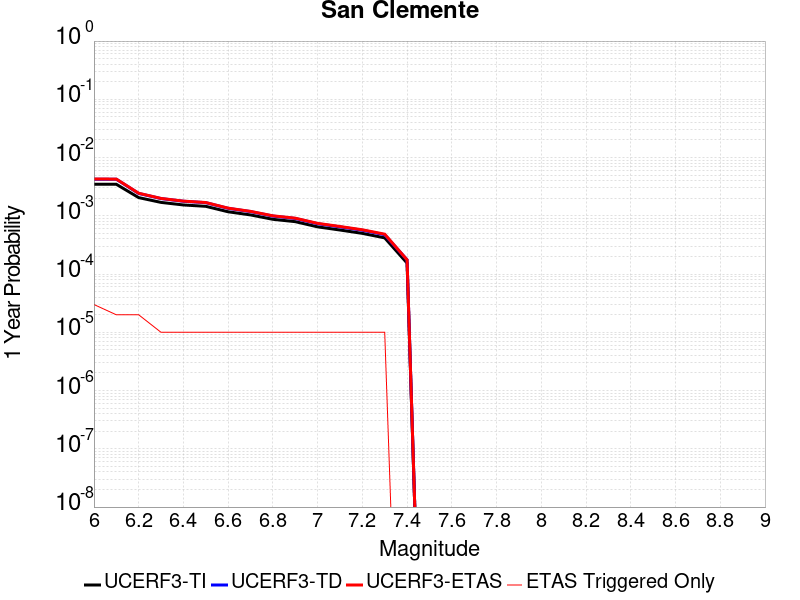 |  |

| Magnitude | 1 wk TI Prob | 1 wk TD Prob | 1 wk ETAS Prob | 1 wk ETAS/TD Gain | 1 wk ETAS Triggered Only | 1 mo TI Prob | 1 mo TD Prob | 1 mo ETAS Prob | 1 mo ETAS/TD Gain | 1 mo ETAS Triggered Only | 1 yr TI Prob | 1 yr TD Prob | 1 yr ETAS Prob | 1 yr ETAS/TD Gain | 1 yr ETAS Triggered Only | 10 yr TI Prob | 10 yr TD Prob | 10 yr ETAS Prob | 10 yr ETAS/TD Gain | 10 yr ETAS Triggered Only |
|-----|-----|-----|-----|-----|-----|-----|-----|-----|-----|-----|-----|-----|-----|-----|-----|-----|-----|-----|-----|-----|
| 6.0 | 6.681379E-5 | 8.163834E-5 | 8.163834E-5 | 1.0 | 0.0 | 2.8631336E-4 | 3.4983488E-4 | 3.4983488E-4 | 1.0 | 0.0 | 0.003480294 | 0.00425141 | 0.004279581 | 1.0066262 | 2.8291344E-5 | 0.03426291 | 0.04175603 | 0.041810248 | 1.0012985 | 5.658269E-5 |
| 6.1 | 6.681379E-5 | 8.163834E-5 | 8.163834E-5 | 1.0 | 0.0 | 2.8631336E-4 | 3.4983488E-4 | 3.4983488E-4 | 1.0 | 0.0 | 0.003480294 | 0.00425141 | 0.004279581 | 1.0066262 | 2.8291344E-5 | 0.03426291 | 0.04175603 | 0.041796695 | 1.0009738 | 4.2437016E-5 |
| 6.2 | 3.9400576E-5 | 4.6452373E-5 | 4.6452373E-5 | 1.0 | 0.0 | 1.6884868E-4 | 1.9906677E-4 | 1.9906677E-4 | 1.0 | 0.0 | 0.0020537945 | 0.0024209984 | 0.0024492214 | 1.0116575 | 2.8291344E-5 | 0.020349167 | 0.023952903 | 0.023980517 | 1.0011529 | 2.8291344E-5 |
| 6.3 | 3.2590255E-5 | 3.792912E-5 | 3.792912E-5 | 1.0 | 0.0 | 1.3966505E-4 | 1.6254342E-4 | 1.6254342E-4 | 1.0 | 0.0 | 0.0016990956 | 0.0019772002 | 0.0019913178 | 1.0071403 | 1.4145672E-5 | 0.01686163 | 0.019599883 | 0.01961375 | 1.0007076 | 1.4145672E-5 |
| 6.4 | 2.9454652E-5 | 3.4097764E-5 | 3.4097764E-5 | 1.0 | 0.0 | 1.2622811E-4 | 1.4612524E-4 | 1.4612524E-4 | 1.0 | 0.0 | 0.0015357438 | 0.0017776493 | 0.0017917698 | 1.0079434 | 1.4145672E-5 | 0.015251739 | 0.01763747 | 0.017651366 | 1.0007879 | 1.4145672E-5 |
| 6.5 | 2.790836E-5 | 3.2247463E-5 | 3.2247463E-5 | 1.0 | 0.0 | 1.1960178E-4 | 1.3819624E-4 | 1.3819624E-4 | 1.0 | 0.0 | 0.001455179 | 0.0016812662 | 0.0016953882 | 1.0083996 | 1.4145672E-5 | 0.014456868 | 0.016688485 | 0.016702395 | 1.0008335 | 1.4145672E-5 |
| 6.6 | 2.2492153E-5 | 2.5762702E-5 | 2.5762702E-5 | 1.0 | 0.0 | 9.639138E-5 | 1.1040699E-4 | 1.1040699E-4 | 1.0 | 0.0 | 0.0011729331 | 0.0013433909 | 0.0013575177 | 1.0105157 | 1.4145672E-5 | 0.011667615 | 0.013354417 | 0.013368374 | 1.0010451 | 1.4145672E-5 |
| 6.7 | 1.9862755E-5 | 2.2666423E-5 | 2.2666423E-5 | 1.0 | 0.0 | 8.512331E-5 | 9.713826E-5 | 9.713826E-5 | 1.0 | 0.0 | 0.0010358836 | 0.0011820279 | 0.0011961568 | 1.0119531 | 1.4145672E-5 | 0.010310682 | 0.011758701 | 0.01177268 | 1.0011889 | 1.4145672E-5 |
| 6.8 | 1.6697575E-5 | 1.897771E-5 | 1.897771E-5 | 1.0 | 0.0 | 7.155907E-5 | 8.133056E-5 | 8.133056E-5 | 1.0 | 0.0 | 8.7088346E-4 | 9.897591E-4 | 0.0010038908 | 1.0142779 | 1.4145672E-5 | 0.008674784 | 0.0098545365 | 0.009868543 | 1.0014213 | 1.4145672E-5 |
| 6.9 | 1.5218415E-5 | 1.72694E-5 | 1.72694E-5 | 1.0 | 0.0 | 6.522015E-5 | 7.4009666E-5 | 7.4009666E-5 | 1.0 | 0.0 | 7.93766E-4 | 9.00704E-4 | 9.1483694E-4 | 1.015691 | 1.4145672E-5 | 0.007909367 | 0.008971481 | 0.008985499 | 1.0015626 | 1.4145672E-5 |
| 7.0 | 1.2392958E-5 | 1.4033016E-5 | 1.4033016E-5 | 1.0 | 0.0 | 5.3111595E-5 | 6.014015E-5 | 6.014015E-5 | 1.0 | 0.0 | 6.4644177E-4 | 7.319679E-4 | 7.4610324E-4 | 1.0193114 | 1.4145672E-5 | 0.0064456454 | 0.0072963564 | 0.007310399 | 1.0019246 | 1.4145672E-5 |
| 7.1 | 1.0934128E-5 | 1.2375138E-5 | 1.2375138E-5 | 1.0 | 0.0 | 4.6859706E-5 | 5.303527E-5 | 5.303527E-5 | 1.0 | 0.0 | 5.7036756E-4 | 6.455204E-4 | 6.5965694E-4 | 1.0218995 | 1.4145672E-5 | 0.0056890585 | 0.0064371997 | 0.0064512542 | 1.0021833 | 1.4145672E-5 |
| 7.2 | 9.5798805E-6 | 1.0844935E-5 | 1.0844935E-5 | 1.0 | 0.0 | 4.1055984E-5 | 4.6477508E-5 | 4.6477508E-5 | 1.0 | 0.0 | 4.9974193E-4 | 5.657239E-4 | 5.798616E-4 | 1.0249904 | 1.4145672E-5 | 0.0049861963 | 0.0056435615 | 0.0056576272 | 1.0024924 | 1.4145672E-5 |
| 7.3 | 8.0167365E-6 | 9.083918E-6 | 9.083918E-6 | 1.0 | 0.0 | 3.4356988E-5 | 3.8930535E-5 | 3.8930535E-5 | 1.0 | 0.0 | 4.1821605E-4 | 4.7388324E-4 | 4.880222E-4 | 1.0298364 | 1.4145672E-5 | 0.0041742986 | 0.0047294297 | 0.0047435085 | 1.0029769 | 1.4145672E-5 |
| 7.4 | 2.9581017E-6 | 3.3623792E-6 | 3.3623792E-6 | 1.0 | 0.0 | 1.2677518E-5 | 1.4410146E-5 | 1.4410146E-5 | 1.0 | 0.0 | 1.5433785E-4 | 1.7543444E-4 | 1.7543444E-4 | 1.0 | 0.0 | 0.001542307 | 0.0017534546 | 0.0017534546 | 1.0 | 0.0 |

## Calaveras (So) 2011 CFM
*[(top)](#table-of-contents)*

| 1 Week | 1 Month | 1 Year | 10 Year |
|-----|-----|-----|-----|
|  | 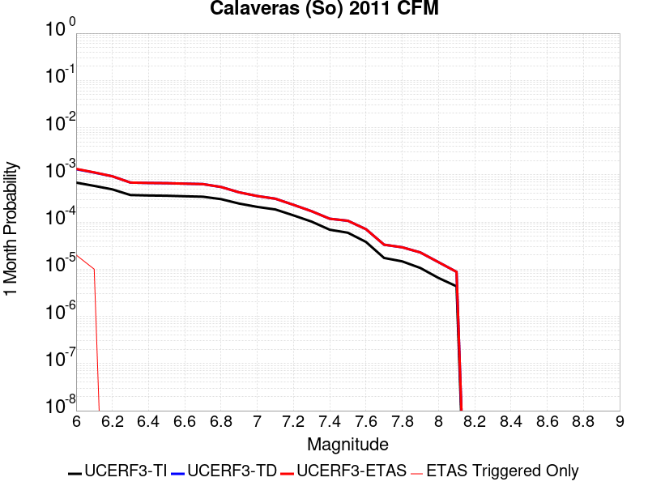 | 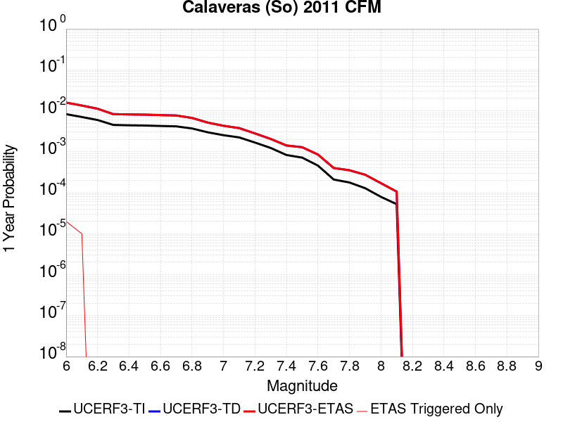 |  |

| Magnitude | 1 wk TI Prob | 1 wk TD Prob | 1 wk ETAS Prob | 1 wk ETAS/TD Gain | 1 wk ETAS Triggered Only | 1 mo TI Prob | 1 mo TD Prob | 1 mo ETAS Prob | 1 mo ETAS/TD Gain | 1 mo ETAS Triggered Only | 1 yr TI Prob | 1 yr TD Prob | 1 yr ETAS Prob | 1 yr ETAS/TD Gain | 1 yr ETAS Triggered Only | 10 yr TI Prob | 10 yr TD Prob | 10 yr ETAS Prob | 10 yr ETAS/TD Gain | 10 yr ETAS Triggered Only |
|-----|-----|-----|-----|-----|-----|-----|-----|-----|-----|-----|-----|-----|-----|-----|-----|-----|-----|-----|-----|-----|
| 6.0 | 1.5950744E-4 | 3.0713255E-4 | 3.0713255E-4 | 1.0 | 0.0 | 6.834242E-4 | 0.001315409 | 0.001315409 | 1.0 | 0.0 | 0.00828899 | 0.015858326 | 0.015858326 | 1.0 | 0.0 | 0.079865426 | 0.14440185 | 0.14445026 | 1.0003352 | 5.658269E-5 |
| 6.1 | 1.3584697E-4 | 2.603514E-4 | 2.603514E-4 | 1.0 | 0.0 | 5.8207137E-4 | 0.0011151754 | 0.0011151754 | 1.0 | 0.0 | 0.007063716 | 0.013461385 | 0.013461385 | 1.0 | 0.0 | 0.06843361 | 0.124029994 | 0.12406717 | 1.0002997 | 4.2437016E-5 |
| 6.2 | 1.14676266E-4 | 2.1714384E-4 | 2.1714384E-4 | 1.0 | 0.0 | 4.9137714E-4 | 9.30223E-4 | 9.30223E-4 | 1.0 | 0.0 | 0.0059661185 | 0.011245058 | 0.011245058 | 1.0 | 0.0 | 0.058084648 | 0.10502057 | 0.10505854 | 1.0003617 | 4.2437016E-5 |
| 6.3 | 8.691518E-5 | 1.5987935E-4 | 1.5987935E-4 | 1.0 | 0.0 | 3.7244044E-4 | 6.849807E-4 | 6.849807E-4 | 1.0 | 0.0 | 0.004525038 | 0.008301122 | 0.008301122 | 1.0 | 0.0 | 0.044339992 | 0.0793365 | 0.07936255 | 1.0003283 | 2.8291344E-5 |
| 6.4 | 8.50982E-5 | 1.5694331E-4 | 1.5694331E-4 | 1.0 | 0.0 | 3.646556E-4 | 6.724042E-4 | 6.724042E-4 | 1.0 | 0.0 | 0.0044306475 | 0.008149155 | 0.008149155 | 1.0 | 0.0 | 0.04343345 | 0.07794268 | 0.07796876 | 1.0003347 | 2.8291344E-5 |
| 6.5 | 8.4062965E-5 | 1.5518743E-4 | 1.5518743E-4 | 1.0 | 0.0 | 3.602201E-4 | 6.6488347E-4 | 6.6488347E-4 | 1.0 | 0.0 | 0.004376863 | 0.008058365 | 0.008058365 | 1.0 | 0.0 | 0.042916555 | 0.07711388 | 0.077139996 | 1.0003386 | 2.8291344E-5 |
| 6.6 | 8.194716E-5 | 1.5154552E-4 | 1.5154552E-4 | 1.0 | 0.0 | 3.5115483E-4 | 6.492843E-4 | 6.492843E-4 | 1.0 | 0.0 | 0.0042669317 | 0.007870209 | 0.007870209 | 1.0 | 0.0 | 0.04185927 | 0.07539919 | 0.07542535 | 1.0003469 | 2.8291344E-5 |
| 6.7 | 8.012326E-5 | 1.4822475E-4 | 1.4822475E-4 | 1.0 | 0.0 | 3.433402E-4 | 6.350612E-4 | 6.350612E-4 | 1.0 | 0.0 | 0.004172157 | 0.007698701 | 0.007698701 | 1.0 | 0.0 | 0.040946912 | 0.07384132 | 0.07386752 | 1.0003549 | 2.8291344E-5 |
| 6.8 | 7.119773E-5 | 1.2881879E-4 | 1.2881879E-4 | 1.0 | 0.0 | 3.0509746E-4 | 5.519494E-4 | 5.519494E-4 | 1.0 | 0.0 | 0.0037082357 | 0.006696066 | 0.006696066 | 1.0 | 0.0 | 0.036469642 | 0.06468575 | 0.06471221 | 1.0004091 | 2.8291344E-5 |
| 6.9 | 5.7343088E-5 | 9.919277E-5 | 9.919277E-5 | 1.0 | 0.0 | 2.4573295E-4 | 4.25043E-4 | 4.25043E-4 | 1.0 | 0.0 | 0.0029876942 | 0.005162694 | 0.005162694 | 1.0 | 0.0 | 0.02947844 | 0.05051036 | 0.05052379 | 1.000266 | 1.4145672E-5 |
| 7.0 | 4.8746577E-5 | 8.2850725E-5 | 8.2850725E-5 | 1.0 | 0.0 | 2.0889717E-4 | 3.5502657E-4 | 3.5502657E-4 | 1.0 | 0.0 | 0.0025403565 | 0.004313948 | 0.004313948 | 1.0 | 0.0 | 0.025115121 | 0.042485245 | 0.04249879 | 1.0003188 | 1.4145672E-5 |
| 7.1 | 4.2998014E-5 | 7.265203E-5 | 7.265203E-5 | 1.0 | 0.0 | 1.8426418E-4 | 3.1132903E-4 | 3.1132903E-4 | 1.0 | 0.0 | 0.002241108 | 0.003783903 | 0.003783903 | 1.0 | 0.0 | 0.022186412 | 0.037423562 | 0.03743718 | 1.0003638 | 1.4145672E-5 |
| 7.2 | 3.221292E-5 | 5.390791E-5 | 5.390791E-5 | 1.0 | 0.0 | 1.3804805E-4 | 2.3101359E-4 | 2.3101359E-4 | 1.0 | 0.0 | 0.0016794393 | 0.0028089907 | 0.0028089907 | 1.0 | 0.0 | 0.016668037 | 0.02803602 | 0.02803602 | 1.0 | 0.0 |
| 7.3 | 2.3756531E-5 | 3.9473416E-5 | 3.9473416E-5 | 1.0 | 0.0 | 1.0180973E-4 | 1.6916092E-4 | 1.6916092E-4 | 1.0 | 0.0 | 0.0012388286 | 0.0020576057 | 0.0020576057 | 1.0 | 0.0 | 0.012319452 | 0.020643145 | 0.020643145 | 1.0 | 0.0 |
| 7.4 | 1.5997684E-5 | 2.7342163E-5 | 2.7342163E-5 | 1.0 | 0.0 | 6.8559704E-5 | 1.1717545E-4 | 1.1717545E-4 | 1.0 | 0.0 | 8.343947E-4 | 0.00142568 | 0.00142568 | 1.0 | 0.0 | 0.008312687 | 0.014376011 | 0.014376011 | 1.0 | 0.0 |
| 7.5 | 1.3814293E-5 | 2.4783874E-5 | 2.4783874E-5 | 1.0 | 0.0 | 5.9202768E-5 | 1.062123E-4 | 1.062123E-4 | 1.0 | 0.0 | 7.205553E-4 | 0.00129237 | 0.00129237 | 1.0 | 0.0 | 0.007182234 | 0.013055085 | 0.013055085 | 1.0 | 0.0 |
| 7.6 | 8.817309E-6 | 1.6430757E-5 | 1.6430757E-5 | 1.0 | 0.0 | 3.7787922E-5 | 7.0415634E-5 | 7.0415634E-5 | 1.0 | 0.0 | 4.5997082E-4 | 8.569745E-4 | 8.569745E-4 | 1.0 | 0.0 | 0.004590199 | 0.008719284 | 0.008719284 | 1.0 | 0.0 |
| 7.7 | 4.0352206E-6 | 7.707318E-6 | 7.707318E-6 | 1.0 | 0.0 | 1.7293689E-5 | 3.3030945E-5 | 3.3030945E-5 | 1.0 | 0.0 | 2.1053031E-4 | 4.0207763E-4 | 4.0207763E-4 | 1.0 | 0.0 | 0.0021033096 | 0.004165172 | 0.004165172 | 1.0 | 0.0 |
| 7.8 | 3.413169E-6 | 6.787282E-6 | 6.787282E-6 | 1.0 | 0.0 | 1.4627784E-5 | 2.9088029E-5 | 2.9088029E-5 | 1.0 | 0.0 | 1.7807873E-4 | 3.5408925E-4 | 3.5408925E-4 | 1.0 | 0.0 | 0.0017793609 | 0.0036665166 | 0.0036665166 | 1.0 | 0.0 |
| 7.9 | 2.4740732E-6 | 5.2791843E-6 | 5.2791843E-6 | 1.0 | 0.0 | 1.06031275E-5 | 2.262488E-5 | 2.262488E-5 | 1.0 | 0.0 | 1.2908543E-4 | 2.7542314E-4 | 2.7542314E-4 | 1.0 | 0.0 | 0.0012901047 | 0.0028347955 | 0.0028347955 | 1.0 | 0.0 |
| 8.0 | 1.5231818E-6 | 3.2889548E-6 | 3.2889548E-6 | 1.0 | 0.0 | 6.527906E-6 | 1.40954435E-5 | 1.40954435E-5 | 1.0 | 0.0 | 7.9474354E-5 | 1.7159856E-4 | 1.7159856E-4 | 1.0 | 0.0 | 7.944594E-4 | 0.0017564303 | 0.0017564303 | 1.0 | 0.0 |
| 8.1 | 1.0104524E-6 | 2.045782E-6 | 2.045782E-6 | 1.0 | 0.0 | 4.330503E-6 | 8.767608E-6 | 8.767608E-6 | 1.0 | 0.0 | 5.2722597E-5 | 1.0674043E-4 | 1.0674043E-4 | 1.0 | 0.0 | 5.271009E-4 | 0.001092934 | 0.001092934 | 1.0 | 0.0 |

## Hunting Creek - Berryessa 2011 CFM
*[(top)](#table-of-contents)*

| 1 Week | 1 Month | 1 Year | 10 Year |
|-----|-----|-----|-----|
|  |  |  | 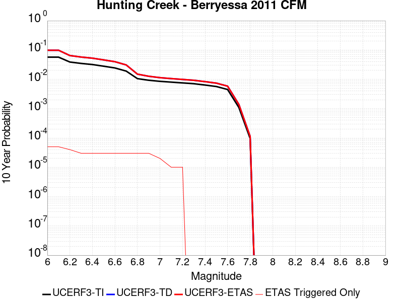 |

| Magnitude | 1 wk TI Prob | 1 wk TD Prob | 1 wk ETAS Prob | 1 wk ETAS/TD Gain | 1 wk ETAS Triggered Only | 1 mo TI Prob | 1 mo TD Prob | 1 mo ETAS Prob | 1 mo ETAS/TD Gain | 1 mo ETAS Triggered Only | 1 yr TI Prob | 1 yr TD Prob | 1 yr ETAS Prob | 1 yr ETAS/TD Gain | 1 yr ETAS Triggered Only | 10 yr TI Prob | 10 yr TD Prob | 10 yr ETAS Prob | 10 yr ETAS/TD Gain | 10 yr ETAS Triggered Only |
|-----|-----|-----|-----|-----|-----|-----|-----|-----|-----|-----|-----|-----|-----|-----|-----|-----|-----|-----|-----|-----|
| 6.0 | 1.1270982E-4 | 2.0028367E-4 | 2.144265E-4 | 1.0706141 | 1.4145672E-5 | 4.8295266E-4 | 8.579912E-4 | 8.721248E-4 | 1.0164728 | 1.4145672E-5 | 0.0058641075 | 0.010386173 | 0.010400171 | 1.0013478 | 1.4145672E-5 | 0.057117578 | 0.09804048 | 0.09807876 | 1.0003904 | 4.2437016E-5 |
| 6.1 | 1.1239393E-4 | 1.9976508E-4 | 2.1390793E-4 | 1.0707974 | 1.4145672E-5 | 4.8159933E-4 | 8.557703E-4 | 8.699039E-4 | 1.0165156 | 1.4145672E-5 | 0.0058477195 | 0.010359417 | 0.010373415 | 1.0013514 | 1.4145672E-5 | 0.056962132 | 0.09779895 | 0.09783724 | 1.0003915 | 4.2437016E-5 |
| 6.2 | 7.596265E-5 | 1.2933646E-4 | 1.2933646E-4 | 1.0 | 0.0 | 3.2551357E-4 | 5.5415573E-4 | 5.5415573E-4 | 1.0 | 0.0 | 0.0039559277 | 0.0067213587 | 0.0067213587 | 1.0 | 0.0 | 0.038862433 | 0.06459229 | 0.06461875 | 1.0004097 | 2.8291344E-5 |
| 6.3 | 6.78794E-5 | 1.1448377E-4 | 1.1448377E-4 | 1.0 | 0.0 | 2.9087928E-4 | 4.9052597E-4 | 4.9052597E-4 | 1.0 | 0.0 | 0.003535705 | 0.005952661 | 0.005952661 | 1.0 | 0.0 | 0.034799766 | 0.057466213 | 0.05749288 | 1.000464 | 2.8291344E-5 |
| 6.4 | 6.2165134E-5 | 1.0434825E-4 | 1.0434825E-4 | 1.0 | 0.0 | 2.6639478E-4 | 4.4711027E-4 | 4.4711027E-4 | 1.0 | 0.0 | 0.0032385332 | 0.0054274183 | 0.0054274183 | 1.0 | 0.0 | 0.03191742 | 0.05255138 | 0.052578185 | 1.0005101 | 2.8291344E-5 |
| 6.5 | 5.4368087E-5 | 9.070258E-5 | 9.070258E-5 | 1.0 | 0.0 | 2.3298527E-4 | 3.886537E-4 | 3.886537E-4 | 1.0 | 0.0 | 0.0028329059 | 0.0047197016 | 0.0047197016 | 1.0 | 0.0 | 0.027970633 | 0.045881182 | 0.045908175 | 1.0005883 | 2.8291344E-5 |
| 6.6 | 4.729947E-5 | 7.847101E-5 | 7.847101E-5 | 1.0 | 0.0 | 2.0269625E-4 | 3.3624718E-4 | 3.3624718E-4 | 1.0 | 0.0 | 0.002465034 | 0.004084746 | 0.004084746 | 1.0 | 0.0 | 0.02437869 | 0.03985269 | 0.03987985 | 1.0006816 | 2.8291344E-5 |
| 6.7 | 3.6875328E-5 | 6.0443555E-5 | 6.0443555E-5 | 1.0 | 0.0 | 1.5802756E-4 | 2.5900968E-4 | 2.5900968E-4 | 1.0 | 0.0 | 0.0019222875 | 0.0031482724 | 0.0031482724 | 1.0 | 0.0 | 0.019057442 | 0.03089371 | 0.030921128 | 1.0008875 | 2.8291344E-5 |
| 6.8 | 2.0292036E-5 | 2.8976721E-5 | 2.8976721E-5 | 1.0 | 0.0 | 8.6962966E-5 | 1.2417998E-4 | 1.2417998E-4 | 1.0 | 0.0 | 0.0010582599 | 0.0015108302 | 0.0015108302 | 1.0 | 0.0 | 0.010532344 | 0.0149790775 | 0.015006945 | 1.0018604 | 2.8291344E-5 |
| 6.9 | 1.7871042E-5 | 2.4472653E-5 | 2.4472653E-5 | 1.0 | 0.0 | 7.658793E-5 | 1.04878585E-4 | 1.04878585E-4 | 1.0 | 0.0 | 9.320591E-4 | 0.0012761486 | 0.0012761486 | 1.0 | 0.0 | 0.009281595 | 0.012680395 | 0.012708327 | 1.0022029 | 2.8291344E-5 |
| 7.0 | 1.6415532E-5 | 2.1906566E-5 | 2.1906566E-5 | 1.0 | 0.0 | 7.035038E-5 | 9.388191E-5 | 9.388191E-5 | 1.0 | 0.0 | 8.561793E-4 | 0.0011424144 | 0.0011424144 | 1.0 | 0.0 | 0.008528882 | 0.011365017 | 0.011392986 | 1.0024611 | 2.8291344E-5 |
| 7.1 | 1.5409885E-5 | 2.0346588E-5 | 2.0346588E-5 | 1.0 | 0.0 | 6.6040695E-5 | 8.719676E-5 | 8.719676E-5 | 1.0 | 0.0 | 8.0374884E-4 | 0.0010611062 | 0.0010611062 | 1.0 | 0.0 | 0.00800848 | 0.010560924 | 0.010574921 | 1.0013252 | 1.4145672E-5 |
| 7.2 | 1.4497423E-5 | 1.905519E-5 | 1.905519E-5 | 1.0 | 0.0 | 6.213033E-5 | 8.166256E-5 | 8.166256E-5 | 1.0 | 0.0 | 7.5617427E-4 | 9.937913E-4 | 9.937913E-4 | 1.0 | 0.0 | 0.0075360634 | 0.00989425 | 0.009908256 | 1.0014155 | 1.4145672E-5 |
| 7.3 | 1.3615175E-5 | 1.7826347E-5 | 1.7826347E-5 | 1.0 | 0.0 | 5.8349444E-5 | 7.6396405E-5 | 7.6396405E-5 | 1.0 | 0.0 | 7.101729E-4 | 9.297323E-4 | 9.297323E-4 | 1.0 | 0.0 | 0.0070790765 | 0.009259124 | 0.009259124 | 1.0 | 0.0 |
| 7.4 | 1.2252825E-5 | 1.6026455E-5 | 1.6026455E-5 | 1.0 | 0.0 | 5.251105E-5 | 6.868302E-5 | 6.868302E-5 | 1.0 | 0.0 | 6.391345E-4 | 8.3589775E-4 | 8.3589775E-4 | 1.0 | 0.0 | 0.0063729943 | 0.008328172 | 0.008328172 | 1.0 | 0.0 |
| 7.5 | 1.0913301E-5 | 1.4241286E-5 | 1.4241286E-5 | 1.0 | 0.0 | 4.6770452E-5 | 6.103267E-5 | 6.103267E-5 | 1.0 | 0.0 | 5.6928146E-4 | 7.428222E-4 | 7.428222E-4 | 1.0 | 0.0 | 0.0056782532 | 0.0074039865 | 0.0074039865 | 1.0 | 0.0 |
| 7.6 | 8.623192E-6 | 1.12347825E-5 | 1.12347825E-5 | 1.0 | 0.0 | 3.6956015E-5 | 4.8148195E-5 | 4.8148195E-5 | 1.0 | 0.0 | 4.4984656E-4 | 5.8604917E-4 | 5.8604917E-4 | 1.0 | 0.0 | 0.00448937 | 0.005845504 | 0.005845504 | 1.0 | 0.0 |
| 7.7 | 2.0993634E-6 | 2.66264E-6 | 2.66264E-6 | 1.0 | 0.0 | 8.997241E-6 | 1.1411265E-5 | 1.1411265E-5 | 1.0 | 0.0 | 1.09535904E-4 | 1.3892337E-4 | 1.3892337E-4 | 1.0 | 0.0 | 0.0010948193 | 0.0013883994 | 0.0013883994 | 1.0 | 0.0 |
| 7.8 | 1.8428308E-7 | 2.1674624E-7 | 2.1674624E-7 | 1.0 | 0.0 | 7.897844E-7 | 9.289122E-7 | 9.289122E-7 | 1.0 | 0.0 | 9.615583E-6 | 1.130945E-5 | 1.130945E-5 | 1.0 | 0.0 | 9.615166E-5 | 1.1308173E-4 | 1.1308173E-4 | 1.0 | 0.0 |

## Los Alamos 2011 CFM
*[(top)](#table-of-contents)*

| 1 Week | 1 Month | 1 Year | 10 Year |
|-----|-----|-----|-----|
|  | 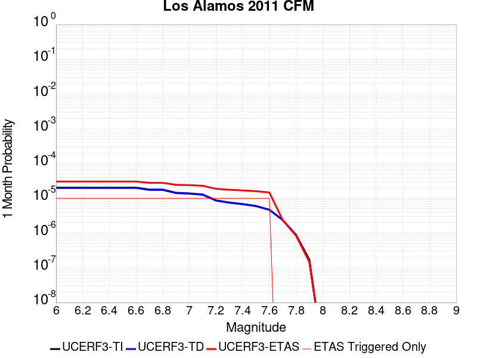 | 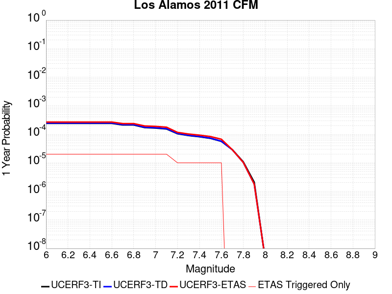 |  |

| Magnitude | 1 wk TI Prob | 1 wk TD Prob | 1 wk ETAS Prob | 1 wk ETAS/TD Gain | 1 wk ETAS Triggered Only | 1 mo TI Prob | 1 mo TD Prob | 1 mo ETAS Prob | 1 mo ETAS/TD Gain | 1 mo ETAS Triggered Only | 1 yr TI Prob | 1 yr TD Prob | 1 yr ETAS Prob | 1 yr ETAS/TD Gain | 1 yr ETAS Triggered Only | 10 yr TI Prob | 10 yr TD Prob | 10 yr ETAS Prob | 10 yr ETAS/TD Gain | 10 yr ETAS Triggered Only |
|-----|-----|-----|-----|-----|-----|-----|-----|-----|-----|-----|-----|-----|-----|-----|-----|-----|-----|-----|-----|-----|
| 6.0 | 4.6284417E-6 | 4.7517333E-6 | 1.8897339E-5 | 3.9769359 | 1.4145672E-5 | 1.9836029E-5 | 2.0364423E-5 | 3.4509805E-5 | 1.6946126 | 1.4145672E-5 | 2.4147688E-4 | 2.479104E-4 | 2.6205255E-4 | 1.0570455 | 1.4145672E-5 | 0.0024121467 | 0.0024765125 | 0.0025188446 | 1.0170933 | 4.2437016E-5 |
| 6.1 | 4.6284417E-6 | 4.7517333E-6 | 1.8897339E-5 | 3.9769359 | 1.4145672E-5 | 1.9836029E-5 | 2.0364423E-5 | 3.4509805E-5 | 1.6946126 | 1.4145672E-5 | 2.4147688E-4 | 2.479104E-4 | 2.6205255E-4 | 1.0570455 | 1.4145672E-5 | 0.0024121467 | 0.0024765125 | 0.0025188446 | 1.0170933 | 4.2437016E-5 |
| 6.2 | 4.6284417E-6 | 4.7517333E-6 | 1.8897339E-5 | 3.9769359 | 1.4145672E-5 | 1.9836029E-5 | 2.0364423E-5 | 3.4509805E-5 | 1.6946126 | 1.4145672E-5 | 2.4147688E-4 | 2.479104E-4 | 2.6205255E-4 | 1.0570455 | 1.4145672E-5 | 0.0024121467 | 0.0024765125 | 0.0025188446 | 1.0170933 | 4.2437016E-5 |
| 6.3 | 4.6284417E-6 | 4.7517333E-6 | 1.8897339E-5 | 3.9769359 | 1.4145672E-5 | 1.9836029E-5 | 2.0364423E-5 | 3.4509805E-5 | 1.6946126 | 1.4145672E-5 | 2.4147688E-4 | 2.479104E-4 | 2.6205255E-4 | 1.0570455 | 1.4145672E-5 | 0.0024121467 | 0.0024765125 | 0.0025188446 | 1.0170933 | 4.2437016E-5 |
| 6.4 | 4.6284417E-6 | 4.7517333E-6 | 1.8897339E-5 | 3.9769359 | 1.4145672E-5 | 1.9836029E-5 | 2.0364423E-5 | 3.4509805E-5 | 1.6946126 | 1.4145672E-5 | 2.4147688E-4 | 2.479104E-4 | 2.6205255E-4 | 1.0570455 | 1.4145672E-5 | 0.0024121467 | 0.0024765125 | 0.0025188446 | 1.0170933 | 4.2437016E-5 |
| 6.5 | 4.6284417E-6 | 4.7517333E-6 | 1.8897339E-5 | 3.9769359 | 1.4145672E-5 | 1.9836029E-5 | 2.0364423E-5 | 3.4509805E-5 | 1.6946126 | 1.4145672E-5 | 2.4147688E-4 | 2.479104E-4 | 2.6205255E-4 | 1.0570455 | 1.4145672E-5 | 0.0024121467 | 0.0024765125 | 0.0025188446 | 1.0170933 | 4.2437016E-5 |
| 6.6 | 4.6284417E-6 | 4.7517333E-6 | 1.8897339E-5 | 3.9769359 | 1.4145672E-5 | 1.9836029E-5 | 2.0364423E-5 | 3.4509805E-5 | 1.6946126 | 1.4145672E-5 | 2.4147688E-4 | 2.479104E-4 | 2.6205255E-4 | 1.0570455 | 1.4145672E-5 | 0.0024121467 | 0.0024765125 | 0.0025188446 | 1.0170933 | 4.2437016E-5 |
| 6.7 | 4.062321E-6 | 4.166351E-6 | 1.8311965E-5 | 4.3952045 | 1.4145672E-5 | 1.7409831E-5 | 1.7855677E-5 | 3.2001095E-5 | 1.7922086 | 1.4145672E-5 | 2.1194408E-4 | 2.1737268E-4 | 2.3151528E-4 | 1.0650616 | 1.4145672E-5 | 0.0021174205 | 0.0021717504 | 0.002214095 | 1.019498 | 4.2437016E-5 |
| 6.8 | 4.062321E-6 | 4.166351E-6 | 1.8311965E-5 | 4.3952045 | 1.4145672E-5 | 1.7409831E-5 | 1.7855677E-5 | 3.2001095E-5 | 1.7922086 | 1.4145672E-5 | 2.1194408E-4 | 2.1737268E-4 | 2.3151528E-4 | 1.0650616 | 1.4145672E-5 | 0.0021174205 | 0.0021717504 | 0.002214095 | 1.019498 | 4.2437016E-5 |
| 6.9 | 3.2936077E-6 | 3.37296E-6 | 1.7518585E-5 | 5.193831 | 1.4145672E-5 | 1.4115385E-5 | 1.4455468E-5 | 2.8600936E-5 | 1.9785547 | 1.4145672E-5 | 1.7184127E-4 | 1.7598206E-4 | 1.9012524E-4 | 1.0803672 | 1.4145672E-5 | 0.0017170844 | 0.0017585196 | 0.0018008819 | 1.0240898 | 4.2437016E-5 |
| 7.0 | 3.1687898E-6 | 3.2448177E-6 | 1.7390445E-5 | 5.359452 | 1.4145672E-5 | 1.3580457E-5 | 1.3906293E-5 | 2.8051769E-5 | 2.0171995 | 1.4145672E-5 | 1.6532952E-4 | 1.692969E-4 | 1.8344016E-4 | 1.0835413 | 1.4145672E-5 | 0.0016520657 | 0.0016917707 | 0.001734136 | 1.0250419 | 4.2437016E-5 |
| 7.1 | 2.9379228E-6 | 3.007328E-6 | 1.7152957E-5 | 5.70372 | 1.4145672E-5 | 1.25910365E-5 | 1.288849E-5 | 2.703398E-5 | 2.097529 | 1.4145672E-5 | 1.5328509E-4 | 1.5690697E-4 | 1.7105043E-4 | 1.0901392 | 1.4145672E-5 | 0.001531794 | 0.001568051 | 0.0016104215 | 1.027021 | 4.2437016E-5 |
| 7.2 | 2.0020686E-6 | 2.041632E-6 | 1.6187276E-5 | 7.928596 | 1.4145672E-5 | 8.580266E-6 | 8.749822E-6 | 2.289537E-5 | 2.616667 | 1.4145672E-5 | 1.0445973E-4 | 1.0652392E-4 | 1.2066809E-4 | 1.1327792 | 1.4145672E-5 | 0.0010441064 | 0.001064733 | 0.0011071248 | 1.0398145 | 4.2437016E-5 |
| 7.3 | 1.7364243E-6 | 1.7678824E-6 | 1.5913529E-5 | 9.001464 | 1.4145672E-5 | 7.441797E-6 | 7.576617E-6 | 2.1722182E-5 | 2.8670027 | 1.4145672E-5 | 9.0600115E-5 | 9.224144E-5 | 1.0638581E-4 | 1.1533407 | 1.4145672E-5 | 9.0563187E-4 | 9.2203467E-4 | 9.6443255E-4 | 1.045983 | 4.2437016E-5 |
| 7.4 | 1.5718434E-6 | 1.5983198E-6 | 1.574397E-5 | 9.850325 | 1.4145672E-5 | 6.7364545E-6 | 6.8499244E-6 | 2.09955E-5 | 3.0650704 | 1.4145672E-5 | 8.201325E-5 | 8.339467E-5 | 9.753916E-5 | 1.1696091 | 1.4145672E-5 | 8.198299E-4 | 8.3363673E-4 | 8.6190447E-4 | 1.033909 | 2.8291344E-5 |
| 7.5 | 1.3841119E-6 | 1.4042814E-6 | 1.5549933E-5 | 11.073232 | 1.4145672E-5 | 5.9318945E-6 | 6.018335E-6 | 2.0163921E-5 | 3.3504152 | 1.4145672E-5 | 7.221842E-5 | 7.327079E-5 | 8.741543E-5 | 1.193046 | 1.4145672E-5 | 7.2194956E-4 | 7.3246926E-4 | 7.607399E-4 | 1.0385963 | 2.8291344E-5 |
| 7.6 | 1.0843726E-6 | 1.0934443E-6 | 1.5239101E-5 | 13.936788 | 1.4145672E-5 | 4.647303E-6 | 4.6861815E-6 | 1.8831788E-5 | 4.0185785 | 1.4145672E-5 | 5.6579443E-5 | 5.705279E-5 | 7.119765E-5 | 1.2479259 | 1.4145672E-5 | 5.656504E-4 | 5.70384E-4 | 5.986592E-4 | 1.0495722 | 2.8291344E-5 |
| 7.7 | 5.544814E-7 | 5.501884E-7 | 5.501884E-7 | 1.0 | 0.0 | 2.3763469E-6 | 2.3579482E-6 | 2.3579482E-6 | 1.0 | 0.0 | 2.8931638E-5 | 2.8707644E-5 | 2.8707644E-5 | 1.0 | 0.0 | 2.8927872E-4 | 2.870395E-4 | 2.870395E-4 | 1.0 | 0.0 |
| 7.8 | 2.0707465E-7 | 1.9778598E-7 | 1.9778598E-7 | 1.0 | 0.0 | 8.874625E-7 | 8.476539E-7 | 8.476539E-7 | 1.0 | 0.0 | 1.08048025E-5 | 1.0320137E-5 | 1.0320137E-5 | 1.0 | 0.0 | 1.0804277E-4 | 1.0319663E-4 | 1.0319663E-4 | 1.0 | 0.0 |
| 7.9 | 3.9821284E-8 | 3.4331528E-8 | 3.4331528E-8 | 1.0 | 0.0 | 1.7066264E-7 | 1.4713511E-7 | 1.4713511E-7 | 1.0 | 0.0 | 2.0778157E-6 | 1.7913685E-6 | 1.7913685E-6 | 1.0 | 0.0 | 2.0777963E-5 | 1.7913546E-5 | 1.7913546E-5 | 1.0 | 0.0 |
| 8.0 | 7.880441E-11 | 8.2353124E-11 | 8.2353124E-11 | 1.0 | 0.0 | 3.3773329E-10 | 3.52942E-10 | 3.52942E-10 | 1.0 | 0.0 | 4.1119033E-9 | 4.2970694E-9 | 4.2970694E-9 | 1.0 | 0.0 | 4.1119034E-8 | 4.2970694E-8 | 4.2970694E-8 | 1.0 | 0.0 |

## Los Alamos extension
*[(top)](#table-of-contents)*

| 1 Week | 1 Month | 1 Year | 10 Year |
|-----|-----|-----|-----|
|  | 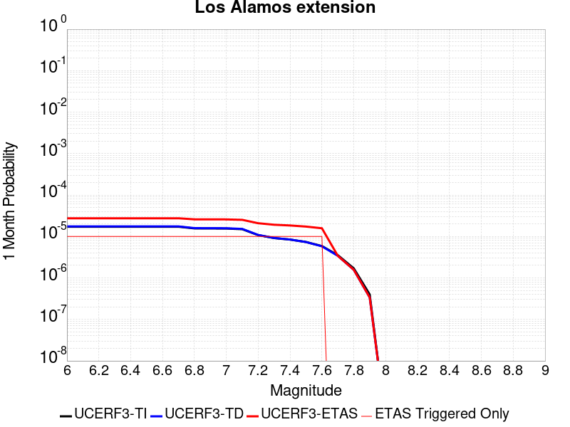 |  |  |

| Magnitude | 1 wk TI Prob | 1 wk TD Prob | 1 wk ETAS Prob | 1 wk ETAS/TD Gain | 1 wk ETAS Triggered Only | 1 mo TI Prob | 1 mo TD Prob | 1 mo ETAS Prob | 1 mo ETAS/TD Gain | 1 mo ETAS Triggered Only | 1 yr TI Prob | 1 yr TD Prob | 1 yr ETAS Prob | 1 yr ETAS/TD Gain | 1 yr ETAS Triggered Only | 10 yr TI Prob | 10 yr TD Prob | 10 yr ETAS Prob | 10 yr ETAS/TD Gain | 10 yr ETAS Triggered Only |
|-----|-----|-----|-----|-----|-----|-----|-----|-----|-----|-----|-----|-----|-----|-----|-----|-----|-----|-----|-----|-----|
| 6.0 | 4.0146506E-6 | 4.086164E-6 | 1.8231778E-5 | 4.461832 | 1.4145672E-5 | 1.7205533E-5 | 1.7512022E-5 | 3.1657444E-5 | 1.8077551 | 1.4145672E-5 | 2.0945723E-4 | 2.1318911E-4 | 2.2733177E-4 | 1.0663385 | 1.4145672E-5 | 0.0020925992 | 0.002129955 | 0.0021723018 | 1.0198815 | 4.2437016E-5 |
| 6.1 | 4.0146506E-6 | 4.086164E-6 | 1.8231778E-5 | 4.461832 | 1.4145672E-5 | 1.7205533E-5 | 1.7512022E-5 | 3.1657444E-5 | 1.8077551 | 1.4145672E-5 | 2.0945723E-4 | 2.1318911E-4 | 2.2733177E-4 | 1.0663385 | 1.4145672E-5 | 0.0020925992 | 0.002129955 | 0.0021723018 | 1.0198815 | 4.2437016E-5 |
| 6.2 | 4.0146506E-6 | 4.086164E-6 | 1.8231778E-5 | 4.461832 | 1.4145672E-5 | 1.7205533E-5 | 1.7512022E-5 | 3.1657444E-5 | 1.8077551 | 1.4145672E-5 | 2.0945723E-4 | 2.1318911E-4 | 2.2733177E-4 | 1.0663385 | 1.4145672E-5 | 0.0020925992 | 0.002129955 | 0.0021723018 | 1.0198815 | 4.2437016E-5 |
| 6.3 | 4.0146506E-6 | 4.086164E-6 | 1.8231778E-5 | 4.461832 | 1.4145672E-5 | 1.7205533E-5 | 1.7512022E-5 | 3.1657444E-5 | 1.8077551 | 1.4145672E-5 | 2.0945723E-4 | 2.1318911E-4 | 2.2733177E-4 | 1.0663385 | 1.4145672E-5 | 0.0020925992 | 0.002129955 | 0.0021723018 | 1.0198815 | 4.2437016E-5 |
| 6.4 | 4.0146506E-6 | 4.086164E-6 | 1.8231778E-5 | 4.461832 | 1.4145672E-5 | 1.7205533E-5 | 1.7512022E-5 | 3.1657444E-5 | 1.8077551 | 1.4145672E-5 | 2.0945723E-4 | 2.1318911E-4 | 2.2733177E-4 | 1.0663385 | 1.4145672E-5 | 0.0020925992 | 0.002129955 | 0.0021723018 | 1.0198815 | 4.2437016E-5 |
| 6.5 | 4.0146506E-6 | 4.086164E-6 | 1.8231778E-5 | 4.461832 | 1.4145672E-5 | 1.7205533E-5 | 1.7512022E-5 | 3.1657444E-5 | 1.8077551 | 1.4145672E-5 | 2.0945723E-4 | 2.1318911E-4 | 2.2733177E-4 | 1.0663385 | 1.4145672E-5 | 0.0020925992 | 0.002129955 | 0.0021723018 | 1.0198815 | 4.2437016E-5 |
| 6.6 | 4.0146506E-6 | 4.086164E-6 | 1.8231778E-5 | 4.461832 | 1.4145672E-5 | 1.7205533E-5 | 1.7512022E-5 | 3.1657444E-5 | 1.8077551 | 1.4145672E-5 | 2.0945723E-4 | 2.1318911E-4 | 2.2733177E-4 | 1.0663385 | 1.4145672E-5 | 0.0020925992 | 0.002129955 | 0.0021723018 | 1.0198815 | 4.2437016E-5 |
| 6.7 | 4.0146506E-6 | 4.086164E-6 | 1.8231778E-5 | 4.461832 | 1.4145672E-5 | 1.7205533E-5 | 1.7512022E-5 | 3.1657444E-5 | 1.8077551 | 1.4145672E-5 | 2.0945723E-4 | 2.1318911E-4 | 2.2733177E-4 | 1.0663385 | 1.4145672E-5 | 0.0020925992 | 0.002129955 | 0.0021723018 | 1.0198815 | 4.2437016E-5 |
| 6.8 | 3.6584688E-6 | 3.7188636E-6 | 1.7864482E-5 | 4.803748 | 1.4145672E-5 | 1.5679057E-5 | 1.5937894E-5 | 3.0083342E-5 | 1.8875355 | 1.4145672E-5 | 1.9087581E-4 | 1.9402753E-4 | 2.0817044E-4 | 1.0728914 | 1.4145672E-5 | 0.0019071194 | 0.0019386737 | 0.0019810284 | 1.0218472 | 4.2437016E-5 |
| 6.9 | 3.644631E-6 | 3.7045736E-6 | 1.7850194E-5 | 4.8184204 | 1.4145672E-5 | 1.5619753E-5 | 1.5876652E-5 | 3.00221E-5 | 1.890959 | 1.4145672E-5 | 1.901539E-4 | 1.9328203E-4 | 2.0742496E-4 | 1.0731726 | 1.4145672E-5 | 0.0018999127 | 0.0019312317 | 0.0019735866 | 1.0219316 | 4.2437016E-5 |
| 7.0 | 3.6318522E-6 | 3.691334E-6 | 1.7836954E-5 | 4.8321157 | 1.4145672E-5 | 1.5564989E-5 | 1.5819913E-5 | 2.996536E-5 | 1.8941547 | 1.4145672E-5 | 1.8948725E-4 | 1.9259135E-4 | 2.067343E-4 | 1.0734351 | 1.4145672E-5 | 0.0018932576 | 0.0019243368 | 0.001966692 | 1.0220103 | 4.2437016E-5 |
| 7.1 | 3.5001724E-6 | 3.5554046E-6 | 1.7701026E-5 | 4.978625 | 1.4145672E-5 | 1.5000653E-5 | 1.5237365E-5 | 2.9382822E-5 | 1.9283401 | 1.4145672E-5 | 1.8261763E-4 | 1.8550004E-4 | 1.996431E-4 | 1.0762428 | 1.4145672E-5 | 0.0018246764 | 0.0018535426 | 0.001895901 | 1.0228527 | 4.2437016E-5 |
| 7.2 | 2.5204702E-6 | 2.5436989E-6 | 1.6689335E-5 | 6.56105 | 1.4145672E-5 | 1.080197E-5 | 1.0901522E-5 | 2.504704E-5 | 2.2975729 | 1.4145672E-5 | 1.3150605E-4 | 1.3271799E-4 | 1.4686178E-4 | 1.1065702 | 1.4145672E-5 | 0.0013142825 | 0.001326393 | 0.0013687738 | 1.0319519 | 4.2437016E-5 |
| 7.3 | 2.1399692E-6 | 2.1501362E-6 | 1.6295779E-5 | 7.5789514 | 1.4145672E-5 | 9.1712645E-6 | 9.2148375E-6 | 2.3360379E-5 | 2.5350833 | 1.4145672E-5 | 1.1165442E-4 | 1.121849E-4 | 1.2632899E-4 | 1.1260784 | 1.4145672E-5 | 0.0011159834 | 0.001121286 | 0.0011636753 | 1.0378042 | 4.2437016E-5 |
| 7.4 | 1.9660122E-6 | 1.970241E-6 | 1.6115886E-5 | 8.179651 | 1.4145672E-5 | 8.42574E-6 | 8.4438625E-6 | 2.2589416E-5 | 2.6752467 | 1.4145672E-5 | 1.0257855E-4 | 1.0279921E-4 | 1.16943425E-4 | 1.1375908 | 1.4145672E-5 | 0.0010253121 | 0.0010275197 | 0.001055782 | 1.0275053 | 2.8291344E-5 |
| 7.5 | 1.7204633E-6 | 1.7151029E-6 | 1.586075E-5 | 9.247696 | 1.4145672E-5 | 7.373393E-6 | 7.3504207E-6 | 2.149599E-5 | 2.9244568 | 1.4145672E-5 | 8.976737E-5 | 8.948772E-5 | 1.03632134E-4 | 1.1580597 | 1.4145672E-5 | 8.9731114E-4 | 8.945199E-4 | 9.227859E-4 | 1.0315992 | 2.8291344E-5 |
| 7.6 | 1.3717638E-6 | 1.3535872E-6 | 1.549924E-5 | 11.450493 | 1.4145672E-5 | 5.878974E-6 | 5.801075E-6 | 1.9946665E-5 | 3.4384427 | 1.4145672E-5 | 7.157416E-5 | 7.062583E-5 | 8.47705E-5 | 1.2002763 | 1.4145672E-5 | 7.1551115E-4 | 7.0603646E-4 | 7.343078E-4 | 1.0400424 | 2.8291344E-5 |
| 7.7 | 8.272564E-7 | 7.9576733E-7 | 7.9576733E-7 | 1.0 | 0.0 | 3.5453797E-6 | 3.4104269E-6 | 3.4104269E-6 | 1.0 | 0.0 | 4.3164142E-5 | 4.1521158E-5 | 4.1521158E-5 | 1.0 | 0.0 | 4.315576E-4 | 4.151342E-4 | 4.151342E-4 | 1.0 | 0.0 |
| 7.8 | 3.9708277E-7 | 3.671937E-7 | 3.671937E-7 | 1.0 | 0.0 | 1.7017821E-6 | 1.5736864E-6 | 1.5736864E-6 | 1.0 | 0.0 | 2.0719E-5 | 1.9159465E-5 | 1.9159465E-5 | 1.0 | 0.0 | 2.071707E-4 | 1.9157819E-4 | 1.9157819E-4 | 1.0 | 0.0 |
| 7.9 | 9.292528E-8 | 7.889168E-8 | 7.889168E-8 | 1.0 | 0.0 | 3.9825116E-7 | 3.3810713E-7 | 3.3810713E-7 | 1.0 | 0.0 | 4.848697E-6 | 4.1164467E-6 | 4.1164467E-6 | 1.0 | 0.0 | 4.8485912E-5 | 4.1163716E-5 | 4.1163716E-5 | 1.0 | 0.0 |
| 8.0 | 7.880441E-11 | 8.2353124E-11 | 8.2353124E-11 | 1.0 | 0.0 | 3.3773329E-10 | 3.52942E-10 | 3.52942E-10 | 1.0 | 0.0 | 4.1119033E-9 | 4.2970694E-9 | 4.2970694E-9 | 1.0 | 0.0 | 4.1119034E-8 | 4.2970694E-8 | 4.2970694E-8 | 1.0 | 0.0 |

## Sheephole
*[(top)](#table-of-contents)*

| 1 Week | 1 Month | 1 Year | 10 Year |
|-----|-----|-----|-----|
|  |  |  |  |

| Magnitude | 1 wk TI Prob | 1 wk TD Prob | 1 wk ETAS Prob | 1 wk ETAS/TD Gain | 1 wk ETAS Triggered Only | 1 mo TI Prob | 1 mo TD Prob | 1 mo ETAS Prob | 1 mo ETAS/TD Gain | 1 mo ETAS Triggered Only | 1 yr TI Prob | 1 yr TD Prob | 1 yr ETAS Prob | 1 yr ETAS/TD Gain | 1 yr ETAS Triggered Only | 10 yr TI Prob | 10 yr TD Prob | 10 yr ETAS Prob | 10 yr ETAS/TD Gain | 10 yr ETAS Triggered Only |
|-----|-----|-----|-----|-----|-----|-----|-----|-----|-----|-----|-----|-----|-----|-----|-----|-----|-----|-----|-----|-----|
| 6.0 | 4.5579695E-6 | 4.7412627E-6 | 3.3032473E-5 | 6.9670205 | 2.8291344E-5 | 1.9534009E-5 | 2.031957E-5 | 4.8610338E-5 | 2.3922918 | 2.8291344E-5 | 2.3780059E-4 | 2.473682E-4 | 2.7565256E-4 | 1.114341 | 2.8291344E-5 | 0.0023754628 | 0.002471473 | 0.0025138052 | 1.0171283 | 4.2437016E-5 |
| 6.1 | 4.5579695E-6 | 4.7412627E-6 | 3.3032473E-5 | 6.9670205 | 2.8291344E-5 | 1.9534009E-5 | 2.031957E-5 | 4.8610338E-5 | 2.3922918 | 2.8291344E-5 | 2.3780059E-4 | 2.473682E-4 | 2.7565256E-4 | 1.114341 | 2.8291344E-5 | 0.0023754628 | 0.002471473 | 0.0025138052 | 1.0171283 | 4.2437016E-5 |
| 6.2 | 2.6677674E-6 | 2.7873941E-6 | 1.6933027E-5 | 6.074859 | 1.4145672E-5 | 1.1433239E-5 | 1.1945926E-5 | 2.609143E-5 | 2.1841278 | 1.4145672E-5 | 1.3919079E-4 | 1.4543302E-4 | 1.5957664E-4 | 1.0972518 | 1.4145672E-5 | 0.0013910364 | 0.0014534844 | 0.0014676095 | 1.0097181 | 1.4145672E-5 |
| 6.3 | 2.6677674E-6 | 2.7873941E-6 | 1.6933027E-5 | 6.074859 | 1.4145672E-5 | 1.1433239E-5 | 1.1945926E-5 | 2.609143E-5 | 2.1841278 | 1.4145672E-5 | 1.3919079E-4 | 1.4543302E-4 | 1.5957664E-4 | 1.0972518 | 1.4145672E-5 | 0.0013910364 | 0.0014534844 | 0.0014676095 | 1.0097181 | 1.4145672E-5 |
| 6.4 | 2.2159759E-6 | 2.3228788E-6 | 1.6468519E-5 | 7.089702 | 1.4145672E-5 | 9.497005E-6 | 9.955161E-6 | 2.4100693E-5 | 2.4209244 | 1.4145672E-5 | 1.156199E-4 | 1.2119815E-4 | 1.3534211E-4 | 1.1167011 | 1.4145672E-5 | 0.0011555976 | 0.0012113999 | 0.0012255284 | 1.011663 | 1.4145672E-5 |
| 6.5 | 2.1986082E-6 | 2.304759E-6 | 1.6450398E-5 | 7.1375785 | 1.4145672E-5 | 9.4225725E-6 | 9.877506E-6 | 2.4023038E-5 | 2.4320955 | 1.4145672E-5 | 1.1471378E-4 | 1.2025281E-4 | 1.3439677E-4 | 1.1176187 | 1.4145672E-5 | 0.0011465458 | 0.0012019566 | 0.0012160853 | 1.0117548 | 1.4145672E-5 |
| 6.6 | 1.5232331E-6 | 1.6018919E-6 | 1.6018919E-6 | 1.0 | 0.0 | 6.5281256E-6 | 6.865234E-6 | 6.865234E-6 | 1.0 | 0.0 | 7.947703E-5 | 8.35812E-5 | 8.35812E-5 | 1.0 | 0.0 | 7.9448614E-4 | 8.3551643E-4 | 8.3551643E-4 | 1.0 | 0.0 |
| 6.7 | 1.3137362E-6 | 1.382819E-6 | 1.382819E-6 | 1.0 | 0.0 | 5.6302856E-6 | 5.926355E-6 | 5.926355E-6 | 1.0 | 0.0 | 6.854657E-5 | 7.215112E-5 | 7.215112E-5 | 1.0 | 0.0 | 6.8525434E-4 | 7.212908E-4 | 7.212908E-4 | 1.0 | 0.0 |
| 6.8 | 1.2275751E-6 | 1.2922847E-6 | 1.2922847E-6 | 1.0 | 0.0 | 5.2610258E-6 | 5.5383516E-6 | 5.5383516E-6 | 1.0 | 0.0 | 6.4051106E-5 | 6.7427485E-5 | 6.7427485E-5 | 1.0 | 0.0 | 6.4032647E-4 | 6.740836E-4 | 6.740836E-4 | 1.0 | 0.0 |
| 6.9 | 1.1837088E-6 | 1.246102E-6 | 1.246102E-6 | 1.0 | 0.0 | 5.0730278E-6 | 5.340427E-6 | 5.340427E-6 | 1.0 | 0.0 | 6.176237E-5 | 6.501789E-5 | 6.501789E-5 | 1.0 | 0.0 | 6.17452E-4 | 6.5000186E-4 | 6.5000186E-4 | 1.0 | 0.0 |
| 7.0 | 9.849371E-7 | 1.0366288E-6 | 1.0366288E-6 | 1.0 | 0.0 | 4.2211523E-6 | 4.442688E-6 | 4.442688E-6 | 1.0 | 0.0 | 5.1391315E-5 | 5.4088487E-5 | 5.4088487E-5 | 1.0 | 0.0 | 5.137943E-4 | 5.407633E-4 | 5.407633E-4 | 1.0 | 0.0 |
| 7.1 | 8.1643645E-7 | 8.591669E-7 | 8.591669E-7 | 1.0 | 0.0 | 3.4990085E-6 | 3.682139E-6 | 3.682139E-6 | 1.0 | 0.0 | 4.2599597E-5 | 4.482921E-5 | 4.482921E-5 | 1.0 | 0.0 | 4.259143E-4 | 4.4821028E-4 | 4.4821028E-4 | 1.0 | 0.0 |
| 7.2 | 5.7295756E-7 | 6.029502E-7 | 6.029502E-7 | 1.0 | 0.0 | 2.45553E-6 | 2.58407E-6 | 2.58407E-6 | 1.0 | 0.0 | 2.9895667E-5 | 3.1460666E-5 | 3.1460666E-5 | 1.0 | 0.0 | 2.9891645E-4 | 3.145688E-4 | 3.145688E-4 | 1.0 | 0.0 |

## Owens Valley Keough Hot Springs
*[(top)](#table-of-contents)*

| 1 Week | 1 Month | 1 Year | 10 Year |
|-----|-----|-----|-----|
|  |  | 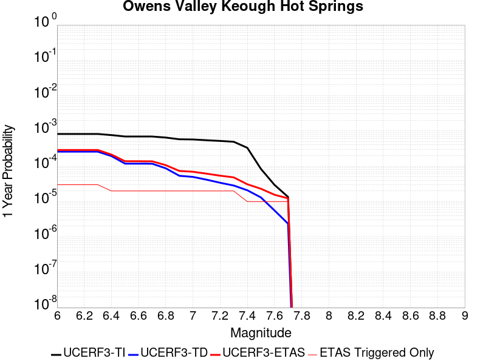 | 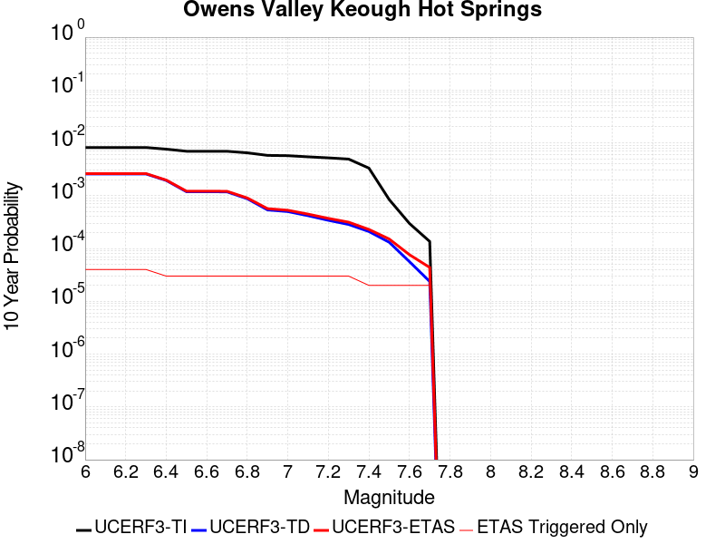 |

| Magnitude | 1 wk TI Prob | 1 wk TD Prob | 1 wk ETAS Prob | 1 wk ETAS/TD Gain | 1 wk ETAS Triggered Only | 1 mo TI Prob | 1 mo TD Prob | 1 mo ETAS Prob | 1 mo ETAS/TD Gain | 1 mo ETAS Triggered Only | 1 yr TI Prob | 1 yr TD Prob | 1 yr ETAS Prob | 1 yr ETAS/TD Gain | 1 yr ETAS Triggered Only | 10 yr TI Prob | 10 yr TD Prob | 10 yr ETAS Prob | 10 yr ETAS/TD Gain | 10 yr ETAS Triggered Only |
|-----|-----|-----|-----|-----|-----|-----|-----|-----|-----|-----|-----|-----|-----|-----|-----|-----|-----|-----|-----|-----|
| 6.0 | 1.5708529E-5 | 4.950463E-6 | 1.9096065E-5 | 3.85743 | 1.4145672E-5 | 6.7320536E-5 | 2.1216127E-5 | 4.950687E-5 | 2.3334546 | 2.8291344E-5 | 8.193192E-4 | 2.5828084E-4 | 3.0070692E-4 | 1.1642632 | 4.2437016E-5 | 0.008163051 | 0.0025804387 | 0.0026227662 | 1.0164032 | 4.2437016E-5 |
| 6.1 | 1.5708529E-5 | 4.950463E-6 | 1.9096065E-5 | 3.85743 | 1.4145672E-5 | 6.7320536E-5 | 2.1216127E-5 | 4.950687E-5 | 2.3334546 | 2.8291344E-5 | 8.193192E-4 | 2.5828084E-4 | 3.0070692E-4 | 1.1642632 | 4.2437016E-5 | 0.008163051 | 0.0025804387 | 0.0026227662 | 1.0164032 | 4.2437016E-5 |
| 6.2 | 1.5708529E-5 | 4.950463E-6 | 1.9096065E-5 | 3.85743 | 1.4145672E-5 | 6.7320536E-5 | 2.1216127E-5 | 4.950687E-5 | 2.3334546 | 2.8291344E-5 | 8.193192E-4 | 2.5828084E-4 | 3.0070692E-4 | 1.1642632 | 4.2437016E-5 | 0.008163051 | 0.0025804387 | 0.0026227662 | 1.0164032 | 4.2437016E-5 |
| 6.3 | 1.5708529E-5 | 4.950463E-6 | 1.9096065E-5 | 3.85743 | 1.4145672E-5 | 6.7320536E-5 | 2.1216127E-5 | 4.950687E-5 | 2.3334546 | 2.8291344E-5 | 8.193192E-4 | 2.5828084E-4 | 3.0070692E-4 | 1.1642632 | 4.2437016E-5 | 0.008163051 | 0.0025804387 | 0.0026227662 | 1.0164032 | 4.2437016E-5 |
| 6.4 | 1.4622509E-5 | 3.7263276E-6 | 1.7871947E-5 | 4.7961287 | 1.4145672E-5 | 6.266639E-5 | 1.5969896E-5 | 3.0115343E-5 | 1.885757 | 1.4145672E-5 | 7.626962E-4 | 1.9441944E-4 | 2.2270529E-4 | 1.1454887 | 2.8291344E-5 | 0.007600839 | 0.0019429466 | 0.0019711829 | 1.0145328 | 2.8291344E-5 |
| 6.5 | 1.3335527E-5 | 2.2775241E-6 | 1.6423164E-5 | 7.2109723 | 1.4145672E-5 | 5.7151006E-5 | 9.760785E-6 | 2.390632E-5 | 2.449221 | 1.4145672E-5 | 6.955913E-4 | 1.1883176E-4 | 1.4711975E-4 | 1.2380507 | 2.8291344E-5 | 0.0069341804 | 0.001187878 | 0.0012161358 | 1.0237885 | 2.8291344E-5 |
| 6.6 | 1.3332855E-5 | 2.2746733E-6 | 1.6420314E-5 | 7.2187567 | 1.4145672E-5 | 5.7139558E-5 | 9.748568E-6 | 2.3894101E-5 | 2.4510372 | 1.4145672E-5 | 6.9545204E-4 | 1.1868303E-4 | 1.4697101E-4 | 1.2383491 | 2.8291344E-5 | 0.0069327964 | 0.0011863923 | 0.00121465 | 1.0238183 | 2.8291344E-5 |
| 6.7 | 1.3318214E-5 | 2.2639038E-6 | 1.6409544E-5 | 7.2483397 | 1.4145672E-5 | 5.707681E-5 | 9.702413E-6 | 2.3847948E-5 | 2.4579399 | 1.4145672E-5 | 6.946886E-4 | 1.18121156E-4 | 1.4640916E-4 | 1.239483 | 2.8291344E-5 | 0.0069252094 | 0.0011807795 | 0.0012090374 | 1.0239316 | 2.8291344E-5 |
| 6.8 | 1.2441338E-5 | 1.677594E-6 | 1.5823243E-5 | 9.432105 | 1.4145672E-5 | 5.331893E-5 | 7.1896707E-6 | 2.1335241E-5 | 2.9674852 | 1.4145672E-5 | 6.489646E-4 | 8.753102E-5 | 1.1581989E-4 | 1.3231868 | 2.8291344E-5 | 0.0064707273 | 8.751236E-4 | 9.033902E-4 | 1.0323001 | 2.8291344E-5 |
| 6.9 | 1.1130476E-5 | 1.0302234E-6 | 1.5175881E-5 | 14.730669 | 1.4145672E-5 | 4.7701167E-5 | 4.4152357E-6 | 1.8560846E-5 | 4.2038174 | 1.4145672E-5 | 5.806069E-4 | 5.3754186E-5 | 8.204401E-5 | 1.5262814 | 2.8291344E-5 | 0.0057909233 | 5.375404E-4 | 5.6581653E-4 | 1.0526028 | 2.8291344E-5 |
| 7.0 | 1.0986073E-5 | 9.577824E-7 | 1.5103441E-5 | 15.769177 | 1.4145672E-5 | 4.7082318E-5 | 4.1047756E-6 | 1.825039E-5 | 4.446136 | 1.4145672E-5 | 5.730765E-4 | 4.9974507E-5 | 7.8264435E-5 | 1.5660872 | 2.8291344E-5 | 0.0057160086 | 4.997603E-4 | 5.2803755E-4 | 1.0565815 | 2.8291344E-5 |
| 7.1 | 1.0451338E-5 | 7.9988575E-7 | 1.4945546E-5 | 18.684603 | 1.4145672E-5 | 4.4790682E-5 | 3.4280772E-6 | 1.75737E-5 | 5.126402 | 1.4145672E-5 | 5.451901E-4 | 4.1736046E-5 | 7.002621E-5 | 1.6778352 | 2.8291344E-5 | 0.005438545 | 4.1740583E-4 | 4.4568538E-4 | 1.0677507 | 2.8291344E-5 |
| 7.2 | 9.989061E-6 | 6.543693E-7 | 1.4800032E-5 | 22.617249 | 1.4145672E-5 | 4.280956E-5 | 2.8044367E-6 | 1.6950069E-5 | 6.044019 | 1.4145672E-5 | 5.2108173E-4 | 3.4143486E-5 | 6.2433865E-5 | 1.8285732 | 2.8291344E-5 | 0.0051986156 | 3.41488E-4 | 3.6976967E-4 | 1.082819 | 2.8291344E-5 |
| 7.3 | 9.465365E-6 | 5.458855E-7 | 1.469155E-5 | 26.913244 | 1.4145672E-5 | 4.056522E-5 | 2.3395073E-6 | 1.6485146E-5 | 7.046418 | 1.4145672E-5 | 4.937696E-4 | 2.8483131E-5 | 5.6773668E-5 | 1.9932383 | 2.8291344E-5 | 0.0049267393 | 2.8489542E-4 | 3.131787E-4 | 1.0992761 | 2.8291344E-5 |
| 7.4 | 6.3824805E-6 | 4.0153776E-7 | 1.4547204E-5 | 36.228733 | 1.4145672E-5 | 2.73532E-5 | 1.7208749E-6 | 1.5866523E-5 | 9.220033 | 1.4145672E-5 | 3.3297433E-4 | 2.0951453E-5 | 3.509683E-5 | 1.6751502 | 1.4145672E-5 | 0.0033247585 | 2.0955436E-4 | 2.2369708E-4 | 1.0674895 | 1.4145672E-5 |
| 7.5 | 1.6192645E-6 | 2.5156373E-7 | 1.4397232E-5 | 57.230953 | 1.4145672E-5 | 6.9396865E-6 | 1.0781299E-6 | 1.5223787E-5 | 14.12055 | 1.4145672E-5 | 8.448741E-5 | 1.3126153E-5 | 2.727164E-5 | 2.0776567 | 1.4145672E-5 | 8.4455294E-4 | 1.3125391E-4 | 1.4539773E-4 | 1.1077592 | 1.4145672E-5 |
| 7.6 | 5.7062545E-7 | 1.0790214E-7 | 1.4253573E-5 | 132.09721 | 1.4145672E-5 | 2.4455355E-6 | 4.6243767E-7 | 1.4608103E-5 | 31.589346 | 1.4145672E-5 | 2.9773988E-5 | 5.630165E-6 | 1.9775758E-5 | 3.512465 | 1.4145672E-5 | 2.977E-4 | 5.6300305E-5 | 7.044518E-5 | 1.2512398 | 1.4145672E-5 |
| 7.7 | 2.5988817E-7 | 4.5445965E-8 | 1.4191118E-5 | 312.26352 | 1.4145672E-5 | 1.113806E-6 | 1.9476842E-7 | 1.4340438E-5 | 73.62815 | 1.4145672E-5 | 1.3560503E-5 | 2.3713033E-6 | 1.6516942E-5 | 6.9653435 | 1.4145672E-5 | 1.3559677E-4 | 2.3712824E-5 | 3.785816E-5 | 1.5965269 | 1.4145672E-5 |

## Johnson Valley (No) 2011 rev
*[(top)](#table-of-contents)*

| 1 Week | 1 Month | 1 Year | 10 Year |
|-----|-----|-----|-----|
| 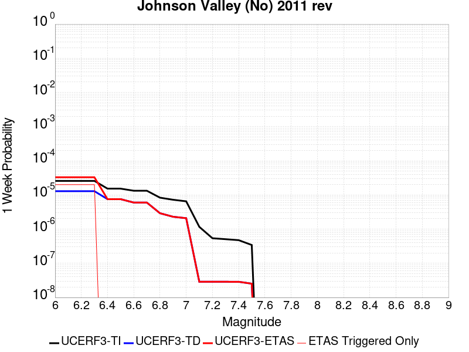 | 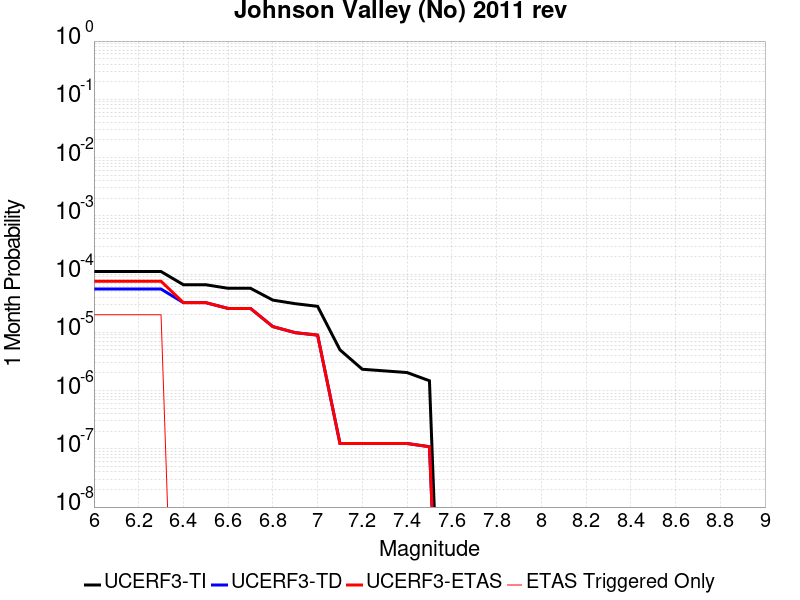 | 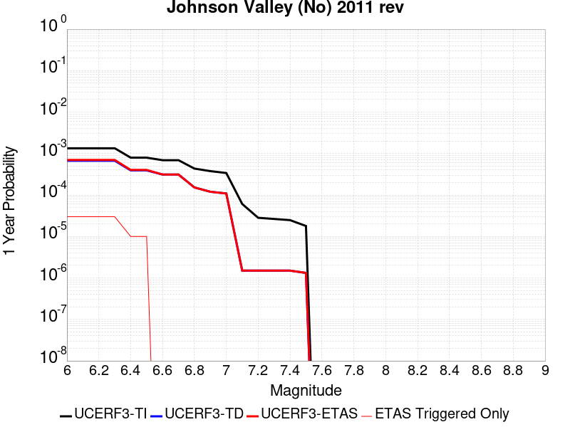 |  |

| Magnitude | 1 wk TI Prob | 1 wk TD Prob | 1 wk ETAS Prob | 1 wk ETAS/TD Gain | 1 wk ETAS Triggered Only | 1 mo TI Prob | 1 mo TD Prob | 1 mo ETAS Prob | 1 mo ETAS/TD Gain | 1 mo ETAS Triggered Only | 1 yr TI Prob | 1 yr TD Prob | 1 yr ETAS Prob | 1 yr ETAS/TD Gain | 1 yr ETAS Triggered Only | 10 yr TI Prob | 10 yr TD Prob | 10 yr ETAS Prob | 10 yr ETAS/TD Gain | 10 yr ETAS Triggered Only |
|-----|-----|-----|-----|-----|-----|-----|-----|-----|-----|-----|-----|-----|-----|-----|-----|-----|-----|-----|-----|-----|
| 6.0 | 2.577707E-5 | 1.2901208E-5 | 4.1192186E-5 | 3.192894 | 2.8291344E-5 | 1.1046848E-4 | 5.528994E-5 | 8.357972E-5 | 1.5116624 | 2.8291344E-5 | 0.0013441239 | 6.729868E-4 | 7.1539526E-4 | 1.0630153 | 4.2437016E-5 | 0.013360229 | 0.006713397 | 0.006755549 | 1.0062788 | 4.2437016E-5 |
| 6.1 | 2.577707E-5 | 1.2901208E-5 | 4.1192186E-5 | 3.192894 | 2.8291344E-5 | 1.1046848E-4 | 5.528994E-5 | 8.357972E-5 | 1.5116624 | 2.8291344E-5 | 0.0013441239 | 6.729868E-4 | 7.1539526E-4 | 1.0630153 | 4.2437016E-5 | 0.013360229 | 0.006713397 | 0.006755549 | 1.0062788 | 4.2437016E-5 |
| 6.2 | 2.577707E-5 | 1.2901208E-5 | 4.1192186E-5 | 3.192894 | 2.8291344E-5 | 1.1046848E-4 | 5.528994E-5 | 8.357972E-5 | 1.5116624 | 2.8291344E-5 | 0.0013441239 | 6.729868E-4 | 7.1539526E-4 | 1.0630153 | 4.2437016E-5 | 0.013360229 | 0.006713397 | 0.006755549 | 1.0062788 | 4.2437016E-5 |
| 6.3 | 2.577707E-5 | 1.2901208E-5 | 4.1192186E-5 | 3.192894 | 2.8291344E-5 | 1.1046848E-4 | 5.528994E-5 | 8.357972E-5 | 1.5116624 | 2.8291344E-5 | 0.0013441239 | 6.729868E-4 | 7.1539526E-4 | 1.0630153 | 4.2437016E-5 | 0.013360229 | 0.006713397 | 0.006755549 | 1.0062788 | 4.2437016E-5 |
| 6.4 | 1.5296591E-5 | 7.5369735E-6 | 7.5369735E-6 | 1.0 | 0.0 | 6.555518E-5 | 3.230102E-5 | 3.230102E-5 | 1.0 | 0.0 | 7.97842E-4 | 3.9321271E-4 | 4.073528E-4 | 1.0359604 | 1.4145672E-5 | 0.007949836 | 0.003927011 | 0.003941101 | 1.003588 | 1.4145672E-5 |
| 6.5 | 1.5296591E-5 | 7.5369735E-6 | 7.5369735E-6 | 1.0 | 0.0 | 6.555518E-5 | 3.230102E-5 | 3.230102E-5 | 1.0 | 0.0 | 7.97842E-4 | 3.9321271E-4 | 4.073528E-4 | 1.0359604 | 1.4145672E-5 | 0.007949836 | 0.003927011 | 0.003941101 | 1.003588 | 1.4145672E-5 |
| 6.6 | 1.3289383E-5 | 5.9919316E-6 | 5.9919316E-6 | 1.0 | 0.0 | 5.6953253E-5 | 2.567955E-5 | 2.567955E-5 | 1.0 | 0.0 | 6.9318525E-4 | 3.1262063E-4 | 3.1262063E-4 | 1.0 | 0.0 | 0.0069102696 | 0.0031234731 | 0.0031234731 | 1.0 | 0.0 |
| 6.7 | 1.3289383E-5 | 5.9919316E-6 | 5.9919316E-6 | 1.0 | 0.0 | 5.6953253E-5 | 2.567955E-5 | 2.567955E-5 | 1.0 | 0.0 | 6.9318525E-4 | 3.1262063E-4 | 3.1262063E-4 | 1.0 | 0.0 | 0.0069102696 | 0.0031234731 | 0.0031234731 | 1.0 | 0.0 |
| 6.8 | 8.330789E-6 | 2.9214577E-6 | 2.9214577E-6 | 1.0 | 0.0 | 3.570289E-5 | 1.2520505E-5 | 1.2520505E-5 | 1.0 | 0.0 | 4.34596E-4 | 1.524322E-4 | 1.524322E-4 | 1.0 | 0.0 | 0.0043374705 | 0.0015238364 | 0.0015238364 | 1.0 | 0.0 |
| 6.9 | 7.2359003E-6 | 2.3014702E-6 | 2.3014702E-6 | 1.0 | 0.0 | 3.1010633E-5 | 9.863436E-6 | 9.863436E-6 | 1.0 | 0.0 | 3.7748902E-4 | 1.2008605E-4 | 1.2008605E-4 | 1.0 | 0.0 | 0.0037684843 | 0.0012007345 | 0.0012007345 | 1.0 | 0.0 |
| 7.0 | 6.5149957E-6 | 2.0886398E-6 | 2.0886398E-6 | 1.0 | 0.0 | 2.792111E-5 | 8.951313E-6 | 8.951313E-6 | 1.0 | 0.0 | 3.398865E-4 | 1.0898209E-4 | 1.0898209E-4 | 1.0 | 0.0 | 0.003393671 | 0.0010898062 | 0.0010898062 | 1.0 | 0.0 |
| 7.1 | 1.1662233E-6 | 2.8793124E-8 | 2.8793124E-8 | 1.0 | 0.0 | 4.9980904E-6 | 1.2339909E-7 | 1.2339909E-7 | 1.0 | 0.0 | 6.0850052E-5 | 1.5023832E-6 | 1.5023832E-6 | 1.0 | 0.0 | 6.083339E-4 | 1.5023746E-5 | 1.5023746E-5 | 1.0 | 0.0 |
| 7.2 | 5.413881E-7 | 2.8793124E-8 | 2.8793124E-8 | 1.0 | 0.0 | 2.3202326E-6 | 1.2339909E-7 | 1.2339909E-7 | 1.0 | 0.0 | 2.8248465E-5 | 1.5023832E-6 | 1.5023832E-6 | 1.0 | 0.0 | 2.8244875E-4 | 1.5023746E-5 | 1.5023746E-5 | 1.0 | 0.0 |
| 7.3 | 5.076821E-7 | 2.8793124E-8 | 2.8793124E-8 | 1.0 | 0.0 | 2.1757785E-6 | 1.2339909E-7 | 1.2339909E-7 | 1.0 | 0.0 | 2.648978E-5 | 1.5023832E-6 | 1.5023832E-6 | 1.0 | 0.0 | 2.6486625E-4 | 1.5023746E-5 | 1.5023746E-5 | 1.0 | 0.0 |
| 7.4 | 4.7568687E-7 | 2.8775073E-8 | 2.8775073E-8 | 1.0 | 0.0 | 2.0386565E-6 | 1.2332174E-7 | 1.2332174E-7 | 1.0 | 0.0 | 2.482036E-5 | 1.5014413E-6 | 1.5014413E-6 | 1.0 | 0.0 | 2.4817587E-4 | 1.5014328E-5 | 1.5014328E-5 | 1.0 | 0.0 |
| 7.5 | 3.435626E-7 | 2.5350424E-8 | 2.5350424E-8 | 1.0 | 0.0 | 1.4724103E-6 | 1.0864467E-7 | 1.0864467E-7 | 1.0 | 0.0 | 1.7926448E-5 | 1.3227482E-6 | 1.3227482E-6 | 1.0 | 0.0 | 1.7925001E-4 | 1.3227419E-5 | 1.3227419E-5 | 1.0 | 0.0 |

## Robinson Creek
*[(top)](#table-of-contents)*

| 1 Week | 1 Month | 1 Year | 10 Year |
|-----|-----|-----|-----|
|  |  |  |  |

| Magnitude | 1 wk TI Prob | 1 wk TD Prob | 1 wk ETAS Prob | 1 wk ETAS/TD Gain | 1 wk ETAS Triggered Only | 1 mo TI Prob | 1 mo TD Prob | 1 mo ETAS Prob | 1 mo ETAS/TD Gain | 1 mo ETAS Triggered Only | 1 yr TI Prob | 1 yr TD Prob | 1 yr ETAS Prob | 1 yr ETAS/TD Gain | 1 yr ETAS Triggered Only | 10 yr TI Prob | 10 yr TD Prob | 10 yr ETAS Prob | 10 yr ETAS/TD Gain | 10 yr ETAS Triggered Only |
|-----|-----|-----|-----|-----|-----|-----|-----|-----|-----|-----|-----|-----|-----|-----|-----|-----|-----|-----|-----|-----|
| 6.0 | 1.3705327E-5 | 1.5285013E-5 | 5.772138E-5 | 3.7763383 | 4.2437016E-5 | 5.8735794E-5 | 6.55072E-5 | 1.07941436E-4 | 1.6477797 | 4.2437016E-5 | 7.1487366E-4 | 7.9755014E-4 | 8.399533E-4 | 1.0531667 | 4.2437016E-5 | 0.0071257832 | 0.007975501 | 0.0080176 | 1.0052785 | 4.2437016E-5 |
| 6.1 | 1.3705327E-5 | 1.5285013E-5 | 5.772138E-5 | 3.7763383 | 4.2437016E-5 | 5.8735794E-5 | 6.55072E-5 | 1.07941436E-4 | 1.6477797 | 4.2437016E-5 | 7.1487366E-4 | 7.9755014E-4 | 8.399533E-4 | 1.0531667 | 4.2437016E-5 | 0.0071257832 | 0.007975501 | 0.0080176 | 1.0052785 | 4.2437016E-5 |
| 6.2 | 1.3705327E-5 | 1.5285013E-5 | 5.772138E-5 | 3.7763383 | 4.2437016E-5 | 5.8735794E-5 | 6.55072E-5 | 1.07941436E-4 | 1.6477797 | 4.2437016E-5 | 7.1487366E-4 | 7.9755014E-4 | 8.399533E-4 | 1.0531667 | 4.2437016E-5 | 0.0071257832 | 0.007975501 | 0.0080176 | 1.0052785 | 4.2437016E-5 |
| 6.3 | 1.3705327E-5 | 1.5285013E-5 | 5.772138E-5 | 3.7763383 | 4.2437016E-5 | 5.8735794E-5 | 6.55072E-5 | 1.07941436E-4 | 1.6477797 | 4.2437016E-5 | 7.1487366E-4 | 7.9755014E-4 | 8.399533E-4 | 1.0531667 | 4.2437016E-5 | 0.0071257832 | 0.007975501 | 0.0080176 | 1.0052785 | 4.2437016E-5 |
| 6.4 | 1.3705327E-5 | 1.5285013E-5 | 5.772138E-5 | 3.7763383 | 4.2437016E-5 | 5.8735794E-5 | 6.55072E-5 | 1.07941436E-4 | 1.6477797 | 4.2437016E-5 | 7.1487366E-4 | 7.9755014E-4 | 8.399533E-4 | 1.0531667 | 4.2437016E-5 | 0.0071257832 | 0.007975501 | 0.0080176 | 1.0052785 | 4.2437016E-5 |

## Rinconada 2011 CFM
*[(top)](#table-of-contents)*

| 1 Week | 1 Month | 1 Year | 10 Year |
|-----|-----|-----|-----|
|  |  | 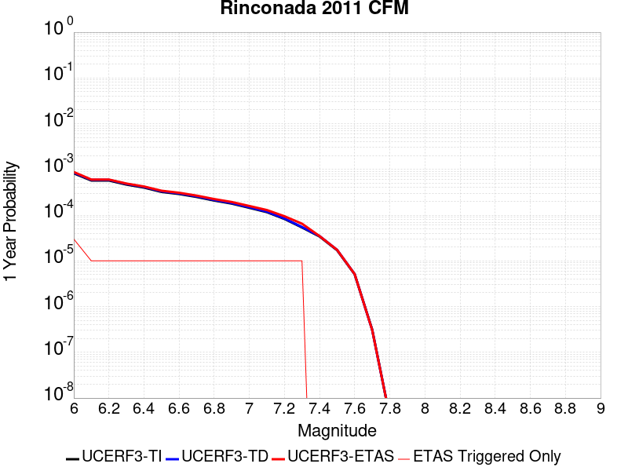 | 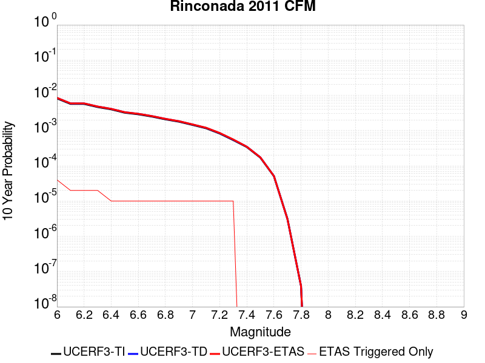 |

| Magnitude | 1 wk TI Prob | 1 wk TD Prob | 1 wk ETAS Prob | 1 wk ETAS/TD Gain | 1 wk ETAS Triggered Only | 1 mo TI Prob | 1 mo TD Prob | 1 mo ETAS Prob | 1 mo ETAS/TD Gain | 1 mo ETAS Triggered Only | 1 yr TI Prob | 1 yr TD Prob | 1 yr ETAS Prob | 1 yr ETAS/TD Gain | 1 yr ETAS Triggered Only | 10 yr TI Prob | 10 yr TD Prob | 10 yr ETAS Prob | 10 yr ETAS/TD Gain | 10 yr ETAS Triggered Only |
|-----|-----|-----|-----|-----|-----|-----|-----|-----|-----|-----|-----|-----|-----|-----|-----|-----|-----|-----|-----|-----|
| 6.0 | 1.5752368E-5 | 1.6274716E-5 | 3.0420159E-5 | 1.8691667 | 1.4145672E-5 | 6.75084E-5 | 6.974694E-5 | 9.8036304E-5 | 1.4056002 | 2.8291344E-5 | 8.2160486E-4 | 8.488413E-4 | 8.771086E-4 | 1.0333011 | 2.8291344E-5 | 0.008185739 | 0.00845637 | 0.008498448 | 1.0049759 | 4.2437016E-5 |
| 6.1 | 1.0966133E-5 | 1.1323029E-5 | 1.1323029E-5 | 1.0 | 0.0 | 4.6996865E-5 | 4.852637E-5 | 6.267135E-5 | 1.2914907 | 1.4145672E-5 | 5.720366E-4 | 5.9064914E-4 | 6.0478644E-4 | 1.0239352 | 1.4145672E-5 | 0.0057056635 | 0.005890889 | 0.0059190136 | 1.0047742 | 2.8291344E-5 |
| 6.2 | 1.0966133E-5 | 1.1323029E-5 | 1.1323029E-5 | 1.0 | 0.0 | 4.6996865E-5 | 4.852637E-5 | 6.267135E-5 | 1.2914907 | 1.4145672E-5 | 5.720366E-4 | 5.9064914E-4 | 6.0478644E-4 | 1.0239352 | 1.4145672E-5 | 0.0057056635 | 0.005890889 | 0.0059190136 | 1.0047742 | 2.8291344E-5 |
| 6.3 | 8.926149E-6 | 9.212772E-6 | 9.212772E-6 | 1.0 | 0.0 | 3.8254362E-5 | 3.948271E-5 | 5.3627824E-5 | 1.358261 | 1.4145672E-5 | 4.6564735E-4 | 4.8059633E-4 | 4.947352E-4 | 1.0294194 | 1.4145672E-5 | 0.0046467283 | 0.0047956146 | 0.0048237704 | 1.0058712 | 2.8291344E-5 |
| 6.4 | 7.676955E-6 | 7.920191E-6 | 7.920191E-6 | 1.0 | 0.0 | 3.290082E-5 | 3.3943234E-5 | 4.8088426E-5 | 1.4167308 | 1.4145672E-5 | 4.0049385E-4 | 4.131807E-4 | 4.2732054E-4 | 1.0342219 | 1.4145672E-5 | 0.0039977287 | 0.004124151 | 0.0041382387 | 1.0034158 | 1.4145672E-5 |
| 6.5 | 6.1671026E-6 | 6.358955E-6 | 6.358955E-6 | 1.0 | 0.0 | 2.6430173E-5 | 2.725238E-5 | 4.1397667E-5 | 1.5190477 | 1.4145672E-5 | 3.2173982E-4 | 3.317473E-4 | 3.4588826E-4 | 1.0426258 | 1.4145672E-5 | 0.003212744 | 0.0033125326 | 0.0033266314 | 1.0042562 | 1.4145672E-5 |
| 6.6 | 5.553456E-6 | 5.7248126E-6 | 5.7248126E-6 | 1.0 | 0.0 | 2.3800309E-5 | 2.4534682E-5 | 3.8680006E-5 | 1.576544 | 1.4145672E-5 | 2.897302E-4 | 2.9866886E-4 | 3.128103E-4 | 1.0473483 | 1.4145672E-5 | 0.0028935277 | 0.0029826832 | 0.0029967867 | 1.0047284 | 1.4145672E-5 |
| 6.7 | 4.787857E-6 | 4.93331E-6 | 4.93331E-6 | 1.0 | 0.0 | 2.0519226E-5 | 2.1142585E-5 | 3.5287958E-5 | 1.6690465 | 1.4145672E-5 | 2.4979294E-4 | 2.573806E-4 | 2.7152264E-4 | 1.054946 | 1.4145672E-5 | 0.0024951235 | 0.002570831 | 0.0025849403 | 1.0054883 | 1.4145672E-5 |
| 6.8 | 3.9955166E-6 | 4.1134763E-6 | 4.1134763E-6 | 1.0 | 0.0 | 1.7123532E-5 | 1.7629065E-5 | 3.177449E-5 | 1.8023921 | 1.4145672E-5 | 2.0845905E-4 | 2.1461275E-4 | 2.287554E-4 | 1.0658984 | 1.4145672E-5 | 0.002082636 | 0.0021440587 | 0.002158174 | 1.0065835 | 1.4145672E-5 |
| 6.9 | 3.4250072E-6 | 3.5224466E-6 | 3.5224466E-6 | 1.0 | 0.0 | 1.46785205E-5 | 1.5096112E-5 | 2.9241572E-5 | 1.9370266 | 1.4145672E-5 | 1.7869633E-4 | 1.8377969E-4 | 1.9792275E-4 | 1.0769566 | 1.4145672E-5 | 0.001785527 | 0.0018362795 | 0.0018503992 | 1.0076892 | 1.4145672E-5 |
| 7.0 | 2.7712713E-6 | 2.8467002E-6 | 2.8467002E-6 | 1.0 | 0.0 | 1.1876823E-5 | 1.22000865E-5 | 2.6345586E-5 | 2.1594589 | 1.4145672E-5 | 1.4459073E-4 | 1.4852594E-4 | 1.6266952E-4 | 1.0952263 | 1.4145672E-5 | 0.0014449668 | 0.0014842683 | 0.001498393 | 1.0095162 | 1.4145672E-5 |
| 7.1 | 2.227358E-6 | 2.2856987E-6 | 2.2856987E-6 | 1.0 | 0.0 | 9.545785E-6 | 9.795815E-6 | 2.394135E-5 | 2.4440384 | 1.4145672E-5 | 1.16213734E-4 | 1.1925753E-4 | 1.3340151E-4 | 1.1186004 | 1.4145672E-5 | 0.0011615298 | 0.0011919363 | 0.0012060652 | 1.0118537 | 1.4145672E-5 |
| 7.2 | 1.581796E-6 | 1.6209015E-6 | 1.6209015E-6 | 1.0 | 0.0 | 6.779108E-6 | 6.946702E-6 | 2.1092275E-5 | 3.0363007 | 1.4145672E-5 | 8.253252E-5 | 8.4572814E-5 | 9.871729E-5 | 1.1672461 | 1.4145672E-5 | 8.250187E-4 | 8.4540684E-4 | 8.595406E-4 | 1.0167183 | 1.4145672E-5 |
| 7.3 | 1.0306567E-6 | 1.054648E-6 | 1.054648E-6 | 1.0 | 0.0 | 4.4170924E-6 | 4.519912E-6 | 1.866552E-5 | 4.12962 | 1.4145672E-5 | 5.3776774E-5 | 5.502854E-5 | 6.917343E-5 | 1.2570465 | 1.4145672E-5 | 5.376376E-4 | 5.501494E-4 | 5.642873E-4 | 1.0256983 | 1.4145672E-5 |
| 7.4 | 6.535541E-7 | 6.682744E-7 | 6.682744E-7 | 1.0 | 0.0 | 2.800943E-6 | 2.8640302E-6 | 2.8640302E-6 | 1.0 | 0.0 | 3.4100947E-5 | 3.4869012E-5 | 3.4869012E-5 | 1.0 | 0.0 | 3.4095717E-4 | 3.486355E-4 | 3.486355E-4 | 1.0 | 0.0 |
| 7.5 | 3.2656962E-7 | 3.3316712E-7 | 3.3316712E-7 | 1.0 | 0.0 | 1.3995833E-6 | 1.4278584E-6 | 1.4278584E-6 | 1.0 | 0.0 | 1.7039794E-5 | 1.7384036E-5 | 1.7384036E-5 | 1.0 | 0.0 | 1.7038487E-4 | 1.738268E-4 | 1.738268E-4 | 1.0 | 0.0 |
| 7.6 | 9.754343E-8 | 9.821017E-8 | 9.821017E-8 | 1.0 | 0.0 | 4.180432E-7 | 4.2090065E-7 | 4.2090065E-7 | 1.0 | 0.0 | 5.089664E-6 | 5.1244533E-6 | 5.1244533E-6 | 1.0 | 0.0 | 5.0895473E-5 | 5.124336E-5 | 5.124336E-5 | 1.0 | 0.0 |
| 7.7 | 6.0001453E-9 | 5.8491207E-9 | 5.8491207E-9 | 1.0 | 0.0 | 2.5714908E-8 | 2.506766E-8 | 2.506766E-8 | 1.0 | 0.0 | 3.1307894E-7 | 3.051987E-7 | 3.051987E-7 | 1.0 | 0.0 | 3.1307852E-6 | 3.0519832E-6 | 3.0519832E-6 | 1.0 | 0.0 |
| 7.8 | 7.400003E-11 | 7.4654505E-11 | 7.4654505E-11 | 1.0 | 0.0 | 3.171432E-10 | 3.1994773E-10 | 3.1994773E-10 | 1.0 | 0.0 | 3.861218E-9 | 3.895363E-9 | 3.895363E-9 | 1.0 | 0.0 | 3.861218E-8 | 3.895363E-8 | 3.895363E-8 | 1.0 | 0.0 |

## San Juan
*[(top)](#table-of-contents)*

| 1 Week | 1 Month | 1 Year | 10 Year |
|-----|-----|-----|-----|
|  |  |  |  |

| Magnitude | 1 wk TI Prob | 1 wk TD Prob | 1 wk ETAS Prob | 1 wk ETAS/TD Gain | 1 wk ETAS Triggered Only | 1 mo TI Prob | 1 mo TD Prob | 1 mo ETAS Prob | 1 mo ETAS/TD Gain | 1 mo ETAS Triggered Only | 1 yr TI Prob | 1 yr TD Prob | 1 yr ETAS Prob | 1 yr ETAS/TD Gain | 1 yr ETAS Triggered Only | 10 yr TI Prob | 10 yr TD Prob | 10 yr ETAS Prob | 10 yr ETAS/TD Gain | 10 yr ETAS Triggered Only |
|-----|-----|-----|-----|-----|-----|-----|-----|-----|-----|-----|-----|-----|-----|-----|-----|-----|-----|-----|-----|-----|
| 6.0 | 8.682808E-6 | 8.74917E-6 | 8.74917E-6 | 1.0 | 0.0 | 3.72115E-5 | 3.749593E-5 | 3.749593E-5 | 1.0 | 0.0 | 4.5295584E-4 | 4.5642213E-4 | 4.9883977E-4 | 1.0929351 | 4.2437016E-5 | 0.004520337 | 0.004555389 | 0.004597632 | 1.0092733 | 4.2437016E-5 |
| 6.1 | 8.682808E-6 | 8.74917E-6 | 8.74917E-6 | 1.0 | 0.0 | 3.72115E-5 | 3.749593E-5 | 3.749593E-5 | 1.0 | 0.0 | 4.5295584E-4 | 4.5642213E-4 | 4.9883977E-4 | 1.0929351 | 4.2437016E-5 | 0.004520337 | 0.004555389 | 0.004597632 | 1.0092733 | 4.2437016E-5 |
| 6.2 | 8.682808E-6 | 8.74917E-6 | 8.74917E-6 | 1.0 | 0.0 | 3.72115E-5 | 3.749593E-5 | 3.749593E-5 | 1.0 | 0.0 | 4.5295584E-4 | 4.5642213E-4 | 4.9883977E-4 | 1.0929351 | 4.2437016E-5 | 0.004520337 | 0.004555389 | 0.004597632 | 1.0092733 | 4.2437016E-5 |
| 6.3 | 6.3054235E-6 | 6.282591E-6 | 6.282591E-6 | 1.0 | 0.0 | 2.7022963E-5 | 2.692512E-5 | 2.692512E-5 | 1.0 | 0.0 | 3.2895492E-4 | 3.2776545E-4 | 3.7018853E-4 | 1.1294312 | 4.2437016E-5 | 0.003284684 | 0.0032730205 | 0.0033153186 | 1.0129232 | 4.2437016E-5 |
| 6.4 | 6.1490473E-6 | 6.1144706E-6 | 6.1144706E-6 | 1.0 | 0.0 | 2.6352795E-5 | 2.6204618E-5 | 2.6204618E-5 | 1.0 | 0.0 | 3.2079802E-4 | 3.189959E-4 | 3.4727823E-4 | 1.0886605 | 2.8291344E-5 | 0.0032033534 | 0.0031855768 | 0.003213778 | 1.0088528 | 2.8291344E-5 |
| 6.5 | 5.204848E-6 | 5.137238E-6 | 5.137238E-6 | 1.0 | 0.0 | 2.23063E-5 | 2.2016555E-5 | 2.2016555E-5 | 1.0 | 0.0 | 2.7154534E-4 | 2.6801953E-4 | 2.963033E-4 | 1.1055287 | 2.8291344E-5 | 0.0027121378 | 0.0026771172 | 0.0027053328 | 1.0105395 | 2.8291344E-5 |
| 6.6 | 4.5179986E-6 | 4.415036E-6 | 4.415036E-6 | 1.0 | 0.0 | 1.9362706E-5 | 1.892145E-5 | 1.892145E-5 | 1.0 | 0.0 | 2.3571544E-4 | 2.303451E-4 | 2.444875E-4 | 1.0613966 | 1.4145672E-5 | 0.0023546559 | 0.0023012008 | 0.002315314 | 1.006133 | 1.4145672E-5 |
| 6.7 | 3.9442616E-6 | 3.8198336E-6 | 3.8198336E-6 | 1.0 | 0.0 | 1.6903869E-5 | 1.6370615E-5 | 1.6370615E-5 | 1.0 | 0.0 | 2.0578515E-4 | 1.9929469E-4 | 2.1343754E-4 | 1.0709646 | 1.4145672E-5 | 0.002055947 | 0.001991285 | 0.0020054025 | 1.0070896 | 1.4145672E-5 |
| 6.8 | 3.4536245E-6 | 3.3163408E-6 | 3.3163408E-6 | 1.0 | 0.0 | 1.4801163E-5 | 1.4212815E-5 | 1.4212815E-5 | 1.0 | 0.0 | 1.8018926E-4 | 1.7302789E-4 | 1.8717111E-4 | 1.0817395 | 1.4145672E-5 | 0.0018004322 | 0.001729051 | 0.0017431722 | 1.008167 | 1.4145672E-5 |
| 6.9 | 3.059865E-6 | 2.9120363E-6 | 2.9120363E-6 | 1.0 | 0.0 | 1.3113641E-5 | 1.2480099E-5 | 1.2480099E-5 | 1.0 | 0.0 | 1.596469E-4 | 1.5193518E-4 | 1.5193518E-4 | 1.0 | 0.0 | 0.0015953224 | 0.0015184281 | 0.0015184281 | 1.0 | 0.0 |
| 7.0 | 2.6504351E-6 | 2.492005E-6 | 2.492005E-6 | 1.0 | 0.0 | 1.1358958E-5 | 1.0679981E-5 | 1.0679981E-5 | 1.0 | 0.0 | 1.3828653E-4 | 1.3002155E-4 | 1.3002155E-4 | 1.0 | 0.0 | 0.0013820052 | 0.001299567 | 0.001299567 | 1.0 | 0.0 |
| 7.1 | 2.2039317E-6 | 2.0338366E-6 | 2.0338366E-6 | 1.0 | 0.0 | 9.445387E-6 | 8.716416E-6 | 8.716416E-6 | 1.0 | 0.0 | 1.1499152E-4 | 1.0611773E-4 | 1.0611773E-4 | 1.0 | 0.0 | 0.0011493203 | 0.0010607811 | 0.0010607811 | 1.0 | 0.0 |
| 7.2 | 1.0786707E-6 | 8.770239E-7 | 8.770239E-7 | 1.0 | 0.0 | 4.622866E-6 | 3.7586685E-6 | 3.7586685E-6 | 1.0 | 0.0 | 5.628194E-5 | 4.576084E-5 | 4.576084E-5 | 1.0 | 0.0 | 5.6267687E-4 | 4.5757365E-4 | 4.5757365E-4 | 1.0 | 0.0 |
| 7.3 | 6.846433E-7 | 4.868812E-7 | 4.868812E-7 | 1.0 | 0.0 | 2.9341822E-6 | 2.086632E-6 | 2.086632E-6 | 1.0 | 0.0 | 3.5723086E-5 | 2.5404452E-5 | 2.5404452E-5 | 1.0 | 0.0 | 3.571734E-4 | 2.5405022E-4 | 2.5405022E-4 | 1.0 | 0.0 |
| 7.4 | 5.23043E-7 | 3.2627884E-7 | 3.2627884E-7 | 1.0 | 0.0 | 2.2416111E-6 | 1.3983371E-6 | 1.3983371E-6 | 1.0 | 0.0 | 2.7291273E-5 | 1.7024622E-5 | 1.7024622E-5 | 1.0 | 0.0 | 2.7287923E-4 | 1.7026608E-4 | 1.7026608E-4 | 1.0 | 0.0 |
| 7.5 | 4.648444E-7 | 2.723464E-7 | 2.723464E-7 | 1.0 | 0.0 | 1.9921886E-6 | 1.1671983E-6 | 1.1671983E-6 | 1.0 | 0.0 | 2.4254627E-5 | 1.4210547E-5 | 1.4210547E-5 | 1.0 | 0.0 | 2.425198E-4 | 1.4212691E-4 | 1.4212691E-4 | 1.0 | 0.0 |
| 7.6 | 3.9906567E-7 | 2.2083036E-7 | 2.2083036E-7 | 1.0 | 0.0 | 1.7102802E-6 | 9.4641547E-7 | 9.4641547E-7 | 1.0 | 0.0 | 2.0822463E-5 | 1.1522548E-5 | 1.1522548E-5 | 1.0 | 0.0 | 2.0820512E-4 | 1.15244526E-4 | 1.15244526E-4 | 1.0 | 0.0 |
| 7.7 | 1.8784601E-7 | 5.366277E-8 | 5.366277E-8 | 1.0 | 0.0 | 8.0505407E-7 | 2.2998329E-7 | 2.2998329E-7 | 1.0 | 0.0 | 9.80149E-6 | 2.800043E-6 | 2.800043E-6 | 1.0 | 0.0 | 9.801057E-5 | 2.8008939E-5 | 2.8008939E-5 | 1.0 | 0.0 |
| 7.8 | 1.00154914E-7 | 1.2412917E-8 | 1.2412917E-8 | 1.0 | 0.0 | 4.2923529E-7 | 5.3198217E-8 | 5.3198217E-8 | 1.0 | 0.0 | 5.225927E-6 | 6.476881E-7 | 6.476881E-7 | 1.0 | 0.0 | 5.225804E-5 | 6.4827886E-6 | 6.4827886E-6 | 1.0 | 0.0 |
| 7.9 | 6.171429E-8 | 4.2946513E-9 | 4.2946513E-9 | 1.0 | 0.0 | 2.6448978E-7 | 1.8405647E-8 | 1.8405647E-8 | 1.0 | 0.0 | 3.2201583E-6 | 2.2408874E-7 | 2.2408874E-7 | 1.0 | 0.0 | 3.2201115E-5 | 2.2462114E-6 | 2.2462114E-6 | 1.0 | 0.0 |
| 8.0 | 1.3974572E-8 | 3.3737857E-10 | 3.3737857E-10 | 1.0 | 0.0 | 5.989102E-8 | 1.4459075E-9 | 1.4459075E-9 | 1.0 | 0.0 | 7.2917294E-7 | 1.760392E-8 | 1.760392E-8 | 1.0 | 0.0 | 7.2917055E-6 | 1.8038004E-7 | 1.8038004E-7 | 1.0 | 0.0 |
| 8.1 | 1.8403477E-9 | 1.1291601E-10 | 1.1291601E-10 | 1.0 | 0.0 | 7.887204E-9 | 4.839261E-10 | 4.839261E-10 | 1.0 | 0.0 | 9.602671E-8 | 5.8917977E-9 | 5.8917977E-9 | 1.0 | 0.0 | 9.602667E-7 | 6.0206084E-8 | 6.0206084E-8 | 1.0 | 0.0 |

## Malibu Coast alt 1
*[(top)](#table-of-contents)*

| 1 Week | 1 Month | 1 Year | 10 Year |
|-----|-----|-----|-----|
|  |  |  | 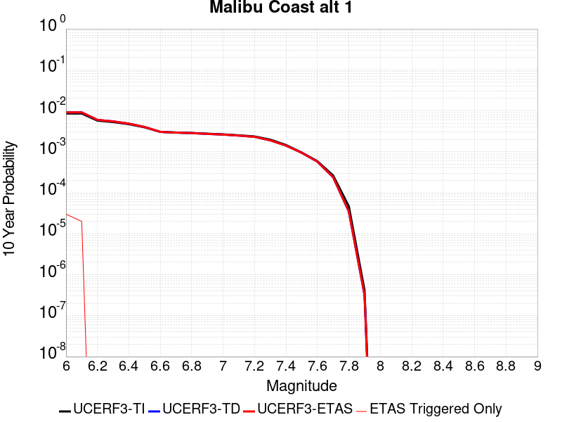 |

| Magnitude | 1 wk TI Prob | 1 wk TD Prob | 1 wk ETAS Prob | 1 wk ETAS/TD Gain | 1 wk ETAS Triggered Only | 1 mo TI Prob | 1 mo TD Prob | 1 mo ETAS Prob | 1 mo ETAS/TD Gain | 1 mo ETAS Triggered Only | 1 yr TI Prob | 1 yr TD Prob | 1 yr ETAS Prob | 1 yr ETAS/TD Gain | 1 yr ETAS Triggered Only | 10 yr TI Prob | 10 yr TD Prob | 10 yr ETAS Prob | 10 yr ETAS/TD Gain | 10 yr ETAS Triggered Only |
|-----|-----|-----|-----|-----|-----|-----|-----|-----|-----|-----|-----|-----|-----|-----|-----|-----|-----|-----|-----|-----|
| 6.0 | 1.6572556E-5 | 1.759807E-5 | 3.1743493E-5 | 1.8038054 | 1.4145672E-5 | 7.102331E-5 | 7.5418226E-5 | 1.0370743E-4 | 1.3750979 | 2.8291344E-5 | 8.6436566E-4 | 9.1784896E-4 | 9.461143E-4 | 1.0307952 | 2.8291344E-5 | 0.0086101135 | 0.009142514 | 0.0091845635 | 1.0045993 | 4.2437016E-5 |
| 6.1 | 1.6572556E-5 | 1.759807E-5 | 3.1743493E-5 | 1.8038054 | 1.4145672E-5 | 7.102331E-5 | 7.5418226E-5 | 8.9562825E-5 | 1.1875489 | 1.4145672E-5 | 8.6436566E-4 | 9.1784896E-4 | 9.3198166E-4 | 1.0153977 | 1.4145672E-5 | 0.0086101135 | 0.009142514 | 0.009170547 | 1.0030662 | 2.8291344E-5 |
| 6.2 | 1.1085717E-5 | 1.155715E-5 | 1.155715E-5 | 1.0 | 0.0 | 4.750935E-5 | 4.9529724E-5 | 4.9529724E-5 | 1.0 | 0.0 | 5.782728E-4 | 6.0286105E-4 | 6.0286105E-4 | 1.0 | 0.0 | 0.0057677035 | 0.0060126274 | 0.0060126274 | 1.0 | 0.0 |
| 6.3 | 1.0208568E-5 | 1.0592241E-5 | 1.0592241E-5 | 1.0 | 0.0 | 4.375027E-5 | 4.5394543E-5 | 4.5394543E-5 | 1.0 | 0.0 | 5.325294E-4 | 5.5254134E-4 | 5.5254134E-4 | 1.0 | 0.0 | 0.0053125503 | 0.0055119833 | 0.0055119833 | 1.0 | 0.0 |
| 6.4 | 9.0682315E-6 | 9.342641E-6 | 9.342641E-6 | 1.0 | 0.0 | 3.8863272E-5 | 4.0039286E-5 | 4.0039286E-5 | 1.0 | 0.0 | 4.730576E-4 | 4.873713E-4 | 4.873713E-4 | 1.0 | 0.0 | 0.0047205184 | 0.004863238 | 0.004863238 | 1.0 | 0.0 |
| 6.5 | 7.605796E-6 | 7.74859E-6 | 7.74859E-6 | 1.0 | 0.0 | 3.259586E-5 | 3.320783E-5 | 3.320783E-5 | 1.0 | 0.0 | 3.9678233E-4 | 4.0423166E-4 | 4.0423166E-4 | 1.0 | 0.0 | 0.0039607463 | 0.0040351013 | 0.0040351013 | 1.0 | 0.0 |
| 6.6 | 5.889873E-6 | 5.8795417E-6 | 5.8795417E-6 | 1.0 | 0.0 | 2.5242069E-5 | 2.5197793E-5 | 2.5197793E-5 | 1.0 | 0.0 | 3.0727885E-4 | 3.0674002E-4 | 3.0674002E-4 | 1.0 | 0.0 | 0.003068543 | 0.0030631793 | 0.0030631793 | 1.0 | 0.0 |
| 6.7 | 5.66586E-6 | 5.6416443E-6 | 5.6416443E-6 | 1.0 | 0.0 | 2.428203E-5 | 2.4178253E-5 | 2.4178253E-5 | 1.0 | 0.0 | 2.955936E-4 | 2.9433056E-4 | 2.9433056E-4 | 1.0 | 0.0 | 0.0029520073 | 0.0029394194 | 0.0029394194 | 1.0 | 0.0 |
| 6.8 | 5.521556E-6 | 5.48943E-6 | 5.48943E-6 | 1.0 | 0.0 | 2.3663597E-5 | 2.3525918E-5 | 2.3525918E-5 | 1.0 | 0.0 | 2.880662E-4 | 2.8639048E-4 | 2.8639048E-4 | 1.0 | 0.0 | 0.0028769306 | 0.0028602257 | 0.0028602257 | 1.0 | 0.0 |
| 6.9 | 5.29752E-6 | 5.2499345E-6 | 5.2499345E-6 | 1.0 | 0.0 | 2.270346E-5 | 2.2499526E-5 | 2.2499526E-5 | 1.0 | 0.0 | 2.7637955E-4 | 2.7389737E-4 | 2.7389737E-4 | 1.0 | 0.0 | 0.0027603607 | 0.0027356083 | 0.0027356083 | 1.0 | 0.0 |
| 7.0 | 5.106743E-6 | 5.0476815E-6 | 5.0476815E-6 | 1.0 | 0.0 | 2.1885859E-5 | 2.1632743E-5 | 2.1632743E-5 | 1.0 | 0.0 | 2.6642776E-4 | 2.6334688E-4 | 2.6334688E-4 | 1.0 | 0.0 | 0.0026610855 | 0.0026303576 | 0.0026303576 | 1.0 | 0.0 |
| 7.1 | 4.8469647E-6 | 4.770376E-6 | 4.770376E-6 | 1.0 | 0.0 | 2.0772539E-5 | 2.044431E-5 | 2.044431E-5 | 1.0 | 0.0 | 2.528763E-4 | 2.488811E-4 | 2.488811E-4 | 1.0 | 0.0 | 0.0025258875 | 0.0024860317 | 0.0024860317 | 1.0 | 0.0 |
| 7.2 | 4.545514E-6 | 4.4481967E-6 | 4.4481967E-6 | 1.0 | 0.0 | 1.9480629E-5 | 1.906356E-5 | 1.906356E-5 | 1.0 | 0.0 | 2.3715083E-4 | 2.3207419E-4 | 2.3207419E-4 | 1.0 | 0.0 | 0.0023689792 | 0.002318326 | 0.002318326 | 1.0 | 0.0 |
| 7.3 | 3.794097E-6 | 3.6519373E-6 | 3.6519373E-6 | 1.0 | 0.0 | 1.6260314E-5 | 1.5651065E-5 | 1.5651065E-5 | 1.0 | 0.0 | 1.9795135E-4 | 1.9053511E-4 | 1.9053511E-4 | 1.0 | 0.0 | 0.001977751 | 0.0019037221 | 0.0019037221 | 1.0 | 0.0 |
| 7.4 | 2.808217E-6 | 2.7190777E-6 | 2.7190777E-6 | 1.0 | 0.0 | 1.203516E-5 | 1.1653137E-5 | 1.1653137E-5 | 1.0 | 0.0 | 1.4651821E-4 | 1.4186774E-4 | 1.4186774E-4 | 1.0 | 0.0 | 0.0014642165 | 0.0014177744 | 0.0014177744 | 1.0 | 0.0 |
| 7.5 | 1.83809E-6 | 1.8190703E-6 | 1.8190703E-6 | 1.0 | 0.0 | 7.877505E-6 | 7.795992E-6 | 7.795992E-6 | 1.0 | 0.0 | 9.59044E-5 | 9.4912095E-5 | 9.4912095E-5 | 1.0 | 0.0 | 9.5863023E-4 | 9.487176E-4 | 9.487176E-4 | 1.0 | 0.0 |
| 7.6 | 1.1292672E-6 | 1.1001456E-6 | 1.1001456E-6 | 1.0 | 0.0 | 4.839708E-6 | 4.7149015E-6 | 4.7149015E-6 | 1.0 | 0.0 | 5.8921847E-5 | 5.7402427E-5 | 5.7402427E-5 | 1.0 | 0.0 | 5.890623E-4 | 5.7387765E-4 | 5.7387765E-4 | 1.0 | 0.0 |
| 7.7 | 5.065272E-7 | 4.6091537E-7 | 4.6091537E-7 | 1.0 | 0.0 | 2.170829E-6 | 1.9753502E-6 | 1.9753502E-6 | 1.0 | 0.0 | 2.6429525E-5 | 2.4049634E-5 | 2.4049634E-5 | 1.0 | 0.0 | 2.642638E-4 | 2.4047145E-4 | 2.4047145E-4 | 1.0 | 0.0 |
| 7.8 | 8.952991E-8 | 6.707853E-8 | 6.707853E-8 | 1.0 | 0.0 | 3.8369956E-7 | 2.874794E-7 | 2.874794E-7 | 1.0 | 0.0 | 4.671532E-6 | 3.5000562E-6 | 3.5000562E-6 | 1.0 | 0.0 | 4.671434E-5 | 3.500003E-5 | 3.500003E-5 | 1.0 | 0.0 |
| 7.9 | 8.007447E-10 | 6.161581E-10 | 6.161581E-10 | 1.0 | 0.0 | 3.4317629E-9 | 2.640678E-9 | 2.640678E-9 | 1.0 | 0.0 | 4.1781714E-8 | 3.2150254E-8 | 3.2150254E-8 | 1.0 | 0.0 | 4.1781706E-7 | 3.2150248E-7 | 3.2150248E-7 | 1.0 | 0.0 |

## North Frontal  (East)
*[(top)](#table-of-contents)*

| 1 Week | 1 Month | 1 Year | 10 Year |
|-----|-----|-----|-----|
|  |  |  | 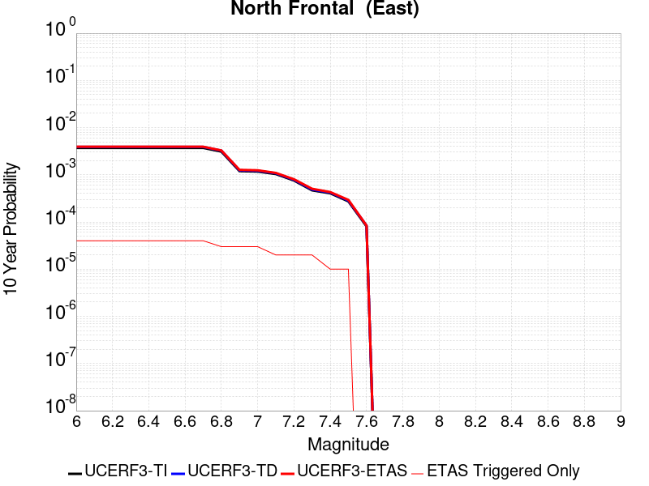 |

| Magnitude | 1 wk TI Prob | 1 wk TD Prob | 1 wk ETAS Prob | 1 wk ETAS/TD Gain | 1 wk ETAS Triggered Only | 1 mo TI Prob | 1 mo TD Prob | 1 mo ETAS Prob | 1 mo ETAS/TD Gain | 1 mo ETAS Triggered Only | 1 yr TI Prob | 1 yr TD Prob | 1 yr ETAS Prob | 1 yr ETAS/TD Gain | 1 yr ETAS Triggered Only | 10 yr TI Prob | 10 yr TD Prob | 10 yr ETAS Prob | 10 yr ETAS/TD Gain | 10 yr ETAS Triggered Only |
|-----|-----|-----|-----|-----|-----|-----|-----|-----|-----|-----|-----|-----|-----|-----|-----|-----|-----|-----|-----|-----|
| 6.0 | 7.135738E-6 | 7.4771765E-6 | 7.4771765E-6 | 1.0 | 0.0 | 3.0581377E-5 | 3.204476E-5 | 3.204476E-5 | 1.0 | 0.0 | 3.7226462E-4 | 3.9009505E-4 | 4.1837536E-4 | 1.0724959 | 2.8291344E-5 | 0.0037164164 | 0.0038960609 | 0.0039383327 | 1.0108498 | 4.2437016E-5 |
| 6.1 | 7.135738E-6 | 7.4771765E-6 | 7.4771765E-6 | 1.0 | 0.0 | 3.0581377E-5 | 3.204476E-5 | 3.204476E-5 | 1.0 | 0.0 | 3.7226462E-4 | 3.9009505E-4 | 4.1837536E-4 | 1.0724959 | 2.8291344E-5 | 0.0037164164 | 0.0038960609 | 0.0039383327 | 1.0108498 | 4.2437016E-5 |
| 6.2 | 7.135738E-6 | 7.4771765E-6 | 7.4771765E-6 | 1.0 | 0.0 | 3.0581377E-5 | 3.204476E-5 | 3.204476E-5 | 1.0 | 0.0 | 3.7226462E-4 | 3.9009505E-4 | 4.1837536E-4 | 1.0724959 | 2.8291344E-5 | 0.0037164164 | 0.0038960609 | 0.0039383327 | 1.0108498 | 4.2437016E-5 |
| 6.3 | 7.135738E-6 | 7.4771765E-6 | 7.4771765E-6 | 1.0 | 0.0 | 3.0581377E-5 | 3.204476E-5 | 3.204476E-5 | 1.0 | 0.0 | 3.7226462E-4 | 3.9009505E-4 | 4.1837536E-4 | 1.0724959 | 2.8291344E-5 | 0.0037164164 | 0.0038960609 | 0.0039383327 | 1.0108498 | 4.2437016E-5 |
| 6.4 | 7.135738E-6 | 7.4771765E-6 | 7.4771765E-6 | 1.0 | 0.0 | 3.0581377E-5 | 3.204476E-5 | 3.204476E-5 | 1.0 | 0.0 | 3.7226462E-4 | 3.9009505E-4 | 4.1837536E-4 | 1.0724959 | 2.8291344E-5 | 0.0037164164 | 0.0038960609 | 0.0039383327 | 1.0108498 | 4.2437016E-5 |
| 6.5 | 7.135738E-6 | 7.4771765E-6 | 7.4771765E-6 | 1.0 | 0.0 | 3.0581377E-5 | 3.204476E-5 | 3.204476E-5 | 1.0 | 0.0 | 3.7226462E-4 | 3.9009505E-4 | 4.1837536E-4 | 1.0724959 | 2.8291344E-5 | 0.0037164164 | 0.0038960609 | 0.0039383327 | 1.0108498 | 4.2437016E-5 |
| 6.6 | 7.135738E-6 | 7.4771765E-6 | 7.4771765E-6 | 1.0 | 0.0 | 3.0581377E-5 | 3.204476E-5 | 3.204476E-5 | 1.0 | 0.0 | 3.7226462E-4 | 3.9009505E-4 | 4.1837536E-4 | 1.0724959 | 2.8291344E-5 | 0.0037164164 | 0.0038960609 | 0.0039383327 | 1.0108498 | 4.2437016E-5 |
| 6.7 | 7.135738E-6 | 7.4771765E-6 | 7.4771765E-6 | 1.0 | 0.0 | 3.0581377E-5 | 3.204476E-5 | 3.204476E-5 | 1.0 | 0.0 | 3.7226462E-4 | 3.9009505E-4 | 4.1837536E-4 | 1.0724959 | 2.8291344E-5 | 0.0037164164 | 0.0038960609 | 0.0039383327 | 1.0108498 | 4.2437016E-5 |
| 6.8 | 5.959142E-6 | 6.236683E-6 | 6.236683E-6 | 1.0 | 0.0 | 2.553893E-5 | 2.6728469E-5 | 2.6728469E-5 | 1.0 | 0.0 | 3.108921E-4 | 3.253886E-4 | 3.3952965E-4 | 1.043459 | 1.4145672E-5 | 0.0031045752 | 0.0032508948 | 0.0032790941 | 1.0086744 | 2.8291344E-5 |
| 6.9 | 2.2946929E-6 | 2.3824605E-6 | 2.3824605E-6 | 1.0 | 0.0 | 9.834361E-6 | 1.0210508E-5 | 1.0210508E-5 | 1.0 | 0.0 | 1.1972676E-4 | 1.2430632E-4 | 1.3845022E-4 | 1.1137828 | 1.4145672E-5 | 0.0011966228 | 0.0012424142 | 0.0012706704 | 1.022743 | 2.8291344E-5 |
| 7.0 | 2.2468673E-6 | 2.3321538E-6 | 2.3321538E-6 | 1.0 | 0.0 | 9.629396E-6 | 9.994909E-6 | 9.994909E-6 | 1.0 | 0.0 | 1.1723159E-4 | 1.21681696E-4 | 1.3582564E-4 | 1.1162373 | 1.4145672E-5 | 0.0011716976 | 0.0012161969 | 0.001244454 | 1.0232339 | 2.8291344E-5 |
| 7.1 | 1.9921076E-6 | 2.0646032E-6 | 2.0646032E-6 | 1.0 | 0.0 | 8.537577E-6 | 8.848272E-6 | 8.848272E-6 | 1.0 | 0.0 | 1.0394004E-4 | 1.0772282E-4 | 1.2186697E-4 | 1.1313013 | 1.4145672E-5 | 0.0010389143 | 0.0010767487 | 0.0011050097 | 1.0262465 | 2.8291344E-5 |
| 7.2 | 1.4524545E-6 | 1.5045148E-6 | 1.5045148E-6 | 1.0 | 0.0 | 6.2247905E-6 | 6.447906E-6 | 6.447906E-6 | 1.0 | 0.0 | 7.5784184E-5 | 7.850068E-5 | 9.264524E-5 | 1.1801839 | 1.4145672E-5 | 7.575835E-4 | 7.8475394E-4 | 8.1302307E-4 | 1.0360229 | 2.8291344E-5 |
| 7.3 | 8.9802575E-7 | 9.3087283E-7 | 9.3087283E-7 | 1.0 | 0.0 | 3.848676E-6 | 3.9894494E-6 | 3.9894494E-6 | 1.0 | 0.0 | 4.685662E-5 | 4.857058E-5 | 6.271557E-5 | 1.2912254 | 1.4145672E-5 | 4.6846745E-4 | 4.8561094E-4 | 5.1388855E-4 | 1.058231 | 2.8291344E-5 |
| 7.4 | 7.776139E-7 | 8.0604747E-7 | 8.0604747E-7 | 1.0 | 0.0 | 3.3326266E-6 | 3.4544853E-6 | 3.4544853E-6 | 1.0 | 0.0 | 4.0573974E-5 | 4.2057654E-5 | 5.6202734E-5 | 1.3363259 | 1.4145672E-5 | 4.0566566E-4 | 4.205077E-4 | 4.3464746E-4 | 1.0336254 | 1.4145672E-5 |
| 7.5 | 5.244417E-7 | 5.441219E-7 | 5.441219E-7 | 1.0 | 0.0 | 2.2476054E-6 | 2.3319494E-6 | 2.3319494E-6 | 1.0 | 0.0 | 2.7364253E-5 | 2.839118E-5 | 4.2536452E-5 | 1.4982276 | 1.4145672E-5 | 2.7360884E-4 | 2.8388205E-4 | 2.9802372E-4 | 1.0498153 | 1.4145672E-5 |
| 7.6 | 1.5489647E-7 | 1.6089504E-7 | 1.6089504E-7 | 1.0 | 0.0 | 6.6384183E-7 | 6.895501E-7 | 6.895501E-7 | 1.0 | 0.0 | 8.082245E-6 | 8.395261E-6 | 8.395261E-6 | 1.0 | 0.0 | 8.08195E-5 | 8.395143E-5 | 8.395143E-5 | 1.0 | 0.0 |

## Bennett Valley 2011 CFM
*[(top)](#table-of-contents)*

| 1 Week | 1 Month | 1 Year | 10 Year |
|-----|-----|-----|-----|
|  |  |  |  |

| Magnitude | 1 wk TI Prob | 1 wk TD Prob | 1 wk ETAS Prob | 1 wk ETAS/TD Gain | 1 wk ETAS Triggered Only | 1 mo TI Prob | 1 mo TD Prob | 1 mo ETAS Prob | 1 mo ETAS/TD Gain | 1 mo ETAS Triggered Only | 1 yr TI Prob | 1 yr TD Prob | 1 yr ETAS Prob | 1 yr ETAS/TD Gain | 1 yr ETAS Triggered Only | 10 yr TI Prob | 10 yr TD Prob | 10 yr ETAS Prob | 10 yr ETAS/TD Gain | 10 yr ETAS Triggered Only |
|-----|-----|-----|-----|-----|-----|-----|-----|-----|-----|-----|-----|-----|-----|-----|-----|-----|-----|-----|-----|-----|
| 6.0 | 2.3893934E-5 | 2.823899E-5 | 5.6529534E-5 | 2.0018256 | 2.8291344E-5 | 1.0239855E-4 | 1.2101967E-4 | 1.493076E-4 | 1.2337464 | 2.8291344E-5 | 0.0012459893 | 0.0014726035 | 0.0015008532 | 1.0191835 | 2.8291344E-5 | 0.012390262 | 0.01465108 | 0.014692895 | 1.0028541 | 4.2437016E-5 |
| 6.1 | 2.3893934E-5 | 2.823899E-5 | 5.6529534E-5 | 2.0018256 | 2.8291344E-5 | 1.0239855E-4 | 1.2101967E-4 | 1.493076E-4 | 1.2337464 | 2.8291344E-5 | 0.0012459893 | 0.0014726035 | 0.0015008532 | 1.0191835 | 2.8291344E-5 | 0.012390262 | 0.01465108 | 0.014692895 | 1.0028541 | 4.2437016E-5 |
| 6.2 | 1.6657146E-5 | 1.9853873E-5 | 3.3999266E-5 | 1.7124752 | 1.4145672E-5 | 7.138582E-5 | 8.508605E-5 | 9.923052E-5 | 1.1662372 | 1.4145672E-5 | 8.6877577E-4 | 0.0010355718 | 0.0010497029 | 1.0136456 | 1.4145672E-5 | 0.008653872 | 0.010325706 | 0.010353705 | 1.0027117 | 2.8291344E-5 |
| 6.3 | 1.6657146E-5 | 1.9853873E-5 | 3.3999266E-5 | 1.7124752 | 1.4145672E-5 | 7.138582E-5 | 8.508605E-5 | 9.923052E-5 | 1.1662372 | 1.4145672E-5 | 8.6877577E-4 | 0.0010355718 | 0.0010497029 | 1.0136456 | 1.4145672E-5 | 0.008653872 | 0.010325706 | 0.010353705 | 1.0027117 | 2.8291344E-5 |
| 6.4 | 1.29418495E-5 | 1.5567592E-5 | 2.9713045E-5 | 1.9086474 | 1.4145672E-5 | 5.546389E-5 | 6.671728E-5 | 8.086201E-5 | 1.2120099 | 1.4145672E-5 | 6.7506364E-4 | 8.1211043E-4 | 8.262446E-4 | 1.0174043 | 1.4145672E-5 | 0.0067301663 | 0.008108544 | 0.008136607 | 1.0034608 | 2.8291344E-5 |
| 6.5 | 1.2582504E-5 | 1.5134623E-5 | 2.9280081E-5 | 1.9346422 | 1.4145672E-5 | 5.39239E-5 | 6.486179E-5 | 7.9006546E-5 | 1.2180753 | 1.4145672E-5 | 6.563257E-4 | 7.8953634E-4 | 8.0367085E-4 | 1.0179023 | 1.4145672E-5 | 0.006543907 | 0.007884451 | 0.007912519 | 1.00356 | 2.8291344E-5 |
| 6.6 | 1.0846706E-5 | 1.3036858E-5 | 2.7182346E-5 | 2.0850382 | 1.4145672E-5 | 4.6485053E-5 | 5.5871777E-5 | 7.001666E-5 | 1.2531668 | 1.4145672E-5 | 5.6580856E-4 | 6.801549E-4 | 6.942909E-4 | 1.0207835 | 1.4145672E-5 | 0.005643701 | 0.0067976816 | 0.006825781 | 1.0041336 | 2.8291344E-5 |
| 6.7 | 1.6803231E-6 | 2.377902E-6 | 2.377902E-6 | 1.0 | 0.0 | 7.2013645E-6 | 1.019097E-5 | 1.019097E-5 | 1.0 | 0.0 | 8.7673085E-5 | 1.2406812E-4 | 1.2406812E-4 | 1.0 | 0.0 | 8.76385E-4 | 0.0012444188 | 0.0012444188 | 1.0 | 0.0 |
| 6.8 | 1.4609833E-6 | 2.0939708E-6 | 2.0939708E-6 | 1.0 | 0.0 | 6.261342E-6 | 8.974131E-6 | 8.974131E-6 | 1.0 | 0.0 | 7.6229175E-5 | 1.0925463E-4 | 1.0925463E-4 | 1.0 | 0.0 | 7.620303E-4 | 0.0010963798 | 0.0010963798 | 1.0 | 0.0 |
| 6.9 | 1.3492396E-6 | 1.9459103E-6 | 1.9459103E-6 | 1.0 | 0.0 | 5.7824427E-6 | 8.339589E-6 | 8.339589E-6 | 1.0 | 0.0 | 7.0398964E-5 | 1.01529826E-4 | 1.01529826E-4 | 1.0 | 0.0 | 7.037667E-4 | 0.001019178 | 0.001019178 | 1.0 | 0.0 |
| 7.0 | 1.2347921E-6 | 1.7888974E-6 | 1.7888974E-6 | 1.0 | 0.0 | 5.291955E-6 | 7.666681E-6 | 7.666681E-6 | 1.0 | 0.0 | 6.442765E-5 | 9.33379E-5 | 9.33379E-5 | 1.0 | 0.0 | 6.440897E-4 | 9.373068E-4 | 9.373068E-4 | 1.0 | 0.0 |
| 7.1 | 1.1262973E-6 | 1.6359154E-6 | 1.6359154E-6 | 1.0 | 0.0 | 4.8269794E-6 | 7.0110473E-6 | 7.0110473E-6 | 1.0 | 0.0 | 5.876689E-5 | 8.535621E-5 | 8.535621E-5 | 1.0 | 0.0 | 5.875135E-4 | 8.5754244E-4 | 8.5754244E-4 | 1.0 | 0.0 |
| 7.2 | 9.351744E-7 | 1.3611758E-6 | 1.3611758E-6 | 1.0 | 0.0 | 4.007884E-6 | 5.8335977E-6 | 5.8335977E-6 | 1.0 | 0.0 | 4.8794896E-5 | 7.1021765E-5 | 7.1021765E-5 | 1.0 | 0.0 | 4.878418E-4 | 7.142461E-4 | 7.142461E-4 | 1.0 | 0.0 |
| 7.3 | 8.5039534E-7 | 1.2386733E-6 | 1.2386733E-6 | 1.0 | 0.0 | 3.6445463E-6 | 5.308589E-6 | 5.308589E-6 | 1.0 | 0.0 | 4.437145E-5 | 6.463018E-5 | 6.463018E-5 | 1.0 | 0.0 | 4.436259E-4 | 6.50103E-4 | 6.50103E-4 | 1.0 | 0.0 |
| 7.4 | 6.7875015E-7 | 9.600642E-7 | 9.600642E-7 | 1.0 | 0.0 | 2.908926E-6 | 4.1145545E-6 | 4.1145545E-6 | 1.0 | 0.0 | 3.54156E-5 | 5.009356E-5 | 5.009356E-5 | 1.0 | 0.0 | 3.5409955E-4 | 5.0413073E-4 | 5.0413073E-4 | 1.0 | 0.0 |
| 7.5 | 5.826867E-7 | 8.1883735E-7 | 8.1883735E-7 | 1.0 | 0.0 | 2.4972264E-6 | 3.5092983E-6 | 3.5092983E-6 | 1.0 | 0.0 | 3.0403306E-5 | 4.2724878E-5 | 4.2724878E-5 | 1.0 | 0.0 | 3.0399146E-4 | 4.300558E-4 | 4.300558E-4 | 1.0 | 0.0 |
| 7.6 | 2.7734902E-7 | 3.6822587E-7 | 3.6822587E-7 | 1.0 | 0.0 | 1.1886381E-6 | 1.57811E-6 | 1.57811E-6 | 1.0 | 0.0 | 1.4471572E-5 | 1.9213321E-5 | 1.9213321E-5 | 1.0 | 0.0 | 1.447063E-4 | 1.9315645E-4 | 1.9315645E-4 | 1.0 | 0.0 |
| 7.7 | 1.0530888E-7 | 1.3749101E-7 | 1.3749101E-7 | 1.0 | 0.0 | 4.513237E-7 | 5.8924707E-7 | 5.8924707E-7 | 1.0 | 0.0 | 5.4948523E-6 | 7.174059E-6 | 7.174059E-6 | 1.0 | 0.0 | 5.4947162E-5 | 7.255585E-5 | 7.255585E-5 | 1.0 | 0.0 |
| 7.8 | 1.2714258E-8 | 1.9633259E-8 | 1.9633259E-8 | 1.0 | 0.0 | 5.448968E-8 | 8.4142535E-8 | 8.4142535E-8 | 1.0 | 0.0 | 6.6341164E-7 | 1.0244348E-6 | 1.0244348E-6 | 1.0 | 0.0 | 6.6340967E-6 | 1.0658595E-5 | 1.0658595E-5 | 1.0 | 0.0 |
| 7.9 | 4.075888E-9 | 7.559928E-9 | 7.559928E-9 | 1.0 | 0.0 | 1.7468091E-8 | 3.239969E-8 | 3.239969E-8 | 1.0 | 0.0 | 2.12674E-7 | 3.9446616E-7 | 3.9446616E-7 | 1.0 | 0.0 | 2.1267379E-6 | 4.1952467E-6 | 4.1952467E-6 | 1.0 | 0.0 |
| 8.0 | 1.9126138E-9 | 3.9956882E-9 | 3.9956882E-9 | 1.0 | 0.0 | 8.196917E-9 | 1.7124377E-8 | 1.7124377E-8 | 1.0 | 0.0 | 9.9797454E-8 | 2.0848927E-7 | 2.0848927E-7 | 1.0 | 0.0 | 9.979741E-7 | 2.1982228E-6 | 2.1982228E-6 | 1.0 | 0.0 |

## Calaveras (So) - Paicines extension 2011 CFM
*[(top)](#table-of-contents)*

| 1 Week | 1 Month | 1 Year | 10 Year |
|-----|-----|-----|-----|
|  |  |  |  |

| Magnitude | 1 wk TI Prob | 1 wk TD Prob | 1 wk ETAS Prob | 1 wk ETAS/TD Gain | 1 wk ETAS Triggered Only | 1 mo TI Prob | 1 mo TD Prob | 1 mo ETAS Prob | 1 mo ETAS/TD Gain | 1 mo ETAS Triggered Only | 1 yr TI Prob | 1 yr TD Prob | 1 yr ETAS Prob | 1 yr ETAS/TD Gain | 1 yr ETAS Triggered Only | 10 yr TI Prob | 10 yr TD Prob | 10 yr ETAS Prob | 10 yr ETAS/TD Gain | 10 yr ETAS Triggered Only |
|-----|-----|-----|-----|-----|-----|-----|-----|-----|-----|-----|-----|-----|-----|-----|-----|-----|-----|-----|-----|-----|
| 6.0 | 1.5183659E-4 | 3.0520977E-4 | 3.0520977E-4 | 1.0 | 0.0 | 6.5056595E-4 | 0.0013068188 | 0.0013068188 | 1.0 | 0.0 | 0.007891912 | 0.015696203 | 0.015696203 | 1.0 | 0.0 | 0.076174594 | 0.13848905 | 0.1385256 | 1.000264 | 4.2437016E-5 |
| 6.1 | 1.5024997E-4 | 3.021517E-4 | 3.021517E-4 | 1.0 | 0.0 | 6.437695E-4 | 0.0012937278 | 0.0012937278 | 1.0 | 0.0 | 0.0078097614 | 0.015539596 | 0.015539596 | 1.0 | 0.0 | 0.075409345 | 0.13715863 | 0.13719526 | 1.0002669 | 4.2437016E-5 |
| 6.2 | 1.2743923E-4 | 2.5313982E-4 | 2.5313982E-4 | 1.0 | 0.0 | 5.460538E-4 | 0.0010839999 | 0.0010839999 | 1.0 | 0.0 | 0.0066279583 | 0.013046881 | 0.013046881 | 1.0 | 0.0 | 0.064337276 | 0.117256075 | 0.11728105 | 1.000213 | 2.8291344E-5 |
| 6.3 | 1.1525114E-4 | 2.2599236E-4 | 2.2599236E-4 | 1.0 | 0.0 | 4.9383997E-4 | 9.678718E-4 | 9.678718E-4 | 1.0 | 0.0 | 0.0059959386 | 0.011668079 | 0.011668079 | 1.0 | 0.0 | 0.058367174 | 0.106372125 | 0.106397405 | 1.0002377 | 2.8291344E-5 |
| 6.4 | 1.07200925E-4 | 2.0840544E-4 | 2.0840544E-4 | 1.0 | 0.0 | 4.5935164E-4 | 8.926123E-4 | 8.926123E-4 | 1.0 | 0.0 | 0.0055782744 | 0.010772959 | 0.010772959 | 1.0 | 0.0 | 0.0544031 | 0.099194765 | 0.09922025 | 1.0002569 | 2.8291344E-5 |
| 6.5 | 9.69631E-5 | 1.8734725E-4 | 1.8734725E-4 | 1.0 | 0.0 | 4.1548995E-4 | 8.024631E-4 | 8.024631E-4 | 1.0 | 0.0 | 0.0050468626 | 0.009694842 | 0.009694842 | 1.0 | 0.0 | 0.04933773 | 0.090086564 | 0.090112306 | 1.0002857 | 2.8291344E-5 |
| 6.6 | 8.0552316E-5 | 1.507068E-4 | 1.507068E-4 | 1.0 | 0.0 | 3.4517853E-4 | 6.4569083E-4 | 6.4569083E-4 | 1.0 | 0.0 | 0.0041944524 | 0.007826508 | 0.007826508 | 1.0 | 0.0 | 0.04116161 | 0.0748563 | 0.07488248 | 1.0003496 | 2.8291344E-5 |
| 6.7 | 7.815757E-5 | 1.4611272E-4 | 1.4611272E-4 | 1.0 | 0.0 | 3.34918E-4 | 6.26014E-4 | 6.26014E-4 | 1.0 | 0.0 | 0.004070005 | 0.007589312 | 0.007589312 | 1.0 | 0.0 | 0.039962657 | 0.07270582 | 0.07273205 | 1.0003608 | 2.8291344E-5 |
| 6.8 | 6.965264E-5 | 1.2722758E-4 | 1.2722758E-4 | 1.0 | 0.0 | 2.9847719E-4 | 5.4513285E-4 | 5.4513285E-4 | 1.0 | 0.0 | 0.0036279052 | 0.0066135945 | 0.0066135945 | 1.0 | 0.0 | 0.03569247 | 0.063801065 | 0.06382755 | 1.0004151 | 2.8291344E-5 |
| 6.9 | 5.8000453E-5 | 1.01439E-4 | 1.01439E-4 | 1.0 | 0.0 | 2.4854968E-4 | 4.346666E-4 | 4.346666E-4 | 1.0 | 0.0 | 0.0030218933 | 0.005279322 | 0.005279322 | 1.0 | 0.0 | 0.029811295 | 0.051502965 | 0.05151638 | 1.0002605 | 1.4145672E-5 |
| 7.0 | 4.9865852E-5 | 8.568029E-5 | 8.568029E-5 | 1.0 | 0.0 | 2.1369329E-4 | 3.6715003E-4 | 3.6715003E-4 | 1.0 | 0.0 | 0.0025986114 | 0.004460979 | 0.004460979 | 1.0 | 0.0 | 0.025684336 | 0.043782018 | 0.04379554 | 1.000309 | 1.4145672E-5 |
| 7.1 | 4.283875E-5 | 7.1124625E-5 | 7.1124625E-5 | 1.0 | 0.0 | 1.8358172E-4 | 3.0478454E-4 | 3.0478454E-4 | 1.0 | 0.0 | 0.0022328163 | 0.003704494 | 0.003704494 | 1.0 | 0.0 | 0.022105146 | 0.03673582 | 0.03674945 | 1.0003709 | 1.4145672E-5 |
| 7.2 | 3.450115E-5 | 5.5778568E-5 | 5.5778568E-5 | 1.0 | 0.0 | 1.478537E-4 | 2.3902925E-4 | 2.3902925E-4 | 1.0 | 0.0 | 0.0017986323 | 0.0029063264 | 0.0029063264 | 1.0 | 0.0 | 0.017841442 | 0.029079042 | 0.029079042 | 1.0 | 0.0 |
| 7.3 | 2.5709045E-5 | 4.059001E-5 | 4.059001E-5 | 1.0 | 0.0 | 1.1017697E-4 | 1.7394568E-4 | 1.7394568E-4 | 1.0 | 0.0 | 0.0013405791 | 0.0021157486 | 0.0021157486 | 1.0 | 0.0 | 0.013325208 | 0.02129686 | 0.02129686 | 1.0 | 0.0 |
| 7.4 | 1.8003093E-5 | 2.8511378E-5 | 2.8511378E-5 | 1.0 | 0.0 | 7.715383E-5 | 1.2218591E-4 | 1.2218591E-4 | 1.0 | 0.0 | 9.3894306E-4 | 0.0014866006 | 0.0014866006 | 1.0 | 0.0 | 0.009349857 | 0.015051589 | 0.015051589 | 1.0 | 0.0 |
| 7.5 | 1.5595824E-5 | 2.5823752E-5 | 2.5823752E-5 | 1.0 | 0.0 | 6.683753E-5 | 1.10668545E-4 | 1.10668545E-4 | 1.0 | 0.0 | 8.134431E-4 | 0.0013465589 | 0.0013465589 | 1.0 | 0.0 | 0.008104719 | 0.013651571 | 0.013651571 | 1.0 | 0.0 |
| 7.6 | 1.1110309E-5 | 1.9223195E-5 | 1.9223195E-5 | 1.0 | 0.0 | 4.761474E-5 | 8.2382525E-5 | 8.2382525E-5 | 1.0 | 0.0 | 5.795553E-4 | 0.0010025471 | 0.0010025471 | 1.0 | 0.0 | 0.0057804612 | 0.01020344 | 0.01020344 | 1.0 | 0.0 |
| 7.7 | 6.2140443E-6 | 1.04376995E-5 | 1.04376995E-5 | 1.0 | 0.0 | 2.6631347E-5 | 4.4732235E-5 | 4.4732235E-5 | 1.0 | 0.0 | 3.241884E-4 | 5.4447894E-4 | 5.4447894E-4 | 1.0 | 0.0 | 0.0032371588 | 0.005620102 | 0.005620102 | 1.0 | 0.0 |
| 7.8 | 5.305533E-6 | 9.433651E-6 | 9.433651E-6 | 1.0 | 0.0 | 2.27378E-5 | 4.0429306E-5 | 4.0429306E-5 | 1.0 | 0.0 | 2.7679754E-4 | 4.9211574E-4 | 4.9211574E-4 | 1.0 | 0.0 | 0.0027645302 | 0.005074622 | 0.005074622 | 1.0 | 0.0 |
| 7.9 | 3.363505E-6 | 7.3854467E-6 | 7.3854467E-6 | 1.0 | 0.0 | 1.4414942E-5 | 3.1651532E-5 | 3.1651532E-5 | 1.0 | 0.0 | 1.7548777E-4 | 3.8528934E-4 | 3.8528934E-4 | 1.0 | 0.0 | 0.0017534926 | 0.003948784 | 0.003948784 | 1.0 | 0.0 |
| 8.0 | 2.0271132E-6 | 4.4134235E-6 | 4.4134235E-6 | 1.0 | 0.0 | 8.687599E-6 | 1.8914534E-5 | 1.8914534E-5 | 1.0 | 0.0 | 1.05766376E-4 | 2.3026018E-4 | 2.3026018E-4 | 1.0 | 0.0 | 0.0010571606 | 0.002351194 | 0.002351194 | 1.0 | 0.0 |
| 8.1 | 1.2206116E-6 | 2.3752666E-6 | 2.3752666E-6 | 1.0 | 0.0 | 5.2311816E-6 | 1.0179674E-5 | 1.0179674E-5 | 1.0 | 0.0 | 6.3687774E-5 | 1.2393051E-4 | 1.2393051E-4 | 1.0 | 0.0 | 6.366953E-4 | 0.0012705618 | 0.0012705618 | 1.0 | 0.0 |

## San Jacinto (Superstition Mtn)
*[(top)](#table-of-contents)*

| 1 Week | 1 Month | 1 Year | 10 Year |
|-----|-----|-----|-----|
|  |  |  |  |

| Magnitude | 1 wk TI Prob | 1 wk TD Prob | 1 wk ETAS Prob | 1 wk ETAS/TD Gain | 1 wk ETAS Triggered Only | 1 mo TI Prob | 1 mo TD Prob | 1 mo ETAS Prob | 1 mo ETAS/TD Gain | 1 mo ETAS Triggered Only | 1 yr TI Prob | 1 yr TD Prob | 1 yr ETAS Prob | 1 yr ETAS/TD Gain | 1 yr ETAS Triggered Only | 10 yr TI Prob | 10 yr TD Prob | 10 yr ETAS Prob | 10 yr ETAS/TD Gain | 10 yr ETAS Triggered Only |
|-----|-----|-----|-----|-----|-----|-----|-----|-----|-----|-----|-----|-----|-----|-----|-----|-----|-----|-----|-----|-----|
| 6.0 | 6.4193904E-5 | 9.599558E-5 | 1.10139896E-4 | 1.1473434 | 1.4145672E-5 | 2.7508775E-4 | 4.1135435E-4 | 4.2549422E-4 | 1.0343739 | 1.4145672E-5 | 0.0033440501 | 0.0049981694 | 0.0050263195 | 1.005632 | 2.8291344E-5 | 0.03294174 | 0.048820045 | 0.04886041 | 1.0008268 | 4.2437016E-5 |
| 6.1 | 6.4193904E-5 | 9.599558E-5 | 1.10139896E-4 | 1.1473434 | 1.4145672E-5 | 2.7508775E-4 | 4.1135435E-4 | 4.2549422E-4 | 1.0343739 | 1.4145672E-5 | 0.0033440501 | 0.0049981694 | 0.0050263195 | 1.005632 | 2.8291344E-5 | 0.03294174 | 0.048820045 | 0.04886041 | 1.0008268 | 4.2437016E-5 |
| 6.2 | 5.7023593E-5 | 8.3144616E-5 | 9.7289114E-5 | 1.1701192 | 1.4145672E-5 | 2.4436394E-4 | 3.5629462E-4 | 3.7043524E-4 | 1.039688 | 1.4145672E-5 | 0.002971072 | 0.0043309047 | 0.004359074 | 1.0065042 | 2.8291344E-5 | 0.029316625 | 0.042502448 | 0.04252954 | 1.0006373 | 2.8291344E-5 |
| 6.3 | 5.6940098E-5 | 8.298998E-5 | 9.713448E-5 | 1.1704363 | 1.4145672E-5 | 2.4400617E-4 | 3.5563204E-4 | 3.697727E-4 | 1.039762 | 1.4145672E-5 | 0.002966728 | 0.00432287 | 0.0043510394 | 1.0065163 | 2.8291344E-5 | 0.029274331 | 0.04242582 | 0.042452913 | 1.0006386 | 2.8291344E-5 |
| 6.4 | 5.4171585E-5 | 7.748391E-5 | 9.1628484E-5 | 1.1825485 | 1.4145672E-5 | 2.3214328E-4 | 3.3204095E-4 | 3.461819E-4 | 1.042588 | 1.4145672E-5 | 0.0028226813 | 0.0040367534 | 0.0040649306 | 1.0069802 | 2.8291344E-5 | 0.02787096 | 0.039715026 | 0.039742194 | 1.000684 | 2.8291344E-5 |
| 6.5 | 4.375144E-5 | 5.6421442E-5 | 7.056632E-5 | 1.2507004 | 1.4145672E-5 | 1.874927E-4 | 2.417904E-4 | 2.5593265E-4 | 1.0584897 | 1.4145672E-5 | 0.0022803338 | 0.002941 | 0.0029692082 | 1.0095913 | 2.8291344E-5 | 0.022570757 | 0.029235592 | 0.029263057 | 1.0009394 | 2.8291344E-5 |
| 6.6 | 2.772192E-5 | 2.5488029E-5 | 2.5488029E-5 | 1.0 | 0.0 | 1.1880282E-4 | 1.0922994E-4 | 1.0922994E-4 | 1.0 | 0.0 | 0.0014454646 | 0.0013290826 | 0.0013432095 | 1.010629 | 1.4145672E-5 | 0.014360986 | 0.013540891 | 0.013554845 | 1.0010306 | 1.4145672E-5 |
| 6.7 | 2.7124124E-5 | 2.4699055E-5 | 2.4699055E-5 | 1.0 | 0.0 | 1.1624106E-4 | 1.0584891E-4 | 1.0584891E-4 | 1.0 | 0.0 | 0.0014143161 | 0.0012879678 | 0.0013020952 | 1.0109688 | 1.4145672E-5 | 0.014053487 | 0.013134248 | 0.013148208 | 1.0010629 | 1.4145672E-5 |
| 6.8 | 2.5475807E-5 | 2.2164071E-5 | 2.2164071E-5 | 1.0 | 0.0 | 1.0917746E-4 | 9.498548E-5 | 9.498548E-5 | 1.0 | 0.0 | 0.001328425 | 0.0011558468 | 0.0011699761 | 1.0122242 | 1.4145672E-5 | 0.0132051185 | 0.011821818 | 0.011835796 | 1.0011824 | 1.4145672E-5 |
| 6.9 | 2.1162023E-5 | 1.762564E-5 | 1.762564E-5 | 1.0 | 0.0 | 9.069123E-5 | 7.553629E-5 | 7.553629E-5 | 1.0 | 0.0 | 0.0011036064 | 9.1927015E-4 | 9.334028E-4 | 1.0153738 | 1.4145672E-5 | 0.010981417 | 0.009446762 | 0.009460773 | 1.0014833 | 1.4145672E-5 |
| 7.0 | 1.8754288E-5 | 1.616099E-5 | 1.616099E-5 | 1.0 | 0.0 | 8.037304E-5 | 6.9259564E-5 | 6.9259564E-5 | 1.0 | 0.0 | 9.781026E-4 | 8.429114E-4 | 8.429114E-4 | 1.0 | 0.0 | 0.009738087 | 0.008669995 | 0.008669995 | 1.0 | 0.0 |
| 7.1 | 1.8678527E-5 | 1.6086136E-5 | 1.6086136E-5 | 1.0 | 0.0 | 8.0048376E-5 | 6.8938774E-5 | 6.8938774E-5 | 1.0 | 0.0 | 9.7415317E-4 | 8.3900883E-4 | 8.3900883E-4 | 1.0 | 0.0 | 0.009698939 | 0.008631011 | 0.008631011 | 1.0 | 0.0 |
| 7.2 | 1.7804578E-5 | 1.5380709E-5 | 1.5380709E-5 | 1.0 | 0.0 | 7.6303106E-5 | 6.591567E-5 | 6.591567E-5 | 1.0 | 0.0 | 9.285943E-4 | 8.022301E-4 | 8.022301E-4 | 1.0 | 0.0 | 0.009247236 | 0.008262424 | 0.008262424 | 1.0 | 0.0 |
| 7.3 | 1.6583685E-5 | 1.4529837E-5 | 1.4529837E-5 | 1.0 | 0.0 | 7.1070994E-5 | 6.226926E-5 | 6.226926E-5 | 1.0 | 0.0 | 8.649459E-4 | 7.5786654E-4 | 7.5786654E-4 | 1.0 | 0.0 | 0.00861587 | 0.007817646 | 0.007817646 | 1.0 | 0.0 |
| 7.4 | 1.6387552E-5 | 1.4394727E-5 | 1.4394727E-5 | 1.0 | 0.0 | 7.023047E-5 | 6.169024E-5 | 6.169024E-5 | 1.0 | 0.0 | 8.5472054E-4 | 7.508219E-4 | 7.508219E-4 | 1.0 | 0.0 | 0.008514405 | 0.0077470187 | 0.0077470187 | 1.0 | 0.0 |
| 7.5 | 1.5790754E-5 | 1.40354305E-5 | 1.40354305E-5 | 1.0 | 0.0 | 6.767291E-5 | 6.015047E-5 | 6.015047E-5 | 1.0 | 0.0 | 8.236062E-4 | 7.320879E-4 | 7.320879E-4 | 1.0 | 0.0 | 0.008205604 | 0.007557581 | 0.007557581 | 1.0 | 0.0 |
| 7.6 | 1.4248672E-5 | 1.3054444E-5 | 1.3054444E-5 | 1.0 | 0.0 | 6.106431E-5 | 5.5946428E-5 | 5.5946428E-5 | 1.0 | 0.0 | 7.432043E-4 | 6.809366E-4 | 6.809366E-4 | 1.0 | 0.0 | 0.007407237 | 0.007040175 | 0.007040175 | 1.0 | 0.0 |
| 7.7 | 1.15449975E-5 | 1.0903222E-5 | 1.0903222E-5 | 1.0 | 0.0 | 4.947762E-5 | 4.672726E-5 | 4.672726E-5 | 1.0 | 0.0 | 6.022235E-4 | 5.6875666E-4 | 5.6875666E-4 | 1.0 | 0.0 | 0.006005941 | 0.0059102564 | 0.0059102564 | 1.0 | 0.0 |
| 7.8 | 9.1391985E-6 | 9.5139185E-6 | 9.5139185E-6 | 1.0 | 0.0 | 3.9167408E-5 | 4.0773306E-5 | 4.0773306E-5 | 1.0 | 0.0 | 4.767588E-4 | 4.963025E-4 | 4.963025E-4 | 1.0 | 0.0 | 0.0047573727 | 0.005176809 | 0.005176809 | 1.0 | 0.0 |
| 7.9 | 6.973017E-6 | 7.3817937E-6 | 7.3817937E-6 | 1.0 | 0.0 | 2.9884017E-5 | 3.163588E-5 | 3.163588E-5 | 1.0 | 0.0 | 3.6377716E-4 | 3.8509927E-4 | 3.8509927E-4 | 1.0 | 0.0 | 0.0036318225 | 0.004051976 | 0.004051976 | 1.0 | 0.0 |
| 8.0 | 5.7638235E-6 | 6.259641E-6 | 6.259641E-6 | 1.0 | 0.0 | 2.4701867E-5 | 2.682676E-5 | 2.682676E-5 | 1.0 | 0.0 | 3.0070372E-4 | 3.2656736E-4 | 3.2656736E-4 | 1.0 | 0.0 | 0.0030029714 | 0.0034535413 | 0.0034535413 | 1.0 | 0.0 |
| 8.1 | 5.1124434E-6 | 5.4953657E-6 | 5.4953657E-6 | 1.0 | 0.0 | 2.1910288E-5 | 2.3551356E-5 | 2.3551356E-5 | 1.0 | 0.0 | 2.6672508E-4 | 2.8670052E-4 | 2.8670052E-4 | 1.0 | 0.0 | 0.0026640517 | 0.0030403896 | 0.0030403896 | 1.0 | 0.0 |
| 8.2 | 1.1075938E-6 | 5.3348367E-7 | 5.3348367E-7 | 1.0 | 0.0 | 4.7468216E-6 | 2.2863567E-6 | 2.2863567E-6 | 1.0 | 0.0 | 5.779102E-5 | 2.7836059E-5 | 2.7836059E-5 | 1.0 | 0.0 | 5.777599E-4 | 3.133962E-4 | 3.133962E-4 | 1.0 | 0.0 |
| 8.3 | 1.3584393E-8 | 4.4718784E-9 | 4.4718784E-9 | 1.0 | 0.0 | 5.8218827E-8 | 1.9165192E-8 | 1.9165192E-8 | 1.0 | 0.0 | 7.0881396E-7 | 2.3333622E-7 | 2.3333622E-7 | 1.0 | 0.0 | 7.0881174E-6 | 2.6140672E-6 | 2.6140672E-6 | 1.0 | 0.0 |

## Newport-Inglewood (Offshore)
*[(top)](#table-of-contents)*

| 1 Week | 1 Month | 1 Year | 10 Year |
|-----|-----|-----|-----|
|  |  |  |  |

| Magnitude | 1 wk TI Prob | 1 wk TD Prob | 1 wk ETAS Prob | 1 wk ETAS/TD Gain | 1 wk ETAS Triggered Only | 1 mo TI Prob | 1 mo TD Prob | 1 mo ETAS Prob | 1 mo ETAS/TD Gain | 1 mo ETAS Triggered Only | 1 yr TI Prob | 1 yr TD Prob | 1 yr ETAS Prob | 1 yr ETAS/TD Gain | 1 yr ETAS Triggered Only | 10 yr TI Prob | 10 yr TD Prob | 10 yr ETAS Prob | 10 yr ETAS/TD Gain | 10 yr ETAS Triggered Only |
|-----|-----|-----|-----|-----|-----|-----|-----|-----|-----|-----|-----|-----|-----|-----|-----|-----|-----|-----|-----|-----|
| 6.0 | 1.9626508E-5 | 1.8965342E-5 | 4.725615E-5 | 2.491711 | 2.8291344E-5 | 8.411089E-5 | 8.1277576E-5 | 1.2371114E-4 | 1.5220821 | 4.2437016E-5 | 0.001023569 | 9.891179E-4 | 0.0010315129 | 1.0428615 | 4.2437016E-5 | 0.010188672 | 0.009848497 | 0.009890515 | 1.0042665 | 4.2437016E-5 |
| 6.1 | 1.331886E-5 | 1.2218078E-5 | 2.6363577E-5 | 2.1577516 | 1.4145672E-5 | 5.707958E-5 | 5.2362153E-5 | 6.6507084E-5 | 1.2701366 | 1.4145672E-5 | 6.947222E-4 | 6.3732424E-4 | 6.514609E-4 | 1.0221813 | 1.4145672E-5 | 0.006925544 | 0.006355142 | 0.0063691977 | 1.0022117 | 1.4145672E-5 |
| 6.2 | 1.2250852E-5 | 1.1076016E-5 | 2.522153E-5 | 2.2771304 | 1.4145672E-5 | 5.2502597E-5 | 4.746778E-5 | 6.161278E-5 | 1.2979916 | 1.4145672E-5 | 6.3903164E-4 | 5.7776796E-4 | 5.919055E-4 | 1.0244691 | 1.4145672E-5 | 0.006371971 | 0.0057627796 | 0.005776844 | 1.0024406 | 1.4145672E-5 |
| 6.3 | 1.2106258E-5 | 1.0918878E-5 | 2.5064395E-5 | 2.2955103 | 1.4145672E-5 | 5.1882926E-5 | 4.6794354E-5 | 6.0939365E-5 | 1.3022803 | 1.4145672E-5 | 6.3149154E-4 | 5.695733E-4 | 5.837109E-4 | 1.0248214 | 1.4145672E-5 | 0.0062970007 | 0.005681252 | 0.0056953174 | 1.0024757 | 1.4145672E-5 |
| 6.4 | 1.1348758E-5 | 1.0109348E-5 | 2.4254878E-5 | 2.3992524 | 1.4145672E-5 | 4.8636626E-5 | 4.3325064E-5 | 5.7470123E-5 | 1.3264867 | 1.4145672E-5 | 5.919901E-4 | 5.2735576E-4 | 5.41494E-4 | 1.0268096 | 1.4145672E-5 | 0.005904155 | 0.0052611395 | 0.005275211 | 1.0026746 | 1.4145672E-5 |
| 6.5 | 1.100837E-5 | 9.743376E-6 | 2.388891E-5 | 2.4518104 | 1.4145672E-5 | 4.7177873E-5 | 4.175666E-5 | 5.5901743E-5 | 1.3387504 | 1.4145672E-5 | 5.7423924E-4 | 5.082695E-4 | 5.22408E-4 | 1.0278169 | 1.4145672E-5 | 0.005727576 | 0.005071162 | 0.0050852355 | 1.0027753 | 1.4145672E-5 |
| 6.6 | 1.0634696E-5 | 9.34553E-6 | 2.349107E-5 | 2.5136156 | 1.4145672E-5 | 4.557647E-5 | 4.0051662E-5 | 5.4196767E-5 | 1.3531715 | 1.4145672E-5 | 5.5475225E-4 | 4.875206E-4 | 5.016594E-4 | 1.0290014 | 1.4145672E-5 | 0.0055336943 | 0.0048645977 | 0.0048786746 | 1.0028937 | 1.4145672E-5 |
| 6.7 | 9.9780855E-6 | 8.667898E-6 | 2.2813449E-5 | 2.6319468 | 1.4145672E-5 | 4.276252E-5 | 3.7147613E-5 | 5.1292758E-5 | 1.3807821 | 1.4145672E-5 | 5.205093E-4 | 4.5217903E-4 | 4.663183E-4 | 1.0312692 | 1.4145672E-5 | 0.0051929182 | 0.0045126686 | 0.0045267507 | 1.0031205 | 1.4145672E-5 |
| 6.8 | 9.59546E-6 | 8.272933E-6 | 2.2418488E-5 | 2.7098598 | 1.4145672E-5 | 4.1122752E-5 | 3.545495E-5 | 4.960012E-5 | 1.3989618 | 1.4145672E-5 | 5.0055445E-4 | 4.3157916E-4 | 4.4571873E-4 | 1.0327624 | 1.4145672E-5 | 0.004994285 | 0.004307486 | 0.0043215705 | 1.0032698 | 1.4145672E-5 |
| 6.9 | 9.000614E-6 | 7.706823E-6 | 2.1852387E-5 | 2.8354597 | 1.4145672E-5 | 3.857349E-5 | 3.3028828E-5 | 4.7174035E-5 | 1.4282684 | 1.4145672E-5 | 4.6953102E-4 | 4.0205245E-4 | 4.1619243E-4 | 1.0351695 | 1.4145672E-5 | 0.004685402 | 0.0040133223 | 0.004027411 | 1.0035105 | 1.4145672E-5 |
| 7.0 | 7.4070194E-6 | 6.148865E-6 | 2.029445E-5 | 3.3005197 | 1.4145672E-5 | 3.1743984E-5 | 2.6352012E-5 | 4.049731E-5 | 1.5367825 | 1.4145672E-5 | 3.8641447E-4 | 3.2078868E-4 | 3.3492982E-4 | 1.0440824 | 1.4145672E-5 | 0.0038574322 | 0.0032032758 | 0.0032173763 | 1.0044018 | 1.4145672E-5 |
| 7.1 | 6.299615E-6 | 5.0565613E-6 | 1.9202162E-5 | 3.7974744 | 1.4145672E-5 | 2.699807E-5 | 2.1670798E-5 | 3.5816163E-5 | 1.6527386 | 1.4145672E-5 | 3.2865192E-4 | 2.6381016E-4 | 2.779521E-4 | 1.0536065 | 1.4145672E-5 | 0.003281663 | 0.0026349847 | 0.002649093 | 1.0053543 | 1.4145672E-5 |
| 7.2 | 5.096653E-6 | 3.892733E-6 | 3.892733E-6 | 1.0 | 0.0 | 2.1842614E-5 | 1.6683034E-5 | 1.6683034E-5 | 1.0 | 0.0 | 2.6590136E-4 | 2.0309711E-4 | 2.0309711E-4 | 1.0 | 0.0 | 0.0026558342 | 0.0020291263 | 0.0020291263 | 1.0 | 0.0 |
| 7.3 | 3.9753018E-6 | 2.9098787E-6 | 2.9098787E-6 | 1.0 | 0.0 | 1.7036897E-5 | 1.24708495E-5 | 1.24708495E-5 | 1.0 | 0.0 | 2.0740448E-4 | 1.518221E-4 | 1.518221E-4 | 1.0 | 0.0 | 0.00207211 | 0.0015171919 | 0.0015171919 | 1.0 | 0.0 |
| 7.4 | 3.0568392E-6 | 2.1449732E-6 | 2.1449732E-6 | 1.0 | 0.0 | 1.3100675E-5 | 9.19271E-6 | 9.19271E-6 | 1.0 | 0.0 | 1.5948903E-4 | 1.11915564E-4 | 1.11915564E-4 | 1.0 | 0.0 | 0.0015937461 | 0.0011185983 | 0.0011185983 | 1.0 | 0.0 |
| 7.5 | 1.7279019E-6 | 1.1469651E-6 | 1.1469651E-6 | 1.0 | 0.0 | 7.405273E-6 | 4.9155556E-6 | 4.9155556E-6 | 1.0 | 0.0 | 9.015547E-5 | 5.9845286E-5 | 5.9845286E-5 | 1.0 | 0.0 | 9.01189E-4 | 5.982956E-4 | 5.982956E-4 | 1.0 | 0.0 |
| 7.6 | 1.1156416E-6 | 7.222962E-7 | 7.222962E-7 | 1.0 | 0.0 | 4.7813123E-6 | 3.0955514E-6 | 3.0955514E-6 | 1.0 | 0.0 | 5.821092E-5 | 3.768771E-5 | 3.768771E-5 | 1.0 | 0.0 | 5.8195676E-4 | 3.7681553E-4 | 3.7681553E-4 | 1.0 | 0.0 |
| 7.7 | 9.117973E-8 | 6.7342256E-8 | 6.7342256E-8 | 1.0 | 0.0 | 3.907702E-7 | 2.8860964E-7 | 2.8860964E-7 | 1.0 | 0.0 | 4.757617E-6 | 3.5138169E-6 | 3.5138169E-6 | 1.0 | 0.0 | 4.7575148E-5 | 3.5137644E-5 | 3.5137644E-5 | 1.0 | 0.0 |

## Kern Canyon (Lake Isabella) 2011
*[(top)](#table-of-contents)*

| 1 Week | 1 Month | 1 Year | 10 Year |
|-----|-----|-----|-----|
|  |  |  |  |

| Magnitude | 1 wk TI Prob | 1 wk TD Prob | 1 wk ETAS Prob | 1 wk ETAS/TD Gain | 1 wk ETAS Triggered Only | 1 mo TI Prob | 1 mo TD Prob | 1 mo ETAS Prob | 1 mo ETAS/TD Gain | 1 mo ETAS Triggered Only | 1 yr TI Prob | 1 yr TD Prob | 1 yr ETAS Prob | 1 yr ETAS/TD Gain | 1 yr ETAS Triggered Only | 10 yr TI Prob | 10 yr TD Prob | 10 yr ETAS Prob | 10 yr ETAS/TD Gain | 10 yr ETAS Triggered Only |
|-----|-----|-----|-----|-----|-----|-----|-----|-----|-----|-----|-----|-----|-----|-----|-----|-----|-----|-----|-----|-----|
| 6.0 | 4.2387383E-6 | 4.0016344E-6 | 1.814725E-5 | 4.53496 | 1.4145672E-5 | 1.8165894E-5 | 1.7149758E-5 | 3.129519E-5 | 1.824818 | 1.4145672E-5 | 2.2114732E-4 | 2.0878017E-4 | 2.370656E-4 | 1.1354796 | 2.8291344E-5 | 0.0022092736 | 0.002086024 | 0.0021283727 | 1.0203011 | 4.2437016E-5 |
| 6.1 | 4.2387383E-6 | 4.0016344E-6 | 1.814725E-5 | 4.53496 | 1.4145672E-5 | 1.8165894E-5 | 1.7149758E-5 | 3.129519E-5 | 1.824818 | 1.4145672E-5 | 2.2114732E-4 | 2.0878017E-4 | 2.370656E-4 | 1.1354796 | 2.8291344E-5 | 0.0022092736 | 0.002086024 | 0.0021283727 | 1.0203011 | 4.2437016E-5 |
| 6.2 | 4.2387383E-6 | 4.0016344E-6 | 1.814725E-5 | 4.53496 | 1.4145672E-5 | 1.8165894E-5 | 1.7149758E-5 | 3.129519E-5 | 1.824818 | 1.4145672E-5 | 2.2114732E-4 | 2.0878017E-4 | 2.370656E-4 | 1.1354796 | 2.8291344E-5 | 0.0022092736 | 0.002086024 | 0.0021283727 | 1.0203011 | 4.2437016E-5 |
| 6.3 | 4.2387383E-6 | 4.0016344E-6 | 1.814725E-5 | 4.53496 | 1.4145672E-5 | 1.8165894E-5 | 1.7149758E-5 | 3.129519E-5 | 1.824818 | 1.4145672E-5 | 2.2114732E-4 | 2.0878017E-4 | 2.370656E-4 | 1.1354796 | 2.8291344E-5 | 0.0022092736 | 0.002086024 | 0.0021283727 | 1.0203011 | 4.2437016E-5 |
| 6.4 | 4.2387383E-6 | 4.0016344E-6 | 1.814725E-5 | 4.53496 | 1.4145672E-5 | 1.8165894E-5 | 1.7149758E-5 | 3.129519E-5 | 1.824818 | 1.4145672E-5 | 2.2114732E-4 | 2.0878017E-4 | 2.370656E-4 | 1.1354796 | 2.8291344E-5 | 0.0022092736 | 0.002086024 | 0.0021283727 | 1.0203011 | 4.2437016E-5 |
| 6.5 | 2.7857532E-6 | 2.5178624E-6 | 2.5178624E-6 | 1.0 | 0.0 | 1.1938888E-5 | 1.0790796E-5 | 1.0790796E-5 | 1.0 | 0.0 | 1.4534626E-4 | 1.3137035E-4 | 1.3137035E-4 | 1.0 | 0.0 | 0.0014525123 | 0.0013129596 | 0.0013270867 | 1.0107597 | 1.4145672E-5 |
| 6.6 | 2.2233348E-6 | 1.944119E-6 | 1.944119E-6 | 1.0 | 0.0 | 9.528543E-6 | 8.331913E-6 | 8.331913E-6 | 1.0 | 0.0 | 1.1600384E-4 | 1.014364E-4 | 1.014364E-4 | 1.0 | 0.0 | 0.001159433 | 0.0010139096 | 0.001028041 | 1.0139375 | 1.4145672E-5 |
| 6.7 | 2.1635126E-6 | 1.8834991E-6 | 1.8834991E-6 | 1.0 | 0.0 | 9.272164E-6 | 8.072114E-6 | 8.072114E-6 | 1.0 | 0.0 | 1.1288274E-4 | 9.827364E-5 | 9.827364E-5 | 1.0 | 0.0 | 0.0011282542 | 9.8231E-4 | 9.964418E-4 | 1.0143863 | 1.4145672E-5 |
| 6.8 | 1.8685711E-6 | 1.583138E-6 | 1.583138E-6 | 1.0 | 0.0 | 8.008137E-6 | 6.7848596E-6 | 6.7848596E-6 | 1.0 | 0.0 | 9.74947E-5 | 8.2602586E-5 | 8.2602586E-5 | 1.0 | 0.0 | 9.745194E-4 | 8.2572375E-4 | 8.3985773E-4 | 1.0171171 | 1.4145672E-5 |
| 6.9 | 1.5815071E-6 | 1.3064887E-6 | 1.3064887E-6 | 1.0 | 0.0 | 6.77787E-6 | 5.5992255E-6 | 5.5992255E-6 | 1.0 | 0.0 | 8.251744E-5 | 6.816846E-5 | 6.816846E-5 | 1.0 | 0.0 | 8.248681E-4 | 6.8147824E-4 | 6.9561426E-4 | 1.0207431 | 1.4145672E-5 |
| 7.0 | 1.3772564E-6 | 1.1210681E-6 | 1.1210681E-6 | 1.0 | 0.0 | 5.9025137E-6 | 4.8045686E-6 | 4.8045686E-6 | 1.0 | 0.0 | 7.186073E-5 | 5.8494075E-5 | 5.8494075E-5 | 1.0 | 0.0 | 7.18375E-4 | 5.8478885E-4 | 5.989262E-4 | 1.0241752 | 1.4145672E-5 |
| 7.1 | 1.0916998E-6 | 8.7637505E-7 | 8.7637505E-7 | 1.0 | 0.0 | 4.678705E-6 | 3.7558877E-6 | 3.7558877E-6 | 1.0 | 0.0 | 5.6961744E-5 | 4.5726985E-5 | 4.5726985E-5 | 1.0 | 0.0 | 5.6947145E-4 | 4.571771E-4 | 4.7131634E-4 | 1.0309272 | 1.4145672E-5 |
| 7.2 | 7.6277024E-7 | 5.901439E-7 | 5.901439E-7 | 1.0 | 0.0 | 3.2690114E-6 | 2.5291856E-6 | 2.5291856E-6 | 1.0 | 0.0 | 3.9799485E-5 | 3.0792406E-5 | 3.0792406E-5 | 1.0 | 0.0 | 3.9792358E-4 | 3.07882E-4 | 3.2202332E-4 | 1.045931 | 1.4145672E-5 |
| 7.3 | 5.3265916E-7 | 4.3824264E-7 | 4.3824264E-7 | 1.0 | 0.0 | 2.282823E-6 | 1.8781814E-6 | 1.8781814E-6 | 1.0 | 0.0 | 2.7793016E-5 | 2.2866623E-5 | 2.2866623E-5 | 1.0 | 0.0 | 2.778954E-4 | 2.2864307E-4 | 2.427855E-4 | 1.0618538 | 1.4145672E-5 |
| 7.4 | 3.4946007E-7 | 3.0065647E-7 | 3.0065647E-7 | 1.0 | 0.0 | 1.497685E-6 | 1.2885271E-6 | 1.2885271E-6 | 1.0 | 0.0 | 1.8234163E-5 | 1.5687707E-5 | 1.5687707E-5 | 1.0 | 0.0 | 1.8232666E-4 | 1.5686621E-4 | 1.7100967E-4 | 1.0901625 | 1.4145672E-5 |
| 7.5 | 1.8317026E-7 | 1.4244755E-7 | 1.4244755E-7 | 1.0 | 0.0 | 7.850152E-7 | 6.1048934E-7 | 6.1048934E-7 | 1.0 | 0.0 | 9.557518E-6 | 7.432683E-6 | 7.432683E-6 | 1.0 | 0.0 | 9.5571064E-5 | 7.432442E-5 | 7.432442E-5 | 1.0 | 0.0 |
| 7.6 | 2.572245E-8 | 1.735264E-8 | 1.735264E-8 | 1.0 | 0.0 | 1.10239064E-7 | 7.436845E-8 | 7.436845E-8 | 1.0 | 0.0 | 1.3421597E-6 | 9.0543557E-7 | 9.0543557E-7 | 1.0 | 0.0 | 1.3421517E-5 | 9.054324E-6 | 9.054324E-6 | 1.0 | 0.0 |

## Channel Islands Western Deep Ramp
*[(top)](#table-of-contents)*

| 1 Week | 1 Month | 1 Year | 10 Year |
|-----|-----|-----|-----|
|  |  | 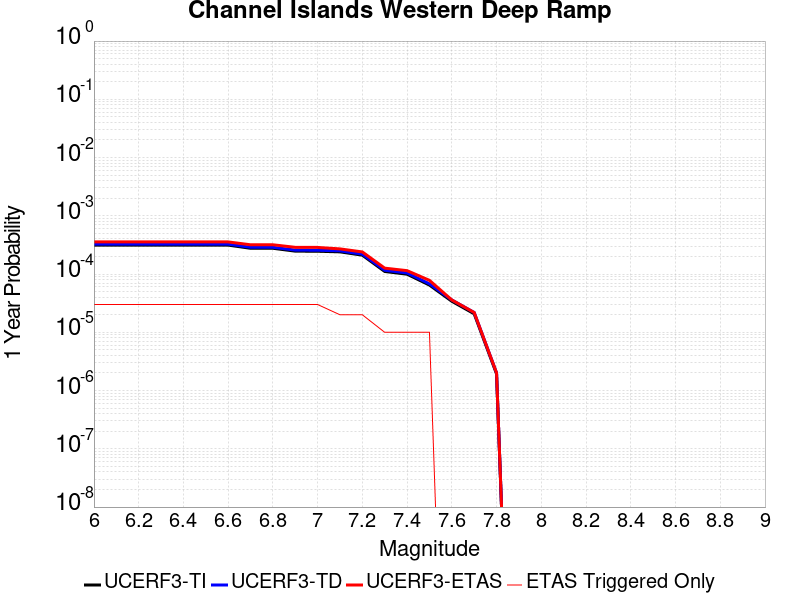 |  |

| Magnitude | 1 wk TI Prob | 1 wk TD Prob | 1 wk ETAS Prob | 1 wk ETAS/TD Gain | 1 wk ETAS Triggered Only | 1 mo TI Prob | 1 mo TD Prob | 1 mo ETAS Prob | 1 mo ETAS/TD Gain | 1 mo ETAS Triggered Only | 1 yr TI Prob | 1 yr TD Prob | 1 yr ETAS Prob | 1 yr ETAS/TD Gain | 1 yr ETAS Triggered Only | 10 yr TI Prob | 10 yr TD Prob | 10 yr ETAS Prob | 10 yr ETAS/TD Gain | 10 yr ETAS Triggered Only |
|-----|-----|-----|-----|-----|-----|-----|-----|-----|-----|-----|-----|-----|-----|-----|-----|-----|-----|-----|-----|-----|
| 6.0 | 6.0213506E-6 | 6.2548684E-6 | 2.0400452E-5 | 3.2615318 | 1.4145672E-5 | 2.5805533E-5 | 2.6806329E-5 | 5.5096913E-5 | 2.0553696 | 2.8291344E-5 | 3.1413708E-4 | 3.2632265E-4 | 3.6874582E-4 | 1.1300038 | 4.2437016E-5 | 0.0031369338 | 0.0032588763 | 0.003301175 | 1.0129795 | 4.2437016E-5 |
| 6.1 | 6.0213506E-6 | 6.2548684E-6 | 2.0400452E-5 | 3.2615318 | 1.4145672E-5 | 2.5805533E-5 | 2.6806329E-5 | 5.5096913E-5 | 2.0553696 | 2.8291344E-5 | 3.1413708E-4 | 3.2632265E-4 | 3.6874582E-4 | 1.1300038 | 4.2437016E-5 | 0.0031369338 | 0.0032588763 | 0.003301175 | 1.0129795 | 4.2437016E-5 |
| 6.2 | 6.0213506E-6 | 6.2548684E-6 | 2.0400452E-5 | 3.2615318 | 1.4145672E-5 | 2.5805533E-5 | 2.6806329E-5 | 5.5096913E-5 | 2.0553696 | 2.8291344E-5 | 3.1413708E-4 | 3.2632265E-4 | 3.6874582E-4 | 1.1300038 | 4.2437016E-5 | 0.0031369338 | 0.0032588763 | 0.003301175 | 1.0129795 | 4.2437016E-5 |
| 6.3 | 6.0213506E-6 | 6.2548684E-6 | 2.0400452E-5 | 3.2615318 | 1.4145672E-5 | 2.5805533E-5 | 2.6806329E-5 | 5.5096913E-5 | 2.0553696 | 2.8291344E-5 | 3.1413708E-4 | 3.2632265E-4 | 3.6874582E-4 | 1.1300038 | 4.2437016E-5 | 0.0031369338 | 0.0032588763 | 0.003301175 | 1.0129795 | 4.2437016E-5 |
| 6.4 | 6.0213506E-6 | 6.2548684E-6 | 2.0400452E-5 | 3.2615318 | 1.4145672E-5 | 2.5805533E-5 | 2.6806329E-5 | 5.5096913E-5 | 2.0553696 | 2.8291344E-5 | 3.1413708E-4 | 3.2632265E-4 | 3.6874582E-4 | 1.1300038 | 4.2437016E-5 | 0.0031369338 | 0.0032588763 | 0.003301175 | 1.0129795 | 4.2437016E-5 |
| 6.5 | 6.0213506E-6 | 6.2548684E-6 | 2.0400452E-5 | 3.2615318 | 1.4145672E-5 | 2.5805533E-5 | 2.6806329E-5 | 5.5096913E-5 | 2.0553696 | 2.8291344E-5 | 3.1413708E-4 | 3.2632265E-4 | 3.6874582E-4 | 1.1300038 | 4.2437016E-5 | 0.0031369338 | 0.0032588763 | 0.003301175 | 1.0129795 | 4.2437016E-5 |
| 6.6 | 6.0213506E-6 | 6.2548684E-6 | 2.0400452E-5 | 3.2615318 | 1.4145672E-5 | 2.5805533E-5 | 2.6806329E-5 | 5.5096913E-5 | 2.0553696 | 2.8291344E-5 | 3.1413708E-4 | 3.2632265E-4 | 3.6874582E-4 | 1.1300038 | 4.2437016E-5 | 0.0031369338 | 0.0032588763 | 0.003301175 | 1.0129795 | 4.2437016E-5 |
| 6.7 | 5.313309E-6 | 5.5252403E-6 | 1.9670835E-5 | 3.560177 | 1.4145672E-5 | 2.2771126E-5 | 2.367941E-5 | 5.1970084E-5 | 2.1947372 | 2.8291344E-5 | 2.772032E-4 | 2.8826276E-4 | 3.3068756E-4 | 1.147174 | 4.2437016E-5 | 0.0027685766 | 0.0028792918 | 0.0029216064 | 1.0146962 | 4.2437016E-5 |
| 6.8 | 5.313309E-6 | 5.5252403E-6 | 1.9670835E-5 | 3.560177 | 1.4145672E-5 | 2.2771126E-5 | 2.367941E-5 | 5.1970084E-5 | 2.1947372 | 2.8291344E-5 | 2.772032E-4 | 2.8826276E-4 | 3.3068756E-4 | 1.147174 | 4.2437016E-5 | 0.0027685766 | 0.0028792918 | 0.0029216064 | 1.0146962 | 4.2437016E-5 |
| 6.9 | 4.744377E-6 | 4.9394303E-6 | 1.9085033E-5 | 3.8638124 | 1.4145672E-5 | 2.0332885E-5 | 2.1168837E-5 | 4.945958E-5 | 2.3364336 | 2.8291344E-5 | 2.4752476E-4 | 2.5770385E-4 | 3.0012993E-4 | 1.1646311 | 4.2437016E-5 | 0.0024724922 | 0.0025744175 | 0.0026167452 | 1.0164417 | 4.2437016E-5 |
| 7.0 | 4.722209E-6 | 4.9164732E-6 | 1.9062076E-5 | 3.8771849 | 1.4145672E-5 | 2.0237881E-5 | 2.107045E-5 | 4.93612E-5 | 2.342674 | 2.8291344E-5 | 2.4636835E-4 | 2.5650626E-4 | 2.989324E-4 | 1.1654 | 4.2437016E-5 | 0.002460954 | 0.0025624693 | 0.0026047977 | 1.0165186 | 4.2437016E-5 |
| 7.1 | 4.611174E-6 | 4.801409E-6 | 1.8947014E-5 | 3.946136 | 1.4145672E-5 | 1.9762025E-5 | 2.0577325E-5 | 3.4722707E-5 | 1.6874256 | 1.4145672E-5 | 2.4057609E-4 | 2.5050386E-4 | 2.7878812E-4 | 1.1129094 | 2.8291344E-5 | 0.002403158 | 0.002502582 | 0.0025308025 | 1.0112766 | 2.8291344E-5 |
| 7.2 | 4.043994E-6 | 4.2120264E-6 | 1.835764E-5 | 4.3583865 | 1.4145672E-5 | 1.7331287E-5 | 1.8051438E-5 | 3.2196855E-5 | 1.7836171 | 1.4145672E-5 | 2.10988E-4 | 2.1975765E-4 | 2.4804278E-4 | 1.1287105 | 2.8291344E-5 | 0.002107878 | 0.0021957543 | 0.0022239834 | 1.0128562 | 2.8291344E-5 |
| 7.3 | 2.1233036E-6 | 2.2297875E-6 | 1.6375428E-5 | 7.343941 | 1.4145672E-5 | 9.099841E-6 | 9.556197E-6 | 2.3701734E-5 | 2.4802475 | 1.4145672E-5 | 1.1078493E-4 | 1.1634055E-4 | 1.3048456E-4 | 1.1215744 | 1.4145672E-5 | 0.0011072971 | 0.001162802 | 0.0011769312 | 1.012151 | 1.4145672E-5 |
| 7.4 | 1.9051884E-6 | 2.0014973E-6 | 1.6147142E-5 | 8.067531 | 1.4145672E-5 | 8.165067E-6 | 8.577817E-6 | 2.2723369E-5 | 2.649085 | 1.4145672E-5 | 9.940516E-5 | 1.0442998E-4 | 1.1857417E-4 | 1.1354419 | 1.4145672E-5 | 9.93607E-4 | 0.0010438144 | 0.0010579452 | 1.0135378 | 1.4145672E-5 |
| 7.5 | 1.2408497E-6 | 1.3038839E-6 | 1.5449537E-5 | 11.84886 | 1.4145672E-5 | 5.317916E-6 | 5.588062E-6 | 1.9733656E-5 | 3.5313952 | 1.4145672E-5 | 6.4743705E-5 | 6.8032554E-5 | 8.217726E-5 | 1.2079109 | 1.4145672E-5 | 6.4724847E-4 | 6.8011944E-4 | 6.942555E-4 | 1.0207846 | 1.4145672E-5 |
| 7.6 | 6.5440025E-7 | 6.886718E-7 | 6.886718E-7 | 1.0 | 0.0 | 2.8045695E-6 | 2.9514472E-6 | 2.9514472E-6 | 1.0 | 0.0 | 3.4145098E-5 | 3.593329E-5 | 3.593329E-5 | 1.0 | 0.0 | 3.4139853E-4 | 3.5927625E-4 | 3.5927625E-4 | 1.0 | 0.0 |
| 7.7 | 3.985963E-7 | 4.1930787E-7 | 4.1930787E-7 | 1.0 | 0.0 | 1.7082689E-6 | 1.7970326E-6 | 1.7970326E-6 | 1.0 | 0.0 | 2.0797976E-5 | 2.1878664E-5 | 2.1878664E-5 | 1.0 | 0.0 | 2.0796029E-4 | 2.1876628E-4 | 2.1876628E-4 | 1.0 | 0.0 |
| 7.8 | 3.706329E-8 | 3.8591796E-8 | 3.8591796E-8 | 1.0 | 0.0 | 1.5884267E-7 | 1.653934E-7 | 1.653934E-7 | 1.0 | 0.0 | 1.9339077E-6 | 2.0136629E-6 | 2.0136629E-6 | 1.0 | 0.0 | 1.933891E-5 | 2.0136458E-5 | 2.0136458E-5 | 1.0 | 0.0 |

## Rodgers Creek - Healdsburg 2011 CFM
*[(top)](#table-of-contents)*

| 1 Week | 1 Month | 1 Year | 10 Year |
|-----|-----|-----|-----|
|  |  |  |  |

| Magnitude | 1 wk TI Prob | 1 wk TD Prob | 1 wk ETAS Prob | 1 wk ETAS/TD Gain | 1 wk ETAS Triggered Only | 1 mo TI Prob | 1 mo TD Prob | 1 mo ETAS Prob | 1 mo ETAS/TD Gain | 1 mo ETAS Triggered Only | 1 yr TI Prob | 1 yr TD Prob | 1 yr ETAS Prob | 1 yr ETAS/TD Gain | 1 yr ETAS Triggered Only | 10 yr TI Prob | 10 yr TD Prob | 10 yr ETAS Prob | 10 yr ETAS/TD Gain | 10 yr ETAS Triggered Only |
|-----|-----|-----|-----|-----|-----|-----|-----|-----|-----|-----|-----|-----|-----|-----|-----|-----|-----|-----|-----|-----|
| 6.0 | 7.390182E-5 | 1.3137296E-4 | 1.3137296E-4 | 1.0 | 0.0 | 3.1668364E-4 | 5.629057E-4 | 5.629057E-4 | 1.0 | 0.0 | 0.0038488081 | 0.0068318076 | 0.0068458566 | 1.0020564 | 1.4145672E-5 | 0.037828278 | 0.06618395 | 0.06621037 | 1.0003992 | 2.8291344E-5 |
| 6.1 | 7.318768E-5 | 1.303531E-4 | 1.303531E-4 | 1.0 | 0.0 | 3.1362378E-4 | 5.585369E-4 | 5.585369E-4 | 1.0 | 0.0 | 0.0038116854 | 0.006778966 | 0.006793016 | 1.0020726 | 1.4145672E-5 | 0.037469655 | 0.06568854 | 0.06571498 | 1.0004025 | 2.8291344E-5 |
| 6.2 | 7.1379836E-5 | 1.2728151E-4 | 1.2728151E-4 | 1.0 | 0.0 | 3.058777E-4 | 5.453785E-4 | 5.453785E-4 | 1.0 | 0.0 | 0.003717703 | 0.0066197454 | 0.006633797 | 1.0021228 | 1.4145672E-5 | 0.0365612 | 0.06421061 | 0.06423708 | 1.0004123 | 2.8291344E-5 |
| 6.3 | 6.9255926E-5 | 1.2382482E-4 | 1.2382482E-4 | 1.0 | 0.0 | 2.9677735E-4 | 5.305703E-4 | 5.305703E-4 | 1.0 | 0.0 | 0.0036072785 | 0.0064406106 | 0.006454665 | 1.0021821 | 1.4145672E-5 | 0.035492823 | 0.062541805 | 0.06256833 | 1.000424 | 2.8291344E-5 |
| 6.4 | 6.6757144E-5 | 1.195919E-4 | 1.195919E-4 | 1.0 | 0.0 | 2.8607066E-4 | 5.1243644E-4 | 5.1243644E-4 | 1.0 | 0.0 | 0.0034773487 | 0.00622114 | 0.0062351977 | 1.0022596 | 1.4145672E-5 | 0.034234364 | 0.060491614 | 0.060518194 | 1.0004394 | 2.8291344E-5 |
| 6.5 | 6.5735134E-5 | 1.180849E-4 | 1.180849E-4 | 1.0 | 0.0 | 2.8169158E-4 | 5.059804E-4 | 5.059804E-4 | 1.0 | 0.0 | 0.003424202 | 0.0061429944 | 0.006157053 | 1.0022886 | 1.4145672E-5 | 0.03371918 | 0.059755705 | 0.059782308 | 1.0004451 | 2.8291344E-5 |
| 6.6 | 6.289601E-5 | 1.13442366E-4 | 1.13442366E-4 | 1.0 | 0.0 | 2.6952647E-4 | 4.8609133E-4 | 4.8609133E-4 | 1.0 | 0.0 | 0.0032765474 | 0.005902183 | 0.005916245 | 1.0023825 | 1.4145672E-5 | 0.032286562 | 0.057495043 | 0.057521705 | 1.0004637 | 2.8291344E-5 |
| 6.7 | 6.115274E-5 | 1.106132E-4 | 1.106132E-4 | 1.0 | 0.0 | 2.6205686E-4 | 4.739708E-4 | 4.739708E-4 | 1.0 | 0.0 | 0.0031858748 | 0.0057554054 | 0.00576947 | 1.0024437 | 1.4145672E-5 | 0.031405866 | 0.05611361 | 0.056140315 | 1.0004759 | 2.8291344E-5 |
| 6.8 | 5.9232367E-5 | 1.0728657E-4 | 1.0728657E-4 | 1.0 | 0.0 | 2.538283E-4 | 4.5971893E-4 | 4.5971893E-4 | 1.0 | 0.0 | 0.0030859804 | 0.005582791 | 0.0055968575 | 1.0025196 | 1.4145672E-5 | 0.030434765 | 0.05448041 | 0.054507162 | 1.000491 | 2.8291344E-5 |
| 6.9 | 5.4030377E-5 | 9.8228295E-5 | 9.8228295E-5 | 1.0 | 0.0 | 2.315382E-4 | 4.209108E-4 | 4.209108E-4 | 1.0 | 0.0 | 0.0028153337 | 0.0051126136 | 0.005126687 | 1.0027527 | 1.4145672E-5 | 0.027799325 | 0.05001572 | 0.050042596 | 1.0005374 | 2.8291344E-5 |
| 7.0 | 4.8260714E-5 | 8.7408924E-5 | 8.7408924E-5 | 1.0 | 0.0 | 2.0681522E-4 | 3.7455617E-4 | 3.7455617E-4 | 1.0 | 0.0 | 0.0025150678 | 0.0045507406 | 0.0045648217 | 1.0030943 | 1.4145672E-5 | 0.024867928 | 0.044667073 | 0.044694103 | 1.0006051 | 2.8291344E-5 |
| 7.1 | 4.0294493E-5 | 7.389363E-5 | 7.389363E-5 | 1.0 | 0.0 | 1.7267925E-4 | 3.1664874E-4 | 3.1664874E-4 | 1.0 | 0.0 | 0.0021003427 | 0.0038484214 | 0.0038625128 | 1.0036615 | 1.4145672E-5 | 0.02080602 | 0.037923187 | 0.037950408 | 1.0007178 | 2.8291344E-5 |
| 7.2 | 3.096388E-5 | 5.698023E-5 | 5.698023E-5 | 1.0 | 0.0 | 1.326956E-4 | 2.4417826E-4 | 2.4417826E-4 | 1.0 | 0.0 | 0.0016143717 | 0.0029688394 | 0.002982943 | 1.0047506 | 1.4145672E-5 | 0.01602694 | 0.029437006 | 0.029450735 | 1.0004663 | 1.4145672E-5 |
| 7.3 | 2.3615226E-5 | 4.3629818E-5 | 4.3629818E-5 | 1.0 | 0.0 | 1.0120418E-4 | 1.869716E-4 | 1.869716E-4 | 1.0 | 0.0 | 0.0012314644 | 0.0022740164 | 0.0022881299 | 1.0062064 | 1.4145672E-5 | 0.0122466255 | 0.022637889 | 0.022651713 | 1.0006107 | 1.4145672E-5 |
| 7.4 | 1.8251132E-5 | 3.3542477E-5 | 3.3542477E-5 | 1.0 | 0.0 | 7.821679E-5 | 1.4374561E-4 | 1.4374561E-4 | 1.0 | 0.0 | 9.518733E-4 | 0.0017487077 | 0.0017487077 | 1.0 | 0.0 | 0.009478063 | 0.017466031 | 0.017466031 | 1.0 | 0.0 |
| 7.5 | 1.2411432E-5 | 2.2461069E-5 | 2.2461069E-5 | 1.0 | 0.0 | 5.3190768E-5 | 9.6258205E-5 | 9.6258205E-5 | 1.0 | 0.0 | 6.4740516E-4 | 0.0011713194 | 0.0011713194 | 1.0 | 0.0 | 0.006455223 | 0.011743137 | 0.011743137 | 1.0 | 0.0 |
| 7.6 | 4.4771446E-6 | 8.08443E-6 | 8.08443E-6 | 1.0 | 0.0 | 1.918762E-5 | 3.4647102E-5 | 3.4647102E-5 | 1.0 | 0.0 | 2.3358424E-4 | 4.2174806E-4 | 4.2174806E-4 | 1.0 | 0.0 | 0.0023333887 | 0.0042453306 | 0.0042453306 | 1.0 | 0.0 |
| 7.7 | 2.157941E-7 | 3.5350925E-7 | 3.5350925E-7 | 1.0 | 0.0 | 9.248315E-7 | 1.5150388E-6 | 1.5150388E-6 | 1.0 | 0.0 | 1.1259765E-5 | 1.844544E-5 | 1.844544E-5 | 1.0 | 0.0 | 1.1259195E-4 | 1.9069649E-4 | 1.9069649E-4 | 1.0 | 0.0 |
| 7.8 | 9.9623286E-8 | 1.9900986E-7 | 1.9900986E-7 | 1.0 | 0.0 | 4.269569E-7 | 8.528991E-7 | 8.528991E-7 | 1.0 | 0.0 | 5.1981874E-6 | 1.03839975E-5 | 1.03839975E-5 | 1.0 | 0.0 | 5.198066E-5 | 1.0902916E-4 | 1.0902916E-4 | 1.0 | 0.0 |
| 7.9 | 5.6745257E-8 | 1.1774714E-7 | 1.1774714E-7 | 1.0 | 0.0 | 2.4319394E-7 | 5.046305E-7 | 5.046305E-7 | 1.0 | 0.0 | 2.960882E-6 | 6.143859E-6 | 6.143859E-6 | 1.0 | 0.0 | 2.9608427E-5 | 6.471445E-5 | 6.471445E-5 | 1.0 | 0.0 |
| 8.0 | 2.8614323E-8 | 6.5789635E-8 | 6.5789635E-8 | 1.0 | 0.0 | 1.2263281E-7 | 2.8195555E-7 | 2.8195555E-7 | 1.0 | 0.0 | 1.4930534E-6 | 3.4328034E-6 | 3.4328034E-6 | 1.0 | 0.0 | 1.4930434E-5 | 3.5830046E-5 | 3.5830046E-5 | 1.0 | 0.0 |
| 8.1 | 3.5045191E-9 | 8.966459E-9 | 8.966459E-9 | 1.0 | 0.0 | 1.5019367E-8 | 3.8427682E-8 | 3.8427682E-8 | 1.0 | 0.0 | 1.8286079E-7 | 4.6785692E-7 | 4.6785692E-7 | 1.0 | 0.0 | 1.8286064E-6 | 4.834128E-6 | 4.834128E-6 | 1.0 | 0.0 |

## Hollywood
*[(top)](#table-of-contents)*

| 1 Week | 1 Month | 1 Year | 10 Year |
|-----|-----|-----|-----|
|  |  | 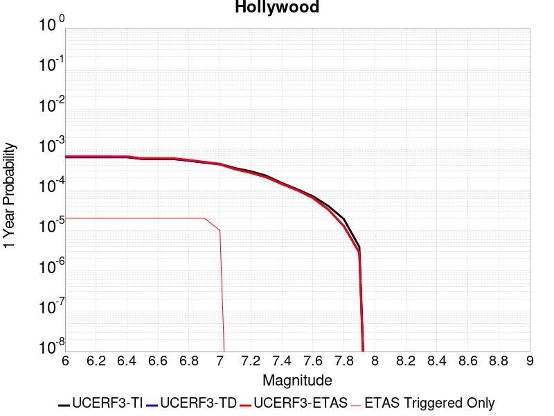 |  |

| Magnitude | 1 wk TI Prob | 1 wk TD Prob | 1 wk ETAS Prob | 1 wk ETAS/TD Gain | 1 wk ETAS Triggered Only | 1 mo TI Prob | 1 mo TD Prob | 1 mo ETAS Prob | 1 mo ETAS/TD Gain | 1 mo ETAS Triggered Only | 1 yr TI Prob | 1 yr TD Prob | 1 yr ETAS Prob | 1 yr ETAS/TD Gain | 1 yr ETAS Triggered Only | 10 yr TI Prob | 10 yr TD Prob | 10 yr ETAS Prob | 10 yr ETAS/TD Gain | 10 yr ETAS Triggered Only |
|-----|-----|-----|-----|-----|-----|-----|-----|-----|-----|-----|-----|-----|-----|-----|-----|-----|-----|-----|-----|-----|
| 6.0 | 1.24487615E-5 | 1.2593229E-5 | 2.6738724E-5 | 2.123262 | 1.4145672E-5 | 5.3350745E-5 | 5.3969892E-5 | 6.81148E-5 | 1.2620889 | 1.4145672E-5 | 6.4935174E-4 | 6.5689E-4 | 6.851628E-4 | 1.0430403 | 2.8291344E-5 | 0.0064745755 | 0.0065499707 | 0.0065780766 | 1.004291 | 2.8291344E-5 |
| 6.1 | 1.24487615E-5 | 1.2593229E-5 | 2.6738724E-5 | 2.123262 | 1.4145672E-5 | 5.3350745E-5 | 5.3969892E-5 | 6.81148E-5 | 1.2620889 | 1.4145672E-5 | 6.4935174E-4 | 6.5689E-4 | 6.851628E-4 | 1.0430403 | 2.8291344E-5 | 0.0064745755 | 0.0065499707 | 0.0065780766 | 1.004291 | 2.8291344E-5 |
| 6.2 | 1.24487615E-5 | 1.2593229E-5 | 2.6738724E-5 | 2.123262 | 1.4145672E-5 | 5.3350745E-5 | 5.3969892E-5 | 6.81148E-5 | 1.2620889 | 1.4145672E-5 | 6.4935174E-4 | 6.5689E-4 | 6.851628E-4 | 1.0430403 | 2.8291344E-5 | 0.0064745755 | 0.0065499707 | 0.0065780766 | 1.004291 | 2.8291344E-5 |
| 6.3 | 1.24487615E-5 | 1.2593229E-5 | 2.6738724E-5 | 2.123262 | 1.4145672E-5 | 5.3350745E-5 | 5.3969892E-5 | 6.81148E-5 | 1.2620889 | 1.4145672E-5 | 6.4935174E-4 | 6.5689E-4 | 6.851628E-4 | 1.0430403 | 2.8291344E-5 | 0.0064745755 | 0.0065499707 | 0.0065780766 | 1.004291 | 2.8291344E-5 |
| 6.4 | 1.2431024E-5 | 1.25738425E-5 | 2.6719337E-5 | 2.1249938 | 1.4145672E-5 | 5.327473E-5 | 5.388681E-5 | 6.803172E-5 | 1.262493 | 1.4145672E-5 | 6.4842677E-4 | 6.558791E-4 | 6.841519E-4 | 1.0431067 | 2.8291344E-5 | 0.0064653796 | 0.0065399213 | 0.0065680277 | 1.0042976 | 2.8291344E-5 |
| 6.5 | 1.1242222E-5 | 1.1317804E-5 | 2.5463316E-5 | 2.249846 | 1.4145672E-5 | 4.8180063E-5 | 4.8503985E-5 | 6.264897E-5 | 1.2916253 | 1.4145672E-5 | 5.864344E-4 | 5.903787E-4 | 6.186534E-4 | 1.0478923 | 2.8291344E-5 | 0.0058488925 | 0.00588839 | 0.0059165144 | 1.0047764 | 2.8291344E-5 |
| 6.6 | 1.1234066E-5 | 1.1308918E-5 | 2.545443E-5 | 2.250828 | 1.4145672E-5 | 4.8145106E-5 | 4.8465907E-5 | 6.261089E-5 | 1.2918544 | 1.4145672E-5 | 5.86009E-4 | 5.899153E-4 | 6.1819E-4 | 1.04793 | 2.8291344E-5 | 0.005844661 | 0.0058837803 | 0.0059119053 | 1.00478 | 2.8291344E-5 |
| 6.7 | 1.12294E-5 | 1.1303661E-5 | 2.5449173E-5 | 2.2514098 | 1.4145672E-5 | 4.812511E-5 | 4.8443377E-5 | 6.258836E-5 | 1.2919902 | 1.4145672E-5 | 5.857657E-4 | 5.896412E-4 | 6.179159E-4 | 1.0479523 | 2.8291344E-5 | 0.0058422405 | 0.005881054 | 0.0059091784 | 1.0047823 | 2.8291344E-5 |
| 6.8 | 1.0252819E-5 | 1.0218449E-5 | 2.4363975E-5 | 2.3843126 | 1.4145672E-5 | 4.3939912E-5 | 4.3792625E-5 | 5.793768E-5 | 1.3230008 | 1.4145672E-5 | 5.3483713E-4 | 5.330469E-4 | 5.613232E-4 | 1.0530465 | 2.8291344E-5 | 0.005335517 | 0.0053179096 | 0.0053460505 | 1.0052917 | 2.8291344E-5 |
| 6.9 | 9.252289E-6 | 9.110309E-6 | 2.3255852E-5 | 2.5526962 | 1.4145672E-5 | 3.9652066E-5 | 3.9043607E-5 | 5.3188727E-5 | 1.3622903 | 1.4145672E-5 | 4.8265693E-4 | 4.752539E-4 | 5.035318E-4 | 1.0595006 | 2.8291344E-5 | 0.0048161 | 0.004742549 | 0.004770706 | 1.0059371 | 2.8291344E-5 |
| 7.0 | 8.474604E-6 | 8.25826E-6 | 2.2403816E-5 | 2.7128978 | 1.4145672E-5 | 3.6319227E-5 | 3.5392073E-5 | 4.9537244E-5 | 1.3996706 | 1.4145672E-5 | 4.4209688E-4 | 4.3081472E-4 | 4.4495432E-4 | 1.0328206 | 1.4145672E-5 | 0.004412184 | 0.0042999457 | 0.0043140305 | 1.0032756 | 1.4145672E-5 |
| 7.1 | 6.643643E-6 | 6.2683707E-6 | 6.2683707E-6 | 1.0 | 0.0 | 2.8472443E-5 | 2.686417E-5 | 2.686417E-5 | 1.0 | 0.0 | 3.4659685E-4 | 3.2702263E-4 | 3.2702263E-4 | 1.0 | 0.0 | 0.0034605677 | 0.0032654598 | 0.0032654598 | 1.0 | 0.0 |
| 7.2 | 5.549002E-6 | 5.1087086E-6 | 5.1087086E-6 | 1.0 | 0.0 | 2.378122E-5 | 2.1894282E-5 | 2.1894282E-5 | 1.0 | 0.0 | 2.8949787E-4 | 2.665304E-4 | 2.665304E-4 | 1.0 | 0.0 | 0.0028912104 | 0.002662124 | 0.002662124 | 1.0 | 0.0 |
| 7.3 | 4.3059727E-6 | 3.9598913E-6 | 3.9598913E-6 | 1.0 | 0.0 | 1.8454039E-5 | 1.6970853E-5 | 1.6970853E-5 | 1.0 | 0.0 | 2.2465475E-4 | 2.0660064E-4 | 2.0660064E-4 | 1.0 | 0.0 | 0.0022442779 | 0.0020640958 | 0.0020640958 | 1.0 | 0.0 |
| 7.4 | 2.8550733E-6 | 2.7013002E-6 | 2.7013002E-6 | 1.0 | 0.0 | 1.2235971E-5 | 1.1576949E-5 | 1.1576949E-5 | 1.0 | 0.0 | 1.4896276E-4 | 1.4094029E-4 | 1.4094029E-4 | 1.0 | 0.0 | 0.0014886294 | 0.0014085141 | 0.0014085141 | 1.0 | 0.0 |
| 7.5 | 1.9927045E-6 | 1.8976393E-6 | 1.8976393E-6 | 1.0 | 0.0 | 8.540134E-6 | 8.132714E-6 | 8.132714E-6 | 1.0 | 0.0 | 1.0397117E-4 | 9.901134E-5 | 9.901134E-5 | 1.0 | 0.0 | 0.0010392254 | 9.896759E-4 | 9.896759E-4 | 1.0 | 0.0 |
| 7.6 | 1.345084E-6 | 1.2216018E-6 | 1.2216018E-6 | 1.0 | 0.0 | 5.764633E-6 | 5.2354258E-6 | 5.2354258E-6 | 1.0 | 0.0 | 7.018215E-5 | 6.373946E-5 | 6.373946E-5 | 1.0 | 0.0 | 7.0159987E-4 | 6.372138E-4 | 6.372138E-4 | 1.0 | 0.0 |
| 7.7 | 7.6835164E-7 | 6.2777013E-7 | 6.2777013E-7 | 1.0 | 0.0 | 3.2929315E-6 | 2.6904406E-6 | 2.6904406E-6 | 1.0 | 0.0 | 4.00907E-5 | 3.2755637E-5 | 3.2755637E-5 | 1.0 | 0.0 | 4.0083472E-4 | 3.2750957E-4 | 3.2750957E-4 | 1.0 | 0.0 |
| 7.8 | 3.6562128E-7 | 2.4534745E-7 | 2.4534745E-7 | 1.0 | 0.0 | 1.5669474E-6 | 1.0514887E-6 | 1.0514887E-6 | 1.0 | 0.0 | 1.9077417E-5 | 1.2801803E-5 | 1.2801803E-5 | 1.0 | 0.0 | 1.907578E-4 | 1.2801103E-4 | 1.2801103E-4 | 1.0 | 0.0 |
| 7.9 | 7.5024424E-8 | 5.381742E-8 | 5.381742E-8 | 1.0 | 0.0 | 3.215332E-7 | 2.3064608E-7 | 2.3064608E-7 | 1.0 | 0.0 | 3.91466E-6 | 2.8081138E-6 | 2.8081138E-6 | 1.0 | 0.0 | 3.9145907E-5 | 2.8080913E-5 | 2.8080913E-5 | 1.0 | 0.0 |

## San Jose
*[(top)](#table-of-contents)*

| 1 Week | 1 Month | 1 Year | 10 Year |
|-----|-----|-----|-----|
|  |  |  | 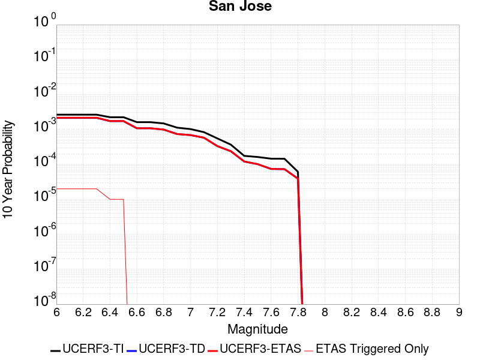 |

| Magnitude | 1 wk TI Prob | 1 wk TD Prob | 1 wk ETAS Prob | 1 wk ETAS/TD Gain | 1 wk ETAS Triggered Only | 1 mo TI Prob | 1 mo TD Prob | 1 mo ETAS Prob | 1 mo ETAS/TD Gain | 1 mo ETAS Triggered Only | 1 yr TI Prob | 1 yr TD Prob | 1 yr ETAS Prob | 1 yr ETAS/TD Gain | 1 yr ETAS Triggered Only | 10 yr TI Prob | 10 yr TD Prob | 10 yr ETAS Prob | 10 yr ETAS/TD Gain | 10 yr ETAS Triggered Only |
|-----|-----|-----|-----|-----|-----|-----|-----|-----|-----|-----|-----|-----|-----|-----|-----|-----|-----|-----|-----|-----|
| 6.0 | 5.0851277E-6 | 4.125642E-6 | 4.125642E-6 | 1.0 | 0.0 | 2.1793223E-5 | 1.768122E-5 | 1.768122E-5 | 1.0 | 0.0 | 2.653002E-4 | 2.152502E-4 | 2.2939283E-4 | 1.0657032 | 1.4145672E-5 | 0.0026498367 | 0.0021507454 | 0.002178976 | 1.0131259 | 2.8291344E-5 |
| 6.1 | 5.0851277E-6 | 4.125642E-6 | 4.125642E-6 | 1.0 | 0.0 | 2.1793223E-5 | 1.768122E-5 | 1.768122E-5 | 1.0 | 0.0 | 2.653002E-4 | 2.152502E-4 | 2.2939283E-4 | 1.0657032 | 1.4145672E-5 | 0.0026498367 | 0.0021507454 | 0.002178976 | 1.0131259 | 2.8291344E-5 |
| 6.2 | 5.0851277E-6 | 4.125642E-6 | 4.125642E-6 | 1.0 | 0.0 | 2.1793223E-5 | 1.768122E-5 | 1.768122E-5 | 1.0 | 0.0 | 2.653002E-4 | 2.152502E-4 | 2.2939283E-4 | 1.0657032 | 1.4145672E-5 | 0.0026498367 | 0.0021507454 | 0.002178976 | 1.0131259 | 2.8291344E-5 |
| 6.3 | 5.0851277E-6 | 4.125642E-6 | 4.125642E-6 | 1.0 | 0.0 | 2.1793223E-5 | 1.768122E-5 | 1.768122E-5 | 1.0 | 0.0 | 2.653002E-4 | 2.152502E-4 | 2.2939283E-4 | 1.0657032 | 1.4145672E-5 | 0.0026498367 | 0.0021507454 | 0.002178976 | 1.0131259 | 2.8291344E-5 |
| 6.4 | 4.3115124E-6 | 3.3237525E-6 | 3.3237525E-6 | 1.0 | 0.0 | 1.8477778E-5 | 1.4244589E-5 | 1.4244589E-5 | 1.0 | 0.0 | 2.2494372E-4 | 1.7341628E-4 | 1.7341628E-4 | 1.0 | 0.0 | 0.0022471617 | 0.0017330965 | 0.0017472176 | 1.008148 | 1.4145672E-5 |
| 6.5 | 4.3115124E-6 | 3.3237525E-6 | 3.3237525E-6 | 1.0 | 0.0 | 1.8477778E-5 | 1.4244589E-5 | 1.4244589E-5 | 1.0 | 0.0 | 2.2494372E-4 | 1.7341628E-4 | 1.7341628E-4 | 1.0 | 0.0 | 0.0022471617 | 0.0017330965 | 0.0017472176 | 1.008148 | 1.4145672E-5 |
| 6.6 | 3.110396E-6 | 2.0799562E-6 | 2.0799562E-6 | 1.0 | 0.0 | 1.33302E-5 | 8.9140685E-6 | 8.9140685E-6 | 1.0 | 0.0 | 1.622831E-4 | 1.0852366E-4 | 1.0852366E-4 | 1.0 | 0.0 | 0.0016216465 | 0.001084804 | 0.001084804 | 1.0 | 0.0 |
| 6.7 | 3.110396E-6 | 2.0799562E-6 | 2.0799562E-6 | 1.0 | 0.0 | 1.33302E-5 | 8.9140685E-6 | 8.9140685E-6 | 1.0 | 0.0 | 1.622831E-4 | 1.0852366E-4 | 1.0852366E-4 | 1.0 | 0.0 | 0.0016216465 | 0.001084804 | 0.001084804 | 1.0 | 0.0 |
| 6.8 | 2.856651E-6 | 1.9024077E-6 | 1.9024077E-6 | 1.0 | 0.0 | 1.2242733E-5 | 8.153152E-6 | 8.153152E-6 | 1.0 | 0.0 | 1.4904508E-4 | 9.926035E-5 | 9.926035E-5 | 1.0 | 0.0 | 0.0014894515 | 9.922545E-4 | 9.922545E-4 | 1.0 | 0.0 |
| 6.9 | 2.1618725E-6 | 1.4186406E-6 | 1.4186406E-6 | 1.0 | 0.0 | 9.265135E-6 | 6.0798748E-6 | 6.0798748E-6 | 1.0 | 0.0 | 1.12797185E-4 | 7.402005E-5 | 7.402005E-5 | 1.0 | 0.0 | 0.0011273995 | 7.4003247E-4 | 7.4003247E-4 | 1.0 | 0.0 |
| 7.0 | 1.9684312E-6 | 1.3256082E-6 | 1.3256082E-6 | 1.0 | 0.0 | 8.436106E-6 | 5.681166E-6 | 5.681166E-6 | 1.0 | 0.0 | 1.02704755E-4 | 6.916608E-5 | 6.916608E-5 | 1.0 | 0.0 | 0.001026573 | 6.9152354E-4 | 6.9152354E-4 | 1.0 | 0.0 |
| 7.1 | 1.6070337E-6 | 1.1154867E-6 | 1.1154867E-6 | 1.0 | 0.0 | 6.887269E-6 | 4.7806493E-6 | 4.7806493E-6 | 1.0 | 0.0 | 8.384928E-5 | 5.8202913E-5 | 5.8202913E-5 | 1.0 | 0.0 | 8.3817646E-4 | 5.819527E-4 | 5.819527E-4 | 1.0 | 0.0 |
| 7.2 | 1.0631658E-6 | 6.403567E-7 | 6.403567E-7 | 1.0 | 0.0 | 4.556417E-6 | 2.744383E-6 | 2.744383E-6 | 1.0 | 0.0 | 5.5472963E-5 | 3.3412365E-5 | 3.3412365E-5 | 1.0 | 0.0 | 5.545912E-4 | 3.3414463E-4 | 3.3414463E-4 | 1.0 | 0.0 |
| 7.3 | 7.060711E-7 | 4.5823228E-7 | 4.5823228E-7 | 1.0 | 0.0 | 3.0260155E-6 | 1.9638512E-6 | 1.9638512E-6 | 1.0 | 0.0 | 3.6841117E-5 | 2.3909635E-5 | 2.3909635E-5 | 1.0 | 0.0 | 3.6835007E-4 | 2.3914136E-4 | 2.3914136E-4 | 1.0 | 0.0 |
| 7.4 | 3.3677085E-7 | 2.3231999E-7 | 2.3231999E-7 | 1.0 | 0.0 | 1.4433028E-6 | 9.956567E-7 | 9.956567E-7 | 1.0 | 0.0 | 1.757207E-5 | 1.2122056E-5 | 1.2122056E-5 | 1.0 | 0.0 | 1.7570681E-4 | 1.2128407E-4 | 1.2128407E-4 | 1.0 | 0.0 |
| 7.5 | 3.129161E-7 | 1.9529637E-7 | 1.9529637E-7 | 1.0 | 0.0 | 1.3410682E-6 | 8.3698416E-7 | 8.3698416E-7 | 1.0 | 0.0 | 1.6327383E-5 | 1.0190237E-5 | 1.0190237E-5 | 1.0 | 0.0 | 1.6326184E-4 | 1.0196777E-4 | 1.0196777E-4 | 1.0 | 0.0 |
| 7.6 | 2.8008668E-7 | 1.4240818E-7 | 1.4240818E-7 | 1.0 | 0.0 | 1.2003709E-6 | 6.103206E-7 | 6.103206E-7 | 1.0 | 0.0 | 1.46144175E-5 | 7.43063E-6 | 7.43063E-6 | 1.0 | 0.0 | 1.4613457E-4 | 7.43735E-5 | 7.43735E-5 | 1.0 | 0.0 |
| 7.7 | 2.7852005E-7 | 1.4015403E-7 | 1.4015403E-7 | 1.0 | 0.0 | 1.1936568E-6 | 6.0066003E-7 | 6.0066003E-7 | 1.0 | 0.0 | 1.4532674E-5 | 7.3130127E-6 | 7.3130127E-6 | 1.0 | 0.0 | 1.4531724E-4 | 7.31974E-5 | 7.31974E-5 | 1.0 | 0.0 |
| 7.8 | 1.1810797E-7 | 7.5187074E-8 | 7.5187074E-8 | 1.0 | 0.0 | 5.0617695E-7 | 3.2223028E-7 | 3.2223028E-7 | 1.0 | 0.0 | 6.1626865E-6 | 3.9231472E-6 | 3.9231472E-6 | 1.0 | 0.0 | 6.162516E-5 | 3.9271265E-5 | 3.9271265E-5 | 1.0 | 0.0 |

## North Frontal  (West)
*[(top)](#table-of-contents)*

| 1 Week | 1 Month | 1 Year | 10 Year |
|-----|-----|-----|-----|
|  |  |  |  |

| Magnitude | 1 wk TI Prob | 1 wk TD Prob | 1 wk ETAS Prob | 1 wk ETAS/TD Gain | 1 wk ETAS Triggered Only | 1 mo TI Prob | 1 mo TD Prob | 1 mo ETAS Prob | 1 mo ETAS/TD Gain | 1 mo ETAS Triggered Only | 1 yr TI Prob | 1 yr TD Prob | 1 yr ETAS Prob | 1 yr ETAS/TD Gain | 1 yr ETAS Triggered Only | 10 yr TI Prob | 10 yr TD Prob | 10 yr ETAS Prob | 10 yr ETAS/TD Gain | 10 yr ETAS Triggered Only |
|-----|-----|-----|-----|-----|-----|-----|-----|-----|-----|-----|-----|-----|-----|-----|-----|-----|-----|-----|-----|-----|
| 6.0 | 4.7316266E-6 | 4.852674E-6 | 4.852674E-6 | 1.0 | 0.0 | 2.0278241E-5 | 2.0797017E-5 | 2.0797017E-5 | 1.0 | 0.0 | 2.4685962E-4 | 2.5317573E-4 | 2.673178E-4 | 1.0558589 | 1.4145672E-5 | 0.0024658558 | 0.002529019 | 0.0025572388 | 1.0111583 | 2.8291344E-5 |
| 6.1 | 4.7316266E-6 | 4.852674E-6 | 4.852674E-6 | 1.0 | 0.0 | 2.0278241E-5 | 2.0797017E-5 | 2.0797017E-5 | 1.0 | 0.0 | 2.4685962E-4 | 2.5317573E-4 | 2.673178E-4 | 1.0558589 | 1.4145672E-5 | 0.0024658558 | 0.002529019 | 0.0025572388 | 1.0111583 | 2.8291344E-5 |
| 6.2 | 4.7316266E-6 | 4.852674E-6 | 4.852674E-6 | 1.0 | 0.0 | 2.0278241E-5 | 2.0797017E-5 | 2.0797017E-5 | 1.0 | 0.0 | 2.4685962E-4 | 2.5317573E-4 | 2.673178E-4 | 1.0558589 | 1.4145672E-5 | 0.0024658558 | 0.002529019 | 0.0025572388 | 1.0111583 | 2.8291344E-5 |
| 6.3 | 4.7316266E-6 | 4.852674E-6 | 4.852674E-6 | 1.0 | 0.0 | 2.0278241E-5 | 2.0797017E-5 | 2.0797017E-5 | 1.0 | 0.0 | 2.4685962E-4 | 2.5317573E-4 | 2.673178E-4 | 1.0558589 | 1.4145672E-5 | 0.0024658558 | 0.002529019 | 0.0025572388 | 1.0111583 | 2.8291344E-5 |
| 6.4 | 4.7316266E-6 | 4.852674E-6 | 4.852674E-6 | 1.0 | 0.0 | 2.0278241E-5 | 2.0797017E-5 | 2.0797017E-5 | 1.0 | 0.0 | 2.4685962E-4 | 2.5317573E-4 | 2.673178E-4 | 1.0558589 | 1.4145672E-5 | 0.0024658558 | 0.002529019 | 0.0025572388 | 1.0111583 | 2.8291344E-5 |
| 6.5 | 4.7316266E-6 | 4.852674E-6 | 4.852674E-6 | 1.0 | 0.0 | 2.0278241E-5 | 2.0797017E-5 | 2.0797017E-5 | 1.0 | 0.0 | 2.4685962E-4 | 2.5317573E-4 | 2.673178E-4 | 1.0558589 | 1.4145672E-5 | 0.0024658558 | 0.002529019 | 0.0025572388 | 1.0111583 | 2.8291344E-5 |
| 6.6 | 4.7316266E-6 | 4.852674E-6 | 4.852674E-6 | 1.0 | 0.0 | 2.0278241E-5 | 2.0797017E-5 | 2.0797017E-5 | 1.0 | 0.0 | 2.4685962E-4 | 2.5317573E-4 | 2.673178E-4 | 1.0558589 | 1.4145672E-5 | 0.0024658558 | 0.002529019 | 0.0025572388 | 1.0111583 | 2.8291344E-5 |
| 6.7 | 3.5382777E-6 | 3.6308872E-6 | 3.6308872E-6 | 1.0 | 0.0 | 1.516396E-5 | 1.5560858E-5 | 1.5560858E-5 | 1.0 | 0.0 | 1.8460557E-4 | 1.8943775E-4 | 2.0358074E-4 | 1.0746577 | 1.4145672E-5 | 0.0018445229 | 0.0018928396 | 0.0019210774 | 1.0149182 | 2.8291344E-5 |
| 6.8 | 3.5382777E-6 | 3.6308872E-6 | 3.6308872E-6 | 1.0 | 0.0 | 1.516396E-5 | 1.5560858E-5 | 1.5560858E-5 | 1.0 | 0.0 | 1.8460557E-4 | 1.8943775E-4 | 2.0358074E-4 | 1.0746577 | 1.4145672E-5 | 0.0018445229 | 0.0018928396 | 0.0019210774 | 1.0149182 | 2.8291344E-5 |
| 6.9 | 3.0428037E-6 | 3.1227619E-6 | 3.1227619E-6 | 1.0 | 0.0 | 1.30405215E-5 | 1.3383201E-5 | 1.3383201E-5 | 1.0 | 0.0 | 1.5875678E-4 | 1.6292896E-4 | 1.7707233E-4 | 1.086807 | 1.4145672E-5 | 0.0015864341 | 0.0016281622 | 0.0016564075 | 1.0173479 | 2.8291344E-5 |
| 7.0 | 2.538778E-6 | 2.6060916E-6 | 2.6060916E-6 | 1.0 | 0.0 | 1.0880432E-5 | 1.116892E-5 | 1.116892E-5 | 1.0 | 0.0 | 1.324612E-4 | 1.3597358E-4 | 1.5011732E-4 | 1.1040183 | 1.4145672E-5 | 0.0013238228 | 0.0013589506 | 0.0013872035 | 1.0207902 | 2.8291344E-5 |
| 7.1 | 2.2418935E-6 | 2.3012087E-6 | 2.3012087E-6 | 1.0 | 0.0 | 9.60808E-6 | 9.862288E-6 | 9.862288E-6 | 1.0 | 0.0 | 1.1697209E-4 | 1.2006718E-4 | 1.3421116E-4 | 1.1178005 | 1.4145672E-5 | 0.0011691054 | 0.0012000671 | 0.0012283245 | 1.0235465 | 2.8291344E-5 |
| 7.2 | 1.6526745E-6 | 1.6924864E-6 | 1.6924864E-6 | 1.0 | 0.0 | 7.082872E-6 | 7.2534945E-6 | 7.2534945E-6 | 1.0 | 0.0 | 8.623055E-5 | 8.830797E-5 | 1.02452395E-4 | 1.1601715 | 1.4145672E-5 | 8.61971E-4 | 8.8275387E-4 | 9.1102027E-4 | 1.0320207 | 2.8291344E-5 |
| 7.3 | 1.0246019E-6 | 1.0442274E-6 | 1.0442274E-6 | 1.0 | 0.0 | 4.391144E-6 | 4.4752533E-6 | 4.4752533E-6 | 1.0 | 0.0 | 5.3460866E-5 | 5.4484964E-5 | 6.8629866E-5 | 1.2596111 | 1.4145672E-5 | 5.344801E-4 | 5.4472755E-4 | 5.730035E-4 | 1.0519084 | 2.8291344E-5 |
| 7.4 | 8.9045164E-7 | 9.056572E-7 | 9.056572E-7 | 1.0 | 0.0 | 3.8162157E-6 | 3.881383E-6 | 3.881383E-6 | 1.0 | 0.0 | 4.646144E-5 | 4.725492E-5 | 6.139993E-5 | 1.2993339 | 1.4145672E-5 | 4.6451724E-4 | 4.7245962E-4 | 4.865986E-4 | 1.0299263 | 1.4145672E-5 |
| 7.5 | 6.3357E-7 | 6.4027137E-7 | 6.4027137E-7 | 1.0 | 0.0 | 2.7152971E-6 | 2.7440176E-6 | 2.7440176E-6 | 1.0 | 0.0 | 3.305824E-5 | 3.340797E-5 | 4.755317E-5 | 1.4234079 | 1.4145672E-5 | 3.3053322E-4 | 3.3403604E-4 | 3.48177E-4 | 1.0423336 | 1.4145672E-5 |
| 7.6 | 2.5087024E-7 | 2.436123E-7 | 2.436123E-7 | 1.0 | 0.0 | 1.0751578E-6 | 1.0440525E-6 | 1.0440525E-6 | 1.0 | 0.0 | 1.3089967E-5 | 1.2711286E-5 | 1.2711286E-5 | 1.0 | 0.0 | 1.3089196E-4 | 1.2710765E-4 | 1.2710765E-4 | 1.0 | 0.0 |
| 7.7 | 3.282987E-8 | 2.2875435E-8 | 2.2875435E-8 | 1.0 | 0.0 | 1.4069944E-7 | 9.8037575E-8 | 9.8037575E-8 | 1.0 | 0.0 | 1.7130144E-6 | 1.193607E-6 | 1.193607E-6 | 1.0 | 0.0 | 1.7130013E-5 | 1.1936014E-5 | 1.1936014E-5 | 1.0 | 0.0 |
| 7.8 | 8.77499E-9 | 5.6817466E-9 | 5.6817466E-9 | 1.0 | 0.0 | 3.7607098E-8 | 2.4350342E-8 | 2.4350342E-8 | 1.0 | 0.0 | 4.578663E-7 | 2.964654E-7 | 2.964654E-7 | 1.0 | 0.0 | 4.5786537E-6 | 2.9646512E-6 | 2.9646512E-6 | 1.0 | 0.0 |

## Calaveras (Central) 2011 CFM
*[(top)](#table-of-contents)*

| 1 Week | 1 Month | 1 Year | 10 Year |
|-----|-----|-----|-----|
|  |  | 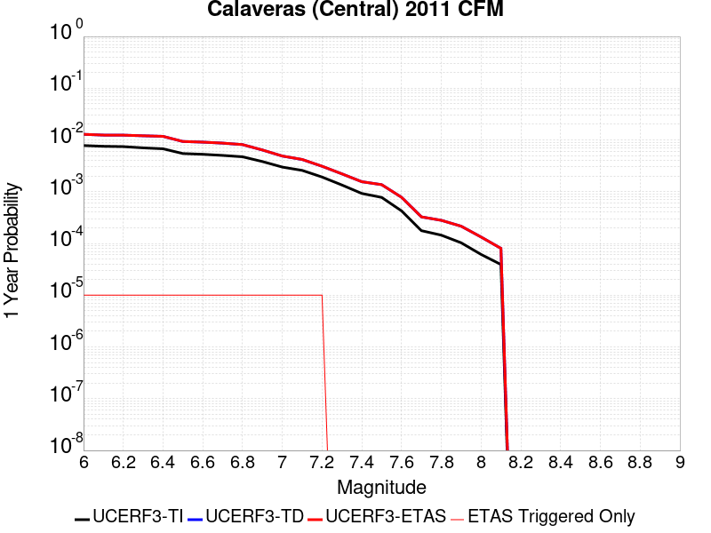 |  |

| Magnitude | 1 wk TI Prob | 1 wk TD Prob | 1 wk ETAS Prob | 1 wk ETAS/TD Gain | 1 wk ETAS Triggered Only | 1 mo TI Prob | 1 mo TD Prob | 1 mo ETAS Prob | 1 mo ETAS/TD Gain | 1 mo ETAS Triggered Only | 1 yr TI Prob | 1 yr TD Prob | 1 yr ETAS Prob | 1 yr ETAS/TD Gain | 1 yr ETAS Triggered Only | 10 yr TI Prob | 10 yr TD Prob | 10 yr ETAS Prob | 10 yr ETAS/TD Gain | 10 yr ETAS Triggered Only |
|-----|-----|-----|-----|-----|-----|-----|-----|-----|-----|-----|-----|-----|-----|-----|-----|-----|-----|-----|-----|-----|
| 6.0 | 1.5010907E-4 | 2.4804124E-4 | 2.621834E-4 | 1.0570154 | 1.4145672E-5 | 6.4316596E-4 | 0.001062498 | 0.0010766286 | 1.0132995 | 1.4145672E-5 | 0.0078024664 | 0.012850443 | 0.012864407 | 1.0010866 | 1.4145672E-5 | 0.07534136 | 0.120411225 | 0.12043611 | 1.0002067 | 2.8291344E-5 |
| 6.1 | 1.4521465E-4 | 2.3965565E-4 | 2.5379792E-4 | 1.0590109 | 1.4145672E-5 | 6.222001E-4 | 0.0010265942 | 0.0010407253 | 1.0137651 | 1.4145672E-5 | 0.0075490056 | 0.012419763 | 0.012433733 | 1.0011249 | 1.4145672E-5 | 0.07297657 | 0.11668273 | 0.11670772 | 1.0002142 | 2.8291344E-5 |
| 6.2 | 1.429998E-4 | 2.3896809E-4 | 2.5311037E-4 | 1.0591806 | 1.4145672E-5 | 6.127123E-4 | 0.0010236499 | 0.0010377811 | 1.0138047 | 1.4145672E-5 | 0.007434286 | 0.012384372 | 0.012398343 | 1.0011281 | 1.4145672E-5 | 0.07190444 | 0.11633677 | 0.11636177 | 1.0002149 | 2.8291344E-5 |
| 6.3 | 1.3536277E-4 | 2.3227946E-4 | 2.4642184E-4 | 1.0608852 | 1.4145672E-5 | 5.799972E-4 | 9.950127E-4 | 0.0010091442 | 1.0142025 | 1.4145672E-5 | 0.0070386264 | 0.012040534 | 0.0120545095 | 1.0011607 | 1.4145672E-5 | 0.0681982 | 0.113249525 | 0.11327461 | 1.0002215 | 2.8291344E-5 |
| 6.4 | 1.2993296E-4 | 2.2651516E-4 | 2.4065762E-4 | 1.062435 | 1.4145672E-5 | 5.5673666E-4 | 9.703276E-4 | 9.844595E-4 | 1.0145642 | 1.4145672E-5 | 0.006757223 | 0.011743338 | 0.011757317 | 1.0011904 | 1.4145672E-5 | 0.06555412 | 0.11052752 | 0.11055268 | 1.0002277 | 2.8291344E-5 |
| 6.5 | 1.0498927E-4 | 1.7981966E-4 | 1.939628E-4 | 1.0786518 | 1.4145672E-5 | 4.498764E-4 | 7.7042676E-4 | 7.845615E-4 | 1.0183467 | 1.4145672E-5 | 0.005463498 | 0.00933952 | 0.009353533 | 1.0015005 | 1.4145672E-5 | 0.053311124 | 0.08920739 | 0.08923315 | 1.0002888 | 2.8291344E-5 |
| 6.6 | 1.0157505E-4 | 1.7469494E-4 | 1.8883814E-4 | 1.0809594 | 1.4145672E-5 | 4.35249E-4 | 7.4847665E-4 | 7.6261174E-4 | 1.0188851 | 1.4145672E-5 | 0.0052862884 | 0.009074567 | 0.009088584 | 1.0015447 | 1.4145672E-5 | 0.05162293 | 0.08678487 | 0.08681071 | 1.0002977 | 2.8291344E-5 |
| 6.7 | 9.660386E-5 | 1.6728783E-4 | 1.8143114E-4 | 1.0845448 | 1.4145672E-5 | 4.1395082E-4 | 7.167497E-4 | 7.308852E-4 | 1.0197217 | 1.4145672E-5 | 0.0050282106 | 0.008691474 | 0.008705497 | 1.0016134 | 1.4145672E-5 | 0.049159497 | 0.08327401 | 0.08329994 | 1.0003115 | 2.8291344E-5 |
| 6.8 | 9.089927E-5 | 1.5643238E-4 | 1.7057585E-4 | 1.0904126 | 1.4145672E-5 | 3.8951015E-4 | 6.702511E-4 | 6.843873E-4 | 1.0210909 | 1.4145672E-5 | 0.0047319788 | 0.008129742 | 0.008143772 | 1.0017258 | 1.4145672E-5 | 0.046324775 | 0.078163 | 0.07818908 | 1.0003337 | 2.8291344E-5 |
| 6.9 | 7.353187E-5 | 1.2295779E-4 | 1.3710171E-4 | 1.1150308 | 1.4145672E-5 | 3.150985E-4 | 5.2685605E-4 | 5.409943E-4 | 1.0268351 | 1.4145672E-5 | 0.0038295772 | 0.006395728 | 0.006409783 | 1.0021976 | 1.4145672E-5 | 0.037642512 | 0.06218928 | 0.062215813 | 1.0004267 | 2.8291344E-5 |
| 7.0 | 5.746064E-5 | 9.3890936E-5 | 1.0803528E-4 | 1.1506466 | 1.4145672E-5 | 2.4623662E-4 | 4.0232803E-4 | 4.16468E-4 | 1.0351454 | 1.4145672E-5 | 0.0029938098 | 0.0048874132 | 0.0049014897 | 1.0028802 | 1.4145672E-5 | 0.02953797 | 0.04798713 | 0.04801406 | 1.0005612 | 2.8291344E-5 |
| 7.1 | 4.9557195E-5 | 8.052768E-5 | 9.4672214E-5 | 1.1756481 | 1.4145672E-5 | 2.123707E-4 | 3.4507332E-4 | 3.5921411E-4 | 1.0409791 | 1.4145672E-5 | 0.0025825473 | 0.004193237 | 0.0042073233 | 1.0033593 | 1.4145672E-5 | 0.0255274 | 0.041373473 | 0.041400593 | 1.0006555 | 2.8291344E-5 |
| 7.2 | 3.687595E-5 | 5.952694E-5 | 7.367177E-5 | 1.2376206 | 1.4145672E-5 | 1.5803022E-4 | 2.5509068E-4 | 2.6923273E-4 | 1.0554394 | 1.4145672E-5 | 0.0019223199 | 0.003101335 | 0.0031154368 | 1.004547 | 1.4145672E-5 | 0.01905776 | 0.030883823 | 0.030897532 | 1.0004439 | 1.4145672E-5 |
| 7.3 | 2.5846984E-5 | 4.2473923E-5 | 4.2473923E-5 | 1.0 | 0.0 | 1.1076809E-4 | 1.820185E-4 | 1.820185E-4 | 1.0 | 0.0 | 0.0013477671 | 0.0022138404 | 0.0022138404 | 1.0 | 0.0 | 0.013396223 | 0.022175217 | 0.022175217 | 1.0 | 0.0 |
| 7.4 | 1.7747854E-5 | 2.993759E-5 | 2.993759E-5 | 1.0 | 0.0 | 7.6060016E-5 | 1.2829766E-4 | 1.2829766E-4 | 1.0 | 0.0 | 9.2563726E-4 | 0.0015609078 | 0.0015609078 | 1.0 | 0.0 | 0.009217911 | 0.015708687 | 0.015708687 | 1.0 | 0.0 |
| 7.5 | 1.4883479E-5 | 2.6244672E-5 | 2.6244672E-5 | 1.0 | 0.0 | 6.378478E-5 | 1.12472335E-4 | 1.12472335E-4 | 1.0 | 0.0 | 7.76303E-4 | 0.0013684932 | 0.0013684932 | 1.0 | 0.0 | 0.0077359667 | 0.013801667 | 0.013801667 | 1.0 | 0.0 |
| 7.6 | 8.166975E-6 | 1.4964299E-5 | 1.4964299E-5 | 1.0 | 0.0 | 3.5000852E-5 | 6.413114E-5 | 6.413114E-5 | 1.0 | 0.0 | 4.2605202E-4 | 7.805183E-4 | 7.805183E-4 | 1.0 | 0.0 | 0.004252361 | 0.007939203 | 0.007939203 | 1.0 | 0.0 |
| 7.7 | 3.3858064E-6 | 6.254251E-6 | 6.254251E-6 | 1.0 | 0.0 | 1.4510518E-5 | 2.6803657E-5 | 2.6803657E-5 | 1.0 | 0.0 | 1.7665124E-4 | 3.2628572E-4 | 3.2628572E-4 | 1.0 | 0.0 | 0.0017651088 | 0.003388363 | 0.003388363 | 1.0 | 0.0 |
| 7.8 | 2.7721615E-6 | 5.366695E-6 | 5.366695E-6 | 1.0 | 0.0 | 1.1880637E-5 | 2.2999919E-5 | 2.2999919E-5 | 1.0 | 0.0 | 1.4463716E-4 | 2.7998807E-4 | 2.7998807E-4 | 1.0 | 0.0 | 0.0014454306 | 0.002907615 | 0.002907615 | 1.0 | 0.0 |
| 7.9 | 1.9736292E-6 | 4.128705E-6 | 4.128705E-6 | 1.0 | 0.0 | 8.4583835E-6 | 1.769433E-5 | 1.769433E-5 | 1.0 | 0.0 | 1.0297595E-4 | 2.1540721E-4 | 2.1540721E-4 | 1.0 | 0.0 | 0.0010292825 | 0.0022237299 | 0.0022237299 | 1.0 | 0.0 |
| 8.0 | 1.1767289E-6 | 2.5546633E-6 | 2.5546633E-6 | 1.0 | 0.0 | 5.0431145E-6 | 1.0948511E-5 | 1.0948511E-5 | 1.0 | 0.0 | 6.139818E-5 | 1.3329E-4 | 1.3329E-4 | 1.0 | 0.0 | 6.1381224E-4 | 0.001366126 | 0.001366126 | 1.0 | 0.0 |
| 8.1 | 7.5112825E-7 | 1.541076E-6 | 1.541076E-6 | 1.0 | 0.0 | 3.2191172E-6 | 6.604595E-6 | 6.604595E-6 | 1.0 | 0.0 | 3.9192048E-5 | 8.0408E-5 | 8.0408E-5 | 1.0 | 0.0 | 3.9185135E-4 | 8.2356273E-4 | 8.2356273E-4 | 1.0 | 0.0 |

## Santa Monica alt 1
*[(top)](#table-of-contents)*

| 1 Week | 1 Month | 1 Year | 10 Year |
|-----|-----|-----|-----|
|  |  |  |  |

| Magnitude | 1 wk TI Prob | 1 wk TD Prob | 1 wk ETAS Prob | 1 wk ETAS/TD Gain | 1 wk ETAS Triggered Only | 1 mo TI Prob | 1 mo TD Prob | 1 mo ETAS Prob | 1 mo ETAS/TD Gain | 1 mo ETAS Triggered Only | 1 yr TI Prob | 1 yr TD Prob | 1 yr ETAS Prob | 1 yr ETAS/TD Gain | 1 yr ETAS Triggered Only | 10 yr TI Prob | 10 yr TD Prob | 10 yr ETAS Prob | 10 yr ETAS/TD Gain | 10 yr ETAS Triggered Only |
|-----|-----|-----|-----|-----|-----|-----|-----|-----|-----|-----|-----|-----|-----|-----|-----|-----|-----|-----|-----|-----|
| 6.0 | 1.1066008E-5 | 1.1480312E-5 | 2.5625823E-5 | 2.2321537 | 1.4145672E-5 | 4.742488E-5 | 4.920049E-5 | 6.334547E-5 | 1.2874967 | 1.4145672E-5 | 5.7724497E-4 | 5.9886527E-4 | 6.1300246E-4 | 1.0236067 | 1.4145672E-5 | 0.005757478 | 0.0059739016 | 0.006002024 | 1.0047076 | 2.8291344E-5 |
| 6.1 | 1.1066008E-5 | 1.1480312E-5 | 2.5625823E-5 | 2.2321537 | 1.4145672E-5 | 4.742488E-5 | 4.920049E-5 | 6.334547E-5 | 1.2874967 | 1.4145672E-5 | 5.7724497E-4 | 5.9886527E-4 | 6.1300246E-4 | 1.0236067 | 1.4145672E-5 | 0.005757478 | 0.0059739016 | 0.006002024 | 1.0047076 | 2.8291344E-5 |
| 6.2 | 1.1066008E-5 | 1.1480312E-5 | 2.5625823E-5 | 2.2321537 | 1.4145672E-5 | 4.742488E-5 | 4.920049E-5 | 6.334547E-5 | 1.2874967 | 1.4145672E-5 | 5.7724497E-4 | 5.9886527E-4 | 6.1300246E-4 | 1.0236067 | 1.4145672E-5 | 0.005757478 | 0.0059739016 | 0.006002024 | 1.0047076 | 2.8291344E-5 |
| 6.3 | 1.1066008E-5 | 1.1480312E-5 | 2.5625823E-5 | 2.2321537 | 1.4145672E-5 | 4.742488E-5 | 4.920049E-5 | 6.334547E-5 | 1.2874967 | 1.4145672E-5 | 5.7724497E-4 | 5.9886527E-4 | 6.1300246E-4 | 1.0236067 | 1.4145672E-5 | 0.005757478 | 0.0059739016 | 0.006002024 | 1.0047076 | 2.8291344E-5 |
| 6.4 | 1.1066008E-5 | 1.1480312E-5 | 2.5625823E-5 | 2.2321537 | 1.4145672E-5 | 4.742488E-5 | 4.920049E-5 | 6.334547E-5 | 1.2874967 | 1.4145672E-5 | 5.7724497E-4 | 5.9886527E-4 | 6.1300246E-4 | 1.0236067 | 1.4145672E-5 | 0.005757478 | 0.0059739016 | 0.006002024 | 1.0047076 | 2.8291344E-5 |
| 6.5 | 8.183544E-6 | 8.335434E-6 | 2.2480988E-5 | 2.6970387 | 1.4145672E-5 | 3.5071862E-5 | 3.572281E-5 | 4.9867976E-5 | 1.3959702 | 1.4145672E-5 | 4.2691626E-4 | 4.3483998E-4 | 4.489795E-4 | 1.0325166 | 1.4145672E-5 | 0.0042609703 | 0.004340057 | 0.004354141 | 1.0032452 | 1.4145672E-5 |
| 6.6 | 8.1543285E-6 | 8.303648E-6 | 2.2449203E-5 | 2.7035348 | 1.4145672E-5 | 3.4946657E-5 | 3.558659E-5 | 4.9731756E-5 | 1.397486 | 1.4145672E-5 | 4.2539247E-4 | 4.3318217E-4 | 4.473217E-4 | 1.032641 | 1.4145672E-5 | 0.0042457907 | 0.004323543 | 0.004337628 | 1.0032576 | 1.4145672E-5 |
| 6.7 | 8.110878E-6 | 8.257045E-6 | 2.24026E-5 | 2.7131498 | 1.4145672E-5 | 3.4760444E-5 | 3.5386864E-5 | 4.9532035E-5 | 1.3997295 | 1.4145672E-5 | 4.231262E-4 | 4.3075148E-4 | 4.4489108E-4 | 1.0328254 | 1.4145672E-5 | 0.0042232145 | 0.004299331 | 0.004313416 | 1.0032761 | 1.4145672E-5 |
| 6.8 | 7.644036E-6 | 7.751063E-6 | 2.1896625E-5 | 2.8249836 | 1.4145672E-5 | 3.275974E-5 | 3.3218425E-5 | 4.736363E-5 | 1.4258239 | 1.4145672E-5 | 3.9877684E-4 | 4.043607E-4 | 4.1850065E-4 | 1.0349686 | 1.4145672E-5 | 0.00398062 | 0.004036396 | 0.0040504844 | 1.0034903 | 1.4145672E-5 |
| 6.9 | 7.3698293E-6 | 7.4557215E-6 | 2.1601289E-5 | 2.8972766 | 1.4145672E-5 | 3.15846E-5 | 3.195271E-5 | 4.6097928E-5 | 1.4426924 | 1.4145672E-5 | 3.8447464E-4 | 3.889562E-4 | 4.0309635E-4 | 1.0363542 | 1.4145672E-5 | 0.0038381014 | 0.0038828978 | 0.0038969885 | 1.003629 | 1.4145672E-5 |
| 7.0 | 7.209872E-6 | 7.2856283E-6 | 2.1431197E-5 | 2.9415717 | 1.4145672E-5 | 3.0899086E-5 | 3.1223753E-5 | 4.5368986E-5 | 1.4530278 | 1.4145672E-5 | 3.7613141E-4 | 3.800843E-4 | 3.942246E-4 | 1.0372031 | 1.4145672E-5 | 0.0037549543 | 0.003794485 | 0.0038085768 | 1.0037138 | 1.4145672E-5 |
| 7.1 | 5.603456E-6 | 5.5238947E-6 | 5.5238947E-6 | 1.0 | 0.0 | 2.4014591E-5 | 2.3673623E-5 | 2.3673623E-5 | 1.0 | 0.0 | 2.923384E-4 | 2.8818863E-4 | 2.8818863E-4 | 1.0 | 0.0 | 0.0029195412 | 0.002878191 | 0.002878191 | 1.0 | 0.0 |
| 7.2 | 4.7483613E-6 | 4.591135E-6 | 4.591135E-6 | 1.0 | 0.0 | 2.0349962E-5 | 1.9676147E-5 | 1.9676147E-5 | 1.0 | 0.0 | 2.4773262E-4 | 2.3953087E-4 | 2.3953087E-4 | 1.0 | 0.0 | 0.0024745662 | 0.0023927412 | 0.0023927412 | 1.0 | 0.0 |
| 7.3 | 3.829015E-6 | 3.6342271E-6 | 3.6342271E-6 | 1.0 | 0.0 | 1.6409962E-5 | 1.5575166E-5 | 1.5575166E-5 | 1.0 | 0.0 | 1.9977297E-4 | 1.8961124E-4 | 1.8961124E-4 | 1.0 | 0.0 | 0.0019959346 | 0.0018945034 | 0.0018945034 | 1.0 | 0.0 |
| 7.4 | 2.610755E-6 | 2.4995722E-6 | 2.4995722E-6 | 1.0 | 0.0 | 1.1188902E-5 | 1.0712408E-5 | 1.0712408E-5 | 1.0 | 0.0 | 1.3621636E-4 | 1.304158E-4 | 1.304158E-4 | 1.0 | 0.0 | 0.001361329 | 0.0013033971 | 0.0013033971 | 1.0 | 0.0 |
| 7.5 | 1.792146E-6 | 1.7584194E-6 | 1.7584194E-6 | 1.0 | 0.0 | 7.680603E-6 | 7.5360617E-6 | 7.5360617E-6 | 1.0 | 0.0 | 9.3507326E-5 | 9.174772E-5 | 9.174772E-5 | 1.0 | 0.0 | 9.3467993E-4 | 9.1710157E-4 | 9.1710157E-4 | 1.0 | 0.0 |
| 7.6 | 1.1473018E-6 | 1.102916E-6 | 1.102916E-6 | 1.0 | 0.0 | 4.9169985E-6 | 4.7267745E-6 | 4.7267745E-6 | 1.0 | 0.0 | 5.986281E-5 | 5.7546975E-5 | 5.7546975E-5 | 1.0 | 0.0 | 5.984669E-4 | 5.753224E-4 | 5.753224E-4 | 1.0 | 0.0 |
| 7.7 | 5.330919E-7 | 4.7452562E-7 | 4.7452562E-7 | 1.0 | 0.0 | 2.2846775E-6 | 2.0336797E-6 | 2.0336797E-6 | 1.0 | 0.0 | 2.7815593E-5 | 2.4759782E-5 | 2.4759782E-5 | 1.0 | 0.0 | 2.7812112E-4 | 2.4757136E-4 | 2.4757136E-4 | 1.0 | 0.0 |
| 7.8 | 1.1668574E-7 | 8.296564E-8 | 8.296564E-8 | 1.0 | 0.0 | 5.000816E-7 | 3.5556698E-7 | 3.5556698E-7 | 1.0 | 0.0 | 6.0884768E-6 | 4.3290197E-6 | 4.3290197E-6 | 1.0 | 0.0 | 6.08831E-5 | 4.3289383E-5 | 4.3289383E-5 | 1.0 | 0.0 |
| 7.9 | 8.007447E-10 | 6.161581E-10 | 6.161581E-10 | 1.0 | 0.0 | 3.4317629E-9 | 2.640678E-9 | 2.640678E-9 | 1.0 | 0.0 | 4.1781714E-8 | 3.2150254E-8 | 3.2150254E-8 | 1.0 | 0.0 | 4.1781706E-7 | 3.2150248E-7 | 3.2150248E-7 | 1.0 | 0.0 |

## Camp Rock 2011
*[(top)](#table-of-contents)*

| 1 Week | 1 Month | 1 Year | 10 Year |
|-----|-----|-----|-----|
|  |  |  |  |

| Magnitude | 1 wk TI Prob | 1 wk TD Prob | 1 wk ETAS Prob | 1 wk ETAS/TD Gain | 1 wk ETAS Triggered Only | 1 mo TI Prob | 1 mo TD Prob | 1 mo ETAS Prob | 1 mo ETAS/TD Gain | 1 mo ETAS Triggered Only | 1 yr TI Prob | 1 yr TD Prob | 1 yr ETAS Prob | 1 yr ETAS/TD Gain | 1 yr ETAS Triggered Only | 10 yr TI Prob | 10 yr TD Prob | 10 yr ETAS Prob | 10 yr ETAS/TD Gain | 10 yr ETAS Triggered Only |
|-----|-----|-----|-----|-----|-----|-----|-----|-----|-----|-----|-----|-----|-----|-----|-----|-----|-----|-----|-----|-----|
| 6.0 | 1.6710783E-5 | 4.249999E-6 | 4.249999E-6 | 1.0 | 0.0 | 7.161568E-5 | 1.8214158E-5 | 1.8214158E-5 | 1.0 | 0.0 | 8.7157206E-4 | 2.2173533E-4 | 2.3587787E-4 | 1.0637811 | 1.4145672E-5 | 0.008681616 | 0.0022151938 | 0.0022434224 | 1.0127432 | 2.8291344E-5 |
| 6.1 | 1.6710783E-5 | 4.249999E-6 | 4.249999E-6 | 1.0 | 0.0 | 7.161568E-5 | 1.8214158E-5 | 1.8214158E-5 | 1.0 | 0.0 | 8.7157206E-4 | 2.2173533E-4 | 2.3587787E-4 | 1.0637811 | 1.4145672E-5 | 0.008681616 | 0.0022151938 | 0.0022434224 | 1.0127432 | 2.8291344E-5 |
| 6.2 | 1.6710783E-5 | 4.249999E-6 | 4.249999E-6 | 1.0 | 0.0 | 7.161568E-5 | 1.8214158E-5 | 1.8214158E-5 | 1.0 | 0.0 | 8.7157206E-4 | 2.2173533E-4 | 2.3587787E-4 | 1.0637811 | 1.4145672E-5 | 0.008681616 | 0.0022151938 | 0.0022434224 | 1.0127432 | 2.8291344E-5 |
| 6.3 | 1.6710783E-5 | 4.249999E-6 | 4.249999E-6 | 1.0 | 0.0 | 7.161568E-5 | 1.8214158E-5 | 1.8214158E-5 | 1.0 | 0.0 | 8.7157206E-4 | 2.2173533E-4 | 2.3587787E-4 | 1.0637811 | 1.4145672E-5 | 0.008681616 | 0.0022151938 | 0.0022434224 | 1.0127432 | 2.8291344E-5 |
| 6.4 | 7.982846E-6 | 3.6820359E-6 | 3.6820359E-6 | 1.0 | 0.0 | 3.421175E-5 | 1.578006E-5 | 1.578006E-5 | 1.0 | 0.0 | 4.1644843E-4 | 1.9210564E-4 | 2.062486E-4 | 1.0736207 | 1.4145672E-5 | 0.0041566887 | 0.0019194306 | 0.0019476677 | 1.0147111 | 2.8291344E-5 |
| 6.5 | 7.982846E-6 | 3.6820359E-6 | 3.6820359E-6 | 1.0 | 0.0 | 3.421175E-5 | 1.578006E-5 | 1.578006E-5 | 1.0 | 0.0 | 4.1644843E-4 | 1.9210564E-4 | 2.062486E-4 | 1.0736207 | 1.4145672E-5 | 0.0041566887 | 0.0019194306 | 0.0019476677 | 1.0147111 | 2.8291344E-5 |
| 6.6 | 7.048869E-6 | 3.4242998E-6 | 3.4242998E-6 | 1.0 | 0.0 | 3.0209088E-5 | 1.467549E-5 | 1.467549E-5 | 1.0 | 0.0 | 3.677336E-4 | 1.7865976E-4 | 1.9280291E-4 | 1.0791625 | 1.4145672E-5 | 0.0036712566 | 0.0017851929 | 0.0018134337 | 1.0158194 | 2.8291344E-5 |
| 6.7 | 6.987307E-6 | 3.3622775E-6 | 3.3622775E-6 | 1.0 | 0.0 | 2.9945259E-5 | 1.4409683E-5 | 1.4409683E-5 | 1.0 | 0.0 | 3.6452254E-4 | 1.7542407E-4 | 1.8956726E-4 | 1.0806229 | 1.4145672E-5 | 0.0036392517 | 0.0017528872 | 0.0017811288 | 1.0161116 | 2.8291344E-5 |
| 6.8 | 6.3737602E-6 | 3.1178672E-6 | 3.1178672E-6 | 1.0 | 0.0 | 2.731583E-5 | 1.3362222E-5 | 1.3362222E-5 | 1.0 | 0.0 | 3.3251947E-4 | 1.6267318E-4 | 1.7681655E-4 | 1.0869435 | 1.4145672E-5 | 0.0033202237 | 0.0016255698 | 0.001653815 | 1.0173757 | 2.8291344E-5 |
| 6.9 | 6.112211E-6 | 2.933078E-6 | 2.933078E-6 | 1.0 | 0.0 | 2.6194928E-5 | 1.2570275E-5 | 1.2570275E-5 | 1.0 | 0.0 | 3.1887658E-4 | 1.5303263E-4 | 1.6717614E-4 | 1.0924215 | 1.4145672E-5 | 0.003184194 | 0.0015293002 | 0.0015575484 | 1.0184712 | 2.8291344E-5 |
| 7.0 | 5.5140117E-6 | 2.64191E-6 | 2.64191E-6 | 1.0 | 0.0 | 2.3631264E-5 | 1.1322423E-5 | 1.1322423E-5 | 1.0 | 0.0 | 2.8767265E-4 | 1.3784204E-4 | 1.5198576E-4 | 1.1026082 | 1.4145672E-5 | 0.0028730053 | 0.0013775907 | 0.0014058431 | 1.0205085 | 2.8291344E-5 |
| 7.1 | 4.8151105E-6 | 2.1342612E-6 | 2.1342612E-6 | 1.0 | 0.0 | 2.0636026E-5 | 9.146803E-6 | 9.146803E-6 | 1.0 | 0.0 | 2.5121463E-4 | 1.1135685E-4 | 1.2550096E-4 | 1.127016 | 1.4145672E-5 | 0.0025093083 | 0.0011130325 | 0.0011271624 | 1.012695 | 1.4145672E-5 |
| 7.2 | 3.818335E-6 | 1.2937372E-6 | 1.2937372E-6 | 1.0 | 0.0 | 1.6364189E-5 | 5.5445767E-6 | 5.5445767E-6 | 1.0 | 0.0 | 1.9921579E-4 | 6.750321E-5 | 6.750321E-5 | 1.0 | 0.0 | 0.0019903728 | 6.7483535E-4 | 6.7483535E-4 | 1.0 | 0.0 |
| 7.3 | 2.7166698E-6 | 7.383078E-7 | 7.383078E-7 | 1.0 | 0.0 | 1.1642818E-5 | 3.1641725E-6 | 3.1641725E-6 | 1.0 | 0.0 | 1.4174209E-4 | 3.852314E-5 | 3.852314E-5 | 1.0 | 0.0 | 0.0014165172 | 3.8516664E-4 | 3.8516664E-4 | 1.0 | 0.0 |
| 7.4 | 2.0893426E-6 | 5.4614605E-7 | 5.4614605E-7 | 1.0 | 0.0 | 8.954295E-6 | 2.340624E-6 | 2.340624E-6 | 1.0 | 0.0 | 1.0901308E-4 | 2.8496728E-5 | 2.8496728E-5 | 1.0 | 0.0 | 0.0010895962 | 2.849313E-4 | 2.849313E-4 | 1.0 | 0.0 |
| 7.5 | 1.1681728E-6 | 3.6028484E-7 | 3.6028484E-7 | 1.0 | 0.0 | 5.0064455E-6 | 1.544077E-6 | 1.544077E-6 | 1.0 | 0.0 | 6.0951766E-5 | 1.879898E-5 | 1.879898E-5 | 1.0 | 0.0 | 6.093505E-4 | 1.8797436E-4 | 1.8797436E-4 | 1.0 | 0.0 |
| 7.6 | 1.3154387E-7 | 7.1196716E-8 | 7.1196716E-8 | 1.0 | 0.0 | 5.6375933E-7 | 3.0512876E-7 | 3.0512876E-7 | 1.0 | 0.0 | 6.863748E-6 | 3.714938E-6 | 3.714938E-6 | 1.0 | 0.0 | 6.863536E-5 | 3.7148915E-5 | 3.7148915E-5 | 1.0 | 0.0 |

## Hosgri
*[(top)](#table-of-contents)*

| 1 Week | 1 Month | 1 Year | 10 Year |
|-----|-----|-----|-----|
| 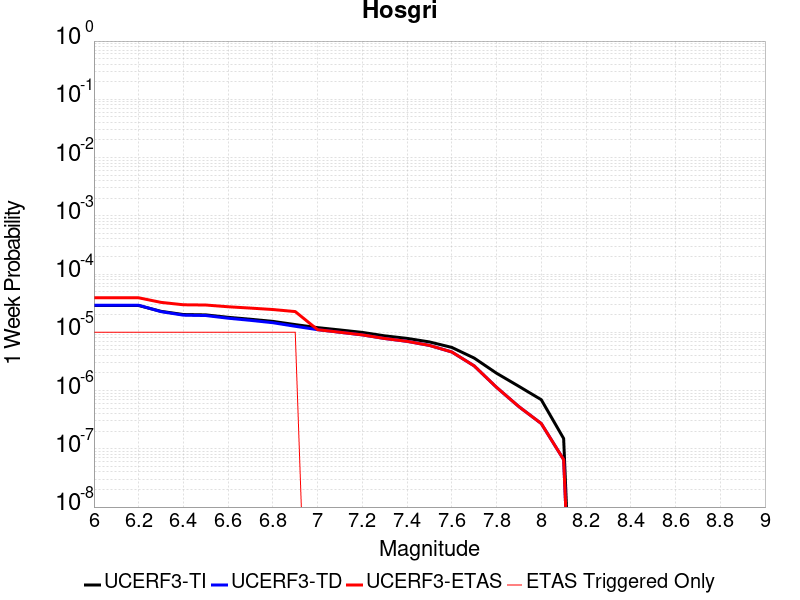 | 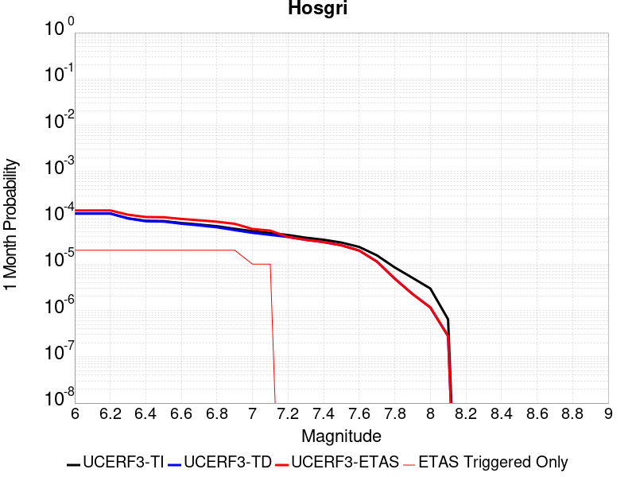 |  |  |

| Magnitude | 1 wk TI Prob | 1 wk TD Prob | 1 wk ETAS Prob | 1 wk ETAS/TD Gain | 1 wk ETAS Triggered Only | 1 mo TI Prob | 1 mo TD Prob | 1 mo ETAS Prob | 1 mo ETAS/TD Gain | 1 mo ETAS Triggered Only | 1 yr TI Prob | 1 yr TD Prob | 1 yr ETAS Prob | 1 yr ETAS/TD Gain | 1 yr ETAS Triggered Only | 10 yr TI Prob | 10 yr TD Prob | 10 yr ETAS Prob | 10 yr ETAS/TD Gain | 10 yr ETAS Triggered Only |
|-----|-----|-----|-----|-----|-----|-----|-----|-----|-----|-----|-----|-----|-----|-----|-----|-----|-----|-----|-----|-----|
| 6.0 | 2.883978E-5 | 2.9128403E-5 | 4.3273663E-5 | 1.4856174 | 1.4145672E-5 | 1.235932E-4 | 1.248302E-4 | 1.389741E-4 | 1.1133052 | 1.4145672E-5 | 0.0015037085 | 0.0015187752 | 0.0015328994 | 1.0092998 | 1.4145672E-5 | 0.01493574 | 0.01508773 | 0.0151155945 | 1.0018468 | 2.8291344E-5 |
| 6.1 | 2.883978E-5 | 2.9128403E-5 | 4.3273663E-5 | 1.4856174 | 1.4145672E-5 | 1.235932E-4 | 1.248302E-4 | 1.389741E-4 | 1.1133052 | 1.4145672E-5 | 0.0015037085 | 0.0015187752 | 0.0015328994 | 1.0092998 | 1.4145672E-5 | 0.01493574 | 0.01508773 | 0.0151155945 | 1.0018468 | 2.8291344E-5 |
| 6.2 | 2.883978E-5 | 2.9128403E-5 | 4.3273663E-5 | 1.4856174 | 1.4145672E-5 | 1.235932E-4 | 1.248302E-4 | 1.389741E-4 | 1.1133052 | 1.4145672E-5 | 0.0015037085 | 0.0015187752 | 0.0015328994 | 1.0092998 | 1.4145672E-5 | 0.01493574 | 0.01508773 | 0.0151155945 | 1.0018468 | 2.8291344E-5 |
| 6.3 | 2.2914428E-5 | 2.2641956E-5 | 3.6787307E-5 | 1.6247407 | 1.4145672E-5 | 9.8200995E-5 | 9.703337E-5 | 1.1117767E-4 | 1.1457673 | 1.4145672E-5 | 0.0011949413 | 0.001180746 | 0.001194875 | 1.0119661 | 1.4145672E-5 | 0.011885363 | 0.011746123 | 0.011774082 | 1.0023803 | 2.8291344E-5 |
| 6.4 | 2.0195741E-5 | 1.9696547E-5 | 3.384194E-5 | 1.7181661 | 1.4145672E-5 | 8.65503E-5 | 8.4411055E-5 | 9.855553E-5 | 1.1675667 | 1.4145672E-5 | 0.0010532405 | 0.001027222 | 0.0010413531 | 1.0137566 | 1.4145672E-5 | 0.010482626 | 0.010225783 | 0.010253785 | 1.0027384 | 2.8291344E-5 |
| 6.5 | 1.9924333E-5 | 1.9408968E-5 | 3.3554366E-5 | 1.7288073 | 1.4145672E-5 | 8.53872E-5 | 8.317865E-5 | 9.732314E-5 | 1.1700495 | 1.4145672E-5 | 0.0010390934 | 0.0010122315 | 0.0010263629 | 1.0139606 | 1.4145672E-5 | 0.010342481 | 0.010077244 | 0.0101052495 | 1.0027791 | 2.8291344E-5 |
| 6.6 | 1.809694E-5 | 1.7458287E-5 | 3.160371E-5 | 1.8102413 | 1.4145672E-5 | 7.7556004E-5 | 7.4819094E-5 | 8.896371E-5 | 1.1890509 | 1.4145672E-5 | 9.438353E-4 | 9.105431E-4 | 9.2467584E-4 | 1.0155213 | 1.4145672E-5 | 0.009398366 | 0.009069063 | 0.009097097 | 1.0030912 | 2.8291344E-5 |
| 6.7 | 1.675989E-5 | 1.6042752E-5 | 3.0188197E-5 | 1.8817344 | 1.4145672E-5 | 7.182612E-5 | 6.8752845E-5 | 8.2897546E-5 | 1.2057326 | 1.4145672E-5 | 8.7413215E-4 | 8.3674554E-4 | 8.508794E-4 | 1.0168915 | 1.4145672E-5 | 0.008707017 | 0.008336853 | 0.008364908 | 1.0033653 | 2.8291344E-5 |
| 6.8 | 1.5401129E-5 | 1.4614069E-5 | 2.8759534E-5 | 1.9679347 | 1.4145672E-5 | 6.6003166E-5 | 6.263023E-5 | 7.677502E-5 | 1.225846 | 1.4145672E-5 | 8.032922E-4 | 7.6225714E-4 | 7.76392E-4 | 1.0185435 | 1.4145672E-5 | 0.008003947 | 0.0075972863 | 0.007625363 | 1.0036956 | 2.8291344E-5 |
| 6.9 | 1.356559E-5 | 1.2689955E-5 | 2.6835447E-5 | 2.1147 | 1.4145672E-5 | 5.8136946E-5 | 5.438439E-5 | 6.852929E-5 | 1.2600912 | 1.4145672E-5 | 7.0758746E-4 | 6.6192925E-4 | 6.760655E-4 | 1.0213562 | 1.4145672E-5 | 0.007053386 | 0.006600378 | 0.0066284826 | 1.004258 | 2.8291344E-5 |
| 7.0 | 1.2030819E-5 | 1.1095949E-5 | 1.1095949E-5 | 1.0 | 0.0 | 5.155963E-5 | 4.75532E-5 | 4.75532E-5 | 1.0 | 0.0 | 6.275577E-4 | 5.788065E-4 | 5.788065E-4 | 1.0 | 0.0 | 0.006257884 | 0.0057737473 | 0.0057878112 | 1.0024358 | 1.4145672E-5 |
| 7.1 | 1.0972698E-5 | 1.0022167E-5 | 1.0022167E-5 | 1.0 | 0.0 | 4.7025E-5 | 4.2951437E-5 | 4.2951437E-5 | 1.0 | 0.0 | 5.72379E-4 | 5.2280835E-4 | 5.2280835E-4 | 1.0 | 0.0 | 0.0057090693 | 0.005216533 | 0.0052306047 | 1.0026976 | 1.4145672E-5 |
| 7.2 | 9.961926E-6 | 9.034732E-6 | 9.034732E-6 | 1.0 | 0.0 | 4.2693267E-5 | 3.8719707E-5 | 3.8719707E-5 | 1.0 | 0.0 | 5.1966653E-4 | 4.7131052E-4 | 4.7131052E-4 | 1.0 | 0.0 | 0.00518453 | 0.0047038523 | 0.0047179316 | 1.0029931 | 1.4145672E-5 |
| 7.3 | 8.700929E-6 | 7.828089E-6 | 7.828089E-6 | 1.0 | 0.0 | 3.7289166E-5 | 3.354852E-5 | 3.354852E-5 | 1.0 | 0.0 | 4.53901E-4 | 4.083767E-4 | 4.083767E-4 | 1.0 | 0.0 | 0.00452975 | 0.004076999 | 0.004076999 | 1.0 | 0.0 |
| 7.4 | 7.866285E-6 | 6.9987263E-6 | 6.9987263E-6 | 1.0 | 0.0 | 3.3712215E-5 | 2.9994197E-5 | 2.9994197E-5 | 1.0 | 0.0 | 4.103689E-4 | 3.6511818E-4 | 3.6511818E-4 | 1.0 | 0.0 | 0.004096119 | 0.0036459167 | 0.0036459167 | 1.0 | 0.0 |
| 7.5 | 6.8381305E-6 | 5.9596814E-6 | 5.9596814E-6 | 1.0 | 0.0 | 2.9305946E-5 | 2.5541241E-5 | 2.5541241E-5 | 1.0 | 0.0 | 3.5674145E-4 | 3.1092027E-4 | 3.1092027E-4 | 1.0 | 0.0 | 0.0035616932 | 0.003105584 | 0.003105584 | 1.0 | 0.0 |
| 7.6 | 5.503376E-6 | 4.595227E-6 | 4.595227E-6 | 1.0 | 0.0 | 2.3585684E-5 | 1.9693682E-5 | 1.9693682E-5 | 1.0 | 0.0 | 2.8711787E-4 | 2.397442E-4 | 2.397442E-4 | 1.0 | 0.0 | 0.002867472 | 0.0023955852 | 0.0023955852 | 1.0 | 0.0 |
| 7.7 | 3.6144982E-6 | 2.6521896E-6 | 2.6521896E-6 | 1.0 | 0.0 | 1.5490614E-5 | 1.1366477E-5 | 1.1366477E-5 | 1.0 | 0.0 | 1.8858191E-4 | 1.3837808E-4 | 1.3837808E-4 | 1.0 | 0.0 | 0.0018842196 | 0.001383647 | 0.001383647 | 1.0 | 0.0 |
| 7.8 | 1.9853494E-6 | 1.1360784E-6 | 1.1360784E-6 | 1.0 | 0.0 | 8.508612E-6 | 4.8688985E-6 | 4.8688985E-6 | 1.0 | 0.0 | 1.0358743E-4 | 5.9277223E-5 | 5.9277223E-5 | 1.0 | 0.0 | 0.0010353916 | 5.933389E-4 | 5.933389E-4 | 1.0 | 0.0 |
| 7.9 | 1.1818757E-6 | 5.29477E-7 | 5.29477E-7 | 1.0 | 0.0 | 5.0651715E-6 | 2.269185E-6 | 2.269185E-6 | 1.0 | 0.0 | 6.1666724E-5 | 2.7626977E-5 | 2.7626977E-5 | 1.0 | 0.0 | 6.1649614E-4 | 2.7691363E-4 | 2.7691363E-4 | 1.0 | 0.0 |
| 8.0 | 6.962958E-7 | 2.71365E-7 | 2.71365E-7 | 1.0 | 0.0 | 2.9841215E-6 | 1.1629924E-6 | 1.1629924E-6 | 1.0 | 0.0 | 3.6331072E-5 | 1.415934E-5 | 1.415934E-5 | 1.0 | 0.0 | 3.6325134E-4 | 1.4215276E-4 | 1.4215276E-4 | 1.0 | 0.0 |
| 8.1 | 1.5033264E-7 | 6.52693E-8 | 6.52693E-8 | 1.0 | 0.0 | 6.442826E-7 | 2.7972553E-7 | 2.7972553E-7 | 1.0 | 0.0 | 7.844113E-6 | 3.4056532E-6 | 3.4056532E-6 | 1.0 | 0.0 | 7.843835E-5 | 3.4072833E-5 | 3.4072833E-5 | 1.0 | 0.0 |

## Great Valley 05 Pittsburg - Kirby Hills alt1
*[(top)](#table-of-contents)*

| 1 Week | 1 Month | 1 Year | 10 Year |
|-----|-----|-----|-----|
|  | 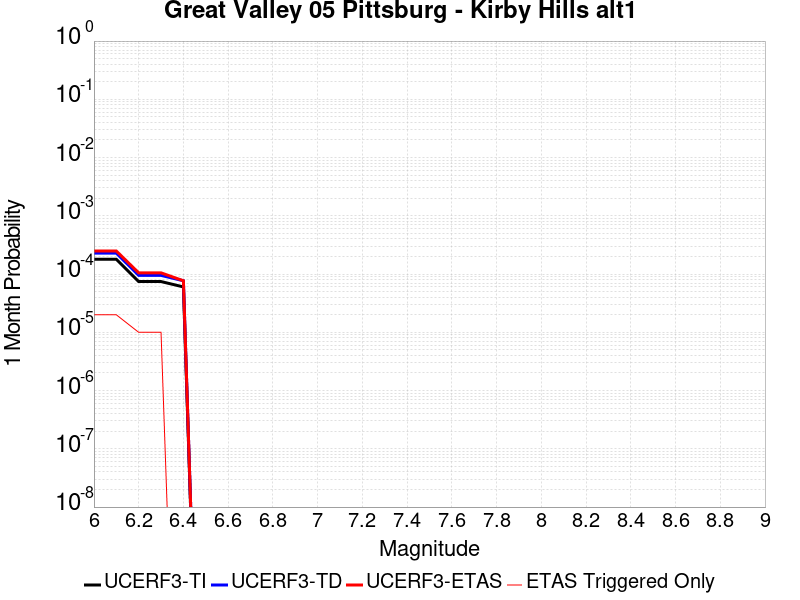 | 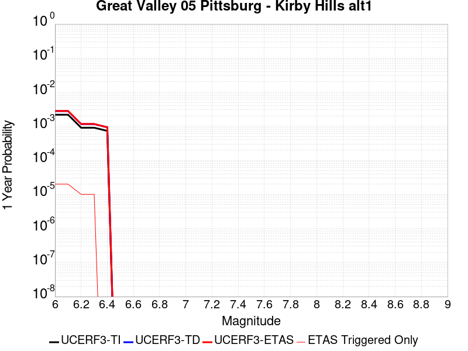 |  |

| Magnitude | 1 wk TI Prob | 1 wk TD Prob | 1 wk ETAS Prob | 1 wk ETAS/TD Gain | 1 wk ETAS Triggered Only | 1 mo TI Prob | 1 mo TD Prob | 1 mo ETAS Prob | 1 mo ETAS/TD Gain | 1 mo ETAS Triggered Only | 1 yr TI Prob | 1 yr TD Prob | 1 yr ETAS Prob | 1 yr ETAS/TD Gain | 1 yr ETAS Triggered Only | 10 yr TI Prob | 10 yr TD Prob | 10 yr ETAS Prob | 10 yr ETAS/TD Gain | 10 yr ETAS Triggered Only |
|-----|-----|-----|-----|-----|-----|-----|-----|-----|-----|-----|-----|-----|-----|-----|-----|-----|-----|-----|-----|-----|
| 6.0 | 4.187212E-5 | 5.344289E-5 | 8.173272E-5 | 1.529347 | 2.8291344E-5 | 1.794396E-4 | 2.2902661E-4 | 2.5731148E-4 | 1.1235003 | 2.8291344E-5 | 0.002182488 | 0.0027857998 | 0.002814012 | 1.0101273 | 2.8291344E-5 | 0.021611776 | 0.027603218 | 0.027630728 | 1.0009966 | 2.8291344E-5 |
| 6.1 | 4.187212E-5 | 5.344289E-5 | 8.173272E-5 | 1.529347 | 2.8291344E-5 | 1.794396E-4 | 2.2902661E-4 | 2.5731148E-4 | 1.1235003 | 2.8291344E-5 | 0.002182488 | 0.0027857998 | 0.002814012 | 1.0101273 | 2.8291344E-5 | 0.021611776 | 0.027603218 | 0.027630728 | 1.0009966 | 2.8291344E-5 |
| 6.2 | 1.7353306E-5 | 2.2154672E-5 | 3.630003E-5 | 1.638482 | 1.4145672E-5 | 7.436919E-5 | 9.4947456E-5 | 1.0909179E-4 | 1.14897 | 1.4145672E-5 | 9.050688E-4 | 0.0011557573 | 0.0011698867 | 1.0122252 | 1.4145672E-5 | 0.009013915 | 0.0115352 | 0.011549183 | 1.0012121 | 1.4145672E-5 |
| 6.3 | 1.7353306E-5 | 2.2154672E-5 | 3.630003E-5 | 1.638482 | 1.4145672E-5 | 7.436919E-5 | 9.4947456E-5 | 1.0909179E-4 | 1.14897 | 1.4145672E-5 | 9.050688E-4 | 0.0011557573 | 0.0011698867 | 1.0122252 | 1.4145672E-5 | 0.009013915 | 0.0115352 | 0.011549183 | 1.0012121 | 1.4145672E-5 |
| 6.4 | 1.4028824E-5 | 1.7901062E-5 | 1.7901062E-5 | 1.0 | 0.0 | 6.0122147E-5 | 7.671883E-5 | 7.671883E-5 | 1.0 | 0.0 | 7.3174125E-4 | 9.340303E-4 | 9.340303E-4 | 1.0 | 0.0 | 0.0072933645 | 0.009338211 | 0.009338211 | 1.0 | 0.0 |

## Hayward (So) extension 2011 CFM
*[(top)](#table-of-contents)*

| 1 Week | 1 Month | 1 Year | 10 Year |
|-----|-----|-----|-----|
| 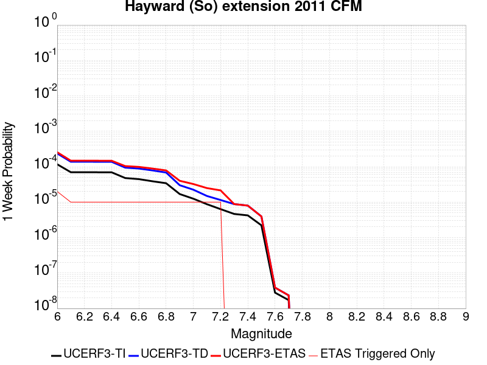 |  |  |  |

| Magnitude | 1 wk TI Prob | 1 wk TD Prob | 1 wk ETAS Prob | 1 wk ETAS/TD Gain | 1 wk ETAS Triggered Only | 1 mo TI Prob | 1 mo TD Prob | 1 mo ETAS Prob | 1 mo ETAS/TD Gain | 1 mo ETAS Triggered Only | 1 yr TI Prob | 1 yr TD Prob | 1 yr ETAS Prob | 1 yr ETAS/TD Gain | 1 yr ETAS Triggered Only | 10 yr TI Prob | 10 yr TD Prob | 10 yr ETAS Prob | 10 yr ETAS/TD Gain | 10 yr ETAS Triggered Only |
|-----|-----|-----|-----|-----|-----|-----|-----|-----|-----|-----|-----|-----|-----|-----|-----|-----|-----|-----|-----|-----|
| 6.0 | 1.1721256E-4 | 2.3671088E-4 | 2.6499553E-4 | 1.1194903 | 2.8291344E-5 | 5.022428E-4 | 0.0010138806 | 0.0010421432 | 1.0278758 | 2.8291344E-5 | 0.0060976758 | 0.012250609 | 0.012278554 | 1.0022811 | 2.8291344E-5 | 0.0593305 | 0.11284437 | 0.11286947 | 1.0002224 | 2.8291344E-5 |
| 6.1 | 6.99169E-5 | 1.3808164E-4 | 1.5222536E-4 | 1.1024301 | 1.4145672E-5 | 2.9960944E-4 | 5.9155683E-4 | 6.0569413E-4 | 1.0238985 | 1.4145672E-5 | 0.0036416445 | 0.0071723475 | 0.007186392 | 1.0019581 | 1.4145672E-5 | 0.035825435 | 0.067804344 | 0.067817524 | 1.0001944 | 1.4145672E-5 |
| 6.2 | 6.99169E-5 | 1.3808164E-4 | 1.5222536E-4 | 1.1024301 | 1.4145672E-5 | 2.9960944E-4 | 5.9155683E-4 | 6.0569413E-4 | 1.0238985 | 1.4145672E-5 | 0.0036416445 | 0.0071723475 | 0.007186392 | 1.0019581 | 1.4145672E-5 | 0.035825435 | 0.067804344 | 0.067817524 | 1.0001944 | 1.4145672E-5 |
| 6.3 | 6.970908E-5 | 1.3776305E-4 | 1.5190679E-4 | 1.102667 | 1.4145672E-5 | 2.9871898E-4 | 5.9019245E-4 | 6.0432975E-4 | 1.0239538 | 1.4145672E-5 | 0.0036308395 | 0.007155884 | 0.007169929 | 1.0019627 | 1.4145672E-5 | 0.035720866 | 0.0676533 | 0.06766649 | 1.0001949 | 1.4145672E-5 |
| 6.4 | 6.9517155E-5 | 1.3743227E-4 | 1.5157601E-4 | 1.1029142 | 1.4145672E-5 | 2.9789665E-4 | 5.8877567E-4 | 6.0291303E-4 | 1.0240114 | 1.4145672E-5 | 0.0036208609 | 0.0071387975 | 0.0071528424 | 1.0019674 | 1.4145672E-5 | 0.03562429 | 0.06749734 | 0.06751053 | 1.0001954 | 1.4145672E-5 |
| 6.5 | 4.786248E-5 | 9.415232E-5 | 1.08296656E-4 | 1.1502283 | 1.4145672E-5 | 2.0510878E-4 | 4.0344993E-4 | 4.1758988E-4 | 1.0350477 | 1.4145672E-5 | 0.0024943394 | 0.0049013784 | 0.004915455 | 1.0028719 | 1.4145672E-5 | 0.02466527 | 0.046900697 | 0.04691418 | 1.0002874 | 1.4145672E-5 |
| 6.6 | 4.4662214E-5 | 8.8819244E-5 | 1.0296366E-4 | 1.1592494 | 1.4145672E-5 | 1.9139545E-4 | 3.80601E-4 | 3.9474128E-4 | 1.0371525 | 1.4145672E-5 | 0.0023277493 | 0.0046244357 | 0.004638516 | 1.0030447 | 1.4145672E-5 | 0.02303517 | 0.04429206 | 0.044305578 | 1.0003052 | 1.4145672E-5 |
| 6.7 | 3.884542E-5 | 7.8650686E-5 | 9.279524E-5 | 1.1798402 | 1.4145672E-5 | 1.6646975E-4 | 3.3703333E-4 | 3.511742E-4 | 1.041957 | 1.4145672E-5 | 0.002024885 | 0.0040961048 | 0.0041101924 | 1.0034393 | 1.4145672E-5 | 0.020065336 | 0.039332055 | 0.03934564 | 1.0003455 | 1.4145672E-5 |
| 6.8 | 3.4221863E-5 | 6.855886E-5 | 8.270357E-5 | 1.2063147 | 1.4145672E-5 | 1.4665688E-4 | 2.9379298E-4 | 3.079345E-4 | 1.0481343 | 1.4145672E-5 | 0.0017840851 | 0.0035714838 | 0.0035855789 | 1.0039465 | 1.4145672E-5 | 0.017698295 | 0.034419462 | 0.034433123 | 1.0003968 | 1.4145672E-5 |
| 6.9 | 1.6927712E-5 | 3.006262E-5 | 4.4207867E-5 | 1.4705261 | 1.4145672E-5 | 7.2545314E-5 | 1.2883375E-4 | 1.429776E-4 | 1.1097838 | 1.4145672E-5 | 8.828813E-4 | 0.0015674793 | 0.0015816028 | 1.0090103 | 1.4145672E-5 | 0.008793819 | 0.015463544 | 0.015477471 | 1.0009006 | 1.4145672E-5 |
| 7.0 | 1.2509653E-5 | 2.246337E-5 | 3.6608722E-5 | 1.6297076 | 1.4145672E-5 | 5.3611697E-5 | 9.626828E-5 | 1.1041259E-4 | 1.1469259 | 1.4145672E-5 | 6.525269E-4 | 0.0011714802 | 0.0011856093 | 1.0120609 | 1.4145672E-5 | 0.0065061417 | 0.011583166 | 0.011597148 | 1.0012071 | 1.4145672E-5 |
| 7.1 | 8.751583E-6 | 1.4926157E-5 | 2.9071618E-5 | 1.9476961 | 1.4145672E-5 | 3.750624E-5 | 6.396771E-5 | 7.8112476E-5 | 1.2211236 | 1.4145672E-5 | 4.5654282E-4 | 7.785344E-4 | 7.926691E-4 | 1.0181555 | 1.4145672E-5 | 0.0045560603 | 0.007764457 | 0.0077784928 | 1.0018077 | 1.4145672E-5 |
| 7.2 | 6.354379E-6 | 1.1499087E-5 | 2.5644596E-5 | 2.2301419 | 1.4145672E-5 | 2.7232769E-5 | 4.9280898E-5 | 6.3425876E-5 | 1.2870276 | 1.4145672E-5 | 3.3150852E-4 | 5.9983454E-4 | 6.1397173E-4 | 1.0235685 | 1.4145672E-5 | 0.0033101442 | 0.006001243 | 0.0060153035 | 1.0023429 | 1.4145672E-5 |
| 7.3 | 4.645554E-6 | 8.818441E-6 | 8.818441E-6 | 1.0 | 0.0 | 1.9909365E-5 | 3.7792794E-5 | 3.7792794E-5 | 1.0 | 0.0 | 2.4236954E-4 | 4.6003403E-4 | 4.6003403E-4 | 1.0 | 0.0 | 0.0024210536 | 0.004611421 | 0.004611421 | 1.0 | 0.0 |
| 7.4 | 4.23437E-6 | 7.992759E-6 | 7.992759E-6 | 1.0 | 0.0 | 1.8147173E-5 | 3.425425E-5 | 3.425425E-5 | 1.0 | 0.0 | 2.2091944E-4 | 4.1696956E-4 | 4.1696956E-4 | 1.0 | 0.0 | 0.0022069993 | 0.0041826614 | 0.0041826614 | 1.0 | 0.0 |
| 7.5 | 2.2187417E-6 | 3.952336E-6 | 3.952336E-6 | 1.0 | 0.0 | 9.508858E-6 | 1.6938488E-5 | 1.6938488E-5 | 1.0 | 0.0 | 1.157642E-4 | 2.0620918E-4 | 2.0620918E-4 | 1.0 | 0.0 | 0.0011570391 | 0.0020739497 | 0.0020739497 | 1.0 | 0.0 |
| 7.6 | 2.7952495E-8 | 3.8785874E-8 | 3.8785874E-8 | 1.0 | 0.0 | 1.1979641E-7 | 1.6622516E-7 | 1.6622516E-7 | 1.0 | 0.0 | 1.4585203E-6 | 2.0237894E-6 | 2.0237894E-6 | 1.0 | 0.0 | 1.4585107E-5 | 2.0317146E-5 | 2.0317146E-5 | 1.0 | 0.0 |
| 7.7 | 1.7192724E-8 | 2.3436652E-8 | 2.3436652E-8 | 1.0 | 0.0 | 7.36831E-8 | 1.0044278E-7 | 1.0044278E-7 | 1.0 | 0.0 | 8.9709135E-7 | 1.2228902E-6 | 1.2228902E-6 | 1.0 | 0.0 | 8.970877E-6 | 1.2285953E-5 | 1.2285953E-5 | 1.0 | 0.0 |

## Carlsbad
*[(top)](#table-of-contents)*

| 1 Week | 1 Month | 1 Year | 10 Year |
|-----|-----|-----|-----|
|  |  | 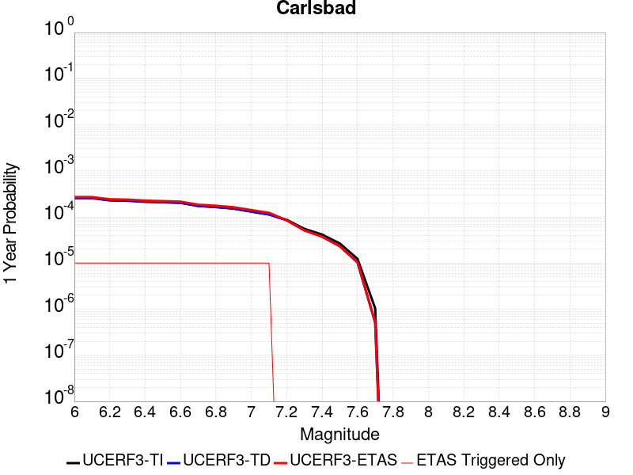 |  |

| Magnitude | 1 wk TI Prob | 1 wk TD Prob | 1 wk ETAS Prob | 1 wk ETAS/TD Gain | 1 wk ETAS Triggered Only | 1 mo TI Prob | 1 mo TD Prob | 1 mo ETAS Prob | 1 mo ETAS/TD Gain | 1 mo ETAS Triggered Only | 1 yr TI Prob | 1 yr TD Prob | 1 yr ETAS Prob | 1 yr ETAS/TD Gain | 1 yr ETAS Triggered Only | 10 yr TI Prob | 10 yr TD Prob | 10 yr ETAS Prob | 10 yr ETAS/TD Gain | 10 yr ETAS Triggered Only |
|-----|-----|-----|-----|-----|-----|-----|-----|-----|-----|-----|-----|-----|-----|-----|-----|-----|-----|-----|-----|-----|
| 6.0 | 4.9038536E-6 | 4.9872688E-6 | 1.913287E-5 | 3.8363423 | 1.4145672E-5 | 2.1016345E-5 | 2.1373837E-5 | 3.5519206E-5 | 1.6618077 | 1.4145672E-5 | 2.5584397E-4 | 2.6019584E-4 | 2.7433783E-4 | 1.0543513 | 1.4145672E-5 | 0.002555496 | 0.002598959 | 0.002627177 | 1.0108573 | 2.8291344E-5 |
| 6.1 | 4.9038536E-6 | 4.9872688E-6 | 1.913287E-5 | 3.8363423 | 1.4145672E-5 | 2.1016345E-5 | 2.1373837E-5 | 3.5519206E-5 | 1.6618077 | 1.4145672E-5 | 2.5584397E-4 | 2.6019584E-4 | 2.7433783E-4 | 1.0543513 | 1.4145672E-5 | 0.002555496 | 0.002598959 | 0.002627177 | 1.0108573 | 2.8291344E-5 |
| 6.2 | 4.3820614E-6 | 4.4547814E-6 | 1.860039E-5 | 4.175377 | 1.4145672E-5 | 1.8780129E-5 | 1.9091782E-5 | 3.3237186E-5 | 1.7409158 | 1.4145672E-5 | 2.2862408E-4 | 2.3241801E-4 | 2.4656038E-4 | 1.060849 | 1.4145672E-5 | 0.00228389 | 0.002321785 | 0.0023500107 | 1.0121568 | 2.8291344E-5 |
| 6.3 | 4.302872E-6 | 4.373019E-6 | 1.8518629E-5 | 4.2347474 | 1.4145672E-5 | 1.8440749E-5 | 1.8741377E-5 | 3.2886783E-5 | 1.7547688 | 1.4145672E-5 | 2.24493E-4 | 2.2815271E-4 | 2.4229515E-4 | 1.0619868 | 1.4145672E-5 | 0.0022426634 | 0.0022792201 | 0.002307447 | 1.0123844 | 2.8291344E-5 |
| 6.4 | 4.0835243E-6 | 4.147667E-6 | 1.829328E-5 | 4.4104986 | 1.4145672E-5 | 1.75007E-5 | 1.7775597E-5 | 3.1921016E-5 | 1.7957776 | 1.4145672E-5 | 2.1305021E-4 | 2.1639673E-4 | 2.3053934E-4 | 1.0653551 | 1.4145672E-5 | 0.0021284607 | 0.0021618942 | 0.0021901245 | 1.0130581 | 2.8291344E-5 |
| 6.5 | 3.987806E-6 | 4.048899E-6 | 1.8194514E-5 | 4.4936943 | 1.4145672E-5 | 1.7090486E-5 | 1.7352311E-5 | 3.1497737E-5 | 1.8151897 | 1.4145672E-5 | 2.080568E-4 | 2.1124425E-4 | 2.2538693E-4 | 1.0669495 | 1.4145672E-5 | 0.002078621 | 0.0021104682 | 0.002124584 | 1.0066885 | 1.4145672E-5 |
| 6.6 | 3.8707576E-6 | 3.927501E-6 | 1.8073117E-5 | 4.601684 | 1.4145672E-5 | 1.6588854E-5 | 1.683204E-5 | 3.0977473E-5 | 1.8403873 | 1.4145672E-5 | 2.0195059E-4 | 2.0491115E-4 | 2.1905392E-4 | 1.0690191 | 1.4145672E-5 | 0.0020176715 | 0.0020472556 | 0.0020613724 | 1.0068954 | 1.4145672E-5 |
| 6.7 | 3.3093434E-6 | 3.3424044E-6 | 1.748803E-5 | 5.23217 | 1.4145672E-5 | 1.4182823E-5 | 1.4324512E-5 | 2.8469982E-5 | 1.9875009 | 1.4145672E-5 | 1.7266218E-4 | 1.7438704E-4 | 1.8853023E-4 | 1.0811024 | 1.4145672E-5 | 0.001725281 | 0.001742508 | 0.001756629 | 1.0081038 | 1.4145672E-5 |
| 6.8 | 3.136983E-6 | 3.1664663E-6 | 1.7312093E-5 | 5.467323 | 1.4145672E-5 | 1.3444143E-5 | 1.35704995E-5 | 2.771598E-5 | 2.0423698 | 1.4145672E-5 | 1.6367015E-4 | 1.6520836E-4 | 1.793517E-4 | 1.0856091 | 1.4145672E-5 | 0.0016354966 | 0.0016508611 | 0.0016649835 | 1.0085545 | 1.4145672E-5 |
| 6.9 | 2.9056644E-6 | 2.9267715E-6 | 1.7072402E-5 | 5.833186 | 1.4145672E-5 | 1.2452788E-5 | 1.2543246E-5 | 2.668874E-5 | 2.127738 | 1.4145672E-5 | 1.5160214E-4 | 1.5270336E-4 | 1.6684688E-4 | 1.0926208 | 1.4145672E-5 | 0.0015149876 | 0.0015259896 | 0.0015401137 | 1.0092556 | 1.4145672E-5 |
| 7.0 | 2.5071035E-6 | 2.51141E-6 | 1.6657046E-5 | 6.6325474 | 1.4145672E-5 | 1.0744685E-5 | 1.0763142E-5 | 2.4908662E-5 | 2.3142557 | 1.4145672E-5 | 1.308087E-4 | 1.310334E-4 | 1.4517723E-4 | 1.1079406 | 1.4145672E-5 | 0.0013073172 | 0.0013095647 | 0.0013236918 | 1.0107877 | 1.4145672E-5 |
| 7.1 | 2.1786877E-6 | 2.1678952E-6 | 1.6313537E-5 | 7.525058 | 1.4145672E-5 | 9.3372E-6 | 9.290947E-6 | 2.3436487E-5 | 2.5225081 | 1.4145672E-5 | 1.13674476E-4 | 1.13111426E-4 | 1.272555E-4 | 1.1250454 | 1.4145672E-5 | 0.0011361635 | 0.0011305414 | 0.0011446711 | 1.0124981 | 1.4145672E-5 |
| 7.2 | 1.6628418E-6 | 1.6213987E-6 | 1.6213987E-6 | 1.0 | 0.0 | 7.1264453E-6 | 6.9488333E-6 | 6.9488333E-6 | 1.0 | 0.0 | 8.676102E-5 | 8.459878E-5 | 8.459878E-5 | 1.0 | 0.0 | 8.672715E-4 | 8.4566796E-4 | 8.4566796E-4 | 1.0 | 0.0 |
| 7.3 | 1.0595926E-6 | 9.816912E-7 | 9.816912E-7 | 1.0 | 0.0 | 4.541103E-6 | 4.207241E-6 | 4.207241E-6 | 1.0 | 0.0 | 5.5286528E-5 | 5.1221967E-5 | 5.1221967E-5 | 1.0 | 0.0 | 5.527277E-4 | 5.121025E-4 | 5.121025E-4 | 1.0 | 0.0 |
| 7.4 | 7.956623E-7 | 7.173889E-7 | 7.173889E-7 | 1.0 | 0.0 | 3.4099767E-6 | 3.0745202E-6 | 3.0745202E-6 | 1.0 | 0.0 | 4.1515676E-5 | 3.7431648E-5 | 3.7431648E-5 | 1.0 | 0.0 | 4.150792E-4 | 3.7425413E-4 | 3.7425413E-4 | 1.0 | 0.0 |
| 7.5 | 5.1043804E-7 | 4.448447E-7 | 4.448447E-7 | 1.0 | 0.0 | 2.1875896E-6 | 1.9064759E-6 | 1.9064759E-6 | 1.0 | 0.0 | 2.663358E-5 | 2.3211102E-5 | 2.3211102E-5 | 1.0 | 0.0 | 2.6630386E-4 | 2.3208735E-4 | 2.3208735E-4 | 1.0 | 0.0 |
| 7.6 | 2.3723294E-7 | 1.9896439E-7 | 1.9896439E-7 | 1.0 | 0.0 | 1.0167122E-6 | 8.527042E-7 | 8.527042E-7 | 1.0 | 0.0 | 1.2378401E-5 | 1.0381627E-5 | 1.0381627E-5 | 1.0 | 0.0 | 1.237771E-4 | 1.038117E-4 | 1.038117E-4 | 1.0 | 0.0 |
| 7.7 | 1.9992152E-8 | 9.860285E-9 | 9.860285E-9 | 1.0 | 0.0 | 8.568065E-8 | 4.2258364E-8 | 4.2258364E-8 | 1.0 | 0.0 | 1.0431614E-6 | 5.144956E-7 | 5.144956E-7 | 1.0 | 0.0 | 1.0431565E-5 | 5.144956E-6 | 5.144956E-6 | 1.0 | 0.0 |

## Elsinore (Coyote Mountains)
*[(top)](#table-of-contents)*

| 1 Week | 1 Month | 1 Year | 10 Year |
|-----|-----|-----|-----|
|  |  |  |  |

| Magnitude | 1 wk TI Prob | 1 wk TD Prob | 1 wk ETAS Prob | 1 wk ETAS/TD Gain | 1 wk ETAS Triggered Only | 1 mo TI Prob | 1 mo TD Prob | 1 mo ETAS Prob | 1 mo ETAS/TD Gain | 1 mo ETAS Triggered Only | 1 yr TI Prob | 1 yr TD Prob | 1 yr ETAS Prob | 1 yr ETAS/TD Gain | 1 yr ETAS Triggered Only | 10 yr TI Prob | 10 yr TD Prob | 10 yr ETAS Prob | 10 yr ETAS/TD Gain | 10 yr ETAS Triggered Only |
|-----|-----|-----|-----|-----|-----|-----|-----|-----|-----|-----|-----|-----|-----|-----|-----|-----|-----|-----|-----|-----|
| 6.0 | 4.20513E-5 | 4.8630944E-5 | 4.8630944E-5 | 1.0 | 0.0 | 1.8020741E-4 | 2.0840492E-4 | 2.2254765E-4 | 1.0678618 | 1.4145672E-5 | 0.0021918174 | 0.0025349057 | 0.0025490157 | 1.0055662 | 1.4145672E-5 | 0.021703249 | 0.025111204 | 0.025138784 | 1.0010984 | 2.8291344E-5 |
| 6.1 | 4.20513E-5 | 4.8630944E-5 | 4.8630944E-5 | 1.0 | 0.0 | 1.8020741E-4 | 2.0840492E-4 | 2.2254765E-4 | 1.0678618 | 1.4145672E-5 | 0.0021918174 | 0.0025349057 | 0.0025490157 | 1.0055662 | 1.4145672E-5 | 0.021703249 | 0.025111204 | 0.025138784 | 1.0010984 | 2.8291344E-5 |
| 6.2 | 2.3413893E-5 | 2.4695422E-5 | 2.4695422E-5 | 1.0 | 0.0 | 1.0034139E-4 | 1.0583377E-4 | 1.0583377E-4 | 1.0 | 0.0 | 0.0012209718 | 0.0012878523 | 0.0012878523 | 1.0 | 0.0 | 0.012142851 | 0.012812569 | 0.012826533 | 1.0010899 | 1.4145672E-5 |
| 6.3 | 2.3413893E-5 | 2.4695422E-5 | 2.4695422E-5 | 1.0 | 0.0 | 1.0034139E-4 | 1.0583377E-4 | 1.0583377E-4 | 1.0 | 0.0 | 0.0012209718 | 0.0012878523 | 0.0012878523 | 1.0 | 0.0 | 0.012142851 | 0.012812569 | 0.012826533 | 1.0010899 | 1.4145672E-5 |
| 6.4 | 1.6894814E-5 | 1.6568214E-5 | 1.6568214E-5 | 1.0 | 0.0 | 7.240433E-5 | 7.100491E-5 | 7.100491E-5 | 1.0 | 0.0 | 8.811662E-4 | 8.641788E-4 | 8.641788E-4 | 1.0 | 0.0 | 0.0087768035 | 0.008611842 | 0.008611842 | 1.0 | 0.0 |
| 6.5 | 1.6894814E-5 | 1.6568214E-5 | 1.6568214E-5 | 1.0 | 0.0 | 7.240433E-5 | 7.100491E-5 | 7.100491E-5 | 1.0 | 0.0 | 8.811662E-4 | 8.641788E-4 | 8.641788E-4 | 1.0 | 0.0 | 0.0087768035 | 0.008611842 | 0.008611842 | 1.0 | 0.0 |
| 6.6 | 1.1910969E-5 | 1.0530538E-5 | 1.0530538E-5 | 1.0 | 0.0 | 5.1046012E-5 | 4.513017E-5 | 4.513017E-5 | 1.0 | 0.0 | 6.21308E-4 | 5.493346E-4 | 5.493346E-4 | 1.0 | 0.0 | 0.0061957375 | 0.0054810685 | 0.0054810685 | 1.0 | 0.0 |
| 6.7 | 9.1486E-6 | 7.2026473E-6 | 7.2026473E-6 | 1.0 | 0.0 | 3.9207694E-5 | 3.0868145E-5 | 3.0868145E-5 | 1.0 | 0.0 | 4.7724912E-4 | 3.7575865E-4 | 3.7575865E-4 | 1.0 | 0.0 | 0.0047622547 | 0.0037516125 | 0.0037516125 | 1.0 | 0.0 |
| 6.8 | 7.90441E-6 | 5.7288153E-6 | 5.7288153E-6 | 1.0 | 0.0 | 3.3875604E-5 | 2.4551842E-5 | 2.4551842E-5 | 1.0 | 0.0 | 4.1235742E-4 | 2.9887896E-4 | 2.9887896E-4 | 1.0 | 0.0 | 0.0041159308 | 0.0029848986 | 0.0029848986 | 1.0 | 0.0 |
| 6.9 | 7.77015E-6 | 5.5827695E-6 | 5.5827695E-6 | 1.0 | 0.0 | 3.3300217E-5 | 2.3925944E-5 | 2.3925944E-5 | 1.0 | 0.0 | 4.0535472E-4 | 2.912607E-4 | 2.912607E-4 | 1.0 | 0.0 | 0.004046161 | 0.0029089167 | 0.0029089167 | 1.0 | 0.0 |
| 7.0 | 7.675798E-6 | 5.4796283E-6 | 5.4796283E-6 | 1.0 | 0.0 | 3.289586E-5 | 2.3483917E-5 | 2.3483917E-5 | 1.0 | 0.0 | 4.004335E-4 | 2.8588044E-4 | 2.8588044E-4 | 1.0 | 0.0 | 0.003997127 | 0.0028552532 | 0.0028552532 | 1.0 | 0.0 |
| 7.1 | 7.447814E-6 | 5.2385003E-6 | 5.2385003E-6 | 1.0 | 0.0 | 3.191881E-5 | 2.245053E-5 | 2.245053E-5 | 1.0 | 0.0 | 3.8854225E-4 | 2.7330214E-4 | 2.7330214E-4 | 1.0 | 0.0 | 0.003878636 | 0.0027297847 | 0.0027297847 | 1.0 | 0.0 |
| 7.2 | 7.128185E-6 | 4.905146E-6 | 4.905146E-6 | 1.0 | 0.0 | 3.0549007E-5 | 2.1021891E-5 | 2.1021891E-5 | 1.0 | 0.0 | 3.7187067E-4 | 2.5591266E-4 | 2.5591266E-4 | 1.0 | 0.0 | 0.00371249 | 0.002556298 | 0.002556298 | 1.0 | 0.0 |
| 7.3 | 7.0913875E-6 | 4.873821E-6 | 4.873821E-6 | 1.0 | 0.0 | 3.0391306E-5 | 2.0887644E-5 | 2.0887644E-5 | 1.0 | 0.0 | 3.6995133E-4 | 2.542786E-4 | 2.542786E-4 | 1.0 | 0.0 | 0.0036933604 | 0.0025399947 | 0.0025399947 | 1.0 | 0.0 |
| 7.4 | 7.051521E-6 | 4.837673E-6 | 4.837673E-6 | 1.0 | 0.0 | 3.0220453E-5 | 2.0732725E-5 | 2.0732725E-5 | 1.0 | 0.0 | 3.6787192E-4 | 2.5239287E-4 | 2.5239287E-4 | 1.0 | 0.0 | 0.0036726352 | 0.0025211805 | 0.0025211805 | 1.0 | 0.0 |
| 7.5 | 6.910666E-6 | 4.7332255E-6 | 4.7332255E-6 | 1.0 | 0.0 | 2.9616802E-5 | 2.02851E-5 | 2.02851E-5 | 1.0 | 0.0 | 3.605249E-4 | 2.4694428E-4 | 2.4694428E-4 | 1.0 | 0.0 | 0.0035994058 | 0.002466817 | 0.002466817 | 1.0 | 0.0 |
| 7.6 | 6.341753E-6 | 4.306345E-6 | 4.306345E-6 | 1.0 | 0.0 | 2.7178658E-5 | 1.8455641E-5 | 1.8455641E-5 | 1.0 | 0.0 | 3.3084993E-4 | 2.2467543E-4 | 2.2467543E-4 | 1.0 | 0.0 | 0.0033035777 | 0.002244598 | 0.002244598 | 1.0 | 0.0 |
| 7.7 | 3.9205916E-6 | 2.2437468E-6 | 2.2437468E-6 | 1.0 | 0.0 | 1.6802427E-5 | 9.616027E-6 | 9.616027E-6 | 1.0 | 0.0 | 2.0455034E-4 | 1.17069576E-4 | 1.17069576E-4 | 1.0 | 0.0 | 0.0020436216 | 0.001170152 | 0.001170152 | 1.0 | 0.0 |
| 7.8 | 2.0846227E-7 | 8.4853966E-8 | 8.4853966E-8 | 1.0 | 0.0 | 8.9340944E-7 | 3.6365984E-7 | 3.6365984E-7 | 1.0 | 0.0 | 1.0877206E-5 | 4.427553E-6 | 4.427553E-6 | 1.0 | 0.0 | 1.0876673E-4 | 4.4274973E-5 | 4.4274973E-5 | 1.0 | 0.0 |
| 7.9 | 4.4969806E-9 | 2.269088E-9 | 2.269088E-9 | 1.0 | 0.0 | 1.9272775E-8 | 9.724664E-9 | 9.724664E-9 | 1.0 | 0.0 | 2.3464601E-7 | 1.1839777E-7 | 1.1839777E-7 | 1.0 | 0.0 | 2.3464577E-6 | 1.1839772E-6 | 1.1839772E-6 | 1.0 | 0.0 |

## Mono Lake 2011 CFM
*[(top)](#table-of-contents)*

| 1 Week | 1 Month | 1 Year | 10 Year |
|-----|-----|-----|-----|
|  |  |  |  |

| Magnitude | 1 wk TI Prob | 1 wk TD Prob | 1 wk ETAS Prob | 1 wk ETAS/TD Gain | 1 wk ETAS Triggered Only | 1 mo TI Prob | 1 mo TD Prob | 1 mo ETAS Prob | 1 mo ETAS/TD Gain | 1 mo ETAS Triggered Only | 1 yr TI Prob | 1 yr TD Prob | 1 yr ETAS Prob | 1 yr ETAS/TD Gain | 1 yr ETAS Triggered Only | 10 yr TI Prob | 10 yr TD Prob | 10 yr ETAS Prob | 10 yr ETAS/TD Gain | 10 yr ETAS Triggered Only |
|-----|-----|-----|-----|-----|-----|-----|-----|-----|-----|-----|-----|-----|-----|-----|-----|-----|-----|-----|-----|-----|
| 6.0 | 2.0341662E-5 | 2.3828192E-5 | 3.7973525E-5 | 1.5936387 | 1.4145672E-5 | 8.717564E-5 | 1.0211982E-4 | 1.1626404E-4 | 1.1385062 | 1.4145672E-5 | 0.0010608466 | 0.0012431308 | 0.0012572589 | 1.0113649 | 1.4145672E-5 | 0.010557966 | 0.012413842 | 0.012441781 | 1.0022507 | 2.8291344E-5 |
| 6.1 | 2.0341662E-5 | 2.3828192E-5 | 3.7973525E-5 | 1.5936387 | 1.4145672E-5 | 8.717564E-5 | 1.0211982E-4 | 1.1626404E-4 | 1.1385062 | 1.4145672E-5 | 0.0010608466 | 0.0012431308 | 0.0012572589 | 1.0113649 | 1.4145672E-5 | 0.010557966 | 0.012413842 | 0.012441781 | 1.0022507 | 2.8291344E-5 |
| 6.2 | 2.0341662E-5 | 2.3828192E-5 | 3.7973525E-5 | 1.5936387 | 1.4145672E-5 | 8.717564E-5 | 1.0211982E-4 | 1.1626404E-4 | 1.1385062 | 1.4145672E-5 | 0.0010608466 | 0.0012431308 | 0.0012572589 | 1.0113649 | 1.4145672E-5 | 0.010557966 | 0.012413842 | 0.012441781 | 1.0022507 | 2.8291344E-5 |
| 6.3 | 2.0341662E-5 | 2.3828192E-5 | 3.7973525E-5 | 1.5936387 | 1.4145672E-5 | 8.717564E-5 | 1.0211982E-4 | 1.1626404E-4 | 1.1385062 | 1.4145672E-5 | 0.0010608466 | 0.0012431308 | 0.0012572589 | 1.0113649 | 1.4145672E-5 | 0.010557966 | 0.012413842 | 0.012441781 | 1.0022507 | 2.8291344E-5 |
| 6.4 | 1.749821E-5 | 2.049101E-5 | 3.4636392E-5 | 1.6903214 | 1.4145672E-5 | 7.499018E-5 | 8.781861E-5 | 1.0196304E-4 | 1.1610641 | 1.4145672E-5 | 9.1262296E-4 | 0.0010691914 | 0.001083322 | 1.0132161 | 1.4145672E-5 | 0.009088841 | 0.01069187 | 0.010705865 | 1.0013089 | 1.4145672E-5 |
| 6.5 | 1.749821E-5 | 2.049101E-5 | 3.4636392E-5 | 1.6903214 | 1.4145672E-5 | 7.499018E-5 | 8.781861E-5 | 1.0196304E-4 | 1.1610641 | 1.4145672E-5 | 9.1262296E-4 | 0.0010691914 | 0.001083322 | 1.0132161 | 1.4145672E-5 | 0.009088841 | 0.01069187 | 0.010705865 | 1.0013089 | 1.4145672E-5 |

## Cerro Prieto
*[(top)](#table-of-contents)*

| 1 Week | 1 Month | 1 Year | 10 Year |
|-----|-----|-----|-----|
|  |  |  |  |

| Magnitude | 1 wk TI Prob | 1 wk TD Prob | 1 wk ETAS Prob | 1 wk ETAS/TD Gain | 1 wk ETAS Triggered Only | 1 mo TI Prob | 1 mo TD Prob | 1 mo ETAS Prob | 1 mo ETAS/TD Gain | 1 mo ETAS Triggered Only | 1 yr TI Prob | 1 yr TD Prob | 1 yr ETAS Prob | 1 yr ETAS/TD Gain | 1 yr ETAS Triggered Only | 10 yr TI Prob | 10 yr TD Prob | 10 yr ETAS Prob | 10 yr ETAS/TD Gain | 10 yr ETAS Triggered Only |
|-----|-----|-----|-----|-----|-----|-----|-----|-----|-----|-----|-----|-----|-----|-----|-----|-----|-----|-----|-----|-----|
| 6.0 | 2.9101528E-4 | 5.9654453E-4 | 5.9654453E-4 | 1.0 | 0.0 | 0.0012466122 | 0.0025543566 | 0.0025684661 | 1.0055237 | 1.4145672E-5 | 0.015072231 | 0.030802928 | 0.030816639 | 1.0004451 | 1.4145672E-5 | 0.14089979 | 0.25386256 | 0.2538837 | 1.0000832 | 2.8291344E-5 |
| 6.1 | 2.9101528E-4 | 5.9654453E-4 | 5.9654453E-4 | 1.0 | 0.0 | 0.0012466122 | 0.0025543566 | 0.0025684661 | 1.0055237 | 1.4145672E-5 | 0.015072231 | 0.030802928 | 0.030816639 | 1.0004451 | 1.4145672E-5 | 0.14089979 | 0.25386256 | 0.2538837 | 1.0000832 | 2.8291344E-5 |
| 6.2 | 2.9101528E-4 | 5.9654453E-4 | 5.9654453E-4 | 1.0 | 0.0 | 0.0012466122 | 0.0025543566 | 0.0025684661 | 1.0055237 | 1.4145672E-5 | 0.015072231 | 0.030802928 | 0.030816639 | 1.0004451 | 1.4145672E-5 | 0.14089979 | 0.25386256 | 0.2538837 | 1.0000832 | 2.8291344E-5 |
| 6.3 | 2.9101528E-4 | 5.9654453E-4 | 5.9654453E-4 | 1.0 | 0.0 | 0.0012466122 | 0.0025543566 | 0.0025684661 | 1.0055237 | 1.4145672E-5 | 0.015072231 | 0.030802928 | 0.030816639 | 1.0004451 | 1.4145672E-5 | 0.14089979 | 0.25386256 | 0.2538837 | 1.0000832 | 2.8291344E-5 |
| 6.4 | 2.508648E-4 | 5.140412E-4 | 5.140412E-4 | 1.0 | 0.0 | 0.0010746918 | 0.0022013725 | 0.002215487 | 1.0064117 | 1.4145672E-5 | 0.013006088 | 0.026629416 | 0.026643185 | 1.000517 | 1.4145672E-5 | 0.12270685 | 0.2242222 | 0.22424413 | 1.0000979 | 2.8291344E-5 |
| 6.5 | 2.508648E-4 | 5.140412E-4 | 5.140412E-4 | 1.0 | 0.0 | 0.0010746918 | 0.0022013725 | 0.002215487 | 1.0064117 | 1.4145672E-5 | 0.013006088 | 0.026629416 | 0.026643185 | 1.000517 | 1.4145672E-5 | 0.12270685 | 0.2242222 | 0.22424413 | 1.0000979 | 2.8291344E-5 |
| 6.6 | 2.294914E-4 | 4.7123645E-4 | 4.7123645E-4 | 1.0 | 0.0 | 9.831638E-4 | 0.0020182093 | 0.0020323263 | 1.0069948 | 1.4145672E-5 | 0.011904482 | 0.024394194 | 0.024407994 | 1.0005658 | 1.4145672E-5 | 0.11286586 | 0.20837563 | 0.20839801 | 1.0001075 | 2.8291344E-5 |
| 6.7 | 1.9621674E-4 | 4.0426268E-4 | 4.0426268E-4 | 1.0 | 0.0 | 8.4065786E-4 | 0.0017315624 | 0.0017456836 | 1.0081551 | 1.4145672E-5 | 0.010187071 | 0.020888962 | 0.020902812 | 1.000663 | 1.4145672E-5 | 0.09732539 | 0.18264732 | 0.18267044 | 1.0001266 | 2.8291344E-5 |
| 6.8 | 1.5476145E-4 | 3.0572579E-4 | 3.0572579E-4 | 1.0 | 0.0 | 6.6309475E-4 | 0.0013096977 | 0.0013238249 | 1.0107865 | 1.4145672E-5 | 0.008043335 | 0.015826825 | 0.015840748 | 1.0008796 | 1.4145672E-5 | 0.07758363 | 0.14310057 | 0.14312482 | 1.0001694 | 2.8291344E-5 |
| 6.9 | 1.20509176E-4 | 2.2588465E-4 | 2.2588465E-4 | 1.0 | 0.0 | 5.1636563E-4 | 9.6778123E-4 | 9.819132E-4 | 1.0146024 | 1.4145672E-5 | 0.006268645 | 0.011734025 | 0.011748005 | 1.0011914 | 1.4145672E-5 | 0.060947374 | 0.10917958 | 0.109204784 | 1.0002308 | 2.8291344E-5 |
| 7.0 | 9.3269155E-5 | 1.6721459E-4 | 1.6721459E-4 | 1.0 | 0.0 | 3.9966372E-4 | 7.1648025E-4 | 7.306158E-4 | 1.0197291 | 1.4145672E-5 | 0.0048550544 | 0.008695914 | 0.008709937 | 1.0016125 | 1.4145672E-5 | 0.04750344 | 0.082943216 | 0.08296916 | 1.0003128 | 2.8291344E-5 |
| 7.1 | 5.029709E-5 | 8.174011E-5 | 8.174011E-5 | 1.0 | 0.0 | 2.1554115E-4 | 3.50287E-4 | 3.6442772E-4 | 1.0403689 | 1.4145672E-5 | 0.0026210553 | 0.004259821 | 0.004273907 | 1.0033066 | 1.4145672E-5 | 0.025903556 | 0.04226813 | 0.04228168 | 1.0003206 | 1.4145672E-5 |
| 7.2 | 6.5445185E-8 | 6.824737E-8 | 6.824737E-8 | 1.0 | 0.0 | 2.8047933E-7 | 2.9248872E-7 | 2.9248872E-7 | 1.0 | 0.0 | 3.4148304E-6 | 3.56105E-6 | 3.56105E-6 | 1.0 | 0.0 | 3.414778E-5 | 3.56105E-5 | 3.56105E-5 | 1.0 | 0.0 |

## Pitas Point (Lower West)
*[(top)](#table-of-contents)*

| 1 Week | 1 Month | 1 Year | 10 Year |
|-----|-----|-----|-----|
|  |  |  |  |

| Magnitude | 1 wk TI Prob | 1 wk TD Prob | 1 wk ETAS Prob | 1 wk ETAS/TD Gain | 1 wk ETAS Triggered Only | 1 mo TI Prob | 1 mo TD Prob | 1 mo ETAS Prob | 1 mo ETAS/TD Gain | 1 mo ETAS Triggered Only | 1 yr TI Prob | 1 yr TD Prob | 1 yr ETAS Prob | 1 yr ETAS/TD Gain | 1 yr ETAS Triggered Only | 10 yr TI Prob | 10 yr TD Prob | 10 yr ETAS Prob | 10 yr ETAS/TD Gain | 10 yr ETAS Triggered Only |
|-----|-----|-----|-----|-----|-----|-----|-----|-----|-----|-----|-----|-----|-----|-----|-----|-----|-----|-----|-----|-----|
| 6.0 | 8.151497E-6 | 7.855796E-6 | 2.2001357E-5 | 2.8006527 | 1.4145672E-5 | 3.493452E-5 | 3.3667267E-5 | 4.7812464E-5 | 1.4201468 | 1.4145672E-5 | 4.252448E-4 | 4.0982262E-4 | 4.239625E-4 | 1.0345024 | 1.4145672E-5 | 0.0042443196 | 0.004090749 | 0.004118925 | 1.0068877 | 2.8291344E-5 |
| 6.1 | 8.151497E-6 | 7.855796E-6 | 2.2001357E-5 | 2.8006527 | 1.4145672E-5 | 3.493452E-5 | 3.3667267E-5 | 4.7812464E-5 | 1.4201468 | 1.4145672E-5 | 4.252448E-4 | 4.0982262E-4 | 4.239625E-4 | 1.0345024 | 1.4145672E-5 | 0.0042443196 | 0.004090749 | 0.004118925 | 1.0068877 | 2.8291344E-5 |
| 6.2 | 8.151497E-6 | 7.855796E-6 | 2.2001357E-5 | 2.8006527 | 1.4145672E-5 | 3.493452E-5 | 3.3667267E-5 | 4.7812464E-5 | 1.4201468 | 1.4145672E-5 | 4.252448E-4 | 4.0982262E-4 | 4.239625E-4 | 1.0345024 | 1.4145672E-5 | 0.0042443196 | 0.004090749 | 0.004118925 | 1.0068877 | 2.8291344E-5 |
| 6.3 | 8.151497E-6 | 7.855796E-6 | 2.2001357E-5 | 2.8006527 | 1.4145672E-5 | 3.493452E-5 | 3.3667267E-5 | 4.7812464E-5 | 1.4201468 | 1.4145672E-5 | 4.252448E-4 | 4.0982262E-4 | 4.239625E-4 | 1.0345024 | 1.4145672E-5 | 0.0042443196 | 0.004090749 | 0.004118925 | 1.0068877 | 2.8291344E-5 |
| 6.4 | 8.151497E-6 | 7.855796E-6 | 2.2001357E-5 | 2.8006527 | 1.4145672E-5 | 3.493452E-5 | 3.3667267E-5 | 4.7812464E-5 | 1.4201468 | 1.4145672E-5 | 4.252448E-4 | 4.0982262E-4 | 4.239625E-4 | 1.0345024 | 1.4145672E-5 | 0.0042443196 | 0.004090749 | 0.004118925 | 1.0068877 | 2.8291344E-5 |
| 6.5 | 8.151497E-6 | 7.855796E-6 | 2.2001357E-5 | 2.8006527 | 1.4145672E-5 | 3.493452E-5 | 3.3667267E-5 | 4.7812464E-5 | 1.4201468 | 1.4145672E-5 | 4.252448E-4 | 4.0982262E-4 | 4.239625E-4 | 1.0345024 | 1.4145672E-5 | 0.0042443196 | 0.004090749 | 0.004118925 | 1.0068877 | 2.8291344E-5 |
| 6.6 | 8.151497E-6 | 7.855796E-6 | 2.2001357E-5 | 2.8006527 | 1.4145672E-5 | 3.493452E-5 | 3.3667267E-5 | 4.7812464E-5 | 1.4201468 | 1.4145672E-5 | 4.252448E-4 | 4.0982262E-4 | 4.239625E-4 | 1.0345024 | 1.4145672E-5 | 0.0042443196 | 0.004090749 | 0.004118925 | 1.0068877 | 2.8291344E-5 |
| 6.7 | 8.151497E-6 | 7.855796E-6 | 2.2001357E-5 | 2.8006527 | 1.4145672E-5 | 3.493452E-5 | 3.3667267E-5 | 4.7812464E-5 | 1.4201468 | 1.4145672E-5 | 4.252448E-4 | 4.0982262E-4 | 4.239625E-4 | 1.0345024 | 1.4145672E-5 | 0.0042443196 | 0.004090749 | 0.004118925 | 1.0068877 | 2.8291344E-5 |
| 6.8 | 8.151497E-6 | 7.855796E-6 | 2.2001357E-5 | 2.8006527 | 1.4145672E-5 | 3.493452E-5 | 3.3667267E-5 | 4.7812464E-5 | 1.4201468 | 1.4145672E-5 | 4.252448E-4 | 4.0982262E-4 | 4.239625E-4 | 1.0345024 | 1.4145672E-5 | 0.0042443196 | 0.004090749 | 0.004118925 | 1.0068877 | 2.8291344E-5 |
| 6.9 | 8.151497E-6 | 7.855796E-6 | 2.2001357E-5 | 2.8006527 | 1.4145672E-5 | 3.493452E-5 | 3.3667267E-5 | 4.7812464E-5 | 1.4201468 | 1.4145672E-5 | 4.252448E-4 | 4.0982262E-4 | 4.239625E-4 | 1.0345024 | 1.4145672E-5 | 0.0042443196 | 0.004090749 | 0.004118925 | 1.0068877 | 2.8291344E-5 |
| 7.0 | 8.103535E-6 | 7.805226E-6 | 2.1950787E-5 | 2.8123193 | 1.4145672E-5 | 3.4728975E-5 | 3.3450542E-5 | 4.7595742E-5 | 1.4228691 | 1.4145672E-5 | 4.2274324E-4 | 4.07185E-4 | 4.2132492E-4 | 1.034726 | 1.4145672E-5 | 0.0042193993 | 0.0040644696 | 0.004092646 | 1.0069324 | 2.8291344E-5 |
| 7.1 | 7.853298E-6 | 7.540917E-6 | 7.540917E-6 | 1.0 | 0.0 | 3.3656554E-5 | 3.2317817E-5 | 3.2317817E-5 | 1.0 | 0.0 | 4.096915E-4 | 3.9339912E-4 | 3.9339912E-4 | 1.0 | 0.0 | 0.00408937 | 0.0039271032 | 0.003941193 | 1.003588 | 1.4145672E-5 |
| 7.2 | 7.771102E-6 | 7.453199E-6 | 7.453199E-6 | 1.0 | 0.0 | 3.33043E-5 | 3.1941894E-5 | 3.1941894E-5 | 1.0 | 0.0 | 4.0540437E-4 | 3.8882386E-4 | 3.8882386E-4 | 1.0 | 0.0 | 0.0040466557 | 0.003881511 | 0.003895602 | 1.0036303 | 1.4145672E-5 |
| 7.3 | 7.3945344E-6 | 7.0493033E-6 | 7.0493033E-6 | 1.0 | 0.0 | 3.1690477E-5 | 3.0210955E-5 | 3.0210955E-5 | 1.0 | 0.0 | 3.8576324E-4 | 3.677569E-4 | 3.677569E-4 | 1.0 | 0.0 | 0.0038509427 | 0.003671551 | 0.0036856446 | 1.0038387 | 1.4145672E-5 |
| 7.4 | 6.964645E-6 | 6.5901527E-6 | 6.5901527E-6 | 1.0 | 0.0 | 2.9848137E-5 | 2.8243208E-5 | 2.8243208E-5 | 1.0 | 0.0 | 3.6334046E-4 | 3.438073E-4 | 3.438073E-4 | 1.0 | 0.0 | 0.0036274698 | 0.0034328073 | 0.0034328073 | 1.0 | 0.0 |
| 7.5 | 6.6525035E-6 | 6.259191E-6 | 6.259191E-6 | 1.0 | 0.0 | 2.851042E-5 | 2.6824831E-5 | 2.6824831E-5 | 1.0 | 0.0 | 3.4705905E-4 | 3.2654387E-4 | 3.2654387E-4 | 1.0 | 0.0 | 0.0034651754 | 0.0032606919 | 0.0032606919 | 1.0 | 0.0 |
| 7.6 | 5.613338E-6 | 5.15142E-6 | 5.15142E-6 | 1.0 | 0.0 | 2.405694E-5 | 2.2077327E-5 | 2.2077327E-5 | 1.0 | 0.0 | 2.928539E-4 | 2.6875862E-4 | 2.6875862E-4 | 1.0 | 0.0 | 0.0029246826 | 0.0026843674 | 0.0026843674 | 1.0 | 0.0 |
| 7.7 | 4.494704E-6 | 3.996945E-6 | 3.996945E-6 | 1.0 | 0.0 | 1.9262876E-5 | 1.7129652E-5 | 1.7129652E-5 | 1.0 | 0.0 | 2.3450027E-4 | 2.0853379E-4 | 2.0853379E-4 | 1.0 | 0.0 | 0.0023425296 | 0.0020834052 | 0.0020834052 | 1.0 | 0.0 |
| 7.8 | 2.6075882E-6 | 2.1836663E-6 | 2.1836663E-6 | 1.0 | 0.0 | 1.117533E-5 | 9.358537E-6 | 9.358537E-6 | 1.0 | 0.0 | 1.3605114E-4 | 1.1393427E-4 | 1.1393427E-4 | 1.0 | 0.0 | 0.0013596788 | 0.0011387634 | 0.0011387634 | 1.0 | 0.0 |
| 7.9 | 4.045984E-7 | 3.2424057E-7 | 3.2424057E-7 | 1.0 | 0.0 | 1.733992E-6 | 1.3896017E-6 | 1.3896017E-6 | 1.0 | 0.0 | 2.1111147E-5 | 1.6918271E-5 | 1.6918271E-5 | 1.0 | 0.0 | 2.1109142E-4 | 1.6917015E-4 | 1.6917015E-4 | 1.0 | 0.0 |
| 8.0 | 7.791402E-9 | 5.6836056E-9 | 5.6836056E-9 | 1.0 | 0.0 | 3.3391725E-8 | 2.4358311E-8 | 2.4358311E-8 | 1.0 | 0.0 | 4.0654416E-7 | 2.965624E-7 | 2.965624E-7 | 1.0 | 0.0 | 4.065434E-6 | 2.9656223E-6 | 2.9656223E-6 | 1.0 | 0.0 |

## Hayward (So) 2011 CFM
*[(top)](#table-of-contents)*

| 1 Week | 1 Month | 1 Year | 10 Year |
|-----|-----|-----|-----|
|  |  |  | 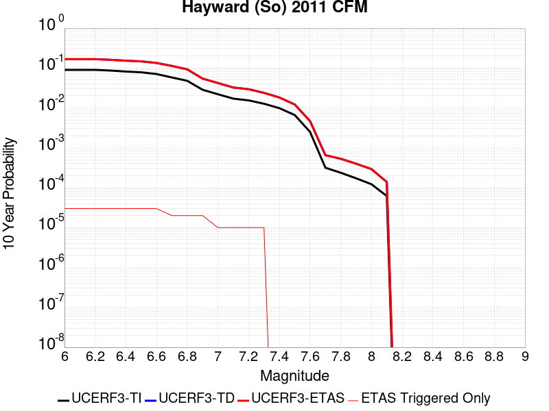 |

| Magnitude | 1 wk TI Prob | 1 wk TD Prob | 1 wk ETAS Prob | 1 wk ETAS/TD Gain | 1 wk ETAS Triggered Only | 1 mo TI Prob | 1 mo TD Prob | 1 mo ETAS Prob | 1 mo ETAS/TD Gain | 1 mo ETAS Triggered Only | 1 yr TI Prob | 1 yr TD Prob | 1 yr ETAS Prob | 1 yr ETAS/TD Gain | 1 yr ETAS Triggered Only | 10 yr TI Prob | 10 yr TD Prob | 10 yr ETAS Prob | 10 yr ETAS/TD Gain | 10 yr ETAS Triggered Only |
|-----|-----|-----|-----|-----|-----|-----|-----|-----|-----|-----|-----|-----|-----|-----|-----|-----|-----|-----|-----|-----|
| 6.0 | 1.8091932E-4 | 3.570673E-4 | 3.7120792E-4 | 1.0396022 | 1.4145672E-5 | 7.751381E-4 | 0.0015294008 | 0.0015435249 | 1.009235 | 1.4145672E-5 | 0.00939654 | 0.018463885 | 0.018491654 | 1.001504 | 2.8291344E-5 | 0.090090066 | 0.1667085 | 0.16673207 | 1.0001414 | 2.8291344E-5 |
| 6.1 | 1.8091932E-4 | 3.570673E-4 | 3.7120792E-4 | 1.0396022 | 1.4145672E-5 | 7.751381E-4 | 0.0015294008 | 0.0015435249 | 1.009235 | 1.4145672E-5 | 0.00939654 | 0.018463885 | 0.018491654 | 1.001504 | 2.8291344E-5 | 0.090090066 | 0.1667085 | 0.16673207 | 1.0001414 | 2.8291344E-5 |
| 6.2 | 1.8091932E-4 | 3.570673E-4 | 3.7120792E-4 | 1.0396022 | 1.4145672E-5 | 7.751381E-4 | 0.0015294008 | 0.0015435249 | 1.009235 | 1.4145672E-5 | 0.00939654 | 0.018463885 | 0.018491654 | 1.001504 | 2.8291344E-5 | 0.090090066 | 0.1667085 | 0.16673207 | 1.0001414 | 2.8291344E-5 |
| 6.3 | 1.7322872E-4 | 3.4263515E-4 | 3.5677597E-4 | 1.0412709 | 1.4145672E-5 | 7.4219756E-4 | 0.0014676197 | 0.0014817446 | 1.0096244 | 1.4145672E-5 | 0.0089988755 | 0.017724147 | 0.017751938 | 1.001568 | 2.8291344E-5 | 0.08643075 | 0.16065954 | 0.16068327 | 1.0001478 | 2.8291344E-5 |
| 6.4 | 1.6334097E-4 | 3.2345165E-4 | 3.3759273E-4 | 1.0437194 | 1.4145672E-5 | 6.998449E-4 | 0.0013854936 | 0.0013996196 | 1.0101957 | 1.4145672E-5 | 0.008487372 | 0.016739927 | 0.016767744 | 1.0016618 | 2.8291344E-5 | 0.081704415 | 0.15256606 | 0.15259004 | 1.0001571 | 2.8291344E-5 |
| 6.5 | 1.5600289E-4 | 3.101982E-4 | 3.2433946E-4 | 1.0455879 | 1.4145672E-5 | 6.684125E-4 | 0.0013287518 | 0.0013428787 | 1.0106317 | 1.4145672E-5 | 0.008107598 | 0.016059443 | 0.01608728 | 1.0017334 | 2.8291344E-5 | 0.078181036 | 0.14684291 | 0.14686705 | 1.0001644 | 2.8291344E-5 |
| 6.6 | 1.4046066E-4 | 2.8034003E-4 | 2.9448175E-4 | 1.0504448 | 1.4145672E-5 | 6.018354E-4 | 0.0012009109 | 0.0012150395 | 1.011765 | 1.4145672E-5 | 0.0073027555 | 0.014524571 | 0.014552451 | 1.0019195 | 2.8291344E-5 | 0.07067384 | 0.13393044 | 0.13395496 | 1.000183 | 2.8291344E-5 |
| 6.7 | 1.14696966E-4 | 2.3272466E-4 | 2.4686704E-4 | 1.0607687 | 1.4145672E-5 | 4.914658E-4 | 9.970153E-4 | 0.0010111468 | 1.0141739 | 1.4145672E-5 | 0.0059671924 | 0.012072163 | 0.012100113 | 1.0023153 | 2.8291344E-5 | 0.058094822 | 0.11274141 | 0.11276651 | 1.0002227 | 2.8291344E-5 |
| 6.8 | 9.3874296E-5 | 1.8862431E-4 | 2.027673E-4 | 1.0749798 | 1.4145672E-5 | 4.0225635E-4 | 8.081431E-4 | 8.222774E-4 | 1.0174898 | 1.4145672E-5 | 0.0048864787 | 0.009795489 | 0.009823503 | 1.00286 | 2.8291344E-5 | 0.047804173 | 0.092592984 | 0.09261866 | 1.0002773 | 2.8291344E-5 |
| 6.9 | 5.551852E-5 | 1.0729875E-4 | 1.2144291E-4 | 1.1318203 | 1.4145672E-5 | 2.3791482E-4 | 4.5977137E-4 | 4.7391054E-4 | 1.0307527 | 1.4145672E-5 | 0.0028927654 | 0.005583468 | 0.0056116013 | 1.0050387 | 2.8291344E-5 | 0.028553981 | 0.054246075 | 0.05427283 | 1.0004933 | 2.8291344E-5 |
| 7.0 | 4.2662363E-5 | 8.246792E-5 | 8.246792E-5 | 1.0 | 0.0 | 1.8282588E-4 | 3.5338648E-4 | 3.5338648E-4 | 1.0 | 0.0 | 0.0022236328 | 0.0042940658 | 0.0043081506 | 1.00328 | 1.4145672E-5 | 0.022015138 | 0.04206509 | 0.04207864 | 1.0003221 | 1.4145672E-5 |
| 7.1 | 3.305886E-5 | 6.302183E-5 | 6.302183E-5 | 1.0 | 0.0 | 1.4167312E-4 | 2.7006568E-4 | 2.7006568E-4 | 1.0 | 0.0 | 0.0017235056 | 0.003283111 | 0.0032972102 | 1.0042945 | 1.4145672E-5 | 0.017101998 | 0.032453902 | 0.03246759 | 1.0004218 | 1.4145672E-5 |
| 7.2 | 2.9856887E-5 | 5.701622E-5 | 5.701622E-5 | 1.0 | 0.0 | 1.2795182E-4 | 2.4433242E-4 | 2.4433242E-4 | 1.0 | 0.0 | 0.0015567001 | 0.0029707062 | 0.00298481 | 1.0047476 | 1.4145672E-5 | 0.015458403 | 0.029454801 | 0.02946853 | 1.0004661 | 1.4145672E-5 |
| 7.3 | 2.4559737E-5 | 4.599286E-5 | 4.599286E-5 | 1.0 | 0.0 | 1.0525176E-4 | 1.9709744E-4 | 1.9709744E-4 | 1.0 | 0.0 | 0.0012806869 | 0.0023970334 | 0.002411145 | 1.0058872 | 1.4145672E-5 | 0.012733313 | 0.023858516 | 0.023872325 | 1.0005788 | 1.4145672E-5 |
| 7.4 | 1.9002231E-5 | 3.505084E-5 | 3.505084E-5 | 1.0 | 0.0 | 8.143559E-5 | 1.502093E-4 | 1.502093E-4 | 1.0 | 0.0 | 9.910273E-4 | 0.001827274 | 0.001827274 | 1.0 | 0.0 | 0.009866194 | 0.018258808 | 0.018258808 | 1.0 | 0.0 |
| 7.5 | 1.2783333E-5 | 2.3331182E-5 | 2.3331182E-5 | 1.0 | 0.0 | 5.4784563E-5 | 9.998698E-5 | 9.998698E-5 | 1.0 | 0.0 | 6.667979E-4 | 0.0012166675 | 0.0012166675 | 1.0 | 0.0 | 0.006648007 | 0.012209443 | 0.012209443 | 1.0 | 0.0 |
| 7.6 | 4.8149627E-6 | 8.888056E-6 | 8.888056E-6 | 1.0 | 0.0 | 2.063539E-5 | 3.8091122E-5 | 3.8091122E-5 | 1.0 | 0.0 | 2.5120692E-4 | 4.6366194E-4 | 4.6366194E-4 | 1.0 | 0.0 | 0.0025092314 | 0.0046805087 | 0.0046805087 | 1.0 | 0.0 |
| 7.7 | 6.0838227E-7 | 1.205754E-6 | 1.205754E-6 | 1.0 | 0.0 | 2.6073499E-6 | 5.1675065E-6 | 5.1675065E-6 | 1.0 | 0.0 | 3.174402E-5 | 6.291258E-5 | 6.291258E-5 | 1.0 | 0.0 | 3.1739488E-4 | 6.5296254E-4 | 6.5296254E-4 | 1.0 | 0.0 |
| 7.8 | 4.5542808E-7 | 9.792941E-7 | 9.792941E-7 | 1.0 | 0.0 | 1.9518332E-6 | 4.196968E-6 | 4.196968E-6 | 1.0 | 0.0 | 2.376331E-5 | 5.109689E-5 | 5.109689E-5 | 1.0 | 0.0 | 2.3760769E-4 | 5.321693E-4 | 5.321693E-4 | 1.0 | 0.0 |
| 7.9 | 3.3016747E-7 | 7.3869535E-7 | 7.3869535E-7 | 1.0 | 0.0 | 1.4150027E-6 | 3.1658333E-6 | 3.1658333E-6 | 1.0 | 0.0 | 1.7227521E-5 | 3.854334E-5 | 3.854334E-5 | 1.0 | 0.0 | 1.7226185E-4 | 3.9932923E-4 | 3.9932923E-4 | 1.0 | 0.0 |
| 8.0 | 2.347038E-7 | 5.471963E-7 | 5.471963E-7 | 1.0 | 0.0 | 1.0058731E-6 | 2.3451248E-6 | 2.3451248E-6 | 1.0 | 0.0 | 1.2246436E-5 | 2.8551523E-5 | 2.8551523E-5 | 1.0 | 0.0 | 1.2245761E-4 | 2.9357258E-4 | 2.9357258E-4 | 1.0 | 0.0 |
| 8.1 | 1.18822804E-7 | 2.6060948E-7 | 2.6060948E-7 | 1.0 | 0.0 | 5.092405E-7 | 1.1168972E-6 | 1.1168972E-6 | 1.0 | 0.0 | 6.1999854E-6 | 1.359814E-5 | 1.359814E-5 | 1.0 | 0.0 | 6.199812E-5 | 1.3918082E-4 | 1.3918082E-4 | 1.0 | 0.0 |

## Santa Susana East (connector)
*[(top)](#table-of-contents)*

| 1 Week | 1 Month | 1 Year | 10 Year |
|-----|-----|-----|-----|
|  |  |  |  |

| Magnitude | 1 wk TI Prob | 1 wk TD Prob | 1 wk ETAS Prob | 1 wk ETAS/TD Gain | 1 wk ETAS Triggered Only | 1 mo TI Prob | 1 mo TD Prob | 1 mo ETAS Prob | 1 mo ETAS/TD Gain | 1 mo ETAS Triggered Only | 1 yr TI Prob | 1 yr TD Prob | 1 yr ETAS Prob | 1 yr ETAS/TD Gain | 1 yr ETAS Triggered Only | 10 yr TI Prob | 10 yr TD Prob | 10 yr ETAS Prob | 10 yr ETAS/TD Gain | 10 yr ETAS Triggered Only |
|-----|-----|-----|-----|-----|-----|-----|-----|-----|-----|-----|-----|-----|-----|-----|-----|-----|-----|-----|-----|-----|
| 6.0 | 2.858397E-5 | 3.2021693E-5 | 3.2021693E-5 | 1.0 | 0.0 | 1.2249697E-4 | 1.3723019E-4 | 1.5137393E-4 | 1.1030657 | 1.4145672E-5 | 0.0014903803 | 0.00166977 | 0.0016980141 | 1.016915 | 2.8291344E-5 | 0.014804244 | 0.016599316 | 0.016627138 | 1.0016761 | 2.8291344E-5 |
| 6.1 | 2.858397E-5 | 3.2021693E-5 | 3.2021693E-5 | 1.0 | 0.0 | 1.2249697E-4 | 1.3723019E-4 | 1.5137393E-4 | 1.1030657 | 1.4145672E-5 | 0.0014903803 | 0.00166977 | 0.0016980141 | 1.016915 | 2.8291344E-5 | 0.014804244 | 0.016599316 | 0.016627138 | 1.0016761 | 2.8291344E-5 |
| 6.2 | 2.858397E-5 | 3.2021693E-5 | 3.2021693E-5 | 1.0 | 0.0 | 1.2249697E-4 | 1.3723019E-4 | 1.5137393E-4 | 1.1030657 | 1.4145672E-5 | 0.0014903803 | 0.00166977 | 0.0016980141 | 1.016915 | 2.8291344E-5 | 0.014804244 | 0.016599316 | 0.016627138 | 1.0016761 | 2.8291344E-5 |
| 6.3 | 1.943582E-5 | 2.0367343E-5 | 2.0367343E-5 | 1.0 | 0.0 | 8.329371E-5 | 8.7286324E-5 | 1.0143076E-4 | 1.1620464 | 1.4145672E-5 | 0.001013629 | 0.001062305 | 0.0010905663 | 1.0266037 | 2.8291344E-5 | 0.010090181 | 0.010583852 | 0.010611844 | 1.0026448 | 2.8291344E-5 |
| 6.4 | 1.943582E-5 | 2.0367343E-5 | 2.0367343E-5 | 1.0 | 0.0 | 8.329371E-5 | 8.7286324E-5 | 1.0143076E-4 | 1.1620464 | 1.4145672E-5 | 0.001013629 | 0.001062305 | 0.0010905663 | 1.0266037 | 2.8291344E-5 | 0.010090181 | 0.010583852 | 0.010611844 | 1.0026448 | 2.8291344E-5 |
| 6.5 | 1.943582E-5 | 2.0367343E-5 | 2.0367343E-5 | 1.0 | 0.0 | 8.329371E-5 | 8.7286324E-5 | 1.0143076E-4 | 1.1620464 | 1.4145672E-5 | 0.001013629 | 0.001062305 | 0.0010905663 | 1.0266037 | 2.8291344E-5 | 0.010090181 | 0.010583852 | 0.010611844 | 1.0026448 | 2.8291344E-5 |
| 6.6 | 1.943582E-5 | 2.0367343E-5 | 2.0367343E-5 | 1.0 | 0.0 | 8.329371E-5 | 8.7286324E-5 | 1.0143076E-4 | 1.1620464 | 1.4145672E-5 | 0.001013629 | 0.001062305 | 0.0010905663 | 1.0266037 | 2.8291344E-5 | 0.010090181 | 0.010583852 | 0.010611844 | 1.0026448 | 2.8291344E-5 |
| 6.7 | 1.9404439E-5 | 2.0354766E-5 | 2.0354766E-5 | 1.0 | 0.0 | 8.3159226E-5 | 8.723242E-5 | 1.0137686E-4 | 1.1621466 | 1.4145672E-5 | 0.0010119933 | 0.0010616493 | 0.0010899106 | 1.0266201 | 2.8291344E-5 | 0.010073971 | 0.010577358 | 0.010605351 | 1.0026464 | 2.8291344E-5 |
| 6.8 | 1.2217526E-5 | 1.1593157E-5 | 1.1593157E-5 | 1.0 | 0.0 | 5.2359774E-5 | 4.9684106E-5 | 4.9684106E-5 | 1.0 | 0.0 | 6.372938E-4 | 6.047529E-4 | 6.1889004E-4 | 1.0233767 | 1.4145672E-5 | 0.0063546924 | 0.006033274 | 0.0060473345 | 1.0023304 | 1.4145672E-5 |
| 6.9 | 1.2217526E-5 | 1.1593157E-5 | 1.1593157E-5 | 1.0 | 0.0 | 5.2359774E-5 | 4.9684106E-5 | 4.9684106E-5 | 1.0 | 0.0 | 6.372938E-4 | 6.047529E-4 | 6.1889004E-4 | 1.0233767 | 1.4145672E-5 | 0.0063546924 | 0.006033274 | 0.0060473345 | 1.0023304 | 1.4145672E-5 |
| 7.0 | 9.276017E-6 | 8.059273E-6 | 8.059273E-6 | 1.0 | 0.0 | 3.9753755E-5 | 3.4539302E-5 | 3.4539302E-5 | 1.0 | 0.0 | 4.8389446E-4 | 4.2043833E-4 | 4.3457805E-4 | 1.033631 | 1.4145672E-5 | 0.0048284214 | 0.0041973097 | 0.0042113964 | 1.003356 | 1.4145672E-5 |
| 7.1 | 9.130355E-6 | 7.942446E-6 | 7.942446E-6 | 1.0 | 0.0 | 3.9129503E-5 | 3.4038632E-5 | 3.4038632E-5 | 1.0 | 0.0 | 4.7629757E-4 | 4.1434498E-4 | 4.2848478E-4 | 1.0341257 | 1.4145672E-5 | 0.00475278 | 0.0041366047 | 0.004150692 | 1.0034055 | 1.4145672E-5 |
| 7.2 | 8.851015E-6 | 7.741608E-6 | 7.741608E-6 | 1.0 | 0.0 | 3.7932372E-5 | 3.317792E-5 | 3.317792E-5 | 1.0 | 0.0 | 4.6172875E-4 | 4.038697E-4 | 4.1800967E-4 | 1.0350112 | 1.4145672E-5 | 0.0046077054 | 0.0040322347 | 0.0040463232 | 1.003494 | 1.4145672E-5 |
| 7.3 | 8.573006E-6 | 7.5503312E-6 | 7.5503312E-6 | 1.0 | 0.0 | 3.6740938E-5 | 3.235818E-5 | 3.235818E-5 | 1.0 | 0.0 | 4.472291E-4 | 3.9389305E-4 | 4.0803314E-4 | 1.0358983 | 1.4145672E-5 | 0.004463301 | 0.003932817 | 0.003946907 | 1.0035827 | 1.4145672E-5 |
| 7.4 | 7.852282E-6 | 6.8178556E-6 | 6.8178556E-6 | 1.0 | 0.0 | 3.36522E-5 | 2.921907E-5 | 2.921907E-5 | 1.0 | 0.0 | 4.096385E-4 | 3.5568717E-4 | 3.698278E-4 | 1.0397558 | 1.4145672E-5 | 0.0040888423 | 0.0035519868 | 0.0035660823 | 1.0039684 | 1.4145672E-5 |
| 7.5 | 4.8869324E-6 | 4.2790975E-6 | 4.2790975E-6 | 1.0 | 0.0 | 2.0943828E-5 | 1.833887E-5 | 1.833887E-5 | 1.0 | 0.0 | 2.5496128E-4 | 2.2325452E-4 | 2.2325452E-4 | 1.0 | 0.0 | 0.0025466895 | 0.00223057 | 0.00223057 | 1.0 | 0.0 |
| 7.6 | 1.3894544E-6 | 1.1568394E-6 | 1.1568394E-6 | 1.0 | 0.0 | 5.954791E-6 | 4.957875E-6 | 4.957875E-6 | 1.0 | 0.0 | 7.249717E-5 | 6.036068E-5 | 6.036068E-5 | 1.0 | 0.0 | 7.247352E-4 | 6.0346466E-4 | 6.0346466E-4 | 1.0 | 0.0 |
| 7.7 | 2.9924632E-7 | 2.3719332E-7 | 2.3719332E-7 | 1.0 | 0.0 | 1.2824837E-6 | 1.0165425E-6 | 1.0165425E-6 | 1.0 | 0.0 | 1.5614127E-5 | 1.2376341E-5 | 1.2376341E-5 | 1.0 | 0.0 | 1.5613029E-4 | 1.2375724E-4 | 1.2375724E-4 | 1.0 | 0.0 |
| 7.8 | 4.8188564E-8 | 2.6321862E-8 | 2.6321862E-8 | 1.0 | 0.0 | 2.065224E-7 | 1.12807975E-7 | 1.12807975E-7 | 1.0 | 0.0 | 2.5144072E-6 | 1.3734362E-6 | 1.3734362E-6 | 1.0 | 0.0 | 2.5143789E-5 | 1.3734286E-5 | 1.3734286E-5 | 1.0 | 0.0 |
| 7.9 | 2.6127251E-9 | 2.7681102E-9 | 2.7681102E-9 | 1.0 | 0.0 | 1.1197393E-8 | 1.186333E-8 | 1.186333E-8 | 1.0 | 0.0 | 1.3632825E-7 | 1.4443603E-7 | 1.4443603E-7 | 1.0 | 0.0 | 1.3632817E-6 | 1.4443604E-6 | 1.4443604E-6 | 1.0 | 0.0 |

## Hosgri (Extension)
*[(top)](#table-of-contents)*

| 1 Week | 1 Month | 1 Year | 10 Year |
|-----|-----|-----|-----|
|  |  | 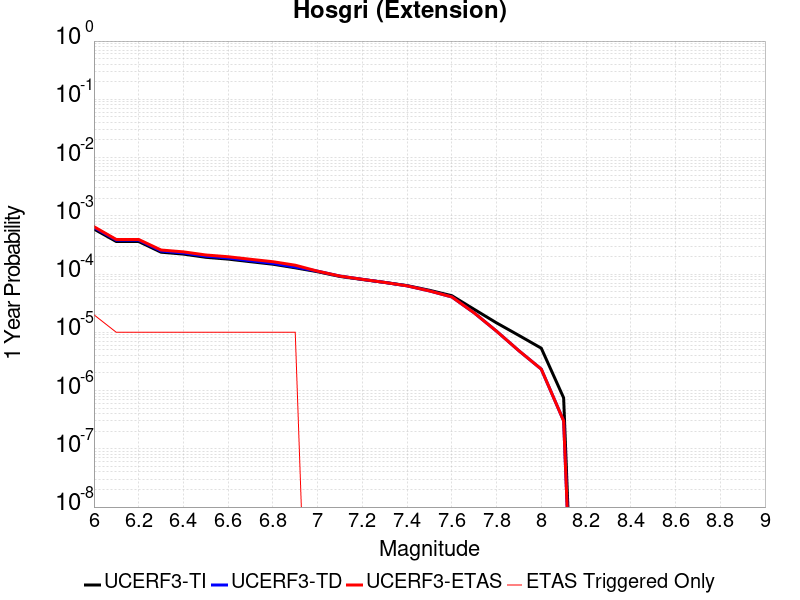 |  |

| Magnitude | 1 wk TI Prob | 1 wk TD Prob | 1 wk ETAS Prob | 1 wk ETAS/TD Gain | 1 wk ETAS Triggered Only | 1 mo TI Prob | 1 mo TD Prob | 1 mo ETAS Prob | 1 mo ETAS/TD Gain | 1 mo ETAS Triggered Only | 1 yr TI Prob | 1 yr TD Prob | 1 yr ETAS Prob | 1 yr ETAS/TD Gain | 1 yr ETAS Triggered Only | 10 yr TI Prob | 10 yr TD Prob | 10 yr ETAS Prob | 10 yr ETAS/TD Gain | 10 yr ETAS Triggered Only |
|-----|-----|-----|-----|-----|-----|-----|-----|-----|-----|-----|-----|-----|-----|-----|-----|-----|-----|-----|-----|-----|
| 6.0 | 1.1369135E-5 | 1.2083073E-5 | 2.6228574E-5 | 2.1706874 | 1.4145672E-5 | 4.8723956E-5 | 5.17837E-5 | 6.592864E-5 | 1.2731543 | 1.4145672E-5 | 5.9305265E-4 | 6.303069E-4 | 6.585804E-4 | 1.0448568 | 2.8291344E-5 | 0.005914725 | 0.00628744 | 0.0063155536 | 1.0044714 | 2.8291344E-5 |
| 6.1 | 6.934979E-6 | 7.324556E-6 | 2.1470125E-5 | 2.9312527 | 1.4145672E-5 | 2.9721E-5 | 3.13906E-5 | 4.5535828E-5 | 1.4506198 | 1.4145672E-5 | 3.617931E-4 | 3.821177E-4 | 3.9625794E-4 | 1.037005 | 1.4145672E-5 | 0.0036120464 | 0.003815019 | 0.0038291109 | 1.0036937 | 1.4145672E-5 |
| 6.2 | 6.934979E-6 | 7.324556E-6 | 2.1470125E-5 | 2.9312527 | 1.4145672E-5 | 2.9721E-5 | 3.13906E-5 | 4.5535828E-5 | 1.4506198 | 1.4145672E-5 | 3.617931E-4 | 3.821177E-4 | 3.9625794E-4 | 1.037005 | 1.4145672E-5 | 0.0036120464 | 0.003815019 | 0.0038291109 | 1.0036937 | 1.4145672E-5 |
| 6.3 | 4.5484676E-6 | 4.769331E-6 | 1.8914936E-5 | 3.9659514 | 1.4145672E-5 | 1.9493287E-5 | 2.0439833E-5 | 3.4585217E-5 | 1.6920499 | 1.4145672E-5 | 2.3730492E-4 | 2.4882698E-4 | 2.6296912E-4 | 1.0568353 | 1.4145672E-5 | 0.0023705168 | 0.0024855263 | 0.0024996367 | 1.0056771 | 1.4145672E-5 |
| 6.4 | 4.218095E-6 | 4.416863E-6 | 1.8562472E-5 | 4.2026377 | 1.4145672E-5 | 1.8077424E-5 | 1.8929275E-5 | 3.307468E-5 | 1.7472765 | 1.4145672E-5 | 2.2007042E-4 | 2.3043988E-4 | 2.445823E-4 | 1.0613713 | 1.4145672E-5 | 0.002198526 | 0.002302043 | 0.002316156 | 1.0061307 | 1.4145672E-5 |
| 6.5 | 3.717374E-6 | 3.883879E-6 | 1.8029496E-5 | 4.6421366 | 1.4145672E-5 | 1.5931506E-5 | 1.664509E-5 | 3.0790525E-5 | 1.8498265 | 1.4145672E-5 | 1.9394881E-4 | 2.026353E-4 | 2.167781E-4 | 1.0697944 | 1.4145672E-5 | 0.0019377962 | 0.0020245241 | 0.0020386411 | 1.006973 | 1.4145672E-5 |
| 6.6 | 3.4605036E-6 | 3.6083072E-6 | 1.7753928E-5 | 4.920293 | 1.4145672E-5 | 1.4830645E-5 | 1.5464082E-5 | 2.9609537E-5 | 1.9147296 | 1.4145672E-5 | 1.8054814E-4 | 1.8825909E-4 | 2.024021E-4 | 1.0751252 | 1.4145672E-5 | 0.0018040152 | 0.0018810107 | 0.0018951298 | 1.0075061 | 1.4145672E-5 |
| 6.7 | 3.123439E-6 | 3.2465698E-6 | 1.7392196E-5 | 5.357099 | 1.4145672E-5 | 1.33860985E-5 | 1.39137965E-5 | 2.8059272E-5 | 2.016651 | 1.4145672E-5 | 1.6296357E-4 | 1.6938741E-4 | 1.8353069E-4 | 1.0834966 | 1.4145672E-5 | 0.001628441 | 0.001692594 | 0.0017067157 | 1.0083432 | 1.4145672E-5 |
| 6.8 | 2.8290783E-6 | 2.9305413E-6 | 1.7076172E-5 | 5.826968 | 1.4145672E-5 | 1.2124565E-5 | 1.2559403E-5 | 2.6704898E-5 | 2.1262872 | 1.4145672E-5 | 1.4760658E-4 | 1.5290009E-4 | 1.670436E-4 | 1.0925016 | 1.4145672E-5 | 0.0014750857 | 0.0015279576 | 0.0015420817 | 1.0092437 | 1.4145672E-5 |
| 6.9 | 2.454112E-6 | 2.5283207E-6 | 1.6673957E-5 | 6.5948744 | 1.4145672E-5 | 1.0517581E-5 | 1.0835615E-5 | 2.4981135E-5 | 2.3054652 | 1.4145672E-5 | 1.2804402E-4 | 1.3191569E-4 | 1.460595E-4 | 1.1072185 | 1.4145672E-5 | 0.0012797028 | 0.0013183799 | 0.0013325069 | 1.0107155 | 1.4145672E-5 |
| 7.0 | 2.1008145E-6 | 2.1498715E-6 | 2.1498715E-6 | 1.0 | 0.0 | 9.003459E-6 | 9.2137025E-6 | 9.2137025E-6 | 1.0 | 0.0 | 1.096116E-4 | 1.1217109E-4 | 1.1217109E-4 | 1.0 | 0.0 | 0.0010955755 | 0.0011211485 | 0.0011211485 | 1.0 | 0.0 |
| 7.1 | 1.744384E-6 | 1.7686364E-6 | 1.7686364E-6 | 1.0 | 0.0 | 7.47591E-6 | 7.579848E-6 | 7.579848E-6 | 1.0 | 0.0 | 9.1015405E-5 | 9.228076E-5 | 9.228076E-5 | 1.0 | 0.0 | 9.097813E-4 | 9.224261E-4 | 9.224261E-4 | 1.0 | 0.0 |
| 7.2 | 1.5456587E-6 | 1.5562894E-6 | 1.5562894E-6 | 1.0 | 0.0 | 6.6242346E-6 | 6.6697944E-6 | 6.6697944E-6 | 1.0 | 0.0 | 8.064707E-5 | 8.120173E-5 | 8.120173E-5 | 1.0 | 0.0 | 8.0617814E-4 | 8.117219E-4 | 8.117219E-4 | 1.0 | 0.0 |
| 7.3 | 1.3775123E-6 | 1.3766092E-6 | 1.3766092E-6 | 1.0 | 0.0 | 5.9036106E-6 | 5.8997407E-6 | 5.8997407E-6 | 1.0 | 0.0 | 7.187409E-5 | 7.182699E-5 | 7.182699E-5 | 1.0 | 0.0 | 7.185085E-4 | 7.180387E-4 | 7.180387E-4 | 1.0 | 0.0 |
| 7.4 | 1.214491E-6 | 1.2023471E-6 | 1.2023471E-6 | 1.0 | 0.0 | 5.2049513E-6 | 5.152906E-6 | 5.152906E-6 | 1.0 | 0.0 | 6.336844E-5 | 6.2734835E-5 | 6.2734835E-5 | 1.0 | 0.0 | 6.335037E-4 | 6.2717206E-4 | 6.2717206E-4 | 1.0 | 0.0 |
| 7.5 | 1.0101123E-6 | 9.842256E-7 | 9.842256E-7 | 1.0 | 0.0 | 4.3290456E-6 | 4.218103E-6 | 4.218103E-6 | 1.0 | 0.0 | 5.2704854E-5 | 5.13542E-5 | 5.13542E-5 | 1.0 | 0.0 | 5.2692357E-4 | 5.1342393E-4 | 5.1342393E-4 | 1.0 | 0.0 |
| 7.6 | 8.1558215E-7 | 7.765977E-7 | 7.765977E-7 | 1.0 | 0.0 | 3.4953473E-6 | 3.3282718E-6 | 3.3282718E-6 | 1.0 | 0.0 | 4.255502E-5 | 4.0520958E-5 | 4.0520958E-5 | 1.0 | 0.0 | 4.2546875E-4 | 4.0513615E-4 | 4.0513615E-4 | 1.0 | 0.0 |
| 7.7 | 4.757816E-7 | 4.1308996E-7 | 4.1308996E-7 | 1.0 | 0.0 | 2.0390623E-6 | 1.7703843E-6 | 1.7703843E-6 | 1.0 | 0.0 | 2.4825302E-5 | 2.1554217E-5 | 2.1554217E-5 | 1.0 | 0.0 | 2.482253E-4 | 2.1552139E-4 | 2.1552139E-4 | 1.0 | 0.0 |
| 7.8 | 2.782787E-7 | 2.004783E-7 | 2.004783E-7 | 1.0 | 0.0 | 1.1926223E-6 | 8.591924E-7 | 8.591924E-7 | 1.0 | 0.0 | 1.452008E-5 | 1.0460618E-5 | 1.0460618E-5 | 1.0 | 0.0 | 1.4519131E-4 | 1.04601284E-4 | 1.04601284E-4 | 1.0 | 0.0 |
| 7.9 | 1.6948086E-7 | 9.243938E-8 | 9.243938E-8 | 1.0 | 0.0 | 7.2634634E-7 | 3.961687E-7 | 3.961687E-7 | 1.0 | 0.0 | 8.843231E-6 | 4.8233433E-6 | 4.8233433E-6 | 1.0 | 0.0 | 8.842879E-5 | 4.8232392E-5 | 4.8232392E-5 | 1.0 | 0.0 |
| 8.0 | 1.0225492E-7 | 4.473497E-8 | 4.473497E-8 | 1.0 | 0.0 | 4.382353E-7 | 1.917213E-7 | 1.917213E-7 | 1.0 | 0.0 | 5.335502E-6 | 2.3342043E-6 | 2.3342043E-6 | 1.0 | 0.0 | 5.335374E-5 | 2.33418E-5 | 2.33418E-5 | 1.0 | 0.0 |
| 8.1 | 1.43711345E-8 | 5.78716E-9 | 5.78716E-9 | 1.0 | 0.0 | 6.1590576E-8 | 2.4802116E-8 | 2.4802116E-8 | 1.0 | 0.0 | 7.4986497E-7 | 3.019657E-7 | 3.019657E-7 | 1.0 | 0.0 | 7.4986247E-6 | 3.0196536E-6 | 3.0196536E-6 | 1.0 | 0.0 |

## Great Valley 07 (Orestimba)
*[(top)](#table-of-contents)*

| 1 Week | 1 Month | 1 Year | 10 Year |
|-----|-----|-----|-----|
|  |  |  | 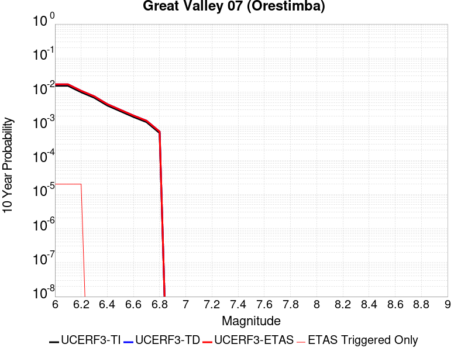 |

| Magnitude | 1 wk TI Prob | 1 wk TD Prob | 1 wk ETAS Prob | 1 wk ETAS/TD Gain | 1 wk ETAS Triggered Only | 1 mo TI Prob | 1 mo TD Prob | 1 mo ETAS Prob | 1 mo ETAS/TD Gain | 1 mo ETAS Triggered Only | 1 yr TI Prob | 1 yr TD Prob | 1 yr ETAS Prob | 1 yr ETAS/TD Gain | 1 yr ETAS Triggered Only | 10 yr TI Prob | 10 yr TD Prob | 10 yr ETAS Prob | 10 yr ETAS/TD Gain | 10 yr ETAS Triggered Only |
|-----|-----|-----|-----|-----|-----|-----|-----|-----|-----|-----|-----|-----|-----|-----|-----|-----|-----|-----|-----|-----|
| 6.0 | 2.9687902E-5 | 3.27575E-5 | 4.6902707E-5 | 1.4318159 | 1.4145672E-5 | 1.2722766E-4 | 1.4038214E-4 | 1.5452581E-4 | 1.1007513 | 1.4145672E-5 | 0.0015478961 | 0.0017078844 | 0.0017361274 | 1.0165368 | 2.8291344E-5 | 0.015371585 | 0.016955135 | 0.016982948 | 1.0016403 | 2.8291344E-5 |
| 6.1 | 2.9687902E-5 | 3.27575E-5 | 4.6902707E-5 | 1.4318159 | 1.4145672E-5 | 1.2722766E-4 | 1.4038214E-4 | 1.5452581E-4 | 1.1007513 | 1.4145672E-5 | 0.0015478961 | 0.0017078844 | 0.0017361274 | 1.0165368 | 2.8291344E-5 | 0.015371585 | 0.016955135 | 0.016982948 | 1.0016403 | 2.8291344E-5 |
| 6.2 | 1.9231524E-5 | 2.1159167E-5 | 3.530454E-5 | 1.6685222 | 1.4145672E-5 | 8.2418206E-5 | 9.067912E-5 | 1.04823506E-4 | 1.1559829 | 1.4145672E-5 | 0.0010029797 | 0.0011034822 | 0.0011317424 | 1.02561 | 2.8291344E-5 | 0.00998465 | 0.010982441 | 0.0110104205 | 1.0025477 | 2.8291344E-5 |
| 6.3 | 1.324766E-5 | 1.4548534E-5 | 1.4548534E-5 | 1.0 | 0.0 | 5.6774446E-5 | 6.234942E-5 | 6.234942E-5 | 1.0 | 0.0 | 6.910097E-4 | 7.5884897E-4 | 7.5884897E-4 | 1.0 | 0.0 | 0.006888649 | 0.0075635235 | 0.0075635235 | 1.0 | 0.0 |
| 6.4 | 7.818645E-6 | 8.57284E-6 | 8.57284E-6 | 1.0 | 0.0 | 3.3508048E-5 | 3.6740246E-5 | 3.6740246E-5 | 1.0 | 0.0 | 4.078841E-4 | 4.4722404E-4 | 4.4722404E-4 | 1.0 | 0.0 | 0.004071363 | 0.0044635804 | 0.0044635804 | 1.0 | 0.0 |
| 6.5 | 5.3076565E-6 | 5.8178007E-6 | 5.8178007E-6 | 1.0 | 0.0 | 2.27469E-5 | 2.4933206E-5 | 2.4933206E-5 | 1.0 | 0.0 | 2.7690834E-4 | 3.035216E-4 | 3.035216E-4 | 1.0 | 0.0 | 0.0027656353 | 0.00303128 | 0.00303128 | 1.0 | 0.0 |
| 6.6 | 3.6003578E-6 | 3.9484953E-6 | 3.9484953E-6 | 1.0 | 0.0 | 1.5430012E-5 | 1.6922022E-5 | 1.6922022E-5 | 1.0 | 0.0 | 1.8784421E-4 | 2.0600771E-4 | 2.0600771E-4 | 1.0 | 0.0 | 0.0018768552 | 0.0020583214 | 0.0020583214 | 1.0 | 0.0 |
| 6.7 | 2.5361826E-6 | 2.7834678E-6 | 2.7834678E-6 | 1.0 | 0.0 | 1.0869308E-5 | 1.1929101E-5 | 1.1929101E-5 | 1.0 | 0.0 | 1.3232579E-4 | 1.4522845E-4 | 1.4522845E-4 | 1.0 | 0.0 | 0.0013224703 | 0.0014514653 | 0.0014514653 | 1.0 | 0.0 |
| 6.8 | 1.2115831E-6 | 1.3313797E-6 | 1.3313797E-6 | 1.0 | 0.0 | 5.1924885E-6 | 5.7059065E-6 | 5.7059065E-6 | 1.0 | 0.0 | 6.3216714E-5 | 6.9468166E-5 | 6.9468166E-5 | 1.0 | 0.0 | 6.3198735E-4 | 6.945596E-4 | 6.945596E-4 | 1.0 | 0.0 |

## Santa Susana alt 1
*[(top)](#table-of-contents)*

| 1 Week | 1 Month | 1 Year | 10 Year |
|-----|-----|-----|-----|
|  |  |  | 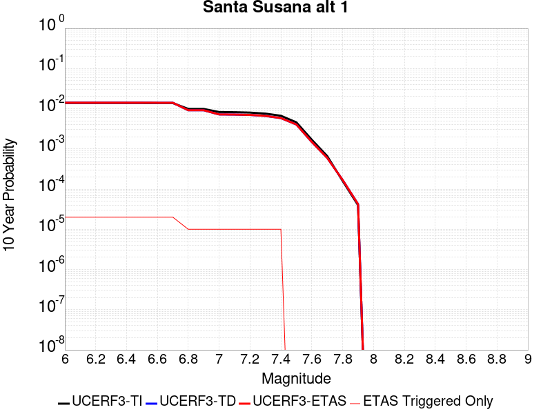 |

| Magnitude | 1 wk TI Prob | 1 wk TD Prob | 1 wk ETAS Prob | 1 wk ETAS/TD Gain | 1 wk ETAS Triggered Only | 1 mo TI Prob | 1 mo TD Prob | 1 mo ETAS Prob | 1 mo ETAS/TD Gain | 1 mo ETAS Triggered Only | 1 yr TI Prob | 1 yr TD Prob | 1 yr ETAS Prob | 1 yr ETAS/TD Gain | 1 yr ETAS Triggered Only | 10 yr TI Prob | 10 yr TD Prob | 10 yr ETAS Prob | 10 yr ETAS/TD Gain | 10 yr ETAS Triggered Only |
|-----|-----|-----|-----|-----|-----|-----|-----|-----|-----|-----|-----|-----|-----|-----|-----|-----|-----|-----|-----|-----|
| 6.0 | 2.674877E-5 | 2.7198214E-5 | 2.7198214E-5 | 1.0 | 0.0 | 1.1463255E-4 | 1.16559204E-4 | 1.3070322E-4 | 1.1213462 | 1.4145672E-5 | 0.0013947578 | 0.0014182981 | 0.0014465493 | 1.0199192 | 2.8291344E-5 | 0.013860362 | 0.014104388 | 0.01413228 | 1.0019776 | 2.8291344E-5 |
| 6.1 | 2.674877E-5 | 2.7198214E-5 | 2.7198214E-5 | 1.0 | 0.0 | 1.1463255E-4 | 1.16559204E-4 | 1.3070322E-4 | 1.1213462 | 1.4145672E-5 | 0.0013947578 | 0.0014182981 | 0.0014465493 | 1.0199192 | 2.8291344E-5 | 0.013860362 | 0.014104388 | 0.01413228 | 1.0019776 | 2.8291344E-5 |
| 6.2 | 2.674877E-5 | 2.7198214E-5 | 2.7198214E-5 | 1.0 | 0.0 | 1.1463255E-4 | 1.16559204E-4 | 1.3070322E-4 | 1.1213462 | 1.4145672E-5 | 0.0013947578 | 0.0014182981 | 0.0014465493 | 1.0199192 | 2.8291344E-5 | 0.013860362 | 0.014104388 | 0.01413228 | 1.0019776 | 2.8291344E-5 |
| 6.3 | 2.674877E-5 | 2.7198214E-5 | 2.7198214E-5 | 1.0 | 0.0 | 1.1463255E-4 | 1.16559204E-4 | 1.3070322E-4 | 1.1213462 | 1.4145672E-5 | 0.0013947578 | 0.0014182981 | 0.0014465493 | 1.0199192 | 2.8291344E-5 | 0.013860362 | 0.014104388 | 0.01413228 | 1.0019776 | 2.8291344E-5 |
| 6.4 | 2.674877E-5 | 2.7198214E-5 | 2.7198214E-5 | 1.0 | 0.0 | 1.1463255E-4 | 1.16559204E-4 | 1.3070322E-4 | 1.1213462 | 1.4145672E-5 | 0.0013947578 | 0.0014182981 | 0.0014465493 | 1.0199192 | 2.8291344E-5 | 0.013860362 | 0.014104388 | 0.01413228 | 1.0019776 | 2.8291344E-5 |
| 6.5 | 2.674877E-5 | 2.7198214E-5 | 2.7198214E-5 | 1.0 | 0.0 | 1.1463255E-4 | 1.16559204E-4 | 1.3070322E-4 | 1.1213462 | 1.4145672E-5 | 0.0013947578 | 0.0014182981 | 0.0014465493 | 1.0199192 | 2.8291344E-5 | 0.013860362 | 0.014104388 | 0.01413228 | 1.0019776 | 2.8291344E-5 |
| 6.6 | 2.6647976E-5 | 2.7074553E-5 | 2.7074553E-5 | 1.0 | 0.0 | 1.14200615E-4 | 1.16029274E-4 | 1.3017331E-4 | 1.1219006 | 1.4145672E-5 | 0.0013895056 | 0.0014118546 | 0.0014401061 | 1.0200101 | 2.8291344E-5 | 0.013808494 | 0.014040773 | 0.014068667 | 1.0019866 | 2.8291344E-5 |
| 6.7 | 2.6647976E-5 | 2.7074553E-5 | 2.7074553E-5 | 1.0 | 0.0 | 1.14200615E-4 | 1.16029274E-4 | 1.3017331E-4 | 1.1219006 | 1.4145672E-5 | 0.0013895056 | 0.0014118546 | 0.0014401061 | 1.0200101 | 2.8291344E-5 | 0.013808494 | 0.014040773 | 0.014068667 | 1.0019866 | 2.8291344E-5 |
| 6.8 | 1.9073179E-5 | 1.7637467E-5 | 1.7637467E-5 | 1.0 | 0.0 | 8.1739636E-5 | 7.558706E-5 | 7.558706E-5 | 1.0 | 0.0 | 9.947256E-4 | 9.19902E-4 | 9.3403464E-4 | 1.0153632 | 1.4145672E-5 | 0.009902848 | 0.009163361 | 0.009177377 | 1.0015296 | 1.4145672E-5 |
| 6.9 | 1.9041876E-5 | 1.7619597E-5 | 1.7619597E-5 | 1.0 | 0.0 | 8.160549E-5 | 7.551048E-5 | 7.551048E-5 | 1.0 | 0.0 | 9.930939E-4 | 9.189705E-4 | 9.3310315E-4 | 1.0153788 | 1.4145672E-5 | 0.0098866755 | 0.009154123 | 0.00916814 | 1.0015311 | 1.4145672E-5 |
| 7.0 | 1.5917482E-5 | 1.3864049E-5 | 1.3864049E-5 | 1.0 | 0.0 | 6.8215995E-5 | 5.9416023E-5 | 5.9416023E-5 | 1.0 | 0.0 | 8.302132E-4 | 7.2315463E-4 | 7.3729013E-4 | 1.0195469 | 1.4145672E-5 | 0.008271185 | 0.0072090672 | 0.0072231106 | 1.0019481 | 1.4145672E-5 |
| 7.1 | 1.577788E-5 | 1.3744056E-5 | 1.3744056E-5 | 1.0 | 0.0 | 6.761774E-5 | 5.890179E-5 | 5.890179E-5 | 1.0 | 0.0 | 8.2293496E-4 | 7.16898E-4 | 7.3103356E-4 | 1.0197176 | 1.4145672E-5 | 0.008198941 | 0.0071469042 | 0.007160949 | 1.0019652 | 1.4145672E-5 |
| 7.2 | 1.5416446E-5 | 1.34701295E-5 | 1.34701295E-5 | 1.0 | 0.0 | 6.606882E-5 | 5.7727877E-5 | 5.7727877E-5 | 1.0 | 0.0 | 8.0409093E-4 | 7.026149E-4 | 7.167506E-4 | 1.0201187 | 1.4145672E-5 | 0.008011877 | 0.0070049763 | 0.007019023 | 1.0020052 | 1.4145672E-5 |
| 7.3 | 1.4534083E-5 | 1.2718032E-5 | 1.2718032E-5 | 1.0 | 0.0 | 6.228744E-5 | 5.4504737E-5 | 5.4504737E-5 | 1.0 | 0.0 | 7.580857E-4 | 6.633976E-4 | 6.7753386E-4 | 1.0213089 | 1.4145672E-5 | 0.007555048 | 0.0066151717 | 0.006629224 | 1.0021242 | 1.4145672E-5 |
| 7.4 | 1.2858995E-5 | 1.1229814E-5 | 1.1229814E-5 | 1.0 | 0.0 | 5.5108816E-5 | 4.812691E-5 | 4.812691E-5 | 1.0 | 0.0 | 6.7074323E-4 | 5.8579154E-4 | 5.999289E-4 | 1.0241338 | 1.4145672E-5 | 0.0066872234 | 0.0058433902 | 0.005857453 | 1.0024066 | 1.4145672E-5 |
| 7.5 | 8.827668E-6 | 7.805494E-6 | 7.805494E-6 | 1.0 | 0.0 | 3.7832317E-5 | 3.3451703E-5 | 3.3451703E-5 | 1.0 | 0.0 | 4.605111E-4 | 4.072008E-4 | 4.072008E-4 | 1.0 | 0.0 | 0.0045955796 | 0.0040648985 | 0.0040648985 | 1.0 | 0.0 |
| 7.6 | 3.2533426E-6 | 2.8720106E-6 | 2.8720106E-6 | 1.0 | 0.0 | 1.3942822E-5 | 1.230856E-5 | 1.230856E-5 | 1.0 | 0.0 | 1.6974064E-4 | 1.4984679E-4 | 1.4984679E-4 | 1.0 | 0.0 | 0.0016961104 | 0.0014974943 | 0.0014974943 | 1.0 | 0.0 |
| 7.7 | 1.2751709E-6 | 1.1491339E-6 | 1.1491339E-6 | 1.0 | 0.0 | 5.4650063E-6 | 4.9248506E-6 | 4.9248506E-6 | 1.0 | 0.0 | 6.653442E-5 | 5.99585E-5 | 5.99585E-5 | 1.0 | 0.0 | 6.6514505E-4 | 5.9943215E-4 | 5.9943215E-4 | 1.0 | 0.0 |
| 7.8 | 3.067544E-7 | 3.240052E-7 | 3.240052E-7 | 1.0 | 0.0 | 1.3146611E-6 | 1.3885931E-6 | 1.3885931E-6 | 1.0 | 0.0 | 1.600588E-5 | 1.6906E-5 | 1.6906E-5 | 1.0 | 0.0 | 1.6004729E-4 | 1.6904817E-4 | 1.6904817E-4 | 1.0 | 0.0 |
| 7.9 | 7.622999E-8 | 8.0879715E-8 | 8.0879715E-8 | 1.0 | 0.0 | 3.2669993E-7 | 3.4662733E-7 | 3.4662733E-7 | 1.0 | 0.0 | 3.977564E-6 | 4.220182E-6 | 4.220182E-6 | 1.0 | 0.0 | 3.977493E-5 | 4.2201224E-5 | 4.2201224E-5 | 1.0 | 0.0 |

## San Gorgonio Pass
*[(top)](#table-of-contents)*

| 1 Week | 1 Month | 1 Year | 10 Year |
|-----|-----|-----|-----|
|  |  |  |  |

| Magnitude | 1 wk TI Prob | 1 wk TD Prob | 1 wk ETAS Prob | 1 wk ETAS/TD Gain | 1 wk ETAS Triggered Only | 1 mo TI Prob | 1 mo TD Prob | 1 mo ETAS Prob | 1 mo ETAS/TD Gain | 1 mo ETAS Triggered Only | 1 yr TI Prob | 1 yr TD Prob | 1 yr ETAS Prob | 1 yr ETAS/TD Gain | 1 yr ETAS Triggered Only | 10 yr TI Prob | 10 yr TD Prob | 10 yr ETAS Prob | 10 yr ETAS/TD Gain | 10 yr ETAS Triggered Only |
|-----|-----|-----|-----|-----|-----|-----|-----|-----|-----|-----|-----|-----|-----|-----|-----|-----|-----|-----|-----|-----|
| 6.0 | 7.644328E-6 | 1.331474E-5 | 2.7460223E-5 | 2.062393 | 1.4145672E-5 | 3.2760996E-5 | 5.706197E-5 | 7.1206836E-5 | 1.2478861 | 1.4145672E-5 | 3.987921E-4 | 6.945166E-4 | 7.086524E-4 | 1.0203536 | 1.4145672E-5 | 0.003980772 | 0.006930024 | 0.006958119 | 1.0040542 | 2.8291344E-5 |
| 6.1 | 7.644328E-6 | 1.331474E-5 | 2.7460223E-5 | 2.062393 | 1.4145672E-5 | 3.2760996E-5 | 5.706197E-5 | 7.1206836E-5 | 1.2478861 | 1.4145672E-5 | 3.987921E-4 | 6.945166E-4 | 7.086524E-4 | 1.0203536 | 1.4145672E-5 | 0.003980772 | 0.006930024 | 0.006958119 | 1.0040542 | 2.8291344E-5 |
| 6.2 | 7.644328E-6 | 1.331474E-5 | 2.7460223E-5 | 2.062393 | 1.4145672E-5 | 3.2760996E-5 | 5.706197E-5 | 7.1206836E-5 | 1.2478861 | 1.4145672E-5 | 3.987921E-4 | 6.945166E-4 | 7.086524E-4 | 1.0203536 | 1.4145672E-5 | 0.003980772 | 0.006930024 | 0.006958119 | 1.0040542 | 2.8291344E-5 |
| 6.3 | 7.644328E-6 | 1.331474E-5 | 2.7460223E-5 | 2.062393 | 1.4145672E-5 | 3.2760996E-5 | 5.706197E-5 | 7.1206836E-5 | 1.2478861 | 1.4145672E-5 | 3.987921E-4 | 6.945166E-4 | 7.086524E-4 | 1.0203536 | 1.4145672E-5 | 0.003980772 | 0.006930024 | 0.006958119 | 1.0040542 | 2.8291344E-5 |
| 6.4 | 7.644328E-6 | 1.331474E-5 | 2.7460223E-5 | 2.062393 | 1.4145672E-5 | 3.2760996E-5 | 5.706197E-5 | 7.1206836E-5 | 1.2478861 | 1.4145672E-5 | 3.987921E-4 | 6.945166E-4 | 7.086524E-4 | 1.0203536 | 1.4145672E-5 | 0.003980772 | 0.006930024 | 0.006958119 | 1.0040542 | 2.8291344E-5 |
| 6.5 | 7.644328E-6 | 1.331474E-5 | 2.7460223E-5 | 2.062393 | 1.4145672E-5 | 3.2760996E-5 | 5.706197E-5 | 7.1206836E-5 | 1.2478861 | 1.4145672E-5 | 3.987921E-4 | 6.945166E-4 | 7.086524E-4 | 1.0203536 | 1.4145672E-5 | 0.003980772 | 0.006930024 | 0.006958119 | 1.0040542 | 2.8291344E-5 |
| 6.6 | 7.644328E-6 | 1.331474E-5 | 2.7460223E-5 | 2.062393 | 1.4145672E-5 | 3.2760996E-5 | 5.706197E-5 | 7.1206836E-5 | 1.2478861 | 1.4145672E-5 | 3.987921E-4 | 6.945166E-4 | 7.086524E-4 | 1.0203536 | 1.4145672E-5 | 0.003980772 | 0.006930024 | 0.006958119 | 1.0040542 | 2.8291344E-5 |
| 6.7 | 6.987586E-6 | 1.2619013E-5 | 2.6764506E-5 | 2.1209667 | 1.4145672E-5 | 2.9946454E-5 | 5.408041E-5 | 6.8225316E-5 | 1.2615533 | 1.4145672E-5 | 3.645371E-4 | 6.582382E-4 | 6.7237456E-4 | 1.021476 | 1.4145672E-5 | 0.0036393967 | 0.0065694 | 0.0065975054 | 1.0042783 | 2.8291344E-5 |
| 6.8 | 6.987586E-6 | 1.2619013E-5 | 2.6764506E-5 | 2.1209667 | 1.4145672E-5 | 2.9946454E-5 | 5.408041E-5 | 6.8225316E-5 | 1.2615533 | 1.4145672E-5 | 3.645371E-4 | 6.582382E-4 | 6.7237456E-4 | 1.021476 | 1.4145672E-5 | 0.0036393967 | 0.0065694 | 0.0065975054 | 1.0042783 | 2.8291344E-5 |
| 6.9 | 5.504702E-6 | 1.1049877E-5 | 2.5195393E-5 | 2.2801514 | 1.4145672E-5 | 2.3591367E-5 | 4.7355785E-5 | 6.150079E-5 | 1.2986964 | 1.4145672E-5 | 2.8718702E-4 | 5.764092E-4 | 5.905467E-4 | 1.0245268 | 1.4145672E-5 | 0.0028681618 | 0.0057553523 | 0.005783481 | 1.0048873 | 2.8291344E-5 |
| 7.0 | 5.4825764E-6 | 1.1026218E-5 | 2.5171734E-5 | 2.2828984 | 1.4145672E-5 | 2.3496545E-5 | 4.725439E-5 | 6.13994E-5 | 1.2993374 | 1.4145672E-5 | 2.8603288E-4 | 5.751754E-4 | 5.893129E-4 | 1.0245795 | 1.4145672E-5 | 0.00285665 | 0.0057430784 | 0.005771207 | 1.0048978 | 2.8291344E-5 |
| 7.1 | 5.4692787E-6 | 1.1011928E-5 | 2.5157444E-5 | 2.284563 | 1.4145672E-5 | 2.3439556E-5 | 4.719315E-5 | 6.1338156E-5 | 1.2997258 | 1.4145672E-5 | 2.8533922E-4 | 5.744302E-4 | 5.8856775E-4 | 1.0246115 | 1.4145672E-5 | 0.0028497311 | 0.0057356646 | 0.005763794 | 1.0049043 | 2.8291344E-5 |
| 7.2 | 5.453661E-6 | 1.0994954E-5 | 2.514047E-5 | 2.2865462 | 1.4145672E-5 | 2.3372622E-5 | 4.712041E-5 | 6.126542E-5 | 1.3001885 | 1.4145672E-5 | 2.8452452E-4 | 5.7354505E-4 | 5.876826E-4 | 1.0246494 | 1.4145672E-5 | 0.002841605 | 0.005726859 | 0.005754988 | 1.0049118 | 2.8291344E-5 |
| 7.3 | 5.4422303E-6 | 1.09818775E-5 | 2.5127394E-5 | 2.2880783 | 1.4145672E-5 | 2.3323635E-5 | 4.7064368E-5 | 6.120937E-5 | 1.3005459 | 1.4145672E-5 | 2.8392827E-4 | 5.728631E-4 | 5.870006E-4 | 1.0246788 | 1.4145672E-5 | 0.0028356577 | 0.0057200743 | 0.005748204 | 1.0049177 | 2.8291344E-5 |
| 7.4 | 5.398595E-6 | 1.0929241E-5 | 2.507476E-5 | 2.2942817 | 1.4145672E-5 | 2.313663E-5 | 4.6838795E-5 | 6.0983803E-5 | 1.3019935 | 1.4145672E-5 | 2.8165206E-4 | 5.701182E-4 | 5.842558E-4 | 1.0247977 | 1.4145672E-5 | 0.0028129534 | 0.0056927665 | 0.0057208966 | 1.0049415 | 2.8291344E-5 |
| 7.5 | 5.3578788E-6 | 1.0855785E-5 | 2.5001304E-5 | 2.3030396 | 1.4145672E-5 | 2.2962136E-5 | 4.6523994E-5 | 6.066901E-5 | 1.304037 | 1.4145672E-5 | 2.7952815E-4 | 5.662875E-4 | 5.8042514E-4 | 1.0249655 | 1.4145672E-5 | 0.002791768 | 0.0056546913 | 0.005682823 | 1.0049748 | 2.8291344E-5 |
| 7.6 | 4.8091474E-6 | 9.604131E-6 | 2.3749668E-5 | 2.4728594 | 1.4145672E-5 | 2.0610469E-5 | 4.1159943E-5 | 5.530503E-5 | 1.3436615 | 1.4145672E-5 | 2.5090357E-4 | 5.010119E-4 | 5.151505E-4 | 1.02822 | 1.4145672E-5 | 0.0025062046 | 0.0050054584 | 0.005033608 | 1.0056238 | 2.8291344E-5 |
| 7.7 | 1.5991155E-6 | 3.353035E-6 | 1.749866E-5 | 5.2187524 | 1.4145672E-5 | 6.853334E-6 | 1.4370073E-5 | 2.8515542E-5 | 1.98437 | 1.4145672E-5 | 8.343615E-5 | 1.7494184E-4 | 1.8908504E-4 | 1.0808451 | 1.4145672E-5 | 8.340483E-4 | 0.0017535852 | 0.001767706 | 1.0080526 | 1.4145672E-5 |
| 7.8 | 9.258398E-7 | 2.0581049E-6 | 1.6203749E-5 | 7.87314 | 1.4145672E-5 | 3.967879E-6 | 8.82042E-6 | 2.2965967E-5 | 2.603727 | 1.4145672E-5 | 4.8307855E-5 | 1.0738334E-4 | 1.2152749E-4 | 1.1317165 | 1.4145672E-5 | 4.8297356E-4 | 0.0010788103 | 0.0010929407 | 1.0130981 | 1.4145672E-5 |
| 7.9 | 5.975575E-7 | 1.2292295E-6 | 1.5374884E-5 | 12.507741 | 1.4145672E-5 | 2.5609581E-6 | 5.2681157E-6 | 1.9413714E-5 | 3.6851342 | 1.4145672E-5 | 3.117922E-5 | 6.413743E-5 | 7.8282195E-5 | 1.2205384 | 1.4145672E-5 | 3.1174847E-4 | 6.464778E-4 | 6.6061434E-4 | 1.021867 | 1.4145672E-5 |
| 8.0 | 3.4413725E-7 | 6.714992E-7 | 1.4817162E-5 | 22.065792 | 1.4145672E-5 | 1.4748731E-6 | 2.8778506E-6 | 1.7023482E-5 | 5.915346 | 1.4145672E-5 | 1.7956432E-5 | 3.5037272E-5 | 4.918245E-5 | 1.403718 | 1.4145672E-5 | 1.7954981E-4 | 3.5392298E-4 | 3.6806366E-4 | 1.0399541 | 1.4145672E-5 |
| 8.1 | 1.1787731E-8 | 9.6332045E-9 | 9.6332045E-9 | 1.0 | 0.0 | 5.0518846E-8 | 4.1285162E-8 | 4.1285162E-8 | 1.0 | 0.0 | 6.1506677E-7 | 5.0264674E-7 | 5.0264674E-7 | 1.0 | 0.0 | 6.1506507E-6 | 5.2417968E-6 | 5.2417968E-6 | 1.0 | 0.0 |

## Great Valley 08 (Quinto)
*[(top)](#table-of-contents)*

| 1 Week | 1 Month | 1 Year | 10 Year |
|-----|-----|-----|-----|
|  |  |  | 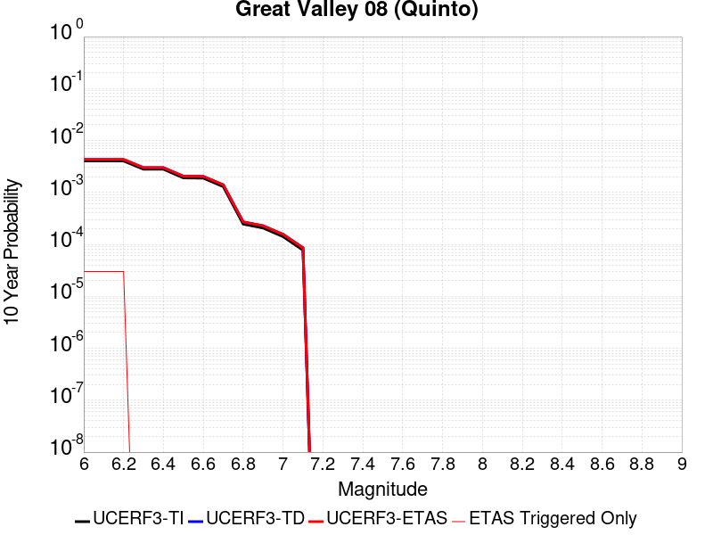 |

| Magnitude | 1 wk TI Prob | 1 wk TD Prob | 1 wk ETAS Prob | 1 wk ETAS/TD Gain | 1 wk ETAS Triggered Only | 1 mo TI Prob | 1 mo TD Prob | 1 mo ETAS Prob | 1 mo ETAS/TD Gain | 1 mo ETAS Triggered Only | 1 yr TI Prob | 1 yr TD Prob | 1 yr ETAS Prob | 1 yr ETAS/TD Gain | 1 yr ETAS Triggered Only | 10 yr TI Prob | 10 yr TD Prob | 10 yr ETAS Prob | 10 yr ETAS/TD Gain | 10 yr ETAS Triggered Only |
|-----|-----|-----|-----|-----|-----|-----|-----|-----|-----|-----|-----|-----|-----|-----|-----|-----|-----|-----|-----|-----|
| 6.0 | 7.737697E-6 | 8.253038E-6 | 8.253038E-6 | 1.0 | 0.0 | 3.3161137E-5 | 3.536979E-5 | 4.951496E-5 | 1.3999224 | 1.4145672E-5 | 4.0366207E-4 | 4.3056096E-4 | 4.4470053E-4 | 1.0328399 | 1.4145672E-5 | 0.004029296 | 0.0042991205 | 0.00432729 | 1.0065525 | 2.8291344E-5 |
| 6.1 | 7.737697E-6 | 8.253038E-6 | 8.253038E-6 | 1.0 | 0.0 | 3.3161137E-5 | 3.536979E-5 | 4.951496E-5 | 1.3999224 | 1.4145672E-5 | 4.0366207E-4 | 4.3056096E-4 | 4.4470053E-4 | 1.0328399 | 1.4145672E-5 | 0.004029296 | 0.0042991205 | 0.00432729 | 1.0065525 | 2.8291344E-5 |
| 6.2 | 7.737697E-6 | 8.253038E-6 | 8.253038E-6 | 1.0 | 0.0 | 3.3161137E-5 | 3.536979E-5 | 4.951496E-5 | 1.3999224 | 1.4145672E-5 | 4.0366207E-4 | 4.3056096E-4 | 4.4470053E-4 | 1.0328399 | 1.4145672E-5 | 0.004029296 | 0.0042991205 | 0.00432729 | 1.0065525 | 2.8291344E-5 |
| 6.3 | 5.374012E-6 | 5.7505736E-6 | 5.7505736E-6 | 1.0 | 0.0 | 2.3031276E-5 | 2.4645145E-5 | 2.4645145E-5 | 1.0 | 0.0 | 2.803697E-4 | 3.0002446E-4 | 3.0002446E-4 | 1.0 | 0.0 | 0.0028001624 | 0.0029972875 | 0.0029972875 | 1.0 | 0.0 |
| 6.4 | 5.374012E-6 | 5.7505736E-6 | 5.7505736E-6 | 1.0 | 0.0 | 2.3031276E-5 | 2.4645145E-5 | 2.4645145E-5 | 1.0 | 0.0 | 2.803697E-4 | 3.0002446E-4 | 3.0002446E-4 | 1.0 | 0.0 | 0.0028001624 | 0.0029972875 | 0.0029972875 | 1.0 | 0.0 |
| 6.5 | 3.65427E-6 | 3.941324E-6 | 3.941324E-6 | 1.0 | 0.0 | 1.5661062E-5 | 1.689132E-5 | 1.689132E-5 | 1.0 | 0.0 | 1.9065675E-4 | 2.0563944E-4 | 2.0563944E-4 | 1.0 | 0.0 | 0.0019049325 | 0.0020551833 | 0.0020551833 | 1.0 | 0.0 |
| 6.6 | 3.6143538E-6 | 3.8985104E-6 | 3.8985104E-6 | 1.0 | 0.0 | 1.5489995E-5 | 1.6707834E-5 | 1.6707834E-5 | 1.0 | 0.0 | 1.8857437E-4 | 2.0340596E-4 | 2.0340596E-4 | 1.0 | 0.0 | 0.0018841444 | 0.0020328893 | 0.0020328893 | 1.0 | 0.0 |
| 6.7 | 2.4821015E-6 | 2.6857067E-6 | 2.6857067E-6 | 1.0 | 0.0 | 1.0637535E-5 | 1.1510153E-5 | 1.1510153E-5 | 1.0 | 0.0 | 1.2950429E-4 | 1.4013276E-4 | 1.4013276E-4 | 1.0 | 0.0 | 0.0012942884 | 0.0014009989 | 0.0014009989 | 1.0 | 0.0 |
| 6.8 | 4.7110538E-7 | 5.193021E-7 | 5.193021E-7 | 1.0 | 0.0 | 2.0190216E-6 | 2.2255786E-6 | 2.2255786E-6 | 1.0 | 0.0 | 2.458131E-5 | 2.70961E-5 | 2.70961E-5 | 1.0 | 0.0 | 2.457859E-4 | 2.7092977E-4 | 2.7092977E-4 | 1.0 | 0.0 |
| 6.9 | 3.958685E-7 | 4.3703452E-7 | 4.3703452E-7 | 1.0 | 0.0 | 1.6965782E-6 | 1.8730038E-6 | 1.8730038E-6 | 1.0 | 0.0 | 2.0655643E-5 | 2.28036E-5 | 2.28036E-5 | 1.0 | 0.0 | 2.0653724E-4 | 2.2801422E-4 | 2.2801422E-4 | 1.0 | 0.0 |
| 7.0 | 2.70294E-7 | 2.9920008E-7 | 2.9920008E-7 | 1.0 | 0.0 | 1.1584025E-6 | 1.2822856E-6 | 1.2822856E-6 | 1.0 | 0.0 | 1.4103458E-5 | 1.5611728E-5 | 1.5611728E-5 | 1.0 | 0.0 | 1.4102564E-4 | 1.5610759E-4 | 1.5610759E-4 | 1.0 | 0.0 |
| 7.1 | 1.4828602E-7 | 1.6469107E-7 | 1.6469107E-7 | 1.0 | 0.0 | 6.3551136E-7 | 7.058187E-7 | 7.058187E-7 | 1.0 | 0.0 | 7.737323E-6 | 8.593317E-6 | 8.593317E-6 | 1.0 | 0.0 | 7.737054E-5 | 8.593065E-5 | 8.593065E-5 | 1.0 | 0.0 |

## Green Valley 2011 CFM
*[(top)](#table-of-contents)*

| 1 Week | 1 Month | 1 Year | 10 Year |
|-----|-----|-----|-----|
|  |  |  |  |

| Magnitude | 1 wk TI Prob | 1 wk TD Prob | 1 wk ETAS Prob | 1 wk ETAS/TD Gain | 1 wk ETAS Triggered Only | 1 mo TI Prob | 1 mo TD Prob | 1 mo ETAS Prob | 1 mo ETAS/TD Gain | 1 mo ETAS Triggered Only | 1 yr TI Prob | 1 yr TD Prob | 1 yr ETAS Prob | 1 yr ETAS/TD Gain | 1 yr ETAS Triggered Only | 10 yr TI Prob | 10 yr TD Prob | 10 yr ETAS Prob | 10 yr ETAS/TD Gain | 10 yr ETAS Triggered Only |
|-----|-----|-----|-----|-----|-----|-----|-----|-----|-----|-----|-----|-----|-----|-----|-----|-----|-----|-----|-----|-----|
| 6.0 | 9.9629346E-5 | 1.7302863E-4 | 1.7302863E-4 | 1.0 | 0.0 | 4.2691303E-4 | 7.41326E-4 | 7.41326E-4 | 1.0 | 0.0 | 0.0051852856 | 0.00898692 | 0.00898692 | 1.0 | 0.0 | 0.050659515 | 0.08553951 | 0.08556538 | 1.0003024 | 2.8291344E-5 |
| 6.1 | 9.88615E-5 | 1.7150163E-4 | 1.7150163E-4 | 1.0 | 0.0 | 4.2362334E-4 | 7.347854E-4 | 7.347854E-4 | 1.0 | 0.0 | 0.0051454236 | 0.008907947 | 0.008907947 | 1.0 | 0.0 | 0.050279044 | 0.08482712 | 0.08485301 | 1.0003052 | 2.8291344E-5 |
| 6.2 | 9.696895E-5 | 1.6789208E-4 | 1.6789208E-4 | 1.0 | 0.0 | 4.15515E-4 | 7.1932544E-4 | 7.1932544E-4 | 1.0 | 0.0 | 0.0050471667 | 0.00872133 | 0.00872133 | 1.0 | 0.0 | 0.04934063 | 0.08313578 | 0.08316173 | 1.000312 | 2.8291344E-5 |
| 6.3 | 9.275224E-5 | 1.5968543E-4 | 1.5968543E-4 | 1.0 | 0.0 | 3.9744904E-4 | 6.841728E-4 | 6.841728E-4 | 1.0 | 0.0 | 0.0048282105 | 0.008296652 | 0.008296652 | 1.0 | 0.0 | 0.047246475 | 0.07927481 | 0.07930086 | 1.0003285 | 2.8291344E-5 |
| 6.4 | 8.391499E-5 | 1.4365884E-4 | 1.4365884E-4 | 1.0 | 0.0 | 3.595861E-4 | 6.155238E-4 | 6.155238E-4 | 1.0 | 0.0 | 0.004369175 | 0.007467181 | 0.007467181 | 1.0 | 0.0 | 0.04284265 | 0.07164672 | 0.07167298 | 1.0003666 | 2.8291344E-5 |
| 6.5 | 5.9519385E-5 | 9.932622E-5 | 9.932622E-5 | 1.0 | 0.0 | 2.5505814E-4 | 4.2560388E-4 | 4.2560388E-4 | 1.0 | 0.0 | 0.0031009112 | 0.005168341 | 0.005168341 | 1.0 | 0.0 | 0.030579966 | 0.05014692 | 0.050173793 | 1.0005358 | 2.8291344E-5 |
| 6.6 | 4.5361558E-5 | 7.4019794E-5 | 7.4019794E-5 | 1.0 | 0.0 | 1.9439218E-4 | 3.1717744E-4 | 3.1717744E-4 | 1.0 | 0.0 | 0.0023641558 | 0.0038538678 | 0.0038538678 | 1.0 | 0.0 | 0.023391623 | 0.03766727 | 0.037694495 | 1.0007228 | 2.8291344E-5 |
| 6.7 | 3.8808106E-5 | 6.264382E-5 | 6.264382E-5 | 1.0 | 0.0 | 1.6630985E-4 | 2.6843755E-4 | 2.6843755E-4 | 1.0 | 0.0 | 0.0020229418 | 0.0032627317 | 0.0032627317 | 1.0 | 0.0 | 0.020046256 | 0.032007415 | 0.032034803 | 1.0008556 | 2.8291344E-5 |
| 6.8 | 2.2284667E-5 | 3.128574E-5 | 3.128574E-5 | 1.0 | 0.0 | 9.550222E-5 | 1.3407487E-4 | 1.3407487E-4 | 1.0 | 0.0 | 0.0011621192 | 0.0016311383 | 0.0016311383 | 1.0 | 0.0 | 0.011560607 | 0.01616672 | 0.016194554 | 1.0017217 | 2.8291344E-5 |
| 6.9 | 1.8050168E-5 | 2.4448536E-5 | 2.4448536E-5 | 1.0 | 0.0 | 7.735557E-5 | 1.0477527E-4 | 1.0477527E-4 | 1.0 | 0.0 | 9.4139716E-4 | 0.0012748954 | 0.0012748954 | 1.0 | 0.0 | 0.009374191 | 0.012669067 | 0.012697 | 1.0022048 | 2.8291344E-5 |
| 7.0 | 1.4763166E-5 | 1.9583236E-5 | 1.9583236E-5 | 1.0 | 0.0 | 6.326917E-5 | 8.3925464E-5 | 8.3925464E-5 | 1.0 | 0.0 | 7.7002996E-4 | 0.001021315 | 0.001021315 | 1.0 | 0.0 | 0.007673672 | 0.01016625 | 0.010194254 | 1.0027546 | 2.8291344E-5 |
| 7.1 | 1.2399713E-5 | 1.6304042E-5 | 1.6304042E-5 | 1.0 | 0.0 | 5.3140546E-5 | 6.987261E-5 | 6.987261E-5 | 1.0 | 0.0 | 6.467941E-4 | 8.5036893E-4 | 8.5036893E-4 | 1.0 | 0.0 | 0.006449148 | 0.008471781 | 0.008485807 | 1.0016556 | 1.4145672E-5 |
| 7.2 | 1.0584195E-5 | 1.39220465E-5 | 1.39220465E-5 | 1.0 | 0.0 | 4.5360044E-5 | 5.966456E-5 | 5.966456E-5 | 1.0 | 0.0 | 5.521186E-4 | 7.2617555E-4 | 7.2617555E-4 | 1.0 | 0.0 | 0.0055074887 | 0.0072386027 | 0.007252646 | 1.00194 | 1.4145672E-5 |
| 7.3 | 7.998173E-6 | 1.0544255E-5 | 1.0544255E-5 | 1.0 | 0.0 | 3.4277433E-5 | 4.5188888E-5 | 4.5188888E-5 | 1.0 | 0.0 | 4.1724785E-4 | 5.500369E-4 | 5.500369E-4 | 1.0 | 0.0 | 0.004164653 | 0.005487135 | 0.005487135 | 1.0 | 0.0 |
| 7.4 | 6.7571127E-6 | 8.932903E-6 | 8.932903E-6 | 1.0 | 0.0 | 2.8958733E-5 | 3.8283313E-5 | 3.8283313E-5 | 1.0 | 0.0 | 3.5251552E-4 | 4.660006E-4 | 4.660006E-4 | 1.0 | 0.0 | 0.0035195686 | 0.004650633 | 0.004650633 | 1.0 | 0.0 |
| 7.5 | 5.69878E-6 | 7.516483E-6 | 7.516483E-6 | 1.0 | 0.0 | 2.4423114E-5 | 3.2213105E-5 | 3.2213105E-5 | 1.0 | 0.0 | 2.9731085E-4 | 3.9212484E-4 | 3.9212484E-4 | 1.0 | 0.0 | 0.002969134 | 0.0039147018 | 0.0039147018 | 1.0 | 0.0 |
| 7.6 | 4.503664E-6 | 5.9358217E-6 | 5.9358217E-6 | 1.0 | 0.0 | 1.9301275E-5 | 2.5438992E-5 | 2.5438992E-5 | 1.0 | 0.0 | 2.3496768E-4 | 3.0967654E-4 | 3.0967654E-4 | 1.0 | 0.0 | 0.002347194 | 0.0030927279 | 0.0030927279 | 1.0 | 0.0 |
| 7.7 | 1.0873546E-6 | 1.410754E-6 | 1.410754E-6 | 1.0 | 0.0 | 4.6600826E-6 | 6.0460743E-6 | 6.0460743E-6 | 1.0 | 0.0 | 5.6735033E-5 | 7.36085E-5 | 7.36085E-5 | 1.0 | 0.0 | 5.672055E-4 | 7.3587085E-4 | 7.3587085E-4 | 1.0 | 0.0 |
| 7.8 | 4.9373917E-8 | 6.177967E-8 | 6.177967E-8 | 1.0 | 0.0 | 2.1160248E-7 | 2.6477002E-7 | 2.6477002E-7 | 1.0 | 0.0 | 2.5762572E-6 | 3.2235714E-6 | 3.2235714E-6 | 1.0 | 0.0 | 2.5762274E-5 | 3.2228E-5 | 3.2228E-5 | 1.0 | 0.0 |

## San Cayetano
*[(top)](#table-of-contents)*

| 1 Week | 1 Month | 1 Year | 10 Year |
|-----|-----|-----|-----|
|  | 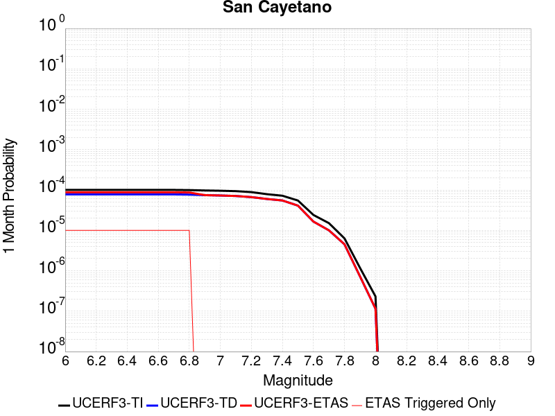 |  |  |

| Magnitude | 1 wk TI Prob | 1 wk TD Prob | 1 wk ETAS Prob | 1 wk ETAS/TD Gain | 1 wk ETAS Triggered Only | 1 mo TI Prob | 1 mo TD Prob | 1 mo ETAS Prob | 1 mo ETAS/TD Gain | 1 mo ETAS Triggered Only | 1 yr TI Prob | 1 yr TD Prob | 1 yr ETAS Prob | 1 yr ETAS/TD Gain | 1 yr ETAS Triggered Only | 10 yr TI Prob | 10 yr TD Prob | 10 yr ETAS Prob | 10 yr ETAS/TD Gain | 10 yr ETAS Triggered Only |
|-----|-----|-----|-----|-----|-----|-----|-----|-----|-----|-----|-----|-----|-----|-----|-----|-----|-----|-----|-----|-----|
| 6.0 | 2.3476267E-5 | 1.8169216E-5 | 1.8169216E-5 | 1.0 | 0.0 | 1.0060869E-4 | 7.786576E-5 | 7.786576E-5 | 1.0 | 0.0 | 0.0012242225 | 9.4760704E-4 | 9.4760704E-4 | 1.0 | 0.0 | 0.012175002 | 0.00943675 | 0.009464774 | 1.0029697 | 2.8291344E-5 |
| 6.1 | 2.3476267E-5 | 1.8169216E-5 | 1.8169216E-5 | 1.0 | 0.0 | 1.0060869E-4 | 7.786576E-5 | 7.786576E-5 | 1.0 | 0.0 | 0.0012242225 | 9.4760704E-4 | 9.4760704E-4 | 1.0 | 0.0 | 0.012175002 | 0.00943675 | 0.009464774 | 1.0029697 | 2.8291344E-5 |
| 6.2 | 2.3476267E-5 | 1.8169216E-5 | 1.8169216E-5 | 1.0 | 0.0 | 1.0060869E-4 | 7.786576E-5 | 7.786576E-5 | 1.0 | 0.0 | 0.0012242225 | 9.4760704E-4 | 9.4760704E-4 | 1.0 | 0.0 | 0.012175002 | 0.00943675 | 0.009464774 | 1.0029697 | 2.8291344E-5 |
| 6.3 | 2.3476267E-5 | 1.8169216E-5 | 1.8169216E-5 | 1.0 | 0.0 | 1.0060869E-4 | 7.786576E-5 | 7.786576E-5 | 1.0 | 0.0 | 0.0012242225 | 9.4760704E-4 | 9.4760704E-4 | 1.0 | 0.0 | 0.012175002 | 0.00943675 | 0.009464774 | 1.0029697 | 2.8291344E-5 |
| 6.4 | 2.3476267E-5 | 1.8169216E-5 | 1.8169216E-5 | 1.0 | 0.0 | 1.0060869E-4 | 7.786576E-5 | 7.786576E-5 | 1.0 | 0.0 | 0.0012242225 | 9.4760704E-4 | 9.4760704E-4 | 1.0 | 0.0 | 0.012175002 | 0.00943675 | 0.009464774 | 1.0029697 | 2.8291344E-5 |
| 6.5 | 2.3476267E-5 | 1.8169216E-5 | 1.8169216E-5 | 1.0 | 0.0 | 1.0060869E-4 | 7.786576E-5 | 7.786576E-5 | 1.0 | 0.0 | 0.0012242225 | 9.4760704E-4 | 9.4760704E-4 | 1.0 | 0.0 | 0.012175002 | 0.00943675 | 0.009464774 | 1.0029697 | 2.8291344E-5 |
| 6.6 | 2.3476267E-5 | 1.8169216E-5 | 1.8169216E-5 | 1.0 | 0.0 | 1.0060869E-4 | 7.786576E-5 | 7.786576E-5 | 1.0 | 0.0 | 0.0012242225 | 9.4760704E-4 | 9.4760704E-4 | 1.0 | 0.0 | 0.012175002 | 0.00943675 | 0.009464774 | 1.0029697 | 2.8291344E-5 |
| 6.7 | 2.3476267E-5 | 1.8169216E-5 | 1.8169216E-5 | 1.0 | 0.0 | 1.0060869E-4 | 7.786576E-5 | 7.786576E-5 | 1.0 | 0.0 | 0.0012242225 | 9.4760704E-4 | 9.4760704E-4 | 1.0 | 0.0 | 0.012175002 | 0.00943675 | 0.009464774 | 1.0029697 | 2.8291344E-5 |
| 6.8 | 2.3241924E-5 | 1.7936945E-5 | 1.7936945E-5 | 1.0 | 0.0 | 9.960445E-5 | 7.687038E-5 | 7.687038E-5 | 1.0 | 0.0 | 0.0012120095 | 9.354987E-4 | 9.354987E-4 | 1.0 | 0.0 | 0.012054204 | 0.0093166195 | 0.009344647 | 1.0030084 | 2.8291344E-5 |
| 6.9 | 2.2761007E-5 | 1.7432383E-5 | 1.7432383E-5 | 1.0 | 0.0 | 9.7543525E-5 | 7.47081E-5 | 7.47081E-5 | 1.0 | 0.0 | 0.0011869454 | 9.09195E-4 | 9.09195E-4 | 1.0 | 0.0 | 0.011806256 | 0.009055741 | 0.009083777 | 1.0030959 | 2.8291344E-5 |
| 7.0 | 2.240283E-5 | 1.7066137E-5 | 1.7066137E-5 | 1.0 | 0.0 | 9.600859E-5 | 7.313856E-5 | 7.313856E-5 | 1.0 | 0.0 | 0.0011682777 | 8.9010154E-4 | 8.9010154E-4 | 1.0 | 0.0 | 0.011621549 | 0.008866336 | 0.008894376 | 1.0031626 | 2.8291344E-5 |
| 7.1 | 2.1871154E-5 | 1.658602E-5 | 1.658602E-5 | 1.0 | 0.0 | 9.373015E-5 | 7.108103E-5 | 7.108103E-5 | 1.0 | 0.0 | 0.0011405671 | 8.6507126E-4 | 8.6507126E-4 | 1.0 | 0.0 | 0.011347309 | 0.008617996 | 0.00863202 | 1.0016272 | 1.4145672E-5 |
| 7.2 | 2.0714133E-5 | 1.5564563E-5 | 1.5564563E-5 | 1.0 | 0.0 | 8.8771834E-5 | 6.670358E-5 | 6.670358E-5 | 1.0 | 0.0 | 0.0010802611 | 8.118168E-4 | 8.118168E-4 | 1.0 | 0.0 | 0.010750249 | 0.008089443 | 0.008103474 | 1.0017345 | 1.4145672E-5 |
| 7.3 | 1.8408395E-5 | 1.3996829E-5 | 1.3996829E-5 | 1.0 | 0.0 | 7.8890735E-5 | 5.9985046E-5 | 5.9985046E-5 | 1.0 | 0.0 | 9.600714E-4 | 7.300762E-4 | 7.300762E-4 | 1.0 | 0.0 | 0.009559342 | 0.0072776447 | 0.007291687 | 1.0019295 | 1.4145672E-5 |
| 7.4 | 1.6856795E-5 | 1.285006E-5 | 1.285006E-5 | 1.0 | 0.0 | 7.2241404E-5 | 5.5070537E-5 | 5.5070537E-5 | 1.0 | 0.0 | 8.7918417E-4 | 6.7028037E-4 | 6.7028037E-4 | 1.0 | 0.0 | 0.00875714 | 0.0066834087 | 0.0066974596 | 1.0021024 | 1.4145672E-5 |
| 7.5 | 1.2822778E-5 | 9.577415E-6 | 9.577415E-6 | 1.0 | 0.0 | 5.495361E-5 | 4.1045427E-5 | 4.1045427E-5 | 1.0 | 0.0 | 6.688548E-4 | 4.9961504E-4 | 4.9961504E-4 | 1.0 | 0.0 | 0.006668452 | 0.0049851923 | 0.0049851923 | 1.0 | 0.0 |
| 7.6 | 5.6272684E-6 | 3.854899E-6 | 3.854899E-6 | 1.0 | 0.0 | 2.4116642E-5 | 1.6520893E-5 | 1.6520893E-5 | 1.0 | 0.0 | 2.9358055E-4 | 2.0112342E-4 | 2.0112342E-4 | 1.0 | 0.0 | 0.0029319301 | 0.0020094248 | 0.0020094248 | 1.0 | 0.0 |
| 7.7 | 3.5261346E-6 | 2.3407094E-6 | 2.3407094E-6 | 1.0 | 0.0 | 1.5111918E-5 | 1.0031574E-5 | 1.0031574E-5 | 1.0 | 0.0 | 1.8397206E-4 | 1.2212765E-4 | 1.2212765E-4 | 1.0 | 0.0 | 0.0018381984 | 0.0012206127 | 0.0012206127 | 1.0 | 0.0 |
| 7.8 | 1.4826929E-6 | 1.0564395E-6 | 1.0564395E-6 | 1.0 | 0.0 | 6.354383E-6 | 4.52759E-6 | 4.52759E-6 | 1.0 | 0.0 | 7.736187E-5 | 5.5122033E-5 | 5.5122033E-5 | 1.0 | 0.0 | 7.733494E-4 | 5.510856E-4 | 5.510856E-4 | 1.0 | 0.0 |
| 7.9 | 2.7568166E-7 | 1.6977887E-7 | 1.6977887E-7 | 1.0 | 0.0 | 1.1814923E-6 | 7.276235E-7 | 7.276235E-7 | 1.0 | 0.0 | 1.4384574E-5 | 8.85878E-6 | 8.85878E-6 | 1.0 | 0.0 | 1.4383643E-4 | 8.858431E-5 | 8.858431E-5 | 1.0 | 0.0 |
| 8.0 | 5.407832E-8 | 2.688677E-8 | 2.688677E-8 | 1.0 | 0.0 | 2.3176422E-7 | 1.15229014E-7 | 1.15229014E-7 | 1.0 | 0.0 | 2.8217257E-6 | 1.4029123E-6 | 1.4029123E-6 | 1.0 | 0.0 | 2.8216898E-5 | 1.40290385E-5 | 1.40290385E-5 | 1.0 | 0.0 |

## Hunting Creek - Bartlett Springs connector 2011
*[(top)](#table-of-contents)*

| 1 Week | 1 Month | 1 Year | 10 Year |
|-----|-----|-----|-----|
|  |  |  |  |

| Magnitude | 1 wk TI Prob | 1 wk TD Prob | 1 wk ETAS Prob | 1 wk ETAS/TD Gain | 1 wk ETAS Triggered Only | 1 mo TI Prob | 1 mo TD Prob | 1 mo ETAS Prob | 1 mo ETAS/TD Gain | 1 mo ETAS Triggered Only | 1 yr TI Prob | 1 yr TD Prob | 1 yr ETAS Prob | 1 yr ETAS/TD Gain | 1 yr ETAS Triggered Only | 10 yr TI Prob | 10 yr TD Prob | 10 yr ETAS Prob | 10 yr ETAS/TD Gain | 10 yr ETAS Triggered Only |
|-----|-----|-----|-----|-----|-----|-----|-----|-----|-----|-----|-----|-----|-----|-----|-----|-----|-----|-----|-----|-----|
| 6.0 | 4.940016E-5 | 6.7870766E-5 | 6.7870766E-5 | 1.0 | 0.0 | 2.1169778E-4 | 2.9084194E-4 | 2.9084194E-4 | 1.0 | 0.0 | 0.002574374 | 0.0035350819 | 0.0035350819 | 1.0 | 0.0 | 0.025447546 | 0.03477475 | 0.03480206 | 1.0007852 | 2.8291344E-5 |
| 6.1 | 4.940016E-5 | 6.7870766E-5 | 6.7870766E-5 | 1.0 | 0.0 | 2.1169778E-4 | 2.9084194E-4 | 2.9084194E-4 | 1.0 | 0.0 | 0.002574374 | 0.0035350819 | 0.0035350819 | 1.0 | 0.0 | 0.025447546 | 0.03477475 | 0.03480206 | 1.0007852 | 2.8291344E-5 |
| 6.2 | 4.472471E-5 | 6.100572E-5 | 6.100572E-5 | 1.0 | 0.0 | 1.9166325E-4 | 2.6142647E-4 | 2.6142647E-4 | 1.0 | 0.0 | 0.0023310026 | 0.0031781218 | 0.0031781218 | 1.0 | 0.0 | 0.02306703 | 0.031317808 | 0.03134521 | 1.0008751 | 2.8291344E-5 |
| 6.3 | 4.472471E-5 | 6.100572E-5 | 6.100572E-5 | 1.0 | 0.0 | 1.9166325E-4 | 2.6142647E-4 | 2.6142647E-4 | 1.0 | 0.0 | 0.0023310026 | 0.0031781218 | 0.0031781218 | 1.0 | 0.0 | 0.02306703 | 0.031317808 | 0.03134521 | 1.0008751 | 2.8291344E-5 |
| 6.4 | 4.0001003E-5 | 5.410516E-5 | 5.410516E-5 | 1.0 | 0.0 | 1.714216E-4 | 2.318579E-4 | 2.318579E-4 | 1.0 | 0.0 | 0.0020850603 | 0.0028191686 | 0.0028191686 | 1.0 | 0.0 | 0.02065605 | 0.027829198 | 0.027856704 | 1.0009884 | 2.8291344E-5 |
| 6.5 | 3.8033053E-5 | 5.126649E-5 | 5.126649E-5 | 1.0 | 0.0 | 1.6298861E-4 | 2.1969521E-4 | 2.1969521E-4 | 1.0 | 0.0 | 0.0019825802 | 0.0026714848 | 0.0026714848 | 1.0 | 0.0 | 0.019649856 | 0.026391273 | 0.026418818 | 1.0010437 | 2.8291344E-5 |
| 6.6 | 3.653754E-5 | 4.912955E-5 | 4.912955E-5 | 1.0 | 0.0 | 1.5658008E-4 | 2.1053842E-4 | 2.1053842E-4 | 1.0 | 0.0 | 0.0019046954 | 0.0025602889 | 0.0025602889 | 1.0 | 0.0 | 0.018884527 | 0.025307199 | 0.025334775 | 1.0010896 | 2.8291344E-5 |
| 6.7 | 3.372024E-5 | 4.5140216E-5 | 4.5140216E-5 | 1.0 | 0.0 | 1.4450731E-4 | 1.9344388E-4 | 1.9344388E-4 | 1.0 | 0.0 | 0.0017579567 | 0.0023526535 | 0.0023526535 | 1.0 | 0.0 | 0.017441148 | 0.023278862 | 0.023306495 | 1.0011871 | 2.8291344E-5 |
| 6.8 | 2.9650024E-5 | 3.9411647E-5 | 3.9411647E-5 | 1.0 | 0.0 | 1.2706534E-4 | 1.6889606E-4 | 1.6889606E-4 | 1.0 | 0.0 | 0.0015459227 | 0.0020543607 | 0.0020543607 | 1.0 | 0.0 | 0.015352124 | 0.020351961 | 0.020379677 | 1.0013618 | 2.8291344E-5 |
| 6.9 | 2.860775E-5 | 3.7812886E-5 | 3.7812886E-5 | 1.0 | 0.0 | 1.2259888E-4 | 1.620452E-4 | 1.620452E-4 | 1.0 | 0.0 | 0.0014916194 | 0.0019711219 | 0.0019711219 | 1.0 | 0.0 | 0.014816469 | 0.019536555 | 0.019564293 | 1.0014198 | 2.8291344E-5 |
| 7.0 | 2.6696067E-5 | 3.5067544E-5 | 3.5067544E-5 | 1.0 | 0.0 | 1.144067E-4 | 1.5028086E-4 | 1.5028086E-4 | 1.0 | 0.0 | 0.0013920115 | 0.0018281427 | 0.0018281427 | 1.0 | 0.0 | 0.013833242 | 0.01813184 | 0.018159617 | 1.0015321 | 2.8291344E-5 |
| 7.1 | 2.456087E-5 | 3.2013326E-5 | 3.2013326E-5 | 1.0 | 0.0 | 1.0525662E-4 | 1.3719281E-4 | 1.3719281E-4 | 1.0 | 0.0 | 0.001280746 | 0.0016690517 | 0.0016690517 | 1.0 | 0.0 | 0.012733897 | 0.016566671 | 0.016580584 | 1.0008397 | 1.4145672E-5 |
| 7.2 | 2.295761E-5 | 2.9823148E-5 | 2.9823148E-5 | 1.0 | 0.0 | 9.8386045E-5 | 1.2780727E-4 | 1.2780727E-4 | 1.0 | 0.0 | 0.0011971919 | 0.0015549522 | 0.0015549522 | 1.0 | 0.0 | 0.011907627 | 0.015442378 | 0.015456305 | 1.0009019 | 1.4145672E-5 |
| 7.3 | 2.1256936E-5 | 2.7542124E-5 | 2.7542124E-5 | 1.0 | 0.0 | 9.109797E-5 | 1.1803238E-4 | 1.1803238E-4 | 1.0 | 0.0 | 0.0011085535 | 0.0014361058 | 0.0014361058 | 1.0 | 0.0 | 0.011030397 | 0.014269741 | 0.014269741 | 1.0 | 0.0 |
| 7.4 | 1.8784336E-5 | 2.430697E-5 | 2.430697E-5 | 1.0 | 0.0 | 8.050181E-5 | 1.0416861E-4 | 1.0416861E-4 | 1.0 | 0.0 | 9.796688E-4 | 0.0012675226 | 0.0012675226 | 1.0 | 0.0 | 0.009753612 | 0.012604194 | 0.012604194 | 1.0 | 0.0 |
| 7.5 | 1.7248298E-5 | 2.2269056E-5 | 2.2269056E-5 | 1.0 | 0.0 | 7.391918E-5 | 9.543537E-5 | 9.543537E-5 | 1.0 | 0.0 | 8.9959445E-4 | 0.0011613137 | 0.0011613137 | 1.0 | 0.0 | 0.008959615 | 0.011553645 | 0.011553645 | 1.0 | 0.0 |
| 7.6 | 1.0653709E-5 | 1.3722259E-5 | 1.3722259E-5 | 1.0 | 0.0 | 4.5657955E-5 | 5.880837E-5 | 5.880837E-5 | 1.0 | 0.0 | 5.557438E-4 | 7.157594E-4 | 7.157594E-4 | 1.0 | 0.0 | 0.0055435603 | 0.0071350415 | 0.0071350415 | 1.0 | 0.0 |
| 7.7 | 3.286316E-6 | 4.0903997E-6 | 4.0903997E-6 | 1.0 | 0.0 | 1.4084137E-5 | 1.7530168E-5 | 1.7530168E-5 | 1.0 | 0.0 | 1.7146087E-4 | 2.1340905E-4 | 2.1340905E-4 | 1.0 | 0.0 | 0.0017132863 | 0.0021320845 | 0.0021320845 | 1.0 | 0.0 |
| 7.8 | 5.1855085E-7 | 5.972095E-7 | 5.972095E-7 | 1.0 | 0.0 | 2.222359E-6 | 2.5594668E-6 | 2.5594668E-6 | 1.0 | 0.0 | 2.7056883E-5 | 3.1161075E-5 | 3.1161075E-5 | 1.0 | 0.0 | 2.705359E-4 | 3.1156064E-4 | 3.1156064E-4 | 1.0 | 0.0 |

## Sierra Madre
*[(top)](#table-of-contents)*

| 1 Week | 1 Month | 1 Year | 10 Year |
|-----|-----|-----|-----|
|  |  |  | 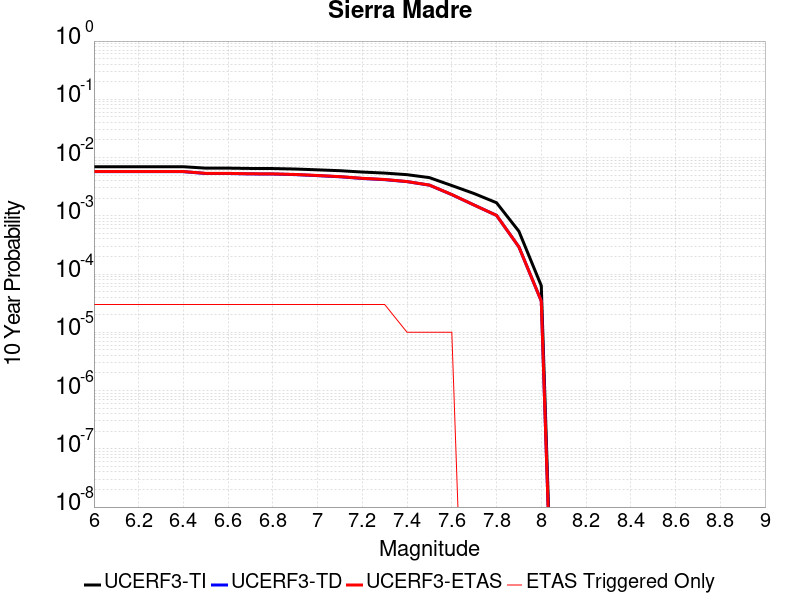 |

| Magnitude | 1 wk TI Prob | 1 wk TD Prob | 1 wk ETAS Prob | 1 wk ETAS/TD Gain | 1 wk ETAS Triggered Only | 1 mo TI Prob | 1 mo TD Prob | 1 mo ETAS Prob | 1 mo ETAS/TD Gain | 1 mo ETAS Triggered Only | 1 yr TI Prob | 1 yr TD Prob | 1 yr ETAS Prob | 1 yr ETAS/TD Gain | 1 yr ETAS Triggered Only | 10 yr TI Prob | 10 yr TD Prob | 10 yr ETAS Prob | 10 yr ETAS/TD Gain | 10 yr ETAS Triggered Only |
|-----|-----|-----|-----|-----|-----|-----|-----|-----|-----|-----|-----|-----|-----|-----|-----|-----|-----|-----|-----|-----|
| 6.0 | 1.3379373E-5 | 1.1000776E-5 | 1.1000776E-5 | 1.0 | 0.0 | 5.7338908E-5 | 4.714534E-5 | 4.714534E-5 | 1.0 | 0.0 | 6.978776E-4 | 5.738448E-4 | 5.8798236E-4 | 1.0246365 | 1.4145672E-5 | 0.0069569005 | 0.0057238447 | 0.0057519744 | 1.0049144 | 2.8291344E-5 |
| 6.1 | 1.3379373E-5 | 1.1000776E-5 | 1.1000776E-5 | 1.0 | 0.0 | 5.7338908E-5 | 4.714534E-5 | 4.714534E-5 | 1.0 | 0.0 | 6.978776E-4 | 5.738448E-4 | 5.8798236E-4 | 1.0246365 | 1.4145672E-5 | 0.0069569005 | 0.0057238447 | 0.0057519744 | 1.0049144 | 2.8291344E-5 |
| 6.2 | 1.3379373E-5 | 1.1000776E-5 | 1.1000776E-5 | 1.0 | 0.0 | 5.7338908E-5 | 4.714534E-5 | 4.714534E-5 | 1.0 | 0.0 | 6.978776E-4 | 5.738448E-4 | 5.8798236E-4 | 1.0246365 | 1.4145672E-5 | 0.0069569005 | 0.0057238447 | 0.0057519744 | 1.0049144 | 2.8291344E-5 |
| 6.3 | 1.3379373E-5 | 1.1000776E-5 | 1.1000776E-5 | 1.0 | 0.0 | 5.7338908E-5 | 4.714534E-5 | 4.714534E-5 | 1.0 | 0.0 | 6.978776E-4 | 5.738448E-4 | 5.8798236E-4 | 1.0246365 | 1.4145672E-5 | 0.0069569005 | 0.0057238447 | 0.0057519744 | 1.0049144 | 2.8291344E-5 |
| 6.4 | 1.3379373E-5 | 1.1000776E-5 | 1.1000776E-5 | 1.0 | 0.0 | 5.7338908E-5 | 4.714534E-5 | 4.714534E-5 | 1.0 | 0.0 | 6.978776E-4 | 5.738448E-4 | 5.8798236E-4 | 1.0246365 | 1.4145672E-5 | 0.0069569005 | 0.0057238447 | 0.0057519744 | 1.0049144 | 2.8291344E-5 |
| 6.5 | 1.26563245E-5 | 1.0230232E-5 | 1.0230232E-5 | 1.0 | 0.0 | 5.4240263E-5 | 4.384312E-5 | 4.384312E-5 | 1.0 | 0.0 | 6.601751E-4 | 5.3366035E-4 | 5.4779847E-4 | 1.0264927 | 1.4145672E-5 | 0.006582173 | 0.0053239604 | 0.005352101 | 1.0052856 | 2.8291344E-5 |
| 6.6 | 1.26563245E-5 | 1.0230232E-5 | 1.0230232E-5 | 1.0 | 0.0 | 5.4240263E-5 | 4.384312E-5 | 4.384312E-5 | 1.0 | 0.0 | 6.601751E-4 | 5.3366035E-4 | 5.4779847E-4 | 1.0264927 | 1.4145672E-5 | 0.006582173 | 0.0053239604 | 0.005352101 | 1.0052856 | 2.8291344E-5 |
| 6.7 | 1.2502474E-5 | 1.00663765E-5 | 1.00663765E-5 | 1.0 | 0.0 | 5.3580934E-5 | 4.3140906E-5 | 4.3140906E-5 | 1.0 | 0.0 | 6.521526E-4 | 5.25115E-4 | 5.3925323E-4 | 1.0269241 | 1.4145672E-5 | 0.0065024206 | 0.0052389116 | 0.005267055 | 1.0053719 | 2.8291344E-5 |
| 6.8 | 1.2454966E-5 | 1.0018662E-5 | 1.0018662E-5 | 1.0 | 0.0 | 5.3377335E-5 | 4.293642E-5 | 4.293642E-5 | 1.0 | 0.0 | 6.4967526E-4 | 5.226266E-4 | 5.3676486E-4 | 1.0270524 | 1.4145672E-5 | 0.006477792 | 0.0052141445 | 0.005242288 | 1.0053976 | 2.8291344E-5 |
| 6.9 | 1.2225574E-5 | 9.792639E-6 | 9.792639E-6 | 1.0 | 0.0 | 5.2394265E-5 | 4.196778E-5 | 4.196778E-5 | 1.0 | 0.0 | 6.3771347E-4 | 5.10839E-4 | 5.2497745E-4 | 1.0276769 | 1.4145672E-5 | 0.006358865 | 0.0050968137 | 0.005124961 | 1.0055225 | 2.8291344E-5 |
| 7.0 | 1.182946E-5 | 9.399179E-6 | 9.399179E-6 | 1.0 | 0.0 | 5.06967E-5 | 4.0281582E-5 | 4.0281582E-5 | 1.0 | 0.0 | 6.1705755E-4 | 4.903189E-4 | 5.044577E-4 | 1.0288358 | 1.4145672E-5 | 0.006153469 | 0.004892533 | 0.004920686 | 1.0057542 | 2.8291344E-5 |
| 7.1 | 1.14369095E-5 | 8.986194E-6 | 8.986194E-6 | 1.0 | 0.0 | 4.9014405E-5 | 3.85117E-5 | 3.85117E-5 | 1.0 | 0.0 | 5.9658696E-4 | 4.6878002E-4 | 4.8291907E-4 | 1.0301614 | 1.4145672E-5 | 0.005949879 | 0.0046780678 | 0.0047062268 | 1.0060194 | 2.8291344E-5 |
| 7.2 | 1.0836419E-5 | 8.39959E-6 | 8.39959E-6 | 1.0 | 0.0 | 4.644097E-5 | 3.599775E-5 | 3.599775E-5 | 1.0 | 0.0 | 5.652721E-4 | 4.3818538E-4 | 4.5232486E-4 | 1.0322683 | 1.4145672E-5 | 0.0056383642 | 0.0043733614 | 0.004401529 | 1.0064408 | 2.8291344E-5 |
| 7.3 | 1.0403439E-5 | 8.020854E-6 | 8.020854E-6 | 1.0 | 0.0 | 4.4585406E-5 | 3.437464E-5 | 3.437464E-5 | 1.0 | 0.0 | 5.426921E-4 | 4.184318E-4 | 4.3257154E-4 | 1.0337923 | 1.4145672E-5 | 0.005413687 | 0.004176585 | 0.004204758 | 1.0067455 | 2.8291344E-5 |
| 7.4 | 9.768864E-6 | 7.4144855E-6 | 7.4144855E-6 | 1.0 | 0.0 | 4.186589E-5 | 3.1775984E-5 | 3.1775984E-5 | 1.0 | 0.0 | 5.09598E-4 | 3.868048E-4 | 3.868048E-4 | 1.0 | 0.0 | 0.0050843097 | 0.0038614576 | 0.0038614576 | 1.0 | 0.0 |
| 7.5 | 8.687089E-6 | 6.450183E-6 | 6.450183E-6 | 1.0 | 0.0 | 3.722985E-5 | 2.7643353E-5 | 2.7643353E-5 | 1.0 | 0.0 | 4.5317915E-4 | 3.3650672E-4 | 3.3650672E-4 | 1.0 | 0.0 | 0.004522561 | 0.003360109 | 0.003360109 | 1.0 | 0.0 |
| 7.6 | 6.3506063E-6 | 4.430329E-6 | 4.430329E-6 | 1.0 | 0.0 | 2.72166E-5 | 1.8986988E-5 | 1.8986988E-5 | 1.0 | 0.0 | 3.3131172E-4 | 2.3114232E-4 | 2.3114232E-4 | 1.0 | 0.0 | 0.003308182 | 0.0023090935 | 0.0023090935 | 1.0 | 0.0 |
| 7.7 | 4.62223E-6 | 2.9329542E-6 | 2.9329542E-6 | 1.0 | 0.0 | 1.9809406E-5 | 1.2569743E-5 | 1.2569743E-5 | 1.0 | 0.0 | 2.4115283E-4 | 1.5302589E-4 | 1.5302589E-4 | 1.0 | 0.0 | 0.0024089129 | 0.0015292577 | 0.0015292577 | 1.0 | 0.0 |
| 7.8 | 3.2145008E-6 | 1.949411E-6 | 1.949411E-6 | 1.0 | 0.0 | 1.3776359E-5 | 8.354592E-6 | 8.354592E-6 | 1.0 | 0.0 | 1.6771426E-4 | 1.01712416E-4 | 1.01712416E-4 | 1.0 | 0.0 | 0.0016758774 | 0.0010166786 | 0.0010166786 | 1.0 | 0.0 |
| 7.9 | 1.0391769E-6 | 5.602482E-7 | 5.602482E-7 | 1.0 | 0.0 | 4.4536077E-6 | 2.4010617E-6 | 2.4010617E-6 | 1.0 | 0.0 | 5.4221324E-5 | 2.9232539E-5 | 2.9232539E-5 | 1.0 | 0.0 | 5.4208096E-4 | 2.9228735E-4 | 2.9228735E-4 | 1.0 | 0.0 |
| 8.0 | 1.210983E-7 | 6.613497E-8 | 6.613497E-8 | 1.0 | 0.0 | 5.1899264E-7 | 2.8343558E-7 | 2.8343558E-7 | 1.0 | 0.0 | 6.3187167E-6 | 3.4508228E-6 | 3.4508228E-6 | 1.0 | 0.0 | 6.318537E-5 | 3.450771E-5 | 3.450771E-5 | 1.0 | 0.0 |

## Los Osos 2011
*[(top)](#table-of-contents)*

| 1 Week | 1 Month | 1 Year | 10 Year |
|-----|-----|-----|-----|
|  |  |  |  |

| Magnitude | 1 wk TI Prob | 1 wk TD Prob | 1 wk ETAS Prob | 1 wk ETAS/TD Gain | 1 wk ETAS Triggered Only | 1 mo TI Prob | 1 mo TD Prob | 1 mo ETAS Prob | 1 mo ETAS/TD Gain | 1 mo ETAS Triggered Only | 1 yr TI Prob | 1 yr TD Prob | 1 yr ETAS Prob | 1 yr ETAS/TD Gain | 1 yr ETAS Triggered Only | 10 yr TI Prob | 10 yr TD Prob | 10 yr ETAS Prob | 10 yr ETAS/TD Gain | 10 yr ETAS Triggered Only |
|-----|-----|-----|-----|-----|-----|-----|-----|-----|-----|-----|-----|-----|-----|-----|-----|-----|-----|-----|-----|-----|
| 6.0 | 4.8871775E-6 | 4.9814826E-6 | 1.9127085E-5 | 3.8396368 | 1.4145672E-5 | 2.0944879E-5 | 2.1349053E-5 | 3.5494424E-5 | 1.662576 | 1.4145672E-5 | 2.5497406E-4 | 2.598965E-4 | 2.740385E-4 | 1.0544139 | 1.4145672E-5 | 0.002546817 | 0.0025962 | 0.002624418 | 1.0108689 | 2.8291344E-5 |
| 6.1 | 4.8871775E-6 | 4.9814826E-6 | 1.9127085E-5 | 3.8396368 | 1.4145672E-5 | 2.0944879E-5 | 2.1349053E-5 | 3.5494424E-5 | 1.662576 | 1.4145672E-5 | 2.5497406E-4 | 2.598965E-4 | 2.740385E-4 | 1.0544139 | 1.4145672E-5 | 0.002546817 | 0.0025962 | 0.002624418 | 1.0108689 | 2.8291344E-5 |
| 6.2 | 4.8871775E-6 | 4.9814826E-6 | 1.9127085E-5 | 3.8396368 | 1.4145672E-5 | 2.0944879E-5 | 2.1349053E-5 | 3.5494424E-5 | 1.662576 | 1.4145672E-5 | 2.5497406E-4 | 2.598965E-4 | 2.740385E-4 | 1.0544139 | 1.4145672E-5 | 0.002546817 | 0.0025962 | 0.002624418 | 1.0108689 | 2.8291344E-5 |
| 6.3 | 4.8871775E-6 | 4.9814826E-6 | 1.9127085E-5 | 3.8396368 | 1.4145672E-5 | 2.0944879E-5 | 2.1349053E-5 | 3.5494424E-5 | 1.662576 | 1.4145672E-5 | 2.5497406E-4 | 2.598965E-4 | 2.740385E-4 | 1.0544139 | 1.4145672E-5 | 0.002546817 | 0.0025962 | 0.002624418 | 1.0108689 | 2.8291344E-5 |
| 6.4 | 4.8871775E-6 | 4.9814826E-6 | 1.9127085E-5 | 3.8396368 | 1.4145672E-5 | 2.0944879E-5 | 2.1349053E-5 | 3.5494424E-5 | 1.662576 | 1.4145672E-5 | 2.5497406E-4 | 2.598965E-4 | 2.740385E-4 | 1.0544139 | 1.4145672E-5 | 0.002546817 | 0.0025962 | 0.002624418 | 1.0108689 | 2.8291344E-5 |
| 6.5 | 3.1724062E-6 | 3.2233943E-6 | 3.2233943E-6 | 1.0 | 0.0 | 1.3595956E-5 | 1.3814474E-5 | 1.3814474E-5 | 1.0 | 0.0 | 1.6551818E-4 | 1.6817838E-4 | 1.6817838E-4 | 1.0 | 0.0 | 0.0016539496 | 0.0016805246 | 0.0016946464 | 1.0084033 | 1.4145672E-5 |
| 6.6 | 3.1022591E-6 | 3.1511038E-6 | 3.1511038E-6 | 1.0 | 0.0 | 1.3295328E-5 | 1.3504661E-5 | 1.3504661E-5 | 1.0 | 0.0 | 1.618586E-4 | 1.6440697E-4 | 1.6440697E-4 | 1.0 | 0.0 | 0.0016174077 | 0.0016428662 | 0.0016569886 | 1.0085962 | 1.4145672E-5 |
| 6.7 | 2.611518E-6 | 2.6491825E-6 | 2.6491825E-6 | 1.0 | 0.0 | 1.1192172E-5 | 1.1353591E-5 | 1.1353591E-5 | 1.0 | 0.0 | 1.3625617E-4 | 1.3822124E-4 | 1.3822124E-4 | 1.0 | 0.0 | 0.0013617266 | 0.0013813572 | 0.0013954834 | 1.0102262 | 1.4145672E-5 |
| 6.8 | 2.4780884E-6 | 2.5121587E-6 | 2.5121587E-6 | 1.0 | 0.0 | 1.0620336E-5 | 1.076635E-5 | 1.076635E-5 | 1.0 | 0.0 | 1.2929492E-4 | 1.3107246E-4 | 1.3107246E-4 | 1.0 | 0.0 | 0.0012921972 | 0.0013099556 | 0.0013240828 | 1.0107844 | 1.4145672E-5 |
| 6.9 | 2.1376322E-6 | 2.1635049E-6 | 2.1635049E-6 | 1.0 | 0.0 | 9.161248E-6 | 9.272131E-6 | 9.272131E-6 | 1.0 | 0.0 | 1.1153249E-4 | 1.1288237E-4 | 1.1288237E-4 | 1.0 | 0.0 | 0.0011147653 | 0.0011282521 | 0.0011423819 | 1.0125235 | 1.4145672E-5 |
| 7.0 | 1.9282882E-6 | 1.949458E-6 | 1.949458E-6 | 1.0 | 0.0 | 8.264066E-6 | 8.354793E-6 | 8.354793E-6 | 1.0 | 0.0 | 1.0061036E-4 | 1.0171487E-4 | 1.0171487E-4 | 1.0 | 0.0 | 0.0010056482 | 0.0010166845 | 0.0010308158 | 1.0138994 | 1.4145672E-5 |
| 7.1 | 1.6353226E-6 | 1.6501111E-6 | 1.6501111E-6 | 1.0 | 0.0 | 7.0085066E-6 | 7.0718856E-6 | 7.0718856E-6 | 1.0 | 0.0 | 8.532523E-5 | 8.6096814E-5 | 8.6096814E-5 | 1.0 | 0.0 | 8.529247E-4 | 8.6063537E-4 | 8.747688E-4 | 1.0164222 | 1.4145672E-5 |
| 7.2 | 1.4446276E-6 | 1.4553335E-6 | 1.4553335E-6 | 1.0 | 0.0 | 6.191247E-6 | 6.2371287E-6 | 6.2371287E-6 | 1.0 | 0.0 | 7.537582E-5 | 7.59344E-5 | 7.59344E-5 | 1.0 | 0.0 | 7.535026E-4 | 7.590851E-4 | 7.7322003E-4 | 1.018621 | 1.4145672E-5 |
| 7.3 | 1.2014582E-6 | 1.2069066E-6 | 1.2069066E-6 | 1.0 | 0.0 | 5.149096E-6 | 5.172447E-6 | 5.172447E-6 | 1.0 | 0.0 | 6.268844E-5 | 6.297272E-5 | 6.297272E-5 | 1.0 | 0.0 | 6.267076E-4 | 6.295492E-4 | 6.295492E-4 | 1.0 | 0.0 |
| 7.4 | 9.707733E-7 | 9.709767E-7 | 9.709767E-7 | 1.0 | 0.0 | 4.16045E-6 | 4.161322E-6 | 4.161322E-6 | 1.0 | 0.0 | 5.0652303E-5 | 5.066292E-5 | 5.066292E-5 | 1.0 | 0.0 | 5.064076E-4 | 5.065139E-4 | 5.065139E-4 | 1.0 | 0.0 |
| 7.5 | 7.174908E-7 | 7.114907E-7 | 7.114907E-7 | 1.0 | 0.0 | 3.074957E-6 | 3.0492424E-6 | 3.0492424E-6 | 1.0 | 0.0 | 3.743696E-5 | 3.7123897E-5 | 3.7123897E-5 | 1.0 | 0.0 | 3.7430652E-4 | 3.7117713E-4 | 3.7117713E-4 | 1.0 | 0.0 |
| 7.6 | 4.5535776E-7 | 4.4207857E-7 | 4.4207857E-7 | 1.0 | 0.0 | 1.9515319E-6 | 1.8946212E-6 | 1.8946212E-6 | 1.0 | 0.0 | 2.3759641E-5 | 2.3066768E-5 | 2.3066768E-5 | 1.0 | 0.0 | 2.37571E-4 | 2.3064384E-4 | 2.3064384E-4 | 1.0 | 0.0 |
| 7.7 | 2.1173553E-7 | 1.9060734E-7 | 1.9060734E-7 | 1.0 | 0.0 | 9.0743765E-7 | 8.1688836E-7 | 8.1688836E-7 | 1.0 | 0.0 | 1.1047998E-5 | 9.94557E-6 | 9.94557E-6 | 1.0 | 0.0 | 1.1047449E-4 | 9.945128E-5 | 9.945128E-5 | 1.0 | 0.0 |
| 7.8 | 9.873608E-8 | 7.367457E-8 | 7.367457E-8 | 1.0 | 0.0 | 4.2315455E-7 | 3.1574814E-7 | 3.1574814E-7 | 1.0 | 0.0 | 5.1518946E-6 | 3.8442267E-6 | 3.8442267E-6 | 1.0 | 0.0 | 5.1517753E-5 | 3.844161E-5 | 3.844161E-5 | 1.0 | 0.0 |
| 7.9 | 5.4399106E-8 | 3.187941E-8 | 3.187941E-8 | 1.0 | 0.0 | 2.33139E-7 | 1.3662603E-7 | 1.3662603E-7 | 1.0 | 0.0 | 2.8384638E-6 | 1.6634207E-6 | 1.6634207E-6 | 1.0 | 0.0 | 2.8384275E-5 | 1.6634083E-5 | 1.6634083E-5 | 1.0 | 0.0 |
| 8.0 | 1.817203E-8 | 8.420079E-9 | 8.420079E-9 | 1.0 | 0.0 | 7.7880124E-8 | 3.6086053E-8 | 3.6086053E-8 | 1.0 | 0.0 | 9.481901E-7 | 4.393476E-7 | 4.393476E-7 | 1.0 | 0.0 | 9.481861E-6 | 4.393468E-6 | 4.393468E-6 | 1.0 | 0.0 |

## Fish Slough 2011 CFM
*[(top)](#table-of-contents)*

| 1 Week | 1 Month | 1 Year | 10 Year |
|-----|-----|-----|-----|
|  |  |  |  |

| Magnitude | 1 wk TI Prob | 1 wk TD Prob | 1 wk ETAS Prob | 1 wk ETAS/TD Gain | 1 wk ETAS Triggered Only | 1 mo TI Prob | 1 mo TD Prob | 1 mo ETAS Prob | 1 mo ETAS/TD Gain | 1 mo ETAS Triggered Only | 1 yr TI Prob | 1 yr TD Prob | 1 yr ETAS Prob | 1 yr ETAS/TD Gain | 1 yr ETAS Triggered Only | 10 yr TI Prob | 10 yr TD Prob | 10 yr ETAS Prob | 10 yr ETAS/TD Gain | 10 yr ETAS Triggered Only |
|-----|-----|-----|-----|-----|-----|-----|-----|-----|-----|-----|-----|-----|-----|-----|-----|-----|-----|-----|-----|-----|
| 6.0 | 4.3629925E-6 | 3.6772458E-6 | 3.6772458E-6 | 1.0 | 0.0 | 1.8698405E-5 | 1.5759542E-5 | 1.5759542E-5 | 1.0 | 0.0 | 2.276293E-4 | 1.9185765E-4 | 2.0600061E-4 | 1.0737159 | 1.4145672E-5 | 0.0022739628 | 0.001917129 | 0.0019312477 | 1.0073644 | 1.4145672E-5 |
| 6.1 | 4.3629925E-6 | 3.6772458E-6 | 3.6772458E-6 | 1.0 | 0.0 | 1.8698405E-5 | 1.5759542E-5 | 1.5759542E-5 | 1.0 | 0.0 | 2.276293E-4 | 1.9185765E-4 | 2.0600061E-4 | 1.0737159 | 1.4145672E-5 | 0.0022739628 | 0.001917129 | 0.0019312477 | 1.0073644 | 1.4145672E-5 |
| 6.2 | 4.3629925E-6 | 3.6772458E-6 | 3.6772458E-6 | 1.0 | 0.0 | 1.8698405E-5 | 1.5759542E-5 | 1.5759542E-5 | 1.0 | 0.0 | 2.276293E-4 | 1.9185765E-4 | 2.0600061E-4 | 1.0737159 | 1.4145672E-5 | 0.0022739628 | 0.001917129 | 0.0019312477 | 1.0073644 | 1.4145672E-5 |
| 6.3 | 4.3629925E-6 | 3.6772458E-6 | 3.6772458E-6 | 1.0 | 0.0 | 1.8698405E-5 | 1.5759542E-5 | 1.5759542E-5 | 1.0 | 0.0 | 2.276293E-4 | 1.9185765E-4 | 2.0600061E-4 | 1.0737159 | 1.4145672E-5 | 0.0022739628 | 0.001917129 | 0.0019312477 | 1.0073644 | 1.4145672E-5 |
| 6.4 | 4.3629925E-6 | 3.6772458E-6 | 3.6772458E-6 | 1.0 | 0.0 | 1.8698405E-5 | 1.5759542E-5 | 1.5759542E-5 | 1.0 | 0.0 | 2.276293E-4 | 1.9185765E-4 | 2.0600061E-4 | 1.0737159 | 1.4145672E-5 | 0.0022739628 | 0.001917129 | 0.0019312477 | 1.0073644 | 1.4145672E-5 |
| 6.5 | 2.991715E-6 | 2.2703657E-6 | 2.2703657E-6 | 1.0 | 0.0 | 1.2821573E-5 | 9.730108E-6 | 9.730108E-6 | 1.0 | 0.0 | 1.5609147E-4 | 1.1845854E-4 | 1.3260254E-4 | 1.1194004 | 1.4145672E-5 | 0.0015598187 | 0.0011840442 | 0.001198173 | 1.0119327 | 1.4145672E-5 |
| 6.6 | 2.991715E-6 | 2.2703657E-6 | 2.2703657E-6 | 1.0 | 0.0 | 1.2821573E-5 | 9.730108E-6 | 9.730108E-6 | 1.0 | 0.0 | 1.5609147E-4 | 1.1845854E-4 | 1.3260254E-4 | 1.1194004 | 1.4145672E-5 | 0.0015598187 | 0.0011840442 | 0.001198173 | 1.0119327 | 1.4145672E-5 |
| 6.7 | 2.7890346E-6 | 2.0621612E-6 | 2.0621612E-6 | 1.0 | 0.0 | 1.1952951E-5 | 8.837809E-6 | 8.837809E-6 | 1.0 | 0.0 | 1.4551746E-4 | 1.07595915E-4 | 1.21740064E-4 | 1.1314563 | 1.4145672E-5 | 0.0014542221 | 0.0010755265 | 0.001089657 | 1.0131382 | 1.4145672E-5 |
| 6.8 | 1.9416723E-6 | 1.192531E-6 | 1.192531E-6 | 1.0 | 0.0 | 8.321425E-6 | 5.1108377E-6 | 5.1108377E-6 | 1.0 | 0.0 | 1.01308644E-4 | 6.2222716E-5 | 7.6367505E-5 | 1.2273252 | 1.4145672E-5 | 0.0010126247 | 6.22057E-4 | 6.361939E-4 | 1.022726 | 1.4145672E-5 |
| 6.9 | 1.8567416E-6 | 1.1046726E-6 | 1.1046726E-6 | 1.0 | 0.0 | 7.957439E-6 | 4.734303E-6 | 4.734303E-6 | 1.0 | 0.0 | 9.687752E-5 | 5.7638652E-5 | 7.178351E-5 | 1.2454058 | 1.4145672E-5 | 9.6835295E-4 | 5.762409E-4 | 5.903784E-4 | 1.0245341 | 1.4145672E-5 |
| 7.0 | 1.6634067E-6 | 9.0737336E-7 | 9.0737336E-7 | 1.0 | 0.0 | 7.1288664E-6 | 3.8887374E-6 | 3.8887374E-6 | 1.0 | 0.0 | 8.679049E-5 | 4.7344376E-5 | 6.148938E-5 | 1.2987684 | 1.4145672E-5 | 8.6756604E-4 | 4.733458E-4 | 4.8748477E-4 | 1.0298703 | 1.4145672E-5 |
| 7.1 | 1.4281054E-6 | 6.736389E-7 | 6.736389E-7 | 1.0 | 0.0 | 6.1204373E-6 | 2.8870209E-6 | 2.8870209E-6 | 1.0 | 0.0 | 7.451377E-5 | 3.514893E-5 | 4.9294104E-5 | 1.4024354 | 1.4145672E-5 | 7.44888E-4 | 3.5143548E-4 | 3.6557618E-4 | 1.040237 | 1.4145672E-5 |
| 7.2 | 1.1810387E-6 | 4.408126E-7 | 4.408126E-7 | 1.0 | 0.0 | 5.0615845E-6 | 1.8891956E-6 | 1.8891956E-6 | 1.0 | 0.0 | 6.1623046E-5 | 2.3000723E-5 | 3.714607E-5 | 1.6149957 | 1.4145672E-5 | 6.160596E-4 | 2.2998432E-4 | 2.4412674E-4 | 1.0614929 | 1.4145672E-5 |
| 7.3 | 9.918052E-7 | 2.8731267E-7 | 2.8731267E-7 | 1.0 | 0.0 | 4.2505867E-6 | 1.2313394E-6 | 1.2313394E-6 | 1.0 | 0.0 | 5.1749663E-5 | 1.4991455E-5 | 2.9136916E-5 | 1.9435681 | 1.4145672E-5 | 5.173762E-4 | 1.4990455E-4 | 1.640481E-4 | 1.0943503 | 1.4145672E-5 |
| 7.4 | 8.25252E-7 | 2.0692863E-7 | 2.0692863E-7 | 1.0 | 0.0 | 3.5367896E-6 | 8.868367E-7 | 8.868367E-7 | 1.0 | 0.0 | 4.3059565E-5 | 1.0797184E-5 | 1.0797184E-5 | 1.0 | 0.0 | 4.305122E-4 | 1.0796666E-4 | 1.0796666E-4 | 1.0 | 0.0 |
| 7.5 | 5.3248567E-7 | 1.2071294E-7 | 1.2071294E-7 | 1.0 | 0.0 | 2.2820795E-6 | 5.1734105E-7 | 5.1734105E-7 | 1.0 | 0.0 | 2.7783964E-5 | 6.2986096E-6 | 6.2986096E-6 | 1.0 | 0.0 | 2.778049E-4 | 6.298435E-5 | 6.298435E-5 | 1.0 | 0.0 |
| 7.6 | 2.037542E-7 | 4.7123013E-8 | 4.7123013E-8 | 1.0 | 0.0 | 8.73232E-7 | 2.0195576E-7 | 2.0195576E-7 | 1.0 | 0.0 | 1.0631547E-5 | 2.4588087E-6 | 2.4588087E-6 | 1.0 | 0.0 | 1.0631039E-4 | 2.4587836E-5 | 2.4587836E-5 | 1.0 | 0.0 |
| 7.7 | 2.2501226E-8 | 3.1506997E-9 | 3.1506997E-9 | 1.0 | 0.0 | 9.6433816E-8 | 1.3502998E-8 | 1.3502998E-8 | 1.0 | 0.0 | 1.1740811E-6 | 1.64399E-7 | 1.64399E-7 | 1.0 | 0.0 | 1.1740749E-5 | 1.6439889E-6 | 1.6439889E-6 | 1.0 | 0.0 |

## Franklin 2011 CFM
*[(top)](#table-of-contents)*

| 1 Week | 1 Month | 1 Year | 10 Year |
|-----|-----|-----|-----|
|  |  |  |  |

| Magnitude | 1 wk TI Prob | 1 wk TD Prob | 1 wk ETAS Prob | 1 wk ETAS/TD Gain | 1 wk ETAS Triggered Only | 1 mo TI Prob | 1 mo TD Prob | 1 mo ETAS Prob | 1 mo ETAS/TD Gain | 1 mo ETAS Triggered Only | 1 yr TI Prob | 1 yr TD Prob | 1 yr ETAS Prob | 1 yr ETAS/TD Gain | 1 yr ETAS Triggered Only | 10 yr TI Prob | 10 yr TD Prob | 10 yr ETAS Prob | 10 yr ETAS/TD Gain | 10 yr ETAS Triggered Only |
|-----|-----|-----|-----|-----|-----|-----|-----|-----|-----|-----|-----|-----|-----|-----|-----|-----|-----|-----|-----|-----|
| 6.0 | 1.845602E-5 | 2.0212667E-5 | 2.0212667E-5 | 1.0 | 0.0 | 7.9094825E-5 | 8.6623004E-5 | 8.6623004E-5 | 1.0 | 0.0 | 9.6255407E-4 | 0.0010541538 | 0.0010541538 | 1.0 | 0.0 | 0.009583955 | 0.010508837 | 0.010522834 | 1.0013319 | 1.4145672E-5 |
| 6.1 | 1.845602E-5 | 2.0212667E-5 | 2.0212667E-5 | 1.0 | 0.0 | 7.9094825E-5 | 8.6623004E-5 | 8.6623004E-5 | 1.0 | 0.0 | 9.6255407E-4 | 0.0010541538 | 0.0010541538 | 1.0 | 0.0 | 0.009583955 | 0.010508837 | 0.010522834 | 1.0013319 | 1.4145672E-5 |
| 6.2 | 1.845602E-5 | 2.0212667E-5 | 2.0212667E-5 | 1.0 | 0.0 | 7.9094825E-5 | 8.6623004E-5 | 8.6623004E-5 | 1.0 | 0.0 | 9.6255407E-4 | 0.0010541538 | 0.0010541538 | 1.0 | 0.0 | 0.009583955 | 0.010508837 | 0.010522834 | 1.0013319 | 1.4145672E-5 |
| 6.3 | 1.3813506E-5 | 1.5154875E-5 | 1.5154875E-5 | 1.0 | 0.0 | 5.9199396E-5 | 6.494789E-5 | 6.494789E-5 | 1.0 | 0.0 | 7.205143E-4 | 7.904614E-4 | 7.904614E-4 | 1.0 | 0.0 | 0.007181826 | 0.007891684 | 0.007891684 | 1.0 | 0.0 |
| 6.4 | 1.3813506E-5 | 1.5154875E-5 | 1.5154875E-5 | 1.0 | 0.0 | 5.9199396E-5 | 6.494789E-5 | 6.494789E-5 | 1.0 | 0.0 | 7.205143E-4 | 7.904614E-4 | 7.904614E-4 | 1.0 | 0.0 | 0.007181826 | 0.007891684 | 0.007891684 | 1.0 | 0.0 |
| 6.5 | 1.1308949E-5 | 1.2417847E-5 | 1.2417847E-5 | 1.0 | 0.0 | 4.8466023E-5 | 5.321827E-5 | 5.321827E-5 | 1.0 | 0.0 | 5.899141E-4 | 6.477419E-4 | 6.477419E-4 | 1.0 | 0.0 | 0.0058835056 | 0.0064731706 | 0.0064731706 | 1.0 | 0.0 |
| 6.6 | 1.0813164E-5 | 1.187607E-5 | 1.187607E-5 | 1.0 | 0.0 | 4.6341313E-5 | 5.089646E-5 | 5.089646E-5 | 1.0 | 0.0 | 5.640594E-4 | 6.194901E-4 | 6.194901E-4 | 1.0 | 0.0 | 0.005626298 | 0.006192248 | 0.006192248 | 1.0 | 0.0 |
| 6.7 | 1.0706348E-5 | 1.1757834E-5 | 1.1757834E-5 | 1.0 | 0.0 | 4.5883542E-5 | 5.0389754E-5 | 5.0389754E-5 | 1.0 | 0.0 | 5.5848894E-4 | 6.1332446E-4 | 6.1332446E-4 | 1.0 | 0.0 | 0.005570874 | 0.006130933 | 0.006130933 | 1.0 | 0.0 |
| 6.8 | 9.443655E-6 | 1.0349157E-5 | 1.0349157E-5 | 1.0 | 0.0 | 4.0472176E-5 | 4.435278E-5 | 4.435278E-5 | 1.0 | 0.0 | 4.9263734E-4 | 5.3986267E-4 | 5.3986267E-4 | 1.0 | 0.0 | 0.0049154665 | 0.0054000774 | 0.0054000774 | 1.0 | 0.0 |
| 6.9 | 8.7001645E-6 | 9.522226E-6 | 9.522226E-6 | 1.0 | 0.0 | 3.728589E-5 | 4.0808907E-5 | 4.0808907E-5 | 1.0 | 0.0 | 4.538611E-4 | 4.967364E-4 | 4.967364E-4 | 1.0 | 0.0 | 0.0045293528 | 0.004970812 | 0.004970812 | 1.0 | 0.0 |
| 7.0 | 8.074731E-6 | 8.815842E-6 | 8.815842E-6 | 1.0 | 0.0 | 3.460553E-5 | 3.778164E-5 | 3.778164E-5 | 1.0 | 0.0 | 4.212409E-4 | 4.5989547E-4 | 4.5989547E-4 | 1.0 | 0.0 | 0.004204433 | 0.0046039745 | 0.0046039745 | 1.0 | 0.0 |
| 7.1 | 7.3370957E-6 | 7.961713E-6 | 7.961713E-6 | 1.0 | 0.0 | 3.1444317E-5 | 3.412119E-5 | 3.412119E-5 | 1.0 | 0.0 | 3.8276732E-4 | 4.1534728E-4 | 4.1534728E-4 | 1.0 | 0.0 | 0.0038210868 | 0.0041600685 | 0.0041600685 | 1.0 | 0.0 |
| 7.2 | 5.1750103E-6 | 5.457141E-6 | 5.457141E-6 | 1.0 | 0.0 | 2.2178427E-5 | 2.338754E-5 | 2.338754E-5 | 1.0 | 0.0 | 2.699889E-4 | 2.8470642E-4 | 2.8470642E-4 | 1.0 | 0.0 | 0.002696611 | 0.0028573358 | 0.0028573358 | 1.0 | 0.0 |
| 7.3 | 3.5221371E-6 | 3.7960758E-6 | 3.7960758E-6 | 1.0 | 0.0 | 1.5094786E-5 | 1.6268796E-5 | 1.6268796E-5 | 1.0 | 0.0 | 1.8376352E-4 | 1.980547E-4 | 1.980547E-4 | 1.0 | 0.0 | 0.0018361164 | 0.0019921293 | 0.0019921293 | 1.0 | 0.0 |
| 7.4 | 2.5749775E-6 | 2.8182237E-6 | 2.8182237E-6 | 1.0 | 0.0 | 1.1035571E-5 | 1.2078047E-5 | 1.2078047E-5 | 1.0 | 0.0 | 1.343498E-4 | 1.4704037E-4 | 1.4704037E-4 | 1.0 | 0.0 | 0.001342686 | 0.0014814398 | 0.0014814398 | 1.0 | 0.0 |
| 7.5 | 1.3642131E-6 | 1.5497532E-6 | 1.5497532E-6 | 1.0 | 0.0 | 5.8466144E-6 | 6.6417824E-6 | 6.6417824E-6 | 1.0 | 0.0 | 7.1180206E-5 | 8.086072E-5 | 8.086072E-5 | 1.0 | 0.0 | 7.115741E-4 | 8.1887894E-4 | 8.1887894E-4 | 1.0 | 0.0 |
| 7.6 | 5.329124E-7 | 6.701074E-7 | 6.701074E-7 | 1.0 | 0.0 | 2.2839083E-6 | 2.8718855E-6 | 2.8718855E-6 | 1.0 | 0.0 | 2.7806227E-5 | 3.496465E-5 | 3.496465E-5 | 1.0 | 0.0 | 2.780275E-4 | 3.5998534E-4 | 3.5998534E-4 | 1.0 | 0.0 |
| 7.7 | 4.199127E-7 | 5.486731E-7 | 5.486731E-7 | 1.0 | 0.0 | 1.7996247E-6 | 2.351454E-6 | 2.351454E-6 | 1.0 | 0.0 | 2.191021E-5 | 2.862858E-5 | 2.862858E-5 | 1.0 | 0.0 | 2.190805E-4 | 2.9645322E-4 | 2.9645322E-4 | 1.0 | 0.0 |
| 7.8 | 2.2586491E-7 | 3.0661545E-7 | 3.0661545E-7 | 1.0 | 0.0 | 9.67992E-7 | 1.3140656E-6 | 1.3140656E-6 | 1.0 | 0.0 | 1.178524E-5 | 1.5998632E-5 | 1.5998632E-5 | 1.0 | 0.0 | 1.17846146E-4 | 1.6630026E-4 | 1.6630026E-4 | 1.0 | 0.0 |
| 7.9 | 1.4568845E-7 | 2.1202912E-7 | 2.1202912E-7 | 1.0 | 0.0 | 6.243789E-7 | 9.0869594E-7 | 9.0869594E-7 | 1.0 | 0.0 | 7.601787E-6 | 1.1063317E-5 | 1.1063317E-5 | 1.0 | 0.0 | 7.601527E-5 | 1.15088624E-4 | 1.15088624E-4 | 1.0 | 0.0 |
| 8.0 | 5.2868224E-8 | 9.997299E-8 | 9.997299E-8 | 1.0 | 0.0 | 2.2657808E-7 | 4.284556E-7 | 4.284556E-7 | 1.0 | 0.0 | 2.7585847E-6 | 5.2164346E-6 | 5.2164346E-6 | 1.0 | 0.0 | 2.7585504E-5 | 5.4021348E-5 | 5.4021348E-5 | 1.0 | 0.0 |
| 8.1 | 2.654434E-9 | 4.7228426E-9 | 4.7228426E-9 | 1.0 | 0.0 | 1.1376145E-8 | 2.0240753E-8 | 2.0240753E-8 | 1.0 | 0.0 | 1.3850456E-7 | 2.4643114E-7 | 2.4643114E-7 | 1.0 | 0.0 | 1.3850448E-6 | 2.533639E-6 | 2.533639E-6 | 1.0 | 0.0 |

## Laguna Salada
*[(top)](#table-of-contents)*

| 1 Week | 1 Month | 1 Year | 10 Year |
|-----|-----|-----|-----|
|  |  |  |  |

| Magnitude | 1 wk TI Prob | 1 wk TD Prob | 1 wk ETAS Prob | 1 wk ETAS/TD Gain | 1 wk ETAS Triggered Only | 1 mo TI Prob | 1 mo TD Prob | 1 mo ETAS Prob | 1 mo ETAS/TD Gain | 1 mo ETAS Triggered Only | 1 yr TI Prob | 1 yr TD Prob | 1 yr ETAS Prob | 1 yr ETAS/TD Gain | 1 yr ETAS Triggered Only | 10 yr TI Prob | 10 yr TD Prob | 10 yr ETAS Prob | 10 yr ETAS/TD Gain | 10 yr ETAS Triggered Only |
|-----|-----|-----|-----|-----|-----|-----|-----|-----|-----|-----|-----|-----|-----|-----|-----|-----|-----|-----|-----|-----|
| 6.0 | 4.6465593E-5 | 4.634507E-5 | 4.634507E-5 | 1.0 | 0.0 | 1.9912305E-4 | 1.9860751E-4 | 1.9860751E-4 | 1.0 | 0.0 | 0.0024216278 | 0.0024154421 | 0.0024154421 | 1.0 | 0.0 | 0.02395408 | 0.023965387 | 0.023979193 | 1.0005761 | 1.4145672E-5 |
| 6.1 | 3.982297E-5 | 3.7244878E-5 | 3.7244878E-5 | 1.0 | 0.0 | 1.706587E-4 | 1.5961178E-4 | 1.5961178E-4 | 1.0 | 0.0 | 0.0020757897 | 0.0019416384 | 0.0019416384 | 1.0 | 0.0 | 0.020565065 | 0.019322045 | 0.019322045 | 1.0 | 0.0 |
| 6.2 | 3.6067784E-5 | 3.2600165E-5 | 3.2600165E-5 | 1.0 | 0.0 | 1.5456705E-4 | 1.3970808E-4 | 1.3970808E-4 | 1.0 | 0.0 | 0.0018802295 | 0.0016997134 | 0.0016997134 | 1.0 | 0.0 | 0.018644003 | 0.016963193 | 0.016963193 | 1.0 | 0.0 |
| 6.3 | 3.2859112E-5 | 2.8847233E-5 | 2.8847233E-5 | 1.0 | 0.0 | 1.4081717E-4 | 1.2362566E-4 | 1.2362566E-4 | 1.0 | 0.0 | 0.0017131006 | 0.0015041964 | 0.0015041964 | 1.0 | 0.0 | 0.016999546 | 0.015031838 | 0.015031838 | 1.0 | 0.0 |
| 6.4 | 2.9132116E-5 | 2.4851877E-5 | 2.4851877E-5 | 1.0 | 0.0 | 1.2484594E-4 | 1.0650421E-4 | 1.0650421E-4 | 1.0 | 0.0 | 0.0015189396 | 0.001296006 | 0.001296006 | 1.0 | 0.0 | 0.015085992 | 0.012965128 | 0.012965128 | 1.0 | 0.0 |
| 6.5 | 2.7075037E-5 | 2.2824677E-5 | 2.2824677E-5 | 1.0 | 0.0 | 1.1603071E-4 | 9.7816875E-5 | 9.7816875E-5 | 1.0 | 0.0 | 0.0014117584 | 0.0011903581 | 0.0011903581 | 1.0 | 0.0 | 0.014028233 | 0.011916272 | 0.011916272 | 1.0 | 0.0 |
| 6.6 | 2.2367465E-5 | 1.8572848E-5 | 1.8572848E-5 | 1.0 | 0.0 | 9.5857045E-5 | 7.959595E-5 | 7.959595E-5 | 1.0 | 0.0 | 0.0011664346 | 9.687322E-4 | 9.687322E-4 | 1.0 | 0.0 | 0.011603311 | 0.009708806 | 0.009708806 | 1.0 | 0.0 |
| 6.7 | 1.9458053E-5 | 1.5913607E-5 | 1.5913607E-5 | 1.0 | 0.0 | 8.338899E-5 | 6.819984E-5 | 6.819984E-5 | 1.0 | 0.0 | 0.001014788 | 8.300971E-4 | 8.300971E-4 | 1.0 | 0.0 | 0.010101665 | 0.008315945 | 0.008315945 | 1.0 | 0.0 |
| 6.8 | 1.0767866E-5 | 9.183346E-6 | 9.183346E-6 | 1.0 | 0.0 | 4.614718E-5 | 3.9356994E-5 | 3.9356994E-5 | 1.0 | 0.0 | 5.6169706E-4 | 4.7913467E-4 | 4.7913467E-4 | 1.0 | 0.0 | 0.0056027942 | 0.0048085325 | 0.0048085325 | 1.0 | 0.0 |
| 6.9 | 2.1384765E-6 | 1.7913964E-6 | 1.7913964E-6 | 1.0 | 0.0 | 9.164866E-6 | 7.677392E-6 | 7.677392E-6 | 1.0 | 0.0 | 1.1157654E-4 | 9.346863E-5 | 9.346863E-5 | 1.0 | 0.0 | 0.0011152053 | 9.343315E-4 | 9.343315E-4 | 1.0 | 0.0 |
| 7.0 | 2.0952946E-6 | 1.7493335E-6 | 1.7493335E-6 | 1.0 | 0.0 | 8.979802E-6 | 7.497124E-6 | 7.497124E-6 | 1.0 | 0.0 | 1.0932361E-4 | 9.127405E-5 | 9.127405E-5 | 1.0 | 0.0 | 0.0010926984 | 9.124038E-4 | 9.124038E-4 | 1.0 | 0.0 |
| 7.1 | 1.7887576E-6 | 1.4500541E-6 | 1.4500541E-6 | 1.0 | 0.0 | 7.666081E-6 | 6.2145045E-6 | 6.2145045E-6 | 1.0 | 0.0 | 9.333054E-5 | 7.565928E-5 | 7.565928E-5 | 1.0 | 0.0 | 9.329135E-4 | 7.5636554E-4 | 7.5636554E-4 | 1.0 | 0.0 |
| 7.2 | 9.723109E-7 | 7.135829E-7 | 7.135829E-7 | 1.0 | 0.0 | 4.16704E-6 | 3.0582096E-6 | 3.0582096E-6 | 1.0 | 0.0 | 5.073253E-5 | 3.7233232E-5 | 3.7233232E-5 | 1.0 | 0.0 | 5.072095E-4 | 3.722862E-4 | 3.722862E-4 | 1.0 | 0.0 |

## Likely 2011 CFM
*[(top)](#table-of-contents)*

| 1 Week | 1 Month | 1 Year | 10 Year |
|-----|-----|-----|-----|
|  | 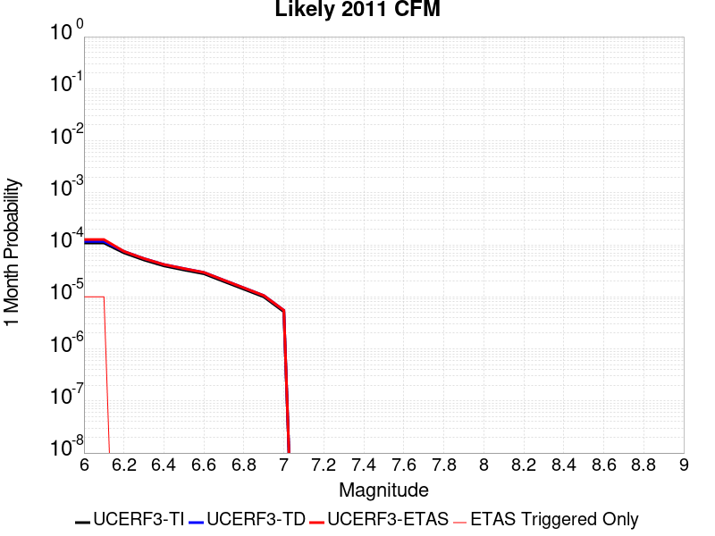 |  | 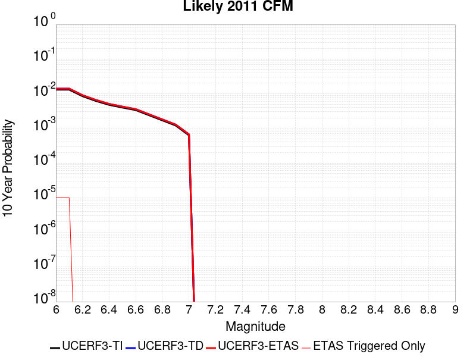 |

| Magnitude | 1 wk TI Prob | 1 wk TD Prob | 1 wk ETAS Prob | 1 wk ETAS/TD Gain | 1 wk ETAS Triggered Only | 1 mo TI Prob | 1 mo TD Prob | 1 mo ETAS Prob | 1 mo ETAS/TD Gain | 1 mo ETAS Triggered Only | 1 yr TI Prob | 1 yr TD Prob | 1 yr ETAS Prob | 1 yr ETAS/TD Gain | 1 yr ETAS Triggered Only | 10 yr TI Prob | 10 yr TD Prob | 10 yr ETAS Prob | 10 yr ETAS/TD Gain | 10 yr ETAS Triggered Only |
|-----|-----|-----|-----|-----|-----|-----|-----|-----|-----|-----|-----|-----|-----|-----|-----|-----|-----|-----|-----|-----|
| 6.0 | 2.5315949E-5 | 2.7104748E-5 | 4.1250038E-5 | 1.5218749 | 1.4145672E-5 | 1.0849241E-4 | 1.16158284E-4 | 1.3030232E-4 | 1.1217651 | 1.4145672E-5 | 0.0013200947 | 0.0014133542 | 0.0014274799 | 1.0099944 | 1.4145672E-5 | 0.013122803 | 0.01404831 | 0.0140622575 | 1.0009928 | 1.4145672E-5 |
| 6.1 | 2.5315949E-5 | 2.7104748E-5 | 4.1250038E-5 | 1.5218749 | 1.4145672E-5 | 1.0849241E-4 | 1.16158284E-4 | 1.3030232E-4 | 1.1217651 | 1.4145672E-5 | 0.0013200947 | 0.0014133542 | 0.0014274799 | 1.0099944 | 1.4145672E-5 | 0.013122803 | 0.01404831 | 0.0140622575 | 1.0009928 | 1.4145672E-5 |
| 6.2 | 1.6375941E-5 | 1.7465842E-5 | 1.7465842E-5 | 1.0 | 0.0 | 7.0180715E-5 | 7.485153E-5 | 7.485153E-5 | 1.0 | 0.0 | 8.5411523E-4 | 9.109487E-4 | 9.109487E-4 | 1.0 | 0.0 | 0.008508399 | 0.009073433 | 0.009073433 | 1.0 | 0.0 |
| 6.3 | 1.1945543E-5 | 1.2712587E-5 | 1.2712587E-5 | 1.0 | 0.0 | 5.119418E-5 | 5.4481407E-5 | 5.4481407E-5 | 1.0 | 0.0 | 6.2311086E-4 | 6.631146E-4 | 6.631146E-4 | 1.0 | 0.0 | 0.0062136655 | 0.0066119144 | 0.0066119144 | 1.0 | 0.0 |
| 6.4 | 9.192729E-6 | 9.768488E-6 | 9.768488E-6 | 1.0 | 0.0 | 3.939681E-5 | 4.1864292E-5 | 4.1864292E-5 | 1.0 | 0.0 | 4.7955062E-4 | 5.0958124E-4 | 5.0958124E-4 | 1.0 | 0.0 | 0.004785171 | 0.0050844094 | 0.0050844094 | 1.0 | 0.0 |
| 6.5 | 7.67906E-6 | 8.152622E-6 | 8.152622E-6 | 1.0 | 0.0 | 3.2909844E-5 | 3.4939352E-5 | 3.4939352E-5 | 1.0 | 0.0 | 4.006037E-4 | 4.2530545E-4 | 4.2530545E-4 | 1.0 | 0.0 | 0.0039988225 | 0.004245108 | 0.004245108 | 1.0 | 0.0 |
| 6.6 | 6.4884057E-6 | 6.8847507E-6 | 6.8847507E-6 | 1.0 | 0.0 | 2.7807157E-5 | 2.9505749E-5 | 2.9505749E-5 | 1.0 | 0.0 | 3.3849955E-4 | 3.591747E-4 | 3.591747E-4 | 1.0 | 0.0 | 0.003379844 | 0.0035860867 | 0.0035860867 | 1.0 | 0.0 |
| 6.7 | 4.6060636E-6 | 4.884041E-6 | 4.884041E-6 | 1.0 | 0.0 | 1.9740122E-5 | 2.0931442E-5 | 2.0931442E-5 | 1.0 | 0.0 | 2.403095E-4 | 2.5481134E-4 | 2.5481134E-4 | 1.0 | 0.0 | 0.002400498 | 0.0025452746 | 0.0025452746 | 1.0 | 0.0 |
| 6.8 | 3.2795615E-6 | 3.4773732E-6 | 3.4773732E-6 | 1.0 | 0.0 | 1.4055187E-5 | 1.4902946E-5 | 1.4902946E-5 | 1.0 | 0.0 | 1.7110848E-4 | 1.8142881E-4 | 1.8142881E-4 | 1.0 | 0.0 | 0.0017097679 | 0.0018128622 | 0.0018128622 | 1.0 | 0.0 |
| 6.9 | 2.3289967E-6 | 2.4705569E-6 | 2.4705569E-6 | 1.0 | 0.0 | 9.981376E-6 | 1.058806E-5 | 1.058806E-5 | 1.0 | 0.0 | 1.2151648E-4 | 1.2890245E-4 | 1.2890245E-4 | 1.0 | 0.0 | 0.0012145005 | 0.0012883197 | 0.0012883197 | 1.0 | 0.0 |
| 7.0 | 1.211292E-6 | 1.2863958E-6 | 1.2863958E-6 | 1.0 | 0.0 | 5.1912407E-6 | 5.5131145E-6 | 5.5131145E-6 | 1.0 | 0.0 | 6.320152E-5 | 6.712041E-5 | 6.712041E-5 | 1.0 | 0.0 | 6.3183554E-4 | 6.710312E-4 | 6.710312E-4 | 1.0 | 0.0 |

## Hector Mine
*[(top)](#table-of-contents)*

| 1 Week | 1 Month | 1 Year | 10 Year |
|-----|-----|-----|-----|
|  |  |  |  |

| Magnitude | 1 wk TI Prob | 1 wk TD Prob | 1 wk ETAS Prob | 1 wk ETAS/TD Gain | 1 wk ETAS Triggered Only | 1 mo TI Prob | 1 mo TD Prob | 1 mo ETAS Prob | 1 mo ETAS/TD Gain | 1 mo ETAS Triggered Only | 1 yr TI Prob | 1 yr TD Prob | 1 yr ETAS Prob | 1 yr ETAS/TD Gain | 1 yr ETAS Triggered Only | 10 yr TI Prob | 10 yr TD Prob | 10 yr ETAS Prob | 10 yr ETAS/TD Gain | 10 yr ETAS Triggered Only |
|-----|-----|-----|-----|-----|-----|-----|-----|-----|-----|-----|-----|-----|-----|-----|-----|-----|-----|-----|-----|-----|
| 6.0 | 1.8760093E-5 | 2.7962699E-6 | 2.7962699E-6 | 1.0 | 0.0 | 8.039792E-5 | 1.19839815E-5 | 1.19839815E-5 | 1.0 | 0.0 | 9.78405E-4 | 1.458992E-4 | 1.6004281E-4 | 1.096941 | 1.4145672E-5 | 0.009741086 | 0.0014584264 | 0.0014725514 | 1.0096852 | 1.4145672E-5 |
| 6.1 | 1.8760093E-5 | 2.7962699E-6 | 2.7962699E-6 | 1.0 | 0.0 | 8.039792E-5 | 1.19839815E-5 | 1.19839815E-5 | 1.0 | 0.0 | 9.78405E-4 | 1.458992E-4 | 1.6004281E-4 | 1.096941 | 1.4145672E-5 | 0.009741086 | 0.0014584264 | 0.0014725514 | 1.0096852 | 1.4145672E-5 |
| 6.2 | 1.8760093E-5 | 2.7962699E-6 | 2.7962699E-6 | 1.0 | 0.0 | 8.039792E-5 | 1.19839815E-5 | 1.19839815E-5 | 1.0 | 0.0 | 9.78405E-4 | 1.458992E-4 | 1.6004281E-4 | 1.096941 | 1.4145672E-5 | 0.009741086 | 0.0014584264 | 0.0014725514 | 1.0096852 | 1.4145672E-5 |
| 6.3 | 1.8760093E-5 | 2.7962699E-6 | 2.7962699E-6 | 1.0 | 0.0 | 8.039792E-5 | 1.19839815E-5 | 1.19839815E-5 | 1.0 | 0.0 | 9.78405E-4 | 1.458992E-4 | 1.6004281E-4 | 1.096941 | 1.4145672E-5 | 0.009741086 | 0.0014584264 | 0.0014725514 | 1.0096852 | 1.4145672E-5 |
| 6.4 | 1.0888055E-5 | 2.7962699E-6 | 2.7962699E-6 | 1.0 | 0.0 | 4.666226E-5 | 1.19839815E-5 | 1.19839815E-5 | 1.0 | 0.0 | 5.679649E-4 | 1.458992E-4 | 1.6004281E-4 | 1.096941 | 1.4145672E-5 | 0.0056651547 | 0.0014584264 | 0.0014725514 | 1.0096852 | 1.4145672E-5 |
| 6.5 | 1.0888055E-5 | 2.7962699E-6 | 2.7962699E-6 | 1.0 | 0.0 | 4.666226E-5 | 1.19839815E-5 | 1.19839815E-5 | 1.0 | 0.0 | 5.679649E-4 | 1.458992E-4 | 1.6004281E-4 | 1.096941 | 1.4145672E-5 | 0.0056651547 | 0.0014584264 | 0.0014725514 | 1.0096852 | 1.4145672E-5 |
| 6.6 | 1.0730738E-5 | 2.7962699E-6 | 2.7962699E-6 | 1.0 | 0.0 | 4.5988065E-5 | 1.19839815E-5 | 1.19839815E-5 | 1.0 | 0.0 | 5.5976084E-4 | 1.458992E-4 | 1.6004281E-4 | 1.096941 | 1.4145672E-5 | 0.0055835294 | 0.0014584264 | 0.0014725514 | 1.0096852 | 1.4145672E-5 |
| 6.7 | 7.881326E-6 | 2.770952E-6 | 2.770952E-6 | 1.0 | 0.0 | 3.3776672E-5 | 1.1875478E-5 | 1.1875478E-5 | 1.0 | 0.0 | 4.111534E-4 | 1.4457834E-4 | 1.5872197E-4 | 1.0978267 | 1.4145672E-5 | 0.0041039353 | 0.001445235 | 0.0014593602 | 1.0097736 | 1.4145672E-5 |
| 6.8 | 7.5683483E-6 | 2.7327321E-6 | 2.7327321E-6 | 1.0 | 0.0 | 3.2435375E-5 | 1.1711679E-5 | 1.1711679E-5 | 1.0 | 0.0 | 3.9482914E-4 | 1.4258435E-4 | 1.5672801E-4 | 1.099195 | 1.4145672E-5 | 0.0039412836 | 0.0014253207 | 0.0014394462 | 1.0099105 | 1.4145672E-5 |
| 6.9 | 6.473048E-6 | 2.513824E-6 | 2.513824E-6 | 1.0 | 0.0 | 2.7741338E-5 | 1.07735095E-5 | 1.07735095E-5 | 1.0 | 0.0 | 3.3769844E-4 | 1.3116356E-4 | 1.4530738E-4 | 1.1078334 | 1.4145672E-5 | 0.0033718573 | 0.001311251 | 0.0013253781 | 1.0107738 | 1.4145672E-5 |
| 7.0 | 4.9959954E-6 | 1.8564588E-6 | 1.8564588E-6 | 1.0 | 0.0 | 2.1411232E-5 | 7.956248E-6 | 7.956248E-6 | 1.0 | 0.0 | 2.6065056E-4 | 9.686658E-5 | 1.1101088E-4 | 1.1460184 | 1.4145672E-5 | 0.0026034506 | 9.685931E-4 | 9.827251E-4 | 1.0145903 | 1.4145672E-5 |
| 7.1 | 1.2997541E-6 | 1.5599346E-7 | 1.5599346E-7 | 1.0 | 0.0 | 5.5703626E-6 | 6.685433E-7 | 6.685433E-7 | 1.0 | 0.0 | 6.7817055E-5 | 8.139488E-6 | 8.139488E-6 | 1.0 | 0.0 | 6.779636E-4 | 8.1392296E-5 | 8.1392296E-5 | 1.0 | 0.0 |
| 7.2 | 8.392699E-7 | 9.725453E-8 | 9.725453E-8 | 1.0 | 0.0 | 3.596866E-6 | 4.1680505E-7 | 4.1680505E-7 | 1.0 | 0.0 | 4.3790962E-5 | 5.0745916E-6 | 5.0745916E-6 | 1.0 | 0.0 | 4.3782333E-4 | 5.074495E-5 | 5.074495E-5 | 1.0 | 0.0 |
| 7.3 | 3.13015E-7 | 4.8283802E-8 | 4.8283802E-8 | 1.0 | 0.0 | 1.3414921E-6 | 2.0693057E-7 | 2.0693057E-7 | 1.0 | 0.0 | 1.6332544E-5 | 2.5193776E-6 | 2.5193776E-6 | 1.0 | 0.0 | 1.6331344E-4 | 2.5193574E-5 | 2.5193574E-5 | 1.0 | 0.0 |

## South Klamath Lake West
*[(top)](#table-of-contents)*

| 1 Week | 1 Month | 1 Year | 10 Year |
|-----|-----|-----|-----|
|  |  |  |  |

| Magnitude | 1 wk TI Prob | 1 wk TD Prob | 1 wk ETAS Prob | 1 wk ETAS/TD Gain | 1 wk ETAS Triggered Only | 1 mo TI Prob | 1 mo TD Prob | 1 mo ETAS Prob | 1 mo ETAS/TD Gain | 1 mo ETAS Triggered Only | 1 yr TI Prob | 1 yr TD Prob | 1 yr ETAS Prob | 1 yr ETAS/TD Gain | 1 yr ETAS Triggered Only | 10 yr TI Prob | 10 yr TD Prob | 10 yr ETAS Prob | 10 yr ETAS/TD Gain | 10 yr ETAS Triggered Only |
|-----|-----|-----|-----|-----|-----|-----|-----|-----|-----|-----|-----|-----|-----|-----|-----|-----|-----|-----|-----|-----|
| 6.0 | 2.174025E-5 | 2.3042025E-5 | 3.7187372E-5 | 1.6138934 | 1.4145672E-5 | 9.3169176E-5 | 9.874817E-5 | 1.1289245E-4 | 1.1432358 | 1.4145672E-5 | 0.0011337444 | 0.0012016617 | 0.0012157904 | 1.0117576 | 1.4145672E-5 | 0.011279777 | 0.0119582405 | 0.011972217 | 1.0011687 | 1.4145672E-5 |
| 6.1 | 2.174025E-5 | 2.3042025E-5 | 3.7187372E-5 | 1.6138934 | 1.4145672E-5 | 9.3169176E-5 | 9.874817E-5 | 1.1289245E-4 | 1.1432358 | 1.4145672E-5 | 0.0011337444 | 0.0012016617 | 0.0012157904 | 1.0117576 | 1.4145672E-5 | 0.011279777 | 0.0119582405 | 0.011972217 | 1.0011687 | 1.4145672E-5 |
| 6.2 | 9.834929E-6 | 1.0393841E-5 | 1.0393841E-5 | 1.0 | 0.0 | 4.2149015E-5 | 4.4544326E-5 | 4.4544326E-5 | 1.0 | 0.0 | 5.1304343E-4 | 5.422012E-4 | 5.422012E-4 | 1.0 | 0.0 | 0.0051186057 | 0.0054096854 | 0.0054096854 | 1.0 | 0.0 |
| 6.3 | 9.834929E-6 | 1.0393841E-5 | 1.0393841E-5 | 1.0 | 0.0 | 4.2149015E-5 | 4.4544326E-5 | 4.4544326E-5 | 1.0 | 0.0 | 5.1304343E-4 | 5.422012E-4 | 5.422012E-4 | 1.0 | 0.0 | 0.0051186057 | 0.0054096854 | 0.0054096854 | 1.0 | 0.0 |
| 6.4 | 6.066321E-6 | 6.40043E-6 | 6.40043E-6 | 1.0 | 0.0 | 2.5998259E-5 | 2.743014E-5 | 2.743014E-5 | 1.0 | 0.0 | 3.1648282E-4 | 3.3391351E-4 | 3.3391351E-4 | 1.0 | 0.0 | 0.0031603249 | 0.0033343881 | 0.0033343881 | 1.0 | 0.0 |
| 6.5 | 6.066321E-6 | 6.40043E-6 | 6.40043E-6 | 1.0 | 0.0 | 2.5998259E-5 | 2.743014E-5 | 2.743014E-5 | 1.0 | 0.0 | 3.1648282E-4 | 3.3391351E-4 | 3.3391351E-4 | 1.0 | 0.0 | 0.0031603249 | 0.0033343881 | 0.0033343881 | 1.0 | 0.0 |
| 6.6 | 4.2321803E-6 | 4.461291E-6 | 4.461291E-6 | 1.0 | 0.0 | 1.8137789E-5 | 1.9119685E-5 | 1.9119685E-5 | 1.0 | 0.0 | 2.208052E-4 | 2.3275832E-4 | 2.3275832E-4 | 1.0 | 0.0 | 0.0022058594 | 0.0023252473 | 0.0023252473 | 1.0 | 0.0 |
| 6.7 | 3.186646E-6 | 3.360305E-6 | 3.360305E-6 | 1.0 | 0.0 | 1.3656982E-5 | 1.4401232E-5 | 1.4401232E-5 | 1.0 | 0.0 | 1.6626107E-4 | 1.7532158E-4 | 1.7532158E-4 | 1.0 | 0.0 | 0.0016613674 | 0.0017518997 | 0.0017518997 | 1.0 | 0.0 |
| 6.8 | 2.380121E-6 | 2.510907E-6 | 2.510907E-6 | 1.0 | 0.0 | 1.0200479E-5 | 1.07609885E-5 | 1.07609885E-5 | 1.0 | 0.0 | 1.2418375E-4 | 1.3100762E-4 | 1.3100762E-4 | 1.0 | 0.0 | 0.0012411437 | 0.0013093497 | 0.0013093497 | 1.0 | 0.0 |
| 6.9 | 8.928287E-7 | 9.4302504E-7 | 9.4302504E-7 | 1.0 | 0.0 | 3.826403E-6 | 4.0415307E-6 | 4.0415307E-6 | 1.0 | 0.0 | 4.658546E-5 | 4.9204747E-5 | 4.9204747E-5 | 1.0 | 0.0 | 4.6575698E-4 | 4.9196015E-4 | 4.9196015E-4 | 1.0 | 0.0 |

## Newport-Inglewood alt 1
*[(top)](#table-of-contents)*

| 1 Week | 1 Month | 1 Year | 10 Year |
|-----|-----|-----|-----|
|  |  |  |  |

| Magnitude | 1 wk TI Prob | 1 wk TD Prob | 1 wk ETAS Prob | 1 wk ETAS/TD Gain | 1 wk ETAS Triggered Only | 1 mo TI Prob | 1 mo TD Prob | 1 mo ETAS Prob | 1 mo ETAS/TD Gain | 1 mo ETAS Triggered Only | 1 yr TI Prob | 1 yr TD Prob | 1 yr ETAS Prob | 1 yr ETAS/TD Gain | 1 yr ETAS Triggered Only | 10 yr TI Prob | 10 yr TD Prob | 10 yr ETAS Prob | 10 yr ETAS/TD Gain | 10 yr ETAS Triggered Only |
|-----|-----|-----|-----|-----|-----|-----|-----|-----|-----|-----|-----|-----|-----|-----|-----|-----|-----|-----|-----|-----|
| 6.0 | 2.9668912E-5 | 3.0404828E-5 | 3.0404828E-5 | 1.0 | 0.0 | 1.2714628E-4 | 1.3030265E-4 | 1.3030265E-4 | 1.0 | 0.0 | 0.0015469068 | 0.0015857654 | 0.0015998887 | 1.0089062 | 1.4145672E-5 | 0.015361829 | 0.01579211 | 0.015806032 | 1.0008816 | 1.4145672E-5 |
| 6.1 | 2.9668912E-5 | 3.0404828E-5 | 3.0404828E-5 | 1.0 | 0.0 | 1.2714628E-4 | 1.3030265E-4 | 1.3030265E-4 | 1.0 | 0.0 | 0.0015469068 | 0.0015857654 | 0.0015998887 | 1.0089062 | 1.4145672E-5 | 0.015361829 | 0.01579211 | 0.015806032 | 1.0008816 | 1.4145672E-5 |
| 6.2 | 2.9668912E-5 | 3.0404828E-5 | 3.0404828E-5 | 1.0 | 0.0 | 1.2714628E-4 | 1.3030265E-4 | 1.3030265E-4 | 1.0 | 0.0 | 0.0015469068 | 0.0015857654 | 0.0015998887 | 1.0089062 | 1.4145672E-5 | 0.015361829 | 0.01579211 | 0.015806032 | 1.0008816 | 1.4145672E-5 |
| 6.3 | 2.9668912E-5 | 3.0404828E-5 | 3.0404828E-5 | 1.0 | 0.0 | 1.2714628E-4 | 1.3030265E-4 | 1.3030265E-4 | 1.0 | 0.0 | 0.0015469068 | 0.0015857654 | 0.0015998887 | 1.0089062 | 1.4145672E-5 | 0.015361829 | 0.01579211 | 0.015806032 | 1.0008816 | 1.4145672E-5 |
| 6.4 | 1.275942E-5 | 1.02725335E-5 | 1.02725335E-5 | 1.0 | 0.0 | 5.4682085E-5 | 4.4024422E-5 | 4.4024422E-5 | 1.0 | 0.0 | 6.65551E-4 | 5.358697E-4 | 5.358697E-4 | 1.0 | 0.0 | 0.0066356123 | 0.0053462 | 0.0053462 | 1.0 | 0.0 |
| 6.5 | 1.275942E-5 | 1.02725335E-5 | 1.02725335E-5 | 1.0 | 0.0 | 5.4682085E-5 | 4.4024422E-5 | 4.4024422E-5 | 1.0 | 0.0 | 6.65551E-4 | 5.358697E-4 | 5.358697E-4 | 1.0 | 0.0 | 0.0066356123 | 0.0053462 | 0.0053462 | 1.0 | 0.0 |
| 6.6 | 1.1255358E-5 | 8.661911E-6 | 8.661911E-6 | 1.0 | 0.0 | 4.8236358E-5 | 3.7121958E-5 | 3.7121958E-5 | 1.0 | 0.0 | 5.871194E-4 | 4.5186782E-4 | 4.5186782E-4 | 1.0 | 0.0 | 0.005855706 | 0.0045096674 | 0.0045096674 | 1.0 | 0.0 |
| 6.7 | 1.0504745E-5 | 7.8998455E-6 | 7.8998455E-6 | 1.0 | 0.0 | 4.5019555E-5 | 3.385605E-5 | 3.385605E-5 | 1.0 | 0.0 | 5.4797524E-4 | 4.121207E-4 | 4.121207E-4 | 1.0 | 0.0 | 0.0054662596 | 0.004113694 | 0.004113694 | 1.0 | 0.0 |
| 6.8 | 1.0476007E-5 | 7.881227E-6 | 7.881227E-6 | 1.0 | 0.0 | 4.4896402E-5 | 3.3776258E-5 | 3.3776258E-5 | 1.0 | 0.0 | 5.464766E-4 | 4.1114958E-4 | 4.1114958E-4 | 1.0 | 0.0 | 0.005451347 | 0.004104019 | 0.004104019 | 1.0 | 0.0 |
| 6.9 | 9.076797E-6 | 6.4896567E-6 | 6.4896567E-6 | 1.0 | 0.0 | 3.889998E-5 | 2.7812519E-5 | 2.7812519E-5 | 1.0 | 0.0 | 4.7350433E-4 | 3.3856515E-4 | 3.3856515E-4 | 1.0 | 0.0 | 0.004724967 | 0.003380531 | 0.003380531 | 1.0 | 0.0 |
| 7.0 | 8.73795E-6 | 6.2120503E-6 | 6.2120503E-6 | 1.0 | 0.0 | 3.7447822E-5 | 2.6622802E-5 | 2.6622802E-5 | 1.0 | 0.0 | 4.5583185E-4 | 3.2408469E-4 | 3.2408469E-4 | 1.0 | 0.0 | 0.0045489795 | 0.0032361522 | 0.0032361522 | 1.0 | 0.0 |
| 7.1 | 8.391299E-6 | 5.9557533E-6 | 5.9557533E-6 | 1.0 | 0.0 | 3.5962214E-5 | 2.5524409E-5 | 2.5524409E-5 | 1.0 | 0.0 | 4.37752E-4 | 3.1071564E-4 | 3.1071564E-4 | 1.0 | 0.0 | 0.004368907 | 0.0031028416 | 0.0031028416 | 1.0 | 0.0 |
| 7.2 | 7.796882E-6 | 5.4964826E-6 | 5.4964826E-6 | 1.0 | 0.0 | 3.341478E-5 | 2.3556144E-5 | 2.3556144E-5 | 1.0 | 0.0 | 4.06749E-4 | 2.867585E-4 | 2.867585E-4 | 1.0 | 0.0 | 0.0040600533 | 0.002863909 | 0.002863909 | 1.0 | 0.0 |
| 7.3 | 6.4738833E-6 | 4.6477753E-6 | 4.6477753E-6 | 1.0 | 0.0 | 2.774492E-5 | 1.9918885E-5 | 1.9918885E-5 | 1.0 | 0.0 | 3.3774204E-4 | 2.424856E-4 | 2.424856E-4 | 1.0 | 0.0 | 0.0033722918 | 0.0024222268 | 0.0024222268 | 1.0 | 0.0 |
| 7.4 | 5.382145E-6 | 3.8857215E-6 | 3.8857215E-6 | 1.0 | 0.0 | 2.3066134E-5 | 1.6652988E-5 | 1.6652988E-5 | 1.0 | 0.0 | 2.8079396E-4 | 2.0273139E-4 | 2.0273139E-4 | 1.0 | 0.0 | 0.0028043943 | 0.002025479 | 0.002025479 | 1.0 | 0.0 |
| 7.5 | 3.648244E-6 | 2.5737634E-6 | 2.5737634E-6 | 1.0 | 0.0 | 1.5635238E-5 | 1.1030369E-5 | 1.1030369E-5 | 1.0 | 0.0 | 1.9034238E-4 | 1.3428657E-4 | 1.3428657E-4 | 1.0 | 0.0 | 0.0019017943 | 0.0013420646 | 0.0013420646 | 1.0 | 0.0 |
| 7.6 | 2.2906888E-6 | 1.547986E-6 | 1.547986E-6 | 1.0 | 0.0 | 9.817201E-6 | 6.634209E-6 | 6.634209E-6 | 1.0 | 0.0 | 1.1951787E-4 | 8.076857E-5 | 8.076857E-5 | 1.0 | 0.0 | 0.0011945361 | 8.073989E-4 | 8.073989E-4 | 1.0 | 0.0 |
| 7.7 | 6.0479874E-7 | 3.397468E-7 | 3.397468E-7 | 1.0 | 0.0 | 2.5919921E-6 | 1.456057E-6 | 1.456057E-6 | 1.0 | 0.0 | 3.1557047E-5 | 1.7727363E-5 | 1.7727363E-5 | 1.0 | 0.0 | 3.1552566E-4 | 1.7726087E-4 | 1.7726087E-4 | 1.0 | 0.0 |
| 7.8 | 1.16056995E-8 | 9.782997E-9 | 9.782997E-9 | 1.0 | 0.0 | 4.9738713E-8 | 4.1927127E-8 | 4.1927127E-8 | 1.0 | 0.0 | 6.0556863E-7 | 5.1046277E-7 | 5.1046277E-7 | 1.0 | 0.0 | 6.05567E-6 | 5.1046277E-6 | 5.1046277E-6 | 1.0 | 0.0 |

## Garberville - Briceland 2011 CFM
*[(top)](#table-of-contents)*

| 1 Week | 1 Month | 1 Year | 10 Year |
|-----|-----|-----|-----|
|  |  |  |  |

| Magnitude | 1 wk TI Prob | 1 wk TD Prob | 1 wk ETAS Prob | 1 wk ETAS/TD Gain | 1 wk ETAS Triggered Only | 1 mo TI Prob | 1 mo TD Prob | 1 mo ETAS Prob | 1 mo ETAS/TD Gain | 1 mo ETAS Triggered Only | 1 yr TI Prob | 1 yr TD Prob | 1 yr ETAS Prob | 1 yr ETAS/TD Gain | 1 yr ETAS Triggered Only | 10 yr TI Prob | 10 yr TD Prob | 10 yr ETAS Prob | 10 yr ETAS/TD Gain | 10 yr ETAS Triggered Only |
|-----|-----|-----|-----|-----|-----|-----|-----|-----|-----|-----|-----|-----|-----|-----|-----|-----|-----|-----|-----|-----|
| 6.0 | 4.8399295E-5 | 6.4527754E-5 | 6.4527754E-5 | 1.0 | 0.0 | 2.0740906E-4 | 2.765224E-4 | 2.765224E-4 | 1.0 | 0.0 | 0.002522281 | 0.0033621131 | 0.0033621131 | 1.0 | 0.0 | 0.024938442 | 0.03317879 | 0.033192467 | 1.0004122 | 1.4145672E-5 |
| 6.1 | 4.8399295E-5 | 6.4527754E-5 | 6.4527754E-5 | 1.0 | 0.0 | 2.0740906E-4 | 2.765224E-4 | 2.765224E-4 | 1.0 | 0.0 | 0.002522281 | 0.0033621131 | 0.0033621131 | 1.0 | 0.0 | 0.024938442 | 0.03317879 | 0.033192467 | 1.0004122 | 1.4145672E-5 |
| 6.2 | 4.8399295E-5 | 6.4527754E-5 | 6.4527754E-5 | 1.0 | 0.0 | 2.0740906E-4 | 2.765224E-4 | 2.765224E-4 | 1.0 | 0.0 | 0.002522281 | 0.0033621131 | 0.0033621131 | 1.0 | 0.0 | 0.024938442 | 0.03317879 | 0.033192467 | 1.0004122 | 1.4145672E-5 |
| 6.3 | 4.8399295E-5 | 6.4527754E-5 | 6.4527754E-5 | 1.0 | 0.0 | 2.0740906E-4 | 2.765224E-4 | 2.765224E-4 | 1.0 | 0.0 | 0.002522281 | 0.0033621131 | 0.0033621131 | 1.0 | 0.0 | 0.024938442 | 0.03317879 | 0.033192467 | 1.0004122 | 1.4145672E-5 |
| 6.4 | 4.8399295E-5 | 6.4527754E-5 | 6.4527754E-5 | 1.0 | 0.0 | 2.0740906E-4 | 2.765224E-4 | 2.765224E-4 | 1.0 | 0.0 | 0.002522281 | 0.0033621131 | 0.0033621131 | 1.0 | 0.0 | 0.024938442 | 0.03317879 | 0.033192467 | 1.0004122 | 1.4145672E-5 |
| 6.5 | 4.8399295E-5 | 6.4527754E-5 | 6.4527754E-5 | 1.0 | 0.0 | 2.0740906E-4 | 2.765224E-4 | 2.765224E-4 | 1.0 | 0.0 | 0.002522281 | 0.0033621131 | 0.0033621131 | 1.0 | 0.0 | 0.024938442 | 0.03317879 | 0.033192467 | 1.0004122 | 1.4145672E-5 |
| 6.6 | 4.8399295E-5 | 6.4527754E-5 | 6.4527754E-5 | 1.0 | 0.0 | 2.0740906E-4 | 2.765224E-4 | 2.765224E-4 | 1.0 | 0.0 | 0.002522281 | 0.0033621131 | 0.0033621131 | 1.0 | 0.0 | 0.024938442 | 0.03317879 | 0.033192467 | 1.0004122 | 1.4145672E-5 |
| 6.7 | 3.495179E-5 | 4.630908E-5 | 4.630908E-5 | 1.0 | 0.0 | 1.4978478E-4 | 1.9845538E-4 | 1.9845538E-4 | 1.0 | 0.0 | 0.0018221042 | 0.0024140473 | 0.0024140473 | 1.0 | 0.0 | 0.018072363 | 0.023930654 | 0.023930654 | 1.0 | 0.0 |
| 6.8 | 2.7517597E-5 | 3.62417E-5 | 3.62417E-5 | 1.0 | 0.0 | 1.1792722E-4 | 1.5531495E-4 | 1.5531495E-4 | 1.0 | 0.0 | 0.0014348183 | 0.0018897917 | 0.0018897917 | 1.0 | 0.0 | 0.014255894 | 0.01878354 | 0.01878354 | 1.0 | 0.0 |
| 6.9 | 2.74461E-5 | 3.6159425E-5 | 3.6159425E-5 | 1.0 | 0.0 | 1.1762084E-4 | 1.5496238E-4 | 1.5496238E-4 | 1.0 | 0.0 | 0.001431093 | 0.0018855067 | 0.0018855067 | 1.0 | 0.0 | 0.014219119 | 0.018741412 | 0.018741412 | 1.0 | 0.0 |
| 7.0 | 1.9023773E-5 | 2.4707771E-5 | 2.4707771E-5 | 1.0 | 0.0 | 8.152791E-5 | 1.0588833E-4 | 1.0588833E-4 | 1.0 | 0.0 | 9.921503E-4 | 0.0012888273 | 0.0012888273 | 1.0 | 0.0 | 0.009877323 | 0.012852578 | 0.012852578 | 1.0 | 0.0 |
| 7.1 | 5.566844E-6 | 6.512147E-6 | 6.512147E-6 | 1.0 | 0.0 | 2.3857683E-5 | 2.7908927E-5 | 2.7908927E-5 | 1.0 | 0.0 | 2.9042858E-4 | 3.3974246E-4 | 3.3974246E-4 | 1.0 | 0.0 | 0.002900493 | 0.0033926512 | 0.0033926512 | 1.0 | 0.0 |
| 7.2 | 4.011353E-6 | 4.6746213E-6 | 4.6746213E-6 | 1.0 | 0.0 | 1.7191402E-5 | 2.0033956E-5 | 2.0033956E-5 | 1.0 | 0.0 | 2.0928521E-4 | 2.4388955E-4 | 2.4388955E-4 | 1.0 | 0.0 | 0.0020908823 | 0.0024365564 | 0.0024365564 | 1.0 | 0.0 |
| 7.3 | 2.0974871E-6 | 2.4395908E-6 | 2.4395908E-6 | 1.0 | 0.0 | 8.989199E-6 | 1.0455362E-5 | 1.0455362E-5 | 1.0 | 0.0 | 1.09438006E-4 | 1.272891E-4 | 1.272891E-4 | 1.0 | 0.0 | 0.0010938413 | 0.0012724071 | 0.0012724071 | 1.0 | 0.0 |

## Monterey Bay-Tularcitos
*[(top)](#table-of-contents)*

| 1 Week | 1 Month | 1 Year | 10 Year |
|-----|-----|-----|-----|
|  |  |  |  |

| Magnitude | 1 wk TI Prob | 1 wk TD Prob | 1 wk ETAS Prob | 1 wk ETAS/TD Gain | 1 wk ETAS Triggered Only | 1 mo TI Prob | 1 mo TD Prob | 1 mo ETAS Prob | 1 mo ETAS/TD Gain | 1 mo ETAS Triggered Only | 1 yr TI Prob | 1 yr TD Prob | 1 yr ETAS Prob | 1 yr ETAS/TD Gain | 1 yr ETAS Triggered Only | 10 yr TI Prob | 10 yr TD Prob | 10 yr ETAS Prob | 10 yr ETAS/TD Gain | 10 yr ETAS Triggered Only |
|-----|-----|-----|-----|-----|-----|-----|-----|-----|-----|-----|-----|-----|-----|-----|-----|-----|-----|-----|-----|-----|
| 6.0 | 3.0131365E-5 | 3.279877E-5 | 3.279877E-5 | 1.0 | 0.0 | 1.2912804E-4 | 1.4055918E-4 | 1.4055918E-4 | 1.0 | 0.0 | 0.001571 | 0.0017100703 | 0.0017241917 | 1.0082579 | 1.4145672E-5 | 0.015599402 | 0.016979916 | 0.016993823 | 1.000819 | 1.4145672E-5 |
| 6.1 | 3.0131365E-5 | 3.279877E-5 | 3.279877E-5 | 1.0 | 0.0 | 1.2912804E-4 | 1.4055918E-4 | 1.4055918E-4 | 1.0 | 0.0 | 0.001571 | 0.0017100703 | 0.0017241917 | 1.0082579 | 1.4145672E-5 | 0.015599402 | 0.016979916 | 0.016993823 | 1.000819 | 1.4145672E-5 |
| 6.2 | 3.0131365E-5 | 3.279877E-5 | 3.279877E-5 | 1.0 | 0.0 | 1.2912804E-4 | 1.4055918E-4 | 1.4055918E-4 | 1.0 | 0.0 | 0.001571 | 0.0017100703 | 0.0017241917 | 1.0082579 | 1.4145672E-5 | 0.015599402 | 0.016979916 | 0.016993823 | 1.000819 | 1.4145672E-5 |
| 6.3 | 1.6998249E-5 | 1.8330798E-5 | 1.8330798E-5 | 1.0 | 0.0 | 7.28476E-5 | 7.85583E-5 | 7.85583E-5 | 1.0 | 0.0 | 8.865586E-4 | 9.5604634E-4 | 9.7017846E-4 | 1.0147818 | 1.4145672E-5 | 0.0088303005 | 0.009521258 | 0.009535269 | 1.0014715 | 1.4145672E-5 |
| 6.4 | 1.6998249E-5 | 1.8330798E-5 | 1.8330798E-5 | 1.0 | 0.0 | 7.28476E-5 | 7.85583E-5 | 7.85583E-5 | 1.0 | 0.0 | 8.865586E-4 | 9.5604634E-4 | 9.7017846E-4 | 1.0147818 | 1.4145672E-5 | 0.0088303005 | 0.009521258 | 0.009535269 | 1.0014715 | 1.4145672E-5 |
| 6.5 | 1.27470785E-5 | 1.3693312E-5 | 1.3693312E-5 | 1.0 | 0.0 | 5.4629192E-5 | 5.8684363E-5 | 5.8684363E-5 | 1.0 | 0.0 | 6.649074E-4 | 7.1425823E-4 | 7.1425823E-4 | 1.0 | 0.0 | 0.0066292146 | 0.007120678 | 0.007120678 | 1.0 | 0.0 |
| 6.6 | 1.2739422E-5 | 1.36854E-5 | 1.36854E-5 | 1.0 | 0.0 | 5.4596385E-5 | 5.8650454E-5 | 5.8650454E-5 | 1.0 | 0.0 | 6.645082E-4 | 7.1384566E-4 | 7.1384566E-4 | 1.0 | 0.0 | 0.0066252467 | 0.007116579 | 0.007116579 | 1.0 | 0.0 |
| 6.7 | 1.0160109E-5 | 1.0885755E-5 | 1.0885755E-5 | 1.0 | 0.0 | 4.35426E-5 | 4.665244E-5 | 4.665244E-5 | 1.0 | 0.0 | 5.300022E-4 | 5.6785246E-4 | 5.6785246E-4 | 1.0 | 0.0 | 0.005287399 | 0.0056647263 | 0.0056647263 | 1.0 | 0.0 |
| 6.8 | 8.349859E-6 | 8.932587E-6 | 8.932587E-6 | 1.0 | 0.0 | 3.578462E-5 | 3.8281985E-5 | 3.8281985E-5 | 1.0 | 0.0 | 4.3559066E-4 | 4.6598914E-4 | 4.6598914E-4 | 1.0 | 0.0 | 0.004347378 | 0.004650685 | 0.004650685 | 1.0 | 0.0 |
| 6.9 | 5.193639E-6 | 5.53643E-6 | 5.53643E-6 | 1.0 | 0.0 | 2.2258262E-5 | 2.372736E-5 | 2.372736E-5 | 1.0 | 0.0 | 2.7096065E-4 | 2.8884556E-4 | 2.8884556E-4 | 1.0 | 0.0 | 0.0027063051 | 0.0028850224 | 0.0028850224 | 1.0 | 0.0 |
| 7.0 | 4.359381E-6 | 4.643366E-6 | 4.643366E-6 | 1.0 | 0.0 | 1.8682927E-5 | 1.9900004E-5 | 1.9900004E-5 | 1.0 | 0.0 | 2.274409E-4 | 2.422586E-4 | 2.422586E-4 | 1.0 | 0.0 | 0.0022720827 | 0.002420238 | 0.002420238 | 1.0 | 0.0 |
| 7.1 | 3.0398533E-6 | 3.2310427E-6 | 3.2310427E-6 | 1.0 | 0.0 | 1.3027877E-5 | 1.3847267E-5 | 1.3847267E-5 | 1.0 | 0.0 | 1.5860285E-4 | 1.6858005E-4 | 1.6858005E-4 | 1.0 | 0.0 | 0.001584897 | 0.0016847793 | 0.0016847793 | 1.0 | 0.0 |
| 7.2 | 1.642335E-6 | 1.7333153E-6 | 1.7333153E-6 | 1.0 | 0.0 | 7.0385595E-6 | 7.428485E-6 | 7.428485E-6 | 1.0 | 0.0 | 8.569109E-5 | 9.044012E-5 | 9.044012E-5 | 1.0 | 0.0 | 8.5658056E-4 | 9.042358E-4 | 9.042358E-4 | 1.0 | 0.0 |
| 7.3 | 3.356842E-7 | 3.2952389E-7 | 3.2952389E-7 | 1.0 | 0.0 | 1.4386458E-6 | 1.4122445E-6 | 1.4122445E-6 | 1.0 | 0.0 | 1.7515373E-5 | 1.7193941E-5 | 1.7193941E-5 | 1.0 | 0.0 | 1.7513991E-4 | 1.719262E-4 | 1.719262E-4 | 1.0 | 0.0 |
| 7.4 | 2.1973483E-7 | 2.1006414E-7 | 2.1006414E-7 | 1.0 | 0.0 | 9.417204E-7 | 9.002746E-7 | 9.002746E-7 | 1.0 | 0.0 | 1.1465385E-5 | 1.0960788E-5 | 1.0960788E-5 | 1.0 | 0.0 | 1.1464794E-4 | 1.0960251E-4 | 1.0960251E-4 | 1.0 | 0.0 |
| 7.5 | 1.1944135E-7 | 1.0696035E-7 | 1.0696035E-7 | 1.0 | 0.0 | 5.118914E-7 | 4.5840142E-7 | 4.5840142E-7 | 1.0 | 0.0 | 6.23226E-6 | 5.581023E-6 | 5.581023E-6 | 1.0 | 0.0 | 6.2320854E-5 | 5.5808843E-5 | 5.5808843E-5 | 1.0 | 0.0 |
| 7.6 | 4.636058E-8 | 3.3364433E-8 | 3.3364433E-8 | 1.0 | 0.0 | 1.9868818E-7 | 1.4299042E-7 | 1.4299042E-7 | 1.0 | 0.0 | 2.419026E-6 | 1.740907E-6 | 1.740907E-6 | 1.0 | 0.0 | 2.4189996E-5 | 1.7408936E-5 | 1.7408936E-5 | 1.0 | 0.0 |
| 7.7 | 1.8588572E-8 | 8.003168E-9 | 8.003168E-9 | 1.0 | 0.0 | 7.9665305E-8 | 3.429929E-8 | 3.429929E-8 | 1.0 | 0.0 | 9.699246E-7 | 4.1759378E-7 | 4.1759378E-7 | 1.0 | 0.0 | 9.699204E-6 | 4.1759304E-6 | 4.1759304E-6 | 1.0 | 0.0 |
| 7.8 | 2.7960154E-9 | 7.608624E-10 | 7.608624E-10 | 1.0 | 0.0 | 1.1982923E-8 | 3.2608392E-9 | 3.2608392E-9 | 1.0 | 0.0 | 1.4589209E-7 | 3.9700716E-8 | 3.9700716E-8 | 1.0 | 0.0 | 1.4589199E-6 | 3.970071E-7 | 3.970071E-7 | 1.0 | 0.0 |

## Malibu Coast (Extension) alt 1
*[(top)](#table-of-contents)*

| 1 Week | 1 Month | 1 Year | 10 Year |
|-----|-----|-----|-----|
|  |  |  |  |

| Magnitude | 1 wk TI Prob | 1 wk TD Prob | 1 wk ETAS Prob | 1 wk ETAS/TD Gain | 1 wk ETAS Triggered Only | 1 mo TI Prob | 1 mo TD Prob | 1 mo ETAS Prob | 1 mo ETAS/TD Gain | 1 mo ETAS Triggered Only | 1 yr TI Prob | 1 yr TD Prob | 1 yr ETAS Prob | 1 yr ETAS/TD Gain | 1 yr ETAS Triggered Only | 10 yr TI Prob | 10 yr TD Prob | 10 yr ETAS Prob | 10 yr ETAS/TD Gain | 10 yr ETAS Triggered Only |
|-----|-----|-----|-----|-----|-----|-----|-----|-----|-----|-----|-----|-----|-----|-----|-----|-----|-----|-----|-----|-----|
| 6.0 | 8.930738E-6 | 9.3292765E-6 | 9.3292765E-6 | 1.0 | 0.0 | 3.827403E-5 | 3.998201E-5 | 3.998201E-5 | 1.0 | 0.0 | 4.6588664E-4 | 4.86674E-4 | 4.86674E-4 | 1.0 | 0.0 | 0.0046491115 | 0.004856264 | 0.0048703416 | 1.0028987 | 1.4145672E-5 |
| 6.1 | 7.199952E-6 | 7.5302974E-6 | 7.5302974E-6 | 1.0 | 0.0 | 3.0856572E-5 | 3.2272306E-5 | 3.2272306E-5 | 1.0 | 0.0 | 3.75614E-4 | 3.928451E-4 | 3.928451E-4 | 1.0 | 0.0 | 0.0037497976 | 0.0039215726 | 0.0039215726 | 1.0 | 0.0 |
| 6.2 | 6.3721413E-6 | 6.666792E-6 | 6.666792E-6 | 1.0 | 0.0 | 2.7308892E-5 | 2.8571656E-5 | 2.8571656E-5 | 1.0 | 0.0 | 3.3243504E-4 | 3.4780474E-4 | 3.4780474E-4 | 1.0 | 0.0 | 0.0033193815 | 0.0034726441 | 0.0034726441 | 1.0 | 0.0 |
| 6.3 | 6.016345E-6 | 6.295159E-6 | 6.295159E-6 | 1.0 | 0.0 | 2.578408E-5 | 2.6978976E-5 | 2.6978976E-5 | 1.0 | 0.0 | 3.1387596E-4 | 3.2841985E-4 | 3.2841985E-4 | 1.0 | 0.0 | 0.00313433 | 0.0032793812 | 0.0032793812 | 1.0 | 0.0 |
| 6.4 | 5.8104883E-6 | 6.0795455E-6 | 6.0795455E-6 | 1.0 | 0.0 | 2.4901856E-5 | 2.6054937E-5 | 2.6054937E-5 | 1.0 | 0.0 | 3.031379E-4 | 3.17173E-4 | 3.17173E-4 | 1.0 | 0.0 | 0.0030272473 | 0.0031672379 | 0.0031672379 | 1.0 | 0.0 |
| 6.5 | 5.476925E-6 | 5.727514E-6 | 5.727514E-6 | 1.0 | 0.0 | 2.3472323E-5 | 2.454626E-5 | 2.454626E-5 | 1.0 | 0.0 | 2.8573806E-4 | 2.9881002E-4 | 2.9881002E-4 | 1.0 | 0.0 | 0.0028537093 | 0.0029841145 | 0.0029841145 | 1.0 | 0.0 |
| 6.6 | 5.222387E-6 | 5.4585807E-6 | 5.4585807E-6 | 1.0 | 0.0 | 2.2381464E-5 | 2.3393708E-5 | 2.3393708E-5 | 1.0 | 0.0 | 2.7246025E-4 | 2.8478145E-4 | 2.8478145E-4 | 1.0 | 0.0 | 0.0027212645 | 0.002844196 | 0.002844196 | 1.0 | 0.0 |
| 6.7 | 5.0337076E-6 | 5.259104E-6 | 5.259104E-6 | 1.0 | 0.0 | 2.1572854E-5 | 2.2538823E-5 | 2.2538823E-5 | 1.0 | 0.0 | 2.6261783E-4 | 2.743759E-4 | 2.743759E-4 | 1.0 | 0.0 | 0.002623077 | 0.0027404015 | 0.0027404015 | 1.0 | 0.0 |
| 6.8 | 4.5675624E-6 | 4.7587173E-6 | 4.7587173E-6 | 1.0 | 0.0 | 1.9575122E-5 | 2.0394344E-5 | 2.0394344E-5 | 1.0 | 0.0 | 2.3830103E-4 | 2.4827302E-4 | 2.4827302E-4 | 1.0 | 0.0 | 0.0023804565 | 0.0024799763 | 0.0024799763 | 1.0 | 0.0 |
| 6.9 | 4.2802412E-6 | 4.4520216E-6 | 4.4520216E-6 | 1.0 | 0.0 | 1.8343762E-5 | 1.9079953E-5 | 1.9079953E-5 | 1.0 | 0.0 | 2.2331243E-4 | 2.3227383E-4 | 2.3227383E-4 | 1.0 | 0.0 | 0.0022308815 | 0.0023203273 | 0.0023203273 | 1.0 | 0.0 |
| 7.0 | 3.9794063E-6 | 4.1301E-6 | 4.1301E-6 | 1.0 | 0.0 | 1.7054486E-5 | 1.770031E-5 | 1.770031E-5 | 1.0 | 0.0 | 2.0761859E-4 | 2.1548007E-4 | 2.1548007E-4 | 1.0 | 0.0 | 0.0020742472 | 0.002152725 | 0.002152725 | 1.0 | 0.0 |
| 7.1 | 3.7730424E-6 | 3.911218E-6 | 3.911218E-6 | 1.0 | 0.0 | 1.6170083E-5 | 1.6762255E-5 | 1.6762255E-5 | 1.0 | 0.0 | 1.9685295E-4 | 2.0406146E-4 | 2.0406146E-4 | 1.0 | 0.0 | 0.0019667868 | 0.0020387538 | 0.0020387538 | 1.0 | 0.0 |
| 7.2 | 3.424985E-6 | 3.541338E-6 | 3.541338E-6 | 1.0 | 0.0 | 1.4678424E-5 | 1.5177075E-5 | 1.5177075E-5 | 1.0 | 0.0 | 1.7869516E-4 | 1.8476533E-4 | 1.8476533E-4 | 1.0 | 0.0 | 0.0017855153 | 0.0018461292 | 0.0018461292 | 1.0 | 0.0 |
| 7.3 | 2.6966375E-6 | 2.759654E-6 | 2.759654E-6 | 1.0 | 0.0 | 1.15569665E-5 | 1.1827035E-5 | 1.1827035E-5 | 1.0 | 0.0 | 1.4069698E-4 | 1.4398468E-4 | 1.4398468E-4 | 1.0 | 0.0 | 0.0014060794 | 0.001438918 | 0.001438918 | 1.0 | 0.0 |
| 7.4 | 2.215957E-6 | 2.249379E-6 | 2.249379E-6 | 1.0 | 0.0 | 9.496924E-6 | 9.64016E-6 | 9.64016E-6 | 1.0 | 0.0 | 1.1561892E-4 | 1.1736266E-4 | 1.1736266E-4 | 1.0 | 0.0 | 0.0011555878 | 0.0011730106 | 0.0011730106 | 1.0 | 0.0 |
| 7.5 | 1.2040218E-6 | 1.2219067E-6 | 1.2219067E-6 | 1.0 | 0.0 | 5.160083E-6 | 5.2367327E-6 | 5.2367327E-6 | 1.0 | 0.0 | 6.2822204E-5 | 6.3755375E-5 | 6.3755375E-5 | 1.0 | 0.0 | 6.280445E-4 | 6.3737266E-4 | 6.3737266E-4 | 1.0 | 0.0 |
| 7.6 | 6.6157446E-7 | 6.6789755E-7 | 6.6789755E-7 | 1.0 | 0.0 | 2.835316E-6 | 2.8624152E-6 | 2.8624152E-6 | 1.0 | 0.0 | 3.4519428E-5 | 3.4849363E-5 | 3.4849363E-5 | 1.0 | 0.0 | 3.4514067E-4 | 3.484405E-4 | 3.484405E-4 | 1.0 | 0.0 |
| 7.7 | 2.6012302E-7 | 2.4357584E-7 | 2.4357584E-7 | 1.0 | 0.0 | 1.1148124E-6 | 1.0438962E-6 | 1.0438962E-6 | 1.0 | 0.0 | 1.3572758E-5 | 1.2709373E-5 | 1.2709373E-5 | 1.0 | 0.0 | 1.3571928E-4 | 1.2708752E-4 | 1.2708752E-4 | 1.0 | 0.0 |
| 7.8 | 2.8323132E-8 | 2.0266642E-8 | 2.0266642E-8 | 1.0 | 0.0 | 1.2138484E-7 | 8.685703E-8 | 8.685703E-8 | 1.0 | 0.0 | 1.4778595E-6 | 1.0574839E-6 | 1.0574839E-6 | 1.0 | 0.0 | 1.4778497E-5 | 1.0574797E-5 | 1.0574797E-5 | 1.0 | 0.0 |

## Maacama 2011 CFM
*[(top)](#table-of-contents)*

| 1 Week | 1 Month | 1 Year | 10 Year |
|-----|-----|-----|-----|
|  |  |  | 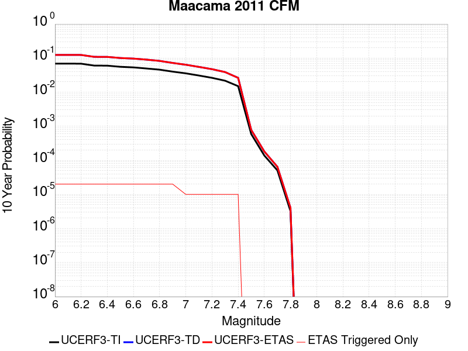 |

| Magnitude | 1 wk TI Prob | 1 wk TD Prob | 1 wk ETAS Prob | 1 wk ETAS/TD Gain | 1 wk ETAS Triggered Only | 1 mo TI Prob | 1 mo TD Prob | 1 mo ETAS Prob | 1 mo ETAS/TD Gain | 1 mo ETAS Triggered Only | 1 yr TI Prob | 1 yr TD Prob | 1 yr ETAS Prob | 1 yr ETAS/TD Gain | 1 yr ETAS Triggered Only | 10 yr TI Prob | 10 yr TD Prob | 10 yr ETAS Prob | 10 yr ETAS/TD Gain | 10 yr ETAS Triggered Only |
|-----|-----|-----|-----|-----|-----|-----|-----|-----|-----|-----|-----|-----|-----|-----|-----|-----|-----|-----|-----|-----|
| 6.0 | 1.368203E-4 | 2.579087E-4 | 2.579087E-4 | 1.0 | 0.0 | 5.862409E-4 | 0.0011047592 | 0.0011047592 | 1.0 | 0.0 | 0.0071141496 | 0.013350345 | 0.013350345 | 1.0 | 0.0 | 0.06890667 | 0.1241916 | 0.12420399 | 1.0000998 | 1.4145672E-5 |
| 6.1 | 1.368203E-4 | 2.579087E-4 | 2.579087E-4 | 1.0 | 0.0 | 5.862409E-4 | 0.0011047592 | 0.0011047592 | 1.0 | 0.0 | 0.0071141496 | 0.013350345 | 0.013350345 | 1.0 | 0.0 | 0.06890667 | 0.1241916 | 0.12420399 | 1.0000998 | 1.4145672E-5 |
| 6.2 | 1.360743E-4 | 2.566557E-4 | 2.566557E-4 | 1.0 | 0.0 | 5.8304524E-4 | 0.001099394 | 0.001099394 | 1.0 | 0.0 | 0.007075496 | 0.013285898 | 0.013285898 | 1.0 | 0.0 | 0.06854413 | 0.123625994 | 0.12363839 | 1.0001003 | 1.4145672E-5 |
| 6.3 | 1.1917239E-4 | 2.236021E-4 | 2.236021E-4 | 1.0 | 0.0 | 5.1063887E-4 | 9.578717E-4 | 9.578717E-4 | 1.0 | 0.0 | 0.0061993203 | 0.0115873255 | 0.0115873255 | 1.0 | 0.0 | 0.060292065 | 0.108845875 | 0.10885848 | 1.0001159 | 1.4145672E-5 |
| 6.4 | 1.1859289E-4 | 2.2263796E-4 | 2.2263796E-4 | 1.0 | 0.0 | 5.0815626E-4 | 9.537432E-4 | 9.537432E-4 | 1.0 | 0.0 | 0.006169266 | 0.011537647 | 0.011537647 | 1.0 | 0.0 | 0.06000784 | 0.10840272 | 0.108415335 | 1.0001163 | 1.4145672E-5 |
| 6.5 | 1.09512424E-4 | 2.0517908E-4 | 2.0517908E-4 | 1.0 | 0.0 | 4.6925453E-4 | 8.7897904E-4 | 8.7897904E-4 | 1.0 | 0.0 | 0.005698218 | 0.010639169 | 0.010639169 | 1.0 | 0.0 | 0.055543028 | 0.1004949 | 0.10050762 | 1.0001266 | 1.4145672E-5 |
| 6.6 | 1.0502928E-4 | 1.9675294E-4 | 1.9675294E-4 | 1.0 | 0.0 | 4.500478E-4 | 8.429031E-4 | 8.429031E-4 | 1.0 | 0.0 | 0.0054655746 | 0.010205293 | 0.010205293 | 1.0 | 0.0 | 0.053330887 | 0.0966474 | 0.096660174 | 1.0001322 | 1.4145672E-5 |
| 6.7 | 9.739358E-5 | 1.8259176E-4 | 1.8259176E-4 | 1.0 | 0.0 | 4.173343E-4 | 7.822563E-4 | 7.822563E-4 | 1.0 | 0.0 | 0.0050692135 | 0.009475343 | 0.009475343 | 1.0 | 0.0 | 0.049551267 | 0.09012011 | 0.090132974 | 1.0001428 | 1.4145672E-5 |
| 6.8 | 8.969524E-5 | 1.6658378E-4 | 1.6658378E-4 | 1.0 | 0.0 | 3.8435153E-4 | 7.1369443E-4 | 7.1369443E-4 | 1.0 | 0.0 | 0.0046694432 | 0.00864909 | 0.00864909 | 1.0 | 0.0 | 0.045725387 | 0.08265246 | 0.082665436 | 1.000157 | 1.4145672E-5 |
| 6.9 | 7.838291E-5 | 1.4418772E-4 | 1.4418772E-4 | 1.0 | 0.0 | 3.358835E-4 | 6.1778206E-4 | 6.1778206E-4 | 1.0 | 0.0 | 0.0040817154 | 0.007491724 | 0.007491724 | 1.0 | 0.0 | 0.04007554 | 0.07205298 | 0.0720661 | 1.0001822 | 1.4145672E-5 |
| 7.0 | 6.961957E-5 | 1.2708071E-4 | 1.2708071E-4 | 1.0 | 0.0 | 2.9833548E-4 | 5.445059E-4 | 5.445059E-4 | 1.0 | 0.0 | 0.0036261857 | 0.006606692 | 0.006606692 | 1.0 | 0.0 | 0.035675827 | 0.063871816 | 0.063871816 | 1.0 | 0.0 |
| 7.1 | 5.999398E-5 | 1.09053384E-4 | 1.09053384E-4 | 1.0 | 0.0 | 2.570917E-4 | 4.6728246E-4 | 4.6728246E-4 | 1.0 | 0.0 | 0.0031255994 | 0.00567284 | 0.00567284 | 1.0 | 0.0 | 0.030820016 | 0.055139277 | 0.055139277 | 1.0 | 0.0 |
| 7.2 | 5.116532E-5 | 9.305489E-5 | 9.305489E-5 | 1.0 | 0.0 | 2.1926152E-4 | 3.9874107E-4 | 3.9874107E-4 | 1.0 | 0.0 | 0.002666241 | 0.00484315 | 0.00484315 | 1.0 | 0.0 | 0.026344774 | 0.047303654 | 0.047303654 | 1.0 | 0.0 |
| 7.3 | 4.2087835E-5 | 7.617064E-5 | 7.617064E-5 | 1.0 | 0.0 | 1.8036396E-4 | 3.264016E-4 | 3.264016E-4 | 1.0 | 0.0 | 0.0021937196 | 0.0039662397 | 0.0039662397 | 1.0 | 0.0 | 0.0217219 | 0.038905017 | 0.038905017 | 1.0 | 0.0 |
| 7.4 | 2.8991652E-5 | 5.1163643E-5 | 5.1163643E-5 | 1.0 | 0.0 | 1.2424402E-4 | 2.1925455E-4 | 2.1925455E-4 | 1.0 | 0.0 | 0.0015116213 | 0.0026661097 | 0.0026661097 | 1.0 | 0.0 | 0.015013801 | 0.026332043 | 0.026332043 | 1.0 | 0.0 |
| 7.5 | 1.1292299E-6 | 1.4950216E-6 | 1.4950216E-6 | 1.0 | 0.0 | 4.8395473E-6 | 6.407227E-6 | 6.407227E-6 | 1.0 | 0.0 | 5.8919897E-5 | 7.8006444E-5 | 7.8006444E-5 | 1.0 | 0.0 | 5.890428E-4 | 7.805042E-4 | 7.805042E-4 | 1.0 | 0.0 |
| 7.6 | 2.6535366E-7 | 3.4720998E-7 | 3.4720998E-7 | 1.0 | 0.0 | 1.1372296E-6 | 1.4880419E-6 | 1.4880419E-6 | 1.0 | 0.0 | 1.3845682E-5 | 1.811676E-5 | 1.811676E-5 | 1.0 | 0.0 | 1.3844819E-4 | 1.8170691E-4 | 1.8170691E-4 | 1.0 | 0.0 |
| 7.7 | 9.727789E-8 | 1.2302418E-7 | 1.2302418E-7 | 1.0 | 0.0 | 4.1690518E-7 | 5.2724636E-7 | 5.2724636E-7 | 1.0 | 0.0 | 5.0758085E-6 | 6.419206E-6 | 6.419206E-6 | 1.0 | 0.0 | 5.0756928E-5 | 6.456404E-5 | 6.456404E-5 | 1.0 | 0.0 |
| 7.8 | 6.1939325E-9 | 7.711711E-9 | 7.711711E-9 | 1.0 | 0.0 | 2.6545425E-8 | 3.305019E-8 | 3.305019E-8 | 1.0 | 0.0 | 3.231905E-7 | 4.0238598E-7 | 4.0238598E-7 | 1.0 | 0.0 | 3.2319003E-6 | 4.0597915E-6 | 4.0597915E-6 | 1.0 | 0.0 |

## Round Valley
*[(top)](#table-of-contents)*

| 1 Week | 1 Month | 1 Year | 10 Year |
|-----|-----|-----|-----|
|  | 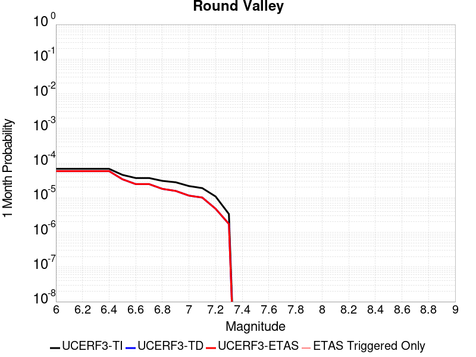 |  |  |

| Magnitude | 1 wk TI Prob | 1 wk TD Prob | 1 wk ETAS Prob | 1 wk ETAS/TD Gain | 1 wk ETAS Triggered Only | 1 mo TI Prob | 1 mo TD Prob | 1 mo ETAS Prob | 1 mo ETAS/TD Gain | 1 mo ETAS Triggered Only | 1 yr TI Prob | 1 yr TD Prob | 1 yr ETAS Prob | 1 yr ETAS/TD Gain | 1 yr ETAS Triggered Only | 10 yr TI Prob | 10 yr TD Prob | 10 yr ETAS Prob | 10 yr ETAS/TD Gain | 10 yr ETAS Triggered Only |
|-----|-----|-----|-----|-----|-----|-----|-----|-----|-----|-----|-----|-----|-----|-----|-----|-----|-----|-----|-----|-----|
| 6.0 | 1.588152E-5 | 1.3670525E-5 | 1.3670525E-5 | 1.0 | 0.0 | 6.806188E-5 | 5.8586873E-5 | 5.8586873E-5 | 1.0 | 0.0 | 8.283384E-4 | 7.131011E-4 | 7.131011E-4 | 1.0 | 0.0 | 0.008252576 | 0.0071120164 | 0.0071260612 | 1.0019748 | 1.4145672E-5 |
| 6.1 | 1.588152E-5 | 1.3670525E-5 | 1.3670525E-5 | 1.0 | 0.0 | 6.806188E-5 | 5.8586873E-5 | 5.8586873E-5 | 1.0 | 0.0 | 8.283384E-4 | 7.131011E-4 | 7.131011E-4 | 1.0 | 0.0 | 0.008252576 | 0.0071120164 | 0.0071260612 | 1.0019748 | 1.4145672E-5 |
| 6.2 | 1.588152E-5 | 1.3670525E-5 | 1.3670525E-5 | 1.0 | 0.0 | 6.806188E-5 | 5.8586873E-5 | 5.8586873E-5 | 1.0 | 0.0 | 8.283384E-4 | 7.131011E-4 | 7.131011E-4 | 1.0 | 0.0 | 0.008252576 | 0.0071120164 | 0.0071260612 | 1.0019748 | 1.4145672E-5 |
| 6.3 | 1.588152E-5 | 1.3670525E-5 | 1.3670525E-5 | 1.0 | 0.0 | 6.806188E-5 | 5.8586873E-5 | 5.8586873E-5 | 1.0 | 0.0 | 8.283384E-4 | 7.131011E-4 | 7.131011E-4 | 1.0 | 0.0 | 0.008252576 | 0.0071120164 | 0.0071260612 | 1.0019748 | 1.4145672E-5 |
| 6.4 | 1.588152E-5 | 1.3670525E-5 | 1.3670525E-5 | 1.0 | 0.0 | 6.806188E-5 | 5.8586873E-5 | 5.8586873E-5 | 1.0 | 0.0 | 8.283384E-4 | 7.131011E-4 | 7.131011E-4 | 1.0 | 0.0 | 0.008252576 | 0.0071120164 | 0.0071260612 | 1.0019748 | 1.4145672E-5 |
| 6.5 | 1.0646776E-5 | 7.952847E-6 | 7.952847E-6 | 1.0 | 0.0 | 4.5628243E-5 | 3.4083234E-5 | 3.4083234E-5 | 1.0 | 0.0 | 5.553823E-4 | 4.1489274E-4 | 4.1489274E-4 | 1.0 | 0.0 | 0.005539963 | 0.00414201 | 0.00414201 | 1.0 | 0.0 |
| 6.6 | 8.632956E-6 | 5.768552E-6 | 5.768552E-6 | 1.0 | 0.0 | 3.6997862E-5 | 2.4722152E-5 | 2.4722152E-5 | 1.0 | 0.0 | 4.5035584E-4 | 3.0095447E-4 | 3.0095447E-4 | 1.0 | 0.0 | 0.0044944426 | 0.0030058469 | 0.0030058469 | 1.0 | 0.0 |
| 6.7 | 8.632956E-6 | 5.768552E-6 | 5.768552E-6 | 1.0 | 0.0 | 3.6997862E-5 | 2.4722152E-5 | 2.4722152E-5 | 1.0 | 0.0 | 4.5035584E-4 | 3.0095447E-4 | 3.0095447E-4 | 1.0 | 0.0 | 0.0044944426 | 0.0030058469 | 0.0030058469 | 1.0 | 0.0 |
| 6.8 | 7.143895E-6 | 4.201644E-6 | 4.201644E-6 | 1.0 | 0.0 | 3.0616335E-5 | 1.8006931E-5 | 1.8006931E-5 | 1.0 | 0.0 | 3.726901E-4 | 2.19214E-4 | 2.19214E-4 | 1.0 | 0.0 | 0.0037206567 | 0.0021901424 | 0.0021901424 | 1.0 | 0.0 |
| 6.9 | 6.5120694E-6 | 3.6642807E-6 | 3.6642807E-6 | 1.0 | 0.0 | 2.790857E-5 | 1.5703974E-5 | 1.5703974E-5 | 1.0 | 0.0 | 3.3973387E-4 | 1.9118062E-4 | 1.9118062E-4 | 1.0 | 0.0 | 0.0033921495 | 0.0019103106 | 0.0019103106 | 1.0 | 0.0 |
| 7.0 | 5.0614435E-6 | 2.6834869E-6 | 2.6834869E-6 | 1.0 | 0.0 | 2.169172E-5 | 1.1500612E-5 | 1.1500612E-5 | 1.0 | 0.0 | 2.6406467E-4 | 1.40012E-4 | 1.40012E-4 | 1.0 | 0.0 | 0.0026375111 | 0.0013993392 | 0.0013993392 | 1.0 | 0.0 |
| 7.1 | 4.41728E-6 | 2.3573243E-6 | 2.3573243E-6 | 1.0 | 0.0 | 1.8931061E-5 | 1.01027845E-5 | 1.01027845E-5 | 1.0 | 0.0 | 2.304613E-4 | 1.2299545E-4 | 1.2299545E-4 | 1.0 | 0.0 | 0.0023022245 | 0.0012293702 | 0.0012293702 | 1.0 | 0.0 |
| 7.2 | 2.535495E-6 | 1.120784E-6 | 1.120784E-6 | 1.0 | 0.0 | 1.0866362E-5 | 4.803354E-6 | 4.803354E-6 | 1.0 | 0.0 | 1.3228992E-4 | 5.8479785E-5 | 5.8479785E-5 | 1.0 | 0.0 | 0.0013221119 | 5.846952E-4 | 5.846952E-4 | 1.0 | 0.0 |
| 7.3 | 7.900015E-7 | 4.0888176E-7 | 4.0888176E-7 | 1.0 | 0.0 | 3.3857161E-6 | 1.7523504E-6 | 1.7523504E-6 | 1.0 | 0.0 | 4.1220315E-5 | 2.1334865E-5 | 2.1334865E-5 | 1.0 | 0.0 | 4.121267E-4 | 2.1334866E-4 | 2.1334866E-4 | 1.0 | 0.0 |

## Keddie Ridge 2011 CFM
*[(top)](#table-of-contents)*

| 1 Week | 1 Month | 1 Year | 10 Year |
|-----|-----|-----|-----|
|  |  |  |  |

| Magnitude | 1 wk TI Prob | 1 wk TD Prob | 1 wk ETAS Prob | 1 wk ETAS/TD Gain | 1 wk ETAS Triggered Only | 1 mo TI Prob | 1 mo TD Prob | 1 mo ETAS Prob | 1 mo ETAS/TD Gain | 1 mo ETAS Triggered Only | 1 yr TI Prob | 1 yr TD Prob | 1 yr ETAS Prob | 1 yr ETAS/TD Gain | 1 yr ETAS Triggered Only | 10 yr TI Prob | 10 yr TD Prob | 10 yr ETAS Prob | 10 yr ETAS/TD Gain | 10 yr ETAS Triggered Only |
|-----|-----|-----|-----|-----|-----|-----|-----|-----|-----|-----|-----|-----|-----|-----|-----|-----|-----|-----|-----|-----|
| 6.0 | 2.2591947E-5 | 2.5189187E-5 | 2.5189187E-5 | 1.0 | 0.0 | 9.6819036E-5 | 1.0794964E-4 | 1.0794964E-4 | 1.0 | 0.0 | 0.0011781343 | 0.0013135736 | 0.0013135736 | 1.0 | 0.0 | 0.011719079 | 0.013066037 | 0.013079997 | 1.0010685 | 1.4145672E-5 |
| 6.1 | 2.2591947E-5 | 2.5189187E-5 | 2.5189187E-5 | 1.0 | 0.0 | 9.6819036E-5 | 1.0794964E-4 | 1.0794964E-4 | 1.0 | 0.0 | 0.0011781343 | 0.0013135736 | 0.0013135736 | 1.0 | 0.0 | 0.011719079 | 0.013066037 | 0.013079997 | 1.0010685 | 1.4145672E-5 |
| 6.2 | 1.3775145E-5 | 1.5322817E-5 | 1.5322817E-5 | 1.0 | 0.0 | 5.9035E-5 | 6.56677E-5 | 6.56677E-5 | 1.0 | 0.0 | 7.185141E-4 | 7.9923525E-4 | 7.9923525E-4 | 1.0 | 0.0 | 0.0071619535 | 0.007966028 | 0.007966028 | 1.0 | 0.0 |
| 6.3 | 9.705435E-6 | 1.0768351E-5 | 1.0768351E-5 | 1.0 | 0.0 | 4.1594063E-5 | 4.6149325E-5 | 4.6149325E-5 | 1.0 | 0.0 | 5.0629E-4 | 5.617356E-4 | 5.617356E-4 | 1.0 | 0.0 | 0.005051381 | 0.0056043877 | 0.0056043877 | 1.0 | 0.0 |
| 6.4 | 7.2549733E-6 | 8.027268E-6 | 8.027268E-6 | 1.0 | 0.0 | 3.109237E-5 | 3.440217E-5 | 3.440217E-5 | 1.0 | 0.0 | 3.7848388E-4 | 4.1877388E-4 | 4.1877388E-4 | 1.0 | 0.0 | 0.003778399 | 0.004180635 | 0.004180635 | 1.0 | 0.0 |
| 6.5 | 5.983293E-6 | 6.6130237E-6 | 6.6130237E-6 | 1.0 | 0.0 | 2.5642432E-5 | 2.834126E-5 | 2.834126E-5 | 1.0 | 0.0 | 3.1215188E-4 | 3.4500693E-4 | 3.4500693E-4 | 1.0 | 0.0 | 0.0031171376 | 0.003445376 | 0.003445376 | 1.0 | 0.0 |
| 6.6 | 4.0336154E-6 | 4.4578037E-6 | 4.4578037E-6 | 1.0 | 0.0 | 1.728681E-5 | 1.9104757E-5 | 1.9104757E-5 | 1.0 | 0.0 | 2.1044657E-4 | 2.3257962E-4 | 2.3257962E-4 | 1.0 | 0.0 | 0.002102474 | 0.002323758 | 0.002323758 | 1.0 | 0.0 |
| 6.7 | 1.5832104E-6 | 1.7816087E-6 | 1.7816087E-6 | 1.0 | 0.0 | 6.7851697E-6 | 7.635445E-6 | 7.635445E-6 | 1.0 | 0.0 | 8.260631E-5 | 9.295785E-5 | 9.295785E-5 | 1.0 | 0.0 | 8.2575605E-4 | 9.2921633E-4 | 9.2921633E-4 | 1.0 | 0.0 |
| 6.8 | 7.5177275E-7 | 8.5902946E-7 | 8.5902946E-7 | 1.0 | 0.0 | 3.221879E-6 | 3.6815507E-6 | 3.6815507E-6 | 1.0 | 0.0 | 3.9225673E-5 | 4.4822125E-5 | 4.4822125E-5 | 1.0 | 0.0 | 3.921875E-4 | 4.481474E-4 | 4.481474E-4 | 1.0 | 0.0 |

## Carson Range (Genoa)
*[(top)](#table-of-contents)*

| 1 Week | 1 Month | 1 Year | 10 Year |
|-----|-----|-----|-----|
|  |  |  |  |

| Magnitude | 1 wk TI Prob | 1 wk TD Prob | 1 wk ETAS Prob | 1 wk ETAS/TD Gain | 1 wk ETAS Triggered Only | 1 mo TI Prob | 1 mo TD Prob | 1 mo ETAS Prob | 1 mo ETAS/TD Gain | 1 mo ETAS Triggered Only | 1 yr TI Prob | 1 yr TD Prob | 1 yr ETAS Prob | 1 yr ETAS/TD Gain | 1 yr ETAS Triggered Only | 10 yr TI Prob | 10 yr TD Prob | 10 yr ETAS Prob | 10 yr ETAS/TD Gain | 10 yr ETAS Triggered Only |
|-----|-----|-----|-----|-----|-----|-----|-----|-----|-----|-----|-----|-----|-----|-----|-----|-----|-----|-----|-----|-----|
| 6.0 | 4.1268457E-5 | 5.014691E-5 | 6.4291875E-5 | 1.2820705 | 1.4145672E-5 | 1.7685282E-4 | 2.1489977E-4 | 2.2904242E-4 | 1.0658103 | 1.4145672E-5 | 0.0021510567 | 0.002613659 | 0.0026277679 | 1.005398 | 1.4145672E-5 | 0.02130354 | 0.025868865 | 0.025882645 | 1.0005326 | 1.4145672E-5 |
| 6.1 | 4.1268457E-5 | 5.014691E-5 | 6.4291875E-5 | 1.2820705 | 1.4145672E-5 | 1.7685282E-4 | 2.1489977E-4 | 2.2904242E-4 | 1.0658103 | 1.4145672E-5 | 0.0021510567 | 0.002613659 | 0.0026277679 | 1.005398 | 1.4145672E-5 | 0.02130354 | 0.025868865 | 0.025882645 | 1.0005326 | 1.4145672E-5 |
| 6.2 | 4.1268457E-5 | 5.014691E-5 | 6.4291875E-5 | 1.2820705 | 1.4145672E-5 | 1.7685282E-4 | 2.1489977E-4 | 2.2904242E-4 | 1.0658103 | 1.4145672E-5 | 0.0021510567 | 0.002613659 | 0.0026277679 | 1.005398 | 1.4145672E-5 | 0.02130354 | 0.025868865 | 0.025882645 | 1.0005326 | 1.4145672E-5 |
| 6.3 | 4.1268457E-5 | 5.014691E-5 | 6.4291875E-5 | 1.2820705 | 1.4145672E-5 | 1.7685282E-4 | 2.1489977E-4 | 2.2904242E-4 | 1.0658103 | 1.4145672E-5 | 0.0021510567 | 0.002613659 | 0.0026277679 | 1.005398 | 1.4145672E-5 | 0.02130354 | 0.025868865 | 0.025882645 | 1.0005326 | 1.4145672E-5 |
| 6.4 | 4.1268457E-5 | 5.014691E-5 | 6.4291875E-5 | 1.2820705 | 1.4145672E-5 | 1.7685282E-4 | 2.1489977E-4 | 2.2904242E-4 | 1.0658103 | 1.4145672E-5 | 0.0021510567 | 0.002613659 | 0.0026277679 | 1.005398 | 1.4145672E-5 | 0.02130354 | 0.025868865 | 0.025882645 | 1.0005326 | 1.4145672E-5 |
| 6.5 | 2.5677185E-5 | 3.0978295E-5 | 4.512353E-5 | 1.4566176 | 1.4145672E-5 | 1.1004044E-4 | 1.3275839E-4 | 1.4690218E-4 | 1.1065378 | 1.4145672E-5 | 0.0013389189 | 0.0016153152 | 0.001629438 | 1.008743 | 1.4145672E-5 | 0.0133088045 | 0.01605366 | 0.016067578 | 1.000867 | 1.4145672E-5 |
| 6.6 | 2.5677185E-5 | 3.0978295E-5 | 4.512353E-5 | 1.4566176 | 1.4145672E-5 | 1.1004044E-4 | 1.3275839E-4 | 1.4690218E-4 | 1.1065378 | 1.4145672E-5 | 0.0013389189 | 0.0016153152 | 0.001629438 | 1.008743 | 1.4145672E-5 | 0.0133088045 | 0.01605366 | 0.016067578 | 1.000867 | 1.4145672E-5 |
| 6.7 | 1.9969408E-5 | 2.4063473E-5 | 3.8208804E-5 | 1.5878341 | 1.4145672E-5 | 8.558037E-5 | 1.0312596E-4 | 1.17270174E-4 | 1.1371547 | 1.4145672E-5 | 0.0010414429 | 0.0012549888 | 0.0012691168 | 1.0112574 | 1.4145672E-5 | 0.010365757 | 0.012494174 | 0.012508143 | 1.0011181 | 1.4145672E-5 |
| 6.8 | 1.4783156E-5 | 1.7817569E-5 | 1.7817569E-5 | 1.0 | 0.0 | 6.335485E-5 | 7.635951E-5 | 7.635951E-5 | 1.0 | 0.0 | 7.710722E-4 | 9.294107E-4 | 9.294107E-4 | 1.0 | 0.0 | 0.0076840227 | 0.009268024 | 0.009268024 | 1.0 | 0.0 |
| 6.9 | 1.06660555E-5 | 1.2877027E-5 | 1.2877027E-5 | 1.0 | 0.0 | 4.5710865E-5 | 5.518674E-5 | 5.518674E-5 | 1.0 | 0.0 | 5.5638765E-4 | 6.718067E-4 | 6.718067E-4 | 1.0 | 0.0 | 0.005549967 | 0.0067090564 | 0.0067090564 | 1.0 | 0.0 |
| 7.0 | 7.664838E-6 | 9.258307E-6 | 9.258307E-6 | 1.0 | 0.0 | 3.2848893E-5 | 3.9678456E-5 | 3.9678456E-5 | 1.0 | 0.0 | 3.998619E-4 | 4.830852E-4 | 4.830852E-4 | 1.0 | 0.0 | 0.0039914316 | 0.00483085 | 0.00483085 | 1.0 | 0.0 |

## Morales (East)
*[(top)](#table-of-contents)*

| 1 Week | 1 Month | 1 Year | 10 Year |
|-----|-----|-----|-----|
|  |  |  | 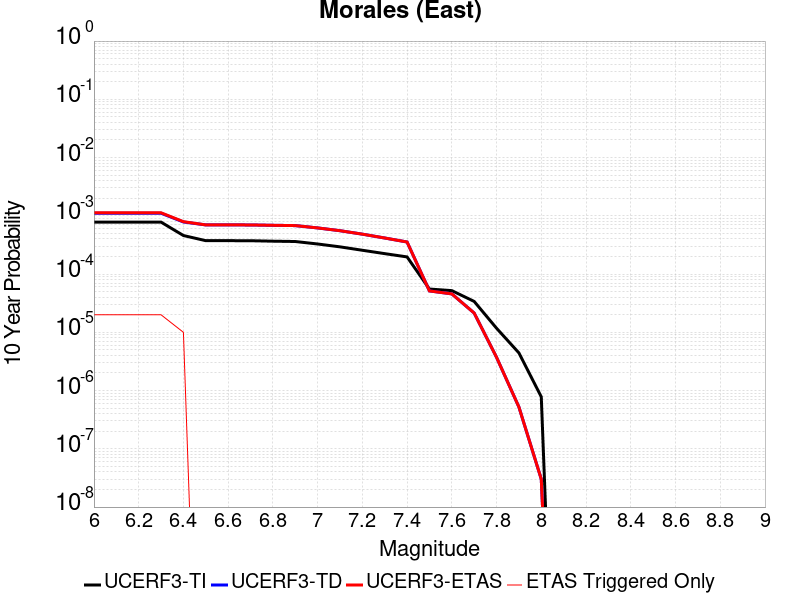 |

| Magnitude | 1 wk TI Prob | 1 wk TD Prob | 1 wk ETAS Prob | 1 wk ETAS/TD Gain | 1 wk ETAS Triggered Only | 1 mo TI Prob | 1 mo TD Prob | 1 mo ETAS Prob | 1 mo ETAS/TD Gain | 1 mo ETAS Triggered Only | 1 yr TI Prob | 1 yr TD Prob | 1 yr ETAS Prob | 1 yr ETAS/TD Gain | 1 yr ETAS Triggered Only | 10 yr TI Prob | 10 yr TD Prob | 10 yr ETAS Prob | 10 yr ETAS/TD Gain | 10 yr ETAS Triggered Only |
|-----|-----|-----|-----|-----|-----|-----|-----|-----|-----|-----|-----|-----|-----|-----|-----|-----|-----|-----|-----|-----|
| 6.0 | 1.4942771E-6 | 2.123544E-6 | 1.6269187E-5 | 7.661337 | 1.4145672E-5 | 6.404029E-6 | 9.100874E-6 | 2.3246417E-5 | 2.554306 | 1.4145672E-5 | 7.7966266E-5 | 1.1079809E-4 | 1.249422E-4 | 1.1276566 | 1.4145672E-5 | 7.793892E-4 | 0.0011074883 | 0.0011216183 | 1.0127586 | 1.4145672E-5 |
| 6.1 | 1.4942771E-6 | 2.123544E-6 | 1.6269187E-5 | 7.661337 | 1.4145672E-5 | 6.404029E-6 | 9.100874E-6 | 2.3246417E-5 | 2.554306 | 1.4145672E-5 | 7.7966266E-5 | 1.1079809E-4 | 1.249422E-4 | 1.1276566 | 1.4145672E-5 | 7.793892E-4 | 0.0011074883 | 0.0011216183 | 1.0127586 | 1.4145672E-5 |
| 6.2 | 1.4942771E-6 | 2.123544E-6 | 1.6269187E-5 | 7.661337 | 1.4145672E-5 | 6.404029E-6 | 9.100874E-6 | 2.3246417E-5 | 2.554306 | 1.4145672E-5 | 7.7966266E-5 | 1.1079809E-4 | 1.249422E-4 | 1.1276566 | 1.4145672E-5 | 7.793892E-4 | 0.0011074883 | 0.0011216183 | 1.0127586 | 1.4145672E-5 |
| 6.3 | 1.4942771E-6 | 2.123544E-6 | 1.6269187E-5 | 7.661337 | 1.4145672E-5 | 6.404029E-6 | 9.100874E-6 | 2.3246417E-5 | 2.554306 | 1.4145672E-5 | 7.7966266E-5 | 1.1079809E-4 | 1.249422E-4 | 1.1276566 | 1.4145672E-5 | 7.793892E-4 | 0.0011074883 | 0.0011216183 | 1.0127586 | 1.4145672E-5 |
| 6.4 | 8.798845E-7 | 1.5023381E-6 | 1.564799E-5 | 10.415757 | 1.4145672E-5 | 3.7709283E-6 | 6.4385767E-6 | 2.0584157E-5 | 3.1970043 | 1.4145672E-5 | 4.5910085E-5 | 7.838696E-5 | 9.2531525E-5 | 1.1804453 | 1.4145672E-5 | 4.59006E-4 | 7.836066E-4 | 7.977412E-4 | 1.0180379 | 1.4145672E-5 |
| 6.5 | 7.1751725E-7 | 1.3384879E-6 | 1.3384879E-6 | 1.0 | 0.0 | 3.0750705E-6 | 5.7363645E-6 | 5.7363645E-6 | 1.0 | 0.0 | 3.7438338E-5 | 6.9838075E-5 | 6.9838075E-5 | 1.0 | 0.0 | 3.743203E-4 | 6.981715E-4 | 6.981715E-4 | 1.0 | 0.0 |
| 6.6 | 7.1751725E-7 | 1.3384879E-6 | 1.3384879E-6 | 1.0 | 0.0 | 3.0750705E-6 | 5.7363645E-6 | 5.7363645E-6 | 1.0 | 0.0 | 3.7438338E-5 | 6.9838075E-5 | 6.9838075E-5 | 1.0 | 0.0 | 3.743203E-4 | 6.981715E-4 | 6.981715E-4 | 1.0 | 0.0 |
| 6.7 | 7.159057E-7 | 1.3359539E-6 | 1.3359539E-6 | 1.0 | 0.0 | 3.0681638E-6 | 5.7255043E-6 | 5.7255043E-6 | 1.0 | 0.0 | 3.7354253E-5 | 6.9705864E-5 | 6.9705864E-5 | 1.0 | 0.0 | 3.7347974E-4 | 6.968502E-4 | 6.968502E-4 | 1.0 | 0.0 |
| 6.8 | 7.032203E-7 | 1.3175089E-6 | 1.3175089E-6 | 1.0 | 0.0 | 3.0137978E-6 | 5.646455E-6 | 5.646455E-6 | 1.0 | 0.0 | 3.669237E-5 | 6.87435E-5 | 6.87435E-5 | 1.0 | 0.0 | 3.6686313E-4 | 6.872325E-4 | 6.872325E-4 | 1.0 | 0.0 |
| 6.9 | 6.941549E-7 | 1.3025701E-6 | 1.3025701E-6 | 1.0 | 0.0 | 2.974946E-6 | 5.5824316E-6 | 5.5824316E-6 | 1.0 | 0.0 | 3.6219368E-5 | 6.7964065E-5 | 6.7964065E-5 | 1.0 | 0.0 | 3.6213463E-4 | 6.794429E-4 | 6.794429E-4 | 1.0 | 0.0 |
| 7.0 | 6.2932247E-7 | 1.1877994E-6 | 1.1877994E-6 | 1.0 | 0.0 | 2.6970936E-6 | 5.090559E-6 | 5.090559E-6 | 1.0 | 0.0 | 3.283662E-5 | 6.197586E-5 | 6.197586E-5 | 1.0 | 0.0 | 3.283177E-4 | 6.1959465E-4 | 6.1959465E-4 | 1.0 | 0.0 |
| 7.1 | 5.6200963E-7 | 1.064093E-6 | 1.064093E-6 | 1.0 | 0.0 | 2.4086105E-6 | 4.560391E-6 | 4.560391E-6 | 1.0 | 0.0 | 2.9324437E-5 | 5.5521392E-5 | 5.5521392E-5 | 1.0 | 0.0 | 2.9320567E-4 | 5.5508246E-4 | 5.5508246E-4 | 1.0 | 0.0 |
| 7.2 | 4.91044E-7 | 9.2862194E-7 | 9.2862194E-7 | 1.0 | 0.0 | 2.1044725E-6 | 3.9798024E-6 | 3.9798024E-6 | 1.0 | 0.0 | 2.5621652E-5 | 4.8453054E-5 | 4.8453054E-5 | 1.0 | 0.0 | 2.56187E-4 | 4.8443122E-4 | 4.8443122E-4 | 1.0 | 0.0 |
| 7.3 | 4.2978448E-7 | 7.974413E-7 | 7.974413E-7 | 1.0 | 0.0 | 1.8419321E-6 | 3.4176012E-6 | 3.4176012E-6 | 1.0 | 0.0 | 2.2425293E-5 | 4.160853E-5 | 4.160853E-5 | 1.0 | 0.0 | 2.242303E-4 | 4.1601306E-4 | 4.1601306E-4 | 1.0 | 0.0 |
| 7.4 | 3.774317E-7 | 6.807105E-7 | 6.807105E-7 | 1.0 | 0.0 | 1.6175634E-6 | 2.9173275E-6 | 2.9173275E-6 | 1.0 | 0.0 | 1.9693656E-5 | 3.551791E-5 | 3.551791E-5 | 1.0 | 0.0 | 1.969191E-4 | 3.5512767E-4 | 3.5512767E-4 | 1.0 | 0.0 |
| 7.5 | 1.0603232E-7 | 9.8406424E-8 | 9.8406424E-8 | 1.0 | 0.0 | 4.5442414E-7 | 4.2174173E-7 | 4.2174173E-7 | 1.0 | 0.0 | 5.5326E-6 | 5.1346938E-6 | 5.1346938E-6 | 1.0 | 0.0 | 5.532462E-5 | 5.1348336E-5 | 5.1348336E-5 | 1.0 | 0.0 |
| 7.6 | 9.960384E-8 | 8.755028E-8 | 8.755028E-8 | 1.0 | 0.0 | 4.2687353E-7 | 3.7521542E-7 | 3.7521542E-7 | 1.0 | 0.0 | 5.197173E-6 | 4.568238E-6 | 4.568238E-6 | 1.0 | 0.0 | 5.1970514E-5 | 4.5684028E-5 | 4.5684028E-5 | 1.0 | 0.0 |
| 7.7 | 6.499468E-8 | 4.103351E-8 | 4.103351E-8 | 1.0 | 0.0 | 2.785486E-7 | 1.7585788E-7 | 1.7585788E-7 | 1.0 | 0.0 | 3.3913238E-6 | 2.1410676E-6 | 2.1410676E-6 | 1.0 | 0.0 | 3.3912722E-5 | 2.1413045E-5 | 2.1413045E-5 | 1.0 | 0.0 |
| 7.8 | 2.2517119E-8 | 7.1293824E-9 | 7.1293824E-9 | 1.0 | 0.0 | 9.6501935E-8 | 3.0554492E-8 | 3.0554492E-8 | 1.0 | 0.0 | 1.1749105E-6 | 3.720009E-7 | 3.720009E-7 | 1.0 | 0.0 | 1.1749043E-5 | 3.7225666E-6 | 3.7225666E-6 | 1.0 | 0.0 |
| 7.9 | 8.493023E-9 | 9.962774E-10 | 9.962774E-10 | 1.0 | 0.0 | 3.639867E-8 | 4.2697574E-9 | 4.2697574E-9 | 1.0 | 0.0 | 4.4315374E-7 | 5.19843E-8 | 5.19843E-8 | 1.0 | 0.0 | 4.4315284E-6 | 5.2196486E-7 | 5.2196486E-7 | 1.0 | 0.0 |
| 8.0 | 1.4971842E-9 | 5.5340177E-11 | 5.5340177E-11 | 1.0 | 0.0 | 6.4165038E-9 | 2.3717173E-10 | 2.3717173E-10 | 1.0 | 0.0 | 7.812093E-8 | 2.887568E-9 | 2.887568E-9 | 1.0 | 0.0 | 7.81209E-7 | 3.0142694E-8 | 3.0142694E-8 | 1.0 | 0.0 |

## Elmore Ranch
*[(top)](#table-of-contents)*

| 1 Week | 1 Month | 1 Year | 10 Year |
|-----|-----|-----|-----|
|  |  |  |  |

| Magnitude | 1 wk TI Prob | 1 wk TD Prob | 1 wk ETAS Prob | 1 wk ETAS/TD Gain | 1 wk ETAS Triggered Only | 1 mo TI Prob | 1 mo TD Prob | 1 mo ETAS Prob | 1 mo ETAS/TD Gain | 1 mo ETAS Triggered Only | 1 yr TI Prob | 1 yr TD Prob | 1 yr ETAS Prob | 1 yr ETAS/TD Gain | 1 yr ETAS Triggered Only | 10 yr TI Prob | 10 yr TD Prob | 10 yr ETAS Prob | 10 yr ETAS/TD Gain | 10 yr ETAS Triggered Only |
|-----|-----|-----|-----|-----|-----|-----|-----|-----|-----|-----|-----|-----|-----|-----|-----|-----|-----|-----|-----|-----|
| 6.0 | 9.102099E-5 | 8.953848E-5 | 8.953848E-5 | 1.0 | 0.0 | 3.9003167E-4 | 3.836898E-4 | 3.9783004E-4 | 1.0368533 | 1.4145672E-5 | 0.0047383 | 0.004662132 | 0.0046762116 | 1.00302 | 1.4145672E-5 | 0.046385348 | 0.04583787 | 0.04585137 | 1.0002944 | 1.4145672E-5 |
| 6.1 | 3.8306698E-5 | 4.14921E-5 | 4.14921E-5 | 1.0 | 0.0 | 1.6416123E-4 | 1.7781362E-4 | 1.7781362E-4 | 1.0 | 0.0 | 0.0019968306 | 0.0021632186 | 0.0021632186 | 1.0 | 0.0 | 0.019789828 | 0.021595007 | 0.021595007 | 1.0 | 0.0 |
| 6.2 | 3.8306698E-5 | 4.14921E-5 | 4.14921E-5 | 1.0 | 0.0 | 1.6416123E-4 | 1.7781362E-4 | 1.7781362E-4 | 1.0 | 0.0 | 0.0019968306 | 0.0021632186 | 0.0021632186 | 1.0 | 0.0 | 0.019789828 | 0.021595007 | 0.021595007 | 1.0 | 0.0 |
| 6.3 | 3.3197924E-5 | 3.6550366E-5 | 3.6550366E-5 | 1.0 | 0.0 | 1.4226905E-4 | 1.56639E-4 | 1.56639E-4 | 1.0 | 0.0 | 0.0017307495 | 0.0019059771 | 0.0019059771 | 1.0 | 0.0 | 0.017173318 | 0.019057386 | 0.019057386 | 1.0 | 0.0 |
| 6.4 | 2.5148964E-5 | 2.7420736E-5 | 2.7420736E-5 | 1.0 | 0.0 | 1.0777682E-4 | 1.17515796E-4 | 1.17515796E-4 | 1.0 | 0.0 | 0.0013113929 | 0.0014304637 | 0.0014304637 | 1.0 | 0.0 | 0.01303681 | 0.014365338 | 0.014365338 | 1.0 | 0.0 |
| 6.5 | 2.5148964E-5 | 2.7420736E-5 | 2.7420736E-5 | 1.0 | 0.0 | 1.0777682E-4 | 1.17515796E-4 | 1.17515796E-4 | 1.0 | 0.0 | 0.0013113929 | 0.0014304637 | 0.0014304637 | 1.0 | 0.0 | 0.01303681 | 0.014365338 | 0.014365338 | 1.0 | 0.0 |

## San Luis Range 2011 CFM
*[(top)](#table-of-contents)*

| 1 Week | 1 Month | 1 Year | 10 Year |
|-----|-----|-----|-----|
|  |  |  |  |

| Magnitude | 1 wk TI Prob | 1 wk TD Prob | 1 wk ETAS Prob | 1 wk ETAS/TD Gain | 1 wk ETAS Triggered Only | 1 mo TI Prob | 1 mo TD Prob | 1 mo ETAS Prob | 1 mo ETAS/TD Gain | 1 mo ETAS Triggered Only | 1 yr TI Prob | 1 yr TD Prob | 1 yr ETAS Prob | 1 yr ETAS/TD Gain | 1 yr ETAS Triggered Only | 10 yr TI Prob | 10 yr TD Prob | 10 yr ETAS Prob | 10 yr ETAS/TD Gain | 10 yr ETAS Triggered Only |
|-----|-----|-----|-----|-----|-----|-----|-----|-----|-----|-----|-----|-----|-----|-----|-----|-----|-----|-----|-----|-----|
| 6.0 | 8.8368415E-6 | 8.965455E-6 | 8.965455E-6 | 1.0 | 0.0 | 3.787163E-5 | 3.8422855E-5 | 5.2567986E-5 | 1.3681436 | 1.4145672E-5 | 4.609895E-4 | 4.6770574E-4 | 4.818448E-4 | 1.0302306 | 1.4145672E-5 | 0.0046003438 | 0.004667997 | 0.0046820766 | 1.0030162 | 1.4145672E-5 |
| 6.1 | 8.8368415E-6 | 8.965455E-6 | 8.965455E-6 | 1.0 | 0.0 | 3.787163E-5 | 3.8422855E-5 | 5.2567986E-5 | 1.3681436 | 1.4145672E-5 | 4.609895E-4 | 4.6770574E-4 | 4.818448E-4 | 1.0302306 | 1.4145672E-5 | 0.0046003438 | 0.004667997 | 0.0046820766 | 1.0030162 | 1.4145672E-5 |
| 6.2 | 8.8368415E-6 | 8.965455E-6 | 8.965455E-6 | 1.0 | 0.0 | 3.787163E-5 | 3.8422855E-5 | 5.2567986E-5 | 1.3681436 | 1.4145672E-5 | 4.609895E-4 | 4.6770574E-4 | 4.818448E-4 | 1.0302306 | 1.4145672E-5 | 0.0046003438 | 0.004667997 | 0.0046820766 | 1.0030162 | 1.4145672E-5 |
| 6.3 | 8.8368415E-6 | 8.965455E-6 | 8.965455E-6 | 1.0 | 0.0 | 3.787163E-5 | 3.8422855E-5 | 5.2567986E-5 | 1.3681436 | 1.4145672E-5 | 4.609895E-4 | 4.6770574E-4 | 4.818448E-4 | 1.0302306 | 1.4145672E-5 | 0.0046003438 | 0.004667997 | 0.0046820766 | 1.0030162 | 1.4145672E-5 |
| 6.4 | 3.9094193E-6 | 3.941204E-6 | 3.941204E-6 | 1.0 | 0.0 | 1.6754546E-5 | 1.6890766E-5 | 1.6890766E-5 | 1.0 | 0.0 | 2.039675E-4 | 2.0562594E-4 | 2.0562594E-4 | 1.0 | 0.0 | 0.0020378039 | 0.0020543856 | 0.0020543856 | 1.0 | 0.0 |
| 6.5 | 3.9094193E-6 | 3.941204E-6 | 3.941204E-6 | 1.0 | 0.0 | 1.6754546E-5 | 1.6890766E-5 | 1.6890766E-5 | 1.0 | 0.0 | 2.039675E-4 | 2.0562594E-4 | 2.0562594E-4 | 1.0 | 0.0 | 0.0020378039 | 0.0020543856 | 0.0020543856 | 1.0 | 0.0 |
| 6.6 | 3.0587726E-6 | 3.0753893E-6 | 3.0753893E-6 | 1.0 | 0.0 | 1.3108959E-5 | 1.3180174E-5 | 1.3180174E-5 | 1.0 | 0.0 | 1.595899E-4 | 1.6045693E-4 | 1.6045693E-4 | 1.0 | 0.0 | 0.0015947534 | 0.0016034227 | 0.0016034227 | 1.0 | 0.0 |
| 6.7 | 2.6160574E-6 | 2.6251284E-6 | 2.6251284E-6 | 1.0 | 0.0 | 1.1211626E-5 | 1.1250502E-5 | 1.1250502E-5 | 1.0 | 0.0 | 1.3649299E-4 | 1.3696631E-4 | 1.3696631E-4 | 1.0 | 0.0 | 0.0013640919 | 0.0013688251 | 0.0013688251 | 1.0 | 0.0 |
| 6.8 | 2.5110312E-6 | 2.5181412E-6 | 2.5181412E-6 | 1.0 | 0.0 | 1.0761518E-5 | 1.079199E-5 | 1.079199E-5 | 1.0 | 0.0 | 1.310136E-4 | 1.313846E-4 | 1.313846E-4 | 1.0 | 0.0 | 0.0013093639 | 0.0013130752 | 0.0013130752 | 1.0 | 0.0 |
| 6.9 | 1.8564405E-6 | 1.852488E-6 | 1.852488E-6 | 1.0 | 0.0 | 7.95615E-6 | 7.93921E-6 | 7.93921E-6 | 1.0 | 0.0 | 9.686181E-5 | 9.665562E-5 | 9.665562E-5 | 1.0 | 0.0 | 9.68196E-4 | 9.6613786E-4 | 9.6613786E-4 | 1.0 | 0.0 |
| 7.0 | 1.546127E-6 | 1.5369549E-6 | 1.5369549E-6 | 1.0 | 0.0 | 6.626242E-6 | 6.5869326E-6 | 6.5869326E-6 | 1.0 | 0.0 | 8.06715E-5 | 8.019296E-5 | 8.019296E-5 | 1.0 | 0.0 | 8.0642226E-4 | 8.016409E-4 | 8.016409E-4 | 1.0 | 0.0 |
| 7.1 | 1.3368208E-6 | 1.3235336E-6 | 1.3235336E-6 | 1.0 | 0.0 | 5.7292195E-6 | 5.6722747E-6 | 5.6722747E-6 | 1.0 | 0.0 | 6.975101E-5 | 6.905776E-5 | 6.905776E-5 | 1.0 | 0.0 | 6.972912E-4 | 6.903635E-4 | 6.903635E-4 | 1.0 | 0.0 |
| 7.2 | 1.0623363E-6 | 1.0454378E-6 | 1.0454378E-6 | 1.0 | 0.0 | 4.5528623E-6 | 4.4804397E-6 | 4.4804397E-6 | 1.0 | 0.0 | 5.5429686E-5 | 5.4547992E-5 | 5.4547992E-5 | 1.0 | 0.0 | 5.5415864E-4 | 5.453463E-4 | 5.453463E-4 | 1.0 | 0.0 |
| 7.3 | 7.831679E-7 | 7.727399E-7 | 7.727399E-7 | 1.0 | 0.0 | 3.3564295E-6 | 3.3117383E-6 | 3.3117383E-6 | 1.0 | 0.0 | 4.086376E-5 | 4.031967E-5 | 4.031967E-5 | 1.0 | 0.0 | 4.0856248E-4 | 4.0312367E-4 | 4.0312367E-4 | 1.0 | 0.0 |
| 7.4 | 5.9558846E-7 | 5.910646E-7 | 5.910646E-7 | 1.0 | 0.0 | 2.5525194E-6 | 2.5331315E-6 | 2.5331315E-6 | 1.0 | 0.0 | 3.107648E-5 | 3.084044E-5 | 3.084044E-5 | 1.0 | 0.0 | 3.1072134E-4 | 3.083617E-4 | 3.083617E-4 | 1.0 | 0.0 |
| 7.5 | 4.1616502E-7 | 4.1196404E-7 | 4.1196404E-7 | 1.0 | 0.0 | 1.7835631E-6 | 1.765559E-6 | 1.765559E-6 | 1.0 | 0.0 | 2.1714664E-5 | 2.1495469E-5 | 2.1495469E-5 | 1.0 | 0.0 | 2.1712543E-4 | 2.1493394E-4 | 2.1493394E-4 | 1.0 | 0.0 |
| 7.6 | 2.3816014E-7 | 2.3376614E-7 | 2.3376614E-7 | 1.0 | 0.0 | 1.0206859E-6 | 1.0018545E-6 | 1.0018545E-6 | 1.0 | 0.0 | 1.242678E-5 | 1.219751E-5 | 1.219751E-5 | 1.0 | 0.0 | 1.2426086E-4 | 1.2196843E-4 | 1.2196843E-4 | 1.0 | 0.0 |
| 7.7 | 9.918777E-8 | 9.3868096E-8 | 9.3868096E-8 | 1.0 | 0.0 | 4.2509038E-7 | 4.022918E-7 | 4.022918E-7 | 1.0 | 0.0 | 5.1754632E-6 | 4.8978914E-6 | 4.8978914E-6 | 1.0 | 0.0 | 5.1753424E-5 | 4.897784E-5 | 4.897784E-5 | 1.0 | 0.0 |
| 7.8 | 3.4982556E-8 | 2.968672E-8 | 2.968672E-8 | 1.0 | 0.0 | 1.4992524E-7 | 1.272288E-7 | 1.272288E-7 | 1.0 | 0.0 | 1.8253382E-6 | 1.5490094E-6 | 1.5490094E-6 | 1.0 | 0.0 | 1.8253233E-5 | 1.5489988E-5 | 1.5489988E-5 | 1.0 | 0.0 |
| 7.9 | 1.6624908E-8 | 1.1476994E-8 | 1.1476994E-8 | 1.0 | 0.0 | 7.12496E-8 | 4.9187115E-8 | 4.9187115E-8 | 1.0 | 0.0 | 8.6746354E-7 | 5.988529E-7 | 5.988529E-7 | 1.0 | 0.0 | 8.674601E-6 | 5.9885133E-6 | 5.9885133E-6 | 1.0 | 0.0 |
| 8.0 | 6.3352315E-9 | 3.0886564E-9 | 3.0886564E-9 | 1.0 | 0.0 | 2.715099E-8 | 1.32370985E-8 | 1.32370985E-8 | 1.0 | 0.0 | 3.3056327E-7 | 1.6116167E-7 | 1.6116167E-7 | 1.0 | 0.0 | 3.3056278E-6 | 1.6116155E-6 | 1.6116155E-6 | 1.0 | 0.0 |

## Cedar Mtn-Mahogany Mtn
*[(top)](#table-of-contents)*

| 1 Week | 1 Month | 1 Year | 10 Year |
|-----|-----|-----|-----|
| 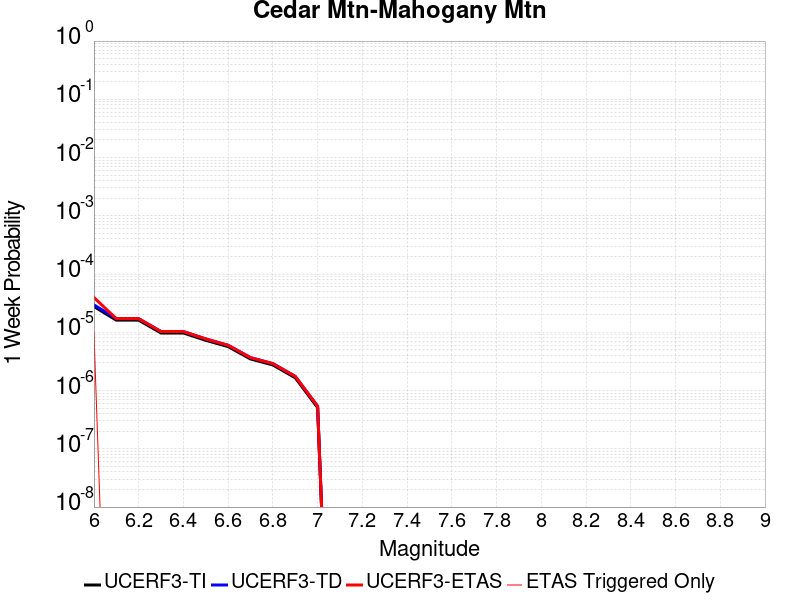 |  |  | 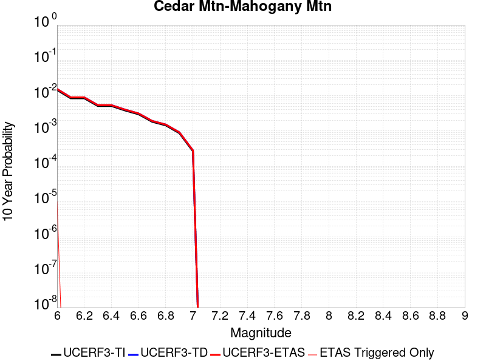 |

| Magnitude | 1 wk TI Prob | 1 wk TD Prob | 1 wk ETAS Prob | 1 wk ETAS/TD Gain | 1 wk ETAS Triggered Only | 1 mo TI Prob | 1 mo TD Prob | 1 mo ETAS Prob | 1 mo ETAS/TD Gain | 1 mo ETAS Triggered Only | 1 yr TI Prob | 1 yr TD Prob | 1 yr ETAS Prob | 1 yr ETAS/TD Gain | 1 yr ETAS Triggered Only | 10 yr TI Prob | 10 yr TD Prob | 10 yr ETAS Prob | 10 yr ETAS/TD Gain | 10 yr ETAS Triggered Only |
|-----|-----|-----|-----|-----|-----|-----|-----|-----|-----|-----|-----|-----|-----|-----|-----|-----|-----|-----|-----|-----|
| 6.0 | 2.7763876E-5 | 2.9588866E-5 | 4.373412E-5 | 1.47806 | 1.4145672E-5 | 1.1898261E-4 | 1.2680366E-4 | 1.4094754E-4 | 1.1115415 | 1.4145672E-5 | 0.0014476506 | 0.0015428112 | 0.001556935 | 1.0091547 | 1.4145672E-5 | 0.0143825635 | 0.015328225 | 0.015342154 | 1.0009087 | 1.4145672E-5 |
| 6.1 | 1.6162443E-5 | 1.7142966E-5 | 1.7142966E-5 | 1.0 | 0.0 | 6.926578E-5 | 7.346788E-5 | 7.346788E-5 | 1.0 | 0.0 | 8.4298453E-4 | 8.941221E-4 | 8.941221E-4 | 1.0 | 0.0 | 0.008397939 | 0.008907059 | 0.008907059 | 1.0 | 0.0 |
| 6.2 | 1.6162443E-5 | 1.7142966E-5 | 1.7142966E-5 | 1.0 | 0.0 | 6.926578E-5 | 7.346788E-5 | 7.346788E-5 | 1.0 | 0.0 | 8.4298453E-4 | 8.941221E-4 | 8.941221E-4 | 1.0 | 0.0 | 0.008397939 | 0.008907059 | 0.008907059 | 1.0 | 0.0 |
| 6.3 | 9.746053E-6 | 1.0303152E-5 | 1.0303152E-5 | 1.0 | 0.0 | 4.1768133E-5 | 4.415564E-5 | 4.415564E-5 | 1.0 | 0.0 | 5.0840835E-4 | 5.3746643E-4 | 5.3746643E-4 | 1.0 | 0.0 | 0.0050724675 | 0.005362084 | 0.005362084 | 1.0 | 0.0 |
| 6.4 | 9.746053E-6 | 1.0303152E-5 | 1.0303152E-5 | 1.0 | 0.0 | 4.1768133E-5 | 4.415564E-5 | 4.415564E-5 | 1.0 | 0.0 | 5.0840835E-4 | 5.3746643E-4 | 5.3746643E-4 | 1.0 | 0.0 | 0.0050724675 | 0.005362084 | 0.005362084 | 1.0 | 0.0 |
| 6.5 | 7.290083E-6 | 7.695325E-6 | 7.695325E-6 | 1.0 | 0.0 | 3.124284E-5 | 3.297956E-5 | 3.297956E-5 | 1.0 | 0.0 | 3.8031515E-4 | 4.014543E-4 | 4.014543E-4 | 1.0 | 0.0 | 0.0037966494 | 0.004007511 | 0.004007511 | 1.0 | 0.0 |
| 6.6 | 5.67907E-6 | 5.9891527E-6 | 5.9891527E-6 | 1.0 | 0.0 | 2.4338644E-5 | 2.5667552E-5 | 2.5667552E-5 | 1.0 | 0.0 | 2.962827E-4 | 3.12459E-4 | 3.12459E-4 | 1.0 | 0.0 | 0.0029588798 | 0.003120333 | 0.003120333 | 1.0 | 0.0 |
| 6.7 | 3.4853963E-6 | 3.672631E-6 | 3.672631E-6 | 1.0 | 0.0 | 1.4937327E-5 | 1.5739755E-5 | 1.5739755E-5 | 1.0 | 0.0 | 1.8184677E-4 | 1.916153E-4 | 1.916153E-4 | 1.0 | 0.0 | 0.0018169804 | 0.0019145629 | 0.0019145629 | 1.0 | 0.0 |
| 6.8 | 2.7535168E-6 | 2.9015764E-6 | 2.9015764E-6 | 1.0 | 0.0 | 1.1800733E-5 | 1.2435271E-5 | 1.2435271E-5 | 1.0 | 0.0 | 1.4366445E-4 | 1.5138938E-4 | 1.5138938E-4 | 1.0 | 0.0 | 0.0014357162 | 0.0015129098 | 0.0015129098 | 1.0 | 0.0 |
| 6.9 | 1.6594106E-6 | 1.7496985E-6 | 1.7496985E-6 | 1.0 | 0.0 | 7.1117406E-6 | 7.4986883E-6 | 7.4986883E-6 | 1.0 | 0.0 | 8.6582E-5 | 9.129302E-5 | 9.129302E-5 | 1.0 | 0.0 | 8.654827E-4 | 9.125856E-4 | 9.125856E-4 | 1.0 | 0.0 |
| 7.0 | 5.10215E-7 | 5.389254E-7 | 5.389254E-7 | 1.0 | 0.0 | 2.186634E-6 | 2.3096788E-6 | 2.3096788E-6 | 1.0 | 0.0 | 2.6621943E-5 | 2.8120105E-5 | 2.8120105E-5 | 1.0 | 0.0 | 2.6618753E-4 | 2.81178E-4 | 2.81178E-4 | 1.0 | 0.0 |

## Contra Costa (Lafayette) 2011 CFM
*[(top)](#table-of-contents)*

| 1 Week | 1 Month | 1 Year | 10 Year |
|-----|-----|-----|-----|
|  |  |  |  |

| Magnitude | 1 wk TI Prob | 1 wk TD Prob | 1 wk ETAS Prob | 1 wk ETAS/TD Gain | 1 wk ETAS Triggered Only | 1 mo TI Prob | 1 mo TD Prob | 1 mo ETAS Prob | 1 mo ETAS/TD Gain | 1 mo ETAS Triggered Only | 1 yr TI Prob | 1 yr TD Prob | 1 yr ETAS Prob | 1 yr ETAS/TD Gain | 1 yr ETAS Triggered Only | 10 yr TI Prob | 10 yr TD Prob | 10 yr ETAS Prob | 10 yr ETAS/TD Gain | 10 yr ETAS Triggered Only |
|-----|-----|-----|-----|-----|-----|-----|-----|-----|-----|-----|-----|-----|-----|-----|-----|-----|-----|-----|-----|-----|
| 6.0 | 6.655419E-6 | 6.936133E-6 | 2.1081707E-5 | 3.0394034 | 1.4145672E-5 | 2.8522913E-5 | 2.9725958E-5 | 4.387121E-5 | 1.4758552 | 1.4145672E-5 | 3.472111E-4 | 3.618554E-4 | 3.7599597E-4 | 1.0390779 | 1.4145672E-5 | 0.0034666911 | 0.0036175281 | 0.0036316228 | 1.0038961 | 1.4145672E-5 |
| 6.1 | 6.655419E-6 | 6.936133E-6 | 2.1081707E-5 | 3.0394034 | 1.4145672E-5 | 2.8522913E-5 | 2.9725958E-5 | 4.387121E-5 | 1.4758552 | 1.4145672E-5 | 3.472111E-4 | 3.618554E-4 | 3.7599597E-4 | 1.0390779 | 1.4145672E-5 | 0.0034666911 | 0.0036175281 | 0.0036316228 | 1.0038961 | 1.4145672E-5 |
| 6.2 | 6.6254133E-6 | 6.9045423E-6 | 2.1050117E-5 | 3.0487347 | 1.4145672E-5 | 2.839432E-5 | 2.9590572E-5 | 4.3735825E-5 | 1.4780325 | 1.4145672E-5 | 3.45646E-4 | 3.6020763E-4 | 3.743482E-4 | 1.0392567 | 1.4145672E-5 | 0.003451089 | 0.0036011038 | 0.0036151984 | 1.003914 | 1.4145672E-5 |
| 6.3 | 6.6254133E-6 | 6.9045423E-6 | 2.1050117E-5 | 3.0487347 | 1.4145672E-5 | 2.839432E-5 | 2.9590572E-5 | 4.3735825E-5 | 1.4780325 | 1.4145672E-5 | 3.45646E-4 | 3.6020763E-4 | 3.743482E-4 | 1.0392567 | 1.4145672E-5 | 0.003451089 | 0.0036011038 | 0.0036151984 | 1.003914 | 1.4145672E-5 |
| 6.4 | 6.6254133E-6 | 6.9045423E-6 | 2.1050117E-5 | 3.0487347 | 1.4145672E-5 | 2.839432E-5 | 2.9590572E-5 | 4.3735825E-5 | 1.4780325 | 1.4145672E-5 | 3.45646E-4 | 3.6020763E-4 | 3.743482E-4 | 1.0392567 | 1.4145672E-5 | 0.003451089 | 0.0036011038 | 0.0036151984 | 1.003914 | 1.4145672E-5 |
| 6.5 | 6.606445E-6 | 6.884091E-6 | 2.1029666E-5 | 3.054821 | 1.4145672E-5 | 2.8313027E-5 | 2.9502924E-5 | 4.364818E-5 | 1.4794526 | 1.4145672E-5 | 3.4465658E-4 | 3.5914086E-4 | 3.7328145E-4 | 1.0393734 | 1.4145672E-5 | 0.0034412253 | 0.0035904706 | 0.0036045655 | 1.0039257 | 1.4145672E-5 |
| 6.6 | 6.59966E-6 | 6.8766285E-6 | 2.1022204E-5 | 3.057051 | 1.4145672E-5 | 2.828395E-5 | 2.9470944E-5 | 4.36162E-5 | 1.479973 | 1.4145672E-5 | 3.4430268E-4 | 3.5875165E-4 | 3.7289225E-4 | 1.0394161 | 1.4145672E-5 | 0.0034376972 | 0.003586591 | 0.003600686 | 1.0039299 | 1.4145672E-5 |
| 6.7 | 6.5570975E-6 | 6.83062E-6 | 2.0976195E-5 | 3.0709066 | 1.4145672E-5 | 2.8101544E-5 | 2.9273768E-5 | 4.3419026E-5 | 1.4832059 | 1.4145672E-5 | 3.4208258E-4 | 3.563518E-4 | 3.7049243E-4 | 1.0396817 | 1.4145672E-5 | 0.0034155648 | 0.0035626697 | 0.003576765 | 1.0039564 | 1.4145672E-5 |
| 6.8 | 5.472255E-6 | 5.6736194E-6 | 1.9819212E-5 | 3.4932218 | 1.4145672E-5 | 2.345231E-5 | 2.4315288E-5 | 3.8460617E-5 | 1.5817463 | 1.4145672E-5 | 2.8549446E-4 | 2.9599888E-4 | 3.1014037E-4 | 1.0477755 | 1.4145672E-5 | 0.0028512797 | 0.0029607643 | 0.0029748683 | 1.0047636 | 1.4145672E-5 |
| 6.9 | 5.092346E-6 | 5.2639816E-6 | 1.940958E-5 | 3.687243 | 1.4145672E-5 | 2.1824157E-5 | 2.2559729E-5 | 3.670508E-5 | 1.6270179 | 1.4145672E-5 | 2.656767E-4 | 2.7463044E-4 | 2.8877225E-4 | 1.0514939 | 1.4145672E-5 | 0.002653593 | 0.002747621 | 0.0027617277 | 1.0051342 | 1.4145672E-5 |
| 7.0 | 4.5525762E-6 | 4.6773084E-6 | 1.8822915E-5 | 4.024305 | 1.4145672E-5 | 1.9510895E-5 | 2.0045454E-5 | 3.4190845E-5 | 1.7056656 | 1.4145672E-5 | 2.3751926E-4 | 2.4402638E-4 | 2.5816858E-4 | 1.0579536 | 1.4145672E-5 | 0.0023726553 | 0.0024422838 | 0.002456395 | 1.0057778 | 1.4145672E-5 |
| 7.1 | 4.261504E-6 | 4.356478E-6 | 1.8502089E-5 | 4.2470293 | 1.4145672E-5 | 1.826346E-5 | 1.8670487E-5 | 3.2815893E-5 | 1.7576346 | 1.4145672E-5 | 2.2233493E-4 | 2.2728974E-4 | 2.414322E-4 | 1.0622221 | 1.4145672E-5 | 0.002221126 | 0.0022752623 | 0.0022893758 | 1.006203 | 1.4145672E-5 |
| 7.2 | 3.654114E-6 | 3.697206E-6 | 1.7842825E-5 | 4.82603 | 1.4145672E-5 | 1.5660395E-5 | 1.5845073E-5 | 2.9990522E-5 | 1.8927348 | 1.4145672E-5 | 1.9064861E-4 | 1.9289694E-4 | 2.0703989E-4 | 1.0733186 | 1.4145672E-5 | 0.0019048514 | 0.0019319316 | 0.0019460499 | 1.0073079 | 1.4145672E-5 |
| 7.3 | 2.1595129E-6 | 2.2442475E-6 | 2.2442475E-6 | 1.0 | 0.0 | 9.255023E-6 | 9.618168E-6 | 9.618168E-6 | 1.0 | 0.0 | 1.1267407E-4 | 1.17094954E-4 | 1.17094954E-4 | 1.0 | 0.0 | 0.0011261696 | 0.0011749809 | 0.0011749809 | 1.0 | 0.0 |
| 7.4 | 1.7532738E-6 | 1.8335537E-6 | 1.8335537E-6 | 1.0 | 0.0 | 7.5140088E-6 | 7.858064E-6 | 7.858064E-6 | 1.0 | 0.0 | 9.147922E-5 | 9.566777E-5 | 9.566777E-5 | 1.0 | 0.0 | 9.144157E-4 | 9.607641E-4 | 9.607641E-4 | 1.0 | 0.0 |
| 7.5 | 9.387875E-7 | 1.0194132E-6 | 1.0194132E-6 | 1.0 | 0.0 | 4.0233685E-6 | 4.3689065E-6 | 4.3689065E-6 | 1.0 | 0.0 | 4.8983413E-5 | 5.319015E-5 | 5.319015E-5 | 1.0 | 0.0 | 4.897262E-4 | 5.35806E-4 | 5.35806E-4 | 1.0 | 0.0 |
| 7.6 | 2.7471893E-7 | 3.3111127E-7 | 3.3111127E-7 | 1.0 | 0.0 | 1.1773664E-6 | 1.4190474E-6 | 1.4190474E-6 | 1.0 | 0.0 | 1.433434E-5 | 1.7276767E-5 | 1.7276767E-5 | 1.0 | 0.0 | 1.4333417E-4 | 1.7661233E-4 | 1.7661233E-4 | 1.0 | 0.0 |
| 7.7 | 2.0057985E-7 | 2.564454E-7 | 2.564454E-7 | 1.0 | 0.0 | 8.596276E-7 | 1.0990511E-6 | 1.0990511E-6 | 1.0 | 0.0 | 1.0465916E-5 | 1.3380866E-5 | 1.3380866E-5 | 1.0 | 0.0 | 1.0465423E-4 | 1.3761544E-4 | 1.3761544E-4 | 1.0 | 0.0 |
| 7.8 | 8.7403905E-8 | 1.2261823E-7 | 1.2261823E-7 | 1.0 | 0.0 | 3.745881E-7 | 5.255066E-7 | 5.255066E-7 | 1.0 | 0.0 | 4.5606007E-6 | 6.398024E-6 | 6.398024E-6 | 1.0 | 0.0 | 4.560507E-5 | 6.6243636E-5 | 6.6243636E-5 | 1.0 | 0.0 |
| 7.9 | 4.740233E-8 | 7.649451E-8 | 7.649451E-8 | 1.0 | 0.0 | 2.0315284E-7 | 3.2783356E-7 | 3.2783356E-7 | 1.0 | 0.0 | 2.473383E-6 | 3.991366E-6 | 3.991366E-6 | 1.0 | 0.0 | 2.4733554E-5 | 4.1450698E-5 | 4.1450698E-5 | 1.0 | 0.0 |
| 8.0 | 2.99164E-8 | 5.59337E-8 | 5.59337E-8 | 1.0 | 0.0 | 1.2821314E-7 | 2.3971583E-7 | 2.3971583E-7 | 1.0 | 0.0 | 1.5609938E-6 | 2.9185364E-6 | 2.9185364E-6 | 1.0 | 0.0 | 1.5609829E-5 | 3.0209583E-5 | 3.0209583E-5 | 1.0 | 0.0 |
| 8.1 | 4.431212E-10 | 7.424964E-10 | 7.424964E-10 | 1.0 | 0.0 | 1.899091E-9 | 3.1821275E-9 | 3.1821275E-9 | 1.0 | 0.0 | 2.3121432E-8 | 3.8742403E-8 | 3.8742403E-8 | 1.0 | 0.0 | 2.312143E-7 | 3.962537E-7 | 3.962537E-7 | 1.0 | 0.0 |

## Northridge
*[(top)](#table-of-contents)*

| 1 Week | 1 Month | 1 Year | 10 Year |
|-----|-----|-----|-----|
|  |  |  |  |

| Magnitude | 1 wk TI Prob | 1 wk TD Prob | 1 wk ETAS Prob | 1 wk ETAS/TD Gain | 1 wk ETAS Triggered Only | 1 mo TI Prob | 1 mo TD Prob | 1 mo ETAS Prob | 1 mo ETAS/TD Gain | 1 mo ETAS Triggered Only | 1 yr TI Prob | 1 yr TD Prob | 1 yr ETAS Prob | 1 yr ETAS/TD Gain | 1 yr ETAS Triggered Only | 10 yr TI Prob | 10 yr TD Prob | 10 yr ETAS Prob | 10 yr ETAS/TD Gain | 10 yr ETAS Triggered Only |
|-----|-----|-----|-----|-----|-----|-----|-----|-----|-----|-----|-----|-----|-----|-----|-----|-----|-----|-----|-----|-----|
| 6.0 | 1.8340852E-5 | 7.5878907E-6 | 7.5878907E-6 | 1.0 | 0.0 | 7.860128E-5 | 3.251914E-5 | 3.251914E-5 | 1.0 | 0.0 | 9.565505E-4 | 3.9585077E-4 | 3.9585077E-4 | 1.0 | 0.0 | 0.009524435 | 0.0039516874 | 0.003965777 | 1.0035655 | 1.4145672E-5 |
| 6.1 | 1.8340852E-5 | 7.5878907E-6 | 7.5878907E-6 | 1.0 | 0.0 | 7.860128E-5 | 3.251914E-5 | 3.251914E-5 | 1.0 | 0.0 | 9.565505E-4 | 3.9585077E-4 | 3.9585077E-4 | 1.0 | 0.0 | 0.009524435 | 0.0039516874 | 0.003965777 | 1.0035655 | 1.4145672E-5 |
| 6.2 | 1.8340852E-5 | 7.5878907E-6 | 7.5878907E-6 | 1.0 | 0.0 | 7.860128E-5 | 3.251914E-5 | 3.251914E-5 | 1.0 | 0.0 | 9.565505E-4 | 3.9585077E-4 | 3.9585077E-4 | 1.0 | 0.0 | 0.009524435 | 0.0039516874 | 0.003965777 | 1.0035655 | 1.4145672E-5 |
| 6.3 | 1.8340852E-5 | 7.5878907E-6 | 7.5878907E-6 | 1.0 | 0.0 | 7.860128E-5 | 3.251914E-5 | 3.251914E-5 | 1.0 | 0.0 | 9.565505E-4 | 3.9585077E-4 | 3.9585077E-4 | 1.0 | 0.0 | 0.009524435 | 0.0039516874 | 0.003965777 | 1.0035655 | 1.4145672E-5 |
| 6.4 | 1.7361892E-5 | 7.5878907E-6 | 7.5878907E-6 | 1.0 | 0.0 | 7.440598E-5 | 3.251914E-5 | 3.251914E-5 | 1.0 | 0.0 | 9.055163E-4 | 3.9585077E-4 | 3.9585077E-4 | 1.0 | 0.0 | 0.009018354 | 0.0039516874 | 0.003965777 | 1.0035655 | 1.4145672E-5 |
| 6.5 | 1.7361892E-5 | 7.5878907E-6 | 7.5878907E-6 | 1.0 | 0.0 | 7.440598E-5 | 3.251914E-5 | 3.251914E-5 | 1.0 | 0.0 | 9.055163E-4 | 3.9585077E-4 | 3.9585077E-4 | 1.0 | 0.0 | 0.009018354 | 0.0039516874 | 0.003965777 | 1.0035655 | 1.4145672E-5 |
| 6.6 | 1.5458201E-5 | 7.5878907E-6 | 7.5878907E-6 | 1.0 | 0.0 | 6.624775E-5 | 3.251914E-5 | 3.251914E-5 | 1.0 | 0.0 | 8.0626784E-4 | 3.9585077E-4 | 3.9585077E-4 | 1.0 | 0.0 | 0.008033488 | 0.0039516874 | 0.003965777 | 1.0035655 | 1.4145672E-5 |
| 6.7 | 1.2538368E-5 | 6.381497E-6 | 6.381497E-6 | 1.0 | 0.0 | 5.3734755E-5 | 2.7348988E-5 | 2.7348988E-5 | 1.0 | 0.0 | 6.5402425E-4 | 3.329235E-4 | 3.329235E-4 | 1.0 | 0.0 | 0.0065210275 | 0.0033243035 | 0.0033384024 | 1.0042411 | 1.4145672E-5 |
| 6.8 | 1.1438097E-5 | 6.350156E-6 | 6.350156E-6 | 1.0 | 0.0 | 4.9019498E-5 | 2.7214674E-5 | 2.7214674E-5 | 1.0 | 0.0 | 5.9664896E-4 | 3.3128873E-4 | 3.3128873E-4 | 1.0 | 0.0 | 0.005950495 | 0.0033080047 | 0.0033221035 | 1.0042621 | 1.4145672E-5 |
| 6.9 | 1.1204891E-5 | 6.2866116E-6 | 6.2866116E-6 | 1.0 | 0.0 | 4.8020076E-5 | 2.6942345E-5 | 2.6942345E-5 | 1.0 | 0.0 | 5.8448757E-4 | 3.2797412E-4 | 3.2797412E-4 | 1.0 | 0.0 | 0.0058295266 | 0.0032749567 | 0.003289056 | 1.0043052 | 1.4145672E-5 |
| 7.0 | 1.061046E-5 | 6.1152687E-6 | 6.1152687E-6 | 1.0 | 0.0 | 4.5472607E-5 | 2.6208034E-5 | 2.6208034E-5 | 1.0 | 0.0 | 5.534883E-4 | 3.190365E-4 | 3.190365E-4 | 1.0 | 0.0 | 0.0055211177 | 0.0031858315 | 0.003199932 | 1.004426 | 1.4145672E-5 |
| 7.1 | 1.0266979E-5 | 6.0041907E-6 | 6.0041907E-6 | 1.0 | 0.0 | 4.40006E-5 | 2.5731995E-5 | 2.5731995E-5 | 1.0 | 0.0 | 5.355756E-4 | 3.1324243E-4 | 3.1324243E-4 | 1.0 | 0.0 | 0.0053428668 | 0.0031280548 | 0.0031421562 | 1.004508 | 1.4145672E-5 |
| 7.2 | 9.91273E-6 | 5.819906E-6 | 5.819906E-6 | 1.0 | 0.0 | 4.248244E-5 | 2.4942217E-5 | 2.4942217E-5 | 1.0 | 0.0 | 5.171009E-4 | 3.036296E-4 | 3.036296E-4 | 1.0 | 0.0 | 0.0051589934 | 0.0030321924 | 0.0030462951 | 1.0046511 | 1.4145672E-5 |
| 7.3 | 8.4959265E-6 | 5.1930183E-6 | 5.1930183E-6 | 1.0 | 0.0 | 3.6410605E-5 | 2.2255605E-5 | 2.2255605E-5 | 1.0 | 0.0 | 4.4320893E-4 | 2.7092852E-4 | 2.7092852E-4 | 1.0 | 0.0 | 0.00442326 | 0.0027060085 | 0.002720116 | 1.0052134 | 1.4145672E-5 |
| 7.4 | 8.0847185E-6 | 4.9818977E-6 | 4.9818977E-6 | 1.0 | 0.0 | 3.4648332E-5 | 2.1350817E-5 | 2.1350817E-5 | 1.0 | 0.0 | 4.2176177E-4 | 2.5991542E-4 | 2.5991542E-4 | 1.0 | 0.0 | 0.0042096223 | 0.0025961401 | 0.002610249 | 1.0054346 | 1.4145672E-5 |
| 7.5 | 6.8220684E-6 | 4.2532647E-6 | 4.2532647E-6 | 1.0 | 0.0 | 2.9237108E-5 | 1.8228153E-5 | 1.8228153E-5 | 1.0 | 0.0 | 3.5590364E-4 | 2.2190536E-4 | 2.2190536E-4 | 1.0 | 0.0 | 0.0035533418 | 0.0022168586 | 0.0022168586 | 1.0 | 0.0 |
| 7.6 | 4.4224143E-6 | 2.8999295E-6 | 2.8999295E-6 | 1.0 | 0.0 | 1.8953066E-5 | 1.24282105E-5 | 1.24282105E-5 | 1.0 | 0.0 | 2.3072914E-4 | 1.5130307E-4 | 1.5130307E-4 | 1.0 | 0.0 | 0.0023048974 | 0.0015120122 | 0.0015120122 | 1.0 | 0.0 |
| 7.7 | 2.5297056E-6 | 1.6045943E-6 | 1.6045943E-6 | 1.0 | 0.0 | 1.0841551E-5 | 6.876815E-6 | 6.876815E-6 | 1.0 | 0.0 | 1.319879E-4 | 8.372205E-5 | 8.372205E-5 | 1.0 | 0.0 | 0.0013190953 | 8.369098E-4 | 8.369098E-4 | 1.0 | 0.0 |
| 7.8 | 1.2508156E-6 | 8.780148E-7 | 8.780148E-7 | 1.0 | 0.0 | 5.3606273E-6 | 3.7629154E-6 | 3.7629154E-6 | 1.0 | 0.0 | 6.526368E-5 | 4.5812543E-5 | 4.5812543E-5 | 1.0 | 0.0 | 6.524452E-4 | 4.580323E-4 | 4.580323E-4 | 1.0 | 0.0 |
| 7.9 | 2.262199E-7 | 1.466491E-7 | 1.466491E-7 | 1.0 | 0.0 | 9.695135E-7 | 6.2849597E-7 | 6.2849597E-7 | 1.0 | 0.0 | 1.1803763E-5 | 7.651913E-6 | 7.651913E-6 | 1.0 | 0.0 | 1.1803136E-4 | 7.651657E-5 | 7.651657E-5 | 1.0 | 0.0 |
| 8.0 | 2.865362E-9 | 1.27525E-9 | 1.27525E-9 | 1.0 | 0.0 | 1.2280123E-8 | 5.465357E-9 | 5.465357E-9 | 1.0 | 0.0 | 1.4951048E-7 | 6.654073E-8 | 6.654073E-8 | 1.0 | 0.0 | 1.4951038E-6 | 6.6540724E-7 | 6.6540724E-7 | 1.0 | 0.0 |

## Big Lagoon - Bald Mtn 2011 CFM
*[(top)](#table-of-contents)*

| 1 Week | 1 Month | 1 Year | 10 Year |
|-----|-----|-----|-----|
|  |  |  |  |

| Magnitude | 1 wk TI Prob | 1 wk TD Prob | 1 wk ETAS Prob | 1 wk ETAS/TD Gain | 1 wk ETAS Triggered Only | 1 mo TI Prob | 1 mo TD Prob | 1 mo ETAS Prob | 1 mo ETAS/TD Gain | 1 mo ETAS Triggered Only | 1 yr TI Prob | 1 yr TD Prob | 1 yr ETAS Prob | 1 yr ETAS/TD Gain | 1 yr ETAS Triggered Only | 10 yr TI Prob | 10 yr TD Prob | 10 yr ETAS Prob | 10 yr ETAS/TD Gain | 10 yr ETAS Triggered Only |
|-----|-----|-----|-----|-----|-----|-----|-----|-----|-----|-----|-----|-----|-----|-----|-----|-----|-----|-----|-----|-----|
| 6.0 | 1.8699735E-5 | 1.985018E-5 | 1.985018E-5 | 1.0 | 0.0 | 8.013926E-5 | 8.5069645E-5 | 8.5069645E-5 | 1.0 | 0.0 | 9.752587E-4 | 0.0010352687 | 0.0010493996 | 1.0136496 | 1.4145672E-5 | 0.009709897 | 0.010308274 | 0.010322274 | 1.0013582 | 1.4145672E-5 |
| 6.1 | 1.8699735E-5 | 1.985018E-5 | 1.985018E-5 | 1.0 | 0.0 | 8.013926E-5 | 8.5069645E-5 | 8.5069645E-5 | 1.0 | 0.0 | 9.752587E-4 | 0.0010352687 | 0.0010493996 | 1.0136496 | 1.4145672E-5 | 0.009709897 | 0.010308274 | 0.010322274 | 1.0013582 | 1.4145672E-5 |
| 6.2 | 1.8699735E-5 | 1.985018E-5 | 1.985018E-5 | 1.0 | 0.0 | 8.013926E-5 | 8.5069645E-5 | 8.5069645E-5 | 1.0 | 0.0 | 9.752587E-4 | 0.0010352687 | 0.0010493996 | 1.0136496 | 1.4145672E-5 | 0.009709897 | 0.010308274 | 0.010322274 | 1.0013582 | 1.4145672E-5 |
| 6.3 | 1.8699735E-5 | 1.985018E-5 | 1.985018E-5 | 1.0 | 0.0 | 8.013926E-5 | 8.5069645E-5 | 8.5069645E-5 | 1.0 | 0.0 | 9.752587E-4 | 0.0010352687 | 0.0010493996 | 1.0136496 | 1.4145672E-5 | 0.009709897 | 0.010308274 | 0.010322274 | 1.0013582 | 1.4145672E-5 |
| 6.4 | 1.8699735E-5 | 1.985018E-5 | 1.985018E-5 | 1.0 | 0.0 | 8.013926E-5 | 8.5069645E-5 | 8.5069645E-5 | 1.0 | 0.0 | 9.752587E-4 | 0.0010352687 | 0.0010493996 | 1.0136496 | 1.4145672E-5 | 0.009709897 | 0.010308274 | 0.010322274 | 1.0013582 | 1.4145672E-5 |
| 6.5 | 1.8699735E-5 | 1.985018E-5 | 1.985018E-5 | 1.0 | 0.0 | 8.013926E-5 | 8.5069645E-5 | 8.5069645E-5 | 1.0 | 0.0 | 9.752587E-4 | 0.0010352687 | 0.0010493996 | 1.0136496 | 1.4145672E-5 | 0.009709897 | 0.010308274 | 0.010322274 | 1.0013582 | 1.4145672E-5 |
| 6.6 | 1.8699735E-5 | 1.985018E-5 | 1.985018E-5 | 1.0 | 0.0 | 8.013926E-5 | 8.5069645E-5 | 8.5069645E-5 | 1.0 | 0.0 | 9.752587E-4 | 0.0010352687 | 0.0010493996 | 1.0136496 | 1.4145672E-5 | 0.009709897 | 0.010308274 | 0.010322274 | 1.0013582 | 1.4145672E-5 |
| 6.7 | 1.8699735E-5 | 1.985018E-5 | 1.985018E-5 | 1.0 | 0.0 | 8.013926E-5 | 8.5069645E-5 | 8.5069645E-5 | 1.0 | 0.0 | 9.752587E-4 | 0.0010352687 | 0.0010493996 | 1.0136496 | 1.4145672E-5 | 0.009709897 | 0.010308274 | 0.010322274 | 1.0013582 | 1.4145672E-5 |
| 6.8 | 1.18505095E-5 | 1.2499804E-5 | 1.2499804E-5 | 1.0 | 0.0 | 5.078691E-5 | 5.3569514E-5 | 5.3569514E-5 | 1.0 | 0.0 | 6.181552E-4 | 6.520185E-4 | 6.520185E-4 | 1.0 | 0.0 | 0.006164385 | 0.0065015587 | 0.0065015587 | 1.0 | 0.0 |
| 6.9 | 1.18505095E-5 | 1.2499804E-5 | 1.2499804E-5 | 1.0 | 0.0 | 5.078691E-5 | 5.3569514E-5 | 5.3569514E-5 | 1.0 | 0.0 | 6.181552E-4 | 6.520185E-4 | 6.520185E-4 | 1.0 | 0.0 | 0.006164385 | 0.0065015587 | 0.0065015587 | 1.0 | 0.0 |
| 7.0 | 9.719786E-6 | 1.0235487E-5 | 1.0235487E-5 | 1.0 | 0.0 | 4.1655563E-5 | 4.386565E-5 | 4.386565E-5 | 1.0 | 0.0 | 5.0703844E-4 | 5.3393573E-4 | 5.3393573E-4 | 1.0 | 0.0 | 0.005058831 | 0.0053267754 | 0.0053267754 | 1.0 | 0.0 |
| 7.1 | 8.523418E-6 | 8.969463E-6 | 8.969463E-6 | 1.0 | 0.0 | 3.652842E-5 | 3.844E-5 | 3.844E-5 | 1.0 | 0.0 | 4.4464276E-4 | 4.6790804E-4 | 4.6790804E-4 | 1.0 | 0.0 | 0.0044375416 | 0.004669392 | 0.004669392 | 1.0 | 0.0 |
| 7.2 | 7.378894E-6 | 7.761112E-6 | 7.761112E-6 | 1.0 | 0.0 | 3.162345E-5 | 3.326149E-5 | 3.326149E-5 | 1.0 | 0.0 | 3.8494746E-4 | 4.048843E-4 | 4.048843E-4 | 1.0 | 0.0 | 0.0038428132 | 0.0040415623 | 0.0040415623 | 1.0 | 0.0 |
| 7.3 | 6.4640294E-6 | 6.7924434E-6 | 6.7924434E-6 | 1.0 | 0.0 | 2.7702688E-5 | 2.9110151E-5 | 2.9110151E-5 | 1.0 | 0.0 | 3.3722803E-4 | 3.5435913E-4 | 3.5435913E-4 | 1.0 | 0.0 | 0.0033671674 | 0.0035380109 | 0.0035380109 | 1.0 | 0.0 |
| 7.4 | 5.9959093E-6 | 6.2988E-6 | 6.2988E-6 | 1.0 | 0.0 | 2.5696501E-5 | 2.6994581E-5 | 2.6994581E-5 | 1.0 | 0.0 | 3.1280998E-4 | 3.2861007E-4 | 3.2861007E-4 | 1.0 | 0.0 | 0.0031237002 | 0.0032813034 | 0.0032813034 | 1.0 | 0.0 |
| 7.5 | 4.929265E-6 | 5.176396E-6 | 5.176396E-6 | 1.0 | 0.0 | 2.112525E-5 | 2.2184367E-5 | 2.2184367E-5 | 1.0 | 0.0 | 2.5716957E-4 | 2.700616E-4 | 2.700616E-4 | 1.0 | 0.0 | 0.0025687215 | 0.002697375 | 0.002697375 | 1.0 | 0.0 |
| 7.6 | 3.8982403E-6 | 4.0889267E-6 | 4.0889267E-6 | 1.0 | 0.0 | 1.6706637E-5 | 1.7523857E-5 | 1.7523857E-5 | 1.0 | 0.0 | 2.0338432E-4 | 2.1333233E-4 | 2.1333233E-4 | 1.0 | 0.0 | 0.0020319829 | 0.002131303 | 0.002131303 | 1.0 | 0.0 |
| 7.7 | 2.820968E-6 | 2.9572116E-6 | 2.9572116E-6 | 1.0 | 0.0 | 1.2089806E-5 | 1.2673704E-5 | 1.2673704E-5 | 1.0 | 0.0 | 1.4718344E-4 | 1.5429159E-4 | 1.5429159E-4 | 1.0 | 0.0 | 0.00147086 | 0.0015418624 | 0.0015418624 | 1.0 | 0.0 |
| 7.8 | 1.9314455E-6 | 2.0260186E-6 | 2.0260186E-6 | 1.0 | 0.0 | 8.277597E-6 | 8.682909E-6 | 8.682909E-6 | 1.0 | 0.0 | 1.0077508E-4 | 1.0570941E-4 | 1.0570941E-4 | 1.0 | 0.0 | 0.0010072939 | 0.0010566041 | 0.0010566041 | 1.0 | 0.0 |
| 7.9 | 4.9586197E-7 | 5.2189216E-7 | 5.2189216E-7 | 1.0 | 0.0 | 2.125121E-6 | 2.2366787E-6 | 2.2366787E-6 | 1.0 | 0.0 | 2.5873042E-5 | 2.7231245E-5 | 2.7231245E-5 | 1.0 | 0.0 | 2.5870028E-4 | 2.7228118E-4 | 2.7228118E-4 | 1.0 | 0.0 |

## Bartlett Springs 2011 CFM
*[(top)](#table-of-contents)*

| 1 Week | 1 Month | 1 Year | 10 Year |
|-----|-----|-----|-----|
|  |  |  |  |

| Magnitude | 1 wk TI Prob | 1 wk TD Prob | 1 wk ETAS Prob | 1 wk ETAS/TD Gain | 1 wk ETAS Triggered Only | 1 mo TI Prob | 1 mo TD Prob | 1 mo ETAS Prob | 1 mo ETAS/TD Gain | 1 mo ETAS Triggered Only | 1 yr TI Prob | 1 yr TD Prob | 1 yr ETAS Prob | 1 yr ETAS/TD Gain | 1 yr ETAS Triggered Only | 10 yr TI Prob | 10 yr TD Prob | 10 yr ETAS Prob | 10 yr ETAS/TD Gain | 10 yr ETAS Triggered Only |
|-----|-----|-----|-----|-----|-----|-----|-----|-----|-----|-----|-----|-----|-----|-----|-----|-----|-----|-----|-----|-----|
| 6.0 | 6.2326144E-5 | 8.060668E-5 | 8.060668E-5 | 1.0 | 0.0 | 2.6708472E-4 | 3.4541206E-4 | 3.4541206E-4 | 1.0 | 0.0 | 0.003246908 | 0.0041973754 | 0.0041973754 | 1.0 | 0.0 | 0.031998757 | 0.041198105 | 0.04121167 | 1.0003293 | 1.4145672E-5 |
| 6.1 | 6.227657E-5 | 8.054418E-5 | 8.054418E-5 | 1.0 | 0.0 | 2.668723E-4 | 3.4514428E-4 | 3.4514428E-4 | 1.0 | 0.0 | 0.0032443295 | 0.004194128 | 0.004194128 | 1.0 | 0.0 | 0.031973712 | 0.041166842 | 0.041180406 | 1.0003295 | 1.4145672E-5 |
| 6.2 | 6.22452E-5 | 8.050479E-5 | 8.050479E-5 | 1.0 | 0.0 | 2.6673786E-4 | 3.449755E-4 | 3.449755E-4 | 1.0 | 0.0 | 0.0032426978 | 0.004192081 | 0.004192081 | 1.0 | 0.0 | 0.03195787 | 0.04114713 | 0.041160695 | 1.0003296 | 1.4145672E-5 |
| 6.3 | 6.219006E-5 | 8.043463E-5 | 8.043463E-5 | 1.0 | 0.0 | 2.6650162E-4 | 3.4467486E-4 | 3.4467486E-4 | 1.0 | 0.0 | 0.00323983 | 0.0041884347 | 0.0041884347 | 1.0 | 0.0 | 0.031930014 | 0.04111203 | 0.041125596 | 1.00033 | 1.4145672E-5 |
| 6.4 | 5.2175856E-5 | 6.7254E-5 | 6.7254E-5 | 1.0 | 0.0 | 2.2359163E-4 | 2.8819984E-4 | 2.8819984E-4 | 1.0 | 0.0 | 0.0027188298 | 0.0035032362 | 0.0035032362 | 1.0 | 0.0 | 0.026858058 | 0.03448956 | 0.03450322 | 1.000396 | 1.4145672E-5 |
| 6.5 | 5.205166E-5 | 6.709666E-5 | 6.709666E-5 | 1.0 | 0.0 | 2.2305945E-4 | 2.875257E-4 | 2.875257E-4 | 1.0 | 0.0 | 0.0027123666 | 0.0034950553 | 0.0034950553 | 1.0 | 0.0 | 0.026794989 | 0.034410305 | 0.034423966 | 1.000397 | 1.4145672E-5 |
| 6.6 | 5.0085426E-5 | 6.449303E-5 | 6.449303E-5 | 1.0 | 0.0 | 2.1463417E-4 | 2.7636968E-4 | 2.7636968E-4 | 1.0 | 0.0 | 0.0026100394 | 0.0033596596 | 0.0033596596 | 1.0 | 0.0 | 0.025795965 | 0.03309789 | 0.03311157 | 1.0004133 | 1.4145672E-5 |
| 6.7 | 4.8930866E-5 | 6.30177E-5 | 6.30177E-5 | 1.0 | 0.0 | 2.0968684E-4 | 2.700482E-4 | 2.700482E-4 | 1.0 | 0.0 | 0.0025499484 | 0.0032829295 | 0.0032829295 | 1.0 | 0.0 | 0.025208864 | 0.032353252 | 0.03236694 | 1.0004231 | 1.4145672E-5 |
| 6.8 | 4.5679535E-5 | 5.874213E-5 | 5.874213E-5 | 1.0 | 0.0 | 1.9575475E-4 | 2.517279E-4 | 2.517279E-4 | 1.0 | 0.0 | 0.002380709 | 0.0030605178 | 0.0030605178 | 1.0 | 0.0 | 0.023553653 | 0.030190729 | 0.030204447 | 1.0004544 | 1.4145672E-5 |
| 6.9 | 4.1439176E-5 | 5.3220345E-5 | 5.3220345E-5 | 1.0 | 0.0 | 1.7758438E-4 | 2.2806737E-4 | 2.2806737E-4 | 1.0 | 0.0 | 0.002159946 | 0.00277321 | 0.00277321 | 1.0 | 0.0 | 0.021390721 | 0.02739108 | 0.027404837 | 1.0005022 | 1.4145672E-5 |
| 7.0 | 3.5920104E-5 | 4.6008958E-5 | 4.6008958E-5 | 1.0 | 0.0 | 1.5393422E-4 | 1.9716643E-4 | 1.9716643E-4 | 1.0 | 0.0 | 0.001872538 | 0.0023978746 | 0.0023978746 | 1.0 | 0.0 | 0.018568378 | 0.023723308 | 0.023737118 | 1.0005821 | 1.4145672E-5 |
| 7.1 | 3.338812E-5 | 4.2689815E-5 | 4.2689815E-5 | 1.0 | 0.0 | 1.430841E-4 | 1.829436E-4 | 1.829436E-4 | 1.0 | 0.0 | 0.0017406568 | 0.0022250775 | 0.0022250775 | 1.0 | 0.0 | 0.017270854 | 0.02203084 | 0.022044674 | 1.000628 | 1.4145672E-5 |
| 7.2 | 2.8619615E-5 | 3.640186E-5 | 3.640186E-5 | 1.0 | 0.0 | 1.2264973E-4 | 1.559987E-4 | 1.559987E-4 | 1.0 | 0.0 | 0.0014922376 | 0.0018976394 | 0.0018976394 | 1.0 | 0.0 | 0.014822568 | 0.018816413 | 0.018830292 | 1.0007377 | 1.4145672E-5 |
| 7.3 | 2.6376783E-5 | 3.3422963E-5 | 3.3422963E-5 | 1.0 | 0.0 | 1.13038455E-4 | 1.4323345E-4 | 1.4323345E-4 | 1.0 | 0.0 | 0.0013753743 | 0.0017424817 | 0.0017424817 | 1.0 | 0.0 | 0.01366893 | 0.017289983 | 0.017289983 | 1.0 | 0.0 |
| 7.4 | 2.3738676E-5 | 2.9979174E-5 | 2.9979174E-5 | 1.0 | 0.0 | 1.0173322E-4 | 1.2847589E-4 | 1.2847589E-4 | 1.0 | 0.0 | 0.0012378981 | 0.0015630797 | 0.0015630797 | 1.0 | 0.0 | 0.012310251 | 0.01552236 | 0.01552236 | 1.0 | 0.0 |
| 7.5 | 2.1789481E-5 | 2.7439555E-5 | 2.7439555E-5 | 1.0 | 0.0 | 9.338015E-5 | 1.1759284E-4 | 1.1759284E-4 | 1.0 | 0.0 | 0.0011363103 | 0.0014307604 | 0.0014307604 | 1.0 | 0.0 | 0.011305175 | 0.014216874 | 0.014216874 | 1.0 | 0.0 |
| 7.6 | 1.3895281E-5 | 1.7368566E-5 | 1.7368566E-5 | 1.0 | 0.0 | 5.9549846E-5 | 7.44346E-5 | 7.44346E-5 | 1.0 | 0.0 | 7.2477816E-4 | 9.058674E-4 | 9.058674E-4 | 1.0 | 0.0 | 0.0072241887 | 0.009022309 | 0.009022309 | 1.0 | 0.0 |
| 7.7 | 4.245981E-6 | 5.1625234E-6 | 5.1625234E-6 | 1.0 | 0.0 | 1.8196934E-5 | 2.2124914E-5 | 2.2124914E-5 | 1.0 | 0.0 | 2.2152514E-4 | 2.693377E-4 | 2.693377E-4 | 1.0 | 0.0 | 0.0022130446 | 0.00269016 | 0.00269016 | 1.0 | 0.0 |
| 7.8 | 6.145192E-7 | 7.0470315E-7 | 7.0470315E-7 | 1.0 | 0.0 | 2.633651E-6 | 3.020153E-6 | 3.020153E-6 | 1.0 | 0.0 | 3.206423E-5 | 3.6769754E-5 | 3.6769754E-5 | 1.0 | 0.0 | 3.2059604E-4 | 3.6763048E-4 | 3.6763048E-4 | 1.0 | 0.0 |

## Clayton
*[(top)](#table-of-contents)*

| 1 Week | 1 Month | 1 Year | 10 Year |
|-----|-----|-----|-----|
|  |  | 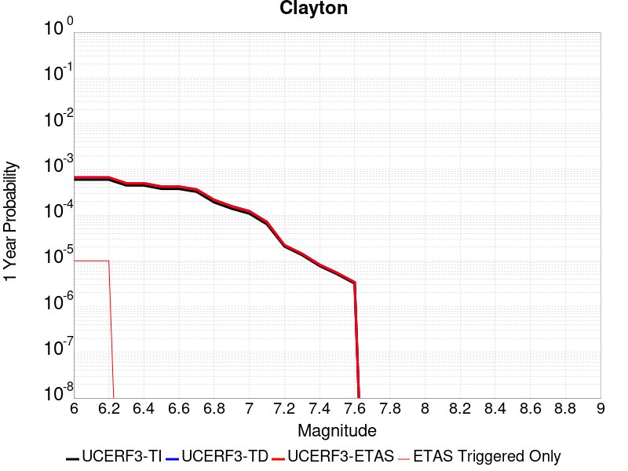 |  |

| Magnitude | 1 wk TI Prob | 1 wk TD Prob | 1 wk ETAS Prob | 1 wk ETAS/TD Gain | 1 wk ETAS Triggered Only | 1 mo TI Prob | 1 mo TD Prob | 1 mo ETAS Prob | 1 mo ETAS/TD Gain | 1 mo ETAS Triggered Only | 1 yr TI Prob | 1 yr TD Prob | 1 yr ETAS Prob | 1 yr ETAS/TD Gain | 1 yr ETAS Triggered Only | 10 yr TI Prob | 10 yr TD Prob | 10 yr ETAS Prob | 10 yr ETAS/TD Gain | 10 yr ETAS Triggered Only |
|-----|-----|-----|-----|-----|-----|-----|-----|-----|-----|-----|-----|-----|-----|-----|-----|-----|-----|-----|-----|-----|
| 6.0 | 1.1413061E-5 | 1.2667071E-5 | 2.6812564E-5 | 2.1167138 | 1.4145672E-5 | 4.89122E-5 | 5.4286444E-5 | 6.843135E-5 | 1.2605605 | 1.4145672E-5 | 5.953433E-4 | 6.607592E-4 | 6.748956E-4 | 1.021394 | 1.4145672E-5 | 0.005937509 | 0.006590149 | 0.006604201 | 1.0021323 | 1.4145672E-5 |
| 6.1 | 1.1413061E-5 | 1.2667071E-5 | 2.6812564E-5 | 2.1167138 | 1.4145672E-5 | 4.89122E-5 | 5.4286444E-5 | 6.843135E-5 | 1.2605605 | 1.4145672E-5 | 5.953433E-4 | 6.607592E-4 | 6.748956E-4 | 1.021394 | 1.4145672E-5 | 0.005937509 | 0.006590149 | 0.006604201 | 1.0021323 | 1.4145672E-5 |
| 6.2 | 1.1413061E-5 | 1.2667071E-5 | 2.6812564E-5 | 2.1167138 | 1.4145672E-5 | 4.89122E-5 | 5.4286444E-5 | 6.843135E-5 | 1.2605605 | 1.4145672E-5 | 5.953433E-4 | 6.607592E-4 | 6.748956E-4 | 1.021394 | 1.4145672E-5 | 0.005937509 | 0.006590149 | 0.006604201 | 1.0021323 | 1.4145672E-5 |
| 6.3 | 8.538689E-6 | 9.532765E-6 | 9.532765E-6 | 1.0 | 0.0 | 3.659387E-5 | 4.085413E-5 | 4.085413E-5 | 1.0 | 0.0 | 4.4543925E-4 | 4.972963E-4 | 4.972963E-4 | 1.0 | 0.0 | 0.0044454746 | 0.0049629 | 0.0049629 | 1.0 | 0.0 |
| 6.4 | 8.538689E-6 | 9.532765E-6 | 9.532765E-6 | 1.0 | 0.0 | 3.659387E-5 | 4.085413E-5 | 4.085413E-5 | 1.0 | 0.0 | 4.4543925E-4 | 4.972963E-4 | 4.972963E-4 | 1.0 | 0.0 | 0.0044454746 | 0.0049629 | 0.0049629 | 1.0 | 0.0 |
| 6.5 | 7.197462E-6 | 8.080964E-6 | 8.080964E-6 | 1.0 | 0.0 | 3.08459E-5 | 3.463229E-5 | 3.463229E-5 | 1.0 | 0.0 | 3.7548412E-4 | 4.2157478E-4 | 4.2157478E-4 | 1.0 | 0.0 | 0.003748503 | 0.0042085624 | 0.0042085624 | 1.0 | 0.0 |
| 6.6 | 7.1760483E-6 | 8.05698E-6 | 8.05698E-6 | 1.0 | 0.0 | 3.075413E-5 | 3.4529505E-5 | 3.4529505E-5 | 1.0 | 0.0 | 3.743672E-4 | 4.2032383E-4 | 4.2032383E-4 | 1.0 | 0.0 | 0.0037373714 | 0.0041961004 | 0.0041961004 | 1.0 | 0.0 |
| 6.7 | 6.202582E-6 | 6.9767057E-6 | 6.9767057E-6 | 1.0 | 0.0 | 2.6582224E-5 | 2.9899868E-5 | 2.9899868E-5 | 1.0 | 0.0 | 3.235905E-4 | 3.6397774E-4 | 3.6397774E-4 | 1.0 | 0.0 | 0.0032311971 | 0.003634572 | 0.003634572 | 1.0 | 0.0 |
| 6.8 | 3.6417277E-6 | 4.121308E-6 | 4.121308E-6 | 1.0 | 0.0 | 1.5607311E-5 | 1.7662633E-5 | 1.7662633E-5 | 1.0 | 0.0 | 1.9000245E-4 | 2.150221E-4 | 2.150221E-4 | 1.0 | 0.0 | 0.0018984007 | 0.0021482168 | 0.0021482168 | 1.0 | 0.0 |
| 6.9 | 2.6498485E-6 | 2.9995322E-6 | 2.9995322E-6 | 1.0 | 0.0 | 1.1356444E-5 | 1.2855077E-5 | 1.2855077E-5 | 1.0 | 0.0 | 1.3825593E-4 | 1.5649972E-4 | 1.5649972E-4 | 1.0 | 0.0 | 0.0013816995 | 0.0015639347 | 0.0015639347 | 1.0 | 0.0 |
| 7.0 | 2.070442E-6 | 2.3407345E-6 | 2.3407345E-6 | 1.0 | 0.0 | 8.873292E-6 | 1.0031682E-5 | 1.0031682E-5 | 1.0 | 0.0 | 1.0802698E-4 | 1.2212919E-4 | 1.2212919E-4 | 1.0 | 0.0 | 0.0010797448 | 0.0012206505 | 0.0012206505 | 1.0 | 0.0 |
| 7.1 | 1.2111691E-6 | 1.3588814E-6 | 1.3588814E-6 | 1.0 | 0.0 | 5.190714E-6 | 5.823765E-6 | 5.823765E-6 | 1.0 | 0.0 | 6.319511E-5 | 7.09022E-5 | 7.09022E-5 | 1.0 | 0.0 | 6.3177146E-4 | 7.0881215E-4 | 7.0881215E-4 | 1.0 | 0.0 |
| 7.2 | 3.9541607E-7 | 4.2228464E-7 | 4.2228464E-7 | 1.0 | 0.0 | 1.6946392E-6 | 1.8097901E-6 | 1.8097901E-6 | 1.0 | 0.0 | 2.0632036E-5 | 2.2033973E-5 | 2.2033973E-5 | 1.0 | 0.0 | 2.063012E-4 | 2.2031803E-4 | 2.2031803E-4 | 1.0 | 0.0 |
| 7.3 | 2.5685637E-7 | 2.7457227E-7 | 2.7457227E-7 | 1.0 | 0.0 | 1.1008126E-6 | 1.1767378E-6 | 1.1767378E-6 | 1.0 | 0.0 | 1.3402311E-5 | 1.432669E-5 | 1.432669E-5 | 1.0 | 0.0 | 1.3401502E-4 | 1.4325773E-4 | 1.4325773E-4 | 1.0 | 0.0 |
| 7.4 | 1.482299E-7 | 1.5808227E-7 | 1.5808227E-7 | 1.0 | 0.0 | 6.3527085E-7 | 6.774953E-7 | 6.774953E-7 | 1.0 | 0.0 | 7.734395E-6 | 8.248474E-6 | 8.248474E-6 | 1.0 | 0.0 | 7.734126E-5 | 8.248171E-5 | 8.248171E-5 | 1.0 | 0.0 |
| 7.5 | 9.7969505E-8 | 1.0438379E-7 | 1.0438379E-7 | 1.0 | 0.0 | 4.1986925E-7 | 4.47359E-7 | 4.47359E-7 | 1.0 | 0.0 | 5.111896E-6 | 5.4465827E-6 | 5.4465827E-6 | 1.0 | 0.0 | 5.1117782E-5 | 5.4464508E-5 | 5.4464508E-5 | 1.0 | 0.0 |
| 7.6 | 6.125415E-8 | 6.5232356E-8 | 6.5232356E-8 | 1.0 | 0.0 | 2.6251774E-7 | 2.7956722E-7 | 2.7956722E-7 | 1.0 | 0.0 | 3.196149E-6 | 3.4037257E-6 | 3.4037257E-6 | 1.0 | 0.0 | 3.196103E-5 | 3.4036748E-5 | 3.4036748E-5 | 1.0 | 0.0 |

## Jess Valley
*[(top)](#table-of-contents)*

| 1 Week | 1 Month | 1 Year | 10 Year |
|-----|-----|-----|-----|
|  |  |  |  |

| Magnitude | 1 wk TI Prob | 1 wk TD Prob | 1 wk ETAS Prob | 1 wk ETAS/TD Gain | 1 wk ETAS Triggered Only | 1 mo TI Prob | 1 mo TD Prob | 1 mo ETAS Prob | 1 mo ETAS/TD Gain | 1 mo ETAS Triggered Only | 1 yr TI Prob | 1 yr TD Prob | 1 yr ETAS Prob | 1 yr ETAS/TD Gain | 1 yr ETAS Triggered Only | 10 yr TI Prob | 10 yr TD Prob | 10 yr ETAS Prob | 10 yr ETAS/TD Gain | 10 yr ETAS Triggered Only |
|-----|-----|-----|-----|-----|-----|-----|-----|-----|-----|-----|-----|-----|-----|-----|-----|-----|-----|-----|-----|-----|
| 6.0 | 3.3861274E-6 | 3.4340592E-6 | 1.7579683E-5 | 5.1192136 | 1.4145672E-5 | 1.4511894E-5 | 1.471733E-5 | 2.8862793E-5 | 1.9611434 | 1.4145672E-5 | 1.7666799E-4 | 1.7917156E-4 | 1.9331471E-4 | 1.0789363 | 1.4145672E-5 | 0.001765276 | 0.0017905476 | 0.001804668 | 1.007886 | 1.4145672E-5 |
| 6.1 | 3.3861274E-6 | 3.4340592E-6 | 1.7579683E-5 | 5.1192136 | 1.4145672E-5 | 1.4511894E-5 | 1.471733E-5 | 2.8862793E-5 | 1.9611434 | 1.4145672E-5 | 1.7666799E-4 | 1.7917156E-4 | 1.9331471E-4 | 1.0789363 | 1.4145672E-5 | 0.001765276 | 0.0017905476 | 0.001804668 | 1.007886 | 1.4145672E-5 |
| 6.2 | 3.3861274E-6 | 3.4340592E-6 | 1.7579683E-5 | 5.1192136 | 1.4145672E-5 | 1.4511894E-5 | 1.471733E-5 | 2.8862793E-5 | 1.9611434 | 1.4145672E-5 | 1.7666799E-4 | 1.7917156E-4 | 1.9331471E-4 | 1.0789363 | 1.4145672E-5 | 0.001765276 | 0.0017905476 | 0.001804668 | 1.007886 | 1.4145672E-5 |
| 6.3 | 3.3861274E-6 | 3.4340592E-6 | 1.7579683E-5 | 5.1192136 | 1.4145672E-5 | 1.4511894E-5 | 1.471733E-5 | 2.8862793E-5 | 1.9611434 | 1.4145672E-5 | 1.7666799E-4 | 1.7917156E-4 | 1.9331471E-4 | 1.0789363 | 1.4145672E-5 | 0.001765276 | 0.0017905476 | 0.001804668 | 1.007886 | 1.4145672E-5 |
| 6.4 | 1.5291708E-6 | 1.5502784E-6 | 1.5695929E-5 | 10.124587 | 1.4145672E-5 | 6.553573E-6 | 6.644038E-6 | 2.0789616E-5 | 3.1290634 | 1.4145672E-5 | 7.978683E-5 | 8.088895E-5 | 9.503349E-5 | 1.1748636 | 1.4145672E-5 | 7.975819E-4 | 8.086733E-4 | 8.228076E-4 | 1.0174783 | 1.4145672E-5 |
| 6.5 | 1.5291708E-6 | 1.5502784E-6 | 1.5695929E-5 | 10.124587 | 1.4145672E-5 | 6.553573E-6 | 6.644038E-6 | 2.0789616E-5 | 3.1290634 | 1.4145672E-5 | 7.978683E-5 | 8.088895E-5 | 9.503349E-5 | 1.1748636 | 1.4145672E-5 | 7.975819E-4 | 8.086733E-4 | 8.228076E-4 | 1.0174783 | 1.4145672E-5 |
| 6.6 | 5.396423E-7 | 5.4719953E-7 | 5.4719953E-7 | 1.0 | 0.0 | 2.312751E-6 | 2.3451398E-6 | 2.3451398E-6 | 1.0 | 0.0 | 2.8157378E-5 | 2.855189E-5 | 2.855189E-5 | 1.0 | 0.0 | 2.8153812E-4 | 2.8550063E-4 | 2.8550063E-4 | 1.0 | 0.0 |
| 6.7 | 5.396423E-7 | 5.4719953E-7 | 5.4719953E-7 | 1.0 | 0.0 | 2.312751E-6 | 2.3451398E-6 | 2.3451398E-6 | 1.0 | 0.0 | 2.8157378E-5 | 2.855189E-5 | 2.855189E-5 | 1.0 | 0.0 | 2.8153812E-4 | 2.8550063E-4 | 2.8550063E-4 | 1.0 | 0.0 |
| 6.8 | 3.6058395E-7 | 3.6563068E-7 | 3.6563068E-7 | 1.0 | 0.0 | 1.5453588E-6 | 1.5669885E-6 | 1.5669885E-6 | 1.0 | 0.0 | 1.8814582E-5 | 1.9078087E-5 | 1.9078087E-5 | 1.0 | 0.0 | 1.8812988E-4 | 1.9078086E-4 | 1.9078086E-4 | 1.0 | 0.0 |

## Calaveras (No) 2011 CFM
*[(top)](#table-of-contents)*

| 1 Week | 1 Month | 1 Year | 10 Year |
|-----|-----|-----|-----|
|  | 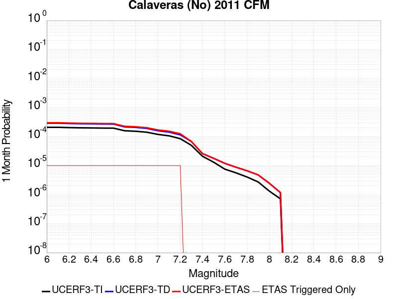 |  |  |

| Magnitude | 1 wk TI Prob | 1 wk TD Prob | 1 wk ETAS Prob | 1 wk ETAS/TD Gain | 1 wk ETAS Triggered Only | 1 mo TI Prob | 1 mo TD Prob | 1 mo ETAS Prob | 1 mo ETAS/TD Gain | 1 mo ETAS Triggered Only | 1 yr TI Prob | 1 yr TD Prob | 1 yr ETAS Prob | 1 yr ETAS/TD Gain | 1 yr ETAS Triggered Only | 10 yr TI Prob | 10 yr TD Prob | 10 yr ETAS Prob | 10 yr ETAS/TD Gain | 10 yr ETAS Triggered Only |
|-----|-----|-----|-----|-----|-----|-----|-----|-----|-----|-----|-----|-----|-----|-----|-----|-----|-----|-----|-----|-----|
| 6.0 | 4.8694856E-5 | 6.747457E-5 | 8.1619284E-5 | 1.2096304 | 1.4145672E-5 | 2.0867554E-4 | 2.891453E-4 | 3.0328688E-4 | 1.0489082 | 1.4145672E-5 | 0.0025376645 | 0.0035146773 | 0.0035287733 | 1.0040106 | 1.4145672E-5 | 0.02508881 | 0.034771074 | 0.034784727 | 1.0003927 | 1.4145672E-5 |
| 6.1 | 4.8694856E-5 | 6.747457E-5 | 8.1619284E-5 | 1.2096304 | 1.4145672E-5 | 2.0867554E-4 | 2.891453E-4 | 3.0328688E-4 | 1.0489082 | 1.4145672E-5 | 0.0025376645 | 0.0035146773 | 0.0035287733 | 1.0040106 | 1.4145672E-5 | 0.02508881 | 0.034771074 | 0.034784727 | 1.0003927 | 1.4145672E-5 |
| 6.2 | 4.7541962E-5 | 6.5805805E-5 | 7.995054E-5 | 1.2149467 | 1.4145672E-5 | 2.0373536E-4 | 2.8199502E-4 | 2.961367E-4 | 1.0501487 | 1.4145672E-5 | 0.0024776561 | 0.003427919 | 0.0034420162 | 1.0041125 | 1.4145672E-5 | 0.024502134 | 0.0339325 | 0.033946164 | 1.0004027 | 1.4145672E-5 |
| 6.3 | 4.6717287E-5 | 6.463939E-5 | 7.878415E-5 | 1.2188257 | 1.4145672E-5 | 2.0020158E-4 | 2.7699716E-4 | 2.9113892E-4 | 1.0510538 | 1.4145672E-5 | 0.0024347296 | 0.0033672696 | 0.0033813675 | 1.0041867 | 1.4145672E-5 | 0.024082264 | 0.033345006 | 0.033358682 | 1.0004101 | 1.4145672E-5 |
| 6.4 | 4.6276386E-5 | 6.400103E-5 | 7.81458E-5 | 1.2210084 | 1.4145672E-5 | 1.983123E-4 | 2.7426204E-4 | 2.8840383E-4 | 1.051563 | 1.4145672E-5 | 0.0024117786 | 0.00333408 | 0.0033481785 | 1.0042286 | 1.4145672E-5 | 0.02385771 | 0.03302388 | 0.03303756 | 1.0004143 | 1.4145672E-5 |
| 6.5 | 4.5720994E-5 | 6.32025E-5 | 7.734728E-5 | 1.2238009 | 1.4145672E-5 | 1.9593239E-4 | 2.7084045E-4 | 2.849823E-4 | 1.0522146 | 1.4145672E-5 | 0.002382867 | 0.0032925585 | 0.0033066578 | 1.0042821 | 1.4145672E-5 | 0.023574775 | 0.032621842 | 0.032635525 | 1.0004195 | 1.4145672E-5 |
| 6.6 | 4.549134E-5 | 6.285557E-5 | 7.700035E-5 | 1.2250363 | 1.4145672E-5 | 1.949483E-4 | 2.693539E-4 | 2.8349578E-4 | 1.0525029 | 1.4145672E-5 | 0.0023709119 | 0.0032745146 | 0.0032886139 | 1.0043058 | 1.4145672E-5 | 0.023457756 | 0.03244731 | 0.032460995 | 1.0004218 | 1.4145672E-5 |
| 6.7 | 3.701047E-5 | 5.03607E-5 | 6.450566E-5 | 1.280873 | 1.4145672E-5 | 1.5860666E-4 | 2.1581395E-4 | 2.2995658E-4 | 1.0655315 | 1.4145672E-5 | 0.0019293258 | 0.002624412 | 0.0026385207 | 1.0053759 | 1.4145672E-5 | 0.019126613 | 0.026125198 | 0.026138974 | 1.0005273 | 1.4145672E-5 |
| 6.8 | 3.5523568E-5 | 4.834225E-5 | 6.248724E-5 | 1.292601 | 1.4145672E-5 | 1.5223498E-4 | 2.0716486E-4 | 2.213076E-4 | 1.0682681 | 1.4145672E-5 | 0.0018518851 | 0.0025193577 | 0.0025334677 | 1.0056007 | 1.4145672E-5 | 0.018365284 | 0.025097623 | 0.025111414 | 1.0005494 | 1.4145672E-5 |
| 6.9 | 3.2946147E-5 | 4.4663826E-5 | 5.8808866E-5 | 1.3167001 | 1.4145672E-5 | 1.4119013E-4 | 1.9140259E-4 | 2.0554556E-4 | 1.0738912 | 1.4145672E-5 | 0.0017176344 | 0.0023278783 | 0.002341991 | 1.0060625 | 1.4145672E-5 | 0.017044188 | 0.023219762 | 0.02323358 | 1.0005951 | 1.4145672E-5 |
| 7.0 | 2.7682381E-5 | 3.7023216E-5 | 5.1168365E-5 | 1.3820616 | 1.4145672E-5 | 1.1863338E-4 | 1.5866144E-4 | 1.7280487E-4 | 1.0891422 | 1.4145672E-5 | 0.0014434044 | 0.0019300217 | 0.0019441401 | 1.0073152 | 1.4145672E-5 | 0.01434065 | 0.019311164 | 0.019325037 | 1.0007184 | 1.4145672E-5 |
| 7.1 | 2.471967E-5 | 3.328756E-5 | 4.743276E-5 | 1.4249395 | 1.4145672E-5 | 1.05937135E-4 | 1.4265333E-4 | 1.5679699E-4 | 1.0991471 | 1.4145672E-5 | 0.0012890215 | 0.0017354497 | 0.0017495707 | 1.0081369 | 1.4145672E-5 | 0.0128157 | 0.017386293 | 0.017400192 | 1.0007994 | 1.4145672E-5 |
| 7.2 | 1.9748062E-5 | 2.6775411E-5 | 4.0920706E-5 | 1.5282941 | 1.4145672E-5 | 8.463181E-5 | 1.1474685E-4 | 1.288909E-4 | 1.1232631 | 1.4145672E-5 | 0.0010299052 | 0.001396171 | 0.001410297 | 1.0101177 | 1.4145672E-5 | 0.01025145 | 0.014031046 | 0.014044994 | 1.000994 | 1.4145672E-5 |
| 7.3 | 1.1603734E-5 | 1.5784257E-5 | 1.5784257E-5 | 1.0 | 0.0 | 4.9729337E-5 | 6.7645145E-5 | 6.7645145E-5 | 1.0 | 0.0 | 6.052865E-4 | 8.232826E-4 | 8.232826E-4 | 1.0 | 0.0 | 0.0060364045 | 0.008308739 | 0.008308739 | 1.0 | 0.0 |
| 7.4 | 4.885381E-6 | 6.035117E-6 | 6.035117E-6 | 1.0 | 0.0 | 2.0937177E-5 | 2.5864532E-5 | 2.5864532E-5 | 1.0 | 0.0 | 2.5488032E-4 | 3.1485534E-4 | 3.1485534E-4 | 1.0 | 0.0 | 0.0025458818 | 0.0032009764 | 0.0032009764 | 1.0 | 0.0 |
| 7.5 | 3.0571264E-6 | 4.1554085E-6 | 4.1554085E-6 | 1.0 | 0.0 | 1.3101904E-5 | 1.7808772E-5 | 1.7808772E-5 | 1.0 | 0.0 | 1.5950401E-4 | 2.1680034E-4 | 2.1680034E-4 | 1.0 | 0.0 | 0.0015938957 | 0.0022209007 | 0.0022209007 | 1.0 | 0.0 |
| 7.6 | 1.764948E-6 | 2.795641E-6 | 2.795641E-6 | 1.0 | 0.0 | 7.564041E-6 | 1.1981264E-5 | 1.1981264E-5 | 1.0 | 0.0 | 9.208831E-5 | 1.458622E-4 | 1.458622E-4 | 1.0 | 0.0 | 9.205016E-4 | 0.0015124046 | 0.0015124046 | 1.0 | 0.0 |
| 7.7 | 1.3173734E-6 | 2.0585271E-6 | 2.0585271E-6 | 1.0 | 0.0 | 5.645874E-6 | 8.82223E-6 | 8.82223E-6 | 1.0 | 0.0 | 6.873634E-5 | 1.0740537E-4 | 1.0740537E-4 | 1.0 | 0.0 | 6.8715087E-4 | 0.0011261607 | 0.0011261607 | 1.0 | 0.0 |
| 7.8 | 9.4429885E-7 | 1.5490102E-6 | 1.5490102E-6 | 1.0 | 0.0 | 4.0469886E-6 | 6.6385983E-6 | 6.6385983E-6 | 1.0 | 0.0 | 4.9270973E-5 | 8.082195E-5 | 8.082195E-5 | 1.0 | 0.0 | 4.926005E-4 | 8.501931E-4 | 8.501931E-4 | 1.0 | 0.0 |
| 7.9 | 6.388233E-7 | 1.11492E-6 | 1.11492E-6 | 1.0 | 0.0 | 2.7378112E-6 | 4.7782196E-6 | 4.7782196E-6 | 1.0 | 0.0 | 3.3332344E-5 | 5.8173282E-5 | 5.8173282E-5 | 1.0 | 0.0 | 3.3327343E-4 | 6.096674E-4 | 6.096674E-4 | 1.0 | 0.0 |
| 8.0 | 3.087986E-7 | 5.754721E-7 | 5.754721E-7 | 1.0 | 0.0 | 1.323422E-6 | 2.4663066E-6 | 2.4663066E-6 | 1.0 | 0.0 | 1.6112543E-5 | 3.0026871E-5 | 3.0026871E-5 | 1.0 | 0.0 | 1.6111376E-4 | 3.110238E-4 | 3.110238E-4 | 1.0 | 0.0 |
| 8.1 | 1.6725647E-7 | 2.7410795E-7 | 2.7410795E-7 | 1.0 | 0.0 | 7.168133E-7 | 1.1747478E-6 | 1.1747478E-6 | 1.0 | 0.0 | 8.7271665E-6 | 1.4302462E-5 | 1.4302462E-5 | 1.0 | 0.0 | 8.726824E-5 | 1.4847395E-4 | 1.4847395E-4 | 1.0 | 0.0 |

## Contra Costa Shear Zone (connector) 2011 CFM
*[(top)](#table-of-contents)*

| 1 Week | 1 Month | 1 Year | 10 Year |
|-----|-----|-----|-----|
|  |  |  |  |

| Magnitude | 1 wk TI Prob | 1 wk TD Prob | 1 wk ETAS Prob | 1 wk ETAS/TD Gain | 1 wk ETAS Triggered Only | 1 mo TI Prob | 1 mo TD Prob | 1 mo ETAS Prob | 1 mo ETAS/TD Gain | 1 mo ETAS Triggered Only | 1 yr TI Prob | 1 yr TD Prob | 1 yr ETAS Prob | 1 yr ETAS/TD Gain | 1 yr ETAS Triggered Only | 10 yr TI Prob | 10 yr TD Prob | 10 yr ETAS Prob | 10 yr ETAS/TD Gain | 10 yr ETAS Triggered Only |
|-----|-----|-----|-----|-----|-----|-----|-----|-----|-----|-----|-----|-----|-----|-----|-----|-----|-----|-----|-----|-----|
| 6.0 | 1.3187427E-5 | 1.4041856E-5 | 2.818733E-5 | 2.007379 | 1.4145672E-5 | 5.6516317E-5 | 6.0178125E-5 | 7.432295E-5 | 1.2350492 | 1.4145672E-5 | 6.878689E-4 | 7.324452E-4 | 7.4658054E-4 | 1.0192988 | 1.4145672E-5 | 0.006857436 | 0.0073068435 | 0.007320886 | 1.0019218 | 1.4145672E-5 |
| 6.1 | 1.3187427E-5 | 1.4041856E-5 | 2.818733E-5 | 2.007379 | 1.4145672E-5 | 5.6516317E-5 | 6.0178125E-5 | 7.432295E-5 | 1.2350492 | 1.4145672E-5 | 6.878689E-4 | 7.324452E-4 | 7.4658054E-4 | 1.0192988 | 1.4145672E-5 | 0.006857436 | 0.0073068435 | 0.007320886 | 1.0019218 | 1.4145672E-5 |
| 6.2 | 1.3187427E-5 | 1.4041856E-5 | 2.818733E-5 | 2.007379 | 1.4145672E-5 | 5.6516317E-5 | 6.0178125E-5 | 7.432295E-5 | 1.2350492 | 1.4145672E-5 | 6.878689E-4 | 7.324452E-4 | 7.4658054E-4 | 1.0192988 | 1.4145672E-5 | 0.006857436 | 0.0073068435 | 0.007320886 | 1.0019218 | 1.4145672E-5 |
| 6.3 | 9.315374E-6 | 9.824786E-6 | 2.3970319E-5 | 2.4397802 | 1.4145672E-5 | 3.992242E-5 | 4.210557E-5 | 5.6250647E-5 | 1.3359431 | 1.4145672E-5 | 4.8594706E-4 | 5.1251886E-4 | 5.2665727E-4 | 1.0275861 | 1.4145672E-5 | 0.004848858 | 0.005118056 | 0.00513213 | 1.0027497 | 1.4145672E-5 |
| 6.4 | 9.315374E-6 | 9.824786E-6 | 2.3970319E-5 | 2.4397802 | 1.4145672E-5 | 3.992242E-5 | 4.210557E-5 | 5.6250647E-5 | 1.3359431 | 1.4145672E-5 | 4.8594706E-4 | 5.1251886E-4 | 5.2665727E-4 | 1.0275861 | 1.4145672E-5 | 0.004848858 | 0.005118056 | 0.00513213 | 1.0027497 | 1.4145672E-5 |
| 6.5 | 8.492638E-6 | 8.9384675E-6 | 2.3084014E-5 | 2.582547 | 1.4145672E-5 | 3.639651E-5 | 3.8307175E-5 | 5.2452306E-5 | 1.3692554 | 1.4145672E-5 | 4.430374E-4 | 4.6629342E-4 | 4.804325E-4 | 1.0303223 | 1.4145672E-5 | 0.0044215517 | 0.0046577626 | 0.0046718423 | 1.0030229 | 1.4145672E-5 |
| 6.6 | 8.402072E-6 | 8.839268E-6 | 2.2984816E-5 | 2.6003075 | 1.4145672E-5 | 3.6008387E-5 | 3.7882044E-5 | 5.2027182E-5 | 1.3733995 | 1.4145672E-5 | 4.383139E-4 | 4.6111966E-4 | 4.752588E-4 | 1.0306627 | 1.4145672E-5 | 0.0043745036 | 0.0046062404 | 0.0046203206 | 1.0030569 | 1.4145672E-5 |
| 6.7 | 7.383587E-6 | 7.746864E-6 | 2.1892427E-5 | 2.8259726 | 1.4145672E-5 | 3.164356E-5 | 3.320044E-5 | 4.734564E-5 | 1.4260547 | 1.4145672E-5 | 3.8519225E-4 | 4.0414243E-4 | 4.182824E-4 | 1.0349876 | 1.4145672E-5 | 0.0038452526 | 0.004038561 | 0.0040526497 | 1.0034885 | 1.4145672E-5 |
| 6.8 | 6.004921E-6 | 6.2645436E-6 | 2.0410127E-5 | 3.258039 | 1.4145672E-5 | 2.5735122E-5 | 2.684777E-5 | 4.099306E-5 | 1.5268703 | 1.4145672E-5 | 3.1328006E-4 | 3.268231E-4 | 3.4096415E-4 | 1.0432682 | 1.4145672E-5 | 0.0031283877 | 0.0032677576 | 0.0032818571 | 1.0043147 | 1.4145672E-5 |
| 6.9 | 5.505255E-6 | 5.716953E-6 | 1.9862544E-5 | 3.4743235 | 1.4145672E-5 | 2.3593739E-5 | 2.4501E-5 | 3.8646325E-5 | 1.5773367 | 1.4145672E-5 | 2.872159E-4 | 2.9825929E-4 | 3.1240072E-4 | 1.0474132 | 1.4145672E-5 | 0.0028684495 | 0.0029829137 | 0.0029970172 | 1.0047281 | 1.4145672E-5 |
| 7.0 | 4.891922E-6 | 5.0476283E-6 | 1.9193229E-5 | 3.8024251 | 1.4145672E-5 | 2.096521E-5 | 2.1632515E-5 | 3.577788E-5 | 1.6538937 | 1.4145672E-5 | 2.5522153E-4 | 2.633444E-4 | 2.7748634E-4 | 1.0537013 | 1.4145672E-5 | 0.0025492862 | 0.0026346396 | 0.002648748 | 1.005355 | 1.4145672E-5 |
| 7.1 | 4.3599E-6 | 4.451648E-6 | 1.8597257E-5 | 4.177612 | 1.4145672E-5 | 1.868515E-5 | 1.9078352E-5 | 3.3223754E-5 | 1.7414373 | 1.4145672E-5 | 2.2746796E-4 | 2.3225446E-4 | 2.4639684E-4 | 1.0608917 | 1.4145672E-5 | 0.0022723526 | 0.0023244268 | 0.0023385396 | 1.0060716 | 1.4145672E-5 |
| 7.2 | 3.7647926E-6 | 3.8026728E-6 | 1.794829E-5 | 4.7199144 | 1.4145672E-5 | 1.6134725E-5 | 1.6297068E-5 | 3.044251E-5 | 1.8679746 | 1.4145672E-5 | 1.9642258E-4 | 1.98399E-4 | 2.1254185E-4 | 1.071285 | 1.4145672E-5 | 0.0019624906 | 0.0019865124 | 0.0020006301 | 1.0071067 | 1.4145672E-5 |
| 7.3 | 2.3179882E-6 | 2.3909522E-6 | 2.3909522E-6 | 1.0 | 0.0 | 9.934198E-6 | 1.0246898E-5 | 1.0246898E-5 | 1.0 | 0.0 | 1.20942146E-4 | 1.2474888E-4 | 1.2474888E-4 | 1.0 | 0.0 | 0.0012087635 | 0.0012510661 | 0.0012510661 | 1.0 | 0.0 |
| 7.4 | 1.8378355E-6 | 1.918258E-6 | 1.918258E-6 | 1.0 | 0.0 | 7.876414E-6 | 8.22108E-6 | 8.22108E-6 | 1.0 | 0.0 | 9.5891126E-5 | 1.0008709E-4 | 1.0008709E-4 | 1.0 | 0.0 | 9.584976E-4 | 0.0010046052 | 0.0010046052 | 1.0 | 0.0 |
| 7.5 | 9.840493E-7 | 1.0624356E-6 | 1.0624356E-6 | 1.0 | 0.0 | 4.2173474E-6 | 4.5532875E-6 | 4.5532875E-6 | 1.0 | 0.0 | 5.1344992E-5 | 5.5434877E-5 | 5.5434877E-5 | 1.0 | 0.0 | 5.133313E-4 | 5.5791624E-4 | 5.5791624E-4 | 1.0 | 0.0 |
| 7.6 | 3.1602997E-7 | 3.7040812E-7 | 3.7040812E-7 | 1.0 | 0.0 | 1.3544135E-6 | 1.5874624E-6 | 1.5874624E-6 | 1.0 | 0.0 | 1.648986E-5 | 1.9327184E-5 | 1.9327184E-5 | 1.0 | 0.0 | 1.6488635E-4 | 1.9678357E-4 | 1.9678357E-4 | 1.0 | 0.0 |
| 7.7 | 2.2125788E-7 | 2.758609E-7 | 2.758609E-7 | 1.0 | 0.0 | 9.482477E-7 | 1.1822605E-6 | 1.1822605E-6 | 1.0 | 0.0 | 1.1544855E-5 | 1.4393927E-5 | 1.4393927E-5 | 1.0 | 0.0 | 1.1544255E-4 | 1.4742192E-4 | 1.4742192E-4 | 1.0 | 0.0 |
| 7.8 | 1.0509553E-7 | 1.4376357E-7 | 1.4376357E-7 | 1.0 | 0.0 | 4.5040935E-7 | 6.161294E-7 | 6.161294E-7 | 1.0 | 0.0 | 5.48372E-6 | 7.50135E-6 | 7.50135E-6 | 1.0 | 0.0 | 5.4835844E-5 | 7.731651E-5 | 7.731651E-5 | 1.0 | 0.0 |
| 7.9 | 6.029319E-8 | 9.239286E-8 | 9.239286E-8 | 1.0 | 0.0 | 2.5839938E-7 | 3.9596935E-7 | 3.9596935E-7 | 1.0 | 0.0 | 3.1460077E-6 | 4.8209163E-6 | 4.8209163E-6 | 1.0 | 0.0 | 3.1459633E-5 | 4.9793067E-5 | 4.9793067E-5 | 1.0 | 0.0 |
| 8.0 | 3.531068E-8 | 6.50862E-8 | 6.50862E-8 | 1.0 | 0.0 | 1.5133148E-7 | 2.789408E-7 | 2.789408E-7 | 1.0 | 0.0 | 1.8424593E-6 | 3.3960991E-6 | 3.3960991E-6 | 1.0 | 0.0 | 1.842444E-5 | 3.5104295E-5 | 3.5104295E-5 | 1.0 | 0.0 |
| 8.1 | 3.5238246E-10 | 6.2561634E-10 | 6.2561634E-10 | 1.0 | 0.0 | 1.5102107E-9 | 2.6812126E-9 | 2.6812126E-9 | 1.0 | 0.0 | 1.8386816E-8 | 3.264376E-8 | 3.264376E-8 | 1.0 | 0.0 | 1.8386814E-7 | 3.3448472E-7 | 3.3448472E-7 | 1.0 | 0.0 |

## Great Valley 03a Dunnigan Hills
*[(top)](#table-of-contents)*

| 1 Week | 1 Month | 1 Year | 10 Year |
|-----|-----|-----|-----|
|  |  | 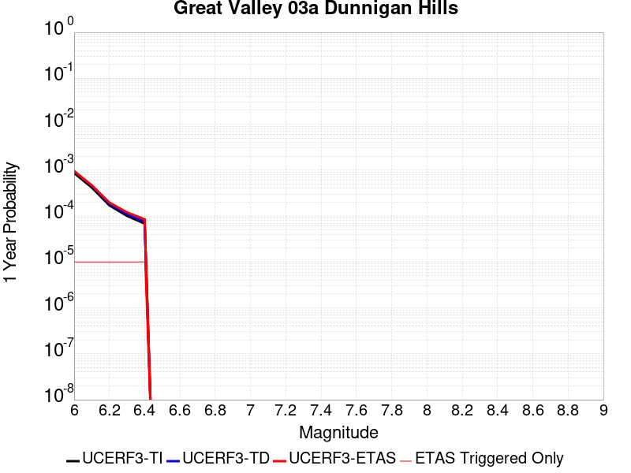 |  |

| Magnitude | 1 wk TI Prob | 1 wk TD Prob | 1 wk ETAS Prob | 1 wk ETAS/TD Gain | 1 wk ETAS Triggered Only | 1 mo TI Prob | 1 mo TD Prob | 1 mo ETAS Prob | 1 mo ETAS/TD Gain | 1 mo ETAS Triggered Only | 1 yr TI Prob | 1 yr TD Prob | 1 yr ETAS Prob | 1 yr ETAS/TD Gain | 1 yr ETAS Triggered Only | 10 yr TI Prob | 10 yr TD Prob | 10 yr ETAS Prob | 10 yr ETAS/TD Gain | 10 yr ETAS Triggered Only |
|-----|-----|-----|-----|-----|-----|-----|-----|-----|-----|-----|-----|-----|-----|-----|-----|-----|-----|-----|-----|-----|
| 6.0 | 1.6591328E-5 | 1.8107954E-5 | 1.8107954E-5 | 1.0 | 0.0 | 7.110376E-5 | 7.7603596E-5 | 7.7603596E-5 | 1.0 | 0.0 | 8.6534437E-4 | 9.444834E-4 | 9.586157E-4 | 1.014963 | 1.4145672E-5 | 0.008619824 | 0.009411525 | 0.009425538 | 1.0014889 | 1.4145672E-5 |
| 6.1 | 8.041125E-6 | 8.769726E-6 | 8.769726E-6 | 1.0 | 0.0 | 3.4461507E-5 | 3.7584115E-5 | 3.7584115E-5 | 1.0 | 0.0 | 4.194881E-4 | 4.5751085E-4 | 4.7165004E-4 | 1.0309047 | 1.4145672E-5 | 0.004186971 | 0.004567687 | 0.004581768 | 1.0030828 | 1.4145672E-5 |
| 6.2 | 3.2807004E-6 | 3.5795688E-6 | 3.5795688E-6 | 1.0 | 0.0 | 1.4060069E-5 | 1.5340942E-5 | 1.5340942E-5 | 1.0 | 0.0 | 1.7116789E-4 | 1.8676413E-4 | 2.0090715E-4 | 1.0757267 | 1.4145672E-5 | 0.0017103611 | 0.0018664796 | 0.001880599 | 1.0075647 | 1.4145672E-5 |
| 6.3 | 1.9339366E-6 | 2.1103806E-6 | 2.1103806E-6 | 1.0 | 0.0 | 8.288273E-6 | 9.044474E-6 | 9.044474E-6 | 1.0 | 0.0 | 1.00905054E-4 | 1.1011375E-4 | 1.2425787E-4 | 1.12845 | 1.4145672E-5 | 0.0010085925 | 0.0011008718 | 0.001115002 | 1.0128354 | 1.4145672E-5 |
| 6.4 | 1.3142635E-6 | 1.4339867E-6 | 1.4339867E-6 | 1.0 | 0.0 | 5.6325457E-6 | 6.145657E-6 | 6.145657E-6 | 1.0 | 0.0 | 6.857408E-5 | 7.482337E-5 | 8.896799E-5 | 1.1890401 | 1.4145672E-5 | 6.8552926E-4 | 7.4823375E-4 | 7.6236884E-4 | 1.0188912 | 1.4145672E-5 |

## Shoreline
*[(top)](#table-of-contents)*

| 1 Week | 1 Month | 1 Year | 10 Year |
|-----|-----|-----|-----|
|  |  |  |  |

| Magnitude | 1 wk TI Prob | 1 wk TD Prob | 1 wk ETAS Prob | 1 wk ETAS/TD Gain | 1 wk ETAS Triggered Only | 1 mo TI Prob | 1 mo TD Prob | 1 mo ETAS Prob | 1 mo ETAS/TD Gain | 1 mo ETAS Triggered Only | 1 yr TI Prob | 1 yr TD Prob | 1 yr ETAS Prob | 1 yr ETAS/TD Gain | 1 yr ETAS Triggered Only | 10 yr TI Prob | 10 yr TD Prob | 10 yr ETAS Prob | 10 yr ETAS/TD Gain | 10 yr ETAS Triggered Only |
|-----|-----|-----|-----|-----|-----|-----|-----|-----|-----|-----|-----|-----|-----|-----|-----|-----|-----|-----|-----|-----|
| 6.0 | 3.9888673E-6 | 4.0479285E-6 | 4.0479285E-6 | 1.0 | 0.0 | 1.7095033E-5 | 1.7348182E-5 | 1.7348182E-5 | 1.0 | 0.0 | 2.0811215E-4 | 2.1119922E-4 | 2.1119922E-4 | 1.0 | 0.0 | 0.0020791737 | 0.0021105339 | 0.0021246497 | 1.0066882 | 1.4145672E-5 |
| 6.1 | 3.9888673E-6 | 4.0479285E-6 | 4.0479285E-6 | 1.0 | 0.0 | 1.7095033E-5 | 1.7348182E-5 | 1.7348182E-5 | 1.0 | 0.0 | 2.0811215E-4 | 2.1119922E-4 | 2.1119922E-4 | 1.0 | 0.0 | 0.0020791737 | 0.0021105339 | 0.0021246497 | 1.0066882 | 1.4145672E-5 |
| 6.2 | 1.4039653E-6 | 1.4100885E-6 | 1.4100885E-6 | 1.0 | 0.0 | 6.0169805E-6 | 6.043223E-6 | 6.043223E-6 | 1.0 | 0.0 | 7.325427E-5 | 7.357382E-5 | 7.357382E-5 | 1.0 | 0.0 | 7.3230127E-4 | 7.355006E-4 | 7.355006E-4 | 1.0 | 0.0 |
| 6.3 | 1.4039653E-6 | 1.4100885E-6 | 1.4100885E-6 | 1.0 | 0.0 | 6.0169805E-6 | 6.043223E-6 | 6.043223E-6 | 1.0 | 0.0 | 7.325427E-5 | 7.357382E-5 | 7.357382E-5 | 1.0 | 0.0 | 7.3230127E-4 | 7.355006E-4 | 7.355006E-4 | 1.0 | 0.0 |
| 6.4 | 1.3314152E-6 | 1.33616E-6 | 1.33616E-6 | 1.0 | 0.0 | 5.7060524E-6 | 5.726388E-6 | 5.726388E-6 | 1.0 | 0.0 | 6.946897E-5 | 6.9716596E-5 | 6.9716596E-5 | 1.0 | 0.0 | 6.9447263E-4 | 6.9695263E-4 | 6.9695263E-4 | 1.0 | 0.0 |
| 6.5 | 1.1187026E-6 | 1.1203634E-6 | 1.1203634E-6 | 1.0 | 0.0 | 4.794431E-6 | 4.801549E-6 | 4.801549E-6 | 1.0 | 0.0 | 5.8370628E-5 | 5.8457317E-5 | 5.8457317E-5 | 1.0 | 0.0 | 5.83553E-4 | 5.844219E-4 | 5.844219E-4 | 1.0 | 0.0 |
| 6.6 | 9.793089E-7 | 9.784915E-7 | 9.784915E-7 | 1.0 | 0.0 | 4.1970316E-6 | 4.193528E-6 | 4.193528E-6 | 1.0 | 0.0 | 5.1097657E-5 | 5.1055024E-5 | 5.1055024E-5 | 1.0 | 0.0 | 5.108591E-4 | 5.104342E-4 | 5.104342E-4 | 1.0 | 0.0 |
| 6.7 | 8.995986E-7 | 8.972795E-7 | 8.972795E-7 | 1.0 | 0.0 | 3.8554167E-6 | 3.8454777E-6 | 3.8454777E-6 | 1.0 | 0.0 | 4.693869E-5 | 4.68177E-5 | 4.68177E-5 | 1.0 | 0.0 | 4.6928777E-4 | 4.680793E-4 | 4.680793E-4 | 1.0 | 0.0 |
| 6.8 | 7.931612E-7 | 7.8803976E-7 | 7.8803976E-7 | 1.0 | 0.0 | 3.3992578E-6 | 3.377309E-6 | 3.377309E-6 | 1.0 | 0.0 | 4.1385178E-5 | 4.1117964E-5 | 4.1117964E-5 | 1.0 | 0.0 | 4.1377472E-4 | 4.1110412E-4 | 4.1110412E-4 | 1.0 | 0.0 |
| 6.9 | 7.1465956E-7 | 7.078001E-7 | 7.078001E-7 | 1.0 | 0.0 | 3.062823E-6 | 3.0334254E-6 | 3.0334254E-6 | 1.0 | 0.0 | 3.7289232E-5 | 3.693133E-5 | 3.693133E-5 | 1.0 | 0.0 | 3.7282976E-4 | 3.6925232E-4 | 3.6925232E-4 | 1.0 | 0.0 |
| 7.0 | 6.389046E-7 | 6.299453E-7 | 6.299453E-7 | 1.0 | 0.0 | 2.7381598E-6 | 2.699763E-6 | 2.699763E-6 | 1.0 | 0.0 | 3.3336586E-5 | 3.286912E-5 | 3.286912E-5 | 1.0 | 0.0 | 3.3331584E-4 | 3.286428E-4 | 3.286428E-4 | 1.0 | 0.0 |
| 7.1 | 5.4300875E-7 | 5.311126E-7 | 5.311126E-7 | 1.0 | 0.0 | 2.3271782E-6 | 2.276195E-6 | 2.276195E-6 | 1.0 | 0.0 | 2.8333026E-5 | 2.7712322E-5 | 2.7712322E-5 | 1.0 | 0.0 | 2.8329415E-4 | 2.7708875E-4 | 2.7708875E-4 | 1.0 | 0.0 |
| 7.2 | 4.6768855E-7 | 4.5348904E-7 | 4.5348904E-7 | 1.0 | 0.0 | 2.0043778E-6 | 1.9435229E-6 | 1.9435229E-6 | 1.0 | 0.0 | 2.4403027E-5 | 2.3662134E-5 | 2.3662134E-5 | 1.0 | 0.0 | 2.4400349E-4 | 2.3659621E-4 | 2.3659621E-4 | 1.0 | 0.0 |
| 7.3 | 4.0966103E-7 | 3.9385614E-7 | 3.9385614E-7 | 1.0 | 0.0 | 1.7556889E-6 | 1.6879537E-6 | 1.6879537E-6 | 1.0 | 0.0 | 2.1375303E-5 | 2.0550642E-5 | 2.0550642E-5 | 1.0 | 0.0 | 2.1373246E-4 | 2.0548746E-4 | 2.0548746E-4 | 1.0 | 0.0 |
| 7.4 | 3.5105785E-7 | 3.3363924E-7 | 3.3363924E-7 | 1.0 | 0.0 | 1.5045327E-6 | 1.4298816E-6 | 1.4298816E-6 | 1.0 | 0.0 | 1.8317533E-5 | 1.7408669E-5 | 1.7408669E-5 | 1.0 | 0.0 | 1.8316023E-4 | 1.740731E-4 | 1.740731E-4 | 1.0 | 0.0 |
| 7.5 | 2.8737534E-7 | 2.681999E-7 | 2.681999E-7 | 1.0 | 0.0 | 1.2316079E-6 | 1.1494276E-6 | 1.1494276E-6 | 1.0 | 0.0 | 1.4994724E-5 | 1.399419E-5 | 1.399419E-5 | 1.0 | 0.0 | 1.4993713E-4 | 1.3993312E-4 | 1.3993312E-4 | 1.0 | 0.0 |
| 7.6 | 2.0924051E-7 | 1.8778938E-7 | 1.8778938E-7 | 1.0 | 0.0 | 8.967448E-7 | 8.0481135E-7 | 8.0481135E-7 | 1.0 | 0.0 | 1.0917813E-5 | 9.798534E-6 | 9.798534E-6 | 1.0 | 0.0 | 1.0917276E-4 | 9.798103E-5 | 9.798103E-5 | 1.0 | 0.0 |
| 7.7 | 1.392265E-7 | 1.1543341E-7 | 1.1543341E-7 | 1.0 | 0.0 | 5.9668486E-7 | 4.9471447E-7 | 4.9471447E-7 | 1.0 | 0.0 | 7.2646135E-6 | 6.0231323E-6 | 6.0231323E-6 | 1.0 | 0.0 | 7.2643765E-5 | 6.0229693E-5 | 6.0229693E-5 | 1.0 | 0.0 |
| 7.8 | 8.1080074E-8 | 5.5866355E-8 | 5.5866355E-8 | 1.0 | 0.0 | 3.4748598E-7 | 2.394272E-7 | 2.394272E-7 | 1.0 | 0.0 | 4.2306337E-6 | 2.9150222E-6 | 2.9150222E-6 | 1.0 | 0.0 | 4.230553E-5 | 2.9149842E-5 | 2.9149842E-5 | 1.0 | 0.0 |
| 7.9 | 5.0859036E-8 | 2.7243395E-8 | 2.7243395E-8 | 1.0 | 0.0 | 2.1796728E-7 | 1.16757406E-7 | 1.16757406E-7 | 1.0 | 0.0 | 2.6537484E-6 | 1.4215204E-6 | 1.4215204E-6 | 1.0 | 0.0 | 2.6537167E-5 | 1.4215115E-5 | 1.4215115E-5 | 1.0 | 0.0 |
| 8.0 | 3.1760536E-8 | 1.3575991E-8 | 1.3575991E-8 | 1.0 | 0.0 | 1.3611657E-7 | 5.8182817E-8 | 5.8182817E-8 | 1.0 | 0.0 | 1.6572179E-6 | 7.083755E-7 | 7.083755E-7 | 1.0 | 0.0 | 1.6572056E-5 | 7.083733E-6 | 7.083733E-6 | 1.0 | 0.0 |
| 8.1 | 1.2947896E-8 | 5.6625185E-9 | 5.6625185E-9 | 1.0 | 0.0 | 5.5490982E-8 | 2.4267937E-8 | 2.4267937E-8 | 1.0 | 0.0 | 6.756025E-7 | 2.954621E-7 | 2.954621E-7 | 1.0 | 0.0 | 6.7560045E-6 | 2.9546172E-6 | 2.9546172E-6 | 1.0 | 0.0 |

## Eaton Roughs 2011 CFM
*[(top)](#table-of-contents)*

| 1 Week | 1 Month | 1 Year | 10 Year |
|-----|-----|-----|-----|
|  |  |  |  |

| Magnitude | 1 wk TI Prob | 1 wk TD Prob | 1 wk ETAS Prob | 1 wk ETAS/TD Gain | 1 wk ETAS Triggered Only | 1 mo TI Prob | 1 mo TD Prob | 1 mo ETAS Prob | 1 mo ETAS/TD Gain | 1 mo ETAS Triggered Only | 1 yr TI Prob | 1 yr TD Prob | 1 yr ETAS Prob | 1 yr ETAS/TD Gain | 1 yr ETAS Triggered Only | 10 yr TI Prob | 10 yr TD Prob | 10 yr ETAS Prob | 10 yr ETAS/TD Gain | 10 yr ETAS Triggered Only |
|-----|-----|-----|-----|-----|-----|-----|-----|-----|-----|-----|-----|-----|-----|-----|-----|-----|-----|-----|-----|-----|
| 6.0 | 6.8044945E-5 | 8.8434645E-5 | 1.0257907E-4 | 1.159942 | 1.4145672E-5 | 2.9158857E-4 | 3.7895713E-4 | 3.9309746E-4 | 1.0373137 | 1.4145672E-5 | 0.0035443127 | 0.0046046837 | 0.0046187644 | 1.0030578 | 1.4145672E-5 | 0.03488314 | 0.04516368 | 0.045177184 | 1.0002991 | 1.4145672E-5 |
| 6.1 | 6.8044945E-5 | 8.8434645E-5 | 1.0257907E-4 | 1.159942 | 1.4145672E-5 | 2.9158857E-4 | 3.7895713E-4 | 3.9309746E-4 | 1.0373137 | 1.4145672E-5 | 0.0035443127 | 0.0046046837 | 0.0046187644 | 1.0030578 | 1.4145672E-5 | 0.03488314 | 0.04516368 | 0.045177184 | 1.0002991 | 1.4145672E-5 |
| 6.2 | 6.8044945E-5 | 8.8434645E-5 | 1.0257907E-4 | 1.159942 | 1.4145672E-5 | 2.9158857E-4 | 3.7895713E-4 | 3.9309746E-4 | 1.0373137 | 1.4145672E-5 | 0.0035443127 | 0.0046046837 | 0.0046187644 | 1.0030578 | 1.4145672E-5 | 0.03488314 | 0.04516368 | 0.045177184 | 1.0002991 | 1.4145672E-5 |
| 6.3 | 6.8044945E-5 | 8.8434645E-5 | 1.0257907E-4 | 1.159942 | 1.4145672E-5 | 2.9158857E-4 | 3.7895713E-4 | 3.9309746E-4 | 1.0373137 | 1.4145672E-5 | 0.0035443127 | 0.0046046837 | 0.0046187644 | 1.0030578 | 1.4145672E-5 | 0.03488314 | 0.04516368 | 0.045177184 | 1.0002991 | 1.4145672E-5 |
| 6.4 | 4.5830013E-5 | 5.71553E-5 | 5.71553E-5 | 1.0 | 0.0 | 1.9639956E-4 | 2.4493135E-4 | 2.4493135E-4 | 1.0 | 0.0 | 0.0023885423 | 0.002978342 | 0.002978342 | 1.0 | 0.0 | 0.023630321 | 0.029421948 | 0.029421948 | 1.0 | 0.0 |
| 6.5 | 4.5830013E-5 | 5.71553E-5 | 5.71553E-5 | 1.0 | 0.0 | 1.9639956E-4 | 2.4493135E-4 | 2.4493135E-4 | 1.0 | 0.0 | 0.0023885423 | 0.002978342 | 0.002978342 | 1.0 | 0.0 | 0.023630321 | 0.029421948 | 0.029421948 | 1.0 | 0.0 |
| 6.6 | 3.222194E-5 | 3.8262962E-5 | 3.8262962E-5 | 1.0 | 0.0 | 1.3808672E-4 | 1.6397446E-4 | 1.6397446E-4 | 1.0 | 0.0 | 0.0016799092 | 0.0019946485 | 0.0019946485 | 1.0 | 0.0 | 0.016672665 | 0.019776754 | 0.019776754 | 1.0 | 0.0 |
| 6.7 | 2.4155654E-5 | 2.7786275E-5 | 2.7786275E-5 | 1.0 | 0.0 | 1.0352012E-4 | 1.1907864E-4 | 1.1907864E-4 | 1.0 | 0.0 | 0.0012596287 | 0.0014488265 | 0.0014488265 | 1.0 | 0.0 | 0.012525126 | 0.01439499 | 0.01439499 | 1.0 | 0.0 |
| 6.8 | 2.1814667E-5 | 2.4940904E-5 | 2.4940904E-5 | 1.0 | 0.0 | 9.348808E-5 | 1.0688523E-4 | 1.0688523E-4 | 1.0 | 0.0 | 0.001137623 | 0.0013005546 | 0.0013005546 | 1.0 | 0.0 | 0.011318169 | 0.012930086 | 0.012930086 | 1.0 | 0.0 |
| 6.9 | 2.0700467E-5 | 2.362897E-5 | 2.362897E-5 | 1.0 | 0.0 | 8.871327E-5 | 1.01263104E-4 | 1.01263104E-4 | 1.0 | 0.0 | 0.0010795488 | 0.0012321841 | 0.0012321841 | 1.0 | 0.0 | 0.010743194 | 0.012254083 | 0.012254083 | 1.0 | 0.0 |
| 7.0 | 2.0104066E-5 | 2.2936536E-5 | 2.2936536E-5 | 1.0 | 0.0 | 8.615744E-5 | 9.829576E-5 | 9.829576E-5 | 1.0 | 0.0 | 0.0010484619 | 0.0011960969 | 0.0011960969 | 1.0 | 0.0 | 0.010435291 | 0.01189712 | 0.01189712 | 1.0 | 0.0 |
| 7.1 | 1.8225232E-5 | 2.0773083E-5 | 2.0773083E-5 | 1.0 | 0.0 | 7.81058E-5 | 8.902447E-5 | 8.902447E-5 | 1.0 | 0.0 | 9.5052324E-4 | 0.0010833355 | 0.0010833355 | 1.0 | 0.0 | 0.009464677 | 0.010780873 | 0.010780873 | 1.0 | 0.0 |
| 7.2 | 1.7526572E-5 | 1.9993524E-5 | 1.9993524E-5 | 1.0 | 0.0 | 7.511172E-5 | 8.568373E-5 | 8.568373E-5 | 1.0 | 0.0 | 9.141015E-4 | 0.0010427017 | 0.0010427017 | 1.0 | 0.0 | 0.009103506 | 0.010378398 | 0.010378398 | 1.0 | 0.0 |
| 7.3 | 1.5727232E-5 | 1.8021543E-5 | 1.8021543E-5 | 1.0 | 0.0 | 6.740067E-5 | 7.72329E-5 | 7.72329E-5 | 1.0 | 0.0 | 8.2029426E-4 | 9.399062E-4 | 9.399062E-4 | 1.0 | 0.0 | 0.008172729 | 0.009359558 | 0.009359558 | 1.0 | 0.0 |
| 7.4 | 1.4457361E-5 | 1.6598395E-5 | 1.6598395E-5 | 1.0 | 0.0 | 6.195865E-5 | 7.113405E-5 | 7.113405E-5 | 1.0 | 0.0 | 7.540854E-4 | 8.657138E-4 | 8.657138E-4 | 1.0 | 0.0 | 0.007515317 | 0.008623603 | 0.008623603 | 1.0 | 0.0 |
| 7.5 | 1.33280955E-5 | 1.5345471E-5 | 1.5345471E-5 | 1.0 | 0.0 | 5.711916E-5 | 6.576465E-5 | 6.576465E-5 | 1.0 | 0.0 | 6.9520384E-4 | 8.0039137E-4 | 8.0039137E-4 | 1.0 | 0.0 | 0.00693033 | 0.007975256 | 0.007975256 | 1.0 | 0.0 |
| 7.6 | 1.0699478E-5 | 1.2387852E-5 | 1.2387852E-5 | 1.0 | 0.0 | 4.5854096E-5 | 5.3089716E-5 | 5.3089716E-5 | 1.0 | 0.0 | 5.581306E-4 | 6.461761E-4 | 6.461761E-4 | 1.0 | 0.0 | 0.005567309 | 0.0064430824 | 0.0064430824 | 1.0 | 0.0 |
| 7.7 | 5.9390236E-6 | 6.8529853E-6 | 6.8529853E-6 | 1.0 | 0.0 | 2.545271E-5 | 2.9369607E-5 | 2.9369607E-5 | 1.0 | 0.0 | 3.0984267E-4 | 3.5751655E-4 | 3.5751655E-4 | 1.0 | 0.0 | 0.0030941102 | 0.0035694393 | 0.0035694393 | 1.0 | 0.0 |
| 7.8 | 2.1622036E-6 | 2.329702E-6 | 2.329702E-6 | 1.0 | 0.0 | 9.266554E-6 | 9.984399E-6 | 9.984399E-6 | 1.0 | 0.0 | 1.1281446E-4 | 1.21553356E-4 | 1.21553356E-4 | 1.0 | 0.0 | 0.001127572 | 0.0012148687 | 0.0012148687 | 1.0 | 0.0 |
| 7.9 | 4.9586197E-7 | 5.2189216E-7 | 5.2189216E-7 | 1.0 | 0.0 | 2.125121E-6 | 2.2366787E-6 | 2.2366787E-6 | 1.0 | 0.0 | 2.5873042E-5 | 2.7231245E-5 | 2.7231245E-5 | 1.0 | 0.0 | 2.5870028E-4 | 2.7228118E-4 | 2.7228118E-4 | 1.0 | 0.0 |

## Elsinore (Temecula) rev
*[(top)](#table-of-contents)*

| 1 Week | 1 Month | 1 Year | 10 Year |
|-----|-----|-----|-----|
|  |  |  |  |

| Magnitude | 1 wk TI Prob | 1 wk TD Prob | 1 wk ETAS Prob | 1 wk ETAS/TD Gain | 1 wk ETAS Triggered Only | 1 mo TI Prob | 1 mo TD Prob | 1 mo ETAS Prob | 1 mo ETAS/TD Gain | 1 mo ETAS Triggered Only | 1 yr TI Prob | 1 yr TD Prob | 1 yr ETAS Prob | 1 yr ETAS/TD Gain | 1 yr ETAS Triggered Only | 10 yr TI Prob | 10 yr TD Prob | 10 yr ETAS Prob | 10 yr ETAS/TD Gain | 10 yr ETAS Triggered Only |
|-----|-----|-----|-----|-----|-----|-----|-----|-----|-----|-----|-----|-----|-----|-----|-----|-----|-----|-----|-----|-----|
| 6.0 | 2.9514995E-5 | 2.251887E-5 | 3.6664223E-5 | 1.6281556 | 1.4145672E-5 | 1.264867E-4 | 9.6505995E-5 | 1.10650304E-4 | 1.146564 | 1.4145672E-5 | 0.0015388876 | 0.0011743492 | 0.0011884783 | 1.0120314 | 1.4145672E-5 | 0.015282745 | 0.011688135 | 0.011702115 | 1.0011961 | 1.4145672E-5 |
| 6.1 | 2.9514995E-5 | 2.251887E-5 | 3.6664223E-5 | 1.6281556 | 1.4145672E-5 | 1.264867E-4 | 9.6505995E-5 | 1.10650304E-4 | 1.146564 | 1.4145672E-5 | 0.0015388876 | 0.0011743492 | 0.0011884783 | 1.0120314 | 1.4145672E-5 | 0.015282745 | 0.011688135 | 0.011702115 | 1.0011961 | 1.4145672E-5 |
| 6.2 | 2.9514995E-5 | 2.251887E-5 | 3.6664223E-5 | 1.6281556 | 1.4145672E-5 | 1.264867E-4 | 9.6505995E-5 | 1.10650304E-4 | 1.146564 | 1.4145672E-5 | 0.0015388876 | 0.0011743492 | 0.0011884783 | 1.0120314 | 1.4145672E-5 | 0.015282745 | 0.011688135 | 0.011702115 | 1.0011961 | 1.4145672E-5 |
| 6.3 | 2.3223649E-5 | 1.840822E-5 | 3.255363E-5 | 1.7684292 | 1.4145672E-5 | 9.952613E-5 | 7.889008E-5 | 9.3034636E-5 | 1.1792945 | 1.4145672E-5 | 0.001211057 | 9.600807E-4 | 9.742128E-4 | 1.0147197 | 1.4145672E-5 | 0.012044783 | 0.009551284 | 0.009565294 | 1.0014669 | 1.4145672E-5 |
| 6.4 | 2.3223649E-5 | 1.840822E-5 | 3.255363E-5 | 1.7684292 | 1.4145672E-5 | 9.952613E-5 | 7.889008E-5 | 9.3034636E-5 | 1.1792945 | 1.4145672E-5 | 0.001211057 | 9.600807E-4 | 9.742128E-4 | 1.0147197 | 1.4145672E-5 | 0.012044783 | 0.009551284 | 0.009565294 | 1.0014669 | 1.4145672E-5 |
| 6.5 | 1.8338875E-5 | 1.4750074E-5 | 2.8895538E-5 | 1.9590096 | 1.4145672E-5 | 7.8592806E-5 | 6.321312E-5 | 7.73579E-5 | 1.2237633 | 1.4145672E-5 | 9.5644733E-4 | 7.6935673E-4 | 7.8349153E-4 | 1.0183722 | 1.4145672E-5 | 0.009523412 | 0.0076699676 | 0.0076840045 | 1.0018301 | 1.4145672E-5 |
| 6.6 | 1.8223333E-5 | 1.461263E-5 | 2.8758095E-5 | 1.9680301 | 1.4145672E-5 | 7.809766E-5 | 6.26241E-5 | 7.676889E-5 | 1.2258681 | 1.4145672E-5 | 9.504242E-4 | 7.621905E-4 | 7.763254E-4 | 1.018545 | 1.4145672E-5 | 0.009463696 | 0.007598796 | 0.007612834 | 1.0018474 | 1.4145672E-5 |
| 6.7 | 1.7512752E-5 | 1.4026963E-5 | 1.4026963E-5 | 1.0 | 0.0 | 7.505249E-5 | 6.0114216E-5 | 6.0114216E-5 | 1.0 | 0.0 | 9.13381E-4 | 7.316534E-4 | 7.316534E-4 | 1.0 | 0.0 | 0.00909636 | 0.0072983317 | 0.0072983317 | 1.0 | 0.0 |
| 6.8 | 1.7417142E-5 | 1.395093E-5 | 1.395093E-5 | 1.0 | 0.0 | 7.4642754E-5 | 5.978838E-5 | 5.978838E-5 | 1.0 | 0.0 | 9.083966E-4 | 7.27689E-4 | 7.27689E-4 | 1.0 | 0.0 | 0.009046922 | 0.007259359 | 0.007259359 | 1.0 | 0.0 |
| 6.9 | 1.6402591E-5 | 1.29883665E-5 | 1.29883665E-5 | 1.0 | 0.0 | 7.0294926E-5 | 5.5663284E-5 | 5.5663284E-5 | 1.0 | 0.0 | 8.5550465E-4 | 6.774974E-4 | 6.774974E-4 | 1.0 | 0.0 | 0.008522186 | 0.0067598647 | 0.0067598647 | 1.0 | 0.0 |
| 7.0 | 1.3912486E-5 | 1.0878067E-5 | 1.0878067E-5 | 1.0 | 0.0 | 5.9623577E-5 | 4.661947E-5 | 4.661947E-5 | 1.0 | 0.0 | 7.2567526E-4 | 5.674469E-4 | 5.674469E-4 | 1.0 | 0.0 | 0.0072331014 | 0.0056635314 | 0.0056635314 | 1.0 | 0.0 |
| 7.1 | 1.3405147E-5 | 1.0327192E-5 | 1.0327192E-5 | 1.0 | 0.0 | 5.7449364E-5 | 4.4258657E-5 | 4.4258657E-5 | 1.0 | 0.0 | 6.9922156E-4 | 5.3871854E-4 | 5.3871854E-4 | 1.0 | 0.0 | 0.0069702556 | 0.005377366 | 0.005377366 | 1.0 | 0.0 |
| 7.2 | 1.21402E-5 | 8.996479E-6 | 8.996479E-6 | 1.0 | 0.0 | 5.202839E-5 | 3.8555776E-5 | 3.8555776E-5 | 1.0 | 0.0 | 6.332616E-4 | 4.6931725E-4 | 4.6931725E-4 | 1.0 | 0.0 | 0.0063146 | 0.0046847262 | 0.0046847262 | 1.0 | 0.0 |
| 7.3 | 1.05047775E-5 | 7.571515E-6 | 7.571515E-6 | 1.0 | 0.0 | 4.5019697E-5 | 3.2448956E-5 | 3.2448956E-5 | 1.0 | 0.0 | 5.4797693E-4 | 3.9499588E-4 | 3.9499588E-4 | 1.0 | 0.0 | 0.005466277 | 0.003943348 | 0.003943348 | 1.0 | 0.0 |
| 7.4 | 9.624483E-6 | 6.786621E-6 | 6.786621E-6 | 1.0 | 0.0 | 4.124713E-5 | 2.90852E-5 | 2.90852E-5 | 1.0 | 0.0 | 5.0206814E-4 | 3.5405616E-4 | 3.5405616E-4 | 1.0 | 0.0 | 0.005009353 | 0.0035350726 | 0.0035350726 | 1.0 | 0.0 |
| 7.5 | 8.215151E-6 | 5.6353133E-6 | 5.6353133E-6 | 1.0 | 0.0 | 3.5207315E-5 | 2.4151126E-5 | 2.4151126E-5 | 1.0 | 0.0 | 4.2856473E-4 | 2.9400157E-4 | 2.9400157E-4 | 1.0 | 0.0 | 0.004277392 | 0.002936254 | 0.002936254 | 1.0 | 0.0 |
| 7.6 | 6.975058E-6 | 4.675836E-6 | 4.675836E-6 | 1.0 | 0.0 | 2.9892764E-5 | 2.003915E-5 | 2.003915E-5 | 1.0 | 0.0 | 3.6388362E-4 | 2.439505E-4 | 2.439505E-4 | 1.0 | 0.0 | 0.0036328835 | 0.0024369434 | 0.0024369434 | 1.0 | 0.0 |
| 7.7 | 4.159604E-6 | 2.326789E-6 | 2.326789E-6 | 1.0 | 0.0 | 1.7826753E-5 | 9.971919E-6 | 9.971919E-6 | 1.0 | 0.0 | 2.1701909E-4 | 1.2140209E-4 | 1.2140209E-4 | 1.0 | 0.0 | 0.0021680726 | 0.0012134308 | 0.0012134308 | 1.0 | 0.0 |
| 7.8 | 2.2692414E-7 | 9.384417E-8 | 9.384417E-8 | 1.0 | 0.0 | 9.725317E-7 | 4.0218927E-7 | 4.0218927E-7 | 1.0 | 0.0 | 1.1840509E-5 | 4.8966467E-6 | 4.8966467E-6 | 1.0 | 0.0 | 1.1839878E-4 | 4.8965718E-5 | 4.8965718E-5 | 1.0 | 0.0 |
| 7.9 | 6.676829E-9 | 3.4397174E-9 | 3.4397174E-9 | 1.0 | 0.0 | 2.861498E-8 | 1.4741646E-8 | 1.4741646E-8 | 1.0 | 0.0 | 3.4838732E-7 | 1.7947953E-7 | 1.7947953E-7 | 1.0 | 0.0 | 3.4838679E-6 | 1.794794E-6 | 1.794794E-6 | 1.0 | 0.0 |

## Del Valle
*[(top)](#table-of-contents)*

| 1 Week | 1 Month | 1 Year | 10 Year |
|-----|-----|-----|-----|
|  |  |  |  |

| Magnitude | 1 wk TI Prob | 1 wk TD Prob | 1 wk ETAS Prob | 1 wk ETAS/TD Gain | 1 wk ETAS Triggered Only | 1 mo TI Prob | 1 mo TD Prob | 1 mo ETAS Prob | 1 mo ETAS/TD Gain | 1 mo ETAS Triggered Only | 1 yr TI Prob | 1 yr TD Prob | 1 yr ETAS Prob | 1 yr ETAS/TD Gain | 1 yr ETAS Triggered Only | 10 yr TI Prob | 10 yr TD Prob | 10 yr ETAS Prob | 10 yr ETAS/TD Gain | 10 yr ETAS Triggered Only |
|-----|-----|-----|-----|-----|-----|-----|-----|-----|-----|-----|-----|-----|-----|-----|-----|-----|-----|-----|-----|-----|
| 6.0 | 1.0716125E-5 | 8.767882E-6 | 8.767882E-6 | 1.0 | 0.0 | 4.592544E-5 | 3.7576207E-5 | 3.7576207E-5 | 1.0 | 0.0 | 5.589988E-4 | 4.5741402E-4 | 4.5741402E-4 | 1.0 | 0.0 | 0.0055759475 | 0.004566694 | 0.0045807753 | 1.0030835 | 1.4145672E-5 |
| 6.1 | 1.0716125E-5 | 8.767882E-6 | 8.767882E-6 | 1.0 | 0.0 | 4.592544E-5 | 3.7576207E-5 | 3.7576207E-5 | 1.0 | 0.0 | 5.589988E-4 | 4.5741402E-4 | 4.5741402E-4 | 1.0 | 0.0 | 0.0055759475 | 0.004566694 | 0.0045807753 | 1.0030835 | 1.4145672E-5 |
| 6.2 | 1.0716125E-5 | 8.767882E-6 | 8.767882E-6 | 1.0 | 0.0 | 4.592544E-5 | 3.7576207E-5 | 3.7576207E-5 | 1.0 | 0.0 | 5.589988E-4 | 4.5741402E-4 | 4.5741402E-4 | 1.0 | 0.0 | 0.0055759475 | 0.004566694 | 0.0045807753 | 1.0030835 | 1.4145672E-5 |
| 6.3 | 7.1293784E-6 | 4.8658226E-6 | 4.8658226E-6 | 1.0 | 0.0 | 3.055412E-5 | 2.0853362E-5 | 2.0853362E-5 | 1.0 | 0.0 | 3.7193293E-4 | 2.5386084E-4 | 2.5386084E-4 | 1.0 | 0.0 | 0.0037131102 | 0.0025358086 | 0.0025358086 | 1.0 | 0.0 |
| 6.4 | 7.1293784E-6 | 4.8658226E-6 | 4.8658226E-6 | 1.0 | 0.0 | 3.055412E-5 | 2.0853362E-5 | 2.0853362E-5 | 1.0 | 0.0 | 3.7193293E-4 | 2.5386084E-4 | 2.5386084E-4 | 1.0 | 0.0 | 0.0037131102 | 0.0025358086 | 0.0025358086 | 1.0 | 0.0 |
| 6.5 | 7.1293784E-6 | 4.8658226E-6 | 4.8658226E-6 | 1.0 | 0.0 | 3.055412E-5 | 2.0853362E-5 | 2.0853362E-5 | 1.0 | 0.0 | 3.7193293E-4 | 2.5386084E-4 | 2.5386084E-4 | 1.0 | 0.0 | 0.0037131102 | 0.0025358086 | 0.0025358086 | 1.0 | 0.0 |
| 6.6 | 7.1293784E-6 | 4.8658226E-6 | 4.8658226E-6 | 1.0 | 0.0 | 3.055412E-5 | 2.0853362E-5 | 2.0853362E-5 | 1.0 | 0.0 | 3.7193293E-4 | 2.5386084E-4 | 2.5386084E-4 | 1.0 | 0.0 | 0.0037131102 | 0.0025358086 | 0.0025358086 | 1.0 | 0.0 |
| 6.7 | 7.12272E-6 | 4.8631982E-6 | 4.8631982E-6 | 1.0 | 0.0 | 3.0525585E-5 | 2.0842115E-5 | 2.0842115E-5 | 1.0 | 0.0 | 3.7158563E-4 | 2.5372393E-4 | 2.5372393E-4 | 1.0 | 0.0 | 0.003709649 | 0.0025344428 | 0.0025344428 | 1.0 | 0.0 |
| 6.8 | 6.7558703E-6 | 4.559404E-6 | 4.559404E-6 | 1.0 | 0.0 | 2.895341E-5 | 1.954016E-5 | 1.954016E-5 | 1.0 | 0.0 | 3.5245073E-4 | 2.3787611E-4 | 2.3787611E-4 | 1.0 | 0.0 | 0.0035189227 | 0.0023763045 | 0.0023763045 | 1.0 | 0.0 |
| 6.9 | 6.6700386E-6 | 4.5025436E-6 | 4.5025436E-6 | 1.0 | 0.0 | 2.8585566E-5 | 1.9296476E-5 | 1.9296476E-5 | 1.0 | 0.0 | 3.479737E-4 | 2.349099E-4 | 2.349099E-4 | 1.0 | 0.0 | 0.003474293 | 0.0023467052 | 0.0023467052 | 1.0 | 0.0 |
| 7.0 | 6.3181424E-6 | 4.098708E-6 | 4.098708E-6 | 1.0 | 0.0 | 2.7077473E-5 | 1.7565775E-5 | 1.7565775E-5 | 1.0 | 0.0 | 3.2961834E-4 | 2.1384275E-4 | 2.1384275E-4 | 1.0 | 0.0 | 0.0032912986 | 0.0021364389 | 0.0021364389 | 1.0 | 0.0 |
| 7.1 | 6.248759E-6 | 4.033899E-6 | 4.033899E-6 | 1.0 | 0.0 | 2.678012E-5 | 1.7288028E-5 | 1.7288028E-5 | 1.0 | 0.0 | 3.2599916E-4 | 2.1046183E-4 | 2.1046183E-4 | 1.0 | 0.0 | 0.0032552136 | 0.0021026938 | 0.0021026938 | 1.0 | 0.0 |
| 7.2 | 6.0411944E-6 | 3.869892E-6 | 3.869892E-6 | 1.0 | 0.0 | 2.5890577E-5 | 1.658515E-5 | 1.658515E-5 | 1.0 | 0.0 | 3.1517216E-4 | 2.019059E-4 | 2.019059E-4 | 1.0 | 0.0 | 0.0031472554 | 0.0020172922 | 0.0020172922 | 1.0 | 0.0 |
| 7.3 | 4.7691183E-6 | 3.0780905E-6 | 3.0780905E-6 | 1.0 | 0.0 | 2.0438918E-5 | 1.3191751E-5 | 1.3191751E-5 | 1.0 | 0.0 | 2.488154E-4 | 1.6059795E-4 | 1.6059795E-4 | 1.0 | 0.0 | 0.00248537 | 0.0016048512 | 0.0016048512 | 1.0 | 0.0 |
| 7.4 | 3.5524722E-6 | 2.1893159E-6 | 2.1893159E-6 | 1.0 | 0.0 | 1.5224792E-5 | 9.382749E-6 | 9.382749E-6 | 1.0 | 0.0 | 1.8534607E-4 | 1.14229064E-4 | 1.14229064E-4 | 1.0 | 0.0 | 0.0018519156 | 0.0011417117 | 0.0011417117 | 1.0 | 0.0 |
| 7.5 | 2.7133442E-6 | 1.5915855E-6 | 1.5915855E-6 | 1.0 | 0.0 | 1.1628566E-5 | 6.821063E-6 | 6.821063E-6 | 1.0 | 0.0 | 1.415686E-4 | 8.30433E-5 | 8.30433E-5 | 1.0 | 0.0 | 0.0014147845 | 8.301246E-4 | 8.301246E-4 | 1.0 | 0.0 |
| 7.6 | 1.915338E-6 | 1.1738952E-6 | 1.1738952E-6 | 1.0 | 0.0 | 8.208566E-6 | 5.0309695E-6 | 5.0309695E-6 | 1.0 | 0.0 | 9.993471E-5 | 6.125034E-5 | 6.125034E-5 | 1.0 | 0.0 | 9.988978E-4 | 6.123355E-4 | 6.123355E-4 | 1.0 | 0.0 |
| 7.7 | 1.2120448E-6 | 7.1801645E-7 | 7.1801645E-7 | 1.0 | 0.0 | 5.194467E-6 | 3.0772098E-6 | 3.0772098E-6 | 1.0 | 0.0 | 6.3240805E-5 | 3.746439E-5 | 3.746439E-5 | 1.0 | 0.0 | 6.322281E-4 | 3.745811E-4 | 3.745811E-4 | 1.0 | 0.0 |
| 7.8 | 6.272381E-7 | 3.93245E-7 | 3.93245E-7 | 1.0 | 0.0 | 2.6881603E-6 | 1.6853346E-6 | 1.6853346E-6 | 1.0 | 0.0 | 3.272786E-5 | 2.0518757E-5 | 2.0518757E-5 | 1.0 | 0.0 | 3.272304E-4 | 2.0516879E-4 | 2.0516879E-4 | 1.0 | 0.0 |
| 7.9 | 2.0292627E-7 | 1.2004223E-7 | 1.2004223E-7 | 1.0 | 0.0 | 8.6968373E-7 | 5.144666E-7 | 5.144666E-7 | 1.0 | 0.0 | 1.0588348E-5 | 6.2636127E-6 | 6.2636127E-6 | 1.0 | 0.0 | 1.0587843E-4 | 6.263438E-5 | 6.263438E-5 | 1.0 | 0.0 |
| 8.0 | 4.374492E-8 | 2.1898856E-8 | 2.1898856E-8 | 1.0 | 0.0 | 1.8747821E-7 | 9.3852236E-8 | 9.3852236E-8 | 1.0 | 0.0 | 2.2825448E-6 | 1.1426505E-6 | 1.1426505E-6 | 1.0 | 0.0 | 2.2825214E-5 | 1.1426449E-5 | 1.1426449E-5 | 1.0 | 0.0 |

## San Gabriel (Extension)
*[(top)](#table-of-contents)*

| 1 Week | 1 Month | 1 Year | 10 Year |
|-----|-----|-----|-----|
| 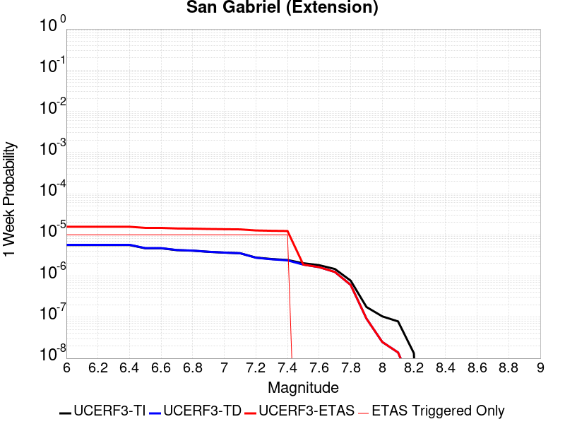 | 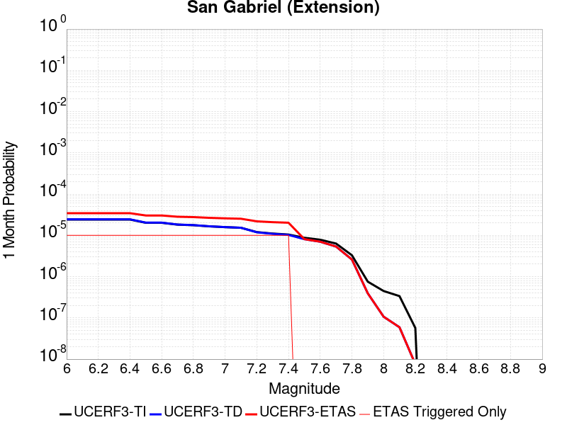 | 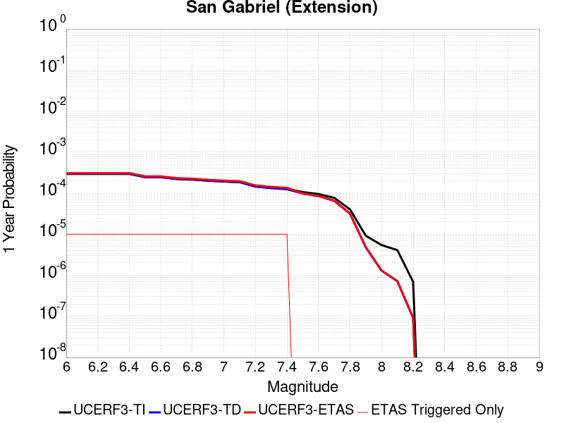 | 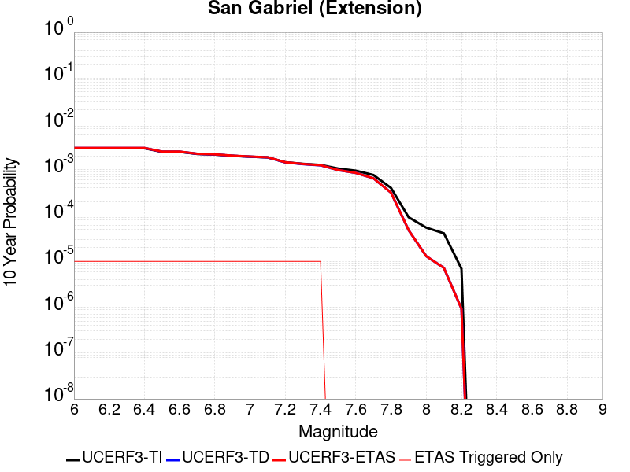 |

| Magnitude | 1 wk TI Prob | 1 wk TD Prob | 1 wk ETAS Prob | 1 wk ETAS/TD Gain | 1 wk ETAS Triggered Only | 1 mo TI Prob | 1 mo TD Prob | 1 mo ETAS Prob | 1 mo ETAS/TD Gain | 1 mo ETAS Triggered Only | 1 yr TI Prob | 1 yr TD Prob | 1 yr ETAS Prob | 1 yr ETAS/TD Gain | 1 yr ETAS Triggered Only | 10 yr TI Prob | 10 yr TD Prob | 10 yr ETAS Prob | 10 yr ETAS/TD Gain | 10 yr ETAS Triggered Only |
|-----|-----|-----|-----|-----|-----|-----|-----|-----|-----|-----|-----|-----|-----|-----|-----|-----|-----|-----|-----|-----|
| 6.0 | 5.6486106E-6 | 5.7168368E-6 | 1.9862428E-5 | 3.4743738 | 1.4145672E-5 | 2.4208108E-5 | 2.4500505E-5 | 3.864583E-5 | 1.5773484 | 1.4145672E-5 | 2.9469383E-4 | 2.9825408E-4 | 3.1239554E-4 | 1.0474141 | 1.4145672E-5 | 0.0029430336 | 0.0029786646 | 0.0029927683 | 1.0047349 | 1.4145672E-5 |
| 6.1 | 5.6486106E-6 | 5.7168368E-6 | 1.9862428E-5 | 3.4743738 | 1.4145672E-5 | 2.4208108E-5 | 2.4500505E-5 | 3.864583E-5 | 1.5773484 | 1.4145672E-5 | 2.9469383E-4 | 2.9825408E-4 | 3.1239554E-4 | 1.0474141 | 1.4145672E-5 | 0.0029430336 | 0.0029786646 | 0.0029927683 | 1.0047349 | 1.4145672E-5 |
| 6.2 | 5.6486106E-6 | 5.7168368E-6 | 1.9862428E-5 | 3.4743738 | 1.4145672E-5 | 2.4208108E-5 | 2.4500505E-5 | 3.864583E-5 | 1.5773484 | 1.4145672E-5 | 2.9469383E-4 | 2.9825408E-4 | 3.1239554E-4 | 1.0474141 | 1.4145672E-5 | 0.0029430336 | 0.0029786646 | 0.0029927683 | 1.0047349 | 1.4145672E-5 |
| 6.3 | 5.6486106E-6 | 5.7168368E-6 | 1.9862428E-5 | 3.4743738 | 1.4145672E-5 | 2.4208108E-5 | 2.4500505E-5 | 3.864583E-5 | 1.5773484 | 1.4145672E-5 | 2.9469383E-4 | 2.9825408E-4 | 3.1239554E-4 | 1.0474141 | 1.4145672E-5 | 0.0029430336 | 0.0029786646 | 0.0029927683 | 1.0047349 | 1.4145672E-5 |
| 6.4 | 5.6486106E-6 | 5.7168368E-6 | 1.9862428E-5 | 3.4743738 | 1.4145672E-5 | 2.4208108E-5 | 2.4500505E-5 | 3.864583E-5 | 1.5773484 | 1.4145672E-5 | 2.9469383E-4 | 2.9825408E-4 | 3.1239554E-4 | 1.0474141 | 1.4145672E-5 | 0.0029430336 | 0.0029786646 | 0.0029927683 | 1.0047349 | 1.4145672E-5 |
| 6.5 | 4.7134554E-6 | 4.7542608E-6 | 1.8899866E-5 | 3.9753532 | 1.4145672E-5 | 2.0200367E-5 | 2.0375248E-5 | 3.452063E-5 | 1.6942436 | 1.4145672E-5 | 2.459117E-4 | 2.4804127E-4 | 2.6218343E-4 | 1.0570154 | 1.4145672E-5 | 0.0024563975 | 0.0024777285 | 0.0024918392 | 1.005695 | 1.4145672E-5 |
| 6.6 | 4.7134554E-6 | 4.7542608E-6 | 1.8899866E-5 | 3.9753532 | 1.4145672E-5 | 2.0200367E-5 | 2.0375248E-5 | 3.452063E-5 | 1.6942436 | 1.4145672E-5 | 2.459117E-4 | 2.4804127E-4 | 2.6218343E-4 | 1.0570154 | 1.4145672E-5 | 0.0024563975 | 0.0024777285 | 0.0024918392 | 1.005695 | 1.4145672E-5 |
| 6.7 | 4.2468837E-6 | 4.274078E-6 | 1.8419689E-5 | 4.309629 | 1.4145672E-5 | 1.8200803E-5 | 1.8317352E-5 | 3.2462765E-5 | 1.7722411 | 1.4145672E-5 | 2.2157225E-4 | 2.2299167E-4 | 2.3713418E-4 | 1.0634217 | 1.4145672E-5 | 0.0022135144 | 0.0022277513 | 0.0022418655 | 1.0063356 | 1.4145672E-5 |
| 6.8 | 4.1180615E-6 | 4.1414673E-6 | 1.828708E-5 | 4.415604 | 1.4145672E-5 | 1.7648716E-5 | 1.774903E-5 | 3.189445E-5 | 1.7969687 | 1.4145672E-5 | 2.1485193E-4 | 2.1607373E-4 | 2.3021635E-4 | 1.0654527 | 1.4145672E-5 | 0.0021464431 | 0.0021587077 | 0.0021728228 | 1.0065387 | 1.4145672E-5 |
| 6.9 | 3.863861E-6 | 3.879783E-6 | 1.8025401E-5 | 4.645982 | 1.4145672E-5 | 1.65593E-5 | 1.6627539E-5 | 3.0772975E-5 | 1.8507234 | 1.4145672E-5 | 2.0159081E-4 | 2.0242216E-4 | 2.1656498E-4 | 1.0698678 | 1.4145672E-5 | 0.0020140803 | 0.0020224454 | 0.0020365627 | 1.0069802 | 1.4145672E-5 |
| 7.0 | 3.6947372E-6 | 3.705682E-6 | 1.7851302E-5 | 4.8172784 | 1.4145672E-5 | 1.5834492E-5 | 1.5881402E-5 | 3.002685E-5 | 1.8906926 | 1.4145672E-5 | 1.9276788E-4 | 1.9333958E-4 | 2.0748252E-4 | 1.0731508 | 1.4145672E-5 | 0.0019260074 | 0.0019317803 | 0.0019458986 | 1.0073085 | 1.4145672E-5 |
| 7.1 | 3.5686835E-6 | 3.5729024E-6 | 1.7718525E-5 | 4.9591403 | 1.4145672E-5 | 1.5294268E-5 | 1.5312353E-5 | 2.945781E-5 | 1.9237937 | 1.4145672E-5 | 1.861918E-4 | 1.8641262E-4 | 2.0055566E-4 | 1.0758696 | 1.4145672E-5 | 0.0018603588 | 0.0018626284 | 0.0018767477 | 1.0075803 | 1.4145672E-5 |
| 7.2 | 2.8023446E-6 | 2.776794E-6 | 1.6922428E-5 | 6.094232 | 1.4145672E-5 | 1.2009994E-5 | 1.1900492E-5 | 2.6045996E-5 | 2.1886487 | 1.4145672E-5 | 1.4621185E-4 | 1.4487897E-4 | 1.5902259E-4 | 1.0976237 | 1.4145672E-5 | 0.001461157 | 0.001447856 | 0.0014619812 | 1.009756 | 1.4145672E-5 |
| 7.3 | 2.5843012E-6 | 2.5459692E-6 | 1.6691605E-5 | 6.556091 | 1.4145672E-5 | 1.1075529E-5 | 1.0911252E-5 | 2.505677E-5 | 2.2964158 | 1.4145672E-5 | 1.3483623E-4 | 1.3283649E-4 | 1.4698028E-4 | 1.1064752 | 1.4145672E-5 | 0.0013475444 | 0.0013275805 | 0.0013417075 | 1.0106411 | 1.4145672E-5 |
| 7.4 | 2.4464468E-6 | 2.396669E-6 | 1.6542308E-5 | 6.902208 | 1.4145672E-5 | 1.04847295E-5 | 1.0271398E-5 | 2.4416926E-5 | 2.3771763 | 1.4145672E-5 | 1.276441E-4 | 1.250472E-4 | 1.391911E-4 | 1.1131085 | 1.4145672E-5 | 0.0012757082 | 0.001249778 | 0.0012639059 | 1.0113044 | 1.4145672E-5 |
| 7.5 | 2.0420266E-6 | 1.8910376E-6 | 1.8910376E-6 | 1.0 | 0.0 | 8.751514E-6 | 8.104422E-6 | 8.104422E-6 | 1.0 | 0.0 | 1.0654447E-4 | 9.866691E-5 | 9.866691E-5 | 1.0 | 0.0 | 0.001064934 | 9.862344E-4 | 9.862344E-4 | 1.0 | 0.0 |
| 7.6 | 1.8326596E-6 | 1.6398233E-6 | 1.6398233E-6 | 1.0 | 0.0 | 7.854232E-6 | 7.027795E-6 | 7.027795E-6 | 1.0 | 0.0 | 9.562107E-5 | 8.556007E-5 | 8.556007E-5 | 1.0 | 0.0 | 9.5579936E-4 | 8.552735E-4 | 8.552735E-4 | 1.0 | 0.0 |
| 7.7 | 1.4786998E-6 | 1.2523672E-6 | 1.2523672E-6 | 1.0 | 0.0 | 6.3372695E-6 | 5.3672766E-6 | 5.3672766E-6 | 1.0 | 0.0 | 7.715353E-5 | 6.534465E-5 | 6.534465E-5 | 1.0 | 0.0 | 7.7126746E-4 | 6.5325975E-4 | 6.5325975E-4 | 1.0 | 0.0 |
| 7.8 | 7.6975533E-7 | 6.069207E-7 | 6.069207E-7 | 1.0 | 0.0 | 3.2989474E-6 | 2.6010862E-6 | 2.6010862E-6 | 1.0 | 0.0 | 4.0163945E-5 | 3.1667765E-5 | 3.1667765E-5 | 1.0 | 0.0 | 4.0156685E-4 | 3.166365E-4 | 3.166365E-4 | 1.0 | 0.0 |
| 7.9 | 1.7645915E-7 | 9.211899E-8 | 9.211899E-8 | 1.0 | 0.0 | 7.562533E-7 | 3.947956E-7 | 3.947956E-7 | 1.0 | 0.0 | 9.207345E-6 | 4.806626E-6 | 4.806626E-6 | 1.0 | 0.0 | 9.206964E-5 | 4.8069025E-5 | 4.8069025E-5 | 1.0 | 0.0 |
| 8.0 | 1.0463461E-7 | 2.4937416E-8 | 2.4937416E-8 | 1.0 | 0.0 | 4.4843398E-7 | 1.0687464E-7 | 1.0687464E-7 | 1.0 | 0.0 | 5.45967E-6 | 1.3011979E-6 | 1.3011979E-6 | 1.0 | 0.0 | 5.459536E-5 | 1.3015701E-5 | 1.3015701E-5 | 1.0 | 0.0 |
| 8.1 | 7.875717E-8 | 1.3857542E-8 | 1.3857542E-8 | 1.0 | 0.0 | 3.3753068E-7 | 5.9389468E-8 | 5.9389468E-8 | 1.0 | 0.0 | 4.109428E-6 | 7.2306653E-7 | 7.2306653E-7 | 1.0 | 0.0 | 4.109352E-5 | 7.234439E-6 | 7.234439E-6 | 1.0 | 0.0 |
| 8.2 | 1.33163E-8 | 1.7720816E-9 | 1.7720816E-9 | 1.0 | 0.0 | 5.7069855E-8 | 7.594638E-9 | 7.594638E-9 | 1.0 | 0.0 | 6.9482525E-7 | 9.246471E-8 | 9.246471E-8 | 1.0 | 0.0 | 6.9482307E-6 | 9.2664203E-7 | 9.2664203E-7 | 1.0 | 0.0 |

## San Gregorio (North) 2011 CFM
*[(top)](#table-of-contents)*

| 1 Week | 1 Month | 1 Year | 10 Year |
|-----|-----|-----|-----|
|  |  |  |  |

| Magnitude | 1 wk TI Prob | 1 wk TD Prob | 1 wk ETAS Prob | 1 wk ETAS/TD Gain | 1 wk ETAS Triggered Only | 1 mo TI Prob | 1 mo TD Prob | 1 mo ETAS Prob | 1 mo ETAS/TD Gain | 1 mo ETAS Triggered Only | 1 yr TI Prob | 1 yr TD Prob | 1 yr ETAS Prob | 1 yr ETAS/TD Gain | 1 yr ETAS Triggered Only | 10 yr TI Prob | 10 yr TD Prob | 10 yr ETAS Prob | 10 yr ETAS/TD Gain | 10 yr ETAS Triggered Only |
|-----|-----|-----|-----|-----|-----|-----|-----|-----|-----|-----|-----|-----|-----|-----|-----|-----|-----|-----|-----|-----|
| 6.0 | 5.0283932E-5 | 4.3057098E-5 | 4.3057098E-5 | 1.0 | 0.0 | 2.1548476E-4 | 1.8451746E-4 | 1.8451746E-4 | 1.0 | 0.0 | 0.0026203706 | 0.002244199 | 0.002258313 | 1.0062891 | 1.4145672E-5 | 0.02589687 | 0.022295918 | 0.022309748 | 1.0006204 | 1.4145672E-5 |
| 6.1 | 5.0283932E-5 | 4.3057098E-5 | 4.3057098E-5 | 1.0 | 0.0 | 2.1548476E-4 | 1.8451746E-4 | 1.8451746E-4 | 1.0 | 0.0 | 0.0026203706 | 0.002244199 | 0.002258313 | 1.0062891 | 1.4145672E-5 | 0.02589687 | 0.022295918 | 0.022309748 | 1.0006204 | 1.4145672E-5 |
| 6.2 | 4.2998647E-5 | 3.4440873E-5 | 3.4440873E-5 | 1.0 | 0.0 | 1.842669E-4 | 1.4759546E-4 | 1.4759546E-4 | 1.0 | 0.0 | 0.0022411412 | 0.001795506 | 0.0018096262 | 1.0078642 | 1.4145672E-5 | 0.022186736 | 0.017884884 | 0.017898776 | 1.0007768 | 1.4145672E-5 |
| 6.3 | 4.2998647E-5 | 3.4440873E-5 | 3.4440873E-5 | 1.0 | 0.0 | 1.842669E-4 | 1.4759546E-4 | 1.4759546E-4 | 1.0 | 0.0 | 0.0022411412 | 0.001795506 | 0.0018096262 | 1.0078642 | 1.4145672E-5 | 0.022186736 | 0.017884884 | 0.017898776 | 1.0007768 | 1.4145672E-5 |
| 6.4 | 4.1101295E-5 | 3.2326076E-5 | 3.2326076E-5 | 1.0 | 0.0 | 1.7613651E-4 | 1.3853304E-4 | 1.3853304E-4 | 1.0 | 0.0 | 0.0021423528 | 0.0016853481 | 0.0016853481 | 1.0 | 0.0 | 0.02121817 | 0.016800618 | 0.016800618 | 1.0 | 0.0 |
| 6.5 | 4.1032585E-5 | 3.224411E-5 | 3.224411E-5 | 1.0 | 0.0 | 1.7584208E-4 | 1.381818E-4 | 1.381818E-4 | 1.0 | 0.0 | 0.0021387753 | 0.0016810785 | 0.0016810785 | 1.0 | 0.0 | 0.021183075 | 0.01675857 | 0.01675857 | 1.0 | 0.0 |
| 6.6 | 4.011629E-5 | 3.1265718E-5 | 3.1265718E-5 | 1.0 | 0.0 | 1.7191563E-4 | 1.3398913E-4 | 1.3398913E-4 | 1.0 | 0.0 | 0.0020910634 | 0.0016301107 | 0.0016301107 | 1.0 | 0.0 | 0.020714961 | 0.016257357 | 0.016257357 | 1.0 | 0.0 |
| 6.7 | 3.8583938E-5 | 2.9452754E-5 | 2.9452754E-5 | 1.0 | 0.0 | 1.6534925E-4 | 1.2622007E-4 | 1.2622007E-4 | 1.0 | 0.0 | 0.0020112682 | 0.0015356604 | 0.0015356604 | 1.0 | 0.0 | 0.019931622 | 0.015326062 | 0.015326062 | 1.0 | 0.0 |
| 6.8 | 3.44341E-5 | 2.4450024E-5 | 2.4450024E-5 | 1.0 | 0.0 | 1.4756636E-4 | 1.0478167E-4 | 1.0478167E-4 | 1.0 | 0.0 | 0.0017951399 | 0.0012749807 | 0.0012749807 | 1.0 | 0.0 | 0.017807078 | 0.012751525 | 0.012751525 | 1.0 | 0.0 |
| 6.9 | 3.221199E-5 | 2.1777196E-5 | 2.1777196E-5 | 1.0 | 0.0 | 1.3804408E-4 | 9.3327544E-5 | 9.3327544E-5 | 1.0 | 0.0 | 0.0016793909 | 0.0011356788 | 0.0011356788 | 1.0 | 0.0 | 0.01666756 | 0.011372544 | 0.011372544 | 1.0 | 0.0 |
| 7.0 | 2.9186718E-5 | 1.814604E-5 | 1.814604E-5 | 1.0 | 0.0 | 1.2507994E-4 | 7.776645E-5 | 7.776645E-5 | 1.0 | 0.0 | 0.0015217843 | 9.463997E-4 | 9.463997E-4 | 1.0 | 0.0 | 0.015114053 | 0.0094966395 | 0.0094966395 | 1.0 | 0.0 |
| 7.1 | 2.6840138E-5 | 1.5283675E-5 | 1.5283675E-5 | 1.0 | 0.0 | 1.1502409E-4 | 6.549983E-5 | 6.549983E-5 | 1.0 | 0.0 | 0.0013995186 | 7.971706E-4 | 7.971706E-4 | 1.0 | 0.0 | 0.013907375 | 0.0080155255 | 0.0080155255 | 1.0 | 0.0 |
| 7.2 | 2.453002E-5 | 1.2605825E-5 | 1.2605825E-5 | 1.0 | 0.0 | 1.05124425E-4 | 5.4023847E-5 | 5.4023847E-5 | 1.0 | 0.0 | 0.0012791384 | 6.5754243E-4 | 6.5754243E-4 | 1.0 | 0.0 | 0.012718005 | 0.006627395 | 0.006627395 | 1.0 | 0.0 |
| 7.3 | 2.3330727E-5 | 1.1487833E-5 | 1.1487833E-5 | 1.0 | 0.0 | 9.9985E-5 | 4.923264E-5 | 4.923264E-5 | 1.0 | 0.0 | 0.0012166376 | 5.99243E-4 | 5.99243E-4 | 1.0 | 0.0 | 0.012099981 | 0.0060462817 | 0.0060462817 | 1.0 | 0.0 |
| 7.4 | 2.2136466E-5 | 1.0368137E-5 | 1.0368137E-5 | 1.0 | 0.0 | 9.486712E-5 | 4.4434113E-5 | 4.4434113E-5 | 1.0 | 0.0 | 0.0011543952 | 5.408513E-4 | 5.408513E-4 | 1.0 | 0.0 | 0.011484168 | 0.0054640025 | 0.0054640025 | 1.0 | 0.0 |
| 7.5 | 2.0994974E-5 | 9.426374E-6 | 9.426374E-6 | 1.0 | 0.0 | 8.997535E-5 | 4.0398125E-5 | 4.0398125E-5 | 1.0 | 0.0 | 0.0010948994 | 4.917364E-4 | 4.917364E-4 | 1.0 | 0.0 | 0.010895205 | 0.004973108 | 0.004973108 | 1.0 | 0.0 |
| 7.6 | 1.7091823E-5 | 6.892992E-6 | 6.892992E-6 | 1.0 | 0.0 | 7.3248615E-5 | 2.9541061E-5 | 2.9541061E-5 | 1.0 | 0.0 | 8.9143694E-4 | 3.5960317E-4 | 3.5960317E-4 | 1.0 | 0.0 | 0.008878695 | 0.0036480771 | 0.0036480771 | 1.0 | 0.0 |
| 7.7 | 1.2772179E-5 | 4.0202267E-6 | 4.0202267E-6 | 1.0 | 0.0 | 5.473676E-5 | 1.722943E-5 | 1.722943E-5 | 1.0 | 0.0 | 6.6621625E-4 | 2.0974813E-4 | 2.0974813E-4 | 1.0 | 0.0 | 0.006642225 | 0.0021365841 | 0.0021365841 | 1.0 | 0.0 |
| 7.8 | 7.041923E-6 | 1.9402341E-6 | 1.9402341E-6 | 1.0 | 0.0 | 3.017932E-5 | 8.315263E-6 | 8.315263E-6 | 1.0 | 0.0 | 3.6737128E-4 | 1.01233614E-4 | 1.01233614E-4 | 1.0 | 0.0 | 0.0036676454 | 0.0010376878 | 0.0010376878 | 1.0 | 0.0 |
| 7.9 | 2.946768E-6 | 1.0031822E-6 | 1.0031822E-6 | 1.0 | 0.0 | 1.2628945E-5 | 4.299345E-6 | 4.299345E-6 | 1.0 | 0.0 | 1.5374656E-4 | 5.2343268E-5 | 5.2343268E-5 | 1.0 | 0.0 | 0.0015364023 | 5.339059E-4 | 5.339059E-4 | 1.0 | 0.0 |
| 8.0 | 1.1433375E-6 | 5.180804E-7 | 5.180804E-7 | 1.0 | 0.0 | 4.9000087E-6 | 2.2203426E-6 | 2.2203426E-6 | 1.0 | 0.0 | 5.965597E-5 | 2.7032334E-5 | 2.7032334E-5 | 1.0 | 0.0 | 5.963996E-4 | 2.7394458E-4 | 2.7394458E-4 | 1.0 | 0.0 |
| 8.1 | 2.6675295E-7 | 1.6288074E-7 | 1.6288074E-7 | 1.0 | 0.0 | 1.1432264E-6 | 6.9806015E-7 | 6.9806015E-7 | 1.0 | 0.0 | 1.3918692E-5 | 8.498849E-6 | 8.498849E-6 | 1.0 | 0.0 | 1.391782E-4 | 8.6366665E-5 | 8.6366665E-5 | 1.0 | 0.0 |
| 8.2 | 1.2704569E-8 | 9.429871E-9 | 9.429871E-9 | 1.0 | 0.0 | 5.444815E-8 | 4.041373E-8 | 4.041373E-8 | 1.0 | 0.0 | 6.629061E-7 | 4.920371E-7 | 4.920371E-7 | 1.0 | 0.0 | 6.629041E-6 | 5.1106863E-6 | 5.1106863E-6 | 1.0 | 0.0 |

## Elsinore (Stepovers Combined)
*[(top)](#table-of-contents)*

| 1 Week | 1 Month | 1 Year | 10 Year |
|-----|-----|-----|-----|
| 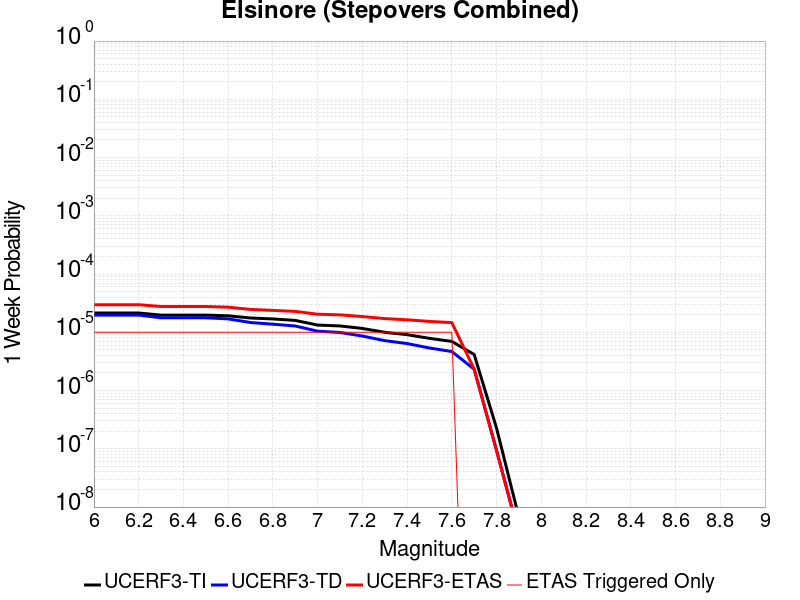 |  | 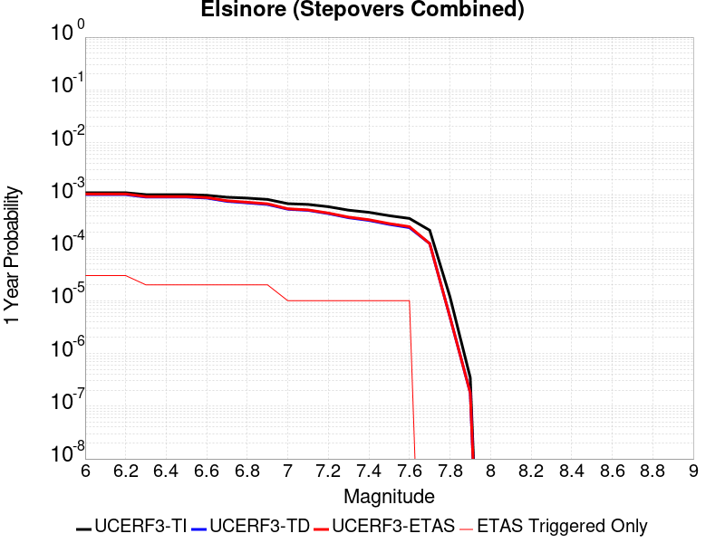 |  |

| Magnitude | 1 wk TI Prob | 1 wk TD Prob | 1 wk ETAS Prob | 1 wk ETAS/TD Gain | 1 wk ETAS Triggered Only | 1 mo TI Prob | 1 mo TD Prob | 1 mo ETAS Prob | 1 mo ETAS/TD Gain | 1 mo ETAS Triggered Only | 1 yr TI Prob | 1 yr TD Prob | 1 yr ETAS Prob | 1 yr ETAS/TD Gain | 1 yr ETAS Triggered Only | 10 yr TI Prob | 10 yr TD Prob | 10 yr ETAS Prob | 10 yr ETAS/TD Gain | 10 yr ETAS Triggered Only |
|-----|-----|-----|-----|-----|-----|-----|-----|-----|-----|-----|-----|-----|-----|-----|-----|-----|-----|-----|-----|-----|
| 6.0 | 2.144392E-5 | 1.976007E-5 | 1.976007E-5 | 1.0 | 0.0 | 9.189928E-5 | 8.468338E-5 | 8.468338E-5 | 1.0 | 0.0 | 0.0011182994 | 0.0010305515 | 0.0010446826 | 1.0137122 | 1.4145672E-5 | 0.011126885 | 0.010264617 | 0.010278618 | 1.001364 | 1.4145672E-5 |
| 6.1 | 2.144392E-5 | 1.976007E-5 | 1.976007E-5 | 1.0 | 0.0 | 9.189928E-5 | 8.468338E-5 | 8.468338E-5 | 1.0 | 0.0 | 0.0011182994 | 0.0010305515 | 0.0010446826 | 1.0137122 | 1.4145672E-5 | 0.011126885 | 0.010264617 | 0.010278618 | 1.001364 | 1.4145672E-5 |
| 6.2 | 2.144392E-5 | 1.976007E-5 | 1.976007E-5 | 1.0 | 0.0 | 9.189928E-5 | 8.468338E-5 | 8.468338E-5 | 1.0 | 0.0 | 0.0011182994 | 0.0010305515 | 0.0010446826 | 1.0137122 | 1.4145672E-5 | 0.011126885 | 0.010264617 | 0.010278618 | 1.001364 | 1.4145672E-5 |
| 6.3 | 1.9751555E-5 | 1.7741326E-5 | 1.7741326E-5 | 1.0 | 0.0 | 8.4646774E-5 | 7.603211E-5 | 7.603211E-5 | 1.0 | 0.0 | 0.0010300872 | 9.25312E-4 | 9.394445E-4 | 1.0152733 | 1.4145672E-5 | 0.010253254 | 0.0092209745 | 0.00923499 | 1.0015199 | 1.4145672E-5 |
| 6.4 | 1.9751555E-5 | 1.7741326E-5 | 1.7741326E-5 | 1.0 | 0.0 | 8.4646774E-5 | 7.603211E-5 | 7.603211E-5 | 1.0 | 0.0 | 0.0010300872 | 9.25312E-4 | 9.394445E-4 | 1.0152733 | 1.4145672E-5 | 0.010253254 | 0.0092209745 | 0.00923499 | 1.0015199 | 1.4145672E-5 |
| 6.5 | 1.9751555E-5 | 1.7741326E-5 | 1.7741326E-5 | 1.0 | 0.0 | 8.4646774E-5 | 7.603211E-5 | 7.603211E-5 | 1.0 | 0.0 | 0.0010300872 | 9.25312E-4 | 9.394445E-4 | 1.0152733 | 1.4145672E-5 | 0.010253254 | 0.0092209745 | 0.00923499 | 1.0015199 | 1.4145672E-5 |
| 6.6 | 1.9188685E-5 | 1.7003247E-5 | 1.7003247E-5 | 1.0 | 0.0 | 8.2234634E-5 | 7.2869116E-5 | 7.2869116E-5 | 1.0 | 0.0 | 0.0010007467 | 8.8683655E-4 | 9.0096967E-4 | 1.0159366 | 1.4145672E-5 | 0.00996252 | 0.008839546 | 0.008853567 | 1.0015861 | 1.4145672E-5 |
| 6.7 | 1.7608272E-5 | 1.4732402E-5 | 1.4732402E-5 | 1.0 | 0.0 | 7.546184E-5 | 6.313739E-5 | 6.313739E-5 | 1.0 | 0.0 | 9.183606E-4 | 7.684364E-4 | 7.825712E-4 | 1.0183942 | 1.4145672E-5 | 0.009145746 | 0.007664441 | 0.0076784785 | 1.0018315 | 1.4145672E-5 |
| 6.8 | 1.697165E-5 | 1.3783126E-5 | 1.3783126E-5 | 1.0 | 0.0 | 7.273361E-5 | 5.906925E-5 | 5.906925E-5 | 1.0 | 0.0 | 8.8517193E-4 | 7.189395E-4 | 7.33075E-4 | 1.0196615 | 1.4145672E-5 | 0.008816543 | 0.0071722106 | 0.007186255 | 1.0019581 | 1.4145672E-5 |
| 6.9 | 1.600365E-5 | 1.2846429E-5 | 1.2846429E-5 | 1.0 | 0.0 | 6.858527E-5 | 5.5055007E-5 | 5.5055007E-5 | 1.0 | 0.0 | 8.347058E-4 | 6.700963E-4 | 6.842325E-4 | 1.0210958 | 1.4145672E-5 | 0.008315775 | 0.006686422 | 0.006700473 | 1.0021014 | 1.4145672E-5 |
| 7.0 | 1.3314581E-5 | 1.044738E-5 | 1.044738E-5 | 1.0 | 0.0 | 5.7061243E-5 | 4.4773733E-5 | 4.4773733E-5 | 1.0 | 0.0 | 6.944992E-4 | 5.449866E-4 | 5.449866E-4 | 1.0 | 0.0 | 0.006923327 | 0.005440055 | 0.005440055 | 1.0 | 0.0 |
| 7.1 | 1.2865345E-5 | 9.937339E-6 | 9.937339E-6 | 1.0 | 0.0 | 5.5136024E-5 | 4.258792E-5 | 4.258792E-5 | 1.0 | 0.0 | 6.710743E-4 | 5.1838707E-4 | 5.1838707E-4 | 1.0 | 0.0 | 0.0066905143 | 0.005175021 | 0.005175021 | 1.0 | 0.0 |
| 7.2 | 1.1650051E-5 | 8.633585E-6 | 8.633585E-6 | 1.0 | 0.0 | 4.9927836E-5 | 3.7000562E-5 | 3.7000562E-5 | 1.0 | 0.0 | 6.0770183E-4 | 4.503905E-4 | 4.503905E-4 | 1.0 | 0.0 | 0.0060604266 | 0.00449624 | 0.00449624 | 1.0 | 0.0 |
| 7.3 | 1.0008533E-5 | 7.2008215E-6 | 7.2008215E-6 | 1.0 | 0.0 | 4.2893007E-5 | 3.0860305E-5 | 3.0860305E-5 | 1.0 | 0.0 | 5.220972E-4 | 3.756609E-4 | 3.756609E-4 | 1.0 | 0.0 | 0.005208723 | 0.0037506663 | 0.0037506663 | 1.0 | 0.0 |
| 7.4 | 9.116759E-6 | 6.409854E-6 | 6.409854E-6 | 1.0 | 0.0 | 3.907124E-5 | 2.7470522E-5 | 2.7470522E-5 | 1.0 | 0.0 | 4.7558855E-4 | 3.3440365E-4 | 3.3440365E-4 | 1.0 | 0.0 | 0.00474572 | 0.0033391542 | 0.0033391542 | 1.0 | 0.0 |
| 7.5 | 7.870524E-6 | 5.382316E-6 | 5.382316E-6 | 1.0 | 0.0 | 3.3730383E-5 | 2.306687E-5 | 2.306687E-5 | 1.0 | 0.0 | 4.1059E-4 | 2.8080423E-4 | 2.8080423E-4 | 1.0 | 0.0 | 0.0040983222 | 0.0028046207 | 0.0028046207 | 1.0 | 0.0 |
| 7.6 | 6.9774537E-6 | 4.677398E-6 | 4.677398E-6 | 1.0 | 0.0 | 2.990303E-5 | 2.0045845E-5 | 2.0045845E-5 | 1.0 | 0.0 | 3.640086E-4 | 2.44032E-4 | 2.44032E-4 | 1.0 | 0.0 | 0.003634129 | 0.0024377564 | 0.0024377564 | 1.0 | 0.0 |
| 7.7 | 4.1616954E-6 | 2.3281368E-6 | 2.3281368E-6 | 1.0 | 0.0 | 1.7835715E-5 | 9.977695E-6 | 9.977695E-6 | 1.0 | 0.0 | 2.171282E-4 | 1.2147242E-4 | 1.2147242E-4 | 1.0 | 0.0 | 0.0021691616 | 0.0012141332 | 0.0012141332 | 1.0 | 0.0 |
| 7.8 | 2.2692414E-7 | 9.384417E-8 | 9.384417E-8 | 1.0 | 0.0 | 9.725317E-7 | 4.0218927E-7 | 4.0218927E-7 | 1.0 | 0.0 | 1.1840509E-5 | 4.8966467E-6 | 4.8966467E-6 | 1.0 | 0.0 | 1.1839878E-4 | 4.8965718E-5 | 4.8965718E-5 | 1.0 | 0.0 |
| 7.9 | 6.676829E-9 | 3.4397174E-9 | 3.4397174E-9 | 1.0 | 0.0 | 2.861498E-8 | 1.4741646E-8 | 1.4741646E-8 | 1.0 | 0.0 | 3.4838732E-7 | 1.7947953E-7 | 1.7947953E-7 | 1.0 | 0.0 | 3.4838679E-6 | 1.794794E-6 | 1.794794E-6 | 1.0 | 0.0 |

## Superstition Hills
*[(top)](#table-of-contents)*

| 1 Week | 1 Month | 1 Year | 10 Year |
|-----|-----|-----|-----|
|  |  |  | 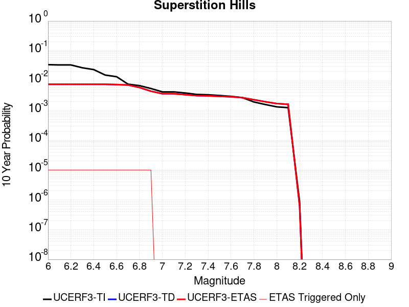 |

| Magnitude | 1 wk TI Prob | 1 wk TD Prob | 1 wk ETAS Prob | 1 wk ETAS/TD Gain | 1 wk ETAS Triggered Only | 1 mo TI Prob | 1 mo TD Prob | 1 mo ETAS Prob | 1 mo ETAS/TD Gain | 1 mo ETAS Triggered Only | 1 yr TI Prob | 1 yr TD Prob | 1 yr ETAS Prob | 1 yr ETAS/TD Gain | 1 yr ETAS Triggered Only | 10 yr TI Prob | 10 yr TD Prob | 10 yr ETAS Prob | 10 yr ETAS/TD Gain | 10 yr ETAS Triggered Only |
|-----|-----|-----|-----|-----|-----|-----|-----|-----|-----|-----|-----|-----|-----|-----|-----|-----|-----|-----|-----|-----|
| 6.0 | 6.6865185E-5 | 1.4137668E-5 | 1.4137668E-5 | 1.0 | 0.0 | 2.8653358E-4 | 6.058869E-5 | 6.058869E-5 | 1.0 | 0.0 | 0.0034829667 | 7.374338E-4 | 7.5156905E-4 | 1.0191681 | 1.4145672E-5 | 0.03428881 | 0.007520696 | 0.0075347354 | 1.0018667 | 1.4145672E-5 |
| 6.1 | 6.544851E-5 | 1.4137668E-5 | 1.4137668E-5 | 1.0 | 0.0 | 2.8046346E-4 | 6.058869E-5 | 6.058869E-5 | 1.0 | 0.0 | 0.0034092965 | 7.374338E-4 | 7.5156905E-4 | 1.0191681 | 1.4145672E-5 | 0.033574644 | 0.0075206957 | 0.007534735 | 1.0018667 | 1.4145672E-5 |
| 6.2 | 6.544851E-5 | 1.4137668E-5 | 1.4137668E-5 | 1.0 | 0.0 | 2.8046346E-4 | 6.058869E-5 | 6.058869E-5 | 1.0 | 0.0 | 0.0034092965 | 7.374338E-4 | 7.5156905E-4 | 1.0191681 | 1.4145672E-5 | 0.033574644 | 0.0075206957 | 0.007534735 | 1.0018667 | 1.4145672E-5 |
| 6.3 | 5.2402065E-5 | 1.4137667E-5 | 1.4137667E-5 | 1.0 | 0.0 | 2.2456095E-4 | 6.0588685E-5 | 6.0588685E-5 | 1.0 | 0.0 | 0.0027306017 | 7.374338E-4 | 7.51569E-4 | 1.0191681 | 1.4145672E-5 | 0.02697292 | 0.0075206906 | 0.00753473 | 1.0018667 | 1.4145672E-5 |
| 6.4 | 4.542238E-5 | 1.4137666E-5 | 1.4137666E-5 | 1.0 | 0.0 | 1.9465282E-4 | 6.058868E-5 | 6.058868E-5 | 1.0 | 0.0 | 0.0023673223 | 7.3743373E-4 | 7.51569E-4 | 1.0191681 | 1.4145672E-5 | 0.023422617 | 0.007520688 | 0.0075347275 | 1.0018667 | 1.4145672E-5 |
| 6.5 | 2.9672969E-5 | 1.4137665E-5 | 1.4137665E-5 | 1.0 | 0.0 | 1.2716366E-4 | 6.0588678E-5 | 6.0588678E-5 | 1.0 | 0.0 | 0.0015471181 | 7.374337E-4 | 7.5156894E-4 | 1.0191681 | 1.4145672E-5 | 0.015363912 | 0.0075206826 | 0.007534722 | 1.0018667 | 1.4145672E-5 |
| 6.6 | 2.6056105E-5 | 1.3803436E-5 | 1.3803436E-5 | 1.0 | 0.0 | 1.1166424E-4 | 5.915633E-5 | 5.915633E-5 | 1.0 | 0.0 | 0.0013586642 | 7.200064E-4 | 7.3414185E-4 | 1.0196325 | 1.4145672E-5 | 0.013503874 | 0.0073450673 | 0.0073591094 | 1.0019118 | 1.4145672E-5 |
| 6.7 | 1.4611248E-5 | 1.338333E-5 | 1.338333E-5 | 1.0 | 0.0 | 6.261813E-5 | 5.7355956E-5 | 5.7355956E-5 | 1.0 | 0.0 | 7.6210906E-4 | 6.9810095E-4 | 7.122368E-4 | 1.0202489 | 1.4145672E-5 | 0.0075950073 | 0.0071262526 | 0.007140298 | 1.0019709 | 1.4145672E-5 |
| 6.8 | 1.30607E-5 | 1.09787115E-5 | 1.09787115E-5 | 1.0 | 0.0 | 5.597323E-5 | 4.705082E-5 | 4.705082E-5 | 1.0 | 0.0 | 6.8126095E-4 | 5.727019E-4 | 5.8683945E-4 | 1.0246857 | 1.4145672E-5 | 0.006791762 | 0.005873964 | 0.0058880267 | 1.0023941 | 1.4145672E-5 |
| 6.9 | 1.0443096E-5 | 8.19507E-6 | 8.19507E-6 | 1.0 | 0.0 | 4.4755358E-5 | 3.512127E-5 | 3.512127E-5 | 1.0 | 0.0 | 5.447602E-4 | 4.2751993E-4 | 4.4165953E-4 | 1.0330735 | 1.4145672E-5 | 0.005434267 | 0.004409497 | 0.00442358 | 1.0031939 | 1.4145672E-5 |
| 7.0 | 8.045912E-6 | 6.739447E-6 | 6.739447E-6 | 1.0 | 0.0 | 3.4482026E-5 | 2.888303E-5 | 2.888303E-5 | 1.0 | 0.0 | 4.197378E-4 | 3.5159517E-4 | 3.5159517E-4 | 1.0 | 0.0 | 0.0041894587 | 0.0036335257 | 0.0036335257 | 1.0 | 0.0 |
| 7.1 | 8.045912E-6 | 6.739447E-6 | 6.739447E-6 | 1.0 | 0.0 | 3.4482026E-5 | 2.888303E-5 | 2.888303E-5 | 1.0 | 0.0 | 4.197378E-4 | 3.5159517E-4 | 3.5159517E-4 | 1.0 | 0.0 | 0.0041894587 | 0.0036335257 | 0.0036335257 | 1.0 | 0.0 |
| 7.2 | 7.375506E-6 | 6.2463805E-6 | 6.2463805E-6 | 1.0 | 0.0 | 3.1608928E-5 | 2.6769932E-5 | 2.6769932E-5 | 1.0 | 0.0 | 3.8477074E-4 | 3.2587603E-4 | 3.2587603E-4 | 1.0 | 0.0 | 0.003841052 | 0.0033741172 | 0.0033741172 | 1.0 | 0.0 |
| 7.3 | 6.6063913E-6 | 5.798824E-6 | 5.798824E-6 | 1.0 | 0.0 | 2.8312797E-5 | 2.4851872E-5 | 2.4851872E-5 | 1.0 | 0.0 | 3.446538E-4 | 3.0253024E-4 | 3.0253024E-4 | 1.0 | 0.0 | 0.0034411973 | 0.0031383524 | 0.0031383524 | 1.0 | 0.0 |
| 7.4 | 6.4313126E-6 | 5.6802523E-6 | 5.6802523E-6 | 1.0 | 0.0 | 2.7562477E-5 | 2.4343715E-5 | 2.4343715E-5 | 1.0 | 0.0 | 3.355215E-4 | 2.963451E-4 | 2.963451E-4 | 1.0 | 0.0 | 0.0033501536 | 0.003076105 | 0.003076105 | 1.0 | 0.0 |
| 7.5 | 6.0742927E-6 | 5.476088E-6 | 5.476088E-6 | 1.0 | 0.0 | 2.6032423E-5 | 2.3468741E-5 | 2.3468741E-5 | 1.0 | 0.0 | 3.1689866E-4 | 2.8569513E-4 | 2.8569513E-4 | 1.0 | 0.0 | 0.0031644711 | 0.0029679502 | 0.0029679502 | 1.0 | 0.0 |
| 7.6 | 5.6987187E-6 | 5.2943155E-6 | 5.2943155E-6 | 1.0 | 0.0 | 2.4422852E-5 | 2.268973E-5 | 2.268973E-5 | 1.0 | 0.0 | 2.9730765E-4 | 2.762131E-4 | 2.762131E-4 | 1.0 | 0.0 | 0.002969102 | 0.0028712032 | 0.0028712032 | 1.0 | 0.0 |
| 7.7 | 5.1658035E-6 | 4.925336E-6 | 4.925336E-6 | 1.0 | 0.0 | 2.2138971E-5 | 2.1108413E-5 | 2.1108413E-5 | 1.0 | 0.0 | 2.6950863E-4 | 2.5696523E-4 | 2.5696523E-4 | 1.0 | 0.0 | 0.00269182 | 0.0026763005 | 0.0026763005 | 1.0 | 0.0 |
| 7.8 | 3.6864697E-6 | 4.1963563E-6 | 4.1963563E-6 | 1.0 | 0.0 | 1.579906E-5 | 1.7984263E-5 | 1.7984263E-5 | 1.0 | 0.0 | 1.9233658E-4 | 2.1893687E-4 | 2.1893687E-4 | 1.0 | 0.0 | 0.0019217018 | 0.0022895595 | 0.0022895595 | 1.0 | 0.0 |
| 7.9 | 3.0265903E-6 | 3.5636078E-6 | 3.5636078E-6 | 1.0 | 0.0 | 1.2971037E-5 | 1.5272519E-5 | 1.5272519E-5 | 1.0 | 0.0 | 1.5791094E-4 | 1.8592748E-4 | 1.8592748E-4 | 1.0 | 0.0 | 0.0015779877 | 0.0019537222 | 0.0019537222 | 1.0 | 0.0 |
| 8.0 | 2.5271493E-6 | 3.0866524E-6 | 3.0866524E-6 | 1.0 | 0.0 | 1.0830595E-5 | 1.3228446E-5 | 1.3228446E-5 | 1.0 | 0.0 | 1.3185451E-4 | 1.6104484E-4 | 1.6104484E-4 | 1.0 | 0.0 | 0.0013177631 | 0.0016975543 | 0.0016975543 | 1.0 | 0.0 |
| 8.1 | 2.3749135E-6 | 2.9172957E-6 | 2.9172957E-6 | 1.0 | 0.0 | 1.0178161E-5 | 1.2502638E-5 | 1.2502638E-5 | 1.0 | 0.0 | 1.2391206E-4 | 1.522094E-4 | 1.522094E-4 | 1.0 | 0.0 | 0.0012384299 | 0.0016051348 | 0.0016051348 | 1.0 | 0.0 |
| 8.2 | 1.7186406E-9 | 1.1438838E-9 | 1.1438838E-9 | 1.0 | 0.0 | 7.3656024E-9 | 4.902359E-9 | 4.902359E-9 | 1.0 | 0.0 | 8.9676206E-8 | 5.968622E-8 | 5.968622E-8 | 1.0 | 0.0 | 8.9676166E-7 | 6.386644E-7 | 6.386644E-7 | 1.0 | 0.0 |

## Rocky Ledge 2011 CFM
*[(top)](#table-of-contents)*

| 1 Week | 1 Month | 1 Year | 10 Year |
|-----|-----|-----|-----|
|  |  | 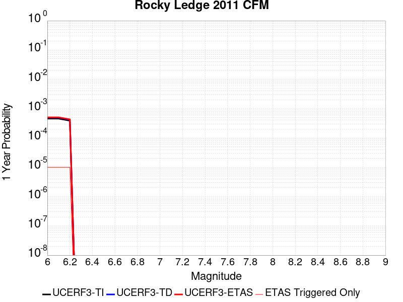 |  |

| Magnitude | 1 wk TI Prob | 1 wk TD Prob | 1 wk ETAS Prob | 1 wk ETAS/TD Gain | 1 wk ETAS Triggered Only | 1 mo TI Prob | 1 mo TD Prob | 1 mo ETAS Prob | 1 mo ETAS/TD Gain | 1 mo ETAS Triggered Only | 1 yr TI Prob | 1 yr TD Prob | 1 yr ETAS Prob | 1 yr ETAS/TD Gain | 1 yr ETAS Triggered Only | 10 yr TI Prob | 10 yr TD Prob | 10 yr ETAS Prob | 10 yr ETAS/TD Gain | 10 yr ETAS Triggered Only |
|-----|-----|-----|-----|-----|-----|-----|-----|-----|-----|-----|-----|-----|-----|-----|-----|-----|-----|-----|-----|-----|
| 6.0 | 8.7550525E-6 | 9.486605E-6 | 9.486605E-6 | 1.0 | 0.0 | 3.7521113E-5 | 4.0656712E-5 | 5.480181E-5 | 1.3479154 | 1.4145672E-5 | 4.567238E-4 | 4.949655E-4 | 5.091042E-4 | 1.0285649 | 1.4145672E-5 | 0.0045578624 | 0.0049467194 | 0.004960795 | 1.0028454 | 1.4145672E-5 |
| 6.1 | 8.7550525E-6 | 9.486605E-6 | 9.486605E-6 | 1.0 | 0.0 | 3.7521113E-5 | 4.0656712E-5 | 5.480181E-5 | 1.3479154 | 1.4145672E-5 | 4.567238E-4 | 4.949655E-4 | 5.091042E-4 | 1.0285649 | 1.4145672E-5 | 0.0045578624 | 0.0049467194 | 0.004960795 | 1.0028454 | 1.4145672E-5 |
| 6.2 | 7.442295E-6 | 8.06304E-6 | 8.06304E-6 | 1.0 | 0.0 | 3.189516E-5 | 3.4555887E-5 | 4.870107E-5 | 1.4093422 | 1.4145672E-5 | 3.8825438E-4 | 4.2071793E-4 | 4.3485765E-4 | 1.0336086 | 1.4145672E-5 | 0.0038757676 | 0.004207179 | 0.004221265 | 1.0033481 | 1.4145672E-5 |

## Emerson-Copper Mtn 2011
*[(top)](#table-of-contents)*

| 1 Week | 1 Month | 1 Year | 10 Year |
|-----|-----|-----|-----|
|  |  | 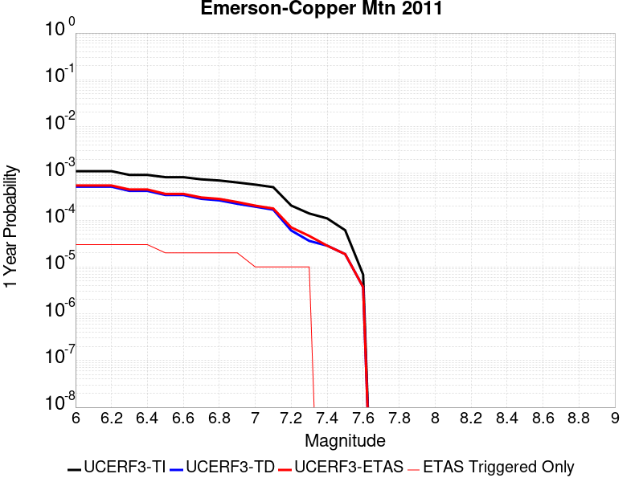 | 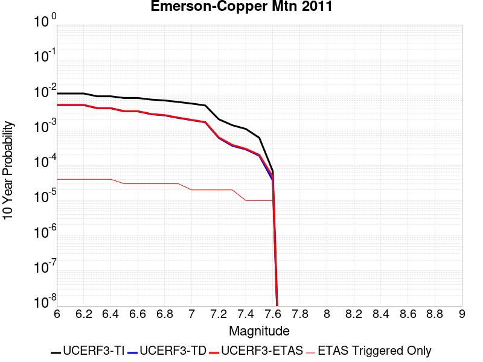 |

| Magnitude | 1 wk TI Prob | 1 wk TD Prob | 1 wk ETAS Prob | 1 wk ETAS/TD Gain | 1 wk ETAS Triggered Only | 1 mo TI Prob | 1 mo TD Prob | 1 mo ETAS Prob | 1 mo ETAS/TD Gain | 1 mo ETAS Triggered Only | 1 yr TI Prob | 1 yr TD Prob | 1 yr ETAS Prob | 1 yr ETAS/TD Gain | 1 yr ETAS Triggered Only | 10 yr TI Prob | 10 yr TD Prob | 10 yr ETAS Prob | 10 yr ETAS/TD Gain | 10 yr ETAS Triggered Only |
|-----|-----|-----|-----|-----|-----|-----|-----|-----|-----|-----|-----|-----|-----|-----|-----|-----|-----|-----|-----|-----|
| 6.0 | 2.1364202E-5 | 9.967999E-6 | 9.967999E-6 | 1.0 | 0.0 | 9.1557646E-5 | 4.2719344E-5 | 4.2719344E-5 | 1.0 | 0.0 | 0.0011141442 | 5.1999267E-4 | 5.3413096E-4 | 1.0271895 | 1.4145672E-5 | 0.011085749 | 0.0051886286 | 0.005202701 | 1.0027121 | 1.4145672E-5 |
| 6.1 | 2.1364202E-5 | 9.967999E-6 | 9.967999E-6 | 1.0 | 0.0 | 9.1557646E-5 | 4.2719344E-5 | 4.2719344E-5 | 1.0 | 0.0 | 0.0011141442 | 5.1999267E-4 | 5.3413096E-4 | 1.0271895 | 1.4145672E-5 | 0.011085749 | 0.0051886286 | 0.005202701 | 1.0027121 | 1.4145672E-5 |
| 6.2 | 2.1364202E-5 | 9.967999E-6 | 9.967999E-6 | 1.0 | 0.0 | 9.1557646E-5 | 4.2719344E-5 | 4.2719344E-5 | 1.0 | 0.0 | 0.0011141442 | 5.1999267E-4 | 5.3413096E-4 | 1.0271895 | 1.4145672E-5 | 0.011085749 | 0.0051886286 | 0.005202701 | 1.0027121 | 1.4145672E-5 |
| 6.3 | 1.7751237E-5 | 8.089109E-6 | 8.089109E-6 | 1.0 | 0.0 | 7.607452E-5 | 3.4667184E-5 | 3.4667184E-5 | 1.0 | 0.0 | 9.258136E-4 | 4.2199748E-4 | 4.361372E-4 | 1.0335066 | 1.4145672E-5 | 0.00921966 | 0.004212584 | 0.00422667 | 1.0033438 | 1.4145672E-5 |
| 6.4 | 1.7751237E-5 | 8.089109E-6 | 8.089109E-6 | 1.0 | 0.0 | 7.607452E-5 | 3.4667184E-5 | 3.4667184E-5 | 1.0 | 0.0 | 9.258136E-4 | 4.2199748E-4 | 4.361372E-4 | 1.0335066 | 1.4145672E-5 | 0.00921966 | 0.004212584 | 0.00422667 | 1.0033438 | 1.4145672E-5 |
| 6.5 | 1.5886664E-5 | 6.6037437E-6 | 6.6037437E-6 | 1.0 | 0.0 | 6.808392E-5 | 2.830148E-5 | 2.830148E-5 | 1.0 | 0.0 | 8.286065E-4 | 3.4452073E-4 | 3.5866152E-4 | 1.0410448 | 1.4145672E-5 | 0.008255237 | 0.0034403303 | 0.0034544275 | 1.0040976 | 1.4145672E-5 |
| 6.6 | 1.5886664E-5 | 6.6037437E-6 | 6.6037437E-6 | 1.0 | 0.0 | 6.808392E-5 | 2.830148E-5 | 2.830148E-5 | 1.0 | 0.0 | 8.286065E-4 | 3.4452073E-4 | 3.5866152E-4 | 1.0410448 | 1.4145672E-5 | 0.008255237 | 0.0034403303 | 0.0034544275 | 1.0040976 | 1.4145672E-5 |
| 6.7 | 1.428471E-5 | 5.4703055E-6 | 5.4703055E-6 | 1.0 | 0.0 | 6.121875E-5 | 2.3443978E-5 | 2.3443978E-5 | 1.0 | 0.0 | 7.450834E-4 | 2.8539696E-4 | 2.995386E-4 | 1.0495508 | 1.4145672E-5 | 0.007425902 | 0.0028506925 | 0.0028647978 | 1.004948 | 1.4145672E-5 |
| 6.8 | 1.3490684E-5 | 5.0735894E-6 | 5.0735894E-6 | 1.0 | 0.0 | 5.7815934E-5 | 2.1743796E-5 | 2.1743796E-5 | 1.0 | 0.0 | 7.0368167E-4 | 2.6470242E-4 | 2.7884435E-4 | 1.0534258 | 1.4145672E-5 | 0.007014576 | 0.002644252 | 0.0026583604 | 1.0053355 | 1.4145672E-5 |
| 6.9 | 1.2235421E-5 | 4.289545E-6 | 4.289545E-6 | 1.0 | 0.0 | 5.2436466E-5 | 1.8383655E-5 | 1.8383655E-5 | 1.0 | 0.0 | 6.38227E-4 | 2.238016E-4 | 2.3794411E-4 | 1.0631921 | 1.4145672E-5 | 0.0063639707 | 0.0022361164 | 0.0022502304 | 1.0063119 | 1.4145672E-5 |
| 7.0 | 1.1009851E-5 | 3.7188345E-6 | 3.7188345E-6 | 1.0 | 0.0 | 4.7184225E-5 | 1.5937783E-5 | 1.5937783E-5 | 1.0 | 0.0 | 5.743165E-4 | 1.9402867E-4 | 1.9402867E-4 | 1.0 | 0.0 | 0.005728345 | 0.0019389305 | 0.0019389305 | 1.0 | 0.0 |
| 7.1 | 9.726373E-6 | 3.2115693E-6 | 3.2115693E-6 | 1.0 | 0.0 | 4.168379E-5 | 1.3763814E-5 | 1.3763814E-5 | 1.0 | 0.0 | 5.07382E-4 | 1.6756494E-4 | 1.6756494E-4 | 1.0 | 0.0 | 0.0050622504 | 0.0016747171 | 0.0016747171 | 1.0 | 0.0 |
| 7.2 | 3.9335127E-6 | 1.1524114E-6 | 1.1524114E-6 | 1.0 | 0.0 | 1.6857803E-5 | 4.9388973E-6 | 4.9388973E-6 | 1.0 | 0.0 | 2.0522442E-4 | 6.0129474E-5 | 6.0129474E-5 | 1.0 | 0.0 | 0.00205035 | 6.01138E-4 | 6.01138E-4 | 1.0 | 0.0 |
| 7.3 | 2.661632E-6 | 6.91098E-7 | 6.91098E-7 | 1.0 | 0.0 | 1.14069435E-5 | 2.9618452E-6 | 2.9618452E-6 | 1.0 | 0.0 | 1.3887069E-4 | 3.605988E-5 | 3.605988E-5 | 1.0 | 0.0 | 0.0013878393 | 3.6054134E-4 | 3.6054134E-4 | 1.0 | 0.0 |
| 7.4 | 2.0893426E-6 | 5.4614605E-7 | 5.4614605E-7 | 1.0 | 0.0 | 8.954295E-6 | 2.340624E-6 | 2.340624E-6 | 1.0 | 0.0 | 1.0901308E-4 | 2.8496728E-5 | 2.8496728E-5 | 1.0 | 0.0 | 0.0010895962 | 2.849313E-4 | 2.849313E-4 | 1.0 | 0.0 |
| 7.5 | 1.1681728E-6 | 3.6028484E-7 | 3.6028484E-7 | 1.0 | 0.0 | 5.0064455E-6 | 1.544077E-6 | 1.544077E-6 | 1.0 | 0.0 | 6.0951766E-5 | 1.879898E-5 | 1.879898E-5 | 1.0 | 0.0 | 6.093505E-4 | 1.8797436E-4 | 1.8797436E-4 | 1.0 | 0.0 |
| 7.6 | 1.3154387E-7 | 7.1196716E-8 | 7.1196716E-8 | 1.0 | 0.0 | 5.6375933E-7 | 3.0512876E-7 | 3.0512876E-7 | 1.0 | 0.0 | 6.863748E-6 | 3.714938E-6 | 3.714938E-6 | 1.0 | 0.0 | 6.863536E-5 | 3.7148915E-5 | 3.7148915E-5 | 1.0 | 0.0 |

## Russ 2011 CFM
*[(top)](#table-of-contents)*

| 1 Week | 1 Month | 1 Year | 10 Year |
|-----|-----|-----|-----|
|  |  |  |  |

| Magnitude | 1 wk TI Prob | 1 wk TD Prob | 1 wk ETAS Prob | 1 wk ETAS/TD Gain | 1 wk ETAS Triggered Only | 1 mo TI Prob | 1 mo TD Prob | 1 mo ETAS Prob | 1 mo ETAS/TD Gain | 1 mo ETAS Triggered Only | 1 yr TI Prob | 1 yr TD Prob | 1 yr ETAS Prob | 1 yr ETAS/TD Gain | 1 yr ETAS Triggered Only | 10 yr TI Prob | 10 yr TD Prob | 10 yr ETAS Prob | 10 yr ETAS/TD Gain | 10 yr ETAS Triggered Only |
|-----|-----|-----|-----|-----|-----|-----|-----|-----|-----|-----|-----|-----|-----|-----|-----|-----|-----|-----|-----|-----|
| 6.0 | 2.3806366E-5 | 2.6254156E-5 | 2.6254156E-5 | 1.0 | 0.0 | 1.0202329E-4 | 1.1251331E-4 | 1.1251331E-4 | 1.0 | 0.0 | 0.0012414258 | 0.0013690525 | 0.0013831788 | 1.0103183 | 1.4145672E-5 | 0.012345135 | 0.013612664 | 0.013626617 | 1.001025 | 1.4145672E-5 |
| 6.1 | 2.3806366E-5 | 2.6254156E-5 | 2.6254156E-5 | 1.0 | 0.0 | 1.0202329E-4 | 1.1251331E-4 | 1.1251331E-4 | 1.0 | 0.0 | 0.0012414258 | 0.0013690525 | 0.0013831788 | 1.0103183 | 1.4145672E-5 | 0.012345135 | 0.013612664 | 0.013626617 | 1.001025 | 1.4145672E-5 |
| 6.2 | 2.3806366E-5 | 2.6254156E-5 | 2.6254156E-5 | 1.0 | 0.0 | 1.0202329E-4 | 1.1251331E-4 | 1.1251331E-4 | 1.0 | 0.0 | 0.0012414258 | 0.0013690525 | 0.0013831788 | 1.0103183 | 1.4145672E-5 | 0.012345135 | 0.013612664 | 0.013626617 | 1.001025 | 1.4145672E-5 |
| 6.3 | 2.3806366E-5 | 2.6254156E-5 | 2.6254156E-5 | 1.0 | 0.0 | 1.0202329E-4 | 1.1251331E-4 | 1.1251331E-4 | 1.0 | 0.0 | 0.0012414258 | 0.0013690525 | 0.0013831788 | 1.0103183 | 1.4145672E-5 | 0.012345135 | 0.013612664 | 0.013626617 | 1.001025 | 1.4145672E-5 |
| 6.4 | 2.3806366E-5 | 2.6254156E-5 | 2.6254156E-5 | 1.0 | 0.0 | 1.0202329E-4 | 1.1251331E-4 | 1.1251331E-4 | 1.0 | 0.0 | 0.0012414258 | 0.0013690525 | 0.0013831788 | 1.0103183 | 1.4145672E-5 | 0.012345135 | 0.013612664 | 0.013626617 | 1.001025 | 1.4145672E-5 |
| 6.5 | 2.3806366E-5 | 2.6254156E-5 | 2.6254156E-5 | 1.0 | 0.0 | 1.0202329E-4 | 1.1251331E-4 | 1.1251331E-4 | 1.0 | 0.0 | 0.0012414258 | 0.0013690525 | 0.0013831788 | 1.0103183 | 1.4145672E-5 | 0.012345135 | 0.013612664 | 0.013626617 | 1.001025 | 1.4145672E-5 |
| 6.6 | 2.3806366E-5 | 2.6254156E-5 | 2.6254156E-5 | 1.0 | 0.0 | 1.0202329E-4 | 1.1251331E-4 | 1.1251331E-4 | 1.0 | 0.0 | 0.0012414258 | 0.0013690525 | 0.0013831788 | 1.0103183 | 1.4145672E-5 | 0.012345135 | 0.013612664 | 0.013626617 | 1.001025 | 1.4145672E-5 |
| 6.7 | 1.6515693E-5 | 1.8187944E-5 | 1.8187944E-5 | 1.0 | 0.0 | 7.077962E-5 | 7.79462E-5 | 7.79462E-5 | 1.0 | 0.0 | 8.6140115E-4 | 9.486156E-4 | 9.6274784E-4 | 1.0148978 | 1.4145672E-5 | 0.008580698 | 0.009449055 | 0.009463068 | 1.0014828 | 1.4145672E-5 |
| 6.8 | 1.6515693E-5 | 1.8187944E-5 | 1.8187944E-5 | 1.0 | 0.0 | 7.077962E-5 | 7.79462E-5 | 7.79462E-5 | 1.0 | 0.0 | 8.6140115E-4 | 9.486156E-4 | 9.6274784E-4 | 1.0148978 | 1.4145672E-5 | 0.008580698 | 0.009449055 | 0.009463068 | 1.0014828 | 1.4145672E-5 |
| 6.9 | 1.2971182E-5 | 1.4273831E-5 | 1.4273831E-5 | 1.0 | 0.0 | 5.5589593E-5 | 6.117227E-5 | 6.117227E-5 | 1.0 | 0.0 | 6.765931E-4 | 7.4454385E-4 | 7.58679E-4 | 1.0189849 | 1.4145672E-5 | 0.0067453682 | 0.0074230675 | 0.007437108 | 1.0018915 | 1.4145672E-5 |
| 7.0 | 1.0201805E-5 | 1.1221911E-5 | 1.1221911E-5 | 1.0 | 0.0 | 4.3721288E-5 | 4.8093138E-5 | 4.8093138E-5 | 1.0 | 0.0 | 5.3217664E-4 | 5.853974E-4 | 5.853974E-4 | 1.0 | 0.0 | 0.00530904 | 0.005840605 | 0.005840605 | 1.0 | 0.0 |
| 7.1 | 8.3744935E-6 | 9.2126675E-6 | 9.2126675E-6 | 1.0 | 0.0 | 3.5890193E-5 | 3.9482366E-5 | 3.9482366E-5 | 1.0 | 0.0 | 4.368755E-4 | 4.8061032E-4 | 4.8061032E-4 | 1.0 | 0.0 | 0.004360176 | 0.0047975346 | 0.0047975346 | 1.0 | 0.0 |
| 7.2 | 6.649391E-6 | 7.3170095E-6 | 7.3170095E-6 | 1.0 | 0.0 | 2.8497077E-5 | 3.135833E-5 | 3.135833E-5 | 1.0 | 0.0 | 3.4689668E-4 | 3.8173737E-4 | 3.8173737E-4 | 1.0 | 0.0 | 0.0034635565 | 0.0038124465 | 0.0038124465 | 1.0 | 0.0 |
| 7.3 | 4.9549312E-6 | 5.454593E-6 | 5.454593E-6 | 1.0 | 0.0 | 2.1235246E-5 | 2.33767E-5 | 2.33767E-5 | 1.0 | 0.0 | 2.5850846E-4 | 2.8458887E-4 | 2.8458887E-4 | 1.0 | 0.0 | 0.0025820795 | 0.0028436882 | 0.0028436882 | 1.0 | 0.0 |

## Casmalia 2011 CFM
*[(top)](#table-of-contents)*

| 1 Week | 1 Month | 1 Year | 10 Year |
|-----|-----|-----|-----|
|  |  |  |  |

| Magnitude | 1 wk TI Prob | 1 wk TD Prob | 1 wk ETAS Prob | 1 wk ETAS/TD Gain | 1 wk ETAS Triggered Only | 1 mo TI Prob | 1 mo TD Prob | 1 mo ETAS Prob | 1 mo ETAS/TD Gain | 1 mo ETAS Triggered Only | 1 yr TI Prob | 1 yr TD Prob | 1 yr ETAS Prob | 1 yr ETAS/TD Gain | 1 yr ETAS Triggered Only | 10 yr TI Prob | 10 yr TD Prob | 10 yr ETAS Prob | 10 yr ETAS/TD Gain | 10 yr ETAS Triggered Only |
|-----|-----|-----|-----|-----|-----|-----|-----|-----|-----|-----|-----|-----|-----|-----|-----|-----|-----|-----|-----|-----|
| 6.0 | 4.1704893E-6 | 4.2624843E-6 | 4.2624843E-6 | 1.0 | 0.0 | 1.7873403E-5 | 1.8267663E-5 | 1.8267663E-5 | 1.0 | 0.0 | 2.1758694E-4 | 2.223863E-4 | 2.223863E-4 | 1.0 | 0.0 | 0.0021737402 | 0.0022216584 | 0.0022357728 | 1.006353 | 1.4145672E-5 |
| 6.1 | 4.1704893E-6 | 4.2624843E-6 | 4.2624843E-6 | 1.0 | 0.0 | 1.7873403E-5 | 1.8267663E-5 | 1.8267663E-5 | 1.0 | 0.0 | 2.1758694E-4 | 2.223863E-4 | 2.223863E-4 | 1.0 | 0.0 | 0.0021737402 | 0.0022216584 | 0.0022357728 | 1.006353 | 1.4145672E-5 |
| 6.2 | 3.457312E-6 | 3.537023E-6 | 3.537023E-6 | 1.0 | 0.0 | 1.4816967E-5 | 1.5158583E-5 | 1.5158583E-5 | 1.0 | 0.0 | 1.8038164E-4 | 1.845402E-4 | 1.845402E-4 | 1.0 | 0.0 | 0.001802353 | 0.0018438791 | 0.0018579987 | 1.0076575 | 1.4145672E-5 |
| 6.3 | 3.457312E-6 | 3.537023E-6 | 3.537023E-6 | 1.0 | 0.0 | 1.4816967E-5 | 1.5158583E-5 | 1.5158583E-5 | 1.0 | 0.0 | 1.8038164E-4 | 1.845402E-4 | 1.845402E-4 | 1.0 | 0.0 | 0.001802353 | 0.0018438791 | 0.0018579987 | 1.0076575 | 1.4145672E-5 |
| 6.4 | 3.0957337E-6 | 3.169227E-6 | 3.169227E-6 | 1.0 | 0.0 | 1.3267363E-5 | 1.3582331E-5 | 1.3582331E-5 | 1.0 | 0.0 | 1.6151817E-4 | 1.653524E-4 | 1.653524E-4 | 1.0 | 0.0 | 0.0016140083 | 0.0016522998 | 0.001666422 | 1.0085471 | 1.4145672E-5 |
| 6.5 | 3.0957337E-6 | 3.169227E-6 | 3.169227E-6 | 1.0 | 0.0 | 1.3267363E-5 | 1.3582331E-5 | 1.3582331E-5 | 1.0 | 0.0 | 1.6151817E-4 | 1.653524E-4 | 1.653524E-4 | 1.0 | 0.0 | 0.0016140083 | 0.0016522998 | 0.001666422 | 1.0085471 | 1.4145672E-5 |
| 6.6 | 2.9459152E-6 | 3.0165766E-6 | 3.0165766E-6 | 1.0 | 0.0 | 1.262529E-5 | 1.2928121E-5 | 1.2928121E-5 | 1.0 | 0.0 | 1.5370206E-4 | 1.5738855E-4 | 1.5738855E-4 | 1.0 | 0.0 | 0.0015359579 | 0.0015727765 | 0.0015869 | 1.0089799 | 1.4145672E-5 |
| 6.7 | 2.8634809E-6 | 2.932474E-6 | 2.932474E-6 | 1.0 | 0.0 | 1.2272003E-5 | 1.2567685E-5 | 1.2567685E-5 | 1.0 | 0.0 | 1.4940138E-4 | 1.5300087E-4 | 1.5300087E-4 | 1.0 | 0.0 | 0.0014930099 | 0.0015289608 | 0.0015430849 | 1.0092376 | 1.4145672E-5 |
| 6.8 | 2.7999822E-6 | 2.867598E-6 | 2.867598E-6 | 1.0 | 0.0 | 1.1999869E-5 | 1.2289648E-5 | 1.2289648E-5 | 1.0 | 0.0 | 1.460886E-4 | 1.4961624E-4 | 1.4961624E-4 | 1.0 | 0.0 | 0.001459926 | 0.0014951604 | 0.001509285 | 1.0094469 | 1.4145672E-5 |
| 6.9 | 2.551052E-6 | 2.6119662E-6 | 2.6119662E-6 | 1.0 | 0.0 | 1.0933034E-5 | 1.1194093E-5 | 1.1194093E-5 | 1.0 | 0.0 | 1.3310155E-4 | 1.3627959E-4 | 1.3627959E-4 | 1.0 | 0.0 | 0.0013302186 | 0.0013619643 | 0.0013760907 | 1.010372 | 1.4145672E-5 |
| 7.0 | 2.3081875E-6 | 2.3624102E-6 | 2.3624102E-6 | 1.0 | 0.0 | 9.892195E-6 | 1.0124576E-5 | 1.0124576E-5 | 1.0 | 0.0 | 1.20430814E-4 | 1.2325977E-4 | 1.2325977E-4 | 1.0 | 0.0 | 0.0012036557 | 0.0012319168 | 0.0012460451 | 1.0114685 | 1.4145672E-5 |
| 7.1 | 2.093245E-6 | 2.1417256E-6 | 2.1417256E-6 | 1.0 | 0.0 | 8.971019E-6 | 9.1787915E-6 | 9.1787915E-6 | 1.0 | 0.0 | 1.09216686E-4 | 1.1174608E-4 | 1.1174608E-4 | 1.0 | 0.0 | 0.0010916302 | 0.0011169009 | 0.0011310308 | 1.012651 | 1.4145672E-5 |
| 7.2 | 1.9714576E-6 | 2.0165105E-6 | 2.0165105E-6 | 1.0 | 0.0 | 8.449076E-6 | 8.642159E-6 | 8.642159E-6 | 1.0 | 0.0 | 1.0286264E-4 | 1.0521322E-4 | 1.0521322E-4 | 1.0 | 0.0 | 0.0010281504 | 0.001051636 | 0.0010657668 | 1.0134369 | 1.4145672E-5 |
| 7.3 | 1.6689512E-6 | 1.7047145E-6 | 1.7047145E-6 | 1.0 | 0.0 | 7.1526288E-6 | 7.3058986E-6 | 7.3058986E-6 | 1.0 | 0.0 | 8.7079774E-5 | 8.894569E-5 | 8.894569E-5 | 1.0 | 0.0 | 8.7045657E-4 | 8.891017E-4 | 9.0323476E-4 | 1.015896 | 1.4145672E-5 |
| 7.4 | 1.4490954E-6 | 1.4778922E-6 | 1.4778922E-6 | 1.0 | 0.0 | 6.210394E-6 | 6.333808E-6 | 6.333808E-6 | 1.0 | 0.0 | 7.560892E-5 | 7.711139E-5 | 7.711139E-5 | 1.0 | 0.0 | 7.55832E-4 | 7.7084696E-4 | 7.7084696E-4 | 1.0 | 0.0 |
| 7.5 | 1.226873E-6 | 1.2481714E-6 | 1.2481714E-6 | 1.0 | 0.0 | 5.2580162E-6 | 5.3492954E-6 | 5.3492954E-6 | 1.0 | 0.0 | 6.401447E-5 | 6.512573E-5 | 6.512573E-5 | 1.0 | 0.0 | 6.399603E-4 | 6.5106695E-4 | 6.5106695E-4 | 1.0 | 0.0 |
| 7.6 | 9.2561345E-7 | 9.3619366E-7 | 9.3619366E-7 | 1.0 | 0.0 | 3.966909E-6 | 4.0122522E-6 | 4.0122522E-6 | 1.0 | 0.0 | 4.8296046E-5 | 4.884808E-5 | 4.884808E-5 | 1.0 | 0.0 | 4.828555E-4 | 4.8837386E-4 | 4.8837386E-4 | 1.0 | 0.0 |
| 7.7 | 5.4367933E-7 | 5.3929017E-7 | 5.3929017E-7 | 1.0 | 0.0 | 2.3300522E-6 | 2.3112416E-6 | 2.3112416E-6 | 1.0 | 0.0 | 2.8368017E-5 | 2.8139004E-5 | 2.8139004E-5 | 1.0 | 0.0 | 2.8364395E-4 | 2.8135453E-4 | 2.8135453E-4 | 1.0 | 0.0 |
| 7.8 | 1.8825742E-7 | 1.7342425E-7 | 1.7342425E-7 | 1.0 | 0.0 | 8.068173E-7 | 7.432466E-7 | 7.432466E-7 | 1.0 | 0.0 | 9.822956E-6 | 9.048989E-6 | 9.048989E-6 | 1.0 | 0.0 | 9.822522E-5 | 9.048623E-5 | 9.048623E-5 | 1.0 | 0.0 |
| 7.9 | 6.342771E-8 | 4.679002E-8 | 4.679002E-8 | 1.0 | 0.0 | 2.7183304E-7 | 2.0052863E-7 | 2.0052863E-7 | 1.0 | 0.0 | 3.3095623E-6 | 2.4414335E-6 | 2.4414335E-6 | 1.0 | 0.0 | 3.309513E-5 | 2.441407E-5 | 2.441407E-5 | 1.0 | 0.0 |
| 8.0 | 1.2574819E-8 | 6.4727095E-9 | 6.4727095E-9 | 1.0 | 0.0 | 5.3892084E-8 | 2.7740182E-8 | 2.7740182E-8 | 1.0 | 0.0 | 6.561359E-7 | 3.3773665E-7 | 3.3773665E-7 | 1.0 | 0.0 | 6.56134E-6 | 3.3773617E-6 | 3.3773617E-6 | 1.0 | 0.0 |

## Pittville 2011 CFM
*[(top)](#table-of-contents)*

| 1 Week | 1 Month | 1 Year | 10 Year |
|-----|-----|-----|-----|
|  |  |  |  |

| Magnitude | 1 wk TI Prob | 1 wk TD Prob | 1 wk ETAS Prob | 1 wk ETAS/TD Gain | 1 wk ETAS Triggered Only | 1 mo TI Prob | 1 mo TD Prob | 1 mo ETAS Prob | 1 mo ETAS/TD Gain | 1 mo ETAS Triggered Only | 1 yr TI Prob | 1 yr TD Prob | 1 yr ETAS Prob | 1 yr ETAS/TD Gain | 1 yr ETAS Triggered Only | 10 yr TI Prob | 10 yr TD Prob | 10 yr ETAS Prob | 10 yr ETAS/TD Gain | 10 yr ETAS Triggered Only |
|-----|-----|-----|-----|-----|-----|-----|-----|-----|-----|-----|-----|-----|-----|-----|-----|-----|-----|-----|-----|-----|
| 6.0 | 2.5031832E-5 | 2.7056969E-5 | 2.7056969E-5 | 1.0 | 0.0 | 1.0727487E-4 | 1.1595384E-4 | 1.1595384E-4 | 1.0 | 0.0 | 0.001305289 | 0.0014109211 | 0.0014250468 | 1.0100117 | 1.4145672E-5 | 0.012976485 | 0.014029415 | 0.014043363 | 1.0009941 | 1.4145672E-5 |
| 6.1 | 1.2540113E-5 | 1.3513067E-5 | 1.3513067E-5 | 1.0 | 0.0 | 5.3742235E-5 | 5.7911984E-5 | 5.7911984E-5 | 1.0 | 0.0 | 6.541153E-4 | 7.048728E-4 | 7.048728E-4 | 1.0 | 0.0 | 0.0065219323 | 0.0070286044 | 0.0070286044 | 1.0 | 0.0 |
| 6.2 | 6.603218E-6 | 7.107189E-6 | 7.107189E-6 | 1.0 | 0.0 | 2.8299199E-5 | 3.0459063E-5 | 3.0459063E-5 | 1.0 | 0.0 | 3.4448825E-4 | 3.7078248E-4 | 3.7078248E-4 | 1.0 | 0.0 | 0.0034395473 | 0.0037022792 | 0.0037022792 | 1.0 | 0.0 |
| 6.3 | 6.603218E-6 | 7.107189E-6 | 7.107189E-6 | 1.0 | 0.0 | 2.8299199E-5 | 3.0459063E-5 | 3.0459063E-5 | 1.0 | 0.0 | 3.4448825E-4 | 3.7078248E-4 | 3.7078248E-4 | 1.0 | 0.0 | 0.0034395473 | 0.0037022792 | 0.0037022792 | 1.0 | 0.0 |
| 6.4 | 3.9389015E-6 | 4.239175E-6 | 4.239175E-6 | 1.0 | 0.0 | 1.6880897E-5 | 1.8167784E-5 | 1.8167784E-5 | 1.0 | 0.0 | 2.0550552E-4 | 2.2117342E-4 | 2.2117342E-4 | 1.0 | 0.0 | 0.0020531558 | 0.002209838 | 0.002209838 | 1.0 | 0.0 |
| 6.5 | 2.4533072E-6 | 2.6412686E-6 | 2.6412686E-6 | 1.0 | 0.0 | 1.0514132E-5 | 1.1319685E-5 | 1.1319685E-5 | 1.0 | 0.0 | 1.2800204E-4 | 1.3781038E-4 | 1.3781038E-4 | 1.0 | 0.0 | 0.0012792832 | 0.0013774394 | 0.0013774394 | 1.0 | 0.0 |
| 6.6 | 1.3482367E-6 | 1.452993E-6 | 1.452993E-6 | 1.0 | 0.0 | 5.778144E-6 | 6.2271047E-6 | 6.2271047E-6 | 1.0 | 0.0 | 7.0346636E-5 | 7.58135E-5 | 7.58135E-5 | 1.0 | 0.0 | 7.032437E-4 | 7.5798744E-4 | 7.5798744E-4 | 1.0 | 0.0 |

## East Huasna 2011 CFM
*[(top)](#table-of-contents)*

| 1 Week | 1 Month | 1 Year | 10 Year |
|-----|-----|-----|-----|
|  | 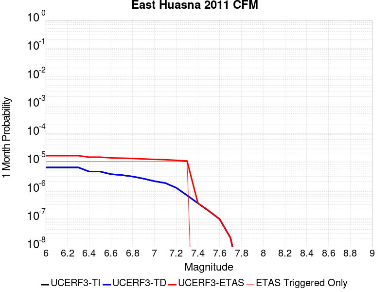 |  |  |

| Magnitude | 1 wk TI Prob | 1 wk TD Prob | 1 wk ETAS Prob | 1 wk ETAS/TD Gain | 1 wk ETAS Triggered Only | 1 mo TI Prob | 1 mo TD Prob | 1 mo ETAS Prob | 1 mo ETAS/TD Gain | 1 mo ETAS Triggered Only | 1 yr TI Prob | 1 yr TD Prob | 1 yr ETAS Prob | 1 yr ETAS/TD Gain | 1 yr ETAS Triggered Only | 10 yr TI Prob | 10 yr TD Prob | 10 yr ETAS Prob | 10 yr ETAS/TD Gain | 10 yr ETAS Triggered Only |
|-----|-----|-----|-----|-----|-----|-----|-----|-----|-----|-----|-----|-----|-----|-----|-----|-----|-----|-----|-----|-----|
| 6.0 | 1.4658423E-6 | 1.471566E-6 | 1.471566E-6 | 1.0 | 0.0 | 6.282166E-6 | 6.3066964E-6 | 2.0452278E-5 | 3.2429466 | 1.4145672E-5 | 7.6482684E-5 | 7.67814E-5 | 9.092598E-5 | 1.1842189 | 1.4145672E-5 | 7.645637E-4 | 7.6755567E-4 | 7.8169047E-4 | 1.0184153 | 1.4145672E-5 |
| 6.1 | 1.4658423E-6 | 1.471566E-6 | 1.471566E-6 | 1.0 | 0.0 | 6.282166E-6 | 6.3066964E-6 | 2.0452278E-5 | 3.2429466 | 1.4145672E-5 | 7.6482684E-5 | 7.67814E-5 | 9.092598E-5 | 1.1842189 | 1.4145672E-5 | 7.645637E-4 | 7.6755567E-4 | 7.8169047E-4 | 1.0184153 | 1.4145672E-5 |
| 6.2 | 1.4658423E-6 | 1.471566E-6 | 1.471566E-6 | 1.0 | 0.0 | 6.282166E-6 | 6.3066964E-6 | 2.0452278E-5 | 3.2429466 | 1.4145672E-5 | 7.6482684E-5 | 7.67814E-5 | 9.092598E-5 | 1.1842189 | 1.4145672E-5 | 7.645637E-4 | 7.6755567E-4 | 7.8169047E-4 | 1.0184153 | 1.4145672E-5 |
| 6.3 | 1.4658423E-6 | 1.471566E-6 | 1.471566E-6 | 1.0 | 0.0 | 6.282166E-6 | 6.3066964E-6 | 2.0452278E-5 | 3.2429466 | 1.4145672E-5 | 7.6482684E-5 | 7.67814E-5 | 9.092598E-5 | 1.1842189 | 1.4145672E-5 | 7.645637E-4 | 7.6755567E-4 | 7.8169047E-4 | 1.0184153 | 1.4145672E-5 |
| 6.4 | 1.0488257E-6 | 1.0527515E-6 | 1.0527515E-6 | 1.0 | 0.0 | 4.4949593E-6 | 4.5117845E-6 | 1.8657393E-5 | 4.135258 | 1.4145672E-5 | 5.472476E-5 | 5.492961E-5 | 6.90745E-5 | 1.2575095 | 1.4145672E-5 | 5.4711284E-4 | 5.491622E-4 | 5.633001E-4 | 1.0257444 | 1.4145672E-5 |
| 6.5 | 1.0488257E-6 | 1.0527515E-6 | 1.0527515E-6 | 1.0 | 0.0 | 4.4949593E-6 | 4.5117845E-6 | 1.8657393E-5 | 4.135258 | 1.4145672E-5 | 5.472476E-5 | 5.492961E-5 | 6.90745E-5 | 1.2575095 | 1.4145672E-5 | 5.4711284E-4 | 5.491622E-4 | 5.633001E-4 | 1.0257444 | 1.4145672E-5 |
| 6.6 | 8.463064E-7 | 8.4936323E-7 | 8.4936323E-7 | 1.0 | 0.0 | 3.6270226E-6 | 3.6401232E-6 | 1.7785744E-5 | 4.8860283 | 1.4145672E-5 | 4.4158103E-5 | 4.4317607E-5 | 5.846265E-5 | 1.3191744 | 1.4145672E-5 | 4.414933E-4 | 4.4308856E-4 | 4.5722796E-4 | 1.031911 | 1.4145672E-5 |
| 6.7 | 7.876149E-7 | 7.902533E-7 | 7.902533E-7 | 1.0 | 0.0 | 3.375488E-6 | 3.3867955E-6 | 1.753242E-5 | 5.1766987 | 1.4145672E-5 | 4.109579E-5 | 4.1233463E-5 | 5.537855E-5 | 1.3430488 | 1.4145672E-5 | 4.108819E-4 | 4.1225873E-4 | 4.263986E-4 | 1.0342984 | 1.4145672E-5 |
| 6.8 | 6.9940785E-7 | 7.0165777E-7 | 7.0165777E-7 | 1.0 | 0.0 | 2.9974588E-6 | 3.0071012E-6 | 1.7152732E-5 | 5.704075 | 1.4145672E-5 | 3.649345E-5 | 3.6610847E-5 | 5.0756E-5 | 1.3863652 | 1.4145672E-5 | 3.6487455E-4 | 3.6604863E-4 | 3.8018913E-4 | 1.0386301 | 1.4145672E-5 |
| 6.9 | 5.899658E-7 | 5.9155997E-7 | 5.9155997E-7 | 1.0 | 0.0 | 2.5284223E-6 | 2.5352545E-6 | 1.6680891E-5 | 6.5795727 | 1.4145672E-5 | 3.0783107E-5 | 3.086629E-5 | 4.5011522E-5 | 1.4582746 | 1.4145672E-5 | 3.0778843E-4 | 3.086203E-4 | 3.227616E-4 | 1.0458211 | 1.4145672E-5 |
| 7.0 | 4.793814E-7 | 4.803273E-7 | 4.803273E-7 | 1.0 | 0.0 | 2.05449E-6 | 2.058544E-6 | 1.6204187E-5 | 7.871674 | 1.4145672E-5 | 2.501313E-5 | 2.5062485E-5 | 3.9207804E-5 | 1.564402 | 1.4145672E-5 | 2.5010316E-4 | 2.505968E-4 | 2.647389E-4 | 1.0564338 | 1.4145672E-5 |
| 7.1 | 4.1256908E-7 | 4.129941E-7 | 4.129941E-7 | 1.0 | 0.0 | 1.768152E-6 | 1.7699736E-6 | 1.591562E-5 | 8.99201 | 1.4145672E-5 | 2.1527037E-5 | 2.1549216E-5 | 3.5694582E-5 | 1.6564214 | 1.4145672E-5 | 2.1524953E-4 | 2.1547142E-4 | 2.2961403E-4 | 1.0656357 | 1.4145672E-5 |
| 7.2 | 2.822599E-7 | 2.8161418E-7 | 2.8161418E-7 | 1.0 | 0.0 | 1.2096847E-6 | 1.2069174E-6 | 1.5352573E-5 | 12.720483 | 1.4145672E-5 | 1.47278115E-5 | 1.4694121E-5 | 2.8839586E-5 | 1.9626615 | 1.4145672E-5 | 1.4726835E-4 | 1.4693156E-4 | 1.6107516E-4 | 1.0962597 | 1.4145672E-5 |
| 7.3 | 1.5261652E-7 | 1.5075021E-7 | 1.5075021E-7 | 1.0 | 0.0 | 6.540707E-7 | 6.460722E-7 | 1.4791735E-5 | 22.894865 | 1.4145672E-5 | 7.963281E-6 | 7.8659E-6 | 2.2011462E-5 | 2.7983396 | 1.4145672E-5 | 7.962996E-5 | 7.865624E-5 | 9.28008E-5 | 1.1798276 | 1.4145672E-5 |
| 7.4 | 7.976414E-8 | 8.057865E-8 | 8.057865E-8 | 1.0 | 0.0 | 3.418463E-7 | 3.45337E-7 | 3.45337E-7 | 1.0 | 0.0 | 4.1619705E-6 | 4.2044703E-6 | 4.2044703E-6 | 1.0 | 0.0 | 4.161893E-5 | 4.2043914E-5 | 4.2043914E-5 | 1.0 | 0.0 |
| 7.5 | 4.2715055E-8 | 4.3202512E-8 | 4.3202512E-8 | 1.0 | 0.0 | 1.830645E-7 | 1.8515361E-7 | 1.8515361E-7 | 1.0 | 0.0 | 2.228808E-6 | 2.2542429E-6 | 2.2542429E-6 | 1.0 | 0.0 | 2.2287857E-5 | 2.2542203E-5 | 2.2542203E-5 | 1.0 | 0.0 |
| 7.6 | 2.1807532E-8 | 2.2057476E-8 | 2.2057476E-8 | 1.0 | 0.0 | 9.346085E-8 | 9.4532034E-8 | 9.4532034E-8 | 1.0 | 0.0 | 1.1378852E-6 | 1.1509269E-6 | 1.1509269E-6 | 1.0 | 0.0 | 1.1378794E-5 | 1.1509211E-5 | 1.1509211E-5 | 1.0 | 0.0 |
| 7.7 | 4.7196043E-9 | 4.767283E-9 | 4.767283E-9 | 1.0 | 0.0 | 2.0226874E-8 | 2.0431212E-8 | 2.0431212E-8 | 1.0 | 0.0 | 2.4626218E-7 | 2.4874998E-7 | 2.4874998E-7 | 1.0 | 0.0 | 2.462619E-6 | 2.487497E-6 | 2.487497E-6 | 1.0 | 0.0 |
| 7.8 | 7.400003E-11 | 7.4654505E-11 | 7.4654505E-11 | 1.0 | 0.0 | 3.171432E-10 | 3.1994773E-10 | 3.1994773E-10 | 1.0 | 0.0 | 3.861218E-9 | 3.895363E-9 | 3.895363E-9 | 1.0 | 0.0 | 3.861218E-8 | 3.895363E-8 | 3.895363E-8 | 1.0 | 0.0 |

## Sierra Madre (San Fernando)
*[(top)](#table-of-contents)*

| 1 Week | 1 Month | 1 Year | 10 Year |
|-----|-----|-----|-----|
|  |  |  |  |

| Magnitude | 1 wk TI Prob | 1 wk TD Prob | 1 wk ETAS Prob | 1 wk ETAS/TD Gain | 1 wk ETAS Triggered Only | 1 mo TI Prob | 1 mo TD Prob | 1 mo ETAS Prob | 1 mo ETAS/TD Gain | 1 mo ETAS Triggered Only | 1 yr TI Prob | 1 yr TD Prob | 1 yr ETAS Prob | 1 yr ETAS/TD Gain | 1 yr ETAS Triggered Only | 10 yr TI Prob | 10 yr TD Prob | 10 yr ETAS Prob | 10 yr ETAS/TD Gain | 10 yr ETAS Triggered Only |
|-----|-----|-----|-----|-----|-----|-----|-----|-----|-----|-----|-----|-----|-----|-----|-----|-----|-----|-----|-----|-----|
| 6.0 | 1.0346413E-5 | 6.2872386E-6 | 6.2872386E-6 | 1.0 | 0.0 | 4.4341014E-5 | 2.6945036E-5 | 2.6945036E-5 | 1.0 | 0.0 | 5.3971814E-4 | 3.2800753E-4 | 3.4214856E-4 | 1.0431119 | 1.4145672E-5 | 0.0053840918 | 0.0032753467 | 0.003289446 | 1.0043046 | 1.4145672E-5 |
| 6.1 | 1.0346413E-5 | 6.2872386E-6 | 6.2872386E-6 | 1.0 | 0.0 | 4.4341014E-5 | 2.6945036E-5 | 2.6945036E-5 | 1.0 | 0.0 | 5.3971814E-4 | 3.2800753E-4 | 3.4214856E-4 | 1.0431119 | 1.4145672E-5 | 0.0053840918 | 0.0032753467 | 0.003289446 | 1.0043046 | 1.4145672E-5 |
| 6.2 | 1.0346413E-5 | 6.2872386E-6 | 6.2872386E-6 | 1.0 | 0.0 | 4.4341014E-5 | 2.6945036E-5 | 2.6945036E-5 | 1.0 | 0.0 | 5.3971814E-4 | 3.2800753E-4 | 3.4214856E-4 | 1.0431119 | 1.4145672E-5 | 0.0053840918 | 0.0032753467 | 0.003289446 | 1.0043046 | 1.4145672E-5 |
| 6.3 | 1.0346413E-5 | 6.2872386E-6 | 6.2872386E-6 | 1.0 | 0.0 | 4.4341014E-5 | 2.6945036E-5 | 2.6945036E-5 | 1.0 | 0.0 | 5.3971814E-4 | 3.2800753E-4 | 3.4214856E-4 | 1.0431119 | 1.4145672E-5 | 0.0053840918 | 0.0032753467 | 0.003289446 | 1.0043046 | 1.4145672E-5 |
| 6.4 | 1.0249558E-5 | 6.2872386E-6 | 6.2872386E-6 | 1.0 | 0.0 | 4.392594E-5 | 2.6945036E-5 | 2.6945036E-5 | 1.0 | 0.0 | 5.3466705E-4 | 3.2800753E-4 | 3.4214856E-4 | 1.0431119 | 1.4145672E-5 | 0.0053338245 | 0.0032753467 | 0.003289446 | 1.0043046 | 1.4145672E-5 |
| 6.5 | 1.0249558E-5 | 6.2872386E-6 | 6.2872386E-6 | 1.0 | 0.0 | 4.392594E-5 | 2.6945036E-5 | 2.6945036E-5 | 1.0 | 0.0 | 5.3466705E-4 | 3.2800753E-4 | 3.4214856E-4 | 1.0431119 | 1.4145672E-5 | 0.0053338245 | 0.0032753467 | 0.003289446 | 1.0043046 | 1.4145672E-5 |
| 6.6 | 9.9035515E-6 | 6.2872386E-6 | 6.2872386E-6 | 1.0 | 0.0 | 4.2443102E-5 | 2.6945036E-5 | 2.6945036E-5 | 1.0 | 0.0 | 5.166222E-4 | 3.2800753E-4 | 3.4214856E-4 | 1.0431119 | 1.4145672E-5 | 0.0051542283 | 0.0032753467 | 0.003289446 | 1.0043046 | 1.4145672E-5 |
| 6.7 | 9.87217E-6 | 6.274661E-6 | 6.274661E-6 | 1.0 | 0.0 | 4.2308613E-5 | 2.6891132E-5 | 2.6891132E-5 | 1.0 | 0.0 | 5.149856E-4 | 3.2735144E-4 | 3.414925E-4 | 1.0431983 | 1.4145672E-5 | 0.005137938 | 0.003268805 | 0.0032829044 | 1.0043133 | 1.4145672E-5 |
| 6.8 | 9.4359175E-6 | 6.1786473E-6 | 6.1786473E-6 | 1.0 | 0.0 | 4.043902E-5 | 2.6479653E-5 | 2.6479653E-5 | 1.0 | 0.0 | 4.9223384E-4 | 3.223432E-4 | 3.3648429E-4 | 1.0438697 | 1.4145672E-5 | 0.0049114493 | 0.0032188678 | 0.003232968 | 1.0043805 | 1.4145672E-5 |
| 6.9 | 8.700447E-6 | 6.0399334E-6 | 6.0399334E-6 | 1.0 | 0.0 | 3.72871E-5 | 2.5885178E-5 | 2.5885178E-5 | 1.0 | 0.0 | 4.5387587E-4 | 3.1510755E-4 | 3.2924875E-4 | 1.0448774 | 1.4145672E-5 | 0.0045295 | 0.0031467169 | 0.003160818 | 1.0044812 | 1.4145672E-5 |
| 7.0 | 8.648878E-6 | 6.014848E-6 | 6.014848E-6 | 1.0 | 0.0 | 3.7066096E-5 | 2.5777672E-5 | 2.5777672E-5 | 1.0 | 0.0 | 4.5118626E-4 | 3.1379904E-4 | 3.2794027E-4 | 1.0450646 | 1.4145672E-5 | 0.004502713 | 0.0031336688 | 0.0031477702 | 1.0044999 | 1.4145672E-5 |
| 7.1 | 8.505786E-6 | 5.9244794E-6 | 5.9244794E-6 | 1.0 | 0.0 | 3.645286E-5 | 2.5390384E-5 | 2.5390384E-5 | 1.0 | 0.0 | 4.437232E-4 | 3.0908515E-4 | 3.2322644E-4 | 1.0457522 | 1.4145672E-5 | 0.0044283825 | 0.0030866617 | 0.0031007638 | 1.0045687 | 1.4145672E-5 |
| 7.2 | 8.139752E-6 | 5.698777E-6 | 5.698777E-6 | 1.0 | 0.0 | 3.4884186E-5 | 2.4423107E-5 | 2.4423107E-5 | 1.0 | 0.0 | 4.246322E-4 | 2.973118E-4 | 3.1145327E-4 | 1.0475644 | 1.4145672E-5 | 0.004238217 | 0.0029692466 | 0.0029833503 | 1.0047499 | 1.4145672E-5 |
| 7.3 | 7.8816E-6 | 5.5520936E-6 | 5.5520936E-6 | 1.0 | 0.0 | 3.3777847E-5 | 2.3794475E-5 | 2.3794475E-5 | 1.0 | 0.0 | 4.111677E-4 | 2.8966027E-4 | 3.0380185E-4 | 1.0488212 | 1.4145672E-5 | 0.004104078 | 0.0028929329 | 0.0029070375 | 1.0048755 | 1.4145672E-5 |
| 7.4 | 7.5810603E-6 | 5.356333E-6 | 5.356333E-6 | 1.0 | 0.0 | 3.2489854E-5 | 2.2955517E-5 | 2.2955517E-5 | 1.0 | 0.0 | 3.9549218E-4 | 2.7944864E-4 | 2.9359036E-4 | 1.0506058 | 1.4145672E-5 | 0.0039478904 | 0.0027910774 | 0.0028051836 | 1.005054 | 1.4145672E-5 |
| 7.5 | 6.349153E-6 | 4.4075887E-6 | 4.4075887E-6 | 1.0 | 0.0 | 2.7210372E-5 | 1.8889532E-5 | 1.8889532E-5 | 1.0 | 0.0 | 3.312359E-4 | 2.2995661E-4 | 2.2995661E-4 | 1.0 | 0.0 | 0.0033074263 | 0.0022972687 | 0.0022972687 | 1.0 | 0.0 |
| 7.6 | 4.430576E-6 | 2.8905786E-6 | 2.8905786E-6 | 1.0 | 0.0 | 1.8988047E-5 | 1.23881355E-5 | 1.23881355E-5 | 1.0 | 0.0 | 2.3115493E-4 | 1.5081534E-4 | 1.5081534E-4 | 1.0 | 0.0 | 0.0023091463 | 0.0015071525 | 0.0015071525 | 1.0 | 0.0 |
| 7.7 | 3.005066E-6 | 1.7509823E-6 | 1.7509823E-6 | 1.0 | 0.0 | 1.2878791E-5 | 7.504188E-6 | 7.504188E-6 | 1.0 | 0.0 | 1.56788E-4 | 9.135967E-5 | 9.135967E-5 | 1.0 | 0.0 | 0.0015667742 | 9.1322226E-4 | 9.1322226E-4 | 1.0 | 0.0 |
| 7.8 | 1.8459098E-6 | 1.0581826E-6 | 1.0581826E-6 | 1.0 | 0.0 | 7.911018E-6 | 4.5350607E-6 | 4.5350607E-6 | 1.0 | 0.0 | 9.631238E-5 | 5.5212968E-5 | 5.5212968E-5 | 1.0 | 0.0 | 9.627065E-4 | 5.5199297E-4 | 5.5199297E-4 | 1.0 | 0.0 |
| 7.9 | 9.839262E-7 | 5.2340516E-7 | 5.2340516E-7 | 1.0 | 0.0 | 4.2168194E-6 | 2.243163E-6 | 2.243163E-6 | 1.0 | 0.0 | 5.1338568E-5 | 2.731017E-5 | 2.731017E-5 | 1.0 | 0.0 | 5.132671E-4 | 2.7306844E-4 | 2.7306844E-4 | 1.0 | 0.0 |
| 8.0 | 1.210983E-7 | 6.613497E-8 | 6.613497E-8 | 1.0 | 0.0 | 5.1899264E-7 | 2.8343558E-7 | 2.8343558E-7 | 1.0 | 0.0 | 6.3187167E-6 | 3.4508228E-6 | 3.4508228E-6 | 1.0 | 0.0 | 6.318537E-5 | 3.450771E-5 | 3.450771E-5 | 1.0 | 0.0 |

## Sisar
*[(top)](#table-of-contents)*

| 1 Week | 1 Month | 1 Year | 10 Year |
|-----|-----|-----|-----|
|  |  |  |  |

| Magnitude | 1 wk TI Prob | 1 wk TD Prob | 1 wk ETAS Prob | 1 wk ETAS/TD Gain | 1 wk ETAS Triggered Only | 1 mo TI Prob | 1 mo TD Prob | 1 mo ETAS Prob | 1 mo ETAS/TD Gain | 1 mo ETAS Triggered Only | 1 yr TI Prob | 1 yr TD Prob | 1 yr ETAS Prob | 1 yr ETAS/TD Gain | 1 yr ETAS Triggered Only | 10 yr TI Prob | 10 yr TD Prob | 10 yr ETAS Prob | 10 yr ETAS/TD Gain | 10 yr ETAS Triggered Only |
|-----|-----|-----|-----|-----|-----|-----|-----|-----|-----|-----|-----|-----|-----|-----|-----|-----|-----|-----|-----|-----|
| 6.0 | 4.544193E-6 | 3.8396115E-6 | 3.8396115E-6 | 1.0 | 0.0 | 1.9474966E-5 | 1.6455377E-5 | 1.6455377E-5 | 1.0 | 0.0 | 2.3708193E-4 | 2.0032612E-4 | 2.0032612E-4 | 1.0 | 0.0 | 0.0023682916 | 0.002001489 | 0.0020156065 | 1.0070534 | 1.4145672E-5 |
| 6.1 | 4.544193E-6 | 3.8396115E-6 | 3.8396115E-6 | 1.0 | 0.0 | 1.9474966E-5 | 1.6455377E-5 | 1.6455377E-5 | 1.0 | 0.0 | 2.3708193E-4 | 2.0032612E-4 | 2.0032612E-4 | 1.0 | 0.0 | 0.0023682916 | 0.002001489 | 0.0020156065 | 1.0070534 | 1.4145672E-5 |
| 6.2 | 4.544193E-6 | 3.8396115E-6 | 3.8396115E-6 | 1.0 | 0.0 | 1.9474966E-5 | 1.6455377E-5 | 1.6455377E-5 | 1.0 | 0.0 | 2.3708193E-4 | 2.0032612E-4 | 2.0032612E-4 | 1.0 | 0.0 | 0.0023682916 | 0.002001489 | 0.0020156065 | 1.0070534 | 1.4145672E-5 |
| 6.3 | 4.544193E-6 | 3.8396115E-6 | 3.8396115E-6 | 1.0 | 0.0 | 1.9474966E-5 | 1.6455377E-5 | 1.6455377E-5 | 1.0 | 0.0 | 2.3708193E-4 | 2.0032612E-4 | 2.0032612E-4 | 1.0 | 0.0 | 0.0023682916 | 0.002001489 | 0.0020156065 | 1.0070534 | 1.4145672E-5 |
| 6.4 | 4.544193E-6 | 3.8396115E-6 | 3.8396115E-6 | 1.0 | 0.0 | 1.9474966E-5 | 1.6455377E-5 | 1.6455377E-5 | 1.0 | 0.0 | 2.3708193E-4 | 2.0032612E-4 | 2.0032612E-4 | 1.0 | 0.0 | 0.0023682916 | 0.002001489 | 0.0020156065 | 1.0070534 | 1.4145672E-5 |
| 6.5 | 4.544193E-6 | 3.8396115E-6 | 3.8396115E-6 | 1.0 | 0.0 | 1.9474966E-5 | 1.6455377E-5 | 1.6455377E-5 | 1.0 | 0.0 | 2.3708193E-4 | 2.0032612E-4 | 2.0032612E-4 | 1.0 | 0.0 | 0.0023682916 | 0.002001489 | 0.0020156065 | 1.0070534 | 1.4145672E-5 |
| 6.6 | 4.544193E-6 | 3.8396115E-6 | 3.8396115E-6 | 1.0 | 0.0 | 1.9474966E-5 | 1.6455377E-5 | 1.6455377E-5 | 1.0 | 0.0 | 2.3708193E-4 | 2.0032612E-4 | 2.0032612E-4 | 1.0 | 0.0 | 0.0023682916 | 0.002001489 | 0.0020156065 | 1.0070534 | 1.4145672E-5 |
| 6.7 | 4.544193E-6 | 3.8396115E-6 | 3.8396115E-6 | 1.0 | 0.0 | 1.9474966E-5 | 1.6455377E-5 | 1.6455377E-5 | 1.0 | 0.0 | 2.3708193E-4 | 2.0032612E-4 | 2.0032612E-4 | 1.0 | 0.0 | 0.0023682916 | 0.002001489 | 0.0020156065 | 1.0070534 | 1.4145672E-5 |
| 6.8 | 4.544193E-6 | 3.8396115E-6 | 3.8396115E-6 | 1.0 | 0.0 | 1.9474966E-5 | 1.6455377E-5 | 1.6455377E-5 | 1.0 | 0.0 | 2.3708193E-4 | 2.0032612E-4 | 2.0032612E-4 | 1.0 | 0.0 | 0.0023682916 | 0.002001489 | 0.0020156065 | 1.0070534 | 1.4145672E-5 |
| 6.9 | 4.542225E-6 | 3.8375733E-6 | 3.8375733E-6 | 1.0 | 0.0 | 1.9466532E-5 | 1.6446642E-5 | 1.6446642E-5 | 1.0 | 0.0 | 2.3697925E-4 | 2.0021979E-4 | 2.0021979E-4 | 1.0 | 0.0 | 0.002367267 | 0.0020004278 | 0.0020145453 | 1.0070572 | 1.4145672E-5 |
| 7.0 | 4.5278484E-6 | 3.8226376E-6 | 3.8226376E-6 | 1.0 | 0.0 | 1.940492E-5 | 1.6382632E-5 | 1.6382632E-5 | 1.0 | 0.0 | 2.3622929E-4 | 1.9944062E-4 | 1.9944062E-4 | 1.0 | 0.0 | 0.0023597833 | 0.00199265 | 0.0020067676 | 1.0070847 | 1.4145672E-5 |
| 7.1 | 4.5132488E-6 | 3.807425E-6 | 3.807425E-6 | 1.0 | 0.0 | 1.9342351E-5 | 1.6317435E-5 | 1.6317435E-5 | 1.0 | 0.0 | 2.3546767E-4 | 1.98647E-4 | 1.98647E-4 | 1.0 | 0.0 | 0.0023521832 | 0.001984728 | 0.0019988457 | 1.0071131 | 1.4145672E-5 |
| 7.2 | 4.448859E-6 | 3.7398854E-6 | 3.7398854E-6 | 1.0 | 0.0 | 1.9066398E-5 | 1.6027983E-5 | 1.6027983E-5 | 1.0 | 0.0 | 2.3210866E-4 | 1.9512356E-4 | 1.9512356E-4 | 1.0 | 0.0 | 0.0023186638 | 0.0019495559 | 0.001963674 | 1.0072417 | 1.4145672E-5 |
| 7.3 | 4.3424366E-6 | 3.6337199E-6 | 3.6337199E-6 | 1.0 | 0.0 | 1.861031E-5 | 1.5572994E-5 | 1.5572994E-5 | 1.0 | 0.0 | 2.2655698E-4 | 1.8958503E-4 | 1.8958503E-4 | 1.0 | 0.0 | 0.0022632615 | 0.0018942665 | 0.0019083853 | 1.0074534 | 1.4145672E-5 |
| 7.4 | 4.218641E-6 | 3.533073E-6 | 3.533073E-6 | 1.0 | 0.0 | 1.8079765E-5 | 1.5141655E-5 | 1.5141655E-5 | 1.0 | 0.0 | 2.2009891E-4 | 1.8433439E-4 | 1.8433439E-4 | 1.0 | 0.0 | 0.0021988105 | 0.0018418481 | 0.0018559678 | 1.007666 | 1.4145672E-5 |
| 7.5 | 3.983779E-6 | 3.3478434E-6 | 3.3478434E-6 | 1.0 | 0.0 | 1.7073227E-5 | 1.4347824E-5 | 1.4347824E-5 | 1.0 | 0.0 | 2.0784672E-4 | 1.7467108E-4 | 1.7467108E-4 | 1.0 | 0.0 | 0.0020765243 | 0.0017453709 | 0.0017594919 | 1.0080905 | 1.4145672E-5 |
| 7.6 | 2.777393E-6 | 2.352273E-6 | 2.352273E-6 | 1.0 | 0.0 | 1.1903058E-5 | 1.0081131E-5 | 1.0081131E-5 | 1.0 | 0.0 | 1.449101E-4 | 1.2273094E-4 | 1.2273094E-4 | 1.0 | 0.0 | 0.0014481564 | 0.0012266394 | 0.0012407677 | 1.0115179 | 1.4145672E-5 |
| 7.7 | 1.9028433E-6 | 1.5938805E-6 | 1.5938805E-6 | 1.0 | 0.0 | 8.155017E-6 | 6.8308987E-6 | 6.8308987E-6 | 1.0 | 0.0 | 9.928281E-5 | 8.316306E-5 | 8.316306E-5 | 1.0 | 0.0 | 9.923846E-4 | 8.3132414E-4 | 8.4545807E-4 | 1.0170016 | 1.4145672E-5 |
| 7.8 | 4.9095956E-7 | 4.3584043E-7 | 4.3584043E-7 | 1.0 | 0.0 | 2.1041105E-6 | 1.8678862E-6 | 1.8678862E-6 | 1.0 | 0.0 | 2.5617246E-5 | 2.2741278E-5 | 2.2741278E-5 | 1.0 | 0.0 | 2.5614293E-4 | 2.273897E-4 | 2.273897E-4 | 1.0 | 0.0 |
| 7.9 | 1.16657894E-7 | 1.03356285E-7 | 1.03356285E-7 | 1.0 | 0.0 | 4.999623E-7 | 4.4295544E-7 | 4.4295544E-7 | 1.0 | 0.0 | 6.087024E-6 | 5.3929693E-6 | 5.3929693E-6 | 1.0 | 0.0 | 6.0868573E-5 | 5.3928416E-5 | 5.3928416E-5 | 1.0 | 0.0 |
| 8.0 | 2.5100346E-9 | 1.7067109E-9 | 1.7067109E-9 | 1.0 | 0.0 | 1.0757291E-8 | 7.3144757E-9 | 7.3144757E-9 | 1.0 | 0.0 | 1.3097001E-7 | 8.905374E-8 | 8.905374E-8 | 1.0 | 0.0 | 1.3096993E-6 | 8.9053714E-7 | 8.9053714E-7 | 1.0 | 0.0 |

## San Luis Range - Pecho 2011 CFM
*[(top)](#table-of-contents)*

| 1 Week | 1 Month | 1 Year | 10 Year |
|-----|-----|-----|-----|
|  |  |  |  |

| Magnitude | 1 wk TI Prob | 1 wk TD Prob | 1 wk ETAS Prob | 1 wk ETAS/TD Gain | 1 wk ETAS Triggered Only | 1 mo TI Prob | 1 mo TD Prob | 1 mo ETAS Prob | 1 mo ETAS/TD Gain | 1 mo ETAS Triggered Only | 1 yr TI Prob | 1 yr TD Prob | 1 yr ETAS Prob | 1 yr ETAS/TD Gain | 1 yr ETAS Triggered Only | 10 yr TI Prob | 10 yr TD Prob | 10 yr ETAS Prob | 10 yr ETAS/TD Gain | 10 yr ETAS Triggered Only |
|-----|-----|-----|-----|-----|-----|-----|-----|-----|-----|-----|-----|-----|-----|-----|-----|-----|-----|-----|-----|-----|
| 6.0 | 1.687423E-6 | 1.6921944E-6 | 1.6921944E-6 | 1.0 | 0.0 | 7.231793E-6 | 7.252243E-6 | 7.252243E-6 | 1.0 | 0.0 | 8.804352E-5 | 8.829272E-5 | 8.829272E-5 | 1.0 | 0.0 | 8.8008645E-4 | 8.826003E-4 | 8.9673355E-4 | 1.0160131 | 1.4145672E-5 |
| 6.1 | 1.687423E-6 | 1.6921944E-6 | 1.6921944E-6 | 1.0 | 0.0 | 7.231793E-6 | 7.252243E-6 | 7.252243E-6 | 1.0 | 0.0 | 8.804352E-5 | 8.829272E-5 | 8.829272E-5 | 1.0 | 0.0 | 8.8008645E-4 | 8.826003E-4 | 8.9673355E-4 | 1.0160131 | 1.4145672E-5 |
| 6.2 | 1.0765672E-6 | 1.0770541E-6 | 1.0770541E-6 | 1.0 | 0.0 | 4.613851E-6 | 4.615938E-6 | 4.615938E-6 | 1.0 | 0.0 | 5.617219E-5 | 5.6197663E-5 | 5.6197663E-5 | 1.0 | 0.0 | 5.6157995E-4 | 5.618408E-4 | 5.618408E-4 | 1.0 | 0.0 |
| 6.3 | 8.523104E-7 | 8.5130216E-7 | 8.5130216E-7 | 1.0 | 0.0 | 3.6527538E-6 | 3.648433E-6 | 3.648433E-6 | 1.0 | 0.0 | 4.447137E-5 | 4.4418797E-5 | 4.4418797E-5 | 1.0 | 0.0 | 4.4462472E-4 | 4.441024E-4 | 4.441024E-4 | 1.0 | 0.0 |
| 6.4 | 8.523104E-7 | 8.5130216E-7 | 8.5130216E-7 | 1.0 | 0.0 | 3.6527538E-6 | 3.648433E-6 | 3.648433E-6 | 1.0 | 0.0 | 4.447137E-5 | 4.4418797E-5 | 4.4418797E-5 | 1.0 | 0.0 | 4.4462472E-4 | 4.441024E-4 | 4.441024E-4 | 1.0 | 0.0 |
| 6.5 | 7.0029404E-7 | 6.976438E-7 | 6.976438E-7 | 1.0 | 0.0 | 3.0012568E-6 | 2.9898988E-6 | 2.9898988E-6 | 1.0 | 0.0 | 3.6539688E-5 | 3.6401427E-5 | 3.6401427E-5 | 1.0 | 0.0 | 3.653368E-4 | 3.6395632E-4 | 3.6395632E-4 | 1.0 | 0.0 |
| 6.6 | 5.583906E-7 | 5.5428296E-7 | 5.5428296E-7 | 1.0 | 0.0 | 2.3931002E-6 | 2.3754963E-6 | 2.3754963E-6 | 1.0 | 0.0 | 2.9135606E-5 | 2.892129E-5 | 2.892129E-5 | 1.0 | 0.0 | 2.9131788E-4 | 2.89176E-4 | 2.89176E-4 | 1.0 | 0.0 |
| 6.7 | 4.73441E-7 | 4.6830658E-7 | 4.6830658E-7 | 1.0 | 0.0 | 2.0290313E-6 | 2.0070268E-6 | 2.0070268E-6 | 1.0 | 0.0 | 2.4703175E-5 | 2.4435281E-5 | 2.4435281E-5 | 1.0 | 0.0 | 2.470043E-4 | 2.443264E-4 | 2.443264E-4 | 1.0 | 0.0 |
| 6.8 | 4.1466086E-7 | 4.087795E-7 | 4.087795E-7 | 1.0 | 0.0 | 1.7771167E-6 | 1.751911E-6 | 1.751911E-6 | 1.0 | 0.0 | 2.1636182E-5 | 2.132931E-5 | 2.132931E-5 | 1.0 | 0.0 | 2.1634075E-4 | 2.1327297E-4 | 2.1327297E-4 | 1.0 | 0.0 |
| 6.9 | 3.2056641E-7 | 3.13293E-7 | 3.13293E-7 | 1.0 | 0.0 | 1.3738553E-6 | 1.3426836E-6 | 1.3426836E-6 | 1.0 | 0.0 | 1.6726559E-5 | 1.6347052E-5 | 1.6347052E-5 | 1.0 | 0.0 | 1.67253E-4 | 1.6345865E-4 | 1.6345865E-4 | 1.0 | 0.0 |
| 7.0 | 2.6315942E-7 | 2.5489675E-7 | 2.5489675E-7 | 1.0 | 0.0 | 1.1278256E-6 | 1.0924141E-6 | 1.0924141E-6 | 1.0 | 0.0 | 1.3731191E-5 | 1.3300061E-5 | 1.3300061E-5 | 1.0 | 0.0 | 1.3730342E-4 | 1.3299273E-4 | 1.3299273E-4 | 1.0 | 0.0 |
| 7.1 | 2.1832436E-7 | 2.0917312E-7 | 2.0917312E-7 | 1.0 | 0.0 | 9.356755E-7 | 8.9645596E-7 | 8.9645596E-7 | 1.0 | 0.0 | 1.13917895E-5 | 1.0914297E-5 | 1.0914297E-5 | 1.0 | 0.0 | 1.1391206E-4 | 1.0913766E-4 | 1.0913766E-4 | 1.0 | 0.0 |
| 7.2 | 1.7393015E-7 | 1.6376592E-7 | 1.6376592E-7 | 1.0 | 0.0 | 7.454147E-7 | 7.018537E-7 | 7.018537E-7 | 1.0 | 0.0 | 9.075386E-6 | 8.545036E-6 | 8.545036E-6 | 1.0 | 0.0 | 9.075015E-5 | 8.54471E-5 | 8.54471E-5 | 1.0 | 0.0 |
| 7.3 | 1.3744894E-7 | 1.263862E-7 | 1.263862E-7 | 1.0 | 0.0 | 5.890667E-7 | 5.4165497E-7 | 5.4165497E-7 | 1.0 | 0.0 | 7.1718637E-6 | 6.5946297E-6 | 6.5946297E-6 | 1.0 | 0.0 | 7.171632E-5 | 6.5944354E-5 | 6.5944354E-5 | 1.0 | 0.0 |
| 7.4 | 1.0915278E-7 | 9.727534E-8 | 9.727534E-8 | 1.0 | 0.0 | 4.6779755E-7 | 4.1689424E-7 | 4.1689424E-7 | 1.0 | 0.0 | 5.6954204E-6 | 5.0756753E-6 | 5.0756753E-6 | 1.0 | 0.0 | 5.6952744E-5 | 5.0755603E-5 | 5.0755603E-5 | 1.0 | 0.0 |
| 7.5 | 9.490291E-8 | 8.257131E-8 | 8.257131E-8 | 1.0 | 0.0 | 4.0672668E-7 | 3.53877E-7 | 3.53877E-7 | 1.0 | 0.0 | 4.9518862E-6 | 4.308444E-6 | 4.308444E-6 | 1.0 | 0.0 | 4.951776E-5 | 4.308361E-5 | 4.308361E-5 | 1.0 | 0.0 |
| 7.6 | 7.256678E-8 | 5.942529E-8 | 5.942529E-8 | 1.0 | 0.0 | 3.1100043E-7 | 2.546798E-7 | 2.546798E-7 | 1.0 | 0.0 | 3.7864236E-6 | 3.100722E-6 | 3.100722E-6 | 1.0 | 0.0 | 3.7863592E-5 | 3.100679E-5 | 3.100679E-5 | 1.0 | 0.0 |
| 7.7 | 5.446273E-8 | 4.057937E-8 | 4.057937E-8 | 1.0 | 0.0 | 2.3341168E-7 | 1.7391157E-7 | 1.7391157E-7 | 1.0 | 0.0 | 2.8417835E-6 | 2.1173712E-6 | 2.1173712E-6 | 1.0 | 0.0 | 2.8417471E-5 | 2.1173511E-5 | 2.1173511E-5 | 1.0 | 0.0 |
| 7.8 | 3.5850867E-8 | 2.1520364E-8 | 2.1520364E-8 | 1.0 | 0.0 | 1.5364655E-7 | 9.2230124E-8 | 9.2230124E-8 | 1.0 | 0.0 | 1.8706452E-6 | 1.1229012E-6 | 1.1229012E-6 | 1.0 | 0.0 | 1.8706294E-5 | 1.1228955E-5 | 1.1228955E-5 | 1.0 | 0.0 |
| 7.9 | 2.45879E-8 | 1.1394102E-8 | 1.1394102E-8 | 1.0 | 0.0 | 1.0537671E-7 | 4.883186E-8 | 4.883186E-8 | 1.0 | 0.0 | 1.2829606E-6 | 5.9452776E-7 | 5.9452776E-7 | 1.0 | 0.0 | 1.2829532E-5 | 5.945262E-6 | 5.945262E-6 | 1.0 | 0.0 |
| 8.0 | 1.8151761E-8 | 7.4404523E-9 | 7.4404523E-9 | 1.0 | 0.0 | 7.779326E-8 | 3.188765E-8 | 3.188765E-8 | 1.0 | 0.0 | 9.4713255E-7 | 3.8823208E-7 | 3.8823208E-7 | 1.0 | 0.0 | 9.471285E-6 | 3.882314E-6 | 3.882314E-6 | 1.0 | 0.0 |
| 8.1 | 9.559205E-9 | 4.100115E-9 | 4.100115E-9 | 1.0 | 0.0 | 4.096802E-8 | 1.7571923E-8 | 1.7571923E-8 | 1.0 | 0.0 | 4.9878554E-7 | 2.1393814E-7 | 2.1393814E-7 | 1.0 | 0.0 | 4.987844E-6 | 2.1393794E-6 | 2.1393794E-6 | 1.0 | 0.0 |

## Fitzhugh Creek
*[(top)](#table-of-contents)*

| 1 Week | 1 Month | 1 Year | 10 Year |
|-----|-----|-----|-----|
|  |  | 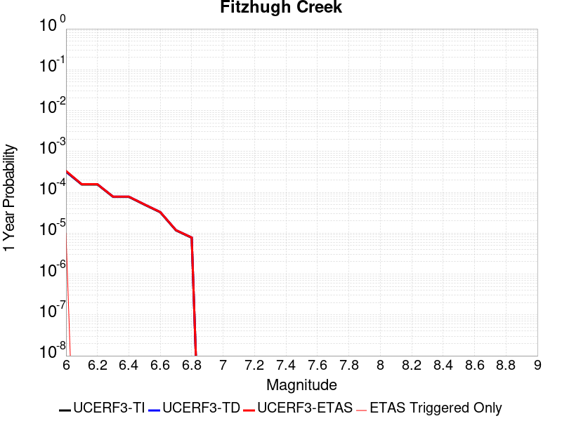 |  |

| Magnitude | 1 wk TI Prob | 1 wk TD Prob | 1 wk ETAS Prob | 1 wk ETAS/TD Gain | 1 wk ETAS Triggered Only | 1 mo TI Prob | 1 mo TD Prob | 1 mo ETAS Prob | 1 mo ETAS/TD Gain | 1 mo ETAS Triggered Only | 1 yr TI Prob | 1 yr TD Prob | 1 yr ETAS Prob | 1 yr ETAS/TD Gain | 1 yr ETAS Triggered Only | 10 yr TI Prob | 10 yr TD Prob | 10 yr ETAS Prob | 10 yr ETAS/TD Gain | 10 yr ETAS Triggered Only |
|-----|-----|-----|-----|-----|-----|-----|-----|-----|-----|-----|-----|-----|-----|-----|-----|-----|-----|-----|-----|-----|
| 6.0 | 6.1090436E-6 | 6.2101562E-6 | 6.2101562E-6 | 1.0 | 0.0 | 2.6181353E-5 | 2.6614709E-5 | 4.0760006E-5 | 1.5314841 | 1.4145672E-5 | 3.1871133E-4 | 3.239904E-4 | 3.3813147E-4 | 1.0436466 | 1.4145672E-5 | 0.0031825465 | 0.0032356246 | 0.0032497244 | 1.0043577 | 1.4145672E-5 |
| 6.1 | 2.9741811E-6 | 3.021581E-6 | 3.021581E-6 | 1.0 | 0.0 | 1.2746428E-5 | 1.2949574E-5 | 1.2949574E-5 | 1.0 | 0.0 | 1.5517672E-4 | 1.576506E-4 | 1.576506E-4 | 1.0 | 0.0 | 0.001550684 | 0.0015754806 | 0.0015754806 | 1.0 | 0.0 |
| 6.2 | 2.9741811E-6 | 3.021581E-6 | 3.021581E-6 | 1.0 | 0.0 | 1.2746428E-5 | 1.2949574E-5 | 1.2949574E-5 | 1.0 | 0.0 | 1.5517672E-4 | 1.576506E-4 | 1.576506E-4 | 1.0 | 0.0 | 0.001550684 | 0.0015754806 | 0.0015754806 | 1.0 | 0.0 |
| 6.3 | 1.4781198E-6 | 1.5012708E-6 | 1.5012708E-6 | 1.0 | 0.0 | 6.3347834E-6 | 6.4340034E-6 | 6.4340034E-6 | 1.0 | 0.0 | 7.712326E-5 | 7.833137E-5 | 7.833137E-5 | 1.0 | 0.0 | 7.70965E-4 | 7.830576E-4 | 7.830576E-4 | 1.0 | 0.0 |
| 6.4 | 1.4781198E-6 | 1.5012708E-6 | 1.5012708E-6 | 1.0 | 0.0 | 6.3347834E-6 | 6.4340034E-6 | 6.4340034E-6 | 1.0 | 0.0 | 7.712326E-5 | 7.833137E-5 | 7.833137E-5 | 1.0 | 0.0 | 7.70965E-4 | 7.830576E-4 | 7.830576E-4 | 1.0 | 0.0 |
| 6.5 | 9.5176676E-7 | 9.66606E-7 | 9.66606E-7 | 1.0 | 0.0 | 4.078994E-6 | 4.142591E-6 | 4.142591E-6 | 1.0 | 0.0 | 4.9660623E-5 | 5.0434985E-5 | 5.0434985E-5 | 1.0 | 0.0 | 4.964952E-4 | 5.042458E-4 | 5.042458E-4 | 1.0 | 0.0 |
| 6.6 | 6.21145E-7 | 6.3085855E-7 | 6.3085855E-7 | 1.0 | 0.0 | 2.662047E-6 | 2.7036772E-6 | 2.7036772E-6 | 1.0 | 0.0 | 3.2409942E-5 | 3.291684E-5 | 3.291684E-5 | 1.0 | 0.0 | 3.2405215E-4 | 3.2912623E-4 | 3.2912623E-4 | 1.0 | 0.0 |
| 6.7 | 2.2377962E-7 | 2.2734636E-7 | 2.2734636E-7 | 1.0 | 0.0 | 9.590551E-7 | 9.743413E-7 | 9.743413E-7 | 1.0 | 0.0 | 1.1676434E-5 | 1.1862574E-5 | 1.1862574E-5 | 1.0 | 0.0 | 1.1675821E-4 | 1.1862254E-4 | 1.1862254E-4 | 1.0 | 0.0 |
| 6.8 | 1.4785022E-7 | 1.5021492E-7 | 1.5021492E-7 | 1.0 | 0.0 | 6.3364365E-7 | 6.4377826E-7 | 6.4377826E-7 | 1.0 | 0.0 | 7.714584E-6 | 7.838E-6 | 7.838E-6 | 1.0 | 0.0 | 7.714316E-5 | 7.838E-5 | 7.838E-5 | 1.0 | 0.0 |

## Davis Creek
*[(top)](#table-of-contents)*

| 1 Week | 1 Month | 1 Year | 10 Year |
|-----|-----|-----|-----|
|  |  |  |  |

| Magnitude | 1 wk TI Prob | 1 wk TD Prob | 1 wk ETAS Prob | 1 wk ETAS/TD Gain | 1 wk ETAS Triggered Only | 1 mo TI Prob | 1 mo TD Prob | 1 mo ETAS Prob | 1 mo ETAS/TD Gain | 1 mo ETAS Triggered Only | 1 yr TI Prob | 1 yr TD Prob | 1 yr ETAS Prob | 1 yr ETAS/TD Gain | 1 yr ETAS Triggered Only | 10 yr TI Prob | 10 yr TD Prob | 10 yr ETAS Prob | 10 yr ETAS/TD Gain | 10 yr ETAS Triggered Only |
|-----|-----|-----|-----|-----|-----|-----|-----|-----|-----|-----|-----|-----|-----|-----|-----|-----|-----|-----|-----|-----|
| 6.0 | 2.331472E-5 | 2.5417214E-5 | 2.5417214E-5 | 1.0 | 0.0 | 9.99164E-5 | 1.0892704E-4 | 1.0892704E-4 | 1.0 | 0.0 | 0.0012158032 | 0.0013254983 | 0.0013254983 | 1.0 | 0.0 | 0.01209173 | 0.013187704 | 0.013201663 | 1.0010585 | 1.4145672E-5 |
| 6.1 | 1.0407654E-5 | 1.1316986E-5 | 1.1316986E-5 | 1.0 | 0.0 | 4.4603472E-5 | 4.8500624E-5 | 4.8500624E-5 | 1.0 | 0.0 | 5.4291193E-4 | 5.9036224E-4 | 5.9036224E-4 | 1.0 | 0.0 | 0.0054158745 | 0.005890611 | 0.0059046736 | 1.0023873 | 1.4145672E-5 |
| 6.2 | 1.0407654E-5 | 1.1316986E-5 | 1.1316986E-5 | 1.0 | 0.0 | 4.4603472E-5 | 4.8500624E-5 | 4.8500624E-5 | 1.0 | 0.0 | 5.4291193E-4 | 5.9036224E-4 | 5.9036224E-4 | 1.0 | 0.0 | 0.0054158745 | 0.005890611 | 0.0059046736 | 1.0023873 | 1.4145672E-5 |
| 6.3 | 5.1323277E-6 | 5.568556E-6 | 5.568556E-6 | 1.0 | 0.0 | 2.1995505E-5 | 2.386507E-5 | 2.386507E-5 | 1.0 | 0.0 | 2.6776237E-4 | 2.905271E-4 | 2.905271E-4 | 1.0 | 0.0 | 0.0026743996 | 0.0029023192 | 0.0029164236 | 1.0048598 | 1.4145672E-5 |
| 6.4 | 2.4985154E-6 | 2.704538E-6 | 2.704538E-6 | 1.0 | 0.0 | 1.07078795E-5 | 1.1590847E-5 | 1.1590847E-5 | 1.0 | 0.0 | 1.3036063E-4 | 1.4111304E-4 | 1.4111304E-4 | 1.0 | 0.0 | 0.0013028418 | 0.001410589 | 0.0014247147 | 1.010014 | 1.4145672E-5 |
| 6.5 | 2.4846438E-6 | 2.6904722E-6 | 2.6904722E-6 | 1.0 | 0.0 | 1.064843E-5 | 1.1530565E-5 | 1.1530565E-5 | 1.0 | 0.0 | 1.2963692E-4 | 1.403792E-4 | 1.403792E-4 | 1.0 | 0.0 | 0.0012956132 | 0.0014032599 | 0.0014173858 | 1.0100664 | 1.4145672E-5 |
| 6.6 | 2.072566E-7 | 2.1018087E-7 | 2.1018087E-7 | 1.0 | 0.0 | 8.882423E-7 | 9.0077486E-7 | 9.0077486E-7 | 1.0 | 0.0 | 1.0814296E-5 | 1.0966881E-5 | 1.0966881E-5 | 1.0 | 0.0 | 1.081377E-4 | 1.09663575E-4 | 1.09663575E-4 | 1.0 | 0.0 |
| 6.7 | 1.7544528E-7 | 1.7790826E-7 | 1.7790826E-7 | 1.0 | 0.0 | 7.5190815E-7 | 7.6246374E-7 | 7.6246374E-7 | 1.0 | 0.0 | 9.154443E-6 | 9.282958E-6 | 9.282958E-6 | 1.0 | 0.0 | 9.1540656E-5 | 9.282586E-5 | 9.282586E-5 | 1.0 | 0.0 |
| 6.8 | 1.2320395E-7 | 1.2481138E-7 | 1.2481138E-7 | 1.0 | 0.0 | 5.280168E-7 | 5.349058E-7 | 5.349058E-7 | 1.0 | 0.0 | 6.428586E-6 | 6.5124595E-6 | 6.5124595E-6 | 1.0 | 0.0 | 6.4284E-5 | 6.5122804E-5 | 6.5122804E-5 | 1.0 | 0.0 |
| 6.9 | 6.399997E-8 | 6.486058E-8 | 6.486058E-8 | 1.0 | 0.0 | 2.7428555E-7 | 2.7797387E-7 | 2.7797387E-7 | 1.0 | 0.0 | 3.3394215E-6 | 3.3843273E-6 | 3.3843273E-6 | 1.0 | 0.0 | 3.3393713E-5 | 3.384282E-5 | 3.384282E-5 | 1.0 | 0.0 |
| 7.0 | 6.4455685E-9 | 6.535264E-9 | 6.535264E-9 | 1.0 | 0.0 | 2.7623864E-8 | 2.8008275E-8 | 2.8008275E-8 | 1.0 | 0.0 | 3.3632048E-7 | 3.4100074E-7 | 3.4100074E-7 | 1.0 | 0.0 | 3.3631998E-6 | 3.4100074E-6 | 3.4100074E-6 | 1.0 | 0.0 |

## Holser alt 1
*[(top)](#table-of-contents)*

| 1 Week | 1 Month | 1 Year | 10 Year |
|-----|-----|-----|-----|
|  |  |  |  |

| Magnitude | 1 wk TI Prob | 1 wk TD Prob | 1 wk ETAS Prob | 1 wk ETAS/TD Gain | 1 wk ETAS Triggered Only | 1 mo TI Prob | 1 mo TD Prob | 1 mo ETAS Prob | 1 mo ETAS/TD Gain | 1 mo ETAS Triggered Only | 1 yr TI Prob | 1 yr TD Prob | 1 yr ETAS Prob | 1 yr ETAS/TD Gain | 1 yr ETAS Triggered Only | 10 yr TI Prob | 10 yr TD Prob | 10 yr ETAS Prob | 10 yr ETAS/TD Gain | 10 yr ETAS Triggered Only |
|-----|-----|-----|-----|-----|-----|-----|-----|-----|-----|-----|-----|-----|-----|-----|-----|-----|-----|-----|-----|-----|
| 6.0 | 6.2746653E-6 | 5.7899742E-6 | 5.7899742E-6 | 1.0 | 0.0 | 2.6891146E-5 | 2.4814004E-5 | 2.4814004E-5 | 1.0 | 0.0 | 3.273505E-4 | 3.0208015E-4 | 3.0208015E-4 | 1.0 | 0.0 | 0.0032686873 | 0.003017828 | 0.0030319311 | 1.0046732 | 1.4145672E-5 |
| 6.1 | 6.2746653E-6 | 5.7899742E-6 | 5.7899742E-6 | 1.0 | 0.0 | 2.6891146E-5 | 2.4814004E-5 | 2.4814004E-5 | 1.0 | 0.0 | 3.273505E-4 | 3.0208015E-4 | 3.0208015E-4 | 1.0 | 0.0 | 0.0032686873 | 0.003017828 | 0.0030319311 | 1.0046732 | 1.4145672E-5 |
| 6.2 | 6.2746653E-6 | 5.7899742E-6 | 5.7899742E-6 | 1.0 | 0.0 | 2.6891146E-5 | 2.4814004E-5 | 2.4814004E-5 | 1.0 | 0.0 | 3.273505E-4 | 3.0208015E-4 | 3.0208015E-4 | 1.0 | 0.0 | 0.0032686873 | 0.003017828 | 0.0030319311 | 1.0046732 | 1.4145672E-5 |
| 6.3 | 6.2746653E-6 | 5.7899742E-6 | 5.7899742E-6 | 1.0 | 0.0 | 2.6891146E-5 | 2.4814004E-5 | 2.4814004E-5 | 1.0 | 0.0 | 3.273505E-4 | 3.0208015E-4 | 3.0208015E-4 | 1.0 | 0.0 | 0.0032686873 | 0.003017828 | 0.0030319311 | 1.0046732 | 1.4145672E-5 |
| 6.4 | 6.2746653E-6 | 5.7899742E-6 | 5.7899742E-6 | 1.0 | 0.0 | 2.6891146E-5 | 2.4814004E-5 | 2.4814004E-5 | 1.0 | 0.0 | 3.273505E-4 | 3.0208015E-4 | 3.0208015E-4 | 1.0 | 0.0 | 0.0032686873 | 0.003017828 | 0.0030319311 | 1.0046732 | 1.4145672E-5 |
| 6.5 | 6.2746653E-6 | 5.7899742E-6 | 5.7899742E-6 | 1.0 | 0.0 | 2.6891146E-5 | 2.4814004E-5 | 2.4814004E-5 | 1.0 | 0.0 | 3.273505E-4 | 3.0208015E-4 | 3.0208015E-4 | 1.0 | 0.0 | 0.0032686873 | 0.003017828 | 0.0030319311 | 1.0046732 | 1.4145672E-5 |
| 6.6 | 3.375825E-6 | 2.7711988E-6 | 2.7711988E-6 | 1.0 | 0.0 | 1.4467741E-5 | 1.1876513E-5 | 1.1876513E-5 | 1.0 | 0.0 | 1.761305E-4 | 1.4458712E-4 | 1.4458712E-4 | 1.0 | 0.0 | 0.0017599097 | 0.0014449474 | 0.0014590727 | 1.0097756 | 1.4145672E-5 |
| 6.7 | 3.375825E-6 | 2.7711988E-6 | 2.7711988E-6 | 1.0 | 0.0 | 1.4467741E-5 | 1.1876513E-5 | 1.1876513E-5 | 1.0 | 0.0 | 1.761305E-4 | 1.4458712E-4 | 1.4458712E-4 | 1.0 | 0.0 | 0.0017599097 | 0.0014449474 | 0.0014590727 | 1.0097756 | 1.4145672E-5 |
| 6.8 | 3.366533E-6 | 2.7615984E-6 | 2.7615984E-6 | 1.0 | 0.0 | 1.4427919E-5 | 1.1835369E-5 | 1.1835369E-5 | 1.0 | 0.0 | 1.7564575E-4 | 1.4408625E-4 | 1.4408625E-4 | 1.0 | 0.0 | 0.0017550698 | 0.0014399453 | 0.0014540706 | 1.0098096 | 1.4145672E-5 |
| 6.9 | 3.253174E-6 | 2.6438204E-6 | 2.6438204E-6 | 1.0 | 0.0 | 1.39421E-5 | 1.13306105E-5 | 1.13306105E-5 | 1.0 | 0.0 | 1.6973184E-4 | 1.379416E-4 | 1.379416E-4 | 1.0 | 0.0 | 0.0016960226 | 0.0013785758 | 0.001392702 | 1.0102469 | 1.4145672E-5 |
| 7.0 | 2.9336593E-6 | 2.3118082E-6 | 2.3118082E-6 | 1.0 | 0.0 | 1.2572766E-5 | 9.907712E-6 | 9.907712E-6 | 1.0 | 0.0 | 1.5306266E-4 | 1.2061974E-4 | 1.2061974E-4 | 1.0 | 0.0 | 0.0015295728 | 0.0012055453 | 0.0012196739 | 1.0117197 | 1.4145672E-5 |
| 7.1 | 2.9087812E-6 | 2.2876604E-6 | 2.2876604E-6 | 1.0 | 0.0 | 1.2466146E-5 | 9.804223E-6 | 9.804223E-6 | 1.0 | 0.0 | 1.5176475E-4 | 1.19359895E-4 | 1.19359895E-4 | 1.0 | 0.0 | 0.0015166114 | 0.0011929603 | 0.0012070892 | 1.0118434 | 1.4145672E-5 |
| 7.2 | 2.8674524E-6 | 2.247552E-6 | 2.247552E-6 | 1.0 | 0.0 | 1.2289024E-5 | 9.63233E-6 | 9.63233E-6 | 1.0 | 0.0 | 1.4960859E-4 | 1.1726733E-4 | 1.1726733E-4 | 1.0 | 0.0 | 0.0014950791 | 0.0011720568 | 0.0011861859 | 1.0120549 | 1.4145672E-5 |
| 7.3 | 2.8057775E-6 | 2.1954418E-6 | 2.1954418E-6 | 1.0 | 0.0 | 1.2024705E-5 | 9.409002E-6 | 9.409002E-6 | 1.0 | 0.0 | 1.4639096E-4 | 1.145486E-4 | 1.145486E-4 | 1.0 | 0.0 | 0.0014629456 | 0.0011448979 | 0.0011590273 | 1.0123413 | 1.4145672E-5 |
| 7.4 | 2.683666E-6 | 2.1092408E-6 | 2.1092408E-6 | 1.0 | 0.0 | 1.1501375E-5 | 9.0395715E-6 | 9.0395715E-6 | 1.0 | 0.0 | 1.4002025E-4 | 1.1005125E-4 | 1.1005125E-4 | 1.0 | 0.0 | 0.0013993206 | 0.0010999697 | 0.0011140998 | 1.0128459 | 1.4145672E-5 |
| 7.5 | 2.434495E-6 | 1.9195488E-6 | 1.9195488E-6 | 1.0 | 0.0 | 1.0433508E-5 | 8.226612E-6 | 8.226612E-6 | 1.0 | 0.0 | 1.2702055E-4 | 1.0015442E-4 | 1.0015442E-4 | 1.0 | 0.0 | 0.0012694797 | 0.0010010948 | 0.0010152264 | 1.014116 | 1.4145672E-5 |
| 7.6 | 1.9914562E-6 | 1.5731545E-6 | 1.5731545E-6 | 1.0 | 0.0 | 8.534785E-6 | 6.7420733E-6 | 6.7420733E-6 | 1.0 | 0.0 | 1.03906044E-4 | 8.2081664E-5 | 8.2081664E-5 | 1.0 | 0.0 | 0.0010385747 | 8.2051504E-4 | 8.346491E-4 | 1.0172259 | 1.4145672E-5 |
| 7.7 | 1.5229501E-6 | 1.1896134E-6 | 1.1896134E-6 | 1.0 | 0.0 | 6.526913E-6 | 5.098333E-6 | 5.098333E-6 | 1.0 | 0.0 | 7.946226E-5 | 6.207045E-5 | 6.207045E-5 | 1.0 | 0.0 | 7.943385E-4 | 6.2053243E-4 | 6.346693E-4 | 1.0227818 | 1.4145672E-5 |
| 7.8 | 6.3489426E-7 | 4.6878412E-7 | 4.6878412E-7 | 1.0 | 0.0 | 2.7209726E-6 | 2.0090733E-6 | 2.0090733E-6 | 1.0 | 0.0 | 3.312734E-5 | 2.4460194E-5 | 2.4460194E-5 | 1.0 | 0.0 | 3.31224E-4 | 2.445752E-4 | 2.445752E-4 | 1.0 | 0.0 |
| 7.9 | 1.5459432E-7 | 1.01936465E-7 | 1.01936465E-7 | 1.0 | 0.0 | 6.6254694E-7 | 4.3687047E-7 | 4.3687047E-7 | 1.0 | 0.0 | 8.066479E-6 | 5.318885E-6 | 5.318885E-6 | 1.0 | 0.0 | 8.066186E-5 | 5.3187596E-5 | 5.3187596E-5 | 1.0 | 0.0 |
| 8.0 | 1.8307812E-8 | 9.690041E-9 | 9.690041E-9 | 1.0 | 0.0 | 7.846205E-8 | 4.1528747E-8 | 4.1528747E-8 | 1.0 | 0.0 | 9.55275E-7 | 5.056124E-7 | 5.056124E-7 | 1.0 | 0.0 | 9.552709E-6 | 5.0561125E-6 | 5.0561125E-6 | 1.0 | 0.0 |

## Almanor 2011 CFM
*[(top)](#table-of-contents)*

| 1 Week | 1 Month | 1 Year | 10 Year |
|-----|-----|-----|-----|
|  |  |  |  |

| Magnitude | 1 wk TI Prob | 1 wk TD Prob | 1 wk ETAS Prob | 1 wk ETAS/TD Gain | 1 wk ETAS Triggered Only | 1 mo TI Prob | 1 mo TD Prob | 1 mo ETAS Prob | 1 mo ETAS/TD Gain | 1 mo ETAS Triggered Only | 1 yr TI Prob | 1 yr TD Prob | 1 yr ETAS Prob | 1 yr ETAS/TD Gain | 1 yr ETAS Triggered Only | 10 yr TI Prob | 10 yr TD Prob | 10 yr ETAS Prob | 10 yr ETAS/TD Gain | 10 yr ETAS Triggered Only |
|-----|-----|-----|-----|-----|-----|-----|-----|-----|-----|-----|-----|-----|-----|-----|-----|-----|-----|-----|-----|-----|
| 6.0 | 6.1479834E-5 | 8.327245E-5 | 8.327245E-5 | 1.0 | 0.0 | 2.6345838E-4 | 3.5683523E-4 | 3.7097585E-4 | 1.0396279 | 1.4145672E-5 | 0.0032028882 | 0.004336495 | 0.0043505793 | 1.0032479 | 1.4145672E-5 | 0.031571172 | 0.04258658 | 0.04260012 | 1.000318 | 1.4145672E-5 |
| 6.1 | 4.4387216E-5 | 5.9767433E-5 | 5.9767433E-5 | 1.0 | 0.0 | 1.9021705E-4 | 2.561236E-4 | 2.7026565E-4 | 1.0552157 | 1.4145672E-5 | 0.0023134327 | 0.003114351 | 0.0031284527 | 1.0045279 | 1.4145672E-5 | 0.022894967 | 0.030755581 | 0.030769292 | 1.0004458 | 1.4145672E-5 |
| 6.2 | 4.4387216E-5 | 5.9767433E-5 | 5.9767433E-5 | 1.0 | 0.0 | 1.9021705E-4 | 2.561236E-4 | 2.7026565E-4 | 1.0552157 | 1.4145672E-5 | 0.0023134327 | 0.003114351 | 0.0031284527 | 1.0045279 | 1.4145672E-5 | 0.022894967 | 0.030755581 | 0.030769292 | 1.0004458 | 1.4145672E-5 |
| 6.3 | 2.9523822E-5 | 3.9546965E-5 | 3.9546965E-5 | 1.0 | 0.0 | 1.2652454E-4 | 1.6947731E-4 | 1.8362058E-4 | 1.0834523 | 1.4145672E-5 | 0.0015393476 | 0.0020617929 | 0.0020759094 | 1.0068467 | 1.4145672E-5 | 0.015287281 | 0.020461112 | 0.020474968 | 1.0006772 | 1.4145672E-5 |
| 6.4 | 2.0512744E-5 | 2.7430639E-5 | 2.7430639E-5 | 1.0 | 0.0 | 8.79088E-5 | 1.17555675E-4 | 1.17555675E-4 | 1.0 | 0.0 | 0.001069764 | 0.0014306171 | 0.0014306171 | 1.0 | 0.0 | 0.010646289 | 0.01424458 | 0.01424458 | 1.0 | 0.0 |
| 6.5 | 1.6750226E-5 | 2.2390364E-5 | 2.2390364E-5 | 1.0 | 0.0 | 7.178471E-5 | 9.595619E-5 | 9.595619E-5 | 1.0 | 0.0 | 8.7362836E-4 | 0.0011679606 | 0.0011679606 | 1.0 | 0.0 | 0.008702018 | 0.011649196 | 0.011649196 | 1.0 | 0.0 |
| 6.6 | 1.4745303E-5 | 1.970686E-5 | 1.970686E-5 | 1.0 | 0.0 | 6.319262E-5 | 8.445639E-5 | 8.445639E-5 | 1.0 | 0.0 | 7.690986E-4 | 0.0010280984 | 0.0010280984 | 1.0 | 0.0 | 0.0076644225 | 0.01026513 | 0.01026513 | 1.0 | 0.0 |
| 6.7 | 9.951145E-7 | 1.1616347E-6 | 1.1616347E-6 | 1.0 | 0.0 | 4.26477E-6 | 4.9784257E-6 | 4.9784257E-6 | 1.0 | 0.0 | 5.1922336E-5 | 6.0610826E-5 | 6.0610826E-5 | 1.0 | 0.0 | 5.1910203E-4 | 6.059602E-4 | 6.059602E-4 | 1.0 | 0.0 |
| 6.8 | 5.866312E-7 | 6.849384E-7 | 6.849384E-7 | 1.0 | 0.0 | 2.5141312E-6 | 2.9354478E-6 | 2.9354478E-6 | 1.0 | 0.0 | 3.0609117E-5 | 3.5738623E-5 | 3.5738623E-5 | 1.0 | 0.0 | 3.06049E-4 | 3.5734157E-4 | 3.5734157E-4 | 1.0 | 0.0 |

## Great Valley 10 (Panoche)
*[(top)](#table-of-contents)*

| 1 Week | 1 Month | 1 Year | 10 Year |
|-----|-----|-----|-----|
|  |  |  |  |

| Magnitude | 1 wk TI Prob | 1 wk TD Prob | 1 wk ETAS Prob | 1 wk ETAS/TD Gain | 1 wk ETAS Triggered Only | 1 mo TI Prob | 1 mo TD Prob | 1 mo ETAS Prob | 1 mo ETAS/TD Gain | 1 mo ETAS Triggered Only | 1 yr TI Prob | 1 yr TD Prob | 1 yr ETAS Prob | 1 yr ETAS/TD Gain | 1 yr ETAS Triggered Only | 10 yr TI Prob | 10 yr TD Prob | 10 yr ETAS Prob | 10 yr ETAS/TD Gain | 10 yr ETAS Triggered Only |
|-----|-----|-----|-----|-----|-----|-----|-----|-----|-----|-----|-----|-----|-----|-----|-----|-----|-----|-----|-----|-----|
| 6.0 | 1.6014626E-5 | 1.6575357E-5 | 1.6575357E-5 | 1.0 | 0.0 | 6.863231E-5 | 7.103534E-5 | 7.103534E-5 | 1.0 | 0.0 | 8.35278E-4 | 8.6451764E-4 | 8.786511E-4 | 1.0163484 | 1.4145672E-5 | 0.008321454 | 0.008612158 | 0.008626182 | 1.0016284 | 1.4145672E-5 |
| 6.1 | 1.6014626E-5 | 1.6575357E-5 | 1.6575357E-5 | 1.0 | 0.0 | 6.863231E-5 | 7.103534E-5 | 7.103534E-5 | 1.0 | 0.0 | 8.35278E-4 | 8.6451764E-4 | 8.786511E-4 | 1.0163484 | 1.4145672E-5 | 0.008321454 | 0.008612158 | 0.008626182 | 1.0016284 | 1.4145672E-5 |
| 6.2 | 1.56782E-5 | 1.6198404E-5 | 1.6198404E-5 | 1.0 | 0.0 | 6.719056E-5 | 6.941991E-5 | 6.941991E-5 | 1.0 | 0.0 | 8.17738E-4 | 8.4486516E-4 | 8.589989E-4 | 1.016729 | 1.4145672E-5 | 0.008147354 | 0.008417133 | 0.00843116 | 1.0016664 | 1.4145672E-5 |
| 6.3 | 1.5263338E-5 | 1.5723472E-5 | 1.5723472E-5 | 1.0 | 0.0 | 6.541267E-5 | 6.73846E-5 | 6.73846E-5 | 1.0 | 0.0 | 7.961082E-4 | 8.201041E-4 | 8.3423813E-4 | 1.0172344 | 1.4145672E-5 | 0.007932622 | 0.008171363 | 0.008185393 | 1.001717 | 1.4145672E-5 |
| 6.4 | 1.4720723E-5 | 1.5099334E-5 | 1.5099334E-5 | 1.0 | 0.0 | 6.308728E-5 | 6.470986E-5 | 6.470986E-5 | 1.0 | 0.0 | 7.67817E-4 | 7.87563E-4 | 8.016975E-4 | 1.0179472 | 1.4145672E-5 | 0.007651695 | 0.007848289 | 0.007862324 | 1.0017883 | 1.4145672E-5 |
| 6.5 | 1.408264E-5 | 1.4355928E-5 | 1.4355928E-5 | 1.0 | 0.0 | 6.0352773E-5 | 6.1523984E-5 | 6.1523984E-5 | 1.0 | 0.0 | 7.3454727E-4 | 7.488022E-4 | 7.488022E-4 | 1.0 | 0.0 | 0.0073212404 | 0.0074633416 | 0.0074633416 | 1.0 | 0.0 |
| 6.6 | 1.3197086E-5 | 1.33218455E-5 | 1.33218455E-5 | 1.0 | 0.0 | 5.6557717E-5 | 5.7092402E-5 | 5.7092402E-5 | 1.0 | 0.0 | 6.8837265E-4 | 6.948834E-4 | 6.948834E-4 | 1.0 | 0.0 | 0.006862442 | 0.0069276392 | 0.0069276392 | 1.0 | 0.0 |
| 6.7 | 1.017583E-5 | 9.745348E-6 | 9.745348E-6 | 1.0 | 0.0 | 4.360997E-5 | 4.176512E-5 | 4.176512E-5 | 1.0 | 0.0 | 5.30822E-4 | 5.083741E-4 | 5.083741E-4 | 1.0 | 0.0 | 0.0052955584 | 0.0050723637 | 0.0050723637 | 1.0 | 0.0 |
| 6.8 | 8.557912E-6 | 7.8726725E-6 | 7.8726725E-6 | 1.0 | 0.0 | 3.667625E-5 | 3.37396E-5 | 3.37396E-5 | 1.0 | 0.0 | 4.4644187E-4 | 4.1070423E-4 | 4.1070423E-4 | 1.0 | 0.0 | 0.0044554602 | 0.004099659 | 0.004099659 | 1.0 | 0.0 |
| 6.9 | 6.14664E-6 | 5.0920366E-6 | 5.0920366E-6 | 1.0 | 0.0 | 2.6342475E-5 | 2.182284E-5 | 2.182284E-5 | 1.0 | 0.0 | 3.2067244E-4 | 2.6566206E-4 | 2.6566206E-4 | 1.0 | 0.0 | 0.003202101 | 0.0026535832 | 0.0026535832 | 1.0 | 0.0 |
| 7.0 | 3.2310581E-6 | 1.6950871E-6 | 1.6950871E-6 | 1.0 | 0.0 | 1.3847319E-5 | 7.2646394E-6 | 7.2646394E-6 | 1.0 | 0.0 | 1.6857806E-4 | 8.844349E-5 | 8.844349E-5 | 1.0 | 0.0 | 0.0016845023 | 8.840923E-4 | 8.840923E-4 | 1.0 | 0.0 |
| 7.1 | 2.544492E-6 | 9.188573E-7 | 9.188573E-7 | 1.0 | 0.0 | 1.090492E-5 | 3.9379543E-6 | 3.9379543E-6 | 1.0 | 0.0 | 1.327593E-4 | 4.7943588E-5 | 4.7943588E-5 | 1.0 | 0.0 | 0.0013268003 | 4.793372E-4 | 4.793372E-4 | 1.0 | 0.0 |
| 7.2 | 2.4479045E-6 | 8.840978E-7 | 8.840978E-7 | 1.0 | 0.0 | 1.0490977E-5 | 3.7889852E-6 | 3.7889852E-6 | 1.0 | 0.0 | 1.2772017E-4 | 4.6129968E-5 | 4.6129968E-5 | 1.0 | 0.0 | 0.0012764678 | 4.6120866E-4 | 4.6120866E-4 | 1.0 | 0.0 |
| 7.3 | 2.0559578E-6 | 7.892521E-7 | 7.892521E-7 | 1.0 | 0.0 | 8.811218E-6 | 3.382505E-6 | 3.382505E-6 | 1.0 | 0.0 | 1.072713E-4 | 4.1181265E-5 | 4.1181265E-5 | 1.0 | 0.0 | 0.0010721954 | 4.1174097E-4 | 4.1174097E-4 | 1.0 | 0.0 |
| 7.4 | 1.727687E-6 | 7.3875697E-7 | 7.3875697E-7 | 1.0 | 0.0 | 7.404352E-6 | 3.1660977E-6 | 3.1660977E-6 | 1.0 | 0.0 | 9.0144255E-5 | 3.8546605E-5 | 3.8546605E-5 | 1.0 | 0.0 | 9.0107694E-4 | 3.854038E-4 | 3.854038E-4 | 1.0 | 0.0 |
| 7.5 | 1.5002679E-6 | 6.545985E-7 | 6.545985E-7 | 1.0 | 0.0 | 6.4297037E-6 | 2.8054194E-6 | 2.8054194E-6 | 1.0 | 0.0 | 7.827883E-5 | 3.4155488E-5 | 3.4155488E-5 | 1.0 | 0.0 | 7.825126E-4 | 3.4150656E-4 | 3.4150656E-4 | 1.0 | 0.0 |

