# Parent Section Magnitude-Probability Distributions

Only fault sections with at least one triggered aftershock are plotted. Sections are sorted by total supraseismogenic trigger rate (decreasing)

## Table Of Contents

* [Garlock (Central)](#garlock-central)
* [Tank Canyon](#tank-canyon)
* [Little Lake](#little-lake)
* [Airport Lake](#airport-lake)
* [Owl Lake](#owl-lake)
* [Panamint Valley](#panamint-valley)
* [Garlock (East)](#garlock-east)
* [Hunter Mountain-Saline Valley](#hunter-mountain-saline-valley)
* [Blackwater](#blackwater)
* [Ash Hill](#ash-hill)
* [Garlock (West)](#garlock-west)
* [McLean Lake](#mclean-lake)
* [Gravel Hills-Harper Lk](#gravel-hills-harper-lk)
* [Goldstone Lake](#goldstone-lake)
* [So Sierra Nevada](#so-sierra-nevada)
* [Coyote Canyon](#coyote-canyon)
* [San Andreas (Mojave S)](#san-andreas-mojave-s)
* [San Andreas (Mojave N)](#san-andreas-mojave-n)
* [Death Valley (So)](#death-valley-so)
* [Nelson Lake](#nelson-lake)
* [Lenwood-Lockhart-Old Woman Springs](#lenwood-lockhart-old-woman-springs)
* [Towne Pass](#towne-pass)
* [Bicycle Lake](#bicycle-lake)
* [San Andreas (San Bernardino N)](#san-andreas-san-bernardino-n)
* [Paradise](#paradise)
* [Garlic Springs](#garlic-springs)
* [Death Valley (Black Mtns Frontal)](#death-valley-black-mtns-frontal)
* [San Andreas (San Bernardino S)](#san-andreas-san-bernardino-s)
* [Helendale-So Lockhart](#helendale-so-lockhart)
* [Coyote Lake](#coyote-lake)
* [San Andreas (Big Bend)](#san-andreas-big-bend)
* [San Andreas (San Gorgonio Pass-Garnet HIll)](#san-andreas-san-gorgonio-pass-garnet-hill)
* [Death Valley (No)](#death-valley-no)
* [Elsinore (Glen Ivy) rev](#elsinore-glen-ivy-rev)
* [San Andreas (Parkfield)](#san-andreas-parkfield)
* [Sierra Nevada  (No Extension)](#sierra-nevada--no-extension)
* [Death Valley (Fish Lake Valley)](#death-valley-fish-lake-valley)
* [Calico-Hidalgo](#calico-hidalgo)
* [San Andreas (Coachella) rev](#san-andreas-coachella-rev)
* [Cady](#cady)
* [San Andreas (Carrizo) rev](#san-andreas-carrizo-rev)
* [Red Pass](#red-pass)
* [San Andreas (Cholame) rev](#san-andreas-cholame-rev)
* [Manix-Afton Hills](#manix-afton-hills)
* [Santa Ynez (West)](#santa-ynez-west)
* [Ludlow](#ludlow)
* [Baker](#baker)
* [San Andreas (North Branch Mill Creek)](#san-andreas-north-branch-mill-creek)
* [San Jacinto (San Bernardino)](#san-jacinto-san-bernardino)
* [Scodie Lineament](#scodie-lineament)
* [White Wolf (Extension)](#white-wolf-extension)
* [San Andreas (Creeping Section) 2011 CFM](#san-andreas-creeping-section-2011-cfm)
* [Owens Valley](#owens-valley)
* [Santa Rosa Island](#santa-rosa-island)
* [Brawley (Seismic Zone) alt 1](#brawley-seismic-zone-alt-1)
* [White Mountains](#white-mountains)
* [Independence rev 2011](#independence-rev-2011)
* [San Jacinto (Stepovers Combined)](#san-jacinto-stepovers-combined)
* [San Jacinto (San Jacinto Valley) rev](#san-jacinto-san-jacinto-valley-rev)
* [Lake Isabella (Seismicity)](#lake-isabella-seismicity)
* [Rose Canyon](#rose-canyon)
* [Pinto Mtn](#pinto-mtn)
* [Kern Canyon (North Kern) 2011](#kern-canyon-north-kern-2011)
* [Tin Mountain](#tin-mountain)
* [Deep Springs](#deep-springs)
* [Cleghorn Lake](#cleghorn-lake)
* [San Jacinto (Anza) rev](#san-jacinto-anza-rev)
* [Santa Ynez (East)](#santa-ynez-east)
* [Imperial](#imperial)
* [Mission Creek](#mission-creek)
* [Chino alt 1](#chino-alt-1)
* [Blue Cut](#blue-cut)
* [San Jacinto (Lytle Creek connector)](#san-jacinto-lytle-creek-connector)
* [Great Valley 09 (Laguna Seca)](#great-valley-09-laguna-seca)
* [Pisgah-Bullion Mtn-Mesquite Lk](#pisgah-bullion-mtn-mesquite-lk)
* [Cleghorn Pass](#cleghorn-pass)
* [Big Pine (East)](#big-pine-east)
* [Big Pine (Central)](#big-pine-central)
* [Santa Cruz Island](#santa-cruz-island)
* [Santa Cruz Catalina Ridge alt1](#santa-cruz-catalina-ridge-alt1)
* [Pleito](#pleito)
* [Mission Ridge-Arroyo Parida-Santa Ana](#mission-ridge-arroyo-parida-santa-ana)
* [San Jacinto (Clark) rev](#san-jacinto-clark-rev)
* [Oak Ridge (Onshore)](#oak-ridge-onshore)
* [San Diego Trough north alt1](#san-diego-trough-north-alt1)
* [Whittier alt 1](#whittier-alt-1)
* [Ventura-Pitas Point](#ventura-pitas-point)
* [Kern Canyon (South Kern) 2011](#kern-canyon-south-kern-2011)
* [Cucamonga](#cucamonga)
* [Oceanic - West Huasna](#oceanic---west-huasna)
* [Simi-Santa Rosa](#simi-santa-rosa)
* [Elysian Park (Upper)](#elysian-park-upper)
* [Bullion Mountains](#bullion-mountains)
* [San Jacinto (Borrego)](#san-jacinto-borrego)
* [Sheephole](#sheephole)
* [Palos Verdes](#palos-verdes)
* [Red Mountain](#red-mountain)
* [Dry Mountain](#dry-mountain)
* [Ortigalita (North)](#ortigalita-north)
* [Lost Hills](#lost-hills)
* [Pine Mtn](#pine-mtn)
* [Ortigalita (South)](#ortigalita-south)
* [San Pedro Basin](#san-pedro-basin)
* [Raymond](#raymond)
* [Channel Islands Thrust](#channel-islands-thrust)
* [Santa Ynez River](#santa-ynez-river)
* [San Clemente](#san-clemente)
* [Hayward (No) 2011 CFM](#hayward-no-2011-cfm)
* [San Diego Trough south](#san-diego-trough-south)
* [Calaveras (So) 2011 CFM](#calaveras-so-2011-cfm)
* [San Jacinto (Coyote Creek)](#san-jacinto-coyote-creek)
* [Cleghorn](#cleghorn)
* [Hunting Creek - Berryessa 2011 CFM](#hunting-creek---berryessa-2011-cfm)
* [San Juan](#san-juan)
* [Robinson Creek](#robinson-creek)
* [Camp Rock 2011](#camp-rock-2011)
* [Los Alamos 2011 CFM](#los-alamos-2011-cfm)
* [Coronado Bank alt1](#coronado-bank-alt1)
* [North Frontal  (East)](#north-frontal--east)
* [Bennett Valley 2011 CFM](#bennett-valley-2011-cfm)
* [Hosgri](#hosgri)
* [White Wolf](#white-wolf)
* [Owens Valley Keough Hot Springs](#owens-valley-keough-hot-springs)
* [Rinconada 2011 CFM](#rinconada-2011-cfm)
* [Mono Lake 2011 CFM](#mono-lake-2011-cfm)
* [Kern Canyon (Lake Isabella) 2011](#kern-canyon-lake-isabella-2011)
* [Emerson-Copper Mtn 2011](#emerson-copper-mtn-2011)
* [Newport-Inglewood (Offshore)](#newport-inglewood-offshore)
* [Los Alamos extension](#los-alamos-extension)
* [Calaveras (So) - Paicines extension 2011 CFM](#calaveras-so---paicines-extension-2011-cfm)
* [Hayward (So) 2011 CFM](#hayward-so-2011-cfm)
* [Green Valley 2011 CFM](#green-valley-2011-cfm)
* [Rodgers Creek - Healdsburg 2011 CFM](#rodgers-creek---healdsburg-2011-cfm)
* [Cerro Prieto](#cerro-prieto)
* [San Cayetano](#san-cayetano)
* [Hunting Creek - Bartlett Springs connector 2011](#hunting-creek---bartlett-springs-connector-2011)
* [San Jacinto (Superstition Mtn)](#san-jacinto-superstition-mtn)
* [Great Valley 08 (Quinto)](#great-valley-08-quinto)
* [Elsinore (Coyote Mountains)](#elsinore-coyote-mountains)
* [Johnson Valley (No) 2011 rev](#johnson-valley-no-2011-rev)
* [Malibu Coast alt 1](#malibu-coast-alt-1)
* [Channel Islands Western Deep Ramp](#channel-islands-western-deep-ramp)
* [Monterey Bay-Tularcitos](#monterey-bay-tularcitos)
* [Elsinore (Stepovers Combined)](#elsinore-stepovers-combined)
* [Hayward (So) extension 2011 CFM](#hayward-so-extension-2011-cfm)
* [Sierra Madre](#sierra-madre)
* [Morales (East)](#morales-east)
* [San Gregorio (North) 2011 CFM](#san-gregorio-north-2011-cfm)
* [San Jose](#san-jose)
* [Pitas Point (Lower West)](#pitas-point-lower-west)
* [Calaveras (Central) 2011 CFM](#calaveras-central-2011-cfm)
* [Northridge](#northridge)
* [Hector Mine](#hector-mine)
* [Santa Susana alt 1](#santa-susana-alt-1)
* [Great Valley 07 (Orestimba)](#great-valley-07-orestimba)
* [Maacama 2011 CFM](#maacama-2011-cfm)
* [Hollywood](#hollywood)
* [San Luis Range - Pecho 2011 CFM](#san-luis-range---pecho-2011-cfm)
* [Santa Susana East (connector)](#santa-susana-east-connector)
* [San Gorgonio Pass](#san-gorgonio-pass)
* [Hosgri (Extension)](#hosgri-extension)
* [Los Osos 2011](#los-osos-2011)
* [Elsinore (Temecula) rev](#elsinore-temecula-rev)
* [San Luis Range 2011 CFM](#san-luis-range-2011-cfm)
* [North Frontal  (West)](#north-frontal--west)
* [Carlsbad](#carlsbad)
* [Great Valley 05 Pittsburg - Kirby Hills alt1](#great-valley-05-pittsburg---kirby-hills-alt1)
* [Sierra Madre (San Fernando)](#sierra-madre-san-fernando)
* [Santa Monica alt 1](#santa-monica-alt-1)
* [Great Valley 10 (Panoche)](#great-valley-10-panoche)
* [Verdugo](#verdugo)
* [Russ 2011 CFM](#russ-2011-cfm)
* [Garberville - Briceland 2011 CFM](#garberville---briceland-2011-cfm)
* [San Gregorio (South) 2011 CFM](#san-gregorio-south-2011-cfm)
* [Great Valley 11](#great-valley-11)
* [Likely 2011 CFM](#likely-2011-cfm)
* [Great Valley 03a Dunnigan Hills](#great-valley-03a-dunnigan-hills)
* [Yorba Linda](#yorba-linda)
* [Big Lagoon - Bald Mtn 2011 CFM](#big-lagoon---bald-mtn-2011-cfm)
* [Quien Sabe 2011 CFM](#quien-sabe-2011-cfm)
* [Keddie Ridge 2011 CFM](#keddie-ridge-2011-cfm)
* [Sisar](#sisar)
* [Davis Creek](#davis-creek)
* [Northridge Hills](#northridge-hills)
* [Malibu Coast (Extension) alt 1](#malibu-coast-extension-alt-1)
* [Elmore Ranch](#elmore-ranch)
* [Contra Costa (Lafayette) 2011 CFM](#contra-costa-lafayette-2011-cfm)
* [South Klamath Lake West](#south-klamath-lake-west)
* [Fish Slough 2011 CFM](#fish-slough-2011-cfm)
* [Bartlett Springs 2011 CFM](#bartlett-springs-2011-cfm)
* [Concord 2011 CFM](#concord-2011-cfm)
* [Elsinore (Julian)](#elsinore-julian)
* [Round Valley](#round-valley)
* [Fitzhugh Creek](#fitzhugh-creek)
* [Superstition Hills](#superstition-hills)
* [Shoreline](#shoreline)
* [Almanor 2011 CFM](#almanor-2011-cfm)
* [Del Valle](#del-valle)
* [Clayton](#clayton)
* [Jess Valley](#jess-valley)
* [Point Reyes 2011 CFM](#point-reyes-2011-cfm)
* [Contra Costa Shear Zone (connector) 2011 CFM](#contra-costa-shear-zone-connector-2011-cfm)
* [Compton](#compton)
* [Calaveras (No) 2011 CFM](#calaveras-no-2011-cfm)
* [Holser alt 1](#holser-alt-1)
* [Great Valley 06 (Midland) 2011 CFM alt1](#great-valley-06-midland-2011-cfm-alt1)
* [Fontana (Seismicity)](#fontana-seismicity)
* [Rocky Ledge 2011 CFM](#rocky-ledge-2011-cfm)
* [Eaton Roughs 2011 CFM](#eaton-roughs-2011-cfm)
* [West Tahoe](#west-tahoe)
* [San Gabriel (Extension)](#san-gabriel-extension)
* [Laguna Salada](#laguna-salada)
* [Newport-Inglewood alt 1](#newport-inglewood-alt-1)
* [Cedar Mtn-Mahogany Mtn](#cedar-mtn-mahogany-mtn)
* [Homestead Valley 2011](#homestead-valley-2011)
* [Hat Creek-McArthur-Mayfield](#hat-creek-mcarthur-mayfield)
* [Pittville 2011 CFM](#pittville-2011-cfm)
* [Honey Lake 2011 CFM](#honey-lake-2011-cfm)
* [Casmalia 2011 CFM](#casmalia-2011-cfm)
* [Franklin 2011 CFM](#franklin-2011-cfm)
* [San Andreas (North Coast) 2011 CFM](#san-andreas-north-coast-2011-cfm)
* [West Napa 2011 CFM](#west-napa-2011-cfm)
* [East Huasna 2011 CFM](#east-huasna-2011-cfm)
* [Carson Range (Genoa)](#carson-range-genoa)

## Garlock (Central)
*[(top)](#table-of-contents)*

| 1 Week | 1 Month | 1 Year | 10 Year |
|-----|-----|-----|-----|
|  |  |  |  |

| Magnitude | 1 wk TI Prob | 1 wk TD Prob | 1 wk ETAS Prob | 1 wk ETAS/TD Gain | 1 wk ETAS Triggered Only | 1 mo TI Prob | 1 mo TD Prob | 1 mo ETAS Prob | 1 mo ETAS/TD Gain | 1 mo ETAS Triggered Only | 1 yr TI Prob | 1 yr TD Prob | 1 yr ETAS Prob | 1 yr ETAS/TD Gain | 1 yr ETAS Triggered Only | 10 yr TI Prob | 10 yr TD Prob | 10 yr ETAS Prob | 10 yr ETAS/TD Gain | 10 yr ETAS Triggered Only |
|-----|-----|-----|-----|-----|-----|-----|-----|-----|-----|-----|-----|-----|-----|-----|-----|-----|-----|-----|-----|-----|
| 6.0 | 5.5131142E-5 | 7.02476E-5 | 0.065175675 | 927.7993 | 0.06511 | 2.3625491E-4 | 3.0102677E-4 | 0.07954717 | 264.2528 | 0.07927 | 0.0028726095 | 0.003658906 | 0.10759721 | 29.406935 | 0.10432 | 0.028357591 | 0.036136657 | 0.1592702 | 4.4074416 | 0.12775 |
| 6.1 | 5.5131142E-5 | 7.02476E-5 | 0.065175675 | 927.7993 | 0.06511 | 2.3625491E-4 | 3.0102677E-4 | 0.07954717 | 264.2528 | 0.07927 | 0.0028726095 | 0.003658906 | 0.10759721 | 29.406935 | 0.10432 | 0.028357591 | 0.036136657 | 0.1592702 | 4.4074416 | 0.12775 |
| 6.2 | 4.216245E-5 | 5.1661802E-5 | 0.039049648 | 755.8708 | 0.039 | 1.806837E-4 | 2.213891E-4 | 0.04800081 | 216.8165 | 0.04779 | 0.0021976046 | 0.002692112 | 0.06630041 | 24.627657 | 0.06378 | 0.021759989 | 0.026701318 | 0.10357245 | 3.8789265 | 0.07898 |
| 6.3 | 4.216245E-5 | 5.1661802E-5 | 0.039049648 | 755.8708 | 0.039 | 1.806837E-4 | 2.213891E-4 | 0.04800081 | 216.8165 | 0.04779 | 0.0021976046 | 0.002692112 | 0.06630041 | 24.627657 | 0.06378 | 0.021759989 | 0.026701318 | 0.10357245 | 3.8789265 | 0.07898 |
| 6.4 | 3.6858168E-5 | 4.411026E-5 | 0.03066276 | 695.1389 | 0.03062 | 1.5795401E-4 | 1.8903041E-4 | 0.037771925 | 199.81929 | 0.03759 | 0.0019213937 | 0.0022990413 | 0.052662987 | 22.906498 | 0.05048 | 0.019048655 | 0.022866098 | 0.08410308 | 3.6780686 | 0.06267 |
| 6.5 | 3.39199E-5 | 4.0018425E-5 | 0.027638914 | 690.6547 | 0.0276 | 1.453629E-4 | 1.7149639E-4 | 0.034225654 | 199.57071 | 0.03406 | 0.0017683565 | 0.0020859907 | 0.04783037 | 22.929329 | 0.04584 | 0.017543508 | 0.020758783 | 0.07634051 | 3.6775043 | 0.05676 |
| 6.6 | 3.3571985E-5 | 3.947258E-5 | 0.027618384 | 699.6853 | 0.02758 | 1.4387199E-4 | 1.6915736E-4 | 0.0342034 | 202.19872 | 0.03404 | 0.0017502342 | 0.0020575672 | 0.047743373 | 23.203798 | 0.04578 | 0.017365133 | 0.020480042 | 0.075969845 | 3.7094576 | 0.05665 |
| 6.7 | 3.2580007E-5 | 3.808902E-5 | 0.02654708 | 696.9746 | 0.02651 | 1.3962112E-4 | 1.6322857E-4 | 0.032897886 | 201.54489 | 0.03274 | 0.0016985617 | 0.0019855178 | 0.045878194 | 23.106413 | 0.04398 | 0.016856372 | 0.019770874 | 0.07321297 | 3.7030718 | 0.05452 |
| 6.8 | 3.2185937E-5 | 3.7516216E-5 | 0.02604654 | 694.27423 | 0.02601 | 1.3793244E-4 | 1.60774E-4 | 0.03228561 | 200.81363 | 0.03213 | 0.0016780337 | 0.0019556875 | 0.045071203 | 23.046219 | 0.0432 | 0.016654192 | 0.019477878 | 0.071965225 | 3.694716 | 0.05353 |
| 6.9 | 3.165394E-5 | 3.672075E-5 | 0.025535785 | 695.4047 | 0.0255 | 1.3565269E-4 | 1.5736527E-4 | 0.031622414 | 200.94911 | 0.03147 | 0.0016503202 | 0.00191426 | 0.044233095 | 23.107151 | 0.0424 | 0.01638118 | 0.019071518 | 0.07054084 | 3.698753 | 0.05247 |
| 7.0 | 3.0903822E-5 | 3.562591E-5 | 0.024844741 | 697.3785 | 0.02481 | 1.3243823E-4 | 1.5267366E-4 | 0.030758 | 201.46239 | 0.03061 | 0.0016112428 | 0.0018572382 | 0.04306057 | 23.18527 | 0.04128 | 0.015996104 | 0.018513493 | 0.068647824 | 3.7079887 | 0.05108 |
| 7.1 | 3.0069863E-5 | 3.4392175E-5 | 0.023533585 | 684.2715 | 0.0235 | 1.2886449E-4 | 1.4738683E-4 | 0.02915311 | 197.79997 | 0.02901 | 0.0015677959 | 0.0017929787 | 0.041022513 | 22.879532 | 0.0393 | 0.01556781 | 0.01788099 | 0.06566108 | 3.6721168 | 0.04865 |
| 7.2 | 2.7957109E-5 | 3.128141E-5 | 0.019440675 | 621.47687 | 0.01941 | 1.1981068E-4 | 1.3405642E-4 | 0.024210827 | 180.60178 | 0.02408 | 0.0014577188 | 0.0016309345 | 0.034197733 | 20.968184 | 0.03262 | 0.014481937 | 0.016284352 | 0.056164183 | 3.4489665 | 0.04054 |
| 7.3 | 2.4519275E-5 | 2.6714602E-5 | 0.013956343 | 522.42377 | 0.01393 | 1.0507837E-4 | 1.1448621E-4 | 0.017262522 | 150.78255 | 0.01715 | 0.0012785783 | 0.001392993 | 0.024620593 | 17.674599 | 0.02326 | 0.012712469 | 0.01392861 | 0.042426072 | 3.0459661 | 0.0289 |
| 7.4 | 2.3225532E-5 | 2.5199166E-5 | 0.012784878 | 507.35318 | 0.01276 | 9.95342E-5 | 1.0799204E-4 | 0.015806297 | 146.36539 | 0.0157 | 0.0012111551 | 0.0013140244 | 0.02266593 | 17.249245 | 0.02138 | 0.012045753 | 0.013146196 | 0.03930769 | 2.990043 | 0.02651 |
| 7.5 | 2.097765E-5 | 2.2483406E-5 | 0.00995226 | 442.6491 | 0.00993 | 8.9901114E-5 | 9.6353964E-5 | 0.012345173 | 128.12315 | 0.01225 | 0.0010939965 | 0.00117249 | 0.01796278 | 15.320199 | 0.01681 | 0.010886264 | 0.0117406575 | 0.032306336 | 2.7516632 | 0.02081 |
| 7.6 | 1.511254E-5 | 1.5990969E-5 | 0.005525903 | 345.564 | 0.00551 | 6.476642E-5 | 6.8530964E-5 | 0.006778071 | 98.90523 | 0.00671 | 7.882459E-4 | 8.34053E-4 | 0.010046363 | 12.045234 | 0.00922 | 0.007854558 | 0.008383867 | 0.019688291 | 2.3483543 | 0.0114 |
| 7.7 | 9.934069E-6 | 1.0678523E-5 | 0.0015906617 | 148.95895 | 0.00158 | 4.2573887E-5 | 4.5764296E-5 | 0.001975676 | 43.17068 | 0.00193 | 5.182138E-4 | 5.570383E-4 | 0.0031955678 | 5.736711 | 0.00264 | 0.00517007 | 0.005627419 | 0.008879017 | 1.5778134 | 0.00327 |
| 7.8 | 6.7562896E-6 | 8.42837E-6 | 0.0010484196 | 124.39174 | 0.00104 | 2.8955206E-5 | 3.6121084E-5 | 0.0013360741 | 36.988758 | 0.0013 | 3.5247262E-4 | 4.3968562E-4 | 0.0022288987 | 5.0693007 | 0.00179 | 0.0035191406 | 0.004446416 | 0.0066266786 | 1.4903414 | 0.00219 |
| 7.9 | 3.975453E-6 | 5.3710532E-6 | 7.453671E-4 | 138.77486 | 7.4E-4 | 1.7037546E-5 | 2.3018596E-5 | 9.129981E-4 | 39.6635 | 8.9E-4 | 2.0741238E-4 | 2.8021546E-4 | 0.0014598848 | 5.209865 | 0.00118 | 0.002072189 | 0.0028335669 | 0.004279458 | 1.5102725 | 0.00145 |
| 8.0 | 1.6729537E-6 | 2.0775192E-6 | 2.52077E-4 | 121.33558 | 2.5E-4 | 7.169782E-6 | 8.903624E-6 | 3.0890096E-4 | 34.693848 | 3.0E-4 | 8.7288594E-5 | 1.0839626E-4 | 5.083529E-4 | 4.689764 | 4.0E-4 | 8.7254314E-4 | 0.001096854 | 0.0015963055 | 1.4553492 | 5.0E-4 |
| 8.1 | 3.6733252E-7 | 3.1489736E-7 | 3.0314888E-5 | 96.269104 | 3.0E-5 | 1.5742813E-6 | 1.3495595E-6 | 3.134952E-5 | 23.229445 | 3.0E-5 | 1.9166706E-5 | 1.643078E-5 | 6.642996E-5 | 4.0430193 | 5.0E-5 | 1.9165053E-4 | 1.662928E-4 | 2.1628448E-4 | 1.3006245 | 5.0E-5 |

## Tank Canyon
*[(top)](#table-of-contents)*

| 1 Week | 1 Month | 1 Year | 10 Year |
|-----|-----|-----|-----|
|  |  |  |  |

| Magnitude | 1 wk TI Prob | 1 wk TD Prob | 1 wk ETAS Prob | 1 wk ETAS/TD Gain | 1 wk ETAS Triggered Only | 1 mo TI Prob | 1 mo TD Prob | 1 mo ETAS Prob | 1 mo ETAS/TD Gain | 1 mo ETAS Triggered Only | 1 yr TI Prob | 1 yr TD Prob | 1 yr ETAS Prob | 1 yr ETAS/TD Gain | 1 yr ETAS Triggered Only | 10 yr TI Prob | 10 yr TD Prob | 10 yr ETAS Prob | 10 yr ETAS/TD Gain | 10 yr ETAS Triggered Only |
|-----|-----|-----|-----|-----|-----|-----|-----|-----|-----|-----|-----|-----|-----|-----|-----|-----|-----|-----|-----|-----|
| 6.0 | 4.8284557E-5 | 5.796445E-5 | 0.03597588 | 620.65424 | 0.03592 | 2.0691741E-4 | 2.4839927E-4 | 0.04762663 | 191.73418 | 0.04739 | 0.0025163088 | 0.0030207336 | 0.07302862 | 24.175789 | 0.07022 | 0.02488006 | 0.029863616 | 0.12166762 | 4.074109 | 0.09463 |
| 6.1 | 1.7796336E-5 | 2.0873378E-5 | 0.012200619 | 584.5062 | 0.01218 | 7.626778E-5 | 8.945448E-5 | 0.01656798 | 185.2113 | 0.01648 | 9.281647E-4 | 0.0010886024 | 0.026211224 | 24.07787 | 0.02515 | 0.009242975 | 0.010836642 | 0.045991506 | 4.244074 | 0.03554 |
| 6.2 | 1.7796336E-5 | 2.0873378E-5 | 0.012200619 | 584.5062 | 0.01218 | 7.626778E-5 | 8.945448E-5 | 0.01656798 | 185.2113 | 0.01648 | 9.281647E-4 | 0.0010886024 | 0.026211224 | 24.07787 | 0.02515 | 0.009242975 | 0.010836642 | 0.045991506 | 4.244074 | 0.03554 |
| 6.3 | 1.3515912E-5 | 1.5759651E-5 | 0.008585624 | 544.78516 | 0.00857 | 5.792405E-5 | 6.7539746E-5 | 0.011716753 | 173.47937 | 0.01165 | 7.049971E-4 | 8.2200987E-4 | 0.018857172 | 22.940325 | 0.01805 | 0.007027647 | 0.008192157 | 0.03402875 | 4.1538205 | 0.02605 |
| 6.4 | 1.0870146E-5 | 1.2618114E-5 | 0.006302539 | 499.48343 | 0.00629 | 4.658551E-5 | 5.4076605E-5 | 0.00867361 | 160.39487 | 0.00862 | 5.67031E-4 | 6.582015E-4 | 0.014169303 | 21.527302 | 0.01352 | 0.005655863 | 0.006564382 | 0.02610526 | 3.976804 | 0.01967 |
| 6.5 | 7.964826E-6 | 9.196184E-6 | 0.00393916 | 428.34726 | 0.00393 | 3.4134522E-5 | 3.941168E-5 | 0.0054291994 | 137.7561 | 0.00539 | 4.1550855E-4 | 4.797421E-4 | 0.008935683 | 18.626015 | 0.00846 | 0.0041473247 | 0.004788209 | 0.017128835 | 3.5772946 | 0.0124 |
| 6.6 | 6.6317E-6 | 7.612378E-6 | 0.0029675898 | 389.83743 | 0.00296 | 2.8421264E-5 | 3.262412E-5 | 0.004052493 | 124.21769 | 0.00402 | 3.4597394E-4 | 3.9713533E-4 | 0.0067346175 | 16.95799 | 0.00634 | 0.0034543579 | 0.0039652516 | 0.013128771 | 3.3109555 | 0.0092 |
| 6.7 | 4.793663E-6 | 5.4308593E-6 | 0.001645422 | 302.97635 | 0.00164 | 2.0544108E-5 | 2.3274928E-5 | 0.0023532207 | 101.10539 | 0.00233 | 2.500958E-4 | 2.833398E-4 | 0.0040922603 | 14.442944 | 0.00381 | 0.0024981452 | 0.0028303189 | 0.008115319 | 2.8672805 | 0.0053 |
| 6.8 | 4.382823E-6 | 4.969325E-6 | 0.0013949624 | 280.71466 | 0.00139 | 1.8783392E-5 | 2.1296957E-5 | 0.001991255 | 93.499504 | 0.00197 | 2.286638E-4 | 2.5926388E-4 | 0.0035584082 | 13.725045 | 0.0033 | 0.0022842865 | 0.0025901233 | 0.0072181053 | 2.7867804 | 0.00464 |
| 6.9 | 2.729601E-6 | 3.0735862E-6 | 6.430716E-4 | 209.22517 | 6.4E-4 | 1.1698237E-5 | 1.3172453E-5 | 9.2316046E-4 | 70.08266 | 9.1E-4 | 1.4241673E-4 | 1.6036403E-4 | 0.0018300962 | 11.412136 | 0.00167 | 0.001423255 | 0.0016024808 | 0.003938731 | 2.457896 | 0.00234 |
| 7.0 | 1.8987357E-6 | 2.126971E-6 | 2.621264E-4 | 123.2393 | 2.6E-4 | 8.137413E-6 | 9.115562E-6 | 3.6911227E-4 | 40.492542 | 3.6E-4 | 9.90685E-5 | 1.1097702E-4 | 8.108993E-4 | 7.3069124 | 7.0E-4 | 9.902435E-4 | 0.0011092846 | 0.0021081753 | 1.9004819 | 0.001 |
| 7.1 | 1.4928986E-6 | 1.6641525E-6 | 1.516639E-4 | 91.13582 | 1.5E-4 | 6.398121E-6 | 7.132066E-6 | 1.971307E-4 | 27.640057 | 1.9E-4 | 7.789434E-5 | 8.6830034E-5 | 4.7679618E-4 | 5.491143 | 3.9E-4 | 7.786704E-4 | 8.6801895E-4 | 0.0014575068 | 1.6791186 | 5.9E-4 |
| 7.2 | 1.069082E-6 | 1.1828765E-6 | 8.1182785E-5 | 68.63166 | 8.0E-5 | 4.581772E-6 | 5.0694644E-6 | 8.5069056E-5 | 16.78068 | 8.0E-5 | 5.5781646E-5 | 6.171951E-5 | 2.517078E-4 | 4.0782533 | 1.9E-4 | 5.576765E-4 | 6.1707594E-4 | 8.869094E-4 | 1.4372774 | 2.7E-4 |
| 7.3 | 8.776551E-7 | 9.770151E-7 | 6.0976956E-5 | 62.411476 | 6.0E-5 | 3.7613736E-6 | 4.187204E-6 | 6.4186956E-5 | 15.329311 | 6.0E-5 | 4.579376E-5 | 5.0978535E-5 | 1.8097191E-4 | 3.5499628 | 1.3E-4 | 4.5784327E-4 | 5.097194E-4 | 6.9962256E-4 | 1.3725641 | 1.9E-4 |
| 7.4 | 7.55721E-7 | 8.5103835E-7 | 6.0850987E-5 | 71.502045 | 6.0E-5 | 3.2388E-6 | 3.6473052E-6 | 6.364709E-5 | 17.450441 | 6.0E-5 | 3.9431678E-5 | 4.4405555E-5 | 1.4440111E-4 | 3.2518706 | 1.0E-4 | 3.942468E-4 | 4.4401767E-4 | 5.839555E-4 | 1.3151628 | 1.4E-4 |
| 7.5 | 5.587665E-7 | 6.305732E-7 | 5.063054E-5 | 80.292885 | 5.0E-5 | 2.3947114E-6 | 2.7024564E-6 | 5.2702322E-5 | 19.501635 | 5.0E-5 | 2.915522E-5 | 3.2902408E-5 | 1.12899776E-4 | 3.431353 | 8.0E-5 | 2.9151395E-4 | 3.2902407E-4 | 4.289912E-4 | 1.3038291 | 1.0E-4 |

## Little Lake
*[(top)](#table-of-contents)*

| 1 Week | 1 Month | 1 Year | 10 Year |
|-----|-----|-----|-----|
|  |  |  |  |

| Magnitude | 1 wk TI Prob | 1 wk TD Prob | 1 wk ETAS Prob | 1 wk ETAS/TD Gain | 1 wk ETAS Triggered Only | 1 mo TI Prob | 1 mo TD Prob | 1 mo ETAS Prob | 1 mo ETAS/TD Gain | 1 mo ETAS Triggered Only | 1 yr TI Prob | 1 yr TD Prob | 1 yr ETAS Prob | 1 yr ETAS/TD Gain | 1 yr ETAS Triggered Only | 10 yr TI Prob | 10 yr TD Prob | 10 yr ETAS Prob | 10 yr ETAS/TD Gain | 10 yr ETAS Triggered Only |
|-----|-----|-----|-----|-----|-----|-----|-----|-----|-----|-----|-----|-----|-----|-----|-----|-----|-----|-----|-----|-----|
| 6.0 | 2.8424427E-5 | 3.1205716E-5 | 0.030780246 | 986.36566 | 0.03075 | 1.2181328E-4 | 1.3373268E-4 | 0.038018666 | 284.2885 | 0.03789 | 0.0014820677 | 0.0016271125 | 0.05085688 | 31.255909 | 0.04931 | 0.014722223 | 0.016165398 | 0.0761006 | 4.707623 | 0.06092 |
| 6.1 | 2.8424427E-5 | 3.1205716E-5 | 0.030780246 | 986.36566 | 0.03075 | 1.2181328E-4 | 1.3373268E-4 | 0.038018666 | 284.2885 | 0.03789 | 0.0014820677 | 0.0016271125 | 0.05085688 | 31.255909 | 0.04931 | 0.014722223 | 0.016165398 | 0.0761006 | 4.707623 | 0.06092 |
| 6.2 | 2.8424427E-5 | 3.1205716E-5 | 0.030780246 | 986.36566 | 0.03075 | 1.2181328E-4 | 1.3373268E-4 | 0.038018666 | 284.2885 | 0.03789 | 0.0014820677 | 0.0016271125 | 0.05085688 | 31.255909 | 0.04931 | 0.014722223 | 0.016165398 | 0.0761006 | 4.707623 | 0.06092 |
| 6.3 | 1.48860645E-5 | 1.6081383E-5 | 0.021085743 | 1311.1896 | 0.02107 | 6.379586E-5 | 6.8918554E-5 | 0.02602713 | 377.65054 | 0.02596 | 7.7643775E-4 | 8.387886E-4 | 0.034460563 | 41.08373 | 0.03365 | 0.007737305 | 0.008359045 | 0.049006406 | 5.86268 | 0.04099 |
| 6.4 | 1.48860645E-5 | 1.6081383E-5 | 0.021085743 | 1311.1896 | 0.02107 | 6.379586E-5 | 6.8918554E-5 | 0.02602713 | 377.65054 | 0.02596 | 7.7643775E-4 | 8.387886E-4 | 0.034460563 | 41.08373 | 0.03365 | 0.007737305 | 0.008359045 | 0.049006406 | 5.86268 | 0.04099 |
| 6.5 | 1.2797581E-5 | 1.376556E-5 | 0.019703494 | 1431.3617 | 0.01969 | 5.4845623E-5 | 5.8994065E-5 | 0.024307564 | 412.03403 | 0.02425 | 6.675408E-4 | 7.1804173E-4 | 0.032045532 | 44.629063 | 0.03135 | 0.006655392 | 0.007159767 | 0.04504655 | 6.291622 | 0.03816 |
| 6.6 | 9.661896E-6 | 1.0289033E-5 | 0.017180113 | 1669.7501 | 0.01717 | 4.1407468E-5 | 4.40952E-5 | 0.02103317 | 476.99454 | 0.02099 | 5.040193E-4 | 5.36743E-4 | 0.027682165 | 51.574333 | 0.02716 | 0.005028777 | 0.0053560715 | 0.038169377 | 7.126375 | 0.03299 |
| 6.7 | 7.767871E-6 | 8.199681E-6 | 0.015108076 | 1842.5199 | 0.0151 | 3.329045E-5 | 3.5141096E-5 | 0.01855449 | 527.99976 | 0.01852 | 4.0523586E-4 | 4.2777258E-4 | 0.024467485 | 57.197414 | 0.02405 | 0.004044977 | 0.004270843 | 0.033266477 | 7.7892056 | 0.02912 |
| 6.8 | 6.4235196E-6 | 6.735739E-6 | 0.011876656 | 1763.2297 | 0.01187 | 2.752908E-5 | 2.8867207E-5 | 0.014658445 | 507.78882 | 0.01463 | 3.35115E-4 | 3.5141438E-4 | 0.019354735 | 55.076668 | 0.01901 | 0.003346101 | 0.0035098472 | 0.026399227 | 7.5214744 | 0.02297 |
| 6.9 | 3.1283696E-6 | 3.1121751E-6 | 0.00717309 | 2304.848 | 0.00717 | 1.3407229E-5 | 1.33378335E-5 | 0.008823221 | 661.51825 | 0.00881 | 1.6322079E-4 | 1.6237753E-4 | 0.011680507 | 71.93426 | 0.01152 | 0.0016310095 | 0.0016227372 | 0.015370392 | 9.471892 | 0.01377 |
| 7.0 | 2.290603E-6 | 2.2286763E-6 | 0.0044322186 | 1988.7227 | 0.00443 | 9.816834E-6 | 9.551441E-6 | 0.005509499 | 576.8239 | 0.0055 | 1.19513395E-4 | 1.1628362E-4 | 0.0073654405 | 63.34031 | 0.00725 | 0.0011944914 | 0.0011623299 | 0.009772311 | 8.407519 | 0.00862 |
| 7.1 | 1.293693E-6 | 1.1776774E-6 | 0.0020811753 | 1767.1862 | 0.00208 | 5.5443866E-6 | 5.047183E-6 | 0.002615034 | 518.11755 | 0.00261 | 6.750081E-5 | 6.1448416E-5 | 0.0034412406 | 56.0021 | 0.00338 | 6.7480316E-4 | 6.1438273E-4 | 0.0046718884 | 7.6041985 | 0.00406 |
| 7.2 | 4.715842E-7 | 3.091732E-7 | 1.7030913E-4 | 550.85345 | 1.7E-4 | 2.0210737E-6 | 1.3250274E-6 | 2.1132475E-4 | 159.48709 | 2.1E-4 | 2.4606294E-5 | 1.6132095E-5 | 2.6612807E-4 | 16.496807 | 2.5E-4 | 2.460357E-4 | 1.6130977E-4 | 4.6126137E-4 | 2.8594756 | 3.0E-4 |
| 7.3 | 3.9430947E-7 | 2.3096938E-7 | 1.2023094E-4 | 520.54926 | 1.2E-4 | 1.6898966E-6 | 9.898685E-7 | 1.5098973E-4 | 152.53514 | 1.5E-4 | 2.0574296E-5 | 1.2051582E-5 | 2.020493E-4 | 16.765375 | 1.9E-4 | 2.0572392E-4 | 1.2050936E-4 | 3.5048166E-4 | 2.9083354 | 2.3E-4 |
| 7.4 | 3.547123E-7 | 1.9678579E-7 | 1.10196765E-4 | 559.98334 | 1.1E-4 | 1.5201948E-6 | 8.433674E-7 | 1.4084324E-4 | 167.00105 | 1.4E-4 | 1.8508214E-5 | 1.02679505E-5 | 1.902661E-4 | 18.530096 | 1.8E-4 | 1.8506673E-4 | 1.0267482E-4 | 3.1265325E-4 | 3.045082 | 2.1E-4 |
| 7.5 | 2.6354266E-7 | 1.4422719E-7 | 9.014421E-5 | 625.0154 | 9.0E-5 | 1.129468E-6 | 6.1811636E-7 | 1.1061805E-4 | 178.95992 | 1.1E-4 | 1.3751187E-5 | 7.525541E-6 | 1.475245E-4 | 19.603172 | 1.4E-4 | 1.3750336E-4 | 7.5252916E-5 | 2.3524088E-4 | 3.1260035 | 1.6E-4 |
| 7.6 | 1.269913E-7 | 7.572344E-8 | 4.007572E-5 | 529.238 | 4.0E-5 | 5.4424834E-7 | 3.24529E-7 | 4.0324518E-5 | 124.25551 | 4.0E-5 | 6.6262032E-6 | 3.9511337E-6 | 6.3950894E-5 | 16.185455 | 6.0E-5 | 6.626006E-5 | 3.9510673E-5 | 1.09507906E-4 | 2.7716033 | 7.0E-5 |

## Airport Lake
*[(top)](#table-of-contents)*

| 1 Week | 1 Month | 1 Year | 10 Year |
|-----|-----|-----|-----|
|  |  |  | 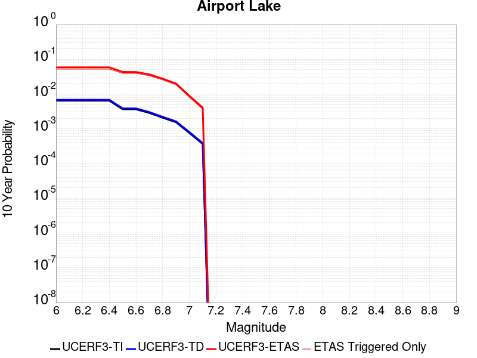 |

| Magnitude | 1 wk TI Prob | 1 wk TD Prob | 1 wk ETAS Prob | 1 wk ETAS/TD Gain | 1 wk ETAS Triggered Only | 1 mo TI Prob | 1 mo TD Prob | 1 mo ETAS Prob | 1 mo ETAS/TD Gain | 1 mo ETAS Triggered Only | 1 yr TI Prob | 1 yr TD Prob | 1 yr ETAS Prob | 1 yr ETAS/TD Gain | 1 yr ETAS Triggered Only | 10 yr TI Prob | 10 yr TD Prob | 10 yr ETAS Prob | 10 yr ETAS/TD Gain | 10 yr ETAS Triggered Only |
|-----|-----|-----|-----|-----|-----|-----|-----|-----|-----|-----|-----|-----|-----|-----|-----|-----|-----|-----|-----|-----|
| 6.0 | 1.2387061E-5 | 1.3103157E-5 | 0.02774274 | 2117.256 | 0.02773 | 5.3086325E-5 | 5.615534E-5 | 0.033554275 | 597.526 | 0.0335 | 6.461343E-4 | 6.8350515E-4 | 0.0441138 | 64.54055 | 0.04346 | 0.0064425888 | 0.0068168393 | 0.058531888 | 8.586368 | 0.05207 |
| 6.1 | 1.2387061E-5 | 1.3103157E-5 | 0.02774274 | 2117.256 | 0.02773 | 5.3086325E-5 | 5.615534E-5 | 0.033554275 | 597.526 | 0.0335 | 6.461343E-4 | 6.8350515E-4 | 0.0441138 | 64.54055 | 0.04346 | 0.0064425888 | 0.0068168393 | 0.058531888 | 8.586368 | 0.05207 |
| 6.2 | 1.2387061E-5 | 1.3103157E-5 | 0.02774274 | 2117.256 | 0.02773 | 5.3086325E-5 | 5.615534E-5 | 0.033554275 | 597.526 | 0.0335 | 6.461343E-4 | 6.8350515E-4 | 0.0441138 | 64.54055 | 0.04346 | 0.0064425888 | 0.0068168393 | 0.058531888 | 8.586368 | 0.05207 |
| 6.3 | 1.2387061E-5 | 1.3103157E-5 | 0.02774274 | 2117.256 | 0.02773 | 5.3086325E-5 | 5.615534E-5 | 0.033554275 | 597.526 | 0.0335 | 6.461343E-4 | 6.8350515E-4 | 0.0441138 | 64.54055 | 0.04346 | 0.0064425888 | 0.0068168393 | 0.058531888 | 8.586368 | 0.05207 |
| 6.4 | 1.2387061E-5 | 1.3103157E-5 | 0.02774274 | 2117.256 | 0.02773 | 5.3086325E-5 | 5.615534E-5 | 0.033554275 | 597.526 | 0.0335 | 6.461343E-4 | 6.8350515E-4 | 0.0441138 | 64.54055 | 0.04346 | 0.0064425888 | 0.0068168393 | 0.058531888 | 8.586368 | 0.05207 |
| 6.5 | 6.9922594E-6 | 7.384925E-6 | 0.02080723 | 2817.5278 | 0.0208 | 2.996648E-5 | 3.1649324E-5 | 0.025130855 | 794.0408 | 0.0251 | 3.6478083E-4 | 3.8526783E-4 | 0.033052675 | 85.79143 | 0.03268 | 0.003641826 | 0.0038465366 | 0.042985406 | 11.175094 | 0.03929 |
| 6.6 | 6.9922594E-6 | 7.384925E-6 | 0.02080723 | 2817.5278 | 0.0208 | 2.996648E-5 | 3.1649324E-5 | 0.025130855 | 794.0408 | 0.0251 | 3.6478083E-4 | 3.8526783E-4 | 0.033052675 | 85.79143 | 0.03268 | 0.003641826 | 0.0038465366 | 0.042985406 | 11.175094 | 0.03929 |
| 6.7 | 5.477277E-6 | 5.7860684E-6 | 0.017855683 | 3085.9785 | 0.01785 | 2.3473833E-5 | 2.4797222E-5 | 0.021494266 | 866.80133 | 0.02147 | 2.8575645E-4 | 3.0186825E-4 | 0.028253429 | 93.59523 | 0.02796 | 0.0028538927 | 0.003014966 | 0.036553543 | 12.124032 | 0.03364 |
| 6.8 | 3.9950432E-6 | 4.2190873E-6 | 0.013634162 | 3231.543 | 0.01363 | 1.7121502E-5 | 1.8081691E-5 | 0.016497783 | 912.40265 | 0.01648 | 2.0843433E-4 | 2.2012512E-4 | 0.02154543 | 97.878105 | 0.02133 | 0.0020823893 | 0.0021993418 | 0.027553456 | 12.528047 | 0.02541 |
| 6.9 | 2.95695E-6 | 3.1230243E-6 | 0.0097930925 | 3135.772 | 0.00979 | 1.2672582E-5 | 1.3384334E-5 | 0.011833226 | 884.11017 | 0.01182 | 1.5427776E-4 | 1.6294434E-4 | 0.015440455 | 94.75907 | 0.01528 | 0.001541707 | 0.0016284712 | 0.020028459 | 12.298934 | 0.01843 |
| 7.0 | 1.456072E-6 | 1.540812E-6 | 0.004141534 | 2687.8909 | 0.00414 | 6.2402937E-6 | 6.603469E-6 | 0.0051565696 | 780.88794 | 0.00515 | 7.597293E-5 | 8.039528E-5 | 0.0068898476 | 85.69966 | 0.00681 | 7.594696E-4 | 8.0376083E-4 | 0.008877266 | 11.0446615 | 0.00808 |
| 7.1 | 6.995192E-7 | 7.4089746E-7 | 0.0018807395 | 2538.4614 | 0.00188 | 2.997936E-6 | 3.1752747E-6 | 0.0023631677 | 744.2404 | 0.00236 | 3.649926E-5 | 3.865897E-5 | 0.0030985407 | 80.15063 | 0.00306 | 3.6493264E-4 | 3.865897E-4 | 0.004065167 | 10.515456 | 0.00368 |

## Owl Lake
*[(top)](#table-of-contents)*

| 1 Week | 1 Month | 1 Year | 10 Year |
|-----|-----|-----|-----|
|  |  |  |  |

| Magnitude | 1 wk TI Prob | 1 wk TD Prob | 1 wk ETAS Prob | 1 wk ETAS/TD Gain | 1 wk ETAS Triggered Only | 1 mo TI Prob | 1 mo TD Prob | 1 mo ETAS Prob | 1 mo ETAS/TD Gain | 1 mo ETAS Triggered Only | 1 yr TI Prob | 1 yr TD Prob | 1 yr ETAS Prob | 1 yr ETAS/TD Gain | 1 yr ETAS Triggered Only | 10 yr TI Prob | 10 yr TD Prob | 10 yr ETAS Prob | 10 yr ETAS/TD Gain | 10 yr ETAS Triggered Only |
|-----|-----|-----|-----|-----|-----|-----|-----|-----|-----|-----|-----|-----|-----|-----|-----|-----|-----|-----|-----|-----|
| 6.0 | 5.0320643E-5 | 6.6358676E-5 | 0.014725386 | 221.90596 | 0.01466 | 2.1564208E-4 | 2.843643E-4 | 0.019478904 | 68.499825 | 0.0192 | 0.0026222812 | 0.003457547 | 0.03109167 | 8.992407 | 0.02773 | 0.02591553 | 0.034141295 | 0.06961729 | 2.0390933 | 0.03673 |
| 6.1 | 5.0320643E-5 | 6.6358676E-5 | 0.014725386 | 221.90596 | 0.01466 | 2.1564208E-4 | 2.843643E-4 | 0.019478904 | 68.499825 | 0.0192 | 0.0026222812 | 0.003457547 | 0.03109167 | 8.992407 | 0.02773 | 0.02591553 | 0.034141295 | 0.06961729 | 2.0390933 | 0.03673 |
| 6.2 | 2.4125871E-5 | 3.0980515E-5 | 0.011780617 | 380.25888 | 0.01175 | 1.0339249E-4 | 1.3276804E-4 | 0.01525076 | 114.867714 | 0.01512 | 0.0012580766 | 0.0016154252 | 0.023000823 | 14.238246 | 0.02142 | 0.012509781 | 0.016070755 | 0.043571576 | 2.7112339 | 0.02795 |
| 6.3 | 1.7433485E-5 | 2.2355545E-5 | 0.010832114 | 484.53812 | 0.01081 | 7.471279E-5 | 9.580685E-5 | 0.013784495 | 143.87798 | 0.01369 | 9.0924866E-4 | 0.001165962 | 0.020293634 | 17.405056 | 0.01915 | 0.009055373 | 0.0116291465 | 0.035893653 | 3.086525 | 0.02455 |
| 6.4 | 1.7433485E-5 | 2.2355545E-5 | 0.010832114 | 484.53812 | 0.01081 | 7.471279E-5 | 9.580685E-5 | 0.013784495 | 143.87798 | 0.01369 | 9.0924866E-4 | 0.001165962 | 0.020293634 | 17.405056 | 0.01915 | 0.009055373 | 0.0116291465 | 0.035893653 | 3.086525 | 0.02455 |
| 6.5 | 1.5182742E-5 | 1.9429277E-5 | 0.010479226 | 539.35236 | 0.01046 | 6.506727E-5 | 8.3266525E-5 | 0.013282168 | 159.5139 | 0.0132 | 7.919061E-4 | 0.0010134344 | 0.019334847 | 19.07854 | 0.01834 | 0.0078909 | 0.010118678 | 0.03318291 | 3.2793725 | 0.0233 |
| 6.6 | 6.7271576E-6 | 8.547518E-6 | 0.008958471 | 1048.0786 | 0.00895 | 2.8830356E-5 | 3.6631736E-5 | 0.011126226 | 303.73187 | 0.01109 | 3.5095305E-4 | 4.4590578E-4 | 0.01520932 | 34.108818 | 0.01477 | 0.0035039932 | 0.0044680187 | 0.022726076 | 5.0863876 | 0.01834 |
| 6.7 | 6.682835E-6 | 8.479961E-6 | 0.008958404 | 1056.4204 | 0.00895 | 2.8640408E-5 | 3.6342215E-5 | 0.011125939 | 306.14368 | 0.01109 | 3.4864116E-4 | 4.423823E-4 | 0.015205848 | 34.372643 | 0.01477 | 0.003480947 | 0.0044329325 | 0.022691632 | 5.118876 | 0.01834 |
| 6.8 | 6.5774975E-6 | 8.326427E-6 | 0.008938252 | 1073.4799 | 0.00893 | 2.8188972E-5 | 3.5684232E-5 | 0.011105289 | 311.21 | 0.01107 | 3.4314668E-4 | 4.3437455E-4 | 0.015177968 | 34.94212 | 0.01475 | 0.0034261728 | 0.0043531056 | 0.022563487 | 5.183308 | 0.01829 |
| 6.9 | 6.363419E-6 | 7.999591E-6 | 0.008917929 | 1114.7981 | 0.00891 | 2.727151E-5 | 3.428354E-5 | 0.011063905 | 322.7177 | 0.01103 | 3.3198006E-4 | 4.1732774E-4 | 0.015091201 | 36.16151 | 0.01468 | 0.0033148455 | 0.0041830647 | 0.022296974 | 5.3302965 | 0.01819 |
| 7.0 | 6.1342453E-6 | 7.631779E-6 | 0.008807564 | 1154.0643 | 0.0088 | 2.6289357E-5 | 3.2707245E-5 | 0.010922351 | 333.94284 | 0.01089 | 3.2002592E-4 | 3.9814346E-4 | 0.014902366 | 37.429638 | 0.01451 | 0.0031956544 | 0.003991739 | 0.021899968 | 5.4863224 | 0.01798 |
| 7.1 | 5.842926E-6 | 7.142312E-6 | 0.008247083 | 1154.6798 | 0.00824 | 2.504087E-5 | 3.060958E-5 | 0.010260296 | 335.19885 | 0.01023 | 3.0482994E-4 | 3.7261334E-4 | 0.014027524 | 37.646328 | 0.01366 | 0.0030441214 | 0.0037371595 | 0.020673627 | 5.5319095 | 0.017 |
| 7.2 | 4.77173E-6 | 5.358478E-6 | 0.005155331 | 962.0886 | 0.00515 | 2.045011E-5 | 2.2964727E-5 | 0.006542815 | 284.90714 | 0.00652 | 2.4895166E-4 | 2.7956374E-4 | 0.008967134 | 32.075455 | 0.00869 | 0.0024867293 | 0.0028086212 | 0.013787698 | 4.909063 | 0.01101 |
| 7.3 | 3.0494948E-6 | 2.710356E-6 | 0.0013927066 | 513.8463 | 0.00139 | 1.3069198E-5 | 1.1615762E-5 | 0.0017315958 | 149.07295 | 0.00172 | 1.5910587E-4 | 1.4141288E-4 | 0.0024910807 | 17.615656 | 0.00235 | 0.0015899199 | 0.0014231089 | 0.0043489393 | 3.0559428 | 0.00293 |
| 7.4 | 2.7263884E-6 | 2.3055634E-6 | 9.723033E-4 | 421.72052 | 9.7E-4 | 1.1684469E-5 | 9.880949E-6 | 0.0012298689 | 124.468704 | 0.00122 | 1.4224913E-4 | 1.2029401E-4 | 0.0018400871 | 15.296581 | 0.00172 | 0.0014215811 | 0.0012110578 | 0.0033085146 | 2.7319214 | 0.0021 |
| 7.5 | 2.6090431E-6 | 2.1655019E-6 | 7.6216384E-4 | 351.95715 | 7.6E-4 | 1.1181565E-5 | 9.2806895E-6 | 9.992715E-4 | 107.67212 | 9.9E-4 | 1.3612706E-4 | 1.1298663E-4 | 0.0015328262 | 13.566439 | 0.00142 | 0.001360437 | 0.0011378126 | 0.0029157873 | 2.5626252 | 0.00178 |
| 7.6 | 2.3008756E-6 | 1.8726826E-6 | 5.7187164E-4 | 305.37564 | 5.7E-4 | 9.860858E-6 | 8.025758E-6 | 7.5801974E-4 | 94.448364 | 7.5E-4 | 1.20049335E-4 | 9.770931E-5 | 0.0011976018 | 12.2567835 | 0.0011 | 0.001199845 | 9.848307E-4 | 0.0023434912 | 2.3795881 | 0.00136 |
| 7.7 | 1.7184348E-6 | 1.341808E-6 | 3.3134138E-4 | 246.9365 | 3.3E-4 | 7.3646997E-6 | 5.750593E-6 | 4.1574825E-4 | 72.29658 | 4.1E-4 | 8.966153E-5 | 7.0011265E-5 | 6.7996857E-4 | 9.712274 | 6.1E-4 | 8.962536E-4 | 7.0769014E-4 | 0.0014571594 | 2.0590358 | 7.5E-4 |
| 7.8 | 8.4612907E-7 | 8.4054994E-7 | 1.4084044E-4 | 167.55748 | 1.4E-4 | 3.6262625E-6 | 3.602352E-6 | 1.836017E-4 | 50.967175 | 1.8E-4 | 4.4148852E-5 | 4.3857777E-5 | 3.3384506E-4 | 7.6119924 | 2.9E-4 | 4.414008E-4 | 4.4386165E-4 | 8.136974E-4 | 1.8332231 | 3.7E-4 |
| 7.9 | 2.716738E-7 | 3.7681625E-7 | 7.037679E-5 | 186.76686 | 7.0E-5 | 1.1643157E-6 | 1.6149258E-6 | 9.1614784E-5 | 56.730022 | 9.0E-5 | 1.4175452E-5 | 1.9661555E-5 | 1.49659E-4 | 7.6117578 | 1.3E-4 | 1.4174548E-4 | 1.9829652E-4 | 3.5826478E-4 | 1.8067125 | 1.6E-4 |
| 8.0 | 2.1995428E-8 | 3.3853325E-8 | 1.0033853E-5 | 296.39194 | 1.0E-5 | 9.426611E-8 | 1.4508568E-7 | 1.0145084E-5 | 69.92478 | 1.0E-5 | 1.1476893E-6 | 1.7664173E-6 | 2.1766382E-5 | 12.322332 | 2.0E-5 | 1.14768345E-5 | 1.7869768E-5 | 3.7869413E-5 | 2.1191885 | 2.0E-5 |

## Panamint Valley
*[(top)](#table-of-contents)*

| 1 Week | 1 Month | 1 Year | 10 Year |
|-----|-----|-----|-----|
|  |  |  |  |

| Magnitude | 1 wk TI Prob | 1 wk TD Prob | 1 wk ETAS Prob | 1 wk ETAS/TD Gain | 1 wk ETAS Triggered Only | 1 mo TI Prob | 1 mo TD Prob | 1 mo ETAS Prob | 1 mo ETAS/TD Gain | 1 mo ETAS Triggered Only | 1 yr TI Prob | 1 yr TD Prob | 1 yr ETAS Prob | 1 yr ETAS/TD Gain | 1 yr ETAS Triggered Only | 10 yr TI Prob | 10 yr TD Prob | 10 yr ETAS Prob | 10 yr ETAS/TD Gain | 10 yr ETAS Triggered Only |
|-----|-----|-----|-----|-----|-----|-----|-----|-----|-----|-----|-----|-----|-----|-----|-----|-----|-----|-----|-----|-----|
| 6.0 | 3.0211835E-5 | 3.3984263E-5 | 0.012253569 | 360.56598 | 0.01222 | 1.2947287E-4 | 1.4563887E-4 | 0.016263291 | 111.66862 | 0.01612 | 0.0015751923 | 0.0017717406 | 0.025709255 | 14.510733 | 0.02398 | 0.015640736 | 0.017583003 | 0.04825406 | 2.7443583 | 0.03122 |
| 6.1 | 3.0211835E-5 | 3.3984263E-5 | 0.012253569 | 360.56598 | 0.01222 | 1.2947287E-4 | 1.4563887E-4 | 0.016263291 | 111.66862 | 0.01612 | 0.0015751923 | 0.0017717406 | 0.025709255 | 14.510733 | 0.02398 | 0.015640736 | 0.017583003 | 0.04825406 | 2.7443583 | 0.03122 |
| 6.2 | 3.0211835E-5 | 3.3984263E-5 | 0.012253569 | 360.56598 | 0.01222 | 1.2947287E-4 | 1.4563887E-4 | 0.016263291 | 111.66862 | 0.01612 | 0.0015751923 | 0.0017717406 | 0.025709255 | 14.510733 | 0.02398 | 0.015640736 | 0.017583003 | 0.04825406 | 2.7443583 | 0.03122 |
| 6.3 | 2.8573924E-5 | 3.2102445E-5 | 0.011911721 | 371.0534 | 0.01188 | 1.2245393E-4 | 1.375748E-4 | 0.01565544 | 113.79584 | 0.01552 | 0.001489857 | 0.0016737141 | 0.02457532 | 14.683104 | 0.02294 | 0.01479908 | 0.016618038 | 0.04581465 | 2.756923 | 0.02969 |
| 6.4 | 2.8573924E-5 | 3.2102445E-5 | 0.011911721 | 371.0534 | 0.01188 | 1.2245393E-4 | 1.375748E-4 | 0.01565544 | 113.79584 | 0.01552 | 0.001489857 | 0.0016737141 | 0.02457532 | 14.683104 | 0.02294 | 0.01479908 | 0.016618038 | 0.04581465 | 2.756923 | 0.02969 |
| 6.5 | 2.7468774E-5 | 3.0828138E-5 | 0.011800465 | 382.7823 | 0.01177 | 1.1771801E-4 | 1.3211406E-4 | 0.015380099 | 116.415306 | 0.01525 | 0.0014322745 | 0.0016073292 | 0.02403123 | 14.95103 | 0.02246 | 0.014230782 | 0.015963882 | 0.044461567 | 2.785135 | 0.02896 |
| 6.6 | 2.6135967E-5 | 2.9252153E-5 | 0.0114089195 | 390.01984 | 0.01138 | 1.1200648E-4 | 1.2536049E-4 | 0.014813519 | 118.167366 | 0.01469 | 0.0013628257 | 0.0015252219 | 0.023082292 | 15.133727 | 0.02159 | 0.013544982 | 0.015154343 | 0.042523205 | 2.8060076 | 0.02779 |
| 6.7 | 2.4498746E-5 | 2.7341044E-5 | 0.011117037 | 406.60617 | 0.01109 | 1.04990395E-4 | 1.17170785E-4 | 0.014385499 | 122.773766 | 0.01427 | 0.0012775084 | 0.0014256459 | 0.022205979 | 15.576083 | 0.02081 | 0.012701893 | 0.014171593 | 0.040493213 | 2.8573508 | 0.0267 |
| 6.8 | 2.2244329E-5 | 2.4935374E-5 | 0.010504674 | 421.27597 | 0.01048 | 9.532935E-5 | 1.0686163E-4 | 0.013395442 | 125.35314 | 0.01329 | 0.0011600169 | 0.0013002857 | 0.020555217 | 15.80823 | 0.01928 | 0.011539802 | 0.012932955 | 0.037224676 | 2.8782806 | 0.02461 |
| 6.9 | 1.9902658E-5 | 2.2290182E-5 | 0.009662075 | 433.46777 | 0.00964 | 8.529431E-5 | 9.552596E-5 | 0.0122043695 | 127.75971 | 0.01211 | 0.0010379635 | 0.0011624265 | 0.018572165 | 15.977066 | 0.01743 | 0.010331288 | 0.011569021 | 0.033274967 | 2.8762126 | 0.02196 |
| 7.0 | 1.8353881E-5 | 2.056605E-5 | 0.009130378 | 443.9539 | 0.00911 | 7.865712E-5 | 8.813734E-5 | 0.011467135 | 130.10529 | 0.01138 | 9.5722964E-4 | 0.0010725616 | 0.01720524 | 16.04126 | 0.01615 | 0.009531168 | 0.01067939 | 0.030614201 | 2.866662 | 0.02015 |
| 7.1 | 1.7667631E-5 | 1.9772435E-5 | 0.0088995965 | 450.1012 | 0.00888 | 7.571623E-5 | 8.4736355E-5 | 0.011123801 | 131.27542 | 0.01104 | 9.2145515E-4 | 0.0010311945 | 0.016675046 | 16.170612 | 0.01566 | 0.009176437 | 0.0102695925 | 0.029569335 | 2.8793094 | 0.0195 |
| 7.2 | 1.6381597E-5 | 1.8158042E-5 | 0.007968014 | 438.81458 | 0.00795 | 7.020495E-5 | 7.781795E-5 | 0.009947049 | 127.82461 | 0.00987 | 8.544101E-4 | 9.470391E-4 | 0.0149237905 | 15.758368 | 0.01399 | 0.008511325 | 0.009435269 | 0.026621567 | 2.8214953 | 0.01735 |
| 7.3 | 1.4520491E-5 | 1.596657E-5 | 0.0066458606 | 416.23593 | 0.00663 | 6.222919E-5 | 6.842646E-5 | 0.008307863 | 121.41302 | 0.00824 | 7.57377E-4 | 8.327899E-4 | 0.012303229 | 14.773509 | 0.01148 | 0.0075480095 | 0.008300399 | 0.022600709 | 2.7228458 | 0.01442 |
| 7.4 | 1.2852287E-5 | 1.41454875E-5 | 0.0064340546 | 454.84857 | 0.00642 | 5.5080065E-5 | 6.06222E-5 | 0.008030139 | 132.46202 | 0.00797 | 6.7039346E-4 | 7.378411E-4 | 0.011809666 | 16.005703 | 0.01108 | 0.0066837464 | 0.007357429 | 0.021055896 | 2.8618553 | 0.0138 |
| 7.5 | 1.1637851E-5 | 1.2836868E-5 | 0.006382755 | 497.22058 | 0.00637 | 4.987555E-5 | 5.5014076E-5 | 0.007964578 | 144.77347 | 0.00791 | 6.070656E-4 | 6.696062E-4 | 0.011592288 | 17.312096 | 0.01093 | 0.006054099 | 0.0066793845 | 0.020178612 | 3.0210288 | 0.01359 |
| 7.6 | 3.0068115E-6 | 3.3330623E-6 | 0.0028433236 | 853.06647 | 0.00284 | 1.2886271E-5 | 1.4284516E-5 | 0.0034542354 | 241.81677 | 0.00344 | 1.5687906E-4 | 1.7390738E-4 | 0.0049330797 | 28.36613 | 0.00476 | 0.0015676835 | 0.0017397973 | 0.007609567 | 4.373824 | 0.00588 |

## Garlock (East)
*[(top)](#table-of-contents)*

| 1 Week | 1 Month | 1 Year | 10 Year |
|-----|-----|-----|-----|
|  |  |  |  |

| Magnitude | 1 wk TI Prob | 1 wk TD Prob | 1 wk ETAS Prob | 1 wk ETAS/TD Gain | 1 wk ETAS Triggered Only | 1 mo TI Prob | 1 mo TD Prob | 1 mo ETAS Prob | 1 mo ETAS/TD Gain | 1 mo ETAS Triggered Only | 1 yr TI Prob | 1 yr TD Prob | 1 yr ETAS Prob | 1 yr ETAS/TD Gain | 1 yr ETAS Triggered Only | 10 yr TI Prob | 10 yr TD Prob | 10 yr ETAS Prob | 10 yr ETAS/TD Gain | 10 yr ETAS Triggered Only |
|-----|-----|-----|-----|-----|-----|-----|-----|-----|-----|-----|-----|-----|-----|-----|-----|-----|-----|-----|-----|-----|
| 6.0 | 4.5092507E-5 | 6.2904815E-5 | 0.009572307 | 152.17128 | 0.00951 | 1.9323928E-4 | 2.6956675E-4 | 0.0125762485 | 46.65356 | 0.01231 | 0.0023501497 | 0.003277482 | 0.021258356 | 6.4861856 | 0.01804 | 0.023254504 | 0.03235377 | 0.055925634 | 1.7285662 | 0.02436 |
| 6.1 | 4.5092507E-5 | 6.2904815E-5 | 0.009572307 | 152.17128 | 0.00951 | 1.9323928E-4 | 2.6956675E-4 | 0.0125762485 | 46.65356 | 0.01231 | 0.0023501497 | 0.003277482 | 0.021258356 | 6.4861856 | 0.01804 | 0.023254504 | 0.03235377 | 0.055925634 | 1.7285662 | 0.02436 |
| 6.2 | 2.6674514E-5 | 3.4511588E-5 | 0.007694247 | 222.94678 | 0.00766 | 1.1431433E-4 | 1.4789861E-4 | 0.009816469 | 66.37296 | 0.00967 | 0.0013908884 | 0.0017992114 | 0.015404688 | 8.561912 | 0.01363 | 0.01382215 | 0.017872788 | 0.035600185 | 1.9918652 | 0.01805 |
| 6.3 | 2.6674514E-5 | 3.4511588E-5 | 0.007694247 | 222.94678 | 0.00766 | 1.1431433E-4 | 1.4789861E-4 | 0.009816469 | 66.37296 | 0.00967 | 0.0013908884 | 0.0017992114 | 0.015404688 | 8.561912 | 0.01363 | 0.01382215 | 0.017872788 | 0.035600185 | 1.9918652 | 0.01805 |
| 6.4 | 2.5312667E-5 | 3.2340467E-5 | 0.007592096 | 234.75528 | 0.00756 | 1.0847834E-4 | 1.3859481E-4 | 0.009687271 | 69.89635 | 0.00955 | 0.0013199237 | 0.0016861152 | 0.015113437 | 8.963467 | 0.01345 | 0.013121112 | 0.016772287 | 0.034234412 | 2.0411296 | 0.01776 |
| 6.5 | 2.5312667E-5 | 3.2340467E-5 | 0.007592096 | 234.75528 | 0.00756 | 1.0847834E-4 | 1.3859481E-4 | 0.009687271 | 69.89635 | 0.00955 | 0.0013199237 | 0.0016861152 | 0.015113437 | 8.963467 | 0.01345 | 0.013121112 | 0.016772287 | 0.034234412 | 2.0411296 | 0.01776 |
| 6.6 | 2.246556E-5 | 2.8134691E-5 | 0.0073879277 | 262.5914 | 0.00736 | 9.627742E-5 | 1.2057181E-4 | 0.009379455 | 77.79144 | 0.00926 | 0.0011715472 | 0.0014669969 | 0.014358058 | 9.787382 | 0.01291 | 0.011653901 | 0.014613169 | 0.031305622 | 2.1422884 | 0.01694 |
| 6.7 | 2.2241198E-5 | 2.7804432E-5 | 0.0073676 | 264.97937 | 0.00734 | 9.531594E-5 | 1.1915654E-4 | 0.009338058 | 78.36799 | 0.00922 | 0.0011598538 | 0.0014497889 | 0.014281159 | 9.85051 | 0.01285 | 0.011538187 | 0.014442829 | 0.031069178 | 2.1511836 | 0.01687 |
| 6.8 | 1.9528685E-5 | 2.3898969E-5 | 0.00710373 | 297.24002 | 0.00708 | 8.369167E-5 | 1.0242024E-4 | 0.008931516 | 87.2046 | 0.00883 | 0.0010184698 | 0.0012462728 | 0.013401106 | 10.752948 | 0.01217 | 0.010138147 | 0.012436723 | 0.028148856 | 2.2633657 | 0.01591 |
| 6.9 | 1.3318621E-5 | 1.5198818E-5 | 0.0067950957 | 447.08054 | 0.00678 | 5.7078556E-5 | 6.51362E-5 | 0.0083645955 | 128.417 | 0.0083 | 6.9470983E-4 | 7.927504E-4 | 0.011923919 | 15.041203 | 0.01114 | 0.0069254204 | 0.007940721 | 0.02215693 | 2.790292 | 0.01433 |
| 7.0 | 1.1760853E-5 | 1.3107653E-5 | 0.0066630207 | 508.33057 | 0.00665 | 5.0402683E-5 | 5.6174475E-5 | 0.008175719 | 145.54152 | 0.00812 | 6.134799E-4 | 6.8371464E-4 | 0.011516303 | 16.843729 | 0.01084 | 0.0061178906 | 0.006857401 | 0.02063229 | 3.0087621 | 0.01387 |
| 7.1 | 1.0064758E-5 | 1.0902761E-5 | 0.006400833 | 587.0837 | 0.00639 | 4.3133965E-5 | 4.67253E-5 | 0.0078063626 | 167.06929 | 0.00776 | 5.2502943E-4 | 5.6873553E-4 | 0.010872872 | 19.117624 | 0.01031 | 0.005237907 | 0.0057133473 | 0.018758388 | 3.283257 | 0.01312 |
| 7.2 | 9.768808E-6 | 1.0498628E-5 | 0.006270433 | 597.2621 | 0.00626 | 4.186565E-5 | 4.499337E-5 | 0.007654651 | 170.12843 | 0.00761 | 5.095951E-4 | 5.4766005E-4 | 0.010592156 | 19.34075 | 0.01005 | 0.0050842804 | 0.005503584 | 0.018203303 | 3.3075361 | 0.01277 |
| 7.3 | 9.344516E-6 | 9.9442705E-6 | 0.0058098864 | 584.2446 | 0.0058 | 4.004731E-5 | 4.2617627E-5 | 0.0070523187 | 165.47893 | 0.00701 | 4.8746695E-4 | 5.187495E-4 | 0.00982392 | 18.937695 | 0.00931 | 0.0048639905 | 0.005215269 | 0.01694378 | 3.2488794 | 0.01179 |
| 7.4 | 9.023491E-6 | 9.490441E-6 | 0.00530944 | 559.45135 | 0.0053 | 3.867153E-5 | 4.0672705E-5 | 0.0064404123 | 158.34729 | 0.0064 | 4.7072413E-4 | 4.95081E-4 | 0.008980878 | 18.140219 | 0.00849 | 0.004697283 | 0.0049787266 | 0.015685156 | 3.1504352 | 0.01076 |
| 7.5 | 7.081253E-6 | 7.0873994E-6 | 0.0026970683 | 380.54416 | 0.00269 | 3.0347876E-5 | 3.0374218E-5 | 0.0032202774 | 106.02009 | 0.00319 | 3.6942272E-4 | 3.697441E-4 | 0.004658158 | 12.59833 | 0.00429 | 0.003688092 | 0.0037244745 | 0.009124288 | 2.4498188 | 0.00542 |
| 7.6 | 6.116396E-6 | 5.9589424E-6 | 0.0017059488 | 286.2838 | 0.0017 | 2.6212863E-5 | 2.5538076E-5 | 0.0020354867 | 79.703995 | 0.00201 | 3.1909486E-4 | 3.1088197E-4 | 0.0029500613 | 9.489328 | 0.00264 | 0.0031863707 | 0.0031359126 | 0.0064953445 | 2.0712774 | 0.00337 |
| 7.7 | 4.797145E-6 | 4.7571157E-6 | 9.647526E-4 | 202.802 | 9.6E-4 | 2.055903E-5 | 2.0387479E-5 | 0.0011603642 | 56.91553 | 0.00114 | 2.5027743E-4 | 2.481894E-4 | 0.0016978296 | 6.840862 | 0.00145 | 0.0024999576 | 0.0025094065 | 0.0043547642 | 1.7353761 | 0.00185 |
| 7.8 | 3.4028885E-6 | 3.978375E-6 | 6.439758E-4 | 161.86908 | 6.4E-4 | 1.4583726E-5 | 1.7050066E-5 | 7.8703696E-4 | 46.160343 | 7.7E-4 | 1.775424E-4 | 2.0756487E-4 | 0.0011773636 | 5.672268 | 9.7E-4 | 0.0017740062 | 0.0021012141 | 0.0033086715 | 1.5746475 | 0.00121 |
| 7.9 | 2.5928412E-6 | 3.372436E-6 | 4.8337082E-4 | 143.32988 | 4.8E-4 | 1.1112129E-5 | 1.4453217E-5 | 5.744451E-4 | 39.74514 | 5.6E-4 | 1.3528178E-4 | 1.7595377E-4 | 9.0582535E-4 | 5.148087 | 7.3E-4 | 0.0013519945 | 0.0017812426 | 0.0026996038 | 1.5155734 | 9.2E-4 |
| 8.0 | 1.3743648E-6 | 1.6734741E-6 | 2.2167311E-4 | 132.46283 | 2.2E-4 | 5.8901214E-6 | 7.1720124E-6 | 2.6717014E-4 | 37.25177 | 2.6E-4 | 7.1709874E-5 | 8.731578E-5 | 4.2728608E-4 | 4.8935723 | 3.4E-4 | 7.1686733E-4 | 8.837377E-4 | 0.0013133577 | 1.4861397 | 4.3E-4 |
| 8.1 | 3.6733252E-7 | 3.1489736E-7 | 3.0314888E-5 | 96.269104 | 3.0E-5 | 1.5742813E-6 | 1.3495595E-6 | 3.134952E-5 | 23.229445 | 3.0E-5 | 1.9166706E-5 | 1.643078E-5 | 6.642996E-5 | 4.0430193 | 5.0E-5 | 1.9165053E-4 | 1.662928E-4 | 2.1628448E-4 | 1.3006245 | 5.0E-5 |

## Hunter Mountain-Saline Valley
*[(top)](#table-of-contents)*

| 1 Week | 1 Month | 1 Year | 10 Year |
|-----|-----|-----|-----|
|  |  |  |  |

| Magnitude | 1 wk TI Prob | 1 wk TD Prob | 1 wk ETAS Prob | 1 wk ETAS/TD Gain | 1 wk ETAS Triggered Only | 1 mo TI Prob | 1 mo TD Prob | 1 mo ETAS Prob | 1 mo ETAS/TD Gain | 1 mo ETAS Triggered Only | 1 yr TI Prob | 1 yr TD Prob | 1 yr ETAS Prob | 1 yr ETAS/TD Gain | 1 yr ETAS Triggered Only | 10 yr TI Prob | 10 yr TD Prob | 10 yr ETAS Prob | 10 yr ETAS/TD Gain | 10 yr ETAS Triggered Only |
|-----|-----|-----|-----|-----|-----|-----|-----|-----|-----|-----|-----|-----|-----|-----|-----|-----|-----|-----|-----|-----|
| 6.0 | 4.5103672E-5 | 5.456906E-5 | 0.006614211 | 121.20808 | 0.00656 | 1.9328714E-4 | 2.3384714E-4 | 0.008431929 | 36.05744 | 0.0082 | 0.002350731 | 0.0028435462 | 0.01434076 | 5.0432663 | 0.01153 | 0.023260195 | 0.028092625 | 0.042136684 | 1.4999199 | 0.01445 |
| 6.1 | 4.5103672E-5 | 5.456906E-5 | 0.006614211 | 121.20808 | 0.00656 | 1.9328714E-4 | 2.3384714E-4 | 0.008431929 | 36.05744 | 0.0082 | 0.002350731 | 0.0028435462 | 0.01434076 | 5.0432663 | 0.01153 | 0.023260195 | 0.028092625 | 0.042136684 | 1.4999199 | 0.01445 |
| 6.2 | 3.9363465E-5 | 4.706271E-5 | 0.0065867547 | 139.95699 | 0.00654 | 1.6868966E-4 | 2.016826E-4 | 0.008370034 | 41.501026 | 0.00817 | 0.002051862 | 0.0024528534 | 0.0139046945 | 5.6687837 | 0.01148 | 0.020330196 | 0.024274187 | 0.038314883 | 1.5784208 | 0.01439 |
| 6.3 | 3.9363465E-5 | 4.706271E-5 | 0.0065867547 | 139.95699 | 0.00654 | 1.6868966E-4 | 2.016826E-4 | 0.008370034 | 41.501026 | 0.00817 | 0.002051862 | 0.0024528534 | 0.0139046945 | 5.6687837 | 0.01148 | 0.020330196 | 0.024274187 | 0.038314883 | 1.5784208 | 0.01439 |
| 6.4 | 3.2311684E-5 | 3.795112E-5 | 0.006547704 | 172.52994 | 0.00651 | 1.384713E-4 | 1.6263791E-4 | 0.008291315 | 50.980213 | 0.00813 | 0.0016845843 | 0.001978387 | 0.0133658135 | 6.7559147 | 0.01141 | 0.016718714 | 0.019617118 | 0.03360718 | 1.7131559 | 0.01427 |
| 6.5 | 3.2311684E-5 | 3.795112E-5 | 0.006547704 | 172.52994 | 0.00651 | 1.384713E-4 | 1.6263791E-4 | 0.008291315 | 50.980213 | 0.00813 | 0.0016845843 | 0.001978387 | 0.0133658135 | 6.7559147 | 0.01141 | 0.016718714 | 0.019617118 | 0.03360718 | 1.7131559 | 0.01427 |
| 6.6 | 2.9305844E-5 | 3.418196E-5 | 0.00653396 | 191.15227 | 0.0065 | 1.2559042E-4 | 1.4648624E-4 | 0.008255298 | 56.35545 | 0.00811 | 0.0015279909 | 0.0017820727 | 0.013121828 | 7.36324 | 0.01136 | 0.015175272 | 0.017686324 | 0.03163518 | 1.7886802 | 0.0142 |
| 6.7 | 2.7826512E-5 | 3.2344353E-5 | 0.0065221344 | 201.64677 | 0.00649 | 1.19251024E-4 | 1.3861163E-4 | 0.00822749 | 59.35642 | 0.00809 | 0.0014509142 | 0.0016863506 | 0.0129972445 | 7.7073207 | 0.01133 | 0.014414776 | 0.016743818 | 0.030656893 | 1.830938 | 0.01415 |
| 6.8 | 2.3389874E-5 | 2.6866792E-5 | 0.0065066926 | 242.18347 | 0.00648 | 1.0023846E-4 | 1.1513857E-4 | 0.008194208 | 71.16823 | 0.00808 | 0.00121972 | 0.001400958 | 0.012685128 | 9.054609 | 0.0113 | 0.01213047 | 0.013928067 | 0.027851403 | 1.9996604 | 0.01412 |
| 6.9 | 2.069209E-5 | 2.357011E-5 | 0.0064934175 | 275.49374 | 0.00647 | 8.867737E-5 | 1.0101105E-4 | 0.008170196 | 80.88418 | 0.00807 | 0.0010791123 | 0.0012291519 | 0.012495287 | 10.16578 | 0.01128 | 0.010738871 | 0.012229158 | 0.02613697 | 2.1372666 | 0.01408 |
| 7.0 | 1.7462342E-5 | 1.9633622E-5 | 0.0064895065 | 330.53027 | 0.00647 | 7.483646E-5 | 8.414151E-5 | 0.008143463 | 96.78294 | 0.00806 | 9.1075303E-4 | 0.0010239641 | 0.012272434 | 11.985219 | 0.01126 | 0.009070295 | 0.010196688 | 0.024113322 | 2.3648193 | 0.01406 |
| 7.1 | 1.4807709E-5 | 1.6441827E-5 | 0.0064663356 | 393.28574 | 0.00645 | 6.3460066E-5 | 7.046316E-5 | 0.008099898 | 114.95223 | 0.00803 | 7.723524E-4 | 8.575678E-4 | 0.012037972 | 14.037341 | 0.01119 | 0.007696735 | 0.008546168 | 0.022406692 | 2.621841 | 0.01398 |
| 7.2 | 1.4180048E-5 | 1.5698413E-5 | 0.0064555975 | 411.2261 | 0.00644 | 6.077022E-5 | 6.727727E-5 | 0.008086737 | 120.20015 | 0.00802 | 7.396263E-4 | 8.1880915E-4 | 0.011969672 | 14.618389 | 0.01116 | 0.0073716943 | 0.008161469 | 0.021987699 | 2.6940858 | 0.01394 |
| 7.3 | 1.3730402E-5 | 1.5172151E-5 | 0.0064550745 | 425.45547 | 0.00644 | 5.8843252E-5 | 6.502197E-5 | 0.0080845 | 124.3349 | 0.00802 | 7.161811E-4 | 7.9137104E-4 | 0.011932547 | 15.078321 | 0.01115 | 0.007138774 | 0.007889058 | 0.021709163 | 2.7518067 | 0.01393 |
| 7.4 | 1.2810095E-5 | 1.4109353E-5 | 0.0064040194 | 453.88467 | 0.00639 | 5.489925E-5 | 6.0467344E-5 | 0.007999987 | 132.30261 | 0.00794 | 6.681934E-4 | 7.3595706E-4 | 0.0117578395 | 15.976257 | 0.01103 | 0.006661878 | 0.0073386896 | 0.020987783 | 2.8598816 | 0.01375 |
| 7.5 | 1.1595659E-5 | 1.2800734E-5 | 0.0063527194 | 496.27777 | 0.00634 | 4.9694736E-5 | 5.485922E-5 | 0.007934427 | 144.6325 | 0.00788 | 6.0486543E-4 | 6.67722E-4 | 0.011540458 | 17.283325 | 0.01088 | 0.006032217 | 0.006660632 | 0.020110447 | 3.0193002 | 0.01354 |
| 7.6 | 2.997694E-6 | 3.3251877E-6 | 0.0028333159 | 852.07697 | 0.00283 | 1.28471975E-5 | 1.4250767E-5 | 0.0034442018 | 241.68536 | 0.00343 | 1.564034E-4 | 1.7349655E-4 | 0.0049226726 | 28.373316 | 0.00475 | 0.0015629337 | 0.0017356955 | 0.007595507 | 4.3760595 | 0.00587 |

## Blackwater
*[(top)](#table-of-contents)*

| 1 Week | 1 Month | 1 Year | 10 Year |
|-----|-----|-----|-----|
| 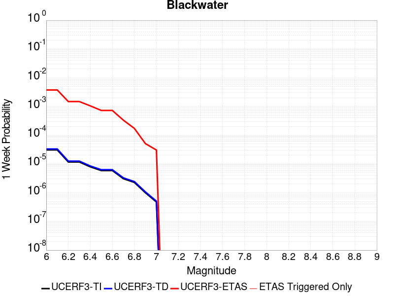 |  |  |  |

| Magnitude | 1 wk TI Prob | 1 wk TD Prob | 1 wk ETAS Prob | 1 wk ETAS/TD Gain | 1 wk ETAS Triggered Only | 1 mo TI Prob | 1 mo TD Prob | 1 mo ETAS Prob | 1 mo ETAS/TD Gain | 1 mo ETAS Triggered Only | 1 yr TI Prob | 1 yr TD Prob | 1 yr ETAS Prob | 1 yr ETAS/TD Gain | 1 yr ETAS Triggered Only | 10 yr TI Prob | 10 yr TD Prob | 10 yr ETAS Prob | 10 yr ETAS/TD Gain | 10 yr ETAS Triggered Only |
|-----|-----|-----|-----|-----|-----|-----|-----|-----|-----|-----|-----|-----|-----|-----|-----|-----|-----|-----|-----|-----|
| 6.0 | 3.0708583E-5 | 3.3095846E-5 | 0.0037529727 | 113.39709 | 0.00372 | 1.3160157E-4 | 1.4183241E-4 | 0.0051311245 | 36.17738 | 0.00499 | 0.0016010714 | 0.0017255784 | 0.00995136 | 5.76697 | 0.00824 | 0.015895851 | 0.017135633 | 0.029274007 | 1.7083703 | 0.01235 |
| 6.1 | 3.0708583E-5 | 3.3095846E-5 | 0.0037529727 | 113.39709 | 0.00372 | 1.3160157E-4 | 1.4183241E-4 | 0.0051311245 | 36.17738 | 0.00499 | 0.0016010714 | 0.0017255784 | 0.00995136 | 5.76697 | 0.00824 | 0.015895851 | 0.017135633 | 0.029274007 | 1.7083703 | 0.01235 |
| 6.2 | 1.1707779E-5 | 1.2545122E-5 | 0.0014825267 | 118.175545 | 0.00147 | 5.017523E-5 | 5.3763757E-5 | 0.0020436568 | 38.011795 | 0.00199 | 6.107122E-4 | 6.5438676E-4 | 0.0037723451 | 5.764703 | 0.00312 | 0.006090366 | 0.0065255696 | 0.011075682 | 1.6972744 | 0.00458 |
| 6.3 | 1.1707779E-5 | 1.2545122E-5 | 0.0014825267 | 118.175545 | 0.00147 | 5.017523E-5 | 5.3763757E-5 | 0.0020436568 | 38.011795 | 0.00199 | 6.107122E-4 | 6.5438676E-4 | 0.0037723451 | 5.764703 | 0.00312 | 0.006090366 | 0.0065255696 | 0.011075682 | 1.6972744 | 0.00458 |
| 6.4 | 7.929244E-6 | 8.480098E-6 | 0.0010484713 | 123.63905 | 0.00104 | 3.3982033E-5 | 3.6342793E-5 | 0.001406293 | 38.695236 | 0.00137 | 4.136527E-4 | 4.423877E-4 | 0.0024714896 | 5.5867047 | 0.00203 | 0.0041288356 | 0.0044154758 | 0.007302671 | 1.6538808 | 0.0029 |
| 6.5 | 5.8832115E-6 | 6.285991E-6 | 7.262815E-4 | 115.539696 | 7.2E-4 | 2.521352E-5 | 2.6939697E-5 | 9.769141E-4 | 36.262997 | 9.5E-4 | 3.0693135E-4 | 3.27944E-4 | 0.0017474783 | 5.3285875 | 0.00142 | 0.0030650778 | 0.0032748538 | 0.0052483696 | 1.6026272 | 0.00198 |
| 6.6 | 5.8832115E-6 | 6.285991E-6 | 7.262815E-4 | 115.539696 | 7.2E-4 | 2.521352E-5 | 2.6939697E-5 | 9.769141E-4 | 36.262997 | 9.5E-4 | 3.0693135E-4 | 3.27944E-4 | 0.0017474783 | 5.3285875 | 0.00142 | 0.0030650778 | 0.0032748538 | 0.0052483696 | 1.6026272 | 0.00198 |
| 6.7 | 3.0715053E-6 | 3.2814662E-6 | 3.332804E-4 | 101.564476 | 3.3E-4 | 1.3163528E-5 | 1.4063357E-5 | 4.740569E-4 | 33.708656 | 4.6E-4 | 1.6025416E-4 | 1.7120909E-4 | 8.310961E-4 | 4.8542757 | 6.6E-4 | 0.0016013865 | 0.0017108864 | 0.002659261 | 1.5543177 | 9.5E-4 |
| 6.8 | 2.2722281E-6 | 2.4287538E-6 | 1.7242834E-4 | 70.994576 | 1.7E-4 | 9.738084E-6 | 1.0408908E-5 | 3.004059E-4 | 28.860462 | 2.9E-4 | 1.1855473E-4 | 1.26722E-4 | 5.466688E-4 | 4.3139215 | 4.2E-4 | 0.001184915 | 0.0012665876 | 0.0019157643 | 1.51254 | 6.5E-4 |
| 6.9 | 9.952399E-7 | 1.0653489E-6 | 5.1065297E-5 | 47.932934 | 5.0E-5 | 4.265307E-6 | 4.5657757E-6 | 8.4565414E-5 | 18.521587 | 8.0E-5 | 5.1928873E-5 | 5.5587418E-5 | 1.9557963E-4 | 3.5184155 | 1.4E-4 | 5.191674E-4 | 5.557858E-4 | 7.956524E-4 | 1.431581 | 2.4E-4 |
| 7.0 | 4.7385504E-7 | 5.0755597E-7 | 3.0507541E-5 | 60.106754 | 3.0E-5 | 2.0308057E-6 | 2.1752398E-6 | 6.217511E-5 | 28.583107 | 6.0E-5 | 2.4724779E-5 | 2.6483543E-5 | 1.1648116E-4 | 4.398247 | 9.0E-5 | 2.4722028E-4 | 2.6483546E-4 | 3.8480366E-4 | 1.4529916 | 1.2E-4 |

## Ash Hill
*[(top)](#table-of-contents)*

| 1 Week | 1 Month | 1 Year | 10 Year |
|-----|-----|-----|-----|
|  |  |  |  |

| Magnitude | 1 wk TI Prob | 1 wk TD Prob | 1 wk ETAS Prob | 1 wk ETAS/TD Gain | 1 wk ETAS Triggered Only | 1 mo TI Prob | 1 mo TD Prob | 1 mo ETAS Prob | 1 mo ETAS/TD Gain | 1 mo ETAS Triggered Only | 1 yr TI Prob | 1 yr TD Prob | 1 yr ETAS Prob | 1 yr ETAS/TD Gain | 1 yr ETAS Triggered Only | 10 yr TI Prob | 10 yr TD Prob | 10 yr ETAS Prob | 10 yr ETAS/TD Gain | 10 yr ETAS Triggered Only |
|-----|-----|-----|-----|-----|-----|-----|-----|-----|-----|-----|-----|-----|-----|-----|-----|-----|-----|-----|-----|-----|
| 6.0 | 2.1545662E-5 | 2.3194447E-5 | 0.0035131136 | 151.46356 | 0.00349 | 9.2335285E-5 | 9.940143E-5 | 0.0048889252 | 49.183647 | 0.00479 | 0.0011236023 | 0.0012096206 | 0.00879044 | 7.2671046 | 0.00759 | 0.011179381 | 0.012038348 | 0.02286641 | 1.8994639 | 0.01096 |
| 6.1 | 2.1545662E-5 | 2.3194447E-5 | 0.0035131136 | 151.46356 | 0.00349 | 9.2335285E-5 | 9.940143E-5 | 0.0048889252 | 49.183647 | 0.00479 | 0.0011236023 | 0.0012096206 | 0.00879044 | 7.2671046 | 0.00759 | 0.011179381 | 0.012038348 | 0.02286641 | 1.8994639 | 0.01096 |
| 6.2 | 2.1545662E-5 | 2.3194447E-5 | 0.0035131136 | 151.46356 | 0.00349 | 9.2335285E-5 | 9.940143E-5 | 0.0048889252 | 49.183647 | 0.00479 | 0.0011236023 | 0.0012096206 | 0.00879044 | 7.2671046 | 0.00759 | 0.011179381 | 0.012038348 | 0.02286641 | 1.8994639 | 0.01096 |
| 6.3 | 1.0025529E-5 | 1.0746934E-5 | 0.0015307306 | 142.43416 | 0.00152 | 4.2965847E-5 | 4.605755E-5 | 0.0020659645 | 44.85615 | 0.00202 | 5.229836E-4 | 5.6061964E-4 | 0.0035689322 | 6.3660493 | 0.00301 | 0.005217545 | 0.0055933665 | 0.010127861 | 1.8106915 | 0.00456 |
| 6.4 | 1.0025529E-5 | 1.0746934E-5 | 0.0015307306 | 142.43416 | 0.00152 | 4.2965847E-5 | 4.605755E-5 | 0.0020659645 | 44.85615 | 0.00202 | 5.229836E-4 | 5.6061964E-4 | 0.0035689322 | 6.3660493 | 0.00301 | 0.005217545 | 0.0055933665 | 0.010127861 | 1.8106915 | 0.00456 |
| 6.5 | 6.9617327E-6 | 7.456634E-6 | 9.374497E-4 | 125.72022 | 9.3E-4 | 2.9835655E-5 | 3.195666E-5 | 0.0013019161 | 40.740055 | 0.00127 | 3.6318856E-4 | 3.8901155E-4 | 0.0023682413 | 6.087843 | 0.00198 | 0.0036259557 | 0.0038841602 | 0.006862547 | 1.7668031 | 0.00299 |
| 6.6 | 4.9919777E-6 | 5.3466883E-6 | 7.353428E-4 | 137.53238 | 7.3E-4 | 2.1394015E-5 | 2.2914215E-5 | 9.92892E-4 | 43.330833 | 9.7E-4 | 2.60441E-4 | 2.7895154E-4 | 0.001728547 | 6.196585 | 0.00145 | 0.0026013597 | 0.0027866727 | 0.004990514 | 1.7908505 | 0.00221 |
| 6.7 | 3.6630722E-6 | 3.924624E-6 | 5.739224E-4 | 146.23628 | 5.7E-4 | 1.5698786E-5 | 1.681974E-5 | 7.868068E-4 | 46.778774 | 7.7E-4 | 1.9111596E-4 | 2.0476682E-4 | 0.0013145396 | 6.41969 | 0.00111 | 0.0019095168 | 0.0020463446 | 0.0037328862 | 1.8241729 | 0.00169 |
| 6.8 | 2.5599613E-6 | 2.744925E-6 | 4.3274375E-4 | 157.6523 | 4.3E-4 | 1.0971216E-5 | 1.1763939E-5 | 5.717574E-4 | 48.60254 | 5.6E-4 | 1.3356637E-4 | 1.4322149E-4 | 9.2310976E-4 | 6.4453297 | 7.8E-4 | 0.0013348613 | 0.0014317769 | 0.0026899728 | 1.8787653 | 0.00126 |
| 6.9 | 1.7684905E-6 | 1.8968707E-6 | 2.4189641E-4 | 127.52393 | 2.4E-4 | 7.579223E-6 | 8.129446E-6 | 3.581266E-4 | 44.053013 | 3.5E-4 | 9.2273134E-5 | 9.8976E-5 | 6.2892353E-4 | 6.3543034 | 5.3E-4 | 9.223483E-4 | 9.8976E-4 | 0.0018389188 | 1.857944 | 8.5E-4 |

## Garlock (West)
*[(top)](#table-of-contents)*

| 1 Week | 1 Month | 1 Year | 10 Year |
|-----|-----|-----|-----|
|  | 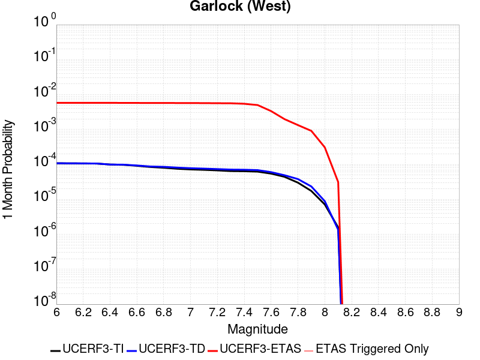 |  |  |

| Magnitude | 1 wk TI Prob | 1 wk TD Prob | 1 wk ETAS Prob | 1 wk ETAS/TD Gain | 1 wk ETAS Triggered Only | 1 mo TI Prob | 1 mo TD Prob | 1 mo ETAS Prob | 1 mo ETAS/TD Gain | 1 mo ETAS Triggered Only | 1 yr TI Prob | 1 yr TD Prob | 1 yr ETAS Prob | 1 yr ETAS/TD Gain | 1 yr ETAS Triggered Only | 10 yr TI Prob | 10 yr TD Prob | 10 yr ETAS Prob | 10 yr ETAS/TD Gain | 10 yr ETAS Triggered Only |
|-----|-----|-----|-----|-----|-----|-----|-----|-----|-----|-----|-----|-----|-----|-----|-----|-----|-----|-----|-----|-----|
| 6.0 | 2.5181727E-5 | 2.5197181E-5 | 0.00467508 | 185.5398 | 0.00465 | 1.0791722E-4 | 1.0798347E-4 | 0.005797369 | 53.68756 | 0.00569 | 0.0013131002 | 0.0013139093 | 0.009123635 | 6.9438844 | 0.00782 | 0.013053683 | 0.013141794 | 0.022793267 | 1.7344106 | 0.00978 |
| 6.1 | 2.5077732E-5 | 2.5098223E-5 | 0.0046649817 | 185.869 | 0.00464 | 1.0747157E-4 | 1.075594E-4 | 0.0057869484 | 53.80235 | 0.00568 | 0.001307681 | 0.0013087525 | 0.009108531 | 6.959705 | 0.00781 | 0.013000126 | 0.013090835 | 0.022732938 | 1.7365537 | 0.00977 |
| 6.2 | 2.494612E-5 | 2.4979914E-5 | 0.004664864 | 186.7446 | 0.00464 | 1.0690756E-4 | 1.070524E-4 | 0.0057864445 | 54.05245 | 0.00568 | 0.0013008224 | 0.0013025872 | 0.009102414 | 6.98795 | 0.00781 | 0.012932341 | 0.013029906 | 0.022672605 | 1.7400435 | 0.00977 |
| 6.3 | 2.4733758E-5 | 2.4799276E-5 | 0.004664684 | 188.0976 | 0.00464 | 1.0599751E-4 | 1.06278305E-4 | 0.005785675 | 54.438908 | 0.00568 | 0.0012897556 | 0.0012931736 | 0.009093074 | 7.031595 | 0.00781 | 0.012822957 | 0.0129368715 | 0.022570608 | 1.7446728 | 0.00976 |
| 6.4 | 2.3237335E-5 | 2.3178607E-5 | 0.004663071 | 201.17995 | 0.00464 | 9.958477E-5 | 9.933313E-5 | 0.005778769 | 58.175648 | 0.00568 | 0.0012117702 | 0.0012087126 | 0.008979308 | 7.42882 | 0.00778 | 0.012051838 | 0.012101731 | 0.021694224 | 1.7926545 | 0.00971 |
| 6.5 | 2.2732203E-5 | 2.2992977E-5 | 0.0046628863 | 202.79611 | 0.00464 | 9.742009E-5 | 9.8537625E-5 | 0.005777978 | 58.63728 | 0.00568 | 0.0011854442 | 0.0011990381 | 0.008969709 | 7.4807544 | 0.00778 | 0.011791403 | 0.012006035 | 0.021599457 | 1.7990499 | 0.00971 |
| 6.6 | 2.1319436E-5 | 2.1773201E-5 | 0.0046416726 | 213.18282 | 0.00462 | 9.136581E-5 | 9.3310395E-5 | 0.0057527823 | 61.652103 | 0.00566 | 0.001111811 | 0.0011354643 | 0.008886653 | 7.8264484 | 0.00776 | 0.011062649 | 0.011376952 | 0.020936936 | 1.840294 | 0.00967 |
| 6.7 | 1.970802E-5 | 2.0393094E-5 | 0.004640299 | 227.54265 | 0.00462 | 8.446021E-5 | 8.739606E-5 | 0.0057369024 | 65.64257 | 0.00565 | 0.001027818 | 0.0010635294 | 0.008805287 | 8.279308 | 0.00775 | 0.010230771 | 0.0106646875 | 0.020191986 | 1.89335 | 0.00963 |
| 6.8 | 1.8744462E-5 | 1.9900775E-5 | 0.004629809 | 232.64467 | 0.00461 | 8.033094E-5 | 8.528626E-5 | 0.0057248054 | 67.124596 | 0.00564 | 9.775903E-4 | 0.0010378672 | 0.008769834 | 8.449862 | 0.00774 | 0.009733009 | 0.010410495 | 0.01992045 | 1.913497 | 0.00961 |
| 6.9 | 1.7559682E-5 | 1.8953151E-5 | 0.004628866 | 244.22672 | 0.00461 | 7.5253614E-5 | 8.122527E-5 | 0.005720767 | 70.43088 | 0.00564 | 9.158276E-4 | 9.884704E-4 | 0.00872082 | 8.822539 | 0.00774 | 0.0091206245 | 0.009921073 | 0.01942583 | 1.9580373 | 0.0096 |
| 7.0 | 1.6794445E-5 | 1.8215967E-5 | 0.004628132 | 254.07005 | 0.00461 | 7.197421E-5 | 7.806611E-5 | 0.0057076267 | 73.11274 | 0.00563 | 8.759337E-4 | 9.5004175E-4 | 0.008662707 | 9.118238 | 0.00772 | 0.008724891 | 0.009539958 | 0.019008756 | 1.9925408 | 0.00956 |
| 7.1 | 1.6337795E-5 | 1.771677E-5 | 0.0046076356 | 260.072 | 0.00459 | 7.0017246E-5 | 7.592681E-5 | 0.005685501 | 74.88134 | 0.00561 | 8.521265E-4 | 9.2401815E-4 | 0.008616903 | 9.325469 | 0.0077 | 0.008488664 | 0.009281721 | 0.018733174 | 2.0182867 | 0.00954 |
| 7.2 | 1.5780008E-5 | 1.71654E-5 | 0.0045770872 | 266.64612 | 0.00456 | 6.762685E-5 | 7.3563926E-5 | 0.005643154 | 76.71089 | 0.00557 | 8.2304585E-4 | 8.952741E-4 | 0.008528434 | 9.526059 | 0.00764 | 0.008200042 | 0.008996559 | 0.018391272 | 2.0442562 | 0.00948 |
| 7.3 | 1.5058865E-5 | 1.6618484E-5 | 0.004556543 | 274.18527 | 0.00454 | 6.45364E-5 | 7.122013E-5 | 0.0056208246 | 78.92185 | 0.00555 | 7.854473E-4 | 8.667614E-4 | 0.008460174 | 9.760673 | 0.0076 | 0.00782677 | 0.008713263 | 0.01807101 | 2.0739658 | 0.00944 |
| 7.4 | 1.4887923E-5 | 1.6454453E-5 | 0.0044463817 | 270.2236 | 0.00443 | 6.380382E-5 | 7.0517184E-5 | 0.0054401383 | 77.146286 | 0.00537 | 7.7653467E-4 | 8.5820974E-4 | 0.008241868 | 9.603559 | 0.00739 | 0.0077382675 | 0.008628101 | 0.017748723 | 2.0570831 | 0.0092 |
| 7.5 | 1.4509299E-5 | 1.6046468E-5 | 0.0040559815 | 252.76476 | 0.00404 | 6.218123E-5 | 6.876877E-5 | 0.0049984297 | 72.684586 | 0.00493 | 7.567935E-4 | 8.369394E-4 | 0.0075912816 | 9.070289 | 0.00676 | 0.0075422134 | 0.008416411 | 0.016795292 | 1.995541 | 0.00845 |
| 7.6 | 1.2756717E-5 | 1.4050529E-5 | 0.0027140125 | 193.16089 | 0.0027 | 5.4670498E-5 | 6.0215163E-5 | 0.0033600165 | 55.80017 | 0.0033 | 6.6541E-4 | 7.328737E-4 | 0.005219583 | 7.1220775 | 0.00449 | 0.006634211 | 0.007381374 | 0.01291026 | 1.749032 | 0.00557 |
| 7.7 | 1.0328985E-5 | 1.146033E-5 | 0.0015914423 | 138.86531 | 0.00158 | 4.4266326E-5 | 4.9114777E-5 | 0.00197902 | 40.293777 | 0.00193 | 5.388092E-4 | 5.9780874E-4 | 0.0032362305 | 5.413488 | 0.00264 | 0.0053750467 | 0.006038286 | 0.00928854 | 1.5382744 | 0.00327 |
| 7.8 | 7.0306583E-6 | 8.899537E-6 | 0.0010488903 | 117.85898 | 0.00104 | 3.0131043E-5 | 3.8140315E-5 | 0.0013380907 | 35.08337 | 0.0013 | 3.667837E-4 | 4.6425956E-4 | 0.0022534286 | 4.8538117 | 0.00179 | 0.003661789 | 0.0046950667 | 0.0068747844 | 1.464257 | 0.00219 |
| 7.9 | 4.060633E-6 | 5.465412E-6 | 7.454614E-4 | 136.39618 | 7.4E-4 | 1.7402595E-5 | 2.3422985E-5 | 9.134021E-4 | 38.995975 | 8.9E-4 | 2.11856E-4 | 2.8513762E-4 | 0.0014648011 | 5.1371727 | 0.00118 | 0.0021165414 | 0.002884143 | 0.0043299613 | 1.501299 | 0.00145 |
| 8.0 | 1.6729537E-6 | 2.0775192E-6 | 2.52077E-4 | 121.33558 | 2.5E-4 | 7.169782E-6 | 8.903624E-6 | 3.0890096E-4 | 34.693848 | 3.0E-4 | 8.7288594E-5 | 1.0839626E-4 | 5.083529E-4 | 4.689764 | 4.0E-4 | 8.7254314E-4 | 0.001096854 | 0.0015963055 | 1.4553492 | 5.0E-4 |
| 8.1 | 3.6733252E-7 | 3.1489736E-7 | 3.0314888E-5 | 96.269104 | 3.0E-5 | 1.5742813E-6 | 1.3495595E-6 | 3.134952E-5 | 23.229445 | 3.0E-5 | 1.9166706E-5 | 1.643078E-5 | 6.642996E-5 | 4.0430193 | 5.0E-5 | 1.9165053E-4 | 1.662928E-4 | 2.1628448E-4 | 1.3006245 | 5.0E-5 |

## McLean Lake
*[(top)](#table-of-contents)*

| 1 Week | 1 Month | 1 Year | 10 Year |
|-----|-----|-----|-----|
|  |  |  |  |

| Magnitude | 1 wk TI Prob | 1 wk TD Prob | 1 wk ETAS Prob | 1 wk ETAS/TD Gain | 1 wk ETAS Triggered Only | 1 mo TI Prob | 1 mo TD Prob | 1 mo ETAS Prob | 1 mo ETAS/TD Gain | 1 mo ETAS Triggered Only | 1 yr TI Prob | 1 yr TD Prob | 1 yr ETAS Prob | 1 yr ETAS/TD Gain | 1 yr ETAS Triggered Only | 10 yr TI Prob | 10 yr TD Prob | 10 yr ETAS Prob | 10 yr ETAS/TD Gain | 10 yr ETAS Triggered Only |
|-----|-----|-----|-----|-----|-----|-----|-----|-----|-----|-----|-----|-----|-----|-----|-----|-----|-----|-----|-----|-----|
| 6.0 | 1.7360222E-5 | 1.8501627E-5 | 0.0015884726 | 85.85583 | 0.00157 | 7.439883E-5 | 7.9290556E-5 | 0.0025490946 | 32.14878 | 0.00247 | 9.0542925E-4 | 9.6498354E-4 | 0.005570535 | 5.7726736 | 0.00461 | 0.009017491 | 0.0096127745 | 0.01655539 | 1.7222279 | 0.00701 |
| 6.1 | 9.062689E-6 | 9.592193E-6 | 8.59584E-4 | 89.61288 | 8.5E-4 | 3.8839516E-5 | 4.1108804E-5 | 0.0013610545 | 33.10859 | 0.00132 | 4.727685E-4 | 5.003936E-4 | 0.0029291776 | 5.853747 | 0.00243 | 0.0047176396 | 0.004993552 | 0.008675075 | 1.7372556 | 0.0037 |
| 6.2 | 9.062689E-6 | 9.592193E-6 | 8.59584E-4 | 89.61288 | 8.5E-4 | 3.8839516E-5 | 4.1108804E-5 | 0.0013610545 | 33.10859 | 0.00132 | 4.727685E-4 | 5.003936E-4 | 0.0029291776 | 5.853747 | 0.00243 | 0.0047176396 | 0.004993552 | 0.008675075 | 1.7372556 | 0.0037 |
| 6.3 | 7.2575485E-6 | 7.66771E-6 | 6.276629E-4 | 81.85795 | 6.2E-4 | 3.110341E-5 | 3.2861237E-5 | 0.0010028294 | 30.51709 | 9.7E-4 | 3.786182E-4 | 4.0001926E-4 | 0.0022292873 | 5.57295 | 0.00183 | 0.0037797375 | 0.0039936965 | 0.0068522347 | 1.7157624 | 0.00287 |
| 6.4 | 7.2575485E-6 | 7.66771E-6 | 6.276629E-4 | 81.85795 | 6.2E-4 | 3.110341E-5 | 3.2861237E-5 | 0.0010028294 | 30.51709 | 9.7E-4 | 3.786182E-4 | 4.0001926E-4 | 0.0022292873 | 5.57295 | 0.00183 | 0.0037797375 | 0.0039936965 | 0.0068522347 | 1.7157624 | 0.00287 |
| 6.5 | 6.06582E-6 | 6.4038773E-6 | 5.264006E-4 | 82.20029 | 5.2E-4 | 2.5996113E-5 | 2.7444936E-5 | 8.6742186E-4 | 31.6059 | 8.4E-4 | 3.164567E-4 | 3.3409733E-4 | 0.0018835795 | 5.6378164 | 0.00155 | 0.0031600643 | 0.0033365893 | 0.005758481 | 1.7258587 | 0.00243 |
| 6.6 | 5.598744E-6 | 5.910262E-6 | 4.759075E-4 | 80.52223 | 4.7E-4 | 2.3994397E-5 | 2.5329486E-5 | 8.0530974E-4 | 31.793371 | 7.8E-4 | 2.9209262E-4 | 3.0834923E-4 | 0.001777896 | 5.7658515 | 0.00147 | 0.0029170897 | 0.003079843 | 0.005352821 | 1.7380174 | 0.00228 |
| 6.7 | 5.246996E-6 | 5.539162E-6 | 4.0553694E-4 | 73.21269 | 4.0E-4 | 2.2486933E-5 | 2.3739085E-5 | 7.3372223E-4 | 30.907772 | 7.1E-4 | 2.73744E-4 | 2.8899137E-4 | 0.0016785897 | 5.808442 | 0.00139 | 0.0027340704 | 0.0028867796 | 0.0050505153 | 1.7495327 | 0.00217 |
| 6.8 | 4.02324E-6 | 4.2469046E-6 | 3.842453E-4 | 90.476555 | 3.8E-4 | 1.7242342E-5 | 1.8200926E-5 | 6.3818967E-4 | 35.063583 | 6.2E-4 | 2.099053E-4 | 2.2157968E-4 | 0.0013813226 | 6.233977 | 0.00116 | 0.0020970714 | 0.002214172 | 0.0039503193 | 1.7841069 | 0.00174 |
| 6.9 | 6.835972E-7 | 7.1399285E-7 | 3.071397E-5 | 43.0172 | 3.0E-5 | 2.9296991E-6 | 3.0599674E-6 | 3.3059874E-5 | 10.803996 | 3.0E-5 | 3.56685E-5 | 3.7254784E-5 | 1.4725068E-4 | 3.9525309 | 1.1E-4 | 3.5662777E-4 | 3.7251666E-4 | 5.524496E-4 | 1.4830198 | 1.8E-4 |

## Gravel Hills-Harper Lk
*[(top)](#table-of-contents)*

| 1 Week | 1 Month | 1 Year | 10 Year |
|-----|-----|-----|-----|
|  |  |  |  |

| Magnitude | 1 wk TI Prob | 1 wk TD Prob | 1 wk ETAS Prob | 1 wk ETAS/TD Gain | 1 wk ETAS Triggered Only | 1 mo TI Prob | 1 mo TD Prob | 1 mo ETAS Prob | 1 mo ETAS/TD Gain | 1 mo ETAS Triggered Only | 1 yr TI Prob | 1 yr TD Prob | 1 yr ETAS Prob | 1 yr ETAS/TD Gain | 1 yr ETAS Triggered Only | 10 yr TI Prob | 10 yr TD Prob | 10 yr ETAS Prob | 10 yr ETAS/TD Gain | 10 yr ETAS Triggered Only |
|-----|-----|-----|-----|-----|-----|-----|-----|-----|-----|-----|-----|-----|-----|-----|-----|-----|-----|-----|-----|-----|
| 6.0 | 3.0679566E-5 | 3.1464628E-5 | 0.0021913967 | 69.64636 | 0.00216 | 1.3147724E-4 | 1.3484266E-4 | 0.0032144273 | 23.838358 | 0.00308 | 0.0015995599 | 0.00164069 | 0.0064328145 | 3.9207985 | 0.0048 | 0.015880952 | 0.016307337 | 0.023232535 | 1.4246675 | 0.00704 |
| 6.1 | 3.0679566E-5 | 3.1464628E-5 | 0.0021913967 | 69.64636 | 0.00216 | 1.3147724E-4 | 1.3484266E-4 | 0.0032144273 | 23.838358 | 0.00308 | 0.0015995599 | 0.00164069 | 0.0064328145 | 3.9207985 | 0.0048 | 0.015880952 | 0.016307337 | 0.023232535 | 1.4246675 | 0.00704 |
| 6.2 | 1.514536E-5 | 1.36352E-5 | 6.2362687E-4 | 45.73654 | 6.1E-4 | 6.490707E-5 | 5.843533E-5 | 9.88381E-4 | 16.914099 | 9.3E-4 | 7.8995706E-4 | 7.112298E-4 | 0.0020702626 | 2.910821 | 0.00136 | 0.007871548 | 0.007090737 | 0.009086485 | 1.2814584 | 0.00201 |
| 6.3 | 1.514536E-5 | 1.36352E-5 | 6.2362687E-4 | 45.73654 | 6.1E-4 | 6.490707E-5 | 5.843533E-5 | 9.88381E-4 | 16.914099 | 9.3E-4 | 7.8995706E-4 | 7.112298E-4 | 0.0020702626 | 2.910821 | 0.00136 | 0.007871548 | 0.007090737 | 0.009086485 | 1.2814584 | 0.00201 |
| 6.4 | 1.2532521E-5 | 1.0689684E-5 | 3.6068595E-4 | 33.741497 | 3.5E-4 | 5.37097E-5 | 4.581216E-5 | 6.357851E-4 | 13.878087 | 5.9E-4 | 6.537194E-4 | 5.5762613E-4 | 0.0013771689 | 2.4696994 | 8.2E-4 | 0.0065179965 | 0.005562859 | 0.0067760726 | 1.2180917 | 0.00122 |
| 6.5 | 1.1094058E-5 | 9.083657E-6 | 2.2908166E-4 | 25.2191 | 2.2E-4 | 4.7545094E-5 | 3.89294E-5 | 4.289142E-4 | 11.017746 | 3.9E-4 | 5.787078E-4 | 4.7386638E-4 | 0.0010435963 | 2.2023008 | 5.7E-4 | 0.0057720304 | 0.004728967 | 0.005594853 | 1.1831025 | 8.7E-4 |
| 6.6 | 9.688328E-6 | 7.531688E-6 | 1.8753033E-4 | 24.898844 | 1.8E-4 | 4.1520743E-5 | 3.227828E-5 | 3.2226893E-4 | 9.98408 | 2.9E-4 | 5.053978E-4 | 3.9291973E-4 | 7.9276256E-4 | 2.0176196 | 4.0E-4 | 0.0050424994 | 0.0039225067 | 0.0045201536 | 1.1523634 | 6.0E-4 |
| 6.7 | 8.974824E-6 | 6.749406E-6 | 1.1674866E-4 | 17.29762 | 1.1E-4 | 3.8462964E-5 | 2.8925719E-5 | 2.3891965E-4 | 8.259766 | 2.1E-4 | 4.6818596E-4 | 3.5211592E-4 | 6.2202086E-4 | 1.766523 | 2.7E-4 | 0.004672008 | 0.003515801 | 0.003954254 | 1.1247092 | 4.4E-4 |
| 6.8 | 7.4780046E-6 | 5.1161865E-6 | 7.511583E-5 | 14.681996 | 7.0E-5 | 3.20482E-5 | 2.1926337E-5 | 1.4192371E-4 | 6.4727507 | 1.2E-4 | 3.9011694E-4 | 2.6692182E-4 | 3.9688713E-4 | 1.486904 | 1.3E-4 | 0.0038943281 | 0.0026661505 | 0.002885564 | 1.082296 | 2.2E-4 |
| 6.9 | 6.3409307E-6 | 3.907489E-6 | 3.390737E-5 | 8.677535 | 3.0E-5 | 2.7175134E-5 | 1.674628E-5 | 5.6745608E-5 | 3.3885503 | 4.0E-5 | 3.3080703E-4 | 2.0386786E-4 | 2.5385767E-4 | 1.2452068 | 5.0E-5 | 0.0033031502 | 0.0020369065 | 0.0021466825 | 1.0538934 | 1.1E-4 |
| 7.0 | 5.1239335E-6 | 2.6058492E-6 | 2.2605796E-5 | 8.675021 | 2.0E-5 | 2.195953E-5 | 1.1167879E-5 | 3.1167656E-5 | 2.7908304 | 2.0E-5 | 2.6732447E-4 | 1.359607E-4 | 1.6595662E-4 | 1.220622 | 3.0E-5 | 0.0026700313 | 0.0013588005 | 0.0014087325 | 1.0367472 | 5.0E-5 |
| 7.1 | 4.438899E-6 | 2.0984692E-6 | 2.2098428E-5 | 10.530737 | 2.0E-5 | 1.9023713E-5 | 8.99341E-6 | 2.899323E-5 | 3.2238305 | 2.0E-5 | 2.315891E-4 | 1.0948948E-4 | 1.394862E-4 | 1.2739689 | 3.0E-5 | 0.002313479 | 0.0010943774 | 0.0011343335 | 1.0365105 | 4.0E-5 |
| 7.2 | 3.50367E-6 | 1.2615715E-6 | 1.1261559E-5 | 8.926612 | 1.0E-5 | 1.5015643E-5 | 5.406724E-6 | 1.540667E-5 | 2.8495388 | 1.0E-5 | 1.8280011E-4 | 6.5824956E-5 | 7.5824304E-5 | 1.151908 | 1.0E-5 | 0.0018264982 | 6.580628E-4 | 6.780497E-4 | 1.0303723 | 2.0E-5 |
| 7.3 | 2.561638E-6 | 7.118686E-7 | 1.0711861E-5 | 15.047526 | 1.0E-5 | 1.0978401E-5 | 3.050862E-6 | 1.30508315E-5 | 4.2777524 | 1.0E-5 | 1.3365384E-4 | 3.7143633E-5 | 4.714326E-5 | 1.2692151 | 1.0E-5 | 0.0013357349 | 3.7137623E-4 | 3.913688E-4 | 1.0538337 | 2.0E-5 |
| 7.4 | 2.0368864E-6 | 5.304471E-7 | 5.304471E-7 | 1.0 | 0.0 | 8.729483E-6 | 2.2733427E-6 | 2.2733427E-6 | 1.0 | 0.0 | 1.06276275E-4 | 2.76776E-5 | 2.76776E-5 | 1.0 | 0.0 | 0.0010622547 | 2.767421E-4 | 2.8673932E-4 | 1.0361247 | 1.0E-5 |
| 7.5 | 1.1681728E-6 | 3.6028484E-7 | 3.6028484E-7 | 1.0 | 0.0 | 5.0064455E-6 | 1.544077E-6 | 1.544077E-6 | 1.0 | 0.0 | 6.0951766E-5 | 1.879898E-5 | 1.879898E-5 | 1.0 | 0.0 | 6.093505E-4 | 1.8797436E-4 | 1.9797249E-4 | 1.0531888 | 1.0E-5 |
| 7.6 | 1.3154387E-7 | 7.1196716E-8 | 7.1196716E-8 | 1.0 | 0.0 | 5.6375933E-7 | 3.0512876E-7 | 3.0512876E-7 | 1.0 | 0.0 | 6.863748E-6 | 3.714938E-6 | 3.714938E-6 | 1.0 | 0.0 | 6.863536E-5 | 3.7148915E-5 | 4.7148544E-5 | 1.2691768 | 1.0E-5 |

## Goldstone Lake
*[(top)](#table-of-contents)*

| 1 Week | 1 Month | 1 Year | 10 Year |
|-----|-----|-----|-----|
| 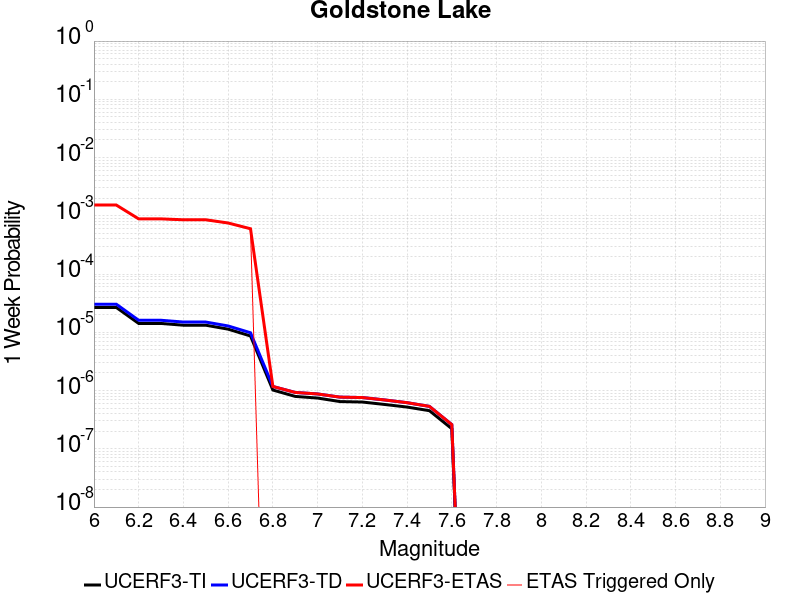 | 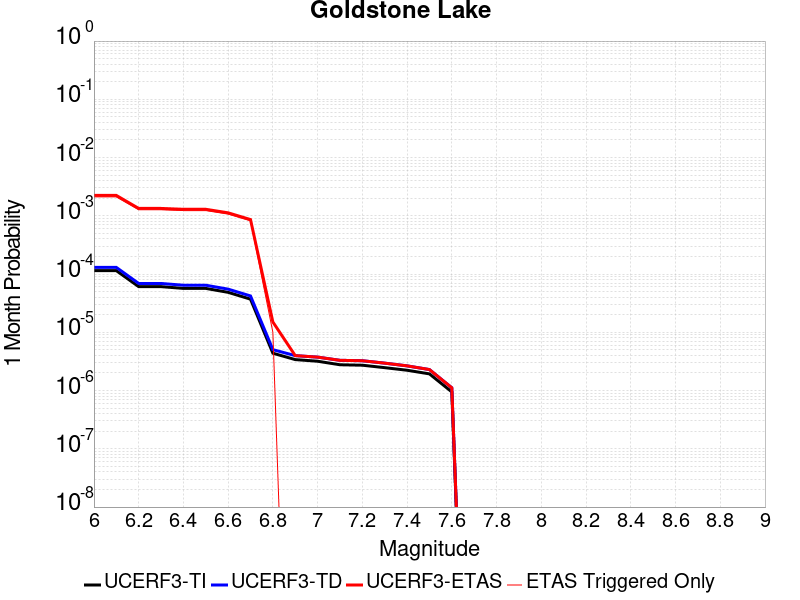 |  |  |

| Magnitude | 1 wk TI Prob | 1 wk TD Prob | 1 wk ETAS Prob | 1 wk ETAS/TD Gain | 1 wk ETAS Triggered Only | 1 mo TI Prob | 1 mo TD Prob | 1 mo ETAS Prob | 1 mo ETAS/TD Gain | 1 mo ETAS Triggered Only | 1 yr TI Prob | 1 yr TD Prob | 1 yr ETAS Prob | 1 yr ETAS/TD Gain | 1 yr ETAS Triggered Only | 10 yr TI Prob | 10 yr TD Prob | 10 yr ETAS Prob | 10 yr ETAS/TD Gain | 10 yr ETAS Triggered Only |
|-----|-----|-----|-----|-----|-----|-----|-----|-----|-----|-----|-----|-----|-----|-----|-----|-----|-----|-----|-----|-----|
| 6.0 | 2.671352E-5 | 3.0376103E-5 | 0.0015303305 | 50.37942 | 0.0015 | 1.1448149E-4 | 1.3017791E-4 | 0.0022399032 | 17.206476 | 0.00211 | 0.001392921 | 0.0015839601 | 0.005298068 | 3.344824 | 0.00372 | 0.013842222 | 0.015746202 | 0.021425346 | 1.3606676 | 0.00577 |
| 6.1 | 2.671352E-5 | 3.0376103E-5 | 0.0015303305 | 50.37942 | 0.0015 | 1.1448149E-4 | 1.3017791E-4 | 0.0022399032 | 17.206476 | 0.00211 | 0.001392921 | 0.0015839601 | 0.005298068 | 3.344824 | 0.00372 | 0.013842222 | 0.015746202 | 0.021425346 | 1.3606676 | 0.00577 |
| 6.2 | 1.4197047E-5 | 1.6096254E-5 | 8.8608224E-4 | 55.048973 | 8.7E-4 | 6.0843064E-5 | 6.898268E-5 | 0.0013388951 | 19.40915 | 0.00127 | 7.4051257E-4 | 8.3963916E-4 | 0.0029678508 | 3.5346742 | 0.00213 | 0.007380498 | 0.008374364 | 0.011646729 | 1.3907598 | 0.0033 |
| 6.3 | 1.4197047E-5 | 1.6096254E-5 | 8.8608224E-4 | 55.048973 | 8.7E-4 | 6.0843064E-5 | 6.898268E-5 | 0.0013388951 | 19.40915 | 0.00127 | 7.4051257E-4 | 8.3963916E-4 | 0.0029678508 | 3.5346742 | 0.00213 | 0.007380498 | 0.008374364 | 0.011646729 | 1.3907598 | 0.0033 |
| 6.4 | 1.3238931E-5 | 1.500847E-5 | 8.5499586E-4 | 56.96756 | 8.4E-4 | 5.6737044E-5 | 6.432098E-5 | 0.0012942419 | 20.121614 | 0.00123 | 6.9055456E-4 | 7.8292453E-4 | 0.002751382 | 3.5142367 | 0.00197 | 0.006884126 | 0.007811289 | 0.010857308 | 1.389951 | 0.00307 |
| 6.5 | 1.3238931E-5 | 1.500847E-5 | 8.5499586E-4 | 56.96756 | 8.4E-4 | 5.6737044E-5 | 6.432098E-5 | 0.0012942419 | 20.121614 | 0.00123 | 6.9055456E-4 | 7.8292453E-4 | 0.002751382 | 3.5142367 | 0.00197 | 0.006884126 | 0.007811289 | 0.010857308 | 1.389951 | 0.00307 |
| 6.6 | 1.1328278E-5 | 1.2855176E-5 | 7.5284566E-4 | 58.563625 | 7.4E-4 | 4.8548856E-5 | 5.5092984E-5 | 0.0011250341 | 20.42064 | 0.00107 | 5.90922E-4 | 6.706464E-4 | 0.0024094793 | 3.592772 | 0.00174 | 0.0058935313 | 0.0066956137 | 0.009387469 | 1.4020326 | 0.00271 |
| 6.7 | 8.651175E-6 | 9.824575E-6 | 5.9981877E-4 | 61.052902 | 5.9E-4 | 3.707594E-5 | 4.2105148E-5 | 8.6207065E-4 | 20.474232 | 8.2E-4 | 4.5130608E-4 | 5.126002E-4 | 0.0018219287 | 3.5542881 | 0.00131 | 0.0045039062 | 0.0051230565 | 0.0071426565 | 1.3942178 | 0.00203 |
| 6.8 | 1.0215377E-6 | 1.1754802E-6 | 1.1754802E-6 | 1.0 | 0.0 | 4.378012E-6 | 5.037763E-6 | 1.5037713E-5 | 2.984998 | 1.0E-5 | 5.3300988E-5 | 6.133315E-5 | 9.133131E-5 | 1.4891019 | 3.0E-5 | 5.3288206E-4 | 6.131735E-4 | 6.4315513E-4 | 1.0488958 | 3.0E-5 |
| 6.9 | 7.9360774E-7 | 9.283496E-7 | 9.283496E-7 | 1.0 | 0.0 | 3.4011714E-6 | 3.9786355E-6 | 3.9786355E-6 | 1.0 | 0.0 | 4.1408475E-5 | 4.843888E-5 | 5.8438396E-5 | 1.2064357 | 1.0E-5 | 4.140076E-4 | 4.842902E-4 | 4.9428537E-4 | 1.0206388 | 1.0E-5 |
| 7.0 | 7.4382757E-7 | 8.747428E-7 | 8.747428E-7 | 1.0 | 0.0 | 3.1878285E-6 | 3.7488926E-6 | 3.7488926E-6 | 1.0 | 0.0 | 3.8811122E-5 | 4.564188E-5 | 5.5641423E-5 | 1.219087 | 1.0E-5 | 3.8804344E-4 | 4.563317E-4 | 4.6632712E-4 | 1.0219039 | 1.0E-5 |
| 7.1 | 6.4709513E-7 | 7.711399E-7 | 7.711399E-7 | 1.0 | 0.0 | 2.773262E-6 | 3.3048816E-6 | 3.3048816E-6 | 1.0 | 0.0 | 3.376394E-5 | 4.023625E-5 | 5.023585E-5 | 1.2485222 | 1.0E-5 | 3.375881E-4 | 4.022956E-4 | 4.1229159E-4 | 1.0248474 | 1.0E-5 |
| 7.2 | 6.356704E-7 | 7.588459E-7 | 7.588459E-7 | 1.0 | 0.0 | 2.7242988E-6 | 3.252193E-6 | 3.252193E-6 | 1.0 | 0.0 | 3.3167835E-5 | 3.959479E-5 | 4.9594393E-5 | 1.2525485 | 1.0E-5 | 3.3162883E-4 | 3.9588328E-4 | 4.0587934E-4 | 1.02525 | 1.0E-5 |
| 7.3 | 5.7695723E-7 | 6.896648E-7 | 6.896648E-7 | 1.0 | 0.0 | 2.4726714E-6 | 2.9557032E-6 | 2.9557032E-6 | 1.0 | 0.0 | 3.0104358E-5 | 3.598515E-5 | 4.598479E-5 | 1.2778825 | 1.0E-5 | 3.0100282E-4 | 3.5979896E-4 | 3.6979537E-4 | 1.0277833 | 1.0E-5 |
| 7.4 | 5.209647E-7 | 6.193583E-7 | 6.193583E-7 | 1.0 | 0.0 | 2.232704E-6 | 2.6543903E-6 | 2.6543903E-6 | 1.0 | 0.0 | 2.718283E-5 | 3.2316777E-5 | 3.2316777E-5 | 1.0 | 0.0 | 2.7179506E-4 | 3.2312635E-4 | 3.2312635E-4 | 1.0 | 0.0 |
| 7.5 | 4.512955E-7 | 5.3489487E-7 | 5.3489487E-7 | 1.0 | 0.0 | 1.934122E-6 | 2.2924048E-6 | 2.2924048E-6 | 1.0 | 0.0 | 2.3547682E-5 | 2.7909726E-5 | 2.7909726E-5 | 1.0 | 0.0 | 2.3545188E-4 | 2.7906752E-4 | 2.7906752E-4 | 1.0 | 0.0 |
| 7.6 | 2.21172E-7 | 2.6040198E-7 | 2.6040198E-7 | 1.0 | 0.0 | 9.478797E-7 | 1.1160082E-6 | 1.1160082E-6 | 1.0 | 0.0 | 1.1540374E-5 | 1.3587343E-5 | 1.3587343E-5 | 1.0 | 0.0 | 1.1539775E-4 | 1.3586794E-4 | 1.3586794E-4 | 1.0 | 0.0 |

## So Sierra Nevada
*[(top)](#table-of-contents)*

| 1 Week | 1 Month | 1 Year | 10 Year |
|-----|-----|-----|-----|
|  |  |  |  |

| Magnitude | 1 wk TI Prob | 1 wk TD Prob | 1 wk ETAS Prob | 1 wk ETAS/TD Gain | 1 wk ETAS Triggered Only | 1 mo TI Prob | 1 mo TD Prob | 1 mo ETAS Prob | 1 mo ETAS/TD Gain | 1 mo ETAS Triggered Only | 1 yr TI Prob | 1 yr TD Prob | 1 yr ETAS Prob | 1 yr ETAS/TD Gain | 1 yr ETAS Triggered Only | 10 yr TI Prob | 10 yr TD Prob | 10 yr ETAS Prob | 10 yr ETAS/TD Gain | 10 yr ETAS Triggered Only |
|-----|-----|-----|-----|-----|-----|-----|-----|-----|-----|-----|-----|-----|-----|-----|-----|-----|-----|-----|-----|-----|
| 6.0 | 1.15488665E-5 | 1.1079612E-5 | 0.0017110608 | 154.43329 | 0.0017 | 4.9494203E-5 | 4.7483256E-5 | 0.002347374 | 49.435825 | 0.0023 | 6.024253E-4 | 5.779681E-4 | 0.0039360262 | 6.81011 | 0.00336 | 0.006007948 | 0.005765918 | 0.010518357 | 1.8242294 | 0.00478 |
| 6.1 | 1.15488665E-5 | 1.1079612E-5 | 0.0017110608 | 154.43329 | 0.0017 | 4.9494203E-5 | 4.7483256E-5 | 0.002347374 | 49.435825 | 0.0023 | 6.024253E-4 | 5.779681E-4 | 0.0039360262 | 6.81011 | 0.00336 | 0.006007948 | 0.005765918 | 0.010518357 | 1.8242294 | 0.00478 |
| 6.2 | 1.15488665E-5 | 1.1079612E-5 | 0.0017110608 | 154.43329 | 0.0017 | 4.9494203E-5 | 4.7483256E-5 | 0.002347374 | 49.435825 | 0.0023 | 6.024253E-4 | 5.779681E-4 | 0.0039360262 | 6.81011 | 0.00336 | 0.006007948 | 0.005765918 | 0.010518357 | 1.8242294 | 0.00478 |
| 6.3 | 1.15488665E-5 | 1.1079612E-5 | 0.0017110608 | 154.43329 | 0.0017 | 4.9494203E-5 | 4.7483256E-5 | 0.002347374 | 49.435825 | 0.0023 | 6.024253E-4 | 5.779681E-4 | 0.0039360262 | 6.81011 | 0.00336 | 0.006007948 | 0.005765918 | 0.010518357 | 1.8242294 | 0.00478 |
| 6.4 | 1.15488665E-5 | 1.1079612E-5 | 0.0017110608 | 154.43329 | 0.0017 | 4.9494203E-5 | 4.7483256E-5 | 0.002347374 | 49.435825 | 0.0023 | 6.024253E-4 | 5.779681E-4 | 0.0039360262 | 6.81011 | 0.00336 | 0.006007948 | 0.005765918 | 0.010518357 | 1.8242294 | 0.00478 |
| 6.5 | 1.15488665E-5 | 1.1079612E-5 | 0.0017110608 | 154.43329 | 0.0017 | 4.9494203E-5 | 4.7483256E-5 | 0.002347374 | 49.435825 | 0.0023 | 6.024253E-4 | 5.779681E-4 | 0.0039360262 | 6.81011 | 0.00336 | 0.006007948 | 0.005765918 | 0.010518357 | 1.8242294 | 0.00478 |
| 6.6 | 7.587044E-6 | 6.9356042E-6 | 0.0010469283 | 150.94984 | 0.00104 | 3.2515498E-5 | 2.9723697E-5 | 0.001399683 | 47.0898 | 0.00137 | 3.9580427E-4 | 3.6182883E-4 | 0.0022611413 | 6.249202 | 0.0019 | 0.003951 | 0.0036126887 | 0.0062232236 | 1.7226017 | 0.00262 |
| 6.7 | 7.587044E-6 | 6.9356042E-6 | 0.0010469283 | 150.94984 | 0.00104 | 3.2515498E-5 | 2.9723697E-5 | 0.001399683 | 47.0898 | 0.00137 | 3.9580427E-4 | 3.6182883E-4 | 0.0022611413 | 6.249202 | 0.0019 | 0.003951 | 0.0036126887 | 0.0062232236 | 1.7226017 | 0.00262 |
| 6.8 | 5.9026956E-6 | 5.179362E-6 | 7.451755E-4 | 143.87401 | 7.4E-4 | 2.5297022E-5 | 2.2197082E-5 | 9.5217646E-4 | 42.89647 | 9.3E-4 | 3.0794772E-4 | 2.7021713E-4 | 0.0015298766 | 5.661657 | 0.00126 | 0.0030752132 | 0.002699002 | 0.0043445486 | 1.6096871 | 0.00165 |
| 6.9 | 5.0118915E-6 | 4.2523943E-6 | 6.4424967E-4 | 151.5028 | 6.4E-4 | 2.1479358E-5 | 1.8224424E-5 | 7.782106E-4 | 42.701515 | 7.6E-4 | 2.614798E-4 | 2.2186051E-4 | 0.0012416343 | 5.596463 | 0.00102 | 0.0026117235 | 0.0022164627 | 0.0035734484 | 1.6122303 | 0.00136 |
| 7.0 | 4.4924795E-6 | 3.7138868E-6 | 5.5371184E-4 | 149.09229 | 5.5E-4 | 1.925334E-5 | 1.5916565E-5 | 6.559064E-4 | 41.20904 | 6.4E-4 | 2.3438422E-4 | 1.9376757E-4 | 0.001063599 | 5.4890456 | 8.7E-4 | 0.0023413717 | 0.0019360491 | 0.0031237453 | 1.6134639 | 0.00119 |
| 7.1 | 3.9118436E-6 | 3.1119469E-6 | 4.2311064E-4 | 135.96332 | 4.2E-4 | 1.6764936E-5 | 1.333685E-5 | 5.1333016E-4 | 38.489613 | 5.0E-4 | 2.0409399E-4 | 1.6236462E-4 | 8.62251E-4 | 5.310584 | 7.0E-4 | 0.0020390663 | 0.0016225161 | 0.0025609909 | 1.5784072 | 9.4E-4 |
| 7.2 | 3.4200818E-6 | 2.6054236E-6 | 3.8260443E-4 | 146.84923 | 3.8E-4 | 1.4657411E-5 | 1.11660565E-5 | 4.6116102E-4 | 41.30026 | 4.5E-4 | 1.7843937E-4 | 1.3593875E-4 | 7.358572E-4 | 5.413152 | 6.0E-4 | 0.0017829615 | 0.0013586058 | 0.0021475325 | 1.5806885 | 7.9E-4 |
| 7.3 | 2.6593618E-6 | 1.8283897E-6 | 2.2182798E-4 | 121.32424 | 2.2E-4 | 1.13972155E-5 | 7.8359335E-6 | 2.778338E-4 | 35.456375 | 2.7E-4 | 1.3875226E-4 | 9.539862E-5 | 4.2536712E-4 | 4.45884 | 3.3E-4 | 0.0013866565 | 9.536055E-4 | 0.0014031765 | 1.4714433 | 4.5E-4 |
| 7.4 | 2.2577992E-6 | 1.4364078E-6 | 2.0143612E-4 | 140.23602 | 2.0E-4 | 9.676246E-6 | 6.1560204E-6 | 2.4615455E-4 | 39.985985 | 2.4E-4 | 1.1780193E-4 | 7.4947224E-5 | 3.7492474E-4 | 5.0025167 | 3.0E-4 | 0.001177395 | 7.4924453E-4 | 0.0011289598 | 1.5067976 | 3.8E-4 |
| 7.5 | 1.489319E-6 | 7.353661E-7 | 1.4073527E-4 | 191.38123 | 1.4E-4 | 6.3827797E-6 | 3.1515651E-6 | 1.6315107E-4 | 51.768265 | 1.6E-4 | 7.770758E-5 | 3.8369635E-5 | 2.4836158E-4 | 6.472868 | 2.1E-4 | 7.7680405E-4 | 3.8363054E-4 | 6.335346E-4 | 1.6514187 | 2.5E-4 |
| 7.6 | 1.0680322E-6 | 4.65941E-7 | 9.0465895E-5 | 194.15741 | 9.0E-5 | 4.577273E-6 | 1.9968884E-6 | 9.1996706E-5 | 46.070026 | 9.0E-5 | 5.5726876E-5 | 2.4311848E-5 | 1.3430917E-4 | 5.5244327 | 1.1E-4 | 5.5712904E-4 | 2.4309216E-4 | 3.8305813E-4 | 1.5757732 | 1.4E-4 |
| 7.7 | 5.509146E-7 | 1.5578539E-7 | 5.0155777E-5 | 321.9543 | 5.0E-5 | 2.3610605E-6 | 6.676515E-7 | 5.066762E-5 | 75.88932 | 5.0E-5 | 2.8745531E-5 | 8.128628E-6 | 5.8128222E-5 | 7.1510496 | 5.0E-5 | 2.8741814E-4 | 8.128342E-5 | 1.5127774E-4 | 1.8611143 | 7.0E-5 |

## Coyote Canyon
*[(top)](#table-of-contents)*

| 1 Week | 1 Month | 1 Year | 10 Year |
|-----|-----|-----|-----|
|  |  |  |  |

| Magnitude | 1 wk TI Prob | 1 wk TD Prob | 1 wk ETAS Prob | 1 wk ETAS/TD Gain | 1 wk ETAS Triggered Only | 1 mo TI Prob | 1 mo TD Prob | 1 mo ETAS Prob | 1 mo ETAS/TD Gain | 1 mo ETAS Triggered Only | 1 yr TI Prob | 1 yr TD Prob | 1 yr ETAS Prob | 1 yr ETAS/TD Gain | 1 yr ETAS Triggered Only | 10 yr TI Prob | 10 yr TD Prob | 10 yr ETAS Prob | 10 yr ETAS/TD Gain | 10 yr ETAS Triggered Only |
|-----|-----|-----|-----|-----|-----|-----|-----|-----|-----|-----|-----|-----|-----|-----|-----|-----|-----|-----|-----|-----|
| 6.0 | 3.5090034E-5 | 4.0364317E-5 | 0.0010103252 | 25.030157 | 9.7E-4 | 1.503772E-4 | 1.7297991E-4 | 0.0016427257 | 9.496627 | 0.00147 | 0.0018293047 | 0.0021042533 | 0.0048883823 | 2.323096 | 0.00279 | 0.018143194 | 0.020869205 | 0.024766145 | 1.1867316 | 0.00398 |
| 6.1 | 3.5090034E-5 | 4.0364317E-5 | 0.0010103252 | 25.030157 | 9.7E-4 | 1.503772E-4 | 1.7297991E-4 | 0.0016427257 | 9.496627 | 0.00147 | 0.0018293047 | 0.0021042533 | 0.0048883823 | 2.323096 | 0.00279 | 0.018143194 | 0.020869205 | 0.024766145 | 1.1867316 | 0.00398 |
| 6.2 | 1.841879E-5 | 2.1059794E-5 | 5.81048E-4 | 27.590395 | 5.6E-4 | 7.8935285E-5 | 9.025371E-5 | 9.601752E-4 | 10.638623 | 8.7E-4 | 9.606133E-4 | 0.0010983871 | 0.0027265965 | 2.4823642 | 0.00163 | 0.0095647145 | 0.010939668 | 0.01327385 | 1.2133687 | 0.00236 |
| 6.3 | 1.841879E-5 | 2.1059794E-5 | 5.81048E-4 | 27.590395 | 5.6E-4 | 7.8935285E-5 | 9.025371E-5 | 9.601752E-4 | 10.638623 | 8.7E-4 | 9.606133E-4 | 0.0010983871 | 0.0027265965 | 2.4823642 | 0.00163 | 0.0095647145 | 0.010939668 | 0.01327385 | 1.2133687 | 0.00236 |
| 6.4 | 1.712201E-5 | 1.9565212E-5 | 5.5955467E-4 | 28.599468 | 5.4E-4 | 7.337798E-5 | 8.3848776E-5 | 9.0378005E-4 | 10.77869 | 8.2E-4 | 8.930107E-4 | 0.0010204813 | 0.00254892 | 2.4977624 | 0.00153 | 0.008894307 | 0.010167871 | 0.012394994 | 1.2190353 | 0.00225 |
| 6.5 | 1.4744935E-5 | 1.6836972E-5 | 5.1682856E-4 | 30.69605 | 5.0E-4 | 6.3191044E-5 | 7.215698E-5 | 8.221029E-4 | 11.393254 | 7.5E-4 | 7.6907943E-4 | 8.782507E-4 | 0.0022370561 | 2.5471728 | 0.00136 | 0.007664232 | 0.008756994 | 0.010789042 | 1.2320486 | 0.00205 |
| 6.6 | 1.2017839E-5 | 1.3724089E-5 | 4.137186E-4 | 30.145432 | 4.0E-4 | 5.150401E-5 | 5.88167E-5 | 6.687808E-4 | 11.370594 | 6.1E-4 | 6.268809E-4 | 7.159466E-4 | 0.0018551304 | 2.5911574 | 0.00114 | 0.0062511545 | 0.0071450938 | 0.00881309 | 1.2334464 | 0.00168 |
| 6.7 | 1.00956095E-5 | 1.1533517E-5 | 3.1153005E-4 | 27.010847 | 3.0E-4 | 4.326618E-5 | 4.942891E-5 | 5.394047E-4 | 10.912737 | 4.9E-4 | 5.266384E-4 | 6.017178E-4 | 0.0015211642 | 2.5280359 | 9.2E-4 | 0.005253921 | 0.0060094125 | 0.0073811193 | 1.2282598 | 0.00138 |

## San Andreas (Mojave S)
*[(top)](#table-of-contents)*

| 1 Week | 1 Month | 1 Year | 10 Year |
|-----|-----|-----|-----|
|  |  |  |  |

| Magnitude | 1 wk TI Prob | 1 wk TD Prob | 1 wk ETAS Prob | 1 wk ETAS/TD Gain | 1 wk ETAS Triggered Only | 1 mo TI Prob | 1 mo TD Prob | 1 mo ETAS Prob | 1 mo ETAS/TD Gain | 1 mo ETAS Triggered Only | 1 yr TI Prob | 1 yr TD Prob | 1 yr ETAS Prob | 1 yr ETAS/TD Gain | 1 yr ETAS Triggered Only | 10 yr TI Prob | 10 yr TD Prob | 10 yr ETAS Prob | 10 yr ETAS/TD Gain | 10 yr ETAS Triggered Only |
|-----|-----|-----|-----|-----|-----|-----|-----|-----|-----|-----|-----|-----|-----|-----|-----|-----|-----|-----|-----|-----|
| 6.0 | 3.1064058E-4 | 6.7462435E-4 | 0.002463417 | 3.6515384 | 0.00179 | 0.0013306376 | 0.002888172 | 0.0051217023 | 1.7733371 | 0.00224 | 0.016080605 | 0.034565594 | 0.037674293 | 1.0899363 | 0.00322 | 0.1496549 | 0.28654557 | 0.2894565 | 1.0101585 | 0.00408 |
| 6.1 | 3.1064058E-4 | 6.7462435E-4 | 0.002463417 | 3.6515384 | 0.00179 | 0.0013306376 | 0.002888172 | 0.0051217023 | 1.7733371 | 0.00224 | 0.016080605 | 0.034565594 | 0.037674293 | 1.0899363 | 0.00322 | 0.1496549 | 0.28654557 | 0.2894565 | 1.0101585 | 0.00408 |
| 6.2 | 3.1064058E-4 | 6.7462435E-4 | 0.002463417 | 3.6515384 | 0.00179 | 0.0013306376 | 0.002888172 | 0.0051217023 | 1.7733371 | 0.00224 | 0.016080605 | 0.034565594 | 0.037674293 | 1.0899363 | 0.00322 | 0.1496549 | 0.28654557 | 0.2894565 | 1.0101585 | 0.00408 |
| 6.3 | 3.1064058E-4 | 6.7462435E-4 | 0.002463417 | 3.6515384 | 0.00179 | 0.0013306376 | 0.002888172 | 0.0051217023 | 1.7733371 | 0.00224 | 0.016080605 | 0.034565594 | 0.037674293 | 1.0899363 | 0.00322 | 0.1496549 | 0.28654557 | 0.2894565 | 1.0101585 | 0.00408 |
| 6.4 | 1.9872203E-4 | 4.3181062E-4 | 0.0020011326 | 4.634283 | 0.00157 | 8.5138786E-4 | 0.0018493326 | 0.003805708 | 2.0578818 | 0.00196 | 0.010316478 | 0.02228931 | 0.025105117 | 1.1263299 | 0.00288 | 0.098504856 | 0.19686839 | 0.19978376 | 1.0148087 | 0.00363 |
| 6.5 | 1.291105E-4 | 2.8754136E-4 | 0.001707133 | 5.937 | 0.00142 | 5.5321335E-4 | 0.0012317409 | 0.0030195361 | 2.4514377 | 0.00179 | 0.006714592 | 0.014894155 | 0.017416026 | 1.1693195 | 0.00256 | 0.065152965 | 0.13800792 | 0.14077492 | 1.0200496 | 0.00321 |
| 6.6 | 1.291105E-4 | 2.8754136E-4 | 0.001707133 | 5.937 | 0.00142 | 5.5321335E-4 | 0.0012317409 | 0.0030195361 | 2.4514377 | 0.00179 | 0.006714592 | 0.014894155 | 0.017416026 | 1.1693195 | 0.00256 | 0.065152965 | 0.13800792 | 0.14077492 | 1.0200496 | 0.00321 |
| 6.7 | 1.08001186E-4 | 2.4335351E-4 | 0.0015830274 | 6.5050526 | 0.00134 | 4.6278012E-4 | 0.0010425274 | 0.0027307654 | 2.6193707 | 0.00169 | 0.0056198016 | 0.0126192 | 0.015008661 | 1.1893513 | 0.00242 | 0.054797906 | 0.11918431 | 0.12187961 | 1.0226145 | 0.00306 |
| 6.8 | 1.0624356E-4 | 2.3853009E-4 | 0.0015782105 | 6.6164 | 0.00134 | 4.5525006E-4 | 0.0010218718 | 0.002710145 | 2.6521378 | 0.00169 | 0.0055285925 | 0.012370593 | 0.01475078 | 1.1924069 | 0.00241 | 0.053930566 | 0.11713308 | 0.119816996 | 1.0229133 | 0.00304 |
| 6.9 | 1.0393785E-4 | 2.3223337E-4 | 0.0015719222 | 6.768718 | 0.00134 | 4.4537184E-4 | 9.949068E-4 | 0.0026832253 | 2.6969616 | 0.00169 | 0.0054089287 | 0.012045963 | 0.014426933 | 1.197657 | 0.00241 | 0.05279156 | 0.114433445 | 0.11711671 | 1.0234482 | 0.00303 |
| 7.0 | 1.0155622E-4 | 2.2592908E-4 | 0.0015656264 | 6.929725 | 0.00134 | 4.3516833E-4 | 9.6790853E-4 | 0.0026562728 | 2.7443428 | 0.00169 | 0.005285311 | 0.011720838 | 0.014102591 | 1.2032067 | 0.00241 | 0.05161361 | 0.11169745 | 0.11438901 | 1.0240968 | 0.00303 |
| 7.1 | 9.885595E-5 | 2.188132E-4 | 0.00155852 | 7.122605 | 0.00134 | 4.2359953E-4 | 9.374342E-4 | 0.00262585 | 2.801103 | 0.00169 | 0.0051451353 | 0.011353733 | 0.013726484 | 1.2089843 | 0.0024 | 0.05027629 | 0.10857607 | 0.11126817 | 1.0247946 | 0.00302 |
| 7.2 | 9.6411415E-5 | 2.1244297E-4 | 0.0015321625 | 7.2121124 | 0.00132 | 4.1312634E-4 | 9.101525E-4 | 0.0025786324 | 2.8331873 | 0.00167 | 0.005018219 | 0.011024987 | 0.013378748 | 1.2134932 | 0.00238 | 0.049064007 | 0.1057697 | 0.108452395 | 1.0253636 | 0.003 |
| 7.3 | 9.1180635E-5 | 1.9472656E-4 | 0.0015044715 | 7.7260723 | 0.00131 | 3.907156E-4 | 8.342756E-4 | 0.0024928907 | 2.9880903 | 0.00166 | 0.004746591 | 0.010110112 | 0.012446253 | 1.2310697 | 0.00236 | 0.046464786 | 0.09796176 | 0.10064983 | 1.0274401 | 0.00298 |
| 7.4 | 8.887388E-5 | 1.872126E-4 | 0.0014969674 | 7.996082 | 0.00131 | 3.8083247E-4 | 8.020931E-4 | 0.0024407776 | 3.0430105 | 0.00164 | 0.0046267817 | 0.009721855 | 0.012039105 | 1.2383548 | 0.00234 | 0.045316286 | 0.094593845 | 0.09727385 | 1.0283316 | 0.00296 |
| 7.5 | 8.6750515E-5 | 1.80528E-4 | 0.0014902916 | 8.255182 | 0.00131 | 3.7173493E-4 | 7.734621E-4 | 0.0024121937 | 3.1186967 | 0.00164 | 0.004516484 | 0.009376327 | 0.011694386 | 1.2472247 | 0.00234 | 0.04425787 | 0.09155606 | 0.094245054 | 1.02937 | 0.00296 |
| 7.6 | 8.453092E-5 | 1.7440386E-4 | 0.0014841754 | 8.509992 | 0.00131 | 3.6222505E-4 | 7.4723107E-4 | 0.0023860056 | 3.1931295 | 0.00164 | 0.0044011753 | 0.009059664 | 0.011368555 | 1.254854 | 0.00233 | 0.04315024 | 0.08871447 | 0.09139366 | 1.0302 | 0.00294 |
| 7.7 | 8.259102E-5 | 1.6962511E-4 | 0.0014794029 | 8.721603 | 0.00131 | 3.539135E-4 | 7.267622E-4 | 0.0023555777 | 3.2411942 | 0.00163 | 0.004300386 | 0.0088125 | 0.011112056 | 1.2609423 | 0.00232 | 0.042181134 | 0.086465426 | 0.089142084 | 1.0309564 | 0.00293 |
| 7.8 | 7.444844E-5 | 1.528469E-4 | 0.0012526788 | 8.195643 | 0.0011 | 3.1902574E-4 | 6.5489375E-4 | 0.0020239966 | 3.0905724 | 0.00137 | 0.0038772223 | 0.007944231 | 0.00987874 | 1.2435111 | 0.00195 | 0.03810269 | 0.078293875 | 0.08056127 | 1.0289601 | 0.00246 |
| 7.9 | 5.2586525E-5 | 1.0007023E-4 | 8.599942E-4 | 8.593906 | 7.6E-4 | 2.2535135E-4 | 4.2880196E-4 | 0.0013384117 | 3.1212819 | 9.1E-4 | 0.0027402006 | 0.005208178 | 0.0064516678 | 1.2387571 | 0.00125 | 0.027066574 | 0.052201588 | 0.053708587 | 1.0288688 | 0.00159 |
| 8.0 | 3.379877E-5 | 5.4075565E-5 | 3.140615E-4 | 5.807827 | 2.6E-4 | 1.4484383E-4 | 2.3173184E-4 | 5.4166E-4 | 2.337443 | 3.1E-4 | 0.0017620471 | 0.0028176866 | 0.003246475 | 1.1521775 | 4.3E-4 | 0.017481409 | 0.028835917 | 0.029370056 | 1.0185235 | 5.5E-4 |
| 8.1 | 1.8668277E-5 | 1.9308145E-5 | 4.9307564E-5 | 2.5537186 | 3.0E-5 | 8.000444E-5 | 8.274657E-5 | 1.12744085E-4 | 1.3625228 | 3.0E-5 | 9.736188E-4 | 0.0010069745 | 0.0010569241 | 1.0496037 | 5.0E-5 | 0.009693642 | 0.010798624 | 0.0108480835 | 1.0045803 | 5.0E-5 |
| 8.2 | 8.541571E-6 | 5.4596358E-6 | 5.4596358E-6 | 1.0 | 0.0 | 3.660622E-5 | 2.339823E-5 | 2.339823E-5 | 1.0 | 0.0 | 4.455896E-4 | 2.848363E-4 | 2.848363E-4 | 1.0 | 0.0 | 0.0044469717 | 0.003240283 | 0.003240283 | 1.0 | 0.0 |
| 8.3 | 1.983087E-6 | 7.6564595E-7 | 7.6564595E-7 | 1.0 | 0.0 | 8.498917E-6 | 3.281336E-6 | 3.281336E-6 | 1.0 | 0.0 | 1.034694E-4 | 3.9949547E-5 | 3.9949547E-5 | 1.0 | 0.0 | 0.0010342124 | 4.717979E-4 | 4.717979E-4 | 1.0 | 0.0 |

## San Andreas (Mojave N)
*[(top)](#table-of-contents)*

| 1 Week | 1 Month | 1 Year | 10 Year |
|-----|-----|-----|-----|
|  | 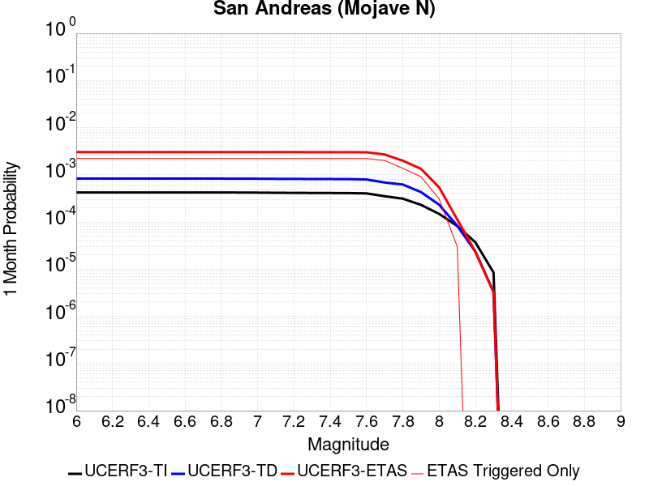 |  |  |

| Magnitude | 1 wk TI Prob | 1 wk TD Prob | 1 wk ETAS Prob | 1 wk ETAS/TD Gain | 1 wk ETAS Triggered Only | 1 mo TI Prob | 1 mo TD Prob | 1 mo ETAS Prob | 1 mo ETAS/TD Gain | 1 mo ETAS Triggered Only | 1 yr TI Prob | 1 yr TD Prob | 1 yr ETAS Prob | 1 yr ETAS/TD Gain | 1 yr ETAS Triggered Only | 10 yr TI Prob | 10 yr TD Prob | 10 yr ETAS Prob | 10 yr ETAS/TD Gain | 10 yr ETAS Triggered Only |
|-----|-----|-----|-----|-----|-----|-----|-----|-----|-----|-----|-----|-----|-----|-----|-----|-----|-----|-----|-----|-----|
| 6.0 | 9.877682E-5 | 1.9402112E-4 | 0.001993672 | 10.27554 | 0.0018 | 4.2326056E-4 | 8.312543E-4 | 0.003039417 | 3.6564229 | 0.00221 | 0.0051410277 | 0.010073684 | 0.013122657 | 1.3026671 | 0.00308 | 0.05023708 | 0.09832245 | 0.101839 | 1.0357654 | 0.0039 |
| 6.1 | 9.877682E-5 | 1.9402112E-4 | 0.001993672 | 10.27554 | 0.0018 | 4.2326056E-4 | 8.312543E-4 | 0.003039417 | 3.6564229 | 0.00221 | 0.0051410277 | 0.010073684 | 0.013122657 | 1.3026671 | 0.00308 | 0.05023708 | 0.09832245 | 0.101839 | 1.0357654 | 0.0039 |
| 6.2 | 9.877682E-5 | 1.9402112E-4 | 0.001993672 | 10.27554 | 0.0018 | 4.2326056E-4 | 8.312543E-4 | 0.003039417 | 3.6564229 | 0.00221 | 0.0051410277 | 0.010073684 | 0.013122657 | 1.3026671 | 0.00308 | 0.05023708 | 0.09832245 | 0.101839 | 1.0357654 | 0.0039 |
| 6.3 | 9.877682E-5 | 1.9402112E-4 | 0.001993672 | 10.27554 | 0.0018 | 4.2326056E-4 | 8.312543E-4 | 0.003039417 | 3.6564229 | 0.00221 | 0.0051410277 | 0.010073684 | 0.013122657 | 1.3026671 | 0.00308 | 0.05023708 | 0.09832245 | 0.101839 | 1.0357654 | 0.0039 |
| 6.4 | 9.877682E-5 | 1.9402112E-4 | 0.001993672 | 10.27554 | 0.0018 | 4.2326056E-4 | 8.312543E-4 | 0.003039417 | 3.6564229 | 0.00221 | 0.0051410277 | 0.010073684 | 0.013122657 | 1.3026671 | 0.00308 | 0.05023708 | 0.09832245 | 0.101839 | 1.0357654 | 0.0039 |
| 6.5 | 9.861474E-5 | 1.937588E-4 | 0.00199341 | 10.2881 | 0.0018 | 4.2256617E-4 | 8.3013077E-4 | 0.0030382962 | 3.660021 | 0.00221 | 0.0051326132 | 0.0100601325 | 0.013099248 | 1.3020949 | 0.00307 | 0.050156746 | 0.09820035 | 0.101708345 | 1.0357229 | 0.00389 |
| 6.6 | 9.861474E-5 | 1.937588E-4 | 0.00199341 | 10.2881 | 0.0018 | 4.2256617E-4 | 8.3013077E-4 | 0.0030382962 | 3.660021 | 0.00221 | 0.0051326132 | 0.0100601325 | 0.013099248 | 1.3020949 | 0.00307 | 0.050156746 | 0.09820035 | 0.101708345 | 1.0357229 | 0.00389 |
| 6.7 | 9.8552715E-5 | 1.9365833E-4 | 0.0019933097 | 10.29292 | 0.0018 | 4.223004E-4 | 8.2970044E-4 | 0.003037867 | 3.661402 | 0.00221 | 0.0051293927 | 0.010054941 | 0.013094072 | 1.3022525 | 0.00307 | 0.050125998 | 0.09815356 | 0.10166174 | 1.0357418 | 0.00389 |
| 6.8 | 9.8464974E-5 | 1.9350994E-4 | 0.0019931616 | 10.300048 | 0.0018 | 4.219245E-4 | 8.290649E-4 | 0.0030372327 | 3.6634438 | 0.00221 | 0.0051248376 | 0.010047276 | 0.01308643 | 1.3024855 | 0.00307 | 0.05008251 | 0.09808378 | 0.101592235 | 1.0357699 | 0.00389 |
| 6.9 | 9.825824E-5 | 1.9319002E-4 | 0.0019928422 | 10.315452 | 0.0018 | 4.2103877E-4 | 8.276947E-4 | 0.0030358655 | 3.6678567 | 0.00221 | 0.0051141046 | 0.010030746 | 0.013069952 | 1.302989 | 0.00307 | 0.049980022 | 0.097932965 | 0.101442 | 1.0358311 | 0.00389 |
| 7.0 | 9.781462E-5 | 1.9250368E-4 | 0.0019921572 | 10.348671 | 0.0018 | 4.1913814E-4 | 8.247551E-4 | 0.0030329323 | 3.6773734 | 0.00221 | 0.005091073 | 0.009995285 | 0.0130346 | 1.3040748 | 0.00307 | 0.04976007 | 0.09760912 | 0.10111942 | 1.0359628 | 0.00389 |
| 7.1 | 9.7121134E-5 | 1.9152075E-4 | 0.001991176 | 10.39666 | 0.0018 | 4.1616702E-4 | 8.205452E-4 | 0.0030287318 | 3.691121 | 0.00221 | 0.005055068 | 0.0099444995 | 0.012983969 | 1.3056434 | 0.00307 | 0.04941613 | 0.09714571 | 0.10065781 | 1.036153 | 0.00389 |
| 7.2 | 9.663819E-5 | 1.9082859E-4 | 0.001990485 | 10.430749 | 0.0018 | 4.1409794E-4 | 8.175807E-4 | 0.003025774 | 3.7008872 | 0.00221 | 0.0050299936 | 0.009908735 | 0.012948316 | 1.3067577 | 0.00307 | 0.049176537 | 0.09681883 | 0.1003322 | 1.0362881 | 0.00389 |
| 7.3 | 9.6277574E-5 | 1.9035369E-4 | 0.001990011 | 10.454282 | 0.0018 | 4.125529E-4 | 8.1554666E-4 | 0.0030237443 | 3.707629 | 0.00221 | 0.0050112694 | 0.009884195 | 0.012923852 | 1.3075268 | 0.00307 | 0.04899759 | 0.09659228 | 0.10010653 | 1.0363823 | 0.00389 |
| 7.4 | 9.593308E-5 | 1.8975153E-4 | 0.00198941 | 10.484289 | 0.0018 | 4.1107697E-4 | 8.129676E-4 | 0.0030211709 | 3.7162256 | 0.00221 | 0.0049933824 | 0.009853081 | 0.012892831 | 1.3085077 | 0.00307 | 0.04882661 | 0.09630986 | 0.09982522 | 1.0365005 | 0.00389 |
| 7.5 | 9.561707E-5 | 1.8921228E-4 | 0.0019888717 | 10.511325 | 0.0018 | 4.0972308E-4 | 8.106579E-4 | 0.0030188663 | 3.7239707 | 0.00221 | 0.0049769743 | 0.009825215 | 0.012865051 | 1.3093914 | 0.00307 | 0.048669744 | 0.096056245 | 0.099572584 | 1.0366071 | 0.00389 |
| 7.6 | 9.418194E-5 | 1.8573487E-4 | 0.0019854004 | 10.689433 | 0.0018 | 4.0357444E-4 | 7.95764E-4 | 0.0030040054 | 3.7749956 | 0.00221 | 0.004902454 | 0.009645499 | 0.01266608 | 1.3131597 | 0.00305 | 0.047957025 | 0.094437465 | 0.097932935 | 1.0370136 | 0.00386 |
| 7.7 | 8.202141E-5 | 1.6022482E-4 | 0.0018099605 | 11.29638 | 0.00165 | 3.51473E-4 | 6.8649714E-4 | 0.0026951174 | 3.9258974 | 0.00201 | 0.00427079 | 0.008326128 | 0.011112732 | 1.3346817 | 0.00281 | 0.04189639 | 0.082237914 | 0.08549597 | 1.0396174 | 0.00355 |
| 7.8 | 7.2859846E-5 | 1.4517571E-4 | 0.001245016 | 8.575925 | 0.0011 | 3.1221908E-4 | 6.2203326E-4 | 0.0019911812 | 3.2010846 | 0.00137 | 0.003794643 | 0.0075469986 | 0.009472358 | 1.2551159 | 0.00194 | 0.037304975 | 0.07472766 | 0.07699458 | 1.0303357 | 0.00245 |
| 7.9 | 5.3874453E-5 | 1.00462625E-4 | 8.603863E-4 | 8.564242 | 7.6E-4 | 2.3087008E-4 | 4.3048308E-4 | 0.0013400913 | 3.1129942 | 9.1E-4 | 0.0028072202 | 0.0052285474 | 0.006472012 | 1.2378222 | 0.00125 | 0.02772022 | 0.052425884 | 0.053932525 | 1.0287385 | 0.00159 |
| 8.0 | 3.468538E-5 | 5.4261534E-5 | 3.1424742E-4 | 5.791348 | 2.6E-4 | 1.4864317E-4 | 2.3252872E-4 | 5.4245663E-4 | 2.3328586 | 3.1E-4 | 0.0018082283 | 0.0028273636 | 0.003256148 | 1.1516552 | 4.3E-4 | 0.017935853 | 0.028948462 | 0.02948254 | 1.0184493 | 5.5E-4 |
| 8.1 | 1.9152367E-5 | 1.9401303E-5 | 4.940072E-5 | 2.546258 | 3.0E-5 | 8.207899E-5 | 8.3145795E-5 | 1.13143295E-4 | 1.360782 | 3.0E-5 | 9.988535E-4 | 0.0010118305 | 0.0010617799 | 1.0493654 | 5.0E-5 | 0.009943757 | 0.01085595 | 0.010905408 | 1.0045558 | 5.0E-5 |
| 8.2 | 8.643924E-6 | 5.473668E-6 | 5.473668E-6 | 1.0 | 0.0 | 3.704486E-5 | 2.3458366E-5 | 2.3458366E-5 | 1.0 | 0.0 | 4.5092785E-4 | 2.8556827E-4 | 2.8556827E-4 | 1.0 | 0.0 | 0.0045001395 | 0.0032481793 | 0.0032481793 | 1.0 | 0.0 |
| 8.3 | 1.983087E-6 | 7.6564595E-7 | 7.6564595E-7 | 1.0 | 0.0 | 8.498917E-6 | 3.281336E-6 | 3.281336E-6 | 1.0 | 0.0 | 1.034694E-4 | 3.9949547E-5 | 3.9949547E-5 | 1.0 | 0.0 | 0.0010342124 | 4.717979E-4 | 4.717979E-4 | 1.0 | 0.0 |

## Death Valley (So)
*[(top)](#table-of-contents)*

| 1 Week | 1 Month | 1 Year | 10 Year |
|-----|-----|-----|-----|
|  |  |  |  |

| Magnitude | 1 wk TI Prob | 1 wk TD Prob | 1 wk ETAS Prob | 1 wk ETAS/TD Gain | 1 wk ETAS Triggered Only | 1 mo TI Prob | 1 mo TD Prob | 1 mo ETAS Prob | 1 mo ETAS/TD Gain | 1 mo ETAS Triggered Only | 1 yr TI Prob | 1 yr TD Prob | 1 yr ETAS Prob | 1 yr ETAS/TD Gain | 1 yr ETAS Triggered Only | 10 yr TI Prob | 10 yr TD Prob | 10 yr ETAS Prob | 10 yr ETAS/TD Gain | 10 yr ETAS Triggered Only |
|-----|-----|-----|-----|-----|-----|-----|-----|-----|-----|-----|-----|-----|-----|-----|-----|-----|-----|-----|-----|-----|
| 6.0 | 2.0684236E-5 | 2.5618314E-5 | 9.055958E-4 | 35.349545 | 8.8E-4 | 8.864371E-5 | 1.0978825E-4 | 0.0015396313 | 14.0236435 | 0.00143 | 0.0010787029 | 0.0013358692 | 0.0038624895 | 2.891368 | 0.00253 | 0.010734817 | 0.013279985 | 0.017049255 | 1.283831 | 0.00382 |
| 6.1 | 2.0684236E-5 | 2.5618314E-5 | 9.055958E-4 | 35.349545 | 8.8E-4 | 8.864371E-5 | 1.0978825E-4 | 0.0015396313 | 14.0236435 | 0.00143 | 0.0010787029 | 0.0013358692 | 0.0038624895 | 2.891368 | 0.00253 | 0.010734817 | 0.013279985 | 0.017049255 | 1.283831 | 0.00382 |
| 6.2 | 2.0684236E-5 | 2.5618314E-5 | 9.055958E-4 | 35.349545 | 8.8E-4 | 8.864371E-5 | 1.0978825E-4 | 0.0015396313 | 14.0236435 | 0.00143 | 0.0010787029 | 0.0013358692 | 0.0038624895 | 2.891368 | 0.00253 | 0.010734817 | 0.013279985 | 0.017049255 | 1.283831 | 0.00382 |
| 6.3 | 2.0240292E-5 | 2.51184E-5 | 8.250983E-4 | 32.848366 | 8.0E-4 | 8.6741224E-5 | 1.0764593E-4 | 0.001417505 | 13.168217 | 0.00131 | 0.0010555626 | 0.001309818 | 0.0036767137 | 2.8070416 | 0.00237 | 0.010505628 | 0.013022543 | 0.016585533 | 1.2736017 | 0.00361 |
| 6.4 | 2.0240292E-5 | 2.51184E-5 | 8.250983E-4 | 32.848366 | 8.0E-4 | 8.6741224E-5 | 1.0764593E-4 | 0.001417505 | 13.168217 | 0.00131 | 0.0010555626 | 0.001309818 | 0.0036767137 | 2.8070416 | 0.00237 | 0.010505628 | 0.013022543 | 0.016585533 | 1.2736017 | 0.00361 |
| 6.5 | 1.9962767E-5 | 2.4807652E-5 | 8.047883E-4 | 32.44113 | 7.8E-4 | 8.55519E-5 | 1.0631427E-4 | 0.0013861782 | 13.038496 | 0.00128 | 0.0010410968 | 0.0012936244 | 0.003610623 | 2.791091 | 0.00232 | 0.010362327 | 0.01286249 | 0.016327342 | 1.2693765 | 0.00351 |
| 6.6 | 1.8937297E-5 | 2.3311462E-5 | 7.3329493E-4 | 31.45641 | 7.1E-4 | 8.115732E-5 | 9.990252E-5 | 0.0012597867 | 12.610158 | 0.00116 | 9.876423E-4 | 0.0012156491 | 0.003333072 | 2.7418044 | 0.00212 | 0.009832645 | 0.0120915035 | 0.015233053 | 1.2598146 | 0.00318 |
| 6.7 | 1.8621096E-5 | 2.2912098E-5 | 7.128963E-4 | 31.114405 | 6.9E-4 | 7.980225E-5 | 9.8191085E-5 | 0.0012180811 | 12.4052105 | 0.00112 | 9.711593E-4 | 0.0011948354 | 0.003262362 | 2.7303863 | 0.00207 | 0.009669261 | 0.011885625 | 0.014938898 | 1.2568879 | 0.00309 |
| 6.8 | 1.7830353E-5 | 2.1806083E-5 | 6.5179233E-4 | 29.89039 | 6.3E-4 | 7.641356E-5 | 9.3451374E-5 | 0.0011233551 | 12.020744 | 0.00103 | 9.29938E-4 | 0.0011371907 | 0.0030250414 | 2.6601005 | 0.00189 | 0.009260561 | 0.01131609 | 0.0141635 | 1.2516248 | 0.00288 |
| 6.9 | 1.3135183E-5 | 1.5304031E-5 | 4.7529698E-4 | 31.056982 | 4.6E-4 | 5.6292425E-5 | 6.558709E-5 | 7.9553924E-4 | 12.12951 | 7.3E-4 | 6.8514474E-4 | 7.982367E-4 | 0.002097199 | 2.6272895 | 0.0013 | 0.006830362 | 0.007955158 | 0.009909486 | 1.245668 | 0.00197 |
| 7.0 | 1.1507512E-5 | 1.3154237E-5 | 3.5314978E-4 | 26.846844 | 3.4E-4 | 4.9316975E-5 | 5.637412E-5 | 6.163425E-4 | 10.933077 | 5.6E-4 | 6.002687E-4 | 6.861445E-4 | 0.0016954516 | 2.470983 | 0.00101 | 0.0059864987 | 0.0068414924 | 0.008301435 | 1.2133954 | 0.00147 |
| 7.1 | 9.715903E-6 | 1.0865287E-5 | 1.4086388E-4 | 12.96458 | 1.3E-4 | 4.1638916E-5 | 4.6564706E-5 | 2.8655352E-4 | 6.153878 | 2.4E-4 | 5.068359E-4 | 5.667821E-4 | 0.0010265213 | 1.8111393 | 4.6E-4 | 0.0050568148 | 0.005653834 | 0.0063598193 | 1.1248685 | 7.1E-4 |
| 7.2 | 9.233269E-6 | 1.0286314E-5 | 1.10285284E-4 | 10.721556 | 1.0E-4 | 3.9570554E-5 | 4.408348E-5 | 2.5407423E-4 | 5.763479 | 2.1E-4 | 4.81665E-4 | 5.365884E-4 | 9.163845E-4 | 1.7077978 | 3.8E-4 | 0.0048062233 | 0.0053533595 | 0.0059302547 | 1.1077632 | 5.8E-4 |
| 7.3 | 8.8041315E-6 | 9.808164E-6 | 7.9807476E-5 | 8.136842 | 7.0E-5 | 3.7731446E-5 | 4.2034335E-5 | 2.0202762E-4 | 4.806252 | 1.6E-4 | 4.592835E-4 | 5.1165203E-4 | 8.2149345E-4 | 1.6055706 | 3.1E-4 | 0.0045833546 | 0.005105167 | 0.0055628186 | 1.0896448 | 4.6E-4 |
| 7.4 | 8.708749E-6 | 9.707175E-6 | 6.970659E-5 | 7.180935 | 6.0E-5 | 3.7322676E-5 | 4.160154E-5 | 1.915953E-4 | 4.605486 | 1.5E-4 | 4.5430884E-4 | 5.0638523E-4 | 8.062333E-4 | 1.5921344 | 3.0E-4 | 0.004533812 | 0.0050527398 | 0.0054905163 | 1.0866414 | 4.4E-4 |
| 7.5 | 8.612678E-6 | 9.604817E-6 | 6.960424E-5 | 7.246805 | 6.0E-5 | 3.6910955E-5 | 4.1162875E-5 | 1.9115671E-4 | 4.6439104 | 1.5E-4 | 4.492982E-4 | 5.01047E-4 | 7.9090166E-4 | 1.578498 | 2.9E-4 | 0.004483909 | 0.0049995985 | 0.005407549 | 1.0815966 | 4.1E-4 |
| 7.6 | 8.319024E-6 | 9.283916E-6 | 6.928336E-5 | 7.46273 | 6.0E-5 | 3.5652476E-5 | 3.978763E-5 | 1.8978165E-4 | 4.769866 | 1.5E-4 | 4.3398244E-4 | 4.8431093E-4 | 7.641753E-4 | 1.577861 | 2.8E-4 | 0.0043313587 | 0.0048329784 | 0.0052210935 | 1.0803056 | 3.9E-4 |
| 7.7 | 7.4718328E-6 | 8.34517E-6 | 5.834475E-5 | 6.99144 | 5.0E-5 | 3.2021748E-5 | 3.5764548E-5 | 1.6575989E-4 | 4.6347547 | 1.3E-4 | 3.8979502E-4 | 4.353504E-4 | 6.8524154E-4 | 1.5740001 | 2.5E-4 | 0.00389112 | 0.0043453807 | 0.004683903 | 1.077904 | 3.4E-4 |
| 7.8 | 3.4586725E-7 | 3.6482615E-7 | 3.6482615E-7 | 1.0 | 0.0 | 1.4822873E-6 | 1.5635396E-6 | 1.5635396E-6 | 1.0 | 0.0 | 1.80467E-5 | 1.9035933E-5 | 1.9035933E-5 | 1.0 | 0.0 | 1.8045233E-4 | 1.9034347E-4 | 1.9034347E-4 | 1.0 | 0.0 |
| 7.9 | 2.5591178E-9 | 2.6696718E-9 | 2.6696718E-9 | 1.0 | 0.0 | 1.0967647E-8 | 1.14414505E-8 | 1.14414505E-8 | 1.0 | 0.0 | 1.335311E-7 | 1.3929966E-7 | 1.3929966E-7 | 1.0 | 0.0 | 1.3353102E-6 | 1.3929966E-6 | 1.3929966E-6 | 1.0 | 0.0 |

## Nelson Lake
*[(top)](#table-of-contents)*

| 1 Week | 1 Month | 1 Year | 10 Year |
|-----|-----|-----|-----|
|  | 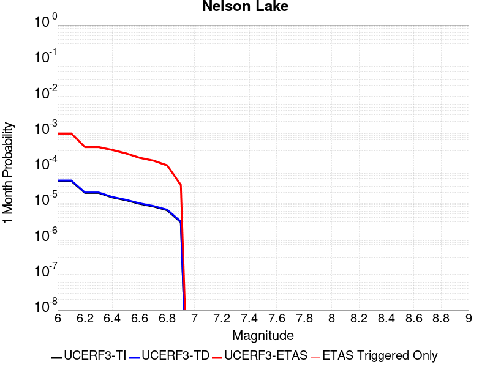 |  |  |

| Magnitude | 1 wk TI Prob | 1 wk TD Prob | 1 wk ETAS Prob | 1 wk ETAS/TD Gain | 1 wk ETAS Triggered Only | 1 mo TI Prob | 1 mo TD Prob | 1 mo ETAS Prob | 1 mo ETAS/TD Gain | 1 mo ETAS Triggered Only | 1 yr TI Prob | 1 yr TD Prob | 1 yr ETAS Prob | 1 yr ETAS/TD Gain | 1 yr ETAS Triggered Only | 10 yr TI Prob | 10 yr TD Prob | 10 yr ETAS Prob | 10 yr ETAS/TD Gain | 10 yr ETAS Triggered Only |
|-----|-----|-----|-----|-----|-----|-----|-----|-----|-----|-----|-----|-----|-----|-----|-----|-----|-----|-----|-----|-----|
| 6.0 | 9.913453E-6 | 1.0192255E-5 | 5.501867E-4 | 53.980865 | 5.4E-4 | 4.2485535E-5 | 4.3680422E-5 | 9.136424E-4 | 20.916521 | 8.7E-4 | 5.1713863E-4 | 5.316897E-4 | 0.0024206848 | 4.552815 | 0.00189 | 0.0051593683 | 0.005305204 | 0.008408652 | 1.5849818 | 0.00312 |
| 6.1 | 9.913453E-6 | 1.0192255E-5 | 5.501867E-4 | 53.980865 | 5.4E-4 | 4.2485535E-5 | 4.3680422E-5 | 9.136424E-4 | 20.916521 | 8.7E-4 | 5.1713863E-4 | 5.316897E-4 | 0.0024206848 | 4.552815 | 0.00189 | 0.0051593683 | 0.005305204 | 0.008408652 | 1.5849818 | 0.00312 |
| 6.2 | 4.5596407E-6 | 4.696313E-6 | 2.2469528E-4 | 47.84504 | 2.2E-4 | 1.954117E-5 | 2.0126909E-5 | 3.8011966E-4 | 18.886143 | 3.6E-4 | 2.3788778E-4 | 2.4501883E-4 | 0.0010348252 | 4.223452 | 7.9E-4 | 0.0023763329 | 0.0024476128 | 0.0038441862 | 1.5705858 | 0.0014 |
| 6.3 | 4.5596407E-6 | 4.696313E-6 | 2.2469528E-4 | 47.84504 | 2.2E-4 | 1.954117E-5 | 2.0126909E-5 | 3.8011966E-4 | 18.886143 | 3.6E-4 | 2.3788778E-4 | 2.4501883E-4 | 0.0010348252 | 4.223452 | 7.9E-4 | 0.0023763329 | 0.0024476128 | 0.0038441862 | 1.5705858 | 0.0014 |
| 6.4 | 3.4025713E-6 | 3.5098972E-6 | 1.9350923E-4 | 55.13245 | 1.9E-4 | 1.4582367E-5 | 1.5042335E-5 | 3.1503782E-4 | 20.943413 | 3.0E-4 | 1.7752586E-4 | 1.8312587E-4 | 8.43005E-4 | 4.6034184 | 6.6E-4 | 0.001773841 | 0.0018298327 | 0.0029777284 | 1.6273228 | 0.00115 |
| 6.5 | 2.8352947E-6 | 2.927856E-6 | 1.6292739E-4 | 55.647335 | 1.6E-4 | 1.2151207E-5 | 1.2547898E-5 | 2.5254488E-4 | 20.126469 | 2.4E-4 | 1.479309E-4 | 1.5276071E-4 | 7.1267516E-4 | 4.665304 | 5.6E-4 | 0.0014783246 | 0.0015266308 | 0.002535089 | 1.6605775 | 0.00101 |
| 6.6 | 2.251518E-6 | 2.3290677E-6 | 1.3232876E-4 | 56.816196 | 1.3E-4 | 9.649328E-6 | 9.981683E-6 | 1.8997988E-4 | 19.03285 | 1.8E-4 | 1.1747423E-4 | 1.2152085E-4 | 5.414698E-4 | 4.455777 | 4.2E-4 | 0.0011741214 | 0.0012146058 | 0.0019537068 | 1.6085112 | 7.4E-4 |
| 6.7 | 1.8911853E-6 | 1.9591396E-6 | 1.219589E-4 | 62.251255 | 1.2E-4 | 8.105055E-6 | 8.39629E-6 | 1.5839504E-4 | 18.864885 | 1.5E-4 | 9.867457E-5 | 1.0222061E-4 | 4.5218485E-4 | 4.423617 | 3.5E-4 | 9.863076E-4 | 0.0010217935 | 0.0016411599 | 1.6061562 | 6.2E-4 |
| 6.8 | 1.4874814E-6 | 1.5438305E-6 | 8.154371E-5 | 52.81908 | 8.0E-5 | 6.374905E-6 | 6.6164025E-6 | 1.1661567E-4 | 17.625238 | 1.1E-4 | 7.76117E-5 | 8.055224E-5 | 3.605297E-4 | 4.475725 | 2.8E-4 | 7.75846E-4 | 8.0528157E-4 | 0.0012749031 | 1.5831769 | 4.7E-4 |
| 6.9 | 6.835972E-7 | 7.1399285E-7 | 3.071397E-5 | 43.0172 | 3.0E-5 | 2.9296991E-6 | 3.0599674E-6 | 3.3059874E-5 | 10.803996 | 3.0E-5 | 3.56685E-5 | 3.7254784E-5 | 1.4725068E-4 | 3.9525309 | 1.1E-4 | 3.5662777E-4 | 3.7251666E-4 | 5.524496E-4 | 1.4830198 | 1.8E-4 |

## Lenwood-Lockhart-Old Woman Springs
*[(top)](#table-of-contents)*

| 1 Week | 1 Month | 1 Year | 10 Year |
|-----|-----|-----|-----|
|  |  |  |  |

| Magnitude | 1 wk TI Prob | 1 wk TD Prob | 1 wk ETAS Prob | 1 wk ETAS/TD Gain | 1 wk ETAS Triggered Only | 1 mo TI Prob | 1 mo TD Prob | 1 mo ETAS Prob | 1 mo ETAS/TD Gain | 1 mo ETAS Triggered Only | 1 yr TI Prob | 1 yr TD Prob | 1 yr ETAS Prob | 1 yr ETAS/TD Gain | 1 yr ETAS Triggered Only | 10 yr TI Prob | 10 yr TD Prob | 10 yr ETAS Prob | 10 yr ETAS/TD Gain | 10 yr ETAS Triggered Only |
|-----|-----|-----|-----|-----|-----|-----|-----|-----|-----|-----|-----|-----|-----|-----|-----|-----|-----|-----|-----|-----|
| 6.0 | 3.744542E-5 | 4.396349E-5 | 8.9392613E-4 | 20.333376 | 8.5E-4 | 1.604705E-4 | 1.8840231E-4 | 0.0014481649 | 7.686556 | 0.00126 | 0.0019519776 | 0.0022915571 | 0.0045563555 | 1.9883227 | 0.00227 | 0.019349206 | 0.022697281 | 0.025941927 | 1.142953 | 0.00332 |
| 6.1 | 3.744542E-5 | 4.396349E-5 | 8.9392613E-4 | 20.333376 | 8.5E-4 | 1.604705E-4 | 1.8840231E-4 | 0.0014481649 | 7.686556 | 0.00126 | 0.0019519776 | 0.0022915571 | 0.0045563555 | 1.9883227 | 0.00227 | 0.019349206 | 0.022697281 | 0.025941927 | 1.142953 | 0.00332 |
| 6.2 | 3.744542E-5 | 4.396349E-5 | 8.9392613E-4 | 20.333376 | 8.5E-4 | 1.604705E-4 | 1.8840231E-4 | 0.0014481649 | 7.686556 | 0.00126 | 0.0019519776 | 0.0022915571 | 0.0045563555 | 1.9883227 | 0.00227 | 0.019349206 | 0.022697281 | 0.025941927 | 1.142953 | 0.00332 |
| 6.3 | 2.1079984E-5 | 2.5354384E-5 | 3.95345E-4 | 15.592767 | 3.7E-4 | 9.0339665E-5 | 1.0865723E-4 | 6.186018E-4 | 5.693149 | 5.1E-4 | 0.0010993304 | 0.0013221189 | 0.002270863 | 1.7175936 | 9.5E-4 | 0.010939079 | 0.013144747 | 0.014467133 | 1.1006019 | 0.00134 |
| 6.4 | 2.1079984E-5 | 2.5354384E-5 | 3.95345E-4 | 15.592767 | 3.7E-4 | 9.0339665E-5 | 1.0865723E-4 | 6.186018E-4 | 5.693149 | 5.1E-4 | 0.0010993304 | 0.0013221189 | 0.002270863 | 1.7175936 | 9.5E-4 | 0.010939079 | 0.013144747 | 0.014467133 | 1.1006019 | 0.00134 |
| 6.5 | 1.7397282E-5 | 2.0663285E-5 | 2.3065894E-4 | 11.162744 | 2.1E-4 | 7.455765E-5 | 8.8554E-5 | 4.0852567E-4 | 4.6132946 | 3.2E-4 | 9.073613E-4 | 0.0010776235 | 0.0017568907 | 1.6303382 | 6.8E-4 | 0.009036654 | 0.010725273 | 0.01172444 | 1.0931602 | 0.00101 |
| 6.6 | 1.52050325E-5 | 1.7680086E-5 | 1.976769E-4 | 11.180766 | 1.8E-4 | 6.51628E-5 | 7.576964E-5 | 3.6574766E-4 | 4.8271008 | 2.9E-4 | 7.9306826E-4 | 9.221128E-4 | 0.001501578 | 1.6284103 | 5.8E-4 | 0.007902439 | 0.009183729 | 0.010055647 | 1.0949416 | 8.8E-4 |
| 6.7 | 1.332523E-5 | 1.5264379E-5 | 1.8526179E-4 | 12.136869 | 1.7E-4 | 5.7106878E-5 | 6.541716E-5 | 3.4539885E-4 | 5.2799425 | 2.8E-4 | 6.950544E-4 | 7.9616875E-4 | 0.0013557229 | 1.7028085 | 5.6E-4 | 0.006928845 | 0.0079337945 | 0.008757209 | 1.1037858 | 8.3E-4 |
| 6.8 | 1.1525329E-5 | 1.3031365E-5 | 1.7302929E-4 | 13.277909 | 1.6E-4 | 4.9393333E-5 | 5.5847537E-5 | 2.9583412E-4 | 5.2971745 | 2.4E-4 | 6.011979E-4 | 6.7973585E-4 | 0.0011494164 | 1.6909751 | 4.7E-4 | 0.00599574 | 0.0067770192 | 0.007462343 | 1.1011246 | 6.9E-4 |
| 6.9 | 1.0253909E-5 | 1.1514835E-5 | 1.4151334E-4 | 12.289655 | 1.3E-4 | 4.3944583E-5 | 4.934838E-5 | 2.493385E-4 | 5.052618 | 2.0E-4 | 5.3489394E-4 | 6.006545E-4 | 9.804262E-4 | 1.6322632 | 3.8E-4 | 0.0053360825 | 0.0059906896 | 0.006547335 | 1.0929184 | 5.6E-4 |
| 7.0 | 8.104563E-6 | 8.99143E-6 | 1.08990534E-4 | 12.121601 | 1.0E-4 | 3.4733377E-5 | 3.853415E-5 | 1.7852875E-4 | 4.6330013 | 1.4E-4 | 4.2279682E-4 | 4.6905465E-4 | 6.9894677E-4 | 1.490118 | 2.3E-4 | 0.0042199334 | 0.0046808943 | 0.00500935 | 1.0701693 | 3.3E-4 |
| 7.1 | 6.7986157E-6 | 7.5159796E-6 | 1.07515225E-4 | 14.304885 | 1.0E-4 | 2.91366E-5 | 3.2210955E-5 | 1.522071E-4 | 4.7253203 | 1.2E-4 | 3.5468035E-4 | 3.9209996E-4 | 5.8202544E-4 | 1.4843804 | 1.9E-4 | 0.003541148 | 0.003914298 | 0.004183241 | 1.068708 | 2.7E-4 |
| 7.2 | 5.6893327E-6 | 6.280132E-6 | 6.6279754E-5 | 10.55388 | 6.0E-5 | 2.4382627E-5 | 2.6914584E-5 | 9.69127E-5 | 3.6007504 | 7.0E-5 | 2.9681803E-4 | 3.276378E-4 | 4.6759192E-4 | 1.4271611 | 1.4E-4 | 0.002964219 | 0.003271746 | 0.0034710916 | 1.0609294 | 2.0E-4 |
| 7.3 | 4.253348E-6 | 4.707075E-6 | 6.470679E-5 | 13.746711 | 6.0E-5 | 1.8228506E-5 | 2.017303E-5 | 8.017182E-5 | 3.9742079 | 6.0E-5 | 2.2190946E-4 | 2.455808E-4 | 3.5555378E-4 | 1.4478078 | 1.1E-4 | 0.00221688 | 0.0024532753 | 0.0026128828 | 1.065059 | 1.6E-4 |
| 7.4 | 2.5448119E-6 | 2.8520594E-6 | 3.2851975E-5 | 11.518684 | 3.0E-5 | 1.0906291E-5 | 1.2223064E-5 | 4.22227E-5 | 3.4543464 | 3.0E-5 | 1.3277601E-4 | 1.4880729E-4 | 2.1879688E-4 | 1.470337 | 7.0E-5 | 0.001326967 | 0.0014872387 | 0.00158709 | 1.0671387 | 1.0E-4 |
| 7.5 | 4.3706837E-8 | 4.562909E-8 | 4.562909E-8 | 1.0 | 0.0 | 1.8731501E-7 | 1.9555324E-7 | 1.9555324E-7 | 1.0 | 0.0 | 2.2805577E-6 | 2.3808586E-6 | 2.3808586E-6 | 1.0 | 0.0 | 2.2805343E-5 | 2.3808387E-5 | 2.3808387E-5 | 1.0 | 0.0 |

## Towne Pass
*[(top)](#table-of-contents)*

| 1 Week | 1 Month | 1 Year | 10 Year |
|-----|-----|-----|-----|
|  |  |  | 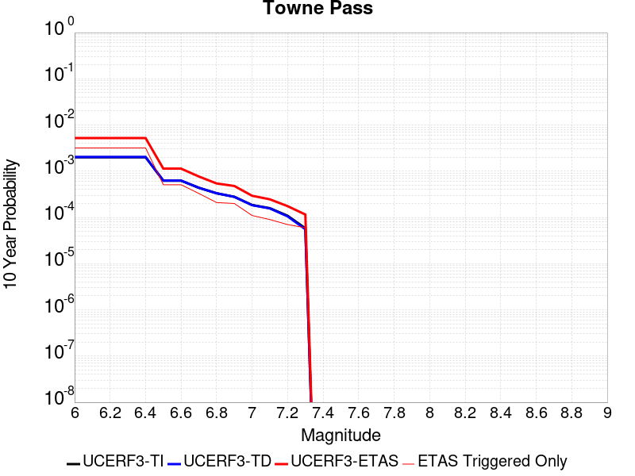 |

| Magnitude | 1 wk TI Prob | 1 wk TD Prob | 1 wk ETAS Prob | 1 wk ETAS/TD Gain | 1 wk ETAS Triggered Only | 1 mo TI Prob | 1 mo TD Prob | 1 mo ETAS Prob | 1 mo ETAS/TD Gain | 1 mo ETAS Triggered Only | 1 yr TI Prob | 1 yr TD Prob | 1 yr ETAS Prob | 1 yr ETAS/TD Gain | 1 yr ETAS Triggered Only | 10 yr TI Prob | 10 yr TD Prob | 10 yr ETAS Prob | 10 yr ETAS/TD Gain | 10 yr ETAS Triggered Only |
|-----|-----|-----|-----|-----|-----|-----|-----|-----|-----|-----|-----|-----|-----|-----|-----|-----|-----|-----|-----|-----|
| 6.0 | 3.849728E-6 | 3.894542E-6 | 8.638912E-4 | 221.821 | 8.6E-4 | 1.649873E-5 | 1.6690812E-5 | 0.0012466703 | 74.69201 | 0.00123 | 2.0085352E-4 | 2.0319606E-4 | 0.0022427815 | 11.037525 | 0.00204 | 0.0020067208 | 0.0020305319 | 0.0052140546 | 2.567827 | 0.00319 |
| 6.1 | 3.849728E-6 | 3.894542E-6 | 8.638912E-4 | 221.821 | 8.6E-4 | 1.649873E-5 | 1.6690812E-5 | 0.0012466703 | 74.69201 | 0.00123 | 2.0085352E-4 | 2.0319606E-4 | 0.0022427815 | 11.037525 | 0.00204 | 0.0020067208 | 0.0020305319 | 0.0052140546 | 2.567827 | 0.00319 |
| 6.2 | 3.849728E-6 | 3.894542E-6 | 8.638912E-4 | 221.821 | 8.6E-4 | 1.649873E-5 | 1.6690812E-5 | 0.0012466703 | 74.69201 | 0.00123 | 2.0085352E-4 | 2.0319606E-4 | 0.0022427815 | 11.037525 | 0.00204 | 0.0020067208 | 0.0020305319 | 0.0052140546 | 2.567827 | 0.00319 |
| 6.3 | 3.849728E-6 | 3.894542E-6 | 8.638912E-4 | 221.821 | 8.6E-4 | 1.649873E-5 | 1.6690812E-5 | 0.0012466703 | 74.69201 | 0.00123 | 2.0085352E-4 | 2.0319606E-4 | 0.0022427815 | 11.037525 | 0.00204 | 0.0020067208 | 0.0020305319 | 0.0052140546 | 2.567827 | 0.00319 |
| 6.4 | 3.849728E-6 | 3.894542E-6 | 8.638912E-4 | 221.821 | 8.6E-4 | 1.649873E-5 | 1.6690812E-5 | 0.0012466703 | 74.69201 | 0.00123 | 2.0085352E-4 | 2.0319606E-4 | 0.0022427815 | 11.037525 | 0.00204 | 0.0020067208 | 0.0020305319 | 0.0052140546 | 2.567827 | 0.00319 |
| 6.5 | 1.1953545E-6 | 1.2030526E-6 | 1.1120292E-4 | 92.43396 | 1.1E-4 | 5.1229376E-6 | 5.15593E-6 | 1.651551E-4 | 32.032066 | 1.6E-4 | 6.236998E-5 | 6.277176E-5 | 3.9275104E-4 | 6.256811 | 3.3E-4 | 6.235248E-4 | 6.2755204E-4 | 0.001137232 | 1.8121716 | 5.1E-4 |
| 6.6 | 1.1953545E-6 | 1.2030526E-6 | 1.1120292E-4 | 92.43396 | 1.1E-4 | 5.1229376E-6 | 5.15593E-6 | 1.651551E-4 | 32.032066 | 1.6E-4 | 6.236998E-5 | 6.277176E-5 | 3.9275104E-4 | 6.256811 | 3.3E-4 | 6.235248E-4 | 6.2755204E-4 | 0.001137232 | 1.8121716 | 5.1E-4 |
| 6.7 | 8.375951E-7 | 8.410676E-7 | 8.0841E-5 | 96.11713 | 8.0E-5 | 3.5896885E-6 | 3.6045708E-6 | 1.336041E-4 | 37.06519 | 1.3E-4 | 4.370358E-5 | 4.3884826E-5 | 2.538756E-4 | 5.7850432 | 2.1E-4 | 4.3694986E-4 | 4.3876728E-4 | 7.686225E-4 | 1.751777 | 3.3E-4 |
| 6.8 | 6.38041E-7 | 6.3921624E-7 | 6.0639177E-5 | 94.86489 | 6.0E-5 | 2.7344586E-6 | 2.7394954E-6 | 1.0273922E-4 | 37.50297 | 1.0E-4 | 3.3291526E-5 | 3.3352884E-5 | 1.7334822E-4 | 5.1973977 | 1.4E-4 | 3.3286537E-4 | 3.334826E-4 | 5.434126E-4 | 1.629508 | 2.1E-4 |
| 6.9 | 5.3460053E-7 | 5.345339E-7 | 6.05345E-5 | 113.24727 | 6.0E-5 | 2.2911431E-6 | 2.2908578E-6 | 1.0229063E-4 | 44.651672 | 1.0E-4 | 2.789431E-5 | 2.7890868E-5 | 1.6788696E-4 | 6.019424 | 1.4E-4 | 2.789081E-4 | 2.78877E-4 | 4.7882122E-4 | 1.716962 | 2.0E-4 |
| 7.0 | 3.557783E-7 | 3.5324283E-7 | 2.0353236E-5 | 57.618256 | 2.0E-5 | 1.5247632E-6 | 1.513897E-6 | 3.1513853E-5 | 20.816378 | 3.0E-5 | 1.8563835E-5 | 1.8431549E-5 | 7.843044E-5 | 4.255228 | 6.0E-5 | 1.8562283E-4 | 1.8430105E-4 | 2.9428076E-4 | 1.5967395 | 1.1E-4 |
| 7.1 | 3.037942E-7 | 3.0002275E-7 | 2.0300016E-5 | 67.66159 | 2.0E-5 | 1.3019744E-6 | 1.2858112E-6 | 3.1285774E-5 | 24.331545 | 3.0E-5 | 1.5851423E-5 | 1.5654647E-5 | 7.5653705E-5 | 4.832668 | 6.0E-5 | 1.5850292E-4 | 1.5653619E-4 | 2.465221E-4 | 1.5748569 | 9.0E-5 |
| 7.2 | 2.0808248E-7 | 2.0217735E-7 | 1.0202175E-5 | 50.461517 | 1.0E-5 | 8.917818E-7 | 8.6647407E-7 | 1.0866465E-5 | 12.541017 | 1.0E-5 | 1.0857389E-5 | 1.0549275E-5 | 5.0548853E-5 | 4.79169 | 4.0E-5 | 1.0856859E-4 | 1.0548821E-4 | 1.7548082E-4 | 1.6635113 | 7.0E-5 |
| 7.3 | 1.1162073E-7 | 1.0636902E-7 | 1.0636902E-7 | 1.0 | 0.0 | 4.7837443E-7 | 4.5586717E-7 | 4.5586717E-7 | 1.0 | 0.0 | 5.8241935E-6 | 5.5501705E-6 | 3.5550005E-5 | 6.405209 | 3.0E-5 | 5.8240406E-5 | 5.550052E-5 | 1.1549719E-4 | 2.0810108 | 6.0E-5 |

## Bicycle Lake
*[(top)](#table-of-contents)*

| 1 Week | 1 Month | 1 Year | 10 Year |
|-----|-----|-----|-----|
| 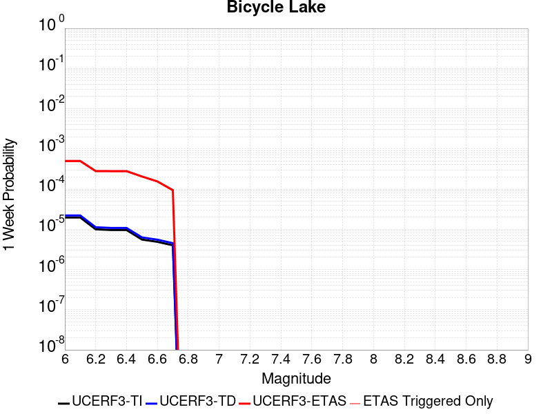 |  |  |  |

| Magnitude | 1 wk TI Prob | 1 wk TD Prob | 1 wk ETAS Prob | 1 wk ETAS/TD Gain | 1 wk ETAS Triggered Only | 1 mo TI Prob | 1 mo TD Prob | 1 mo ETAS Prob | 1 mo ETAS/TD Gain | 1 mo ETAS Triggered Only | 1 yr TI Prob | 1 yr TD Prob | 1 yr ETAS Prob | 1 yr ETAS/TD Gain | 1 yr ETAS Triggered Only | 10 yr TI Prob | 10 yr TD Prob | 10 yr ETAS Prob | 10 yr ETAS/TD Gain | 10 yr ETAS Triggered Only |
|-----|-----|-----|-----|-----|-----|-----|-----|-----|-----|-----|-----|-----|-----|-----|-----|-----|-----|-----|-----|-----|
| 6.0 | 1.9621975E-5 | 2.2097078E-5 | 5.020865E-4 | 22.72185 | 4.8E-4 | 8.4091465E-5 | 9.4699084E-5 | 8.446281E-4 | 8.919073 | 7.5E-4 | 0.0010233327 | 0.0011524865 | 0.0024609768 | 2.1353626 | 0.00131 | 0.01018633 | 0.011478408 | 0.0136235 | 1.1868806 | 0.00217 |
| 6.1 | 1.9621975E-5 | 2.2097078E-5 | 5.020865E-4 | 22.72185 | 4.8E-4 | 8.4091465E-5 | 9.4699084E-5 | 8.446281E-4 | 8.919073 | 7.5E-4 | 0.0010233327 | 0.0011524865 | 0.0024609768 | 2.1353626 | 0.00131 | 0.01018633 | 0.011478408 | 0.0136235 | 1.1868806 | 0.00217 |
| 6.2 | 9.9971285E-6 | 1.125564E-5 | 2.812526E-4 | 24.987705 | 2.7E-4 | 4.2844134E-5 | 4.8237856E-5 | 4.9821613E-4 | 10.328322 | 4.5E-4 | 5.2150246E-4 | 5.871897E-4 | 0.0013867199 | 2.3616219 | 8.0E-4 | 0.0052028033 | 0.005861487 | 0.0071439254 | 1.2187907 | 0.00129 |
| 6.3 | 9.589428E-6 | 1.0798346E-5 | 2.8079544E-4 | 26.00356 | 2.7E-4 | 4.10969E-5 | 4.62781E-5 | 4.6625867E-4 | 10.075148 | 4.2E-4 | 5.002399E-4 | 5.6334207E-4 | 0.0013129195 | 2.3305902 | 7.5E-4 | 0.0049911533 | 0.0056242296 | 0.0068572555 | 1.2192346 | 0.00124 |
| 6.4 | 9.589428E-6 | 1.0798346E-5 | 2.8079544E-4 | 26.00356 | 2.7E-4 | 4.10969E-5 | 4.62781E-5 | 4.6625867E-4 | 10.075148 | 4.2E-4 | 5.002399E-4 | 5.6334207E-4 | 0.0013129195 | 2.3305902 | 7.5E-4 | 0.0049911533 | 0.0056242296 | 0.0068572555 | 1.2192346 | 0.00124 |
| 6.5 | 5.557707E-6 | 6.2856016E-6 | 2.0628434E-4 | 32.818554 | 2.0E-4 | 2.3818526E-5 | 2.6938165E-5 | 3.4692953E-4 | 12.8787365 | 3.2E-4 | 2.8995197E-4 | 3.279497E-4 | 8.677726E-4 | 2.646054 | 5.4E-4 | 0.0028957394 | 0.0032772934 | 0.004074672 | 1.2433039 | 8.0E-4 |
| 6.6 | 4.8742945E-6 | 5.5132896E-6 | 1.5551246E-4 | 28.206837 | 1.5E-4 | 2.0889667E-5 | 2.3628318E-5 | 2.8362218E-4 | 12.003486 | 2.6E-4 | 2.54302E-4 | 2.87663E-4 | 7.3753356E-4 | 2.5638804 | 4.5E-4 | 0.002540112 | 0.0028754752 | 0.0035634912 | 1.2392703 | 6.9E-4 |
| 6.7 | 3.991108E-6 | 4.5159104E-6 | 9.4515504E-5 | 20.929447 | 9.0E-5 | 1.7104636E-5 | 1.9353902E-5 | 2.0935023E-4 | 10.816952 | 1.9E-4 | 2.0822904E-4 | 2.3563375E-4 | 5.5555836E-4 | 2.3577197 | 3.2E-4 | 0.0020803404 | 0.0023563374 | 0.0028850886 | 1.2243954 | 5.3E-4 |

## San Andreas (San Bernardino N)
*[(top)](#table-of-contents)*

| 1 Week | 1 Month | 1 Year | 10 Year |
|-----|-----|-----|-----|
|  |  |  |  |

| Magnitude | 1 wk TI Prob | 1 wk TD Prob | 1 wk ETAS Prob | 1 wk ETAS/TD Gain | 1 wk ETAS Triggered Only | 1 mo TI Prob | 1 mo TD Prob | 1 mo ETAS Prob | 1 mo ETAS/TD Gain | 1 mo ETAS Triggered Only | 1 yr TI Prob | 1 yr TD Prob | 1 yr ETAS Prob | 1 yr ETAS/TD Gain | 1 yr ETAS Triggered Only | 10 yr TI Prob | 10 yr TD Prob | 10 yr ETAS Prob | 10 yr ETAS/TD Gain | 10 yr ETAS Triggered Only |
|-----|-----|-----|-----|-----|-----|-----|-----|-----|-----|-----|-----|-----|-----|-----|-----|-----|-----|-----|-----|-----|
| 6.0 | 1.4273766E-4 | 3.160784E-4 | 0.0012457845 | 3.9413779 | 9.3E-4 | 6.115894E-4 | 0.0013539245 | 0.002512354 | 1.8556086 | 0.00116 | 0.0074207084 | 0.016360939 | 0.017954435 | 1.0973964 | 0.00162 | 0.07177748 | 0.15021163 | 0.15197918 | 1.0117671 | 0.00208 |
| 6.1 | 1.4273766E-4 | 3.160784E-4 | 0.0012457845 | 3.9413779 | 9.3E-4 | 6.115894E-4 | 0.0013539245 | 0.002512354 | 1.8556086 | 0.00116 | 0.0074207084 | 0.016360939 | 0.017954435 | 1.0973964 | 0.00162 | 0.07177748 | 0.15021163 | 0.15197918 | 1.0117671 | 0.00208 |
| 6.2 | 1.4273766E-4 | 3.160784E-4 | 0.0012457845 | 3.9413779 | 9.3E-4 | 6.115894E-4 | 0.0013539245 | 0.002512354 | 1.8556086 | 0.00116 | 0.0074207084 | 0.016360939 | 0.017954435 | 1.0973964 | 0.00162 | 0.07177748 | 0.15021163 | 0.15197918 | 1.0117671 | 0.00208 |
| 6.3 | 1.3730655E-4 | 3.0512668E-4 | 0.0012148491 | 3.981458 | 9.1E-4 | 5.883239E-4 | 0.001307036 | 0.002445546 | 1.8710624 | 0.00114 | 0.0071393442 | 0.015798455 | 0.017373178 | 1.0996758 | 0.0016 | 0.06914291 | 0.1455135 | 0.14727375 | 1.0120968 | 0.00206 |
| 6.4 | 1.3730655E-4 | 3.0512668E-4 | 0.0012148491 | 3.981458 | 9.1E-4 | 5.883239E-4 | 0.001307036 | 0.002445546 | 1.8710624 | 0.00114 | 0.0071393442 | 0.015798455 | 0.017373178 | 1.0996758 | 0.0016 | 0.06914291 | 0.1455135 | 0.14727375 | 1.0120968 | 0.00206 |
| 6.5 | 1.2942807E-4 | 2.8927144E-4 | 0.001179014 | 4.075805 | 8.9E-4 | 5.545738E-4 | 0.0012391509 | 0.002357763 | 1.9027247 | 0.00112 | 0.0067310524 | 0.014983548 | 0.016539874 | 1.103869 | 0.00158 | 0.06530788 | 0.13865088 | 0.14041664 | 1.0127354 | 0.00205 |
| 6.6 | 1.1125901E-4 | 2.5365927E-4 | 0.0011434335 | 4.507754 | 8.9E-4 | 4.767372E-4 | 0.0010866605 | 0.0021954542 | 2.020368 | 0.00111 | 0.005788839 | 0.0131504685 | 0.014699822 | 1.1178174 | 0.00157 | 0.056403454 | 0.12300496 | 0.12478526 | 1.0144734 | 0.00203 |
| 6.7 | 1.02209575E-4 | 2.3500937E-4 | 0.0011148026 | 4.7436514 | 8.8E-4 | 4.3796748E-4 | 0.0010067957 | 0.0021056882 | 2.0914752 | 0.0011 | 0.0053192247 | 0.012189267 | 0.013730252 | 1.1264215 | 0.00156 | 0.051936906 | 0.114792764 | 0.11657203 | 1.0154998 | 0.00201 |
| 6.8 | 9.610582E-5 | 2.2026796E-4 | 0.0010900763 | 4.948865 | 8.7E-4 | 4.1181705E-4 | 9.436647E-4 | 0.0020326362 | 2.1539812 | 0.00109 | 0.0050023515 | 0.011428859 | 0.012951259 | 1.1332066 | 0.00154 | 0.048912346 | 0.10820469 | 0.10997044 | 1.0163187 | 0.00198 |
| 6.9 | 9.3877505E-5 | 2.1482339E-4 | 0.0010846365 | 5.0489683 | 8.7E-4 | 4.0227012E-4 | 9.203475E-4 | 0.0020093443 | 2.1832452 | 0.00109 | 0.0048866454 | 0.011147907 | 0.01267074 | 1.1366025 | 0.00154 | 0.04780577 | 0.105798274 | 0.107559845 | 1.0166503 | 0.00197 |
| 7.0 | 9.1019785E-5 | 2.0809306E-4 | 0.001077912 | 5.1799517 | 8.7E-4 | 3.900265E-4 | 8.915232E-4 | 0.0019805515 | 2.2215366 | 0.00109 | 0.0047382377 | 0.0108004995 | 0.012313975 | 1.1401302 | 0.00153 | 0.046384744 | 0.10276815 | 0.10452673 | 1.017112 | 0.00196 |
| 7.1 | 8.771155E-5 | 1.9983841E-4 | 0.0010696646 | 5.3526473 | 8.7E-4 | 3.758525E-4 | 8.5616973E-4 | 0.0019452365 | 2.272022 | 0.00109 | 0.0045664064 | 0.010374243 | 0.011878475 | 1.1449968 | 0.00152 | 0.044737056 | 0.09907644 | 0.100833245 | 1.0177318 | 0.00195 |
| 7.2 | 8.0830236E-5 | 1.8389444E-4 | 0.0010337381 | 5.621367 | 8.5E-4 | 3.4636928E-4 | 7.8788114E-4 | 0.0018570381 | 2.357003 | 0.00107 | 0.0042088944 | 0.009550368 | 0.011036043 | 1.155562 | 0.0015 | 0.041300658 | 0.09180518 | 0.093558 | 1.0190928 | 0.00193 |
| 7.3 | 7.7668235E-5 | 1.7333007E-4 | 0.0010231828 | 5.903088 | 8.5E-4 | 3.328214E-4 | 7.426318E-4 | 0.0018118372 | 2.4397516 | 0.00107 | 0.0040445733 | 0.009004138 | 0.010490632 | 1.1650901 | 0.0015 | 0.03971748 | 0.08706761 | 0.08882958 | 1.0202367 | 0.00193 |
| 7.4 | 7.520177E-5 | 1.655312E-4 | 0.0010153905 | 6.134134 | 8.5E-4 | 3.2225347E-4 | 7.092266E-4 | 0.0017584818 | 2.479436 | 0.00105 | 0.0039163795 | 0.008600714 | 0.010067984 | 1.1705987 | 0.00148 | 0.038480744 | 0.08352157 | 0.08527204 | 1.0209583 | 0.00191 |
| 7.5 | 7.274697E-5 | 1.584075E-4 | 0.0010082729 | 6.3650575 | 8.5E-4 | 3.1173544E-4 | 6.7871273E-4 | 0.0017280001 | 2.5459962 | 0.00105 | 0.003788775 | 0.008232076 | 0.009699892 | 1.1783046 | 0.00148 | 0.03724827 | 0.08023654 | 0.08199329 | 1.0218946 | 0.00191 |
| 7.6 | 7.1185845E-5 | 1.5410586E-4 | 0.0010039748 | 6.514839 | 8.5E-4 | 3.0504653E-4 | 6.602866E-4 | 0.0017095932 | 2.5891685 | 0.00105 | 0.0037076178 | 0.0080094095 | 0.009467635 | 1.1820642 | 0.00147 | 0.036463667 | 0.07822661 | 0.079968765 | 1.0222706 | 0.00189 |
| 7.7 | 6.709961E-5 | 1.4319421E-4 | 9.930725E-4 | 6.935144 | 8.5E-4 | 2.8753807E-4 | 6.135452E-4 | 0.0016529071 | 2.6940267 | 0.00104 | 0.003495157 | 0.0074443663 | 0.008893497 | 1.1946615 | 0.00146 | 0.034406938 | 0.07305558 | 0.074798234 | 1.0238538 | 0.00188 |
| 7.8 | 6.300812E-5 | 1.320343E-4 | 9.719234E-4 | 7.361143 | 8.4E-4 | 2.7000686E-4 | 5.657386E-4 | 0.0015951559 | 2.8195987 | 0.00103 | 0.0032823787 | 0.006866143 | 0.008296256 | 1.2082847 | 0.00144 | 0.032343175 | 0.06771385 | 0.069429256 | 1.0253332 | 0.00184 |
| 7.9 | 4.983037E-5 | 9.7241085E-5 | 8.571672E-4 | 8.814867 | 7.6E-4 | 2.1354125E-4 | 4.1668097E-4 | 0.0013263017 | 3.183015 | 9.1E-4 | 0.0025967648 | 0.0050613005 | 0.0063049737 | 1.245722 | 0.00125 | 0.025666296 | 0.050650507 | 0.052159972 | 1.0298016 | 0.00159 |
| 8.0 | 3.2211527E-5 | 5.3306234E-5 | 3.1329237E-4 | 5.8772182 | 2.6E-4 | 1.380421E-4 | 2.2843528E-4 | 5.3836446E-4 | 2.3567483 | 3.1E-4 | 0.0016793669 | 0.0027776542 | 0.0032064598 | 1.1543769 | 4.3E-4 | 0.016667323 | 0.028362568 | 0.028896969 | 1.0188417 | 5.5E-4 |
| 8.1 | 1.743376E-5 | 1.8823403E-5 | 4.8822836E-5 | 2.5937307 | 3.0E-5 | 7.471398E-5 | 8.066923E-5 | 1.1066681E-4 | 1.371859 | 3.0E-5 | 9.0926304E-4 | 9.81706E-4 | 0.0010316569 | 1.0508817 | 5.0E-5 | 0.009055517 | 0.010483979 | 0.010533456 | 1.0047191 | 5.0E-5 |
| 8.2 | 7.831616E-6 | 5.1540533E-6 | 5.1540533E-6 | 1.0 | 0.0 | 3.3563636E-5 | 2.2088612E-5 | 2.2088612E-5 | 1.0 | 0.0 | 4.0856065E-4 | 2.6889573E-4 | 2.6889573E-4 | 1.0 | 0.0 | 0.004078103 | 0.0030413668 | 0.0030413668 | 1.0 | 0.0 |
| 8.3 | 1.983087E-6 | 7.6564595E-7 | 7.6564595E-7 | 1.0 | 0.0 | 8.498917E-6 | 3.281336E-6 | 3.281336E-6 | 1.0 | 0.0 | 1.034694E-4 | 3.9949547E-5 | 3.9949547E-5 | 1.0 | 0.0 | 0.0010342124 | 4.717979E-4 | 4.717979E-4 | 1.0 | 0.0 |

## Paradise
*[(top)](#table-of-contents)*

| 1 Week | 1 Month | 1 Year | 10 Year |
|-----|-----|-----|-----|
|  |  | 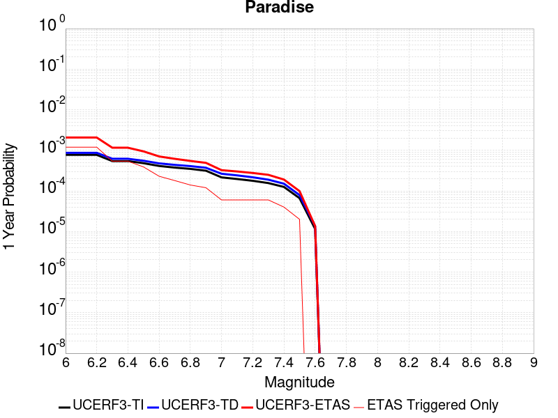 |  |

| Magnitude | 1 wk TI Prob | 1 wk TD Prob | 1 wk ETAS Prob | 1 wk ETAS/TD Gain | 1 wk ETAS Triggered Only | 1 mo TI Prob | 1 mo TD Prob | 1 mo ETAS Prob | 1 mo ETAS/TD Gain | 1 mo ETAS Triggered Only | 1 yr TI Prob | 1 yr TD Prob | 1 yr ETAS Prob | 1 yr ETAS/TD Gain | 1 yr ETAS Triggered Only | 10 yr TI Prob | 10 yr TD Prob | 10 yr ETAS Prob | 10 yr ETAS/TD Gain | 10 yr ETAS Triggered Only |
|-----|-----|-----|-----|-----|-----|-----|-----|-----|-----|-----|-----|-----|-----|-----|-----|-----|-----|-----|-----|-----|
| 6.0 | 1.4851273E-5 | 1.6694768E-5 | 4.866869E-4 | 29.152061 | 4.7E-4 | 6.364676E-5 | 7.154718E-5 | 7.814964E-4 | 10.9228115 | 7.1E-4 | 7.7462377E-4 | 8.707624E-4 | 0.0020697175 | 2.3769026 | 0.0012 | 0.0077192914 | 0.008675884 | 0.01058914 | 1.2205257 | 0.00193 |
| 6.1 | 1.4851273E-5 | 1.6694768E-5 | 4.866869E-4 | 29.152061 | 4.7E-4 | 6.364676E-5 | 7.154718E-5 | 7.814964E-4 | 10.9228115 | 7.1E-4 | 7.7462377E-4 | 8.707624E-4 | 0.0020697175 | 2.3769026 | 0.0012 | 0.0077192914 | 0.008675884 | 0.01058914 | 1.2205257 | 0.00193 |
| 6.2 | 1.4851273E-5 | 1.6694768E-5 | 4.866869E-4 | 29.152061 | 4.7E-4 | 6.364676E-5 | 7.154718E-5 | 7.814964E-4 | 10.9228115 | 7.1E-4 | 7.7462377E-4 | 8.707624E-4 | 0.0020697175 | 2.3769026 | 0.0012 | 0.0077192914 | 0.008675884 | 0.01058914 | 1.2205257 | 0.00193 |
| 6.3 | 1.0426831E-5 | 1.1888697E-5 | 2.1188632E-4 | 17.8225 | 2.0E-4 | 4.4685654E-5 | 5.09506E-5 | 3.709343E-4 | 7.2802734 | 3.2E-4 | 5.43912E-4 | 6.201529E-4 | 0.001159818 | 1.8702129 | 5.4E-4 | 0.0054258266 | 0.0061848317 | 0.0070693274 | 1.1430105 | 8.9E-4 |
| 6.4 | 1.0426831E-5 | 1.1888697E-5 | 2.1188632E-4 | 17.8225 | 2.0E-4 | 4.4685654E-5 | 5.09506E-5 | 3.709343E-4 | 7.2802734 | 3.2E-4 | 5.43912E-4 | 6.201529E-4 | 0.001159818 | 1.8702129 | 5.4E-4 | 0.0054258266 | 0.0061848317 | 0.0070693274 | 1.1430105 | 8.9E-4 |
| 6.5 | 9.25027E-6 | 1.0620037E-5 | 1.7061834E-4 | 16.0657 | 1.6E-4 | 3.964341E-5 | 4.551368E-5 | 2.755032E-4 | 6.053196 | 2.3E-4 | 4.8255164E-4 | 5.5399304E-4 | 9.43777E-4 | 1.7035899 | 3.9E-4 | 0.0048150513 | 0.0055266195 | 0.006182972 | 1.118762 | 6.6E-4 |
| 6.6 | 7.904275E-6 | 9.159602E-6 | 1.0915869E-4 | 11.917404 | 1.0E-4 | 3.3875025E-5 | 3.925487E-5 | 1.6924976E-4 | 4.311561 | 1.3E-4 | 4.1235037E-4 | 4.7782718E-4 | 7.0771726E-4 | 1.4811156 | 2.3E-4 | 0.0041158604 | 0.004768395 | 0.0051664873 | 1.0834857 | 4.0E-4 |
| 6.7 | 7.2061953E-6 | 8.407326E-6 | 8.8406654E-5 | 10.51543 | 8.0E-5 | 3.088333E-5 | 3.603092E-5 | 1.4602696E-4 | 4.0528235 | 1.1E-4 | 3.7593965E-4 | 4.3859181E-4 | 6.1851286E-4 | 1.4102243 | 1.8E-4 | 0.003753043 | 0.004377631 | 0.004686274 | 1.0705045 | 3.1E-4 |
| 6.8 | 6.6948724E-6 | 7.842242E-6 | 6.784177E-5 | 8.650813 | 6.0E-5 | 2.8691995E-5 | 3.3609194E-5 | 1.2360617E-4 | 3.6777487 | 9.0E-5 | 3.4926904E-4 | 4.091187E-4 | 5.490614E-4 | 1.342059 | 1.4E-4 | 0.003487206 | 0.0040840125 | 0.004303114 | 1.0536486 | 2.2E-4 |
| 6.9 | 6.0421025E-6 | 7.1306963E-6 | 6.713027E-5 | 9.414266 | 6.0E-5 | 2.5894467E-5 | 3.0559786E-5 | 1.1055735E-4 | 3.6177392 | 8.0E-5 | 3.1521954E-4 | 3.7200528E-4 | 4.919607E-4 | 1.322456 | 1.2E-4 | 0.0031477278 | 0.0037141638 | 0.003913421 | 1.0536479 | 2.0E-4 |
| 7.0 | 4.134091E-6 | 5.0803824E-6 | 3.508023E-5 | 6.905037 | 3.0E-5 | 1.7717413E-5 | 2.1772896E-5 | 6.177202E-5 | 2.8371067 | 4.0E-5 | 2.1568815E-4 | 2.650543E-4 | 3.250384E-4 | 1.2263087 | 6.0E-5 | 0.0021547892 | 0.0026475347 | 0.002727323 | 1.0301368 | 8.0E-5 |
| 7.1 | 3.7674888E-6 | 4.631936E-6 | 3.4631797E-5 | 7.476743 | 3.0E-5 | 1.6146281E-5 | 1.9851012E-5 | 5.985022E-5 | 3.0149705 | 4.0E-5 | 1.9656324E-4 | 2.4166079E-4 | 3.016463E-4 | 1.2482219 | 6.0E-5 | 0.0019638946 | 0.0024141306 | 0.0024939375 | 1.0330582 | 8.0E-5 |
| 7.2 | 3.4065345E-6 | 4.156782E-6 | 3.4156656E-5 | 8.217092 | 3.0E-5 | 1.4599351E-5 | 1.7814667E-5 | 5.7813955E-5 | 3.2453008 | 4.0E-5 | 1.777326E-4 | 2.168735E-4 | 2.7686046E-4 | 1.276599 | 6.0E-5 | 0.0017759053 | 0.0021667667 | 0.0022465934 | 1.0368414 | 8.0E-5 |
| 7.3 | 2.9934936E-6 | 3.6293673E-6 | 3.3629258E-5 | 9.265874 | 3.0E-5 | 1.2829195E-5 | 1.5554348E-5 | 5.5553726E-5 | 3.5715885 | 4.0E-5 | 1.5618425E-4 | 1.8935918E-4 | 2.4934782E-4 | 1.3167981 | 6.0E-5 | 0.0015607453 | 0.0018921237 | 0.0019719724 | 1.0422006 | 8.0E-5 |
| 7.4 | 2.4049796E-6 | 2.8890186E-6 | 2.288896E-5 | 7.922746 | 2.0E-5 | 1.0307015E-5 | 1.2381457E-5 | 4.2381085E-5 | 3.4229481 | 3.0E-5 | 1.2548068E-4 | 1.5073526E-4 | 1.9072923E-4 | 1.2653259 | 4.0E-5 | 0.0012540985 | 0.0015064715 | 0.0015464113 | 1.0265121 | 4.0E-5 |
| 7.5 | 1.2710091E-6 | 1.5134859E-6 | 1.1513471E-5 | 7.6072536 | 1.0E-5 | 5.44717E-6 | 6.4863593E-6 | 2.648623E-5 | 4.083374 | 2.0E-5 | 6.631728E-5 | 7.896981E-5 | 9.896823E-5 | 1.2532413 | 2.0E-5 | 6.6297496E-4 | 7.895401E-4 | 8.095243E-4 | 1.0253112 | 2.0E-5 |
| 7.6 | 2.21172E-7 | 2.6040198E-7 | 2.6040198E-7 | 1.0 | 0.0 | 9.478797E-7 | 1.1160082E-6 | 1.1160082E-6 | 1.0 | 0.0 | 1.1540374E-5 | 1.3587343E-5 | 1.3587343E-5 | 1.0 | 0.0 | 1.1539775E-4 | 1.3586794E-4 | 1.3586794E-4 | 1.0 | 0.0 |

## Garlic Springs
*[(top)](#table-of-contents)*

| 1 Week | 1 Month | 1 Year | 10 Year |
|-----|-----|-----|-----|
|  |  | 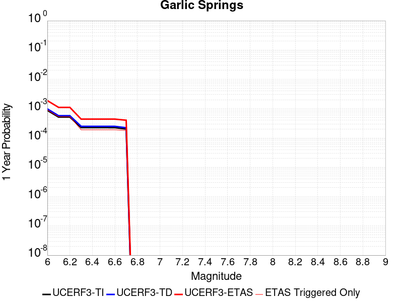 |  |

| Magnitude | 1 wk TI Prob | 1 wk TD Prob | 1 wk ETAS Prob | 1 wk ETAS/TD Gain | 1 wk ETAS Triggered Only | 1 mo TI Prob | 1 mo TD Prob | 1 mo ETAS Prob | 1 mo ETAS/TD Gain | 1 mo ETAS Triggered Only | 1 yr TI Prob | 1 yr TD Prob | 1 yr ETAS Prob | 1 yr ETAS/TD Gain | 1 yr ETAS Triggered Only | 10 yr TI Prob | 10 yr TD Prob | 10 yr ETAS Prob | 10 yr ETAS/TD Gain | 10 yr ETAS Triggered Only |
|-----|-----|-----|-----|-----|-----|-----|-----|-----|-----|-----|-----|-----|-----|-----|-----|-----|-----|-----|-----|-----|
| 6.0 | 1.6760017E-5 | 1.8776833E-5 | 2.9877157E-4 | 15.911714 | 2.8E-4 | 7.182667E-5 | 8.0470316E-5 | 5.104357E-4 | 6.3431554 | 4.3E-4 | 8.7413884E-4 | 9.794032E-4 | 0.0018785218 | 1.918027 | 9.0E-4 | 0.008707083 | 0.009762413 | 0.011168551 | 1.1440358 | 0.00142 |
| 6.1 | 9.852767E-6 | 1.0973587E-5 | 1.5097205E-4 | 13.757767 | 1.4E-4 | 4.222546E-5 | 4.702921E-5 | 2.770184E-4 | 5.8903475 | 2.3E-4 | 5.139737E-4 | 5.7250116E-4 | 0.0011021978 | 1.9252323 | 5.3E-4 | 0.005127866 | 0.005717221 | 0.006542476 | 1.1443454 | 8.3E-4 |
| 6.2 | 9.852767E-6 | 1.0973587E-5 | 1.5097205E-4 | 13.757767 | 1.4E-4 | 4.222546E-5 | 4.702921E-5 | 2.770184E-4 | 5.8903475 | 2.3E-4 | 5.139737E-4 | 5.7250116E-4 | 0.0011021978 | 1.9252323 | 5.3E-4 | 0.005127866 | 0.005717221 | 0.006542476 | 1.1443454 | 8.3E-4 |
| 6.3 | 4.3167724E-6 | 4.7780286E-6 | 4.4777837E-5 | 9.3716135 | 4.0E-5 | 1.8500323E-5 | 2.0477235E-5 | 9.04758E-5 | 4.41836 | 7.0E-5 | 2.2521814E-4 | 2.4930484E-4 | 4.3925748E-4 | 1.7619292 | 1.9E-4 | 0.0022499003 | 0.00249251 | 0.0028216874 | 1.1320666 | 3.3E-4 |
| 6.4 | 4.3167724E-6 | 4.7780286E-6 | 4.4777837E-5 | 9.3716135 | 4.0E-5 | 1.8500323E-5 | 2.0477235E-5 | 9.04758E-5 | 4.41836 | 7.0E-5 | 2.2521814E-4 | 2.4930484E-4 | 4.3925748E-4 | 1.7619292 | 1.9E-4 | 0.0022499003 | 0.00249251 | 0.0028216874 | 1.1320666 | 3.3E-4 |
| 6.5 | 4.3167724E-6 | 4.7780286E-6 | 4.4777837E-5 | 9.3716135 | 4.0E-5 | 1.8500323E-5 | 2.0477235E-5 | 9.04758E-5 | 4.41836 | 7.0E-5 | 2.2521814E-4 | 2.4930484E-4 | 4.3925748E-4 | 1.7619292 | 1.9E-4 | 0.0022499003 | 0.00249251 | 0.0028216874 | 1.1320666 | 3.3E-4 |
| 6.6 | 4.301311E-6 | 4.760897E-6 | 4.4760705E-5 | 9.401738 | 4.0E-5 | 1.8434059E-5 | 2.0403815E-5 | 9.0402384E-5 | 4.430661 | 7.0E-5 | 2.2441156E-4 | 2.4841115E-4 | 4.3836396E-4 | 1.764671 | 1.9E-4 | 0.0022418506 | 0.002483593 | 0.0028127735 | 1.132542 | 3.3E-4 |
| 6.7 | 3.8599724E-6 | 4.27106E-6 | 3.427093E-5 | 8.023988 | 3.0E-5 | 1.6542634E-5 | 1.8304541E-5 | 7.830344E-5 | 4.277815 | 6.0E-5 | 2.0138794E-4 | 2.228578E-4 | 4.0281768E-4 | 1.8075099 | 1.8E-4 | 0.0020120554 | 0.002228578 | 0.002537887 | 1.1387922 | 3.1E-4 |

## Death Valley (Black Mtns Frontal)
*[(top)](#table-of-contents)*

| 1 Week | 1 Month | 1 Year | 10 Year |
|-----|-----|-----|-----|
|  | 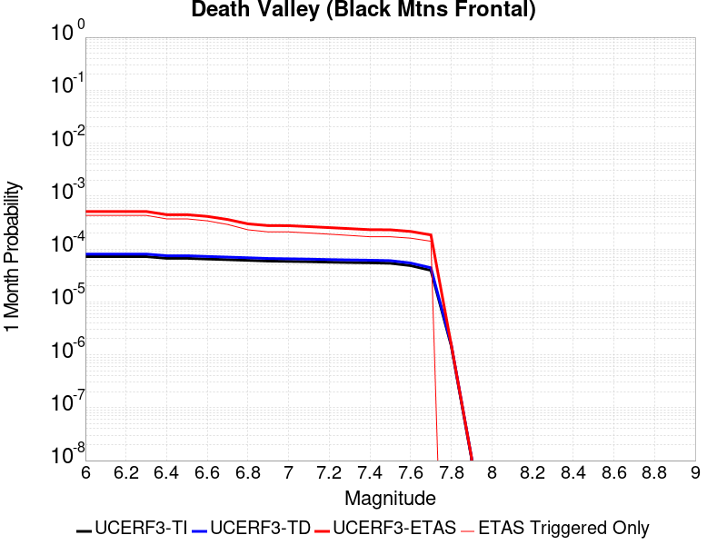 |  |  |

| Magnitude | 1 wk TI Prob | 1 wk TD Prob | 1 wk ETAS Prob | 1 wk ETAS/TD Gain | 1 wk ETAS Triggered Only | 1 mo TI Prob | 1 mo TD Prob | 1 mo ETAS Prob | 1 mo ETAS/TD Gain | 1 mo ETAS Triggered Only | 1 yr TI Prob | 1 yr TD Prob | 1 yr ETAS Prob | 1 yr ETAS/TD Gain | 1 yr ETAS Triggered Only | 10 yr TI Prob | 10 yr TD Prob | 10 yr ETAS Prob | 10 yr ETAS/TD Gain | 10 yr ETAS Triggered Only |
|-----|-----|-----|-----|-----|-----|-----|-----|-----|-----|-----|-----|-----|-----|-----|-----|-----|-----|-----|-----|-----|
| 6.0 | 1.6707214E-5 | 1.867027E-5 | 3.0866486E-4 | 16.532427 | 2.9E-4 | 7.160038E-5 | 8.001303E-5 | 5.099786E-4 | 6.373695 | 4.3E-4 | 8.71386E-4 | 9.737309E-4 | 0.001742981 | 1.790003 | 7.7E-4 | 0.00867977 | 0.009695496 | 0.01084425 | 1.1184832 | 0.00116 |
| 6.1 | 1.6707214E-5 | 1.867027E-5 | 3.0866486E-4 | 16.532427 | 2.9E-4 | 7.160038E-5 | 8.001303E-5 | 5.099786E-4 | 6.373695 | 4.3E-4 | 8.71386E-4 | 9.737309E-4 | 0.001742981 | 1.790003 | 7.7E-4 | 0.00867977 | 0.009695496 | 0.01084425 | 1.1184832 | 0.00116 |
| 6.2 | 1.6707214E-5 | 1.867027E-5 | 3.0866486E-4 | 16.532427 | 2.9E-4 | 7.160038E-5 | 8.001303E-5 | 5.099786E-4 | 6.373695 | 4.3E-4 | 8.71386E-4 | 9.737309E-4 | 0.001742981 | 1.790003 | 7.7E-4 | 0.00867977 | 0.009695496 | 0.01084425 | 1.1184832 | 0.00116 |
| 6.3 | 1.6707214E-5 | 1.867027E-5 | 3.0866486E-4 | 16.532427 | 2.9E-4 | 7.160038E-5 | 8.001303E-5 | 5.099786E-4 | 6.373695 | 4.3E-4 | 8.71386E-4 | 9.737309E-4 | 0.001742981 | 1.790003 | 7.7E-4 | 0.00867977 | 0.009695496 | 0.01084425 | 1.1184832 | 0.00116 |
| 6.4 | 1.5515609E-5 | 1.7338214E-5 | 2.5733406E-4 | 14.842017 | 2.4E-4 | 6.649377E-5 | 7.4304546E-5 | 4.4427704E-4 | 5.979137 | 3.7E-4 | 8.0926094E-4 | 9.042885E-4 | 0.0015636917 | 1.7291956 | 6.6E-4 | 0.008063202 | 0.009006773 | 0.009977946 | 1.107827 | 9.8E-4 |
| 6.5 | 1.5515609E-5 | 1.7338214E-5 | 2.5733406E-4 | 14.842017 | 2.4E-4 | 6.649377E-5 | 7.4304546E-5 | 4.4427704E-4 | 5.979137 | 3.7E-4 | 8.0926094E-4 | 9.042885E-4 | 0.0015636917 | 1.7291956 | 6.6E-4 | 0.008063202 | 0.009006773 | 0.009977946 | 1.107827 | 9.8E-4 |
| 6.6 | 1.5041828E-5 | 1.6809145E-5 | 2.3680544E-4 | 14.0878935 | 2.2E-4 | 6.4463384E-5 | 7.203723E-5 | 4.1201274E-4 | 5.7194414 | 3.4E-4 | 7.8455906E-4 | 8.767063E-4 | 0.0014761803 | 1.6837797 | 6.0E-4 | 0.00781795 | 0.008733132 | 0.009625273 | 1.1021558 | 9.0E-4 |
| 6.7 | 1.4634985E-5 | 1.6356016E-5 | 1.9635307E-4 | 12.004945 | 1.8E-4 | 6.271985E-5 | 7.009536E-5 | 3.6007504E-4 | 5.136931 | 2.9E-4 | 7.6334673E-4 | 8.5308263E-4 | 0.0013826306 | 1.6207463 | 5.3E-4 | 0.007607299 | 0.008498715 | 0.009291917 | 1.0933318 | 8.0E-4 |
| 6.8 | 1.4209158E-5 | 1.5882048E-5 | 1.3588014E-4 | 8.555581 | 1.2E-4 | 6.089497E-5 | 6.8064175E-5 | 2.9804852E-4 | 4.378934 | 2.3E-4 | 7.4114406E-4 | 8.2837185E-4 | 0.0012580156 | 1.5186605 | 4.3E-4 | 0.007386771 | 0.008253456 | 0.008937761 | 1.0829114 | 6.9E-4 |
| 6.9 | 1.3780098E-5 | 1.5404594E-5 | 1.15403054E-4 | 7.4914703 | 1.0E-4 | 5.9056227E-5 | 6.6018045E-5 | 2.7600417E-4 | 4.1807384 | 2.1E-4 | 7.1877235E-4 | 8.0347876E-4 | 0.0012131493 | 1.5098711 | 4.1E-4 | 0.0071645193 | 0.008006332 | 0.008621369 | 1.0768187 | 6.2E-4 |
| 7.0 | 1.3585064E-5 | 1.5188155E-5 | 1.1518664E-4 | 7.583978 | 1.0E-4 | 5.8220405E-5 | 6.50905E-5 | 2.7507683E-4 | 4.226067 | 2.1E-4 | 7.086029E-4 | 7.9219416E-4 | 0.0012018693 | 1.5171399 | 4.1E-4 | 0.007063476 | 0.007894293 | 0.008509399 | 1.0779177 | 6.2E-4 |
| 7.1 | 1.3398601E-5 | 1.49813395E-5 | 1.1497984E-4 | 7.6748705 | 1.0E-4 | 5.742131E-5 | 6.420419E-5 | 2.6419136E-4 | 4.1148615 | 2.0E-4 | 6.9888023E-4 | 7.8141113E-4 | 0.0011711064 | 1.498707 | 3.9E-4 | 0.0069668638 | 0.007787224 | 0.00837263 | 1.0751752 | 5.9E-4 |
| 7.2 | 1.3126312E-5 | 1.4679561E-5 | 1.0467824E-4 | 7.1308837 | 9.0E-5 | 5.6254412E-5 | 6.291092E-5 | 2.5289896E-4 | 4.0199537 | 1.9E-4 | 6.846822E-4 | 7.6567667E-4 | 0.0011353934 | 1.4828627 | 3.7E-4 | 0.006825765 | 0.00763097 | 0.008186697 | 1.0728252 | 5.6E-4 |
| 7.3 | 1.2922429E-5 | 1.4453788E-5 | 9.445263E-5 | 6.534801 | 8.0E-5 | 5.5380664E-5 | 6.194336E-5 | 2.4193221E-4 | 3.9057002 | 1.8E-4 | 6.74051E-4 | 7.53905E-4 | 0.0011036411 | 1.4638995 | 3.5E-4 | 0.006720101 | 0.007514055 | 0.008040072 | 1.0700045 | 5.3E-4 |
| 7.4 | 1.2768878E-5 | 1.4283772E-5 | 8.428277E-5 | 5.9005966 | 7.0E-5 | 5.4722615E-5 | 6.1214756E-5 | 2.3120435E-4 | 3.7769382 | 1.7E-4 | 6.660441E-4 | 7.4504025E-4 | 0.001084787 | 1.4560112 | 3.4E-4 | 0.0066405144 | 0.0074260035 | 0.007932216 | 1.0681676 | 5.1E-4 |
| 7.5 | 1.2521929E-5 | 1.40120155E-5 | 8.401104E-5 | 5.9956427 | 7.0E-5 | 5.366431E-5 | 6.005014E-5 | 2.3003994E-4 | 3.8307974 | 1.7E-4 | 6.531671E-4 | 7.3087064E-4 | 0.0010606295 | 1.4511863 | 3.3E-4 | 0.006512506 | 0.0072852457 | 0.007761749 | 1.0654066 | 4.8E-4 |
| 7.6 | 1.1301089E-5 | 1.2648149E-5 | 8.264726E-5 | 6.5343366 | 7.0E-5 | 4.8432343E-5 | 5.4205255E-5 | 2.1419658E-4 | 3.9515834 | 1.6E-4 | 5.895042E-4 | 6.5975444E-4 | 9.495631E-4 | 1.4392675 | 2.9E-4 | 0.0058794282 | 0.00657851 | 0.0070056817 | 1.0649344 | 4.3E-4 |
| 7.7 | 9.189108E-6 | 1.0283358E-5 | 7.028274E-5 | 6.83461 | 6.0E-5 | 3.93813E-5 | 4.407082E-5 | 1.8406464E-4 | 4.176565 | 1.4E-4 | 4.7936183E-4 | 5.3643517E-4 | 7.962957E-4 | 1.4844211 | 2.6E-4 | 0.004783291 | 0.005351914 | 0.0057000406 | 1.0650471 | 3.5E-4 |
| 7.8 | 3.4586725E-7 | 3.6482615E-7 | 3.6482615E-7 | 1.0 | 0.0 | 1.4822873E-6 | 1.5635396E-6 | 1.5635396E-6 | 1.0 | 0.0 | 1.80467E-5 | 1.9035933E-5 | 1.9035933E-5 | 1.0 | 0.0 | 1.8045233E-4 | 1.9034347E-4 | 1.9034347E-4 | 1.0 | 0.0 |
| 7.9 | 2.5591178E-9 | 2.6696718E-9 | 2.6696718E-9 | 1.0 | 0.0 | 1.0967647E-8 | 1.14414505E-8 | 1.14414505E-8 | 1.0 | 0.0 | 1.335311E-7 | 1.3929966E-7 | 1.3929966E-7 | 1.0 | 0.0 | 1.3353102E-6 | 1.3929966E-6 | 1.3929966E-6 | 1.0 | 0.0 |

## San Andreas (San Bernardino S)
*[(top)](#table-of-contents)*

| 1 Week | 1 Month | 1 Year | 10 Year |
|-----|-----|-----|-----|
|  |  |  |  |

| Magnitude | 1 wk TI Prob | 1 wk TD Prob | 1 wk ETAS Prob | 1 wk ETAS/TD Gain | 1 wk ETAS Triggered Only | 1 mo TI Prob | 1 mo TD Prob | 1 mo ETAS Prob | 1 mo ETAS/TD Gain | 1 mo ETAS Triggered Only | 1 yr TI Prob | 1 yr TD Prob | 1 yr ETAS Prob | 1 yr ETAS/TD Gain | 1 yr ETAS Triggered Only | 10 yr TI Prob | 10 yr TD Prob | 10 yr ETAS Prob | 10 yr ETAS/TD Gain | 10 yr ETAS Triggered Only |
|-----|-----|-----|-----|-----|-----|-----|-----|-----|-----|-----|-----|-----|-----|-----|-----|-----|-----|-----|-----|-----|
| 6.0 | 1.2336002E-4 | 3.0005194E-4 | 8.098989E-4 | 2.6991959 | 5.1E-4 | 5.2857865E-4 | 0.0012853292 | 0.001884558 | 1.4662064 | 6.0E-4 | 0.006416472 | 0.015541554 | 0.016398033 | 1.0551089 | 8.7E-4 | 0.06234337 | 0.14294699 | 0.14391546 | 1.006775 | 0.00113 |
| 6.1 | 1.2336002E-4 | 3.0005194E-4 | 8.098989E-4 | 2.6991959 | 5.1E-4 | 5.2857865E-4 | 0.0012853292 | 0.001884558 | 1.4662064 | 6.0E-4 | 0.006416472 | 0.015541554 | 0.016398033 | 1.0551089 | 8.7E-4 | 0.06234337 | 0.14294699 | 0.14391546 | 1.006775 | 0.00113 |
| 6.2 | 1.2336002E-4 | 3.0005194E-4 | 8.098989E-4 | 2.6991959 | 5.1E-4 | 5.2857865E-4 | 0.0012853292 | 0.001884558 | 1.4662064 | 6.0E-4 | 0.006416472 | 0.015541554 | 0.016398033 | 1.0551089 | 8.7E-4 | 0.06234337 | 0.14294699 | 0.14391546 | 1.006775 | 0.00113 |
| 6.3 | 1.1712257E-4 | 2.8793467E-4 | 7.877907E-4 | 2.736005 | 5.0E-4 | 5.018573E-4 | 0.0012334478 | 0.00182272 | 1.477744 | 5.9E-4 | 0.006093008 | 0.014918666 | 0.015765836 | 1.056786 | 8.6E-4 | 0.059286322 | 0.13765779 | 0.13862361 | 1.0070161 | 0.00112 |
| 6.4 | 1.1712257E-4 | 2.8793467E-4 | 7.877907E-4 | 2.736005 | 5.0E-4 | 5.018573E-4 | 0.0012334478 | 0.00182272 | 1.477744 | 5.9E-4 | 0.006093008 | 0.014918666 | 0.015765836 | 1.056786 | 8.6E-4 | 0.059286322 | 0.13765779 | 0.13862361 | 1.0070161 | 0.00112 |
| 6.5 | 1.0689076E-4 | 2.6806415E-4 | 7.679301E-4 | 2.864725 | 5.0E-4 | 4.5802278E-4 | 0.0011483653 | 0.0017376879 | 1.5131838 | 5.9E-4 | 0.0055621783 | 0.013896335 | 0.014734523 | 1.0603172 | 8.5E-4 | 0.05425003 | 0.1288989 | 0.12986583 | 1.0075014 | 0.00111 |
| 6.6 | 9.7648895E-5 | 2.505129E-4 | 7.203952E-4 | 2.8756807 | 4.7E-4 | 4.1842813E-4 | 0.0010732086 | 0.0016226184 | 1.5119319 | 5.5E-4 | 0.005082469 | 0.012992399 | 0.013791875 | 1.0615342 | 8.1E-4 | 0.049677886 | 0.121077746 | 0.12200061 | 1.0076221 | 0.00105 |
| 6.7 | 8.757013E-5 | 2.3122175E-4 | 6.811177E-4 | 2.9457335 | 4.5E-4 | 3.7524657E-4 | 9.905964E-4 | 0.0015200713 | 1.5345013 | 5.3E-4 | 0.00455906 | 0.011997902 | 0.012778424 | 1.0650549 | 7.9E-4 | 0.04466656 | 0.112373024 | 0.11328728 | 1.0081359 | 0.00103 |
| 6.8 | 8.562978E-5 | 2.2682057E-4 | 6.767185E-4 | 2.9834971 | 4.5E-4 | 3.6693315E-4 | 9.7174826E-4 | 0.0015012332 | 1.5448787 | 5.3E-4 | 0.004458263 | 0.011770921 | 0.012551622 | 1.0663246 | 7.9E-4 | 0.043698758 | 0.11037863 | 0.11129494 | 1.0083015 | 0.00103 |
| 6.9 | 6.124075E-5 | 1.7066885E-4 | 5.7060056E-4 | 3.3433201 | 4.0E-4 | 2.6243398E-4 | 7.312337E-4 | 0.0012108827 | 1.6559448 | 4.8E-4 | 0.0031904527 | 0.008866636 | 0.009600075 | 1.082719 | 7.4E-4 | 0.031450346 | 0.08420262 | 0.085081786 | 1.0104411 | 9.6E-4 |
| 7.0 | 5.8598747E-5 | 1.6495936E-4 | 5.6489336E-4 | 3.4244397 | 4.0E-4 | 2.5111332E-4 | 7.067779E-4 | 0.0011864387 | 1.6786584 | 4.8E-4 | 0.0030530186 | 0.008571265 | 0.009285094 | 1.0832816 | 7.2E-4 | 0.03011414 | 0.08151562 | 0.08237899 | 1.0105915 | 9.4E-4 |
| 7.1 | 5.613814E-5 | 1.5914452E-4 | 5.5908086E-4 | 3.5130389 | 4.0E-4 | 2.4056983E-4 | 6.818704E-4 | 0.0011615431 | 1.703466 | 4.8E-4 | 0.0029250039 | 0.008270353 | 0.008984398 | 1.0863379 | 7.2E-4 | 0.028868021 | 0.07881268 | 0.0796786 | 1.010987 | 9.4E-4 |
| 7.2 | 4.991222E-5 | 1.4520933E-4 | 5.4515124E-4 | 3.754244 | 4.0E-4 | 2.1389198E-4 | 6.221777E-4 | 0.001101879 | 1.7710038 | 4.8E-4 | 0.002601025 | 0.0075488063 | 0.008253447 | 1.0933446 | 7.1E-4 | 0.025707912 | 0.07226191 | 0.0731247 | 1.0119399 | 9.3E-4 |
| 7.3 | 4.7410045E-5 | 1.371513E-4 | 5.3709646E-4 | 3.916087 | 4.0E-4 | 2.0317009E-4 | 5.8765925E-4 | 0.0010673772 | 1.8163198 | 4.8E-4 | 0.0024707897 | 0.0071313656 | 0.007836302 | 1.0988501 | 7.1E-4 | 0.024434982 | 0.068541944 | 0.0694082 | 1.0126383 | 9.3E-4 |
| 7.4 | 4.5556746E-5 | 1.3123035E-4 | 5.3117785E-4 | 4.0476756 | 4.0E-4 | 1.952286E-4 | 5.6229485E-4 | 0.0010320306 | 1.8353904 | 4.7E-4 | 0.002374317 | 0.0068245293 | 0.0075197523 | 1.1018711 | 7.0E-4 | 0.023491086 | 0.06579143 | 0.0666509 | 1.0130635 | 9.2E-4 |
| 7.5 | 4.3084514E-5 | 1.2358342E-4 | 5.135352E-4 | 4.155373 | 3.9E-4 | 1.8463485E-4 | 5.2953605E-4 | 9.892924E-4 | 1.868225 | 4.6E-4 | 0.0022456115 | 0.0064281146 | 0.0071136793 | 1.106651 | 6.9E-4 | 0.022230545 | 0.062190283 | 0.06304369 | 1.0137225 | 9.1E-4 |
| 7.6 | 3.408608E-5 | 9.836477E-5 | 4.883264E-4 | 4.964444 | 3.9E-4 | 1.4607502E-4 | 4.214953E-4 | 8.813014E-4 | 2.0908926 | 4.6E-4 | 0.0017770125 | 0.005119656 | 0.0058061234 | 1.1340847 | 6.9E-4 | 0.017628696 | 0.05002244 | 0.05087742 | 1.0170919 | 9.0E-4 |
| 7.7 | 2.8315713E-5 | 8.2495724E-5 | 4.6246438E-4 | 5.6059194 | 3.8E-4 | 1.2134742E-4 | 3.5350522E-4 | 8.0334616E-4 | 2.2725155 | 4.5E-4 | 0.0014764034 | 0.004295442 | 0.0049725208 | 1.1576273 | 6.8E-4 | 0.01466633 | 0.042272415 | 0.043124795 | 1.0201639 | 8.9E-4 |
| 7.8 | 2.6222975E-5 | 7.463898E-5 | 4.5461062E-4 | 6.0907936 | 3.8E-4 | 1.1237934E-4 | 3.1984213E-4 | 7.6969824E-4 | 2.4064941 | 4.5E-4 | 0.0013673597 | 0.003887131 | 0.004564488 | 1.1742562 | 6.8E-4 | 0.013589768 | 0.038437475 | 0.039283648 | 1.0220144 | 8.8E-4 |
| 7.9 | 2.1469694E-5 | 5.7884805E-5 | 4.1786398E-4 | 7.2188888 | 3.6E-4 | 9.200973E-5 | 2.4805416E-4 | 6.779475E-4 | 2.7330623 | 4.3E-4 | 0.0011196428 | 0.00301588 | 0.00364398 | 1.2082642 | 6.3E-4 | 0.011140184 | 0.030153265 | 0.030938841 | 1.0260527 | 8.1E-4 |
| 8.0 | 1.2420249E-5 | 3.1321662E-5 | 1.8131697E-4 | 5.7888675 | 1.5E-4 | 5.322855E-5 | 1.342288E-4 | 3.0420598E-4 | 2.2663243 | 1.7E-4 | 6.478649E-4 | 0.0016330116 | 0.0018726196 | 1.1467277 | 2.4E-4 | 0.0064597935 | 0.01652369 | 0.016838403 | 1.0190462 | 3.2E-4 |
| 8.1 | 4.9197724E-6 | 7.822525E-6 | 7.822525E-6 | 1.0 | 0.0 | 2.1084568E-5 | 3.3524673E-5 | 3.3524673E-5 | 1.0 | 0.0 | 2.566744E-4 | 4.080866E-4 | 4.080866E-4 | 1.0 | 0.0 | 0.002563781 | 0.004384557 | 0.004384557 | 1.0 | 0.0 |
| 8.2 | 2.5634774E-6 | 2.9065757E-6 | 2.9065757E-6 | 1.0 | 0.0 | 1.0986286E-5 | 1.2456694E-5 | 1.2456694E-5 | 1.0 | 0.0 | 1.3374983E-4 | 1.5164974E-4 | 1.5164974E-4 | 1.0 | 0.0 | 0.0013366934 | 0.001704941 | 0.001704941 | 1.0 | 0.0 |
| 8.3 | 5.2850464E-7 | 3.2080476E-7 | 3.2080476E-7 | 1.0 | 0.0 | 2.2650179E-6 | 1.3748769E-6 | 1.3748769E-6 | 1.0 | 0.0 | 2.7576245E-5 | 1.673901E-5 | 1.673901E-5 | 1.0 | 0.0 | 2.7572823E-4 | 1.986671E-4 | 1.986671E-4 | 1.0 | 0.0 |

## Helendale-So Lockhart
*[(top)](#table-of-contents)*

| 1 Week | 1 Month | 1 Year | 10 Year |
|-----|-----|-----|-----|
|  |  |  |  |

| Magnitude | 1 wk TI Prob | 1 wk TD Prob | 1 wk ETAS Prob | 1 wk ETAS/TD Gain | 1 wk ETAS Triggered Only | 1 mo TI Prob | 1 mo TD Prob | 1 mo ETAS Prob | 1 mo ETAS/TD Gain | 1 mo ETAS Triggered Only | 1 yr TI Prob | 1 yr TD Prob | 1 yr ETAS Prob | 1 yr ETAS/TD Gain | 1 yr ETAS Triggered Only | 10 yr TI Prob | 10 yr TD Prob | 10 yr ETAS Prob | 10 yr ETAS/TD Gain | 10 yr ETAS Triggered Only |
|-----|-----|-----|-----|-----|-----|-----|-----|-----|-----|-----|-----|-----|-----|-----|-----|-----|-----|-----|-----|-----|
| 6.0 | 1.7296055E-5 | 1.8103729E-5 | 2.7809903E-4 | 15.361422 | 2.6E-4 | 7.412385E-5 | 7.7585224E-5 | 4.375573E-4 | 5.639699 | 3.6E-4 | 9.0208417E-4 | 9.4421144E-4 | 0.0017034939 | 1.8041445 | 7.6E-4 | 0.008984311 | 0.009404116 | 0.010503678 | 1.1169235 | 0.00111 |
| 6.1 | 1.7296055E-5 | 1.8103729E-5 | 2.7809903E-4 | 15.361422 | 2.6E-4 | 7.412385E-5 | 7.7585224E-5 | 4.375573E-4 | 5.639699 | 3.6E-4 | 9.0208417E-4 | 9.4421144E-4 | 0.0017034939 | 1.8041445 | 7.6E-4 | 0.008984311 | 0.009404116 | 0.010503678 | 1.1169235 | 0.00111 |
| 6.2 | 1.7296055E-5 | 1.8103729E-5 | 2.7809903E-4 | 15.361422 | 2.6E-4 | 7.412385E-5 | 7.7585224E-5 | 4.375573E-4 | 5.639699 | 3.6E-4 | 9.0208417E-4 | 9.4421144E-4 | 0.0017034939 | 1.8041445 | 7.6E-4 | 0.008984311 | 0.009404116 | 0.010503678 | 1.1169235 | 0.00111 |
| 6.3 | 1.0669118E-5 | 1.1135425E-5 | 1.8113352E-4 | 16.266424 | 1.7E-4 | 4.5723988E-5 | 4.772239E-5 | 2.7771143E-4 | 5.8193107 | 2.3E-4 | 5.5654737E-4 | 5.80868E-4 | 0.0010805776 | 1.8602808 | 5.0E-4 | 0.0055515557 | 0.0057937936 | 0.0065493905 | 1.1304148 | 7.6E-4 |
| 6.4 | 1.0669118E-5 | 1.1135425E-5 | 1.8113352E-4 | 16.266424 | 1.7E-4 | 4.5723988E-5 | 4.772239E-5 | 2.7771143E-4 | 5.8193107 | 2.3E-4 | 5.5654737E-4 | 5.80868E-4 | 0.0010805776 | 1.8602808 | 5.0E-4 | 0.0055515557 | 0.0057937936 | 0.0065493905 | 1.1304148 | 7.6E-4 |
| 6.5 | 8.790038E-6 | 9.170197E-6 | 1.4916892E-4 | 16.266708 | 1.4E-4 | 3.767105E-5 | 3.930026E-5 | 2.292928E-4 | 5.8343835 | 1.9E-4 | 4.585485E-4 | 4.7837716E-4 | 9.1816665E-4 | 1.9193363 | 4.4E-4 | 0.0045760344 | 0.004773638 | 0.005450392 | 1.141769 | 6.8E-4 |
| 6.6 | 7.396949E-6 | 7.715537E-6 | 1.2771461E-4 | 16.552914 | 1.2E-4 | 3.1700827E-5 | 3.3066175E-5 | 2.0306055E-4 | 6.1410356 | 1.7E-4 | 3.858892E-4 | 4.025073E-4 | 7.4237044E-4 | 1.8443651 | 3.4E-4 | 0.003852198 | 0.00401789 | 0.0045855995 | 1.1412956 | 5.7E-4 |
| 6.7 | 6.4600285E-6 | 6.738031E-6 | 1.1673729E-4 | 17.325134 | 1.1E-4 | 2.7685543E-5 | 2.887696E-5 | 1.8887233E-4 | 6.5405893 | 1.6E-4 | 3.3701936E-4 | 3.5152107E-4 | 6.7140855E-4 | 1.9100095 | 3.2E-4 | 0.0033650869 | 0.003509732 | 0.004017942 | 1.1448002 | 5.1E-4 |
| 6.8 | 5.600104E-6 | 5.836009E-6 | 1.1583537E-4 | 19.848387 | 1.1E-4 | 2.4000226E-5 | 2.5011232E-5 | 1.6500773E-4 | 6.597345 | 1.4E-4 | 2.9216358E-4 | 3.044698E-4 | 5.743876E-4 | 1.8865174 | 2.7E-4 | 0.0029177975 | 0.003040588 | 0.003439372 | 1.1311535 | 4.0E-4 |
| 6.9 | 4.839122E-6 | 5.0395092E-6 | 8.503911E-5 | 16.874481 | 8.0E-5 | 2.0738931E-5 | 2.159772E-5 | 1.3159534E-4 | 6.09302 | 1.1E-4 | 2.5246723E-4 | 2.6292098E-4 | 4.8286314E-4 | 1.8365333 | 2.2E-4 | 0.002521806 | 0.002626147 | 0.0029353327 | 1.1177337 | 3.1E-4 |
| 7.0 | 3.6937633E-6 | 3.845208E-6 | 5.3845015E-5 | 14.003148 | 5.0E-5 | 1.5830317E-5 | 1.647936E-5 | 9.647804E-5 | 5.8544774 | 8.0E-5 | 1.9271708E-4 | 2.0061806E-4 | 3.3059198E-4 | 1.6478676 | 1.3E-4 | 0.0019255003 | 0.002004401 | 0.00217406 | 1.0846434 | 1.7E-4 |
| 7.1 | 2.7858857E-6 | 2.8978538E-6 | 4.2897736E-5 | 14.803279 | 4.0E-5 | 1.1939455E-5 | 1.2419316E-5 | 6.2418694E-5 | 5.0259366 | 5.0E-5 | 1.4535317E-4 | 1.511949E-4 | 2.5117976E-4 | 1.661298 | 1.0E-4 | 0.0014525814 | 0.0015109418 | 0.0016407453 | 1.085909 | 1.3E-4 |
| 7.2 | 2.1672065E-6 | 2.2540128E-6 | 2.2253967E-5 | 9.873044 | 2.0E-5 | 9.2879945E-6 | 9.66002E-6 | 3.965973E-5 | 4.1055536 | 3.0E-5 | 1.1307546E-4 | 1.1760458E-4 | 1.8759635E-4 | 1.5951449 | 7.0E-5 | 0.0011301794 | 0.0011754417 | 0.0012753241 | 1.0849744 | 1.0E-4 |
| 7.3 | 1.4823496E-6 | 1.5422102E-6 | 1.1542194E-5 | 7.4841905 | 1.0E-5 | 6.3529114E-6 | 6.6094562E-6 | 1.660939E-5 | 2.5129738 | 1.0E-5 | 7.734395E-5 | 8.046731E-5 | 1.104649E-4 | 1.3727922 | 3.0E-5 | 7.731704E-4 | 8.0439687E-4 | 8.643486E-4 | 1.07453 | 6.0E-5 |
| 7.4 | 4.2321457E-7 | 4.4108765E-7 | 4.4108765E-7 | 1.0 | 0.0 | 1.8137755E-6 | 1.8903745E-6 | 1.8903745E-6 | 1.0 | 0.0 | 2.2082493E-5 | 2.3015113E-5 | 4.3014654E-5 | 1.8689742 | 2.0E-5 | 2.2080299E-4 | 2.3013182E-4 | 2.601249E-4 | 1.1303301 | 3.0E-5 |
| 7.5 | 5.6942316E-8 | 5.9415648E-8 | 5.9415648E-8 | 1.0 | 0.0 | 2.440385E-7 | 2.5463845E-7 | 2.5463845E-7 | 1.0 | 0.0 | 2.9711643E-6 | 3.1002196E-6 | 3.1002196E-6 | 1.0 | 0.0 | 2.9711247E-5 | 3.1001844E-5 | 3.1001844E-5 | 1.0 | 0.0 |

## Coyote Lake
*[(top)](#table-of-contents)*

| 1 Week | 1 Month | 1 Year | 10 Year |
|-----|-----|-----|-----|
|  |  |  |  |

| Magnitude | 1 wk TI Prob | 1 wk TD Prob | 1 wk ETAS Prob | 1 wk ETAS/TD Gain | 1 wk ETAS Triggered Only | 1 mo TI Prob | 1 mo TD Prob | 1 mo ETAS Prob | 1 mo ETAS/TD Gain | 1 mo ETAS Triggered Only | 1 yr TI Prob | 1 yr TD Prob | 1 yr ETAS Prob | 1 yr ETAS/TD Gain | 1 yr ETAS Triggered Only | 10 yr TI Prob | 10 yr TD Prob | 10 yr ETAS Prob | 10 yr ETAS/TD Gain | 10 yr ETAS Triggered Only |
|-----|-----|-----|-----|-----|-----|-----|-----|-----|-----|-----|-----|-----|-----|-----|-----|-----|-----|-----|-----|-----|
| 6.0 | 1.980352E-5 | 2.1706745E-5 | 1.7170349E-4 | 7.9101443 | 1.5E-4 | 8.486947E-5 | 9.302599E-5 | 3.3300367E-4 | 3.579684 | 2.4E-4 | 0.0010327959 | 0.0011320751 | 0.001661475 | 1.4676368 | 5.3E-4 | 0.010280091 | 0.011270258 | 0.012071129 | 1.0710605 | 8.1E-4 |
| 6.1 | 1.980352E-5 | 2.1706745E-5 | 1.7170349E-4 | 7.9101443 | 1.5E-4 | 8.486947E-5 | 9.302599E-5 | 3.3300367E-4 | 3.579684 | 2.4E-4 | 0.0010327959 | 0.0011320751 | 0.001661475 | 1.4676368 | 5.3E-4 | 0.010280091 | 0.011270258 | 0.012071129 | 1.0710605 | 8.1E-4 |
| 6.2 | 1.980352E-5 | 2.1706745E-5 | 1.7170349E-4 | 7.9101443 | 1.5E-4 | 8.486947E-5 | 9.302599E-5 | 3.3300367E-4 | 3.579684 | 2.4E-4 | 0.0010327959 | 0.0011320751 | 0.001661475 | 1.4676368 | 5.3E-4 | 0.010280091 | 0.011270258 | 0.012071129 | 1.0710605 | 8.1E-4 |
| 6.3 | 1.5344787E-5 | 1.682067E-5 | 1.2681882E-4 | 7.5394635 | 1.1E-4 | 6.576172E-5 | 7.2086936E-5 | 2.6207324E-4 | 3.6355164 | 1.9E-4 | 8.003548E-4 | 8.773662E-4 | 0.0012570329 | 1.4327345 | 3.8E-4 | 0.007974784 | 0.00874507 | 0.009329909 | 1.0668765 | 5.9E-4 |
| 6.4 | 1.5344787E-5 | 1.682067E-5 | 1.2681882E-4 | 7.5394635 | 1.1E-4 | 6.576172E-5 | 7.2086936E-5 | 2.6207324E-4 | 3.6355164 | 1.9E-4 | 8.003548E-4 | 8.773662E-4 | 0.0012570329 | 1.4327345 | 3.8E-4 | 0.007974784 | 0.00874507 | 0.009329909 | 1.0668765 | 5.9E-4 |
| 6.5 | 1.4189697E-5 | 1.5557987E-5 | 1.2555628E-4 | 8.070213 | 1.1E-4 | 6.081157E-5 | 6.6675726E-5 | 2.5666304E-4 | 3.849423 | 1.9E-4 | 7.401293E-4 | 8.115349E-4 | 0.0011912265 | 1.4678686 | 3.8E-4 | 0.0073766913 | 0.008091656 | 0.008666962 | 1.0710988 | 5.8E-4 |
| 6.6 | 1.3469301E-5 | 1.4771577E-5 | 1.2476995E-4 | 8.446624 | 1.1E-4 | 5.7724297E-5 | 6.330556E-5 | 2.332948E-4 | 3.685218 | 1.7E-4 | 7.025667E-4 | 7.7053264E-4 | 0.0011302553 | 1.4668493 | 3.6E-4 | 0.0070034964 | 0.0076845144 | 0.008240211 | 1.0723138 | 5.6E-4 |
| 6.7 | 1.3027966E-5 | 1.4281745E-5 | 1.14280316E-4 | 8.001845 | 1.0E-4 | 5.5832945E-5 | 6.120638E-5 | 2.2119659E-4 | 3.6139467 | 1.6E-4 | 6.7955407E-4 | 7.4499263E-4 | 0.0010947319 | 1.4694533 | 3.5E-4 | 0.006774798 | 0.0074308286 | 0.007966816 | 1.0721302 | 5.4E-4 |
| 6.8 | 5.695434E-6 | 6.2244176E-6 | 6.622404E-5 | 10.639396 | 6.0E-5 | 2.4408775E-5 | 2.6675973E-5 | 9.6674106E-5 | 3.6240144 | 7.0E-5 | 2.971363E-4 | 3.2476155E-4 | 4.2472908E-4 | 1.3078182 | 1.0E-4 | 0.0029673933 | 0.0032458105 | 0.0033953236 | 1.0460634 | 1.5E-4 |
| 6.9 | 4.385688E-6 | 4.7930553E-6 | 4.4792865E-5 | 9.345367 | 4.0E-5 | 1.879567E-5 | 2.0541665E-5 | 6.0540846E-5 | 2.9472218 | 4.0E-5 | 2.2881327E-4 | 2.5009477E-4 | 3.000823E-4 | 1.1998742 | 5.0E-5 | 0.002285778 | 0.0025009478 | 0.0026006978 | 1.0398848 | 1.0E-4 |

## San Andreas (Big Bend)
*[(top)](#table-of-contents)*

| 1 Week | 1 Month | 1 Year | 10 Year |
|-----|-----|-----|-----|
|  |  |  |  |

| Magnitude | 1 wk TI Prob | 1 wk TD Prob | 1 wk ETAS Prob | 1 wk ETAS/TD Gain | 1 wk ETAS Triggered Only | 1 mo TI Prob | 1 mo TD Prob | 1 mo ETAS Prob | 1 mo ETAS/TD Gain | 1 mo ETAS Triggered Only | 1 yr TI Prob | 1 yr TD Prob | 1 yr ETAS Prob | 1 yr ETAS/TD Gain | 1 yr ETAS Triggered Only | 10 yr TI Prob | 10 yr TD Prob | 10 yr ETAS Prob | 10 yr ETAS/TD Gain | 10 yr ETAS Triggered Only |
|-----|-----|-----|-----|-----|-----|-----|-----|-----|-----|-----|-----|-----|-----|-----|-----|-----|-----|-----|-----|-----|
| 6.0 | 1.0179969E-4 | 2.0073925E-4 | 3.8070313E-4 | 1.8965056 | 1.8E-4 | 4.362114E-4 | 8.6002843E-4 | 0.0010898307 | 1.267203 | 2.3E-4 | 0.0052979486 | 0.010420859 | 0.010846378 | 1.0408334 | 4.3E-4 | 0.051734097 | 0.101455905 | 0.10208489 | 1.0061996 | 7.0E-4 |
| 6.1 | 1.0179969E-4 | 2.0073925E-4 | 3.8070313E-4 | 1.8965056 | 1.8E-4 | 4.362114E-4 | 8.6002843E-4 | 0.0010898307 | 1.267203 | 2.3E-4 | 0.0052979486 | 0.010420859 | 0.010846378 | 1.0408334 | 4.3E-4 | 0.051734097 | 0.101455905 | 0.10208489 | 1.0061996 | 7.0E-4 |
| 6.2 | 1.0179969E-4 | 2.0073925E-4 | 3.8070313E-4 | 1.8965056 | 1.8E-4 | 4.362114E-4 | 8.6002843E-4 | 0.0010898307 | 1.267203 | 2.3E-4 | 0.0052979486 | 0.010420859 | 0.010846378 | 1.0408334 | 4.3E-4 | 0.051734097 | 0.101455905 | 0.10208489 | 1.0061996 | 7.0E-4 |
| 6.3 | 1.0179969E-4 | 2.0073925E-4 | 3.8070313E-4 | 1.8965056 | 1.8E-4 | 4.362114E-4 | 8.6002843E-4 | 0.0010898307 | 1.267203 | 2.3E-4 | 0.0052979486 | 0.010420859 | 0.010846378 | 1.0408334 | 4.3E-4 | 0.051734097 | 0.101455905 | 0.10208489 | 1.0061996 | 7.0E-4 |
| 6.4 | 9.1639464E-5 | 1.8430917E-4 | 2.8429073E-4 | 1.5424666 | 1.0E-4 | 3.9268145E-4 | 7.896575E-4 | 9.29547E-4 | 1.177152 | 1.4E-4 | 0.0047704205 | 0.009571818 | 0.009829329 | 1.026903 | 2.6E-4 | 0.046693064 | 0.09378695 | 0.09418568 | 1.0042515 | 4.4E-4 |
| 6.5 | 9.1639464E-5 | 1.8430917E-4 | 2.8429073E-4 | 1.5424666 | 1.0E-4 | 3.9268145E-4 | 7.896575E-4 | 9.29547E-4 | 1.177152 | 1.4E-4 | 0.0047704205 | 0.009571818 | 0.009829329 | 1.026903 | 2.6E-4 | 0.046693064 | 0.09378695 | 0.09418568 | 1.0042515 | 4.4E-4 |
| 6.6 | 9.042622E-5 | 1.8238011E-4 | 2.8236187E-4 | 1.5482054 | 1.0E-4 | 3.8748336E-4 | 7.813951E-4 | 9.2128577E-4 | 1.1790267 | 1.4E-4 | 0.0047074095 | 0.0094721 | 0.009729637 | 1.027189 | 2.6E-4 | 0.046089325 | 0.09287721 | 0.09326728 | 1.0041997 | 4.3E-4 |
| 6.7 | 8.9836685E-5 | 1.8152347E-4 | 2.8150532E-4 | 1.5507929 | 1.0E-4 | 3.8495753E-4 | 7.7772595E-4 | 9.176171E-4 | 1.179872 | 1.4E-4 | 0.00467679 | 0.009427815 | 0.009685364 | 1.027318 | 2.6E-4 | 0.045795817 | 0.09247148 | 0.09286172 | 1.0042201 | 4.3E-4 |
| 6.8 | 8.9471854E-5 | 1.8099119E-4 | 2.809731E-4 | 1.5524131 | 1.0E-4 | 3.8339442E-4 | 7.754462E-4 | 9.153376E-4 | 1.1804012 | 1.4E-4 | 0.004657841 | 0.009400298 | 0.009657853 | 1.0273987 | 2.6E-4 | 0.04561414 | 0.0922192 | 0.092609555 | 1.0042328 | 4.3E-4 |
| 6.9 | 8.858234E-5 | 1.7981093E-4 | 2.6979475E-4 | 1.5004357 | 9.0E-5 | 3.7958333E-4 | 7.7039085E-4 | 8.902984E-4 | 1.1556451 | 1.2E-4 | 0.004611638 | 0.009339278 | 0.009577037 | 1.0254579 | 2.4E-4 | 0.04517103 | 0.09165911 | 0.09202244 | 1.003964 | 4.0E-4 |
| 7.0 | 8.7433385E-5 | 1.7819891E-4 | 2.5818465E-4 | 1.4488566 | 8.0E-5 | 3.746607E-4 | 7.6348626E-4 | 8.734023E-4 | 1.143966 | 1.1E-4 | 0.004551957 | 0.009255932 | 0.009473896 | 1.0235485 | 2.2E-4 | 0.044598386 | 0.09089323 | 0.091238685 | 1.0038007 | 3.8E-4 |
| 7.1 | 8.684964E-5 | 1.7731842E-4 | 2.5730423E-4 | 1.4510858 | 8.0E-5 | 3.7215967E-4 | 7.597149E-4 | 8.6963136E-4 | 1.1446811 | 1.1E-4 | 0.0045216335 | 0.009210405 | 0.009428379 | 1.023666 | 2.2E-4 | 0.04430731 | 0.09047475 | 0.09082037 | 1.0038201 | 3.8E-4 |
| 7.2 | 8.606521E-5 | 1.7622454E-4 | 2.5621045E-4 | 1.4538863 | 8.0E-5 | 3.6879873E-4 | 7.550296E-4 | 8.649465E-4 | 1.1455797 | 1.1E-4 | 0.0044808835 | 0.009153842 | 0.009371827 | 1.0238136 | 2.2E-4 | 0.043916024 | 0.08995518 | 0.090301 | 1.0038444 | 3.8E-4 |
| 7.3 | 8.568266E-5 | 1.7564454E-4 | 2.556305E-4 | 1.4553853 | 8.0E-5 | 3.6715972E-4 | 7.5254537E-4 | 8.6246256E-4 | 1.1460606 | 1.1E-4 | 0.0044610105 | 0.00912385 | 0.0093418425 | 1.0238926 | 2.2E-4 | 0.043725148 | 0.08967623 | 0.090022154 | 1.0038575 | 3.8E-4 |
| 7.4 | 8.5432206E-5 | 1.752704E-4 | 2.5525637E-4 | 1.4563576 | 8.0E-5 | 3.6608664E-4 | 7.509428E-4 | 8.6086016E-4 | 1.1463726 | 1.1E-4 | 0.004447999 | 0.009104501 | 0.009322499 | 1.0239439 | 2.2E-4 | 0.043600157 | 0.08949642 | 0.08984241 | 1.003866 | 3.8E-4 |
| 7.5 | 8.4791965E-5 | 1.7396381E-4 | 2.539499E-4 | 1.4597857 | 8.0E-5 | 3.633435E-4 | 7.4534636E-4 | 8.5526437E-4 | 1.1474724 | 1.1E-4 | 0.0044147377 | 0.009036932 | 0.0092549445 | 1.0241245 | 2.2E-4 | 0.043280575 | 0.08887209 | 0.08921832 | 1.0038958 | 3.8E-4 |
| 7.6 | 8.241105E-5 | 1.6841735E-4 | 2.4840387E-4 | 1.4749305 | 8.0E-5 | 3.531424E-4 | 7.2158914E-4 | 8.3150977E-4 | 1.1523314 | 1.1E-4 | 0.0042910352 | 0.008750047 | 0.008968122 | 1.0249227 | 2.2E-4 | 0.042091176 | 0.08625032 | 0.08659755 | 1.0040258 | 3.8E-4 |
| 7.7 | 7.00432E-5 | 1.4205615E-4 | 2.2204478E-4 | 1.5630776 | 8.0E-5 | 3.001506E-4 | 6.0867006E-4 | 7.086092E-4 | 1.1641927 | 1.0E-4 | 0.0036482112 | 0.0073854174 | 0.0075740144 | 1.0255364 | 1.9E-4 | 0.035888977 | 0.07352299 | 0.07382873 | 1.0041584 | 3.3E-4 |
| 7.8 | 6.415362E-5 | 1.2969968E-4 | 1.896919E-4 | 1.4625472 | 6.0E-5 | 2.749151E-4 | 5.557374E-4 | 6.256985E-4 | 1.1258888 | 7.0E-5 | 0.0033419547 | 0.0067451415 | 0.00689413 | 1.0220882 | 1.5E-4 | 0.03292141 | 0.06725514 | 0.067497656 | 1.0036058 | 2.6E-4 |
| 7.9 | 4.939911E-5 | 9.341721E-5 | 1.1341535E-4 | 1.2140733 | 2.0E-5 | 2.116933E-4 | 4.0029807E-4 | 4.2029007E-4 | 1.0499427 | 2.0E-5 | 0.0025743195 | 0.004862747 | 0.004932407 | 1.0143251 | 7.0E-5 | 0.025447013 | 0.048915803 | 0.049048953 | 1.002722 | 1.4E-4 |
| 8.0 | 3.344983E-5 | 5.2228E-5 | 6.2227475E-5 | 1.1914582 | 1.0E-5 | 1.4334853E-4 | 2.2381509E-4 | 2.3381285E-4 | 1.0446697 | 1.0E-5 | 0.0017438711 | 0.0027215453 | 0.0027514638 | 1.0109931 | 3.0E-5 | 0.017302496 | 0.027923161 | 0.027971765 | 1.0017406 | 5.0E-5 |
| 8.1 | 1.9104898E-5 | 1.9171663E-5 | 1.9171663E-5 | 1.0 | 0.0 | 8.1875565E-5 | 8.2161685E-5 | 8.2161685E-5 | 1.0 | 0.0 | 9.963791E-4 | 9.9986E-4 | 9.9986E-4 | 1.0 | 0.0 | 0.009919235 | 0.010749552 | 0.010749552 | 1.0 | 0.0 |
| 8.2 | 8.643924E-6 | 5.473668E-6 | 5.473668E-6 | 1.0 | 0.0 | 3.704486E-5 | 2.3458366E-5 | 2.3458366E-5 | 1.0 | 0.0 | 4.5092785E-4 | 2.8556827E-4 | 2.8556827E-4 | 1.0 | 0.0 | 0.0045001395 | 0.0032481793 | 0.0032481793 | 1.0 | 0.0 |
| 8.3 | 1.983087E-6 | 7.6564595E-7 | 7.6564595E-7 | 1.0 | 0.0 | 8.498917E-6 | 3.281336E-6 | 3.281336E-6 | 1.0 | 0.0 | 1.034694E-4 | 3.9949547E-5 | 3.9949547E-5 | 1.0 | 0.0 | 0.0010342124 | 4.717979E-4 | 4.717979E-4 | 1.0 | 0.0 |

## San Andreas (San Gorgonio Pass-Garnet HIll)
*[(top)](#table-of-contents)*

| 1 Week | 1 Month | 1 Year | 10 Year |
|-----|-----|-----|-----|
| 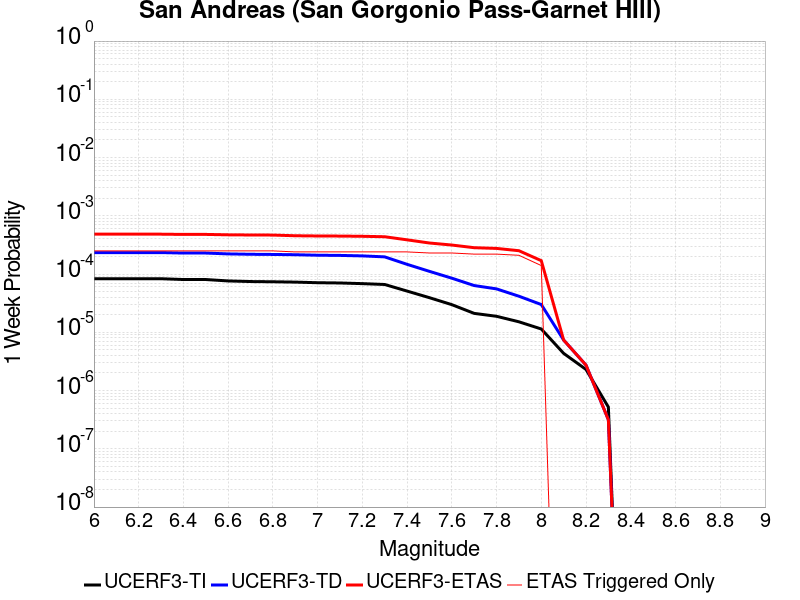 |  |  |  |

| Magnitude | 1 wk TI Prob | 1 wk TD Prob | 1 wk ETAS Prob | 1 wk ETAS/TD Gain | 1 wk ETAS Triggered Only | 1 mo TI Prob | 1 mo TD Prob | 1 mo ETAS Prob | 1 mo ETAS/TD Gain | 1 mo ETAS Triggered Only | 1 yr TI Prob | 1 yr TD Prob | 1 yr ETAS Prob | 1 yr ETAS/TD Gain | 1 yr ETAS Triggered Only | 10 yr TI Prob | 10 yr TD Prob | 10 yr ETAS Prob | 10 yr ETAS/TD Gain | 10 yr ETAS Triggered Only |
|-----|-----|-----|-----|-----|-----|-----|-----|-----|-----|-----|-----|-----|-----|-----|-----|-----|-----|-----|-----|-----|
| 6.0 | 8.31567E-5 | 2.3384395E-4 | 4.837855E-4 | 2.068839 | 2.5E-4 | 3.5633717E-4 | 0.0010018025 | 0.001301502 | 1.2991602 | 3.0E-4 | 0.004329778 | 0.012128622 | 0.012543528 | 1.0342088 | 4.2E-4 | 0.042463828 | 0.11258187 | 0.11310545 | 1.0046506 | 5.9E-4 |
| 6.1 | 8.31567E-5 | 2.3384395E-4 | 4.837855E-4 | 2.068839 | 2.5E-4 | 3.5633717E-4 | 0.0010018025 | 0.001301502 | 1.2991602 | 3.0E-4 | 0.004329778 | 0.012128622 | 0.012543528 | 1.0342088 | 4.2E-4 | 0.042463828 | 0.11258187 | 0.11310545 | 1.0046506 | 5.9E-4 |
| 6.2 | 8.31567E-5 | 2.3384395E-4 | 4.837855E-4 | 2.068839 | 2.5E-4 | 3.5633717E-4 | 0.0010018025 | 0.001301502 | 1.2991602 | 3.0E-4 | 0.004329778 | 0.012128622 | 0.012543528 | 1.0342088 | 4.2E-4 | 0.042463828 | 0.11258187 | 0.11310545 | 1.0046506 | 5.9E-4 |
| 6.3 | 8.31567E-5 | 2.3384395E-4 | 4.837855E-4 | 2.068839 | 2.5E-4 | 3.5633717E-4 | 0.0010018025 | 0.001301502 | 1.2991602 | 3.0E-4 | 0.004329778 | 0.012128622 | 0.012543528 | 1.0342088 | 4.2E-4 | 0.042463828 | 0.11258187 | 0.11310545 | 1.0046506 | 5.9E-4 |
| 6.4 | 8.059055E-5 | 2.2941893E-4 | 4.7936157E-4 | 2.0894597 | 2.5E-4 | 3.4534236E-4 | 9.828559E-4 | 0.0012825611 | 1.304933 | 3.0E-4 | 0.0041964394 | 0.011900819 | 0.012315821 | 1.0348717 | 4.2E-4 | 0.041180745 | 0.110562965 | 0.11108773 | 1.0047463 | 5.9E-4 |
| 6.5 | 8.059055E-5 | 2.2941893E-4 | 4.7936157E-4 | 2.0894597 | 2.5E-4 | 3.4534236E-4 | 9.828559E-4 | 0.0012825611 | 1.304933 | 3.0E-4 | 0.0041964394 | 0.011900819 | 0.012315821 | 1.0348717 | 4.2E-4 | 0.041180745 | 0.110562965 | 0.11108773 | 1.0047463 | 5.9E-4 |
| 6.6 | 7.619237E-5 | 2.2186468E-4 | 4.718092E-4 | 2.126563 | 2.5E-4 | 3.2649786E-4 | 9.5050444E-4 | 0.0012502193 | 1.3153219 | 3.0E-4 | 0.0039678677 | 0.0115115335 | 0.011926699 | 1.0360651 | 4.2E-4 | 0.03897764 | 0.10709954 | 0.10761742 | 1.0048355 | 5.8E-4 |
| 6.7 | 7.440636E-5 | 2.1862281E-4 | 4.6856815E-4 | 2.143272 | 2.5E-4 | 3.188454E-4 | 9.3662075E-4 | 0.0012363398 | 1.3200004 | 3.0E-4 | 0.0038750346 | 0.011344268 | 0.011759504 | 1.0366031 | 4.2E-4 | 0.038081564 | 0.1056081 | 0.10612685 | 1.004912 | 5.8E-4 |
| 6.8 | 7.3735864E-5 | 2.1709445E-4 | 4.6704017E-4 | 2.1513226 | 2.5E-4 | 3.1597257E-4 | 9.300753E-4 | 0.0012297963 | 1.3222545 | 3.0E-4 | 0.0038401815 | 0.011265406 | 0.011680675 | 1.0368623 | 4.2E-4 | 0.03774495 | 0.104909696 | 0.105428845 | 1.0049486 | 5.8E-4 |
| 6.9 | 7.27575E-5 | 2.1478413E-4 | 4.547326E-4 | 2.117161 | 2.4E-4 | 3.117806E-4 | 9.20181E-4 | 0.0011999233 | 1.304008 | 2.8E-4 | 0.003789323 | 0.011146182 | 0.011541723 | 1.0354867 | 4.0E-4 | 0.037253562 | 0.10385753 | 0.10435937 | 1.004832 | 5.6E-4 |
| 7.0 | 7.102591E-5 | 2.1062451E-4 | 4.5057395E-4 | 2.1392286 | 2.4E-4 | 3.0436125E-4 | 9.023664E-4 | 0.0011821138 | 1.3100152 | 2.8E-4 | 0.003699303 | 0.010931484 | 0.011327111 | 1.0361916 | 4.0E-4 | 0.03638325 | 0.101959534 | 0.10246243 | 1.0049324 | 5.6E-4 |
| 7.1 | 7.028513E-5 | 2.0898094E-4 | 4.4893078E-4 | 2.14819 | 2.4E-4 | 3.0118722E-4 | 8.953274E-4 | 0.0011750767 | 1.3124548 | 2.8E-4 | 0.0036607897 | 0.010846641 | 0.011242302 | 1.0364778 | 4.0E-4 | 0.036010686 | 0.10120243 | 0.10170576 | 1.0049734 | 5.6E-4 |
| 7.2 | 6.8498244E-5 | 2.050596E-4 | 4.4501037E-4 | 2.1701515 | 2.4E-4 | 2.9353087E-4 | 8.7853306E-4 | 0.001158287 | 1.318433 | 2.8E-4 | 0.003567883 | 0.0106441835 | 0.011039926 | 1.0371792 | 4.0E-4 | 0.035111405 | 0.09939449 | 0.09989883 | 1.0050741 | 5.6E-4 |
| 7.3 | 6.622592E-5 | 1.9733235E-4 | 4.37285E-4 | 2.2159822 | 2.4E-4 | 2.8379448E-4 | 8.4543816E-4 | 0.0011252015 | 1.3309093 | 2.8E-4 | 0.0034497243 | 0.010245111 | 0.010641012 | 1.038643 | 4.0E-4 | 0.033966612 | 0.095891245 | 0.09638851 | 1.0051857 | 5.5E-4 |
| 7.4 | 5.1050705E-5 | 1.4690042E-4 | 3.8686517E-4 | 2.63352 | 2.4E-4 | 2.1877038E-4 | 6.294222E-4 | 9.09246E-4 | 1.4445724 | 2.8E-4 | 0.002660276 | 0.007636482 | 0.008023504 | 1.0506806 | 3.9E-4 | 0.02628654 | 0.07286554 | 0.07336619 | 1.0068709 | 5.4E-4 |
| 7.5 | 3.9302922E-5 | 1.11307076E-4 | 3.4128147E-4 | 3.0661256 | 2.3E-4 | 1.6843023E-4 | 4.7694342E-4 | 7.4681465E-4 | 1.5658349 | 2.7E-4 | 0.0020487092 | 0.0057913954 | 0.0061691944 | 1.0652345 | 3.8E-4 | 0.020299247 | 0.05601151 | 0.056502383 | 1.0087638 | 5.2E-4 |
| 7.6 | 2.9851626E-5 | 8.4956984E-5 | 3.1493744E-4 | 3.7070224 | 2.3E-4 | 1.2792926E-4 | 3.6405068E-4 | 6.339524E-4 | 1.741385 | 2.7E-4 | 0.0015564259 | 0.0044233347 | 0.004801654 | 1.085528 | 3.8E-4 | 0.0154556995 | 0.043196145 | 0.043684117 | 1.0112966 | 5.1E-4 |
| 7.7 | 2.1135214E-5 | 6.353527E-5 | 2.8352128E-4 | 4.462424 | 2.2E-4 | 9.0576345E-5 | 2.722656E-4 | 5.3219486E-4 | 1.9546899 | 2.6E-4 | 0.0011022091 | 0.0033098008 | 0.003678576 | 1.1114192 | 3.7E-4 | 0.010967582 | 0.03258456 | 0.033058595 | 1.0145478 | 4.9E-4 |
| 7.8 | 1.883379E-5 | 5.564576E-5 | 2.7563353E-4 | 4.9533606 | 2.2E-4 | 8.0713755E-5 | 2.3846005E-4 | 4.9839803E-4 | 2.0900693 | 2.6E-4 | 9.822468E-4 | 0.002899389 | 0.0032683164 | 1.127243 | 3.7E-4 | 0.0097791655 | 0.028696978 | 0.029172918 | 1.016585 | 4.9E-4 |
| 7.9 | 1.5156185E-5 | 4.1662403E-5 | 2.5165366E-4 | 6.0403056 | 2.1E-4 | 6.495346E-5 | 1.7854095E-4 | 4.284963E-4 | 2.399989 | 2.5E-4 | 7.9052144E-4 | 0.0021715704 | 0.0025208103 | 1.1608237 | 3.5E-4 | 0.007877152 | 0.021760946 | 0.022210935 | 1.0206788 | 4.6E-4 |
| 8.0 | 1.1405907E-5 | 2.9976925E-5 | 1.6997273E-4 | 5.670119 | 1.4E-4 | 4.8881542E-5 | 1.2846621E-4 | 2.8844568E-4 | 2.2453036 | 1.6E-4 | 5.9497025E-4 | 0.0015629551 | 0.0017826112 | 1.140539 | 2.2E-4 | 0.005933798 | 0.015774013 | 0.016059438 | 1.0180947 | 2.9E-4 |
| 8.1 | 4.3511436E-6 | 7.369465E-6 | 7.369465E-6 | 1.0 | 0.0 | 1.8647626E-5 | 3.158304E-5 | 3.158304E-5 | 1.0 | 0.0 | 2.2701119E-4 | 3.844558E-4 | 3.844558E-4 | 1.0 | 0.0 | 0.0022677942 | 0.0041165445 | 0.0041165445 | 1.0 | 0.0 |
| 8.2 | 2.3042528E-6 | 2.7328301E-6 | 2.7328301E-6 | 1.0 | 0.0 | 9.875332E-6 | 1.1712076E-5 | 1.1712076E-5 | 1.0 | 0.0 | 1.2022553E-4 | 1.4258524E-4 | 1.4258524E-4 | 1.0 | 0.0 | 0.0012016051 | 0.0015979637 | 0.0015979637 | 1.0 | 0.0 |
| 8.3 | 5.202968E-7 | 3.1590292E-7 | 3.1590292E-7 | 1.0 | 0.0 | 2.2298414E-6 | 1.353869E-6 | 1.353869E-6 | 1.0 | 0.0 | 2.714798E-5 | 1.6483244E-5 | 1.6483244E-5 | 1.0 | 0.0 | 2.7144665E-4 | 1.955901E-4 | 1.955901E-4 | 1.0 | 0.0 |

## Death Valley (No)
*[(top)](#table-of-contents)*

| 1 Week | 1 Month | 1 Year | 10 Year |
|-----|-----|-----|-----|
|  | 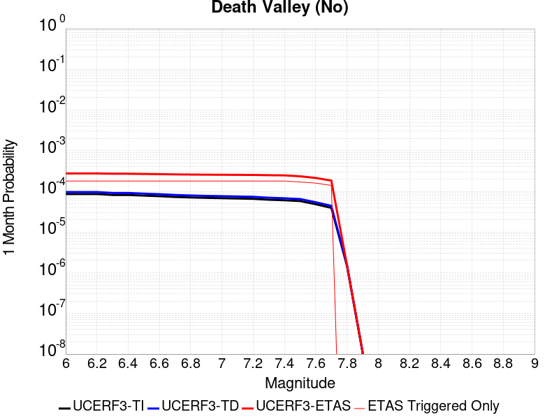 | 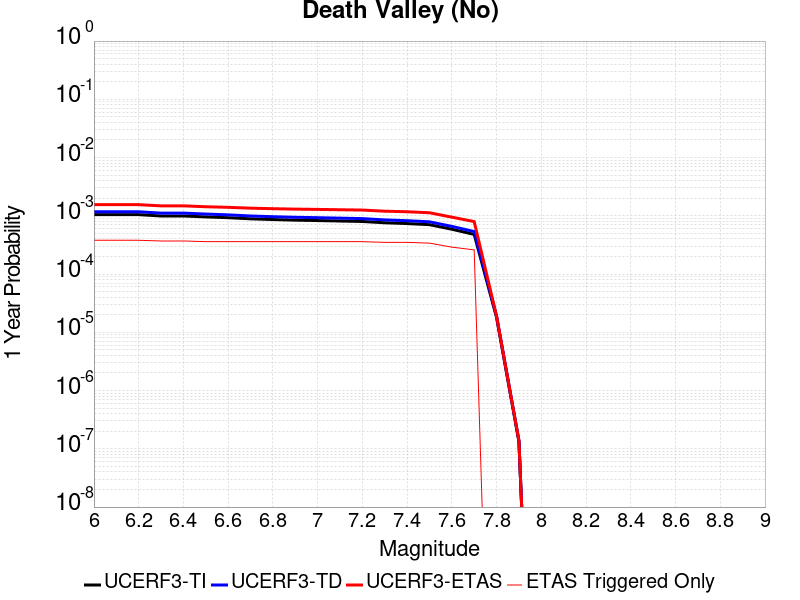 |  |

| Magnitude | 1 wk TI Prob | 1 wk TD Prob | 1 wk ETAS Prob | 1 wk ETAS/TD Gain | 1 wk ETAS Triggered Only | 1 mo TI Prob | 1 mo TD Prob | 1 mo ETAS Prob | 1 mo ETAS/TD Gain | 1 mo ETAS Triggered Only | 1 yr TI Prob | 1 yr TD Prob | 1 yr ETAS Prob | 1 yr ETAS/TD Gain | 1 yr ETAS Triggered Only | 10 yr TI Prob | 10 yr TD Prob | 10 yr ETAS Prob | 10 yr ETAS/TD Gain | 10 yr ETAS Triggered Only |
|-----|-----|-----|-----|-----|-----|-----|-----|-----|-----|-----|-----|-----|-----|-----|-----|-----|-----|-----|-----|-----|
| 6.0 | 2.0074807E-5 | 2.2500084E-5 | 9.249851E-5 | 4.1110296 | 7.0E-5 | 8.603206E-5 | 9.642541E-5 | 2.7640804E-4 | 2.8665478 | 1.8E-4 | 0.001046937 | 0.0011733545 | 0.0015529086 | 1.3234777 | 3.8E-4 | 0.010420183 | 0.011672506 | 0.0122160865 | 1.0465692 | 5.5E-4 |
| 6.1 | 2.0074807E-5 | 2.2500084E-5 | 9.249851E-5 | 4.1110296 | 7.0E-5 | 8.603206E-5 | 9.642541E-5 | 2.7640804E-4 | 2.8665478 | 1.8E-4 | 0.001046937 | 0.0011733545 | 0.0015529086 | 1.3234777 | 3.8E-4 | 0.010420183 | 0.011672506 | 0.0122160865 | 1.0465692 | 5.5E-4 |
| 6.2 | 2.0074807E-5 | 2.2500084E-5 | 9.249851E-5 | 4.1110296 | 7.0E-5 | 8.603206E-5 | 9.642541E-5 | 2.7640804E-4 | 2.8665478 | 1.8E-4 | 0.001046937 | 0.0011733545 | 0.0015529086 | 1.3234777 | 3.8E-4 | 0.010420183 | 0.011672506 | 0.0122160865 | 1.0465692 | 5.5E-4 |
| 6.3 | 1.9050609E-5 | 2.1336948E-5 | 9.133545E-5 | 4.2806244 | 7.0E-5 | 8.164292E-5 | 9.1440896E-5 | 2.7142445E-4 | 2.9683046 | 1.8E-4 | 9.935491E-4 | 0.001112731 | 0.0014823193 | 1.3321452 | 3.7E-4 | 0.009891188 | 0.011072419 | 0.01160644 | 1.0482298 | 5.4E-4 |
| 6.4 | 1.9050609E-5 | 2.1336948E-5 | 9.133545E-5 | 4.2806244 | 7.0E-5 | 8.164292E-5 | 9.1440896E-5 | 2.7142445E-4 | 2.9683046 | 1.8E-4 | 9.935491E-4 | 0.001112731 | 0.0014823193 | 1.3321452 | 3.7E-4 | 0.009891188 | 0.011072419 | 0.01160644 | 1.0482298 | 5.4E-4 |
| 6.5 | 1.8367004E-5 | 2.0561009E-5 | 9.0559566E-5 | 4.4044323 | 7.0E-5 | 7.8713354E-5 | 8.811567E-5 | 2.680998E-4 | 3.0425894 | 1.8E-4 | 9.5791375E-4 | 0.0010722869 | 0.0014319008 | 1.335371 | 3.6E-4 | 0.009537951 | 0.0106719155 | 0.011186366 | 1.048206 | 5.2E-4 |
| 6.6 | 1.779439E-5 | 1.9910927E-5 | 8.990953E-5 | 4.5155873 | 7.0E-5 | 7.625944E-5 | 8.53298E-5 | 2.6531445E-4 | 3.1092825 | 1.8E-4 | 9.280632E-4 | 0.0010384015 | 0.0013980276 | 1.3463267 | 3.6E-4 | 0.009241969 | 0.010336253 | 0.010840981 | 1.0488309 | 5.1E-4 |
| 6.7 | 1.7025437E-5 | 1.9043426E-5 | 8.904209E-5 | 4.6757393 | 7.0E-5 | 7.296412E-5 | 8.161216E-5 | 2.6159748E-4 | 3.2053735 | 1.8E-4 | 8.87976E-4 | 9.931813E-4 | 0.0013528238 | 1.3621116 | 3.6E-4 | 0.008844362 | 0.009888145 | 0.010393103 | 1.0510669 | 5.1E-4 |
| 6.8 | 1.6545107E-5 | 1.8512545E-5 | 8.851125E-5 | 4.7811494 | 7.0E-5 | 7.090568E-5 | 7.93371E-5 | 2.593228E-4 | 3.2686198 | 1.8E-4 | 8.629347E-4 | 9.655073E-4 | 0.0013251597 | 1.372501 | 3.6E-4 | 0.008595915 | 0.009613829 | 0.010118926 | 1.0525386 | 5.1E-4 |
| 6.9 | 1.615478E-5 | 1.8087594E-5 | 8.808633E-5 | 4.869986 | 7.0E-5 | 6.9232934E-5 | 7.751599E-5 | 2.5750205E-4 | 3.3219216 | 1.8E-4 | 8.4258494E-4 | 9.433546E-4 | 0.001303015 | 1.3812568 | 3.6E-4 | 0.008393973 | 0.009394196 | 0.009899405 | 1.0537789 | 5.1E-4 |
| 7.0 | 1.5894311E-5 | 1.780555E-5 | 8.780431E-5 | 4.9312887 | 7.0E-5 | 6.81167E-5 | 7.6307304E-5 | 2.5629357E-4 | 3.3587031 | 1.8E-4 | 8.2900526E-4 | 9.286515E-4 | 0.0012883171 | 1.3872988 | 3.6E-4 | 0.008259195 | 0.009248397 | 0.009753681 | 1.0546347 | 5.1E-4 |
| 7.1 | 1.5602263E-5 | 1.7483504E-5 | 8.748228E-5 | 5.003704 | 7.0E-5 | 6.6865134E-5 | 7.492718E-5 | 2.549137E-4 | 3.4021525 | 1.8E-4 | 8.137789E-4 | 9.118627E-4 | 0.0012715345 | 1.3944362 | 3.6E-4 | 0.008108052 | 0.009081894 | 0.009587262 | 1.0556457 | 5.1E-4 |
| 7.2 | 1.5323829E-5 | 1.717063E-5 | 8.716943E-5 | 5.0766587 | 7.0E-5 | 6.56719E-5 | 7.358637E-5 | 2.5357312E-4 | 3.445925 | 1.8E-4 | 7.99262E-4 | 8.9555193E-4 | 0.0012552295 | 1.4016267 | 3.6E-4 | 0.007963934 | 0.008920107 | 0.009425557 | 1.0566642 | 5.1E-4 |
| 7.3 | 1.4556212E-5 | 1.6302456E-5 | 8.630131E-5 | 5.2937617 | 7.0E-5 | 6.238227E-5 | 6.9865826E-5 | 2.4985324E-4 | 3.576187 | 1.8E-4 | 7.592395E-4 | 8.5029035E-4 | 0.0011999927 | 1.4112741 | 3.5E-4 | 0.0075665074 | 0.008471014 | 0.008966778 | 1.0585248 | 5.0E-4 |
| 7.4 | 1.411725E-5 | 1.580796E-5 | 8.580685E-5 | 5.4280787 | 7.0E-5 | 6.0501097E-5 | 6.7746674E-5 | 2.4773448E-4 | 3.6567771 | 1.8E-4 | 7.363519E-4 | 8.245094E-4 | 0.0011742208 | 1.4241449 | 3.5E-4 | 0.0073391674 | 0.008215138 | 0.008711031 | 1.0603633 | 5.0E-4 |
| 7.5 | 1.3503312E-5 | 1.5126289E-5 | 8.512523E-5 | 5.6276345 | 7.0E-5 | 5.7870053E-5 | 6.482538E-5 | 2.3481436E-4 | 3.6222599 | 1.7E-4 | 7.043401E-4 | 7.8896893E-4 | 0.0011287007 | 1.4306022 | 3.4E-4 | 0.007021119 | 0.007862304 | 0.008338531 | 1.0605708 | 4.8E-4 |
| 7.6 | 1.1279839E-5 | 1.2626327E-5 | 8.262544E-5 | 6.543902 | 7.0E-5 | 4.834127E-5 | 5.4111737E-5 | 2.1410309E-4 | 3.9566846 | 1.6E-4 | 5.88396E-4 | 6.5861654E-4 | 9.4842556E-4 | 1.4400269 | 2.9E-4 | 0.005868405 | 0.006567199 | 0.00698444 | 1.0635343 | 4.2E-4 |
| 7.7 | 9.189108E-6 | 1.0283358E-5 | 7.028274E-5 | 6.83461 | 6.0E-5 | 3.93813E-5 | 4.407082E-5 | 1.8406464E-4 | 4.176565 | 1.4E-4 | 4.7936183E-4 | 5.3643517E-4 | 7.962957E-4 | 1.4844211 | 2.6E-4 | 0.004783291 | 0.005351914 | 0.0057000406 | 1.0650471 | 3.5E-4 |
| 7.8 | 3.4586725E-7 | 3.6482615E-7 | 3.6482615E-7 | 1.0 | 0.0 | 1.4822873E-6 | 1.5635396E-6 | 1.5635396E-6 | 1.0 | 0.0 | 1.80467E-5 | 1.9035933E-5 | 1.9035933E-5 | 1.0 | 0.0 | 1.8045233E-4 | 1.9034347E-4 | 1.9034347E-4 | 1.0 | 0.0 |
| 7.9 | 2.5591178E-9 | 2.6696718E-9 | 2.6696718E-9 | 1.0 | 0.0 | 1.0967647E-8 | 1.14414505E-8 | 1.14414505E-8 | 1.0 | 0.0 | 1.335311E-7 | 1.3929966E-7 | 1.3929966E-7 | 1.0 | 0.0 | 1.3353102E-6 | 1.3929966E-6 | 1.3929966E-6 | 1.0 | 0.0 |

## Elsinore (Glen Ivy) rev
*[(top)](#table-of-contents)*

| 1 Week | 1 Month | 1 Year | 10 Year |
|-----|-----|-----|-----|
| 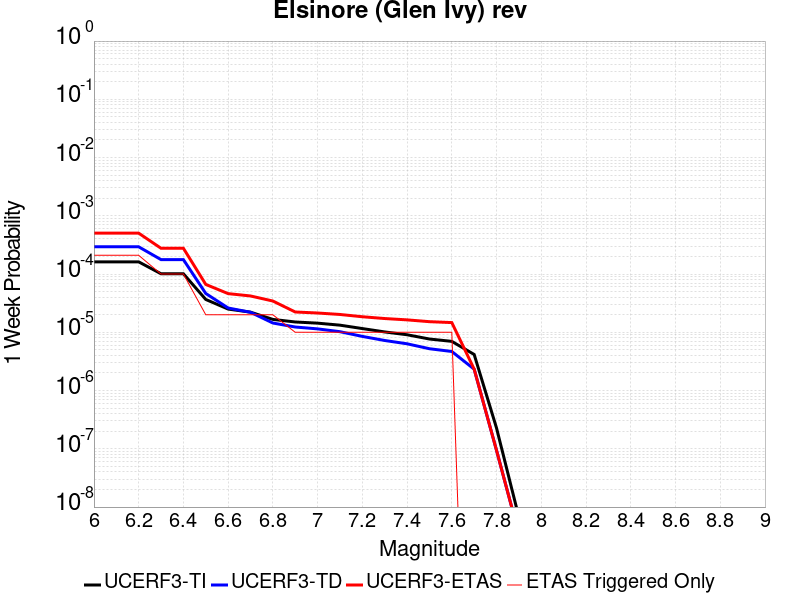 |  |  | 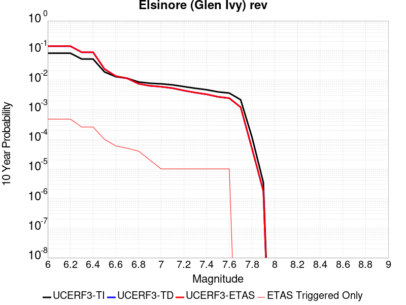 |

| Magnitude | 1 wk TI Prob | 1 wk TD Prob | 1 wk ETAS Prob | 1 wk ETAS/TD Gain | 1 wk ETAS Triggered Only | 1 mo TI Prob | 1 mo TD Prob | 1 mo ETAS Prob | 1 mo ETAS/TD Gain | 1 mo ETAS Triggered Only | 1 yr TI Prob | 1 yr TD Prob | 1 yr ETAS Prob | 1 yr ETAS/TD Gain | 1 yr ETAS Triggered Only | 10 yr TI Prob | 10 yr TD Prob | 10 yr ETAS Prob | 10 yr ETAS/TD Gain | 10 yr ETAS Triggered Only |
|-----|-----|-----|-----|-----|-----|-----|-----|-----|-----|-----|-----|-----|-----|-----|-----|-----|-----|-----|-----|-----|
| 6.0 | 1.6204086E-4 | 2.937271E-4 | 5.036654E-4 | 1.7147393 | 2.1E-4 | 6.94276E-4 | 0.0012583778 | 0.0015080633 | 1.1984185 | 2.5E-4 | 0.008420097 | 0.0152346175 | 0.015589134 | 1.0232704 | 3.6E-4 | 0.081081145 | 0.13962454 | 0.14003752 | 1.0029578 | 4.8E-4 |
| 6.1 | 1.6204086E-4 | 2.937271E-4 | 5.036654E-4 | 1.7147393 | 2.1E-4 | 6.94276E-4 | 0.0012583778 | 0.0015080633 | 1.1984185 | 2.5E-4 | 0.008420097 | 0.0152346175 | 0.015589134 | 1.0232704 | 3.6E-4 | 0.081081145 | 0.13962454 | 0.14003752 | 1.0029578 | 4.8E-4 |
| 6.2 | 1.6204086E-4 | 2.937271E-4 | 5.036654E-4 | 1.7147393 | 2.1E-4 | 6.94276E-4 | 0.0012583778 | 0.0015080633 | 1.1984185 | 2.5E-4 | 0.008420097 | 0.0152346175 | 0.015589134 | 1.0232704 | 3.6E-4 | 0.081081145 | 0.13962454 | 0.14003752 | 1.0029578 | 4.8E-4 |
| 6.3 | 1.0111737E-4 | 1.7703463E-4 | 2.7701692E-4 | 1.5647613 | 1.0E-4 | 4.332882E-4 | 7.5861585E-4 | 8.685324E-4 | 1.1448909 | 1.1E-4 | 0.005262531 | 0.0092177205 | 0.009396061 | 1.0193475 | 1.8E-4 | 0.0513964 | 0.08707393 | 0.08731129 | 1.002726 | 2.6E-4 |
| 6.4 | 1.0111737E-4 | 1.7703463E-4 | 2.7701692E-4 | 1.5647613 | 1.0E-4 | 4.332882E-4 | 7.5861585E-4 | 8.685324E-4 | 1.1448909 | 1.1E-4 | 0.005262531 | 0.0092177205 | 0.009396061 | 1.0193475 | 1.8E-4 | 0.0513964 | 0.08707393 | 0.08731129 | 1.002726 | 2.6E-4 |
| 6.5 | 3.6624708E-5 | 4.6391986E-5 | 6.6391054E-5 | 1.4310889 | 2.0E-5 | 1.569536E-4 | 1.9880968E-4 | 2.288037E-4 | 1.150868 | 3.0E-5 | 0.001909235 | 0.0024181814 | 0.0024780363 | 1.024752 | 6.0E-5 | 0.01892915 | 0.023697061 | 0.023794692 | 1.0041199 | 1.0E-4 |
| 6.6 | 2.5051324E-5 | 2.6147465E-5 | 4.6146943E-5 | 1.7648726 | 2.0E-5 | 1.073584E-4 | 1.12056E-4 | 1.3205376E-4 | 1.1784621 | 2.0E-5 | 0.0013063047 | 0.0013634725 | 0.0014034179 | 1.0292969 | 4.0E-5 | 0.012986525 | 0.013565759 | 0.013624946 | 1.004363 | 6.0E-5 |
| 6.7 | 2.2189772E-5 | 2.2072489E-5 | 4.207205E-5 | 1.9060853 | 2.0E-5 | 9.509556E-5 | 9.459316E-5 | 1.1459127E-4 | 1.2114118 | 2.0E-5 | 0.0011571734 | 0.0011510996 | 0.0011810651 | 1.0260321 | 3.0E-5 | 0.011511663 | 0.0114663225 | 0.01151575 | 1.0043106 | 5.0E-5 |
| 6.8 | 1.6654378E-5 | 1.44376E-5 | 3.443731E-5 | 2.3852518 | 2.0E-5 | 7.137396E-5 | 6.187399E-5 | 8.187275E-5 | 1.3232176 | 2.0E-5 | 8.686314E-4 | 7.5306057E-4 | 7.83038E-4 | 1.0398074 | 3.0E-5 | 0.008652439 | 0.0075100763 | 0.0075497758 | 1.0052862 | 4.0E-5 |
| 6.9 | 1.5042909E-5 | 1.2331886E-5 | 2.2331762E-5 | 1.810896 | 1.0E-5 | 6.446802E-5 | 5.2849886E-5 | 6.284936E-5 | 1.1892052 | 1.0E-5 | 7.8461546E-4 | 6.4326054E-4 | 6.6324766E-4 | 1.0310715 | 2.0E-5 | 0.007818509 | 0.006417925 | 0.0064377966 | 1.0030962 | 2.0E-5 |
| 7.0 | 1.4361385E-5 | 1.1451172E-5 | 2.1451058E-5 | 1.8732631 | 1.0E-5 | 6.154734E-5 | 4.9075545E-5 | 5.9075053E-5 | 1.2037575 | 1.0E-5 | 7.490812E-4 | 5.973339E-4 | 6.073279E-4 | 1.016731 | 1.0E-5 | 0.007465612 | 0.005960982 | 0.0059709223 | 1.0016676 | 1.0E-5 |
| 7.1 | 1.3265571E-5 | 1.0244736E-5 | 2.0244634E-5 | 1.9761012 | 1.0E-5 | 5.6851208E-5 | 4.3905282E-5 | 5.3904845E-5 | 1.227753 | 1.0E-5 | 6.919436E-4 | 5.344183E-4 | 5.4441293E-4 | 1.0187019 | 1.0E-5 | 0.006897931 | 0.0053346003 | 0.005344547 | 1.0018646 | 1.0E-5 |
| 7.2 | 1.1596403E-5 | 8.504847E-6 | 1.8504763E-5 | 2.17579 | 1.0E-5 | 4.9697923E-5 | 3.6448844E-5 | 4.644848E-5 | 1.2743471 | 1.0E-5 | 6.049042E-4 | 4.4367602E-4 | 4.536716E-4 | 1.022529 | 1.0E-5 | 0.006032603 | 0.004429357 | 0.0044393125 | 1.0022477 | 1.0E-5 |
| 7.3 | 1.0150827E-5 | 7.238537E-6 | 1.7238464E-5 | 2.3814845 | 1.0E-5 | 4.3502816E-5 | 3.102194E-5 | 4.102163E-5 | 1.3223425 | 1.0E-5 | 5.2951806E-4 | 3.776281E-4 | 3.8762434E-4 | 1.0264711 | 1.0E-5 | 0.005282581 | 0.003770271 | 0.0037802334 | 1.0026423 | 1.0E-5 |
| 7.4 | 9.080705E-6 | 6.352307E-6 | 1.6352244E-5 | 2.5742211 | 1.0E-5 | 3.8916725E-5 | 2.7223898E-5 | 3.7223625E-5 | 1.3673143 | 1.0E-5 | 4.7370812E-4 | 3.314019E-4 | 3.4139858E-4 | 1.0301648 | 1.0E-5 | 0.004726996 | 0.0033092257 | 0.0033191924 | 1.0030118 | 1.0E-5 |
| 7.5 | 7.671649E-6 | 5.225419E-6 | 1.5225367E-5 | 2.913712 | 1.0E-5 | 3.287808E-5 | 2.2394468E-5 | 3.2394244E-5 | 1.4465289 | 1.0E-5 | 4.0021708E-4 | 2.7261977E-4 | 2.8261705E-4 | 1.0366712 | 1.0E-5 | 0.0039949706 | 0.0027229784 | 0.0027329512 | 1.0036625 | 1.0E-5 |
| 7.6 | 6.990086E-6 | 4.687336E-6 | 1.4687289E-5 | 3.133398 | 1.0E-5 | 2.9957167E-5 | 2.0088435E-5 | 3.0088233E-5 | 1.4977889 | 1.0E-5 | 3.6466747E-4 | 2.445504E-4 | 2.5454795E-4 | 1.0408814 | 1.0E-5 | 0.0036406964 | 0.0024429292 | 0.0024529048 | 1.0040834 | 1.0E-5 |
| 7.7 | 4.163505E-6 | 2.329331E-6 | 2.329331E-6 | 1.0 | 0.0 | 1.7843471E-5 | 9.982813E-6 | 9.982813E-6 | 1.0 | 0.0 | 2.172226E-4 | 1.2153471E-4 | 1.2153471E-4 | 1.0 | 0.0 | 0.0021701038 | 0.0012147555 | 0.0012147555 | 1.0 | 0.0 |
| 7.8 | 2.2692414E-7 | 9.384417E-8 | 9.384417E-8 | 1.0 | 0.0 | 9.725317E-7 | 4.0218927E-7 | 4.0218927E-7 | 1.0 | 0.0 | 1.1840509E-5 | 4.8966467E-6 | 4.8966467E-6 | 1.0 | 0.0 | 1.1839878E-4 | 4.8965718E-5 | 4.8965718E-5 | 1.0 | 0.0 |
| 7.9 | 6.676829E-9 | 3.4397174E-9 | 3.4397174E-9 | 1.0 | 0.0 | 2.861498E-8 | 1.4741646E-8 | 1.4741646E-8 | 1.0 | 0.0 | 3.4838732E-7 | 1.7947953E-7 | 1.7947953E-7 | 1.0 | 0.0 | 3.4838679E-6 | 1.794794E-6 | 1.794794E-6 | 1.0 | 0.0 |

## San Andreas (Parkfield)
*[(top)](#table-of-contents)*

| 1 Week | 1 Month | 1 Year | 10 Year |
|-----|-----|-----|-----|
|  |  |  |  |

| Magnitude | 1 wk TI Prob | 1 wk TD Prob | 1 wk ETAS Prob | 1 wk ETAS/TD Gain | 1 wk ETAS Triggered Only | 1 mo TI Prob | 1 mo TD Prob | 1 mo ETAS Prob | 1 mo ETAS/TD Gain | 1 mo ETAS Triggered Only | 1 yr TI Prob | 1 yr TD Prob | 1 yr ETAS Prob | 1 yr ETAS/TD Gain | 1 yr ETAS Triggered Only | 10 yr TI Prob | 10 yr TD Prob | 10 yr ETAS Prob | 10 yr ETAS/TD Gain | 10 yr ETAS Triggered Only |
|-----|-----|-----|-----|-----|-----|-----|-----|-----|-----|-----|-----|-----|-----|-----|-----|-----|-----|-----|-----|-----|
| 6.0 | 5.556969E-4 | 7.778562E-4 | 8.977629E-4 | 1.1541501 | 1.2E-4 | 0.0023793848 | 0.0033299583 | 0.0034794586 | 1.0448956 | 1.5E-4 | 0.028586963 | 0.040235043 | 0.04048458 | 1.006202 | 2.6E-4 | 0.25176284 | 0.3371973 | 0.33751544 | 1.0009435 | 4.8E-4 |
| 6.1 | 1.925858E-4 | 3.0278185E-4 | 3.527667E-4 | 1.1650854 | 5.0E-5 | 8.2510663E-4 | 0.001297085 | 0.0013669941 | 1.0538971 | 7.0E-5 | 0.0099994885 | 0.01577393 | 0.01591172 | 1.0087354 | 1.4E-4 | 0.095613256 | 0.14975825 | 0.1499708 | 1.0014193 | 2.5E-4 |
| 6.2 | 9.4306815E-5 | 1.8243887E-4 | 2.2243158E-4 | 1.2192115 | 4.0E-5 | 4.0410945E-4 | 7.8164786E-4 | 8.4160094E-4 | 1.0767009 | 6.0E-5 | 0.0049089384 | 0.009475246 | 0.009604014 | 1.01359 | 1.3E-4 | 0.048019063 | 0.0918565 | 0.09207446 | 1.0023727 | 2.4E-4 |
| 6.3 | 9.283051E-5 | 1.794041E-4 | 2.1939693E-4 | 1.2229203 | 4.0E-5 | 3.9778434E-4 | 7.686494E-4 | 8.286033E-4 | 1.077999 | 6.0E-5 | 0.0048322747 | 0.009318355 | 0.0094471425 | 1.013821 | 1.3E-4 | 0.047285385 | 0.090509474 | 0.09072775 | 1.0024116 | 2.4E-4 |
| 6.4 | 9.138826E-5 | 1.7702584E-4 | 2.1701875E-4 | 1.2259157 | 4.0E-5 | 3.916052E-4 | 7.5846276E-4 | 8.1841723E-4 | 1.0790473 | 6.0E-5 | 0.0047573745 | 0.009195387 | 0.009324192 | 1.0140076 | 1.3E-4 | 0.046568092 | 0.0894136 | 0.089623034 | 1.0023423 | 2.3E-4 |
| 6.5 | 9.000255E-5 | 1.746064E-4 | 2.1459941E-4 | 1.2290467 | 4.0E-5 | 3.8566816E-4 | 7.4809964E-4 | 8.0805476E-4 | 1.0801432 | 6.0E-5 | 0.0046854047 | 0.009070284 | 0.009199105 | 1.0142025 | 1.3E-4 | 0.045878403 | 0.08829608 | 0.08850577 | 1.0023749 | 2.3E-4 |
| 6.6 | 8.8109264E-5 | 1.7141816E-4 | 2.114113E-4 | 1.2333075 | 4.0E-5 | 3.7755648E-4 | 7.3444354E-4 | 7.943995E-4 | 1.0816345 | 6.0E-5 | 0.0045870654 | 0.008905404 | 0.009024336 | 1.013355 | 1.2E-4 | 0.04493529 | 0.08682707 | 0.08702797 | 1.0023137 | 2.2E-4 |
| 6.7 | 8.738073E-5 | 1.7008898E-4 | 2.1008219E-4 | 1.235131 | 4.0E-5 | 3.7443507E-4 | 7.287503E-4 | 7.887066E-4 | 1.0822728 | 6.0E-5 | 0.0045492216 | 0.008836695 | 0.008955634 | 1.0134597 | 1.2E-4 | 0.04457213 | 0.0862268 | 0.08642783 | 1.0023314 | 2.2E-4 |
| 6.8 | 8.710195E-5 | 1.6954402E-4 | 2.0953723E-4 | 1.2358869 | 4.0E-5 | 3.7324068E-4 | 7.26416E-4 | 7.8637246E-4 | 1.0825373 | 6.0E-5 | 0.0045347405 | 0.008808513 | 0.008927456 | 1.0135032 | 1.2E-4 | 0.04443313 | 0.08597436 | 0.08617545 | 1.0023389 | 2.2E-4 |
| 6.9 | 8.6801556E-5 | 1.6895356E-4 | 2.089468E-4 | 1.2367115 | 4.0E-5 | 3.7195362E-4 | 7.238869E-4 | 7.8384345E-4 | 1.0828259 | 6.0E-5 | 0.0045191357 | 0.0087779695 | 0.008896916 | 1.0135506 | 1.2E-4 | 0.044283327 | 0.08570042 | 0.085901566 | 1.0023471 | 2.2E-4 |
| 7.0 | 8.5571606E-5 | 1.664819E-4 | 2.0647523E-4 | 1.2402264 | 4.0E-5 | 3.6668387E-4 | 7.132999E-4 | 7.732571E-4 | 1.0840561 | 6.0E-5 | 0.004455241 | 0.008650103 | 0.008769065 | 1.0137527 | 1.2E-4 | 0.043669727 | 0.08454836 | 0.084749766 | 1.002382 | 2.2E-4 |
| 7.1 | 7.82589E-5 | 1.5128969E-4 | 1.9128363E-4 | 1.2643534 | 4.0E-5 | 3.3535215E-4 | 6.4822397E-4 | 7.081851E-4 | 1.0925006 | 6.0E-5 | 0.0040752706 | 0.007863738 | 0.007982794 | 1.0151399 | 1.2E-4 | 0.040013418 | 0.077460445 | 0.077654175 | 1.002501 | 2.1E-4 |
| 7.2 | 7.690929E-5 | 1.4866212E-4 | 1.8865617E-4 | 1.2690265 | 4.0E-5 | 3.2956956E-4 | 6.369685E-4 | 6.969303E-4 | 1.0941362 | 6.0E-5 | 0.004005129 | 0.0077276826 | 0.007846755 | 1.0154086 | 1.2E-4 | 0.0393371 | 0.07623341 | 0.0764274 | 1.0025446 | 2.1E-4 |
| 7.3 | 7.5543794E-5 | 1.4562748E-4 | 1.8562165E-4 | 1.2746334 | 4.0E-5 | 3.2371894E-4 | 6.239692E-4 | 6.8393175E-4 | 1.0960985 | 6.0E-5 | 0.003934157 | 0.0075705256 | 0.0076896176 | 1.015731 | 1.2E-4 | 0.038652334 | 0.07479777 | 0.07499206 | 1.0025976 | 2.1E-4 |
| 7.4 | 7.4214564E-5 | 1.4263717E-4 | 1.8263147E-4 | 1.2803918 | 4.0E-5 | 3.1802364E-4 | 6.1115966E-4 | 6.71123E-4 | 1.098114 | 6.0E-5 | 0.003865065 | 0.0074156416 | 0.0075347517 | 1.016062 | 1.2E-4 | 0.03798529 | 0.07337152 | 0.07356612 | 1.0026522 | 2.1E-4 |
| 7.5 | 6.149578E-5 | 1.1191443E-4 | 1.4191108E-4 | 1.268032 | 3.0E-5 | 2.6352672E-4 | 4.795452E-4 | 5.19526E-4 | 1.0833724 | 4.0E-5 | 0.0032037178 | 0.005822865 | 0.0059222826 | 1.0170736 | 1.0E-4 | 0.03157923 | 0.058559462 | 0.058728922 | 1.0028938 | 1.8E-4 |
| 7.6 | 6.0643448E-5 | 1.102009E-4 | 1.4019759E-4 | 1.2722001 | 3.0E-5 | 2.598746E-4 | 4.7220418E-4 | 5.121853E-4 | 1.0846691 | 4.0E-5 | 0.0031593828 | 0.005733962 | 0.005833389 | 1.01734 | 1.0E-4 | 0.031148417 | 0.05772042 | 0.057890028 | 1.0029385 | 1.8E-4 |
| 7.7 | 5.1652263E-5 | 9.175265E-5 | 1.21749894E-4 | 1.326936 | 3.0E-5 | 2.2134806E-4 | 3.9316638E-4 | 4.3315065E-4 | 1.101698 | 4.0E-5 | 0.002691582 | 0.0047763046 | 0.0048658745 | 1.018753 | 9.0E-5 | 0.026592141 | 0.04853641 | 0.048698157 | 1.0033325 | 1.7E-4 |
| 7.8 | 4.8090482E-5 | 8.560165E-5 | 1.0559994E-4 | 1.2336204 | 2.0E-5 | 2.060858E-4 | 3.6681266E-4 | 3.8680533E-4 | 1.0545038 | 2.0E-5 | 0.0025062072 | 0.004456807 | 0.004526495 | 1.0156363 | 7.0E-5 | 0.024781305 | 0.045302264 | 0.045435924 | 1.0029503 | 1.4E-4 |
| 7.9 | 3.970278E-5 | 6.7507375E-5 | 6.7507375E-5 | 1.0 | 0.0 | 1.7014367E-4 | 2.8928524E-4 | 2.8928524E-4 | 1.0 | 0.0 | 0.002069531 | 0.0035163634 | 0.003546258 | 1.0085015 | 3.0E-5 | 0.020503636 | 0.03588176 | 0.03595889 | 1.0021496 | 8.0E-5 |
| 8.0 | 2.8982335E-5 | 4.0698153E-5 | 4.0698153E-5 | 1.0 | 0.0 | 1.2420409E-4 | 1.7440901E-4 | 1.7440901E-4 | 1.0 | 0.0 | 0.0015111357 | 0.0021213628 | 0.0021313417 | 1.004704 | 1.0E-5 | 0.015009012 | 0.02201118 | 0.02202096 | 1.0004443 | 1.0E-5 |
| 8.1 | 1.8836186E-5 | 1.867974E-5 | 1.867974E-5 | 1.0 | 0.0 | 8.0724014E-5 | 8.005358E-5 | 8.005358E-5 | 1.0 | 0.0 | 9.823717E-4 | 9.742171E-4 | 9.742171E-4 | 1.0 | 0.0 | 0.009780403 | 0.010487711 | 0.010487711 | 1.0 | 0.0 |
| 8.2 | 8.643924E-6 | 5.473668E-6 | 5.473668E-6 | 1.0 | 0.0 | 3.704486E-5 | 2.3458366E-5 | 2.3458366E-5 | 1.0 | 0.0 | 4.5092785E-4 | 2.8556827E-4 | 2.8556827E-4 | 1.0 | 0.0 | 0.0045001395 | 0.0032481793 | 0.0032481793 | 1.0 | 0.0 |
| 8.3 | 1.983087E-6 | 7.6564595E-7 | 7.6564595E-7 | 1.0 | 0.0 | 8.498917E-6 | 3.281336E-6 | 3.281336E-6 | 1.0 | 0.0 | 1.034694E-4 | 3.9949547E-5 | 3.9949547E-5 | 1.0 | 0.0 | 0.0010342124 | 4.717979E-4 | 4.717979E-4 | 1.0 | 0.0 |

## Sierra Nevada  (No Extension)
*[(top)](#table-of-contents)*

| 1 Week | 1 Month | 1 Year | 10 Year |
|-----|-----|-----|-----|
|  |  |  |  |

| Magnitude | 1 wk TI Prob | 1 wk TD Prob | 1 wk ETAS Prob | 1 wk ETAS/TD Gain | 1 wk ETAS Triggered Only | 1 mo TI Prob | 1 mo TD Prob | 1 mo ETAS Prob | 1 mo ETAS/TD Gain | 1 mo ETAS Triggered Only | 1 yr TI Prob | 1 yr TD Prob | 1 yr ETAS Prob | 1 yr ETAS/TD Gain | 1 yr ETAS Triggered Only | 10 yr TI Prob | 10 yr TD Prob | 10 yr ETAS Prob | 10 yr ETAS/TD Gain | 10 yr ETAS Triggered Only |
|-----|-----|-----|-----|-----|-----|-----|-----|-----|-----|-----|-----|-----|-----|-----|-----|-----|-----|-----|-----|-----|
| 6.0 | 7.7690465E-6 | 6.9762887E-6 | 2.5697454E-4 | 36.835423 | 2.5E-4 | 3.329549E-5 | 2.989824E-5 | 3.0988987E-4 | 10.3648205 | 2.8E-4 | 4.0529718E-4 | 3.6398612E-4 | 7.138587E-4 | 1.9612252 | 3.5E-4 | 0.004045588 | 0.0036374154 | 0.0040957425 | 1.1260034 | 4.6E-4 |
| 6.1 | 7.7690465E-6 | 6.9762887E-6 | 2.5697454E-4 | 36.835423 | 2.5E-4 | 3.329549E-5 | 2.989824E-5 | 3.0988987E-4 | 10.3648205 | 2.8E-4 | 4.0529718E-4 | 3.6398612E-4 | 7.138587E-4 | 1.9612252 | 3.5E-4 | 0.004045588 | 0.0036374154 | 0.0040957425 | 1.1260034 | 4.6E-4 |
| 6.2 | 7.7690465E-6 | 6.9762887E-6 | 2.5697454E-4 | 36.835423 | 2.5E-4 | 3.329549E-5 | 2.989824E-5 | 3.0988987E-4 | 10.3648205 | 2.8E-4 | 4.0529718E-4 | 3.6398612E-4 | 7.138587E-4 | 1.9612252 | 3.5E-4 | 0.004045588 | 0.0036374154 | 0.0040957425 | 1.1260034 | 4.6E-4 |
| 6.3 | 7.7690465E-6 | 6.9762887E-6 | 2.5697454E-4 | 36.835423 | 2.5E-4 | 3.329549E-5 | 2.989824E-5 | 3.0988987E-4 | 10.3648205 | 2.8E-4 | 4.0529718E-4 | 3.6398612E-4 | 7.138587E-4 | 1.9612252 | 3.5E-4 | 0.004045588 | 0.0036374154 | 0.0040957425 | 1.1260034 | 4.6E-4 |
| 6.4 | 7.7690465E-6 | 6.9762887E-6 | 2.5697454E-4 | 36.835423 | 2.5E-4 | 3.329549E-5 | 2.989824E-5 | 3.0988987E-4 | 10.3648205 | 2.8E-4 | 4.0529718E-4 | 3.6398612E-4 | 7.138587E-4 | 1.9612252 | 3.5E-4 | 0.004045588 | 0.0036374154 | 0.0040957425 | 1.1260034 | 4.6E-4 |
| 6.5 | 7.7690465E-6 | 6.9762887E-6 | 2.5697454E-4 | 36.835423 | 2.5E-4 | 3.329549E-5 | 2.989824E-5 | 3.0988987E-4 | 10.3648205 | 2.8E-4 | 4.0529718E-4 | 3.6398612E-4 | 7.138587E-4 | 1.9612252 | 3.5E-4 | 0.004045588 | 0.0036374154 | 0.0040957425 | 1.1260034 | 4.6E-4 |
| 6.6 | 2.653E-6 | 1.6148208E-6 | 1.9161451E-4 | 118.65992 | 1.9E-4 | 1.136995E-5 | 6.9206426E-6 | 2.2691912E-4 | 32.788734 | 2.2E-4 | 1.3842035E-4 | 8.42556E-5 | 3.6423202E-4 | 4.3229413 | 2.8E-4 | 0.0013833415 | 8.4224E-4 | 0.0011919452 | 1.4152085 | 3.5E-4 |
| 6.7 | 2.5902466E-6 | 1.5501544E-6 | 1.9154986E-4 | 123.568245 | 1.9E-4 | 1.11010095E-5 | 6.643502E-6 | 2.2664203E-4 | 34.114845 | 2.2E-4 | 1.351464E-4 | 8.088166E-5 | 3.60859E-4 | 4.4615674 | 2.8E-4 | 0.0013506424 | 8.0852525E-4 | 0.0011582422 | 1.432537 | 3.5E-4 |
| 6.8 | 2.5853892E-6 | 1.5469546E-6 | 1.9154666E-4 | 123.82177 | 1.9E-4 | 1.1080193E-5 | 6.629789E-6 | 2.2662833E-4 | 34.183342 | 2.2E-4 | 1.34893E-4 | 8.071472E-5 | 3.6069212E-4 | 4.468728 | 2.8E-4 | 0.0013481114 | 8.06857E-4 | 0.0011565746 | 1.433432 | 3.5E-4 |
| 6.9 | 2.458257E-6 | 1.422029E-6 | 1.9142176E-4 | 134.61172 | 1.9E-4 | 1.0535345E-5 | 6.0943958E-6 | 2.2609305E-4 | 37.09852 | 2.2E-4 | 1.2826028E-4 | 7.419676E-5 | 3.5417598E-4 | 4.77347 | 2.8E-4 | 0.0012818627 | 7.4172183E-4 | 0.0010914622 | 1.4715251 | 3.5E-4 |
| 7.0 | 2.4341468E-6 | 1.3989927E-6 | 1.9139872E-4 | 136.81181 | 1.9E-4 | 1.0432016E-5 | 5.9956697E-6 | 2.2599436E-4 | 37.69293 | 2.2E-4 | 1.270024E-4 | 7.299485E-5 | 3.529744E-4 | 4.835607 | 2.8E-4 | 0.0012692984 | 7.297107E-4 | 0.0010794553 | 1.4792922 | 3.5E-4 |
| 7.1 | 2.3652476E-6 | 1.3339427E-6 | 1.9133369E-4 | 143.43471 | 1.9E-4 | 1.0136736E-5 | 5.716885E-6 | 2.2571563E-4 | 39.482277 | 2.2E-4 | 1.2340778E-4 | 6.9600865E-5 | 3.495814E-4 | 5.0226583 | 2.8E-4 | 0.0012333926 | 6.957924E-4 | 0.0010455488 | 1.5026736 | 3.5E-4 |
| 7.2 | 2.272158E-6 | 1.2502497E-6 | 1.9125002E-4 | 152.96945 | 1.9E-4 | 9.737784E-6 | 5.358202E-6 | 2.2535703E-4 | 42.05833 | 2.2E-4 | 1.1855107E-4 | 6.523417E-5 | 3.452159E-4 | 5.291949 | 2.8E-4 | 0.0011848784 | 6.5215176E-4 | 0.0010019235 | 1.5363349 | 3.5E-4 |
| 7.3 | 2.1382127E-6 | 1.1419382E-6 | 1.8114173E-4 | 158.62656 | 1.8E-4 | 9.163737E-6 | 4.894012E-6 | 2.1489298E-4 | 43.90937 | 2.1E-4 | 1.1156279E-4 | 5.9582977E-5 | 3.295669E-4 | 5.5312257 | 2.7E-4 | 0.001115068 | 5.956712E-4 | 9.254746E-4 | 1.553667 | 3.3E-4 |
| 7.4 | 1.9048055E-6 | 9.574928E-7 | 1.7095733E-4 | 178.54684 | 1.7E-4 | 8.163426E-6 | 4.103534E-6 | 2.0410272E-4 | 49.738274 | 2.0E-4 | 9.9385186E-5 | 4.995939E-5 | 3.099464E-4 | 6.2039666 | 2.6E-4 | 9.934074E-4 | 4.9948227E-4 | 8.0932747E-4 | 1.6203326 | 3.1E-4 |
| 7.5 | 1.5373403E-6 | 7.559763E-7 | 1.4075587E-4 | 186.19084 | 1.4E-4 | 6.5885843E-6 | 3.2398946E-6 | 1.6323938E-4 | 50.384163 | 1.6E-4 | 8.021306E-5 | 3.9445007E-5 | 2.4943674E-4 | 6.323658 | 2.1E-4 | 8.0184115E-4 | 3.9438053E-4 | 6.442819E-4 | 1.6336555 | 2.5E-4 |
| 7.6 | 1.0680322E-6 | 4.65941E-7 | 9.0465895E-5 | 194.15741 | 9.0E-5 | 4.577273E-6 | 1.9968884E-6 | 9.1996706E-5 | 46.070026 | 9.0E-5 | 5.5726876E-5 | 2.4311848E-5 | 1.3430917E-4 | 5.5244327 | 1.1E-4 | 5.5712904E-4 | 2.4309216E-4 | 3.8305813E-4 | 1.5757732 | 1.4E-4 |
| 7.7 | 5.509146E-7 | 1.5578539E-7 | 5.0155777E-5 | 321.9543 | 5.0E-5 | 2.3610605E-6 | 6.676515E-7 | 5.066762E-5 | 75.88932 | 5.0E-5 | 2.8745531E-5 | 8.128628E-6 | 5.8128222E-5 | 7.1510496 | 5.0E-5 | 2.8741814E-4 | 8.128342E-5 | 1.5127774E-4 | 1.8611143 | 7.0E-5 |

## Death Valley (Fish Lake Valley)
*[(top)](#table-of-contents)*

| 1 Week | 1 Month | 1 Year | 10 Year |
|-----|-----|-----|-----|
|  |  | 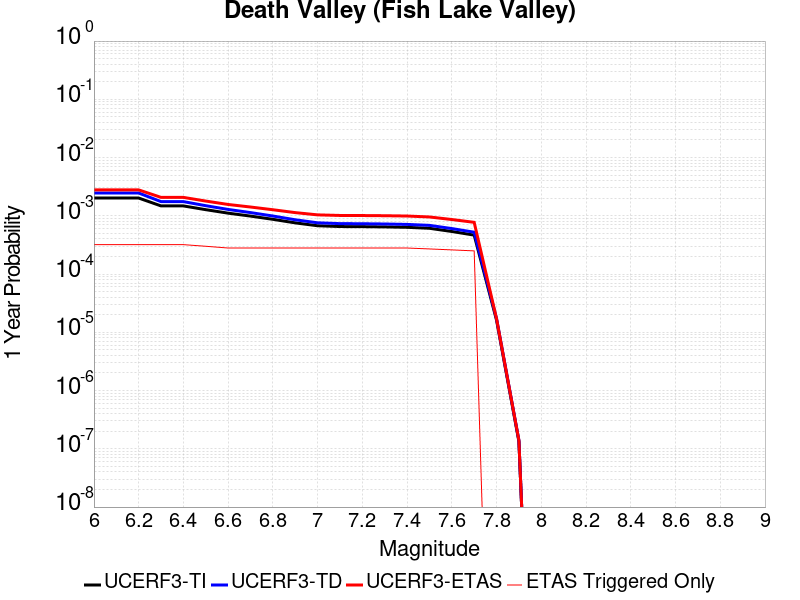 |  |

| Magnitude | 1 wk TI Prob | 1 wk TD Prob | 1 wk ETAS Prob | 1 wk ETAS/TD Gain | 1 wk ETAS Triggered Only | 1 mo TI Prob | 1 mo TD Prob | 1 mo ETAS Prob | 1 mo ETAS/TD Gain | 1 mo ETAS Triggered Only | 1 yr TI Prob | 1 yr TD Prob | 1 yr ETAS Prob | 1 yr ETAS/TD Gain | 1 yr ETAS Triggered Only | 10 yr TI Prob | 10 yr TD Prob | 10 yr ETAS Prob | 10 yr ETAS/TD Gain | 10 yr ETAS Triggered Only |
|-----|-----|-----|-----|-----|-----|-----|-----|-----|-----|-----|-----|-----|-----|-----|-----|-----|-----|-----|-----|-----|
| 6.0 | 3.872328E-5 | 4.7265705E-5 | 1.17262396E-4 | 2.4809194 | 7.0E-5 | 1.6594635E-4 | 2.0255324E-4 | 3.6252083E-4 | 1.7897557 | 1.6E-4 | 0.0020185246 | 0.0024635606 | 0.0027827723 | 1.1295733 | 3.2E-4 | 0.02000288 | 0.024388338 | 0.024846874 | 1.0188015 | 4.7E-4 |
| 6.1 | 3.872328E-5 | 4.7265705E-5 | 1.17262396E-4 | 2.4809194 | 7.0E-5 | 1.6594635E-4 | 2.0255324E-4 | 3.6252083E-4 | 1.7897557 | 1.6E-4 | 0.0020185246 | 0.0024635606 | 0.0027827723 | 1.1295733 | 3.2E-4 | 0.02000288 | 0.024388338 | 0.024846874 | 1.0188015 | 4.7E-4 |
| 6.2 | 3.872328E-5 | 4.7265705E-5 | 1.17262396E-4 | 2.4809194 | 7.0E-5 | 1.6594635E-4 | 2.0255324E-4 | 3.6252083E-4 | 1.7897557 | 1.6E-4 | 0.0020185246 | 0.0024635606 | 0.0027827723 | 1.1295733 | 3.2E-4 | 0.02000288 | 0.024388338 | 0.024846874 | 1.0188015 | 4.7E-4 |
| 6.3 | 2.8356371E-5 | 3.360979E-5 | 1.0360744E-4 | 3.0826564 | 7.0E-5 | 1.2152165E-4 | 1.4403443E-4 | 3.040114E-4 | 2.1106856 | 1.6E-4 | 0.0014785219 | 0.0017522788 | 0.002071718 | 1.1822994 | 3.2E-4 | 0.014687235 | 0.017391816 | 0.017853642 | 1.0265542 | 4.7E-4 |
| 6.4 | 2.8356371E-5 | 3.360979E-5 | 1.0360744E-4 | 3.0826564 | 7.0E-5 | 1.2152165E-4 | 1.4403443E-4 | 3.040114E-4 | 2.1106856 | 1.6E-4 | 0.0014785219 | 0.0017522788 | 0.002071718 | 1.1822994 | 3.2E-4 | 0.014687235 | 0.017391816 | 0.017853642 | 1.0265542 | 4.7E-4 |
| 6.5 | 2.4448687E-5 | 2.8607585E-5 | 9.860558E-5 | 3.4468336 | 7.0E-5 | 1.0477588E-4 | 1.2259845E-4 | 2.8257884E-4 | 2.3049138 | 1.6E-4 | 0.0012748998 | 0.0014916616 | 0.0017912142 | 1.200818 | 3.0E-4 | 0.012676105 | 0.014821392 | 0.01525487 | 1.0292468 | 4.4E-4 |
| 6.6 | 2.1298161E-5 | 2.4660083E-5 | 8.4658604E-5 | 3.4330218 | 6.0E-5 | 9.127464E-5 | 1.0568197E-4 | 2.5566612E-4 | 2.4192028 | 1.5E-4 | 0.0011107022 | 0.0012859512 | 0.0015655912 | 1.2174577 | 2.8E-4 | 0.011051672 | 0.01278853 | 0.013203159 | 1.032422 | 4.2E-4 |
| 6.7 | 1.8959729E-5 | 2.1781027E-5 | 8.177972E-5 | 3.7546313 | 6.0E-5 | 8.125345E-5 | 9.334406E-5 | 2.4333005E-4 | 2.6068082 | 1.5E-4 | 9.888117E-4 | 0.001135897 | 0.0014155789 | 1.2462212 | 2.8E-4 | 0.009844234 | 0.01130357 | 0.011718823 | 1.0367364 | 4.2E-4 |
| 6.8 | 1.6691629E-5 | 1.9018351E-5 | 7.901721E-5 | 4.1547875 | 6.0E-5 | 7.153359E-5 | 8.150477E-5 | 2.3149255E-4 | 2.840233 | 1.5E-4 | 8.7057345E-4 | 9.918857E-4 | 0.0012716079 | 1.2820106 | 2.8E-4 | 0.008671708 | 0.009876343 | 0.010292196 | 1.0421059 | 4.2E-4 |
| 6.9 | 1.450505E-5 | 1.638954E-5 | 7.6388555E-5 | 4.6608114 | 6.0E-5 | 6.216302E-5 | 7.0239046E-5 | 2.2022851E-4 | 3.1354144 | 1.5E-4 | 7.5657194E-4 | 8.5483363E-4 | 0.0011345943 | 1.3272691 | 2.8E-4 | 0.007540013 | 0.008516386 | 0.008932808 | 1.0488967 | 4.2E-4 |
| 7.0 | 1.2940855E-5 | 1.4537972E-5 | 7.45371E-5 | 5.1270633 | 6.0E-5 | 5.545963E-5 | 6.230414E-5 | 2.1229479E-4 | 3.4073946 | 1.5E-4 | 6.750118E-4 | 7.5829466E-4 | 0.0010380824 | 1.3689696 | 2.8E-4 | 0.006729651 | 0.0075576897 | 0.0079645915 | 1.0538393 | 4.1E-4 |
| 7.1 | 1.2544658E-5 | 1.4078208E-5 | 7.407736E-5 | 5.261846 | 6.0E-5 | 5.3761712E-5 | 6.0333812E-5 | 2.1032477E-4 | 3.4860182 | 1.5E-4 | 6.5435225E-4 | 7.343222E-4 | 0.0010141166 | 1.381024 | 2.8E-4 | 0.006524288 | 0.007319551 | 0.00772655 | 1.0556043 | 4.1E-4 |
| 7.2 | 1.2489416E-5 | 1.4015674E-5 | 7.401483E-5 | 5.2808614 | 6.0E-5 | 5.3524967E-5 | 6.0065824E-5 | 2.1005681E-4 | 3.4971104 | 1.5E-4 | 6.514716E-4 | 7.310616E-4 | 0.0010108569 | 1.3827246 | 2.8E-4 | 0.006495651 | 0.0072871596 | 0.0076941717 | 1.0558534 | 4.1E-4 |
| 7.3 | 1.2368307E-5 | 1.3879812E-5 | 7.387898E-5 | 5.322765 | 6.0E-5 | 5.3005948E-5 | 5.9483587E-5 | 2.0947466E-4 | 3.521554 | 1.5E-4 | 6.451563E-4 | 7.2397763E-4 | 0.0010037749 | 1.3864723 | 2.8E-4 | 0.0064328653 | 0.007216782 | 0.007623823 | 1.056402 | 4.1E-4 |
| 7.4 | 1.2161707E-5 | 1.36478675E-5 | 7.364705E-5 | 5.396231 | 6.0E-5 | 5.212056E-5 | 5.8489582E-5 | 2.0848081E-4 | 3.5644093 | 1.5E-4 | 6.3438306E-4 | 7.118836E-4 | 9.916843E-4 | 1.3930427 | 2.8E-4 | 0.006325751 | 0.0070966207 | 0.007503711 | 1.057364 | 4.1E-4 |
| 7.5 | 1.1707948E-5 | 1.3145515E-5 | 7.314473E-5 | 5.5642343 | 6.0E-5 | 5.0175953E-5 | 5.6336736E-5 | 1.9632885E-4 | 3.484917 | 1.4E-4 | 6.10721E-4 | 6.856895E-4 | 9.5550437E-4 | 1.3934942 | 2.7E-4 | 0.0060904534 | 0.006836321 | 0.0072335866 | 1.058111 | 4.0E-4 |
| 7.6 | 1.0319538E-5 | 1.1579622E-5 | 7.157893E-5 | 6.181456 | 6.0E-5 | 4.4225842E-5 | 4.9626036E-5 | 1.896191E-4 | 3.8209598 | 1.4E-4 | 5.383166E-4 | 6.040347E-4 | 8.6387765E-4 | 1.4301789 | 2.6E-4 | 0.0053701443 | 0.0060244603 | 0.0064121108 | 1.0643461 | 3.9E-4 |
| 7.7 | 8.937764E-6 | 1.0022779E-5 | 6.0022277E-5 | 5.9885864 | 5.0E-5 | 3.830414E-5 | 4.295409E-5 | 1.7294851E-4 | 4.026357 | 1.3E-4 | 4.6625308E-4 | 5.228456E-4 | 7.7271485E-4 | 1.4779027 | 2.5E-4 | 0.0046527605 | 0.005216664 | 0.0055548907 | 1.0648358 | 3.4E-4 |
| 7.8 | 3.108007E-7 | 3.284654E-7 | 3.284654E-7 | 1.0 | 0.0 | 1.3320023E-6 | 1.407708E-6 | 1.407708E-6 | 1.0 | 0.0 | 1.6217007E-5 | 1.7138715E-5 | 1.7138715E-5 | 1.0 | 0.0 | 1.6215823E-4 | 1.7137431E-4 | 1.7137431E-4 | 1.0 | 0.0 |
| 7.9 | 2.5591178E-9 | 2.6696718E-9 | 2.6696718E-9 | 1.0 | 0.0 | 1.0967647E-8 | 1.14414505E-8 | 1.14414505E-8 | 1.0 | 0.0 | 1.335311E-7 | 1.3929966E-7 | 1.3929966E-7 | 1.0 | 0.0 | 1.3353102E-6 | 1.3929966E-6 | 1.3929966E-6 | 1.0 | 0.0 |

## Calico-Hidalgo
*[(top)](#table-of-contents)*

| 1 Week | 1 Month | 1 Year | 10 Year |
|-----|-----|-----|-----|
|  |  |  |  |

| Magnitude | 1 wk TI Prob | 1 wk TD Prob | 1 wk ETAS Prob | 1 wk ETAS/TD Gain | 1 wk ETAS Triggered Only | 1 mo TI Prob | 1 mo TD Prob | 1 mo ETAS Prob | 1 mo ETAS/TD Gain | 1 mo ETAS Triggered Only | 1 yr TI Prob | 1 yr TD Prob | 1 yr ETAS Prob | 1 yr ETAS/TD Gain | 1 yr ETAS Triggered Only | 10 yr TI Prob | 10 yr TD Prob | 10 yr ETAS Prob | 10 yr ETAS/TD Gain | 10 yr ETAS Triggered Only |
|-----|-----|-----|-----|-----|-----|-----|-----|-----|-----|-----|-----|-----|-----|-----|-----|-----|-----|-----|-----|-----|
| 6.0 | 4.0906612E-5 | 5.0704355E-5 | 1.5069928E-4 | 2.9721172 | 1.0E-4 | 1.7530227E-4 | 2.1728857E-4 | 3.5725816E-4 | 1.6441644 | 1.4E-4 | 0.0021322158 | 0.002642678 | 0.0029817796 | 1.1283174 | 3.4E-4 | 0.02111873 | 0.026152814 | 0.026552092 | 1.0152671 | 4.1E-4 |
| 6.1 | 4.0906612E-5 | 5.0704355E-5 | 1.5069928E-4 | 2.9721172 | 1.0E-4 | 1.7530227E-4 | 2.1728857E-4 | 3.5725816E-4 | 1.6441644 | 1.4E-4 | 0.0021322158 | 0.002642678 | 0.0029817796 | 1.1283174 | 3.4E-4 | 0.02111873 | 0.026152814 | 0.026552092 | 1.0152671 | 4.1E-4 |
| 6.2 | 4.0906612E-5 | 5.0704355E-5 | 1.5069928E-4 | 2.9721172 | 1.0E-4 | 1.7530227E-4 | 2.1728857E-4 | 3.5725816E-4 | 1.6441644 | 1.4E-4 | 0.0021322158 | 0.002642678 | 0.0029817796 | 1.1283174 | 3.4E-4 | 0.02111873 | 0.026152814 | 0.026552092 | 1.0152671 | 4.1E-4 |
| 6.3 | 2.4242801E-5 | 3.0090967E-5 | 1.1008856E-4 | 3.6585252 | 8.0E-5 | 1.0389358E-4 | 1.289551E-4 | 2.489396E-4 | 1.9304364 | 1.2E-4 | 0.0012641704 | 0.0015689312 | 0.001788586 | 1.1400028 | 2.2E-4 | 0.01257003 | 0.015582229 | 0.015848022 | 1.0170574 | 2.7E-4 |
| 6.4 | 2.4242801E-5 | 3.0090967E-5 | 1.1008856E-4 | 3.6585252 | 8.0E-5 | 1.0389358E-4 | 1.289551E-4 | 2.489396E-4 | 1.9304364 | 1.2E-4 | 0.0012641704 | 0.0015689312 | 0.001788586 | 1.1400028 | 2.2E-4 | 0.01257003 | 0.015582229 | 0.015848022 | 1.0170574 | 2.7E-4 |
| 6.5 | 2.0286952E-5 | 2.5316054E-5 | 1.0531403E-4 | 4.15997 | 8.0E-5 | 8.694118E-5 | 1.0849296E-4 | 2.2847994E-4 | 2.1059425 | 1.2E-4 | 0.0010579949 | 0.0013201186 | 0.0015398281 | 1.1664317 | 2.2E-4 | 0.010529719 | 0.013124701 | 0.013381288 | 1.01955 | 2.6E-4 |
| 6.6 | 2.0269223E-5 | 2.5297004E-5 | 1.0529498E-4 | 4.1623497 | 8.0E-5 | 8.6865206E-5 | 1.08411325E-4 | 2.2839832E-4 | 2.1067755 | 1.2E-4 | 0.0010570707 | 0.0013191258 | 0.0015388356 | 1.1665571 | 2.2E-4 | 0.010520565 | 0.01311489 | 0.013371481 | 1.0195647 | 2.6E-4 |
| 6.7 | 1.799852E-5 | 2.2540933E-5 | 1.0253913E-4 | 4.549019 | 8.0E-5 | 7.713423E-5 | 9.660051E-5 | 2.1658892E-4 | 2.2421095 | 1.2E-4 | 9.3870464E-4 | 0.0011754911 | 0.0013852443 | 1.1784387 | 2.1E-4 | 0.009347493 | 0.011694346 | 0.011941422 | 1.0211278 | 2.5E-4 |
| 6.8 | 1.7458793E-5 | 2.184258E-5 | 1.0184083E-4 | 4.662491 | 8.0E-5 | 7.4821255E-5 | 9.360778E-5 | 2.1359655E-4 | 2.2818248 | 1.2E-4 | 9.10568E-4 | 0.0011390933 | 0.0013488542 | 1.1841471 | 2.1E-4 | 0.009068459 | 0.011334131 | 0.011581297 | 1.0218073 | 2.5E-4 |
| 6.9 | 1.542884E-5 | 1.9026285E-5 | 8.902495E-5 | 4.679051 | 7.0E-5 | 6.612192E-5 | 8.153875E-5 | 1.9152978E-4 | 2.3489418 | 1.1E-4 | 8.04737E-4 | 9.922953E-4 | 0.0011920969 | 1.201353 | 2.0E-4 | 0.008018291 | 0.009880043 | 0.010107771 | 1.0230492 | 2.3E-4 |
| 7.0 | 1.468253E-5 | 1.803109E-5 | 8.802983E-5 | 4.882113 | 7.0E-5 | 6.292361E-5 | 7.727389E-5 | 1.7726616E-4 | 2.2939982 | 1.0E-4 | 7.658257E-4 | 9.4041653E-4 | 0.0011302378 | 1.2018481 | 1.9E-4 | 0.0076319184 | 0.009365736 | 0.009583675 | 1.0232699 | 2.2E-4 |
| 7.1 | 1.3139281E-5 | 1.620139E-5 | 8.6200256E-5 | 5.320547 | 7.0E-5 | 5.6309986E-5 | 6.943275E-5 | 1.594265E-4 | 2.2961283 | 9.0E-5 | 6.853584E-4 | 8.4502844E-4 | 0.0010148848 | 1.2010067 | 1.7E-4 | 0.0068324856 | 0.008419449 | 0.008617766 | 1.0235546 | 2.0E-4 |
| 7.2 | 1.1127404E-5 | 1.3867038E-5 | 6.386635E-5 | 4.6056223 | 5.0E-5 | 4.7688E-5 | 5.9428872E-5 | 1.19425305E-4 | 2.0095503 | 6.0E-5 | 5.8044674E-4 | 7.233172E-4 | 8.432304E-4 | 1.1657823 | 1.2E-4 | 0.0057893298 | 0.007210737 | 0.0073596556 | 1.0206523 | 1.5E-4 |
| 7.3 | 9.808154E-6 | 1.2176586E-5 | 6.2175975E-5 | 5.106191 | 5.0E-5 | 4.2034266E-5 | 5.2184383E-5 | 1.1218125E-4 | 2.1497092 | 6.0E-5 | 5.11647E-4 | 6.351704E-4 | 7.5509417E-4 | 1.1888057 | 1.2E-4 | 0.0051047057 | 0.006334625 | 0.006483675 | 1.0235294 | 1.5E-4 |
| 7.4 | 7.942452E-6 | 9.792348E-6 | 4.9791957E-5 | 5.084782 | 4.0E-5 | 3.4038632E-5 | 4.1966585E-5 | 9.196449E-5 | 2.191374 | 5.0E-5 | 4.1434157E-4 | 5.108328E-4 | 6.107818E-4 | 1.1956588 | 1.0E-4 | 0.0041356985 | 0.005097527 | 0.005206967 | 1.0214691 | 1.1E-4 |
| 7.5 | 4.7121216E-6 | 5.7729717E-6 | 2.5772857E-5 | 4.4644003 | 2.0E-5 | 2.019465E-5 | 2.4741115E-5 | 5.4740372E-5 | 2.2125266 | 3.0E-5 | 2.4584212E-4 | 3.011891E-4 | 3.6117103E-4 | 1.1991504 | 6.0E-5 | 0.0024557032 | 0.0030085614 | 0.003068381 | 1.019883 | 6.0E-5 |
| 7.6 | 2.21172E-7 | 2.6040198E-7 | 2.6040198E-7 | 1.0 | 0.0 | 9.478797E-7 | 1.1160082E-6 | 1.1160082E-6 | 1.0 | 0.0 | 1.1540374E-5 | 1.3587343E-5 | 1.3587343E-5 | 1.0 | 0.0 | 1.1539775E-4 | 1.3586794E-4 | 1.3586794E-4 | 1.0 | 0.0 |

## San Andreas (Coachella) rev
*[(top)](#table-of-contents)*

| 1 Week | 1 Month | 1 Year | 10 Year |
|-----|-----|-----|-----|
|  |  |  |  |

| Magnitude | 1 wk TI Prob | 1 wk TD Prob | 1 wk ETAS Prob | 1 wk ETAS/TD Gain | 1 wk ETAS Triggered Only | 1 mo TI Prob | 1 mo TD Prob | 1 mo ETAS Prob | 1 mo ETAS/TD Gain | 1 mo ETAS Triggered Only | 1 yr TI Prob | 1 yr TD Prob | 1 yr ETAS Prob | 1 yr ETAS/TD Gain | 1 yr ETAS Triggered Only | 10 yr TI Prob | 10 yr TD Prob | 10 yr ETAS Prob | 10 yr ETAS/TD Gain | 10 yr ETAS Triggered Only |
|-----|-----|-----|-----|-----|-----|-----|-----|-----|-----|-----|-----|-----|-----|-----|-----|-----|-----|-----|-----|-----|
| 6.0 | 1.1925945E-4 | 3.273077E-4 | 4.772586E-4 | 1.4581343 | 1.5E-4 | 5.110118E-4 | 0.001401998 | 0.0015817456 | 1.1282082 | 1.8E-4 | 0.0062038354 | 0.016937068 | 0.017202495 | 1.0156714 | 2.7E-4 | 0.060334753 | 0.15267672 | 0.15302412 | 1.0022755 | 4.1E-4 |
| 6.1 | 1.1925945E-4 | 3.273077E-4 | 4.772586E-4 | 1.4581343 | 1.5E-4 | 5.110118E-4 | 0.001401998 | 0.0015817456 | 1.1282082 | 1.8E-4 | 0.0062038354 | 0.016937068 | 0.017202495 | 1.0156714 | 2.7E-4 | 0.060334753 | 0.15267672 | 0.15302412 | 1.0022755 | 4.1E-4 |
| 6.2 | 1.07432395E-4 | 3.0231563E-4 | 4.422733E-4 | 1.4629521 | 1.4E-4 | 4.603433E-4 | 0.001294999 | 0.0014647789 | 1.1311042 | 1.7E-4 | 0.005590286 | 0.015653731 | 0.015899818 | 1.0157206 | 2.5E-4 | 0.05451731 | 0.14182784 | 0.14216252 | 1.0023599 | 3.9E-4 |
| 6.3 | 1.0718766E-4 | 3.0176868E-4 | 4.4172644E-4 | 1.4637915 | 1.4E-4 | 4.592948E-4 | 0.0012926573 | 0.0014624376 | 1.131342 | 1.7E-4 | 0.005577586 | 0.01562563 | 0.015871724 | 1.0157493 | 2.5E-4 | 0.054396555 | 0.14159605 | 0.14193083 | 1.0023643 | 3.9E-4 |
| 6.4 | 1.0355944E-4 | 2.9384956E-4 | 4.338084E-4 | 1.4762943 | 1.4E-4 | 4.4375064E-4 | 0.0012587514 | 0.0014285373 | 1.1348845 | 1.7E-4 | 0.0053892885 | 0.015218662 | 0.015464857 | 1.0161772 | 2.5E-4 | 0.052604496 | 0.13815795 | 0.13849407 | 1.0024328 | 3.9E-4 |
| 6.5 | 1.0227914E-4 | 2.9104383E-4 | 4.310031E-4 | 1.4808872 | 1.4E-4 | 4.382655E-4 | 0.0012467385 | 0.0014165265 | 1.1361858 | 1.7E-4 | 0.0053228354 | 0.015074439 | 0.01532067 | 1.0163344 | 2.5E-4 | 0.051971316 | 0.13694239 | 0.13727897 | 1.0024579 | 3.9E-4 |
| 6.6 | 1.0116757E-4 | 2.8870135E-4 | 4.2866092E-4 | 1.4847902 | 1.4E-4 | 4.3350324E-4 | 0.0012367087 | 0.0014064985 | 1.1372917 | 1.7E-4 | 0.0052651367 | 0.014954008 | 0.01520027 | 1.0164679 | 2.5E-4 | 0.051421247 | 0.13591973 | 0.13625674 | 1.0024793 | 3.9E-4 |
| 6.7 | 1.0050676E-4 | 2.8728697E-4 | 4.2724676E-4 | 1.4871776 | 1.4E-4 | 4.3067214E-4 | 0.0012306528 | 0.0014004436 | 1.1379681 | 1.7E-4 | 0.005230834 | 0.014881288 | 0.015127568 | 1.0165496 | 2.5E-4 | 0.051094085 | 0.13530464 | 0.13564189 | 1.0024924 | 3.9E-4 |
| 6.8 | 9.976819E-5 | 2.8532353E-4 | 4.252836E-4 | 1.4905311 | 1.4E-4 | 4.2750788E-4 | 0.001222246 | 0.0013920382 | 1.1389182 | 1.7E-4 | 0.0051924936 | 0.014780328 | 0.015026633 | 1.0166644 | 2.5E-4 | 0.050728295 | 0.13445628 | 0.13478518 | 1.0024462 | 3.8E-4 |
| 6.9 | 9.77719E-5 | 2.802926E-4 | 4.1025615E-4 | 1.4636711 | 1.3E-4 | 4.1895514E-4 | 0.0012007048 | 0.0013605127 | 1.133095 | 1.6E-4 | 0.0050888555 | 0.0145215895 | 0.014758104 | 1.0162871 | 2.4E-4 | 0.049738888 | 0.13228476 | 0.13260582 | 1.002427 | 3.7E-4 |
| 7.0 | 8.500761E-5 | 2.4763815E-4 | 3.6760842E-4 | 1.484458 | 1.2E-4 | 3.6426744E-4 | 0.0010608779 | 0.0012107188 | 1.1412424 | 1.5E-4 | 0.0044259406 | 0.01284047 | 0.013067517 | 1.0176821 | 2.3E-4 | 0.04338823 | 0.11813616 | 0.11845363 | 1.0026873 | 3.6E-4 |
| 7.1 | 8.319876E-5 | 2.4366553E-4 | 3.636363E-4 | 1.4923583 | 1.2E-4 | 3.5651738E-4 | 0.0010438662 | 0.0011937096 | 1.1435466 | 1.5E-4 | 0.004331963 | 0.012635773 | 0.012862867 | 1.0179722 | 2.3E-4 | 0.042484846 | 0.11635632 | 0.116665594 | 1.002658 | 3.5E-4 |
| 7.2 | 7.563917E-5 | 2.2414974E-4 | 3.4412285E-4 | 1.5352364 | 1.2E-4 | 3.2412758E-4 | 9.602912E-4 | 0.0011101471 | 1.1560526 | 1.5E-4 | 0.0039391145 | 0.011629559 | 0.011856885 | 1.0195472 | 2.3E-4 | 0.03870018 | 0.10776202 | 0.1080743 | 1.0028979 | 3.5E-4 |
| 7.3 | 7.082985E-5 | 2.07311E-4 | 3.272861E-4 | 1.5787205 | 1.2E-4 | 3.0352117E-4 | 8.881761E-4 | 0.0010380428 | 1.1687354 | 1.5E-4 | 0.0036891096 | 0.010760553 | 0.010988079 | 1.0211444 | 2.3E-4 | 0.03628465 | 0.10028403 | 0.10058994 | 1.0030503 | 3.4E-4 |
| 7.4 | 5.146215E-5 | 1.4274761E-4 | 2.627305E-4 | 1.8405246 | 1.2E-4 | 2.2053342E-4 | 6.1163295E-4 | 7.615412E-4 | 1.2450951 | 1.5E-4 | 0.0026816884 | 0.0074213943 | 0.0076397615 | 1.0294241 | 2.2E-4 | 0.02649557 | 0.07085049 | 0.07115711 | 1.0043277 | 3.3E-4 |
| 7.5 | 4.0285166E-5 | 1.0942422E-4 | 2.1941218E-4 | 2.005152 | 1.1E-4 | 1.7263928E-4 | 4.6887697E-4 | 6.0881133E-4 | 1.2984458 | 1.4E-4 | 0.002099857 | 0.0056937044 | 0.0059025087 | 1.0366728 | 2.1E-4 | 0.020801254 | 0.055013083 | 0.05530603 | 1.0053251 | 3.1E-4 |
| 7.6 | 3.1168736E-5 | 8.439599E-5 | 1.9438671E-4 | 2.3032694 | 1.1E-4 | 1.3357346E-4 | 3.616471E-4 | 5.015965E-4 | 1.3869777 | 1.4E-4 | 0.0016250437 | 0.004394191 | 0.004603268 | 1.0475804 | 2.1E-4 | 0.016132116 | 0.042812478 | 0.043099634 | 1.0067073 | 3.0E-4 |
| 7.7 | 2.2100989E-5 | 6.239345E-5 | 1.6238721E-4 | 2.6026323 | 1.0E-4 | 9.4715084E-5 | 2.6737314E-4 | 3.9733836E-4 | 1.486082 | 1.3E-4 | 0.001152546 | 0.0032504152 | 0.003449765 | 1.0613306 | 2.0E-4 | 0.011465867 | 0.031902168 | 0.03217324 | 1.0084969 | 2.8E-4 |
| 7.8 | 1.7484861E-5 | 5.180078E-5 | 1.517956E-4 | 2.9303727 | 1.0E-4 | 7.493296E-5 | 2.2198448E-4 | 3.5195562E-4 | 1.5854965 | 1.3E-4 | 9.1192697E-4 | 0.0026993142 | 0.0028987743 | 1.073893 | 2.0E-4 | 0.009081938 | 0.026641788 | 0.026914328 | 1.0102298 | 2.8E-4 |
| 7.9 | 1.3967285E-5 | 3.8226146E-5 | 1.282227E-4 | 3.3543193 | 9.0E-5 | 5.985842E-5 | 1.6381606E-4 | 2.837964E-4 | 1.7324089 | 1.2E-4 | 7.2853256E-4 | 0.0019926373 | 0.0021722787 | 1.0901525 | 1.8E-4 | 0.0072614877 | 0.019911002 | 0.020165825 | 1.0127981 | 2.6E-4 |
| 8.0 | 1.1887396E-5 | 3.106798E-5 | 1.1106549E-4 | 3.5749185 | 8.0E-5 | 5.094499E-5 | 1.331417E-4 | 2.4312706E-4 | 1.8260775 | 1.1E-4 | 6.200787E-4 | 0.0016197958 | 0.0017895205 | 1.1047815 | 1.7E-4 | 0.006183513 | 0.016280567 | 0.016526496 | 1.0151057 | 2.5E-4 |
| 8.1 | 5.100864E-6 | 8.973766E-6 | 8.973766E-6 | 1.0 | 0.0 | 2.1860664E-5 | 3.845843E-5 | 3.845843E-5 | 1.0 | 0.0 | 2.6612106E-4 | 4.6813092E-4 | 4.7812623E-4 | 1.0213516 | 1.0E-5 | 0.002658026 | 0.004918092 | 0.0049280426 | 1.0020233 | 1.0E-5 |
| 8.2 | 2.3004484E-6 | 2.7863473E-6 | 2.7863473E-6 | 1.0 | 0.0 | 9.859027E-6 | 1.19414335E-5 | 1.19414335E-5 | 1.0 | 0.0 | 1.2002704E-4 | 1.4537729E-4 | 1.4537729E-4 | 1.0 | 0.0 | 0.0011996223 | 0.0015973782 | 0.0015973782 | 1.0 | 0.0 |
| 8.3 | 1.0424446E-7 | 5.814421E-8 | 5.814421E-8 | 1.0 | 0.0 | 4.4676187E-7 | 2.4918944E-7 | 2.4918944E-7 | 1.0 | 0.0 | 5.439312E-6 | 3.0338776E-6 | 3.0338776E-6 | 1.0 | 0.0 | 5.4391792E-5 | 3.189592E-5 | 3.189592E-5 | 1.0 | 0.0 |

## Cady
*[(top)](#table-of-contents)*

| 1 Week | 1 Month | 1 Year | 10 Year |
|-----|-----|-----|-----|
|  |  | 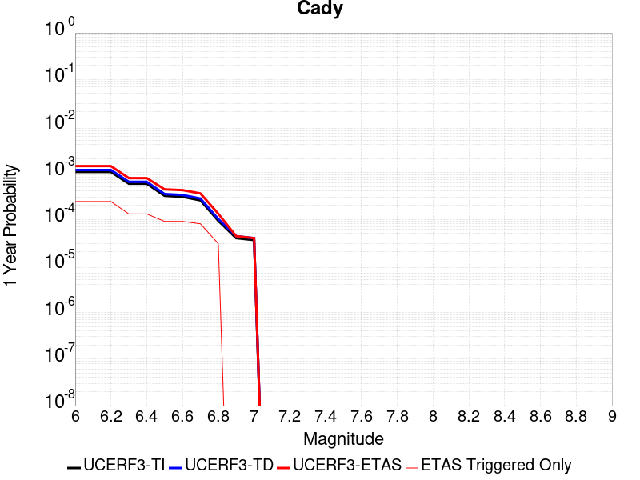 |  |

| Magnitude | 1 wk TI Prob | 1 wk TD Prob | 1 wk ETAS Prob | 1 wk ETAS/TD Gain | 1 wk ETAS Triggered Only | 1 mo TI Prob | 1 mo TD Prob | 1 mo ETAS Prob | 1 mo ETAS/TD Gain | 1 mo ETAS Triggered Only | 1 yr TI Prob | 1 yr TD Prob | 1 yr ETAS Prob | 1 yr ETAS/TD Gain | 1 yr ETAS Triggered Only | 10 yr TI Prob | 10 yr TD Prob | 10 yr ETAS Prob | 10 yr ETAS/TD Gain | 10 yr ETAS Triggered Only |
|-----|-----|-----|-----|-----|-----|-----|-----|-----|-----|-----|-----|-----|-----|-----|-----|-----|-----|-----|-----|-----|
| 6.0 | 1.9892565E-5 | 2.1858728E-5 | 1.21856545E-4 | 5.5747313 | 1.0E-4 | 8.525106E-5 | 9.3677416E-5 | 2.2366524E-4 | 2.3876112 | 1.3E-4 | 0.0010374374 | 0.0011400167 | 0.0013797431 | 1.2102833 | 2.4E-4 | 0.010326075 | 0.011350701 | 0.011736274 | 1.0339692 | 3.9E-4 |
| 6.1 | 1.9892565E-5 | 2.1858728E-5 | 1.21856545E-4 | 5.5747313 | 1.0E-4 | 8.525106E-5 | 9.3677416E-5 | 2.2366524E-4 | 2.3876112 | 1.3E-4 | 0.0010374374 | 0.0011400167 | 0.0013797431 | 1.2102833 | 2.4E-4 | 0.010326075 | 0.011350701 | 0.011736274 | 1.0339692 | 3.9E-4 |
| 6.2 | 1.9892565E-5 | 2.1858728E-5 | 1.21856545E-4 | 5.5747313 | 1.0E-4 | 8.525106E-5 | 9.3677416E-5 | 2.2366524E-4 | 2.3876112 | 1.3E-4 | 0.0010374374 | 0.0011400167 | 0.0013797431 | 1.2102833 | 2.4E-4 | 0.010326075 | 0.011350701 | 0.011736274 | 1.0339692 | 3.9E-4 |
| 6.3 | 1.1117327E-5 | 1.2176583E-5 | 7.2175855E-5 | 5.9274306 | 6.0E-5 | 4.764482E-5 | 5.2184492E-5 | 1.3218031E-4 | 2.5329425 | 8.0E-5 | 5.7992124E-4 | 6.351925E-4 | 7.651099E-4 | 1.2045324 | 1.3E-4 | 0.0057841022 | 0.0063368753 | 0.0065554813 | 1.0344974 | 2.2E-4 |
| 6.4 | 1.1117327E-5 | 1.2176583E-5 | 7.2175855E-5 | 5.9274306 | 6.0E-5 | 4.764482E-5 | 5.2184492E-5 | 1.3218031E-4 | 2.5329425 | 8.0E-5 | 5.7992124E-4 | 6.351925E-4 | 7.651099E-4 | 1.2045324 | 1.3E-4 | 0.0057841022 | 0.0063368753 | 0.0065554813 | 1.0344974 | 2.2E-4 |
| 6.5 | 6.103093E-6 | 6.672021E-6 | 4.6671754E-5 | 6.9951453 | 4.0E-5 | 2.615585E-5 | 2.8594131E-5 | 8.859242E-5 | 3.0982726 | 6.0E-5 | 3.1840094E-4 | 3.480905E-4 | 4.3805919E-4 | 1.2584635 | 9.0E-5 | 0.0031794512 | 0.0034766865 | 0.0035863041 | 1.0315293 | 1.1E-4 |
| 6.6 | 5.817237E-6 | 6.3656585E-6 | 4.6365403E-5 | 7.2836776 | 4.0E-5 | 2.4930776E-5 | 2.728118E-5 | 8.727954E-5 | 3.1992586 | 6.0E-5 | 3.034899E-4 | 3.3211018E-4 | 4.2208028E-4 | 1.2709044 | 9.0E-5 | 0.0030307577 | 0.0033173605 | 0.0034269956 | 1.0330489 | 1.1E-4 |
| 6.7 | 4.8846314E-6 | 5.3405684E-6 | 4.5340355E-5 | 8.4897995 | 4.0E-5 | 2.0933967E-5 | 2.2888014E-5 | 8.288664E-5 | 3.6213994 | 6.0E-5 | 2.5484123E-4 | 2.7863772E-4 | 3.5861545E-4 | 1.2870312 | 8.0E-5 | 0.0025454918 | 0.0027840391 | 0.0028837607 | 1.035819 | 1.0E-4 |
| 6.8 | 1.7788773E-6 | 1.9399079E-6 | 2.193987E-5 | 11.309748 | 2.0E-5 | 7.6237375E-6 | 8.313874E-6 | 2.8313707E-5 | 3.4055974 | 2.0E-5 | 9.281505E-5 | 1.01218284E-4 | 1.3121525E-4 | 1.2963592 | 3.0E-5 | 9.2776294E-4 | 0.0010118765 | 0.0010418461 | 1.0296179 | 3.0E-5 |
| 6.9 | 7.5455404E-7 | 8.297092E-7 | 8.297092E-7 | 1.0 | 0.0 | 3.233799E-6 | 3.5558937E-6 | 3.5558937E-6 | 1.0 | 0.0 | 3.937079E-5 | 4.3292483E-5 | 4.3292483E-5 | 1.0 | 0.0 | 3.9363815E-4 | 4.3287344E-4 | 4.3287344E-4 | 1.0 | 0.0 |
| 7.0 | 6.8578805E-7 | 7.541816E-7 | 7.541816E-7 | 1.0 | 0.0 | 2.9390883E-6 | 3.2322048E-6 | 3.2322048E-6 | 1.0 | 0.0 | 3.578281E-5 | 3.9351715E-5 | 3.9351715E-5 | 1.0 | 0.0 | 3.577705E-4 | 3.9347992E-4 | 3.9347992E-4 | 1.0 | 0.0 |

## San Andreas (Carrizo) rev
*[(top)](#table-of-contents)*

| 1 Week | 1 Month | 1 Year | 10 Year |
|-----|-----|-----|-----|
|  |  |  |  |

| Magnitude | 1 wk TI Prob | 1 wk TD Prob | 1 wk ETAS Prob | 1 wk ETAS/TD Gain | 1 wk ETAS Triggered Only | 1 mo TI Prob | 1 mo TD Prob | 1 mo ETAS Prob | 1 mo ETAS/TD Gain | 1 mo ETAS Triggered Only | 1 yr TI Prob | 1 yr TD Prob | 1 yr ETAS Prob | 1 yr ETAS/TD Gain | 1 yr ETAS Triggered Only | 10 yr TI Prob | 10 yr TD Prob | 10 yr ETAS Prob | 10 yr ETAS/TD Gain | 10 yr ETAS Triggered Only |
|-----|-----|-----|-----|-----|-----|-----|-----|-----|-----|-----|-----|-----|-----|-----|-----|-----|-----|-----|-----|-----|
| 6.0 | 1.1674632E-4 | 2.4324407E-4 | 3.3322218E-4 | 1.3699088 | 9.0E-5 | 5.002454E-4 | 0.0010420597 | 0.0011719243 | 1.124623 | 1.3E-4 | 0.006073493 | 0.012613757 | 0.012860604 | 1.0195696 | 2.5E-4 | 0.0591016 | 0.120640226 | 0.12100076 | 1.0029886 | 4.1E-4 |
| 6.1 | 1.1674632E-4 | 2.4324407E-4 | 3.3322218E-4 | 1.3699088 | 9.0E-5 | 5.002454E-4 | 0.0010420597 | 0.0011719243 | 1.124623 | 1.3E-4 | 0.006073493 | 0.012613757 | 0.012860604 | 1.0195696 | 2.5E-4 | 0.0591016 | 0.120640226 | 0.12100076 | 1.0029886 | 4.1E-4 |
| 6.2 | 1.1674632E-4 | 2.4324407E-4 | 3.3322218E-4 | 1.3699088 | 9.0E-5 | 5.002454E-4 | 0.0010420597 | 0.0011719243 | 1.124623 | 1.3E-4 | 0.006073493 | 0.012613757 | 0.012860604 | 1.0195696 | 2.5E-4 | 0.0591016 | 0.120640226 | 0.12100076 | 1.0029886 | 4.1E-4 |
| 6.3 | 1.1674632E-4 | 2.4324407E-4 | 3.3322218E-4 | 1.3699088 | 9.0E-5 | 5.002454E-4 | 0.0010420597 | 0.0011719243 | 1.124623 | 1.3E-4 | 0.006073493 | 0.012613757 | 0.012860604 | 1.0195696 | 2.5E-4 | 0.0591016 | 0.120640226 | 0.12100076 | 1.0029886 | 4.1E-4 |
| 6.4 | 1.1674632E-4 | 2.4324407E-4 | 3.3322218E-4 | 1.3699088 | 9.0E-5 | 5.002454E-4 | 0.0010420597 | 0.0011719243 | 1.124623 | 1.3E-4 | 0.006073493 | 0.012613757 | 0.012860604 | 1.0195696 | 2.5E-4 | 0.0591016 | 0.120640226 | 0.12100076 | 1.0029886 | 4.1E-4 |
| 6.5 | 1.13136164E-4 | 2.3644442E-4 | 3.2642315E-4 | 1.3805492 | 9.0E-5 | 4.847792E-4 | 0.0010129412 | 0.0011428095 | 1.1282091 | 1.3E-4 | 0.0058862255 | 0.012263271 | 0.012510205 | 1.0201361 | 2.5E-4 | 0.057327334 | 0.11761008 | 0.11797186 | 1.0030761 | 4.1E-4 |
| 6.6 | 1.13136164E-4 | 2.3644442E-4 | 3.2642315E-4 | 1.3805492 | 9.0E-5 | 4.847792E-4 | 0.0010129412 | 0.0011428095 | 1.1282091 | 1.3E-4 | 0.0058862255 | 0.012263271 | 0.012510205 | 1.0201361 | 2.5E-4 | 0.057327334 | 0.11761008 | 0.11797186 | 1.0030761 | 4.1E-4 |
| 6.7 | 1.1149675E-4 | 2.3335687E-4 | 3.2333587E-4 | 1.3855854 | 9.0E-5 | 4.777557E-4 | 9.997191E-4 | 0.0011295892 | 1.1299065 | 1.3E-4 | 0.0058011734 | 0.012104088 | 0.012351062 | 1.0204042 | 2.5E-4 | 0.05652051 | 0.1162291 | 0.116591446 | 1.0031176 | 4.1E-4 |
| 6.8 | 1.1103589E-4 | 2.3237852E-4 | 3.223576E-4 | 1.3872092 | 9.0E-5 | 4.7578133E-4 | 9.955293E-4 | 0.0011253998 | 1.1304538 | 1.3E-4 | 0.005777263 | 0.012053643 | 0.01230063 | 1.0204906 | 2.5E-4 | 0.056293584 | 0.11578894 | 0.11615147 | 1.0031309 | 4.1E-4 |
| 6.9 | 1.1053259E-4 | 2.3130233E-4 | 3.2128152E-4 | 1.3890111 | 9.0E-5 | 4.7362508E-4 | 9.909206E-4 | 0.0011207918 | 1.1310611 | 1.3E-4 | 0.0057511497 | 0.011998152 | 0.012245152 | 1.0205865 | 2.5E-4 | 0.05604569 | 0.11530445 | 0.11566717 | 1.0031458 | 4.1E-4 |
| 7.0 | 1.1005377E-4 | 2.3031076E-4 | 3.2029004E-4 | 1.3906864 | 9.0E-5 | 4.7157376E-4 | 9.866742E-4 | 0.001116546 | 1.1316258 | 1.3E-4 | 0.0057263062 | 0.011947021 | 0.012194035 | 1.0206757 | 2.5E-4 | 0.055809796 | 0.11485658 | 0.11521949 | 1.0031596 | 4.1E-4 |
| 7.1 | 1.0308142E-4 | 2.1540876E-4 | 2.9539154E-4 | 1.3713069 | 8.0E-5 | 4.417027E-4 | 9.228548E-4 | 0.0010327533 | 1.1190853 | 1.1E-4 | 0.0053644776 | 0.011178188 | 0.011405618 | 1.0203458 | 2.3E-4 | 0.052368138 | 0.10809042 | 0.10842935 | 1.0031356 | 3.8E-4 |
| 7.2 | 1.0027479E-4 | 2.094876E-4 | 2.8947083E-4 | 1.3818042 | 8.0E-5 | 4.296783E-4 | 8.9749607E-4 | 0.0010073973 | 1.1224532 | 1.1E-4 | 0.0052187922 | 0.010872566 | 0.011100066 | 1.0209242 | 2.3E-4 | 0.050979212 | 0.10539086 | 0.10573081 | 1.0032257 | 3.8E-4 |
| 7.3 | 9.816942E-5 | 2.0423878E-4 | 2.8422245E-4 | 1.3916184 | 8.0E-5 | 4.2065824E-4 | 8.7501644E-4 | 9.849202E-4 | 1.1256019 | 1.1E-4 | 0.005109493 | 0.010601572 | 0.010829134 | 1.021465 | 2.3E-4 | 0.049935985 | 0.10297546 | 0.10331632 | 1.0033102 | 3.8E-4 |
| 7.4 | 9.5634205E-5 | 1.9793298E-4 | 2.7791716E-4 | 1.4040972 | 8.0E-5 | 4.0979648E-4 | 8.4800937E-4 | 9.579161E-4 | 1.1296055 | 1.1E-4 | 0.0049778637 | 0.010275901 | 0.010503538 | 1.0221524 | 2.3E-4 | 0.048678253 | 0.100067884 | 0.10040986 | 1.0034174 | 3.8E-4 |
| 7.5 | 8.052417E-5 | 1.6113915E-4 | 2.3112788E-4 | 1.4343371 | 7.0E-5 | 3.4505792E-4 | 6.9041376E-4 | 7.8035163E-4 | 1.1302667 | 9.0E-5 | 0.0041929903 | 0.008373471 | 0.008571797 | 1.023685 | 2.0E-4 | 0.04114753 | 0.082815245 | 0.08312709 | 1.0037656 | 3.4E-4 |
| 7.6 | 7.897024E-5 | 1.5767086E-4 | 2.2765982E-4 | 1.4438928 | 7.0E-5 | 3.384E-4 | 6.755574E-4 | 7.6549663E-4 | 1.1331333 | 9.0E-5 | 0.0041122385 | 0.00819397 | 0.008392331 | 1.0242082 | 2.0E-4 | 0.040369697 | 0.08115866 | 0.08147107 | 1.0038493 | 3.4E-4 |
| 7.7 | 6.707427E-5 | 1.3277122E-4 | 2.0276193E-4 | 1.5271527 | 7.0E-5 | 2.8742946E-4 | 5.688955E-4 | 6.588443E-4 | 1.1581113 | 9.0E-5 | 0.003493839 | 0.0069043385 | 0.0070830956 | 1.0258906 | 1.8E-4 | 0.034394164 | 0.06905339 | 0.069332674 | 1.0040444 | 3.0E-4 |
| 7.8 | 6.147705E-5 | 1.2198445E-4 | 1.7197835E-4 | 1.4098383 | 5.0E-5 | 2.6344648E-4 | 5.226858E-4 | 5.8265444E-4 | 1.1147317 | 6.0E-5 | 0.0032027436 | 0.006345156 | 0.006484268 | 1.021924 | 1.4E-4 | 0.031569764 | 0.0635172 | 0.06374195 | 1.0035385 | 2.4E-4 |
| 7.9 | 4.7636717E-5 | 8.8802946E-5 | 1.0880117E-4 | 1.2251978 | 2.0E-5 | 2.0414138E-4 | 3.8052857E-4 | 4.0052095E-4 | 1.0525385 | 2.0E-5 | 0.0024825884 | 0.004623101 | 0.0046927775 | 1.0150714 | 7.0E-5 | 0.024550365 | 0.046629366 | 0.046762835 | 1.0028625 | 1.4E-4 |
| 8.0 | 3.3554235E-5 | 5.2138024E-5 | 6.213751E-5 | 1.1917886 | 1.0E-5 | 1.4379594E-4 | 2.2342955E-4 | 2.3342732E-4 | 1.0447469 | 1.0E-5 | 0.0017493097 | 0.002716863 | 0.0027467816 | 1.0110122 | 3.0E-5 | 0.017356034 | 0.027881905 | 0.027930511 | 1.0017433 | 5.0E-5 |
| 8.1 | 1.9175432E-5 | 1.9183564E-5 | 1.9183564E-5 | 1.0 | 0.0 | 8.217783E-5 | 8.221269E-5 | 8.221269E-5 | 1.0 | 0.0 | 0.0010000558 | 0.0010004805 | 0.0010004805 | 1.0 | 0.0 | 0.009955673 | 0.010757771 | 0.010757771 | 1.0 | 0.0 |
| 8.2 | 8.643924E-6 | 5.473668E-6 | 5.473668E-6 | 1.0 | 0.0 | 3.704486E-5 | 2.3458366E-5 | 2.3458366E-5 | 1.0 | 0.0 | 4.5092785E-4 | 2.8556827E-4 | 2.8556827E-4 | 1.0 | 0.0 | 0.0045001395 | 0.0032481793 | 0.0032481793 | 1.0 | 0.0 |
| 8.3 | 1.983087E-6 | 7.6564595E-7 | 7.6564595E-7 | 1.0 | 0.0 | 8.498917E-6 | 3.281336E-6 | 3.281336E-6 | 1.0 | 0.0 | 1.034694E-4 | 3.9949547E-5 | 3.9949547E-5 | 1.0 | 0.0 | 0.0010342124 | 4.717979E-4 | 4.717979E-4 | 1.0 | 0.0 |

## Red Pass
*[(top)](#table-of-contents)*

| 1 Week | 1 Month | 1 Year | 10 Year |
|-----|-----|-----|-----|
|  |  |  |  |

| Magnitude | 1 wk TI Prob | 1 wk TD Prob | 1 wk ETAS Prob | 1 wk ETAS/TD Gain | 1 wk ETAS Triggered Only | 1 mo TI Prob | 1 mo TD Prob | 1 mo ETAS Prob | 1 mo ETAS/TD Gain | 1 mo ETAS Triggered Only | 1 yr TI Prob | 1 yr TD Prob | 1 yr ETAS Prob | 1 yr ETAS/TD Gain | 1 yr ETAS Triggered Only | 10 yr TI Prob | 10 yr TD Prob | 10 yr ETAS Prob | 10 yr ETAS/TD Gain | 10 yr ETAS Triggered Only |
|-----|-----|-----|-----|-----|-----|-----|-----|-----|-----|-----|-----|-----|-----|-----|-----|-----|-----|-----|-----|-----|
| 6.0 | 8.258278E-6 | 8.551265E-6 | 9.8550496E-5 | 11.524669 | 9.0E-5 | 3.539214E-5 | 3.6647863E-5 | 1.4664383E-4 | 4.001429 | 1.1E-4 | 4.308141E-4 | 4.4611428E-4 | 6.560206E-4 | 1.4705215 | 2.1E-4 | 0.0042997985 | 0.004453945 | 0.004812341 | 1.0804672 | 3.6E-4 |
| 6.1 | 3.649988E-6 | 3.7753161E-6 | 4.3775166E-5 | 11.595099 | 4.0E-5 | 1.5642712E-5 | 1.6179853E-5 | 5.6179204E-5 | 3.4721704 | 4.0E-5 | 1.9043336E-4 | 1.9697666E-4 | 2.9695698E-4 | 1.5075743 | 1.0E-4 | 0.0019027026 | 0.001968488 | 0.0021481337 | 1.0912608 | 1.8E-4 |
| 6.2 | 3.649988E-6 | 3.7753161E-6 | 4.3775166E-5 | 11.595099 | 4.0E-5 | 1.5642712E-5 | 1.6179853E-5 | 5.6179204E-5 | 3.4721704 | 4.0E-5 | 1.9043336E-4 | 1.9697666E-4 | 2.9695698E-4 | 1.5075743 | 1.0E-4 | 0.0019027026 | 0.001968488 | 0.0021481337 | 1.0912608 | 1.8E-4 |
| 6.3 | 1.3924937E-6 | 1.4411166E-6 | 1.4411166E-6 | 1.0 | 0.0 | 5.9678164E-6 | 6.1762075E-6 | 6.1762075E-6 | 1.0 | 0.0 | 7.265574E-5 | 7.519415E-5 | 1.0519189E-4 | 1.3989372 | 3.0E-5 | 7.263199E-4 | 7.518258E-4 | 8.0178824E-4 | 1.0664548 | 5.0E-5 |
| 6.4 | 1.3924937E-6 | 1.4411166E-6 | 1.4411166E-6 | 1.0 | 0.0 | 5.9678164E-6 | 6.1762075E-6 | 6.1762075E-6 | 1.0 | 0.0 | 7.265574E-5 | 7.519415E-5 | 1.0519189E-4 | 1.3989372 | 3.0E-5 | 7.263199E-4 | 7.518258E-4 | 8.0178824E-4 | 1.0664548 | 5.0E-5 |
| 6.5 | 9.876812E-7 | 1.0221912E-6 | 1.0221912E-6 | 1.0 | 0.0 | 4.2329125E-6 | 4.3808195E-6 | 4.3808195E-6 | 1.0 | 0.0 | 5.153449E-5 | 5.3336476E-5 | 8.3334875E-5 | 1.5624368 | 3.0E-5 | 5.1522546E-4 | 5.333648E-4 | 5.833381E-4 | 1.0936944 | 5.0E-5 |

## San Andreas (Cholame) rev
*[(top)](#table-of-contents)*

| 1 Week | 1 Month | 1 Year | 10 Year |
|-----|-----|-----|-----|
|  |  |  |  |

| Magnitude | 1 wk TI Prob | 1 wk TD Prob | 1 wk ETAS Prob | 1 wk ETAS/TD Gain | 1 wk ETAS Triggered Only | 1 mo TI Prob | 1 mo TD Prob | 1 mo ETAS Prob | 1 mo ETAS/TD Gain | 1 mo ETAS Triggered Only | 1 yr TI Prob | 1 yr TD Prob | 1 yr ETAS Prob | 1 yr ETAS/TD Gain | 1 yr ETAS Triggered Only | 10 yr TI Prob | 10 yr TD Prob | 10 yr ETAS Prob | 10 yr ETAS/TD Gain | 10 yr ETAS Triggered Only |
|-----|-----|-----|-----|-----|-----|-----|-----|-----|-----|-----|-----|-----|-----|-----|-----|-----|-----|-----|-----|-----|
| 6.0 | 1.2302514E-4 | 2.5205986E-4 | 3.1204475E-4 | 1.2379787 | 6.0E-5 | 5.27144E-4 | 0.0010798109 | 0.0011597245 | 1.074007 | 8.0E-5 | 0.0063991086 | 0.013067958 | 0.013265344 | 1.0151047 | 2.0E-4 | 0.06217949 | 0.12438412 | 0.12470809 | 1.0026046 | 3.7E-4 |
| 6.1 | 1.2302514E-4 | 2.5205986E-4 | 3.1204475E-4 | 1.2379787 | 6.0E-5 | 5.27144E-4 | 0.0010798109 | 0.0011597245 | 1.074007 | 8.0E-5 | 0.0063991086 | 0.013067958 | 0.013265344 | 1.0151047 | 2.0E-4 | 0.06217949 | 0.12438412 | 0.12470809 | 1.0026046 | 3.7E-4 |
| 6.2 | 1.2203569E-4 | 2.502277E-4 | 3.102127E-4 | 1.2397217 | 6.0E-5 | 5.2290526E-4 | 0.0010719653 | 0.0011518796 | 1.0745493 | 8.0E-5 | 0.006347804 | 0.012973578 | 0.013170984 | 1.015216 | 2.0E-4 | 0.061695136 | 0.123571314 | 0.12388682 | 1.0025533 | 3.6E-4 |
| 6.3 | 1.2142645E-4 | 2.4908737E-4 | 3.0907243E-4 | 1.2408193 | 6.0E-5 | 5.202953E-4 | 0.0010670823 | 0.0011469969 | 1.0748907 | 8.0E-5 | 0.006316212 | 0.012914834 | 0.013112251 | 1.0152861 | 2.0E-4 | 0.06139677 | 0.12306532 | 0.12338102 | 1.0025653 | 3.6E-4 |
| 6.4 | 1.1865206E-4 | 2.4414246E-4 | 3.041278E-4 | 1.2456982 | 6.0E-5 | 5.0840975E-4 | 0.0010459068 | 0.0011258231 | 1.0764086 | 8.0E-5 | 0.006172335 | 0.012660044 | 0.012857512 | 1.0155977 | 2.0E-4 | 0.060036868 | 0.12085904 | 0.12116674 | 1.002546 | 3.5E-4 |
| 6.5 | 1.17443946E-4 | 2.4207575E-4 | 3.0206123E-4 | 1.2477963 | 6.0E-5 | 5.032341E-4 | 0.0010370566 | 0.0011169736 | 1.0770614 | 8.0E-5 | 0.006109677 | 0.012553536 | 0.012751025 | 1.0157318 | 2.0E-4 | 0.059444077 | 0.11993008 | 0.1202381 | 1.0025684 | 3.5E-4 |
| 6.6 | 1.13579066E-4 | 2.3516564E-4 | 2.9515152E-4 | 1.2550793 | 6.0E-5 | 4.866766E-4 | 0.001007465 | 0.0010873844 | 1.0793272 | 8.0E-5 | 0.0059092017 | 0.012197345 | 0.012385027 | 1.0153872 | 1.9E-4 | 0.057545185 | 0.1168492 | 0.11714947 | 1.0025697 | 3.4E-4 |
| 6.7 | 1.1271412E-4 | 2.336088E-4 | 2.9359479E-4 | 1.2567797 | 6.0E-5 | 4.829711E-4 | 0.001000798 | 0.0010807179 | 1.0798562 | 8.0E-5 | 0.005864331 | 0.012117079 | 0.012304777 | 1.0154903 | 1.9E-4 | 0.057119697 | 0.11615275 | 0.11645326 | 1.0025872 | 3.4E-4 |
| 6.8 | 1.1217975E-4 | 2.3249313E-4 | 2.9247918E-4 | 1.2580122 | 6.0E-5 | 4.8068175E-4 | 9.960202E-4 | 0.0010759404 | 1.0802397 | 8.0E-5 | 0.005836608 | 0.012059555 | 0.012247263 | 1.0155652 | 1.9E-4 | 0.056856725 | 0.11565061 | 0.11595129 | 1.0025998 | 3.4E-4 |
| 6.9 | 1.1146753E-4 | 2.3098059E-4 | 2.9096674E-4 | 1.2597021 | 6.0E-5 | 4.7763053E-4 | 9.895428E-4 | 0.0010694636 | 1.0807654 | 8.0E-5 | 0.0057996577 | 0.011981564 | 0.012169287 | 1.0156677 | 1.9E-4 | 0.056506127 | 0.11497027 | 0.11527117 | 1.0026172 | 3.4E-4 |
| 7.0 | 1.0965793E-4 | 2.2721413E-4 | 2.872005E-4 | 1.264008 | 6.0E-5 | 4.698779E-4 | 9.734129E-4 | 0.001053335 | 1.082105 | 8.0E-5 | 0.005705768 | 0.011787324 | 0.011975084 | 1.015929 | 1.9E-4 | 0.055614736 | 0.11327011 | 0.1135716 | 1.0026617 | 3.4E-4 |
| 7.1 | 9.927982E-5 | 2.0540332E-4 | 2.65391E-4 | 1.2920482 | 6.0E-5 | 4.2541555E-4 | 8.8000396E-4 | 9.5993356E-4 | 1.0908287 | 8.0E-5 | 0.0051671406 | 0.010661708 | 0.010849683 | 1.0176308 | 1.9E-4 | 0.05048634 | 0.10336573 | 0.10366162 | 1.0028626 | 3.3E-4 |
| 7.2 | 9.696786E-5 | 2.0044584E-4 | 2.6043382E-4 | 1.2992728 | 6.0E-5 | 4.1551032E-4 | 8.587718E-4 | 9.387031E-4 | 1.0930763 | 8.0E-5 | 0.00504711 | 0.010405703 | 0.010593726 | 1.0180693 | 1.9E-4 | 0.04934009 | 0.10110233 | 0.10139897 | 1.002934 | 3.3E-4 |
| 7.3 | 9.4727984E-5 | 1.9473763E-4 | 2.5472595E-4 | 1.3080468 | 6.0E-5 | 4.0591392E-4 | 8.343239E-4 | 9.1425714E-4 | 1.095806 | 8.0E-5 | 0.0049308087 | 0.010110851 | 0.01029893 | 1.0186017 | 1.9E-4 | 0.048228268 | 0.09847412 | 0.098771624 | 1.0030211 | 3.3E-4 |
| 7.4 | 9.220358E-5 | 1.8844259E-4 | 2.484313E-4 | 1.3183393 | 6.0E-5 | 3.9509835E-4 | 8.07362E-4 | 8.8729744E-4 | 1.0990081 | 8.0E-5 | 0.004799717 | 0.009785578 | 0.009973719 | 1.0192263 | 1.9E-4 | 0.046973653 | 0.09555831 | 0.09585677 | 1.0031234 | 3.3E-4 |
| 7.5 | 7.71631E-5 | 1.5179155E-4 | 2.0178396E-4 | 1.329349 | 5.0E-5 | 3.306571E-4 | 6.5037323E-4 | 7.1033416E-4 | 1.0921947 | 6.0E-5 | 0.0040183207 | 0.007889617 | 0.008048355 | 1.0201198 | 1.6E-4 | 0.03946433 | 0.078289196 | 0.07855649 | 1.0034143 | 2.9E-4 |
| 7.6 | 7.5634416E-5 | 1.4838556E-4 | 1.9837814E-4 | 1.33691 | 5.0E-5 | 3.241072E-4 | 6.357833E-4 | 6.9574517E-4 | 1.0943118 | 6.0E-5 | 0.0039388672 | 0.007713256 | 0.007872022 | 1.0205835 | 1.6E-4 | 0.038697794 | 0.076654874 | 0.07692265 | 1.0034932 | 2.9E-4 |
| 7.7 | 6.3783E-5 | 1.2359623E-4 | 1.7359004E-4 | 1.4044931 | 5.0E-5 | 2.7332708E-4 | 5.2959064E-4 | 5.8955885E-4 | 1.113235 | 6.0E-5 | 0.0033226798 | 0.0064287307 | 0.0065678307 | 1.0216372 | 1.4E-4 | 0.032734364 | 0.06454488 | 0.06477874 | 1.0036232 | 2.5E-4 |
| 7.8 | 5.863422E-5 | 1.14169685E-4 | 1.5416511E-4 | 1.3503157 | 4.0E-5 | 2.512653E-4 | 4.892069E-4 | 5.291874E-4 | 1.081725 | 4.0E-5 | 0.003054864 | 0.0059398497 | 0.0060591367 | 1.0200825 | 1.2E-4 | 0.030132094 | 0.05966162 | 0.059868496 | 1.0034674 | 2.2E-4 |
| 7.9 | 4.595283E-5 | 8.426815E-5 | 9.426731E-5 | 1.1186588 | 1.0E-5 | 1.9692584E-4 | 3.6109926E-4 | 3.7109564E-4 | 1.0276833 | 1.0E-5 | 0.0023949358 | 0.0043875277 | 0.004447264 | 1.0136151 | 6.0E-5 | 0.023692891 | 0.044363137 | 0.044487372 | 1.0028003 | 1.3E-4 |
| 8.0 | 3.2950178E-5 | 5.077396E-5 | 6.0773455E-5 | 1.1969414 | 1.0E-5 | 1.412074E-4 | 2.1758456E-4 | 2.2758238E-4 | 1.0459491 | 1.0E-5 | 0.0017178444 | 0.0026458753 | 0.002675796 | 1.0113084 | 3.0E-5 | 0.017046256 | 0.027181072 | 0.027229713 | 1.0017896 | 5.0E-5 |
| 8.1 | 1.9177472E-5 | 1.9183733E-5 | 1.9183733E-5 | 1.0 | 0.0 | 8.218658E-5 | 8.221342E-5 | 8.221342E-5 | 1.0 | 0.0 | 0.0010001622 | 0.0010004893 | 0.0010004893 | 1.0 | 0.0 | 0.009956728 | 0.010757887 | 0.010757887 | 1.0 | 0.0 |
| 8.2 | 8.643924E-6 | 5.473668E-6 | 5.473668E-6 | 1.0 | 0.0 | 3.704486E-5 | 2.3458366E-5 | 2.3458366E-5 | 1.0 | 0.0 | 4.5092785E-4 | 2.8556827E-4 | 2.8556827E-4 | 1.0 | 0.0 | 0.0045001395 | 0.0032481793 | 0.0032481793 | 1.0 | 0.0 |
| 8.3 | 1.983087E-6 | 7.6564595E-7 | 7.6564595E-7 | 1.0 | 0.0 | 8.498917E-6 | 3.281336E-6 | 3.281336E-6 | 1.0 | 0.0 | 1.034694E-4 | 3.9949547E-5 | 3.9949547E-5 | 1.0 | 0.0 | 0.0010342124 | 4.717979E-4 | 4.717979E-4 | 1.0 | 0.0 |

## Manix-Afton Hills
*[(top)](#table-of-contents)*

| 1 Week | 1 Month | 1 Year | 10 Year |
|-----|-----|-----|-----|
|  |  |  |  |

| Magnitude | 1 wk TI Prob | 1 wk TD Prob | 1 wk ETAS Prob | 1 wk ETAS/TD Gain | 1 wk ETAS Triggered Only | 1 mo TI Prob | 1 mo TD Prob | 1 mo ETAS Prob | 1 mo ETAS/TD Gain | 1 mo ETAS Triggered Only | 1 yr TI Prob | 1 yr TD Prob | 1 yr ETAS Prob | 1 yr ETAS/TD Gain | 1 yr ETAS Triggered Only | 10 yr TI Prob | 10 yr TD Prob | 10 yr ETAS Prob | 10 yr ETAS/TD Gain | 10 yr ETAS Triggered Only |
|-----|-----|-----|-----|-----|-----|-----|-----|-----|-----|-----|-----|-----|-----|-----|-----|-----|-----|-----|-----|-----|
| 6.0 | 1.3783202E-5 | 1.47110895E-5 | 1.3470932E-4 | 9.156991 | 1.2E-4 | 5.906953E-5 | 6.30461E-5 | 2.2303601E-4 | 3.5376654 | 1.6E-4 | 7.189342E-4 | 7.6733343E-4 | 0.0010171416 | 1.3255537 | 2.5E-4 | 0.0071661277 | 0.007648596 | 0.0079562245 | 1.0402203 | 3.1E-4 |
| 6.1 | 1.3783202E-5 | 1.47110895E-5 | 1.3470932E-4 | 9.156991 | 1.2E-4 | 5.906953E-5 | 6.30461E-5 | 2.2303601E-4 | 3.5376654 | 1.6E-4 | 7.189342E-4 | 7.6733343E-4 | 0.0010171416 | 1.3255537 | 2.5E-4 | 0.0071661277 | 0.007648596 | 0.0079562245 | 1.0402203 | 3.1E-4 |
| 6.2 | 1.3783202E-5 | 1.47110895E-5 | 1.3470932E-4 | 9.156991 | 1.2E-4 | 5.906953E-5 | 6.30461E-5 | 2.2303601E-4 | 3.5376654 | 1.6E-4 | 7.189342E-4 | 7.6733343E-4 | 0.0010171416 | 1.3255537 | 2.5E-4 | 0.0071661277 | 0.007648596 | 0.0079562245 | 1.0402203 | 3.1E-4 |
| 6.3 | 1.10494875E-5 | 1.1793136E-5 | 1.3179172E-4 | 11.175291 | 1.2E-4 | 4.7354086E-5 | 5.054109E-5 | 2.0053351E-4 | 3.9677322 | 1.5E-4 | 5.763835E-4 | 6.151744E-4 | 8.250452E-4 | 1.3411566 | 2.1E-4 | 0.005748908 | 0.0061357557 | 0.0063742828 | 1.038875 | 2.4E-4 |
| 6.4 | 1.10494875E-5 | 1.1793136E-5 | 1.3179172E-4 | 11.175291 | 1.2E-4 | 4.7354086E-5 | 5.054109E-5 | 2.0053351E-4 | 3.9677322 | 1.5E-4 | 5.763835E-4 | 6.151744E-4 | 8.250452E-4 | 1.3411566 | 2.1E-4 | 0.005748908 | 0.0061357557 | 0.0063742828 | 1.038875 | 2.4E-4 |
| 6.5 | 9.788949E-6 | 1.045432E-5 | 1.2045317E-4 | 11.521856 | 1.1E-4 | 4.1951964E-5 | 4.480351E-5 | 1.6479813E-4 | 3.6782415 | 1.2E-4 | 5.1064545E-4 | 5.453555E-4 | 7.152628E-4 | 1.3115532 | 1.7E-4 | 0.0050947363 | 0.0054410985 | 0.0056400103 | 1.0365573 | 2.0E-4 |
| 6.6 | 8.810006E-6 | 9.4136285E-6 | 8.9412875E-5 | 9.498238 | 8.0E-5 | 3.775662E-5 | 4.0343548E-5 | 1.3033992E-4 | 3.23075 | 9.0E-5 | 4.5958988E-4 | 4.9108086E-4 | 6.3101214E-4 | 1.2849455 | 1.4E-4 | 0.0045864056 | 0.004900839 | 0.005070006 | 1.0345179 | 1.7E-4 |
| 6.7 | 8.80128E-6 | 9.404108E-6 | 8.940336E-5 | 9.506841 | 8.0E-5 | 3.7719226E-5 | 4.0302748E-5 | 1.3029911E-4 | 3.2330084 | 9.0E-5 | 4.591348E-4 | 4.9058435E-4 | 6.305157E-4 | 1.285234 | 1.4E-4 | 0.004581874 | 0.0048958957 | 0.0050650635 | 1.0345529 | 1.7E-4 |
| 6.8 | 6.8994877E-6 | 7.380076E-6 | 5.7379708E-5 | 7.774948 | 5.0E-5 | 2.9568899E-5 | 3.162856E-5 | 9.1626665E-5 | 2.8969598 | 6.0E-5 | 3.5994186E-4 | 3.8501783E-4 | 4.949755E-4 | 1.285591 | 1.1E-4 | 0.003593594 | 0.0038443129 | 0.0039638514 | 1.0310949 | 1.2E-4 |
| 6.9 | 4.9328037E-6 | 5.2709615E-6 | 3.5270805E-5 | 6.691531 | 3.0E-5 | 2.1140417E-5 | 2.2589675E-5 | 7.258855E-5 | 3.2133508 | 5.0E-5 | 2.5735417E-4 | 2.7500073E-4 | 3.7497323E-4 | 1.3635354 | 1.0E-4 | 0.0025705635 | 0.0027472095 | 0.0028469348 | 1.0363005 | 1.0E-4 |
| 7.0 | 3.347973E-6 | 3.59003E-6 | 3.3589924E-5 | 9.356446 | 3.0E-5 | 1.4348378E-5 | 1.5385775E-5 | 6.538501E-5 | 4.249705 | 5.0E-5 | 1.746775E-4 | 1.8730981E-4 | 2.8729107E-4 | 1.5337749 | 1.0E-4 | 0.0017454025 | 0.0018719219 | 0.0019717347 | 1.053321 | 1.0E-4 |
| 7.1 | 1.2073567E-6 | 1.293482E-6 | 2.1293456E-5 | 16.46212 | 2.0E-5 | 5.1743755E-6 | 5.543492E-6 | 3.5543326E-5 | 6.411721 | 3.0E-5 | 6.29962E-5 | 6.749156E-5 | 1.1748818E-4 | 1.7407835 | 5.0E-5 | 6.297835E-4 | 6.7487074E-4 | 7.24837E-4 | 1.0740383 | 5.0E-5 |

## Santa Ynez (West)
*[(top)](#table-of-contents)*

| 1 Week | 1 Month | 1 Year | 10 Year |
|-----|-----|-----|-----|
|  |  |  |  |

| Magnitude | 1 wk TI Prob | 1 wk TD Prob | 1 wk ETAS Prob | 1 wk ETAS/TD Gain | 1 wk ETAS Triggered Only | 1 mo TI Prob | 1 mo TD Prob | 1 mo ETAS Prob | 1 mo ETAS/TD Gain | 1 mo ETAS Triggered Only | 1 yr TI Prob | 1 yr TD Prob | 1 yr ETAS Prob | 1 yr ETAS/TD Gain | 1 yr ETAS Triggered Only | 10 yr TI Prob | 10 yr TD Prob | 10 yr ETAS Prob | 10 yr ETAS/TD Gain | 10 yr ETAS Triggered Only |
|-----|-----|-----|-----|-----|-----|-----|-----|-----|-----|-----|-----|-----|-----|-----|-----|-----|-----|-----|-----|-----|
| 6.0 | 4.7352758E-5 | 5.497084E-5 | 1.2496699E-4 | 2.2733324 | 7.0E-5 | 2.0292461E-4 | 2.3556968E-4 | 3.055532E-4 | 1.297082 | 7.0E-5 | 0.0024678076 | 0.002864558 | 0.002974243 | 1.0382904 | 1.1E-4 | 0.024405818 | 0.028304456 | 0.028508512 | 1.0072093 | 2.1E-4 |
| 6.1 | 4.7352758E-5 | 5.497084E-5 | 1.14967545E-4 | 2.0914278 | 6.0E-5 | 2.0292461E-4 | 2.3556968E-4 | 2.9555554E-4 | 1.2546418 | 6.0E-5 | 0.0024678076 | 0.002864558 | 0.0029642715 | 1.0348094 | 1.0E-4 | 0.024405818 | 0.028304456 | 0.028469644 | 1.0058361 | 1.7E-4 |
| 6.2 | 3.0415853E-5 | 3.3925004E-5 | 8.39233E-5 | 2.4737892 | 5.0E-5 | 1.3034715E-4 | 1.4538495E-4 | 1.953777E-4 | 1.3438646 | 5.0E-5 | 0.0015858212 | 0.0017686592 | 0.0018485177 | 1.045152 | 8.0E-5 | 0.015745522 | 0.01754978 | 0.017687323 | 1.0078373 | 1.4E-4 |
| 6.3 | 3.0415853E-5 | 3.3925004E-5 | 8.39233E-5 | 2.4737892 | 5.0E-5 | 1.3034715E-4 | 1.4538495E-4 | 1.953777E-4 | 1.3438646 | 5.0E-5 | 0.0015858212 | 0.0017686592 | 0.0018485177 | 1.045152 | 8.0E-5 | 0.015745522 | 0.01754978 | 0.017687323 | 1.0078373 | 1.4E-4 |
| 6.4 | 2.5452082E-5 | 2.7912318E-5 | 7.7910925E-5 | 2.7912738 | 5.0E-5 | 1.09075794E-4 | 1.1961885E-4 | 1.6961287E-4 | 1.4179443 | 5.0E-5 | 0.0013271887 | 0.0014554056 | 0.0015253037 | 1.0480266 | 7.0E-5 | 0.013192902 | 0.01446091 | 0.014579175 | 1.0081782 | 1.2E-4 |
| 6.5 | 2.3143784E-5 | 2.5128133E-5 | 6.5127126E-5 | 2.5918014 | 4.0E-5 | 9.9183875E-5 | 1.07687636E-4 | 1.4768333E-4 | 1.3714046 | 4.0E-5 | 0.0012068948 | 0.001310323 | 0.0013702443 | 1.0457302 | 6.0E-5 | 0.012003611 | 0.013027638 | 0.013136205 | 1.0083336 | 1.1E-4 |
| 6.6 | 1.9118515E-5 | 2.0354244E-5 | 6.035343E-5 | 2.965152 | 4.0E-5 | 8.193392E-5 | 8.722961E-5 | 1.2722611E-4 | 1.4585199 | 4.0E-5 | 9.97089E-4 | 0.001061511 | 0.0011114579 | 1.0470526 | 5.0E-5 | 0.00992627 | 0.010565317 | 0.01066426 | 1.009365 | 1.0E-4 |
| 6.7 | 1.722807E-5 | 1.8146253E-5 | 5.8145528E-5 | 3.2042718 | 4.0E-5 | 7.3832496E-5 | 7.776737E-5 | 1.17764255E-4 | 1.5143145 | 4.0E-5 | 8.985399E-4 | 9.4641204E-4 | 9.963647E-4 | 1.0527811 | 5.0E-5 | 0.008949154 | 0.009424461 | 0.009523518 | 1.0105107 | 1.0E-4 |
| 6.8 | 1.5317364E-5 | 1.5926391E-5 | 4.5925914E-5 | 2.883636 | 3.0E-5 | 6.56442E-5 | 6.82542E-5 | 9.825215E-5 | 1.4395034 | 3.0E-5 | 7.98925E-4 | 8.3068234E-4 | 8.706491E-4 | 1.0481132 | 4.0E-5 | 0.007960589 | 0.008276261 | 0.008365517 | 1.0107845 | 9.0E-5 |
| 6.9 | 1.3071226E-5 | 1.332953E-5 | 4.332913E-5 | 3.250612 | 3.0E-5 | 5.6018336E-5 | 5.712532E-5 | 8.7123604E-5 | 1.5251312 | 3.0E-5 | 6.8180985E-4 | 6.952811E-4 | 7.3525327E-4 | 1.0574907 | 4.0E-5 | 0.0067972173 | 0.0069313184 | 0.0070206947 | 1.0128945 | 9.0E-5 |
| 7.0 | 1.1836986E-5 | 1.1932688E-5 | 4.193233E-5 | 3.5140724 | 3.0E-5 | 5.0728955E-5 | 5.1139097E-5 | 8.1137565E-5 | 1.5866053 | 3.0E-5 | 6.1745E-4 | 6.2244234E-4 | 6.6241744E-4 | 1.0642229 | 4.0E-5 | 0.006157372 | 0.0062071825 | 0.0062966235 | 1.0144093 | 9.0E-5 |
| 7.1 | 1.0597169E-5 | 1.0542107E-5 | 3.0541898E-5 | 2.8971338 | 2.0E-5 | 4.541565E-5 | 4.5179684E-5 | 6.517878E-5 | 1.4426569 | 2.0E-5 | 5.5279525E-4 | 5.4992497E-4 | 5.7990843E-4 | 1.0545229 | 3.0E-5 | 0.0055142213 | 0.005485772 | 0.005565333 | 1.0145031 | 8.0E-5 |
| 7.2 | 9.59113E-6 | 9.45905E-6 | 1.9458956E-5 | 2.0571787 | 1.0E-5 | 4.11042E-5 | 4.053816E-5 | 5.0537757E-5 | 1.2466712 | 1.0E-5 | 5.0032866E-4 | 4.934414E-4 | 5.034365E-4 | 1.0202558 | 1.0E-5 | 0.004992037 | 0.0049235765 | 0.0049832813 | 1.0121262 | 6.0E-5 |
| 7.3 | 8.586084E-6 | 8.379489E-6 | 1.8379405E-5 | 2.19338 | 1.0E-5 | 3.679698E-5 | 3.591161E-5 | 4.591125E-5 | 1.2784514 | 1.0E-5 | 4.4791115E-4 | 4.3713715E-4 | 4.4713277E-4 | 1.0228661 | 1.0E-5 | 0.004470094 | 0.004362884 | 0.004412666 | 1.0114104 | 5.0E-5 |
| 7.4 | 7.2622997E-6 | 6.9514485E-6 | 1.6951379E-5 | 2.438539 | 1.0E-5 | 3.112377E-5 | 2.9791589E-5 | 3.9791288E-5 | 1.3356552 | 1.0E-5 | 3.78866E-4 | 3.6265317E-4 | 3.7264955E-4 | 1.0275645 | 1.0E-5 | 0.0037822074 | 0.003620714 | 0.0036506054 | 1.0082556 | 3.0E-5 |
| 7.5 | 5.627296E-6 | 5.2514984E-6 | 1.5251446E-5 | 2.9042084 | 1.0E-5 | 2.411676E-5 | 2.2506232E-5 | 3.2506006E-5 | 1.4443114 | 1.0E-5 | 2.9358198E-4 | 2.7397962E-4 | 2.839769E-4 | 1.036489 | 1.0E-5 | 0.0029319443 | 0.0027364905 | 0.0027564357 | 1.0072886 | 2.0E-5 |
| 7.6 | 2.265244E-6 | 2.0608632E-6 | 1.2060843E-5 | 5.852326 | 1.0E-5 | 9.708152E-6 | 8.832241E-6 | 1.8832152E-5 | 2.1322055 | 1.0E-5 | 1.18190335E-4 | 1.0752732E-4 | 1.1752624E-4 | 1.0929897 | 1.0E-5 | 0.001181275 | 0.0010747615 | 0.00109474 | 1.0185888 | 2.0E-5 |
| 7.7 | 1.3099874E-6 | 1.1016228E-6 | 1.1016228E-6 | 1.0 | 0.0 | 5.61422E-6 | 4.7212325E-6 | 4.7212325E-6 | 1.0 | 0.0 | 6.8350986E-5 | 5.7479516E-5 | 5.7479516E-5 | 1.0 | 0.0 | 6.832996E-4 | 5.7464885E-4 | 5.7464885E-4 | 1.0 | 0.0 |
| 7.8 | 7.903951E-7 | 6.0710704E-7 | 6.0710704E-7 | 1.0 | 0.0 | 3.3874032E-6 | 2.601885E-6 | 2.601885E-6 | 1.0 | 0.0 | 4.1240855E-5 | 3.16775E-5 | 3.16775E-5 | 1.0 | 0.0 | 4.12332E-4 | 3.167312E-4 | 3.167312E-4 | 1.0 | 0.0 |
| 7.9 | 7.0753297E-9 | 5.090092E-9 | 5.090092E-9 | 1.0 | 0.0 | 3.032284E-8 | 2.181468E-8 | 2.181468E-8 | 1.0 | 0.0 | 3.6918053E-7 | 2.655937E-7 | 2.655937E-7 | 1.0 | 0.0 | 3.691799E-6 | 2.6559348E-6 | 2.6559348E-6 | 1.0 | 0.0 |

## Ludlow
*[(top)](#table-of-contents)*

| 1 Week | 1 Month | 1 Year | 10 Year |
|-----|-----|-----|-----|
|  |  |  |  |

| Magnitude | 1 wk TI Prob | 1 wk TD Prob | 1 wk ETAS Prob | 1 wk ETAS/TD Gain | 1 wk ETAS Triggered Only | 1 mo TI Prob | 1 mo TD Prob | 1 mo ETAS Prob | 1 mo ETAS/TD Gain | 1 mo ETAS Triggered Only | 1 yr TI Prob | 1 yr TD Prob | 1 yr ETAS Prob | 1 yr ETAS/TD Gain | 1 yr ETAS Triggered Only | 10 yr TI Prob | 10 yr TD Prob | 10 yr ETAS Prob | 10 yr ETAS/TD Gain | 10 yr ETAS Triggered Only |
|-----|-----|-----|-----|-----|-----|-----|-----|-----|-----|-----|-----|-----|-----|-----|-----|-----|-----|-----|-----|-----|
| 6.0 | 2.2407607E-5 | 2.3657254E-5 | 7.365607E-5 | 3.1134667 | 5.0E-5 | 9.602906E-5 | 1.0138454E-4 | 2.013744E-4 | 1.9862437 | 1.0E-4 | 0.0011685267 | 0.001233702 | 0.0014034922 | 1.1376266 | 1.7E-4 | 0.011624013 | 0.012273042 | 0.012559483 | 1.023339 | 2.9E-4 |
| 6.1 | 2.2407607E-5 | 2.3657254E-5 | 7.365607E-5 | 3.1134667 | 5.0E-5 | 9.602906E-5 | 1.0138454E-4 | 2.013744E-4 | 1.9862437 | 1.0E-4 | 0.0011685267 | 0.001233702 | 0.0014034922 | 1.1376266 | 1.7E-4 | 0.011624013 | 0.012273042 | 0.012559483 | 1.023339 | 2.9E-4 |
| 6.2 | 1.0781252E-5 | 1.1365663E-5 | 4.136532E-5 | 3.6394992 | 3.0E-5 | 4.620455E-5 | 4.8709102E-5 | 8.870715E-5 | 1.8211617 | 4.0E-5 | 5.623952E-4 | 5.9287593E-4 | 6.5284036E-4 | 1.1011416 | 6.0E-5 | 0.00560974 | 0.0059133614 | 0.006022711 | 1.018492 | 1.1E-4 |
| 6.3 | 1.0781252E-5 | 1.1365663E-5 | 4.136532E-5 | 3.6394992 | 3.0E-5 | 4.620455E-5 | 4.8709102E-5 | 8.870715E-5 | 1.8211617 | 4.0E-5 | 5.623952E-4 | 5.9287593E-4 | 6.5284036E-4 | 1.1011416 | 6.0E-5 | 0.00560974 | 0.0059133614 | 0.006022711 | 1.018492 | 1.1E-4 |
| 6.4 | 7.814439E-6 | 8.237729E-6 | 2.8237564E-5 | 3.4278336 | 2.0E-5 | 3.3490025E-5 | 3.530408E-5 | 6.530302E-5 | 1.8497301 | 3.0E-5 | 4.0766477E-4 | 4.2974384E-4 | 4.7972234E-4 | 1.1162984 | 5.0E-5 | 0.0040691774 | 0.0042892746 | 0.0043689315 | 1.0185711 | 8.0E-5 |
| 6.5 | 6.4986366E-6 | 6.85092E-6 | 2.6850783E-5 | 3.919296 | 2.0E-5 | 2.7851002E-5 | 2.9360759E-5 | 4.9360173E-5 | 1.6811613 | 2.0E-5 | 3.390332E-4 | 3.5740953E-4 | 3.9739523E-4 | 1.1118765 | 4.0E-5 | 0.003385164 | 0.0035684432 | 0.0036182648 | 1.0139617 | 5.0E-5 |
| 6.6 | 5.582177E-6 | 5.8860055E-6 | 2.5885887E-5 | 4.39787 | 2.0E-5 | 2.3923398E-5 | 2.5225498E-5 | 4.5224995E-5 | 1.7928286 | 2.0E-5 | 2.9122844E-4 | 3.0707786E-4 | 3.470656E-4 | 1.1302202 | 4.0E-5 | 0.0029084706 | 0.003066609 | 0.0031164556 | 1.0162547 | 5.0E-5 |
| 6.7 | 4.6858763E-6 | 4.940427E-6 | 2.494033E-5 | 5.048213 | 2.0E-5 | 2.0082172E-5 | 2.1173091E-5 | 4.117267E-5 | 1.9445752 | 2.0E-5 | 2.4447302E-4 | 2.5775246E-4 | 2.9774214E-4 | 1.1551477 | 4.0E-5 | 0.0024420423 | 0.0025745912 | 0.0026244626 | 1.0193706 | 5.0E-5 |
| 6.8 | 3.5584908E-6 | 3.7520183E-6 | 2.3751943E-5 | 6.3304443 | 2.0E-5 | 1.5250586E-5 | 1.6079981E-5 | 3.607966E-5 | 2.2437625 | 2.0E-5 | 1.8566006E-4 | 1.957566E-4 | 2.3574877E-4 | 1.2042954 | 4.0E-5 | 0.0018550502 | 0.0019558826 | 0.002005785 | 1.0255139 | 5.0E-5 |
| 6.9 | 2.532834E-6 | 2.6710034E-6 | 2.267095E-5 | 8.4878025 | 2.0E-5 | 1.0854958E-5 | 1.1447109E-5 | 3.144688E-5 | 2.7471461 | 2.0E-5 | 1.3215111E-4 | 1.3935992E-4 | 1.6935574E-4 | 1.2152399 | 3.0E-5 | 0.0013207254 | 0.0013927529 | 0.0014326972 | 1.0286801 | 4.0E-5 |
| 7.0 | 1.7083285E-6 | 1.8019439E-6 | 1.1801926E-5 | 6.5495524 | 1.0E-5 | 7.3213873E-6 | 7.722595E-6 | 1.7722517E-5 | 2.2948916 | 1.0E-5 | 8.913424E-5 | 9.40187E-5 | 1.1401682E-4 | 1.2127036 | 2.0E-5 | 8.9098496E-4 | 9.3980576E-4 | 9.5978694E-4 | 1.021261 | 2.0E-5 |
| 7.1 | 1.0905424E-6 | 1.1497619E-6 | 1.1497619E-6 | 1.0 | 0.0 | 4.6737446E-6 | 4.9275427E-6 | 4.9275427E-6 | 1.0 | 0.0 | 5.6901354E-5 | 5.999128E-5 | 6.999068E-5 | 1.1666809 | 1.0E-5 | 5.6886784E-4 | 5.997606E-4 | 6.0975464E-4 | 1.0166633 | 1.0E-5 |
| 7.2 | 6.06668E-7 | 6.387277E-7 | 6.387277E-7 | 1.0 | 0.0 | 2.600003E-6 | 2.7374022E-6 | 2.7374022E-6 | 1.0 | 0.0 | 3.1654577E-5 | 3.3327433E-5 | 3.3327433E-5 | 1.0 | 0.0 | 3.1650066E-4 | 3.3323118E-4 | 3.3323118E-4 | 1.0 | 0.0 |

## Baker
*[(top)](#table-of-contents)*

| 1 Week | 1 Month | 1 Year | 10 Year |
|-----|-----|-----|-----|
|  |  | 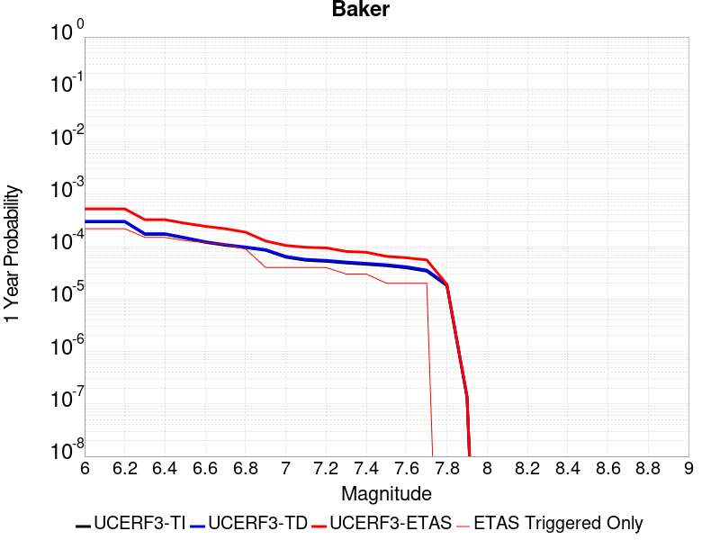 | 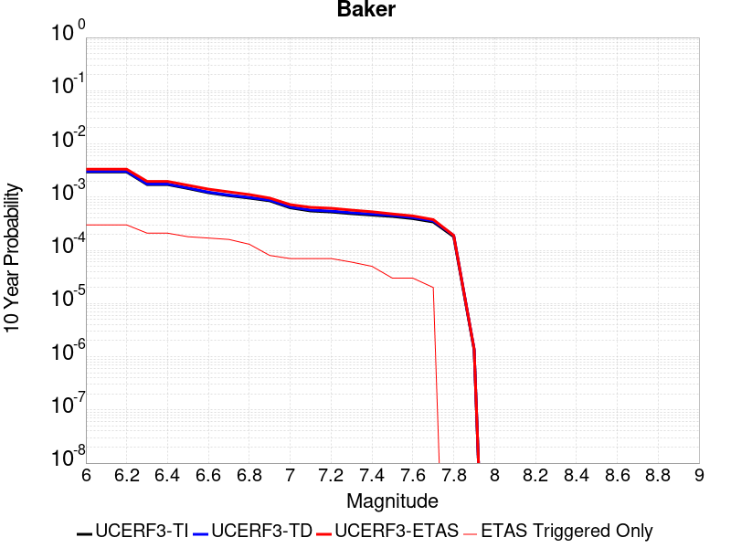 |

| Magnitude | 1 wk TI Prob | 1 wk TD Prob | 1 wk ETAS Prob | 1 wk ETAS/TD Gain | 1 wk ETAS Triggered Only | 1 mo TI Prob | 1 mo TD Prob | 1 mo ETAS Prob | 1 mo ETAS/TD Gain | 1 mo ETAS Triggered Only | 1 yr TI Prob | 1 yr TD Prob | 1 yr ETAS Prob | 1 yr ETAS/TD Gain | 1 yr ETAS Triggered Only | 10 yr TI Prob | 10 yr TD Prob | 10 yr ETAS Prob | 10 yr ETAS/TD Gain | 10 yr ETAS Triggered Only |
|-----|-----|-----|-----|-----|-----|-----|-----|-----|-----|-----|-----|-----|-----|-----|-----|-----|-----|-----|-----|-----|
| 6.0 | 5.695525E-6 | 5.8348373E-6 | 5.5834545E-5 | 9.569169 | 5.0E-5 | 2.4409164E-5 | 2.5006228E-5 | 1.2500373E-4 | 4.9989038 | 1.0E-4 | 2.9714106E-4 | 3.044123E-4 | 5.243453E-4 | 1.722484 | 2.2E-4 | 0.0029674405 | 0.0030403486 | 0.0033394366 | 1.0983729 | 3.0E-4 |
| 6.1 | 5.695525E-6 | 5.8348373E-6 | 5.5834545E-5 | 9.569169 | 5.0E-5 | 2.4409164E-5 | 2.5006228E-5 | 1.2500373E-4 | 4.9989038 | 1.0E-4 | 2.9714106E-4 | 3.044123E-4 | 5.243453E-4 | 1.722484 | 2.2E-4 | 0.0029674405 | 0.0030403486 | 0.0033394366 | 1.0983729 | 3.0E-4 |
| 6.2 | 5.695525E-6 | 5.8348373E-6 | 5.5834545E-5 | 9.569169 | 5.0E-5 | 2.4409164E-5 | 2.5006228E-5 | 1.2500373E-4 | 4.9989038 | 1.0E-4 | 2.9714106E-4 | 3.044123E-4 | 5.243453E-4 | 1.722484 | 2.2E-4 | 0.0029674405 | 0.0030403486 | 0.0033394366 | 1.0983729 | 3.0E-4 |
| 6.3 | 3.2995713E-6 | 3.383667E-6 | 4.338353E-5 | 12.821454 | 4.0E-5 | 1.4140943E-5 | 1.4501353E-5 | 8.450034E-5 | 5.827066 | 7.0E-5 | 1.7215237E-4 | 1.7654014E-4 | 3.2651366E-4 | 1.8495152 | 1.5E-4 | 0.0017201907 | 0.001764046 | 0.0019736756 | 1.1188345 | 2.1E-4 |
| 6.4 | 3.2995713E-6 | 3.383667E-6 | 4.338353E-5 | 12.821454 | 4.0E-5 | 1.4140943E-5 | 1.4501353E-5 | 8.450034E-5 | 5.827066 | 7.0E-5 | 1.7215237E-4 | 1.7654014E-4 | 3.2651366E-4 | 1.8495152 | 1.5E-4 | 0.0017201907 | 0.001764046 | 0.0019736756 | 1.1188345 | 2.1E-4 |
| 6.5 | 2.782202E-6 | 2.8558404E-6 | 3.2855754E-5 | 11.504759 | 3.0E-5 | 1.1923668E-5 | 1.223926E-5 | 7.223852E-5 | 5.902197 | 6.0E-5 | 1.4516099E-4 | 1.4900314E-4 | 2.7898376E-4 | 1.8723348 | 1.3E-4 | 0.001450662 | 0.0014890651 | 0.001668797 | 1.1207012 | 1.8E-4 |
| 6.6 | 2.3163404E-6 | 2.38092E-6 | 2.2380873E-5 | 9.400094 | 2.0E-5 | 9.927136E-6 | 1.0203904E-5 | 6.0203394E-5 | 5.9000354 | 5.0E-5 | 1.20856166E-4 | 1.2422565E-4 | 2.4421074E-4 | 1.9658641 | 1.2E-4 | 0.0012079047 | 0.0012415823 | 0.0014113713 | 1.136752 | 1.7E-4 |
| 6.7 | 2.037056E-6 | 2.0965003E-6 | 2.209646E-5 | 10.539687 | 2.0E-5 | 8.7302105E-6 | 8.984972E-6 | 5.8984522E-5 | 6.564798 | 5.0E-5 | 1.0628513E-4 | 1.093867E-4 | 2.1937468E-4 | 2.0054967 | 1.1E-4 | 0.0010623431 | 0.0010933448 | 0.0012531698 | 1.1461799 | 1.6E-4 |
| 6.8 | 1.8356744E-6 | 1.8915287E-6 | 2.189149E-5 | 11.573439 | 2.0E-5 | 7.867153E-6 | 8.106527E-6 | 4.81062E-5 | 5.9342556 | 4.0E-5 | 9.577837E-5 | 9.869264E-5 | 1.8868376E-4 | 1.9118321 | 9.0E-5 | 9.57371E-4 | 9.86502E-4 | 0.0011163738 | 1.1316488 | 1.3E-4 |
| 6.9 | 1.6310546E-6 | 1.6832072E-6 | 1.1683191E-5 | 6.941029 | 1.0E-5 | 6.9902153E-6 | 7.213726E-6 | 2.7213582E-5 | 3.7724724 | 2.0E-5 | 8.510255E-5 | 8.782368E-5 | 1.2782017E-4 | 1.455418 | 4.0E-5 | 8.5069967E-4 | 8.7790104E-4 | 9.578308E-4 | 1.0910465 | 8.0E-5 |
| 7.0 | 1.2058036E-6 | 1.2508665E-6 | 1.1250854E-5 | 8.994448 | 1.0E-5 | 5.1677193E-6 | 5.3608455E-6 | 2.5360738E-5 | 4.730735 | 2.0E-5 | 6.291517E-5 | 6.5266366E-5 | 1.0526375E-4 | 1.6128331 | 4.0E-5 | 6.289736E-4 | 6.524743E-4 | 7.224286E-4 | 1.107214 | 7.0E-5 |
| 7.1 | 1.052382E-6 | 1.0951609E-6 | 1.109515E-5 | 10.131069 | 1.0E-5 | 4.5102006E-6 | 4.693538E-6 | 2.4693445E-5 | 5.2611575 | 2.0E-5 | 5.491031E-5 | 5.7142337E-5 | 9.714005E-5 | 1.6999664 | 4.0E-5 | 5.4896745E-4 | 5.7127734E-4 | 6.412373E-4 | 1.1224624 | 7.0E-5 |
| 7.2 | 1.0067454E-6 | 1.0487711E-6 | 1.1048761E-5 | 10.53496 | 1.0E-5 | 4.3146156E-6 | 4.4947255E-6 | 2.4494635E-5 | 5.44964 | 2.0E-5 | 5.252918E-5 | 5.4721917E-5 | 9.4719726E-5 | 1.7309285 | 4.0E-5 | 5.251676E-4 | 5.470853E-4 | 6.1704696E-4 | 1.1278808 | 7.0E-5 |
| 7.3 | 9.3596316E-7 | 9.767723E-7 | 1.09767625E-5 | 11.23779 | 1.0E-5 | 4.0112645E-6 | 4.1861604E-6 | 2.4186076E-5 | 5.7776275 | 2.0E-5 | 4.8836053E-5 | 5.096532E-5 | 8.096379E-5 | 1.5886055 | 3.0E-5 | 4.8825322E-4 | 5.095371E-4 | 5.6950655E-4 | 1.1176939 | 6.0E-5 |
| 7.4 | 8.8117395E-7 | 9.2076635E-7 | 1.0920757E-5 | 11.860509 | 1.0E-5 | 3.7764542E-6 | 3.9461356E-6 | 2.3946057E-5 | 6.0682297 | 2.0E-5 | 4.5977362E-5 | 4.8043148E-5 | 7.804171E-5 | 1.6244087 | 3.0E-5 | 4.596785E-4 | 4.8032837E-4 | 5.303044E-4 | 1.1040455 | 5.0E-5 |
| 7.5 | 8.292386E-7 | 8.6745956E-7 | 1.0867451E-5 | 12.5279045 | 1.0E-5 | 3.5538749E-6 | 3.7176785E-6 | 2.3717605E-5 | 6.379681 | 2.0E-5 | 4.326757E-5 | 4.5261804E-5 | 6.52609E-5 | 1.4418536 | 2.0E-5 | 4.3259145E-4 | 4.5252658E-4 | 4.8251302E-4 | 1.0662644 | 3.0E-5 |
| 7.6 | 7.553842E-7 | 7.9144706E-7 | 1.0791439E-5 | 13.635074 | 1.0E-5 | 3.2373566E-6 | 3.3919116E-6 | 2.3391844E-5 | 6.89636 | 2.0E-5 | 3.9414106E-5 | 4.129575E-5 | 6.129492E-5 | 1.4842913 | 2.0E-5 | 3.9407116E-4 | 4.1288146E-4 | 4.4286906E-4 | 1.07263 | 3.0E-5 |
| 7.7 | 6.5285366E-7 | 6.852797E-7 | 1.0685273E-5 | 15.592572 | 1.0E-5 | 2.797941E-6 | 2.9369096E-6 | 2.293685E-5 | 7.8098593 | 2.0E-5 | 3.40644E-5 | 3.5756293E-5 | 5.575558E-5 | 1.5593221 | 2.0E-5 | 3.405918E-4 | 3.5750607E-4 | 3.7749892E-4 | 1.0559231 | 2.0E-5 |
| 7.8 | 3.4586725E-7 | 3.6482615E-7 | 3.6482615E-7 | 1.0 | 0.0 | 1.4822873E-6 | 1.5635396E-6 | 1.5635396E-6 | 1.0 | 0.0 | 1.80467E-5 | 1.9035933E-5 | 1.9035933E-5 | 1.0 | 0.0 | 1.8045233E-4 | 1.9034347E-4 | 1.9034347E-4 | 1.0 | 0.0 |
| 7.9 | 2.5591178E-9 | 2.6696718E-9 | 2.6696718E-9 | 1.0 | 0.0 | 1.0967647E-8 | 1.14414505E-8 | 1.14414505E-8 | 1.0 | 0.0 | 1.335311E-7 | 1.3929966E-7 | 1.3929966E-7 | 1.0 | 0.0 | 1.3353102E-6 | 1.3929966E-6 | 1.3929966E-6 | 1.0 | 0.0 |

## San Andreas (North Branch Mill Creek)
*[(top)](#table-of-contents)*

| 1 Week | 1 Month | 1 Year | 10 Year |
|-----|-----|-----|-----|
|  | 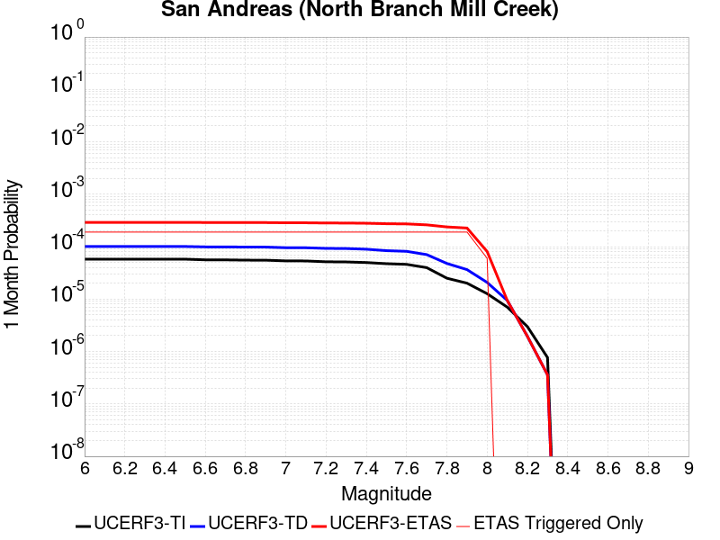 |  |  |

| Magnitude | 1 wk TI Prob | 1 wk TD Prob | 1 wk ETAS Prob | 1 wk ETAS/TD Gain | 1 wk ETAS Triggered Only | 1 mo TI Prob | 1 mo TD Prob | 1 mo ETAS Prob | 1 mo ETAS/TD Gain | 1 mo ETAS Triggered Only | 1 yr TI Prob | 1 yr TD Prob | 1 yr ETAS Prob | 1 yr ETAS/TD Gain | 1 yr ETAS Triggered Only | 10 yr TI Prob | 10 yr TD Prob | 10 yr ETAS Prob | 10 yr ETAS/TD Gain | 10 yr ETAS Triggered Only |
|-----|-----|-----|-----|-----|-----|-----|-----|-----|-----|-----|-----|-----|-----|-----|-----|-----|-----|-----|-----|-----|
| 6.0 | 1.3461156E-5 | 2.3500992E-5 | 1.5349794E-4 | 6.5315514 | 1.3E-4 | 5.7689394E-5 | 1.00714664E-4 | 2.9069552E-4 | 2.8863277 | 1.9E-4 | 7.02142E-4 | 0.0012255146 | 0.0014652205 | 1.1955961 | 2.4E-4 | 0.0069992766 | 0.012228744 | 0.0125151975 | 1.0234246 | 2.9E-4 |
| 6.1 | 1.3461156E-5 | 2.3500992E-5 | 1.5349794E-4 | 6.5315514 | 1.3E-4 | 5.7689394E-5 | 1.00714664E-4 | 2.9069552E-4 | 2.8863277 | 1.9E-4 | 7.02142E-4 | 0.0012255146 | 0.0014652205 | 1.1955961 | 2.4E-4 | 0.0069992766 | 0.012228744 | 0.0125151975 | 1.0234246 | 2.9E-4 |
| 6.2 | 1.3461156E-5 | 2.3500992E-5 | 1.5349794E-4 | 6.5315514 | 1.3E-4 | 5.7689394E-5 | 1.00714664E-4 | 2.9069552E-4 | 2.8863277 | 1.9E-4 | 7.02142E-4 | 0.0012255146 | 0.0014652205 | 1.1955961 | 2.4E-4 | 0.0069992766 | 0.012228744 | 0.0125151975 | 1.0234246 | 2.9E-4 |
| 6.3 | 1.3461156E-5 | 2.3500992E-5 | 1.5349794E-4 | 6.5315514 | 1.3E-4 | 5.7689394E-5 | 1.00714664E-4 | 2.9069552E-4 | 2.8863277 | 1.9E-4 | 7.02142E-4 | 0.0012255146 | 0.0014652205 | 1.1955961 | 2.4E-4 | 0.0069992766 | 0.012228744 | 0.0125151975 | 1.0234246 | 2.9E-4 |
| 6.4 | 1.3461156E-5 | 2.3500992E-5 | 1.5349794E-4 | 6.5315514 | 1.3E-4 | 5.7689394E-5 | 1.00714664E-4 | 2.9069552E-4 | 2.8863277 | 1.9E-4 | 7.02142E-4 | 0.0012255146 | 0.0014652205 | 1.1955961 | 2.4E-4 | 0.0069992766 | 0.012228744 | 0.0125151975 | 1.0234246 | 2.9E-4 |
| 6.5 | 1.3450706E-5 | 2.348995E-5 | 1.534869E-4 | 6.5341516 | 1.3E-4 | 5.764461E-5 | 1.00667356E-4 | 2.9064823E-4 | 2.8872144 | 1.9E-4 | 7.0159714E-4 | 0.0012249392 | 0.0014646453 | 1.1956881 | 2.4E-4 | 0.006993862 | 0.012223054 | 0.012509509 | 1.0234357 | 2.9E-4 |
| 6.6 | 1.3074523E-5 | 2.3104236E-5 | 1.5310124E-4 | 6.626544 | 1.3E-4 | 5.6032466E-5 | 9.901441E-5 | 2.889956E-4 | 2.9187226 | 1.9E-4 | 6.8198174E-4 | 0.001204837 | 0.0014445479 | 1.1989571 | 2.4E-4 | 0.006798926 | 0.012024219 | 0.012310732 | 1.023828 | 2.9E-4 |
| 6.7 | 1.3050216E-5 | 2.3079532E-5 | 1.5307653E-4 | 6.6325665 | 1.3E-4 | 5.59283E-5 | 9.890855E-5 | 2.8888974E-4 | 2.9207764 | 1.9E-4 | 6.8071426E-4 | 0.0012035496 | 0.0014432607 | 1.1991701 | 2.4E-4 | 0.0067863287 | 0.012011484 | 0.012298001 | 1.0238535 | 2.9E-4 |
| 6.8 | 1.29049395E-5 | 2.2927941E-5 | 1.5292496E-4 | 6.669808 | 1.3E-4 | 5.530571E-5 | 9.825892E-5 | 2.8824026E-4 | 2.9334767 | 1.9E-4 | 6.73139E-4 | 0.001195649 | 0.001435362 | 1.2004879 | 2.4E-4 | 0.0067110364 | 0.011933329 | 0.012219868 | 1.0240117 | 2.9E-4 |
| 6.9 | 1.2867369E-5 | 2.2887343E-5 | 1.5288437E-4 | 6.6798654 | 1.3E-4 | 5.51447E-5 | 9.808494E-5 | 2.880663E-4 | 2.9369066 | 1.9E-4 | 6.711799E-4 | 0.0011935332 | 0.0014332468 | 1.2008437 | 2.4E-4 | 0.006691564 | 0.011912397 | 0.012198943 | 1.0240544 | 2.9E-4 |
| 7.0 | 1.2495996E-5 | 2.2287419E-5 | 1.5228453E-4 | 6.832757 | 1.3E-4 | 5.3553173E-5 | 9.551403E-5 | 2.854959E-4 | 2.9890466 | 1.9E-4 | 6.518148E-4 | 0.0011622658 | 0.0014019868 | 1.2062532 | 2.4E-4 | 0.0064990623 | 0.011603 | 0.011889635 | 1.0247035 | 2.9E-4 |
| 7.1 | 1.2452067E-5 | 2.2232492E-5 | 1.5222961E-4 | 6.847168 | 1.3E-4 | 5.3364907E-5 | 9.527864E-5 | 2.8526055E-4 | 2.993961 | 1.9E-4 | 6.4952404E-4 | 0.001159403 | 0.0013991247 | 1.206763 | 2.4E-4 | 0.0064762887 | 0.011574671 | 0.011861314 | 1.0247647 | 2.9E-4 |
| 7.2 | 1.2002777E-5 | 2.1611015E-5 | 1.5160821E-4 | 7.0153213 | 1.3E-4 | 5.143946E-5 | 9.261536E-5 | 2.8259776E-4 | 3.0513055 | 1.9E-4 | 6.2609545E-4 | 0.0011270114 | 0.0013667409 | 1.2127126 | 2.4E-4 | 0.006243344 | 0.011254058 | 0.011540794 | 1.0254785 | 2.9E-4 |
| 7.3 | 1.1923425E-5 | 2.1480853E-5 | 1.5147806E-4 | 7.0517707 | 1.3E-4 | 5.109939E-5 | 9.205757E-5 | 2.8204007E-4 | 3.063736 | 1.9E-4 | 6.219575E-4 | 0.0011202273 | 0.0013599584 | 1.2140023 | 2.4E-4 | 0.0062021962 | 0.011186945 | 0.0114737 | 1.0256331 | 2.9E-4 |
| 7.4 | 1.16105175E-5 | 2.0854808E-5 | 1.508521E-4 | 7.2334447 | 1.3E-4 | 4.975841E-5 | 8.93747E-5 | 2.7935772E-4 | 3.1256912 | 1.9E-4 | 6.0564023E-4 | 0.0010875963 | 0.0013273354 | 1.2204301 | 2.4E-4 | 0.006039923 | 0.010864409 | 0.011151259 | 1.0264027 | 2.9E-4 |
| 7.5 | 1.1037265E-5 | 1.9554842E-5 | 1.495523E-4 | 7.6478395 | 1.3E-4 | 4.7301706E-5 | 8.380379E-5 | 2.7378785E-4 | 3.2670107 | 1.9E-4 | 5.757461E-4 | 0.0010198357 | 0.001259591 | 1.235092 | 2.4E-4 | 0.005742567 | 0.010195527 | 0.010482571 | 1.0281539 | 2.9E-4 |
| 7.6 | 1.0720915E-5 | 1.8996727E-5 | 1.4899425E-4 | 7.843154 | 1.3E-4 | 4.5945973E-5 | 8.141202E-5 | 2.7139654E-4 | 3.3336177 | 1.9E-4 | 5.592486E-4 | 9.907428E-4 | 0.0012305051 | 1.2420025 | 2.4E-4 | 0.005578433 | 0.009907238 | 0.010194366 | 1.0289816 | 2.9E-4 |
| 7.7 | 9.276279E-6 | 1.6442464E-5 | 1.4644033E-4 | 8.906228 | 1.3E-4 | 3.9754876E-5 | 7.046581E-5 | 2.6045242E-4 | 3.6961532 | 1.9E-4 | 4.839081E-4 | 8.5758517E-4 | 0.0010973794 | 1.2796155 | 2.4E-4 | 0.0048285574 | 0.008586576 | 0.008864172 | 1.0323291 | 2.8E-4 |
| 7.8 | 5.8346777E-6 | 1.11555855E-5 | 1.4115413E-4 | 12.653225 | 1.3E-4 | 2.5005522E-5 | 4.7808775E-5 | 2.3779969E-4 | 4.9739757 | 1.9E-4 | 3.043997E-4 | 5.819165E-4 | 8.2177686E-4 | 1.4121903 | 2.4E-4 | 0.0030398308 | 0.0058473335 | 0.006125696 | 1.047605 | 2.8E-4 |
| 7.9 | 4.690204E-6 | 8.509473E-6 | 1.3850837E-4 | 16.27696 | 1.3E-4 | 2.0100719E-5 | 3.6468664E-5 | 2.2646174E-4 | 6.2097626 | 1.9E-4 | 2.4469878E-4 | 4.439156E-4 | 6.8380905E-4 | 1.5404032 | 2.4E-4 | 0.002444295 | 0.004471165 | 0.004749913 | 1.0623435 | 2.8E-4 |
| 8.0 | 2.9570454E-6 | 4.8470656E-6 | 4.484687E-5 | 9.252376 | 4.0E-5 | 1.267299E-5 | 2.0772974E-5 | 8.077173E-5 | 3.8883085 | 6.0E-5 | 1.5428272E-4 | 2.5288164E-4 | 3.2286393E-4 | 1.2767394 | 7.0E-5 | 0.0015417566 | 0.002549932 | 0.0026397028 | 1.035205 | 9.0E-5 |
| 8.1 | 1.6376824E-6 | 2.1968672E-6 | 2.1968672E-6 | 1.0 | 0.0 | 7.01862E-6 | 9.415111E-6 | 9.415111E-6 | 1.0 | 0.0 | 8.544835E-5 | 1.1462297E-4 | 1.2462182E-4 | 1.0872326 | 1.0E-5 | 8.54155E-4 | 0.0011607445 | 0.0011707328 | 1.0086051 | 1.0E-5 |
| 8.2 | 6.9631557E-7 | 4.535001E-7 | 4.535001E-7 | 1.0 | 0.0 | 2.984206E-6 | 1.9435704E-6 | 1.9435704E-6 | 1.0 | 0.0 | 3.63321E-5 | 2.3662713E-5 | 2.3662713E-5 | 1.0 | 0.0 | 3.6326164E-4 | 2.4510184E-4 | 2.4510184E-4 | 1.0 | 0.0 |
| 8.3 | 1.7876137E-7 | 8.357368E-8 | 8.357368E-8 | 1.0 | 0.0 | 7.661199E-7 | 3.5817288E-7 | 3.5817288E-7 | 1.0 | 0.0 | 9.32747E-6 | 4.3607465E-6 | 4.3607465E-6 | 1.0 | 0.0 | 9.3270784E-5 | 4.5800018E-5 | 4.5800018E-5 | 1.0 | 0.0 |

## San Jacinto (San Bernardino)
*[(top)](#table-of-contents)*

| 1 Week | 1 Month | 1 Year | 10 Year |
|-----|-----|-----|-----|
|  |  |  |  |

| Magnitude | 1 wk TI Prob | 1 wk TD Prob | 1 wk ETAS Prob | 1 wk ETAS/TD Gain | 1 wk ETAS Triggered Only | 1 mo TI Prob | 1 mo TD Prob | 1 mo ETAS Prob | 1 mo ETAS/TD Gain | 1 mo ETAS Triggered Only | 1 yr TI Prob | 1 yr TD Prob | 1 yr ETAS Prob | 1 yr ETAS/TD Gain | 1 yr ETAS Triggered Only | 10 yr TI Prob | 10 yr TD Prob | 10 yr ETAS Prob | 10 yr ETAS/TD Gain | 10 yr ETAS Triggered Only |
|-----|-----|-----|-----|-----|-----|-----|-----|-----|-----|-----|-----|-----|-----|-----|-----|-----|-----|-----|-----|-----|
| 6.0 | 3.409352E-5 | 3.598562E-5 | 1.7598057E-4 | 4.890303 | 1.4E-4 | 1.461069E-4 | 1.5421498E-4 | 3.0419184E-4 | 1.9725182 | 1.5E-4 | 0.0017774 | 0.0018759521 | 0.0020955394 | 1.1170537 | 2.2E-4 | 0.01763251 | 0.019349992 | 0.019624574 | 1.0141903 | 2.8E-4 |
| 6.1 | 3.409352E-5 | 3.598562E-5 | 1.7598057E-4 | 4.890303 | 1.4E-4 | 1.461069E-4 | 1.5421498E-4 | 3.0419184E-4 | 1.9725182 | 1.5E-4 | 0.0017774 | 0.0018759521 | 0.0020955394 | 1.1170537 | 2.2E-4 | 0.01763251 | 0.019349992 | 0.019624574 | 1.0141903 | 2.8E-4 |
| 6.2 | 3.409352E-5 | 3.598562E-5 | 1.7598057E-4 | 4.890303 | 1.4E-4 | 1.461069E-4 | 1.5421498E-4 | 3.0419184E-4 | 1.9725182 | 1.5E-4 | 0.0017774 | 0.0018759521 | 0.0020955394 | 1.1170537 | 2.2E-4 | 0.01763251 | 0.019349992 | 0.019624574 | 1.0141903 | 2.8E-4 |
| 6.3 | 3.409352E-5 | 3.598562E-5 | 1.7598057E-4 | 4.890303 | 1.4E-4 | 1.461069E-4 | 1.5421498E-4 | 3.0419184E-4 | 1.9725182 | 1.5E-4 | 0.0017774 | 0.0018759521 | 0.0020955394 | 1.1170537 | 2.2E-4 | 0.01763251 | 0.019349992 | 0.019624574 | 1.0141903 | 2.8E-4 |
| 6.4 | 3.400795E-5 | 3.5878285E-5 | 1.7587325E-4 | 4.901942 | 1.4E-4 | 1.4574021E-4 | 1.5375503E-4 | 3.0373197E-4 | 1.9754279 | 1.5E-4 | 0.0017729428 | 0.0018703619 | 0.0020899503 | 1.1174043 | 2.2E-4 | 0.017588645 | 0.019295074 | 0.019569673 | 1.0142314 | 2.8E-4 |
| 6.5 | 3.341482E-5 | 3.5138914E-5 | 1.6513435E-4 | 4.699472 | 1.3E-4 | 1.4319851E-4 | 1.5058667E-4 | 2.9056557E-4 | 1.9295572 | 1.4E-4 | 0.0017420477 | 0.0018318522 | 0.0020314858 | 1.1089791 | 2.0E-4 | 0.017284546 | 0.018916616 | 0.019171698 | 1.0134845 | 2.6E-4 |
| 6.6 | 3.3364955E-5 | 3.5076133E-5 | 1.6507157E-4 | 4.706094 | 1.3E-4 | 1.4298483E-4 | 1.5031763E-4 | 2.902966E-4 | 1.9312211 | 1.4E-4 | 0.0017394501 | 0.0018285823 | 0.0020282166 | 1.1091744 | 2.0E-4 | 0.017258976 | 0.01888448 | 0.019139571 | 1.013508 | 2.6E-4 |
| 6.7 | 3.335922E-5 | 3.5065907E-5 | 1.6506134E-4 | 4.707175 | 1.3E-4 | 1.4296026E-4 | 1.5027382E-4 | 2.9025276E-4 | 1.9314927 | 1.4E-4 | 0.0017391514 | 0.0018280497 | 0.0020276841 | 1.1092062 | 2.0E-4 | 0.017256035 | 0.018879272 | 0.019134363 | 1.0135118 | 2.6E-4 |
| 6.8 | 3.327683E-5 | 3.4959972E-5 | 1.6495543E-4 | 4.7184086 | 1.3E-4 | 1.4260718E-4 | 1.4981985E-4 | 2.897989E-4 | 1.9343156 | 1.4E-4 | 0.0017348597 | 0.001822532 | 0.0020221677 | 1.1095375 | 2.0E-4 | 0.017213784 | 0.018825045 | 0.019080149 | 1.0135514 | 2.6E-4 |
| 6.9 | 3.3235785E-5 | 3.4900928E-5 | 1.648964E-4 | 4.7246995 | 1.3E-4 | 1.4243131E-4 | 1.4956683E-4 | 2.895459E-4 | 1.9358964 | 1.4E-4 | 0.0017327217 | 0.0018194567 | 0.0020190927 | 1.109723 | 2.0E-4 | 0.017192734 | 0.018794911 | 0.019050024 | 1.0135735 | 2.6E-4 |
| 7.0 | 3.3197095E-5 | 3.4840854E-5 | 1.6483632E-4 | 4.7311215 | 1.3E-4 | 1.422655E-4 | 1.4930942E-4 | 2.8928852E-4 | 1.9375101 | 1.4E-4 | 0.0017307063 | 0.0018163278 | 0.0020159646 | 1.1099123 | 2.0E-4 | 0.017172894 | 0.01876429 | 0.01901941 | 1.013596 | 2.6E-4 |
| 7.1 | 3.3129716E-5 | 3.4721066E-5 | 1.6471655E-4 | 4.7439947 | 1.3E-4 | 1.4197677E-4 | 1.4879608E-4 | 2.8877525E-4 | 1.940745 | 1.4E-4 | 0.0017271966 | 0.0018100884 | 0.0020097264 | 1.1102918 | 2.0E-4 | 0.017138338 | 0.018703366 | 0.018958503 | 1.0136412 | 2.6E-4 |
| 7.2 | 3.3034008E-5 | 3.4588513E-5 | 1.6458401E-4 | 4.758343 | 1.3E-4 | 1.4156665E-4 | 1.4822806E-4 | 2.8820732E-4 | 1.9443505 | 1.4E-4 | 0.0017222111 | 0.0018031843 | 0.0020028236 | 1.1107149 | 2.0E-4 | 0.017089253 | 0.01863575 | 0.018890904 | 1.0136917 | 2.6E-4 |
| 7.3 | 3.2956614E-5 | 3.4456265E-5 | 1.6445179E-4 | 4.7727685 | 1.3E-4 | 1.4123498E-4 | 1.4766137E-4 | 2.876407E-4 | 1.9479753 | 1.4E-4 | 0.0017181796 | 0.0017962961 | 0.0019959367 | 1.1111403 | 2.0E-4 | 0.017049557 | 0.018568495 | 0.018823668 | 1.0137422 | 2.6E-4 |
| 7.4 | 3.2915937E-5 | 3.4377957E-5 | 1.6437349E-4 | 4.7813625 | 1.3E-4 | 1.4106068E-4 | 1.473258E-4 | 2.8730516E-4 | 1.9501349 | 1.4E-4 | 0.0017160608 | 0.0017922173 | 0.001991859 | 1.1113936 | 2.0E-4 | 0.017028693 | 0.018528769 | 0.018783951 | 1.0137722 | 2.6E-4 |
| 7.5 | 3.281791E-5 | 3.424287E-5 | 1.6423842E-4 | 4.796281 | 1.3E-4 | 1.406406E-4 | 1.4674691E-4 | 2.8672637E-4 | 1.9538835 | 1.4E-4 | 0.0017109542 | 0.0017851809 | 0.001984824 | 1.1118335 | 2.0E-4 | 0.016978411 | 0.018459652 | 0.018714853 | 1.0138248 | 2.6E-4 |
| 7.6 | 3.2521442E-5 | 3.396782E-5 | 1.639634E-4 | 4.8270216 | 1.3E-4 | 1.3937015E-4 | 1.4556825E-4 | 2.8554787E-4 | 1.9616082 | 1.4E-4 | 0.0016955109 | 0.0017708542 | 0.0019705 | 1.1127398 | 2.0E-4 | 0.016826328 | 0.018317295 | 0.018562716 | 1.0133983 | 2.5E-4 |
| 7.7 | 3.0287873E-5 | 3.245191E-5 | 1.6244769E-4 | 5.0057974 | 1.3E-4 | 1.297987E-4 | 1.3907222E-4 | 2.7905274E-4 | 2.0065312 | 1.4E-4 | 0.0015791537 | 0.0016918903 | 0.0018915519 | 1.118011 | 2.0E-4 | 0.01567979 | 0.017528199 | 0.017773816 | 1.0140127 | 2.5E-4 |
| 7.8 | 2.6316151E-5 | 2.9662837E-5 | 1.5965899E-4 | 5.382458 | 1.3E-4 | 1.1277862E-4 | 1.2712025E-4 | 2.6710244E-4 | 2.1011794 | 1.4E-4 | 0.0013722149 | 0.0015465913 | 0.001746282 | 1.1291167 | 2.0E-4 | 0.013637724 | 0.016069878 | 0.01631586 | 1.0153071 | 2.5E-4 |
| 7.9 | 2.0761147E-5 | 2.3417291E-5 | 1.3341471E-4 | 5.6972737 | 1.1E-4 | 8.897331E-5 | 1.0035596E-4 | 2.2034392E-4 | 2.1956236 | 1.2E-4 | 0.0010827117 | 0.0012211498 | 0.00140093 | 1.147222 | 1.8E-4 | 0.010774517 | 0.012793272 | 0.013010457 | 1.0169766 | 2.2E-4 |
| 8.0 | 1.5738568E-5 | 1.6032505E-5 | 8.603138E-5 | 5.36606 | 7.0E-5 | 6.744926E-5 | 6.8708934E-5 | 1.4870343E-4 | 2.1642518 | 8.0E-5 | 8.2088535E-4 | 8.3621085E-4 | 9.5611054E-4 | 1.1433845 | 1.2E-4 | 0.008178596 | 0.008865741 | 0.0090045 | 1.0156511 | 1.4E-4 |
| 8.1 | 1.0105832E-5 | 8.329479E-6 | 3.8329228E-5 | 4.601636 | 3.0E-5 | 4.3309992E-5 | 3.569728E-5 | 6.569621E-5 | 1.8403702 | 3.0E-5 | 5.2717153E-4 | 4.3452822E-4 | 4.7451083E-4 | 1.0920138 | 4.0E-5 | 0.005259227 | 0.0046768794 | 0.004716692 | 1.0085127 | 4.0E-5 |
| 8.2 | 4.189207E-6 | 1.577699E-6 | 1.577699E-6 | 1.0 | 0.0 | 1.7953622E-5 | 6.7615497E-6 | 6.7615497E-6 | 1.0 | 0.0 | 2.1856341E-4 | 8.231879E-5 | 8.231879E-5 | 1.0 | 0.0 | 0.0021834858 | 9.562628E-4 | 9.562628E-4 | 1.0 | 0.0 |
| 8.3 | 1.2758221E-6 | 3.612677E-7 | 3.612677E-7 | 1.0 | 0.0 | 5.4677976E-6 | 1.5482892E-6 | 1.5482892E-6 | 1.0 | 0.0 | 6.65684E-5 | 1.8850264E-5 | 1.8850264E-5 | 1.0 | 0.0 | 6.6548464E-4 | 2.2739546E-4 | 2.2739546E-4 | 1.0 | 0.0 |

## Scodie Lineament
*[(top)](#table-of-contents)*

| 1 Week | 1 Month | 1 Year | 10 Year |
|-----|-----|-----|-----|
|  |  |  |  |

| Magnitude | 1 wk TI Prob | 1 wk TD Prob | 1 wk ETAS Prob | 1 wk ETAS/TD Gain | 1 wk ETAS Triggered Only | 1 mo TI Prob | 1 mo TD Prob | 1 mo ETAS Prob | 1 mo ETAS/TD Gain | 1 mo ETAS Triggered Only | 1 yr TI Prob | 1 yr TD Prob | 1 yr ETAS Prob | 1 yr ETAS/TD Gain | 1 yr ETAS Triggered Only | 10 yr TI Prob | 10 yr TD Prob | 10 yr ETAS Prob | 10 yr ETAS/TD Gain | 10 yr ETAS Triggered Only |
|-----|-----|-----|-----|-----|-----|-----|-----|-----|-----|-----|-----|-----|-----|-----|-----|-----|-----|-----|-----|-----|
| 6.0 | 3.2919327E-6 | 3.0133303E-6 | 8.301309E-5 | 27.548618 | 8.0E-5 | 1.4108206E-5 | 1.2914227E-5 | 1.2291281E-4 | 9.517628 | 1.1E-4 | 1.7175387E-4 | 1.5722254E-4 | 3.7718797E-4 | 2.3990703 | 2.2E-4 | 0.0017162118 | 0.0015714248 | 0.0018410005 | 1.1715486 | 2.7E-4 |
| 6.1 | 1.8663811E-6 | 1.5490382E-6 | 1.1549023E-5 | 7.455609 | 1.0E-5 | 7.998751E-6 | 6.6387206E-6 | 2.6638589E-5 | 4.0126085 | 2.0E-5 | 9.738045E-5 | 8.082393E-5 | 1.3081988E-4 | 1.6185787 | 5.0E-5 | 9.7337784E-4 | 8.079941E-4 | 8.579537E-4 | 1.0618316 | 5.0E-5 |
| 6.2 | 1.8663811E-6 | 1.5490382E-6 | 1.1549023E-5 | 7.455609 | 1.0E-5 | 7.998751E-6 | 6.6387206E-6 | 2.6638589E-5 | 4.0126085 | 2.0E-5 | 9.738045E-5 | 8.082393E-5 | 1.3081988E-4 | 1.6185787 | 5.0E-5 | 9.7337784E-4 | 8.079941E-4 | 8.579537E-4 | 1.0618316 | 5.0E-5 |
| 6.3 | 1.8663811E-6 | 1.5490382E-6 | 1.1549023E-5 | 7.455609 | 1.0E-5 | 7.998751E-6 | 6.6387206E-6 | 2.6638589E-5 | 4.0126085 | 2.0E-5 | 9.738045E-5 | 8.082393E-5 | 1.3081988E-4 | 1.6185787 | 5.0E-5 | 9.7337784E-4 | 8.079941E-4 | 8.579537E-4 | 1.0618316 | 5.0E-5 |
| 6.4 | 1.8663811E-6 | 1.5490382E-6 | 1.1549023E-5 | 7.455609 | 1.0E-5 | 7.998751E-6 | 6.6387206E-6 | 2.6638589E-5 | 4.0126085 | 2.0E-5 | 9.738045E-5 | 8.082393E-5 | 1.3081988E-4 | 1.6185787 | 5.0E-5 | 9.7337784E-4 | 8.079941E-4 | 8.579537E-4 | 1.0618316 | 5.0E-5 |
| 6.5 | 1.8106311E-6 | 1.4909722E-6 | 1.1490957E-5 | 7.7070236 | 1.0E-5 | 7.759824E-6 | 6.389868E-6 | 2.638974E-5 | 4.1299353 | 2.0E-5 | 9.447177E-5 | 7.779436E-5 | 1.2779047E-4 | 1.6426702 | 5.0E-5 | 9.4431615E-4 | 7.7771995E-4 | 8.2768104E-4 | 1.0642405 | 5.0E-5 |
| 6.6 | 1.2414679E-6 | 8.9974395E-7 | 1.0899735E-5 | 12.114263 | 1.0E-5 | 5.320566E-6 | 3.85604E-6 | 2.3855962E-5 | 6.186648 | 2.0E-5 | 6.477596E-5 | 4.6946367E-5 | 9.694402E-5 | 2.064995 | 5.0E-5 | 6.475708E-4 | 4.6937316E-4 | 5.193497E-4 | 1.106475 | 5.0E-5 |
| 6.7 | 1.1062215E-6 | 7.594193E-7 | 1.0759411E-5 | 14.167946 | 1.0E-5 | 4.7409408E-6 | 3.2546504E-6 | 1.3254618E-5 | 4.0725164 | 1.0E-5 | 5.7719422E-5 | 3.962472E-5 | 6.962353E-5 | 1.7570732 | 3.0E-5 | 5.770443E-4 | 3.9618355E-4 | 4.2617167E-4 | 1.0756925 | 3.0E-5 |
| 6.8 | 1.0006736E-6 | 6.5002786E-7 | 1.0650021E-5 | 16.383945 | 1.0E-5 | 4.288594E-6 | 2.7858312E-6 | 1.2785803E-5 | 4.589583 | 1.0E-5 | 5.221238E-5 | 3.391703E-5 | 6.391601E-5 | 1.8844814 | 3.0E-5 | 5.220012E-4 | 3.3912458E-4 | 3.6911442E-4 | 1.088433 | 3.0E-5 |
| 6.9 | 9.167364E-7 | 5.6315065E-7 | 1.0563145E-5 | 18.757227 | 1.0E-5 | 3.9288643E-6 | 2.413501E-6 | 1.2413477E-5 | 5.1433487 | 1.0E-5 | 4.7832873E-5 | 2.9384037E-5 | 5.9383154E-5 | 2.0209324 | 3.0E-5 | 4.782258E-4 | 2.9380718E-4 | 3.2379836E-4 | 1.1020778 | 3.0E-5 |
| 7.0 | 7.6987664E-7 | 4.113265E-7 | 1.0411322E-5 | 25.311577 | 1.0E-5 | 3.2994672E-6 | 1.7628269E-6 | 1.176281E-5 | 6.6726966 | 1.0E-5 | 4.0170275E-5 | 2.1462245E-5 | 5.14616E-5 | 2.3977735 | 3.0E-5 | 4.0163012E-4 | 2.1460558E-4 | 2.4459916E-4 | 1.1397613 | 3.0E-5 |
| 7.1 | 7.1038727E-7 | 3.5210306E-7 | 1.03521E-5 | 29.400766 | 1.0E-5 | 3.0445133E-6 | 1.5090123E-6 | 1.1508997E-5 | 7.626841 | 1.0E-5 | 3.706632E-5 | 1.8372106E-5 | 4.8371556E-5 | 2.6328802 | 3.0E-5 | 3.7060137E-4 | 1.8370937E-4 | 2.1370385E-4 | 1.1632714 | 3.0E-5 |
| 7.2 | 2.0799602E-7 | 3.1178534E-8 | 3.1178534E-8 | 1.0 | 0.0 | 8.914113E-7 | 1.3362228E-7 | 1.3362228E-7 | 1.0 | 0.0 | 1.0852878E-5 | 1.6268501E-6 | 1.6268501E-6 | 1.0 | 0.0 | 1.08523476E-4 | 1.626839E-5 | 1.626839E-5 | 1.0 | 0.0 |
| 7.3 | 1.5048182E-7 | 1.5939106E-8 | 1.5939106E-8 | 1.0 | 0.0 | 6.449219E-7 | 6.8310456E-8 | 6.8310456E-8 | 1.0 | 0.0 | 7.851896E-6 | 8.316795E-7 | 8.316795E-7 | 1.0 | 0.0 | 7.851618E-5 | 8.316767E-6 | 8.316767E-6 | 1.0 | 0.0 |
| 7.4 | 5.9334678E-8 | 4.8638475E-9 | 4.8638475E-9 | 1.0 | 0.0 | 2.5429145E-7 | 2.084506E-8 | 2.084506E-8 | 1.0 | 0.0 | 3.095994E-6 | 2.5378858E-7 | 2.5378858E-7 | 1.0 | 0.0 | 3.095951E-5 | 2.5378843E-6 | 2.5378843E-6 | 1.0 | 0.0 |

## White Wolf (Extension)
*[(top)](#table-of-contents)*

| 1 Week | 1 Month | 1 Year | 10 Year |
|-----|-----|-----|-----|
|  |  |  | 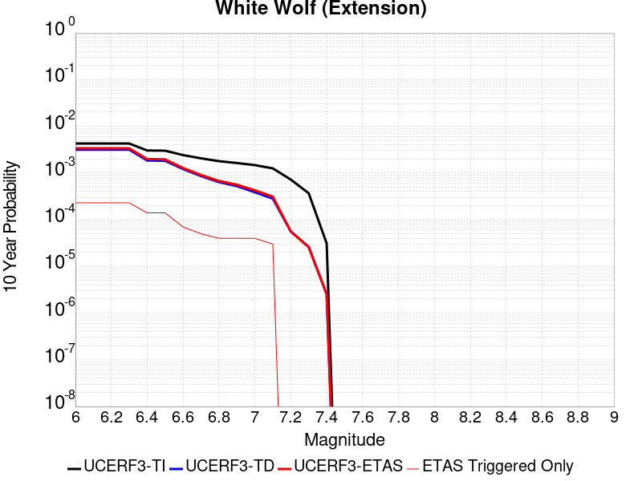 |

| Magnitude | 1 wk TI Prob | 1 wk TD Prob | 1 wk ETAS Prob | 1 wk ETAS/TD Gain | 1 wk ETAS Triggered Only | 1 mo TI Prob | 1 mo TD Prob | 1 mo ETAS Prob | 1 mo ETAS/TD Gain | 1 mo ETAS Triggered Only | 1 yr TI Prob | 1 yr TD Prob | 1 yr ETAS Prob | 1 yr ETAS/TD Gain | 1 yr ETAS Triggered Only | 10 yr TI Prob | 10 yr TD Prob | 10 yr ETAS Prob | 10 yr ETAS/TD Gain | 10 yr ETAS Triggered Only |
|-----|-----|-----|-----|-----|-----|-----|-----|-----|-----|-----|-----|-----|-----|-----|-----|-----|-----|-----|-----|-----|
| 6.0 | 8.222555E-6 | 6.066615E-6 | 7.606619E-5 | 12.53849 | 7.0E-5 | 3.5239045E-5 | 2.5999556E-5 | 1.05997475E-4 | 4.0768957 | 8.0E-5 | 4.289509E-4 | 3.1650523E-4 | 4.5646093E-4 | 1.4421908 | 1.4E-4 | 0.0042812387 | 0.0031611966 | 0.0033904696 | 1.0725273 | 2.3E-4 |
| 6.1 | 8.222555E-6 | 6.066615E-6 | 7.606619E-5 | 12.53849 | 7.0E-5 | 3.5239045E-5 | 2.5999556E-5 | 1.05997475E-4 | 4.0768957 | 8.0E-5 | 4.289509E-4 | 3.1650523E-4 | 4.5646093E-4 | 1.4421908 | 1.4E-4 | 0.0042812387 | 0.0031611966 | 0.0033904696 | 1.0725273 | 2.3E-4 |
| 6.2 | 8.222555E-6 | 6.066615E-6 | 7.606619E-5 | 12.53849 | 7.0E-5 | 3.5239045E-5 | 2.5999556E-5 | 1.05997475E-4 | 4.0768957 | 8.0E-5 | 4.289509E-4 | 3.1650523E-4 | 4.5646093E-4 | 1.4421908 | 1.4E-4 | 0.0042812387 | 0.0031611966 | 0.0033904696 | 1.0725273 | 2.3E-4 |
| 6.3 | 8.222555E-6 | 6.066615E-6 | 7.606619E-5 | 12.53849 | 7.0E-5 | 3.5239045E-5 | 2.5999556E-5 | 1.05997475E-4 | 4.0768957 | 8.0E-5 | 4.289509E-4 | 3.1650523E-4 | 4.5646093E-4 | 1.4421908 | 1.4E-4 | 0.0042812387 | 0.0031611966 | 0.0033904696 | 1.0725273 | 2.3E-4 |
| 6.4 | 5.821773E-6 | 3.5571256E-6 | 4.3556982E-5 | 12.244994 | 4.0E-5 | 2.4950215E-5 | 1.5244741E-5 | 6.524398E-5 | 4.2797694 | 5.0E-5 | 3.0372653E-4 | 1.8559002E-4 | 2.6557516E-4 | 1.4309777 | 8.0E-5 | 0.0030331176 | 0.0018544586 | 0.001994199 | 1.0753537 | 1.4E-4 |
| 6.5 | 5.766023E-6 | 3.4990599E-6 | 4.349892E-5 | 12.4316025 | 4.0E-5 | 2.4711293E-5 | 1.49958905E-5 | 6.499514E-5 | 4.334197 | 5.0E-5 | 3.0081844E-4 | 1.8256076E-4 | 2.6254615E-4 | 1.4381303 | 8.0E-5 | 0.0030041158 | 0.0018242161 | 0.0019639607 | 1.0766053 | 1.4E-4 |
| 6.6 | 4.643576E-6 | 2.3325733E-6 | 1.233255E-5 | 5.287101 | 1.0E-5 | 1.9900888E-5 | 9.9967065E-6 | 2.9996507E-5 | 3.000639 | 2.0E-5 | 2.4226638E-4 | 1.2170354E-4 | 1.7169745E-4 | 1.4107844 | 5.0E-5 | 0.0024200242 | 0.0012164112 | 0.0012863261 | 1.0574763 | 7.0E-5 |
| 6.7 | 3.9529173E-6 | 1.6482975E-6 | 1.1648281E-5 | 7.066856 | 1.0E-5 | 1.6940963E-5 | 7.064114E-6 | 1.7064043E-5 | 2.4155958 | 1.0E-5 | 2.0623671E-4 | 8.600239E-5 | 1.1599981E-4 | 1.3487976 | 3.0E-5 | 0.002060454 | 8.597095E-4 | 9.0966653E-4 | 1.0581092 | 5.0E-5 |
| 6.8 | 3.4377522E-6 | 1.2244764E-6 | 1.1224464E-5 | 9.166746 | 1.0E-5 | 1.473314E-5 | 5.247746E-6 | 1.5247693E-5 | 2.90557 | 1.0E-5 | 1.7936122E-4 | 6.388952E-5 | 9.3887604E-5 | 1.4695306 | 3.0E-5 | 0.0017921652 | 6.3872064E-4 | 6.786951E-4 | 1.0625852 | 4.0E-5 |
| 6.9 | 3.1367306E-6 | 1.0033316E-6 | 1.1003322E-5 | 10.966785 | 1.0E-5 | 1.3443062E-5 | 4.299986E-6 | 1.4299942E-5 | 3.3255792 | 1.0E-5 | 1.63657E-4 | 5.2351144E-5 | 8.234957E-5 | 1.5730233 | 3.0E-5 | 0.0016353652 | 5.233958E-4 | 5.6337484E-4 | 1.076384 | 4.0E-5 |
| 7.0 | 2.8298145E-6 | 7.4282326E-7 | 1.0742816E-5 | 14.462142 | 1.0E-5 | 1.2127721E-5 | 3.1835248E-6 | 1.3183493E-5 | 4.1411624 | 1.0E-5 | 1.47645E-4 | 3.8758775E-5 | 6.875761E-5 | 1.7739882 | 3.0E-5 | 0.0014754693 | 3.8752513E-4 | 4.2750963E-4 | 1.1031791 | 4.0E-5 |
| 7.1 | 2.4091064E-6 | 5.4223835E-7 | 1.0542233E-5 | 19.442064 | 1.0E-5 | 1.03247E-5 | 2.3238767E-6 | 1.2323853E-5 | 5.303144 | 1.0E-5 | 1.2569598E-4 | 2.8292874E-5 | 5.8292026E-5 | 2.0603077 | 3.0E-5 | 0.001256249 | 2.8289677E-4 | 3.1288827E-4 | 1.1060158 | 3.0E-5 |
| 7.2 | 1.3875518E-6 | 1.0740268E-7 | 1.0740268E-7 | 1.0 | 0.0 | 5.9466374E-6 | 4.6029712E-7 | 4.6029712E-7 | 1.0 | 0.0 | 7.23979E-5 | 5.604104E-6 | 5.604104E-6 | 1.0 | 0.0 | 7.2374323E-4 | 5.6039742E-5 | 5.6039742E-5 | 1.0 | 0.0 |
| 7.3 | 7.056077E-7 | 5.0002956E-8 | 5.0002956E-8 | 1.0 | 0.0 | 3.0240296E-6 | 2.1429837E-7 | 2.1429837E-7 | 1.0 | 0.0 | 3.681694E-5 | 2.60908E-6 | 2.60908E-6 | 1.0 | 0.0 | 3.681084E-4 | 2.609054E-5 | 2.609054E-5 | 1.0 | 0.0 |
| 7.4 | 5.9334678E-8 | 4.8638475E-9 | 4.8638475E-9 | 1.0 | 0.0 | 2.5429145E-7 | 2.084506E-8 | 2.084506E-8 | 1.0 | 0.0 | 3.095994E-6 | 2.5378858E-7 | 2.5378858E-7 | 1.0 | 0.0 | 3.095951E-5 | 2.5378843E-6 | 2.5378843E-6 | 1.0 | 0.0 |

## San Andreas (Creeping Section) 2011 CFM
*[(top)](#table-of-contents)*

| 1 Week | 1 Month | 1 Year | 10 Year |
|-----|-----|-----|-----|
|  |  |  |  |

| Magnitude | 1 wk TI Prob | 1 wk TD Prob | 1 wk ETAS Prob | 1 wk ETAS/TD Gain | 1 wk ETAS Triggered Only | 1 mo TI Prob | 1 mo TD Prob | 1 mo ETAS Prob | 1 mo ETAS/TD Gain | 1 mo ETAS Triggered Only | 1 yr TI Prob | 1 yr TD Prob | 1 yr ETAS Prob | 1 yr ETAS/TD Gain | 1 yr ETAS Triggered Only | 10 yr TI Prob | 10 yr TD Prob | 10 yr ETAS Prob | 10 yr ETAS/TD Gain | 10 yr ETAS Triggered Only |
|-----|-----|-----|-----|-----|-----|-----|-----|-----|-----|-----|-----|-----|-----|-----|-----|-----|-----|-----|-----|-----|
| 6.0 | 5.986481E-4 | 0.0012275929 | 0.0012775315 | 1.0406802 | 5.0E-5 | 0.0025631124 | 0.005245547 | 0.0053151795 | 1.0132747 | 7.0E-5 | 0.030762846 | 0.06120491 | 0.061326955 | 1.001994 | 1.3E-4 | 0.26835477 | 0.42593494 | 0.42604974 | 1.0002695 | 2.0E-4 |
| 6.1 | 5.015945E-4 | 0.0010217986 | 0.0010717475 | 1.0488833 | 5.0E-5 | 0.00214792 | 0.0043678596 | 0.0044375537 | 1.0159562 | 7.0E-5 | 0.025839351 | 0.05124837 | 0.051352732 | 1.0020365 | 1.1E-4 | 0.23032776 | 0.37285668 | 0.37296328 | 1.000286 | 1.7E-4 |
| 6.2 | 4.073338E-4 | 8.1073755E-4 | 8.507051E-4 | 1.0492978 | 4.0E-5 | 0.0017445484 | 0.0034671477 | 0.0035269395 | 1.0172453 | 6.0E-5 | 0.021034058 | 0.04093317 | 0.041029073 | 1.002343 | 1.0E-4 | 0.19150782 | 0.31303346 | 0.31314337 | 1.0003511 | 1.6E-4 |
| 6.3 | 3.464099E-4 | 6.7391695E-4 | 7.1389E-4 | 1.0593145 | 4.0E-5 | 0.0014837692 | 0.0028829593 | 0.0029427863 | 1.020752 | 6.0E-5 | 0.017915873 | 0.034189582 | 0.034286164 | 1.0028249 | 1.0E-4 | 0.16538359 | 0.2713166 | 0.27143317 | 1.0004297 | 1.6E-4 |
| 6.4 | 2.935057E-4 | 5.5442745E-4 | 5.944053E-4 | 1.0721065 | 4.0E-5 | 0.0012572751 | 0.0023725363 | 0.002432394 | 1.0252293 | 6.0E-5 | 0.015200248 | 0.02826451 | 0.028361684 | 1.003438 | 1.0E-4 | 0.14201577 | 0.23298529 | 0.23310801 | 1.0005268 | 1.6E-4 |
| 6.5 | 2.3409708E-4 | 4.2093755E-4 | 4.5092494E-4 | 1.0712395 | 3.0E-5 | 0.0010028875 | 0.0018019684 | 0.0018518784 | 1.0276974 | 5.0E-5 | 0.012141965 | 0.021587461 | 0.02167552 | 1.0040791 | 9.0E-5 | 0.11499573 | 0.18682368 | 0.18694566 | 1.0006529 | 1.5E-4 |
| 6.6 | 1.5842178E-4 | 2.506933E-4 | 2.706883E-4 | 1.0797588 | 2.0E-5 | 6.7877385E-4 | 0.0010739497 | 0.0011139067 | 1.0372057 | 4.0E-5 | 0.0082328 | 0.012995575 | 0.013064665 | 1.0053165 | 7.0E-5 | 0.07934396 | 0.12314638 | 0.12326037 | 1.0009257 | 1.3E-4 |
| 6.7 | 1.5616413E-4 | 2.4605883E-4 | 2.660539E-4 | 1.0812614 | 2.0E-5 | 6.691031E-4 | 0.0010541069 | 0.0010940647 | 1.0379068 | 4.0E-5 | 0.0081159435 | 0.01275744 | 0.012826547 | 1.005417 | 7.0E-5 | 0.0782586 | 0.12117351 | 0.121287756 | 1.0009428 | 1.3E-4 |
| 6.8 | 1.5538467E-4 | 2.4429744E-4 | 2.6429255E-4 | 1.0818474 | 2.0E-5 | 6.6576427E-4 | 0.0010465645 | 0.0010865227 | 1.0381802 | 4.0E-5 | 0.008075596 | 0.012666838 | 0.012735952 | 1.0054562 | 7.0E-5 | 0.07788358 | 0.120404355 | 0.1205187 | 1.0009497 | 1.3E-4 |
| 6.9 | 1.5153569E-4 | 2.3539034E-4 | 2.5538562E-4 | 1.0849452 | 2.0E-5 | 6.49277E-4 | 0.0010084276 | 0.0010483873 | 1.0396258 | 4.0E-5 | 0.007876333 | 0.01220901 | 0.012278156 | 1.0056635 | 7.0E-5 | 0.07602952 | 0.11647445 | 0.11658931 | 1.0009861 | 1.3E-4 |
| 7.0 | 1.4588932E-4 | 2.2396253E-4 | 2.4395806E-4 | 1.0892806 | 2.0E-5 | 6.250901E-4 | 9.5948833E-4 | 9.9945E-4 | 1.0416489 | 4.0E-5 | 0.0075839474 | 0.011619697 | 0.011688883 | 1.0059543 | 7.0E-5 | 0.073302895 | 0.11132046 | 0.11143599 | 1.0010378 | 1.3E-4 |
| 7.1 | 1.1565079E-4 | 1.6281738E-4 | 1.8281412E-4 | 1.122817 | 2.0E-5 | 4.955521E-4 | 6.9760304E-4 | 7.375751E-4 | 1.0572993 | 4.0E-5 | 0.006016669 | 0.0084604435 | 0.008529851 | 1.0082037 | 7.0E-5 | 0.058563538 | 0.08367046 | 0.08378959 | 1.0014237 | 1.3E-4 |
| 7.2 | 1.0393792E-4 | 1.4615769E-4 | 1.6615476E-4 | 1.1368185 | 2.0E-5 | 4.4537216E-4 | 6.2624045E-4 | 6.6621543E-4 | 1.0638332 | 4.0E-5 | 0.005408933 | 0.0075979927 | 0.007667461 | 1.009143 | 7.0E-5 | 0.052791595 | 0.07561969 | 0.07573986 | 1.0015892 | 1.3E-4 |
| 7.3 | 9.332884E-5 | 1.2780898E-4 | 1.4780642E-4 | 1.1564635 | 2.0E-5 | 3.999194E-4 | 5.4763845E-4 | 5.876165E-4 | 1.0730009 | 4.0E-5 | 0.0048581534 | 0.006647249 | 0.0067167836 | 1.0104606 | 7.0E-5 | 0.047533102 | 0.06648326 | 0.066604614 | 1.0018253 | 1.3E-4 |
| 7.4 | 8.670252E-5 | 1.17032345E-4 | 1.3703E-4 | 1.1708729 | 2.0E-5 | 3.715293E-4 | 5.0147134E-4 | 5.414513E-4 | 1.0797253 | 4.0E-5 | 0.004513991 | 0.006088443 | 0.0061580166 | 1.0114272 | 7.0E-5 | 0.044233937 | 0.061151642 | 0.061273694 | 1.0019959 | 1.3E-4 |
| 7.5 | 7.3036405E-5 | 9.005856E-5 | 1.0005766E-4 | 1.1110289 | 1.0E-5 | 3.129756E-4 | 3.8590826E-4 | 4.0590053E-4 | 1.0518057 | 2.0E-5 | 0.0038038217 | 0.0046883323 | 0.004738098 | 1.0106148 | 5.0E-5 | 0.03739367 | 0.047877792 | 0.047973003 | 1.0019886 | 1.0E-4 |
| 7.6 | 6.3935775E-5 | 8.280385E-5 | 9.280301E-5 | 1.1207573 | 1.0E-5 | 2.7398168E-4 | 3.5482543E-4 | 3.7481834E-4 | 1.0563457 | 2.0E-5 | 0.0033306254 | 0.004311461 | 0.004361246 | 1.011547 | 5.0E-5 | 0.032811474 | 0.04399201 | 0.044087607 | 1.0021732 | 1.0E-4 |
| 7.7 | 5.5050095E-5 | 6.6618326E-5 | 7.661766E-5 | 1.1500988 | 1.0E-5 | 2.3590765E-4 | 2.854759E-4 | 3.054702E-4 | 1.0700384 | 2.0E-5 | 0.0028683927 | 0.003470134 | 0.0035199604 | 1.0143586 | 5.0E-5 | 0.0283165 | 0.035796214 | 0.03589263 | 1.0026935 | 1.0E-4 |
| 7.8 | 5.027131E-5 | 6.162871E-5 | 6.162871E-5 | 1.0 | 0.0 | 2.1543067E-4 | 2.640963E-4 | 2.640963E-4 | 1.0 | 0.0 | 0.0026197135 | 0.003210635 | 0.0032405388 | 1.009314 | 3.0E-5 | 0.025890453 | 0.03312666 | 0.03319434 | 1.0020431 | 7.0E-5 |
| 7.9 | 3.7271806E-5 | 5.022507E-5 | 5.022507E-5 | 1.0 | 0.0 | 1.5972654E-4 | 2.1523255E-4 | 2.1523255E-4 | 1.0 | 0.0 | 0.0019429359 | 0.002617309 | 0.002627283 | 1.0038108 | 1.0E-5 | 0.019260362 | 0.027067466 | 0.027106382 | 1.0014378 | 4.0E-5 |
| 8.0 | 2.7310243E-5 | 3.1427757E-5 | 3.1427757E-5 | 1.0 | 0.0 | 1.17038646E-4 | 1.3468343E-4 | 1.3468343E-4 | 1.0 | 0.0 | 0.0014240141 | 0.0016385383 | 0.0016385383 | 1.0 | 0.0 | 0.014149235 | 0.01721386 | 0.01721386 | 1.0 | 0.0 |
| 8.1 | 1.7940547E-5 | 1.7399378E-5 | 1.7399378E-5 | 1.0 | 0.0 | 7.688579E-5 | 7.456663E-5 | 7.456663E-5 | 1.0 | 0.0 | 9.3568244E-4 | 9.074711E-4 | 9.074711E-4 | 1.0 | 0.0 | 0.009317525 | 0.009798636 | 0.009798636 | 1.0 | 0.0 |
| 8.2 | 8.643924E-6 | 5.473668E-6 | 5.473668E-6 | 1.0 | 0.0 | 3.704486E-5 | 2.3458366E-5 | 2.3458366E-5 | 1.0 | 0.0 | 4.5092785E-4 | 2.8556827E-4 | 2.8556827E-4 | 1.0 | 0.0 | 0.0045001395 | 0.0032481793 | 0.0032481793 | 1.0 | 0.0 |
| 8.3 | 1.983087E-6 | 7.6564595E-7 | 7.6564595E-7 | 1.0 | 0.0 | 8.498917E-6 | 3.281336E-6 | 3.281336E-6 | 1.0 | 0.0 | 1.034694E-4 | 3.9949547E-5 | 3.9949547E-5 | 1.0 | 0.0 | 0.0010342124 | 4.717979E-4 | 4.717979E-4 | 1.0 | 0.0 |

## Owens Valley
*[(top)](#table-of-contents)*

| 1 Week | 1 Month | 1 Year | 10 Year |
|-----|-----|-----|-----|
|  | 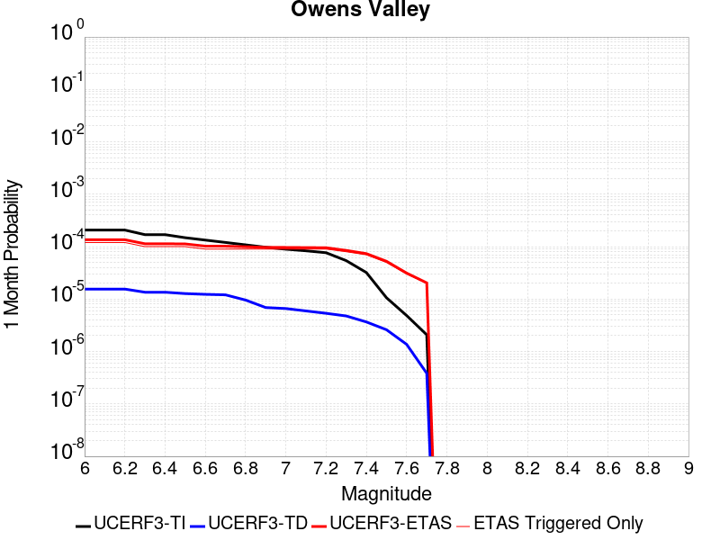 |  |  |

| Magnitude | 1 wk TI Prob | 1 wk TD Prob | 1 wk ETAS Prob | 1 wk ETAS/TD Gain | 1 wk ETAS Triggered Only | 1 mo TI Prob | 1 mo TD Prob | 1 mo ETAS Prob | 1 mo ETAS/TD Gain | 1 mo ETAS Triggered Only | 1 yr TI Prob | 1 yr TD Prob | 1 yr ETAS Prob | 1 yr ETAS/TD Gain | 1 yr ETAS Triggered Only | 10 yr TI Prob | 10 yr TD Prob | 10 yr ETAS Prob | 10 yr ETAS/TD Gain | 10 yr ETAS Triggered Only |
|-----|-----|-----|-----|-----|-----|-----|-----|-----|-----|-----|-----|-----|-----|-----|-----|-----|-----|-----|-----|-----|
| 6.0 | 4.83821E-5 | 3.6210524E-6 | 1.0362069E-4 | 28.61618 | 1.0E-4 | 2.0733538E-4 | 1.551871E-5 | 1.3551685E-4 | 8.732482 | 1.2E-4 | 0.002521386 | 1.889249E-4 | 3.3889656E-4 | 1.7938163 | 1.5E-4 | 0.024929691 | 0.0019297141 | 0.002139309 | 1.1086144 | 2.1E-4 |
| 6.1 | 4.83821E-5 | 3.6210524E-6 | 1.0362069E-4 | 28.61618 | 1.0E-4 | 2.0733538E-4 | 1.551871E-5 | 1.3551685E-4 | 8.732482 | 1.2E-4 | 0.002521386 | 1.889249E-4 | 3.3889656E-4 | 1.7938163 | 1.5E-4 | 0.024929691 | 0.0019297141 | 0.002139309 | 1.1086144 | 2.1E-4 |
| 6.2 | 4.83821E-5 | 3.6210524E-6 | 1.0362069E-4 | 28.61618 | 1.0E-4 | 2.0733538E-4 | 1.551871E-5 | 1.3551685E-4 | 8.732482 | 1.2E-4 | 0.002521386 | 1.889249E-4 | 3.3889656E-4 | 1.7938163 | 1.5E-4 | 0.024929691 | 0.0019297141 | 0.002139309 | 1.1086144 | 2.1E-4 |
| 6.3 | 3.953008E-5 | 3.1530958E-6 | 8.3152845E-5 | 26.371809 | 8.0E-5 | 1.6940363E-4 | 1.3513202E-5 | 1.1351185E-4 | 8.40007 | 1.0E-4 | 0.002060538 | 1.6451156E-4 | 2.9449016E-4 | 1.790088 | 1.3E-4 | 0.020415364 | 0.0016621627 | 0.0018518469 | 1.1141189 | 1.9E-4 |
| 6.4 | 3.953008E-5 | 3.1530958E-6 | 8.3152845E-5 | 26.371809 | 8.0E-5 | 1.6940363E-4 | 1.3513202E-5 | 1.1351185E-4 | 8.40007 | 1.0E-4 | 0.002060538 | 1.6451156E-4 | 2.9449016E-4 | 1.790088 | 1.3E-4 | 0.020415364 | 0.0016621627 | 0.0018518469 | 1.1141189 | 1.9E-4 |
| 6.5 | 3.457342E-5 | 2.9707387E-6 | 8.29705E-5 | 27.929249 | 8.0E-5 | 1.4816338E-4 | 1.273168E-5 | 1.12730406E-4 | 8.854323 | 1.0E-4 | 0.0018023965 | 1.5499788E-4 | 2.8497772E-4 | 1.8385912 | 1.3E-4 | 0.017878477 | 0.0015563119 | 0.0017460161 | 1.1218935 | 1.9E-4 |
| 6.6 | 3.1127765E-5 | 2.8737306E-6 | 7.287353E-5 | 25.358511 | 7.0E-5 | 1.3339789E-4 | 1.2315934E-5 | 1.0231483E-4 | 8.307516 | 9.0E-5 | 0.0016229092 | 1.4993687E-4 | 2.6991888E-4 | 1.8002168 | 1.2E-4 | 0.016111081 | 0.0015013438 | 0.0016810736 | 1.1197126 | 1.8E-4 |
| 6.7 | 2.806885E-5 | 2.8101606E-6 | 7.280996E-5 | 25.90954 | 7.0E-5 | 1.2028952E-4 | 1.2043493E-5 | 1.0204241E-4 | 8.472825 | 9.0E-5 | 0.001463541 | 1.4662035E-4 | 2.6660276E-4 | 1.8183203 | 1.2E-4 | 0.014539397 | 0.0014656087 | 0.0016453449 | 1.1226358 | 1.8E-4 |
| 6.8 | 2.524524E-5 | 2.2351392E-6 | 7.223498E-5 | 32.31789 | 7.0E-5 | 1.0818939E-4 | 9.579134E-6 | 9.957827E-5 | 10.395331 | 9.0E-5 | 0.0013164099 | 1.16620016E-4 | 2.3660602E-4 | 2.028863 | 1.2E-4 | 0.01308639 | 0.001165827 | 0.0013456172 | 1.1542169 | 1.8E-4 |
| 6.9 | 2.2704568E-5 | 1.6079711E-6 | 7.160786E-5 | 44.53305 | 7.0E-5 | 9.730166E-5 | 6.8912864E-6 | 9.689067E-5 | 14.059881 | 9.0E-5 | 0.0011840039 | 8.38982E-5 | 2.0388814E-4 | 2.4301848 | 1.2E-4 | 0.011777153 | 8.38853E-4 | 0.001018702 | 1.2143987 | 1.8E-4 |
| 7.0 | 2.0871712E-5 | 1.5393621E-6 | 7.153925E-5 | 46.473312 | 7.0E-5 | 8.944713E-5 | 6.5972495E-6 | 9.6596654E-5 | 14.641959 | 9.0E-5 | 0.0010884746 | 8.031857E-5 | 2.0030893E-4 | 2.4939306 | 1.2E-4 | 0.010831586 | 8.030395E-4 | 9.82895E-4 | 1.2239684 | 1.8E-4 |
| 7.1 | 1.944928E-5 | 1.3862556E-6 | 7.138616E-5 | 51.49567 | 7.0E-5 | 8.335139E-5 | 5.941082E-6 | 9.5940544E-5 | 16.148666 | 9.0E-5 | 0.0010143308 | 7.233028E-5 | 1.923216E-4 | 2.6589363 | 1.2E-4 | 0.010097133 | 7.2319806E-4 | 9.030679E-4 | 1.2487144 | 1.8E-4 |
| 7.2 | 1.7876306E-5 | 1.2487686E-6 | 7.124868E-5 | 57.055153 | 7.0E-5 | 7.6610486E-5 | 5.3518543E-6 | 9.535137E-5 | 17.816511 | 9.0E-5 | 9.3233347E-4 | 6.515689E-5 | 1.8514907E-4 | 2.8415885 | 1.2E-4 | 0.009284316 | 6.5148395E-4 | 8.313667E-4 | 1.2761123 | 1.8E-4 |
| 7.3 | 1.2618672E-5 | 1.1113839E-6 | 6.1111314E-5 | 54.986687 | 6.0E-5 | 5.40789E-5 | 4.763065E-6 | 8.476269E-5 | 17.795826 | 8.0E-5 | 6.582117E-4 | 5.7988782E-5 | 1.679824E-4 | 2.8968086 | 1.1E-4 | 0.0065626553 | 5.7983754E-4 | 7.397448E-4 | 1.2757794 | 1.6E-4 |
| 7.4 | 7.4874442E-6 | 8.547518E-7 | 5.085471E-5 | 59.496464 | 5.0E-5 | 3.208865E-5 | 3.6632168E-6 | 7.366296E-5 | 20.108818 | 7.0E-5 | 3.906093E-4 | 4.4598757E-5 | 1.3459474E-4 | 3.0179036 | 9.0E-5 | 0.003899234 | 4.459579E-4 | 5.758999E-4 | 1.2913773 | 1.3E-4 |
| 7.5 | 2.4734156E-6 | 6.0679935E-7 | 4.0606774E-5 | 66.91961 | 4.0E-5 | 1.060031E-5 | 2.6005662E-6 | 5.2600437E-5 | 20.226532 | 5.0E-5 | 1.2905113E-4 | 3.1661435E-5 | 9.165954E-5 | 2.89499 | 6.0E-5 | 0.0012897621 | 3.1656958E-4 | 4.1653792E-4 | 1.3157864 | 1.0E-4 |
| 7.6 | 1.1328841E-6 | 3.1961991E-7 | 3.031961E-5 | 94.86145 | 3.0E-5 | 4.8552088E-6 | 1.369799E-6 | 3.1369756E-5 | 22.900993 | 3.0E-5 | 5.9110564E-5 | 1.6677177E-5 | 4.6676676E-5 | 2.7988355 | 3.0E-5 | 5.9094845E-4 | 1.6675945E-4 | 2.2674944E-4 | 1.3597397 | 6.0E-5 |
| 7.7 | 4.8613185E-7 | 8.962742E-8 | 2.0089625E-5 | 224.14598 | 2.0E-5 | 2.0834207E-6 | 3.8411747E-7 | 2.038411E-5 | 53.067387 | 2.0E-5 | 2.536535E-5 | 4.676621E-6 | 2.4676527E-5 | 5.276572 | 2.0E-5 | 2.5362454E-4 | 4.676529E-5 | 8.676342E-5 | 1.8552952 | 4.0E-5 |

## Santa Rosa Island
*[(top)](#table-of-contents)*

| 1 Week | 1 Month | 1 Year | 10 Year |
|-----|-----|-----|-----|
|  |  |  |  |

| Magnitude | 1 wk TI Prob | 1 wk TD Prob | 1 wk ETAS Prob | 1 wk ETAS/TD Gain | 1 wk ETAS Triggered Only | 1 mo TI Prob | 1 mo TD Prob | 1 mo ETAS Prob | 1 mo ETAS/TD Gain | 1 mo ETAS Triggered Only | 1 yr TI Prob | 1 yr TD Prob | 1 yr ETAS Prob | 1 yr ETAS/TD Gain | 1 yr ETAS Triggered Only | 10 yr TI Prob | 10 yr TD Prob | 10 yr ETAS Prob | 10 yr ETAS/TD Gain | 10 yr ETAS Triggered Only |
|-----|-----|-----|-----|-----|-----|-----|-----|-----|-----|-----|-----|-----|-----|-----|-----|-----|-----|-----|-----|-----|
| 6.0 | 4.1143165E-5 | 4.709113E-5 | 1.3708688E-4 | 2.911098 | 9.0E-5 | 1.7631594E-4 | 2.0180462E-4 | 3.117824E-4 | 1.5449717 | 1.1E-4 | 0.002144533 | 0.0024543991 | 0.002604031 | 1.0609647 | 1.5E-4 | 0.021239553 | 0.024293557 | 0.024498455 | 1.0084343 | 2.1E-4 |
| 6.1 | 2.1061249E-5 | 2.3864959E-5 | 5.386424E-5 | 2.2570431 | 3.0E-5 | 9.0259375E-5 | 1.0227455E-4 | 1.3227148E-4 | 1.2932981 | 3.0E-5 | 0.0010983539 | 0.0012445103 | 0.0012944482 | 1.0401264 | 5.0E-5 | 0.01092941 | 0.01237845 | 0.0124475835 | 1.005585 | 7.0E-5 |
| 6.2 | 2.1061249E-5 | 2.3864959E-5 | 5.386424E-5 | 2.2570431 | 3.0E-5 | 9.0259375E-5 | 1.0227455E-4 | 1.3227148E-4 | 1.2932981 | 3.0E-5 | 0.0010983539 | 0.0012445103 | 0.0012944482 | 1.0401264 | 5.0E-5 | 0.01092941 | 0.01237845 | 0.0124475835 | 1.005585 | 7.0E-5 |
| 6.3 | 1.5158236E-5 | 1.7074419E-5 | 4.7073907E-5 | 2.7569845 | 3.0E-5 | 6.496225E-5 | 7.3174095E-5 | 1.031719E-4 | 1.4099512 | 3.0E-5 | 7.906284E-4 | 8.9054246E-4 | 9.4049796E-4 | 1.0560956 | 5.0E-5 | 0.007878214 | 0.00887099 | 0.008920547 | 1.0055864 | 5.0E-5 |
| 6.4 | 1.2341918E-5 | 1.3852917E-5 | 3.385264E-5 | 2.4437194 | 2.0E-5 | 5.2892858E-5 | 5.9368336E-5 | 7.936715E-5 | 1.33686 | 2.0E-5 | 6.437803E-4 | 7.225779E-4 | 7.5255625E-4 | 1.041488 | 3.0E-5 | 0.006419184 | 0.0072031217 | 0.0072329054 | 1.0041349 | 3.0E-5 |
| 6.5 | 9.061158E-6 | 1.0117032E-5 | 3.011683E-5 | 2.9768445 | 2.0E-5 | 3.883296E-5 | 4.3358017E-5 | 6.335715E-5 | 1.4612557 | 2.0E-5 | 4.726887E-4 | 5.277613E-4 | 5.4775074E-4 | 1.0378759 | 2.0E-5 | 0.004716845 | 0.0052656177 | 0.005285512 | 1.0037782 | 2.0E-5 |
| 6.6 | 7.5461685E-6 | 8.400734E-6 | 2.8400565E-5 | 3.3807244 | 2.0E-5 | 3.2340322E-5 | 3.600267E-5 | 5.600195E-5 | 1.5554943 | 2.0E-5 | 3.936723E-4 | 4.3824868E-4 | 4.582399E-4 | 1.0456161 | 2.0E-5 | 0.003929756 | 0.0043742736 | 0.004394186 | 1.0045522 | 2.0E-5 |
| 6.7 | 5.5023775E-6 | 6.087381E-6 | 1.608732E-5 | 2.6427326 | 1.0E-5 | 2.3581404E-5 | 2.6088532E-5 | 3.6088273E-5 | 1.3833002 | 1.0E-5 | 2.8706578E-4 | 3.1758484E-4 | 3.2758166E-4 | 1.0314777 | 1.0E-5 | 0.0028669522 | 0.0031716316 | 0.0031815998 | 1.003143 | 1.0E-5 |
| 6.8 | 3.7351679E-6 | 4.0831405E-6 | 4.0831405E-6 | 1.0 | 0.0 | 1.6007763E-5 | 1.7499071E-5 | 1.7499071E-5 | 1.0 | 0.0 | 1.948771E-4 | 2.1303285E-4 | 2.1303285E-4 | 1.0 | 0.0 | 0.0019470629 | 0.0021285315 | 0.0021285315 | 1.0 | 0.0 |
| 6.9 | 2.456366E-6 | 2.6292707E-6 | 2.6292707E-6 | 1.0 | 0.0 | 1.0527241E-5 | 1.1268255E-5 | 1.1268255E-5 | 1.0 | 0.0 | 1.2816161E-4 | 1.3718239E-4 | 1.3718239E-4 | 1.0 | 0.0 | 0.0012808773 | 0.0013709799 | 0.0013709799 | 1.0 | 0.0 |
| 7.0 | 2.3245157E-6 | 2.4827784E-6 | 2.4827784E-6 | 1.0 | 0.0 | 9.962172E-6 | 1.0640436E-5 | 1.0640436E-5 | 1.0 | 0.0 | 1.2128269E-4 | 1.2953962E-4 | 1.2953962E-4 | 1.0 | 0.0 | 0.0012121652 | 0.0012946434 | 0.0012946434 | 1.0 | 0.0 |
| 7.1 | 2.2248344E-6 | 2.37325E-6 | 2.37325E-6 | 1.0 | 0.0 | 9.53497E-6 | 1.0171032E-5 | 1.0171032E-5 | 1.0 | 0.0 | 1.1608207E-4 | 1.238253E-4 | 1.238253E-4 | 1.0 | 0.0 | 0.0011602144 | 0.0012375651 | 0.0012375651 | 1.0 | 0.0 |
| 7.2 | 2.1350402E-6 | 2.2761542E-6 | 2.2761542E-6 | 1.0 | 0.0 | 9.150141E-6 | 9.75491E-6 | 9.75491E-6 | 1.0 | 0.0 | 1.1139726E-4 | 1.1875957E-4 | 1.1875957E-4 | 1.0 | 0.0 | 0.0011134144 | 0.0011869629 | 0.0011869629 | 1.0 | 0.0 |
| 7.3 | 1.9793572E-6 | 2.1087192E-6 | 2.1087192E-6 | 1.0 | 0.0 | 8.482932E-6 | 9.037337E-6 | 9.037337E-6 | 1.0 | 0.0 | 1.032748E-4 | 1.1002403E-4 | 1.1002403E-4 | 1.0 | 0.0 | 0.0010322682 | 0.0010996974 | 0.0010996974 | 1.0 | 0.0 |
| 7.4 | 1.6951194E-6 | 1.8045735E-6 | 1.8045735E-6 | 1.0 | 0.0 | 7.264777E-6 | 7.733864E-6 | 7.733864E-6 | 1.0 | 0.0 | 8.844508E-5 | 9.415574E-5 | 9.415574E-5 | 1.0 | 0.0 | 8.840988E-4 | 9.411601E-4 | 9.411601E-4 | 1.0 | 0.0 |
| 7.5 | 8.987207E-7 | 9.512216E-7 | 9.512216E-7 | 1.0 | 0.0 | 3.8516546E-6 | 4.0766577E-6 | 4.0766577E-6 | 1.0 | 0.0 | 4.6892885E-5 | 4.9632188E-5 | 4.9632188E-5 | 1.0 | 0.0 | 4.688299E-4 | 4.962122E-4 | 4.962122E-4 | 1.0 | 0.0 |
| 7.6 | 3.8783037E-7 | 4.0529335E-7 | 4.0529335E-7 | 1.0 | 0.0 | 1.6621291E-6 | 1.7369704E-6 | 1.7369704E-6 | 1.0 | 0.0 | 2.0236233E-5 | 2.1147416E-5 | 2.1147416E-5 | 1.0 | 0.0 | 2.023439E-4 | 2.114547E-4 | 2.114547E-4 | 1.0 | 0.0 |
| 7.7 | 6.181804E-8 | 6.339047E-8 | 6.339047E-8 | 1.0 | 0.0 | 2.6493444E-7 | 2.7167343E-7 | 2.7167343E-7 | 1.0 | 0.0 | 3.225572E-6 | 3.307619E-6 | 3.307619E-6 | 1.0 | 0.0 | 3.225525E-5 | 3.3075703E-5 | 3.3075703E-5 | 1.0 | 0.0 |
| 7.8 | 1.3704449E-9 | 1.3964153E-9 | 1.3964153E-9 | 1.0 | 0.0 | 5.873335E-9 | 5.984637E-9 | 5.984637E-9 | 1.0 | 0.0 | 7.1507856E-8 | 7.286295E-8 | 7.286295E-8 | 1.0 | 0.0 | 7.1507833E-7 | 7.286294E-7 | 7.286294E-7 | 1.0 | 0.0 |

## Brawley (Seismic Zone) alt 1
*[(top)](#table-of-contents)*

| 1 Week | 1 Month | 1 Year | 10 Year |
|-----|-----|-----|-----|
|  |  |  |  |

| Magnitude | 1 wk TI Prob | 1 wk TD Prob | 1 wk ETAS Prob | 1 wk ETAS/TD Gain | 1 wk ETAS Triggered Only | 1 mo TI Prob | 1 mo TD Prob | 1 mo ETAS Prob | 1 mo ETAS/TD Gain | 1 mo ETAS Triggered Only | 1 yr TI Prob | 1 yr TD Prob | 1 yr ETAS Prob | 1 yr ETAS/TD Gain | 1 yr ETAS Triggered Only | 10 yr TI Prob | 10 yr TD Prob | 10 yr ETAS Prob | 10 yr ETAS/TD Gain | 10 yr ETAS Triggered Only |
|-----|-----|-----|-----|-----|-----|-----|-----|-----|-----|-----|-----|-----|-----|-----|-----|-----|-----|-----|-----|-----|
| 6.0 | 2.2521618E-4 | 4.763429E-4 | 5.263191E-4 | 1.1049165 | 5.0E-5 | 9.6485513E-4 | 0.0020399094 | 0.0020997871 | 1.029353 | 6.0E-5 | 0.011683988 | 0.024544531 | 0.02467134 | 1.0051665 | 1.3E-4 | 0.11088423 | 0.21349923 | 0.21365653 | 1.0007367 | 2.0E-4 |
| 6.1 | 2.2521618E-4 | 4.763429E-4 | 5.063286E-4 | 1.0629499 | 3.0E-5 | 9.6485513E-4 | 0.0020399094 | 0.0020798277 | 1.0195687 | 4.0E-5 | 0.011683988 | 0.024544531 | 0.024642076 | 1.0039742 | 1.0E-4 | 0.11088423 | 0.21349923 | 0.21362507 | 1.0005894 | 1.6E-4 |
| 6.2 | 2.198148E-4 | 4.6718874E-4 | 4.9717474E-4 | 1.0641838 | 3.0E-5 | 9.417233E-4 | 0.0020007377 | 0.0020406577 | 1.0199527 | 4.0E-5 | 0.011405343 | 0.024078513 | 0.024176106 | 1.0040531 | 1.0E-4 | 0.10837428 | 0.20993572 | 0.21006213 | 1.0006021 | 1.6E-4 |
| 6.3 | 2.1704129E-4 | 4.615455E-4 | 4.915317E-4 | 1.0649691 | 3.0E-5 | 9.298453E-4 | 0.0019765892 | 0.00201651 | 1.0201969 | 4.0E-5 | 0.011262234 | 0.023792034 | 0.023889655 | 1.0041031 | 1.0E-4 | 0.107082725 | 0.20782684 | 0.20795359 | 1.0006099 | 1.6E-4 |
| 6.4 | 1.876142E-4 | 4.004663E-4 | 4.3045427E-4 | 1.0748826 | 3.0E-5 | 8.038131E-4 | 0.0017151695 | 0.0017551009 | 1.0232813 | 4.0E-5 | 0.00974259 | 0.020678662 | 0.020776594 | 1.004736 | 1.0E-4 | 0.093263686 | 0.18457787 | 0.18470018 | 1.0006627 | 1.5E-4 |
| 6.5 | 1.7390939E-4 | 3.7478763E-4 | 4.047764E-4 | 1.0800153 | 3.0E-5 | 7.45113E-4 | 0.0016052561 | 0.0016451919 | 1.0248781 | 4.0E-5 | 0.009034078 | 0.019367293 | 0.019465357 | 1.0050633 | 1.0E-4 | 0.086755216 | 0.17440015 | 0.174524 | 1.0007101 | 1.5E-4 |
| 6.6 | 1.591791E-4 | 3.4893592E-4 | 3.7892544E-4 | 1.0859457 | 3.0E-5 | 6.8201777E-4 | 0.0014945926 | 0.0015345329 | 1.0267231 | 4.0E-5 | 0.008271996 | 0.018045008 | 0.018143203 | 1.0054417 | 1.0E-4 | 0.07970774 | 0.16380787 | 0.16393329 | 1.0007657 | 1.5E-4 |
| 6.7 | 1.4268003E-4 | 3.2059717E-4 | 3.5058756E-4 | 1.0935453 | 3.0E-5 | 6.1134255E-4 | 0.0013732726 | 0.0014032314 | 1.0218157 | 3.0E-5 | 0.007417723 | 0.01659171 | 0.016670382 | 1.0047417 | 8.0E-5 | 0.07174956 | 0.15193594 | 0.15204617 | 1.0007256 | 1.3E-4 |
| 6.8 | 1.239713E-4 | 2.9055026E-4 | 3.2054156E-4 | 1.1032224 | 3.0E-5 | 5.3119735E-4 | 0.0012446274 | 0.00127459 | 1.0240736 | 3.0E-5 | 0.0064481674 | 0.015049482 | 0.0151184285 | 1.0045813 | 7.0E-5 | 0.06264243 | 0.13838051 | 0.1384839 | 1.0007472 | 1.2E-4 |
| 6.9 | 1.0180238E-4 | 2.6255674E-4 | 2.9254888E-4 | 1.114231 | 3.0E-5 | 4.3622297E-4 | 0.0011247622 | 0.0011547285 | 1.0266423 | 3.0E-5 | 0.005298089 | 0.013608998 | 0.013678045 | 1.0050737 | 7.0E-5 | 0.05173543 | 0.12496473 | 0.12506972 | 1.0008403 | 1.2E-4 |
| 7.0 | 7.6619996E-5 | 2.2400476E-4 | 2.5399803E-4 | 1.1338958 | 3.0E-5 | 3.283301E-4 | 9.596704E-4 | 9.896416E-4 | 1.0312307 | 3.0E-5 | 0.0039900932 | 0.011622103 | 0.011691289 | 1.005953 | 7.0E-5 | 0.039192066 | 0.10726982 | 0.107376955 | 1.0009986 | 1.2E-4 |
| 7.1 | 7.5127435E-5 | 2.2083633E-4 | 2.508297E-4 | 1.1358172 | 3.0E-5 | 3.2193496E-4 | 9.461013E-4 | 9.760729E-4 | 1.031679 | 3.0E-5 | 0.0039125155 | 0.011458648 | 0.011527846 | 1.0060389 | 7.0E-5 | 0.038443442 | 0.10583378 | 0.10594108 | 1.0010139 | 1.2E-4 |
| 7.2 | 6.788582E-5 | 2.0211334E-4 | 2.3210728E-4 | 1.1484016 | 3.0E-5 | 2.9090676E-4 | 8.6591556E-4 | 8.9588953E-4 | 1.0346154 | 3.0E-5 | 0.0035360386 | 0.0104922 | 0.010561465 | 1.0066016 | 7.0E-5 | 0.034803 | 0.097503684 | 0.097611986 | 1.0011107 | 1.2E-4 |
| 7.3 | 6.399602E-5 | 1.8842232E-4 | 2.1841667E-4 | 1.1591868 | 3.0E-5 | 2.7423984E-4 | 8.0727716E-4 | 8.3725294E-4 | 1.0371319 | 3.0E-5 | 0.0033337586 | 0.009784897 | 0.0098542115 | 1.0070839 | 7.0E-5 | 0.03284188 | 0.091397986 | 0.09150702 | 1.0011929 | 1.2E-4 |
| 7.4 | 4.506759E-5 | 1.2530042E-4 | 1.5529666E-4 | 1.2393945 | 3.0E-5 | 1.9313251E-4 | 5.3689216E-4 | 5.66876E-4 | 1.0558472 | 3.0E-5 | 0.0023488526 | 0.006517245 | 0.0065768543 | 1.0091463 | 6.0E-5 | 0.023241805 | 0.062364522 | 0.062458284 | 1.0015035 | 1.0E-4 |
| 7.5 | 3.43289E-5 | 9.336103E-5 | 1.13359165E-4 | 1.2142022 | 2.0E-5 | 1.4711556E-4 | 4.0005764E-4 | 4.2004965E-4 | 1.0499728 | 2.0E-5 | 0.0017896603 | 0.004859886 | 0.0049096434 | 1.0102383 | 5.0E-5 | 0.01775316 | 0.047057066 | 0.0471333 | 1.00162 | 8.0E-5 |
| 7.6 | 2.5980507E-5 | 7.053672E-5 | 9.0535315E-5 | 1.2835202 | 2.0E-5 | 1.1134028E-4 | 3.0226534E-4 | 3.222593E-4 | 1.0661471 | 2.0E-5 | 0.001354725 | 0.0036738948 | 0.0037237112 | 1.0135596 | 5.0E-5 | 0.013464959 | 0.03584298 | 0.035910472 | 1.0018829 | 7.0E-5 |
| 7.7 | 1.7292105E-5 | 4.9412036E-5 | 5.9411544E-5 | 1.2023698 | 1.0E-5 | 7.4106916E-5 | 2.1174872E-4 | 2.217466E-4 | 1.0472158 | 1.0E-5 | 9.018782E-4 | 0.0025749984 | 0.0026148953 | 1.015494 | 4.0E-5 | 0.008982267 | 0.025292097 | 0.02534083 | 1.0019269 | 5.0E-5 |
| 7.8 | 1.2927471E-5 | 3.9697254E-5 | 4.9696857E-5 | 1.2518966 | 1.0E-5 | 5.5402274E-5 | 1.7012001E-4 | 1.8011831E-4 | 1.0587721 | 1.0E-5 | 6.743139E-4 | 0.0020692463 | 0.0021091634 | 1.0192907 | 4.0E-5 | 0.0067227143 | 0.020433145 | 0.020482123 | 1.0023971 | 5.0E-5 |
| 7.9 | 1.0200774E-5 | 2.8748475E-5 | 3.874819E-5 | 1.3478346 | 1.0E-5 | 4.371687E-5 | 1.2320194E-4 | 1.3320071E-4 | 1.0811576 | 1.0E-5 | 5.321229E-4 | 0.0014989526 | 0.0015289077 | 1.019984 | 3.0E-5 | 0.005308505 | 0.014992895 | 0.015032295 | 1.002628 | 4.0E-5 |
| 8.0 | 8.650396E-6 | 2.3279512E-5 | 2.3279512E-5 | 1.0 | 0.0 | 3.70726E-5 | 9.976552E-5 | 9.976552E-5 | 1.0 | 0.0 | 4.5126543E-4 | 0.0012139693 | 0.001233945 | 1.0164549 | 2.0E-5 | 0.0045035016 | 0.012212164 | 0.0122417975 | 1.0024266 | 3.0E-5 |
| 8.1 | 3.9368224E-6 | 7.3283345E-6 | 7.3283345E-6 | 1.0 | 0.0 | 1.6871985E-5 | 3.1406773E-5 | 3.1406773E-5 | 1.0 | 0.0 | 2.0539707E-4 | 3.8231048E-4 | 3.8231048E-4 | 1.0 | 0.0 | 0.0020520731 | 0.0040015313 | 0.0040015313 | 1.0 | 0.0 |
| 8.2 | 1.7101195E-6 | 2.2178374E-6 | 2.2178374E-6 | 1.0 | 0.0 | 7.329063E-6 | 9.504983E-6 | 9.504983E-6 | 1.0 | 0.0 | 8.922769E-5 | 1.15717055E-4 | 1.15717055E-4 | 1.0 | 0.0 | 8.9191867E-4 | 0.00126669 | 0.00126669 | 1.0 | 0.0 |
| 8.3 | 3.0346666E-8 | 1.721086E-8 | 1.721086E-8 | 1.0 | 0.0 | 1.3005713E-7 | 7.376083E-8 | 7.376083E-8 | 1.0 | 0.0 | 1.5834444E-6 | 8.98038E-7 | 8.98038E-7 | 1.0 | 0.0 | 1.5834332E-5 | 9.36379E-6 | 9.36379E-6 | 1.0 | 0.0 |

## White Mountains
*[(top)](#table-of-contents)*

| 1 Week | 1 Month | 1 Year | 10 Year |
|-----|-----|-----|-----|
|  |  |  |  |

| Magnitude | 1 wk TI Prob | 1 wk TD Prob | 1 wk ETAS Prob | 1 wk ETAS/TD Gain | 1 wk ETAS Triggered Only | 1 mo TI Prob | 1 mo TD Prob | 1 mo ETAS Prob | 1 mo ETAS/TD Gain | 1 mo ETAS Triggered Only | 1 yr TI Prob | 1 yr TD Prob | 1 yr ETAS Prob | 1 yr ETAS/TD Gain | 1 yr ETAS Triggered Only | 10 yr TI Prob | 10 yr TD Prob | 10 yr ETAS Prob | 10 yr ETAS/TD Gain | 10 yr ETAS Triggered Only |
|-----|-----|-----|-----|-----|-----|-----|-----|-----|-----|-----|-----|-----|-----|-----|-----|-----|-----|-----|-----|-----|
| 6.0 | 3.503579E-5 | 3.3784127E-5 | 8.3782434E-5 | 2.4799352 | 5.0E-5 | 1.5014476E-4 | 1.4478175E-4 | 2.0477307E-4 | 1.4143568 | 6.0E-5 | 0.0018264796 | 0.0017614134 | 0.0018712196 | 1.0623399 | 1.1E-4 | 0.018115403 | 0.017486857 | 0.017663708 | 1.0101135 | 1.8E-4 |
| 6.1 | 3.503579E-5 | 3.3784127E-5 | 8.3782434E-5 | 2.4799352 | 5.0E-5 | 1.5014476E-4 | 1.4478175E-4 | 2.0477307E-4 | 1.4143568 | 6.0E-5 | 0.0018264796 | 0.0017614134 | 0.0018712196 | 1.0623399 | 1.1E-4 | 0.018115403 | 0.017486857 | 0.017663708 | 1.0101135 | 1.8E-4 |
| 6.2 | 3.503579E-5 | 3.3784127E-5 | 8.3782434E-5 | 2.4799352 | 5.0E-5 | 1.5014476E-4 | 1.4478175E-4 | 2.0477307E-4 | 1.4143568 | 6.0E-5 | 0.0018264796 | 0.0017614134 | 0.0018712196 | 1.0623399 | 1.1E-4 | 0.018115403 | 0.017486857 | 0.017663708 | 1.0101135 | 1.8E-4 |
| 6.3 | 1.7818425E-5 | 1.591616E-5 | 3.591584E-5 | 2.2565646 | 2.0E-5 | 7.636245E-5 | 6.821041E-5 | 9.820836E-5 | 1.4397856 | 3.0E-5 | 9.293162E-4 | 8.301596E-4 | 8.7012636E-4 | 1.0481435 | 4.0E-5 | 0.009254395 | 0.0082720425 | 0.008351381 | 1.0095911 | 8.0E-5 |
| 6.4 | 1.7818425E-5 | 1.591616E-5 | 3.591584E-5 | 2.2565646 | 2.0E-5 | 7.636245E-5 | 6.821041E-5 | 9.820836E-5 | 1.4397856 | 3.0E-5 | 9.293162E-4 | 8.301596E-4 | 8.7012636E-4 | 1.0481435 | 4.0E-5 | 0.009254395 | 0.0082720425 | 0.008351381 | 1.0095911 | 8.0E-5 |
| 6.5 | 1.3397557E-5 | 1.1336374E-5 | 2.133626E-5 | 1.8821063 | 1.0E-5 | 5.741684E-5 | 4.8583595E-5 | 6.858262E-5 | 1.4116416 | 2.0E-5 | 6.988258E-4 | 5.913517E-4 | 6.2133395E-4 | 1.0507013 | 3.0E-5 | 0.006966323 | 0.005898487 | 0.005958133 | 1.010112 | 6.0E-5 |
| 6.6 | 1.0818695E-5 | 8.625434E-6 | 1.8625347E-5 | 2.1593518 | 1.0E-5 | 4.6365014E-5 | 3.6965648E-5 | 5.696491E-5 | 1.5410229 | 2.0E-5 | 5.6434784E-4 | 4.4996818E-4 | 4.7995467E-4 | 1.0666413 | 3.0E-5 | 0.005629168 | 0.0044910074 | 0.004530828 | 1.0088667 | 4.0E-5 |
| 6.7 | 9.067908E-6 | 6.802476E-6 | 1.6802407E-5 | 2.470043 | 1.0E-5 | 3.8861883E-5 | 2.915316E-5 | 4.915258E-5 | 1.686012 | 2.0E-5 | 4.7304068E-4 | 3.548851E-4 | 3.8487447E-4 | 1.0845044 | 3.0E-5 | 0.00472035 | 0.003543501 | 0.0035833593 | 1.0112482 | 4.0E-5 |
| 6.8 | 7.295947E-6 | 4.9364285E-6 | 4.9364285E-6 | 1.0 | 0.0 | 3.126797E-5 | 2.1155956E-5 | 2.1155956E-5 | 1.0 | 0.0 | 3.8062103E-4 | 2.5754445E-4 | 2.6754188E-4 | 1.0388182 | 1.0E-5 | 0.0037996976 | 0.0025725728 | 0.0025925213 | 1.0077543 | 2.0E-5 |
| 6.9 | 6.2243444E-6 | 3.8322546E-6 | 3.8322546E-6 | 1.0 | 0.0 | 2.6675489E-5 | 1.6423846E-5 | 1.6423846E-5 | 1.0 | 0.0 | 3.2472567E-4 | 1.9994251E-4 | 2.0994052E-4 | 1.0500044 | 1.0E-5 | 0.0032425157 | 0.001997679 | 0.002007659 | 1.0049958 | 1.0E-5 |
| 7.0 | 4.9878413E-6 | 2.679564E-6 | 2.679564E-6 | 1.0 | 0.0 | 2.1376287E-5 | 1.1483797E-5 | 1.1483797E-5 | 1.0 | 0.0 | 2.602252E-4 | 1.3980652E-4 | 1.4980511E-4 | 1.0715175 | 1.0E-5 | 0.002599207 | 0.0013972119 | 0.0014071979 | 1.0071471 | 1.0E-5 |
| 7.1 | 4.0252844E-6 | 1.885702E-6 | 1.885702E-6 | 1.0 | 0.0 | 1.7251105E-5 | 8.081555E-6 | 8.081555E-6 | 1.0 | 0.0 | 2.1001195E-4 | 9.838863E-5 | 1.0838764E-4 | 1.1016277 | 1.0E-5 | 0.0020981359 | 9.834635E-4 | 9.934537E-4 | 1.0101582 | 1.0E-5 |
| 7.2 | 3.3284066E-6 | 1.2818929E-6 | 1.2818929E-6 | 1.0 | 0.0 | 1.4264522E-5 | 5.4938155E-6 | 5.4938155E-6 | 1.0 | 0.0 | 1.736567E-4 | 6.688525E-5 | 7.6884586E-5 | 1.1494998 | 1.0E-5 | 0.0017352107 | 6.6866126E-4 | 6.786546E-4 | 1.0149453 | 1.0E-5 |
| 7.3 | 2.458226E-6 | 6.056684E-7 | 6.056684E-7 | 1.0 | 0.0 | 1.0535211E-5 | 2.5957193E-6 | 2.5957193E-6 | 1.0 | 0.0 | 1.2825865E-4 | 3.160246E-5 | 4.1602147E-5 | 1.316421 | 1.0E-5 | 0.0012818464 | 3.1598343E-4 | 3.2598025E-4 | 1.0316372 | 1.0E-5 |
| 7.4 | 1.965953E-6 | 3.1084684E-7 | 3.1084684E-7 | 1.0 | 0.0 | 8.425486E-6 | 1.3322001E-6 | 1.3322001E-6 | 1.0 | 0.0 | 1.0257547E-4 | 1.6219417E-5 | 1.6219417E-5 | 1.0 | 0.0 | 0.0010252813 | 1.6218246E-4 | 1.6218246E-4 | 1.0 | 0.0 |
| 7.5 | 1.2014192E-6 | 1.8241002E-7 | 1.8241002E-7 | 1.0 | 0.0 | 5.148929E-6 | 7.8175697E-7 | 7.8175697E-7 | 1.0 | 0.0 | 6.2686406E-5 | 9.51785E-6 | 9.51785E-6 | 1.0 | 0.0 | 6.266873E-4 | 9.517451E-5 | 9.517451E-5 | 1.0 | 0.0 |
| 7.6 | 2.5612175E-7 | 4.893784E-8 | 4.893784E-8 | 1.0 | 0.0 | 1.0976642E-6 | 2.0973359E-7 | 2.0973359E-7 | 1.0 | 0.0 | 1.3363979E-5 | 2.5535037E-6 | 2.5535037E-6 | 1.0 | 0.0 | 1.3363175E-4 | 2.553478E-5 | 2.553478E-5 | 1.0 | 0.0 |

## Independence rev 2011
*[(top)](#table-of-contents)*

| 1 Week | 1 Month | 1 Year | 10 Year |
|-----|-----|-----|-----|
|  |  |  |  |

| Magnitude | 1 wk TI Prob | 1 wk TD Prob | 1 wk ETAS Prob | 1 wk ETAS/TD Gain | 1 wk ETAS Triggered Only | 1 mo TI Prob | 1 mo TD Prob | 1 mo ETAS Prob | 1 mo ETAS/TD Gain | 1 mo ETAS Triggered Only | 1 yr TI Prob | 1 yr TD Prob | 1 yr ETAS Prob | 1 yr ETAS/TD Gain | 1 yr ETAS Triggered Only | 10 yr TI Prob | 10 yr TD Prob | 10 yr ETAS Prob | 10 yr ETAS/TD Gain | 10 yr ETAS Triggered Only |
|-----|-----|-----|-----|-----|-----|-----|-----|-----|-----|-----|-----|-----|-----|-----|-----|-----|-----|-----|-----|-----|
| 6.0 | 4.422171E-6 | 4.3262253E-6 | 1.3432566E-4 | 31.04916 | 1.3E-4 | 1.8952025E-5 | 1.8540852E-5 | 1.5853826E-4 | 8.550754 | 1.4E-4 | 2.3071647E-4 | 2.2571447E-4 | 3.956761E-4 | 1.752994 | 1.7E-4 | 0.0023047708 | 0.0022551457 | 0.002444717 | 1.0840617 | 1.9E-4 |
| 6.1 | 4.422171E-6 | 4.3262253E-6 | 1.3432566E-4 | 31.04916 | 1.3E-4 | 1.8952025E-5 | 1.8540852E-5 | 1.5853826E-4 | 8.550754 | 1.4E-4 | 2.3071647E-4 | 2.2571447E-4 | 3.956761E-4 | 1.752994 | 1.7E-4 | 0.0023047708 | 0.0022551457 | 0.002444717 | 1.0840617 | 1.9E-4 |
| 6.2 | 4.422171E-6 | 4.3262253E-6 | 1.3432566E-4 | 31.04916 | 1.3E-4 | 1.8952025E-5 | 1.8540852E-5 | 1.5853826E-4 | 8.550754 | 1.4E-4 | 2.3071647E-4 | 2.2571447E-4 | 3.956761E-4 | 1.752994 | 1.7E-4 | 0.0023047708 | 0.0022551457 | 0.002444717 | 1.0840617 | 1.9E-4 |
| 6.3 | 4.422171E-6 | 4.3262253E-6 | 1.3432566E-4 | 31.04916 | 1.3E-4 | 1.8952025E-5 | 1.8540852E-5 | 1.5853826E-4 | 8.550754 | 1.4E-4 | 2.3071647E-4 | 2.2571447E-4 | 3.956761E-4 | 1.752994 | 1.7E-4 | 0.0023047708 | 0.0022551457 | 0.002444717 | 1.0840617 | 1.9E-4 |
| 6.4 | 4.422171E-6 | 4.3262253E-6 | 1.3432566E-4 | 31.04916 | 1.3E-4 | 1.8952025E-5 | 1.8540852E-5 | 1.5853826E-4 | 8.550754 | 1.4E-4 | 2.3071647E-4 | 2.2571447E-4 | 3.956761E-4 | 1.752994 | 1.7E-4 | 0.0023047708 | 0.0022551457 | 0.002444717 | 1.0840617 | 1.9E-4 |
| 6.5 | 4.422171E-6 | 4.3262253E-6 | 1.3432566E-4 | 31.04916 | 1.3E-4 | 1.8952025E-5 | 1.8540852E-5 | 1.5853826E-4 | 8.550754 | 1.4E-4 | 2.3071647E-4 | 2.2571447E-4 | 3.956761E-4 | 1.752994 | 1.7E-4 | 0.0023047708 | 0.0022551457 | 0.002444717 | 1.0840617 | 1.9E-4 |
| 6.6 | 2.663744E-6 | 2.5319846E-6 | 1.3253166E-4 | 52.342995 | 1.3E-4 | 1.1415996E-5 | 1.08513195E-5 | 1.508498E-4 | 13.901516 | 1.4E-4 | 1.3898089E-4 | 1.321073E-4 | 3.0208484E-4 | 2.2866628 | 1.7E-4 | 0.0013889399 | 0.0013203359 | 0.0015000983 | 1.1361489 | 1.8E-4 |
| 6.7 | 2.663744E-6 | 2.5319846E-6 | 1.3253166E-4 | 52.342995 | 1.3E-4 | 1.1415996E-5 | 1.08513195E-5 | 1.508498E-4 | 13.901516 | 1.4E-4 | 1.3898089E-4 | 1.321073E-4 | 3.0208484E-4 | 2.2866628 | 1.7E-4 | 0.0013889399 | 0.0013203359 | 0.0015000983 | 1.1361489 | 1.8E-4 |
| 6.8 | 1.9716529E-6 | 1.8322567E-6 | 1.3183201E-4 | 71.95063 | 1.3E-4 | 8.449913E-6 | 7.852505E-6 | 1.478514E-4 | 18.828564 | 1.4E-4 | 1.0287284E-4 | 9.560019E-5 | 2.6558395E-4 | 2.7780693 | 1.7E-4 | 0.0010282523 | 9.5560355E-4 | 0.0011354316 | 1.1881826 | 1.8E-4 |
| 6.9 | 1.8788617E-6 | 1.7429976E-6 | 1.3174277E-4 | 75.58402 | 1.3E-4 | 8.0522395E-6 | 7.4699688E-6 | 1.4746892E-4 | 19.741571 | 1.4E-4 | 9.80316E-5 | 9.09432E-5 | 2.6092774E-4 | 2.8691287 | 1.7E-4 | 9.798837E-4 | 9.090718E-4 | 0.0010889082 | 1.1978241 | 1.8E-4 |
| 7.0 | 1.5045488E-6 | 1.3849498E-6 | 1.3138478E-4 | 94.8661 | 1.3E-4 | 6.44805E-6 | 5.9354857E-6 | 1.4593465E-4 | 24.58681 | 1.4E-4 | 7.8502184E-5 | 7.226219E-5 | 2.4224991E-4 | 3.352374 | 1.7E-4 | 7.8474457E-4 | 7.223921E-4 | 9.0226205E-4 | 1.2489922 | 1.8E-4 |
| 7.1 | 1.272341E-6 | 1.1625089E-6 | 1.3116236E-4 | 112.82697 | 1.3E-4 | 5.4528787E-6 | 4.9821715E-6 | 1.4498147E-4 | 29.100058 | 1.4E-4 | 6.6386776E-5 | 6.0656283E-5 | 2.3064596E-4 | 3.8025076 | 1.7E-4 | 6.636695E-4 | 6.064005E-4 | 7.862913E-4 | 1.2966535 | 1.8E-4 |
| 7.2 | 1.0416892E-6 | 9.409871E-7 | 1.3094087E-4 | 139.15266 | 1.3E-4 | 4.464375E-6 | 4.032796E-6 | 1.4403224E-4 | 35.715233 | 1.4E-4 | 5.4352407E-5 | 4.9098202E-5 | 2.1908985E-4 | 4.462279 | 1.7E-4 | 5.4339116E-4 | 4.908754E-4 | 6.70787E-4 | 1.3665118 | 1.8E-4 |
| 7.3 | 7.9450155E-7 | 7.2350036E-7 | 1.307234E-4 | 180.68188 | 1.3E-4 | 3.4050022E-6 | 3.1007123E-6 | 1.4310027E-4 | 46.150776 | 1.4E-4 | 4.1455114E-5 | 3.7750528E-5 | 2.0774412E-4 | 5.503078 | 1.7E-4 | 4.144738E-4 | 3.7744228E-4 | 5.573743E-4 | 1.4767141 | 1.8E-4 |
| 7.4 | 5.3893444E-7 | 5.0195166E-7 | 1.2050189E-4 | 240.06673 | 1.2E-4 | 2.309717E-6 | 2.1512196E-6 | 1.3215093E-4 | 61.430706 | 1.3E-4 | 2.8120441E-5 | 2.6190788E-5 | 1.861866E-4 | 7.108858 | 1.6E-4 | 2.8116882E-4 | 2.6187746E-4 | 4.3183294E-4 | 1.6489886 | 1.7E-4 |
| 7.5 | 3.8852085E-7 | 3.6825622E-7 | 1.0036822E-4 | 272.54996 | 1.0E-4 | 1.6650882E-6 | 1.57824E-6 | 1.1157807E-4 | 70.69778 | 1.1E-4 | 2.027226E-5 | 1.9214905E-5 | 1.5921221E-4 | 8.285871 | 1.4E-4 | 2.0270412E-4 | 1.9213265E-4 | 3.3210576E-4 | 1.7285233 | 1.4E-4 |
| 7.6 | 2.414929E-7 | 2.3457605E-7 | 6.023456E-5 | 256.78052 | 6.0E-5 | 1.0349692E-6 | 1.0053255E-6 | 6.1005267E-5 | 60.6821 | 6.0E-5 | 1.2600677E-5 | 1.2239771E-5 | 9.223879E-5 | 7.53599 | 8.0E-5 | 1.2599962E-4 | 1.223911E-4 | 2.023813E-4 | 1.6535623 | 8.0E-5 |
| 7.7 | 6.8298014E-8 | 6.8589785E-8 | 3.0068588E-5 | 438.38287 | 3.0E-5 | 2.9270575E-7 | 2.939562E-7 | 3.0293948E-5 | 103.05599 | 3.0E-5 | 3.5636867E-6 | 3.5789112E-6 | 3.3578803E-5 | 9.382407 | 3.0E-5 | 3.5636294E-5 | 3.5788584E-5 | 6.578751E-5 | 1.8382261 | 3.0E-5 |

## San Jacinto (Stepovers Combined)
*[(top)](#table-of-contents)*

| 1 Week | 1 Month | 1 Year | 10 Year |
|-----|-----|-----|-----|
|  |  |  |  |

| Magnitude | 1 wk TI Prob | 1 wk TD Prob | 1 wk ETAS Prob | 1 wk ETAS/TD Gain | 1 wk ETAS Triggered Only | 1 mo TI Prob | 1 mo TD Prob | 1 mo ETAS Prob | 1 mo ETAS/TD Gain | 1 mo ETAS Triggered Only | 1 yr TI Prob | 1 yr TD Prob | 1 yr ETAS Prob | 1 yr ETAS/TD Gain | 1 yr ETAS Triggered Only | 10 yr TI Prob | 10 yr TD Prob | 10 yr ETAS Prob | 10 yr ETAS/TD Gain | 10 yr ETAS Triggered Only |
|-----|-----|-----|-----|-----|-----|-----|-----|-----|-----|-----|-----|-----|-----|-----|-----|-----|-----|-----|-----|-----|
| 6.0 | 4.0667746E-5 | 3.5271103E-5 | 1.2526794E-4 | 3.551574 | 9.0E-5 | 1.742787E-4 | 1.5115313E-4 | 2.51138E-4 | 1.6614808 | 1.0E-4 | 0.0021197782 | 0.0018387372 | 0.0019884615 | 1.0814277 | 1.5E-4 | 0.020996714 | 0.018986495 | 0.019172888 | 1.0098171 | 1.9E-4 |
| 6.1 | 4.0667746E-5 | 3.5271103E-5 | 1.2526794E-4 | 3.551574 | 9.0E-5 | 1.742787E-4 | 1.5115313E-4 | 2.51138E-4 | 1.6614808 | 1.0E-4 | 0.0021197782 | 0.0018387372 | 0.0019884615 | 1.0814277 | 1.5E-4 | 0.020996714 | 0.018986495 | 0.019172888 | 1.0098171 | 1.9E-4 |
| 6.2 | 4.0667746E-5 | 3.5271103E-5 | 1.2526794E-4 | 3.551574 | 9.0E-5 | 1.742787E-4 | 1.5115313E-4 | 2.51138E-4 | 1.6614808 | 1.0E-4 | 0.0021197782 | 0.0018387372 | 0.0019884615 | 1.0814277 | 1.5E-4 | 0.020996714 | 0.018986495 | 0.019172888 | 1.0098171 | 1.9E-4 |
| 6.3 | 4.0667746E-5 | 3.5271103E-5 | 1.2526794E-4 | 3.551574 | 9.0E-5 | 1.742787E-4 | 1.5115313E-4 | 2.51138E-4 | 1.6614808 | 1.0E-4 | 0.0021197782 | 0.0018387372 | 0.0019884615 | 1.0814277 | 1.5E-4 | 0.020996714 | 0.018986495 | 0.019172888 | 1.0098171 | 1.9E-4 |
| 6.4 | 4.0577226E-5 | 3.5143014E-5 | 1.2513985E-4 | 3.5608742 | 9.0E-5 | 1.738908E-4 | 1.5060425E-4 | 2.505892E-4 | 1.6638919 | 1.0E-4 | 0.0021150648 | 0.0018320669 | 0.001981792 | 1.0817248 | 1.5E-4 | 0.020950472 | 0.018921062 | 0.019097656 | 1.0093333 | 1.8E-4 |
| 6.5 | 4.0577226E-5 | 3.5143014E-5 | 1.2513985E-4 | 3.5608742 | 9.0E-5 | 1.738908E-4 | 1.5060425E-4 | 2.505892E-4 | 1.6638919 | 1.0E-4 | 0.0021150648 | 0.0018320669 | 0.001981792 | 1.0817248 | 1.5E-4 | 0.020950472 | 0.018921062 | 0.019097656 | 1.0093333 | 1.8E-4 |
| 6.6 | 4.053861E-5 | 3.5088357E-5 | 1.250852E-4 | 3.5648634 | 9.0E-5 | 1.7372532E-4 | 1.5037002E-4 | 2.50355E-4 | 1.6649262 | 1.0E-4 | 0.0021130538 | 0.0018292206 | 0.0019789462 | 1.0818521 | 1.5E-4 | 0.020930743 | 0.01889314 | 0.019069739 | 1.0093473 | 1.8E-4 |
| 6.7 | 4.0516545E-5 | 3.505743E-5 | 1.2505427E-4 | 3.567126 | 9.0E-5 | 1.7363077E-4 | 1.502375E-4 | 2.5022248E-4 | 1.6655128 | 1.0E-4 | 0.002111905 | 0.0018276101 | 0.001977336 | 1.0819244 | 1.5E-4 | 0.020919468 | 0.018877337 | 0.019053938 | 1.0093552 | 1.8E-4 |
| 6.8 | 4.049434E-5 | 3.5028992E-5 | 1.2502584E-4 | 3.5692103 | 9.0E-5 | 1.7353562E-4 | 1.5011564E-4 | 2.5010062E-4 | 1.6660532 | 1.0E-4 | 0.0021107488 | 0.0018261289 | 0.001975855 | 1.081991 | 1.5E-4 | 0.020908125 | 0.018862749 | 0.019039353 | 1.0093626 | 1.8E-4 |
| 6.9 | 4.046386E-5 | 3.4991554E-5 | 1.2498841E-4 | 3.5719593 | 9.0E-5 | 1.73405E-4 | 1.499552E-4 | 2.499402E-4 | 1.6667658 | 1.0E-4 | 0.0021091616 | 0.0018241788 | 0.0019739051 | 1.0820788 | 1.5E-4 | 0.020892553 | 0.018843522 | 0.01902013 | 1.0093724 | 1.8E-4 |
| 7.0 | 4.036382E-5 | 3.4872126E-5 | 1.2486898E-4 | 3.5807679 | 9.0E-5 | 1.7297632E-4 | 1.4944343E-4 | 2.4942847E-4 | 1.6690496 | 1.0E-4 | 0.0021039525 | 0.0018179584 | 0.0019676858 | 1.0823601 | 1.5E-4 | 0.02084144 | 0.018782137 | 0.018958755 | 1.0094036 | 1.8E-4 |
| 7.1 | 4.0343282E-5 | 3.485059E-5 | 1.2484746E-4 | 3.582363 | 9.0E-5 | 1.7288832E-4 | 1.4935112E-4 | 2.4933618E-4 | 1.669463 | 1.0E-4 | 0.002102883 | 0.0018168368 | 0.0019665642 | 1.082411 | 1.5E-4 | 0.020830948 | 0.018771008 | 0.01894763 | 1.0094093 | 1.8E-4 |
| 7.2 | 4.0257353E-5 | 3.475509E-5 | 1.2475195E-4 | 3.589459 | 9.0E-5 | 1.725201E-4 | 1.489419E-4 | 2.4892698E-4 | 1.6713028 | 1.0E-4 | 0.0020984085 | 0.0018118626 | 0.0019615907 | 1.0826378 | 1.5E-4 | 0.020787042 | 0.018721746 | 0.018898377 | 1.0094345 | 1.8E-4 |
| 7.3 | 3.9940667E-5 | 3.458276E-5 | 1.2457964E-4 | 3.6023629 | 9.0E-5 | 1.7116306E-4 | 1.4820343E-4 | 2.4818862E-4 | 1.6746483 | 1.0E-4 | 0.0020819185 | 0.0018028866 | 0.0019526163 | 1.0830499 | 1.5E-4 | 0.020625217 | 0.018630387 | 0.018807033 | 1.0094817 | 1.8E-4 |
| 7.4 | 3.9721202E-5 | 3.4468165E-5 | 1.2446506E-4 | 3.611015 | 9.0E-5 | 1.7022261E-4 | 1.4771236E-4 | 2.476976E-4 | 1.6768914 | 1.0E-4 | 0.0020704903 | 0.0017969179 | 0.0019466483 | 1.0833262 | 1.5E-4 | 0.020513052 | 0.018569522 | 0.018746179 | 1.0095133 | 1.8E-4 |
| 7.5 | 3.7036873E-5 | 3.3535776E-5 | 1.2353275E-4 | 3.6836112 | 9.0E-5 | 1.5871979E-4 | 1.4371685E-4 | 2.4370248E-4 | 1.6957127 | 1.0E-4 | 0.0019307006 | 0.0017483513 | 0.0018980891 | 1.0856451 | 1.5E-4 | 0.019140124 | 0.018071128 | 0.018247876 | 1.0097806 | 1.8E-4 |
| 7.6 | 3.2940967E-5 | 3.13167E-5 | 1.2131388E-4 | 3.873776 | 9.0E-5 | 1.4116794E-4 | 1.3420754E-4 | 2.3419413E-4 | 1.7450145 | 1.0E-4 | 0.0017173645 | 0.0016327545 | 0.0017825095 | 1.0917193 | 1.5E-4 | 0.01704153 | 0.016904091 | 0.017071217 | 1.0098867 | 1.7E-4 |
| 7.7 | 2.8236149E-5 | 2.7882697E-5 | 1.1788019E-4 | 4.2277184 | 9.0E-5 | 1.2100645E-4 | 1.1949181E-4 | 2.1947986E-4 | 1.8367774 | 1.0E-4 | 0.0014722579 | 0.0014538429 | 0.0016036248 | 1.1030248 | 1.5E-4 | 0.014625421 | 0.015114912 | 0.015282342 | 1.0110772 | 1.7E-4 |
| 7.8 | 2.4329287E-5 | 2.5206451E-5 | 1.1520418E-4 | 4.5704246 | 9.0E-5 | 1.042642E-4 | 1.08023174E-4 | 2.0801238E-4 | 1.9256272 | 1.0E-4 | 0.0012686774 | 0.0013143895 | 0.0014641924 | 1.1139715 | 1.5E-4 | 0.012614589 | 0.013712341 | 0.01388001 | 1.0122275 | 1.7E-4 |
| 7.9 | 1.9370926E-5 | 2.0420413E-5 | 1.1041857E-4 | 5.4072647 | 9.0E-5 | 8.301561E-5 | 8.751312E-5 | 1.8750437E-4 | 2.1425858 | 1.0E-4 | 0.0010102465 | 0.0010649522 | 0.0012147925 | 1.1407014 | 1.5E-4 | 0.0100566605 | 0.011199402 | 0.011367498 | 1.0150094 | 1.7E-4 |
| 8.0 | 1.5583017E-5 | 1.5885415E-5 | 8.5884305E-5 | 5.406488 | 7.0E-5 | 6.6782646E-5 | 6.807858E-5 | 1.4807313E-4 | 2.1750326 | 8.0E-5 | 8.127754E-4 | 8.2854216E-4 | 9.484427E-4 | 1.1447127 | 1.2E-4 | 0.008098091 | 0.008781636 | 0.008920407 | 1.0158024 | 1.4E-4 |
| 8.1 | 1.0024873E-5 | 8.291399E-6 | 3.829115E-5 | 4.618177 | 3.0E-5 | 4.2963035E-5 | 3.553409E-5 | 6.553302E-5 | 1.8442297 | 3.0E-5 | 5.229494E-4 | 4.3254215E-4 | 4.7252484E-4 | 1.0924366 | 4.0E-5 | 0.0052172043 | 0.0046530655 | 0.0046928795 | 1.0085565 | 4.0E-5 |
| 8.2 | 4.142796E-6 | 1.5602761E-6 | 1.5602761E-6 | 1.0 | 0.0 | 1.775472E-5 | 6.6868806E-6 | 6.6868806E-6 | 1.0 | 0.0 | 2.1614227E-4 | 8.140976E-5 | 8.140976E-5 | 1.0 | 0.0 | 0.0021593217 | 9.4514614E-4 | 9.4514614E-4 | 1.0 | 0.0 |
| 8.3 | 1.2750878E-6 | 3.609817E-7 | 3.609817E-7 | 1.0 | 0.0 | 5.4646503E-6 | 1.5470634E-6 | 1.5470634E-6 | 1.0 | 0.0 | 6.653009E-5 | 1.8835339E-5 | 1.8835339E-5 | 1.0 | 0.0 | 6.6510175E-4 | 2.272251E-4 | 2.272251E-4 | 1.0 | 0.0 |

## San Jacinto (San Jacinto Valley) rev
*[(top)](#table-of-contents)*

| 1 Week | 1 Month | 1 Year | 10 Year |
|-----|-----|-----|-----|
|  |  |  |  |

| Magnitude | 1 wk TI Prob | 1 wk TD Prob | 1 wk ETAS Prob | 1 wk ETAS/TD Gain | 1 wk ETAS Triggered Only | 1 mo TI Prob | 1 mo TD Prob | 1 mo ETAS Prob | 1 mo ETAS/TD Gain | 1 mo ETAS Triggered Only | 1 yr TI Prob | 1 yr TD Prob | 1 yr ETAS Prob | 1 yr ETAS/TD Gain | 1 yr ETAS Triggered Only | 10 yr TI Prob | 10 yr TD Prob | 10 yr ETAS Prob | 10 yr ETAS/TD Gain | 10 yr ETAS Triggered Only |
|-----|-----|-----|-----|-----|-----|-----|-----|-----|-----|-----|-----|-----|-----|-----|-----|-----|-----|-----|-----|-----|
| 6.0 | 3.652694E-5 | 3.4401106E-5 | 1.2439801E-4 | 3.616105 | 9.0E-5 | 1.5653463E-4 | 1.4742499E-4 | 2.4741024E-4 | 1.6782111 | 1.0E-4 | 0.0019041431 | 0.0017934233 | 0.0019431544 | 1.083489 | 1.5E-4 | 0.018879099 | 0.018526303 | 0.018712781 | 1.0100657 | 1.9E-4 |
| 6.1 | 3.652694E-5 | 3.4401106E-5 | 1.2439801E-4 | 3.616105 | 9.0E-5 | 1.5653463E-4 | 1.4742499E-4 | 2.4741024E-4 | 1.6782111 | 1.0E-4 | 0.0019041431 | 0.0017934233 | 0.0019431544 | 1.083489 | 1.5E-4 | 0.018879099 | 0.018526303 | 0.018712781 | 1.0100657 | 1.9E-4 |
| 6.2 | 3.652694E-5 | 3.4401106E-5 | 1.2439801E-4 | 3.616105 | 9.0E-5 | 1.5653463E-4 | 1.4742499E-4 | 2.4741024E-4 | 1.6782111 | 1.0E-4 | 0.0019041431 | 0.0017934233 | 0.0019431544 | 1.083489 | 1.5E-4 | 0.018879099 | 0.018526303 | 0.018712781 | 1.0100657 | 1.9E-4 |
| 6.3 | 3.652694E-5 | 3.4401106E-5 | 1.2439801E-4 | 3.616105 | 9.0E-5 | 1.5653463E-4 | 1.4742499E-4 | 2.4741024E-4 | 1.6782111 | 1.0E-4 | 0.0019041431 | 0.0017934233 | 0.0019431544 | 1.083489 | 1.5E-4 | 0.018879099 | 0.018526303 | 0.018712781 | 1.0100657 | 1.9E-4 |
| 6.4 | 3.646941E-5 | 3.432268E-5 | 1.2431959E-4 | 3.622083 | 9.0E-5 | 1.5628811E-4 | 1.4708891E-4 | 2.470742E-4 | 1.6797609 | 1.0E-4 | 0.0019011468 | 0.0017893389 | 0.0019390704 | 1.0836798 | 1.5E-4 | 0.018849645 | 0.018486181 | 0.01867267 | 1.010088 | 1.9E-4 |
| 6.5 | 3.646941E-5 | 3.432268E-5 | 1.2431959E-4 | 3.622083 | 9.0E-5 | 1.5628811E-4 | 1.4708891E-4 | 2.470742E-4 | 1.6797609 | 1.0E-4 | 0.0019011468 | 0.0017893389 | 0.0019390704 | 1.0836798 | 1.5E-4 | 0.018849645 | 0.018486181 | 0.01867267 | 1.010088 | 1.9E-4 |
| 6.6 | 3.6442503E-5 | 3.4286066E-5 | 1.2428297E-4 | 3.624883 | 9.0E-5 | 1.561728E-4 | 1.4693203E-4 | 2.4691733E-4 | 1.6804868 | 1.0E-4 | 0.0018997455 | 0.001787432 | 0.0019371639 | 1.0837693 | 1.5E-4 | 0.018835869 | 0.01846745 | 0.018653942 | 1.0100983 | 1.9E-4 |
| 6.7 | 3.6432113E-5 | 3.427164E-5 | 1.2426855E-4 | 3.6259878 | 9.0E-5 | 1.5612828E-4 | 1.4687021E-4 | 2.4685552E-4 | 1.6807733 | 1.0E-4 | 0.0018992044 | 0.0017866807 | 0.0019364126 | 1.0838046 | 1.5E-4 | 0.018830549 | 0.018460074 | 0.018646566 | 1.0101025 | 1.9E-4 |
| 6.8 | 3.6409598E-5 | 3.4240697E-5 | 1.2423762E-4 | 3.628361 | 9.0E-5 | 1.560318E-4 | 1.4673761E-4 | 2.4672292E-4 | 1.6813885 | 1.0E-4 | 0.0018980318 | 0.0017850689 | 0.0019348011 | 1.0838804 | 1.5E-4 | 0.018819023 | 0.018444229 | 0.018630724 | 1.0101113 | 1.9E-4 |
| 6.9 | 3.638078E-5 | 3.4201123E-5 | 1.2419805E-4 | 3.6314027 | 9.0E-5 | 1.5590832E-4 | 1.4656801E-4 | 2.4655336E-4 | 1.6821771 | 1.0E-4 | 0.0018965311 | 0.0017830075 | 0.0019327401 | 1.0839775 | 1.5E-4 | 0.018804269 | 0.018423963 | 0.018610463 | 1.0101227 | 1.9E-4 |
| 7.0 | 3.6294874E-5 | 3.408314E-5 | 1.2408008E-4 | 3.6405118 | 9.0E-5 | 1.5554018E-4 | 1.4606243E-4 | 2.4604783E-4 | 1.6845387 | 1.0E-4 | 0.0018920569 | 0.0017768623 | 0.0019265957 | 1.0842685 | 1.5E-4 | 0.018760284 | 0.018363545 | 0.018550055 | 1.0101566 | 1.9E-4 |
| 7.1 | 3.6260717E-5 | 3.403942E-5 | 1.2403636E-4 | 3.6439033 | 9.0E-5 | 1.5539382E-4 | 1.4587509E-4 | 2.4586052E-4 | 1.685418 | 1.0E-4 | 0.001890278 | 0.0017745851 | 0.001924319 | 1.0843768 | 1.5E-4 | 0.018742796 | 0.018341139 | 0.018527655 | 1.0101693 | 1.9E-4 |
| 7.2 | 3.6210204E-5 | 3.397364E-5 | 1.2397059E-4 | 3.6490226 | 9.0E-5 | 1.5517735E-4 | 1.455932E-4 | 2.4557865E-4 | 1.6867452 | 1.0E-4 | 0.001887647 | 0.0017711588 | 0.0019208931 | 1.0845404 | 1.5E-4 | 0.01871693 | 0.018307408 | 0.01849393 | 1.0101883 | 1.9E-4 |
| 7.3 | 3.6119454E-5 | 3.386193E-5 | 1.2385887E-4 | 3.6577623 | 9.0E-5 | 1.5478847E-4 | 1.4511449E-4 | 2.4509997E-4 | 1.6890111 | 1.0E-4 | 0.0018829206 | 0.0017653398 | 0.001915075 | 1.0848194 | 1.5E-4 | 0.018670462 | 0.01824996 | 0.018436493 | 1.010221 | 1.9E-4 |
| 7.4 | 3.607848E-5 | 3.380943E-5 | 1.2380639E-4 | 3.6618893 | 9.0E-5 | 1.5461289E-4 | 1.4488952E-4 | 2.4487503E-4 | 1.6900811 | 1.0E-4 | 0.0018807866 | 0.0017626052 | 0.0019123408 | 1.0849513 | 1.5E-4 | 0.018649481 | 0.018222956 | 0.018409492 | 1.0102364 | 1.9E-4 |
| 7.5 | 3.5856774E-5 | 3.3619202E-5 | 1.2361618E-4 | 3.6769514 | 9.0E-5 | 1.5366284E-4 | 1.4407437E-4 | 2.4405995E-4 | 1.693986 | 1.0E-4 | 0.0018692396 | 0.0017526967 | 0.0019024338 | 1.0854324 | 1.5E-4 | 0.018535944 | 0.018124057 | 0.018310614 | 1.0102932 | 1.9E-4 |
| 7.6 | 3.286655E-5 | 3.2142278E-5 | 1.2213939E-4 | 3.7999606 | 9.0E-5 | 1.4084904E-4 | 1.3774536E-4 | 2.3773158E-4 | 1.7258773 | 1.0E-4 | 0.001713488 | 0.0016757617 | 0.0018255103 | 1.0893615 | 1.5E-4 | 0.017003361 | 0.017343804 | 0.017520681 | 1.0101984 | 1.8E-4 |
| 7.7 | 2.8882527E-5 | 2.9235205E-5 | 1.1923257E-4 | 4.07839 | 9.0E-5 | 1.237764E-4 | 1.2528773E-4 | 2.252752E-4 | 1.7980628 | 1.0E-4 | 0.0015059357 | 0.0015243118 | 0.0016740832 | 1.098255 | 1.5E-4 | 0.014957713 | 0.015830338 | 0.016007489 | 1.0111905 | 1.8E-4 |
| 7.8 | 2.4950225E-5 | 2.6526219E-5 | 1.16523835E-4 | 4.3927794 | 9.0E-5 | 1.0692515E-4 | 1.1367885E-4 | 2.1366749E-4 | 1.8795711 | 1.0E-4 | 0.0013010362 | 0.0013831621 | 0.0015329546 | 1.1082971 | 1.5E-4 | 0.012934455 | 0.01441176 | 0.014589165 | 1.0123098 | 1.8E-4 |
| 7.9 | 1.9881603E-5 | 2.150649E-5 | 1.1150455E-4 | 5.1846933 | 9.0E-5 | 8.520408E-5 | 9.216742E-5 | 1.921582E-4 | 2.084882 | 1.0E-4 | 0.001036866 | 0.0011215615 | 0.0012713933 | 1.1335921 | 1.5E-4 | 0.010320415 | 0.011776998 | 0.011954878 | 1.015104 | 1.8E-4 |
| 8.0 | 1.563292E-5 | 1.5936288E-5 | 8.593517E-5 | 5.392421 | 7.0E-5 | 6.6996516E-5 | 6.829659E-5 | 1.4829113E-4 | 2.1712816 | 8.0E-5 | 8.153773E-4 | 8.3119445E-4 | 9.510947E-4 | 1.1442505 | 1.2E-4 | 0.00812392 | 0.008810331 | 0.008949098 | 1.0157504 | 1.4E-4 |
| 8.1 | 1.0045313E-5 | 8.300794E-6 | 3.8300546E-5 | 4.614082 | 3.0E-5 | 4.305063E-5 | 3.557435E-5 | 6.557328E-5 | 1.8432742 | 3.0E-5 | 5.2401534E-4 | 4.3303217E-4 | 4.7301484E-4 | 1.0923319 | 4.0E-5 | 0.0052278144 | 0.0046587666 | 0.0046985806 | 1.008546 | 4.0E-5 |
| 8.2 | 4.1554413E-6 | 1.5648296E-6 | 1.5648296E-6 | 1.0 | 0.0 | 1.7808914E-5 | 6.7063957E-6 | 6.7063957E-6 | 1.0 | 0.0 | 2.1680194E-4 | 8.164734E-5 | 8.164734E-5 | 1.0 | 0.0 | 0.0021659054 | 9.479703E-4 | 9.479703E-4 | 1.0 | 0.0 |
| 8.3 | 1.2758221E-6 | 3.612677E-7 | 3.612677E-7 | 1.0 | 0.0 | 5.4677976E-6 | 1.5482892E-6 | 1.5482892E-6 | 1.0 | 0.0 | 6.65684E-5 | 1.8850264E-5 | 1.8850264E-5 | 1.0 | 0.0 | 6.6548464E-4 | 2.2739546E-4 | 2.2739546E-4 | 1.0 | 0.0 |

## Lake Isabella (Seismicity)
*[(top)](#table-of-contents)*

| 1 Week | 1 Month | 1 Year | 10 Year |
|-----|-----|-----|-----|
|  |  | 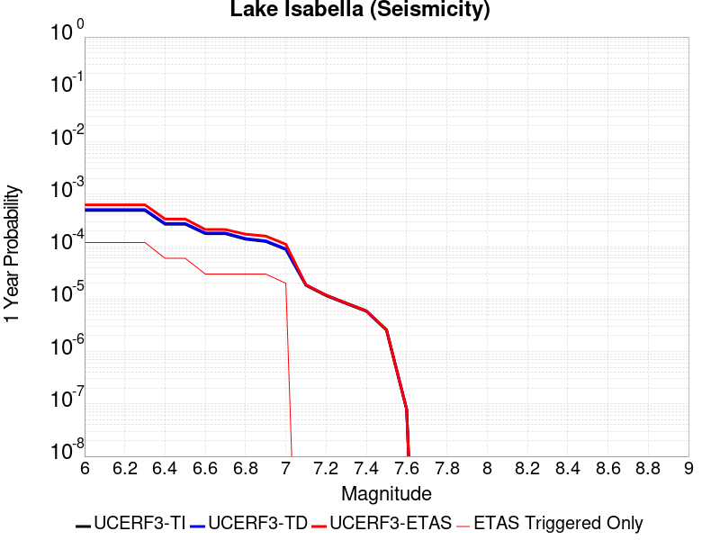 | 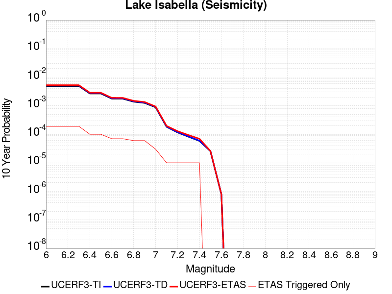 |

| Magnitude | 1 wk TI Prob | 1 wk TD Prob | 1 wk ETAS Prob | 1 wk ETAS/TD Gain | 1 wk ETAS Triggered Only | 1 mo TI Prob | 1 mo TD Prob | 1 mo ETAS Prob | 1 mo ETAS/TD Gain | 1 mo ETAS Triggered Only | 1 yr TI Prob | 1 yr TD Prob | 1 yr ETAS Prob | 1 yr ETAS/TD Gain | 1 yr ETAS Triggered Only | 10 yr TI Prob | 10 yr TD Prob | 10 yr ETAS Prob | 10 yr ETAS/TD Gain | 10 yr ETAS Triggered Only |
|-----|-----|-----|-----|-----|-----|-----|-----|-----|-----|-----|-----|-----|-----|-----|-----|-----|-----|-----|-----|-----|
| 6.0 | 9.431637E-6 | 9.741651E-6 | 4.9741262E-5 | 5.10604 | 4.0E-5 | 4.0420677E-5 | 4.1749343E-5 | 1.1174642E-4 | 2.676603 | 7.0E-5 | 4.920106E-4 | 5.0819275E-4 | 6.281318E-4 | 1.2360109 | 1.2E-4 | 0.004909227 | 0.005071599 | 0.005260635 | 1.0372735 | 1.9E-4 |
| 6.1 | 9.431637E-6 | 9.741651E-6 | 4.9741262E-5 | 5.10604 | 4.0E-5 | 4.0420677E-5 | 4.1749343E-5 | 1.1174642E-4 | 2.676603 | 7.0E-5 | 4.920106E-4 | 5.0819275E-4 | 6.281318E-4 | 1.2360109 | 1.2E-4 | 0.004909227 | 0.005071599 | 0.005260635 | 1.0372735 | 1.9E-4 |
| 6.2 | 9.431637E-6 | 9.741651E-6 | 4.9741262E-5 | 5.10604 | 4.0E-5 | 4.0420677E-5 | 4.1749343E-5 | 1.1174642E-4 | 2.676603 | 7.0E-5 | 4.920106E-4 | 5.0819275E-4 | 6.281318E-4 | 1.2360109 | 1.2E-4 | 0.004909227 | 0.005071599 | 0.005260635 | 1.0372735 | 1.9E-4 |
| 6.3 | 9.431637E-6 | 9.741651E-6 | 4.9741262E-5 | 5.10604 | 4.0E-5 | 4.0420677E-5 | 4.1749343E-5 | 1.1174642E-4 | 2.676603 | 7.0E-5 | 4.920106E-4 | 5.0819275E-4 | 6.281318E-4 | 1.2360109 | 1.2E-4 | 0.004909227 | 0.005071599 | 0.005260635 | 1.0372735 | 1.9E-4 |
| 6.4 | 5.144063E-6 | 5.3000763E-6 | 2.529997E-5 | 4.773511 | 2.0E-5 | 2.2045799E-5 | 2.2714434E-5 | 6.271352E-5 | 2.7609549 | 4.0E-5 | 2.6837454E-4 | 2.765166E-4 | 3.365E-4 | 1.2169251 | 6.0E-5 | 0.0026805066 | 0.0027620657 | 0.0028617894 | 1.0361048 | 1.0E-4 |
| 6.5 | 5.144063E-6 | 5.3000763E-6 | 2.529997E-5 | 4.773511 | 2.0E-5 | 2.2045799E-5 | 2.2714434E-5 | 6.271352E-5 | 2.7609549 | 4.0E-5 | 2.6837454E-4 | 2.765166E-4 | 3.365E-4 | 1.2169251 | 6.0E-5 | 0.0026805066 | 0.0027620657 | 0.0028617894 | 1.0361048 | 1.0E-4 |
| 6.6 | 3.4009804E-6 | 3.498786E-6 | 2.3498716E-5 | 6.716248 | 2.0E-5 | 1.4575549E-5 | 1.4994721E-5 | 3.499442E-5 | 2.3337827 | 2.0E-5 | 1.7744285E-4 | 1.8254704E-4 | 2.1254156E-4 | 1.1643112 | 3.0E-5 | 0.0017730123 | 0.0018241286 | 0.0018940009 | 1.0383044 | 7.0E-5 |
| 6.7 | 3.3880428E-6 | 3.4856528E-6 | 2.3485583E-5 | 6.7377863 | 2.0E-5 | 1.4520103E-5 | 1.4938435E-5 | 3.4938137E-5 | 2.3388083 | 2.0E-5 | 1.767679E-4 | 1.8186188E-4 | 2.1185642E-4 | 1.1649303 | 3.0E-5 | 0.0017662736 | 0.0018172882 | 0.001887161 | 1.0384489 | 7.0E-5 |
| 6.8 | 2.6582E-6 | 2.7337003E-6 | 2.2733646E-5 | 8.3160715 | 2.0E-5 | 1.1392236E-5 | 1.1715813E-5 | 3.171558E-5 | 2.7070744 | 2.0E-5 | 1.3869164E-4 | 1.4263204E-4 | 1.7262776E-4 | 1.2103014 | 3.0E-5 | 0.0013860512 | 0.0014255369 | 0.0014854514 | 1.0420294 | 6.0E-5 |
| 6.9 | 2.406011E-6 | 2.4743288E-6 | 2.247428E-5 | 9.08298 | 2.0E-5 | 1.0311434E-5 | 1.0604231E-5 | 3.060402E-5 | 2.8860197 | 2.0E-5 | 1.2553448E-4 | 1.2910018E-4 | 1.5909631E-4 | 1.2323477 | 3.0E-5 | 0.0012546359 | 0.0012903814 | 0.001350304 | 1.0464379 | 6.0E-5 |
| 7.0 | 1.6953097E-6 | 1.7429371E-6 | 1.174292E-5 | 6.7374315 | 1.0E-5 | 7.265593E-6 | 7.469715E-6 | 1.746964E-5 | 2.3387291 | 1.0E-5 | 8.8455E-5 | 9.094104E-5 | 1.1093922E-4 | 1.2199028 | 2.0E-5 | 8.84198E-4 | 9.09141E-4 | 9.3911367E-4 | 1.0329682 | 3.0E-5 |
| 7.1 | 3.5013824E-7 | 3.5714822E-7 | 3.5714822E-7 | 1.0 | 0.0 | 1.5005916E-6 | 1.5306344E-6 | 1.5306344E-6 | 1.0 | 0.0 | 1.826955E-5 | 1.8635317E-5 | 1.8635317E-5 | 1.0 | 0.0 | 1.8268047E-4 | 1.863378E-4 | 1.9633592E-4 | 1.053656 | 1.0E-5 |
| 7.2 | 2.2321095E-7 | 2.2750574E-7 | 2.2750574E-7 | 1.0 | 0.0 | 9.56618E-7 | 9.750242E-7 | 9.750242E-7 | 1.0 | 0.0 | 1.1646762E-5 | 1.1870856E-5 | 1.1870856E-5 | 1.0 | 0.0 | 1.1646151E-4 | 1.1870232E-4 | 1.2870114E-4 | 1.0842344 | 1.0E-5 |
| 7.3 | 1.5760406E-7 | 1.6060922E-7 | 1.6060922E-7 | 1.0 | 0.0 | 6.7544585E-7 | 6.8832503E-7 | 6.8832503E-7 | 1.0 | 0.0 | 8.223522E-6 | 8.380326E-6 | 8.380326E-6 | 1.0 | 0.0 | 8.2232174E-5 | 8.3800165E-5 | 9.3799325E-5 | 1.1193215 | 1.0E-5 |
| 7.4 | 1.1216497E-7 | 1.1431706E-7 | 1.1431706E-7 | 1.0 | 0.0 | 4.8070694E-7 | 4.899302E-7 | 4.899302E-7 | 1.0 | 0.0 | 5.852591E-6 | 5.964884E-6 | 5.964884E-6 | 1.0 | 0.0 | 5.8524372E-5 | 5.9647282E-5 | 6.964669E-5 | 1.1676422 | 1.0E-5 |
| 7.5 | 4.885185E-8 | 4.9787737E-8 | 4.9787737E-8 | 1.0 | 0.0 | 2.0936506E-7 | 2.13376E-7 | 2.13376E-7 | 1.0 | 0.0 | 2.5490165E-6 | 2.59785E-6 | 2.59785E-6 | 1.0 | 0.0 | 2.5489873E-5 | 2.5978214E-5 | 2.5978214E-5 | 1.0 | 0.0 |
| 7.6 | 1.504641E-9 | 1.5317903E-9 | 1.5317903E-9 | 1.0 | 0.0 | 6.4484613E-9 | 6.5648154E-9 | 6.5648154E-9 | 1.0 | 0.0 | 7.851001E-8 | 7.992663E-8 | 7.992663E-8 | 1.0 | 0.0 | 7.8509987E-7 | 7.992663E-7 | 7.992663E-7 | 1.0 | 0.0 |

## Rose Canyon
*[(top)](#table-of-contents)*

| 1 Week | 1 Month | 1 Year | 10 Year |
|-----|-----|-----|-----|
|  |  |  |  |

| Magnitude | 1 wk TI Prob | 1 wk TD Prob | 1 wk ETAS Prob | 1 wk ETAS/TD Gain | 1 wk ETAS Triggered Only | 1 mo TI Prob | 1 mo TD Prob | 1 mo ETAS Prob | 1 mo ETAS/TD Gain | 1 mo ETAS Triggered Only | 1 yr TI Prob | 1 yr TD Prob | 1 yr ETAS Prob | 1 yr ETAS/TD Gain | 1 yr ETAS Triggered Only | 10 yr TI Prob | 10 yr TD Prob | 10 yr ETAS Prob | 10 yr ETAS/TD Gain | 10 yr ETAS Triggered Only |
|-----|-----|-----|-----|-----|-----|-----|-----|-----|-----|-----|-----|-----|-----|-----|-----|-----|-----|-----|-----|-----|
| 6.0 | 4.5923203E-5 | 4.9714607E-5 | 8.9712616E-5 | 1.8045526 | 4.0E-5 | 1.9679888E-4 | 2.1304654E-4 | 2.630359E-4 | 1.2346405 | 5.0E-5 | 0.0023933933 | 0.0025909478 | 0.0026607665 | 1.0269471 | 7.0E-5 | 0.023677798 | 0.025618518 | 0.025784163 | 1.0064658 | 1.7E-4 |
| 6.1 | 4.5923203E-5 | 4.9714607E-5 | 7.9713114E-5 | 1.6034144 | 3.0E-5 | 1.9679888E-4 | 2.1304654E-4 | 2.5303802E-4 | 1.1877124 | 4.0E-5 | 0.0023933933 | 0.0025909478 | 0.0026507925 | 1.0230975 | 6.0E-5 | 0.023677798 | 0.025618518 | 0.025706213 | 1.0034231 | 9.0E-5 |
| 6.2 | 2.8844734E-5 | 2.9669678E-5 | 5.966879E-5 | 2.0111034 | 3.0E-5 | 1.2361443E-4 | 1.2714976E-4 | 1.5714594E-4 | 1.2359122 | 3.0E-5 | 0.0015039665 | 0.001546976 | 0.0015769297 | 1.0193627 | 3.0E-5 | 0.0149382865 | 0.015364873 | 0.015404259 | 1.0025634 | 4.0E-5 |
| 6.3 | 2.3171577E-5 | 2.3162425E-5 | 5.316173E-5 | 2.2951713 | 3.0E-5 | 9.9302975E-5 | 9.926383E-5 | 1.2926085E-4 | 1.3021948 | 3.0E-5 | 0.0012083431 | 0.0012078804 | 0.0012378442 | 1.0248069 | 3.0E-5 | 0.012017938 | 0.012012152 | 0.012051672 | 1.0032899 | 4.0E-5 |
| 6.4 | 2.0066604E-5 | 1.9668067E-5 | 4.9667477E-5 | 2.5252852 | 3.0E-5 | 8.599689E-5 | 8.428905E-5 | 1.1428652E-4 | 1.3558881 | 3.0E-5 | 0.0010465092 | 0.001025746 | 0.0010557153 | 1.029217 | 3.0E-5 | 0.010415946 | 0.010211479 | 0.01025107 | 1.0038772 | 4.0E-5 |
| 6.5 | 1.776989E-5 | 1.7115402E-5 | 3.711506E-5 | 2.168518 | 2.0E-5 | 7.615444E-5 | 7.33497E-5 | 9.334823E-5 | 1.2726464 | 2.0E-5 | 9.267859E-4 | 8.926737E-4 | 9.126558E-4 | 1.0223846 | 2.0E-5 | 0.009229303 | 0.008874663 | 0.008894485 | 1.0022336 | 2.0E-5 |
| 6.6 | 1.5227364E-5 | 1.4340872E-5 | 3.4340585E-5 | 2.3945951 | 2.0E-5 | 6.52585E-5 | 6.145947E-5 | 8.145824E-5 | 1.3253977 | 2.0E-5 | 7.942326E-4 | 7.480173E-4 | 7.6800236E-4 | 1.0267173 | 2.0E-5 | 0.007914 | 0.0074410336 | 0.0074608847 | 1.0026678 | 2.0E-5 |
| 6.7 | 1.2703898E-5 | 1.1674277E-5 | 3.1674044E-5 | 2.713148 | 2.0E-5 | 5.4444143E-5 | 5.0031682E-5 | 7.003068E-5 | 1.3997267 | 2.0E-5 | 6.626558E-4 | 6.089697E-4 | 6.289575E-4 | 1.0328224 | 2.0E-5 | 0.006606833 | 0.0060623093 | 0.006082188 | 1.0032791 | 2.0E-5 |
| 6.8 | 1.1554917E-5 | 1.0610384E-5 | 3.0610172E-5 | 2.8849258 | 2.0E-5 | 4.9520135E-5 | 4.547231E-5 | 6.5471395E-5 | 1.4398081 | 2.0E-5 | 6.0274085E-4 | 5.5348873E-4 | 5.734777E-4 | 1.0361145 | 2.0E-5 | 0.0060110865 | 0.005504414 | 0.0055243038 | 1.0036135 | 2.0E-5 |
| 6.9 | 8.732078E-6 | 7.882285E-6 | 2.7882128E-5 | 3.5373151 | 2.0E-5 | 3.7422655E-5 | 3.37808E-5 | 5.3780128E-5 | 1.5920322 | 2.0E-5 | 4.5552556E-4 | 4.112066E-4 | 4.3119836E-4 | 1.0486174 | 2.0E-5 | 0.0045459294 | 0.004089515 | 0.0041094334 | 1.0048705 | 2.0E-5 |
| 7.0 | 5.9337494E-6 | 5.107436E-6 | 1.51073855E-5 | 2.9579196 | 1.0E-5 | 2.5430107E-5 | 2.1888829E-5 | 3.1888612E-5 | 1.456844 | 1.0E-5 | 3.0956755E-4 | 2.6646405E-4 | 2.764614E-4 | 1.0375185 | 1.0E-5 | 0.0030913667 | 0.002661461 | 0.0026714345 | 1.0037473 | 1.0E-5 |
| 7.1 | 5.013409E-6 | 4.17734E-6 | 1.4177298E-5 | 3.393858 | 1.0E-5 | 2.1485863E-5 | 1.7902763E-5 | 2.7902584E-5 | 1.558563 | 1.0E-5 | 2.6155898E-4 | 2.1794444E-4 | 2.2794226E-4 | 1.0458733 | 1.0E-5 | 0.0026125133 | 0.0021773188 | 0.002187297 | 1.0045828 | 1.0E-5 |
| 7.2 | 4.120763E-6 | 3.2820917E-6 | 3.2820917E-6 | 1.0 | 0.0 | 1.7660293E-5 | 1.4066032E-5 | 1.4066032E-5 | 1.0 | 0.0 | 2.1499286E-4 | 1.7124058E-4 | 1.7124058E-4 | 1.0 | 0.0 | 0.0021478499 | 0.0017110958 | 0.0017110958 | 1.0 | 0.0 |
| 7.3 | 3.2081239E-6 | 2.4404965E-6 | 2.4404965E-6 | 1.0 | 0.0 | 1.374903E-5 | 1.0459229E-5 | 1.0459229E-5 | 1.0 | 0.0 | 1.6738157E-4 | 1.2733374E-4 | 1.2733374E-4 | 1.0 | 0.0 | 0.0016725556 | 0.0012726148 | 0.0012726148 | 1.0 | 0.0 |
| 7.4 | 2.4194755E-6 | 1.7680321E-6 | 1.7680321E-6 | 1.0 | 0.0 | 1.0369139E-5 | 7.5772587E-6 | 7.5772587E-6 | 1.0 | 0.0 | 1.2623696E-4 | 9.224927E-5 | 9.224927E-5 | 1.0 | 0.0 | 0.0012616527 | 9.221151E-4 | 9.221151E-4 | 1.0 | 0.0 |
| 7.5 | 1.3842889E-6 | 9.3782967E-7 | 9.3782967E-7 | 1.0 | 0.0 | 5.9326535E-6 | 4.019264E-6 | 4.019264E-6 | 1.0 | 0.0 | 7.222766E-5 | 4.8933474E-5 | 4.8933474E-5 | 1.0 | 0.0 | 7.220419E-4 | 4.8923056E-4 | 4.8923056E-4 | 1.0 | 0.0 |
| 7.6 | 1.0021575E-6 | 6.4113493E-7 | 6.4113493E-7 | 1.0 | 0.0 | 4.2949537E-6 | 2.7477186E-6 | 2.7477186E-6 | 1.0 | 0.0 | 5.2289808E-5 | 3.345298E-5 | 3.345298E-5 | 1.0 | 0.0 | 5.2277505E-4 | 3.344816E-4 | 3.344816E-4 | 1.0 | 0.0 |
| 7.7 | 8.7620116E-8 | 6.449304E-8 | 6.449304E-8 | 1.0 | 0.0 | 3.7551473E-7 | 2.763987E-7 | 2.763987E-7 | 1.0 | 0.0 | 4.5718825E-6 | 3.3651493E-6 | 3.3651493E-6 | 1.0 | 0.0 | 4.5717883E-5 | 3.3651013E-5 | 3.3651013E-5 | 1.0 | 0.0 |

## Pinto Mtn
*[(top)](#table-of-contents)*

| 1 Week | 1 Month | 1 Year | 10 Year |
|-----|-----|-----|-----|
| 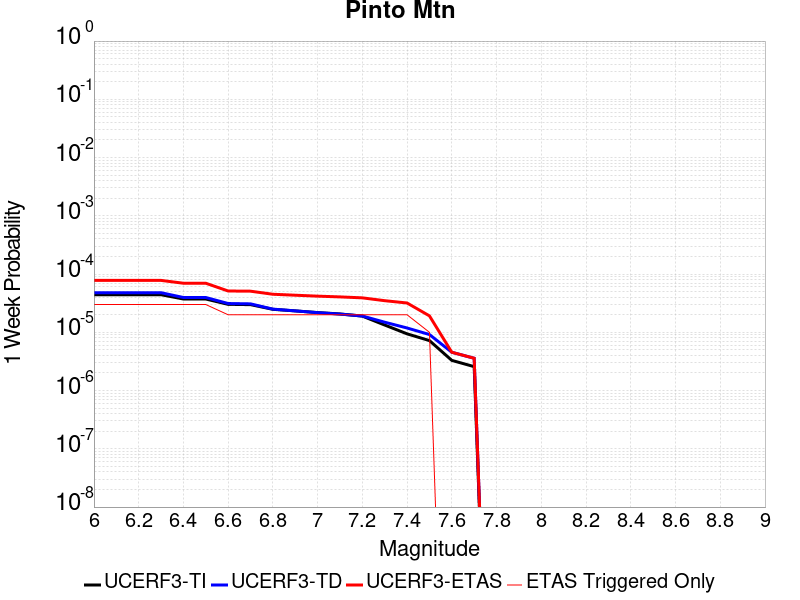 |  |  |  |

| Magnitude | 1 wk TI Prob | 1 wk TD Prob | 1 wk ETAS Prob | 1 wk ETAS/TD Gain | 1 wk ETAS Triggered Only | 1 mo TI Prob | 1 mo TD Prob | 1 mo ETAS Prob | 1 mo ETAS/TD Gain | 1 mo ETAS Triggered Only | 1 yr TI Prob | 1 yr TD Prob | 1 yr ETAS Prob | 1 yr ETAS/TD Gain | 1 yr ETAS Triggered Only | 10 yr TI Prob | 10 yr TD Prob | 10 yr ETAS Prob | 10 yr ETAS/TD Gain | 10 yr ETAS Triggered Only |
|-----|-----|-----|-----|-----|-----|-----|-----|-----|-----|-----|-----|-----|-----|-----|-----|-----|-----|-----|-----|-----|
| 6.0 | 4.4194956E-5 | 4.7853926E-5 | 7.785249E-5 | 1.6268778 | 3.0E-5 | 1.893932E-4 | 2.0507304E-4 | 2.350669E-4 | 1.1462593 | 3.0E-5 | 0.0023034236 | 0.0024940688 | 0.0025938193 | 1.0399951 | 1.0E-4 | 0.022796938 | 0.024678305 | 0.024853863 | 1.0071138 | 1.8E-4 |
| 6.1 | 4.4194956E-5 | 4.7853926E-5 | 7.785249E-5 | 1.6268778 | 3.0E-5 | 1.893932E-4 | 2.0507304E-4 | 2.350669E-4 | 1.1462593 | 3.0E-5 | 0.0023034236 | 0.0024940688 | 0.0025938193 | 1.0399951 | 1.0E-4 | 0.022796938 | 0.024678305 | 0.024853863 | 1.0071138 | 1.8E-4 |
| 6.2 | 4.4194956E-5 | 4.7853926E-5 | 7.785249E-5 | 1.6268778 | 3.0E-5 | 1.893932E-4 | 2.0507304E-4 | 2.350669E-4 | 1.1462593 | 3.0E-5 | 0.0023034236 | 0.0024940688 | 0.0025938193 | 1.0399951 | 1.0E-4 | 0.022796938 | 0.024678305 | 0.024853863 | 1.0071138 | 1.8E-4 |
| 6.3 | 4.4194956E-5 | 4.7853926E-5 | 7.785249E-5 | 1.6268778 | 3.0E-5 | 1.893932E-4 | 2.0507304E-4 | 2.350669E-4 | 1.1462593 | 3.0E-5 | 0.0023034236 | 0.0024940688 | 0.0025938193 | 1.0399951 | 1.0E-4 | 0.022796938 | 0.024678305 | 0.024853863 | 1.0071138 | 1.8E-4 |
| 6.4 | 3.729929E-5 | 3.960349E-5 | 6.96023E-5 | 1.757479 | 3.0E-5 | 1.5984432E-4 | 1.6971873E-4 | 1.9971364E-4 | 1.176733 | 3.0E-5 | 0.0019443673 | 0.0020644604 | 0.002164254 | 1.0483388 | 1.0E-4 | 0.019274427 | 0.020462848 | 0.020629369 | 1.0081377 | 1.7E-4 |
| 6.5 | 3.729929E-5 | 3.960349E-5 | 6.96023E-5 | 1.757479 | 3.0E-5 | 1.5984432E-4 | 1.6971873E-4 | 1.9971364E-4 | 1.176733 | 3.0E-5 | 0.0019443673 | 0.0020644604 | 0.002164254 | 1.0483388 | 1.0E-4 | 0.019274427 | 0.020462848 | 0.020629369 | 1.0081377 | 1.7E-4 |
| 6.6 | 3.0204548E-5 | 3.12056E-5 | 5.1204977E-5 | 1.6408906 | 2.0E-5 | 1.2944164E-4 | 1.3373162E-4 | 1.5372895E-4 | 1.1495333 | 2.0E-5 | 0.0015748127 | 0.0016270012 | 0.0017168547 | 1.0552264 | 9.0E-5 | 0.015636992 | 0.016154764 | 0.016272826 | 1.0073081 | 1.2E-4 |
| 6.7 | 2.9857754E-5 | 3.0814987E-5 | 5.0814368E-5 | 1.6490148 | 2.0E-5 | 1.2795553E-4 | 1.3205773E-4 | 1.5205509E-4 | 1.1514289 | 2.0E-5 | 0.0015567453 | 0.0016066517 | 0.0016965071 | 1.0559272 | 9.0E-5 | 0.015458848 | 0.015954204 | 0.01607229 | 1.0074016 | 1.2E-4 |
| 6.8 | 2.4819734E-5 | 2.5009665E-5 | 4.5009165E-5 | 1.7996708 | 2.0E-5 | 1.0636595E-4 | 1.0718E-4 | 1.2717786E-4 | 1.186582 | 2.0E-5 | 0.0012942362 | 0.001304157 | 0.0013940396 | 1.0689201 | 9.0E-5 | 0.012867244 | 0.012967403 | 0.013085847 | 1.0091339 | 1.2E-4 |
| 6.9 | 2.331124E-5 | 2.3337945E-5 | 4.3337477E-5 | 1.8569535 | 2.0E-5 | 9.990149E-5 | 1.0001605E-4 | 1.2001405E-4 | 1.199948 | 2.0E-5 | 0.001215622 | 0.0012170355 | 0.0013069259 | 1.0738602 | 9.0E-5 | 0.012089936 | 0.012105897 | 0.012224444 | 1.0097926 | 1.2E-4 |
| 7.0 | 2.1818534E-5 | 2.1761074E-5 | 4.176064E-5 | 1.9190522 | 2.0E-5 | 9.3504656E-5 | 9.3258524E-5 | 1.13256654E-4 | 1.2144376 | 2.0E-5 | 0.0011378246 | 0.0011348509 | 0.0012047715 | 1.0616121 | 7.0E-5 | 0.011320163 | 0.01129266 | 0.01139153 | 1.0087553 | 1.0E-4 |
| 7.1 | 2.066081E-5 | 2.0540718E-5 | 4.0540308E-5 | 1.9736558 | 2.0E-5 | 8.854332E-5 | 8.8028784E-5 | 1.0802703E-4 | 1.2271785 | 2.0E-5 | 0.0010774818 | 0.0010712431 | 0.0011411681 | 1.0652746 | 7.0E-5 | 0.010722724 | 0.0106628435 | 0.0107518835 | 1.0083505 | 9.0E-5 |
| 7.2 | 1.8990233E-5 | 1.9054001E-5 | 3.9053622E-5 | 2.0496283 | 2.0E-5 | 8.138417E-5 | 8.165756E-5 | 1.01655925E-4 | 1.2449052 | 2.0E-5 | 9.904018E-4 | 9.937467E-4 | 0.0010636771 | 1.0703704 | 7.0E-5 | 0.009859995 | 0.009895029 | 0.009984138 | 1.0090054 | 9.0E-5 |
| 7.3 | 1.3335872E-5 | 1.4906713E-5 | 3.4906414E-5 | 2.3416574 | 2.0E-5 | 5.7152483E-5 | 6.388442E-5 | 8.388314E-5 | 1.3130454 | 2.0E-5 | 6.956093E-4 | 7.77528E-4 | 8.4747357E-4 | 1.0899589 | 7.0E-5 | 0.006934359 | 0.007749376 | 0.007838679 | 1.0115238 | 9.0E-5 |
| 7.4 | 9.414066E-6 | 1.186096E-5 | 3.1860724E-5 | 2.6861842 | 2.0E-5 | 4.0345374E-5 | 5.083175E-5 | 7.0830734E-5 | 1.3934349 | 2.0E-5 | 4.910942E-4 | 6.1871024E-4 | 6.786731E-4 | 1.096916 | 6.0E-5 | 0.0049001034 | 0.0061708256 | 0.0062503316 | 1.0128843 | 8.0E-5 |
| 7.5 | 7.2101157E-6 | 9.158192E-6 | 1.91581E-5 | 2.0919085 | 1.0E-5 | 3.090013E-5 | 3.9248847E-5 | 4.9248454E-5 | 1.2547746 | 1.0E-5 | 3.7614413E-4 | 4.7775774E-4 | 5.1773863E-4 | 1.0836844 | 4.0E-5 | 0.0037550807 | 0.004768082 | 0.0048178434 | 1.0104364 | 5.0E-5 |
| 7.6 | 3.296375E-6 | 4.5455017E-6 | 4.5455017E-6 | 1.0 | 0.0 | 1.4127245E-5 | 1.9480583E-5 | 1.9480583E-5 | 1.0 | 0.0 | 1.7198564E-4 | 2.3715167E-4 | 2.3715167E-4 | 1.0 | 0.0 | 0.0017185259 | 0.0023691233 | 0.0023790996 | 1.004211 | 1.0E-5 |
| 7.7 | 2.5741092E-6 | 3.5844084E-6 | 3.5844084E-6 | 1.0 | 0.0 | 1.103185E-5 | 1.5361667E-5 | 1.5361667E-5 | 1.0 | 0.0 | 1.3430449E-4 | 1.8701357E-4 | 1.8701357E-4 | 1.0 | 0.0 | 0.0013422335 | 0.0018686918 | 0.0018686918 | 1.0 | 0.0 |

## Kern Canyon (North Kern) 2011
*[(top)](#table-of-contents)*

| 1 Week | 1 Month | 1 Year | 10 Year |
|-----|-----|-----|-----|
|  | 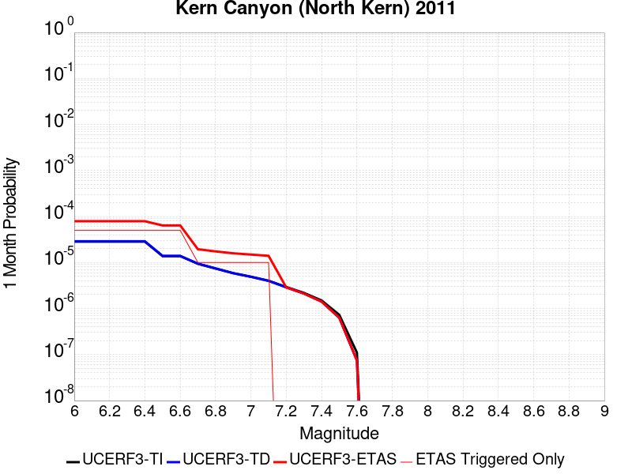 |  |  |

| Magnitude | 1 wk TI Prob | 1 wk TD Prob | 1 wk ETAS Prob | 1 wk ETAS/TD Gain | 1 wk ETAS Triggered Only | 1 mo TI Prob | 1 mo TD Prob | 1 mo ETAS Prob | 1 mo ETAS/TD Gain | 1 mo ETAS Triggered Only | 1 yr TI Prob | 1 yr TD Prob | 1 yr ETAS Prob | 1 yr ETAS/TD Gain | 1 yr ETAS Triggered Only | 10 yr TI Prob | 10 yr TD Prob | 10 yr ETAS Prob | 10 yr ETAS/TD Gain | 10 yr ETAS Triggered Only |
|-----|-----|-----|-----|-----|-----|-----|-----|-----|-----|-----|-----|-----|-----|-----|-----|-----|-----|-----|-----|-----|
| 6.0 | 6.6264497E-6 | 6.75733E-6 | 3.6757127E-5 | 5.4395933 | 3.0E-5 | 2.8398761E-5 | 2.895971E-5 | 7.895826E-5 | 2.7264867 | 5.0E-5 | 3.4570007E-4 | 3.5253543E-4 | 4.3250722E-4 | 1.2268475 | 8.0E-5 | 0.0034516277 | 0.0035205502 | 0.0036899517 | 1.0481179 | 1.7E-4 |
| 6.1 | 6.6264497E-6 | 6.75733E-6 | 3.6757127E-5 | 5.4395933 | 3.0E-5 | 2.8398761E-5 | 2.895971E-5 | 7.895826E-5 | 2.7264867 | 5.0E-5 | 3.4570007E-4 | 3.5253543E-4 | 4.3250722E-4 | 1.2268475 | 8.0E-5 | 0.0034516277 | 0.0035205502 | 0.0036899517 | 1.0481179 | 1.7E-4 |
| 6.2 | 6.6264497E-6 | 6.75733E-6 | 3.6757127E-5 | 5.4395933 | 3.0E-5 | 2.8398761E-5 | 2.895971E-5 | 7.895826E-5 | 2.7264867 | 5.0E-5 | 3.4570007E-4 | 3.5253543E-4 | 4.3250722E-4 | 1.2268475 | 8.0E-5 | 0.0034516277 | 0.0035205502 | 0.0036899517 | 1.0481179 | 1.7E-4 |
| 6.3 | 6.6264497E-6 | 6.75733E-6 | 3.6757127E-5 | 5.4395933 | 3.0E-5 | 2.8398761E-5 | 2.895971E-5 | 7.895826E-5 | 2.7264867 | 5.0E-5 | 3.4570007E-4 | 3.5253543E-4 | 4.3250722E-4 | 1.2268475 | 8.0E-5 | 0.0034516277 | 0.0035205502 | 0.0036899517 | 1.0481179 | 1.7E-4 |
| 6.4 | 6.6264497E-6 | 6.75733E-6 | 3.6757127E-5 | 5.4395933 | 3.0E-5 | 2.8398761E-5 | 2.895971E-5 | 7.895826E-5 | 2.7264867 | 5.0E-5 | 3.4570007E-4 | 3.5253543E-4 | 4.3250722E-4 | 1.2268475 | 8.0E-5 | 0.0034516277 | 0.0035205502 | 0.0036899517 | 1.0481179 | 1.7E-4 |
| 6.5 | 3.2162225E-6 | 3.2570915E-6 | 3.3256994E-5 | 10.210642 | 3.0E-5 | 1.3783738E-5 | 1.3958894E-5 | 6.395819E-5 | 4.581896 | 5.0E-5 | 1.6780409E-4 | 1.6993708E-4 | 2.3992518E-4 | 1.4118471 | 7.0E-5 | 0.0016767744 | 0.001698151 | 0.0018379133 | 1.0823026 | 1.4E-4 |
| 6.6 | 3.2162225E-6 | 3.2570915E-6 | 3.3256994E-5 | 10.210642 | 3.0E-5 | 1.3783738E-5 | 1.3958894E-5 | 6.395819E-5 | 4.581896 | 5.0E-5 | 1.6780409E-4 | 1.6993708E-4 | 2.3992518E-4 | 1.4118471 | 7.0E-5 | 0.0016767744 | 0.001698151 | 0.0018379133 | 1.0823026 | 1.4E-4 |
| 6.7 | 2.1908265E-6 | 2.2071222E-6 | 2.2071222E-6 | 1.0 | 0.0 | 9.389223E-6 | 9.459062E-6 | 1.9458968E-5 | 2.0571773 | 1.0E-5 | 1.1430779E-4 | 1.1515819E-4 | 1.3515589E-4 | 1.1736542 | 2.0E-5 | 0.0011424901 | 0.0011510046 | 0.001220924 | 1.0607464 | 7.0E-5 |
| 6.8 | 1.7303895E-6 | 1.736553E-6 | 1.736553E-6 | 1.0 | 0.0 | 7.415934E-6 | 7.442349E-6 | 1.7442275E-5 | 2.3436518 | 1.0E-5 | 9.028525E-5 | 9.060693E-5 | 1.0060603E-4 | 1.1103568 | 1.0E-5 | 9.024858E-4 | 9.0570963E-4 | 9.456734E-4 | 1.0441242 | 4.0E-5 |
| 6.9 | 1.3700314E-6 | 1.3688623E-6 | 1.3688623E-6 | 1.0 | 0.0 | 5.87155E-6 | 5.86654E-6 | 1.586648E-5 | 2.7045722 | 1.0E-5 | 7.148377E-5 | 7.142283E-5 | 8.142211E-5 | 1.1400013 | 1.0E-5 | 7.146078E-4 | 7.140033E-4 | 7.539747E-4 | 1.0559821 | 4.0E-5 |
| 7.0 | 1.1467797E-6 | 1.1413805E-6 | 1.1413805E-6 | 1.0 | 0.0 | 4.9147607E-6 | 4.8916218E-6 | 1.4891573E-5 | 3.0443017 | 1.0E-5 | 5.983557E-5 | 5.95539E-5 | 6.95533E-5 | 1.1679051 | 1.0E-5 | 5.981946E-4 | 5.9538253E-4 | 6.253647E-4 | 1.0503578 | 3.0E-5 |
| 7.1 | 9.3952065E-7 | 9.3026915E-7 | 9.3026915E-7 | 1.0 | 0.0 | 4.026511E-6 | 3.986862E-6 | 1.3986822E-5 | 3.5082285 | 1.0E-5 | 4.9021666E-5 | 4.853898E-5 | 5.853849E-5 | 1.20601 | 1.0E-5 | 4.901085E-4 | 4.8528553E-4 | 5.0527585E-4 | 1.0411929 | 2.0E-5 |
| 7.2 | 6.858055E-7 | 6.7193014E-7 | 6.7193014E-7 | 1.0 | 0.0 | 2.939163E-6 | 2.8796974E-6 | 2.8796974E-6 | 1.0 | 0.0 | 3.5783723E-5 | 3.5059762E-5 | 3.5059762E-5 | 1.0 | 0.0 | 3.5777962E-4 | 3.5054318E-4 | 3.6053968E-4 | 1.0285171 | 1.0E-5 |
| 7.3 | 5.1101983E-7 | 4.939301E-7 | 4.939301E-7 | 1.0 | 0.0 | 2.1900833E-6 | 2.1168414E-6 | 2.1168414E-6 | 1.0 | 0.0 | 2.6663936E-5 | 2.5772246E-5 | 2.5772246E-5 | 1.0 | 0.0 | 2.6660739E-4 | 2.5769303E-4 | 2.6769046E-4 | 1.0387958 | 1.0E-5 |
| 7.4 | 3.4999414E-7 | 3.2995916E-7 | 3.2995916E-7 | 1.0 | 0.0 | 1.499974E-6 | 1.4141099E-6 | 1.4141099E-6 | 1.0 | 0.0 | 1.8262032E-5 | 1.7216655E-5 | 1.7216655E-5 | 1.0 | 0.0 | 1.826053E-4 | 1.7215345E-4 | 1.8215172E-4 | 1.0580777 | 1.0E-5 |
| 7.5 | 1.7021522E-7 | 1.4750053E-7 | 1.4750053E-7 | 1.0 | 0.0 | 7.2949354E-7 | 6.32145E-7 | 6.32145E-7 | 1.0 | 0.0 | 8.881548E-6 | 7.696339E-6 | 7.696339E-6 | 1.0 | 0.0 | 8.8811925E-5 | 7.696081E-5 | 7.696081E-5 | 1.0 | 0.0 |
| 7.6 | 2.572245E-8 | 1.735264E-8 | 1.735264E-8 | 1.0 | 0.0 | 1.10239064E-7 | 7.436845E-8 | 7.436845E-8 | 1.0 | 0.0 | 1.3421597E-6 | 9.0543557E-7 | 9.0543557E-7 | 1.0 | 0.0 | 1.3421517E-5 | 9.054324E-6 | 9.054324E-6 | 1.0 | 0.0 |

## Tin Mountain
*[(top)](#table-of-contents)*

| 1 Week | 1 Month | 1 Year | 10 Year |
|-----|-----|-----|-----|
|  |  |  |  |

| Magnitude | 1 wk TI Prob | 1 wk TD Prob | 1 wk ETAS Prob | 1 wk ETAS/TD Gain | 1 wk ETAS Triggered Only | 1 mo TI Prob | 1 mo TD Prob | 1 mo ETAS Prob | 1 mo ETAS/TD Gain | 1 mo ETAS Triggered Only | 1 yr TI Prob | 1 yr TD Prob | 1 yr ETAS Prob | 1 yr ETAS/TD Gain | 1 yr ETAS Triggered Only | 10 yr TI Prob | 10 yr TD Prob | 10 yr ETAS Prob | 10 yr ETAS/TD Gain | 10 yr ETAS Triggered Only |
|-----|-----|-----|-----|-----|-----|-----|-----|-----|-----|-----|-----|-----|-----|-----|-----|-----|-----|-----|-----|-----|
| 6.0 | 4.083776E-6 | 4.1815365E-6 | 4.4181368E-5 | 10.565822 | 4.0E-5 | 1.750178E-5 | 1.792077E-5 | 6.791987E-5 | 3.7900088 | 5.0E-5 | 2.1306332E-4 | 2.1816725E-4 | 3.081476E-4 | 1.4124376 | 9.0E-5 | 0.0021285915 | 0.0021798965 | 0.0023495257 | 1.0778154 | 1.7E-4 |
| 6.1 | 4.083776E-6 | 4.1815365E-6 | 4.4181368E-5 | 10.565822 | 4.0E-5 | 1.750178E-5 | 1.792077E-5 | 6.791987E-5 | 3.7900088 | 5.0E-5 | 2.1306332E-4 | 2.1816725E-4 | 3.081476E-4 | 1.4124376 | 9.0E-5 | 0.0021285915 | 0.0021798965 | 0.0023495257 | 1.0778154 | 1.7E-4 |
| 6.2 | 4.083776E-6 | 4.1815365E-6 | 4.4181368E-5 | 10.565822 | 4.0E-5 | 1.750178E-5 | 1.792077E-5 | 6.791987E-5 | 3.7900088 | 5.0E-5 | 2.1306332E-4 | 2.1816725E-4 | 3.081476E-4 | 1.4124376 | 9.0E-5 | 0.0021285915 | 0.0021798965 | 0.0023495257 | 1.0778154 | 1.7E-4 |
| 6.3 | 4.083776E-6 | 4.1815365E-6 | 4.4181368E-5 | 10.565822 | 4.0E-5 | 1.750178E-5 | 1.792077E-5 | 6.791987E-5 | 3.7900088 | 5.0E-5 | 2.1306332E-4 | 2.1816725E-4 | 3.081476E-4 | 1.4124376 | 9.0E-5 | 0.0021285915 | 0.0021798965 | 0.0023495257 | 1.0778154 | 1.7E-4 |
| 6.4 | 4.083776E-6 | 4.1815365E-6 | 4.4181368E-5 | 10.565822 | 4.0E-5 | 1.750178E-5 | 1.792077E-5 | 6.791987E-5 | 3.7900088 | 5.0E-5 | 2.1306332E-4 | 2.1816725E-4 | 3.081476E-4 | 1.4124376 | 9.0E-5 | 0.0021285915 | 0.0021798965 | 0.0023495257 | 1.0778154 | 1.7E-4 |
| 6.5 | 2.3143427E-6 | 2.3731573E-6 | 1.2373133E-5 | 5.213786 | 1.0E-5 | 9.9185745E-6 | 1.0170638E-5 | 2.0170537E-5 | 1.9832125 | 1.0E-5 | 1.2075195E-4 | 1.2382126E-4 | 1.3382002E-4 | 1.0807515 | 1.0E-5 | 0.0012068636 | 0.0012375986 | 0.0012775491 | 1.0322807 | 4.0E-5 |
| 6.6 | 2.3143427E-6 | 2.3731573E-6 | 1.2373133E-5 | 5.213786 | 1.0E-5 | 9.9185745E-6 | 1.0170638E-5 | 2.0170537E-5 | 1.9832125 | 1.0E-5 | 1.2075195E-4 | 1.2382126E-4 | 1.3382002E-4 | 1.0807515 | 1.0E-5 | 0.0012068636 | 0.0012375986 | 0.0012775491 | 1.0322807 | 4.0E-5 |
| 6.7 | 1.7029532E-6 | 1.7497915E-6 | 1.1749774E-5 | 6.7149568 | 1.0E-5 | 7.2983503E-6 | 7.499088E-6 | 1.7499013E-5 | 2.3334856 | 1.0E-5 | 8.885379E-5 | 9.1298105E-5 | 1.0129719E-4 | 1.1095213 | 1.0E-5 | 8.881827E-4 | 9.1265864E-4 | 9.526221E-4 | 1.043788 | 4.0E-5 |
| 6.8 | 1.2914646E-6 | 1.3299378E-6 | 1.1329925E-5 | 8.519138 | 1.0E-5 | 5.534837E-6 | 5.6997237E-6 | 1.5699667E-5 | 2.754461 | 1.0E-5 | 6.738455E-5 | 6.939237E-5 | 7.939168E-5 | 1.144098 | 1.0E-5 | 6.736412E-4 | 6.9375033E-4 | 7.1373646E-4 | 1.0288088 | 2.0E-5 |
| 6.9 | 5.8708974E-7 | 6.1169936E-7 | 6.1169936E-7 | 1.0 | 0.0 | 2.5160964E-6 | 2.6215664E-6 | 2.6215664E-6 | 1.0 | 0.0 | 3.0633044E-5 | 3.1917145E-5 | 3.1917145E-5 | 1.0 | 0.0 | 3.0628822E-4 | 3.191297E-4 | 3.191297E-4 | 1.0 | 0.0 |
| 7.0 | 4.6248786E-7 | 4.832015E-7 | 4.832015E-7 | 1.0 | 0.0 | 1.9820893E-6 | 2.0708624E-6 | 2.0708624E-6 | 1.0 | 0.0 | 2.413167E-5 | 2.5212494E-5 | 2.5212494E-5 | 1.0 | 0.0 | 2.412905E-4 | 2.5210003E-4 | 2.5210003E-4 | 1.0 | 0.0 |
| 7.1 | 3.804606E-7 | 3.987147E-7 | 3.987147E-7 | 1.0 | 0.0 | 1.6305444E-6 | 1.7087764E-6 | 1.7087764E-6 | 1.0 | 0.0 | 1.9851697E-5 | 2.0804187E-5 | 2.0804187E-5 | 1.0 | 0.0 | 1.9849923E-4 | 2.0802575E-4 | 2.0802575E-4 | 1.0 | 0.0 |
| 7.2 | 3.5864858E-7 | 3.7616863E-7 | 3.7616863E-7 | 1.0 | 0.0 | 1.5370645E-6 | 1.6121504E-6 | 1.6121504E-6 | 1.0 | 0.0 | 1.87136E-5 | 1.9627789E-5 | 1.9627789E-5 | 1.0 | 0.0 | 1.8712023E-4 | 1.9626386E-4 | 1.9626386E-4 | 1.0 | 0.0 |
| 7.3 | 3.342063E-7 | 3.506347E-7 | 3.506347E-7 | 1.0 | 0.0 | 1.4323119E-6 | 1.5027196E-6 | 1.5027196E-6 | 1.0 | 0.0 | 1.7438259E-5 | 1.829549E-5 | 1.829549E-5 | 1.0 | 0.0 | 1.743689E-4 | 1.8294314E-4 | 1.8294314E-4 | 1.0 | 0.0 |
| 7.4 | 2.971242E-7 | 3.1165817E-7 | 3.1165817E-7 | 1.0 | 0.0 | 1.2733886E-6 | 1.3356774E-6 | 1.3356774E-6 | 1.0 | 0.0 | 1.5503398E-5 | 1.6261785E-5 | 1.6261785E-5 | 1.0 | 0.0 | 1.5502315E-4 | 1.6260923E-4 | 1.6260923E-4 | 1.0 | 0.0 |
| 7.5 | 1.4326713E-7 | 1.5012525E-7 | 1.5012525E-7 | 1.0 | 0.0 | 6.140018E-7 | 6.433939E-7 | 6.433939E-7 | 1.0 | 0.0 | 7.4754466E-6 | 7.8333205E-6 | 7.8333205E-6 | 1.0 | 0.0 | 7.475195E-5 | 7.833321E-5 | 7.833321E-5 | 1.0 | 0.0 |

## Deep Springs
*[(top)](#table-of-contents)*

| 1 Week | 1 Month | 1 Year | 10 Year |
|-----|-----|-----|-----|
|  |  |  |  |

| Magnitude | 1 wk TI Prob | 1 wk TD Prob | 1 wk ETAS Prob | 1 wk ETAS/TD Gain | 1 wk ETAS Triggered Only | 1 mo TI Prob | 1 mo TD Prob | 1 mo ETAS Prob | 1 mo ETAS/TD Gain | 1 mo ETAS Triggered Only | 1 yr TI Prob | 1 yr TD Prob | 1 yr ETAS Prob | 1 yr ETAS/TD Gain | 1 yr ETAS Triggered Only | 10 yr TI Prob | 10 yr TD Prob | 10 yr ETAS Prob | 10 yr ETAS/TD Gain | 10 yr ETAS Triggered Only |
|-----|-----|-----|-----|-----|-----|-----|-----|-----|-----|-----|-----|-----|-----|-----|-----|-----|-----|-----|-----|-----|
| 6.0 | 1.9810619E-5 | 2.311252E-5 | 7.311136E-5 | 3.1632798 | 5.0E-5 | 8.489989E-5 | 9.9052755E-5 | 1.5904682E-4 | 1.6056778 | 6.0E-5 | 0.001033166 | 0.0012058078 | 0.001335651 | 1.1076815 | 1.3E-4 | 0.010283757 | 0.01204243 | 0.012200504 | 1.0131264 | 1.6E-4 |
| 6.1 | 1.9810619E-5 | 2.311252E-5 | 7.311136E-5 | 3.1632798 | 5.0E-5 | 8.489989E-5 | 9.9052755E-5 | 1.5904682E-4 | 1.6056778 | 6.0E-5 | 0.001033166 | 0.0012058078 | 0.001335651 | 1.1076815 | 1.3E-4 | 0.010283757 | 0.01204243 | 0.012200504 | 1.0131264 | 1.6E-4 |
| 6.2 | 1.9810619E-5 | 2.311252E-5 | 7.311136E-5 | 3.1632798 | 5.0E-5 | 8.489989E-5 | 9.9052755E-5 | 1.5904682E-4 | 1.6056778 | 6.0E-5 | 0.001033166 | 0.0012058078 | 0.001335651 | 1.1076815 | 1.3E-4 | 0.010283757 | 0.01204243 | 0.012200504 | 1.0131264 | 1.6E-4 |
| 6.3 | 1.9810619E-5 | 2.311252E-5 | 7.311136E-5 | 3.1632798 | 5.0E-5 | 8.489989E-5 | 9.9052755E-5 | 1.5904682E-4 | 1.6056778 | 6.0E-5 | 0.001033166 | 0.0012058078 | 0.001335651 | 1.1076815 | 1.3E-4 | 0.010283757 | 0.01204243 | 0.012200504 | 1.0131264 | 1.6E-4 |
| 6.4 | 1.9810619E-5 | 2.311252E-5 | 7.311136E-5 | 3.1632798 | 5.0E-5 | 8.489989E-5 | 9.9052755E-5 | 1.5904682E-4 | 1.6056778 | 6.0E-5 | 0.001033166 | 0.0012058078 | 0.001335651 | 1.1076815 | 1.3E-4 | 0.010283757 | 0.01204243 | 0.012200504 | 1.0131264 | 1.6E-4 |
| 6.5 | 1.7190405E-5 | 2.0050558E-5 | 7.004956E-5 | 3.4936461 | 5.0E-5 | 7.367108E-5 | 8.593096E-5 | 1.3592666E-4 | 1.5818125 | 5.0E-5 | 8.9657627E-4 | 0.0010462092 | 0.0011660837 | 1.1145798 | 1.2E-4 | 0.008929676 | 0.010462061 | 0.010600596 | 1.0132416 | 1.4E-4 |
| 6.6 | 1.7190405E-5 | 2.0050558E-5 | 7.004956E-5 | 3.4936461 | 5.0E-5 | 7.367108E-5 | 8.593096E-5 | 1.3592666E-4 | 1.5818125 | 5.0E-5 | 8.9657627E-4 | 0.0010462092 | 0.0011660837 | 1.1145798 | 1.2E-4 | 0.008929676 | 0.010462061 | 0.010600596 | 1.0132416 | 1.4E-4 |

## Cleghorn Lake
*[(top)](#table-of-contents)*

| 1 Week | 1 Month | 1 Year | 10 Year |
|-----|-----|-----|-----|
| 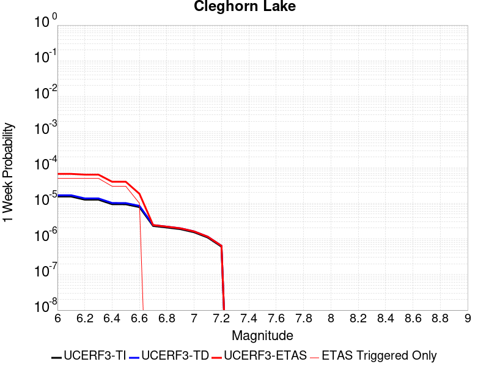 |  |  |  |

| Magnitude | 1 wk TI Prob | 1 wk TD Prob | 1 wk ETAS Prob | 1 wk ETAS/TD Gain | 1 wk ETAS Triggered Only | 1 mo TI Prob | 1 mo TD Prob | 1 mo ETAS Prob | 1 mo ETAS/TD Gain | 1 mo ETAS Triggered Only | 1 yr TI Prob | 1 yr TD Prob | 1 yr ETAS Prob | 1 yr ETAS/TD Gain | 1 yr ETAS Triggered Only | 10 yr TI Prob | 10 yr TD Prob | 10 yr ETAS Prob | 10 yr ETAS/TD Gain | 10 yr ETAS Triggered Only |
|-----|-----|-----|-----|-----|-----|-----|-----|-----|-----|-----|-----|-----|-----|-----|-----|-----|-----|-----|-----|-----|
| 6.0 | 1.5467183E-5 | 1.6794203E-5 | 6.6793364E-5 | 3.9771676 | 5.0E-5 | 6.6286244E-5 | 7.197348E-5 | 1.3196917E-4 | 1.8335804 | 6.0E-5 | 8.067362E-4 | 8.759797E-4 | 9.858834E-4 | 1.1254637 | 1.1E-4 | 0.008038137 | 0.008730696 | 0.008879386 | 1.0170307 | 1.5E-4 |
| 6.1 | 1.5467183E-5 | 1.6794203E-5 | 6.6793364E-5 | 3.9771676 | 5.0E-5 | 6.6286244E-5 | 7.197348E-5 | 1.3196917E-4 | 1.8335804 | 6.0E-5 | 8.067362E-4 | 8.759797E-4 | 9.858834E-4 | 1.1254637 | 1.1E-4 | 0.008038137 | 0.008730696 | 0.008879386 | 1.0170307 | 1.5E-4 |
| 6.2 | 1.2624631E-5 | 1.3681544E-5 | 6.368086E-5 | 4.654508 | 5.0E-5 | 5.410444E-5 | 5.863415E-5 | 1.0863122E-4 | 1.8526955 | 5.0E-5 | 6.585225E-4 | 7.1368564E-4 | 8.0362137E-4 | 1.1260159 | 9.0E-5 | 0.0065657445 | 0.0071187317 | 0.00721802 | 1.0139475 | 1.0E-4 |
| 6.3 | 1.2624631E-5 | 1.3681544E-5 | 6.368086E-5 | 4.654508 | 5.0E-5 | 5.410444E-5 | 5.863415E-5 | 1.0863122E-4 | 1.8526955 | 5.0E-5 | 6.585225E-4 | 7.1368564E-4 | 8.0362137E-4 | 1.1260159 | 9.0E-5 | 0.0065657445 | 0.0071187317 | 0.00721802 | 1.0139475 | 1.0E-4 |
| 6.4 | 9.417684E-6 | 1.0170118E-5 | 4.0169813E-5 | 3.9497883 | 3.0E-5 | 4.036088E-5 | 4.3585722E-5 | 7.3584415E-5 | 1.6882688 | 3.0E-5 | 4.912829E-4 | 5.3056807E-4 | 5.905362E-4 | 1.1130264 | 6.0E-5 | 0.004901982 | 0.005297049 | 0.0053666783 | 1.0131449 | 7.0E-5 |
| 6.5 | 9.368219E-6 | 1.0117545E-5 | 4.011724E-5 | 3.9651165 | 3.0E-5 | 4.014889E-5 | 4.3360415E-5 | 7.3359115E-5 | 1.6918453 | 3.0E-5 | 4.8870314E-4 | 5.2782625E-4 | 5.877946E-4 | 1.1136137 | 6.0E-5 | 0.004876298 | 0.0052697617 | 0.0053393925 | 1.0132133 | 7.0E-5 |
| 6.6 | 7.803798E-6 | 8.441831E-6 | 1.8441746E-5 | 2.1845672 | 1.0E-5 | 3.3444423E-5 | 3.6179E-5 | 4.6178637E-5 | 1.2763934 | 1.0E-5 | 4.0710976E-4 | 4.4043022E-4 | 4.804126E-4 | 1.0907803 | 4.0E-5 | 0.0040636472 | 0.0043994905 | 0.00444927 | 1.011315 | 5.0E-5 |
| 6.7 | 2.3108669E-6 | 2.4438336E-6 | 2.4438336E-6 | 1.0 | 0.0 | 9.903678E-6 | 1.0473532E-5 | 1.0473532E-5 | 1.0 | 0.0 | 1.205706E-4 | 1.2750797E-4 | 1.375067E-4 | 1.0784165 | 1.0E-5 | 0.001205052 | 0.0012743667 | 0.001284354 | 1.007837 | 1.0E-5 |
| 6.8 | 2.0882828E-6 | 2.2062823E-6 | 2.2062823E-6 | 1.0 | 0.0 | 8.949753E-6 | 9.455462E-6 | 9.455462E-6 | 1.0 | 0.0 | 1.08957785E-4 | 1.1511434E-4 | 1.2511319E-4 | 1.0868602 | 1.0E-5 | 0.0010890438 | 0.0011505639 | 0.0011605524 | 1.0086814 | 1.0E-5 |
| 6.9 | 1.876935E-6 | 1.981051E-6 | 1.981051E-6 | 1.0 | 0.0 | 8.043982E-6 | 8.490192E-6 | 8.490192E-6 | 1.0 | 0.0 | 9.7931086E-5 | 1.03363345E-4 | 1.1336231E-4 | 1.0967361 | 1.0E-5 | 9.788794E-4 | 0.0010331686 | 0.0010431584 | 1.009669 | 1.0E-5 |
| 7.0 | 1.5357559E-6 | 1.6202807E-6 | 1.6202807E-6 | 1.0 | 0.0 | 6.5817944E-6 | 6.9440425E-6 | 6.9440425E-6 | 1.0 | 0.0 | 8.01304E-5 | 8.454057E-5 | 9.453972E-5 | 1.1182764 | 1.0E-5 | 8.010151E-4 | 8.450965E-4 | 8.55088E-4 | 1.0118229 | 1.0E-5 |
| 7.1 | 1.0905424E-6 | 1.1497619E-6 | 1.1497619E-6 | 1.0 | 0.0 | 4.6737446E-6 | 4.9275427E-6 | 4.9275427E-6 | 1.0 | 0.0 | 5.6901354E-5 | 5.999128E-5 | 6.999068E-5 | 1.1666809 | 1.0E-5 | 5.6886784E-4 | 5.997606E-4 | 6.0975464E-4 | 1.0166633 | 1.0E-5 |
| 7.2 | 6.06668E-7 | 6.387277E-7 | 6.387277E-7 | 1.0 | 0.0 | 2.600003E-6 | 2.7374022E-6 | 2.7374022E-6 | 1.0 | 0.0 | 3.1654577E-5 | 3.3327433E-5 | 3.3327433E-5 | 1.0 | 0.0 | 3.1650066E-4 | 3.3323118E-4 | 3.3323118E-4 | 1.0 | 0.0 |

## San Jacinto (Anza) rev
*[(top)](#table-of-contents)*

| 1 Week | 1 Month | 1 Year | 10 Year |
|-----|-----|-----|-----|
|  |  |  | 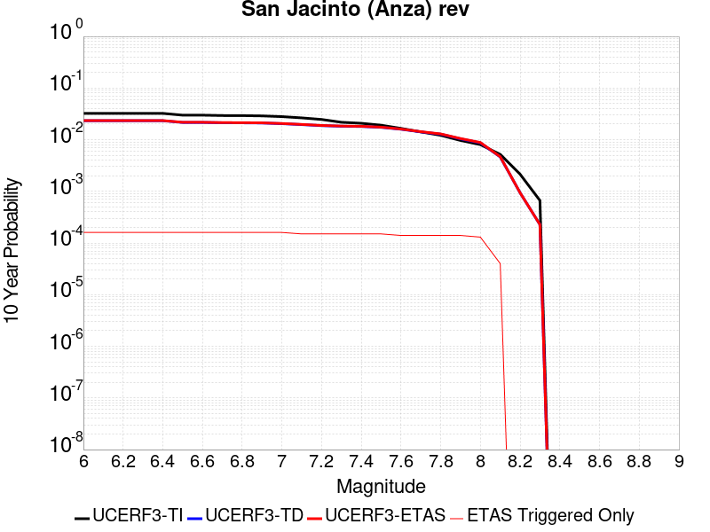 |

| Magnitude | 1 wk TI Prob | 1 wk TD Prob | 1 wk ETAS Prob | 1 wk ETAS/TD Gain | 1 wk ETAS Triggered Only | 1 mo TI Prob | 1 mo TD Prob | 1 mo ETAS Prob | 1 mo ETAS/TD Gain | 1 mo ETAS Triggered Only | 1 yr TI Prob | 1 yr TD Prob | 1 yr ETAS Prob | 1 yr ETAS/TD Gain | 1 yr ETAS Triggered Only | 10 yr TI Prob | 10 yr TD Prob | 10 yr ETAS Prob | 10 yr ETAS/TD Gain | 10 yr ETAS Triggered Only |
|-----|-----|-----|-----|-----|-----|-----|-----|-----|-----|-----|-----|-----|-----|-----|-----|-----|-----|-----|-----|-----|
| 6.0 | 6.3015636E-5 | 4.3298347E-5 | 1.1329532E-4 | 2.6166198 | 7.0E-5 | 2.7003905E-4 | 1.8555121E-4 | 2.6553636E-4 | 1.4310678 | 8.0E-5 | 0.0032827691 | 0.0022567573 | 0.002386464 | 1.0574747 | 1.3E-4 | 0.032346968 | 0.02329361 | 0.023449885 | 1.0067089 | 1.6E-4 |
| 6.1 | 6.3015636E-5 | 4.3298347E-5 | 1.1329532E-4 | 2.6166198 | 7.0E-5 | 2.7003905E-4 | 1.8555121E-4 | 2.6553636E-4 | 1.4310678 | 8.0E-5 | 0.0032827691 | 0.0022567573 | 0.002386464 | 1.0574747 | 1.3E-4 | 0.032346968 | 0.02329361 | 0.023449885 | 1.0067089 | 1.6E-4 |
| 6.2 | 6.3015636E-5 | 4.3298347E-5 | 1.1329532E-4 | 2.6166198 | 7.0E-5 | 2.7003905E-4 | 1.8555121E-4 | 2.6553636E-4 | 1.4310678 | 8.0E-5 | 0.0032827691 | 0.0022567573 | 0.002386464 | 1.0574747 | 1.3E-4 | 0.032346968 | 0.02329361 | 0.023449885 | 1.0067089 | 1.6E-4 |
| 6.3 | 6.3015636E-5 | 4.3298347E-5 | 1.1329532E-4 | 2.6166198 | 7.0E-5 | 2.7003905E-4 | 1.8555121E-4 | 2.6553636E-4 | 1.4310678 | 8.0E-5 | 0.0032827691 | 0.0022567573 | 0.002386464 | 1.0574747 | 1.3E-4 | 0.032346968 | 0.02329361 | 0.023449885 | 1.0067089 | 1.6E-4 |
| 6.4 | 6.3015636E-5 | 4.3298347E-5 | 1.1329532E-4 | 2.6166198 | 7.0E-5 | 2.7003905E-4 | 1.8555121E-4 | 2.6553636E-4 | 1.4310678 | 8.0E-5 | 0.0032827691 | 0.0022567573 | 0.002386464 | 1.0574747 | 1.3E-4 | 0.032346968 | 0.02329361 | 0.023449885 | 1.0067089 | 1.6E-4 |
| 6.5 | 5.811017E-5 | 4.0080286E-5 | 1.1007748E-4 | 2.7464247 | 7.0E-5 | 2.4901982E-4 | 1.7176138E-4 | 2.5174764E-4 | 1.4656825 | 8.0E-5 | 0.0030276014 | 0.0020891947 | 0.002218923 | 1.0620949 | 1.3E-4 | 0.02986684 | 0.021590833 | 0.021747379 | 1.0072505 | 1.6E-4 |
| 6.6 | 5.811017E-5 | 4.0080286E-5 | 1.1007748E-4 | 2.7464247 | 7.0E-5 | 2.4901982E-4 | 1.7176138E-4 | 2.5174764E-4 | 1.4656825 | 8.0E-5 | 0.0030276014 | 0.0020891947 | 0.002218923 | 1.0620949 | 1.3E-4 | 0.02986684 | 0.021590833 | 0.021747379 | 1.0072505 | 1.6E-4 |
| 6.7 | 5.712442E-5 | 3.950301E-5 | 1.09500244E-4 | 2.7719467 | 7.0E-5 | 2.4479596E-4 | 1.6928767E-4 | 2.4927413E-4 | 1.4724884 | 8.0E-5 | 0.0029763177 | 0.0020591344 | 0.002188867 | 1.0630033 | 1.3E-4 | 0.029367693 | 0.021282919 | 0.021439513 | 1.0073577 | 1.6E-4 |
| 6.8 | 5.6967532E-5 | 3.93593E-5 | 1.09356544E-4 | 2.7784169 | 7.0E-5 | 2.4412372E-4 | 1.6867183E-4 | 2.4865835E-4 | 1.4742137 | 8.0E-5 | 0.0029681553 | 0.0020516508 | 0.0021813842 | 1.0632336 | 1.3E-4 | 0.029288229 | 0.02120852 | 0.021365127 | 1.0073842 | 1.6E-4 |
| 6.9 | 5.6211324E-5 | 3.9064216E-5 | 1.0906148E-4 | 2.7918513 | 7.0E-5 | 2.4088343E-4 | 1.6740736E-4 | 2.4739397E-4 | 1.4777962 | 8.0E-5 | 0.0029288116 | 0.0020362847 | 0.00216602 | 1.0637118 | 1.3E-4 | 0.028905109 | 0.021047527 | 0.02120416 | 1.0074419 | 1.6E-4 |
| 7.0 | 5.4383527E-5 | 3.7925012E-5 | 1.0792236E-4 | 2.8456776 | 7.0E-5 | 2.3305144E-4 | 1.6252567E-4 | 2.4251266E-4 | 1.49215 | 8.0E-5 | 0.0028337094 | 0.001976959 | 0.002106702 | 1.0656276 | 1.3E-4 | 0.027978465 | 0.02044095 | 0.02059768 | 1.0076674 | 1.6E-4 |
| 7.1 | 5.1393665E-5 | 3.638787E-5 | 1.0638532E-4 | 2.9236479 | 7.0E-5 | 2.2023996E-4 | 1.5593872E-4 | 2.3592624E-4 | 1.5129421 | 8.0E-5 | 0.0026781242 | 0.0018969048 | 0.0020166773 | 1.063141 | 1.2E-4 | 0.026460782 | 0.019616077 | 0.019763134 | 1.0074968 | 1.5E-4 |
| 7.2 | 4.785222E-5 | 3.4738845E-5 | 1.0473641E-4 | 3.0149653 | 7.0E-5 | 2.0506482E-4 | 1.4887229E-4 | 2.2886037E-4 | 1.5372933 | 8.0E-5 | 0.0024938055 | 0.0018110167 | 0.0019307995 | 1.0661411 | 1.2E-4 | 0.024660049 | 0.018728783 | 0.018875973 | 1.0078591 | 1.5E-4 |
| 7.3 | 4.2143256E-5 | 3.3834414E-5 | 1.0383205E-4 | 3.0688295 | 7.0E-5 | 1.8060145E-4 | 1.449966E-4 | 2.24985E-4 | 1.5516571 | 8.0E-5 | 0.002196605 | 0.0017639075 | 0.0018836958 | 1.0679108 | 1.2E-4 | 0.02175019 | 0.018236695 | 0.01838396 | 1.0080751 | 1.5E-4 |
| 7.4 | 4.0264713E-5 | 3.3472694E-5 | 1.0347035E-4 | 3.0911868 | 7.0E-5 | 1.7255165E-4 | 1.4344654E-4 | 2.2343505E-4 | 1.5576191 | 8.0E-5 | 0.002098792 | 0.0017450659 | 0.0018648566 | 1.0686454 | 1.2E-4 | 0.020790804 | 0.018041389 | 0.018188683 | 1.0081642 | 1.5E-4 |
| 7.5 | 3.694492E-5 | 3.2186905E-5 | 1.02184655E-4 | 3.1747274 | 7.0E-5 | 1.5832575E-4 | 1.379366E-4 | 2.1792557E-4 | 1.5798966 | 8.0E-5 | 0.0019259118 | 0.0016780876 | 0.0017978862 | 1.0713899 | 1.2E-4 | 0.01909306 | 0.017357888 | 0.017505284 | 1.0084916 | 1.5E-4 |
| 7.6 | 3.200565E-5 | 2.9502702E-5 | 9.9500634E-5 | 3.3725939 | 7.0E-5 | 1.3715986E-4 | 1.2643404E-4 | 2.0642392E-4 | 1.632661 | 8.0E-5 | 0.001668642 | 0.0015382497 | 0.0016580651 | 1.0778908 | 1.2E-4 | 0.01656168 | 0.015946016 | 0.016083784 | 1.0086396 | 1.4E-4 |
| 7.7 | 2.731642E-5 | 2.6091477E-5 | 9.608965E-5 | 3.6827986 | 7.0E-5 | 1.1706512E-4 | 1.11815825E-4 | 1.9180687E-4 | 1.7153822 | 8.0E-5 | 0.001424336 | 0.0013605085 | 0.0014803453 | 1.0880823 | 1.2E-4 | 0.014152412 | 0.0141668 | 0.014304817 | 1.0097423 | 1.4E-4 |
| 7.8 | 2.3466424E-5 | 2.3503619E-5 | 9.350197E-5 | 3.9781947 | 7.0E-5 | 1.0056651E-4 | 1.0072591E-4 | 1.8071785E-4 | 1.7941545 | 8.0E-5 | 0.0012237094 | 0.0012256489 | 0.0013455019 | 1.0977874 | 1.2E-4 | 0.012169928 | 0.012808796 | 0.012947003 | 1.01079 | 1.4E-4 |
| 7.9 | 1.8611925E-5 | 1.890698E-5 | 8.8905654E-5 | 4.702266 | 7.0E-5 | 7.9762955E-5 | 8.10274E-5 | 1.6102091E-4 | 1.9872403 | 8.0E-5 | 9.7068126E-4 | 9.860628E-4 | 0.0011059445 | 1.1215761 | 1.2E-4 | 0.0096645225 | 0.010393705 | 0.010532251 | 1.0133297 | 1.4E-4 |
| 8.0 | 1.5460775E-5 | 1.5739915E-5 | 7.573897E-5 | 4.8119044 | 6.0E-5 | 6.6258784E-5 | 6.745504E-5 | 1.3745032E-4 | 2.0376582 | 7.0E-5 | 8.0640207E-4 | 8.2095637E-4 | 9.3086605E-4 | 1.13388 | 1.1E-4 | 0.008034821 | 0.008702706 | 0.008831575 | 1.0148079 | 1.3E-4 |
| 8.1 | 9.983884E-6 | 8.268954E-6 | 3.8268707E-5 | 4.6279984 | 3.0E-5 | 4.2787375E-5 | 3.5437897E-5 | 6.5436834E-5 | 1.8465214 | 3.0E-5 | 5.2081177E-4 | 4.313715E-4 | 4.7135423E-4 | 1.0926875 | 4.0E-5 | 0.0051959283 | 0.00463968 | 0.0046794945 | 1.0085813 | 4.0E-5 |
| 8.2 | 4.1226E-6 | 1.5522551E-6 | 1.5522551E-6 | 1.0 | 0.0 | 1.7668166E-5 | 6.6525045E-6 | 6.6525045E-6 | 1.0 | 0.0 | 2.1508869E-4 | 8.099126E-5 | 8.099126E-5 | 1.0 | 0.0 | 0.0021488064 | 9.401847E-4 | 9.401847E-4 | 1.0 | 0.0 |
| 8.3 | 1.2750878E-6 | 3.609817E-7 | 3.609817E-7 | 1.0 | 0.0 | 5.4646503E-6 | 1.5470634E-6 | 1.5470634E-6 | 1.0 | 0.0 | 6.653009E-5 | 1.8835339E-5 | 1.8835339E-5 | 1.0 | 0.0 | 6.6510175E-4 | 2.272251E-4 | 2.272251E-4 | 1.0 | 0.0 |

## Santa Ynez (East)
*[(top)](#table-of-contents)*

| 1 Week | 1 Month | 1 Year | 10 Year |
|-----|-----|-----|-----|
|  | 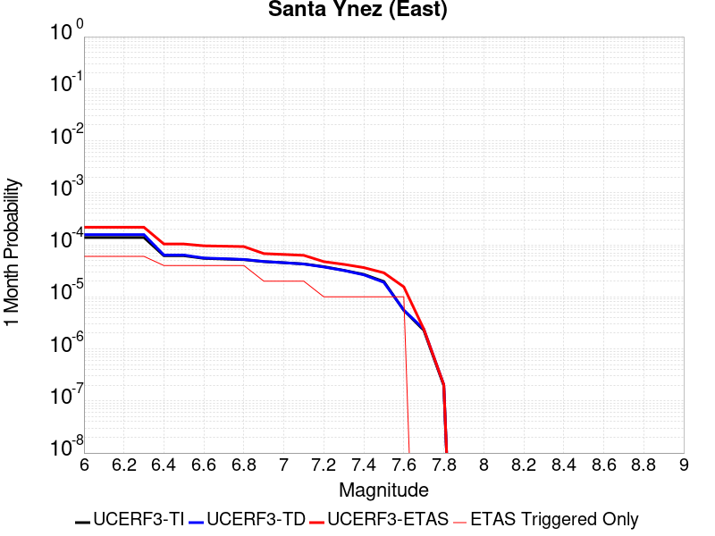 |  |  |

| Magnitude | 1 wk TI Prob | 1 wk TD Prob | 1 wk ETAS Prob | 1 wk ETAS/TD Gain | 1 wk ETAS Triggered Only | 1 mo TI Prob | 1 mo TD Prob | 1 mo ETAS Prob | 1 mo ETAS/TD Gain | 1 mo ETAS Triggered Only | 1 yr TI Prob | 1 yr TD Prob | 1 yr ETAS Prob | 1 yr ETAS/TD Gain | 1 yr ETAS Triggered Only | 10 yr TI Prob | 10 yr TD Prob | 10 yr ETAS Prob | 10 yr ETAS/TD Gain | 10 yr ETAS Triggered Only |
|-----|-----|-----|-----|-----|-----|-----|-----|-----|-----|-----|-----|-----|-----|-----|-----|-----|-----|-----|-----|-----|
| 6.0 | 3.2269712E-5 | 3.6750775E-5 | 7.6749304E-5 | 2.0883725 | 4.0E-5 | 1.3829143E-4 | 1.5749714E-4 | 2.1748769E-4 | 1.3808993 | 6.0E-5 | 0.0016823979 | 0.0019164253 | 0.0020162337 | 1.0520805 | 1.0E-4 | 0.016697178 | 0.019056438 | 0.01921339 | 1.0082362 | 1.6E-4 |
| 6.1 | 3.2269712E-5 | 3.6750775E-5 | 7.6749304E-5 | 2.0883725 | 4.0E-5 | 1.3829143E-4 | 1.5749714E-4 | 2.1748769E-4 | 1.3808993 | 6.0E-5 | 0.0016823979 | 0.0019164253 | 0.0020162337 | 1.0520805 | 1.0E-4 | 0.016697178 | 0.019056438 | 0.01921339 | 1.0082362 | 1.6E-4 |
| 6.2 | 3.2269712E-5 | 3.6750775E-5 | 7.6749304E-5 | 2.0883725 | 4.0E-5 | 1.3829143E-4 | 1.5749714E-4 | 2.1748769E-4 | 1.3808993 | 6.0E-5 | 0.0016823979 | 0.0019164253 | 0.0020162337 | 1.0520805 | 1.0E-4 | 0.016697178 | 0.019056438 | 0.01921339 | 1.0082362 | 1.6E-4 |
| 6.3 | 3.2269712E-5 | 3.6750775E-5 | 7.6749304E-5 | 2.0883725 | 4.0E-5 | 1.3829143E-4 | 1.5749714E-4 | 2.1748769E-4 | 1.3808993 | 6.0E-5 | 0.0016823979 | 0.0019164253 | 0.0020162337 | 1.0520805 | 1.0E-4 | 0.016697178 | 0.019056438 | 0.01921339 | 1.0082362 | 1.6E-4 |
| 6.4 | 1.4404779E-5 | 1.48492945E-5 | 4.484885E-5 | 3.020268 | 3.0E-5 | 6.1733306E-5 | 6.363831E-5 | 1.03635764E-4 | 1.6285123 | 4.0E-5 | 7.513438E-4 | 7.7452604E-4 | 8.2448736E-4 | 1.0645056 | 5.0E-5 | 0.0074880854 | 0.007718817 | 0.0077981995 | 1.0102843 | 8.0E-5 |
| 6.5 | 1.4404779E-5 | 1.48492945E-5 | 4.484885E-5 | 3.020268 | 3.0E-5 | 6.1733306E-5 | 6.363831E-5 | 1.03635764E-4 | 1.6285123 | 4.0E-5 | 7.513438E-4 | 7.7452604E-4 | 8.2448736E-4 | 1.0645056 | 5.0E-5 | 0.0074880854 | 0.007718817 | 0.0077981995 | 1.0102843 | 8.0E-5 |
| 6.6 | 1.280208E-5 | 1.301186E-5 | 4.301147E-5 | 3.305559 | 3.0E-5 | 5.4864904E-5 | 5.5763932E-5 | 9.57617E-5 | 1.7172695 | 4.0E-5 | 6.6777546E-4 | 6.7871617E-4 | 7.18689E-4 | 1.0588948 | 4.0E-5 | 0.006657724 | 0.0067666434 | 0.0068361694 | 1.0102749 | 7.0E-5 |
| 6.7 | 1.2457027E-5 | 1.262838E-5 | 4.2628002E-5 | 3.3755715 | 3.0E-5 | 5.3386164E-5 | 5.4120515E-5 | 9.411835E-5 | 1.7390512 | 4.0E-5 | 6.497827E-4 | 6.5871974E-4 | 6.986934E-4 | 1.0606838 | 4.0E-5 | 0.00647886 | 0.00656787 | 0.00663741 | 1.0105879 | 7.0E-5 |
| 6.8 | 1.2095134E-5 | 1.2230827E-5 | 4.223046E-5 | 3.4527886 | 3.0E-5 | 5.1835254E-5 | 5.2416784E-5 | 9.241469E-5 | 1.7630743 | 4.0E-5 | 6.309115E-4 | 6.3798914E-4 | 6.779636E-4 | 1.062657 | 4.0E-5 | 0.0062912325 | 0.006361764 | 0.0064313184 | 1.0109333 | 7.0E-5 |
| 6.9 | 1.1104036E-5 | 1.115726E-5 | 3.1157037E-5 | 2.7925348 | 2.0E-5 | 4.758786E-5 | 4.781596E-5 | 6.7815E-5 | 1.4182504 | 2.0E-5 | 5.7922816E-4 | 5.82005E-4 | 6.019934E-4 | 1.034344 | 2.0E-5 | 0.005777207 | 0.0058049536 | 0.0058546634 | 1.0085633 | 5.0E-5 |
| 7.0 | 1.0577444E-5 | 1.05815925E-5 | 3.058138E-5 | 2.8900547 | 2.0E-5 | 4.5331115E-5 | 4.53489E-5 | 6.5347995E-5 | 1.441005 | 2.0E-5 | 5.5176654E-4 | 5.5198424E-4 | 5.7197316E-4 | 1.0362129 | 2.0E-5 | 0.0055039856 | 0.00550627 | 0.005555995 | 1.0090306 | 5.0E-5 |
| 7.1 | 1.0021775E-5 | 9.9809E-6 | 2.99807E-5 | 3.0038073 | 2.0E-5 | 4.294976E-5 | 4.277459E-5 | 6.277374E-5 | 1.4675473 | 2.0E-5 | 5.2278786E-4 | 5.206574E-4 | 5.4064696E-4 | 1.038393 | 2.0E-5 | 0.0052155964 | 0.005194508 | 0.0052442485 | 1.0095756 | 5.0E-5 |
| 7.2 | 8.874109E-6 | 8.748706E-6 | 1.8748618E-5 | 2.143016 | 1.0E-5 | 3.8031343E-5 | 3.7493923E-5 | 4.7493548E-5 | 1.2666999 | 1.0E-5 | 4.629332E-4 | 4.56394E-4 | 4.6638944E-4 | 1.0219009 | 1.0E-5 | 0.0046197 | 0.0045546847 | 0.004594503 | 1.0087422 | 4.0E-5 |
| 7.3 | 7.5504267E-6 | 7.5050243E-6 | 1.750495E-5 | 2.3324308 | 1.0E-5 | 3.235857E-5 | 3.2164E-5 | 4.2163676E-5 | 1.3108966 | 1.0E-5 | 3.9389438E-4 | 3.9152734E-4 | 4.0152343E-4 | 1.025531 | 1.0E-5 | 0.0039319694 | 0.0039084824 | 0.003948326 | 1.0101942 | 4.0E-5 |
| 7.4 | 6.309394E-6 | 6.183062E-6 | 1.6183E-5 | 2.6173117 | 1.0E-5 | 2.703998E-5 | 2.6498574E-5 | 3.649831E-5 | 1.3773688 | 1.0E-5 | 3.2916202E-4 | 3.2257332E-4 | 3.325701E-4 | 1.0309907 | 1.0E-5 | 0.003286749 | 0.0032211484 | 0.0032510518 | 1.0092834 | 3.0E-5 |
| 7.5 | 4.6103073E-6 | 4.4408016E-6 | 1.4440757E-5 | 3.2518356 | 1.0E-5 | 1.975831E-5 | 1.9031871E-5 | 2.9031682E-5 | 1.5254244 | 1.0E-5 | 2.4053088E-4 | 2.316891E-4 | 2.4168678E-4 | 1.0431513 | 1.0E-5 | 0.002402707 | 0.002314545 | 0.0023344986 | 1.008621 | 2.0E-5 |
| 7.6 | 1.2858658E-6 | 1.3008196E-6 | 1.1300806E-5 | 8.687451 | 1.0E-5 | 5.5108417E-6 | 5.574929E-6 | 1.5574873E-5 | 2.7937348 | 1.0E-5 | 6.7092435E-5 | 6.787272E-5 | 7.787204E-5 | 1.1473246 | 1.0E-5 | 6.707218E-4 | 6.7852676E-4 | 6.9851323E-4 | 1.0294557 | 2.0E-5 |
| 7.7 | 5.3302307E-7 | 5.612138E-7 | 5.612138E-7 | 1.0 | 0.0 | 2.2843826E-6 | 2.4052001E-6 | 2.4052001E-6 | 1.0 | 0.0 | 2.7812002E-5 | 2.9282955E-5 | 2.9282955E-5 | 1.0 | 0.0 | 2.7808524E-4 | 2.9279455E-4 | 2.9279455E-4 | 1.0 | 0.0 |
| 7.8 | 4.613933E-8 | 4.80301E-8 | 4.80301E-8 | 1.0 | 0.0 | 1.9773998E-7 | 2.0584326E-7 | 2.0584326E-7 | 1.0 | 0.0 | 2.4074816E-6 | 2.5061388E-6 | 2.5061388E-6 | 1.0 | 0.0 | 2.4074554E-5 | 2.5061116E-5 | 2.5061116E-5 | 1.0 | 0.0 |

## Imperial
*[(top)](#table-of-contents)*

| 1 Week | 1 Month | 1 Year | 10 Year |
|-----|-----|-----|-----|
|  |  |  |  |

| Magnitude | 1 wk TI Prob | 1 wk TD Prob | 1 wk ETAS Prob | 1 wk ETAS/TD Gain | 1 wk ETAS Triggered Only | 1 mo TI Prob | 1 mo TD Prob | 1 mo ETAS Prob | 1 mo ETAS/TD Gain | 1 mo ETAS Triggered Only | 1 yr TI Prob | 1 yr TD Prob | 1 yr ETAS Prob | 1 yr ETAS/TD Gain | 1 yr ETAS Triggered Only | 10 yr TI Prob | 10 yr TD Prob | 10 yr ETAS Prob | 10 yr ETAS/TD Gain | 10 yr ETAS Triggered Only |
|-----|-----|-----|-----|-----|-----|-----|-----|-----|-----|-----|-----|-----|-----|-----|-----|-----|-----|-----|-----|-----|
| 6.0 | 2.7496446E-4 | 5.055345E-4 | 5.355194E-4 | 1.0593132 | 3.0E-5 | 0.0011778869 | 0.002164817 | 0.0022047304 | 1.0184373 | 4.0E-5 | 0.0142467655 | 0.026048409 | 0.026145805 | 1.003739 | 1.0E-4 | 0.13367249 | 0.22807029 | 0.2281938 | 1.0005416 | 1.6E-4 |
| 6.1 | 2.5356023E-4 | 4.8657708E-4 | 5.165625E-4 | 1.0616252 | 3.0E-5 | 0.001086234 | 0.002083702 | 0.0021236187 | 1.0191566 | 4.0E-5 | 0.013144928 | 0.02507094 | 0.025168432 | 1.0038887 | 1.0E-4 | 0.123940155 | 0.21949561 | 0.2196205 | 1.000569 | 1.6E-4 |
| 6.2 | 2.4820742E-4 | 4.775311E-4 | 5.075168E-4 | 1.0627931 | 3.0E-5 | 0.0010633124 | 0.0020449946 | 0.0020849127 | 1.0195199 | 4.0E-5 | 0.01286919 | 0.024610676 | 0.024708215 | 1.0039632 | 1.0E-4 | 0.12148927 | 0.21600136 | 0.21612681 | 1.0005808 | 1.6E-4 |
| 6.3 | 2.3205351E-4 | 4.5892023E-4 | 4.8890646E-4 | 1.0653409 | 3.0E-5 | 9.94136E-4 | 0.0019653554 | 0.0020052767 | 1.0203125 | 4.0E-5 | 0.012036599 | 0.023661187 | 0.02375882 | 1.0041263 | 1.0E-4 | 0.11405133 | 0.20793827 | 0.208065 | 1.0006095 | 1.6E-4 |
| 6.4 | 2.0304754E-4 | 3.9878016E-4 | 4.287682E-4 | 1.0751994 | 3.0E-5 | 8.6991355E-4 | 0.0017079529 | 0.0017478847 | 1.0233798 | 4.0E-5 | 0.010539869 | 0.020595418 | 0.020693358 | 1.0047555 | 1.0E-4 | 0.100537635 | 0.18507113 | 0.18519336 | 1.0006605 | 1.5E-4 |
| 6.5 | 1.854992E-4 | 3.6990462E-4 | 3.9989353E-4 | 1.081072 | 3.0E-5 | 7.9475436E-4 | 0.0015843548 | 0.0016242914 | 1.0252069 | 4.0E-5 | 0.009633281 | 0.01911443 | 0.019212518 | 1.0051316 | 1.0E-4 | 0.0922623 | 0.1733039 | 0.1734279 | 1.0007155 | 1.5E-4 |
| 6.6 | 1.6586106E-4 | 3.4036173E-4 | 3.7035154E-4 | 1.0881115 | 3.0E-5 | 7.106394E-4 | 0.0014578878 | 0.0014978296 | 1.0273969 | 4.0E-5 | 0.008617763 | 0.017607626 | 0.017705863 | 1.0055794 | 1.0E-4 | 0.08291132 | 0.16078055 | 0.16090643 | 1.000783 | 1.5E-4 |
| 6.7 | 1.4224656E-4 | 3.076812E-4 | 3.3767198E-4 | 1.0974735 | 3.0E-5 | 6.094856E-4 | 0.0013179756 | 0.001347936 | 1.0227321 | 3.0E-5 | 0.0073952693 | 0.015928522 | 0.016007246 | 1.0049424 | 8.0E-5 | 0.07153955 | 0.14648798 | 0.14659894 | 1.0007575 | 1.3E-4 |
| 6.8 | 1.2317259E-4 | 2.779231E-4 | 3.0791477E-4 | 1.1079135 | 3.0E-5 | 5.2777573E-4 | 0.0011905615 | 0.0012205257 | 1.0251682 | 3.0E-5 | 0.0064067547 | 0.014400131 | 0.0144691225 | 1.004791 | 7.0E-5 | 0.06225166 | 0.13294089 | 0.13304493 | 1.0007826 | 1.2E-4 |
| 6.9 | 9.859898E-5 | 2.5015484E-4 | 2.8014733E-4 | 1.1198957 | 3.0E-5 | 4.2249862E-4 | 0.0010716559 | 0.0011016238 | 1.0279641 | 3.0E-5 | 0.0051317946 | 0.012970319 | 0.013039411 | 1.005327 | 7.0E-5 | 0.05014893 | 0.119408876 | 0.11951455 | 1.000885 | 1.2E-4 |
| 7.0 | 7.3191884E-5 | 2.1267848E-4 | 2.426721E-4 | 1.141028 | 3.0E-5 | 3.136418E-4 | 9.11164E-4 | 9.411367E-4 | 1.032895 | 3.0E-5 | 0.003811904 | 0.011037681 | 0.011106908 | 1.006272 | 7.0E-5 | 0.037471764 | 0.10206756 | 0.10217531 | 1.0010557 | 1.2E-4 |
| 7.1 | 7.1760296E-5 | 2.0969207E-4 | 2.3968577E-4 | 1.143037 | 3.0E-5 | 3.0750787E-4 | 8.9837395E-4 | 9.28347E-4 | 1.0333637 | 3.0E-5 | 0.003737482 | 0.010883528 | 0.010952766 | 1.0063617 | 7.0E-5 | 0.03675245 | 0.10070406 | 0.10081198 | 1.0010716 | 1.2E-4 |
| 7.2 | 6.46614E-5 | 1.9137723E-4 | 2.2137149E-4 | 1.1567285 | 3.0E-5 | 2.7709085E-4 | 8.199333E-4 | 8.4990874E-4 | 1.0365584 | 3.0E-5 | 0.0033683628 | 0.009937617 | 0.010006921 | 1.006974 | 7.0E-5 | 0.033177625 | 0.092511006 | 0.0926199 | 1.0011772 | 1.2E-4 |
| 7.3 | 6.088115E-5 | 1.780939E-4 | 2.0808856E-4 | 1.1684204 | 3.0E-5 | 2.6089314E-4 | 7.6303916E-4 | 7.930163E-4 | 1.0392865 | 3.0E-5 | 0.0031717476 | 0.009251006 | 0.009320359 | 1.0074967 | 7.0E-5 | 0.031268585 | 0.08656135 | 0.086670965 | 1.0012662 | 1.2E-4 |
| 7.4 | 4.199346E-5 | 1.1511097E-4 | 1.4510751E-4 | 1.260588 | 3.0E-5 | 1.7995955E-4 | 4.932403E-4 | 5.232255E-4 | 1.0607923 | 3.0E-5 | 0.0021888057 | 0.005988835 | 0.006048476 | 1.0099586 | 6.0E-5 | 0.02167372 | 0.05744024 | 0.057534497 | 1.0016409 | 1.0E-4 |
| 7.5 | 3.130448E-5 | 8.333871E-5 | 1.0333704E-4 | 1.2399645 | 2.0E-5 | 1.3415517E-4 | 3.5711733E-4 | 3.7711018E-4 | 1.055984 | 2.0E-5 | 0.0016321153 | 0.0043392954 | 0.0043890784 | 1.0114726 | 5.0E-5 | 0.016201803 | 0.042133506 | 0.042210136 | 1.0018188 | 8.0E-5 |
| 7.6 | 2.3074248E-5 | 6.0849357E-5 | 8.084814E-5 | 1.3286606 | 2.0E-5 | 9.888588E-5 | 2.6075702E-4 | 2.8075182E-4 | 1.0766797 | 2.0E-5 | 0.0012032706 | 0.0031701182 | 0.0032199598 | 1.0157223 | 5.0E-5 | 0.011967761 | 0.03102816 | 0.031095989 | 1.0021861 | 7.0E-5 |
| 7.7 | 1.45864815E-5 | 4.0128452E-5 | 5.0128052E-5 | 1.2491897 | 1.0E-5 | 6.2511994E-5 | 1.7196777E-4 | 1.8196605E-4 | 1.0581404 | 1.0E-5 | 7.608177E-4 | 0.0020917025 | 0.0021316188 | 1.0190831 | 4.0E-5 | 0.007582182 | 0.02062909 | 0.020678058 | 1.0023738 | 5.0E-5 |
| 7.8 | 1.0352979E-5 | 3.096395E-5 | 4.096364E-5 | 1.3229462 | 1.0E-5 | 4.4369157E-5 | 1.326959E-4 | 1.4269458E-4 | 1.0753503 | 1.0E-5 | 5.400606E-4 | 0.0016143778 | 0.0016543132 | 1.0247374 | 4.0E-5 | 0.0053875 | 0.016017893 | 0.016067091 | 1.0030715 | 5.0E-5 |
| 7.9 | 8.137906E-6 | 2.2151205E-5 | 3.2150983E-5 | 1.4514327 | 1.0E-5 | 3.4876273E-5 | 9.493029E-5 | 1.0492934E-4 | 1.1053305 | 1.0E-5 | 4.2453592E-4 | 0.0011551644 | 0.0011851297 | 1.0259403 | 3.0E-5 | 0.004237258 | 0.011618842 | 0.011658378 | 1.0034027 | 4.0E-5 |
| 8.0 | 6.93792E-6 | 1.8010365E-5 | 1.8010365E-5 | 1.0 | 0.0 | 2.9733603E-5 | 7.7185E-5 | 7.7185E-5 | 1.0 | 0.0 | 3.6194647E-4 | 9.3932304E-4 | 9.593042E-4 | 1.021272 | 2.0E-5 | 0.0036135751 | 0.009502415 | 0.009532129 | 1.0031271 | 3.0E-5 |
| 8.1 | 3.4286315E-6 | 6.380179E-6 | 6.380179E-6 | 1.0 | 0.0 | 1.4694053E-5 | 2.734334E-5 | 2.734334E-5 | 1.0 | 0.0 | 1.7888541E-4 | 3.3285443E-4 | 3.3285443E-4 | 1.0 | 0.0 | 0.0017874148 | 0.0034863674 | 0.0034863674 | 1.0 | 0.0 |
| 8.2 | 1.4906886E-6 | 1.936633E-6 | 1.936633E-6 | 1.0 | 0.0 | 6.3886496E-6 | 8.2998295E-6 | 8.2998295E-6 | 1.0 | 0.0 | 7.7779034E-5 | 1.0104576E-4 | 1.0104576E-4 | 1.0 | 0.0 | 7.775182E-4 | 0.0011075423 | 0.0011075423 | 1.0 | 0.0 |
| 8.3 | 2.5758007E-8 | 1.4495866E-8 | 1.4495866E-8 | 1.0 | 0.0 | 1.10391454E-7 | 6.212514E-8 | 6.212514E-8 | 1.0 | 0.0 | 1.3440151E-6 | 7.563736E-7 | 7.563736E-7 | 1.0 | 0.0 | 1.344007E-5 | 7.884359E-6 | 7.884359E-6 | 1.0 | 0.0 |

## Mission Creek
*[(top)](#table-of-contents)*

| 1 Week | 1 Month | 1 Year | 10 Year |
|-----|-----|-----|-----|
|  |  | 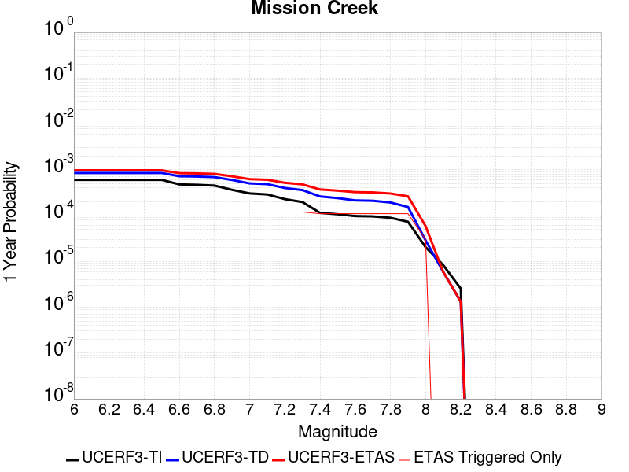 |  |

| Magnitude | 1 wk TI Prob | 1 wk TD Prob | 1 wk ETAS Prob | 1 wk ETAS/TD Gain | 1 wk ETAS Triggered Only | 1 mo TI Prob | 1 mo TD Prob | 1 mo ETAS Prob | 1 mo ETAS/TD Gain | 1 mo ETAS Triggered Only | 1 yr TI Prob | 1 yr TD Prob | 1 yr ETAS Prob | 1 yr ETAS/TD Gain | 1 yr ETAS Triggered Only | 10 yr TI Prob | 10 yr TD Prob | 10 yr ETAS Prob | 10 yr ETAS/TD Gain | 10 yr ETAS Triggered Only |
|-----|-----|-----|-----|-----|-----|-----|-----|-----|-----|-----|-----|-----|-----|-----|-----|-----|-----|-----|-----|-----|
| 6.0 | 1.1549387E-5 | 1.6322783E-5 | 6.632197E-5 | 4.0631533 | 5.0E-5 | 4.9496433E-5 | 6.995299E-5 | 1.399481E-4 | 2.000602 | 7.0E-5 | 6.0245243E-4 | 8.5135986E-4 | 9.7125774E-4 | 1.140831 | 1.2E-4 | 0.006008218 | 0.008510157 | 0.00865888 | 1.017476 | 1.5E-4 |
| 6.1 | 1.1549387E-5 | 1.6322783E-5 | 6.632197E-5 | 4.0631533 | 5.0E-5 | 4.9496433E-5 | 6.995299E-5 | 1.399481E-4 | 2.000602 | 7.0E-5 | 6.0245243E-4 | 8.5135986E-4 | 9.7125774E-4 | 1.140831 | 1.2E-4 | 0.006008218 | 0.008510157 | 0.00865888 | 1.017476 | 1.5E-4 |
| 6.2 | 1.1549387E-5 | 1.6322783E-5 | 6.632197E-5 | 4.0631533 | 5.0E-5 | 4.9496433E-5 | 6.995299E-5 | 1.399481E-4 | 2.000602 | 7.0E-5 | 6.0245243E-4 | 8.5135986E-4 | 9.7125774E-4 | 1.140831 | 1.2E-4 | 0.006008218 | 0.008510157 | 0.00865888 | 1.017476 | 1.5E-4 |
| 6.3 | 1.1549387E-5 | 1.6322783E-5 | 6.632197E-5 | 4.0631533 | 5.0E-5 | 4.9496433E-5 | 6.995299E-5 | 1.399481E-4 | 2.000602 | 7.0E-5 | 6.0245243E-4 | 8.5135986E-4 | 9.7125774E-4 | 1.140831 | 1.2E-4 | 0.006008218 | 0.008510157 | 0.00865888 | 1.017476 | 1.5E-4 |
| 6.4 | 1.1549387E-5 | 1.6322783E-5 | 6.632197E-5 | 4.0631533 | 5.0E-5 | 4.9496433E-5 | 6.995299E-5 | 1.399481E-4 | 2.000602 | 7.0E-5 | 6.0245243E-4 | 8.5135986E-4 | 9.7125774E-4 | 1.140831 | 1.2E-4 | 0.006008218 | 0.008510157 | 0.00865888 | 1.017476 | 1.5E-4 |
| 6.5 | 1.1549387E-5 | 1.6322783E-5 | 6.632197E-5 | 4.0631533 | 5.0E-5 | 4.9496433E-5 | 6.995299E-5 | 1.399481E-4 | 2.000602 | 7.0E-5 | 6.0245243E-4 | 8.5135986E-4 | 9.7125774E-4 | 1.140831 | 1.2E-4 | 0.006008218 | 0.008510157 | 0.00865888 | 1.017476 | 1.5E-4 |
| 6.6 | 9.202681E-6 | 1.3846059E-5 | 6.3845364E-5 | 4.611086 | 5.0E-5 | 3.9439463E-5 | 5.9338956E-5 | 1.293348E-4 | 2.1795936 | 7.0E-5 | 4.800697E-4 | 7.2222133E-4 | 8.4213464E-4 | 1.1660341 | 1.2E-4 | 0.004790339 | 0.0072273402 | 0.007376256 | 1.0206045 | 1.5E-4 |
| 6.7 | 9.019164E-6 | 1.3651728E-5 | 6.3651045E-5 | 4.66249 | 5.0E-5 | 3.8652986E-5 | 5.8506146E-5 | 1.2850206E-4 | 2.1963854 | 7.0E-5 | 4.7049852E-4 | 7.1208854E-4 | 8.320031E-4 | 1.1683984 | 1.2E-4 | 0.004695036 | 0.0071266647 | 0.0072755953 | 1.0208977 | 1.5E-4 |
| 6.8 | 8.673558E-6 | 1.3273839E-5 | 6.3273175E-5 | 4.766758 | 5.0E-5 | 3.717186E-5 | 5.688669E-5 | 1.268827E-4 | 2.2304463 | 7.0E-5 | 4.524734E-4 | 6.923842E-4 | 8.123011E-4 | 1.1731942 | 1.2E-4 | 0.0045155324 | 0.0069308523 | 0.0070798127 | 1.0214924 | 1.5E-4 |
| 6.9 | 7.002255E-6 | 1.1478069E-5 | 6.147749E-5 | 5.356084 | 5.0E-5 | 3.000932E-5 | 4.9190832E-5 | 1.1918739E-4 | 2.4229593 | 7.0E-5 | 3.653022E-4 | 5.9874065E-4 | 7.186688E-4 | 1.2003007 | 1.2E-4 | 0.0036470229 | 0.005999676 | 0.0061487756 | 1.0248513 | 1.5E-4 |
| 7.0 | 5.84644E-6 | 9.675359E-6 | 5.9674876E-5 | 6.167717 | 5.0E-5 | 2.5055931E-5 | 4.146519E-5 | 1.1146229E-4 | 2.688093 | 7.0E-5 | 3.0501327E-4 | 5.047263E-4 | 6.2466576E-4 | 1.2376326 | 1.2E-4 | 0.0030459496 | 0.005063994 | 0.0052132346 | 1.0294709 | 1.5E-4 |
| 7.1 | 5.54703E-6 | 9.329834E-6 | 5.9329366E-5 | 6.3591022 | 5.0E-5 | 2.377277E-5 | 3.9984414E-5 | 1.09981615E-4 | 2.750612 | 7.0E-5 | 2.8939504E-4 | 4.8670598E-4 | 6.066476E-4 | 1.2464354 | 1.2E-4 | 0.0028901845 | 0.0048845876 | 0.005033855 | 1.0305588 | 1.5E-4 |
| 7.2 | 4.384709E-6 | 7.681918E-6 | 5.7681533E-5 | 7.5087414 | 5.0E-5 | 1.8791474E-5 | 3.292211E-5 | 1.029198E-4 | 3.1261606 | 7.0E-5 | 2.2876218E-4 | 4.0075663E-4 | 5.2070856E-4 | 1.2993135 | 1.2E-4 | 0.0022852682 | 0.004028542 | 0.0041779377 | 1.0370843 | 1.5E-4 |
| 7.3 | 3.7888456E-6 | 6.915788E-6 | 5.6915444E-5 | 8.229784 | 5.0E-5 | 1.623781E-5 | 2.9638775E-5 | 9.96367E-5 | 3.361701 | 7.0E-5 | 1.9767738E-4 | 3.6079568E-4 | 4.8075238E-4 | 1.3324782 | 1.2E-4 | 0.0019750162 | 0.00363027 | 0.0037797254 | 1.0411693 | 1.5E-4 |
| 7.4 | 2.1982462E-6 | 5.0241033E-6 | 5.502385E-5 | 10.951975 | 5.0E-5 | 9.421021E-6 | 2.1531694E-5 | 9.1530186E-5 | 4.2509513 | 7.0E-5 | 1.1469489E-4 | 2.6211704E-4 | 3.720882E-4 | 1.4195498 | 1.1E-4 | 0.0011463572 | 0.0026460327 | 0.0027856622 | 1.0527694 | 1.4E-4 |
| 7.5 | 2.051923E-6 | 4.6153277E-6 | 5.4615095E-5 | 11.833417 | 5.0E-5 | 8.793926E-6 | 1.9779825E-5 | 8.977844E-5 | 4.5388894 | 7.0E-5 | 1.0706078E-4 | 2.4079291E-4 | 3.507664E-4 | 1.456714 | 1.1E-4 | 0.0010700922 | 0.0024335932 | 0.0025732524 | 1.0573881 | 1.4E-4 |
| 7.6 | 1.8733427E-6 | 4.1236603E-6 | 5.4123455E-5 | 13.125099 | 5.0E-5 | 8.028587E-6 | 1.7672712E-5 | 8.767148E-5 | 4.960839 | 7.0E-5 | 9.774366E-5 | 2.151441E-4 | 3.2512043E-4 | 1.5111753 | 1.1E-4 | 9.770069E-4 | 0.0021782513 | 0.0023179462 | 1.0641317 | 1.4E-4 |
| 7.7 | 1.8411953E-6 | 4.0433315E-6 | 5.404313E-5 | 13.36599 | 5.0E-5 | 7.890813E-6 | 1.732845E-5 | 8.732724E-5 | 5.03953 | 7.0E-5 | 9.606641E-5 | 2.1095353E-4 | 3.2093032E-4 | 1.5213319 | 1.1E-4 | 9.6024893E-4 | 0.0021365292 | 0.00227623 | 1.0653869 | 1.4E-4 |
| 7.8 | 1.7194251E-6 | 3.71068E-6 | 5.3710493E-5 | 14.474569 | 5.0E-5 | 7.368944E-6 | 1.5902819E-5 | 8.59017E-5 | 5.4016657 | 7.0E-5 | 8.97132E-5 | 1.9359968E-4 | 3.035784E-4 | 1.5680728 | 1.1E-4 | 8.967699E-4 | 0.0019624757 | 0.0021022009 | 1.0711985 | 1.4E-4 |
| 7.9 | 1.4035052E-6 | 2.9502596E-6 | 5.2950112E-5 | 17.94761 | 5.0E-5 | 6.0150082E-6 | 1.2643909E-5 | 8.2643026E-5 | 6.5361924 | 7.0E-5 | 7.3230265E-5 | 1.5392878E-4 | 2.6391185E-4 | 1.7145061 | 1.1E-4 | 7.3206134E-4 | 0.0015631174 | 0.0017028985 | 1.0894246 | 1.4E-4 |
| 8.0 | 3.9318823E-7 | 5.528477E-7 | 2.0552836E-5 | 37.176304 | 2.0E-5 | 1.6850913E-6 | 2.3693453E-6 | 2.2369299E-5 | 9.44113 | 2.0E-5 | 2.0515794E-5 | 2.8846403E-5 | 5.8845537E-5 | 2.039961 | 3.0E-5 | 2.0513899E-4 | 2.990952E-4 | 3.3908326E-4 | 1.1336967 | 4.0E-5 |
| 8.1 | 1.596793E-7 | 1.13775044E-7 | 1.13775044E-7 | 1.0 | 0.0 | 6.8433974E-7 | 4.876072E-7 | 4.876072E-7 | 1.0 | 0.0 | 8.331805E-6 | 5.936602E-6 | 5.936602E-6 | 1.0 | 0.0 | 8.331492E-5 | 6.5494125E-5 | 6.5494125E-5 | 1.0 | 0.0 |
| 8.2 | 4.9003038E-8 | 2.5435753E-8 | 2.5435753E-8 | 1.0 | 0.0 | 2.10013E-7 | 1.09010365E-7 | 1.09010365E-7 | 1.0 | 0.0 | 2.5569052E-6 | 1.3272004E-6 | 1.3272004E-6 | 1.0 | 0.0 | 2.556876E-5 | 1.4952613E-5 | 1.4952613E-5 | 1.0 | 0.0 |

## Chino alt 1
*[(top)](#table-of-contents)*

| 1 Week | 1 Month | 1 Year | 10 Year |
|-----|-----|-----|-----|
|  |  |  |  |

| Magnitude | 1 wk TI Prob | 1 wk TD Prob | 1 wk ETAS Prob | 1 wk ETAS/TD Gain | 1 wk ETAS Triggered Only | 1 mo TI Prob | 1 mo TD Prob | 1 mo ETAS Prob | 1 mo ETAS/TD Gain | 1 mo ETAS Triggered Only | 1 yr TI Prob | 1 yr TD Prob | 1 yr ETAS Prob | 1 yr ETAS/TD Gain | 1 yr ETAS Triggered Only | 10 yr TI Prob | 10 yr TD Prob | 10 yr ETAS Prob | 10 yr ETAS/TD Gain | 10 yr ETAS Triggered Only |
|-----|-----|-----|-----|-----|-----|-----|-----|-----|-----|-----|-----|-----|-----|-----|-----|-----|-----|-----|-----|-----|
| 6.0 | 3.939946E-5 | 4.894798E-5 | 8.894602E-5 | 1.817154 | 4.0E-5 | 1.6884391E-4 | 2.0976314E-4 | 2.5975265E-4 | 1.2383142 | 5.0E-5 | 0.0020537362 | 0.002551385 | 0.002631181 | 1.0312755 | 8.0E-5 | 0.020348595 | 0.025280168 | 0.025397135 | 1.0046268 | 1.2E-4 |
| 6.1 | 2.1505624E-5 | 2.6878823E-5 | 4.6878286E-5 | 1.7440602 | 2.0E-5 | 9.2163704E-5 | 1.15190494E-4 | 1.4518703E-4 | 1.2604082 | 3.0E-5 | 0.0011215154 | 0.0014016517 | 0.0014515815 | 1.0356222 | 5.0E-5 | 0.011158722 | 0.013947425 | 0.0140164485 | 1.0049489 | 7.0E-5 |
| 6.2 | 2.1505624E-5 | 2.6878823E-5 | 4.6878286E-5 | 1.7440602 | 2.0E-5 | 9.2163704E-5 | 1.15190494E-4 | 1.4518703E-4 | 1.2604082 | 3.0E-5 | 0.0011215154 | 0.0014016517 | 0.0014515815 | 1.0356222 | 5.0E-5 | 0.011158722 | 0.013947425 | 0.0140164485 | 1.0049489 | 7.0E-5 |
| 6.3 | 1.4290785E-5 | 1.8164832E-5 | 3.8164468E-5 | 2.1010087 | 2.0E-5 | 6.1244784E-5 | 7.784722E-5 | 1.0784488E-4 | 1.3853402 | 3.0E-5 | 7.454001E-4 | 9.4742293E-4 | 9.973756E-4 | 1.0527247 | 5.0E-5 | 0.007429048 | 0.00944674 | 0.009516079 | 1.00734 | 7.0E-5 |
| 6.4 | 1.4290785E-5 | 1.8164832E-5 | 3.8164468E-5 | 2.1010087 | 2.0E-5 | 6.1244784E-5 | 7.784722E-5 | 1.0784488E-4 | 1.3853402 | 3.0E-5 | 7.454001E-4 | 9.4742293E-4 | 9.973756E-4 | 1.0527247 | 5.0E-5 | 0.007429048 | 0.00944674 | 0.009516079 | 1.00734 | 7.0E-5 |
| 6.5 | 1.3017944E-5 | 1.6651793E-5 | 3.6651458E-5 | 2.201052 | 2.0E-5 | 5.5789995E-5 | 7.1363116E-5 | 1.0136098E-4 | 1.4203552 | 3.0E-5 | 6.790315E-4 | 8.6854334E-4 | 9.1849995E-4 | 1.0575176 | 5.0E-5 | 0.0067696036 | 0.008664233 | 0.008733626 | 1.0080092 | 7.0E-5 |
| 6.6 | 9.470016E-6 | 1.2039209E-5 | 3.203897E-5 | 2.6612186 | 2.0E-5 | 4.058515E-5 | 5.159578E-5 | 7.1594746E-5 | 1.3876086 | 2.0E-5 | 4.940122E-4 | 6.280315E-4 | 6.6800637E-4 | 1.0636511 | 4.0E-5 | 0.004929154 | 0.006273248 | 0.006332871 | 1.0095044 | 6.0E-5 |
| 6.7 | 8.314155E-6 | 1.040749E-5 | 3.0407282E-5 | 2.9216728 | 2.0E-5 | 3.5631605E-5 | 4.4602948E-5 | 6.4602056E-5 | 1.4483808 | 2.0E-5 | 4.3372845E-4 | 5.4293784E-4 | 5.7292153E-4 | 1.0552249 | 3.0E-5 | 0.004328829 | 0.0054270807 | 0.0054768096 | 1.009163 | 5.0E-5 |
| 6.8 | 3.4856364E-6 | 3.8134033E-6 | 2.3813327E-5 | 6.244639 | 2.0E-5 | 1.4938357E-5 | 1.6343065E-5 | 3.634274E-5 | 2.2237406 | 2.0E-5 | 1.8185932E-4 | 1.9896074E-4 | 2.2895477E-4 | 1.1507535 | 3.0E-5 | 0.0018171056 | 0.0019894529 | 0.0020293733 | 1.020066 | 4.0E-5 |
| 6.9 | 2.2645952E-6 | 2.152909E-6 | 1.2152887E-5 | 5.6448684 | 1.0E-5 | 9.705372E-6 | 9.226722E-6 | 1.9226629E-5 | 2.0837986 | 1.0E-5 | 1.18156495E-4 | 1.12329755E-4 | 1.323275E-4 | 1.1780272 | 2.0E-5 | 0.0011809369 | 0.0011233138 | 0.0011432914 | 1.0177845 | 2.0E-5 |
| 7.0 | 1.7864003E-6 | 1.5430741E-6 | 1.15430585E-5 | 7.4805603 | 1.0E-5 | 7.655979E-6 | 6.613158E-6 | 1.6613092E-5 | 2.512127 | 1.0E-5 | 9.3207556E-5 | 8.051228E-5 | 9.051148E-5 | 1.1241946 | 1.0E-5 | 9.316847E-4 | 8.052856E-4 | 8.1527757E-4 | 1.0124079 | 1.0E-5 |
| 7.1 | 1.7315456E-6 | 1.4733466E-6 | 1.1473332E-5 | 7.787259 | 1.0E-5 | 7.420889E-6 | 6.314328E-6 | 1.6314265E-5 | 2.58369 | 1.0E-5 | 9.034557E-5 | 7.687428E-5 | 8.6873515E-5 | 1.1300725 | 1.0E-5 | 9.0308854E-4 | 7.68921E-4 | 7.7891327E-4 | 1.0129952 | 1.0E-5 |
| 7.2 | 1.6008337E-6 | 1.3574178E-6 | 1.1357404E-5 | 8.366919 | 1.0E-5 | 6.860698E-6 | 5.817492E-6 | 1.5817433E-5 | 2.7189438 | 1.0E-5 | 8.352579E-5 | 7.082572E-5 | 8.082501E-5 | 1.1411817 | 1.0E-5 | 8.34944E-4 | 7.0846075E-4 | 7.1845367E-4 | 1.0141051 | 1.0E-5 |
| 7.3 | 1.3320939E-6 | 1.1217794E-6 | 1.1121769E-5 | 9.914398 | 1.0E-5 | 5.7089615E-6 | 4.8076176E-6 | 1.480757E-5 | 3.0800223 | 1.0E-5 | 6.9504385E-5 | 5.853122E-5 | 6.853064E-5 | 1.170839 | 1.0E-5 | 6.9482654E-4 | 5.8530655E-4 | 5.953007E-4 | 1.0170751 | 1.0E-5 |
| 7.4 | 1.114294E-6 | 9.237087E-7 | 1.09237E-5 | 11.825914 | 1.0E-5 | 4.775537E-6 | 3.9587458E-6 | 1.3958706E-5 | 3.5260427 | 1.0E-5 | 5.8140613E-5 | 4.81967E-5 | 5.8196216E-5 | 1.207473 | 1.0E-5 | 5.81254E-4 | 4.8187698E-4 | 4.9187214E-4 | 1.0207422 | 1.0E-5 |
| 7.5 | 9.354081E-7 | 7.6233886E-7 | 1.0762331E-5 | 14.1175165 | 1.0E-5 | 4.0088858E-6 | 3.2671626E-6 | 1.326713E-5 | 4.06075 | 1.0E-5 | 4.8807087E-5 | 3.9777013E-5 | 4.9776616E-5 | 1.2513915 | 1.0E-5 | 4.879637E-4 | 3.9770233E-4 | 4.0769836E-4 | 1.0251344 | 1.0E-5 |
| 7.6 | 8.521771E-7 | 6.880688E-7 | 1.0688062E-5 | 15.533421 | 1.0E-5 | 3.6521824E-6 | 2.948863E-6 | 1.29488335E-5 | 4.3911276 | 1.0E-5 | 4.4464414E-5 | 3.590185E-5 | 4.590149E-5 | 1.2785271 | 1.0E-5 | 4.4455516E-4 | 3.5896365E-4 | 3.6896006E-4 | 1.027848 | 1.0E-5 |
| 7.7 | 2.1803626E-7 | 1.4186368E-7 | 1.4186368E-7 | 1.0 | 0.0 | 9.344408E-7 | 6.0798715E-7 | 6.0798715E-7 | 1.0 | 0.0 | 1.1376757E-5 | 7.4022278E-6 | 7.4022278E-6 | 1.0 | 0.0 | 1.13761744E-4 | 7.402077E-5 | 7.402077E-5 | 1.0 | 0.0 |

## Blue Cut
*[(top)](#table-of-contents)*

| 1 Week | 1 Month | 1 Year | 10 Year |
|-----|-----|-----|-----|
| 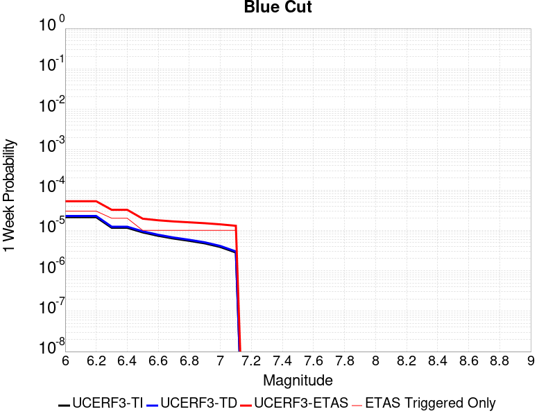 |  |  |  |

| Magnitude | 1 wk TI Prob | 1 wk TD Prob | 1 wk ETAS Prob | 1 wk ETAS/TD Gain | 1 wk ETAS Triggered Only | 1 mo TI Prob | 1 mo TD Prob | 1 mo ETAS Prob | 1 mo ETAS/TD Gain | 1 mo ETAS Triggered Only | 1 yr TI Prob | 1 yr TD Prob | 1 yr ETAS Prob | 1 yr ETAS/TD Gain | 1 yr ETAS Triggered Only | 10 yr TI Prob | 10 yr TD Prob | 10 yr ETAS Prob | 10 yr ETAS/TD Gain | 10 yr ETAS Triggered Only |
|-----|-----|-----|-----|-----|-----|-----|-----|-----|-----|-----|-----|-----|-----|-----|-----|-----|-----|-----|-----|-----|
| 6.0 | 2.1227985E-5 | 2.2719574E-5 | 5.2718893E-5 | 2.3204172 | 3.0E-5 | 9.097391E-5 | 9.73663E-5 | 1.5736045E-4 | 1.6161697 | 6.0E-5 | 0.0011070445 | 0.0011848481 | 0.0012647533 | 1.0674392 | 8.0E-5 | 0.011015458 | 0.011791152 | 0.011909736 | 1.0100571 | 1.2E-4 |
| 6.1 | 2.1227985E-5 | 2.2719574E-5 | 5.2718893E-5 | 2.3204172 | 3.0E-5 | 9.097391E-5 | 9.73663E-5 | 1.5736045E-4 | 1.6161697 | 6.0E-5 | 0.0011070445 | 0.0011848481 | 0.0012647533 | 1.0674392 | 8.0E-5 | 0.011015458 | 0.011791152 | 0.011909736 | 1.0100571 | 1.2E-4 |
| 6.2 | 2.1227985E-5 | 2.2719574E-5 | 5.2718893E-5 | 2.3204172 | 3.0E-5 | 9.097391E-5 | 9.73663E-5 | 1.5736045E-4 | 1.6161697 | 6.0E-5 | 0.0011070445 | 0.0011848481 | 0.0012647533 | 1.0674392 | 8.0E-5 | 0.011015458 | 0.011791152 | 0.011909736 | 1.0100571 | 1.2E-4 |
| 6.3 | 1.1613981E-5 | 1.2353542E-5 | 3.2353295E-5 | 2.618949 | 2.0E-5 | 4.9773254E-5 | 5.2942745E-5 | 9.294063E-5 | 1.7554932 | 4.0E-5 | 6.0582085E-4 | 6.443998E-4 | 6.9436757E-4 | 1.0775416 | 5.0E-5 | 0.0060417196 | 0.0064265593 | 0.0064861737 | 1.0092763 | 6.0E-5 |
| 6.4 | 1.1613981E-5 | 1.2353542E-5 | 3.2353295E-5 | 2.618949 | 2.0E-5 | 4.9773254E-5 | 5.2942745E-5 | 9.294063E-5 | 1.7554932 | 4.0E-5 | 6.0582085E-4 | 6.443998E-4 | 6.9436757E-4 | 1.0775416 | 5.0E-5 | 0.0060417196 | 0.0064265593 | 0.0064861737 | 1.0092763 | 6.0E-5 |
| 6.5 | 8.931326E-6 | 9.4816E-6 | 1.9481506E-5 | 2.0546644 | 1.0E-5 | 3.8276554E-5 | 4.0634844E-5 | 6.0634033E-5 | 1.4921684 | 2.0E-5 | 4.6591737E-4 | 4.946261E-4 | 5.2461127E-4 | 1.0606219 | 3.0E-5 | 0.0046494175 | 0.004936161 | 0.004975964 | 1.0080634 | 4.0E-5 |
| 6.6 | 7.345353E-6 | 7.79028E-6 | 1.7790202E-5 | 2.283641 | 1.0E-5 | 3.1479703E-5 | 3.338653E-5 | 5.3385862E-5 | 1.599024 | 2.0E-5 | 3.83198E-4 | 4.064132E-4 | 4.36401E-4 | 1.0737865 | 3.0E-5 | 0.0038253788 | 0.0040574907 | 0.0040973285 | 1.0098183 | 4.0E-5 |
| 6.7 | 6.2775666E-6 | 6.655149E-6 | 1.6655082E-5 | 2.502586 | 1.0E-5 | 2.690358E-5 | 2.8521798E-5 | 3.8521513E-5 | 1.350599 | 1.0E-5 | 3.2750185E-4 | 3.472051E-4 | 3.572016E-4 | 1.0287914 | 1.0E-5 | 0.0032701963 | 0.003467367 | 0.0034872978 | 1.005748 | 2.0E-5 |
| 6.8 | 5.5234095E-6 | 5.8551113E-6 | 1.5855052E-5 | 2.7078996 | 1.0E-5 | 2.367154E-5 | 2.5093133E-5 | 3.5092882E-5 | 1.3985054 | 1.0E-5 | 2.8816288E-4 | 3.0547334E-4 | 3.154703E-4 | 1.032726 | 1.0E-5 | 0.002877895 | 0.0030512505 | 0.0030711896 | 1.0065347 | 2.0E-5 |
| 6.9 | 4.7780054E-6 | 5.0654203E-6 | 1.506537E-5 | 2.9741597 | 1.0E-5 | 2.0477004E-5 | 2.1708804E-5 | 3.1708587E-5 | 1.4606326 | 1.0E-5 | 2.4927902E-4 | 2.642797E-4 | 2.7427703E-4 | 1.0378287 | 1.0E-5 | 0.0024899957 | 0.002640346 | 0.0026602934 | 1.0075548 | 2.0E-5 |
| 7.0 | 3.883171E-6 | 4.118487E-6 | 1.41184455E-5 | 3.428066 | 1.0E-5 | 1.6642054E-5 | 1.7650578E-5 | 2.7650402E-5 | 1.5665437 | 1.0E-5 | 2.0259817E-4 | 2.1488148E-4 | 2.2487935E-4 | 1.0465273 | 1.0E-5 | 0.0020241356 | 0.0021474129 | 0.00216737 | 1.0092936 | 2.0E-5 |
| 7.1 | 2.8358215E-6 | 3.0097158E-6 | 1.3009686E-5 | 4.3225627 | 1.0E-5 | 1.2153464E-5 | 1.2898756E-5 | 2.2898626E-5 | 1.7752585 | 1.0E-5 | 1.4795837E-4 | 1.5703762E-4 | 1.6703604E-4 | 1.063669 | 1.0E-5 | 0.001478599 | 0.0015699116 | 0.0015898802 | 1.0127195 | 2.0E-5 |

## San Jacinto (Lytle Creek connector)
*[(top)](#table-of-contents)*

| 1 Week | 1 Month | 1 Year | 10 Year |
|-----|-----|-----|-----|
|  |  |  |  |

| Magnitude | 1 wk TI Prob | 1 wk TD Prob | 1 wk ETAS Prob | 1 wk ETAS/TD Gain | 1 wk ETAS Triggered Only | 1 mo TI Prob | 1 mo TD Prob | 1 mo ETAS Prob | 1 mo ETAS/TD Gain | 1 mo ETAS Triggered Only | 1 yr TI Prob | 1 yr TD Prob | 1 yr ETAS Prob | 1 yr ETAS/TD Gain | 1 yr ETAS Triggered Only | 10 yr TI Prob | 10 yr TD Prob | 10 yr ETAS Prob | 10 yr ETAS/TD Gain | 10 yr ETAS Triggered Only |
|-----|-----|-----|-----|-----|-----|-----|-----|-----|-----|-----|-----|-----|-----|-----|-----|-----|-----|-----|-----|-----|
| 6.0 | 6.693995E-6 | 6.660123E-6 | 5.665979E-5 | 8.5073185 | 5.0E-5 | 2.8688235E-5 | 2.8543072E-5 | 7.854164E-5 | 2.7516885 | 5.0E-5 | 3.492233E-4 | 3.4745657E-4 | 4.374253E-4 | 1.2589352 | 9.0E-5 | 0.00348675 | 0.0035491167 | 0.0036686908 | 1.0336913 | 1.2E-4 |
| 6.1 | 6.693995E-6 | 6.660123E-6 | 5.665979E-5 | 8.5073185 | 5.0E-5 | 2.8688235E-5 | 2.8543072E-5 | 7.854164E-5 | 2.7516885 | 5.0E-5 | 3.492233E-4 | 3.4745657E-4 | 4.374253E-4 | 1.2589352 | 9.0E-5 | 0.00348675 | 0.0035491167 | 0.0036686908 | 1.0336913 | 1.2E-4 |
| 6.2 | 6.693995E-6 | 6.660123E-6 | 5.665979E-5 | 8.5073185 | 5.0E-5 | 2.8688235E-5 | 2.8543072E-5 | 7.854164E-5 | 2.7516885 | 5.0E-5 | 3.492233E-4 | 3.4745657E-4 | 4.374253E-4 | 1.2589352 | 9.0E-5 | 0.00348675 | 0.0035491167 | 0.0036686908 | 1.0336913 | 1.2E-4 |
| 6.3 | 6.693995E-6 | 6.660123E-6 | 5.665979E-5 | 8.5073185 | 5.0E-5 | 2.8688235E-5 | 2.8543072E-5 | 7.854164E-5 | 2.7516885 | 5.0E-5 | 3.492233E-4 | 3.4745657E-4 | 4.374253E-4 | 1.2589352 | 9.0E-5 | 0.00348675 | 0.0035491167 | 0.0036686908 | 1.0336913 | 1.2E-4 |
| 6.4 | 6.693995E-6 | 6.660123E-6 | 5.665979E-5 | 8.5073185 | 5.0E-5 | 2.8688235E-5 | 2.8543072E-5 | 7.854164E-5 | 2.7516885 | 5.0E-5 | 3.492233E-4 | 3.4745657E-4 | 4.374253E-4 | 1.2589352 | 9.0E-5 | 0.00348675 | 0.0035491167 | 0.0036686908 | 1.0336913 | 1.2E-4 |
| 6.5 | 6.6561875E-6 | 6.620341E-6 | 5.662001E-5 | 8.552431 | 5.0E-5 | 2.8526205E-5 | 2.8372582E-5 | 7.8371166E-5 | 2.7622147 | 5.0E-5 | 3.472512E-4 | 3.453815E-4 | 4.3535043E-4 | 1.2604914 | 9.0E-5 | 0.0034670907 | 0.0035284322 | 0.0036480087 | 1.0338894 | 1.2E-4 |
| 6.6 | 6.6561875E-6 | 6.620341E-6 | 5.662001E-5 | 8.552431 | 5.0E-5 | 2.8526205E-5 | 2.8372582E-5 | 7.8371166E-5 | 2.7622147 | 5.0E-5 | 3.472512E-4 | 3.453815E-4 | 4.3535043E-4 | 1.2604914 | 9.0E-5 | 0.0034670907 | 0.0035284322 | 0.0036480087 | 1.0338894 | 1.2E-4 |
| 6.7 | 6.5802237E-6 | 6.539518E-6 | 5.653919E-5 | 8.645774 | 5.0E-5 | 2.8200653E-5 | 2.8026205E-5 | 7.80248E-5 | 2.7839947 | 5.0E-5 | 3.4328885E-4 | 3.4116567E-4 | 4.3113498E-4 | 1.2637115 | 9.0E-5 | 0.0034275902 | 0.0034864065 | 0.0036059883 | 1.0342994 | 1.2E-4 |
| 6.8 | 6.575632E-6 | 6.5340073E-6 | 5.653368E-5 | 8.652222 | 5.0E-5 | 2.8180975E-5 | 2.8002589E-5 | 7.800119E-5 | 2.7854993 | 5.0E-5 | 3.4304935E-4 | 3.4087826E-4 | 4.3084758E-4 | 1.2639339 | 9.0E-5 | 0.0034252026 | 0.0034835413 | 0.0036031234 | 1.0343277 | 1.2E-4 |
| 6.9 | 6.570433E-6 | 6.525401E-6 | 5.6525074E-5 | 8.662313 | 5.0E-5 | 2.8158694E-5 | 2.7965707E-5 | 7.796431E-5 | 2.787854 | 5.0E-5 | 3.4277816E-4 | 3.4042934E-4 | 4.303987E-4 | 1.264282 | 9.0E-5 | 0.0034224992 | 0.0034790665 | 0.003598649 | 1.034372 | 1.2E-4 |
| 7.0 | 6.5643826E-6 | 6.5155223E-6 | 5.6515197E-5 | 8.673932 | 5.0E-5 | 2.8132765E-5 | 2.7923368E-5 | 7.792197E-5 | 2.790565 | 5.0E-5 | 3.424626E-4 | 3.3991406E-4 | 4.2988345E-4 | 1.2646828 | 9.0E-5 | 0.0034193532 | 0.0034739296 | 0.0035935128 | 1.034423 | 1.2E-4 |
| 7.1 | 6.557402E-6 | 6.504234E-6 | 5.6503908E-5 | 8.68725 | 5.0E-5 | 2.8102848E-5 | 2.7874992E-5 | 7.78736E-5 | 2.7936726 | 5.0E-5 | 3.4209844E-4 | 3.3932526E-4 | 4.292947E-4 | 1.2651422 | 9.0E-5 | 0.0034157229 | 0.0034680606 | 0.0035876445 | 1.0344815 | 1.2E-4 |
| 7.2 | 6.546394E-6 | 6.4862006E-6 | 5.6485875E-5 | 8.708623 | 5.0E-5 | 2.8055672E-5 | 2.7797707E-5 | 7.7796314E-5 | 2.7986596 | 5.0E-5 | 3.4152428E-4 | 3.383846E-4 | 4.2835413E-4 | 1.2658795 | 9.0E-5 | 0.0034099987 | 0.0034586883 | 0.003578273 | 1.0345752 | 1.2E-4 |
| 7.3 | 6.5364216E-6 | 6.4669857E-6 | 5.6466662E-5 | 8.731527 | 5.0E-5 | 2.8012933E-5 | 2.771536E-5 | 7.771397E-5 | 2.804004 | 5.0E-5 | 3.4100408E-4 | 3.373823E-4 | 4.2735194E-4 | 1.2666696 | 9.0E-5 | 0.003404813 | 0.0034487103 | 0.0035682966 | 1.0346756 | 1.2E-4 |
| 7.4 | 6.5269523E-6 | 6.4480723E-6 | 5.644775E-5 | 8.754206 | 5.0E-5 | 2.7972354E-5 | 2.7634303E-5 | 7.763292E-5 | 2.8092954 | 5.0E-5 | 3.4051016E-4 | 3.3639578E-4 | 4.263655E-4 | 1.267452 | 9.0E-5 | 0.0033998888 | 0.0034388923 | 0.0035584795 | 1.0347749 | 1.2E-4 |
| 7.5 | 6.5111835E-6 | 6.424346E-6 | 5.6424025E-5 | 8.782844 | 5.0E-5 | 2.7904773E-5 | 2.753262E-5 | 7.7531244E-5 | 2.8159776 | 5.0E-5 | 3.3968766E-4 | 3.3515817E-4 | 4.25128E-4 | 1.2684399 | 9.0E-5 | 0.0033916887 | 0.0034265644 | 0.0035461532 | 1.0349005 | 1.2E-4 |
| 7.6 | 6.4768806E-6 | 6.383454E-6 | 5.6383135E-5 | 8.8327 | 5.0E-5 | 2.7757764E-5 | 2.7357375E-5 | 7.735601E-5 | 2.8276107 | 5.0E-5 | 3.3789838E-4 | 3.330252E-4 | 4.2299522E-4 | 1.2701598 | 9.0E-5 | 0.0033738504 | 0.0034052972 | 0.0035248885 | 1.0351192 | 1.2E-4 |
| 7.7 | 6.1655364E-6 | 6.1759456E-6 | 5.6175635E-5 | 9.095877 | 5.0E-5 | 2.642346E-5 | 2.646807E-5 | 7.646675E-5 | 2.8890185 | 5.0E-5 | 3.2165812E-4 | 3.2220117E-4 | 4.1217217E-4 | 1.2792386 | 9.0E-5 | 0.0032119295 | 0.0032969362 | 0.0034165406 | 1.0362774 | 1.2E-4 |
| 7.8 | 5.5043524E-6 | 5.7370175E-6 | 5.573673E-5 | 9.71528 | 5.0E-5 | 2.3589868E-5 | 2.4586987E-5 | 7.4585754E-5 | 3.033546 | 5.0E-5 | 2.871688E-4 | 2.993055E-4 | 3.8927858E-4 | 1.3006061 | 9.0E-5 | 0.0028679797 | 0.0030670585 | 0.0031866906 | 1.0390054 | 1.2E-4 |
| 7.9 | 3.889249E-6 | 4.0766436E-6 | 5.407644E-5 | 13.264941 | 5.0E-5 | 1.6668104E-5 | 1.7471213E-5 | 6.747034E-5 | 3.8618004 | 5.0E-5 | 2.0291525E-4 | 2.126913E-4 | 2.926743E-4 | 1.376052 | 8.0E-5 | 0.0020273007 | 0.0021941073 | 0.002293888 | 1.0454767 | 1.0E-4 |
| 8.0 | 2.668535E-6 | 2.5313454E-6 | 2.2531294E-5 | 8.900917 | 2.0E-5 | 1.1436528E-5 | 1.0848577E-5 | 3.084836E-5 | 2.8435397 | 2.0E-5 | 1.3923083E-4 | 1.3207346E-4 | 1.620695E-4 | 1.2271163 | 3.0E-5 | 0.0013914363 | 0.0013755665 | 0.0014155115 | 1.0290389 | 4.0E-5 |
| 8.1 | 1.5911459E-6 | 1.2185134E-6 | 1.1218501E-5 | 9.206712 | 1.0E-5 | 6.8191785E-6 | 5.2221894E-6 | 1.5222137E-5 | 2.9148955 | 1.0E-5 | 8.3020335E-5 | 6.357832E-5 | 8.3577055E-5 | 1.3145527 | 2.0E-5 | 8.298933E-4 | 6.6911156E-4 | 6.8909815E-4 | 1.0298704 | 2.0E-5 |
| 8.2 | 6.1294963E-7 | 2.1802066E-7 | 2.1802066E-7 | 1.0 | 0.0 | 2.6269242E-6 | 9.3437393E-7 | 9.3437393E-7 | 1.0 | 0.0 | 3.1982334E-5 | 1.1375943E-5 | 1.1375943E-5 | 1.0 | 0.0 | 3.1977732E-4 | 1.2778955E-4 | 1.2778955E-4 | 1.0 | 0.0 |
| 8.3 | 1.762871E-7 | 4.7516316E-8 | 4.7516316E-8 | 1.0 | 0.0 | 7.5551594E-7 | 2.0364133E-7 | 2.0364133E-7 | 1.0 | 0.0 | 9.1983675E-6 | 2.4793305E-6 | 2.4793305E-6 | 1.0 | 0.0 | 9.197987E-5 | 2.8671833E-5 | 2.8671833E-5 | 1.0 | 0.0 |

## Great Valley 09 (Laguna Seca)
*[(top)](#table-of-contents)*

| 1 Week | 1 Month | 1 Year | 10 Year |
|-----|-----|-----|-----|
|  |  |  |  |

| Magnitude | 1 wk TI Prob | 1 wk TD Prob | 1 wk ETAS Prob | 1 wk ETAS/TD Gain | 1 wk ETAS Triggered Only | 1 mo TI Prob | 1 mo TD Prob | 1 mo ETAS Prob | 1 mo ETAS/TD Gain | 1 mo ETAS Triggered Only | 1 yr TI Prob | 1 yr TD Prob | 1 yr ETAS Prob | 1 yr ETAS/TD Gain | 1 yr ETAS Triggered Only | 10 yr TI Prob | 10 yr TD Prob | 10 yr ETAS Prob | 10 yr ETAS/TD Gain | 10 yr ETAS Triggered Only |
|-----|-----|-----|-----|-----|-----|-----|-----|-----|-----|-----|-----|-----|-----|-----|-----|-----|-----|-----|-----|-----|
| 6.0 | 5.4353277E-5 | 7.050019E-5 | 1.2049666E-4 | 1.709168 | 5.0E-5 | 2.3292181E-4 | 3.0211007E-4 | 3.6209196E-4 | 1.1985431 | 6.0E-5 | 0.0028321352 | 0.0036720056 | 0.0037417486 | 1.0189931 | 7.0E-5 | 0.02796312 | 0.036115844 | 0.036212232 | 1.0026689 | 1.0E-4 |
| 6.1 | 4.5578287E-5 | 5.822054E-5 | 8.8218796E-5 | 1.5152521 | 3.0E-5 | 1.953209E-4 | 2.4949352E-4 | 2.7948603E-4 | 1.1202136 | 3.0E-5 | 0.0023754383 | 0.0030333549 | 0.0030732336 | 1.0131468 | 4.0E-5 | 0.023502063 | 0.029919893 | 0.029968396 | 1.0016211 | 5.0E-5 |
| 6.2 | 2.8536782E-5 | 3.4736422E-5 | 5.4735727E-5 | 1.5757445 | 2.0E-5 | 1.2229476E-4 | 1.4886161E-4 | 1.6885863E-4 | 1.134333 | 2.0E-5 | 0.0014879217 | 0.0018108576 | 0.0018308214 | 1.0110245 | 2.0E-5 | 0.014779986 | 0.017958276 | 0.017987737 | 1.0016406 | 3.0E-5 |
| 6.3 | 2.3698774E-5 | 2.8213344E-5 | 3.8213064E-5 | 1.3544322 | 1.0E-5 | 1.01562226E-4 | 1.2090833E-4 | 1.3090711E-4 | 1.0826973 | 1.0E-5 | 0.0012358186 | 0.001471051 | 0.0014910216 | 1.0135757 | 2.0E-5 | 0.012289686 | 0.014611455 | 0.014641016 | 1.0020232 | 3.0E-5 |
| 6.4 | 1.9191197E-5 | 2.212289E-5 | 3.212267E-5 | 1.4520105 | 1.0E-5 | 8.2245395E-5 | 9.4808805E-5 | 1.04807856E-4 | 1.1054654 | 1.0E-5 | 0.0010008777 | 0.0011536906 | 0.0011736675 | 1.0173156 | 2.0E-5 | 0.009963818 | 0.011477022 | 0.011506678 | 1.0025839 | 3.0E-5 |
| 6.5 | 1.5203241E-5 | 1.6801298E-5 | 2.680113E-5 | 1.5951821 | 1.0E-5 | 6.5155116E-5 | 7.200338E-5 | 8.200266E-5 | 1.1388724 | 1.0E-5 | 7.9297484E-4 | 8.76301E-4 | 8.8629226E-4 | 1.0114017 | 1.0E-5 | 0.007901512 | 0.008729581 | 0.008739494 | 1.0011356 | 1.0E-5 |
| 6.6 | 1.0984925E-5 | 1.12425605E-5 | 1.12425605E-5 | 1.0 | 0.0 | 4.70774E-5 | 4.8181533E-5 | 4.8181533E-5 | 1.0 | 0.0 | 5.730166E-4 | 5.8645604E-4 | 5.8645604E-4 | 1.0 | 0.0 | 0.005715413 | 0.0058494755 | 0.0058494755 | 1.0 | 0.0 |
| 6.7 | 9.134616E-6 | 9.019868E-6 | 9.019868E-6 | 1.0 | 0.0 | 3.9147766E-5 | 3.865602E-5 | 3.865602E-5 | 1.0 | 0.0 | 4.7651984E-4 | 4.7053778E-4 | 4.7053778E-4 | 1.0 | 0.0 | 0.004754993 | 0.00469566 | 0.00469566 | 1.0 | 0.0 |
| 6.8 | 7.785589E-6 | 7.4519185E-6 | 7.4519185E-6 | 1.0 | 0.0 | 3.3366385E-5 | 3.1936415E-5 | 3.1936415E-5 | 1.0 | 0.0 | 4.0616E-4 | 3.887585E-4 | 3.887585E-4 | 1.0 | 0.0 | 0.0040541845 | 0.003880988 | 0.003880988 | 1.0 | 0.0 |
| 6.9 | 5.579095E-6 | 4.8984666E-6 | 4.8984666E-6 | 1.0 | 0.0 | 2.3910188E-5 | 2.0993268E-5 | 2.0993268E-5 | 1.0 | 0.0 | 2.9106764E-4 | 2.5556443E-4 | 2.5556443E-4 | 1.0 | 0.0 | 0.002906867 | 0.0025528427 | 0.0025528427 | 1.0 | 0.0 |
| 7.0 | 2.6816688E-6 | 1.521587E-6 | 1.521587E-6 | 1.0 | 0.0 | 1.1492816E-5 | 6.521071E-6 | 6.521071E-6 | 1.0 | 0.0 | 1.3991605E-4 | 7.939124E-5 | 7.939124E-5 | 1.0 | 0.0 | 0.0013982799 | 7.936375E-4 | 7.936375E-4 | 1.0 | 0.0 |
| 7.1 | 1.9951021E-6 | 7.45357E-7 | 7.45357E-7 | 1.0 | 0.0 | 8.55041E-6 | 3.1943835E-6 | 3.1943835E-6 | 1.0 | 0.0 | 1.0409627E-4 | 3.889097E-5 | 3.889097E-5 | 1.0 | 0.0 | 0.0010404752 | 3.8884574E-4 | 3.8884574E-4 | 1.0 | 0.0 |
| 7.2 | 1.9951021E-6 | 7.45357E-7 | 7.45357E-7 | 1.0 | 0.0 | 8.55041E-6 | 3.1943835E-6 | 3.1943835E-6 | 1.0 | 0.0 | 1.0409627E-4 | 3.889097E-5 | 3.889097E-5 | 1.0 | 0.0 | 0.0010404752 | 3.8884574E-4 | 3.8884574E-4 | 1.0 | 0.0 |
| 7.3 | 1.7087556E-6 | 6.578663E-7 | 6.578663E-7 | 1.0 | 0.0 | 7.3232177E-6 | 2.819424E-6 | 2.819424E-6 | 1.0 | 0.0 | 8.915652E-5 | 3.432599E-5 | 3.432599E-5 | 1.0 | 0.0 | 8.9120766E-4 | 3.432109E-4 | 3.432109E-4 | 1.0 | 0.0 |
| 7.4 | 1.3804846E-6 | 6.0737113E-7 | 6.0737113E-7 | 1.0 | 0.0 | 5.916349E-6 | 2.6030168E-6 | 2.6030168E-6 | 1.0 | 0.0 | 7.2029165E-5 | 3.169131E-5 | 3.169131E-5 | 1.0 | 0.0 | 7.200583E-4 | 3.168719E-4 | 3.168719E-4 | 1.0 | 0.0 |
| 7.5 | 1.3804846E-6 | 6.0737113E-7 | 6.0737113E-7 | 1.0 | 0.0 | 5.916349E-6 | 2.6030168E-6 | 2.6030168E-6 | 1.0 | 0.0 | 7.2029165E-5 | 3.169131E-5 | 3.169131E-5 | 1.0 | 0.0 | 7.200583E-4 | 3.168719E-4 | 3.168719E-4 | 1.0 | 0.0 |

## Pisgah-Bullion Mtn-Mesquite Lk
*[(top)](#table-of-contents)*

| 1 Week | 1 Month | 1 Year | 10 Year |
|-----|-----|-----|-----|
|  |  |  |  |

| Magnitude | 1 wk TI Prob | 1 wk TD Prob | 1 wk ETAS Prob | 1 wk ETAS/TD Gain | 1 wk ETAS Triggered Only | 1 mo TI Prob | 1 mo TD Prob | 1 mo ETAS Prob | 1 mo ETAS/TD Gain | 1 mo ETAS Triggered Only | 1 yr TI Prob | 1 yr TD Prob | 1 yr ETAS Prob | 1 yr ETAS/TD Gain | 1 yr ETAS Triggered Only | 10 yr TI Prob | 10 yr TD Prob | 10 yr ETAS Prob | 10 yr ETAS/TD Gain | 10 yr ETAS Triggered Only |
|-----|-----|-----|-----|-----|-----|-----|-----|-----|-----|-----|-----|-----|-----|-----|-----|-----|-----|-----|-----|-----|
| 6.0 | 3.0240792E-5 | 2.40909E-5 | 4.409042E-5 | 1.830169 | 2.0E-5 | 1.2959696E-4 | 1.032432E-4 | 1.332401E-4 | 1.2905461 | 3.0E-5 | 0.0015767008 | 0.0012563618 | 0.0013262739 | 1.0556464 | 7.0E-5 | 0.015655609 | 0.012502613 | 0.012611237 | 1.0086882 | 1.1E-4 |
| 6.1 | 3.0240792E-5 | 2.40909E-5 | 4.409042E-5 | 1.830169 | 2.0E-5 | 1.2959696E-4 | 1.032432E-4 | 1.332401E-4 | 1.2905461 | 3.0E-5 | 0.0015767008 | 0.0012563618 | 0.0013262739 | 1.0556464 | 7.0E-5 | 0.015655609 | 0.012502613 | 0.012611237 | 1.0086882 | 1.1E-4 |
| 6.2 | 3.0240792E-5 | 2.40909E-5 | 4.409042E-5 | 1.830169 | 2.0E-5 | 1.2959696E-4 | 1.032432E-4 | 1.332401E-4 | 1.2905461 | 3.0E-5 | 0.0015767008 | 0.0012563618 | 0.0013262739 | 1.0556464 | 7.0E-5 | 0.015655609 | 0.012502613 | 0.012611237 | 1.0086882 | 1.1E-4 |
| 6.3 | 2.0498217E-5 | 1.3638054E-5 | 1.3638054E-5 | 1.0 | 0.0 | 8.784654E-5 | 5.8447586E-5 | 6.8447E-5 | 1.1710835 | 1.0E-5 | 0.0010690069 | 7.1138324E-4 | 7.4136193E-4 | 1.0421413 | 3.0E-5 | 0.01063879 | 0.0070926864 | 0.007152261 | 1.0083994 | 6.0E-5 |
| 6.4 | 2.0498217E-5 | 1.3638054E-5 | 1.3638054E-5 | 1.0 | 0.0 | 8.784654E-5 | 5.8447586E-5 | 6.8447E-5 | 1.1710835 | 1.0E-5 | 0.0010690069 | 7.1138324E-4 | 7.4136193E-4 | 1.0421413 | 3.0E-5 | 0.01063879 | 0.0070926864 | 0.007152261 | 1.0083994 | 6.0E-5 |
| 6.5 | 1.7316182E-5 | 1.04769715E-5 | 1.04769715E-5 | 1.0 | 0.0 | 7.42101E-5 | 4.490059E-5 | 5.490014E-5 | 1.2227042 | 1.0E-5 | 9.0313336E-4 | 5.465376E-4 | 5.665266E-4 | 1.036574 | 2.0E-5 | 0.008994718 | 0.00545293 | 0.0055026575 | 1.0091194 | 5.0E-5 |
| 6.6 | 1.5251077E-5 | 8.414133E-6 | 8.414133E-6 | 1.0 | 0.0 | 6.536012E-5 | 3.606011E-5 | 4.605975E-5 | 1.2773048 | 1.0E-5 | 7.9546886E-4 | 4.3895066E-4 | 4.5894188E-4 | 1.0455432 | 2.0E-5 | 0.007926274 | 0.0043815537 | 0.0044213785 | 1.0090892 | 4.0E-5 |
| 6.7 | 1.2997425E-5 | 6.4112146E-6 | 6.4112146E-6 | 1.0 | 0.0 | 5.570206E-5 | 2.7476372E-5 | 3.7476097E-5 | 1.363939 | 1.0E-5 | 6.7796157E-4 | 3.3447813E-4 | 3.5447144E-4 | 1.0597746 | 2.0E-5 | 0.0067589693 | 0.003340207 | 0.0033800735 | 1.0119354 | 4.0E-5 |
| 6.8 | 1.035386E-5 | 4.333145E-6 | 4.333145E-6 | 1.0 | 0.0 | 4.437293E-5 | 1.8570496E-5 | 1.8570496E-5 | 1.0 | 0.0 | 5.401065E-4 | 2.260732E-4 | 2.3607093E-4 | 1.0442234 | 1.0E-5 | 0.0053879567 | 0.002258519 | 0.0022884512 | 1.0132531 | 3.0E-5 |
| 6.9 | 8.816252E-6 | 3.5805879E-6 | 3.5805879E-6 | 1.0 | 0.0 | 3.778339E-5 | 1.534529E-5 | 1.534529E-5 | 1.0 | 0.0 | 4.5991567E-4 | 1.8681347E-4 | 1.9681161E-4 | 1.0535194 | 1.0E-5 | 0.00458965 | 0.0018666228 | 0.0018965668 | 1.0160418 | 3.0E-5 |
| 7.0 | 6.8232207E-6 | 2.5674399E-6 | 2.5674399E-6 | 1.0 | 0.0 | 2.9242048E-5 | 1.100327E-5 | 1.100327E-5 | 1.0 | 0.0 | 3.5596377E-4 | 1.3395688E-4 | 1.3395688E-4 | 1.0 | 0.0 | 0.0035539411 | 0.0013387925 | 0.0013487791 | 1.0074594 | 1.0E-5 |
| 7.1 | 5.837013E-6 | 2.2273143E-6 | 2.2273143E-6 | 1.0 | 0.0 | 2.501553E-5 | 9.5456E-6 | 9.5456E-6 | 1.0 | 0.0 | 3.045215E-4 | 1.1621177E-4 | 1.1621177E-4 | 1.0 | 0.0 | 0.0030410455 | 0.001161539 | 0.0011715274 | 1.0085993 | 1.0E-5 |
| 7.2 | 4.278052E-6 | 1.6275065E-6 | 1.6275065E-6 | 1.0 | 0.0 | 1.833438E-5 | 6.975011E-6 | 6.975011E-6 | 1.0 | 0.0 | 2.231982E-4 | 8.491768E-5 | 8.491768E-5 | 1.0 | 0.0 | 0.0022297418 | 8.4887556E-4 | 8.4887556E-4 | 1.0 | 0.0 |
| 7.3 | 1.8803692E-6 | 8.344788E-7 | 8.344788E-7 | 1.0 | 0.0 | 8.0587E-6 | 3.5763337E-6 | 3.5763337E-6 | 1.0 | 0.0 | 9.811026E-5 | 4.354114E-5 | 4.354114E-5 | 1.0 | 0.0 | 9.806695E-4 | 4.3534054E-4 | 4.3534054E-4 | 1.0 | 0.0 |

## Cleghorn Pass
*[(top)](#table-of-contents)*

| 1 Week | 1 Month | 1 Year | 10 Year |
|-----|-----|-----|-----|
|  |  | 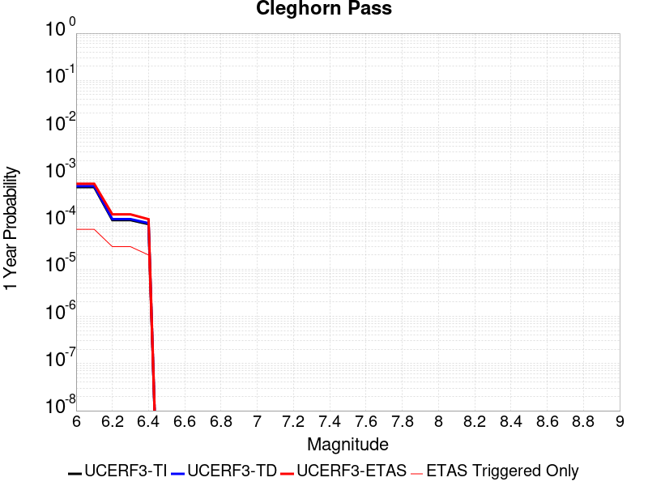 | 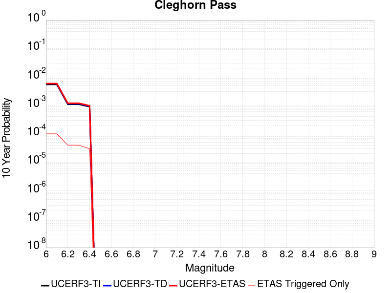 |

| Magnitude | 1 wk TI Prob | 1 wk TD Prob | 1 wk ETAS Prob | 1 wk ETAS/TD Gain | 1 wk ETAS Triggered Only | 1 mo TI Prob | 1 mo TD Prob | 1 mo ETAS Prob | 1 mo ETAS/TD Gain | 1 mo ETAS Triggered Only | 1 yr TI Prob | 1 yr TD Prob | 1 yr ETAS Prob | 1 yr ETAS/TD Gain | 1 yr ETAS Triggered Only | 10 yr TI Prob | 10 yr TD Prob | 10 yr ETAS Prob | 10 yr ETAS/TD Gain | 10 yr ETAS Triggered Only |
|-----|-----|-----|-----|-----|-----|-----|-----|-----|-----|-----|-----|-----|-----|-----|-----|-----|-----|-----|-----|-----|
| 6.0 | 1.0522846E-5 | 1.1040642E-5 | 3.104042E-5 | 2.8114688 | 2.0E-5 | 4.509713E-5 | 4.7316473E-5 | 6.731553E-5 | 1.4226657 | 2.0E-5 | 5.4891926E-4 | 5.759784E-4 | 6.4593815E-4 | 1.1214623 | 7.0E-5 | 0.0054756533 | 0.005750022 | 0.0058494466 | 1.0172912 | 1.0E-4 |
| 6.1 | 1.0522846E-5 | 1.1040642E-5 | 3.104042E-5 | 2.8114688 | 2.0E-5 | 4.509713E-5 | 4.7316473E-5 | 6.731553E-5 | 1.4226657 | 2.0E-5 | 5.4891926E-4 | 5.759784E-4 | 6.4593815E-4 | 1.1214623 | 7.0E-5 | 0.0054756533 | 0.005750022 | 0.0058494466 | 1.0172912 | 1.0E-4 |
| 6.2 | 2.1045846E-6 | 2.2082024E-6 | 1.220818E-5 | 5.52856 | 1.0E-5 | 9.019617E-6 | 9.463714E-6 | 1.946362E-5 | 2.0566576 | 1.0E-5 | 1.098083E-4 | 1.1521882E-4 | 1.4521537E-4 | 1.2603441 | 3.0E-5 | 0.0010975406 | 0.0011520023 | 0.0011919562 | 1.0346822 | 4.0E-5 |
| 6.3 | 2.1045846E-6 | 2.2082024E-6 | 1.220818E-5 | 5.52856 | 1.0E-5 | 9.019617E-6 | 9.463714E-6 | 1.946362E-5 | 2.0566576 | 1.0E-5 | 1.098083E-4 | 1.1521882E-4 | 1.4521537E-4 | 1.2603441 | 3.0E-5 | 0.0010975406 | 0.0011520023 | 0.0011919562 | 1.0346822 | 4.0E-5 |
| 6.4 | 1.7259927E-6 | 1.810877E-6 | 1.810877E-6 | 1.0 | 0.0 | 7.3970905E-6 | 7.760902E-6 | 7.760902E-6 | 1.0 | 0.0 | 9.005586E-5 | 9.4488976E-5 | 1.1448709E-4 | 1.2116449 | 2.0E-5 | 9.001937E-4 | 9.448898E-4 | 9.7486144E-4 | 1.0317197 | 3.0E-5 |

## Big Pine (East)
*[(top)](#table-of-contents)*

| 1 Week | 1 Month | 1 Year | 10 Year |
|-----|-----|-----|-----|
|  |  |  |  |

| Magnitude | 1 wk TI Prob | 1 wk TD Prob | 1 wk ETAS Prob | 1 wk ETAS/TD Gain | 1 wk ETAS Triggered Only | 1 mo TI Prob | 1 mo TD Prob | 1 mo ETAS Prob | 1 mo ETAS/TD Gain | 1 mo ETAS Triggered Only | 1 yr TI Prob | 1 yr TD Prob | 1 yr ETAS Prob | 1 yr ETAS/TD Gain | 1 yr ETAS Triggered Only | 10 yr TI Prob | 10 yr TD Prob | 10 yr ETAS Prob | 10 yr ETAS/TD Gain | 10 yr ETAS Triggered Only |
|-----|-----|-----|-----|-----|-----|-----|-----|-----|-----|-----|-----|-----|-----|-----|-----|-----|-----|-----|-----|-----|
| 6.0 | 9.916913E-6 | 1.28172705E-5 | 3.2817014E-5 | 2.5603745 | 2.0E-5 | 4.250036E-5 | 5.493013E-5 | 1.04927385E-4 | 1.9101973 | 5.0E-5 | 5.173191E-4 | 6.685912E-4 | 7.185578E-4 | 1.0747341 | 5.0E-5 | 0.0051611643 | 0.006670449 | 0.006769782 | 1.0148915 | 1.0E-4 |
| 6.1 | 9.916913E-6 | 1.28172705E-5 | 3.2817014E-5 | 2.5603745 | 2.0E-5 | 4.250036E-5 | 5.493013E-5 | 1.04927385E-4 | 1.9101973 | 5.0E-5 | 5.173191E-4 | 6.685912E-4 | 7.185578E-4 | 1.0747341 | 5.0E-5 | 0.0051611643 | 0.006670449 | 0.006769782 | 1.0148915 | 1.0E-4 |
| 6.2 | 9.916913E-6 | 1.28172705E-5 | 3.2817014E-5 | 2.5603745 | 2.0E-5 | 4.250036E-5 | 5.493013E-5 | 1.04927385E-4 | 1.9101973 | 5.0E-5 | 5.173191E-4 | 6.685912E-4 | 7.185578E-4 | 1.0747341 | 5.0E-5 | 0.0051611643 | 0.006670449 | 0.006769782 | 1.0148915 | 1.0E-4 |
| 6.3 | 5.479711E-6 | 8.1132375E-6 | 2.8113076E-5 | 3.4650872 | 2.0E-5 | 2.3484265E-5 | 3.4770575E-5 | 7.476918E-5 | 2.150358 | 4.0E-5 | 2.858834E-4 | 4.232527E-4 | 4.6323577E-4 | 1.0944662 | 4.0E-5 | 0.0028551589 | 0.0042272513 | 0.004306913 | 1.0188448 | 8.0E-5 |
| 6.4 | 5.465009E-6 | 8.0975315E-6 | 2.8097369E-5 | 3.4698687 | 2.0E-5 | 2.3421257E-5 | 3.4703262E-5 | 7.470187E-5 | 2.1525893 | 4.0E-5 | 2.851165E-4 | 4.2243348E-4 | 4.624166E-4 | 1.0946494 | 4.0E-5 | 0.0028475097 | 0.00421909 | 0.0042987526 | 1.0188814 | 8.0E-5 |
| 6.5 | 4.826767E-6 | 7.4225877E-6 | 2.7422439E-5 | 3.6944582 | 2.0E-5 | 2.068598E-5 | 3.1810716E-5 | 7.1809445E-5 | 2.257398 | 4.0E-5 | 2.518227E-4 | 3.8722943E-4 | 4.2721393E-4 | 1.1032579 | 4.0E-5 | 0.0025153751 | 0.0038682907 | 0.003947981 | 1.0206009 | 8.0E-5 |
| 6.6 | 4.3146847E-6 | 6.8825234E-6 | 2.6882386E-5 | 3.905891 | 2.0E-5 | 1.8491375E-5 | 2.949621E-5 | 6.949503E-5 | 2.3560665 | 4.0E-5 | 2.2510924E-4 | 3.5905963E-4 | 3.9904527E-4 | 1.1113621 | 4.0E-5 | 0.0022488134 | 0.0035875062 | 0.003657255 | 1.0194422 | 7.0E-5 |
| 6.7 | 3.6968106E-6 | 5.9957474E-6 | 2.5995627E-5 | 4.3356776 | 2.0E-5 | 1.5843378E-5 | 2.5695816E-5 | 6.569479E-5 | 2.5566337 | 4.0E-5 | 1.9287605E-4 | 3.128032E-4 | 3.5279067E-4 | 1.127836 | 4.0E-5 | 0.0019270873 | 0.0031262499 | 0.003196031 | 1.022321 | 7.0E-5 |
| 6.8 | 3.4671132E-6 | 5.7024477E-6 | 2.5702333E-5 | 4.507246 | 2.0E-5 | 1.4858972E-5 | 2.4438841E-5 | 6.443786E-5 | 2.636699 | 4.0E-5 | 1.8089297E-4 | 2.9750372E-4 | 3.374918E-4 | 1.134412 | 4.0E-5 | 0.0018074579 | 0.0029736666 | 0.0030434586 | 1.0234699 | 7.0E-5 |
| 6.9 | 2.7686972E-6 | 4.8254797E-6 | 1.4825431E-5 | 3.0723228 | 1.0E-5 | 1.1865792E-5 | 2.0680467E-5 | 4.0680054E-5 | 1.9670762 | 2.0E-5 | 1.4445644E-4 | 2.5175634E-4 | 2.717513E-4 | 1.0794219 | 2.0E-5 | 0.0014436257 | 0.002517256 | 0.0025571552 | 1.0158503 | 4.0E-5 |
| 7.0 | 2.1472624E-6 | 3.985277E-6 | 3.985277E-6 | 1.0 | 0.0 | 9.20252E-6 | 1.707965E-5 | 2.7079479E-5 | 1.5854821 | 1.0E-5 | 1.12034926E-4 | 2.0792543E-4 | 2.1792336E-4 | 1.0480841 | 1.0E-5 | 0.0011197845 | 0.0020798238 | 0.0021097613 | 1.0143943 | 3.0E-5 |
| 7.1 | 1.7018335E-6 | 3.3450835E-6 | 3.3450835E-6 | 1.0 | 0.0 | 7.293552E-6 | 1.4335996E-5 | 2.4335852E-5 | 1.6975348 | 1.0E-5 | 8.879537E-5 | 1.7452713E-4 | 1.8452539E-4 | 1.0572877 | 1.0E-5 | 8.87599E-4 | 0.0017463792 | 0.0017763268 | 1.0171484 | 3.0E-5 |
| 7.2 | 1.25603E-6 | 2.794679E-6 | 2.794679E-6 | 1.0 | 0.0 | 5.3829745E-6 | 1.1977142E-5 | 2.1977023E-5 | 1.8349137 | 1.0E-5 | 6.553574E-5 | 1.4581217E-4 | 1.5581072E-4 | 1.0685713 | 1.0E-5 | 6.551642E-4 | 0.0014596173 | 0.0014895735 | 1.0205233 | 3.0E-5 |
| 7.3 | 1.112297E-6 | 2.610519E-6 | 2.610519E-6 | 1.0 | 0.0 | 4.7669787E-6 | 1.1187892E-5 | 2.118778E-5 | 1.8938135 | 1.0E-5 | 5.803642E-5 | 1.3620428E-4 | 1.4620292E-4 | 1.0734091 | 1.0E-5 | 5.802127E-4 | 0.001363502 | 0.001393461 | 1.0219722 | 3.0E-5 |
| 7.4 | 1.0137181E-6 | 2.4836752E-6 | 2.4836752E-6 | 1.0 | 0.0 | 4.3444993E-6 | 1.064428E-5 | 2.0644173E-5 | 1.9394617 | 1.0E-5 | 5.2892992E-5 | 1.2958662E-4 | 1.3958532E-4 | 1.0771585 | 1.0E-5 | 5.288041E-4 | 0.0012971918 | 0.0013271528 | 1.0230969 | 3.0E-5 |
| 7.5 | 9.598608E-7 | 2.407328E-6 | 2.407328E-6 | 1.0 | 0.0 | 4.1136827E-6 | 1.03170805E-5 | 2.0316978E-5 | 1.9692564 | 1.0E-5 | 5.0082934E-5 | 1.2560343E-4 | 1.3560218E-4 | 1.0796057 | 1.0E-5 | 5.007165E-4 | 0.0012572132 | 0.0012871755 | 1.0238323 | 3.0E-5 |
| 7.6 | 7.929459E-7 | 2.0450152E-6 | 2.0450152E-6 | 1.0 | 0.0 | 3.3983351E-6 | 8.764322E-6 | 1.8764234E-5 | 2.1409795 | 1.0E-5 | 4.1373947E-5 | 1.0670057E-4 | 1.16699506E-4 | 1.0937102 | 1.0E-5 | 4.1366243E-4 | 0.0010685825 | 0.0010985505 | 1.0280446 | 3.0E-5 |
| 7.7 | 4.155788E-7 | 1.1606729E-6 | 1.1606729E-6 | 1.0 | 0.0 | 1.7810507E-6 | 4.974303E-6 | 4.974303E-6 | 1.0 | 0.0 | 2.1684076E-5 | 6.05605E-5 | 6.05605E-5 | 1.0 | 0.0 | 2.1681961E-4 | 6.085995E-4 | 6.285874E-4 | 1.0328423 | 2.0E-5 |
| 7.8 | 1.14666925E-7 | 2.592197E-7 | 2.592197E-7 | 1.0 | 0.0 | 4.914296E-7 | 1.1109411E-6 | 1.1109411E-6 | 1.0 | 0.0 | 5.9831386E-6 | 1.3525627E-5 | 1.3525627E-5 | 1.0 | 0.0 | 5.9829777E-5 | 1.3636416E-4 | 1.463628E-4 | 1.073323 | 1.0E-5 |
| 7.9 | 2.9231824E-8 | 4.1462318E-8 | 4.1462318E-8 | 1.0 | 0.0 | 1.2527924E-7 | 1.7769564E-7 | 1.7769564E-7 | 1.0 | 0.0 | 1.5252737E-6 | 2.1634426E-6 | 2.1634426E-6 | 1.0 | 0.0 | 1.5252632E-5 | 2.197062E-5 | 2.197062E-5 | 1.0 | 0.0 |

## Big Pine (Central)
*[(top)](#table-of-contents)*

| 1 Week | 1 Month | 1 Year | 10 Year |
|-----|-----|-----|-----|
|  |  |  |  |

| Magnitude | 1 wk TI Prob | 1 wk TD Prob | 1 wk ETAS Prob | 1 wk ETAS/TD Gain | 1 wk ETAS Triggered Only | 1 mo TI Prob | 1 mo TD Prob | 1 mo ETAS Prob | 1 mo ETAS/TD Gain | 1 mo ETAS Triggered Only | 1 yr TI Prob | 1 yr TD Prob | 1 yr ETAS Prob | 1 yr ETAS/TD Gain | 1 yr ETAS Triggered Only | 10 yr TI Prob | 10 yr TD Prob | 10 yr ETAS Prob | 10 yr ETAS/TD Gain | 10 yr ETAS Triggered Only |
|-----|-----|-----|-----|-----|-----|-----|-----|-----|-----|-----|-----|-----|-----|-----|-----|-----|-----|-----|-----|-----|
| 6.0 | 1.2706755E-5 | 1.4250602E-5 | 2.425046E-5 | 1.7017148 | 1.0E-5 | 5.4456385E-5 | 6.107279E-5 | 9.107096E-5 | 1.4911871 | 3.0E-5 | 6.628048E-4 | 7.433441E-4 | 7.933069E-4 | 1.0672137 | 5.0E-5 | 0.006608314 | 0.007413639 | 0.007502972 | 1.0120498 | 9.0E-5 |
| 6.1 | 8.342579E-6 | 9.510835E-6 | 1.951074E-5 | 2.0514224 | 1.0E-5 | 3.5753423E-5 | 4.076021E-5 | 6.0759394E-5 | 1.4906546 | 2.0E-5 | 4.3521097E-4 | 4.9616426E-4 | 5.261494E-4 | 1.0604339 | 3.0E-5 | 0.0043435963 | 0.004954155 | 0.005023808 | 1.0140595 | 7.0E-5 |
| 6.2 | 6.923899E-6 | 7.967221E-6 | 1.7967142E-5 | 2.2551327 | 1.0E-5 | 2.9673516E-5 | 3.4144894E-5 | 5.4144213E-5 | 1.5857191 | 2.0E-5 | 3.6121515E-4 | 4.1565404E-4 | 4.4564158E-4 | 1.0721455 | 3.0E-5 | 0.003606286 | 0.0041521094 | 0.004221819 | 1.016789 | 7.0E-5 |
| 6.3 | 2.728396E-6 | 3.4243646E-6 | 1.342433E-5 | 3.9202397 | 1.0E-5 | 1.1693074E-5 | 1.4675771E-5 | 3.467548E-5 | 2.3627703 | 2.0E-5 | 1.4235388E-4 | 1.7866373E-4 | 2.0865837E-4 | 1.1678832 | 3.0E-5 | 0.0014226272 | 0.0017867433 | 0.0018366539 | 1.0279338 | 5.0E-5 |
| 6.4 | 2.7136944E-6 | 3.4086581E-6 | 1.3408624E-5 | 3.9336958 | 1.0E-5 | 1.1630066E-5 | 1.4608458E-5 | 3.4608165E-5 | 2.3690498 | 2.0E-5 | 1.4158686E-4 | 1.7784433E-4 | 2.07839E-4 | 1.1686568 | 3.0E-5 | 0.0014149669 | 0.0017785623 | 0.0018284734 | 1.0280626 | 5.0E-5 |
| 6.5 | 2.6971882E-6 | 3.3910032E-6 | 1.3390969E-5 | 3.9489698 | 1.0E-5 | 1.1559327E-5 | 1.4532795E-5 | 3.4532502E-5 | 2.3761778 | 2.0E-5 | 1.4072572E-4 | 1.7692328E-4 | 2.0691798E-4 | 1.169535 | 3.0E-5 | 0.0014063664 | 0.0017693666 | 0.0018192781 | 1.0282087 | 5.0E-5 |
| 6.6 | 2.669092E-6 | 3.3610236E-6 | 1.336099E-5 | 3.975274 | 1.0E-5 | 1.1438916E-5 | 1.4404312E-5 | 3.4404024E-5 | 2.388453 | 2.0E-5 | 1.3925991E-4 | 1.7535927E-4 | 2.05354E-4 | 1.1710473 | 3.0E-5 | 0.0013917267 | 0.0017537511 | 0.0018036634 | 1.0284603 | 5.0E-5 |
| 6.7 | 2.6408059E-6 | 3.3310494E-6 | 1.3331016E-5 | 4.002047 | 1.0E-5 | 1.1317691E-5 | 1.4275853E-5 | 3.4275567E-5 | 2.400947 | 2.0E-5 | 1.3778417E-4 | 1.737955E-4 | 2.0379029E-4 | 1.1725867 | 3.0E-5 | 0.0013769877 | 0.0017381381 | 0.0017880512 | 1.0287164 | 5.0E-5 |
| 6.8 | 2.1786943E-6 | 2.8545066E-6 | 1.2854478E-5 | 4.5032225 | 1.0E-5 | 9.337228E-6 | 1.2233547E-5 | 2.2233424E-5 | 1.8174144 | 1.0E-5 | 1.1367482E-4 | 1.4893398E-4 | 1.68931E-4 | 1.1342677 | 2.0E-5 | 0.0011361669 | 0.0014898704 | 0.0015298108 | 1.026808 | 4.0E-5 |
| 6.9 | 1.4411696E-6 | 2.0685677E-6 | 1.2068547E-5 | 5.834253 | 1.0E-5 | 6.1764263E-6 | 8.865261E-6 | 1.8865174E-5 | 2.1279883 | 1.0E-5 | 7.51954E-5 | 1.0792949E-4 | 1.1792841E-4 | 1.0926431 | 1.0E-5 | 7.5169955E-4 | 0.0010802548 | 0.0011102224 | 1.0277412 | 3.0E-5 |
| 7.0 | 1.0073411E-6 | 1.5543274E-6 | 1.5543274E-6 | 1.0 | 0.0 | 4.317169E-6 | 6.661387E-6 | 6.661387E-6 | 1.0 | 0.0 | 5.2560266E-5 | 8.109952E-5 | 8.109952E-5 | 1.0 | 0.0 | 5.2547833E-4 | 8.1217213E-4 | 8.321559E-4 | 1.0246053 | 2.0E-5 |
| 7.1 | 8.947104E-7 | 1.430316E-6 | 1.430316E-6 | 1.0 | 0.0 | 3.834468E-6 | 6.1299124E-6 | 6.1299124E-6 | 1.0 | 0.0 | 4.6683643E-5 | 7.462928E-5 | 7.462928E-5 | 1.0 | 0.0 | 4.6673836E-4 | 7.4751483E-4 | 7.6749985E-4 | 1.0267353 | 2.0E-5 |
| 7.2 | 5.215166E-7 | 1.0112277E-6 | 1.0112277E-6 | 1.0 | 0.0 | 2.2350691E-6 | 4.333826E-6 | 4.333826E-6 | 1.0 | 0.0 | 2.7211627E-5 | 5.27631E-5 | 5.27631E-5 | 1.0 | 0.0 | 2.7208295E-4 | 5.289683E-4 | 5.489577E-4 | 1.0377895 | 2.0E-5 |
| 7.3 | 4.4024807E-7 | 9.220183E-7 | 9.220183E-7 | 1.0 | 0.0 | 1.8867761E-6 | 3.951501E-6 | 3.951501E-6 | 1.0 | 0.0 | 2.2971257E-5 | 4.8108504E-5 | 4.8108504E-5 | 1.0 | 0.0 | 2.2968883E-4 | 4.824433E-4 | 5.024337E-4 | 1.0414356 | 2.0E-5 |
| 7.4 | 3.6130905E-7 | 8.359109E-7 | 8.359109E-7 | 1.0 | 0.0 | 1.5484665E-6 | 3.5824705E-6 | 3.5824705E-6 | 1.0 | 0.0 | 1.8852415E-5 | 4.3615746E-5 | 4.3615746E-5 | 1.0 | 0.0 | 1.8850817E-4 | 4.3752496E-4 | 4.575162E-4 | 1.0456917 | 2.0E-5 |
| 7.5 | 3.408184E-7 | 8.1087245E-7 | 8.1087245E-7 | 1.0 | 0.0 | 1.4606494E-6 | 3.475163E-6 | 3.475163E-6 | 1.0 | 0.0 | 1.7783263E-5 | 4.230933E-5 | 4.230933E-5 | 1.0 | 0.0 | 1.778184E-4 | 4.2444657E-4 | 4.4443808E-4 | 1.0471002 | 2.0E-5 |
| 7.6 | 3.1428627E-7 | 7.732167E-7 | 7.732167E-7 | 1.0 | 0.0 | 1.3469405E-6 | 3.313782E-6 | 3.313782E-6 | 1.0 | 0.0 | 1.6398877E-5 | 4.0344585E-5 | 4.0344585E-5 | 1.0 | 0.0 | 1.6397667E-4 | 4.0477706E-4 | 4.2476895E-4 | 1.04939 | 2.0E-5 |
| 7.7 | 1.7972785E-7 | 5.0782415E-7 | 5.0782415E-7 | 1.0 | 0.0 | 7.70262E-7 | 2.1763874E-6 | 2.1763874E-6 | 1.0 | 0.0 | 9.377899E-6 | 2.6497206E-5 | 2.6497206E-5 | 1.0 | 0.0 | 9.377503E-5 | 2.6633305E-4 | 2.863277E-4 | 1.075074 | 2.0E-5 |
| 7.8 | 4.9230927E-8 | 1.1981747E-7 | 1.1981747E-7 | 1.0 | 0.0 | 2.1098968E-7 | 5.135033E-7 | 5.135033E-7 | 1.0 | 0.0 | 2.5687964E-6 | 6.2518866E-6 | 6.2518866E-6 | 1.0 | 0.0 | 2.5687666E-5 | 6.2971965E-5 | 7.2971336E-5 | 1.1587908 | 1.0E-5 |
| 7.9 | 3.6805972E-9 | 4.1051638E-9 | 4.1051638E-9 | 1.0 | 0.0 | 1.5773987E-8 | 1.7593557E-8 | 1.7593557E-8 | 1.0 | 0.0 | 1.9204828E-7 | 2.1420155E-7 | 2.1420155E-7 | 1.0 | 0.0 | 1.920481E-6 | 2.1898923E-6 | 2.1898923E-6 | 1.0 | 0.0 |

## Santa Cruz Island
*[(top)](#table-of-contents)*

| 1 Week | 1 Month | 1 Year | 10 Year |
|-----|-----|-----|-----|
| 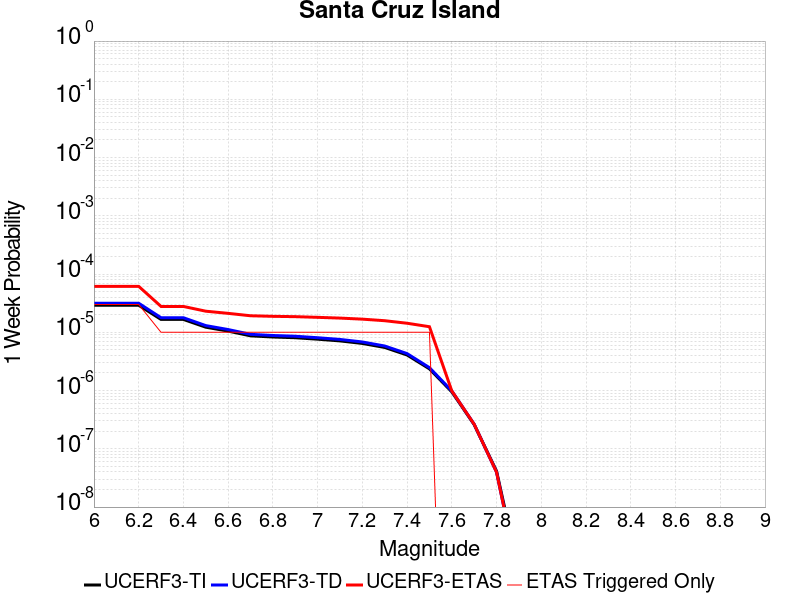 |  |  |  |

| Magnitude | 1 wk TI Prob | 1 wk TD Prob | 1 wk ETAS Prob | 1 wk ETAS/TD Gain | 1 wk ETAS Triggered Only | 1 mo TI Prob | 1 mo TD Prob | 1 mo ETAS Prob | 1 mo ETAS/TD Gain | 1 mo ETAS Triggered Only | 1 yr TI Prob | 1 yr TD Prob | 1 yr ETAS Prob | 1 yr ETAS/TD Gain | 1 yr ETAS Triggered Only | 10 yr TI Prob | 10 yr TD Prob | 10 yr ETAS Prob | 10 yr ETAS/TD Gain | 10 yr ETAS Triggered Only |
|-----|-----|-----|-----|-----|-----|-----|-----|-----|-----|-----|-----|-----|-----|-----|-----|-----|-----|-----|-----|-----|
| 6.0 | 2.9164563E-5 | 3.1599742E-5 | 6.1598796E-5 | 1.9493448 | 3.0E-5 | 1.2498499E-4 | 1.3542121E-4 | 1.8541444E-4 | 1.3691684 | 5.0E-5 | 0.0015206301 | 0.0016476426 | 0.0017175272 | 1.0424149 | 7.0E-5 | 0.015102667 | 0.016368 | 0.01644669 | 1.0048076 | 8.0E-5 |
| 6.1 | 2.9164563E-5 | 3.1599742E-5 | 6.1598796E-5 | 1.9493448 | 3.0E-5 | 1.2498499E-4 | 1.3542121E-4 | 1.8541444E-4 | 1.3691684 | 5.0E-5 | 0.0015206301 | 0.0016476426 | 0.0017175272 | 1.0424149 | 7.0E-5 | 0.015102667 | 0.016368 | 0.01644669 | 1.0048076 | 8.0E-5 |
| 6.2 | 2.9164563E-5 | 3.1599742E-5 | 6.1598796E-5 | 1.9493448 | 3.0E-5 | 1.2498499E-4 | 1.3542121E-4 | 1.8541444E-4 | 1.3691684 | 5.0E-5 | 0.0015206301 | 0.0016476426 | 0.0017175272 | 1.0424149 | 7.0E-5 | 0.015102667 | 0.016368 | 0.01644669 | 1.0048076 | 8.0E-5 |
| 6.3 | 1.6635553E-5 | 1.780436E-5 | 2.780418E-5 | 1.5616502 | 1.0E-5 | 7.1293274E-5 | 7.630227E-5 | 1.0629998E-4 | 1.3931432 | 3.0E-5 | 8.6765E-4 | 9.286024E-4 | 9.78556E-4 | 1.0537944 | 5.0E-5 | 0.008642701 | 0.009249094 | 0.009298631 | 1.005356 | 5.0E-5 |
| 6.4 | 1.6635553E-5 | 1.780436E-5 | 2.780418E-5 | 1.5616502 | 1.0E-5 | 7.1293274E-5 | 7.630227E-5 | 1.0629998E-4 | 1.3931432 | 3.0E-5 | 8.6765E-4 | 9.286024E-4 | 9.78556E-4 | 1.0537944 | 5.0E-5 | 0.008642701 | 0.009249094 | 0.009298631 | 1.005356 | 5.0E-5 |
| 6.5 | 1.2238748E-5 | 1.3042996E-5 | 2.3042865E-5 | 1.766685 | 1.0E-5 | 5.2450723E-5 | 5.5897377E-5 | 7.5896256E-5 | 1.3577785 | 2.0E-5 | 6.3840044E-4 | 6.8034173E-4 | 7.0032815E-4 | 1.029377 | 2.0E-5 | 0.0063656955 | 0.006782988 | 0.0068028523 | 1.0029285 | 2.0E-5 |
| 6.6 | 1.0489767E-5 | 1.1156636E-5 | 2.1156524E-5 | 1.8963175 | 1.0E-5 | 4.495537E-5 | 4.781329E-5 | 6.781233E-5 | 1.4182737 | 2.0E-5 | 5.4719415E-4 | 5.819736E-4 | 6.019619E-4 | 1.0343459 | 2.0E-5 | 0.005458487 | 0.005804736 | 0.00582462 | 1.0034255 | 2.0E-5 |
| 6.7 | 8.699222E-6 | 9.236783E-6 | 1.923669E-5 | 2.082618 | 1.0E-5 | 3.7281847E-5 | 3.958561E-5 | 5.958482E-5 | 1.5052141 | 2.0E-5 | 4.5381195E-4 | 4.818488E-4 | 5.0183915E-4 | 1.0414867 | 2.0E-5 | 0.0045288634 | 0.004808108 | 0.004828012 | 1.0041397 | 2.0E-5 |
| 6.8 | 8.307732E-6 | 8.8169045E-6 | 1.8816816E-5 | 2.1341748 | 1.0E-5 | 3.560408E-5 | 3.7786187E-5 | 5.7785433E-5 | 1.5292739 | 2.0E-5 | 4.3339343E-4 | 4.5995016E-4 | 4.7994097E-4 | 1.043463 | 2.0E-5 | 0.004325492 | 0.0045900354 | 0.004609944 | 1.0043373 | 2.0E-5 |
| 6.9 | 8.073121E-6 | 8.564939E-6 | 1.8564853E-5 | 2.1675406 | 1.0E-5 | 3.459863E-5 | 3.670637E-5 | 5.6705634E-5 | 1.5448446 | 2.0E-5 | 4.2115687E-4 | 4.4680882E-4 | 4.667999E-4 | 1.0447419 | 2.0E-5 | 0.004203596 | 0.004459156 | 0.004479067 | 1.0044651 | 2.0E-5 |
| 7.0 | 7.617019E-6 | 8.074665E-6 | 1.8074585E-5 | 2.2384315 | 1.0E-5 | 3.264396E-5 | 3.4605247E-5 | 5.4604556E-5 | 1.577927 | 2.0E-5 | 3.9736772E-4 | 4.2123784E-4 | 4.412294E-4 | 1.0474591 | 2.0E-5 | 0.003966579 | 0.0042044413 | 0.004224357 | 1.0047369 | 2.0E-5 |
| 7.1 | 7.1224836E-6 | 7.5457883E-6 | 1.7545713E-5 | 2.3252325 | 1.0E-5 | 3.052457E-5 | 3.2338692E-5 | 4.2338368E-5 | 1.3092171 | 1.0E-5 | 3.715733E-4 | 3.9365282E-4 | 4.0364888E-4 | 1.0253931 | 1.0E-5 | 0.003709526 | 0.0039295983 | 0.0039395588 | 1.0025347 | 1.0E-5 |
| 7.2 | 6.441115E-6 | 6.8273835E-6 | 1.6827315E-5 | 2.46468 | 1.0E-5 | 2.7604487E-5 | 2.9259889E-5 | 3.9259598E-5 | 1.3417548 | 1.0E-5 | 3.360328E-4 | 3.5618115E-4 | 3.6617758E-4 | 1.0280656 | 1.0E-5 | 0.0033552512 | 0.0035561312 | 0.0035660956 | 1.002802 | 1.0E-5 |
| 7.3 | 5.494274E-6 | 5.8199944E-6 | 1.5819936E-5 | 2.7182047 | 1.0E-5 | 2.3546674E-5 | 2.4942596E-5 | 3.4942346E-5 | 1.4009106 | 1.0E-5 | 2.8664304E-4 | 3.03634E-4 | 3.1363097E-4 | 1.0329244 | 1.0E-5 | 0.002862736 | 0.0030322145 | 0.0030421843 | 1.0032879 | 1.0E-5 |
| 7.4 | 4.0802624E-6 | 4.3122564E-6 | 1.4312213E-5 | 3.3189616 | 1.0E-5 | 1.7486722E-5 | 1.8480969E-5 | 2.8480783E-5 | 1.5410872 | 1.0E-5 | 2.1288003E-4 | 2.2498264E-4 | 2.3498038E-4 | 1.0444379 | 1.0E-5 | 0.0021267622 | 0.0022475577 | 0.0022575352 | 1.0044392 | 1.0E-5 |
| 7.5 | 2.3584746E-6 | 2.4753099E-6 | 1.2475285E-5 | 5.0398884 | 1.0E-5 | 1.0107709E-5 | 1.0608428E-5 | 2.0608322E-5 | 1.9426367 | 1.0E-5 | 1.2305441E-4 | 1.2915001E-4 | 1.3914872E-4 | 1.0774194 | 1.0E-5 | 0.0012298629 | 0.0012907545 | 0.0013007416 | 1.0077374 | 1.0E-5 |
| 7.6 | 9.4981914E-7 | 9.860934E-7 | 9.860934E-7 | 1.0 | 0.0 | 4.0706473E-6 | 4.2261076E-6 | 4.2261076E-6 | 1.0 | 0.0 | 4.9559E-5 | 5.1451658E-5 | 5.1451658E-5 | 1.0 | 0.0 | 4.954795E-4 | 5.1439874E-4 | 5.1439874E-4 | 1.0 | 0.0 |
| 7.7 | 2.6013532E-7 | 2.6416632E-7 | 2.6416632E-7 | 1.0 | 0.0 | 1.1148652E-6 | 1.1321408E-6 | 1.1321408E-6 | 1.0 | 0.0 | 1.3573399E-5 | 1.3783729E-5 | 1.3783729E-5 | 1.0 | 0.0 | 1.357257E-4 | 1.378288E-4 | 1.378288E-4 | 1.0 | 0.0 |
| 7.8 | 4.1522263E-8 | 3.965698E-8 | 3.965698E-8 | 1.0 | 0.0 | 1.7795254E-7 | 1.6995848E-7 | 1.6995848E-7 | 1.0 | 0.0 | 2.16657E-6 | 2.0692428E-6 | 2.0692428E-6 | 1.0 | 0.0 | 2.1665488E-5 | 2.0692256E-5 | 2.0692256E-5 | 1.0 | 0.0 |
| 7.9 | 7.7242046E-10 | 5.9475225E-10 | 5.9475225E-10 | 1.0 | 0.0 | 3.3103735E-9 | 2.5489382E-9 | 2.5489382E-9 | 1.0 | 0.0 | 4.0303796E-8 | 3.1033323E-8 | 3.1033323E-8 | 1.0 | 0.0 | 4.030379E-7 | 3.103332E-7 | 3.103332E-7 | 1.0 | 0.0 |

## Santa Cruz Catalina Ridge alt1
*[(top)](#table-of-contents)*

| 1 Week | 1 Month | 1 Year | 10 Year |
|-----|-----|-----|-----|
|  |  | 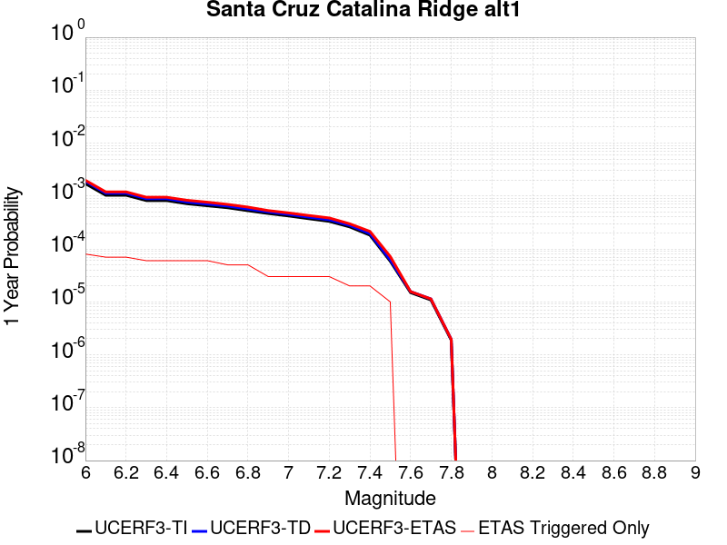 |  |

| Magnitude | 1 wk TI Prob | 1 wk TD Prob | 1 wk ETAS Prob | 1 wk ETAS/TD Gain | 1 wk ETAS Triggered Only | 1 mo TI Prob | 1 mo TD Prob | 1 mo ETAS Prob | 1 mo ETAS/TD Gain | 1 mo ETAS Triggered Only | 1 yr TI Prob | 1 yr TD Prob | 1 yr ETAS Prob | 1 yr ETAS/TD Gain | 1 yr ETAS Triggered Only | 10 yr TI Prob | 10 yr TD Prob | 10 yr ETAS Prob | 10 yr ETAS/TD Gain | 10 yr ETAS Triggered Only |
|-----|-----|-----|-----|-----|-----|-----|-----|-----|-----|-----|-----|-----|-----|-----|-----|-----|-----|-----|-----|-----|
| 6.0 | 3.2833184E-5 | 3.6558402E-5 | 7.6556935E-5 | 2.0940998 | 4.0E-5 | 1.4070606E-4 | 1.5667039E-4 | 1.9666411E-4 | 1.2552731 | 4.0E-5 | 0.00171175 | 0.0019059594 | 0.001985807 | 1.0418936 | 8.0E-5 | 0.016986247 | 0.018913032 | 0.019001331 | 1.0046686 | 9.0E-5 |
| 6.1 | 1.9835548E-5 | 2.1659505E-5 | 5.1658855E-5 | 2.3850431 | 3.0E-5 | 8.500672E-5 | 9.282326E-5 | 1.2282048E-4 | 1.3231648 | 3.0E-5 | 0.0010344655 | 0.0011295575 | 0.0011994784 | 1.0619012 | 7.0E-5 | 0.010296632 | 0.011240296 | 0.011319396 | 1.0070373 | 8.0E-5 |
| 6.2 | 1.9835548E-5 | 2.1659505E-5 | 5.1658855E-5 | 2.3850431 | 3.0E-5 | 8.500672E-5 | 9.282326E-5 | 1.2282048E-4 | 1.3231648 | 3.0E-5 | 0.0010344655 | 0.0011295575 | 0.0011994784 | 1.0619012 | 7.0E-5 | 0.010296632 | 0.011240296 | 0.011319396 | 1.0070373 | 8.0E-5 |
| 6.3 | 1.5728183E-5 | 1.703395E-5 | 4.7033438E-5 | 2.7611587 | 3.0E-5 | 6.7404755E-5 | 7.300063E-5 | 1.0299844E-4 | 1.4109254 | 3.0E-5 | 8.2034385E-4 | 8.884264E-4 | 9.4837305E-4 | 1.0674751 | 6.0E-5 | 0.008173222 | 0.008849427 | 0.008908896 | 1.0067201 | 6.0E-5 |
| 6.4 | 1.5728183E-5 | 1.703395E-5 | 4.7033438E-5 | 2.7611587 | 3.0E-5 | 6.7404755E-5 | 7.300063E-5 | 1.0299844E-4 | 1.4109254 | 3.0E-5 | 8.2034385E-4 | 8.884264E-4 | 9.4837305E-4 | 1.0674751 | 6.0E-5 | 0.008173222 | 0.008849427 | 0.008908896 | 1.0067201 | 6.0E-5 |
| 6.5 | 1.3707734E-5 | 1.4794522E-5 | 4.4794077E-5 | 3.0277476 | 3.0E-5 | 5.8746107E-5 | 6.3403575E-5 | 9.340167E-5 | 1.4731295 | 3.0E-5 | 7.1499916E-4 | 7.716686E-4 | 8.3162234E-4 | 1.0776936 | 6.0E-5 | 0.0071270303 | 0.0076902895 | 0.007749828 | 1.007742 | 6.0E-5 |
| 6.6 | 1.2539813E-5 | 1.3510219E-5 | 4.3509815E-5 | 3.2205112 | 3.0E-5 | 5.3740947E-5 | 5.789967E-5 | 8.789793E-5 | 1.5181077 | 3.0E-5 | 6.540996E-4 | 7.0470315E-4 | 7.646609E-4 | 1.0850822 | 6.0E-5 | 0.0065217763 | 0.0070249885 | 0.007084567 | 1.0084809 | 6.0E-5 |
| 6.7 | 1.1504083E-5 | 1.2377375E-5 | 3.2377127E-5 | 2.6158316 | 2.0E-5 | 4.930228E-5 | 5.3044827E-5 | 7.304377E-5 | 1.3770196 | 2.0E-5 | 6.0008996E-4 | 6.456314E-4 | 6.955991E-4 | 1.0773935 | 5.0E-5 | 0.005984721 | 0.006437786 | 0.006487464 | 1.0077167 | 5.0E-5 |
| 6.8 | 1.012739E-5 | 1.0877071E-5 | 3.0876854E-5 | 2.8387103 | 2.0E-5 | 4.340238E-5 | 4.6615194E-5 | 6.6614266E-5 | 1.4290247 | 2.0E-5 | 5.282958E-4 | 5.673937E-4 | 6.1736535E-4 | 1.0880722 | 5.0E-5 | 0.0052704164 | 0.0056596193 | 0.0057093366 | 1.0087845 | 5.0E-5 |
| 6.9 | 8.9607865E-6 | 9.609117E-6 | 1.960902E-5 | 2.0406682 | 1.0E-5 | 3.8402806E-5 | 4.1181287E-5 | 5.1180876E-5 | 1.2428187 | 1.0E-5 | 4.6745385E-4 | 5.012679E-4 | 5.312529E-4 | 1.0598183 | 3.0E-5 | 0.0046647177 | 0.005001492 | 0.0050313417 | 1.0059682 | 3.0E-5 |
| 7.0 | 8.046829E-6 | 8.619746E-6 | 1.861966E-5 | 2.160117 | 1.0E-5 | 3.4485955E-5 | 3.694125E-5 | 4.694088E-5 | 1.2706901 | 1.0E-5 | 4.1978562E-4 | 4.496677E-4 | 4.796542E-4 | 1.0666859 | 3.0E-5 | 0.004189935 | 0.0044876686 | 0.0045175343 | 1.006655 | 3.0E-5 |
| 7.1 | 7.136131E-6 | 7.637656E-6 | 1.763758E-5 | 2.3092923 | 1.0E-5 | 3.0583058E-5 | 3.2732405E-5 | 4.2732077E-5 | 1.3054976 | 1.0E-5 | 3.7228514E-4 | 3.9844486E-4 | 4.2843292E-4 | 1.0752628 | 3.0E-5 | 0.0037166206 | 0.003977381 | 0.0040072617 | 1.0075127 | 3.0E-5 |
| 7.2 | 6.362014E-6 | 6.8049585E-6 | 1.680489E-5 | 2.4695067 | 1.0E-5 | 2.726549E-5 | 2.9163786E-5 | 3.9163493E-5 | 1.342881 | 1.0E-5 | 3.3190678E-4 | 3.550119E-4 | 3.8500124E-4 | 1.0844742 | 3.0E-5 | 0.0033141149 | 0.003544516 | 0.0035744098 | 1.0084338 | 3.0E-5 |
| 7.3 | 5.004101E-6 | 5.351715E-6 | 1.5351661E-5 | 2.8685498 | 1.0E-5 | 2.1445969E-5 | 2.2935723E-5 | 3.293549E-5 | 1.435991 | 1.0E-5 | 2.6107338E-4 | 2.792072E-4 | 2.9920158E-4 | 1.0716114 | 2.0E-5 | 0.002607669 | 0.0027886187 | 0.0028085627 | 1.007152 | 2.0E-5 |
| 7.4 | 3.4901443E-6 | 3.7320526E-6 | 1.3732015E-5 | 3.6794808 | 1.0E-5 | 1.4957676E-5 | 1.5994416E-5 | 2.5994255E-5 | 1.6252083 | 1.0E-5 | 1.8209449E-4 | 1.9471499E-4 | 2.147111E-4 | 1.1026943 | 2.0E-5 | 0.0018194534 | 0.0019454823 | 0.0019654434 | 1.0102602 | 2.0E-5 |
| 7.5 | 1.1215045E-6 | 1.189387E-6 | 1.1189375E-5 | 9.407682 | 1.0E-5 | 4.806439E-6 | 5.097363E-6 | 1.5097312E-5 | 2.9617887 | 1.0E-5 | 5.851682E-5 | 6.205866E-5 | 7.205804E-5 | 1.1611278 | 1.0E-5 | 5.850142E-4 | 6.2041637E-4 | 6.3041016E-4 | 1.0161082 | 1.0E-5 |
| 7.6 | 2.8599047E-7 | 2.9951994E-7 | 2.9951994E-7 | 1.0 | 0.0 | 1.2256729E-6 | 1.2836562E-6 | 1.2836562E-6 | 1.0 | 0.0 | 1.4922465E-5 | 1.5628404E-5 | 1.5628404E-5 | 1.0 | 0.0 | 1.4921463E-4 | 1.5627318E-4 | 1.5627318E-4 | 1.0 | 0.0 |
| 7.7 | 2.0781519E-7 | 2.1744323E-7 | 2.1744323E-7 | 1.0 | 0.0 | 8.906362E-7 | 9.3189925E-7 | 9.3189925E-7 | 1.0 | 0.0 | 1.08434415E-5 | 1.13458145E-5 | 1.13458145E-5 | 1.0 | 0.0 | 1.0842913E-4 | 1.1345245E-4 | 1.1345245E-4 | 1.0 | 0.0 |
| 7.8 | 3.614776E-8 | 3.764102E-8 | 3.764102E-8 | 1.0 | 0.0 | 1.5491896E-7 | 1.6131864E-7 | 1.6131864E-7 | 1.0 | 0.0 | 1.8861368E-6 | 1.9640527E-6 | 1.9640527E-6 | 1.0 | 0.0 | 1.8861208E-5 | 1.9640367E-5 | 1.9640367E-5 | 1.0 | 0.0 |

## Pleito
*[(top)](#table-of-contents)*

| 1 Week | 1 Month | 1 Year | 10 Year |
|-----|-----|-----|-----|
|  |  |  |  |

| Magnitude | 1 wk TI Prob | 1 wk TD Prob | 1 wk ETAS Prob | 1 wk ETAS/TD Gain | 1 wk ETAS Triggered Only | 1 mo TI Prob | 1 mo TD Prob | 1 mo ETAS Prob | 1 mo ETAS/TD Gain | 1 mo ETAS Triggered Only | 1 yr TI Prob | 1 yr TD Prob | 1 yr ETAS Prob | 1 yr ETAS/TD Gain | 1 yr ETAS Triggered Only | 10 yr TI Prob | 10 yr TD Prob | 10 yr ETAS Prob | 10 yr ETAS/TD Gain | 10 yr ETAS Triggered Only |
|-----|-----|-----|-----|-----|-----|-----|-----|-----|-----|-----|-----|-----|-----|-----|-----|-----|-----|-----|-----|-----|
| 6.0 | 1.6763008E-5 | 2.4764735E-5 | 6.476374E-5 | 2.61516 | 4.0E-5 | 7.183948E-5 | 1.0613067E-4 | 1.4612642E-4 | 1.3768538 | 4.0E-5 | 8.742947E-4 | 0.001291447 | 0.0013713437 | 1.061866 | 8.0E-5 | 0.00870863 | 0.012954412 | 0.013043246 | 1.0068574 | 9.0E-5 |
| 6.1 | 1.6763008E-5 | 2.4764735E-5 | 6.476374E-5 | 2.61516 | 4.0E-5 | 7.183948E-5 | 1.0613067E-4 | 1.4612642E-4 | 1.3768538 | 4.0E-5 | 8.742947E-4 | 0.001291447 | 0.0013713437 | 1.061866 | 8.0E-5 | 0.00870863 | 0.012954412 | 0.013043246 | 1.0068574 | 9.0E-5 |
| 6.2 | 1.6763008E-5 | 2.4764735E-5 | 6.476374E-5 | 2.61516 | 4.0E-5 | 7.183948E-5 | 1.0613067E-4 | 1.4612642E-4 | 1.3768538 | 4.0E-5 | 8.742947E-4 | 0.001291447 | 0.0013713437 | 1.061866 | 8.0E-5 | 0.00870863 | 0.012954412 | 0.013043246 | 1.0068574 | 9.0E-5 |
| 6.3 | 1.6763008E-5 | 2.4764735E-5 | 6.476374E-5 | 2.61516 | 4.0E-5 | 7.183948E-5 | 1.0613067E-4 | 1.4612642E-4 | 1.3768538 | 4.0E-5 | 8.742947E-4 | 0.001291447 | 0.0013713437 | 1.061866 | 8.0E-5 | 0.00870863 | 0.012954412 | 0.013043246 | 1.0068574 | 9.0E-5 |
| 6.4 | 1.6763008E-5 | 2.4764735E-5 | 6.476374E-5 | 2.61516 | 4.0E-5 | 7.183948E-5 | 1.0613067E-4 | 1.4612642E-4 | 1.3768538 | 4.0E-5 | 8.742947E-4 | 0.001291447 | 0.0013713437 | 1.061866 | 8.0E-5 | 0.00870863 | 0.012954412 | 0.013043246 | 1.0068574 | 9.0E-5 |
| 6.5 | 1.6763008E-5 | 2.4764735E-5 | 6.476374E-5 | 2.61516 | 4.0E-5 | 7.183948E-5 | 1.0613067E-4 | 1.4612642E-4 | 1.3768538 | 4.0E-5 | 8.742947E-4 | 0.001291447 | 0.0013713437 | 1.061866 | 8.0E-5 | 0.00870863 | 0.012954412 | 0.013043246 | 1.0068574 | 9.0E-5 |
| 6.6 | 9.910213E-6 | 1.721552E-5 | 5.721483E-5 | 3.3234448 | 4.0E-5 | 4.247165E-5 | 7.3778734E-5 | 1.13775786E-4 | 1.5421216 | 4.0E-5 | 5.169696E-4 | 8.9788967E-4 | 9.4784476E-4 | 1.0556362 | 5.0E-5 | 0.0051576863 | 0.009051226 | 0.009100773 | 1.0054741 | 5.0E-5 |
| 6.7 | 9.910213E-6 | 1.721552E-5 | 5.721483E-5 | 3.3234448 | 4.0E-5 | 4.247165E-5 | 7.3778734E-5 | 1.13775786E-4 | 1.5421216 | 4.0E-5 | 5.169696E-4 | 8.9788967E-4 | 9.4784476E-4 | 1.0556362 | 5.0E-5 | 0.0051576863 | 0.009051226 | 0.009100773 | 1.0054741 | 5.0E-5 |
| 6.8 | 8.300162E-6 | 1.5475129E-5 | 3.547482E-5 | 2.2923763 | 2.0E-5 | 3.557164E-5 | 6.63203E-5 | 8.631898E-5 | 1.3015468 | 2.0E-5 | 4.3299864E-4 | 8.07152E-4 | 8.371278E-4 | 1.0371377 | 3.0E-5 | 0.004321559 | 0.008150663 | 0.008180419 | 1.0036507 | 3.0E-5 |
| 6.9 | 8.183114E-6 | 1.5346344E-5 | 3.534604E-5 | 2.303222 | 2.0E-5 | 3.5070017E-5 | 6.57684E-5 | 8.576708E-5 | 1.3040774 | 2.0E-5 | 4.2689382E-4 | 8.0043747E-4 | 8.304135E-4 | 1.0374495 | 3.0E-5 | 0.0042607468 | 0.008084008 | 0.008113765 | 1.0036811 | 3.0E-5 |
| 7.0 | 7.1748823E-6 | 1.4133306E-5 | 1.4133306E-5 | 1.0 | 0.0 | 3.0749135E-5 | 6.0569906E-5 | 6.0569906E-5 | 1.0 | 0.0 | 3.743064E-4 | 7.3718966E-4 | 7.3718966E-4 | 1.0 | 0.0 | 0.0037367654 | 0.0074553755 | 0.0074553755 | 1.0 | 0.0 |
| 7.1 | 7.1671807E-6 | 1.4123676E-5 | 1.4123676E-5 | 1.0 | 0.0 | 3.0716128E-5 | 6.0528637E-5 | 6.0528637E-5 | 1.0 | 0.0 | 3.7390468E-4 | 7.366875E-4 | 7.366875E-4 | 1.0 | 0.0 | 0.0037327618 | 0.0074503883 | 0.0074503883 | 1.0 | 0.0 |
| 7.2 | 7.0649667E-6 | 1.3970962E-5 | 1.3970962E-5 | 1.0 | 0.0 | 3.0278077E-5 | 5.987418E-5 | 5.987418E-5 | 1.0 | 0.0 | 3.6857324E-4 | 7.287248E-4 | 7.287248E-4 | 1.0 | 0.0 | 0.0036796255 | 0.0073711374 | 0.0073711374 | 1.0 | 0.0 |
| 7.3 | 7.02082E-6 | 1.3914415E-5 | 1.3914415E-5 | 1.0 | 0.0 | 3.008888E-5 | 5.9631846E-5 | 5.9631846E-5 | 1.0 | 0.0 | 3.6627054E-4 | 7.257764E-4 | 7.257764E-4 | 1.0 | 0.0 | 0.0036566744 | 0.0073416373 | 0.0073416373 | 1.0 | 0.0 |
| 7.4 | 6.987146E-6 | 1.3873975E-5 | 1.3873975E-5 | 1.0 | 0.0 | 2.9944567E-5 | 5.9458544E-5 | 5.9458544E-5 | 1.0 | 0.0 | 3.6451413E-4 | 7.2366785E-4 | 7.2366785E-4 | 1.0 | 0.0 | 0.0036391679 | 0.007320571 | 0.007320571 | 1.0 | 0.0 |
| 7.5 | 6.9494554E-6 | 1.383088E-5 | 1.383088E-5 | 1.0 | 0.0 | 2.9783041E-5 | 5.9273858E-5 | 5.9273858E-5 | 1.0 | 0.0 | 3.625482E-4 | 7.2142074E-4 | 7.2142074E-4 | 1.0 | 0.0 | 0.0036195726 | 0.007298199 | 0.007298199 | 1.0 | 0.0 |
| 7.6 | 6.92694E-6 | 1.3789992E-5 | 1.3789992E-5 | 1.0 | 0.0 | 2.9686547E-5 | 5.909863E-5 | 5.909863E-5 | 1.0 | 0.0 | 3.6137376E-4 | 7.192888E-4 | 7.192888E-4 | 1.0 | 0.0 | 0.0036078666 | 0.007276951 | 0.007276951 | 1.0 | 0.0 |
| 7.7 | 6.395867E-6 | 1.26690065E-5 | 1.26690065E-5 | 1.0 | 0.0 | 2.741057E-5 | 5.4294615E-5 | 5.4294615E-5 | 1.0 | 0.0 | 3.336726E-4 | 6.6083675E-4 | 6.6083675E-4 | 1.0 | 0.0 | 0.0033317201 | 0.0066955453 | 0.0066955453 | 1.0 | 0.0 |
| 7.8 | 5.8664327E-6 | 1.1536581E-5 | 1.1536581E-5 | 1.0 | 0.0 | 2.5141611E-5 | 4.9441554E-5 | 4.9441554E-5 | 1.0 | 0.0 | 3.060561E-4 | 6.0178485E-4 | 6.0178485E-4 | 1.0 | 0.0 | 0.0030563495 | 0.0061010164 | 0.0061010164 | 1.0 | 0.0 |
| 7.9 | 3.7167474E-6 | 7.1145205E-6 | 7.1145205E-6 | 1.0 | 0.0 | 1.592882E-5 | 3.0490448E-5 | 3.0490448E-5 | 1.0 | 0.0 | 1.9391612E-4 | 3.7115812E-4 | 3.7115812E-4 | 1.0 | 0.0 | 0.0019374699 | 0.0037676243 | 0.0037676243 | 1.0 | 0.0 |
| 8.0 | 1.0903841E-6 | 1.2879104E-6 | 1.2879104E-6 | 1.0 | 0.0 | 4.6730665E-6 | 5.5196047E-6 | 5.5196047E-6 | 1.0 | 0.0 | 5.68931E-5 | 6.719913E-5 | 6.719913E-5 | 1.0 | 0.0 | 5.6878536E-4 | 6.942094E-4 | 6.942094E-4 | 1.0 | 0.0 |
| 8.1 | 2.6894583E-7 | 1.1056095E-7 | 1.1056095E-7 | 1.0 | 0.0 | 1.1526245E-6 | 4.7383253E-7 | 4.7383253E-7 | 1.0 | 0.0 | 1.4033113E-5 | 5.768896E-6 | 5.768896E-6 | 1.0 | 0.0 | 1.4032227E-4 | 6.454915E-5 | 6.454915E-5 | 1.0 | 0.0 |
| 8.2 | 5.2967013E-9 | 2.4567874E-9 | 2.4567874E-9 | 1.0 | 0.0 | 2.2700148E-8 | 1.0529089E-8 | 1.0529089E-8 | 1.0 | 0.0 | 2.7637427E-7 | 1.2819166E-7 | 1.2819166E-7 | 1.0 | 0.0 | 2.7637393E-6 | 1.4588004E-6 | 1.4588004E-6 | 1.0 | 0.0 |

## Mission Ridge-Arroyo Parida-Santa Ana
*[(top)](#table-of-contents)*

| 1 Week | 1 Month | 1 Year | 10 Year |
|-----|-----|-----|-----|
|  |  |  |  |

| Magnitude | 1 wk TI Prob | 1 wk TD Prob | 1 wk ETAS Prob | 1 wk ETAS/TD Gain | 1 wk ETAS Triggered Only | 1 mo TI Prob | 1 mo TD Prob | 1 mo ETAS Prob | 1 mo ETAS/TD Gain | 1 mo ETAS Triggered Only | 1 yr TI Prob | 1 yr TD Prob | 1 yr ETAS Prob | 1 yr ETAS/TD Gain | 1 yr ETAS Triggered Only | 10 yr TI Prob | 10 yr TD Prob | 10 yr ETAS Prob | 10 yr ETAS/TD Gain | 10 yr ETAS Triggered Only |
|-----|-----|-----|-----|-----|-----|-----|-----|-----|-----|-----|-----|-----|-----|-----|-----|-----|-----|-----|-----|-----|
| 6.0 | 4.169034E-5 | 4.7137048E-5 | 5.7136574E-5 | 1.2121373 | 1.0E-5 | 1.7866064E-4 | 2.0200513E-4 | 2.220011E-4 | 1.0989873 | 2.0E-5 | 0.0021730233 | 0.0024574657 | 0.002507343 | 1.0202962 | 5.0E-5 | 0.021518968 | 0.02438483 | 0.024462879 | 1.0032008 | 8.0E-5 |
| 6.1 | 1.73813E-5 | 1.6854203E-5 | 1.6854203E-5 | 1.0 | 0.0 | 7.4489166E-5 | 7.223036E-5 | 8.2229635E-5 | 1.138436 | 1.0E-5 | 9.065282E-4 | 8.790605E-4 | 8.890517E-4 | 1.0113658 | 1.0E-5 | 0.009028391 | 0.008757128 | 0.008786866 | 1.0033958 | 3.0E-5 |
| 6.2 | 1.4622182E-5 | 1.3673262E-5 | 1.3673262E-5 | 1.0 | 0.0 | 6.2664985E-5 | 5.85984E-5 | 6.8597816E-5 | 1.1706431 | 1.0E-5 | 7.6267915E-4 | 7.132059E-4 | 7.2319875E-4 | 1.0140111 | 1.0E-5 | 0.007600669 | 0.007109767 | 0.007139554 | 1.0041895 | 3.0E-5 |
| 6.3 | 1.3552434E-5 | 1.2482174E-5 | 1.2482174E-5 | 1.0 | 0.0 | 5.8080568E-5 | 5.349395E-5 | 6.349342E-5 | 1.1869271 | 1.0E-5 | 7.069015E-4 | 6.510974E-4 | 6.610909E-4 | 1.0153487 | 1.0E-5 | 0.00704657 | 0.006492415 | 0.00652222 | 1.0045907 | 3.0E-5 |
| 6.4 | 1.30977305E-5 | 1.1979128E-5 | 1.1979128E-5 | 1.0 | 0.0 | 5.613192E-5 | 5.133813E-5 | 6.133762E-5 | 1.194777 | 1.0E-5 | 6.831918E-4 | 6.2486547E-4 | 6.3485926E-4 | 1.0159935 | 1.0E-5 | 0.006810953 | 0.006231584 | 0.006261397 | 1.0047842 | 3.0E-5 |
| 6.5 | 1.225205E-5 | 1.1048776E-5 | 1.1048776E-5 | 1.0 | 0.0 | 5.2507727E-5 | 4.735105E-5 | 5.735058E-5 | 1.2111785 | 1.0E-5 | 6.3909404E-4 | 5.7634927E-4 | 5.863435E-4 | 1.0173405 | 1.0E-5 | 0.006372592 | 0.005749009 | 0.0057788366 | 1.0051883 | 3.0E-5 |
| 6.6 | 1.1352241E-5 | 1.0063508E-5 | 1.0063508E-5 | 1.0 | 0.0 | 4.8651553E-5 | 4.3128617E-5 | 5.3128188E-5 | 1.2318546 | 1.0E-5 | 5.921717E-4 | 5.249665E-4 | 5.349613E-4 | 1.0190388 | 1.0E-5 | 0.0059059616 | 0.0052376646 | 0.0052675074 | 1.0056977 | 3.0E-5 |
| 6.7 | 1.0864116E-5 | 9.517E-6 | 9.517E-6 | 1.0 | 0.0 | 4.6559664E-5 | 4.0786515E-5 | 5.0786108E-5 | 1.245169 | 1.0E-5 | 5.667165E-4 | 4.964647E-4 | 5.0645974E-4 | 1.0201324 | 1.0E-5 | 0.005652734 | 0.0049539437 | 0.0049837953 | 1.0060258 | 3.0E-5 |
| 6.8 | 1.0666365E-5 | 9.299752E-6 | 9.299752E-6 | 1.0 | 0.0 | 4.571219E-5 | 3.985548E-5 | 4.9855083E-5 | 1.2508966 | 1.0E-5 | 5.564038E-4 | 4.8513446E-4 | 4.951296E-4 | 1.0206028 | 1.0E-5 | 0.005550127 | 0.00484114 | 0.004870995 | 1.0061669 | 3.0E-5 |
| 6.9 | 1.0038665E-5 | 8.592018E-6 | 8.592018E-6 | 1.0 | 0.0 | 4.302214E-5 | 3.682243E-5 | 3.682243E-5 | 1.0 | 0.0 | 5.236687E-4 | 4.4822265E-4 | 4.4822265E-4 | 1.0 | 0.0 | 0.005224364 | 0.0044735507 | 0.0044934615 | 1.0044507 | 2.0E-5 |
| 7.0 | 9.5379955E-6 | 8.025047E-6 | 8.025047E-6 | 1.0 | 0.0 | 4.0876483E-5 | 3.439261E-5 | 3.439261E-5 | 1.0 | 0.0 | 4.975576E-4 | 4.1865133E-4 | 4.1865133E-4 | 1.0 | 0.0 | 0.00496445 | 0.00417898 | 0.0041988962 | 1.0047659 | 2.0E-5 |
| 7.1 | 9.207389E-6 | 7.652347E-6 | 7.652347E-6 | 1.0 | 0.0 | 3.945964E-5 | 3.2795375E-5 | 3.2795375E-5 | 1.0 | 0.0 | 4.803152E-4 | 3.992122E-4 | 3.992122E-4 | 1.0 | 0.0 | 0.004792784 | 0.003985301 | 0.004005221 | 1.0049984 | 2.0E-5 |
| 7.2 | 7.638091E-6 | 5.9310923E-6 | 5.9310923E-6 | 1.0 | 0.0 | 3.2734264E-5 | 2.5418722E-5 | 2.5418722E-5 | 1.0 | 0.0 | 3.984668E-4 | 3.094293E-4 | 3.094293E-4 | 1.0 | 0.0 | 0.0039775306 | 0.0030901956 | 0.0031101338 | 1.0064521 | 2.0E-5 |
| 7.3 | 7.2500147E-6 | 5.596131E-6 | 5.596131E-6 | 1.0 | 0.0 | 3.1071122E-5 | 2.3983199E-5 | 2.3983199E-5 | 1.0 | 0.0 | 3.7822526E-4 | 2.9195662E-4 | 2.9195662E-4 | 1.0 | 0.0 | 0.0037758215 | 0.0029159402 | 0.002935882 | 1.0068388 | 2.0E-5 |
| 7.4 | 6.3899715E-6 | 4.9184864E-6 | 4.9184864E-6 | 1.0 | 0.0 | 2.7385306E-5 | 2.1079059E-5 | 2.1079059E-5 | 1.0 | 0.0 | 3.3336508E-4 | 2.566075E-4 | 2.566075E-4 | 1.0 | 0.0 | 0.0033286542 | 0.002563311 | 0.0025832597 | 1.0077825 | 2.0E-5 |
| 7.5 | 5.379025E-6 | 4.0838477E-6 | 4.0838477E-6 | 1.0 | 0.0 | 2.305276E-5 | 1.7502087E-5 | 1.7502087E-5 | 1.0 | 0.0 | 2.806312E-4 | 2.1306718E-4 | 2.1306718E-4 | 1.0 | 0.0 | 0.0028027708 | 0.0021286402 | 0.0021386188 | 1.0046878 | 1.0E-5 |
| 7.6 | 4.1270696E-6 | 3.0883373E-6 | 3.0883373E-6 | 1.0 | 0.0 | 1.768732E-5 | 1.32356645E-5 | 1.32356645E-5 | 1.0 | 0.0 | 2.1532185E-4 | 1.6113237E-4 | 1.6113237E-4 | 1.0 | 0.0 | 0.0021511333 | 0.0016101635 | 0.0016201474 | 1.0062006 | 1.0E-5 |
| 7.7 | 2.5406805E-6 | 1.8282044E-6 | 1.8282044E-6 | 1.0 | 0.0 | 1.0888585E-5 | 7.835139E-6 | 7.835139E-6 | 1.0 | 0.0 | 1.3256045E-4 | 9.53887E-5 | 9.53887E-5 | 1.0 | 0.0 | 0.0013248142 | 9.534837E-4 | 9.6347416E-4 | 1.0104779 | 1.0E-5 |
| 7.8 | 4.8608285E-7 | 3.509864E-7 | 3.509864E-7 | 1.0 | 0.0 | 2.0832106E-6 | 1.5042266E-6 | 1.5042266E-6 | 1.0 | 0.0 | 2.5362791E-5 | 1.8313805E-5 | 1.8313805E-5 | 1.0 | 0.0 | 2.5359896E-4 | 1.8312308E-4 | 1.8312308E-4 | 1.0 | 0.0 |
| 7.9 | 2.0472514E-8 | 1.2688718E-8 | 1.2688718E-8 | 1.0 | 0.0 | 8.7739345E-8 | 5.438022E-8 | 5.438022E-8 | 1.0 | 0.0 | 1.068226E-6 | 6.6207895E-7 | 6.6207895E-7 | 1.0 | 0.0 | 1.0682209E-5 | 6.620771E-6 | 6.620771E-6 | 1.0 | 0.0 |
| 8.0 | 4.443582E-9 | 2.032067E-9 | 2.032067E-9 | 1.0 | 0.0 | 1.9043922E-8 | 8.7088585E-9 | 8.7088585E-9 | 1.0 | 0.0 | 2.3185973E-7 | 1.0603035E-7 | 1.0603035E-7 | 1.0 | 0.0 | 2.3185949E-6 | 1.0603031E-6 | 1.0603031E-6 | 1.0 | 0.0 |

## San Jacinto (Clark) rev
*[(top)](#table-of-contents)*

| 1 Week | 1 Month | 1 Year | 10 Year |
|-----|-----|-----|-----|
|  |  |  |  |

| Magnitude | 1 wk TI Prob | 1 wk TD Prob | 1 wk ETAS Prob | 1 wk ETAS/TD Gain | 1 wk ETAS Triggered Only | 1 mo TI Prob | 1 mo TD Prob | 1 mo ETAS Prob | 1 mo ETAS/TD Gain | 1 mo ETAS Triggered Only | 1 yr TI Prob | 1 yr TD Prob | 1 yr ETAS Prob | 1 yr ETAS/TD Gain | 1 yr ETAS Triggered Only | 10 yr TI Prob | 10 yr TD Prob | 10 yr ETAS Prob | 10 yr ETAS/TD Gain | 10 yr ETAS Triggered Only |
|-----|-----|-----|-----|-----|-----|-----|-----|-----|-----|-----|-----|-----|-----|-----|-----|-----|-----|-----|-----|-----|
| 6.0 | 4.482615E-5 | 2.1153059E-5 | 3.115285E-5 | 1.4727348 | 1.0E-5 | 1.9209793E-4 | 9.065287E-5 | 1.1065105E-4 | 1.2206018 | 2.0E-5 | 0.0023362834 | 0.0011031491 | 0.0011630829 | 1.0543298 | 6.0E-5 | 0.02311874 | 0.011485709 | 0.011574675 | 1.0077459 | 9.0E-5 |
| 6.1 | 4.482615E-5 | 2.1153059E-5 | 3.115285E-5 | 1.4727348 | 1.0E-5 | 1.9209793E-4 | 9.065287E-5 | 1.1065105E-4 | 1.2206018 | 2.0E-5 | 0.0023362834 | 0.0011031491 | 0.0011630829 | 1.0543298 | 6.0E-5 | 0.02311874 | 0.011485709 | 0.011574675 | 1.0077459 | 9.0E-5 |
| 6.2 | 4.482615E-5 | 2.1153059E-5 | 3.115285E-5 | 1.4727348 | 1.0E-5 | 1.9209793E-4 | 9.065287E-5 | 1.1065105E-4 | 1.2206018 | 2.0E-5 | 0.0023362834 | 0.0011031491 | 0.0011630829 | 1.0543298 | 6.0E-5 | 0.02311874 | 0.011485709 | 0.011574675 | 1.0077459 | 9.0E-5 |
| 6.3 | 4.482615E-5 | 2.1153059E-5 | 3.115285E-5 | 1.4727348 | 1.0E-5 | 1.9209793E-4 | 9.065287E-5 | 1.1065105E-4 | 1.2206018 | 2.0E-5 | 0.0023362834 | 0.0011031491 | 0.0011630829 | 1.0543298 | 6.0E-5 | 0.02311874 | 0.011485709 | 0.011574675 | 1.0077459 | 9.0E-5 |
| 6.4 | 4.482615E-5 | 2.1153059E-5 | 3.115285E-5 | 1.4727348 | 1.0E-5 | 1.9209793E-4 | 9.065287E-5 | 1.1065105E-4 | 1.2206018 | 2.0E-5 | 0.0023362834 | 0.0011031491 | 0.0011630829 | 1.0543298 | 6.0E-5 | 0.02311874 | 0.011485709 | 0.011574675 | 1.0077459 | 9.0E-5 |
| 6.5 | 3.7294863E-5 | 1.7354667E-5 | 2.7354492E-5 | 1.576204 | 1.0E-5 | 1.5982533E-4 | 7.437504E-5 | 9.437356E-5 | 1.2688874 | 2.0E-5 | 0.0019441366 | 9.051445E-4 | 9.650902E-4 | 1.0662278 | 6.0E-5 | 0.01927216 | 0.009485902 | 0.009575049 | 1.0093977 | 9.0E-5 |
| 6.6 | 3.7294863E-5 | 1.7354667E-5 | 2.7354492E-5 | 1.576204 | 1.0E-5 | 1.5982533E-4 | 7.437504E-5 | 9.437356E-5 | 1.2688874 | 2.0E-5 | 0.0019441366 | 9.051445E-4 | 9.650902E-4 | 1.0662278 | 6.0E-5 | 0.01927216 | 0.009485902 | 0.009575049 | 1.0093977 | 9.0E-5 |
| 6.7 | 3.6039248E-5 | 1.6602684E-5 | 2.6602518E-5 | 1.6023023 | 1.0E-5 | 1.5444479E-4 | 7.115244E-5 | 9.1151014E-5 | 1.2810667 | 2.0E-5 | 0.0018787434 | 8.659408E-4 | 9.2588883E-4 | 1.0692288 | 6.0E-5 | 0.01862939 | 0.009088189 | 0.009177371 | 1.009813 | 9.0E-5 |
| 6.8 | 3.5031844E-5 | 1.6231123E-5 | 2.623096E-5 | 1.6160903 | 1.0E-5 | 1.5012783E-4 | 6.956012E-5 | 8.955873E-5 | 1.2875011 | 2.0E-5 | 0.0018262739 | 8.4656954E-4 | 9.065187E-4 | 1.0708143 | 6.0E-5 | 0.01811338 | 0.008888788 | 0.008977988 | 1.0100352 | 9.0E-5 |
| 6.9 | 3.435112E-5 | 1.6061658E-5 | 2.6061498E-5 | 1.6225907 | 1.0E-5 | 1.4721078E-4 | 6.8833884E-5 | 8.883251E-5 | 1.2905346 | 2.0E-5 | 0.0017908178 | 8.377344E-4 | 8.9768413E-4 | 1.0715617 | 6.0E-5 | 0.017764548 | 0.008796512 | 0.00888572 | 1.0101414 | 9.0E-5 |
| 7.0 | 2.8959772E-5 | 1.43355255E-5 | 2.4335382E-5 | 1.6975578 | 1.0E-5 | 1.241074E-4 | 6.1436534E-5 | 7.143592E-5 | 1.1627595 | 1.0E-5 | 0.0015099603 | 7.477359E-4 | 7.976985E-4 | 1.0668185 | 5.0E-5 | 0.014997416 | 0.007868331 | 0.007947702 | 1.0100874 | 8.0E-5 |
| 7.1 | 2.6002877E-5 | 1.2827699E-5 | 2.2827571E-5 | 1.779553 | 1.0E-5 | 1.11436144E-4 | 5.4974706E-5 | 6.4974156E-5 | 1.1818918 | 1.0E-5 | 0.0013558907 | 6.6911365E-4 | 7.0908683E-4 | 1.0597405 | 4.0E-5 | 0.013476475 | 0.0070483433 | 0.0071178502 | 1.0098615 | 7.0E-5 |
| 7.2 | 2.2544838E-5 | 1.1260331E-5 | 2.1260219E-5 | 1.8880633 | 1.0E-5 | 9.661716E-5 | 4.825768E-5 | 5.8257196E-5 | 1.2072109 | 1.0E-5 | 0.001175679 | 5.873803E-4 | 6.273568E-4 | 1.068059 | 4.0E-5 | 0.011694785 | 0.00619256 | 0.0062621264 | 1.0112339 | 7.0E-5 |
| 7.3 | 1.75334E-5 | 1.0810585E-5 | 2.0810478E-5 | 1.9250094 | 1.0E-5 | 7.514098E-5 | 4.6330264E-5 | 5.63298E-5 | 1.2158316 | 1.0E-5 | 9.144575E-4 | 5.6392635E-4 | 6.039038E-4 | 1.0708913 | 4.0E-5 | 0.009107036 | 0.0059332196 | 0.0060028043 | 1.0117279 | 7.0E-5 |
| 7.4 | 1.5924552E-5 | 1.0610475E-5 | 2.0610369E-5 | 1.9424548 | 1.0E-5 | 6.82463E-5 | 4.547268E-5 | 5.5472225E-5 | 1.2199023 | 1.0E-5 | 8.305819E-4 | 5.534906E-4 | 5.934685E-4 | 1.0722287 | 4.0E-5 | 0.008274844 | 0.0058205863 | 0.005890179 | 1.0119563 | 7.0E-5 |
| 7.5 | 1.3428931E-5 | 9.851045E-6 | 1.9850946E-5 | 2.0151107 | 1.0E-5 | 5.7551293E-5 | 4.221809E-5 | 5.2217667E-5 | 1.2368553 | 1.0E-5 | 7.004617E-4 | 5.1388505E-4 | 5.538645E-4 | 1.0777984 | 4.0E-5 | 0.006982579 | 0.005406209 | 0.0054758303 | 1.0128781 | 7.0E-5 |
| 7.6 | 1.0688787E-5 | 8.614091E-6 | 1.8614004E-5 | 2.1608787 | 1.0E-5 | 4.5808283E-5 | 3.6917012E-5 | 4.691664E-5 | 1.2708678 | 1.0E-5 | 5.5757316E-4 | 4.4937237E-4 | 4.893544E-4 | 1.088973 | 4.0E-5 | 0.005561762 | 0.0047413614 | 0.004801077 | 1.0125946 | 6.0E-5 |
| 7.7 | 8.81236E-6 | 7.4673385E-6 | 1.7467264E-5 | 2.3391552 | 1.0E-5 | 3.776671E-5 | 3.200249E-5 | 4.2002168E-5 | 1.3124657 | 1.0E-5 | 4.597127E-4 | 3.8956082E-4 | 4.2954527E-4 | 1.1026397 | 4.0E-5 | 0.0045876284 | 0.0041344194 | 0.004194171 | 1.0144523 | 6.0E-5 |
| 7.8 | 7.780431E-6 | 6.695928E-6 | 1.669586E-5 | 2.4934351 | 1.0E-5 | 3.3344273E-5 | 2.8696519E-5 | 3.869623E-5 | 1.3484644 | 1.0E-5 | 4.0589093E-4 | 3.4932428E-4 | 3.893103E-4 | 1.1144668 | 4.0E-5 | 0.0040515037 | 0.0037226272 | 0.003782404 | 1.0160576 | 6.0E-5 |
| 7.9 | 6.5437994E-6 | 5.7797783E-6 | 1.577972E-5 | 2.7301602 | 1.0E-5 | 2.8044553E-5 | 2.4770245E-5 | 3.4769997E-5 | 1.4037002 | 1.0E-5 | 3.4138895E-4 | 3.0153614E-4 | 3.415241E-4 | 1.132614 | 4.0E-5 | 0.0034086495 | 0.0032343294 | 0.0032941352 | 1.018491 | 6.0E-5 |
| 8.0 | 5.4488164E-6 | 4.812793E-6 | 1.4812745E-5 | 3.0777855 | 1.0E-5 | 2.3351862E-5 | 2.0626094E-5 | 3.0625888E-5 | 1.4848127 | 1.0E-5 | 2.8427184E-4 | 2.510939E-4 | 2.9108385E-4 | 1.159263 | 4.0E-5 | 0.0028390845 | 0.0027107038 | 0.002770541 | 1.0220745 | 6.0E-5 |
| 8.1 | 2.8397242E-6 | 1.3665673E-6 | 1.3665673E-6 | 1.0 | 0.0 | 1.217019E-5 | 5.856704E-6 | 5.856704E-6 | 1.0 | 0.0 | 1.4816198E-4 | 7.1303046E-5 | 7.1303046E-5 | 1.0 | 0.0 | 0.0014806325 | 8.113543E-4 | 8.113543E-4 | 1.0 | 0.0 |
| 8.2 | 2.030244E-6 | 6.3151083E-7 | 6.3151083E-7 | 1.0 | 0.0 | 8.701017E-6 | 2.7064723E-6 | 2.7064723E-6 | 1.0 | 0.0 | 1.05929736E-4 | 3.2950808E-5 | 3.2950808E-5 | 1.0 | 0.0 | 0.0010587925 | 3.9470522E-4 | 3.9470522E-4 | 1.0 | 0.0 |
| 8.3 | 1.0659804E-6 | 2.9230563E-7 | 2.9230563E-7 | 1.0 | 0.0 | 4.568479E-6 | 1.2527379E-6 | 1.2527379E-6 | 1.0 | 0.0 | 5.5619817E-5 | 1.5251981E-5 | 1.5251981E-5 | 1.0 | 0.0 | 5.5605895E-4 | 1.8556409E-4 | 1.8556409E-4 | 1.0 | 0.0 |

## Oak Ridge (Onshore)
*[(top)](#table-of-contents)*

| 1 Week | 1 Month | 1 Year | 10 Year |
|-----|-----|-----|-----|
|  |  |  |  |

| Magnitude | 1 wk TI Prob | 1 wk TD Prob | 1 wk ETAS Prob | 1 wk ETAS/TD Gain | 1 wk ETAS Triggered Only | 1 mo TI Prob | 1 mo TD Prob | 1 mo ETAS Prob | 1 mo ETAS/TD Gain | 1 mo ETAS Triggered Only | 1 yr TI Prob | 1 yr TD Prob | 1 yr ETAS Prob | 1 yr ETAS/TD Gain | 1 yr ETAS Triggered Only | 10 yr TI Prob | 10 yr TD Prob | 10 yr ETAS Prob | 10 yr ETAS/TD Gain | 10 yr ETAS Triggered Only |
|-----|-----|-----|-----|-----|-----|-----|-----|-----|-----|-----|-----|-----|-----|-----|-----|-----|-----|-----|-----|-----|
| 6.0 | 3.155064E-5 | 2.9526076E-5 | 5.952519E-5 | 2.016021 | 3.0E-5 | 1.3521002E-4 | 1.265344E-4 | 1.5653062E-4 | 1.2370597 | 3.0E-5 | 0.001644939 | 0.0015395058 | 0.0015994135 | 1.0389135 | 6.0E-5 | 0.01632816 | 0.015293054 | 0.015371831 | 1.0051512 | 8.0E-5 |
| 6.1 | 3.155064E-5 | 2.9526076E-5 | 5.952519E-5 | 2.016021 | 3.0E-5 | 1.3521002E-4 | 1.265344E-4 | 1.5653062E-4 | 1.2370597 | 3.0E-5 | 0.001644939 | 0.0015395058 | 0.0015994135 | 1.0389135 | 6.0E-5 | 0.01632816 | 0.015293054 | 0.015371831 | 1.0051512 | 8.0E-5 |
| 6.2 | 3.155064E-5 | 2.9526076E-5 | 5.952519E-5 | 2.016021 | 3.0E-5 | 1.3521002E-4 | 1.265344E-4 | 1.5653062E-4 | 1.2370597 | 3.0E-5 | 0.001644939 | 0.0015395058 | 0.0015994135 | 1.0389135 | 6.0E-5 | 0.01632816 | 0.015293054 | 0.015371831 | 1.0051512 | 8.0E-5 |
| 6.3 | 3.155064E-5 | 2.9526076E-5 | 5.952519E-5 | 2.016021 | 3.0E-5 | 1.3521002E-4 | 1.265344E-4 | 1.5653062E-4 | 1.2370597 | 3.0E-5 | 0.001644939 | 0.0015395058 | 0.0015994135 | 1.0389135 | 6.0E-5 | 0.01632816 | 0.015293054 | 0.015371831 | 1.0051512 | 8.0E-5 |
| 6.4 | 3.155064E-5 | 2.9526076E-5 | 5.952519E-5 | 2.016021 | 3.0E-5 | 1.3521002E-4 | 1.265344E-4 | 1.5653062E-4 | 1.2370597 | 3.0E-5 | 0.001644939 | 0.0015395058 | 0.0015994135 | 1.0389135 | 6.0E-5 | 0.01632816 | 0.015293054 | 0.015371831 | 1.0051512 | 8.0E-5 |
| 6.5 | 3.155064E-5 | 2.9526076E-5 | 5.952519E-5 | 2.016021 | 3.0E-5 | 1.3521002E-4 | 1.265344E-4 | 1.5653062E-4 | 1.2370597 | 3.0E-5 | 0.001644939 | 0.0015395058 | 0.0015994135 | 1.0389135 | 6.0E-5 | 0.01632816 | 0.015293054 | 0.015371831 | 1.0051512 | 8.0E-5 |
| 6.6 | 3.155064E-5 | 2.9526076E-5 | 5.952519E-5 | 2.016021 | 3.0E-5 | 1.3521002E-4 | 1.265344E-4 | 1.5653062E-4 | 1.2370597 | 3.0E-5 | 0.001644939 | 0.0015395058 | 0.0015994135 | 1.0389135 | 6.0E-5 | 0.01632816 | 0.015293054 | 0.015371831 | 1.0051512 | 8.0E-5 |
| 6.7 | 3.098897E-5 | 2.8864279E-5 | 5.8863414E-5 | 2.039317 | 3.0E-5 | 1.328031E-4 | 1.236984E-4 | 1.5369468E-4 | 1.2424954 | 3.0E-5 | 0.0016156785 | 0.0015050253 | 0.001564935 | 1.0398065 | 6.0E-5 | 0.016039822 | 0.014952909 | 0.015031713 | 1.0052701 | 8.0E-5 |
| 6.8 | 3.0449872E-5 | 2.8239476E-5 | 5.8238627E-5 | 2.0623126 | 3.0E-5 | 1.3049292E-4 | 1.2102092E-4 | 1.5101729E-4 | 1.247861 | 3.0E-5 | 0.0015875935 | 0.001472471 | 0.0015323827 | 1.0406878 | 6.0E-5 | 0.015762992 | 0.014631658 | 0.014710487 | 1.0053875 | 8.0E-5 |
| 6.9 | 2.697928E-5 | 2.4219877E-5 | 3.4219636E-5 | 1.412874 | 1.0E-5 | 1.15620365E-4 | 1.03795464E-4 | 1.1379443E-4 | 1.0963333 | 1.0E-5 | 0.0014067689 | 0.0012629988 | 0.0013029482 | 1.0316306 | 4.0E-5 | 0.0139789665 | 0.012561066 | 0.012620312 | 1.0047166 | 6.0E-5 |
| 7.0 | 2.4893961E-5 | 2.1862146E-5 | 2.1862146E-5 | 1.0 | 0.0 | 1.0668404E-4 | 9.369165E-5 | 9.369165E-5 | 1.0 | 0.0 | 0.0012981043 | 0.0011401166 | 0.0011600938 | 1.0175221 | 2.0E-5 | 0.012905477 | 0.011345102 | 0.011384648 | 1.0034858 | 4.0E-5 |
| 7.1 | 2.0945363E-5 | 1.7354592E-5 | 1.7354592E-5 | 1.0 | 0.0 | 8.976275E-5 | 7.437473E-5 | 7.437473E-5 | 1.0 | 0.0 | 0.0010923136 | 9.0514094E-4 | 9.251228E-4 | 1.022076 | 2.0E-5 | 0.0108696 | 0.009015621 | 0.00905526 | 1.0043968 | 4.0E-5 |
| 7.2 | 2.0439404E-5 | 1.680953E-5 | 1.680953E-5 | 1.0 | 0.0 | 8.7594504E-5 | 7.203888E-5 | 7.203888E-5 | 1.0 | 0.0 | 0.0010659413 | 8.767251E-4 | 8.967076E-4 | 1.0227922 | 2.0E-5 | 0.010608427 | 0.008733723 | 0.008773374 | 1.00454 | 4.0E-5 |
| 7.3 | 1.8463334E-5 | 1.5381947E-5 | 1.5381947E-5 | 1.0 | 0.0 | 7.912617E-5 | 6.592098E-5 | 6.592098E-5 | 1.0 | 0.0 | 9.6293533E-4 | 8.0229685E-4 | 8.2228077E-4 | 1.0249084 | 2.0E-5 | 0.009587734 | 0.0079950085 | 0.008034689 | 1.0049632 | 4.0E-5 |
| 7.4 | 1.763139E-5 | 1.4516977E-5 | 1.4516977E-5 | 1.0 | 0.0 | 7.556091E-5 | 6.221415E-5 | 6.221415E-5 | 1.0 | 0.0 | 9.1956573E-4 | 7.57198E-4 | 7.771829E-4 | 1.0263932 | 2.0E-5 | 0.009157699 | 0.007547126 | 0.0075868242 | 1.00526 | 4.0E-5 |
| 7.5 | 1.3594944E-5 | 1.1163363E-5 | 1.1163363E-5 | 1.0 | 0.0 | 5.8262744E-5 | 4.7842117E-5 | 4.7842117E-5 | 1.0 | 0.0 | 7.0911803E-4 | 5.8232463E-4 | 5.9231883E-4 | 1.0171626 | 1.0E-5 | 0.007068595 | 0.005808362 | 0.0058282455 | 1.0034233 | 2.0E-5 |
| 7.6 | 6.9889534E-6 | 5.6367194E-6 | 5.6367194E-6 | 1.0 | 0.0 | 2.9952313E-5 | 2.4157147E-5 | 2.4157147E-5 | 1.0 | 0.0 | 3.646084E-4 | 2.94074E-4 | 3.0407106E-4 | 1.033995 | 1.0E-5 | 0.0036401073 | 0.0029368924 | 0.0029568337 | 1.0067899 | 2.0E-5 |
| 7.7 | 4.0824193E-6 | 3.2832731E-6 | 3.2832731E-6 | 1.0 | 0.0 | 1.7495966E-5 | 1.4071096E-5 | 1.4071096E-5 | 1.0 | 0.0 | 2.1299256E-4 | 1.7130225E-4 | 1.7130225E-4 | 1.0 | 0.0 | 0.0021278851 | 0.0017117155 | 0.0017216984 | 1.0058321 | 1.0E-5 |
| 7.8 | 1.7023609E-6 | 1.43706E-6 | 1.43706E-6 | 1.0 | 0.0 | 7.295812E-6 | 6.158814E-6 | 6.158814E-6 | 1.0 | 0.0 | 8.882289E-5 | 7.4981006E-5 | 7.4981006E-5 | 1.0 | 0.0 | 8.8787393E-4 | 7.4955984E-4 | 7.4955984E-4 | 1.0 | 0.0 |
| 7.9 | 2.721225E-7 | 2.261692E-7 | 2.261692E-7 | 1.0 | 0.0 | 1.1662388E-6 | 9.692963E-7 | 9.692963E-7 | 1.0 | 0.0 | 1.4198865E-5 | 1.1801121E-5 | 1.1801121E-5 | 1.0 | 0.0 | 1.4197957E-4 | 1.1800523E-4 | 1.1800523E-4 | 1.0 | 0.0 |
| 8.0 | 9.364255E-9 | 5.1204916E-9 | 5.1204916E-9 | 1.0 | 0.0 | 4.0132523E-8 | 2.1944963E-8 | 2.1944963E-8 | 1.0 | 0.0 | 4.8861335E-7 | 2.671799E-7 | 2.671799E-7 | 1.0 | 0.0 | 4.8861225E-6 | 2.6717962E-6 | 2.6717962E-6 | 1.0 | 0.0 |

## San Diego Trough north alt1
*[(top)](#table-of-contents)*

| 1 Week | 1 Month | 1 Year | 10 Year |
|-----|-----|-----|-----|
|  |  | 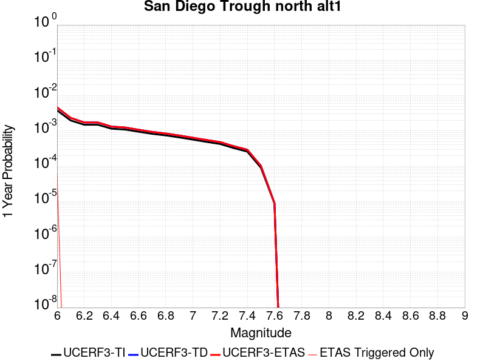 | 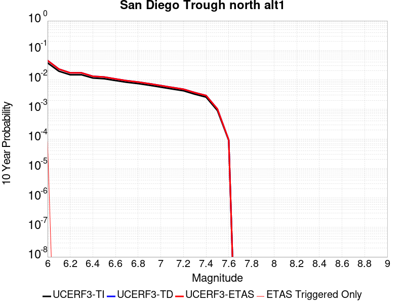 |

| Magnitude | 1 wk TI Prob | 1 wk TD Prob | 1 wk ETAS Prob | 1 wk ETAS/TD Gain | 1 wk ETAS Triggered Only | 1 mo TI Prob | 1 mo TD Prob | 1 mo ETAS Prob | 1 mo ETAS/TD Gain | 1 mo ETAS Triggered Only | 1 yr TI Prob | 1 yr TD Prob | 1 yr ETAS Prob | 1 yr ETAS/TD Gain | 1 yr ETAS Triggered Only | 10 yr TI Prob | 10 yr TD Prob | 10 yr ETAS Prob | 10 yr ETAS/TD Gain | 10 yr ETAS Triggered Only |
|-----|-----|-----|-----|-----|-----|-----|-----|-----|-----|-----|-----|-----|-----|-----|-----|-----|-----|-----|-----|-----|
| 6.0 | 7.329252E-5 | 8.821269E-5 | 1.2820917E-4 | 1.4534094 | 4.0E-5 | 3.14073E-4 | 3.7800326E-4 | 4.1798814E-4 | 1.1057792 | 4.0E-5 | 0.0038171355 | 0.0045930487 | 0.004652773 | 1.0130032 | 6.0E-5 | 0.03752231 | 0.045045137 | 0.045121532 | 1.001696 | 8.0E-5 |
| 6.1 | 3.7940346E-5 | 4.4884906E-5 | 4.4884906E-5 | 1.0 | 0.0 | 1.6259136E-4 | 1.9235026E-4 | 1.9235026E-4 | 1.0 | 0.0 | 0.0019777524 | 0.002339431 | 0.002339431 | 1.0 | 0.0 | 0.019602431 | 0.023156732 | 0.023156732 | 1.0 | 0.0 |
| 6.2 | 2.8645263E-5 | 3.329672E-5 | 3.329672E-5 | 1.0 | 0.0 | 1.2275964E-4 | 1.4269259E-4 | 1.4269259E-4 | 1.0 | 0.0 | 0.0014935739 | 0.0017359206 | 0.0017359206 | 1.0 | 0.0 | 0.0148357535 | 0.017226268 | 0.017226268 | 1.0 | 0.0 |
| 6.3 | 2.8645263E-5 | 3.329672E-5 | 3.329672E-5 | 1.0 | 0.0 | 1.2275964E-4 | 1.4269259E-4 | 1.4269259E-4 | 1.0 | 0.0 | 0.0014935739 | 0.0017359206 | 0.0017359206 | 1.0 | 0.0 | 0.0148357535 | 0.017226268 | 0.017226268 | 1.0 | 0.0 |
| 6.4 | 2.2204576E-5 | 2.544832E-5 | 2.544832E-5 | 1.0 | 0.0 | 9.5159E-5 | 1.0905972E-4 | 1.0905972E-4 | 1.0 | 0.0 | 0.001157945 | 0.0013270028 | 0.0013270028 | 1.0 | 0.0 | 0.011519298 | 0.013191959 | 0.013191959 | 1.0 | 0.0 |
| 6.5 | 2.1004838E-5 | 2.4024695E-5 | 2.4024695E-5 | 1.0 | 0.0 | 9.0017624E-5 | 1.0295897E-4 | 1.0295897E-4 | 1.0 | 0.0 | 0.0010954136 | 0.0012528135 | 0.0012528135 | 1.0 | 0.0 | 0.010900296 | 0.012458592 | 0.012458592 | 1.0 | 0.0 |
| 6.6 | 1.820557E-5 | 2.070479E-5 | 2.070479E-5 | 1.0 | 0.0 | 7.802154E-5 | 8.8731824E-5 | 8.8731824E-5 | 1.0 | 0.0 | 9.4949827E-4 | 0.0010797799 | 0.0010797799 | 1.0 | 0.0 | 0.009454516 | 0.010746005 | 0.010746005 | 1.0 | 0.0 |
| 6.7 | 1.5884485E-5 | 1.7983646E-5 | 1.7983646E-5 | 1.0 | 0.0 | 6.807459E-5 | 7.707051E-5 | 7.707051E-5 | 1.0 | 0.0 | 8.284929E-4 | 9.3793223E-4 | 9.3793223E-4 | 1.0 | 0.0 | 0.008254109 | 0.009340104 | 0.009340104 | 1.0 | 0.0 |
| 6.8 | 1.4331171E-5 | 1.6201066E-5 | 1.6201066E-5 | 1.0 | 0.0 | 6.141786E-5 | 6.94313E-5 | 6.94313E-5 | 1.0 | 0.0 | 7.4750587E-4 | 8.450002E-4 | 8.450002E-4 | 1.0 | 0.0 | 0.0074499645 | 0.008418139 | 0.008418139 | 1.0 | 0.0 |
| 6.9 | 1.2574203E-5 | 1.4205835E-5 | 1.4205835E-5 | 1.0 | 0.0 | 5.3888325E-5 | 6.0880735E-5 | 6.0880735E-5 | 1.0 | 0.0 | 6.558929E-4 | 7.409723E-4 | 7.409723E-4 | 1.0 | 0.0 | 0.0065396037 | 0.007385203 | 0.007385203 | 1.0 | 0.0 |
| 7.0 | 1.0883844E-5 | 1.2289262E-5 | 1.2289262E-5 | 1.0 | 0.0 | 4.664421E-5 | 5.2667205E-5 | 5.2667205E-5 | 1.0 | 0.0 | 5.677453E-4 | 6.4103556E-4 | 6.4103556E-4 | 1.0 | 0.0 | 0.00566297 | 0.006391993 | 0.006391993 | 1.0 | 0.0 |
| 7.1 | 9.393088E-6 | 1.060702E-5 | 1.060702E-5 | 1.0 | 0.0 | 4.025547E-5 | 4.545787E-5 | 4.545787E-5 | 1.0 | 0.0 | 4.900001E-4 | 5.533098E-4 | 5.533098E-4 | 1.0 | 0.0 | 0.0048892107 | 0.005519418 | 0.005519418 | 1.0 | 0.0 |
| 7.2 | 8.190791E-6 | 9.258625E-6 | 9.258625E-6 | 1.0 | 0.0 | 3.510292E-5 | 3.9679224E-5 | 3.9679224E-5 | 1.0 | 0.0 | 4.2729423E-4 | 4.8298817E-4 | 4.8298817E-4 | 1.0 | 0.0 | 0.0042647356 | 0.004819465 | 0.004819465 | 1.0 | 0.0 |
| 7.3 | 6.268162E-6 | 7.089716E-6 | 7.089716E-6 | 1.0 | 0.0 | 2.6863276E-5 | 3.0384144E-5 | 3.0384144E-5 | 1.0 | 0.0 | 3.2701128E-4 | 3.6986457E-4 | 3.6986457E-4 | 1.0 | 0.0 | 0.003265305 | 0.003692536 | 0.003692536 | 1.0 | 0.0 |
| 7.4 | 4.985186E-6 | 5.6426816E-6 | 5.6426816E-6 | 1.0 | 0.0 | 2.1364907E-5 | 2.4182698E-5 | 2.4182698E-5 | 1.0 | 0.0 | 2.600867E-4 | 2.9438498E-4 | 2.9438498E-4 | 1.0 | 0.0 | 0.002597825 | 0.0029399914 | 0.0029399914 | 1.0 | 0.0 |
| 7.5 | 1.7489613E-6 | 1.969678E-6 | 1.969678E-6 | 1.0 | 0.0 | 7.495527E-6 | 8.4414505E-6 | 8.4414505E-6 | 1.0 | 0.0 | 9.125422E-5 | 1.02770035E-4 | 1.02770035E-4 | 1.0 | 0.0 | 9.1216754E-4 | 0.0010272472 | 0.0010272472 | 1.0 | 0.0 |
| 7.6 | 1.6988751E-7 | 1.7533823E-7 | 1.7533823E-7 | 1.0 | 0.0 | 7.2808916E-7 | 7.5144936E-7 | 7.5144936E-7 | 1.0 | 0.0 | 8.864449E-6 | 9.14886E-6 | 9.14886E-6 | 1.0 | 0.0 | 8.8640954E-5 | 9.1485024E-5 | 9.1485024E-5 | 1.0 | 0.0 |

## Whittier alt 1
*[(top)](#table-of-contents)*

| 1 Week | 1 Month | 1 Year | 10 Year |
|-----|-----|-----|-----|
|  |  |  |  |

| Magnitude | 1 wk TI Prob | 1 wk TD Prob | 1 wk ETAS Prob | 1 wk ETAS/TD Gain | 1 wk ETAS Triggered Only | 1 mo TI Prob | 1 mo TD Prob | 1 mo ETAS Prob | 1 mo ETAS/TD Gain | 1 mo ETAS Triggered Only | 1 yr TI Prob | 1 yr TD Prob | 1 yr ETAS Prob | 1 yr ETAS/TD Gain | 1 yr ETAS Triggered Only | 10 yr TI Prob | 10 yr TD Prob | 10 yr ETAS Prob | 10 yr ETAS/TD Gain | 10 yr ETAS Triggered Only |
|-----|-----|-----|-----|-----|-----|-----|-----|-----|-----|-----|-----|-----|-----|-----|-----|-----|-----|-----|-----|-----|
| 6.0 | 4.2554693E-5 | 4.7252182E-5 | 6.725124E-5 | 1.4232409 | 2.0E-5 | 1.8236451E-4 | 2.0249544E-4 | 2.2249139E-4 | 1.0987476 | 2.0E-5 | 0.002218027 | 0.0024629163 | 0.002502818 | 1.0162009 | 4.0E-5 | 0.02196019 | 0.024390263 | 0.024468312 | 1.0032 | 8.0E-5 |
| 6.1 | 4.2554693E-5 | 4.7252182E-5 | 6.725124E-5 | 1.4232409 | 2.0E-5 | 1.8236451E-4 | 2.0249544E-4 | 2.2249139E-4 | 1.0987476 | 2.0E-5 | 0.002218027 | 0.0024629163 | 0.002502818 | 1.0162009 | 4.0E-5 | 0.02196019 | 0.024390263 | 0.024468312 | 1.0032 | 8.0E-5 |
| 6.2 | 4.2554693E-5 | 4.7252182E-5 | 6.725124E-5 | 1.4232409 | 2.0E-5 | 1.8236451E-4 | 2.0249544E-4 | 2.2249139E-4 | 1.0987476 | 2.0E-5 | 0.002218027 | 0.0024629163 | 0.002502818 | 1.0162009 | 4.0E-5 | 0.02196019 | 0.024390263 | 0.024468312 | 1.0032 | 8.0E-5 |
| 6.3 | 1.9617712E-5 | 1.826841E-5 | 1.826841E-5 | 1.0 | 0.0 | 8.40732E-5 | 7.829095E-5 | 7.829095E-5 | 1.0 | 0.0 | 0.0010231105 | 9.527944E-4 | 9.527944E-4 | 1.0 | 0.0 | 0.01018413 | 0.0094904 | 0.00951021 | 1.0020874 | 2.0E-5 |
| 6.4 | 1.5611336E-5 | 1.3604089E-5 | 1.3604089E-5 | 1.0 | 0.0 | 6.690401E-5 | 5.8301972E-5 | 5.8301972E-5 | 1.0 | 0.0 | 8.142519E-4 | 7.096013E-4 | 7.096013E-4 | 1.0 | 0.0 | 0.008112748 | 0.0070753377 | 0.0070951963 | 1.0028067 | 2.0E-5 |
| 6.5 | 1.5150166E-5 | 1.3100744E-5 | 1.3100744E-5 | 1.0 | 0.0 | 6.492767E-5 | 5.614487E-5 | 5.614487E-5 | 1.0 | 0.0 | 7.9020765E-4 | 6.8335526E-4 | 6.8335526E-4 | 1.0 | 0.0 | 0.007874036 | 0.006814508 | 0.0068343715 | 1.0029149 | 2.0E-5 |
| 6.6 | 1.295588E-5 | 1.0380544E-5 | 1.0380544E-5 | 1.0 | 0.0 | 5.552402E-5 | 4.44873E-5 | 4.44873E-5 | 1.0 | 0.0 | 6.7579525E-4 | 5.415002E-4 | 5.415002E-4 | 1.0 | 0.0 | 0.006737438 | 0.005403343 | 0.005403343 | 1.0 | 0.0 |
| 6.7 | 1.2542085E-5 | 9.899189E-6 | 9.899189E-6 | 1.0 | 0.0 | 5.3750682E-5 | 4.2424414E-5 | 4.2424414E-5 | 1.0 | 0.0 | 6.542181E-4 | 5.163967E-4 | 5.163967E-4 | 1.0 | 0.0 | 0.006522954 | 0.005153464 | 0.005153464 | 1.0 | 0.0 |
| 6.8 | 1.2195878E-5 | 9.49523E-6 | 9.49523E-6 | 1.0 | 0.0 | 5.2267E-5 | 4.069322E-5 | 4.069322E-5 | 1.0 | 0.0 | 6.36165E-4 | 4.9532915E-4 | 4.9532915E-4 | 1.0 | 0.0 | 0.0063434686 | 0.0049436963 | 0.0049436963 | 1.0 | 0.0 |
| 6.9 | 1.1580298E-5 | 8.772739E-6 | 8.772739E-6 | 1.0 | 0.0 | 4.9628903E-5 | 3.759692E-5 | 3.759692E-5 | 1.0 | 0.0 | 6.040644E-4 | 4.5764804E-4 | 4.5764804E-4 | 1.0 | 0.0 | 0.00602425 | 0.0045684646 | 0.0045684646 | 1.0 | 0.0 |
| 7.0 | 1.0964795E-5 | 8.083794E-6 | 8.083794E-6 | 1.0 | 0.0 | 4.6991136E-5 | 3.4644378E-5 | 3.4644378E-5 | 1.0 | 0.0 | 5.7196687E-4 | 4.217152E-4 | 4.217152E-4 | 1.0 | 0.0 | 0.0057049696 | 0.004210459 | 0.004210459 | 1.0 | 0.0 |
| 7.1 | 1.0230601E-5 | 7.32646E-6 | 7.32646E-6 | 1.0 | 0.0 | 4.3844695E-5 | 3.1398744E-5 | 3.1398744E-5 | 1.0 | 0.0 | 5.336784E-4 | 3.8221394E-4 | 3.8221394E-4 | 1.0 | 0.0 | 0.005323986 | 0.0038167592 | 0.0038167592 | 1.0 | 0.0 |
| 7.2 | 9.40865E-6 | 6.5430822E-6 | 6.5430822E-6 | 1.0 | 0.0 | 4.032216E-5 | 2.8041486E-5 | 2.8041486E-5 | 1.0 | 0.0 | 4.908117E-4 | 3.4135283E-4 | 3.4135283E-4 | 1.0 | 0.0 | 0.0048972913 | 0.0034094024 | 0.0034094024 | 1.0 | 0.0 |
| 7.3 | 8.237384E-6 | 5.5975433E-6 | 5.5975433E-6 | 1.0 | 0.0 | 3.5302593E-5 | 2.3989258E-5 | 2.3989258E-5 | 1.0 | 0.0 | 4.2972428E-4 | 2.920311E-4 | 2.920311E-4 | 1.0 | 0.0 | 0.0042889426 | 0.0029167992 | 0.0029167992 | 1.0 | 0.0 |
| 7.4 | 7.5316966E-6 | 5.0276153E-6 | 5.0276153E-6 | 1.0 | 0.0 | 3.2278298E-5 | 2.154675E-5 | 2.154675E-5 | 1.0 | 0.0 | 3.9291743E-4 | 2.623011E-4 | 2.623011E-4 | 1.0 | 0.0 | 0.0039222343 | 0.0026200267 | 0.0026200267 | 1.0 | 0.0 |
| 7.5 | 6.149649E-6 | 3.9336355E-6 | 3.9336355E-6 | 1.0 | 0.0 | 2.6355372E-5 | 1.6858336E-5 | 1.6858336E-5 | 1.0 | 0.0 | 3.208294E-4 | 2.052318E-4 | 2.052318E-4 | 1.0 | 0.0 | 0.003203666 | 0.0020505118 | 0.0020505118 | 1.0 | 0.0 |
| 7.6 | 5.457711E-6 | 3.3951796E-6 | 3.3951796E-6 | 1.0 | 0.0 | 2.338998E-5 | 1.4550694E-5 | 1.4550694E-5 | 1.0 | 0.0 | 2.8473578E-4 | 1.771411E-4 | 1.771411E-4 | 1.0 | 0.0 | 0.0028437122 | 0.0017700798 | 0.0017700798 | 1.0 | 0.0 |
| 7.7 | 4.1676276E-6 | 2.3329922E-6 | 2.3329922E-6 | 1.0 | 0.0 | 1.7861139E-5 | 9.998504E-6 | 9.998504E-6 | 1.0 | 0.0 | 2.1743766E-4 | 1.2172572E-4 | 1.2172572E-4 | 1.0 | 0.0 | 0.0021722503 | 0.0012166635 | 0.0012166635 | 1.0 | 0.0 |
| 7.8 | 2.2692414E-7 | 9.384417E-8 | 9.384417E-8 | 1.0 | 0.0 | 9.725317E-7 | 4.0218927E-7 | 4.0218927E-7 | 1.0 | 0.0 | 1.1840509E-5 | 4.8966467E-6 | 4.8966467E-6 | 1.0 | 0.0 | 1.1839878E-4 | 4.8965718E-5 | 4.8965718E-5 | 1.0 | 0.0 |
| 7.9 | 6.676829E-9 | 3.4397174E-9 | 3.4397174E-9 | 1.0 | 0.0 | 2.861498E-8 | 1.4741646E-8 | 1.4741646E-8 | 1.0 | 0.0 | 3.4838732E-7 | 1.7947953E-7 | 1.7947953E-7 | 1.0 | 0.0 | 3.4838679E-6 | 1.794794E-6 | 1.794794E-6 | 1.0 | 0.0 |

## Ventura-Pitas Point
*[(top)](#table-of-contents)*

| 1 Week | 1 Month | 1 Year | 10 Year |
|-----|-----|-----|-----|
|  |  |  |  |

| Magnitude | 1 wk TI Prob | 1 wk TD Prob | 1 wk ETAS Prob | 1 wk ETAS/TD Gain | 1 wk ETAS Triggered Only | 1 mo TI Prob | 1 mo TD Prob | 1 mo ETAS Prob | 1 mo ETAS/TD Gain | 1 mo ETAS Triggered Only | 1 yr TI Prob | 1 yr TD Prob | 1 yr ETAS Prob | 1 yr ETAS/TD Gain | 1 yr ETAS Triggered Only | 10 yr TI Prob | 10 yr TD Prob | 10 yr ETAS Prob | 10 yr ETAS/TD Gain | 10 yr ETAS Triggered Only |
|-----|-----|-----|-----|-----|-----|-----|-----|-----|-----|-----|-----|-----|-----|-----|-----|-----|-----|-----|-----|-----|
| 6.0 | 3.3179622E-5 | 3.373519E-5 | 5.373451E-5 | 1.5928328 | 2.0E-5 | 1.4219063E-4 | 1.4457281E-4 | 1.6456992E-4 | 1.1383185 | 2.0E-5 | 0.0017297962 | 0.0017590097 | 0.0018089217 | 1.028375 | 5.0E-5 | 0.017163932 | 0.017476497 | 0.017555099 | 1.0044975 | 8.0E-5 |
| 6.1 | 3.3179622E-5 | 3.373519E-5 | 5.373451E-5 | 1.5928328 | 2.0E-5 | 1.4219063E-4 | 1.4457281E-4 | 1.6456992E-4 | 1.1383185 | 2.0E-5 | 0.0017297962 | 0.0017590097 | 0.0018089217 | 1.028375 | 5.0E-5 | 0.017163932 | 0.017476497 | 0.017555099 | 1.0044975 | 8.0E-5 |
| 6.2 | 3.3179622E-5 | 3.373519E-5 | 5.373451E-5 | 1.5928328 | 2.0E-5 | 1.4219063E-4 | 1.4457281E-4 | 1.6456992E-4 | 1.1383185 | 2.0E-5 | 0.0017297962 | 0.0017590097 | 0.0018089217 | 1.028375 | 5.0E-5 | 0.017163932 | 0.017476497 | 0.017555099 | 1.0044975 | 8.0E-5 |
| 6.3 | 3.3179622E-5 | 3.373519E-5 | 5.373451E-5 | 1.5928328 | 2.0E-5 | 1.4219063E-4 | 1.4457281E-4 | 1.6456992E-4 | 1.1383185 | 2.0E-5 | 0.0017297962 | 0.0017590097 | 0.0018089217 | 1.028375 | 5.0E-5 | 0.017163932 | 0.017476497 | 0.017555099 | 1.0044975 | 8.0E-5 |
| 6.4 | 1.8754668E-5 | 1.7019594E-5 | 2.7019423E-5 | 1.5875481 | 1.0E-5 | 8.037467E-5 | 7.2939205E-5 | 8.293848E-5 | 1.1370904 | 1.0E-5 | 9.781223E-4 | 8.8769617E-4 | 9.076784E-4 | 1.0225103 | 2.0E-5 | 0.009738282 | 0.008843943 | 0.008873677 | 1.0033622 | 3.0E-5 |
| 6.5 | 1.8754668E-5 | 1.7019594E-5 | 2.7019423E-5 | 1.5875481 | 1.0E-5 | 8.037467E-5 | 7.2939205E-5 | 8.293848E-5 | 1.1370904 | 1.0E-5 | 9.781223E-4 | 8.8769617E-4 | 9.076784E-4 | 1.0225103 | 2.0E-5 | 0.009738282 | 0.008843943 | 0.008873677 | 1.0033622 | 3.0E-5 |
| 6.6 | 1.4361558E-5 | 1.2122258E-5 | 1.2122258E-5 | 1.0 | 0.0 | 6.154808E-5 | 5.1951512E-5 | 5.1951512E-5 | 1.0 | 0.0 | 7.490902E-4 | 6.323284E-4 | 6.4232206E-4 | 1.0158045 | 1.0E-5 | 0.0074657016 | 0.006305652 | 0.006325526 | 1.0031518 | 2.0E-5 |
| 6.7 | 1.4361558E-5 | 1.2122258E-5 | 1.2122258E-5 | 1.0 | 0.0 | 6.154808E-5 | 5.1951512E-5 | 5.1951512E-5 | 1.0 | 0.0 | 7.490902E-4 | 6.323284E-4 | 6.4232206E-4 | 1.0158045 | 1.0E-5 | 0.0074657016 | 0.006305652 | 0.006325526 | 1.0031518 | 2.0E-5 |
| 6.8 | 1.3663846E-5 | 1.1344401E-5 | 1.1344401E-5 | 1.0 | 0.0 | 5.8558027E-5 | 4.8617967E-5 | 4.8617967E-5 | 1.0 | 0.0 | 7.127108E-4 | 5.917649E-4 | 6.01759E-4 | 1.0168886 | 1.0E-5 | 0.007104293 | 0.0059022107 | 0.005922093 | 1.0033686 | 2.0E-5 |
| 6.9 | 1.3644157E-5 | 1.1322501E-5 | 1.1322501E-5 | 1.0 | 0.0 | 5.8473648E-5 | 4.8524114E-5 | 4.8524114E-5 | 1.0 | 0.0 | 7.116841E-4 | 5.906229E-4 | 6.00617E-4 | 1.0169213 | 1.0E-5 | 0.007094092 | 0.0058908514 | 0.0059107337 | 1.003375 | 2.0E-5 |
| 7.0 | 1.3568845E-5 | 1.12420685E-5 | 1.12420685E-5 | 1.0 | 0.0 | 5.8150898E-5 | 4.8179416E-5 | 4.8179416E-5 | 1.0 | 0.0 | 7.077572E-4 | 5.8642845E-4 | 5.964226E-4 | 1.0170424 | 1.0E-5 | 0.007055073 | 0.005849128 | 0.0058690114 | 1.0033994 | 2.0E-5 |
| 7.1 | 1.306572E-5 | 1.0720521E-5 | 1.0720521E-5 | 1.0 | 0.0 | 5.599474E-5 | 4.594429E-5 | 4.594429E-5 | 1.0 | 0.0 | 6.815227E-4 | 5.5923004E-4 | 5.692244E-4 | 1.0178717 | 1.0E-5 | 0.0067943637 | 0.005578536 | 0.0055884803 | 1.0017825 | 1.0E-5 |
| 7.2 | 1.232604E-5 | 9.995121E-6 | 9.995121E-6 | 1.0 | 0.0 | 5.2824813E-5 | 4.283554E-5 | 4.283554E-5 | 1.0 | 0.0 | 6.429523E-4 | 5.2139966E-4 | 5.3139444E-4 | 1.0191691 | 1.0E-5 | 0.0064109527 | 0.005202059 | 0.005212007 | 1.0019124 | 1.0E-5 |
| 7.3 | 1.0917261E-5 | 8.843812E-6 | 8.843812E-6 | 1.0 | 0.0 | 4.678742E-5 | 3.7901507E-5 | 3.7901507E-5 | 1.0 | 0.0 | 5.69488E-4 | 4.6135474E-4 | 4.713501E-4 | 1.0216653 | 1.0E-5 | 0.0056803077 | 0.004604239 | 0.004614193 | 1.0021619 | 1.0E-5 |
| 7.4 | 1.039959E-5 | 8.42354E-6 | 8.42354E-6 | 1.0 | 0.0 | 4.456891E-5 | 3.6100395E-5 | 3.6100395E-5 | 1.0 | 0.0 | 5.424914E-4 | 4.394352E-4 | 4.494308E-4 | 1.0227464 | 1.0E-5 | 0.0054116896 | 0.0043859277 | 0.004395884 | 1.00227 | 1.0E-5 |
| 7.5 | 9.015877E-6 | 7.29752E-6 | 7.29752E-6 | 1.0 | 0.0 | 3.86389E-5 | 3.1274718E-5 | 3.1274718E-5 | 1.0 | 0.0 | 4.7032707E-4 | 3.8070456E-4 | 3.9070076E-4 | 1.026257 | 1.0E-5 | 0.004693329 | 0.003800772 | 0.003810734 | 1.002621 | 1.0E-5 |
| 7.6 | 4.900162E-6 | 3.874119E-6 | 3.874119E-6 | 1.0 | 0.0 | 2.1000526E-5 | 1.6603262E-5 | 1.6603262E-5 | 1.0 | 0.0 | 2.556514E-4 | 2.0212609E-4 | 2.1212407E-4 | 1.0494641 | 1.0E-5 | 0.0025535747 | 0.002019436 | 0.002029416 | 1.0049418 | 1.0E-5 |
| 7.7 | 3.8850626E-6 | 3.12676E-6 | 3.12676E-6 | 1.0 | 0.0 | 1.6650163E-5 | 1.3400332E-5 | 1.3400332E-5 | 1.0 | 0.0 | 2.0269687E-4 | 1.6313691E-4 | 1.6313691E-4 | 1.0 | 0.0 | 0.002025121 | 0.0016301809 | 0.0016301809 | 1.0 | 0.0 |
| 7.8 | 2.4654719E-6 | 2.029902E-6 | 2.029902E-6 | 1.0 | 0.0 | 1.0566265E-5 | 8.699551E-6 | 8.699551E-6 | 1.0 | 0.0 | 1.2863669E-4 | 1.0591193E-4 | 1.0591193E-4 | 1.0 | 0.0 | 0.0012856225 | 0.0010586192 | 0.0010586192 | 1.0 | 0.0 |
| 7.9 | 4.095894E-7 | 3.2765078E-7 | 3.2765078E-7 | 1.0 | 0.0 | 1.7553821E-6 | 1.4042168E-6 | 1.4042168E-6 | 1.0 | 0.0 | 2.1371567E-5 | 1.709621E-5 | 1.709621E-5 | 1.0 | 0.0 | 2.1369511E-4 | 1.7094925E-4 | 1.7094925E-4 | 1.0 | 0.0 |
| 8.0 | 7.791402E-9 | 5.6836056E-9 | 5.6836056E-9 | 1.0 | 0.0 | 3.3391725E-8 | 2.4358311E-8 | 2.4358311E-8 | 1.0 | 0.0 | 4.0654416E-7 | 2.965624E-7 | 2.965624E-7 | 1.0 | 0.0 | 4.065434E-6 | 2.9656223E-6 | 2.9656223E-6 | 1.0 | 0.0 |

## Kern Canyon (South Kern) 2011
*[(top)](#table-of-contents)*

| 1 Week | 1 Month | 1 Year | 10 Year |
|-----|-----|-----|-----|
|  | 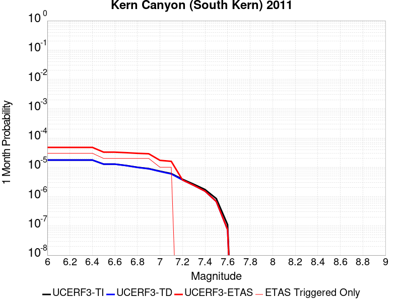 |  |  |

| Magnitude | 1 wk TI Prob | 1 wk TD Prob | 1 wk ETAS Prob | 1 wk ETAS/TD Gain | 1 wk ETAS Triggered Only | 1 mo TI Prob | 1 mo TD Prob | 1 mo ETAS Prob | 1 mo ETAS/TD Gain | 1 mo ETAS Triggered Only | 1 yr TI Prob | 1 yr TD Prob | 1 yr ETAS Prob | 1 yr ETAS/TD Gain | 1 yr ETAS Triggered Only | 10 yr TI Prob | 10 yr TD Prob | 10 yr ETAS Prob | 10 yr ETAS/TD Gain | 10 yr ETAS Triggered Only |
|-----|-----|-----|-----|-----|-----|-----|-----|-----|-----|-----|-----|-----|-----|-----|-----|-----|-----|-----|-----|-----|
| 6.0 | 4.105075E-6 | 4.113726E-6 | 2.4113644E-5 | 5.8617525 | 2.0E-5 | 1.7593058E-5 | 1.7630138E-5 | 4.7629608E-5 | 2.7016015 | 3.0E-5 | 2.1417443E-4 | 2.1462643E-4 | 2.4462E-4 | 1.1397477 | 3.0E-5 | 0.0021396813 | 0.0021442554 | 0.0022240838 | 1.037229 | 8.0E-5 |
| 6.1 | 4.105075E-6 | 4.113726E-6 | 2.4113644E-5 | 5.8617525 | 2.0E-5 | 1.7593058E-5 | 1.7630138E-5 | 4.7629608E-5 | 2.7016015 | 3.0E-5 | 2.1417443E-4 | 2.1462643E-4 | 2.4462E-4 | 1.1397477 | 3.0E-5 | 0.0021396813 | 0.0021442554 | 0.0022240838 | 1.037229 | 8.0E-5 |
| 6.2 | 4.105075E-6 | 4.113726E-6 | 2.4113644E-5 | 5.8617525 | 2.0E-5 | 1.7593058E-5 | 1.7630138E-5 | 4.7629608E-5 | 2.7016015 | 3.0E-5 | 2.1417443E-4 | 2.1462643E-4 | 2.4462E-4 | 1.1397477 | 3.0E-5 | 0.0021396813 | 0.0021442554 | 0.0022240838 | 1.037229 | 8.0E-5 |
| 6.3 | 4.105075E-6 | 4.113726E-6 | 2.4113644E-5 | 5.8617525 | 2.0E-5 | 1.7593058E-5 | 1.7630138E-5 | 4.7629608E-5 | 2.7016015 | 3.0E-5 | 2.1417443E-4 | 2.1462643E-4 | 2.4462E-4 | 1.1397477 | 3.0E-5 | 0.0021396813 | 0.0021442554 | 0.0022240838 | 1.037229 | 8.0E-5 |
| 6.4 | 4.105075E-6 | 4.113726E-6 | 2.4113644E-5 | 5.8617525 | 2.0E-5 | 1.7593058E-5 | 1.7630138E-5 | 4.7629608E-5 | 2.7016015 | 3.0E-5 | 2.1417443E-4 | 2.1462643E-4 | 2.4462E-4 | 1.1397477 | 3.0E-5 | 0.0021396813 | 0.0021442554 | 0.0022240838 | 1.037229 | 8.0E-5 |
| 6.5 | 2.9849807E-6 | 2.973154E-6 | 1.2973124E-5 | 4.3634214 | 1.0E-5 | 1.2792712E-5 | 1.2742028E-5 | 3.2741773E-5 | 2.569589 | 2.0E-5 | 1.5574014E-4 | 1.551233E-4 | 1.7512019E-4 | 1.1289097 | 2.0E-5 | 0.0015563103 | 0.0015501654 | 0.0016200568 | 1.0450865 | 7.0E-5 |
| 6.6 | 2.9849807E-6 | 2.973154E-6 | 1.2973124E-5 | 4.3634214 | 1.0E-5 | 1.2792712E-5 | 1.2742028E-5 | 3.2741773E-5 | 2.569589 | 2.0E-5 | 1.5574014E-4 | 1.551233E-4 | 1.7512019E-4 | 1.1289097 | 2.0E-5 | 0.0015563103 | 0.0015501654 | 0.0016200568 | 1.0450865 | 7.0E-5 |
| 6.7 | 2.6756725E-6 | 2.6582202E-6 | 1.2658194E-5 | 4.7619057 | 1.0E-5 | 1.1467117E-5 | 1.1392323E-5 | 3.1392094E-5 | 2.7555482 | 2.0E-5 | 1.396032E-4 | 1.386928E-4 | 1.5869003E-4 | 1.1441836 | 2.0E-5 | 0.0013951553 | 0.0013860734 | 0.0014459903 | 1.0432278 | 6.0E-5 |
| 6.8 | 2.3283721E-6 | 2.3047783E-6 | 1.2304755E-5 | 5.3388023 | 1.0E-5 | 9.9787E-6 | 9.877584E-6 | 2.9877387E-5 | 3.0247667 | 2.0E-5 | 1.214839E-4 | 1.2025302E-4 | 1.4025062E-4 | 1.166296 | 2.0E-5 | 0.001214175 | 0.001201887 | 0.0012518269 | 1.0415512 | 5.0E-5 |
| 6.9 | 2.0972677E-6 | 2.0696405E-6 | 1.20696195E-5 | 5.831747 | 1.0E-5 | 8.988259E-6 | 8.869858E-6 | 2.8869681E-5 | 3.2548075 | 2.0E-5 | 1.0942656E-4 | 1.0798523E-4 | 1.2798308E-4 | 1.1851906 | 2.0E-5 | 0.0010937268 | 0.0010793334 | 0.0011292794 | 1.0462749 | 5.0E-5 |
| 7.0 | 1.7132242E-6 | 1.6787029E-6 | 1.6787029E-6 | 1.0 | 0.0 | 7.3423685E-6 | 7.1944214E-6 | 1.719435E-5 | 2.3899558 | 1.0E-5 | 8.938967E-5 | 8.75886E-5 | 9.758773E-5 | 1.1141601 | 1.0E-5 | 8.935372E-4 | 8.755446E-4 | 9.0551836E-4 | 1.0342344 | 3.0E-5 |
| 7.1 | 1.4215541E-6 | 1.3815746E-6 | 1.3815746E-6 | 1.0 | 0.0 | 6.0923603E-6 | 5.9210206E-6 | 1.5920961E-5 | 2.688888 | 1.0E-5 | 7.417196E-5 | 7.208607E-5 | 8.2085346E-5 | 1.138713 | 1.0E-5 | 7.414721E-4 | 7.206296E-4 | 7.406151E-4 | 1.0277336 | 2.0E-5 |
| 7.2 | 9.097853E-7 | 8.60377E-7 | 8.60377E-7 | 1.0 | 0.0 | 3.899074E-6 | 3.6873246E-6 | 3.6873246E-6 | 1.0 | 0.0 | 4.7470192E-5 | 4.4892266E-5 | 4.4892266E-5 | 1.0 | 0.0 | 4.7460053E-4 | 4.4883305E-4 | 4.5882855E-4 | 1.02227 | 1.0E-5 |
| 7.3 | 6.144169E-7 | 5.628199E-7 | 5.628199E-7 | 1.0 | 0.0 | 2.6332125E-6 | 2.4120832E-6 | 2.4120832E-6 | 1.0 | 0.0 | 3.205889E-5 | 2.9366722E-5 | 2.9366722E-5 | 1.0 | 0.0 | 3.2054266E-4 | 2.9362892E-4 | 3.0362597E-4 | 1.0340466 | 1.0E-5 |
| 7.4 | 4.049844E-7 | 3.5728252E-7 | 3.5728252E-7 | 1.0 | 0.0 | 1.7356463E-6 | 1.5312098E-6 | 1.5312098E-6 | 1.0 | 0.0 | 2.1131287E-5 | 1.8642324E-5 | 1.8642324E-5 | 1.0 | 0.0 | 2.1129279E-4 | 1.8640784E-4 | 1.9640598E-4 | 1.0536358 | 1.0E-5 |
| 7.5 | 1.9871162E-7 | 1.5830383E-7 | 1.5830383E-7 | 1.0 | 0.0 | 8.5162094E-7 | 6.784448E-7 | 6.784448E-7 | 1.0 | 0.0 | 1.0368436E-5 | 8.260035E-6 | 8.260035E-6 | 1.0 | 0.0 | 1.0367952E-4 | 8.259736E-5 | 8.259736E-5 | 1.0 | 0.0 |
| 7.6 | 2.572245E-8 | 1.735264E-8 | 1.735264E-8 | 1.0 | 0.0 | 1.10239064E-7 | 7.436845E-8 | 7.436845E-8 | 1.0 | 0.0 | 1.3421597E-6 | 9.0543557E-7 | 9.0543557E-7 | 1.0 | 0.0 | 1.3421517E-5 | 9.054324E-6 | 9.054324E-6 | 1.0 | 0.0 |

## Cucamonga
*[(top)](#table-of-contents)*

| 1 Week | 1 Month | 1 Year | 10 Year |
|-----|-----|-----|-----|
|  |  |  |  |

| Magnitude | 1 wk TI Prob | 1 wk TD Prob | 1 wk ETAS Prob | 1 wk ETAS/TD Gain | 1 wk ETAS Triggered Only | 1 mo TI Prob | 1 mo TD Prob | 1 mo ETAS Prob | 1 mo ETAS/TD Gain | 1 mo ETAS Triggered Only | 1 yr TI Prob | 1 yr TD Prob | 1 yr ETAS Prob | 1 yr ETAS/TD Gain | 1 yr ETAS Triggered Only | 10 yr TI Prob | 10 yr TD Prob | 10 yr ETAS Prob | 10 yr ETAS/TD Gain | 10 yr ETAS Triggered Only |
|-----|-----|-----|-----|-----|-----|-----|-----|-----|-----|-----|-----|-----|-----|-----|-----|-----|-----|-----|-----|-----|
| 6.0 | 1.1848348E-5 | 1.1737109E-5 | 2.1736992E-5 | 1.8519886 | 1.0E-5 | 5.0777642E-5 | 5.0300943E-5 | 6.030044E-5 | 1.1987934 | 1.0E-5 | 6.180424E-4 | 6.122446E-4 | 6.522201E-4 | 1.0652933 | 4.0E-5 | 0.0061632637 | 0.006106745 | 0.0061763176 | 1.0113927 | 7.0E-5 |
| 6.1 | 1.1848348E-5 | 1.1737109E-5 | 2.1736992E-5 | 1.8519886 | 1.0E-5 | 5.0777642E-5 | 5.0300943E-5 | 6.030044E-5 | 1.1987934 | 1.0E-5 | 6.180424E-4 | 6.122446E-4 | 6.522201E-4 | 1.0652933 | 4.0E-5 | 0.0061632637 | 0.006106745 | 0.0061763176 | 1.0113927 | 7.0E-5 |
| 6.2 | 1.1848348E-5 | 1.1737109E-5 | 2.1736992E-5 | 1.8519886 | 1.0E-5 | 5.0777642E-5 | 5.0300943E-5 | 6.030044E-5 | 1.1987934 | 1.0E-5 | 6.180424E-4 | 6.122446E-4 | 6.522201E-4 | 1.0652933 | 4.0E-5 | 0.0061632637 | 0.006106745 | 0.0061763176 | 1.0113927 | 7.0E-5 |
| 6.3 | 1.1848348E-5 | 1.1737109E-5 | 2.1736992E-5 | 1.8519886 | 1.0E-5 | 5.0777642E-5 | 5.0300943E-5 | 6.030044E-5 | 1.1987934 | 1.0E-5 | 6.180424E-4 | 6.122446E-4 | 6.522201E-4 | 1.0652933 | 4.0E-5 | 0.0061632637 | 0.006106745 | 0.0061763176 | 1.0113927 | 7.0E-5 |
| 6.4 | 1.1848348E-5 | 1.1737109E-5 | 2.1736992E-5 | 1.8519886 | 1.0E-5 | 5.0777642E-5 | 5.0300943E-5 | 6.030044E-5 | 1.1987934 | 1.0E-5 | 6.180424E-4 | 6.122446E-4 | 6.522201E-4 | 1.0652933 | 4.0E-5 | 0.0061632637 | 0.006106745 | 0.0061763176 | 1.0113927 | 7.0E-5 |
| 6.5 | 1.16988695E-5 | 1.157614E-5 | 2.1576025E-5 | 1.8638358 | 1.0E-5 | 5.013705E-5 | 4.9611102E-5 | 5.9610604E-5 | 1.2015578 | 1.0E-5 | 6.102476E-4 | 6.0385047E-4 | 6.338323E-4 | 1.0496511 | 3.0E-5 | 0.006085745 | 0.0060232594 | 0.006082898 | 1.0099014 | 6.0E-5 |
| 6.6 | 1.16988695E-5 | 1.157614E-5 | 2.1576025E-5 | 1.8638358 | 1.0E-5 | 5.013705E-5 | 4.9611102E-5 | 5.9610604E-5 | 1.2015578 | 1.0E-5 | 6.102476E-4 | 6.0385047E-4 | 6.338323E-4 | 1.0496511 | 3.0E-5 | 0.006085745 | 0.0060232594 | 0.006082898 | 1.0099014 | 6.0E-5 |
| 6.7 | 1.1397107E-5 | 1.1115039E-5 | 2.1114927E-5 | 1.8996719 | 1.0E-5 | 4.884383E-5 | 4.7635025E-5 | 5.763455E-5 | 1.2099196 | 1.0E-5 | 5.9451134E-4 | 5.798046E-4 | 6.097872E-4 | 1.0517116 | 3.0E-5 | 0.005929234 | 0.005784061 | 0.005843714 | 1.0103134 | 6.0E-5 |
| 6.8 | 1.058387E-5 | 9.785037E-6 | 1.9784939E-5 | 2.0219586 | 1.0E-5 | 4.5358654E-5 | 4.1935207E-5 | 5.1934785E-5 | 1.2384531 | 1.0E-5 | 5.521017E-4 | 5.1044265E-4 | 5.4042734E-4 | 1.0587425 | 3.0E-5 | 0.00550732 | 0.005093702 | 0.0051533966 | 1.0117192 | 6.0E-5 |
| 6.9 | 9.690046E-6 | 8.579504E-6 | 1.8579418E-5 | 2.1655586 | 1.0E-5 | 4.1528107E-5 | 3.6768783E-5 | 4.6768415E-5 | 1.2719598 | 1.0E-5 | 5.054874E-4 | 4.475684E-4 | 4.7755498E-4 | 1.0669988 | 3.0E-5 | 0.005043391 | 0.0044675954 | 0.004527327 | 1.01337 | 6.0E-5 |
| 7.0 | 9.381461E-6 | 8.18712E-6 | 1.8187038E-5 | 2.2214208 | 1.0E-5 | 4.020564E-5 | 3.508719E-5 | 4.5086836E-5 | 1.2849944 | 1.0E-5 | 4.893937E-4 | 4.2710314E-4 | 4.5709033E-4 | 1.0702107 | 3.0E-5 | 0.0048831734 | 0.004263747 | 0.0043234914 | 1.0140121 | 6.0E-5 |
| 7.1 | 8.946492E-6 | 7.781904E-6 | 1.7781826E-5 | 2.2850225 | 1.0E-5 | 3.8341543E-5 | 3.3350592E-5 | 4.335026E-5 | 1.2998347 | 1.0E-5 | 4.667083E-4 | 4.0596814E-4 | 4.3595597E-4 | 1.0738674 | 3.0E-5 | 0.0046572937 | 0.0040531927 | 0.0041129496 | 1.0147431 | 6.0E-5 |
| 7.2 | 8.251016E-6 | 6.9752878E-6 | 1.6975218E-5 | 2.4336226 | 1.0E-5 | 3.5361016E-5 | 2.9893748E-5 | 3.989345E-5 | 1.3345081 | 1.0E-5 | 4.3043532E-4 | 3.6389584E-4 | 3.9388493E-4 | 1.0824112 | 3.0E-5 | 0.0042960253 | 0.0036339252 | 0.003693707 | 1.0164511 | 6.0E-5 |
| 7.3 | 7.717881E-6 | 6.4863584E-6 | 1.6486294E-5 | 2.541687 | 1.0E-5 | 3.3076216E-5 | 2.7798384E-5 | 3.7798105E-5 | 1.3597231 | 1.0E-5 | 4.026285E-4 | 3.38393E-4 | 3.6838284E-4 | 1.0886244 | 3.0E-5 | 0.004018998 | 0.0033797103 | 0.0034395074 | 1.017693 | 6.0E-5 |
| 7.4 | 7.275623E-6 | 6.032004E-6 | 1.6031943E-5 | 2.6578138 | 1.0E-5 | 3.118087E-5 | 2.5851192E-5 | 3.585093E-5 | 1.3868194 | 1.0E-5 | 3.7956095E-4 | 3.1469302E-4 | 3.3468672E-4 | 1.063534 | 2.0E-5 | 0.0037891332 | 0.0031434046 | 0.0031733103 | 1.0095137 | 3.0E-5 |
| 7.5 | 6.5109502E-6 | 5.100593E-6 | 5.100593E-6 | 1.0 | 0.0 | 2.7903774E-5 | 2.1859503E-5 | 2.1859503E-5 | 1.0 | 0.0 | 3.3967546E-4 | 2.661071E-4 | 2.7610443E-4 | 1.0375688 | 1.0E-5 | 0.0033915674 | 0.0026588016 | 0.0026787485 | 1.0075022 | 2.0E-5 |
| 7.6 | 5.4495326E-6 | 3.908547E-6 | 3.908547E-6 | 1.0 | 0.0 | 2.335493E-5 | 1.6750808E-5 | 1.6750808E-5 | 1.0 | 0.0 | 2.8430918E-4 | 2.0392207E-4 | 2.0392207E-4 | 1.0 | 0.0 | 0.0028394572 | 0.0020382616 | 0.0020482412 | 1.0048962 | 1.0E-5 |
| 7.7 | 4.7997164E-6 | 3.2002263E-6 | 3.2002263E-6 | 1.0 | 0.0 | 2.057005E-5 | 1.3715184E-5 | 1.3715184E-5 | 1.0 | 0.0 | 2.504116E-4 | 1.6696959E-4 | 1.6696959E-4 | 1.0 | 0.0 | 0.002501296 | 0.0016693701 | 0.0016693701 | 1.0 | 0.0 |
| 7.8 | 3.3941733E-6 | 2.0641678E-6 | 2.0641678E-6 | 1.0 | 0.0 | 1.4546376E-5 | 8.846404E-6 | 8.846404E-6 | 1.0 | 0.0 | 1.7708774E-4 | 1.07699656E-4 | 1.07699656E-4 | 1.0 | 0.0 | 0.0017694668 | 0.0010766032 | 0.0010766032 | 1.0 | 0.0 |
| 7.9 | 9.750552E-7 | 5.155798E-7 | 5.155798E-7 | 1.0 | 0.0 | 4.178801E-6 | 2.2096258E-6 | 2.2096258E-6 | 1.0 | 0.0 | 5.0875715E-5 | 2.6901867E-5 | 2.6901867E-5 | 1.0 | 0.0 | 5.086407E-4 | 2.689865E-4 | 2.689865E-4 | 1.0 | 0.0 |
| 8.0 | 1.133857E-7 | 6.053372E-8 | 6.053372E-8 | 1.0 | 0.0 | 4.8593864E-7 | 2.594302E-7 | 2.594302E-7 | 1.0 | 0.0 | 5.9162867E-6 | 3.1585582E-6 | 3.1585582E-6 | 1.0 | 0.0 | 5.916129E-5 | 3.158515E-5 | 3.158515E-5 | 1.0 | 0.0 |

## Oceanic - West Huasna
*[(top)](#table-of-contents)*

| 1 Week | 1 Month | 1 Year | 10 Year |
|-----|-----|-----|-----|
|  |  |  | 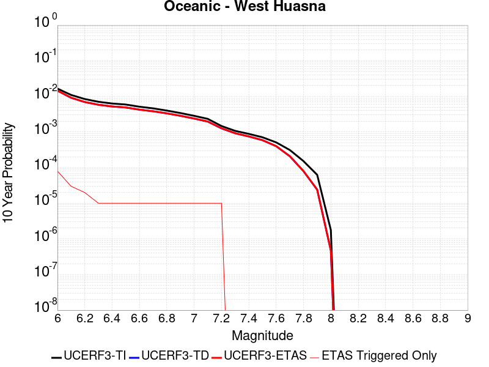 |

| Magnitude | 1 wk TI Prob | 1 wk TD Prob | 1 wk ETAS Prob | 1 wk ETAS/TD Gain | 1 wk ETAS Triggered Only | 1 mo TI Prob | 1 mo TD Prob | 1 mo ETAS Prob | 1 mo ETAS/TD Gain | 1 mo ETAS Triggered Only | 1 yr TI Prob | 1 yr TD Prob | 1 yr ETAS Prob | 1 yr ETAS/TD Gain | 1 yr ETAS Triggered Only | 10 yr TI Prob | 10 yr TD Prob | 10 yr ETAS Prob | 10 yr ETAS/TD Gain | 10 yr ETAS Triggered Only |
|-----|-----|-----|-----|-----|-----|-----|-----|-----|-----|-----|-----|-----|-----|-----|-----|-----|-----|-----|-----|-----|
| 6.0 | 3.195567E-5 | 2.7926368E-5 | 2.7926368E-5 | 1.0 | 0.0 | 1.3694567E-4 | 1.19679185E-4 | 1.3967679E-4 | 1.1670934 | 2.0E-5 | 0.0016660384 | 0.0014561634 | 0.0014961051 | 1.0274295 | 4.0E-5 | 0.016536033 | 0.01447077 | 0.014549613 | 1.0054483 | 8.0E-5 |
| 6.1 | 2.1156782E-5 | 1.7573117E-5 | 1.7573117E-5 | 1.0 | 0.0 | 9.066878E-5 | 7.531123E-5 | 8.531048E-5 | 1.1327723 | 1.0E-5 | 0.0011033333 | 9.1653795E-4 | 9.265288E-4 | 1.0109006 | 1.0E-5 | 0.010978713 | 0.009128587 | 0.009158313 | 1.0032563 | 3.0E-5 |
| 6.2 | 1.6195117E-5 | 1.3327227E-5 | 1.3327227E-5 | 1.0 | 0.0 | 6.9405796E-5 | 5.7115452E-5 | 6.711488E-5 | 1.175074 | 1.0E-5 | 8.44688E-4 | 6.9516135E-4 | 7.051544E-4 | 1.0143751 | 1.0E-5 | 0.008414844 | 0.0069301617 | 0.006950023 | 1.0028659 | 2.0E-5 |
| 6.3 | 1.3559345E-5 | 1.1179013E-5 | 1.1179013E-5 | 1.0 | 0.0 | 5.811018E-5 | 4.7909183E-5 | 4.7909183E-5 | 1.0 | 0.0 | 7.072618E-4 | 5.8313913E-4 | 5.8313913E-4 | 1.0 | 0.0 | 0.0070501505 | 0.005816208 | 0.0058261496 | 1.0017093 | 1.0E-5 |
| 6.4 | 1.2120619E-5 | 1.0000874E-5 | 1.0000874E-5 | 1.0 | 0.0 | 5.1944477E-5 | 4.2860185E-5 | 4.2860185E-5 | 1.0 | 0.0 | 6.322405E-4 | 5.216983E-4 | 5.216983E-4 | 1.0 | 0.0 | 0.006304447 | 0.005204804 | 0.0052147517 | 1.0019113 | 1.0E-5 |
| 6.5 | 1.13511915E-5 | 9.367378E-6 | 9.367378E-6 | 1.0 | 0.0 | 4.8647056E-5 | 4.0145293E-5 | 4.0145293E-5 | 1.0 | 0.0 | 5.9211696E-4 | 4.886598E-4 | 4.886598E-4 | 1.0 | 0.0 | 0.0059054173 | 0.0048759114 | 0.0048858626 | 1.0020409 | 1.0E-5 |
| 6.6 | 9.850605E-6 | 8.1353155E-6 | 8.1353155E-6 | 1.0 | 0.0 | 4.2216197E-5 | 3.4865174E-5 | 3.4865174E-5 | 1.0 | 0.0 | 5.1386096E-4 | 4.2440102E-4 | 4.2440102E-4 | 1.0 | 0.0 | 0.0051267436 | 0.0042359377 | 0.0042458954 | 1.0023508 | 1.0E-5 |
| 6.7 | 8.8558645E-6 | 7.318341E-6 | 7.318341E-6 | 1.0 | 0.0 | 3.7953152E-5 | 3.1363943E-5 | 3.1363943E-5 | 1.0 | 0.0 | 4.6198163E-4 | 3.8178926E-4 | 3.8178926E-4 | 1.0 | 0.0 | 0.004610224 | 0.0038113592 | 0.003821321 | 1.0026138 | 1.0E-5 |
| 6.8 | 7.67136E-6 | 6.39169E-6 | 6.39169E-6 | 1.0 | 0.0 | 3.2876844E-5 | 2.739267E-5 | 2.739267E-5 | 1.0 | 0.0 | 4.0020206E-4 | 3.3345487E-4 | 3.3345487E-4 | 1.0 | 0.0 | 0.003994821 | 0.0033295664 | 0.003339533 | 1.0029933 | 1.0E-5 |
| 6.9 | 6.534529E-6 | 5.458261E-6 | 5.458261E-6 | 1.0 | 0.0 | 2.8004823E-5 | 2.3392338E-5 | 2.3392338E-5 | 1.0 | 0.0 | 3.4090536E-4 | 2.8476462E-4 | 2.8476462E-4 | 1.0 | 0.0 | 0.0034038287 | 0.002844014 | 0.0028539856 | 1.0035062 | 1.0E-5 |
| 7.0 | 5.460525E-6 | 4.5699203E-6 | 4.5699203E-6 | 1.0 | 0.0 | 2.3402039E-5 | 1.9585226E-5 | 1.9585226E-5 | 1.0 | 0.0 | 2.8488258E-4 | 2.3842414E-4 | 2.3842414E-4 | 1.0 | 0.0 | 0.0028451765 | 0.0023816973 | 0.0023916736 | 1.0041887 | 1.0E-5 |
| 7.1 | 4.4825083E-6 | 3.7524153E-6 | 3.7524153E-6 | 1.0 | 0.0 | 1.9210609E-5 | 1.6081682E-5 | 1.6081682E-5 | 1.0 | 0.0 | 2.3386406E-4 | 1.9577699E-4 | 1.9577699E-4 | 1.0 | 0.0 | 0.002336181 | 0.001956057 | 0.0019660376 | 1.0051023 | 1.0E-5 |
| 7.2 | 2.821708E-6 | 2.424941E-6 | 2.424941E-6 | 1.0 | 0.0 | 1.2092979E-5 | 1.0392562E-5 | 1.0392562E-5 | 1.0 | 0.0 | 1.4722206E-4 | 1.265221E-4 | 1.265221E-4 | 1.0 | 0.0 | 0.0014712457 | 0.0012645032 | 0.0012744906 | 1.0078982 | 1.0E-5 |
| 7.3 | 2.0644757E-6 | 1.7687502E-6 | 1.7687502E-6 | 1.0 | 0.0 | 8.847723E-6 | 7.580336E-6 | 7.580336E-6 | 1.0 | 0.0 | 1.0771569E-4 | 9.228668E-5 | 9.228668E-5 | 1.0 | 0.0 | 0.001076635 | 9.224854E-4 | 9.224854E-4 | 1.0 | 0.0 |
| 7.4 | 1.6980367E-6 | 1.4379966E-6 | 1.4379966E-6 | 1.0 | 0.0 | 7.27728E-6 | 6.1628284E-6 | 6.1628284E-6 | 1.0 | 0.0 | 8.8597284E-5 | 7.502986E-5 | 7.502986E-5 | 1.0 | 0.0 | 8.8561967E-4 | 7.5004686E-4 | 7.5004686E-4 | 1.0 | 0.0 |
| 7.5 | 1.3637683E-6 | 1.1302697E-6 | 1.1302697E-6 | 1.0 | 0.0 | 5.844708E-6 | 4.844004E-6 | 4.844004E-6 | 1.0 | 0.0 | 7.1156996E-5 | 5.897415E-5 | 5.897415E-5 | 1.0 | 0.0 | 7.1134215E-4 | 5.8958656E-4 | 5.8958656E-4 | 1.0 | 0.0 |
| 7.6 | 9.802994E-7 | 7.6772847E-7 | 7.6772847E-7 | 1.0 | 0.0 | 4.2012766E-6 | 3.2902608E-6 | 3.2902608E-6 | 1.0 | 0.0 | 5.1149345E-5 | 4.005819E-5 | 4.005819E-5 | 1.0 | 0.0 | 5.113757E-4 | 4.0051117E-4 | 4.0051117E-4 | 1.0 | 0.0 |
| 7.7 | 5.986191E-7 | 4.0050708E-7 | 4.0050708E-7 | 1.0 | 0.0 | 2.5655079E-6 | 1.7164577E-6 | 1.7164577E-6 | 1.0 | 0.0 | 3.1234613E-5 | 2.0897673E-5 | 2.0897673E-5 | 1.0 | 0.0 | 3.123022E-4 | 2.0895849E-4 | 2.0895849E-4 | 1.0 | 0.0 |
| 7.8 | 2.9189815E-7 | 1.5285202E-7 | 1.5285202E-7 | 1.0 | 0.0 | 1.2509914E-6 | 6.5507993E-7 | 6.5507993E-7 | 1.0 | 0.0 | 1.5230714E-5 | 7.975569E-6 | 7.975569E-6 | 1.0 | 0.0 | 1.522967E-4 | 7.97542E-5 | 7.97542E-5 | 1.0 | 0.0 |
| 7.9 | 1.2057845E-7 | 4.6208047E-8 | 4.6208047E-8 | 1.0 | 0.0 | 5.1676466E-7 | 1.9803447E-7 | 1.9803447E-7 | 1.0 | 0.0 | 6.2915915E-6 | 2.411067E-6 | 2.411067E-6 | 1.0 | 0.0 | 6.2914136E-5 | 2.4111772E-5 | 2.4111772E-5 | 1.0 | 0.0 |
| 8.0 | 3.3806387E-9 | 9.0093144E-10 | 9.0093144E-10 | 1.0 | 0.0 | 1.4488451E-8 | 3.8611354E-9 | 3.8611354E-9 | 1.0 | 0.0 | 1.7639688E-7 | 4.7009323E-8 | 4.7009323E-8 | 1.0 | 0.0 | 1.7639674E-6 | 4.712806E-7 | 4.712806E-7 | 1.0 | 0.0 |

## Simi-Santa Rosa
*[(top)](#table-of-contents)*

| 1 Week | 1 Month | 1 Year | 10 Year |
|-----|-----|-----|-----|
|  |  |  |  |

| Magnitude | 1 wk TI Prob | 1 wk TD Prob | 1 wk ETAS Prob | 1 wk ETAS/TD Gain | 1 wk ETAS Triggered Only | 1 mo TI Prob | 1 mo TD Prob | 1 mo ETAS Prob | 1 mo ETAS/TD Gain | 1 mo ETAS Triggered Only | 1 yr TI Prob | 1 yr TD Prob | 1 yr ETAS Prob | 1 yr ETAS/TD Gain | 1 yr ETAS Triggered Only | 10 yr TI Prob | 10 yr TD Prob | 10 yr ETAS Prob | 10 yr ETAS/TD Gain | 10 yr ETAS Triggered Only |
|-----|-----|-----|-----|-----|-----|-----|-----|-----|-----|-----|-----|-----|-----|-----|-----|-----|-----|-----|-----|-----|
| 6.0 | 2.198912E-5 | 2.2275388E-5 | 4.2274944E-5 | 1.8978319 | 2.0E-5 | 9.4235686E-5 | 9.54627E-5 | 1.15460796E-4 | 1.2094859 | 2.0E-5 | 0.0011467156 | 0.0011616825 | 0.0011916477 | 1.0257946 | 3.0E-5 | 0.011408163 | 0.011560547 | 0.011629738 | 1.005985 | 7.0E-5 |
| 6.1 | 2.198912E-5 | 2.2275388E-5 | 4.2274944E-5 | 1.8978319 | 2.0E-5 | 9.4235686E-5 | 9.54627E-5 | 1.15460796E-4 | 1.2094859 | 2.0E-5 | 0.0011467156 | 0.0011616825 | 0.0011916477 | 1.0257946 | 3.0E-5 | 0.011408163 | 0.011560547 | 0.011629738 | 1.005985 | 7.0E-5 |
| 6.2 | 1.69983E-5 | 1.6668506E-5 | 3.666817E-5 | 2.1998477 | 2.0E-5 | 7.284782E-5 | 7.143466E-5 | 9.1433234E-5 | 1.2799561 | 2.0E-5 | 8.865613E-4 | 8.6939917E-4 | 8.993731E-4 | 1.0344766 | 3.0E-5 | 0.008830327 | 0.0086629 | 0.00872238 | 1.0068661 | 6.0E-5 |
| 6.3 | 1.69983E-5 | 1.6668506E-5 | 3.666817E-5 | 2.1998477 | 2.0E-5 | 7.284782E-5 | 7.143466E-5 | 9.1433234E-5 | 1.2799561 | 2.0E-5 | 8.865613E-4 | 8.6939917E-4 | 8.993731E-4 | 1.0344766 | 3.0E-5 | 0.008830327 | 0.0086629 | 0.00872238 | 1.0068661 | 6.0E-5 |
| 6.4 | 1.4666188E-5 | 1.4052489E-5 | 3.405221E-5 | 2.4232154 | 2.0E-5 | 6.285358E-5 | 6.0223705E-5 | 8.02225E-5 | 1.3320751 | 2.0E-5 | 7.6497364E-4 | 7.330018E-4 | 7.6297985E-4 | 1.0408976 | 3.0E-5 | 0.0076234564 | 0.0073083164 | 0.007357951 | 1.0067915 | 5.0E-5 |
| 6.5 | 1.4666188E-5 | 1.4052489E-5 | 3.405221E-5 | 2.4232154 | 2.0E-5 | 6.285358E-5 | 6.0223705E-5 | 8.02225E-5 | 1.3320751 | 2.0E-5 | 7.6497364E-4 | 7.330018E-4 | 7.6297985E-4 | 1.0408976 | 3.0E-5 | 0.0076234564 | 0.0073083164 | 0.007357951 | 1.0067915 | 5.0E-5 |
| 6.6 | 1.4377586E-5 | 1.3729529E-5 | 3.3729255E-5 | 2.4566941 | 2.0E-5 | 6.1616774E-5 | 5.883965E-5 | 7.883847E-5 | 1.3398869 | 2.0E-5 | 7.4992597E-4 | 7.1616215E-4 | 7.4614066E-4 | 1.04186 | 3.0E-5 | 0.007474003 | 0.0071410104 | 0.0071906536 | 1.0069518 | 5.0E-5 |
| 6.7 | 1.3881404E-5 | 1.3207497E-5 | 3.3207234E-5 | 2.5142715 | 2.0E-5 | 5.9490372E-5 | 5.6602472E-5 | 7.660134E-5 | 1.3533214 | 2.0E-5 | 7.240546E-4 | 6.889419E-4 | 7.1892125E-4 | 1.0435151 | 3.0E-5 | 0.007217 | 0.0068705105 | 0.0069201672 | 1.0072274 | 5.0E-5 |
| 6.8 | 1.0176516E-5 | 9.1541E-6 | 1.9154008E-5 | 2.0923967 | 1.0E-5 | 4.3612912E-5 | 3.923136E-5 | 4.9230966E-5 | 1.2548882 | 1.0E-5 | 5.308578E-4 | 4.775537E-4 | 4.975441E-4 | 1.0418601 | 2.0E-5 | 0.0052959146 | 0.004766908 | 0.0048067174 | 1.0083512 | 4.0E-5 |
| 6.9 | 9.699797E-6 | 8.774672E-6 | 1.8774585E-5 | 2.1396337 | 1.0E-5 | 4.15699E-5 | 3.760529E-5 | 4.760491E-5 | 1.26591 | 1.0E-5 | 5.05996E-4 | 4.5776463E-4 | 4.7775547E-4 | 1.0436705 | 2.0E-5 | 0.005048454 | 0.0045698346 | 0.004609652 | 1.008713 | 4.0E-5 |
| 7.0 | 7.4049476E-6 | 6.559291E-6 | 6.559291E-6 | 1.0 | 0.0 | 3.1735104E-5 | 2.8111013E-5 | 2.8111013E-5 | 1.0 | 0.0 | 3.8630638E-4 | 3.422105E-4 | 3.422105E-4 | 1.0 | 0.0 | 0.0038563553 | 0.0034180775 | 0.0034380092 | 1.0058312 | 2.0E-5 |
| 7.1 | 3.873439E-6 | 2.759473E-6 | 2.759473E-6 | 1.0 | 0.0 | 1.6600346E-5 | 1.1826261E-5 | 1.1826261E-5 | 1.0 | 0.0 | 2.0209046E-4 | 1.4397544E-4 | 1.4397544E-4 | 1.0 | 0.0 | 0.0020190678 | 0.0014388453 | 0.0014488308 | 1.00694 | 1.0E-5 |
| 7.2 | 3.417706E-6 | 2.367616E-6 | 2.367616E-6 | 1.0 | 0.0 | 1.4647229E-5 | 1.0146887E-5 | 1.0146887E-5 | 1.0 | 0.0 | 1.7831543E-4 | 1.2353157E-4 | 1.2353157E-4 | 1.0 | 0.0 | 0.0017817242 | 0.0012346513 | 0.0012446389 | 1.0080894 | 1.0E-5 |
| 7.3 | 1.90225E-6 | 1.4073756E-6 | 1.4073756E-6 | 1.0 | 0.0 | 8.152474E-6 | 6.031596E-6 | 6.031596E-6 | 1.0 | 0.0 | 9.9251854E-5 | 7.343223E-5 | 7.343223E-5 | 1.0 | 0.0 | 9.920754E-4 | 7.340819E-4 | 7.440745E-4 | 1.0136125 | 1.0E-5 |
| 7.4 | 1.5170556E-6 | 1.1024792E-6 | 1.1024792E-6 | 1.0 | 0.0 | 6.5016507E-6 | 4.7249023E-6 | 4.7249023E-6 | 1.0 | 0.0 | 7.915472E-5 | 5.752418E-5 | 5.752418E-5 | 1.0 | 0.0 | 7.9126534E-4 | 5.75094E-4 | 5.850883E-4 | 1.0173784 | 1.0E-5 |
| 7.5 | 1.178732E-6 | 8.5351127E-7 | 8.5351127E-7 | 1.0 | 0.0 | 5.0516987E-6 | 3.6579004E-6 | 3.6579004E-6 | 1.0 | 0.0 | 6.1502695E-5 | 4.4534037E-5 | 4.4534037E-5 | 1.0 | 0.0 | 6.148568E-4 | 4.4525208E-4 | 4.5524762E-4 | 1.0224491 | 1.0E-5 |
| 7.6 | 6.8722386E-7 | 4.793211E-7 | 4.793211E-7 | 1.0 | 0.0 | 2.9452417E-6 | 2.0542318E-6 | 2.0542318E-6 | 1.0 | 0.0 | 3.5857727E-5 | 2.5009986E-5 | 2.5009986E-5 | 1.0 | 0.0 | 3.5851944E-4 | 2.5007184E-4 | 2.6006933E-4 | 1.0399785 | 1.0E-5 |
| 7.7 | 5.5126515E-7 | 3.6731117E-7 | 3.6731117E-7 | 1.0 | 0.0 | 2.3625628E-6 | 1.5741898E-6 | 1.5741898E-6 | 1.0 | 0.0 | 2.8763823E-5 | 1.9165593E-5 | 1.9165593E-5 | 1.0 | 0.0 | 2.87601E-4 | 1.9163951E-4 | 1.9163951E-4 | 1.0 | 0.0 |
| 7.8 | 3.3860243E-7 | 2.0075514E-7 | 2.0075514E-7 | 1.0 | 0.0 | 1.4511525E-6 | 8.6037886E-7 | 8.6037886E-7 | 1.0 | 0.0 | 1.7667637E-5 | 1.0475063E-5 | 1.0475063E-5 | 1.0 | 0.0 | 1.7666233E-4 | 1.0474575E-4 | 1.0474575E-4 | 1.0 | 0.0 |
| 7.9 | 2.7955386E-7 | 1.4648724E-7 | 1.4648724E-7 | 1.0 | 0.0 | 1.1980875E-6 | 6.278023E-7 | 6.278023E-7 | 1.0 | 0.0 | 1.4586617E-5 | 7.643467E-6 | 7.643467E-6 | 1.0 | 0.0 | 1.458566E-4 | 7.643208E-5 | 7.643208E-5 | 1.0 | 0.0 |
| 8.0 | 5.6259015E-8 | 3.335318E-8 | 3.335318E-8 | 1.0 | 0.0 | 2.4111003E-7 | 1.429422E-7 | 1.429422E-7 | 1.0 | 0.0 | 2.9355108E-6 | 1.7403199E-6 | 1.7403199E-6 | 1.0 | 0.0 | 2.935472E-5 | 1.7403077E-5 | 1.7403077E-5 | 1.0 | 0.0 |

## Elysian Park (Upper)
*[(top)](#table-of-contents)*

| 1 Week | 1 Month | 1 Year | 10 Year |
|-----|-----|-----|-----|
|  |  |  | 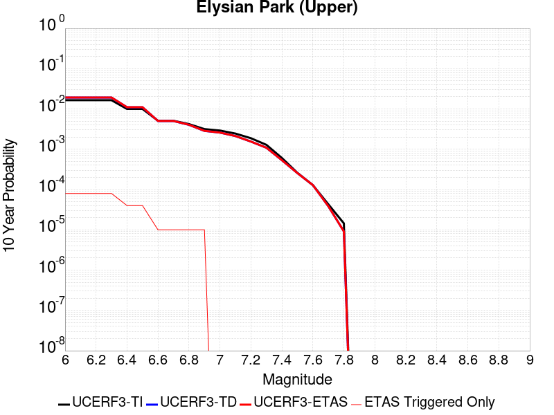 |

| Magnitude | 1 wk TI Prob | 1 wk TD Prob | 1 wk ETAS Prob | 1 wk ETAS/TD Gain | 1 wk ETAS Triggered Only | 1 mo TI Prob | 1 mo TD Prob | 1 mo ETAS Prob | 1 mo ETAS/TD Gain | 1 mo ETAS Triggered Only | 1 yr TI Prob | 1 yr TD Prob | 1 yr ETAS Prob | 1 yr ETAS/TD Gain | 1 yr ETAS Triggered Only | 10 yr TI Prob | 10 yr TD Prob | 10 yr ETAS Prob | 10 yr ETAS/TD Gain | 10 yr ETAS Triggered Only |
|-----|-----|-----|-----|-----|-----|-----|-----|-----|-----|-----|-----|-----|-----|-----|-----|-----|-----|-----|-----|-----|
| 6.0 | 3.1876025E-5 | 3.7035275E-5 | 4.7034904E-5 | 1.2700028 | 1.0E-5 | 1.3660437E-4 | 1.5871569E-4 | 1.687141E-4 | 1.0629958 | 1.0E-5 | 0.0016618895 | 0.001931122 | 0.0019810256 | 1.0258417 | 5.0E-5 | 0.016495159 | 0.019189863 | 0.019268326 | 1.0040889 | 8.0E-5 |
| 6.1 | 3.1876025E-5 | 3.7035275E-5 | 4.7034904E-5 | 1.2700028 | 1.0E-5 | 1.3660437E-4 | 1.5871569E-4 | 1.687141E-4 | 1.0629958 | 1.0E-5 | 0.0016618895 | 0.001931122 | 0.0019810256 | 1.0258417 | 5.0E-5 | 0.016495159 | 0.019189863 | 0.019268326 | 1.0040889 | 8.0E-5 |
| 6.2 | 3.1876025E-5 | 3.7035275E-5 | 4.7034904E-5 | 1.2700028 | 1.0E-5 | 1.3660437E-4 | 1.5871569E-4 | 1.687141E-4 | 1.0629958 | 1.0E-5 | 0.0016618895 | 0.001931122 | 0.0019810256 | 1.0258417 | 5.0E-5 | 0.016495159 | 0.019189863 | 0.019268326 | 1.0040889 | 8.0E-5 |
| 6.3 | 3.1876025E-5 | 3.7035275E-5 | 4.7034904E-5 | 1.2700028 | 1.0E-5 | 1.3660437E-4 | 1.5871569E-4 | 1.687141E-4 | 1.0629958 | 1.0E-5 | 0.0016618895 | 0.001931122 | 0.0019810256 | 1.0258417 | 5.0E-5 | 0.016495159 | 0.019189863 | 0.019268326 | 1.0040889 | 8.0E-5 |
| 6.4 | 1.9273462E-5 | 2.120244E-5 | 2.120244E-5 | 1.0 | 0.0 | 8.259794E-5 | 9.086542E-5 | 9.086542E-5 | 1.0 | 0.0 | 0.001005166 | 0.0011058967 | 0.0011258746 | 1.0180649 | 2.0E-5 | 0.010006315 | 0.011020744 | 0.011060303 | 1.0035895 | 4.0E-5 |
| 6.5 | 1.9273462E-5 | 2.120244E-5 | 2.120244E-5 | 1.0 | 0.0 | 8.259794E-5 | 9.086542E-5 | 9.086542E-5 | 1.0 | 0.0 | 0.001005166 | 0.0011058967 | 0.0011258746 | 1.0180649 | 2.0E-5 | 0.010006315 | 0.011020744 | 0.011060303 | 1.0035895 | 4.0E-5 |
| 6.6 | 9.813258E-6 | 9.665589E-6 | 9.665589E-6 | 1.0 | 0.0 | 4.205614E-5 | 4.1423333E-5 | 4.1423333E-5 | 1.0 | 0.0 | 5.119132E-4 | 5.042196E-4 | 5.1421457E-4 | 1.0198226 | 1.0E-5 | 0.005107356 | 0.0050314795 | 0.0050414293 | 1.0019774 | 1.0E-5 |
| 6.7 | 9.801478E-6 | 9.653158E-6 | 9.653158E-6 | 1.0 | 0.0 | 4.2005657E-5 | 4.137006E-5 | 4.137006E-5 | 1.0 | 0.0 | 5.112989E-4 | 5.0357135E-4 | 5.135663E-4 | 1.0198481 | 1.0E-5 | 0.0051012407 | 0.005025026 | 0.0050349757 | 1.0019801 | 1.0E-5 |
| 6.8 | 8.102489E-6 | 7.772994E-6 | 7.772994E-6 | 1.0 | 0.0 | 3.4724493E-5 | 3.3312434E-5 | 3.3312434E-5 | 1.0 | 0.0 | 4.2268867E-4 | 4.0550836E-4 | 4.1550433E-4 | 1.0246505 | 1.0E-5 | 0.004218856 | 0.0040481784 | 0.0040581375 | 1.0024602 | 1.0E-5 |
| 6.9 | 6.08275E-6 | 5.481441E-6 | 5.481441E-6 | 1.0 | 0.0 | 2.6068668E-5 | 2.3491682E-5 | 2.3491682E-5 | 1.0 | 0.0 | 3.173398E-4 | 2.8597447E-4 | 2.959716E-4 | 1.0349581 | 1.0E-5 | 0.0031688702 | 0.0028561424 | 0.0028661138 | 1.0034913 | 1.0E-5 |
| 7.0 | 5.5995934E-6 | 4.9827686E-6 | 4.9827686E-6 | 1.0 | 0.0 | 2.3998036E-5 | 2.1354552E-5 | 2.1354552E-5 | 1.0 | 0.0 | 2.9213692E-4 | 2.5996132E-4 | 2.5996132E-4 | 1.0 | 0.0 | 0.0029175316 | 0.0025966396 | 0.0025966396 | 1.0 | 0.0 |
| 7.1 | 4.709881E-6 | 4.0873906E-6 | 4.0873906E-6 | 1.0 | 0.0 | 2.0185047E-5 | 1.7517272E-5 | 1.7517272E-5 | 1.0 | 0.0 | 2.4572524E-4 | 2.1325232E-4 | 2.1325232E-4 | 1.0 | 0.0 | 0.002454537 | 0.0021305184 | 0.0021305184 | 1.0 | 0.0 |
| 7.2 | 3.6063436E-6 | 2.9779412E-6 | 2.9779412E-6 | 1.0 | 0.0 | 1.5455667E-5 | 1.27625435E-5 | 1.27625435E-5 | 1.0 | 0.0 | 1.881565E-4 | 1.55373E-4 | 1.55373E-4 | 1.0 | 0.0 | 0.0018799726 | 0.0015526549 | 0.0015526549 | 1.0 | 0.0 |
| 7.3 | 2.471135E-6 | 2.0954562E-6 | 2.0954562E-6 | 1.0 | 0.0 | 1.0590536E-5 | 8.980496E-6 | 8.980496E-6 | 1.0 | 0.0 | 1.2893214E-4 | 1.0933213E-4 | 1.0933213E-4 | 1.0 | 0.0 | 0.0012885736 | 0.0010927906 | 0.0010927906 | 1.0 | 0.0 |
| 7.4 | 1.163943E-6 | 1.0275061E-6 | 1.0275061E-6 | 1.0 | 0.0 | 4.988318E-6 | 4.40359E-6 | 4.40359E-6 | 1.0 | 0.0 | 6.0731076E-5 | 5.361242E-5 | 5.361242E-5 | 1.0 | 0.0 | 6.071448E-4 | 5.3599785E-4 | 5.3599785E-4 | 1.0 | 0.0 |
| 7.5 | 4.99459E-7 | 4.917601E-7 | 4.917601E-7 | 1.0 | 0.0 | 2.140537E-6 | 2.1075416E-6 | 2.1075416E-6 | 1.0 | 0.0 | 2.6060725E-5 | 2.5659032E-5 | 2.5659032E-5 | 1.0 | 0.0 | 2.605767E-4 | 2.5656226E-4 | 2.5656226E-4 | 1.0 | 0.0 |
| 7.6 | 2.4667852E-7 | 2.4778313E-7 | 2.4778313E-7 | 1.0 | 0.0 | 1.0571932E-6 | 1.0619274E-6 | 1.0619274E-6 | 1.0 | 0.0 | 1.2871251E-5 | 1.2928893E-5 | 1.2928893E-5 | 1.0 | 0.0 | 1.2870505E-4 | 1.2928178E-4 | 1.2928178E-4 | 1.0 | 0.0 |
| 7.7 | 8.2312795E-8 | 7.3864214E-8 | 7.3864214E-8 | 1.0 | 0.0 | 3.527691E-7 | 3.165609E-7 | 3.165609E-7 | 1.0 | 0.0 | 4.294955E-6 | 3.854123E-6 | 3.854123E-6 | 1.0 | 0.0 | 4.2948723E-5 | 3.854068E-5 | 3.854068E-5 | 1.0 | 0.0 |
| 7.8 | 2.7819295E-8 | 1.7565618E-8 | 1.7565618E-8 | 1.0 | 0.0 | 1.1922555E-7 | 7.528122E-8 | 7.528122E-8 | 1.0 | 0.0 | 1.45157E-6 | 9.1654863E-7 | 9.1654863E-7 | 1.0 | 0.0 | 1.45156055E-5 | 9.165463E-6 | 9.165463E-6 | 1.0 | 0.0 |

## Bullion Mountains
*[(top)](#table-of-contents)*

| 1 Week | 1 Month | 1 Year | 10 Year |
|-----|-----|-----|-----|
|  | 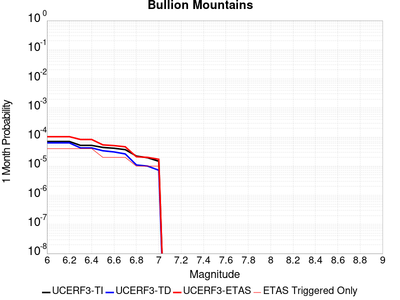 |  |  |

| Magnitude | 1 wk TI Prob | 1 wk TD Prob | 1 wk ETAS Prob | 1 wk ETAS/TD Gain | 1 wk ETAS Triggered Only | 1 mo TI Prob | 1 mo TD Prob | 1 mo ETAS Prob | 1 mo ETAS/TD Gain | 1 mo ETAS Triggered Only | 1 yr TI Prob | 1 yr TD Prob | 1 yr ETAS Prob | 1 yr ETAS/TD Gain | 1 yr ETAS Triggered Only | 10 yr TI Prob | 10 yr TD Prob | 10 yr ETAS Prob | 10 yr ETAS/TD Gain | 10 yr ETAS Triggered Only |
|-----|-----|-----|-----|-----|-----|-----|-----|-----|-----|-----|-----|-----|-----|-----|-----|-----|-----|-----|-----|-----|
| 6.0 | 1.6420427E-5 | 1.4692009E-5 | 4.469157E-5 | 3.0418963 | 3.0E-5 | 7.037136E-5 | 6.296445E-5 | 1.0296193E-4 | 1.6352391 | 4.0E-5 | 8.5643446E-4 | 7.6636096E-4 | 8.2631496E-4 | 1.078232 | 6.0E-5 | 0.008531413 | 0.0076409746 | 0.00771044 | 1.0090911 | 7.0E-5 |
| 6.1 | 1.6420427E-5 | 1.4692009E-5 | 4.469157E-5 | 3.0418963 | 3.0E-5 | 7.037136E-5 | 6.296445E-5 | 1.0296193E-4 | 1.6352391 | 4.0E-5 | 8.5643446E-4 | 7.6636096E-4 | 8.2631496E-4 | 1.078232 | 6.0E-5 | 0.008531413 | 0.0076409746 | 0.00771044 | 1.0090911 | 7.0E-5 |
| 6.2 | 1.6420427E-5 | 1.4692009E-5 | 4.469157E-5 | 3.0418963 | 3.0E-5 | 7.037136E-5 | 6.296445E-5 | 1.0296193E-4 | 1.6352391 | 4.0E-5 | 8.5643446E-4 | 7.6636096E-4 | 8.2631496E-4 | 1.078232 | 6.0E-5 | 0.008531413 | 0.0076409746 | 0.00771044 | 1.0090911 | 7.0E-5 |
| 6.3 | 1.2046778E-5 | 9.862255E-6 | 3.986196E-5 | 4.0418706 | 3.0E-5 | 5.1628023E-5 | 4.2266256E-5 | 8.226457E-5 | 1.9463415 | 4.0E-5 | 6.283899E-4 | 5.144933E-4 | 5.644676E-4 | 1.097133 | 5.0E-5 | 0.0062661595 | 0.0051353034 | 0.0051949956 | 1.0116239 | 6.0E-5 |
| 6.4 | 1.2046778E-5 | 9.862255E-6 | 3.986196E-5 | 4.0418706 | 3.0E-5 | 5.1628023E-5 | 4.2266256E-5 | 8.226457E-5 | 1.9463415 | 4.0E-5 | 6.283899E-4 | 5.144933E-4 | 5.644676E-4 | 1.097133 | 5.0E-5 | 0.0062661595 | 0.0051353034 | 0.0051949956 | 1.0116239 | 6.0E-5 |
| 6.5 | 1.0244343E-5 | 7.879378E-6 | 2.7879221E-5 | 3.5382512 | 2.0E-5 | 4.390359E-5 | 3.3768443E-5 | 5.376777E-5 | 1.5922489 | 2.0E-5 | 5.343951E-4 | 4.1107394E-4 | 4.410616E-4 | 1.0729495 | 3.0E-5 | 0.005331118 | 0.0041051665 | 0.0041350434 | 1.0072778 | 3.0E-5 |
| 6.6 | 9.605408E-6 | 7.1774166E-6 | 2.7177273E-5 | 3.7864978 | 2.0E-5 | 4.1165385E-5 | 3.0760108E-5 | 5.0759492E-5 | 1.6501727 | 2.0E-5 | 5.010733E-4 | 3.7446033E-4 | 4.044491E-4 | 1.0800853 | 3.0E-5 | 0.00499945 | 0.0037402906 | 0.0037701784 | 1.0079907 | 3.0E-5 |
| 6.7 | 8.60418E-6 | 6.123926E-6 | 2.6123804E-5 | 4.2658587 | 2.0E-5 | 3.687454E-5 | 2.6245243E-5 | 4.624472E-5 | 1.7620229 | 2.0E-5 | 4.48855E-4 | 3.195085E-4 | 3.494989E-4 | 1.0938642 | 3.0E-5 | 0.004479495 | 0.0031924031 | 0.0032223072 | 1.0093673 | 3.0E-5 |
| 6.8 | 5.187994E-6 | 2.563117E-6 | 1.2563091E-5 | 4.9014897 | 1.0E-5 | 2.223407E-5 | 1.0984763E-5 | 2.0984653E-5 | 1.9103419 | 1.0E-5 | 2.7066618E-4 | 1.3373529E-4 | 1.537326E-4 | 1.1495292 | 2.0E-5 | 0.0027033675 | 0.0013369396 | 0.0013569129 | 1.0149395 | 2.0E-5 |
| 6.9 | 4.5302368E-6 | 2.3442778E-6 | 1.2344254E-5 | 5.265696 | 1.0E-5 | 1.9415156E-5 | 1.0046889E-5 | 2.004679E-5 | 1.995323 | 1.0E-5 | 2.3635388E-4 | 1.2231797E-4 | 1.4231553E-4 | 1.1634883 | 2.0E-5 | 0.0023610266 | 0.0012228956 | 0.0012428712 | 1.0163347 | 2.0E-5 |
| 7.0 | 3.431668E-6 | 1.6882177E-6 | 1.1688201E-5 | 6.9233966 | 1.0E-5 | 1.4707065E-5 | 7.2352186E-6 | 1.7235147E-5 | 2.3821182 | 1.0E-5 | 1.7904381E-4 | 8.808879E-5 | 1.0808703E-4 | 1.2270236 | 2.0E-5 | 0.0017889962 | 8.8088785E-4 | 9.0087025E-4 | 1.0226843 | 2.0E-5 |

## San Jacinto (Borrego)
*[(top)](#table-of-contents)*

| 1 Week | 1 Month | 1 Year | 10 Year |
|-----|-----|-----|-----|
|  |  | 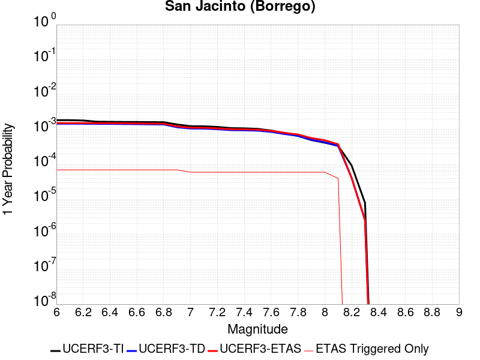 |  |

| Magnitude | 1 wk TI Prob | 1 wk TD Prob | 1 wk ETAS Prob | 1 wk ETAS/TD Gain | 1 wk ETAS Triggered Only | 1 mo TI Prob | 1 mo TD Prob | 1 mo ETAS Prob | 1 mo ETAS/TD Gain | 1 mo ETAS Triggered Only | 1 yr TI Prob | 1 yr TD Prob | 1 yr ETAS Prob | 1 yr ETAS/TD Gain | 1 yr ETAS Triggered Only | 10 yr TI Prob | 10 yr TD Prob | 10 yr ETAS Prob | 10 yr ETAS/TD Gain | 10 yr ETAS Triggered Only |
|-----|-----|-----|-----|-----|-----|-----|-----|-----|-----|-----|-----|-----|-----|-----|-----|-----|-----|-----|-----|-----|
| 6.0 | 3.543992E-5 | 2.7925962E-5 | 6.792485E-5 | 2.432319 | 4.0E-5 | 1.5187653E-4 | 1.1967727E-4 | 1.6967129E-4 | 1.4177402 | 5.0E-5 | 0.0018475284 | 0.0014561092 | 0.0015260072 | 1.0480033 | 7.0E-5 | 0.018322436 | 0.01486815 | 0.01493711 | 1.0046381 | 7.0E-5 |
| 6.1 | 3.542281E-5 | 2.7925962E-5 | 6.792485E-5 | 2.432319 | 4.0E-5 | 1.5180321E-4 | 1.1967727E-4 | 1.6967129E-4 | 1.4177402 | 5.0E-5 | 0.0018466372 | 0.0014561092 | 0.0015260072 | 1.0480033 | 7.0E-5 | 0.018313672 | 0.01486815 | 0.01493711 | 1.0046381 | 7.0E-5 |
| 6.2 | 3.4688688E-5 | 2.7925962E-5 | 6.792485E-5 | 2.432319 | 4.0E-5 | 1.4865733E-4 | 1.1967727E-4 | 1.6967129E-4 | 1.4177402 | 5.0E-5 | 0.0018084005 | 0.0014561091 | 0.0015260072 | 1.0480033 | 7.0E-5 | 0.017937548 | 0.01486815 | 0.014937109 | 1.0046381 | 7.0E-5 |
| 6.3 | 3.2087122E-5 | 2.7771312E-5 | 6.77702E-5 | 2.4402952 | 4.0E-5 | 1.3750899E-4 | 1.1901455E-4 | 1.6900859E-4 | 1.4200667 | 5.0E-5 | 0.0016728862 | 0.0014480512 | 0.0015179499 | 1.0482708 | 7.0E-5 | 0.016603488 | 0.014789308 | 0.014858273 | 1.0046631 | 7.0E-5 |
| 6.4 | 3.1828724E-5 | 2.773829E-5 | 6.773718E-5 | 2.44201 | 4.0E-5 | 1.364017E-4 | 1.1887303E-4 | 1.6886709E-4 | 1.4205668 | 5.0E-5 | 0.0016594254 | 0.0014463306 | 0.0015162294 | 1.0483284 | 7.0E-5 | 0.016470885 | 0.014772502 | 0.014841467 | 1.0046686 | 7.0E-5 |
| 6.5 | 3.1563577E-5 | 2.7477974E-5 | 6.7476874E-5 | 2.4556713 | 4.0E-5 | 1.3526545E-4 | 1.17757496E-4 | 1.6775161E-4 | 1.4245514 | 5.0E-5 | 0.0016456128 | 0.0014327668 | 0.0015026665 | 1.0487865 | 7.0E-5 | 0.0163348 | 0.01463991 | 0.014708885 | 1.0047115 | 7.0E-5 |
| 6.6 | 3.1467625E-5 | 2.7322194E-5 | 6.73211E-5 | 2.4639714 | 4.0E-5 | 1.3485427E-4 | 1.17089934E-4 | 1.6708407E-4 | 1.4269722 | 5.0E-5 | 0.0016406142 | 0.0014246498 | 0.0014945501 | 1.0490649 | 7.0E-5 | 0.016285548 | 0.014560228 | 0.0146292085 | 1.0047376 | 7.0E-5 |
| 6.7 | 3.1223695E-5 | 2.6940217E-5 | 6.693914E-5 | 2.484729 | 4.0E-5 | 1.3380898E-4 | 1.1545303E-4 | 1.6544726E-4 | 1.4330266 | 5.0E-5 | 0.0016279068 | 0.0014047464 | 0.0014746481 | 1.049761 | 7.0E-5 | 0.01616033 | 0.01436451 | 0.014433504 | 1.0048032 | 7.0E-5 |
| 6.8 | 3.1015585E-5 | 2.6761221E-5 | 6.676015E-5 | 2.4946601 | 4.0E-5 | 1.3291716E-4 | 1.1468597E-4 | 1.6468024E-4 | 1.4359231 | 5.0E-5 | 0.001617065 | 0.0013954195 | 0.0014653218 | 1.0500941 | 7.0E-5 | 0.016053487 | 0.014271772 | 0.014340772 | 1.0048348 | 7.0E-5 |
| 6.9 | 2.6641965E-5 | 2.2183434E-5 | 6.2182546E-5 | 2.8031073 | 4.0E-5 | 1.1417485E-4 | 9.506842E-5 | 1.4506366E-4 | 1.525887 | 5.0E-5 | 0.0013891924 | 0.0011568473 | 0.0012267664 | 1.0604392 | 7.0E-5 | 0.0138054015 | 0.011882191 | 0.011951359 | 1.0058212 | 7.0E-5 |
| 7.0 | 2.3854353E-5 | 2.047825E-5 | 6.0477432E-5 | 2.9532518 | 4.0E-5 | 1.02228936E-4 | 8.776099E-5 | 1.3775661E-4 | 1.5696791 | 5.0E-5 | 0.0012439266 | 0.0010679689 | 0.0011279049 | 1.0561215 | 6.0E-5 | 0.012369866 | 0.0109826205 | 0.011041962 | 1.0054032 | 6.0E-5 |
| 7.1 | 2.3672901E-5 | 2.0314741E-5 | 6.0313927E-5 | 2.9689736 | 4.0E-5 | 1.0145135E-4 | 8.706028E-5 | 1.3705593E-4 | 1.5742646 | 5.0E-5 | 0.0012344702 | 0.0010594461 | 0.0011193826 | 1.0565734 | 6.0E-5 | 0.0122763505 | 0.010897858 | 0.010957205 | 1.0054457 | 6.0E-5 |
| 7.2 | 2.2717244E-5 | 1.9542116E-5 | 5.9541333E-5 | 3.046821 | 4.0E-5 | 9.735599E-5 | 8.3749255E-5 | 1.3374507E-4 | 1.5969702 | 5.0E-5 | 0.0011846646 | 0.0010191725 | 0.0010791114 | 1.0588113 | 6.0E-5 | 0.01178369 | 0.010495322 | 0.010554692 | 1.0056568 | 6.0E-5 |
| 7.3 | 2.1016205E-5 | 1.8383771E-5 | 5.8383037E-5 | 3.1757922 | 4.0E-5 | 9.006634E-5 | 7.878522E-5 | 1.2878128E-4 | 1.6345868 | 5.0E-5 | 0.001096006 | 9.5879E-4 | 0.0010187326 | 1.0625188 | 6.0E-5 | 0.010906163 | 0.009890901 | 0.009950307 | 1.0060062 | 6.0E-5 |
| 7.4 | 2.0683625E-5 | 1.8186302E-5 | 5.8185575E-5 | 3.1994176 | 4.0E-5 | 8.86411E-5 | 7.7938974E-5 | 1.2793508E-4 | 1.6414776 | 5.0E-5 | 0.001078671 | 9.48496E-4 | 0.0010084391 | 1.0631981 | 6.0E-5 | 0.010734501 | 0.0097876275 | 0.00984704 | 1.0060701 | 6.0E-5 |
| 7.5 | 1.9993966E-5 | 1.7781347E-5 | 5.7780635E-5 | 3.2495084 | 4.0E-5 | 8.568561E-5 | 7.6203556E-5 | 1.2619975E-4 | 1.6560873 | 5.0E-5 | 0.001042723 | 9.2738547E-4 | 9.873298E-4 | 1.064638 | 6.0E-5 | 0.010378438 | 0.009574548 | 0.009633974 | 1.0062066 | 6.0E-5 |
| 7.6 | 1.788966E-5 | 1.6434618E-5 | 5.643396E-5 | 3.4338467 | 4.0E-5 | 7.666772E-5 | 7.043219E-5 | 1.2042866E-4 | 1.7098527 | 5.0E-5 | 9.3302975E-4 | 8.5717626E-4 | 9.171248E-4 | 1.0699372 | 6.0E-5 | 0.00929122 | 0.008866415 | 0.008925883 | 1.0067071 | 6.0E-5 |
| 7.7 | 1.5125781E-5 | 1.4236738E-5 | 5.4236167E-5 | 3.8095925 | 4.0E-5 | 6.4823165E-5 | 6.101317E-5 | 1.11010115E-4 | 1.8194453 | 5.0E-5 | 7.889362E-4 | 7.4258295E-4 | 8.025384E-4 | 1.080739 | 6.0E-5 | 0.007861412 | 0.007714161 | 0.0077736983 | 1.0077178 | 6.0E-5 |
| 7.8 | 1.250089E-5 | 1.262994E-5 | 5.2629435E-5 | 4.1670375 | 4.0E-5 | 5.3574146E-5 | 5.4127195E-5 | 1.0412449E-4 | 1.9237001 | 5.0E-5 | 6.5207E-4 | 6.588E-4 | 7.187605E-4 | 1.0910147 | 6.0E-5 | 0.006501599 | 0.006867759 | 0.006927347 | 1.0086765 | 6.0E-5 |
| 7.9 | 9.561E-6 | 9.754065E-6 | 4.9753675E-5 | 5.1008143 | 4.0E-5 | 4.0975072E-5 | 4.180247E-5 | 9.180038E-5 | 2.1960516 | 5.0E-5 | 4.987573E-4 | 5.0882675E-4 | 5.6879624E-4 | 1.1178583 | 6.0E-5 | 0.0049763937 | 0.0053523607 | 0.0054120393 | 1.01115 | 6.0E-5 |
| 8.0 | 8.01699E-6 | 8.292994E-6 | 4.8292663E-5 | 5.8233085 | 4.0E-5 | 3.4358076E-5 | 3.554092E-5 | 8.553914E-5 | 2.406779 | 5.0E-5 | 4.1822926E-4 | 4.3262533E-4 | 4.925994E-4 | 1.1386281 | 6.0E-5 | 0.0041744304 | 0.0045733186 | 0.0046330444 | 1.0130596 | 6.0E-5 |
| 8.1 | 6.541947E-6 | 6.461784E-6 | 3.646159E-5 | 5.6426506 | 3.0E-5 | 2.8036617E-5 | 2.7693068E-5 | 5.769224E-5 | 2.0832736 | 3.0E-5 | 3.4129233E-4 | 3.3711144E-4 | 3.7709795E-4 | 1.1186152 | 4.0E-5 | 0.0034076865 | 0.0035805756 | 0.0036204322 | 1.0111314 | 4.0E-5 |
| 8.2 | 1.7968189E-6 | 7.9684827E-7 | 7.9684827E-7 | 1.0 | 0.0 | 7.70063E-6 | 3.4150596E-6 | 3.4150596E-6 | 1.0 | 0.0 | 9.3751136E-5 | 4.157758E-5 | 4.157758E-5 | 1.0 | 0.0 | 9.371159E-4 | 4.7107413E-4 | 4.7107413E-4 | 1.0 | 0.0 |
| 8.3 | 1.5167889E-7 | 4.8951257E-8 | 4.8951257E-8 | 1.0 | 0.0 | 6.500522E-7 | 2.0979108E-7 | 2.0979108E-7 | 1.0 | 0.0 | 7.9143565E-6 | 2.5542038E-6 | 2.5542038E-6 | 1.0 | 0.0 | 7.914075E-5 | 2.9679897E-5 | 2.9679897E-5 | 1.0 | 0.0 |

## Sheephole
*[(top)](#table-of-contents)*

| 1 Week | 1 Month | 1 Year | 10 Year |
|-----|-----|-----|-----|
|  | 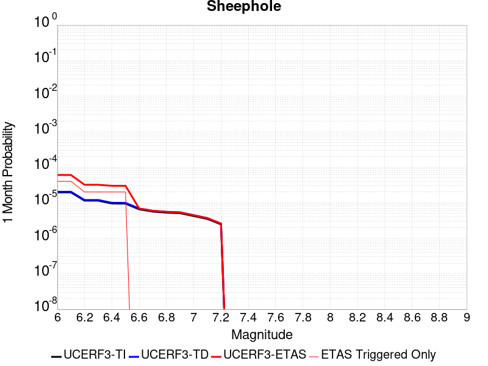 |  |  |

| Magnitude | 1 wk TI Prob | 1 wk TD Prob | 1 wk ETAS Prob | 1 wk ETAS/TD Gain | 1 wk ETAS Triggered Only | 1 mo TI Prob | 1 mo TD Prob | 1 mo ETAS Prob | 1 mo ETAS/TD Gain | 1 mo ETAS Triggered Only | 1 yr TI Prob | 1 yr TD Prob | 1 yr ETAS Prob | 1 yr ETAS/TD Gain | 1 yr ETAS Triggered Only | 10 yr TI Prob | 10 yr TD Prob | 10 yr ETAS Prob | 10 yr ETAS/TD Gain | 10 yr ETAS Triggered Only |
|-----|-----|-----|-----|-----|-----|-----|-----|-----|-----|-----|-----|-----|-----|-----|-----|-----|-----|-----|-----|-----|
| 6.0 | 4.5579695E-6 | 4.7412627E-6 | 4.474107E-5 | 9.436531 | 4.0E-5 | 1.9534009E-5 | 2.031957E-5 | 6.031876E-5 | 2.9685056 | 4.0E-5 | 2.3780059E-4 | 2.473682E-4 | 2.9735584E-4 | 1.2020779 | 5.0E-5 | 0.0023754628 | 0.002471473 | 0.0025413001 | 1.0282532 | 7.0E-5 |
| 6.1 | 4.5579695E-6 | 4.7412627E-6 | 4.474107E-5 | 9.436531 | 4.0E-5 | 1.9534009E-5 | 2.031957E-5 | 6.031876E-5 | 2.9685056 | 4.0E-5 | 2.3780059E-4 | 2.473682E-4 | 2.9735584E-4 | 1.2020779 | 5.0E-5 | 0.0023754628 | 0.002471473 | 0.0025413001 | 1.0282532 | 7.0E-5 |
| 6.2 | 2.6677674E-6 | 2.7873941E-6 | 2.2787339E-5 | 8.17514 | 2.0E-5 | 1.1433239E-5 | 1.1945926E-5 | 3.194569E-5 | 2.6741908 | 2.0E-5 | 1.3919079E-4 | 1.4543302E-4 | 1.6543012E-4 | 1.1375003 | 2.0E-5 | 0.0013910364 | 0.0014534844 | 0.0014734553 | 1.0137401 | 2.0E-5 |
| 6.3 | 2.6677674E-6 | 2.7873941E-6 | 2.2787339E-5 | 8.17514 | 2.0E-5 | 1.1433239E-5 | 1.1945926E-5 | 3.194569E-5 | 2.6741908 | 2.0E-5 | 1.3919079E-4 | 1.4543302E-4 | 1.6543012E-4 | 1.1375003 | 2.0E-5 | 0.0013910364 | 0.0014534844 | 0.0014734553 | 1.0137401 | 2.0E-5 |
| 6.4 | 2.2159759E-6 | 2.3228788E-6 | 2.2322833E-5 | 9.609986 | 2.0E-5 | 9.497005E-6 | 9.955161E-6 | 2.9954961E-5 | 3.0089881 | 2.0E-5 | 1.156199E-4 | 1.2119815E-4 | 1.4119573E-4 | 1.164999 | 2.0E-5 | 0.0011555976 | 0.0012113999 | 0.0012313756 | 1.0164899 | 2.0E-5 |
| 6.5 | 2.1986082E-6 | 2.304759E-6 | 2.2304714E-5 | 9.677677 | 2.0E-5 | 9.4225725E-6 | 9.877506E-6 | 2.9877308E-5 | 3.0247827 | 2.0E-5 | 1.1471378E-4 | 1.2025281E-4 | 1.402504E-4 | 1.1662962 | 2.0E-5 | 0.0011465458 | 0.0012019566 | 0.0012219326 | 1.0166196 | 2.0E-5 |
| 6.6 | 1.5232331E-6 | 1.6018919E-6 | 1.6018919E-6 | 1.0 | 0.0 | 6.5281256E-6 | 6.865234E-6 | 6.865234E-6 | 1.0 | 0.0 | 7.947703E-5 | 8.35812E-5 | 8.35812E-5 | 1.0 | 0.0 | 7.9448614E-4 | 8.3551643E-4 | 8.3551643E-4 | 1.0 | 0.0 |
| 6.7 | 1.3137362E-6 | 1.382819E-6 | 1.382819E-6 | 1.0 | 0.0 | 5.6302856E-6 | 5.926355E-6 | 5.926355E-6 | 1.0 | 0.0 | 6.854657E-5 | 7.215112E-5 | 7.215112E-5 | 1.0 | 0.0 | 6.8525434E-4 | 7.212908E-4 | 7.212908E-4 | 1.0 | 0.0 |
| 6.8 | 1.2275751E-6 | 1.2922847E-6 | 1.2922847E-6 | 1.0 | 0.0 | 5.2610258E-6 | 5.5383516E-6 | 5.5383516E-6 | 1.0 | 0.0 | 6.4051106E-5 | 6.7427485E-5 | 6.7427485E-5 | 1.0 | 0.0 | 6.4032647E-4 | 6.740836E-4 | 6.740836E-4 | 1.0 | 0.0 |
| 6.9 | 1.1837088E-6 | 1.246102E-6 | 1.246102E-6 | 1.0 | 0.0 | 5.0730278E-6 | 5.340427E-6 | 5.340427E-6 | 1.0 | 0.0 | 6.176237E-5 | 6.501789E-5 | 6.501789E-5 | 1.0 | 0.0 | 6.17452E-4 | 6.5000186E-4 | 6.5000186E-4 | 1.0 | 0.0 |
| 7.0 | 9.849371E-7 | 1.0366288E-6 | 1.0366288E-6 | 1.0 | 0.0 | 4.2211523E-6 | 4.442688E-6 | 4.442688E-6 | 1.0 | 0.0 | 5.1391315E-5 | 5.4088487E-5 | 5.4088487E-5 | 1.0 | 0.0 | 5.137943E-4 | 5.407633E-4 | 5.407633E-4 | 1.0 | 0.0 |
| 7.1 | 8.1643645E-7 | 8.591669E-7 | 8.591669E-7 | 1.0 | 0.0 | 3.4990085E-6 | 3.682139E-6 | 3.682139E-6 | 1.0 | 0.0 | 4.2599597E-5 | 4.482921E-5 | 4.482921E-5 | 1.0 | 0.0 | 4.259143E-4 | 4.4821028E-4 | 4.4821028E-4 | 1.0 | 0.0 |
| 7.2 | 5.7295756E-7 | 6.029502E-7 | 6.029502E-7 | 1.0 | 0.0 | 2.45553E-6 | 2.58407E-6 | 2.58407E-6 | 1.0 | 0.0 | 2.9895667E-5 | 3.1460666E-5 | 3.1460666E-5 | 1.0 | 0.0 | 2.9891645E-4 | 3.145688E-4 | 3.145688E-4 | 1.0 | 0.0 |

## Palos Verdes
*[(top)](#table-of-contents)*

| 1 Week | 1 Month | 1 Year | 10 Year |
|-----|-----|-----|-----|
|  | 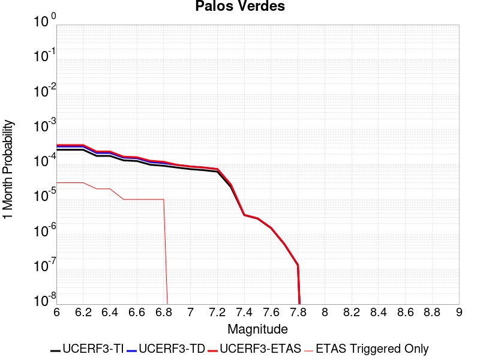 |  |  |

| Magnitude | 1 wk TI Prob | 1 wk TD Prob | 1 wk ETAS Prob | 1 wk ETAS/TD Gain | 1 wk ETAS Triggered Only | 1 mo TI Prob | 1 mo TD Prob | 1 mo ETAS Prob | 1 mo ETAS/TD Gain | 1 mo ETAS Triggered Only | 1 yr TI Prob | 1 yr TD Prob | 1 yr ETAS Prob | 1 yr ETAS/TD Gain | 1 yr ETAS Triggered Only | 10 yr TI Prob | 10 yr TD Prob | 10 yr ETAS Prob | 10 yr ETAS/TD Gain | 10 yr ETAS Triggered Only |
|-----|-----|-----|-----|-----|-----|-----|-----|-----|-----|-----|-----|-----|-----|-----|-----|-----|-----|-----|-----|-----|
| 6.0 | 6.126063E-5 | 7.622572E-5 | 8.622496E-5 | 1.1311793 | 1.0E-5 | 2.6251914E-4 | 3.266441E-4 | 3.5663432E-4 | 1.0918131 | 3.0E-5 | 0.0031914865 | 0.0039701737 | 0.0040398957 | 1.0175614 | 7.0E-5 | 0.031460393 | 0.03904909 | 0.039116353 | 1.0017226 | 7.0E-5 |
| 6.1 | 6.126063E-5 | 7.622572E-5 | 8.622496E-5 | 1.1311793 | 1.0E-5 | 2.6251914E-4 | 3.266441E-4 | 3.5663432E-4 | 1.0918131 | 3.0E-5 | 0.0031914865 | 0.0039701737 | 0.0040398957 | 1.0175614 | 7.0E-5 | 0.031460393 | 0.03904909 | 0.039116353 | 1.0017226 | 7.0E-5 |
| 6.2 | 6.126063E-5 | 7.622572E-5 | 8.622496E-5 | 1.1311793 | 1.0E-5 | 2.6251914E-4 | 3.266441E-4 | 3.5663432E-4 | 1.0918131 | 3.0E-5 | 0.0031914865 | 0.0039701737 | 0.0040398957 | 1.0175614 | 7.0E-5 | 0.031460393 | 0.03904909 | 0.039116353 | 1.0017226 | 7.0E-5 |
| 6.3 | 4.0838047E-5 | 4.9749007E-5 | 4.9749007E-5 | 1.0 | 0.0 | 1.7500846E-4 | 2.1319388E-4 | 2.3318961E-4 | 1.0937914 | 2.0E-5 | 0.0021286458 | 0.002592754 | 0.0026226763 | 1.0115407 | 3.0E-5 | 0.021083709 | 0.025646746 | 0.025675977 | 1.0011398 | 3.0E-5 |
| 6.4 | 4.0838047E-5 | 4.9749007E-5 | 4.9749007E-5 | 1.0 | 0.0 | 1.7500846E-4 | 2.1319388E-4 | 2.3318961E-4 | 1.0937914 | 2.0E-5 | 0.0021286458 | 0.002592754 | 0.0026226763 | 1.0115407 | 3.0E-5 | 0.021083709 | 0.025646746 | 0.025675977 | 1.0011398 | 3.0E-5 |
| 6.5 | 3.0512005E-5 | 3.6561592E-5 | 3.6561592E-5 | 1.0 | 0.0 | 1.3075917E-4 | 1.566838E-4 | 1.6668225E-4 | 1.0638129 | 1.0E-5 | 0.0015908304 | 0.001906072 | 0.0019260339 | 1.0104728 | 2.0E-5 | 0.015794903 | 0.018909173 | 0.018928794 | 1.0010377 | 2.0E-5 |
| 6.6 | 2.9255087E-5 | 3.5154393E-5 | 3.5154393E-5 | 1.0 | 0.0 | 1.2537291E-4 | 1.5065364E-4 | 1.6065213E-4 | 1.0663674 | 1.0E-5 | 0.0015253464 | 0.0018327782 | 0.0018527416 | 1.0108924 | 2.0E-5 | 0.015149189 | 0.018188244 | 0.01820788 | 1.0010796 | 2.0E-5 |
| 6.7 | 2.287198E-5 | 2.724828E-5 | 2.724828E-5 | 1.0 | 0.0 | 9.801909E-5 | 1.16773626E-4 | 1.2677246E-4 | 1.0856258 | 1.0E-5 | 0.001192729 | 0.0014208833 | 0.001440855 | 1.0140557 | 2.0E-5 | 0.011863477 | 0.014127217 | 0.014146935 | 1.0013957 | 2.0E-5 |
| 6.8 | 2.1325764E-5 | 2.5431878E-5 | 2.5431878E-5 | 1.0 | 0.0 | 9.139293E-5 | 1.0898972E-4 | 1.18988624E-4 | 1.0917418 | 1.0E-5 | 0.001112141 | 0.0013262323 | 0.0013462058 | 1.0150603 | 2.0E-5 | 0.011065915 | 0.013192211 | 0.013211948 | 1.0014961 | 2.0E-5 |
| 6.9 | 1.9009392E-5 | 2.2613547E-5 | 2.2613547E-5 | 1.0 | 0.0 | 8.1466285E-5 | 9.6912096E-5 | 9.6912096E-5 | 1.0 | 0.0 | 9.914007E-4 | 0.0011793535 | 0.0011893417 | 1.0084692 | 1.0E-5 | 0.009869894 | 0.011739633 | 0.011749515 | 1.0008419 | 1.0E-5 |
| 7.0 | 1.7098473E-5 | 2.0319356E-5 | 2.0319356E-5 | 1.0 | 0.0 | 7.3277115E-5 | 8.708052E-5 | 8.708052E-5 | 1.0 | 0.0 | 8.917837E-4 | 0.001059775 | 0.0010697644 | 1.009426 | 1.0E-5 | 0.008882134 | 0.010555646 | 0.010565541 | 1.0009373 | 1.0E-5 |
| 7.1 | 1.5982785E-5 | 1.899476E-5 | 1.899476E-5 | 1.0 | 0.0 | 6.849585E-5 | 8.1404054E-5 | 8.1404054E-5 | 1.0 | 0.0 | 8.336179E-4 | 9.907284E-4 | 0.0010007184 | 1.0100836 | 1.0E-5 | 0.008304977 | 0.009871479 | 0.009881381 | 1.001003 | 1.0E-5 |
| 7.2 | 1.4468002E-5 | 1.7197237E-5 | 1.7197237E-5 | 1.0 | 0.0 | 6.200425E-5 | 7.370083E-5 | 7.370083E-5 | 1.0 | 0.0 | 7.546402E-4 | 8.970222E-4 | 9.0701325E-4 | 1.011138 | 1.0E-5 | 0.007520827 | 0.008942284 | 0.008952194 | 1.0011083 | 1.0E-5 |
| 7.3 | 5.288233E-6 | 6.2036747E-6 | 6.2036747E-6 | 1.0 | 0.0 | 2.2663658E-5 | 2.6587102E-5 | 2.6587102E-5 | 1.0 | 0.0 | 2.7589512E-4 | 3.236848E-4 | 3.236848E-4 | 1.0 | 0.0 | 0.0027555283 | 0.0032355562 | 0.0032355562 | 1.0 | 0.0 |
| 7.4 | 8.279556E-7 | 8.408347E-7 | 8.408347E-7 | 1.0 | 0.0 | 3.5483763E-6 | 3.6035726E-6 | 3.6035726E-6 | 1.0 | 0.0 | 4.3200624E-5 | 4.3872686E-5 | 4.3872686E-5 | 1.0 | 0.0 | 4.3192226E-4 | 4.3864746E-4 | 4.3864746E-4 | 1.0 | 0.0 |
| 7.5 | 6.559831E-7 | 6.667229E-7 | 6.667229E-7 | 1.0 | 0.0 | 2.8113532E-6 | 2.857381E-6 | 2.857381E-6 | 1.0 | 0.0 | 3.4227687E-5 | 3.4788125E-5 | 3.4788125E-5 | 1.0 | 0.0 | 3.4222414E-4 | 3.4783344E-4 | 3.4783344E-4 | 1.0 | 0.0 |
| 7.6 | 3.5018968E-7 | 3.5620027E-7 | 3.5620027E-7 | 1.0 | 0.0 | 1.500812E-6 | 1.526572E-6 | 1.526572E-6 | 1.0 | 0.0 | 1.8272232E-5 | 1.8585903E-5 | 1.8585903E-5 | 1.0 | 0.0 | 1.8270731E-4 | 1.8584808E-4 | 1.8584808E-4 | 1.0 | 0.0 |
| 7.7 | 1.1986104E-7 | 1.2198376E-7 | 1.2198376E-7 | 1.0 | 0.0 | 5.1369005E-7 | 5.2278745E-7 | 5.2278745E-7 | 1.0 | 0.0 | 6.2541585E-6 | 6.364919E-6 | 6.364919E-6 | 1.0 | 0.0 | 6.2539824E-5 | 6.364741E-5 | 6.364741E-5 | 1.0 | 0.0 |
| 7.8 | 3.0445005E-8 | 3.1027582E-8 | 3.1027582E-8 | 1.0 | 0.0 | 1.3047858E-7 | 1.3297536E-7 | 1.3297536E-7 | 1.0 | 0.0 | 1.5885756E-6 | 1.6189739E-6 | 1.6189739E-6 | 1.0 | 0.0 | 1.5885644E-5 | 1.6189642E-5 | 1.6189642E-5 | 1.0 | 0.0 |

## Red Mountain
*[(top)](#table-of-contents)*

| 1 Week | 1 Month | 1 Year | 10 Year |
|-----|-----|-----|-----|
|  |  | 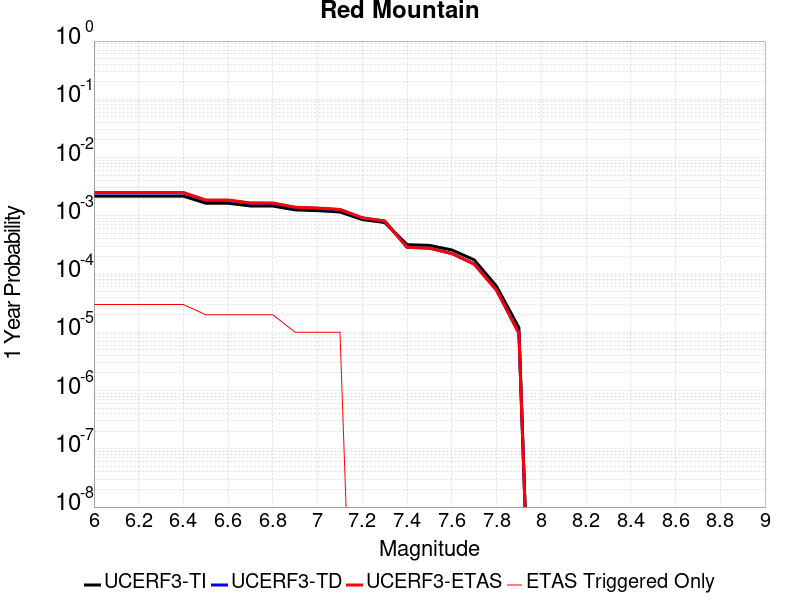 | 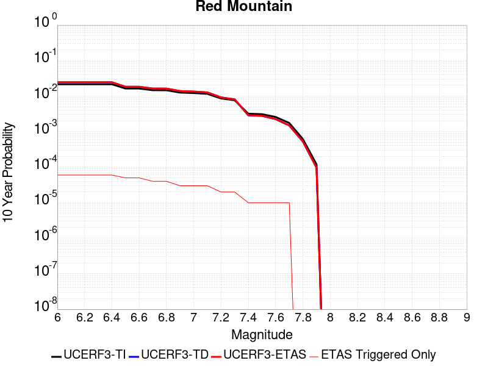 |

| Magnitude | 1 wk TI Prob | 1 wk TD Prob | 1 wk ETAS Prob | 1 wk ETAS/TD Gain | 1 wk ETAS Triggered Only | 1 mo TI Prob | 1 mo TD Prob | 1 mo ETAS Prob | 1 mo ETAS/TD Gain | 1 mo ETAS Triggered Only | 1 yr TI Prob | 1 yr TD Prob | 1 yr ETAS Prob | 1 yr ETAS/TD Gain | 1 yr ETAS Triggered Only | 10 yr TI Prob | 10 yr TD Prob | 10 yr ETAS Prob | 10 yr ETAS/TD Gain | 10 yr ETAS Triggered Only |
|-----|-----|-----|-----|-----|-----|-----|-----|-----|-----|-----|-----|-----|-----|-----|-----|-----|-----|-----|-----|-----|
| 6.0 | 4.1810763E-5 | 4.7590016E-5 | 4.7590016E-5 | 1.0 | 0.0 | 1.7917668E-4 | 2.039422E-4 | 2.1394016E-4 | 1.0490235 | 1.0E-5 | 0.0021792934 | 0.0024803334 | 0.002510259 | 1.0120652 | 3.0E-5 | 0.021580452 | 0.02454411 | 0.024602639 | 1.0023845 | 6.0E-5 |
| 6.1 | 4.1810763E-5 | 4.7590016E-5 | 4.7590016E-5 | 1.0 | 0.0 | 1.7917668E-4 | 2.039422E-4 | 2.1394016E-4 | 1.0490235 | 1.0E-5 | 0.0021792934 | 0.0024803334 | 0.002510259 | 1.0120652 | 3.0E-5 | 0.021580452 | 0.02454411 | 0.024602639 | 1.0023845 | 6.0E-5 |
| 6.2 | 4.1810763E-5 | 4.7590016E-5 | 4.7590016E-5 | 1.0 | 0.0 | 1.7917668E-4 | 2.039422E-4 | 2.1394016E-4 | 1.0490235 | 1.0E-5 | 0.0021792934 | 0.0024803334 | 0.002510259 | 1.0120652 | 3.0E-5 | 0.021580452 | 0.02454411 | 0.024602639 | 1.0023845 | 6.0E-5 |
| 6.3 | 4.1810763E-5 | 4.7590016E-5 | 4.7590016E-5 | 1.0 | 0.0 | 1.7917668E-4 | 2.039422E-4 | 2.1394016E-4 | 1.0490235 | 1.0E-5 | 0.0021792934 | 0.0024803334 | 0.002510259 | 1.0120652 | 3.0E-5 | 0.021580452 | 0.02454411 | 0.024602639 | 1.0023845 | 6.0E-5 |
| 6.4 | 4.1810763E-5 | 4.7590016E-5 | 4.7590016E-5 | 1.0 | 0.0 | 1.7917668E-4 | 2.039422E-4 | 2.1394016E-4 | 1.0490235 | 1.0E-5 | 0.0021792934 | 0.0024803334 | 0.002510259 | 1.0120652 | 3.0E-5 | 0.021580452 | 0.02454411 | 0.024602639 | 1.0023845 | 6.0E-5 |
| 6.5 | 3.154503E-5 | 3.5359757E-5 | 3.5359757E-5 | 1.0 | 0.0 | 1.3518598E-4 | 1.5153353E-4 | 1.5153353E-4 | 1.0 | 0.0 | 0.0016446467 | 0.0018434518 | 0.0018634149 | 1.0108292 | 2.0E-5 | 0.01632528 | 0.018291244 | 0.01834033 | 1.0026835 | 5.0E-5 |
| 6.6 | 3.1535834E-5 | 3.5349138E-5 | 3.5349138E-5 | 1.0 | 0.0 | 1.3514658E-4 | 1.5148803E-4 | 1.5148803E-4 | 1.0 | 0.0 | 0.0016441676 | 0.0018428987 | 0.0018628618 | 1.0108324 | 2.0E-5 | 0.01632056 | 0.018285805 | 0.018334892 | 1.0026844 | 5.0E-5 |
| 6.7 | 2.8267326E-5 | 3.1469353E-5 | 3.1469353E-5 | 1.0 | 0.0 | 1.2114006E-4 | 1.3486217E-4 | 1.3486217E-4 | 1.0 | 0.0 | 0.0014738824 | 0.0016407954 | 0.0016607626 | 1.0121692 | 2.0E-5 | 0.014641452 | 0.01629557 | 0.01633492 | 1.0024147 | 4.0E-5 |
| 6.8 | 2.8212884E-5 | 3.1407242E-5 | 3.1407242E-5 | 1.0 | 0.0 | 1.20906756E-4 | 1.3459599E-4 | 1.3459599E-4 | 1.0 | 0.0 | 0.0014710457 | 0.0016375595 | 0.0016575268 | 1.0121933 | 2.0E-5 | 0.014613459 | 0.016263688 | 0.016303036 | 1.0024195 | 4.0E-5 |
| 6.9 | 2.4227871E-5 | 2.6706994E-5 | 2.6706994E-5 | 1.0 | 0.0 | 1.03829596E-4 | 1.1445395E-4 | 1.1445395E-4 | 1.0 | 0.0 | 0.0012633923 | 0.0013926621 | 0.001402648 | 1.0071704 | 1.0E-5 | 0.012562336 | 0.0138470335 | 0.013876619 | 1.0021366 | 3.0E-5 |
| 7.0 | 2.348524E-5 | 2.5835778E-5 | 2.5835778E-5 | 1.0 | 0.0 | 1.0064714E-4 | 1.10720495E-4 | 1.10720495E-4 | 1.0 | 0.0 | 0.0012246901 | 0.001347264 | 0.0013572506 | 1.0074124 | 1.0E-5 | 0.012179627 | 0.013398598 | 0.013428195 | 1.0022091 | 3.0E-5 |
| 7.1 | 2.2311642E-5 | 2.4462845E-5 | 2.4462845E-5 | 1.0 | 0.0 | 9.561782E-5 | 1.04836974E-4 | 1.04836974E-4 | 1.0 | 0.0 | 0.0011635252 | 0.0012757176 | 0.0012857048 | 1.0078287 | 1.0E-5 | 0.01157452 | 0.01269146 | 0.0127210785 | 1.0023338 | 3.0E-5 |
| 7.2 | 1.6533986E-5 | 1.7670362E-5 | 1.7670362E-5 | 1.0 | 0.0 | 7.085802E-5 | 7.572828E-5 | 7.572828E-5 | 1.0 | 0.0 | 8.623549E-4 | 9.2166534E-4 | 9.2166534E-4 | 1.0 | 0.0 | 0.008590161 | 0.009184707 | 0.009204523 | 1.0021576 | 2.0E-5 |
| 7.3 | 1.4703092E-5 | 1.5559537E-5 | 1.5559537E-5 | 1.0 | 0.0 | 6.301173E-5 | 6.668237E-5 | 6.668237E-5 | 1.0 | 0.0 | 7.668978E-4 | 8.1161706E-4 | 8.1161706E-4 | 1.0 | 0.0 | 0.0076425658 | 0.008092604 | 0.008112442 | 1.0024514 | 2.0E-5 |
| 7.4 | 6.1331984E-6 | 5.5288874E-6 | 5.5288874E-6 | 1.0 | 0.0 | 2.6284872E-5 | 2.3695018E-5 | 2.3695018E-5 | 1.0 | 0.0 | 3.199713E-4 | 2.884492E-4 | 2.884492E-4 | 1.0 | 0.0 | 0.0031951098 | 0.0028808024 | 0.0028907736 | 1.0034612 | 1.0E-5 |
| 7.5 | 5.954766E-6 | 5.338517E-6 | 5.338517E-6 | 1.0 | 0.0 | 2.5520176E-5 | 2.2879161E-5 | 2.2879161E-5 | 1.0 | 0.0 | 3.1066386E-4 | 2.785187E-4 | 2.785187E-4 | 1.0 | 0.0 | 0.003102299 | 0.0027817504 | 0.0027917225 | 1.0035849 | 1.0E-5 |
| 7.6 | 4.9726646E-6 | 4.315309E-6 | 4.315309E-6 | 1.0 | 0.0 | 2.1311245E-5 | 1.8494053E-5 | 1.8494053E-5 | 1.0 | 0.0 | 2.5943352E-4 | 2.2514217E-4 | 2.2514217E-4 | 1.0 | 0.0 | 0.0025913084 | 0.0022491754 | 0.002259153 | 1.004436 | 1.0E-5 |
| 7.7 | 3.3613894E-6 | 2.8526886E-6 | 2.8526886E-6 | 1.0 | 0.0 | 1.4405875E-5 | 1.22257525E-5 | 1.22257525E-5 | 1.0 | 0.0 | 1.7537741E-4 | 1.4883863E-4 | 1.4883863E-4 | 1.0 | 0.0 | 0.0017523908 | 0.0014874157 | 0.0014974009 | 1.006713 | 1.0E-5 |
| 7.8 | 1.1828961E-6 | 1.0122935E-6 | 1.0122935E-6 | 1.0 | 0.0 | 5.069545E-6 | 4.338394E-6 | 4.338394E-6 | 1.0 | 0.0 | 6.171996E-5 | 5.281869E-5 | 5.281869E-5 | 1.0 | 0.0 | 6.170282E-4 | 5.280643E-4 | 5.280643E-4 | 1.0 | 0.0 |
| 7.9 | 2.2967266E-7 | 1.861919E-7 | 1.861919E-7 | 1.0 | 0.0 | 9.843111E-7 | 7.97965E-7 | 7.97965E-7 | 1.0 | 0.0 | 1.19839215E-5 | 9.715184E-6 | 9.715184E-6 | 1.0 | 0.0 | 1.1983275E-4 | 9.714788E-5 | 9.714788E-5 | 1.0 | 0.0 |

## Dry Mountain
*[(top)](#table-of-contents)*

| 1 Week | 1 Month | 1 Year | 10 Year |
|-----|-----|-----|-----|
|  |  |  |  |

| Magnitude | 1 wk TI Prob | 1 wk TD Prob | 1 wk ETAS Prob | 1 wk ETAS/TD Gain | 1 wk ETAS Triggered Only | 1 mo TI Prob | 1 mo TD Prob | 1 mo ETAS Prob | 1 mo ETAS/TD Gain | 1 mo ETAS Triggered Only | 1 yr TI Prob | 1 yr TD Prob | 1 yr ETAS Prob | 1 yr ETAS/TD Gain | 1 yr ETAS Triggered Only | 10 yr TI Prob | 10 yr TD Prob | 10 yr ETAS Prob | 10 yr ETAS/TD Gain | 10 yr ETAS Triggered Only |
|-----|-----|-----|-----|-----|-----|-----|-----|-----|-----|-----|-----|-----|-----|-----|-----|-----|-----|-----|-----|-----|
| 6.0 | 6.222801E-6 | 6.439381E-6 | 4.6439123E-5 | 7.211737 | 4.0E-5 | 2.6668875E-5 | 2.7597147E-5 | 7.759577E-5 | 2.8117316 | 5.0E-5 | 3.2464517E-4 | 3.3595937E-4 | 3.9593922E-4 | 1.1785331 | 6.0E-5 | 0.0032417132 | 0.0033560768 | 0.003425842 | 1.0207877 | 7.0E-5 |
| 6.1 | 6.222801E-6 | 6.439381E-6 | 4.6439123E-5 | 7.211737 | 4.0E-5 | 2.6668875E-5 | 2.7597147E-5 | 7.759577E-5 | 2.8117316 | 5.0E-5 | 3.2464517E-4 | 3.3595937E-4 | 3.9593922E-4 | 1.1785331 | 6.0E-5 | 0.0032417132 | 0.0033560768 | 0.003425842 | 1.0207877 | 7.0E-5 |
| 6.2 | 6.222801E-6 | 6.439381E-6 | 4.6439123E-5 | 7.211737 | 4.0E-5 | 2.6668875E-5 | 2.7597147E-5 | 7.759577E-5 | 2.8117316 | 5.0E-5 | 3.2464517E-4 | 3.3595937E-4 | 3.9593922E-4 | 1.1785331 | 6.0E-5 | 0.0032417132 | 0.0033560768 | 0.003425842 | 1.0207877 | 7.0E-5 |
| 6.3 | 6.222801E-6 | 6.439381E-6 | 4.6439123E-5 | 7.211737 | 4.0E-5 | 2.6668875E-5 | 2.7597147E-5 | 7.759577E-5 | 2.8117316 | 5.0E-5 | 3.2464517E-4 | 3.3595937E-4 | 3.9593922E-4 | 1.1785331 | 6.0E-5 | 0.0032417132 | 0.0033560768 | 0.003425842 | 1.0207877 | 7.0E-5 |
| 6.4 | 6.222801E-6 | 6.439381E-6 | 4.6439123E-5 | 7.211737 | 4.0E-5 | 2.6668875E-5 | 2.7597147E-5 | 7.759577E-5 | 2.8117316 | 5.0E-5 | 3.2464517E-4 | 3.3595937E-4 | 3.9593922E-4 | 1.1785331 | 6.0E-5 | 0.0032417132 | 0.0033560768 | 0.003425842 | 1.0207877 | 7.0E-5 |
| 6.5 | 2.8528623E-6 | 2.9521684E-6 | 2.9521684E-6 | 1.0 | 0.0 | 1.22264955E-5 | 1.2652138E-5 | 2.2652011E-5 | 1.7903702 | 1.0E-5 | 1.4884741E-4 | 1.540376E-4 | 1.6403606E-4 | 1.0649092 | 1.0E-5 | 0.0014874774 | 0.0015401616 | 0.0015501463 | 1.0064828 | 1.0E-5 |
| 6.6 | 2.8528623E-6 | 2.9521684E-6 | 2.9521684E-6 | 1.0 | 0.0 | 1.22264955E-5 | 1.2652138E-5 | 2.2652011E-5 | 1.7903702 | 1.0E-5 | 1.4884741E-4 | 1.540376E-4 | 1.6403606E-4 | 1.0649092 | 1.0E-5 | 0.0014874774 | 0.0015401616 | 0.0015501463 | 1.0064828 | 1.0E-5 |
| 6.7 | 2.541E-6 | 2.6293578E-6 | 2.6293578E-6 | 1.0 | 0.0 | 1.0889954E-5 | 1.1268677E-5 | 1.1268677E-5 | 1.0 | 0.0 | 1.3257713E-4 | 1.3719614E-4 | 1.3719614E-4 | 1.0 | 0.0 | 0.0013249806 | 0.0013719613 | 0.0013719613 | 1.0 | 0.0 |

## Ortigalita (North)
*[(top)](#table-of-contents)*

| 1 Week | 1 Month | 1 Year | 10 Year |
|-----|-----|-----|-----|
| 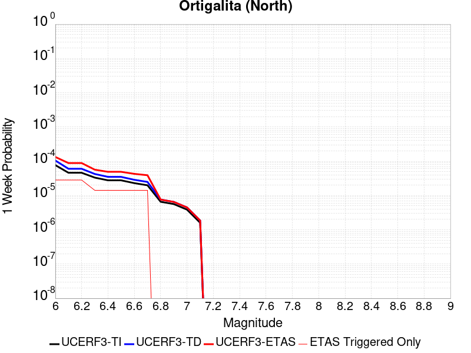 | 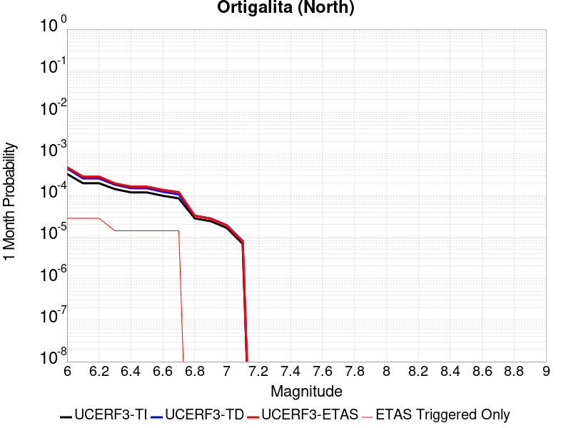 | 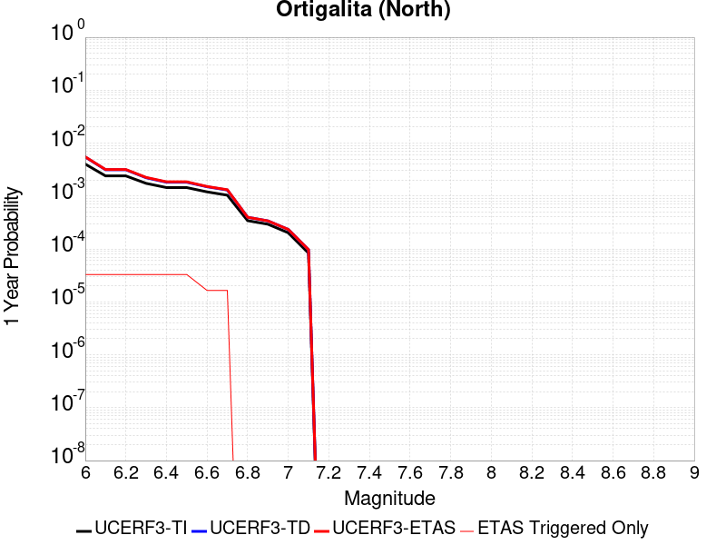 | 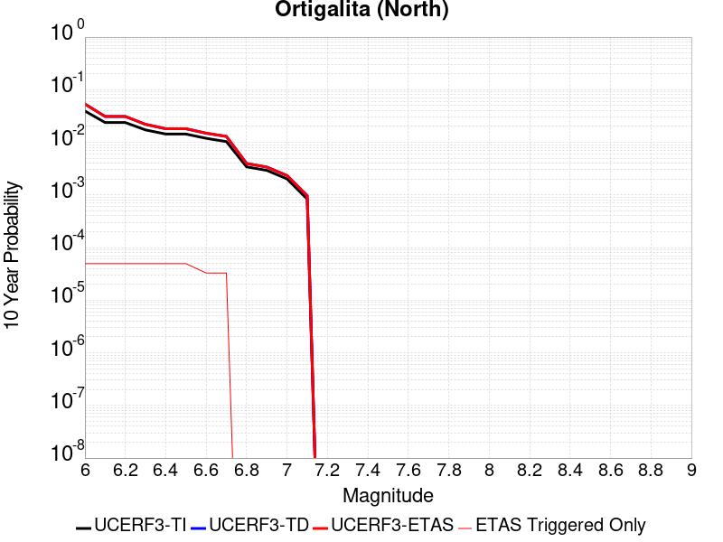 |

| Magnitude | 1 wk TI Prob | 1 wk TD Prob | 1 wk ETAS Prob | 1 wk ETAS/TD Gain | 1 wk ETAS Triggered Only | 1 mo TI Prob | 1 mo TD Prob | 1 mo ETAS Prob | 1 mo ETAS/TD Gain | 1 mo ETAS Triggered Only | 1 yr TI Prob | 1 yr TD Prob | 1 yr ETAS Prob | 1 yr ETAS/TD Gain | 1 yr ETAS Triggered Only | 10 yr TI Prob | 10 yr TD Prob | 10 yr ETAS Prob | 10 yr ETAS/TD Gain | 10 yr ETAS Triggered Only |
|-----|-----|-----|-----|-----|-----|-----|-----|-----|-----|-----|-----|-----|-----|-----|-----|-----|-----|-----|-----|-----|
| 6.0 | 7.711876E-5 | 1.0505308E-4 | 1.2505098E-4 | 1.19036 | 2.0E-5 | 3.3046713E-4 | 4.501601E-4 | 4.7015108E-4 | 1.0444087 | 2.0E-5 | 0.004016016 | 0.0054680547 | 0.0054978905 | 1.0054564 | 3.0E-5 | 0.039442103 | 0.053455614 | 0.053512406 | 1.0010624 | 6.0E-5 |
| 6.1 | 4.607858E-5 | 6.0239887E-5 | 8.0238686E-5 | 1.331986 | 2.0E-5 | 1.9746469E-4 | 2.5814763E-4 | 2.7814248E-4 | 1.077455 | 2.0E-5 | 0.0024014818 | 0.0031387366 | 0.0031686425 | 1.009528 | 3.0E-5 | 0.023756953 | 0.030975312 | 0.031033453 | 1.0018771 | 6.0E-5 |
| 6.2 | 4.607858E-5 | 6.0239887E-5 | 8.0238686E-5 | 1.331986 | 2.0E-5 | 1.9746469E-4 | 2.5814763E-4 | 2.7814248E-4 | 1.077455 | 2.0E-5 | 0.0024014818 | 0.0031387366 | 0.0031686425 | 1.009528 | 3.0E-5 | 0.023756953 | 0.030975312 | 0.031033453 | 1.0018771 | 6.0E-5 |
| 6.3 | 3.327423E-5 | 4.2476124E-5 | 5.2475698E-5 | 1.2354164 | 1.0E-5 | 1.4259605E-4 | 1.8202956E-4 | 1.9202773E-4 | 1.0549262 | 1.0E-5 | 0.0017347244 | 0.002214206 | 0.0022341616 | 1.0090126 | 2.0E-5 | 0.017212452 | 0.02194574 | 0.021984862 | 1.0017827 | 4.0E-5 |
| 6.4 | 2.7732503E-5 | 3.4999008E-5 | 4.4998655E-5 | 1.2857124 | 1.0E-5 | 1.1884817E-4 | 1.499886E-4 | 1.599871E-4 | 1.0666617 | 1.0E-5 | 0.001446016 | 0.0018248158 | 0.0018447792 | 1.01094 | 2.0E-5 | 0.014366428 | 0.018121297 | 0.018160572 | 1.0021673 | 4.0E-5 |
| 6.5 | 2.7689714E-5 | 3.4948822E-5 | 4.4948472E-5 | 1.2861227 | 1.0E-5 | 1.186648E-4 | 1.4977354E-4 | 1.5977204E-4 | 1.0667574 | 1.0E-5 | 0.0014437864 | 0.0018222018 | 0.0018421654 | 1.0109557 | 2.0E-5 | 0.014344421 | 0.018095585 | 0.01813486 | 1.0021704 | 4.0E-5 |
| 6.6 | 2.2976905E-5 | 2.871829E-5 | 3.8718004E-5 | 1.3482001 | 1.0E-5 | 9.846873E-5 | 1.23074E-4 | 1.3307277E-4 | 1.081242 | 1.0E-5 | 0.0011981975 | 0.0014976348 | 0.0015076199 | 1.0066671 | 1.0E-5 | 0.011917574 | 0.014898733 | 0.014928287 | 1.0019836 | 3.0E-5 |
| 6.7 | 1.9871539E-5 | 2.4904637E-5 | 3.4904388E-5 | 1.4015217 | 1.0E-5 | 8.516096E-5 | 1.067312E-4 | 1.1673012E-4 | 1.0936834 | 1.0E-5 | 0.0010363415 | 0.0012989199 | 0.0013089069 | 1.0076888 | 1.0E-5 | 0.010315218 | 0.012936938 | 0.01296655 | 1.0022889 | 3.0E-5 |
| 6.8 | 6.5640475E-6 | 7.6054926E-6 | 7.6054926E-6 | 1.0 | 0.0 | 2.813133E-5 | 3.2594577E-5 | 3.2594577E-5 | 1.0 | 0.0 | 3.424451E-4 | 3.9676955E-4 | 3.9676955E-4 | 1.0 | 0.0 | 0.0034191788 | 0.003960899 | 0.003970859 | 1.0025147 | 1.0E-5 |
| 6.9 | 5.6219683E-6 | 6.5018376E-6 | 6.5018376E-6 | 1.0 | 0.0 | 2.4093928E-5 | 2.7864735E-5 | 2.7864735E-5 | 1.0 | 0.0 | 2.933041E-4 | 3.3920293E-4 | 3.3920293E-4 | 1.0 | 0.0 | 0.0029291727 | 0.003387109 | 0.003397075 | 1.0029423 | 1.0E-5 |
| 7.0 | 3.875591E-6 | 4.4847548E-6 | 4.4847548E-6 | 1.0 | 0.0 | 1.6609569E-5 | 1.9220248E-5 | 1.9220248E-5 | 1.0 | 0.0 | 2.0220275E-4 | 2.339835E-4 | 2.339835E-4 | 1.0 | 0.0 | 0.0020201886 | 0.0023375798 | 0.0023375798 | 1.0 | 0.0 |
| 7.1 | 1.6017933E-6 | 1.8570418E-6 | 1.8570418E-6 | 1.0 | 0.0 | 6.8648105E-6 | 7.958732E-6 | 7.958732E-6 | 1.0 | 0.0 | 8.357586E-5 | 9.689432E-5 | 9.689432E-5 | 1.0 | 0.0 | 8.3544437E-4 | 9.686254E-4 | 9.686254E-4 | 1.0 | 0.0 |

## Lost Hills
*[(top)](#table-of-contents)*

| 1 Week | 1 Month | 1 Year | 10 Year |
|-----|-----|-----|-----|
|  |  |  |  |

| Magnitude | 1 wk TI Prob | 1 wk TD Prob | 1 wk ETAS Prob | 1 wk ETAS/TD Gain | 1 wk ETAS Triggered Only | 1 mo TI Prob | 1 mo TD Prob | 1 mo ETAS Prob | 1 mo ETAS/TD Gain | 1 mo ETAS Triggered Only | 1 yr TI Prob | 1 yr TD Prob | 1 yr ETAS Prob | 1 yr ETAS/TD Gain | 1 yr ETAS Triggered Only | 10 yr TI Prob | 10 yr TD Prob | 10 yr ETAS Prob | 10 yr ETAS/TD Gain | 10 yr ETAS Triggered Only |
|-----|-----|-----|-----|-----|-----|-----|-----|-----|-----|-----|-----|-----|-----|-----|-----|-----|-----|-----|-----|-----|
| 6.0 | 2.233523E-5 | 2.5106583E-5 | 4.510608E-5 | 1.7965839 | 2.0E-5 | 9.571891E-5 | 1.0759615E-4 | 1.4759184E-4 | 1.3717206 | 4.0E-5 | 0.0011647546 | 0.001309364 | 0.0013792723 | 1.0533911 | 7.0E-5 | 0.011586686 | 0.013033091 | 0.013102178 | 1.005301 | 7.0E-5 |
| 6.1 | 2.233523E-5 | 2.5106583E-5 | 4.510608E-5 | 1.7965839 | 2.0E-5 | 9.571891E-5 | 1.0759615E-4 | 1.4759184E-4 | 1.3717206 | 4.0E-5 | 0.0011647546 | 0.001309364 | 0.0013792723 | 1.0533911 | 7.0E-5 | 0.011586686 | 0.013033091 | 0.013102178 | 1.005301 | 7.0E-5 |
| 6.2 | 2.233523E-5 | 2.5106583E-5 | 4.510608E-5 | 1.7965839 | 2.0E-5 | 9.571891E-5 | 1.0759615E-4 | 1.4759184E-4 | 1.3717206 | 4.0E-5 | 0.0011647546 | 0.001309364 | 0.0013792723 | 1.0533911 | 7.0E-5 | 0.011586686 | 0.013033091 | 0.013102178 | 1.005301 | 7.0E-5 |
| 6.3 | 2.233523E-5 | 2.5106583E-5 | 4.510608E-5 | 1.7965839 | 2.0E-5 | 9.571891E-5 | 1.0759615E-4 | 1.4759184E-4 | 1.3717206 | 4.0E-5 | 0.0011647546 | 0.001309364 | 0.0013792723 | 1.0533911 | 7.0E-5 | 0.011586686 | 0.013033091 | 0.013102178 | 1.005301 | 7.0E-5 |
| 6.4 | 1.2288092E-5 | 1.3781108E-5 | 2.3780969E-5 | 1.7256211 | 1.0E-5 | 5.2662188E-5 | 5.906108E-5 | 7.90599E-5 | 1.3386124 | 2.0E-5 | 6.409735E-4 | 7.189252E-4 | 7.5889647E-4 | 1.0555986 | 4.0E-5 | 0.006391279 | 0.0071752006 | 0.0072149136 | 1.0055348 | 4.0E-5 |
| 6.5 | 1.2288092E-5 | 1.3781108E-5 | 2.3780969E-5 | 1.7256211 | 1.0E-5 | 5.2662188E-5 | 5.906108E-5 | 7.90599E-5 | 1.3386124 | 2.0E-5 | 6.409735E-4 | 7.189252E-4 | 7.5889647E-4 | 1.0555986 | 4.0E-5 | 0.006391279 | 0.0071752006 | 0.0072149136 | 1.0055348 | 4.0E-5 |
| 6.6 | 8.58281E-6 | 9.63377E-6 | 9.63377E-6 | 1.0 | 0.0 | 3.6782953E-5 | 4.12874E-5 | 5.128699E-5 | 1.2421947 | 1.0E-5 | 4.4774043E-4 | 5.026414E-4 | 5.326263E-4 | 1.0596547 | 3.0E-5 | 0.0044683935 | 0.005023205 | 0.0050530545 | 1.0059422 | 3.0E-5 |
| 6.7 | 7.205685E-6 | 8.088302E-6 | 8.088302E-6 | 1.0 | 0.0 | 3.088114E-5 | 3.466415E-5 | 4.4663804E-5 | 1.2884725 | 1.0E-5 | 3.7591302E-4 | 4.2203604E-4 | 4.4202758E-4 | 1.0473694 | 2.0E-5 | 0.0037527776 | 0.0042203604 | 0.004240276 | 1.0047189 | 2.0E-5 |

## Pine Mtn
*[(top)](#table-of-contents)*

| 1 Week | 1 Month | 1 Year | 10 Year |
|-----|-----|-----|-----|
|  |  |  |  |

| Magnitude | 1 wk TI Prob | 1 wk TD Prob | 1 wk ETAS Prob | 1 wk ETAS/TD Gain | 1 wk ETAS Triggered Only | 1 mo TI Prob | 1 mo TD Prob | 1 mo ETAS Prob | 1 mo ETAS/TD Gain | 1 mo ETAS Triggered Only | 1 yr TI Prob | 1 yr TD Prob | 1 yr ETAS Prob | 1 yr ETAS/TD Gain | 1 yr ETAS Triggered Only | 10 yr TI Prob | 10 yr TD Prob | 10 yr ETAS Prob | 10 yr ETAS/TD Gain | 10 yr ETAS Triggered Only |
|-----|-----|-----|-----|-----|-----|-----|-----|-----|-----|-----|-----|-----|-----|-----|-----|-----|-----|-----|-----|-----|
| 6.0 | 6.894797E-6 | 7.2254716E-6 | 3.7225254E-5 | 5.151948 | 3.0E-5 | 2.9548795E-5 | 3.0965955E-5 | 8.096441E-5 | 2.6146264 | 5.0E-5 | 3.596972E-4 | 3.7694827E-4 | 4.3692565E-4 | 1.159113 | 6.0E-5 | 0.0035911554 | 0.0037633865 | 0.003833123 | 1.0185302 | 7.0E-5 |
| 6.1 | 6.894797E-6 | 7.2254716E-6 | 3.7225254E-5 | 5.151948 | 3.0E-5 | 2.9548795E-5 | 3.0965955E-5 | 8.096441E-5 | 2.6146264 | 5.0E-5 | 3.596972E-4 | 3.7694827E-4 | 4.3692565E-4 | 1.159113 | 6.0E-5 | 0.0035911554 | 0.0037633865 | 0.003833123 | 1.0185302 | 7.0E-5 |
| 6.2 | 6.894797E-6 | 7.2254716E-6 | 3.7225254E-5 | 5.151948 | 3.0E-5 | 2.9548795E-5 | 3.0965955E-5 | 8.096441E-5 | 2.6146264 | 5.0E-5 | 3.596972E-4 | 3.7694827E-4 | 4.3692565E-4 | 1.159113 | 6.0E-5 | 0.0035911554 | 0.0037633865 | 0.003833123 | 1.0185302 | 7.0E-5 |
| 6.3 | 6.894797E-6 | 7.2254716E-6 | 3.7225254E-5 | 5.151948 | 3.0E-5 | 2.9548795E-5 | 3.0965955E-5 | 8.096441E-5 | 2.6146264 | 5.0E-5 | 3.596972E-4 | 3.7694827E-4 | 4.3692565E-4 | 1.159113 | 6.0E-5 | 0.0035911554 | 0.0037633865 | 0.003833123 | 1.0185302 | 7.0E-5 |
| 6.4 | 6.894797E-6 | 7.2254716E-6 | 3.7225254E-5 | 5.151948 | 3.0E-5 | 2.9548795E-5 | 3.0965955E-5 | 8.096441E-5 | 2.6146264 | 5.0E-5 | 3.596972E-4 | 3.7694827E-4 | 4.3692565E-4 | 1.159113 | 6.0E-5 | 0.0035911554 | 0.0037633865 | 0.003833123 | 1.0185302 | 7.0E-5 |
| 6.5 | 6.894797E-6 | 7.2254716E-6 | 3.7225254E-5 | 5.151948 | 3.0E-5 | 2.9548795E-5 | 3.0965955E-5 | 8.096441E-5 | 2.6146264 | 5.0E-5 | 3.596972E-4 | 3.7694827E-4 | 4.3692565E-4 | 1.159113 | 6.0E-5 | 0.0035911554 | 0.0037633865 | 0.003833123 | 1.0185302 | 7.0E-5 |
| 6.6 | 6.894797E-6 | 7.2254716E-6 | 3.7225254E-5 | 5.151948 | 3.0E-5 | 2.9548795E-5 | 3.0965955E-5 | 8.096441E-5 | 2.6146264 | 5.0E-5 | 3.596972E-4 | 3.7694827E-4 | 4.3692565E-4 | 1.159113 | 6.0E-5 | 0.0035911554 | 0.0037633865 | 0.003833123 | 1.0185302 | 7.0E-5 |
| 6.7 | 6.0867933E-6 | 6.397124E-6 | 3.639693E-5 | 5.6895776 | 3.0E-5 | 2.6085996E-5 | 2.7415968E-5 | 6.741487E-5 | 2.4589636 | 4.0E-5 | 3.1755073E-4 | 3.337405E-4 | 3.837238E-4 | 1.149767 | 5.0E-5 | 0.0031709734 | 0.0033326119 | 0.0033924119 | 1.0179439 | 6.0E-5 |
| 6.8 | 5.6530425E-6 | 5.950606E-6 | 3.5950427E-5 | 6.0414734 | 3.0E-5 | 2.42271E-5 | 2.5502359E-5 | 5.5501594E-5 | 2.1763318 | 3.0E-5 | 2.94925E-4 | 3.1044905E-4 | 3.5043663E-4 | 1.1288056 | 4.0E-5 | 0.002945339 | 0.0031003582 | 0.0031502033 | 1.0160772 | 5.0E-5 |
| 6.9 | 4.6015225E-6 | 4.8638444E-6 | 2.4863748E-5 | 5.1119537 | 2.0E-5 | 1.9720663E-5 | 2.084489E-5 | 4.0844472E-5 | 1.9594477 | 2.0E-5 | 2.4007261E-4 | 2.5375842E-4 | 2.7375337E-4 | 1.0787951 | 2.0E-5 | 0.0023981342 | 0.002534831 | 0.0025647548 | 1.011805 | 3.0E-5 |
| 7.0 | 4.4875965E-6 | 4.7474837E-6 | 2.4747389E-5 | 5.212738 | 2.0E-5 | 1.9232413E-5 | 2.0346208E-5 | 4.03458E-5 | 1.9829642 | 2.0E-5 | 2.3412947E-4 | 2.4768838E-4 | 2.676834E-4 | 1.0807266 | 2.0E-5 | 0.0023388295 | 0.0024742668 | 0.0025041925 | 1.0120949 | 3.0E-5 |
| 7.1 | 3.203907E-6 | 3.42942E-6 | 1.3429386E-5 | 3.915935 | 1.0E-5 | 1.3730958E-5 | 1.4697435E-5 | 2.4697289E-5 | 1.6803808 | 1.0E-5 | 1.6716159E-4 | 1.7892725E-4 | 1.8892546E-4 | 1.0558786 | 1.0E-5 | 0.0016703589 | 0.001787898 | 0.0018078622 | 1.0111663 | 2.0E-5 |
| 7.2 | 2.2060601E-6 | 2.3784874E-6 | 1.2378464E-5 | 5.204343 | 1.0E-5 | 9.4545085E-6 | 1.019348E-5 | 2.0193378E-5 | 1.9810092 | 1.0E-5 | 1.15102564E-4 | 1.2409901E-4 | 1.3409776E-4 | 1.0805708 | 1.0E-5 | 0.0011504296 | 0.0012403419 | 0.0012603172 | 1.0161046 | 2.0E-5 |
| 7.3 | 1.3765207E-6 | 1.5216535E-6 | 1.1521638E-5 | 7.5717883 | 1.0E-5 | 5.899361E-6 | 6.5213567E-6 | 1.6521291E-5 | 2.5334132 | 1.0E-5 | 7.182235E-5 | 7.939472E-5 | 8.939392E-5 | 1.125943 | 1.0E-5 | 7.1799144E-4 | 7.9367263E-4 | 8.136567E-4 | 1.0251793 | 2.0E-5 |
| 7.4 | 1.1245983E-6 | 1.2587126E-6 | 1.12587E-5 | 8.944615 | 1.0E-5 | 4.819698E-6 | 5.394472E-6 | 1.5394418E-5 | 2.8537395 | 1.0E-5 | 5.8678244E-5 | 6.56758E-5 | 7.567515E-5 | 1.152253 | 1.0E-5 | 5.866275E-4 | 6.565722E-4 | 6.765591E-4 | 1.0304413 | 2.0E-5 |
| 7.5 | 8.031682E-7 | 9.276999E-7 | 1.0927691E-5 | 11.779338 | 1.0E-5 | 3.4421448E-6 | 3.975851E-6 | 1.3975811E-5 | 3.5151746 | 1.0E-5 | 4.1907308E-5 | 4.840498E-5 | 5.8404497E-5 | 1.2065803 | 1.0E-5 | 4.1899405E-4 | 4.8395112E-4 | 5.0394144E-4 | 1.0413065 | 2.0E-5 |
| 7.6 | 4.8953444E-7 | 6.0030544E-7 | 1.0600299E-5 | 17.658176 | 1.0E-5 | 2.098003E-6 | 2.5727354E-6 | 1.2572709E-5 | 4.886904 | 1.0E-5 | 2.5542888E-5 | 3.1322652E-5 | 4.132234E-5 | 1.3192477 | 1.0E-5 | 2.5539953E-4 | 3.1318725E-4 | 3.3318097E-4 | 1.0638396 | 2.0E-5 |
| 7.7 | 6.634529E-8 | 6.788826E-8 | 6.788826E-8 | 1.0 | 0.0 | 2.843369E-7 | 2.9094966E-7 | 2.9094966E-7 | 1.0 | 0.0 | 3.4617963E-6 | 3.5423066E-6 | 3.5423066E-6 | 1.0 | 0.0 | 3.4617424E-5 | 3.542255E-5 | 3.542255E-5 | 1.0 | 0.0 |
| 7.8 | 9.235578E-9 | 9.488566E-9 | 9.488566E-9 | 1.0 | 0.0 | 3.9581046E-8 | 4.0665284E-8 | 4.0665284E-8 | 1.0 | 0.0 | 4.818991E-7 | 4.950997E-7 | 4.950997E-7 | 1.0 | 0.0 | 4.8189804E-6 | 4.950988E-6 | 4.950988E-6 | 1.0 | 0.0 |

## Ortigalita (South)
*[(top)](#table-of-contents)*

| 1 Week | 1 Month | 1 Year | 10 Year |
|-----|-----|-----|-----|
|  |  |  | 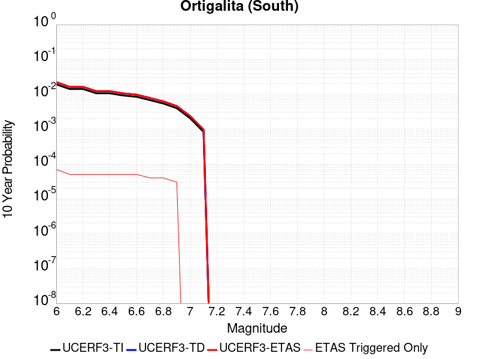 |

| Magnitude | 1 wk TI Prob | 1 wk TD Prob | 1 wk ETAS Prob | 1 wk ETAS/TD Gain | 1 wk ETAS Triggered Only | 1 mo TI Prob | 1 mo TD Prob | 1 mo ETAS Prob | 1 mo ETAS/TD Gain | 1 mo ETAS Triggered Only | 1 yr TI Prob | 1 yr TD Prob | 1 yr ETAS Prob | 1 yr ETAS/TD Gain | 1 yr ETAS Triggered Only | 10 yr TI Prob | 10 yr TD Prob | 10 yr ETAS Prob | 10 yr ETAS/TD Gain | 10 yr ETAS Triggered Only |
|-----|-----|-----|-----|-----|-----|-----|-----|-----|-----|-----|-----|-----|-----|-----|-----|-----|-----|-----|-----|-----|
| 6.0 | 3.72394E-5 | 4.32556E-5 | 8.325387E-5 | 1.9246957 | 4.0E-5 | 1.5958765E-4 | 1.8536886E-4 | 2.2536144E-4 | 1.2157459 | 4.0E-5 | 0.0019412481 | 0.0022546863 | 0.0023045735 | 1.0221261 | 5.0E-5 | 0.019243775 | 0.022334501 | 0.022402938 | 1.0030642 | 7.0E-5 |
| 6.1 | 2.7299884E-5 | 3.1492036E-5 | 6.149109E-5 | 1.9525918 | 3.0E-5 | 1.16994255E-4 | 1.349592E-4 | 1.6495516E-4 | 1.2222594 | 3.0E-5 | 0.0014234743 | 0.0016419457 | 0.0016718964 | 1.018241 | 3.0E-5 | 0.014143906 | 0.016304072 | 0.016353257 | 1.0030167 | 5.0E-5 |
| 6.2 | 2.7299884E-5 | 3.1492036E-5 | 6.149109E-5 | 1.9525918 | 3.0E-5 | 1.16994255E-4 | 1.349592E-4 | 1.6495516E-4 | 1.2222594 | 3.0E-5 | 0.0014234743 | 0.0016419457 | 0.0016718964 | 1.018241 | 3.0E-5 | 0.014143906 | 0.016304072 | 0.016353257 | 1.0030167 | 5.0E-5 |
| 6.3 | 2.0546433E-5 | 2.3631454E-5 | 5.3630745E-5 | 2.2694645 | 3.0E-5 | 8.805317E-5 | 1.0127383E-4 | 1.3127079E-4 | 1.2961966 | 3.0E-5 | 0.00107152 | 0.0012323305 | 0.0012622934 | 1.0243142 | 3.0E-5 | 0.010663681 | 0.012257031 | 0.012306418 | 1.0040293 | 5.0E-5 |
| 6.4 | 2.0546433E-5 | 2.3631454E-5 | 5.3630745E-5 | 2.2694645 | 3.0E-5 | 8.805317E-5 | 1.0127383E-4 | 1.3127079E-4 | 1.2961966 | 3.0E-5 | 0.00107152 | 0.0012323305 | 0.0012622934 | 1.0243142 | 3.0E-5 | 0.010663681 | 0.012257031 | 0.012306418 | 1.0040293 | 5.0E-5 |
| 6.5 | 1.7779594E-5 | 2.0446974E-5 | 5.044636E-5 | 2.4671798 | 3.0E-5 | 7.619603E-5 | 8.762703E-5 | 1.176244E-4 | 1.3423301 | 3.0E-5 | 9.272918E-4 | 0.0010663505 | 0.0010963185 | 1.0281034 | 3.0E-5 | 0.009234319 | 0.010613804 | 0.010663273 | 1.0046608 | 5.0E-5 |
| 6.6 | 1.6272212E-5 | 1.8714967E-5 | 4.8714406E-5 | 2.602965 | 3.0E-5 | 6.973618E-5 | 8.0204605E-5 | 1.102022E-4 | 1.3740133 | 3.0E-5 | 8.487073E-4 | 9.760659E-4 | 0.0010060365 | 1.0307056 | 3.0E-5 | 0.008454733 | 0.009719091 | 0.009768604 | 1.0050945 | 5.0E-5 |
| 6.7 | 1.3051484E-5 | 1.5038758E-5 | 3.5038458E-5 | 2.3298771 | 2.0E-5 | 5.593373E-5 | 6.445028E-5 | 8.444899E-5 | 1.3102968 | 2.0E-5 | 6.807804E-4 | 7.844092E-4 | 8.043935E-4 | 1.0254769 | 2.0E-5 | 0.006786986 | 0.007817388 | 0.007857075 | 1.0050768 | 4.0E-5 |
| 6.8 | 1.04277415E-5 | 1.1987235E-5 | 3.1986994E-5 | 2.6684215 | 2.0E-5 | 4.4689557E-5 | 5.1372896E-5 | 7.137187E-5 | 1.3892903 | 2.0E-5 | 5.439595E-4 | 6.2529295E-4 | 6.452804E-4 | 1.031965 | 2.0E-5 | 0.0054262993 | 0.00623609 | 0.0062758406 | 1.0063742 | 4.0E-5 |
| 6.9 | 7.639968E-6 | 8.791503E-6 | 1.8791416E-5 | 2.137452 | 1.0E-5 | 3.274231E-5 | 3.767736E-5 | 4.7676982E-5 | 1.2654014 | 1.0E-5 | 3.9856473E-4 | 4.586312E-4 | 4.686266E-4 | 1.021794 | 1.0E-5 | 0.003978506 | 0.004577433 | 0.0046072956 | 1.0065238 | 3.0E-5 |
| 7.0 | 3.919831E-6 | 4.5334014E-6 | 4.5334014E-6 | 1.0 | 0.0 | 1.679917E-5 | 1.942873E-5 | 1.942873E-5 | 1.0 | 0.0 | 2.045107E-4 | 2.3652123E-4 | 2.3652123E-4 | 1.0 | 0.0 | 0.0020432258 | 0.0023629034 | 0.0023629034 | 1.0 | 0.0 |
| 7.1 | 1.6017933E-6 | 1.8570418E-6 | 1.8570418E-6 | 1.0 | 0.0 | 6.8648105E-6 | 7.958732E-6 | 7.958732E-6 | 1.0 | 0.0 | 8.357586E-5 | 9.689432E-5 | 9.689432E-5 | 1.0 | 0.0 | 8.3544437E-4 | 9.686254E-4 | 9.686254E-4 | 1.0 | 0.0 |

## San Pedro Basin
*[(top)](#table-of-contents)*

| 1 Week | 1 Month | 1 Year | 10 Year |
|-----|-----|-----|-----|
|  |  |  |  |

| Magnitude | 1 wk TI Prob | 1 wk TD Prob | 1 wk ETAS Prob | 1 wk ETAS/TD Gain | 1 wk ETAS Triggered Only | 1 mo TI Prob | 1 mo TD Prob | 1 mo ETAS Prob | 1 mo ETAS/TD Gain | 1 mo ETAS Triggered Only | 1 yr TI Prob | 1 yr TD Prob | 1 yr ETAS Prob | 1 yr ETAS/TD Gain | 1 yr ETAS Triggered Only | 10 yr TI Prob | 10 yr TD Prob | 10 yr ETAS Prob | 10 yr ETAS/TD Gain | 10 yr ETAS Triggered Only |
|-----|-----|-----|-----|-----|-----|-----|-----|-----|-----|-----|-----|-----|-----|-----|-----|-----|-----|-----|-----|-----|
| 6.0 | 5.3449043E-5 | 6.337018E-5 | 6.337018E-5 | 1.0 | 0.0 | 2.2904722E-4 | 2.7156167E-4 | 2.7156167E-4 | 1.0 | 0.0 | 0.0027850836 | 0.0033018515 | 0.0033616533 | 1.0181116 | 6.0E-5 | 0.027504366 | 0.03258948 | 0.032647528 | 1.0017811 | 6.0E-5 |
| 6.1 | 5.3449043E-5 | 6.337018E-5 | 6.337018E-5 | 1.0 | 0.0 | 2.2904722E-4 | 2.7156167E-4 | 2.7156167E-4 | 1.0 | 0.0 | 0.0027850836 | 0.0033018515 | 0.0033616533 | 1.0181116 | 6.0E-5 | 0.027504366 | 0.03258948 | 0.032647528 | 1.0017811 | 6.0E-5 |
| 6.2 | 2.3189454E-5 | 2.6642829E-5 | 2.6642829E-5 | 1.0 | 0.0 | 9.9379584E-5 | 1.1417881E-4 | 1.1417881E-4 | 1.0 | 0.0 | 0.0012092749 | 0.0013892875 | 0.0014092597 | 1.0143759 | 2.0E-5 | 0.012027155 | 0.01381089 | 0.013830613 | 1.0014281 | 2.0E-5 |
| 6.3 | 2.3189454E-5 | 2.6642829E-5 | 2.6642829E-5 | 1.0 | 0.0 | 9.9379584E-5 | 1.1417881E-4 | 1.1417881E-4 | 1.0 | 0.0 | 0.0012092749 | 0.0013892875 | 0.0014092597 | 1.0143759 | 2.0E-5 | 0.012027155 | 0.01381089 | 0.013830613 | 1.0014281 | 2.0E-5 |
| 6.4 | 1.966056E-5 | 2.246342E-5 | 2.246342E-5 | 1.0 | 0.0 | 8.425682E-5 | 9.626848E-5 | 9.626848E-5 | 1.0 | 0.0 | 0.001025344 | 0.0011714787 | 0.001181467 | 1.0085262 | 1.0E-5 | 0.010206259 | 0.011657119 | 0.011667003 | 1.0008478 | 1.0E-5 |
| 6.5 | 1.7342953E-5 | 1.9745152E-5 | 1.9745152E-5 | 1.0 | 0.0 | 7.4324824E-5 | 8.461954E-5 | 8.461954E-5 | 1.0 | 0.0 | 9.04529E-4 | 0.0010297929 | 0.0010297929 | 1.0 | 0.0 | 0.009008561 | 0.010253932 | 0.010253932 | 1.0 | 0.0 |
| 6.6 | 1.439804E-5 | 1.6322716E-5 | 1.6322716E-5 | 1.0 | 0.0 | 6.170443E-5 | 6.99528E-5 | 6.99528E-5 | 1.0 | 0.0 | 7.509924E-4 | 8.513747E-4 | 8.513747E-4 | 1.0 | 0.0 | 0.0074845953 | 0.008484333 | 0.008484333 | 1.0 | 0.0 |
| 6.7 | 1.2634884E-5 | 1.4285298E-5 | 1.4285298E-5 | 1.0 | 0.0 | 5.414838E-5 | 6.122144E-5 | 6.122144E-5 | 1.0 | 0.0 | 6.590571E-4 | 7.451466E-4 | 7.451466E-4 | 1.0 | 0.0 | 0.006571059 | 0.007429502 | 0.007429502 | 1.0 | 0.0 |
| 6.8 | 1.146091E-5 | 1.2933193E-5 | 1.2933193E-5 | 1.0 | 0.0 | 4.911726E-5 | 5.542696E-5 | 5.542696E-5 | 1.0 | 0.0 | 5.9783855E-4 | 6.74644E-4 | 6.74644E-4 | 1.0 | 0.0 | 0.0059623276 | 0.0067288997 | 0.0067288997 | 1.0 | 0.0 |
| 6.9 | 9.109035E-6 | 1.0235013E-5 | 1.0235013E-5 | 1.0 | 0.0 | 3.9038136E-5 | 4.386376E-5 | 4.386376E-5 | 1.0 | 0.0 | 4.7518566E-4 | 5.339384E-4 | 5.339384E-4 | 1.0 | 0.0 | 0.0047417083 | 0.0053293095 | 0.0053293095 | 1.0 | 0.0 |
| 7.0 | 5.9351028E-6 | 6.583965E-6 | 6.583965E-6 | 1.0 | 0.0 | 2.5435906E-5 | 2.821682E-5 | 2.821682E-5 | 1.0 | 0.0 | 3.0963816E-4 | 3.4350925E-4 | 3.4350925E-4 | 1.0 | 0.0 | 0.0030920706 | 0.0034320997 | 0.0034320997 | 1.0 | 0.0 |
| 7.1 | 2.1557585E-6 | 2.2096492E-6 | 2.2096492E-6 | 1.0 | 0.0 | 9.238933E-6 | 9.469892E-6 | 9.469892E-6 | 1.0 | 0.0 | 1.1247819E-4 | 1.15289986E-4 | 1.15289986E-4 | 1.0 | 0.0 | 0.0011242128 | 0.0011523172 | 0.0011523172 | 1.0 | 0.0 |
| 7.2 | 2.1251979E-6 | 2.1779954E-6 | 2.1779954E-6 | 1.0 | 0.0 | 9.107958E-6 | 9.334234E-6 | 9.334234E-6 | 1.0 | 0.0 | 1.1088375E-4 | 1.13638525E-4 | 1.13638525E-4 | 1.0 | 0.0 | 0.0011082845 | 0.0011358195 | 0.0011358195 | 1.0 | 0.0 |
| 7.3 | 1.7145798E-6 | 1.7442885E-6 | 1.7442885E-6 | 1.0 | 0.0 | 7.3481783E-6 | 7.475501E-6 | 7.475501E-6 | 1.0 | 0.0 | 8.94604E-5 | 9.1010515E-5 | 9.1010515E-5 | 1.0 | 0.0 | 8.9424395E-4 | 9.0974156E-4 | 9.0974156E-4 | 1.0 | 0.0 |
| 7.4 | 1.4467993E-6 | 1.4641878E-6 | 1.4641878E-6 | 1.0 | 0.0 | 6.200554E-6 | 6.275076E-6 | 6.275076E-6 | 1.0 | 0.0 | 7.548913E-5 | 7.639644E-5 | 7.639644E-5 | 1.0 | 0.0 | 7.546349E-4 | 7.6370913E-4 | 7.6370913E-4 | 1.0 | 0.0 |
| 7.5 | 1.2803735E-6 | 1.2931506E-6 | 1.2931506E-6 | 1.0 | 0.0 | 5.487303E-6 | 5.5420624E-6 | 5.5420624E-6 | 1.0 | 0.0 | 6.680587E-5 | 6.747259E-5 | 6.747259E-5 | 1.0 | 0.0 | 6.678579E-4 | 6.745281E-4 | 6.745281E-4 | 1.0 | 0.0 |
| 7.6 | 6.755009E-7 | 6.76947E-7 | 6.76947E-7 | 1.0 | 0.0 | 2.8950008E-6 | 2.9011985E-6 | 2.9011985E-6 | 1.0 | 0.0 | 3.5246063E-5 | 3.532158E-5 | 3.532158E-5 | 1.0 | 0.0 | 3.5240475E-4 | 3.5316538E-4 | 3.5316538E-4 | 1.0 | 0.0 |
| 7.7 | 6.211885E-8 | 4.5699714E-8 | 4.5699714E-8 | 1.0 | 0.0 | 2.6622362E-7 | 1.9585592E-7 | 1.9585592E-7 | 1.0 | 0.0 | 3.2412677E-6 | 2.3845432E-6 | 2.3845432E-6 | 1.0 | 0.0 | 3.2412205E-5 | 2.3845198E-5 | 2.3845198E-5 | 1.0 | 0.0 |
| 7.8 | 2.6580573E-9 | 1.5138054E-9 | 1.5138054E-9 | 1.0 | 0.0 | 1.1391674E-8 | 6.4877375E-9 | 6.4877375E-9 | 1.0 | 0.0 | 1.3869362E-7 | 7.89882E-8 | 7.89882E-8 | 1.0 | 0.0 | 1.3869354E-6 | 7.89882E-7 | 7.89882E-7 | 1.0 | 0.0 |

## Raymond
*[(top)](#table-of-contents)*

| 1 Week | 1 Month | 1 Year | 10 Year |
|-----|-----|-----|-----|
|  |  |  |  |

| Magnitude | 1 wk TI Prob | 1 wk TD Prob | 1 wk ETAS Prob | 1 wk ETAS/TD Gain | 1 wk ETAS Triggered Only | 1 mo TI Prob | 1 mo TD Prob | 1 mo ETAS Prob | 1 mo ETAS/TD Gain | 1 mo ETAS Triggered Only | 1 yr TI Prob | 1 yr TD Prob | 1 yr ETAS Prob | 1 yr ETAS/TD Gain | 1 yr ETAS Triggered Only | 10 yr TI Prob | 10 yr TD Prob | 10 yr ETAS Prob | 10 yr ETAS/TD Gain | 10 yr ETAS Triggered Only |
|-----|-----|-----|-----|-----|-----|-----|-----|-----|-----|-----|-----|-----|-----|-----|-----|-----|-----|-----|-----|-----|
| 6.0 | 1.5157413E-5 | 1.5810125E-5 | 2.5809968E-5 | 1.632496 | 1.0E-5 | 6.4958724E-5 | 6.775606E-5 | 7.775539E-5 | 1.1475782 | 1.0E-5 | 7.905855E-4 | 8.246429E-4 | 8.646099E-4 | 1.0484658 | 4.0E-5 | 0.007877788 | 0.008218355 | 0.008277861 | 1.0072408 | 6.0E-5 |
| 6.1 | 1.5157413E-5 | 1.5810125E-5 | 2.5809968E-5 | 1.632496 | 1.0E-5 | 6.4958724E-5 | 6.775606E-5 | 7.775539E-5 | 1.1475782 | 1.0E-5 | 7.905855E-4 | 8.246429E-4 | 8.646099E-4 | 1.0484658 | 4.0E-5 | 0.007877788 | 0.008218355 | 0.008277861 | 1.0072408 | 6.0E-5 |
| 6.2 | 1.5157413E-5 | 1.5810125E-5 | 2.5809968E-5 | 1.632496 | 1.0E-5 | 6.4958724E-5 | 6.775606E-5 | 7.775539E-5 | 1.1475782 | 1.0E-5 | 7.905855E-4 | 8.246429E-4 | 8.646099E-4 | 1.0484658 | 4.0E-5 | 0.007877788 | 0.008218355 | 0.008277861 | 1.0072408 | 6.0E-5 |
| 6.3 | 1.5157413E-5 | 1.5810125E-5 | 2.5809968E-5 | 1.632496 | 1.0E-5 | 6.4958724E-5 | 6.775606E-5 | 7.775539E-5 | 1.1475782 | 1.0E-5 | 7.905855E-4 | 8.246429E-4 | 8.646099E-4 | 1.0484658 | 4.0E-5 | 0.007877788 | 0.008218355 | 0.008277861 | 1.0072408 | 6.0E-5 |
| 6.4 | 1.3941944E-5 | 1.4454688E-5 | 2.4454543E-5 | 1.691807 | 1.0E-5 | 5.9749822E-5 | 6.194732E-5 | 7.1946706E-5 | 1.1614175 | 1.0E-5 | 7.2721124E-4 | 7.53971E-4 | 7.9394085E-4 | 1.0530125 | 4.0E-5 | 0.007248361 | 0.007516471 | 0.00757602 | 1.0079224 | 6.0E-5 |
| 6.5 | 1.3941944E-5 | 1.4454688E-5 | 2.4454543E-5 | 1.691807 | 1.0E-5 | 5.9749822E-5 | 6.194732E-5 | 7.1946706E-5 | 1.1614175 | 1.0E-5 | 7.2721124E-4 | 7.53971E-4 | 7.9394085E-4 | 1.0530125 | 4.0E-5 | 0.007248361 | 0.007516471 | 0.00757602 | 1.0079224 | 6.0E-5 |
| 6.6 | 1.0542609E-5 | 1.067111E-5 | 2.0671003E-5 | 1.9370996 | 1.0E-5 | 4.5181827E-5 | 4.573256E-5 | 5.57321E-5 | 1.2186526 | 1.0E-5 | 5.499499E-4 | 5.566571E-4 | 5.8664044E-4 | 1.0538632 | 3.0E-5 | 0.005485909 | 0.0055531966 | 0.0055929744 | 1.007163 | 4.0E-5 |
| 6.7 | 1.0542609E-5 | 1.067111E-5 | 2.0671003E-5 | 1.9370996 | 1.0E-5 | 4.5181827E-5 | 4.573256E-5 | 5.57321E-5 | 1.2186526 | 1.0E-5 | 5.499499E-4 | 5.566571E-4 | 5.8664044E-4 | 1.0538632 | 3.0E-5 | 0.005485909 | 0.0055531966 | 0.0055929744 | 1.007163 | 4.0E-5 |
| 6.8 | 1.0079132E-5 | 1.0176644E-5 | 2.0176542E-5 | 1.9826323 | 1.0E-5 | 4.3195567E-5 | 4.3613487E-5 | 5.361305E-5 | 1.2292769 | 1.0E-5 | 5.257791E-4 | 5.308702E-4 | 5.6085427E-4 | 1.056481 | 3.0E-5 | 0.0052453685 | 0.0052965777 | 0.0053363657 | 1.0075121 | 4.0E-5 |
| 6.9 | 7.721598E-6 | 7.548902E-6 | 1.7548826E-5 | 2.324686 | 1.0E-5 | 3.3092143E-5 | 3.2352043E-5 | 4.235172E-5 | 1.3090895 | 1.0E-5 | 4.0282236E-4 | 3.9381615E-4 | 4.2380433E-4 | 1.0761477 | 3.0E-5 | 0.0040209293 | 0.003931324 | 0.0039711664 | 1.0101347 | 4.0E-5 |
| 7.0 | 7.137566E-6 | 6.911303E-6 | 1.6911234E-5 | 2.4468951 | 1.0E-5 | 3.058921E-5 | 2.961954E-5 | 3.9619244E-5 | 1.337605 | 1.0E-5 | 3.7236E-4 | 3.605593E-4 | 3.8055208E-4 | 1.0554494 | 2.0E-5 | 0.0037173668 | 0.003599869 | 0.003629761 | 1.0083036 | 3.0E-5 |
| 7.1 | 5.654976E-6 | 5.299538E-6 | 5.299538E-6 | 1.0 | 0.0 | 2.4235387E-5 | 2.2712107E-5 | 2.2712107E-5 | 1.0 | 0.0 | 2.9502588E-4 | 2.7648505E-4 | 2.8648227E-4 | 1.0361583 | 1.0E-5 | 0.0029463451 | 0.0027614492 | 0.002781394 | 1.0072225 | 2.0E-5 |
| 7.2 | 4.9358455E-6 | 4.526655E-6 | 4.526655E-6 | 1.0 | 0.0 | 2.1153453E-5 | 1.9399806E-5 | 1.9399806E-5 | 1.0 | 0.0 | 2.5751285E-4 | 2.3616718E-4 | 2.4616483E-4 | 1.0423329 | 1.0E-5 | 0.0025721465 | 0.002359192 | 0.0023791445 | 1.0084574 | 2.0E-5 |
| 7.3 | 4.2368597E-6 | 3.8056128E-6 | 3.8056128E-6 | 1.0 | 0.0 | 1.8157843E-5 | 1.6309668E-5 | 1.6309668E-5 | 1.0 | 0.0 | 2.2104931E-4 | 1.9855222E-4 | 2.0855023E-4 | 1.0503546 | 1.0E-5 | 0.0022082955 | 0.0019837746 | 0.002003735 | 1.0100617 | 2.0E-5 |
| 7.4 | 3.4999923E-6 | 3.0437407E-6 | 3.0437407E-6 | 1.0 | 0.0 | 1.49998805E-5 | 1.3044538E-5 | 1.3044538E-5 | 1.0 | 0.0 | 1.8260824E-4 | 1.5880575E-4 | 1.5880575E-4 | 1.0 | 0.0 | 0.0018245826 | 0.0015869461 | 0.0015869461 | 1.0 | 0.0 |
| 7.5 | 2.738017E-6 | 2.3020405E-6 | 2.3020405E-6 | 1.0 | 0.0 | 1.1734306E-5 | 9.865851E-6 | 9.865851E-6 | 1.0 | 0.0 | 1.428558E-4 | 1.20110184E-4 | 1.20110184E-4 | 1.0 | 0.0 | 0.0014276401 | 0.0012004747 | 0.0012004747 | 1.0 | 0.0 |
| 7.6 | 1.8186392E-6 | 1.442302E-6 | 1.442302E-6 | 1.0 | 0.0 | 7.794145E-6 | 6.1812802E-6 | 6.1812802E-6 | 1.0 | 0.0 | 9.488958E-5 | 7.5254524E-5 | 7.5254524E-5 | 1.0 | 0.0 | 9.4849075E-4 | 7.5230957E-4 | 7.5230957E-4 | 1.0 | 0.0 |
| 7.7 | 1.0660348E-6 | 7.6437E-7 | 7.6437E-7 | 1.0 | 0.0 | 4.5687125E-6 | 3.2758674E-6 | 3.2758674E-6 | 1.0 | 0.0 | 5.5622655E-5 | 3.988297E-5 | 3.988297E-5 | 1.0 | 0.0 | 5.5608735E-4 | 3.9877492E-4 | 3.9877492E-4 | 1.0 | 0.0 |
| 7.8 | 6.913602E-7 | 4.3202903E-7 | 4.3202903E-7 | 1.0 | 0.0 | 2.962969E-6 | 1.8515517E-6 | 1.8515517E-6 | 1.0 | 0.0 | 3.607355E-5 | 2.2542416E-5 | 2.2542416E-5 | 1.0 | 0.0 | 3.6067693E-4 | 2.2541684E-4 | 2.2541684E-4 | 1.0 | 0.0 |
| 7.9 | 7.425201E-8 | 5.322267E-8 | 5.322267E-8 | 1.0 | 0.0 | 3.1822285E-7 | 2.2809714E-7 | 2.2809714E-7 | 1.0 | 0.0 | 3.874356E-6 | 2.7770805E-6 | 2.7770805E-6 | 1.0 | 0.0 | 3.8742884E-5 | 2.7770588E-5 | 2.7770588E-5 | 1.0 | 0.0 |

## Channel Islands Thrust
*[(top)](#table-of-contents)*

| 1 Week | 1 Month | 1 Year | 10 Year |
|-----|-----|-----|-----|
|  |  |  |  |

| Magnitude | 1 wk TI Prob | 1 wk TD Prob | 1 wk ETAS Prob | 1 wk ETAS/TD Gain | 1 wk ETAS Triggered Only | 1 mo TI Prob | 1 mo TD Prob | 1 mo ETAS Prob | 1 mo ETAS/TD Gain | 1 mo ETAS Triggered Only | 1 yr TI Prob | 1 yr TD Prob | 1 yr ETAS Prob | 1 yr ETAS/TD Gain | 1 yr ETAS Triggered Only | 10 yr TI Prob | 10 yr TD Prob | 10 yr ETAS Prob | 10 yr ETAS/TD Gain | 10 yr ETAS Triggered Only |
|-----|-----|-----|-----|-----|-----|-----|-----|-----|-----|-----|-----|-----|-----|-----|-----|-----|-----|-----|-----|-----|
| 6.0 | 2.2156251E-5 | 2.4092022E-5 | 3.409178E-5 | 1.4150652 | 1.0E-5 | 9.495191E-5 | 1.03248036E-4 | 1.2324598E-4 | 1.1936883 | 2.0E-5 | 0.0011554264 | 0.0012564266 | 0.0012963762 | 1.0317963 | 4.0E-5 | 0.011494373 | 0.0125038205 | 0.01256307 | 1.0047386 | 6.0E-5 |
| 6.1 | 2.2156251E-5 | 2.4092022E-5 | 3.409178E-5 | 1.4150652 | 1.0E-5 | 9.495191E-5 | 1.03248036E-4 | 1.2324598E-4 | 1.1936883 | 2.0E-5 | 0.0011554264 | 0.0012564266 | 0.0012963762 | 1.0317963 | 4.0E-5 | 0.011494373 | 0.0125038205 | 0.01256307 | 1.0047386 | 6.0E-5 |
| 6.2 | 2.2156251E-5 | 2.4092022E-5 | 3.409178E-5 | 1.4150652 | 1.0E-5 | 9.495191E-5 | 1.03248036E-4 | 1.2324598E-4 | 1.1936883 | 2.0E-5 | 0.0011554264 | 0.0012564266 | 0.0012963762 | 1.0317963 | 4.0E-5 | 0.011494373 | 0.0125038205 | 0.01256307 | 1.0047386 | 6.0E-5 |
| 6.3 | 2.2156251E-5 | 2.4092022E-5 | 3.409178E-5 | 1.4150652 | 1.0E-5 | 9.495191E-5 | 1.03248036E-4 | 1.2324598E-4 | 1.1936883 | 2.0E-5 | 0.0011554264 | 0.0012564266 | 0.0012963762 | 1.0317963 | 4.0E-5 | 0.011494373 | 0.0125038205 | 0.01256307 | 1.0047386 | 6.0E-5 |
| 6.4 | 2.2156251E-5 | 2.4092022E-5 | 3.409178E-5 | 1.4150652 | 1.0E-5 | 9.495191E-5 | 1.03248036E-4 | 1.2324598E-4 | 1.1936883 | 2.0E-5 | 0.0011554264 | 0.0012564266 | 0.0012963762 | 1.0317963 | 4.0E-5 | 0.011494373 | 0.0125038205 | 0.01256307 | 1.0047386 | 6.0E-5 |
| 6.5 | 2.2156251E-5 | 2.4092022E-5 | 3.409178E-5 | 1.4150652 | 1.0E-5 | 9.495191E-5 | 1.03248036E-4 | 1.2324598E-4 | 1.1936883 | 2.0E-5 | 0.0011554264 | 0.0012564266 | 0.0012963762 | 1.0317963 | 4.0E-5 | 0.011494373 | 0.0125038205 | 0.01256307 | 1.0047386 | 6.0E-5 |
| 6.6 | 2.2156251E-5 | 2.4092022E-5 | 3.409178E-5 | 1.4150652 | 1.0E-5 | 9.495191E-5 | 1.03248036E-4 | 1.2324598E-4 | 1.1936883 | 2.0E-5 | 0.0011554264 | 0.0012564266 | 0.0012963762 | 1.0317963 | 4.0E-5 | 0.011494373 | 0.0125038205 | 0.01256307 | 1.0047386 | 6.0E-5 |
| 6.7 | 1.0601296E-5 | 1.1379544E-5 | 1.1379544E-5 | 1.0 | 0.0 | 4.5433335E-5 | 4.876859E-5 | 4.876859E-5 | 1.0 | 0.0 | 5.5301044E-4 | 5.936007E-4 | 6.1358884E-4 | 1.0336727 | 2.0E-5 | 0.005516363 | 0.005920653 | 0.005950476 | 1.005037 | 3.0E-5 |
| 6.8 | 1.0246747E-5 | 1.0996669E-5 | 1.0996669E-5 | 1.0 | 0.0 | 4.391389E-5 | 4.7127756E-5 | 4.7127756E-5 | 1.0 | 0.0 | 5.345204E-4 | 5.7363417E-4 | 5.936227E-4 | 1.0348455 | 2.0E-5 | 0.0053323656 | 0.005722025 | 0.0057518533 | 1.0052129 | 3.0E-5 |
| 6.9 | 9.049551E-6 | 9.699645E-6 | 9.699645E-6 | 1.0 | 0.0 | 3.878322E-5 | 4.1569267E-5 | 4.1569267E-5 | 1.0 | 0.0 | 4.7208337E-4 | 5.059924E-4 | 5.1598734E-4 | 1.0197531 | 1.0E-5 | 0.0047108172 | 0.0050488203 | 0.0050687194 | 1.0039413 | 2.0E-5 |
| 7.0 | 8.6542195E-6 | 9.274603E-6 | 9.274603E-6 | 1.0 | 0.0 | 3.7088983E-5 | 3.9747716E-5 | 3.9747716E-5 | 1.0 | 0.0 | 4.5146482E-4 | 4.8382508E-4 | 4.9382023E-4 | 1.0206586 | 1.0E-5 | 0.004505487 | 0.0048281294 | 0.0048480327 | 1.0041224 | 2.0E-5 |
| 7.1 | 8.391028E-6 | 8.992925E-6 | 8.992925E-6 | 1.0 | 0.0 | 3.5961057E-5 | 3.8540562E-5 | 3.8540562E-5 | 1.0 | 0.0 | 4.3773788E-4 | 4.6913436E-4 | 4.791297E-4 | 1.0213058 | 1.0E-5 | 0.004368766 | 0.0046818503 | 0.004701757 | 1.0042518 | 2.0E-5 |
| 7.2 | 5.965188E-6 | 6.3716957E-6 | 6.3716957E-6 | 1.0 | 0.0 | 2.556484E-5 | 2.7306984E-5 | 2.7306984E-5 | 1.0 | 0.0 | 3.1120746E-4 | 3.3241237E-4 | 3.4240904E-4 | 1.0300732 | 1.0E-5 | 0.00310772 | 0.0033192094 | 0.0033291762 | 1.0030028 | 1.0E-5 |
| 7.3 | 4.877518E-6 | 5.206007E-6 | 5.206007E-6 | 1.0 | 0.0 | 2.0903482E-5 | 2.231127E-5 | 2.231127E-5 | 1.0 | 0.0 | 2.5447016E-4 | 2.716063E-4 | 2.8160357E-4 | 1.036808 | 1.0E-5 | 0.0025417898 | 0.0027127897 | 0.0027227625 | 1.0036763 | 1.0E-5 |
| 7.4 | 3.8829853E-6 | 4.141863E-6 | 4.141863E-6 | 1.0 | 0.0 | 1.664126E-5 | 1.7750723E-5 | 1.7750723E-5 | 1.0 | 0.0 | 2.0258849E-4 | 2.1609403E-4 | 2.2609187E-4 | 1.0462662 | 1.0E-5 | 0.002024039 | 0.002158881 | 0.0021688591 | 1.004622 | 1.0E-5 |
| 7.5 | 1.3489616E-6 | 1.4277905E-6 | 1.4277905E-6 | 1.0 | 0.0 | 5.7812517E-6 | 6.119088E-6 | 6.119088E-6 | 1.0 | 0.0 | 7.038446E-5 | 7.449739E-5 | 7.449739E-5 | 1.0 | 0.0 | 7.036218E-4 | 7.4472814E-4 | 7.4472814E-4 | 1.0 | 0.0 |
| 7.6 | 6.058192E-7 | 6.35378E-7 | 6.35378E-7 | 1.0 | 0.0 | 2.5963652E-6 | 2.7230458E-6 | 2.7230458E-6 | 1.0 | 0.0 | 3.161029E-5 | 3.3152595E-5 | 3.3152595E-5 | 1.0 | 0.0 | 3.1605794E-4 | 3.314781E-4 | 3.314781E-4 | 1.0 | 0.0 |
| 7.7 | 2.2170494E-7 | 2.2607924E-7 | 2.2607924E-7 | 1.0 | 0.0 | 9.5016367E-7 | 9.689107E-7 | 9.689107E-7 | 1.0 | 0.0 | 1.1568181E-5 | 1.17964355E-5 | 1.17964355E-5 | 1.0 | 0.0 | 1.1567579E-4 | 1.179592E-4 | 1.179592E-4 | 1.0 | 0.0 |
| 7.8 | 2.1613102E-8 | 1.5466837E-8 | 1.5466837E-8 | 1.0 | 0.0 | 9.262757E-8 | 6.628645E-8 | 6.628645E-8 | 1.0 | 0.0 | 1.1277401E-6 | 8.070372E-7 | 8.070372E-7 | 1.0 | 0.0 | 1.1277344E-5 | 8.07035E-6 | 8.07035E-6 | 1.0 | 0.0 |

## Santa Ynez River
*[(top)](#table-of-contents)*

| 1 Week | 1 Month | 1 Year | 10 Year |
|-----|-----|-----|-----|
|  |  | 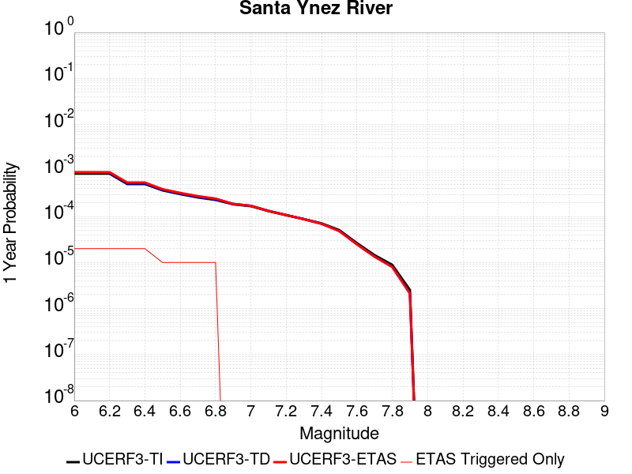 |  |

| Magnitude | 1 wk TI Prob | 1 wk TD Prob | 1 wk ETAS Prob | 1 wk ETAS/TD Gain | 1 wk ETAS Triggered Only | 1 mo TI Prob | 1 mo TD Prob | 1 mo ETAS Prob | 1 mo ETAS/TD Gain | 1 mo ETAS Triggered Only | 1 yr TI Prob | 1 yr TD Prob | 1 yr ETAS Prob | 1 yr ETAS/TD Gain | 1 yr ETAS Triggered Only | 10 yr TI Prob | 10 yr TD Prob | 10 yr ETAS Prob | 10 yr ETAS/TD Gain | 10 yr ETAS Triggered Only |
|-----|-----|-----|-----|-----|-----|-----|-----|-----|-----|-----|-----|-----|-----|-----|-----|-----|-----|-----|-----|-----|
| 6.0 | 1.6396456E-5 | 1.7209444E-5 | 2.7209273E-5 | 1.5810663 | 1.0E-5 | 7.026863E-5 | 7.3752875E-5 | 8.375214E-5 | 1.1355779 | 1.0E-5 | 8.551848E-4 | 8.976069E-4 | 9.1758894E-4 | 1.0222615 | 2.0E-5 | 0.0085190125 | 0.008943363 | 0.009002826 | 1.0066489 | 6.0E-5 |
| 6.1 | 1.6396456E-5 | 1.7209444E-5 | 2.7209273E-5 | 1.5810663 | 1.0E-5 | 7.026863E-5 | 7.3752875E-5 | 8.375214E-5 | 1.1355779 | 1.0E-5 | 8.551848E-4 | 8.976069E-4 | 9.1758894E-4 | 1.0222615 | 2.0E-5 | 0.0085190125 | 0.008943363 | 0.009002826 | 1.0066489 | 6.0E-5 |
| 6.2 | 1.6396456E-5 | 1.7209444E-5 | 2.7209273E-5 | 1.5810663 | 1.0E-5 | 7.026863E-5 | 7.3752875E-5 | 8.375214E-5 | 1.1355779 | 1.0E-5 | 8.551848E-4 | 8.976069E-4 | 9.1758894E-4 | 1.0222615 | 2.0E-5 | 0.0085190125 | 0.008943363 | 0.009002826 | 1.0066489 | 6.0E-5 |
| 6.3 | 9.736976E-6 | 1.01223395E-5 | 2.0122237E-5 | 1.987904 | 1.0E-5 | 4.172923E-5 | 4.338076E-5 | 5.3380325E-5 | 1.2305069 | 1.0E-5 | 5.0793495E-4 | 5.280378E-4 | 5.480272E-4 | 1.0378561 | 2.0E-5 | 0.005067755 | 0.0052683367 | 0.005318073 | 1.0094407 | 5.0E-5 |
| 6.4 | 9.736976E-6 | 1.01223395E-5 | 2.0122237E-5 | 1.987904 | 1.0E-5 | 4.172923E-5 | 4.338076E-5 | 5.3380325E-5 | 1.2305069 | 1.0E-5 | 5.0793495E-4 | 5.280378E-4 | 5.480272E-4 | 1.0378561 | 2.0E-5 | 0.005067755 | 0.0052683367 | 0.005318073 | 1.0094407 | 5.0E-5 |
| 6.5 | 7.081964E-6 | 7.329905E-6 | 7.329905E-6 | 1.0 | 0.0 | 3.035092E-5 | 3.141351E-5 | 3.141351E-5 | 1.0 | 0.0 | 3.694598E-4 | 3.8239395E-4 | 3.9239012E-4 | 1.026141 | 1.0E-5 | 0.0036884616 | 0.0038175215 | 0.0038573688 | 1.010438 | 4.0E-5 |
| 6.6 | 5.873247E-6 | 6.0597517E-6 | 6.0597517E-6 | 1.0 | 0.0 | 2.5170815E-5 | 2.5970112E-5 | 2.5970112E-5 | 1.0 | 0.0 | 3.064116E-4 | 3.161411E-4 | 3.2613793E-4 | 1.0316215 | 1.0E-5 | 0.0030598943 | 0.003157001 | 0.0031968746 | 1.0126302 | 4.0E-5 |
| 6.7 | 4.973277E-6 | 5.11591E-6 | 5.11591E-6 | 1.0 | 0.0 | 2.1313872E-5 | 2.1925147E-5 | 2.1925147E-5 | 1.0 | 0.0 | 2.5946548E-4 | 2.6690646E-4 | 2.7690377E-4 | 1.0374563 | 1.0E-5 | 0.0025916274 | 0.0026659078 | 0.002705801 | 1.0149642 | 4.0E-5 |
| 6.8 | 4.396492E-6 | 4.510987E-6 | 4.510987E-6 | 1.0 | 0.0 | 1.884197E-5 | 1.933266E-5 | 1.933266E-5 | 1.0 | 0.0 | 2.2937685E-4 | 2.3535005E-4 | 2.4534768E-4 | 1.0424799 | 1.0E-5 | 0.0022914023 | 0.0023510433 | 0.0023909493 | 1.0169737 | 4.0E-5 |
| 6.9 | 3.5255632E-6 | 3.6013423E-6 | 3.6013423E-6 | 1.0 | 0.0 | 1.5109469E-5 | 1.5434234E-5 | 1.5434234E-5 | 1.0 | 0.0 | 1.8394225E-4 | 1.8789574E-4 | 1.8789574E-4 | 1.0 | 0.0 | 0.0018379007 | 0.001877385 | 0.0018973474 | 1.0106331 | 2.0E-5 |
| 7.0 | 3.211603E-6 | 3.273663E-6 | 3.273663E-6 | 1.0 | 0.0 | 1.376394E-5 | 1.402991E-5 | 1.402991E-5 | 1.0 | 0.0 | 1.6756308E-4 | 1.708009E-4 | 1.708009E-4 | 1.0 | 0.0 | 0.0016743679 | 0.0017067104 | 0.0017166934 | 1.0058492 | 1.0E-5 |
| 7.1 | 2.5094619E-6 | 2.5409295E-6 | 2.5409295E-6 | 1.0 | 0.0 | 1.0754793E-5 | 1.0889652E-5 | 1.0889652E-5 | 1.0 | 0.0 | 1.3093173E-4 | 1.325735E-4 | 1.325735E-4 | 1.0 | 0.0 | 0.0013085462 | 0.0013249503 | 0.0013349369 | 1.0075375 | 1.0E-5 |
| 7.2 | 2.0515774E-6 | 2.0619466E-6 | 2.0619466E-6 | 1.0 | 0.0 | 8.792445E-6 | 8.836884E-6 | 8.836884E-6 | 1.0 | 0.0 | 1.0704277E-4 | 1.0758379E-4 | 1.0758379E-4 | 1.0 | 0.0 | 0.0010699122 | 0.0010753215 | 0.0010853106 | 1.0092895 | 1.0E-5 |
| 7.3 | 1.6845745E-6 | 1.6773996E-6 | 1.6773996E-6 | 1.0 | 0.0 | 7.219585E-6 | 7.1888358E-6 | 7.1888358E-6 | 1.0 | 0.0 | 8.78949E-5 | 8.752059E-5 | 8.752059E-5 | 1.0 | 0.0 | 8.7860145E-4 | 8.7486405E-4 | 8.7486405E-4 | 1.0 | 0.0 |
| 7.4 | 1.3600285E-6 | 1.3333447E-6 | 1.3333447E-6 | 1.0 | 0.0 | 5.82868E-6 | 5.714322E-6 | 5.714322E-6 | 1.0 | 0.0 | 7.096187E-5 | 6.956967E-5 | 6.956967E-5 | 1.0 | 0.0 | 7.0939213E-4 | 6.9548114E-4 | 6.9548114E-4 | 1.0 | 0.0 |
| 7.5 | 9.735342E-7 | 9.2901894E-7 | 9.2901894E-7 | 1.0 | 0.0 | 4.172283E-6 | 3.9815036E-6 | 3.9815036E-6 | 1.0 | 0.0 | 5.079636E-5 | 4.8473747E-5 | 4.8473747E-5 | 1.0 | 0.0 | 5.0784746E-4 | 4.8463346E-4 | 4.8463346E-4 | 1.0 | 0.0 |
| 7.6 | 5.067187E-7 | 4.778609E-7 | 4.778609E-7 | 1.0 | 0.0 | 2.1716498E-6 | 2.0479738E-6 | 2.0479738E-6 | 1.0 | 0.0 | 2.6439517E-5 | 2.4933803E-5 | 2.4933803E-5 | 1.0 | 0.0 | 2.643637E-4 | 2.493108E-4 | 2.493108E-4 | 1.0 | 0.0 |
| 7.7 | 2.769089E-7 | 2.5759346E-7 | 2.5759346E-7 | 1.0 | 0.0 | 1.1867519E-6 | 1.1039714E-6 | 1.1039714E-6 | 1.0 | 0.0 | 1.4448608E-5 | 1.344077E-5 | 1.344077E-5 | 1.0 | 0.0 | 1.444767E-4 | 1.343996E-4 | 1.343996E-4 | 1.0 | 0.0 |
| 7.8 | 1.7044663E-7 | 1.5449208E-7 | 1.5449208E-7 | 1.0 | 0.0 | 7.3048534E-7 | 6.6210873E-7 | 6.6210873E-7 | 1.0 | 0.0 | 8.893623E-6 | 8.061144E-6 | 8.061144E-6 | 1.0 | 0.0 | 8.893267E-5 | 8.060854E-5 | 8.060854E-5 | 1.0 | 0.0 |
| 7.9 | 4.8344287E-8 | 4.0911143E-8 | 4.0911143E-8 | 1.0 | 0.0 | 2.0718979E-7 | 1.7533345E-7 | 1.7533345E-7 | 1.0 | 0.0 | 2.5225327E-6 | 2.1346827E-6 | 2.1346827E-6 | 1.0 | 0.0 | 2.5225041E-5 | 2.1346626E-5 | 2.1346626E-5 | 1.0 | 0.0 |

## San Clemente
*[(top)](#table-of-contents)*

| 1 Week | 1 Month | 1 Year | 10 Year |
|-----|-----|-----|-----|
|  |  |  |  |

| Magnitude | 1 wk TI Prob | 1 wk TD Prob | 1 wk ETAS Prob | 1 wk ETAS/TD Gain | 1 wk ETAS Triggered Only | 1 mo TI Prob | 1 mo TD Prob | 1 mo ETAS Prob | 1 mo ETAS/TD Gain | 1 mo ETAS Triggered Only | 1 yr TI Prob | 1 yr TD Prob | 1 yr ETAS Prob | 1 yr ETAS/TD Gain | 1 yr ETAS Triggered Only | 10 yr TI Prob | 10 yr TD Prob | 10 yr ETAS Prob | 10 yr ETAS/TD Gain | 10 yr ETAS Triggered Only |
|-----|-----|-----|-----|-----|-----|-----|-----|-----|-----|-----|-----|-----|-----|-----|-----|-----|-----|-----|-----|-----|
| 6.0 | 6.681379E-5 | 8.163834E-5 | 9.163752E-5 | 1.1224815 | 1.0E-5 | 2.8631336E-4 | 3.4983488E-4 | 3.598314E-4 | 1.028575 | 1.0E-5 | 0.003480294 | 0.00425141 | 0.0042812824 | 1.0070264 | 3.0E-5 | 0.03426291 | 0.04175603 | 0.041813523 | 1.0013769 | 6.0E-5 |
| 6.1 | 6.681379E-5 | 8.163834E-5 | 8.163834E-5 | 1.0 | 0.0 | 2.8631336E-4 | 3.4983488E-4 | 3.4983488E-4 | 1.0 | 0.0 | 0.003480294 | 0.00425141 | 0.0042713247 | 1.0046843 | 2.0E-5 | 0.03426291 | 0.04175603 | 0.04179436 | 1.0009179 | 4.0E-5 |
| 6.2 | 3.9400576E-5 | 4.6452373E-5 | 4.6452373E-5 | 1.0 | 0.0 | 1.6884868E-4 | 1.9906677E-4 | 1.9906677E-4 | 1.0 | 0.0 | 0.0020537945 | 0.0024209984 | 0.0024409501 | 1.008241 | 2.0E-5 | 0.020349167 | 0.023952903 | 0.023972424 | 1.0008149 | 2.0E-5 |
| 6.3 | 3.2590255E-5 | 3.792912E-5 | 3.792912E-5 | 1.0 | 0.0 | 1.3966505E-4 | 1.6254342E-4 | 1.6254342E-4 | 1.0 | 0.0 | 0.0016990956 | 0.0019772002 | 0.0019871802 | 1.0050477 | 1.0E-5 | 0.01686163 | 0.019599883 | 0.019609686 | 1.0005002 | 1.0E-5 |
| 6.4 | 2.9454652E-5 | 3.4097764E-5 | 3.4097764E-5 | 1.0 | 0.0 | 1.2622811E-4 | 1.4612524E-4 | 1.4612524E-4 | 1.0 | 0.0 | 0.0015357438 | 0.0017776493 | 0.0017876315 | 1.0056154 | 1.0E-5 | 0.015251739 | 0.01763747 | 0.017647294 | 1.000557 | 1.0E-5 |
| 6.5 | 2.790836E-5 | 3.2247463E-5 | 3.2247463E-5 | 1.0 | 0.0 | 1.1960178E-4 | 1.3819624E-4 | 1.3819624E-4 | 1.0 | 0.0 | 0.001455179 | 0.0016812662 | 0.0016912494 | 1.0059379 | 1.0E-5 | 0.014456868 | 0.016688485 | 0.016698318 | 1.0005893 | 1.0E-5 |
| 6.6 | 2.2492153E-5 | 2.5762702E-5 | 2.5762702E-5 | 1.0 | 0.0 | 9.639138E-5 | 1.1040699E-4 | 1.1040699E-4 | 1.0 | 0.0 | 0.0011729331 | 0.0013433909 | 0.0013533775 | 1.0074339 | 1.0E-5 | 0.011667615 | 0.013354417 | 0.013364283 | 1.0007389 | 1.0E-5 |
| 6.7 | 1.9862755E-5 | 2.2666423E-5 | 2.2666423E-5 | 1.0 | 0.0 | 8.512331E-5 | 9.713826E-5 | 9.713826E-5 | 1.0 | 0.0 | 0.0010358836 | 0.0011820279 | 0.0011920161 | 1.00845 | 1.0E-5 | 0.010310682 | 0.011758701 | 0.011768583 | 1.0008404 | 1.0E-5 |
| 6.8 | 1.6697575E-5 | 1.897771E-5 | 1.897771E-5 | 1.0 | 0.0 | 7.155907E-5 | 8.133056E-5 | 8.133056E-5 | 1.0 | 0.0 | 8.7088346E-4 | 9.897591E-4 | 9.997492E-4 | 1.0100935 | 1.0E-5 | 0.008674784 | 0.0098545365 | 0.009864438 | 1.0010048 | 1.0E-5 |
| 6.9 | 1.5218415E-5 | 1.72694E-5 | 1.72694E-5 | 1.0 | 0.0 | 6.522015E-5 | 7.4009666E-5 | 7.4009666E-5 | 1.0 | 0.0 | 7.93766E-4 | 9.00704E-4 | 9.10695E-4 | 1.0110924 | 1.0E-5 | 0.007909367 | 0.008971481 | 0.008981391 | 1.0011046 | 1.0E-5 |
| 7.0 | 1.2392958E-5 | 1.4033016E-5 | 1.4033016E-5 | 1.0 | 0.0 | 5.3111595E-5 | 6.014015E-5 | 6.014015E-5 | 1.0 | 0.0 | 6.4644177E-4 | 7.319679E-4 | 7.419606E-4 | 1.0136518 | 1.0E-5 | 0.0064456454 | 0.0072963564 | 0.007306284 | 1.0013605 | 1.0E-5 |
| 7.1 | 1.0934128E-5 | 1.2375138E-5 | 1.2375138E-5 | 1.0 | 0.0 | 4.6859706E-5 | 5.303527E-5 | 5.303527E-5 | 1.0 | 0.0 | 5.7036756E-4 | 6.455204E-4 | 6.5551396E-4 | 1.0154814 | 1.0E-5 | 0.0056890585 | 0.0064371997 | 0.0064471355 | 1.0015435 | 1.0E-5 |
| 7.2 | 9.5798805E-6 | 1.0844935E-5 | 1.0844935E-5 | 1.0 | 0.0 | 4.1055984E-5 | 4.6477508E-5 | 4.6477508E-5 | 1.0 | 0.0 | 4.9974193E-4 | 5.657239E-4 | 5.7571824E-4 | 1.0176665 | 1.0E-5 | 0.0049861963 | 0.0056435615 | 0.005653505 | 1.0017619 | 1.0E-5 |
| 7.3 | 8.0167365E-6 | 9.083918E-6 | 9.083918E-6 | 1.0 | 0.0 | 3.4356988E-5 | 3.8930535E-5 | 3.8930535E-5 | 1.0 | 0.0 | 4.1821605E-4 | 4.7388324E-4 | 4.8387848E-4 | 1.0210923 | 1.0E-5 | 0.0041742986 | 0.0047294297 | 0.004739383 | 1.0021044 | 1.0E-5 |
| 7.4 | 2.9581017E-6 | 3.3623792E-6 | 3.3623792E-6 | 1.0 | 0.0 | 1.2677518E-5 | 1.4410146E-5 | 1.4410146E-5 | 1.0 | 0.0 | 1.5433785E-4 | 1.7543444E-4 | 1.7543444E-4 | 1.0 | 0.0 | 0.001542307 | 0.0017534546 | 0.0017534546 | 1.0 | 0.0 |

## Hayward (No) 2011 CFM
*[(top)](#table-of-contents)*

| 1 Week | 1 Month | 1 Year | 10 Year |
|-----|-----|-----|-----|
|  |  |  |  |

| Magnitude | 1 wk TI Prob | 1 wk TD Prob | 1 wk ETAS Prob | 1 wk ETAS/TD Gain | 1 wk ETAS Triggered Only | 1 mo TI Prob | 1 mo TD Prob | 1 mo ETAS Prob | 1 mo ETAS/TD Gain | 1 mo ETAS Triggered Only | 1 yr TI Prob | 1 yr TD Prob | 1 yr ETAS Prob | 1 yr ETAS/TD Gain | 1 yr ETAS Triggered Only | 10 yr TI Prob | 10 yr TD Prob | 10 yr ETAS Prob | 10 yr ETAS/TD Gain | 10 yr ETAS Triggered Only |
|-----|-----|-----|-----|-----|-----|-----|-----|-----|-----|-----|-----|-----|-----|-----|-----|-----|-----|-----|-----|-----|
| 6.0 | 9.3068506E-5 | 1.739643E-4 | 1.8396258E-4 | 1.0574731 | 1.0E-5 | 3.9880406E-4 | 7.453474E-4 | 7.653325E-4 | 1.0268131 | 2.0E-5 | 0.0048446343 | 0.009036727 | 0.0090862755 | 1.005483 | 5.0E-5 | 0.047403704 | 0.086396605 | 0.086451426 | 1.0006344 | 6.0E-5 |
| 6.1 | 9.055486E-5 | 1.6947639E-4 | 1.794747E-4 | 1.0589952 | 1.0E-5 | 3.880345E-4 | 7.2612526E-4 | 7.4611075E-4 | 1.0275234 | 2.0E-5 | 0.0047140904 | 0.008804814 | 0.008854373 | 1.0056287 | 5.0E-5 | 0.046153355 | 0.08428568 | 0.08434062 | 1.0006518 | 6.0E-5 |
| 6.2 | 9.006742E-5 | 1.6868232E-4 | 1.7868062E-4 | 1.059273 | 1.0E-5 | 3.859461E-4 | 7.227246E-4 | 7.4271014E-4 | 1.0276531 | 2.0E-5 | 0.0046887742 | 0.00876378 | 0.008813341 | 1.0056553 | 5.0E-5 | 0.0459107 | 0.08390991 | 0.08396488 | 1.000655 | 6.0E-5 |
| 6.3 | 8.8336754E-5 | 1.6547782E-4 | 1.7547616E-4 | 1.0604211 | 1.0E-5 | 3.7853114E-4 | 7.0899865E-4 | 7.289845E-4 | 1.0281888 | 2.0E-5 | 0.004598882 | 0.008598051 | 0.008647622 | 1.0057653 | 5.0E-5 | 0.04504866 | 0.08240195 | 0.082457006 | 1.0006682 | 6.0E-5 |
| 6.4 | 8.526157E-5 | 1.5974796E-4 | 1.6974636E-4 | 1.0625886 | 1.0E-5 | 3.6535555E-4 | 6.844552E-4 | 7.044415E-4 | 1.0292003 | 2.0E-5 | 0.0044391346 | 0.00830156 | 0.008341228 | 1.0047784 | 4.0E-5 | 0.043514993 | 0.07968467 | 0.07973068 | 1.0005774 | 5.0E-5 |
| 6.5 | 8.152396E-5 | 1.5307199E-4 | 1.6307046E-4 | 1.0653187 | 1.0E-5 | 3.493416E-4 | 6.558586E-4 | 6.758455E-4 | 1.0304744 | 2.0E-5 | 0.0042449418 | 0.007955993 | 0.007995674 | 1.0049876 | 4.0E-5 | 0.04164765 | 0.07651448 | 0.07656066 | 1.0006034 | 5.0E-5 |
| 6.6 | 7.987405E-5 | 1.5011412E-4 | 1.6011261E-4 | 1.066606 | 1.0E-5 | 3.4227243E-4 | 6.431883E-4 | 6.631754E-4 | 1.0310751 | 2.0E-5 | 0.0041592065 | 0.007802858 | 0.007832624 | 1.0038147 | 3.0E-5 | 0.04082218 | 0.075105876 | 0.07514287 | 1.0004926 | 4.0E-5 |
| 6.7 | 7.777665E-5 | 1.4650672E-4 | 1.5650525E-4 | 1.0682462 | 1.0E-5 | 3.332859E-4 | 6.277355E-4 | 6.47723E-4 | 1.0318406 | 2.0E-5 | 0.004050208 | 0.007616053 | 0.0076458245 | 1.003909 | 3.0E-5 | 0.039771806 | 0.0733825 | 0.07341956 | 1.0005051 | 4.0E-5 |
| 6.8 | 7.3284005E-5 | 1.3801287E-4 | 1.4801149E-4 | 1.0724471 | 1.0E-5 | 3.140365E-4 | 5.9135025E-4 | 6.113384E-4 | 1.033801 | 2.0E-5 | 0.0038166929 | 0.007176059 | 0.0072058435 | 1.0041505 | 3.0E-5 | 0.037518036 | 0.06929624 | 0.06933347 | 1.0005373 | 4.0E-5 |
| 6.9 | 6.458263E-5 | 1.21319164E-4 | 1.3131795E-4 | 1.0824172 | 1.0E-5 | 2.7675333E-4 | 5.1983615E-4 | 5.398257E-4 | 1.0384537 | 2.0E-5 | 0.0033642664 | 0.0063107396 | 0.0063405503 | 1.0047238 | 3.0E-5 | 0.033137884 | 0.061224625 | 0.061262175 | 1.0006133 | 4.0E-5 |
| 7.0 | 5.3853604E-5 | 1.00254634E-4 | 1.00254634E-4 | 1.0 | 0.0 | 2.3078074E-4 | 4.295923E-4 | 4.295923E-4 | 1.0 | 0.0 | 0.0028061352 | 0.0052178074 | 0.0052277553 | 1.0019065 | 1.0E-5 | 0.027709642 | 0.050957024 | 0.050976004 | 1.0003725 | 2.0E-5 |
| 7.1 | 4.4308683E-5 | 8.17098E-5 | 8.17098E-5 | 1.0 | 0.0 | 1.8988053E-4 | 3.5013806E-4 | 3.5013806E-4 | 1.0 | 0.0 | 0.0023093442 | 0.0042546396 | 0.0042645973 | 1.0023403 | 1.0E-5 | 0.022854926 | 0.041824497 | 0.041843664 | 1.0004582 | 2.0E-5 |
| 7.2 | 3.295973E-5 | 6.0774026E-5 | 6.0774026E-5 | 1.0 | 0.0 | 1.4124835E-4 | 2.6043423E-4 | 2.6043423E-4 | 1.0 | 0.0 | 0.0017183421 | 0.0031661994 | 0.0031761678 | 1.0031483 | 1.0E-5 | 0.017051157 | 0.031370014 | 0.0313797 | 1.0003088 | 1.0E-5 |
| 7.3 | 2.452256E-5 | 4.518223E-5 | 4.518223E-5 | 1.0 | 0.0 | 1.05092455E-4 | 1.9362383E-4 | 1.9362383E-4 | 1.0 | 0.0 | 0.0012787496 | 0.0023548352 | 0.0023648117 | 1.0042366 | 1.0E-5 | 0.0127141625 | 0.023442036 | 0.023451801 | 1.0004166 | 1.0E-5 |
| 7.4 | 1.8829967E-5 | 3.4604043E-5 | 3.4604043E-5 | 1.0 | 0.0 | 8.069736E-5 | 1.4829468E-4 | 1.4829468E-4 | 1.0 | 0.0 | 9.820475E-4 | 0.0018040023 | 0.0018040023 | 1.0 | 0.0 | 0.009777189 | 0.01802003 | 0.01802003 | 1.0 | 0.0 |
| 7.5 | 1.26374125E-5 | 2.292219E-5 | 2.292219E-5 | 1.0 | 0.0 | 5.4159216E-5 | 9.823428E-5 | 9.823428E-5 | 1.0 | 0.0 | 6.5918895E-4 | 0.0011953521 | 0.0011953521 | 1.0 | 0.0 | 0.00657237 | 0.011988704 | 0.011988704 | 1.0 | 0.0 |
| 7.6 | 4.666429E-6 | 8.479636E-6 | 8.479636E-6 | 1.0 | 0.0 | 1.9998828E-5 | 3.6340796E-5 | 3.6340796E-5 | 1.0 | 0.0 | 2.4345852E-4 | 4.423606E-4 | 4.423606E-4 | 1.0 | 0.0 | 0.0024319198 | 0.004458377 | 0.004458377 | 1.0 | 0.0 |
| 7.7 | 3.8399318E-7 | 7.1343146E-7 | 7.1343146E-7 | 1.0 | 0.0 | 1.6456839E-6 | 3.0575598E-6 | 3.0575598E-6 | 1.0 | 0.0 | 2.003602E-5 | 3.7225156E-5 | 3.7225156E-5 | 1.0 | 0.0 | 2.0034213E-4 | 3.86166E-4 | 3.86166E-4 | 1.0 | 0.0 |
| 7.8 | 2.5637698E-7 | 5.3666145E-7 | 5.3666145E-7 | 1.0 | 0.0 | 1.098758E-6 | 2.2999754E-6 | 2.2999754E-6 | 1.0 | 0.0 | 1.3377297E-5 | 2.8001843E-5 | 2.8001843E-5 | 1.0 | 0.0 | 1.3376492E-4 | 2.9246495E-4 | 2.9246495E-4 | 1.0 | 0.0 |
| 7.9 | 1.7141245E-7 | 3.7293606E-7 | 3.7293606E-7 | 1.0 | 0.0 | 7.3462456E-7 | 1.5982963E-6 | 1.5982963E-6 | 1.0 | 0.0 | 8.944017E-6 | 1.9459085E-5 | 1.9459085E-5 | 1.0 | 0.0 | 8.943657E-5 | 2.0246378E-4 | 2.0246378E-4 | 1.0 | 0.0 |
| 8.0 | 1.1808895E-7 | 2.7512246E-7 | 2.7512246E-7 | 1.0 | 0.0 | 5.060954E-7 | 1.1790958E-6 | 1.1790958E-6 | 1.0 | 0.0 | 6.161694E-6 | 1.4355397E-5 | 1.4355397E-5 | 1.0 | 0.0 | 6.161523E-5 | 1.4817173E-4 | 1.4817173E-4 | 1.0 | 0.0 |
| 8.1 | 5.138535E-8 | 1.12307575E-7 | 1.12307575E-7 | 1.0 | 0.0 | 2.2022292E-7 | 4.8131807E-7 | 4.8131807E-7 | 1.0 | 0.0 | 2.6812106E-6 | 5.860032E-6 | 5.860032E-6 | 1.0 | 0.0 | 2.6811784E-5 | 6.0156468E-5 | 6.0156468E-5 | 1.0 | 0.0 |

## San Diego Trough south
*[(top)](#table-of-contents)*

| 1 Week | 1 Month | 1 Year | 10 Year |
|-----|-----|-----|-----|
| 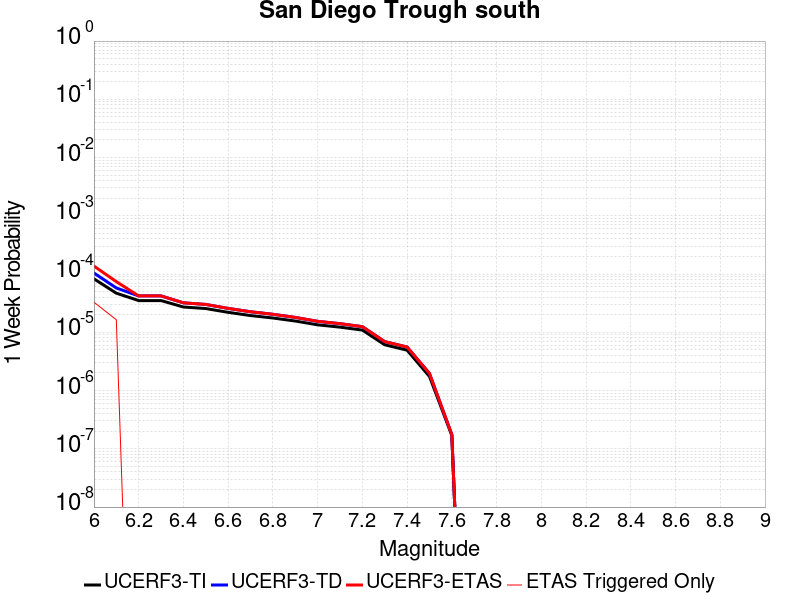 | 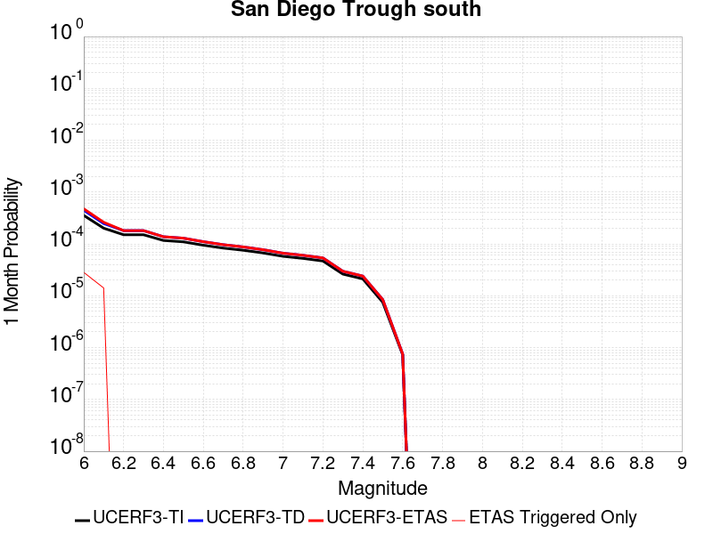 | 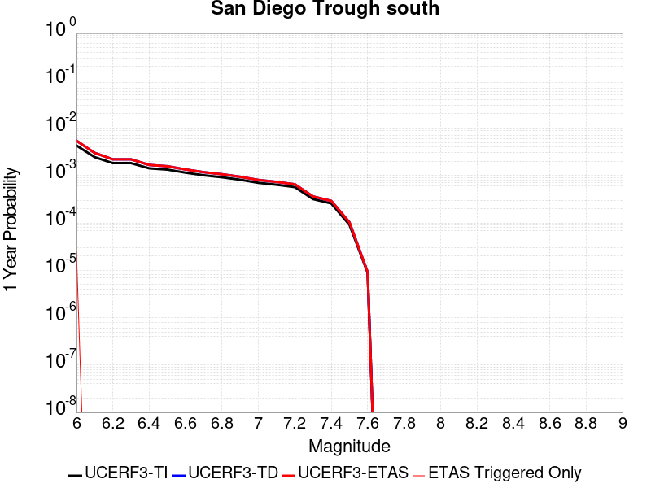 | 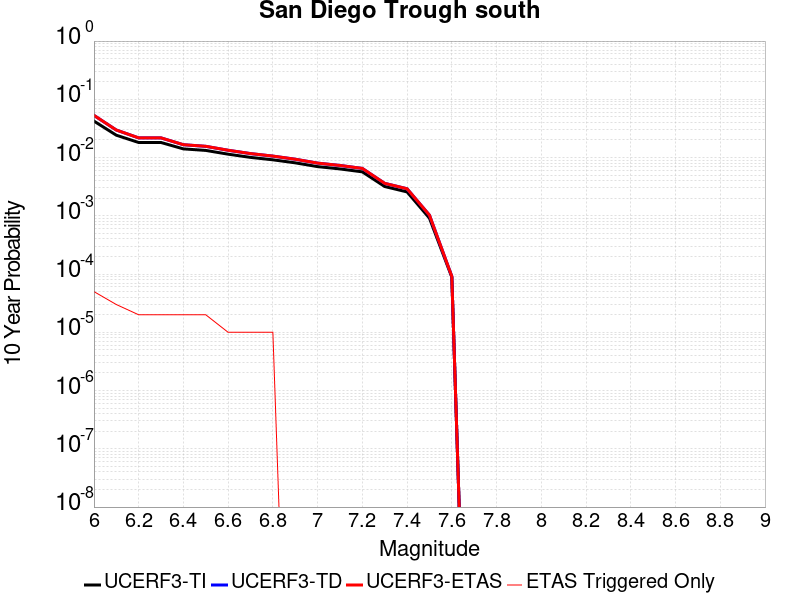 |

| Magnitude | 1 wk TI Prob | 1 wk TD Prob | 1 wk ETAS Prob | 1 wk ETAS/TD Gain | 1 wk ETAS Triggered Only | 1 mo TI Prob | 1 mo TD Prob | 1 mo ETAS Prob | 1 mo ETAS/TD Gain | 1 mo ETAS Triggered Only | 1 yr TI Prob | 1 yr TD Prob | 1 yr ETAS Prob | 1 yr ETAS/TD Gain | 1 yr ETAS Triggered Only | 10 yr TI Prob | 10 yr TD Prob | 10 yr ETAS Prob | 10 yr ETAS/TD Gain | 10 yr ETAS Triggered Only |
|-----|-----|-----|-----|-----|-----|-----|-----|-----|-----|-----|-----|-----|-----|-----|-----|-----|-----|-----|-----|-----|
| 6.0 | 8.279495E-5 | 1.0425541E-4 | 1.2425332E-4 | 1.1918166 | 2.0E-5 | 3.5478722E-4 | 4.4673498E-4 | 4.6672602E-4 | 1.0447493 | 2.0E-5 | 0.004310982 | 0.0054259133 | 0.0054557505 | 1.005499 | 3.0E-5 | 0.042283054 | 0.05299303 | 0.05304038 | 1.0008935 | 5.0E-5 |
| 6.1 | 4.6961468E-5 | 5.773024E-5 | 6.772966E-5 | 1.1732094 | 1.0E-5 | 2.0124791E-4 | 2.473905E-4 | 2.5738802E-4 | 1.040412 | 1.0E-5 | 0.00244744 | 0.003007886 | 0.0030278258 | 1.0066292 | 2.0E-5 | 0.024206603 | 0.029679636 | 0.029708745 | 1.0009807 | 3.0E-5 |
| 6.2 | 3.5079658E-5 | 4.214258E-5 | 4.214258E-5 | 1.0 | 0.0 | 1.5033272E-4 | 1.8059829E-4 | 1.8059829E-4 | 1.0 | 0.0 | 0.0018287642 | 0.002196587 | 0.002206565 | 1.0045425 | 1.0E-5 | 0.018137876 | 0.021751188 | 0.021770753 | 1.0008994 | 2.0E-5 |
| 6.3 | 3.5079658E-5 | 4.214258E-5 | 4.214258E-5 | 1.0 | 0.0 | 1.5033272E-4 | 1.8059829E-4 | 1.8059829E-4 | 1.0 | 0.0 | 0.0018287642 | 0.002196587 | 0.002206565 | 1.0045425 | 1.0E-5 | 0.018137876 | 0.021751188 | 0.021770753 | 1.0008994 | 2.0E-5 |
| 6.4 | 2.7196904E-5 | 3.208715E-5 | 3.208715E-5 | 1.0 | 0.0 | 1.16552954E-4 | 1.3750911E-4 | 1.3750911E-4 | 1.0 | 0.0 | 0.0014181085 | 0.0016728995 | 0.0016828828 | 1.0059676 | 1.0E-5 | 0.014090929 | 0.016604666 | 0.016624333 | 1.0011845 | 2.0E-5 |
| 6.5 | 2.5584688E-5 | 3.0101632E-5 | 3.0101632E-5 | 1.0 | 0.0 | 1.0964406E-4 | 1.2900059E-4 | 1.2900059E-4 | 1.0 | 0.0 | 0.0013340989 | 0.0015694627 | 0.001579447 | 1.0063616 | 1.0E-5 | 0.013261181 | 0.015585332 | 0.01560502 | 1.0012633 | 2.0E-5 |
| 6.6 | 2.2034688E-5 | 2.574271E-5 | 2.574271E-5 | 1.0 | 0.0 | 9.443096E-5 | 1.1032127E-4 | 1.1032127E-4 | 1.0 | 0.0 | 0.0011490905 | 0.0013423412 | 0.0013423412 | 1.0 | 0.0 | 0.011431668 | 0.013343325 | 0.013353191 | 1.0007395 | 1.0E-5 |
| 6.7 | 1.9394853E-5 | 2.254176E-5 | 2.254176E-5 | 1.0 | 0.0 | 8.311815E-5 | 9.6604E-5 | 9.6604E-5 | 1.0 | 0.0 | 0.0010114936 | 0.0011755243 | 0.0011755243 | 1.0 | 0.0 | 0.01006902 | 0.011693766 | 0.01170365 | 1.0008452 | 1.0E-5 |
| 6.8 | 1.7615313E-5 | 2.0403182E-5 | 2.0403182E-5 | 1.0 | 0.0 | 7.549201E-5 | 8.743931E-5 | 8.743931E-5 | 1.0 | 0.0 | 9.1872766E-4 | 0.0010640579 | 0.0010640579 | 1.0 | 0.0 | 0.009149387 | 0.010590198 | 0.010600092 | 1.0009342 | 1.0E-5 |
| 6.9 | 1.5621423E-5 | 1.8026114E-5 | 1.8026114E-5 | 1.0 | 0.0 | 6.6947236E-5 | 7.725251E-5 | 7.725251E-5 | 1.0 | 0.0 | 8.147778E-4 | 9.40147E-4 | 9.40147E-4 | 1.0 | 0.0 | 0.008117969 | 0.009362142 | 0.009362142 | 1.0 | 0.0 |
| 7.0 | 1.3444376E-5 | 1.544809E-5 | 1.544809E-5 | 1.0 | 0.0 | 5.7617483E-5 | 6.620443E-5 | 6.620443E-5 | 1.0 | 0.0 | 7.0126704E-4 | 8.057436E-4 | 8.057436E-4 | 1.0 | 0.0 | 0.006990582 | 0.008028555 | 0.008028555 | 1.0 | 0.0 |
| 7.1 | 1.2268361E-5 | 1.407303E-5 | 1.407303E-5 | 1.0 | 0.0 | 5.2577634E-5 | 6.0311606E-5 | 6.0311606E-5 | 1.0 | 0.0 | 6.399447E-4 | 7.3404907E-4 | 7.3404907E-4 | 1.0 | 0.0 | 0.0063810493 | 0.0073165493 | 0.0073165493 | 1.0 | 0.0 |
| 7.2 | 1.0922655E-5 | 1.2513563E-5 | 1.2513563E-5 | 1.0 | 0.0 | 4.681054E-5 | 5.3628468E-5 | 5.3628468E-5 | 1.0 | 0.0 | 5.697693E-4 | 6.5273355E-4 | 6.5273355E-4 | 1.0 | 0.0 | 0.0056831064 | 0.0065084435 | 0.0065084435 | 1.0 | 0.0 |
| 7.3 | 6.1106753E-6 | 6.928925E-6 | 6.928925E-6 | 1.0 | 0.0 | 2.6188345E-5 | 2.9695057E-5 | 2.9695057E-5 | 1.0 | 0.0 | 3.1879646E-4 | 3.6147775E-4 | 3.6147775E-4 | 1.0 | 0.0 | 0.0031833951 | 0.003608943 | 0.003608943 | 1.0 | 0.0 |
| 7.4 | 4.933187E-6 | 5.5895525E-6 | 5.5895525E-6 | 1.0 | 0.0 | 2.114206E-5 | 2.3955008E-5 | 2.3955008E-5 | 1.0 | 0.0 | 2.5737417E-4 | 2.9161357E-4 | 2.9161357E-4 | 1.0 | 0.0 | 0.002570763 | 0.0029123505 | 0.0029123505 | 1.0 | 0.0 |
| 7.5 | 1.7489613E-6 | 1.969678E-6 | 1.969678E-6 | 1.0 | 0.0 | 7.495527E-6 | 8.4414505E-6 | 8.4414505E-6 | 1.0 | 0.0 | 9.125422E-5 | 1.02770035E-4 | 1.02770035E-4 | 1.0 | 0.0 | 9.1216754E-4 | 0.0010272472 | 0.0010272472 | 1.0 | 0.0 |
| 7.6 | 1.6988751E-7 | 1.7533823E-7 | 1.7533823E-7 | 1.0 | 0.0 | 7.2808916E-7 | 7.5144936E-7 | 7.5144936E-7 | 1.0 | 0.0 | 8.864449E-6 | 9.14886E-6 | 9.14886E-6 | 1.0 | 0.0 | 8.8640954E-5 | 9.1485024E-5 | 9.1485024E-5 | 1.0 | 0.0 |

## Calaveras (So) 2011 CFM
*[(top)](#table-of-contents)*

| 1 Week | 1 Month | 1 Year | 10 Year |
|-----|-----|-----|-----|
|  |  |  |  |

| Magnitude | 1 wk TI Prob | 1 wk TD Prob | 1 wk ETAS Prob | 1 wk ETAS/TD Gain | 1 wk ETAS Triggered Only | 1 mo TI Prob | 1 mo TD Prob | 1 mo ETAS Prob | 1 mo ETAS/TD Gain | 1 mo ETAS Triggered Only | 1 yr TI Prob | 1 yr TD Prob | 1 yr ETAS Prob | 1 yr ETAS/TD Gain | 1 yr ETAS Triggered Only | 10 yr TI Prob | 10 yr TD Prob | 10 yr ETAS Prob | 10 yr ETAS/TD Gain | 10 yr ETAS Triggered Only |
|-----|-----|-----|-----|-----|-----|-----|-----|-----|-----|-----|-----|-----|-----|-----|-----|-----|-----|-----|-----|-----|
| 6.0 | 1.5950744E-4 | 3.0713255E-4 | 3.271264E-4 | 1.0650985 | 2.0E-5 | 6.834242E-4 | 0.001315409 | 0.0013353826 | 1.0151844 | 2.0E-5 | 0.00828899 | 0.015858326 | 0.015878009 | 1.0012412 | 2.0E-5 | 0.079865426 | 0.14440185 | 0.14445318 | 1.0003555 | 6.0E-5 |
| 6.1 | 1.3584697E-4 | 2.603514E-4 | 2.7034877E-4 | 1.0383996 | 1.0E-5 | 5.8207137E-4 | 0.0011151754 | 0.0011251643 | 1.0089571 | 1.0E-5 | 0.007063716 | 0.013461385 | 0.01347125 | 1.0007329 | 1.0E-5 | 0.06843361 | 0.124029994 | 0.124065034 | 1.0002825 | 4.0E-5 |
| 6.2 | 1.14676266E-4 | 2.1714384E-4 | 2.1714384E-4 | 1.0 | 0.0 | 4.9137714E-4 | 9.30223E-4 | 9.30223E-4 | 1.0 | 0.0 | 0.0059661185 | 0.011245058 | 0.011245058 | 1.0 | 0.0 | 0.058084648 | 0.10502057 | 0.10504741 | 1.0002557 | 3.0E-5 |
| 6.3 | 8.691518E-5 | 1.5987935E-4 | 1.5987935E-4 | 1.0 | 0.0 | 3.7244044E-4 | 6.849807E-4 | 6.849807E-4 | 1.0 | 0.0 | 0.004525038 | 0.008301122 | 0.008301122 | 1.0 | 0.0 | 0.044339992 | 0.0793365 | 0.07935491 | 1.0002321 | 2.0E-5 |
| 6.4 | 8.50982E-5 | 1.5694331E-4 | 1.5694331E-4 | 1.0 | 0.0 | 3.646556E-4 | 6.724042E-4 | 6.724042E-4 | 1.0 | 0.0 | 0.0044306475 | 0.008149155 | 0.008149155 | 1.0 | 0.0 | 0.04343345 | 0.07794268 | 0.07796112 | 1.0002366 | 2.0E-5 |
| 6.5 | 8.4062965E-5 | 1.5518743E-4 | 1.5518743E-4 | 1.0 | 0.0 | 3.602201E-4 | 6.6488347E-4 | 6.6488347E-4 | 1.0 | 0.0 | 0.004376863 | 0.008058365 | 0.008058365 | 1.0 | 0.0 | 0.042916555 | 0.07711388 | 0.077132344 | 1.0002394 | 2.0E-5 |
| 6.6 | 8.194716E-5 | 1.5154552E-4 | 1.5154552E-4 | 1.0 | 0.0 | 3.5115483E-4 | 6.492843E-4 | 6.492843E-4 | 1.0 | 0.0 | 0.0042669317 | 0.007870209 | 0.007870209 | 1.0 | 0.0 | 0.04185927 | 0.07539919 | 0.07541768 | 1.0002452 | 2.0E-5 |
| 6.7 | 8.012326E-5 | 1.4822475E-4 | 1.4822475E-4 | 1.0 | 0.0 | 3.433402E-4 | 6.350612E-4 | 6.350612E-4 | 1.0 | 0.0 | 0.004172157 | 0.007698701 | 0.007698701 | 1.0 | 0.0 | 0.040946912 | 0.07384132 | 0.07385984 | 1.0002508 | 2.0E-5 |
| 6.8 | 7.119773E-5 | 1.2881879E-4 | 1.2881879E-4 | 1.0 | 0.0 | 3.0509746E-4 | 5.519494E-4 | 5.519494E-4 | 1.0 | 0.0 | 0.0037082357 | 0.006696066 | 0.006696066 | 1.0 | 0.0 | 0.036469642 | 0.06468575 | 0.064704455 | 1.0002892 | 2.0E-5 |
| 6.9 | 5.7343088E-5 | 9.919277E-5 | 9.919277E-5 | 1.0 | 0.0 | 2.4573295E-4 | 4.25043E-4 | 4.25043E-4 | 1.0 | 0.0 | 0.0029876942 | 0.005162694 | 0.005162694 | 1.0 | 0.0 | 0.02947844 | 0.05051036 | 0.050519858 | 1.000188 | 1.0E-5 |
| 7.0 | 4.8746577E-5 | 8.2850725E-5 | 8.2850725E-5 | 1.0 | 0.0 | 2.0889717E-4 | 3.5502657E-4 | 3.5502657E-4 | 1.0 | 0.0 | 0.0025403565 | 0.004313948 | 0.004313948 | 1.0 | 0.0 | 0.025115121 | 0.042485245 | 0.04249482 | 1.0002254 | 1.0E-5 |
| 7.1 | 4.2998014E-5 | 7.265203E-5 | 7.265203E-5 | 1.0 | 0.0 | 1.8426418E-4 | 3.1132903E-4 | 3.1132903E-4 | 1.0 | 0.0 | 0.002241108 | 0.003783903 | 0.003783903 | 1.0 | 0.0 | 0.022186412 | 0.037423562 | 0.03743319 | 1.0002573 | 1.0E-5 |
| 7.2 | 3.221292E-5 | 5.390791E-5 | 5.390791E-5 | 1.0 | 0.0 | 1.3804805E-4 | 2.3101359E-4 | 2.3101359E-4 | 1.0 | 0.0 | 0.0016794393 | 0.0028089907 | 0.0028089907 | 1.0 | 0.0 | 0.016668037 | 0.02803602 | 0.02803602 | 1.0 | 0.0 |
| 7.3 | 2.3756531E-5 | 3.9473416E-5 | 3.9473416E-5 | 1.0 | 0.0 | 1.0180973E-4 | 1.6916092E-4 | 1.6916092E-4 | 1.0 | 0.0 | 0.0012388286 | 0.0020576057 | 0.0020576057 | 1.0 | 0.0 | 0.012319452 | 0.020643145 | 0.020643145 | 1.0 | 0.0 |
| 7.4 | 1.5997684E-5 | 2.7342163E-5 | 2.7342163E-5 | 1.0 | 0.0 | 6.8559704E-5 | 1.1717545E-4 | 1.1717545E-4 | 1.0 | 0.0 | 8.343947E-4 | 0.00142568 | 0.00142568 | 1.0 | 0.0 | 0.008312687 | 0.014376011 | 0.014376011 | 1.0 | 0.0 |
| 7.5 | 1.3814293E-5 | 2.4783874E-5 | 2.4783874E-5 | 1.0 | 0.0 | 5.9202768E-5 | 1.062123E-4 | 1.062123E-4 | 1.0 | 0.0 | 7.205553E-4 | 0.00129237 | 0.00129237 | 1.0 | 0.0 | 0.007182234 | 0.013055085 | 0.013055085 | 1.0 | 0.0 |
| 7.6 | 8.817309E-6 | 1.6430757E-5 | 1.6430757E-5 | 1.0 | 0.0 | 3.7787922E-5 | 7.0415634E-5 | 7.0415634E-5 | 1.0 | 0.0 | 4.5997082E-4 | 8.569745E-4 | 8.569745E-4 | 1.0 | 0.0 | 0.004590199 | 0.008719284 | 0.008719284 | 1.0 | 0.0 |
| 7.7 | 4.0352206E-6 | 7.707318E-6 | 7.707318E-6 | 1.0 | 0.0 | 1.7293689E-5 | 3.3030945E-5 | 3.3030945E-5 | 1.0 | 0.0 | 2.1053031E-4 | 4.0207763E-4 | 4.0207763E-4 | 1.0 | 0.0 | 0.0021033096 | 0.004165172 | 0.004165172 | 1.0 | 0.0 |
| 7.8 | 3.413169E-6 | 6.787282E-6 | 6.787282E-6 | 1.0 | 0.0 | 1.4627784E-5 | 2.9088029E-5 | 2.9088029E-5 | 1.0 | 0.0 | 1.7807873E-4 | 3.5408925E-4 | 3.5408925E-4 | 1.0 | 0.0 | 0.0017793609 | 0.0036665166 | 0.0036665166 | 1.0 | 0.0 |
| 7.9 | 2.4740732E-6 | 5.2791843E-6 | 5.2791843E-6 | 1.0 | 0.0 | 1.06031275E-5 | 2.262488E-5 | 2.262488E-5 | 1.0 | 0.0 | 1.2908543E-4 | 2.7542314E-4 | 2.7542314E-4 | 1.0 | 0.0 | 0.0012901047 | 0.0028347955 | 0.0028347955 | 1.0 | 0.0 |
| 8.0 | 1.5231818E-6 | 3.2889548E-6 | 3.2889548E-6 | 1.0 | 0.0 | 6.527906E-6 | 1.40954435E-5 | 1.40954435E-5 | 1.0 | 0.0 | 7.9474354E-5 | 1.7159856E-4 | 1.7159856E-4 | 1.0 | 0.0 | 7.944594E-4 | 0.0017564303 | 0.0017564303 | 1.0 | 0.0 |
| 8.1 | 1.0104524E-6 | 2.045782E-6 | 2.045782E-6 | 1.0 | 0.0 | 4.330503E-6 | 8.767608E-6 | 8.767608E-6 | 1.0 | 0.0 | 5.2722597E-5 | 1.0674043E-4 | 1.0674043E-4 | 1.0 | 0.0 | 5.271009E-4 | 0.001092934 | 0.001092934 | 1.0 | 0.0 |

## San Jacinto (Coyote Creek)
*[(top)](#table-of-contents)*

| 1 Week | 1 Month | 1 Year | 10 Year |
|-----|-----|-----|-----|
|  |  |  |  |

| Magnitude | 1 wk TI Prob | 1 wk TD Prob | 1 wk ETAS Prob | 1 wk ETAS/TD Gain | 1 wk ETAS Triggered Only | 1 mo TI Prob | 1 mo TD Prob | 1 mo ETAS Prob | 1 mo ETAS/TD Gain | 1 mo ETAS Triggered Only | 1 yr TI Prob | 1 yr TD Prob | 1 yr ETAS Prob | 1 yr ETAS/TD Gain | 1 yr ETAS Triggered Only | 10 yr TI Prob | 10 yr TD Prob | 10 yr ETAS Prob | 10 yr ETAS/TD Gain | 10 yr ETAS Triggered Only |
|-----|-----|-----|-----|-----|-----|-----|-----|-----|-----|-----|-----|-----|-----|-----|-----|-----|-----|-----|-----|-----|
| 6.0 | 2.7374346E-5 | 2.41444E-5 | 6.414343E-5 | 2.656659 | 4.0E-5 | 1.1731335E-4 | 1.034719E-4 | 1.5346672E-4 | 1.483173 | 5.0E-5 | 0.0014273542 | 0.001259045 | 0.0013189694 | 1.0475951 | 6.0E-5 | 0.01418221 | 0.012928195 | 0.012987419 | 1.004581 | 6.0E-5 |
| 6.1 | 2.7374346E-5 | 2.41444E-5 | 6.414343E-5 | 2.656659 | 4.0E-5 | 1.1731335E-4 | 1.034719E-4 | 1.5346672E-4 | 1.483173 | 5.0E-5 | 0.0014273542 | 0.001259045 | 0.0013189694 | 1.0475951 | 6.0E-5 | 0.01418221 | 0.012928195 | 0.012987419 | 1.004581 | 6.0E-5 |
| 6.2 | 2.7374346E-5 | 2.41444E-5 | 6.414343E-5 | 2.656659 | 4.0E-5 | 1.1731335E-4 | 1.034719E-4 | 1.5346672E-4 | 1.483173 | 5.0E-5 | 0.0014273542 | 0.001259045 | 0.0013189694 | 1.0475951 | 6.0E-5 | 0.01418221 | 0.012928195 | 0.012987419 | 1.004581 | 6.0E-5 |
| 6.3 | 2.7374346E-5 | 2.41444E-5 | 6.414343E-5 | 2.656659 | 4.0E-5 | 1.1731335E-4 | 1.034719E-4 | 1.5346672E-4 | 1.483173 | 5.0E-5 | 0.0014273542 | 0.001259045 | 0.0013189694 | 1.0475951 | 6.0E-5 | 0.01418221 | 0.012928195 | 0.012987419 | 1.004581 | 6.0E-5 |
| 6.4 | 2.7374346E-5 | 2.41444E-5 | 6.414343E-5 | 2.656659 | 4.0E-5 | 1.1731335E-4 | 1.034719E-4 | 1.5346672E-4 | 1.483173 | 5.0E-5 | 0.0014273542 | 0.001259045 | 0.0013189694 | 1.0475951 | 6.0E-5 | 0.01418221 | 0.012928195 | 0.012987419 | 1.004581 | 6.0E-5 |
| 6.5 | 2.7282445E-5 | 2.4030476E-5 | 6.402952E-5 | 2.6645129 | 4.0E-5 | 1.16919524E-4 | 1.0298371E-4 | 1.5297855E-4 | 1.4854637 | 5.0E-5 | 0.0014225657 | 0.001253108 | 0.0013130329 | 1.0478209 | 6.0E-5 | 0.014134934 | 0.012869522 | 0.01292875 | 1.0046022 | 6.0E-5 |
| 6.6 | 2.7282445E-5 | 2.4030476E-5 | 6.402952E-5 | 2.6645129 | 4.0E-5 | 1.16919524E-4 | 1.0298371E-4 | 1.5297855E-4 | 1.4854637 | 5.0E-5 | 0.0014225657 | 0.001253108 | 0.0013130329 | 1.0478209 | 6.0E-5 | 0.014134934 | 0.012869522 | 0.01292875 | 1.0046022 | 6.0E-5 |
| 6.7 | 2.7216198E-5 | 2.3955597E-5 | 6.395464E-5 | 2.669716 | 4.0E-5 | 1.1663563E-4 | 1.02662816E-4 | 1.5265768E-4 | 1.4869813 | 5.0E-5 | 0.0014191137 | 0.0012492058 | 0.0013091308 | 1.0479705 | 6.0E-5 | 0.014100855 | 0.012830934 | 0.012890164 | 1.0046161 | 6.0E-5 |
| 6.8 | 2.7078617E-5 | 2.3872815E-5 | 6.387186E-5 | 2.6755059 | 4.0E-5 | 1.1604605E-4 | 1.0230807E-4 | 1.5230295E-4 | 1.48867 | 5.0E-5 | 0.001411945 | 0.0012448917 | 0.0013048169 | 1.048137 | 6.0E-5 | 0.014030075 | 0.0127880825 | 0.012847315 | 1.0046319 | 6.0E-5 |
| 6.9 | 2.6982952E-5 | 2.3792329E-5 | 6.3791376E-5 | 2.681174 | 4.0E-5 | 1.15636096E-4 | 1.0196315E-4 | 1.5195805E-4 | 1.4903232 | 5.0E-5 | 0.0014069602 | 0.0012406971 | 0.0013006227 | 1.0482999 | 6.0E-5 | 0.013980856 | 0.012746378 | 0.012805614 | 1.0046473 | 6.0E-5 |
| 7.0 | 2.6449972E-5 | 2.3369357E-5 | 6.3368425E-5 | 2.7116032 | 4.0E-5 | 1.1335209E-4 | 1.0015055E-4 | 1.5014554E-4 | 1.4991983 | 5.0E-5 | 0.001379188 | 0.0012186535 | 0.0012785804 | 1.0491747 | 6.0E-5 | 0.0137065975 | 0.012527733 | 0.012586981 | 1.0047294 | 6.0E-5 |
| 7.1 | 2.6257849E-5 | 2.3195396E-5 | 6.319447E-5 | 2.72444 | 4.0E-5 | 1.1252879E-4 | 9.940507E-5 | 1.494001E-4 | 1.5029424 | 5.0E-5 | 0.0013691769 | 0.0012095873 | 0.0012695148 | 1.0495437 | 6.0E-5 | 0.013607717 | 0.012437661 | 0.012496915 | 1.0047641 | 6.0E-5 |
| 7.2 | 2.5270041E-5 | 2.2390155E-5 | 6.238926E-5 | 2.7864594 | 4.0E-5 | 1.0829568E-4 | 9.5954296E-5 | 1.459495E-4 | 1.5210314 | 5.0E-5 | 0.0013177024 | 0.0011676198 | 0.0012275497 | 1.0513266 | 6.0E-5 | 0.013099162 | 0.0120187905 | 0.012078069 | 1.0049322 | 6.0E-5 |
| 7.3 | 2.339701E-5 | 2.1122027E-5 | 6.112118E-5 | 2.8937175 | 4.0E-5 | 1.0026905E-4 | 9.051985E-5 | 1.4051532E-4 | 1.5523151 | 5.0E-5 | 0.001220092 | 0.001101524 | 0.0011614579 | 1.05441 | 6.0E-5 | 0.012134149 | 0.011357642 | 0.0114169605 | 1.0052228 | 6.0E-5 |
| 7.4 | 2.296333E-5 | 2.0852396E-5 | 6.0851562E-5 | 2.9182048 | 4.0E-5 | 9.841056E-5 | 8.936436E-5 | 1.393599E-4 | 1.5594572 | 5.0E-5 | 0.0011974899 | 0.0010874701 | 0.0011474048 | 1.0551139 | 6.0E-5 | 0.011910575 | 0.011216754 | 0.011276081 | 1.0052892 | 6.0E-5 |
| 7.5 | 2.2188895E-5 | 2.037534E-5 | 6.0374525E-5 | 2.9631174 | 4.0E-5 | 9.50918E-5 | 8.731998E-5 | 1.3731561E-4 | 1.5725566 | 5.0E-5 | 0.0011571277 | 0.0010626042 | 0.0011225406 | 1.0564051 | 6.0E-5 | 0.011511209 | 0.010966369 | 0.011025711 | 1.0054113 | 6.0E-5 |
| 7.6 | 2.0013189E-5 | 1.8961666E-5 | 5.8960908E-5 | 3.1094794 | 4.0E-5 | 8.5767984E-5 | 8.126176E-5 | 1.312577E-4 | 1.6152456 | 5.0E-5 | 0.001043725 | 9.889146E-4 | 0.0010488553 | 1.0606126 | 6.0E-5 | 0.010388365 | 0.010224371 | 0.010283758 | 1.0058084 | 6.0E-5 |
| 7.7 | 1.7230794E-5 | 1.6743043E-5 | 5.6742374E-5 | 3.389012 | 4.0E-5 | 7.384417E-5 | 7.175393E-5 | 1.2175034E-4 | 1.6967759 | 5.0E-5 | 8.986819E-4 | 8.732547E-4 | 9.3320233E-4 | 1.0686485 | 6.0E-5 | 0.008950562 | 0.00906292 | 0.009122376 | 1.0065603 | 6.0E-5 |
| 7.8 | 1.4478809E-5 | 1.499039E-5 | 5.498979E-5 | 3.6683362 | 4.0E-5 | 6.205057E-5 | 6.424295E-5 | 1.1423974E-4 | 1.7782456 | 5.0E-5 | 7.552038E-4 | 7.8187784E-4 | 8.41831E-4 | 1.0766783 | 6.0E-5 | 0.0075264242 | 0.008141388 | 0.0082009 | 1.0073098 | 6.0E-5 |
| 7.9 | 1.1114467E-5 | 1.1644517E-5 | 5.1644052E-5 | 4.4350533 | 4.0E-5 | 4.7632562E-5 | 4.990412E-5 | 9.990163E-5 | 2.0018713 | 5.0E-5 | 5.797721E-4 | 6.074139E-4 | 6.6737743E-4 | 1.0987195 | 6.0E-5 | 0.0057826187 | 0.0063803545 | 0.0064399717 | 1.0093439 | 6.0E-5 |
| 8.0 | 9.327402E-6 | 9.8986575E-6 | 4.9898263E-5 | 5.040912 | 4.0E-5 | 3.9973966E-5 | 4.2422133E-5 | 9.2420014E-5 | 2.17858 | 5.0E-5 | 4.8657437E-4 | 5.163676E-4 | 5.7633664E-4 | 1.1161363 | 6.0E-5 | 0.0048551033 | 0.00544994 | 0.005509613 | 1.0109493 | 6.0E-5 |
| 8.1 | 7.0235833E-6 | 6.826985E-6 | 3.682678E-5 | 5.394296 | 3.0E-5 | 3.0100724E-5 | 2.9258183E-5 | 5.9257305E-5 | 2.025324 | 3.0E-5 | 3.664147E-4 | 3.5616063E-4 | 3.961464E-4 | 1.1122689 | 4.0E-5 | 0.003658111 | 0.0037874572 | 0.0038273057 | 1.0105212 | 4.0E-5 |
| 8.2 | 2.0358202E-6 | 8.9912584E-7 | 8.9912584E-7 | 1.0 | 0.0 | 8.724915E-6 | 3.853391E-6 | 3.853391E-6 | 1.0 | 0.0 | 1.06220665E-4 | 4.6914047E-5 | 4.6914047E-5 | 1.0 | 0.0 | 0.001061699 | 5.3239096E-4 | 5.3239096E-4 | 1.0 | 0.0 |
| 8.3 | 2.0051264E-7 | 6.61379E-8 | 6.61379E-8 | 1.0 | 0.0 | 8.5933965E-7 | 2.8344812E-7 | 2.8344812E-7 | 1.0 | 0.0 | 1.046241E-5 | 3.450976E-6 | 3.450976E-6 | 1.0 | 0.0 | 1.0461917E-4 | 4.0120205E-5 | 4.0120205E-5 | 1.0 | 0.0 |

## Cleghorn
*[(top)](#table-of-contents)*

| 1 Week | 1 Month | 1 Year | 10 Year |
|-----|-----|-----|-----|
|  |  |  |  |

| Magnitude | 1 wk TI Prob | 1 wk TD Prob | 1 wk ETAS Prob | 1 wk ETAS/TD Gain | 1 wk ETAS Triggered Only | 1 mo TI Prob | 1 mo TD Prob | 1 mo ETAS Prob | 1 mo ETAS/TD Gain | 1 mo ETAS Triggered Only | 1 yr TI Prob | 1 yr TD Prob | 1 yr ETAS Prob | 1 yr ETAS/TD Gain | 1 yr ETAS Triggered Only | 10 yr TI Prob | 10 yr TD Prob | 10 yr ETAS Prob | 10 yr ETAS/TD Gain | 10 yr ETAS Triggered Only |
|-----|-----|-----|-----|-----|-----|-----|-----|-----|-----|-----|-----|-----|-----|-----|-----|-----|-----|-----|-----|-----|
| 6.0 | 7.9267165E-6 | 9.831764E-6 | 9.831764E-6 | 1.0 | 0.0 | 3.39712E-5 | 4.2135514E-5 | 5.2135092E-5 | 1.2373195 | 1.0E-5 | 4.1352084E-4 | 5.1288976E-4 | 5.328795E-4 | 1.0389748 | 2.0E-5 | 0.004127522 | 0.005132214 | 0.0051919064 | 1.0116309 | 6.0E-5 |
| 6.1 | 7.9267165E-6 | 9.831764E-6 | 9.831764E-6 | 1.0 | 0.0 | 3.39712E-5 | 4.2135514E-5 | 5.2135092E-5 | 1.2373195 | 1.0E-5 | 4.1352084E-4 | 5.1288976E-4 | 5.328795E-4 | 1.0389748 | 2.0E-5 | 0.004127522 | 0.005132214 | 0.0051919064 | 1.0116309 | 6.0E-5 |
| 6.2 | 7.9267165E-6 | 9.831764E-6 | 9.831764E-6 | 1.0 | 0.0 | 3.39712E-5 | 4.2135514E-5 | 5.2135092E-5 | 1.2373195 | 1.0E-5 | 4.1352084E-4 | 5.1288976E-4 | 5.328795E-4 | 1.0389748 | 2.0E-5 | 0.004127522 | 0.005132214 | 0.0051919064 | 1.0116309 | 6.0E-5 |
| 6.3 | 7.9267165E-6 | 9.831764E-6 | 9.831764E-6 | 1.0 | 0.0 | 3.39712E-5 | 4.2135514E-5 | 5.2135092E-5 | 1.2373195 | 1.0E-5 | 4.1352084E-4 | 5.1288976E-4 | 5.328795E-4 | 1.0389748 | 2.0E-5 | 0.004127522 | 0.005132214 | 0.0051919064 | 1.0116309 | 6.0E-5 |
| 6.4 | 4.3445207E-6 | 6.0916254E-6 | 6.0916254E-6 | 1.0 | 0.0 | 1.8619241E-5 | 2.6106709E-5 | 2.6106709E-5 | 1.0 | 0.0 | 2.2666567E-4 | 3.1780385E-4 | 3.2780066E-4 | 1.031456 | 1.0E-5 | 0.0022643462 | 0.0031877246 | 0.003217629 | 1.009381 | 3.0E-5 |
| 6.5 | 4.3445207E-6 | 6.0916254E-6 | 6.0916254E-6 | 1.0 | 0.0 | 1.8619241E-5 | 2.6106709E-5 | 2.6106709E-5 | 1.0 | 0.0 | 2.2666567E-4 | 3.1780385E-4 | 3.2780066E-4 | 1.031456 | 1.0E-5 | 0.0022643462 | 0.0031877246 | 0.003217629 | 1.009381 | 3.0E-5 |
| 6.6 | 4.040109E-6 | 5.774033E-6 | 5.774033E-6 | 1.0 | 0.0 | 1.7314638E-5 | 2.4745626E-5 | 2.4745626E-5 | 1.0 | 0.0 | 2.1078532E-4 | 3.0123728E-4 | 3.1123427E-4 | 1.0331864 | 1.0E-5 | 0.002105855 | 0.0030225143 | 0.0030524237 | 1.0098956 | 3.0E-5 |
| 6.7 | 3.3632055E-6 | 5.06753E-6 | 5.06753E-6 | 1.0 | 0.0 | 1.4413658E-5 | 2.1717806E-5 | 2.1717806E-5 | 1.0 | 0.0 | 1.7547216E-4 | 2.643825E-4 | 2.7437988E-4 | 1.037814 | 1.0E-5 | 0.0017533366 | 0.0026548486 | 0.002684769 | 1.01127 | 3.0E-5 |
| 6.8 | 3.2902772E-6 | 4.9894375E-6 | 4.9894375E-6 | 1.0 | 0.0 | 1.4101111E-5 | 2.138313E-5 | 2.138313E-5 | 1.0 | 0.0 | 1.716675E-4 | 2.6030882E-4 | 2.7030622E-4 | 1.0384059 | 1.0E-5 | 0.0017153495 | 0.0026142076 | 0.002644129 | 1.0114458 | 3.0E-5 |
| 6.9 | 3.031547E-6 | 4.6911987E-6 | 4.6911987E-6 | 1.0 | 0.0 | 1.299228E-5 | 2.0104984E-5 | 2.0104984E-5 | 1.0 | 0.0 | 1.5816953E-4 | 2.4475096E-4 | 2.547485E-4 | 1.0408479 | 1.0E-5 | 0.00158057 | 0.0024589805 | 0.0024889067 | 1.0121702 | 3.0E-5 |
| 7.0 | 2.8259715E-6 | 4.3707637E-6 | 4.3707637E-6 | 1.0 | 0.0 | 1.211125E-5 | 1.8731711E-5 | 1.8731711E-5 | 1.0 | 0.0 | 1.4744449E-4 | 2.2803496E-4 | 2.3803268E-4 | 1.0438429 | 1.0E-5 | 0.001473467 | 0.0022921748 | 0.002322106 | 1.0130581 | 3.0E-5 |
| 7.1 | 2.5962665E-6 | 4.065983E-6 | 4.065983E-6 | 1.0 | 0.0 | 1.1126809E-5 | 1.7425526E-5 | 1.7425526E-5 | 1.0 | 0.0 | 1.3546048E-4 | 2.1213535E-4 | 2.2213323E-4 | 1.0471298 | 1.0E-5 | 0.0013537793 | 0.0021334959 | 0.0021634318 | 1.0140314 | 3.0E-5 |
| 7.2 | 2.3247253E-6 | 3.6765352E-6 | 3.6765352E-6 | 1.0 | 0.0 | 9.96307E-6 | 1.5756486E-5 | 1.5756486E-5 | 1.0 | 0.0 | 1.21293626E-4 | 1.9181852E-4 | 2.018166E-4 | 1.0521226 | 1.0E-5 | 0.0012122744 | 0.0019307166 | 0.0019606587 | 1.0155083 | 3.0E-5 |
| 7.3 | 2.056928E-6 | 3.235253E-6 | 3.235253E-6 | 1.0 | 0.0 | 8.815376E-6 | 1.3865297E-5 | 1.3865297E-5 | 1.0 | 0.0 | 1.0732192E-4 | 1.6879707E-4 | 1.7879538E-4 | 1.0592327 | 1.0E-5 | 0.001072701 | 0.0017009423 | 0.0017308913 | 1.0176073 | 3.0E-5 |
| 7.4 | 1.8055999E-6 | 2.8256538E-6 | 2.8256538E-6 | 1.0 | 0.0 | 7.738263E-6 | 1.210989E-5 | 1.210989E-5 | 1.0 | 0.0 | 9.4209274E-5 | 1.4742807E-4 | 1.5742659E-4 | 1.0678197 | 1.0E-5 | 9.4169343E-4 | 0.0014876705 | 0.0015076407 | 1.0134238 | 2.0E-5 |
| 7.5 | 1.4683443E-6 | 2.4248943E-6 | 2.4248943E-6 | 1.0 | 0.0 | 6.292889E-6 | 1.0392363E-5 | 1.0392363E-5 | 1.0 | 0.0 | 7.661323E-5 | 1.2651978E-4 | 1.365185E-4 | 1.0790291 | 1.0E-5 | 7.658682E-4 | 0.0012788812 | 0.0012988556 | 1.0156187 | 2.0E-5 |
| 7.6 | 9.804088E-7 | 1.9004091E-6 | 1.9004091E-6 | 1.0 | 0.0 | 4.201745E-6 | 8.144585E-6 | 8.144585E-6 | 1.0 | 0.0 | 5.1155046E-5 | 9.915586E-5 | 9.915586E-5 | 1.0 | 0.0 | 5.114327E-4 | 0.0010055583 | 0.0010155482 | 1.0099348 | 1.0E-5 |
| 7.7 | 7.3434086E-7 | 1.6285549E-6 | 1.6285549E-6 | 1.0 | 0.0 | 3.1471714E-6 | 6.9795024E-6 | 6.9795024E-6 | 1.0 | 0.0 | 3.831614E-5 | 8.4972155E-5 | 8.4972155E-5 | 1.0 | 0.0 | 3.8309532E-4 | 8.6387293E-4 | 8.6387293E-4 | 1.0 | 0.0 |
| 7.8 | 6.434184E-7 | 1.5221389E-6 | 1.5221389E-6 | 1.0 | 0.0 | 2.7575045E-6 | 6.523436E-6 | 6.523436E-6 | 1.0 | 0.0 | 3.35721E-5 | 7.9419966E-5 | 7.9419966E-5 | 1.0 | 0.0 | 3.3567028E-4 | 8.080443E-4 | 8.080443E-4 | 1.0 | 0.0 |
| 7.9 | 3.4943926E-7 | 7.5750586E-7 | 7.5750586E-7 | 1.0 | 0.0 | 1.497596E-6 | 3.2464498E-6 | 3.2464498E-6 | 1.0 | 0.0 | 1.8233079E-5 | 3.9524817E-5 | 3.9524817E-5 | 1.0 | 0.0 | 1.8231584E-4 | 4.0401975E-4 | 4.0401975E-4 | 1.0 | 0.0 |
| 8.0 | 6.717524E-8 | 5.837515E-8 | 5.837515E-8 | 1.0 | 0.0 | 2.8789387E-7 | 2.501792E-7 | 2.501792E-7 | 1.0 | 0.0 | 3.505102E-6 | 3.0459275E-6 | 3.0459275E-6 | 1.0 | 0.0 | 3.5050467E-5 | 3.2751934E-5 | 3.2751934E-5 | 1.0 | 0.0 |
| 8.1 | 3.1984914E-8 | 1.2949885E-8 | 1.2949885E-8 | 1.0 | 0.0 | 1.370782E-7 | 5.549951E-8 | 5.549951E-8 | 1.0 | 0.0 | 1.6689258E-6 | 6.757063E-7 | 6.757063E-7 | 1.0 | 0.0 | 1.6689133E-5 | 7.741151E-6 | 7.741151E-6 | 1.0 | 0.0 |
| 8.2 | 1.21887656E-8 | 3.6471115E-9 | 3.6471115E-9 | 1.0 | 0.0 | 5.2237567E-8 | 1.563048E-8 | 1.563048E-8 | 1.0 | 0.0 | 6.359922E-7 | 1.9030107E-7 | 1.9030107E-7 | 1.0 | 0.0 | 6.3599036E-6 | 2.245849E-6 | 2.245849E-6 | 1.0 | 0.0 |

## Hunting Creek - Berryessa 2011 CFM
*[(top)](#table-of-contents)*

| 1 Week | 1 Month | 1 Year | 10 Year |
|-----|-----|-----|-----|
| 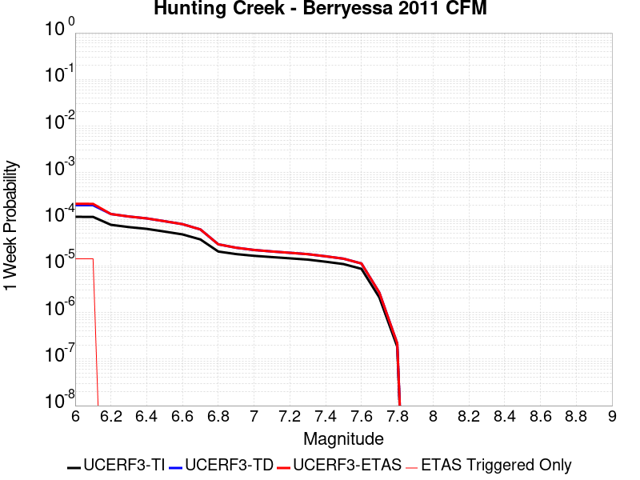 | 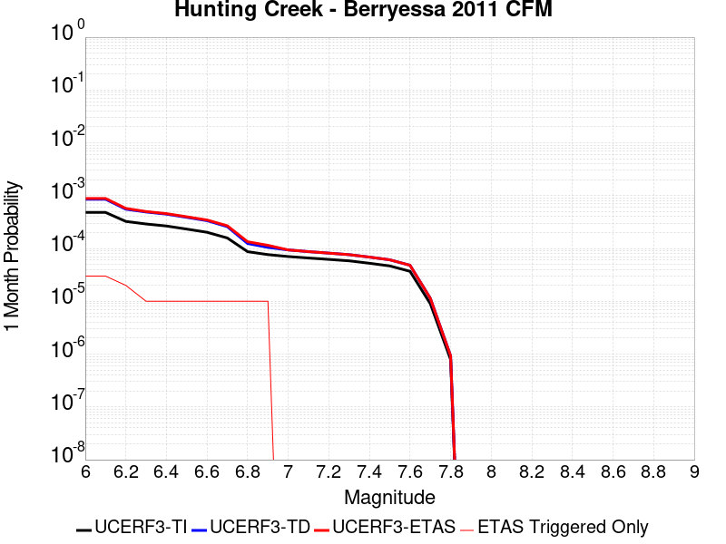 | 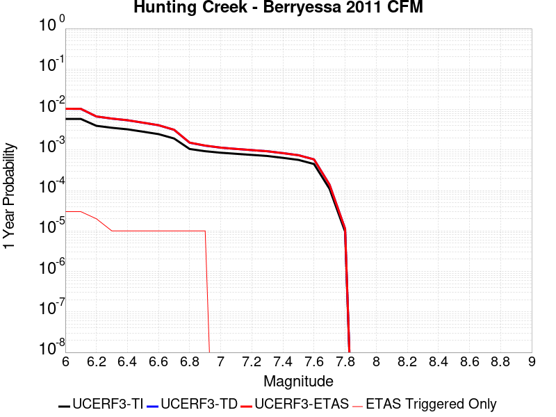 | 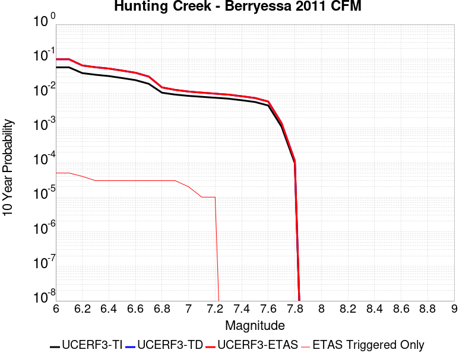 |

| Magnitude | 1 wk TI Prob | 1 wk TD Prob | 1 wk ETAS Prob | 1 wk ETAS/TD Gain | 1 wk ETAS Triggered Only | 1 mo TI Prob | 1 mo TD Prob | 1 mo ETAS Prob | 1 mo ETAS/TD Gain | 1 mo ETAS Triggered Only | 1 yr TI Prob | 1 yr TD Prob | 1 yr ETAS Prob | 1 yr ETAS/TD Gain | 1 yr ETAS Triggered Only | 10 yr TI Prob | 10 yr TD Prob | 10 yr ETAS Prob | 10 yr ETAS/TD Gain | 10 yr ETAS Triggered Only |
|-----|-----|-----|-----|-----|-----|-----|-----|-----|-----|-----|-----|-----|-----|-----|-----|-----|-----|-----|-----|-----|
| 6.0 | 1.1270982E-4 | 2.0028367E-4 | 2.3027766E-4 | 1.1497575 | 3.0E-5 | 4.8295266E-4 | 8.579912E-4 | 8.879655E-4 | 1.0349354 | 3.0E-5 | 0.0058641075 | 0.010386173 | 0.01041586 | 1.0028584 | 3.0E-5 | 0.057117578 | 0.09804048 | 0.098085575 | 1.00046 | 5.0E-5 |
| 6.1 | 1.1239393E-4 | 1.9976508E-4 | 2.297591E-4 | 1.1501464 | 3.0E-5 | 4.8159933E-4 | 8.557703E-4 | 8.8574464E-4 | 1.0350262 | 3.0E-5 | 0.0058477195 | 0.010359417 | 0.010389105 | 1.0028659 | 3.0E-5 | 0.056962132 | 0.09779895 | 0.09784406 | 1.0004612 | 5.0E-5 |
| 6.2 | 7.596265E-5 | 1.2933646E-4 | 1.4933388E-4 | 1.1546154 | 2.0E-5 | 3.2551357E-4 | 5.5415573E-4 | 5.7414465E-4 | 1.036071 | 2.0E-5 | 0.0039559277 | 0.0067213587 | 0.0067412243 | 1.0029556 | 2.0E-5 | 0.038862433 | 0.06459229 | 0.064629704 | 1.0005792 | 4.0E-5 |
| 6.3 | 6.78794E-5 | 1.1448377E-4 | 1.2448263E-4 | 1.0873386 | 1.0E-5 | 2.9087928E-4 | 4.9052597E-4 | 5.0052104E-4 | 1.0203763 | 1.0E-5 | 0.003535705 | 0.005952661 | 0.0059626014 | 1.0016699 | 1.0E-5 | 0.034799766 | 0.057466213 | 0.057494488 | 1.0004921 | 3.0E-5 |
| 6.4 | 6.2165134E-5 | 1.0434825E-4 | 1.143472E-4 | 1.0958229 | 1.0E-5 | 2.6639478E-4 | 4.4711027E-4 | 4.5710578E-4 | 1.0223558 | 1.0E-5 | 0.0032385332 | 0.0054274183 | 0.005437364 | 1.0018325 | 1.0E-5 | 0.03191742 | 0.05255138 | 0.052579805 | 1.0005409 | 3.0E-5 |
| 6.5 | 5.4368087E-5 | 9.070258E-5 | 1.00701676E-4 | 1.1102405 | 1.0E-5 | 2.3298527E-4 | 3.886537E-4 | 3.986498E-4 | 1.0257199 | 1.0E-5 | 0.0028329059 | 0.0047197016 | 0.0047296546 | 1.0021088 | 1.0E-5 | 0.027970633 | 0.045881182 | 0.045909807 | 1.0006238 | 3.0E-5 |
| 6.6 | 4.729947E-5 | 7.847101E-5 | 8.8470224E-5 | 1.1274256 | 1.0E-5 | 2.0269625E-4 | 3.3624718E-4 | 3.4624382E-4 | 1.0297301 | 1.0E-5 | 0.002465034 | 0.004084746 | 0.004094705 | 1.0024382 | 1.0E-5 | 0.02437869 | 0.03985269 | 0.039881494 | 1.0007228 | 3.0E-5 |
| 6.7 | 3.6875328E-5 | 6.0443555E-5 | 7.044295E-5 | 1.1654336 | 1.0E-5 | 1.5802756E-4 | 2.5900968E-4 | 2.6900708E-4 | 1.0385985 | 1.0E-5 | 0.0019222875 | 0.0031482724 | 0.0031582408 | 1.0031663 | 1.0E-5 | 0.019057442 | 0.03089371 | 0.030922784 | 1.000941 | 3.0E-5 |
| 6.8 | 2.0292036E-5 | 2.8976721E-5 | 3.8976432E-5 | 1.3450946 | 1.0E-5 | 8.6962966E-5 | 1.2417998E-4 | 1.3417873E-4 | 1.0805182 | 1.0E-5 | 0.0010582599 | 0.0015108302 | 0.0015208151 | 1.0066088 | 1.0E-5 | 0.010532344 | 0.0149790775 | 0.015008627 | 1.0019728 | 3.0E-5 |
| 6.9 | 1.7871042E-5 | 2.4472653E-5 | 3.447241E-5 | 1.4086094 | 1.0E-5 | 7.658793E-5 | 1.04878585E-4 | 1.1487754E-4 | 1.0953383 | 1.0E-5 | 9.320591E-4 | 0.0012761486 | 0.0012861358 | 1.0078261 | 1.0E-5 | 0.009281595 | 0.012680395 | 0.012710013 | 1.0023359 | 3.0E-5 |
| 7.0 | 1.6415532E-5 | 2.1906566E-5 | 2.1906566E-5 | 1.0 | 0.0 | 7.035038E-5 | 9.388191E-5 | 9.388191E-5 | 1.0 | 0.0 | 8.561793E-4 | 0.0011424144 | 0.0011424144 | 1.0 | 0.0 | 0.008528882 | 0.011365017 | 0.01138479 | 1.0017397 | 2.0E-5 |
| 7.1 | 1.5409885E-5 | 2.0346588E-5 | 2.0346588E-5 | 1.0 | 0.0 | 6.6040695E-5 | 8.719676E-5 | 8.719676E-5 | 1.0 | 0.0 | 8.0374884E-4 | 0.0010611062 | 0.0010611062 | 1.0 | 0.0 | 0.00800848 | 0.010560924 | 0.010570819 | 1.0009369 | 1.0E-5 |
| 7.2 | 1.4497423E-5 | 1.905519E-5 | 1.905519E-5 | 1.0 | 0.0 | 6.213033E-5 | 8.166256E-5 | 8.166256E-5 | 1.0 | 0.0 | 7.5617427E-4 | 9.937913E-4 | 9.937913E-4 | 1.0 | 0.0 | 0.0075360634 | 0.00989425 | 0.009904152 | 1.0010006 | 1.0E-5 |
| 7.3 | 1.3615175E-5 | 1.7826347E-5 | 1.7826347E-5 | 1.0 | 0.0 | 5.8349444E-5 | 7.6396405E-5 | 7.6396405E-5 | 1.0 | 0.0 | 7.101729E-4 | 9.297323E-4 | 9.297323E-4 | 1.0 | 0.0 | 0.0070790765 | 0.009259124 | 0.009259124 | 1.0 | 0.0 |
| 7.4 | 1.2252825E-5 | 1.6026455E-5 | 1.6026455E-5 | 1.0 | 0.0 | 5.251105E-5 | 6.868302E-5 | 6.868302E-5 | 1.0 | 0.0 | 6.391345E-4 | 8.3589775E-4 | 8.3589775E-4 | 1.0 | 0.0 | 0.0063729943 | 0.008328172 | 0.008328172 | 1.0 | 0.0 |
| 7.5 | 1.0913301E-5 | 1.4241286E-5 | 1.4241286E-5 | 1.0 | 0.0 | 4.6770452E-5 | 6.103267E-5 | 6.103267E-5 | 1.0 | 0.0 | 5.6928146E-4 | 7.428222E-4 | 7.428222E-4 | 1.0 | 0.0 | 0.0056782532 | 0.0074039865 | 0.0074039865 | 1.0 | 0.0 |
| 7.6 | 8.623192E-6 | 1.12347825E-5 | 1.12347825E-5 | 1.0 | 0.0 | 3.6956015E-5 | 4.8148195E-5 | 4.8148195E-5 | 1.0 | 0.0 | 4.4984656E-4 | 5.8604917E-4 | 5.8604917E-4 | 1.0 | 0.0 | 0.00448937 | 0.005845504 | 0.005845504 | 1.0 | 0.0 |
| 7.7 | 2.0993634E-6 | 2.66264E-6 | 2.66264E-6 | 1.0 | 0.0 | 8.997241E-6 | 1.1411265E-5 | 1.1411265E-5 | 1.0 | 0.0 | 1.09535904E-4 | 1.3892337E-4 | 1.3892337E-4 | 1.0 | 0.0 | 0.0010948193 | 0.0013883994 | 0.0013883994 | 1.0 | 0.0 |
| 7.8 | 1.8428308E-7 | 2.1674624E-7 | 2.1674624E-7 | 1.0 | 0.0 | 7.897844E-7 | 9.289122E-7 | 9.289122E-7 | 1.0 | 0.0 | 9.615583E-6 | 1.130945E-5 | 1.130945E-5 | 1.0 | 0.0 | 9.615166E-5 | 1.1308173E-4 | 1.1308173E-4 | 1.0 | 0.0 |

## San Juan
*[(top)](#table-of-contents)*

| 1 Week | 1 Month | 1 Year | 10 Year |
|-----|-----|-----|-----|
|  |  |  |  |

| Magnitude | 1 wk TI Prob | 1 wk TD Prob | 1 wk ETAS Prob | 1 wk ETAS/TD Gain | 1 wk ETAS Triggered Only | 1 mo TI Prob | 1 mo TD Prob | 1 mo ETAS Prob | 1 mo ETAS/TD Gain | 1 mo ETAS Triggered Only | 1 yr TI Prob | 1 yr TD Prob | 1 yr ETAS Prob | 1 yr ETAS/TD Gain | 1 yr ETAS Triggered Only | 10 yr TI Prob | 10 yr TD Prob | 10 yr ETAS Prob | 10 yr ETAS/TD Gain | 10 yr ETAS Triggered Only |
|-----|-----|-----|-----|-----|-----|-----|-----|-----|-----|-----|-----|-----|-----|-----|-----|-----|-----|-----|-----|-----|
| 6.0 | 8.682808E-6 | 8.74917E-6 | 8.74917E-6 | 1.0 | 0.0 | 3.72115E-5 | 3.749593E-5 | 3.749593E-5 | 1.0 | 0.0 | 4.5295584E-4 | 4.5642213E-4 | 4.8640845E-4 | 1.0656986 | 3.0E-5 | 0.004520337 | 0.004555389 | 0.004605161 | 1.010926 | 5.0E-5 |
| 6.1 | 8.682808E-6 | 8.74917E-6 | 8.74917E-6 | 1.0 | 0.0 | 3.72115E-5 | 3.749593E-5 | 3.749593E-5 | 1.0 | 0.0 | 4.5295584E-4 | 4.5642213E-4 | 4.8640845E-4 | 1.0656986 | 3.0E-5 | 0.004520337 | 0.004555389 | 0.004605161 | 1.010926 | 5.0E-5 |
| 6.2 | 8.682808E-6 | 8.74917E-6 | 8.74917E-6 | 1.0 | 0.0 | 3.72115E-5 | 3.749593E-5 | 3.749593E-5 | 1.0 | 0.0 | 4.5295584E-4 | 4.5642213E-4 | 4.8640845E-4 | 1.0656986 | 3.0E-5 | 0.004520337 | 0.004555389 | 0.004605161 | 1.010926 | 5.0E-5 |
| 6.3 | 6.3054235E-6 | 6.282591E-6 | 6.282591E-6 | 1.0 | 0.0 | 2.7022963E-5 | 2.692512E-5 | 2.692512E-5 | 1.0 | 0.0 | 3.2895492E-4 | 3.2776545E-4 | 3.577556E-4 | 1.0914989 | 3.0E-5 | 0.003284684 | 0.0032730205 | 0.0033128897 | 1.0121812 | 4.0E-5 |
| 6.4 | 6.1490473E-6 | 6.1144706E-6 | 6.1144706E-6 | 1.0 | 0.0 | 2.6352795E-5 | 2.6204618E-5 | 2.6204618E-5 | 1.0 | 0.0 | 3.2079802E-4 | 3.189959E-4 | 3.389895E-4 | 1.0626768 | 2.0E-5 | 0.0032033534 | 0.0031855768 | 0.003215481 | 1.0093875 | 3.0E-5 |
| 6.5 | 5.204848E-6 | 5.137238E-6 | 5.137238E-6 | 1.0 | 0.0 | 2.23063E-5 | 2.2016555E-5 | 2.2016555E-5 | 1.0 | 0.0 | 2.7154534E-4 | 2.6801953E-4 | 2.8801415E-4 | 1.0746014 | 2.0E-5 | 0.0027121378 | 0.0026771172 | 0.002707037 | 1.0111761 | 3.0E-5 |
| 6.6 | 4.5179986E-6 | 4.415036E-6 | 4.415036E-6 | 1.0 | 0.0 | 1.9362706E-5 | 1.892145E-5 | 1.892145E-5 | 1.0 | 0.0 | 2.3571544E-4 | 2.303451E-4 | 2.403428E-4 | 1.0434031 | 1.0E-5 | 0.0023546559 | 0.0023012008 | 0.0023211548 | 1.0086712 | 2.0E-5 |
| 6.7 | 3.9442616E-6 | 3.8198336E-6 | 3.8198336E-6 | 1.0 | 0.0 | 1.6903869E-5 | 1.6370615E-5 | 1.6370615E-5 | 1.0 | 0.0 | 2.0578515E-4 | 1.9929469E-4 | 2.092927E-4 | 1.050167 | 1.0E-5 | 0.002055947 | 0.001991285 | 0.002001265 | 1.0050119 | 1.0E-5 |
| 6.8 | 3.4536245E-6 | 3.3163408E-6 | 3.3163408E-6 | 1.0 | 0.0 | 1.4801163E-5 | 1.4212815E-5 | 1.4212815E-5 | 1.0 | 0.0 | 1.8018926E-4 | 1.7302789E-4 | 1.8302616E-4 | 1.0577842 | 1.0E-5 | 0.0018004322 | 0.001729051 | 0.0017390337 | 1.0057735 | 1.0E-5 |
| 6.9 | 3.059865E-6 | 2.9120363E-6 | 2.9120363E-6 | 1.0 | 0.0 | 1.3113641E-5 | 1.2480099E-5 | 1.2480099E-5 | 1.0 | 0.0 | 1.596469E-4 | 1.5193518E-4 | 1.5193518E-4 | 1.0 | 0.0 | 0.0015953224 | 0.0015184281 | 0.0015184281 | 1.0 | 0.0 |
| 7.0 | 2.6504351E-6 | 2.492005E-6 | 2.492005E-6 | 1.0 | 0.0 | 1.1358958E-5 | 1.0679981E-5 | 1.0679981E-5 | 1.0 | 0.0 | 1.3828653E-4 | 1.3002155E-4 | 1.3002155E-4 | 1.0 | 0.0 | 0.0013820052 | 0.001299567 | 0.001299567 | 1.0 | 0.0 |
| 7.1 | 2.2039317E-6 | 2.0338366E-6 | 2.0338366E-6 | 1.0 | 0.0 | 9.445387E-6 | 8.716416E-6 | 8.716416E-6 | 1.0 | 0.0 | 1.1499152E-4 | 1.0611773E-4 | 1.0611773E-4 | 1.0 | 0.0 | 0.0011493203 | 0.0010607811 | 0.0010607811 | 1.0 | 0.0 |
| 7.2 | 1.0786707E-6 | 8.770239E-7 | 8.770239E-7 | 1.0 | 0.0 | 4.622866E-6 | 3.7586685E-6 | 3.7586685E-6 | 1.0 | 0.0 | 5.628194E-5 | 4.576084E-5 | 4.576084E-5 | 1.0 | 0.0 | 5.6267687E-4 | 4.5757365E-4 | 4.5757365E-4 | 1.0 | 0.0 |
| 7.3 | 6.846433E-7 | 4.868812E-7 | 4.868812E-7 | 1.0 | 0.0 | 2.9341822E-6 | 2.086632E-6 | 2.086632E-6 | 1.0 | 0.0 | 3.5723086E-5 | 2.5404452E-5 | 2.5404452E-5 | 1.0 | 0.0 | 3.571734E-4 | 2.5405022E-4 | 2.5405022E-4 | 1.0 | 0.0 |
| 7.4 | 5.23043E-7 | 3.2627884E-7 | 3.2627884E-7 | 1.0 | 0.0 | 2.2416111E-6 | 1.3983371E-6 | 1.3983371E-6 | 1.0 | 0.0 | 2.7291273E-5 | 1.7024622E-5 | 1.7024622E-5 | 1.0 | 0.0 | 2.7287923E-4 | 1.7026608E-4 | 1.7026608E-4 | 1.0 | 0.0 |
| 7.5 | 4.648444E-7 | 2.723464E-7 | 2.723464E-7 | 1.0 | 0.0 | 1.9921886E-6 | 1.1671983E-6 | 1.1671983E-6 | 1.0 | 0.0 | 2.4254627E-5 | 1.4210547E-5 | 1.4210547E-5 | 1.0 | 0.0 | 2.425198E-4 | 1.4212691E-4 | 1.4212691E-4 | 1.0 | 0.0 |
| 7.6 | 3.9906567E-7 | 2.2083036E-7 | 2.2083036E-7 | 1.0 | 0.0 | 1.7102802E-6 | 9.4641547E-7 | 9.4641547E-7 | 1.0 | 0.0 | 2.0822463E-5 | 1.1522548E-5 | 1.1522548E-5 | 1.0 | 0.0 | 2.0820512E-4 | 1.15244526E-4 | 1.15244526E-4 | 1.0 | 0.0 |
| 7.7 | 1.8784601E-7 | 5.366277E-8 | 5.366277E-8 | 1.0 | 0.0 | 8.0505407E-7 | 2.2998329E-7 | 2.2998329E-7 | 1.0 | 0.0 | 9.80149E-6 | 2.800043E-6 | 2.800043E-6 | 1.0 | 0.0 | 9.801057E-5 | 2.8008939E-5 | 2.8008939E-5 | 1.0 | 0.0 |
| 7.8 | 1.00154914E-7 | 1.2412917E-8 | 1.2412917E-8 | 1.0 | 0.0 | 4.2923529E-7 | 5.3198217E-8 | 5.3198217E-8 | 1.0 | 0.0 | 5.225927E-6 | 6.476881E-7 | 6.476881E-7 | 1.0 | 0.0 | 5.225804E-5 | 6.4827886E-6 | 6.4827886E-6 | 1.0 | 0.0 |
| 7.9 | 6.171429E-8 | 4.2946513E-9 | 4.2946513E-9 | 1.0 | 0.0 | 2.6448978E-7 | 1.8405647E-8 | 1.8405647E-8 | 1.0 | 0.0 | 3.2201583E-6 | 2.2408874E-7 | 2.2408874E-7 | 1.0 | 0.0 | 3.2201115E-5 | 2.2462114E-6 | 2.2462114E-6 | 1.0 | 0.0 |
| 8.0 | 1.3974572E-8 | 3.3737857E-10 | 3.3737857E-10 | 1.0 | 0.0 | 5.989102E-8 | 1.4459075E-9 | 1.4459075E-9 | 1.0 | 0.0 | 7.2917294E-7 | 1.760392E-8 | 1.760392E-8 | 1.0 | 0.0 | 7.2917055E-6 | 1.8038004E-7 | 1.8038004E-7 | 1.0 | 0.0 |
| 8.1 | 1.8403477E-9 | 1.1291601E-10 | 1.1291601E-10 | 1.0 | 0.0 | 7.887204E-9 | 4.839261E-10 | 4.839261E-10 | 1.0 | 0.0 | 9.602671E-8 | 5.8917977E-9 | 5.8917977E-9 | 1.0 | 0.0 | 9.602667E-7 | 6.0206084E-8 | 6.0206084E-8 | 1.0 | 0.0 |

## Robinson Creek
*[(top)](#table-of-contents)*

| 1 Week | 1 Month | 1 Year | 10 Year |
|-----|-----|-----|-----|
|  |  |  |  |

| Magnitude | 1 wk TI Prob | 1 wk TD Prob | 1 wk ETAS Prob | 1 wk ETAS/TD Gain | 1 wk ETAS Triggered Only | 1 mo TI Prob | 1 mo TD Prob | 1 mo ETAS Prob | 1 mo ETAS/TD Gain | 1 mo ETAS Triggered Only | 1 yr TI Prob | 1 yr TD Prob | 1 yr ETAS Prob | 1 yr ETAS/TD Gain | 1 yr ETAS Triggered Only | 10 yr TI Prob | 10 yr TD Prob | 10 yr ETAS Prob | 10 yr ETAS/TD Gain | 10 yr ETAS Triggered Only |
|-----|-----|-----|-----|-----|-----|-----|-----|-----|-----|-----|-----|-----|-----|-----|-----|-----|-----|-----|-----|-----|
| 6.0 | 1.3705327E-5 | 1.5285013E-5 | 4.5284556E-5 | 2.9626768 | 3.0E-5 | 5.8735794E-5 | 6.55072E-5 | 9.550524E-5 | 1.457935 | 3.0E-5 | 7.1487366E-4 | 7.9755014E-4 | 8.3751825E-4 | 1.0501136 | 4.0E-5 | 0.0071257832 | 0.007975501 | 0.008025102 | 1.0062191 | 5.0E-5 |
| 6.1 | 1.3705327E-5 | 1.5285013E-5 | 4.5284556E-5 | 2.9626768 | 3.0E-5 | 5.8735794E-5 | 6.55072E-5 | 9.550524E-5 | 1.457935 | 3.0E-5 | 7.1487366E-4 | 7.9755014E-4 | 8.3751825E-4 | 1.0501136 | 4.0E-5 | 0.0071257832 | 0.007975501 | 0.008025102 | 1.0062191 | 5.0E-5 |
| 6.2 | 1.3705327E-5 | 1.5285013E-5 | 4.5284556E-5 | 2.9626768 | 3.0E-5 | 5.8735794E-5 | 6.55072E-5 | 9.550524E-5 | 1.457935 | 3.0E-5 | 7.1487366E-4 | 7.9755014E-4 | 8.3751825E-4 | 1.0501136 | 4.0E-5 | 0.0071257832 | 0.007975501 | 0.008025102 | 1.0062191 | 5.0E-5 |
| 6.3 | 1.3705327E-5 | 1.5285013E-5 | 4.5284556E-5 | 2.9626768 | 3.0E-5 | 5.8735794E-5 | 6.55072E-5 | 9.550524E-5 | 1.457935 | 3.0E-5 | 7.1487366E-4 | 7.9755014E-4 | 8.3751825E-4 | 1.0501136 | 4.0E-5 | 0.0071257832 | 0.007975501 | 0.008025102 | 1.0062191 | 5.0E-5 |
| 6.4 | 1.3705327E-5 | 1.5285013E-5 | 4.5284556E-5 | 2.9626768 | 3.0E-5 | 5.8735794E-5 | 6.55072E-5 | 9.550524E-5 | 1.457935 | 3.0E-5 | 7.1487366E-4 | 7.9755014E-4 | 8.3751825E-4 | 1.0501136 | 4.0E-5 | 0.0071257832 | 0.007975501 | 0.008025102 | 1.0062191 | 5.0E-5 |

## Camp Rock 2011
*[(top)](#table-of-contents)*

| 1 Week | 1 Month | 1 Year | 10 Year |
|-----|-----|-----|-----|
|  |  |  |  |

| Magnitude | 1 wk TI Prob | 1 wk TD Prob | 1 wk ETAS Prob | 1 wk ETAS/TD Gain | 1 wk ETAS Triggered Only | 1 mo TI Prob | 1 mo TD Prob | 1 mo ETAS Prob | 1 mo ETAS/TD Gain | 1 mo ETAS Triggered Only | 1 yr TI Prob | 1 yr TD Prob | 1 yr ETAS Prob | 1 yr ETAS/TD Gain | 1 yr ETAS Triggered Only | 10 yr TI Prob | 10 yr TD Prob | 10 yr ETAS Prob | 10 yr ETAS/TD Gain | 10 yr ETAS Triggered Only |
|-----|-----|-----|-----|-----|-----|-----|-----|-----|-----|-----|-----|-----|-----|-----|-----|-----|-----|-----|-----|-----|
| 6.0 | 1.6710783E-5 | 4.249999E-6 | 2.4249914E-5 | 5.705863 | 2.0E-5 | 7.161568E-5 | 1.8214158E-5 | 3.8213795E-5 | 2.098027 | 2.0E-5 | 8.7157206E-4 | 2.2173533E-4 | 2.517287E-4 | 1.1352664 | 3.0E-5 | 0.008681616 | 0.0022151938 | 0.0022650831 | 1.0225214 | 5.0E-5 |
| 6.1 | 1.6710783E-5 | 4.249999E-6 | 2.4249914E-5 | 5.705863 | 2.0E-5 | 7.161568E-5 | 1.8214158E-5 | 3.8213795E-5 | 2.098027 | 2.0E-5 | 8.7157206E-4 | 2.2173533E-4 | 2.517287E-4 | 1.1352664 | 3.0E-5 | 0.008681616 | 0.0022151938 | 0.0022650831 | 1.0225214 | 5.0E-5 |
| 6.2 | 1.6710783E-5 | 4.249999E-6 | 2.4249914E-5 | 5.705863 | 2.0E-5 | 7.161568E-5 | 1.8214158E-5 | 3.8213795E-5 | 2.098027 | 2.0E-5 | 8.7157206E-4 | 2.2173533E-4 | 2.517287E-4 | 1.1352664 | 3.0E-5 | 0.008681616 | 0.0022151938 | 0.0022650831 | 1.0225214 | 5.0E-5 |
| 6.3 | 1.6710783E-5 | 4.249999E-6 | 2.4249914E-5 | 5.705863 | 2.0E-5 | 7.161568E-5 | 1.8214158E-5 | 3.8213795E-5 | 2.098027 | 2.0E-5 | 8.7157206E-4 | 2.2173533E-4 | 2.517287E-4 | 1.1352664 | 3.0E-5 | 0.008681616 | 0.0022151938 | 0.0022650831 | 1.0225214 | 5.0E-5 |
| 6.4 | 7.982846E-6 | 3.6820359E-6 | 2.3681961E-5 | 6.4317575 | 2.0E-5 | 3.421175E-5 | 1.578006E-5 | 3.5779743E-5 | 2.2674022 | 2.0E-5 | 4.1644843E-4 | 1.9210564E-4 | 2.2209987E-4 | 1.1561341 | 3.0E-5 | 0.0041566887 | 0.0019194306 | 0.0019693347 | 1.0259994 | 5.0E-5 |
| 6.5 | 7.982846E-6 | 3.6820359E-6 | 2.3681961E-5 | 6.4317575 | 2.0E-5 | 3.421175E-5 | 1.578006E-5 | 3.5779743E-5 | 2.2674022 | 2.0E-5 | 4.1644843E-4 | 1.9210564E-4 | 2.2209987E-4 | 1.1561341 | 3.0E-5 | 0.0041566887 | 0.0019194306 | 0.0019693347 | 1.0259994 | 5.0E-5 |
| 6.6 | 7.048869E-6 | 3.4242998E-6 | 2.342423E-5 | 6.84059 | 2.0E-5 | 3.0209088E-5 | 1.467549E-5 | 3.4675195E-5 | 2.3627965 | 2.0E-5 | 3.677336E-4 | 1.7865976E-4 | 2.086544E-4 | 1.167887 | 3.0E-5 | 0.0036712566 | 0.0017851929 | 0.0018351036 | 1.0279582 | 5.0E-5 |
| 6.7 | 6.987307E-6 | 3.3622775E-6 | 2.336221E-5 | 6.948329 | 2.0E-5 | 2.9945259E-5 | 1.4409683E-5 | 3.4409393E-5 | 2.3879356 | 2.0E-5 | 3.6452254E-4 | 1.7542407E-4 | 2.0541881E-4 | 1.1709841 | 3.0E-5 | 0.0036392517 | 0.0017528872 | 0.0018027994 | 1.0284743 | 5.0E-5 |
| 6.8 | 6.3737602E-6 | 3.1178672E-6 | 2.3117806E-5 | 7.4146214 | 2.0E-5 | 2.731583E-5 | 1.3362222E-5 | 3.3361954E-5 | 2.496737 | 2.0E-5 | 3.3251947E-4 | 1.6267318E-4 | 1.926683E-4 | 1.1843889 | 3.0E-5 | 0.0033202237 | 0.0016255698 | 0.0016754884 | 1.0307084 | 5.0E-5 |
| 6.9 | 6.112211E-6 | 2.933078E-6 | 2.293302E-5 | 7.818755 | 2.0E-5 | 2.6194928E-5 | 1.2570275E-5 | 3.2570024E-5 | 2.5910351 | 2.0E-5 | 3.1887658E-4 | 1.5303263E-4 | 1.8302804E-4 | 1.1960067 | 3.0E-5 | 0.003184194 | 0.0015293002 | 0.0015792238 | 1.0326447 | 5.0E-5 |
| 7.0 | 5.5140117E-6 | 2.64191E-6 | 2.2641858E-5 | 8.570261 | 2.0E-5 | 2.3631264E-5 | 1.1322423E-5 | 3.1322197E-5 | 2.7663863 | 2.0E-5 | 2.8767265E-4 | 1.3784204E-4 | 1.678379E-4 | 1.2176105 | 3.0E-5 | 0.0028730053 | 0.0013775907 | 0.0014275218 | 1.0362452 | 5.0E-5 |
| 7.1 | 4.8151105E-6 | 2.1342612E-6 | 2.2134218E-5 | 10.370905 | 2.0E-5 | 2.0636026E-5 | 9.146803E-6 | 2.914662E-5 | 3.1865366 | 2.0E-5 | 2.5121463E-4 | 1.1135685E-4 | 1.413535E-4 | 1.2693741 | 3.0E-5 | 0.0025093083 | 0.0011130325 | 0.0011529879 | 1.0358979 | 4.0E-5 |
| 7.2 | 3.818335E-6 | 1.2937372E-6 | 1.1293724E-5 | 8.729535 | 1.0E-5 | 1.6364189E-5 | 5.5445767E-6 | 1.5544521E-5 | 2.803554 | 1.0E-5 | 1.9921579E-4 | 6.750321E-5 | 7.750254E-5 | 1.1481311 | 1.0E-5 | 0.0019903728 | 6.7483535E-4 | 6.948218E-4 | 1.0296168 | 2.0E-5 |
| 7.3 | 2.7166698E-6 | 7.383078E-7 | 1.07383E-5 | 14.5444765 | 1.0E-5 | 1.1642818E-5 | 3.1641725E-6 | 1.3164141E-5 | 4.1603737 | 1.0E-5 | 1.4174209E-4 | 3.852314E-5 | 4.8522754E-5 | 1.2595743 | 1.0E-5 | 0.0014165172 | 3.8516664E-4 | 4.0515893E-4 | 1.0519056 | 2.0E-5 |
| 7.4 | 2.0893426E-6 | 5.4614605E-7 | 5.4614605E-7 | 1.0 | 0.0 | 8.954295E-6 | 2.340624E-6 | 2.340624E-6 | 1.0 | 0.0 | 1.0901308E-4 | 2.8496728E-5 | 2.8496728E-5 | 1.0 | 0.0 | 0.0010895962 | 2.849313E-4 | 2.9492844E-4 | 1.0350862 | 1.0E-5 |
| 7.5 | 1.1681728E-6 | 3.6028484E-7 | 3.6028484E-7 | 1.0 | 0.0 | 5.0064455E-6 | 1.544077E-6 | 1.544077E-6 | 1.0 | 0.0 | 6.0951766E-5 | 1.879898E-5 | 1.879898E-5 | 1.0 | 0.0 | 6.093505E-4 | 1.8797436E-4 | 1.9797249E-4 | 1.0531888 | 1.0E-5 |
| 7.6 | 1.3154387E-7 | 7.1196716E-8 | 7.1196716E-8 | 1.0 | 0.0 | 5.6375933E-7 | 3.0512876E-7 | 3.0512876E-7 | 1.0 | 0.0 | 6.863748E-6 | 3.714938E-6 | 3.714938E-6 | 1.0 | 0.0 | 6.863536E-5 | 3.7148915E-5 | 4.7148544E-5 | 1.2691768 | 1.0E-5 |

## Los Alamos 2011 CFM
*[(top)](#table-of-contents)*

| 1 Week | 1 Month | 1 Year | 10 Year |
|-----|-----|-----|-----|
| 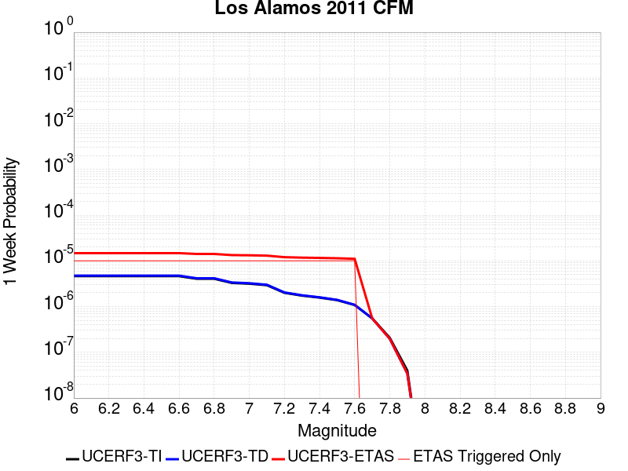 |  |  |  |

| Magnitude | 1 wk TI Prob | 1 wk TD Prob | 1 wk ETAS Prob | 1 wk ETAS/TD Gain | 1 wk ETAS Triggered Only | 1 mo TI Prob | 1 mo TD Prob | 1 mo ETAS Prob | 1 mo ETAS/TD Gain | 1 mo ETAS Triggered Only | 1 yr TI Prob | 1 yr TD Prob | 1 yr ETAS Prob | 1 yr ETAS/TD Gain | 1 yr ETAS Triggered Only | 10 yr TI Prob | 10 yr TD Prob | 10 yr ETAS Prob | 10 yr ETAS/TD Gain | 10 yr ETAS Triggered Only |
|-----|-----|-----|-----|-----|-----|-----|-----|-----|-----|-----|-----|-----|-----|-----|-----|-----|-----|-----|-----|-----|
| 6.0 | 4.6284417E-6 | 4.7517333E-6 | 1.4751686E-5 | 3.1044853 | 1.0E-5 | 1.9836029E-5 | 2.0364423E-5 | 3.036422E-5 | 1.4910425 | 1.0E-5 | 2.4147688E-4 | 2.479104E-4 | 2.6790545E-4 | 1.0806543 | 2.0E-5 | 0.0024121467 | 0.0024765125 | 0.0025164136 | 1.0161117 | 4.0E-5 |
| 6.1 | 4.6284417E-6 | 4.7517333E-6 | 1.4751686E-5 | 3.1044853 | 1.0E-5 | 1.9836029E-5 | 2.0364423E-5 | 3.036422E-5 | 1.4910425 | 1.0E-5 | 2.4147688E-4 | 2.479104E-4 | 2.6790545E-4 | 1.0806543 | 2.0E-5 | 0.0024121467 | 0.0024765125 | 0.0025164136 | 1.0161117 | 4.0E-5 |
| 6.2 | 4.6284417E-6 | 4.7517333E-6 | 1.4751686E-5 | 3.1044853 | 1.0E-5 | 1.9836029E-5 | 2.0364423E-5 | 3.036422E-5 | 1.4910425 | 1.0E-5 | 2.4147688E-4 | 2.479104E-4 | 2.6790545E-4 | 1.0806543 | 2.0E-5 | 0.0024121467 | 0.0024765125 | 0.0025164136 | 1.0161117 | 4.0E-5 |
| 6.3 | 4.6284417E-6 | 4.7517333E-6 | 1.4751686E-5 | 3.1044853 | 1.0E-5 | 1.9836029E-5 | 2.0364423E-5 | 3.036422E-5 | 1.4910425 | 1.0E-5 | 2.4147688E-4 | 2.479104E-4 | 2.6790545E-4 | 1.0806543 | 2.0E-5 | 0.0024121467 | 0.0024765125 | 0.0025164136 | 1.0161117 | 4.0E-5 |
| 6.4 | 4.6284417E-6 | 4.7517333E-6 | 1.4751686E-5 | 3.1044853 | 1.0E-5 | 1.9836029E-5 | 2.0364423E-5 | 3.036422E-5 | 1.4910425 | 1.0E-5 | 2.4147688E-4 | 2.479104E-4 | 2.6790545E-4 | 1.0806543 | 2.0E-5 | 0.0024121467 | 0.0024765125 | 0.0025164136 | 1.0161117 | 4.0E-5 |
| 6.5 | 4.6284417E-6 | 4.7517333E-6 | 1.4751686E-5 | 3.1044853 | 1.0E-5 | 1.9836029E-5 | 2.0364423E-5 | 3.036422E-5 | 1.4910425 | 1.0E-5 | 2.4147688E-4 | 2.479104E-4 | 2.6790545E-4 | 1.0806543 | 2.0E-5 | 0.0024121467 | 0.0024765125 | 0.0025164136 | 1.0161117 | 4.0E-5 |
| 6.6 | 4.6284417E-6 | 4.7517333E-6 | 1.4751686E-5 | 3.1044853 | 1.0E-5 | 1.9836029E-5 | 2.0364423E-5 | 3.036422E-5 | 1.4910425 | 1.0E-5 | 2.4147688E-4 | 2.479104E-4 | 2.6790545E-4 | 1.0806543 | 2.0E-5 | 0.0024121467 | 0.0024765125 | 0.0025164136 | 1.0161117 | 4.0E-5 |
| 6.7 | 4.062321E-6 | 4.166351E-6 | 1.41663095E-5 | 3.4001718 | 1.0E-5 | 1.7409831E-5 | 1.7855677E-5 | 2.7855498E-5 | 1.560036 | 1.0E-5 | 2.1194408E-4 | 2.1737268E-4 | 2.3736834E-4 | 1.0919878 | 2.0E-5 | 0.0021174205 | 0.0021717504 | 0.0022116634 | 1.0183784 | 4.0E-5 |
| 6.8 | 4.062321E-6 | 4.166351E-6 | 1.41663095E-5 | 3.4001718 | 1.0E-5 | 1.7409831E-5 | 1.7855677E-5 | 2.7855498E-5 | 1.560036 | 1.0E-5 | 2.1194408E-4 | 2.1737268E-4 | 2.3736834E-4 | 1.0919878 | 2.0E-5 | 0.0021174205 | 0.0021717504 | 0.0022116634 | 1.0183784 | 4.0E-5 |
| 6.9 | 3.2936077E-6 | 3.37296E-6 | 1.3372926E-5 | 3.964745 | 1.0E-5 | 1.4115385E-5 | 1.4455468E-5 | 2.4455323E-5 | 1.6917697 | 1.0E-5 | 1.7184127E-4 | 1.7598206E-4 | 1.9597853E-4 | 1.1136279 | 2.0E-5 | 0.0017170844 | 0.0017585196 | 0.0017984492 | 1.0227064 | 4.0E-5 |
| 7.0 | 3.1687898E-6 | 3.2448177E-6 | 1.3244785E-5 | 4.081827 | 1.0E-5 | 1.3580457E-5 | 1.3906293E-5 | 2.3906154E-5 | 1.7190889 | 1.0E-5 | 1.6532952E-4 | 1.692969E-4 | 1.892935E-4 | 1.1181157 | 2.0E-5 | 0.0016520657 | 0.0016917707 | 0.001731703 | 1.0236039 | 4.0E-5 |
| 7.1 | 2.9379228E-6 | 3.007328E-6 | 1.3007298E-5 | 4.325201 | 1.0E-5 | 1.25910365E-5 | 1.288849E-5 | 2.2888362E-5 | 1.775876 | 1.0E-5 | 1.5328509E-4 | 1.5690697E-4 | 1.7690384E-4 | 1.127444 | 2.0E-5 | 0.001531794 | 0.001568051 | 0.0016079883 | 1.0254694 | 4.0E-5 |
| 7.2 | 2.0020686E-6 | 2.041632E-6 | 1.2041612E-5 | 5.898032 | 1.0E-5 | 8.580266E-6 | 8.749822E-6 | 1.8749735E-5 | 2.1428704 | 1.0E-5 | 1.0445973E-4 | 1.0652392E-4 | 1.1652285E-4 | 1.0938656 | 1.0E-5 | 0.0010441064 | 0.001064733 | 0.0010947011 | 1.028146 | 3.0E-5 |
| 7.3 | 1.7364243E-6 | 1.7678824E-6 | 1.1767865E-5 | 6.6564746 | 1.0E-5 | 7.441797E-6 | 7.576617E-6 | 1.7576542E-5 | 2.3198402 | 1.0E-5 | 9.0600115E-5 | 9.224144E-5 | 1.0224052E-4 | 1.1084012 | 1.0E-5 | 9.0563187E-4 | 9.2203467E-4 | 9.52007E-4 | 1.0325067 | 3.0E-5 |
| 7.4 | 1.5718434E-6 | 1.5983198E-6 | 1.1598304E-5 | 7.25656 | 1.0E-5 | 6.7364545E-6 | 6.8499244E-6 | 1.6849855E-5 | 2.45986 | 1.0E-5 | 8.201325E-5 | 8.339467E-5 | 9.3393835E-5 | 1.1199018 | 1.0E-5 | 8.198299E-4 | 8.3363673E-4 | 8.5362006E-4 | 1.0239713 | 2.0E-5 |
| 7.5 | 1.3841119E-6 | 1.4042814E-6 | 1.1404268E-5 | 8.12107 | 1.0E-5 | 5.9318945E-6 | 6.018335E-6 | 1.6018275E-5 | 2.6615791 | 1.0E-5 | 7.221842E-5 | 7.327079E-5 | 8.327006E-5 | 1.1364701 | 1.0E-5 | 7.2194956E-4 | 7.3246926E-4 | 7.524546E-4 | 1.0272849 | 2.0E-5 |
| 7.6 | 1.0843726E-6 | 1.0934443E-6 | 1.1093433E-5 | 10.145404 | 1.0E-5 | 4.647303E-6 | 4.6861815E-6 | 1.4686135E-5 | 3.1339235 | 1.0E-5 | 5.6579443E-5 | 5.705279E-5 | 6.705222E-5 | 1.1752663 | 1.0E-5 | 5.656504E-4 | 5.70384E-4 | 5.903726E-4 | 1.0350441 | 2.0E-5 |
| 7.7 | 5.544814E-7 | 5.501884E-7 | 5.501884E-7 | 1.0 | 0.0 | 2.3763469E-6 | 2.3579482E-6 | 2.3579482E-6 | 1.0 | 0.0 | 2.8931638E-5 | 2.8707644E-5 | 2.8707644E-5 | 1.0 | 0.0 | 2.8927872E-4 | 2.870395E-4 | 2.870395E-4 | 1.0 | 0.0 |
| 7.8 | 2.0707465E-7 | 1.9778598E-7 | 1.9778598E-7 | 1.0 | 0.0 | 8.874625E-7 | 8.476539E-7 | 8.476539E-7 | 1.0 | 0.0 | 1.08048025E-5 | 1.0320137E-5 | 1.0320137E-5 | 1.0 | 0.0 | 1.0804277E-4 | 1.0319663E-4 | 1.0319663E-4 | 1.0 | 0.0 |
| 7.9 | 3.9821284E-8 | 3.4331528E-8 | 3.4331528E-8 | 1.0 | 0.0 | 1.7066264E-7 | 1.4713511E-7 | 1.4713511E-7 | 1.0 | 0.0 | 2.0778157E-6 | 1.7913685E-6 | 1.7913685E-6 | 1.0 | 0.0 | 2.0777963E-5 | 1.7913546E-5 | 1.7913546E-5 | 1.0 | 0.0 |
| 8.0 | 7.880441E-11 | 8.2353124E-11 | 8.2353124E-11 | 1.0 | 0.0 | 3.3773329E-10 | 3.52942E-10 | 3.52942E-10 | 1.0 | 0.0 | 4.1119033E-9 | 4.2970694E-9 | 4.2970694E-9 | 1.0 | 0.0 | 4.1119034E-8 | 4.2970694E-8 | 4.2970694E-8 | 1.0 | 0.0 |

## Coronado Bank alt1
*[(top)](#table-of-contents)*

| 1 Week | 1 Month | 1 Year | 10 Year |
|-----|-----|-----|-----|
|  | 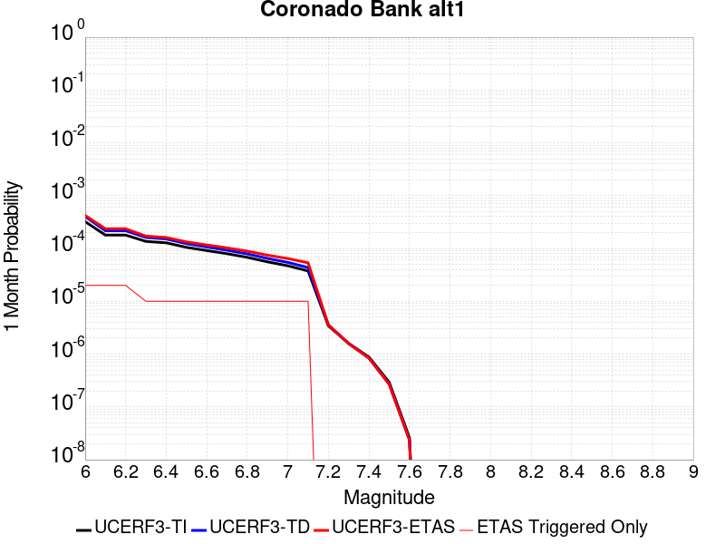 | 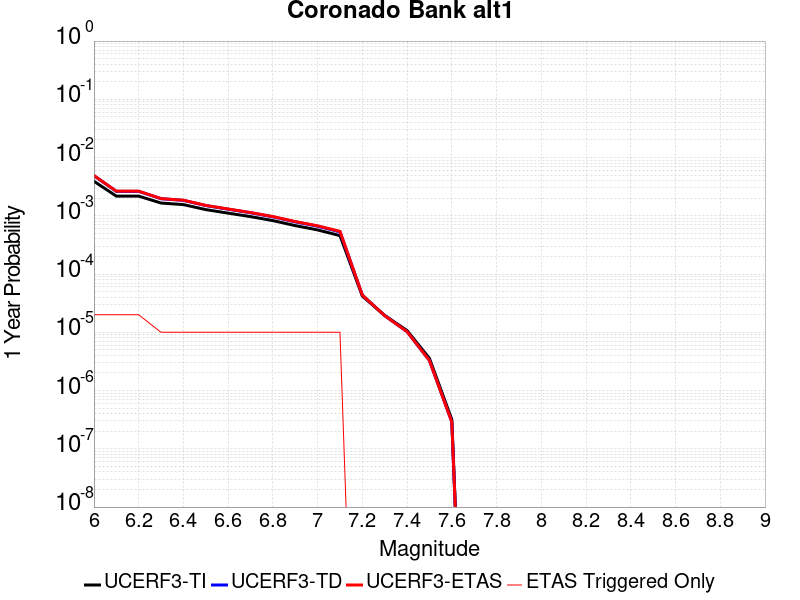 |  |

| Magnitude | 1 wk TI Prob | 1 wk TD Prob | 1 wk ETAS Prob | 1 wk ETAS/TD Gain | 1 wk ETAS Triggered Only | 1 mo TI Prob | 1 mo TD Prob | 1 mo ETAS Prob | 1 mo ETAS/TD Gain | 1 mo ETAS Triggered Only | 1 yr TI Prob | 1 yr TD Prob | 1 yr ETAS Prob | 1 yr ETAS/TD Gain | 1 yr ETAS Triggered Only | 10 yr TI Prob | 10 yr TD Prob | 10 yr ETAS Prob | 10 yr ETAS/TD Gain | 10 yr ETAS Triggered Only |
|-----|-----|-----|-----|-----|-----|-----|-----|-----|-----|-----|-----|-----|-----|-----|-----|-----|-----|-----|-----|-----|
| 6.0 | 7.533492E-5 | 9.3951705E-5 | 1.1394983E-4 | 1.2128553 | 2.0E-5 | 3.22824E-4 | 4.025903E-4 | 4.2258223E-4 | 1.0496583 | 2.0E-5 | 0.0039233007 | 0.004891121 | 0.004911023 | 1.0040691 | 2.0E-5 | 0.03854755 | 0.047904 | 0.04793256 | 1.0005963 | 3.0E-5 |
| 6.1 | 4.1807285E-5 | 5.0493105E-5 | 7.04921E-5 | 1.3960737 | 2.0E-5 | 1.7916178E-4 | 2.1638138E-4 | 2.3637705E-4 | 1.0924094 | 2.0E-5 | 0.0021791123 | 0.0026313365 | 0.002651284 | 1.0075808 | 2.0E-5 | 0.021578677 | 0.026011124 | 0.026040344 | 1.0011233 | 3.0E-5 |
| 6.2 | 4.1807285E-5 | 5.0493105E-5 | 7.04921E-5 | 1.3960737 | 2.0E-5 | 1.7916178E-4 | 2.1638138E-4 | 2.3637705E-4 | 1.0924094 | 2.0E-5 | 0.0021791123 | 0.0026313365 | 0.002651284 | 1.0075808 | 2.0E-5 | 0.021578677 | 0.026011124 | 0.026040344 | 1.0011233 | 3.0E-5 |
| 6.3 | 3.1793104E-5 | 3.7711125E-5 | 4.771075E-5 | 1.2651638 | 1.0E-5 | 1.3624904E-4 | 1.6160926E-4 | 1.7160765E-4 | 1.0618676 | 1.0E-5 | 0.0016575698 | 0.001965849 | 0.0019758292 | 1.0050769 | 1.0E-5 | 0.016452603 | 0.019488495 | 0.019508105 | 1.0010062 | 2.0E-5 |
| 6.4 | 2.9878007E-5 | 3.5335797E-5 | 4.5335444E-5 | 1.2829891 | 1.0E-5 | 1.2804232E-4 | 1.5143053E-4 | 1.6142902E-4 | 1.0660269 | 1.0E-5 | 0.0015578003 | 0.0018421395 | 0.0018521211 | 1.0054184 | 1.0E-5 | 0.015469253 | 0.018272463 | 0.0182921 | 1.0010746 | 2.0E-5 |
| 6.5 | 2.4512565E-5 | 2.8764101E-5 | 3.8763814E-5 | 1.3476455 | 1.0E-5 | 1.0504962E-4 | 1.2326906E-4 | 1.3326782E-4 | 1.0811133 | 1.0E-5 | 0.0012782287 | 0.0014997943 | 0.0015097794 | 1.0066576 | 1.0E-5 | 0.012709012 | 0.0148996925 | 0.014919395 | 1.0013223 | 2.0E-5 |
| 6.6 | 2.1317413E-5 | 2.490667E-5 | 3.490642E-5 | 1.4014889 | 1.0E-5 | 9.135714E-5 | 1.0673863E-4 | 1.1673757E-4 | 1.0936768 | 1.0E-5 | 0.0011117056 | 0.0012987903 | 0.0013087774 | 1.0076895 | 1.0E-5 | 0.011061605 | 0.012914407 | 0.012934149 | 1.0015286 | 2.0E-5 |
| 6.7 | 1.8585655E-5 | 2.1634882E-5 | 3.1634663E-5 | 1.4622066 | 1.0E-5 | 7.9650374E-5 | 9.271774E-5 | 1.0271681E-4 | 1.1078442 | 1.0E-5 | 9.6931186E-4 | 0.0011282744 | 0.001138263 | 1.0088531 | 1.0E-5 | 0.0096509475 | 0.011227623 | 0.011247398 | 1.0017613 | 2.0E-5 |
| 6.8 | 1.5862879E-5 | 1.8419476E-5 | 2.8419292E-5 | 1.5428936 | 1.0E-5 | 6.798199E-5 | 7.8938334E-5 | 8.8937544E-5 | 1.1266712 | 1.0E-5 | 8.273665E-4 | 9.606697E-4 | 9.7066007E-4 | 1.0103995 | 1.0E-5 | 0.008242928 | 0.009567151 | 0.009586959 | 1.0020705 | 2.0E-5 |
| 6.9 | 1.3021509E-5 | 1.5095266E-5 | 2.5095114E-5 | 1.6624494 | 1.0E-5 | 5.5805274E-5 | 6.46925E-5 | 7.4691845E-5 | 1.1545675 | 1.0E-5 | 6.792174E-4 | 7.873646E-4 | 7.973567E-4 | 1.0126905 | 1.0E-5 | 0.006771452 | 0.007847573 | 0.007867416 | 1.0025285 | 2.0E-5 |
| 7.0 | 1.0974371E-5 | 1.2720105E-5 | 2.2719978E-5 | 1.786147 | 1.0E-5 | 4.7032172E-5 | 5.4513697E-5 | 6.451315E-5 | 1.1834302 | 1.0E-5 | 5.7246623E-4 | 6.635197E-4 | 6.7351304E-4 | 1.0150611 | 1.0E-5 | 0.0057099373 | 0.0066171354 | 0.006637003 | 1.0030024 | 2.0E-5 |
| 7.1 | 8.766221E-6 | 1.0163833E-5 | 2.0163732E-5 | 1.9838707 | 1.0E-5 | 3.7568978E-5 | 4.3558655E-5 | 5.355822E-5 | 1.2295655 | 1.0E-5 | 4.573063E-4 | 5.302148E-4 | 5.4020947E-4 | 1.0188503 | 1.0E-5 | 0.0045636636 | 0.005291197 | 0.0053011444 | 1.0018799 | 1.0E-5 |
| 7.2 | 8.026024E-7 | 8.331776E-7 | 8.331776E-7 | 1.0 | 0.0 | 3.43972E-6 | 3.5707562E-6 | 3.5707562E-6 | 1.0 | 0.0 | 4.1877785E-5 | 4.34731E-5 | 4.34731E-5 | 1.0 | 0.0 | 4.1869894E-4 | 4.3464705E-4 | 4.3464705E-4 | 1.0 | 0.0 |
| 7.3 | 3.7293114E-7 | 3.700106E-7 | 3.700106E-7 | 1.0 | 0.0 | 1.5982754E-6 | 1.5857588E-6 | 1.5857588E-6 | 1.0 | 0.0 | 1.9458828E-5 | 1.9306442E-5 | 1.9306442E-5 | 1.0 | 0.0 | 1.9457124E-4 | 1.9304773E-4 | 1.9304773E-4 | 1.0 | 0.0 |
| 7.4 | 2.0557036E-7 | 1.9674441E-7 | 1.9674441E-7 | 1.0 | 0.0 | 8.810155E-7 | 8.4319004E-7 | 8.4319004E-7 | 1.0 | 0.0 | 1.0726311E-5 | 1.02657905E-5 | 1.02657905E-5 | 1.0 | 0.0 | 1.0725793E-4 | 1.026532E-4 | 1.026532E-4 | 1.0 | 0.0 |
| 7.5 | 6.845446E-8 | 6.2794086E-8 | 6.2794086E-8 | 1.0 | 0.0 | 2.9337625E-7 | 2.6911746E-7 | 2.6911746E-7 | 1.0 | 0.0 | 3.5718497E-6 | 3.2765004E-6 | 3.2765004E-6 | 1.0 | 0.0 | 3.5717923E-5 | 3.276453E-5 | 3.276453E-5 | 1.0 | 0.0 |
| 7.6 | 6.0975145E-9 | 5.531901E-9 | 5.531901E-9 | 1.0 | 0.0 | 2.6132206E-8 | 2.3708148E-8 | 2.3708148E-8 | 1.0 | 0.0 | 3.1815955E-7 | 2.8864667E-7 | 2.8864667E-7 | 1.0 | 0.0 | 3.181591E-6 | 2.886464E-6 | 2.886464E-6 | 1.0 | 0.0 |

## North Frontal  (East)
*[(top)](#table-of-contents)*

| 1 Week | 1 Month | 1 Year | 10 Year |
|-----|-----|-----|-----|
|  |  | 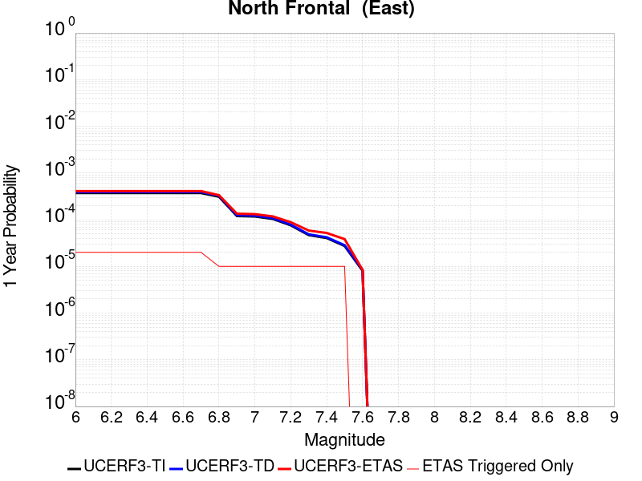 |  |

| Magnitude | 1 wk TI Prob | 1 wk TD Prob | 1 wk ETAS Prob | 1 wk ETAS/TD Gain | 1 wk ETAS Triggered Only | 1 mo TI Prob | 1 mo TD Prob | 1 mo ETAS Prob | 1 mo ETAS/TD Gain | 1 mo ETAS Triggered Only | 1 yr TI Prob | 1 yr TD Prob | 1 yr ETAS Prob | 1 yr ETAS/TD Gain | 1 yr ETAS Triggered Only | 10 yr TI Prob | 10 yr TD Prob | 10 yr ETAS Prob | 10 yr ETAS/TD Gain | 10 yr ETAS Triggered Only |
|-----|-----|-----|-----|-----|-----|-----|-----|-----|-----|-----|-----|-----|-----|-----|-----|-----|-----|-----|-----|-----|
| 6.0 | 7.135738E-6 | 7.4771765E-6 | 7.4771765E-6 | 1.0 | 0.0 | 3.0581377E-5 | 3.204476E-5 | 3.204476E-5 | 1.0 | 0.0 | 3.7226462E-4 | 3.9009505E-4 | 4.1008726E-4 | 1.0512495 | 2.0E-5 | 0.0037164164 | 0.0038960609 | 0.0039359047 | 1.0102267 | 4.0E-5 |
| 6.1 | 7.135738E-6 | 7.4771765E-6 | 7.4771765E-6 | 1.0 | 0.0 | 3.0581377E-5 | 3.204476E-5 | 3.204476E-5 | 1.0 | 0.0 | 3.7226462E-4 | 3.9009505E-4 | 4.1008726E-4 | 1.0512495 | 2.0E-5 | 0.0037164164 | 0.0038960609 | 0.0039359047 | 1.0102267 | 4.0E-5 |
| 6.2 | 7.135738E-6 | 7.4771765E-6 | 7.4771765E-6 | 1.0 | 0.0 | 3.0581377E-5 | 3.204476E-5 | 3.204476E-5 | 1.0 | 0.0 | 3.7226462E-4 | 3.9009505E-4 | 4.1008726E-4 | 1.0512495 | 2.0E-5 | 0.0037164164 | 0.0038960609 | 0.0039359047 | 1.0102267 | 4.0E-5 |
| 6.3 | 7.135738E-6 | 7.4771765E-6 | 7.4771765E-6 | 1.0 | 0.0 | 3.0581377E-5 | 3.204476E-5 | 3.204476E-5 | 1.0 | 0.0 | 3.7226462E-4 | 3.9009505E-4 | 4.1008726E-4 | 1.0512495 | 2.0E-5 | 0.0037164164 | 0.0038960609 | 0.0039359047 | 1.0102267 | 4.0E-5 |
| 6.4 | 7.135738E-6 | 7.4771765E-6 | 7.4771765E-6 | 1.0 | 0.0 | 3.0581377E-5 | 3.204476E-5 | 3.204476E-5 | 1.0 | 0.0 | 3.7226462E-4 | 3.9009505E-4 | 4.1008726E-4 | 1.0512495 | 2.0E-5 | 0.0037164164 | 0.0038960609 | 0.0039359047 | 1.0102267 | 4.0E-5 |
| 6.5 | 7.135738E-6 | 7.4771765E-6 | 7.4771765E-6 | 1.0 | 0.0 | 3.0581377E-5 | 3.204476E-5 | 3.204476E-5 | 1.0 | 0.0 | 3.7226462E-4 | 3.9009505E-4 | 4.1008726E-4 | 1.0512495 | 2.0E-5 | 0.0037164164 | 0.0038960609 | 0.0039359047 | 1.0102267 | 4.0E-5 |
| 6.6 | 7.135738E-6 | 7.4771765E-6 | 7.4771765E-6 | 1.0 | 0.0 | 3.0581377E-5 | 3.204476E-5 | 3.204476E-5 | 1.0 | 0.0 | 3.7226462E-4 | 3.9009505E-4 | 4.1008726E-4 | 1.0512495 | 2.0E-5 | 0.0037164164 | 0.0038960609 | 0.0039359047 | 1.0102267 | 4.0E-5 |
| 6.7 | 7.135738E-6 | 7.4771765E-6 | 7.4771765E-6 | 1.0 | 0.0 | 3.0581377E-5 | 3.204476E-5 | 3.204476E-5 | 1.0 | 0.0 | 3.7226462E-4 | 3.9009505E-4 | 4.1008726E-4 | 1.0512495 | 2.0E-5 | 0.0037164164 | 0.0038960609 | 0.0039359047 | 1.0102267 | 4.0E-5 |
| 6.8 | 5.959142E-6 | 6.236683E-6 | 6.236683E-6 | 1.0 | 0.0 | 2.553893E-5 | 2.6728469E-5 | 2.6728469E-5 | 1.0 | 0.0 | 3.108921E-4 | 3.253886E-4 | 3.3538532E-4 | 1.0307225 | 1.0E-5 | 0.0031045752 | 0.0032508948 | 0.0032807973 | 1.0091982 | 3.0E-5 |
| 6.9 | 2.2946929E-6 | 2.3824605E-6 | 2.3824605E-6 | 1.0 | 0.0 | 9.834361E-6 | 1.0210508E-5 | 1.0210508E-5 | 1.0 | 0.0 | 1.1972676E-4 | 1.2430632E-4 | 1.3430507E-4 | 1.0804365 | 1.0E-5 | 0.0011966228 | 0.0012424142 | 0.001272377 | 1.0241165 | 3.0E-5 |
| 7.0 | 2.2468673E-6 | 2.3321538E-6 | 2.3321538E-6 | 1.0 | 0.0 | 9.629396E-6 | 9.994909E-6 | 9.994909E-6 | 1.0 | 0.0 | 1.1723159E-4 | 1.21681696E-4 | 1.3168047E-4 | 1.0821717 | 1.0E-5 | 0.0011716976 | 0.0012161969 | 0.0012461605 | 1.0246371 | 3.0E-5 |
| 7.1 | 1.9921076E-6 | 2.0646032E-6 | 2.0646032E-6 | 1.0 | 0.0 | 8.537577E-6 | 8.848272E-6 | 8.848272E-6 | 1.0 | 0.0 | 1.0394004E-4 | 1.0772282E-4 | 1.1772174E-4 | 1.0928209 | 1.0E-5 | 0.0010389143 | 0.0010767487 | 0.0010967272 | 1.0185544 | 2.0E-5 |
| 7.2 | 1.4524545E-6 | 1.5045148E-6 | 1.5045148E-6 | 1.0 | 0.0 | 6.2247905E-6 | 6.447906E-6 | 6.447906E-6 | 1.0 | 0.0 | 7.5784184E-5 | 7.850068E-5 | 8.849989E-5 | 1.1273774 | 1.0E-5 | 7.575835E-4 | 7.8475394E-4 | 8.047382E-4 | 1.0254657 | 2.0E-5 |
| 7.3 | 8.9802575E-7 | 9.3087283E-7 | 9.3087283E-7 | 1.0 | 0.0 | 3.848676E-6 | 3.9894494E-6 | 3.9894494E-6 | 1.0 | 0.0 | 4.685662E-5 | 4.857058E-5 | 5.8570095E-5 | 1.205876 | 1.0E-5 | 4.6846745E-4 | 4.8561094E-4 | 5.0560123E-4 | 1.0411652 | 2.0E-5 |
| 7.4 | 7.776139E-7 | 8.0604747E-7 | 8.0604747E-7 | 1.0 | 0.0 | 3.3326266E-6 | 3.4544853E-6 | 3.4544853E-6 | 1.0 | 0.0 | 4.0573974E-5 | 4.2057654E-5 | 5.2057236E-5 | 1.2377589 | 1.0E-5 | 4.0566566E-4 | 4.205077E-4 | 4.305035E-4 | 1.0237708 | 1.0E-5 |
| 7.5 | 5.244417E-7 | 5.441219E-7 | 5.441219E-7 | 1.0 | 0.0 | 2.2476054E-6 | 2.3319494E-6 | 2.3319494E-6 | 1.0 | 0.0 | 2.7364253E-5 | 2.839118E-5 | 3.8390895E-5 | 1.3522121 | 1.0E-5 | 2.7360884E-4 | 2.8388205E-4 | 2.9387922E-4 | 1.0352159 | 1.0E-5 |
| 7.6 | 1.5489647E-7 | 1.6089504E-7 | 1.6089504E-7 | 1.0 | 0.0 | 6.6384183E-7 | 6.895501E-7 | 6.895501E-7 | 1.0 | 0.0 | 8.082245E-6 | 8.395261E-6 | 8.395261E-6 | 1.0 | 0.0 | 8.08195E-5 | 8.395143E-5 | 8.395143E-5 | 1.0 | 0.0 |

## Bennett Valley 2011 CFM
*[(top)](#table-of-contents)*

| 1 Week | 1 Month | 1 Year | 10 Year |
|-----|-----|-----|-----|
|  |  |  |  |

| Magnitude | 1 wk TI Prob | 1 wk TD Prob | 1 wk ETAS Prob | 1 wk ETAS/TD Gain | 1 wk ETAS Triggered Only | 1 mo TI Prob | 1 mo TD Prob | 1 mo ETAS Prob | 1 mo ETAS/TD Gain | 1 mo ETAS Triggered Only | 1 yr TI Prob | 1 yr TD Prob | 1 yr ETAS Prob | 1 yr ETAS/TD Gain | 1 yr ETAS Triggered Only | 10 yr TI Prob | 10 yr TD Prob | 10 yr ETAS Prob | 10 yr ETAS/TD Gain | 10 yr ETAS Triggered Only |
|-----|-----|-----|-----|-----|-----|-----|-----|-----|-----|-----|-----|-----|-----|-----|-----|-----|-----|-----|-----|-----|
| 6.0 | 2.3893934E-5 | 2.823899E-5 | 4.8238424E-5 | 1.7082206 | 2.0E-5 | 1.0239855E-4 | 1.2101967E-4 | 1.5101604E-4 | 1.2478635 | 3.0E-5 | 0.0012459893 | 0.0014726035 | 0.0015025594 | 1.0203421 | 3.0E-5 | 0.012390262 | 0.01465108 | 0.014690494 | 1.0026902 | 4.0E-5 |
| 6.1 | 2.3893934E-5 | 2.823899E-5 | 4.8238424E-5 | 1.7082206 | 2.0E-5 | 1.0239855E-4 | 1.2101967E-4 | 1.5101604E-4 | 1.2478635 | 3.0E-5 | 0.0012459893 | 0.0014726035 | 0.0015025594 | 1.0203421 | 3.0E-5 | 0.012390262 | 0.01465108 | 0.014690494 | 1.0026902 | 4.0E-5 |
| 6.2 | 1.6657146E-5 | 1.9853873E-5 | 2.9853674E-5 | 1.5036701 | 1.0E-5 | 7.138582E-5 | 8.508605E-5 | 9.50852E-5 | 1.1175181 | 1.0E-5 | 8.6877577E-4 | 0.0010355718 | 0.0010455615 | 1.0096465 | 1.0E-5 | 0.008653872 | 0.010325706 | 0.010345499 | 1.0019169 | 2.0E-5 |
| 6.3 | 1.6657146E-5 | 1.9853873E-5 | 2.9853674E-5 | 1.5036701 | 1.0E-5 | 7.138582E-5 | 8.508605E-5 | 9.50852E-5 | 1.1175181 | 1.0E-5 | 8.6877577E-4 | 0.0010355718 | 0.0010455615 | 1.0096465 | 1.0E-5 | 0.008653872 | 0.010325706 | 0.010345499 | 1.0019169 | 2.0E-5 |
| 6.4 | 1.29418495E-5 | 1.5567592E-5 | 2.5567437E-5 | 1.6423501 | 1.0E-5 | 5.546389E-5 | 6.671728E-5 | 7.671661E-5 | 1.1498762 | 1.0E-5 | 6.7506364E-4 | 8.1211043E-4 | 8.221023E-4 | 1.0123036 | 1.0E-5 | 0.0067301663 | 0.008108544 | 0.008128382 | 1.0024465 | 2.0E-5 |
| 6.5 | 1.2582504E-5 | 1.5134623E-5 | 2.5134472E-5 | 1.6607267 | 1.0E-5 | 5.39239E-5 | 6.486179E-5 | 7.486114E-5 | 1.154164 | 1.0E-5 | 6.563257E-4 | 7.8953634E-4 | 7.9952844E-4 | 1.0126556 | 1.0E-5 | 0.006543907 | 0.007884451 | 0.007904294 | 1.0025166 | 2.0E-5 |
| 6.6 | 1.0846706E-5 | 1.3036858E-5 | 2.3036728E-5 | 1.767046 | 1.0E-5 | 4.6485053E-5 | 5.5871777E-5 | 6.5871216E-5 | 1.1789713 | 1.0E-5 | 5.6580856E-4 | 6.801549E-4 | 6.901481E-4 | 1.0146925 | 1.0E-5 | 0.005643701 | 0.0067976816 | 0.0068175457 | 1.0029222 | 2.0E-5 |
| 6.7 | 1.6803231E-6 | 2.377902E-6 | 2.377902E-6 | 1.0 | 0.0 | 7.2013645E-6 | 1.019097E-5 | 1.019097E-5 | 1.0 | 0.0 | 8.7673085E-5 | 1.2406812E-4 | 1.2406812E-4 | 1.0 | 0.0 | 8.76385E-4 | 0.0012444188 | 0.0012444188 | 1.0 | 0.0 |
| 6.8 | 1.4609833E-6 | 2.0939708E-6 | 2.0939708E-6 | 1.0 | 0.0 | 6.261342E-6 | 8.974131E-6 | 8.974131E-6 | 1.0 | 0.0 | 7.6229175E-5 | 1.0925463E-4 | 1.0925463E-4 | 1.0 | 0.0 | 7.620303E-4 | 0.0010963798 | 0.0010963798 | 1.0 | 0.0 |
| 6.9 | 1.3492396E-6 | 1.9459103E-6 | 1.9459103E-6 | 1.0 | 0.0 | 5.7824427E-6 | 8.339589E-6 | 8.339589E-6 | 1.0 | 0.0 | 7.0398964E-5 | 1.01529826E-4 | 1.01529826E-4 | 1.0 | 0.0 | 7.037667E-4 | 0.001019178 | 0.001019178 | 1.0 | 0.0 |
| 7.0 | 1.2347921E-6 | 1.7888974E-6 | 1.7888974E-6 | 1.0 | 0.0 | 5.291955E-6 | 7.666681E-6 | 7.666681E-6 | 1.0 | 0.0 | 6.442765E-5 | 9.33379E-5 | 9.33379E-5 | 1.0 | 0.0 | 6.440897E-4 | 9.373068E-4 | 9.373068E-4 | 1.0 | 0.0 |
| 7.1 | 1.1262973E-6 | 1.6359154E-6 | 1.6359154E-6 | 1.0 | 0.0 | 4.8269794E-6 | 7.0110473E-6 | 7.0110473E-6 | 1.0 | 0.0 | 5.876689E-5 | 8.535621E-5 | 8.535621E-5 | 1.0 | 0.0 | 5.875135E-4 | 8.5754244E-4 | 8.5754244E-4 | 1.0 | 0.0 |
| 7.2 | 9.351744E-7 | 1.3611758E-6 | 1.3611758E-6 | 1.0 | 0.0 | 4.007884E-6 | 5.8335977E-6 | 5.8335977E-6 | 1.0 | 0.0 | 4.8794896E-5 | 7.1021765E-5 | 7.1021765E-5 | 1.0 | 0.0 | 4.878418E-4 | 7.142461E-4 | 7.142461E-4 | 1.0 | 0.0 |
| 7.3 | 8.5039534E-7 | 1.2386733E-6 | 1.2386733E-6 | 1.0 | 0.0 | 3.6445463E-6 | 5.308589E-6 | 5.308589E-6 | 1.0 | 0.0 | 4.437145E-5 | 6.463018E-5 | 6.463018E-5 | 1.0 | 0.0 | 4.436259E-4 | 6.50103E-4 | 6.50103E-4 | 1.0 | 0.0 |
| 7.4 | 6.7875015E-7 | 9.600642E-7 | 9.600642E-7 | 1.0 | 0.0 | 2.908926E-6 | 4.1145545E-6 | 4.1145545E-6 | 1.0 | 0.0 | 3.54156E-5 | 5.009356E-5 | 5.009356E-5 | 1.0 | 0.0 | 3.5409955E-4 | 5.0413073E-4 | 5.0413073E-4 | 1.0 | 0.0 |
| 7.5 | 5.826867E-7 | 8.1883735E-7 | 8.1883735E-7 | 1.0 | 0.0 | 2.4972264E-6 | 3.5092983E-6 | 3.5092983E-6 | 1.0 | 0.0 | 3.0403306E-5 | 4.2724878E-5 | 4.2724878E-5 | 1.0 | 0.0 | 3.0399146E-4 | 4.300558E-4 | 4.300558E-4 | 1.0 | 0.0 |
| 7.6 | 2.7734902E-7 | 3.6822587E-7 | 3.6822587E-7 | 1.0 | 0.0 | 1.1886381E-6 | 1.57811E-6 | 1.57811E-6 | 1.0 | 0.0 | 1.4471572E-5 | 1.9213321E-5 | 1.9213321E-5 | 1.0 | 0.0 | 1.447063E-4 | 1.9315645E-4 | 1.9315645E-4 | 1.0 | 0.0 |
| 7.7 | 1.0530888E-7 | 1.3749101E-7 | 1.3749101E-7 | 1.0 | 0.0 | 4.513237E-7 | 5.8924707E-7 | 5.8924707E-7 | 1.0 | 0.0 | 5.4948523E-6 | 7.174059E-6 | 7.174059E-6 | 1.0 | 0.0 | 5.4947162E-5 | 7.255585E-5 | 7.255585E-5 | 1.0 | 0.0 |
| 7.8 | 1.2714258E-8 | 1.9633259E-8 | 1.9633259E-8 | 1.0 | 0.0 | 5.448968E-8 | 8.4142535E-8 | 8.4142535E-8 | 1.0 | 0.0 | 6.6341164E-7 | 1.0244348E-6 | 1.0244348E-6 | 1.0 | 0.0 | 6.6340967E-6 | 1.0658595E-5 | 1.0658595E-5 | 1.0 | 0.0 |
| 7.9 | 4.075888E-9 | 7.559928E-9 | 7.559928E-9 | 1.0 | 0.0 | 1.7468091E-8 | 3.239969E-8 | 3.239969E-8 | 1.0 | 0.0 | 2.12674E-7 | 3.9446616E-7 | 3.9446616E-7 | 1.0 | 0.0 | 2.1267379E-6 | 4.1952467E-6 | 4.1952467E-6 | 1.0 | 0.0 |
| 8.0 | 1.9126138E-9 | 3.9956882E-9 | 3.9956882E-9 | 1.0 | 0.0 | 8.196917E-9 | 1.7124377E-8 | 1.7124377E-8 | 1.0 | 0.0 | 9.9797454E-8 | 2.0848927E-7 | 2.0848927E-7 | 1.0 | 0.0 | 9.979741E-7 | 2.1982228E-6 | 2.1982228E-6 | 1.0 | 0.0 |

## Hosgri
*[(top)](#table-of-contents)*

| 1 Week | 1 Month | 1 Year | 10 Year |
|-----|-----|-----|-----|
|  |  | 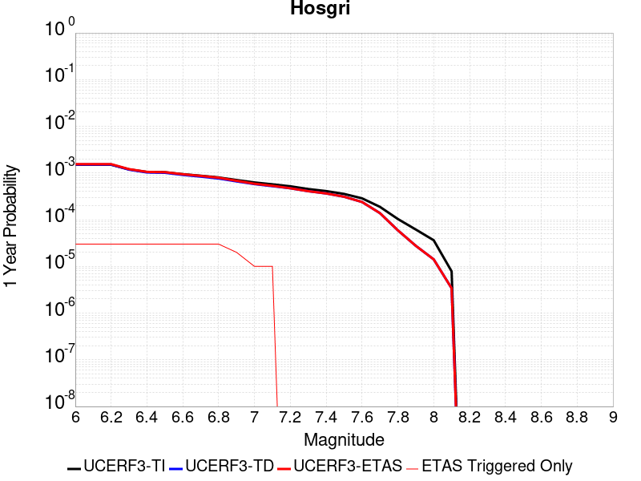 | 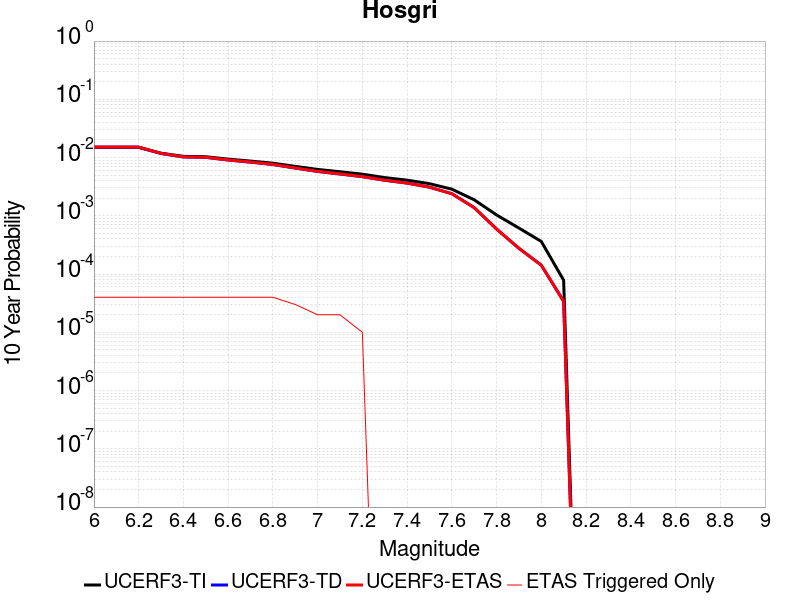 |

| Magnitude | 1 wk TI Prob | 1 wk TD Prob | 1 wk ETAS Prob | 1 wk ETAS/TD Gain | 1 wk ETAS Triggered Only | 1 mo TI Prob | 1 mo TD Prob | 1 mo ETAS Prob | 1 mo ETAS/TD Gain | 1 mo ETAS Triggered Only | 1 yr TI Prob | 1 yr TD Prob | 1 yr ETAS Prob | 1 yr ETAS/TD Gain | 1 yr ETAS Triggered Only | 10 yr TI Prob | 10 yr TD Prob | 10 yr ETAS Prob | 10 yr ETAS/TD Gain | 10 yr ETAS Triggered Only |
|-----|-----|-----|-----|-----|-----|-----|-----|-----|-----|-----|-----|-----|-----|-----|-----|-----|-----|-----|-----|-----|
| 6.0 | 2.883978E-5 | 2.9128403E-5 | 3.912811E-5 | 1.3432975 | 1.0E-5 | 1.235932E-4 | 1.248302E-4 | 1.448277E-4 | 1.1601976 | 2.0E-5 | 0.0015037085 | 0.0015187752 | 0.0015487297 | 1.0197227 | 3.0E-5 | 0.01493574 | 0.01508773 | 0.015127126 | 1.0026112 | 4.0E-5 |
| 6.1 | 2.883978E-5 | 2.9128403E-5 | 3.912811E-5 | 1.3432975 | 1.0E-5 | 1.235932E-4 | 1.248302E-4 | 1.448277E-4 | 1.1601976 | 2.0E-5 | 0.0015037085 | 0.0015187752 | 0.0015487297 | 1.0197227 | 3.0E-5 | 0.01493574 | 0.01508773 | 0.015127126 | 1.0026112 | 4.0E-5 |
| 6.2 | 2.883978E-5 | 2.9128403E-5 | 3.912811E-5 | 1.3432975 | 1.0E-5 | 1.235932E-4 | 1.248302E-4 | 1.448277E-4 | 1.1601976 | 2.0E-5 | 0.0015037085 | 0.0015187752 | 0.0015487297 | 1.0197227 | 3.0E-5 | 0.01493574 | 0.01508773 | 0.015127126 | 1.0026112 | 4.0E-5 |
| 6.3 | 2.2914428E-5 | 2.2641956E-5 | 3.264173E-5 | 1.441648 | 1.0E-5 | 9.8200995E-5 | 9.703337E-5 | 1.17031435E-4 | 1.2060946 | 2.0E-5 | 0.0011949413 | 0.001180746 | 0.0012107106 | 1.0253776 | 3.0E-5 | 0.011885363 | 0.011746123 | 0.011785653 | 1.0033654 | 4.0E-5 |
| 6.4 | 2.0195741E-5 | 1.9696547E-5 | 2.969635E-5 | 1.5076932 | 1.0E-5 | 8.65503E-5 | 8.4411055E-5 | 1.04409366E-4 | 1.2369158 | 2.0E-5 | 0.0010532405 | 0.001027222 | 0.0010571912 | 1.0291749 | 3.0E-5 | 0.010482626 | 0.010225783 | 0.010265374 | 1.0038717 | 4.0E-5 |
| 6.5 | 1.9924333E-5 | 1.9408968E-5 | 2.9408775E-5 | 1.5152158 | 1.0E-5 | 8.53872E-5 | 8.317865E-5 | 1.03176986E-4 | 1.2404263 | 2.0E-5 | 0.0010390934 | 0.0010122315 | 0.0010422012 | 1.0296075 | 3.0E-5 | 0.010342481 | 0.010077244 | 0.01011684 | 1.0039294 | 4.0E-5 |
| 6.6 | 1.809694E-5 | 1.7458287E-5 | 2.7458113E-5 | 1.5727838 | 1.0E-5 | 7.7556004E-5 | 7.4819094E-5 | 9.4817595E-5 | 1.2672914 | 2.0E-5 | 9.438353E-4 | 9.105431E-4 | 9.405157E-4 | 1.0329174 | 3.0E-5 | 0.009398366 | 0.009069063 | 0.0091087 | 1.0043706 | 4.0E-5 |
| 6.7 | 1.675989E-5 | 1.6042752E-5 | 2.6042591E-5 | 1.6233245 | 1.0E-5 | 7.182612E-5 | 6.8752845E-5 | 8.875147E-5 | 1.2908771 | 2.0E-5 | 8.7413215E-4 | 8.3674554E-4 | 8.6672045E-4 | 1.0358232 | 3.0E-5 | 0.008707017 | 0.008336853 | 0.00837652 | 1.004758 | 4.0E-5 |
| 6.8 | 1.5401129E-5 | 1.4614069E-5 | 2.4613923E-5 | 1.6842622 | 1.0E-5 | 6.6003166E-5 | 6.263023E-5 | 8.2628976E-5 | 1.3193146 | 2.0E-5 | 8.032922E-4 | 7.6225714E-4 | 7.9223426E-4 | 1.0393268 | 3.0E-5 | 0.008003947 | 0.0075972863 | 0.0076369825 | 1.0052251 | 4.0E-5 |
| 6.9 | 1.356559E-5 | 1.2689955E-5 | 2.2689828E-5 | 1.7880149 | 1.0E-5 | 5.8136946E-5 | 5.438439E-5 | 7.43833E-5 | 1.3677326 | 2.0E-5 | 7.0758746E-4 | 6.6192925E-4 | 6.8191596E-4 | 1.0301948 | 2.0E-5 | 0.007053386 | 0.006600378 | 0.00663018 | 1.0045152 | 3.0E-5 |
| 7.0 | 1.2030819E-5 | 1.1095949E-5 | 1.1095949E-5 | 1.0 | 0.0 | 5.155963E-5 | 4.75532E-5 | 5.7552727E-5 | 1.2102808 | 1.0E-5 | 6.275577E-4 | 5.788065E-4 | 5.8880076E-4 | 1.017267 | 1.0E-5 | 0.006257884 | 0.0057737473 | 0.005793632 | 1.003444 | 2.0E-5 |
| 7.1 | 1.0972698E-5 | 1.0022167E-5 | 1.0022167E-5 | 1.0 | 0.0 | 4.7025E-5 | 4.2951437E-5 | 5.2951007E-5 | 1.2328111 | 1.0E-5 | 5.72379E-4 | 5.2280835E-4 | 5.328031E-4 | 1.0191175 | 1.0E-5 | 0.0057090693 | 0.005216533 | 0.0052364287 | 1.003814 | 2.0E-5 |
| 7.2 | 9.961926E-6 | 9.034732E-6 | 9.034732E-6 | 1.0 | 0.0 | 4.2693267E-5 | 3.8719707E-5 | 3.8719707E-5 | 1.0 | 0.0 | 5.1966653E-4 | 4.7131052E-4 | 4.7131052E-4 | 1.0 | 0.0 | 0.00518453 | 0.0047038523 | 0.0047138054 | 1.002116 | 1.0E-5 |
| 7.3 | 8.700929E-6 | 7.828089E-6 | 7.828089E-6 | 1.0 | 0.0 | 3.7289166E-5 | 3.354852E-5 | 3.354852E-5 | 1.0 | 0.0 | 4.53901E-4 | 4.083767E-4 | 4.083767E-4 | 1.0 | 0.0 | 0.00452975 | 0.004076999 | 0.004076999 | 1.0 | 0.0 |
| 7.4 | 7.866285E-6 | 6.9987263E-6 | 6.9987263E-6 | 1.0 | 0.0 | 3.3712215E-5 | 2.9994197E-5 | 2.9994197E-5 | 1.0 | 0.0 | 4.103689E-4 | 3.6511818E-4 | 3.6511818E-4 | 1.0 | 0.0 | 0.004096119 | 0.0036459167 | 0.0036459167 | 1.0 | 0.0 |
| 7.5 | 6.8381305E-6 | 5.9596814E-6 | 5.9596814E-6 | 1.0 | 0.0 | 2.9305946E-5 | 2.5541241E-5 | 2.5541241E-5 | 1.0 | 0.0 | 3.5674145E-4 | 3.1092027E-4 | 3.1092027E-4 | 1.0 | 0.0 | 0.0035616932 | 0.003105584 | 0.003105584 | 1.0 | 0.0 |
| 7.6 | 5.503376E-6 | 4.595227E-6 | 4.595227E-6 | 1.0 | 0.0 | 2.3585684E-5 | 1.9693682E-5 | 1.9693682E-5 | 1.0 | 0.0 | 2.8711787E-4 | 2.397442E-4 | 2.397442E-4 | 1.0 | 0.0 | 0.002867472 | 0.0023955852 | 0.0023955852 | 1.0 | 0.0 |
| 7.7 | 3.6144982E-6 | 2.6521896E-6 | 2.6521896E-6 | 1.0 | 0.0 | 1.5490614E-5 | 1.1366477E-5 | 1.1366477E-5 | 1.0 | 0.0 | 1.8858191E-4 | 1.3837808E-4 | 1.3837808E-4 | 1.0 | 0.0 | 0.0018842196 | 0.001383647 | 0.001383647 | 1.0 | 0.0 |
| 7.8 | 1.9853494E-6 | 1.1360784E-6 | 1.1360784E-6 | 1.0 | 0.0 | 8.508612E-6 | 4.8688985E-6 | 4.8688985E-6 | 1.0 | 0.0 | 1.0358743E-4 | 5.9277223E-5 | 5.9277223E-5 | 1.0 | 0.0 | 0.0010353916 | 5.933389E-4 | 5.933389E-4 | 1.0 | 0.0 |
| 7.9 | 1.1818757E-6 | 5.29477E-7 | 5.29477E-7 | 1.0 | 0.0 | 5.0651715E-6 | 2.269185E-6 | 2.269185E-6 | 1.0 | 0.0 | 6.1666724E-5 | 2.7626977E-5 | 2.7626977E-5 | 1.0 | 0.0 | 6.1649614E-4 | 2.7691363E-4 | 2.7691363E-4 | 1.0 | 0.0 |
| 8.0 | 6.962958E-7 | 2.71365E-7 | 2.71365E-7 | 1.0 | 0.0 | 2.9841215E-6 | 1.1629924E-6 | 1.1629924E-6 | 1.0 | 0.0 | 3.6331072E-5 | 1.415934E-5 | 1.415934E-5 | 1.0 | 0.0 | 3.6325134E-4 | 1.4215276E-4 | 1.4215276E-4 | 1.0 | 0.0 |
| 8.1 | 1.5033264E-7 | 6.52693E-8 | 6.52693E-8 | 1.0 | 0.0 | 6.442826E-7 | 2.7972553E-7 | 2.7972553E-7 | 1.0 | 0.0 | 7.844113E-6 | 3.4056532E-6 | 3.4056532E-6 | 1.0 | 0.0 | 7.843835E-5 | 3.4072833E-5 | 3.4072833E-5 | 1.0 | 0.0 |

## White Wolf
*[(top)](#table-of-contents)*

| 1 Week | 1 Month | 1 Year | 10 Year |
|-----|-----|-----|-----|
|  |  |  |  |

| Magnitude | 1 wk TI Prob | 1 wk TD Prob | 1 wk ETAS Prob | 1 wk ETAS/TD Gain | 1 wk ETAS Triggered Only | 1 mo TI Prob | 1 mo TD Prob | 1 mo ETAS Prob | 1 mo ETAS/TD Gain | 1 mo ETAS Triggered Only | 1 yr TI Prob | 1 yr TD Prob | 1 yr ETAS Prob | 1 yr ETAS/TD Gain | 1 yr ETAS Triggered Only | 10 yr TI Prob | 10 yr TD Prob | 10 yr ETAS Prob | 10 yr ETAS/TD Gain | 10 yr ETAS Triggered Only |
|-----|-----|-----|-----|-----|-----|-----|-----|-----|-----|-----|-----|-----|-----|-----|-----|-----|-----|-----|-----|-----|
| 6.0 | 2.0037822E-5 | 1.0468583E-6 | 1.1046848E-5 | 10.5523815 | 1.0E-5 | 8.587355E-5 | 4.4865283E-6 | 1.4486483E-5 | 3.228885 | 1.0E-5 | 0.001045009 | 5.4622164E-5 | 8.462052E-5 | 1.5491976 | 3.0E-5 | 0.010401085 | 5.4609246E-4 | 5.860706E-4 | 1.0732076 | 4.0E-5 |
| 6.1 | 2.0037822E-5 | 1.0468583E-6 | 1.1046848E-5 | 10.5523815 | 1.0E-5 | 8.587355E-5 | 4.4865283E-6 | 1.4486483E-5 | 3.228885 | 1.0E-5 | 0.001045009 | 5.4622164E-5 | 8.462052E-5 | 1.5491976 | 3.0E-5 | 0.010401085 | 5.4609246E-4 | 5.860706E-4 | 1.0732076 | 4.0E-5 |
| 6.2 | 2.0037822E-5 | 1.0468583E-6 | 1.1046848E-5 | 10.5523815 | 1.0E-5 | 8.587355E-5 | 4.4865283E-6 | 1.4486483E-5 | 3.228885 | 1.0E-5 | 0.001045009 | 5.4622164E-5 | 8.462052E-5 | 1.5491976 | 3.0E-5 | 0.010401085 | 5.4609246E-4 | 5.860706E-4 | 1.0732076 | 4.0E-5 |
| 6.3 | 2.0037822E-5 | 1.0468583E-6 | 1.1046848E-5 | 10.5523815 | 1.0E-5 | 8.587355E-5 | 4.4865283E-6 | 1.4486483E-5 | 3.228885 | 1.0E-5 | 0.001045009 | 5.4622164E-5 | 8.462052E-5 | 1.5491976 | 3.0E-5 | 0.010401085 | 5.4609246E-4 | 5.860706E-4 | 1.0732076 | 4.0E-5 |
| 6.4 | 1.132487E-5 | 1.0468583E-6 | 1.1046848E-5 | 10.5523815 | 1.0E-5 | 4.8534253E-5 | 4.4865283E-6 | 1.4486483E-5 | 3.228885 | 1.0E-5 | 5.907443E-4 | 5.4622164E-5 | 8.462052E-5 | 1.5491976 | 3.0E-5 | 0.005891764 | 5.4609246E-4 | 5.860706E-4 | 1.0732076 | 4.0E-5 |
| 6.5 | 1.132487E-5 | 1.0468583E-6 | 1.1046848E-5 | 10.5523815 | 1.0E-5 | 4.8534253E-5 | 4.4865283E-6 | 1.4486483E-5 | 3.228885 | 1.0E-5 | 5.907443E-4 | 5.4622164E-5 | 8.462052E-5 | 1.5491976 | 3.0E-5 | 0.005891764 | 5.4609246E-4 | 5.860706E-4 | 1.0732076 | 4.0E-5 |
| 6.6 | 9.347473E-6 | 1.0468583E-6 | 1.1046848E-5 | 10.5523815 | 1.0E-5 | 4.0059982E-5 | 4.4865283E-6 | 1.4486483E-5 | 3.228885 | 1.0E-5 | 4.8762115E-4 | 5.4622164E-5 | 8.462052E-5 | 1.5491976 | 3.0E-5 | 0.0048655253 | 5.4609246E-4 | 5.860706E-4 | 1.0732076 | 4.0E-5 |
| 6.7 | 7.842647E-6 | 1.0047773E-6 | 1.1004768E-5 | 10.952444 | 1.0E-5 | 3.361091E-5 | 4.306182E-6 | 1.4306139E-5 | 3.322233 | 1.0E-5 | 4.0913603E-4 | 5.2426552E-5 | 8.242498E-5 | 1.5721991 | 3.0E-5 | 0.004083836 | 5.241468E-4 | 5.6412583E-4 | 1.0762745 | 4.0E-5 |
| 6.8 | 6.26597E-6 | 9.734289E-7 | 1.0973419E-5 | 11.272955 | 1.0E-5 | 2.685388E-5 | 4.1718313E-6 | 1.417179E-5 | 3.3970187 | 1.0E-5 | 3.2689696E-4 | 5.0790914E-5 | 8.078939E-5 | 1.5906268 | 3.0E-5 | 0.003264165 | 5.07798E-4 | 5.477776E-4 | 1.0787315 | 4.0E-5 |
| 6.9 | 5.258436E-6 | 9.1827343E-7 | 1.0918264E-5 | 11.889993 | 1.0E-5 | 2.2535958E-5 | 3.935452E-6 | 1.3935412E-5 | 3.5409942 | 1.0E-5 | 2.7434074E-4 | 4.7913123E-5 | 7.791168E-5 | 1.6261033 | 3.0E-5 | 0.0027400232 | 4.7903272E-4 | 5.1901356E-4 | 1.0834616 | 4.0E-5 |
| 7.0 | 4.675028E-6 | 8.660704E-7 | 1.08660615E-5 | 12.546395 | 1.0E-5 | 2.003568E-5 | 3.7117254E-6 | 1.3711689E-5 | 3.694155 | 1.0E-5 | 2.4390711E-4 | 4.518937E-5 | 7.5188014E-5 | 1.663843 | 3.0E-5 | 0.0024363957 | 4.518065E-4 | 4.9178844E-4 | 1.0884935 | 4.0E-5 |
| 7.1 | 2.8270078E-6 | 6.8737717E-7 | 1.068737E-5 | 15.548044 | 1.0E-5 | 1.2115692E-5 | 2.945899E-6 | 1.29458695E-5 | 4.3945394 | 1.0E-5 | 1.4749856E-4 | 3.586577E-5 | 6.58647E-5 | 1.8364221 | 3.0E-5 | 0.001474007 | 3.5860392E-4 | 3.8859318E-4 | 1.0836277 | 3.0E-5 |
| 7.2 | 1.6881406E-6 | 2.2703432E-7 | 2.2703432E-7 | 1.0 | 0.0 | 7.2348685E-6 | 9.730038E-7 | 9.730038E-7 | 1.0 | 0.0 | 8.808096E-5 | 1.1846259E-5 | 1.1846259E-5 | 1.0 | 0.0 | 8.8046055E-4 | 1.1845643E-4 | 1.1845643E-4 | 1.0 | 0.0 |
| 7.3 | 9.086107E-7 | 1.5264496E-7 | 1.5264496E-7 | 1.0 | 0.0 | 3.8940398E-6 | 6.5419255E-7 | 6.5419255E-7 | 1.0 | 0.0 | 4.7408903E-5 | 7.964766E-6 | 7.964766E-6 | 1.0 | 0.0 | 4.739879E-4 | 7.964489E-5 | 7.964489E-5 | 1.0 | 0.0 |
| 7.4 | 1.9717383E-7 | 9.003399E-8 | 9.003399E-8 | 1.0 | 0.0 | 8.450304E-7 | 3.8585992E-7 | 3.8585992E-7 | 1.0 | 0.0 | 1.0288197E-5 | 4.697835E-6 | 4.697835E-6 | 1.0 | 0.0 | 1.028772E-4 | 4.6977384E-5 | 4.6977384E-5 | 1.0 | 0.0 |
| 7.5 | 1.086975E-7 | 6.659662E-8 | 6.659662E-8 | 1.0 | 0.0 | 4.6584634E-7 | 2.8541407E-7 | 2.8541407E-7 | 1.0 | 0.0 | 5.6716644E-6 | 3.474911E-6 | 3.474911E-6 | 1.0 | 0.0 | 5.6715195E-5 | 3.474859E-5 | 3.474859E-5 | 1.0 | 0.0 |
| 7.6 | 2.4217808E-8 | 1.5820849E-8 | 1.5820849E-8 | 1.0 | 0.0 | 1.03790605E-7 | 6.780364E-8 | 6.780364E-8 | 1.0 | 0.0 | 1.2636499E-6 | 8.25509E-7 | 8.25509E-7 | 1.0 | 0.0 | 1.2636427E-5 | 8.255064E-6 | 8.255064E-6 | 1.0 | 0.0 |

## Owens Valley Keough Hot Springs
*[(top)](#table-of-contents)*

| 1 Week | 1 Month | 1 Year | 10 Year |
|-----|-----|-----|-----|
|  |  |  |  |

| Magnitude | 1 wk TI Prob | 1 wk TD Prob | 1 wk ETAS Prob | 1 wk ETAS/TD Gain | 1 wk ETAS Triggered Only | 1 mo TI Prob | 1 mo TD Prob | 1 mo ETAS Prob | 1 mo ETAS/TD Gain | 1 mo ETAS Triggered Only | 1 yr TI Prob | 1 yr TD Prob | 1 yr ETAS Prob | 1 yr ETAS/TD Gain | 1 yr ETAS Triggered Only | 10 yr TI Prob | 10 yr TD Prob | 10 yr ETAS Prob | 10 yr ETAS/TD Gain | 10 yr ETAS Triggered Only |
|-----|-----|-----|-----|-----|-----|-----|-----|-----|-----|-----|-----|-----|-----|-----|-----|-----|-----|-----|-----|-----|
| 6.0 | 1.5708529E-5 | 4.950463E-6 | 1.4950414E-5 | 3.020003 | 1.0E-5 | 6.7320536E-5 | 2.1216127E-5 | 4.1215702E-5 | 1.9426591 | 2.0E-5 | 8.193192E-4 | 2.5828084E-4 | 2.882731E-4 | 1.1161226 | 3.0E-5 | 0.008163051 | 0.0025804387 | 0.0026203354 | 1.0154612 | 4.0E-5 |
| 6.1 | 1.5708529E-5 | 4.950463E-6 | 1.4950414E-5 | 3.020003 | 1.0E-5 | 6.7320536E-5 | 2.1216127E-5 | 4.1215702E-5 | 1.9426591 | 2.0E-5 | 8.193192E-4 | 2.5828084E-4 | 2.882731E-4 | 1.1161226 | 3.0E-5 | 0.008163051 | 0.0025804387 | 0.0026203354 | 1.0154612 | 4.0E-5 |
| 6.2 | 1.5708529E-5 | 4.950463E-6 | 1.4950414E-5 | 3.020003 | 1.0E-5 | 6.7320536E-5 | 2.1216127E-5 | 4.1215702E-5 | 1.9426591 | 2.0E-5 | 8.193192E-4 | 2.5828084E-4 | 2.882731E-4 | 1.1161226 | 3.0E-5 | 0.008163051 | 0.0025804387 | 0.0026203354 | 1.0154612 | 4.0E-5 |
| 6.3 | 1.5708529E-5 | 4.950463E-6 | 1.4950414E-5 | 3.020003 | 1.0E-5 | 6.7320536E-5 | 2.1216127E-5 | 4.1215702E-5 | 1.9426591 | 2.0E-5 | 8.193192E-4 | 2.5828084E-4 | 2.882731E-4 | 1.1161226 | 3.0E-5 | 0.008163051 | 0.0025804387 | 0.0026203354 | 1.0154612 | 4.0E-5 |
| 6.4 | 1.4622509E-5 | 3.7263276E-6 | 1.37262905E-5 | 3.6835973 | 1.0E-5 | 6.266639E-5 | 1.5969896E-5 | 2.5969737E-5 | 1.6261681 | 1.0E-5 | 7.626962E-4 | 1.9441944E-4 | 2.1441556E-4 | 1.1028503 | 2.0E-5 | 0.007600839 | 0.0019429466 | 0.0019728884 | 1.0154104 | 3.0E-5 |
| 6.5 | 1.3335527E-5 | 2.2775241E-6 | 1.2277502E-5 | 5.3907228 | 1.0E-5 | 5.7151006E-5 | 9.760785E-6 | 1.9760688E-5 | 2.0244977 | 1.0E-5 | 6.955913E-4 | 1.1883176E-4 | 1.3882939E-4 | 1.1682851 | 2.0E-5 | 0.0069341804 | 0.001187878 | 0.0012178423 | 1.0252252 | 3.0E-5 |
| 6.6 | 1.3332855E-5 | 2.2746733E-6 | 1.22746505E-5 | 5.3962255 | 1.0E-5 | 5.7139558E-5 | 9.748568E-6 | 1.974847E-5 | 2.0257816 | 1.0E-5 | 6.9545204E-4 | 1.1868303E-4 | 1.3868065E-4 | 1.1684961 | 2.0E-5 | 0.0069327964 | 0.0011863923 | 0.0012163566 | 1.0252568 | 3.0E-5 |
| 6.7 | 1.3318214E-5 | 2.2639038E-6 | 1.2263881E-5 | 5.4171386 | 1.0E-5 | 5.707681E-5 | 9.702413E-6 | 1.9702316E-5 | 2.0306613 | 1.0E-5 | 6.946886E-4 | 1.18121156E-4 | 1.3811879E-4 | 1.1692977 | 2.0E-5 | 0.0069252094 | 0.0011807795 | 0.001210744 | 1.0253769 | 3.0E-5 |
| 6.8 | 1.2441338E-5 | 1.677594E-6 | 1.1677577E-5 | 6.960908 | 1.0E-5 | 5.331893E-5 | 7.1896707E-6 | 1.7189599E-5 | 2.3908744 | 1.0E-5 | 6.489646E-4 | 8.753102E-5 | 1.07529275E-4 | 1.2284704 | 2.0E-5 | 0.0064707273 | 8.751236E-4 | 9.0509735E-4 | 1.0342509 | 3.0E-5 |
| 6.9 | 1.1130476E-5 | 1.0302234E-6 | 1.10302135E-5 | 10.706622 | 1.0E-5 | 4.7701167E-5 | 4.4152357E-6 | 1.4415192E-5 | 3.2648747 | 1.0E-5 | 5.806069E-4 | 5.3754186E-5 | 7.375311E-5 | 1.3720441 | 2.0E-5 | 0.0057909233 | 5.375404E-4 | 5.675243E-4 | 1.0557798 | 3.0E-5 |
| 7.0 | 1.0986073E-5 | 9.577824E-7 | 1.0957773E-5 | 11.440775 | 1.0E-5 | 4.7082318E-5 | 4.1047756E-6 | 1.4104734E-5 | 3.4361768 | 1.0E-5 | 5.730765E-4 | 4.9974507E-5 | 6.997351E-5 | 1.400184 | 2.0E-5 | 0.0057160086 | 4.997603E-4 | 5.297453E-4 | 1.0599988 | 3.0E-5 |
| 7.1 | 1.0451338E-5 | 7.9988575E-7 | 1.0799878E-5 | 13.501776 | 1.0E-5 | 4.4790682E-5 | 3.4280772E-6 | 1.3428043E-5 | 3.917077 | 1.0E-5 | 5.451901E-4 | 4.1736046E-5 | 6.173521E-5 | 1.4791821 | 2.0E-5 | 0.005438545 | 4.1740583E-4 | 4.473933E-4 | 1.0718426 | 3.0E-5 |
| 7.2 | 9.989061E-6 | 6.543693E-7 | 1.0654363E-5 | 16.281881 | 1.0E-5 | 4.280956E-5 | 2.8044367E-6 | 1.28044085E-5 | 4.5657687 | 1.0E-5 | 5.2108173E-4 | 3.4143486E-5 | 5.41428E-5 | 1.5857433 | 2.0E-5 | 0.0051986156 | 3.41488E-4 | 3.7147774E-4 | 1.0878208 | 3.0E-5 |
| 7.3 | 9.465365E-6 | 5.458855E-7 | 1.054588E-5 | 19.31885 | 1.0E-5 | 4.056522E-5 | 2.3395073E-6 | 1.2339484E-5 | 5.2743945 | 1.0E-5 | 4.937696E-4 | 2.8483131E-5 | 4.848256E-5 | 1.70215 | 2.0E-5 | 0.0049267393 | 2.8489542E-4 | 3.1488686E-4 | 1.1052718 | 3.0E-5 |
| 7.4 | 6.3824805E-6 | 4.0153776E-7 | 1.04015335E-5 | 25.904247 | 1.0E-5 | 2.73532E-5 | 1.7208749E-6 | 1.1720857E-5 | 6.8109875 | 1.0E-5 | 3.3297433E-4 | 2.0951453E-5 | 3.0951243E-5 | 1.4772838 | 1.0E-5 | 0.0033247585 | 2.0955436E-4 | 2.2955018E-4 | 1.0954206 | 2.0E-5 |
| 7.5 | 1.6192645E-6 | 2.5156373E-7 | 1.0251561E-5 | 40.751347 | 1.0E-5 | 6.9396865E-6 | 1.0781299E-6 | 1.1078119E-5 | 10.2753105 | 1.0E-5 | 8.448741E-5 | 1.3126153E-5 | 2.3126022E-5 | 1.7618278 | 1.0E-5 | 8.4455294E-4 | 1.3125391E-4 | 1.5125128E-4 | 1.1523564 | 2.0E-5 |
| 7.6 | 5.7062545E-7 | 1.0790214E-7 | 1.0107901E-5 | 93.67656 | 1.0E-5 | 2.4455355E-6 | 4.6243767E-7 | 1.0462433E-5 | 22.624525 | 1.0E-5 | 2.9773988E-5 | 5.630165E-6 | 1.5630108E-5 | 2.7761369 | 1.0E-5 | 2.977E-4 | 5.6300305E-5 | 7.629918E-5 | 1.3552178 | 2.0E-5 |
| 7.7 | 2.5988817E-7 | 4.5445965E-8 | 1.0045445E-5 | 221.04152 | 1.0E-5 | 1.113806E-6 | 1.9476842E-7 | 1.0194766E-5 | 52.343018 | 1.0E-5 | 1.3560503E-5 | 2.3713033E-6 | 1.237128E-5 | 5.21708 | 1.0E-5 | 1.3559677E-4 | 2.3712824E-5 | 4.371235E-5 | 1.8434055 | 2.0E-5 |

## Rinconada 2011 CFM
*[(top)](#table-of-contents)*

| 1 Week | 1 Month | 1 Year | 10 Year |
|-----|-----|-----|-----|
|  |  |  |  |

| Magnitude | 1 wk TI Prob | 1 wk TD Prob | 1 wk ETAS Prob | 1 wk ETAS/TD Gain | 1 wk ETAS Triggered Only | 1 mo TI Prob | 1 mo TD Prob | 1 mo ETAS Prob | 1 mo ETAS/TD Gain | 1 mo ETAS Triggered Only | 1 yr TI Prob | 1 yr TD Prob | 1 yr ETAS Prob | 1 yr ETAS/TD Gain | 1 yr ETAS Triggered Only | 10 yr TI Prob | 10 yr TD Prob | 10 yr ETAS Prob | 10 yr ETAS/TD Gain | 10 yr ETAS Triggered Only |
|-----|-----|-----|-----|-----|-----|-----|-----|-----|-----|-----|-----|-----|-----|-----|-----|-----|-----|-----|-----|-----|
| 6.0 | 1.5752368E-5 | 1.6274716E-5 | 2.6274553E-5 | 1.6144401 | 1.0E-5 | 6.75084E-5 | 6.974694E-5 | 8.974554E-5 | 1.286731 | 2.0E-5 | 8.2160486E-4 | 8.488413E-4 | 8.788158E-4 | 1.0353123 | 3.0E-5 | 0.008185739 | 0.00845637 | 0.008496032 | 1.0046902 | 4.0E-5 |
| 6.1 | 1.0966133E-5 | 1.1323029E-5 | 1.1323029E-5 | 1.0 | 0.0 | 4.6996865E-5 | 4.852637E-5 | 5.8525886E-5 | 1.2060635 | 1.0E-5 | 5.720366E-4 | 5.9064914E-4 | 6.006432E-4 | 1.0169206 | 1.0E-5 | 0.0057056635 | 0.005890889 | 0.005910771 | 1.003375 | 2.0E-5 |
| 6.2 | 1.0966133E-5 | 1.1323029E-5 | 1.1323029E-5 | 1.0 | 0.0 | 4.6996865E-5 | 4.852637E-5 | 5.8525886E-5 | 1.2060635 | 1.0E-5 | 5.720366E-4 | 5.9064914E-4 | 6.006432E-4 | 1.0169206 | 1.0E-5 | 0.0057056635 | 0.005890889 | 0.005910771 | 1.003375 | 2.0E-5 |
| 6.3 | 8.926149E-6 | 9.212772E-6 | 9.212772E-6 | 1.0 | 0.0 | 3.8254362E-5 | 3.948271E-5 | 4.9482318E-5 | 1.2532654 | 1.0E-5 | 4.6564735E-4 | 4.8059633E-4 | 4.905915E-4 | 1.0207975 | 1.0E-5 | 0.0046467283 | 0.0047956146 | 0.004815519 | 1.0041505 | 2.0E-5 |
| 6.4 | 7.676955E-6 | 7.920191E-6 | 7.920191E-6 | 1.0 | 0.0 | 3.290082E-5 | 3.3943234E-5 | 4.3942895E-5 | 1.2945995 | 1.0E-5 | 4.0049385E-4 | 4.131807E-4 | 4.2317656E-4 | 1.0241925 | 1.0E-5 | 0.0039977287 | 0.004124151 | 0.00413411 | 1.0024147 | 1.0E-5 |
| 6.5 | 6.1671026E-6 | 6.358955E-6 | 6.358955E-6 | 1.0 | 0.0 | 2.6430173E-5 | 2.725238E-5 | 3.7252106E-5 | 1.3669305 | 1.0E-5 | 3.2173982E-4 | 3.317473E-4 | 3.4174396E-4 | 1.0301335 | 1.0E-5 | 0.003212744 | 0.0033125326 | 0.0033224996 | 1.0030088 | 1.0E-5 |
| 6.6 | 5.553456E-6 | 5.7248126E-6 | 5.7248126E-6 | 1.0 | 0.0 | 2.3800309E-5 | 2.4534682E-5 | 3.4534438E-5 | 1.4075763 | 1.0E-5 | 2.897302E-4 | 2.9866886E-4 | 3.0866588E-4 | 1.033472 | 1.0E-5 | 0.0028935277 | 0.0029826832 | 0.0029926535 | 1.0033426 | 1.0E-5 |
| 6.7 | 4.787857E-6 | 4.93331E-6 | 4.93331E-6 | 1.0 | 0.0 | 2.0519226E-5 | 2.1142585E-5 | 3.1142372E-5 | 1.472969 | 1.0E-5 | 2.4979294E-4 | 2.573806E-4 | 2.6737803E-4 | 1.0388429 | 1.0E-5 | 0.0024951235 | 0.002570831 | 0.0025808052 | 1.0038798 | 1.0E-5 |
| 6.8 | 3.9955166E-6 | 4.1134763E-6 | 4.1134763E-6 | 1.0 | 0.0 | 1.7123532E-5 | 1.7629065E-5 | 2.7628888E-5 | 1.567235 | 1.0E-5 | 2.0845905E-4 | 2.1461275E-4 | 2.2461062E-4 | 1.0465856 | 1.0E-5 | 0.002082636 | 0.0021440587 | 0.0021540371 | 1.004654 | 1.0E-5 |
| 6.9 | 3.4250072E-6 | 3.5224466E-6 | 3.5224466E-6 | 1.0 | 0.0 | 1.46785205E-5 | 1.5096112E-5 | 2.5095962E-5 | 1.6624122 | 1.0E-5 | 1.7869633E-4 | 1.8377969E-4 | 1.9377784E-4 | 1.054403 | 1.0E-5 | 0.001785527 | 0.0018362795 | 0.0018462611 | 1.0054358 | 1.0E-5 |
| 7.0 | 2.7712713E-6 | 2.8467002E-6 | 2.8467002E-6 | 1.0 | 0.0 | 1.1876823E-5 | 1.22000865E-5 | 2.2199965E-5 | 1.8196563 | 1.0E-5 | 1.4459073E-4 | 1.4852594E-4 | 1.5852446E-4 | 1.0673183 | 1.0E-5 | 0.0014449668 | 0.0014842683 | 0.0014942535 | 1.0067273 | 1.0E-5 |
| 7.1 | 2.227358E-6 | 2.2856987E-6 | 2.2856987E-6 | 1.0 | 0.0 | 9.545785E-6 | 9.795815E-6 | 1.9795716E-5 | 2.0208342 | 1.0E-5 | 1.16213734E-4 | 1.1925753E-4 | 1.2925634E-4 | 1.0838422 | 1.0E-5 | 0.0011615298 | 0.0011919363 | 0.0012019244 | 1.0083797 | 1.0E-5 |
| 7.2 | 1.581796E-6 | 1.6209015E-6 | 1.6209015E-6 | 1.0 | 0.0 | 6.779108E-6 | 6.946702E-6 | 1.6946633E-5 | 2.439522 | 1.0E-5 | 8.253252E-5 | 8.4572814E-5 | 9.457197E-5 | 1.1182313 | 1.0E-5 | 8.250187E-4 | 8.4540684E-4 | 8.553984E-4 | 1.0118186 | 1.0E-5 |
| 7.3 | 1.0306567E-6 | 1.054648E-6 | 1.054648E-6 | 1.0 | 0.0 | 4.4170924E-6 | 4.519912E-6 | 1.4519866E-5 | 3.2124224 | 1.0E-5 | 5.3776774E-5 | 5.502854E-5 | 6.502799E-5 | 1.1817139 | 1.0E-5 | 5.376376E-4 | 5.501494E-4 | 5.601439E-4 | 1.0181669 | 1.0E-5 |
| 7.4 | 6.535541E-7 | 6.682744E-7 | 6.682744E-7 | 1.0 | 0.0 | 2.800943E-6 | 2.8640302E-6 | 2.8640302E-6 | 1.0 | 0.0 | 3.4100947E-5 | 3.4869012E-5 | 3.4869012E-5 | 1.0 | 0.0 | 3.4095717E-4 | 3.486355E-4 | 3.486355E-4 | 1.0 | 0.0 |
| 7.5 | 3.2656962E-7 | 3.3316712E-7 | 3.3316712E-7 | 1.0 | 0.0 | 1.3995833E-6 | 1.4278584E-6 | 1.4278584E-6 | 1.0 | 0.0 | 1.7039794E-5 | 1.7384036E-5 | 1.7384036E-5 | 1.0 | 0.0 | 1.7038487E-4 | 1.738268E-4 | 1.738268E-4 | 1.0 | 0.0 |
| 7.6 | 9.754343E-8 | 9.821017E-8 | 9.821017E-8 | 1.0 | 0.0 | 4.180432E-7 | 4.2090065E-7 | 4.2090065E-7 | 1.0 | 0.0 | 5.089664E-6 | 5.1244533E-6 | 5.1244533E-6 | 1.0 | 0.0 | 5.0895473E-5 | 5.124336E-5 | 5.124336E-5 | 1.0 | 0.0 |
| 7.7 | 6.0001453E-9 | 5.8491207E-9 | 5.8491207E-9 | 1.0 | 0.0 | 2.5714908E-8 | 2.506766E-8 | 2.506766E-8 | 1.0 | 0.0 | 3.1307894E-7 | 3.051987E-7 | 3.051987E-7 | 1.0 | 0.0 | 3.1307852E-6 | 3.0519832E-6 | 3.0519832E-6 | 1.0 | 0.0 |
| 7.8 | 7.400003E-11 | 7.4654505E-11 | 7.4654505E-11 | 1.0 | 0.0 | 3.171432E-10 | 3.1994773E-10 | 3.1994773E-10 | 1.0 | 0.0 | 3.861218E-9 | 3.895363E-9 | 3.895363E-9 | 1.0 | 0.0 | 3.861218E-8 | 3.895363E-8 | 3.895363E-8 | 1.0 | 0.0 |

## Mono Lake 2011 CFM
*[(top)](#table-of-contents)*

| 1 Week | 1 Month | 1 Year | 10 Year |
|-----|-----|-----|-----|
|  |  |  |  |

| Magnitude | 1 wk TI Prob | 1 wk TD Prob | 1 wk ETAS Prob | 1 wk ETAS/TD Gain | 1 wk ETAS Triggered Only | 1 mo TI Prob | 1 mo TD Prob | 1 mo ETAS Prob | 1 mo ETAS/TD Gain | 1 mo ETAS Triggered Only | 1 yr TI Prob | 1 yr TD Prob | 1 yr ETAS Prob | 1 yr ETAS/TD Gain | 1 yr ETAS Triggered Only | 10 yr TI Prob | 10 yr TD Prob | 10 yr ETAS Prob | 10 yr ETAS/TD Gain | 10 yr ETAS Triggered Only |
|-----|-----|-----|-----|-----|-----|-----|-----|-----|-----|-----|-----|-----|-----|-----|-----|-----|-----|-----|-----|-----|
| 6.0 | 2.0341662E-5 | 2.3828192E-5 | 3.3827953E-5 | 1.4196609 | 1.0E-5 | 8.717564E-5 | 1.0211982E-4 | 1.12118796E-4 | 1.0979142 | 1.0E-5 | 0.0010608466 | 0.0012431308 | 0.0012631059 | 1.0160685 | 2.0E-5 | 0.010557966 | 0.012413842 | 0.012453345 | 1.0031822 | 4.0E-5 |
| 6.1 | 2.0341662E-5 | 2.3828192E-5 | 3.3827953E-5 | 1.4196609 | 1.0E-5 | 8.717564E-5 | 1.0211982E-4 | 1.12118796E-4 | 1.0979142 | 1.0E-5 | 0.0010608466 | 0.0012431308 | 0.0012631059 | 1.0160685 | 2.0E-5 | 0.010557966 | 0.012413842 | 0.012453345 | 1.0031822 | 4.0E-5 |
| 6.2 | 2.0341662E-5 | 2.3828192E-5 | 3.3827953E-5 | 1.4196609 | 1.0E-5 | 8.717564E-5 | 1.0211982E-4 | 1.12118796E-4 | 1.0979142 | 1.0E-5 | 0.0010608466 | 0.0012431308 | 0.0012631059 | 1.0160685 | 2.0E-5 | 0.010557966 | 0.012413842 | 0.012453345 | 1.0031822 | 4.0E-5 |
| 6.3 | 2.0341662E-5 | 2.3828192E-5 | 3.3827953E-5 | 1.4196609 | 1.0E-5 | 8.717564E-5 | 1.0211982E-4 | 1.12118796E-4 | 1.0979142 | 1.0E-5 | 0.0010608466 | 0.0012431308 | 0.0012631059 | 1.0160685 | 2.0E-5 | 0.010557966 | 0.012413842 | 0.012453345 | 1.0031822 | 4.0E-5 |
| 6.4 | 1.749821E-5 | 2.049101E-5 | 3.0490804E-5 | 1.4880089 | 1.0E-5 | 7.499018E-5 | 8.781861E-5 | 9.7817734E-5 | 1.1138611 | 1.0E-5 | 9.1262296E-4 | 0.0010691914 | 0.00108917 | 1.0186857 | 2.0E-5 | 0.009088841 | 0.01069187 | 0.010721549 | 1.0027759 | 3.0E-5 |
| 6.5 | 1.749821E-5 | 2.049101E-5 | 3.0490804E-5 | 1.4880089 | 1.0E-5 | 7.499018E-5 | 8.781861E-5 | 9.7817734E-5 | 1.1138611 | 1.0E-5 | 9.1262296E-4 | 0.0010691914 | 0.00108917 | 1.0186857 | 2.0E-5 | 0.009088841 | 0.01069187 | 0.010721549 | 1.0027759 | 3.0E-5 |

## Kern Canyon (Lake Isabella) 2011
*[(top)](#table-of-contents)*

| 1 Week | 1 Month | 1 Year | 10 Year |
|-----|-----|-----|-----|
|  |  |  |  |

| Magnitude | 1 wk TI Prob | 1 wk TD Prob | 1 wk ETAS Prob | 1 wk ETAS/TD Gain | 1 wk ETAS Triggered Only | 1 mo TI Prob | 1 mo TD Prob | 1 mo ETAS Prob | 1 mo ETAS/TD Gain | 1 mo ETAS Triggered Only | 1 yr TI Prob | 1 yr TD Prob | 1 yr ETAS Prob | 1 yr ETAS/TD Gain | 1 yr ETAS Triggered Only | 10 yr TI Prob | 10 yr TD Prob | 10 yr ETAS Prob | 10 yr ETAS/TD Gain | 10 yr ETAS Triggered Only |
|-----|-----|-----|-----|-----|-----|-----|-----|-----|-----|-----|-----|-----|-----|-----|-----|-----|-----|-----|-----|-----|
| 6.0 | 4.2387383E-6 | 4.0016344E-6 | 1.40015945E-5 | 3.498969 | 1.0E-5 | 1.8165894E-5 | 1.7149758E-5 | 2.7149586E-5 | 1.5830886 | 1.0E-5 | 2.2114732E-4 | 2.0878017E-4 | 2.3877391E-4 | 1.1436619 | 3.0E-5 | 0.0022092736 | 0.002086024 | 0.0021259408 | 1.0191352 | 4.0E-5 |
| 6.1 | 4.2387383E-6 | 4.0016344E-6 | 1.40015945E-5 | 3.498969 | 1.0E-5 | 1.8165894E-5 | 1.7149758E-5 | 2.7149586E-5 | 1.5830886 | 1.0E-5 | 2.2114732E-4 | 2.0878017E-4 | 2.3877391E-4 | 1.1436619 | 3.0E-5 | 0.0022092736 | 0.002086024 | 0.0021259408 | 1.0191352 | 4.0E-5 |
| 6.2 | 4.2387383E-6 | 4.0016344E-6 | 1.40015945E-5 | 3.498969 | 1.0E-5 | 1.8165894E-5 | 1.7149758E-5 | 2.7149586E-5 | 1.5830886 | 1.0E-5 | 2.2114732E-4 | 2.0878017E-4 | 2.3877391E-4 | 1.1436619 | 3.0E-5 | 0.0022092736 | 0.002086024 | 0.0021259408 | 1.0191352 | 4.0E-5 |
| 6.3 | 4.2387383E-6 | 4.0016344E-6 | 1.40015945E-5 | 3.498969 | 1.0E-5 | 1.8165894E-5 | 1.7149758E-5 | 2.7149586E-5 | 1.5830886 | 1.0E-5 | 2.2114732E-4 | 2.0878017E-4 | 2.3877391E-4 | 1.1436619 | 3.0E-5 | 0.0022092736 | 0.002086024 | 0.0021259408 | 1.0191352 | 4.0E-5 |
| 6.4 | 4.2387383E-6 | 4.0016344E-6 | 1.40015945E-5 | 3.498969 | 1.0E-5 | 1.8165894E-5 | 1.7149758E-5 | 2.7149586E-5 | 1.5830886 | 1.0E-5 | 2.2114732E-4 | 2.0878017E-4 | 2.3877391E-4 | 1.1436619 | 3.0E-5 | 0.0022092736 | 0.002086024 | 0.0021259408 | 1.0191352 | 4.0E-5 |
| 6.5 | 2.7857532E-6 | 2.5178624E-6 | 2.5178624E-6 | 1.0 | 0.0 | 1.1938888E-5 | 1.0790796E-5 | 1.0790796E-5 | 1.0 | 0.0 | 1.4534626E-4 | 1.3137035E-4 | 1.3137035E-4 | 1.0 | 0.0 | 0.0014525123 | 0.0013129596 | 0.0013229465 | 1.0076064 | 1.0E-5 |
| 6.6 | 2.2233348E-6 | 1.944119E-6 | 1.944119E-6 | 1.0 | 0.0 | 9.528543E-6 | 8.331913E-6 | 8.331913E-6 | 1.0 | 0.0 | 1.1600384E-4 | 1.014364E-4 | 1.014364E-4 | 1.0 | 0.0 | 0.001159433 | 0.0010139096 | 0.0010238995 | 1.0098528 | 1.0E-5 |
| 6.7 | 2.1635126E-6 | 1.8834991E-6 | 1.8834991E-6 | 1.0 | 0.0 | 9.272164E-6 | 8.072114E-6 | 8.072114E-6 | 1.0 | 0.0 | 1.1288274E-4 | 9.827364E-5 | 9.827364E-5 | 1.0 | 0.0 | 0.0011282542 | 9.8231E-4 | 9.923001E-4 | 1.0101701 | 1.0E-5 |
| 6.8 | 1.8685711E-6 | 1.583138E-6 | 1.583138E-6 | 1.0 | 0.0 | 8.008137E-6 | 6.7848596E-6 | 6.7848596E-6 | 1.0 | 0.0 | 9.74947E-5 | 8.2602586E-5 | 8.2602586E-5 | 1.0 | 0.0 | 9.745194E-4 | 8.2572375E-4 | 8.357155E-4 | 1.0121006 | 1.0E-5 |
| 6.9 | 1.5815071E-6 | 1.3064887E-6 | 1.3064887E-6 | 1.0 | 0.0 | 6.77787E-6 | 5.5992255E-6 | 5.5992255E-6 | 1.0 | 0.0 | 8.251744E-5 | 6.816846E-5 | 6.816846E-5 | 1.0 | 0.0 | 8.248681E-4 | 6.8147824E-4 | 6.914714E-4 | 1.0146639 | 1.0E-5 |
| 7.0 | 1.3772564E-6 | 1.1210681E-6 | 1.1210681E-6 | 1.0 | 0.0 | 5.9025137E-6 | 4.8045686E-6 | 4.8045686E-6 | 1.0 | 0.0 | 7.186073E-5 | 5.8494075E-5 | 5.8494075E-5 | 1.0 | 0.0 | 7.18375E-4 | 5.8478885E-4 | 5.94783E-4 | 1.0170902 | 1.0E-5 |
| 7.1 | 1.0916998E-6 | 8.7637505E-7 | 8.7637505E-7 | 1.0 | 0.0 | 4.678705E-6 | 3.7558877E-6 | 3.7558877E-6 | 1.0 | 0.0 | 5.6961744E-5 | 4.5726985E-5 | 4.5726985E-5 | 1.0 | 0.0 | 5.6947145E-4 | 4.571771E-4 | 4.6717256E-4 | 1.0218633 | 1.0E-5 |
| 7.2 | 7.6277024E-7 | 5.901439E-7 | 5.901439E-7 | 1.0 | 0.0 | 3.2690114E-6 | 2.5291856E-6 | 2.5291856E-6 | 1.0 | 0.0 | 3.9799485E-5 | 3.0792406E-5 | 3.0792406E-5 | 1.0 | 0.0 | 3.9792358E-4 | 3.07882E-4 | 3.1787893E-4 | 1.03247 | 1.0E-5 |
| 7.3 | 5.3265916E-7 | 4.3824264E-7 | 4.3824264E-7 | 1.0 | 0.0 | 2.282823E-6 | 1.8781814E-6 | 1.8781814E-6 | 1.0 | 0.0 | 2.7793016E-5 | 2.2866623E-5 | 2.2866623E-5 | 1.0 | 0.0 | 2.778954E-4 | 2.2864307E-4 | 2.3864079E-4 | 1.0437263 | 1.0E-5 |
| 7.4 | 3.4946007E-7 | 3.0065647E-7 | 3.0065647E-7 | 1.0 | 0.0 | 1.497685E-6 | 1.2885271E-6 | 1.2885271E-6 | 1.0 | 0.0 | 1.8234163E-5 | 1.5687707E-5 | 1.5687707E-5 | 1.0 | 0.0 | 1.8232666E-4 | 1.5686621E-4 | 1.6686464E-4 | 1.0637386 | 1.0E-5 |
| 7.5 | 1.8317026E-7 | 1.4244755E-7 | 1.4244755E-7 | 1.0 | 0.0 | 7.850152E-7 | 6.1048934E-7 | 6.1048934E-7 | 1.0 | 0.0 | 9.557518E-6 | 7.432683E-6 | 7.432683E-6 | 1.0 | 0.0 | 9.5571064E-5 | 7.432442E-5 | 7.432442E-5 | 1.0 | 0.0 |
| 7.6 | 2.572245E-8 | 1.735264E-8 | 1.735264E-8 | 1.0 | 0.0 | 1.10239064E-7 | 7.436845E-8 | 7.436845E-8 | 1.0 | 0.0 | 1.3421597E-6 | 9.0543557E-7 | 9.0543557E-7 | 1.0 | 0.0 | 1.3421517E-5 | 9.054324E-6 | 9.054324E-6 | 1.0 | 0.0 |

## Emerson-Copper Mtn 2011
*[(top)](#table-of-contents)*

| 1 Week | 1 Month | 1 Year | 10 Year |
|-----|-----|-----|-----|
| 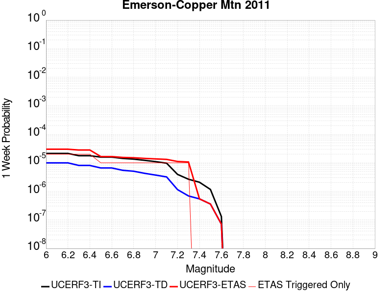 | 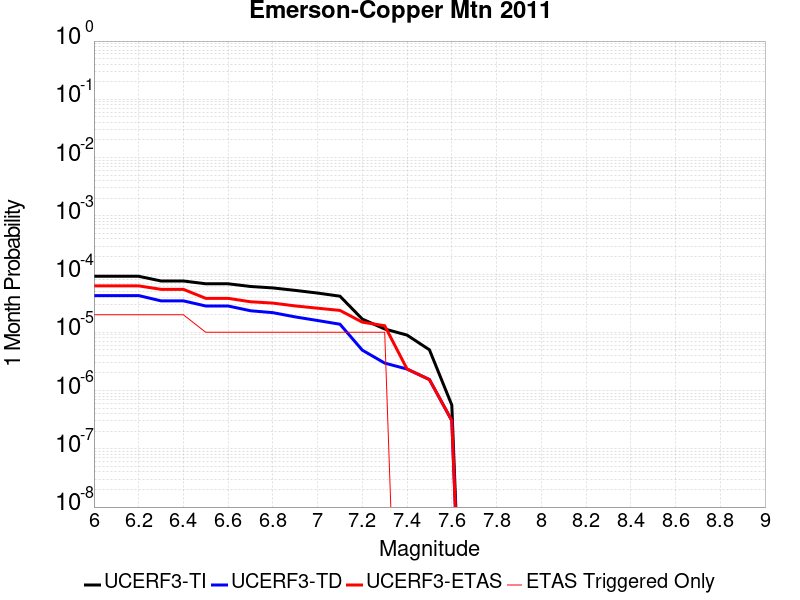 | 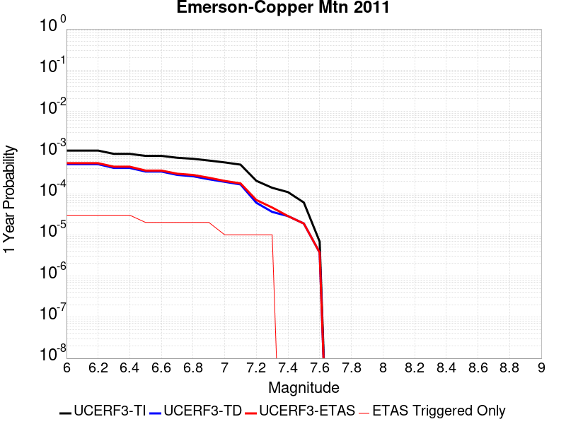 | 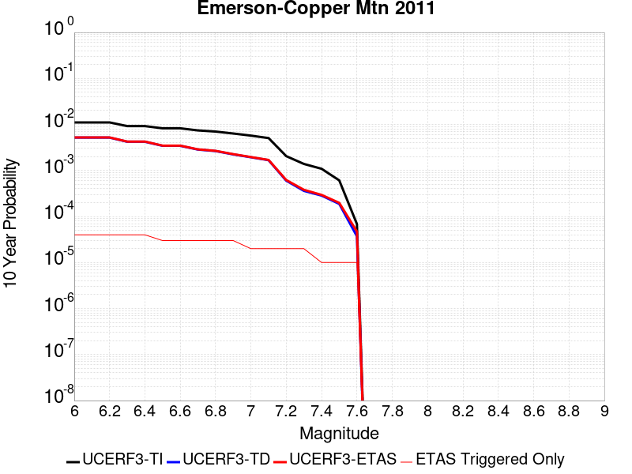 |

| Magnitude | 1 wk TI Prob | 1 wk TD Prob | 1 wk ETAS Prob | 1 wk ETAS/TD Gain | 1 wk ETAS Triggered Only | 1 mo TI Prob | 1 mo TD Prob | 1 mo ETAS Prob | 1 mo ETAS/TD Gain | 1 mo ETAS Triggered Only | 1 yr TI Prob | 1 yr TD Prob | 1 yr ETAS Prob | 1 yr ETAS/TD Gain | 1 yr ETAS Triggered Only | 10 yr TI Prob | 10 yr TD Prob | 10 yr ETAS Prob | 10 yr ETAS/TD Gain | 10 yr ETAS Triggered Only |
|-----|-----|-----|-----|-----|-----|-----|-----|-----|-----|-----|-----|-----|-----|-----|-----|-----|-----|-----|-----|-----|
| 6.0 | 2.1364202E-5 | 9.967999E-6 | 2.99678E-5 | 3.0064008 | 2.0E-5 | 9.1557646E-5 | 4.2719344E-5 | 6.271849E-5 | 1.4681519 | 2.0E-5 | 0.0011141442 | 5.1999267E-4 | 5.4997706E-4 | 1.0576631 | 3.0E-5 | 0.011085749 | 0.0051886286 | 0.005228421 | 1.0076692 | 4.0E-5 |
| 6.1 | 2.1364202E-5 | 9.967999E-6 | 2.99678E-5 | 3.0064008 | 2.0E-5 | 9.1557646E-5 | 4.2719344E-5 | 6.271849E-5 | 1.4681519 | 2.0E-5 | 0.0011141442 | 5.1999267E-4 | 5.4997706E-4 | 1.0576631 | 3.0E-5 | 0.011085749 | 0.0051886286 | 0.005228421 | 1.0076692 | 4.0E-5 |
| 6.2 | 2.1364202E-5 | 9.967999E-6 | 2.99678E-5 | 3.0064008 | 2.0E-5 | 9.1557646E-5 | 4.2719344E-5 | 6.271849E-5 | 1.4681519 | 2.0E-5 | 0.0011141442 | 5.1999267E-4 | 5.4997706E-4 | 1.0576631 | 3.0E-5 | 0.011085749 | 0.0051886286 | 0.005228421 | 1.0076692 | 4.0E-5 |
| 6.3 | 1.7751237E-5 | 8.089109E-6 | 2.8088947E-5 | 3.4724402 | 2.0E-5 | 7.607452E-5 | 3.4667184E-5 | 5.466649E-5 | 1.5768945 | 2.0E-5 | 9.258136E-4 | 4.2199748E-4 | 4.5198482E-4 | 1.0710604 | 3.0E-5 | 0.00921966 | 0.004212584 | 0.004252415 | 1.0094553 | 4.0E-5 |
| 6.4 | 1.7751237E-5 | 8.089109E-6 | 2.8088947E-5 | 3.4724402 | 2.0E-5 | 7.607452E-5 | 3.4667184E-5 | 5.466649E-5 | 1.5768945 | 2.0E-5 | 9.258136E-4 | 4.2199748E-4 | 4.5198482E-4 | 1.0710604 | 3.0E-5 | 0.00921966 | 0.004212584 | 0.004252415 | 1.0094553 | 4.0E-5 |
| 6.5 | 1.5886664E-5 | 6.6037437E-6 | 1.6603677E-5 | 2.5142825 | 1.0E-5 | 6.808392E-5 | 2.830148E-5 | 3.8301197E-5 | 1.3533285 | 1.0E-5 | 8.286065E-4 | 3.4452073E-4 | 3.6451383E-4 | 1.0580317 | 2.0E-5 | 0.008255237 | 0.0034403303 | 0.0034702271 | 1.0086901 | 3.0E-5 |
| 6.6 | 1.5886664E-5 | 6.6037437E-6 | 1.6603677E-5 | 2.5142825 | 1.0E-5 | 6.808392E-5 | 2.830148E-5 | 3.8301197E-5 | 1.3533285 | 1.0E-5 | 8.286065E-4 | 3.4452073E-4 | 3.6451383E-4 | 1.0580317 | 2.0E-5 | 0.008255237 | 0.0034403303 | 0.0034702271 | 1.0086901 | 3.0E-5 |
| 6.7 | 1.428471E-5 | 5.4703055E-6 | 1.547025E-5 | 2.8280416 | 1.0E-5 | 6.121875E-5 | 2.3443978E-5 | 3.3443743E-5 | 1.4265388 | 1.0E-5 | 7.450834E-4 | 2.8539696E-4 | 3.0539127E-4 | 1.0700579 | 2.0E-5 | 0.007425902 | 0.0028506925 | 0.002880607 | 1.0104938 | 3.0E-5 |
| 6.8 | 1.3490684E-5 | 5.0735894E-6 | 1.5073539E-5 | 2.9709811 | 1.0E-5 | 5.7815934E-5 | 2.1743796E-5 | 3.1743577E-5 | 1.4598913 | 1.0E-5 | 7.0368167E-4 | 2.6470242E-4 | 2.8469713E-4 | 1.0755365 | 2.0E-5 | 0.007014576 | 0.002644252 | 0.0026741726 | 1.0113153 | 3.0E-5 |
| 6.9 | 1.2235421E-5 | 4.289545E-6 | 1.4289501E-5 | 3.3312397 | 1.0E-5 | 5.2436466E-5 | 1.8383655E-5 | 2.838347E-5 | 1.5439515 | 1.0E-5 | 6.38227E-4 | 2.238016E-4 | 2.4379713E-4 | 1.0893449 | 2.0E-5 | 0.0063639707 | 0.0022361164 | 0.0022660494 | 1.0133861 | 3.0E-5 |
| 7.0 | 1.1009851E-5 | 3.7188345E-6 | 1.3718797E-5 | 3.6890047 | 1.0E-5 | 4.7184225E-5 | 1.5937783E-5 | 2.5937625E-5 | 1.6274298 | 1.0E-5 | 5.743165E-4 | 1.9402867E-4 | 2.0402674E-4 | 1.0515288 | 1.0E-5 | 0.005728345 | 0.0019389305 | 0.0019588917 | 1.0102949 | 2.0E-5 |
| 7.1 | 9.726373E-6 | 3.2115693E-6 | 1.3211537E-5 | 4.1137323 | 1.0E-5 | 4.168379E-5 | 1.3763814E-5 | 2.3763678E-5 | 1.7265328 | 1.0E-5 | 5.07382E-4 | 1.6756494E-4 | 1.7756326E-4 | 1.0596683 | 1.0E-5 | 0.0050622504 | 0.0016747171 | 0.0016946836 | 1.0119224 | 2.0E-5 |
| 7.2 | 3.9335127E-6 | 1.1524114E-6 | 1.11524E-5 | 9.677446 | 1.0E-5 | 1.6857803E-5 | 4.9388973E-6 | 1.4938848E-5 | 3.0247335 | 1.0E-5 | 2.0522442E-4 | 6.0129474E-5 | 7.012887E-5 | 1.1662978 | 1.0E-5 | 0.00205035 | 6.01138E-4 | 6.21126E-4 | 1.0332502 | 2.0E-5 |
| 7.3 | 2.661632E-6 | 6.91098E-7 | 1.0691091E-5 | 15.469718 | 1.0E-5 | 1.14069435E-5 | 2.9618452E-6 | 1.2961816E-5 | 4.3762636 | 1.0E-5 | 1.3887069E-4 | 3.605988E-5 | 4.605952E-5 | 1.2773066 | 1.0E-5 | 0.0013878393 | 3.6054134E-4 | 3.8053413E-4 | 1.0554521 | 2.0E-5 |
| 7.4 | 2.0893426E-6 | 5.4614605E-7 | 5.4614605E-7 | 1.0 | 0.0 | 8.954295E-6 | 2.340624E-6 | 2.340624E-6 | 1.0 | 0.0 | 1.0901308E-4 | 2.8496728E-5 | 2.8496728E-5 | 1.0 | 0.0 | 0.0010895962 | 2.849313E-4 | 2.9492844E-4 | 1.0350862 | 1.0E-5 |
| 7.5 | 1.1681728E-6 | 3.6028484E-7 | 3.6028484E-7 | 1.0 | 0.0 | 5.0064455E-6 | 1.544077E-6 | 1.544077E-6 | 1.0 | 0.0 | 6.0951766E-5 | 1.879898E-5 | 1.879898E-5 | 1.0 | 0.0 | 6.093505E-4 | 1.8797436E-4 | 1.9797249E-4 | 1.0531888 | 1.0E-5 |
| 7.6 | 1.3154387E-7 | 7.1196716E-8 | 7.1196716E-8 | 1.0 | 0.0 | 5.6375933E-7 | 3.0512876E-7 | 3.0512876E-7 | 1.0 | 0.0 | 6.863748E-6 | 3.714938E-6 | 3.714938E-6 | 1.0 | 0.0 | 6.863536E-5 | 3.7148915E-5 | 4.7148544E-5 | 1.2691768 | 1.0E-5 |

## Newport-Inglewood (Offshore)
*[(top)](#table-of-contents)*

| 1 Week | 1 Month | 1 Year | 10 Year |
|-----|-----|-----|-----|
|  |  |  |  |

| Magnitude | 1 wk TI Prob | 1 wk TD Prob | 1 wk ETAS Prob | 1 wk ETAS/TD Gain | 1 wk ETAS Triggered Only | 1 mo TI Prob | 1 mo TD Prob | 1 mo ETAS Prob | 1 mo ETAS/TD Gain | 1 mo ETAS Triggered Only | 1 yr TI Prob | 1 yr TD Prob | 1 yr ETAS Prob | 1 yr ETAS/TD Gain | 1 yr ETAS Triggered Only | 10 yr TI Prob | 10 yr TD Prob | 10 yr ETAS Prob | 10 yr ETAS/TD Gain | 10 yr ETAS Triggered Only |
|-----|-----|-----|-----|-----|-----|-----|-----|-----|-----|-----|-----|-----|-----|-----|-----|-----|-----|-----|-----|-----|
| 6.0 | 1.9626508E-5 | 1.8965342E-5 | 4.8964772E-5 | 2.5818028 | 3.0E-5 | 8.411089E-5 | 8.1277576E-5 | 1.2127433E-4 | 1.4921006 | 4.0E-5 | 0.001023569 | 9.891179E-4 | 0.0010290783 | 1.0404 | 4.0E-5 | 0.010188672 | 0.009848497 | 0.009888102 | 1.0040215 | 4.0E-5 |
| 6.1 | 1.331886E-5 | 1.2218078E-5 | 3.2217835E-5 | 2.6368985 | 2.0E-5 | 5.707958E-5 | 5.2362153E-5 | 7.23611E-5 | 1.3819352 | 2.0E-5 | 6.947222E-4 | 6.3732424E-4 | 6.5731147E-4 | 1.0313612 | 2.0E-5 | 0.006925544 | 0.006355142 | 0.006375015 | 1.0031271 | 2.0E-5 |
| 6.2 | 1.2250852E-5 | 1.1076016E-5 | 3.1075793E-5 | 2.8056834 | 2.0E-5 | 5.2502597E-5 | 4.746778E-5 | 6.746683E-5 | 1.4213184 | 2.0E-5 | 6.3903164E-4 | 5.7776796E-4 | 5.977564E-4 | 1.034596 | 2.0E-5 | 0.006371971 | 0.0057627796 | 0.0057826643 | 1.0034505 | 2.0E-5 |
| 6.3 | 1.2106258E-5 | 1.0918878E-5 | 3.0918658E-5 | 2.83167 | 2.0E-5 | 5.1882926E-5 | 4.6794354E-5 | 6.679342E-5 | 1.427382 | 2.0E-5 | 6.3149154E-4 | 5.695733E-4 | 5.8956194E-4 | 1.035094 | 2.0E-5 | 0.0062970007 | 0.005681252 | 0.0057011386 | 1.0035003 | 2.0E-5 |
| 6.4 | 1.1348758E-5 | 1.0109348E-5 | 3.0109146E-5 | 2.9783468 | 2.0E-5 | 4.8636626E-5 | 4.3325064E-5 | 6.3324194E-5 | 1.4616065 | 2.0E-5 | 5.919901E-4 | 5.2735576E-4 | 5.4734526E-4 | 1.0379051 | 2.0E-5 | 0.005904155 | 0.0052611395 | 0.0052810344 | 1.0037814 | 2.0E-5 |
| 6.5 | 1.100837E-5 | 9.743376E-6 | 1.9743278E-5 | 2.0263283 | 1.0E-5 | 4.7177873E-5 | 4.175666E-5 | 5.1756244E-5 | 1.2394727 | 1.0E-5 | 5.7423924E-4 | 5.082695E-4 | 5.182644E-4 | 1.0196646 | 1.0E-5 | 0.005727576 | 0.005071162 | 0.005081111 | 1.001962 | 1.0E-5 |
| 6.6 | 1.0634696E-5 | 9.34553E-6 | 1.9345436E-5 | 2.0700202 | 1.0E-5 | 4.557647E-5 | 4.0051662E-5 | 5.005126E-5 | 1.2496675 | 1.0E-5 | 5.5475225E-4 | 4.875206E-4 | 4.975157E-4 | 1.020502 | 1.0E-5 | 0.0055336943 | 0.0048645977 | 0.004874549 | 1.0020456 | 1.0E-5 |
| 6.7 | 9.9780855E-6 | 8.667898E-6 | 1.8667812E-5 | 2.1536722 | 1.0E-5 | 4.276252E-5 | 3.7147613E-5 | 4.714724E-5 | 1.2691863 | 1.0E-5 | 5.205093E-4 | 4.5217903E-4 | 4.621745E-4 | 1.0221051 | 1.0E-5 | 0.0051929182 | 0.0045126686 | 0.0045226235 | 1.002206 | 1.0E-5 |
| 6.8 | 9.59546E-6 | 8.272933E-6 | 1.827285E-5 | 2.2087512 | 1.0E-5 | 4.1122752E-5 | 3.545495E-5 | 4.545459E-5 | 1.2820381 | 1.0E-5 | 5.0055445E-4 | 4.3157916E-4 | 4.4157484E-4 | 1.0231607 | 1.0E-5 | 0.004994285 | 0.004307486 | 0.004317443 | 1.0023116 | 1.0E-5 |
| 6.9 | 9.000614E-6 | 7.706823E-6 | 1.7706747E-5 | 2.2975414 | 1.0E-5 | 3.857349E-5 | 3.3028828E-5 | 4.30285E-5 | 1.3027558 | 1.0E-5 | 4.6953102E-4 | 4.0205245E-4 | 4.1204842E-4 | 1.0248624 | 1.0E-5 | 0.004685402 | 0.0040133223 | 0.004023282 | 1.0024817 | 1.0E-5 |
| 7.0 | 7.4070194E-6 | 6.148865E-6 | 1.6148802E-5 | 2.6263065 | 1.0E-5 | 3.1743984E-5 | 2.6352012E-5 | 3.635175E-5 | 1.3794676 | 1.0E-5 | 3.8641447E-4 | 3.2078868E-4 | 3.3078546E-4 | 1.0311632 | 1.0E-5 | 0.0038574322 | 0.0032032758 | 0.0032132438 | 1.0031118 | 1.0E-5 |
| 7.1 | 6.299615E-6 | 5.0565613E-6 | 1.5056511E-5 | 2.9776185 | 1.0E-5 | 2.699807E-5 | 2.1670798E-5 | 3.167058E-5 | 1.4614404 | 1.0E-5 | 3.2865192E-4 | 2.6381016E-4 | 2.7380753E-4 | 1.037896 | 1.0E-5 | 0.003281663 | 0.0026349847 | 0.0026449582 | 1.0037851 | 1.0E-5 |
| 7.2 | 5.096653E-6 | 3.892733E-6 | 3.892733E-6 | 1.0 | 0.0 | 2.1842614E-5 | 1.6683034E-5 | 1.6683034E-5 | 1.0 | 0.0 | 2.6590136E-4 | 2.0309711E-4 | 2.0309711E-4 | 1.0 | 0.0 | 0.0026558342 | 0.0020291263 | 0.0020291263 | 1.0 | 0.0 |
| 7.3 | 3.9753018E-6 | 2.9098787E-6 | 2.9098787E-6 | 1.0 | 0.0 | 1.7036897E-5 | 1.24708495E-5 | 1.24708495E-5 | 1.0 | 0.0 | 2.0740448E-4 | 1.518221E-4 | 1.518221E-4 | 1.0 | 0.0 | 0.00207211 | 0.0015171919 | 0.0015171919 | 1.0 | 0.0 |
| 7.4 | 3.0568392E-6 | 2.1449732E-6 | 2.1449732E-6 | 1.0 | 0.0 | 1.3100675E-5 | 9.19271E-6 | 9.19271E-6 | 1.0 | 0.0 | 1.5948903E-4 | 1.11915564E-4 | 1.11915564E-4 | 1.0 | 0.0 | 0.0015937461 | 0.0011185983 | 0.0011185983 | 1.0 | 0.0 |
| 7.5 | 1.7279019E-6 | 1.1469651E-6 | 1.1469651E-6 | 1.0 | 0.0 | 7.405273E-6 | 4.9155556E-6 | 4.9155556E-6 | 1.0 | 0.0 | 9.015547E-5 | 5.9845286E-5 | 5.9845286E-5 | 1.0 | 0.0 | 9.01189E-4 | 5.982956E-4 | 5.982956E-4 | 1.0 | 0.0 |
| 7.6 | 1.1156416E-6 | 7.222962E-7 | 7.222962E-7 | 1.0 | 0.0 | 4.7813123E-6 | 3.0955514E-6 | 3.0955514E-6 | 1.0 | 0.0 | 5.821092E-5 | 3.768771E-5 | 3.768771E-5 | 1.0 | 0.0 | 5.8195676E-4 | 3.7681553E-4 | 3.7681553E-4 | 1.0 | 0.0 |
| 7.7 | 9.117973E-8 | 6.7342256E-8 | 6.7342256E-8 | 1.0 | 0.0 | 3.907702E-7 | 2.8860964E-7 | 2.8860964E-7 | 1.0 | 0.0 | 4.757617E-6 | 3.5138169E-6 | 3.5138169E-6 | 1.0 | 0.0 | 4.7575148E-5 | 3.5137644E-5 | 3.5137644E-5 | 1.0 | 0.0 |

## Los Alamos extension
*[(top)](#table-of-contents)*

| 1 Week | 1 Month | 1 Year | 10 Year |
|-----|-----|-----|-----|
|  |  |  |  |

| Magnitude | 1 wk TI Prob | 1 wk TD Prob | 1 wk ETAS Prob | 1 wk ETAS/TD Gain | 1 wk ETAS Triggered Only | 1 mo TI Prob | 1 mo TD Prob | 1 mo ETAS Prob | 1 mo ETAS/TD Gain | 1 mo ETAS Triggered Only | 1 yr TI Prob | 1 yr TD Prob | 1 yr ETAS Prob | 1 yr ETAS/TD Gain | 1 yr ETAS Triggered Only | 10 yr TI Prob | 10 yr TD Prob | 10 yr ETAS Prob | 10 yr ETAS/TD Gain | 10 yr ETAS Triggered Only |
|-----|-----|-----|-----|-----|-----|-----|-----|-----|-----|-----|-----|-----|-----|-----|-----|-----|-----|-----|-----|-----|
| 6.0 | 4.0146506E-6 | 4.086164E-6 | 1.4086124E-5 | 3.4472728 | 1.0E-5 | 1.7205533E-5 | 1.7512022E-5 | 2.7511845E-5 | 1.5710263 | 1.0E-5 | 2.0945723E-4 | 2.1318911E-4 | 2.3318484E-4 | 1.0937934 | 2.0E-5 | 0.0020925992 | 0.002129955 | 0.0021698698 | 1.0187397 | 4.0E-5 |
| 6.1 | 4.0146506E-6 | 4.086164E-6 | 1.4086124E-5 | 3.4472728 | 1.0E-5 | 1.7205533E-5 | 1.7512022E-5 | 2.7511845E-5 | 1.5710263 | 1.0E-5 | 2.0945723E-4 | 2.1318911E-4 | 2.3318484E-4 | 1.0937934 | 2.0E-5 | 0.0020925992 | 0.002129955 | 0.0021698698 | 1.0187397 | 4.0E-5 |
| 6.2 | 4.0146506E-6 | 4.086164E-6 | 1.4086124E-5 | 3.4472728 | 1.0E-5 | 1.7205533E-5 | 1.7512022E-5 | 2.7511845E-5 | 1.5710263 | 1.0E-5 | 2.0945723E-4 | 2.1318911E-4 | 2.3318484E-4 | 1.0937934 | 2.0E-5 | 0.0020925992 | 0.002129955 | 0.0021698698 | 1.0187397 | 4.0E-5 |
| 6.3 | 4.0146506E-6 | 4.086164E-6 | 1.4086124E-5 | 3.4472728 | 1.0E-5 | 1.7205533E-5 | 1.7512022E-5 | 2.7511845E-5 | 1.5710263 | 1.0E-5 | 2.0945723E-4 | 2.1318911E-4 | 2.3318484E-4 | 1.0937934 | 2.0E-5 | 0.0020925992 | 0.002129955 | 0.0021698698 | 1.0187397 | 4.0E-5 |
| 6.4 | 4.0146506E-6 | 4.086164E-6 | 1.4086124E-5 | 3.4472728 | 1.0E-5 | 1.7205533E-5 | 1.7512022E-5 | 2.7511845E-5 | 1.5710263 | 1.0E-5 | 2.0945723E-4 | 2.1318911E-4 | 2.3318484E-4 | 1.0937934 | 2.0E-5 | 0.0020925992 | 0.002129955 | 0.0021698698 | 1.0187397 | 4.0E-5 |
| 6.5 | 4.0146506E-6 | 4.086164E-6 | 1.4086124E-5 | 3.4472728 | 1.0E-5 | 1.7205533E-5 | 1.7512022E-5 | 2.7511845E-5 | 1.5710263 | 1.0E-5 | 2.0945723E-4 | 2.1318911E-4 | 2.3318484E-4 | 1.0937934 | 2.0E-5 | 0.0020925992 | 0.002129955 | 0.0021698698 | 1.0187397 | 4.0E-5 |
| 6.6 | 4.0146506E-6 | 4.086164E-6 | 1.4086124E-5 | 3.4472728 | 1.0E-5 | 1.7205533E-5 | 1.7512022E-5 | 2.7511845E-5 | 1.5710263 | 1.0E-5 | 2.0945723E-4 | 2.1318911E-4 | 2.3318484E-4 | 1.0937934 | 2.0E-5 | 0.0020925992 | 0.002129955 | 0.0021698698 | 1.0187397 | 4.0E-5 |
| 6.7 | 4.0146506E-6 | 4.086164E-6 | 1.4086124E-5 | 3.4472728 | 1.0E-5 | 1.7205533E-5 | 1.7512022E-5 | 2.7511845E-5 | 1.5710263 | 1.0E-5 | 2.0945723E-4 | 2.1318911E-4 | 2.3318484E-4 | 1.0937934 | 2.0E-5 | 0.0020925992 | 0.002129955 | 0.0021698698 | 1.0187397 | 4.0E-5 |
| 6.8 | 3.6584688E-6 | 3.7188636E-6 | 1.3718826E-5 | 3.6889834 | 1.0E-5 | 1.5679057E-5 | 1.5937894E-5 | 2.5937736E-5 | 1.6274254 | 1.0E-5 | 1.9087581E-4 | 1.9402753E-4 | 2.1402365E-4 | 1.1030582 | 2.0E-5 | 0.0019071194 | 0.0019386737 | 0.001978596 | 1.0205927 | 4.0E-5 |
| 6.9 | 3.644631E-6 | 3.7045736E-6 | 1.3704536E-5 | 3.699356 | 1.0E-5 | 1.5619753E-5 | 1.5876652E-5 | 2.5876494E-5 | 1.6298457 | 1.0E-5 | 1.901539E-4 | 1.9328203E-4 | 2.1327817E-4 | 1.1034558 | 2.0E-5 | 0.0018999127 | 0.0019312317 | 0.0019711545 | 1.0206722 | 4.0E-5 |
| 7.0 | 3.6318522E-6 | 3.691334E-6 | 1.3691297E-5 | 3.7090378 | 1.0E-5 | 1.5564989E-5 | 1.5819913E-5 | 2.5819754E-5 | 1.6321048 | 1.0E-5 | 1.8948725E-4 | 1.9259135E-4 | 2.1258749E-4 | 1.1038269 | 2.0E-5 | 0.0018932576 | 0.0019243368 | 0.00196426 | 1.0207464 | 4.0E-5 |
| 7.1 | 3.5001724E-6 | 3.5554046E-6 | 1.3555369E-5 | 3.8126094 | 1.0E-5 | 1.5000653E-5 | 1.5237365E-5 | 2.5237212E-5 | 1.6562715 | 1.0E-5 | 1.8261763E-4 | 1.8550004E-4 | 2.0549633E-4 | 1.1077967 | 2.0E-5 | 0.0018246764 | 0.0018535426 | 0.0018934686 | 1.0215403 | 4.0E-5 |
| 7.2 | 2.5204702E-6 | 2.5436989E-6 | 1.2543674E-5 | 4.931273 | 1.0E-5 | 1.080197E-5 | 1.0901522E-5 | 2.0901412E-5 | 1.9172932 | 1.0E-5 | 1.3150605E-4 | 1.3271799E-4 | 1.4271667E-4 | 1.0753378 | 1.0E-5 | 0.0013142825 | 0.001326393 | 0.0013563532 | 1.0225878 | 3.0E-5 |
| 7.3 | 2.1399692E-6 | 2.1501362E-6 | 1.2150114E-5 | 5.650858 | 1.0E-5 | 9.1712645E-6 | 9.2148375E-6 | 1.9214745E-5 | 2.0851963 | 1.0E-5 | 1.1165442E-4 | 1.121849E-4 | 1.2218377E-4 | 1.0891286 | 1.0E-5 | 0.0011159834 | 0.001121286 | 0.0011512523 | 1.026725 | 3.0E-5 |
| 7.4 | 1.9660122E-6 | 1.970241E-6 | 1.1970222E-5 | 6.075511 | 1.0E-5 | 8.42574E-6 | 8.4438625E-6 | 1.8443778E-5 | 2.184282 | 1.0E-5 | 1.0257855E-4 | 1.0279921E-4 | 1.1279818E-4 | 1.097267 | 1.0E-5 | 0.0010253121 | 0.0010275197 | 0.0010474991 | 1.0194443 | 2.0E-5 |
| 7.5 | 1.7204633E-6 | 1.7151029E-6 | 1.1715086E-5 | 6.8305435 | 1.0E-5 | 7.373393E-6 | 7.3504207E-6 | 1.7350347E-5 | 2.3604562 | 1.0E-5 | 8.976737E-5 | 8.948772E-5 | 9.948683E-5 | 1.1117371 | 1.0E-5 | 8.9731114E-4 | 8.945199E-4 | 9.14502E-4 | 1.0223384 | 2.0E-5 |
| 7.6 | 1.3717638E-6 | 1.3535872E-6 | 1.1353573E-5 | 8.387767 | 1.0E-5 | 5.878974E-6 | 5.801075E-6 | 1.5801017E-5 | 2.7238083 | 1.0E-5 | 7.157416E-5 | 7.062583E-5 | 8.062512E-5 | 1.1415813 | 1.0E-5 | 7.1551115E-4 | 7.0603646E-4 | 7.2602235E-4 | 1.0283072 | 2.0E-5 |
| 7.7 | 8.272564E-7 | 7.9576733E-7 | 7.9576733E-7 | 1.0 | 0.0 | 3.5453797E-6 | 3.4104269E-6 | 3.4104269E-6 | 1.0 | 0.0 | 4.3164142E-5 | 4.1521158E-5 | 4.1521158E-5 | 1.0 | 0.0 | 4.315576E-4 | 4.151342E-4 | 4.151342E-4 | 1.0 | 0.0 |
| 7.8 | 3.9708277E-7 | 3.671937E-7 | 3.671937E-7 | 1.0 | 0.0 | 1.7017821E-6 | 1.5736864E-6 | 1.5736864E-6 | 1.0 | 0.0 | 2.0719E-5 | 1.9159465E-5 | 1.9159465E-5 | 1.0 | 0.0 | 2.071707E-4 | 1.9157819E-4 | 1.9157819E-4 | 1.0 | 0.0 |
| 7.9 | 9.292528E-8 | 7.889168E-8 | 7.889168E-8 | 1.0 | 0.0 | 3.9825116E-7 | 3.3810713E-7 | 3.3810713E-7 | 1.0 | 0.0 | 4.848697E-6 | 4.1164467E-6 | 4.1164467E-6 | 1.0 | 0.0 | 4.8485912E-5 | 4.1163716E-5 | 4.1163716E-5 | 1.0 | 0.0 |
| 8.0 | 7.880441E-11 | 8.2353124E-11 | 8.2353124E-11 | 1.0 | 0.0 | 3.3773329E-10 | 3.52942E-10 | 3.52942E-10 | 1.0 | 0.0 | 4.1119033E-9 | 4.2970694E-9 | 4.2970694E-9 | 1.0 | 0.0 | 4.1119034E-8 | 4.2970694E-8 | 4.2970694E-8 | 1.0 | 0.0 |

## Calaveras (So) - Paicines extension 2011 CFM
*[(top)](#table-of-contents)*

| 1 Week | 1 Month | 1 Year | 10 Year |
|-----|-----|-----|-----|
|  |  |  |  |

| Magnitude | 1 wk TI Prob | 1 wk TD Prob | 1 wk ETAS Prob | 1 wk ETAS/TD Gain | 1 wk ETAS Triggered Only | 1 mo TI Prob | 1 mo TD Prob | 1 mo ETAS Prob | 1 mo ETAS/TD Gain | 1 mo ETAS Triggered Only | 1 yr TI Prob | 1 yr TD Prob | 1 yr ETAS Prob | 1 yr ETAS/TD Gain | 1 yr ETAS Triggered Only | 10 yr TI Prob | 10 yr TD Prob | 10 yr ETAS Prob | 10 yr ETAS/TD Gain | 10 yr ETAS Triggered Only |
|-----|-----|-----|-----|-----|-----|-----|-----|-----|-----|-----|-----|-----|-----|-----|-----|-----|-----|-----|-----|-----|
| 6.0 | 1.5183659E-4 | 3.0520977E-4 | 3.0520977E-4 | 1.0 | 0.0 | 6.5056595E-4 | 0.0013068188 | 0.0013068188 | 1.0 | 0.0 | 0.007891912 | 0.015696203 | 0.015696203 | 1.0 | 0.0 | 0.076174594 | 0.13848905 | 0.13851489 | 1.0001867 | 3.0E-5 |
| 6.1 | 1.5024997E-4 | 3.021517E-4 | 3.021517E-4 | 1.0 | 0.0 | 6.437695E-4 | 0.0012937278 | 0.0012937278 | 1.0 | 0.0 | 0.0078097614 | 0.015539596 | 0.015539596 | 1.0 | 0.0 | 0.075409345 | 0.13715863 | 0.13718452 | 1.0001887 | 3.0E-5 |
| 6.2 | 1.2743923E-4 | 2.5313982E-4 | 2.5313982E-4 | 1.0 | 0.0 | 5.460538E-4 | 0.0010839999 | 0.0010839999 | 1.0 | 0.0 | 0.0066279583 | 0.013046881 | 0.013046881 | 1.0 | 0.0 | 0.064337276 | 0.117256075 | 0.117273726 | 1.0001506 | 2.0E-5 |
| 6.3 | 1.1525114E-4 | 2.2599236E-4 | 2.2599236E-4 | 1.0 | 0.0 | 4.9383997E-4 | 9.678718E-4 | 9.678718E-4 | 1.0 | 0.0 | 0.0059959386 | 0.011668079 | 0.011668079 | 1.0 | 0.0 | 0.058367174 | 0.106372125 | 0.10639 | 1.000168 | 2.0E-5 |
| 6.4 | 1.07200925E-4 | 2.0840544E-4 | 2.0840544E-4 | 1.0 | 0.0 | 4.5935164E-4 | 8.926123E-4 | 8.926123E-4 | 1.0 | 0.0 | 0.0055782744 | 0.010772959 | 0.010772959 | 1.0 | 0.0 | 0.0544031 | 0.099194765 | 0.09921278 | 1.0001817 | 2.0E-5 |
| 6.5 | 9.69631E-5 | 1.8734725E-4 | 1.8734725E-4 | 1.0 | 0.0 | 4.1548995E-4 | 8.024631E-4 | 8.024631E-4 | 1.0 | 0.0 | 0.0050468626 | 0.009694842 | 0.009694842 | 1.0 | 0.0 | 0.04933773 | 0.090086564 | 0.090104766 | 1.0002021 | 2.0E-5 |
| 6.6 | 8.0552316E-5 | 1.507068E-4 | 1.507068E-4 | 1.0 | 0.0 | 3.4517853E-4 | 6.4569083E-4 | 6.4569083E-4 | 1.0 | 0.0 | 0.0041944524 | 0.007826508 | 0.007826508 | 1.0 | 0.0 | 0.04116161 | 0.0748563 | 0.0748748 | 1.0002471 | 2.0E-5 |
| 6.7 | 7.815757E-5 | 1.4611272E-4 | 1.4611272E-4 | 1.0 | 0.0 | 3.34918E-4 | 6.26014E-4 | 6.26014E-4 | 1.0 | 0.0 | 0.004070005 | 0.007589312 | 0.007589312 | 1.0 | 0.0 | 0.039962657 | 0.07270582 | 0.072724365 | 1.0002551 | 2.0E-5 |
| 6.8 | 6.965264E-5 | 1.2722758E-4 | 1.2722758E-4 | 1.0 | 0.0 | 2.9847719E-4 | 5.4513285E-4 | 5.4513285E-4 | 1.0 | 0.0 | 0.0036279052 | 0.0066135945 | 0.0066135945 | 1.0 | 0.0 | 0.03569247 | 0.063801065 | 0.06381979 | 1.0002935 | 2.0E-5 |
| 6.9 | 5.8000453E-5 | 1.01439E-4 | 1.01439E-4 | 1.0 | 0.0 | 2.4854968E-4 | 4.346666E-4 | 4.346666E-4 | 1.0 | 0.0 | 0.0030218933 | 0.005279322 | 0.005279322 | 1.0 | 0.0 | 0.029811295 | 0.051502965 | 0.05151245 | 1.0001842 | 1.0E-5 |
| 7.0 | 4.9865852E-5 | 8.568029E-5 | 8.568029E-5 | 1.0 | 0.0 | 2.1369329E-4 | 3.6715003E-4 | 3.6715003E-4 | 1.0 | 0.0 | 0.0025986114 | 0.004460979 | 0.004460979 | 1.0 | 0.0 | 0.025684336 | 0.043782018 | 0.043791577 | 1.0002184 | 1.0E-5 |
| 7.1 | 4.283875E-5 | 7.1124625E-5 | 7.1124625E-5 | 1.0 | 0.0 | 1.8358172E-4 | 3.0478454E-4 | 3.0478454E-4 | 1.0 | 0.0 | 0.0022328163 | 0.003704494 | 0.003704494 | 1.0 | 0.0 | 0.022105146 | 0.03673582 | 0.036745455 | 1.0002623 | 1.0E-5 |
| 7.2 | 3.450115E-5 | 5.5778568E-5 | 5.5778568E-5 | 1.0 | 0.0 | 1.478537E-4 | 2.3902925E-4 | 2.3902925E-4 | 1.0 | 0.0 | 0.0017986323 | 0.0029063264 | 0.0029063264 | 1.0 | 0.0 | 0.017841442 | 0.029079042 | 0.029079042 | 1.0 | 0.0 |
| 7.3 | 2.5709045E-5 | 4.059001E-5 | 4.059001E-5 | 1.0 | 0.0 | 1.1017697E-4 | 1.7394568E-4 | 1.7394568E-4 | 1.0 | 0.0 | 0.0013405791 | 0.0021157486 | 0.0021157486 | 1.0 | 0.0 | 0.013325208 | 0.02129686 | 0.02129686 | 1.0 | 0.0 |
| 7.4 | 1.8003093E-5 | 2.8511378E-5 | 2.8511378E-5 | 1.0 | 0.0 | 7.715383E-5 | 1.2218591E-4 | 1.2218591E-4 | 1.0 | 0.0 | 9.3894306E-4 | 0.0014866006 | 0.0014866006 | 1.0 | 0.0 | 0.009349857 | 0.015051589 | 0.015051589 | 1.0 | 0.0 |
| 7.5 | 1.5595824E-5 | 2.5823752E-5 | 2.5823752E-5 | 1.0 | 0.0 | 6.683753E-5 | 1.10668545E-4 | 1.10668545E-4 | 1.0 | 0.0 | 8.134431E-4 | 0.0013465589 | 0.0013465589 | 1.0 | 0.0 | 0.008104719 | 0.013651571 | 0.013651571 | 1.0 | 0.0 |
| 7.6 | 1.1110309E-5 | 1.9223195E-5 | 1.9223195E-5 | 1.0 | 0.0 | 4.761474E-5 | 8.2382525E-5 | 8.2382525E-5 | 1.0 | 0.0 | 5.795553E-4 | 0.0010025471 | 0.0010025471 | 1.0 | 0.0 | 0.0057804612 | 0.01020344 | 0.01020344 | 1.0 | 0.0 |
| 7.7 | 6.2140443E-6 | 1.04376995E-5 | 1.04376995E-5 | 1.0 | 0.0 | 2.6631347E-5 | 4.4732235E-5 | 4.4732235E-5 | 1.0 | 0.0 | 3.241884E-4 | 5.4447894E-4 | 5.4447894E-4 | 1.0 | 0.0 | 0.0032371588 | 0.005620102 | 0.005620102 | 1.0 | 0.0 |
| 7.8 | 5.305533E-6 | 9.433651E-6 | 9.433651E-6 | 1.0 | 0.0 | 2.27378E-5 | 4.0429306E-5 | 4.0429306E-5 | 1.0 | 0.0 | 2.7679754E-4 | 4.9211574E-4 | 4.9211574E-4 | 1.0 | 0.0 | 0.0027645302 | 0.005074622 | 0.005074622 | 1.0 | 0.0 |
| 7.9 | 3.363505E-6 | 7.3854467E-6 | 7.3854467E-6 | 1.0 | 0.0 | 1.4414942E-5 | 3.1651532E-5 | 3.1651532E-5 | 1.0 | 0.0 | 1.7548777E-4 | 3.8528934E-4 | 3.8528934E-4 | 1.0 | 0.0 | 0.0017534926 | 0.003948784 | 0.003948784 | 1.0 | 0.0 |
| 8.0 | 2.0271132E-6 | 4.4134235E-6 | 4.4134235E-6 | 1.0 | 0.0 | 8.687599E-6 | 1.8914534E-5 | 1.8914534E-5 | 1.0 | 0.0 | 1.05766376E-4 | 2.3026018E-4 | 2.3026018E-4 | 1.0 | 0.0 | 0.0010571606 | 0.002351194 | 0.002351194 | 1.0 | 0.0 |
| 8.1 | 1.2206116E-6 | 2.3752666E-6 | 2.3752666E-6 | 1.0 | 0.0 | 5.2311816E-6 | 1.0179674E-5 | 1.0179674E-5 | 1.0 | 0.0 | 6.3687774E-5 | 1.2393051E-4 | 1.2393051E-4 | 1.0 | 0.0 | 6.366953E-4 | 0.0012705618 | 0.0012705618 | 1.0 | 0.0 |

## Hayward (So) 2011 CFM
*[(top)](#table-of-contents)*

| 1 Week | 1 Month | 1 Year | 10 Year |
|-----|-----|-----|-----|
|  |  |  |  |

| Magnitude | 1 wk TI Prob | 1 wk TD Prob | 1 wk ETAS Prob | 1 wk ETAS/TD Gain | 1 wk ETAS Triggered Only | 1 mo TI Prob | 1 mo TD Prob | 1 mo ETAS Prob | 1 mo ETAS/TD Gain | 1 mo ETAS Triggered Only | 1 yr TI Prob | 1 yr TD Prob | 1 yr ETAS Prob | 1 yr ETAS/TD Gain | 1 yr ETAS Triggered Only | 10 yr TI Prob | 10 yr TD Prob | 10 yr ETAS Prob | 10 yr ETAS/TD Gain | 10 yr ETAS Triggered Only |
|-----|-----|-----|-----|-----|-----|-----|-----|-----|-----|-----|-----|-----|-----|-----|-----|-----|-----|-----|-----|-----|
| 6.0 | 1.8091932E-4 | 3.570673E-4 | 3.670637E-4 | 1.027996 | 1.0E-5 | 7.751381E-4 | 0.0015294008 | 0.0015393855 | 1.0065285 | 1.0E-5 | 0.00939654 | 0.018463885 | 0.01849333 | 1.0015948 | 3.0E-5 | 0.090090066 | 0.1667085 | 0.16673349 | 1.00015 | 3.0E-5 |
| 6.1 | 1.8091932E-4 | 3.570673E-4 | 3.670637E-4 | 1.027996 | 1.0E-5 | 7.751381E-4 | 0.0015294008 | 0.0015393855 | 1.0065285 | 1.0E-5 | 0.00939654 | 0.018463885 | 0.01849333 | 1.0015948 | 3.0E-5 | 0.090090066 | 0.1667085 | 0.16673349 | 1.00015 | 3.0E-5 |
| 6.2 | 1.8091932E-4 | 3.570673E-4 | 3.670637E-4 | 1.027996 | 1.0E-5 | 7.751381E-4 | 0.0015294008 | 0.0015393855 | 1.0065285 | 1.0E-5 | 0.00939654 | 0.018463885 | 0.01849333 | 1.0015948 | 3.0E-5 | 0.090090066 | 0.1667085 | 0.16673349 | 1.00015 | 3.0E-5 |
| 6.3 | 1.7322872E-4 | 3.4263515E-4 | 3.5263173E-4 | 1.0291755 | 1.0E-5 | 7.4219756E-4 | 0.0014676197 | 0.001477605 | 1.0068038 | 1.0E-5 | 0.0089988755 | 0.017724147 | 0.017753616 | 1.0016626 | 3.0E-5 | 0.08643075 | 0.16065954 | 0.16068472 | 1.0001568 | 3.0E-5 |
| 6.4 | 1.6334097E-4 | 3.2345165E-4 | 3.334484E-4 | 1.0309066 | 1.0E-5 | 6.998449E-4 | 0.0013854936 | 0.0013954798 | 1.0072076 | 1.0E-5 | 0.008487372 | 0.016739927 | 0.016769424 | 1.0017622 | 3.0E-5 | 0.081704415 | 0.15256606 | 0.15259148 | 1.0001667 | 3.0E-5 |
| 6.5 | 1.5600289E-4 | 3.101982E-4 | 3.2019507E-4 | 1.0322274 | 1.0E-5 | 6.684125E-4 | 0.0013287518 | 0.0013387385 | 1.0075159 | 1.0E-5 | 0.008107598 | 0.016059443 | 0.016088963 | 1.0018381 | 3.0E-5 | 0.078181036 | 0.14684291 | 0.1468685 | 1.0001743 | 3.0E-5 |
| 6.6 | 1.4046066E-4 | 2.8034003E-4 | 2.9033722E-4 | 1.035661 | 1.0E-5 | 6.018354E-4 | 0.0012009109 | 0.0012108989 | 1.008317 | 1.0E-5 | 0.0073027555 | 0.014524571 | 0.014554135 | 1.0020355 | 3.0E-5 | 0.07067384 | 0.13393044 | 0.13395643 | 1.000194 | 3.0E-5 |
| 6.7 | 1.14696966E-4 | 2.3272466E-4 | 2.4272234E-4 | 1.0429592 | 1.0E-5 | 4.914658E-4 | 9.970153E-4 | 0.0010070052 | 1.0100199 | 1.0E-5 | 0.0059671924 | 0.012072163 | 0.012091922 | 1.0016367 | 2.0E-5 | 0.058094822 | 0.11274141 | 0.11275916 | 1.0001574 | 2.0E-5 |
| 6.8 | 9.3874296E-5 | 1.8862431E-4 | 1.9862242E-4 | 1.0530055 | 1.0E-5 | 4.0225635E-4 | 8.081431E-4 | 8.1813504E-4 | 1.012364 | 1.0E-5 | 0.0048864787 | 0.009795489 | 0.009815293 | 1.0020218 | 2.0E-5 | 0.047804173 | 0.092592984 | 0.092611134 | 1.000196 | 2.0E-5 |
| 6.9 | 5.551852E-5 | 1.0729875E-4 | 1.1729768E-4 | 1.0931877 | 1.0E-5 | 2.3791482E-4 | 4.5977137E-4 | 4.6976676E-4 | 1.02174 | 1.0E-5 | 0.0028927654 | 0.005583468 | 0.005603356 | 1.003562 | 2.0E-5 | 0.028553981 | 0.054246075 | 0.05426499 | 1.0003487 | 2.0E-5 |
| 7.0 | 4.2662363E-5 | 8.246792E-5 | 8.246792E-5 | 1.0 | 0.0 | 1.8282588E-4 | 3.5338648E-4 | 3.5338648E-4 | 1.0 | 0.0 | 0.0022236328 | 0.0042940658 | 0.004304023 | 1.0023187 | 1.0E-5 | 0.022015138 | 0.04206509 | 0.04207467 | 1.0002277 | 1.0E-5 |
| 7.1 | 3.305886E-5 | 6.302183E-5 | 6.302183E-5 | 1.0 | 0.0 | 1.4167312E-4 | 2.7006568E-4 | 2.7006568E-4 | 1.0 | 0.0 | 0.0017235056 | 0.003283111 | 0.0032930782 | 1.0030359 | 1.0E-5 | 0.017101998 | 0.032453902 | 0.03246358 | 1.0002981 | 1.0E-5 |
| 7.2 | 2.9856887E-5 | 5.701622E-5 | 5.701622E-5 | 1.0 | 0.0 | 1.2795182E-4 | 2.4433242E-4 | 2.4433242E-4 | 1.0 | 0.0 | 0.0015567001 | 0.0029707062 | 0.0029806765 | 1.0033562 | 1.0E-5 | 0.015458403 | 0.029454801 | 0.029464506 | 1.0003295 | 1.0E-5 |
| 7.3 | 2.4559737E-5 | 4.599286E-5 | 4.599286E-5 | 1.0 | 0.0 | 1.0525176E-4 | 1.9709744E-4 | 1.9709744E-4 | 1.0 | 0.0 | 0.0012806869 | 0.0023970334 | 0.0024070095 | 1.0041618 | 1.0E-5 | 0.012733313 | 0.023858516 | 0.023868278 | 1.0004091 | 1.0E-5 |
| 7.4 | 1.9002231E-5 | 3.505084E-5 | 3.505084E-5 | 1.0 | 0.0 | 8.143559E-5 | 1.502093E-4 | 1.502093E-4 | 1.0 | 0.0 | 9.910273E-4 | 0.001827274 | 0.001827274 | 1.0 | 0.0 | 0.009866194 | 0.018258808 | 0.018258808 | 1.0 | 0.0 |
| 7.5 | 1.2783333E-5 | 2.3331182E-5 | 2.3331182E-5 | 1.0 | 0.0 | 5.4784563E-5 | 9.998698E-5 | 9.998698E-5 | 1.0 | 0.0 | 6.667979E-4 | 0.0012166675 | 0.0012166675 | 1.0 | 0.0 | 0.006648007 | 0.012209443 | 0.012209443 | 1.0 | 0.0 |
| 7.6 | 4.8149627E-6 | 8.888056E-6 | 8.888056E-6 | 1.0 | 0.0 | 2.063539E-5 | 3.8091122E-5 | 3.8091122E-5 | 1.0 | 0.0 | 2.5120692E-4 | 4.6366194E-4 | 4.6366194E-4 | 1.0 | 0.0 | 0.0025092314 | 0.0046805087 | 0.0046805087 | 1.0 | 0.0 |
| 7.7 | 6.0838227E-7 | 1.205754E-6 | 1.205754E-6 | 1.0 | 0.0 | 2.6073499E-6 | 5.1675065E-6 | 5.1675065E-6 | 1.0 | 0.0 | 3.174402E-5 | 6.291258E-5 | 6.291258E-5 | 1.0 | 0.0 | 3.1739488E-4 | 6.5296254E-4 | 6.5296254E-4 | 1.0 | 0.0 |
| 7.8 | 4.5542808E-7 | 9.792941E-7 | 9.792941E-7 | 1.0 | 0.0 | 1.9518332E-6 | 4.196968E-6 | 4.196968E-6 | 1.0 | 0.0 | 2.376331E-5 | 5.109689E-5 | 5.109689E-5 | 1.0 | 0.0 | 2.3760769E-4 | 5.321693E-4 | 5.321693E-4 | 1.0 | 0.0 |
| 7.9 | 3.3016747E-7 | 7.3869535E-7 | 7.3869535E-7 | 1.0 | 0.0 | 1.4150027E-6 | 3.1658333E-6 | 3.1658333E-6 | 1.0 | 0.0 | 1.7227521E-5 | 3.854334E-5 | 3.854334E-5 | 1.0 | 0.0 | 1.7226185E-4 | 3.9932923E-4 | 3.9932923E-4 | 1.0 | 0.0 |
| 8.0 | 2.347038E-7 | 5.471963E-7 | 5.471963E-7 | 1.0 | 0.0 | 1.0058731E-6 | 2.3451248E-6 | 2.3451248E-6 | 1.0 | 0.0 | 1.2246436E-5 | 2.8551523E-5 | 2.8551523E-5 | 1.0 | 0.0 | 1.2245761E-4 | 2.9357258E-4 | 2.9357258E-4 | 1.0 | 0.0 |
| 8.1 | 1.18822804E-7 | 2.6060948E-7 | 2.6060948E-7 | 1.0 | 0.0 | 5.092405E-7 | 1.1168972E-6 | 1.1168972E-6 | 1.0 | 0.0 | 6.1999854E-6 | 1.359814E-5 | 1.359814E-5 | 1.0 | 0.0 | 6.199812E-5 | 1.3918082E-4 | 1.3918082E-4 | 1.0 | 0.0 |

## Green Valley 2011 CFM
*[(top)](#table-of-contents)*

| 1 Week | 1 Month | 1 Year | 10 Year |
|-----|-----|-----|-----|
|  |  | 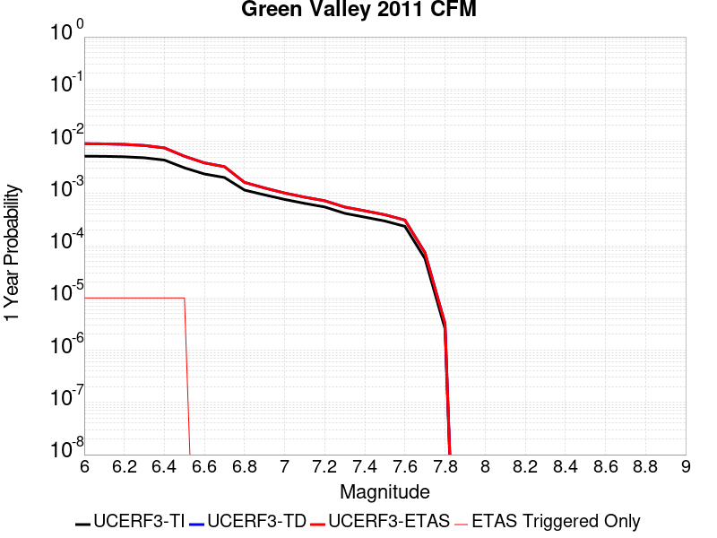 | 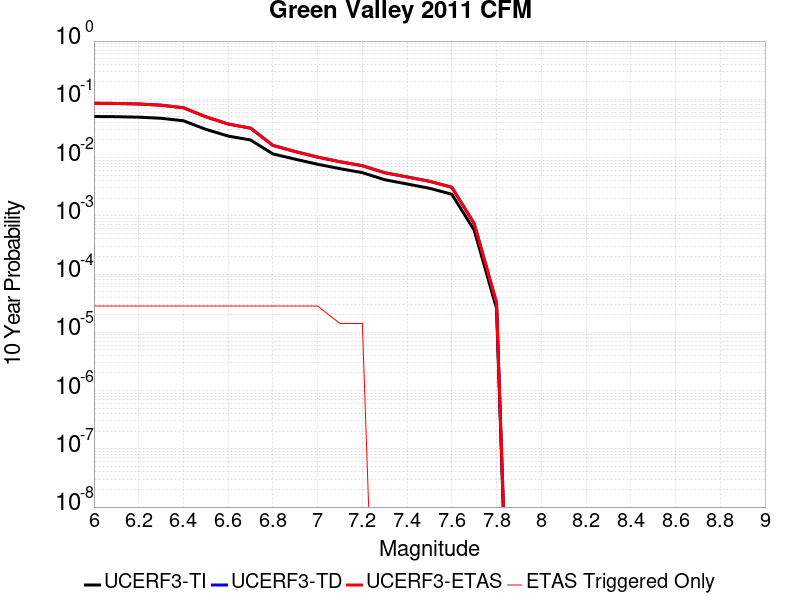 |

| Magnitude | 1 wk TI Prob | 1 wk TD Prob | 1 wk ETAS Prob | 1 wk ETAS/TD Gain | 1 wk ETAS Triggered Only | 1 mo TI Prob | 1 mo TD Prob | 1 mo ETAS Prob | 1 mo ETAS/TD Gain | 1 mo ETAS Triggered Only | 1 yr TI Prob | 1 yr TD Prob | 1 yr ETAS Prob | 1 yr ETAS/TD Gain | 1 yr ETAS Triggered Only | 10 yr TI Prob | 10 yr TD Prob | 10 yr ETAS Prob | 10 yr ETAS/TD Gain | 10 yr ETAS Triggered Only |
|-----|-----|-----|-----|-----|-----|-----|-----|-----|-----|-----|-----|-----|-----|-----|-----|-----|-----|-----|-----|-----|
| 6.0 | 9.9629346E-5 | 1.7302863E-4 | 1.7302863E-4 | 1.0 | 0.0 | 4.2691303E-4 | 7.41326E-4 | 7.41326E-4 | 1.0 | 0.0 | 0.0051852856 | 0.00898692 | 0.008996829 | 1.0011027 | 1.0E-5 | 0.050659515 | 0.08553951 | 0.085566945 | 1.0003207 | 3.0E-5 |
| 6.1 | 9.88615E-5 | 1.7150163E-4 | 1.7150163E-4 | 1.0 | 0.0 | 4.2362334E-4 | 7.347854E-4 | 7.347854E-4 | 1.0 | 0.0 | 0.0051454236 | 0.008907947 | 0.008917858 | 1.0011126 | 1.0E-5 | 0.050279044 | 0.08482712 | 0.08485457 | 1.0003237 | 3.0E-5 |
| 6.2 | 9.696895E-5 | 1.6789208E-4 | 1.6789208E-4 | 1.0 | 0.0 | 4.15515E-4 | 7.1932544E-4 | 7.1932544E-4 | 1.0 | 0.0 | 0.0050471667 | 0.00872133 | 0.008731242 | 1.0011367 | 1.0E-5 | 0.04934063 | 0.08313578 | 0.08316329 | 1.0003308 | 3.0E-5 |
| 6.3 | 9.275224E-5 | 1.5968543E-4 | 1.5968543E-4 | 1.0 | 0.0 | 3.9744904E-4 | 6.841728E-4 | 6.841728E-4 | 1.0 | 0.0 | 0.0048282105 | 0.008296652 | 0.0083065685 | 1.0011953 | 1.0E-5 | 0.047246475 | 0.07927481 | 0.07930243 | 1.0003484 | 3.0E-5 |
| 6.4 | 8.391499E-5 | 1.4365884E-4 | 1.4365884E-4 | 1.0 | 0.0 | 3.595861E-4 | 6.155238E-4 | 6.155238E-4 | 1.0 | 0.0 | 0.004369175 | 0.007467181 | 0.007477106 | 1.0013292 | 1.0E-5 | 0.04284265 | 0.07164672 | 0.07167457 | 1.0003887 | 3.0E-5 |
| 6.5 | 5.9519385E-5 | 9.932622E-5 | 9.932622E-5 | 1.0 | 0.0 | 2.5505814E-4 | 4.2560388E-4 | 4.2560388E-4 | 1.0 | 0.0 | 0.0031009112 | 0.005168341 | 0.0051782895 | 1.0019249 | 1.0E-5 | 0.030579966 | 0.05014692 | 0.050175417 | 1.0005683 | 3.0E-5 |
| 6.6 | 4.5361558E-5 | 7.4019794E-5 | 7.4019794E-5 | 1.0 | 0.0 | 1.9439218E-4 | 3.1717744E-4 | 3.1717744E-4 | 1.0 | 0.0 | 0.0023641558 | 0.0038538678 | 0.0038538678 | 1.0 | 0.0 | 0.023391623 | 0.03766727 | 0.037686516 | 1.0005109 | 2.0E-5 |
| 6.7 | 3.8808106E-5 | 6.264382E-5 | 6.264382E-5 | 1.0 | 0.0 | 1.6630985E-4 | 2.6843755E-4 | 2.6843755E-4 | 1.0 | 0.0 | 0.0020229418 | 0.0032627317 | 0.0032627317 | 1.0 | 0.0 | 0.020046256 | 0.032007415 | 0.032026775 | 1.0006049 | 2.0E-5 |
| 6.8 | 2.2284667E-5 | 3.128574E-5 | 3.128574E-5 | 1.0 | 0.0 | 9.550222E-5 | 1.3407487E-4 | 1.3407487E-4 | 1.0 | 0.0 | 0.0011621192 | 0.0016311383 | 0.0016311383 | 1.0 | 0.0 | 0.011560607 | 0.01616672 | 0.016186398 | 1.0012171 | 2.0E-5 |
| 6.9 | 1.8050168E-5 | 2.4448536E-5 | 2.4448536E-5 | 1.0 | 0.0 | 7.735557E-5 | 1.0477527E-4 | 1.0477527E-4 | 1.0 | 0.0 | 9.4139716E-4 | 0.0012748954 | 0.0012748954 | 1.0 | 0.0 | 0.009374191 | 0.012669067 | 0.012688814 | 1.0015587 | 2.0E-5 |
| 7.0 | 1.4763166E-5 | 1.9583236E-5 | 1.9583236E-5 | 1.0 | 0.0 | 6.326917E-5 | 8.3925464E-5 | 8.3925464E-5 | 1.0 | 0.0 | 7.7002996E-4 | 0.001021315 | 0.001021315 | 1.0 | 0.0 | 0.007673672 | 0.01016625 | 0.010186047 | 1.0019473 | 2.0E-5 |
| 7.1 | 1.2399713E-5 | 1.6304042E-5 | 1.6304042E-5 | 1.0 | 0.0 | 5.3140546E-5 | 6.987261E-5 | 6.987261E-5 | 1.0 | 0.0 | 6.467941E-4 | 8.5036893E-4 | 8.5036893E-4 | 1.0 | 0.0 | 0.006449148 | 0.008471781 | 0.008481696 | 1.0011704 | 1.0E-5 |
| 7.2 | 1.0584195E-5 | 1.39220465E-5 | 1.39220465E-5 | 1.0 | 0.0 | 4.5360044E-5 | 5.966456E-5 | 5.966456E-5 | 1.0 | 0.0 | 5.521186E-4 | 7.2617555E-4 | 7.2617555E-4 | 1.0 | 0.0 | 0.0055074887 | 0.0072386027 | 0.00724853 | 1.0013715 | 1.0E-5 |
| 7.3 | 7.998173E-6 | 1.0544255E-5 | 1.0544255E-5 | 1.0 | 0.0 | 3.4277433E-5 | 4.5188888E-5 | 4.5188888E-5 | 1.0 | 0.0 | 4.1724785E-4 | 5.500369E-4 | 5.500369E-4 | 1.0 | 0.0 | 0.004164653 | 0.005487135 | 0.005487135 | 1.0 | 0.0 |
| 7.4 | 6.7571127E-6 | 8.932903E-6 | 8.932903E-6 | 1.0 | 0.0 | 2.8958733E-5 | 3.8283313E-5 | 3.8283313E-5 | 1.0 | 0.0 | 3.5251552E-4 | 4.660006E-4 | 4.660006E-4 | 1.0 | 0.0 | 0.0035195686 | 0.004650633 | 0.004650633 | 1.0 | 0.0 |
| 7.5 | 5.69878E-6 | 7.516483E-6 | 7.516483E-6 | 1.0 | 0.0 | 2.4423114E-5 | 3.2213105E-5 | 3.2213105E-5 | 1.0 | 0.0 | 2.9731085E-4 | 3.9212484E-4 | 3.9212484E-4 | 1.0 | 0.0 | 0.002969134 | 0.0039147018 | 0.0039147018 | 1.0 | 0.0 |
| 7.6 | 4.503664E-6 | 5.9358217E-6 | 5.9358217E-6 | 1.0 | 0.0 | 1.9301275E-5 | 2.5438992E-5 | 2.5438992E-5 | 1.0 | 0.0 | 2.3496768E-4 | 3.0967654E-4 | 3.0967654E-4 | 1.0 | 0.0 | 0.002347194 | 0.0030927279 | 0.0030927279 | 1.0 | 0.0 |
| 7.7 | 1.0873546E-6 | 1.410754E-6 | 1.410754E-6 | 1.0 | 0.0 | 4.6600826E-6 | 6.0460743E-6 | 6.0460743E-6 | 1.0 | 0.0 | 5.6735033E-5 | 7.36085E-5 | 7.36085E-5 | 1.0 | 0.0 | 5.672055E-4 | 7.3587085E-4 | 7.3587085E-4 | 1.0 | 0.0 |
| 7.8 | 4.9373917E-8 | 6.177967E-8 | 6.177967E-8 | 1.0 | 0.0 | 2.1160248E-7 | 2.6477002E-7 | 2.6477002E-7 | 1.0 | 0.0 | 2.5762572E-6 | 3.2235714E-6 | 3.2235714E-6 | 1.0 | 0.0 | 2.5762274E-5 | 3.2228E-5 | 3.2228E-5 | 1.0 | 0.0 |

## Rodgers Creek - Healdsburg 2011 CFM
*[(top)](#table-of-contents)*

| 1 Week | 1 Month | 1 Year | 10 Year |
|-----|-----|-----|-----|
|  |  |  | 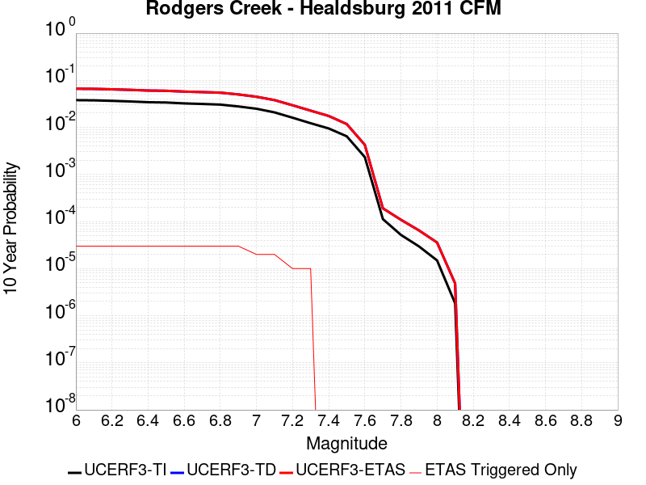 |

| Magnitude | 1 wk TI Prob | 1 wk TD Prob | 1 wk ETAS Prob | 1 wk ETAS/TD Gain | 1 wk ETAS Triggered Only | 1 mo TI Prob | 1 mo TD Prob | 1 mo ETAS Prob | 1 mo ETAS/TD Gain | 1 mo ETAS Triggered Only | 1 yr TI Prob | 1 yr TD Prob | 1 yr ETAS Prob | 1 yr ETAS/TD Gain | 1 yr ETAS Triggered Only | 10 yr TI Prob | 10 yr TD Prob | 10 yr ETAS Prob | 10 yr ETAS/TD Gain | 10 yr ETAS Triggered Only |
|-----|-----|-----|-----|-----|-----|-----|-----|-----|-----|-----|-----|-----|-----|-----|-----|-----|-----|-----|-----|-----|
| 6.0 | 7.390182E-5 | 1.3137296E-4 | 1.3137296E-4 | 1.0 | 0.0 | 3.1668364E-4 | 5.629057E-4 | 5.7290005E-4 | 1.0177549 | 1.0E-5 | 0.0038488081 | 0.0068318076 | 0.006851671 | 1.0029075 | 2.0E-5 | 0.037828278 | 0.06618395 | 0.06621196 | 1.0004233 | 3.0E-5 |
| 6.1 | 7.318768E-5 | 1.303531E-4 | 1.303531E-4 | 1.0 | 0.0 | 3.1362378E-4 | 5.585369E-4 | 5.6853134E-4 | 1.0178939 | 1.0E-5 | 0.0038116854 | 0.006778966 | 0.0067988303 | 1.0029303 | 2.0E-5 | 0.037469655 | 0.06568854 | 0.06571657 | 1.0004267 | 3.0E-5 |
| 6.2 | 7.1379836E-5 | 1.2728151E-4 | 1.2728151E-4 | 1.0 | 0.0 | 3.058777E-4 | 5.453785E-4 | 5.5537303E-4 | 1.0183259 | 1.0E-5 | 0.003717703 | 0.0066197454 | 0.006639613 | 1.0030012 | 2.0E-5 | 0.0365612 | 0.06421061 | 0.06423868 | 1.0004373 | 3.0E-5 |
| 6.3 | 6.9255926E-5 | 1.2382482E-4 | 1.2382482E-4 | 1.0 | 0.0 | 2.9677735E-4 | 5.305703E-4 | 5.4056494E-4 | 1.0188377 | 1.0E-5 | 0.0036072785 | 0.0064406106 | 0.006460482 | 1.0030853 | 2.0E-5 | 0.035492823 | 0.062541805 | 0.06256993 | 1.0004497 | 3.0E-5 |
| 6.4 | 6.6757144E-5 | 1.195919E-4 | 1.195919E-4 | 1.0 | 0.0 | 2.8607066E-4 | 5.1243644E-4 | 5.2243134E-4 | 1.0195047 | 1.0E-5 | 0.0034773487 | 0.00622114 | 0.0062410156 | 1.0031948 | 2.0E-5 | 0.034234364 | 0.060491614 | 0.0605198 | 1.000466 | 3.0E-5 |
| 6.5 | 6.5735134E-5 | 1.180849E-4 | 1.180849E-4 | 1.0 | 0.0 | 2.8169158E-4 | 5.059804E-4 | 5.1597535E-4 | 1.0197536 | 1.0E-5 | 0.003424202 | 0.0061429944 | 0.0061628716 | 1.0032357 | 2.0E-5 | 0.03371918 | 0.059755705 | 0.059783913 | 1.0004721 | 3.0E-5 |
| 6.6 | 6.289601E-5 | 1.13442366E-4 | 1.13442366E-4 | 1.0 | 0.0 | 2.6952647E-4 | 4.8609133E-4 | 4.960865E-4 | 1.0205623 | 1.0E-5 | 0.0032765474 | 0.005902183 | 0.0059220647 | 1.0033686 | 2.0E-5 | 0.032286562 | 0.057495043 | 0.057523318 | 1.0004917 | 3.0E-5 |
| 6.7 | 6.115274E-5 | 1.106132E-4 | 1.106132E-4 | 1.0 | 0.0 | 2.6205686E-4 | 4.739708E-4 | 4.8396608E-4 | 1.0210884 | 1.0E-5 | 0.0031858748 | 0.0057554054 | 0.00577529 | 1.003455 | 2.0E-5 | 0.031405866 | 0.05611361 | 0.056141928 | 1.0005046 | 3.0E-5 |
| 6.8 | 5.9232367E-5 | 1.0728657E-4 | 1.0728657E-4 | 1.0 | 0.0 | 2.538283E-4 | 4.5971893E-4 | 4.6971434E-4 | 1.0217425 | 1.0E-5 | 0.0030859804 | 0.005582791 | 0.0056026787 | 1.0035625 | 2.0E-5 | 0.030434765 | 0.05448041 | 0.05450878 | 1.0005207 | 3.0E-5 |
| 6.9 | 5.4030377E-5 | 9.8228295E-5 | 9.8228295E-5 | 1.0 | 0.0 | 2.315382E-4 | 4.209108E-4 | 4.309066E-4 | 1.023748 | 1.0E-5 | 0.0028153337 | 0.0051126136 | 0.0051325117 | 1.003892 | 2.0E-5 | 0.027799325 | 0.05001572 | 0.05004422 | 1.0005698 | 3.0E-5 |
| 7.0 | 4.8260714E-5 | 8.7408924E-5 | 8.7408924E-5 | 1.0 | 0.0 | 2.0681522E-4 | 3.7455617E-4 | 3.7455617E-4 | 1.0 | 0.0 | 0.0025150678 | 0.0045507406 | 0.004560695 | 1.0021875 | 1.0E-5 | 0.024867928 | 0.044667073 | 0.04468618 | 1.0004277 | 2.0E-5 |
| 7.1 | 4.0294493E-5 | 7.389363E-5 | 7.389363E-5 | 1.0 | 0.0 | 1.7267925E-4 | 3.1664874E-4 | 3.1664874E-4 | 1.0 | 0.0 | 0.0021003427 | 0.0038484214 | 0.003858383 | 1.0025885 | 1.0E-5 | 0.02080602 | 0.037923187 | 0.037942432 | 1.0005074 | 2.0E-5 |
| 7.2 | 3.096388E-5 | 5.698023E-5 | 5.698023E-5 | 1.0 | 0.0 | 1.326956E-4 | 2.4417826E-4 | 2.4417826E-4 | 1.0 | 0.0 | 0.0016143717 | 0.0029688394 | 0.0029788096 | 1.0033584 | 1.0E-5 | 0.01602694 | 0.029437006 | 0.029446712 | 1.0003297 | 1.0E-5 |
| 7.3 | 2.3615226E-5 | 4.3629818E-5 | 4.3629818E-5 | 1.0 | 0.0 | 1.0120418E-4 | 1.869716E-4 | 1.869716E-4 | 1.0 | 0.0 | 0.0012314644 | 0.0022740164 | 0.0022839936 | 1.0043875 | 1.0E-5 | 0.0122466255 | 0.022637889 | 0.022647662 | 1.0004318 | 1.0E-5 |
| 7.4 | 1.8251132E-5 | 3.3542477E-5 | 3.3542477E-5 | 1.0 | 0.0 | 7.821679E-5 | 1.4374561E-4 | 1.4374561E-4 | 1.0 | 0.0 | 9.518733E-4 | 0.0017487077 | 0.0017487077 | 1.0 | 0.0 | 0.009478063 | 0.017466031 | 0.017466031 | 1.0 | 0.0 |
| 7.5 | 1.2411432E-5 | 2.2461069E-5 | 2.2461069E-5 | 1.0 | 0.0 | 5.3190768E-5 | 9.6258205E-5 | 9.6258205E-5 | 1.0 | 0.0 | 6.4740516E-4 | 0.0011713194 | 0.0011713194 | 1.0 | 0.0 | 0.006455223 | 0.011743137 | 0.011743137 | 1.0 | 0.0 |
| 7.6 | 4.4771446E-6 | 8.08443E-6 | 8.08443E-6 | 1.0 | 0.0 | 1.918762E-5 | 3.4647102E-5 | 3.4647102E-5 | 1.0 | 0.0 | 2.3358424E-4 | 4.2174806E-4 | 4.2174806E-4 | 1.0 | 0.0 | 0.0023333887 | 0.0042453306 | 0.0042453306 | 1.0 | 0.0 |
| 7.7 | 2.157941E-7 | 3.5350925E-7 | 3.5350925E-7 | 1.0 | 0.0 | 9.248315E-7 | 1.5150388E-6 | 1.5150388E-6 | 1.0 | 0.0 | 1.1259765E-5 | 1.844544E-5 | 1.844544E-5 | 1.0 | 0.0 | 1.1259195E-4 | 1.9069649E-4 | 1.9069649E-4 | 1.0 | 0.0 |
| 7.8 | 9.9623286E-8 | 1.9900986E-7 | 1.9900986E-7 | 1.0 | 0.0 | 4.269569E-7 | 8.528991E-7 | 8.528991E-7 | 1.0 | 0.0 | 5.1981874E-6 | 1.03839975E-5 | 1.03839975E-5 | 1.0 | 0.0 | 5.198066E-5 | 1.0902916E-4 | 1.0902916E-4 | 1.0 | 0.0 |
| 7.9 | 5.6745257E-8 | 1.1774714E-7 | 1.1774714E-7 | 1.0 | 0.0 | 2.4319394E-7 | 5.046305E-7 | 5.046305E-7 | 1.0 | 0.0 | 2.960882E-6 | 6.143859E-6 | 6.143859E-6 | 1.0 | 0.0 | 2.9608427E-5 | 6.471445E-5 | 6.471445E-5 | 1.0 | 0.0 |
| 8.0 | 2.8614323E-8 | 6.5789635E-8 | 6.5789635E-8 | 1.0 | 0.0 | 1.2263281E-7 | 2.8195555E-7 | 2.8195555E-7 | 1.0 | 0.0 | 1.4930534E-6 | 3.4328034E-6 | 3.4328034E-6 | 1.0 | 0.0 | 1.4930434E-5 | 3.5830046E-5 | 3.5830046E-5 | 1.0 | 0.0 |
| 8.1 | 3.5045191E-9 | 8.966459E-9 | 8.966459E-9 | 1.0 | 0.0 | 1.5019367E-8 | 3.8427682E-8 | 3.8427682E-8 | 1.0 | 0.0 | 1.8286079E-7 | 4.6785692E-7 | 4.6785692E-7 | 1.0 | 0.0 | 1.8286064E-6 | 4.834128E-6 | 4.834128E-6 | 1.0 | 0.0 |

## Cerro Prieto
*[(top)](#table-of-contents)*

| 1 Week | 1 Month | 1 Year | 10 Year |
|-----|-----|-----|-----|
| 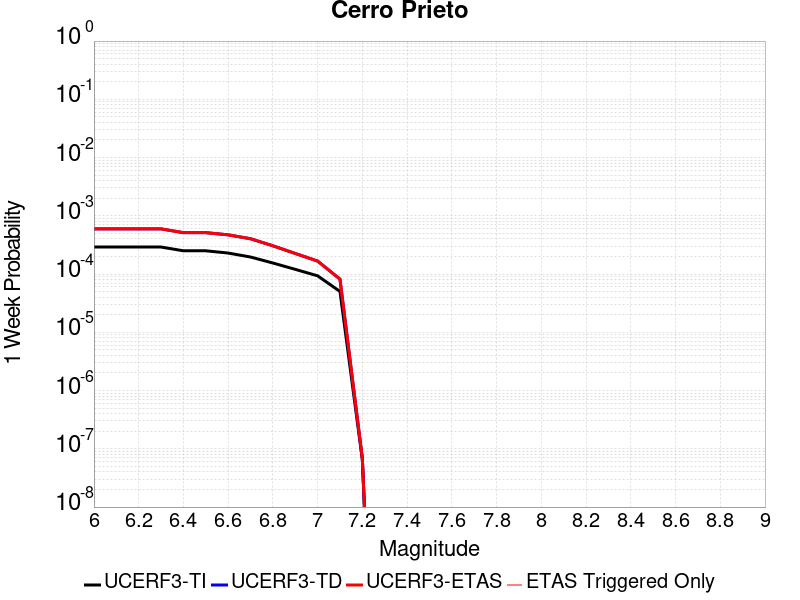 | 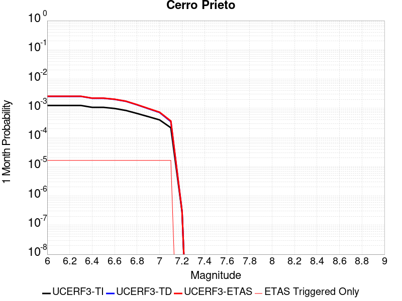 | 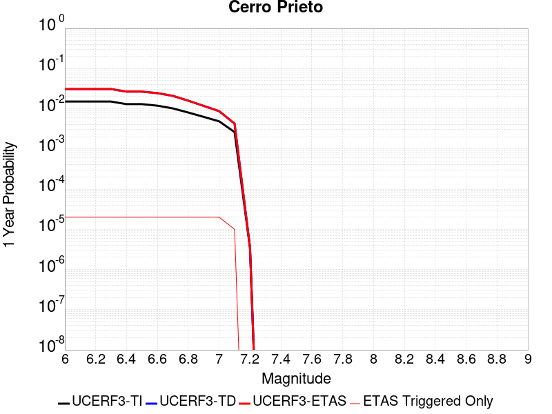 | 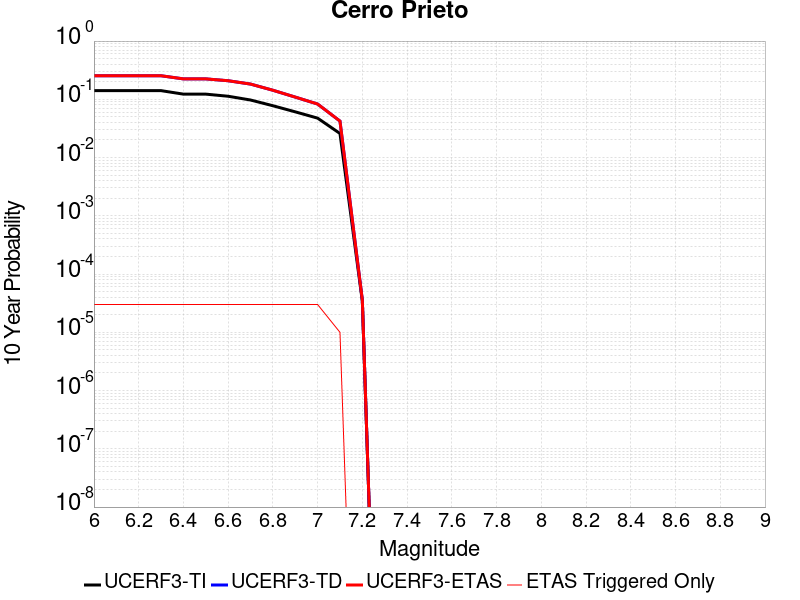 |

| Magnitude | 1 wk TI Prob | 1 wk TD Prob | 1 wk ETAS Prob | 1 wk ETAS/TD Gain | 1 wk ETAS Triggered Only | 1 mo TI Prob | 1 mo TD Prob | 1 mo ETAS Prob | 1 mo ETAS/TD Gain | 1 mo ETAS Triggered Only | 1 yr TI Prob | 1 yr TD Prob | 1 yr ETAS Prob | 1 yr ETAS/TD Gain | 1 yr ETAS Triggered Only | 10 yr TI Prob | 10 yr TD Prob | 10 yr ETAS Prob | 10 yr ETAS/TD Gain | 10 yr ETAS Triggered Only |
|-----|-----|-----|-----|-----|-----|-----|-----|-----|-----|-----|-----|-----|-----|-----|-----|-----|-----|-----|-----|-----|
| 6.0 | 2.9101528E-4 | 5.9654453E-4 | 5.9654453E-4 | 1.0 | 0.0 | 0.0012466122 | 0.0025543566 | 0.002564331 | 1.0039049 | 1.0E-5 | 0.015072231 | 0.030802928 | 0.030822312 | 1.0006293 | 2.0E-5 | 0.14089979 | 0.25386256 | 0.25388497 | 1.0000882 | 3.0E-5 |
| 6.1 | 2.9101528E-4 | 5.9654453E-4 | 5.9654453E-4 | 1.0 | 0.0 | 0.0012466122 | 0.0025543566 | 0.002564331 | 1.0039049 | 1.0E-5 | 0.015072231 | 0.030802928 | 0.030822312 | 1.0006293 | 2.0E-5 | 0.14089979 | 0.25386256 | 0.25388497 | 1.0000882 | 3.0E-5 |
| 6.2 | 2.9101528E-4 | 5.9654453E-4 | 5.9654453E-4 | 1.0 | 0.0 | 0.0012466122 | 0.0025543566 | 0.002564331 | 1.0039049 | 1.0E-5 | 0.015072231 | 0.030802928 | 0.030822312 | 1.0006293 | 2.0E-5 | 0.14089979 | 0.25386256 | 0.25388497 | 1.0000882 | 3.0E-5 |
| 6.3 | 2.9101528E-4 | 5.9654453E-4 | 5.9654453E-4 | 1.0 | 0.0 | 0.0012466122 | 0.0025543566 | 0.002564331 | 1.0039049 | 1.0E-5 | 0.015072231 | 0.030802928 | 0.030822312 | 1.0006293 | 2.0E-5 | 0.14089979 | 0.25386256 | 0.25388497 | 1.0000882 | 3.0E-5 |
| 6.4 | 2.508648E-4 | 5.140412E-4 | 5.140412E-4 | 1.0 | 0.0 | 0.0010746918 | 0.0022013725 | 0.0022113505 | 1.0045326 | 1.0E-5 | 0.013006088 | 0.026629416 | 0.026648883 | 1.000731 | 2.0E-5 | 0.12270685 | 0.2242222 | 0.22424546 | 1.0001038 | 3.0E-5 |
| 6.5 | 2.508648E-4 | 5.140412E-4 | 5.140412E-4 | 1.0 | 0.0 | 0.0010746918 | 0.0022013725 | 0.0022113505 | 1.0045326 | 1.0E-5 | 0.013006088 | 0.026629416 | 0.026648883 | 1.000731 | 2.0E-5 | 0.12270685 | 0.2242222 | 0.22424546 | 1.0001038 | 3.0E-5 |
| 6.6 | 2.294914E-4 | 4.7123645E-4 | 4.7123645E-4 | 1.0 | 0.0 | 9.831638E-4 | 0.0020182093 | 0.0020281891 | 1.0049449 | 1.0E-5 | 0.011904482 | 0.024394194 | 0.024413705 | 1.0007999 | 2.0E-5 | 0.11286586 | 0.20837563 | 0.20839937 | 1.000114 | 3.0E-5 |
| 6.7 | 1.9621674E-4 | 4.0426268E-4 | 4.0426268E-4 | 1.0 | 0.0 | 8.4065786E-4 | 0.0017315624 | 0.001741545 | 1.0057651 | 1.0E-5 | 0.010187071 | 0.020888962 | 0.020908544 | 1.0009375 | 2.0E-5 | 0.09732539 | 0.18264732 | 0.18267183 | 1.0001342 | 3.0E-5 |
| 6.8 | 1.5476145E-4 | 3.0572579E-4 | 3.0572579E-4 | 1.0 | 0.0 | 6.6309475E-4 | 0.0013096977 | 0.0013196847 | 1.0076253 | 1.0E-5 | 0.008043335 | 0.015826825 | 0.01584651 | 1.0012437 | 2.0E-5 | 0.07758363 | 0.14310057 | 0.1431263 | 1.0001796 | 3.0E-5 |
| 6.9 | 1.20509176E-4 | 2.2588465E-4 | 2.2588465E-4 | 1.0 | 0.0 | 5.1636563E-4 | 9.6778123E-4 | 9.777716E-4 | 1.0103229 | 1.0E-5 | 0.006268645 | 0.011734025 | 0.01175379 | 1.0016844 | 2.0E-5 | 0.060947374 | 0.10917958 | 0.109206304 | 1.0002447 | 3.0E-5 |
| 7.0 | 9.3269155E-5 | 1.6721459E-4 | 1.6721459E-4 | 1.0 | 0.0 | 3.9966372E-4 | 7.1648025E-4 | 7.264731E-4 | 1.0139471 | 1.0E-5 | 0.0048550544 | 0.008695914 | 0.00871574 | 1.0022799 | 2.0E-5 | 0.04750344 | 0.082943216 | 0.08297073 | 1.0003316 | 3.0E-5 |
| 7.1 | 5.029709E-5 | 8.174011E-5 | 8.174011E-5 | 1.0 | 0.0 | 2.1554115E-4 | 3.50287E-4 | 3.602835E-4 | 1.028538 | 1.0E-5 | 0.0026210553 | 0.004259821 | 0.0042697787 | 1.0023376 | 1.0E-5 | 0.025903556 | 0.04226813 | 0.04227771 | 1.0002266 | 1.0E-5 |
| 7.2 | 6.5445185E-8 | 6.824737E-8 | 6.824737E-8 | 1.0 | 0.0 | 2.8047933E-7 | 2.9248872E-7 | 2.9248872E-7 | 1.0 | 0.0 | 3.4148304E-6 | 3.56105E-6 | 3.56105E-6 | 1.0 | 0.0 | 3.414778E-5 | 3.56105E-5 | 3.56105E-5 | 1.0 | 0.0 |

## San Cayetano
*[(top)](#table-of-contents)*

| 1 Week | 1 Month | 1 Year | 10 Year |
|-----|-----|-----|-----|
|  | 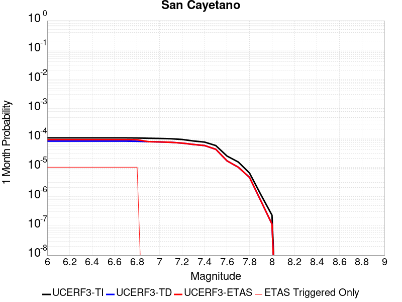 | 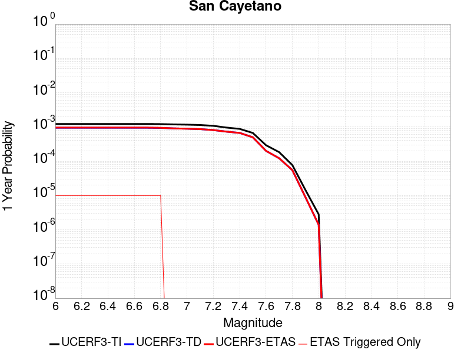 | 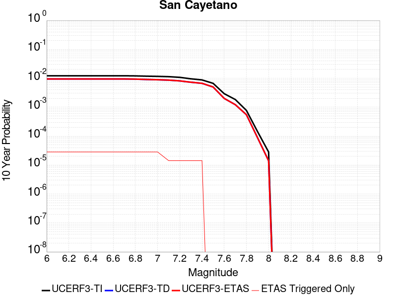 |

| Magnitude | 1 wk TI Prob | 1 wk TD Prob | 1 wk ETAS Prob | 1 wk ETAS/TD Gain | 1 wk ETAS Triggered Only | 1 mo TI Prob | 1 mo TD Prob | 1 mo ETAS Prob | 1 mo ETAS/TD Gain | 1 mo ETAS Triggered Only | 1 yr TI Prob | 1 yr TD Prob | 1 yr ETAS Prob | 1 yr ETAS/TD Gain | 1 yr ETAS Triggered Only | 10 yr TI Prob | 10 yr TD Prob | 10 yr ETAS Prob | 10 yr ETAS/TD Gain | 10 yr ETAS Triggered Only |
|-----|-----|-----|-----|-----|-----|-----|-----|-----|-----|-----|-----|-----|-----|-----|-----|-----|-----|-----|-----|-----|
| 6.0 | 2.3476267E-5 | 1.8169216E-5 | 1.8169216E-5 | 1.0 | 0.0 | 1.0060869E-4 | 7.786576E-5 | 8.786499E-5 | 1.1284162 | 1.0E-5 | 0.0012242225 | 9.4760704E-4 | 9.575976E-4 | 1.0105429 | 1.0E-5 | 0.012175002 | 0.00943675 | 0.0094664665 | 1.003149 | 3.0E-5 |
| 6.1 | 2.3476267E-5 | 1.8169216E-5 | 1.8169216E-5 | 1.0 | 0.0 | 1.0060869E-4 | 7.786576E-5 | 8.786499E-5 | 1.1284162 | 1.0E-5 | 0.0012242225 | 9.4760704E-4 | 9.575976E-4 | 1.0105429 | 1.0E-5 | 0.012175002 | 0.00943675 | 0.0094664665 | 1.003149 | 3.0E-5 |
| 6.2 | 2.3476267E-5 | 1.8169216E-5 | 1.8169216E-5 | 1.0 | 0.0 | 1.0060869E-4 | 7.786576E-5 | 8.786499E-5 | 1.1284162 | 1.0E-5 | 0.0012242225 | 9.4760704E-4 | 9.575976E-4 | 1.0105429 | 1.0E-5 | 0.012175002 | 0.00943675 | 0.0094664665 | 1.003149 | 3.0E-5 |
| 6.3 | 2.3476267E-5 | 1.8169216E-5 | 1.8169216E-5 | 1.0 | 0.0 | 1.0060869E-4 | 7.786576E-5 | 8.786499E-5 | 1.1284162 | 1.0E-5 | 0.0012242225 | 9.4760704E-4 | 9.575976E-4 | 1.0105429 | 1.0E-5 | 0.012175002 | 0.00943675 | 0.0094664665 | 1.003149 | 3.0E-5 |
| 6.4 | 2.3476267E-5 | 1.8169216E-5 | 1.8169216E-5 | 1.0 | 0.0 | 1.0060869E-4 | 7.786576E-5 | 8.786499E-5 | 1.1284162 | 1.0E-5 | 0.0012242225 | 9.4760704E-4 | 9.575976E-4 | 1.0105429 | 1.0E-5 | 0.012175002 | 0.00943675 | 0.0094664665 | 1.003149 | 3.0E-5 |
| 6.5 | 2.3476267E-5 | 1.8169216E-5 | 1.8169216E-5 | 1.0 | 0.0 | 1.0060869E-4 | 7.786576E-5 | 8.786499E-5 | 1.1284162 | 1.0E-5 | 0.0012242225 | 9.4760704E-4 | 9.575976E-4 | 1.0105429 | 1.0E-5 | 0.012175002 | 0.00943675 | 0.0094664665 | 1.003149 | 3.0E-5 |
| 6.6 | 2.3476267E-5 | 1.8169216E-5 | 1.8169216E-5 | 1.0 | 0.0 | 1.0060869E-4 | 7.786576E-5 | 8.786499E-5 | 1.1284162 | 1.0E-5 | 0.0012242225 | 9.4760704E-4 | 9.575976E-4 | 1.0105429 | 1.0E-5 | 0.012175002 | 0.00943675 | 0.0094664665 | 1.003149 | 3.0E-5 |
| 6.7 | 2.3476267E-5 | 1.8169216E-5 | 1.8169216E-5 | 1.0 | 0.0 | 1.0060869E-4 | 7.786576E-5 | 8.786499E-5 | 1.1284162 | 1.0E-5 | 0.0012242225 | 9.4760704E-4 | 9.575976E-4 | 1.0105429 | 1.0E-5 | 0.012175002 | 0.00943675 | 0.0094664665 | 1.003149 | 3.0E-5 |
| 6.8 | 2.3241924E-5 | 1.7936945E-5 | 1.7936945E-5 | 1.0 | 0.0 | 9.960445E-5 | 7.687038E-5 | 8.6869615E-5 | 1.1300792 | 1.0E-5 | 0.0012120095 | 9.354987E-4 | 9.4548933E-4 | 1.0106795 | 1.0E-5 | 0.012054204 | 0.0093166195 | 0.00934634 | 1.00319 | 3.0E-5 |
| 6.9 | 2.2761007E-5 | 1.7432383E-5 | 1.7432383E-5 | 1.0 | 0.0 | 9.7543525E-5 | 7.47081E-5 | 7.47081E-5 | 1.0 | 0.0 | 0.0011869454 | 9.09195E-4 | 9.09195E-4 | 1.0 | 0.0 | 0.011806256 | 0.009055741 | 0.00907556 | 1.0021886 | 2.0E-5 |
| 7.0 | 2.240283E-5 | 1.7066137E-5 | 1.7066137E-5 | 1.0 | 0.0 | 9.600859E-5 | 7.313856E-5 | 7.313856E-5 | 1.0 | 0.0 | 0.0011682777 | 8.9010154E-4 | 8.9010154E-4 | 1.0 | 0.0 | 0.011621549 | 0.008866336 | 0.008886159 | 1.0022358 | 2.0E-5 |
| 7.1 | 2.1871154E-5 | 1.658602E-5 | 1.658602E-5 | 1.0 | 0.0 | 9.373015E-5 | 7.108103E-5 | 7.108103E-5 | 1.0 | 0.0 | 0.0011405671 | 8.6507126E-4 | 8.6507126E-4 | 1.0 | 0.0 | 0.011347309 | 0.008617996 | 0.00862791 | 1.0011504 | 1.0E-5 |
| 7.2 | 2.0714133E-5 | 1.5564563E-5 | 1.5564563E-5 | 1.0 | 0.0 | 8.8771834E-5 | 6.670358E-5 | 6.670358E-5 | 1.0 | 0.0 | 0.0010802611 | 8.118168E-4 | 8.118168E-4 | 1.0 | 0.0 | 0.010750249 | 0.008089443 | 0.008099362 | 1.0012262 | 1.0E-5 |
| 7.3 | 1.8408395E-5 | 1.3996829E-5 | 1.3996829E-5 | 1.0 | 0.0 | 7.8890735E-5 | 5.9985046E-5 | 5.9985046E-5 | 1.0 | 0.0 | 9.600714E-4 | 7.300762E-4 | 7.300762E-4 | 1.0 | 0.0 | 0.009559342 | 0.0072776447 | 0.0072875717 | 1.0013641 | 1.0E-5 |
| 7.4 | 1.6856795E-5 | 1.285006E-5 | 1.285006E-5 | 1.0 | 0.0 | 7.2241404E-5 | 5.5070537E-5 | 5.5070537E-5 | 1.0 | 0.0 | 8.7918417E-4 | 6.7028037E-4 | 6.7028037E-4 | 1.0 | 0.0 | 0.00875714 | 0.0066834087 | 0.006693342 | 1.0014863 | 1.0E-5 |
| 7.5 | 1.2822778E-5 | 9.577415E-6 | 9.577415E-6 | 1.0 | 0.0 | 5.495361E-5 | 4.1045427E-5 | 4.1045427E-5 | 1.0 | 0.0 | 6.688548E-4 | 4.9961504E-4 | 4.9961504E-4 | 1.0 | 0.0 | 0.006668452 | 0.0049851923 | 0.0049851923 | 1.0 | 0.0 |
| 7.6 | 5.6272684E-6 | 3.854899E-6 | 3.854899E-6 | 1.0 | 0.0 | 2.4116642E-5 | 1.6520893E-5 | 1.6520893E-5 | 1.0 | 0.0 | 2.9358055E-4 | 2.0112342E-4 | 2.0112342E-4 | 1.0 | 0.0 | 0.0029319301 | 0.0020094248 | 0.0020094248 | 1.0 | 0.0 |
| 7.7 | 3.5261346E-6 | 2.3407094E-6 | 2.3407094E-6 | 1.0 | 0.0 | 1.5111918E-5 | 1.0031574E-5 | 1.0031574E-5 | 1.0 | 0.0 | 1.8397206E-4 | 1.2212765E-4 | 1.2212765E-4 | 1.0 | 0.0 | 0.0018381984 | 0.0012206127 | 0.0012206127 | 1.0 | 0.0 |
| 7.8 | 1.4826929E-6 | 1.0564395E-6 | 1.0564395E-6 | 1.0 | 0.0 | 6.354383E-6 | 4.52759E-6 | 4.52759E-6 | 1.0 | 0.0 | 7.736187E-5 | 5.5122033E-5 | 5.5122033E-5 | 1.0 | 0.0 | 7.733494E-4 | 5.510856E-4 | 5.510856E-4 | 1.0 | 0.0 |
| 7.9 | 2.7568166E-7 | 1.6977887E-7 | 1.6977887E-7 | 1.0 | 0.0 | 1.1814923E-6 | 7.276235E-7 | 7.276235E-7 | 1.0 | 0.0 | 1.4384574E-5 | 8.85878E-6 | 8.85878E-6 | 1.0 | 0.0 | 1.4383643E-4 | 8.858431E-5 | 8.858431E-5 | 1.0 | 0.0 |
| 8.0 | 5.407832E-8 | 2.688677E-8 | 2.688677E-8 | 1.0 | 0.0 | 2.3176422E-7 | 1.15229014E-7 | 1.15229014E-7 | 1.0 | 0.0 | 2.8217257E-6 | 1.4029123E-6 | 1.4029123E-6 | 1.0 | 0.0 | 2.8216898E-5 | 1.40290385E-5 | 1.40290385E-5 | 1.0 | 0.0 |

## Hunting Creek - Bartlett Springs connector 2011
*[(top)](#table-of-contents)*

| 1 Week | 1 Month | 1 Year | 10 Year |
|-----|-----|-----|-----|
| 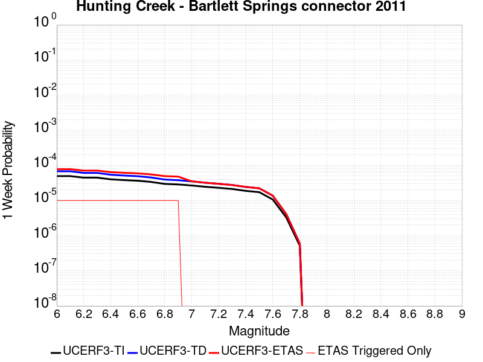 | 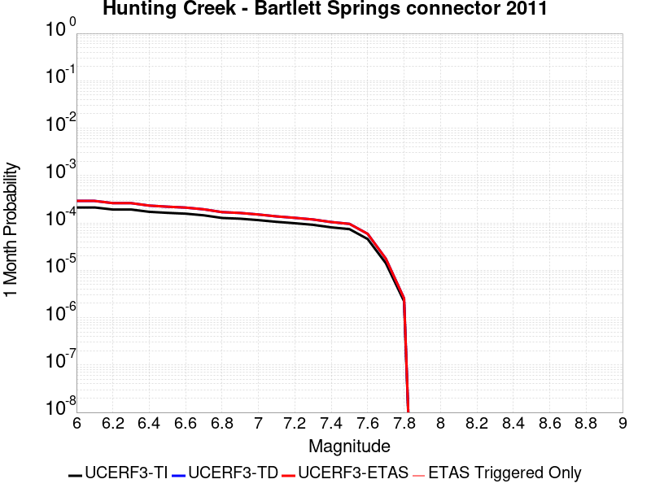 | 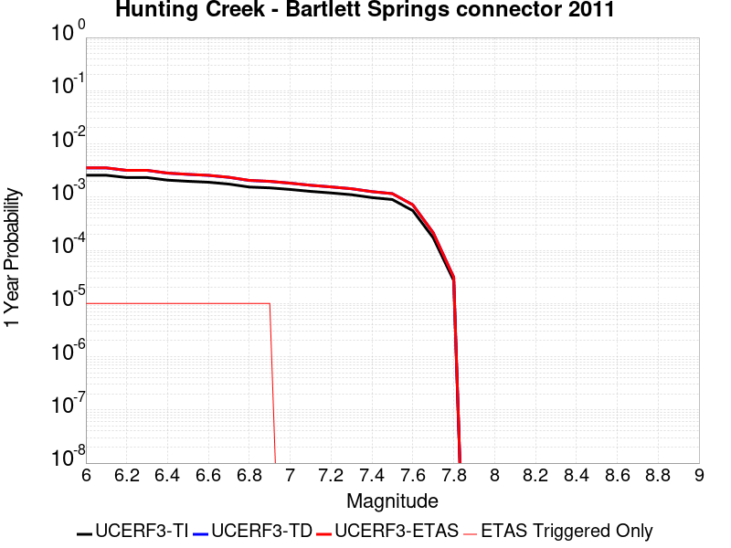 | 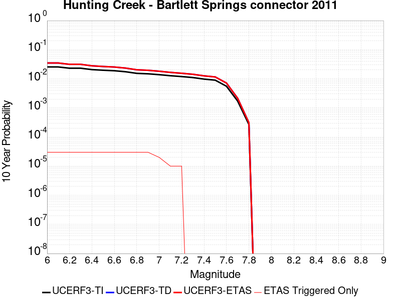 |

| Magnitude | 1 wk TI Prob | 1 wk TD Prob | 1 wk ETAS Prob | 1 wk ETAS/TD Gain | 1 wk ETAS Triggered Only | 1 mo TI Prob | 1 mo TD Prob | 1 mo ETAS Prob | 1 mo ETAS/TD Gain | 1 mo ETAS Triggered Only | 1 yr TI Prob | 1 yr TD Prob | 1 yr ETAS Prob | 1 yr ETAS/TD Gain | 1 yr ETAS Triggered Only | 10 yr TI Prob | 10 yr TD Prob | 10 yr ETAS Prob | 10 yr ETAS/TD Gain | 10 yr ETAS Triggered Only |
|-----|-----|-----|-----|-----|-----|-----|-----|-----|-----|-----|-----|-----|-----|-----|-----|-----|-----|-----|-----|-----|
| 6.0 | 4.940016E-5 | 6.7870766E-5 | 7.7870085E-5 | 1.1473289 | 1.0E-5 | 2.1169778E-4 | 2.9084194E-4 | 3.0083905E-4 | 1.0343729 | 1.0E-5 | 0.002574374 | 0.0035350819 | 0.0035450463 | 1.0028188 | 1.0E-5 | 0.025447546 | 0.03477475 | 0.034803707 | 1.0008327 | 3.0E-5 |
| 6.1 | 4.940016E-5 | 6.7870766E-5 | 7.7870085E-5 | 1.1473289 | 1.0E-5 | 2.1169778E-4 | 2.9084194E-4 | 3.0083905E-4 | 1.0343729 | 1.0E-5 | 0.002574374 | 0.0035350819 | 0.0035450463 | 1.0028188 | 1.0E-5 | 0.025447546 | 0.03477475 | 0.034803707 | 1.0008327 | 3.0E-5 |
| 6.2 | 4.472471E-5 | 6.100572E-5 | 7.100511E-5 | 1.1639091 | 1.0E-5 | 1.9166325E-4 | 2.6142647E-4 | 2.7142384E-4 | 1.0382416 | 1.0E-5 | 0.0023310026 | 0.0031781218 | 0.0031880902 | 1.0031365 | 1.0E-5 | 0.02306703 | 0.031317808 | 0.03134687 | 1.0009279 | 3.0E-5 |
| 6.3 | 4.472471E-5 | 6.100572E-5 | 7.100511E-5 | 1.1639091 | 1.0E-5 | 1.9166325E-4 | 2.6142647E-4 | 2.7142384E-4 | 1.0382416 | 1.0E-5 | 0.0023310026 | 0.0031781218 | 0.0031880902 | 1.0031365 | 1.0E-5 | 0.02306703 | 0.031317808 | 0.03134687 | 1.0009279 | 3.0E-5 |
| 6.4 | 4.0001003E-5 | 5.410516E-5 | 6.410462E-5 | 1.1848153 | 1.0E-5 | 1.714216E-4 | 2.318579E-4 | 2.418556E-4 | 1.0431199 | 1.0E-5 | 0.0020850603 | 0.0028191686 | 0.0028291403 | 1.0035372 | 1.0E-5 | 0.02065605 | 0.027829198 | 0.027858363 | 1.001048 | 3.0E-5 |
| 6.5 | 3.8033053E-5 | 5.126649E-5 | 6.126598E-5 | 1.1950492 | 1.0E-5 | 1.6298861E-4 | 2.1969521E-4 | 2.2969302E-4 | 1.0455076 | 1.0E-5 | 0.0019825802 | 0.0026714848 | 0.0026814581 | 1.0037333 | 1.0E-5 | 0.019649856 | 0.026391273 | 0.026420482 | 1.0011067 | 3.0E-5 |
| 6.6 | 3.653754E-5 | 4.912955E-5 | 5.912906E-5 | 1.2035335 | 1.0E-5 | 1.5658008E-4 | 2.1053842E-4 | 2.2053631E-4 | 1.0474873 | 1.0E-5 | 0.0019046954 | 0.0025602889 | 0.002570263 | 1.0038958 | 1.0E-5 | 0.018884527 | 0.025307199 | 0.02533644 | 1.0011554 | 3.0E-5 |
| 6.7 | 3.372024E-5 | 4.5140216E-5 | 5.5139764E-5 | 1.221522 | 1.0E-5 | 1.4450731E-4 | 1.9344388E-4 | 2.0344194E-4 | 1.0516846 | 1.0E-5 | 0.0017579567 | 0.0023526535 | 0.00236263 | 1.0042405 | 1.0E-5 | 0.017441148 | 0.023278862 | 0.023308164 | 1.0012587 | 3.0E-5 |
| 6.8 | 2.9650024E-5 | 3.9411647E-5 | 4.9411254E-5 | 1.2537221 | 1.0E-5 | 1.2706534E-4 | 1.6889606E-4 | 1.7889438E-4 | 1.059198 | 1.0E-5 | 0.0015459227 | 0.0020543607 | 0.00206434 | 1.0048577 | 1.0E-5 | 0.015352124 | 0.020351961 | 0.020381352 | 1.0014441 | 3.0E-5 |
| 6.9 | 2.860775E-5 | 3.7812886E-5 | 4.781251E-5 | 1.2644501 | 1.0E-5 | 1.2259888E-4 | 1.620452E-4 | 1.7204358E-4 | 1.0617012 | 1.0E-5 | 0.0014916194 | 0.0019711219 | 0.0019811022 | 1.0050633 | 1.0E-5 | 0.014816469 | 0.019536555 | 0.01956597 | 1.0015056 | 3.0E-5 |
| 7.0 | 2.6696067E-5 | 3.5067544E-5 | 3.5067544E-5 | 1.0 | 0.0 | 1.144067E-4 | 1.5028086E-4 | 1.5028086E-4 | 1.0 | 0.0 | 0.0013920115 | 0.0018281427 | 0.0018281427 | 1.0 | 0.0 | 0.013833242 | 0.01813184 | 0.018151475 | 1.001083 | 2.0E-5 |
| 7.1 | 2.456087E-5 | 3.2013326E-5 | 3.2013326E-5 | 1.0 | 0.0 | 1.0525662E-4 | 1.3719281E-4 | 1.3719281E-4 | 1.0 | 0.0 | 0.001280746 | 0.0016690517 | 0.0016690517 | 1.0 | 0.0 | 0.012733897 | 0.016566671 | 0.016576506 | 1.0005937 | 1.0E-5 |
| 7.2 | 2.295761E-5 | 2.9823148E-5 | 2.9823148E-5 | 1.0 | 0.0 | 9.8386045E-5 | 1.2780727E-4 | 1.2780727E-4 | 1.0 | 0.0 | 0.0011971919 | 0.0015549522 | 0.0015549522 | 1.0 | 0.0 | 0.011907627 | 0.015442378 | 0.015452223 | 1.0006375 | 1.0E-5 |
| 7.3 | 2.1256936E-5 | 2.7542124E-5 | 2.7542124E-5 | 1.0 | 0.0 | 9.109797E-5 | 1.1803238E-4 | 1.1803238E-4 | 1.0 | 0.0 | 0.0011085535 | 0.0014361058 | 0.0014361058 | 1.0 | 0.0 | 0.011030397 | 0.014269741 | 0.014269741 | 1.0 | 0.0 |
| 7.4 | 1.8784336E-5 | 2.430697E-5 | 2.430697E-5 | 1.0 | 0.0 | 8.050181E-5 | 1.0416861E-4 | 1.0416861E-4 | 1.0 | 0.0 | 9.796688E-4 | 0.0012675226 | 0.0012675226 | 1.0 | 0.0 | 0.009753612 | 0.012604194 | 0.012604194 | 1.0 | 0.0 |
| 7.5 | 1.7248298E-5 | 2.2269056E-5 | 2.2269056E-5 | 1.0 | 0.0 | 7.391918E-5 | 9.543537E-5 | 9.543537E-5 | 1.0 | 0.0 | 8.9959445E-4 | 0.0011613137 | 0.0011613137 | 1.0 | 0.0 | 0.008959615 | 0.011553645 | 0.011553645 | 1.0 | 0.0 |
| 7.6 | 1.0653709E-5 | 1.3722259E-5 | 1.3722259E-5 | 1.0 | 0.0 | 4.5657955E-5 | 5.880837E-5 | 5.880837E-5 | 1.0 | 0.0 | 5.557438E-4 | 7.157594E-4 | 7.157594E-4 | 1.0 | 0.0 | 0.0055435603 | 0.0071350415 | 0.0071350415 | 1.0 | 0.0 |
| 7.7 | 3.286316E-6 | 4.0903997E-6 | 4.0903997E-6 | 1.0 | 0.0 | 1.4084137E-5 | 1.7530168E-5 | 1.7530168E-5 | 1.0 | 0.0 | 1.7146087E-4 | 2.1340905E-4 | 2.1340905E-4 | 1.0 | 0.0 | 0.0017132863 | 0.0021320845 | 0.0021320845 | 1.0 | 0.0 |
| 7.8 | 5.1855085E-7 | 5.972095E-7 | 5.972095E-7 | 1.0 | 0.0 | 2.222359E-6 | 2.5594668E-6 | 2.5594668E-6 | 1.0 | 0.0 | 2.7056883E-5 | 3.1161075E-5 | 3.1161075E-5 | 1.0 | 0.0 | 2.705359E-4 | 3.1156064E-4 | 3.1156064E-4 | 1.0 | 0.0 |

## San Jacinto (Superstition Mtn)
*[(top)](#table-of-contents)*

| 1 Week | 1 Month | 1 Year | 10 Year |
|-----|-----|-----|-----|
|  |  |  |  |

| Magnitude | 1 wk TI Prob | 1 wk TD Prob | 1 wk ETAS Prob | 1 wk ETAS/TD Gain | 1 wk ETAS Triggered Only | 1 mo TI Prob | 1 mo TD Prob | 1 mo ETAS Prob | 1 mo ETAS/TD Gain | 1 mo ETAS Triggered Only | 1 yr TI Prob | 1 yr TD Prob | 1 yr ETAS Prob | 1 yr ETAS/TD Gain | 1 yr ETAS Triggered Only | 10 yr TI Prob | 10 yr TD Prob | 10 yr ETAS Prob | 10 yr ETAS/TD Gain | 10 yr ETAS Triggered Only |
|-----|-----|-----|-----|-----|-----|-----|-----|-----|-----|-----|-----|-----|-----|-----|-----|-----|-----|-----|-----|-----|
| 6.0 | 6.4193904E-5 | 9.599558E-5 | 1.0599462E-4 | 1.1041615 | 1.0E-5 | 2.7508775E-4 | 4.1135435E-4 | 4.2135024E-4 | 1.0243 | 1.0E-5 | 0.0033440501 | 0.0049981694 | 0.0050180694 | 1.0039815 | 2.0E-5 | 0.03294174 | 0.048820045 | 0.04884858 | 1.0005845 | 3.0E-5 |
| 6.1 | 6.4193904E-5 | 9.599558E-5 | 1.0599462E-4 | 1.1041615 | 1.0E-5 | 2.7508775E-4 | 4.1135435E-4 | 4.2135024E-4 | 1.0243 | 1.0E-5 | 0.0033440501 | 0.0049981694 | 0.0050180694 | 1.0039815 | 2.0E-5 | 0.03294174 | 0.048820045 | 0.04884858 | 1.0005845 | 3.0E-5 |
| 6.2 | 5.7023593E-5 | 8.3144616E-5 | 9.314378E-5 | 1.1202624 | 1.0E-5 | 2.4436394E-4 | 3.5629462E-4 | 3.6629106E-4 | 1.0280566 | 1.0E-5 | 0.002971072 | 0.0043309047 | 0.004350818 | 1.004598 | 2.0E-5 | 0.029316625 | 0.042502448 | 0.0425216 | 1.0004506 | 2.0E-5 |
| 6.3 | 5.6940098E-5 | 8.298998E-5 | 9.298915E-5 | 1.1204865 | 1.0E-5 | 2.4400617E-4 | 3.5563204E-4 | 3.656285E-4 | 1.028109 | 1.0E-5 | 0.002966728 | 0.00432287 | 0.0043427837 | 1.0046066 | 2.0E-5 | 0.029274331 | 0.04242582 | 0.04244497 | 1.0004514 | 2.0E-5 |
| 6.4 | 5.4171585E-5 | 7.748391E-5 | 8.748314E-5 | 1.1290491 | 1.0E-5 | 2.3214328E-4 | 3.3204095E-4 | 3.4203762E-4 | 1.0301068 | 1.0E-5 | 0.0028226813 | 0.0040367534 | 0.0040566726 | 1.0049344 | 2.0E-5 | 0.02787096 | 0.039715026 | 0.039734233 | 1.0004836 | 2.0E-5 |
| 6.5 | 4.375144E-5 | 5.6421442E-5 | 6.642088E-5 | 1.1772276 | 1.0E-5 | 1.874927E-4 | 2.417904E-4 | 2.5178798E-4 | 1.0413481 | 1.0E-5 | 0.0022803338 | 0.002941 | 0.002960941 | 1.0067804 | 2.0E-5 | 0.022570757 | 0.029235592 | 0.029255008 | 1.0006641 | 2.0E-5 |
| 6.6 | 2.772192E-5 | 2.5488029E-5 | 2.5488029E-5 | 1.0 | 0.0 | 1.1880282E-4 | 1.0922994E-4 | 1.0922994E-4 | 1.0 | 0.0 | 0.0014454646 | 0.0013290826 | 0.0013390693 | 1.007514 | 1.0E-5 | 0.014360986 | 0.013540891 | 0.013550756 | 1.0007285 | 1.0E-5 |
| 6.7 | 2.7124124E-5 | 2.4699055E-5 | 2.4699055E-5 | 1.0 | 0.0 | 1.1624106E-4 | 1.0584891E-4 | 1.0584891E-4 | 1.0 | 0.0 | 0.0014143161 | 0.0012879678 | 0.0012979549 | 1.0077542 | 1.0E-5 | 0.014053487 | 0.013134248 | 0.013144117 | 1.0007514 | 1.0E-5 |
| 6.8 | 2.5475807E-5 | 2.2164071E-5 | 2.2164071E-5 | 1.0 | 0.0 | 1.0917746E-4 | 9.498548E-5 | 9.498548E-5 | 1.0 | 0.0 | 0.001328425 | 0.0011558468 | 0.0011658352 | 1.0086417 | 1.0E-5 | 0.0132051185 | 0.011821818 | 0.0118317 | 1.0008359 | 1.0E-5 |
| 6.9 | 2.1162023E-5 | 1.762564E-5 | 1.762564E-5 | 1.0 | 0.0 | 9.069123E-5 | 7.553629E-5 | 7.553629E-5 | 1.0 | 0.0 | 0.0011036064 | 9.1927015E-4 | 9.29261E-4 | 1.0108682 | 1.0E-5 | 0.010981417 | 0.009446762 | 0.009456667 | 1.0010486 | 1.0E-5 |
| 7.0 | 1.8754288E-5 | 1.616099E-5 | 1.616099E-5 | 1.0 | 0.0 | 8.037304E-5 | 6.9259564E-5 | 6.9259564E-5 | 1.0 | 0.0 | 9.781026E-4 | 8.429114E-4 | 8.429114E-4 | 1.0 | 0.0 | 0.009738087 | 0.008669995 | 0.008669995 | 1.0 | 0.0 |
| 7.1 | 1.8678527E-5 | 1.6086136E-5 | 1.6086136E-5 | 1.0 | 0.0 | 8.0048376E-5 | 6.8938774E-5 | 6.8938774E-5 | 1.0 | 0.0 | 9.7415317E-4 | 8.3900883E-4 | 8.3900883E-4 | 1.0 | 0.0 | 0.009698939 | 0.008631011 | 0.008631011 | 1.0 | 0.0 |
| 7.2 | 1.7804578E-5 | 1.5380709E-5 | 1.5380709E-5 | 1.0 | 0.0 | 7.6303106E-5 | 6.591567E-5 | 6.591567E-5 | 1.0 | 0.0 | 9.285943E-4 | 8.022301E-4 | 8.022301E-4 | 1.0 | 0.0 | 0.009247236 | 0.008262424 | 0.008262424 | 1.0 | 0.0 |
| 7.3 | 1.6583685E-5 | 1.4529837E-5 | 1.4529837E-5 | 1.0 | 0.0 | 7.1070994E-5 | 6.226926E-5 | 6.226926E-5 | 1.0 | 0.0 | 8.649459E-4 | 7.5786654E-4 | 7.5786654E-4 | 1.0 | 0.0 | 0.00861587 | 0.007817646 | 0.007817646 | 1.0 | 0.0 |
| 7.4 | 1.6387552E-5 | 1.4394727E-5 | 1.4394727E-5 | 1.0 | 0.0 | 7.023047E-5 | 6.169024E-5 | 6.169024E-5 | 1.0 | 0.0 | 8.5472054E-4 | 7.508219E-4 | 7.508219E-4 | 1.0 | 0.0 | 0.008514405 | 0.0077470187 | 0.0077470187 | 1.0 | 0.0 |
| 7.5 | 1.5790754E-5 | 1.40354305E-5 | 1.40354305E-5 | 1.0 | 0.0 | 6.767291E-5 | 6.015047E-5 | 6.015047E-5 | 1.0 | 0.0 | 8.236062E-4 | 7.320879E-4 | 7.320879E-4 | 1.0 | 0.0 | 0.008205604 | 0.007557581 | 0.007557581 | 1.0 | 0.0 |
| 7.6 | 1.4248672E-5 | 1.3054444E-5 | 1.3054444E-5 | 1.0 | 0.0 | 6.106431E-5 | 5.5946428E-5 | 5.5946428E-5 | 1.0 | 0.0 | 7.432043E-4 | 6.809366E-4 | 6.809366E-4 | 1.0 | 0.0 | 0.007407237 | 0.007040175 | 0.007040175 | 1.0 | 0.0 |
| 7.7 | 1.15449975E-5 | 1.0903222E-5 | 1.0903222E-5 | 1.0 | 0.0 | 4.947762E-5 | 4.672726E-5 | 4.672726E-5 | 1.0 | 0.0 | 6.022235E-4 | 5.6875666E-4 | 5.6875666E-4 | 1.0 | 0.0 | 0.006005941 | 0.0059102564 | 0.0059102564 | 1.0 | 0.0 |
| 7.8 | 9.1391985E-6 | 9.5139185E-6 | 9.5139185E-6 | 1.0 | 0.0 | 3.9167408E-5 | 4.0773306E-5 | 4.0773306E-5 | 1.0 | 0.0 | 4.767588E-4 | 4.963025E-4 | 4.963025E-4 | 1.0 | 0.0 | 0.0047573727 | 0.005176809 | 0.005176809 | 1.0 | 0.0 |
| 7.9 | 6.973017E-6 | 7.3817937E-6 | 7.3817937E-6 | 1.0 | 0.0 | 2.9884017E-5 | 3.163588E-5 | 3.163588E-5 | 1.0 | 0.0 | 3.6377716E-4 | 3.8509927E-4 | 3.8509927E-4 | 1.0 | 0.0 | 0.0036318225 | 0.004051976 | 0.004051976 | 1.0 | 0.0 |
| 8.0 | 5.7638235E-6 | 6.259641E-6 | 6.259641E-6 | 1.0 | 0.0 | 2.4701867E-5 | 2.682676E-5 | 2.682676E-5 | 1.0 | 0.0 | 3.0070372E-4 | 3.2656736E-4 | 3.2656736E-4 | 1.0 | 0.0 | 0.0030029714 | 0.0034535413 | 0.0034535413 | 1.0 | 0.0 |
| 8.1 | 5.1124434E-6 | 5.4953657E-6 | 5.4953657E-6 | 1.0 | 0.0 | 2.1910288E-5 | 2.3551356E-5 | 2.3551356E-5 | 1.0 | 0.0 | 2.6672508E-4 | 2.8670052E-4 | 2.8670052E-4 | 1.0 | 0.0 | 0.0026640517 | 0.0030403896 | 0.0030403896 | 1.0 | 0.0 |
| 8.2 | 1.1075938E-6 | 5.3348367E-7 | 5.3348367E-7 | 1.0 | 0.0 | 4.7468216E-6 | 2.2863567E-6 | 2.2863567E-6 | 1.0 | 0.0 | 5.779102E-5 | 2.7836059E-5 | 2.7836059E-5 | 1.0 | 0.0 | 5.777599E-4 | 3.133962E-4 | 3.133962E-4 | 1.0 | 0.0 |
| 8.3 | 1.3584393E-8 | 4.4718784E-9 | 4.4718784E-9 | 1.0 | 0.0 | 5.8218827E-8 | 1.9165192E-8 | 1.9165192E-8 | 1.0 | 0.0 | 7.0881396E-7 | 2.3333622E-7 | 2.3333622E-7 | 1.0 | 0.0 | 7.0881174E-6 | 2.6140672E-6 | 2.6140672E-6 | 1.0 | 0.0 |

## Great Valley 08 (Quinto)
*[(top)](#table-of-contents)*

| 1 Week | 1 Month | 1 Year | 10 Year |
|-----|-----|-----|-----|
|  | 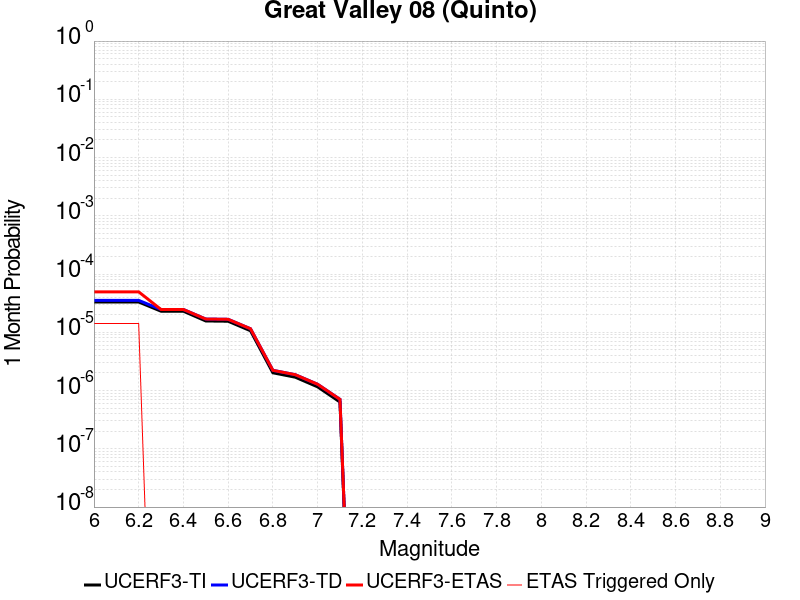 | 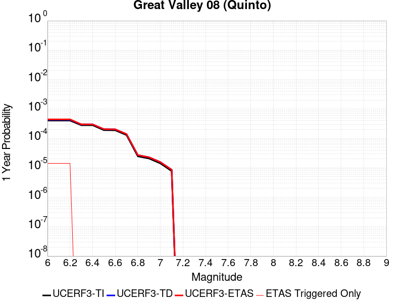 | 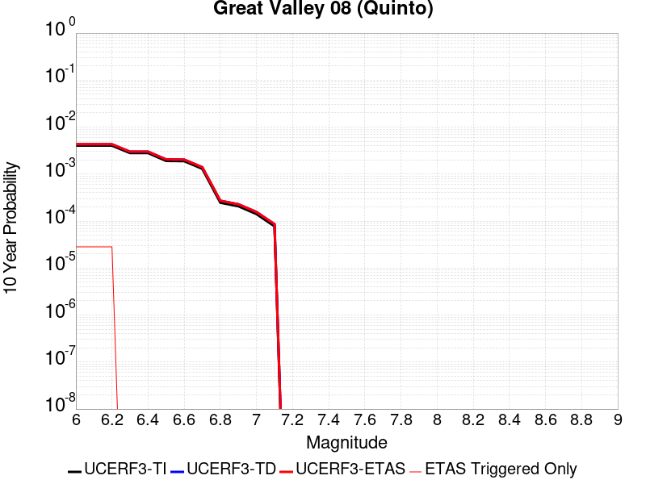 |

| Magnitude | 1 wk TI Prob | 1 wk TD Prob | 1 wk ETAS Prob | 1 wk ETAS/TD Gain | 1 wk ETAS Triggered Only | 1 mo TI Prob | 1 mo TD Prob | 1 mo ETAS Prob | 1 mo ETAS/TD Gain | 1 mo ETAS Triggered Only | 1 yr TI Prob | 1 yr TD Prob | 1 yr ETAS Prob | 1 yr ETAS/TD Gain | 1 yr ETAS Triggered Only | 10 yr TI Prob | 10 yr TD Prob | 10 yr ETAS Prob | 10 yr ETAS/TD Gain | 10 yr ETAS Triggered Only |
|-----|-----|-----|-----|-----|-----|-----|-----|-----|-----|-----|-----|-----|-----|-----|-----|-----|-----|-----|-----|-----|
| 6.0 | 7.737697E-6 | 8.253038E-6 | 8.253038E-6 | 1.0 | 0.0 | 3.3161137E-5 | 3.536979E-5 | 4.5369437E-5 | 1.2827171 | 1.0E-5 | 4.0366207E-4 | 4.3056096E-4 | 4.4055664E-4 | 1.0232155 | 1.0E-5 | 0.004029296 | 0.0042991205 | 0.0043289918 | 1.0069481 | 3.0E-5 |
| 6.1 | 7.737697E-6 | 8.253038E-6 | 8.253038E-6 | 1.0 | 0.0 | 3.3161137E-5 | 3.536979E-5 | 4.5369437E-5 | 1.2827171 | 1.0E-5 | 4.0366207E-4 | 4.3056096E-4 | 4.4055664E-4 | 1.0232155 | 1.0E-5 | 0.004029296 | 0.0042991205 | 0.0043289918 | 1.0069481 | 3.0E-5 |
| 6.2 | 7.737697E-6 | 8.253038E-6 | 8.253038E-6 | 1.0 | 0.0 | 3.3161137E-5 | 3.536979E-5 | 4.5369437E-5 | 1.2827171 | 1.0E-5 | 4.0366207E-4 | 4.3056096E-4 | 4.4055664E-4 | 1.0232155 | 1.0E-5 | 0.004029296 | 0.0042991205 | 0.0043289918 | 1.0069481 | 3.0E-5 |
| 6.3 | 5.374012E-6 | 5.7505736E-6 | 5.7505736E-6 | 1.0 | 0.0 | 2.3031276E-5 | 2.4645145E-5 | 2.4645145E-5 | 1.0 | 0.0 | 2.803697E-4 | 3.0002446E-4 | 3.0002446E-4 | 1.0 | 0.0 | 0.0028001624 | 0.0029972875 | 0.0029972875 | 1.0 | 0.0 |
| 6.4 | 5.374012E-6 | 5.7505736E-6 | 5.7505736E-6 | 1.0 | 0.0 | 2.3031276E-5 | 2.4645145E-5 | 2.4645145E-5 | 1.0 | 0.0 | 2.803697E-4 | 3.0002446E-4 | 3.0002446E-4 | 1.0 | 0.0 | 0.0028001624 | 0.0029972875 | 0.0029972875 | 1.0 | 0.0 |
| 6.5 | 3.65427E-6 | 3.941324E-6 | 3.941324E-6 | 1.0 | 0.0 | 1.5661062E-5 | 1.689132E-5 | 1.689132E-5 | 1.0 | 0.0 | 1.9065675E-4 | 2.0563944E-4 | 2.0563944E-4 | 1.0 | 0.0 | 0.0019049325 | 0.0020551833 | 0.0020551833 | 1.0 | 0.0 |
| 6.6 | 3.6143538E-6 | 3.8985104E-6 | 3.8985104E-6 | 1.0 | 0.0 | 1.5489995E-5 | 1.6707834E-5 | 1.6707834E-5 | 1.0 | 0.0 | 1.8857437E-4 | 2.0340596E-4 | 2.0340596E-4 | 1.0 | 0.0 | 0.0018841444 | 0.0020328893 | 0.0020328893 | 1.0 | 0.0 |
| 6.7 | 2.4821015E-6 | 2.6857067E-6 | 2.6857067E-6 | 1.0 | 0.0 | 1.0637535E-5 | 1.1510153E-5 | 1.1510153E-5 | 1.0 | 0.0 | 1.2950429E-4 | 1.4013276E-4 | 1.4013276E-4 | 1.0 | 0.0 | 0.0012942884 | 0.0014009989 | 0.0014009989 | 1.0 | 0.0 |
| 6.8 | 4.7110538E-7 | 5.193021E-7 | 5.193021E-7 | 1.0 | 0.0 | 2.0190216E-6 | 2.2255786E-6 | 2.2255786E-6 | 1.0 | 0.0 | 2.458131E-5 | 2.70961E-5 | 2.70961E-5 | 1.0 | 0.0 | 2.457859E-4 | 2.7092977E-4 | 2.7092977E-4 | 1.0 | 0.0 |
| 6.9 | 3.958685E-7 | 4.3703452E-7 | 4.3703452E-7 | 1.0 | 0.0 | 1.6965782E-6 | 1.8730038E-6 | 1.8730038E-6 | 1.0 | 0.0 | 2.0655643E-5 | 2.28036E-5 | 2.28036E-5 | 1.0 | 0.0 | 2.0653724E-4 | 2.2801422E-4 | 2.2801422E-4 | 1.0 | 0.0 |
| 7.0 | 2.70294E-7 | 2.9920008E-7 | 2.9920008E-7 | 1.0 | 0.0 | 1.1584025E-6 | 1.2822856E-6 | 1.2822856E-6 | 1.0 | 0.0 | 1.4103458E-5 | 1.5611728E-5 | 1.5611728E-5 | 1.0 | 0.0 | 1.4102564E-4 | 1.5610759E-4 | 1.5610759E-4 | 1.0 | 0.0 |
| 7.1 | 1.4828602E-7 | 1.6469107E-7 | 1.6469107E-7 | 1.0 | 0.0 | 6.3551136E-7 | 7.058187E-7 | 7.058187E-7 | 1.0 | 0.0 | 7.737323E-6 | 8.593317E-6 | 8.593317E-6 | 1.0 | 0.0 | 7.737054E-5 | 8.593065E-5 | 8.593065E-5 | 1.0 | 0.0 |

## Elsinore (Coyote Mountains)
*[(top)](#table-of-contents)*

| 1 Week | 1 Month | 1 Year | 10 Year |
|-----|-----|-----|-----|
|  |  |  |  |

| Magnitude | 1 wk TI Prob | 1 wk TD Prob | 1 wk ETAS Prob | 1 wk ETAS/TD Gain | 1 wk ETAS Triggered Only | 1 mo TI Prob | 1 mo TD Prob | 1 mo ETAS Prob | 1 mo ETAS/TD Gain | 1 mo ETAS Triggered Only | 1 yr TI Prob | 1 yr TD Prob | 1 yr ETAS Prob | 1 yr ETAS/TD Gain | 1 yr ETAS Triggered Only | 10 yr TI Prob | 10 yr TD Prob | 10 yr ETAS Prob | 10 yr ETAS/TD Gain | 10 yr ETAS Triggered Only |
|-----|-----|-----|-----|-----|-----|-----|-----|-----|-----|-----|-----|-----|-----|-----|-----|-----|-----|-----|-----|-----|
| 6.0 | 4.20513E-5 | 4.8630944E-5 | 5.8630456E-5 | 1.2056204 | 1.0E-5 | 1.8020741E-4 | 2.0840492E-4 | 2.2840076E-4 | 1.095947 | 2.0E-5 | 0.0021918174 | 0.0025349057 | 0.002554855 | 1.0078698 | 2.0E-5 | 0.021703249 | 0.025111204 | 0.02514045 | 1.0011647 | 3.0E-5 |
| 6.1 | 4.20513E-5 | 4.8630944E-5 | 5.8630456E-5 | 1.2056204 | 1.0E-5 | 1.8020741E-4 | 2.0840492E-4 | 2.2840076E-4 | 1.095947 | 2.0E-5 | 0.0021918174 | 0.0025349057 | 0.002554855 | 1.0078698 | 2.0E-5 | 0.021703249 | 0.025111204 | 0.02514045 | 1.0011647 | 3.0E-5 |
| 6.2 | 2.3413893E-5 | 2.4695422E-5 | 3.4695175E-5 | 1.4049233 | 1.0E-5 | 1.0034139E-4 | 1.0583377E-4 | 1.15832714E-4 | 1.0944778 | 1.0E-5 | 0.0012209718 | 0.0012878523 | 0.0012978393 | 1.0077549 | 1.0E-5 | 0.012142851 | 0.012812569 | 0.012832313 | 1.001541 | 2.0E-5 |
| 6.3 | 2.3413893E-5 | 2.4695422E-5 | 3.4695175E-5 | 1.4049233 | 1.0E-5 | 1.0034139E-4 | 1.0583377E-4 | 1.15832714E-4 | 1.0944778 | 1.0E-5 | 0.0012209718 | 0.0012878523 | 0.0012978393 | 1.0077549 | 1.0E-5 | 0.012142851 | 0.012812569 | 0.012832313 | 1.001541 | 2.0E-5 |
| 6.4 | 1.6894814E-5 | 1.6568214E-5 | 2.6568048E-5 | 1.6035554 | 1.0E-5 | 7.240433E-5 | 7.100491E-5 | 8.1004204E-5 | 1.1408253 | 1.0E-5 | 8.811662E-4 | 8.641788E-4 | 8.7417016E-4 | 1.0115616 | 1.0E-5 | 0.0087768035 | 0.008611842 | 0.008621756 | 1.0011512 | 1.0E-5 |
| 6.5 | 1.6894814E-5 | 1.6568214E-5 | 2.6568048E-5 | 1.6035554 | 1.0E-5 | 7.240433E-5 | 7.100491E-5 | 8.1004204E-5 | 1.1408253 | 1.0E-5 | 8.811662E-4 | 8.641788E-4 | 8.7417016E-4 | 1.0115616 | 1.0E-5 | 0.0087768035 | 0.008611842 | 0.008621756 | 1.0011512 | 1.0E-5 |
| 6.6 | 1.1910969E-5 | 1.0530538E-5 | 2.0530433E-5 | 1.9496092 | 1.0E-5 | 5.1046012E-5 | 4.513017E-5 | 5.512972E-5 | 1.2215712 | 1.0E-5 | 6.21308E-4 | 5.493346E-4 | 5.593291E-4 | 1.0181938 | 1.0E-5 | 0.0061957375 | 0.0054810685 | 0.0054910136 | 1.0018145 | 1.0E-5 |
| 6.7 | 9.1486E-6 | 7.2026473E-6 | 1.7202576E-5 | 2.3883684 | 1.0E-5 | 3.9207694E-5 | 3.0868145E-5 | 4.0867835E-5 | 1.3239486 | 1.0E-5 | 4.7724912E-4 | 3.7575865E-4 | 3.857549E-4 | 1.0266029 | 1.0E-5 | 0.0047622547 | 0.0037516125 | 0.0037615749 | 1.0026555 | 1.0E-5 |
| 6.8 | 7.90441E-6 | 5.7288153E-6 | 1.5728758E-5 | 2.7455516 | 1.0E-5 | 3.3875604E-5 | 2.4551842E-5 | 3.45516E-5 | 1.4072914 | 1.0E-5 | 4.1235742E-4 | 2.9887896E-4 | 3.0887598E-4 | 1.0334483 | 1.0E-5 | 0.0041159308 | 0.0029848986 | 0.0029948687 | 1.0033402 | 1.0E-5 |
| 6.9 | 7.77015E-6 | 5.5827695E-6 | 1.5582715E-5 | 2.7912157 | 1.0E-5 | 3.3300217E-5 | 2.3925944E-5 | 3.3925706E-5 | 1.4179463 | 1.0E-5 | 4.0535472E-4 | 2.912607E-4 | 3.012578E-4 | 1.0343235 | 1.0E-5 | 0.004046161 | 0.0029089167 | 0.0029188877 | 1.0034277 | 1.0E-5 |
| 7.0 | 7.675798E-6 | 5.4796283E-6 | 1.5479574E-5 | 2.8249314 | 1.0E-5 | 3.289586E-5 | 2.3483917E-5 | 3.348368E-5 | 1.4258133 | 1.0E-5 | 4.004335E-4 | 2.8588044E-4 | 2.9587757E-4 | 1.0349697 | 1.0E-5 | 0.003997127 | 0.0028552532 | 0.0028652246 | 1.0034924 | 1.0E-5 |
| 7.1 | 7.447814E-6 | 5.2385003E-6 | 1.5238447E-5 | 2.9089334 | 1.0E-5 | 3.191881E-5 | 2.245053E-5 | 3.2450305E-5 | 1.4454138 | 1.0E-5 | 3.8854225E-4 | 2.7330214E-4 | 2.8329942E-4 | 1.0365795 | 1.0E-5 | 0.003878636 | 0.0027297847 | 0.0027397575 | 1.0036533 | 1.0E-5 |
| 7.2 | 7.128185E-6 | 4.905146E-6 | 1.49050975E-5 | 3.0386653 | 1.0E-5 | 3.0549007E-5 | 2.1021891E-5 | 3.1021682E-5 | 1.4756845 | 1.0E-5 | 3.7187067E-4 | 2.5591266E-4 | 2.6591012E-4 | 1.0390658 | 1.0E-5 | 0.00371249 | 0.002556298 | 0.0025662724 | 1.003902 | 1.0E-5 |
| 7.3 | 7.0913875E-6 | 4.873821E-6 | 1.4873773E-5 | 3.0517683 | 1.0E-5 | 3.0391306E-5 | 2.0887644E-5 | 3.0887437E-5 | 1.4787419 | 1.0E-5 | 3.6995133E-4 | 2.542786E-4 | 2.6427605E-4 | 1.0393169 | 1.0E-5 | 0.0036933604 | 0.0025399947 | 0.0025499694 | 1.003927 | 1.0E-5 |
| 7.4 | 7.051521E-6 | 4.837673E-6 | 1.4837625E-5 | 3.0670996 | 1.0E-5 | 3.0220453E-5 | 2.0732725E-5 | 3.0732517E-5 | 1.4823192 | 1.0E-5 | 3.6787192E-4 | 2.5239287E-4 | 2.6239036E-4 | 1.0396107 | 1.0E-5 | 0.0036726352 | 0.0025211805 | 0.0025311552 | 1.0039564 | 1.0E-5 |
| 7.5 | 6.910666E-6 | 4.7332255E-6 | 1.4733178E-5 | 3.1127143 | 1.0E-5 | 2.9616802E-5 | 2.02851E-5 | 3.0284898E-5 | 1.4929627 | 1.0E-5 | 3.605249E-4 | 2.4694428E-4 | 2.5694183E-4 | 1.0404849 | 1.0E-5 | 0.0035994058 | 0.002466817 | 0.0024767923 | 1.0040438 | 1.0E-5 |
| 7.6 | 6.341753E-6 | 4.306345E-6 | 1.4306303E-5 | 3.3221447 | 1.0E-5 | 2.7178658E-5 | 1.8455641E-5 | 2.8455457E-5 | 1.5418297 | 1.0E-5 | 3.3084993E-4 | 2.2467543E-4 | 2.3467318E-4 | 1.0444987 | 1.0E-5 | 0.0033035777 | 0.002244598 | 0.0022545755 | 1.0044452 | 1.0E-5 |
| 7.7 | 3.9205916E-6 | 2.2437468E-6 | 2.2437468E-6 | 1.0 | 0.0 | 1.6802427E-5 | 9.616027E-6 | 9.616027E-6 | 1.0 | 0.0 | 2.0455034E-4 | 1.17069576E-4 | 1.17069576E-4 | 1.0 | 0.0 | 0.0020436216 | 0.001170152 | 0.001170152 | 1.0 | 0.0 |
| 7.8 | 2.0846227E-7 | 8.4853966E-8 | 8.4853966E-8 | 1.0 | 0.0 | 8.9340944E-7 | 3.6365984E-7 | 3.6365984E-7 | 1.0 | 0.0 | 1.0877206E-5 | 4.427553E-6 | 4.427553E-6 | 1.0 | 0.0 | 1.0876673E-4 | 4.4274973E-5 | 4.4274973E-5 | 1.0 | 0.0 |
| 7.9 | 4.4969806E-9 | 2.269088E-9 | 2.269088E-9 | 1.0 | 0.0 | 1.9272775E-8 | 9.724664E-9 | 9.724664E-9 | 1.0 | 0.0 | 2.3464601E-7 | 1.1839777E-7 | 1.1839777E-7 | 1.0 | 0.0 | 2.3464577E-6 | 1.1839772E-6 | 1.1839772E-6 | 1.0 | 0.0 |

## Johnson Valley (No) 2011 rev
*[(top)](#table-of-contents)*

| 1 Week | 1 Month | 1 Year | 10 Year |
|-----|-----|-----|-----|
| 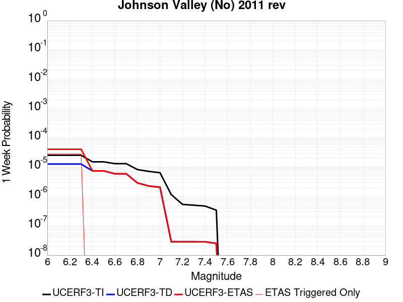 | 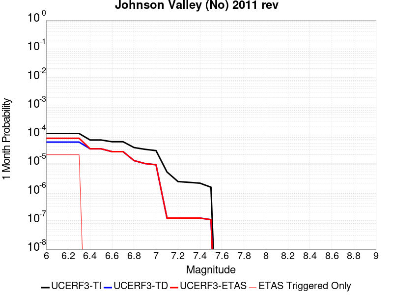 | 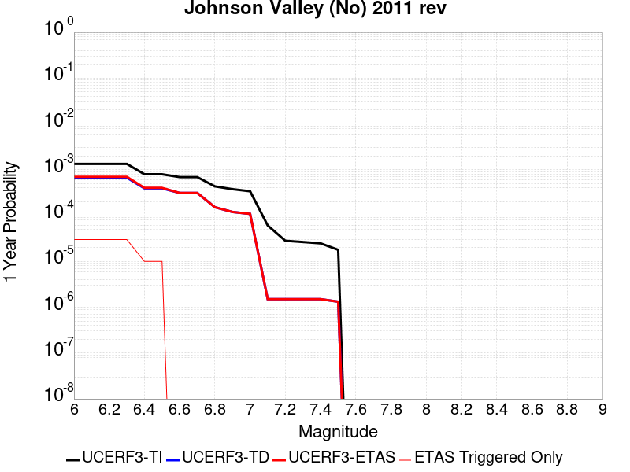 | 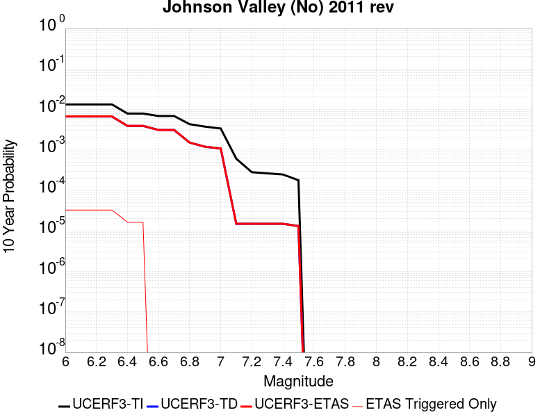 |

| Magnitude | 1 wk TI Prob | 1 wk TD Prob | 1 wk ETAS Prob | 1 wk ETAS/TD Gain | 1 wk ETAS Triggered Only | 1 mo TI Prob | 1 mo TD Prob | 1 mo ETAS Prob | 1 mo ETAS/TD Gain | 1 mo ETAS Triggered Only | 1 yr TI Prob | 1 yr TD Prob | 1 yr ETAS Prob | 1 yr ETAS/TD Gain | 1 yr ETAS Triggered Only | 10 yr TI Prob | 10 yr TD Prob | 10 yr ETAS Prob | 10 yr ETAS/TD Gain | 10 yr ETAS Triggered Only |
|-----|-----|-----|-----|-----|-----|-----|-----|-----|-----|-----|-----|-----|-----|-----|-----|-----|-----|-----|-----|-----|
| 6.0 | 2.577707E-5 | 1.2901208E-5 | 3.290095E-5 | 2.5502224 | 2.0E-5 | 1.1046848E-4 | 5.528994E-5 | 7.528884E-5 | 1.3617095 | 2.0E-5 | 0.0013441239 | 6.729868E-4 | 7.0296664E-4 | 1.0445474 | 3.0E-5 | 0.013360229 | 0.006713397 | 0.0067431955 | 1.0044386 | 3.0E-5 |
| 6.1 | 2.577707E-5 | 1.2901208E-5 | 3.290095E-5 | 2.5502224 | 2.0E-5 | 1.1046848E-4 | 5.528994E-5 | 7.528884E-5 | 1.3617095 | 2.0E-5 | 0.0013441239 | 6.729868E-4 | 7.0296664E-4 | 1.0445474 | 3.0E-5 | 0.013360229 | 0.006713397 | 0.0067431955 | 1.0044386 | 3.0E-5 |
| 6.2 | 2.577707E-5 | 1.2901208E-5 | 3.290095E-5 | 2.5502224 | 2.0E-5 | 1.1046848E-4 | 5.528994E-5 | 7.528884E-5 | 1.3617095 | 2.0E-5 | 0.0013441239 | 6.729868E-4 | 7.0296664E-4 | 1.0445474 | 3.0E-5 | 0.013360229 | 0.006713397 | 0.0067431955 | 1.0044386 | 3.0E-5 |
| 6.3 | 2.577707E-5 | 1.2901208E-5 | 3.290095E-5 | 2.5502224 | 2.0E-5 | 1.1046848E-4 | 5.528994E-5 | 7.528884E-5 | 1.3617095 | 2.0E-5 | 0.0013441239 | 6.729868E-4 | 7.0296664E-4 | 1.0445474 | 3.0E-5 | 0.013360229 | 0.006713397 | 0.0067431955 | 1.0044386 | 3.0E-5 |
| 6.4 | 1.5296591E-5 | 7.5369735E-6 | 7.5369735E-6 | 1.0 | 0.0 | 6.555518E-5 | 3.230102E-5 | 3.230102E-5 | 1.0 | 0.0 | 7.97842E-4 | 3.9321271E-4 | 4.0320877E-4 | 1.0254215 | 1.0E-5 | 0.007949836 | 0.003927011 | 0.003936972 | 1.0025364 | 1.0E-5 |
| 6.5 | 1.5296591E-5 | 7.5369735E-6 | 7.5369735E-6 | 1.0 | 0.0 | 6.555518E-5 | 3.230102E-5 | 3.230102E-5 | 1.0 | 0.0 | 7.97842E-4 | 3.9321271E-4 | 4.0320877E-4 | 1.0254215 | 1.0E-5 | 0.007949836 | 0.003927011 | 0.003936972 | 1.0025364 | 1.0E-5 |
| 6.6 | 1.3289383E-5 | 5.9919316E-6 | 5.9919316E-6 | 1.0 | 0.0 | 5.6953253E-5 | 2.567955E-5 | 2.567955E-5 | 1.0 | 0.0 | 6.9318525E-4 | 3.1262063E-4 | 3.1262063E-4 | 1.0 | 0.0 | 0.0069102696 | 0.0031234731 | 0.0031234731 | 1.0 | 0.0 |
| 6.7 | 1.3289383E-5 | 5.9919316E-6 | 5.9919316E-6 | 1.0 | 0.0 | 5.6953253E-5 | 2.567955E-5 | 2.567955E-5 | 1.0 | 0.0 | 6.9318525E-4 | 3.1262063E-4 | 3.1262063E-4 | 1.0 | 0.0 | 0.0069102696 | 0.0031234731 | 0.0031234731 | 1.0 | 0.0 |
| 6.8 | 8.330789E-6 | 2.9214577E-6 | 2.9214577E-6 | 1.0 | 0.0 | 3.570289E-5 | 1.2520505E-5 | 1.2520505E-5 | 1.0 | 0.0 | 4.34596E-4 | 1.524322E-4 | 1.524322E-4 | 1.0 | 0.0 | 0.0043374705 | 0.0015238364 | 0.0015238364 | 1.0 | 0.0 |
| 6.9 | 7.2359003E-6 | 2.3014702E-6 | 2.3014702E-6 | 1.0 | 0.0 | 3.1010633E-5 | 9.863436E-6 | 9.863436E-6 | 1.0 | 0.0 | 3.7748902E-4 | 1.2008605E-4 | 1.2008605E-4 | 1.0 | 0.0 | 0.0037684843 | 0.0012007345 | 0.0012007345 | 1.0 | 0.0 |
| 7.0 | 6.5149957E-6 | 2.0886398E-6 | 2.0886398E-6 | 1.0 | 0.0 | 2.792111E-5 | 8.951313E-6 | 8.951313E-6 | 1.0 | 0.0 | 3.398865E-4 | 1.0898209E-4 | 1.0898209E-4 | 1.0 | 0.0 | 0.003393671 | 0.0010898062 | 0.0010898062 | 1.0 | 0.0 |
| 7.1 | 1.1662233E-6 | 2.8793124E-8 | 2.8793124E-8 | 1.0 | 0.0 | 4.9980904E-6 | 1.2339909E-7 | 1.2339909E-7 | 1.0 | 0.0 | 6.0850052E-5 | 1.5023832E-6 | 1.5023832E-6 | 1.0 | 0.0 | 6.083339E-4 | 1.5023746E-5 | 1.5023746E-5 | 1.0 | 0.0 |
| 7.2 | 5.413881E-7 | 2.8793124E-8 | 2.8793124E-8 | 1.0 | 0.0 | 2.3202326E-6 | 1.2339909E-7 | 1.2339909E-7 | 1.0 | 0.0 | 2.8248465E-5 | 1.5023832E-6 | 1.5023832E-6 | 1.0 | 0.0 | 2.8244875E-4 | 1.5023746E-5 | 1.5023746E-5 | 1.0 | 0.0 |
| 7.3 | 5.076821E-7 | 2.8793124E-8 | 2.8793124E-8 | 1.0 | 0.0 | 2.1757785E-6 | 1.2339909E-7 | 1.2339909E-7 | 1.0 | 0.0 | 2.648978E-5 | 1.5023832E-6 | 1.5023832E-6 | 1.0 | 0.0 | 2.6486625E-4 | 1.5023746E-5 | 1.5023746E-5 | 1.0 | 0.0 |
| 7.4 | 4.7568687E-7 | 2.8775073E-8 | 2.8775073E-8 | 1.0 | 0.0 | 2.0386565E-6 | 1.2332174E-7 | 1.2332174E-7 | 1.0 | 0.0 | 2.482036E-5 | 1.5014413E-6 | 1.5014413E-6 | 1.0 | 0.0 | 2.4817587E-4 | 1.5014328E-5 | 1.5014328E-5 | 1.0 | 0.0 |
| 7.5 | 3.435626E-7 | 2.5350424E-8 | 2.5350424E-8 | 1.0 | 0.0 | 1.4724103E-6 | 1.0864467E-7 | 1.0864467E-7 | 1.0 | 0.0 | 1.7926448E-5 | 1.3227482E-6 | 1.3227482E-6 | 1.0 | 0.0 | 1.7925001E-4 | 1.3227419E-5 | 1.3227419E-5 | 1.0 | 0.0 |

## Malibu Coast alt 1
*[(top)](#table-of-contents)*

| 1 Week | 1 Month | 1 Year | 10 Year |
|-----|-----|-----|-----|
| 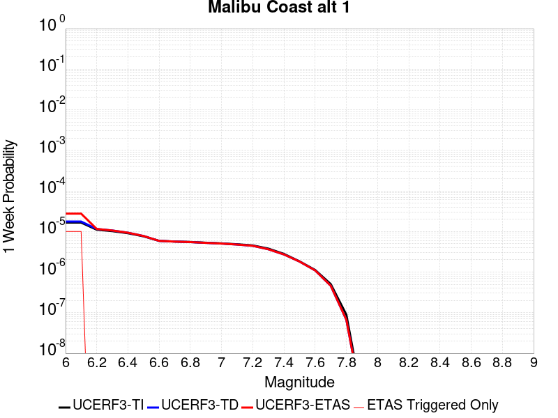 | 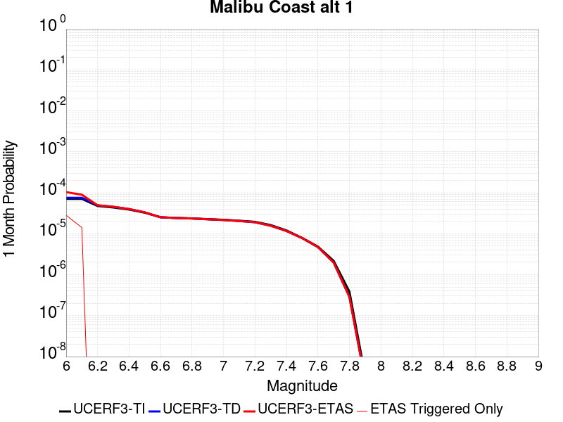 | 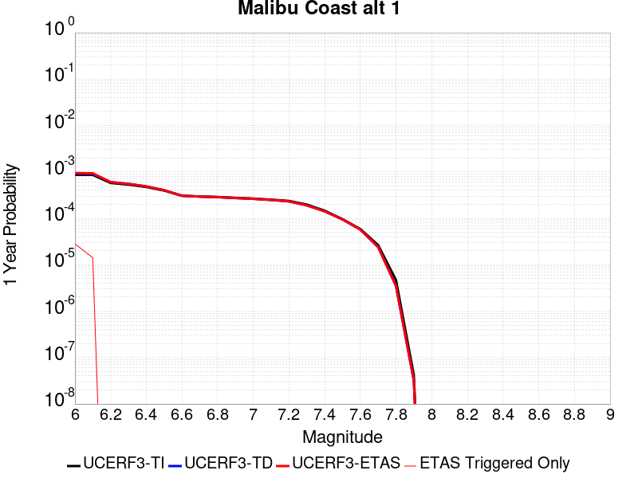 | 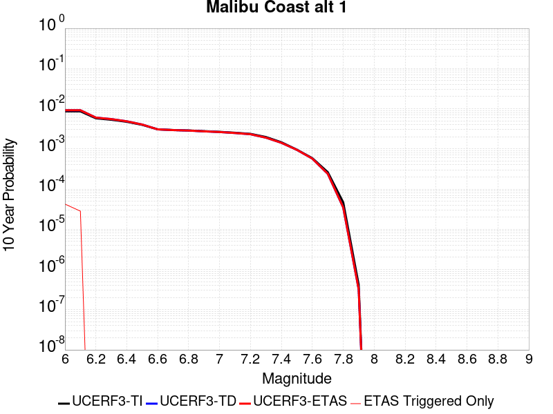 |

| Magnitude | 1 wk TI Prob | 1 wk TD Prob | 1 wk ETAS Prob | 1 wk ETAS/TD Gain | 1 wk ETAS Triggered Only | 1 mo TI Prob | 1 mo TD Prob | 1 mo ETAS Prob | 1 mo ETAS/TD Gain | 1 mo ETAS Triggered Only | 1 yr TI Prob | 1 yr TD Prob | 1 yr ETAS Prob | 1 yr ETAS/TD Gain | 1 yr ETAS Triggered Only | 10 yr TI Prob | 10 yr TD Prob | 10 yr ETAS Prob | 10 yr ETAS/TD Gain | 10 yr ETAS Triggered Only |
|-----|-----|-----|-----|-----|-----|-----|-----|-----|-----|-----|-----|-----|-----|-----|-----|-----|-----|-----|-----|-----|
| 6.0 | 1.6572556E-5 | 1.759807E-5 | 2.7597893E-5 | 1.5682342 | 1.0E-5 | 7.102331E-5 | 7.5418226E-5 | 9.541671E-5 | 1.265168 | 2.0E-5 | 8.6436566E-4 | 9.1784896E-4 | 9.378306E-4 | 1.0217701 | 2.0E-5 | 0.0086101135 | 0.009142514 | 0.00917224 | 1.0032513 | 3.0E-5 |
| 6.1 | 1.6572556E-5 | 1.759807E-5 | 2.7597893E-5 | 1.5682342 | 1.0E-5 | 7.102331E-5 | 7.5418226E-5 | 8.5417465E-5 | 1.132584 | 1.0E-5 | 8.6436566E-4 | 9.1784896E-4 | 9.278398E-4 | 1.010885 | 1.0E-5 | 0.0086101135 | 0.009142514 | 0.009162331 | 1.0021676 | 2.0E-5 |
| 6.2 | 1.1085717E-5 | 1.155715E-5 | 1.155715E-5 | 1.0 | 0.0 | 4.750935E-5 | 4.9529724E-5 | 4.9529724E-5 | 1.0 | 0.0 | 5.782728E-4 | 6.0286105E-4 | 6.0286105E-4 | 1.0 | 0.0 | 0.0057677035 | 0.0060126274 | 0.0060126274 | 1.0 | 0.0 |
| 6.3 | 1.0208568E-5 | 1.0592241E-5 | 1.0592241E-5 | 1.0 | 0.0 | 4.375027E-5 | 4.5394543E-5 | 4.5394543E-5 | 1.0 | 0.0 | 5.325294E-4 | 5.5254134E-4 | 5.5254134E-4 | 1.0 | 0.0 | 0.0053125503 | 0.0055119833 | 0.0055119833 | 1.0 | 0.0 |
| 6.4 | 9.0682315E-6 | 9.342641E-6 | 9.342641E-6 | 1.0 | 0.0 | 3.8863272E-5 | 4.0039286E-5 | 4.0039286E-5 | 1.0 | 0.0 | 4.730576E-4 | 4.873713E-4 | 4.873713E-4 | 1.0 | 0.0 | 0.0047205184 | 0.004863238 | 0.004863238 | 1.0 | 0.0 |
| 6.5 | 7.605796E-6 | 7.74859E-6 | 7.74859E-6 | 1.0 | 0.0 | 3.259586E-5 | 3.320783E-5 | 3.320783E-5 | 1.0 | 0.0 | 3.9678233E-4 | 4.0423166E-4 | 4.0423166E-4 | 1.0 | 0.0 | 0.0039607463 | 0.0040351013 | 0.0040351013 | 1.0 | 0.0 |
| 6.6 | 5.889873E-6 | 5.8795417E-6 | 5.8795417E-6 | 1.0 | 0.0 | 2.5242069E-5 | 2.5197793E-5 | 2.5197793E-5 | 1.0 | 0.0 | 3.0727885E-4 | 3.0674002E-4 | 3.0674002E-4 | 1.0 | 0.0 | 0.003068543 | 0.0030631793 | 0.0030631793 | 1.0 | 0.0 |
| 6.7 | 5.66586E-6 | 5.6416443E-6 | 5.6416443E-6 | 1.0 | 0.0 | 2.428203E-5 | 2.4178253E-5 | 2.4178253E-5 | 1.0 | 0.0 | 2.955936E-4 | 2.9433056E-4 | 2.9433056E-4 | 1.0 | 0.0 | 0.0029520073 | 0.0029394194 | 0.0029394194 | 1.0 | 0.0 |
| 6.8 | 5.521556E-6 | 5.48943E-6 | 5.48943E-6 | 1.0 | 0.0 | 2.3663597E-5 | 2.3525918E-5 | 2.3525918E-5 | 1.0 | 0.0 | 2.880662E-4 | 2.8639048E-4 | 2.8639048E-4 | 1.0 | 0.0 | 0.0028769306 | 0.0028602257 | 0.0028602257 | 1.0 | 0.0 |
| 6.9 | 5.29752E-6 | 5.2499345E-6 | 5.2499345E-6 | 1.0 | 0.0 | 2.270346E-5 | 2.2499526E-5 | 2.2499526E-5 | 1.0 | 0.0 | 2.7637955E-4 | 2.7389737E-4 | 2.7389737E-4 | 1.0 | 0.0 | 0.0027603607 | 0.0027356083 | 0.0027356083 | 1.0 | 0.0 |
| 7.0 | 5.106743E-6 | 5.0476815E-6 | 5.0476815E-6 | 1.0 | 0.0 | 2.1885859E-5 | 2.1632743E-5 | 2.1632743E-5 | 1.0 | 0.0 | 2.6642776E-4 | 2.6334688E-4 | 2.6334688E-4 | 1.0 | 0.0 | 0.0026610855 | 0.0026303576 | 0.0026303576 | 1.0 | 0.0 |
| 7.1 | 4.8469647E-6 | 4.770376E-6 | 4.770376E-6 | 1.0 | 0.0 | 2.0772539E-5 | 2.044431E-5 | 2.044431E-5 | 1.0 | 0.0 | 2.528763E-4 | 2.488811E-4 | 2.488811E-4 | 1.0 | 0.0 | 0.0025258875 | 0.0024860317 | 0.0024860317 | 1.0 | 0.0 |
| 7.2 | 4.545514E-6 | 4.4481967E-6 | 4.4481967E-6 | 1.0 | 0.0 | 1.9480629E-5 | 1.906356E-5 | 1.906356E-5 | 1.0 | 0.0 | 2.3715083E-4 | 2.3207419E-4 | 2.3207419E-4 | 1.0 | 0.0 | 0.0023689792 | 0.002318326 | 0.002318326 | 1.0 | 0.0 |
| 7.3 | 3.794097E-6 | 3.6519373E-6 | 3.6519373E-6 | 1.0 | 0.0 | 1.6260314E-5 | 1.5651065E-5 | 1.5651065E-5 | 1.0 | 0.0 | 1.9795135E-4 | 1.9053511E-4 | 1.9053511E-4 | 1.0 | 0.0 | 0.001977751 | 0.0019037221 | 0.0019037221 | 1.0 | 0.0 |
| 7.4 | 2.808217E-6 | 2.7190777E-6 | 2.7190777E-6 | 1.0 | 0.0 | 1.203516E-5 | 1.1653137E-5 | 1.1653137E-5 | 1.0 | 0.0 | 1.4651821E-4 | 1.4186774E-4 | 1.4186774E-4 | 1.0 | 0.0 | 0.0014642165 | 0.0014177744 | 0.0014177744 | 1.0 | 0.0 |
| 7.5 | 1.83809E-6 | 1.8190703E-6 | 1.8190703E-6 | 1.0 | 0.0 | 7.877505E-6 | 7.795992E-6 | 7.795992E-6 | 1.0 | 0.0 | 9.59044E-5 | 9.4912095E-5 | 9.4912095E-5 | 1.0 | 0.0 | 9.5863023E-4 | 9.487176E-4 | 9.487176E-4 | 1.0 | 0.0 |
| 7.6 | 1.1292672E-6 | 1.1001456E-6 | 1.1001456E-6 | 1.0 | 0.0 | 4.839708E-6 | 4.7149015E-6 | 4.7149015E-6 | 1.0 | 0.0 | 5.8921847E-5 | 5.7402427E-5 | 5.7402427E-5 | 1.0 | 0.0 | 5.890623E-4 | 5.7387765E-4 | 5.7387765E-4 | 1.0 | 0.0 |
| 7.7 | 5.065272E-7 | 4.6091537E-7 | 4.6091537E-7 | 1.0 | 0.0 | 2.170829E-6 | 1.9753502E-6 | 1.9753502E-6 | 1.0 | 0.0 | 2.6429525E-5 | 2.4049634E-5 | 2.4049634E-5 | 1.0 | 0.0 | 2.642638E-4 | 2.4047145E-4 | 2.4047145E-4 | 1.0 | 0.0 |
| 7.8 | 8.952991E-8 | 6.707853E-8 | 6.707853E-8 | 1.0 | 0.0 | 3.8369956E-7 | 2.874794E-7 | 2.874794E-7 | 1.0 | 0.0 | 4.671532E-6 | 3.5000562E-6 | 3.5000562E-6 | 1.0 | 0.0 | 4.671434E-5 | 3.500003E-5 | 3.500003E-5 | 1.0 | 0.0 |
| 7.9 | 8.007447E-10 | 6.161581E-10 | 6.161581E-10 | 1.0 | 0.0 | 3.4317629E-9 | 2.640678E-9 | 2.640678E-9 | 1.0 | 0.0 | 4.1781714E-8 | 3.2150254E-8 | 3.2150254E-8 | 1.0 | 0.0 | 4.1781706E-7 | 3.2150248E-7 | 3.2150248E-7 | 1.0 | 0.0 |

## Channel Islands Western Deep Ramp
*[(top)](#table-of-contents)*

| 1 Week | 1 Month | 1 Year | 10 Year |
|-----|-----|-----|-----|
|  |  |  |  |

| Magnitude | 1 wk TI Prob | 1 wk TD Prob | 1 wk ETAS Prob | 1 wk ETAS/TD Gain | 1 wk ETAS Triggered Only | 1 mo TI Prob | 1 mo TD Prob | 1 mo ETAS Prob | 1 mo ETAS/TD Gain | 1 mo ETAS Triggered Only | 1 yr TI Prob | 1 yr TD Prob | 1 yr ETAS Prob | 1 yr ETAS/TD Gain | 1 yr ETAS Triggered Only | 10 yr TI Prob | 10 yr TD Prob | 10 yr ETAS Prob | 10 yr ETAS/TD Gain | 10 yr ETAS Triggered Only |
|-----|-----|-----|-----|-----|-----|-----|-----|-----|-----|-----|-----|-----|-----|-----|-----|-----|-----|-----|-----|-----|
| 6.0 | 6.0213506E-6 | 6.2548684E-6 | 1.6254806E-5 | 2.5987446 | 1.0E-5 | 2.5805533E-5 | 2.6806329E-5 | 4.680579E-5 | 1.7460725 | 2.0E-5 | 3.1413708E-4 | 3.2632265E-4 | 3.5631284E-4 | 1.0919036 | 3.0E-5 | 0.0031369338 | 0.0032588763 | 0.0032887785 | 1.0091757 | 3.0E-5 |
| 6.1 | 6.0213506E-6 | 6.2548684E-6 | 1.6254806E-5 | 2.5987446 | 1.0E-5 | 2.5805533E-5 | 2.6806329E-5 | 4.680579E-5 | 1.7460725 | 2.0E-5 | 3.1413708E-4 | 3.2632265E-4 | 3.5631284E-4 | 1.0919036 | 3.0E-5 | 0.0031369338 | 0.0032588763 | 0.0032887785 | 1.0091757 | 3.0E-5 |
| 6.2 | 6.0213506E-6 | 6.2548684E-6 | 1.6254806E-5 | 2.5987446 | 1.0E-5 | 2.5805533E-5 | 2.6806329E-5 | 4.680579E-5 | 1.7460725 | 2.0E-5 | 3.1413708E-4 | 3.2632265E-4 | 3.5631284E-4 | 1.0919036 | 3.0E-5 | 0.0031369338 | 0.0032588763 | 0.0032887785 | 1.0091757 | 3.0E-5 |
| 6.3 | 6.0213506E-6 | 6.2548684E-6 | 1.6254806E-5 | 2.5987446 | 1.0E-5 | 2.5805533E-5 | 2.6806329E-5 | 4.680579E-5 | 1.7460725 | 2.0E-5 | 3.1413708E-4 | 3.2632265E-4 | 3.5631284E-4 | 1.0919036 | 3.0E-5 | 0.0031369338 | 0.0032588763 | 0.0032887785 | 1.0091757 | 3.0E-5 |
| 6.4 | 6.0213506E-6 | 6.2548684E-6 | 1.6254806E-5 | 2.5987446 | 1.0E-5 | 2.5805533E-5 | 2.6806329E-5 | 4.680579E-5 | 1.7460725 | 2.0E-5 | 3.1413708E-4 | 3.2632265E-4 | 3.5631284E-4 | 1.0919036 | 3.0E-5 | 0.0031369338 | 0.0032588763 | 0.0032887785 | 1.0091757 | 3.0E-5 |
| 6.5 | 6.0213506E-6 | 6.2548684E-6 | 1.6254806E-5 | 2.5987446 | 1.0E-5 | 2.5805533E-5 | 2.6806329E-5 | 4.680579E-5 | 1.7460725 | 2.0E-5 | 3.1413708E-4 | 3.2632265E-4 | 3.5631284E-4 | 1.0919036 | 3.0E-5 | 0.0031369338 | 0.0032588763 | 0.0032887785 | 1.0091757 | 3.0E-5 |
| 6.6 | 6.0213506E-6 | 6.2548684E-6 | 1.6254806E-5 | 2.5987446 | 1.0E-5 | 2.5805533E-5 | 2.6806329E-5 | 4.680579E-5 | 1.7460725 | 2.0E-5 | 3.1413708E-4 | 3.2632265E-4 | 3.5631284E-4 | 1.0919036 | 3.0E-5 | 0.0031369338 | 0.0032588763 | 0.0032887785 | 1.0091757 | 3.0E-5 |
| 6.7 | 5.313309E-6 | 5.5252403E-6 | 1.5525186E-5 | 2.809866 | 1.0E-5 | 2.2771126E-5 | 2.367941E-5 | 4.3678938E-5 | 1.8445957 | 2.0E-5 | 2.772032E-4 | 2.8826276E-4 | 3.182541E-4 | 1.1040417 | 3.0E-5 | 0.0027685766 | 0.0028792918 | 0.0029092054 | 1.0103892 | 3.0E-5 |
| 6.8 | 5.313309E-6 | 5.5252403E-6 | 1.5525186E-5 | 2.809866 | 1.0E-5 | 2.2771126E-5 | 2.367941E-5 | 4.3678938E-5 | 1.8445957 | 2.0E-5 | 2.772032E-4 | 2.8826276E-4 | 3.182541E-4 | 1.1040417 | 3.0E-5 | 0.0027685766 | 0.0028792918 | 0.0029092054 | 1.0103892 | 3.0E-5 |
| 6.9 | 4.744377E-6 | 4.9394303E-6 | 1.4939381E-5 | 3.024515 | 1.0E-5 | 2.0332885E-5 | 2.1168837E-5 | 4.1168412E-5 | 1.944765 | 2.0E-5 | 2.4752476E-4 | 2.5770385E-4 | 2.876961E-4 | 1.1163827 | 3.0E-5 | 0.0024724922 | 0.0025744175 | 0.0026043402 | 1.0116231 | 3.0E-5 |
| 7.0 | 4.722209E-6 | 4.9164732E-6 | 1.4916424E-5 | 3.0339684 | 1.0E-5 | 2.0237881E-5 | 2.107045E-5 | 4.1070027E-5 | 1.9491767 | 2.0E-5 | 2.4636835E-4 | 2.5650626E-4 | 2.8649857E-4 | 1.1169262 | 3.0E-5 | 0.002460954 | 0.0025624693 | 0.0025923925 | 1.0116775 | 3.0E-5 |
| 7.1 | 4.611174E-6 | 4.801409E-6 | 1.48013605E-5 | 3.082712 | 1.0E-5 | 1.9762025E-5 | 2.0577325E-5 | 3.057712E-5 | 1.4859618 | 1.0E-5 | 2.4057609E-4 | 2.5050386E-4 | 2.7049886E-4 | 1.0798191 | 2.0E-5 | 0.002403158 | 0.002502582 | 0.002522532 | 1.0079718 | 2.0E-5 |
| 7.2 | 4.043994E-6 | 4.2120264E-6 | 1.4211984E-5 | 3.374144 | 1.0E-5 | 1.7331287E-5 | 1.8051438E-5 | 2.8051258E-5 | 1.5539625 | 1.0E-5 | 2.10988E-4 | 2.1975765E-4 | 2.3975327E-4 | 1.0909894 | 2.0E-5 | 0.002107878 | 0.0021957543 | 0.0022157102 | 1.0090885 | 2.0E-5 |
| 7.3 | 2.1233036E-6 | 2.2297875E-6 | 1.2229765E-5 | 5.4847226 | 1.0E-5 | 9.099841E-6 | 9.556197E-6 | 1.9556102E-5 | 2.0464313 | 1.0E-5 | 1.1078493E-4 | 1.1634055E-4 | 1.2633938E-4 | 1.0859445 | 1.0E-5 | 0.0011072971 | 0.001162802 | 0.0011727903 | 1.0085899 | 1.0E-5 |
| 7.4 | 1.9051884E-6 | 2.0014973E-6 | 1.2001477E-5 | 5.9962497 | 1.0E-5 | 8.165067E-6 | 8.577817E-6 | 1.8577732E-5 | 2.1657877 | 1.0E-5 | 9.940516E-5 | 1.0442998E-4 | 1.14428934E-4 | 1.095748 | 1.0E-5 | 9.93607E-4 | 0.0010438144 | 0.0010538038 | 1.0095702 | 1.0E-5 |
| 7.5 | 1.2408497E-6 | 1.3038839E-6 | 1.130387E-5 | 8.669384 | 1.0E-5 | 5.317916E-6 | 5.588062E-6 | 1.5588006E-5 | 2.789519 | 1.0E-5 | 6.4743705E-5 | 6.8032554E-5 | 7.803187E-5 | 1.1469785 | 1.0E-5 | 6.4724847E-4 | 6.8011944E-4 | 6.9011265E-4 | 1.0146933 | 1.0E-5 |
| 7.6 | 6.5440025E-7 | 6.886718E-7 | 6.886718E-7 | 1.0 | 0.0 | 2.8045695E-6 | 2.9514472E-6 | 2.9514472E-6 | 1.0 | 0.0 | 3.4145098E-5 | 3.593329E-5 | 3.593329E-5 | 1.0 | 0.0 | 3.4139853E-4 | 3.5927625E-4 | 3.5927625E-4 | 1.0 | 0.0 |
| 7.7 | 3.985963E-7 | 4.1930787E-7 | 4.1930787E-7 | 1.0 | 0.0 | 1.7082689E-6 | 1.7970326E-6 | 1.7970326E-6 | 1.0 | 0.0 | 2.0797976E-5 | 2.1878664E-5 | 2.1878664E-5 | 1.0 | 0.0 | 2.0796029E-4 | 2.1876628E-4 | 2.1876628E-4 | 1.0 | 0.0 |
| 7.8 | 3.706329E-8 | 3.8591796E-8 | 3.8591796E-8 | 1.0 | 0.0 | 1.5884267E-7 | 1.653934E-7 | 1.653934E-7 | 1.0 | 0.0 | 1.9339077E-6 | 2.0136629E-6 | 2.0136629E-6 | 1.0 | 0.0 | 1.933891E-5 | 2.0136458E-5 | 2.0136458E-5 | 1.0 | 0.0 |

## Monterey Bay-Tularcitos
*[(top)](#table-of-contents)*

| 1 Week | 1 Month | 1 Year | 10 Year |
|-----|-----|-----|-----|
|  |  | 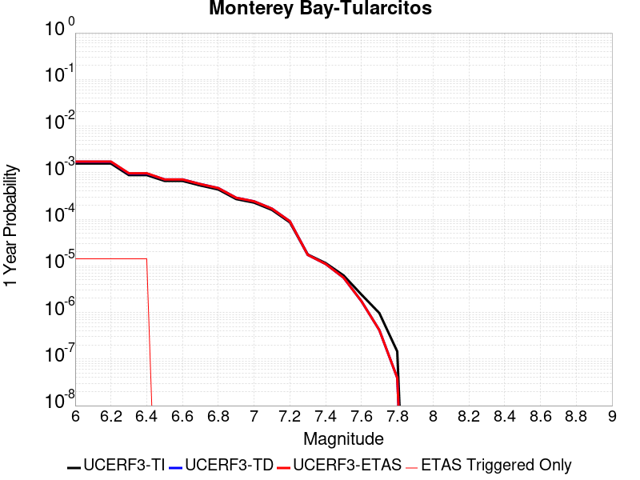 | 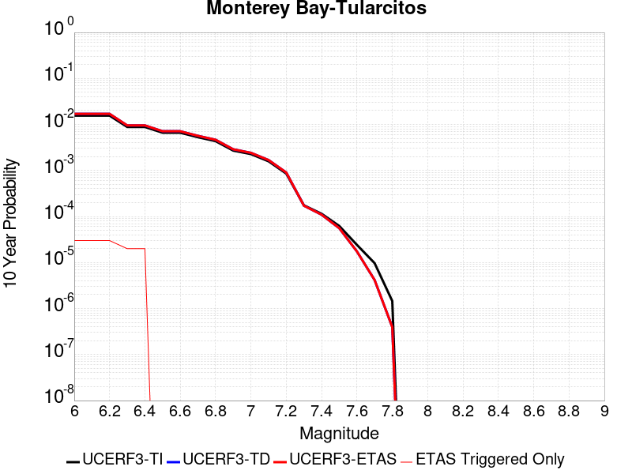 |

| Magnitude | 1 wk TI Prob | 1 wk TD Prob | 1 wk ETAS Prob | 1 wk ETAS/TD Gain | 1 wk ETAS Triggered Only | 1 mo TI Prob | 1 mo TD Prob | 1 mo ETAS Prob | 1 mo ETAS/TD Gain | 1 mo ETAS Triggered Only | 1 yr TI Prob | 1 yr TD Prob | 1 yr ETAS Prob | 1 yr ETAS/TD Gain | 1 yr ETAS Triggered Only | 10 yr TI Prob | 10 yr TD Prob | 10 yr ETAS Prob | 10 yr ETAS/TD Gain | 10 yr ETAS Triggered Only |
|-----|-----|-----|-----|-----|-----|-----|-----|-----|-----|-----|-----|-----|-----|-----|-----|-----|-----|-----|-----|-----|
| 6.0 | 3.0131365E-5 | 3.279877E-5 | 3.279877E-5 | 1.0 | 0.0 | 1.2912804E-4 | 1.4055918E-4 | 1.4055918E-4 | 1.0 | 0.0 | 0.001571 | 0.0017100703 | 0.001730036 | 1.0116755 | 2.0E-5 | 0.015599402 | 0.016979916 | 0.017009407 | 1.0017368 | 3.0E-5 |
| 6.1 | 3.0131365E-5 | 3.279877E-5 | 3.279877E-5 | 1.0 | 0.0 | 1.2912804E-4 | 1.4055918E-4 | 1.4055918E-4 | 1.0 | 0.0 | 0.001571 | 0.0017100703 | 0.001730036 | 1.0116755 | 2.0E-5 | 0.015599402 | 0.016979916 | 0.017009407 | 1.0017368 | 3.0E-5 |
| 6.2 | 3.0131365E-5 | 3.279877E-5 | 3.279877E-5 | 1.0 | 0.0 | 1.2912804E-4 | 1.4055918E-4 | 1.4055918E-4 | 1.0 | 0.0 | 0.001571 | 0.0017100703 | 0.001730036 | 1.0116755 | 2.0E-5 | 0.015599402 | 0.016979916 | 0.017009407 | 1.0017368 | 3.0E-5 |
| 6.3 | 1.6998249E-5 | 1.8330798E-5 | 1.8330798E-5 | 1.0 | 0.0 | 7.28476E-5 | 7.85583E-5 | 7.85583E-5 | 1.0 | 0.0 | 8.865586E-4 | 9.5604634E-4 | 9.6603675E-4 | 1.0104498 | 1.0E-5 | 0.0088303005 | 0.009521258 | 0.009541067 | 1.0020806 | 2.0E-5 |
| 6.4 | 1.6998249E-5 | 1.8330798E-5 | 1.8330798E-5 | 1.0 | 0.0 | 7.28476E-5 | 7.85583E-5 | 7.85583E-5 | 1.0 | 0.0 | 8.865586E-4 | 9.5604634E-4 | 9.6603675E-4 | 1.0104498 | 1.0E-5 | 0.0088303005 | 0.009521258 | 0.009541067 | 1.0020806 | 2.0E-5 |
| 6.5 | 1.27470785E-5 | 1.3693312E-5 | 1.3693312E-5 | 1.0 | 0.0 | 5.4629192E-5 | 5.8684363E-5 | 5.8684363E-5 | 1.0 | 0.0 | 6.649074E-4 | 7.1425823E-4 | 7.1425823E-4 | 1.0 | 0.0 | 0.0066292146 | 0.007120678 | 0.007120678 | 1.0 | 0.0 |
| 6.6 | 1.2739422E-5 | 1.36854E-5 | 1.36854E-5 | 1.0 | 0.0 | 5.4596385E-5 | 5.8650454E-5 | 5.8650454E-5 | 1.0 | 0.0 | 6.645082E-4 | 7.1384566E-4 | 7.1384566E-4 | 1.0 | 0.0 | 0.0066252467 | 0.007116579 | 0.007116579 | 1.0 | 0.0 |
| 6.7 | 1.0160109E-5 | 1.0885755E-5 | 1.0885755E-5 | 1.0 | 0.0 | 4.35426E-5 | 4.665244E-5 | 4.665244E-5 | 1.0 | 0.0 | 5.300022E-4 | 5.6785246E-4 | 5.6785246E-4 | 1.0 | 0.0 | 0.005287399 | 0.0056647263 | 0.0056647263 | 1.0 | 0.0 |
| 6.8 | 8.349859E-6 | 8.932587E-6 | 8.932587E-6 | 1.0 | 0.0 | 3.578462E-5 | 3.8281985E-5 | 3.8281985E-5 | 1.0 | 0.0 | 4.3559066E-4 | 4.6598914E-4 | 4.6598914E-4 | 1.0 | 0.0 | 0.004347378 | 0.004650685 | 0.004650685 | 1.0 | 0.0 |
| 6.9 | 5.193639E-6 | 5.53643E-6 | 5.53643E-6 | 1.0 | 0.0 | 2.2258262E-5 | 2.372736E-5 | 2.372736E-5 | 1.0 | 0.0 | 2.7096065E-4 | 2.8884556E-4 | 2.8884556E-4 | 1.0 | 0.0 | 0.0027063051 | 0.0028850224 | 0.0028850224 | 1.0 | 0.0 |
| 7.0 | 4.359381E-6 | 4.643366E-6 | 4.643366E-6 | 1.0 | 0.0 | 1.8682927E-5 | 1.9900004E-5 | 1.9900004E-5 | 1.0 | 0.0 | 2.274409E-4 | 2.422586E-4 | 2.422586E-4 | 1.0 | 0.0 | 0.0022720827 | 0.002420238 | 0.002420238 | 1.0 | 0.0 |
| 7.1 | 3.0398533E-6 | 3.2310427E-6 | 3.2310427E-6 | 1.0 | 0.0 | 1.3027877E-5 | 1.3847267E-5 | 1.3847267E-5 | 1.0 | 0.0 | 1.5860285E-4 | 1.6858005E-4 | 1.6858005E-4 | 1.0 | 0.0 | 0.001584897 | 0.0016847793 | 0.0016847793 | 1.0 | 0.0 |
| 7.2 | 1.642335E-6 | 1.7333153E-6 | 1.7333153E-6 | 1.0 | 0.0 | 7.0385595E-6 | 7.428485E-6 | 7.428485E-6 | 1.0 | 0.0 | 8.569109E-5 | 9.044012E-5 | 9.044012E-5 | 1.0 | 0.0 | 8.5658056E-4 | 9.042358E-4 | 9.042358E-4 | 1.0 | 0.0 |
| 7.3 | 3.356842E-7 | 3.2952389E-7 | 3.2952389E-7 | 1.0 | 0.0 | 1.4386458E-6 | 1.4122445E-6 | 1.4122445E-6 | 1.0 | 0.0 | 1.7515373E-5 | 1.7193941E-5 | 1.7193941E-5 | 1.0 | 0.0 | 1.7513991E-4 | 1.719262E-4 | 1.719262E-4 | 1.0 | 0.0 |
| 7.4 | 2.1973483E-7 | 2.1006414E-7 | 2.1006414E-7 | 1.0 | 0.0 | 9.417204E-7 | 9.002746E-7 | 9.002746E-7 | 1.0 | 0.0 | 1.1465385E-5 | 1.0960788E-5 | 1.0960788E-5 | 1.0 | 0.0 | 1.1464794E-4 | 1.0960251E-4 | 1.0960251E-4 | 1.0 | 0.0 |
| 7.5 | 1.1944135E-7 | 1.0696035E-7 | 1.0696035E-7 | 1.0 | 0.0 | 5.118914E-7 | 4.5840142E-7 | 4.5840142E-7 | 1.0 | 0.0 | 6.23226E-6 | 5.581023E-6 | 5.581023E-6 | 1.0 | 0.0 | 6.2320854E-5 | 5.5808843E-5 | 5.5808843E-5 | 1.0 | 0.0 |
| 7.6 | 4.636058E-8 | 3.3364433E-8 | 3.3364433E-8 | 1.0 | 0.0 | 1.9868818E-7 | 1.4299042E-7 | 1.4299042E-7 | 1.0 | 0.0 | 2.419026E-6 | 1.740907E-6 | 1.740907E-6 | 1.0 | 0.0 | 2.4189996E-5 | 1.7408936E-5 | 1.7408936E-5 | 1.0 | 0.0 |
| 7.7 | 1.8588572E-8 | 8.003168E-9 | 8.003168E-9 | 1.0 | 0.0 | 7.9665305E-8 | 3.429929E-8 | 3.429929E-8 | 1.0 | 0.0 | 9.699246E-7 | 4.1759378E-7 | 4.1759378E-7 | 1.0 | 0.0 | 9.699204E-6 | 4.1759304E-6 | 4.1759304E-6 | 1.0 | 0.0 |
| 7.8 | 2.7960154E-9 | 7.608624E-10 | 7.608624E-10 | 1.0 | 0.0 | 1.1982923E-8 | 3.2608392E-9 | 3.2608392E-9 | 1.0 | 0.0 | 1.4589209E-7 | 3.9700716E-8 | 3.9700716E-8 | 1.0 | 0.0 | 1.4589199E-6 | 3.970071E-7 | 3.970071E-7 | 1.0 | 0.0 |

## Elsinore (Stepovers Combined)
*[(top)](#table-of-contents)*

| 1 Week | 1 Month | 1 Year | 10 Year |
|-----|-----|-----|-----|
| 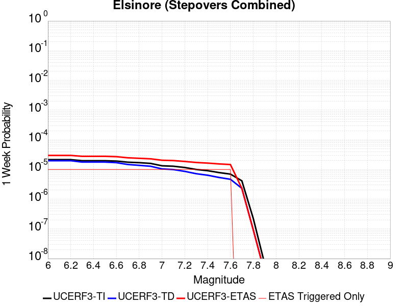 | 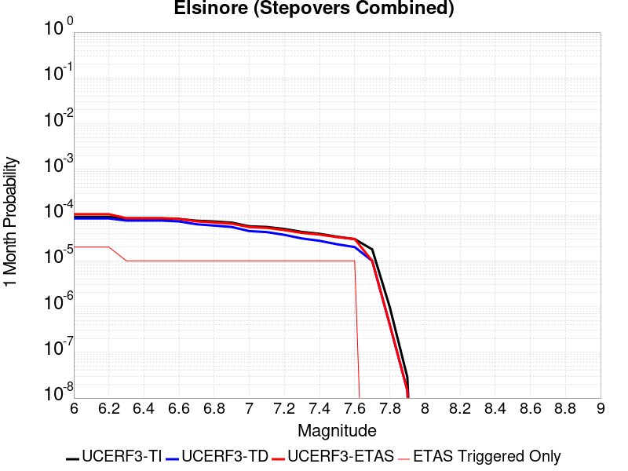 | 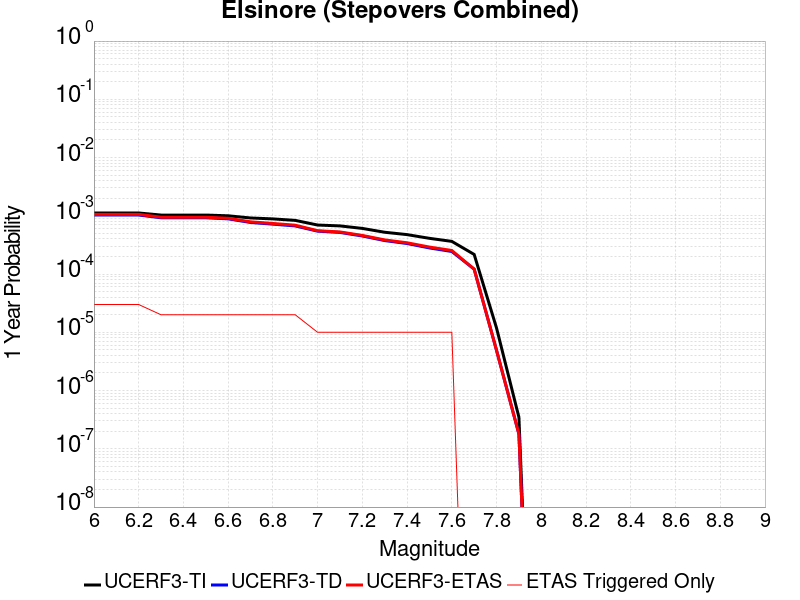 | 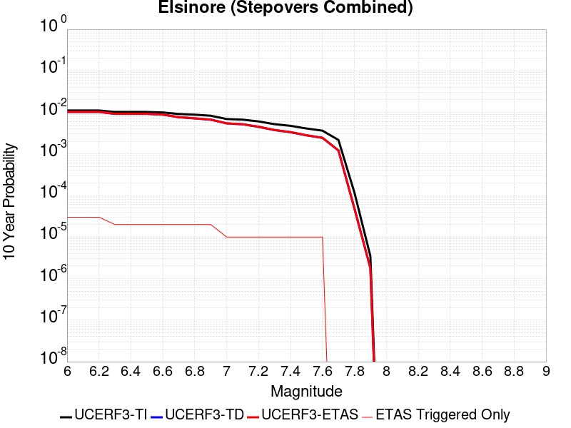 |

| Magnitude | 1 wk TI Prob | 1 wk TD Prob | 1 wk ETAS Prob | 1 wk ETAS/TD Gain | 1 wk ETAS Triggered Only | 1 mo TI Prob | 1 mo TD Prob | 1 mo ETAS Prob | 1 mo ETAS/TD Gain | 1 mo ETAS Triggered Only | 1 yr TI Prob | 1 yr TD Prob | 1 yr ETAS Prob | 1 yr ETAS/TD Gain | 1 yr ETAS Triggered Only | 10 yr TI Prob | 10 yr TD Prob | 10 yr ETAS Prob | 10 yr ETAS/TD Gain | 10 yr ETAS Triggered Only |
|-----|-----|-----|-----|-----|-----|-----|-----|-----|-----|-----|-----|-----|-----|-----|-----|-----|-----|-----|-----|-----|
| 6.0 | 2.144392E-5 | 1.976007E-5 | 2.9759873E-5 | 1.5060611 | 1.0E-5 | 9.189928E-5 | 8.468338E-5 | 1.0468168E-4 | 1.2361538 | 2.0E-5 | 0.0011182994 | 0.0010305515 | 0.0010605205 | 1.0290806 | 3.0E-5 | 0.011126885 | 0.010264617 | 0.01029431 | 1.0028926 | 3.0E-5 |
| 6.1 | 2.144392E-5 | 1.976007E-5 | 2.9759873E-5 | 1.5060611 | 1.0E-5 | 9.189928E-5 | 8.468338E-5 | 1.0468168E-4 | 1.2361538 | 2.0E-5 | 0.0011182994 | 0.0010305515 | 0.0010605205 | 1.0290806 | 3.0E-5 | 0.011126885 | 0.010264617 | 0.01029431 | 1.0028926 | 3.0E-5 |
| 6.2 | 2.144392E-5 | 1.976007E-5 | 2.9759873E-5 | 1.5060611 | 1.0E-5 | 9.189928E-5 | 8.468338E-5 | 1.0468168E-4 | 1.2361538 | 2.0E-5 | 0.0011182994 | 0.0010305515 | 0.0010605205 | 1.0290806 | 3.0E-5 | 0.011126885 | 0.010264617 | 0.01029431 | 1.0028926 | 3.0E-5 |
| 6.3 | 1.9751555E-5 | 1.7741326E-5 | 2.7741147E-5 | 1.5636457 | 1.0E-5 | 8.4646774E-5 | 7.603211E-5 | 8.603135E-5 | 1.1315134 | 1.0E-5 | 0.0010300872 | 9.25312E-4 | 9.4529346E-4 | 1.0215943 | 2.0E-5 | 0.010253254 | 0.0092209745 | 0.00924079 | 1.002149 | 2.0E-5 |
| 6.4 | 1.9751555E-5 | 1.7741326E-5 | 2.7741147E-5 | 1.5636457 | 1.0E-5 | 8.4646774E-5 | 7.603211E-5 | 8.603135E-5 | 1.1315134 | 1.0E-5 | 0.0010300872 | 9.25312E-4 | 9.4529346E-4 | 1.0215943 | 2.0E-5 | 0.010253254 | 0.0092209745 | 0.00924079 | 1.002149 | 2.0E-5 |
| 6.5 | 1.9751555E-5 | 1.7741326E-5 | 2.7741147E-5 | 1.5636457 | 1.0E-5 | 8.4646774E-5 | 7.603211E-5 | 8.603135E-5 | 1.1315134 | 1.0E-5 | 0.0010300872 | 9.25312E-4 | 9.4529346E-4 | 1.0215943 | 2.0E-5 | 0.010253254 | 0.0092209745 | 0.00924079 | 1.002149 | 2.0E-5 |
| 6.6 | 1.9188685E-5 | 1.7003247E-5 | 2.7003076E-5 | 1.588113 | 1.0E-5 | 8.2234634E-5 | 7.2869116E-5 | 8.2868384E-5 | 1.1372224 | 1.0E-5 | 0.0010007467 | 8.8683655E-4 | 9.068188E-4 | 1.0225321 | 2.0E-5 | 0.00996252 | 0.008839546 | 0.008859369 | 1.0022426 | 2.0E-5 |
| 6.7 | 1.7608272E-5 | 1.4732402E-5 | 2.4732255E-5 | 1.6787659 | 1.0E-5 | 7.546184E-5 | 6.313739E-5 | 7.313676E-5 | 1.1583748 | 1.0E-5 | 9.183606E-4 | 7.684364E-4 | 7.88421E-4 | 1.0260068 | 2.0E-5 | 0.009145746 | 0.007664441 | 0.0076842876 | 1.0025895 | 2.0E-5 |
| 6.8 | 1.697165E-5 | 1.3783126E-5 | 2.3782988E-5 | 1.7255148 | 1.0E-5 | 7.273361E-5 | 5.906925E-5 | 6.9068665E-5 | 1.1692828 | 1.0E-5 | 8.8517193E-4 | 7.189395E-4 | 7.389251E-4 | 1.0277988 | 2.0E-5 | 0.008816543 | 0.0071722106 | 0.0071920673 | 1.0027685 | 2.0E-5 |
| 6.9 | 1.600365E-5 | 1.2846429E-5 | 2.2846301E-5 | 1.7784164 | 1.0E-5 | 6.858527E-5 | 5.5055007E-5 | 6.505445E-5 | 1.1816266 | 1.0E-5 | 8.347058E-4 | 6.700963E-4 | 6.9008296E-4 | 1.0298264 | 2.0E-5 | 0.008315775 | 0.006686422 | 0.006706288 | 1.0029712 | 2.0E-5 |
| 7.0 | 1.3314581E-5 | 1.044738E-5 | 2.0447276E-5 | 1.9571677 | 1.0E-5 | 5.7061243E-5 | 4.4773733E-5 | 5.4773285E-5 | 1.2233353 | 1.0E-5 | 6.944992E-4 | 5.449866E-4 | 5.549811E-4 | 1.018339 | 1.0E-5 | 0.006923327 | 0.005440055 | 0.005450001 | 1.0018282 | 1.0E-5 |
| 7.1 | 1.2865345E-5 | 9.937339E-6 | 1.993724E-5 | 2.0062954 | 1.0E-5 | 5.5136024E-5 | 4.258792E-5 | 5.2587493E-5 | 1.2347984 | 1.0E-5 | 6.710743E-4 | 5.1838707E-4 | 5.283819E-4 | 1.0192806 | 1.0E-5 | 0.0066905143 | 0.005175021 | 0.0051849694 | 1.0019224 | 1.0E-5 |
| 7.2 | 1.1650051E-5 | 8.633585E-6 | 1.8633498E-5 | 2.1582575 | 1.0E-5 | 4.9927836E-5 | 3.7000562E-5 | 4.7000194E-5 | 1.2702562 | 1.0E-5 | 6.0770183E-4 | 4.503905E-4 | 4.60386E-4 | 1.022193 | 1.0E-5 | 0.0060604266 | 0.00449624 | 0.0045061954 | 1.0022141 | 1.0E-5 |
| 7.3 | 1.0008533E-5 | 7.2008215E-6 | 1.720075E-5 | 2.3887205 | 1.0E-5 | 4.2893007E-5 | 3.0860305E-5 | 4.086E-5 | 1.3240309 | 1.0E-5 | 5.220972E-4 | 3.756609E-4 | 3.8565713E-4 | 1.0266098 | 1.0E-5 | 0.005208723 | 0.0037506663 | 0.0037606286 | 1.0026562 | 1.0E-5 |
| 7.4 | 9.116759E-6 | 6.409854E-6 | 1.640979E-5 | 2.560088 | 1.0E-5 | 3.907124E-5 | 2.7470522E-5 | 3.7470247E-5 | 1.3640165 | 1.0E-5 | 4.7558855E-4 | 3.3440365E-4 | 3.444003E-4 | 1.029894 | 1.0E-5 | 0.00474572 | 0.0033391542 | 0.0033491207 | 1.0029848 | 1.0E-5 |
| 7.5 | 7.870524E-6 | 5.382316E-6 | 1.5382262E-5 | 2.8579264 | 1.0E-5 | 3.3730383E-5 | 2.306687E-5 | 3.306664E-5 | 1.4335122 | 1.0E-5 | 4.1059E-4 | 2.8080423E-4 | 2.9080143E-4 | 1.035602 | 1.0E-5 | 0.0040983222 | 0.0028046207 | 0.0028145926 | 1.0035555 | 1.0E-5 |
| 7.6 | 6.9774537E-6 | 4.677398E-6 | 1.4677352E-5 | 3.1379306 | 1.0E-5 | 2.990303E-5 | 2.0045845E-5 | 3.0045645E-5 | 1.4988465 | 1.0E-5 | 3.640086E-4 | 2.44032E-4 | 2.5402955E-4 | 1.0409682 | 1.0E-5 | 0.003634129 | 0.0024377564 | 0.002447732 | 1.0040921 | 1.0E-5 |
| 7.7 | 4.1616954E-6 | 2.3281368E-6 | 2.3281368E-6 | 1.0 | 0.0 | 1.7835715E-5 | 9.977695E-6 | 9.977695E-6 | 1.0 | 0.0 | 2.171282E-4 | 1.2147242E-4 | 1.2147242E-4 | 1.0 | 0.0 | 0.0021691616 | 0.0012141332 | 0.0012141332 | 1.0 | 0.0 |
| 7.8 | 2.2692414E-7 | 9.384417E-8 | 9.384417E-8 | 1.0 | 0.0 | 9.725317E-7 | 4.0218927E-7 | 4.0218927E-7 | 1.0 | 0.0 | 1.1840509E-5 | 4.8966467E-6 | 4.8966467E-6 | 1.0 | 0.0 | 1.1839878E-4 | 4.8965718E-5 | 4.8965718E-5 | 1.0 | 0.0 |
| 7.9 | 6.676829E-9 | 3.4397174E-9 | 3.4397174E-9 | 1.0 | 0.0 | 2.861498E-8 | 1.4741646E-8 | 1.4741646E-8 | 1.0 | 0.0 | 3.4838732E-7 | 1.7947953E-7 | 1.7947953E-7 | 1.0 | 0.0 | 3.4838679E-6 | 1.794794E-6 | 1.794794E-6 | 1.0 | 0.0 |

## Hayward (So) extension 2011 CFM
*[(top)](#table-of-contents)*

| 1 Week | 1 Month | 1 Year | 10 Year |
|-----|-----|-----|-----|
| 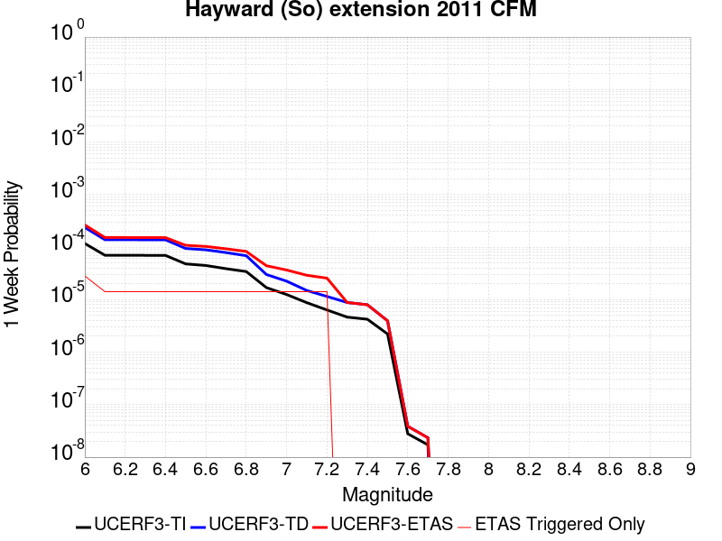 | 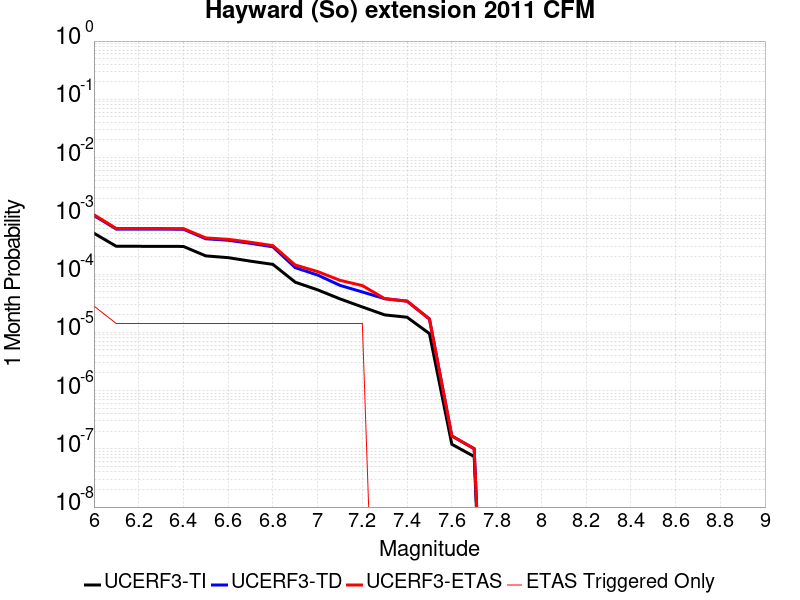 | 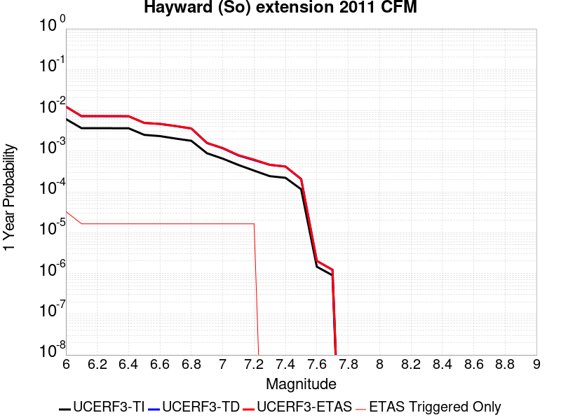 | 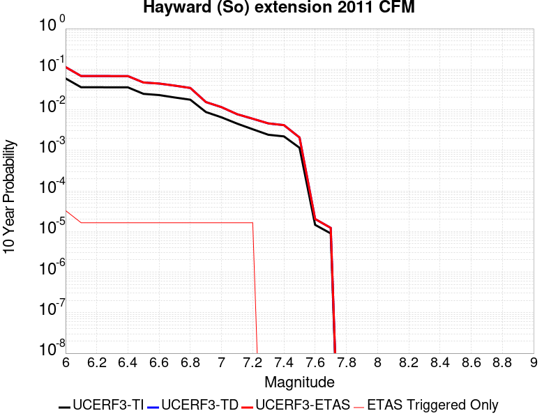 |

| Magnitude | 1 wk TI Prob | 1 wk TD Prob | 1 wk ETAS Prob | 1 wk ETAS/TD Gain | 1 wk ETAS Triggered Only | 1 mo TI Prob | 1 mo TD Prob | 1 mo ETAS Prob | 1 mo ETAS/TD Gain | 1 mo ETAS Triggered Only | 1 yr TI Prob | 1 yr TD Prob | 1 yr ETAS Prob | 1 yr ETAS/TD Gain | 1 yr ETAS Triggered Only | 10 yr TI Prob | 10 yr TD Prob | 10 yr ETAS Prob | 10 yr ETAS/TD Gain | 10 yr ETAS Triggered Only |
|-----|-----|-----|-----|-----|-----|-----|-----|-----|-----|-----|-----|-----|-----|-----|-----|-----|-----|-----|-----|-----|
| 6.0 | 1.1721256E-4 | 2.3671088E-4 | 2.5670615E-4 | 1.0844712 | 2.0E-5 | 5.022428E-4 | 0.0010138806 | 0.0010338603 | 1.0197062 | 2.0E-5 | 0.0060976758 | 0.012250609 | 0.012280242 | 1.0024189 | 3.0E-5 | 0.0593305 | 0.11284437 | 0.112870984 | 1.0002358 | 3.0E-5 |
| 6.1 | 6.99169E-5 | 1.3808164E-4 | 1.4808026E-4 | 1.072411 | 1.0E-5 | 2.9960944E-4 | 5.9155683E-4 | 6.015509E-4 | 1.0168946 | 1.0E-5 | 0.0036416445 | 0.0071723475 | 0.0071922042 | 1.0027685 | 2.0E-5 | 0.035825435 | 0.067804344 | 0.067822985 | 1.000275 | 2.0E-5 |
| 6.2 | 6.99169E-5 | 1.3808164E-4 | 1.4808026E-4 | 1.072411 | 1.0E-5 | 2.9960944E-4 | 5.9155683E-4 | 6.015509E-4 | 1.0168946 | 1.0E-5 | 0.0036416445 | 0.0071723475 | 0.0071922042 | 1.0027685 | 2.0E-5 | 0.035825435 | 0.067804344 | 0.067822985 | 1.000275 | 2.0E-5 |
| 6.3 | 6.970908E-5 | 1.3776305E-4 | 1.4776168E-4 | 1.0725784 | 1.0E-5 | 2.9871898E-4 | 5.9019245E-4 | 6.001865E-4 | 1.0169337 | 1.0E-5 | 0.0036308395 | 0.007155884 | 0.0071757413 | 1.002775 | 2.0E-5 | 0.035720866 | 0.0676533 | 0.06767195 | 1.0002756 | 2.0E-5 |
| 6.4 | 6.9517155E-5 | 1.3743227E-4 | 1.4743091E-4 | 1.0727531 | 1.0E-5 | 2.9789665E-4 | 5.8877567E-4 | 5.987698E-4 | 1.0169744 | 1.0E-5 | 0.0036208609 | 0.0071387975 | 0.0071586547 | 1.0027816 | 2.0E-5 | 0.03562429 | 0.06749734 | 0.06751599 | 1.0002763 | 2.0E-5 |
| 6.5 | 4.786248E-5 | 9.415232E-5 | 1.04151375E-4 | 1.1062009 | 1.0E-5 | 2.0510878E-4 | 4.0344993E-4 | 4.1344587E-4 | 1.0247762 | 1.0E-5 | 0.0024943394 | 0.0049013784 | 0.0049212803 | 1.0040605 | 2.0E-5 | 0.02466527 | 0.046900697 | 0.04691976 | 1.0004064 | 2.0E-5 |
| 6.6 | 4.4662214E-5 | 8.8819244E-5 | 9.881836E-5 | 1.1125782 | 1.0E-5 | 1.9139545E-4 | 3.80601E-4 | 3.9059718E-4 | 1.0262642 | 1.0E-5 | 0.0023277493 | 0.0046244357 | 0.004644343 | 1.0043049 | 2.0E-5 | 0.02303517 | 0.04429206 | 0.044311173 | 1.0004315 | 2.0E-5 |
| 6.7 | 3.884542E-5 | 7.8650686E-5 | 8.86499E-5 | 1.1271344 | 1.0E-5 | 1.6646975E-4 | 3.3703333E-4 | 3.4702994E-4 | 1.0296607 | 1.0E-5 | 0.002024885 | 0.0040961048 | 0.004106064 | 1.0024314 | 1.0E-5 | 0.020065336 | 0.039332055 | 0.03934166 | 1.0002443 | 1.0E-5 |
| 6.8 | 3.4221863E-5 | 6.855886E-5 | 7.855818E-5 | 1.1458501 | 1.0E-5 | 1.4665688E-4 | 2.9379298E-4 | 3.0379003E-4 | 1.0340276 | 1.0E-5 | 0.0017840851 | 0.0035714838 | 0.003581448 | 1.00279 | 1.0E-5 | 0.017698295 | 0.034419462 | 0.034429118 | 1.0002805 | 1.0E-5 |
| 6.9 | 1.6927712E-5 | 3.006262E-5 | 4.0062318E-5 | 1.332629 | 1.0E-5 | 7.2545314E-5 | 1.2883375E-4 | 1.3883247E-4 | 1.0776094 | 1.0E-5 | 8.828813E-4 | 0.0015674793 | 0.0015774637 | 1.0063697 | 1.0E-5 | 0.008793819 | 0.015463544 | 0.015473389 | 1.0006367 | 1.0E-5 |
| 7.0 | 1.2509653E-5 | 2.246337E-5 | 3.2463144E-5 | 1.4451592 | 1.0E-5 | 5.3611697E-5 | 9.626828E-5 | 1.0626732E-4 | 1.1038663 | 1.0E-5 | 6.525269E-4 | 0.0011714802 | 0.0011814684 | 1.0085262 | 1.0E-5 | 0.0065061417 | 0.011583166 | 0.01159305 | 1.0008533 | 1.0E-5 |
| 7.1 | 8.751583E-6 | 1.4926157E-5 | 2.4926008E-5 | 1.6699548 | 1.0E-5 | 3.750624E-5 | 6.396771E-5 | 7.3967065E-5 | 1.1563189 | 1.0E-5 | 4.5654282E-4 | 7.785344E-4 | 7.885266E-4 | 1.0128347 | 1.0E-5 | 0.0045560603 | 0.007764457 | 0.007774379 | 1.0012779 | 1.0E-5 |
| 7.2 | 6.354379E-6 | 1.1499087E-5 | 2.1498972E-5 | 1.8696243 | 1.0E-5 | 2.7232769E-5 | 4.9280898E-5 | 5.9280406E-5 | 1.2029084 | 1.0E-5 | 3.3150852E-4 | 5.9983454E-4 | 6.0982857E-4 | 1.0166613 | 1.0E-5 | 0.0033101442 | 0.006001243 | 0.006011183 | 1.0016563 | 1.0E-5 |
| 7.3 | 4.645554E-6 | 8.818441E-6 | 8.818441E-6 | 1.0 | 0.0 | 1.9909365E-5 | 3.7792794E-5 | 3.7792794E-5 | 1.0 | 0.0 | 2.4236954E-4 | 4.6003403E-4 | 4.6003403E-4 | 1.0 | 0.0 | 0.0024210536 | 0.004611421 | 0.004611421 | 1.0 | 0.0 |
| 7.4 | 4.23437E-6 | 7.992759E-6 | 7.992759E-6 | 1.0 | 0.0 | 1.8147173E-5 | 3.425425E-5 | 3.425425E-5 | 1.0 | 0.0 | 2.2091944E-4 | 4.1696956E-4 | 4.1696956E-4 | 1.0 | 0.0 | 0.0022069993 | 0.0041826614 | 0.0041826614 | 1.0 | 0.0 |
| 7.5 | 2.2187417E-6 | 3.952336E-6 | 3.952336E-6 | 1.0 | 0.0 | 9.508858E-6 | 1.6938488E-5 | 1.6938488E-5 | 1.0 | 0.0 | 1.157642E-4 | 2.0620918E-4 | 2.0620918E-4 | 1.0 | 0.0 | 0.0011570391 | 0.0020739497 | 0.0020739497 | 1.0 | 0.0 |
| 7.6 | 2.7952495E-8 | 3.8785874E-8 | 3.8785874E-8 | 1.0 | 0.0 | 1.1979641E-7 | 1.6622516E-7 | 1.6622516E-7 | 1.0 | 0.0 | 1.4585203E-6 | 2.0237894E-6 | 2.0237894E-6 | 1.0 | 0.0 | 1.4585107E-5 | 2.0317146E-5 | 2.0317146E-5 | 1.0 | 0.0 |
| 7.7 | 1.7192724E-8 | 2.3436652E-8 | 2.3436652E-8 | 1.0 | 0.0 | 7.36831E-8 | 1.0044278E-7 | 1.0044278E-7 | 1.0 | 0.0 | 8.9709135E-7 | 1.2228902E-6 | 1.2228902E-6 | 1.0 | 0.0 | 8.970877E-6 | 1.2285953E-5 | 1.2285953E-5 | 1.0 | 0.0 |

## Sierra Madre
*[(top)](#table-of-contents)*

| 1 Week | 1 Month | 1 Year | 10 Year |
|-----|-----|-----|-----|
|  |  |  |  |

| Magnitude | 1 wk TI Prob | 1 wk TD Prob | 1 wk ETAS Prob | 1 wk ETAS/TD Gain | 1 wk ETAS Triggered Only | 1 mo TI Prob | 1 mo TD Prob | 1 mo ETAS Prob | 1 mo ETAS/TD Gain | 1 mo ETAS Triggered Only | 1 yr TI Prob | 1 yr TD Prob | 1 yr ETAS Prob | 1 yr ETAS/TD Gain | 1 yr ETAS Triggered Only | 10 yr TI Prob | 10 yr TD Prob | 10 yr ETAS Prob | 10 yr ETAS/TD Gain | 10 yr ETAS Triggered Only |
|-----|-----|-----|-----|-----|-----|-----|-----|-----|-----|-----|-----|-----|-----|-----|-----|-----|-----|-----|-----|-----|
| 6.0 | 1.3379373E-5 | 1.1000776E-5 | 1.1000776E-5 | 1.0 | 0.0 | 5.7338908E-5 | 4.714534E-5 | 4.714534E-5 | 1.0 | 0.0 | 6.978776E-4 | 5.738448E-4 | 5.838391E-4 | 1.0174164 | 1.0E-5 | 0.0069569005 | 0.0057238447 | 0.005753673 | 1.0052112 | 3.0E-5 |
| 6.1 | 1.3379373E-5 | 1.1000776E-5 | 1.1000776E-5 | 1.0 | 0.0 | 5.7338908E-5 | 4.714534E-5 | 4.714534E-5 | 1.0 | 0.0 | 6.978776E-4 | 5.738448E-4 | 5.838391E-4 | 1.0174164 | 1.0E-5 | 0.0069569005 | 0.0057238447 | 0.005753673 | 1.0052112 | 3.0E-5 |
| 6.2 | 1.3379373E-5 | 1.1000776E-5 | 1.1000776E-5 | 1.0 | 0.0 | 5.7338908E-5 | 4.714534E-5 | 4.714534E-5 | 1.0 | 0.0 | 6.978776E-4 | 5.738448E-4 | 5.838391E-4 | 1.0174164 | 1.0E-5 | 0.0069569005 | 0.0057238447 | 0.005753673 | 1.0052112 | 3.0E-5 |
| 6.3 | 1.3379373E-5 | 1.1000776E-5 | 1.1000776E-5 | 1.0 | 0.0 | 5.7338908E-5 | 4.714534E-5 | 4.714534E-5 | 1.0 | 0.0 | 6.978776E-4 | 5.738448E-4 | 5.838391E-4 | 1.0174164 | 1.0E-5 | 0.0069569005 | 0.0057238447 | 0.005753673 | 1.0052112 | 3.0E-5 |
| 6.4 | 1.3379373E-5 | 1.1000776E-5 | 1.1000776E-5 | 1.0 | 0.0 | 5.7338908E-5 | 4.714534E-5 | 4.714534E-5 | 1.0 | 0.0 | 6.978776E-4 | 5.738448E-4 | 5.838391E-4 | 1.0174164 | 1.0E-5 | 0.0069569005 | 0.0057238447 | 0.005753673 | 1.0052112 | 3.0E-5 |
| 6.5 | 1.26563245E-5 | 1.0230232E-5 | 1.0230232E-5 | 1.0 | 0.0 | 5.4240263E-5 | 4.384312E-5 | 4.384312E-5 | 1.0 | 0.0 | 6.601751E-4 | 5.3366035E-4 | 5.43655E-4 | 1.0187285 | 1.0E-5 | 0.006582173 | 0.0053239604 | 0.0053538005 | 1.0056049 | 3.0E-5 |
| 6.6 | 1.26563245E-5 | 1.0230232E-5 | 1.0230232E-5 | 1.0 | 0.0 | 5.4240263E-5 | 4.384312E-5 | 4.384312E-5 | 1.0 | 0.0 | 6.601751E-4 | 5.3366035E-4 | 5.43655E-4 | 1.0187285 | 1.0E-5 | 0.006582173 | 0.0053239604 | 0.0053538005 | 1.0056049 | 3.0E-5 |
| 6.7 | 1.2502474E-5 | 1.00663765E-5 | 1.00663765E-5 | 1.0 | 0.0 | 5.3580934E-5 | 4.3140906E-5 | 4.3140906E-5 | 1.0 | 0.0 | 6.521526E-4 | 5.25115E-4 | 5.351097E-4 | 1.0190334 | 1.0E-5 | 0.0065024206 | 0.0052389116 | 0.0052687544 | 1.0056964 | 3.0E-5 |
| 6.8 | 1.2454966E-5 | 1.0018662E-5 | 1.0018662E-5 | 1.0 | 0.0 | 5.3377335E-5 | 4.293642E-5 | 4.293642E-5 | 1.0 | 0.0 | 6.4967526E-4 | 5.226266E-4 | 5.3262134E-4 | 1.0191242 | 1.0E-5 | 0.006477792 | 0.0052141445 | 0.005243988 | 1.0057236 | 3.0E-5 |
| 6.9 | 1.2225574E-5 | 9.792639E-6 | 9.792639E-6 | 1.0 | 0.0 | 5.2394265E-5 | 4.196778E-5 | 4.196778E-5 | 1.0 | 0.0 | 6.3771347E-4 | 5.10839E-4 | 5.208339E-4 | 1.0195656 | 1.0E-5 | 0.006358865 | 0.0050968137 | 0.0051266607 | 1.005856 | 3.0E-5 |
| 7.0 | 1.182946E-5 | 9.399179E-6 | 9.399179E-6 | 1.0 | 0.0 | 5.06967E-5 | 4.0281582E-5 | 4.0281582E-5 | 1.0 | 0.0 | 6.1705755E-4 | 4.903189E-4 | 5.00314E-4 | 1.0203849 | 1.0E-5 | 0.006153469 | 0.004892533 | 0.0049223863 | 1.0061018 | 3.0E-5 |
| 7.1 | 1.14369095E-5 | 8.986194E-6 | 8.986194E-6 | 1.0 | 0.0 | 4.9014405E-5 | 3.85117E-5 | 3.85117E-5 | 1.0 | 0.0 | 5.9658696E-4 | 4.6878002E-4 | 4.7877536E-4 | 1.021322 | 1.0E-5 | 0.005949879 | 0.0046780678 | 0.0047079273 | 1.006383 | 3.0E-5 |
| 7.2 | 1.0836419E-5 | 8.39959E-6 | 8.39959E-6 | 1.0 | 0.0 | 4.644097E-5 | 3.599775E-5 | 3.599775E-5 | 1.0 | 0.0 | 5.652721E-4 | 4.3818538E-4 | 4.48181E-4 | 1.0228114 | 1.0E-5 | 0.0056383642 | 0.0043733614 | 0.0044032303 | 1.0068297 | 3.0E-5 |
| 7.3 | 1.0403439E-5 | 8.020854E-6 | 8.020854E-6 | 1.0 | 0.0 | 4.4585406E-5 | 3.437464E-5 | 3.437464E-5 | 1.0 | 0.0 | 5.426921E-4 | 4.184318E-4 | 4.284276E-4 | 1.0238887 | 1.0E-5 | 0.005413687 | 0.004176585 | 0.0042064595 | 1.0071529 | 3.0E-5 |
| 7.4 | 9.768864E-6 | 7.4144855E-6 | 7.4144855E-6 | 1.0 | 0.0 | 4.186589E-5 | 3.1775984E-5 | 3.1775984E-5 | 1.0 | 0.0 | 5.09598E-4 | 3.868048E-4 | 3.868048E-4 | 1.0 | 0.0 | 0.0050843097 | 0.0038614576 | 0.003871419 | 1.0025797 | 1.0E-5 |
| 7.5 | 8.687089E-6 | 6.450183E-6 | 6.450183E-6 | 1.0 | 0.0 | 3.722985E-5 | 2.7643353E-5 | 2.7643353E-5 | 1.0 | 0.0 | 4.5317915E-4 | 3.3650672E-4 | 3.3650672E-4 | 1.0 | 0.0 | 0.004522561 | 0.003360109 | 0.0033700755 | 1.002966 | 1.0E-5 |
| 7.6 | 6.3506063E-6 | 4.430329E-6 | 4.430329E-6 | 1.0 | 0.0 | 2.72166E-5 | 1.8986988E-5 | 1.8986988E-5 | 1.0 | 0.0 | 3.3131172E-4 | 2.3114232E-4 | 2.3114232E-4 | 1.0 | 0.0 | 0.003308182 | 0.0023090935 | 0.0023190705 | 1.0043207 | 1.0E-5 |
| 7.7 | 4.62223E-6 | 2.9329542E-6 | 2.9329542E-6 | 1.0 | 0.0 | 1.9809406E-5 | 1.2569743E-5 | 1.2569743E-5 | 1.0 | 0.0 | 2.4115283E-4 | 1.5302589E-4 | 1.5302589E-4 | 1.0 | 0.0 | 0.0024089129 | 0.0015292577 | 0.0015292577 | 1.0 | 0.0 |
| 7.8 | 3.2145008E-6 | 1.949411E-6 | 1.949411E-6 | 1.0 | 0.0 | 1.3776359E-5 | 8.354592E-6 | 8.354592E-6 | 1.0 | 0.0 | 1.6771426E-4 | 1.01712416E-4 | 1.01712416E-4 | 1.0 | 0.0 | 0.0016758774 | 0.0010166786 | 0.0010166786 | 1.0 | 0.0 |
| 7.9 | 1.0391769E-6 | 5.602482E-7 | 5.602482E-7 | 1.0 | 0.0 | 4.4536077E-6 | 2.4010617E-6 | 2.4010617E-6 | 1.0 | 0.0 | 5.4221324E-5 | 2.9232539E-5 | 2.9232539E-5 | 1.0 | 0.0 | 5.4208096E-4 | 2.9228735E-4 | 2.9228735E-4 | 1.0 | 0.0 |
| 8.0 | 1.210983E-7 | 6.613497E-8 | 6.613497E-8 | 1.0 | 0.0 | 5.1899264E-7 | 2.8343558E-7 | 2.8343558E-7 | 1.0 | 0.0 | 6.3187167E-6 | 3.4508228E-6 | 3.4508228E-6 | 1.0 | 0.0 | 6.318537E-5 | 3.450771E-5 | 3.450771E-5 | 1.0 | 0.0 |

## Morales (East)
*[(top)](#table-of-contents)*

| 1 Week | 1 Month | 1 Year | 10 Year |
|-----|-----|-----|-----|
| 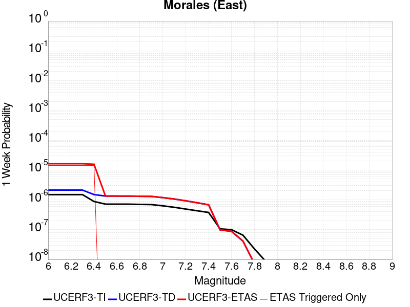 | 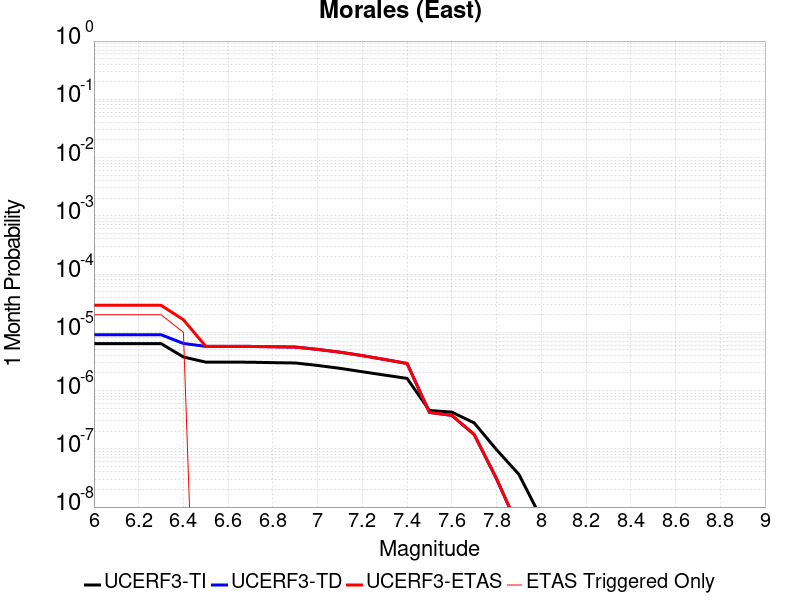 | 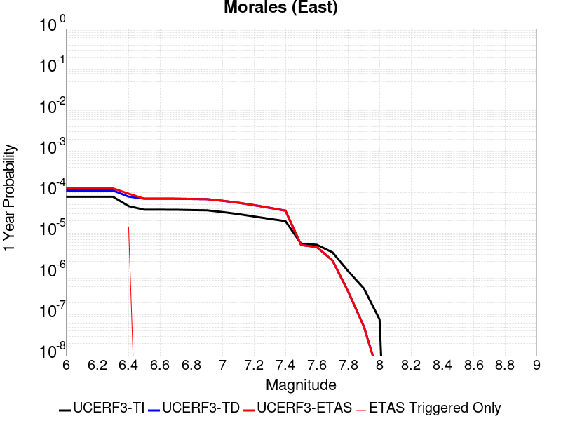 |  |

| Magnitude | 1 wk TI Prob | 1 wk TD Prob | 1 wk ETAS Prob | 1 wk ETAS/TD Gain | 1 wk ETAS Triggered Only | 1 mo TI Prob | 1 mo TD Prob | 1 mo ETAS Prob | 1 mo ETAS/TD Gain | 1 mo ETAS Triggered Only | 1 yr TI Prob | 1 yr TD Prob | 1 yr ETAS Prob | 1 yr ETAS/TD Gain | 1 yr ETAS Triggered Only | 10 yr TI Prob | 10 yr TD Prob | 10 yr ETAS Prob | 10 yr ETAS/TD Gain | 10 yr ETAS Triggered Only |
|-----|-----|-----|-----|-----|-----|-----|-----|-----|-----|-----|-----|-----|-----|-----|-----|-----|-----|-----|-----|-----|
| 6.0 | 1.4942771E-6 | 2.123544E-6 | 1.21235225E-5 | 5.709099 | 1.0E-5 | 6.404029E-6 | 9.100874E-6 | 2.9100693E-5 | 3.197571 | 2.0E-5 | 7.7966266E-5 | 1.1079809E-4 | 1.3079587E-4 | 1.1804885 | 2.0E-5 | 7.793892E-4 | 0.0011074883 | 0.0011274662 | 1.0180389 | 2.0E-5 |
| 6.1 | 1.4942771E-6 | 2.123544E-6 | 1.21235225E-5 | 5.709099 | 1.0E-5 | 6.404029E-6 | 9.100874E-6 | 2.9100693E-5 | 3.197571 | 2.0E-5 | 7.7966266E-5 | 1.1079809E-4 | 1.3079587E-4 | 1.1804885 | 2.0E-5 | 7.793892E-4 | 0.0011074883 | 0.0011274662 | 1.0180389 | 2.0E-5 |
| 6.2 | 1.4942771E-6 | 2.123544E-6 | 1.21235225E-5 | 5.709099 | 1.0E-5 | 6.404029E-6 | 9.100874E-6 | 2.9100693E-5 | 3.197571 | 2.0E-5 | 7.7966266E-5 | 1.1079809E-4 | 1.3079587E-4 | 1.1804885 | 2.0E-5 | 7.793892E-4 | 0.0011074883 | 0.0011274662 | 1.0180389 | 2.0E-5 |
| 6.3 | 1.4942771E-6 | 2.123544E-6 | 1.21235225E-5 | 5.709099 | 1.0E-5 | 6.404029E-6 | 9.100874E-6 | 2.9100693E-5 | 3.197571 | 2.0E-5 | 7.7966266E-5 | 1.1079809E-4 | 1.3079587E-4 | 1.1804885 | 2.0E-5 | 7.793892E-4 | 0.0011074883 | 0.0011274662 | 1.0180389 | 2.0E-5 |
| 6.4 | 8.798845E-7 | 1.5023381E-6 | 1.1502323E-5 | 7.6562815 | 1.0E-5 | 3.7709283E-6 | 6.4385767E-6 | 1.6438513E-5 | 2.5531282 | 1.0E-5 | 4.5910085E-5 | 7.838696E-5 | 8.838618E-5 | 1.1275623 | 1.0E-5 | 4.59006E-4 | 7.836066E-4 | 7.9359877E-4 | 1.0127515 | 1.0E-5 |
| 6.5 | 7.1751725E-7 | 1.3384879E-6 | 1.3384879E-6 | 1.0 | 0.0 | 3.0750705E-6 | 5.7363645E-6 | 5.7363645E-6 | 1.0 | 0.0 | 3.7438338E-5 | 6.9838075E-5 | 6.9838075E-5 | 1.0 | 0.0 | 3.743203E-4 | 6.981715E-4 | 6.981715E-4 | 1.0 | 0.0 |
| 6.6 | 7.1751725E-7 | 1.3384879E-6 | 1.3384879E-6 | 1.0 | 0.0 | 3.0750705E-6 | 5.7363645E-6 | 5.7363645E-6 | 1.0 | 0.0 | 3.7438338E-5 | 6.9838075E-5 | 6.9838075E-5 | 1.0 | 0.0 | 3.743203E-4 | 6.981715E-4 | 6.981715E-4 | 1.0 | 0.0 |
| 6.7 | 7.159057E-7 | 1.3359539E-6 | 1.3359539E-6 | 1.0 | 0.0 | 3.0681638E-6 | 5.7255043E-6 | 5.7255043E-6 | 1.0 | 0.0 | 3.7354253E-5 | 6.9705864E-5 | 6.9705864E-5 | 1.0 | 0.0 | 3.7347974E-4 | 6.968502E-4 | 6.968502E-4 | 1.0 | 0.0 |
| 6.8 | 7.032203E-7 | 1.3175089E-6 | 1.3175089E-6 | 1.0 | 0.0 | 3.0137978E-6 | 5.646455E-6 | 5.646455E-6 | 1.0 | 0.0 | 3.669237E-5 | 6.87435E-5 | 6.87435E-5 | 1.0 | 0.0 | 3.6686313E-4 | 6.872325E-4 | 6.872325E-4 | 1.0 | 0.0 |
| 6.9 | 6.941549E-7 | 1.3025701E-6 | 1.3025701E-6 | 1.0 | 0.0 | 2.974946E-6 | 5.5824316E-6 | 5.5824316E-6 | 1.0 | 0.0 | 3.6219368E-5 | 6.7964065E-5 | 6.7964065E-5 | 1.0 | 0.0 | 3.6213463E-4 | 6.794429E-4 | 6.794429E-4 | 1.0 | 0.0 |
| 7.0 | 6.2932247E-7 | 1.1877994E-6 | 1.1877994E-6 | 1.0 | 0.0 | 2.6970936E-6 | 5.090559E-6 | 5.090559E-6 | 1.0 | 0.0 | 3.283662E-5 | 6.197586E-5 | 6.197586E-5 | 1.0 | 0.0 | 3.283177E-4 | 6.1959465E-4 | 6.1959465E-4 | 1.0 | 0.0 |
| 7.1 | 5.6200963E-7 | 1.064093E-6 | 1.064093E-6 | 1.0 | 0.0 | 2.4086105E-6 | 4.560391E-6 | 4.560391E-6 | 1.0 | 0.0 | 2.9324437E-5 | 5.5521392E-5 | 5.5521392E-5 | 1.0 | 0.0 | 2.9320567E-4 | 5.5508246E-4 | 5.5508246E-4 | 1.0 | 0.0 |
| 7.2 | 4.91044E-7 | 9.2862194E-7 | 9.2862194E-7 | 1.0 | 0.0 | 2.1044725E-6 | 3.9798024E-6 | 3.9798024E-6 | 1.0 | 0.0 | 2.5621652E-5 | 4.8453054E-5 | 4.8453054E-5 | 1.0 | 0.0 | 2.56187E-4 | 4.8443122E-4 | 4.8443122E-4 | 1.0 | 0.0 |
| 7.3 | 4.2978448E-7 | 7.974413E-7 | 7.974413E-7 | 1.0 | 0.0 | 1.8419321E-6 | 3.4176012E-6 | 3.4176012E-6 | 1.0 | 0.0 | 2.2425293E-5 | 4.160853E-5 | 4.160853E-5 | 1.0 | 0.0 | 2.242303E-4 | 4.1601306E-4 | 4.1601306E-4 | 1.0 | 0.0 |
| 7.4 | 3.774317E-7 | 6.807105E-7 | 6.807105E-7 | 1.0 | 0.0 | 1.6175634E-6 | 2.9173275E-6 | 2.9173275E-6 | 1.0 | 0.0 | 1.9693656E-5 | 3.551791E-5 | 3.551791E-5 | 1.0 | 0.0 | 1.969191E-4 | 3.5512767E-4 | 3.5512767E-4 | 1.0 | 0.0 |
| 7.5 | 1.0603232E-7 | 9.8406424E-8 | 9.8406424E-8 | 1.0 | 0.0 | 4.5442414E-7 | 4.2174173E-7 | 4.2174173E-7 | 1.0 | 0.0 | 5.5326E-6 | 5.1346938E-6 | 5.1346938E-6 | 1.0 | 0.0 | 5.532462E-5 | 5.1348336E-5 | 5.1348336E-5 | 1.0 | 0.0 |
| 7.6 | 9.960384E-8 | 8.755028E-8 | 8.755028E-8 | 1.0 | 0.0 | 4.2687353E-7 | 3.7521542E-7 | 3.7521542E-7 | 1.0 | 0.0 | 5.197173E-6 | 4.568238E-6 | 4.568238E-6 | 1.0 | 0.0 | 5.1970514E-5 | 4.5684028E-5 | 4.5684028E-5 | 1.0 | 0.0 |
| 7.7 | 6.499468E-8 | 4.103351E-8 | 4.103351E-8 | 1.0 | 0.0 | 2.785486E-7 | 1.7585788E-7 | 1.7585788E-7 | 1.0 | 0.0 | 3.3913238E-6 | 2.1410676E-6 | 2.1410676E-6 | 1.0 | 0.0 | 3.3912722E-5 | 2.1413045E-5 | 2.1413045E-5 | 1.0 | 0.0 |
| 7.8 | 2.2517119E-8 | 7.1293824E-9 | 7.1293824E-9 | 1.0 | 0.0 | 9.6501935E-8 | 3.0554492E-8 | 3.0554492E-8 | 1.0 | 0.0 | 1.1749105E-6 | 3.720009E-7 | 3.720009E-7 | 1.0 | 0.0 | 1.1749043E-5 | 3.7225666E-6 | 3.7225666E-6 | 1.0 | 0.0 |
| 7.9 | 8.493023E-9 | 9.962774E-10 | 9.962774E-10 | 1.0 | 0.0 | 3.639867E-8 | 4.2697574E-9 | 4.2697574E-9 | 1.0 | 0.0 | 4.4315374E-7 | 5.19843E-8 | 5.19843E-8 | 1.0 | 0.0 | 4.4315284E-6 | 5.2196486E-7 | 5.2196486E-7 | 1.0 | 0.0 |
| 8.0 | 1.4971842E-9 | 5.5340177E-11 | 5.5340177E-11 | 1.0 | 0.0 | 6.4165038E-9 | 2.3717173E-10 | 2.3717173E-10 | 1.0 | 0.0 | 7.812093E-8 | 2.887568E-9 | 2.887568E-9 | 1.0 | 0.0 | 7.81209E-7 | 3.0142694E-8 | 3.0142694E-8 | 1.0 | 0.0 |

## San Gregorio (North) 2011 CFM
*[(top)](#table-of-contents)*

| 1 Week | 1 Month | 1 Year | 10 Year |
|-----|-----|-----|-----|
|  |  |  |  |

| Magnitude | 1 wk TI Prob | 1 wk TD Prob | 1 wk ETAS Prob | 1 wk ETAS/TD Gain | 1 wk ETAS Triggered Only | 1 mo TI Prob | 1 mo TD Prob | 1 mo ETAS Prob | 1 mo ETAS/TD Gain | 1 mo ETAS Triggered Only | 1 yr TI Prob | 1 yr TD Prob | 1 yr ETAS Prob | 1 yr ETAS/TD Gain | 1 yr ETAS Triggered Only | 10 yr TI Prob | 10 yr TD Prob | 10 yr ETAS Prob | 10 yr ETAS/TD Gain | 10 yr ETAS Triggered Only |
|-----|-----|-----|-----|-----|-----|-----|-----|-----|-----|-----|-----|-----|-----|-----|-----|-----|-----|-----|-----|-----|
| 6.0 | 5.0283932E-5 | 4.3057098E-5 | 4.3057098E-5 | 1.0 | 0.0 | 2.1548476E-4 | 1.8451746E-4 | 1.8451746E-4 | 1.0 | 0.0 | 0.0026203706 | 0.002244199 | 0.0022541767 | 1.0044459 | 1.0E-5 | 0.02589687 | 0.022295918 | 0.022315472 | 1.000877 | 2.0E-5 |
| 6.1 | 5.0283932E-5 | 4.3057098E-5 | 4.3057098E-5 | 1.0 | 0.0 | 2.1548476E-4 | 1.8451746E-4 | 1.8451746E-4 | 1.0 | 0.0 | 0.0026203706 | 0.002244199 | 0.0022541767 | 1.0044459 | 1.0E-5 | 0.02589687 | 0.022295918 | 0.022315472 | 1.000877 | 2.0E-5 |
| 6.2 | 4.2998647E-5 | 3.4440873E-5 | 3.4440873E-5 | 1.0 | 0.0 | 1.842669E-4 | 1.4759546E-4 | 1.4759546E-4 | 1.0 | 0.0 | 0.0022411412 | 0.001795506 | 0.001805488 | 1.0055594 | 1.0E-5 | 0.022186736 | 0.017884884 | 0.017904526 | 1.0010983 | 2.0E-5 |
| 6.3 | 4.2998647E-5 | 3.4440873E-5 | 3.4440873E-5 | 1.0 | 0.0 | 1.842669E-4 | 1.4759546E-4 | 1.4759546E-4 | 1.0 | 0.0 | 0.0022411412 | 0.001795506 | 0.001805488 | 1.0055594 | 1.0E-5 | 0.022186736 | 0.017884884 | 0.017904526 | 1.0010983 | 2.0E-5 |
| 6.4 | 4.1101295E-5 | 3.2326076E-5 | 3.2326076E-5 | 1.0 | 0.0 | 1.7613651E-4 | 1.3853304E-4 | 1.3853304E-4 | 1.0 | 0.0 | 0.0021423528 | 0.0016853481 | 0.0016853481 | 1.0 | 0.0 | 0.02121817 | 0.016800618 | 0.01681045 | 1.0005852 | 1.0E-5 |
| 6.5 | 4.1032585E-5 | 3.224411E-5 | 3.224411E-5 | 1.0 | 0.0 | 1.7584208E-4 | 1.381818E-4 | 1.381818E-4 | 1.0 | 0.0 | 0.0021387753 | 0.0016810785 | 0.0016810785 | 1.0 | 0.0 | 0.021183075 | 0.01675857 | 0.016768403 | 1.0005867 | 1.0E-5 |
| 6.6 | 4.011629E-5 | 3.1265718E-5 | 3.1265718E-5 | 1.0 | 0.0 | 1.7191563E-4 | 1.3398913E-4 | 1.3398913E-4 | 1.0 | 0.0 | 0.0020910634 | 0.0016301107 | 0.0016301107 | 1.0 | 0.0 | 0.020714961 | 0.016257357 | 0.016267195 | 1.0006051 | 1.0E-5 |
| 6.7 | 3.8583938E-5 | 2.9452754E-5 | 2.9452754E-5 | 1.0 | 0.0 | 1.6534925E-4 | 1.2622007E-4 | 1.2622007E-4 | 1.0 | 0.0 | 0.0020112682 | 0.0015356604 | 0.0015356604 | 1.0 | 0.0 | 0.019931622 | 0.015326062 | 0.015335909 | 1.0006425 | 1.0E-5 |
| 6.8 | 3.44341E-5 | 2.4450024E-5 | 2.4450024E-5 | 1.0 | 0.0 | 1.4756636E-4 | 1.0478167E-4 | 1.0478167E-4 | 1.0 | 0.0 | 0.0017951399 | 0.0012749807 | 0.0012749807 | 1.0 | 0.0 | 0.017807078 | 0.012751525 | 0.012761398 | 1.0007743 | 1.0E-5 |
| 6.9 | 3.221199E-5 | 2.1777196E-5 | 2.1777196E-5 | 1.0 | 0.0 | 1.3804408E-4 | 9.3327544E-5 | 9.3327544E-5 | 1.0 | 0.0 | 0.0016793909 | 0.0011356788 | 0.0011356788 | 1.0 | 0.0 | 0.01666756 | 0.011372544 | 0.011372544 | 1.0 | 0.0 |
| 7.0 | 2.9186718E-5 | 1.814604E-5 | 1.814604E-5 | 1.0 | 0.0 | 1.2507994E-4 | 7.776645E-5 | 7.776645E-5 | 1.0 | 0.0 | 0.0015217843 | 9.463997E-4 | 9.463997E-4 | 1.0 | 0.0 | 0.015114053 | 0.0094966395 | 0.0094966395 | 1.0 | 0.0 |
| 7.1 | 2.6840138E-5 | 1.5283675E-5 | 1.5283675E-5 | 1.0 | 0.0 | 1.1502409E-4 | 6.549983E-5 | 6.549983E-5 | 1.0 | 0.0 | 0.0013995186 | 7.971706E-4 | 7.971706E-4 | 1.0 | 0.0 | 0.013907375 | 0.0080155255 | 0.0080155255 | 1.0 | 0.0 |
| 7.2 | 2.453002E-5 | 1.2605825E-5 | 1.2605825E-5 | 1.0 | 0.0 | 1.05124425E-4 | 5.4023847E-5 | 5.4023847E-5 | 1.0 | 0.0 | 0.0012791384 | 6.5754243E-4 | 6.5754243E-4 | 1.0 | 0.0 | 0.012718005 | 0.006627395 | 0.006627395 | 1.0 | 0.0 |
| 7.3 | 2.3330727E-5 | 1.1487833E-5 | 1.1487833E-5 | 1.0 | 0.0 | 9.9985E-5 | 4.923264E-5 | 4.923264E-5 | 1.0 | 0.0 | 0.0012166376 | 5.99243E-4 | 5.99243E-4 | 1.0 | 0.0 | 0.012099981 | 0.0060462817 | 0.0060462817 | 1.0 | 0.0 |
| 7.4 | 2.2136466E-5 | 1.0368137E-5 | 1.0368137E-5 | 1.0 | 0.0 | 9.486712E-5 | 4.4434113E-5 | 4.4434113E-5 | 1.0 | 0.0 | 0.0011543952 | 5.408513E-4 | 5.408513E-4 | 1.0 | 0.0 | 0.011484168 | 0.0054640025 | 0.0054640025 | 1.0 | 0.0 |
| 7.5 | 2.0994974E-5 | 9.426374E-6 | 9.426374E-6 | 1.0 | 0.0 | 8.997535E-5 | 4.0398125E-5 | 4.0398125E-5 | 1.0 | 0.0 | 0.0010948994 | 4.917364E-4 | 4.917364E-4 | 1.0 | 0.0 | 0.010895205 | 0.004973108 | 0.004973108 | 1.0 | 0.0 |
| 7.6 | 1.7091823E-5 | 6.892992E-6 | 6.892992E-6 | 1.0 | 0.0 | 7.3248615E-5 | 2.9541061E-5 | 2.9541061E-5 | 1.0 | 0.0 | 8.9143694E-4 | 3.5960317E-4 | 3.5960317E-4 | 1.0 | 0.0 | 0.008878695 | 0.0036480771 | 0.0036480771 | 1.0 | 0.0 |
| 7.7 | 1.2772179E-5 | 4.0202267E-6 | 4.0202267E-6 | 1.0 | 0.0 | 5.473676E-5 | 1.722943E-5 | 1.722943E-5 | 1.0 | 0.0 | 6.6621625E-4 | 2.0974813E-4 | 2.0974813E-4 | 1.0 | 0.0 | 0.006642225 | 0.0021365841 | 0.0021365841 | 1.0 | 0.0 |
| 7.8 | 7.041923E-6 | 1.9402341E-6 | 1.9402341E-6 | 1.0 | 0.0 | 3.017932E-5 | 8.315263E-6 | 8.315263E-6 | 1.0 | 0.0 | 3.6737128E-4 | 1.01233614E-4 | 1.01233614E-4 | 1.0 | 0.0 | 0.0036676454 | 0.0010376878 | 0.0010376878 | 1.0 | 0.0 |
| 7.9 | 2.946768E-6 | 1.0031822E-6 | 1.0031822E-6 | 1.0 | 0.0 | 1.2628945E-5 | 4.299345E-6 | 4.299345E-6 | 1.0 | 0.0 | 1.5374656E-4 | 5.2343268E-5 | 5.2343268E-5 | 1.0 | 0.0 | 0.0015364023 | 5.339059E-4 | 5.339059E-4 | 1.0 | 0.0 |
| 8.0 | 1.1433375E-6 | 5.180804E-7 | 5.180804E-7 | 1.0 | 0.0 | 4.9000087E-6 | 2.2203426E-6 | 2.2203426E-6 | 1.0 | 0.0 | 5.965597E-5 | 2.7032334E-5 | 2.7032334E-5 | 1.0 | 0.0 | 5.963996E-4 | 2.7394458E-4 | 2.7394458E-4 | 1.0 | 0.0 |
| 8.1 | 2.6675295E-7 | 1.6288074E-7 | 1.6288074E-7 | 1.0 | 0.0 | 1.1432264E-6 | 6.9806015E-7 | 6.9806015E-7 | 1.0 | 0.0 | 1.3918692E-5 | 8.498849E-6 | 8.498849E-6 | 1.0 | 0.0 | 1.391782E-4 | 8.6366665E-5 | 8.6366665E-5 | 1.0 | 0.0 |
| 8.2 | 1.2704569E-8 | 9.429871E-9 | 9.429871E-9 | 1.0 | 0.0 | 5.444815E-8 | 4.041373E-8 | 4.041373E-8 | 1.0 | 0.0 | 6.629061E-7 | 4.920371E-7 | 4.920371E-7 | 1.0 | 0.0 | 6.629041E-6 | 5.1106863E-6 | 5.1106863E-6 | 1.0 | 0.0 |

## San Jose
*[(top)](#table-of-contents)*

| 1 Week | 1 Month | 1 Year | 10 Year |
|-----|-----|-----|-----|
|  |  |  |  |

| Magnitude | 1 wk TI Prob | 1 wk TD Prob | 1 wk ETAS Prob | 1 wk ETAS/TD Gain | 1 wk ETAS Triggered Only | 1 mo TI Prob | 1 mo TD Prob | 1 mo ETAS Prob | 1 mo ETAS/TD Gain | 1 mo ETAS Triggered Only | 1 yr TI Prob | 1 yr TD Prob | 1 yr ETAS Prob | 1 yr ETAS/TD Gain | 1 yr ETAS Triggered Only | 10 yr TI Prob | 10 yr TD Prob | 10 yr ETAS Prob | 10 yr ETAS/TD Gain | 10 yr ETAS Triggered Only |
|-----|-----|-----|-----|-----|-----|-----|-----|-----|-----|-----|-----|-----|-----|-----|-----|-----|-----|-----|-----|-----|
| 6.0 | 5.0851277E-6 | 4.125642E-6 | 4.125642E-6 | 1.0 | 0.0 | 2.1793223E-5 | 1.768122E-5 | 1.768122E-5 | 1.0 | 0.0 | 2.653002E-4 | 2.152502E-4 | 2.2524805E-4 | 1.0464475 | 1.0E-5 | 0.0026498367 | 0.0021507454 | 0.0021707024 | 1.0092791 | 2.0E-5 |
| 6.1 | 5.0851277E-6 | 4.125642E-6 | 4.125642E-6 | 1.0 | 0.0 | 2.1793223E-5 | 1.768122E-5 | 1.768122E-5 | 1.0 | 0.0 | 2.653002E-4 | 2.152502E-4 | 2.2524805E-4 | 1.0464475 | 1.0E-5 | 0.0026498367 | 0.0021507454 | 0.0021707024 | 1.0092791 | 2.0E-5 |
| 6.2 | 5.0851277E-6 | 4.125642E-6 | 4.125642E-6 | 1.0 | 0.0 | 2.1793223E-5 | 1.768122E-5 | 1.768122E-5 | 1.0 | 0.0 | 2.653002E-4 | 2.152502E-4 | 2.2524805E-4 | 1.0464475 | 1.0E-5 | 0.0026498367 | 0.0021507454 | 0.0021707024 | 1.0092791 | 2.0E-5 |
| 6.3 | 5.0851277E-6 | 4.125642E-6 | 4.125642E-6 | 1.0 | 0.0 | 2.1793223E-5 | 1.768122E-5 | 1.768122E-5 | 1.0 | 0.0 | 2.653002E-4 | 2.152502E-4 | 2.2524805E-4 | 1.0464475 | 1.0E-5 | 0.0026498367 | 0.0021507454 | 0.0021707024 | 1.0092791 | 2.0E-5 |
| 6.4 | 4.3115124E-6 | 3.3237525E-6 | 3.3237525E-6 | 1.0 | 0.0 | 1.8477778E-5 | 1.4244589E-5 | 1.4244589E-5 | 1.0 | 0.0 | 2.2494372E-4 | 1.7341628E-4 | 1.7341628E-4 | 1.0 | 0.0 | 0.0022471617 | 0.0017330965 | 0.0017430792 | 1.0057601 | 1.0E-5 |
| 6.5 | 4.3115124E-6 | 3.3237525E-6 | 3.3237525E-6 | 1.0 | 0.0 | 1.8477778E-5 | 1.4244589E-5 | 1.4244589E-5 | 1.0 | 0.0 | 2.2494372E-4 | 1.7341628E-4 | 1.7341628E-4 | 1.0 | 0.0 | 0.0022471617 | 0.0017330965 | 0.0017430792 | 1.0057601 | 1.0E-5 |
| 6.6 | 3.110396E-6 | 2.0799562E-6 | 2.0799562E-6 | 1.0 | 0.0 | 1.33302E-5 | 8.9140685E-6 | 8.9140685E-6 | 1.0 | 0.0 | 1.622831E-4 | 1.0852366E-4 | 1.0852366E-4 | 1.0 | 0.0 | 0.0016216465 | 0.001084804 | 0.001084804 | 1.0 | 0.0 |
| 6.7 | 3.110396E-6 | 2.0799562E-6 | 2.0799562E-6 | 1.0 | 0.0 | 1.33302E-5 | 8.9140685E-6 | 8.9140685E-6 | 1.0 | 0.0 | 1.622831E-4 | 1.0852366E-4 | 1.0852366E-4 | 1.0 | 0.0 | 0.0016216465 | 0.001084804 | 0.001084804 | 1.0 | 0.0 |
| 6.8 | 2.856651E-6 | 1.9024077E-6 | 1.9024077E-6 | 1.0 | 0.0 | 1.2242733E-5 | 8.153152E-6 | 8.153152E-6 | 1.0 | 0.0 | 1.4904508E-4 | 9.926035E-5 | 9.926035E-5 | 1.0 | 0.0 | 0.0014894515 | 9.922545E-4 | 9.922545E-4 | 1.0 | 0.0 |
| 6.9 | 2.1618725E-6 | 1.4186406E-6 | 1.4186406E-6 | 1.0 | 0.0 | 9.265135E-6 | 6.0798748E-6 | 6.0798748E-6 | 1.0 | 0.0 | 1.12797185E-4 | 7.402005E-5 | 7.402005E-5 | 1.0 | 0.0 | 0.0011273995 | 7.4003247E-4 | 7.4003247E-4 | 1.0 | 0.0 |
| 7.0 | 1.9684312E-6 | 1.3256082E-6 | 1.3256082E-6 | 1.0 | 0.0 | 8.436106E-6 | 5.681166E-6 | 5.681166E-6 | 1.0 | 0.0 | 1.02704755E-4 | 6.916608E-5 | 6.916608E-5 | 1.0 | 0.0 | 0.001026573 | 6.9152354E-4 | 6.9152354E-4 | 1.0 | 0.0 |
| 7.1 | 1.6070337E-6 | 1.1154867E-6 | 1.1154867E-6 | 1.0 | 0.0 | 6.887269E-6 | 4.7806493E-6 | 4.7806493E-6 | 1.0 | 0.0 | 8.384928E-5 | 5.8202913E-5 | 5.8202913E-5 | 1.0 | 0.0 | 8.3817646E-4 | 5.819527E-4 | 5.819527E-4 | 1.0 | 0.0 |
| 7.2 | 1.0631658E-6 | 6.403567E-7 | 6.403567E-7 | 1.0 | 0.0 | 4.556417E-6 | 2.744383E-6 | 2.744383E-6 | 1.0 | 0.0 | 5.5472963E-5 | 3.3412365E-5 | 3.3412365E-5 | 1.0 | 0.0 | 5.545912E-4 | 3.3414463E-4 | 3.3414463E-4 | 1.0 | 0.0 |
| 7.3 | 7.060711E-7 | 4.5823228E-7 | 4.5823228E-7 | 1.0 | 0.0 | 3.0260155E-6 | 1.9638512E-6 | 1.9638512E-6 | 1.0 | 0.0 | 3.6841117E-5 | 2.3909635E-5 | 2.3909635E-5 | 1.0 | 0.0 | 3.6835007E-4 | 2.3914136E-4 | 2.3914136E-4 | 1.0 | 0.0 |
| 7.4 | 3.3677085E-7 | 2.3231999E-7 | 2.3231999E-7 | 1.0 | 0.0 | 1.4433028E-6 | 9.956567E-7 | 9.956567E-7 | 1.0 | 0.0 | 1.757207E-5 | 1.2122056E-5 | 1.2122056E-5 | 1.0 | 0.0 | 1.7570681E-4 | 1.2128407E-4 | 1.2128407E-4 | 1.0 | 0.0 |
| 7.5 | 3.129161E-7 | 1.9529637E-7 | 1.9529637E-7 | 1.0 | 0.0 | 1.3410682E-6 | 8.3698416E-7 | 8.3698416E-7 | 1.0 | 0.0 | 1.6327383E-5 | 1.0190237E-5 | 1.0190237E-5 | 1.0 | 0.0 | 1.6326184E-4 | 1.0196777E-4 | 1.0196777E-4 | 1.0 | 0.0 |
| 7.6 | 2.8008668E-7 | 1.4240818E-7 | 1.4240818E-7 | 1.0 | 0.0 | 1.2003709E-6 | 6.103206E-7 | 6.103206E-7 | 1.0 | 0.0 | 1.46144175E-5 | 7.43063E-6 | 7.43063E-6 | 1.0 | 0.0 | 1.4613457E-4 | 7.43735E-5 | 7.43735E-5 | 1.0 | 0.0 |
| 7.7 | 2.7852005E-7 | 1.4015403E-7 | 1.4015403E-7 | 1.0 | 0.0 | 1.1936568E-6 | 6.0066003E-7 | 6.0066003E-7 | 1.0 | 0.0 | 1.4532674E-5 | 7.3130127E-6 | 7.3130127E-6 | 1.0 | 0.0 | 1.4531724E-4 | 7.31974E-5 | 7.31974E-5 | 1.0 | 0.0 |
| 7.8 | 1.1810797E-7 | 7.5187074E-8 | 7.5187074E-8 | 1.0 | 0.0 | 5.0617695E-7 | 3.2223028E-7 | 3.2223028E-7 | 1.0 | 0.0 | 6.1626865E-6 | 3.9231472E-6 | 3.9231472E-6 | 1.0 | 0.0 | 6.162516E-5 | 3.9271265E-5 | 3.9271265E-5 | 1.0 | 0.0 |

## Pitas Point (Lower West)
*[(top)](#table-of-contents)*

| 1 Week | 1 Month | 1 Year | 10 Year |
|-----|-----|-----|-----|
| 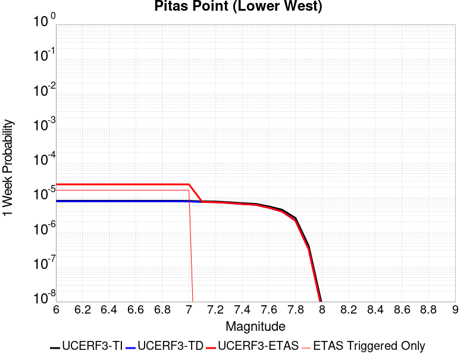 | 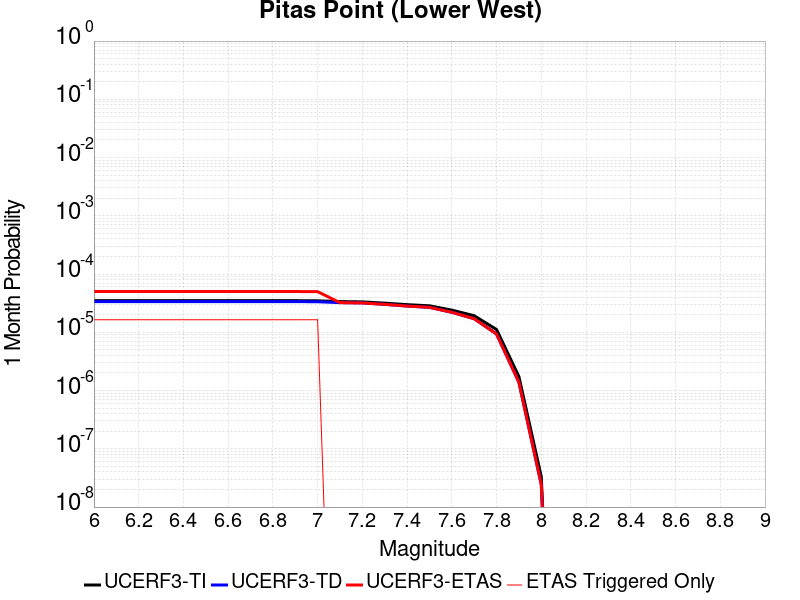 | 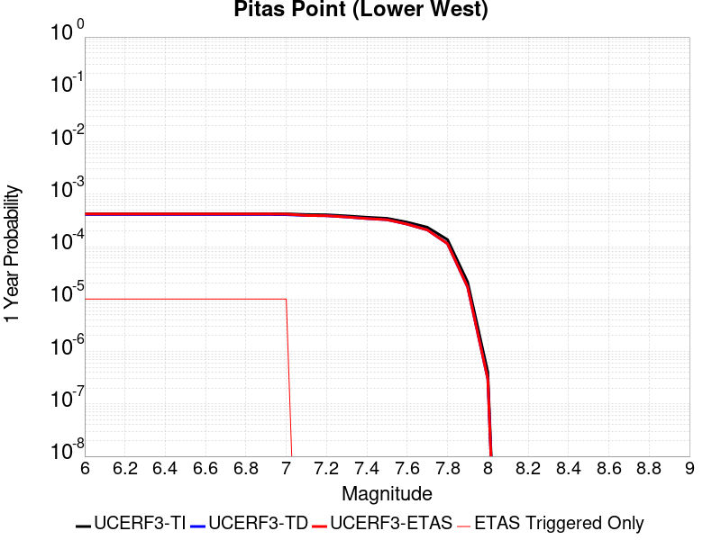 | 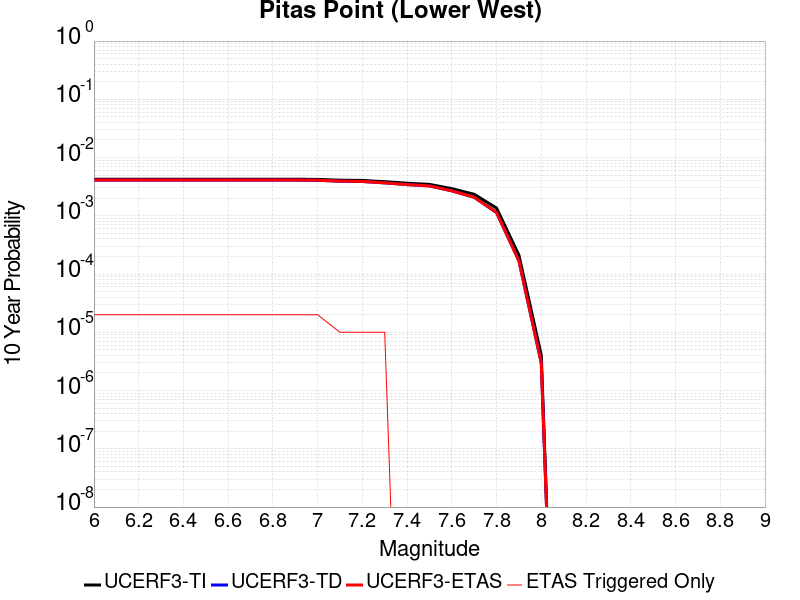 |

| Magnitude | 1 wk TI Prob | 1 wk TD Prob | 1 wk ETAS Prob | 1 wk ETAS/TD Gain | 1 wk ETAS Triggered Only | 1 mo TI Prob | 1 mo TD Prob | 1 mo ETAS Prob | 1 mo ETAS/TD Gain | 1 mo ETAS Triggered Only | 1 yr TI Prob | 1 yr TD Prob | 1 yr ETAS Prob | 1 yr ETAS/TD Gain | 1 yr ETAS Triggered Only | 10 yr TI Prob | 10 yr TD Prob | 10 yr ETAS Prob | 10 yr ETAS/TD Gain | 10 yr ETAS Triggered Only |
|-----|-----|-----|-----|-----|-----|-----|-----|-----|-----|-----|-----|-----|-----|-----|-----|-----|-----|-----|-----|-----|
| 6.0 | 8.151497E-6 | 7.855796E-6 | 1.7855718E-5 | 2.2729354 | 1.0E-5 | 3.493452E-5 | 3.3667267E-5 | 4.3666932E-5 | 1.2970144 | 1.0E-5 | 4.252448E-4 | 4.0982262E-4 | 4.1981853E-4 | 1.0243908 | 1.0E-5 | 0.0042443196 | 0.004090749 | 0.0041106674 | 1.0048691 | 2.0E-5 |
| 6.1 | 8.151497E-6 | 7.855796E-6 | 1.7855718E-5 | 2.2729354 | 1.0E-5 | 3.493452E-5 | 3.3667267E-5 | 4.3666932E-5 | 1.2970144 | 1.0E-5 | 4.252448E-4 | 4.0982262E-4 | 4.1981853E-4 | 1.0243908 | 1.0E-5 | 0.0042443196 | 0.004090749 | 0.0041106674 | 1.0048691 | 2.0E-5 |
| 6.2 | 8.151497E-6 | 7.855796E-6 | 1.7855718E-5 | 2.2729354 | 1.0E-5 | 3.493452E-5 | 3.3667267E-5 | 4.3666932E-5 | 1.2970144 | 1.0E-5 | 4.252448E-4 | 4.0982262E-4 | 4.1981853E-4 | 1.0243908 | 1.0E-5 | 0.0042443196 | 0.004090749 | 0.0041106674 | 1.0048691 | 2.0E-5 |
| 6.3 | 8.151497E-6 | 7.855796E-6 | 1.7855718E-5 | 2.2729354 | 1.0E-5 | 3.493452E-5 | 3.3667267E-5 | 4.3666932E-5 | 1.2970144 | 1.0E-5 | 4.252448E-4 | 4.0982262E-4 | 4.1981853E-4 | 1.0243908 | 1.0E-5 | 0.0042443196 | 0.004090749 | 0.0041106674 | 1.0048691 | 2.0E-5 |
| 6.4 | 8.151497E-6 | 7.855796E-6 | 1.7855718E-5 | 2.2729354 | 1.0E-5 | 3.493452E-5 | 3.3667267E-5 | 4.3666932E-5 | 1.2970144 | 1.0E-5 | 4.252448E-4 | 4.0982262E-4 | 4.1981853E-4 | 1.0243908 | 1.0E-5 | 0.0042443196 | 0.004090749 | 0.0041106674 | 1.0048691 | 2.0E-5 |
| 6.5 | 8.151497E-6 | 7.855796E-6 | 1.7855718E-5 | 2.2729354 | 1.0E-5 | 3.493452E-5 | 3.3667267E-5 | 4.3666932E-5 | 1.2970144 | 1.0E-5 | 4.252448E-4 | 4.0982262E-4 | 4.1981853E-4 | 1.0243908 | 1.0E-5 | 0.0042443196 | 0.004090749 | 0.0041106674 | 1.0048691 | 2.0E-5 |
| 6.6 | 8.151497E-6 | 7.855796E-6 | 1.7855718E-5 | 2.2729354 | 1.0E-5 | 3.493452E-5 | 3.3667267E-5 | 4.3666932E-5 | 1.2970144 | 1.0E-5 | 4.252448E-4 | 4.0982262E-4 | 4.1981853E-4 | 1.0243908 | 1.0E-5 | 0.0042443196 | 0.004090749 | 0.0041106674 | 1.0048691 | 2.0E-5 |
| 6.7 | 8.151497E-6 | 7.855796E-6 | 1.7855718E-5 | 2.2729354 | 1.0E-5 | 3.493452E-5 | 3.3667267E-5 | 4.3666932E-5 | 1.2970144 | 1.0E-5 | 4.252448E-4 | 4.0982262E-4 | 4.1981853E-4 | 1.0243908 | 1.0E-5 | 0.0042443196 | 0.004090749 | 0.0041106674 | 1.0048691 | 2.0E-5 |
| 6.8 | 8.151497E-6 | 7.855796E-6 | 1.7855718E-5 | 2.2729354 | 1.0E-5 | 3.493452E-5 | 3.3667267E-5 | 4.3666932E-5 | 1.2970144 | 1.0E-5 | 4.252448E-4 | 4.0982262E-4 | 4.1981853E-4 | 1.0243908 | 1.0E-5 | 0.0042443196 | 0.004090749 | 0.0041106674 | 1.0048691 | 2.0E-5 |
| 6.9 | 8.151497E-6 | 7.855796E-6 | 1.7855718E-5 | 2.2729354 | 1.0E-5 | 3.493452E-5 | 3.3667267E-5 | 4.3666932E-5 | 1.2970144 | 1.0E-5 | 4.252448E-4 | 4.0982262E-4 | 4.1981853E-4 | 1.0243908 | 1.0E-5 | 0.0042443196 | 0.004090749 | 0.0041106674 | 1.0048691 | 2.0E-5 |
| 7.0 | 8.103535E-6 | 7.805226E-6 | 1.7805149E-5 | 2.281183 | 1.0E-5 | 3.4728975E-5 | 3.3450542E-5 | 4.3450207E-5 | 1.2989388 | 1.0E-5 | 4.2274324E-4 | 4.07185E-4 | 4.171809E-4 | 1.0245489 | 1.0E-5 | 0.0042193993 | 0.0040644696 | 0.0040843883 | 1.0049007 | 2.0E-5 |
| 7.1 | 7.853298E-6 | 7.540917E-6 | 7.540917E-6 | 1.0 | 0.0 | 3.3656554E-5 | 3.2317817E-5 | 3.2317817E-5 | 1.0 | 0.0 | 4.096915E-4 | 3.9339912E-4 | 3.9339912E-4 | 1.0 | 0.0 | 0.00408937 | 0.0039271032 | 0.0039370637 | 1.0025364 | 1.0E-5 |
| 7.2 | 7.771102E-6 | 7.453199E-6 | 7.453199E-6 | 1.0 | 0.0 | 3.33043E-5 | 3.1941894E-5 | 3.1941894E-5 | 1.0 | 0.0 | 4.0540437E-4 | 3.8882386E-4 | 3.8882386E-4 | 1.0 | 0.0 | 0.0040466557 | 0.003881511 | 0.0038914722 | 1.0025663 | 1.0E-5 |
| 7.3 | 7.3945344E-6 | 7.0493033E-6 | 7.0493033E-6 | 1.0 | 0.0 | 3.1690477E-5 | 3.0210955E-5 | 3.0210955E-5 | 1.0 | 0.0 | 3.8576324E-4 | 3.677569E-4 | 3.677569E-4 | 1.0 | 0.0 | 0.0038509427 | 0.003671551 | 0.0036815142 | 1.0027137 | 1.0E-5 |
| 7.4 | 6.964645E-6 | 6.5901527E-6 | 6.5901527E-6 | 1.0 | 0.0 | 2.9848137E-5 | 2.8243208E-5 | 2.8243208E-5 | 1.0 | 0.0 | 3.6334046E-4 | 3.438073E-4 | 3.438073E-4 | 1.0 | 0.0 | 0.0036274698 | 0.0034328073 | 0.0034328073 | 1.0 | 0.0 |
| 7.5 | 6.6525035E-6 | 6.259191E-6 | 6.259191E-6 | 1.0 | 0.0 | 2.851042E-5 | 2.6824831E-5 | 2.6824831E-5 | 1.0 | 0.0 | 3.4705905E-4 | 3.2654387E-4 | 3.2654387E-4 | 1.0 | 0.0 | 0.0034651754 | 0.0032606919 | 0.0032606919 | 1.0 | 0.0 |
| 7.6 | 5.613338E-6 | 5.15142E-6 | 5.15142E-6 | 1.0 | 0.0 | 2.405694E-5 | 2.2077327E-5 | 2.2077327E-5 | 1.0 | 0.0 | 2.928539E-4 | 2.6875862E-4 | 2.6875862E-4 | 1.0 | 0.0 | 0.0029246826 | 0.0026843674 | 0.0026843674 | 1.0 | 0.0 |
| 7.7 | 4.494704E-6 | 3.996945E-6 | 3.996945E-6 | 1.0 | 0.0 | 1.9262876E-5 | 1.7129652E-5 | 1.7129652E-5 | 1.0 | 0.0 | 2.3450027E-4 | 2.0853379E-4 | 2.0853379E-4 | 1.0 | 0.0 | 0.0023425296 | 0.0020834052 | 0.0020834052 | 1.0 | 0.0 |
| 7.8 | 2.6075882E-6 | 2.1836663E-6 | 2.1836663E-6 | 1.0 | 0.0 | 1.117533E-5 | 9.358537E-6 | 9.358537E-6 | 1.0 | 0.0 | 1.3605114E-4 | 1.1393427E-4 | 1.1393427E-4 | 1.0 | 0.0 | 0.0013596788 | 0.0011387634 | 0.0011387634 | 1.0 | 0.0 |
| 7.9 | 4.045984E-7 | 3.2424057E-7 | 3.2424057E-7 | 1.0 | 0.0 | 1.733992E-6 | 1.3896017E-6 | 1.3896017E-6 | 1.0 | 0.0 | 2.1111147E-5 | 1.6918271E-5 | 1.6918271E-5 | 1.0 | 0.0 | 2.1109142E-4 | 1.6917015E-4 | 1.6917015E-4 | 1.0 | 0.0 |
| 8.0 | 7.791402E-9 | 5.6836056E-9 | 5.6836056E-9 | 1.0 | 0.0 | 3.3391725E-8 | 2.4358311E-8 | 2.4358311E-8 | 1.0 | 0.0 | 4.0654416E-7 | 2.965624E-7 | 2.965624E-7 | 1.0 | 0.0 | 4.065434E-6 | 2.9656223E-6 | 2.9656223E-6 | 1.0 | 0.0 |

## Calaveras (Central) 2011 CFM
*[(top)](#table-of-contents)*

| 1 Week | 1 Month | 1 Year | 10 Year |
|-----|-----|-----|-----|
|  |  |  |  |

| Magnitude | 1 wk TI Prob | 1 wk TD Prob | 1 wk ETAS Prob | 1 wk ETAS/TD Gain | 1 wk ETAS Triggered Only | 1 mo TI Prob | 1 mo TD Prob | 1 mo ETAS Prob | 1 mo ETAS/TD Gain | 1 mo ETAS Triggered Only | 1 yr TI Prob | 1 yr TD Prob | 1 yr ETAS Prob | 1 yr ETAS/TD Gain | 1 yr ETAS Triggered Only | 10 yr TI Prob | 10 yr TD Prob | 10 yr ETAS Prob | 10 yr ETAS/TD Gain | 10 yr ETAS Triggered Only |
|-----|-----|-----|-----|-----|-----|-----|-----|-----|-----|-----|-----|-----|-----|-----|-----|-----|-----|-----|-----|-----|
| 6.0 | 1.5010907E-4 | 2.4804124E-4 | 2.5803875E-4 | 1.0403059 | 1.0E-5 | 6.4316596E-4 | 0.001062498 | 0.0010724873 | 1.0094018 | 1.0E-5 | 0.0078024664 | 0.012850443 | 0.012860315 | 1.0007682 | 1.0E-5 | 0.07534136 | 0.120411225 | 0.120428815 | 1.0001462 | 2.0E-5 |
| 6.1 | 1.4521465E-4 | 2.3965565E-4 | 2.4965324E-4 | 1.0417166 | 1.0E-5 | 6.222001E-4 | 0.0010265942 | 0.0010365839 | 1.0097309 | 1.0E-5 | 0.0075490056 | 0.012419763 | 0.012429639 | 1.0007951 | 1.0E-5 | 0.07297657 | 0.11668273 | 0.116700396 | 1.0001514 | 2.0E-5 |
| 6.2 | 1.429998E-4 | 2.3896809E-4 | 2.489657E-4 | 1.0418366 | 1.0E-5 | 6.127123E-4 | 0.0010236499 | 0.0010336398 | 1.009759 | 1.0E-5 | 0.007434286 | 0.012384372 | 0.012394248 | 1.0007975 | 1.0E-5 | 0.07190444 | 0.11633677 | 0.11635444 | 1.0001519 | 2.0E-5 |
| 6.3 | 1.3536277E-4 | 2.3227946E-4 | 2.4227714E-4 | 1.0430416 | 1.0E-5 | 5.799972E-4 | 9.950127E-4 | 0.0010050028 | 1.0100402 | 1.0E-5 | 0.0070386264 | 0.012040534 | 0.0120504135 | 1.0008205 | 1.0E-5 | 0.0681982 | 0.113249525 | 0.11326726 | 1.0001566 | 2.0E-5 |
| 6.4 | 1.2993296E-4 | 2.2651516E-4 | 2.3651289E-4 | 1.0441371 | 1.0E-5 | 5.5673666E-4 | 9.703276E-4 | 9.803178E-4 | 1.0102957 | 1.0E-5 | 0.006757223 | 0.011743338 | 0.01175322 | 1.0008415 | 1.0E-5 | 0.06555412 | 0.11052752 | 0.110545315 | 1.0001609 | 2.0E-5 |
| 6.5 | 1.0498927E-4 | 1.7981966E-4 | 1.8981787E-4 | 1.0556012 | 1.0E-5 | 4.498764E-4 | 7.7042676E-4 | 7.8041904E-4 | 1.0129699 | 1.0E-5 | 0.005463498 | 0.00933952 | 0.009349426 | 1.0010607 | 1.0E-5 | 0.053311124 | 0.08920739 | 0.089225605 | 1.0002042 | 2.0E-5 |
| 6.6 | 1.0157505E-4 | 1.7469494E-4 | 1.8469318E-4 | 1.0572326 | 1.0E-5 | 4.35249E-4 | 7.4847665E-4 | 7.5846916E-4 | 1.0133505 | 1.0E-5 | 0.0052862884 | 0.009074567 | 0.009084476 | 1.001092 | 1.0E-5 | 0.05162293 | 0.08678487 | 0.08680314 | 1.0002104 | 2.0E-5 |
| 6.7 | 9.660386E-5 | 1.6728783E-4 | 1.7728616E-4 | 1.0597672 | 1.0E-5 | 4.1395082E-4 | 7.167497E-4 | 7.267425E-4 | 1.0139419 | 1.0E-5 | 0.0050282106 | 0.008691474 | 0.008701387 | 1.0011406 | 1.0E-5 | 0.049159497 | 0.08327401 | 0.08329234 | 1.0002202 | 2.0E-5 |
| 6.8 | 9.089927E-5 | 1.5643238E-4 | 1.6643082E-4 | 1.0639154 | 1.0E-5 | 3.8951015E-4 | 6.702511E-4 | 6.802444E-4 | 1.0149097 | 1.0E-5 | 0.0047319788 | 0.008129742 | 0.008139661 | 1.0012201 | 1.0E-5 | 0.046324775 | 0.078163 | 0.07818144 | 1.0002359 | 2.0E-5 |
| 6.9 | 7.353187E-5 | 1.2295779E-4 | 1.3295656E-4 | 1.0813187 | 1.0E-5 | 3.150985E-4 | 5.2685605E-4 | 5.368508E-4 | 1.0189705 | 1.0E-5 | 0.0038295772 | 0.006395728 | 0.0064056637 | 1.0015535 | 1.0E-5 | 0.037642512 | 0.06218928 | 0.062208038 | 1.0003016 | 2.0E-5 |
| 7.0 | 5.746064E-5 | 9.3890936E-5 | 1.0389E-4 | 1.1064966 | 1.0E-5 | 2.4623662E-4 | 4.0232803E-4 | 4.12324E-4 | 1.0248454 | 1.0E-5 | 0.0029938098 | 0.0048874132 | 0.0048973644 | 1.0020361 | 1.0E-5 | 0.02953797 | 0.04798713 | 0.04800617 | 1.0003967 | 2.0E-5 |
| 7.1 | 4.9557195E-5 | 8.052768E-5 | 9.0526875E-5 | 1.1241709 | 1.0E-5 | 2.123707E-4 | 3.4507332E-4 | 3.5506987E-4 | 1.0289694 | 1.0E-5 | 0.0025825473 | 0.004193237 | 0.004203195 | 1.0023748 | 1.0E-5 | 0.0255274 | 0.041373473 | 0.041392643 | 1.0004634 | 2.0E-5 |
| 7.2 | 3.687595E-5 | 5.952694E-5 | 6.9526344E-5 | 1.1679811 | 1.0E-5 | 1.5803022E-4 | 2.5509068E-4 | 2.6508814E-4 | 1.0391917 | 1.0E-5 | 0.0019223199 | 0.003101335 | 0.0031113038 | 1.0032144 | 1.0E-5 | 0.01905776 | 0.030883823 | 0.030893514 | 1.0003138 | 1.0E-5 |
| 7.3 | 2.5846984E-5 | 4.2473923E-5 | 4.2473923E-5 | 1.0 | 0.0 | 1.1076809E-4 | 1.820185E-4 | 1.820185E-4 | 1.0 | 0.0 | 0.0013477671 | 0.0022138404 | 0.0022138404 | 1.0 | 0.0 | 0.013396223 | 0.022175217 | 0.022175217 | 1.0 | 0.0 |
| 7.4 | 1.7747854E-5 | 2.993759E-5 | 2.993759E-5 | 1.0 | 0.0 | 7.6060016E-5 | 1.2829766E-4 | 1.2829766E-4 | 1.0 | 0.0 | 9.2563726E-4 | 0.0015609078 | 0.0015609078 | 1.0 | 0.0 | 0.009217911 | 0.015708687 | 0.015708687 | 1.0 | 0.0 |
| 7.5 | 1.4883479E-5 | 2.6244672E-5 | 2.6244672E-5 | 1.0 | 0.0 | 6.378478E-5 | 1.12472335E-4 | 1.12472335E-4 | 1.0 | 0.0 | 7.76303E-4 | 0.0013684932 | 0.0013684932 | 1.0 | 0.0 | 0.0077359667 | 0.013801667 | 0.013801667 | 1.0 | 0.0 |
| 7.6 | 8.166975E-6 | 1.4964299E-5 | 1.4964299E-5 | 1.0 | 0.0 | 3.5000852E-5 | 6.413114E-5 | 6.413114E-5 | 1.0 | 0.0 | 4.2605202E-4 | 7.805183E-4 | 7.805183E-4 | 1.0 | 0.0 | 0.004252361 | 0.007939203 | 0.007939203 | 1.0 | 0.0 |
| 7.7 | 3.3858064E-6 | 6.254251E-6 | 6.254251E-6 | 1.0 | 0.0 | 1.4510518E-5 | 2.6803657E-5 | 2.6803657E-5 | 1.0 | 0.0 | 1.7665124E-4 | 3.2628572E-4 | 3.2628572E-4 | 1.0 | 0.0 | 0.0017651088 | 0.003388363 | 0.003388363 | 1.0 | 0.0 |
| 7.8 | 2.7721615E-6 | 5.366695E-6 | 5.366695E-6 | 1.0 | 0.0 | 1.1880637E-5 | 2.2999919E-5 | 2.2999919E-5 | 1.0 | 0.0 | 1.4463716E-4 | 2.7998807E-4 | 2.7998807E-4 | 1.0 | 0.0 | 0.0014454306 | 0.002907615 | 0.002907615 | 1.0 | 0.0 |
| 7.9 | 1.9736292E-6 | 4.128705E-6 | 4.128705E-6 | 1.0 | 0.0 | 8.4583835E-6 | 1.769433E-5 | 1.769433E-5 | 1.0 | 0.0 | 1.0297595E-4 | 2.1540721E-4 | 2.1540721E-4 | 1.0 | 0.0 | 0.0010292825 | 0.0022237299 | 0.0022237299 | 1.0 | 0.0 |
| 8.0 | 1.1767289E-6 | 2.5546633E-6 | 2.5546633E-6 | 1.0 | 0.0 | 5.0431145E-6 | 1.0948511E-5 | 1.0948511E-5 | 1.0 | 0.0 | 6.139818E-5 | 1.3329E-4 | 1.3329E-4 | 1.0 | 0.0 | 6.1381224E-4 | 0.001366126 | 0.001366126 | 1.0 | 0.0 |
| 8.1 | 7.5112825E-7 | 1.541076E-6 | 1.541076E-6 | 1.0 | 0.0 | 3.2191172E-6 | 6.604595E-6 | 6.604595E-6 | 1.0 | 0.0 | 3.9192048E-5 | 8.0408E-5 | 8.0408E-5 | 1.0 | 0.0 | 3.9185135E-4 | 8.2356273E-4 | 8.2356273E-4 | 1.0 | 0.0 |

## Northridge
*[(top)](#table-of-contents)*

| 1 Week | 1 Month | 1 Year | 10 Year |
|-----|-----|-----|-----|
|  | 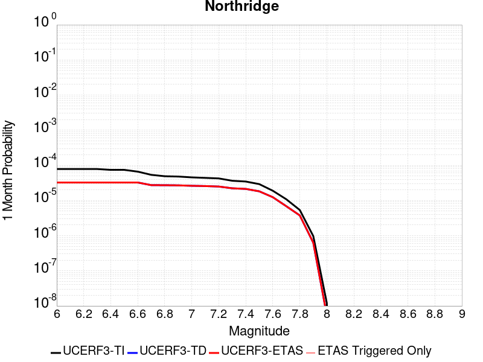 | 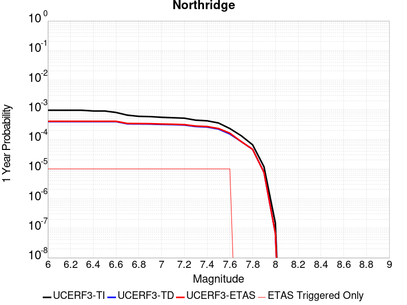 | 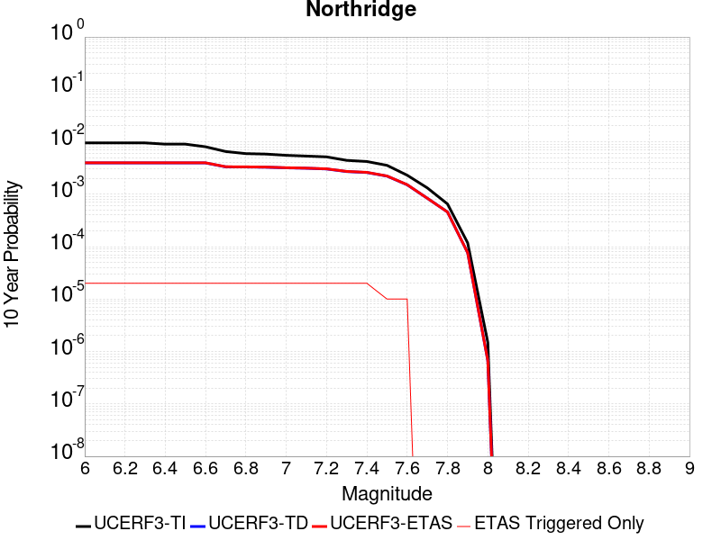 |

| Magnitude | 1 wk TI Prob | 1 wk TD Prob | 1 wk ETAS Prob | 1 wk ETAS/TD Gain | 1 wk ETAS Triggered Only | 1 mo TI Prob | 1 mo TD Prob | 1 mo ETAS Prob | 1 mo ETAS/TD Gain | 1 mo ETAS Triggered Only | 1 yr TI Prob | 1 yr TD Prob | 1 yr ETAS Prob | 1 yr ETAS/TD Gain | 1 yr ETAS Triggered Only | 10 yr TI Prob | 10 yr TD Prob | 10 yr ETAS Prob | 10 yr ETAS/TD Gain | 10 yr ETAS Triggered Only |
|-----|-----|-----|-----|-----|-----|-----|-----|-----|-----|-----|-----|-----|-----|-----|-----|-----|-----|-----|-----|-----|
| 6.0 | 1.8340852E-5 | 7.5878907E-6 | 7.5878907E-6 | 1.0 | 0.0 | 7.860128E-5 | 3.251914E-5 | 3.251914E-5 | 1.0 | 0.0 | 9.565505E-4 | 3.9585077E-4 | 4.0584683E-4 | 1.0252521 | 1.0E-5 | 0.009524435 | 0.0039516874 | 0.0039716084 | 1.0050411 | 2.0E-5 |
| 6.1 | 1.8340852E-5 | 7.5878907E-6 | 7.5878907E-6 | 1.0 | 0.0 | 7.860128E-5 | 3.251914E-5 | 3.251914E-5 | 1.0 | 0.0 | 9.565505E-4 | 3.9585077E-4 | 4.0584683E-4 | 1.0252521 | 1.0E-5 | 0.009524435 | 0.0039516874 | 0.0039716084 | 1.0050411 | 2.0E-5 |
| 6.2 | 1.8340852E-5 | 7.5878907E-6 | 7.5878907E-6 | 1.0 | 0.0 | 7.860128E-5 | 3.251914E-5 | 3.251914E-5 | 1.0 | 0.0 | 9.565505E-4 | 3.9585077E-4 | 4.0584683E-4 | 1.0252521 | 1.0E-5 | 0.009524435 | 0.0039516874 | 0.0039716084 | 1.0050411 | 2.0E-5 |
| 6.3 | 1.8340852E-5 | 7.5878907E-6 | 7.5878907E-6 | 1.0 | 0.0 | 7.860128E-5 | 3.251914E-5 | 3.251914E-5 | 1.0 | 0.0 | 9.565505E-4 | 3.9585077E-4 | 4.0584683E-4 | 1.0252521 | 1.0E-5 | 0.009524435 | 0.0039516874 | 0.0039716084 | 1.0050411 | 2.0E-5 |
| 6.4 | 1.7361892E-5 | 7.5878907E-6 | 7.5878907E-6 | 1.0 | 0.0 | 7.440598E-5 | 3.251914E-5 | 3.251914E-5 | 1.0 | 0.0 | 9.055163E-4 | 3.9585077E-4 | 4.0584683E-4 | 1.0252521 | 1.0E-5 | 0.009018354 | 0.0039516874 | 0.0039716084 | 1.0050411 | 2.0E-5 |
| 6.5 | 1.7361892E-5 | 7.5878907E-6 | 7.5878907E-6 | 1.0 | 0.0 | 7.440598E-5 | 3.251914E-5 | 3.251914E-5 | 1.0 | 0.0 | 9.055163E-4 | 3.9585077E-4 | 4.0584683E-4 | 1.0252521 | 1.0E-5 | 0.009018354 | 0.0039516874 | 0.0039716084 | 1.0050411 | 2.0E-5 |
| 6.6 | 1.5458201E-5 | 7.5878907E-6 | 7.5878907E-6 | 1.0 | 0.0 | 6.624775E-5 | 3.251914E-5 | 3.251914E-5 | 1.0 | 0.0 | 8.0626784E-4 | 3.9585077E-4 | 4.0584683E-4 | 1.0252521 | 1.0E-5 | 0.008033488 | 0.0039516874 | 0.0039716084 | 1.0050411 | 2.0E-5 |
| 6.7 | 1.2538368E-5 | 6.381497E-6 | 6.381497E-6 | 1.0 | 0.0 | 5.3734755E-5 | 2.7348988E-5 | 2.7348988E-5 | 1.0 | 0.0 | 6.5402425E-4 | 3.329235E-4 | 3.4292016E-4 | 1.0300269 | 1.0E-5 | 0.0065210275 | 0.0033243035 | 0.003344237 | 1.0059963 | 2.0E-5 |
| 6.8 | 1.1438097E-5 | 6.350156E-6 | 6.350156E-6 | 1.0 | 0.0 | 4.9019498E-5 | 2.7214674E-5 | 2.7214674E-5 | 1.0 | 0.0 | 5.9664896E-4 | 3.3128873E-4 | 3.412854E-4 | 1.0301752 | 1.0E-5 | 0.005950495 | 0.0033080047 | 0.0033279385 | 1.0060259 | 2.0E-5 |
| 6.9 | 1.1204891E-5 | 6.2866116E-6 | 6.2866116E-6 | 1.0 | 0.0 | 4.8020076E-5 | 2.6942345E-5 | 2.6942345E-5 | 1.0 | 0.0 | 5.8448757E-4 | 3.2797412E-4 | 3.3797082E-4 | 1.0304803 | 1.0E-5 | 0.0058295266 | 0.0032749567 | 0.0032948912 | 1.006087 | 2.0E-5 |
| 7.0 | 1.061046E-5 | 6.1152687E-6 | 6.1152687E-6 | 1.0 | 0.0 | 4.5472607E-5 | 2.6208034E-5 | 2.6208034E-5 | 1.0 | 0.0 | 5.534883E-4 | 3.190365E-4 | 3.2903333E-4 | 1.0313344 | 1.0E-5 | 0.0055211177 | 0.0031858315 | 0.0032057676 | 1.0062578 | 2.0E-5 |
| 7.1 | 1.0266979E-5 | 6.0041907E-6 | 6.0041907E-6 | 1.0 | 0.0 | 4.40006E-5 | 2.5731995E-5 | 2.5731995E-5 | 1.0 | 0.0 | 5.355756E-4 | 3.1324243E-4 | 3.2323928E-4 | 1.0319141 | 1.0E-5 | 0.0053428668 | 0.0031280548 | 0.003147992 | 1.0063738 | 2.0E-5 |
| 7.2 | 9.91273E-6 | 5.819906E-6 | 5.819906E-6 | 1.0 | 0.0 | 4.248244E-5 | 2.4942217E-5 | 2.4942217E-5 | 1.0 | 0.0 | 5.171009E-4 | 3.036296E-4 | 3.1362657E-4 | 1.0329249 | 1.0E-5 | 0.0051589934 | 0.0030321924 | 0.0030521317 | 1.006576 | 2.0E-5 |
| 7.3 | 8.4959265E-6 | 5.1930183E-6 | 5.1930183E-6 | 1.0 | 0.0 | 3.6410605E-5 | 2.2255605E-5 | 2.2255605E-5 | 1.0 | 0.0 | 4.4320893E-4 | 2.7092852E-4 | 2.8092583E-4 | 1.0369002 | 1.0E-5 | 0.00442326 | 0.0027060085 | 0.0027259544 | 1.007371 | 2.0E-5 |
| 7.4 | 8.0847185E-6 | 4.9818977E-6 | 4.9818977E-6 | 1.0 | 0.0 | 3.4648332E-5 | 2.1350817E-5 | 2.1350817E-5 | 1.0 | 0.0 | 4.2176177E-4 | 2.5991542E-4 | 2.6991282E-4 | 1.0384641 | 1.0E-5 | 0.0042096223 | 0.0025961401 | 0.0026160881 | 1.0076838 | 2.0E-5 |
| 7.5 | 6.8220684E-6 | 4.2532647E-6 | 4.2532647E-6 | 1.0 | 0.0 | 2.9237108E-5 | 1.8228153E-5 | 1.8228153E-5 | 1.0 | 0.0 | 3.5590364E-4 | 2.2190536E-4 | 2.3190313E-4 | 1.0450543 | 1.0E-5 | 0.0035533418 | 0.0022168586 | 0.0022268365 | 1.0045009 | 1.0E-5 |
| 7.6 | 4.4224143E-6 | 2.8999295E-6 | 2.8999295E-6 | 1.0 | 0.0 | 1.8953066E-5 | 1.24282105E-5 | 1.24282105E-5 | 1.0 | 0.0 | 2.3072914E-4 | 1.5130307E-4 | 1.6130156E-4 | 1.0660825 | 1.0E-5 | 0.0023048974 | 0.0015120122 | 0.001521997 | 1.0066037 | 1.0E-5 |
| 7.7 | 2.5297056E-6 | 1.6045943E-6 | 1.6045943E-6 | 1.0 | 0.0 | 1.0841551E-5 | 6.876815E-6 | 6.876815E-6 | 1.0 | 0.0 | 1.319879E-4 | 8.372205E-5 | 8.372205E-5 | 1.0 | 0.0 | 0.0013190953 | 8.369098E-4 | 8.369098E-4 | 1.0 | 0.0 |
| 7.8 | 1.2508156E-6 | 8.780148E-7 | 8.780148E-7 | 1.0 | 0.0 | 5.3606273E-6 | 3.7629154E-6 | 3.7629154E-6 | 1.0 | 0.0 | 6.526368E-5 | 4.5812543E-5 | 4.5812543E-5 | 1.0 | 0.0 | 6.524452E-4 | 4.580323E-4 | 4.580323E-4 | 1.0 | 0.0 |
| 7.9 | 2.262199E-7 | 1.466491E-7 | 1.466491E-7 | 1.0 | 0.0 | 9.695135E-7 | 6.2849597E-7 | 6.2849597E-7 | 1.0 | 0.0 | 1.1803763E-5 | 7.651913E-6 | 7.651913E-6 | 1.0 | 0.0 | 1.1803136E-4 | 7.651657E-5 | 7.651657E-5 | 1.0 | 0.0 |
| 8.0 | 2.865362E-9 | 1.27525E-9 | 1.27525E-9 | 1.0 | 0.0 | 1.2280123E-8 | 5.465357E-9 | 5.465357E-9 | 1.0 | 0.0 | 1.4951048E-7 | 6.654073E-8 | 6.654073E-8 | 1.0 | 0.0 | 1.4951038E-6 | 6.6540724E-7 | 6.6540724E-7 | 1.0 | 0.0 |

## Hector Mine
*[(top)](#table-of-contents)*

| 1 Week | 1 Month | 1 Year | 10 Year |
|-----|-----|-----|-----|
|  |  |  |  |

| Magnitude | 1 wk TI Prob | 1 wk TD Prob | 1 wk ETAS Prob | 1 wk ETAS/TD Gain | 1 wk ETAS Triggered Only | 1 mo TI Prob | 1 mo TD Prob | 1 mo ETAS Prob | 1 mo ETAS/TD Gain | 1 mo ETAS Triggered Only | 1 yr TI Prob | 1 yr TD Prob | 1 yr ETAS Prob | 1 yr ETAS/TD Gain | 1 yr ETAS Triggered Only | 10 yr TI Prob | 10 yr TD Prob | 10 yr ETAS Prob | 10 yr ETAS/TD Gain | 10 yr ETAS Triggered Only |
|-----|-----|-----|-----|-----|-----|-----|-----|-----|-----|-----|-----|-----|-----|-----|-----|-----|-----|-----|-----|-----|
| 6.0 | 1.8760093E-5 | 2.7962699E-6 | 1.2796242E-5 | 4.576183 | 1.0E-5 | 8.039792E-5 | 1.19839815E-5 | 2.1983862E-5 | 1.8344373 | 1.0E-5 | 9.78405E-4 | 1.458992E-4 | 1.6589629E-4 | 1.1370609 | 2.0E-5 | 0.009741086 | 0.0014584264 | 0.0014783972 | 1.0136935 | 2.0E-5 |
| 6.1 | 1.8760093E-5 | 2.7962699E-6 | 1.2796242E-5 | 4.576183 | 1.0E-5 | 8.039792E-5 | 1.19839815E-5 | 2.1983862E-5 | 1.8344373 | 1.0E-5 | 9.78405E-4 | 1.458992E-4 | 1.6589629E-4 | 1.1370609 | 2.0E-5 | 0.009741086 | 0.0014584264 | 0.0014783972 | 1.0136935 | 2.0E-5 |
| 6.2 | 1.8760093E-5 | 2.7962699E-6 | 1.2796242E-5 | 4.576183 | 1.0E-5 | 8.039792E-5 | 1.19839815E-5 | 2.1983862E-5 | 1.8344373 | 1.0E-5 | 9.78405E-4 | 1.458992E-4 | 1.6589629E-4 | 1.1370609 | 2.0E-5 | 0.009741086 | 0.0014584264 | 0.0014783972 | 1.0136935 | 2.0E-5 |
| 6.3 | 1.8760093E-5 | 2.7962699E-6 | 1.2796242E-5 | 4.576183 | 1.0E-5 | 8.039792E-5 | 1.19839815E-5 | 2.1983862E-5 | 1.8344373 | 1.0E-5 | 9.78405E-4 | 1.458992E-4 | 1.6589629E-4 | 1.1370609 | 2.0E-5 | 0.009741086 | 0.0014584264 | 0.0014783972 | 1.0136935 | 2.0E-5 |
| 6.4 | 1.0888055E-5 | 2.7962699E-6 | 1.2796242E-5 | 4.576183 | 1.0E-5 | 4.666226E-5 | 1.19839815E-5 | 2.1983862E-5 | 1.8344373 | 1.0E-5 | 5.679649E-4 | 1.458992E-4 | 1.6589629E-4 | 1.1370609 | 2.0E-5 | 0.0056651547 | 0.0014584264 | 0.0014783972 | 1.0136935 | 2.0E-5 |
| 6.5 | 1.0888055E-5 | 2.7962699E-6 | 1.2796242E-5 | 4.576183 | 1.0E-5 | 4.666226E-5 | 1.19839815E-5 | 2.1983862E-5 | 1.8344373 | 1.0E-5 | 5.679649E-4 | 1.458992E-4 | 1.6589629E-4 | 1.1370609 | 2.0E-5 | 0.0056651547 | 0.0014584264 | 0.0014783972 | 1.0136935 | 2.0E-5 |
| 6.6 | 1.0730738E-5 | 2.7962699E-6 | 1.2796242E-5 | 4.576183 | 1.0E-5 | 4.5988065E-5 | 1.19839815E-5 | 2.1983862E-5 | 1.8344373 | 1.0E-5 | 5.5976084E-4 | 1.458992E-4 | 1.6589629E-4 | 1.1370609 | 2.0E-5 | 0.0055835294 | 0.0014584264 | 0.0014783972 | 1.0136935 | 2.0E-5 |
| 6.7 | 7.881326E-6 | 2.770952E-6 | 1.27709245E-5 | 4.6088576 | 1.0E-5 | 3.3776672E-5 | 1.1875478E-5 | 2.187536E-5 | 1.8420614 | 1.0E-5 | 4.111534E-4 | 1.4457834E-4 | 1.6457545E-4 | 1.1383133 | 2.0E-5 | 0.0041039353 | 0.001445235 | 0.001465206 | 1.0138186 | 2.0E-5 |
| 6.8 | 7.5683483E-6 | 2.7327321E-6 | 1.2732705E-5 | 4.6593313 | 1.0E-5 | 3.2435375E-5 | 1.1711679E-5 | 2.1711561E-5 | 1.8538386 | 1.0E-5 | 3.9482914E-4 | 1.4258435E-4 | 1.625815E-4 | 1.1402478 | 2.0E-5 | 0.0039412836 | 0.0014253207 | 0.0014452923 | 1.014012 | 2.0E-5 |
| 6.9 | 6.473048E-6 | 2.513824E-6 | 1.25137985E-5 | 4.977993 | 1.0E-5 | 2.7741338E-5 | 1.07735095E-5 | 2.0773401E-5 | 1.9281926 | 1.0E-5 | 3.3769844E-4 | 1.3116356E-4 | 1.5116093E-4 | 1.1524614 | 2.0E-5 | 0.0033718573 | 0.001311251 | 0.0013312247 | 1.0152326 | 2.0E-5 |
| 7.0 | 4.9959954E-6 | 1.8564588E-6 | 1.185644E-5 | 6.3865895 | 1.0E-5 | 2.1411232E-5 | 7.956248E-6 | 1.7956168E-5 | 2.2568638 | 1.0E-5 | 2.6065056E-4 | 9.686658E-5 | 1.1686464E-4 | 1.2064495 | 2.0E-5 | 0.0026034506 | 9.685931E-4 | 9.885738E-4 | 1.0206285 | 2.0E-5 |
| 7.1 | 1.2997541E-6 | 1.5599346E-7 | 1.5599346E-7 | 1.0 | 0.0 | 5.5703626E-6 | 6.685433E-7 | 6.685433E-7 | 1.0 | 0.0 | 6.7817055E-5 | 8.139488E-6 | 8.139488E-6 | 1.0 | 0.0 | 6.779636E-4 | 8.1392296E-5 | 8.1392296E-5 | 1.0 | 0.0 |
| 7.2 | 8.392699E-7 | 9.725453E-8 | 9.725453E-8 | 1.0 | 0.0 | 3.596866E-6 | 4.1680505E-7 | 4.1680505E-7 | 1.0 | 0.0 | 4.3790962E-5 | 5.0745916E-6 | 5.0745916E-6 | 1.0 | 0.0 | 4.3782333E-4 | 5.074495E-5 | 5.074495E-5 | 1.0 | 0.0 |
| 7.3 | 3.13015E-7 | 4.8283802E-8 | 4.8283802E-8 | 1.0 | 0.0 | 1.3414921E-6 | 2.0693057E-7 | 2.0693057E-7 | 1.0 | 0.0 | 1.6332544E-5 | 2.5193776E-6 | 2.5193776E-6 | 1.0 | 0.0 | 1.6331344E-4 | 2.5193574E-5 | 2.5193574E-5 | 1.0 | 0.0 |

## Santa Susana alt 1
*[(top)](#table-of-contents)*

| 1 Week | 1 Month | 1 Year | 10 Year |
|-----|-----|-----|-----|
|  |  | 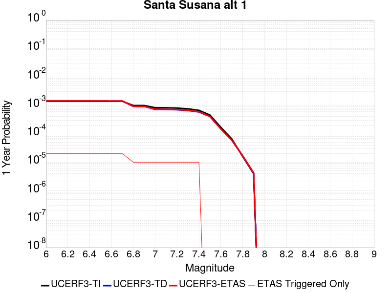 |  |

| Magnitude | 1 wk TI Prob | 1 wk TD Prob | 1 wk ETAS Prob | 1 wk ETAS/TD Gain | 1 wk ETAS Triggered Only | 1 mo TI Prob | 1 mo TD Prob | 1 mo ETAS Prob | 1 mo ETAS/TD Gain | 1 mo ETAS Triggered Only | 1 yr TI Prob | 1 yr TD Prob | 1 yr ETAS Prob | 1 yr ETAS/TD Gain | 1 yr ETAS Triggered Only | 10 yr TI Prob | 10 yr TD Prob | 10 yr ETAS Prob | 10 yr ETAS/TD Gain | 10 yr ETAS Triggered Only |
|-----|-----|-----|-----|-----|-----|-----|-----|-----|-----|-----|-----|-----|-----|-----|-----|-----|-----|-----|-----|-----|
| 6.0 | 2.674877E-5 | 2.7198214E-5 | 2.7198214E-5 | 1.0 | 0.0 | 1.1463255E-4 | 1.16559204E-4 | 1.2655804E-4 | 1.0857834 | 1.0E-5 | 0.0013947578 | 0.0014182981 | 0.0014382697 | 1.0140814 | 2.0E-5 | 0.013860362 | 0.014104388 | 0.014124106 | 1.001398 | 2.0E-5 |
| 6.1 | 2.674877E-5 | 2.7198214E-5 | 2.7198214E-5 | 1.0 | 0.0 | 1.1463255E-4 | 1.16559204E-4 | 1.2655804E-4 | 1.0857834 | 1.0E-5 | 0.0013947578 | 0.0014182981 | 0.0014382697 | 1.0140814 | 2.0E-5 | 0.013860362 | 0.014104388 | 0.014124106 | 1.001398 | 2.0E-5 |
| 6.2 | 2.674877E-5 | 2.7198214E-5 | 2.7198214E-5 | 1.0 | 0.0 | 1.1463255E-4 | 1.16559204E-4 | 1.2655804E-4 | 1.0857834 | 1.0E-5 | 0.0013947578 | 0.0014182981 | 0.0014382697 | 1.0140814 | 2.0E-5 | 0.013860362 | 0.014104388 | 0.014124106 | 1.001398 | 2.0E-5 |
| 6.3 | 2.674877E-5 | 2.7198214E-5 | 2.7198214E-5 | 1.0 | 0.0 | 1.1463255E-4 | 1.16559204E-4 | 1.2655804E-4 | 1.0857834 | 1.0E-5 | 0.0013947578 | 0.0014182981 | 0.0014382697 | 1.0140814 | 2.0E-5 | 0.013860362 | 0.014104388 | 0.014124106 | 1.001398 | 2.0E-5 |
| 6.4 | 2.674877E-5 | 2.7198214E-5 | 2.7198214E-5 | 1.0 | 0.0 | 1.1463255E-4 | 1.16559204E-4 | 1.2655804E-4 | 1.0857834 | 1.0E-5 | 0.0013947578 | 0.0014182981 | 0.0014382697 | 1.0140814 | 2.0E-5 | 0.013860362 | 0.014104388 | 0.014124106 | 1.001398 | 2.0E-5 |
| 6.5 | 2.674877E-5 | 2.7198214E-5 | 2.7198214E-5 | 1.0 | 0.0 | 1.1463255E-4 | 1.16559204E-4 | 1.2655804E-4 | 1.0857834 | 1.0E-5 | 0.0013947578 | 0.0014182981 | 0.0014382697 | 1.0140814 | 2.0E-5 | 0.013860362 | 0.014104388 | 0.014124106 | 1.001398 | 2.0E-5 |
| 6.6 | 2.6647976E-5 | 2.7074553E-5 | 2.7074553E-5 | 1.0 | 0.0 | 1.14200615E-4 | 1.16029274E-4 | 1.2602811E-4 | 1.0861752 | 1.0E-5 | 0.0013895056 | 0.0014118546 | 0.0014318264 | 1.0141457 | 2.0E-5 | 0.013808494 | 0.014040773 | 0.014060492 | 1.0014044 | 2.0E-5 |
| 6.7 | 2.6647976E-5 | 2.7074553E-5 | 2.7074553E-5 | 1.0 | 0.0 | 1.14200615E-4 | 1.16029274E-4 | 1.2602811E-4 | 1.0861752 | 1.0E-5 | 0.0013895056 | 0.0014118546 | 0.0014318264 | 1.0141457 | 2.0E-5 | 0.013808494 | 0.014040773 | 0.014060492 | 1.0014044 | 2.0E-5 |
| 6.8 | 1.9073179E-5 | 1.7637467E-5 | 1.7637467E-5 | 1.0 | 0.0 | 8.1739636E-5 | 7.558706E-5 | 7.558706E-5 | 1.0 | 0.0 | 9.947256E-4 | 9.19902E-4 | 9.2989276E-4 | 1.0108607 | 1.0E-5 | 0.009902848 | 0.009163361 | 0.009173269 | 1.0010813 | 1.0E-5 |
| 6.9 | 1.9041876E-5 | 1.7619597E-5 | 1.7619597E-5 | 1.0 | 0.0 | 8.160549E-5 | 7.551048E-5 | 7.551048E-5 | 1.0 | 0.0 | 9.930939E-4 | 9.189705E-4 | 9.2896126E-4 | 1.0108718 | 1.0E-5 | 0.0098866755 | 0.009154123 | 0.009164032 | 1.0010824 | 1.0E-5 |
| 7.0 | 1.5917482E-5 | 1.3864049E-5 | 1.3864049E-5 | 1.0 | 0.0 | 6.8215995E-5 | 5.9416023E-5 | 5.9416023E-5 | 1.0 | 0.0 | 8.302132E-4 | 7.2315463E-4 | 7.3314743E-4 | 1.0138183 | 1.0E-5 | 0.008271185 | 0.0072090672 | 0.007218995 | 1.0013771 | 1.0E-5 |
| 7.1 | 1.577788E-5 | 1.3744056E-5 | 1.3744056E-5 | 1.0 | 0.0 | 6.761774E-5 | 5.890179E-5 | 5.890179E-5 | 1.0 | 0.0 | 8.2293496E-4 | 7.16898E-4 | 7.2689087E-4 | 1.013939 | 1.0E-5 | 0.008198941 | 0.0071469042 | 0.007156833 | 1.0013893 | 1.0E-5 |
| 7.2 | 1.5416446E-5 | 1.34701295E-5 | 1.34701295E-5 | 1.0 | 0.0 | 6.606882E-5 | 5.7727877E-5 | 5.7727877E-5 | 1.0 | 0.0 | 8.0409093E-4 | 7.026149E-4 | 7.1260787E-4 | 1.0142225 | 1.0E-5 | 0.008011877 | 0.0070049763 | 0.0070149065 | 1.0014175 | 1.0E-5 |
| 7.3 | 1.4534083E-5 | 1.2718032E-5 | 1.2718032E-5 | 1.0 | 0.0 | 6.228744E-5 | 5.4504737E-5 | 5.4504737E-5 | 1.0 | 0.0 | 7.580857E-4 | 6.633976E-4 | 6.733909E-4 | 1.0150639 | 1.0E-5 | 0.007555048 | 0.0066151717 | 0.0066251056 | 1.0015017 | 1.0E-5 |
| 7.4 | 1.2858995E-5 | 1.1229814E-5 | 1.1229814E-5 | 1.0 | 0.0 | 5.5108816E-5 | 4.812691E-5 | 4.812691E-5 | 1.0 | 0.0 | 6.7074323E-4 | 5.8579154E-4 | 5.957857E-4 | 1.0170609 | 1.0E-5 | 0.0066872234 | 0.0058433902 | 0.005853332 | 1.0017014 | 1.0E-5 |
| 7.5 | 8.827668E-6 | 7.805494E-6 | 7.805494E-6 | 1.0 | 0.0 | 3.7832317E-5 | 3.3451703E-5 | 3.3451703E-5 | 1.0 | 0.0 | 4.605111E-4 | 4.072008E-4 | 4.072008E-4 | 1.0 | 0.0 | 0.0045955796 | 0.0040648985 | 0.0040648985 | 1.0 | 0.0 |
| 7.6 | 3.2533426E-6 | 2.8720106E-6 | 2.8720106E-6 | 1.0 | 0.0 | 1.3942822E-5 | 1.230856E-5 | 1.230856E-5 | 1.0 | 0.0 | 1.6974064E-4 | 1.4984679E-4 | 1.4984679E-4 | 1.0 | 0.0 | 0.0016961104 | 0.0014974943 | 0.0014974943 | 1.0 | 0.0 |
| 7.7 | 1.2751709E-6 | 1.1491339E-6 | 1.1491339E-6 | 1.0 | 0.0 | 5.4650063E-6 | 4.9248506E-6 | 4.9248506E-6 | 1.0 | 0.0 | 6.653442E-5 | 5.99585E-5 | 5.99585E-5 | 1.0 | 0.0 | 6.6514505E-4 | 5.9943215E-4 | 5.9943215E-4 | 1.0 | 0.0 |
| 7.8 | 3.067544E-7 | 3.240052E-7 | 3.240052E-7 | 1.0 | 0.0 | 1.3146611E-6 | 1.3885931E-6 | 1.3885931E-6 | 1.0 | 0.0 | 1.600588E-5 | 1.6906E-5 | 1.6906E-5 | 1.0 | 0.0 | 1.6004729E-4 | 1.6904817E-4 | 1.6904817E-4 | 1.0 | 0.0 |
| 7.9 | 7.622999E-8 | 8.0879715E-8 | 8.0879715E-8 | 1.0 | 0.0 | 3.2669993E-7 | 3.4662733E-7 | 3.4662733E-7 | 1.0 | 0.0 | 3.977564E-6 | 4.220182E-6 | 4.220182E-6 | 1.0 | 0.0 | 3.977493E-5 | 4.2201224E-5 | 4.2201224E-5 | 1.0 | 0.0 |

## Great Valley 07 (Orestimba)
*[(top)](#table-of-contents)*

| 1 Week | 1 Month | 1 Year | 10 Year |
|-----|-----|-----|-----|
|  |  |  |  |

| Magnitude | 1 wk TI Prob | 1 wk TD Prob | 1 wk ETAS Prob | 1 wk ETAS/TD Gain | 1 wk ETAS Triggered Only | 1 mo TI Prob | 1 mo TD Prob | 1 mo ETAS Prob | 1 mo ETAS/TD Gain | 1 mo ETAS Triggered Only | 1 yr TI Prob | 1 yr TD Prob | 1 yr ETAS Prob | 1 yr ETAS/TD Gain | 1 yr ETAS Triggered Only | 10 yr TI Prob | 10 yr TD Prob | 10 yr ETAS Prob | 10 yr ETAS/TD Gain | 10 yr ETAS Triggered Only |
|-----|-----|-----|-----|-----|-----|-----|-----|-----|-----|-----|-----|-----|-----|-----|-----|-----|-----|-----|-----|-----|
| 6.0 | 2.9687902E-5 | 3.27575E-5 | 4.2757172E-5 | 1.3052636 | 1.0E-5 | 1.2722766E-4 | 1.4038214E-4 | 1.5038073E-4 | 1.0712241 | 1.0E-5 | 0.0015478961 | 0.0017078844 | 0.0017278503 | 1.0116904 | 2.0E-5 | 0.015371585 | 0.016955135 | 0.016974797 | 1.0011595 | 2.0E-5 |
| 6.1 | 2.9687902E-5 | 3.27575E-5 | 4.2757172E-5 | 1.3052636 | 1.0E-5 | 1.2722766E-4 | 1.4038214E-4 | 1.5038073E-4 | 1.0712241 | 1.0E-5 | 0.0015478961 | 0.0017078844 | 0.0017278503 | 1.0116904 | 2.0E-5 | 0.015371585 | 0.016955135 | 0.016974797 | 1.0011595 | 2.0E-5 |
| 6.2 | 1.9231524E-5 | 2.1159167E-5 | 3.1158954E-5 | 1.4725984 | 1.0E-5 | 8.2418206E-5 | 9.067912E-5 | 1.0067821E-4 | 1.110269 | 1.0E-5 | 0.0010029797 | 0.0011034822 | 0.0011234601 | 1.0181044 | 2.0E-5 | 0.00998465 | 0.010982441 | 0.01100222 | 1.0018011 | 2.0E-5 |
| 6.3 | 1.324766E-5 | 1.4548534E-5 | 1.4548534E-5 | 1.0 | 0.0 | 5.6774446E-5 | 6.234942E-5 | 6.234942E-5 | 1.0 | 0.0 | 6.910097E-4 | 7.5884897E-4 | 7.5884897E-4 | 1.0 | 0.0 | 0.006888649 | 0.0075635235 | 0.0075635235 | 1.0 | 0.0 |
| 6.4 | 7.818645E-6 | 8.57284E-6 | 8.57284E-6 | 1.0 | 0.0 | 3.3508048E-5 | 3.6740246E-5 | 3.6740246E-5 | 1.0 | 0.0 | 4.078841E-4 | 4.4722404E-4 | 4.4722404E-4 | 1.0 | 0.0 | 0.004071363 | 0.0044635804 | 0.0044635804 | 1.0 | 0.0 |
| 6.5 | 5.3076565E-6 | 5.8178007E-6 | 5.8178007E-6 | 1.0 | 0.0 | 2.27469E-5 | 2.4933206E-5 | 2.4933206E-5 | 1.0 | 0.0 | 2.7690834E-4 | 3.035216E-4 | 3.035216E-4 | 1.0 | 0.0 | 0.0027656353 | 0.00303128 | 0.00303128 | 1.0 | 0.0 |
| 6.6 | 3.6003578E-6 | 3.9484953E-6 | 3.9484953E-6 | 1.0 | 0.0 | 1.5430012E-5 | 1.6922022E-5 | 1.6922022E-5 | 1.0 | 0.0 | 1.8784421E-4 | 2.0600771E-4 | 2.0600771E-4 | 1.0 | 0.0 | 0.0018768552 | 0.0020583214 | 0.0020583214 | 1.0 | 0.0 |
| 6.7 | 2.5361826E-6 | 2.7834678E-6 | 2.7834678E-6 | 1.0 | 0.0 | 1.0869308E-5 | 1.1929101E-5 | 1.1929101E-5 | 1.0 | 0.0 | 1.3232579E-4 | 1.4522845E-4 | 1.4522845E-4 | 1.0 | 0.0 | 0.0013224703 | 0.0014514653 | 0.0014514653 | 1.0 | 0.0 |
| 6.8 | 1.2115831E-6 | 1.3313797E-6 | 1.3313797E-6 | 1.0 | 0.0 | 5.1924885E-6 | 5.7059065E-6 | 5.7059065E-6 | 1.0 | 0.0 | 6.3216714E-5 | 6.9468166E-5 | 6.9468166E-5 | 1.0 | 0.0 | 6.3198735E-4 | 6.945596E-4 | 6.945596E-4 | 1.0 | 0.0 |

## Maacama 2011 CFM
*[(top)](#table-of-contents)*

| 1 Week | 1 Month | 1 Year | 10 Year |
|-----|-----|-----|-----|
| 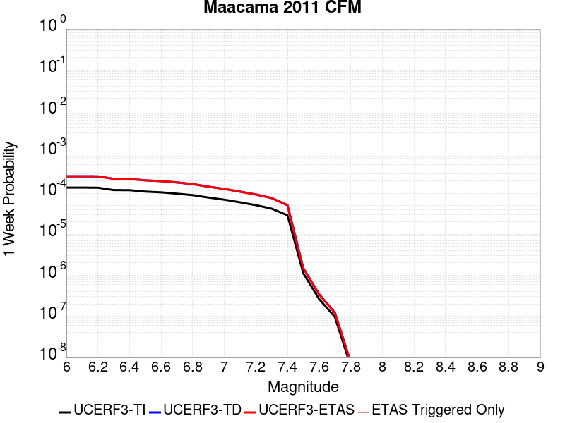 |  |  |  |

| Magnitude | 1 wk TI Prob | 1 wk TD Prob | 1 wk ETAS Prob | 1 wk ETAS/TD Gain | 1 wk ETAS Triggered Only | 1 mo TI Prob | 1 mo TD Prob | 1 mo ETAS Prob | 1 mo ETAS/TD Gain | 1 mo ETAS Triggered Only | 1 yr TI Prob | 1 yr TD Prob | 1 yr ETAS Prob | 1 yr ETAS/TD Gain | 1 yr ETAS Triggered Only | 10 yr TI Prob | 10 yr TD Prob | 10 yr ETAS Prob | 10 yr ETAS/TD Gain | 10 yr ETAS Triggered Only |
|-----|-----|-----|-----|-----|-----|-----|-----|-----|-----|-----|-----|-----|-----|-----|-----|-----|-----|-----|-----|-----|
| 6.0 | 1.368203E-4 | 2.579087E-4 | 2.579087E-4 | 1.0 | 0.0 | 5.862409E-4 | 0.0011047592 | 0.0011047592 | 1.0 | 0.0 | 0.0071141496 | 0.013350345 | 0.013360212 | 1.0007391 | 1.0E-5 | 0.06890667 | 0.1241916 | 0.12420911 | 1.000141 | 2.0E-5 |
| 6.1 | 1.368203E-4 | 2.579087E-4 | 2.579087E-4 | 1.0 | 0.0 | 5.862409E-4 | 0.0011047592 | 0.0011047592 | 1.0 | 0.0 | 0.0071141496 | 0.013350345 | 0.013360212 | 1.0007391 | 1.0E-5 | 0.06890667 | 0.1241916 | 0.12420911 | 1.000141 | 2.0E-5 |
| 6.2 | 1.360743E-4 | 2.566557E-4 | 2.566557E-4 | 1.0 | 0.0 | 5.8304524E-4 | 0.001099394 | 0.001099394 | 1.0 | 0.0 | 0.007075496 | 0.013285898 | 0.013295765 | 1.0007427 | 1.0E-5 | 0.06854413 | 0.123625994 | 0.123643525 | 1.0001417 | 2.0E-5 |
| 6.3 | 1.1917239E-4 | 2.236021E-4 | 2.236021E-4 | 1.0 | 0.0 | 5.1063887E-4 | 9.578717E-4 | 9.578717E-4 | 1.0 | 0.0 | 0.0061993203 | 0.0115873255 | 0.01159721 | 1.0008531 | 1.0E-5 | 0.060292065 | 0.108845875 | 0.1088637 | 1.0001638 | 2.0E-5 |
| 6.4 | 1.1859289E-4 | 2.2263796E-4 | 2.2263796E-4 | 1.0 | 0.0 | 5.0815626E-4 | 9.537432E-4 | 9.537432E-4 | 1.0 | 0.0 | 0.006169266 | 0.011537647 | 0.011547532 | 1.0008568 | 1.0E-5 | 0.06000784 | 0.10840272 | 0.10842056 | 1.0001645 | 2.0E-5 |
| 6.5 | 1.09512424E-4 | 2.0517908E-4 | 2.0517908E-4 | 1.0 | 0.0 | 4.6925453E-4 | 8.7897904E-4 | 8.7897904E-4 | 1.0 | 0.0 | 0.005698218 | 0.010639169 | 0.010649063 | 1.00093 | 1.0E-5 | 0.055543028 | 0.1004949 | 0.100512885 | 1.000179 | 2.0E-5 |
| 6.6 | 1.0502928E-4 | 1.9675294E-4 | 1.9675294E-4 | 1.0 | 0.0 | 4.500478E-4 | 8.429031E-4 | 8.429031E-4 | 1.0 | 0.0 | 0.0054655746 | 0.010205293 | 0.010215191 | 1.0009699 | 1.0E-5 | 0.053330887 | 0.0966474 | 0.096665464 | 1.0001869 | 2.0E-5 |
| 6.7 | 9.739358E-5 | 1.8259176E-4 | 1.8259176E-4 | 1.0 | 0.0 | 4.173343E-4 | 7.822563E-4 | 7.822563E-4 | 1.0 | 0.0 | 0.0050692135 | 0.009475343 | 0.009485248 | 1.0010453 | 1.0E-5 | 0.049551267 | 0.09012011 | 0.0901383 | 1.000202 | 2.0E-5 |
| 6.8 | 8.969524E-5 | 1.6658378E-4 | 1.6658378E-4 | 1.0 | 0.0 | 3.8435153E-4 | 7.1369443E-4 | 7.1369443E-4 | 1.0 | 0.0 | 0.0046694432 | 0.00864909 | 0.008659003 | 1.0011462 | 1.0E-5 | 0.045725387 | 0.08265246 | 0.08267081 | 1.000222 | 2.0E-5 |
| 6.9 | 7.838291E-5 | 1.4418772E-4 | 1.4418772E-4 | 1.0 | 0.0 | 3.358835E-4 | 6.1778206E-4 | 6.1778206E-4 | 1.0 | 0.0 | 0.0040817154 | 0.007491724 | 0.007501649 | 1.0013248 | 1.0E-5 | 0.04007554 | 0.07205298 | 0.07207153 | 1.0002576 | 2.0E-5 |
| 7.0 | 6.961957E-5 | 1.2708071E-4 | 1.2708071E-4 | 1.0 | 0.0 | 2.9833548E-4 | 5.445059E-4 | 5.445059E-4 | 1.0 | 0.0 | 0.0036261857 | 0.006606692 | 0.006616626 | 1.0015036 | 1.0E-5 | 0.035675827 | 0.063871816 | 0.063881174 | 1.0001465 | 1.0E-5 |
| 7.1 | 5.999398E-5 | 1.09053384E-4 | 1.09053384E-4 | 1.0 | 0.0 | 2.570917E-4 | 4.6728246E-4 | 4.6728246E-4 | 1.0 | 0.0 | 0.0031255994 | 0.00567284 | 0.005682783 | 1.0017527 | 1.0E-5 | 0.030820016 | 0.055139277 | 0.055148724 | 1.0001713 | 1.0E-5 |
| 7.2 | 5.116532E-5 | 9.305489E-5 | 9.305489E-5 | 1.0 | 0.0 | 2.1926152E-4 | 3.9874107E-4 | 3.9874107E-4 | 1.0 | 0.0 | 0.002666241 | 0.00484315 | 0.0048531014 | 1.0020548 | 1.0E-5 | 0.026344774 | 0.047303654 | 0.04731318 | 1.0002013 | 1.0E-5 |
| 7.3 | 4.2087835E-5 | 7.617064E-5 | 7.617064E-5 | 1.0 | 0.0 | 1.8036396E-4 | 3.264016E-4 | 3.264016E-4 | 1.0 | 0.0 | 0.0021937196 | 0.0039662397 | 0.0039762 | 1.0025113 | 1.0E-5 | 0.0217219 | 0.038905017 | 0.03891463 | 1.000247 | 1.0E-5 |
| 7.4 | 2.8991652E-5 | 5.1163643E-5 | 5.1163643E-5 | 1.0 | 0.0 | 1.2424402E-4 | 2.1925455E-4 | 2.1925455E-4 | 1.0 | 0.0 | 0.0015116213 | 0.0026661097 | 0.002676083 | 1.0037408 | 1.0E-5 | 0.015013801 | 0.026332043 | 0.026341781 | 1.0003698 | 1.0E-5 |
| 7.5 | 1.1292299E-6 | 1.4950216E-6 | 1.4950216E-6 | 1.0 | 0.0 | 4.8395473E-6 | 6.407227E-6 | 6.407227E-6 | 1.0 | 0.0 | 5.8919897E-5 | 7.8006444E-5 | 7.8006444E-5 | 1.0 | 0.0 | 5.890428E-4 | 7.805042E-4 | 7.805042E-4 | 1.0 | 0.0 |
| 7.6 | 2.6535366E-7 | 3.4720998E-7 | 3.4720998E-7 | 1.0 | 0.0 | 1.1372296E-6 | 1.4880419E-6 | 1.4880419E-6 | 1.0 | 0.0 | 1.3845682E-5 | 1.811676E-5 | 1.811676E-5 | 1.0 | 0.0 | 1.3844819E-4 | 1.8170691E-4 | 1.8170691E-4 | 1.0 | 0.0 |
| 7.7 | 9.727789E-8 | 1.2302418E-7 | 1.2302418E-7 | 1.0 | 0.0 | 4.1690518E-7 | 5.2724636E-7 | 5.2724636E-7 | 1.0 | 0.0 | 5.0758085E-6 | 6.419206E-6 | 6.419206E-6 | 1.0 | 0.0 | 5.0756928E-5 | 6.456404E-5 | 6.456404E-5 | 1.0 | 0.0 |
| 7.8 | 6.1939325E-9 | 7.711711E-9 | 7.711711E-9 | 1.0 | 0.0 | 2.6545425E-8 | 3.305019E-8 | 3.305019E-8 | 1.0 | 0.0 | 3.231905E-7 | 4.0238598E-7 | 4.0238598E-7 | 1.0 | 0.0 | 3.2319003E-6 | 4.0597915E-6 | 4.0597915E-6 | 1.0 | 0.0 |

## Hollywood
*[(top)](#table-of-contents)*

| 1 Week | 1 Month | 1 Year | 10 Year |
|-----|-----|-----|-----|
|  |  |  |  |

| Magnitude | 1 wk TI Prob | 1 wk TD Prob | 1 wk ETAS Prob | 1 wk ETAS/TD Gain | 1 wk ETAS Triggered Only | 1 mo TI Prob | 1 mo TD Prob | 1 mo ETAS Prob | 1 mo ETAS/TD Gain | 1 mo ETAS Triggered Only | 1 yr TI Prob | 1 yr TD Prob | 1 yr ETAS Prob | 1 yr ETAS/TD Gain | 1 yr ETAS Triggered Only | 10 yr TI Prob | 10 yr TD Prob | 10 yr ETAS Prob | 10 yr ETAS/TD Gain | 10 yr ETAS Triggered Only |
|-----|-----|-----|-----|-----|-----|-----|-----|-----|-----|-----|-----|-----|-----|-----|-----|-----|-----|-----|-----|-----|
| 6.0 | 1.24487615E-5 | 1.2593229E-5 | 2.2593103E-5 | 1.7940675 | 1.0E-5 | 5.3350745E-5 | 5.3969892E-5 | 6.396935E-5 | 1.1852785 | 1.0E-5 | 6.4935174E-4 | 6.5689E-4 | 6.7687687E-4 | 1.0304265 | 2.0E-5 | 0.0064745755 | 0.0065499707 | 0.00656984 | 1.0030334 | 2.0E-5 |
| 6.1 | 1.24487615E-5 | 1.2593229E-5 | 2.2593103E-5 | 1.7940675 | 1.0E-5 | 5.3350745E-5 | 5.3969892E-5 | 6.396935E-5 | 1.1852785 | 1.0E-5 | 6.4935174E-4 | 6.5689E-4 | 6.7687687E-4 | 1.0304265 | 2.0E-5 | 0.0064745755 | 0.0065499707 | 0.00656984 | 1.0030334 | 2.0E-5 |
| 6.2 | 1.24487615E-5 | 1.2593229E-5 | 2.2593103E-5 | 1.7940675 | 1.0E-5 | 5.3350745E-5 | 5.3969892E-5 | 6.396935E-5 | 1.1852785 | 1.0E-5 | 6.4935174E-4 | 6.5689E-4 | 6.7687687E-4 | 1.0304265 | 2.0E-5 | 0.0064745755 | 0.0065499707 | 0.00656984 | 1.0030334 | 2.0E-5 |
| 6.3 | 1.24487615E-5 | 1.2593229E-5 | 2.2593103E-5 | 1.7940675 | 1.0E-5 | 5.3350745E-5 | 5.3969892E-5 | 6.396935E-5 | 1.1852785 | 1.0E-5 | 6.4935174E-4 | 6.5689E-4 | 6.7687687E-4 | 1.0304265 | 2.0E-5 | 0.0064745755 | 0.0065499707 | 0.00656984 | 1.0030334 | 2.0E-5 |
| 6.4 | 1.2431024E-5 | 1.25738425E-5 | 2.2573717E-5 | 1.7952918 | 1.0E-5 | 5.327473E-5 | 5.388681E-5 | 6.388627E-5 | 1.1855642 | 1.0E-5 | 6.4842677E-4 | 6.558791E-4 | 6.75866E-4 | 1.0304735 | 2.0E-5 | 0.0064653796 | 0.0065399213 | 0.0065597906 | 1.0030382 | 2.0E-5 |
| 6.5 | 1.1242222E-5 | 1.1317804E-5 | 2.131769E-5 | 1.8835536 | 1.0E-5 | 4.8180063E-5 | 4.8503985E-5 | 5.85035E-5 | 1.2061586 | 1.0E-5 | 5.864344E-4 | 5.903787E-4 | 6.1036693E-4 | 1.0338565 | 2.0E-5 | 0.0058488925 | 0.00588839 | 0.005908272 | 1.0033765 | 2.0E-5 |
| 6.6 | 1.1234066E-5 | 1.1308918E-5 | 2.1308804E-5 | 1.8842479 | 1.0E-5 | 4.8145106E-5 | 4.8465907E-5 | 5.846542E-5 | 1.2063206 | 1.0E-5 | 5.86009E-4 | 5.899153E-4 | 6.0990354E-4 | 1.0338832 | 2.0E-5 | 0.005844661 | 0.0058837803 | 0.0059036626 | 1.0033792 | 2.0E-5 |
| 6.7 | 1.12294E-5 | 1.1303661E-5 | 2.1303547E-5 | 1.8846592 | 1.0E-5 | 4.812511E-5 | 4.8443377E-5 | 5.8442893E-5 | 1.2064166 | 1.0E-5 | 5.857657E-4 | 5.896412E-4 | 6.096294E-4 | 1.033899 | 2.0E-5 | 0.0058422405 | 0.005881054 | 0.005900936 | 1.0033808 | 2.0E-5 |
| 6.8 | 1.0252819E-5 | 1.0218449E-5 | 2.0218346E-5 | 1.9786122 | 1.0E-5 | 4.3939912E-5 | 4.3792625E-5 | 5.3792188E-5 | 1.228339 | 1.0E-5 | 5.3483713E-4 | 5.330469E-4 | 5.530362E-4 | 1.0375001 | 2.0E-5 | 0.005335517 | 0.0053179096 | 0.005337803 | 1.0037409 | 2.0E-5 |
| 6.9 | 9.252289E-6 | 9.110309E-6 | 1.9110219E-5 | 2.0976474 | 1.0E-5 | 3.9652066E-5 | 3.9043607E-5 | 4.9043218E-5 | 1.2561139 | 1.0E-5 | 4.8265693E-4 | 4.752539E-4 | 4.952444E-4 | 1.0420628 | 2.0E-5 | 0.0048161 | 0.004742549 | 0.004762454 | 1.0041971 | 2.0E-5 |
| 7.0 | 8.474604E-6 | 8.25826E-6 | 1.8258177E-5 | 2.2108989 | 1.0E-5 | 3.6319227E-5 | 3.5392073E-5 | 4.539172E-5 | 1.2825391 | 1.0E-5 | 4.4209688E-4 | 4.3081472E-4 | 4.4081043E-4 | 1.0232018 | 1.0E-5 | 0.004412184 | 0.0042999457 | 0.004309903 | 1.0023156 | 1.0E-5 |
| 7.1 | 6.643643E-6 | 6.2683707E-6 | 6.2683707E-6 | 1.0 | 0.0 | 2.8472443E-5 | 2.686417E-5 | 2.686417E-5 | 1.0 | 0.0 | 3.4659685E-4 | 3.2702263E-4 | 3.2702263E-4 | 1.0 | 0.0 | 0.0034605677 | 0.0032654598 | 0.0032654598 | 1.0 | 0.0 |
| 7.2 | 5.549002E-6 | 5.1087086E-6 | 5.1087086E-6 | 1.0 | 0.0 | 2.378122E-5 | 2.1894282E-5 | 2.1894282E-5 | 1.0 | 0.0 | 2.8949787E-4 | 2.665304E-4 | 2.665304E-4 | 1.0 | 0.0 | 0.0028912104 | 0.002662124 | 0.002662124 | 1.0 | 0.0 |
| 7.3 | 4.3059727E-6 | 3.9598913E-6 | 3.9598913E-6 | 1.0 | 0.0 | 1.8454039E-5 | 1.6970853E-5 | 1.6970853E-5 | 1.0 | 0.0 | 2.2465475E-4 | 2.0660064E-4 | 2.0660064E-4 | 1.0 | 0.0 | 0.0022442779 | 0.0020640958 | 0.0020640958 | 1.0 | 0.0 |
| 7.4 | 2.8550733E-6 | 2.7013002E-6 | 2.7013002E-6 | 1.0 | 0.0 | 1.2235971E-5 | 1.1576949E-5 | 1.1576949E-5 | 1.0 | 0.0 | 1.4896276E-4 | 1.4094029E-4 | 1.4094029E-4 | 1.0 | 0.0 | 0.0014886294 | 0.0014085141 | 0.0014085141 | 1.0 | 0.0 |
| 7.5 | 1.9927045E-6 | 1.8976393E-6 | 1.8976393E-6 | 1.0 | 0.0 | 8.540134E-6 | 8.132714E-6 | 8.132714E-6 | 1.0 | 0.0 | 1.0397117E-4 | 9.901134E-5 | 9.901134E-5 | 1.0 | 0.0 | 0.0010392254 | 9.896759E-4 | 9.896759E-4 | 1.0 | 0.0 |
| 7.6 | 1.345084E-6 | 1.2216018E-6 | 1.2216018E-6 | 1.0 | 0.0 | 5.764633E-6 | 5.2354258E-6 | 5.2354258E-6 | 1.0 | 0.0 | 7.018215E-5 | 6.373946E-5 | 6.373946E-5 | 1.0 | 0.0 | 7.0159987E-4 | 6.372138E-4 | 6.372138E-4 | 1.0 | 0.0 |
| 7.7 | 7.6835164E-7 | 6.2777013E-7 | 6.2777013E-7 | 1.0 | 0.0 | 3.2929315E-6 | 2.6904406E-6 | 2.6904406E-6 | 1.0 | 0.0 | 4.00907E-5 | 3.2755637E-5 | 3.2755637E-5 | 1.0 | 0.0 | 4.0083472E-4 | 3.2750957E-4 | 3.2750957E-4 | 1.0 | 0.0 |
| 7.8 | 3.6562128E-7 | 2.4534745E-7 | 2.4534745E-7 | 1.0 | 0.0 | 1.5669474E-6 | 1.0514887E-6 | 1.0514887E-6 | 1.0 | 0.0 | 1.9077417E-5 | 1.2801803E-5 | 1.2801803E-5 | 1.0 | 0.0 | 1.907578E-4 | 1.2801103E-4 | 1.2801103E-4 | 1.0 | 0.0 |
| 7.9 | 7.5024424E-8 | 5.381742E-8 | 5.381742E-8 | 1.0 | 0.0 | 3.215332E-7 | 2.3064608E-7 | 2.3064608E-7 | 1.0 | 0.0 | 3.91466E-6 | 2.8081138E-6 | 2.8081138E-6 | 1.0 | 0.0 | 3.9145907E-5 | 2.8080913E-5 | 2.8080913E-5 | 1.0 | 0.0 |

## San Luis Range - Pecho 2011 CFM
*[(top)](#table-of-contents)*

| 1 Week | 1 Month | 1 Year | 10 Year |
|-----|-----|-----|-----|
| 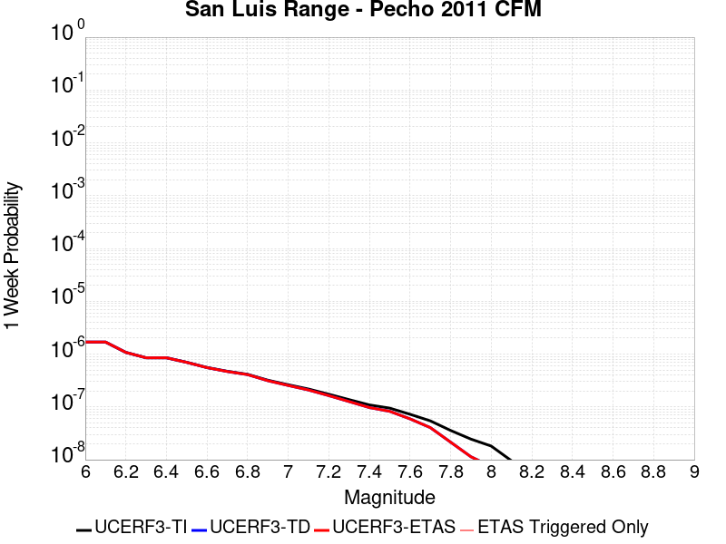 |  | 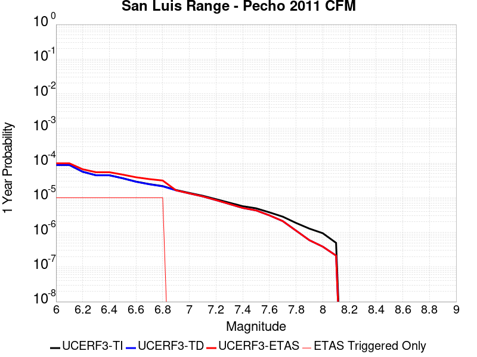 | 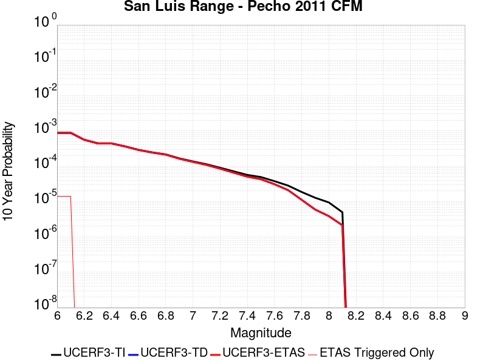 |

| Magnitude | 1 wk TI Prob | 1 wk TD Prob | 1 wk ETAS Prob | 1 wk ETAS/TD Gain | 1 wk ETAS Triggered Only | 1 mo TI Prob | 1 mo TD Prob | 1 mo ETAS Prob | 1 mo ETAS/TD Gain | 1 mo ETAS Triggered Only | 1 yr TI Prob | 1 yr TD Prob | 1 yr ETAS Prob | 1 yr ETAS/TD Gain | 1 yr ETAS Triggered Only | 10 yr TI Prob | 10 yr TD Prob | 10 yr ETAS Prob | 10 yr ETAS/TD Gain | 10 yr ETAS Triggered Only |
|-----|-----|-----|-----|-----|-----|-----|-----|-----|-----|-----|-----|-----|-----|-----|-----|-----|-----|-----|-----|-----|
| 6.0 | 1.687423E-6 | 1.6921944E-6 | 1.6921944E-6 | 1.0 | 0.0 | 7.231793E-6 | 7.252243E-6 | 7.252243E-6 | 1.0 | 0.0 | 8.804352E-5 | 8.829272E-5 | 9.8291835E-5 | 1.1132497 | 1.0E-5 | 8.8008645E-4 | 8.826003E-4 | 9.025827E-4 | 1.0226403 | 2.0E-5 |
| 6.1 | 1.687423E-6 | 1.6921944E-6 | 1.6921944E-6 | 1.0 | 0.0 | 7.231793E-6 | 7.252243E-6 | 7.252243E-6 | 1.0 | 0.0 | 8.804352E-5 | 8.829272E-5 | 9.8291835E-5 | 1.1132497 | 1.0E-5 | 8.8008645E-4 | 8.826003E-4 | 9.025827E-4 | 1.0226403 | 2.0E-5 |
| 6.2 | 1.0765672E-6 | 1.0770541E-6 | 1.0770541E-6 | 1.0 | 0.0 | 4.613851E-6 | 4.615938E-6 | 4.615938E-6 | 1.0 | 0.0 | 5.617219E-5 | 5.6197663E-5 | 6.61971E-5 | 1.1779333 | 1.0E-5 | 5.6157995E-4 | 5.618408E-4 | 5.7183515E-4 | 1.0177886 | 1.0E-5 |
| 6.3 | 8.523104E-7 | 8.5130216E-7 | 8.5130216E-7 | 1.0 | 0.0 | 3.6527538E-6 | 3.648433E-6 | 3.648433E-6 | 1.0 | 0.0 | 4.447137E-5 | 4.4418797E-5 | 5.4418353E-5 | 1.22512 | 1.0E-5 | 4.4462472E-4 | 4.441024E-4 | 4.5409796E-4 | 1.0225073 | 1.0E-5 |
| 6.4 | 8.523104E-7 | 8.5130216E-7 | 8.5130216E-7 | 1.0 | 0.0 | 3.6527538E-6 | 3.648433E-6 | 3.648433E-6 | 1.0 | 0.0 | 4.447137E-5 | 4.4418797E-5 | 5.4418353E-5 | 1.22512 | 1.0E-5 | 4.4462472E-4 | 4.441024E-4 | 4.5409796E-4 | 1.0225073 | 1.0E-5 |
| 6.5 | 7.0029404E-7 | 6.976438E-7 | 6.976438E-7 | 1.0 | 0.0 | 3.0012568E-6 | 2.9898988E-6 | 2.9898988E-6 | 1.0 | 0.0 | 3.6539688E-5 | 3.6401427E-5 | 4.6401063E-5 | 1.2747045 | 1.0E-5 | 3.653368E-4 | 3.6395632E-4 | 3.739527E-4 | 1.0274658 | 1.0E-5 |
| 6.6 | 5.583906E-7 | 5.5428296E-7 | 5.5428296E-7 | 1.0 | 0.0 | 2.3931002E-6 | 2.3754963E-6 | 2.3754963E-6 | 1.0 | 0.0 | 2.9135606E-5 | 2.892129E-5 | 3.8921E-5 | 1.345756 | 1.0E-5 | 2.9131788E-4 | 2.89176E-4 | 2.9917312E-4 | 1.034571 | 1.0E-5 |
| 6.7 | 4.73441E-7 | 4.6830658E-7 | 4.6830658E-7 | 1.0 | 0.0 | 2.0290313E-6 | 2.0070268E-6 | 2.0070268E-6 | 1.0 | 0.0 | 2.4703175E-5 | 2.4435281E-5 | 3.4435037E-5 | 1.4092343 | 1.0E-5 | 2.470043E-4 | 2.443264E-4 | 2.5432394E-4 | 1.0409188 | 1.0E-5 |
| 6.8 | 4.1466086E-7 | 4.087795E-7 | 4.087795E-7 | 1.0 | 0.0 | 1.7771167E-6 | 1.751911E-6 | 1.751911E-6 | 1.0 | 0.0 | 2.1636182E-5 | 2.132931E-5 | 3.13291E-5 | 1.4688284 | 1.0E-5 | 2.1634075E-4 | 2.1327297E-4 | 2.2327085E-4 | 1.0468782 | 1.0E-5 |
| 6.9 | 3.2056641E-7 | 3.13293E-7 | 3.13293E-7 | 1.0 | 0.0 | 1.3738553E-6 | 1.3426836E-6 | 1.3426836E-6 | 1.0 | 0.0 | 1.6726559E-5 | 1.6347052E-5 | 1.6347052E-5 | 1.0 | 0.0 | 1.67253E-4 | 1.6345865E-4 | 1.6345865E-4 | 1.0 | 0.0 |
| 7.0 | 2.6315942E-7 | 2.5489675E-7 | 2.5489675E-7 | 1.0 | 0.0 | 1.1278256E-6 | 1.0924141E-6 | 1.0924141E-6 | 1.0 | 0.0 | 1.3731191E-5 | 1.3300061E-5 | 1.3300061E-5 | 1.0 | 0.0 | 1.3730342E-4 | 1.3299273E-4 | 1.3299273E-4 | 1.0 | 0.0 |
| 7.1 | 2.1832436E-7 | 2.0917312E-7 | 2.0917312E-7 | 1.0 | 0.0 | 9.356755E-7 | 8.9645596E-7 | 8.9645596E-7 | 1.0 | 0.0 | 1.13917895E-5 | 1.0914297E-5 | 1.0914297E-5 | 1.0 | 0.0 | 1.1391206E-4 | 1.0913766E-4 | 1.0913766E-4 | 1.0 | 0.0 |
| 7.2 | 1.7393015E-7 | 1.6376592E-7 | 1.6376592E-7 | 1.0 | 0.0 | 7.454147E-7 | 7.018537E-7 | 7.018537E-7 | 1.0 | 0.0 | 9.075386E-6 | 8.545036E-6 | 8.545036E-6 | 1.0 | 0.0 | 9.075015E-5 | 8.54471E-5 | 8.54471E-5 | 1.0 | 0.0 |
| 7.3 | 1.3744894E-7 | 1.263862E-7 | 1.263862E-7 | 1.0 | 0.0 | 5.890667E-7 | 5.4165497E-7 | 5.4165497E-7 | 1.0 | 0.0 | 7.1718637E-6 | 6.5946297E-6 | 6.5946297E-6 | 1.0 | 0.0 | 7.171632E-5 | 6.5944354E-5 | 6.5944354E-5 | 1.0 | 0.0 |
| 7.4 | 1.0915278E-7 | 9.727534E-8 | 9.727534E-8 | 1.0 | 0.0 | 4.6779755E-7 | 4.1689424E-7 | 4.1689424E-7 | 1.0 | 0.0 | 5.6954204E-6 | 5.0756753E-6 | 5.0756753E-6 | 1.0 | 0.0 | 5.6952744E-5 | 5.0755603E-5 | 5.0755603E-5 | 1.0 | 0.0 |
| 7.5 | 9.490291E-8 | 8.257131E-8 | 8.257131E-8 | 1.0 | 0.0 | 4.0672668E-7 | 3.53877E-7 | 3.53877E-7 | 1.0 | 0.0 | 4.9518862E-6 | 4.308444E-6 | 4.308444E-6 | 1.0 | 0.0 | 4.951776E-5 | 4.308361E-5 | 4.308361E-5 | 1.0 | 0.0 |
| 7.6 | 7.256678E-8 | 5.942529E-8 | 5.942529E-8 | 1.0 | 0.0 | 3.1100043E-7 | 2.546798E-7 | 2.546798E-7 | 1.0 | 0.0 | 3.7864236E-6 | 3.100722E-6 | 3.100722E-6 | 1.0 | 0.0 | 3.7863592E-5 | 3.100679E-5 | 3.100679E-5 | 1.0 | 0.0 |
| 7.7 | 5.446273E-8 | 4.057937E-8 | 4.057937E-8 | 1.0 | 0.0 | 2.3341168E-7 | 1.7391157E-7 | 1.7391157E-7 | 1.0 | 0.0 | 2.8417835E-6 | 2.1173712E-6 | 2.1173712E-6 | 1.0 | 0.0 | 2.8417471E-5 | 2.1173511E-5 | 2.1173511E-5 | 1.0 | 0.0 |
| 7.8 | 3.5850867E-8 | 2.1520364E-8 | 2.1520364E-8 | 1.0 | 0.0 | 1.5364655E-7 | 9.2230124E-8 | 9.2230124E-8 | 1.0 | 0.0 | 1.8706452E-6 | 1.1229012E-6 | 1.1229012E-6 | 1.0 | 0.0 | 1.8706294E-5 | 1.1228955E-5 | 1.1228955E-5 | 1.0 | 0.0 |
| 7.9 | 2.45879E-8 | 1.1394102E-8 | 1.1394102E-8 | 1.0 | 0.0 | 1.0537671E-7 | 4.883186E-8 | 4.883186E-8 | 1.0 | 0.0 | 1.2829606E-6 | 5.9452776E-7 | 5.9452776E-7 | 1.0 | 0.0 | 1.2829532E-5 | 5.945262E-6 | 5.945262E-6 | 1.0 | 0.0 |
| 8.0 | 1.8151761E-8 | 7.4404523E-9 | 7.4404523E-9 | 1.0 | 0.0 | 7.779326E-8 | 3.188765E-8 | 3.188765E-8 | 1.0 | 0.0 | 9.4713255E-7 | 3.8823208E-7 | 3.8823208E-7 | 1.0 | 0.0 | 9.471285E-6 | 3.882314E-6 | 3.882314E-6 | 1.0 | 0.0 |
| 8.1 | 9.559205E-9 | 4.100115E-9 | 4.100115E-9 | 1.0 | 0.0 | 4.096802E-8 | 1.7571923E-8 | 1.7571923E-8 | 1.0 | 0.0 | 4.9878554E-7 | 2.1393814E-7 | 2.1393814E-7 | 1.0 | 0.0 | 4.987844E-6 | 2.1393794E-6 | 2.1393794E-6 | 1.0 | 0.0 |

## Santa Susana East (connector)
*[(top)](#table-of-contents)*

| 1 Week | 1 Month | 1 Year | 10 Year |
|-----|-----|-----|-----|
|  |  | 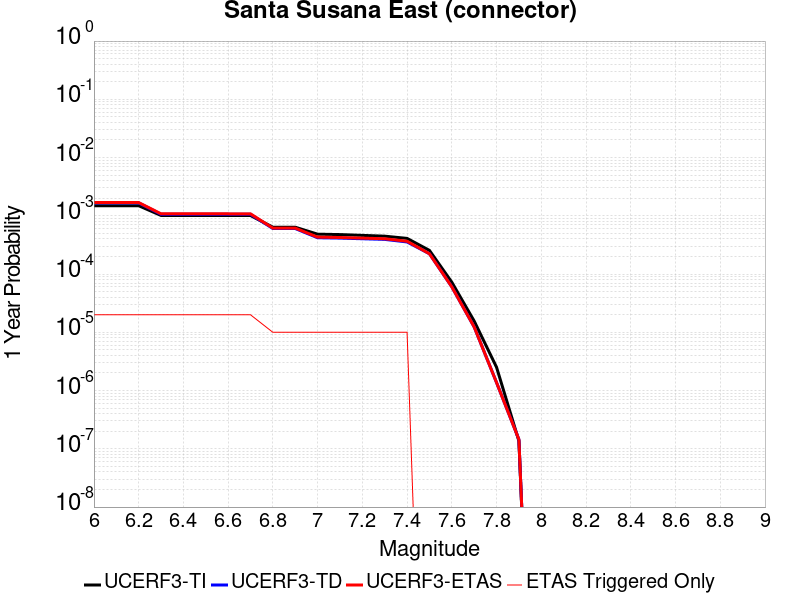 |  |

| Magnitude | 1 wk TI Prob | 1 wk TD Prob | 1 wk ETAS Prob | 1 wk ETAS/TD Gain | 1 wk ETAS Triggered Only | 1 mo TI Prob | 1 mo TD Prob | 1 mo ETAS Prob | 1 mo ETAS/TD Gain | 1 mo ETAS Triggered Only | 1 yr TI Prob | 1 yr TD Prob | 1 yr ETAS Prob | 1 yr ETAS/TD Gain | 1 yr ETAS Triggered Only | 10 yr TI Prob | 10 yr TD Prob | 10 yr ETAS Prob | 10 yr ETAS/TD Gain | 10 yr ETAS Triggered Only |
|-----|-----|-----|-----|-----|-----|-----|-----|-----|-----|-----|-----|-----|-----|-----|-----|-----|-----|-----|-----|-----|
| 6.0 | 2.858397E-5 | 3.2021693E-5 | 3.2021693E-5 | 1.0 | 0.0 | 1.2249697E-4 | 1.3723019E-4 | 1.4722883E-4 | 1.0728602 | 1.0E-5 | 0.0014903803 | 0.00166977 | 0.0016897366 | 1.0119576 | 2.0E-5 | 0.014804244 | 0.016599316 | 0.016618984 | 1.0011848 | 2.0E-5 |
| 6.1 | 2.858397E-5 | 3.2021693E-5 | 3.2021693E-5 | 1.0 | 0.0 | 1.2249697E-4 | 1.3723019E-4 | 1.4722883E-4 | 1.0728602 | 1.0E-5 | 0.0014903803 | 0.00166977 | 0.0016897366 | 1.0119576 | 2.0E-5 | 0.014804244 | 0.016599316 | 0.016618984 | 1.0011848 | 2.0E-5 |
| 6.2 | 2.858397E-5 | 3.2021693E-5 | 3.2021693E-5 | 1.0 | 0.0 | 1.2249697E-4 | 1.3723019E-4 | 1.4722883E-4 | 1.0728602 | 1.0E-5 | 0.0014903803 | 0.00166977 | 0.0016897366 | 1.0119576 | 2.0E-5 | 0.014804244 | 0.016599316 | 0.016618984 | 1.0011848 | 2.0E-5 |
| 6.3 | 1.943582E-5 | 2.0367343E-5 | 2.0367343E-5 | 1.0 | 0.0 | 8.329371E-5 | 8.7286324E-5 | 9.7285454E-5 | 1.1145555 | 1.0E-5 | 0.001013629 | 0.001062305 | 0.0010822837 | 1.0188069 | 2.0E-5 | 0.010090181 | 0.010583852 | 0.01060364 | 1.0018697 | 2.0E-5 |
| 6.4 | 1.943582E-5 | 2.0367343E-5 | 2.0367343E-5 | 1.0 | 0.0 | 8.329371E-5 | 8.7286324E-5 | 9.7285454E-5 | 1.1145555 | 1.0E-5 | 0.001013629 | 0.001062305 | 0.0010822837 | 1.0188069 | 2.0E-5 | 0.010090181 | 0.010583852 | 0.01060364 | 1.0018697 | 2.0E-5 |
| 6.5 | 1.943582E-5 | 2.0367343E-5 | 2.0367343E-5 | 1.0 | 0.0 | 8.329371E-5 | 8.7286324E-5 | 9.7285454E-5 | 1.1145555 | 1.0E-5 | 0.001013629 | 0.001062305 | 0.0010822837 | 1.0188069 | 2.0E-5 | 0.010090181 | 0.010583852 | 0.01060364 | 1.0018697 | 2.0E-5 |
| 6.6 | 1.943582E-5 | 2.0367343E-5 | 2.0367343E-5 | 1.0 | 0.0 | 8.329371E-5 | 8.7286324E-5 | 9.7285454E-5 | 1.1145555 | 1.0E-5 | 0.001013629 | 0.001062305 | 0.0010822837 | 1.0188069 | 2.0E-5 | 0.010090181 | 0.010583852 | 0.01060364 | 1.0018697 | 2.0E-5 |
| 6.7 | 1.9404439E-5 | 2.0354766E-5 | 2.0354766E-5 | 1.0 | 0.0 | 8.3159226E-5 | 8.723242E-5 | 9.7231554E-5 | 1.1146263 | 1.0E-5 | 0.0010119933 | 0.0010616493 | 0.0010816281 | 1.0188186 | 2.0E-5 | 0.010073971 | 0.010577358 | 0.010597147 | 1.0018709 | 2.0E-5 |
| 6.8 | 1.2217526E-5 | 1.1593157E-5 | 1.1593157E-5 | 1.0 | 0.0 | 5.2359774E-5 | 4.9684106E-5 | 4.9684106E-5 | 1.0 | 0.0 | 6.372938E-4 | 6.047529E-4 | 6.147469E-4 | 1.0165256 | 1.0E-5 | 0.0063546924 | 0.006033274 | 0.006043214 | 1.0016475 | 1.0E-5 |
| 6.9 | 1.2217526E-5 | 1.1593157E-5 | 1.1593157E-5 | 1.0 | 0.0 | 5.2359774E-5 | 4.9684106E-5 | 4.9684106E-5 | 1.0 | 0.0 | 6.372938E-4 | 6.047529E-4 | 6.147469E-4 | 1.0165256 | 1.0E-5 | 0.0063546924 | 0.006033274 | 0.006043214 | 1.0016475 | 1.0E-5 |
| 7.0 | 9.276017E-6 | 8.059273E-6 | 8.059273E-6 | 1.0 | 0.0 | 3.9753755E-5 | 3.4539302E-5 | 3.4539302E-5 | 1.0 | 0.0 | 4.8389446E-4 | 4.2043833E-4 | 4.3043413E-4 | 1.0237747 | 1.0E-5 | 0.0048284214 | 0.0041973097 | 0.004207268 | 1.0023725 | 1.0E-5 |
| 7.1 | 9.130355E-6 | 7.942446E-6 | 7.942446E-6 | 1.0 | 0.0 | 3.9129503E-5 | 3.4038632E-5 | 3.4038632E-5 | 1.0 | 0.0 | 4.7629757E-4 | 4.1434498E-4 | 4.2434083E-4 | 1.0241245 | 1.0E-5 | 0.00475278 | 0.0041366047 | 0.0041465634 | 1.0024074 | 1.0E-5 |
| 7.2 | 8.851015E-6 | 7.741608E-6 | 7.741608E-6 | 1.0 | 0.0 | 3.7932372E-5 | 3.317792E-5 | 3.317792E-5 | 1.0 | 0.0 | 4.6172875E-4 | 4.038697E-4 | 4.1386567E-4 | 1.0247505 | 1.0E-5 | 0.0046077054 | 0.0040322347 | 0.004042194 | 1.00247 | 1.0E-5 |
| 7.3 | 8.573006E-6 | 7.5503312E-6 | 7.5503312E-6 | 1.0 | 0.0 | 3.6740938E-5 | 3.235818E-5 | 3.235818E-5 | 1.0 | 0.0 | 4.472291E-4 | 3.9389305E-4 | 4.038891E-4 | 1.0253776 | 1.0E-5 | 0.004463301 | 0.003932817 | 0.0039427774 | 1.0025327 | 1.0E-5 |
| 7.4 | 7.852282E-6 | 6.8178556E-6 | 6.8178556E-6 | 1.0 | 0.0 | 3.36522E-5 | 2.921907E-5 | 2.921907E-5 | 1.0 | 0.0 | 4.096385E-4 | 3.5568717E-4 | 3.656836E-4 | 1.0281045 | 1.0E-5 | 0.0040888423 | 0.0035519868 | 0.0035619512 | 1.0028054 | 1.0E-5 |
| 7.5 | 4.8869324E-6 | 4.2790975E-6 | 4.2790975E-6 | 1.0 | 0.0 | 2.0943828E-5 | 1.833887E-5 | 1.833887E-5 | 1.0 | 0.0 | 2.5496128E-4 | 2.2325452E-4 | 2.2325452E-4 | 1.0 | 0.0 | 0.0025466895 | 0.00223057 | 0.00223057 | 1.0 | 0.0 |
| 7.6 | 1.3894544E-6 | 1.1568394E-6 | 1.1568394E-6 | 1.0 | 0.0 | 5.954791E-6 | 4.957875E-6 | 4.957875E-6 | 1.0 | 0.0 | 7.249717E-5 | 6.036068E-5 | 6.036068E-5 | 1.0 | 0.0 | 7.247352E-4 | 6.0346466E-4 | 6.0346466E-4 | 1.0 | 0.0 |
| 7.7 | 2.9924632E-7 | 2.3719332E-7 | 2.3719332E-7 | 1.0 | 0.0 | 1.2824837E-6 | 1.0165425E-6 | 1.0165425E-6 | 1.0 | 0.0 | 1.5614127E-5 | 1.2376341E-5 | 1.2376341E-5 | 1.0 | 0.0 | 1.5613029E-4 | 1.2375724E-4 | 1.2375724E-4 | 1.0 | 0.0 |
| 7.8 | 4.8188564E-8 | 2.6321862E-8 | 2.6321862E-8 | 1.0 | 0.0 | 2.065224E-7 | 1.12807975E-7 | 1.12807975E-7 | 1.0 | 0.0 | 2.5144072E-6 | 1.3734362E-6 | 1.3734362E-6 | 1.0 | 0.0 | 2.5143789E-5 | 1.3734286E-5 | 1.3734286E-5 | 1.0 | 0.0 |
| 7.9 | 2.6127251E-9 | 2.7681102E-9 | 2.7681102E-9 | 1.0 | 0.0 | 1.1197393E-8 | 1.186333E-8 | 1.186333E-8 | 1.0 | 0.0 | 1.3632825E-7 | 1.4443603E-7 | 1.4443603E-7 | 1.0 | 0.0 | 1.3632817E-6 | 1.4443604E-6 | 1.4443604E-6 | 1.0 | 0.0 |

## San Gorgonio Pass
*[(top)](#table-of-contents)*

| 1 Week | 1 Month | 1 Year | 10 Year |
|-----|-----|-----|-----|
|  |  |  |  |

| Magnitude | 1 wk TI Prob | 1 wk TD Prob | 1 wk ETAS Prob | 1 wk ETAS/TD Gain | 1 wk ETAS Triggered Only | 1 mo TI Prob | 1 mo TD Prob | 1 mo ETAS Prob | 1 mo ETAS/TD Gain | 1 mo ETAS Triggered Only | 1 yr TI Prob | 1 yr TD Prob | 1 yr ETAS Prob | 1 yr ETAS/TD Gain | 1 yr ETAS Triggered Only | 10 yr TI Prob | 10 yr TD Prob | 10 yr ETAS Prob | 10 yr ETAS/TD Gain | 10 yr ETAS Triggered Only |
|-----|-----|-----|-----|-----|-----|-----|-----|-----|-----|-----|-----|-----|-----|-----|-----|-----|-----|-----|-----|-----|
| 6.0 | 7.644328E-6 | 1.331474E-5 | 2.3314606E-5 | 1.7510374 | 1.0E-5 | 3.2760996E-5 | 5.706197E-5 | 6.7061395E-5 | 1.175238 | 1.0E-5 | 3.987921E-4 | 6.945166E-4 | 7.045097E-4 | 1.0143886 | 1.0E-5 | 0.003980772 | 0.006930024 | 0.0069498853 | 1.002866 | 2.0E-5 |
| 6.1 | 7.644328E-6 | 1.331474E-5 | 2.3314606E-5 | 1.7510374 | 1.0E-5 | 3.2760996E-5 | 5.706197E-5 | 6.7061395E-5 | 1.175238 | 1.0E-5 | 3.987921E-4 | 6.945166E-4 | 7.045097E-4 | 1.0143886 | 1.0E-5 | 0.003980772 | 0.006930024 | 0.0069498853 | 1.002866 | 2.0E-5 |
| 6.2 | 7.644328E-6 | 1.331474E-5 | 2.3314606E-5 | 1.7510374 | 1.0E-5 | 3.2760996E-5 | 5.706197E-5 | 6.7061395E-5 | 1.175238 | 1.0E-5 | 3.987921E-4 | 6.945166E-4 | 7.045097E-4 | 1.0143886 | 1.0E-5 | 0.003980772 | 0.006930024 | 0.0069498853 | 1.002866 | 2.0E-5 |
| 6.3 | 7.644328E-6 | 1.331474E-5 | 2.3314606E-5 | 1.7510374 | 1.0E-5 | 3.2760996E-5 | 5.706197E-5 | 6.7061395E-5 | 1.175238 | 1.0E-5 | 3.987921E-4 | 6.945166E-4 | 7.045097E-4 | 1.0143886 | 1.0E-5 | 0.003980772 | 0.006930024 | 0.0069498853 | 1.002866 | 2.0E-5 |
| 6.4 | 7.644328E-6 | 1.331474E-5 | 2.3314606E-5 | 1.7510374 | 1.0E-5 | 3.2760996E-5 | 5.706197E-5 | 6.7061395E-5 | 1.175238 | 1.0E-5 | 3.987921E-4 | 6.945166E-4 | 7.045097E-4 | 1.0143886 | 1.0E-5 | 0.003980772 | 0.006930024 | 0.0069498853 | 1.002866 | 2.0E-5 |
| 6.5 | 7.644328E-6 | 1.331474E-5 | 2.3314606E-5 | 1.7510374 | 1.0E-5 | 3.2760996E-5 | 5.706197E-5 | 6.7061395E-5 | 1.175238 | 1.0E-5 | 3.987921E-4 | 6.945166E-4 | 7.045097E-4 | 1.0143886 | 1.0E-5 | 0.003980772 | 0.006930024 | 0.0069498853 | 1.002866 | 2.0E-5 |
| 6.6 | 7.644328E-6 | 1.331474E-5 | 2.3314606E-5 | 1.7510374 | 1.0E-5 | 3.2760996E-5 | 5.706197E-5 | 6.7061395E-5 | 1.175238 | 1.0E-5 | 3.987921E-4 | 6.945166E-4 | 7.045097E-4 | 1.0143886 | 1.0E-5 | 0.003980772 | 0.006930024 | 0.0069498853 | 1.002866 | 2.0E-5 |
| 6.7 | 6.987586E-6 | 1.2619013E-5 | 2.2618888E-5 | 1.792445 | 1.0E-5 | 2.9946454E-5 | 5.408041E-5 | 6.407987E-5 | 1.1848998 | 1.0E-5 | 3.645371E-4 | 6.582382E-4 | 6.6823163E-4 | 1.015182 | 1.0E-5 | 0.0036393967 | 0.0065694 | 0.006589269 | 1.0030245 | 2.0E-5 |
| 6.8 | 6.987586E-6 | 1.2619013E-5 | 2.2618888E-5 | 1.792445 | 1.0E-5 | 2.9946454E-5 | 5.408041E-5 | 6.407987E-5 | 1.1848998 | 1.0E-5 | 3.645371E-4 | 6.582382E-4 | 6.6823163E-4 | 1.015182 | 1.0E-5 | 0.0036393967 | 0.0065694 | 0.006589269 | 1.0030245 | 2.0E-5 |
| 6.9 | 5.504702E-6 | 1.1049877E-5 | 2.1049766E-5 | 1.9049774 | 1.0E-5 | 2.3591367E-5 | 4.7355785E-5 | 5.735531E-5 | 1.2111574 | 1.0E-5 | 2.8718702E-4 | 5.764092E-4 | 5.864034E-4 | 1.0173388 | 1.0E-5 | 0.0028681618 | 0.0057553523 | 0.0057752375 | 1.003455 | 2.0E-5 |
| 7.0 | 5.4825764E-6 | 1.1026218E-5 | 2.1026108E-5 | 1.9069194 | 1.0E-5 | 2.3496545E-5 | 4.725439E-5 | 5.7253917E-5 | 1.2116106 | 1.0E-5 | 2.8603288E-4 | 5.751754E-4 | 5.8516965E-4 | 1.017376 | 1.0E-5 | 0.00285665 | 0.0057430784 | 0.0057629636 | 1.0034624 | 2.0E-5 |
| 7.1 | 5.4692787E-6 | 1.1011928E-5 | 2.1011818E-5 | 1.9080962 | 1.0E-5 | 2.3439556E-5 | 4.719315E-5 | 5.719268E-5 | 1.2118852 | 1.0E-5 | 2.8533922E-4 | 5.744302E-4 | 5.844245E-4 | 1.0173986 | 1.0E-5 | 0.0028497311 | 0.0057356646 | 0.0057555498 | 1.003467 | 2.0E-5 |
| 7.2 | 5.453661E-6 | 1.0994954E-5 | 2.0994845E-5 | 1.9094981 | 1.0E-5 | 2.3372622E-5 | 4.712041E-5 | 5.7119938E-5 | 1.2122122 | 1.0E-5 | 2.8452452E-4 | 5.7354505E-4 | 5.835393E-4 | 1.0174254 | 1.0E-5 | 0.002841605 | 0.005726859 | 0.005746744 | 1.0034723 | 2.0E-5 |
| 7.3 | 5.4422303E-6 | 1.09818775E-5 | 2.0981768E-5 | 1.9105811 | 1.0E-5 | 2.3323635E-5 | 4.7064368E-5 | 5.70639E-5 | 1.2124649 | 1.0E-5 | 2.8392827E-4 | 5.728631E-4 | 5.8285735E-4 | 1.0174462 | 1.0E-5 | 0.0028356577 | 0.0057200743 | 0.00573996 | 1.0034765 | 2.0E-5 |
| 7.4 | 5.398595E-6 | 1.0929241E-5 | 2.0929132E-5 | 1.9149666 | 1.0E-5 | 2.313663E-5 | 4.6838795E-5 | 5.6838326E-5 | 1.2134882 | 1.0E-5 | 2.8165206E-4 | 5.701182E-4 | 5.8011245E-4 | 1.0175302 | 1.0E-5 | 0.0028129534 | 0.0056927665 | 0.0057126526 | 1.0034932 | 2.0E-5 |
| 7.5 | 5.3578788E-6 | 1.0855785E-5 | 2.0855678E-5 | 1.9211578 | 1.0E-5 | 2.2962136E-5 | 4.6523994E-5 | 5.6523528E-5 | 1.2149328 | 1.0E-5 | 2.7952815E-4 | 5.662875E-4 | 5.762818E-4 | 1.0176489 | 1.0E-5 | 0.002791768 | 0.0056546913 | 0.0056745782 | 1.0035169 | 2.0E-5 |
| 7.6 | 4.8091474E-6 | 9.604131E-6 | 1.9604035E-5 | 2.0412085 | 1.0E-5 | 2.0610469E-5 | 4.1159943E-5 | 5.1159528E-5 | 1.2429447 | 1.0E-5 | 2.5090357E-4 | 5.010119E-4 | 5.1100686E-4 | 1.0199496 | 1.0E-5 | 0.0025062046 | 0.0050054584 | 0.0050253584 | 1.0039756 | 2.0E-5 |
| 7.7 | 1.5991155E-6 | 3.353035E-6 | 1.3353001E-5 | 3.9823625 | 1.0E-5 | 6.853334E-6 | 1.4370073E-5 | 2.4369929E-5 | 1.6958807 | 1.0E-5 | 8.343615E-5 | 1.7494184E-4 | 1.8494009E-4 | 1.0571519 | 1.0E-5 | 8.340483E-4 | 0.0017535852 | 0.0017635676 | 1.0056926 | 1.0E-5 |
| 7.8 | 9.258398E-7 | 2.0581049E-6 | 1.2058084E-5 | 5.858829 | 1.0E-5 | 3.967879E-6 | 8.82042E-6 | 1.8820332E-5 | 2.1337228 | 1.0E-5 | 4.8307855E-5 | 1.0738334E-4 | 1.1738227E-4 | 1.0931143 | 1.0E-5 | 4.8297356E-4 | 0.0010788103 | 0.0010887996 | 1.0092595 | 1.0E-5 |
| 7.9 | 5.975575E-7 | 1.2292295E-6 | 1.1229217E-5 | 9.135168 | 1.0E-5 | 2.5609581E-6 | 5.2681157E-6 | 1.5268062E-5 | 2.898202 | 1.0E-5 | 3.117922E-5 | 6.413743E-5 | 7.413679E-5 | 1.1559052 | 1.0E-5 | 3.1174847E-4 | 6.464778E-4 | 6.5647135E-4 | 1.0154585 | 1.0E-5 |
| 8.0 | 3.4413725E-7 | 6.714992E-7 | 1.0671492E-5 | 15.89204 | 1.0E-5 | 1.4748731E-6 | 2.8778506E-6 | 1.2877822E-5 | 4.4748054 | 1.0E-5 | 1.7956432E-5 | 3.5037272E-5 | 4.5036923E-5 | 1.2854004 | 1.0E-5 | 1.7954981E-4 | 3.5392298E-4 | 3.6391945E-4 | 1.0282447 | 1.0E-5 |
| 8.1 | 1.1787731E-8 | 9.6332045E-9 | 9.6332045E-9 | 1.0 | 0.0 | 5.0518846E-8 | 4.1285162E-8 | 4.1285162E-8 | 1.0 | 0.0 | 6.1506677E-7 | 5.0264674E-7 | 5.0264674E-7 | 1.0 | 0.0 | 6.1506507E-6 | 5.2417968E-6 | 5.2417968E-6 | 1.0 | 0.0 |

## Hosgri (Extension)
*[(top)](#table-of-contents)*

| 1 Week | 1 Month | 1 Year | 10 Year |
|-----|-----|-----|-----|
| 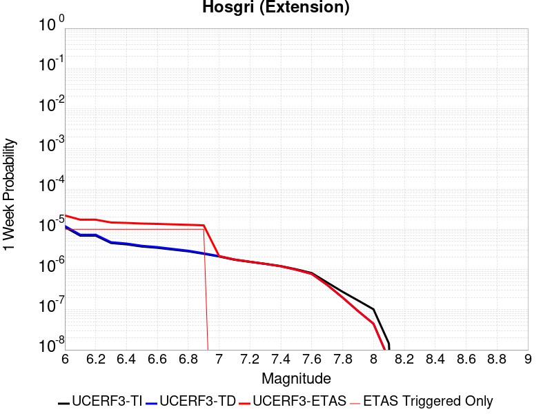 | 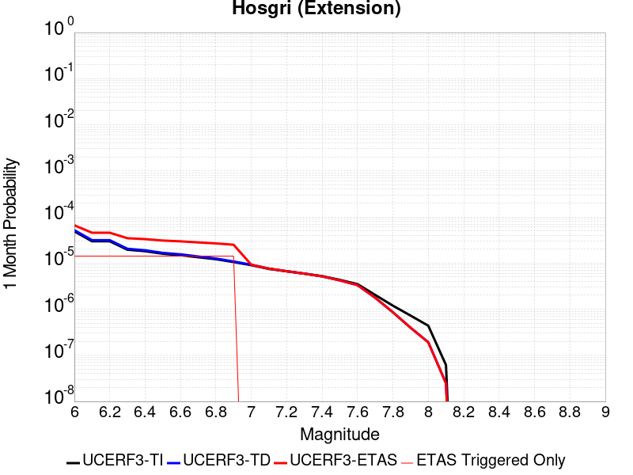 | 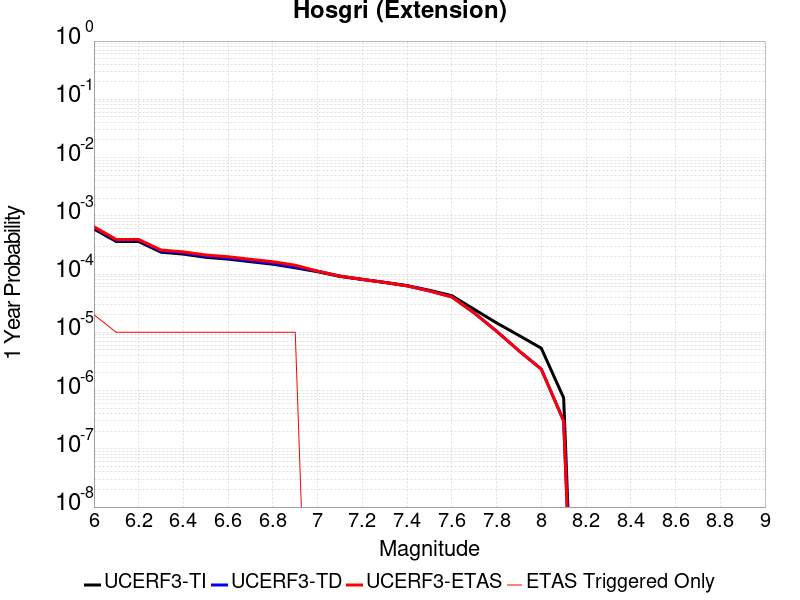 | 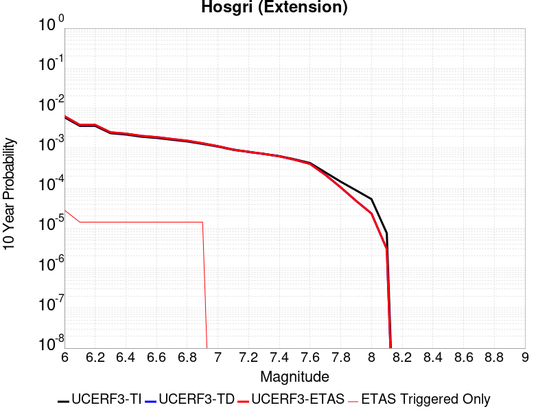 |

| Magnitude | 1 wk TI Prob | 1 wk TD Prob | 1 wk ETAS Prob | 1 wk ETAS/TD Gain | 1 wk ETAS Triggered Only | 1 mo TI Prob | 1 mo TD Prob | 1 mo ETAS Prob | 1 mo ETAS/TD Gain | 1 mo ETAS Triggered Only | 1 yr TI Prob | 1 yr TD Prob | 1 yr ETAS Prob | 1 yr ETAS/TD Gain | 1 yr ETAS Triggered Only | 10 yr TI Prob | 10 yr TD Prob | 10 yr ETAS Prob | 10 yr ETAS/TD Gain | 10 yr ETAS Triggered Only |
|-----|-----|-----|-----|-----|-----|-----|-----|-----|-----|-----|-----|-----|-----|-----|-----|-----|-----|-----|-----|-----|
| 6.0 | 1.1369135E-5 | 1.2083073E-5 | 2.2082952E-5 | 1.827594 | 1.0E-5 | 4.8723956E-5 | 5.17837E-5 | 6.178318E-5 | 1.1931009 | 1.0E-5 | 5.9305265E-4 | 6.303069E-4 | 6.502943E-4 | 1.0317106 | 2.0E-5 | 0.005914725 | 0.00628744 | 0.0063073146 | 1.003161 | 2.0E-5 |
| 6.1 | 6.934979E-6 | 7.324556E-6 | 1.7324483E-5 | 2.3652604 | 1.0E-5 | 2.9721E-5 | 3.13906E-5 | 4.1390285E-5 | 1.3185567 | 1.0E-5 | 3.617931E-4 | 3.821177E-4 | 3.9211387E-4 | 1.02616 | 1.0E-5 | 0.0036120464 | 0.003815019 | 0.003824981 | 1.0026112 | 1.0E-5 |
| 6.2 | 6.934979E-6 | 7.324556E-6 | 1.7324483E-5 | 2.3652604 | 1.0E-5 | 2.9721E-5 | 3.13906E-5 | 4.1390285E-5 | 1.3185567 | 1.0E-5 | 3.617931E-4 | 3.821177E-4 | 3.9211387E-4 | 1.02616 | 1.0E-5 | 0.0036120464 | 0.003815019 | 0.003824981 | 1.0026112 | 1.0E-5 |
| 6.3 | 4.5484676E-6 | 4.769331E-6 | 1.4769284E-5 | 3.09672 | 1.0E-5 | 1.9493287E-5 | 2.0439833E-5 | 3.0439629E-5 | 1.4892308 | 1.0E-5 | 2.3730492E-4 | 2.4882698E-4 | 2.588245E-4 | 1.0401785 | 1.0E-5 | 0.0023705168 | 0.0024855263 | 0.0024955014 | 1.0040133 | 1.0E-5 |
| 6.4 | 4.218095E-6 | 4.416863E-6 | 1.4416819E-5 | 3.2640405 | 1.0E-5 | 1.8077424E-5 | 1.8929275E-5 | 2.8929086E-5 | 1.5282723 | 1.0E-5 | 2.2007042E-4 | 2.3043988E-4 | 2.4043758E-4 | 1.0433853 | 1.0E-5 | 0.002198526 | 0.002302043 | 0.00231202 | 1.004334 | 1.0E-5 |
| 6.5 | 3.717374E-6 | 3.883879E-6 | 1.38838395E-5 | 3.5747356 | 1.0E-5 | 1.5931506E-5 | 1.664509E-5 | 2.6644922E-5 | 1.6007679 | 1.0E-5 | 1.9394881E-4 | 2.026353E-4 | 2.1263327E-4 | 1.0493398 | 1.0E-5 | 0.0019377962 | 0.0020245241 | 0.002034504 | 1.0049294 | 1.0E-5 |
| 6.6 | 3.4605036E-6 | 3.6083072E-6 | 1.3608271E-5 | 3.7713728 | 1.0E-5 | 1.4830645E-5 | 1.5464082E-5 | 2.5463927E-5 | 1.6466497 | 1.0E-5 | 1.8054814E-4 | 1.8825909E-4 | 1.982572E-4 | 1.0531083 | 1.0E-5 | 0.0018040152 | 0.0018810107 | 0.0018909919 | 1.0053062 | 1.0E-5 |
| 6.7 | 3.123439E-6 | 3.2465698E-6 | 1.32465375E-5 | 4.080164 | 1.0E-5 | 1.33860985E-5 | 1.39137965E-5 | 2.3913657E-5 | 1.7187011 | 1.0E-5 | 1.6296357E-4 | 1.6938741E-4 | 1.7938572E-4 | 1.0590262 | 1.0E-5 | 0.001628441 | 0.001692594 | 0.0017025771 | 1.0058981 | 1.0E-5 |
| 6.8 | 2.8290783E-6 | 2.9305413E-6 | 1.2930512E-5 | 4.4123287 | 1.0E-5 | 1.2124565E-5 | 1.2559403E-5 | 2.2559278E-5 | 1.7962061 | 1.0E-5 | 1.4760658E-4 | 1.5290009E-4 | 1.6289856E-4 | 1.0653921 | 1.0E-5 | 0.0014750857 | 0.0015279576 | 0.0015379423 | 1.0065347 | 1.0E-5 |
| 6.9 | 2.454112E-6 | 2.5283207E-6 | 1.2528295E-5 | 4.9551845 | 1.0E-5 | 1.0517581E-5 | 1.0835615E-5 | 2.0835507E-5 | 1.9228725 | 1.0E-5 | 1.2804402E-4 | 1.3191569E-4 | 1.4191437E-4 | 1.075796 | 1.0E-5 | 0.0012797028 | 0.0013183799 | 0.0013283667 | 1.007575 | 1.0E-5 |
| 7.0 | 2.1008145E-6 | 2.1498715E-6 | 2.1498715E-6 | 1.0 | 0.0 | 9.003459E-6 | 9.2137025E-6 | 9.2137025E-6 | 1.0 | 0.0 | 1.096116E-4 | 1.1217109E-4 | 1.1217109E-4 | 1.0 | 0.0 | 0.0010955755 | 0.0011211485 | 0.0011211485 | 1.0 | 0.0 |
| 7.1 | 1.744384E-6 | 1.7686364E-6 | 1.7686364E-6 | 1.0 | 0.0 | 7.47591E-6 | 7.579848E-6 | 7.579848E-6 | 1.0 | 0.0 | 9.1015405E-5 | 9.228076E-5 | 9.228076E-5 | 1.0 | 0.0 | 9.097813E-4 | 9.224261E-4 | 9.224261E-4 | 1.0 | 0.0 |
| 7.2 | 1.5456587E-6 | 1.5562894E-6 | 1.5562894E-6 | 1.0 | 0.0 | 6.6242346E-6 | 6.6697944E-6 | 6.6697944E-6 | 1.0 | 0.0 | 8.064707E-5 | 8.120173E-5 | 8.120173E-5 | 1.0 | 0.0 | 8.0617814E-4 | 8.117219E-4 | 8.117219E-4 | 1.0 | 0.0 |
| 7.3 | 1.3775123E-6 | 1.3766092E-6 | 1.3766092E-6 | 1.0 | 0.0 | 5.9036106E-6 | 5.8997407E-6 | 5.8997407E-6 | 1.0 | 0.0 | 7.187409E-5 | 7.182699E-5 | 7.182699E-5 | 1.0 | 0.0 | 7.185085E-4 | 7.180387E-4 | 7.180387E-4 | 1.0 | 0.0 |
| 7.4 | 1.214491E-6 | 1.2023471E-6 | 1.2023471E-6 | 1.0 | 0.0 | 5.2049513E-6 | 5.152906E-6 | 5.152906E-6 | 1.0 | 0.0 | 6.336844E-5 | 6.2734835E-5 | 6.2734835E-5 | 1.0 | 0.0 | 6.335037E-4 | 6.2717206E-4 | 6.2717206E-4 | 1.0 | 0.0 |
| 7.5 | 1.0101123E-6 | 9.842256E-7 | 9.842256E-7 | 1.0 | 0.0 | 4.3290456E-6 | 4.218103E-6 | 4.218103E-6 | 1.0 | 0.0 | 5.2704854E-5 | 5.13542E-5 | 5.13542E-5 | 1.0 | 0.0 | 5.2692357E-4 | 5.1342393E-4 | 5.1342393E-4 | 1.0 | 0.0 |
| 7.6 | 8.1558215E-7 | 7.765977E-7 | 7.765977E-7 | 1.0 | 0.0 | 3.4953473E-6 | 3.3282718E-6 | 3.3282718E-6 | 1.0 | 0.0 | 4.255502E-5 | 4.0520958E-5 | 4.0520958E-5 | 1.0 | 0.0 | 4.2546875E-4 | 4.0513615E-4 | 4.0513615E-4 | 1.0 | 0.0 |
| 7.7 | 4.757816E-7 | 4.1308996E-7 | 4.1308996E-7 | 1.0 | 0.0 | 2.0390623E-6 | 1.7703843E-6 | 1.7703843E-6 | 1.0 | 0.0 | 2.4825302E-5 | 2.1554217E-5 | 2.1554217E-5 | 1.0 | 0.0 | 2.482253E-4 | 2.1552139E-4 | 2.1552139E-4 | 1.0 | 0.0 |
| 7.8 | 2.782787E-7 | 2.004783E-7 | 2.004783E-7 | 1.0 | 0.0 | 1.1926223E-6 | 8.591924E-7 | 8.591924E-7 | 1.0 | 0.0 | 1.452008E-5 | 1.0460618E-5 | 1.0460618E-5 | 1.0 | 0.0 | 1.4519131E-4 | 1.04601284E-4 | 1.04601284E-4 | 1.0 | 0.0 |
| 7.9 | 1.6948086E-7 | 9.243938E-8 | 9.243938E-8 | 1.0 | 0.0 | 7.2634634E-7 | 3.961687E-7 | 3.961687E-7 | 1.0 | 0.0 | 8.843231E-6 | 4.8233433E-6 | 4.8233433E-6 | 1.0 | 0.0 | 8.842879E-5 | 4.8232392E-5 | 4.8232392E-5 | 1.0 | 0.0 |
| 8.0 | 1.0225492E-7 | 4.473497E-8 | 4.473497E-8 | 1.0 | 0.0 | 4.382353E-7 | 1.917213E-7 | 1.917213E-7 | 1.0 | 0.0 | 5.335502E-6 | 2.3342043E-6 | 2.3342043E-6 | 1.0 | 0.0 | 5.335374E-5 | 2.33418E-5 | 2.33418E-5 | 1.0 | 0.0 |
| 8.1 | 1.43711345E-8 | 5.78716E-9 | 5.78716E-9 | 1.0 | 0.0 | 6.1590576E-8 | 2.4802116E-8 | 2.4802116E-8 | 1.0 | 0.0 | 7.4986497E-7 | 3.019657E-7 | 3.019657E-7 | 1.0 | 0.0 | 7.4986247E-6 | 3.0196536E-6 | 3.0196536E-6 | 1.0 | 0.0 |

## Los Osos 2011
*[(top)](#table-of-contents)*

| 1 Week | 1 Month | 1 Year | 10 Year |
|-----|-----|-----|-----|
|  |  |  |  |

| Magnitude | 1 wk TI Prob | 1 wk TD Prob | 1 wk ETAS Prob | 1 wk ETAS/TD Gain | 1 wk ETAS Triggered Only | 1 mo TI Prob | 1 mo TD Prob | 1 mo ETAS Prob | 1 mo ETAS/TD Gain | 1 mo ETAS Triggered Only | 1 yr TI Prob | 1 yr TD Prob | 1 yr ETAS Prob | 1 yr ETAS/TD Gain | 1 yr ETAS Triggered Only | 10 yr TI Prob | 10 yr TD Prob | 10 yr ETAS Prob | 10 yr ETAS/TD Gain | 10 yr ETAS Triggered Only |
|-----|-----|-----|-----|-----|-----|-----|-----|-----|-----|-----|-----|-----|-----|-----|-----|-----|-----|-----|-----|-----|
| 6.0 | 4.8871775E-6 | 4.9814826E-6 | 1.4981433E-5 | 3.0074244 | 1.0E-5 | 2.0944879E-5 | 2.1349053E-5 | 3.1348838E-5 | 1.4683949 | 1.0E-5 | 2.5497406E-4 | 2.598965E-4 | 2.698939E-4 | 1.0384668 | 1.0E-5 | 0.002546817 | 0.0025962 | 0.002616148 | 1.0076835 | 2.0E-5 |
| 6.1 | 4.8871775E-6 | 4.9814826E-6 | 1.4981433E-5 | 3.0074244 | 1.0E-5 | 2.0944879E-5 | 2.1349053E-5 | 3.1348838E-5 | 1.4683949 | 1.0E-5 | 2.5497406E-4 | 2.598965E-4 | 2.698939E-4 | 1.0384668 | 1.0E-5 | 0.002546817 | 0.0025962 | 0.002616148 | 1.0076835 | 2.0E-5 |
| 6.2 | 4.8871775E-6 | 4.9814826E-6 | 1.4981433E-5 | 3.0074244 | 1.0E-5 | 2.0944879E-5 | 2.1349053E-5 | 3.1348838E-5 | 1.4683949 | 1.0E-5 | 2.5497406E-4 | 2.598965E-4 | 2.698939E-4 | 1.0384668 | 1.0E-5 | 0.002546817 | 0.0025962 | 0.002616148 | 1.0076835 | 2.0E-5 |
| 6.3 | 4.8871775E-6 | 4.9814826E-6 | 1.4981433E-5 | 3.0074244 | 1.0E-5 | 2.0944879E-5 | 2.1349053E-5 | 3.1348838E-5 | 1.4683949 | 1.0E-5 | 2.5497406E-4 | 2.598965E-4 | 2.698939E-4 | 1.0384668 | 1.0E-5 | 0.002546817 | 0.0025962 | 0.002616148 | 1.0076835 | 2.0E-5 |
| 6.4 | 4.8871775E-6 | 4.9814826E-6 | 1.4981433E-5 | 3.0074244 | 1.0E-5 | 2.0944879E-5 | 2.1349053E-5 | 3.1348838E-5 | 1.4683949 | 1.0E-5 | 2.5497406E-4 | 2.598965E-4 | 2.698939E-4 | 1.0384668 | 1.0E-5 | 0.002546817 | 0.0025962 | 0.002616148 | 1.0076835 | 2.0E-5 |
| 6.5 | 3.1724062E-6 | 3.2233943E-6 | 3.2233943E-6 | 1.0 | 0.0 | 1.3595956E-5 | 1.3814474E-5 | 1.3814474E-5 | 1.0 | 0.0 | 1.6551818E-4 | 1.6817838E-4 | 1.6817838E-4 | 1.0 | 0.0 | 0.0016539496 | 0.0016805246 | 0.0016905078 | 1.0059406 | 1.0E-5 |
| 6.6 | 3.1022591E-6 | 3.1511038E-6 | 3.1511038E-6 | 1.0 | 0.0 | 1.3295328E-5 | 1.3504661E-5 | 1.3504661E-5 | 1.0 | 0.0 | 1.618586E-4 | 1.6440697E-4 | 1.6440697E-4 | 1.0 | 0.0 | 0.0016174077 | 0.0016428662 | 0.0016528498 | 1.0060769 | 1.0E-5 |
| 6.7 | 2.611518E-6 | 2.6491825E-6 | 2.6491825E-6 | 1.0 | 0.0 | 1.1192172E-5 | 1.1353591E-5 | 1.1353591E-5 | 1.0 | 0.0 | 1.3625617E-4 | 1.3822124E-4 | 1.3822124E-4 | 1.0 | 0.0 | 0.0013617266 | 0.0013813572 | 0.0013913434 | 1.0072292 | 1.0E-5 |
| 6.8 | 2.4780884E-6 | 2.5121587E-6 | 2.5121587E-6 | 1.0 | 0.0 | 1.0620336E-5 | 1.076635E-5 | 1.076635E-5 | 1.0 | 0.0 | 1.2929492E-4 | 1.3107246E-4 | 1.3107246E-4 | 1.0 | 0.0 | 0.0012921972 | 0.0013099556 | 0.0013199425 | 1.0076238 | 1.0E-5 |
| 6.9 | 2.1376322E-6 | 2.1635049E-6 | 2.1635049E-6 | 1.0 | 0.0 | 9.161248E-6 | 9.272131E-6 | 9.272131E-6 | 1.0 | 0.0 | 1.1153249E-4 | 1.1288237E-4 | 1.1288237E-4 | 1.0 | 0.0 | 0.0011147653 | 0.0011282521 | 0.0011382409 | 1.0088533 | 1.0E-5 |
| 7.0 | 1.9282882E-6 | 1.949458E-6 | 1.949458E-6 | 1.0 | 0.0 | 8.264066E-6 | 8.354793E-6 | 8.354793E-6 | 1.0 | 0.0 | 1.0061036E-4 | 1.0171487E-4 | 1.0171487E-4 | 1.0 | 0.0 | 0.0010056482 | 0.0010166845 | 0.0010266743 | 1.009826 | 1.0E-5 |
| 7.1 | 1.6353226E-6 | 1.6501111E-6 | 1.6501111E-6 | 1.0 | 0.0 | 7.0085066E-6 | 7.0718856E-6 | 7.0718856E-6 | 1.0 | 0.0 | 8.532523E-5 | 8.6096814E-5 | 8.6096814E-5 | 1.0 | 0.0 | 8.529247E-4 | 8.6063537E-4 | 8.7062677E-4 | 1.0116093 | 1.0E-5 |
| 7.2 | 1.4446276E-6 | 1.4553335E-6 | 1.4553335E-6 | 1.0 | 0.0 | 6.191247E-6 | 6.2371287E-6 | 6.2371287E-6 | 1.0 | 0.0 | 7.537582E-5 | 7.59344E-5 | 7.59344E-5 | 1.0 | 0.0 | 7.535026E-4 | 7.590851E-4 | 7.690775E-4 | 1.0131638 | 1.0E-5 |
| 7.3 | 1.2014582E-6 | 1.2069066E-6 | 1.2069066E-6 | 1.0 | 0.0 | 5.149096E-6 | 5.172447E-6 | 5.172447E-6 | 1.0 | 0.0 | 6.268844E-5 | 6.297272E-5 | 6.297272E-5 | 1.0 | 0.0 | 6.267076E-4 | 6.295492E-4 | 6.295492E-4 | 1.0 | 0.0 |
| 7.4 | 9.707733E-7 | 9.709767E-7 | 9.709767E-7 | 1.0 | 0.0 | 4.16045E-6 | 4.161322E-6 | 4.161322E-6 | 1.0 | 0.0 | 5.0652303E-5 | 5.066292E-5 | 5.066292E-5 | 1.0 | 0.0 | 5.064076E-4 | 5.065139E-4 | 5.065139E-4 | 1.0 | 0.0 |
| 7.5 | 7.174908E-7 | 7.114907E-7 | 7.114907E-7 | 1.0 | 0.0 | 3.074957E-6 | 3.0492424E-6 | 3.0492424E-6 | 1.0 | 0.0 | 3.743696E-5 | 3.7123897E-5 | 3.7123897E-5 | 1.0 | 0.0 | 3.7430652E-4 | 3.7117713E-4 | 3.7117713E-4 | 1.0 | 0.0 |
| 7.6 | 4.5535776E-7 | 4.4207857E-7 | 4.4207857E-7 | 1.0 | 0.0 | 1.9515319E-6 | 1.8946212E-6 | 1.8946212E-6 | 1.0 | 0.0 | 2.3759641E-5 | 2.3066768E-5 | 2.3066768E-5 | 1.0 | 0.0 | 2.37571E-4 | 2.3064384E-4 | 2.3064384E-4 | 1.0 | 0.0 |
| 7.7 | 2.1173553E-7 | 1.9060734E-7 | 1.9060734E-7 | 1.0 | 0.0 | 9.0743765E-7 | 8.1688836E-7 | 8.1688836E-7 | 1.0 | 0.0 | 1.1047998E-5 | 9.94557E-6 | 9.94557E-6 | 1.0 | 0.0 | 1.1047449E-4 | 9.945128E-5 | 9.945128E-5 | 1.0 | 0.0 |
| 7.8 | 9.873608E-8 | 7.367457E-8 | 7.367457E-8 | 1.0 | 0.0 | 4.2315455E-7 | 3.1574814E-7 | 3.1574814E-7 | 1.0 | 0.0 | 5.1518946E-6 | 3.8442267E-6 | 3.8442267E-6 | 1.0 | 0.0 | 5.1517753E-5 | 3.844161E-5 | 3.844161E-5 | 1.0 | 0.0 |
| 7.9 | 5.4399106E-8 | 3.187941E-8 | 3.187941E-8 | 1.0 | 0.0 | 2.33139E-7 | 1.3662603E-7 | 1.3662603E-7 | 1.0 | 0.0 | 2.8384638E-6 | 1.6634207E-6 | 1.6634207E-6 | 1.0 | 0.0 | 2.8384275E-5 | 1.6634083E-5 | 1.6634083E-5 | 1.0 | 0.0 |
| 8.0 | 1.817203E-8 | 8.420079E-9 | 8.420079E-9 | 1.0 | 0.0 | 7.7880124E-8 | 3.6086053E-8 | 3.6086053E-8 | 1.0 | 0.0 | 9.481901E-7 | 4.393476E-7 | 4.393476E-7 | 1.0 | 0.0 | 9.481861E-6 | 4.393468E-6 | 4.393468E-6 | 1.0 | 0.0 |

## Elsinore (Temecula) rev
*[(top)](#table-of-contents)*

| 1 Week | 1 Month | 1 Year | 10 Year |
|-----|-----|-----|-----|
|  | 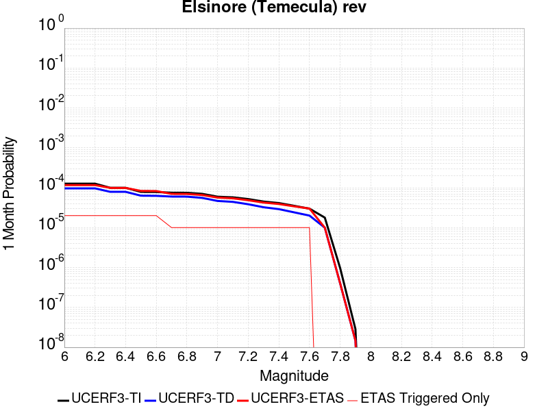 |  |  |

| Magnitude | 1 wk TI Prob | 1 wk TD Prob | 1 wk ETAS Prob | 1 wk ETAS/TD Gain | 1 wk ETAS Triggered Only | 1 mo TI Prob | 1 mo TD Prob | 1 mo ETAS Prob | 1 mo ETAS/TD Gain | 1 mo ETAS Triggered Only | 1 yr TI Prob | 1 yr TD Prob | 1 yr ETAS Prob | 1 yr ETAS/TD Gain | 1 yr ETAS Triggered Only | 10 yr TI Prob | 10 yr TD Prob | 10 yr ETAS Prob | 10 yr ETAS/TD Gain | 10 yr ETAS Triggered Only |
|-----|-----|-----|-----|-----|-----|-----|-----|-----|-----|-----|-----|-----|-----|-----|-----|-----|-----|-----|-----|-----|
| 6.0 | 2.9514995E-5 | 2.251887E-5 | 4.251842E-5 | 1.888124 | 2.0E-5 | 1.264867E-4 | 9.6505995E-5 | 1.1650407E-4 | 1.207221 | 2.0E-5 | 0.0015388876 | 0.0011743492 | 0.0011943257 | 1.0170107 | 2.0E-5 | 0.015282745 | 0.011688135 | 0.011707901 | 1.0016911 | 2.0E-5 |
| 6.1 | 2.9514995E-5 | 2.251887E-5 | 4.251842E-5 | 1.888124 | 2.0E-5 | 1.264867E-4 | 9.6505995E-5 | 1.1650407E-4 | 1.207221 | 2.0E-5 | 0.0015388876 | 0.0011743492 | 0.0011943257 | 1.0170107 | 2.0E-5 | 0.015282745 | 0.011688135 | 0.011707901 | 1.0016911 | 2.0E-5 |
| 6.2 | 2.9514995E-5 | 2.251887E-5 | 4.251842E-5 | 1.888124 | 2.0E-5 | 1.264867E-4 | 9.6505995E-5 | 1.1650407E-4 | 1.207221 | 2.0E-5 | 0.0015388876 | 0.0011743492 | 0.0011943257 | 1.0170107 | 2.0E-5 | 0.015282745 | 0.011688135 | 0.011707901 | 1.0016911 | 2.0E-5 |
| 6.3 | 2.3223649E-5 | 1.840822E-5 | 3.8407852E-5 | 2.0864513 | 2.0E-5 | 9.952613E-5 | 7.889008E-5 | 9.88885E-5 | 1.2534972 | 2.0E-5 | 0.001211057 | 9.600807E-4 | 9.800615E-4 | 1.0208116 | 2.0E-5 | 0.012044783 | 0.009551284 | 0.009571092 | 1.002074 | 2.0E-5 |
| 6.4 | 2.3223649E-5 | 1.840822E-5 | 3.8407852E-5 | 2.0864513 | 2.0E-5 | 9.952613E-5 | 7.889008E-5 | 9.88885E-5 | 1.2534972 | 2.0E-5 | 0.001211057 | 9.600807E-4 | 9.800615E-4 | 1.0208116 | 2.0E-5 | 0.012044783 | 0.009551284 | 0.009571092 | 1.002074 | 2.0E-5 |
| 6.5 | 1.8338875E-5 | 1.4750074E-5 | 3.4749777E-5 | 2.3559053 | 2.0E-5 | 7.8592806E-5 | 6.321312E-5 | 8.321185E-5 | 1.31637 | 2.0E-5 | 9.5644733E-4 | 7.6935673E-4 | 7.8934134E-4 | 1.0259757 | 2.0E-5 | 0.009523412 | 0.0076699676 | 0.007689814 | 1.0025876 | 2.0E-5 |
| 6.6 | 1.8223333E-5 | 1.461263E-5 | 3.4612338E-5 | 2.368659 | 2.0E-5 | 7.809766E-5 | 6.26241E-5 | 8.262285E-5 | 1.3193458 | 2.0E-5 | 9.504242E-4 | 7.621905E-4 | 7.821753E-4 | 1.0262202 | 2.0E-5 | 0.009463696 | 0.007598796 | 0.0076186443 | 1.002612 | 2.0E-5 |
| 6.7 | 1.7512752E-5 | 1.4026963E-5 | 2.4026822E-5 | 1.7129027 | 1.0E-5 | 7.505249E-5 | 6.0114216E-5 | 7.0113616E-5 | 1.16634 | 1.0E-5 | 9.13381E-4 | 7.316534E-4 | 7.416461E-4 | 1.0136577 | 1.0E-5 | 0.00909636 | 0.0072983317 | 0.0073082587 | 1.0013602 | 1.0E-5 |
| 6.8 | 1.7417142E-5 | 1.395093E-5 | 2.395079E-5 | 1.716788 | 1.0E-5 | 7.4642754E-5 | 5.978838E-5 | 6.9787784E-5 | 1.1672466 | 1.0E-5 | 9.083966E-4 | 7.27689E-4 | 7.376817E-4 | 1.0137321 | 1.0E-5 | 0.009046922 | 0.007259359 | 0.0072692866 | 1.0013676 | 1.0E-5 |
| 6.9 | 1.6402591E-5 | 1.29883665E-5 | 2.2988237E-5 | 1.7699097 | 1.0E-5 | 7.0294926E-5 | 5.5663284E-5 | 6.566273E-5 | 1.1796416 | 1.0E-5 | 8.5550465E-4 | 6.774974E-4 | 6.874907E-4 | 1.0147502 | 1.0E-5 | 0.008522186 | 0.0067598647 | 0.006769797 | 1.0014694 | 1.0E-5 |
| 7.0 | 1.3912486E-5 | 1.0878067E-5 | 2.0877958E-5 | 1.919271 | 1.0E-5 | 5.9623577E-5 | 4.661947E-5 | 5.6619003E-5 | 1.2144927 | 1.0E-5 | 7.2567526E-4 | 5.674469E-4 | 5.774413E-4 | 1.0176128 | 1.0E-5 | 0.0072331014 | 0.0056635314 | 0.005673475 | 1.0017557 | 1.0E-5 |
| 7.1 | 1.3405147E-5 | 1.0327192E-5 | 2.0327088E-5 | 1.9683074 | 1.0E-5 | 5.7449364E-5 | 4.4258657E-5 | 5.4258217E-5 | 1.2259345 | 1.0E-5 | 6.9922156E-4 | 5.3871854E-4 | 5.4871314E-4 | 1.0185525 | 1.0E-5 | 0.0069702556 | 0.005377366 | 0.0053873123 | 1.0018497 | 1.0E-5 |
| 7.2 | 1.21402E-5 | 8.996479E-6 | 1.8996388E-5 | 2.111536 | 1.0E-5 | 5.202839E-5 | 3.8555776E-5 | 4.855539E-5 | 1.2593545 | 1.0E-5 | 6.332616E-4 | 4.6931725E-4 | 4.7931256E-4 | 1.0212976 | 1.0E-5 | 0.0063146 | 0.0046847262 | 0.0046946793 | 1.0021245 | 1.0E-5 |
| 7.3 | 1.05047775E-5 | 7.571515E-6 | 1.757144E-5 | 2.3207295 | 1.0E-5 | 4.5019697E-5 | 3.2448956E-5 | 4.244863E-5 | 1.3081663 | 1.0E-5 | 5.4797693E-4 | 3.9499588E-4 | 4.0499194E-4 | 1.0253067 | 1.0E-5 | 0.005466277 | 0.003943348 | 0.0039533083 | 1.0025259 | 1.0E-5 |
| 7.4 | 9.624483E-6 | 6.786621E-6 | 1.6786553E-5 | 2.4734774 | 1.0E-5 | 4.124713E-5 | 2.90852E-5 | 3.908491E-5 | 1.3438075 | 1.0E-5 | 5.0206814E-4 | 3.5405616E-4 | 3.6405263E-4 | 1.0282341 | 1.0E-5 | 0.005009353 | 0.0035350726 | 0.0035450372 | 1.0028188 | 1.0E-5 |
| 7.5 | 8.215151E-6 | 5.6353133E-6 | 1.5635256E-5 | 2.7745142 | 1.0E-5 | 3.5207315E-5 | 2.4151126E-5 | 3.4150886E-5 | 1.4140494 | 1.0E-5 | 4.2856473E-4 | 2.9400157E-4 | 3.0399862E-4 | 1.0340034 | 1.0E-5 | 0.004277392 | 0.002936254 | 0.0029462245 | 1.0033957 | 1.0E-5 |
| 7.6 | 6.975058E-6 | 4.675836E-6 | 1.4675789E-5 | 3.138645 | 1.0E-5 | 2.9892764E-5 | 2.003915E-5 | 3.003895E-5 | 1.4990132 | 1.0E-5 | 3.6388362E-4 | 2.439505E-4 | 2.5394806E-4 | 1.0409819 | 1.0E-5 | 0.0036328835 | 0.0024369434 | 0.002446919 | 1.0040935 | 1.0E-5 |
| 7.7 | 4.159604E-6 | 2.326789E-6 | 2.326789E-6 | 1.0 | 0.0 | 1.7826753E-5 | 9.971919E-6 | 9.971919E-6 | 1.0 | 0.0 | 2.1701909E-4 | 1.2140209E-4 | 1.2140209E-4 | 1.0 | 0.0 | 0.0021680726 | 0.0012134308 | 0.0012134308 | 1.0 | 0.0 |
| 7.8 | 2.2692414E-7 | 9.384417E-8 | 9.384417E-8 | 1.0 | 0.0 | 9.725317E-7 | 4.0218927E-7 | 4.0218927E-7 | 1.0 | 0.0 | 1.1840509E-5 | 4.8966467E-6 | 4.8966467E-6 | 1.0 | 0.0 | 1.1839878E-4 | 4.8965718E-5 | 4.8965718E-5 | 1.0 | 0.0 |
| 7.9 | 6.676829E-9 | 3.4397174E-9 | 3.4397174E-9 | 1.0 | 0.0 | 2.861498E-8 | 1.4741646E-8 | 1.4741646E-8 | 1.0 | 0.0 | 3.4838732E-7 | 1.7947953E-7 | 1.7947953E-7 | 1.0 | 0.0 | 3.4838679E-6 | 1.794794E-6 | 1.794794E-6 | 1.0 | 0.0 |

## San Luis Range 2011 CFM
*[(top)](#table-of-contents)*

| 1 Week | 1 Month | 1 Year | 10 Year |
|-----|-----|-----|-----|
|  |  |  |  |

| Magnitude | 1 wk TI Prob | 1 wk TD Prob | 1 wk ETAS Prob | 1 wk ETAS/TD Gain | 1 wk ETAS Triggered Only | 1 mo TI Prob | 1 mo TD Prob | 1 mo ETAS Prob | 1 mo ETAS/TD Gain | 1 mo ETAS Triggered Only | 1 yr TI Prob | 1 yr TD Prob | 1 yr ETAS Prob | 1 yr ETAS/TD Gain | 1 yr ETAS Triggered Only | 10 yr TI Prob | 10 yr TD Prob | 10 yr ETAS Prob | 10 yr ETAS/TD Gain | 10 yr ETAS Triggered Only |
|-----|-----|-----|-----|-----|-----|-----|-----|-----|-----|-----|-----|-----|-----|-----|-----|-----|-----|-----|-----|-----|
| 6.0 | 8.8368415E-6 | 8.965455E-6 | 8.965455E-6 | 1.0 | 0.0 | 3.787163E-5 | 3.8422855E-5 | 5.8422087E-5 | 1.5205035 | 2.0E-5 | 4.609895E-4 | 4.6770574E-4 | 4.8769638E-4 | 1.0427419 | 2.0E-5 | 0.0046003438 | 0.004667997 | 0.0046879034 | 1.0042645 | 2.0E-5 |
| 6.1 | 8.8368415E-6 | 8.965455E-6 | 8.965455E-6 | 1.0 | 0.0 | 3.787163E-5 | 3.8422855E-5 | 5.8422087E-5 | 1.5205035 | 2.0E-5 | 4.609895E-4 | 4.6770574E-4 | 4.8769638E-4 | 1.0427419 | 2.0E-5 | 0.0046003438 | 0.004667997 | 0.0046879034 | 1.0042645 | 2.0E-5 |
| 6.2 | 8.8368415E-6 | 8.965455E-6 | 8.965455E-6 | 1.0 | 0.0 | 3.787163E-5 | 3.8422855E-5 | 5.8422087E-5 | 1.5205035 | 2.0E-5 | 4.609895E-4 | 4.6770574E-4 | 4.8769638E-4 | 1.0427419 | 2.0E-5 | 0.0046003438 | 0.004667997 | 0.0046879034 | 1.0042645 | 2.0E-5 |
| 6.3 | 8.8368415E-6 | 8.965455E-6 | 8.965455E-6 | 1.0 | 0.0 | 3.787163E-5 | 3.8422855E-5 | 5.8422087E-5 | 1.5205035 | 2.0E-5 | 4.609895E-4 | 4.6770574E-4 | 4.8769638E-4 | 1.0427419 | 2.0E-5 | 0.0046003438 | 0.004667997 | 0.0046879034 | 1.0042645 | 2.0E-5 |
| 6.4 | 3.9094193E-6 | 3.941204E-6 | 3.941204E-6 | 1.0 | 0.0 | 1.6754546E-5 | 1.6890766E-5 | 1.6890766E-5 | 1.0 | 0.0 | 2.039675E-4 | 2.0562594E-4 | 2.0562594E-4 | 1.0 | 0.0 | 0.0020378039 | 0.0020543856 | 0.0020543856 | 1.0 | 0.0 |
| 6.5 | 3.9094193E-6 | 3.941204E-6 | 3.941204E-6 | 1.0 | 0.0 | 1.6754546E-5 | 1.6890766E-5 | 1.6890766E-5 | 1.0 | 0.0 | 2.039675E-4 | 2.0562594E-4 | 2.0562594E-4 | 1.0 | 0.0 | 0.0020378039 | 0.0020543856 | 0.0020543856 | 1.0 | 0.0 |
| 6.6 | 3.0587726E-6 | 3.0753893E-6 | 3.0753893E-6 | 1.0 | 0.0 | 1.3108959E-5 | 1.3180174E-5 | 1.3180174E-5 | 1.0 | 0.0 | 1.595899E-4 | 1.6045693E-4 | 1.6045693E-4 | 1.0 | 0.0 | 0.0015947534 | 0.0016034227 | 0.0016034227 | 1.0 | 0.0 |
| 6.7 | 2.6160574E-6 | 2.6251284E-6 | 2.6251284E-6 | 1.0 | 0.0 | 1.1211626E-5 | 1.1250502E-5 | 1.1250502E-5 | 1.0 | 0.0 | 1.3649299E-4 | 1.3696631E-4 | 1.3696631E-4 | 1.0 | 0.0 | 0.0013640919 | 0.0013688251 | 0.0013688251 | 1.0 | 0.0 |
| 6.8 | 2.5110312E-6 | 2.5181412E-6 | 2.5181412E-6 | 1.0 | 0.0 | 1.0761518E-5 | 1.079199E-5 | 1.079199E-5 | 1.0 | 0.0 | 1.310136E-4 | 1.313846E-4 | 1.313846E-4 | 1.0 | 0.0 | 0.0013093639 | 0.0013130752 | 0.0013130752 | 1.0 | 0.0 |
| 6.9 | 1.8564405E-6 | 1.852488E-6 | 1.852488E-6 | 1.0 | 0.0 | 7.95615E-6 | 7.93921E-6 | 7.93921E-6 | 1.0 | 0.0 | 9.686181E-5 | 9.665562E-5 | 9.665562E-5 | 1.0 | 0.0 | 9.68196E-4 | 9.6613786E-4 | 9.6613786E-4 | 1.0 | 0.0 |
| 7.0 | 1.546127E-6 | 1.5369549E-6 | 1.5369549E-6 | 1.0 | 0.0 | 6.626242E-6 | 6.5869326E-6 | 6.5869326E-6 | 1.0 | 0.0 | 8.06715E-5 | 8.019296E-5 | 8.019296E-5 | 1.0 | 0.0 | 8.0642226E-4 | 8.016409E-4 | 8.016409E-4 | 1.0 | 0.0 |
| 7.1 | 1.3368208E-6 | 1.3235336E-6 | 1.3235336E-6 | 1.0 | 0.0 | 5.7292195E-6 | 5.6722747E-6 | 5.6722747E-6 | 1.0 | 0.0 | 6.975101E-5 | 6.905776E-5 | 6.905776E-5 | 1.0 | 0.0 | 6.972912E-4 | 6.903635E-4 | 6.903635E-4 | 1.0 | 0.0 |
| 7.2 | 1.0623363E-6 | 1.0454378E-6 | 1.0454378E-6 | 1.0 | 0.0 | 4.5528623E-6 | 4.4804397E-6 | 4.4804397E-6 | 1.0 | 0.0 | 5.5429686E-5 | 5.4547992E-5 | 5.4547992E-5 | 1.0 | 0.0 | 5.5415864E-4 | 5.453463E-4 | 5.453463E-4 | 1.0 | 0.0 |
| 7.3 | 7.831679E-7 | 7.727399E-7 | 7.727399E-7 | 1.0 | 0.0 | 3.3564295E-6 | 3.3117383E-6 | 3.3117383E-6 | 1.0 | 0.0 | 4.086376E-5 | 4.031967E-5 | 4.031967E-5 | 1.0 | 0.0 | 4.0856248E-4 | 4.0312367E-4 | 4.0312367E-4 | 1.0 | 0.0 |
| 7.4 | 5.9558846E-7 | 5.910646E-7 | 5.910646E-7 | 1.0 | 0.0 | 2.5525194E-6 | 2.5331315E-6 | 2.5331315E-6 | 1.0 | 0.0 | 3.107648E-5 | 3.084044E-5 | 3.084044E-5 | 1.0 | 0.0 | 3.1072134E-4 | 3.083617E-4 | 3.083617E-4 | 1.0 | 0.0 |
| 7.5 | 4.1616502E-7 | 4.1196404E-7 | 4.1196404E-7 | 1.0 | 0.0 | 1.7835631E-6 | 1.765559E-6 | 1.765559E-6 | 1.0 | 0.0 | 2.1714664E-5 | 2.1495469E-5 | 2.1495469E-5 | 1.0 | 0.0 | 2.1712543E-4 | 2.1493394E-4 | 2.1493394E-4 | 1.0 | 0.0 |
| 7.6 | 2.3816014E-7 | 2.3376614E-7 | 2.3376614E-7 | 1.0 | 0.0 | 1.0206859E-6 | 1.0018545E-6 | 1.0018545E-6 | 1.0 | 0.0 | 1.242678E-5 | 1.219751E-5 | 1.219751E-5 | 1.0 | 0.0 | 1.2426086E-4 | 1.2196843E-4 | 1.2196843E-4 | 1.0 | 0.0 |
| 7.7 | 9.918777E-8 | 9.3868096E-8 | 9.3868096E-8 | 1.0 | 0.0 | 4.2509038E-7 | 4.022918E-7 | 4.022918E-7 | 1.0 | 0.0 | 5.1754632E-6 | 4.8978914E-6 | 4.8978914E-6 | 1.0 | 0.0 | 5.1753424E-5 | 4.897784E-5 | 4.897784E-5 | 1.0 | 0.0 |
| 7.8 | 3.4982556E-8 | 2.968672E-8 | 2.968672E-8 | 1.0 | 0.0 | 1.4992524E-7 | 1.272288E-7 | 1.272288E-7 | 1.0 | 0.0 | 1.8253382E-6 | 1.5490094E-6 | 1.5490094E-6 | 1.0 | 0.0 | 1.8253233E-5 | 1.5489988E-5 | 1.5489988E-5 | 1.0 | 0.0 |
| 7.9 | 1.6624908E-8 | 1.1476994E-8 | 1.1476994E-8 | 1.0 | 0.0 | 7.12496E-8 | 4.9187115E-8 | 4.9187115E-8 | 1.0 | 0.0 | 8.6746354E-7 | 5.988529E-7 | 5.988529E-7 | 1.0 | 0.0 | 8.674601E-6 | 5.9885133E-6 | 5.9885133E-6 | 1.0 | 0.0 |
| 8.0 | 6.3352315E-9 | 3.0886564E-9 | 3.0886564E-9 | 1.0 | 0.0 | 2.715099E-8 | 1.32370985E-8 | 1.32370985E-8 | 1.0 | 0.0 | 3.3056327E-7 | 1.6116167E-7 | 1.6116167E-7 | 1.0 | 0.0 | 3.3056278E-6 | 1.6116155E-6 | 1.6116155E-6 | 1.0 | 0.0 |

## North Frontal  (West)
*[(top)](#table-of-contents)*

| 1 Week | 1 Month | 1 Year | 10 Year |
|-----|-----|-----|-----|
|  |  |  |  |

| Magnitude | 1 wk TI Prob | 1 wk TD Prob | 1 wk ETAS Prob | 1 wk ETAS/TD Gain | 1 wk ETAS Triggered Only | 1 mo TI Prob | 1 mo TD Prob | 1 mo ETAS Prob | 1 mo ETAS/TD Gain | 1 mo ETAS Triggered Only | 1 yr TI Prob | 1 yr TD Prob | 1 yr ETAS Prob | 1 yr ETAS/TD Gain | 1 yr ETAS Triggered Only | 10 yr TI Prob | 10 yr TD Prob | 10 yr ETAS Prob | 10 yr ETAS/TD Gain | 10 yr ETAS Triggered Only |
|-----|-----|-----|-----|-----|-----|-----|-----|-----|-----|-----|-----|-----|-----|-----|-----|-----|-----|-----|-----|-----|
| 6.0 | 4.7316266E-6 | 4.852674E-6 | 4.852674E-6 | 1.0 | 0.0 | 2.0278241E-5 | 2.0797017E-5 | 2.0797017E-5 | 1.0 | 0.0 | 2.4685962E-4 | 2.5317573E-4 | 2.631732E-4 | 1.0394883 | 1.0E-5 | 0.0024658558 | 0.002529019 | 0.0025489687 | 1.0078882 | 2.0E-5 |
| 6.1 | 4.7316266E-6 | 4.852674E-6 | 4.852674E-6 | 1.0 | 0.0 | 2.0278241E-5 | 2.0797017E-5 | 2.0797017E-5 | 1.0 | 0.0 | 2.4685962E-4 | 2.5317573E-4 | 2.631732E-4 | 1.0394883 | 1.0E-5 | 0.0024658558 | 0.002529019 | 0.0025489687 | 1.0078882 | 2.0E-5 |
| 6.2 | 4.7316266E-6 | 4.852674E-6 | 4.852674E-6 | 1.0 | 0.0 | 2.0278241E-5 | 2.0797017E-5 | 2.0797017E-5 | 1.0 | 0.0 | 2.4685962E-4 | 2.5317573E-4 | 2.631732E-4 | 1.0394883 | 1.0E-5 | 0.0024658558 | 0.002529019 | 0.0025489687 | 1.0078882 | 2.0E-5 |
| 6.3 | 4.7316266E-6 | 4.852674E-6 | 4.852674E-6 | 1.0 | 0.0 | 2.0278241E-5 | 2.0797017E-5 | 2.0797017E-5 | 1.0 | 0.0 | 2.4685962E-4 | 2.5317573E-4 | 2.631732E-4 | 1.0394883 | 1.0E-5 | 0.0024658558 | 0.002529019 | 0.0025489687 | 1.0078882 | 2.0E-5 |
| 6.4 | 4.7316266E-6 | 4.852674E-6 | 4.852674E-6 | 1.0 | 0.0 | 2.0278241E-5 | 2.0797017E-5 | 2.0797017E-5 | 1.0 | 0.0 | 2.4685962E-4 | 2.5317573E-4 | 2.631732E-4 | 1.0394883 | 1.0E-5 | 0.0024658558 | 0.002529019 | 0.0025489687 | 1.0078882 | 2.0E-5 |
| 6.5 | 4.7316266E-6 | 4.852674E-6 | 4.852674E-6 | 1.0 | 0.0 | 2.0278241E-5 | 2.0797017E-5 | 2.0797017E-5 | 1.0 | 0.0 | 2.4685962E-4 | 2.5317573E-4 | 2.631732E-4 | 1.0394883 | 1.0E-5 | 0.0024658558 | 0.002529019 | 0.0025489687 | 1.0078882 | 2.0E-5 |
| 6.6 | 4.7316266E-6 | 4.852674E-6 | 4.852674E-6 | 1.0 | 0.0 | 2.0278241E-5 | 2.0797017E-5 | 2.0797017E-5 | 1.0 | 0.0 | 2.4685962E-4 | 2.5317573E-4 | 2.631732E-4 | 1.0394883 | 1.0E-5 | 0.0024658558 | 0.002529019 | 0.0025489687 | 1.0078882 | 2.0E-5 |
| 6.7 | 3.5382777E-6 | 3.6308872E-6 | 3.6308872E-6 | 1.0 | 0.0 | 1.516396E-5 | 1.5560858E-5 | 1.5560858E-5 | 1.0 | 0.0 | 1.8460557E-4 | 1.8943775E-4 | 1.9943585E-4 | 1.0527778 | 1.0E-5 | 0.0018445229 | 0.0018928396 | 0.0019128018 | 1.0105461 | 2.0E-5 |
| 6.8 | 3.5382777E-6 | 3.6308872E-6 | 3.6308872E-6 | 1.0 | 0.0 | 1.516396E-5 | 1.5560858E-5 | 1.5560858E-5 | 1.0 | 0.0 | 1.8460557E-4 | 1.8943775E-4 | 1.9943585E-4 | 1.0527778 | 1.0E-5 | 0.0018445229 | 0.0018928396 | 0.0019128018 | 1.0105461 | 2.0E-5 |
| 6.9 | 3.0428037E-6 | 3.1227619E-6 | 3.1227619E-6 | 1.0 | 0.0 | 1.30405215E-5 | 1.3383201E-5 | 1.3383201E-5 | 1.0 | 0.0 | 1.5875678E-4 | 1.6292896E-4 | 1.7292734E-4 | 1.0613664 | 1.0E-5 | 0.0015864341 | 0.0016281622 | 0.0016481297 | 1.0122638 | 2.0E-5 |
| 7.0 | 2.538778E-6 | 2.6060916E-6 | 2.6060916E-6 | 1.0 | 0.0 | 1.0880432E-5 | 1.116892E-5 | 1.116892E-5 | 1.0 | 0.0 | 1.324612E-4 | 1.3597358E-4 | 1.4597223E-4 | 1.0735337 | 1.0E-5 | 0.0013238228 | 0.0013589506 | 0.0013789234 | 1.0146972 | 2.0E-5 |
| 7.1 | 2.2418935E-6 | 2.3012087E-6 | 2.3012087E-6 | 1.0 | 0.0 | 9.60808E-6 | 9.862288E-6 | 9.862288E-6 | 1.0 | 0.0 | 1.1697209E-4 | 1.2006718E-4 | 1.3006598E-4 | 1.0832767 | 1.0E-5 | 0.0011691054 | 0.0012000671 | 0.001220043 | 1.0166458 | 2.0E-5 |
| 7.2 | 1.6526745E-6 | 1.6924864E-6 | 1.6924864E-6 | 1.0 | 0.0 | 7.082872E-6 | 7.2534945E-6 | 7.2534945E-6 | 1.0 | 0.0 | 8.623055E-5 | 8.830797E-5 | 9.830709E-5 | 1.1132301 | 1.0E-5 | 8.61971E-4 | 8.8275387E-4 | 9.027362E-4 | 1.0226364 | 2.0E-5 |
| 7.3 | 1.0246019E-6 | 1.0442274E-6 | 1.0442274E-6 | 1.0 | 0.0 | 4.391144E-6 | 4.4752533E-6 | 4.4752533E-6 | 1.0 | 0.0 | 5.3460866E-5 | 5.4484964E-5 | 6.448442E-5 | 1.1835269 | 1.0E-5 | 5.344801E-4 | 5.4472755E-4 | 5.6471664E-4 | 1.0366956 | 2.0E-5 |
| 7.4 | 8.9045164E-7 | 9.056572E-7 | 9.056572E-7 | 1.0 | 0.0 | 3.8162157E-6 | 3.881383E-6 | 3.881383E-6 | 1.0 | 0.0 | 4.646144E-5 | 4.725492E-5 | 5.725445E-5 | 1.2116082 | 1.0E-5 | 4.6451724E-4 | 4.7245962E-4 | 4.824549E-4 | 1.0211558 | 1.0E-5 |
| 7.5 | 6.3357E-7 | 6.4027137E-7 | 6.4027137E-7 | 1.0 | 0.0 | 2.7152971E-6 | 2.7440176E-6 | 2.7440176E-6 | 1.0 | 0.0 | 3.305824E-5 | 3.340797E-5 | 4.3407636E-5 | 1.2993197 | 1.0E-5 | 3.3053322E-4 | 3.3403604E-4 | 3.440327E-4 | 1.0299269 | 1.0E-5 |
| 7.6 | 2.5087024E-7 | 2.436123E-7 | 2.436123E-7 | 1.0 | 0.0 | 1.0751578E-6 | 1.0440525E-6 | 1.0440525E-6 | 1.0 | 0.0 | 1.3089967E-5 | 1.2711286E-5 | 1.2711286E-5 | 1.0 | 0.0 | 1.3089196E-4 | 1.2710765E-4 | 1.2710765E-4 | 1.0 | 0.0 |
| 7.7 | 3.282987E-8 | 2.2875435E-8 | 2.2875435E-8 | 1.0 | 0.0 | 1.4069944E-7 | 9.8037575E-8 | 9.8037575E-8 | 1.0 | 0.0 | 1.7130144E-6 | 1.193607E-6 | 1.193607E-6 | 1.0 | 0.0 | 1.7130013E-5 | 1.1936014E-5 | 1.1936014E-5 | 1.0 | 0.0 |
| 7.8 | 8.77499E-9 | 5.6817466E-9 | 5.6817466E-9 | 1.0 | 0.0 | 3.7607098E-8 | 2.4350342E-8 | 2.4350342E-8 | 1.0 | 0.0 | 4.578663E-7 | 2.964654E-7 | 2.964654E-7 | 1.0 | 0.0 | 4.5786537E-6 | 2.9646512E-6 | 2.9646512E-6 | 1.0 | 0.0 |

## Carlsbad
*[(top)](#table-of-contents)*

| 1 Week | 1 Month | 1 Year | 10 Year |
|-----|-----|-----|-----|
| 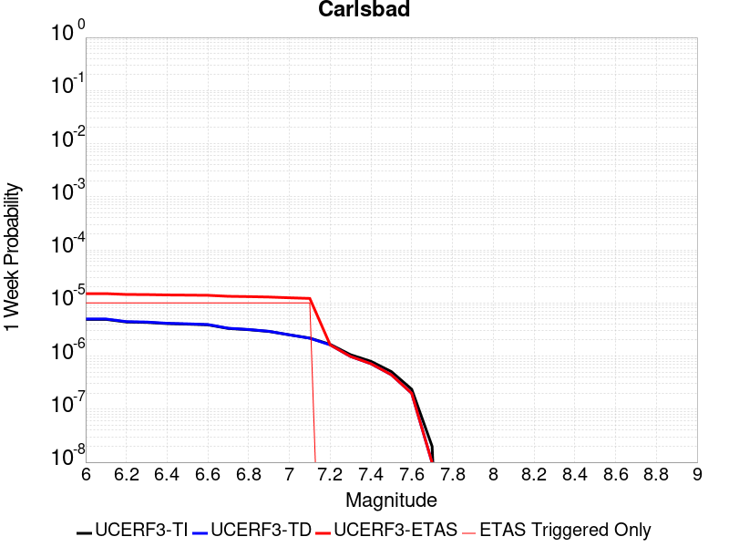 | 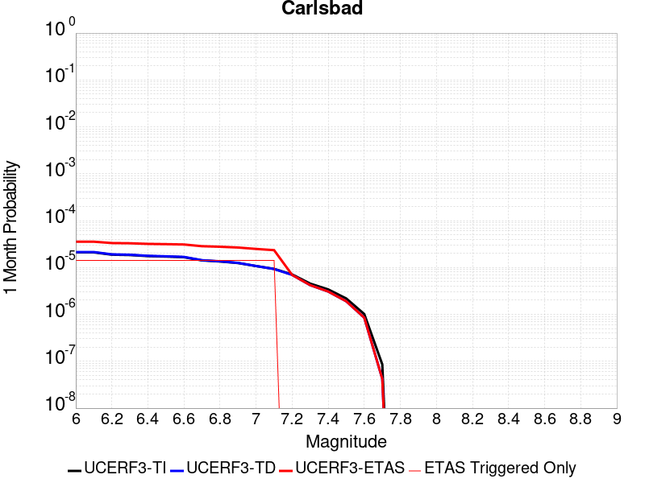 | 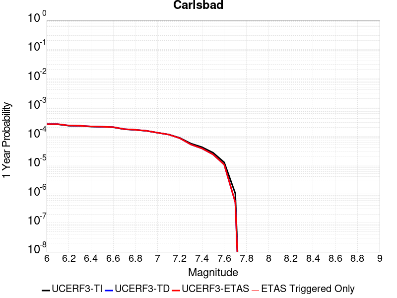 | 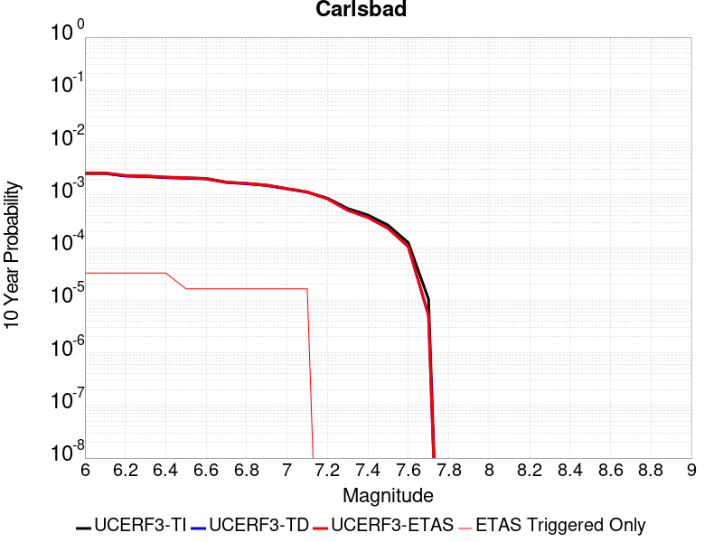 |

| Magnitude | 1 wk TI Prob | 1 wk TD Prob | 1 wk ETAS Prob | 1 wk ETAS/TD Gain | 1 wk ETAS Triggered Only | 1 mo TI Prob | 1 mo TD Prob | 1 mo ETAS Prob | 1 mo ETAS/TD Gain | 1 mo ETAS Triggered Only | 1 yr TI Prob | 1 yr TD Prob | 1 yr ETAS Prob | 1 yr ETAS/TD Gain | 1 yr ETAS Triggered Only | 10 yr TI Prob | 10 yr TD Prob | 10 yr ETAS Prob | 10 yr ETAS/TD Gain | 10 yr ETAS Triggered Only |
|-----|-----|-----|-----|-----|-----|-----|-----|-----|-----|-----|-----|-----|-----|-----|-----|-----|-----|-----|-----|-----|
| 6.0 | 4.9038536E-6 | 4.9872688E-6 | 1.4987219E-5 | 3.0050955 | 1.0E-5 | 2.1016345E-5 | 2.1373837E-5 | 3.1373624E-5 | 1.4678518 | 1.0E-5 | 2.5584397E-4 | 2.6019584E-4 | 2.7019324E-4 | 1.0384226 | 1.0E-5 | 0.002555496 | 0.002598959 | 0.002618907 | 1.0076754 | 2.0E-5 |
| 6.1 | 4.9038536E-6 | 4.9872688E-6 | 1.4987219E-5 | 3.0050955 | 1.0E-5 | 2.1016345E-5 | 2.1373837E-5 | 3.1373624E-5 | 1.4678518 | 1.0E-5 | 2.5584397E-4 | 2.6019584E-4 | 2.7019324E-4 | 1.0384226 | 1.0E-5 | 0.002555496 | 0.002598959 | 0.002618907 | 1.0076754 | 2.0E-5 |
| 6.2 | 4.3820614E-6 | 4.4547814E-6 | 1.4454737E-5 | 3.244769 | 1.0E-5 | 1.8780129E-5 | 1.9091782E-5 | 2.909159E-5 | 1.5237756 | 1.0E-5 | 2.2862408E-4 | 2.3241801E-4 | 2.4241568E-4 | 1.043016 | 1.0E-5 | 0.00228389 | 0.002321785 | 0.0023417387 | 1.008594 | 2.0E-5 |
| 6.3 | 4.302872E-6 | 4.373019E-6 | 1.4372975E-5 | 3.2867398 | 1.0E-5 | 1.8440749E-5 | 1.8741377E-5 | 2.874119E-5 | 1.5335687 | 1.0E-5 | 2.24493E-4 | 2.2815271E-4 | 2.3815043E-4 | 1.0438203 | 1.0E-5 | 0.0022426634 | 0.0022792201 | 0.0022991744 | 1.008755 | 2.0E-5 |
| 6.4 | 4.0835243E-6 | 4.147667E-6 | 1.4147626E-5 | 3.410984 | 1.0E-5 | 1.75007E-5 | 1.7775597E-5 | 2.7775419E-5 | 1.562559 | 1.0E-5 | 2.1305021E-4 | 2.1639673E-4 | 2.2639456E-4 | 1.0462015 | 1.0E-5 | 0.0021284607 | 0.0021618942 | 0.002181851 | 1.0092311 | 2.0E-5 |
| 6.5 | 3.987806E-6 | 4.048899E-6 | 1.4048858E-5 | 3.4697971 | 1.0E-5 | 1.7090486E-5 | 1.7352311E-5 | 2.7352138E-5 | 1.5762821 | 1.0E-5 | 2.080568E-4 | 2.1124425E-4 | 2.2124212E-4 | 1.0473286 | 1.0E-5 | 0.002078621 | 0.0021104682 | 0.002120447 | 1.0047283 | 1.0E-5 |
| 6.6 | 3.8707576E-6 | 3.927501E-6 | 1.3927462E-5 | 3.5461383 | 1.0E-5 | 1.6588854E-5 | 1.683204E-5 | 2.683187E-5 | 1.5940951 | 1.0E-5 | 2.0195059E-4 | 2.0491115E-4 | 2.149091E-4 | 1.0487916 | 1.0E-5 | 0.0020176715 | 0.0020472556 | 0.0020572352 | 1.0048746 | 1.0E-5 |
| 6.7 | 3.3093434E-6 | 3.3424044E-6 | 1.3342371E-5 | 3.9918482 | 1.0E-5 | 1.4182823E-5 | 1.4324512E-5 | 2.4324368E-5 | 1.698094 | 1.0E-5 | 1.7266218E-4 | 1.7438704E-4 | 1.843853E-4 | 1.0573337 | 1.0E-5 | 0.001725281 | 0.001742508 | 0.0017524905 | 1.0057288 | 1.0E-5 |
| 6.8 | 3.136983E-6 | 3.1664663E-6 | 1.3166435E-5 | 4.1580844 | 1.0E-5 | 1.3444143E-5 | 1.35704995E-5 | 2.3570365E-5 | 1.7368826 | 1.0E-5 | 1.6367015E-4 | 1.6520836E-4 | 1.752067E-4 | 1.0605196 | 1.0E-5 | 0.0016354966 | 0.0016508611 | 0.0016608447 | 1.0060475 | 1.0E-5 |
| 6.9 | 2.9056644E-6 | 2.9267715E-6 | 1.2926742E-5 | 4.416724 | 1.0E-5 | 1.2452788E-5 | 1.2543246E-5 | 2.2543121E-5 | 1.7972318 | 1.0E-5 | 1.5160214E-4 | 1.5270336E-4 | 1.6270184E-4 | 1.0654764 | 1.0E-5 | 0.0015149876 | 0.0015259896 | 0.0015359744 | 1.0065432 | 1.0E-5 |
| 7.0 | 2.5071035E-6 | 2.51141E-6 | 1.2511385E-5 | 4.981817 | 1.0E-5 | 1.0744685E-5 | 1.0763142E-5 | 2.0763035E-5 | 1.9290868 | 1.0E-5 | 1.308087E-4 | 1.310334E-4 | 1.4103208E-4 | 1.0763065 | 1.0E-5 | 0.0013073172 | 0.0013095647 | 0.0013195515 | 1.0076262 | 1.0E-5 |
| 7.1 | 2.1786877E-6 | 2.1678952E-6 | 1.2167873E-5 | 5.612759 | 1.0E-5 | 9.3372E-6 | 9.290947E-6 | 1.9290854E-5 | 2.0763066 | 1.0E-5 | 1.13674476E-4 | 1.13111426E-4 | 1.231103E-4 | 1.0883983 | 1.0E-5 | 0.0011361635 | 0.0011305414 | 0.0011405301 | 1.0088353 | 1.0E-5 |
| 7.2 | 1.6628418E-6 | 1.6213987E-6 | 1.6213987E-6 | 1.0 | 0.0 | 7.1264453E-6 | 6.9488333E-6 | 6.9488333E-6 | 1.0 | 0.0 | 8.676102E-5 | 8.459878E-5 | 8.459878E-5 | 1.0 | 0.0 | 8.672715E-4 | 8.4566796E-4 | 8.4566796E-4 | 1.0 | 0.0 |
| 7.3 | 1.0595926E-6 | 9.816912E-7 | 9.816912E-7 | 1.0 | 0.0 | 4.541103E-6 | 4.207241E-6 | 4.207241E-6 | 1.0 | 0.0 | 5.5286528E-5 | 5.1221967E-5 | 5.1221967E-5 | 1.0 | 0.0 | 5.527277E-4 | 5.121025E-4 | 5.121025E-4 | 1.0 | 0.0 |
| 7.4 | 7.956623E-7 | 7.173889E-7 | 7.173889E-7 | 1.0 | 0.0 | 3.4099767E-6 | 3.0745202E-6 | 3.0745202E-6 | 1.0 | 0.0 | 4.1515676E-5 | 3.7431648E-5 | 3.7431648E-5 | 1.0 | 0.0 | 4.150792E-4 | 3.7425413E-4 | 3.7425413E-4 | 1.0 | 0.0 |
| 7.5 | 5.1043804E-7 | 4.448447E-7 | 4.448447E-7 | 1.0 | 0.0 | 2.1875896E-6 | 1.9064759E-6 | 1.9064759E-6 | 1.0 | 0.0 | 2.663358E-5 | 2.3211102E-5 | 2.3211102E-5 | 1.0 | 0.0 | 2.6630386E-4 | 2.3208735E-4 | 2.3208735E-4 | 1.0 | 0.0 |
| 7.6 | 2.3723294E-7 | 1.9896439E-7 | 1.9896439E-7 | 1.0 | 0.0 | 1.0167122E-6 | 8.527042E-7 | 8.527042E-7 | 1.0 | 0.0 | 1.2378401E-5 | 1.0381627E-5 | 1.0381627E-5 | 1.0 | 0.0 | 1.237771E-4 | 1.038117E-4 | 1.038117E-4 | 1.0 | 0.0 |
| 7.7 | 1.9992152E-8 | 9.860285E-9 | 9.860285E-9 | 1.0 | 0.0 | 8.568065E-8 | 4.2258364E-8 | 4.2258364E-8 | 1.0 | 0.0 | 1.0431614E-6 | 5.144956E-7 | 5.144956E-7 | 1.0 | 0.0 | 1.0431565E-5 | 5.144956E-6 | 5.144956E-6 | 1.0 | 0.0 |

## Great Valley 05 Pittsburg - Kirby Hills alt1
*[(top)](#table-of-contents)*

| 1 Week | 1 Month | 1 Year | 10 Year |
|-----|-----|-----|-----|
| 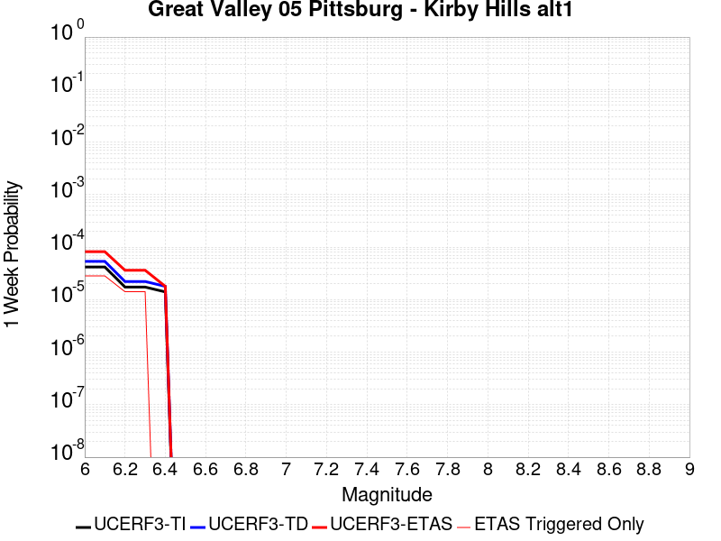 | 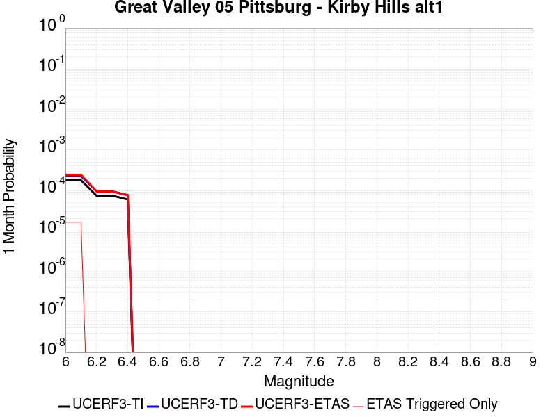 | 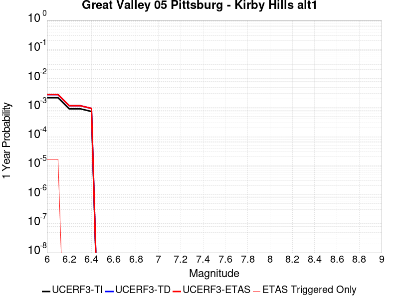 | 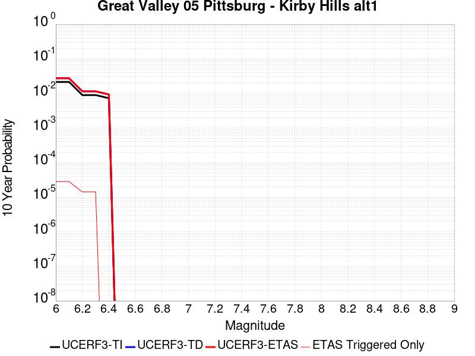 |

| Magnitude | 1 wk TI Prob | 1 wk TD Prob | 1 wk ETAS Prob | 1 wk ETAS/TD Gain | 1 wk ETAS Triggered Only | 1 mo TI Prob | 1 mo TD Prob | 1 mo ETAS Prob | 1 mo ETAS/TD Gain | 1 mo ETAS Triggered Only | 1 yr TI Prob | 1 yr TD Prob | 1 yr ETAS Prob | 1 yr ETAS/TD Gain | 1 yr ETAS Triggered Only | 10 yr TI Prob | 10 yr TD Prob | 10 yr ETAS Prob | 10 yr ETAS/TD Gain | 10 yr ETAS Triggered Only |
|-----|-----|-----|-----|-----|-----|-----|-----|-----|-----|-----|-----|-----|-----|-----|-----|-----|-----|-----|-----|-----|
| 6.0 | 4.187212E-5 | 5.344289E-5 | 7.344182E-5 | 1.3742112 | 2.0E-5 | 1.794396E-4 | 2.2902661E-4 | 2.4902204E-4 | 1.0873061 | 2.0E-5 | 0.002182488 | 0.0027857998 | 0.002805744 | 1.0071592 | 2.0E-5 | 0.021611776 | 0.027603218 | 0.027622666 | 1.0007045 | 2.0E-5 |
| 6.1 | 4.187212E-5 | 5.344289E-5 | 7.344182E-5 | 1.3742112 | 2.0E-5 | 1.794396E-4 | 2.2902661E-4 | 2.4902204E-4 | 1.0873061 | 2.0E-5 | 0.002182488 | 0.0027857998 | 0.002805744 | 1.0071592 | 2.0E-5 | 0.021611776 | 0.027603218 | 0.027622666 | 1.0007045 | 2.0E-5 |
| 6.2 | 1.7353306E-5 | 2.2154672E-5 | 3.215445E-5 | 1.451362 | 1.0E-5 | 7.436919E-5 | 9.4947456E-5 | 1.04946506E-4 | 1.1053114 | 1.0E-5 | 9.050688E-4 | 0.0011557573 | 0.0011657458 | 1.0086423 | 1.0E-5 | 0.009013915 | 0.0115352 | 0.011545085 | 1.0008569 | 1.0E-5 |
| 6.3 | 1.7353306E-5 | 2.2154672E-5 | 3.215445E-5 | 1.451362 | 1.0E-5 | 7.436919E-5 | 9.4947456E-5 | 1.04946506E-4 | 1.1053114 | 1.0E-5 | 9.050688E-4 | 0.0011557573 | 0.0011657458 | 1.0086423 | 1.0E-5 | 0.009013915 | 0.0115352 | 0.011545085 | 1.0008569 | 1.0E-5 |
| 6.4 | 1.4028824E-5 | 1.7901062E-5 | 1.7901062E-5 | 1.0 | 0.0 | 6.0122147E-5 | 7.671883E-5 | 7.671883E-5 | 1.0 | 0.0 | 7.3174125E-4 | 9.340303E-4 | 9.340303E-4 | 1.0 | 0.0 | 0.0072933645 | 0.009338211 | 0.009338211 | 1.0 | 0.0 |

## Sierra Madre (San Fernando)
*[(top)](#table-of-contents)*

| 1 Week | 1 Month | 1 Year | 10 Year |
|-----|-----|-----|-----|
|  |  | 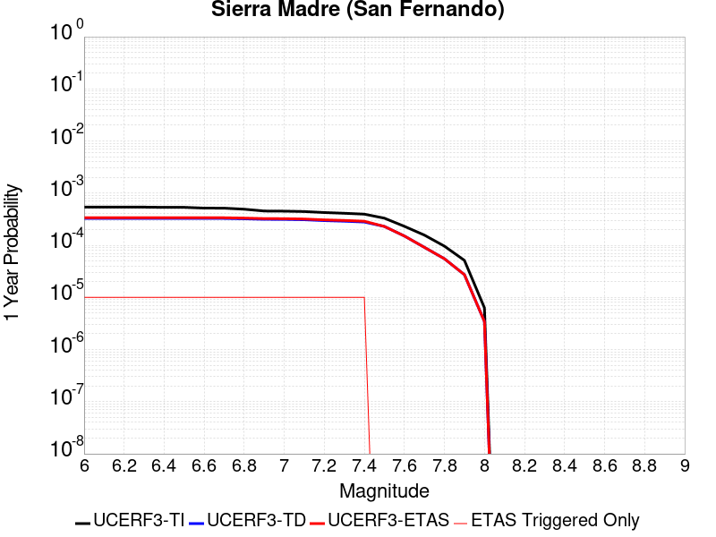 |  |

| Magnitude | 1 wk TI Prob | 1 wk TD Prob | 1 wk ETAS Prob | 1 wk ETAS/TD Gain | 1 wk ETAS Triggered Only | 1 mo TI Prob | 1 mo TD Prob | 1 mo ETAS Prob | 1 mo ETAS/TD Gain | 1 mo ETAS Triggered Only | 1 yr TI Prob | 1 yr TD Prob | 1 yr ETAS Prob | 1 yr ETAS/TD Gain | 1 yr ETAS Triggered Only | 10 yr TI Prob | 10 yr TD Prob | 10 yr ETAS Prob | 10 yr ETAS/TD Gain | 10 yr ETAS Triggered Only |
|-----|-----|-----|-----|-----|-----|-----|-----|-----|-----|-----|-----|-----|-----|-----|-----|-----|-----|-----|-----|-----|
| 6.0 | 1.0346413E-5 | 6.2872386E-6 | 6.2872386E-6 | 1.0 | 0.0 | 4.4341014E-5 | 2.6945036E-5 | 2.6945036E-5 | 1.0 | 0.0 | 5.3971814E-4 | 3.2800753E-4 | 3.3800426E-4 | 1.030477 | 1.0E-5 | 0.0053840918 | 0.0032753467 | 0.0032952812 | 1.0060862 | 2.0E-5 |
| 6.1 | 1.0346413E-5 | 6.2872386E-6 | 6.2872386E-6 | 1.0 | 0.0 | 4.4341014E-5 | 2.6945036E-5 | 2.6945036E-5 | 1.0 | 0.0 | 5.3971814E-4 | 3.2800753E-4 | 3.3800426E-4 | 1.030477 | 1.0E-5 | 0.0053840918 | 0.0032753467 | 0.0032952812 | 1.0060862 | 2.0E-5 |
| 6.2 | 1.0346413E-5 | 6.2872386E-6 | 6.2872386E-6 | 1.0 | 0.0 | 4.4341014E-5 | 2.6945036E-5 | 2.6945036E-5 | 1.0 | 0.0 | 5.3971814E-4 | 3.2800753E-4 | 3.3800426E-4 | 1.030477 | 1.0E-5 | 0.0053840918 | 0.0032753467 | 0.0032952812 | 1.0060862 | 2.0E-5 |
| 6.3 | 1.0346413E-5 | 6.2872386E-6 | 6.2872386E-6 | 1.0 | 0.0 | 4.4341014E-5 | 2.6945036E-5 | 2.6945036E-5 | 1.0 | 0.0 | 5.3971814E-4 | 3.2800753E-4 | 3.3800426E-4 | 1.030477 | 1.0E-5 | 0.0053840918 | 0.0032753467 | 0.0032952812 | 1.0060862 | 2.0E-5 |
| 6.4 | 1.0249558E-5 | 6.2872386E-6 | 6.2872386E-6 | 1.0 | 0.0 | 4.392594E-5 | 2.6945036E-5 | 2.6945036E-5 | 1.0 | 0.0 | 5.3466705E-4 | 3.2800753E-4 | 3.3800426E-4 | 1.030477 | 1.0E-5 | 0.0053338245 | 0.0032753467 | 0.0032952812 | 1.0060862 | 2.0E-5 |
| 6.5 | 1.0249558E-5 | 6.2872386E-6 | 6.2872386E-6 | 1.0 | 0.0 | 4.392594E-5 | 2.6945036E-5 | 2.6945036E-5 | 1.0 | 0.0 | 5.3466705E-4 | 3.2800753E-4 | 3.3800426E-4 | 1.030477 | 1.0E-5 | 0.0053338245 | 0.0032753467 | 0.0032952812 | 1.0060862 | 2.0E-5 |
| 6.6 | 9.9035515E-6 | 6.2872386E-6 | 6.2872386E-6 | 1.0 | 0.0 | 4.2443102E-5 | 2.6945036E-5 | 2.6945036E-5 | 1.0 | 0.0 | 5.166222E-4 | 3.2800753E-4 | 3.3800426E-4 | 1.030477 | 1.0E-5 | 0.0051542283 | 0.0032753467 | 0.0032952812 | 1.0060862 | 2.0E-5 |
| 6.7 | 9.87217E-6 | 6.274661E-6 | 6.274661E-6 | 1.0 | 0.0 | 4.2308613E-5 | 2.6891132E-5 | 2.6891132E-5 | 1.0 | 0.0 | 5.149856E-4 | 3.2735144E-4 | 3.3734817E-4 | 1.0305382 | 1.0E-5 | 0.005137938 | 0.003268805 | 0.0032887396 | 1.0060984 | 2.0E-5 |
| 6.8 | 9.4359175E-6 | 6.1786473E-6 | 6.1786473E-6 | 1.0 | 0.0 | 4.043902E-5 | 2.6479653E-5 | 2.6479653E-5 | 1.0 | 0.0 | 4.9223384E-4 | 3.223432E-4 | 3.3233996E-4 | 1.0310129 | 1.0E-5 | 0.0049114493 | 0.0032188678 | 0.0032388035 | 1.0061934 | 2.0E-5 |
| 6.9 | 8.700447E-6 | 6.0399334E-6 | 6.0399334E-6 | 1.0 | 0.0 | 3.72871E-5 | 2.5885178E-5 | 2.5885178E-5 | 1.0 | 0.0 | 4.5387587E-4 | 3.1510755E-4 | 3.251044E-4 | 1.0317252 | 1.0E-5 | 0.0045295 | 0.0031467169 | 0.003166654 | 1.0063359 | 2.0E-5 |
| 7.0 | 8.648878E-6 | 6.014848E-6 | 6.014848E-6 | 1.0 | 0.0 | 3.7066096E-5 | 2.5777672E-5 | 2.5777672E-5 | 1.0 | 0.0 | 4.5118626E-4 | 3.1379904E-4 | 3.2379592E-4 | 1.0318575 | 1.0E-5 | 0.004502713 | 0.0031336688 | 0.003153606 | 1.0063623 | 2.0E-5 |
| 7.1 | 8.505786E-6 | 5.9244794E-6 | 5.9244794E-6 | 1.0 | 0.0 | 3.645286E-5 | 2.5390384E-5 | 2.5390384E-5 | 1.0 | 0.0 | 4.437232E-4 | 3.0908515E-4 | 3.1908206E-4 | 1.0323435 | 1.0E-5 | 0.0044283825 | 0.0030866617 | 0.0031066 | 1.0064595 | 2.0E-5 |
| 7.2 | 8.139752E-6 | 5.698777E-6 | 5.698777E-6 | 1.0 | 0.0 | 3.4884186E-5 | 2.4423107E-5 | 2.4423107E-5 | 1.0 | 0.0 | 4.246322E-4 | 2.973118E-4 | 3.0730883E-4 | 1.0336248 | 1.0E-5 | 0.004238217 | 0.0029692466 | 0.0029891871 | 1.0067158 | 2.0E-5 |
| 7.3 | 7.8816E-6 | 5.5520936E-6 | 5.5520936E-6 | 1.0 | 0.0 | 3.3777847E-5 | 2.3794475E-5 | 2.3794475E-5 | 1.0 | 0.0 | 4.111677E-4 | 2.8966027E-4 | 2.9965737E-4 | 1.0345132 | 1.0E-5 | 0.004104078 | 0.0028929329 | 0.002912875 | 1.0068934 | 2.0E-5 |
| 7.4 | 7.5810603E-6 | 5.356333E-6 | 5.356333E-6 | 1.0 | 0.0 | 3.2489854E-5 | 2.2955517E-5 | 2.2955517E-5 | 1.0 | 0.0 | 3.9549218E-4 | 2.7944864E-4 | 2.8944583E-4 | 1.0357747 | 1.0E-5 | 0.0039478904 | 0.0027910774 | 0.0028110216 | 1.0071456 | 2.0E-5 |
| 7.5 | 6.349153E-6 | 4.4075887E-6 | 4.4075887E-6 | 1.0 | 0.0 | 2.7210372E-5 | 1.8889532E-5 | 1.8889532E-5 | 1.0 | 0.0 | 3.312359E-4 | 2.2995661E-4 | 2.2995661E-4 | 1.0 | 0.0 | 0.0033074263 | 0.0022972687 | 0.0023072457 | 1.004343 | 1.0E-5 |
| 7.6 | 4.430576E-6 | 2.8905786E-6 | 2.8905786E-6 | 1.0 | 0.0 | 1.8988047E-5 | 1.23881355E-5 | 1.23881355E-5 | 1.0 | 0.0 | 2.3115493E-4 | 1.5081534E-4 | 1.5081534E-4 | 1.0 | 0.0 | 0.0023091463 | 0.0015071525 | 0.0015171374 | 1.006625 | 1.0E-5 |
| 7.7 | 3.005066E-6 | 1.7509823E-6 | 1.7509823E-6 | 1.0 | 0.0 | 1.2878791E-5 | 7.504188E-6 | 7.504188E-6 | 1.0 | 0.0 | 1.56788E-4 | 9.135967E-5 | 9.135967E-5 | 1.0 | 0.0 | 0.0015667742 | 9.1322226E-4 | 9.1322226E-4 | 1.0 | 0.0 |
| 7.8 | 1.8459098E-6 | 1.0581826E-6 | 1.0581826E-6 | 1.0 | 0.0 | 7.911018E-6 | 4.5350607E-6 | 4.5350607E-6 | 1.0 | 0.0 | 9.631238E-5 | 5.5212968E-5 | 5.5212968E-5 | 1.0 | 0.0 | 9.627065E-4 | 5.5199297E-4 | 5.5199297E-4 | 1.0 | 0.0 |
| 7.9 | 9.839262E-7 | 5.2340516E-7 | 5.2340516E-7 | 1.0 | 0.0 | 4.2168194E-6 | 2.243163E-6 | 2.243163E-6 | 1.0 | 0.0 | 5.1338568E-5 | 2.731017E-5 | 2.731017E-5 | 1.0 | 0.0 | 5.132671E-4 | 2.7306844E-4 | 2.7306844E-4 | 1.0 | 0.0 |
| 8.0 | 1.210983E-7 | 6.613497E-8 | 6.613497E-8 | 1.0 | 0.0 | 5.1899264E-7 | 2.8343558E-7 | 2.8343558E-7 | 1.0 | 0.0 | 6.3187167E-6 | 3.4508228E-6 | 3.4508228E-6 | 1.0 | 0.0 | 6.318537E-5 | 3.450771E-5 | 3.450771E-5 | 1.0 | 0.0 |

## Santa Monica alt 1
*[(top)](#table-of-contents)*

| 1 Week | 1 Month | 1 Year | 10 Year |
|-----|-----|-----|-----|
| 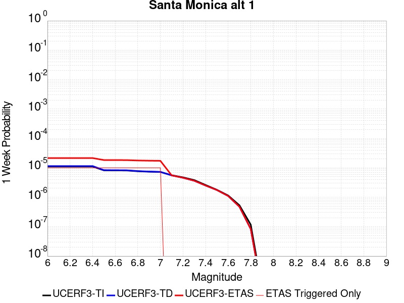 |  |  |  |

| Magnitude | 1 wk TI Prob | 1 wk TD Prob | 1 wk ETAS Prob | 1 wk ETAS/TD Gain | 1 wk ETAS Triggered Only | 1 mo TI Prob | 1 mo TD Prob | 1 mo ETAS Prob | 1 mo ETAS/TD Gain | 1 mo ETAS Triggered Only | 1 yr TI Prob | 1 yr TD Prob | 1 yr ETAS Prob | 1 yr ETAS/TD Gain | 1 yr ETAS Triggered Only | 10 yr TI Prob | 10 yr TD Prob | 10 yr ETAS Prob | 10 yr ETAS/TD Gain | 10 yr ETAS Triggered Only |
|-----|-----|-----|-----|-----|-----|-----|-----|-----|-----|-----|-----|-----|-----|-----|-----|-----|-----|-----|-----|-----|
| 6.0 | 1.1066008E-5 | 1.1480312E-5 | 2.1480198E-5 | 1.8710464 | 1.0E-5 | 4.742488E-5 | 4.920049E-5 | 5.92E-5 | 1.20324 | 1.0E-5 | 5.7724497E-4 | 5.9886527E-4 | 6.088593E-4 | 1.0166882 | 1.0E-5 | 0.005757478 | 0.0059739016 | 0.005993782 | 1.0033278 | 2.0E-5 |
| 6.1 | 1.1066008E-5 | 1.1480312E-5 | 2.1480198E-5 | 1.8710464 | 1.0E-5 | 4.742488E-5 | 4.920049E-5 | 5.92E-5 | 1.20324 | 1.0E-5 | 5.7724497E-4 | 5.9886527E-4 | 6.088593E-4 | 1.0166882 | 1.0E-5 | 0.005757478 | 0.0059739016 | 0.005993782 | 1.0033278 | 2.0E-5 |
| 6.2 | 1.1066008E-5 | 1.1480312E-5 | 2.1480198E-5 | 1.8710464 | 1.0E-5 | 4.742488E-5 | 4.920049E-5 | 5.92E-5 | 1.20324 | 1.0E-5 | 5.7724497E-4 | 5.9886527E-4 | 6.088593E-4 | 1.0166882 | 1.0E-5 | 0.005757478 | 0.0059739016 | 0.005993782 | 1.0033278 | 2.0E-5 |
| 6.3 | 1.1066008E-5 | 1.1480312E-5 | 2.1480198E-5 | 1.8710464 | 1.0E-5 | 4.742488E-5 | 4.920049E-5 | 5.92E-5 | 1.20324 | 1.0E-5 | 5.7724497E-4 | 5.9886527E-4 | 6.088593E-4 | 1.0166882 | 1.0E-5 | 0.005757478 | 0.0059739016 | 0.005993782 | 1.0033278 | 2.0E-5 |
| 6.4 | 1.1066008E-5 | 1.1480312E-5 | 2.1480198E-5 | 1.8710464 | 1.0E-5 | 4.742488E-5 | 4.920049E-5 | 5.92E-5 | 1.20324 | 1.0E-5 | 5.7724497E-4 | 5.9886527E-4 | 6.088593E-4 | 1.0166882 | 1.0E-5 | 0.005757478 | 0.0059739016 | 0.005993782 | 1.0033278 | 2.0E-5 |
| 6.5 | 8.183544E-6 | 8.335434E-6 | 1.8335351E-5 | 2.1996875 | 1.0E-5 | 3.5071862E-5 | 3.572281E-5 | 4.5722452E-5 | 1.2799232 | 1.0E-5 | 4.2691626E-4 | 4.3483998E-4 | 4.4483563E-4 | 1.022987 | 1.0E-5 | 0.0042609703 | 0.004340057 | 0.0043500136 | 1.0022941 | 1.0E-5 |
| 6.6 | 8.1543285E-6 | 8.303648E-6 | 1.8303565E-5 | 2.20428 | 1.0E-5 | 3.4946657E-5 | 3.558659E-5 | 4.5586232E-5 | 1.2809948 | 1.0E-5 | 4.2539247E-4 | 4.3318217E-4 | 4.4317782E-4 | 1.023075 | 1.0E-5 | 0.0042457907 | 0.004323543 | 0.0043335 | 1.0023029 | 1.0E-5 |
| 6.7 | 8.110878E-6 | 8.257045E-6 | 1.8256962E-5 | 2.211077 | 1.0E-5 | 3.4760444E-5 | 3.5386864E-5 | 4.538651E-5 | 1.2825807 | 1.0E-5 | 4.231262E-4 | 4.3075148E-4 | 4.407472E-4 | 1.0232053 | 1.0E-5 | 0.0042232145 | 0.004299331 | 0.0043092878 | 1.002316 | 1.0E-5 |
| 6.8 | 7.644036E-6 | 7.751063E-6 | 1.7750985E-5 | 2.2901356 | 1.0E-5 | 3.275974E-5 | 3.3218425E-5 | 4.3218093E-5 | 1.3010278 | 1.0E-5 | 3.9877684E-4 | 4.043607E-4 | 4.1435665E-4 | 1.0247204 | 1.0E-5 | 0.00398062 | 0.004036396 | 0.0040463554 | 1.0024675 | 1.0E-5 |
| 6.9 | 7.3698293E-6 | 7.4557215E-6 | 1.7455646E-5 | 2.3412418 | 1.0E-5 | 3.15846E-5 | 3.195271E-5 | 4.195239E-5 | 1.3129525 | 1.0E-5 | 3.8447464E-4 | 3.889562E-4 | 3.9895228E-4 | 1.0256999 | 1.0E-5 | 0.0038381014 | 0.0038828978 | 0.003892859 | 1.0025654 | 1.0E-5 |
| 7.0 | 7.209872E-6 | 7.2856283E-6 | 1.7285556E-5 | 2.3725553 | 1.0E-5 | 3.0899086E-5 | 3.1223753E-5 | 4.1223444E-5 | 1.320259 | 1.0E-5 | 3.7613141E-4 | 3.800843E-4 | 3.900805E-4 | 1.0263 | 1.0E-5 | 0.0037549543 | 0.003794485 | 0.003804447 | 1.0026253 | 1.0E-5 |
| 7.1 | 5.603456E-6 | 5.5238947E-6 | 5.5238947E-6 | 1.0 | 0.0 | 2.4014591E-5 | 2.3673623E-5 | 2.3673623E-5 | 1.0 | 0.0 | 2.923384E-4 | 2.8818863E-4 | 2.8818863E-4 | 1.0 | 0.0 | 0.0029195412 | 0.002878191 | 0.002878191 | 1.0 | 0.0 |
| 7.2 | 4.7483613E-6 | 4.591135E-6 | 4.591135E-6 | 1.0 | 0.0 | 2.0349962E-5 | 1.9676147E-5 | 1.9676147E-5 | 1.0 | 0.0 | 2.4773262E-4 | 2.3953087E-4 | 2.3953087E-4 | 1.0 | 0.0 | 0.0024745662 | 0.0023927412 | 0.0023927412 | 1.0 | 0.0 |
| 7.3 | 3.829015E-6 | 3.6342271E-6 | 3.6342271E-6 | 1.0 | 0.0 | 1.6409962E-5 | 1.5575166E-5 | 1.5575166E-5 | 1.0 | 0.0 | 1.9977297E-4 | 1.8961124E-4 | 1.8961124E-4 | 1.0 | 0.0 | 0.0019959346 | 0.0018945034 | 0.0018945034 | 1.0 | 0.0 |
| 7.4 | 2.610755E-6 | 2.4995722E-6 | 2.4995722E-6 | 1.0 | 0.0 | 1.1188902E-5 | 1.0712408E-5 | 1.0712408E-5 | 1.0 | 0.0 | 1.3621636E-4 | 1.304158E-4 | 1.304158E-4 | 1.0 | 0.0 | 0.001361329 | 0.0013033971 | 0.0013033971 | 1.0 | 0.0 |
| 7.5 | 1.792146E-6 | 1.7584194E-6 | 1.7584194E-6 | 1.0 | 0.0 | 7.680603E-6 | 7.5360617E-6 | 7.5360617E-6 | 1.0 | 0.0 | 9.3507326E-5 | 9.174772E-5 | 9.174772E-5 | 1.0 | 0.0 | 9.3467993E-4 | 9.1710157E-4 | 9.1710157E-4 | 1.0 | 0.0 |
| 7.6 | 1.1473018E-6 | 1.102916E-6 | 1.102916E-6 | 1.0 | 0.0 | 4.9169985E-6 | 4.7267745E-6 | 4.7267745E-6 | 1.0 | 0.0 | 5.986281E-5 | 5.7546975E-5 | 5.7546975E-5 | 1.0 | 0.0 | 5.984669E-4 | 5.753224E-4 | 5.753224E-4 | 1.0 | 0.0 |
| 7.7 | 5.330919E-7 | 4.7452562E-7 | 4.7452562E-7 | 1.0 | 0.0 | 2.2846775E-6 | 2.0336797E-6 | 2.0336797E-6 | 1.0 | 0.0 | 2.7815593E-5 | 2.4759782E-5 | 2.4759782E-5 | 1.0 | 0.0 | 2.7812112E-4 | 2.4757136E-4 | 2.4757136E-4 | 1.0 | 0.0 |
| 7.8 | 1.1668574E-7 | 8.296564E-8 | 8.296564E-8 | 1.0 | 0.0 | 5.000816E-7 | 3.5556698E-7 | 3.5556698E-7 | 1.0 | 0.0 | 6.0884768E-6 | 4.3290197E-6 | 4.3290197E-6 | 1.0 | 0.0 | 6.08831E-5 | 4.3289383E-5 | 4.3289383E-5 | 1.0 | 0.0 |
| 7.9 | 8.007447E-10 | 6.161581E-10 | 6.161581E-10 | 1.0 | 0.0 | 3.4317629E-9 | 2.640678E-9 | 2.640678E-9 | 1.0 | 0.0 | 4.1781714E-8 | 3.2150254E-8 | 3.2150254E-8 | 1.0 | 0.0 | 4.1781706E-7 | 3.2150248E-7 | 3.2150248E-7 | 1.0 | 0.0 |

## Great Valley 10 (Panoche)
*[(top)](#table-of-contents)*

| 1 Week | 1 Month | 1 Year | 10 Year |
|-----|-----|-----|-----|
|  |  | 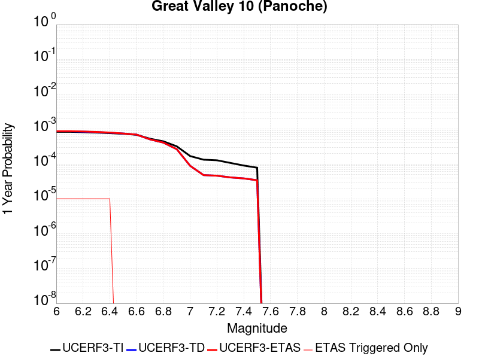 | 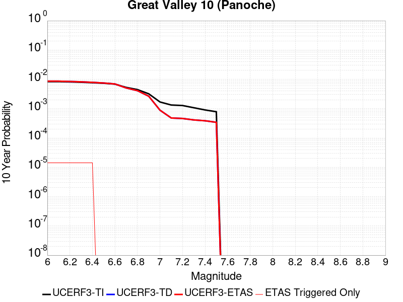 |

| Magnitude | 1 wk TI Prob | 1 wk TD Prob | 1 wk ETAS Prob | 1 wk ETAS/TD Gain | 1 wk ETAS Triggered Only | 1 mo TI Prob | 1 mo TD Prob | 1 mo ETAS Prob | 1 mo ETAS/TD Gain | 1 mo ETAS Triggered Only | 1 yr TI Prob | 1 yr TD Prob | 1 yr ETAS Prob | 1 yr ETAS/TD Gain | 1 yr ETAS Triggered Only | 10 yr TI Prob | 10 yr TD Prob | 10 yr ETAS Prob | 10 yr ETAS/TD Gain | 10 yr ETAS Triggered Only |
|-----|-----|-----|-----|-----|-----|-----|-----|-----|-----|-----|-----|-----|-----|-----|-----|-----|-----|-----|-----|-----|
| 6.0 | 1.6014626E-5 | 1.6575357E-5 | 1.6575357E-5 | 1.0 | 0.0 | 6.863231E-5 | 7.103534E-5 | 7.103534E-5 | 1.0 | 0.0 | 8.35278E-4 | 8.6451764E-4 | 8.74509E-4 | 1.0115571 | 1.0E-5 | 0.008321454 | 0.008612158 | 0.008622072 | 1.0011512 | 1.0E-5 |
| 6.1 | 1.6014626E-5 | 1.6575357E-5 | 1.6575357E-5 | 1.0 | 0.0 | 6.863231E-5 | 7.103534E-5 | 7.103534E-5 | 1.0 | 0.0 | 8.35278E-4 | 8.6451764E-4 | 8.74509E-4 | 1.0115571 | 1.0E-5 | 0.008321454 | 0.008612158 | 0.008622072 | 1.0011512 | 1.0E-5 |
| 6.2 | 1.56782E-5 | 1.6198404E-5 | 1.6198404E-5 | 1.0 | 0.0 | 6.719056E-5 | 6.941991E-5 | 6.941991E-5 | 1.0 | 0.0 | 8.17738E-4 | 8.4486516E-4 | 8.5485674E-4 | 1.0118262 | 1.0E-5 | 0.008147354 | 0.008417133 | 0.008427049 | 1.001178 | 1.0E-5 |
| 6.3 | 1.5263338E-5 | 1.5723472E-5 | 1.5723472E-5 | 1.0 | 0.0 | 6.541267E-5 | 6.73846E-5 | 6.73846E-5 | 1.0 | 0.0 | 7.961082E-4 | 8.201041E-4 | 8.3009584E-4 | 1.0121835 | 1.0E-5 | 0.007932622 | 0.008171363 | 0.008181281 | 1.0012138 | 1.0E-5 |
| 6.4 | 1.4720723E-5 | 1.5099334E-5 | 1.5099334E-5 | 1.0 | 0.0 | 6.308728E-5 | 6.470986E-5 | 6.470986E-5 | 1.0 | 0.0 | 7.67817E-4 | 7.87563E-4 | 7.975551E-4 | 1.0126874 | 1.0E-5 | 0.007651695 | 0.007848289 | 0.00785821 | 1.0012642 | 1.0E-5 |
| 6.5 | 1.408264E-5 | 1.4355928E-5 | 1.4355928E-5 | 1.0 | 0.0 | 6.0352773E-5 | 6.1523984E-5 | 6.1523984E-5 | 1.0 | 0.0 | 7.3454727E-4 | 7.488022E-4 | 7.488022E-4 | 1.0 | 0.0 | 0.0073212404 | 0.0074633416 | 0.0074633416 | 1.0 | 0.0 |
| 6.6 | 1.3197086E-5 | 1.33218455E-5 | 1.33218455E-5 | 1.0 | 0.0 | 5.6557717E-5 | 5.7092402E-5 | 5.7092402E-5 | 1.0 | 0.0 | 6.8837265E-4 | 6.948834E-4 | 6.948834E-4 | 1.0 | 0.0 | 0.006862442 | 0.0069276392 | 0.0069276392 | 1.0 | 0.0 |
| 6.7 | 1.017583E-5 | 9.745348E-6 | 9.745348E-6 | 1.0 | 0.0 | 4.360997E-5 | 4.176512E-5 | 4.176512E-5 | 1.0 | 0.0 | 5.30822E-4 | 5.083741E-4 | 5.083741E-4 | 1.0 | 0.0 | 0.0052955584 | 0.0050723637 | 0.0050723637 | 1.0 | 0.0 |
| 6.8 | 8.557912E-6 | 7.8726725E-6 | 7.8726725E-6 | 1.0 | 0.0 | 3.667625E-5 | 3.37396E-5 | 3.37396E-5 | 1.0 | 0.0 | 4.4644187E-4 | 4.1070423E-4 | 4.1070423E-4 | 1.0 | 0.0 | 0.0044554602 | 0.004099659 | 0.004099659 | 1.0 | 0.0 |
| 6.9 | 6.14664E-6 | 5.0920366E-6 | 5.0920366E-6 | 1.0 | 0.0 | 2.6342475E-5 | 2.182284E-5 | 2.182284E-5 | 1.0 | 0.0 | 3.2067244E-4 | 2.6566206E-4 | 2.6566206E-4 | 1.0 | 0.0 | 0.003202101 | 0.0026535832 | 0.0026535832 | 1.0 | 0.0 |
| 7.0 | 3.2310581E-6 | 1.6950871E-6 | 1.6950871E-6 | 1.0 | 0.0 | 1.3847319E-5 | 7.2646394E-6 | 7.2646394E-6 | 1.0 | 0.0 | 1.6857806E-4 | 8.844349E-5 | 8.844349E-5 | 1.0 | 0.0 | 0.0016845023 | 8.840923E-4 | 8.840923E-4 | 1.0 | 0.0 |
| 7.1 | 2.544492E-6 | 9.188573E-7 | 9.188573E-7 | 1.0 | 0.0 | 1.090492E-5 | 3.9379543E-6 | 3.9379543E-6 | 1.0 | 0.0 | 1.327593E-4 | 4.7943588E-5 | 4.7943588E-5 | 1.0 | 0.0 | 0.0013268003 | 4.793372E-4 | 4.793372E-4 | 1.0 | 0.0 |
| 7.2 | 2.4479045E-6 | 8.840978E-7 | 8.840978E-7 | 1.0 | 0.0 | 1.0490977E-5 | 3.7889852E-6 | 3.7889852E-6 | 1.0 | 0.0 | 1.2772017E-4 | 4.6129968E-5 | 4.6129968E-5 | 1.0 | 0.0 | 0.0012764678 | 4.6120866E-4 | 4.6120866E-4 | 1.0 | 0.0 |
| 7.3 | 2.0559578E-6 | 7.892521E-7 | 7.892521E-7 | 1.0 | 0.0 | 8.811218E-6 | 3.382505E-6 | 3.382505E-6 | 1.0 | 0.0 | 1.072713E-4 | 4.1181265E-5 | 4.1181265E-5 | 1.0 | 0.0 | 0.0010721954 | 4.1174097E-4 | 4.1174097E-4 | 1.0 | 0.0 |
| 7.4 | 1.727687E-6 | 7.3875697E-7 | 7.3875697E-7 | 1.0 | 0.0 | 7.404352E-6 | 3.1660977E-6 | 3.1660977E-6 | 1.0 | 0.0 | 9.0144255E-5 | 3.8546605E-5 | 3.8546605E-5 | 1.0 | 0.0 | 9.0107694E-4 | 3.854038E-4 | 3.854038E-4 | 1.0 | 0.0 |
| 7.5 | 1.5002679E-6 | 6.545985E-7 | 6.545985E-7 | 1.0 | 0.0 | 6.4297037E-6 | 2.8054194E-6 | 2.8054194E-6 | 1.0 | 0.0 | 7.827883E-5 | 3.4155488E-5 | 3.4155488E-5 | 1.0 | 0.0 | 7.825126E-4 | 3.4150656E-4 | 3.4150656E-4 | 1.0 | 0.0 |

## Verdugo
*[(top)](#table-of-contents)*

| 1 Week | 1 Month | 1 Year | 10 Year |
|-----|-----|-----|-----|
| 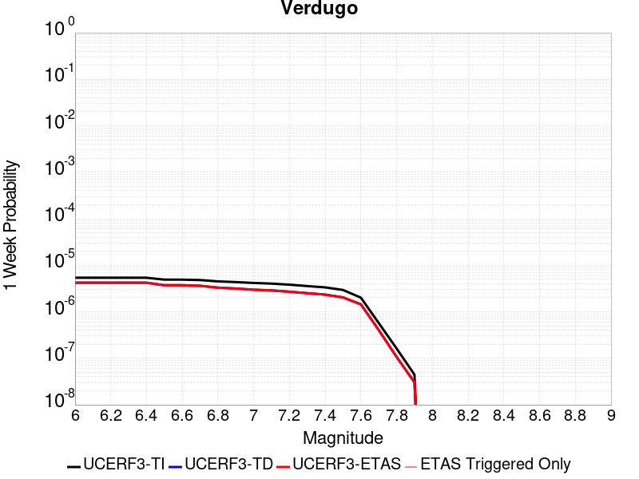 | 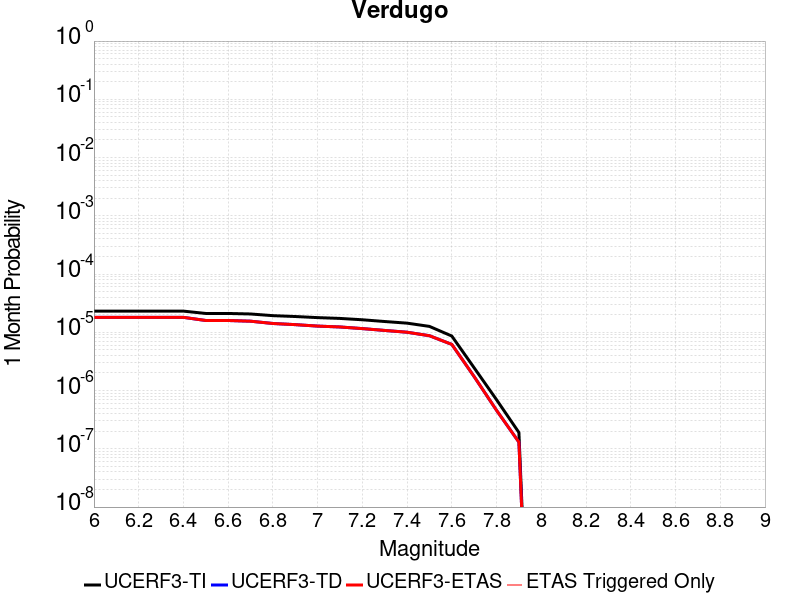 | 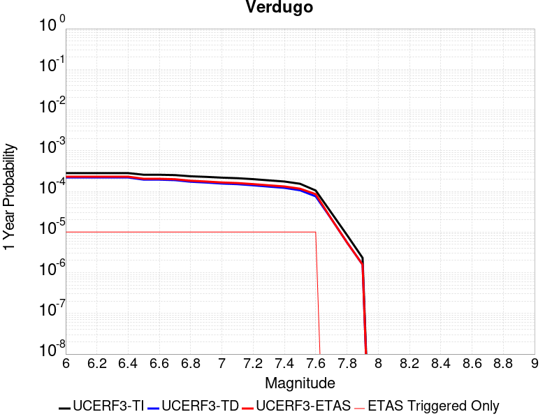 | 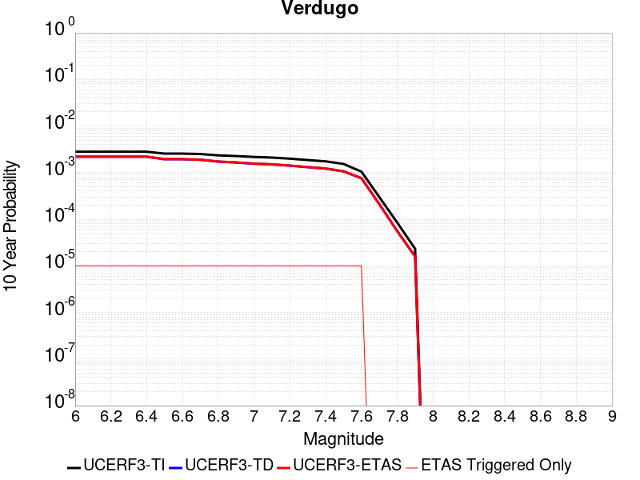 |

| Magnitude | 1 wk TI Prob | 1 wk TD Prob | 1 wk ETAS Prob | 1 wk ETAS/TD Gain | 1 wk ETAS Triggered Only | 1 mo TI Prob | 1 mo TD Prob | 1 mo ETAS Prob | 1 mo ETAS/TD Gain | 1 mo ETAS Triggered Only | 1 yr TI Prob | 1 yr TD Prob | 1 yr ETAS Prob | 1 yr ETAS/TD Gain | 1 yr ETAS Triggered Only | 10 yr TI Prob | 10 yr TD Prob | 10 yr ETAS Prob | 10 yr ETAS/TD Gain | 10 yr ETAS Triggered Only |
|-----|-----|-----|-----|-----|-----|-----|-----|-----|-----|-----|-----|-----|-----|-----|-----|-----|-----|-----|-----|-----|
| 6.0 | 5.392987E-6 | 4.2164934E-6 | 4.2164934E-6 | 1.0 | 0.0 | 2.3112598E-5 | 1.8070563E-5 | 1.8070563E-5 | 1.0 | 0.0 | 2.8135953E-4 | 2.1998737E-4 | 2.2998518E-4 | 1.0454471 | 1.0E-5 | 0.0028100356 | 0.0021977439 | 0.0022077218 | 1.0045401 | 1.0E-5 |
| 6.1 | 5.392987E-6 | 4.2164934E-6 | 4.2164934E-6 | 1.0 | 0.0 | 2.3112598E-5 | 1.8070563E-5 | 1.8070563E-5 | 1.0 | 0.0 | 2.8135953E-4 | 2.1998737E-4 | 2.2998518E-4 | 1.0454471 | 1.0E-5 | 0.0028100356 | 0.0021977439 | 0.0022077218 | 1.0045401 | 1.0E-5 |
| 6.2 | 5.392987E-6 | 4.2164934E-6 | 4.2164934E-6 | 1.0 | 0.0 | 2.3112598E-5 | 1.8070563E-5 | 1.8070563E-5 | 1.0 | 0.0 | 2.8135953E-4 | 2.1998737E-4 | 2.2998518E-4 | 1.0454471 | 1.0E-5 | 0.0028100356 | 0.0021977439 | 0.0022077218 | 1.0045401 | 1.0E-5 |
| 6.3 | 5.392987E-6 | 4.2164934E-6 | 4.2164934E-6 | 1.0 | 0.0 | 2.3112598E-5 | 1.8070563E-5 | 1.8070563E-5 | 1.0 | 0.0 | 2.8135953E-4 | 2.1998737E-4 | 2.2998518E-4 | 1.0454471 | 1.0E-5 | 0.0028100356 | 0.0021977439 | 0.0022077218 | 1.0045401 | 1.0E-5 |
| 6.4 | 5.392987E-6 | 4.2164934E-6 | 4.2164934E-6 | 1.0 | 0.0 | 2.3112598E-5 | 1.8070563E-5 | 1.8070563E-5 | 1.0 | 0.0 | 2.8135953E-4 | 2.1998737E-4 | 2.2998518E-4 | 1.0454471 | 1.0E-5 | 0.0028100356 | 0.0021977439 | 0.0022077218 | 1.0045401 | 1.0E-5 |
| 6.5 | 4.9154837E-6 | 3.7224413E-6 | 3.7224413E-6 | 1.0 | 0.0 | 2.1066187E-5 | 1.5953223E-5 | 1.5953223E-5 | 1.0 | 0.0 | 2.5645064E-4 | 1.9421338E-4 | 2.0421145E-4 | 1.0514797 | 1.0E-5 | 0.002561549 | 0.0019404575 | 0.001950438 | 1.0051434 | 1.0E-5 |
| 6.6 | 4.9154837E-6 | 3.7224413E-6 | 3.7224413E-6 | 1.0 | 0.0 | 2.1066187E-5 | 1.5953223E-5 | 1.5953223E-5 | 1.0 | 0.0 | 2.5645064E-4 | 1.9421338E-4 | 2.0421145E-4 | 1.0514797 | 1.0E-5 | 0.002561549 | 0.0019404575 | 0.001950438 | 1.0051434 | 1.0E-5 |
| 6.7 | 4.817006E-6 | 3.620628E-6 | 3.620628E-6 | 1.0 | 0.0 | 2.0644147E-5 | 1.5516885E-5 | 1.5516885E-5 | 1.0 | 0.0 | 2.513135E-4 | 1.889019E-4 | 1.9890002E-4 | 1.0529275 | 1.0E-5 | 0.0025102948 | 0.0018874329 | 0.0018974141 | 1.0052882 | 1.0E-5 |
| 6.8 | 4.507407E-6 | 3.3070805E-6 | 3.3070805E-6 | 1.0 | 0.0 | 1.9317316E-5 | 1.4173126E-5 | 1.4173126E-5 | 1.0 | 0.0 | 2.3516294E-4 | 1.7254429E-4 | 1.8254256E-4 | 1.0579461 | 1.0E-5 | 0.0023491425 | 0.0017241176 | 0.0017341003 | 1.0057901 | 1.0E-5 |
| 6.9 | 4.3573054E-6 | 3.1609877E-6 | 3.1609877E-6 | 1.0 | 0.0 | 1.8674033E-5 | 1.354702E-5 | 1.354702E-5 | 1.0 | 0.0 | 2.2733262E-4 | 1.649226E-4 | 1.7492096E-4 | 1.0606245 | 1.0E-5 | 0.0022710022 | 0.0016480145 | 0.0016579981 | 1.0060579 | 1.0E-5 |
| 7.0 | 4.171527E-6 | 2.9836467E-6 | 2.9836467E-6 | 1.0 | 0.0 | 1.787785E-5 | 1.2786995E-5 | 1.2786995E-5 | 1.0 | 0.0 | 2.1764109E-4 | 1.5567066E-4 | 1.656691E-4 | 1.0642282 | 1.0E-5 | 0.0021742806 | 0.0015556274 | 0.0015656119 | 1.0064182 | 1.0E-5 |
| 7.1 | 4.0405484E-6 | 2.882238E-6 | 2.882238E-6 | 1.0 | 0.0 | 1.731652E-5 | 1.23523905E-5 | 1.23523905E-5 | 1.0 | 0.0 | 2.1080824E-4 | 1.5038009E-4 | 1.6037858E-4 | 1.0664881 | 1.0E-5 | 0.0021060838 | 0.0015027943 | 0.0015127793 | 1.0066442 | 1.0E-5 |
| 7.2 | 3.8306007E-6 | 2.701823E-6 | 2.701823E-6 | 1.0 | 0.0 | 1.6416758E-5 | 1.157919E-5 | 1.157919E-5 | 1.0 | 0.0 | 1.9985568E-4 | 1.4096762E-4 | 1.5096621E-4 | 1.0709282 | 1.0E-5 | 0.0019967605 | 0.0014087928 | 0.0014187787 | 1.0070883 | 1.0E-5 |
| 7.3 | 3.5750938E-6 | 2.512154E-6 | 2.512154E-6 | 1.0 | 0.0 | 1.532174E-5 | 1.076633E-5 | 1.076633E-5 | 1.0 | 0.0 | 1.8652623E-4 | 1.3107229E-4 | 1.4107098E-4 | 1.0762838 | 1.0E-5 | 0.0018636974 | 0.0013099604 | 0.0013199473 | 1.0076238 | 1.0E-5 |
| 7.4 | 3.3510041E-6 | 2.340838E-6 | 2.340838E-6 | 1.0 | 0.0 | 1.4361368E-5 | 1.0032124E-5 | 1.0032124E-5 | 1.0 | 0.0 | 1.7483562E-4 | 1.2213437E-4 | 1.3213315E-4 | 1.081867 | 1.0E-5 | 0.0017469813 | 0.0012206829 | 0.0012306707 | 1.0081822 | 1.0E-5 |
| 7.5 | 2.948287E-6 | 2.0390912E-6 | 2.0390912E-6 | 1.0 | 0.0 | 1.2635454E-5 | 8.7389335E-6 | 8.7389335E-6 | 1.0 | 0.0 | 1.538258E-4 | 1.06391424E-4 | 1.1639036E-4 | 1.0939826 | 1.0E-5 | 0.0015371935 | 0.0010634151 | 0.0010734044 | 1.0093937 | 1.0E-5 |
| 7.6 | 2.0134323E-6 | 1.4471086E-6 | 1.4471086E-6 | 1.0 | 0.0 | 8.628967E-6 | 6.20188E-6 | 6.20188E-6 | 1.0 | 0.0 | 1.05052604E-4 | 7.550536E-5 | 8.550461E-5 | 1.1324309 | 1.0E-5 | 0.0010500296 | 7.548059E-4 | 7.647984E-4 | 1.0132384 | 1.0E-5 |
| 7.7 | 5.726436E-7 | 4.0453273E-7 | 4.0453273E-7 | 1.0 | 0.0 | 2.4541846E-6 | 1.7337106E-6 | 1.7337106E-6 | 1.0 | 0.0 | 2.9879287E-5 | 2.110775E-5 | 2.110775E-5 | 1.0 | 0.0 | 2.987527E-4 | 2.1105999E-4 | 2.1105999E-4 | 1.0 | 0.0 |
| 7.8 | 1.6248204E-7 | 1.06879604E-7 | 1.06879604E-7 | 1.0 | 0.0 | 6.963514E-7 | 4.5805535E-7 | 4.5805535E-7 | 1.0 | 0.0 | 8.478045E-6 | 5.57681E-6 | 5.57681E-6 | 1.0 | 0.0 | 8.477722E-5 | 5.5766737E-5 | 5.5766737E-5 | 1.0 | 0.0 |
| 7.9 | 4.4475744E-8 | 3.037888E-8 | 3.037888E-8 | 1.0 | 0.0 | 1.9061031E-7 | 1.301952E-7 | 1.301952E-7 | 1.0 | 0.0 | 2.320678E-6 | 1.5851255E-6 | 1.5851255E-6 | 1.0 | 0.0 | 2.3206538E-5 | 1.5851156E-5 | 1.5851156E-5 | 1.0 | 0.0 |

## Russ 2011 CFM
*[(top)](#table-of-contents)*

| 1 Week | 1 Month | 1 Year | 10 Year |
|-----|-----|-----|-----|
|  |  |  |  |

| Magnitude | 1 wk TI Prob | 1 wk TD Prob | 1 wk ETAS Prob | 1 wk ETAS/TD Gain | 1 wk ETAS Triggered Only | 1 mo TI Prob | 1 mo TD Prob | 1 mo ETAS Prob | 1 mo ETAS/TD Gain | 1 mo ETAS Triggered Only | 1 yr TI Prob | 1 yr TD Prob | 1 yr ETAS Prob | 1 yr ETAS/TD Gain | 1 yr ETAS Triggered Only | 10 yr TI Prob | 10 yr TD Prob | 10 yr ETAS Prob | 10 yr ETAS/TD Gain | 10 yr ETAS Triggered Only |
|-----|-----|-----|-----|-----|-----|-----|-----|-----|-----|-----|-----|-----|-----|-----|-----|-----|-----|-----|-----|-----|
| 6.0 | 2.3806366E-5 | 2.6254156E-5 | 2.6254156E-5 | 1.0 | 0.0 | 1.0202329E-4 | 1.1251331E-4 | 1.1251331E-4 | 1.0 | 0.0 | 0.0012414258 | 0.0013690525 | 0.0013790388 | 1.0072943 | 1.0E-5 | 0.012345135 | 0.013612664 | 0.013622528 | 1.0007246 | 1.0E-5 |
| 6.1 | 2.3806366E-5 | 2.6254156E-5 | 2.6254156E-5 | 1.0 | 0.0 | 1.0202329E-4 | 1.1251331E-4 | 1.1251331E-4 | 1.0 | 0.0 | 0.0012414258 | 0.0013690525 | 0.0013790388 | 1.0072943 | 1.0E-5 | 0.012345135 | 0.013612664 | 0.013622528 | 1.0007246 | 1.0E-5 |
| 6.2 | 2.3806366E-5 | 2.6254156E-5 | 2.6254156E-5 | 1.0 | 0.0 | 1.0202329E-4 | 1.1251331E-4 | 1.1251331E-4 | 1.0 | 0.0 | 0.0012414258 | 0.0013690525 | 0.0013790388 | 1.0072943 | 1.0E-5 | 0.012345135 | 0.013612664 | 0.013622528 | 1.0007246 | 1.0E-5 |
| 6.3 | 2.3806366E-5 | 2.6254156E-5 | 2.6254156E-5 | 1.0 | 0.0 | 1.0202329E-4 | 1.1251331E-4 | 1.1251331E-4 | 1.0 | 0.0 | 0.0012414258 | 0.0013690525 | 0.0013790388 | 1.0072943 | 1.0E-5 | 0.012345135 | 0.013612664 | 0.013622528 | 1.0007246 | 1.0E-5 |
| 6.4 | 2.3806366E-5 | 2.6254156E-5 | 2.6254156E-5 | 1.0 | 0.0 | 1.0202329E-4 | 1.1251331E-4 | 1.1251331E-4 | 1.0 | 0.0 | 0.0012414258 | 0.0013690525 | 0.0013790388 | 1.0072943 | 1.0E-5 | 0.012345135 | 0.013612664 | 0.013622528 | 1.0007246 | 1.0E-5 |
| 6.5 | 2.3806366E-5 | 2.6254156E-5 | 2.6254156E-5 | 1.0 | 0.0 | 1.0202329E-4 | 1.1251331E-4 | 1.1251331E-4 | 1.0 | 0.0 | 0.0012414258 | 0.0013690525 | 0.0013790388 | 1.0072943 | 1.0E-5 | 0.012345135 | 0.013612664 | 0.013622528 | 1.0007246 | 1.0E-5 |
| 6.6 | 2.3806366E-5 | 2.6254156E-5 | 2.6254156E-5 | 1.0 | 0.0 | 1.0202329E-4 | 1.1251331E-4 | 1.1251331E-4 | 1.0 | 0.0 | 0.0012414258 | 0.0013690525 | 0.0013790388 | 1.0072943 | 1.0E-5 | 0.012345135 | 0.013612664 | 0.013622528 | 1.0007246 | 1.0E-5 |
| 6.7 | 1.6515693E-5 | 1.8187944E-5 | 1.8187944E-5 | 1.0 | 0.0 | 7.077962E-5 | 7.79462E-5 | 7.79462E-5 | 1.0 | 0.0 | 8.6140115E-4 | 9.486156E-4 | 9.586061E-4 | 1.0105317 | 1.0E-5 | 0.008580698 | 0.009449055 | 0.009458961 | 1.0010483 | 1.0E-5 |
| 6.8 | 1.6515693E-5 | 1.8187944E-5 | 1.8187944E-5 | 1.0 | 0.0 | 7.077962E-5 | 7.79462E-5 | 7.79462E-5 | 1.0 | 0.0 | 8.6140115E-4 | 9.486156E-4 | 9.586061E-4 | 1.0105317 | 1.0E-5 | 0.008580698 | 0.009449055 | 0.009458961 | 1.0010483 | 1.0E-5 |
| 6.9 | 1.2971182E-5 | 1.4273831E-5 | 1.4273831E-5 | 1.0 | 0.0 | 5.5589593E-5 | 6.117227E-5 | 6.117227E-5 | 1.0 | 0.0 | 6.765931E-4 | 7.4454385E-4 | 7.5453636E-4 | 1.013421 | 1.0E-5 | 0.0067453682 | 0.0074230675 | 0.0074329935 | 1.0013372 | 1.0E-5 |
| 7.0 | 1.0201805E-5 | 1.1221911E-5 | 1.1221911E-5 | 1.0 | 0.0 | 4.3721288E-5 | 4.8093138E-5 | 4.8093138E-5 | 1.0 | 0.0 | 5.3217664E-4 | 5.853974E-4 | 5.853974E-4 | 1.0 | 0.0 | 0.00530904 | 0.005840605 | 0.005840605 | 1.0 | 0.0 |
| 7.1 | 8.3744935E-6 | 9.2126675E-6 | 9.2126675E-6 | 1.0 | 0.0 | 3.5890193E-5 | 3.9482366E-5 | 3.9482366E-5 | 1.0 | 0.0 | 4.368755E-4 | 4.8061032E-4 | 4.8061032E-4 | 1.0 | 0.0 | 0.004360176 | 0.0047975346 | 0.0047975346 | 1.0 | 0.0 |
| 7.2 | 6.649391E-6 | 7.3170095E-6 | 7.3170095E-6 | 1.0 | 0.0 | 2.8497077E-5 | 3.135833E-5 | 3.135833E-5 | 1.0 | 0.0 | 3.4689668E-4 | 3.8173737E-4 | 3.8173737E-4 | 1.0 | 0.0 | 0.0034635565 | 0.0038124465 | 0.0038124465 | 1.0 | 0.0 |
| 7.3 | 4.9549312E-6 | 5.454593E-6 | 5.454593E-6 | 1.0 | 0.0 | 2.1235246E-5 | 2.33767E-5 | 2.33767E-5 | 1.0 | 0.0 | 2.5850846E-4 | 2.8458887E-4 | 2.8458887E-4 | 1.0 | 0.0 | 0.0025820795 | 0.0028436882 | 0.0028436882 | 1.0 | 0.0 |

## Garberville - Briceland 2011 CFM
*[(top)](#table-of-contents)*

| 1 Week | 1 Month | 1 Year | 10 Year |
|-----|-----|-----|-----|
|  |  |  |  |

| Magnitude | 1 wk TI Prob | 1 wk TD Prob | 1 wk ETAS Prob | 1 wk ETAS/TD Gain | 1 wk ETAS Triggered Only | 1 mo TI Prob | 1 mo TD Prob | 1 mo ETAS Prob | 1 mo ETAS/TD Gain | 1 mo ETAS Triggered Only | 1 yr TI Prob | 1 yr TD Prob | 1 yr ETAS Prob | 1 yr ETAS/TD Gain | 1 yr ETAS Triggered Only | 10 yr TI Prob | 10 yr TD Prob | 10 yr ETAS Prob | 10 yr ETAS/TD Gain | 10 yr ETAS Triggered Only |
|-----|-----|-----|-----|-----|-----|-----|-----|-----|-----|-----|-----|-----|-----|-----|-----|-----|-----|-----|-----|-----|
| 6.0 | 4.8399295E-5 | 6.4527754E-5 | 6.4527754E-5 | 1.0 | 0.0 | 2.0740906E-4 | 2.765224E-4 | 2.765224E-4 | 1.0 | 0.0 | 0.002522281 | 0.0033621131 | 0.0033621131 | 1.0 | 0.0 | 0.024938442 | 0.03317879 | 0.03318846 | 1.0002913 | 1.0E-5 |
| 6.1 | 4.8399295E-5 | 6.4527754E-5 | 6.4527754E-5 | 1.0 | 0.0 | 2.0740906E-4 | 2.765224E-4 | 2.765224E-4 | 1.0 | 0.0 | 0.002522281 | 0.0033621131 | 0.0033621131 | 1.0 | 0.0 | 0.024938442 | 0.03317879 | 0.03318846 | 1.0002913 | 1.0E-5 |
| 6.2 | 4.8399295E-5 | 6.4527754E-5 | 6.4527754E-5 | 1.0 | 0.0 | 2.0740906E-4 | 2.765224E-4 | 2.765224E-4 | 1.0 | 0.0 | 0.002522281 | 0.0033621131 | 0.0033621131 | 1.0 | 0.0 | 0.024938442 | 0.03317879 | 0.03318846 | 1.0002913 | 1.0E-5 |
| 6.3 | 4.8399295E-5 | 6.4527754E-5 | 6.4527754E-5 | 1.0 | 0.0 | 2.0740906E-4 | 2.765224E-4 | 2.765224E-4 | 1.0 | 0.0 | 0.002522281 | 0.0033621131 | 0.0033621131 | 1.0 | 0.0 | 0.024938442 | 0.03317879 | 0.03318846 | 1.0002913 | 1.0E-5 |
| 6.4 | 4.8399295E-5 | 6.4527754E-5 | 6.4527754E-5 | 1.0 | 0.0 | 2.0740906E-4 | 2.765224E-4 | 2.765224E-4 | 1.0 | 0.0 | 0.002522281 | 0.0033621131 | 0.0033621131 | 1.0 | 0.0 | 0.024938442 | 0.03317879 | 0.03318846 | 1.0002913 | 1.0E-5 |
| 6.5 | 4.8399295E-5 | 6.4527754E-5 | 6.4527754E-5 | 1.0 | 0.0 | 2.0740906E-4 | 2.765224E-4 | 2.765224E-4 | 1.0 | 0.0 | 0.002522281 | 0.0033621131 | 0.0033621131 | 1.0 | 0.0 | 0.024938442 | 0.03317879 | 0.03318846 | 1.0002913 | 1.0E-5 |
| 6.6 | 4.8399295E-5 | 6.4527754E-5 | 6.4527754E-5 | 1.0 | 0.0 | 2.0740906E-4 | 2.765224E-4 | 2.765224E-4 | 1.0 | 0.0 | 0.002522281 | 0.0033621131 | 0.0033621131 | 1.0 | 0.0 | 0.024938442 | 0.03317879 | 0.03318846 | 1.0002913 | 1.0E-5 |
| 6.7 | 3.495179E-5 | 4.630908E-5 | 4.630908E-5 | 1.0 | 0.0 | 1.4978478E-4 | 1.9845538E-4 | 1.9845538E-4 | 1.0 | 0.0 | 0.0018221042 | 0.0024140473 | 0.0024140473 | 1.0 | 0.0 | 0.018072363 | 0.023930654 | 0.023930654 | 1.0 | 0.0 |
| 6.8 | 2.7517597E-5 | 3.62417E-5 | 3.62417E-5 | 1.0 | 0.0 | 1.1792722E-4 | 1.5531495E-4 | 1.5531495E-4 | 1.0 | 0.0 | 0.0014348183 | 0.0018897917 | 0.0018897917 | 1.0 | 0.0 | 0.014255894 | 0.01878354 | 0.01878354 | 1.0 | 0.0 |
| 6.9 | 2.74461E-5 | 3.6159425E-5 | 3.6159425E-5 | 1.0 | 0.0 | 1.1762084E-4 | 1.5496238E-4 | 1.5496238E-4 | 1.0 | 0.0 | 0.001431093 | 0.0018855067 | 0.0018855067 | 1.0 | 0.0 | 0.014219119 | 0.018741412 | 0.018741412 | 1.0 | 0.0 |
| 7.0 | 1.9023773E-5 | 2.4707771E-5 | 2.4707771E-5 | 1.0 | 0.0 | 8.152791E-5 | 1.0588833E-4 | 1.0588833E-4 | 1.0 | 0.0 | 9.921503E-4 | 0.0012888273 | 0.0012888273 | 1.0 | 0.0 | 0.009877323 | 0.012852578 | 0.012852578 | 1.0 | 0.0 |
| 7.1 | 5.566844E-6 | 6.512147E-6 | 6.512147E-6 | 1.0 | 0.0 | 2.3857683E-5 | 2.7908927E-5 | 2.7908927E-5 | 1.0 | 0.0 | 2.9042858E-4 | 3.3974246E-4 | 3.3974246E-4 | 1.0 | 0.0 | 0.002900493 | 0.0033926512 | 0.0033926512 | 1.0 | 0.0 |
| 7.2 | 4.011353E-6 | 4.6746213E-6 | 4.6746213E-6 | 1.0 | 0.0 | 1.7191402E-5 | 2.0033956E-5 | 2.0033956E-5 | 1.0 | 0.0 | 2.0928521E-4 | 2.4388955E-4 | 2.4388955E-4 | 1.0 | 0.0 | 0.0020908823 | 0.0024365564 | 0.0024365564 | 1.0 | 0.0 |
| 7.3 | 2.0974871E-6 | 2.4395908E-6 | 2.4395908E-6 | 1.0 | 0.0 | 8.989199E-6 | 1.0455362E-5 | 1.0455362E-5 | 1.0 | 0.0 | 1.09438006E-4 | 1.272891E-4 | 1.272891E-4 | 1.0 | 0.0 | 0.0010938413 | 0.0012724071 | 0.0012724071 | 1.0 | 0.0 |

## San Gregorio (South) 2011 CFM
*[(top)](#table-of-contents)*

| 1 Week | 1 Month | 1 Year | 10 Year |
|-----|-----|-----|-----|
| 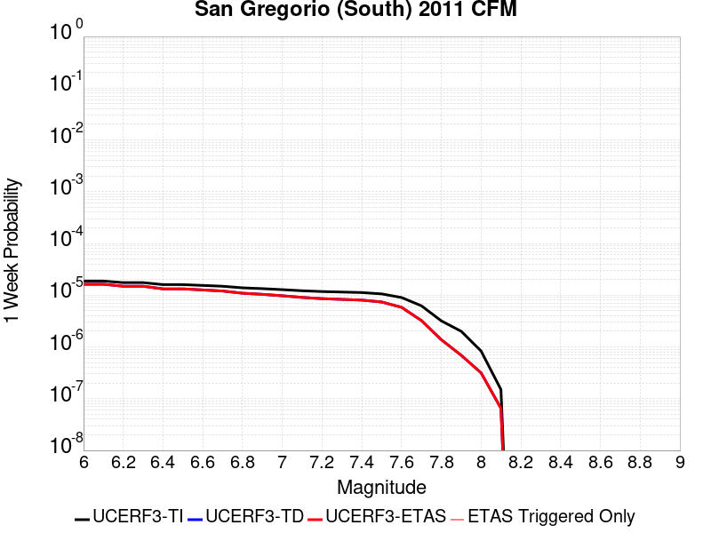 | 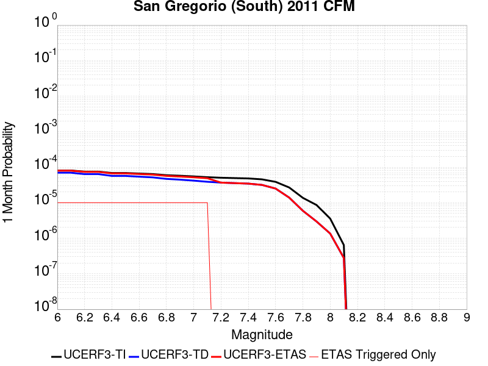 | 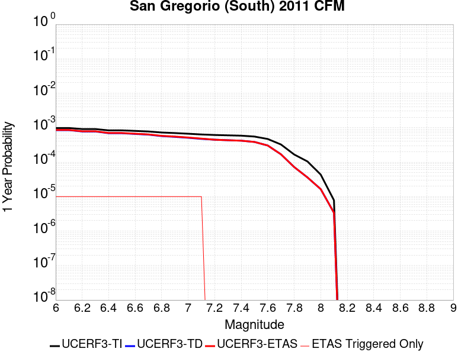 | 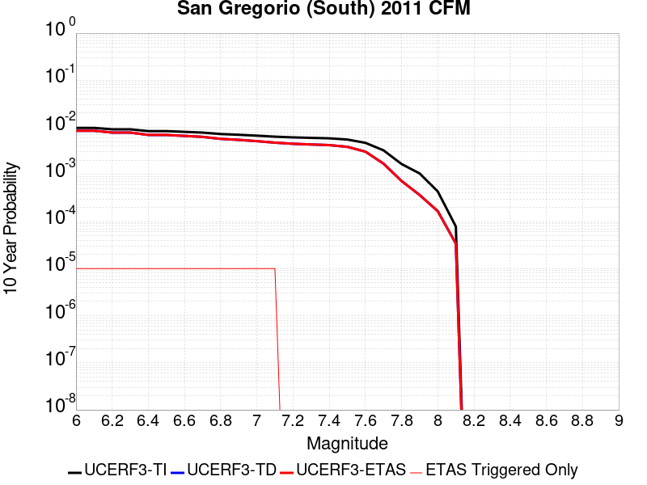 |

| Magnitude | 1 wk TI Prob | 1 wk TD Prob | 1 wk ETAS Prob | 1 wk ETAS/TD Gain | 1 wk ETAS Triggered Only | 1 mo TI Prob | 1 mo TD Prob | 1 mo ETAS Prob | 1 mo ETAS/TD Gain | 1 mo ETAS Triggered Only | 1 yr TI Prob | 1 yr TD Prob | 1 yr ETAS Prob | 1 yr ETAS/TD Gain | 1 yr ETAS Triggered Only | 10 yr TI Prob | 10 yr TD Prob | 10 yr ETAS Prob | 10 yr ETAS/TD Gain | 10 yr ETAS Triggered Only |
|-----|-----|-----|-----|-----|-----|-----|-----|-----|-----|-----|-----|-----|-----|-----|-----|-----|-----|-----|-----|-----|
| 6.0 | 1.8770423E-5 | 1.6279559E-5 | 1.6279559E-5 | 1.0 | 0.0 | 8.044219E-5 | 6.9767695E-5 | 7.976699E-5 | 1.1433228 | 1.0E-5 | 9.789435E-4 | 8.490944E-4 | 8.5908594E-4 | 1.0117673 | 1.0E-5 | 0.009746423 | 0.008471475 | 0.008481391 | 1.0011704 | 1.0E-5 |
| 6.1 | 1.8770423E-5 | 1.6279559E-5 | 1.6279559E-5 | 1.0 | 0.0 | 8.044219E-5 | 6.9767695E-5 | 7.976699E-5 | 1.1433228 | 1.0E-5 | 9.789435E-4 | 8.490944E-4 | 8.5908594E-4 | 1.0117673 | 1.0E-5 | 0.009746423 | 0.008471475 | 0.008481391 | 1.0011704 | 1.0E-5 |
| 6.2 | 1.7508692E-5 | 1.4899064E-5 | 1.4899064E-5 | 1.0 | 0.0 | 7.5035096E-5 | 6.3851585E-5 | 7.385095E-5 | 1.1566032 | 1.0E-5 | 9.1316935E-4 | 7.7711884E-4 | 7.8711106E-4 | 1.012858 | 1.0E-5 | 0.00909426 | 0.007756904 | 0.007766826 | 1.0012791 | 1.0E-5 |
| 6.3 | 1.7508692E-5 | 1.4899064E-5 | 1.4899064E-5 | 1.0 | 0.0 | 7.5035096E-5 | 6.3851585E-5 | 7.385095E-5 | 1.1566032 | 1.0E-5 | 9.1316935E-4 | 7.7711884E-4 | 7.8711106E-4 | 1.012858 | 1.0E-5 | 0.00909426 | 0.007756904 | 0.007766826 | 1.0012791 | 1.0E-5 |
| 6.4 | 1.6004591E-5 | 1.3248901E-5 | 1.3248901E-5 | 1.0 | 0.0 | 6.85893E-5 | 5.6779776E-5 | 6.677921E-5 | 1.1761091 | 1.0E-5 | 8.347548E-4 | 6.910755E-4 | 7.010686E-4 | 1.0144602 | 1.0E-5 | 0.008316261 | 0.0069019548 | 0.006911886 | 1.0014389 | 1.0E-5 |
| 6.5 | 1.6004591E-5 | 1.3248901E-5 | 1.3248901E-5 | 1.0 | 0.0 | 6.85893E-5 | 5.6779776E-5 | 6.677921E-5 | 1.1761091 | 1.0E-5 | 8.347548E-4 | 6.910755E-4 | 7.010686E-4 | 1.0144602 | 1.0E-5 | 0.008316261 | 0.0069019548 | 0.006911886 | 1.0014389 | 1.0E-5 |
| 6.6 | 1.5442201E-5 | 1.2633533E-5 | 1.2633533E-5 | 1.0 | 0.0 | 6.617918E-5 | 5.414259E-5 | 6.414205E-5 | 1.1846875 | 1.0E-5 | 8.0543366E-4 | 6.5898756E-4 | 6.6898094E-4 | 1.0151649 | 1.0E-5 | 0.008025207 | 0.0065830066 | 0.0065929405 | 1.0015091 | 1.0E-5 |
| 6.7 | 1.489921E-5 | 1.2042042E-5 | 1.2042042E-5 | 1.0 | 0.0 | 6.3852196E-5 | 5.1607734E-5 | 6.1607214E-5 | 1.1937594 | 1.0E-5 | 7.7712315E-4 | 6.281437E-4 | 6.3813746E-4 | 1.0159099 | 1.0E-5 | 0.0077441116 | 0.0062763398 | 0.006286277 | 1.0015833 | 1.0E-5 |
| 6.8 | 1.3876024E-5 | 1.0920992E-5 | 1.0920992E-5 | 1.0 | 0.0 | 5.9467322E-5 | 4.6803412E-5 | 5.6802946E-5 | 1.2136496 | 1.0E-5 | 7.237741E-4 | 5.696829E-4 | 5.7967723E-4 | 1.0175437 | 1.0E-5 | 0.0072142133 | 0.005694849 | 0.0057047918 | 1.0017459 | 1.0E-5 |
| 6.9 | 1.33922495E-5 | 1.0392495E-5 | 1.0392495E-5 | 1.0 | 0.0 | 5.7394092E-5 | 4.4538505E-5 | 5.4538057E-5 | 1.2245148 | 1.0E-5 | 6.9854903E-4 | 5.4212165E-4 | 5.521162E-4 | 1.0184361 | 1.0E-5 | 0.0069635725 | 0.0054206066 | 0.005430552 | 1.0018349 | 1.0E-5 |
| 7.0 | 1.2807324E-5 | 9.752456E-6 | 9.752456E-6 | 1.0 | 0.0 | 5.4887376E-5 | 4.179557E-5 | 5.1795152E-5 | 1.2392498 | 1.0E-5 | 6.680489E-4 | 5.0874247E-4 | 5.1873736E-4 | 1.0196463 | 1.0E-5 | 0.006660442 | 0.0050883847 | 0.005098334 | 1.0019553 | 1.0E-5 |
| 7.1 | 1.2191438E-5 | 9.061344E-6 | 9.061344E-6 | 1.0 | 0.0 | 5.224797E-5 | 3.8833754E-5 | 4.8833364E-5 | 1.2574979 | 1.0E-5 | 6.3593336E-4 | 4.7269845E-4 | 4.8269372E-4 | 1.0211451 | 1.0E-5 | 0.0063411663 | 0.004729529 | 0.0047394815 | 1.0021044 | 1.0E-5 |
| 7.2 | 1.1769438E-5 | 8.581538E-6 | 8.581538E-6 | 1.0 | 0.0 | 5.0439474E-5 | 3.6777503E-5 | 3.6777503E-5 | 1.0 | 0.0 | 6.1392755E-4 | 4.476742E-4 | 4.476742E-4 | 1.0 | 0.0 | 0.0061223423 | 0.0044803214 | 0.0044803214 | 1.0 | 0.0 |
| 7.3 | 1.150374E-5 | 8.296966E-6 | 8.296966E-6 | 1.0 | 0.0 | 4.9300812E-5 | 3.5557943E-5 | 3.5557943E-5 | 1.0 | 0.0 | 6.0007203E-4 | 4.3283202E-4 | 4.3283202E-4 | 1.0 | 0.0 | 0.0059845424 | 0.004332466 | 0.004332466 | 1.0 | 0.0 |
| 7.4 | 1.12514E-5 | 8.042707E-6 | 8.042707E-6 | 1.0 | 0.0 | 4.8219394E-5 | 3.446829E-5 | 3.446829E-5 | 1.0 | 0.0 | 5.8691297E-4 | 4.1957066E-4 | 4.1957066E-4 | 1.0 | 0.0 | 0.005853653 | 0.0042003556 | 0.0042003556 | 1.0 | 0.0 |
| 7.5 | 1.059696E-5 | 7.39299E-6 | 7.39299E-6 | 1.0 | 0.0 | 4.5414752E-5 | 3.168386E-5 | 3.168386E-5 | 1.0 | 0.0 | 5.5278436E-4 | 3.8568274E-4 | 3.8568274E-4 | 1.0 | 0.0 | 0.0055141128 | 0.003862607 | 0.003862607 | 1.0 | 0.0 |
| 7.6 | 9.018592E-6 | 5.836751E-6 | 5.836751E-6 | 1.0 | 0.0 | 3.8650534E-5 | 2.5014408E-5 | 2.5014408E-5 | 1.0 | 0.0 | 4.7046866E-4 | 3.0450788E-4 | 3.0450788E-4 | 1.0 | 0.0 | 0.004694739 | 0.0030530049 | 0.0030530049 | 1.0 | 0.0 |
| 7.7 | 6.243489E-6 | 3.239351E-6 | 3.239351E-6 | 1.0 | 0.0 | 2.6757538E-5 | 1.3882858E-5 | 1.3882858E-5 | 1.0 | 0.0 | 3.257243E-4 | 1.690107E-4 | 1.690107E-4 | 1.0 | 0.0 | 0.003252473 | 0.0016990631 | 0.0016990631 | 1.0 | 0.0 |
| 7.8 | 3.1941963E-6 | 1.380876E-6 | 1.380876E-6 | 1.0 | 0.0 | 1.368934E-5 | 5.9180265E-6 | 5.9180265E-6 | 1.0 | 0.0 | 1.6665498E-4 | 7.2049595E-5 | 7.2049595E-5 | 1.0 | 0.0 | 0.0016653005 | 7.2625576E-4 | 7.2625576E-4 | 1.0 | 0.0 |
| 7.9 | 2.0098398E-6 | 6.915071E-7 | 6.915071E-7 | 1.0 | 0.0 | 8.6135715E-6 | 2.9635985E-6 | 2.9635985E-6 | 1.0 | 0.0 | 1.0486518E-4 | 3.6081216E-5 | 3.6081216E-5 | 1.0 | 0.0 | 0.0010481571 | 3.6566515E-4 | 3.6566515E-4 | 1.0 | 0.0 |
| 8.0 | 8.353119E-7 | 3.1619197E-7 | 3.1619197E-7 | 1.0 | 0.0 | 3.579903E-6 | 1.3551078E-6 | 1.3551078E-6 | 1.0 | 0.0 | 4.358445E-5 | 1.6498312E-5 | 1.6498312E-5 | 1.0 | 0.0 | 4.3575902E-4 | 1.6616881E-4 | 1.6616881E-4 | 1.0 | 0.0 |
| 8.1 | 1.5033264E-7 | 6.52693E-8 | 6.52693E-8 | 1.0 | 0.0 | 6.442826E-7 | 2.7972553E-7 | 2.7972553E-7 | 1.0 | 0.0 | 7.844113E-6 | 3.4056532E-6 | 3.4056532E-6 | 1.0 | 0.0 | 7.843835E-5 | 3.4072833E-5 | 3.4072833E-5 | 1.0 | 0.0 |

## Great Valley 11
*[(top)](#table-of-contents)*

| 1 Week | 1 Month | 1 Year | 10 Year |
|-----|-----|-----|-----|
| 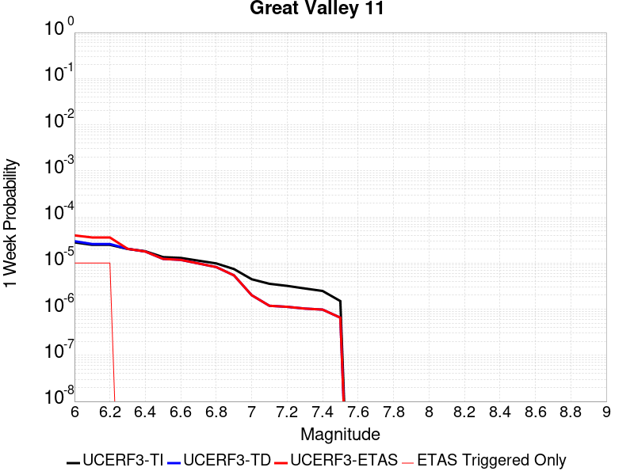 | 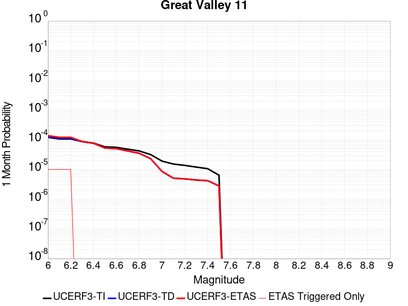 | 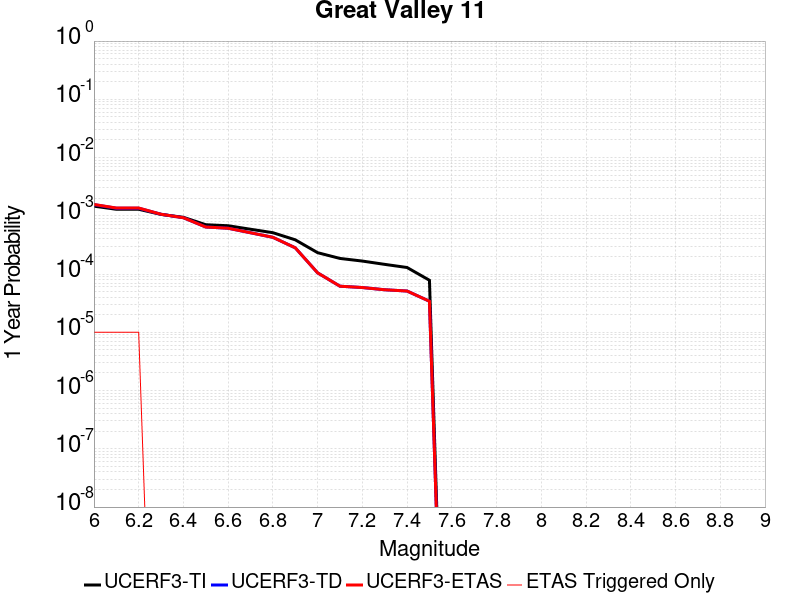 | 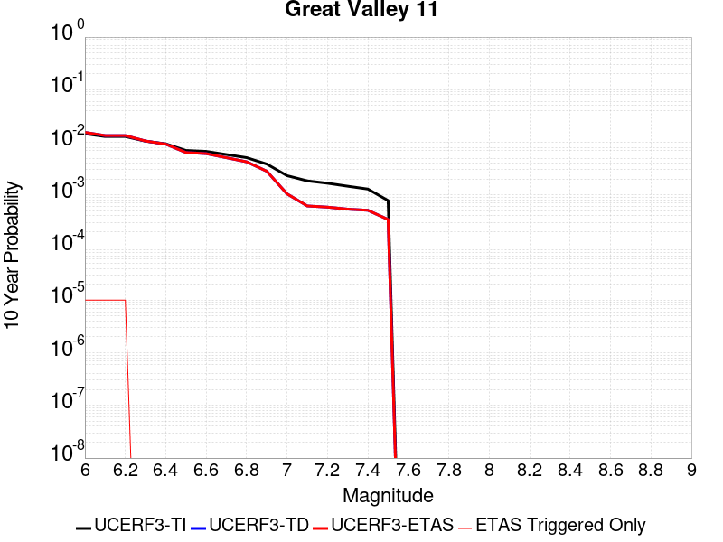 |

| Magnitude | 1 wk TI Prob | 1 wk TD Prob | 1 wk ETAS Prob | 1 wk ETAS/TD Gain | 1 wk ETAS Triggered Only | 1 mo TI Prob | 1 mo TD Prob | 1 mo ETAS Prob | 1 mo ETAS/TD Gain | 1 mo ETAS Triggered Only | 1 yr TI Prob | 1 yr TD Prob | 1 yr ETAS Prob | 1 yr ETAS/TD Gain | 1 yr ETAS Triggered Only | 10 yr TI Prob | 10 yr TD Prob | 10 yr ETAS Prob | 10 yr ETAS/TD Gain | 10 yr ETAS Triggered Only |
|-----|-----|-----|-----|-----|-----|-----|-----|-----|-----|-----|-----|-----|-----|-----|-----|-----|-----|-----|-----|-----|
| 6.0 | 2.8099583E-5 | 2.983214E-5 | 3.983184E-5 | 1.335199 | 1.0E-5 | 1.20421224E-4 | 1.2784619E-4 | 1.378449E-4 | 1.078209 | 1.0E-5 | 0.0014651422 | 0.0015554894 | 0.0015654739 | 1.0064188 | 1.0E-5 | 0.0145552 | 0.015453546 | 0.015463391 | 1.000637 | 1.0E-5 |
| 6.1 | 2.483194E-5 | 2.5907144E-5 | 3.5906884E-5 | 1.385984 | 1.0E-5 | 1.0641825E-4 | 1.11026246E-4 | 1.21025136E-4 | 1.0900588 | 1.0E-5 | 0.0012948721 | 0.0013509697 | 0.0013609562 | 1.007392 | 1.0E-5 | 0.012873529 | 0.013433979 | 0.013443844 | 1.0007343 | 1.0E-5 |
| 6.2 | 2.483194E-5 | 2.5907144E-5 | 3.5906884E-5 | 1.385984 | 1.0E-5 | 1.0641825E-4 | 1.11026246E-4 | 1.21025136E-4 | 1.0900588 | 1.0E-5 | 0.0012948721 | 0.0013509697 | 0.0013609562 | 1.007392 | 1.0E-5 | 0.012873529 | 0.013433979 | 0.013443844 | 1.0007343 | 1.0E-5 |
| 6.3 | 2.0257901E-5 | 2.0398915E-5 | 2.0398915E-5 | 1.0 | 0.0 | 8.681669E-5 | 8.742122E-5 | 8.742122E-5 | 1.0 | 0.0 | 0.0010564806 | 0.0010638753 | 0.0010638753 | 1.0 | 0.0 | 0.01051472 | 0.010591993 | 0.010591993 | 1.0 | 0.0 |
| 6.4 | 1.8054898E-5 | 1.7780852E-5 | 1.7780852E-5 | 1.0 | 0.0 | 7.737584E-5 | 7.6201635E-5 | 7.6201635E-5 | 1.0 | 0.0 | 9.416436E-4 | 9.2739763E-4 | 9.2739763E-4 | 1.0 | 0.0 | 0.009376635 | 0.009239015 | 0.009239015 | 1.0 | 0.0 |
| 6.5 | 1.34804895E-5 | 1.2321004E-5 | 1.2321004E-5 | 1.0 | 0.0 | 5.777225E-5 | 5.2803258E-5 | 5.2803258E-5 | 1.0 | 0.0 | 7.031501E-4 | 6.426942E-4 | 6.426942E-4 | 1.0 | 0.0 | 0.007009294 | 0.006408792 | 0.006408792 | 1.0 | 0.0 |
| 6.6 | 1.294883E-5 | 1.1732261E-5 | 1.1732261E-5 | 1.0 | 0.0 | 5.5493805E-5 | 5.028017E-5 | 5.028017E-5 | 1.0 | 0.0 | 6.754276E-4 | 6.1199325E-4 | 6.1199325E-4 | 1.0 | 0.0 | 0.006733784 | 0.0061035044 | 0.0061035044 | 1.0 | 0.0 |
| 6.7 | 1.1272237E-5 | 9.811834E-6 | 9.811834E-6 | 1.0 | 0.0 | 4.8308695E-5 | 4.205006E-5 | 4.205006E-5 | 1.0 | 0.0 | 5.879996E-4 | 5.1184196E-4 | 5.1184196E-4 | 1.0 | 0.0 | 0.005864462 | 0.005106915 | 0.005106915 | 1.0 | 0.0 |
| 6.8 | 9.8337505E-6 | 8.193719E-6 | 8.193719E-6 | 1.0 | 0.0 | 4.2143965E-5 | 3.5115478E-5 | 3.5115478E-5 | 1.0 | 0.0 | 5.1298196E-4 | 4.2744912E-4 | 4.2744912E-4 | 1.0 | 0.0 | 0.005117994 | 0.0042664795 | 0.0042664795 | 1.0 | 0.0 |
| 6.9 | 7.4224813E-6 | 5.4130837E-6 | 5.4130837E-6 | 1.0 | 0.0 | 3.1810247E-5 | 2.3198732E-5 | 2.3198732E-5 | 1.0 | 0.0 | 3.872209E-4 | 2.8240937E-4 | 2.8240937E-4 | 1.0 | 0.0 | 0.0038654688 | 0.0028206457 | 0.0028206457 | 1.0 | 0.0 |
| 7.0 | 4.4628923E-6 | 2.0110294E-6 | 2.0110294E-6 | 1.0 | 0.0 | 1.912654E-5 | 8.61867E-6 | 8.61867E-6 | 1.0 | 0.0 | 2.3284076E-4 | 1.0492737E-4 | 1.0492737E-4 | 1.0 | 0.0 | 0.0023259693 | 0.0010487898 | 0.0010487898 | 1.0 | 0.0 |
| 7.1 | 3.5546527E-6 | 1.1855383E-6 | 1.1855383E-6 | 1.0 | 0.0 | 1.5234136E-5 | 5.080869E-6 | 5.080869E-6 | 1.0 | 0.0 | 1.8545982E-4 | 6.185789E-5 | 6.185789E-5 | 1.0 | 0.0 | 0.0018530512 | 6.1841356E-4 | 6.1841356E-4 | 1.0 | 0.0 |
| 7.2 | 3.2039936E-6 | 1.1253728E-6 | 1.1253728E-6 | 1.0 | 0.0 | 1.3731329E-5 | 4.8230177E-6 | 4.8230177E-6 | 1.0 | 0.0 | 1.671661E-4 | 5.8718724E-5 | 5.8718724E-5 | 1.0 | 0.0 | 0.0016704041 | 5.870388E-4 | 5.870388E-4 | 1.0 | 0.0 |
| 7.3 | 2.8120473E-6 | 1.0305271E-6 | 1.0305271E-6 | 1.0 | 0.0 | 1.2051575E-5 | 4.4165376E-6 | 4.4165376E-6 | 1.0 | 0.0 | 1.4671806E-4 | 5.3770087E-5 | 5.3770087E-5 | 1.0 | 0.0 | 0.0014662122 | 5.375774E-4 | 5.375774E-4 | 1.0 | 0.0 |
| 7.4 | 2.4837766E-6 | 9.80032E-7 | 9.80032E-7 | 1.0 | 0.0 | 1.0644713E-5 | 4.2001307E-6 | 4.2001307E-6 | 1.0 | 0.0 | 1.2959167E-4 | 5.113546E-5 | 5.113546E-5 | 1.0 | 0.0 | 0.0012951613 | 5.1124353E-4 | 5.1124353E-4 | 1.0 | 0.0 |
| 7.5 | 1.5002679E-6 | 6.545985E-7 | 6.545985E-7 | 1.0 | 0.0 | 6.4297037E-6 | 2.8054194E-6 | 2.8054194E-6 | 1.0 | 0.0 | 7.827883E-5 | 3.4155488E-5 | 3.4155488E-5 | 1.0 | 0.0 | 7.825126E-4 | 3.4150656E-4 | 3.4150656E-4 | 1.0 | 0.0 |

## Likely 2011 CFM
*[(top)](#table-of-contents)*

| 1 Week | 1 Month | 1 Year | 10 Year |
|-----|-----|-----|-----|
|  |  |  |  |

| Magnitude | 1 wk TI Prob | 1 wk TD Prob | 1 wk ETAS Prob | 1 wk ETAS/TD Gain | 1 wk ETAS Triggered Only | 1 mo TI Prob | 1 mo TD Prob | 1 mo ETAS Prob | 1 mo ETAS/TD Gain | 1 mo ETAS Triggered Only | 1 yr TI Prob | 1 yr TD Prob | 1 yr ETAS Prob | 1 yr ETAS/TD Gain | 1 yr ETAS Triggered Only | 10 yr TI Prob | 10 yr TD Prob | 10 yr ETAS Prob | 10 yr ETAS/TD Gain | 10 yr ETAS Triggered Only |
|-----|-----|-----|-----|-----|-----|-----|-----|-----|-----|-----|-----|-----|-----|-----|-----|-----|-----|-----|-----|-----|
| 6.0 | 2.5315949E-5 | 2.7104748E-5 | 3.7104477E-5 | 1.368929 | 1.0E-5 | 1.0849241E-4 | 1.16158284E-4 | 1.2615713E-4 | 1.0860795 | 1.0E-5 | 0.0013200947 | 0.0014133542 | 0.00142334 | 1.0070654 | 1.0E-5 | 0.013122803 | 0.01404831 | 0.01405817 | 1.0007018 | 1.0E-5 |
| 6.1 | 2.5315949E-5 | 2.7104748E-5 | 3.7104477E-5 | 1.368929 | 1.0E-5 | 1.0849241E-4 | 1.16158284E-4 | 1.2615713E-4 | 1.0860795 | 1.0E-5 | 0.0013200947 | 0.0014133542 | 0.00142334 | 1.0070654 | 1.0E-5 | 0.013122803 | 0.01404831 | 0.01405817 | 1.0007018 | 1.0E-5 |
| 6.2 | 1.6375941E-5 | 1.7465842E-5 | 1.7465842E-5 | 1.0 | 0.0 | 7.0180715E-5 | 7.485153E-5 | 7.485153E-5 | 1.0 | 0.0 | 8.5411523E-4 | 9.109487E-4 | 9.109487E-4 | 1.0 | 0.0 | 0.008508399 | 0.009073433 | 0.009073433 | 1.0 | 0.0 |
| 6.3 | 1.1945543E-5 | 1.2712587E-5 | 1.2712587E-5 | 1.0 | 0.0 | 5.119418E-5 | 5.4481407E-5 | 5.4481407E-5 | 1.0 | 0.0 | 6.2311086E-4 | 6.631146E-4 | 6.631146E-4 | 1.0 | 0.0 | 0.0062136655 | 0.0066119144 | 0.0066119144 | 1.0 | 0.0 |
| 6.4 | 9.192729E-6 | 9.768488E-6 | 9.768488E-6 | 1.0 | 0.0 | 3.939681E-5 | 4.1864292E-5 | 4.1864292E-5 | 1.0 | 0.0 | 4.7955062E-4 | 5.0958124E-4 | 5.0958124E-4 | 1.0 | 0.0 | 0.004785171 | 0.0050844094 | 0.0050844094 | 1.0 | 0.0 |
| 6.5 | 7.67906E-6 | 8.152622E-6 | 8.152622E-6 | 1.0 | 0.0 | 3.2909844E-5 | 3.4939352E-5 | 3.4939352E-5 | 1.0 | 0.0 | 4.006037E-4 | 4.2530545E-4 | 4.2530545E-4 | 1.0 | 0.0 | 0.0039988225 | 0.004245108 | 0.004245108 | 1.0 | 0.0 |
| 6.6 | 6.4884057E-6 | 6.8847507E-6 | 6.8847507E-6 | 1.0 | 0.0 | 2.7807157E-5 | 2.9505749E-5 | 2.9505749E-5 | 1.0 | 0.0 | 3.3849955E-4 | 3.591747E-4 | 3.591747E-4 | 1.0 | 0.0 | 0.003379844 | 0.0035860867 | 0.0035860867 | 1.0 | 0.0 |
| 6.7 | 4.6060636E-6 | 4.884041E-6 | 4.884041E-6 | 1.0 | 0.0 | 1.9740122E-5 | 2.0931442E-5 | 2.0931442E-5 | 1.0 | 0.0 | 2.403095E-4 | 2.5481134E-4 | 2.5481134E-4 | 1.0 | 0.0 | 0.002400498 | 0.0025452746 | 0.0025452746 | 1.0 | 0.0 |
| 6.8 | 3.2795615E-6 | 3.4773732E-6 | 3.4773732E-6 | 1.0 | 0.0 | 1.4055187E-5 | 1.4902946E-5 | 1.4902946E-5 | 1.0 | 0.0 | 1.7110848E-4 | 1.8142881E-4 | 1.8142881E-4 | 1.0 | 0.0 | 0.0017097679 | 0.0018128622 | 0.0018128622 | 1.0 | 0.0 |
| 6.9 | 2.3289967E-6 | 2.4705569E-6 | 2.4705569E-6 | 1.0 | 0.0 | 9.981376E-6 | 1.058806E-5 | 1.058806E-5 | 1.0 | 0.0 | 1.2151648E-4 | 1.2890245E-4 | 1.2890245E-4 | 1.0 | 0.0 | 0.0012145005 | 0.0012883197 | 0.0012883197 | 1.0 | 0.0 |
| 7.0 | 1.211292E-6 | 1.2863958E-6 | 1.2863958E-6 | 1.0 | 0.0 | 5.1912407E-6 | 5.5131145E-6 | 5.5131145E-6 | 1.0 | 0.0 | 6.320152E-5 | 6.712041E-5 | 6.712041E-5 | 1.0 | 0.0 | 6.3183554E-4 | 6.710312E-4 | 6.710312E-4 | 1.0 | 0.0 |

## Great Valley 03a Dunnigan Hills
*[(top)](#table-of-contents)*

| 1 Week | 1 Month | 1 Year | 10 Year |
|-----|-----|-----|-----|
|  |  |  |  |

| Magnitude | 1 wk TI Prob | 1 wk TD Prob | 1 wk ETAS Prob | 1 wk ETAS/TD Gain | 1 wk ETAS Triggered Only | 1 mo TI Prob | 1 mo TD Prob | 1 mo ETAS Prob | 1 mo ETAS/TD Gain | 1 mo ETAS Triggered Only | 1 yr TI Prob | 1 yr TD Prob | 1 yr ETAS Prob | 1 yr ETAS/TD Gain | 1 yr ETAS Triggered Only | 10 yr TI Prob | 10 yr TD Prob | 10 yr ETAS Prob | 10 yr ETAS/TD Gain | 10 yr ETAS Triggered Only |
|-----|-----|-----|-----|-----|-----|-----|-----|-----|-----|-----|-----|-----|-----|-----|-----|-----|-----|-----|-----|-----|
| 6.0 | 1.6591328E-5 | 1.8107954E-5 | 1.8107954E-5 | 1.0 | 0.0 | 7.110376E-5 | 7.7603596E-5 | 7.7603596E-5 | 1.0 | 0.0 | 8.6534437E-4 | 9.444834E-4 | 9.54474E-4 | 1.0105778 | 1.0E-5 | 0.008619824 | 0.009411525 | 0.0094214305 | 1.0010525 | 1.0E-5 |
| 6.1 | 8.041125E-6 | 8.769726E-6 | 8.769726E-6 | 1.0 | 0.0 | 3.4461507E-5 | 3.7584115E-5 | 3.7584115E-5 | 1.0 | 0.0 | 4.194881E-4 | 4.5751085E-4 | 4.6750627E-4 | 1.0218474 | 1.0E-5 | 0.004186971 | 0.004567687 | 0.0045776414 | 1.0021793 | 1.0E-5 |
| 6.2 | 3.2807004E-6 | 3.5795688E-6 | 3.5795688E-6 | 1.0 | 0.0 | 1.4060069E-5 | 1.5340942E-5 | 1.5340942E-5 | 1.0 | 0.0 | 1.7116789E-4 | 1.8676413E-4 | 1.9676225E-4 | 1.0535334 | 1.0E-5 | 0.0017103611 | 0.0018664796 | 0.001876461 | 1.0053477 | 1.0E-5 |
| 6.3 | 1.9339366E-6 | 2.1103806E-6 | 2.1103806E-6 | 1.0 | 0.0 | 8.288273E-6 | 9.044474E-6 | 9.044474E-6 | 1.0 | 0.0 | 1.00905054E-4 | 1.1011375E-4 | 1.2011265E-4 | 1.0908052 | 1.0E-5 | 0.0010085925 | 0.0011008718 | 0.0011108608 | 1.0090737 | 1.0E-5 |
| 6.4 | 1.3142635E-6 | 1.4339867E-6 | 1.4339867E-6 | 1.0 | 0.0 | 5.6325457E-6 | 6.145657E-6 | 6.145657E-6 | 1.0 | 0.0 | 6.857408E-5 | 7.482337E-5 | 8.482263E-5 | 1.133638 | 1.0E-5 | 6.8552926E-4 | 7.4823375E-4 | 7.5822626E-4 | 1.0133548 | 1.0E-5 |

## Yorba Linda
*[(top)](#table-of-contents)*

| 1 Week | 1 Month | 1 Year | 10 Year |
|-----|-----|-----|-----|
|  |  |  | 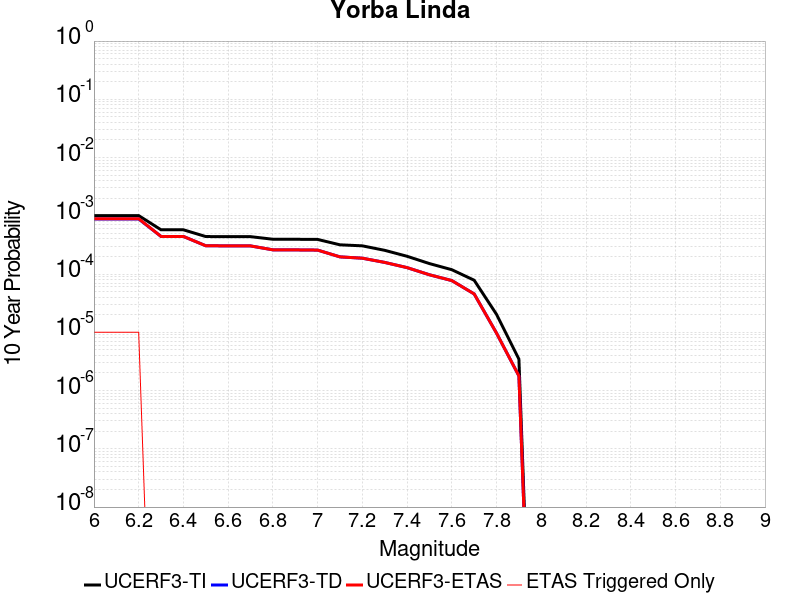 |

| Magnitude | 1 wk TI Prob | 1 wk TD Prob | 1 wk ETAS Prob | 1 wk ETAS/TD Gain | 1 wk ETAS Triggered Only | 1 mo TI Prob | 1 mo TD Prob | 1 mo ETAS Prob | 1 mo ETAS/TD Gain | 1 mo ETAS Triggered Only | 1 yr TI Prob | 1 yr TD Prob | 1 yr ETAS Prob | 1 yr ETAS/TD Gain | 1 yr ETAS Triggered Only | 10 yr TI Prob | 10 yr TD Prob | 10 yr ETAS Prob | 10 yr ETAS/TD Gain | 10 yr ETAS Triggered Only |
|-----|-----|-----|-----|-----|-----|-----|-----|-----|-----|-----|-----|-----|-----|-----|-----|-----|-----|-----|-----|-----|
| 6.0 | 1.9346849E-6 | 1.6909112E-6 | 1.6909112E-6 | 1.0 | 0.0 | 8.29148E-6 | 7.2467474E-6 | 7.2467474E-6 | 1.0 | 0.0 | 1.009441E-4 | 8.822652E-5 | 8.822652E-5 | 1.0 | 0.0 | 0.0010089825 | 8.8200805E-4 | 8.919992E-4 | 1.0113277 | 1.0E-5 |
| 6.1 | 1.9346849E-6 | 1.6909112E-6 | 1.6909112E-6 | 1.0 | 0.0 | 8.29148E-6 | 7.2467474E-6 | 7.2467474E-6 | 1.0 | 0.0 | 1.009441E-4 | 8.822652E-5 | 8.822652E-5 | 1.0 | 0.0 | 0.0010089825 | 8.8200805E-4 | 8.919992E-4 | 1.0113277 | 1.0E-5 |
| 6.2 | 1.9346849E-6 | 1.6909112E-6 | 1.6909112E-6 | 1.0 | 0.0 | 8.29148E-6 | 7.2467474E-6 | 7.2467474E-6 | 1.0 | 0.0 | 1.009441E-4 | 8.822652E-5 | 8.822652E-5 | 1.0 | 0.0 | 0.0010089825 | 8.8200805E-4 | 8.919992E-4 | 1.0113277 | 1.0E-5 |
| 6.3 | 1.1028608E-6 | 8.481863E-7 | 8.481863E-7 | 1.0 | 0.0 | 4.7265376E-6 | 3.6350793E-6 | 3.6350793E-6 | 1.0 | 0.0 | 5.754407E-5 | 4.425626E-5 | 4.425626E-5 | 1.0 | 0.0 | 5.7529175E-4 | 4.42481E-4 | 4.42481E-4 | 1.0 | 0.0 |
| 6.4 | 1.1028608E-6 | 8.481863E-7 | 8.481863E-7 | 1.0 | 0.0 | 4.7265376E-6 | 3.6350793E-6 | 3.6350793E-6 | 1.0 | 0.0 | 5.754407E-5 | 4.425626E-5 | 4.425626E-5 | 1.0 | 0.0 | 5.7529175E-4 | 4.42481E-4 | 4.42481E-4 | 1.0 | 0.0 |
| 6.5 | 8.4451364E-7 | 5.869109E-7 | 5.869109E-7 | 1.0 | 0.0 | 3.619339E-6 | 2.5153304E-6 | 2.5153304E-6 | 1.0 | 0.0 | 4.406456E-5 | 3.0623738E-5 | 3.0623738E-5 | 1.0 | 0.0 | 4.4055824E-4 | 3.0619733E-4 | 3.0619733E-4 | 1.0 | 0.0 |
| 6.6 | 8.422957E-7 | 5.844643E-7 | 5.844643E-7 | 1.0 | 0.0 | 3.6098338E-6 | 2.5048448E-6 | 2.5048448E-6 | 1.0 | 0.0 | 4.3948843E-5 | 3.049608E-5 | 3.049608E-5 | 1.0 | 0.0 | 4.394015E-4 | 3.049211E-4 | 3.049211E-4 | 1.0 | 0.0 |
| 6.7 | 8.4119705E-7 | 5.832485E-7 | 5.832485E-7 | 1.0 | 0.0 | 3.6051254E-6 | 2.499634E-6 | 2.499634E-6 | 1.0 | 0.0 | 4.3891516E-5 | 3.0432642E-5 | 3.0432642E-5 | 1.0 | 0.0 | 4.388285E-4 | 3.042869E-4 | 3.042869E-4 | 1.0 | 0.0 |
| 6.8 | 7.5919155E-7 | 4.9949944E-7 | 4.9949944E-7 | 1.0 | 0.0 | 3.253674E-6 | 2.1407102E-6 | 2.1407102E-6 | 1.0 | 0.0 | 3.961276E-5 | 2.6062853E-5 | 2.6062853E-5 | 1.0 | 0.0 | 3.9605703E-4 | 2.6059969E-4 | 2.6059969E-4 | 1.0 | 0.0 |
| 6.9 | 7.5804564E-7 | 4.981178E-7 | 4.981178E-7 | 1.0 | 0.0 | 3.248763E-6 | 2.134789E-6 | 2.134789E-6 | 1.0 | 0.0 | 3.955297E-5 | 2.5990763E-5 | 2.5990763E-5 | 1.0 | 0.0 | 3.9545933E-4 | 2.5987893E-4 | 2.5987893E-4 | 1.0 | 0.0 |
| 7.0 | 7.539293E-7 | 4.943313E-7 | 4.943313E-7 | 1.0 | 0.0 | 3.2311218E-6 | 2.118561E-6 | 2.118561E-6 | 1.0 | 0.0 | 3.9338196E-5 | 2.5793192E-5 | 2.5793192E-5 | 1.0 | 0.0 | 3.9331234E-4 | 2.579037E-4 | 2.579037E-4 | 1.0 | 0.0 |
| 7.1 | 6.0900885E-7 | 3.7817128E-7 | 3.7817128E-7 | 1.0 | 0.0 | 2.6100352E-6 | 1.6207331E-6 | 1.6207331E-6 | 1.0 | 0.0 | 3.1776715E-5 | 1.973225E-5 | 1.973225E-5 | 1.0 | 0.0 | 3.1772171E-4 | 1.9730533E-4 | 1.9730533E-4 | 1.0 | 0.0 |
| 7.2 | 5.849925E-7 | 3.5878818E-7 | 3.5878818E-7 | 1.0 | 0.0 | 2.5071083E-6 | 1.5376628E-6 | 1.5376628E-6 | 1.0 | 0.0 | 3.0523614E-5 | 1.8720886E-5 | 1.8720886E-5 | 1.0 | 0.0 | 3.0519423E-4 | 1.8719342E-4 | 1.8719342E-4 | 1.0 | 0.0 |
| 7.3 | 4.89808E-7 | 3.0379488E-7 | 3.0379488E-7 | 1.0 | 0.0 | 2.0991754E-6 | 1.3019775E-6 | 1.3019775E-6 | 1.0 | 0.0 | 2.5557161E-5 | 1.5851463E-5 | 1.5851463E-5 | 1.0 | 0.0 | 2.5554223E-4 | 1.5850355E-4 | 1.5850355E-4 | 1.0 | 0.0 |
| 7.4 | 3.8700415E-7 | 2.4722343E-7 | 2.4722343E-7 | 1.0 | 0.0 | 1.6585881E-6 | 1.0595286E-6 | 1.0595286E-6 | 1.0 | 0.0 | 2.0193123E-5 | 1.2899685E-5 | 1.2899685E-5 | 1.0 | 0.0 | 2.0191289E-4 | 1.2898949E-4 | 1.2898949E-4 | 1.0 | 0.0 |
| 7.5 | 2.900565E-7 | 1.8637462E-7 | 1.8637462E-7 | 1.0 | 0.0 | 1.2430987E-6 | 7.9874815E-7 | 7.9874815E-7 | 1.0 | 0.0 | 1.5134622E-5 | 9.724716E-6 | 9.724716E-6 | 1.0 | 0.0 | 1.5133592E-4 | 9.7242984E-5 | 9.7242984E-5 | 1.0 | 0.0 |
| 7.6 | 2.2770318E-7 | 1.4814276E-7 | 1.4814276E-7 | 1.0 | 0.0 | 9.758704E-7 | 6.348974E-7 | 6.348974E-7 | 1.0 | 0.0 | 1.1881158E-5 | 7.729848E-6 | 7.729848E-6 | 1.0 | 0.0 | 1.1880523E-4 | 7.729585E-5 | 7.729585E-5 | 1.0 | 0.0 |
| 7.7 | 1.5017194E-7 | 8.7355275E-8 | 8.7355275E-8 | 1.0 | 0.0 | 6.4359386E-7 | 3.7437968E-7 | 3.7437968E-7 | 1.0 | 0.0 | 7.835727E-6 | 4.5580637E-6 | 4.5580637E-6 | 1.0 | 0.0 | 7.835451E-5 | 4.5579727E-5 | 4.5579727E-5 | 1.0 | 0.0 |
| 7.8 | 3.895753E-8 | 1.8532088E-8 | 1.8532088E-8 | 1.0 | 0.0 | 1.6696083E-7 | 7.942323E-8 | 7.942323E-8 | 1.0 | 0.0 | 2.0327461E-6 | 9.669774E-7 | 9.669774E-7 | 1.0 | 0.0 | 2.0327276E-5 | 9.669734E-6 | 9.669734E-6 | 1.0 | 0.0 |
| 7.9 | 6.648505E-9 | 3.4183114E-9 | 3.4183114E-9 | 1.0 | 0.0 | 2.8493591E-8 | 1.4649906E-8 | 1.4649906E-8 | 1.0 | 0.0 | 3.4690942E-7 | 1.783626E-7 | 1.783626E-7 | 1.0 | 0.0 | 3.4690888E-6 | 1.7836247E-6 | 1.7836247E-6 | 1.0 | 0.0 |

## Big Lagoon - Bald Mtn 2011 CFM
*[(top)](#table-of-contents)*

| 1 Week | 1 Month | 1 Year | 10 Year |
|-----|-----|-----|-----|
|  |  | 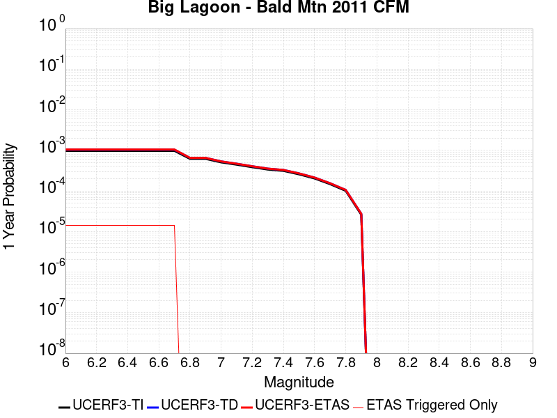 | 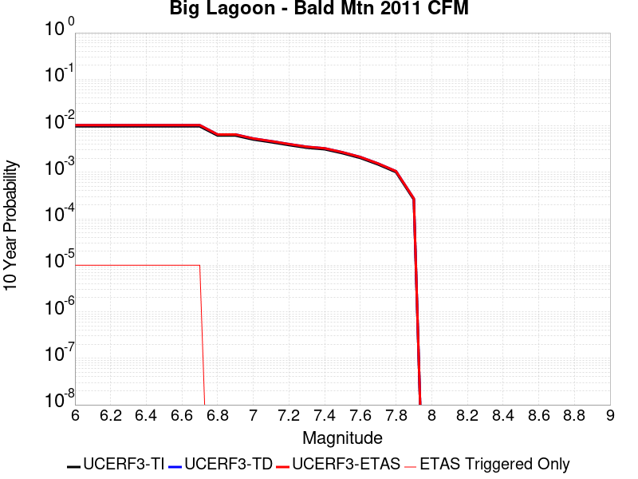 |

| Magnitude | 1 wk TI Prob | 1 wk TD Prob | 1 wk ETAS Prob | 1 wk ETAS/TD Gain | 1 wk ETAS Triggered Only | 1 mo TI Prob | 1 mo TD Prob | 1 mo ETAS Prob | 1 mo ETAS/TD Gain | 1 mo ETAS Triggered Only | 1 yr TI Prob | 1 yr TD Prob | 1 yr ETAS Prob | 1 yr ETAS/TD Gain | 1 yr ETAS Triggered Only | 10 yr TI Prob | 10 yr TD Prob | 10 yr ETAS Prob | 10 yr ETAS/TD Gain | 10 yr ETAS Triggered Only |
|-----|-----|-----|-----|-----|-----|-----|-----|-----|-----|-----|-----|-----|-----|-----|-----|-----|-----|-----|-----|-----|
| 6.0 | 1.8699735E-5 | 1.985018E-5 | 1.985018E-5 | 1.0 | 0.0 | 8.013926E-5 | 8.5069645E-5 | 8.5069645E-5 | 1.0 | 0.0 | 9.752587E-4 | 0.0010352687 | 0.0010452583 | 1.0096493 | 1.0E-5 | 0.009709897 | 0.010308274 | 0.010318171 | 1.0009601 | 1.0E-5 |
| 6.1 | 1.8699735E-5 | 1.985018E-5 | 1.985018E-5 | 1.0 | 0.0 | 8.013926E-5 | 8.5069645E-5 | 8.5069645E-5 | 1.0 | 0.0 | 9.752587E-4 | 0.0010352687 | 0.0010452583 | 1.0096493 | 1.0E-5 | 0.009709897 | 0.010308274 | 0.010318171 | 1.0009601 | 1.0E-5 |
| 6.2 | 1.8699735E-5 | 1.985018E-5 | 1.985018E-5 | 1.0 | 0.0 | 8.013926E-5 | 8.5069645E-5 | 8.5069645E-5 | 1.0 | 0.0 | 9.752587E-4 | 0.0010352687 | 0.0010452583 | 1.0096493 | 1.0E-5 | 0.009709897 | 0.010308274 | 0.010318171 | 1.0009601 | 1.0E-5 |
| 6.3 | 1.8699735E-5 | 1.985018E-5 | 1.985018E-5 | 1.0 | 0.0 | 8.013926E-5 | 8.5069645E-5 | 8.5069645E-5 | 1.0 | 0.0 | 9.752587E-4 | 0.0010352687 | 0.0010452583 | 1.0096493 | 1.0E-5 | 0.009709897 | 0.010308274 | 0.010318171 | 1.0009601 | 1.0E-5 |
| 6.4 | 1.8699735E-5 | 1.985018E-5 | 1.985018E-5 | 1.0 | 0.0 | 8.013926E-5 | 8.5069645E-5 | 8.5069645E-5 | 1.0 | 0.0 | 9.752587E-4 | 0.0010352687 | 0.0010452583 | 1.0096493 | 1.0E-5 | 0.009709897 | 0.010308274 | 0.010318171 | 1.0009601 | 1.0E-5 |
| 6.5 | 1.8699735E-5 | 1.985018E-5 | 1.985018E-5 | 1.0 | 0.0 | 8.013926E-5 | 8.5069645E-5 | 8.5069645E-5 | 1.0 | 0.0 | 9.752587E-4 | 0.0010352687 | 0.0010452583 | 1.0096493 | 1.0E-5 | 0.009709897 | 0.010308274 | 0.010318171 | 1.0009601 | 1.0E-5 |
| 6.6 | 1.8699735E-5 | 1.985018E-5 | 1.985018E-5 | 1.0 | 0.0 | 8.013926E-5 | 8.5069645E-5 | 8.5069645E-5 | 1.0 | 0.0 | 9.752587E-4 | 0.0010352687 | 0.0010452583 | 1.0096493 | 1.0E-5 | 0.009709897 | 0.010308274 | 0.010318171 | 1.0009601 | 1.0E-5 |
| 6.7 | 1.8699735E-5 | 1.985018E-5 | 1.985018E-5 | 1.0 | 0.0 | 8.013926E-5 | 8.5069645E-5 | 8.5069645E-5 | 1.0 | 0.0 | 9.752587E-4 | 0.0010352687 | 0.0010452583 | 1.0096493 | 1.0E-5 | 0.009709897 | 0.010308274 | 0.010318171 | 1.0009601 | 1.0E-5 |
| 6.8 | 1.18505095E-5 | 1.2499804E-5 | 1.2499804E-5 | 1.0 | 0.0 | 5.078691E-5 | 5.3569514E-5 | 5.3569514E-5 | 1.0 | 0.0 | 6.181552E-4 | 6.520185E-4 | 6.520185E-4 | 1.0 | 0.0 | 0.006164385 | 0.0065015587 | 0.0065015587 | 1.0 | 0.0 |
| 6.9 | 1.18505095E-5 | 1.2499804E-5 | 1.2499804E-5 | 1.0 | 0.0 | 5.078691E-5 | 5.3569514E-5 | 5.3569514E-5 | 1.0 | 0.0 | 6.181552E-4 | 6.520185E-4 | 6.520185E-4 | 1.0 | 0.0 | 0.006164385 | 0.0065015587 | 0.0065015587 | 1.0 | 0.0 |
| 7.0 | 9.719786E-6 | 1.0235487E-5 | 1.0235487E-5 | 1.0 | 0.0 | 4.1655563E-5 | 4.386565E-5 | 4.386565E-5 | 1.0 | 0.0 | 5.0703844E-4 | 5.3393573E-4 | 5.3393573E-4 | 1.0 | 0.0 | 0.005058831 | 0.0053267754 | 0.0053267754 | 1.0 | 0.0 |
| 7.1 | 8.523418E-6 | 8.969463E-6 | 8.969463E-6 | 1.0 | 0.0 | 3.652842E-5 | 3.844E-5 | 3.844E-5 | 1.0 | 0.0 | 4.4464276E-4 | 4.6790804E-4 | 4.6790804E-4 | 1.0 | 0.0 | 0.0044375416 | 0.004669392 | 0.004669392 | 1.0 | 0.0 |
| 7.2 | 7.378894E-6 | 7.761112E-6 | 7.761112E-6 | 1.0 | 0.0 | 3.162345E-5 | 3.326149E-5 | 3.326149E-5 | 1.0 | 0.0 | 3.8494746E-4 | 4.048843E-4 | 4.048843E-4 | 1.0 | 0.0 | 0.0038428132 | 0.0040415623 | 0.0040415623 | 1.0 | 0.0 |
| 7.3 | 6.4640294E-6 | 6.7924434E-6 | 6.7924434E-6 | 1.0 | 0.0 | 2.7702688E-5 | 2.9110151E-5 | 2.9110151E-5 | 1.0 | 0.0 | 3.3722803E-4 | 3.5435913E-4 | 3.5435913E-4 | 1.0 | 0.0 | 0.0033671674 | 0.0035380109 | 0.0035380109 | 1.0 | 0.0 |
| 7.4 | 5.9959093E-6 | 6.2988E-6 | 6.2988E-6 | 1.0 | 0.0 | 2.5696501E-5 | 2.6994581E-5 | 2.6994581E-5 | 1.0 | 0.0 | 3.1280998E-4 | 3.2861007E-4 | 3.2861007E-4 | 1.0 | 0.0 | 0.0031237002 | 0.0032813034 | 0.0032813034 | 1.0 | 0.0 |
| 7.5 | 4.929265E-6 | 5.176396E-6 | 5.176396E-6 | 1.0 | 0.0 | 2.112525E-5 | 2.2184367E-5 | 2.2184367E-5 | 1.0 | 0.0 | 2.5716957E-4 | 2.700616E-4 | 2.700616E-4 | 1.0 | 0.0 | 0.0025687215 | 0.002697375 | 0.002697375 | 1.0 | 0.0 |
| 7.6 | 3.8982403E-6 | 4.0889267E-6 | 4.0889267E-6 | 1.0 | 0.0 | 1.6706637E-5 | 1.7523857E-5 | 1.7523857E-5 | 1.0 | 0.0 | 2.0338432E-4 | 2.1333233E-4 | 2.1333233E-4 | 1.0 | 0.0 | 0.0020319829 | 0.002131303 | 0.002131303 | 1.0 | 0.0 |
| 7.7 | 2.820968E-6 | 2.9572116E-6 | 2.9572116E-6 | 1.0 | 0.0 | 1.2089806E-5 | 1.2673704E-5 | 1.2673704E-5 | 1.0 | 0.0 | 1.4718344E-4 | 1.5429159E-4 | 1.5429159E-4 | 1.0 | 0.0 | 0.00147086 | 0.0015418624 | 0.0015418624 | 1.0 | 0.0 |
| 7.8 | 1.9314455E-6 | 2.0260186E-6 | 2.0260186E-6 | 1.0 | 0.0 | 8.277597E-6 | 8.682909E-6 | 8.682909E-6 | 1.0 | 0.0 | 1.0077508E-4 | 1.0570941E-4 | 1.0570941E-4 | 1.0 | 0.0 | 0.0010072939 | 0.0010566041 | 0.0010566041 | 1.0 | 0.0 |
| 7.9 | 4.9586197E-7 | 5.2189216E-7 | 5.2189216E-7 | 1.0 | 0.0 | 2.125121E-6 | 2.2366787E-6 | 2.2366787E-6 | 1.0 | 0.0 | 2.5873042E-5 | 2.7231245E-5 | 2.7231245E-5 | 1.0 | 0.0 | 2.5870028E-4 | 2.7228118E-4 | 2.7228118E-4 | 1.0 | 0.0 |

## Quien Sabe 2011 CFM
*[(top)](#table-of-contents)*

| 1 Week | 1 Month | 1 Year | 10 Year |
|-----|-----|-----|-----|
| 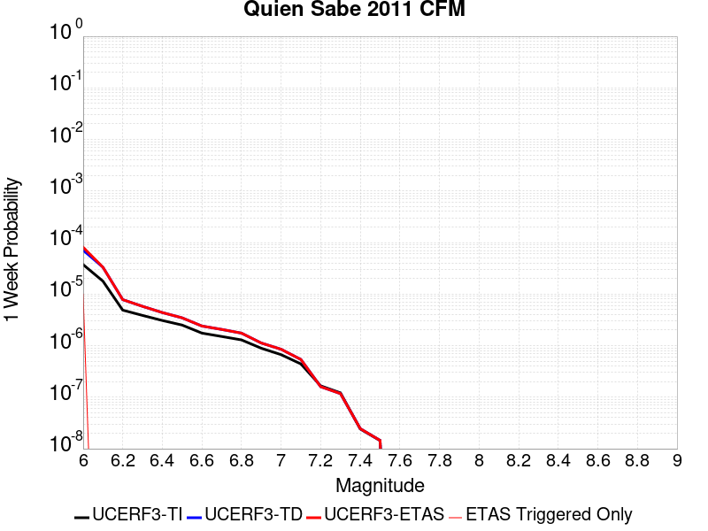 | 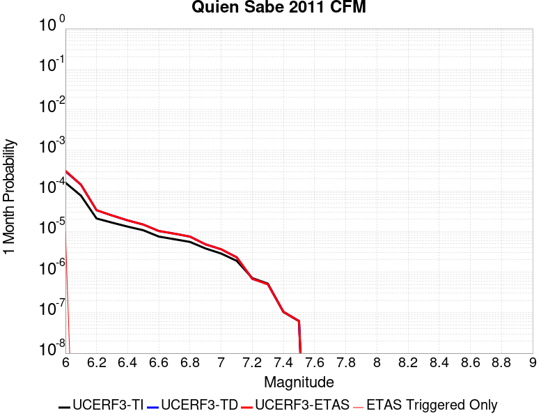 |  |  |

| Magnitude | 1 wk TI Prob | 1 wk TD Prob | 1 wk ETAS Prob | 1 wk ETAS/TD Gain | 1 wk ETAS Triggered Only | 1 mo TI Prob | 1 mo TD Prob | 1 mo ETAS Prob | 1 mo ETAS/TD Gain | 1 mo ETAS Triggered Only | 1 yr TI Prob | 1 yr TD Prob | 1 yr ETAS Prob | 1 yr ETAS/TD Gain | 1 yr ETAS Triggered Only | 10 yr TI Prob | 10 yr TD Prob | 10 yr ETAS Prob | 10 yr ETAS/TD Gain | 10 yr ETAS Triggered Only |
|-----|-----|-----|-----|-----|-----|-----|-----|-----|-----|-----|-----|-----|-----|-----|-----|-----|-----|-----|-----|-----|
| 6.0 | 3.729899E-5 | 7.094885E-5 | 8.094814E-5 | 1.1409366 | 1.0E-5 | 1.5984301E-4 | 3.0394195E-4 | 3.1393892E-4 | 1.032891 | 1.0E-5 | 0.0019443515 | 0.0036850597 | 0.0036950228 | 1.0027037 | 1.0E-5 | 0.019274272 | 0.035349693 | 0.035359338 | 1.0002729 | 1.0E-5 |
| 6.1 | 1.7825725E-5 | 3.3210796E-5 | 3.3210796E-5 | 1.0 | 0.0 | 7.639373E-5 | 1.4227985E-4 | 1.4227985E-4 | 1.0 | 0.0 | 9.296967E-4 | 0.0017266083 | 0.0017266083 | 1.0 | 0.0 | 0.009258169 | 0.016698873 | 0.016698873 | 1.0 | 0.0 |
| 6.2 | 4.8865336E-6 | 7.807397E-6 | 7.807397E-6 | 1.0 | 0.0 | 2.0942118E-5 | 3.3456672E-5 | 3.3456672E-5 | 1.0 | 0.0 | 2.5494045E-4 | 4.0691794E-4 | 4.0691794E-4 | 1.0 | 0.0 | 0.0025464818 | 0.0040135398 | 0.0040135398 | 1.0 | 0.0 |
| 6.3 | 3.858491E-6 | 5.7896764E-6 | 5.7896764E-6 | 1.0 | 0.0 | 1.6536285E-5 | 2.4812689E-5 | 2.4812689E-5 | 1.0 | 0.0 | 2.0131067E-4 | 3.020573E-4 | 3.020573E-4 | 1.0 | 0.0 | 0.002011284 | 0.0030020247 | 0.0030020247 | 1.0 | 0.0 |
| 6.4 | 3.0771805E-6 | 4.3848822E-6 | 4.3848822E-6 | 1.0 | 0.0 | 1.318785E-5 | 1.879223E-5 | 1.879223E-5 | 1.0 | 0.0 | 1.6055023E-4 | 2.287738E-4 | 2.287738E-4 | 1.0 | 0.0 | 0.001604343 | 0.0022864633 | 0.0022864633 | 1.0 | 0.0 |
| 6.5 | 2.5081235E-6 | 3.4635768E-6 | 3.4635768E-6 | 1.0 | 0.0 | 1.0749056E-5 | 1.4843825E-5 | 1.4843825E-5 | 1.0 | 0.0 | 1.308619E-4 | 1.8071005E-4 | 1.8071005E-4 | 1.0 | 0.0 | 0.0013078486 | 0.0018122483 | 0.0018122483 | 1.0 | 0.0 |
| 6.6 | 1.7505364E-6 | 2.4023664E-6 | 2.4023664E-6 | 1.0 | 0.0 | 7.502277E-6 | 1.0295819E-5 | 1.0295819E-5 | 1.0 | 0.0 | 9.13364E-5 | 1.253451E-4 | 1.253451E-4 | 1.0 | 0.0 | 9.129886E-4 | 0.0012582706 | 0.0012582706 | 1.0 | 0.0 |
| 6.7 | 1.505737E-6 | 2.063768E-6 | 2.063768E-6 | 1.0 | 0.0 | 6.4531428E-6 | 8.844693E-6 | 8.844693E-6 | 1.0 | 0.0 | 7.8564175E-5 | 1.0767942E-4 | 1.0767942E-4 | 1.0 | 0.0 | 7.853641E-4 | 0.0010818074 | 0.0010818074 | 1.0 | 0.0 |
| 6.8 | 1.2924105E-6 | 1.7484224E-6 | 1.7484224E-6 | 1.0 | 0.0 | 5.5388905E-6 | 7.4932204E-6 | 7.4932204E-6 | 1.0 | 0.0 | 6.74339E-5 | 9.1226684E-5 | 9.1226684E-5 | 1.0 | 0.0 | 6.741344E-4 | 9.1608387E-4 | 9.1608387E-4 | 1.0 | 0.0 |
| 6.9 | 8.9075286E-7 | 1.1249912E-6 | 1.1249912E-6 | 1.0 | 0.0 | 3.8175067E-6 | 4.8213833E-6 | 4.8213833E-6 | 1.0 | 0.0 | 4.6477155E-5 | 5.869898E-5 | 5.869898E-5 | 1.0 | 0.0 | 4.6467435E-4 | 5.903731E-4 | 5.903731E-4 | 1.0 | 0.0 |
| 7.0 | 6.6891175E-7 | 8.516645E-7 | 8.516645E-7 | 1.0 | 0.0 | 2.8667614E-6 | 3.6499866E-6 | 3.6499866E-6 | 1.0 | 0.0 | 3.4902263E-5 | 4.443788E-5 | 4.443788E-5 | 1.0 | 0.0 | 3.4896782E-4 | 4.4676356E-4 | 4.4676356E-4 | 1.0 | 0.0 |
| 7.1 | 4.4205015E-7 | 5.391929E-7 | 5.391929E-7 | 1.0 | 0.0 | 1.8944993E-6 | 2.3108257E-6 | 2.3108257E-6 | 1.0 | 0.0 | 2.3065284E-5 | 2.8134109E-5 | 2.8134109E-5 | 1.0 | 0.0 | 2.3062891E-4 | 2.826615E-4 | 2.826615E-4 | 1.0 | 0.0 |
| 7.2 | 1.6620965E-7 | 1.5987632E-7 | 1.5987632E-7 | 1.0 | 0.0 | 7.123269E-7 | 6.851841E-7 | 6.851841E-7 | 1.0 | 0.0 | 8.672545E-6 | 8.342088E-6 | 8.342088E-6 | 1.0 | 0.0 | 8.6722066E-5 | 8.354316E-5 | 8.354316E-5 | 1.0 | 0.0 |
| 7.3 | 1.2142488E-7 | 1.1726676E-7 | 1.1726676E-7 | 1.0 | 0.0 | 5.2039223E-7 | 5.025717E-7 | 5.025717E-7 | 1.0 | 0.0 | 6.335757E-6 | 6.118797E-6 | 6.118797E-6 | 1.0 | 0.0 | 6.3355765E-5 | 6.120608E-5 | 6.120608E-5 | 1.0 | 0.0 |
| 7.4 | 2.4192937E-8 | 2.4545901E-8 | 2.4545901E-8 | 1.0 | 0.0 | 1.0368401E-7 | 1.0519671E-7 | 1.0519671E-7 | 1.0 | 0.0 | 1.2623522E-6 | 1.2807693E-6 | 1.2807693E-6 | 1.0 | 0.0 | 1.2623449E-5 | 1.2768185E-5 | 1.2768185E-5 | 1.0 | 0.0 |
| 7.5 | 1.4432802E-8 | 1.4508743E-8 | 1.4508743E-8 | 1.0 | 0.0 | 6.185486E-8 | 6.218033E-8 | 6.218033E-8 | 1.0 | 0.0 | 7.530827E-7 | 7.5704526E-7 | 7.5704526E-7 | 1.0 | 0.0 | 7.530801E-6 | 7.528889E-6 | 7.528889E-6 | 1.0 | 0.0 |

## Keddie Ridge 2011 CFM
*[(top)](#table-of-contents)*

| 1 Week | 1 Month | 1 Year | 10 Year |
|-----|-----|-----|-----|
|  | 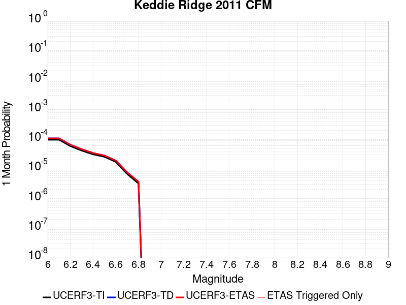 | 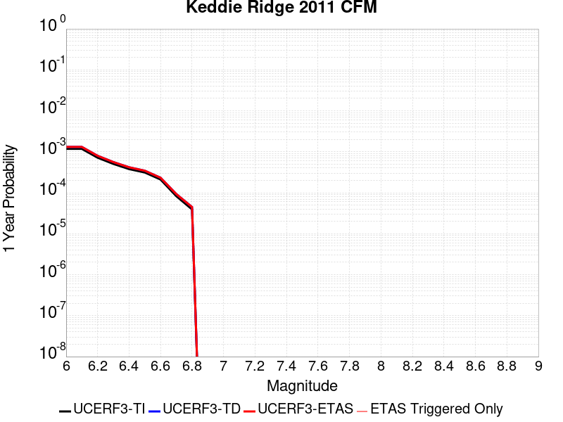 | 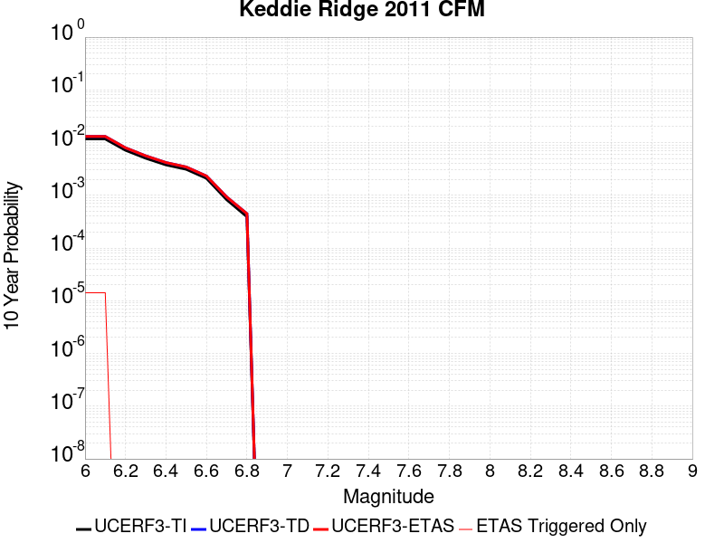 |

| Magnitude | 1 wk TI Prob | 1 wk TD Prob | 1 wk ETAS Prob | 1 wk ETAS/TD Gain | 1 wk ETAS Triggered Only | 1 mo TI Prob | 1 mo TD Prob | 1 mo ETAS Prob | 1 mo ETAS/TD Gain | 1 mo ETAS Triggered Only | 1 yr TI Prob | 1 yr TD Prob | 1 yr ETAS Prob | 1 yr ETAS/TD Gain | 1 yr ETAS Triggered Only | 10 yr TI Prob | 10 yr TD Prob | 10 yr ETAS Prob | 10 yr ETAS/TD Gain | 10 yr ETAS Triggered Only |
|-----|-----|-----|-----|-----|-----|-----|-----|-----|-----|-----|-----|-----|-----|-----|-----|-----|-----|-----|-----|-----|
| 6.0 | 2.2591947E-5 | 2.5189187E-5 | 2.5189187E-5 | 1.0 | 0.0 | 9.6819036E-5 | 1.0794964E-4 | 1.0794964E-4 | 1.0 | 0.0 | 0.0011781343 | 0.0013135736 | 0.0013135736 | 1.0 | 0.0 | 0.011719079 | 0.013066037 | 0.013075906 | 1.0007553 | 1.0E-5 |
| 6.1 | 2.2591947E-5 | 2.5189187E-5 | 2.5189187E-5 | 1.0 | 0.0 | 9.6819036E-5 | 1.0794964E-4 | 1.0794964E-4 | 1.0 | 0.0 | 0.0011781343 | 0.0013135736 | 0.0013135736 | 1.0 | 0.0 | 0.011719079 | 0.013066037 | 0.013075906 | 1.0007553 | 1.0E-5 |
| 6.2 | 1.3775145E-5 | 1.5322817E-5 | 1.5322817E-5 | 1.0 | 0.0 | 5.9035E-5 | 6.56677E-5 | 6.56677E-5 | 1.0 | 0.0 | 7.185141E-4 | 7.9923525E-4 | 7.9923525E-4 | 1.0 | 0.0 | 0.0071619535 | 0.007966028 | 0.007966028 | 1.0 | 0.0 |
| 6.3 | 9.705435E-6 | 1.0768351E-5 | 1.0768351E-5 | 1.0 | 0.0 | 4.1594063E-5 | 4.6149325E-5 | 4.6149325E-5 | 1.0 | 0.0 | 5.0629E-4 | 5.617356E-4 | 5.617356E-4 | 1.0 | 0.0 | 0.005051381 | 0.0056043877 | 0.0056043877 | 1.0 | 0.0 |
| 6.4 | 7.2549733E-6 | 8.027268E-6 | 8.027268E-6 | 1.0 | 0.0 | 3.109237E-5 | 3.440217E-5 | 3.440217E-5 | 1.0 | 0.0 | 3.7848388E-4 | 4.1877388E-4 | 4.1877388E-4 | 1.0 | 0.0 | 0.003778399 | 0.004180635 | 0.004180635 | 1.0 | 0.0 |
| 6.5 | 5.983293E-6 | 6.6130237E-6 | 6.6130237E-6 | 1.0 | 0.0 | 2.5642432E-5 | 2.834126E-5 | 2.834126E-5 | 1.0 | 0.0 | 3.1215188E-4 | 3.4500693E-4 | 3.4500693E-4 | 1.0 | 0.0 | 0.0031171376 | 0.003445376 | 0.003445376 | 1.0 | 0.0 |
| 6.6 | 4.0336154E-6 | 4.4578037E-6 | 4.4578037E-6 | 1.0 | 0.0 | 1.728681E-5 | 1.9104757E-5 | 1.9104757E-5 | 1.0 | 0.0 | 2.1044657E-4 | 2.3257962E-4 | 2.3257962E-4 | 1.0 | 0.0 | 0.002102474 | 0.002323758 | 0.002323758 | 1.0 | 0.0 |
| 6.7 | 1.5832104E-6 | 1.7816087E-6 | 1.7816087E-6 | 1.0 | 0.0 | 6.7851697E-6 | 7.635445E-6 | 7.635445E-6 | 1.0 | 0.0 | 8.260631E-5 | 9.295785E-5 | 9.295785E-5 | 1.0 | 0.0 | 8.2575605E-4 | 9.2921633E-4 | 9.2921633E-4 | 1.0 | 0.0 |
| 6.8 | 7.5177275E-7 | 8.5902946E-7 | 8.5902946E-7 | 1.0 | 0.0 | 3.221879E-6 | 3.6815507E-6 | 3.6815507E-6 | 1.0 | 0.0 | 3.9225673E-5 | 4.4822125E-5 | 4.4822125E-5 | 1.0 | 0.0 | 3.921875E-4 | 4.481474E-4 | 4.481474E-4 | 1.0 | 0.0 |

## Sisar
*[(top)](#table-of-contents)*

| 1 Week | 1 Month | 1 Year | 10 Year |
|-----|-----|-----|-----|
|  |  |  |  |

| Magnitude | 1 wk TI Prob | 1 wk TD Prob | 1 wk ETAS Prob | 1 wk ETAS/TD Gain | 1 wk ETAS Triggered Only | 1 mo TI Prob | 1 mo TD Prob | 1 mo ETAS Prob | 1 mo ETAS/TD Gain | 1 mo ETAS Triggered Only | 1 yr TI Prob | 1 yr TD Prob | 1 yr ETAS Prob | 1 yr ETAS/TD Gain | 1 yr ETAS Triggered Only | 10 yr TI Prob | 10 yr TD Prob | 10 yr ETAS Prob | 10 yr ETAS/TD Gain | 10 yr ETAS Triggered Only |
|-----|-----|-----|-----|-----|-----|-----|-----|-----|-----|-----|-----|-----|-----|-----|-----|-----|-----|-----|-----|-----|
| 6.0 | 4.544193E-6 | 3.8396115E-6 | 3.8396115E-6 | 1.0 | 0.0 | 1.9474966E-5 | 1.6455377E-5 | 1.6455377E-5 | 1.0 | 0.0 | 2.3708193E-4 | 2.0032612E-4 | 2.0032612E-4 | 1.0 | 0.0 | 0.0023682916 | 0.002001489 | 0.002011469 | 1.0049863 | 1.0E-5 |
| 6.1 | 4.544193E-6 | 3.8396115E-6 | 3.8396115E-6 | 1.0 | 0.0 | 1.9474966E-5 | 1.6455377E-5 | 1.6455377E-5 | 1.0 | 0.0 | 2.3708193E-4 | 2.0032612E-4 | 2.0032612E-4 | 1.0 | 0.0 | 0.0023682916 | 0.002001489 | 0.002011469 | 1.0049863 | 1.0E-5 |
| 6.2 | 4.544193E-6 | 3.8396115E-6 | 3.8396115E-6 | 1.0 | 0.0 | 1.9474966E-5 | 1.6455377E-5 | 1.6455377E-5 | 1.0 | 0.0 | 2.3708193E-4 | 2.0032612E-4 | 2.0032612E-4 | 1.0 | 0.0 | 0.0023682916 | 0.002001489 | 0.002011469 | 1.0049863 | 1.0E-5 |
| 6.3 | 4.544193E-6 | 3.8396115E-6 | 3.8396115E-6 | 1.0 | 0.0 | 1.9474966E-5 | 1.6455377E-5 | 1.6455377E-5 | 1.0 | 0.0 | 2.3708193E-4 | 2.0032612E-4 | 2.0032612E-4 | 1.0 | 0.0 | 0.0023682916 | 0.002001489 | 0.002011469 | 1.0049863 | 1.0E-5 |
| 6.4 | 4.544193E-6 | 3.8396115E-6 | 3.8396115E-6 | 1.0 | 0.0 | 1.9474966E-5 | 1.6455377E-5 | 1.6455377E-5 | 1.0 | 0.0 | 2.3708193E-4 | 2.0032612E-4 | 2.0032612E-4 | 1.0 | 0.0 | 0.0023682916 | 0.002001489 | 0.002011469 | 1.0049863 | 1.0E-5 |
| 6.5 | 4.544193E-6 | 3.8396115E-6 | 3.8396115E-6 | 1.0 | 0.0 | 1.9474966E-5 | 1.6455377E-5 | 1.6455377E-5 | 1.0 | 0.0 | 2.3708193E-4 | 2.0032612E-4 | 2.0032612E-4 | 1.0 | 0.0 | 0.0023682916 | 0.002001489 | 0.002011469 | 1.0049863 | 1.0E-5 |
| 6.6 | 4.544193E-6 | 3.8396115E-6 | 3.8396115E-6 | 1.0 | 0.0 | 1.9474966E-5 | 1.6455377E-5 | 1.6455377E-5 | 1.0 | 0.0 | 2.3708193E-4 | 2.0032612E-4 | 2.0032612E-4 | 1.0 | 0.0 | 0.0023682916 | 0.002001489 | 0.002011469 | 1.0049863 | 1.0E-5 |
| 6.7 | 4.544193E-6 | 3.8396115E-6 | 3.8396115E-6 | 1.0 | 0.0 | 1.9474966E-5 | 1.6455377E-5 | 1.6455377E-5 | 1.0 | 0.0 | 2.3708193E-4 | 2.0032612E-4 | 2.0032612E-4 | 1.0 | 0.0 | 0.0023682916 | 0.002001489 | 0.002011469 | 1.0049863 | 1.0E-5 |
| 6.8 | 4.544193E-6 | 3.8396115E-6 | 3.8396115E-6 | 1.0 | 0.0 | 1.9474966E-5 | 1.6455377E-5 | 1.6455377E-5 | 1.0 | 0.0 | 2.3708193E-4 | 2.0032612E-4 | 2.0032612E-4 | 1.0 | 0.0 | 0.0023682916 | 0.002001489 | 0.002011469 | 1.0049863 | 1.0E-5 |
| 6.9 | 4.542225E-6 | 3.8375733E-6 | 3.8375733E-6 | 1.0 | 0.0 | 1.9466532E-5 | 1.6446642E-5 | 1.6446642E-5 | 1.0 | 0.0 | 2.3697925E-4 | 2.0021979E-4 | 2.0021979E-4 | 1.0 | 0.0 | 0.002367267 | 0.0020004278 | 0.0020104079 | 1.0049889 | 1.0E-5 |
| 7.0 | 4.5278484E-6 | 3.8226376E-6 | 3.8226376E-6 | 1.0 | 0.0 | 1.940492E-5 | 1.6382632E-5 | 1.6382632E-5 | 1.0 | 0.0 | 2.3622929E-4 | 1.9944062E-4 | 1.9944062E-4 | 1.0 | 0.0 | 0.0023597833 | 0.00199265 | 0.0020026301 | 1.0050085 | 1.0E-5 |
| 7.1 | 4.5132488E-6 | 3.807425E-6 | 3.807425E-6 | 1.0 | 0.0 | 1.9342351E-5 | 1.6317435E-5 | 1.6317435E-5 | 1.0 | 0.0 | 2.3546767E-4 | 1.98647E-4 | 1.98647E-4 | 1.0 | 0.0 | 0.0023521832 | 0.001984728 | 0.001994708 | 1.0050285 | 1.0E-5 |
| 7.2 | 4.448859E-6 | 3.7398854E-6 | 3.7398854E-6 | 1.0 | 0.0 | 1.9066398E-5 | 1.6027983E-5 | 1.6027983E-5 | 1.0 | 0.0 | 2.3210866E-4 | 1.9512356E-4 | 1.9512356E-4 | 1.0 | 0.0 | 0.0023186638 | 0.0019495559 | 0.0019595365 | 1.0051193 | 1.0E-5 |
| 7.3 | 4.3424366E-6 | 3.6337199E-6 | 3.6337199E-6 | 1.0 | 0.0 | 1.861031E-5 | 1.5572994E-5 | 1.5572994E-5 | 1.0 | 0.0 | 2.2655698E-4 | 1.8958503E-4 | 1.8958503E-4 | 1.0 | 0.0 | 0.0022632615 | 0.0018942665 | 0.0019042476 | 1.005269 | 1.0E-5 |
| 7.4 | 4.218641E-6 | 3.533073E-6 | 3.533073E-6 | 1.0 | 0.0 | 1.8079765E-5 | 1.5141655E-5 | 1.5141655E-5 | 1.0 | 0.0 | 2.2009891E-4 | 1.8433439E-4 | 1.8433439E-4 | 1.0 | 0.0 | 0.0021988105 | 0.0018418481 | 0.0018518298 | 1.0054194 | 1.0E-5 |
| 7.5 | 3.983779E-6 | 3.3478434E-6 | 3.3478434E-6 | 1.0 | 0.0 | 1.7073227E-5 | 1.4347824E-5 | 1.4347824E-5 | 1.0 | 0.0 | 2.0784672E-4 | 1.7467108E-4 | 1.7467108E-4 | 1.0 | 0.0 | 0.0020765243 | 0.0017453709 | 0.0017553534 | 1.0057194 | 1.0E-5 |
| 7.6 | 2.777393E-6 | 2.352273E-6 | 2.352273E-6 | 1.0 | 0.0 | 1.1903058E-5 | 1.0081131E-5 | 1.0081131E-5 | 1.0 | 0.0 | 1.449101E-4 | 1.2273094E-4 | 1.2273094E-4 | 1.0 | 0.0 | 0.0014481564 | 0.0012266394 | 0.0012366271 | 1.0081424 | 1.0E-5 |
| 7.7 | 1.9028433E-6 | 1.5938805E-6 | 1.5938805E-6 | 1.0 | 0.0 | 8.155017E-6 | 6.8308987E-6 | 6.8308987E-6 | 1.0 | 0.0 | 9.928281E-5 | 8.316306E-5 | 8.316306E-5 | 1.0 | 0.0 | 9.923846E-4 | 8.3132414E-4 | 8.4131584E-4 | 1.012019 | 1.0E-5 |
| 7.8 | 4.9095956E-7 | 4.3584043E-7 | 4.3584043E-7 | 1.0 | 0.0 | 2.1041105E-6 | 1.8678862E-6 | 1.8678862E-6 | 1.0 | 0.0 | 2.5617246E-5 | 2.2741278E-5 | 2.2741278E-5 | 1.0 | 0.0 | 2.5614293E-4 | 2.273897E-4 | 2.273897E-4 | 1.0 | 0.0 |
| 7.9 | 1.16657894E-7 | 1.03356285E-7 | 1.03356285E-7 | 1.0 | 0.0 | 4.999623E-7 | 4.4295544E-7 | 4.4295544E-7 | 1.0 | 0.0 | 6.087024E-6 | 5.3929693E-6 | 5.3929693E-6 | 1.0 | 0.0 | 6.0868573E-5 | 5.3928416E-5 | 5.3928416E-5 | 1.0 | 0.0 |
| 8.0 | 2.5100346E-9 | 1.7067109E-9 | 1.7067109E-9 | 1.0 | 0.0 | 1.0757291E-8 | 7.3144757E-9 | 7.3144757E-9 | 1.0 | 0.0 | 1.3097001E-7 | 8.905374E-8 | 8.905374E-8 | 1.0 | 0.0 | 1.3096993E-6 | 8.9053714E-7 | 8.9053714E-7 | 1.0 | 0.0 |

## Davis Creek
*[(top)](#table-of-contents)*

| 1 Week | 1 Month | 1 Year | 10 Year |
|-----|-----|-----|-----|
|  |  |  |  |

| Magnitude | 1 wk TI Prob | 1 wk TD Prob | 1 wk ETAS Prob | 1 wk ETAS/TD Gain | 1 wk ETAS Triggered Only | 1 mo TI Prob | 1 mo TD Prob | 1 mo ETAS Prob | 1 mo ETAS/TD Gain | 1 mo ETAS Triggered Only | 1 yr TI Prob | 1 yr TD Prob | 1 yr ETAS Prob | 1 yr ETAS/TD Gain | 1 yr ETAS Triggered Only | 10 yr TI Prob | 10 yr TD Prob | 10 yr ETAS Prob | 10 yr ETAS/TD Gain | 10 yr ETAS Triggered Only |
|-----|-----|-----|-----|-----|-----|-----|-----|-----|-----|-----|-----|-----|-----|-----|-----|-----|-----|-----|-----|-----|
| 6.0 | 2.331472E-5 | 2.5417214E-5 | 2.5417214E-5 | 1.0 | 0.0 | 9.99164E-5 | 1.0892704E-4 | 1.0892704E-4 | 1.0 | 0.0 | 0.0012158032 | 0.0013254983 | 0.0013254983 | 1.0 | 0.0 | 0.01209173 | 0.013187704 | 0.013197572 | 1.0007483 | 1.0E-5 |
| 6.1 | 1.0407654E-5 | 1.1316986E-5 | 1.1316986E-5 | 1.0 | 0.0 | 4.4603472E-5 | 4.8500624E-5 | 4.8500624E-5 | 1.0 | 0.0 | 5.4291193E-4 | 5.9036224E-4 | 5.9036224E-4 | 1.0 | 0.0 | 0.0054158745 | 0.005890611 | 0.005900552 | 1.0016876 | 1.0E-5 |
| 6.2 | 1.0407654E-5 | 1.1316986E-5 | 1.1316986E-5 | 1.0 | 0.0 | 4.4603472E-5 | 4.8500624E-5 | 4.8500624E-5 | 1.0 | 0.0 | 5.4291193E-4 | 5.9036224E-4 | 5.9036224E-4 | 1.0 | 0.0 | 0.0054158745 | 0.005890611 | 0.005900552 | 1.0016876 | 1.0E-5 |
| 6.3 | 5.1323277E-6 | 5.568556E-6 | 5.568556E-6 | 1.0 | 0.0 | 2.1995505E-5 | 2.386507E-5 | 2.386507E-5 | 1.0 | 0.0 | 2.6776237E-4 | 2.905271E-4 | 2.905271E-4 | 1.0 | 0.0 | 0.0026743996 | 0.0029023192 | 0.0029122902 | 1.0034355 | 1.0E-5 |
| 6.4 | 2.4985154E-6 | 2.704538E-6 | 2.704538E-6 | 1.0 | 0.0 | 1.07078795E-5 | 1.1590847E-5 | 1.1590847E-5 | 1.0 | 0.0 | 1.3036063E-4 | 1.4111304E-4 | 1.4111304E-4 | 1.0 | 0.0 | 0.0013028418 | 0.001410589 | 0.001420575 | 1.0070792 | 1.0E-5 |
| 6.5 | 2.4846438E-6 | 2.6904722E-6 | 2.6904722E-6 | 1.0 | 0.0 | 1.064843E-5 | 1.1530565E-5 | 1.1530565E-5 | 1.0 | 0.0 | 1.2963692E-4 | 1.403792E-4 | 1.403792E-4 | 1.0 | 0.0 | 0.0012956132 | 0.0014032599 | 0.0014132459 | 1.0071163 | 1.0E-5 |
| 6.6 | 2.072566E-7 | 2.1018087E-7 | 2.1018087E-7 | 1.0 | 0.0 | 8.882423E-7 | 9.0077486E-7 | 9.0077486E-7 | 1.0 | 0.0 | 1.0814296E-5 | 1.0966881E-5 | 1.0966881E-5 | 1.0 | 0.0 | 1.081377E-4 | 1.09663575E-4 | 1.09663575E-4 | 1.0 | 0.0 |
| 6.7 | 1.7544528E-7 | 1.7790826E-7 | 1.7790826E-7 | 1.0 | 0.0 | 7.5190815E-7 | 7.6246374E-7 | 7.6246374E-7 | 1.0 | 0.0 | 9.154443E-6 | 9.282958E-6 | 9.282958E-6 | 1.0 | 0.0 | 9.1540656E-5 | 9.282586E-5 | 9.282586E-5 | 1.0 | 0.0 |
| 6.8 | 1.2320395E-7 | 1.2481138E-7 | 1.2481138E-7 | 1.0 | 0.0 | 5.280168E-7 | 5.349058E-7 | 5.349058E-7 | 1.0 | 0.0 | 6.428586E-6 | 6.5124595E-6 | 6.5124595E-6 | 1.0 | 0.0 | 6.4284E-5 | 6.5122804E-5 | 6.5122804E-5 | 1.0 | 0.0 |
| 6.9 | 6.399997E-8 | 6.486058E-8 | 6.486058E-8 | 1.0 | 0.0 | 2.7428555E-7 | 2.7797387E-7 | 2.7797387E-7 | 1.0 | 0.0 | 3.3394215E-6 | 3.3843273E-6 | 3.3843273E-6 | 1.0 | 0.0 | 3.3393713E-5 | 3.384282E-5 | 3.384282E-5 | 1.0 | 0.0 |
| 7.0 | 6.4455685E-9 | 6.535264E-9 | 6.535264E-9 | 1.0 | 0.0 | 2.7623864E-8 | 2.8008275E-8 | 2.8008275E-8 | 1.0 | 0.0 | 3.3632048E-7 | 3.4100074E-7 | 3.4100074E-7 | 1.0 | 0.0 | 3.3631998E-6 | 3.4100074E-6 | 3.4100074E-6 | 1.0 | 0.0 |

## Northridge Hills
*[(top)](#table-of-contents)*

| 1 Week | 1 Month | 1 Year | 10 Year |
|-----|-----|-----|-----|
| 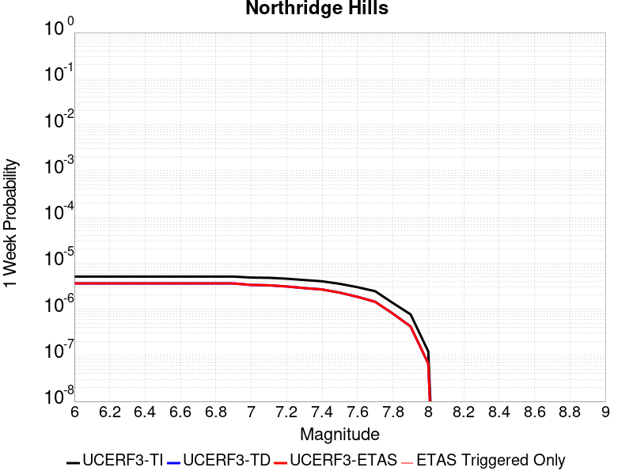 | 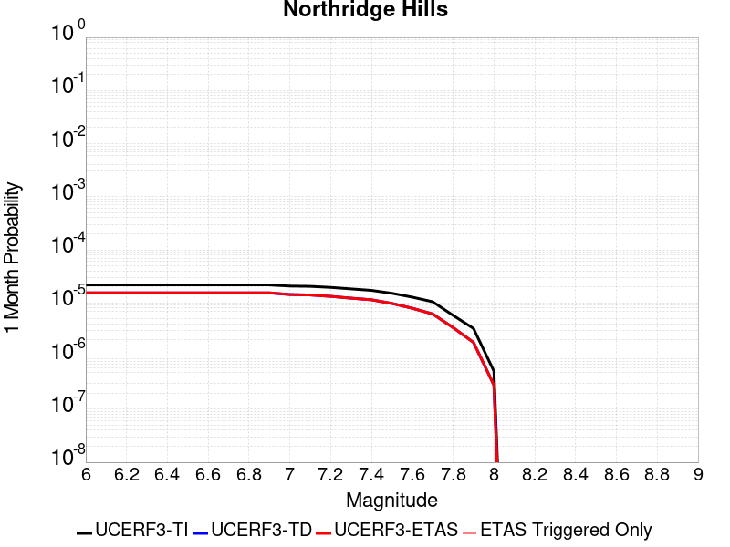 | 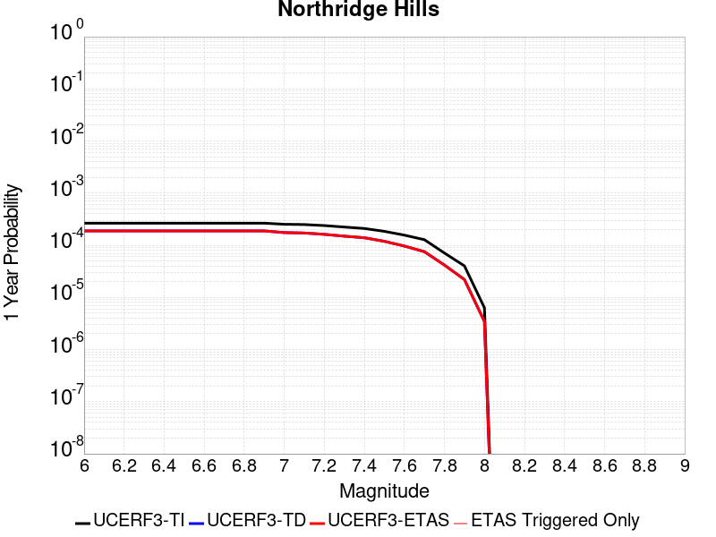 | 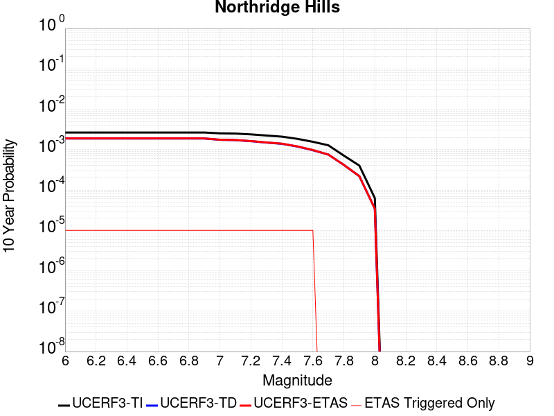 |

| Magnitude | 1 wk TI Prob | 1 wk TD Prob | 1 wk ETAS Prob | 1 wk ETAS/TD Gain | 1 wk ETAS Triggered Only | 1 mo TI Prob | 1 mo TD Prob | 1 mo ETAS Prob | 1 mo ETAS/TD Gain | 1 mo ETAS Triggered Only | 1 yr TI Prob | 1 yr TD Prob | 1 yr ETAS Prob | 1 yr ETAS/TD Gain | 1 yr ETAS Triggered Only | 10 yr TI Prob | 10 yr TD Prob | 10 yr ETAS Prob | 10 yr ETAS/TD Gain | 10 yr ETAS Triggered Only |
|-----|-----|-----|-----|-----|-----|-----|-----|-----|-----|-----|-----|-----|-----|-----|-----|-----|-----|-----|-----|-----|
| 6.0 | 5.095982E-6 | 3.6152135E-6 | 3.6152135E-6 | 1.0 | 0.0 | 2.183974E-5 | 1.549368E-5 | 1.549368E-5 | 1.0 | 0.0 | 2.658664E-4 | 1.8861935E-4 | 1.8861935E-4 | 1.0 | 0.0 | 0.0026554854 | 0.0018846049 | 0.0018945861 | 1.0052961 | 1.0E-5 |
| 6.1 | 5.095982E-6 | 3.6152135E-6 | 3.6152135E-6 | 1.0 | 0.0 | 2.183974E-5 | 1.549368E-5 | 1.549368E-5 | 1.0 | 0.0 | 2.658664E-4 | 1.8861935E-4 | 1.8861935E-4 | 1.0 | 0.0 | 0.0026554854 | 0.0018846049 | 0.0018945861 | 1.0052961 | 1.0E-5 |
| 6.2 | 5.095982E-6 | 3.6152135E-6 | 3.6152135E-6 | 1.0 | 0.0 | 2.183974E-5 | 1.549368E-5 | 1.549368E-5 | 1.0 | 0.0 | 2.658664E-4 | 1.8861935E-4 | 1.8861935E-4 | 1.0 | 0.0 | 0.0026554854 | 0.0018846049 | 0.0018945861 | 1.0052961 | 1.0E-5 |
| 6.3 | 5.095982E-6 | 3.6152135E-6 | 3.6152135E-6 | 1.0 | 0.0 | 2.183974E-5 | 1.549368E-5 | 1.549368E-5 | 1.0 | 0.0 | 2.658664E-4 | 1.8861935E-4 | 1.8861935E-4 | 1.0 | 0.0 | 0.0026554854 | 0.0018846049 | 0.0018945861 | 1.0052961 | 1.0E-5 |
| 6.4 | 5.095982E-6 | 3.6152135E-6 | 3.6152135E-6 | 1.0 | 0.0 | 2.183974E-5 | 1.549368E-5 | 1.549368E-5 | 1.0 | 0.0 | 2.658664E-4 | 1.8861935E-4 | 1.8861935E-4 | 1.0 | 0.0 | 0.0026554854 | 0.0018846049 | 0.0018945861 | 1.0052961 | 1.0E-5 |
| 6.5 | 5.095982E-6 | 3.6152135E-6 | 3.6152135E-6 | 1.0 | 0.0 | 2.183974E-5 | 1.549368E-5 | 1.549368E-5 | 1.0 | 0.0 | 2.658664E-4 | 1.8861935E-4 | 1.8861935E-4 | 1.0 | 0.0 | 0.0026554854 | 0.0018846049 | 0.0018945861 | 1.0052961 | 1.0E-5 |
| 6.6 | 5.095982E-6 | 3.6152135E-6 | 3.6152135E-6 | 1.0 | 0.0 | 2.183974E-5 | 1.549368E-5 | 1.549368E-5 | 1.0 | 0.0 | 2.658664E-4 | 1.8861935E-4 | 1.8861935E-4 | 1.0 | 0.0 | 0.0026554854 | 0.0018846049 | 0.0018945861 | 1.0052961 | 1.0E-5 |
| 6.7 | 5.095982E-6 | 3.6152135E-6 | 3.6152135E-6 | 1.0 | 0.0 | 2.183974E-5 | 1.549368E-5 | 1.549368E-5 | 1.0 | 0.0 | 2.658664E-4 | 1.8861935E-4 | 1.8861935E-4 | 1.0 | 0.0 | 0.0026554854 | 0.0018846049 | 0.0018945861 | 1.0052961 | 1.0E-5 |
| 6.8 | 5.095982E-6 | 3.6152135E-6 | 3.6152135E-6 | 1.0 | 0.0 | 2.183974E-5 | 1.549368E-5 | 1.549368E-5 | 1.0 | 0.0 | 2.658664E-4 | 1.8861935E-4 | 1.8861935E-4 | 1.0 | 0.0 | 0.0026554854 | 0.0018846049 | 0.0018945861 | 1.0052961 | 1.0E-5 |
| 6.9 | 5.0942654E-6 | 3.6134284E-6 | 3.6134284E-6 | 1.0 | 0.0 | 2.1832384E-5 | 1.548603E-5 | 1.548603E-5 | 1.0 | 0.0 | 2.6577685E-4 | 1.8852622E-4 | 1.8852622E-4 | 1.0 | 0.0 | 0.002654592 | 0.0018836753 | 0.0018936564 | 1.0052987 | 1.0E-5 |
| 7.0 | 4.851143E-6 | 3.3587432E-6 | 3.3587432E-6 | 1.0 | 0.0 | 2.0790447E-5 | 1.4394534E-5 | 1.4394534E-5 | 1.0 | 0.0 | 2.5309427E-4 | 1.752394E-4 | 1.752394E-4 | 1.0 | 0.0 | 0.0025280623 | 0.0017510166 | 0.0017609991 | 1.005701 | 1.0E-5 |
| 7.1 | 4.7910607E-6 | 3.2970245E-6 | 3.2970245E-6 | 1.0 | 0.0 | 2.0532956E-5 | 1.4130029E-5 | 1.4130029E-5 | 1.0 | 0.0 | 2.4996005E-4 | 1.7201956E-4 | 1.7201956E-4 | 1.0 | 0.0 | 0.0024967908 | 0.0017188682 | 0.0017288509 | 1.0058078 | 1.0E-5 |
| 7.2 | 4.580079E-6 | 3.106803E-6 | 3.106803E-6 | 1.0 | 0.0 | 1.9628762E-5 | 1.3314802E-5 | 1.3314802E-5 | 1.0 | 0.0 | 2.3895396E-4 | 1.6209569E-4 | 1.6209569E-4 | 1.0 | 0.0 | 0.0023869718 | 0.001619778 | 0.0016297618 | 1.0061637 | 1.0E-5 |
| 7.3 | 4.290062E-6 | 2.8682362E-6 | 2.8682362E-6 | 1.0 | 0.0 | 1.838585E-5 | 1.2292383E-5 | 1.2292383E-5 | 1.0 | 0.0 | 2.2382473E-4 | 1.4964951E-4 | 1.4964951E-4 | 1.0 | 0.0 | 0.0022359942 | 0.0014954903 | 0.0015054754 | 1.0066768 | 1.0E-5 |
| 7.4 | 4.0259683E-6 | 2.6739135E-6 | 2.6739135E-6 | 1.0 | 0.0 | 1.7254037E-5 | 1.1459579E-5 | 1.1459579E-5 | 1.0 | 0.0 | 2.1004764E-4 | 1.3951147E-4 | 1.3951147E-4 | 1.0 | 0.0 | 0.002098492 | 0.0013942417 | 0.0014042277 | 1.0071623 | 1.0E-5 |
| 7.5 | 3.5477108E-6 | 2.285198E-6 | 2.285198E-6 | 1.0 | 0.0 | 1.5204386E-5 | 9.793668E-6 | 9.793668E-6 | 1.0 | 0.0 | 1.8509767E-4 | 1.192314E-4 | 1.192314E-4 | 1.0 | 0.0 | 0.0018494357 | 0.0011916759 | 0.001201664 | 1.0083815 | 1.0E-5 |
| 7.6 | 2.9990608E-6 | 1.8528159E-6 | 1.8528159E-6 | 1.0 | 0.0 | 1.2853055E-5 | 7.940615E-6 | 7.940615E-6 | 1.0 | 0.0 | 1.564747E-4 | 9.667271E-5 | 9.667271E-5 | 1.0 | 0.0 | 0.0015636457 | 9.6630736E-4 | 9.762977E-4 | 1.0103387 | 1.0E-5 |
| 7.7 | 2.4542855E-6 | 1.4461142E-6 | 1.4461142E-6 | 1.0 | 0.0 | 1.05183235E-5 | 6.1976175E-6 | 6.1976175E-6 | 1.0 | 0.0 | 1.2805307E-4 | 7.545339E-5 | 7.545339E-5 | 1.0 | 0.0 | 0.001279793 | 7.5427827E-4 | 7.5427827E-4 | 1.0 | 0.0 |
| 7.8 | 1.3623128E-6 | 8.0160027E-7 | 8.0160027E-7 | 1.0 | 0.0 | 5.8384703E-6 | 3.4354252E-6 | 3.4354252E-6 | 1.0 | 0.0 | 7.108106E-5 | 4.18255E-5 | 4.18255E-5 | 1.0 | 0.0 | 7.1058323E-4 | 4.1817653E-4 | 4.1817653E-4 | 1.0 | 0.0 |
| 7.9 | 7.716622E-7 | 4.218644E-7 | 4.218644E-7 | 1.0 | 0.0 | 3.3071194E-6 | 1.807989E-6 | 1.807989E-6 | 1.0 | 0.0 | 4.0263436E-5 | 2.2012046E-5 | 2.2012046E-5 | 1.0 | 0.0 | 4.0256142E-4 | 2.2009875E-4 | 2.2009875E-4 | 1.0 | 0.0 |
| 8.0 | 1.2117711E-7 | 6.6217325E-8 | 6.6217325E-8 | 1.0 | 0.0 | 5.1933034E-7 | 2.8378852E-7 | 2.8378852E-7 | 1.0 | 0.0 | 6.3228285E-6 | 3.45512E-6 | 3.45512E-6 | 1.0 | 0.0 | 6.3226486E-5 | 3.4550678E-5 | 3.4550678E-5 | 1.0 | 0.0 |

## Malibu Coast (Extension) alt 1
*[(top)](#table-of-contents)*

| 1 Week | 1 Month | 1 Year | 10 Year |
|-----|-----|-----|-----|
|  | 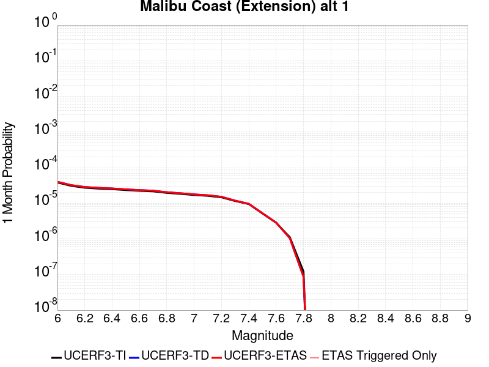 | 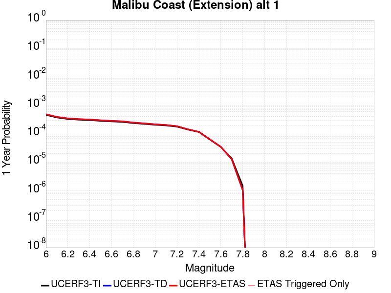 | 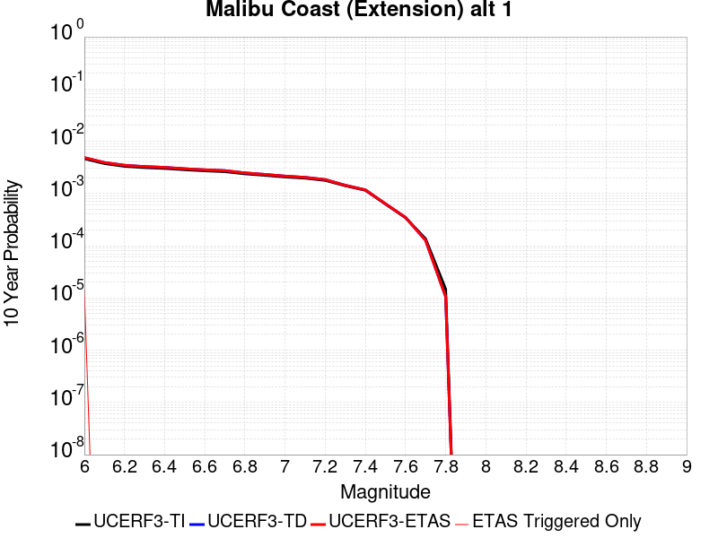 |

| Magnitude | 1 wk TI Prob | 1 wk TD Prob | 1 wk ETAS Prob | 1 wk ETAS/TD Gain | 1 wk ETAS Triggered Only | 1 mo TI Prob | 1 mo TD Prob | 1 mo ETAS Prob | 1 mo ETAS/TD Gain | 1 mo ETAS Triggered Only | 1 yr TI Prob | 1 yr TD Prob | 1 yr ETAS Prob | 1 yr ETAS/TD Gain | 1 yr ETAS Triggered Only | 10 yr TI Prob | 10 yr TD Prob | 10 yr ETAS Prob | 10 yr ETAS/TD Gain | 10 yr ETAS Triggered Only |
|-----|-----|-----|-----|-----|-----|-----|-----|-----|-----|-----|-----|-----|-----|-----|-----|-----|-----|-----|-----|-----|
| 6.0 | 8.930738E-6 | 9.3292765E-6 | 9.3292765E-6 | 1.0 | 0.0 | 3.827403E-5 | 3.998201E-5 | 3.998201E-5 | 1.0 | 0.0 | 4.6588664E-4 | 4.86674E-4 | 4.86674E-4 | 1.0 | 0.0 | 0.0046491115 | 0.004856264 | 0.004866216 | 1.0020492 | 1.0E-5 |
| 6.1 | 7.199952E-6 | 7.5302974E-6 | 7.5302974E-6 | 1.0 | 0.0 | 3.0856572E-5 | 3.2272306E-5 | 3.2272306E-5 | 1.0 | 0.0 | 3.75614E-4 | 3.928451E-4 | 3.928451E-4 | 1.0 | 0.0 | 0.0037497976 | 0.0039215726 | 0.0039215726 | 1.0 | 0.0 |
| 6.2 | 6.3721413E-6 | 6.666792E-6 | 6.666792E-6 | 1.0 | 0.0 | 2.7308892E-5 | 2.8571656E-5 | 2.8571656E-5 | 1.0 | 0.0 | 3.3243504E-4 | 3.4780474E-4 | 3.4780474E-4 | 1.0 | 0.0 | 0.0033193815 | 0.0034726441 | 0.0034726441 | 1.0 | 0.0 |
| 6.3 | 6.016345E-6 | 6.295159E-6 | 6.295159E-6 | 1.0 | 0.0 | 2.578408E-5 | 2.6978976E-5 | 2.6978976E-5 | 1.0 | 0.0 | 3.1387596E-4 | 3.2841985E-4 | 3.2841985E-4 | 1.0 | 0.0 | 0.00313433 | 0.0032793812 | 0.0032793812 | 1.0 | 0.0 |
| 6.4 | 5.8104883E-6 | 6.0795455E-6 | 6.0795455E-6 | 1.0 | 0.0 | 2.4901856E-5 | 2.6054937E-5 | 2.6054937E-5 | 1.0 | 0.0 | 3.031379E-4 | 3.17173E-4 | 3.17173E-4 | 1.0 | 0.0 | 0.0030272473 | 0.0031672379 | 0.0031672379 | 1.0 | 0.0 |
| 6.5 | 5.476925E-6 | 5.727514E-6 | 5.727514E-6 | 1.0 | 0.0 | 2.3472323E-5 | 2.454626E-5 | 2.454626E-5 | 1.0 | 0.0 | 2.8573806E-4 | 2.9881002E-4 | 2.9881002E-4 | 1.0 | 0.0 | 0.0028537093 | 0.0029841145 | 0.0029841145 | 1.0 | 0.0 |
| 6.6 | 5.222387E-6 | 5.4585807E-6 | 5.4585807E-6 | 1.0 | 0.0 | 2.2381464E-5 | 2.3393708E-5 | 2.3393708E-5 | 1.0 | 0.0 | 2.7246025E-4 | 2.8478145E-4 | 2.8478145E-4 | 1.0 | 0.0 | 0.0027212645 | 0.002844196 | 0.002844196 | 1.0 | 0.0 |
| 6.7 | 5.0337076E-6 | 5.259104E-6 | 5.259104E-6 | 1.0 | 0.0 | 2.1572854E-5 | 2.2538823E-5 | 2.2538823E-5 | 1.0 | 0.0 | 2.6261783E-4 | 2.743759E-4 | 2.743759E-4 | 1.0 | 0.0 | 0.002623077 | 0.0027404015 | 0.0027404015 | 1.0 | 0.0 |
| 6.8 | 4.5675624E-6 | 4.7587173E-6 | 4.7587173E-6 | 1.0 | 0.0 | 1.9575122E-5 | 2.0394344E-5 | 2.0394344E-5 | 1.0 | 0.0 | 2.3830103E-4 | 2.4827302E-4 | 2.4827302E-4 | 1.0 | 0.0 | 0.0023804565 | 0.0024799763 | 0.0024799763 | 1.0 | 0.0 |
| 6.9 | 4.2802412E-6 | 4.4520216E-6 | 4.4520216E-6 | 1.0 | 0.0 | 1.8343762E-5 | 1.9079953E-5 | 1.9079953E-5 | 1.0 | 0.0 | 2.2331243E-4 | 2.3227383E-4 | 2.3227383E-4 | 1.0 | 0.0 | 0.0022308815 | 0.0023203273 | 0.0023203273 | 1.0 | 0.0 |
| 7.0 | 3.9794063E-6 | 4.1301E-6 | 4.1301E-6 | 1.0 | 0.0 | 1.7054486E-5 | 1.770031E-5 | 1.770031E-5 | 1.0 | 0.0 | 2.0761859E-4 | 2.1548007E-4 | 2.1548007E-4 | 1.0 | 0.0 | 0.0020742472 | 0.002152725 | 0.002152725 | 1.0 | 0.0 |
| 7.1 | 3.7730424E-6 | 3.911218E-6 | 3.911218E-6 | 1.0 | 0.0 | 1.6170083E-5 | 1.6762255E-5 | 1.6762255E-5 | 1.0 | 0.0 | 1.9685295E-4 | 2.0406146E-4 | 2.0406146E-4 | 1.0 | 0.0 | 0.0019667868 | 0.0020387538 | 0.0020387538 | 1.0 | 0.0 |
| 7.2 | 3.424985E-6 | 3.541338E-6 | 3.541338E-6 | 1.0 | 0.0 | 1.4678424E-5 | 1.5177075E-5 | 1.5177075E-5 | 1.0 | 0.0 | 1.7869516E-4 | 1.8476533E-4 | 1.8476533E-4 | 1.0 | 0.0 | 0.0017855153 | 0.0018461292 | 0.0018461292 | 1.0 | 0.0 |
| 7.3 | 2.6966375E-6 | 2.759654E-6 | 2.759654E-6 | 1.0 | 0.0 | 1.15569665E-5 | 1.1827035E-5 | 1.1827035E-5 | 1.0 | 0.0 | 1.4069698E-4 | 1.4398468E-4 | 1.4398468E-4 | 1.0 | 0.0 | 0.0014060794 | 0.001438918 | 0.001438918 | 1.0 | 0.0 |
| 7.4 | 2.215957E-6 | 2.249379E-6 | 2.249379E-6 | 1.0 | 0.0 | 9.496924E-6 | 9.64016E-6 | 9.64016E-6 | 1.0 | 0.0 | 1.1561892E-4 | 1.1736266E-4 | 1.1736266E-4 | 1.0 | 0.0 | 0.0011555878 | 0.0011730106 | 0.0011730106 | 1.0 | 0.0 |
| 7.5 | 1.2040218E-6 | 1.2219067E-6 | 1.2219067E-6 | 1.0 | 0.0 | 5.160083E-6 | 5.2367327E-6 | 5.2367327E-6 | 1.0 | 0.0 | 6.2822204E-5 | 6.3755375E-5 | 6.3755375E-5 | 1.0 | 0.0 | 6.280445E-4 | 6.3737266E-4 | 6.3737266E-4 | 1.0 | 0.0 |
| 7.6 | 6.6157446E-7 | 6.6789755E-7 | 6.6789755E-7 | 1.0 | 0.0 | 2.835316E-6 | 2.8624152E-6 | 2.8624152E-6 | 1.0 | 0.0 | 3.4519428E-5 | 3.4849363E-5 | 3.4849363E-5 | 1.0 | 0.0 | 3.4514067E-4 | 3.484405E-4 | 3.484405E-4 | 1.0 | 0.0 |
| 7.7 | 2.6012302E-7 | 2.4357584E-7 | 2.4357584E-7 | 1.0 | 0.0 | 1.1148124E-6 | 1.0438962E-6 | 1.0438962E-6 | 1.0 | 0.0 | 1.3572758E-5 | 1.2709373E-5 | 1.2709373E-5 | 1.0 | 0.0 | 1.3571928E-4 | 1.2708752E-4 | 1.2708752E-4 | 1.0 | 0.0 |
| 7.8 | 2.8323132E-8 | 2.0266642E-8 | 2.0266642E-8 | 1.0 | 0.0 | 1.2138484E-7 | 8.685703E-8 | 8.685703E-8 | 1.0 | 0.0 | 1.4778595E-6 | 1.0574839E-6 | 1.0574839E-6 | 1.0 | 0.0 | 1.4778497E-5 | 1.0574797E-5 | 1.0574797E-5 | 1.0 | 0.0 |

## Elmore Ranch
*[(top)](#table-of-contents)*

| 1 Week | 1 Month | 1 Year | 10 Year |
|-----|-----|-----|-----|
|  |  |  |  |

| Magnitude | 1 wk TI Prob | 1 wk TD Prob | 1 wk ETAS Prob | 1 wk ETAS/TD Gain | 1 wk ETAS Triggered Only | 1 mo TI Prob | 1 mo TD Prob | 1 mo ETAS Prob | 1 mo ETAS/TD Gain | 1 mo ETAS Triggered Only | 1 yr TI Prob | 1 yr TD Prob | 1 yr ETAS Prob | 1 yr ETAS/TD Gain | 1 yr ETAS Triggered Only | 10 yr TI Prob | 10 yr TD Prob | 10 yr ETAS Prob | 10 yr ETAS/TD Gain | 10 yr ETAS Triggered Only |
|-----|-----|-----|-----|-----|-----|-----|-----|-----|-----|-----|-----|-----|-----|-----|-----|-----|-----|-----|-----|-----|
| 6.0 | 9.102099E-5 | 8.953848E-5 | 8.953848E-5 | 1.0 | 0.0 | 3.9003167E-4 | 3.836898E-4 | 3.9368597E-4 | 1.0260527 | 1.0E-5 | 0.0047383 | 0.004662132 | 0.0046720854 | 1.0021349 | 1.0E-5 | 0.046385348 | 0.04583787 | 0.045847416 | 1.0002081 | 1.0E-5 |
| 6.1 | 3.8306698E-5 | 4.14921E-5 | 4.14921E-5 | 1.0 | 0.0 | 1.6416123E-4 | 1.7781362E-4 | 1.7781362E-4 | 1.0 | 0.0 | 0.0019968306 | 0.0021632186 | 0.0021632186 | 1.0 | 0.0 | 0.019789828 | 0.021595007 | 0.021595007 | 1.0 | 0.0 |
| 6.2 | 3.8306698E-5 | 4.14921E-5 | 4.14921E-5 | 1.0 | 0.0 | 1.6416123E-4 | 1.7781362E-4 | 1.7781362E-4 | 1.0 | 0.0 | 0.0019968306 | 0.0021632186 | 0.0021632186 | 1.0 | 0.0 | 0.019789828 | 0.021595007 | 0.021595007 | 1.0 | 0.0 |
| 6.3 | 3.3197924E-5 | 3.6550366E-5 | 3.6550366E-5 | 1.0 | 0.0 | 1.4226905E-4 | 1.56639E-4 | 1.56639E-4 | 1.0 | 0.0 | 0.0017307495 | 0.0019059771 | 0.0019059771 | 1.0 | 0.0 | 0.017173318 | 0.019057386 | 0.019057386 | 1.0 | 0.0 |
| 6.4 | 2.5148964E-5 | 2.7420736E-5 | 2.7420736E-5 | 1.0 | 0.0 | 1.0777682E-4 | 1.17515796E-4 | 1.17515796E-4 | 1.0 | 0.0 | 0.0013113929 | 0.0014304637 | 0.0014304637 | 1.0 | 0.0 | 0.01303681 | 0.014365338 | 0.014365338 | 1.0 | 0.0 |
| 6.5 | 2.5148964E-5 | 2.7420736E-5 | 2.7420736E-5 | 1.0 | 0.0 | 1.0777682E-4 | 1.17515796E-4 | 1.17515796E-4 | 1.0 | 0.0 | 0.0013113929 | 0.0014304637 | 0.0014304637 | 1.0 | 0.0 | 0.01303681 | 0.014365338 | 0.014365338 | 1.0 | 0.0 |

## Contra Costa (Lafayette) 2011 CFM
*[(top)](#table-of-contents)*

| 1 Week | 1 Month | 1 Year | 10 Year |
|-----|-----|-----|-----|
| 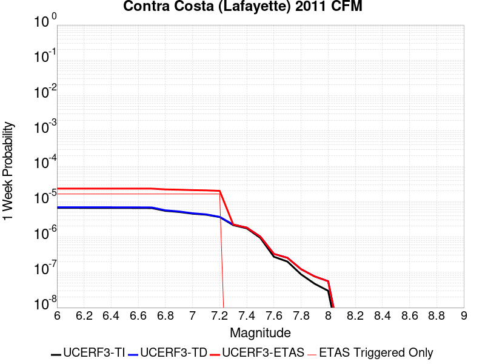 | 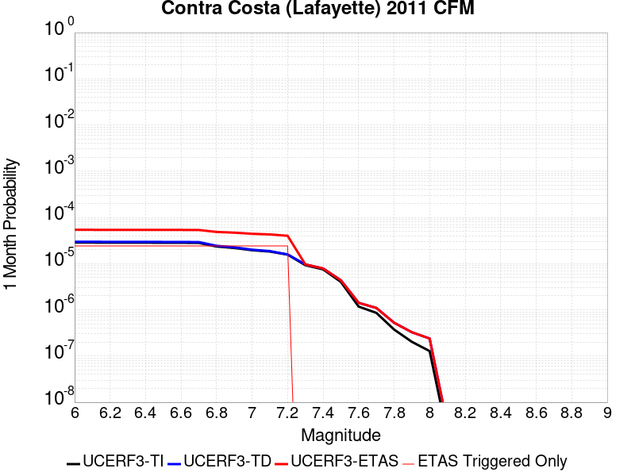 |  | 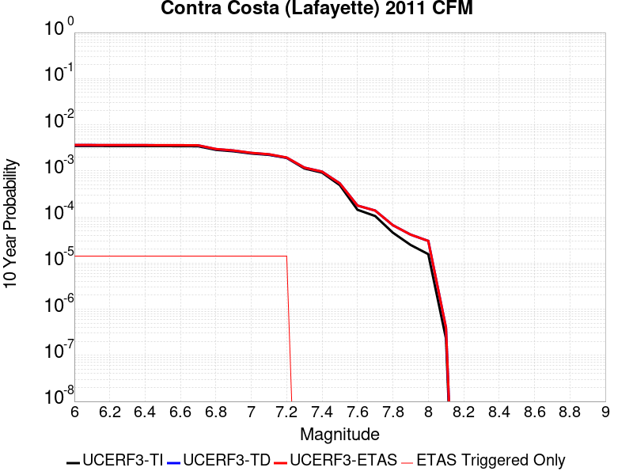 |

| Magnitude | 1 wk TI Prob | 1 wk TD Prob | 1 wk ETAS Prob | 1 wk ETAS/TD Gain | 1 wk ETAS Triggered Only | 1 mo TI Prob | 1 mo TD Prob | 1 mo ETAS Prob | 1 mo ETAS/TD Gain | 1 mo ETAS Triggered Only | 1 yr TI Prob | 1 yr TD Prob | 1 yr ETAS Prob | 1 yr ETAS/TD Gain | 1 yr ETAS Triggered Only | 10 yr TI Prob | 10 yr TD Prob | 10 yr ETAS Prob | 10 yr ETAS/TD Gain | 10 yr ETAS Triggered Only |
|-----|-----|-----|-----|-----|-----|-----|-----|-----|-----|-----|-----|-----|-----|-----|-----|-----|-----|-----|-----|-----|
| 6.0 | 6.655419E-6 | 6.936133E-6 | 1.6936065E-5 | 2.4417155 | 1.0E-5 | 2.8522913E-5 | 2.9725958E-5 | 3.972566E-5 | 1.3363963 | 1.0E-5 | 3.472111E-4 | 3.618554E-4 | 3.7185178E-4 | 1.0276253 | 1.0E-5 | 0.0034666911 | 0.0036175281 | 0.0036274919 | 1.0027543 | 1.0E-5 |
| 6.1 | 6.655419E-6 | 6.936133E-6 | 1.6936065E-5 | 2.4417155 | 1.0E-5 | 2.8522913E-5 | 2.9725958E-5 | 3.972566E-5 | 1.3363963 | 1.0E-5 | 3.472111E-4 | 3.618554E-4 | 3.7185178E-4 | 1.0276253 | 1.0E-5 | 0.0034666911 | 0.0036175281 | 0.0036274919 | 1.0027543 | 1.0E-5 |
| 6.2 | 6.6254133E-6 | 6.9045423E-6 | 1.6904472E-5 | 2.4483118 | 1.0E-5 | 2.839432E-5 | 2.9590572E-5 | 3.9590275E-5 | 1.3379354 | 1.0E-5 | 3.45646E-4 | 3.6020763E-4 | 3.70204E-4 | 1.0277518 | 1.0E-5 | 0.003451089 | 0.0036011038 | 0.0036110678 | 1.002767 | 1.0E-5 |
| 6.3 | 6.6254133E-6 | 6.9045423E-6 | 1.6904472E-5 | 2.4483118 | 1.0E-5 | 2.839432E-5 | 2.9590572E-5 | 3.9590275E-5 | 1.3379354 | 1.0E-5 | 3.45646E-4 | 3.6020763E-4 | 3.70204E-4 | 1.0277518 | 1.0E-5 | 0.003451089 | 0.0036011038 | 0.0036110678 | 1.002767 | 1.0E-5 |
| 6.4 | 6.6254133E-6 | 6.9045423E-6 | 1.6904472E-5 | 2.4483118 | 1.0E-5 | 2.839432E-5 | 2.9590572E-5 | 3.9590275E-5 | 1.3379354 | 1.0E-5 | 3.45646E-4 | 3.6020763E-4 | 3.70204E-4 | 1.0277518 | 1.0E-5 | 0.003451089 | 0.0036011038 | 0.0036110678 | 1.002767 | 1.0E-5 |
| 6.5 | 6.606445E-6 | 6.884091E-6 | 1.6884022E-5 | 2.4526145 | 1.0E-5 | 2.8313027E-5 | 2.9502924E-5 | 3.950263E-5 | 1.3389394 | 1.0E-5 | 3.4465658E-4 | 3.5914086E-4 | 3.6913727E-4 | 1.0278342 | 1.0E-5 | 0.0034412253 | 0.0035904706 | 0.0036004349 | 1.0027752 | 1.0E-5 |
| 6.6 | 6.59966E-6 | 6.8766285E-6 | 1.687656E-5 | 2.454191 | 1.0E-5 | 2.828395E-5 | 2.9470944E-5 | 3.947065E-5 | 1.3393073 | 1.0E-5 | 3.4430268E-4 | 3.5875165E-4 | 3.6874806E-4 | 1.0278645 | 1.0E-5 | 0.0034376972 | 0.003586591 | 0.0035965552 | 1.0027782 | 1.0E-5 |
| 6.7 | 6.5570975E-6 | 6.83062E-6 | 1.683055E-5 | 2.463986 | 1.0E-5 | 2.8101544E-5 | 2.9273768E-5 | 3.9273473E-5 | 1.3415928 | 1.0E-5 | 3.4208258E-4 | 3.563518E-4 | 3.6634825E-4 | 1.0280522 | 1.0E-5 | 0.0034155648 | 0.0035626697 | 0.0035726342 | 1.0027969 | 1.0E-5 |
| 6.8 | 5.472255E-6 | 5.6736194E-6 | 1.5673562E-5 | 2.7625334 | 1.0E-5 | 2.345231E-5 | 2.4315288E-5 | 3.4315046E-5 | 1.4112539 | 1.0E-5 | 2.8549446E-4 | 2.9599888E-4 | 3.059959E-4 | 1.0337739 | 1.0E-5 | 0.0028512797 | 0.0029607643 | 0.0029707348 | 1.0033675 | 1.0E-5 |
| 6.9 | 5.092346E-6 | 5.2639816E-6 | 1.526393E-5 | 2.8996928 | 1.0E-5 | 2.1824157E-5 | 2.2559729E-5 | 3.2559503E-5 | 1.4432578 | 1.0E-5 | 2.656767E-4 | 2.7463044E-4 | 2.846277E-4 | 1.0364026 | 1.0E-5 | 0.002653593 | 0.002747621 | 0.0027575935 | 1.0036296 | 1.0E-5 |
| 7.0 | 4.5525762E-6 | 4.6773084E-6 | 1.4677262E-5 | 3.1379716 | 1.0E-5 | 1.9510895E-5 | 2.0045454E-5 | 3.0045254E-5 | 1.4988562 | 1.0E-5 | 2.3751926E-4 | 2.4402638E-4 | 2.5402394E-4 | 1.0409691 | 1.0E-5 | 0.0023726553 | 0.0024422838 | 0.0024522594 | 1.0040846 | 1.0E-5 |
| 7.1 | 4.261504E-6 | 4.356478E-6 | 1.4356434E-5 | 3.2954223 | 1.0E-5 | 1.826346E-5 | 1.8670487E-5 | 2.86703E-5 | 1.5355947 | 1.0E-5 | 2.2233493E-4 | 2.2728974E-4 | 2.3728746E-4 | 1.0439867 | 1.0E-5 | 0.002221126 | 0.0022752623 | 0.0022852395 | 1.0043851 | 1.0E-5 |
| 7.2 | 3.654114E-6 | 3.697206E-6 | 1.3697169E-5 | 3.704735 | 1.0E-5 | 1.5660395E-5 | 1.5845073E-5 | 2.5844914E-5 | 1.631101 | 1.0E-5 | 1.9064861E-4 | 1.9289694E-4 | 2.0289501E-4 | 1.0518311 | 1.0E-5 | 0.0019048514 | 0.0019319316 | 0.0019419122 | 1.0051662 | 1.0E-5 |
| 7.3 | 2.1595129E-6 | 2.2442475E-6 | 2.2442475E-6 | 1.0 | 0.0 | 9.255023E-6 | 9.618168E-6 | 9.618168E-6 | 1.0 | 0.0 | 1.1267407E-4 | 1.17094954E-4 | 1.17094954E-4 | 1.0 | 0.0 | 0.0011261696 | 0.0011749809 | 0.0011749809 | 1.0 | 0.0 |
| 7.4 | 1.7532738E-6 | 1.8335537E-6 | 1.8335537E-6 | 1.0 | 0.0 | 7.5140088E-6 | 7.858064E-6 | 7.858064E-6 | 1.0 | 0.0 | 9.147922E-5 | 9.566777E-5 | 9.566777E-5 | 1.0 | 0.0 | 9.144157E-4 | 9.607641E-4 | 9.607641E-4 | 1.0 | 0.0 |
| 7.5 | 9.387875E-7 | 1.0194132E-6 | 1.0194132E-6 | 1.0 | 0.0 | 4.0233685E-6 | 4.3689065E-6 | 4.3689065E-6 | 1.0 | 0.0 | 4.8983413E-5 | 5.319015E-5 | 5.319015E-5 | 1.0 | 0.0 | 4.897262E-4 | 5.35806E-4 | 5.35806E-4 | 1.0 | 0.0 |
| 7.6 | 2.7471893E-7 | 3.3111127E-7 | 3.3111127E-7 | 1.0 | 0.0 | 1.1773664E-6 | 1.4190474E-6 | 1.4190474E-6 | 1.0 | 0.0 | 1.433434E-5 | 1.7276767E-5 | 1.7276767E-5 | 1.0 | 0.0 | 1.4333417E-4 | 1.7661233E-4 | 1.7661233E-4 | 1.0 | 0.0 |
| 7.7 | 2.0057985E-7 | 2.564454E-7 | 2.564454E-7 | 1.0 | 0.0 | 8.596276E-7 | 1.0990511E-6 | 1.0990511E-6 | 1.0 | 0.0 | 1.0465916E-5 | 1.3380866E-5 | 1.3380866E-5 | 1.0 | 0.0 | 1.0465423E-4 | 1.3761544E-4 | 1.3761544E-4 | 1.0 | 0.0 |
| 7.8 | 8.7403905E-8 | 1.2261823E-7 | 1.2261823E-7 | 1.0 | 0.0 | 3.745881E-7 | 5.255066E-7 | 5.255066E-7 | 1.0 | 0.0 | 4.5606007E-6 | 6.398024E-6 | 6.398024E-6 | 1.0 | 0.0 | 4.560507E-5 | 6.6243636E-5 | 6.6243636E-5 | 1.0 | 0.0 |
| 7.9 | 4.740233E-8 | 7.649451E-8 | 7.649451E-8 | 1.0 | 0.0 | 2.0315284E-7 | 3.2783356E-7 | 3.2783356E-7 | 1.0 | 0.0 | 2.473383E-6 | 3.991366E-6 | 3.991366E-6 | 1.0 | 0.0 | 2.4733554E-5 | 4.1450698E-5 | 4.1450698E-5 | 1.0 | 0.0 |
| 8.0 | 2.99164E-8 | 5.59337E-8 | 5.59337E-8 | 1.0 | 0.0 | 1.2821314E-7 | 2.3971583E-7 | 2.3971583E-7 | 1.0 | 0.0 | 1.5609938E-6 | 2.9185364E-6 | 2.9185364E-6 | 1.0 | 0.0 | 1.5609829E-5 | 3.0209583E-5 | 3.0209583E-5 | 1.0 | 0.0 |
| 8.1 | 4.431212E-10 | 7.424964E-10 | 7.424964E-10 | 1.0 | 0.0 | 1.899091E-9 | 3.1821275E-9 | 3.1821275E-9 | 1.0 | 0.0 | 2.3121432E-8 | 3.8742403E-8 | 3.8742403E-8 | 1.0 | 0.0 | 2.312143E-7 | 3.962537E-7 | 3.962537E-7 | 1.0 | 0.0 |

## South Klamath Lake West
*[(top)](#table-of-contents)*

| 1 Week | 1 Month | 1 Year | 10 Year |
|-----|-----|-----|-----|
| 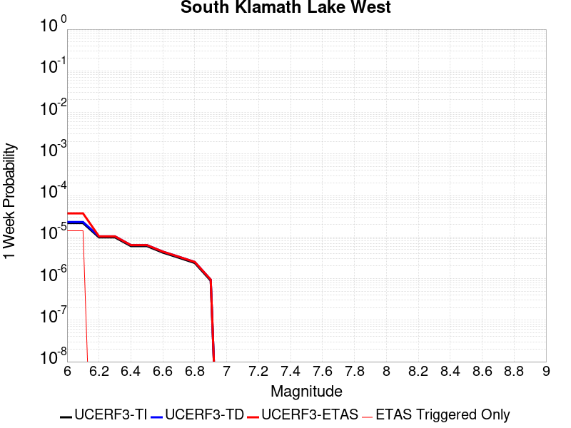 | 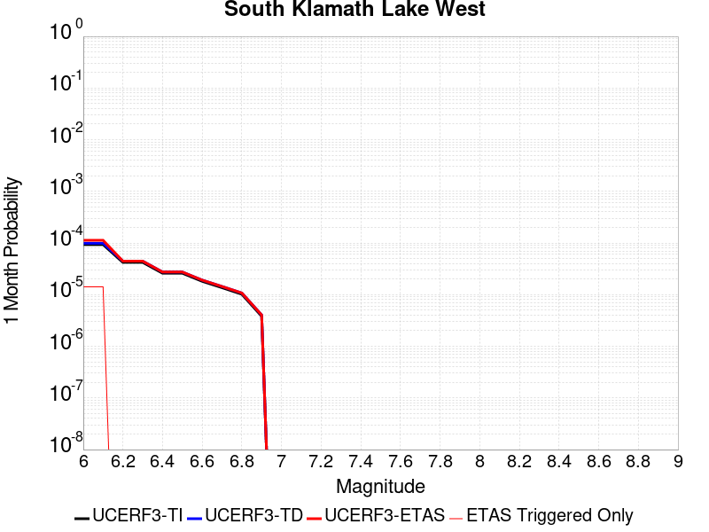 | 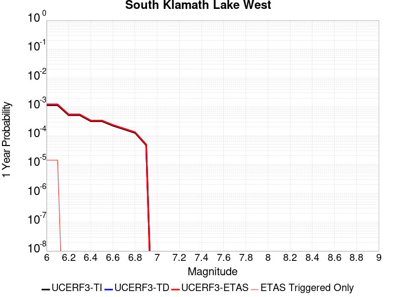 | 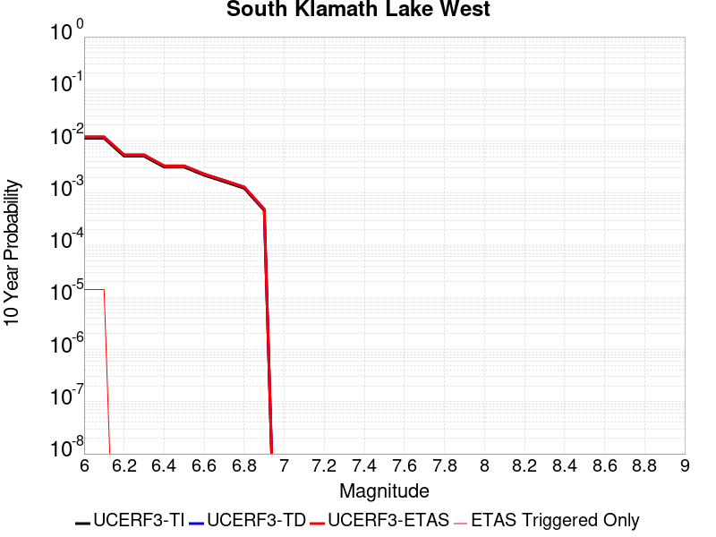 |

| Magnitude | 1 wk TI Prob | 1 wk TD Prob | 1 wk ETAS Prob | 1 wk ETAS/TD Gain | 1 wk ETAS Triggered Only | 1 mo TI Prob | 1 mo TD Prob | 1 mo ETAS Prob | 1 mo ETAS/TD Gain | 1 mo ETAS Triggered Only | 1 yr TI Prob | 1 yr TD Prob | 1 yr ETAS Prob | 1 yr ETAS/TD Gain | 1 yr ETAS Triggered Only | 10 yr TI Prob | 10 yr TD Prob | 10 yr ETAS Prob | 10 yr ETAS/TD Gain | 10 yr ETAS Triggered Only |
|-----|-----|-----|-----|-----|-----|-----|-----|-----|-----|-----|-----|-----|-----|-----|-----|-----|-----|-----|-----|-----|
| 6.0 | 2.174025E-5 | 2.3042025E-5 | 3.3041793E-5 | 1.4339796 | 1.0E-5 | 9.3169176E-5 | 9.874817E-5 | 1.0874718E-4 | 1.1012577 | 1.0E-5 | 0.0011337444 | 0.0012016617 | 0.0012116497 | 1.0083119 | 1.0E-5 | 0.011279777 | 0.0119582405 | 0.011968121 | 1.0008262 | 1.0E-5 |
| 6.1 | 2.174025E-5 | 2.3042025E-5 | 3.3041793E-5 | 1.4339796 | 1.0E-5 | 9.3169176E-5 | 9.874817E-5 | 1.0874718E-4 | 1.1012577 | 1.0E-5 | 0.0011337444 | 0.0012016617 | 0.0012116497 | 1.0083119 | 1.0E-5 | 0.011279777 | 0.0119582405 | 0.011968121 | 1.0008262 | 1.0E-5 |
| 6.2 | 9.834929E-6 | 1.0393841E-5 | 1.0393841E-5 | 1.0 | 0.0 | 4.2149015E-5 | 4.4544326E-5 | 4.4544326E-5 | 1.0 | 0.0 | 5.1304343E-4 | 5.422012E-4 | 5.422012E-4 | 1.0 | 0.0 | 0.0051186057 | 0.0054096854 | 0.0054096854 | 1.0 | 0.0 |
| 6.3 | 9.834929E-6 | 1.0393841E-5 | 1.0393841E-5 | 1.0 | 0.0 | 4.2149015E-5 | 4.4544326E-5 | 4.4544326E-5 | 1.0 | 0.0 | 5.1304343E-4 | 5.422012E-4 | 5.422012E-4 | 1.0 | 0.0 | 0.0051186057 | 0.0054096854 | 0.0054096854 | 1.0 | 0.0 |
| 6.4 | 6.066321E-6 | 6.40043E-6 | 6.40043E-6 | 1.0 | 0.0 | 2.5998259E-5 | 2.743014E-5 | 2.743014E-5 | 1.0 | 0.0 | 3.1648282E-4 | 3.3391351E-4 | 3.3391351E-4 | 1.0 | 0.0 | 0.0031603249 | 0.0033343881 | 0.0033343881 | 1.0 | 0.0 |
| 6.5 | 6.066321E-6 | 6.40043E-6 | 6.40043E-6 | 1.0 | 0.0 | 2.5998259E-5 | 2.743014E-5 | 2.743014E-5 | 1.0 | 0.0 | 3.1648282E-4 | 3.3391351E-4 | 3.3391351E-4 | 1.0 | 0.0 | 0.0031603249 | 0.0033343881 | 0.0033343881 | 1.0 | 0.0 |
| 6.6 | 4.2321803E-6 | 4.461291E-6 | 4.461291E-6 | 1.0 | 0.0 | 1.8137789E-5 | 1.9119685E-5 | 1.9119685E-5 | 1.0 | 0.0 | 2.208052E-4 | 2.3275832E-4 | 2.3275832E-4 | 1.0 | 0.0 | 0.0022058594 | 0.0023252473 | 0.0023252473 | 1.0 | 0.0 |
| 6.7 | 3.186646E-6 | 3.360305E-6 | 3.360305E-6 | 1.0 | 0.0 | 1.3656982E-5 | 1.4401232E-5 | 1.4401232E-5 | 1.0 | 0.0 | 1.6626107E-4 | 1.7532158E-4 | 1.7532158E-4 | 1.0 | 0.0 | 0.0016613674 | 0.0017518997 | 0.0017518997 | 1.0 | 0.0 |
| 6.8 | 2.380121E-6 | 2.510907E-6 | 2.510907E-6 | 1.0 | 0.0 | 1.0200479E-5 | 1.07609885E-5 | 1.07609885E-5 | 1.0 | 0.0 | 1.2418375E-4 | 1.3100762E-4 | 1.3100762E-4 | 1.0 | 0.0 | 0.0012411437 | 0.0013093497 | 0.0013093497 | 1.0 | 0.0 |
| 6.9 | 8.928287E-7 | 9.4302504E-7 | 9.4302504E-7 | 1.0 | 0.0 | 3.826403E-6 | 4.0415307E-6 | 4.0415307E-6 | 1.0 | 0.0 | 4.658546E-5 | 4.9204747E-5 | 4.9204747E-5 | 1.0 | 0.0 | 4.6575698E-4 | 4.9196015E-4 | 4.9196015E-4 | 1.0 | 0.0 |

## Fish Slough 2011 CFM
*[(top)](#table-of-contents)*

| 1 Week | 1 Month | 1 Year | 10 Year |
|-----|-----|-----|-----|
|  |  |  |  |

| Magnitude | 1 wk TI Prob | 1 wk TD Prob | 1 wk ETAS Prob | 1 wk ETAS/TD Gain | 1 wk ETAS Triggered Only | 1 mo TI Prob | 1 mo TD Prob | 1 mo ETAS Prob | 1 mo ETAS/TD Gain | 1 mo ETAS Triggered Only | 1 yr TI Prob | 1 yr TD Prob | 1 yr ETAS Prob | 1 yr ETAS/TD Gain | 1 yr ETAS Triggered Only | 10 yr TI Prob | 10 yr TD Prob | 10 yr ETAS Prob | 10 yr ETAS/TD Gain | 10 yr ETAS Triggered Only |
|-----|-----|-----|-----|-----|-----|-----|-----|-----|-----|-----|-----|-----|-----|-----|-----|-----|-----|-----|-----|-----|
| 6.0 | 4.3629925E-6 | 3.6772458E-6 | 3.6772458E-6 | 1.0 | 0.0 | 1.8698405E-5 | 1.5759542E-5 | 1.5759542E-5 | 1.0 | 0.0 | 2.276293E-4 | 1.9185765E-4 | 2.0185573E-4 | 1.052112 | 1.0E-5 | 0.0022739628 | 0.001917129 | 0.0019271099 | 1.0052061 | 1.0E-5 |
| 6.1 | 4.3629925E-6 | 3.6772458E-6 | 3.6772458E-6 | 1.0 | 0.0 | 1.8698405E-5 | 1.5759542E-5 | 1.5759542E-5 | 1.0 | 0.0 | 2.276293E-4 | 1.9185765E-4 | 2.0185573E-4 | 1.052112 | 1.0E-5 | 0.0022739628 | 0.001917129 | 0.0019271099 | 1.0052061 | 1.0E-5 |
| 6.2 | 4.3629925E-6 | 3.6772458E-6 | 3.6772458E-6 | 1.0 | 0.0 | 1.8698405E-5 | 1.5759542E-5 | 1.5759542E-5 | 1.0 | 0.0 | 2.276293E-4 | 1.9185765E-4 | 2.0185573E-4 | 1.052112 | 1.0E-5 | 0.0022739628 | 0.001917129 | 0.0019271099 | 1.0052061 | 1.0E-5 |
| 6.3 | 4.3629925E-6 | 3.6772458E-6 | 3.6772458E-6 | 1.0 | 0.0 | 1.8698405E-5 | 1.5759542E-5 | 1.5759542E-5 | 1.0 | 0.0 | 2.276293E-4 | 1.9185765E-4 | 2.0185573E-4 | 1.052112 | 1.0E-5 | 0.0022739628 | 0.001917129 | 0.0019271099 | 1.0052061 | 1.0E-5 |
| 6.4 | 4.3629925E-6 | 3.6772458E-6 | 3.6772458E-6 | 1.0 | 0.0 | 1.8698405E-5 | 1.5759542E-5 | 1.5759542E-5 | 1.0 | 0.0 | 2.276293E-4 | 1.9185765E-4 | 2.0185573E-4 | 1.052112 | 1.0E-5 | 0.0022739628 | 0.001917129 | 0.0019271099 | 1.0052061 | 1.0E-5 |
| 6.5 | 2.991715E-6 | 2.2703657E-6 | 2.2703657E-6 | 1.0 | 0.0 | 1.2821573E-5 | 9.730108E-6 | 9.730108E-6 | 1.0 | 0.0 | 1.5609147E-4 | 1.1845854E-4 | 1.2845735E-4 | 1.0844077 | 1.0E-5 | 0.0015598187 | 0.0011840442 | 0.0011940323 | 1.0084356 | 1.0E-5 |
| 6.6 | 2.991715E-6 | 2.2703657E-6 | 2.2703657E-6 | 1.0 | 0.0 | 1.2821573E-5 | 9.730108E-6 | 9.730108E-6 | 1.0 | 0.0 | 1.5609147E-4 | 1.1845854E-4 | 1.2845735E-4 | 1.0844077 | 1.0E-5 | 0.0015598187 | 0.0011840442 | 0.0011940323 | 1.0084356 | 1.0E-5 |
| 6.7 | 2.7890346E-6 | 2.0621612E-6 | 2.0621612E-6 | 1.0 | 0.0 | 1.1952951E-5 | 8.837809E-6 | 8.837809E-6 | 1.0 | 0.0 | 1.4551746E-4 | 1.07595915E-4 | 1.17594835E-4 | 1.0929303 | 1.0E-5 | 0.0014542221 | 0.0010755265 | 0.0010855157 | 1.0092877 | 1.0E-5 |
| 6.8 | 1.9416723E-6 | 1.192531E-6 | 1.192531E-6 | 1.0 | 0.0 | 8.321425E-6 | 5.1108377E-6 | 5.1108377E-6 | 1.0 | 0.0 | 1.01308644E-4 | 6.2222716E-5 | 7.2222094E-5 | 1.1607031 | 1.0E-5 | 0.0010126247 | 6.22057E-4 | 6.320508E-4 | 1.0160657 | 1.0E-5 |
| 6.9 | 1.8567416E-6 | 1.1046726E-6 | 1.1046726E-6 | 1.0 | 0.0 | 7.957439E-6 | 4.734303E-6 | 4.734303E-6 | 1.0 | 0.0 | 9.687752E-5 | 5.7638652E-5 | 6.763807E-5 | 1.1734847 | 1.0E-5 | 9.6835295E-4 | 5.762409E-4 | 5.8623514E-4 | 1.0173439 | 1.0E-5 |
| 7.0 | 1.6634067E-6 | 9.0737336E-7 | 9.0737336E-7 | 1.0 | 0.0 | 7.1288664E-6 | 3.8887374E-6 | 3.8887374E-6 | 1.0 | 0.0 | 8.679049E-5 | 4.7344376E-5 | 5.7343903E-5 | 1.2112083 | 1.0E-5 | 8.6756604E-4 | 4.733458E-4 | 4.8334105E-4 | 1.0211163 | 1.0E-5 |
| 7.1 | 1.4281054E-6 | 6.736389E-7 | 6.736389E-7 | 1.0 | 0.0 | 6.1204373E-6 | 2.8870209E-6 | 2.8870209E-6 | 1.0 | 0.0 | 7.451377E-5 | 3.514893E-5 | 4.514858E-5 | 1.2844937 | 1.0E-5 | 7.44888E-4 | 3.5143548E-4 | 3.6143197E-4 | 1.0284448 | 1.0E-5 |
| 7.2 | 1.1810387E-6 | 4.408126E-7 | 4.408126E-7 | 1.0 | 0.0 | 5.0615845E-6 | 1.8891956E-6 | 1.8891956E-6 | 1.0 | 0.0 | 6.1623046E-5 | 2.3000723E-5 | 3.300049E-5 | 1.4347589 | 1.0E-5 | 6.160596E-4 | 2.2998432E-4 | 2.3998202E-4 | 1.0434712 | 1.0E-5 |
| 7.3 | 9.918052E-7 | 2.8731267E-7 | 2.8731267E-7 | 1.0 | 0.0 | 4.2505867E-6 | 1.2313394E-6 | 1.2313394E-6 | 1.0 | 0.0 | 5.1749663E-5 | 1.4991455E-5 | 2.4991305E-5 | 1.6670367 | 1.0E-5 | 5.173762E-4 | 1.4990455E-4 | 1.5990305E-4 | 1.0666991 | 1.0E-5 |
| 7.4 | 8.25252E-7 | 2.0692863E-7 | 2.0692863E-7 | 1.0 | 0.0 | 3.5367896E-6 | 8.868367E-7 | 8.868367E-7 | 1.0 | 0.0 | 4.3059565E-5 | 1.0797184E-5 | 1.0797184E-5 | 1.0 | 0.0 | 4.305122E-4 | 1.0796666E-4 | 1.0796666E-4 | 1.0 | 0.0 |
| 7.5 | 5.3248567E-7 | 1.2071294E-7 | 1.2071294E-7 | 1.0 | 0.0 | 2.2820795E-6 | 5.1734105E-7 | 5.1734105E-7 | 1.0 | 0.0 | 2.7783964E-5 | 6.2986096E-6 | 6.2986096E-6 | 1.0 | 0.0 | 2.778049E-4 | 6.298435E-5 | 6.298435E-5 | 1.0 | 0.0 |
| 7.6 | 2.037542E-7 | 4.7123013E-8 | 4.7123013E-8 | 1.0 | 0.0 | 8.73232E-7 | 2.0195576E-7 | 2.0195576E-7 | 1.0 | 0.0 | 1.0631547E-5 | 2.4588087E-6 | 2.4588087E-6 | 1.0 | 0.0 | 1.0631039E-4 | 2.4587836E-5 | 2.4587836E-5 | 1.0 | 0.0 |
| 7.7 | 2.2501226E-8 | 3.1506997E-9 | 3.1506997E-9 | 1.0 | 0.0 | 9.6433816E-8 | 1.3502998E-8 | 1.3502998E-8 | 1.0 | 0.0 | 1.1740811E-6 | 1.64399E-7 | 1.64399E-7 | 1.0 | 0.0 | 1.1740749E-5 | 1.6439889E-6 | 1.6439889E-6 | 1.0 | 0.0 |

## Bartlett Springs 2011 CFM
*[(top)](#table-of-contents)*

| 1 Week | 1 Month | 1 Year | 10 Year |
|-----|-----|-----|-----|
| 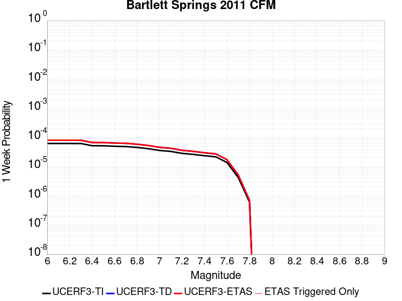 | 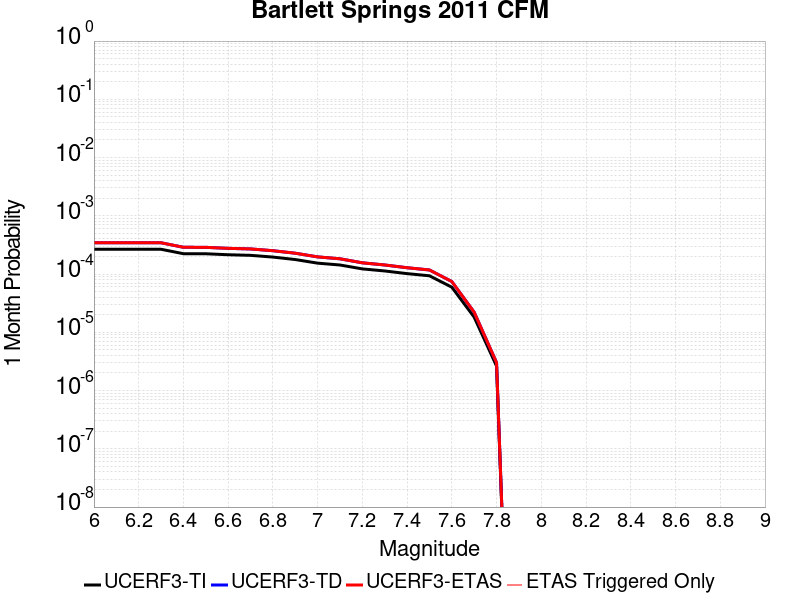 | 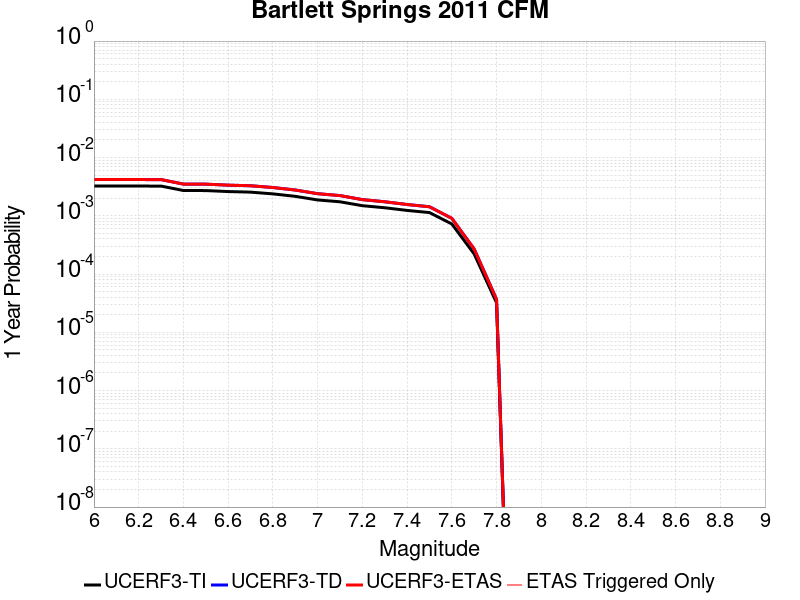 | 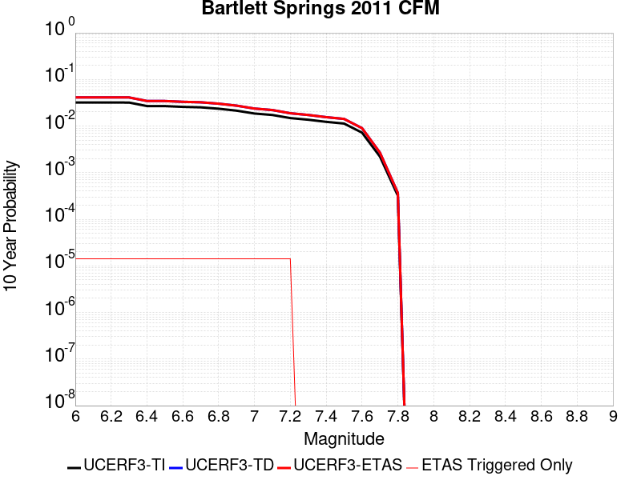 |

| Magnitude | 1 wk TI Prob | 1 wk TD Prob | 1 wk ETAS Prob | 1 wk ETAS/TD Gain | 1 wk ETAS Triggered Only | 1 mo TI Prob | 1 mo TD Prob | 1 mo ETAS Prob | 1 mo ETAS/TD Gain | 1 mo ETAS Triggered Only | 1 yr TI Prob | 1 yr TD Prob | 1 yr ETAS Prob | 1 yr ETAS/TD Gain | 1 yr ETAS Triggered Only | 10 yr TI Prob | 10 yr TD Prob | 10 yr ETAS Prob | 10 yr ETAS/TD Gain | 10 yr ETAS Triggered Only |
|-----|-----|-----|-----|-----|-----|-----|-----|-----|-----|-----|-----|-----|-----|-----|-----|-----|-----|-----|-----|-----|
| 6.0 | 6.2326144E-5 | 8.060668E-5 | 8.060668E-5 | 1.0 | 0.0 | 2.6708472E-4 | 3.4541206E-4 | 3.4541206E-4 | 1.0 | 0.0 | 0.003246908 | 0.0041973754 | 0.0041973754 | 1.0 | 0.0 | 0.031998757 | 0.041198105 | 0.041207694 | 1.0002327 | 1.0E-5 |
| 6.1 | 6.227657E-5 | 8.054418E-5 | 8.054418E-5 | 1.0 | 0.0 | 2.668723E-4 | 3.4514428E-4 | 3.4514428E-4 | 1.0 | 0.0 | 0.0032443295 | 0.004194128 | 0.004194128 | 1.0 | 0.0 | 0.031973712 | 0.041166842 | 0.04117643 | 1.0002329 | 1.0E-5 |
| 6.2 | 6.22452E-5 | 8.050479E-5 | 8.050479E-5 | 1.0 | 0.0 | 2.6673786E-4 | 3.449755E-4 | 3.449755E-4 | 1.0 | 0.0 | 0.0032426978 | 0.004192081 | 0.004192081 | 1.0 | 0.0 | 0.03195787 | 0.04114713 | 0.04115672 | 1.000233 | 1.0E-5 |
| 6.3 | 6.219006E-5 | 8.043463E-5 | 8.043463E-5 | 1.0 | 0.0 | 2.6650162E-4 | 3.4467486E-4 | 3.4467486E-4 | 1.0 | 0.0 | 0.00323983 | 0.0041884347 | 0.0041884347 | 1.0 | 0.0 | 0.031930014 | 0.04111203 | 0.04112162 | 1.0002333 | 1.0E-5 |
| 6.4 | 5.2175856E-5 | 6.7254E-5 | 6.7254E-5 | 1.0 | 0.0 | 2.2359163E-4 | 2.8819984E-4 | 2.8819984E-4 | 1.0 | 0.0 | 0.0027188298 | 0.0035032362 | 0.0035032362 | 1.0 | 0.0 | 0.026858058 | 0.03448956 | 0.034499217 | 1.0002799 | 1.0E-5 |
| 6.5 | 5.205166E-5 | 6.709666E-5 | 6.709666E-5 | 1.0 | 0.0 | 2.2305945E-4 | 2.875257E-4 | 2.875257E-4 | 1.0 | 0.0 | 0.0027123666 | 0.0034950553 | 0.0034950553 | 1.0 | 0.0 | 0.026794989 | 0.034410305 | 0.03441996 | 1.0002806 | 1.0E-5 |
| 6.6 | 5.0085426E-5 | 6.449303E-5 | 6.449303E-5 | 1.0 | 0.0 | 2.1463417E-4 | 2.7636968E-4 | 2.7636968E-4 | 1.0 | 0.0 | 0.0026100394 | 0.0033596596 | 0.0033596596 | 1.0 | 0.0 | 0.025795965 | 0.03309789 | 0.03310756 | 1.0002922 | 1.0E-5 |
| 6.7 | 4.8930866E-5 | 6.30177E-5 | 6.30177E-5 | 1.0 | 0.0 | 2.0968684E-4 | 2.700482E-4 | 2.700482E-4 | 1.0 | 0.0 | 0.0025499484 | 0.0032829295 | 0.0032829295 | 1.0 | 0.0 | 0.025208864 | 0.032353252 | 0.032362927 | 1.0002991 | 1.0E-5 |
| 6.8 | 4.5679535E-5 | 5.874213E-5 | 5.874213E-5 | 1.0 | 0.0 | 1.9575475E-4 | 2.517279E-4 | 2.517279E-4 | 1.0 | 0.0 | 0.002380709 | 0.0030605178 | 0.0030605178 | 1.0 | 0.0 | 0.023553653 | 0.030190729 | 0.030200427 | 1.0003213 | 1.0E-5 |
| 6.9 | 4.1439176E-5 | 5.3220345E-5 | 5.3220345E-5 | 1.0 | 0.0 | 1.7758438E-4 | 2.2806737E-4 | 2.2806737E-4 | 1.0 | 0.0 | 0.002159946 | 0.00277321 | 0.00277321 | 1.0 | 0.0 | 0.021390721 | 0.02739108 | 0.027400805 | 1.0003551 | 1.0E-5 |
| 7.0 | 3.5920104E-5 | 4.6008958E-5 | 4.6008958E-5 | 1.0 | 0.0 | 1.5393422E-4 | 1.9716643E-4 | 1.9716643E-4 | 1.0 | 0.0 | 0.001872538 | 0.0023978746 | 0.0023978746 | 1.0 | 0.0 | 0.018568378 | 0.023723308 | 0.02373307 | 1.0004115 | 1.0E-5 |
| 7.1 | 3.338812E-5 | 4.2689815E-5 | 4.2689815E-5 | 1.0 | 0.0 | 1.430841E-4 | 1.829436E-4 | 1.829436E-4 | 1.0 | 0.0 | 0.0017406568 | 0.0022250775 | 0.0022250775 | 1.0 | 0.0 | 0.017270854 | 0.02203084 | 0.02204062 | 1.0004439 | 1.0E-5 |
| 7.2 | 2.8619615E-5 | 3.640186E-5 | 3.640186E-5 | 1.0 | 0.0 | 1.2264973E-4 | 1.559987E-4 | 1.559987E-4 | 1.0 | 0.0 | 0.0014922376 | 0.0018976394 | 0.0018976394 | 1.0 | 0.0 | 0.014822568 | 0.018816413 | 0.018826224 | 1.0005214 | 1.0E-5 |
| 7.3 | 2.6376783E-5 | 3.3422963E-5 | 3.3422963E-5 | 1.0 | 0.0 | 1.13038455E-4 | 1.4323345E-4 | 1.4323345E-4 | 1.0 | 0.0 | 0.0013753743 | 0.0017424817 | 0.0017424817 | 1.0 | 0.0 | 0.01366893 | 0.017289983 | 0.017289983 | 1.0 | 0.0 |
| 7.4 | 2.3738676E-5 | 2.9979174E-5 | 2.9979174E-5 | 1.0 | 0.0 | 1.0173322E-4 | 1.2847589E-4 | 1.2847589E-4 | 1.0 | 0.0 | 0.0012378981 | 0.0015630797 | 0.0015630797 | 1.0 | 0.0 | 0.012310251 | 0.01552236 | 0.01552236 | 1.0 | 0.0 |
| 7.5 | 2.1789481E-5 | 2.7439555E-5 | 2.7439555E-5 | 1.0 | 0.0 | 9.338015E-5 | 1.1759284E-4 | 1.1759284E-4 | 1.0 | 0.0 | 0.0011363103 | 0.0014307604 | 0.0014307604 | 1.0 | 0.0 | 0.011305175 | 0.014216874 | 0.014216874 | 1.0 | 0.0 |
| 7.6 | 1.3895281E-5 | 1.7368566E-5 | 1.7368566E-5 | 1.0 | 0.0 | 5.9549846E-5 | 7.44346E-5 | 7.44346E-5 | 1.0 | 0.0 | 7.2477816E-4 | 9.058674E-4 | 9.058674E-4 | 1.0 | 0.0 | 0.0072241887 | 0.009022309 | 0.009022309 | 1.0 | 0.0 |
| 7.7 | 4.245981E-6 | 5.1625234E-6 | 5.1625234E-6 | 1.0 | 0.0 | 1.8196934E-5 | 2.2124914E-5 | 2.2124914E-5 | 1.0 | 0.0 | 2.2152514E-4 | 2.693377E-4 | 2.693377E-4 | 1.0 | 0.0 | 0.0022130446 | 0.00269016 | 0.00269016 | 1.0 | 0.0 |
| 7.8 | 6.145192E-7 | 7.0470315E-7 | 7.0470315E-7 | 1.0 | 0.0 | 2.633651E-6 | 3.020153E-6 | 3.020153E-6 | 1.0 | 0.0 | 3.206423E-5 | 3.6769754E-5 | 3.6769754E-5 | 1.0 | 0.0 | 3.2059604E-4 | 3.6763048E-4 | 3.6763048E-4 | 1.0 | 0.0 |

## Concord 2011 CFM
*[(top)](#table-of-contents)*

| 1 Week | 1 Month | 1 Year | 10 Year |
|-----|-----|-----|-----|
|  |  | 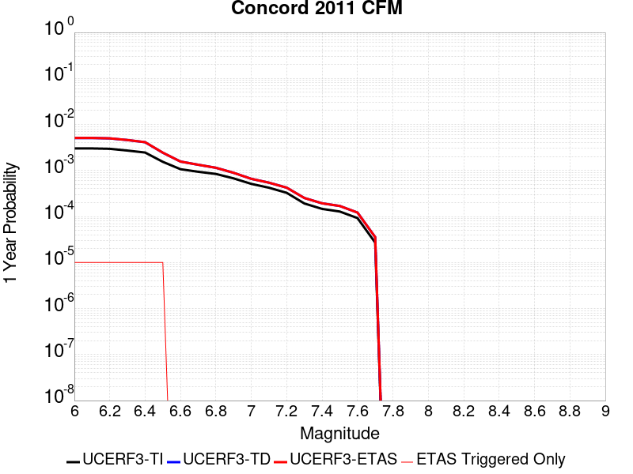 | 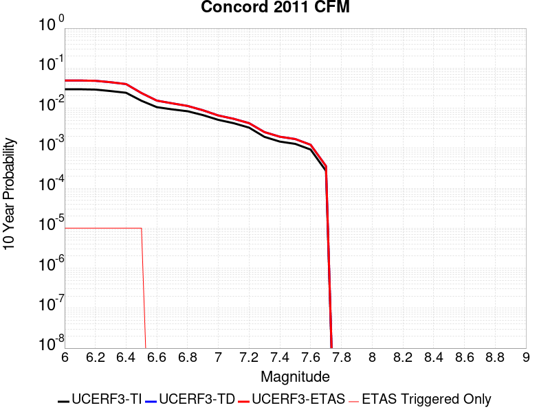 |

| Magnitude | 1 wk TI Prob | 1 wk TD Prob | 1 wk ETAS Prob | 1 wk ETAS/TD Gain | 1 wk ETAS Triggered Only | 1 mo TI Prob | 1 mo TD Prob | 1 mo ETAS Prob | 1 mo ETAS/TD Gain | 1 mo ETAS Triggered Only | 1 yr TI Prob | 1 yr TD Prob | 1 yr ETAS Prob | 1 yr ETAS/TD Gain | 1 yr ETAS Triggered Only | 10 yr TI Prob | 10 yr TD Prob | 10 yr ETAS Prob | 10 yr ETAS/TD Gain | 10 yr ETAS Triggered Only |
|-----|-----|-----|-----|-----|-----|-----|-----|-----|-----|-----|-----|-----|-----|-----|-----|-----|-----|-----|-----|-----|
| 6.0 | 5.7865112E-5 | 9.7585355E-5 | 9.7585355E-5 | 1.0 | 0.0 | 2.4796976E-4 | 4.181607E-4 | 4.181607E-4 | 1.0 | 0.0 | 0.0030148525 | 0.005079743 | 0.0050896923 | 1.0019586 | 1.0E-5 | 0.029742775 | 0.049266078 | 0.049275585 | 1.000193 | 1.0E-5 |
| 6.1 | 5.7865112E-5 | 9.7585355E-5 | 9.7585355E-5 | 1.0 | 0.0 | 2.4796976E-4 | 4.181607E-4 | 4.181607E-4 | 1.0 | 0.0 | 0.0030148525 | 0.005079743 | 0.0050896923 | 1.0019586 | 1.0E-5 | 0.029742775 | 0.049266078 | 0.049275585 | 1.000193 | 1.0E-5 |
| 6.2 | 5.6789337E-5 | 9.578793E-5 | 9.578793E-5 | 1.0 | 0.0 | 2.4336016E-4 | 4.1045985E-4 | 4.1045985E-4 | 1.0 | 0.0 | 0.0029588845 | 0.0049864696 | 0.0049964194 | 1.0019954 | 1.0E-5 | 0.029197963 | 0.04838257 | 0.048392083 | 1.0001967 | 1.0E-5 |
| 6.3 | 5.203322E-5 | 8.803241E-5 | 8.803241E-5 | 1.0 | 0.0 | 2.2298045E-4 | 3.772316E-4 | 3.772316E-4 | 1.0 | 0.0 | 0.0027114071 | 0.0045839064 | 0.0045938604 | 1.0021715 | 1.0E-5 | 0.026785625 | 0.04455397 | 0.044563524 | 1.0002145 | 1.0E-5 |
| 6.4 | 4.7120942E-5 | 7.897583E-5 | 7.897583E-5 | 1.0 | 0.0 | 2.0193127E-4 | 3.3842813E-4 | 3.3842813E-4 | 1.0 | 0.0 | 0.0024557412 | 0.004113323 | 0.0041232817 | 1.0024211 | 1.0E-5 | 0.024287801 | 0.040080756 | 0.040090356 | 1.0002395 | 1.0E-5 |
| 6.5 | 2.9598437E-5 | 4.6675777E-5 | 4.6675777E-5 | 1.0 | 0.0 | 1.2684427E-4 | 2.000249E-4 | 2.000249E-4 | 1.0 | 0.0 | 0.001543235 | 0.0024327936 | 0.0024427692 | 1.0041004 | 1.0E-5 | 0.015325619 | 0.023909668 | 0.02391943 | 1.0004083 | 1.0E-5 |
| 6.6 | 2.0443718E-5 | 2.9984873E-5 | 2.9984873E-5 | 1.0 | 0.0 | 8.7613E-5 | 1.2850047E-4 | 1.2850047E-4 | 1.0 | 0.0 | 0.0010661662 | 0.0015634067 | 0.0015634067 | 1.0 | 0.0 | 0.010610655 | 0.0154669015 | 0.0154669015 | 1.0 | 0.0 |
| 6.7 | 1.798539E-5 | 2.5557883E-5 | 2.5557883E-5 | 1.0 | 0.0 | 7.7077966E-5 | 1.0952931E-4 | 1.0952931E-4 | 1.0 | 0.0 | 9.380202E-4 | 0.0013327252 | 0.0013327252 | 1.0 | 0.0 | 0.009340706 | 0.013217516 | 0.013217516 | 1.0 | 0.0 |
| 6.8 | 1.613555E-5 | 2.1959608E-5 | 2.1959608E-5 | 1.0 | 0.0 | 6.915052E-5 | 9.4109295E-5 | 9.4109295E-5 | 1.0 | 0.0 | 8.4158237E-4 | 0.0011451923 | 0.0011451923 | 1.0 | 0.0 | 0.008384023 | 0.011378321 | 0.011378321 | 1.0 | 0.0 |
| 6.9 | 1.2916435E-5 | 1.708134E-5 | 1.708134E-5 | 1.0 | 0.0 | 5.5354973E-5 | 7.320372E-5 | 7.320372E-5 | 1.0 | 0.0 | 6.7373837E-4 | 8.908967E-4 | 8.908967E-4 | 1.0 | 0.0 | 0.006716994 | 0.008867833 | 0.008867833 | 1.0 | 0.0 |
| 7.0 | 9.81129E-6 | 1.2631038E-5 | 1.2631038E-5 | 1.0 | 0.0 | 4.2047708E-5 | 5.4131906E-5 | 5.4131906E-5 | 1.0 | 0.0 | 5.118106E-4 | 6.588583E-4 | 6.588583E-4 | 1.0 | 0.0 | 0.005106334 | 0.0065697595 | 0.0065697595 | 1.0 | 0.0 |
| 7.1 | 8.0889195E-6 | 1.04184555E-5 | 1.04184555E-5 | 1.0 | 0.0 | 3.4666336E-5 | 4.4649765E-5 | 4.4649765E-5 | 1.0 | 0.0 | 4.219809E-4 | 5.434764E-4 | 5.434764E-4 | 1.0 | 0.0 | 0.004211805 | 0.0054219896 | 0.0054219896 | 1.0 | 0.0 |
| 7.2 | 6.267438E-6 | 8.115879E-6 | 8.115879E-6 | 1.0 | 0.0 | 2.6860173E-5 | 3.478188E-5 | 3.478188E-5 | 1.0 | 0.0 | 3.2697353E-4 | 4.2338783E-4 | 4.2338783E-4 | 1.0 | 0.0 | 0.0032649285 | 0.004226169 | 0.004226169 | 1.0 | 0.0 |
| 7.3 | 3.6761196E-6 | 4.840281E-6 | 4.840281E-6 | 1.0 | 0.0 | 1.5754704E-5 | 2.0743897E-5 | 2.0743897E-5 | 1.0 | 0.0 | 1.9179663E-4 | 2.5252788E-4 | 2.5252788E-4 | 1.0 | 0.0 | 0.0019163118 | 0.0025226264 | 0.0025226264 | 1.0 | 0.0 |
| 7.4 | 2.8044356E-6 | 3.7096993E-6 | 3.7096993E-6 | 1.0 | 0.0 | 1.2018954E-5 | 1.5898615E-5 | 1.5898615E-5 | 1.0 | 0.0 | 1.4632095E-4 | 1.9354856E-4 | 1.9354856E-4 | 1.0 | 0.0 | 0.0014622464 | 0.0019340349 | 0.0019340349 | 1.0 | 0.0 |
| 7.5 | 2.4578699E-6 | 3.2448306E-6 | 3.2448306E-6 | 1.0 | 0.0 | 1.0533685E-5 | 1.3906343E-5 | 1.3906343E-5 | 1.0 | 0.0 | 1.2824008E-4 | 1.6929668E-4 | 1.6929668E-4 | 1.0 | 0.0 | 0.0012816609 | 0.0016918926 | 0.0016918926 | 1.0 | 0.0 |
| 7.6 | 1.7713267E-6 | 2.335189E-6 | 2.335189E-6 | 1.0 | 0.0 | 7.591378E-6 | 1.0007916E-5 | 1.0007916E-5 | 1.0 | 0.0 | 9.2421105E-5 | 1.2183965E-4 | 1.2183965E-4 | 1.0 | 0.0 | 9.2382677E-4 | 0.0012178655 | 0.0012178655 | 1.0 | 0.0 |
| 7.7 | 5.1912366E-7 | 6.829346E-7 | 6.829346E-7 | 1.0 | 0.0 | 2.2248137E-6 | 2.9268595E-6 | 2.9268595E-6 | 1.0 | 0.0 | 2.708677E-5 | 3.5633944E-5 | 3.5633944E-5 | 1.0 | 0.0 | 2.708347E-4 | 3.5630353E-4 | 3.5630353E-4 | 1.0 | 0.0 |

## Elsinore (Julian)
*[(top)](#table-of-contents)*

| 1 Week | 1 Month | 1 Year | 10 Year |
|-----|-----|-----|-----|
| 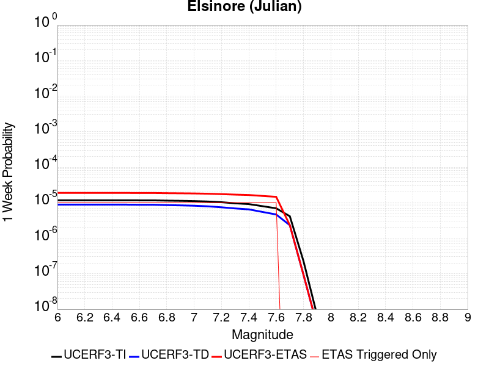 | 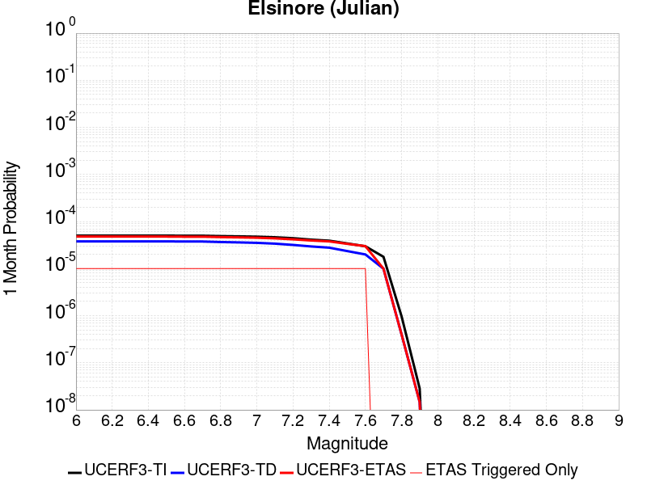 | 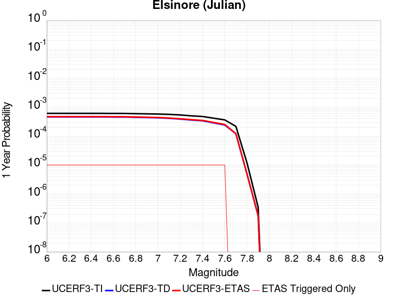 | 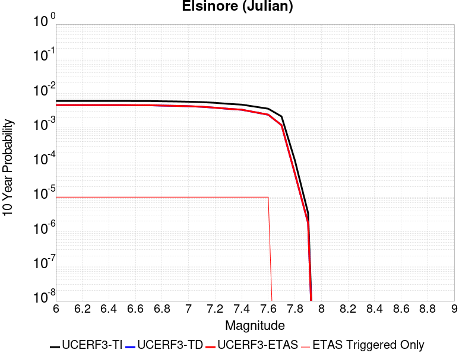 |

| Magnitude | 1 wk TI Prob | 1 wk TD Prob | 1 wk ETAS Prob | 1 wk ETAS/TD Gain | 1 wk ETAS Triggered Only | 1 mo TI Prob | 1 mo TD Prob | 1 mo ETAS Prob | 1 mo ETAS/TD Gain | 1 mo ETAS Triggered Only | 1 yr TI Prob | 1 yr TD Prob | 1 yr ETAS Prob | 1 yr ETAS/TD Gain | 1 yr ETAS Triggered Only | 10 yr TI Prob | 10 yr TD Prob | 10 yr ETAS Prob | 10 yr ETAS/TD Gain | 10 yr ETAS Triggered Only |
|-----|-----|-----|-----|-----|-----|-----|-----|-----|-----|-----|-----|-----|-----|-----|-----|-----|-----|-----|-----|-----|
| 6.0 | 1.1710231E-5 | 8.845315E-6 | 1.8845227E-5 | 2.130532 | 1.0E-5 | 5.0185736E-5 | 3.7907954E-5 | 4.7907575E-5 | 1.2637869 | 1.0E-5 | 6.1084004E-4 | 4.614333E-4 | 4.7142868E-4 | 1.0216616 | 1.0E-5 | 0.006091637 | 0.0046049724 | 0.0046149264 | 1.0021616 | 1.0E-5 |
| 6.1 | 1.1710231E-5 | 8.845315E-6 | 1.8845227E-5 | 2.130532 | 1.0E-5 | 5.0185736E-5 | 3.7907954E-5 | 4.7907575E-5 | 1.2637869 | 1.0E-5 | 6.1084004E-4 | 4.614333E-4 | 4.7142868E-4 | 1.0216616 | 1.0E-5 | 0.006091637 | 0.0046049724 | 0.0046149264 | 1.0021616 | 1.0E-5 |
| 6.2 | 1.1710231E-5 | 8.845315E-6 | 1.8845227E-5 | 2.130532 | 1.0E-5 | 5.0185736E-5 | 3.7907954E-5 | 4.7907575E-5 | 1.2637869 | 1.0E-5 | 6.1084004E-4 | 4.614333E-4 | 4.7142868E-4 | 1.0216616 | 1.0E-5 | 0.006091637 | 0.0046049724 | 0.0046149264 | 1.0021616 | 1.0E-5 |
| 6.3 | 1.1710231E-5 | 8.845315E-6 | 1.8845227E-5 | 2.130532 | 1.0E-5 | 5.0185736E-5 | 3.7907954E-5 | 4.7907575E-5 | 1.2637869 | 1.0E-5 | 6.1084004E-4 | 4.614333E-4 | 4.7142868E-4 | 1.0216616 | 1.0E-5 | 0.006091637 | 0.0046049724 | 0.0046149264 | 1.0021616 | 1.0E-5 |
| 6.4 | 1.1710231E-5 | 8.845315E-6 | 1.8845227E-5 | 2.130532 | 1.0E-5 | 5.0185736E-5 | 3.7907954E-5 | 4.7907575E-5 | 1.2637869 | 1.0E-5 | 6.1084004E-4 | 4.614333E-4 | 4.7142868E-4 | 1.0216616 | 1.0E-5 | 0.006091637 | 0.0046049724 | 0.0046149264 | 1.0021616 | 1.0E-5 |
| 6.5 | 1.1710231E-5 | 8.845315E-6 | 1.8845227E-5 | 2.130532 | 1.0E-5 | 5.0185736E-5 | 3.7907954E-5 | 4.7907575E-5 | 1.2637869 | 1.0E-5 | 6.1084004E-4 | 4.614333E-4 | 4.7142868E-4 | 1.0216616 | 1.0E-5 | 0.006091637 | 0.0046049724 | 0.0046149264 | 1.0021616 | 1.0E-5 |
| 6.6 | 1.1650619E-5 | 8.777691E-6 | 1.8777604E-5 | 2.1392417 | 1.0E-5 | 4.993027E-5 | 3.761814E-5 | 4.7617767E-5 | 1.2658192 | 1.0E-5 | 6.0773146E-4 | 4.5790634E-4 | 4.6790176E-4 | 1.0218285 | 1.0E-5 | 0.0060607214 | 0.004569848 | 0.0045798025 | 1.0021783 | 1.0E-5 |
| 6.7 | 1.1650619E-5 | 8.777691E-6 | 1.8777604E-5 | 2.1392417 | 1.0E-5 | 4.993027E-5 | 3.761814E-5 | 4.7617767E-5 | 1.2658192 | 1.0E-5 | 6.0773146E-4 | 4.5790634E-4 | 4.6790176E-4 | 1.0218285 | 1.0E-5 | 0.0060607214 | 0.004569848 | 0.0045798025 | 1.0021783 | 1.0E-5 |
| 6.8 | 1.1442698E-5 | 8.560841E-6 | 1.8560755E-5 | 2.1680994 | 1.0E-5 | 4.9039216E-5 | 3.6688813E-5 | 4.6688445E-5 | 1.2725526 | 1.0E-5 | 5.968889E-4 | 4.4659642E-4 | 4.5659195E-4 | 1.0223815 | 1.0E-5 | 0.0059528816 | 0.004457207 | 0.004467163 | 1.0022335 | 1.0E-5 |
| 6.9 | 1.1300589E-5 | 8.408708E-6 | 1.8408624E-5 | 2.1892333 | 1.0E-5 | 4.8430196E-5 | 3.603683E-5 | 4.6036468E-5 | 1.2774839 | 1.0E-5 | 5.894781E-4 | 4.3866172E-4 | 4.4865735E-4 | 1.0227866 | 1.0E-5 | 0.005879169 | 0.0043781744 | 0.0043881307 | 1.002274 | 1.0E-5 |
| 7.0 | 1.1117729E-5 | 8.225868E-6 | 1.8225786E-5 | 2.215667 | 1.0E-5 | 4.764654E-5 | 3.5253255E-5 | 4.5252902E-5 | 1.2836517 | 1.0E-5 | 5.799422E-4 | 4.291255E-4 | 4.391212E-4 | 1.0232933 | 1.0E-5 | 0.0057843104 | 0.0042831833 | 0.0042931405 | 1.0023247 | 1.0E-5 |
| 7.1 | 1.08053955E-5 | 7.911498E-6 | 1.791142E-5 | 2.263973 | 1.0E-5 | 4.6308014E-5 | 3.3905988E-5 | 4.390565E-5 | 1.2949232 | 1.0E-5 | 5.6365423E-4 | 4.1272887E-4 | 4.2272473E-4 | 1.024219 | 1.0E-5 | 0.005622267 | 0.004119835 | 0.004129794 | 1.0024173 | 1.0E-5 |
| 7.2 | 1.032804E-5 | 7.432751E-6 | 1.7432676E-5 | 2.345387 | 1.0E-5 | 4.4262277E-5 | 3.1854266E-5 | 4.1853946E-5 | 1.3139197 | 1.0E-5 | 5.387599E-4 | 3.8775822E-4 | 3.9775437E-4 | 1.0257792 | 1.0E-5 | 0.0053745564 | 0.00387102 | 0.0038809814 | 1.0025733 | 1.0E-5 |
| 7.3 | 9.622426E-6 | 6.897587E-6 | 1.6897518E-5 | 2.4497724 | 1.0E-5 | 4.1238312E-5 | 2.956076E-5 | 3.9560466E-5 | 1.3382763 | 1.0E-5 | 5.019608E-4 | 3.5984424E-4 | 3.6984065E-4 | 1.0277798 | 1.0E-5 | 0.005008285 | 0.0035928036 | 0.0036027676 | 1.0027733 | 1.0E-5 |
| 7.4 | 9.144434E-6 | 6.496142E-6 | 1.6496077E-5 | 2.5393653 | 1.0E-5 | 3.9189843E-5 | 2.7840319E-5 | 3.784004E-5 | 1.3591813 | 1.0E-5 | 4.7703186E-4 | 3.3890453E-4 | 3.4890114E-4 | 1.0294968 | 1.0E-5 | 0.0047600917 | 0.0033840172 | 0.0033939832 | 1.0029451 | 1.0E-5 |
| 7.5 | 7.988981E-6 | 5.498105E-6 | 1.549805E-5 | 2.8187985 | 1.0E-5 | 3.4238044E-5 | 2.3563101E-5 | 3.3562865E-5 | 1.4243823 | 1.0E-5 | 4.1676845E-4 | 2.8684427E-4 | 2.968414E-4 | 1.0348521 | 1.0E-5 | 0.0041598766 | 0.0028648674 | 0.002874839 | 1.0034806 | 1.0E-5 |
| 7.6 | 6.9554876E-6 | 4.6623254E-6 | 1.4662279E-5 | 3.1448424 | 1.0E-5 | 2.9808893E-5 | 1.998125E-5 | 2.9981049E-5 | 1.5004592 | 1.0E-5 | 3.6286283E-4 | 2.4324573E-4 | 2.5324328E-4 | 1.0411007 | 1.0E-5 | 0.0036227088 | 0.002429911 | 0.0024398866 | 1.0041053 | 1.0E-5 |
| 7.7 | 4.1557314E-6 | 2.3244427E-6 | 2.3244427E-6 | 1.0 | 0.0 | 1.7810156E-5 | 9.961864E-6 | 9.961864E-6 | 1.0 | 0.0 | 2.1681708E-4 | 1.2127968E-4 | 1.2127968E-4 | 1.0 | 0.0 | 0.0021660565 | 0.001212208 | 0.001212208 | 1.0 | 0.0 |
| 7.8 | 2.2597293E-7 | 9.331864E-8 | 9.331864E-8 | 1.0 | 0.0 | 9.684551E-7 | 3.99937E-7 | 3.99937E-7 | 1.0 | 0.0 | 1.1790877E-5 | 4.8692254E-6 | 4.8692254E-6 | 1.0 | 0.0 | 1.17902506E-4 | 4.8691512E-5 | 4.8691512E-5 | 1.0 | 0.0 |
| 7.9 | 6.676829E-9 | 3.4397174E-9 | 3.4397174E-9 | 1.0 | 0.0 | 2.861498E-8 | 1.4741646E-8 | 1.4741646E-8 | 1.0 | 0.0 | 3.4838732E-7 | 1.7947953E-7 | 1.7947953E-7 | 1.0 | 0.0 | 3.4838679E-6 | 1.794794E-6 | 1.794794E-6 | 1.0 | 0.0 |

## Round Valley
*[(top)](#table-of-contents)*

| 1 Week | 1 Month | 1 Year | 10 Year |
|-----|-----|-----|-----|
|  | 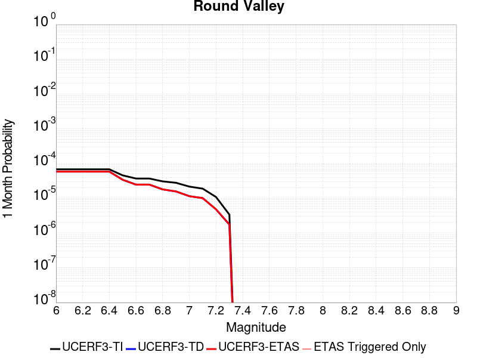 |  | 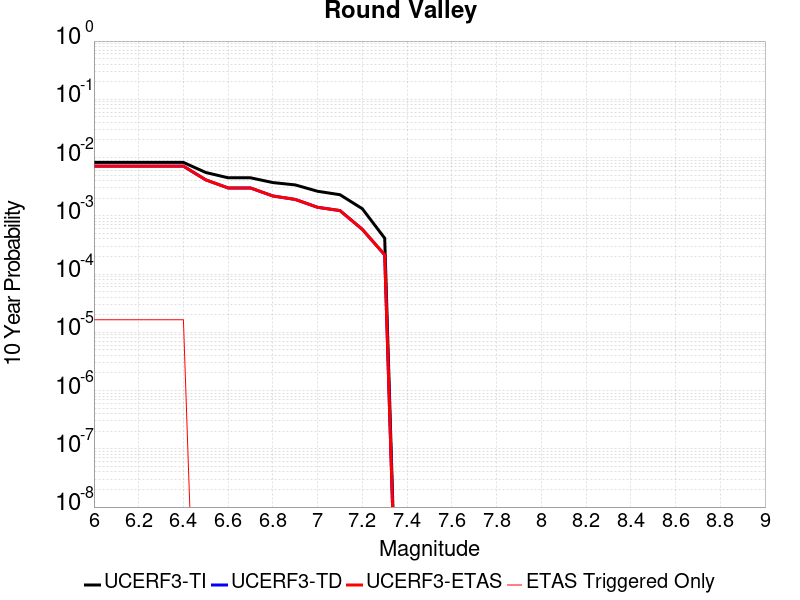 |

| Magnitude | 1 wk TI Prob | 1 wk TD Prob | 1 wk ETAS Prob | 1 wk ETAS/TD Gain | 1 wk ETAS Triggered Only | 1 mo TI Prob | 1 mo TD Prob | 1 mo ETAS Prob | 1 mo ETAS/TD Gain | 1 mo ETAS Triggered Only | 1 yr TI Prob | 1 yr TD Prob | 1 yr ETAS Prob | 1 yr ETAS/TD Gain | 1 yr ETAS Triggered Only | 10 yr TI Prob | 10 yr TD Prob | 10 yr ETAS Prob | 10 yr ETAS/TD Gain | 10 yr ETAS Triggered Only |
|-----|-----|-----|-----|-----|-----|-----|-----|-----|-----|-----|-----|-----|-----|-----|-----|-----|-----|-----|-----|-----|
| 6.0 | 1.588152E-5 | 1.3670525E-5 | 1.3670525E-5 | 1.0 | 0.0 | 6.806188E-5 | 5.8586873E-5 | 5.8586873E-5 | 1.0 | 0.0 | 8.283384E-4 | 7.131011E-4 | 7.131011E-4 | 1.0 | 0.0 | 0.008252576 | 0.0071120164 | 0.0071219453 | 1.0013961 | 1.0E-5 |
| 6.1 | 1.588152E-5 | 1.3670525E-5 | 1.3670525E-5 | 1.0 | 0.0 | 6.806188E-5 | 5.8586873E-5 | 5.8586873E-5 | 1.0 | 0.0 | 8.283384E-4 | 7.131011E-4 | 7.131011E-4 | 1.0 | 0.0 | 0.008252576 | 0.0071120164 | 0.0071219453 | 1.0013961 | 1.0E-5 |
| 6.2 | 1.588152E-5 | 1.3670525E-5 | 1.3670525E-5 | 1.0 | 0.0 | 6.806188E-5 | 5.8586873E-5 | 5.8586873E-5 | 1.0 | 0.0 | 8.283384E-4 | 7.131011E-4 | 7.131011E-4 | 1.0 | 0.0 | 0.008252576 | 0.0071120164 | 0.0071219453 | 1.0013961 | 1.0E-5 |
| 6.3 | 1.588152E-5 | 1.3670525E-5 | 1.3670525E-5 | 1.0 | 0.0 | 6.806188E-5 | 5.8586873E-5 | 5.8586873E-5 | 1.0 | 0.0 | 8.283384E-4 | 7.131011E-4 | 7.131011E-4 | 1.0 | 0.0 | 0.008252576 | 0.0071120164 | 0.0071219453 | 1.0013961 | 1.0E-5 |
| 6.4 | 1.588152E-5 | 1.3670525E-5 | 1.3670525E-5 | 1.0 | 0.0 | 6.806188E-5 | 5.8586873E-5 | 5.8586873E-5 | 1.0 | 0.0 | 8.283384E-4 | 7.131011E-4 | 7.131011E-4 | 1.0 | 0.0 | 0.008252576 | 0.0071120164 | 0.0071219453 | 1.0013961 | 1.0E-5 |
| 6.5 | 1.0646776E-5 | 7.952847E-6 | 7.952847E-6 | 1.0 | 0.0 | 4.5628243E-5 | 3.4083234E-5 | 3.4083234E-5 | 1.0 | 0.0 | 5.553823E-4 | 4.1489274E-4 | 4.1489274E-4 | 1.0 | 0.0 | 0.005539963 | 0.00414201 | 0.00414201 | 1.0 | 0.0 |
| 6.6 | 8.632956E-6 | 5.768552E-6 | 5.768552E-6 | 1.0 | 0.0 | 3.6997862E-5 | 2.4722152E-5 | 2.4722152E-5 | 1.0 | 0.0 | 4.5035584E-4 | 3.0095447E-4 | 3.0095447E-4 | 1.0 | 0.0 | 0.0044944426 | 0.0030058469 | 0.0030058469 | 1.0 | 0.0 |
| 6.7 | 8.632956E-6 | 5.768552E-6 | 5.768552E-6 | 1.0 | 0.0 | 3.6997862E-5 | 2.4722152E-5 | 2.4722152E-5 | 1.0 | 0.0 | 4.5035584E-4 | 3.0095447E-4 | 3.0095447E-4 | 1.0 | 0.0 | 0.0044944426 | 0.0030058469 | 0.0030058469 | 1.0 | 0.0 |
| 6.8 | 7.143895E-6 | 4.201644E-6 | 4.201644E-6 | 1.0 | 0.0 | 3.0616335E-5 | 1.8006931E-5 | 1.8006931E-5 | 1.0 | 0.0 | 3.726901E-4 | 2.19214E-4 | 2.19214E-4 | 1.0 | 0.0 | 0.0037206567 | 0.0021901424 | 0.0021901424 | 1.0 | 0.0 |
| 6.9 | 6.5120694E-6 | 3.6642807E-6 | 3.6642807E-6 | 1.0 | 0.0 | 2.790857E-5 | 1.5703974E-5 | 1.5703974E-5 | 1.0 | 0.0 | 3.3973387E-4 | 1.9118062E-4 | 1.9118062E-4 | 1.0 | 0.0 | 0.0033921495 | 0.0019103106 | 0.0019103106 | 1.0 | 0.0 |
| 7.0 | 5.0614435E-6 | 2.6834869E-6 | 2.6834869E-6 | 1.0 | 0.0 | 2.169172E-5 | 1.1500612E-5 | 1.1500612E-5 | 1.0 | 0.0 | 2.6406467E-4 | 1.40012E-4 | 1.40012E-4 | 1.0 | 0.0 | 0.0026375111 | 0.0013993392 | 0.0013993392 | 1.0 | 0.0 |
| 7.1 | 4.41728E-6 | 2.3573243E-6 | 2.3573243E-6 | 1.0 | 0.0 | 1.8931061E-5 | 1.01027845E-5 | 1.01027845E-5 | 1.0 | 0.0 | 2.304613E-4 | 1.2299545E-4 | 1.2299545E-4 | 1.0 | 0.0 | 0.0023022245 | 0.0012293702 | 0.0012293702 | 1.0 | 0.0 |
| 7.2 | 2.535495E-6 | 1.120784E-6 | 1.120784E-6 | 1.0 | 0.0 | 1.0866362E-5 | 4.803354E-6 | 4.803354E-6 | 1.0 | 0.0 | 1.3228992E-4 | 5.8479785E-5 | 5.8479785E-5 | 1.0 | 0.0 | 0.0013221119 | 5.846952E-4 | 5.846952E-4 | 1.0 | 0.0 |
| 7.3 | 7.900015E-7 | 4.0888176E-7 | 4.0888176E-7 | 1.0 | 0.0 | 3.3857161E-6 | 1.7523504E-6 | 1.7523504E-6 | 1.0 | 0.0 | 4.1220315E-5 | 2.1334865E-5 | 2.1334865E-5 | 1.0 | 0.0 | 4.121267E-4 | 2.1334866E-4 | 2.1334866E-4 | 1.0 | 0.0 |

## Fitzhugh Creek
*[(top)](#table-of-contents)*

| 1 Week | 1 Month | 1 Year | 10 Year |
|-----|-----|-----|-----|
|  | 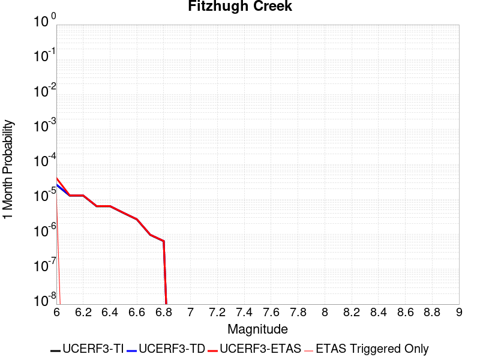 | 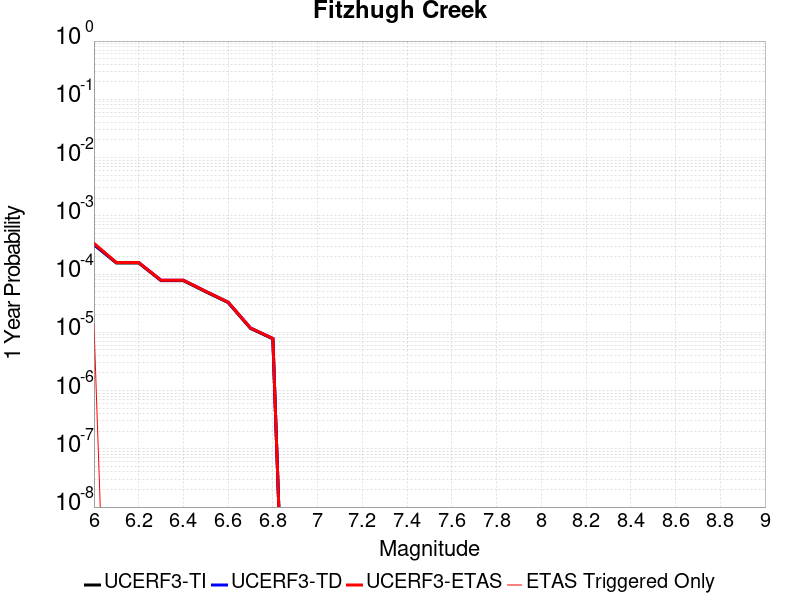 | 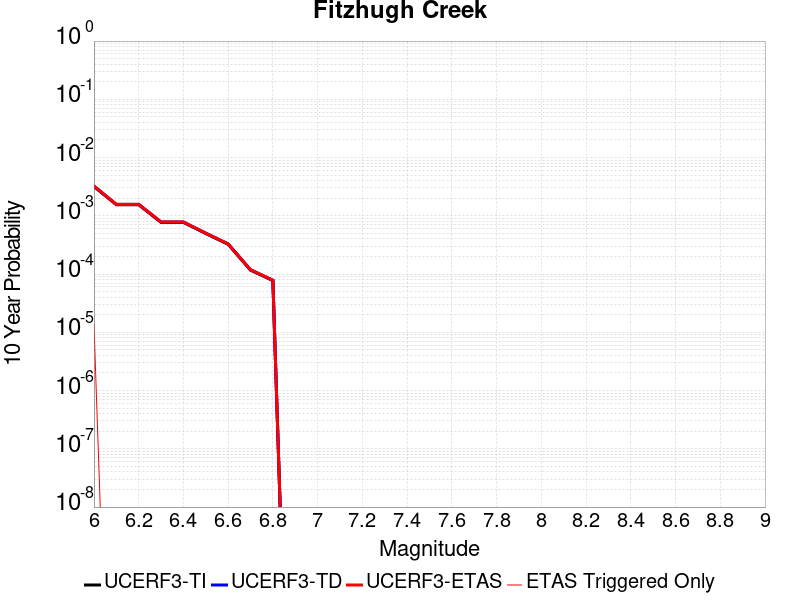 |

| Magnitude | 1 wk TI Prob | 1 wk TD Prob | 1 wk ETAS Prob | 1 wk ETAS/TD Gain | 1 wk ETAS Triggered Only | 1 mo TI Prob | 1 mo TD Prob | 1 mo ETAS Prob | 1 mo ETAS/TD Gain | 1 mo ETAS Triggered Only | 1 yr TI Prob | 1 yr TD Prob | 1 yr ETAS Prob | 1 yr ETAS/TD Gain | 1 yr ETAS Triggered Only | 10 yr TI Prob | 10 yr TD Prob | 10 yr ETAS Prob | 10 yr ETAS/TD Gain | 10 yr ETAS Triggered Only |
|-----|-----|-----|-----|-----|-----|-----|-----|-----|-----|-----|-----|-----|-----|-----|-----|-----|-----|-----|-----|-----|
| 6.0 | 6.1090436E-6 | 6.2101562E-6 | 6.2101562E-6 | 1.0 | 0.0 | 2.6181353E-5 | 2.6614709E-5 | 3.661444E-5 | 1.375722 | 1.0E-5 | 3.1871133E-4 | 3.239904E-4 | 3.3398715E-4 | 1.0308551 | 1.0E-5 | 0.0031825465 | 0.0032356246 | 0.0032455921 | 1.0030806 | 1.0E-5 |
| 6.1 | 2.9741811E-6 | 3.021581E-6 | 3.021581E-6 | 1.0 | 0.0 | 1.2746428E-5 | 1.2949574E-5 | 1.2949574E-5 | 1.0 | 0.0 | 1.5517672E-4 | 1.576506E-4 | 1.576506E-4 | 1.0 | 0.0 | 0.001550684 | 0.0015754806 | 0.0015754806 | 1.0 | 0.0 |
| 6.2 | 2.9741811E-6 | 3.021581E-6 | 3.021581E-6 | 1.0 | 0.0 | 1.2746428E-5 | 1.2949574E-5 | 1.2949574E-5 | 1.0 | 0.0 | 1.5517672E-4 | 1.576506E-4 | 1.576506E-4 | 1.0 | 0.0 | 0.001550684 | 0.0015754806 | 0.0015754806 | 1.0 | 0.0 |
| 6.3 | 1.4781198E-6 | 1.5012708E-6 | 1.5012708E-6 | 1.0 | 0.0 | 6.3347834E-6 | 6.4340034E-6 | 6.4340034E-6 | 1.0 | 0.0 | 7.712326E-5 | 7.833137E-5 | 7.833137E-5 | 1.0 | 0.0 | 7.70965E-4 | 7.830576E-4 | 7.830576E-4 | 1.0 | 0.0 |
| 6.4 | 1.4781198E-6 | 1.5012708E-6 | 1.5012708E-6 | 1.0 | 0.0 | 6.3347834E-6 | 6.4340034E-6 | 6.4340034E-6 | 1.0 | 0.0 | 7.712326E-5 | 7.833137E-5 | 7.833137E-5 | 1.0 | 0.0 | 7.70965E-4 | 7.830576E-4 | 7.830576E-4 | 1.0 | 0.0 |
| 6.5 | 9.5176676E-7 | 9.66606E-7 | 9.66606E-7 | 1.0 | 0.0 | 4.078994E-6 | 4.142591E-6 | 4.142591E-6 | 1.0 | 0.0 | 4.9660623E-5 | 5.0434985E-5 | 5.0434985E-5 | 1.0 | 0.0 | 4.964952E-4 | 5.042458E-4 | 5.042458E-4 | 1.0 | 0.0 |
| 6.6 | 6.21145E-7 | 6.3085855E-7 | 6.3085855E-7 | 1.0 | 0.0 | 2.662047E-6 | 2.7036772E-6 | 2.7036772E-6 | 1.0 | 0.0 | 3.2409942E-5 | 3.291684E-5 | 3.291684E-5 | 1.0 | 0.0 | 3.2405215E-4 | 3.2912623E-4 | 3.2912623E-4 | 1.0 | 0.0 |
| 6.7 | 2.2377962E-7 | 2.2734636E-7 | 2.2734636E-7 | 1.0 | 0.0 | 9.590551E-7 | 9.743413E-7 | 9.743413E-7 | 1.0 | 0.0 | 1.1676434E-5 | 1.1862574E-5 | 1.1862574E-5 | 1.0 | 0.0 | 1.1675821E-4 | 1.1862254E-4 | 1.1862254E-4 | 1.0 | 0.0 |
| 6.8 | 1.4785022E-7 | 1.5021492E-7 | 1.5021492E-7 | 1.0 | 0.0 | 6.3364365E-7 | 6.4377826E-7 | 6.4377826E-7 | 1.0 | 0.0 | 7.714584E-6 | 7.838E-6 | 7.838E-6 | 1.0 | 0.0 | 7.714316E-5 | 7.838E-5 | 7.838E-5 | 1.0 | 0.0 |

## Superstition Hills
*[(top)](#table-of-contents)*

| 1 Week | 1 Month | 1 Year | 10 Year |
|-----|-----|-----|-----|
| 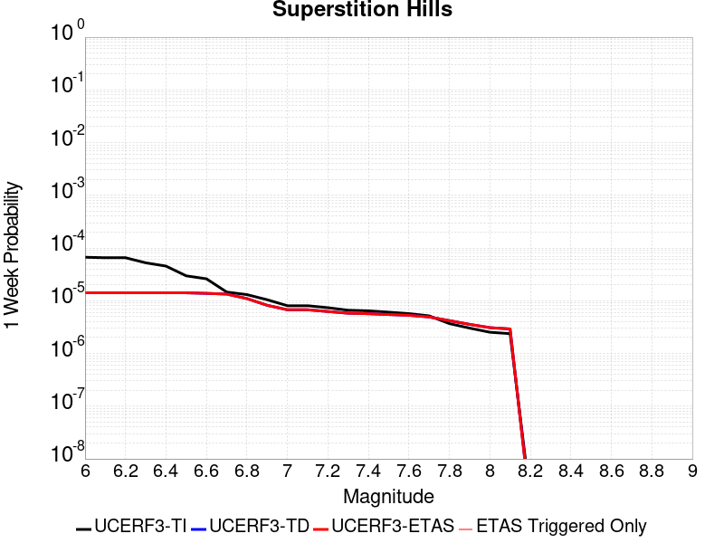 | 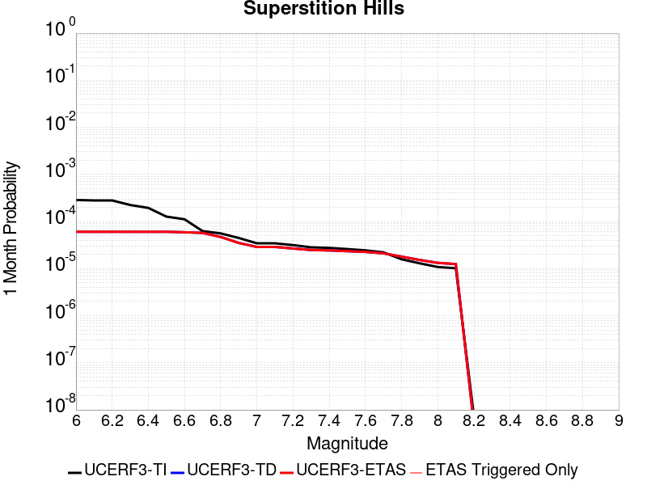 | 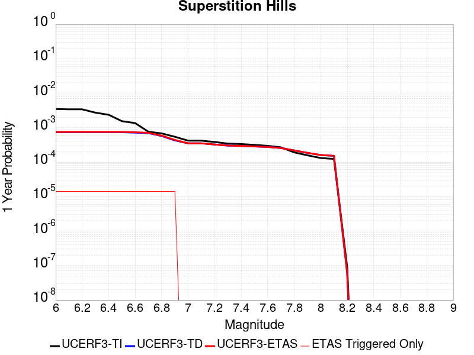 | 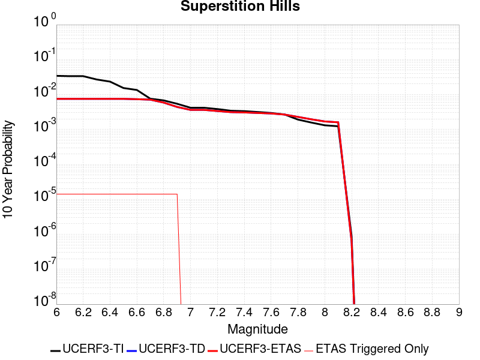 |

| Magnitude | 1 wk TI Prob | 1 wk TD Prob | 1 wk ETAS Prob | 1 wk ETAS/TD Gain | 1 wk ETAS Triggered Only | 1 mo TI Prob | 1 mo TD Prob | 1 mo ETAS Prob | 1 mo ETAS/TD Gain | 1 mo ETAS Triggered Only | 1 yr TI Prob | 1 yr TD Prob | 1 yr ETAS Prob | 1 yr ETAS/TD Gain | 1 yr ETAS Triggered Only | 10 yr TI Prob | 10 yr TD Prob | 10 yr ETAS Prob | 10 yr ETAS/TD Gain | 10 yr ETAS Triggered Only |
|-----|-----|-----|-----|-----|-----|-----|-----|-----|-----|-----|-----|-----|-----|-----|-----|-----|-----|-----|-----|-----|
| 6.0 | 6.6865185E-5 | 1.4137668E-5 | 1.4137668E-5 | 1.0 | 0.0 | 2.8653358E-4 | 6.058869E-5 | 6.058869E-5 | 1.0 | 0.0 | 0.0034829667 | 7.374338E-4 | 7.474264E-4 | 1.0135505 | 1.0E-5 | 0.03428881 | 0.007520696 | 0.007530621 | 1.0013196 | 1.0E-5 |
| 6.1 | 6.544851E-5 | 1.4137668E-5 | 1.4137668E-5 | 1.0 | 0.0 | 2.8046346E-4 | 6.058869E-5 | 6.058869E-5 | 1.0 | 0.0 | 0.0034092965 | 7.374338E-4 | 7.474264E-4 | 1.0135505 | 1.0E-5 | 0.033574644 | 0.0075206957 | 0.0075306203 | 1.0013196 | 1.0E-5 |
| 6.2 | 6.544851E-5 | 1.4137668E-5 | 1.4137668E-5 | 1.0 | 0.0 | 2.8046346E-4 | 6.058869E-5 | 6.058869E-5 | 1.0 | 0.0 | 0.0034092965 | 7.374338E-4 | 7.474264E-4 | 1.0135505 | 1.0E-5 | 0.033574644 | 0.0075206957 | 0.0075306203 | 1.0013196 | 1.0E-5 |
| 6.3 | 5.2402065E-5 | 1.4137667E-5 | 1.4137667E-5 | 1.0 | 0.0 | 2.2456095E-4 | 6.0588685E-5 | 6.0588685E-5 | 1.0 | 0.0 | 0.0027306017 | 7.374338E-4 | 7.474264E-4 | 1.0135505 | 1.0E-5 | 0.02697292 | 0.0075206906 | 0.007530615 | 1.0013196 | 1.0E-5 |
| 6.4 | 4.542238E-5 | 1.4137666E-5 | 1.4137666E-5 | 1.0 | 0.0 | 1.9465282E-4 | 6.058868E-5 | 6.058868E-5 | 1.0 | 0.0 | 0.0023673223 | 7.3743373E-4 | 7.4742635E-4 | 1.0135505 | 1.0E-5 | 0.023422617 | 0.007520688 | 0.007530613 | 1.0013196 | 1.0E-5 |
| 6.5 | 2.9672969E-5 | 1.4137665E-5 | 1.4137665E-5 | 1.0 | 0.0 | 1.2716366E-4 | 6.0588678E-5 | 6.0588678E-5 | 1.0 | 0.0 | 0.0015471181 | 7.374337E-4 | 7.474263E-4 | 1.0135505 | 1.0E-5 | 0.015363912 | 0.0075206826 | 0.0075306077 | 1.0013196 | 1.0E-5 |
| 6.6 | 2.6056105E-5 | 1.3803436E-5 | 1.3803436E-5 | 1.0 | 0.0 | 1.1166424E-4 | 5.915633E-5 | 5.915633E-5 | 1.0 | 0.0 | 0.0013586642 | 7.200064E-4 | 7.299992E-4 | 1.0138788 | 1.0E-5 | 0.013503874 | 0.0073450673 | 0.007354994 | 1.0013515 | 1.0E-5 |
| 6.7 | 1.4611248E-5 | 1.338333E-5 | 1.338333E-5 | 1.0 | 0.0 | 6.261813E-5 | 5.7355956E-5 | 5.7355956E-5 | 1.0 | 0.0 | 7.6210906E-4 | 6.9810095E-4 | 7.08094E-4 | 1.0143145 | 1.0E-5 | 0.0075950073 | 0.0071262526 | 0.0071361815 | 1.0013933 | 1.0E-5 |
| 6.8 | 1.30607E-5 | 1.09787115E-5 | 1.09787115E-5 | 1.0 | 0.0 | 5.597323E-5 | 4.705082E-5 | 4.705082E-5 | 1.0 | 0.0 | 6.8126095E-4 | 5.727019E-4 | 5.826962E-4 | 1.017451 | 1.0E-5 | 0.006791762 | 0.005873964 | 0.0058839056 | 1.0016924 | 1.0E-5 |
| 6.9 | 1.0443096E-5 | 8.19507E-6 | 8.19507E-6 | 1.0 | 0.0 | 4.4755358E-5 | 3.512127E-5 | 3.512127E-5 | 1.0 | 0.0 | 5.447602E-4 | 4.2751993E-4 | 4.3751564E-4 | 1.0233808 | 1.0E-5 | 0.005434267 | 0.004409497 | 0.004419453 | 1.0022578 | 1.0E-5 |
| 7.0 | 8.045912E-6 | 6.739447E-6 | 6.739447E-6 | 1.0 | 0.0 | 3.4482026E-5 | 2.888303E-5 | 2.888303E-5 | 1.0 | 0.0 | 4.197378E-4 | 3.5159517E-4 | 3.5159517E-4 | 1.0 | 0.0 | 0.0041894587 | 0.0036335257 | 0.0036335257 | 1.0 | 0.0 |
| 7.1 | 8.045912E-6 | 6.739447E-6 | 6.739447E-6 | 1.0 | 0.0 | 3.4482026E-5 | 2.888303E-5 | 2.888303E-5 | 1.0 | 0.0 | 4.197378E-4 | 3.5159517E-4 | 3.5159517E-4 | 1.0 | 0.0 | 0.0041894587 | 0.0036335257 | 0.0036335257 | 1.0 | 0.0 |
| 7.2 | 7.375506E-6 | 6.2463805E-6 | 6.2463805E-6 | 1.0 | 0.0 | 3.1608928E-5 | 2.6769932E-5 | 2.6769932E-5 | 1.0 | 0.0 | 3.8477074E-4 | 3.2587603E-4 | 3.2587603E-4 | 1.0 | 0.0 | 0.003841052 | 0.0033741172 | 0.0033741172 | 1.0 | 0.0 |
| 7.3 | 6.6063913E-6 | 5.798824E-6 | 5.798824E-6 | 1.0 | 0.0 | 2.8312797E-5 | 2.4851872E-5 | 2.4851872E-5 | 1.0 | 0.0 | 3.446538E-4 | 3.0253024E-4 | 3.0253024E-4 | 1.0 | 0.0 | 0.0034411973 | 0.0031383524 | 0.0031383524 | 1.0 | 0.0 |
| 7.4 | 6.4313126E-6 | 5.6802523E-6 | 5.6802523E-6 | 1.0 | 0.0 | 2.7562477E-5 | 2.4343715E-5 | 2.4343715E-5 | 1.0 | 0.0 | 3.355215E-4 | 2.963451E-4 | 2.963451E-4 | 1.0 | 0.0 | 0.0033501536 | 0.003076105 | 0.003076105 | 1.0 | 0.0 |
| 7.5 | 6.0742927E-6 | 5.476088E-6 | 5.476088E-6 | 1.0 | 0.0 | 2.6032423E-5 | 2.3468741E-5 | 2.3468741E-5 | 1.0 | 0.0 | 3.1689866E-4 | 2.8569513E-4 | 2.8569513E-4 | 1.0 | 0.0 | 0.0031644711 | 0.0029679502 | 0.0029679502 | 1.0 | 0.0 |
| 7.6 | 5.6987187E-6 | 5.2943155E-6 | 5.2943155E-6 | 1.0 | 0.0 | 2.4422852E-5 | 2.268973E-5 | 2.268973E-5 | 1.0 | 0.0 | 2.9730765E-4 | 2.762131E-4 | 2.762131E-4 | 1.0 | 0.0 | 0.002969102 | 0.0028712032 | 0.0028712032 | 1.0 | 0.0 |
| 7.7 | 5.1658035E-6 | 4.925336E-6 | 4.925336E-6 | 1.0 | 0.0 | 2.2138971E-5 | 2.1108413E-5 | 2.1108413E-5 | 1.0 | 0.0 | 2.6950863E-4 | 2.5696523E-4 | 2.5696523E-4 | 1.0 | 0.0 | 0.00269182 | 0.0026763005 | 0.0026763005 | 1.0 | 0.0 |
| 7.8 | 3.6864697E-6 | 4.1963563E-6 | 4.1963563E-6 | 1.0 | 0.0 | 1.579906E-5 | 1.7984263E-5 | 1.7984263E-5 | 1.0 | 0.0 | 1.9233658E-4 | 2.1893687E-4 | 2.1893687E-4 | 1.0 | 0.0 | 0.0019217018 | 0.0022895595 | 0.0022895595 | 1.0 | 0.0 |
| 7.9 | 3.0265903E-6 | 3.5636078E-6 | 3.5636078E-6 | 1.0 | 0.0 | 1.2971037E-5 | 1.5272519E-5 | 1.5272519E-5 | 1.0 | 0.0 | 1.5791094E-4 | 1.8592748E-4 | 1.8592748E-4 | 1.0 | 0.0 | 0.0015779877 | 0.0019537222 | 0.0019537222 | 1.0 | 0.0 |
| 8.0 | 2.5271493E-6 | 3.0866524E-6 | 3.0866524E-6 | 1.0 | 0.0 | 1.0830595E-5 | 1.3228446E-5 | 1.3228446E-5 | 1.0 | 0.0 | 1.3185451E-4 | 1.6104484E-4 | 1.6104484E-4 | 1.0 | 0.0 | 0.0013177631 | 0.0016975543 | 0.0016975543 | 1.0 | 0.0 |
| 8.1 | 2.3749135E-6 | 2.9172957E-6 | 2.9172957E-6 | 1.0 | 0.0 | 1.0178161E-5 | 1.2502638E-5 | 1.2502638E-5 | 1.0 | 0.0 | 1.2391206E-4 | 1.522094E-4 | 1.522094E-4 | 1.0 | 0.0 | 0.0012384299 | 0.0016051348 | 0.0016051348 | 1.0 | 0.0 |
| 8.2 | 1.7186406E-9 | 1.1438838E-9 | 1.1438838E-9 | 1.0 | 0.0 | 7.3656024E-9 | 4.902359E-9 | 4.902359E-9 | 1.0 | 0.0 | 8.9676206E-8 | 5.968622E-8 | 5.968622E-8 | 1.0 | 0.0 | 8.9676166E-7 | 6.386644E-7 | 6.386644E-7 | 1.0 | 0.0 |

## Shoreline
*[(top)](#table-of-contents)*

| 1 Week | 1 Month | 1 Year | 10 Year |
|-----|-----|-----|-----|
| 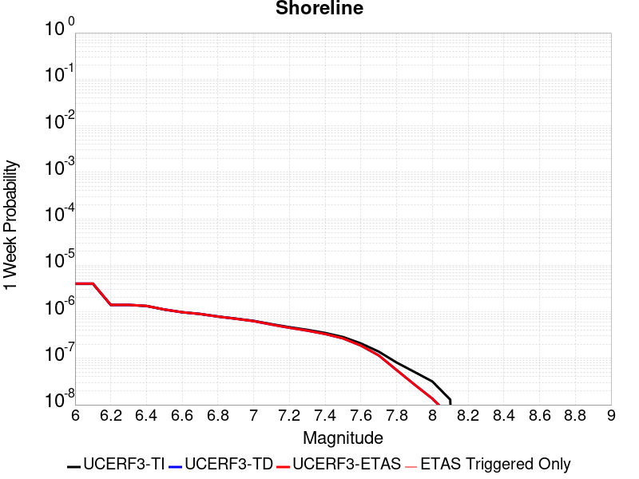 | 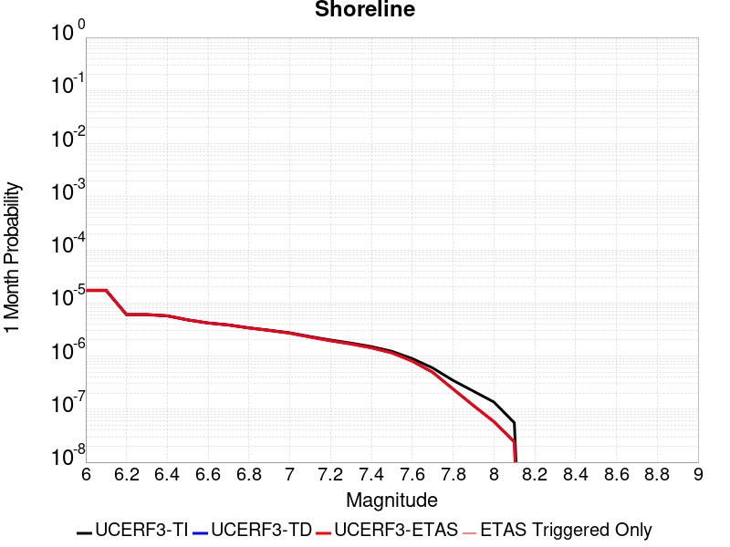 | 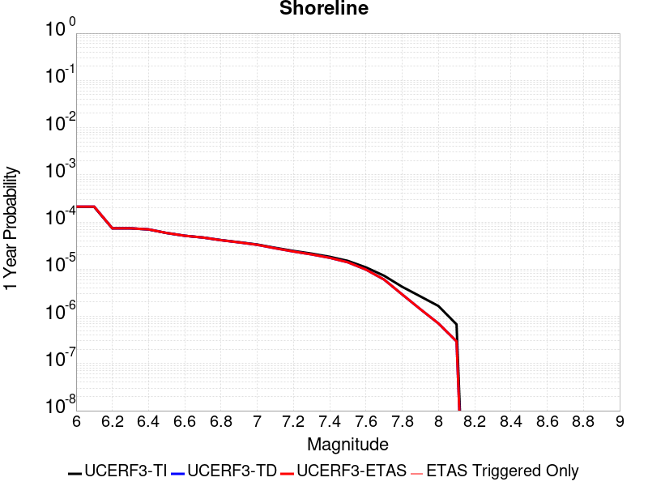 | 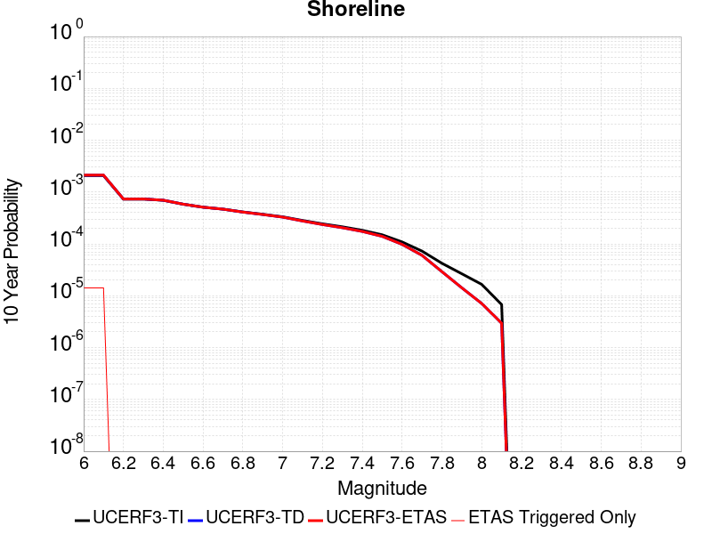 |

| Magnitude | 1 wk TI Prob | 1 wk TD Prob | 1 wk ETAS Prob | 1 wk ETAS/TD Gain | 1 wk ETAS Triggered Only | 1 mo TI Prob | 1 mo TD Prob | 1 mo ETAS Prob | 1 mo ETAS/TD Gain | 1 mo ETAS Triggered Only | 1 yr TI Prob | 1 yr TD Prob | 1 yr ETAS Prob | 1 yr ETAS/TD Gain | 1 yr ETAS Triggered Only | 10 yr TI Prob | 10 yr TD Prob | 10 yr ETAS Prob | 10 yr ETAS/TD Gain | 10 yr ETAS Triggered Only |
|-----|-----|-----|-----|-----|-----|-----|-----|-----|-----|-----|-----|-----|-----|-----|-----|-----|-----|-----|-----|-----|
| 6.0 | 3.9888673E-6 | 4.0479285E-6 | 4.0479285E-6 | 1.0 | 0.0 | 1.7095033E-5 | 1.7348182E-5 | 1.7348182E-5 | 1.0 | 0.0 | 2.0811215E-4 | 2.1119922E-4 | 2.1119922E-4 | 1.0 | 0.0 | 0.0020791737 | 0.0021105339 | 0.0021205128 | 1.0047281 | 1.0E-5 |
| 6.1 | 3.9888673E-6 | 4.0479285E-6 | 4.0479285E-6 | 1.0 | 0.0 | 1.7095033E-5 | 1.7348182E-5 | 1.7348182E-5 | 1.0 | 0.0 | 2.0811215E-4 | 2.1119922E-4 | 2.1119922E-4 | 1.0 | 0.0 | 0.0020791737 | 0.0021105339 | 0.0021205128 | 1.0047281 | 1.0E-5 |
| 6.2 | 1.4039653E-6 | 1.4100885E-6 | 1.4100885E-6 | 1.0 | 0.0 | 6.0169805E-6 | 6.043223E-6 | 6.043223E-6 | 1.0 | 0.0 | 7.325427E-5 | 7.357382E-5 | 7.357382E-5 | 1.0 | 0.0 | 7.3230127E-4 | 7.355006E-4 | 7.355006E-4 | 1.0 | 0.0 |
| 6.3 | 1.4039653E-6 | 1.4100885E-6 | 1.4100885E-6 | 1.0 | 0.0 | 6.0169805E-6 | 6.043223E-6 | 6.043223E-6 | 1.0 | 0.0 | 7.325427E-5 | 7.357382E-5 | 7.357382E-5 | 1.0 | 0.0 | 7.3230127E-4 | 7.355006E-4 | 7.355006E-4 | 1.0 | 0.0 |
| 6.4 | 1.3314152E-6 | 1.33616E-6 | 1.33616E-6 | 1.0 | 0.0 | 5.7060524E-6 | 5.726388E-6 | 5.726388E-6 | 1.0 | 0.0 | 6.946897E-5 | 6.9716596E-5 | 6.9716596E-5 | 1.0 | 0.0 | 6.9447263E-4 | 6.9695263E-4 | 6.9695263E-4 | 1.0 | 0.0 |
| 6.5 | 1.1187026E-6 | 1.1203634E-6 | 1.1203634E-6 | 1.0 | 0.0 | 4.794431E-6 | 4.801549E-6 | 4.801549E-6 | 1.0 | 0.0 | 5.8370628E-5 | 5.8457317E-5 | 5.8457317E-5 | 1.0 | 0.0 | 5.83553E-4 | 5.844219E-4 | 5.844219E-4 | 1.0 | 0.0 |
| 6.6 | 9.793089E-7 | 9.784915E-7 | 9.784915E-7 | 1.0 | 0.0 | 4.1970316E-6 | 4.193528E-6 | 4.193528E-6 | 1.0 | 0.0 | 5.1097657E-5 | 5.1055024E-5 | 5.1055024E-5 | 1.0 | 0.0 | 5.108591E-4 | 5.104342E-4 | 5.104342E-4 | 1.0 | 0.0 |
| 6.7 | 8.995986E-7 | 8.972795E-7 | 8.972795E-7 | 1.0 | 0.0 | 3.8554167E-6 | 3.8454777E-6 | 3.8454777E-6 | 1.0 | 0.0 | 4.693869E-5 | 4.68177E-5 | 4.68177E-5 | 1.0 | 0.0 | 4.6928777E-4 | 4.680793E-4 | 4.680793E-4 | 1.0 | 0.0 |
| 6.8 | 7.931612E-7 | 7.8803976E-7 | 7.8803976E-7 | 1.0 | 0.0 | 3.3992578E-6 | 3.377309E-6 | 3.377309E-6 | 1.0 | 0.0 | 4.1385178E-5 | 4.1117964E-5 | 4.1117964E-5 | 1.0 | 0.0 | 4.1377472E-4 | 4.1110412E-4 | 4.1110412E-4 | 1.0 | 0.0 |
| 6.9 | 7.1465956E-7 | 7.078001E-7 | 7.078001E-7 | 1.0 | 0.0 | 3.062823E-6 | 3.0334254E-6 | 3.0334254E-6 | 1.0 | 0.0 | 3.7289232E-5 | 3.693133E-5 | 3.693133E-5 | 1.0 | 0.0 | 3.7282976E-4 | 3.6925232E-4 | 3.6925232E-4 | 1.0 | 0.0 |
| 7.0 | 6.389046E-7 | 6.299453E-7 | 6.299453E-7 | 1.0 | 0.0 | 2.7381598E-6 | 2.699763E-6 | 2.699763E-6 | 1.0 | 0.0 | 3.3336586E-5 | 3.286912E-5 | 3.286912E-5 | 1.0 | 0.0 | 3.3331584E-4 | 3.286428E-4 | 3.286428E-4 | 1.0 | 0.0 |
| 7.1 | 5.4300875E-7 | 5.311126E-7 | 5.311126E-7 | 1.0 | 0.0 | 2.3271782E-6 | 2.276195E-6 | 2.276195E-6 | 1.0 | 0.0 | 2.8333026E-5 | 2.7712322E-5 | 2.7712322E-5 | 1.0 | 0.0 | 2.8329415E-4 | 2.7708875E-4 | 2.7708875E-4 | 1.0 | 0.0 |
| 7.2 | 4.6768855E-7 | 4.5348904E-7 | 4.5348904E-7 | 1.0 | 0.0 | 2.0043778E-6 | 1.9435229E-6 | 1.9435229E-6 | 1.0 | 0.0 | 2.4403027E-5 | 2.3662134E-5 | 2.3662134E-5 | 1.0 | 0.0 | 2.4400349E-4 | 2.3659621E-4 | 2.3659621E-4 | 1.0 | 0.0 |
| 7.3 | 4.0966103E-7 | 3.9385614E-7 | 3.9385614E-7 | 1.0 | 0.0 | 1.7556889E-6 | 1.6879537E-6 | 1.6879537E-6 | 1.0 | 0.0 | 2.1375303E-5 | 2.0550642E-5 | 2.0550642E-5 | 1.0 | 0.0 | 2.1373246E-4 | 2.0548746E-4 | 2.0548746E-4 | 1.0 | 0.0 |
| 7.4 | 3.5105785E-7 | 3.3363924E-7 | 3.3363924E-7 | 1.0 | 0.0 | 1.5045327E-6 | 1.4298816E-6 | 1.4298816E-6 | 1.0 | 0.0 | 1.8317533E-5 | 1.7408669E-5 | 1.7408669E-5 | 1.0 | 0.0 | 1.8316023E-4 | 1.740731E-4 | 1.740731E-4 | 1.0 | 0.0 |
| 7.5 | 2.8737534E-7 | 2.681999E-7 | 2.681999E-7 | 1.0 | 0.0 | 1.2316079E-6 | 1.1494276E-6 | 1.1494276E-6 | 1.0 | 0.0 | 1.4994724E-5 | 1.399419E-5 | 1.399419E-5 | 1.0 | 0.0 | 1.4993713E-4 | 1.3993312E-4 | 1.3993312E-4 | 1.0 | 0.0 |
| 7.6 | 2.0924051E-7 | 1.8778938E-7 | 1.8778938E-7 | 1.0 | 0.0 | 8.967448E-7 | 8.0481135E-7 | 8.0481135E-7 | 1.0 | 0.0 | 1.0917813E-5 | 9.798534E-6 | 9.798534E-6 | 1.0 | 0.0 | 1.0917276E-4 | 9.798103E-5 | 9.798103E-5 | 1.0 | 0.0 |
| 7.7 | 1.392265E-7 | 1.1543341E-7 | 1.1543341E-7 | 1.0 | 0.0 | 5.9668486E-7 | 4.9471447E-7 | 4.9471447E-7 | 1.0 | 0.0 | 7.2646135E-6 | 6.0231323E-6 | 6.0231323E-6 | 1.0 | 0.0 | 7.2643765E-5 | 6.0229693E-5 | 6.0229693E-5 | 1.0 | 0.0 |
| 7.8 | 8.1080074E-8 | 5.5866355E-8 | 5.5866355E-8 | 1.0 | 0.0 | 3.4748598E-7 | 2.394272E-7 | 2.394272E-7 | 1.0 | 0.0 | 4.2306337E-6 | 2.9150222E-6 | 2.9150222E-6 | 1.0 | 0.0 | 4.230553E-5 | 2.9149842E-5 | 2.9149842E-5 | 1.0 | 0.0 |
| 7.9 | 5.0859036E-8 | 2.7243395E-8 | 2.7243395E-8 | 1.0 | 0.0 | 2.1796728E-7 | 1.16757406E-7 | 1.16757406E-7 | 1.0 | 0.0 | 2.6537484E-6 | 1.4215204E-6 | 1.4215204E-6 | 1.0 | 0.0 | 2.6537167E-5 | 1.4215115E-5 | 1.4215115E-5 | 1.0 | 0.0 |
| 8.0 | 3.1760536E-8 | 1.3575991E-8 | 1.3575991E-8 | 1.0 | 0.0 | 1.3611657E-7 | 5.8182817E-8 | 5.8182817E-8 | 1.0 | 0.0 | 1.6572179E-6 | 7.083755E-7 | 7.083755E-7 | 1.0 | 0.0 | 1.6572056E-5 | 7.083733E-6 | 7.083733E-6 | 1.0 | 0.0 |
| 8.1 | 1.2947896E-8 | 5.6625185E-9 | 5.6625185E-9 | 1.0 | 0.0 | 5.5490982E-8 | 2.4267937E-8 | 2.4267937E-8 | 1.0 | 0.0 | 6.756025E-7 | 2.954621E-7 | 2.954621E-7 | 1.0 | 0.0 | 6.7560045E-6 | 2.9546172E-6 | 2.9546172E-6 | 1.0 | 0.0 |

## Almanor 2011 CFM
*[(top)](#table-of-contents)*

| 1 Week | 1 Month | 1 Year | 10 Year |
|-----|-----|-----|-----|
|  | 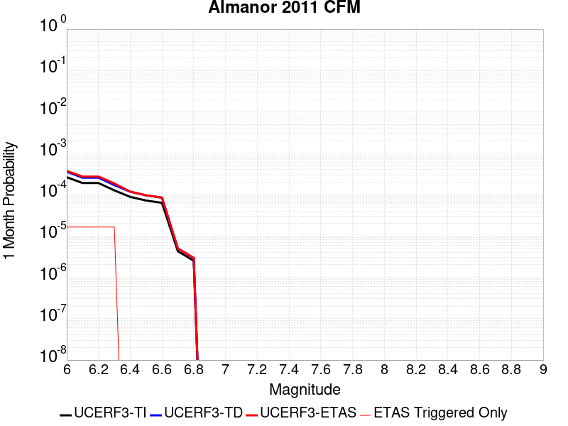 | 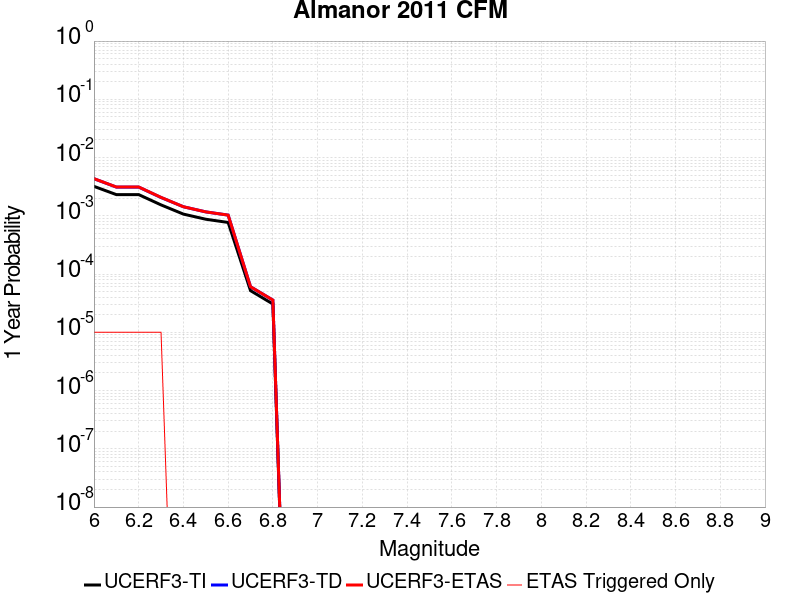 | 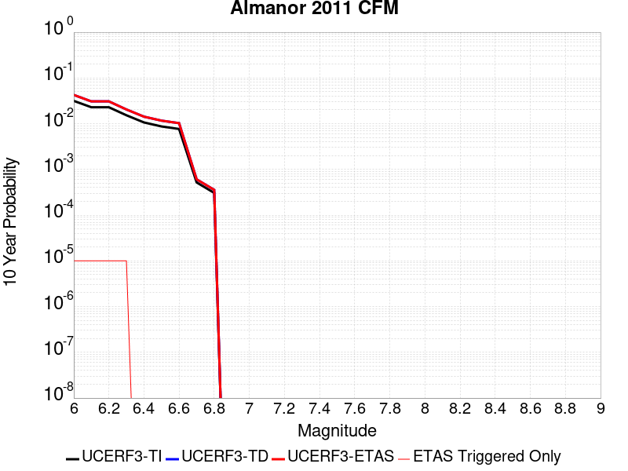 |

| Magnitude | 1 wk TI Prob | 1 wk TD Prob | 1 wk ETAS Prob | 1 wk ETAS/TD Gain | 1 wk ETAS Triggered Only | 1 mo TI Prob | 1 mo TD Prob | 1 mo ETAS Prob | 1 mo ETAS/TD Gain | 1 mo ETAS Triggered Only | 1 yr TI Prob | 1 yr TD Prob | 1 yr ETAS Prob | 1 yr ETAS/TD Gain | 1 yr ETAS Triggered Only | 10 yr TI Prob | 10 yr TD Prob | 10 yr ETAS Prob | 10 yr ETAS/TD Gain | 10 yr ETAS Triggered Only |
|-----|-----|-----|-----|-----|-----|-----|-----|-----|-----|-----|-----|-----|-----|-----|-----|-----|-----|-----|-----|-----|
| 6.0 | 6.1479834E-5 | 8.327245E-5 | 8.327245E-5 | 1.0 | 0.0 | 2.6345838E-4 | 3.5683523E-4 | 3.6683163E-4 | 1.0280142 | 1.0E-5 | 0.0032028882 | 0.004336495 | 0.0043464517 | 1.002296 | 1.0E-5 | 0.031571172 | 0.04258658 | 0.042596154 | 1.0002248 | 1.0E-5 |
| 6.1 | 4.4387216E-5 | 5.9767433E-5 | 5.9767433E-5 | 1.0 | 0.0 | 1.9021705E-4 | 2.561236E-4 | 2.6612106E-4 | 1.0390337 | 1.0E-5 | 0.0023134327 | 0.003114351 | 0.0031243197 | 1.0032009 | 1.0E-5 | 0.022894967 | 0.030755581 | 0.030765275 | 1.0003152 | 1.0E-5 |
| 6.2 | 4.4387216E-5 | 5.9767433E-5 | 5.9767433E-5 | 1.0 | 0.0 | 1.9021705E-4 | 2.561236E-4 | 2.6612106E-4 | 1.0390337 | 1.0E-5 | 0.0023134327 | 0.003114351 | 0.0031243197 | 1.0032009 | 1.0E-5 | 0.022894967 | 0.030755581 | 0.030765275 | 1.0003152 | 1.0E-5 |
| 6.3 | 2.9523822E-5 | 3.9546965E-5 | 3.9546965E-5 | 1.0 | 0.0 | 1.2652454E-4 | 1.6947731E-4 | 1.7947561E-4 | 1.058995 | 1.0E-5 | 0.0015393476 | 0.0020617929 | 0.0020717722 | 1.0048401 | 1.0E-5 | 0.015287281 | 0.020461112 | 0.020470908 | 1.0004787 | 1.0E-5 |
| 6.4 | 2.0512744E-5 | 2.7430639E-5 | 2.7430639E-5 | 1.0 | 0.0 | 8.79088E-5 | 1.17555675E-4 | 1.17555675E-4 | 1.0 | 0.0 | 0.001069764 | 0.0014306171 | 0.0014306171 | 1.0 | 0.0 | 0.010646289 | 0.01424458 | 0.01424458 | 1.0 | 0.0 |
| 6.5 | 1.6750226E-5 | 2.2390364E-5 | 2.2390364E-5 | 1.0 | 0.0 | 7.178471E-5 | 9.595619E-5 | 9.595619E-5 | 1.0 | 0.0 | 8.7362836E-4 | 0.0011679606 | 0.0011679606 | 1.0 | 0.0 | 0.008702018 | 0.011649196 | 0.011649196 | 1.0 | 0.0 |
| 6.6 | 1.4745303E-5 | 1.970686E-5 | 1.970686E-5 | 1.0 | 0.0 | 6.319262E-5 | 8.445639E-5 | 8.445639E-5 | 1.0 | 0.0 | 7.690986E-4 | 0.0010280984 | 0.0010280984 | 1.0 | 0.0 | 0.0076644225 | 0.01026513 | 0.01026513 | 1.0 | 0.0 |
| 6.7 | 9.951145E-7 | 1.1616347E-6 | 1.1616347E-6 | 1.0 | 0.0 | 4.26477E-6 | 4.9784257E-6 | 4.9784257E-6 | 1.0 | 0.0 | 5.1922336E-5 | 6.0610826E-5 | 6.0610826E-5 | 1.0 | 0.0 | 5.1910203E-4 | 6.059602E-4 | 6.059602E-4 | 1.0 | 0.0 |
| 6.8 | 5.866312E-7 | 6.849384E-7 | 6.849384E-7 | 1.0 | 0.0 | 2.5141312E-6 | 2.9354478E-6 | 2.9354478E-6 | 1.0 | 0.0 | 3.0609117E-5 | 3.5738623E-5 | 3.5738623E-5 | 1.0 | 0.0 | 3.06049E-4 | 3.5734157E-4 | 3.5734157E-4 | 1.0 | 0.0 |

## Del Valle
*[(top)](#table-of-contents)*

| 1 Week | 1 Month | 1 Year | 10 Year |
|-----|-----|-----|-----|
|  |  |  |  |

| Magnitude | 1 wk TI Prob | 1 wk TD Prob | 1 wk ETAS Prob | 1 wk ETAS/TD Gain | 1 wk ETAS Triggered Only | 1 mo TI Prob | 1 mo TD Prob | 1 mo ETAS Prob | 1 mo ETAS/TD Gain | 1 mo ETAS Triggered Only | 1 yr TI Prob | 1 yr TD Prob | 1 yr ETAS Prob | 1 yr ETAS/TD Gain | 1 yr ETAS Triggered Only | 10 yr TI Prob | 10 yr TD Prob | 10 yr ETAS Prob | 10 yr ETAS/TD Gain | 10 yr ETAS Triggered Only |
|-----|-----|-----|-----|-----|-----|-----|-----|-----|-----|-----|-----|-----|-----|-----|-----|-----|-----|-----|-----|-----|
| 6.0 | 1.0716125E-5 | 8.767882E-6 | 8.767882E-6 | 1.0 | 0.0 | 4.592544E-5 | 3.7576207E-5 | 3.7576207E-5 | 1.0 | 0.0 | 5.589988E-4 | 4.5741402E-4 | 4.5741402E-4 | 1.0 | 0.0 | 0.0055759475 | 0.004566694 | 0.0045766486 | 1.0021797 | 1.0E-5 |
| 6.1 | 1.0716125E-5 | 8.767882E-6 | 8.767882E-6 | 1.0 | 0.0 | 4.592544E-5 | 3.7576207E-5 | 3.7576207E-5 | 1.0 | 0.0 | 5.589988E-4 | 4.5741402E-4 | 4.5741402E-4 | 1.0 | 0.0 | 0.0055759475 | 0.004566694 | 0.0045766486 | 1.0021797 | 1.0E-5 |
| 6.2 | 1.0716125E-5 | 8.767882E-6 | 8.767882E-6 | 1.0 | 0.0 | 4.592544E-5 | 3.7576207E-5 | 3.7576207E-5 | 1.0 | 0.0 | 5.589988E-4 | 4.5741402E-4 | 4.5741402E-4 | 1.0 | 0.0 | 0.0055759475 | 0.004566694 | 0.0045766486 | 1.0021797 | 1.0E-5 |
| 6.3 | 7.1293784E-6 | 4.8658226E-6 | 4.8658226E-6 | 1.0 | 0.0 | 3.055412E-5 | 2.0853362E-5 | 2.0853362E-5 | 1.0 | 0.0 | 3.7193293E-4 | 2.5386084E-4 | 2.5386084E-4 | 1.0 | 0.0 | 0.0037131102 | 0.0025358086 | 0.0025358086 | 1.0 | 0.0 |
| 6.4 | 7.1293784E-6 | 4.8658226E-6 | 4.8658226E-6 | 1.0 | 0.0 | 3.055412E-5 | 2.0853362E-5 | 2.0853362E-5 | 1.0 | 0.0 | 3.7193293E-4 | 2.5386084E-4 | 2.5386084E-4 | 1.0 | 0.0 | 0.0037131102 | 0.0025358086 | 0.0025358086 | 1.0 | 0.0 |
| 6.5 | 7.1293784E-6 | 4.8658226E-6 | 4.8658226E-6 | 1.0 | 0.0 | 3.055412E-5 | 2.0853362E-5 | 2.0853362E-5 | 1.0 | 0.0 | 3.7193293E-4 | 2.5386084E-4 | 2.5386084E-4 | 1.0 | 0.0 | 0.0037131102 | 0.0025358086 | 0.0025358086 | 1.0 | 0.0 |
| 6.6 | 7.1293784E-6 | 4.8658226E-6 | 4.8658226E-6 | 1.0 | 0.0 | 3.055412E-5 | 2.0853362E-5 | 2.0853362E-5 | 1.0 | 0.0 | 3.7193293E-4 | 2.5386084E-4 | 2.5386084E-4 | 1.0 | 0.0 | 0.0037131102 | 0.0025358086 | 0.0025358086 | 1.0 | 0.0 |
| 6.7 | 7.12272E-6 | 4.8631982E-6 | 4.8631982E-6 | 1.0 | 0.0 | 3.0525585E-5 | 2.0842115E-5 | 2.0842115E-5 | 1.0 | 0.0 | 3.7158563E-4 | 2.5372393E-4 | 2.5372393E-4 | 1.0 | 0.0 | 0.003709649 | 0.0025344428 | 0.0025344428 | 1.0 | 0.0 |
| 6.8 | 6.7558703E-6 | 4.559404E-6 | 4.559404E-6 | 1.0 | 0.0 | 2.895341E-5 | 1.954016E-5 | 1.954016E-5 | 1.0 | 0.0 | 3.5245073E-4 | 2.3787611E-4 | 2.3787611E-4 | 1.0 | 0.0 | 0.0035189227 | 0.0023763045 | 0.0023763045 | 1.0 | 0.0 |
| 6.9 | 6.6700386E-6 | 4.5025436E-6 | 4.5025436E-6 | 1.0 | 0.0 | 2.8585566E-5 | 1.9296476E-5 | 1.9296476E-5 | 1.0 | 0.0 | 3.479737E-4 | 2.349099E-4 | 2.349099E-4 | 1.0 | 0.0 | 0.003474293 | 0.0023467052 | 0.0023467052 | 1.0 | 0.0 |
| 7.0 | 6.3181424E-6 | 4.098708E-6 | 4.098708E-6 | 1.0 | 0.0 | 2.7077473E-5 | 1.7565775E-5 | 1.7565775E-5 | 1.0 | 0.0 | 3.2961834E-4 | 2.1384275E-4 | 2.1384275E-4 | 1.0 | 0.0 | 0.0032912986 | 0.0021364389 | 0.0021364389 | 1.0 | 0.0 |
| 7.1 | 6.248759E-6 | 4.033899E-6 | 4.033899E-6 | 1.0 | 0.0 | 2.678012E-5 | 1.7288028E-5 | 1.7288028E-5 | 1.0 | 0.0 | 3.2599916E-4 | 2.1046183E-4 | 2.1046183E-4 | 1.0 | 0.0 | 0.0032552136 | 0.0021026938 | 0.0021026938 | 1.0 | 0.0 |
| 7.2 | 6.0411944E-6 | 3.869892E-6 | 3.869892E-6 | 1.0 | 0.0 | 2.5890577E-5 | 1.658515E-5 | 1.658515E-5 | 1.0 | 0.0 | 3.1517216E-4 | 2.019059E-4 | 2.019059E-4 | 1.0 | 0.0 | 0.0031472554 | 0.0020172922 | 0.0020172922 | 1.0 | 0.0 |
| 7.3 | 4.7691183E-6 | 3.0780905E-6 | 3.0780905E-6 | 1.0 | 0.0 | 2.0438918E-5 | 1.3191751E-5 | 1.3191751E-5 | 1.0 | 0.0 | 2.488154E-4 | 1.6059795E-4 | 1.6059795E-4 | 1.0 | 0.0 | 0.00248537 | 0.0016048512 | 0.0016048512 | 1.0 | 0.0 |
| 7.4 | 3.5524722E-6 | 2.1893159E-6 | 2.1893159E-6 | 1.0 | 0.0 | 1.5224792E-5 | 9.382749E-6 | 9.382749E-6 | 1.0 | 0.0 | 1.8534607E-4 | 1.14229064E-4 | 1.14229064E-4 | 1.0 | 0.0 | 0.0018519156 | 0.0011417117 | 0.0011417117 | 1.0 | 0.0 |
| 7.5 | 2.7133442E-6 | 1.5915855E-6 | 1.5915855E-6 | 1.0 | 0.0 | 1.1628566E-5 | 6.821063E-6 | 6.821063E-6 | 1.0 | 0.0 | 1.415686E-4 | 8.30433E-5 | 8.30433E-5 | 1.0 | 0.0 | 0.0014147845 | 8.301246E-4 | 8.301246E-4 | 1.0 | 0.0 |
| 7.6 | 1.915338E-6 | 1.1738952E-6 | 1.1738952E-6 | 1.0 | 0.0 | 8.208566E-6 | 5.0309695E-6 | 5.0309695E-6 | 1.0 | 0.0 | 9.993471E-5 | 6.125034E-5 | 6.125034E-5 | 1.0 | 0.0 | 9.988978E-4 | 6.123355E-4 | 6.123355E-4 | 1.0 | 0.0 |
| 7.7 | 1.2120448E-6 | 7.1801645E-7 | 7.1801645E-7 | 1.0 | 0.0 | 5.194467E-6 | 3.0772098E-6 | 3.0772098E-6 | 1.0 | 0.0 | 6.3240805E-5 | 3.746439E-5 | 3.746439E-5 | 1.0 | 0.0 | 6.322281E-4 | 3.745811E-4 | 3.745811E-4 | 1.0 | 0.0 |
| 7.8 | 6.272381E-7 | 3.93245E-7 | 3.93245E-7 | 1.0 | 0.0 | 2.6881603E-6 | 1.6853346E-6 | 1.6853346E-6 | 1.0 | 0.0 | 3.272786E-5 | 2.0518757E-5 | 2.0518757E-5 | 1.0 | 0.0 | 3.272304E-4 | 2.0516879E-4 | 2.0516879E-4 | 1.0 | 0.0 |
| 7.9 | 2.0292627E-7 | 1.2004223E-7 | 1.2004223E-7 | 1.0 | 0.0 | 8.6968373E-7 | 5.144666E-7 | 5.144666E-7 | 1.0 | 0.0 | 1.0588348E-5 | 6.2636127E-6 | 6.2636127E-6 | 1.0 | 0.0 | 1.0587843E-4 | 6.263438E-5 | 6.263438E-5 | 1.0 | 0.0 |
| 8.0 | 4.374492E-8 | 2.1898856E-8 | 2.1898856E-8 | 1.0 | 0.0 | 1.8747821E-7 | 9.3852236E-8 | 9.3852236E-8 | 1.0 | 0.0 | 2.2825448E-6 | 1.1426505E-6 | 1.1426505E-6 | 1.0 | 0.0 | 2.2825214E-5 | 1.1426449E-5 | 1.1426449E-5 | 1.0 | 0.0 |

## Clayton
*[(top)](#table-of-contents)*

| 1 Week | 1 Month | 1 Year | 10 Year |
|-----|-----|-----|-----|
| 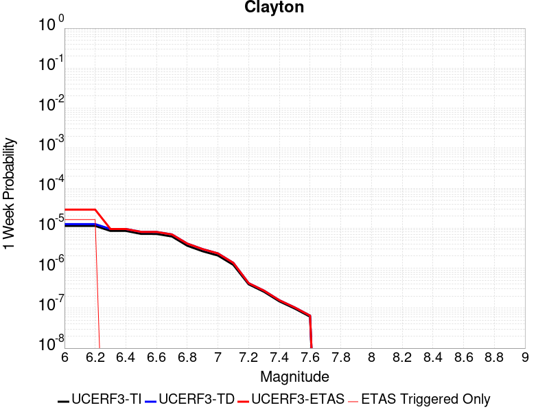 | 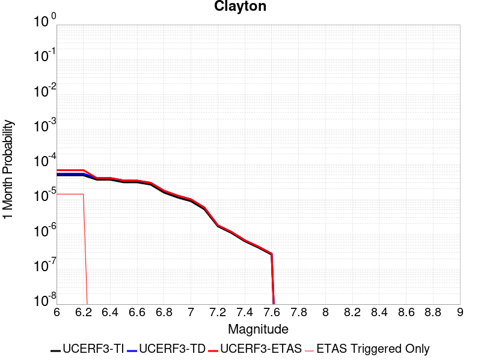 | 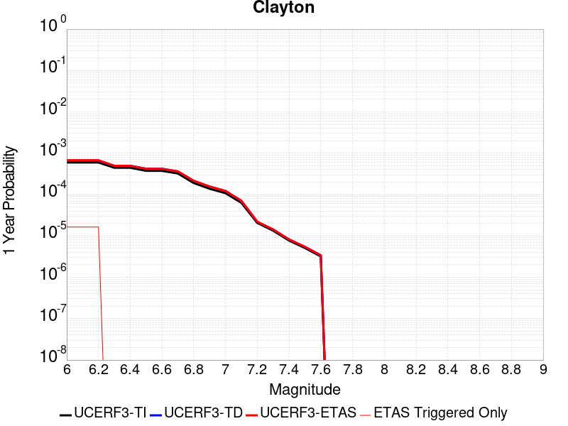 | 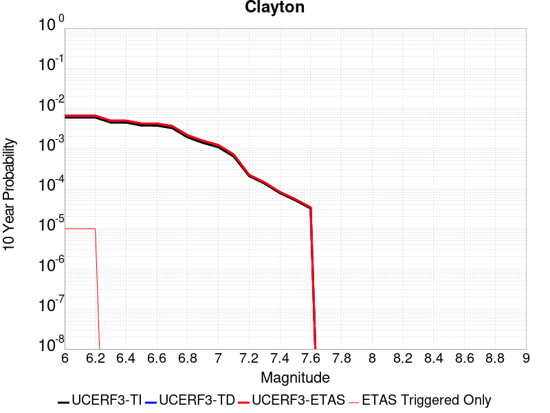 |

| Magnitude | 1 wk TI Prob | 1 wk TD Prob | 1 wk ETAS Prob | 1 wk ETAS/TD Gain | 1 wk ETAS Triggered Only | 1 mo TI Prob | 1 mo TD Prob | 1 mo ETAS Prob | 1 mo ETAS/TD Gain | 1 mo ETAS Triggered Only | 1 yr TI Prob | 1 yr TD Prob | 1 yr ETAS Prob | 1 yr ETAS/TD Gain | 1 yr ETAS Triggered Only | 10 yr TI Prob | 10 yr TD Prob | 10 yr ETAS Prob | 10 yr ETAS/TD Gain | 10 yr ETAS Triggered Only |
|-----|-----|-----|-----|-----|-----|-----|-----|-----|-----|-----|-----|-----|-----|-----|-----|-----|-----|-----|-----|-----|
| 6.0 | 1.1413061E-5 | 1.2667071E-5 | 2.2666945E-5 | 1.7894385 | 1.0E-5 | 4.89122E-5 | 5.4286444E-5 | 6.42859E-5 | 1.184198 | 1.0E-5 | 5.953433E-4 | 6.607592E-4 | 6.7075266E-4 | 1.0151241 | 1.0E-5 | 0.005937509 | 0.006590149 | 0.006600083 | 1.0015074 | 1.0E-5 |
| 6.1 | 1.1413061E-5 | 1.2667071E-5 | 2.2666945E-5 | 1.7894385 | 1.0E-5 | 4.89122E-5 | 5.4286444E-5 | 6.42859E-5 | 1.184198 | 1.0E-5 | 5.953433E-4 | 6.607592E-4 | 6.7075266E-4 | 1.0151241 | 1.0E-5 | 0.005937509 | 0.006590149 | 0.006600083 | 1.0015074 | 1.0E-5 |
| 6.2 | 1.1413061E-5 | 1.2667071E-5 | 2.2666945E-5 | 1.7894385 | 1.0E-5 | 4.89122E-5 | 5.4286444E-5 | 6.42859E-5 | 1.184198 | 1.0E-5 | 5.953433E-4 | 6.607592E-4 | 6.7075266E-4 | 1.0151241 | 1.0E-5 | 0.005937509 | 0.006590149 | 0.006600083 | 1.0015074 | 1.0E-5 |
| 6.3 | 8.538689E-6 | 9.532765E-6 | 9.532765E-6 | 1.0 | 0.0 | 3.659387E-5 | 4.085413E-5 | 4.085413E-5 | 1.0 | 0.0 | 4.4543925E-4 | 4.972963E-4 | 4.972963E-4 | 1.0 | 0.0 | 0.0044454746 | 0.0049629 | 0.0049629 | 1.0 | 0.0 |
| 6.4 | 8.538689E-6 | 9.532765E-6 | 9.532765E-6 | 1.0 | 0.0 | 3.659387E-5 | 4.085413E-5 | 4.085413E-5 | 1.0 | 0.0 | 4.4543925E-4 | 4.972963E-4 | 4.972963E-4 | 1.0 | 0.0 | 0.0044454746 | 0.0049629 | 0.0049629 | 1.0 | 0.0 |
| 6.5 | 7.197462E-6 | 8.080964E-6 | 8.080964E-6 | 1.0 | 0.0 | 3.08459E-5 | 3.463229E-5 | 3.463229E-5 | 1.0 | 0.0 | 3.7548412E-4 | 4.2157478E-4 | 4.2157478E-4 | 1.0 | 0.0 | 0.003748503 | 0.0042085624 | 0.0042085624 | 1.0 | 0.0 |
| 6.6 | 7.1760483E-6 | 8.05698E-6 | 8.05698E-6 | 1.0 | 0.0 | 3.075413E-5 | 3.4529505E-5 | 3.4529505E-5 | 1.0 | 0.0 | 3.743672E-4 | 4.2032383E-4 | 4.2032383E-4 | 1.0 | 0.0 | 0.0037373714 | 0.0041961004 | 0.0041961004 | 1.0 | 0.0 |
| 6.7 | 6.202582E-6 | 6.9767057E-6 | 6.9767057E-6 | 1.0 | 0.0 | 2.6582224E-5 | 2.9899868E-5 | 2.9899868E-5 | 1.0 | 0.0 | 3.235905E-4 | 3.6397774E-4 | 3.6397774E-4 | 1.0 | 0.0 | 0.0032311971 | 0.003634572 | 0.003634572 | 1.0 | 0.0 |
| 6.8 | 3.6417277E-6 | 4.121308E-6 | 4.121308E-6 | 1.0 | 0.0 | 1.5607311E-5 | 1.7662633E-5 | 1.7662633E-5 | 1.0 | 0.0 | 1.9000245E-4 | 2.150221E-4 | 2.150221E-4 | 1.0 | 0.0 | 0.0018984007 | 0.0021482168 | 0.0021482168 | 1.0 | 0.0 |
| 6.9 | 2.6498485E-6 | 2.9995322E-6 | 2.9995322E-6 | 1.0 | 0.0 | 1.1356444E-5 | 1.2855077E-5 | 1.2855077E-5 | 1.0 | 0.0 | 1.3825593E-4 | 1.5649972E-4 | 1.5649972E-4 | 1.0 | 0.0 | 0.0013816995 | 0.0015639347 | 0.0015639347 | 1.0 | 0.0 |
| 7.0 | 2.070442E-6 | 2.3407345E-6 | 2.3407345E-6 | 1.0 | 0.0 | 8.873292E-6 | 1.0031682E-5 | 1.0031682E-5 | 1.0 | 0.0 | 1.0802698E-4 | 1.2212919E-4 | 1.2212919E-4 | 1.0 | 0.0 | 0.0010797448 | 0.0012206505 | 0.0012206505 | 1.0 | 0.0 |
| 7.1 | 1.2111691E-6 | 1.3588814E-6 | 1.3588814E-6 | 1.0 | 0.0 | 5.190714E-6 | 5.823765E-6 | 5.823765E-6 | 1.0 | 0.0 | 6.319511E-5 | 7.09022E-5 | 7.09022E-5 | 1.0 | 0.0 | 6.3177146E-4 | 7.0881215E-4 | 7.0881215E-4 | 1.0 | 0.0 |
| 7.2 | 3.9541607E-7 | 4.2228464E-7 | 4.2228464E-7 | 1.0 | 0.0 | 1.6946392E-6 | 1.8097901E-6 | 1.8097901E-6 | 1.0 | 0.0 | 2.0632036E-5 | 2.2033973E-5 | 2.2033973E-5 | 1.0 | 0.0 | 2.063012E-4 | 2.2031803E-4 | 2.2031803E-4 | 1.0 | 0.0 |
| 7.3 | 2.5685637E-7 | 2.7457227E-7 | 2.7457227E-7 | 1.0 | 0.0 | 1.1008126E-6 | 1.1767378E-6 | 1.1767378E-6 | 1.0 | 0.0 | 1.3402311E-5 | 1.432669E-5 | 1.432669E-5 | 1.0 | 0.0 | 1.3401502E-4 | 1.4325773E-4 | 1.4325773E-4 | 1.0 | 0.0 |
| 7.4 | 1.482299E-7 | 1.5808227E-7 | 1.5808227E-7 | 1.0 | 0.0 | 6.3527085E-7 | 6.774953E-7 | 6.774953E-7 | 1.0 | 0.0 | 7.734395E-6 | 8.248474E-6 | 8.248474E-6 | 1.0 | 0.0 | 7.734126E-5 | 8.248171E-5 | 8.248171E-5 | 1.0 | 0.0 |
| 7.5 | 9.7969505E-8 | 1.0438379E-7 | 1.0438379E-7 | 1.0 | 0.0 | 4.1986925E-7 | 4.47359E-7 | 4.47359E-7 | 1.0 | 0.0 | 5.111896E-6 | 5.4465827E-6 | 5.4465827E-6 | 1.0 | 0.0 | 5.1117782E-5 | 5.4464508E-5 | 5.4464508E-5 | 1.0 | 0.0 |
| 7.6 | 6.125415E-8 | 6.5232356E-8 | 6.5232356E-8 | 1.0 | 0.0 | 2.6251774E-7 | 2.7956722E-7 | 2.7956722E-7 | 1.0 | 0.0 | 3.196149E-6 | 3.4037257E-6 | 3.4037257E-6 | 1.0 | 0.0 | 3.196103E-5 | 3.4036748E-5 | 3.4036748E-5 | 1.0 | 0.0 |

## Jess Valley
*[(top)](#table-of-contents)*

| 1 Week | 1 Month | 1 Year | 10 Year |
|-----|-----|-----|-----|
| 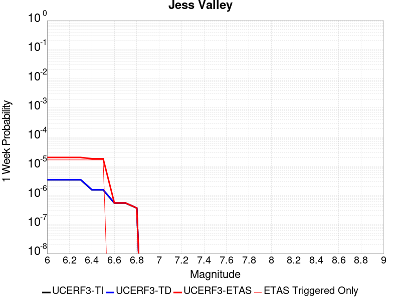 | 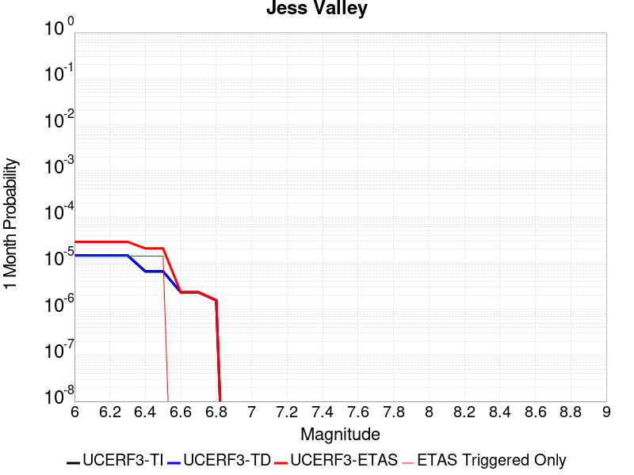 | 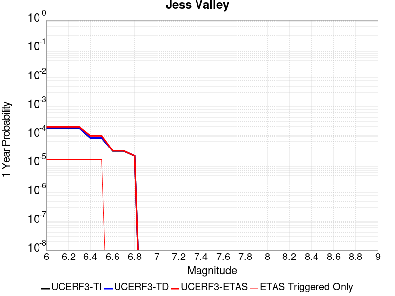 | 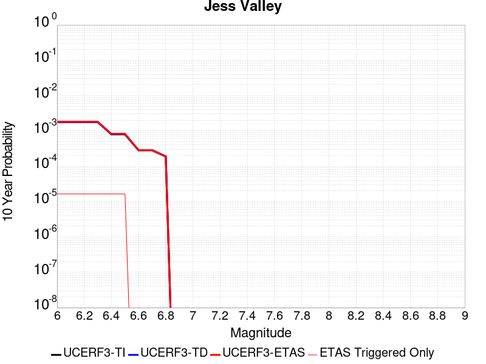 |

| Magnitude | 1 wk TI Prob | 1 wk TD Prob | 1 wk ETAS Prob | 1 wk ETAS/TD Gain | 1 wk ETAS Triggered Only | 1 mo TI Prob | 1 mo TD Prob | 1 mo ETAS Prob | 1 mo ETAS/TD Gain | 1 mo ETAS Triggered Only | 1 yr TI Prob | 1 yr TD Prob | 1 yr ETAS Prob | 1 yr ETAS/TD Gain | 1 yr ETAS Triggered Only | 10 yr TI Prob | 10 yr TD Prob | 10 yr ETAS Prob | 10 yr ETAS/TD Gain | 10 yr ETAS Triggered Only |
|-----|-----|-----|-----|-----|-----|-----|-----|-----|-----|-----|-----|-----|-----|-----|-----|-----|-----|-----|-----|-----|
| 6.0 | 3.3861274E-6 | 3.4340592E-6 | 1.3434025E-5 | 3.9119956 | 1.0E-5 | 1.4511894E-5 | 1.471733E-5 | 2.4717183E-5 | 1.6794611 | 1.0E-5 | 1.7666799E-4 | 1.7917156E-4 | 1.8916978E-4 | 1.0558025 | 1.0E-5 | 0.001765276 | 0.0017905476 | 0.0018005297 | 1.005575 | 1.0E-5 |
| 6.1 | 3.3861274E-6 | 3.4340592E-6 | 1.3434025E-5 | 3.9119956 | 1.0E-5 | 1.4511894E-5 | 1.471733E-5 | 2.4717183E-5 | 1.6794611 | 1.0E-5 | 1.7666799E-4 | 1.7917156E-4 | 1.8916978E-4 | 1.0558025 | 1.0E-5 | 0.001765276 | 0.0017905476 | 0.0018005297 | 1.005575 | 1.0E-5 |
| 6.2 | 3.3861274E-6 | 3.4340592E-6 | 1.3434025E-5 | 3.9119956 | 1.0E-5 | 1.4511894E-5 | 1.471733E-5 | 2.4717183E-5 | 1.6794611 | 1.0E-5 | 1.7666799E-4 | 1.7917156E-4 | 1.8916978E-4 | 1.0558025 | 1.0E-5 | 0.001765276 | 0.0017905476 | 0.0018005297 | 1.005575 | 1.0E-5 |
| 6.3 | 3.3861274E-6 | 3.4340592E-6 | 1.3434025E-5 | 3.9119956 | 1.0E-5 | 1.4511894E-5 | 1.471733E-5 | 2.4717183E-5 | 1.6794611 | 1.0E-5 | 1.7666799E-4 | 1.7917156E-4 | 1.8916978E-4 | 1.0558025 | 1.0E-5 | 0.001765276 | 0.0017905476 | 0.0018005297 | 1.005575 | 1.0E-5 |
| 6.4 | 1.5291708E-6 | 1.5502784E-6 | 1.1550263E-5 | 7.450444 | 1.0E-5 | 6.553573E-6 | 6.644038E-6 | 1.6643971E-5 | 2.5050988 | 1.0E-5 | 7.978683E-5 | 8.088895E-5 | 9.088815E-5 | 1.1236162 | 1.0E-5 | 7.975819E-4 | 8.086733E-4 | 8.1866526E-4 | 1.0123559 | 1.0E-5 |
| 6.5 | 1.5291708E-6 | 1.5502784E-6 | 1.1550263E-5 | 7.450444 | 1.0E-5 | 6.553573E-6 | 6.644038E-6 | 1.6643971E-5 | 2.5050988 | 1.0E-5 | 7.978683E-5 | 8.088895E-5 | 9.088815E-5 | 1.1236162 | 1.0E-5 | 7.975819E-4 | 8.086733E-4 | 8.1866526E-4 | 1.0123559 | 1.0E-5 |
| 6.6 | 5.396423E-7 | 5.4719953E-7 | 5.4719953E-7 | 1.0 | 0.0 | 2.312751E-6 | 2.3451398E-6 | 2.3451398E-6 | 1.0 | 0.0 | 2.8157378E-5 | 2.855189E-5 | 2.855189E-5 | 1.0 | 0.0 | 2.8153812E-4 | 2.8550063E-4 | 2.8550063E-4 | 1.0 | 0.0 |
| 6.7 | 5.396423E-7 | 5.4719953E-7 | 5.4719953E-7 | 1.0 | 0.0 | 2.312751E-6 | 2.3451398E-6 | 2.3451398E-6 | 1.0 | 0.0 | 2.8157378E-5 | 2.855189E-5 | 2.855189E-5 | 1.0 | 0.0 | 2.8153812E-4 | 2.8550063E-4 | 2.8550063E-4 | 1.0 | 0.0 |
| 6.8 | 3.6058395E-7 | 3.6563068E-7 | 3.6563068E-7 | 1.0 | 0.0 | 1.5453588E-6 | 1.5669885E-6 | 1.5669885E-6 | 1.0 | 0.0 | 1.8814582E-5 | 1.9078087E-5 | 1.9078087E-5 | 1.0 | 0.0 | 1.8812988E-4 | 1.9078086E-4 | 1.9078086E-4 | 1.0 | 0.0 |

## Point Reyes 2011 CFM
*[(top)](#table-of-contents)*

| 1 Week | 1 Month | 1 Year | 10 Year |
|-----|-----|-----|-----|
|  | 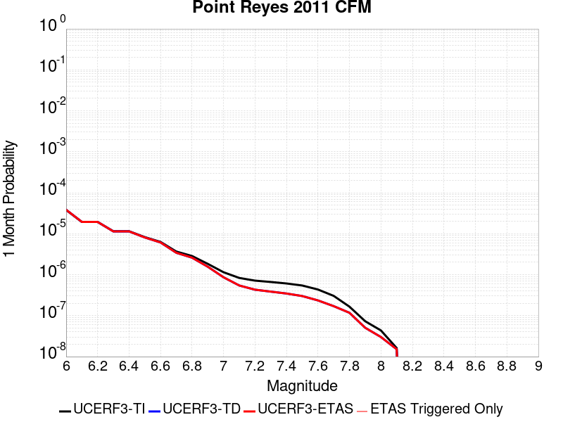 | 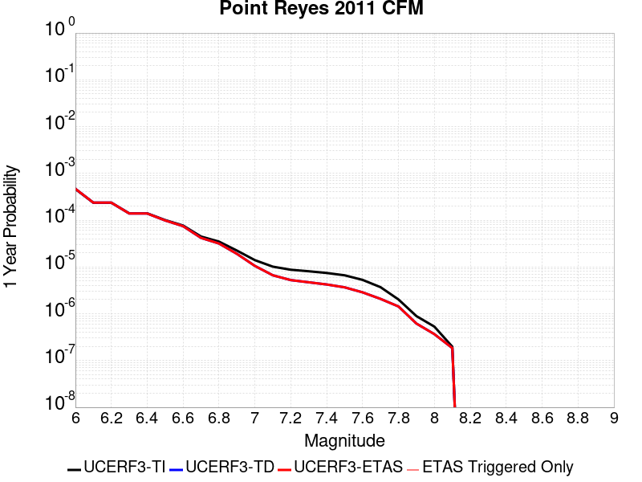 | 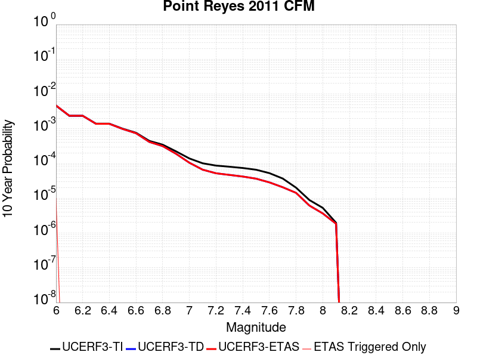 |

| Magnitude | 1 wk TI Prob | 1 wk TD Prob | 1 wk ETAS Prob | 1 wk ETAS/TD Gain | 1 wk ETAS Triggered Only | 1 mo TI Prob | 1 mo TD Prob | 1 mo ETAS Prob | 1 mo ETAS/TD Gain | 1 mo ETAS Triggered Only | 1 yr TI Prob | 1 yr TD Prob | 1 yr ETAS Prob | 1 yr ETAS/TD Gain | 1 yr ETAS Triggered Only | 10 yr TI Prob | 10 yr TD Prob | 10 yr ETAS Prob | 10 yr ETAS/TD Gain | 10 yr ETAS Triggered Only |
|-----|-----|-----|-----|-----|-----|-----|-----|-----|-----|-----|-----|-----|-----|-----|-----|-----|-----|-----|-----|-----|
| 6.0 | 8.8644965E-6 | 8.96716E-6 | 8.96716E-6 | 1.0 | 0.0 | 3.7990147E-5 | 3.8430157E-5 | 3.8430157E-5 | 1.0 | 0.0 | 4.624319E-4 | 4.67793E-4 | 4.67793E-4 | 1.0 | 0.0 | 0.0046147075 | 0.004668711 | 0.0046786647 | 1.0021319 | 1.0E-5 |
| 6.1 | 4.526405E-6 | 4.5392153E-6 | 4.5392153E-6 | 1.0 | 0.0 | 1.9398734E-5 | 1.945364E-5 | 1.945364E-5 | 1.0 | 0.0 | 2.36154E-4 | 2.3682338E-4 | 2.3682338E-4 | 1.0 | 0.0 | 0.002359032 | 0.0023658164 | 0.0023658164 | 1.0 | 0.0 |
| 6.2 | 4.526405E-6 | 4.5392153E-6 | 4.5392153E-6 | 1.0 | 0.0 | 1.9398734E-5 | 1.945364E-5 | 1.945364E-5 | 1.0 | 0.0 | 2.36154E-4 | 2.3682338E-4 | 2.3682338E-4 | 1.0 | 0.0 | 0.002359032 | 0.0023658164 | 0.0023658164 | 1.0 | 0.0 |
| 6.3 | 2.6842322E-6 | 2.660673E-6 | 2.660673E-6 | 1.0 | 0.0 | 1.1503801E-5 | 1.1402836E-5 | 1.1402836E-5 | 1.0 | 0.0 | 1.4004979E-4 | 1.3882088E-4 | 1.3882088E-4 | 1.0 | 0.0 | 0.0013996155 | 0.0013873635 | 0.0013873635 | 1.0 | 0.0 |
| 6.4 | 2.6842322E-6 | 2.660673E-6 | 2.660673E-6 | 1.0 | 0.0 | 1.1503801E-5 | 1.1402836E-5 | 1.1402836E-5 | 1.0 | 0.0 | 1.4004979E-4 | 1.3882088E-4 | 1.3882088E-4 | 1.0 | 0.0 | 0.0013996155 | 0.0013873635 | 0.0013873635 | 1.0 | 0.0 |
| 6.5 | 1.9281833E-6 | 1.8906233E-6 | 1.8906233E-6 | 1.0 | 0.0 | 8.263617E-6 | 8.1026465E-6 | 8.1026465E-6 | 1.0 | 0.0 | 1.0060489E-4 | 9.864534E-5 | 9.864534E-5 | 1.0 | 0.0 | 0.0010055936 | 9.860265E-4 | 9.860265E-4 | 1.0 | 0.0 |
| 6.6 | 1.4726726E-6 | 1.4269547E-6 | 1.4269547E-6 | 1.0 | 0.0 | 6.3114385E-6 | 6.115506E-6 | 6.115506E-6 | 1.0 | 0.0 | 7.683905E-5 | 7.445379E-5 | 7.445379E-5 | 1.0 | 0.0 | 7.6812494E-4 | 7.442957E-4 | 7.442957E-4 | 1.0 | 0.0 |
| 6.7 | 8.572307E-7 | 8.007182E-7 | 8.007182E-7 | 1.0 | 0.0 | 3.6738406E-6 | 3.431645E-6 | 3.431645E-6 | 1.0 | 0.0 | 4.472809E-5 | 4.1779494E-5 | 4.1779494E-5 | 1.0 | 0.0 | 4.471909E-4 | 4.177204E-4 | 4.177204E-4 | 1.0 | 0.0 |
| 6.8 | 6.6745434E-7 | 6.07727E-7 | 6.07727E-7 | 1.0 | 0.0 | 2.8605155E-6 | 2.6045416E-6 | 2.6045416E-6 | 1.0 | 0.0 | 3.482622E-5 | 3.1709842E-5 | 3.1709842E-5 | 1.0 | 0.0 | 3.4820763E-4 | 3.170566E-4 | 3.170566E-4 | 1.0 | 0.0 |
| 6.9 | 4.291521E-7 | 3.6535639E-7 | 3.6535639E-7 | 1.0 | 0.0 | 1.839222E-6 | 1.5658121E-6 | 1.5658121E-6 | 1.0 | 0.0 | 2.2392298E-5 | 1.90636E-5 | 1.90636E-5 | 1.0 | 0.0 | 2.2390042E-4 | 1.906224E-4 | 1.906224E-4 | 1.0 | 0.0 |
| 7.0 | 2.6812808E-7 | 2.0187117E-7 | 2.0187117E-7 | 1.0 | 0.0 | 1.1491198E-6 | 8.6516184E-7 | 8.6516184E-7 | 1.0 | 0.0 | 1.3990444E-5 | 1.0533295E-5 | 1.0533295E-5 | 1.0 | 0.0 | 1.3989564E-4 | 1.05330415E-4 | 1.05330415E-4 | 1.0 | 0.0 |
| 7.1 | 1.9451231E-7 | 1.2725201E-7 | 1.2725201E-7 | 1.0 | 0.0 | 8.336239E-7 | 5.4536565E-7 | 5.4536565E-7 | 1.0 | 0.0 | 1.0149324E-5 | 6.639806E-6 | 6.639806E-6 | 1.0 | 0.0 | 1.014886E-4 | 6.639846E-5 | 6.639846E-5 | 1.0 | 0.0 |
| 7.2 | 1.6715143E-7 | 1.0042555E-7 | 1.0042555E-7 | 1.0 | 0.0 | 7.1636305E-7 | 4.3039515E-7 | 4.3039515E-7 | 1.0 | 0.0 | 8.721685E-6 | 5.2400483E-6 | 5.2400483E-6 | 1.0 | 0.0 | 8.721343E-5 | 5.240162E-5 | 5.240162E-5 | 1.0 | 0.0 |
| 7.3 | 1.5503173E-7 | 9.012816E-8 | 9.012816E-8 | 1.0 | 0.0 | 6.644215E-7 | 3.8626348E-7 | 3.8626348E-7 | 1.0 | 0.0 | 8.089301E-6 | 4.7027474E-6 | 4.7027474E-6 | 1.0 | 0.0 | 8.089007E-5 | 4.7028854E-5 | 4.7028854E-5 | 1.0 | 0.0 |
| 7.4 | 1.4251614E-7 | 8.097342E-8 | 8.097342E-8 | 1.0 | 0.0 | 6.1078333E-7 | 3.4702887E-7 | 3.4702887E-7 | 1.0 | 0.0 | 7.4362615E-6 | 4.225068E-6 | 4.225068E-6 | 1.0 | 0.0 | 7.436013E-5 | 4.2252257E-5 | 4.2252257E-5 | 1.0 | 0.0 |
| 7.5 | 1.2710186E-7 | 7.029377E-8 | 7.029377E-8 | 1.0 | 0.0 | 5.447221E-7 | 3.0125898E-7 | 3.0125898E-7 | 1.0 | 0.0 | 6.6319717E-6 | 3.6678218E-6 | 3.6678218E-6 | 1.0 | 0.0 | 6.6317734E-5 | 3.667999E-5 | 3.667999E-5 | 1.0 | 0.0 |
| 7.6 | 1.0144708E-7 | 5.494996E-8 | 5.494996E-8 | 1.0 | 0.0 | 4.347731E-7 | 2.354998E-7 | 2.354998E-7 | 1.0 | 0.0 | 5.2933497E-6 | 2.8672061E-6 | 2.8672061E-6 | 1.0 | 0.0 | 5.293224E-5 | 2.8674069E-5 | 2.8674069E-5 | 1.0 | 0.0 |
| 7.7 | 7.090527E-8 | 3.9821334E-8 | 3.9821334E-8 | 1.0 | 0.0 | 3.038797E-7 | 1.7066284E-7 | 1.7066284E-7 | 1.0 | 0.0 | 3.699729E-6 | 2.0778182E-6 | 2.0778182E-6 | 1.0 | 0.0 | 3.6996673E-5 | 2.0780362E-5 | 2.0780362E-5 | 1.0 | 0.0 |
| 7.8 | 3.8712045E-8 | 2.7438638E-8 | 2.7438638E-8 | 1.0 | 0.0 | 1.6590876E-7 | 1.1759416E-7 | 1.1759416E-7 | 1.0 | 0.0 | 2.0199373E-6 | 1.4317079E-6 | 1.4317079E-6 | 1.0 | 0.0 | 2.0199188E-5 | 1.4319363E-5 | 1.4319363E-5 | 1.0 | 0.0 |
| 7.9 | 1.7068782E-8 | 1.183186E-8 | 1.183186E-8 | 1.0 | 0.0 | 7.315192E-8 | 5.0707975E-8 | 5.0707975E-8 | 1.0 | 0.0 | 8.906242E-7 | 6.173694E-7 | 6.173694E-7 | 1.0 | 0.0 | 8.906207E-6 | 6.1760525E-6 | 6.1760525E-6 | 1.0 | 0.0 |
| 8.0 | 1.0172592E-8 | 7.0268076E-9 | 7.0268076E-9 | 1.0 | 0.0 | 4.359682E-8 | 3.011489E-8 | 3.011489E-8 | 1.0 | 0.0 | 5.3079117E-7 | 3.6664872E-7 | 3.6664872E-7 | 1.0 | 0.0 | 5.307899E-6 | 3.6688568E-6 | 3.6688568E-6 | 1.0 | 0.0 |
| 8.1 | 3.7861243E-9 | 3.5448604E-9 | 3.5448604E-9 | 1.0 | 0.0 | 1.6226247E-8 | 1.5192258E-8 | 1.5192258E-8 | 1.0 | 0.0 | 1.9755454E-7 | 1.8496571E-7 | 1.8496571E-7 | 1.0 | 0.0 | 1.9755437E-6 | 1.8514592E-6 | 1.8514592E-6 | 1.0 | 0.0 |

## Contra Costa Shear Zone (connector) 2011 CFM
*[(top)](#table-of-contents)*

| 1 Week | 1 Month | 1 Year | 10 Year |
|-----|-----|-----|-----|
| 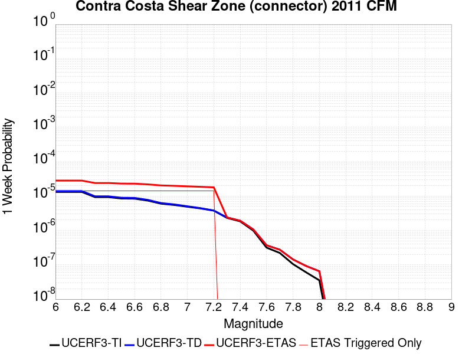 | 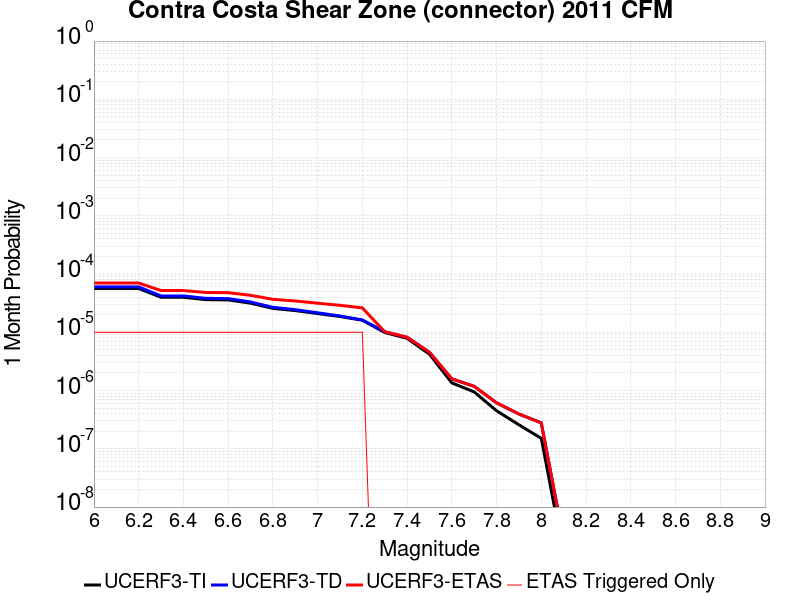 |  | 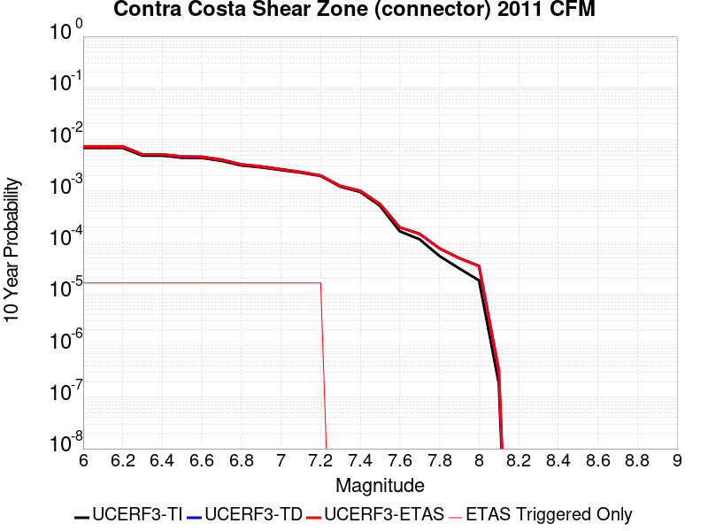 |

| Magnitude | 1 wk TI Prob | 1 wk TD Prob | 1 wk ETAS Prob | 1 wk ETAS/TD Gain | 1 wk ETAS Triggered Only | 1 mo TI Prob | 1 mo TD Prob | 1 mo ETAS Prob | 1 mo ETAS/TD Gain | 1 mo ETAS Triggered Only | 1 yr TI Prob | 1 yr TD Prob | 1 yr ETAS Prob | 1 yr ETAS/TD Gain | 1 yr ETAS Triggered Only | 10 yr TI Prob | 10 yr TD Prob | 10 yr ETAS Prob | 10 yr ETAS/TD Gain | 10 yr ETAS Triggered Only |
|-----|-----|-----|-----|-----|-----|-----|-----|-----|-----|-----|-----|-----|-----|-----|-----|-----|-----|-----|-----|-----|
| 6.0 | 1.3187427E-5 | 1.4041856E-5 | 2.4041716E-5 | 1.7121465 | 1.0E-5 | 5.6516317E-5 | 6.0178125E-5 | 7.017752E-5 | 1.1661633 | 1.0E-5 | 6.878689E-4 | 7.324452E-4 | 7.424379E-4 | 1.0136429 | 1.0E-5 | 0.006857436 | 0.0073068435 | 0.0073167705 | 1.0013586 | 1.0E-5 |
| 6.1 | 1.3187427E-5 | 1.4041856E-5 | 2.4041716E-5 | 1.7121465 | 1.0E-5 | 5.6516317E-5 | 6.0178125E-5 | 7.017752E-5 | 1.1661633 | 1.0E-5 | 6.878689E-4 | 7.324452E-4 | 7.424379E-4 | 1.0136429 | 1.0E-5 | 0.006857436 | 0.0073068435 | 0.0073167705 | 1.0013586 | 1.0E-5 |
| 6.2 | 1.3187427E-5 | 1.4041856E-5 | 2.4041716E-5 | 1.7121465 | 1.0E-5 | 5.6516317E-5 | 6.0178125E-5 | 7.017752E-5 | 1.1661633 | 1.0E-5 | 6.878689E-4 | 7.324452E-4 | 7.424379E-4 | 1.0136429 | 1.0E-5 | 0.006857436 | 0.0073068435 | 0.0073167705 | 1.0013586 | 1.0E-5 |
| 6.3 | 9.315374E-6 | 9.824786E-6 | 1.9824687E-5 | 2.017824 | 1.0E-5 | 3.992242E-5 | 4.210557E-5 | 5.2105148E-5 | 1.2374883 | 1.0E-5 | 4.8594706E-4 | 5.1251886E-4 | 5.225137E-4 | 1.0195014 | 1.0E-5 | 0.004848858 | 0.005118056 | 0.005128005 | 1.0019438 | 1.0E-5 |
| 6.4 | 9.315374E-6 | 9.824786E-6 | 1.9824687E-5 | 2.017824 | 1.0E-5 | 3.992242E-5 | 4.210557E-5 | 5.2105148E-5 | 1.2374883 | 1.0E-5 | 4.8594706E-4 | 5.1251886E-4 | 5.225137E-4 | 1.0195014 | 1.0E-5 | 0.004848858 | 0.005118056 | 0.005128005 | 1.0019438 | 1.0E-5 |
| 6.5 | 8.492638E-6 | 8.9384675E-6 | 1.8938379E-5 | 2.11875 | 1.0E-5 | 3.639651E-5 | 3.8307175E-5 | 4.8306792E-5 | 1.2610377 | 1.0E-5 | 4.430374E-4 | 4.6629342E-4 | 4.7628875E-4 | 1.0214357 | 1.0E-5 | 0.0044215517 | 0.0046577626 | 0.004667716 | 1.002137 | 1.0E-5 |
| 6.6 | 8.402072E-6 | 8.839268E-6 | 1.8839179E-5 | 2.1313055 | 1.0E-5 | 3.6008387E-5 | 3.7882044E-5 | 4.7881666E-5 | 1.2639673 | 1.0E-5 | 4.383139E-4 | 4.6111966E-4 | 4.7111505E-4 | 1.0216763 | 1.0E-5 | 0.0043745036 | 0.0046062404 | 0.0046161944 | 1.002161 | 1.0E-5 |
| 6.7 | 7.383587E-6 | 7.746864E-6 | 1.7746786E-5 | 2.290835 | 1.0E-5 | 3.164356E-5 | 3.320044E-5 | 4.3200103E-5 | 1.3011909 | 1.0E-5 | 3.8519225E-4 | 4.0414243E-4 | 4.141384E-4 | 1.0247338 | 1.0E-5 | 0.0038452526 | 0.004038561 | 0.004048521 | 1.0024661 | 1.0E-5 |
| 6.8 | 6.004921E-6 | 6.2645436E-6 | 1.6264481E-5 | 2.5962756 | 1.0E-5 | 2.5735122E-5 | 2.684777E-5 | 3.68475E-5 | 1.3724604 | 1.0E-5 | 3.1328006E-4 | 3.268231E-4 | 3.3681982E-4 | 1.0305876 | 1.0E-5 | 0.0031283877 | 0.0032677576 | 0.0032777248 | 1.0030502 | 1.0E-5 |
| 6.9 | 5.505255E-6 | 5.716953E-6 | 1.5716896E-5 | 2.7491734 | 1.0E-5 | 2.3593739E-5 | 2.4501E-5 | 3.4500754E-5 | 1.4081366 | 1.0E-5 | 2.872159E-4 | 2.9825929E-4 | 3.082563E-4 | 1.0335178 | 1.0E-5 | 0.0028684495 | 0.0029829137 | 0.002992884 | 1.0033424 | 1.0E-5 |
| 7.0 | 4.891922E-6 | 5.0476283E-6 | 1.5047578E-5 | 2.9811184 | 1.0E-5 | 2.096521E-5 | 2.1632515E-5 | 3.16323E-5 | 1.462257 | 1.0E-5 | 2.5522153E-4 | 2.633444E-4 | 2.7334178E-4 | 1.037963 | 1.0E-5 | 0.0025492862 | 0.0026346396 | 0.0026446132 | 1.0037856 | 1.0E-5 |
| 7.1 | 4.3599E-6 | 4.451648E-6 | 1.4451603E-5 | 3.2463493 | 1.0E-5 | 1.868515E-5 | 1.9078352E-5 | 2.907816E-5 | 1.5241443 | 1.0E-5 | 2.2746796E-4 | 2.3225446E-4 | 2.4225214E-4 | 1.0430462 | 1.0E-5 | 0.0022723526 | 0.0023244268 | 0.0023344036 | 1.0042921 | 1.0E-5 |
| 7.2 | 3.7647926E-6 | 3.8026728E-6 | 1.3802634E-5 | 3.6297193 | 1.0E-5 | 1.6134725E-5 | 1.6297068E-5 | 2.6296906E-5 | 1.6135973 | 1.0E-5 | 1.9642258E-4 | 1.98399E-4 | 2.0839702E-4 | 1.0503935 | 1.0E-5 | 0.0019624906 | 0.0019865124 | 0.0019964927 | 1.005024 | 1.0E-5 |
| 7.3 | 2.3179882E-6 | 2.3909522E-6 | 2.3909522E-6 | 1.0 | 0.0 | 9.934198E-6 | 1.0246898E-5 | 1.0246898E-5 | 1.0 | 0.0 | 1.20942146E-4 | 1.2474888E-4 | 1.2474888E-4 | 1.0 | 0.0 | 0.0012087635 | 0.0012510661 | 0.0012510661 | 1.0 | 0.0 |
| 7.4 | 1.8378355E-6 | 1.918258E-6 | 1.918258E-6 | 1.0 | 0.0 | 7.876414E-6 | 8.22108E-6 | 8.22108E-6 | 1.0 | 0.0 | 9.5891126E-5 | 1.0008709E-4 | 1.0008709E-4 | 1.0 | 0.0 | 9.584976E-4 | 0.0010046052 | 0.0010046052 | 1.0 | 0.0 |
| 7.5 | 9.840493E-7 | 1.0624356E-6 | 1.0624356E-6 | 1.0 | 0.0 | 4.2173474E-6 | 4.5532875E-6 | 4.5532875E-6 | 1.0 | 0.0 | 5.1344992E-5 | 5.5434877E-5 | 5.5434877E-5 | 1.0 | 0.0 | 5.133313E-4 | 5.5791624E-4 | 5.5791624E-4 | 1.0 | 0.0 |
| 7.6 | 3.1602997E-7 | 3.7040812E-7 | 3.7040812E-7 | 1.0 | 0.0 | 1.3544135E-6 | 1.5874624E-6 | 1.5874624E-6 | 1.0 | 0.0 | 1.648986E-5 | 1.9327184E-5 | 1.9327184E-5 | 1.0 | 0.0 | 1.6488635E-4 | 1.9678357E-4 | 1.9678357E-4 | 1.0 | 0.0 |
| 7.7 | 2.2125788E-7 | 2.758609E-7 | 2.758609E-7 | 1.0 | 0.0 | 9.482477E-7 | 1.1822605E-6 | 1.1822605E-6 | 1.0 | 0.0 | 1.1544855E-5 | 1.4393927E-5 | 1.4393927E-5 | 1.0 | 0.0 | 1.1544255E-4 | 1.4742192E-4 | 1.4742192E-4 | 1.0 | 0.0 |
| 7.8 | 1.0509553E-7 | 1.4376357E-7 | 1.4376357E-7 | 1.0 | 0.0 | 4.5040935E-7 | 6.161294E-7 | 6.161294E-7 | 1.0 | 0.0 | 5.48372E-6 | 7.50135E-6 | 7.50135E-6 | 1.0 | 0.0 | 5.4835844E-5 | 7.731651E-5 | 7.731651E-5 | 1.0 | 0.0 |
| 7.9 | 6.029319E-8 | 9.239286E-8 | 9.239286E-8 | 1.0 | 0.0 | 2.5839938E-7 | 3.9596935E-7 | 3.9596935E-7 | 1.0 | 0.0 | 3.1460077E-6 | 4.8209163E-6 | 4.8209163E-6 | 1.0 | 0.0 | 3.1459633E-5 | 4.9793067E-5 | 4.9793067E-5 | 1.0 | 0.0 |
| 8.0 | 3.531068E-8 | 6.50862E-8 | 6.50862E-8 | 1.0 | 0.0 | 1.5133148E-7 | 2.789408E-7 | 2.789408E-7 | 1.0 | 0.0 | 1.8424593E-6 | 3.3960991E-6 | 3.3960991E-6 | 1.0 | 0.0 | 1.842444E-5 | 3.5104295E-5 | 3.5104295E-5 | 1.0 | 0.0 |
| 8.1 | 3.5238246E-10 | 6.2561634E-10 | 6.2561634E-10 | 1.0 | 0.0 | 1.5102107E-9 | 2.6812126E-9 | 2.6812126E-9 | 1.0 | 0.0 | 1.8386816E-8 | 3.264376E-8 | 3.264376E-8 | 1.0 | 0.0 | 1.8386814E-7 | 3.3448472E-7 | 3.3448472E-7 | 1.0 | 0.0 |

## Compton
*[(top)](#table-of-contents)*

| 1 Week | 1 Month | 1 Year | 10 Year |
|-----|-----|-----|-----|
|  | 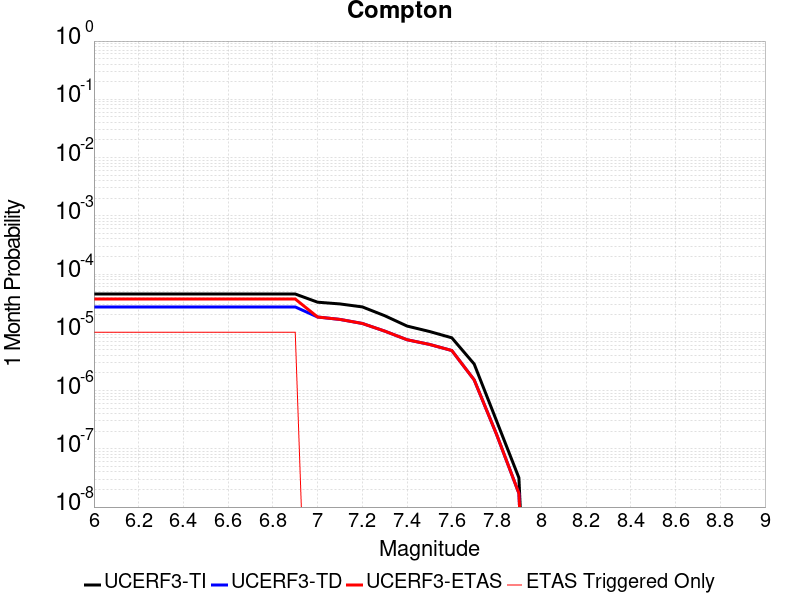 |  |  |

| Magnitude | 1 wk TI Prob | 1 wk TD Prob | 1 wk ETAS Prob | 1 wk ETAS/TD Gain | 1 wk ETAS Triggered Only | 1 mo TI Prob | 1 mo TD Prob | 1 mo ETAS Prob | 1 mo ETAS/TD Gain | 1 mo ETAS Triggered Only | 1 yr TI Prob | 1 yr TD Prob | 1 yr ETAS Prob | 1 yr ETAS/TD Gain | 1 yr ETAS Triggered Only | 10 yr TI Prob | 10 yr TD Prob | 10 yr ETAS Prob | 10 yr ETAS/TD Gain | 10 yr ETAS Triggered Only |
|-----|-----|-----|-----|-----|-----|-----|-----|-----|-----|-----|-----|-----|-----|-----|-----|-----|-----|-----|-----|-----|
| 6.0 | 1.06050875E-5 | 6.35892E-6 | 6.35892E-6 | 1.0 | 0.0 | 4.5449582E-5 | 2.7252245E-5 | 3.725197E-5 | 1.3669323 | 1.0E-5 | 5.5320817E-4 | 3.3174842E-4 | 3.4174512E-4 | 1.0301334 | 1.0E-5 | 0.0055183303 | 0.003312816 | 0.0033227827 | 1.0030086 | 1.0E-5 |
| 6.1 | 1.06050875E-5 | 6.35892E-6 | 6.35892E-6 | 1.0 | 0.0 | 4.5449582E-5 | 2.7252245E-5 | 3.725197E-5 | 1.3669323 | 1.0E-5 | 5.5320817E-4 | 3.3174842E-4 | 3.4174512E-4 | 1.0301334 | 1.0E-5 | 0.0055183303 | 0.003312816 | 0.0033227827 | 1.0030086 | 1.0E-5 |
| 6.2 | 1.06050875E-5 | 6.35892E-6 | 6.35892E-6 | 1.0 | 0.0 | 4.5449582E-5 | 2.7252245E-5 | 3.725197E-5 | 1.3669323 | 1.0E-5 | 5.5320817E-4 | 3.3174842E-4 | 3.4174512E-4 | 1.0301334 | 1.0E-5 | 0.0055183303 | 0.003312816 | 0.0033227827 | 1.0030086 | 1.0E-5 |
| 6.3 | 1.06050875E-5 | 6.35892E-6 | 6.35892E-6 | 1.0 | 0.0 | 4.5449582E-5 | 2.7252245E-5 | 3.725197E-5 | 1.3669323 | 1.0E-5 | 5.5320817E-4 | 3.3174842E-4 | 3.4174512E-4 | 1.0301334 | 1.0E-5 | 0.0055183303 | 0.003312816 | 0.0033227827 | 1.0030086 | 1.0E-5 |
| 6.4 | 1.06050875E-5 | 6.35892E-6 | 6.35892E-6 | 1.0 | 0.0 | 4.5449582E-5 | 2.7252245E-5 | 3.725197E-5 | 1.3669323 | 1.0E-5 | 5.5320817E-4 | 3.3174842E-4 | 3.4174512E-4 | 1.0301334 | 1.0E-5 | 0.0055183303 | 0.003312816 | 0.0033227827 | 1.0030086 | 1.0E-5 |
| 6.5 | 1.06050875E-5 | 6.35892E-6 | 6.35892E-6 | 1.0 | 0.0 | 4.5449582E-5 | 2.7252245E-5 | 3.725197E-5 | 1.3669323 | 1.0E-5 | 5.5320817E-4 | 3.3174842E-4 | 3.4174512E-4 | 1.0301334 | 1.0E-5 | 0.0055183303 | 0.003312816 | 0.0033227827 | 1.0030086 | 1.0E-5 |
| 6.6 | 1.06050875E-5 | 6.35892E-6 | 6.35892E-6 | 1.0 | 0.0 | 4.5449582E-5 | 2.7252245E-5 | 3.725197E-5 | 1.3669323 | 1.0E-5 | 5.5320817E-4 | 3.3174842E-4 | 3.4174512E-4 | 1.0301334 | 1.0E-5 | 0.0055183303 | 0.003312816 | 0.0033227827 | 1.0030086 | 1.0E-5 |
| 6.7 | 1.06050875E-5 | 6.35892E-6 | 6.35892E-6 | 1.0 | 0.0 | 4.5449582E-5 | 2.7252245E-5 | 3.725197E-5 | 1.3669323 | 1.0E-5 | 5.5320817E-4 | 3.3174842E-4 | 3.4174512E-4 | 1.0301334 | 1.0E-5 | 0.0055183303 | 0.003312816 | 0.0033227827 | 1.0030086 | 1.0E-5 |
| 6.8 | 1.06050875E-5 | 6.35892E-6 | 6.35892E-6 | 1.0 | 0.0 | 4.5449582E-5 | 2.7252245E-5 | 3.725197E-5 | 1.3669323 | 1.0E-5 | 5.5320817E-4 | 3.3174842E-4 | 3.4174512E-4 | 1.0301334 | 1.0E-5 | 0.0055183303 | 0.003312816 | 0.0033227827 | 1.0030086 | 1.0E-5 |
| 6.9 | 1.06050875E-5 | 6.35892E-6 | 6.35892E-6 | 1.0 | 0.0 | 4.5449582E-5 | 2.7252245E-5 | 3.725197E-5 | 1.3669323 | 1.0E-5 | 5.5320817E-4 | 3.3174842E-4 | 3.4174512E-4 | 1.0301334 | 1.0E-5 | 0.0055183303 | 0.003312816 | 0.0033227827 | 1.0030086 | 1.0E-5 |
| 7.0 | 7.672486E-6 | 4.272077E-6 | 4.272077E-6 | 1.0 | 0.0 | 3.288167E-5 | 1.8308778E-5 | 1.8308778E-5 | 1.0 | 0.0 | 4.0026082E-4 | 2.2288719E-4 | 2.2288719E-4 | 1.0 | 0.0 | 0.0039954064 | 0.0022266984 | 0.0022266984 | 1.0 | 0.0 |
| 7.1 | 7.163992E-6 | 3.883783E-6 | 3.883783E-6 | 1.0 | 0.0 | 3.0702464E-5 | 1.664468E-5 | 1.664468E-5 | 1.0 | 0.0 | 3.7373835E-4 | 2.0263072E-4 | 2.0263072E-4 | 1.0 | 0.0 | 0.0037311043 | 0.0020245167 | 0.0020245167 | 1.0 | 0.0 |
| 7.2 | 6.3689185E-6 | 3.3101053E-6 | 3.3101053E-6 | 1.0 | 0.0 | 2.729508E-5 | 1.4186091E-5 | 1.4186091E-5 | 1.0 | 0.0 | 3.322669E-4 | 1.7270239E-4 | 1.7270239E-4 | 1.0 | 0.0 | 0.0033177056 | 0.0017257235 | 0.0017257235 | 1.0 | 0.0 |
| 7.3 | 4.4987873E-6 | 2.4480198E-6 | 2.4480198E-6 | 1.0 | 0.0 | 1.9280375E-5 | 1.0491473E-5 | 1.0491473E-5 | 1.0 | 0.0 | 2.3471327E-4 | 1.2772651E-4 | 1.2772651E-4 | 1.0 | 0.0 | 0.002344655 | 0.0012765612 | 0.0012765612 | 1.0 | 0.0 |
| 7.4 | 2.987296E-6 | 1.7394043E-6 | 1.7394043E-6 | 1.0 | 0.0 | 1.2802635E-5 | 7.4545687E-6 | 7.4545687E-6 | 1.0 | 0.0 | 1.5586092E-4 | 9.075565E-5 | 9.075565E-5 | 1.0 | 0.0 | 0.0015575165 | 9.071917E-4 | 9.071917E-4 | 1.0 | 0.0 |
| 7.5 | 2.4111696E-6 | 1.4471991E-6 | 1.4471991E-6 | 1.0 | 0.0 | 1.0333543E-5 | 6.2022677E-6 | 6.2022677E-6 | 1.0 | 0.0 | 1.2580362E-4 | 7.551004E-5 | 7.551004E-5 | 1.0 | 0.0 | 0.0012573242 | 7.548485E-4 | 7.548485E-4 | 1.0 | 0.0 |
| 7.6 | 1.8783096E-6 | 1.1360306E-6 | 1.1360306E-6 | 1.0 | 0.0 | 8.049874E-6 | 4.868694E-6 | 4.868694E-6 | 1.0 | 0.0 | 9.8002805E-5 | 5.9274775E-5 | 5.9274775E-5 | 1.0 | 0.0 | 9.795959E-4 | 5.925936E-4 | 5.925936E-4 | 1.0 | 0.0 |
| 7.7 | 6.6646817E-7 | 3.5601457E-7 | 3.5601457E-7 | 1.0 | 0.0 | 2.856289E-6 | 1.5257759E-6 | 1.5257759E-6 | 1.0 | 0.0 | 3.4774763E-5 | 1.8576176E-5 | 1.8576176E-5 | 1.0 | 0.0 | 3.4769322E-4 | 1.8574759E-4 | 1.8574759E-4 | 1.0 | 0.0 |
| 7.8 | 7.054689E-8 | 4.1342012E-8 | 4.1342012E-8 | 1.0 | 0.0 | 3.0234378E-7 | 1.7718004E-7 | 1.7718004E-7 | 1.0 | 0.0 | 3.6810293E-6 | 2.157165E-6 | 2.157165E-6 | 1.0 | 0.0 | 3.6809684E-5 | 2.157145E-5 | 2.157145E-5 | 1.0 | 0.0 |
| 7.9 | 7.420925E-9 | 4.0130637E-9 | 4.0130637E-9 | 1.0 | 0.0 | 3.1803964E-8 | 1.7198845E-8 | 1.7198845E-8 | 1.0 | 0.0 | 3.872132E-7 | 2.0939592E-7 | 2.0939592E-7 | 1.0 | 0.0 | 3.872125E-6 | 2.0939574E-6 | 2.0939574E-6 | 1.0 | 0.0 |

## Calaveras (No) 2011 CFM
*[(top)](#table-of-contents)*

| 1 Week | 1 Month | 1 Year | 10 Year |
|-----|-----|-----|-----|
| 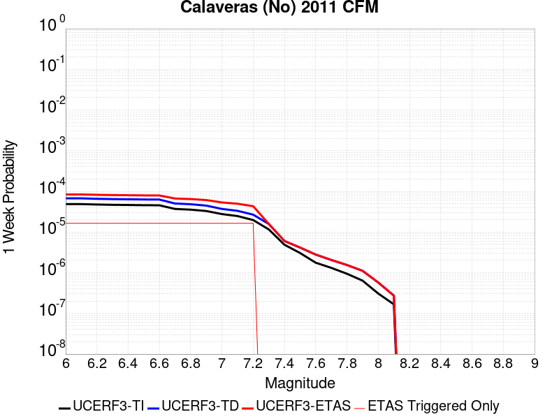 | 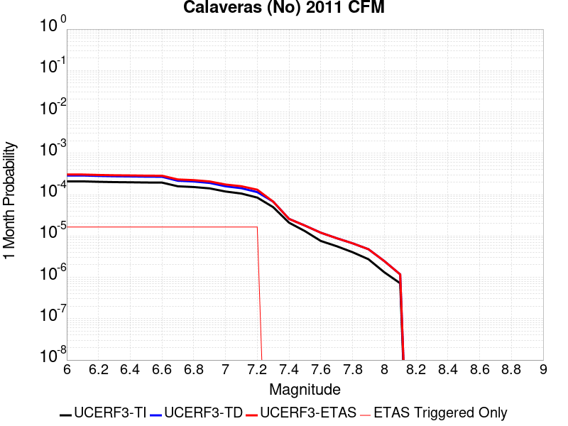 | 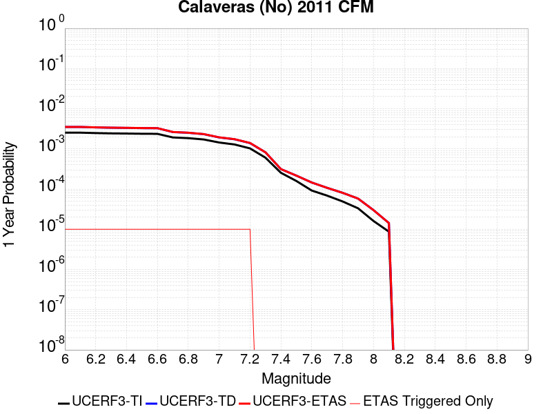 | 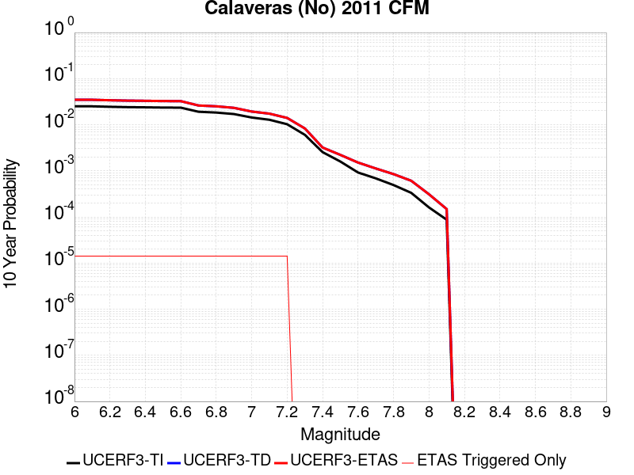 |

| Magnitude | 1 wk TI Prob | 1 wk TD Prob | 1 wk ETAS Prob | 1 wk ETAS/TD Gain | 1 wk ETAS Triggered Only | 1 mo TI Prob | 1 mo TD Prob | 1 mo ETAS Prob | 1 mo ETAS/TD Gain | 1 mo ETAS Triggered Only | 1 yr TI Prob | 1 yr TD Prob | 1 yr ETAS Prob | 1 yr ETAS/TD Gain | 1 yr ETAS Triggered Only | 10 yr TI Prob | 10 yr TD Prob | 10 yr ETAS Prob | 10 yr ETAS/TD Gain | 10 yr ETAS Triggered Only |
|-----|-----|-----|-----|-----|-----|-----|-----|-----|-----|-----|-----|-----|-----|-----|-----|-----|-----|-----|-----|-----|
| 6.0 | 4.8694856E-5 | 6.747457E-5 | 7.7473895E-5 | 1.148194 | 1.0E-5 | 2.0867554E-4 | 2.891453E-4 | 2.991424E-4 | 1.0345746 | 1.0E-5 | 0.0025376645 | 0.0035146773 | 0.0035246422 | 1.0028352 | 1.0E-5 | 0.02508881 | 0.034771074 | 0.034780726 | 1.0002776 | 1.0E-5 |
| 6.1 | 4.8694856E-5 | 6.747457E-5 | 7.7473895E-5 | 1.148194 | 1.0E-5 | 2.0867554E-4 | 2.891453E-4 | 2.991424E-4 | 1.0345746 | 1.0E-5 | 0.0025376645 | 0.0035146773 | 0.0035246422 | 1.0028352 | 1.0E-5 | 0.02508881 | 0.034771074 | 0.034780726 | 1.0002776 | 1.0E-5 |
| 6.2 | 4.7541962E-5 | 6.5805805E-5 | 7.580515E-5 | 1.1519523 | 1.0E-5 | 2.0373536E-4 | 2.8199502E-4 | 2.9199218E-4 | 1.0354517 | 1.0E-5 | 0.0024776561 | 0.003427919 | 0.0034378846 | 1.0029073 | 1.0E-5 | 0.024502134 | 0.0339325 | 0.03394216 | 1.0002847 | 1.0E-5 |
| 6.3 | 4.6717287E-5 | 6.463939E-5 | 7.4638745E-5 | 1.1546944 | 1.0E-5 | 2.0020158E-4 | 2.7699716E-4 | 2.869944E-4 | 1.0360914 | 1.0E-5 | 0.0024347296 | 0.0033672696 | 0.003377236 | 1.0029597 | 1.0E-5 | 0.024082264 | 0.033345006 | 0.033354674 | 1.0002899 | 1.0E-5 |
| 6.4 | 4.6276386E-5 | 6.400103E-5 | 7.4000396E-5 | 1.1562375 | 1.0E-5 | 1.983123E-4 | 2.7426204E-4 | 2.842593E-4 | 1.0364515 | 1.0E-5 | 0.0024117786 | 0.00333408 | 0.0033440467 | 1.0029893 | 1.0E-5 | 0.02385771 | 0.03302388 | 0.03303355 | 1.0002928 | 1.0E-5 |
| 6.5 | 4.5720994E-5 | 6.32025E-5 | 7.320187E-5 | 1.1582116 | 1.0E-5 | 1.9593239E-4 | 2.7084045E-4 | 2.8083773E-4 | 1.0369121 | 1.0E-5 | 0.002382867 | 0.0032925585 | 0.0033025257 | 1.0030272 | 1.0E-5 | 0.023574775 | 0.032621842 | 0.032631516 | 1.0002966 | 1.0E-5 |
| 6.6 | 4.549134E-5 | 6.285557E-5 | 7.285494E-5 | 1.1590849 | 1.0E-5 | 1.949483E-4 | 2.693539E-4 | 2.7935122E-4 | 1.0371159 | 1.0E-5 | 0.0023709119 | 0.0032745146 | 0.0032844818 | 1.0030439 | 1.0E-5 | 0.023457756 | 0.03244731 | 0.032456987 | 1.0002981 | 1.0E-5 |
| 6.7 | 3.701047E-5 | 5.03607E-5 | 6.0360195E-5 | 1.1985575 | 1.0E-5 | 1.5860666E-4 | 2.1581395E-4 | 2.258118E-4 | 1.0463262 | 1.0E-5 | 0.0019293258 | 0.002624412 | 0.0026343858 | 1.0038004 | 1.0E-5 | 0.019126613 | 0.026125198 | 0.026134938 | 1.0003728 | 1.0E-5 |
| 6.8 | 3.5523568E-5 | 4.834225E-5 | 5.8341764E-5 | 1.2068484 | 1.0E-5 | 1.5223498E-4 | 2.0716486E-4 | 2.1716279E-4 | 1.0482607 | 1.0E-5 | 0.0018518851 | 0.0025193577 | 0.0025293324 | 1.0039593 | 1.0E-5 | 0.018365284 | 0.025097623 | 0.025107373 | 1.0003885 | 1.0E-5 |
| 6.9 | 3.2946147E-5 | 4.4663826E-5 | 5.4663382E-5 | 1.2238848 | 1.0E-5 | 1.4119013E-4 | 1.9140259E-4 | 2.0140067E-4 | 1.0522358 | 1.0E-5 | 0.0017176344 | 0.0023278783 | 0.002337855 | 1.0042858 | 1.0E-5 | 0.017044188 | 0.023219762 | 0.02322953 | 1.0004207 | 1.0E-5 |
| 7.0 | 2.7682381E-5 | 3.7023216E-5 | 4.7022844E-5 | 1.2700908 | 1.0E-5 | 1.1863338E-4 | 1.5866144E-4 | 1.6865986E-4 | 1.0630172 | 1.0E-5 | 0.0014434044 | 0.0019300217 | 0.0019400023 | 1.0051713 | 1.0E-5 | 0.01434065 | 0.019311164 | 0.01932097 | 1.0005078 | 1.0E-5 |
| 7.1 | 2.471967E-5 | 3.328756E-5 | 4.3287226E-5 | 1.3004025 | 1.0E-5 | 1.05937135E-4 | 1.4265333E-4 | 1.526519E-4 | 1.07009 | 1.0E-5 | 0.0012890215 | 0.0017354497 | 0.0017454323 | 1.0057522 | 1.0E-5 | 0.0128157 | 0.017386293 | 0.017396118 | 1.0005652 | 1.0E-5 |
| 7.2 | 1.9748062E-5 | 2.6775411E-5 | 3.6775145E-5 | 1.373467 | 1.0E-5 | 8.463181E-5 | 1.1474685E-4 | 1.247457E-4 | 1.0871384 | 1.0E-5 | 0.0010299052 | 0.001396171 | 0.001406157 | 1.0071524 | 1.0E-5 | 0.01025145 | 0.014031046 | 0.014040906 | 1.0007027 | 1.0E-5 |
| 7.3 | 1.1603734E-5 | 1.5784257E-5 | 1.5784257E-5 | 1.0 | 0.0 | 4.9729337E-5 | 6.7645145E-5 | 6.7645145E-5 | 1.0 | 0.0 | 6.052865E-4 | 8.232826E-4 | 8.232826E-4 | 1.0 | 0.0 | 0.0060364045 | 0.008308739 | 0.008308739 | 1.0 | 0.0 |
| 7.4 | 4.885381E-6 | 6.035117E-6 | 6.035117E-6 | 1.0 | 0.0 | 2.0937177E-5 | 2.5864532E-5 | 2.5864532E-5 | 1.0 | 0.0 | 2.5488032E-4 | 3.1485534E-4 | 3.1485534E-4 | 1.0 | 0.0 | 0.0025458818 | 0.0032009764 | 0.0032009764 | 1.0 | 0.0 |
| 7.5 | 3.0571264E-6 | 4.1554085E-6 | 4.1554085E-6 | 1.0 | 0.0 | 1.3101904E-5 | 1.7808772E-5 | 1.7808772E-5 | 1.0 | 0.0 | 1.5950401E-4 | 2.1680034E-4 | 2.1680034E-4 | 1.0 | 0.0 | 0.0015938957 | 0.0022209007 | 0.0022209007 | 1.0 | 0.0 |
| 7.6 | 1.764948E-6 | 2.795641E-6 | 2.795641E-6 | 1.0 | 0.0 | 7.564041E-6 | 1.1981264E-5 | 1.1981264E-5 | 1.0 | 0.0 | 9.208831E-5 | 1.458622E-4 | 1.458622E-4 | 1.0 | 0.0 | 9.205016E-4 | 0.0015124046 | 0.0015124046 | 1.0 | 0.0 |
| 7.7 | 1.3173734E-6 | 2.0585271E-6 | 2.0585271E-6 | 1.0 | 0.0 | 5.645874E-6 | 8.82223E-6 | 8.82223E-6 | 1.0 | 0.0 | 6.873634E-5 | 1.0740537E-4 | 1.0740537E-4 | 1.0 | 0.0 | 6.8715087E-4 | 0.0011261607 | 0.0011261607 | 1.0 | 0.0 |
| 7.8 | 9.4429885E-7 | 1.5490102E-6 | 1.5490102E-6 | 1.0 | 0.0 | 4.0469886E-6 | 6.6385983E-6 | 6.6385983E-6 | 1.0 | 0.0 | 4.9270973E-5 | 8.082195E-5 | 8.082195E-5 | 1.0 | 0.0 | 4.926005E-4 | 8.501931E-4 | 8.501931E-4 | 1.0 | 0.0 |
| 7.9 | 6.388233E-7 | 1.11492E-6 | 1.11492E-6 | 1.0 | 0.0 | 2.7378112E-6 | 4.7782196E-6 | 4.7782196E-6 | 1.0 | 0.0 | 3.3332344E-5 | 5.8173282E-5 | 5.8173282E-5 | 1.0 | 0.0 | 3.3327343E-4 | 6.096674E-4 | 6.096674E-4 | 1.0 | 0.0 |
| 8.0 | 3.087986E-7 | 5.754721E-7 | 5.754721E-7 | 1.0 | 0.0 | 1.323422E-6 | 2.4663066E-6 | 2.4663066E-6 | 1.0 | 0.0 | 1.6112543E-5 | 3.0026871E-5 | 3.0026871E-5 | 1.0 | 0.0 | 1.6111376E-4 | 3.110238E-4 | 3.110238E-4 | 1.0 | 0.0 |
| 8.1 | 1.6725647E-7 | 2.7410795E-7 | 2.7410795E-7 | 1.0 | 0.0 | 7.168133E-7 | 1.1747478E-6 | 1.1747478E-6 | 1.0 | 0.0 | 8.7271665E-6 | 1.4302462E-5 | 1.4302462E-5 | 1.0 | 0.0 | 8.726824E-5 | 1.4847395E-4 | 1.4847395E-4 | 1.0 | 0.0 |

## Holser alt 1
*[(top)](#table-of-contents)*

| 1 Week | 1 Month | 1 Year | 10 Year |
|-----|-----|-----|-----|
|  |  |  |  |

| Magnitude | 1 wk TI Prob | 1 wk TD Prob | 1 wk ETAS Prob | 1 wk ETAS/TD Gain | 1 wk ETAS Triggered Only | 1 mo TI Prob | 1 mo TD Prob | 1 mo ETAS Prob | 1 mo ETAS/TD Gain | 1 mo ETAS Triggered Only | 1 yr TI Prob | 1 yr TD Prob | 1 yr ETAS Prob | 1 yr ETAS/TD Gain | 1 yr ETAS Triggered Only | 10 yr TI Prob | 10 yr TD Prob | 10 yr ETAS Prob | 10 yr ETAS/TD Gain | 10 yr ETAS Triggered Only |
|-----|-----|-----|-----|-----|-----|-----|-----|-----|-----|-----|-----|-----|-----|-----|-----|-----|-----|-----|-----|-----|
| 6.0 | 6.2746653E-6 | 5.7899742E-6 | 5.7899742E-6 | 1.0 | 0.0 | 2.6891146E-5 | 2.4814004E-5 | 2.4814004E-5 | 1.0 | 0.0 | 3.273505E-4 | 3.0208015E-4 | 3.0208015E-4 | 1.0 | 0.0 | 0.0032686873 | 0.003017828 | 0.003027798 | 1.0033036 | 1.0E-5 |
| 6.1 | 6.2746653E-6 | 5.7899742E-6 | 5.7899742E-6 | 1.0 | 0.0 | 2.6891146E-5 | 2.4814004E-5 | 2.4814004E-5 | 1.0 | 0.0 | 3.273505E-4 | 3.0208015E-4 | 3.0208015E-4 | 1.0 | 0.0 | 0.0032686873 | 0.003017828 | 0.003027798 | 1.0033036 | 1.0E-5 |
| 6.2 | 6.2746653E-6 | 5.7899742E-6 | 5.7899742E-6 | 1.0 | 0.0 | 2.6891146E-5 | 2.4814004E-5 | 2.4814004E-5 | 1.0 | 0.0 | 3.273505E-4 | 3.0208015E-4 | 3.0208015E-4 | 1.0 | 0.0 | 0.0032686873 | 0.003017828 | 0.003027798 | 1.0033036 | 1.0E-5 |
| 6.3 | 6.2746653E-6 | 5.7899742E-6 | 5.7899742E-6 | 1.0 | 0.0 | 2.6891146E-5 | 2.4814004E-5 | 2.4814004E-5 | 1.0 | 0.0 | 3.273505E-4 | 3.0208015E-4 | 3.0208015E-4 | 1.0 | 0.0 | 0.0032686873 | 0.003017828 | 0.003027798 | 1.0033036 | 1.0E-5 |
| 6.4 | 6.2746653E-6 | 5.7899742E-6 | 5.7899742E-6 | 1.0 | 0.0 | 2.6891146E-5 | 2.4814004E-5 | 2.4814004E-5 | 1.0 | 0.0 | 3.273505E-4 | 3.0208015E-4 | 3.0208015E-4 | 1.0 | 0.0 | 0.0032686873 | 0.003017828 | 0.003027798 | 1.0033036 | 1.0E-5 |
| 6.5 | 6.2746653E-6 | 5.7899742E-6 | 5.7899742E-6 | 1.0 | 0.0 | 2.6891146E-5 | 2.4814004E-5 | 2.4814004E-5 | 1.0 | 0.0 | 3.273505E-4 | 3.0208015E-4 | 3.0208015E-4 | 1.0 | 0.0 | 0.0032686873 | 0.003017828 | 0.003027798 | 1.0033036 | 1.0E-5 |
| 6.6 | 3.375825E-6 | 2.7711988E-6 | 2.7711988E-6 | 1.0 | 0.0 | 1.4467741E-5 | 1.1876513E-5 | 1.1876513E-5 | 1.0 | 0.0 | 1.761305E-4 | 1.4458712E-4 | 1.4458712E-4 | 1.0 | 0.0 | 0.0017599097 | 0.0014449474 | 0.001454933 | 1.0069107 | 1.0E-5 |
| 6.7 | 3.375825E-6 | 2.7711988E-6 | 2.7711988E-6 | 1.0 | 0.0 | 1.4467741E-5 | 1.1876513E-5 | 1.1876513E-5 | 1.0 | 0.0 | 1.761305E-4 | 1.4458712E-4 | 1.4458712E-4 | 1.0 | 0.0 | 0.0017599097 | 0.0014449474 | 0.001454933 | 1.0069107 | 1.0E-5 |
| 6.8 | 3.366533E-6 | 2.7615984E-6 | 2.7615984E-6 | 1.0 | 0.0 | 1.4427919E-5 | 1.1835369E-5 | 1.1835369E-5 | 1.0 | 0.0 | 1.7564575E-4 | 1.4408625E-4 | 1.4408625E-4 | 1.0 | 0.0 | 0.0017550698 | 0.0014399453 | 0.0014499308 | 1.0069348 | 1.0E-5 |
| 6.9 | 3.253174E-6 | 2.6438204E-6 | 2.6438204E-6 | 1.0 | 0.0 | 1.39421E-5 | 1.13306105E-5 | 1.13306105E-5 | 1.0 | 0.0 | 1.6973184E-4 | 1.379416E-4 | 1.379416E-4 | 1.0 | 0.0 | 0.0016960226 | 0.0013785758 | 0.001388562 | 1.0072439 | 1.0E-5 |
| 7.0 | 2.9336593E-6 | 2.3118082E-6 | 2.3118082E-6 | 1.0 | 0.0 | 1.2572766E-5 | 9.907712E-6 | 9.907712E-6 | 1.0 | 0.0 | 1.5306266E-4 | 1.2061974E-4 | 1.2061974E-4 | 1.0 | 0.0 | 0.0015295728 | 0.0012055453 | 0.0012155332 | 1.008285 | 1.0E-5 |
| 7.1 | 2.9087812E-6 | 2.2876604E-6 | 2.2876604E-6 | 1.0 | 0.0 | 1.2466146E-5 | 9.804223E-6 | 9.804223E-6 | 1.0 | 0.0 | 1.5176475E-4 | 1.19359895E-4 | 1.19359895E-4 | 1.0 | 0.0 | 0.0015166114 | 0.0011929603 | 0.0012029484 | 1.0083725 | 1.0E-5 |
| 7.2 | 2.8674524E-6 | 2.247552E-6 | 2.247552E-6 | 1.0 | 0.0 | 1.2289024E-5 | 9.63233E-6 | 9.63233E-6 | 1.0 | 0.0 | 1.4960859E-4 | 1.1726733E-4 | 1.1726733E-4 | 1.0 | 0.0 | 0.0014950791 | 0.0011720568 | 0.0011820451 | 1.008522 | 1.0E-5 |
| 7.3 | 2.8057775E-6 | 2.1954418E-6 | 2.1954418E-6 | 1.0 | 0.0 | 1.2024705E-5 | 9.409002E-6 | 9.409002E-6 | 1.0 | 0.0 | 1.4639096E-4 | 1.145486E-4 | 1.145486E-4 | 1.0 | 0.0 | 0.0014629456 | 0.0011448979 | 0.0011548864 | 1.0087245 | 1.0E-5 |
| 7.4 | 2.683666E-6 | 2.1092408E-6 | 2.1092408E-6 | 1.0 | 0.0 | 1.1501375E-5 | 9.0395715E-6 | 9.0395715E-6 | 1.0 | 0.0 | 1.4002025E-4 | 1.1005125E-4 | 1.1005125E-4 | 1.0 | 0.0 | 0.0013993206 | 0.0010999697 | 0.0011099587 | 1.0090811 | 1.0E-5 |
| 7.5 | 2.434495E-6 | 1.9195488E-6 | 1.9195488E-6 | 1.0 | 0.0 | 1.0433508E-5 | 8.226612E-6 | 8.226612E-6 | 1.0 | 0.0 | 1.2702055E-4 | 1.0015442E-4 | 1.0015442E-4 | 1.0 | 0.0 | 0.0012694797 | 0.0010010948 | 0.0010110849 | 1.009979 | 1.0E-5 |
| 7.6 | 1.9914562E-6 | 1.5731545E-6 | 1.5731545E-6 | 1.0 | 0.0 | 8.534785E-6 | 6.7420733E-6 | 6.7420733E-6 | 1.0 | 0.0 | 1.03906044E-4 | 8.2081664E-5 | 8.2081664E-5 | 1.0 | 0.0 | 0.0010385747 | 8.2051504E-4 | 8.3050685E-4 | 1.0121775 | 1.0E-5 |
| 7.7 | 1.5229501E-6 | 1.1896134E-6 | 1.1896134E-6 | 1.0 | 0.0 | 6.526913E-6 | 5.098333E-6 | 5.098333E-6 | 1.0 | 0.0 | 7.946226E-5 | 6.207045E-5 | 6.207045E-5 | 1.0 | 0.0 | 7.943385E-4 | 6.2053243E-4 | 6.305262E-4 | 1.0161052 | 1.0E-5 |
| 7.8 | 6.3489426E-7 | 4.6878412E-7 | 4.6878412E-7 | 1.0 | 0.0 | 2.7209726E-6 | 2.0090733E-6 | 2.0090733E-6 | 1.0 | 0.0 | 3.312734E-5 | 2.4460194E-5 | 2.4460194E-5 | 1.0 | 0.0 | 3.31224E-4 | 2.445752E-4 | 2.445752E-4 | 1.0 | 0.0 |
| 7.9 | 1.5459432E-7 | 1.01936465E-7 | 1.01936465E-7 | 1.0 | 0.0 | 6.6254694E-7 | 4.3687047E-7 | 4.3687047E-7 | 1.0 | 0.0 | 8.066479E-6 | 5.318885E-6 | 5.318885E-6 | 1.0 | 0.0 | 8.066186E-5 | 5.3187596E-5 | 5.3187596E-5 | 1.0 | 0.0 |
| 8.0 | 1.8307812E-8 | 9.690041E-9 | 9.690041E-9 | 1.0 | 0.0 | 7.846205E-8 | 4.1528747E-8 | 4.1528747E-8 | 1.0 | 0.0 | 9.55275E-7 | 5.056124E-7 | 5.056124E-7 | 1.0 | 0.0 | 9.552709E-6 | 5.0561125E-6 | 5.0561125E-6 | 1.0 | 0.0 |

## Great Valley 06 (Midland) 2011 CFM alt1
*[(top)](#table-of-contents)*

| 1 Week | 1 Month | 1 Year | 10 Year |
|-----|-----|-----|-----|
|  |  |  |  |

| Magnitude | 1 wk TI Prob | 1 wk TD Prob | 1 wk ETAS Prob | 1 wk ETAS/TD Gain | 1 wk ETAS Triggered Only | 1 mo TI Prob | 1 mo TD Prob | 1 mo ETAS Prob | 1 mo ETAS/TD Gain | 1 mo ETAS Triggered Only | 1 yr TI Prob | 1 yr TD Prob | 1 yr ETAS Prob | 1 yr ETAS/TD Gain | 1 yr ETAS Triggered Only | 10 yr TI Prob | 10 yr TD Prob | 10 yr ETAS Prob | 10 yr ETAS/TD Gain | 10 yr ETAS Triggered Only |
|-----|-----|-----|-----|-----|-----|-----|-----|-----|-----|-----|-----|-----|-----|-----|-----|-----|-----|-----|-----|-----|
| 6.0 | 1.2712525E-5 | 1.3210576E-5 | 1.3210576E-5 | 1.0 | 0.0 | 5.4481112E-5 | 5.6615667E-5 | 5.6615667E-5 | 1.0 | 0.0 | 6.6310563E-4 | 6.8910315E-4 | 6.9909624E-4 | 1.0145016 | 1.0E-5 | 0.0066113044 | 0.006872179 | 0.00688211 | 1.0014452 | 1.0E-5 |
| 6.1 | 1.2712525E-5 | 1.3210576E-5 | 1.3210576E-5 | 1.0 | 0.0 | 5.4481112E-5 | 5.6615667E-5 | 5.6615667E-5 | 1.0 | 0.0 | 6.6310563E-4 | 6.8910315E-4 | 6.9909624E-4 | 1.0145016 | 1.0E-5 | 0.0066113044 | 0.006872179 | 0.00688211 | 1.0014452 | 1.0E-5 |
| 6.2 | 1.2712525E-5 | 1.3210576E-5 | 1.3210576E-5 | 1.0 | 0.0 | 5.4481112E-5 | 5.6615667E-5 | 5.6615667E-5 | 1.0 | 0.0 | 6.6310563E-4 | 6.8910315E-4 | 6.9909624E-4 | 1.0145016 | 1.0E-5 | 0.0066113044 | 0.006872179 | 0.00688211 | 1.0014452 | 1.0E-5 |
| 6.3 | 1.2712525E-5 | 1.3210576E-5 | 1.3210576E-5 | 1.0 | 0.0 | 5.4481112E-5 | 5.6615667E-5 | 5.6615667E-5 | 1.0 | 0.0 | 6.6310563E-4 | 6.8910315E-4 | 6.9909624E-4 | 1.0145016 | 1.0E-5 | 0.0066113044 | 0.006872179 | 0.00688211 | 1.0014452 | 1.0E-5 |
| 6.4 | 1.2712525E-5 | 1.3210576E-5 | 1.3210576E-5 | 1.0 | 0.0 | 5.4481112E-5 | 5.6615667E-5 | 5.6615667E-5 | 1.0 | 0.0 | 6.6310563E-4 | 6.8910315E-4 | 6.9909624E-4 | 1.0145016 | 1.0E-5 | 0.0066113044 | 0.006872179 | 0.00688211 | 1.0014452 | 1.0E-5 |
| 6.5 | 1.2712525E-5 | 1.3210576E-5 | 1.3210576E-5 | 1.0 | 0.0 | 5.4481112E-5 | 5.6615667E-5 | 5.6615667E-5 | 1.0 | 0.0 | 6.6310563E-4 | 6.8910315E-4 | 6.9909624E-4 | 1.0145016 | 1.0E-5 | 0.0066113044 | 0.006872179 | 0.00688211 | 1.0014452 | 1.0E-5 |
| 6.6 | 5.7574384E-6 | 5.9706463E-6 | 5.9706463E-6 | 1.0 | 0.0 | 2.4674504E-5 | 2.5588255E-5 | 2.5588255E-5 | 1.0 | 0.0 | 3.0037065E-4 | 3.1149638E-4 | 3.1149638E-4 | 1.0 | 0.0 | 0.0029996498 | 0.0031109843 | 0.0031109843 | 1.0 | 0.0 |
| 6.7 | 5.7574384E-6 | 5.9706463E-6 | 5.9706463E-6 | 1.0 | 0.0 | 2.4674504E-5 | 2.5588255E-5 | 2.5588255E-5 | 1.0 | 0.0 | 3.0037065E-4 | 3.1149638E-4 | 3.1149638E-4 | 1.0 | 0.0 | 0.0029996498 | 0.0031109843 | 0.0031109843 | 1.0 | 0.0 |
| 6.8 | 3.3474828E-6 | 3.4693849E-6 | 3.4693849E-6 | 1.0 | 0.0 | 1.4346277E-5 | 1.4868716E-5 | 1.4868716E-5 | 1.0 | 0.0 | 1.7465191E-4 | 1.8101306E-4 | 1.8101306E-4 | 1.0 | 0.0 | 0.0017451472 | 0.0018088033 | 0.0018088033 | 1.0 | 0.0 |
| 6.9 | 2.035106E-6 | 2.1090357E-6 | 2.1090357E-6 | 1.0 | 0.0 | 8.721853E-6 | 9.038697E-6 | 9.038697E-6 | 1.0 | 0.0 | 1.0618339E-4 | 1.10041314E-4 | 1.10041314E-4 | 1.0 | 0.0 | 0.0010613267 | 0.0010999405 | 0.0010999405 | 1.0 | 0.0 |
| 7.0 | 1.2424716E-6 | 1.2878762E-6 | 1.2878762E-6 | 1.0 | 0.0 | 5.3248673E-6 | 5.51946E-6 | 5.51946E-6 | 1.0 | 0.0 | 6.482833E-5 | 6.7197805E-5 | 6.7197805E-5 | 1.0 | 0.0 | 6.480942E-4 | 6.718192E-4 | 6.718192E-4 | 1.0 | 0.0 |
| 7.1 | 6.6904556E-7 | 6.939035E-7 | 6.939035E-7 | 1.0 | 0.0 | 2.867335E-6 | 2.97387E-6 | 2.97387E-6 | 1.0 | 0.0 | 3.4909244E-5 | 3.6206526E-5 | 3.6206526E-5 | 1.0 | 0.0 | 3.490376E-4 | 3.6203177E-4 | 3.6203177E-4 | 1.0 | 0.0 |
| 7.2 | 3.948168E-7 | 4.095705E-7 | 4.095705E-7 | 1.0 | 0.0 | 1.6920709E-6 | 1.7553022E-6 | 1.7553022E-6 | 1.0 | 0.0 | 2.0600768E-5 | 2.1370803E-5 | 2.1370803E-5 | 1.0 | 0.0 | 2.0598859E-4 | 2.1370803E-4 | 2.1370803E-4 | 1.0 | 0.0 |

## Fontana (Seismicity)
*[(top)](#table-of-contents)*

| 1 Week | 1 Month | 1 Year | 10 Year |
|-----|-----|-----|-----|
|  | 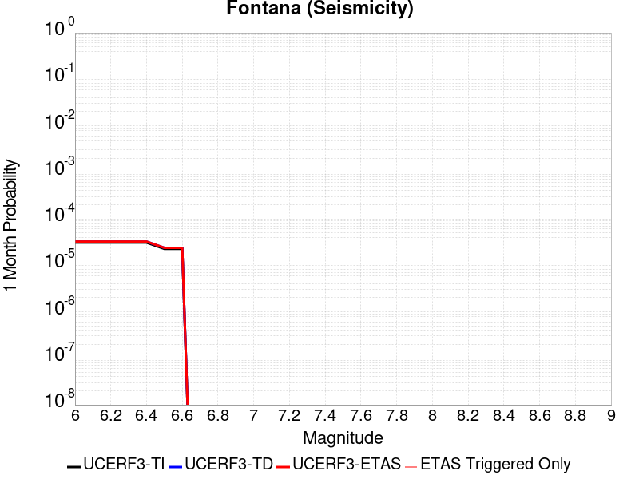 |  |  |

| Magnitude | 1 wk TI Prob | 1 wk TD Prob | 1 wk ETAS Prob | 1 wk ETAS/TD Gain | 1 wk ETAS Triggered Only | 1 mo TI Prob | 1 mo TD Prob | 1 mo ETAS Prob | 1 mo ETAS/TD Gain | 1 mo ETAS Triggered Only | 1 yr TI Prob | 1 yr TD Prob | 1 yr ETAS Prob | 1 yr ETAS/TD Gain | 1 yr ETAS Triggered Only | 10 yr TI Prob | 10 yr TD Prob | 10 yr ETAS Prob | 10 yr ETAS/TD Gain | 10 yr ETAS Triggered Only |
|-----|-----|-----|-----|-----|-----|-----|-----|-----|-----|-----|-----|-----|-----|-----|-----|-----|-----|-----|-----|-----|
| 6.0 | 7.1789214E-6 | 7.5520006E-6 | 7.5520006E-6 | 1.0 | 0.0 | 3.076644E-5 | 3.2365548E-5 | 3.2365548E-5 | 1.0 | 0.0 | 3.7451705E-4 | 3.9402005E-4 | 3.9402005E-4 | 1.0 | 0.0 | 0.003738865 | 0.003937214 | 0.0039471746 | 1.0025299 | 1.0E-5 |
| 6.1 | 7.1789214E-6 | 7.5520006E-6 | 7.5520006E-6 | 1.0 | 0.0 | 3.076644E-5 | 3.2365548E-5 | 3.2365548E-5 | 1.0 | 0.0 | 3.7451705E-4 | 3.9402005E-4 | 3.9402005E-4 | 1.0 | 0.0 | 0.003738865 | 0.003937214 | 0.0039471746 | 1.0025299 | 1.0E-5 |
| 6.2 | 7.1789214E-6 | 7.5520006E-6 | 7.5520006E-6 | 1.0 | 0.0 | 3.076644E-5 | 3.2365548E-5 | 3.2365548E-5 | 1.0 | 0.0 | 3.7451705E-4 | 3.9402005E-4 | 3.9402005E-4 | 1.0 | 0.0 | 0.003738865 | 0.003937214 | 0.0039471746 | 1.0025299 | 1.0E-5 |
| 6.3 | 7.1789214E-6 | 7.5520006E-6 | 7.5520006E-6 | 1.0 | 0.0 | 3.076644E-5 | 3.2365548E-5 | 3.2365548E-5 | 1.0 | 0.0 | 3.7451705E-4 | 3.9402005E-4 | 3.9402005E-4 | 1.0 | 0.0 | 0.003738865 | 0.003937214 | 0.0039471746 | 1.0025299 | 1.0E-5 |
| 6.4 | 7.1789214E-6 | 7.5520006E-6 | 7.5520006E-6 | 1.0 | 0.0 | 3.076644E-5 | 3.2365548E-5 | 3.2365548E-5 | 1.0 | 0.0 | 3.7451705E-4 | 3.9402005E-4 | 3.9402005E-4 | 1.0 | 0.0 | 0.003738865 | 0.003937214 | 0.0039471746 | 1.0025299 | 1.0E-5 |
| 6.5 | 5.2611317E-6 | 5.532726E-6 | 5.532726E-6 | 1.0 | 0.0 | 2.2547512E-5 | 2.3711682E-5 | 2.3711682E-5 | 1.0 | 0.0 | 2.744814E-4 | 2.8868974E-4 | 2.8868974E-4 | 1.0 | 0.0 | 0.002741426 | 0.0028868972 | 0.0028968684 | 1.003454 | 1.0E-5 |
| 6.6 | 5.2611317E-6 | 5.532726E-6 | 5.532726E-6 | 1.0 | 0.0 | 2.2547512E-5 | 2.3711682E-5 | 2.3711682E-5 | 1.0 | 0.0 | 2.744814E-4 | 2.8868974E-4 | 2.8868974E-4 | 1.0 | 0.0 | 0.002741426 | 0.0028868972 | 0.0028968684 | 1.003454 | 1.0E-5 |

## Rocky Ledge 2011 CFM
*[(top)](#table-of-contents)*

| 1 Week | 1 Month | 1 Year | 10 Year |
|-----|-----|-----|-----|
|  |  | 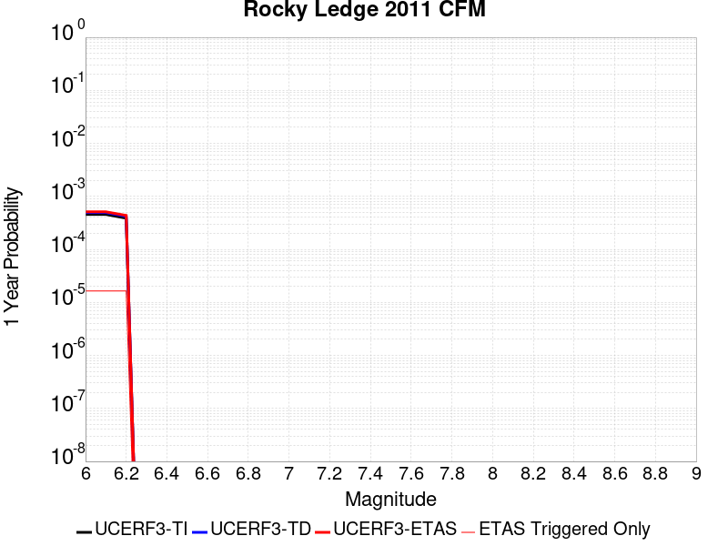 | 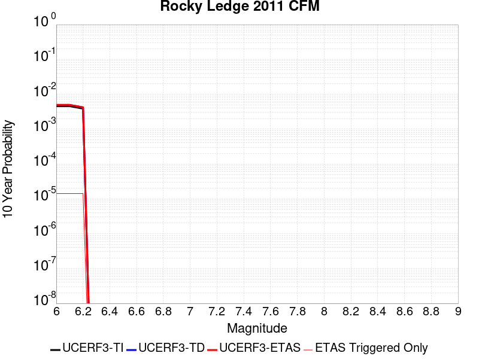 |

| Magnitude | 1 wk TI Prob | 1 wk TD Prob | 1 wk ETAS Prob | 1 wk ETAS/TD Gain | 1 wk ETAS Triggered Only | 1 mo TI Prob | 1 mo TD Prob | 1 mo ETAS Prob | 1 mo ETAS/TD Gain | 1 mo ETAS Triggered Only | 1 yr TI Prob | 1 yr TD Prob | 1 yr ETAS Prob | 1 yr ETAS/TD Gain | 1 yr ETAS Triggered Only | 10 yr TI Prob | 10 yr TD Prob | 10 yr ETAS Prob | 10 yr ETAS/TD Gain | 10 yr ETAS Triggered Only |
|-----|-----|-----|-----|-----|-----|-----|-----|-----|-----|-----|-----|-----|-----|-----|-----|-----|-----|-----|-----|-----|
| 6.0 | 8.7550525E-6 | 9.486605E-6 | 9.486605E-6 | 1.0 | 0.0 | 3.7521113E-5 | 4.0656712E-5 | 5.0656305E-5 | 1.2459519 | 1.0E-5 | 4.567238E-4 | 4.949655E-4 | 5.049606E-4 | 1.0201935 | 1.0E-5 | 0.0045578624 | 0.0049467194 | 0.0049566696 | 1.0020115 | 1.0E-5 |
| 6.1 | 8.7550525E-6 | 9.486605E-6 | 9.486605E-6 | 1.0 | 0.0 | 3.7521113E-5 | 4.0656712E-5 | 5.0656305E-5 | 1.2459519 | 1.0E-5 | 4.567238E-4 | 4.949655E-4 | 5.049606E-4 | 1.0201935 | 1.0E-5 | 0.0045578624 | 0.0049467194 | 0.0049566696 | 1.0020115 | 1.0E-5 |
| 6.2 | 7.442295E-6 | 8.06304E-6 | 8.06304E-6 | 1.0 | 0.0 | 3.189516E-5 | 3.4555887E-5 | 4.455554E-5 | 1.2893763 | 1.0E-5 | 3.8825438E-4 | 4.2071793E-4 | 4.307137E-4 | 1.0237589 | 1.0E-5 | 0.0038757676 | 0.004207179 | 0.004217137 | 1.0023669 | 1.0E-5 |

## Eaton Roughs 2011 CFM
*[(top)](#table-of-contents)*

| 1 Week | 1 Month | 1 Year | 10 Year |
|-----|-----|-----|-----|
| 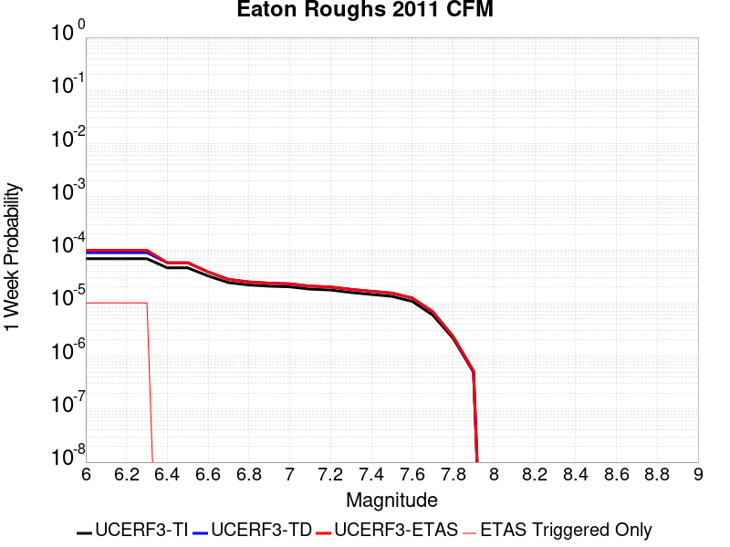 | 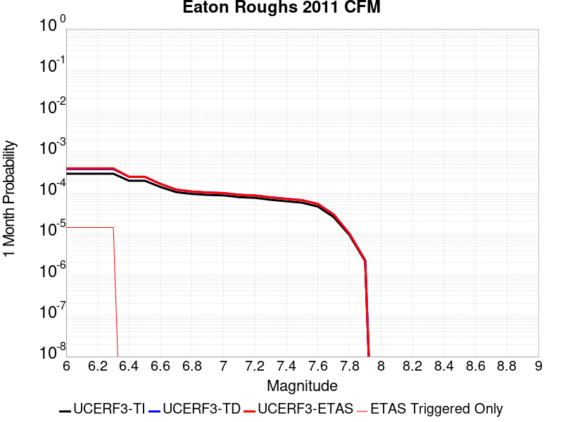 | 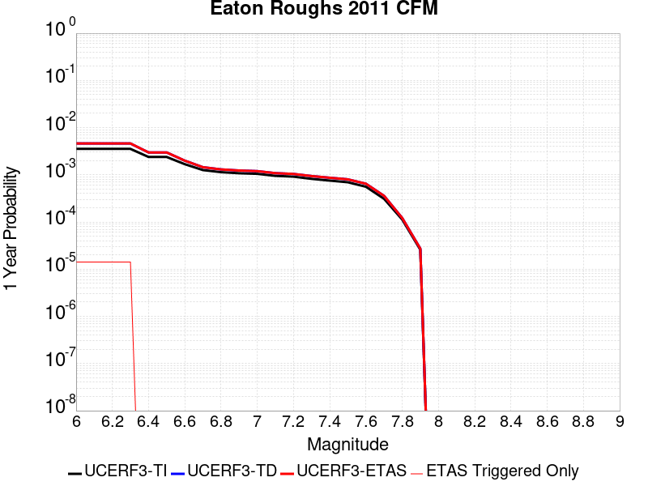 | 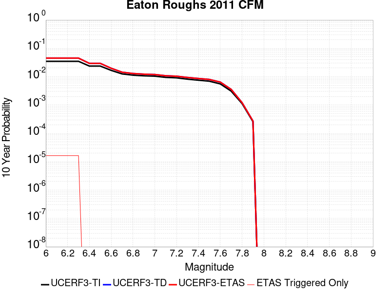 |

| Magnitude | 1 wk TI Prob | 1 wk TD Prob | 1 wk ETAS Prob | 1 wk ETAS/TD Gain | 1 wk ETAS Triggered Only | 1 mo TI Prob | 1 mo TD Prob | 1 mo ETAS Prob | 1 mo ETAS/TD Gain | 1 mo ETAS Triggered Only | 1 yr TI Prob | 1 yr TD Prob | 1 yr ETAS Prob | 1 yr ETAS/TD Gain | 1 yr ETAS Triggered Only | 10 yr TI Prob | 10 yr TD Prob | 10 yr ETAS Prob | 10 yr ETAS/TD Gain | 10 yr ETAS Triggered Only |
|-----|-----|-----|-----|-----|-----|-----|-----|-----|-----|-----|-----|-----|-----|-----|-----|-----|-----|-----|-----|-----|
| 6.0 | 6.8044945E-5 | 8.8434645E-5 | 9.843376E-5 | 1.1130679 | 1.0E-5 | 2.9158857E-4 | 3.7895713E-4 | 3.8895337E-4 | 1.0263782 | 1.0E-5 | 0.0035443127 | 0.0046046837 | 0.0046146377 | 1.0021617 | 1.0E-5 | 0.03488314 | 0.04516368 | 0.045173228 | 1.0002114 | 1.0E-5 |
| 6.1 | 6.8044945E-5 | 8.8434645E-5 | 9.843376E-5 | 1.1130679 | 1.0E-5 | 2.9158857E-4 | 3.7895713E-4 | 3.8895337E-4 | 1.0263782 | 1.0E-5 | 0.0035443127 | 0.0046046837 | 0.0046146377 | 1.0021617 | 1.0E-5 | 0.03488314 | 0.04516368 | 0.045173228 | 1.0002114 | 1.0E-5 |
| 6.2 | 6.8044945E-5 | 8.8434645E-5 | 9.843376E-5 | 1.1130679 | 1.0E-5 | 2.9158857E-4 | 3.7895713E-4 | 3.8895337E-4 | 1.0263782 | 1.0E-5 | 0.0035443127 | 0.0046046837 | 0.0046146377 | 1.0021617 | 1.0E-5 | 0.03488314 | 0.04516368 | 0.045173228 | 1.0002114 | 1.0E-5 |
| 6.3 | 6.8044945E-5 | 8.8434645E-5 | 9.843376E-5 | 1.1130679 | 1.0E-5 | 2.9158857E-4 | 3.7895713E-4 | 3.8895337E-4 | 1.0263782 | 1.0E-5 | 0.0035443127 | 0.0046046837 | 0.0046146377 | 1.0021617 | 1.0E-5 | 0.03488314 | 0.04516368 | 0.045173228 | 1.0002114 | 1.0E-5 |
| 6.4 | 4.5830013E-5 | 5.71553E-5 | 5.71553E-5 | 1.0 | 0.0 | 1.9639956E-4 | 2.4493135E-4 | 2.4493135E-4 | 1.0 | 0.0 | 0.0023885423 | 0.002978342 | 0.002978342 | 1.0 | 0.0 | 0.023630321 | 0.029421948 | 0.029421948 | 1.0 | 0.0 |
| 6.5 | 4.5830013E-5 | 5.71553E-5 | 5.71553E-5 | 1.0 | 0.0 | 1.9639956E-4 | 2.4493135E-4 | 2.4493135E-4 | 1.0 | 0.0 | 0.0023885423 | 0.002978342 | 0.002978342 | 1.0 | 0.0 | 0.023630321 | 0.029421948 | 0.029421948 | 1.0 | 0.0 |
| 6.6 | 3.222194E-5 | 3.8262962E-5 | 3.8262962E-5 | 1.0 | 0.0 | 1.3808672E-4 | 1.6397446E-4 | 1.6397446E-4 | 1.0 | 0.0 | 0.0016799092 | 0.0019946485 | 0.0019946485 | 1.0 | 0.0 | 0.016672665 | 0.019776754 | 0.019776754 | 1.0 | 0.0 |
| 6.7 | 2.4155654E-5 | 2.7786275E-5 | 2.7786275E-5 | 1.0 | 0.0 | 1.0352012E-4 | 1.1907864E-4 | 1.1907864E-4 | 1.0 | 0.0 | 0.0012596287 | 0.0014488265 | 0.0014488265 | 1.0 | 0.0 | 0.012525126 | 0.01439499 | 0.01439499 | 1.0 | 0.0 |
| 6.8 | 2.1814667E-5 | 2.4940904E-5 | 2.4940904E-5 | 1.0 | 0.0 | 9.348808E-5 | 1.0688523E-4 | 1.0688523E-4 | 1.0 | 0.0 | 0.001137623 | 0.0013005546 | 0.0013005546 | 1.0 | 0.0 | 0.011318169 | 0.012930086 | 0.012930086 | 1.0 | 0.0 |
| 6.9 | 2.0700467E-5 | 2.362897E-5 | 2.362897E-5 | 1.0 | 0.0 | 8.871327E-5 | 1.01263104E-4 | 1.01263104E-4 | 1.0 | 0.0 | 0.0010795488 | 0.0012321841 | 0.0012321841 | 1.0 | 0.0 | 0.010743194 | 0.012254083 | 0.012254083 | 1.0 | 0.0 |
| 7.0 | 2.0104066E-5 | 2.2936536E-5 | 2.2936536E-5 | 1.0 | 0.0 | 8.615744E-5 | 9.829576E-5 | 9.829576E-5 | 1.0 | 0.0 | 0.0010484619 | 0.0011960969 | 0.0011960969 | 1.0 | 0.0 | 0.010435291 | 0.01189712 | 0.01189712 | 1.0 | 0.0 |
| 7.1 | 1.8225232E-5 | 2.0773083E-5 | 2.0773083E-5 | 1.0 | 0.0 | 7.81058E-5 | 8.902447E-5 | 8.902447E-5 | 1.0 | 0.0 | 9.5052324E-4 | 0.0010833355 | 0.0010833355 | 1.0 | 0.0 | 0.009464677 | 0.010780873 | 0.010780873 | 1.0 | 0.0 |
| 7.2 | 1.7526572E-5 | 1.9993524E-5 | 1.9993524E-5 | 1.0 | 0.0 | 7.511172E-5 | 8.568373E-5 | 8.568373E-5 | 1.0 | 0.0 | 9.141015E-4 | 0.0010427017 | 0.0010427017 | 1.0 | 0.0 | 0.009103506 | 0.010378398 | 0.010378398 | 1.0 | 0.0 |
| 7.3 | 1.5727232E-5 | 1.8021543E-5 | 1.8021543E-5 | 1.0 | 0.0 | 6.740067E-5 | 7.72329E-5 | 7.72329E-5 | 1.0 | 0.0 | 8.2029426E-4 | 9.399062E-4 | 9.399062E-4 | 1.0 | 0.0 | 0.008172729 | 0.009359558 | 0.009359558 | 1.0 | 0.0 |
| 7.4 | 1.4457361E-5 | 1.6598395E-5 | 1.6598395E-5 | 1.0 | 0.0 | 6.195865E-5 | 7.113405E-5 | 7.113405E-5 | 1.0 | 0.0 | 7.540854E-4 | 8.657138E-4 | 8.657138E-4 | 1.0 | 0.0 | 0.007515317 | 0.008623603 | 0.008623603 | 1.0 | 0.0 |
| 7.5 | 1.33280955E-5 | 1.5345471E-5 | 1.5345471E-5 | 1.0 | 0.0 | 5.711916E-5 | 6.576465E-5 | 6.576465E-5 | 1.0 | 0.0 | 6.9520384E-4 | 8.0039137E-4 | 8.0039137E-4 | 1.0 | 0.0 | 0.00693033 | 0.007975256 | 0.007975256 | 1.0 | 0.0 |
| 7.6 | 1.0699478E-5 | 1.2387852E-5 | 1.2387852E-5 | 1.0 | 0.0 | 4.5854096E-5 | 5.3089716E-5 | 5.3089716E-5 | 1.0 | 0.0 | 5.581306E-4 | 6.461761E-4 | 6.461761E-4 | 1.0 | 0.0 | 0.005567309 | 0.0064430824 | 0.0064430824 | 1.0 | 0.0 |
| 7.7 | 5.9390236E-6 | 6.8529853E-6 | 6.8529853E-6 | 1.0 | 0.0 | 2.545271E-5 | 2.9369607E-5 | 2.9369607E-5 | 1.0 | 0.0 | 3.0984267E-4 | 3.5751655E-4 | 3.5751655E-4 | 1.0 | 0.0 | 0.0030941102 | 0.0035694393 | 0.0035694393 | 1.0 | 0.0 |
| 7.8 | 2.1622036E-6 | 2.329702E-6 | 2.329702E-6 | 1.0 | 0.0 | 9.266554E-6 | 9.984399E-6 | 9.984399E-6 | 1.0 | 0.0 | 1.1281446E-4 | 1.21553356E-4 | 1.21553356E-4 | 1.0 | 0.0 | 0.001127572 | 0.0012148687 | 0.0012148687 | 1.0 | 0.0 |
| 7.9 | 4.9586197E-7 | 5.2189216E-7 | 5.2189216E-7 | 1.0 | 0.0 | 2.125121E-6 | 2.2366787E-6 | 2.2366787E-6 | 1.0 | 0.0 | 2.5873042E-5 | 2.7231245E-5 | 2.7231245E-5 | 1.0 | 0.0 | 2.5870028E-4 | 2.7228118E-4 | 2.7228118E-4 | 1.0 | 0.0 |

## West Tahoe
*[(top)](#table-of-contents)*

| 1 Week | 1 Month | 1 Year | 10 Year |
|-----|-----|-----|-----|
|  | 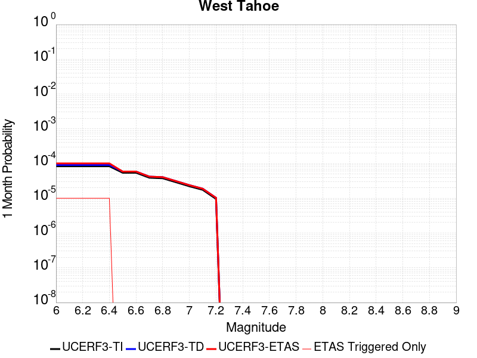 |  | 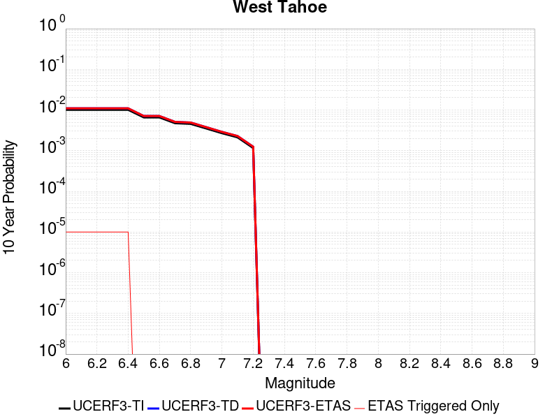 |

| Magnitude | 1 wk TI Prob | 1 wk TD Prob | 1 wk ETAS Prob | 1 wk ETAS/TD Gain | 1 wk ETAS Triggered Only | 1 mo TI Prob | 1 mo TD Prob | 1 mo ETAS Prob | 1 mo ETAS/TD Gain | 1 mo ETAS Triggered Only | 1 yr TI Prob | 1 yr TD Prob | 1 yr ETAS Prob | 1 yr ETAS/TD Gain | 1 yr ETAS Triggered Only | 10 yr TI Prob | 10 yr TD Prob | 10 yr ETAS Prob | 10 yr ETAS/TD Gain | 10 yr ETAS Triggered Only |
|-----|-----|-----|-----|-----|-----|-----|-----|-----|-----|-----|-----|-----|-----|-----|-----|-----|-----|-----|-----|-----|
| 6.0 | 1.952444E-5 | 2.118317E-5 | 3.1182957E-5 | 1.4720628 | 1.0E-5 | 8.367348E-5 | 9.078217E-5 | 1.0078125E-4 | 1.1101438 | 1.0E-5 | 0.0010182485 | 0.0011047672 | 0.0011147561 | 1.0090417 | 1.0E-5 | 0.010135954 | 0.010998235 | 0.011008126 | 1.0008992 | 1.0E-5 |
| 6.1 | 1.952444E-5 | 2.118317E-5 | 3.1182957E-5 | 1.4720628 | 1.0E-5 | 8.367348E-5 | 9.078217E-5 | 1.0078125E-4 | 1.1101438 | 1.0E-5 | 0.0010182485 | 0.0011047672 | 0.0011147561 | 1.0090417 | 1.0E-5 | 0.010135954 | 0.010998235 | 0.011008126 | 1.0008992 | 1.0E-5 |
| 6.2 | 1.952444E-5 | 2.118317E-5 | 3.1182957E-5 | 1.4720628 | 1.0E-5 | 8.367348E-5 | 9.078217E-5 | 1.0078125E-4 | 1.1101438 | 1.0E-5 | 0.0010182485 | 0.0011047672 | 0.0011147561 | 1.0090417 | 1.0E-5 | 0.010135954 | 0.010998235 | 0.011008126 | 1.0008992 | 1.0E-5 |
| 6.3 | 1.952444E-5 | 2.118317E-5 | 3.1182957E-5 | 1.4720628 | 1.0E-5 | 8.367348E-5 | 9.078217E-5 | 1.0078125E-4 | 1.1101438 | 1.0E-5 | 0.0010182485 | 0.0011047672 | 0.0011147561 | 1.0090417 | 1.0E-5 | 0.010135954 | 0.010998235 | 0.011008126 | 1.0008992 | 1.0E-5 |
| 6.4 | 1.952444E-5 | 2.118317E-5 | 3.1182957E-5 | 1.4720628 | 1.0E-5 | 8.367348E-5 | 9.078217E-5 | 1.0078125E-4 | 1.1101438 | 1.0E-5 | 0.0010182485 | 0.0011047672 | 0.0011147561 | 1.0090417 | 1.0E-5 | 0.010135954 | 0.010998235 | 0.011008126 | 1.0008992 | 1.0E-5 |
| 6.5 | 1.2685271E-5 | 1.3690627E-5 | 1.3690627E-5 | 1.0 | 0.0 | 5.4364315E-5 | 5.8672893E-5 | 5.8672893E-5 | 1.0 | 0.0 | 6.616845E-4 | 7.141248E-4 | 7.141248E-4 | 1.0 | 0.0 | 0.0065971776 | 0.00711995 | 0.00711995 | 1.0 | 0.0 |
| 6.6 | 1.2685271E-5 | 1.3690627E-5 | 1.3690627E-5 | 1.0 | 0.0 | 5.4364315E-5 | 5.8672893E-5 | 5.8672893E-5 | 1.0 | 0.0 | 6.616845E-4 | 7.141248E-4 | 7.141248E-4 | 1.0 | 0.0 | 0.0065971776 | 0.00711995 | 0.00711995 | 1.0 | 0.0 |
| 6.7 | 9.117886E-6 | 9.809846E-6 | 9.809846E-6 | 1.0 | 0.0 | 3.9076072E-5 | 4.2041564E-5 | 4.2041564E-5 | 1.0 | 0.0 | 4.756473E-4 | 5.11743E-4 | 5.11743E-4 | 1.0 | 0.0 | 0.0047463053 | 0.0051063634 | 0.0051063634 | 1.0 | 0.0 |
| 6.8 | 8.786828E-6 | 9.457863E-6 | 9.457863E-6 | 1.0 | 0.0 | 3.7657293E-5 | 4.053311E-5 | 4.053311E-5 | 1.0 | 0.0 | 4.5838108E-4 | 4.933859E-4 | 4.933859E-4 | 1.0 | 0.0 | 0.0045743673 | 0.0049236063 | 0.0049236063 | 1.0 | 0.0 |
| 6.9 | 6.7562123E-6 | 7.2638086E-6 | 7.2638086E-6 | 1.0 | 0.0 | 2.8954875E-5 | 3.1130265E-5 | 3.1130265E-5 | 1.0 | 0.0 | 3.5246857E-4 | 3.789498E-4 | 3.789498E-4 | 1.0 | 0.0 | 0.0035191004 | 0.0037835082 | 0.0037835082 | 1.0 | 0.0 |
| 7.0 | 5.1792854E-6 | 5.567338E-6 | 5.567338E-6 | 1.0 | 0.0 | 2.2196748E-5 | 2.3859824E-5 | 2.3859824E-5 | 1.0 | 0.0 | 2.702119E-4 | 2.9045844E-4 | 2.9045844E-4 | 1.0 | 0.0 | 0.0026988357 | 0.0029011632 | 0.0029011632 | 1.0 | 0.0 |
| 7.1 | 4.090765E-6 | 4.3974223E-6 | 4.3974223E-6 | 1.0 | 0.0 | 1.7531731E-5 | 1.884598E-5 | 1.884598E-5 | 1.0 | 0.0 | 2.134279E-4 | 2.2942905E-4 | 2.2942905E-4 | 1.0 | 0.0 | 0.0021322304 | 0.0022922563 | 0.0022922563 | 1.0 | 0.0 |
| 7.2 | 2.2356758E-6 | 2.4023684E-6 | 2.4023684E-6 | 1.0 | 0.0 | 9.581432E-6 | 1.0295834E-5 | 1.0295834E-5 | 1.0 | 0.0 | 1.1664769E-4 | 1.2534647E-4 | 1.2534647E-4 | 1.0 | 0.0 | 0.0011658648 | 0.0012529434 | 0.0012529434 | 1.0 | 0.0 |

## San Gabriel (Extension)
*[(top)](#table-of-contents)*

| 1 Week | 1 Month | 1 Year | 10 Year |
|-----|-----|-----|-----|
|  | 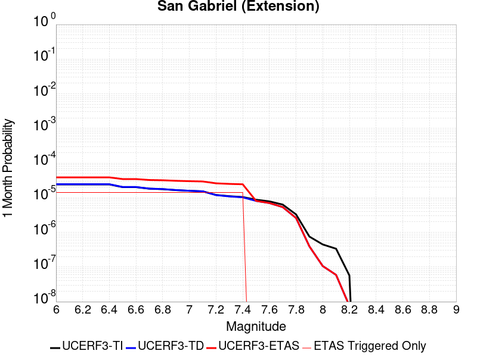 | 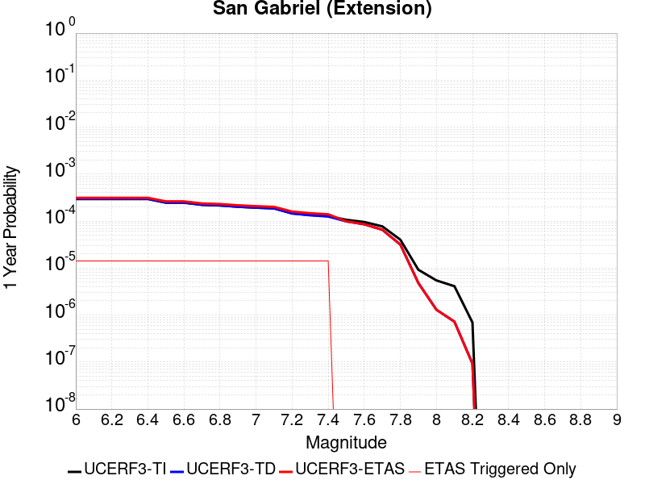 | 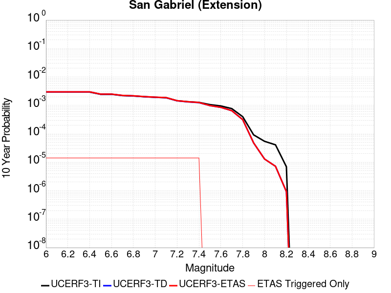 |

| Magnitude | 1 wk TI Prob | 1 wk TD Prob | 1 wk ETAS Prob | 1 wk ETAS/TD Gain | 1 wk ETAS Triggered Only | 1 mo TI Prob | 1 mo TD Prob | 1 mo ETAS Prob | 1 mo ETAS/TD Gain | 1 mo ETAS Triggered Only | 1 yr TI Prob | 1 yr TD Prob | 1 yr ETAS Prob | 1 yr ETAS/TD Gain | 1 yr ETAS Triggered Only | 10 yr TI Prob | 10 yr TD Prob | 10 yr ETAS Prob | 10 yr ETAS/TD Gain | 10 yr ETAS Triggered Only |
|-----|-----|-----|-----|-----|-----|-----|-----|-----|-----|-----|-----|-----|-----|-----|-----|-----|-----|-----|-----|-----|
| 6.0 | 5.6486106E-6 | 5.7168368E-6 | 1.571678E-5 | 2.7492092 | 1.0E-5 | 2.4208108E-5 | 2.4500505E-5 | 3.450026E-5 | 1.4081448 | 1.0E-5 | 2.9469383E-4 | 2.9825408E-4 | 3.082511E-4 | 1.0335184 | 1.0E-5 | 0.0029430336 | 0.0029786646 | 0.0029886349 | 1.0033472 | 1.0E-5 |
| 6.1 | 5.6486106E-6 | 5.7168368E-6 | 1.571678E-5 | 2.7492092 | 1.0E-5 | 2.4208108E-5 | 2.4500505E-5 | 3.450026E-5 | 1.4081448 | 1.0E-5 | 2.9469383E-4 | 2.9825408E-4 | 3.082511E-4 | 1.0335184 | 1.0E-5 | 0.0029430336 | 0.0029786646 | 0.0029886349 | 1.0033472 | 1.0E-5 |
| 6.2 | 5.6486106E-6 | 5.7168368E-6 | 1.571678E-5 | 2.7492092 | 1.0E-5 | 2.4208108E-5 | 2.4500505E-5 | 3.450026E-5 | 1.4081448 | 1.0E-5 | 2.9469383E-4 | 2.9825408E-4 | 3.082511E-4 | 1.0335184 | 1.0E-5 | 0.0029430336 | 0.0029786646 | 0.0029886349 | 1.0033472 | 1.0E-5 |
| 6.3 | 5.6486106E-6 | 5.7168368E-6 | 1.571678E-5 | 2.7492092 | 1.0E-5 | 2.4208108E-5 | 2.4500505E-5 | 3.450026E-5 | 1.4081448 | 1.0E-5 | 2.9469383E-4 | 2.9825408E-4 | 3.082511E-4 | 1.0335184 | 1.0E-5 | 0.0029430336 | 0.0029786646 | 0.0029886349 | 1.0033472 | 1.0E-5 |
| 6.4 | 5.6486106E-6 | 5.7168368E-6 | 1.571678E-5 | 2.7492092 | 1.0E-5 | 2.4208108E-5 | 2.4500505E-5 | 3.450026E-5 | 1.4081448 | 1.0E-5 | 2.9469383E-4 | 2.9825408E-4 | 3.082511E-4 | 1.0335184 | 1.0E-5 | 0.0029430336 | 0.0029786646 | 0.0029886349 | 1.0033472 | 1.0E-5 |
| 6.5 | 4.7134554E-6 | 4.7542608E-6 | 1.4754213E-5 | 3.1033664 | 1.0E-5 | 2.0200367E-5 | 2.0375248E-5 | 3.0375044E-5 | 1.4907815 | 1.0E-5 | 2.459117E-4 | 2.4804127E-4 | 2.5803878E-4 | 1.0403059 | 1.0E-5 | 0.0024563975 | 0.0024777285 | 0.0024877037 | 1.0040259 | 1.0E-5 |
| 6.6 | 4.7134554E-6 | 4.7542608E-6 | 1.4754213E-5 | 3.1033664 | 1.0E-5 | 2.0200367E-5 | 2.0375248E-5 | 3.0375044E-5 | 1.4907815 | 1.0E-5 | 2.459117E-4 | 2.4804127E-4 | 2.5803878E-4 | 1.0403059 | 1.0E-5 | 0.0024563975 | 0.0024777285 | 0.0024877037 | 1.0040259 | 1.0E-5 |
| 6.7 | 4.2468837E-6 | 4.274078E-6 | 1.42740355E-5 | 3.339676 | 1.0E-5 | 1.8200803E-5 | 1.8317352E-5 | 2.8317168E-5 | 1.5459204 | 1.0E-5 | 2.2157225E-4 | 2.2299167E-4 | 2.3298943E-4 | 1.0448347 | 1.0E-5 | 0.0022135144 | 0.0022277513 | 0.002237729 | 1.0044788 | 1.0E-5 |
| 6.8 | 4.1180615E-6 | 4.1414673E-6 | 1.4141426E-5 | 3.414593 | 1.0E-5 | 1.7648716E-5 | 1.774903E-5 | 2.7748853E-5 | 1.5634011 | 1.0E-5 | 2.1485193E-4 | 2.1607373E-4 | 2.2607157E-4 | 1.0462705 | 1.0E-5 | 0.0021464431 | 0.0021587077 | 0.0021686861 | 1.0046225 | 1.0E-5 |
| 6.9 | 3.863861E-6 | 3.879783E-6 | 1.3879744E-5 | 3.5774539 | 1.0E-5 | 1.65593E-5 | 1.6627539E-5 | 2.6627373E-5 | 1.6014019 | 1.0E-5 | 2.0159081E-4 | 2.0242216E-4 | 2.1242014E-4 | 1.0493917 | 1.0E-5 | 0.0020140803 | 0.0020224454 | 0.0020324253 | 1.0049345 | 1.0E-5 |
| 7.0 | 3.6947372E-6 | 3.705682E-6 | 1.3705645E-5 | 3.6985486 | 1.0E-5 | 1.5834492E-5 | 1.5881402E-5 | 2.5881243E-5 | 1.6296574 | 1.0E-5 | 1.9276788E-4 | 1.9333958E-4 | 2.0333765E-4 | 1.0517125 | 1.0E-5 | 0.0019260074 | 0.0019317803 | 0.0019417609 | 1.0051665 | 1.0E-5 |
| 7.1 | 3.5686835E-6 | 3.5729024E-6 | 1.3572867E-5 | 3.7988348 | 1.0E-5 | 1.5294268E-5 | 1.5312353E-5 | 2.53122E-5 | 1.6530575 | 1.0E-5 | 1.861918E-4 | 1.8641262E-4 | 1.9641075E-4 | 1.0536344 | 1.0E-5 | 0.0018603588 | 0.0018626284 | 0.0018726097 | 1.0053588 | 1.0E-5 |
| 7.2 | 2.8023446E-6 | 2.776794E-6 | 1.2776766E-5 | 4.6012654 | 1.0E-5 | 1.2009994E-5 | 1.1900492E-5 | 2.1900372E-5 | 1.8402914 | 1.0E-5 | 1.4621185E-4 | 1.4487897E-4 | 1.5487752E-4 | 1.0690131 | 1.0E-5 | 0.001461157 | 0.001447856 | 0.0014578415 | 1.0068967 | 1.0E-5 |
| 7.3 | 2.5843012E-6 | 2.5459692E-6 | 1.2545944E-5 | 4.9277673 | 1.0E-5 | 1.1075529E-5 | 1.0911252E-5 | 2.0911142E-5 | 1.9164752 | 1.0E-5 | 1.3483623E-4 | 1.3283649E-4 | 1.4283515E-4 | 1.0752705 | 1.0E-5 | 0.0013475444 | 0.0013275805 | 0.0013375673 | 1.0075225 | 1.0E-5 |
| 7.4 | 2.4464468E-6 | 2.396669E-6 | 1.2396645E-5 | 5.1724477 | 1.0E-5 | 1.04847295E-5 | 1.0271398E-5 | 2.0271296E-5 | 1.9735672 | 1.0E-5 | 1.276441E-4 | 1.250472E-4 | 1.3504595E-4 | 1.0799598 | 1.0E-5 | 0.0012757082 | 0.001249778 | 0.0012597655 | 1.0079914 | 1.0E-5 |
| 7.5 | 2.0420266E-6 | 1.8910376E-6 | 1.8910376E-6 | 1.0 | 0.0 | 8.751514E-6 | 8.104422E-6 | 8.104422E-6 | 1.0 | 0.0 | 1.0654447E-4 | 9.866691E-5 | 9.866691E-5 | 1.0 | 0.0 | 0.001064934 | 9.862344E-4 | 9.862344E-4 | 1.0 | 0.0 |
| 7.6 | 1.8326596E-6 | 1.6398233E-6 | 1.6398233E-6 | 1.0 | 0.0 | 7.854232E-6 | 7.027795E-6 | 7.027795E-6 | 1.0 | 0.0 | 9.562107E-5 | 8.556007E-5 | 8.556007E-5 | 1.0 | 0.0 | 9.5579936E-4 | 8.552735E-4 | 8.552735E-4 | 1.0 | 0.0 |
| 7.7 | 1.4786998E-6 | 1.2523672E-6 | 1.2523672E-6 | 1.0 | 0.0 | 6.3372695E-6 | 5.3672766E-6 | 5.3672766E-6 | 1.0 | 0.0 | 7.715353E-5 | 6.534465E-5 | 6.534465E-5 | 1.0 | 0.0 | 7.7126746E-4 | 6.5325975E-4 | 6.5325975E-4 | 1.0 | 0.0 |
| 7.8 | 7.6975533E-7 | 6.069207E-7 | 6.069207E-7 | 1.0 | 0.0 | 3.2989474E-6 | 2.6010862E-6 | 2.6010862E-6 | 1.0 | 0.0 | 4.0163945E-5 | 3.1667765E-5 | 3.1667765E-5 | 1.0 | 0.0 | 4.0156685E-4 | 3.166365E-4 | 3.166365E-4 | 1.0 | 0.0 |
| 7.9 | 1.7645915E-7 | 9.211899E-8 | 9.211899E-8 | 1.0 | 0.0 | 7.562533E-7 | 3.947956E-7 | 3.947956E-7 | 1.0 | 0.0 | 9.207345E-6 | 4.806626E-6 | 4.806626E-6 | 1.0 | 0.0 | 9.206964E-5 | 4.8069025E-5 | 4.8069025E-5 | 1.0 | 0.0 |
| 8.0 | 1.0463461E-7 | 2.4937416E-8 | 2.4937416E-8 | 1.0 | 0.0 | 4.4843398E-7 | 1.0687464E-7 | 1.0687464E-7 | 1.0 | 0.0 | 5.45967E-6 | 1.3011979E-6 | 1.3011979E-6 | 1.0 | 0.0 | 5.459536E-5 | 1.3015701E-5 | 1.3015701E-5 | 1.0 | 0.0 |
| 8.1 | 7.875717E-8 | 1.3857542E-8 | 1.3857542E-8 | 1.0 | 0.0 | 3.3753068E-7 | 5.9389468E-8 | 5.9389468E-8 | 1.0 | 0.0 | 4.109428E-6 | 7.2306653E-7 | 7.2306653E-7 | 1.0 | 0.0 | 4.109352E-5 | 7.234439E-6 | 7.234439E-6 | 1.0 | 0.0 |
| 8.2 | 1.33163E-8 | 1.7720816E-9 | 1.7720816E-9 | 1.0 | 0.0 | 5.7069855E-8 | 7.594638E-9 | 7.594638E-9 | 1.0 | 0.0 | 6.9482525E-7 | 9.246471E-8 | 9.246471E-8 | 1.0 | 0.0 | 6.9482307E-6 | 9.2664203E-7 | 9.2664203E-7 | 1.0 | 0.0 |

## Laguna Salada
*[(top)](#table-of-contents)*

| 1 Week | 1 Month | 1 Year | 10 Year |
|-----|-----|-----|-----|
| 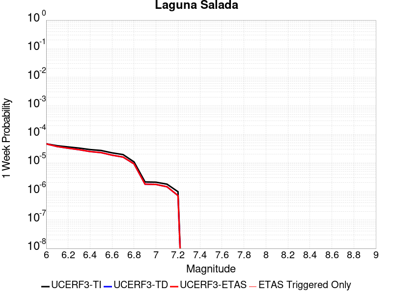 |  | 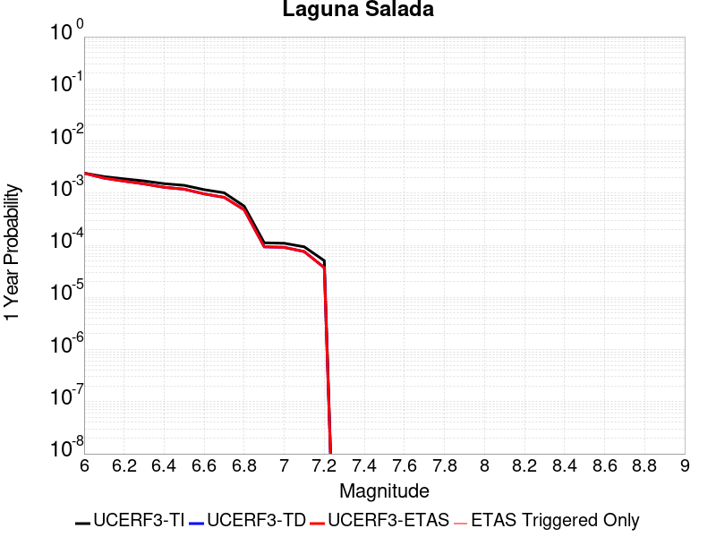 | 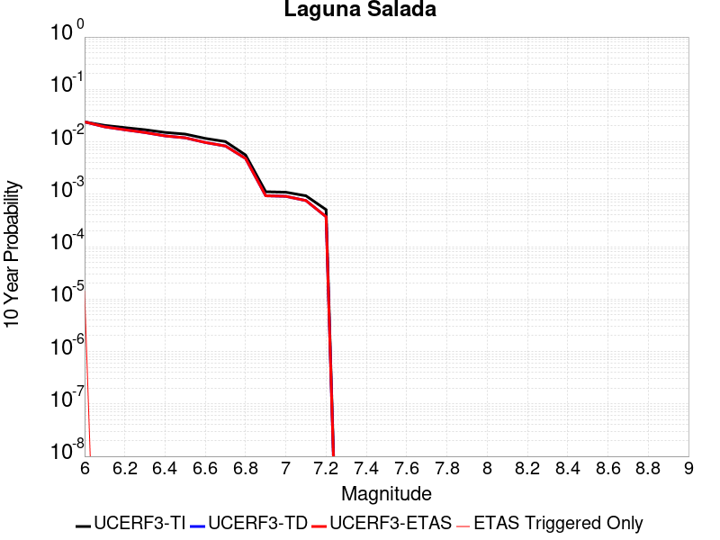 |

| Magnitude | 1 wk TI Prob | 1 wk TD Prob | 1 wk ETAS Prob | 1 wk ETAS/TD Gain | 1 wk ETAS Triggered Only | 1 mo TI Prob | 1 mo TD Prob | 1 mo ETAS Prob | 1 mo ETAS/TD Gain | 1 mo ETAS Triggered Only | 1 yr TI Prob | 1 yr TD Prob | 1 yr ETAS Prob | 1 yr ETAS/TD Gain | 1 yr ETAS Triggered Only | 10 yr TI Prob | 10 yr TD Prob | 10 yr ETAS Prob | 10 yr ETAS/TD Gain | 10 yr ETAS Triggered Only |
|-----|-----|-----|-----|-----|-----|-----|-----|-----|-----|-----|-----|-----|-----|-----|-----|-----|-----|-----|-----|-----|
| 6.0 | 4.6465593E-5 | 4.634507E-5 | 4.634507E-5 | 1.0 | 0.0 | 1.9912305E-4 | 1.9860751E-4 | 1.9860751E-4 | 1.0 | 0.0 | 0.0024216278 | 0.0024154421 | 0.0024154421 | 1.0 | 0.0 | 0.02395408 | 0.023965387 | 0.023975147 | 1.0004072 | 1.0E-5 |
| 6.1 | 3.982297E-5 | 3.7244878E-5 | 3.7244878E-5 | 1.0 | 0.0 | 1.706587E-4 | 1.5961178E-4 | 1.5961178E-4 | 1.0 | 0.0 | 0.0020757897 | 0.0019416384 | 0.0019416384 | 1.0 | 0.0 | 0.020565065 | 0.019322045 | 0.019322045 | 1.0 | 0.0 |
| 6.2 | 3.6067784E-5 | 3.2600165E-5 | 3.2600165E-5 | 1.0 | 0.0 | 1.5456705E-4 | 1.3970808E-4 | 1.3970808E-4 | 1.0 | 0.0 | 0.0018802295 | 0.0016997134 | 0.0016997134 | 1.0 | 0.0 | 0.018644003 | 0.016963193 | 0.016963193 | 1.0 | 0.0 |
| 6.3 | 3.2859112E-5 | 2.8847233E-5 | 2.8847233E-5 | 1.0 | 0.0 | 1.4081717E-4 | 1.2362566E-4 | 1.2362566E-4 | 1.0 | 0.0 | 0.0017131006 | 0.0015041964 | 0.0015041964 | 1.0 | 0.0 | 0.016999546 | 0.015031838 | 0.015031838 | 1.0 | 0.0 |
| 6.4 | 2.9132116E-5 | 2.4851877E-5 | 2.4851877E-5 | 1.0 | 0.0 | 1.2484594E-4 | 1.0650421E-4 | 1.0650421E-4 | 1.0 | 0.0 | 0.0015189396 | 0.001296006 | 0.001296006 | 1.0 | 0.0 | 0.015085992 | 0.012965128 | 0.012965128 | 1.0 | 0.0 |
| 6.5 | 2.7075037E-5 | 2.2824677E-5 | 2.2824677E-5 | 1.0 | 0.0 | 1.1603071E-4 | 9.7816875E-5 | 9.7816875E-5 | 1.0 | 0.0 | 0.0014117584 | 0.0011903581 | 0.0011903581 | 1.0 | 0.0 | 0.014028233 | 0.011916272 | 0.011916272 | 1.0 | 0.0 |
| 6.6 | 2.2367465E-5 | 1.8572848E-5 | 1.8572848E-5 | 1.0 | 0.0 | 9.5857045E-5 | 7.959595E-5 | 7.959595E-5 | 1.0 | 0.0 | 0.0011664346 | 9.687322E-4 | 9.687322E-4 | 1.0 | 0.0 | 0.011603311 | 0.009708806 | 0.009708806 | 1.0 | 0.0 |
| 6.7 | 1.9458053E-5 | 1.5913607E-5 | 1.5913607E-5 | 1.0 | 0.0 | 8.338899E-5 | 6.819984E-5 | 6.819984E-5 | 1.0 | 0.0 | 0.001014788 | 8.300971E-4 | 8.300971E-4 | 1.0 | 0.0 | 0.010101665 | 0.008315945 | 0.008315945 | 1.0 | 0.0 |
| 6.8 | 1.0767866E-5 | 9.183346E-6 | 9.183346E-6 | 1.0 | 0.0 | 4.614718E-5 | 3.9356994E-5 | 3.9356994E-5 | 1.0 | 0.0 | 5.6169706E-4 | 4.7913467E-4 | 4.7913467E-4 | 1.0 | 0.0 | 0.0056027942 | 0.0048085325 | 0.0048085325 | 1.0 | 0.0 |
| 6.9 | 2.1384765E-6 | 1.7913964E-6 | 1.7913964E-6 | 1.0 | 0.0 | 9.164866E-6 | 7.677392E-6 | 7.677392E-6 | 1.0 | 0.0 | 1.1157654E-4 | 9.346863E-5 | 9.346863E-5 | 1.0 | 0.0 | 0.0011152053 | 9.343315E-4 | 9.343315E-4 | 1.0 | 0.0 |
| 7.0 | 2.0952946E-6 | 1.7493335E-6 | 1.7493335E-6 | 1.0 | 0.0 | 8.979802E-6 | 7.497124E-6 | 7.497124E-6 | 1.0 | 0.0 | 1.0932361E-4 | 9.127405E-5 | 9.127405E-5 | 1.0 | 0.0 | 0.0010926984 | 9.124038E-4 | 9.124038E-4 | 1.0 | 0.0 |
| 7.1 | 1.7887576E-6 | 1.4500541E-6 | 1.4500541E-6 | 1.0 | 0.0 | 7.666081E-6 | 6.2145045E-6 | 6.2145045E-6 | 1.0 | 0.0 | 9.333054E-5 | 7.565928E-5 | 7.565928E-5 | 1.0 | 0.0 | 9.329135E-4 | 7.5636554E-4 | 7.5636554E-4 | 1.0 | 0.0 |
| 7.2 | 9.723109E-7 | 7.135829E-7 | 7.135829E-7 | 1.0 | 0.0 | 4.16704E-6 | 3.0582096E-6 | 3.0582096E-6 | 1.0 | 0.0 | 5.073253E-5 | 3.7233232E-5 | 3.7233232E-5 | 1.0 | 0.0 | 5.072095E-4 | 3.722862E-4 | 3.722862E-4 | 1.0 | 0.0 |

## Newport-Inglewood alt 1
*[(top)](#table-of-contents)*

| 1 Week | 1 Month | 1 Year | 10 Year |
|-----|-----|-----|-----|
| 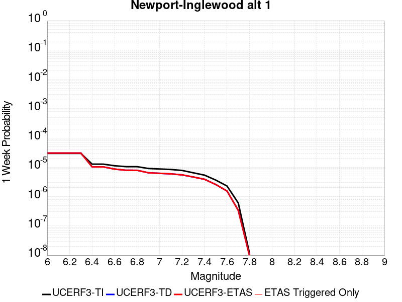 |  |  |  |

| Magnitude | 1 wk TI Prob | 1 wk TD Prob | 1 wk ETAS Prob | 1 wk ETAS/TD Gain | 1 wk ETAS Triggered Only | 1 mo TI Prob | 1 mo TD Prob | 1 mo ETAS Prob | 1 mo ETAS/TD Gain | 1 mo ETAS Triggered Only | 1 yr TI Prob | 1 yr TD Prob | 1 yr ETAS Prob | 1 yr ETAS/TD Gain | 1 yr ETAS Triggered Only | 10 yr TI Prob | 10 yr TD Prob | 10 yr ETAS Prob | 10 yr ETAS/TD Gain | 10 yr ETAS Triggered Only |
|-----|-----|-----|-----|-----|-----|-----|-----|-----|-----|-----|-----|-----|-----|-----|-----|-----|-----|-----|-----|-----|
| 6.0 | 2.9668912E-5 | 3.0404828E-5 | 3.0404828E-5 | 1.0 | 0.0 | 1.2714628E-4 | 1.3030265E-4 | 1.3030265E-4 | 1.0 | 0.0 | 0.0015469068 | 0.0015857654 | 0.0015957495 | 1.0062962 | 1.0E-5 | 0.015361829 | 0.01579211 | 0.015801951 | 1.0006232 | 1.0E-5 |
| 6.1 | 2.9668912E-5 | 3.0404828E-5 | 3.0404828E-5 | 1.0 | 0.0 | 1.2714628E-4 | 1.3030265E-4 | 1.3030265E-4 | 1.0 | 0.0 | 0.0015469068 | 0.0015857654 | 0.0015957495 | 1.0062962 | 1.0E-5 | 0.015361829 | 0.01579211 | 0.015801951 | 1.0006232 | 1.0E-5 |
| 6.2 | 2.9668912E-5 | 3.0404828E-5 | 3.0404828E-5 | 1.0 | 0.0 | 1.2714628E-4 | 1.3030265E-4 | 1.3030265E-4 | 1.0 | 0.0 | 0.0015469068 | 0.0015857654 | 0.0015957495 | 1.0062962 | 1.0E-5 | 0.015361829 | 0.01579211 | 0.015801951 | 1.0006232 | 1.0E-5 |
| 6.3 | 2.9668912E-5 | 3.0404828E-5 | 3.0404828E-5 | 1.0 | 0.0 | 1.2714628E-4 | 1.3030265E-4 | 1.3030265E-4 | 1.0 | 0.0 | 0.0015469068 | 0.0015857654 | 0.0015957495 | 1.0062962 | 1.0E-5 | 0.015361829 | 0.01579211 | 0.015801951 | 1.0006232 | 1.0E-5 |
| 6.4 | 1.275942E-5 | 1.02725335E-5 | 1.02725335E-5 | 1.0 | 0.0 | 5.4682085E-5 | 4.4024422E-5 | 4.4024422E-5 | 1.0 | 0.0 | 6.65551E-4 | 5.358697E-4 | 5.358697E-4 | 1.0 | 0.0 | 0.0066356123 | 0.0053462 | 0.0053462 | 1.0 | 0.0 |
| 6.5 | 1.275942E-5 | 1.02725335E-5 | 1.02725335E-5 | 1.0 | 0.0 | 5.4682085E-5 | 4.4024422E-5 | 4.4024422E-5 | 1.0 | 0.0 | 6.65551E-4 | 5.358697E-4 | 5.358697E-4 | 1.0 | 0.0 | 0.0066356123 | 0.0053462 | 0.0053462 | 1.0 | 0.0 |
| 6.6 | 1.1255358E-5 | 8.661911E-6 | 8.661911E-6 | 1.0 | 0.0 | 4.8236358E-5 | 3.7121958E-5 | 3.7121958E-5 | 1.0 | 0.0 | 5.871194E-4 | 4.5186782E-4 | 4.5186782E-4 | 1.0 | 0.0 | 0.005855706 | 0.0045096674 | 0.0045096674 | 1.0 | 0.0 |
| 6.7 | 1.0504745E-5 | 7.8998455E-6 | 7.8998455E-6 | 1.0 | 0.0 | 4.5019555E-5 | 3.385605E-5 | 3.385605E-5 | 1.0 | 0.0 | 5.4797524E-4 | 4.121207E-4 | 4.121207E-4 | 1.0 | 0.0 | 0.0054662596 | 0.004113694 | 0.004113694 | 1.0 | 0.0 |
| 6.8 | 1.0476007E-5 | 7.881227E-6 | 7.881227E-6 | 1.0 | 0.0 | 4.4896402E-5 | 3.3776258E-5 | 3.3776258E-5 | 1.0 | 0.0 | 5.464766E-4 | 4.1114958E-4 | 4.1114958E-4 | 1.0 | 0.0 | 0.005451347 | 0.004104019 | 0.004104019 | 1.0 | 0.0 |
| 6.9 | 9.076797E-6 | 6.4896567E-6 | 6.4896567E-6 | 1.0 | 0.0 | 3.889998E-5 | 2.7812519E-5 | 2.7812519E-5 | 1.0 | 0.0 | 4.7350433E-4 | 3.3856515E-4 | 3.3856515E-4 | 1.0 | 0.0 | 0.004724967 | 0.003380531 | 0.003380531 | 1.0 | 0.0 |
| 7.0 | 8.73795E-6 | 6.2120503E-6 | 6.2120503E-6 | 1.0 | 0.0 | 3.7447822E-5 | 2.6622802E-5 | 2.6622802E-5 | 1.0 | 0.0 | 4.5583185E-4 | 3.2408469E-4 | 3.2408469E-4 | 1.0 | 0.0 | 0.0045489795 | 0.0032361522 | 0.0032361522 | 1.0 | 0.0 |
| 7.1 | 8.391299E-6 | 5.9557533E-6 | 5.9557533E-6 | 1.0 | 0.0 | 3.5962214E-5 | 2.5524409E-5 | 2.5524409E-5 | 1.0 | 0.0 | 4.37752E-4 | 3.1071564E-4 | 3.1071564E-4 | 1.0 | 0.0 | 0.004368907 | 0.0031028416 | 0.0031028416 | 1.0 | 0.0 |
| 7.2 | 7.796882E-6 | 5.4964826E-6 | 5.4964826E-6 | 1.0 | 0.0 | 3.341478E-5 | 2.3556144E-5 | 2.3556144E-5 | 1.0 | 0.0 | 4.06749E-4 | 2.867585E-4 | 2.867585E-4 | 1.0 | 0.0 | 0.0040600533 | 0.002863909 | 0.002863909 | 1.0 | 0.0 |
| 7.3 | 6.4738833E-6 | 4.6477753E-6 | 4.6477753E-6 | 1.0 | 0.0 | 2.774492E-5 | 1.9918885E-5 | 1.9918885E-5 | 1.0 | 0.0 | 3.3774204E-4 | 2.424856E-4 | 2.424856E-4 | 1.0 | 0.0 | 0.0033722918 | 0.0024222268 | 0.0024222268 | 1.0 | 0.0 |
| 7.4 | 5.382145E-6 | 3.8857215E-6 | 3.8857215E-6 | 1.0 | 0.0 | 2.3066134E-5 | 1.6652988E-5 | 1.6652988E-5 | 1.0 | 0.0 | 2.8079396E-4 | 2.0273139E-4 | 2.0273139E-4 | 1.0 | 0.0 | 0.0028043943 | 0.002025479 | 0.002025479 | 1.0 | 0.0 |
| 7.5 | 3.648244E-6 | 2.5737634E-6 | 2.5737634E-6 | 1.0 | 0.0 | 1.5635238E-5 | 1.1030369E-5 | 1.1030369E-5 | 1.0 | 0.0 | 1.9034238E-4 | 1.3428657E-4 | 1.3428657E-4 | 1.0 | 0.0 | 0.0019017943 | 0.0013420646 | 0.0013420646 | 1.0 | 0.0 |
| 7.6 | 2.2906888E-6 | 1.547986E-6 | 1.547986E-6 | 1.0 | 0.0 | 9.817201E-6 | 6.634209E-6 | 6.634209E-6 | 1.0 | 0.0 | 1.1951787E-4 | 8.076857E-5 | 8.076857E-5 | 1.0 | 0.0 | 0.0011945361 | 8.073989E-4 | 8.073989E-4 | 1.0 | 0.0 |
| 7.7 | 6.0479874E-7 | 3.397468E-7 | 3.397468E-7 | 1.0 | 0.0 | 2.5919921E-6 | 1.456057E-6 | 1.456057E-6 | 1.0 | 0.0 | 3.1557047E-5 | 1.7727363E-5 | 1.7727363E-5 | 1.0 | 0.0 | 3.1552566E-4 | 1.7726087E-4 | 1.7726087E-4 | 1.0 | 0.0 |
| 7.8 | 1.16056995E-8 | 9.782997E-9 | 9.782997E-9 | 1.0 | 0.0 | 4.9738713E-8 | 4.1927127E-8 | 4.1927127E-8 | 1.0 | 0.0 | 6.0556863E-7 | 5.1046277E-7 | 5.1046277E-7 | 1.0 | 0.0 | 6.05567E-6 | 5.1046277E-6 | 5.1046277E-6 | 1.0 | 0.0 |

## Cedar Mtn-Mahogany Mtn
*[(top)](#table-of-contents)*

| 1 Week | 1 Month | 1 Year | 10 Year |
|-----|-----|-----|-----|
| 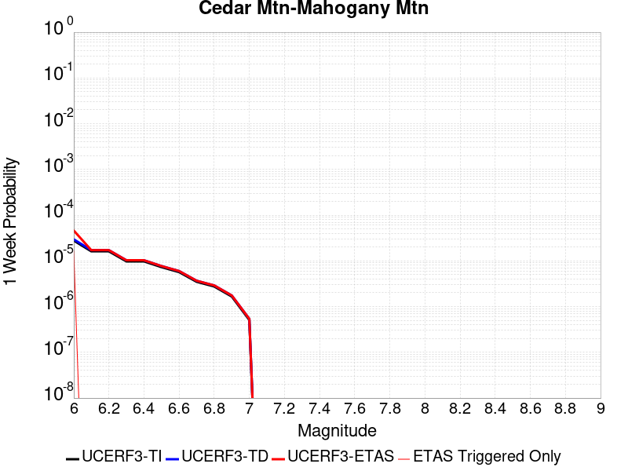 | 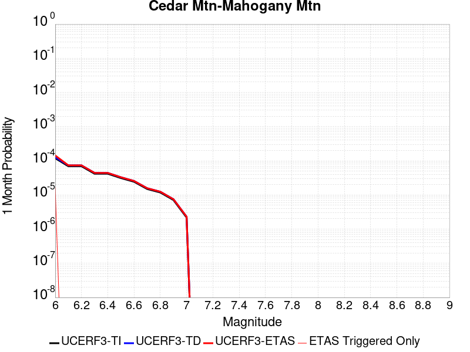 | 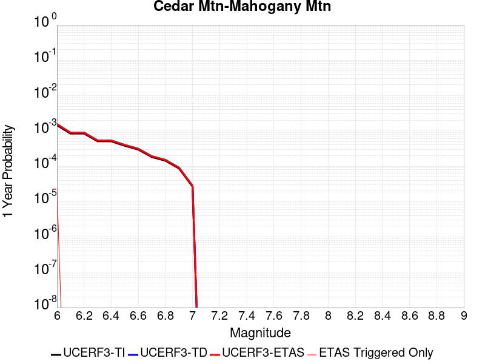 | 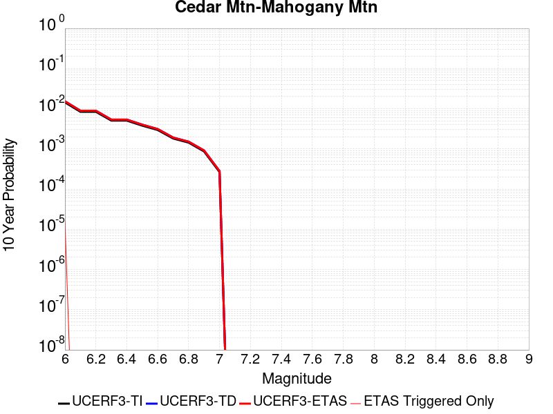 |

| Magnitude | 1 wk TI Prob | 1 wk TD Prob | 1 wk ETAS Prob | 1 wk ETAS/TD Gain | 1 wk ETAS Triggered Only | 1 mo TI Prob | 1 mo TD Prob | 1 mo ETAS Prob | 1 mo ETAS/TD Gain | 1 mo ETAS Triggered Only | 1 yr TI Prob | 1 yr TD Prob | 1 yr ETAS Prob | 1 yr ETAS/TD Gain | 1 yr ETAS Triggered Only | 10 yr TI Prob | 10 yr TD Prob | 10 yr ETAS Prob | 10 yr ETAS/TD Gain | 10 yr ETAS Triggered Only |
|-----|-----|-----|-----|-----|-----|-----|-----|-----|-----|-----|-----|-----|-----|-----|-----|-----|-----|-----|-----|-----|
| 6.0 | 2.7763876E-5 | 2.9588866E-5 | 3.958857E-5 | 1.337955 | 1.0E-5 | 1.1898261E-4 | 1.2680366E-4 | 1.3680238E-4 | 1.078852 | 1.0E-5 | 0.0014476506 | 0.0015428112 | 0.0015527958 | 1.0064716 | 1.0E-5 | 0.0143825635 | 0.015328225 | 0.015338072 | 1.0006424 | 1.0E-5 |
| 6.1 | 1.6162443E-5 | 1.7142966E-5 | 1.7142966E-5 | 1.0 | 0.0 | 6.926578E-5 | 7.346788E-5 | 7.346788E-5 | 1.0 | 0.0 | 8.4298453E-4 | 8.941221E-4 | 8.941221E-4 | 1.0 | 0.0 | 0.008397939 | 0.008907059 | 0.008907059 | 1.0 | 0.0 |
| 6.2 | 1.6162443E-5 | 1.7142966E-5 | 1.7142966E-5 | 1.0 | 0.0 | 6.926578E-5 | 7.346788E-5 | 7.346788E-5 | 1.0 | 0.0 | 8.4298453E-4 | 8.941221E-4 | 8.941221E-4 | 1.0 | 0.0 | 0.008397939 | 0.008907059 | 0.008907059 | 1.0 | 0.0 |
| 6.3 | 9.746053E-6 | 1.0303152E-5 | 1.0303152E-5 | 1.0 | 0.0 | 4.1768133E-5 | 4.415564E-5 | 4.415564E-5 | 1.0 | 0.0 | 5.0840835E-4 | 5.3746643E-4 | 5.3746643E-4 | 1.0 | 0.0 | 0.0050724675 | 0.005362084 | 0.005362084 | 1.0 | 0.0 |
| 6.4 | 9.746053E-6 | 1.0303152E-5 | 1.0303152E-5 | 1.0 | 0.0 | 4.1768133E-5 | 4.415564E-5 | 4.415564E-5 | 1.0 | 0.0 | 5.0840835E-4 | 5.3746643E-4 | 5.3746643E-4 | 1.0 | 0.0 | 0.0050724675 | 0.005362084 | 0.005362084 | 1.0 | 0.0 |
| 6.5 | 7.290083E-6 | 7.695325E-6 | 7.695325E-6 | 1.0 | 0.0 | 3.124284E-5 | 3.297956E-5 | 3.297956E-5 | 1.0 | 0.0 | 3.8031515E-4 | 4.014543E-4 | 4.014543E-4 | 1.0 | 0.0 | 0.0037966494 | 0.004007511 | 0.004007511 | 1.0 | 0.0 |
| 6.6 | 5.67907E-6 | 5.9891527E-6 | 5.9891527E-6 | 1.0 | 0.0 | 2.4338644E-5 | 2.5667552E-5 | 2.5667552E-5 | 1.0 | 0.0 | 2.962827E-4 | 3.12459E-4 | 3.12459E-4 | 1.0 | 0.0 | 0.0029588798 | 0.003120333 | 0.003120333 | 1.0 | 0.0 |
| 6.7 | 3.4853963E-6 | 3.672631E-6 | 3.672631E-6 | 1.0 | 0.0 | 1.4937327E-5 | 1.5739755E-5 | 1.5739755E-5 | 1.0 | 0.0 | 1.8184677E-4 | 1.916153E-4 | 1.916153E-4 | 1.0 | 0.0 | 0.0018169804 | 0.0019145629 | 0.0019145629 | 1.0 | 0.0 |
| 6.8 | 2.7535168E-6 | 2.9015764E-6 | 2.9015764E-6 | 1.0 | 0.0 | 1.1800733E-5 | 1.2435271E-5 | 1.2435271E-5 | 1.0 | 0.0 | 1.4366445E-4 | 1.5138938E-4 | 1.5138938E-4 | 1.0 | 0.0 | 0.0014357162 | 0.0015129098 | 0.0015129098 | 1.0 | 0.0 |
| 6.9 | 1.6594106E-6 | 1.7496985E-6 | 1.7496985E-6 | 1.0 | 0.0 | 7.1117406E-6 | 7.4986883E-6 | 7.4986883E-6 | 1.0 | 0.0 | 8.6582E-5 | 9.129302E-5 | 9.129302E-5 | 1.0 | 0.0 | 8.654827E-4 | 9.125856E-4 | 9.125856E-4 | 1.0 | 0.0 |
| 7.0 | 5.10215E-7 | 5.389254E-7 | 5.389254E-7 | 1.0 | 0.0 | 2.186634E-6 | 2.3096788E-6 | 2.3096788E-6 | 1.0 | 0.0 | 2.6621943E-5 | 2.8120105E-5 | 2.8120105E-5 | 1.0 | 0.0 | 2.6618753E-4 | 2.81178E-4 | 2.81178E-4 | 1.0 | 0.0 |

## Homestead Valley 2011
*[(top)](#table-of-contents)*

| 1 Week | 1 Month | 1 Year | 10 Year |
|-----|-----|-----|-----|
|  |  | 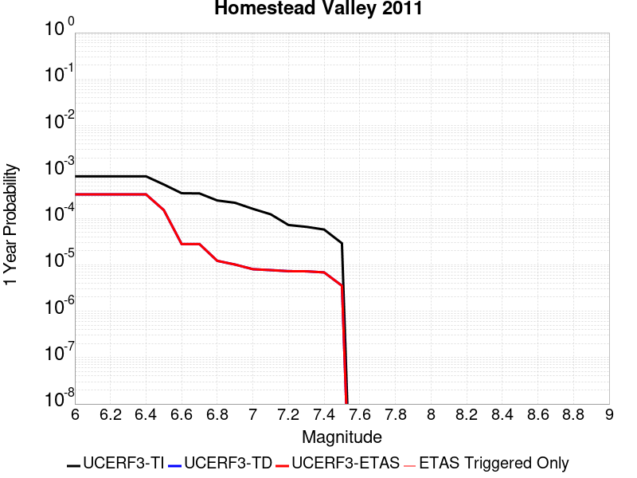 | 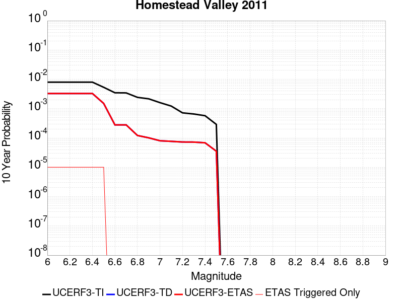 |

| Magnitude | 1 wk TI Prob | 1 wk TD Prob | 1 wk ETAS Prob | 1 wk ETAS/TD Gain | 1 wk ETAS Triggered Only | 1 mo TI Prob | 1 mo TD Prob | 1 mo ETAS Prob | 1 mo ETAS/TD Gain | 1 mo ETAS Triggered Only | 1 yr TI Prob | 1 yr TD Prob | 1 yr ETAS Prob | 1 yr ETAS/TD Gain | 1 yr ETAS Triggered Only | 10 yr TI Prob | 10 yr TD Prob | 10 yr ETAS Prob | 10 yr ETAS/TD Gain | 10 yr ETAS Triggered Only |
|-----|-----|-----|-----|-----|-----|-----|-----|-----|-----|-----|-----|-----|-----|-----|-----|-----|-----|-----|-----|-----|
| 6.0 | 1.539795E-5 | 6.286469E-6 | 6.286469E-6 | 1.0 | 0.0 | 6.5989545E-5 | 2.6941849E-5 | 2.6941849E-5 | 1.0 | 0.0 | 8.0312655E-4 | 3.2798824E-4 | 3.2798824E-4 | 1.0 | 0.0 | 0.008002302 | 0.0032770627 | 0.00328703 | 1.0030415 | 1.0E-5 |
| 6.1 | 1.539795E-5 | 6.286469E-6 | 6.286469E-6 | 1.0 | 0.0 | 6.5989545E-5 | 2.6941849E-5 | 2.6941849E-5 | 1.0 | 0.0 | 8.0312655E-4 | 3.2798824E-4 | 3.2798824E-4 | 1.0 | 0.0 | 0.008002302 | 0.0032770627 | 0.00328703 | 1.0030415 | 1.0E-5 |
| 6.2 | 1.539795E-5 | 6.286469E-6 | 6.286469E-6 | 1.0 | 0.0 | 6.5989545E-5 | 2.6941849E-5 | 2.6941849E-5 | 1.0 | 0.0 | 8.0312655E-4 | 3.2798824E-4 | 3.2798824E-4 | 1.0 | 0.0 | 0.008002302 | 0.0032770627 | 0.00328703 | 1.0030415 | 1.0E-5 |
| 6.3 | 1.539795E-5 | 6.286469E-6 | 6.286469E-6 | 1.0 | 0.0 | 6.5989545E-5 | 2.6941849E-5 | 2.6941849E-5 | 1.0 | 0.0 | 8.0312655E-4 | 3.2798824E-4 | 3.2798824E-4 | 1.0 | 0.0 | 0.008002302 | 0.0032770627 | 0.00328703 | 1.0030415 | 1.0E-5 |
| 6.4 | 1.539795E-5 | 6.286469E-6 | 6.286469E-6 | 1.0 | 0.0 | 6.5989545E-5 | 2.6941849E-5 | 2.6941849E-5 | 1.0 | 0.0 | 8.0312655E-4 | 3.2798824E-4 | 3.2798824E-4 | 1.0 | 0.0 | 0.008002302 | 0.0032770627 | 0.00328703 | 1.0030415 | 1.0E-5 |
| 6.5 | 1.0265258E-5 | 2.8786876E-6 | 2.8786876E-6 | 1.0 | 0.0 | 4.3993223E-5 | 1.2337214E-5 | 1.2337214E-5 | 1.0 | 0.0 | 5.3548586E-4 | 1.5020218E-4 | 1.5020218E-4 | 1.0 | 0.0 | 0.005341973 | 0.0015016886 | 0.0015116736 | 1.0066491 | 1.0E-5 |
| 6.6 | 6.664671E-6 | 5.343859E-7 | 5.343859E-7 | 1.0 | 0.0 | 2.8562565E-5 | 2.2902238E-6 | 2.2902238E-6 | 1.0 | 0.0 | 3.476937E-4 | 2.7883236E-5 | 2.7883236E-5 | 1.0 | 0.0 | 0.003471502 | 2.78809E-4 | 2.78809E-4 | 1.0 | 0.0 |
| 6.7 | 6.5954046E-6 | 5.343859E-7 | 5.343859E-7 | 1.0 | 0.0 | 2.8265715E-5 | 2.2902238E-6 | 2.2902238E-6 | 1.0 | 0.0 | 3.4408073E-4 | 2.7883236E-5 | 2.7883236E-5 | 1.0 | 0.0 | 0.0034354846 | 2.78809E-4 | 2.78809E-4 | 1.0 | 0.0 |
| 6.8 | 4.648189E-6 | 2.3257238E-7 | 2.3257238E-7 | 1.0 | 0.0 | 1.9920659E-5 | 9.967384E-7 | 9.967384E-7 | 1.0 | 0.0 | 2.4250703E-4 | 1.2135227E-5 | 1.2135227E-5 | 1.0 | 0.0 | 0.0024224254 | 1.2134612E-4 | 1.2134612E-4 | 1.0 | 0.0 |
| 6.9 | 4.1428534E-6 | 1.9342777E-7 | 1.9342777E-7 | 1.0 | 0.0 | 1.7754966E-5 | 8.289759E-7 | 8.289759E-7 | 1.0 | 0.0 | 2.1614527E-4 | 1.0092737E-5 | 1.0092737E-5 | 1.0 | 0.0 | 0.0021593515 | 1.0092309E-4 | 1.0092309E-4 | 1.0 | 0.0 |
| 7.0 | 3.0673707E-6 | 1.5364343E-7 | 1.5364343E-7 | 1.0 | 0.0 | 1.3145808E-5 | 6.5847166E-7 | 6.5847166E-7 | 1.0 | 0.0 | 1.6003846E-4 | 8.016864E-6 | 8.016864E-6 | 1.0 | 0.0 | 0.0015992324 | 8.016585E-5 | 8.016585E-5 | 1.0 | 0.0 |
| 7.1 | 2.340854E-6 | 1.4684727E-7 | 1.4684727E-7 | 1.0 | 0.0 | 1.0032193E-5 | 6.293453E-7 | 6.293453E-7 | 1.0 | 0.0 | 1.221351E-4 | 7.662254E-6 | 7.662254E-6 | 1.0 | 0.0 | 0.00122068 | 7.661999E-5 | 7.661999E-5 | 1.0 | 0.0 |
| 7.2 | 1.3754182E-6 | 1.3920152E-7 | 1.3920152E-7 | 1.0 | 0.0 | 5.8946357E-6 | 5.965778E-7 | 5.965778E-7 | 1.0 | 0.0 | 7.176483E-5 | 7.2633115E-6 | 7.2633115E-6 | 1.0 | 0.0 | 7.174166E-4 | 7.2630835E-5 | 7.2630835E-5 | 1.0 | 0.0 |
| 7.3 | 1.2573237E-6 | 1.3824703E-7 | 1.3824703E-7 | 1.0 | 0.0 | 5.388519E-6 | 5.9248714E-7 | 5.9248714E-7 | 1.0 | 0.0 | 6.560324E-5 | 7.213508E-6 | 7.213508E-6 | 1.0 | 0.0 | 6.558388E-4 | 7.213283E-5 | 7.213283E-5 | 1.0 | 0.0 |
| 7.4 | 1.0994207E-6 | 1.3103899E-7 | 1.3103899E-7 | 1.0 | 0.0 | 4.7117946E-6 | 5.615955E-7 | 5.615955E-7 | 1.0 | 0.0 | 5.736459E-5 | 6.837405E-6 | 6.837405E-6 | 1.0 | 0.0 | 5.734978E-4 | 6.837204E-5 | 6.837204E-5 | 1.0 | 0.0 |
| 7.5 | 5.5569126E-7 | 6.7717565E-8 | 6.7717565E-8 | 1.0 | 0.0 | 2.3815317E-6 | 2.902181E-7 | 2.902181E-7 | 1.0 | 0.0 | 2.8994764E-5 | 3.5334003E-6 | 3.5334003E-6 | 1.0 | 0.0 | 2.899098E-4 | 3.5333505E-5 | 3.5333505E-5 | 1.0 | 0.0 |

## Hat Creek-McArthur-Mayfield
*[(top)](#table-of-contents)*

| 1 Week | 1 Month | 1 Year | 10 Year |
|-----|-----|-----|-----|
|  |  | 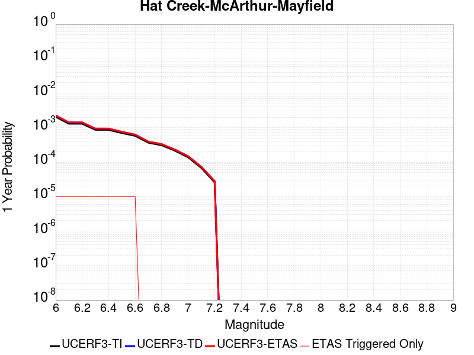 | 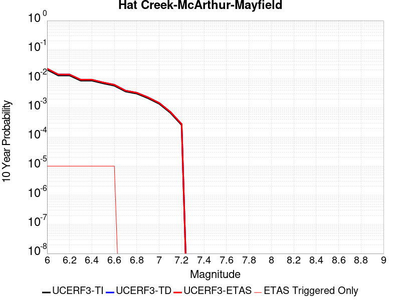 |

| Magnitude | 1 wk TI Prob | 1 wk TD Prob | 1 wk ETAS Prob | 1 wk ETAS/TD Gain | 1 wk ETAS Triggered Only | 1 mo TI Prob | 1 mo TD Prob | 1 mo ETAS Prob | 1 mo ETAS/TD Gain | 1 mo ETAS Triggered Only | 1 yr TI Prob | 1 yr TD Prob | 1 yr ETAS Prob | 1 yr ETAS/TD Gain | 1 yr ETAS Triggered Only | 10 yr TI Prob | 10 yr TD Prob | 10 yr ETAS Prob | 10 yr ETAS/TD Gain | 10 yr ETAS Triggered Only |
|-----|-----|-----|-----|-----|-----|-----|-----|-----|-----|-----|-----|-----|-----|-----|-----|-----|-----|-----|-----|-----|
| 6.0 | 3.967457E-5 | 4.315831E-5 | 4.315831E-5 | 1.0 | 0.0 | 1.7002279E-4 | 1.8495171E-4 | 1.8495171E-4 | 1.0 | 0.0 | 0.002068062 | 0.002249576 | 0.0022595534 | 1.0044353 | 1.0E-5 | 0.02048922 | 0.022280399 | 0.022290176 | 1.0004388 | 1.0E-5 |
| 6.1 | 2.5044013E-5 | 2.7071164E-5 | 2.7071164E-5 | 1.0 | 0.0 | 1.0732707E-4 | 1.1601429E-4 | 1.1601429E-4 | 1.0 | 0.0 | 0.0013059238 | 0.0014115906 | 0.0014215765 | 1.0070742 | 1.0E-5 | 0.01298276 | 0.01402966 | 0.01403952 | 1.0007027 | 1.0E-5 |
| 6.2 | 2.5044013E-5 | 2.7071164E-5 | 2.7071164E-5 | 1.0 | 0.0 | 1.0732707E-4 | 1.1601429E-4 | 1.1601429E-4 | 1.0 | 0.0 | 0.0013059238 | 0.0014115906 | 0.0014215765 | 1.0070742 | 1.0E-5 | 0.01298276 | 0.01402966 | 0.01403952 | 1.0007027 | 1.0E-5 |
| 6.3 | 1.6624012E-5 | 1.7891072E-5 | 1.7891072E-5 | 1.0 | 0.0 | 7.124382E-5 | 7.6673816E-5 | 7.6673816E-5 | 1.0 | 0.0 | 8.670483E-4 | 9.331125E-4 | 9.4310316E-4 | 1.0107068 | 1.0E-5 | 0.008636732 | 0.009292879 | 0.009302787 | 1.0010661 | 1.0E-5 |
| 6.4 | 1.6624012E-5 | 1.7891072E-5 | 1.7891072E-5 | 1.0 | 0.0 | 7.124382E-5 | 7.6673816E-5 | 7.6673816E-5 | 1.0 | 0.0 | 8.670483E-4 | 9.331125E-4 | 9.4310316E-4 | 1.0107068 | 1.0E-5 | 0.008636732 | 0.009292879 | 0.009302787 | 1.0010661 | 1.0E-5 |
| 6.5 | 1.3394842E-5 | 1.4392137E-5 | 1.4392137E-5 | 1.0 | 0.0 | 5.7405203E-5 | 6.167916E-5 | 6.167916E-5 | 1.0 | 0.0 | 6.986842E-4 | 7.506906E-4 | 7.606831E-4 | 1.013311 | 1.0E-5 | 0.006964916 | 0.0074821403 | 0.007492066 | 1.0013266 | 1.0E-5 |
| 6.6 | 1.1137514E-5 | 1.1954546E-5 | 1.1954546E-5 | 1.0 | 0.0 | 4.7731326E-5 | 5.1232782E-5 | 5.1232782E-5 | 1.0 | 0.0 | 5.809739E-4 | 6.2358467E-4 | 6.335784E-4 | 1.0160263 | 1.0E-5 | 0.005794574 | 0.00621877 | 0.0062287077 | 1.001598 | 1.0E-5 |
| 6.7 | 7.0200663E-6 | 7.5242897E-6 | 7.5242897E-6 | 1.0 | 0.0 | 3.008565E-5 | 3.2246568E-5 | 3.2246568E-5 | 1.0 | 0.0 | 3.6623122E-4 | 3.925328E-4 | 3.925328E-4 | 1.0 | 0.0 | 0.0036562826 | 0.0039185574 | 0.0039185574 | 1.0 | 0.0 |
| 6.8 | 5.940172E-6 | 6.3654766E-6 | 6.3654766E-6 | 1.0 | 0.0 | 2.545763E-5 | 2.7280335E-5 | 2.7280335E-5 | 1.0 | 0.0 | 3.0990256E-4 | 3.3208873E-4 | 3.3208873E-4 | 1.0 | 0.0 | 0.0030947074 | 0.0033160534 | 0.0033160534 | 1.0 | 0.0 |
| 6.9 | 4.129831E-6 | 4.423547E-6 | 4.423547E-6 | 1.0 | 0.0 | 1.7699154E-5 | 1.8957926E-5 | 1.8957926E-5 | 1.0 | 0.0 | 2.154659E-4 | 2.3078908E-4 | 2.3078908E-4 | 1.0 | 0.0 | 0.002152571 | 0.0023055724 | 0.0023055724 | 1.0 | 0.0 |
| 7.0 | 2.6512955E-6 | 2.8374002E-6 | 2.8374002E-6 | 1.0 | 0.0 | 1.1362646E-5 | 1.2160232E-5 | 1.2160232E-5 | 1.0 | 0.0 | 1.3833142E-4 | 1.480412E-4 | 1.480412E-4 | 1.0 | 0.0 | 0.0013824535 | 0.0014794683 | 0.0014794683 | 1.0 | 0.0 |
| 7.1 | 1.2992575E-6 | 1.3909317E-6 | 1.3909317E-6 | 1.0 | 0.0 | 5.568235E-6 | 5.961124E-6 | 5.961124E-6 | 1.0 | 0.0 | 6.779115E-5 | 7.257448E-5 | 7.257448E-5 | 1.0 | 0.0 | 6.7770475E-4 | 7.2552945E-4 | 7.2552945E-4 | 1.0 | 0.0 |
| 7.2 | 4.968191E-7 | 5.3271475E-7 | 5.3271475E-7 | 1.0 | 0.0 | 2.1292228E-6 | 2.283062E-6 | 2.283062E-6 | 1.0 | 0.0 | 2.592298E-5 | 2.7796052E-5 | 2.7796052E-5 | 1.0 | 0.0 | 2.5919956E-4 | 2.7793812E-4 | 2.7793812E-4 | 1.0 | 0.0 |

## Pittville 2011 CFM
*[(top)](#table-of-contents)*

| 1 Week | 1 Month | 1 Year | 10 Year |
|-----|-----|-----|-----|
|  |  | 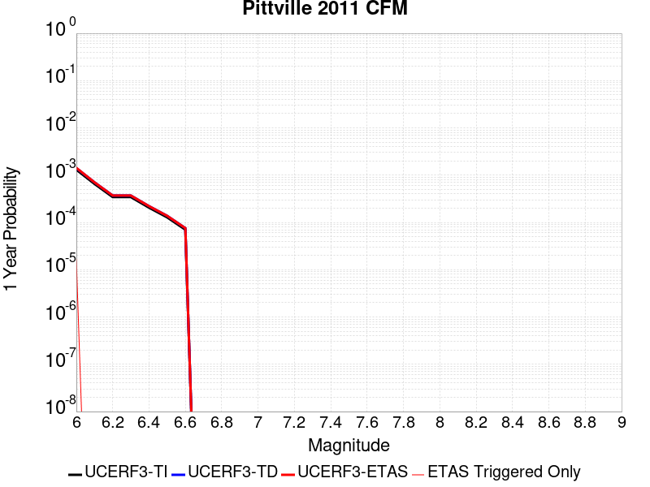 | 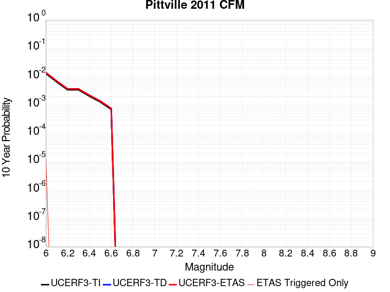 |

| Magnitude | 1 wk TI Prob | 1 wk TD Prob | 1 wk ETAS Prob | 1 wk ETAS/TD Gain | 1 wk ETAS Triggered Only | 1 mo TI Prob | 1 mo TD Prob | 1 mo ETAS Prob | 1 mo ETAS/TD Gain | 1 mo ETAS Triggered Only | 1 yr TI Prob | 1 yr TD Prob | 1 yr ETAS Prob | 1 yr ETAS/TD Gain | 1 yr ETAS Triggered Only | 10 yr TI Prob | 10 yr TD Prob | 10 yr ETAS Prob | 10 yr ETAS/TD Gain | 10 yr ETAS Triggered Only |
|-----|-----|-----|-----|-----|-----|-----|-----|-----|-----|-----|-----|-----|-----|-----|-----|-----|-----|-----|-----|-----|
| 6.0 | 2.5031832E-5 | 2.7056969E-5 | 2.7056969E-5 | 1.0 | 0.0 | 1.0727487E-4 | 1.1595384E-4 | 1.1595384E-4 | 1.0 | 0.0 | 0.001305289 | 0.0014109211 | 0.001420907 | 1.0070776 | 1.0E-5 | 0.012976485 | 0.014029415 | 0.014039275 | 1.0007027 | 1.0E-5 |
| 6.1 | 1.2540113E-5 | 1.3513067E-5 | 1.3513067E-5 | 1.0 | 0.0 | 5.3742235E-5 | 5.7911984E-5 | 5.7911984E-5 | 1.0 | 0.0 | 6.541153E-4 | 7.048728E-4 | 7.048728E-4 | 1.0 | 0.0 | 0.0065219323 | 0.0070286044 | 0.0070286044 | 1.0 | 0.0 |
| 6.2 | 6.603218E-6 | 7.107189E-6 | 7.107189E-6 | 1.0 | 0.0 | 2.8299199E-5 | 3.0459063E-5 | 3.0459063E-5 | 1.0 | 0.0 | 3.4448825E-4 | 3.7078248E-4 | 3.7078248E-4 | 1.0 | 0.0 | 0.0034395473 | 0.0037022792 | 0.0037022792 | 1.0 | 0.0 |
| 6.3 | 6.603218E-6 | 7.107189E-6 | 7.107189E-6 | 1.0 | 0.0 | 2.8299199E-5 | 3.0459063E-5 | 3.0459063E-5 | 1.0 | 0.0 | 3.4448825E-4 | 3.7078248E-4 | 3.7078248E-4 | 1.0 | 0.0 | 0.0034395473 | 0.0037022792 | 0.0037022792 | 1.0 | 0.0 |
| 6.4 | 3.9389015E-6 | 4.239175E-6 | 4.239175E-6 | 1.0 | 0.0 | 1.6880897E-5 | 1.8167784E-5 | 1.8167784E-5 | 1.0 | 0.0 | 2.0550552E-4 | 2.2117342E-4 | 2.2117342E-4 | 1.0 | 0.0 | 0.0020531558 | 0.002209838 | 0.002209838 | 1.0 | 0.0 |
| 6.5 | 2.4533072E-6 | 2.6412686E-6 | 2.6412686E-6 | 1.0 | 0.0 | 1.0514132E-5 | 1.1319685E-5 | 1.1319685E-5 | 1.0 | 0.0 | 1.2800204E-4 | 1.3781038E-4 | 1.3781038E-4 | 1.0 | 0.0 | 0.0012792832 | 0.0013774394 | 0.0013774394 | 1.0 | 0.0 |
| 6.6 | 1.3482367E-6 | 1.452993E-6 | 1.452993E-6 | 1.0 | 0.0 | 5.778144E-6 | 6.2271047E-6 | 6.2271047E-6 | 1.0 | 0.0 | 7.0346636E-5 | 7.58135E-5 | 7.58135E-5 | 1.0 | 0.0 | 7.032437E-4 | 7.5798744E-4 | 7.5798744E-4 | 1.0 | 0.0 |

## Honey Lake 2011 CFM
*[(top)](#table-of-contents)*

| 1 Week | 1 Month | 1 Year | 10 Year |
|-----|-----|-----|-----|
|  | 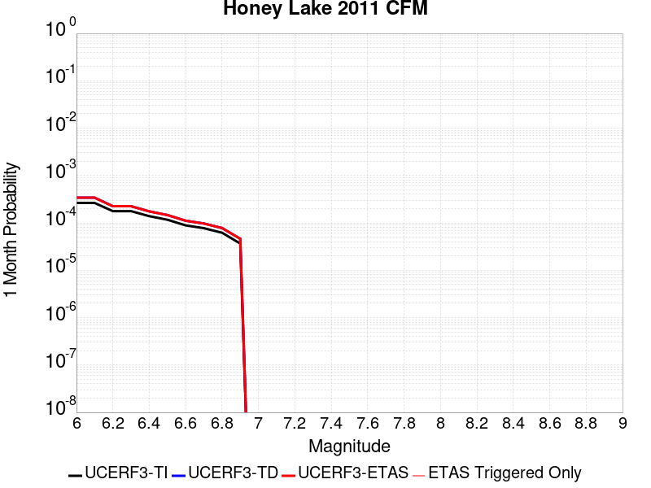 | 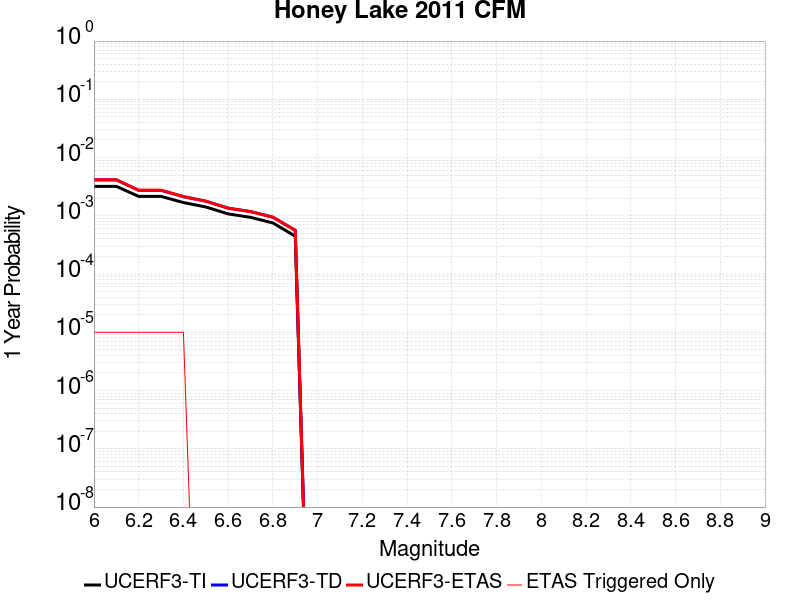 | 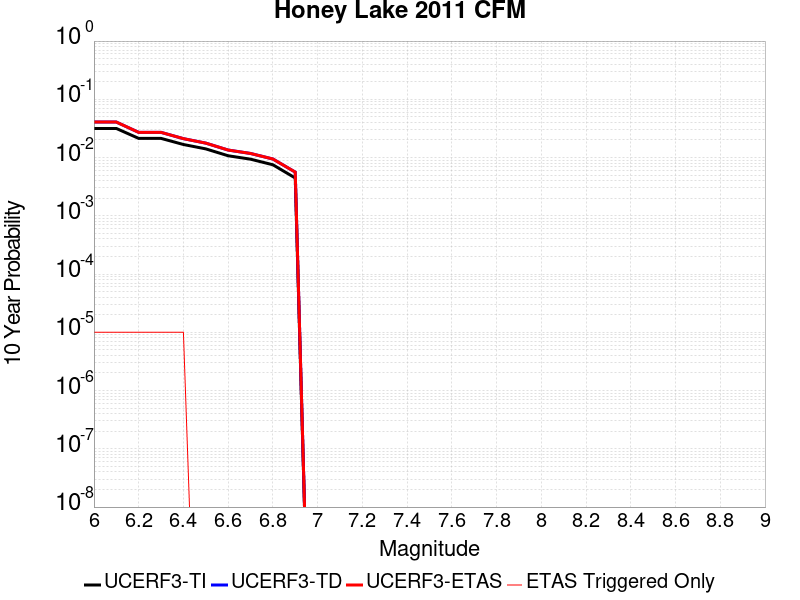 |

| Magnitude | 1 wk TI Prob | 1 wk TD Prob | 1 wk ETAS Prob | 1 wk ETAS/TD Gain | 1 wk ETAS Triggered Only | 1 mo TI Prob | 1 mo TD Prob | 1 mo ETAS Prob | 1 mo ETAS/TD Gain | 1 mo ETAS Triggered Only | 1 yr TI Prob | 1 yr TD Prob | 1 yr ETAS Prob | 1 yr ETAS/TD Gain | 1 yr ETAS Triggered Only | 10 yr TI Prob | 10 yr TD Prob | 10 yr ETAS Prob | 10 yr ETAS/TD Gain | 10 yr ETAS Triggered Only |
|-----|-----|-----|-----|-----|-----|-----|-----|-----|-----|-----|-----|-----|-----|-----|-----|-----|-----|-----|-----|-----|
| 6.0 | 6.155506E-5 | 7.954708E-5 | 7.954708E-5 | 1.0 | 0.0 | 2.6378073E-4 | 3.4087323E-4 | 3.4087323E-4 | 1.0 | 0.0 | 0.0032068014 | 0.0041426765 | 0.004152635 | 1.0024039 | 1.0E-5 | 0.03160919 | 0.040703055 | 0.040712647 | 1.0002357 | 1.0E-5 |
| 6.1 | 6.155506E-5 | 7.954708E-5 | 7.954708E-5 | 1.0 | 0.0 | 2.6378073E-4 | 3.4087323E-4 | 3.4087323E-4 | 1.0 | 0.0 | 0.0032068014 | 0.0041426765 | 0.004152635 | 1.0024039 | 1.0E-5 | 0.03160919 | 0.040703055 | 0.040712647 | 1.0002357 | 1.0E-5 |
| 6.2 | 4.1335024E-5 | 5.257652E-5 | 5.257652E-5 | 1.0 | 0.0 | 1.7713808E-4 | 2.2530954E-4 | 2.2530954E-4 | 1.0 | 0.0 | 0.0021545228 | 0.0027398444 | 0.002749817 | 1.0036398 | 1.0E-5 | 0.021337535 | 0.027076809 | 0.027086537 | 1.0003593 | 1.0E-5 |
| 6.3 | 4.1335024E-5 | 5.257652E-5 | 5.257652E-5 | 1.0 | 0.0 | 1.7713808E-4 | 2.2530954E-4 | 2.2530954E-4 | 1.0 | 0.0 | 0.0021545228 | 0.0027398444 | 0.002749817 | 1.0036398 | 1.0E-5 | 0.021337535 | 0.027076809 | 0.027086537 | 1.0003593 | 1.0E-5 |
| 6.4 | 3.2393702E-5 | 4.0887273E-5 | 4.0887273E-5 | 1.0 | 0.0 | 1.3882275E-4 | 1.7522006E-4 | 1.7522006E-4 | 1.0 | 0.0 | 0.0016888566 | 0.0021313233 | 0.002141302 | 1.004682 | 1.0E-5 | 0.016760793 | 0.021119867 | 0.021129655 | 1.0004635 | 1.0E-5 |
| 6.5 | 2.7205504E-5 | 3.4211767E-5 | 3.4211767E-5 | 1.0 | 0.0 | 1.1658981E-4 | 1.4661417E-4 | 1.4661417E-4 | 1.0 | 0.0 | 0.0014185566 | 0.0017836596 | 0.0017836596 | 1.0 | 0.0 | 0.014095354 | 0.017702963 | 0.017702963 | 1.0 | 0.0 |
| 6.6 | 2.069265E-5 | 2.5955416E-5 | 2.5955416E-5 | 1.0 | 0.0 | 8.867977E-5 | 1.1123324E-4 | 1.1123324E-4 | 1.0 | 0.0 | 0.0010791414 | 0.0013535074 | 0.0013535074 | 1.0 | 0.0 | 0.010739161 | 0.0134610105 | 0.0134610105 | 1.0 | 0.0 |
| 6.7 | 1.8060919E-5 | 2.265683E-5 | 2.265683E-5 | 1.0 | 0.0 | 7.7401644E-5 | 9.7097545E-5 | 9.7097545E-5 | 1.0 | 0.0 | 9.419576E-4 | 0.0011816025 | 0.0011816025 | 1.0 | 0.0 | 0.009379748 | 0.0117612425 | 0.0117612425 | 1.0 | 0.0 |
| 6.8 | 1.4474663E-5 | 1.8181274E-5 | 1.8181274E-5 | 1.0 | 0.0 | 6.203279E-5 | 7.791785E-5 | 7.791785E-5 | 1.0 | 0.0 | 7.5498753E-4 | 9.4831345E-4 | 9.4831345E-4 | 1.0 | 0.0 | 0.007524277 | 0.009450195 | 0.009450195 | 1.0 | 0.0 |
| 6.9 | 8.564552E-6 | 1.0802311E-5 | 1.0802311E-5 | 1.0 | 0.0 | 3.6704707E-5 | 4.6295176E-5 | 4.6295176E-5 | 1.0 | 0.0 | 4.4678818E-4 | 5.635644E-4 | 5.635644E-4 | 1.0 | 0.0 | 0.0044589094 | 0.0056278505 | 0.0056278505 | 1.0 | 0.0 |

## Casmalia 2011 CFM
*[(top)](#table-of-contents)*

| 1 Week | 1 Month | 1 Year | 10 Year |
|-----|-----|-----|-----|
|  | 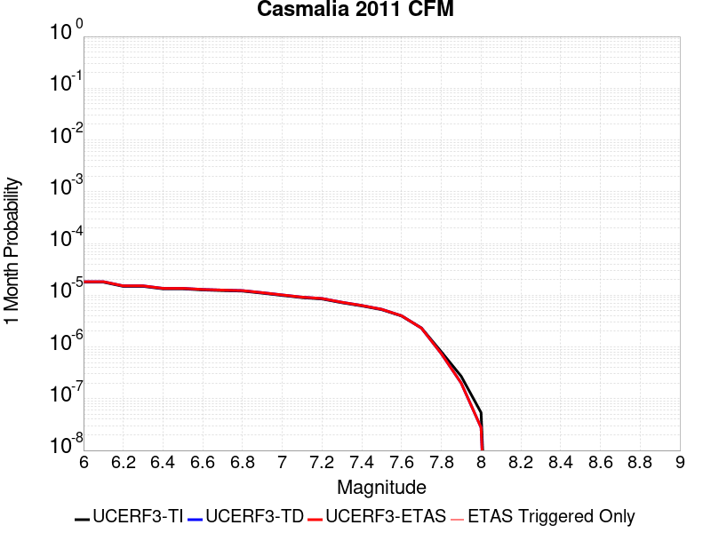 | 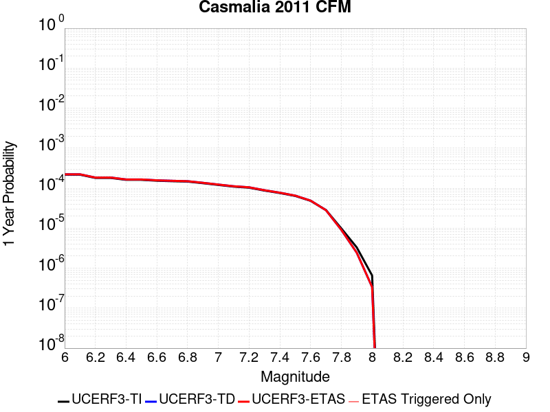 | 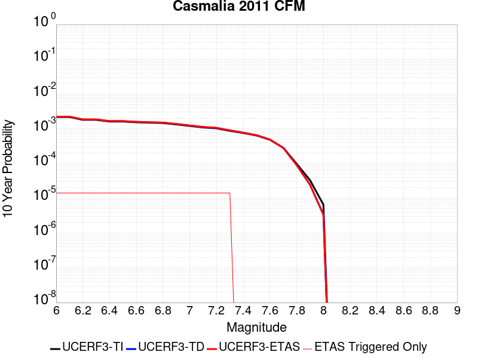 |

| Magnitude | 1 wk TI Prob | 1 wk TD Prob | 1 wk ETAS Prob | 1 wk ETAS/TD Gain | 1 wk ETAS Triggered Only | 1 mo TI Prob | 1 mo TD Prob | 1 mo ETAS Prob | 1 mo ETAS/TD Gain | 1 mo ETAS Triggered Only | 1 yr TI Prob | 1 yr TD Prob | 1 yr ETAS Prob | 1 yr ETAS/TD Gain | 1 yr ETAS Triggered Only | 10 yr TI Prob | 10 yr TD Prob | 10 yr ETAS Prob | 10 yr ETAS/TD Gain | 10 yr ETAS Triggered Only |
|-----|-----|-----|-----|-----|-----|-----|-----|-----|-----|-----|-----|-----|-----|-----|-----|-----|-----|-----|-----|-----|
| 6.0 | 4.1704893E-6 | 4.2624843E-6 | 4.2624843E-6 | 1.0 | 0.0 | 1.7873403E-5 | 1.8267663E-5 | 1.8267663E-5 | 1.0 | 0.0 | 2.1758694E-4 | 2.223863E-4 | 2.223863E-4 | 1.0 | 0.0 | 0.0021737402 | 0.0022216584 | 0.0022316363 | 1.0044911 | 1.0E-5 |
| 6.1 | 4.1704893E-6 | 4.2624843E-6 | 4.2624843E-6 | 1.0 | 0.0 | 1.7873403E-5 | 1.8267663E-5 | 1.8267663E-5 | 1.0 | 0.0 | 2.1758694E-4 | 2.223863E-4 | 2.223863E-4 | 1.0 | 0.0 | 0.0021737402 | 0.0022216584 | 0.0022316363 | 1.0044911 | 1.0E-5 |
| 6.2 | 3.457312E-6 | 3.537023E-6 | 3.537023E-6 | 1.0 | 0.0 | 1.4816967E-5 | 1.5158583E-5 | 1.5158583E-5 | 1.0 | 0.0 | 1.8038164E-4 | 1.845402E-4 | 1.845402E-4 | 1.0 | 0.0 | 0.001802353 | 0.0018438791 | 0.0018538607 | 1.0054133 | 1.0E-5 |
| 6.3 | 3.457312E-6 | 3.537023E-6 | 3.537023E-6 | 1.0 | 0.0 | 1.4816967E-5 | 1.5158583E-5 | 1.5158583E-5 | 1.0 | 0.0 | 1.8038164E-4 | 1.845402E-4 | 1.845402E-4 | 1.0 | 0.0 | 0.001802353 | 0.0018438791 | 0.0018538607 | 1.0054133 | 1.0E-5 |
| 6.4 | 3.0957337E-6 | 3.169227E-6 | 3.169227E-6 | 1.0 | 0.0 | 1.3267363E-5 | 1.3582331E-5 | 1.3582331E-5 | 1.0 | 0.0 | 1.6151817E-4 | 1.653524E-4 | 1.653524E-4 | 1.0 | 0.0 | 0.0016140083 | 0.0016522998 | 0.0016622832 | 1.0060421 | 1.0E-5 |
| 6.5 | 3.0957337E-6 | 3.169227E-6 | 3.169227E-6 | 1.0 | 0.0 | 1.3267363E-5 | 1.3582331E-5 | 1.3582331E-5 | 1.0 | 0.0 | 1.6151817E-4 | 1.653524E-4 | 1.653524E-4 | 1.0 | 0.0 | 0.0016140083 | 0.0016522998 | 0.0016622832 | 1.0060421 | 1.0E-5 |
| 6.6 | 2.9459152E-6 | 3.0165766E-6 | 3.0165766E-6 | 1.0 | 0.0 | 1.262529E-5 | 1.2928121E-5 | 1.2928121E-5 | 1.0 | 0.0 | 1.5370206E-4 | 1.5738855E-4 | 1.5738855E-4 | 1.0 | 0.0 | 0.0015359579 | 0.0015727765 | 0.0015827608 | 1.0063481 | 1.0E-5 |
| 6.7 | 2.8634809E-6 | 2.932474E-6 | 2.932474E-6 | 1.0 | 0.0 | 1.2272003E-5 | 1.2567685E-5 | 1.2567685E-5 | 1.0 | 0.0 | 1.4940138E-4 | 1.5300087E-4 | 1.5300087E-4 | 1.0 | 0.0 | 0.0014930099 | 0.0015289608 | 0.0015389455 | 1.0065304 | 1.0E-5 |
| 6.8 | 2.7999822E-6 | 2.867598E-6 | 2.867598E-6 | 1.0 | 0.0 | 1.1999869E-5 | 1.2289648E-5 | 1.2289648E-5 | 1.0 | 0.0 | 1.460886E-4 | 1.4961624E-4 | 1.4961624E-4 | 1.0 | 0.0 | 0.001459926 | 0.0014951604 | 0.0015051455 | 1.0066782 | 1.0E-5 |
| 6.9 | 2.551052E-6 | 2.6119662E-6 | 2.6119662E-6 | 1.0 | 0.0 | 1.0933034E-5 | 1.1194093E-5 | 1.1194093E-5 | 1.0 | 0.0 | 1.3310155E-4 | 1.3627959E-4 | 1.3627959E-4 | 1.0 | 0.0 | 0.0013302186 | 0.0013619643 | 0.0013719506 | 1.0073323 | 1.0E-5 |
| 7.0 | 2.3081875E-6 | 2.3624102E-6 | 2.3624102E-6 | 1.0 | 0.0 | 9.892195E-6 | 1.0124576E-5 | 1.0124576E-5 | 1.0 | 0.0 | 1.20430814E-4 | 1.2325977E-4 | 1.2325977E-4 | 1.0 | 0.0 | 0.0012036557 | 0.0012319168 | 0.0012419046 | 1.0081074 | 1.0E-5 |
| 7.1 | 2.093245E-6 | 2.1417256E-6 | 2.1417256E-6 | 1.0 | 0.0 | 8.971019E-6 | 9.1787915E-6 | 9.1787915E-6 | 1.0 | 0.0 | 1.09216686E-4 | 1.1174608E-4 | 1.1174608E-4 | 1.0 | 0.0 | 0.0010916302 | 0.0011169009 | 0.0011268897 | 1.0089433 | 1.0E-5 |
| 7.2 | 1.9714576E-6 | 2.0165105E-6 | 2.0165105E-6 | 1.0 | 0.0 | 8.449076E-6 | 8.642159E-6 | 8.642159E-6 | 1.0 | 0.0 | 1.0286264E-4 | 1.0521322E-4 | 1.0521322E-4 | 1.0 | 0.0 | 0.0010281504 | 0.001051636 | 0.0010616254 | 1.009499 | 1.0E-5 |
| 7.3 | 1.6689512E-6 | 1.7047145E-6 | 1.7047145E-6 | 1.0 | 0.0 | 7.1526288E-6 | 7.3058986E-6 | 7.3058986E-6 | 1.0 | 0.0 | 8.7079774E-5 | 8.894569E-5 | 8.894569E-5 | 1.0 | 0.0 | 8.7045657E-4 | 8.891017E-4 | 8.990928E-4 | 1.0112373 | 1.0E-5 |
| 7.4 | 1.4490954E-6 | 1.4778922E-6 | 1.4778922E-6 | 1.0 | 0.0 | 6.210394E-6 | 6.333808E-6 | 6.333808E-6 | 1.0 | 0.0 | 7.560892E-5 | 7.711139E-5 | 7.711139E-5 | 1.0 | 0.0 | 7.55832E-4 | 7.7084696E-4 | 7.7084696E-4 | 1.0 | 0.0 |
| 7.5 | 1.226873E-6 | 1.2481714E-6 | 1.2481714E-6 | 1.0 | 0.0 | 5.2580162E-6 | 5.3492954E-6 | 5.3492954E-6 | 1.0 | 0.0 | 6.401447E-5 | 6.512573E-5 | 6.512573E-5 | 1.0 | 0.0 | 6.399603E-4 | 6.5106695E-4 | 6.5106695E-4 | 1.0 | 0.0 |
| 7.6 | 9.2561345E-7 | 9.3619366E-7 | 9.3619366E-7 | 1.0 | 0.0 | 3.966909E-6 | 4.0122522E-6 | 4.0122522E-6 | 1.0 | 0.0 | 4.8296046E-5 | 4.884808E-5 | 4.884808E-5 | 1.0 | 0.0 | 4.828555E-4 | 4.8837386E-4 | 4.8837386E-4 | 1.0 | 0.0 |
| 7.7 | 5.4367933E-7 | 5.3929017E-7 | 5.3929017E-7 | 1.0 | 0.0 | 2.3300522E-6 | 2.3112416E-6 | 2.3112416E-6 | 1.0 | 0.0 | 2.8368017E-5 | 2.8139004E-5 | 2.8139004E-5 | 1.0 | 0.0 | 2.8364395E-4 | 2.8135453E-4 | 2.8135453E-4 | 1.0 | 0.0 |
| 7.8 | 1.8825742E-7 | 1.7342425E-7 | 1.7342425E-7 | 1.0 | 0.0 | 8.068173E-7 | 7.432466E-7 | 7.432466E-7 | 1.0 | 0.0 | 9.822956E-6 | 9.048989E-6 | 9.048989E-6 | 1.0 | 0.0 | 9.822522E-5 | 9.048623E-5 | 9.048623E-5 | 1.0 | 0.0 |
| 7.9 | 6.342771E-8 | 4.679002E-8 | 4.679002E-8 | 1.0 | 0.0 | 2.7183304E-7 | 2.0052863E-7 | 2.0052863E-7 | 1.0 | 0.0 | 3.3095623E-6 | 2.4414335E-6 | 2.4414335E-6 | 1.0 | 0.0 | 3.309513E-5 | 2.441407E-5 | 2.441407E-5 | 1.0 | 0.0 |
| 8.0 | 1.2574819E-8 | 6.4727095E-9 | 6.4727095E-9 | 1.0 | 0.0 | 5.3892084E-8 | 2.7740182E-8 | 2.7740182E-8 | 1.0 | 0.0 | 6.561359E-7 | 3.3773665E-7 | 3.3773665E-7 | 1.0 | 0.0 | 6.56134E-6 | 3.3773617E-6 | 3.3773617E-6 | 1.0 | 0.0 |

## Franklin 2011 CFM
*[(top)](#table-of-contents)*

| 1 Week | 1 Month | 1 Year | 10 Year |
|-----|-----|-----|-----|
| 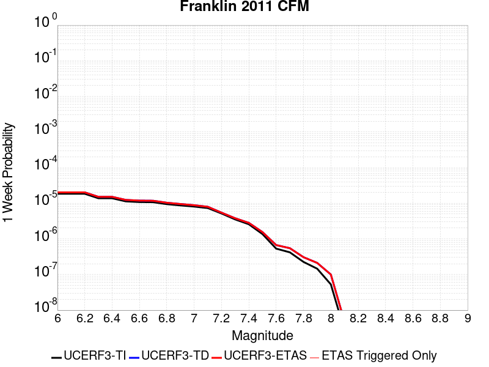 | 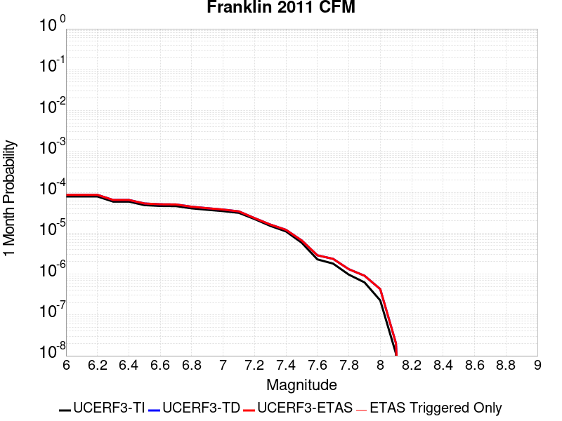 | 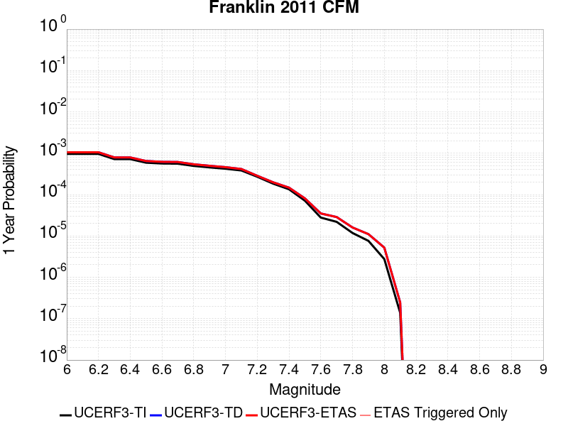 | 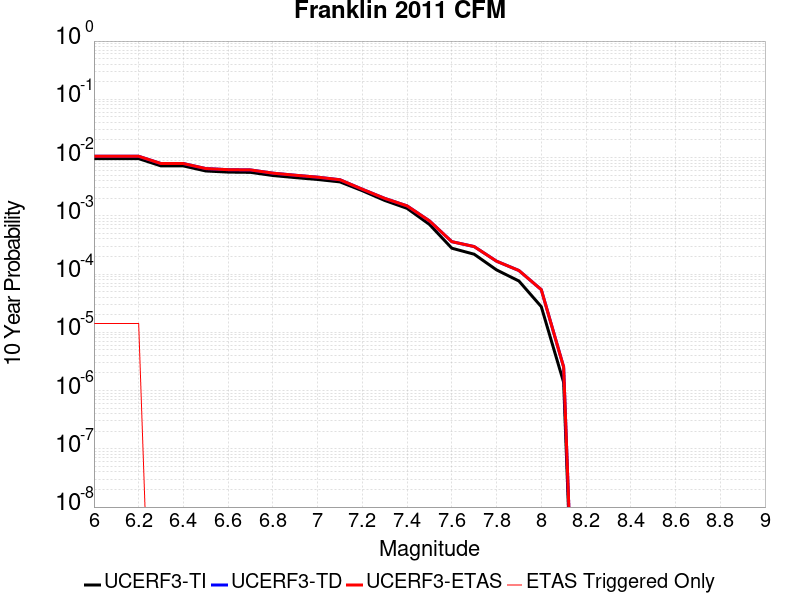 |

| Magnitude | 1 wk TI Prob | 1 wk TD Prob | 1 wk ETAS Prob | 1 wk ETAS/TD Gain | 1 wk ETAS Triggered Only | 1 mo TI Prob | 1 mo TD Prob | 1 mo ETAS Prob | 1 mo ETAS/TD Gain | 1 mo ETAS Triggered Only | 1 yr TI Prob | 1 yr TD Prob | 1 yr ETAS Prob | 1 yr ETAS/TD Gain | 1 yr ETAS Triggered Only | 10 yr TI Prob | 10 yr TD Prob | 10 yr ETAS Prob | 10 yr ETAS/TD Gain | 10 yr ETAS Triggered Only |
|-----|-----|-----|-----|-----|-----|-----|-----|-----|-----|-----|-----|-----|-----|-----|-----|-----|-----|-----|-----|-----|
| 6.0 | 1.845602E-5 | 2.0212667E-5 | 2.0212667E-5 | 1.0 | 0.0 | 7.9094825E-5 | 8.6623004E-5 | 8.6623004E-5 | 1.0 | 0.0 | 9.6255407E-4 | 0.0010541538 | 0.0010541538 | 1.0 | 0.0 | 0.009583955 | 0.010508837 | 0.010518732 | 1.0009416 | 1.0E-5 |
| 6.1 | 1.845602E-5 | 2.0212667E-5 | 2.0212667E-5 | 1.0 | 0.0 | 7.9094825E-5 | 8.6623004E-5 | 8.6623004E-5 | 1.0 | 0.0 | 9.6255407E-4 | 0.0010541538 | 0.0010541538 | 1.0 | 0.0 | 0.009583955 | 0.010508837 | 0.010518732 | 1.0009416 | 1.0E-5 |
| 6.2 | 1.845602E-5 | 2.0212667E-5 | 2.0212667E-5 | 1.0 | 0.0 | 7.9094825E-5 | 8.6623004E-5 | 8.6623004E-5 | 1.0 | 0.0 | 9.6255407E-4 | 0.0010541538 | 0.0010541538 | 1.0 | 0.0 | 0.009583955 | 0.010508837 | 0.010518732 | 1.0009416 | 1.0E-5 |
| 6.3 | 1.3813506E-5 | 1.5154875E-5 | 1.5154875E-5 | 1.0 | 0.0 | 5.9199396E-5 | 6.494789E-5 | 6.494789E-5 | 1.0 | 0.0 | 7.205143E-4 | 7.904614E-4 | 7.904614E-4 | 1.0 | 0.0 | 0.007181826 | 0.007891684 | 0.007891684 | 1.0 | 0.0 |
| 6.4 | 1.3813506E-5 | 1.5154875E-5 | 1.5154875E-5 | 1.0 | 0.0 | 5.9199396E-5 | 6.494789E-5 | 6.494789E-5 | 1.0 | 0.0 | 7.205143E-4 | 7.904614E-4 | 7.904614E-4 | 1.0 | 0.0 | 0.007181826 | 0.007891684 | 0.007891684 | 1.0 | 0.0 |
| 6.5 | 1.1308949E-5 | 1.2417847E-5 | 1.2417847E-5 | 1.0 | 0.0 | 4.8466023E-5 | 5.321827E-5 | 5.321827E-5 | 1.0 | 0.0 | 5.899141E-4 | 6.477419E-4 | 6.477419E-4 | 1.0 | 0.0 | 0.0058835056 | 0.0064731706 | 0.0064731706 | 1.0 | 0.0 |
| 6.6 | 1.0813164E-5 | 1.187607E-5 | 1.187607E-5 | 1.0 | 0.0 | 4.6341313E-5 | 5.089646E-5 | 5.089646E-5 | 1.0 | 0.0 | 5.640594E-4 | 6.194901E-4 | 6.194901E-4 | 1.0 | 0.0 | 0.005626298 | 0.006192248 | 0.006192248 | 1.0 | 0.0 |
| 6.7 | 1.0706348E-5 | 1.1757834E-5 | 1.1757834E-5 | 1.0 | 0.0 | 4.5883542E-5 | 5.0389754E-5 | 5.0389754E-5 | 1.0 | 0.0 | 5.5848894E-4 | 6.1332446E-4 | 6.1332446E-4 | 1.0 | 0.0 | 0.005570874 | 0.006130933 | 0.006130933 | 1.0 | 0.0 |
| 6.8 | 9.443655E-6 | 1.0349157E-5 | 1.0349157E-5 | 1.0 | 0.0 | 4.0472176E-5 | 4.435278E-5 | 4.435278E-5 | 1.0 | 0.0 | 4.9263734E-4 | 5.3986267E-4 | 5.3986267E-4 | 1.0 | 0.0 | 0.0049154665 | 0.0054000774 | 0.0054000774 | 1.0 | 0.0 |
| 6.9 | 8.7001645E-6 | 9.522226E-6 | 9.522226E-6 | 1.0 | 0.0 | 3.728589E-5 | 4.0808907E-5 | 4.0808907E-5 | 1.0 | 0.0 | 4.538611E-4 | 4.967364E-4 | 4.967364E-4 | 1.0 | 0.0 | 0.0045293528 | 0.004970812 | 0.004970812 | 1.0 | 0.0 |
| 7.0 | 8.074731E-6 | 8.815842E-6 | 8.815842E-6 | 1.0 | 0.0 | 3.460553E-5 | 3.778164E-5 | 3.778164E-5 | 1.0 | 0.0 | 4.212409E-4 | 4.5989547E-4 | 4.5989547E-4 | 1.0 | 0.0 | 0.004204433 | 0.0046039745 | 0.0046039745 | 1.0 | 0.0 |
| 7.1 | 7.3370957E-6 | 7.961713E-6 | 7.961713E-6 | 1.0 | 0.0 | 3.1444317E-5 | 3.412119E-5 | 3.412119E-5 | 1.0 | 0.0 | 3.8276732E-4 | 4.1534728E-4 | 4.1534728E-4 | 1.0 | 0.0 | 0.0038210868 | 0.0041600685 | 0.0041600685 | 1.0 | 0.0 |
| 7.2 | 5.1750103E-6 | 5.457141E-6 | 5.457141E-6 | 1.0 | 0.0 | 2.2178427E-5 | 2.338754E-5 | 2.338754E-5 | 1.0 | 0.0 | 2.699889E-4 | 2.8470642E-4 | 2.8470642E-4 | 1.0 | 0.0 | 0.002696611 | 0.0028573358 | 0.0028573358 | 1.0 | 0.0 |
| 7.3 | 3.5221371E-6 | 3.7960758E-6 | 3.7960758E-6 | 1.0 | 0.0 | 1.5094786E-5 | 1.6268796E-5 | 1.6268796E-5 | 1.0 | 0.0 | 1.8376352E-4 | 1.980547E-4 | 1.980547E-4 | 1.0 | 0.0 | 0.0018361164 | 0.0019921293 | 0.0019921293 | 1.0 | 0.0 |
| 7.4 | 2.5749775E-6 | 2.8182237E-6 | 2.8182237E-6 | 1.0 | 0.0 | 1.1035571E-5 | 1.2078047E-5 | 1.2078047E-5 | 1.0 | 0.0 | 1.343498E-4 | 1.4704037E-4 | 1.4704037E-4 | 1.0 | 0.0 | 0.001342686 | 0.0014814398 | 0.0014814398 | 1.0 | 0.0 |
| 7.5 | 1.3642131E-6 | 1.5497532E-6 | 1.5497532E-6 | 1.0 | 0.0 | 5.8466144E-6 | 6.6417824E-6 | 6.6417824E-6 | 1.0 | 0.0 | 7.1180206E-5 | 8.086072E-5 | 8.086072E-5 | 1.0 | 0.0 | 7.115741E-4 | 8.1887894E-4 | 8.1887894E-4 | 1.0 | 0.0 |
| 7.6 | 5.329124E-7 | 6.701074E-7 | 6.701074E-7 | 1.0 | 0.0 | 2.2839083E-6 | 2.8718855E-6 | 2.8718855E-6 | 1.0 | 0.0 | 2.7806227E-5 | 3.496465E-5 | 3.496465E-5 | 1.0 | 0.0 | 2.780275E-4 | 3.5998534E-4 | 3.5998534E-4 | 1.0 | 0.0 |
| 7.7 | 4.199127E-7 | 5.486731E-7 | 5.486731E-7 | 1.0 | 0.0 | 1.7996247E-6 | 2.351454E-6 | 2.351454E-6 | 1.0 | 0.0 | 2.191021E-5 | 2.862858E-5 | 2.862858E-5 | 1.0 | 0.0 | 2.190805E-4 | 2.9645322E-4 | 2.9645322E-4 | 1.0 | 0.0 |
| 7.8 | 2.2586491E-7 | 3.0661545E-7 | 3.0661545E-7 | 1.0 | 0.0 | 9.67992E-7 | 1.3140656E-6 | 1.3140656E-6 | 1.0 | 0.0 | 1.178524E-5 | 1.5998632E-5 | 1.5998632E-5 | 1.0 | 0.0 | 1.17846146E-4 | 1.6630026E-4 | 1.6630026E-4 | 1.0 | 0.0 |
| 7.9 | 1.4568845E-7 | 2.1202912E-7 | 2.1202912E-7 | 1.0 | 0.0 | 6.243789E-7 | 9.0869594E-7 | 9.0869594E-7 | 1.0 | 0.0 | 7.601787E-6 | 1.1063317E-5 | 1.1063317E-5 | 1.0 | 0.0 | 7.601527E-5 | 1.15088624E-4 | 1.15088624E-4 | 1.0 | 0.0 |
| 8.0 | 5.2868224E-8 | 9.997299E-8 | 9.997299E-8 | 1.0 | 0.0 | 2.2657808E-7 | 4.284556E-7 | 4.284556E-7 | 1.0 | 0.0 | 2.7585847E-6 | 5.2164346E-6 | 5.2164346E-6 | 1.0 | 0.0 | 2.7585504E-5 | 5.4021348E-5 | 5.4021348E-5 | 1.0 | 0.0 |
| 8.1 | 2.654434E-9 | 4.7228426E-9 | 4.7228426E-9 | 1.0 | 0.0 | 1.1376145E-8 | 2.0240753E-8 | 2.0240753E-8 | 1.0 | 0.0 | 1.3850456E-7 | 2.4643114E-7 | 2.4643114E-7 | 1.0 | 0.0 | 1.3850448E-6 | 2.533639E-6 | 2.533639E-6 | 1.0 | 0.0 |

## San Andreas (North Coast) 2011 CFM
*[(top)](#table-of-contents)*

| 1 Week | 1 Month | 1 Year | 10 Year |
|-----|-----|-----|-----|
| 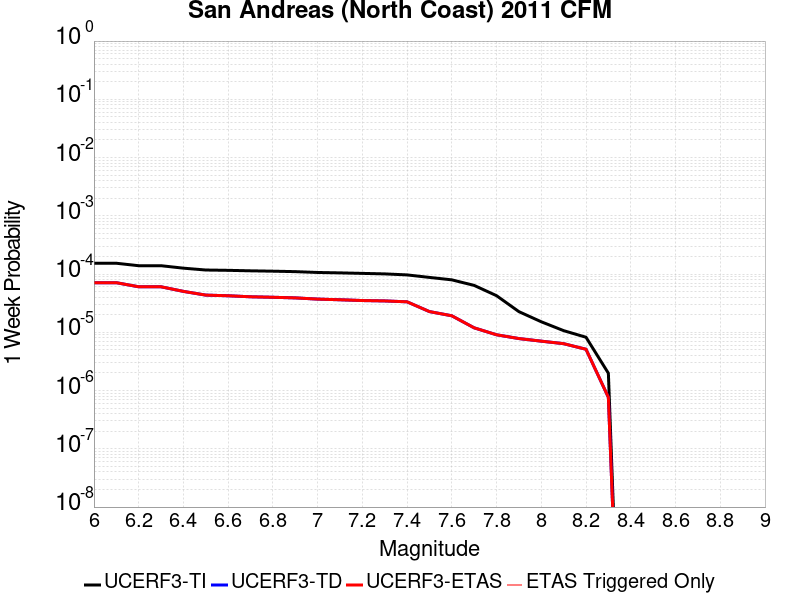 | 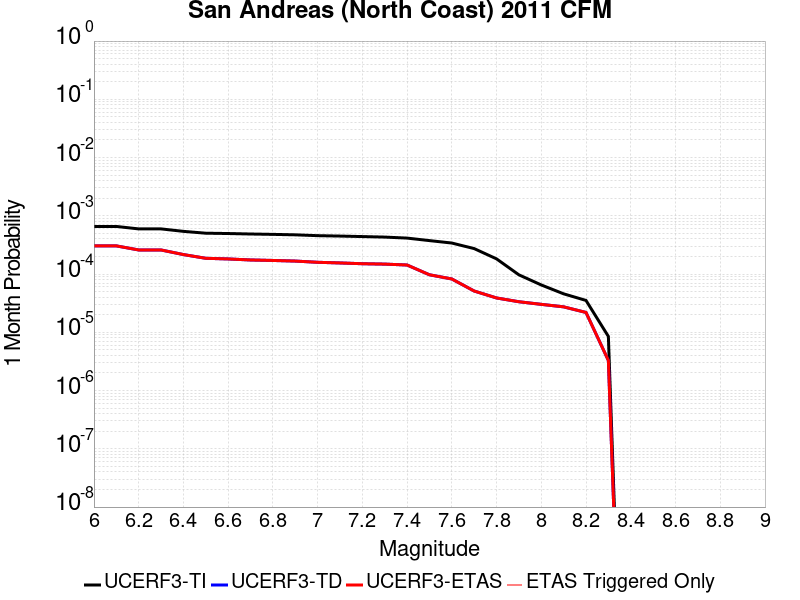 | 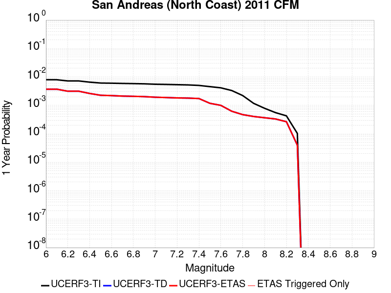 | 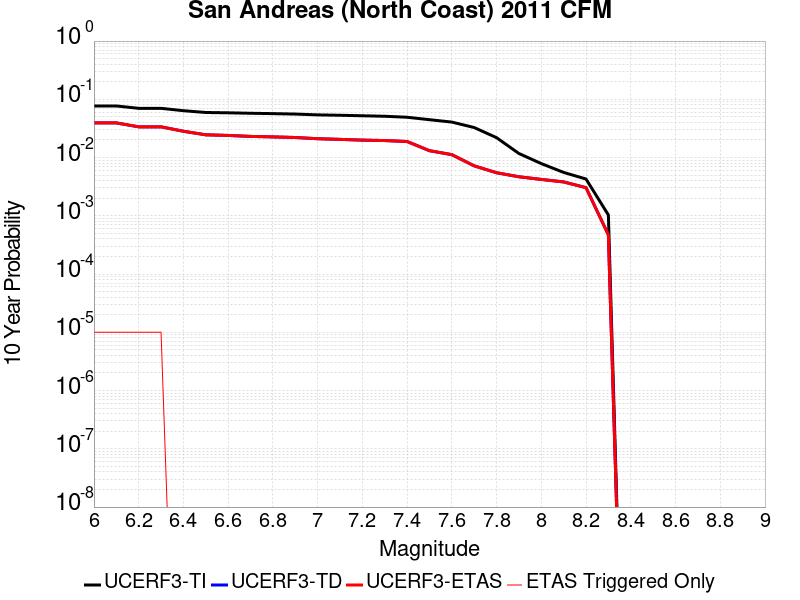 |

| Magnitude | 1 wk TI Prob | 1 wk TD Prob | 1 wk ETAS Prob | 1 wk ETAS/TD Gain | 1 wk ETAS Triggered Only | 1 mo TI Prob | 1 mo TD Prob | 1 mo ETAS Prob | 1 mo ETAS/TD Gain | 1 mo ETAS Triggered Only | 1 yr TI Prob | 1 yr TD Prob | 1 yr ETAS Prob | 1 yr ETAS/TD Gain | 1 yr ETAS Triggered Only | 10 yr TI Prob | 10 yr TD Prob | 10 yr ETAS Prob | 10 yr ETAS/TD Gain | 10 yr ETAS Triggered Only |
|-----|-----|-----|-----|-----|-----|-----|-----|-----|-----|-----|-----|-----|-----|-----|-----|-----|-----|-----|-----|-----|
| 6.0 | 1.5333705E-4 | 7.109695E-5 | 7.109695E-5 | 1.0 | 0.0 | 6.5699324E-4 | 3.046658E-4 | 3.046658E-4 | 1.0 | 0.0 | 0.007969595 | 0.0037030308 | 0.0037030308 | 1.0 | 0.0 | 0.0768977 | 0.039364267 | 0.039373875 | 1.000244 | 1.0E-5 |
| 6.1 | 1.5333705E-4 | 7.109695E-5 | 7.109695E-5 | 1.0 | 0.0 | 6.5699324E-4 | 3.046658E-4 | 3.046658E-4 | 1.0 | 0.0 | 0.007969595 | 0.0037030308 | 0.0037030308 | 1.0 | 0.0 | 0.0768977 | 0.039364267 | 0.039373875 | 1.000244 | 1.0E-5 |
| 6.2 | 1.3912938E-4 | 6.049243E-5 | 6.049243E-5 | 1.0 | 0.0 | 5.961325E-4 | 2.5922767E-4 | 2.5922767E-4 | 1.0 | 0.0 | 0.007233787 | 0.0031515562 | 0.0031515562 | 1.0 | 0.0 | 0.07002798 | 0.03369792 | 0.033707585 | 1.0002867 | 1.0E-5 |
| 6.3 | 1.3912938E-4 | 6.049243E-5 | 6.049243E-5 | 1.0 | 0.0 | 5.961325E-4 | 2.5922767E-4 | 2.5922767E-4 | 1.0 | 0.0 | 0.007233787 | 0.0031515562 | 0.0031515562 | 1.0 | 0.0 | 0.07002798 | 0.03369792 | 0.033707585 | 1.0002867 | 1.0E-5 |
| 6.4 | 1.2623647E-4 | 5.0433562E-5 | 5.0433562E-5 | 1.0 | 0.0 | 5.4090127E-4 | 2.1612605E-4 | 2.1612605E-4 | 1.0 | 0.0 | 0.0065656058 | 0.0026281793 | 0.0026281793 | 1.0 | 0.0 | 0.06374981 | 0.02830552 | 0.02830552 | 1.0 | 0.0 |
| 6.5 | 1.1736096E-4 | 4.3516375E-5 | 4.3516375E-5 | 1.0 | 0.0 | 5.028786E-4 | 1.8648551E-4 | 1.8648551E-4 | 1.0 | 0.0 | 0.006105373 | 0.0022681132 | 0.0022681132 | 1.0 | 0.0 | 0.05940335 | 0.024576947 | 0.024576947 | 1.0 | 0.0 |
| 6.6 | 1.1586959E-4 | 4.2416294E-5 | 4.2416294E-5 | 1.0 | 0.0 | 4.964894E-4 | 1.8177154E-4 | 1.8177154E-4 | 1.0 | 0.0 | 0.006028018 | 0.0022108385 | 0.0022108385 | 1.0 | 0.0 | 0.058671024 | 0.023982164 | 0.023982164 | 1.0 | 0.0 |
| 6.7 | 1.13693764E-4 | 4.0728228E-5 | 4.0728228E-5 | 1.0 | 0.0 | 4.87168E-4 | 1.7453796E-4 | 1.7453796E-4 | 1.0 | 0.0 | 0.005915152 | 0.0021229447 | 0.0021229447 | 1.0 | 0.0 | 0.057601593 | 0.023075242 | 0.023075242 | 1.0 | 0.0 |
| 6.8 | 1.1204889E-4 | 3.9945848E-5 | 3.9945848E-5 | 1.0 | 0.0 | 4.8012115E-4 | 1.7118535E-4 | 1.7118535E-4 | 1.0 | 0.0 | 0.005829819 | 0.0020822054 | 0.0020822054 | 1.0 | 0.0 | 0.05679232 | 0.022635331 | 0.022635331 | 1.0 | 0.0 |
| 6.9 | 1.1005794E-4 | 3.9001738E-5 | 3.9001738E-5 | 1.0 | 0.0 | 4.7159163E-4 | 1.6713967E-4 | 1.6713967E-4 | 1.0 | 0.0 | 0.0057265228 | 0.0020330423 | 0.0020330423 | 1.0 | 0.0 | 0.055811852 | 0.02210134 | 0.02210134 | 1.0 | 0.0 |
| 7.0 | 1.0647948E-4 | 3.7159174E-5 | 3.7159174E-5 | 1.0 | 0.0 | 4.562608E-4 | 1.5924397E-4 | 1.5924397E-4 | 1.0 | 0.0 | 0.0055408357 | 0.0019370868 | 0.0019370868 | 1.0 | 0.0 | 0.054047033 | 0.02105931 | 0.02105931 | 1.0 | 0.0 |
| 7.1 | 1.04795035E-4 | 3.620866E-5 | 3.620866E-5 | 1.0 | 0.0 | 4.4904428E-4 | 1.5517084E-4 | 1.5517084E-4 | 1.0 | 0.0 | 0.0054534175 | 0.0018875834 | 0.0018875834 | 1.0 | 0.0 | 0.053215165 | 0.02052821 | 0.02052821 | 1.0 | 0.0 |
| 7.2 | 1.02724036E-4 | 3.5117457E-5 | 3.5117457E-5 | 1.0 | 0.0 | 4.401716E-4 | 1.5049479E-4 | 1.5049479E-4 | 1.0 | 0.0 | 0.0053459285 | 0.0018307496 | 0.0018307496 | 1.0 | 0.0 | 0.052191395 | 0.01991573 | 0.01991573 | 1.0 | 0.0 |
| 7.3 | 1.00650694E-4 | 3.45853E-5 | 3.45853E-5 | 1.0 | 0.0 | 4.312888E-4 | 1.4821437E-4 | 1.4821437E-4 | 1.0 | 0.0 | 0.005238306 | 0.0018030318 | 0.0018030318 | 1.0 | 0.0 | 0.051165357 | 0.01959264 | 0.01959264 | 1.0 | 0.0 |
| 7.4 | 9.672919E-5 | 3.3374814E-5 | 3.3374814E-5 | 1.0 | 0.0 | 4.144878E-4 | 1.4302715E-4 | 1.4302715E-4 | 1.0 | 0.0 | 0.005034718 | 0.00173998 | 0.00173998 | 1.0 | 0.0 | 0.049221683 | 0.01886682 | 0.01886682 | 1.0 | 0.0 |
| 7.5 | 8.7600405E-5 | 2.2694192E-5 | 2.2694192E-5 | 1.0 | 0.0 | 3.753763E-4 | 9.725721E-5 | 9.725721E-5 | 1.0 | 0.0 | 0.0045606326 | 0.0011834651 | 0.0011834651 | 1.0 | 0.0 | 0.04468165 | 0.013127938 | 0.013127938 | 1.0 | 0.0 |
| 7.6 | 7.9562284E-5 | 1.922004E-5 | 1.922004E-5 | 1.0 | 0.0 | 3.4093665E-4 | 8.236901E-5 | 8.236901E-5 | 1.0 | 0.0 | 0.0041430052 | 0.0010023828 | 0.0010023828 | 1.0 | 0.0 | 0.040666126 | 0.0112194 | 0.0112194 | 1.0 | 0.0 |
| 7.7 | 6.3866544E-5 | 1.1936281E-5 | 1.1936281E-5 | 1.0 | 0.0 | 2.7368503E-4 | 5.115449E-5 | 5.115449E-5 | 1.0 | 0.0 | 0.0033270244 | 6.226282E-4 | 6.226282E-4 | 1.0 | 0.0 | 0.032776527 | 0.0072073294 | 0.0072073294 | 1.0 | 0.0 |
| 7.8 | 4.2543215E-5 | 9.0726735E-6 | 9.0726735E-6 | 1.0 | 0.0 | 1.8231533E-4 | 3.888231E-5 | 3.888231E-5 | 1.0 | 0.0 | 0.0022174292 | 4.7328937E-4 | 4.7328937E-4 | 1.0 | 0.0 | 0.021954332 | 0.0054884683 | 0.0054884683 | 1.0 | 0.0 |
| 7.9 | 2.2636612E-5 | 7.811842E-6 | 7.811842E-6 | 1.0 | 0.0 | 9.7010445E-5 | 3.3478893E-5 | 3.3478893E-5 | 1.0 | 0.0 | 0.0011804621 | 4.0752938E-4 | 4.0752938E-4 | 1.0 | 0.0 | 0.011742111 | 0.0046821116 | 0.0046821116 | 1.0 | 0.0 |
| 8.0 | 1.5167874E-5 | 7.0475517E-6 | 7.0475517E-6 | 1.0 | 0.0 | 6.500356E-5 | 3.0203442E-5 | 3.0203442E-5 | 1.0 | 0.0 | 7.9113094E-4 | 3.6766496E-4 | 3.6766496E-4 | 1.0 | 0.0 | 0.007883203 | 0.004214701 | 0.004214701 | 1.0 | 0.0 |
| 8.1 | 1.0681047E-5 | 6.3854363E-6 | 6.3854363E-6 | 1.0 | 0.0 | 4.5775112E-5 | 2.7365868E-5 | 2.7365868E-5 | 1.0 | 0.0 | 5.5716943E-4 | 3.331286E-4 | 3.331286E-4 | 1.0 | 0.0 | 0.0055577457 | 0.003816698 | 0.003816698 | 1.0 | 0.0 |
| 8.2 | 8.226114E-6 | 5.1139064E-6 | 5.1139064E-6 | 1.0 | 0.0 | 3.52543E-5 | 2.1916558E-5 | 2.1916558E-5 | 1.0 | 0.0 | 4.2913653E-4 | 2.6680148E-4 | 2.6680148E-4 | 1.0 | 0.0 | 0.004283088 | 0.0030445685 | 0.0030445685 | 1.0 | 0.0 |
| 8.3 | 1.983087E-6 | 7.6564595E-7 | 7.6564595E-7 | 1.0 | 0.0 | 8.498917E-6 | 3.281336E-6 | 3.281336E-6 | 1.0 | 0.0 | 1.034694E-4 | 3.9949547E-5 | 3.9949547E-5 | 1.0 | 0.0 | 0.0010342124 | 4.717979E-4 | 4.717979E-4 | 1.0 | 0.0 |

## West Napa 2011 CFM
*[(top)](#table-of-contents)*

| 1 Week | 1 Month | 1 Year | 10 Year |
|-----|-----|-----|-----|
|  | 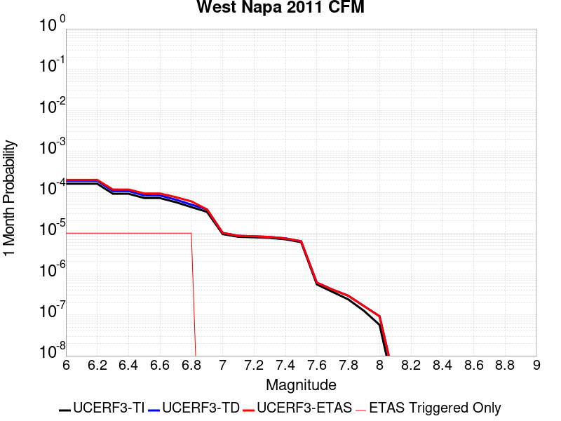 | 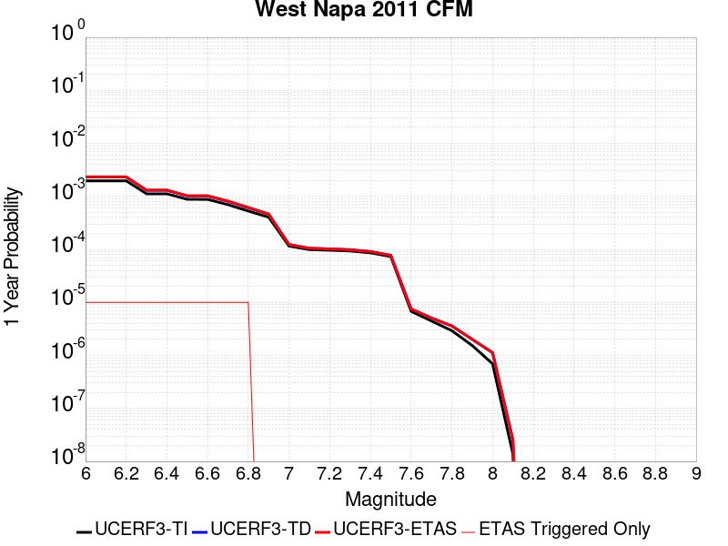 | 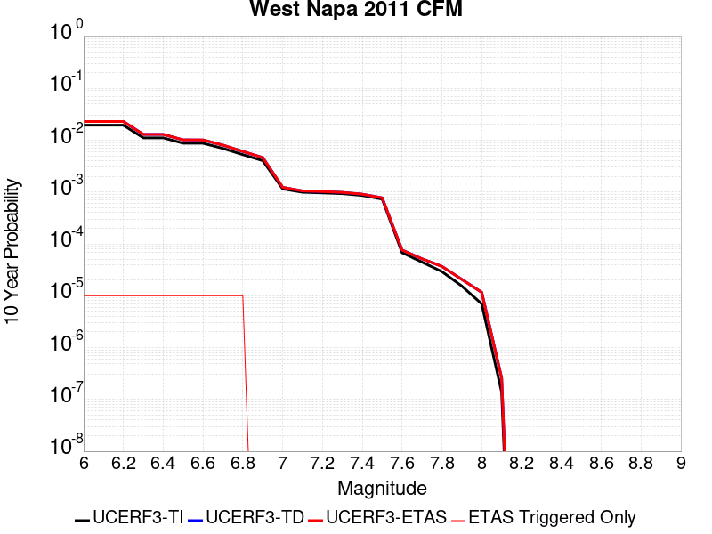 |

| Magnitude | 1 wk TI Prob | 1 wk TD Prob | 1 wk ETAS Prob | 1 wk ETAS/TD Gain | 1 wk ETAS Triggered Only | 1 mo TI Prob | 1 mo TD Prob | 1 mo ETAS Prob | 1 mo ETAS/TD Gain | 1 mo ETAS Triggered Only | 1 yr TI Prob | 1 yr TD Prob | 1 yr ETAS Prob | 1 yr ETAS/TD Gain | 1 yr ETAS Triggered Only | 10 yr TI Prob | 10 yr TD Prob | 10 yr ETAS Prob | 10 yr ETAS/TD Gain | 10 yr ETAS Triggered Only |
|-----|-----|-----|-----|-----|-----|-----|-----|-----|-----|-----|-----|-----|-----|-----|-----|-----|-----|-----|-----|-----|
| 6.0 | 3.773104E-5 | 4.4528504E-5 | 4.4528504E-5 | 1.0 | 0.0 | 1.6169442E-4 | 1.9082428E-4 | 2.0082238E-4 | 1.0523943 | 1.0E-5 | 0.001966852 | 0.0023211278 | 0.0023311046 | 1.0042982 | 1.0E-5 | 0.019495348 | 0.023002012 | 0.023011781 | 1.0004247 | 1.0E-5 |
| 6.1 | 3.773104E-5 | 4.4528504E-5 | 4.4528504E-5 | 1.0 | 0.0 | 1.6169442E-4 | 1.9082428E-4 | 2.0082238E-4 | 1.0523943 | 1.0E-5 | 0.001966852 | 0.0023211278 | 0.0023311046 | 1.0042982 | 1.0E-5 | 0.019495348 | 0.023002012 | 0.023011781 | 1.0004247 | 1.0E-5 |
| 6.2 | 3.773104E-5 | 4.4528504E-5 | 4.4528504E-5 | 1.0 | 0.0 | 1.6169442E-4 | 1.9082428E-4 | 2.0082238E-4 | 1.0523943 | 1.0E-5 | 0.001966852 | 0.0023211278 | 0.0023311046 | 1.0042982 | 1.0E-5 | 0.019495348 | 0.023002012 | 0.023011781 | 1.0004247 | 1.0E-5 |
| 6.3 | 2.147964E-5 | 2.4987066E-5 | 2.4987066E-5 | 1.0 | 0.0 | 9.2052345E-5 | 1.0708355E-4 | 1.17082476E-4 | 1.093375 | 1.0E-5 | 0.001120161 | 0.0013030542 | 0.0013130412 | 1.0076643 | 1.0E-5 | 0.011145315 | 0.012964482 | 0.0129743535 | 1.0007614 | 1.0E-5 |
| 6.4 | 2.147964E-5 | 2.4987066E-5 | 2.4987066E-5 | 1.0 | 0.0 | 9.2052345E-5 | 1.0708355E-4 | 1.17082476E-4 | 1.093375 | 1.0E-5 | 0.001120161 | 0.0013030542 | 0.0013130412 | 1.0076643 | 1.0E-5 | 0.011145315 | 0.012964482 | 0.0129743535 | 1.0007614 | 1.0E-5 |
| 6.5 | 1.688201E-5 | 1.9547371E-5 | 1.9547371E-5 | 1.0 | 0.0 | 7.234947E-5 | 8.377217E-5 | 9.3771334E-5 | 1.1193614 | 1.0E-5 | 8.804988E-4 | 0.0010195216 | 0.0010295114 | 1.0097985 | 1.0E-5 | 0.008770182 | 0.01015684 | 0.010166738 | 1.0009745 | 1.0E-5 |
| 6.6 | 1.6846381E-5 | 1.9507064E-5 | 1.9507064E-5 | 1.0 | 0.0 | 7.219678E-5 | 8.3599436E-5 | 9.35986E-5 | 1.119608 | 1.0E-5 | 8.7864127E-4 | 0.0010174206 | 0.0010274104 | 1.0098188 | 1.0E-5 | 0.008751754 | 0.010136021 | 0.010145919 | 1.0009766 | 1.0E-5 |
| 6.7 | 1.3396501E-5 | 1.5467684E-5 | 1.5467684E-5 | 1.0 | 0.0 | 5.7412315E-5 | 6.628875E-5 | 7.628809E-5 | 1.1508452 | 1.0E-5 | 6.9877075E-4 | 8.068302E-4 | 8.168221E-4 | 1.0123842 | 1.0E-5 | 0.0069657755 | 0.008046459 | 0.008056379 | 1.0012327 | 1.0E-5 |
| 6.8 | 1.0139058E-5 | 1.16721785E-5 | 1.16721785E-5 | 1.0 | 0.0 | 4.3452383E-5 | 5.0022976E-5 | 6.0022478E-5 | 1.1998981 | 1.0E-5 | 5.289043E-4 | 6.0891506E-4 | 6.1890896E-4 | 1.0164126 | 1.0E-5 | 0.005276473 | 0.0060791126 | 0.006089052 | 1.001635 | 1.0E-5 |
| 6.9 | 7.761281E-6 | 8.890723E-6 | 8.890723E-6 | 1.0 | 0.0 | 3.326221E-5 | 3.810283E-5 | 3.810283E-5 | 1.0 | 0.0 | 4.0489217E-4 | 4.6385458E-4 | 4.6385458E-4 | 1.0 | 0.0 | 0.0040415525 | 0.0046351026 | 0.0046351026 | 1.0 | 0.0 |
| 7.0 | 2.2109202E-6 | 2.3666319E-6 | 2.3666319E-6 | 1.0 | 0.0 | 9.475338E-6 | 1.01426685E-5 | 1.01426685E-5 | 1.0 | 0.0 | 1.1535613E-4 | 1.2348007E-4 | 1.2348007E-4 | 1.0 | 0.0 | 0.0011529627 | 0.0012353238 | 0.0012353238 | 1.0 | 0.0 |
| 7.1 | 1.9008926E-6 | 2.0133207E-6 | 2.0133207E-6 | 1.0 | 0.0 | 8.146657E-6 | 8.628488E-6 | 8.628488E-6 | 1.0 | 0.0 | 9.918104E-5 | 1.05046805E-4 | 1.05046805E-4 | 1.0 | 0.0 | 9.913679E-4 | 0.0010511756 | 0.0010511756 | 1.0 | 0.0 |
| 7.2 | 1.8495944E-6 | 1.9561273E-6 | 1.9561273E-6 | 1.0 | 0.0 | 7.926808E-6 | 8.383376E-6 | 8.383376E-6 | 1.0 | 0.0 | 9.650462E-5 | 1.0206285E-4 | 1.0206285E-4 | 1.0 | 0.0 | 9.6462725E-4 | 0.0010213639 | 0.0010213639 | 1.0 | 0.0 |
| 7.3 | 1.7883189E-6 | 1.8880897E-6 | 1.8880897E-6 | 1.0 | 0.0 | 7.664201E-6 | 8.091788E-6 | 8.091788E-6 | 1.0 | 0.0 | 9.330765E-5 | 9.85131E-5 | 9.85131E-5 | 1.0 | 0.0 | 9.3268487E-4 | 9.858976E-4 | 9.858976E-4 | 1.0 | 0.0 |
| 7.4 | 1.6520572E-6 | 1.7415113E-6 | 1.7415113E-6 | 1.0 | 0.0 | 7.0802257E-6 | 7.463598E-6 | 7.463598E-6 | 1.0 | 0.0 | 8.6198335E-5 | 9.086554E-5 | 9.086554E-5 | 1.0 | 0.0 | 8.616491E-4 | 9.0948684E-4 | 9.0948684E-4 | 1.0 | 0.0 |
| 7.5 | 1.4040345E-6 | 1.4800271E-6 | 1.4800271E-6 | 1.0 | 0.0 | 6.0172765E-6 | 6.342958E-6 | 6.342958E-6 | 1.0 | 0.0 | 7.325788E-5 | 7.72228E-5 | 7.72228E-5 | 1.0 | 0.0 | 7.3233736E-4 | 7.7311805E-4 | 7.7311805E-4 | 1.0 | 0.0 |
| 7.6 | 1.3013842E-7 | 1.4416163E-7 | 1.4416163E-7 | 1.0 | 0.0 | 5.57736E-7 | 6.178354E-7 | 6.178354E-7 | 1.0 | 0.0 | 6.790414E-6 | 7.52212E-6 | 7.52212E-6 | 1.0 | 0.0 | 6.790207E-5 | 7.61463E-5 | 7.61463E-5 | 1.0 | 0.0 |
| 7.7 | 8.541512E-8 | 9.716462E-8 | 9.716462E-8 | 1.0 | 0.0 | 3.6606474E-7 | 4.1641974E-7 | 4.1641974E-7 | 1.0 | 0.0 | 4.456829E-6 | 5.069898E-6 | 5.069898E-6 | 1.0 | 0.0 | 4.4567398E-5 | 5.160189E-5 | 5.160189E-5 | 1.0 | 0.0 |
| 7.8 | 5.6074793E-8 | 6.895456E-8 | 6.895456E-8 | 1.0 | 0.0 | 2.403205E-7 | 2.955195E-7 | 2.955195E-7 | 1.0 | 0.0 | 2.9258983E-6 | 3.597944E-6 | 3.597944E-6 | 1.0 | 0.0 | 2.9258597E-5 | 3.6812045E-5 | 3.6812045E-5 | 1.0 | 0.0 |
| 7.9 | 2.9475839E-8 | 3.8567407E-8 | 3.8567407E-8 | 1.0 | 0.0 | 1.2632502E-7 | 1.6528887E-7 | 1.6528887E-7 | 1.0 | 0.0 | 1.538006E-6 | 2.01239E-6 | 2.01239E-6 | 1.0 | 0.0 | 1.5379954E-5 | 2.0664074E-5 | 2.0664074E-5 | 1.0 | 0.0 |
| 8.0 | 1.3337122E-8 | 2.1632943E-8 | 2.1632943E-8 | 1.0 | 0.0 | 5.7159088E-8 | 9.2712604E-8 | 9.2712604E-8 | 1.0 | 0.0 | 6.959117E-7 | 1.1287754E-6 | 1.1287754E-6 | 1.0 | 0.0 | 6.959095E-6 | 1.1644432E-5 | 1.1644432E-5 | 1.0 | 0.0 |
| 8.1 | 2.6589986E-10 | 4.8617654E-10 | 4.8617654E-10 | 1.0 | 0.0 | 1.1395708E-9 | 2.0836133E-9 | 2.0836133E-9 | 1.0 | 0.0 | 1.3874274E-8 | 2.536799E-8 | 2.536799E-8 | 1.0 | 0.0 | 1.3874273E-7 | 2.6036727E-7 | 2.6036727E-7 | 1.0 | 0.0 |

## East Huasna 2011 CFM
*[(top)](#table-of-contents)*

| 1 Week | 1 Month | 1 Year | 10 Year |
|-----|-----|-----|-----|
|  |  |  |  |

| Magnitude | 1 wk TI Prob | 1 wk TD Prob | 1 wk ETAS Prob | 1 wk ETAS/TD Gain | 1 wk ETAS Triggered Only | 1 mo TI Prob | 1 mo TD Prob | 1 mo ETAS Prob | 1 mo ETAS/TD Gain | 1 mo ETAS Triggered Only | 1 yr TI Prob | 1 yr TD Prob | 1 yr ETAS Prob | 1 yr ETAS/TD Gain | 1 yr ETAS Triggered Only | 10 yr TI Prob | 10 yr TD Prob | 10 yr ETAS Prob | 10 yr ETAS/TD Gain | 10 yr ETAS Triggered Only |
|-----|-----|-----|-----|-----|-----|-----|-----|-----|-----|-----|-----|-----|-----|-----|-----|-----|-----|-----|-----|-----|
| 6.0 | 1.4658423E-6 | 1.471566E-6 | 1.471566E-6 | 1.0 | 0.0 | 6.282166E-6 | 6.3066964E-6 | 1.6306634E-5 | 2.585606 | 1.0E-5 | 7.6482684E-5 | 7.67814E-5 | 8.678063E-5 | 1.1302298 | 1.0E-5 | 7.645637E-4 | 7.6755567E-4 | 7.77548E-4 | 1.0130184 | 1.0E-5 |
| 6.1 | 1.4658423E-6 | 1.471566E-6 | 1.471566E-6 | 1.0 | 0.0 | 6.282166E-6 | 6.3066964E-6 | 1.6306634E-5 | 2.585606 | 1.0E-5 | 7.6482684E-5 | 7.67814E-5 | 8.678063E-5 | 1.1302298 | 1.0E-5 | 7.645637E-4 | 7.6755567E-4 | 7.77548E-4 | 1.0130184 | 1.0E-5 |
| 6.2 | 1.4658423E-6 | 1.471566E-6 | 1.471566E-6 | 1.0 | 0.0 | 6.282166E-6 | 6.3066964E-6 | 1.6306634E-5 | 2.585606 | 1.0E-5 | 7.6482684E-5 | 7.67814E-5 | 8.678063E-5 | 1.1302298 | 1.0E-5 | 7.645637E-4 | 7.6755567E-4 | 7.77548E-4 | 1.0130184 | 1.0E-5 |
| 6.3 | 1.4658423E-6 | 1.471566E-6 | 1.471566E-6 | 1.0 | 0.0 | 6.282166E-6 | 6.3066964E-6 | 1.6306634E-5 | 2.585606 | 1.0E-5 | 7.6482684E-5 | 7.67814E-5 | 8.678063E-5 | 1.1302298 | 1.0E-5 | 7.645637E-4 | 7.6755567E-4 | 7.77548E-4 | 1.0130184 | 1.0E-5 |
| 6.4 | 1.0488257E-6 | 1.0527515E-6 | 1.0527515E-6 | 1.0 | 0.0 | 4.4949593E-6 | 4.5117845E-6 | 1.4511739E-5 | 3.216408 | 1.0E-5 | 5.472476E-5 | 5.492961E-5 | 6.492906E-5 | 1.1820412 | 1.0E-5 | 5.4711284E-4 | 5.491622E-4 | 5.591567E-4 | 1.0181996 | 1.0E-5 |
| 6.5 | 1.0488257E-6 | 1.0527515E-6 | 1.0527515E-6 | 1.0 | 0.0 | 4.4949593E-6 | 4.5117845E-6 | 1.4511739E-5 | 3.216408 | 1.0E-5 | 5.472476E-5 | 5.492961E-5 | 6.492906E-5 | 1.1820412 | 1.0E-5 | 5.4711284E-4 | 5.491622E-4 | 5.591567E-4 | 1.0181996 | 1.0E-5 |
| 6.6 | 8.463064E-7 | 8.4936323E-7 | 8.4936323E-7 | 1.0 | 0.0 | 3.6270226E-6 | 3.6401232E-6 | 1.3640087E-5 | 3.74715 | 1.0E-5 | 4.4158103E-5 | 4.4317607E-5 | 5.4317163E-5 | 1.225634 | 1.0E-5 | 4.414933E-4 | 4.4308856E-4 | 4.5308413E-4 | 1.0225588 | 1.0E-5 |
| 6.7 | 7.876149E-7 | 7.902533E-7 | 7.902533E-7 | 1.0 | 0.0 | 3.375488E-6 | 3.3867955E-6 | 1.3386762E-5 | 3.9526336 | 1.0E-5 | 4.109579E-5 | 4.1233463E-5 | 5.1233048E-5 | 1.2425115 | 1.0E-5 | 4.108819E-4 | 4.1225873E-4 | 4.222546E-4 | 1.0242466 | 1.0E-5 |
| 6.8 | 6.9940785E-7 | 7.0165777E-7 | 7.0165777E-7 | 1.0 | 0.0 | 2.9974588E-6 | 3.0071012E-6 | 1.3007071E-5 | 4.325452 | 1.0E-5 | 3.649345E-5 | 3.6610847E-5 | 4.661048E-5 | 1.273133 | 1.0E-5 | 3.6487455E-4 | 3.6604863E-4 | 3.7604498E-4 | 1.0273088 | 1.0E-5 |
| 6.9 | 5.899658E-7 | 5.9155997E-7 | 5.9155997E-7 | 1.0 | 0.0 | 2.5284223E-6 | 2.5352545E-6 | 1.2535229E-5 | 4.9443674 | 1.0E-5 | 3.0783107E-5 | 3.086629E-5 | 4.086598E-5 | 1.323968 | 1.0E-5 | 3.0778843E-4 | 3.086203E-4 | 3.186172E-4 | 1.0323923 | 1.0E-5 |
| 7.0 | 4.793814E-7 | 4.803273E-7 | 4.803273E-7 | 1.0 | 0.0 | 2.05449E-6 | 2.058544E-6 | 1.2058524E-5 | 5.8577924 | 1.0E-5 | 2.501313E-5 | 2.5062485E-5 | 3.5062236E-5 | 1.3989928 | 1.0E-5 | 2.5010316E-4 | 2.505968E-4 | 2.6059427E-4 | 1.0398947 | 1.0E-5 |
| 7.1 | 4.1256908E-7 | 4.129941E-7 | 4.129941E-7 | 1.0 | 0.0 | 1.768152E-6 | 1.7699736E-6 | 1.1769956E-5 | 6.649792 | 1.0E-5 | 2.1527037E-5 | 2.1549216E-5 | 3.1549E-5 | 1.464044 | 1.0E-5 | 2.1524953E-4 | 2.1547142E-4 | 2.2546925E-4 | 1.0463998 | 1.0E-5 |
| 7.2 | 2.822599E-7 | 2.8161418E-7 | 2.8161418E-7 | 1.0 | 0.0 | 1.2096847E-6 | 1.2069174E-6 | 1.1206906E-5 | 9.285562 | 1.0E-5 | 1.47278115E-5 | 1.4694121E-5 | 2.4693974E-5 | 1.6805342 | 1.0E-5 | 1.4726835E-4 | 1.4693156E-4 | 1.569301E-4 | 1.0680488 | 1.0E-5 |
| 7.3 | 1.5261652E-7 | 1.5075021E-7 | 1.5075021E-7 | 1.0 | 0.0 | 6.540707E-7 | 6.460722E-7 | 1.0646066E-5 | 16.478138 | 1.0E-5 | 7.963281E-6 | 7.8659E-6 | 1.7865821E-5 | 2.2713003 | 1.0E-5 | 7.962996E-5 | 7.865624E-5 | 8.8655455E-5 | 1.1271255 | 1.0E-5 |
| 7.4 | 7.976414E-8 | 8.057865E-8 | 8.057865E-8 | 1.0 | 0.0 | 3.418463E-7 | 3.45337E-7 | 3.45337E-7 | 1.0 | 0.0 | 4.1619705E-6 | 4.2044703E-6 | 4.2044703E-6 | 1.0 | 0.0 | 4.161893E-5 | 4.2043914E-5 | 4.2043914E-5 | 1.0 | 0.0 |
| 7.5 | 4.2715055E-8 | 4.3202512E-8 | 4.3202512E-8 | 1.0 | 0.0 | 1.830645E-7 | 1.8515361E-7 | 1.8515361E-7 | 1.0 | 0.0 | 2.228808E-6 | 2.2542429E-6 | 2.2542429E-6 | 1.0 | 0.0 | 2.2287857E-5 | 2.2542203E-5 | 2.2542203E-5 | 1.0 | 0.0 |
| 7.6 | 2.1807532E-8 | 2.2057476E-8 | 2.2057476E-8 | 1.0 | 0.0 | 9.346085E-8 | 9.4532034E-8 | 9.4532034E-8 | 1.0 | 0.0 | 1.1378852E-6 | 1.1509269E-6 | 1.1509269E-6 | 1.0 | 0.0 | 1.1378794E-5 | 1.1509211E-5 | 1.1509211E-5 | 1.0 | 0.0 |
| 7.7 | 4.7196043E-9 | 4.767283E-9 | 4.767283E-9 | 1.0 | 0.0 | 2.0226874E-8 | 2.0431212E-8 | 2.0431212E-8 | 1.0 | 0.0 | 2.4626218E-7 | 2.4874998E-7 | 2.4874998E-7 | 1.0 | 0.0 | 2.462619E-6 | 2.487497E-6 | 2.487497E-6 | 1.0 | 0.0 |
| 7.8 | 7.400003E-11 | 7.4654505E-11 | 7.4654505E-11 | 1.0 | 0.0 | 3.171432E-10 | 3.1994773E-10 | 3.1994773E-10 | 1.0 | 0.0 | 3.861218E-9 | 3.895363E-9 | 3.895363E-9 | 1.0 | 0.0 | 3.861218E-8 | 3.895363E-8 | 3.895363E-8 | 1.0 | 0.0 |

## Carson Range (Genoa)
*[(top)](#table-of-contents)*

| 1 Week | 1 Month | 1 Year | 10 Year |
|-----|-----|-----|-----|
| 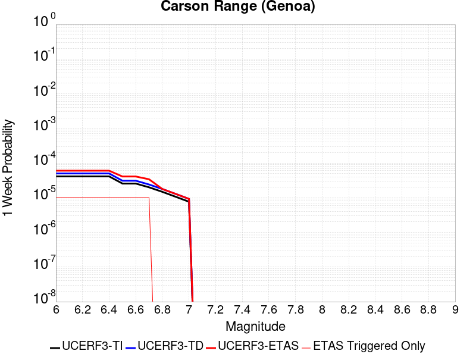 |  |  |  |

| Magnitude | 1 wk TI Prob | 1 wk TD Prob | 1 wk ETAS Prob | 1 wk ETAS/TD Gain | 1 wk ETAS Triggered Only | 1 mo TI Prob | 1 mo TD Prob | 1 mo ETAS Prob | 1 mo ETAS/TD Gain | 1 mo ETAS Triggered Only | 1 yr TI Prob | 1 yr TD Prob | 1 yr ETAS Prob | 1 yr ETAS/TD Gain | 1 yr ETAS Triggered Only | 10 yr TI Prob | 10 yr TD Prob | 10 yr ETAS Prob | 10 yr ETAS/TD Gain | 10 yr ETAS Triggered Only |
|-----|-----|-----|-----|-----|-----|-----|-----|-----|-----|-----|-----|-----|-----|-----|-----|-----|-----|-----|-----|-----|
| 6.0 | 4.1268457E-5 | 5.014691E-5 | 6.014641E-5 | 1.1994041 | 1.0E-5 | 1.7685282E-4 | 2.1489977E-4 | 2.2489764E-4 | 1.0465233 | 1.0E-5 | 0.0021510567 | 0.002613659 | 0.002623633 | 1.003816 | 1.0E-5 | 0.02130354 | 0.025868865 | 0.025878605 | 1.0003766 | 1.0E-5 |
| 6.1 | 4.1268457E-5 | 5.014691E-5 | 6.014641E-5 | 1.1994041 | 1.0E-5 | 1.7685282E-4 | 2.1489977E-4 | 2.2489764E-4 | 1.0465233 | 1.0E-5 | 0.0021510567 | 0.002613659 | 0.002623633 | 1.003816 | 1.0E-5 | 0.02130354 | 0.025868865 | 0.025878605 | 1.0003766 | 1.0E-5 |
| 6.2 | 4.1268457E-5 | 5.014691E-5 | 6.014641E-5 | 1.1994041 | 1.0E-5 | 1.7685282E-4 | 2.1489977E-4 | 2.2489764E-4 | 1.0465233 | 1.0E-5 | 0.0021510567 | 0.002613659 | 0.002623633 | 1.003816 | 1.0E-5 | 0.02130354 | 0.025868865 | 0.025878605 | 1.0003766 | 1.0E-5 |
| 6.3 | 4.1268457E-5 | 5.014691E-5 | 6.014641E-5 | 1.1994041 | 1.0E-5 | 1.7685282E-4 | 2.1489977E-4 | 2.2489764E-4 | 1.0465233 | 1.0E-5 | 0.0021510567 | 0.002613659 | 0.002623633 | 1.003816 | 1.0E-5 | 0.02130354 | 0.025868865 | 0.025878605 | 1.0003766 | 1.0E-5 |
| 6.4 | 4.1268457E-5 | 5.014691E-5 | 6.014641E-5 | 1.1994041 | 1.0E-5 | 1.7685282E-4 | 2.1489977E-4 | 2.2489764E-4 | 1.0465233 | 1.0E-5 | 0.0021510567 | 0.002613659 | 0.002623633 | 1.003816 | 1.0E-5 | 0.02130354 | 0.025868865 | 0.025878605 | 1.0003766 | 1.0E-5 |
| 6.5 | 2.5677185E-5 | 3.0978295E-5 | 4.0977986E-5 | 1.3227967 | 1.0E-5 | 1.1004044E-4 | 1.3275839E-4 | 1.4275707E-4 | 1.0753148 | 1.0E-5 | 0.0013389189 | 0.0016153152 | 0.0016252991 | 1.0061808 | 1.0E-5 | 0.0133088045 | 0.01605366 | 0.016063498 | 1.0006129 | 1.0E-5 |
| 6.6 | 2.5677185E-5 | 3.0978295E-5 | 4.0977986E-5 | 1.3227967 | 1.0E-5 | 1.1004044E-4 | 1.3275839E-4 | 1.4275707E-4 | 1.0753148 | 1.0E-5 | 0.0013389189 | 0.0016153152 | 0.0016252991 | 1.0061808 | 1.0E-5 | 0.0133088045 | 0.01605366 | 0.016063498 | 1.0006129 | 1.0E-5 |
| 6.7 | 1.9969408E-5 | 2.4063473E-5 | 3.4063232E-5 | 1.4155576 | 1.0E-5 | 8.558037E-5 | 1.0312596E-4 | 1.1312493E-4 | 1.0969588 | 1.0E-5 | 0.0010414429 | 0.0012549888 | 0.0012649763 | 1.0079582 | 1.0E-5 | 0.010365757 | 0.012494174 | 0.01250405 | 1.0007904 | 1.0E-5 |
| 6.8 | 1.4783156E-5 | 1.7817569E-5 | 1.7817569E-5 | 1.0 | 0.0 | 6.335485E-5 | 7.635951E-5 | 7.635951E-5 | 1.0 | 0.0 | 7.710722E-4 | 9.294107E-4 | 9.294107E-4 | 1.0 | 0.0 | 0.0076840227 | 0.009268024 | 0.009268024 | 1.0 | 0.0 |
| 6.9 | 1.06660555E-5 | 1.2877027E-5 | 1.2877027E-5 | 1.0 | 0.0 | 4.5710865E-5 | 5.518674E-5 | 5.518674E-5 | 1.0 | 0.0 | 5.5638765E-4 | 6.718067E-4 | 6.718067E-4 | 1.0 | 0.0 | 0.005549967 | 0.0067090564 | 0.0067090564 | 1.0 | 0.0 |
| 7.0 | 7.664838E-6 | 9.258307E-6 | 9.258307E-6 | 1.0 | 0.0 | 3.2848893E-5 | 3.9678456E-5 | 3.9678456E-5 | 1.0 | 0.0 | 3.998619E-4 | 4.830852E-4 | 4.830852E-4 | 1.0 | 0.0 | 0.0039914316 | 0.00483085 | 0.00483085 | 1.0 | 0.0 |

