# Parent Section Magnitude-Probability Distributions

Only fault sections with at least one triggered aftershock are plotted. Sections are sorted by total supraseismogenic trigger rate (decreasing)

## Table Of Contents

* [Garlock (Central)](#garlock-central)
* [Tank Canyon](#tank-canyon)
* [Little Lake](#little-lake)
* [Airport Lake](#airport-lake)
* [Owl Lake](#owl-lake)
* [Panamint Valley](#panamint-valley)
* [Garlock (East)](#garlock-east)
* [Hunter Mountain-Saline Valley](#hunter-mountain-saline-valley)
* [Blackwater](#blackwater)
* [Ash Hill](#ash-hill)
* [Garlock (West)](#garlock-west)
* [McLean Lake](#mclean-lake)
* [Gravel Hills-Harper Lk](#gravel-hills-harper-lk)
* [Goldstone Lake](#goldstone-lake)
* [San Andreas (Mojave S)](#san-andreas-mojave-s)
* [So Sierra Nevada](#so-sierra-nevada)
* [Coyote Canyon](#coyote-canyon)
* [San Andreas (Mojave N)](#san-andreas-mojave-n)
* [Death Valley (So)](#death-valley-so)
* [Nelson Lake](#nelson-lake)
* [Lenwood-Lockhart-Old Woman Springs](#lenwood-lockhart-old-woman-springs)
* [Towne Pass](#towne-pass)
* [San Andreas (San Bernardino N)](#san-andreas-san-bernardino-n)
* [Bicycle Lake](#bicycle-lake)
* [Paradise](#paradise)
* [Garlic Springs](#garlic-springs)
* [San Andreas (San Bernardino S)](#san-andreas-san-bernardino-s)
* [Helendale-So Lockhart](#helendale-so-lockhart)
* [Coyote Lake](#coyote-lake)
* [Death Valley (Black Mtns Frontal)](#death-valley-black-mtns-frontal)
* [San Andreas (Big Bend)](#san-andreas-big-bend)
* [San Andreas (San Gorgonio Pass-Garnet HIll)](#san-andreas-san-gorgonio-pass-garnet-hill)
* [San Andreas (Carrizo) rev](#san-andreas-carrizo-rev)
* [Sierra Nevada  (No Extension)](#sierra-nevada--no-extension)
* [San Andreas (Cholame) rev](#san-andreas-cholame-rev)
* [San Andreas (Parkfield)](#san-andreas-parkfield)
* [San Andreas (Coachella) rev](#san-andreas-coachella-rev)
* [Manix-Afton Hills](#manix-afton-hills)
* [Elsinore (Glen Ivy) rev](#elsinore-glen-ivy-rev)
* [Cady](#cady)
* [Calico-Hidalgo](#calico-hidalgo)
* [Death Valley (Fish Lake Valley)](#death-valley-fish-lake-valley)
* [Death Valley (No)](#death-valley-no)
* [San Andreas (North Branch Mill Creek)](#san-andreas-north-branch-mill-creek)
* [Red Pass](#red-pass)
* [Ludlow](#ludlow)
* [San Jacinto (San Bernardino)](#san-jacinto-san-bernardino)
* [San Andreas (Creeping Section) 2011 CFM](#san-andreas-creeping-section-2011-cfm)
* [Scodie Lineament](#scodie-lineament)
* [White Wolf (Extension)](#white-wolf-extension)
* [Baker](#baker)
* [Rose Canyon](#rose-canyon)
* [Santa Rosa Island](#santa-rosa-island)
* [San Jacinto (Stepovers Combined)](#san-jacinto-stepovers-combined)
* [Owens Valley](#owens-valley)
* [Brawley (Seismic Zone) alt 1](#brawley-seismic-zone-alt-1)
* [Santa Ynez (West)](#santa-ynez-west)
* [Lake Isabella (Seismicity)](#lake-isabella-seismicity)
* [Tin Mountain](#tin-mountain)
* [San Jacinto (San Jacinto Valley) rev](#san-jacinto-san-jacinto-valley-rev)
* [Pinto Mtn](#pinto-mtn)
* [Independence rev 2011](#independence-rev-2011)
* [Imperial](#imperial)
* [San Jacinto (Anza) rev](#san-jacinto-anza-rev)
* [Santa Ynez (East)](#santa-ynez-east)
* [Kern Canyon (North Kern) 2011](#kern-canyon-north-kern-2011)
* [Santa Cruz Catalina Ridge alt1](#santa-cruz-catalina-ridge-alt1)
* [Chino alt 1](#chino-alt-1)
* [Deep Springs](#deep-springs)
* [Oak Ridge (Onshore)](#oak-ridge-onshore)
* [Big Pine (East)](#big-pine-east)
* [Santa Cruz Island](#santa-cruz-island)
* [Mission Creek](#mission-creek)
* [White Mountains](#white-mountains)
* [Mission Ridge-Arroyo Parida-Santa Ana](#mission-ridge-arroyo-parida-santa-ana)
* [San Jacinto (Clark) rev](#san-jacinto-clark-rev)
* [Whittier alt 1](#whittier-alt-1)
* [Cucamonga](#cucamonga)
* [San Jacinto (Lytle Creek connector)](#san-jacinto-lytle-creek-connector)
* [Ventura-Pitas Point](#ventura-pitas-point)
* [Raymond](#raymond)
* [Simi-Santa Rosa](#simi-santa-rosa)
* [Hayward (No) 2011 CFM](#hayward-no-2011-cfm)
* [Big Pine (Central)](#big-pine-central)
* [San Jacinto (Borrego)](#san-jacinto-borrego)
* [Pleito](#pleito)
* [San Jacinto (Coyote Creek)](#san-jacinto-coyote-creek)
* [Cleghorn Pass](#cleghorn-pass)
* [Pine Mtn](#pine-mtn)
* [Bennett Valley 2011 CFM](#bennett-valley-2011-cfm)
* [Dry Mountain](#dry-mountain)
* [Channel Islands Thrust](#channel-islands-thrust)
* [Coronado Bank alt1](#coronado-bank-alt1)
* [Palos Verdes](#palos-verdes)
* [Lost Hills](#lost-hills)
* [Oceanic - West Huasna](#oceanic---west-huasna)
* [San Diego Trough north alt1](#san-diego-trough-north-alt1)
* [Owens Valley Keough Hot Springs](#owens-valley-keough-hot-springs)
* [Kern Canyon (Lake Isabella) 2011](#kern-canyon-lake-isabella-2011)
* [Santa Ynez River](#santa-ynez-river)
* [Kern Canyon (South Kern) 2011](#kern-canyon-south-kern-2011)
* [Channel Islands Western Deep Ramp](#channel-islands-western-deep-ramp)
* [Red Mountain](#red-mountain)
* [Blue Cut](#blue-cut)
* [Cleghorn](#cleghorn)
* [Pisgah-Bullion Mtn-Mesquite Lk](#pisgah-bullion-mtn-mesquite-lk)
* [Rodgers Creek - Healdsburg 2011 CFM](#rodgers-creek---healdsburg-2011-cfm)
* [San Pedro Basin](#san-pedro-basin)
* [Hayward (So) 2011 CFM](#hayward-so-2011-cfm)
* [Calaveras (So) - Paicines extension 2011 CFM](#calaveras-so---paicines-extension-2011-cfm)
* [Santa Susana East (connector)](#santa-susana-east-connector)
* [Great Valley 09 (Laguna Seca)](#great-valley-09-laguna-seca)
* [Santa Susana alt 1](#santa-susana-alt-1)
* [North Frontal  (West)](#north-frontal--west)
* [Calaveras (Central) 2011 CFM](#calaveras-central-2011-cfm)
* [Newport-Inglewood (Offshore)](#newport-inglewood-offshore)
* [Camp Rock 2011](#camp-rock-2011)
* [Elysian Park (Upper)](#elysian-park-upper)
* [Sierra Madre](#sierra-madre)
* [Los Osos 2011](#los-osos-2011)
* [Bullion Mountains](#bullion-mountains)
* [Robinson Creek](#robinson-creek)
* [San Diego Trough south](#san-diego-trough-south)
* [San Clemente](#san-clemente)
* [San Juan](#san-juan)
* [Cleghorn Lake](#cleghorn-lake)
* [Malibu Coast alt 1](#malibu-coast-alt-1)
* [Fish Slough 2011 CFM](#fish-slough-2011-cfm)
* [North Frontal  (East)](#north-frontal--east)
* [Calaveras (No) 2011 CFM](#calaveras-no-2011-cfm)
* [Franklin 2011 CFM](#franklin-2011-cfm)
* [Carlsbad](#carlsbad)
* [Elsinore (Coyote Mountains)](#elsinore-coyote-mountains)
* [Mono Lake 2011 CFM](#mono-lake-2011-cfm)
* [Contra Costa Shear Zone (connector) 2011 CFM](#contra-costa-shear-zone-connector-2011-cfm)
* [Cerro Prieto](#cerro-prieto)
* [Great Valley 03a Dunnigan Hills](#great-valley-03a-dunnigan-hills)
* [Likely 2011 CFM](#likely-2011-cfm)
* [Hector Mine](#hector-mine)
* [Newport-Inglewood alt 1](#newport-inglewood-alt-1)
* [Hollywood](#hollywood)
* [Great Valley 07 (Orestimba)](#great-valley-07-orestimba)
* [Garberville - Briceland 2011 CFM](#garberville---briceland-2011-cfm)
* [San Jose](#san-jose)
* [Elsinore (Temecula) rev](#elsinore-temecula-rev)
* [Del Valle](#del-valle)
* [Los Alamos 2011 CFM](#los-alamos-2011-cfm)
* [San Gregorio (North) 2011 CFM](#san-gregorio-north-2011-cfm)
* [San Gorgonio Pass](#san-gorgonio-pass)
* [San Jacinto (Superstition Mtn)](#san-jacinto-superstition-mtn)
* [Ortigalita (South)](#ortigalita-south)
* [Santa Monica alt 1](#santa-monica-alt-1)
* [Los Alamos extension](#los-alamos-extension)
* [Malibu Coast (Extension) alt 1](#malibu-coast-extension-alt-1)
* [San Cayetano](#san-cayetano)
* [Sheephole](#sheephole)
* [Maacama 2011 CFM](#maacama-2011-cfm)
* [Russ 2011 CFM](#russ-2011-cfm)
* [East Huasna 2011 CFM](#east-huasna-2011-cfm)
* [Keddie Ridge 2011 CFM](#keddie-ridge-2011-cfm)
* [Carson Range (Genoa)](#carson-range-genoa)
* [Hosgri](#hosgri)
* [Sierra Madre (San Fernando)](#sierra-madre-san-fernando)
* [Sisar](#sisar)
* [Elmore Ranch](#elmore-ranch)
* [San Luis Range 2011 CFM](#san-luis-range-2011-cfm)
* [Cedar Mtn-Mahogany Mtn](#cedar-mtn-mahogany-mtn)
* [Contra Costa (Lafayette) 2011 CFM](#contra-costa-lafayette-2011-cfm)
* [Northridge](#northridge)
* [Rinconada 2011 CFM](#rinconada-2011-cfm)
* [Calaveras (So) 2011 CFM](#calaveras-so-2011-cfm)
* [Davis Creek](#davis-creek)
* [Clayton](#clayton)
* [Holser alt 1](#holser-alt-1)
* [White Wolf](#white-wolf)
* [Hayward (So) extension 2011 CFM](#hayward-so-extension-2011-cfm)

## Garlock (Central)
*[(top)](#table-of-contents)*

| 1 Week | 1 Month | 1 Year | 10 Year |
|-----|-----|-----|-----|
|  |  |  |  |

| Magnitude | 1 wk TI Prob | 1 wk TD Prob | 1 wk ETAS Prob | 1 wk ETAS/TD Gain | 1 wk ETAS Triggered Only | 1 mo TI Prob | 1 mo TD Prob | 1 mo ETAS Prob | 1 mo ETAS/TD Gain | 1 mo ETAS Triggered Only | 1 yr TI Prob | 1 yr TD Prob | 1 yr ETAS Prob | 1 yr ETAS/TD Gain | 1 yr ETAS Triggered Only | 10 yr TI Prob | 10 yr TD Prob | 10 yr ETAS Prob | 10 yr ETAS/TD Gain | 10 yr ETAS Triggered Only |
|-----|-----|-----|-----|-----|-----|-----|-----|-----|-----|-----|-----|-----|-----|-----|-----|-----|-----|-----|-----|-----|
| 6.0 | 5.5131142E-5 | 7.02476E-5 | 0.06407989 | 912.2003 | 0.06401414 | 2.3625491E-4 | 3.0102677E-4 | 0.07883688 | 261.89325 | 0.0785595 | 0.0028726095 | 0.003658906 | 0.10715357 | 29.285685 | 0.10387473 | 0.028357591 | 0.036136657 | 0.15895523 | 4.3987255 | 0.12742321 |
| 6.1 | 5.5131142E-5 | 7.02476E-5 | 0.06407989 | 912.2003 | 0.06401414 | 2.3625491E-4 | 3.0102677E-4 | 0.07883688 | 261.89325 | 0.0785595 | 0.0028726095 | 0.003658906 | 0.10715357 | 29.285685 | 0.10387473 | 0.028357591 | 0.036136657 | 0.15895523 | 4.3987255 | 0.12742321 |
| 6.2 | 4.216245E-5 | 5.1661802E-5 | 0.037974145 | 735.0527 | 0.037924442 | 1.806837E-4 | 2.213891E-4 | 0.04694499 | 212.04742 | 0.04673395 | 0.0021976046 | 0.002692112 | 0.06580981 | 24.445421 | 0.06328808 | 0.021759989 | 0.026701318 | 0.10297473 | 3.8565412 | 0.078365885 |
| 6.3 | 4.216245E-5 | 5.1661802E-5 | 0.037974145 | 735.0527 | 0.037924442 | 1.806837E-4 | 2.213891E-4 | 0.04694499 | 212.04742 | 0.04673395 | 0.0021976046 | 0.002692112 | 0.06580981 | 24.445421 | 0.06328808 | 0.021759989 | 0.026701318 | 0.10297473 | 3.8565412 | 0.078365885 |
| 6.4 | 3.6858168E-5 | 4.411026E-5 | 0.02964178 | 671.9928 | 0.029598974 | 1.5795401E-4 | 1.8903041E-4 | 0.036630265 | 193.77974 | 0.036448125 | 0.0019213937 | 0.0022990413 | 0.051919688 | 22.58319 | 0.049734987 | 0.019048655 | 0.022866098 | 0.083240815 | 3.6403592 | 0.061787557 |
| 6.5 | 3.39199E-5 | 4.0018425E-5 | 0.02673369 | 668.03455 | 0.026694741 | 1.453629E-4 | 1.7149639E-4 | 0.033225678 | 193.73982 | 0.03305985 | 0.0017683565 | 0.0020859907 | 0.047369972 | 22.70862 | 0.04537864 | 0.017543508 | 0.020758783 | 0.07576541 | 3.6498 | 0.056172706 |
| 6.6 | 3.3571985E-5 | 3.947258E-5 | 0.026708959 | 676.6459 | 0.02667054 | 1.4387199E-4 | 1.6915736E-4 | 0.033199217 | 196.26234 | 0.03303565 | 0.0017502342 | 0.0020575672 | 0.04724623 | 22.962181 | 0.04528183 | 0.017365133 | 0.020480042 | 0.07533638 | 3.6785269 | 0.05600329 |
| 6.7 | 3.2580007E-5 | 3.808902E-5 | 0.025594365 | 671.9618 | 0.02555725 | 1.3962112E-4 | 1.6322857E-4 | 0.031910993 | 195.49883 | 0.031752948 | 0.0016985617 | 0.0019855178 | 0.045269284 | 22.799736 | 0.043369878 | 0.016856372 | 0.019770874 | 0.07255554 | 3.6698198 | 0.053849317 |
| 6.8 | 3.2185937E-5 | 3.7516216E-5 | 0.025182389 | 671.2401 | 0.025145818 | 1.3793244E-4 | 1.60774E-4 | 0.03135206 | 195.00703 | 0.031196302 | 0.0016780337 | 0.0019556875 | 0.044540264 | 22.774736 | 0.042668022 | 0.016654192 | 0.019477878 | 0.0713291 | 3.6620574 | 0.05288124 |
| 6.9 | 3.165394E-5 | 3.672075E-5 | 0.024673391 | 671.9196 | 0.024637576 | 1.3565269E-4 | 1.5736527E-4 | 0.030719606 | 195.21211 | 0.030567052 | 0.0016503202 | 0.00191426 | 0.04370347 | 22.830477 | 0.041869357 | 0.01638118 | 0.019071518 | 0.06994714 | 3.667623 | 0.051864758 |
| 7.0 | 3.0903822E-5 | 3.562591E-5 | 0.023970492 | 672.83875 | 0.02393572 | 1.3243823E-4 | 1.5267366E-4 | 0.02986812 | 195.63374 | 0.029719984 | 0.0016112428 | 0.0018572382 | 0.042585928 | 22.929707 | 0.04080447 | 0.015996104 | 0.018513493 | 0.06811159 | 3.6790245 | 0.050533652 |
| 7.1 | 3.0069863E-5 | 3.4392175E-5 | 0.022614026 | 657.53406 | 0.022580411 | 1.2886449E-4 | 1.4738683E-4 | 0.0282175 | 191.45198 | 0.028074251 | 0.0015677959 | 0.0017929787 | 0.040591605 | 22.6392 | 0.038868316 | 0.01556781 | 0.01788099 | 0.06511036 | 3.6413176 | 0.04808926 |
| 7.2 | 2.7957109E-5 | 3.128141E-5 | 0.01839998 | 588.20807 | 0.018369272 | 1.1981068E-4 | 1.3405642E-4 | 0.023147017 | 172.66623 | 0.023016047 | 0.0014577188 | 0.0016309345 | 0.033742856 | 20.689278 | 0.03216438 | 0.014481937 | 0.016284352 | 0.055662498 | 3.4181588 | 0.04003001 |
| 7.3 | 2.4519275E-5 | 2.6714602E-5 | 0.013192219 | 493.82053 | 0.013165856 | 1.0507837E-4 | 1.1448621E-4 | 0.016497325 | 144.09879 | 0.016384713 | 0.0012785783 | 0.001392993 | 0.024449483 | 17.551762 | 0.023088653 | 0.012712469 | 0.01392861 | 0.042256176 | 3.0337684 | 0.028727705 |
| 7.4 | 2.3225532E-5 | 2.5199166E-5 | 0.012029059 | 477.3594 | 0.012004163 | 9.95342E-5 | 1.0799204E-4 | 0.015063176 | 139.48413 | 0.014956799 | 0.0012111551 | 0.0013140244 | 0.022535406 | 17.149914 | 0.021249304 | 0.012045753 | 0.013146196 | 0.039251164 | 2.9857433 | 0.026452722 |
| 7.5 | 2.097765E-5 | 2.2483406E-5 | 0.009267417 | 412.18918 | 0.009245141 | 8.9901114E-5 | 9.6353964E-5 | 0.011639567 | 120.80009 | 0.011544326 | 0.0010939965 | 0.00117249 | 0.017731382 | 15.122843 | 0.01657833 | 0.010886264 | 0.0117406575 | 0.032286044 | 2.749935 | 0.020789467 |
| 7.6 | 1.511254E-5 | 1.5990969E-5 | 0.005461341 | 341.52655 | 0.0054454366 | 6.476642E-5 | 6.8530964E-5 | 0.0065300064 | 95.285484 | 0.0064619184 | 7.882459E-4 | 8.34053E-4 | 0.009998938 | 11.988374 | 0.0091725355 | 0.007854558 | 0.008383867 | 0.019663414 | 2.345387 | 0.011374912 |
| 7.7 | 9.934069E-6 | 1.0678523E-5 | 0.0015837878 | 148.31526 | 0.0015731262 | 4.2573887E-5 | 4.5764296E-5 | 0.0018608269 | 40.661102 | 0.0018151456 | 5.182138E-4 | 5.570383E-4 | 0.0030968266 | 5.55945 | 0.0025412038 | 0.00517007 | 0.005627419 | 0.008852229 | 1.5730531 | 0.00324306 |
| 7.8 | 6.7562896E-6 | 8.42837E-6 | 0.0010733048 | 127.34429 | 0.0010648854 | 2.8955206E-5 | 3.6121084E-5 | 0.0012461744 | 34.499916 | 0.0012100971 | 3.5247262E-4 | 4.3968562E-4 | 0.0021330765 | 4.8513675 | 0.0016941358 | 0.0035191406 | 0.004446416 | 0.006639 | 1.4931126 | 0.0022023767 |
| 7.9 | 3.975453E-6 | 5.3710532E-6 | 7.79829E-4 | 145.19109 | 7.744621E-4 | 1.7037546E-5 | 2.3018596E-5 | 8.7006704E-4 | 37.79844 | 8.470679E-4 | 2.0741238E-4 | 2.8021546E-4 | 0.0013931928 | 4.971863 | 0.0011132893 | 0.002072189 | 0.0028335669 | 0.0043298355 | 1.5280513 | 0.0015005204 |
| 8.0 | 1.6729537E-6 | 2.0775192E-6 | 3.40904E-4 | 164.09186 | 3.3882717E-4 | 7.169782E-6 | 8.903624E-6 | 3.7192952E-4 | 41.772823 | 3.630291E-4 | 8.7288594E-5 | 1.0839626E-4 | 5.923826E-4 | 5.464973 | 4.840388E-4 | 8.7254314E-4 | 0.001096854 | 0.0016770635 | 1.5289761 | 5.8084656E-4 |
| 8.1 | 3.6733252E-7 | 3.1489736E-7 | 4.8718764E-5 | 154.71315 | 4.8403883E-5 | 1.5742813E-6 | 1.3495595E-6 | 4.9753377E-5 | 36.86638 | 4.8403883E-5 | 1.9166706E-5 | 1.643078E-5 | 1.1323695E-4 | 6.8917575 | 9.6807766E-5 | 1.9165053E-4 | 1.662928E-4 | 2.6308445E-4 | 1.5820557 | 9.6807766E-5 |

## Tank Canyon
*[(top)](#table-of-contents)*

| 1 Week | 1 Month | 1 Year | 10 Year |
|-----|-----|-----|-----|
|  |  |  |  |

| Magnitude | 1 wk TI Prob | 1 wk TD Prob | 1 wk ETAS Prob | 1 wk ETAS/TD Gain | 1 wk ETAS Triggered Only | 1 mo TI Prob | 1 mo TD Prob | 1 mo ETAS Prob | 1 mo ETAS/TD Gain | 1 mo ETAS Triggered Only | 1 yr TI Prob | 1 yr TD Prob | 1 yr ETAS Prob | 1 yr ETAS/TD Gain | 1 yr ETAS Triggered Only | 10 yr TI Prob | 10 yr TD Prob | 10 yr ETAS Prob | 10 yr ETAS/TD Gain | 10 yr ETAS Triggered Only |
|-----|-----|-----|-----|-----|-----|-----|-----|-----|-----|-----|-----|-----|-----|-----|-----|-----|-----|-----|-----|-----|
| 6.0 | 4.8284557E-5 | 5.796445E-5 | 0.03635877 | 627.2598 | 0.036302913 | 2.0691741E-4 | 2.4839927E-4 | 0.047865987 | 192.69778 | 0.04762942 | 0.0025163088 | 0.0030207336 | 0.073862985 | 24.452003 | 0.0710569 | 0.02488006 | 0.029863616 | 0.12185506 | 4.080385 | 0.094823204 |
| 6.1 | 1.7796336E-5 | 2.0873378E-5 | 0.012629822 | 605.0684 | 0.012609211 | 7.626778E-5 | 8.945448E-5 | 0.0166905 | 186.58093 | 0.016602531 | 9.281647E-4 | 0.0010886024 | 0.026472976 | 24.318317 | 0.025412038 | 0.009242975 | 0.010836642 | 0.045573108 | 4.205464 | 0.035117015 |
| 6.2 | 1.7796336E-5 | 2.0873378E-5 | 0.012629822 | 605.0684 | 0.012609211 | 7.626778E-5 | 8.945448E-5 | 0.0166905 | 186.58093 | 0.016602531 | 9.281647E-4 | 0.0010886024 | 0.026472976 | 24.318317 | 0.025412038 | 0.009242975 | 0.010836642 | 0.045573108 | 4.205464 | 0.035117015 |
| 6.3 | 1.3515912E-5 | 1.5759651E-5 | 0.009115546 | 578.41034 | 0.00909993 | 5.792405E-5 | 6.7539746E-5 | 0.011877289 | 175.8563 | 0.011810547 | 7.049971E-4 | 8.2200987E-4 | 0.019176183 | 23.328411 | 0.018369272 | 0.007027647 | 0.008192157 | 0.033972103 | 4.146906 | 0.025992885 |
| 6.4 | 1.0870146E-5 | 1.2618114E-5 | 0.0068858825 | 545.7141 | 0.006873351 | 4.658551E-5 | 5.4076605E-5 | 0.008935709 | 165.24167 | 0.008882113 | 5.67031E-4 | 6.582015E-4 | 0.014444228 | 21.944994 | 0.013795107 | 0.005655863 | 0.006564382 | 0.02596714 | 3.955763 | 0.019530967 |
| 6.5 | 7.964826E-6 | 9.196184E-6 | 0.004341304 | 472.07666 | 0.0043321475 | 3.4134522E-5 | 3.941168E-5 | 0.0057992465 | 147.14539 | 0.005760062 | 4.1550855E-4 | 4.797421E-4 | 0.009454355 | 19.70716 | 0.00897892 | 0.0041473247 | 0.004788209 | 0.017505648 | 3.6559904 | 0.012778625 |
| 6.6 | 6.6317E-6 | 7.612378E-6 | 0.0033716566 | 442.91763 | 0.0033640699 | 2.8421264E-5 | 3.262412E-5 | 0.004437234 | 136.01083 | 0.0044047534 | 3.4597394E-4 | 3.9713533E-4 | 0.007122603 | 17.934952 | 0.0067281397 | 0.0034543579 | 0.0039652516 | 0.013463005 | 3.3952463 | 0.009535565 |
| 6.7 | 4.793663E-6 | 5.4308593E-6 | 0.0017963648 | 330.7699 | 0.0017909437 | 2.0544108E-5 | 2.3274928E-5 | 0.0024918155 | 107.060074 | 0.002468598 | 2.500958E-4 | 2.833398E-4 | 0.004130358 | 14.577403 | 0.0038481087 | 0.0024981452 | 0.0028303189 | 0.008332743 | 2.9441006 | 0.0055180425 |
| 6.8 | 4.382823E-6 | 4.969325E-6 | 0.0015538859 | 312.69556 | 0.0015489243 | 1.8783392E-5 | 2.1296957E-5 | 0.0021510224 | 101.001396 | 0.0021297708 | 2.286638E-4 | 2.5926388E-4 | 0.0035982658 | 13.878778 | 0.0033398678 | 0.0022842865 | 0.0025901233 | 0.007393835 | 2.8546267 | 0.004816186 |
| 6.9 | 2.729601E-6 | 3.0735862E-6 | 6.0812023E-4 | 197.85365 | 6.0504855E-4 | 1.1698237E-5 | 1.3172453E-5 | 9.328341E-4 | 70.81704 | 9.1967377E-4 | 1.4241673E-4 | 1.6036403E-4 | 0.0016848418 | 10.506357 | 0.0015247223 | 0.001423255 | 0.0016024808 | 0.003777165 | 2.3570735 | 0.0021781747 |
| 7.0 | 1.8987357E-6 | 2.126971E-6 | 2.4414586E-4 | 114.785706 | 2.420194E-4 | 8.137413E-6 | 9.115562E-6 | 3.963431E-4 | 43.47983 | 3.8723106E-4 | 9.90685E-5 | 1.1097702E-4 | 7.885562E-4 | 7.105581 | 6.7765435E-4 | 9.902435E-4 | 0.0011092846 | 0.0021004635 | 1.8935298 | 9.922796E-4 |
| 7.1 | 1.4928986E-6 | 1.6641525E-6 | 1.4687555E-4 | 88.25847 | 1.4521164E-4 | 6.398121E-6 | 7.132066E-6 | 2.4914974E-4 | 34.933743 | 2.420194E-4 | 7.789434E-5 | 8.6830034E-5 | 4.4982764E-4 | 5.1805534 | 3.630291E-4 | 7.786704E-4 | 8.6801895E-4 | 0.0014241805 | 1.640725 | 5.5664463E-4 |
| 7.2 | 1.069082E-6 | 1.1828765E-6 | 7.3788615E-5 | 62.380653 | 7.260582E-5 | 4.581772E-6 | 5.0694644E-6 | 7.767492E-5 | 15.322116 | 7.260582E-5 | 5.5781646E-5 | 6.171951E-5 | 2.3112264E-4 | 3.7447257 | 1.6941359E-4 | 5.576765E-4 | 6.1707594E-4 | 8.3475903E-4 | 1.3527654 | 2.1781746E-4 |
| 7.3 | 8.776551E-7 | 9.770151E-7 | 2.5178933E-5 | 25.771282 | 2.4201941E-5 | 3.7613736E-6 | 4.187204E-6 | 2.8389044E-5 | 6.7799525 | 2.4201941E-5 | 4.579376E-5 | 5.0978535E-5 | 1.4778136E-4 | 2.8988938 | 9.6807766E-5 | 4.5784327E-4 | 5.097194E-4 | 6.548571E-4 | 1.2847402 | 1.4521164E-4 |
| 7.4 | 7.55721E-7 | 8.5103835E-7 | 2.505296E-5 | 29.438107 | 2.4201941E-5 | 3.2388E-6 | 3.6473052E-6 | 2.7849157E-5 | 7.635544 | 2.4201941E-5 | 3.9431678E-5 | 4.4405555E-5 | 6.860642E-5 | 1.5449964 | 2.4201941E-5 | 3.942468E-4 | 4.4401767E-4 | 4.924E-4 | 1.108965 | 4.8403883E-5 |
| 7.5 | 5.587665E-7 | 6.305732E-7 | 2.48325E-5 | 39.380836 | 2.4201941E-5 | 2.3947114E-6 | 2.7024564E-6 | 2.6904332E-5 | 9.95551 | 2.4201941E-5 | 2.915522E-5 | 3.2902408E-5 | 5.7103553E-5 | 1.7355433 | 2.4201941E-5 | 2.9151395E-4 | 3.2902407E-4 | 3.5321806E-4 | 1.0735326 | 2.4201941E-5 |

## Little Lake
*[(top)](#table-of-contents)*

| 1 Week | 1 Month | 1 Year | 10 Year |
|-----|-----|-----|-----|
|  |  |  |  |

| Magnitude | 1 wk TI Prob | 1 wk TD Prob | 1 wk ETAS Prob | 1 wk ETAS/TD Gain | 1 wk ETAS Triggered Only | 1 mo TI Prob | 1 mo TD Prob | 1 mo ETAS Prob | 1 mo ETAS/TD Gain | 1 mo ETAS Triggered Only | 1 yr TI Prob | 1 yr TD Prob | 1 yr ETAS Prob | 1 yr ETAS/TD Gain | 1 yr ETAS Triggered Only | 10 yr TI Prob | 10 yr TD Prob | 10 yr ETAS Prob | 10 yr ETAS/TD Gain | 10 yr ETAS Triggered Only |
|-----|-----|-----|-----|-----|-----|-----|-----|-----|-----|-----|-----|-----|-----|-----|-----|-----|-----|-----|-----|-----|
| 6.0 | 2.8424427E-5 | 3.1205716E-5 | 0.031299137 | 1002.9938 | 0.03126891 | 1.2181328E-4 | 1.3373268E-4 | 0.03846448 | 287.62216 | 0.038335875 | 0.0014820677 | 0.0016271125 | 0.05101539 | 31.353327 | 0.049468767 | 0.014722223 | 0.016165398 | 0.07597789 | 4.700032 | 0.060795277 |
| 6.1 | 2.8424427E-5 | 3.1205716E-5 | 0.031299137 | 1002.9938 | 0.03126891 | 1.2181328E-4 | 1.3373268E-4 | 0.03846448 | 287.62216 | 0.038335875 | 0.0014820677 | 0.0016271125 | 0.05101539 | 31.353327 | 0.049468767 | 0.014722223 | 0.016165398 | 0.07597789 | 4.700032 | 0.060795277 |
| 6.2 | 2.8424427E-5 | 3.1205716E-5 | 0.031299137 | 1002.9938 | 0.03126891 | 1.2181328E-4 | 1.3373268E-4 | 0.03846448 | 287.62216 | 0.038335875 | 0.0014820677 | 0.0016271125 | 0.05101539 | 31.353327 | 0.049468767 | 0.014722223 | 0.016165398 | 0.07597789 | 4.700032 | 0.060795277 |
| 6.3 | 1.48860645E-5 | 1.6081383E-5 | 0.021603866 | 1343.4083 | 0.021588132 | 6.379586E-5 | 6.8918554E-5 | 0.026326215 | 381.99023 | 0.026259106 | 7.7643775E-4 | 8.387886E-4 | 0.034282 | 40.870842 | 0.033471283 | 0.007737305 | 0.008359045 | 0.048750434 | 5.8320575 | 0.040731866 |
| 6.4 | 1.48860645E-5 | 1.6081383E-5 | 0.021603866 | 1343.4083 | 0.021588132 | 6.379586E-5 | 6.8918554E-5 | 0.026326215 | 381.99023 | 0.026259106 | 7.7643775E-4 | 8.387886E-4 | 0.034282 | 40.870842 | 0.033471283 | 0.007737305 | 0.008359045 | 0.048750434 | 5.8320575 | 0.040731866 |
| 6.5 | 1.2797581E-5 | 1.376556E-5 | 0.02024631 | 1470.7946 | 0.020232823 | 5.4845623E-5 | 5.8994065E-5 | 0.024646716 | 417.78296 | 0.024589172 | 6.675408E-4 | 7.1804173E-4 | 0.03198868 | 44.549892 | 0.03129311 | 0.006655392 | 0.007159767 | 0.04498088 | 6.2824497 | 0.038093854 |
| 6.6 | 9.661896E-6 | 1.0289033E-5 | 0.017580718 | 1708.6852 | 0.01757061 | 4.1407468E-5 | 4.40952E-5 | 0.02119566 | 480.6795 | 0.021152496 | 5.040193E-4 | 5.36743E-4 | 0.027410667 | 51.06851 | 0.026888356 | 0.005028777 | 0.0053560715 | 0.037853695 | 7.067436 | 0.03267262 |
| 6.7 | 7.767871E-6 | 8.199681E-6 | 0.0153279025 | 1869.3291 | 0.015319829 | 3.329045E-5 | 3.5141096E-5 | 0.01864578 | 530.5976 | 0.018611293 | 4.0523586E-4 | 4.2777258E-4 | 0.023941996 | 55.968983 | 0.023524286 | 0.004044977 | 0.004270843 | 0.032779463 | 7.6751733 | 0.028630896 |
| 6.8 | 6.4235196E-6 | 6.735739E-6 | 0.012059221 | 1790.3337 | 0.012052567 | 2.752908E-5 | 2.8867207E-5 | 0.014670619 | 508.21054 | 0.014642174 | 3.35115E-4 | 3.5141438E-4 | 0.018883586 | 53.73595 | 0.018538687 | 0.003346101 | 0.0035098472 | 0.026155706 | 7.4520926 | 0.022725623 |
| 6.9 | 3.1283696E-6 | 3.1121751E-6 | 0.0073362775 | 2357.283 | 0.0073331883 | 1.3407229E-5 | 1.33378335E-5 | 0.008846928 | 663.2958 | 0.008833708 | 1.6322079E-4 | 1.6237753E-4 | 0.011729027 | 72.23306 | 0.011568528 | 0.0016310095 | 0.0016227372 | 0.015588759 | 9.60646 | 0.013988722 |
| 7.0 | 2.290603E-6 | 2.2286763E-6 | 0.0045763855 | 2053.4097 | 0.004574167 | 9.816834E-6 | 9.551441E-6 | 0.0055275415 | 578.7128 | 0.0055180425 | 1.19513395E-4 | 1.1628362E-4 | 0.0073518227 | 63.223198 | 0.00723638 | 0.0011944914 | 0.0011623299 | 0.009961597 | 8.57037 | 0.008809507 |
| 7.1 | 1.293693E-6 | 1.1776774E-6 | 0.0022035518 | 1871.0996 | 0.0022023767 | 5.5443866E-6 | 5.047183E-6 | 0.0025462382 | 504.487 | 0.0025412038 | 6.750081E-5 | 6.1448416E-5 | 0.0034253115 | 55.742874 | 0.0033640699 | 6.7480316E-4 | 6.1438273E-4 | 0.004798746 | 7.8106785 | 0.0041869357 |
| 7.2 | 4.715842E-7 | 3.091732E-7 | 1.4552077E-4 | 470.6772 | 1.4521164E-4 | 2.0210737E-6 | 1.3250274E-6 | 1.4653648E-4 | 110.591286 | 1.4521164E-4 | 2.4606294E-5 | 1.6132095E-5 | 2.3394605E-4 | 14.501902 | 2.1781746E-4 | 2.460357E-4 | 1.6130977E-4 | 4.516862E-4 | 2.8001168 | 2.9042328E-4 |
| 7.3 | 3.9430947E-7 | 2.3096938E-7 | 1.2124065E-4 | 524.92084 | 1.210097E-4 | 1.6898966E-6 | 9.898685E-7 | 1.2199945E-4 | 123.24815 | 1.210097E-4 | 2.0574296E-5 | 1.2051582E-5 | 2.0566478E-4 | 17.065376 | 1.9361553E-4 | 2.0572392E-4 | 1.2050936E-4 | 3.6249962E-4 | 3.008062 | 2.420194E-4 |
| 7.4 | 3.547123E-7 | 1.9678579E-7 | 1.2120647E-4 | 615.93097 | 1.210097E-4 | 1.5201948E-6 | 8.433674E-7 | 1.2185297E-4 | 144.48386 | 1.210097E-4 | 1.8508214E-5 | 1.02679505E-5 | 2.0388149E-4 | 19.856104 | 1.9361553E-4 | 1.8506673E-4 | 1.0267482E-4 | 3.2046993E-4 | 3.1212122 | 2.1781746E-4 |
| 7.5 | 2.6354266E-7 | 1.4422719E-7 | 7.275004E-5 | 504.4128 | 7.260582E-5 | 1.129468E-6 | 6.1811636E-7 | 7.322389E-5 | 118.46296 | 7.260582E-5 | 1.3751187E-5 | 7.525541E-6 | 1.2853433E-4 | 17.079746 | 1.210097E-4 | 1.3750336E-4 | 7.5252916E-5 | 2.2045363E-4 | 2.929503 | 1.4521164E-4 |
| 7.6 | 1.269913E-7 | 7.572344E-8 | 2.4277662E-5 | 320.6096 | 2.4201941E-5 | 5.4424834E-7 | 3.24529E-7 | 2.4526462E-5 | 75.57556 | 2.4201941E-5 | 6.6262032E-6 | 3.9511337E-6 | 5.2354826E-5 | 13.250583 | 4.8403883E-5 | 6.626006E-5 | 3.9510673E-5 | 8.791264E-5 | 2.2250354 | 4.8403883E-5 |

## Airport Lake
*[(top)](#table-of-contents)*

| 1 Week | 1 Month | 1 Year | 10 Year |
|-----|-----|-----|-----|
|  |  |  |  |

| Magnitude | 1 wk TI Prob | 1 wk TD Prob | 1 wk ETAS Prob | 1 wk ETAS/TD Gain | 1 wk ETAS Triggered Only | 1 mo TI Prob | 1 mo TD Prob | 1 mo ETAS Prob | 1 mo ETAS/TD Gain | 1 mo ETAS Triggered Only | 1 yr TI Prob | 1 yr TD Prob | 1 yr ETAS Prob | 1 yr ETAS/TD Gain | 1 yr ETAS Triggered Only | 10 yr TI Prob | 10 yr TD Prob | 10 yr ETAS Prob | 10 yr ETAS/TD Gain | 10 yr ETAS Triggered Only |
|-----|-----|-----|-----|-----|-----|-----|-----|-----|-----|-----|-----|-----|-----|-----|-----|-----|-----|-----|-----|-----|
| 6.0 | 1.2387061E-5 | 1.3103157E-5 | 0.027893374 | 2128.7522 | 0.027880635 | 5.3086325E-5 | 5.615534E-5 | 0.033598162 | 598.30756 | 0.03354389 | 6.461343E-4 | 6.8350515E-4 | 0.043878626 | 64.19648 | 0.043224666 | 0.0064425888 | 0.0068168393 | 0.0586886 | 8.609357 | 0.052227788 |
| 6.1 | 1.2387061E-5 | 1.3103157E-5 | 0.027893374 | 2128.7522 | 0.027880635 | 5.3086325E-5 | 5.615534E-5 | 0.033598162 | 598.30756 | 0.03354389 | 6.461343E-4 | 6.8350515E-4 | 0.043878626 | 64.19648 | 0.043224666 | 0.0064425888 | 0.0068168393 | 0.0586886 | 8.609357 | 0.052227788 |
| 6.2 | 1.2387061E-5 | 1.3103157E-5 | 0.027893374 | 2128.7522 | 0.027880635 | 5.3086325E-5 | 5.615534E-5 | 0.033598162 | 598.30756 | 0.03354389 | 6.461343E-4 | 6.8350515E-4 | 0.043878626 | 64.19648 | 0.043224666 | 0.0064425888 | 0.0068168393 | 0.0586886 | 8.609357 | 0.052227788 |
| 6.3 | 1.2387061E-5 | 1.3103157E-5 | 0.027893374 | 2128.7522 | 0.027880635 | 5.3086325E-5 | 5.615534E-5 | 0.033598162 | 598.30756 | 0.03354389 | 6.461343E-4 | 6.8350515E-4 | 0.043878626 | 64.19648 | 0.043224666 | 0.0064425888 | 0.0068168393 | 0.0586886 | 8.609357 | 0.052227788 |
| 6.4 | 1.2387061E-5 | 1.3103157E-5 | 0.027893374 | 2128.7522 | 0.027880635 | 5.3086325E-5 | 5.615534E-5 | 0.033598162 | 598.30756 | 0.03354389 | 6.461343E-4 | 6.8350515E-4 | 0.043878626 | 64.19648 | 0.043224666 | 0.0064425888 | 0.0068168393 | 0.0586886 | 8.609357 | 0.052227788 |
| 6.5 | 6.9922594E-6 | 7.384925E-6 | 0.020990312 | 2842.3188 | 0.020983083 | 2.996648E-5 | 3.1649324E-5 | 0.025104066 | 793.19434 | 0.025073212 | 3.6478083E-4 | 3.8526783E-4 | 0.03246468 | 84.26521 | 0.032091774 | 0.003641826 | 0.0038465366 | 0.042806435 | 11.128566 | 0.039110336 |
| 6.6 | 6.9922594E-6 | 7.384925E-6 | 0.020990312 | 2842.3188 | 0.020983083 | 2.996648E-5 | 3.1649324E-5 | 0.025104066 | 793.19434 | 0.025073212 | 3.6478083E-4 | 3.8526783E-4 | 0.03246468 | 84.26521 | 0.032091774 | 0.003641826 | 0.0038465366 | 0.042806435 | 11.128566 | 0.039110336 |
| 6.7 | 5.477277E-6 | 5.7860684E-6 | 0.018302348 | 3163.175 | 0.018296668 | 2.3473833E-5 | 2.4797222E-5 | 0.021878608 | 882.3008 | 0.021854352 | 2.8575645E-4 | 3.0186825E-4 | 0.02839184 | 94.05375 | 0.028098453 | 0.0028538927 | 0.003014966 | 0.036892045 | 12.236305 | 0.033979524 |
| 6.8 | 3.9950432E-6 | 4.2190873E-6 | 0.013920276 | 3299.3574 | 0.013916116 | 1.7121502E-5 | 1.8081691E-5 | 0.01671712 | 924.5329 | 0.01669934 | 2.0843433E-4 | 2.2012512E-4 | 0.021561539 | 97.95129 | 0.021346113 | 0.0020823893 | 0.0021993418 | 0.028014315 | 12.737591 | 0.025871875 |
| 6.9 | 2.95695E-6 | 3.1230243E-6 | 0.009853282 | 3155.045 | 0.00985019 | 1.2672582E-5 | 1.3384334E-5 | 0.011847975 | 885.21216 | 0.011834749 | 1.5427776E-4 | 1.6294434E-4 | 0.015383485 | 94.40944 | 0.015223021 | 0.001541707 | 0.0016284712 | 0.02025778 | 12.4397545 | 0.018659696 |
| 7.0 | 1.456072E-6 | 1.540812E-6 | 0.0043336814 | 2812.596 | 0.0043321475 | 6.2402937E-6 | 6.603469E-6 | 0.00525839 | 796.3072 | 0.005251821 | 7.597293E-5 | 8.039528E-5 | 0.006928994 | 86.18658 | 0.0068491492 | 7.594696E-4 | 8.0376083E-4 | 0.009074172 | 11.289642 | 0.008277064 |
| 7.1 | 6.995192E-7 | 7.4089746E-7 | 0.0020337023 | 2744.9177 | 0.002032963 | 2.997936E-6 | 3.1752747E-6 | 0.002374958 | 747.95355 | 0.0023717901 | 3.649926E-5 | 3.865897E-5 | 0.0031121867 | 80.50361 | 0.0030736465 | 3.6493264E-4 | 3.865897E-4 | 0.0041848253 | 10.82498 | 0.0037997048 |

## Owl Lake
*[(top)](#table-of-contents)*

| 1 Week | 1 Month | 1 Year | 10 Year |
|-----|-----|-----|-----|
|  |  |  |  |

| Magnitude | 1 wk TI Prob | 1 wk TD Prob | 1 wk ETAS Prob | 1 wk ETAS/TD Gain | 1 wk ETAS Triggered Only | 1 mo TI Prob | 1 mo TD Prob | 1 mo ETAS Prob | 1 mo ETAS/TD Gain | 1 mo ETAS Triggered Only | 1 yr TI Prob | 1 yr TD Prob | 1 yr ETAS Prob | 1 yr ETAS/TD Gain | 1 yr ETAS Triggered Only | 10 yr TI Prob | 10 yr TD Prob | 10 yr ETAS Prob | 10 yr ETAS/TD Gain | 10 yr ETAS Triggered Only |
|-----|-----|-----|-----|-----|-----|-----|-----|-----|-----|-----|-----|-----|-----|-----|-----|-----|-----|-----|-----|-----|
| 6.0 | 5.0320643E-5 | 6.6358676E-5 | 0.014392957 | 216.8964 | 0.014327549 | 2.1564208E-4 | 2.843643E-4 | 0.018987145 | 66.77049 | 0.0187081 | 0.0026222812 | 0.003457547 | 0.03088001 | 8.9311905 | 0.027517607 | 0.02591553 | 0.034141295 | 0.06920478 | 2.027011 | 0.036302913 |
| 6.1 | 5.0320643E-5 | 6.6358676E-5 | 0.014392957 | 216.8964 | 0.014327549 | 2.1564208E-4 | 2.843643E-4 | 0.018987145 | 66.77049 | 0.0187081 | 0.0026222812 | 0.003457547 | 0.03088001 | 8.9311905 | 0.027517607 | 0.02591553 | 0.034141295 | 0.06920478 | 2.027011 | 0.036302913 |
| 6.2 | 2.4125871E-5 | 3.0980515E-5 | 0.011889564 | 383.77554 | 0.011858951 | 1.0339249E-4 | 1.3276804E-4 | 0.015160178 | 114.18545 | 0.015029405 | 0.0012580766 | 0.0016154252 | 0.023047868 | 14.267369 | 0.021467121 | 0.012509781 | 0.016070755 | 0.043289013 | 2.6936514 | 0.02766282 |
| 6.3 | 1.7433485E-5 | 2.2355545E-5 | 0.010937187 | 489.23822 | 0.010915075 | 7.471279E-5 | 9.580685E-5 | 0.013720194 | 143.20682 | 0.013625693 | 9.0924866E-4 | 0.001165962 | 0.020287376 | 17.39969 | 0.019143736 | 0.009055373 | 0.0116291465 | 0.035860606 | 3.0836835 | 0.024516566 |
| 6.4 | 1.7433485E-5 | 2.2355545E-5 | 0.010937187 | 489.23822 | 0.010915075 | 7.471279E-5 | 9.580685E-5 | 0.013720194 | 143.20682 | 0.013625693 | 9.0924866E-4 | 0.001165962 | 0.020287376 | 17.39969 | 0.019143736 | 0.009055373 | 0.0116291465 | 0.035860606 | 3.0836835 | 0.024516566 |
| 6.5 | 1.5182742E-5 | 1.9429277E-5 | 0.010522868 | 541.5985 | 0.010503642 | 6.506727E-5 | 8.3266525E-5 | 0.0131996265 | 158.5226 | 0.013117452 | 7.919061E-4 | 0.0010134344 | 0.019219028 | 18.964254 | 0.018224062 | 0.0078909 | 0.010118678 | 0.032949746 | 3.2563293 | 0.02306445 |
| 6.6 | 6.7271576E-6 | 8.547518E-6 | 0.008866382 | 1037.3049 | 0.0088579105 | 2.8830356E-5 | 3.6631736E-5 | 0.010951308 | 298.95682 | 0.010915075 | 3.5095305E-4 | 4.4590578E-4 | 0.014960595 | 33.55102 | 0.014521165 | 0.0035039932 | 0.0044680187 | 0.022417905 | 5.017415 | 0.018030446 |
| 6.7 | 6.682835E-6 | 8.479961E-6 | 0.008866316 | 1045.5609 | 0.0088579105 | 2.8640408E-5 | 3.6342215E-5 | 0.010951021 | 301.3306 | 0.010915075 | 3.4864116E-4 | 4.423823E-4 | 0.014957123 | 33.810402 | 0.014521165 | 0.003480947 | 0.0044329325 | 0.022383451 | 5.049355 | 0.018030446 |
| 6.8 | 6.5774975E-6 | 8.326427E-6 | 0.008866163 | 1064.822 | 0.0088579105 | 2.8188972E-5 | 3.5684232E-5 | 0.01095037 | 306.8686 | 0.010915075 | 3.4314668E-4 | 4.3437455E-4 | 0.014949231 | 34.41553 | 0.014521165 | 0.0034261728 | 0.0043531056 | 0.022232773 | 5.107336 | 0.01795784 |
| 6.9 | 6.363419E-6 | 7.999591E-6 | 0.0088416375 | 1105.2612 | 0.008833708 | 2.727151E-5 | 3.428354E-5 | 0.010924784 | 318.65973 | 0.010890873 | 3.3198006E-4 | 4.1732774E-4 | 0.014859857 | 35.607162 | 0.014448559 | 0.0033148455 | 0.0041830647 | 0.021993484 | 5.2577443 | 0.017885234 |
| 7.0 | 6.1342453E-6 | 7.631779E-6 | 0.0086960625 | 1139.4541 | 0.008688496 | 2.6289357E-5 | 3.2707245E-5 | 0.010753816 | 328.79004 | 0.01072146 | 3.2002592E-4 | 3.9814346E-4 | 0.014671603 | 36.85004 | 0.014279145 | 0.0031956544 | 0.003991739 | 0.021564526 | 5.402289 | 0.017643215 |
| 7.1 | 5.842926E-6 | 7.142312E-6 | 0.008090533 | 1132.761 | 0.008083449 | 2.504087E-5 | 3.060958E-5 | 0.010049907 | 328.32553 | 0.010019603 | 3.0482994E-4 | 3.7261334E-4 | 0.013823879 | 37.099796 | 0.013456279 | 0.0030441214 | 0.0037371595 | 0.020470537 | 5.477566 | 0.016796147 |
| 7.2 | 4.77173E-6 | 5.358478E-6 | 0.00496673 | 926.89185 | 0.004961398 | 2.045011E-5 | 2.2964727E-5 | 0.006266922 | 272.89337 | 0.0062441006 | 2.4895166E-4 | 2.7956374E-4 | 0.0086510945 | 30.94498 | 0.008373871 | 0.0024867293 | 0.0028086212 | 0.013427567 | 4.7808394 | 0.010648854 |
| 7.3 | 3.0494948E-6 | 2.710356E-6 | 0.0013338135 | 492.11743 | 0.0013311068 | 1.3069198E-5 | 1.1615762E-5 | 0.001560522 | 134.34521 | 0.0015489243 | 1.5910587E-4 | 1.4141288E-4 | 0.002198287 | 15.545168 | 0.002057165 | 0.0015899199 | 0.0014231089 | 0.0040815338 | 2.8680403 | 0.0026622135 |
| 7.4 | 2.7263884E-6 | 2.3055634E-6 | 9.219772E-4 | 399.8924 | 9.1967377E-4 | 1.1684469E-5 | 9.880949E-6 | 0.0010505541 | 106.32118 | 0.0010406835 | 1.4224913E-4 | 1.2029401E-4 | 0.0015722358 | 13.069942 | 0.0014521164 | 0.0014215811 | 0.0012110578 | 0.003024005 | 2.496995 | 0.0018151456 |
| 7.5 | 2.6090431E-6 | 2.1655019E-6 | 7.2822213E-4 | 336.28333 | 7.260582E-4 | 1.1181565E-5 | 9.2806895E-6 | 8.5634075E-4 | 92.27124 | 8.470679E-4 | 1.3612706E-4 | 1.1298663E-4 | 0.0012987477 | 11.494702 | 0.0011858951 | 0.001360437 | 0.0011378126 | 0.0026366257 | 2.3172758 | 0.0015005204 |
| 7.6 | 2.3008756E-6 | 1.8726826E-6 | 5.343144E-4 | 285.3203 | 5.324427E-4 | 9.860858E-6 | 8.025758E-6 | 6.614729E-4 | 82.41875 | 6.534524E-4 | 1.20049335E-4 | 9.770931E-5 | 9.930936E-4 | 10.163757 | 8.9547184E-4 | 0.001199845 | 9.848307E-4 | 0.0020728454 | 2.1047735 | 0.0010890873 |
| 7.7 | 1.7184348E-6 | 1.341808E-6 | 3.4016854E-4 | 253.51505 | 3.3882717E-4 | 7.3646997E-6 | 5.750593E-6 | 3.9297942E-4 | 68.3372 | 3.8723106E-4 | 8.966153E-5 | 7.0011265E-5 | 5.7821645E-4 | 8.258905 | 5.082408E-4 | 8.962536E-4 | 7.0769014E-4 | 0.0013364953 | 1.8885317 | 6.292505E-4 |
| 7.8 | 8.4612907E-7 | 8.4054994E-7 | 1.4605207E-4 | 173.75775 | 1.4521164E-4 | 3.6262625E-6 | 3.602352E-6 | 1.7301533E-4 | 48.028435 | 1.6941359E-4 | 4.4148852E-5 | 4.3857777E-5 | 2.616657E-4 | 5.966233 | 2.1781746E-4 | 4.414008E-4 | 4.4386165E-4 | 7.8253844E-4 | 1.7630233 | 3.3882717E-4 |
| 7.9 | 2.716738E-7 | 3.7681625E-7 | 9.7184544E-5 | 257.90964 | 9.6807766E-5 | 1.1643157E-6 | 1.6149258E-6 | 1.2262443E-4 | 75.93193 | 1.210097E-4 | 1.4175452E-5 | 1.9661555E-5 | 1.6487035E-4 | 8.385417 | 1.4521164E-4 | 1.4174548E-4 | 1.9829652E-4 | 4.1607078E-4 | 2.0982254 | 2.1781746E-4 |
| 8.0 | 2.1995428E-8 | 3.3853325E-8 | 3.3853325E-8 | 1.0 | 0.0 | 9.426611E-8 | 1.4508568E-7 | 1.4508568E-7 | 1.0 | 0.0 | 1.1476893E-6 | 1.7664173E-6 | 1.7664173E-6 | 1.0 | 0.0 | 1.14768345E-5 | 1.7869768E-5 | 1.7869768E-5 | 1.0 | 0.0 |

## Panamint Valley
*[(top)](#table-of-contents)*

| 1 Week | 1 Month | 1 Year | 10 Year |
|-----|-----|-----|-----|
|  |  |  |  |

| Magnitude | 1 wk TI Prob | 1 wk TD Prob | 1 wk ETAS Prob | 1 wk ETAS/TD Gain | 1 wk ETAS Triggered Only | 1 mo TI Prob | 1 mo TD Prob | 1 mo ETAS Prob | 1 mo ETAS/TD Gain | 1 mo ETAS Triggered Only | 1 yr TI Prob | 1 yr TD Prob | 1 yr ETAS Prob | 1 yr ETAS/TD Gain | 1 yr ETAS Triggered Only | 10 yr TI Prob | 10 yr TD Prob | 10 yr ETAS Prob | 10 yr ETAS/TD Gain | 10 yr ETAS Triggered Only |
|-----|-----|-----|-----|-----|-----|-----|-----|-----|-----|-----|-----|-----|-----|-----|-----|-----|-----|-----|-----|-----|
| 6.0 | 3.0211835E-5 | 3.3984263E-5 | 0.011940935 | 351.3666 | 0.011907355 | 1.2947287E-4 | 1.4563887E-4 | 0.015681023 | 107.670586 | 0.015537646 | 0.0015751923 | 0.0017717406 | 0.025085235 | 14.158525 | 0.023354873 | 0.015640736 | 0.017583003 | 0.04804057 | 2.7322164 | 0.031002687 |
| 6.1 | 3.0211835E-5 | 3.3984263E-5 | 0.011940935 | 351.3666 | 0.011907355 | 1.2947287E-4 | 1.4563887E-4 | 0.015681023 | 107.670586 | 0.015537646 | 0.0015751923 | 0.0017717406 | 0.025085235 | 14.158525 | 0.023354873 | 0.015640736 | 0.017583003 | 0.04804057 | 2.7322164 | 0.031002687 |
| 6.2 | 3.0211835E-5 | 3.3984263E-5 | 0.011940935 | 351.3666 | 0.011907355 | 1.2947287E-4 | 1.4563887E-4 | 0.015681023 | 107.670586 | 0.015537646 | 0.0015751923 | 0.0017717406 | 0.025085235 | 14.158525 | 0.023354873 | 0.015640736 | 0.017583003 | 0.04804057 | 2.7322164 | 0.031002687 |
| 6.3 | 2.8573924E-5 | 3.2102445E-5 | 0.011576057 | 360.5974 | 0.011544326 | 1.2245393E-4 | 1.375748E-4 | 0.015140714 | 110.05441 | 0.015005203 | 0.001489857 | 0.0016737141 | 0.024095524 | 14.39644 | 0.0224594 | 0.01479908 | 0.016618038 | 0.045629933 | 2.7458076 | 0.029502166 |
| 6.4 | 2.8573924E-5 | 3.2102445E-5 | 0.011576057 | 360.5974 | 0.011544326 | 1.2245393E-4 | 1.375748E-4 | 0.015140714 | 110.05441 | 0.015005203 | 0.001489857 | 0.0016737141 | 0.024095524 | 14.39644 | 0.0224594 | 0.01479908 | 0.016618038 | 0.045629933 | 2.7458076 | 0.029502166 |
| 6.5 | 2.7468774E-5 | 3.0828138E-5 | 0.011453792 | 371.53693 | 0.011423316 | 1.1771801E-4 | 1.3211406E-4 | 0.01484495 | 112.36465 | 0.01471478 | 0.0014322745 | 0.0016073292 | 0.023474881 | 14.604898 | 0.021902757 | 0.014230782 | 0.015963882 | 0.04413772 | 2.7648487 | 0.028630896 |
| 6.6 | 2.6135967E-5 | 2.9252153E-5 | 0.011040813 | 377.43594 | 0.011011884 | 1.1200648E-4 | 1.2536049E-4 | 0.014257522 | 113.732185 | 0.014133934 | 0.0013628257 | 0.0015252219 | 0.022548797 | 14.783944 | 0.02105569 | 0.013544982 | 0.015154343 | 0.042207267 | 2.7851598 | 0.027469203 |
| 6.7 | 2.4498746E-5 | 2.7341044E-5 | 0.010675904 | 390.47168 | 0.010648854 | 1.04990395E-4 | 1.17170785E-4 | 0.013789665 | 117.6886 | 0.013674096 | 0.0012775084 | 0.0014256459 | 0.021726293 | 15.2396145 | 0.02032963 | 0.012701893 | 0.014171593 | 0.04034487 | 2.8468835 | 0.02654953 |
| 6.8 | 2.2244329E-5 | 2.4935374E-5 | 0.010165296 | 407.66565 | 0.010140614 | 9.532935E-5 | 1.0686163E-4 | 0.013053517 | 122.15344 | 0.012948038 | 0.0011600169 | 0.0013002857 | 0.020249935 | 15.573451 | 0.018974321 | 0.011539802 | 0.012932955 | 0.037228007 | 2.8785381 | 0.024613375 |
| 6.9 | 1.9902658E-5 | 2.2290182E-5 | 0.009122017 | 409.23923 | 0.00909993 | 8.529431E-5 | 9.552596E-5 | 0.011687148 | 122.34526 | 0.01159273 | 0.0010379635 | 0.0011624265 | 0.018059919 | 15.536396 | 0.016917156 | 0.010331288 | 0.011569021 | 0.033003088 | 2.8527122 | 0.021684939 |
| 7.0 | 1.8353881E-5 | 2.056605E-5 | 0.008612079 | 418.75217 | 0.008591689 | 7.865712E-5 | 8.813734E-5 | 0.010953851 | 124.28162 | 0.010866672 | 9.5722964E-4 | 0.0010725616 | 0.016835302 | 15.69635 | 0.015779665 | 0.009531168 | 0.01067939 | 0.030528534 | 2.8586402 | 0.02006341 |
| 7.1 | 1.7667631E-5 | 1.9772435E-5 | 0.008393479 | 424.50403 | 0.008373871 | 7.571623E-5 | 8.4736355E-5 | 0.010635888 | 125.51742 | 0.010552046 | 9.2145515E-4 | 0.0010311945 | 0.016335225 | 15.841072 | 0.015319829 | 0.009176437 | 0.0102695925 | 0.029480217 | 2.8706315 | 0.019409956 |
| 7.2 | 1.6381597E-5 | 1.8158042E-5 | 0.00730281 | 402.18048 | 0.007284784 | 7.020495E-5 | 7.781795E-5 | 0.00927384 | 119.17352 | 0.009196738 | 8.544101E-4 | 9.470391E-4 | 0.01451147 | 15.322989 | 0.013577289 | 0.008511325 | 0.009435269 | 0.026528439 | 2.811625 | 0.017255984 |
| 7.3 | 1.4520491E-5 | 1.596657E-5 | 0.0061147586 | 382.97253 | 0.0060988893 | 6.222919E-5 | 6.842646E-5 | 0.007812518 | 114.173935 | 0.007744621 | 7.57377E-4 | 8.327899E-4 | 0.012125684 | 14.560316 | 0.011302306 | 0.0075480095 | 0.008300399 | 0.02265303 | 2.7291493 | 0.01447276 |
| 7.4 | 1.2852287E-5 | 1.41454875E-5 | 0.0059677386 | 421.88287 | 0.0059536775 | 5.5080065E-5 | 6.06222E-5 | 0.00761117 | 125.55087 | 0.0075510056 | 6.7039346E-4 | 7.378411E-4 | 0.011717415 | 15.880675 | 0.010987681 | 0.0066837464 | 0.007357429 | 0.021219205 | 2.8840518 | 0.01396452 |
| 7.5 | 1.1637851E-5 | 1.2836868E-5 | 0.005966438 | 464.7892 | 0.0059536775 | 4.987555E-5 | 5.5014076E-5 | 0.0076056044 | 138.24834 | 0.0075510056 | 6.070656E-4 | 6.696062E-4 | 0.011529001 | 17.217585 | 0.010866672 | 0.006054099 | 0.0066793845 | 0.020358307 | 3.0479317 | 0.013770904 |
| 7.6 | 3.0068115E-6 | 3.3330623E-6 | 0.0028833544 | 865.07666 | 0.002880031 | 1.2886271E-5 | 1.4284516E-5 | 0.0034267094 | 239.88979 | 0.0034124737 | 1.5687906E-4 | 1.7390738E-4 | 0.0050618495 | 29.10658 | 0.004888792 | 0.0015676835 | 0.0017397973 | 0.007779756 | 4.471645 | 0.006050485 |

## Garlock (East)
*[(top)](#table-of-contents)*

| 1 Week | 1 Month | 1 Year | 10 Year |
|-----|-----|-----|-----|
|  |  |  |  |

| Magnitude | 1 wk TI Prob | 1 wk TD Prob | 1 wk ETAS Prob | 1 wk ETAS/TD Gain | 1 wk ETAS Triggered Only | 1 mo TI Prob | 1 mo TD Prob | 1 mo ETAS Prob | 1 mo ETAS/TD Gain | 1 mo ETAS Triggered Only | 1 yr TI Prob | 1 yr TD Prob | 1 yr ETAS Prob | 1 yr ETAS/TD Gain | 1 yr ETAS Triggered Only | 10 yr TI Prob | 10 yr TD Prob | 10 yr ETAS Prob | 10 yr ETAS/TD Gain | 10 yr ETAS Triggered Only |
|-----|-----|-----|-----|-----|-----|-----|-----|-----|-----|-----|-----|-----|-----|-----|-----|-----|-----|-----|-----|-----|
| 6.0 | 4.5092507E-5 | 6.2904815E-5 | 0.009404266 | 149.49994 | 0.00934195 | 1.9323928E-4 | 2.6956675E-4 | 0.012367276 | 45.87834 | 0.01210097 | 0.0023501497 | 0.003277482 | 0.02112822 | 6.44648 | 0.017909436 | 0.023254504 | 0.03235377 | 0.055608757 | 1.7187719 | 0.024032528 |
| 6.1 | 4.5092507E-5 | 6.2904815E-5 | 0.009404266 | 149.49994 | 0.00934195 | 1.9323928E-4 | 2.6956675E-4 | 0.012367276 | 45.87834 | 0.01210097 | 0.0023501497 | 0.003277482 | 0.02112822 | 6.44648 | 0.017909436 | 0.023254504 | 0.03235377 | 0.055608757 | 1.7187719 | 0.024032528 |
| 6.2 | 2.6674514E-5 | 3.4511588E-5 | 0.0073190443 | 212.07498 | 0.007284784 | 1.1431433E-4 | 1.4789861E-4 | 0.009319077 | 63.00991 | 0.0091725355 | 0.0013908884 | 0.0017992114 | 0.015062171 | 8.371541 | 0.013286865 | 0.01382215 | 0.017872788 | 0.034915436 | 1.9535528 | 0.017352792 |
| 6.3 | 2.6674514E-5 | 3.4511588E-5 | 0.0073190443 | 212.07498 | 0.007284784 | 1.1431433E-4 | 1.4789861E-4 | 0.009319077 | 63.00991 | 0.0091725355 | 0.0013908884 | 0.0017992114 | 0.015062171 | 8.371541 | 0.013286865 | 0.01382215 | 0.017872788 | 0.034915436 | 1.9535528 | 0.017352792 |
| 6.4 | 2.5312667E-5 | 3.2340467E-5 | 0.0071958834 | 222.50398 | 0.0071637747 | 1.0847834E-4 | 1.3859481E-4 | 0.009188866 | 66.30022 | 0.009051526 | 0.0013199237 | 0.0016861152 | 0.014805611 | 8.780901 | 0.0131416535 | 0.013121112 | 0.016772287 | 0.033572275 | 2.0016518 | 0.017086571 |
| 6.5 | 2.5312667E-5 | 3.2340467E-5 | 0.0071958834 | 222.50398 | 0.0071637747 | 1.0847834E-4 | 1.3859481E-4 | 0.009188866 | 66.30022 | 0.009051526 | 0.0013199237 | 0.0016861152 | 0.014805611 | 8.780901 | 0.0131416535 | 0.013121112 | 0.016772287 | 0.033572275 | 2.0016518 | 0.017086571 |
| 6.6 | 2.246556E-5 | 2.8134691E-5 | 0.007022299 | 249.59573 | 0.006994361 | 9.627742E-5 | 1.2057181E-4 | 0.008929016 | 74.05559 | 0.008809507 | 0.0011715472 | 0.0014669969 | 0.014154376 | 9.64854 | 0.012706019 | 0.011653901 | 0.014613169 | 0.030806147 | 2.1081085 | 0.016433118 |
| 6.7 | 2.2241198E-5 | 2.7804432E-5 | 0.0069735684 | 250.8078 | 0.006945957 | 9.531594E-5 | 1.1915654E-4 | 0.008879215 | 74.517235 | 0.008761102 | 0.0011598538 | 0.0014497889 | 0.014064887 | 9.701334 | 0.012633413 | 0.011538187 | 0.014442829 | 0.030543197 | 2.1147654 | 0.01633631 |
| 6.8 | 1.9528685E-5 | 2.3898969E-5 | 0.0067276764 | 281.50488 | 0.0067039374 | 8.369167E-5 | 1.0242024E-4 | 0.0084996335 | 82.98783 | 0.008398074 | 0.0010184698 | 0.0012462728 | 0.013187132 | 10.581256 | 0.011955759 | 0.010138147 | 0.012436723 | 0.027566023 | 2.2165022 | 0.015319829 |
| 6.9 | 1.3318621E-5 | 1.5198818E-5 | 0.0064286157 | 422.96814 | 0.0064135143 | 5.7078556E-5 | 6.51362E-5 | 0.007954455 | 122.120346 | 0.007889832 | 6.9470983E-4 | 7.927504E-4 | 0.011771721 | 14.8492155 | 0.010987681 | 0.0069254204 | 0.007940721 | 0.021698313 | 2.732537 | 0.013867713 |
| 7.0 | 1.1760853E-5 | 1.3107653E-5 | 0.006353933 | 484.74988 | 0.0063409084 | 5.0402683E-5 | 5.6174475E-5 | 0.007848762 | 139.72115 | 0.007793025 | 6.134799E-4 | 6.8371464E-4 | 0.01142203 | 16.705843 | 0.010745662 | 0.0061178906 | 0.006857401 | 0.020149298 | 2.9383285 | 0.0133836735 |
| 7.1 | 1.0064758E-5 | 1.0902761E-5 | 0.006109725 | 560.38336 | 0.0060988893 | 4.3133965E-5 | 4.67253E-5 | 0.007500575 | 160.52492 | 0.007454198 | 5.2502943E-4 | 5.6873553E-4 | 0.010800335 | 18.990082 | 0.010237421 | 0.005237907 | 0.0057133473 | 0.0183949 | 3.2196362 | 0.012754423 |
| 7.2 | 9.768808E-6 | 1.0498628E-5 | 0.005988315 | 570.3902 | 0.0059778793 | 4.186565E-5 | 4.499337E-5 | 0.0073778518 | 163.97643 | 0.0073331883 | 5.095951E-4 | 5.4766005E-4 | 0.010585965 | 19.329445 | 0.010043805 | 0.0050842804 | 0.005503584 | 0.017923055 | 3.2566152 | 0.012488201 |
| 7.3 | 9.344516E-6 | 9.9442705E-6 | 0.0055037304 | 553.4574 | 0.0054938407 | 4.004731E-5 | 4.2617627E-5 | 0.0067704706 | 158.8655 | 0.0067281397 | 4.8746695E-4 | 5.187495E-4 | 0.009855852 | 18.99925 | 0.00934195 | 0.0048639905 | 0.005215269 | 0.01674754 | 3.2112513 | 0.01159273 |
| 7.4 | 9.023491E-6 | 9.490441E-6 | 0.0050192447 | 528.8737 | 0.0050098016 | 3.867153E-5 | 4.0672705E-5 | 0.0061877156 | 152.13435 | 0.006147293 | 4.7072413E-4 | 4.95081E-4 | 0.009034136 | 18.247795 | 0.008543286 | 0.004697283 | 0.0049787266 | 0.0155986445 | 3.133059 | 0.010673056 |
| 7.5 | 7.081253E-6 | 7.0873994E-6 | 0.002475668 | 349.30554 | 0.002468598 | 3.0347876E-5 | 3.0374218E-5 | 0.0029829214 | 98.205696 | 0.0029526367 | 3.6942272E-4 | 3.697441E-4 | 0.0046035177 | 12.450551 | 0.00423534 | 0.003688092 | 0.0037244745 | 0.009077295 | 2.4372013 | 0.005372831 |
| 7.6 | 6.116396E-6 | 5.9589424E-6 | 0.001675883 | 281.2383 | 0.0016699339 | 2.6212863E-5 | 2.5538076E-5 | 0.0019858452 | 77.76017 | 0.0019603572 | 3.1909486E-4 | 3.1088197E-4 | 0.0029964622 | 9.638585 | 0.0026864156 | 0.0031863707 | 0.0031359126 | 0.006585937 | 2.100166 | 0.0034608776 |
| 7.7 | 4.797145E-6 | 4.7571157E-6 | 9.7283017E-4 | 204.5 | 9.680776E-4 | 2.055903E-5 | 2.0387479E-5 | 0.001133654 | 55.605408 | 0.0011132893 | 2.5027743E-4 | 2.481894E-4 | 0.0016999454 | 6.8493876 | 0.0014521164 | 0.0024999576 | 0.0025094065 | 0.0044407034 | 1.7696228 | 0.0019361553 |
| 7.8 | 3.4028885E-6 | 3.978375E-6 | 6.8163004E-4 | 171.33379 | 6.7765435E-4 | 1.4583726E-5 | 1.7050066E-5 | 7.6729746E-4 | 45.002605 | 7.502602E-4 | 1.775424E-4 | 2.0756487E-4 | 0.0011754415 | 5.6630087 | 9.680776E-4 | 0.0017740062 | 0.0021012141 | 0.0033570707 | 1.5976814 | 0.001258501 |
| 7.9 | 2.5928412E-6 | 3.372436E-6 | 4.8740962E-4 | 144.52747 | 4.840388E-4 | 1.1112129E-5 | 1.4453217E-5 | 5.2268663E-4 | 36.164036 | 5.082408E-4 | 1.3528178E-4 | 1.7595377E-4 | 8.292912E-4 | 4.71312 | 6.534524E-4 | 0.0013519945 | 0.0017812426 | 0.0026992783 | 1.5153905 | 9.1967377E-4 |
| 8.0 | 1.3743648E-6 | 1.6734741E-6 | 3.162982E-4 | 189.00693 | 3.1462524E-4 | 5.8901214E-6 | 7.1720124E-6 | 3.4599676E-4 | 48.242634 | 3.3882717E-4 | 7.1709874E-5 | 8.731578E-5 | 5.471125E-4 | 6.2659063 | 4.5983688E-4 | 7.1686733E-4 | 8.837377E-4 | 0.0014398905 | 1.6293187 | 5.5664463E-4 |
| 8.1 | 3.6733252E-7 | 3.1489736E-7 | 4.8718764E-5 | 154.71315 | 4.8403883E-5 | 1.5742813E-6 | 1.3495595E-6 | 4.9753377E-5 | 36.86638 | 4.8403883E-5 | 1.9166706E-5 | 1.643078E-5 | 1.1323695E-4 | 6.8917575 | 9.6807766E-5 | 1.9165053E-4 | 1.662928E-4 | 2.6308445E-4 | 1.5820557 | 9.6807766E-5 |

## Hunter Mountain-Saline Valley
*[(top)](#table-of-contents)*

| 1 Week | 1 Month | 1 Year | 10 Year |
|-----|-----|-----|-----|
|  |  |  |  |

| Magnitude | 1 wk TI Prob | 1 wk TD Prob | 1 wk ETAS Prob | 1 wk ETAS/TD Gain | 1 wk ETAS Triggered Only | 1 mo TI Prob | 1 mo TD Prob | 1 mo ETAS Prob | 1 mo ETAS/TD Gain | 1 mo ETAS Triggered Only | 1 yr TI Prob | 1 yr TD Prob | 1 yr ETAS Prob | 1 yr ETAS/TD Gain | 1 yr ETAS Triggered Only | 10 yr TI Prob | 10 yr TD Prob | 10 yr ETAS Prob | 10 yr ETAS/TD Gain | 10 yr ETAS Triggered Only |
|-----|-----|-----|-----|-----|-----|-----|-----|-----|-----|-----|-----|-----|-----|-----|-----|-----|-----|-----|-----|-----|
| 6.0 | 4.5103672E-5 | 5.456906E-5 | 0.006177326 | 113.20198 | 0.006123091 | 1.9328714E-4 | 2.3384714E-4 | 0.00802505 | 34.3175 | 0.007793025 | 0.002350731 | 0.0028435462 | 0.014355045 | 5.04829 | 0.011544326 | 0.023260195 | 0.028092625 | 0.042394027 | 1.5090804 | 0.01471478 |
| 6.1 | 4.5103672E-5 | 5.456906E-5 | 0.006177326 | 113.20198 | 0.006123091 | 1.9328714E-4 | 2.3384714E-4 | 0.00802505 | 34.3175 | 0.007793025 | 0.002350731 | 0.0028435462 | 0.014355045 | 5.04829 | 0.011544326 | 0.023260195 | 0.028092625 | 0.042394027 | 1.5090804 | 0.01471478 |
| 6.2 | 3.9363465E-5 | 4.706271E-5 | 0.006145665 | 130.5846 | 0.0060988893 | 1.6868966E-4 | 2.016826E-4 | 0.007944742 | 39.3923 | 0.007744621 | 0.002051862 | 0.0024528534 | 0.013920577 | 5.675259 | 0.011495922 | 0.020330196 | 0.024274187 | 0.03858455 | 1.58953 | 0.014666377 |
| 6.3 | 3.9363465E-5 | 4.706271E-5 | 0.006145665 | 130.5846 | 0.0060988893 | 1.6868966E-4 | 2.016826E-4 | 0.007944742 | 39.3923 | 0.007744621 | 0.002051862 | 0.0024528534 | 0.013920577 | 5.675259 | 0.011495922 | 0.020330196 | 0.024274187 | 0.03858455 | 1.58953 | 0.014666377 |
| 6.4 | 3.2311684E-5 | 3.795112E-5 | 0.0060640057 | 159.78464 | 0.0060262834 | 1.384713E-4 | 1.6263791E-4 | 0.0078092073 | 48.01591 | 0.0076478133 | 0.0016845843 | 0.001978387 | 0.013306641 | 6.726005 | 0.01135071 | 0.016718714 | 0.019617118 | 0.03375851 | 1.72087 | 0.014424357 |
| 6.5 | 3.2311684E-5 | 3.795112E-5 | 0.0060640057 | 159.78464 | 0.0060262834 | 1.384713E-4 | 1.6263791E-4 | 0.0078092073 | 48.01591 | 0.0076478133 | 0.0016845843 | 0.001978387 | 0.013306641 | 6.726005 | 0.01135071 | 0.016718714 | 0.019617118 | 0.03375851 | 1.72087 | 0.014424357 |
| 6.6 | 2.9305844E-5 | 3.418196E-5 | 0.006036058 | 176.58606 | 0.0060020816 | 1.2559042E-4 | 1.4648624E-4 | 0.0077689807 | 53.035564 | 0.0076236115 | 0.0015279909 | 0.0017820727 | 0.013040079 | 7.3173666 | 0.011278105 | 0.015175272 | 0.017686324 | 0.031784244 | 1.7971087 | 0.014351751 |
| 6.7 | 2.7826512E-5 | 3.2344353E-5 | 0.0060342317 | 186.56213 | 0.0060020816 | 1.19251024E-4 | 1.3861163E-4 | 0.0077611664 | 55.992172 | 0.0076236115 | 0.0014509142 | 0.0016863506 | 0.012921275 | 7.662271 | 0.011253903 | 0.014414776 | 0.016743818 | 0.030807672 | 1.839943 | 0.014303347 |
| 6.8 | 2.3389874E-5 | 2.6866792E-5 | 0.0060045854 | 223.4947 | 0.0059778793 | 1.0023846E-4 | 1.1513857E-4 | 0.007713673 | 66.99469 | 0.0075994097 | 0.00121972 | 0.001400958 | 0.012566591 | 8.969997 | 0.011181297 | 0.01213047 | 0.013928067 | 0.027960602 | 2.0075004 | 0.014230741 |
| 6.9 | 2.069209E-5 | 2.357011E-5 | 0.005977107 | 253.58844 | 0.0059536775 | 8.867737E-5 | 1.0101105E-4 | 0.0076754536 | 75.986275 | 0.0075752074 | 0.0010791123 | 0.0012291519 | 0.01234836 | 10.046246 | 0.011132893 | 0.010738871 | 0.012229158 | 0.02621415 | 2.1435778 | 0.014158135 |
| 7.0 | 1.7462342E-5 | 1.9633622E-5 | 0.0059731943 | 304.2329 | 0.0059536775 | 7.483646E-5 | 8.414151E-5 | 0.0076587116 | 91.0218 | 0.0075752074 | 9.1075303E-4 | 0.0010239641 | 0.012145457 | 11.861214 | 0.011132893 | 0.009070295 | 0.010196688 | 0.024210457 | 2.3743453 | 0.014158135 |
| 7.1 | 1.4807709E-5 | 1.6441827E-5 | 0.0059700212 | 363.09964 | 0.0059536775 | 6.3460066E-5 | 7.046316E-5 | 0.0076209367 | 108.15491 | 0.0075510056 | 7.723524E-4 | 8.575678E-4 | 0.011884188 | 13.858016 | 0.011036085 | 0.007696735 | 0.008546168 | 0.022487326 | 2.631276 | 0.014061328 |
| 7.2 | 1.4180048E-5 | 1.5698413E-5 | 0.005945081 | 378.70584 | 0.0059294757 | 6.077022E-5 | 6.727727E-5 | 0.0075935745 | 112.869835 | 0.0075268038 | 7.396263E-4 | 8.1880915E-4 | 0.011821676 | 14.437645 | 0.011011884 | 0.0073716943 | 0.008161469 | 0.022084031 | 2.7058892 | 0.014037126 |
| 7.3 | 1.3730402E-5 | 1.5172151E-5 | 0.005944558 | 391.8072 | 0.0059294757 | 5.8843252E-5 | 6.502197E-5 | 0.007591336 | 116.75032 | 0.0075268038 | 7.161811E-4 | 7.9137104E-4 | 0.011770357 | 14.873373 | 0.010987681 | 0.007138774 | 0.007889058 | 0.021791434 | 2.7622352 | 0.014012923 |
| 7.4 | 1.2810095E-5 | 1.4109353E-5 | 0.0059435014 | 421.24548 | 0.0059294757 | 5.489925E-5 | 6.0467344E-5 | 0.007586816 | 125.46964 | 0.0075268038 | 6.681934E-4 | 7.3595706E-4 | 0.011667184 | 15.853077 | 0.010939278 | 0.006661878 | 0.0073386896 | 0.021152679 | 2.8823512 | 0.013916116 |
| 7.5 | 1.1595659E-5 | 1.2800734E-5 | 0.0059422003 | 464.2078 | 0.0059294757 | 4.9694736E-5 | 5.485922E-5 | 0.00758125 | 138.19463 | 0.0075268038 | 6.0486543E-4 | 6.67722E-4 | 0.011478766 | 17.190935 | 0.010818267 | 0.006032217 | 0.006660632 | 0.020291733 | 3.0465176 | 0.013722501 |
| 7.6 | 2.997694E-6 | 3.3251877E-6 | 0.0028833465 | 867.123 | 0.002880031 | 1.28471975E-5 | 1.4250767E-5 | 0.003426676 | 240.45554 | 0.0034124737 | 1.564034E-4 | 1.7349655E-4 | 0.0050614406 | 29.173147 | 0.004888792 | 0.0015629337 | 0.0017356955 | 0.0077756788 | 4.4798636 | 0.006050485 |

## Blackwater
*[(top)](#table-of-contents)*

| 1 Week | 1 Month | 1 Year | 10 Year |
|-----|-----|-----|-----|
|  |  |  | 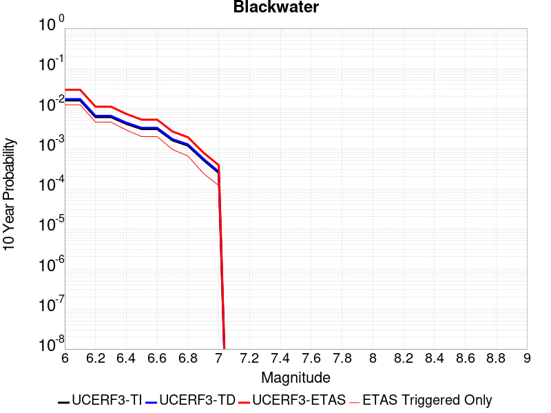 |

| Magnitude | 1 wk TI Prob | 1 wk TD Prob | 1 wk ETAS Prob | 1 wk ETAS/TD Gain | 1 wk ETAS Triggered Only | 1 mo TI Prob | 1 mo TD Prob | 1 mo ETAS Prob | 1 mo ETAS/TD Gain | 1 mo ETAS Triggered Only | 1 yr TI Prob | 1 yr TD Prob | 1 yr ETAS Prob | 1 yr ETAS/TD Gain | 1 yr ETAS Triggered Only | 10 yr TI Prob | 10 yr TD Prob | 10 yr ETAS Prob | 10 yr ETAS/TD Gain | 10 yr ETAS Triggered Only |
|-----|-----|-----|-----|-----|-----|-----|-----|-----|-----|-----|-----|-----|-----|-----|-----|-----|-----|-----|-----|-----|
| 6.0 | 3.0708583E-5 | 3.3095846E-5 | 0.003203445 | 96.79296 | 0.0031704542 | 1.3160157E-4 | 1.4183241E-4 | 0.004449167 | 31.369184 | 0.0043079457 | 0.0016010714 | 0.0017255784 | 0.009819238 | 5.690404 | 0.00810765 | 0.015895851 | 0.017135633 | 0.02907682 | 1.6968629 | 0.012149374 |
| 6.1 | 3.0708583E-5 | 3.3095846E-5 | 0.003203445 | 96.79296 | 0.0031704542 | 1.3160157E-4 | 1.4183241E-4 | 0.004449167 | 31.369184 | 0.0043079457 | 0.0016010714 | 0.0017255784 | 0.009819238 | 5.690404 | 0.00810765 | 0.015895851 | 0.017135633 | 0.02907682 | 1.6968629 | 0.012149374 |
| 6.2 | 1.1707779E-5 | 1.2545122E-5 | 0.0011742237 | 93.60002 | 0.0011616931 | 5.017523E-5 | 5.3763757E-5 | 0.0016510059 | 30.708532 | 0.0015973281 | 6.107122E-4 | 6.5438676E-4 | 0.0033632303 | 5.139515 | 0.0027106174 | 0.006090366 | 0.0065255696 | 0.010709227 | 1.6411176 | 0.0042111375 |
| 6.3 | 1.1707779E-5 | 1.2545122E-5 | 0.0011742237 | 93.60002 | 0.0011616931 | 5.017523E-5 | 5.3763757E-5 | 0.0016510059 | 30.708532 | 0.0015973281 | 6.107122E-4 | 6.5438676E-4 | 0.0033632303 | 5.139515 | 0.0027106174 | 0.006090366 | 0.0065255696 | 0.010709227 | 1.6411176 | 0.0042111375 |
| 6.4 | 7.929244E-6 | 8.480098E-6 | 8.071374E-4 | 95.18019 | 7.9866406E-4 | 3.3982033E-5 | 3.6342793E-5 | 0.0011011895 | 30.300077 | 0.0010648854 | 4.136527E-4 | 4.423877E-4 | 0.0021841566 | 4.9372 | 0.0017425397 | 0.0041288356 | 0.0044154758 | 0.0070659346 | 1.6002656 | 0.0026622135 |
| 6.5 | 5.8832115E-6 | 6.285991E-6 | 5.1452353E-4 | 81.85242 | 5.082408E-4 | 2.521352E-5 | 2.6939697E-5 | 6.803745E-4 | 25.255463 | 6.534524E-4 | 3.0693135E-4 | 3.27944E-4 | 0.0014166742 | 4.319866 | 0.0010890873 | 0.0030650778 | 0.0032748538 | 0.004939319 | 1.5082563 | 0.0016699339 |
| 6.6 | 5.8832115E-6 | 6.285991E-6 | 5.1452353E-4 | 81.85242 | 5.082408E-4 | 2.521352E-5 | 2.6939697E-5 | 6.803745E-4 | 25.255463 | 6.534524E-4 | 3.0693135E-4 | 3.27944E-4 | 0.0014166742 | 4.319866 | 0.0010890873 | 0.0030650778 | 0.0032748538 | 0.004939319 | 1.5082563 | 0.0016699339 |
| 6.7 | 3.0715053E-6 | 3.2814662E-6 | 1.7269449E-4 | 52.627235 | 1.6941359E-4 | 1.3163528E-5 | 1.4063357E-5 | 2.8028098E-4 | 19.929876 | 2.6622135E-4 | 1.6025416E-4 | 1.7120909E-4 | 6.3096726E-4 | 3.6853607 | 4.5983688E-4 | 0.0016013865 | 0.0017108864 | 0.002508184 | 1.4660144 | 7.9866406E-4 |
| 6.8 | 2.2722281E-6 | 2.4287538E-6 | 9.9236284E-5 | 40.858932 | 9.6807766E-5 | 9.738084E-6 | 1.0408908E-5 | 1.7982074E-4 | 17.275658 | 1.6941359E-4 | 1.1855473E-4 | 1.26722E-4 | 4.4130738E-4 | 3.482484 | 3.1462524E-4 | 0.001184915 | 0.0012665876 | 0.0018225271 | 1.438927 | 5.5664463E-4 |
| 6.9 | 9.952399E-7 | 1.0653489E-6 | 4.9469178E-5 | 46.434723 | 4.8403883E-5 | 4.265307E-6 | 4.5657757E-6 | 1.01373094E-4 | 22.20282 | 9.6807766E-5 | 5.1928873E-5 | 5.5587418E-5 | 2.00791E-4 | 3.6121662 | 1.4521164E-4 | 5.191674E-4 | 5.557858E-4 | 8.2185917E-4 | 1.4787338 | 2.6622135E-4 |
| 7.0 | 4.7385504E-7 | 5.0755597E-7 | 2.4709485E-5 | 48.683273 | 2.4201941E-5 | 2.0308057E-6 | 2.1752398E-6 | 7.47809E-5 | 34.378235 | 7.260582E-5 | 2.4724779E-5 | 2.6483543E-5 | 1.2328874E-4 | 4.6552963 | 9.6807766E-5 | 2.4722028E-4 | 2.6483546E-4 | 4.1000862E-4 | 1.5481638 | 1.4521164E-4 |

## Ash Hill
*[(top)](#table-of-contents)*

| 1 Week | 1 Month | 1 Year | 10 Year |
|-----|-----|-----|-----|
|  |  |  |  |

| Magnitude | 1 wk TI Prob | 1 wk TD Prob | 1 wk ETAS Prob | 1 wk ETAS/TD Gain | 1 wk ETAS Triggered Only | 1 mo TI Prob | 1 mo TD Prob | 1 mo ETAS Prob | 1 mo ETAS/TD Gain | 1 mo ETAS Triggered Only | 1 yr TI Prob | 1 yr TD Prob | 1 yr ETAS Prob | 1 yr ETAS/TD Gain | 1 yr ETAS Triggered Only | 10 yr TI Prob | 10 yr TD Prob | 10 yr ETAS Prob | 10 yr ETAS/TD Gain | 10 yr ETAS Triggered Only |
|-----|-----|-----|-----|-----|-----|-----|-----|-----|-----|-----|-----|-----|-----|-----|-----|-----|-----|-----|-----|-----|
| 6.0 | 2.1545662E-5 | 2.3194447E-5 | 0.003943818 | 170.03285 | 0.0039207144 | 9.2335285E-5 | 9.940143E-5 | 0.0051813037 | 52.125042 | 0.0050824075 | 0.0011236023 | 0.0012096206 | 0.008993219 | 7.434744 | 0.007793025 | 0.011179381 | 0.012038348 | 0.023085041 | 1.9176252 | 0.011181297 |
| 6.1 | 2.1545662E-5 | 2.3194447E-5 | 0.003943818 | 170.03285 | 0.0039207144 | 9.2335285E-5 | 9.940143E-5 | 0.0051813037 | 52.125042 | 0.0050824075 | 0.0011236023 | 0.0012096206 | 0.008993219 | 7.434744 | 0.007793025 | 0.011179381 | 0.012038348 | 0.023085041 | 1.9176252 | 0.011181297 |
| 6.2 | 2.1545662E-5 | 2.3194447E-5 | 0.003943818 | 170.03285 | 0.0039207144 | 9.2335285E-5 | 9.940143E-5 | 0.0051813037 | 52.125042 | 0.0050824075 | 0.0011236023 | 0.0012096206 | 0.008993219 | 7.434744 | 0.007793025 | 0.011179381 | 0.012038348 | 0.023085041 | 1.9176252 | 0.011181297 |
| 6.3 | 1.0025529E-5 | 1.0746934E-5 | 0.0017048646 | 158.6373 | 0.0016941358 | 4.2965847E-5 | 4.605755E-5 | 0.0022483328 | 48.815723 | 0.0022023767 | 5.229836E-4 | 5.6061964E-4 | 0.0038744267 | 6.910972 | 0.003315666 | 0.005217545 | 0.0055933665 | 0.010286348 | 1.8390262 | 0.0047193784 |
| 6.4 | 1.0025529E-5 | 1.0746934E-5 | 0.0017048646 | 158.6373 | 0.0016941358 | 4.2965847E-5 | 4.605755E-5 | 0.0022483328 | 48.815723 | 0.0022023767 | 5.229836E-4 | 5.6061964E-4 | 0.0038744267 | 6.910972 | 0.003315666 | 0.005217545 | 0.0055933665 | 0.010286348 | 1.8390262 | 0.0047193784 |
| 6.5 | 6.9617327E-6 | 7.456634E-6 | 9.7552704E-4 | 130.82674 | 9.680776E-4 | 2.9835655E-5 | 3.195666E-5 | 0.0012904174 | 40.380234 | 0.001258501 | 3.6318856E-4 | 3.8901155E-4 | 0.0023486062 | 6.037369 | 0.0019603572 | 0.0036259557 | 0.0038841602 | 0.0068012206 | 1.7510144 | 0.0029284349 |
| 6.6 | 4.9919777E-6 | 5.3466883E-6 | 7.5560284E-4 | 141.32166 | 7.502602E-4 | 2.1394015E-5 | 2.2914215E-5 | 9.667683E-4 | 42.190765 | 9.438757E-4 | 2.60441E-4 | 2.7895154E-4 | 0.0017548582 | 6.2909064 | 0.0014763183 | 0.0026013597 | 0.0027866727 | 0.0050070463 | 1.7967832 | 0.0022265785 |
| 6.7 | 3.6630722E-6 | 3.924624E-6 | 5.8476895E-4 | 149.0 | 5.8084656E-4 | 1.5698786E-5 | 1.681974E-5 | 7.9126883E-4 | 47.04406 | 7.744621E-4 | 1.9111596E-4 | 2.0476682E-4 | 0.0013662222 | 6.672087 | 0.0011616931 | 0.0019095168 | 0.0020463446 | 0.0037370136 | 1.8261899 | 0.0016941358 |
| 6.8 | 2.5599613E-6 | 2.744925E-6 | 4.6258053E-4 | 168.5221 | 4.5983688E-4 | 1.0971216E-5 | 1.1763939E-5 | 5.926037E-4 | 50.374596 | 5.8084656E-4 | 1.3356637E-4 | 1.4322149E-4 | 9.6596964E-4 | 6.7445855 | 8.22866E-4 | 0.0013348613 | 0.0014317769 | 0.0027126432 | 1.8945991 | 0.0012827029 |
| 6.9 | 1.7684905E-6 | 1.8968707E-6 | 2.4391583E-4 | 128.58853 | 2.420194E-4 | 7.579223E-6 | 8.129446E-6 | 3.4695386E-4 | 42.67866 | 3.3882717E-4 | 9.2273134E-5 | 9.8976E-5 | 6.31366E-4 | 6.3789806 | 5.324427E-4 | 9.223483E-4 | 9.8976E-4 | 0.0018843455 | 1.9038408 | 8.9547184E-4 |

## Garlock (West)
*[(top)](#table-of-contents)*

| 1 Week | 1 Month | 1 Year | 10 Year |
|-----|-----|-----|-----|
|  |  |  |  |

| Magnitude | 1 wk TI Prob | 1 wk TD Prob | 1 wk ETAS Prob | 1 wk ETAS/TD Gain | 1 wk ETAS Triggered Only | 1 mo TI Prob | 1 mo TD Prob | 1 mo ETAS Prob | 1 mo ETAS/TD Gain | 1 mo ETAS Triggered Only | 1 yr TI Prob | 1 yr TD Prob | 1 yr ETAS Prob | 1 yr ETAS/TD Gain | 1 yr ETAS Triggered Only | 10 yr TI Prob | 10 yr TD Prob | 10 yr ETAS Prob | 10 yr ETAS/TD Gain | 10 yr ETAS Triggered Only |
|-----|-----|-----|-----|-----|-----|-----|-----|-----|-----|-----|-----|-----|-----|-----|-----|-----|-----|-----|-----|-----|
| 6.0 | 2.5181727E-5 | 2.5197181E-5 | 0.0044298396 | 175.80695 | 0.0044047534 | 1.0791722E-4 | 1.0798347E-4 | 0.0054318355 | 50.30247 | 0.005324427 | 0.0013131002 | 0.0013139093 | 0.008903334 | 6.7762165 | 0.0075994097 | 0.013053683 | 0.013141794 | 0.02252816 | 1.7142378 | 0.009511363 |
| 6.1 | 2.5077732E-5 | 2.5098223E-5 | 0.004429741 | 176.49619 | 0.0044047534 | 1.0747157E-4 | 1.075594E-4 | 0.0054314137 | 50.496876 | 0.005324427 | 0.001307681 | 0.0013087525 | 0.008898216 | 6.7990065 | 0.0075994097 | 0.013000126 | 0.013090835 | 0.022477686 | 1.7170552 | 0.009511363 |
| 6.2 | 2.494612E-5 | 2.4979914E-5 | 0.004429623 | 177.3274 | 0.0044047534 | 1.0690756E-4 | 1.070524E-4 | 0.0054309093 | 50.731316 | 0.005324427 | 0.0013008224 | 0.0013025872 | 0.0088920975 | 6.8264894 | 0.0075994097 | 0.012932341 | 0.013029906 | 0.022417337 | 1.7204527 | 0.009511363 |
| 6.3 | 2.4733758E-5 | 2.4799276E-5 | 0.0044294433 | 178.6118 | 0.0044047534 | 1.0599751E-4 | 1.06278305E-4 | 0.0054301396 | 51.093586 | 0.005324427 | 0.0012897556 | 0.0012931736 | 0.008882755 | 6.868958 | 0.0075994097 | 0.012822957 | 0.0129368715 | 0.022301298 | 1.7238556 | 0.0094871605 |
| 6.4 | 2.3237335E-5 | 2.3178607E-5 | 0.0044278298 | 191.03088 | 0.0044047534 | 9.958477E-5 | 9.933313E-5 | 0.005423231 | 54.5964 | 0.005324427 | 0.0012117702 | 0.0012087126 | 0.008774764 | 7.259595 | 0.0075752074 | 0.012051838 | 0.012101731 | 0.021450173 | 1.7724879 | 0.009462959 |
| 6.5 | 2.2732203E-5 | 2.2992977E-5 | 0.004427645 | 192.56511 | 0.0044047534 | 9.742009E-5 | 9.8537625E-5 | 0.00542244 | 55.029133 | 0.005324427 | 0.0011854442 | 0.0011990381 | 0.008765163 | 7.310162 | 0.0075752074 | 0.011791403 | 0.012006035 | 0.021355381 | 1.7787205 | 0.009462959 |
| 6.6 | 2.1319436E-5 | 2.1773201E-5 | 0.004402229 | 202.18565 | 0.004380551 | 9.136581E-5 | 9.3310395E-5 | 0.005393041 | 57.796783 | 0.005300225 | 0.001111811 | 0.0011354643 | 0.008677896 | 7.6425967 | 0.0075510056 | 0.011062649 | 0.011376952 | 0.020684399 | 1.8180966 | 0.0094145555 |
| 6.7 | 1.970802E-5 | 2.0393094E-5 | 0.004400855 | 215.80124 | 0.004380551 | 8.446021E-5 | 8.739606E-5 | 0.005362958 | 61.363842 | 0.005276023 | 0.001027818 | 0.0010635294 | 0.008582328 | 8.069667 | 0.0075268038 | 0.010230771 | 0.0106646875 | 0.019930951 | 1.8688735 | 0.009366151 |
| 6.8 | 1.8744462E-5 | 1.9900775E-5 | 0.0043761632 | 219.89915 | 0.0043563494 | 8.033094E-5 | 8.528626E-5 | 0.0053366595 | 62.5735 | 0.005251821 | 9.775903E-4 | 0.0010378672 | 0.008532682 | 8.221362 | 0.0075026015 | 0.009733009 | 0.010410495 | 0.01963124 | 1.8857163 | 0.009317747 |
| 6.9 | 1.7559682E-5 | 1.8953151E-5 | 0.00437522 | 230.84393 | 0.0043563494 | 7.5253614E-5 | 8.122527E-5 | 0.00533262 | 65.65223 | 0.005251821 | 9.158276E-4 | 9.884704E-4 | 0.008483656 | 8.58261 | 0.0075026015 | 0.0091206245 | 0.009921073 | 0.01914638 | 1.9298697 | 0.009317747 |
| 7.0 | 1.6794445E-5 | 1.8215967E-5 | 0.004374486 | 240.14568 | 0.0043563494 | 7.197421E-5 | 7.806611E-5 | 0.005329477 | 68.268776 | 0.005251821 | 8.759337E-4 | 9.5004175E-4 | 0.008445515 | 8.889626 | 0.0075026015 | 0.008724891 | 0.009539958 | 0.018744843 | 1.9648769 | 0.009293545 |
| 7.1 | 1.6337795E-5 | 1.771677E-5 | 0.004373989 | 246.88412 | 0.0043563494 | 7.0017246E-5 | 7.592681E-5 | 0.005327349 | 70.164276 | 0.005251821 | 8.521265E-4 | 9.2401815E-4 | 0.008419687 | 9.112037 | 0.0075026015 | 0.008488664 | 0.009281721 | 0.018489007 | 1.9919804 | 0.009293545 |
| 7.2 | 1.5780008E-5 | 1.71654E-5 | 0.00437344 | 254.78232 | 0.0043563494 | 6.762685E-5 | 7.3563926E-5 | 0.0053007985 | 72.05704 | 0.0052276193 | 8.2304585E-4 | 8.952741E-4 | 0.008366979 | 9.345717 | 0.0074783997 | 0.008200042 | 0.008996559 | 0.01818251 | 2.0210516 | 0.009269344 |
| 7.3 | 1.5058865E-5 | 1.6618484E-5 | 0.004348694 | 261.67816 | 0.0043321475 | 6.45364E-5 | 7.122013E-5 | 0.005274267 | 74.05584 | 0.0052034175 | 7.854473E-4 | 8.667614E-4 | 0.008314498 | 9.592604 | 0.007454198 | 0.00782677 | 0.008713263 | 0.017877849 | 2.0517972 | 0.009245141 |
| 7.4 | 1.4887923E-5 | 1.6454453E-5 | 0.0042275228 | 256.92273 | 0.0042111375 | 6.380382E-5 | 7.0517184E-5 | 0.005104166 | 72.381874 | 0.005034004 | 7.7653467E-4 | 8.5820974E-4 | 0.00808838 | 9.424712 | 0.00723638 | 0.0077382675 | 0.008628101 | 0.017553544 | 2.034462 | 0.009003122 |
| 7.5 | 1.4509299E-5 | 1.6046468E-5 | 0.0037672871 | 234.77359 | 0.0037513007 | 6.218123E-5 | 6.876877E-5 | 0.0045942203 | 66.806786 | 0.004525763 | 7.567935E-4 | 8.369394E-4 | 0.0073659946 | 8.801108 | 0.0065345243 | 0.0075422134 | 0.008416411 | 0.016527819 | 1.963761 | 0.008180256 |
| 7.6 | 1.2756717E-5 | 1.4050529E-5 | 0.002603622 | 185.30418 | 0.0025896076 | 5.4670498E-5 | 6.0215163E-5 | 0.0031336765 | 52.041317 | 0.0030736465 | 6.6541E-4 | 7.328737E-4 | 0.005037662 | 6.8738475 | 0.0043079457 | 0.006634211 | 0.007381374 | 0.012714546 | 1.7225175 | 0.005372831 |
| 7.7 | 1.0328985E-5 | 1.146033E-5 | 0.0015845684 | 138.26552 | 0.0015731262 | 4.4266326E-5 | 4.9114777E-5 | 0.0018641712 | 37.955402 | 0.0018151456 | 5.388092E-4 | 5.9780874E-4 | 0.0031374935 | 5.248323 | 0.0025412038 | 0.0053750467 | 0.006038286 | 0.009261764 | 1.5338398 | 0.00324306 |
| 7.8 | 7.0306583E-6 | 8.899537E-6 | 0.0010737755 | 120.65521 | 0.0010648854 | 3.0131043E-5 | 3.8140315E-5 | 0.0012481912 | 32.726295 | 0.0012100971 | 3.667837E-4 | 4.6425956E-4 | 0.002157609 | 4.6474195 | 0.0016941358 | 0.003661789 | 0.0046950667 | 0.006887103 | 1.4668808 | 0.0022023767 |
| 7.9 | 4.060633E-6 | 5.465412E-6 | 7.799233E-4 | 142.70164 | 7.744621E-4 | 1.7402595E-5 | 2.3422985E-5 | 8.7047106E-4 | 37.163116 | 8.470679E-4 | 2.11856E-4 | 2.8513762E-4 | 0.0013981095 | 4.9032793 | 0.0011132893 | 0.0021165414 | 0.002884143 | 0.0043803356 | 1.5187651 | 0.0015005204 |
| 8.0 | 1.6729537E-6 | 2.0775192E-6 | 3.40904E-4 | 164.09186 | 3.3882717E-4 | 7.169782E-6 | 8.903624E-6 | 3.7192952E-4 | 41.772823 | 3.630291E-4 | 8.7288594E-5 | 1.0839626E-4 | 5.923826E-4 | 5.464973 | 4.840388E-4 | 8.7254314E-4 | 0.001096854 | 0.0016770635 | 1.5289761 | 5.8084656E-4 |
| 8.1 | 3.6733252E-7 | 3.1489736E-7 | 4.8718764E-5 | 154.71315 | 4.8403883E-5 | 1.5742813E-6 | 1.3495595E-6 | 4.9753377E-5 | 36.86638 | 4.8403883E-5 | 1.9166706E-5 | 1.643078E-5 | 1.1323695E-4 | 6.8917575 | 9.6807766E-5 | 1.9165053E-4 | 1.662928E-4 | 2.6308445E-4 | 1.5820557 | 9.6807766E-5 |

## McLean Lake
*[(top)](#table-of-contents)*

| 1 Week | 1 Month | 1 Year | 10 Year |
|-----|-----|-----|-----|
|  |  |  |  |

| Magnitude | 1 wk TI Prob | 1 wk TD Prob | 1 wk ETAS Prob | 1 wk ETAS/TD Gain | 1 wk ETAS Triggered Only | 1 mo TI Prob | 1 mo TD Prob | 1 mo ETAS Prob | 1 mo ETAS/TD Gain | 1 mo ETAS Triggered Only | 1 yr TI Prob | 1 yr TD Prob | 1 yr ETAS Prob | 1 yr ETAS/TD Gain | 1 yr ETAS Triggered Only | 10 yr TI Prob | 10 yr TD Prob | 10 yr ETAS Prob | 10 yr ETAS/TD Gain | 10 yr ETAS Triggered Only |
|-----|-----|-----|-----|-----|-----|-----|-----|-----|-----|-----|-----|-----|-----|-----|-----|-----|-----|-----|-----|-----|
| 6.0 | 1.7360222E-5 | 1.8501627E-5 | 0.0017610091 | 95.18131 | 0.0017425397 | 7.439883E-5 | 7.9290556E-5 | 0.002741293 | 34.572758 | 0.0026622135 | 9.0542925E-4 | 9.6498354E-4 | 0.0054863794 | 5.685464 | 0.004525763 | 0.009017491 | 0.0096127745 | 0.016467992 | 1.7131362 | 0.006921755 |
| 6.1 | 9.062689E-6 | 9.592193E-6 | 0.0010018622 | 104.44559 | 9.922796E-4 | 3.8839516E-5 | 4.1108804E-5 | 0.0014931656 | 36.322285 | 0.0014521164 | 4.727685E-4 | 5.003936E-4 | 0.0030887055 | 6.1725516 | 0.0025896076 | 0.0047176396 | 0.004993552 | 0.008750201 | 1.7523001 | 0.0037755028 |
| 6.2 | 9.062689E-6 | 9.592193E-6 | 0.0010018622 | 104.44559 | 9.922796E-4 | 3.8839516E-5 | 4.1108804E-5 | 0.0014931656 | 36.322285 | 0.0014521164 | 4.727685E-4 | 5.003936E-4 | 0.0030887055 | 6.1725516 | 0.0025896076 | 0.0047176396 | 0.004993552 | 0.008750201 | 1.7523001 | 0.0037755028 |
| 6.3 | 7.2575485E-6 | 7.66771E-6 | 7.337204E-4 | 95.689644 | 7.260582E-4 | 3.110341E-5 | 3.2861237E-5 | 0.0010493094 | 31.931522 | 0.0010164815 | 3.786182E-4 | 4.0001926E-4 | 0.0022628233 | 5.656786 | 0.0018635495 | 0.0037797375 | 0.0039936965 | 0.006814015 | 1.7061925 | 0.0028316271 |
| 6.4 | 7.2575485E-6 | 7.66771E-6 | 7.337204E-4 | 95.689644 | 7.260582E-4 | 3.110341E-5 | 3.2861237E-5 | 0.0010493094 | 31.931522 | 0.0010164815 | 3.786182E-4 | 4.0001926E-4 | 0.0022628233 | 5.656786 | 0.0018635495 | 0.0037797375 | 0.0039936965 | 0.006814015 | 1.7061925 | 0.0028316271 |
| 6.5 | 6.06582E-6 | 6.4038773E-6 | 5.8724673E-4 | 91.70175 | 5.8084656E-4 | 2.5996113E-5 | 2.7444936E-5 | 8.744896E-4 | 31.863424 | 8.470679E-4 | 3.164567E-4 | 3.3409733E-4 | 0.0018583102 | 5.562182 | 0.0015247223 | 0.0031600643 | 0.0033365893 | 0.0057487083 | 1.7229296 | 0.0024201942 |
| 6.6 | 5.598744E-6 | 5.910262E-6 | 5.1414804E-4 | 86.992424 | 5.082408E-4 | 2.3994397E-5 | 2.5329486E-5 | 7.7557063E-4 | 30.619282 | 7.502602E-4 | 2.9209262E-4 | 3.0834923E-4 | 0.0016874345 | 5.4724784 | 0.0013795106 | 0.0029170897 | 0.003079843 | 0.0053236918 | 1.7285594 | 0.0022507806 |
| 6.7 | 5.246996E-6 | 5.539162E-6 | 4.411717E-4 | 79.64593 | 4.3563492E-4 | 2.2486933E-5 | 2.3739085E-5 | 7.0137734E-4 | 29.545256 | 6.7765435E-4 | 2.73744E-4 | 2.8899137E-4 | 0.0015713236 | 5.437268 | 0.0012827029 | 0.0027340704 | 0.0028867796 | 0.0050104023 | 1.7356373 | 0.0021297708 |
| 6.8 | 4.02324E-6 | 4.2469046E-6 | 4.1567817E-4 | 97.877914 | 4.11433E-4 | 1.7242342E-5 | 1.8200926E-5 | 5.7483546E-4 | 31.582758 | 5.5664463E-4 | 2.099053E-4 | 2.2157968E-4 | 0.0013104257 | 5.9140153 | 0.0010890873 | 0.0020970714 | 0.002214172 | 0.00385626 | 1.7416263 | 0.001645732 |
| 6.9 | 6.835972E-7 | 7.1399285E-7 | 4.911784E-5 | 68.79318 | 4.8403883E-5 | 2.9296991E-6 | 3.0599674E-6 | 5.1463703E-5 | 16.818382 | 4.8403883E-5 | 3.56685E-5 | 3.7254784E-5 | 2.0666207E-4 | 5.547262 | 1.6941359E-4 | 3.5662777E-4 | 3.7251666E-4 | 5.90253E-4 | 1.5845009 | 2.1781746E-4 |

## Gravel Hills-Harper Lk
*[(top)](#table-of-contents)*

| 1 Week | 1 Month | 1 Year | 10 Year |
|-----|-----|-----|-----|
|  |  |  |  |

| Magnitude | 1 wk TI Prob | 1 wk TD Prob | 1 wk ETAS Prob | 1 wk ETAS/TD Gain | 1 wk ETAS Triggered Only | 1 mo TI Prob | 1 mo TD Prob | 1 mo ETAS Prob | 1 mo ETAS/TD Gain | 1 mo ETAS Triggered Only | 1 yr TI Prob | 1 yr TD Prob | 1 yr ETAS Prob | 1 yr ETAS/TD Gain | 1 yr ETAS Triggered Only | 10 yr TI Prob | 10 yr TD Prob | 10 yr ETAS Prob | 10 yr ETAS/TD Gain | 10 yr ETAS Triggered Only |
|-----|-----|-----|-----|-----|-----|-----|-----|-----|-----|-----|-----|-----|-----|-----|-----|-----|-----|-----|-----|-----|
| 6.0 | 3.0679566E-5 | 3.1464628E-5 | 0.0019675589 | 62.532413 | 0.0019361553 | 1.3147724E-4 | 1.3484266E-4 | 0.0029176907 | 21.637743 | 0.0027832233 | 0.0015995599 | 0.00164069 | 0.0062798387 | 3.8275597 | 0.0046467725 | 0.015880952 | 0.016307337 | 0.023044795 | 1.413155 | 0.0068491492 |
| 6.1 | 3.0679566E-5 | 3.1464628E-5 | 0.0019675589 | 62.532413 | 0.0019361553 | 1.3147724E-4 | 1.3484266E-4 | 0.0029176907 | 21.637743 | 0.0027832233 | 0.0015995599 | 0.00164069 | 0.0062798387 | 3.8275597 | 0.0046467725 | 0.015880952 | 0.016307337 | 0.023044795 | 1.413155 | 0.0068491492 |
| 6.2 | 1.514536E-5 | 1.36352E-5 | 6.428771E-4 | 47.148342 | 6.292505E-4 | 6.490707E-5 | 5.843533E-5 | 9.780553E-4 | 16.737398 | 9.1967377E-4 | 7.8995706E-4 | 7.112298E-4 | 0.0021864981 | 3.07425 | 0.0014763183 | 0.007871548 | 0.007090737 | 0.009109285 | 1.2846739 | 0.002032963 |
| 6.3 | 1.514536E-5 | 1.36352E-5 | 6.428771E-4 | 47.148342 | 6.292505E-4 | 6.490707E-5 | 5.843533E-5 | 9.780553E-4 | 16.737398 | 9.1967377E-4 | 7.8995706E-4 | 7.112298E-4 | 0.0021864981 | 3.07425 | 0.0014763183 | 0.007871548 | 0.007090737 | 0.009109285 | 1.2846739 | 0.002032963 |
| 6.4 | 1.2532521E-5 | 1.0689684E-5 | 2.769082E-4 | 25.904245 | 2.6622135E-4 | 5.37097E-5 | 4.581216E-5 | 4.8142715E-4 | 10.508719 | 4.3563492E-4 | 6.537194E-4 | 5.5762613E-4 | 0.0013074679 | 2.3447034 | 7.502602E-4 | 0.0065179965 | 0.005562859 | 0.006621821 | 1.1903628 | 0.0010648854 |
| 6.5 | 1.1094058E-5 | 9.083657E-6 | 1.5429399E-4 | 16.98589 | 1.4521164E-4 | 4.7545094E-5 | 3.89294E-5 | 2.567384E-4 | 6.5949745 | 2.1781746E-4 | 5.787078E-4 | 4.7386638E-4 | 9.5767586E-4 | 2.0209827 | 4.840388E-4 | 0.0057720304 | 0.004728967 | 0.005475679 | 1.1579018 | 7.502602E-4 |
| 6.6 | 9.688328E-6 | 7.531688E-6 | 1.2854049E-4 | 17.066624 | 1.210097E-4 | 4.1520743E-5 | 3.227828E-5 | 2.016864E-4 | 6.248363 | 1.6941359E-4 | 5.053978E-4 | 3.9291973E-4 | 7.316138E-4 | 1.861993 | 3.3882717E-4 | 0.0050424994 | 0.0039225067 | 0.0045251823 | 1.1536454 | 6.0504855E-4 |
| 6.7 | 8.974824E-6 | 6.749406E-6 | 1.03556515E-4 | 15.343056 | 9.6807766E-5 | 3.8462964E-5 | 2.8925719E-5 | 1.7413317E-4 | 6.020012 | 1.4521164E-4 | 4.6818596E-4 | 3.5211592E-4 | 6.1824353E-4 | 1.7557955 | 2.6622135E-4 | 0.004672008 | 0.003515801 | 0.0040222546 | 1.1440508 | 5.082408E-4 |
| 6.8 | 7.4780046E-6 | 5.1161865E-6 | 5.351982E-5 | 10.460882 | 4.8403883E-5 | 3.20482E-5 | 2.1926337E-5 | 1.1873198E-4 | 5.4150395 | 9.6807766E-5 | 3.9011694E-4 | 2.6692182E-4 | 3.8789923E-4 | 1.4532316 | 1.210097E-4 | 0.0038943281 | 0.0026661505 | 0.0028833873 | 1.0814795 | 2.1781746E-4 |
| 6.9 | 6.3409307E-6 | 3.907489E-6 | 2.8109336E-5 | 7.193708 | 2.4201941E-5 | 2.7175134E-5 | 1.674628E-5 | 6.5149354E-5 | 3.8903775 | 4.8403883E-5 | 3.3080703E-4 | 2.0386786E-4 | 2.764589E-4 | 1.356069 | 7.260582E-5 | 0.0033031502 | 0.0020369065 | 0.0021818224 | 1.071145 | 1.4521164E-4 |
| 7.0 | 5.1239335E-6 | 2.6058492E-6 | 2.6058492E-6 | 1.0 | 0.0 | 2.195953E-5 | 1.1167879E-5 | 1.1167879E-5 | 1.0 | 0.0 | 2.6732447E-4 | 1.359607E-4 | 1.6015935E-4 | 1.1779827 | 2.4201941E-5 | 0.0026700313 | 0.0013588005 | 0.0014071385 | 1.0355741 | 4.8403883E-5 |
| 7.1 | 4.438899E-6 | 2.0984692E-6 | 2.0984692E-6 | 1.0 | 0.0 | 1.9023713E-5 | 8.99341E-6 | 8.99341E-6 | 1.0 | 0.0 | 2.315891E-4 | 1.0948948E-4 | 1.3368878E-4 | 1.2210193 | 2.4201941E-5 | 0.002313479 | 0.0010943774 | 0.0011185528 | 1.0220906 | 2.4201941E-5 |
| 7.2 | 3.50367E-6 | 1.2615715E-6 | 1.2615715E-6 | 1.0 | 0.0 | 1.5015643E-5 | 5.406724E-6 | 5.406724E-6 | 1.0 | 0.0 | 1.8280011E-4 | 6.5824956E-5 | 6.5824956E-5 | 1.0 | 0.0 | 0.0018264982 | 6.580628E-4 | 6.580628E-4 | 1.0 | 0.0 |
| 7.3 | 2.561638E-6 | 7.118686E-7 | 7.118686E-7 | 1.0 | 0.0 | 1.0978401E-5 | 3.050862E-6 | 3.050862E-6 | 1.0 | 0.0 | 1.3365384E-4 | 3.7143633E-5 | 3.7143633E-5 | 1.0 | 0.0 | 0.0013357349 | 3.7137623E-4 | 3.7137623E-4 | 1.0 | 0.0 |
| 7.4 | 2.0368864E-6 | 5.304471E-7 | 5.304471E-7 | 1.0 | 0.0 | 8.729483E-6 | 2.2733427E-6 | 2.2733427E-6 | 1.0 | 0.0 | 1.06276275E-4 | 2.76776E-5 | 2.76776E-5 | 1.0 | 0.0 | 0.0010622547 | 2.767421E-4 | 2.767421E-4 | 1.0 | 0.0 |
| 7.5 | 1.1681728E-6 | 3.6028484E-7 | 3.6028484E-7 | 1.0 | 0.0 | 5.0064455E-6 | 1.544077E-6 | 1.544077E-6 | 1.0 | 0.0 | 6.0951766E-5 | 1.879898E-5 | 1.879898E-5 | 1.0 | 0.0 | 6.093505E-4 | 1.8797436E-4 | 1.8797436E-4 | 1.0 | 0.0 |
| 7.6 | 1.3154387E-7 | 7.1196716E-8 | 7.1196716E-8 | 1.0 | 0.0 | 5.6375933E-7 | 3.0512876E-7 | 3.0512876E-7 | 1.0 | 0.0 | 6.863748E-6 | 3.714938E-6 | 3.714938E-6 | 1.0 | 0.0 | 6.863536E-5 | 3.7148915E-5 | 3.7148915E-5 | 1.0 | 0.0 |

## Goldstone Lake
*[(top)](#table-of-contents)*

| 1 Week | 1 Month | 1 Year | 10 Year |
|-----|-----|-----|-----|
|  |  | 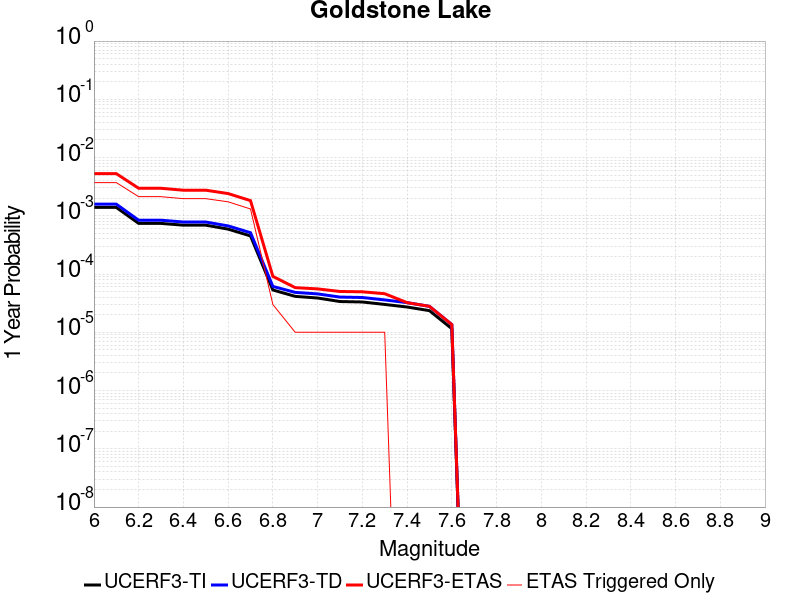 |  |

| Magnitude | 1 wk TI Prob | 1 wk TD Prob | 1 wk ETAS Prob | 1 wk ETAS/TD Gain | 1 wk ETAS Triggered Only | 1 mo TI Prob | 1 mo TD Prob | 1 mo ETAS Prob | 1 mo ETAS/TD Gain | 1 mo ETAS Triggered Only | 1 yr TI Prob | 1 yr TD Prob | 1 yr ETAS Prob | 1 yr ETAS/TD Gain | 1 yr ETAS Triggered Only | 10 yr TI Prob | 10 yr TD Prob | 10 yr ETAS Prob | 10 yr ETAS/TD Gain | 10 yr ETAS Triggered Only |
|-----|-----|-----|-----|-----|-----|-----|-----|-----|-----|-----|-----|-----|-----|-----|-----|-----|-----|-----|-----|-----|
| 6.0 | 2.671352E-5 | 3.0376103E-5 | 0.0015066497 | 49.599834 | 0.0014763183 | 1.1448149E-4 | 1.3017791E-4 | 0.0022112739 | 16.986553 | 0.002081367 | 0.001392921 | 0.0015839601 | 0.0053293193 | 3.364554 | 0.0037513007 | 0.013842222 | 0.015746202 | 0.021367922 | 1.3570207 | 0.005711658 |
| 6.1 | 2.671352E-5 | 3.0376103E-5 | 0.0015066497 | 49.599834 | 0.0014763183 | 1.1448149E-4 | 1.3017791E-4 | 0.0022112739 | 16.986553 | 0.002081367 | 0.001392921 | 0.0015839601 | 0.0053293193 | 3.364554 | 0.0037513007 | 0.013842222 | 0.015746202 | 0.021367922 | 1.3570207 | 0.005711658 |
| 6.2 | 1.4197047E-5 | 1.6096254E-5 | 7.905459E-4 | 49.113655 | 7.744621E-4 | 6.0843064E-5 | 6.898268E-5 | 0.0013031965 | 18.89165 | 0.001234299 | 7.4051257E-4 | 8.3963916E-4 | 0.003015985 | 3.5920014 | 0.0021781747 | 0.007380498 | 0.008374364 | 0.011590266 | 1.3840173 | 0.00324306 |
| 6.3 | 1.4197047E-5 | 1.6096254E-5 | 7.905459E-4 | 49.113655 | 7.744621E-4 | 6.0843064E-5 | 6.898268E-5 | 0.0013031965 | 18.89165 | 0.001234299 | 7.4051257E-4 | 8.3963916E-4 | 0.003015985 | 3.5920014 | 0.0021781747 | 0.007380498 | 0.008374364 | 0.011590266 | 1.3840173 | 0.00324306 |
| 6.4 | 1.3238931E-5 | 1.500847E-5 | 7.652574E-4 | 50.98837 | 7.502602E-4 | 5.6737044E-5 | 6.432098E-5 | 0.0012743402 | 19.812202 | 0.0012100971 | 6.9055456E-4 | 7.8292453E-4 | 0.00276593 | 3.532818 | 0.0019845592 | 0.006884126 | 0.007811289 | 0.010740861 | 1.3750435 | 0.0029526367 |
| 6.5 | 1.3238931E-5 | 1.500847E-5 | 7.652574E-4 | 50.98837 | 7.502602E-4 | 5.6737044E-5 | 6.432098E-5 | 0.0012743402 | 19.812202 | 0.0012100971 | 6.9055456E-4 | 7.8292453E-4 | 0.00276593 | 3.532818 | 0.0019845592 | 0.006884126 | 0.007811289 | 0.010740861 | 1.3750435 | 0.0029526367 |
| 6.6 | 1.1328278E-5 | 1.2855176E-5 | 6.4209756E-4 | 49.948563 | 6.292505E-4 | 4.8548856E-5 | 5.5092984E-5 | 0.0010473179 | 19.010004 | 9.922796E-4 | 5.90922E-4 | 6.706464E-4 | 0.0023394604 | 3.4883666 | 0.0016699339 | 0.0058935313 | 0.0066956137 | 0.009171722 | 1.3698106 | 0.0024928 |
| 6.7 | 8.651175E-6 | 9.824575E-6 | 5.6646374E-4 | 57.65784 | 5.5664463E-4 | 3.707594E-5 | 4.2105148E-5 | 8.4073556E-4 | 19.967524 | 7.9866406E-4 | 4.5130608E-4 | 5.126002E-4 | 0.001818835 | 3.548253 | 0.0013069048 | 0.0045039062 | 0.0051230565 | 0.0069770585 | 1.3618938 | 0.0018635495 |
| 6.8 | 1.0215377E-6 | 1.1754802E-6 | 1.1754802E-6 | 1.0 | 0.0 | 4.378012E-6 | 5.037763E-6 | 2.9239582E-5 | 5.8040805 | 2.4201941E-5 | 5.3300988E-5 | 6.133315E-5 | 1.09734065E-4 | 1.7891476 | 4.8403883E-5 | 5.3288206E-4 | 6.131735E-4 | 6.615477E-4 | 1.0788915 | 4.8403883E-5 |
| 6.9 | 7.9360774E-7 | 9.283496E-7 | 9.283496E-7 | 1.0 | 0.0 | 3.4011714E-6 | 3.9786355E-6 | 3.9786355E-6 | 1.0 | 0.0 | 4.1408475E-5 | 4.843888E-5 | 4.843888E-5 | 1.0 | 0.0 | 4.140076E-4 | 4.842902E-4 | 4.842902E-4 | 1.0 | 0.0 |
| 7.0 | 7.4382757E-7 | 8.747428E-7 | 8.747428E-7 | 1.0 | 0.0 | 3.1878285E-6 | 3.7488926E-6 | 3.7488926E-6 | 1.0 | 0.0 | 3.8811122E-5 | 4.564188E-5 | 4.564188E-5 | 1.0 | 0.0 | 3.8804344E-4 | 4.563317E-4 | 4.563317E-4 | 1.0 | 0.0 |
| 7.1 | 6.4709513E-7 | 7.711399E-7 | 7.711399E-7 | 1.0 | 0.0 | 2.773262E-6 | 3.3048816E-6 | 3.3048816E-6 | 1.0 | 0.0 | 3.376394E-5 | 4.023625E-5 | 4.023625E-5 | 1.0 | 0.0 | 3.375881E-4 | 4.022956E-4 | 4.022956E-4 | 1.0 | 0.0 |
| 7.2 | 6.356704E-7 | 7.588459E-7 | 7.588459E-7 | 1.0 | 0.0 | 2.7242988E-6 | 3.252193E-6 | 3.252193E-6 | 1.0 | 0.0 | 3.3167835E-5 | 3.959479E-5 | 3.959479E-5 | 1.0 | 0.0 | 3.3162883E-4 | 3.9588328E-4 | 3.9588328E-4 | 1.0 | 0.0 |
| 7.3 | 5.7695723E-7 | 6.896648E-7 | 6.896648E-7 | 1.0 | 0.0 | 2.4726714E-6 | 2.9557032E-6 | 2.9557032E-6 | 1.0 | 0.0 | 3.0104358E-5 | 3.598515E-5 | 3.598515E-5 | 1.0 | 0.0 | 3.0100282E-4 | 3.5979896E-4 | 3.5979896E-4 | 1.0 | 0.0 |
| 7.4 | 5.209647E-7 | 6.193583E-7 | 6.193583E-7 | 1.0 | 0.0 | 2.232704E-6 | 2.6543903E-6 | 2.6543903E-6 | 1.0 | 0.0 | 2.718283E-5 | 3.2316777E-5 | 3.2316777E-5 | 1.0 | 0.0 | 2.7179506E-4 | 3.2312635E-4 | 3.2312635E-4 | 1.0 | 0.0 |
| 7.5 | 4.512955E-7 | 5.3489487E-7 | 5.3489487E-7 | 1.0 | 0.0 | 1.934122E-6 | 2.2924048E-6 | 2.2924048E-6 | 1.0 | 0.0 | 2.3547682E-5 | 2.7909726E-5 | 2.7909726E-5 | 1.0 | 0.0 | 2.3545188E-4 | 2.7906752E-4 | 2.7906752E-4 | 1.0 | 0.0 |
| 7.6 | 2.21172E-7 | 2.6040198E-7 | 2.6040198E-7 | 1.0 | 0.0 | 9.478797E-7 | 1.1160082E-6 | 1.1160082E-6 | 1.0 | 0.0 | 1.1540374E-5 | 1.3587343E-5 | 1.3587343E-5 | 1.0 | 0.0 | 1.1539775E-4 | 1.3586794E-4 | 1.3586794E-4 | 1.0 | 0.0 |

## San Andreas (Mojave S)
*[(top)](#table-of-contents)*

| 1 Week | 1 Month | 1 Year | 10 Year |
|-----|-----|-----|-----|
|  |  |  |  |

| Magnitude | 1 wk TI Prob | 1 wk TD Prob | 1 wk ETAS Prob | 1 wk ETAS/TD Gain | 1 wk ETAS Triggered Only | 1 mo TI Prob | 1 mo TD Prob | 1 mo ETAS Prob | 1 mo ETAS/TD Gain | 1 mo ETAS Triggered Only | 1 yr TI Prob | 1 yr TD Prob | 1 yr ETAS Prob | 1 yr ETAS/TD Gain | 1 yr ETAS Triggered Only | 10 yr TI Prob | 10 yr TD Prob | 10 yr ETAS Prob | 10 yr ETAS/TD Gain | 10 yr ETAS Triggered Only |
|-----|-----|-----|-----|-----|-----|-----|-----|-----|-----|-----|-----|-----|-----|-----|-----|-----|-----|-----|-----|-----|
| 6.0 | 3.1064058E-4 | 6.7462435E-4 | 0.002440174 | 3.6170857 | 0.0017667417 | 0.0013306376 | 0.002888172 | 0.0049393955 | 1.7102152 | 0.002057165 | 0.016080605 | 0.034565594 | 0.03757973 | 1.0872004 | 0.0031220503 | 0.1496549 | 0.28654557 | 0.28942916 | 1.0100633 | 0.0040417244 |
| 6.1 | 3.1064058E-4 | 6.7462435E-4 | 0.002440174 | 3.6170857 | 0.0017667417 | 0.0013306376 | 0.002888172 | 0.0049393955 | 1.7102152 | 0.002057165 | 0.016080605 | 0.034565594 | 0.03757973 | 1.0872004 | 0.0031220503 | 0.1496549 | 0.28654557 | 0.28942916 | 1.0100633 | 0.0040417244 |
| 6.2 | 3.1064058E-4 | 6.7462435E-4 | 0.002440174 | 3.6170857 | 0.0017667417 | 0.0013306376 | 0.002888172 | 0.0049393955 | 1.7102152 | 0.002057165 | 0.016080605 | 0.034565594 | 0.03757973 | 1.0872004 | 0.0031220503 | 0.1496549 | 0.28654557 | 0.28942916 | 1.0100633 | 0.0040417244 |
| 6.3 | 3.1064058E-4 | 6.7462435E-4 | 0.002440174 | 3.6170857 | 0.0017667417 | 0.0013306376 | 0.002888172 | 0.0049393955 | 1.7102152 | 0.002057165 | 0.016080605 | 0.034565594 | 0.03757973 | 1.0872004 | 0.0031220503 | 0.1496549 | 0.28654557 | 0.28942916 | 1.0100633 | 0.0040417244 |
| 6.4 | 1.9872203E-4 | 4.3181062E-4 | 0.002028449 | 4.697543 | 0.0015973281 | 8.5138786E-4 | 0.0018493326 | 0.0036852786 | 1.9927614 | 0.0018393475 | 0.010316478 | 0.02228931 | 0.02512881 | 1.1273929 | 0.0029042328 | 0.098504856 | 0.19686839 | 0.19986175 | 1.0152048 | 0.003727099 |
| 6.5 | 1.291105E-4 | 2.8754136E-4 | 0.0016666553 | 5.796228 | 0.0013795106 | 5.5321335E-4 | 0.0012317409 | 0.0028512736 | 2.3148322 | 0.00162153 | 0.006714592 | 0.014894155 | 0.017325984 | 1.1632742 | 0.002468598 | 0.065152965 | 0.13800792 | 0.14080343 | 1.020256 | 0.00324306 |
| 6.6 | 1.291105E-4 | 2.8754136E-4 | 0.0016666553 | 5.796228 | 0.0013795106 | 5.5321335E-4 | 0.0012317409 | 0.0028512736 | 2.3148322 | 0.00162153 | 0.006714592 | 0.014894155 | 0.017325984 | 1.1632742 | 0.002468598 | 0.065152965 | 0.13800792 | 0.14080343 | 1.020256 | 0.00324306 |
| 6.7 | 1.08001186E-4 | 2.4335351E-4 | 0.0015257442 | 6.269662 | 0.0012827029 | 4.6278012E-4 | 0.0010425274 | 0.0025414834 | 2.4378097 | 0.0015005204 | 0.0056198016 | 0.0126192 | 0.014865474 | 1.1780045 | 0.0022749824 | 0.054797906 | 0.11918431 | 0.12187031 | 1.0225365 | 0.0030494446 |
| 6.8 | 1.0624356E-4 | 2.3853009E-4 | 0.001520927 | 6.376248 | 0.0012827029 | 4.5525006E-4 | 0.0010218718 | 0.0025208588 | 2.4669032 | 0.0015005204 | 0.0055285925 | 0.012370593 | 0.0145935295 | 1.1796952 | 0.0022507806 | 0.053930566 | 0.11713308 | 0.119803965 | 1.0228021 | 0.0030252426 |
| 6.9 | 1.0393785E-4 | 2.3223337E-4 | 0.0015146383 | 6.522053 | 0.0012827029 | 4.4537184E-4 | 9.949068E-4 | 0.0024939342 | 2.5067015 | 0.0015005204 | 0.0054089287 | 0.012045963 | 0.01426963 | 1.1845986 | 0.0022507806 | 0.05279156 | 0.114433445 | 0.11709107 | 1.0232241 | 0.0030010408 |
| 7.0 | 1.0155622E-4 | 2.2592908E-4 | 0.0015083421 | 6.6761756 | 0.0012827029 | 4.3516833E-4 | 9.6790853E-4 | 0.0024669764 | 2.5487702 | 0.0015005204 | 0.005285311 | 0.011720838 | 0.013945238 | 1.1897815 | 0.0022507806 | 0.05161361 | 0.11169745 | 0.11436328 | 1.0238665 | 0.0030010408 |
| 7.1 | 9.885595E-5 | 2.188132E-4 | 0.0015012354 | 6.860808 | 0.0012827029 | 4.2359953E-4 | 9.374342E-4 | 0.002436548 | 2.5991669 | 0.0015005204 | 0.0051451353 | 0.011353733 | 0.013555032 | 1.1938833 | 0.0022265785 | 0.05027629 | 0.10857607 | 0.111229695 | 1.0244403 | 0.0029768387 |
| 7.2 | 9.6411415E-5 | 2.1244297E-4 | 0.0014948733 | 7.0365863 | 0.0012827029 | 4.1312634E-4 | 9.101525E-4 | 0.002409307 | 2.6471467 | 0.0015005204 | 0.005018219 | 0.011024987 | 0.013227018 | 1.1997309 | 0.0022265785 | 0.049064007 | 0.1057697 | 0.10843168 | 1.0251677 | 0.0029768387 |
| 7.3 | 9.1180635E-5 | 1.9472656E-4 | 0.0014529824 | 7.461655 | 0.001258501 | 3.907156E-4 | 8.342756E-4 | 0.0023093624 | 2.7681048 | 0.0014763183 | 0.004746591 | 0.010110112 | 0.012290223 | 1.2156366 | 0.0022023767 | 0.046464786 | 0.09796176 | 0.10062515 | 1.0271881 | 0.0029526367 |
| 7.4 | 8.887388E-5 | 1.872126E-4 | 0.001445478 | 7.7210503 | 0.001258501 | 3.8083247E-4 | 8.020931E-4 | 0.0022772274 | 2.839106 | 0.0014763183 | 0.0046267817 | 0.009721855 | 0.01190282 | 1.2243364 | 0.0022023767 | 0.045316286 | 0.094593845 | 0.09726718 | 1.0282612 | 0.0029526367 |
| 7.5 | 8.6750515E-5 | 1.80528E-4 | 0.0014388018 | 7.9699645 | 0.001258501 | 3.7173493E-4 | 7.734621E-4 | 0.0022486385 | 2.9072382 | 0.0014763183 | 0.004516484 | 0.009376327 | 0.011558053 | 1.2326846 | 0.0022023767 | 0.04425787 | 0.09155606 | 0.09423836 | 1.0292969 | 0.0029526367 |
| 7.6 | 8.453092E-5 | 1.7440386E-4 | 0.0014326853 | 8.214757 | 0.001258501 | 3.6222505E-4 | 7.4723107E-4 | 0.0022224463 | 2.9742424 | 0.0014763183 | 0.0044011753 | 0.009059664 | 0.011242088 | 1.2408946 | 0.0022023767 | 0.04315024 | 0.08871447 | 0.09140517 | 1.0303298 | 0.0029526367 |
| 7.7 | 8.259102E-5 | 1.6962511E-4 | 0.0014279126 | 8.41805 | 0.001258501 | 3.539135E-4 | 7.267622E-4 | 0.0022020077 | 3.0298872 | 0.0014763183 | 0.004300386 | 0.0088125 | 0.010995469 | 1.2477127 | 0.0022023767 | 0.042181134 | 0.086465426 | 0.08916277 | 1.0311955 | 0.0029526367 |
| 7.8 | 7.444844E-5 | 1.528469E-4 | 0.001265966 | 8.282576 | 0.0011132893 | 3.1902574E-4 | 6.5489375E-4 | 0.0019367565 | 2.95736 | 0.0012827029 | 0.0038772223 | 0.007944231 | 0.009816986 | 1.2357377 | 0.0018877514 | 0.03810269 | 0.078293875 | 0.08068073 | 1.0304859 | 0.0025896076 |
| 7.9 | 5.2586525E-5 | 1.0007023E-4 | 8.9865434E-4 | 8.980237 | 7.9866406E-4 | 2.2535135E-4 | 4.2880196E-4 | 0.0012996983 | 3.030999 | 8.7126985E-4 | 0.0027402006 | 0.005208178 | 0.0064119725 | 1.2311355 | 0.0012100971 | 0.027066574 | 0.052201588 | 0.05380729 | 1.0307596 | 0.0016941358 |
| 8.0 | 3.379877E-5 | 5.4075565E-5 | 4.1708504E-4 | 7.713004 | 3.630291E-4 | 1.4484383E-4 | 2.3173184E-4 | 6.1887316E-4 | 2.6706436 | 3.8723106E-4 | 0.0017620471 | 0.0028176866 | 0.0033486292 | 1.188432 | 5.324427E-4 | 0.017481409 | 0.028835917 | 0.029470526 | 1.0220076 | 6.534524E-4 |
| 8.1 | 1.8668277E-5 | 1.9308145E-5 | 6.7711095E-5 | 3.506867 | 4.8403883E-5 | 8.000444E-5 | 8.274657E-5 | 1.3114644E-4 | 1.5849171 | 4.8403883E-5 | 9.736188E-4 | 0.0010069745 | 0.0011036848 | 1.0960405 | 9.6807766E-5 | 0.009693642 | 0.010798624 | 0.010894386 | 1.008868 | 9.6807766E-5 |
| 8.2 | 8.541571E-6 | 5.4596358E-6 | 5.4596358E-6 | 1.0 | 0.0 | 3.660622E-5 | 2.339823E-5 | 2.339823E-5 | 1.0 | 0.0 | 4.455896E-4 | 2.848363E-4 | 2.848363E-4 | 1.0 | 0.0 | 0.0044469717 | 0.003240283 | 0.003240283 | 1.0 | 0.0 |
| 8.3 | 1.983087E-6 | 7.6564595E-7 | 7.6564595E-7 | 1.0 | 0.0 | 8.498917E-6 | 3.281336E-6 | 3.281336E-6 | 1.0 | 0.0 | 1.034694E-4 | 3.9949547E-5 | 3.9949547E-5 | 1.0 | 0.0 | 0.0010342124 | 4.717979E-4 | 4.717979E-4 | 1.0 | 0.0 |

## So Sierra Nevada
*[(top)](#table-of-contents)*

| 1 Week | 1 Month | 1 Year | 10 Year |
|-----|-----|-----|-----|
|  |  |  |  |

| Magnitude | 1 wk TI Prob | 1 wk TD Prob | 1 wk ETAS Prob | 1 wk ETAS/TD Gain | 1 wk ETAS Triggered Only | 1 mo TI Prob | 1 mo TD Prob | 1 mo ETAS Prob | 1 mo ETAS/TD Gain | 1 mo ETAS Triggered Only | 1 yr TI Prob | 1 yr TD Prob | 1 yr ETAS Prob | 1 yr ETAS/TD Gain | 1 yr ETAS Triggered Only | 10 yr TI Prob | 10 yr TD Prob | 10 yr ETAS Prob | 10 yr ETAS/TD Gain | 10 yr ETAS Triggered Only |
|-----|-----|-----|-----|-----|-----|-----|-----|-----|-----|-----|-----|-----|-----|-----|-----|-----|-----|-----|-----|-----|
| 6.0 | 1.15488665E-5 | 1.1079612E-5 | 0.0014873816 | 134.24493 | 0.0014763183 | 4.9494203E-5 | 4.7483256E-5 | 0.0021529521 | 45.34129 | 0.0021055688 | 6.024253E-4 | 5.779681E-4 | 0.0038191539 | 6.6078978 | 0.00324306 | 0.006007948 | 0.005765918 | 0.010289649 | 1.7845638 | 0.004549965 |
| 6.1 | 1.15488665E-5 | 1.1079612E-5 | 0.0014873816 | 134.24493 | 0.0014763183 | 4.9494203E-5 | 4.7483256E-5 | 0.0021529521 | 45.34129 | 0.0021055688 | 6.024253E-4 | 5.779681E-4 | 0.0038191539 | 6.6078978 | 0.00324306 | 0.006007948 | 0.005765918 | 0.010289649 | 1.7845638 | 0.004549965 |
| 6.2 | 1.15488665E-5 | 1.1079612E-5 | 0.0014873816 | 134.24493 | 0.0014763183 | 4.9494203E-5 | 4.7483256E-5 | 0.0021529521 | 45.34129 | 0.0021055688 | 6.024253E-4 | 5.779681E-4 | 0.0038191539 | 6.6078978 | 0.00324306 | 0.006007948 | 0.005765918 | 0.010289649 | 1.7845638 | 0.004549965 |
| 6.3 | 1.15488665E-5 | 1.1079612E-5 | 0.0014873816 | 134.24493 | 0.0014763183 | 4.9494203E-5 | 4.7483256E-5 | 0.0021529521 | 45.34129 | 0.0021055688 | 6.024253E-4 | 5.779681E-4 | 0.0038191539 | 6.6078978 | 0.00324306 | 0.006007948 | 0.005765918 | 0.010289649 | 1.7845638 | 0.004549965 |
| 6.4 | 1.15488665E-5 | 1.1079612E-5 | 0.0014873816 | 134.24493 | 0.0014763183 | 4.9494203E-5 | 4.7483256E-5 | 0.0021529521 | 45.34129 | 0.0021055688 | 6.024253E-4 | 5.779681E-4 | 0.0038191539 | 6.6078978 | 0.00324306 | 0.006007948 | 0.005765918 | 0.010289649 | 1.7845638 | 0.004549965 |
| 6.5 | 1.15488665E-5 | 1.1079612E-5 | 0.0014873816 | 134.24493 | 0.0014763183 | 4.9494203E-5 | 4.7483256E-5 | 0.0021529521 | 45.34129 | 0.0021055688 | 6.024253E-4 | 5.779681E-4 | 0.0038191539 | 6.6078978 | 0.00324306 | 0.006007948 | 0.005765918 | 0.010289649 | 1.7845638 | 0.004549965 |
| 6.6 | 7.587044E-6 | 6.9356042E-6 | 9.26603E-4 | 133.6009 | 9.1967377E-4 | 3.2515498E-5 | 2.9723697E-5 | 0.0012397848 | 41.710316 | 0.0012100971 | 3.9580427E-4 | 3.6182883E-4 | 0.0022488972 | 6.215362 | 0.0018877514 | 0.003951 | 0.0036126887 | 0.006192941 | 1.7142193 | 0.0025896076 |
| 6.7 | 7.587044E-6 | 6.9356042E-6 | 9.26603E-4 | 133.6009 | 9.1967377E-4 | 3.2515498E-5 | 2.9723697E-5 | 0.0012397848 | 41.710316 | 0.0012100971 | 3.9580427E-4 | 3.6182883E-4 | 0.0022488972 | 6.215362 | 0.0018877514 | 0.003951 | 0.0036126887 | 0.006192941 | 1.7142193 | 0.0025896076 |
| 6.8 | 5.9026956E-6 | 5.179362E-6 | 6.3442654E-4 | 122.491264 | 6.292505E-4 | 2.5297022E-5 | 2.2197082E-5 | 7.724406E-4 | 34.799194 | 7.502602E-4 | 3.0794772E-4 | 2.7021713E-4 | 0.0014315963 | 5.2979484 | 0.0011616931 | 0.0030752132 | 0.002699002 | 0.0043161553 | 1.5991672 | 0.00162153 |
| 6.9 | 5.0118915E-6 | 4.2523943E-6 | 5.6089467E-4 | 131.90091 | 5.5664463E-4 | 2.1479358E-5 | 1.8224424E-5 | 5.9906044E-4 | 32.871296 | 5.8084656E-4 | 2.614798E-4 | 2.2186051E-4 | 0.0011413302 | 5.1443596 | 9.1967377E-4 | 0.0026117235 | 0.0022164627 | 0.0034963225 | 1.5774335 | 0.0012827029 |
| 7.0 | 4.4924795E-6 | 3.7138868E-6 | 4.8775092E-4 | 131.33165 | 4.840388E-4 | 1.925334E-5 | 1.5916565E-5 | 5.241492E-4 | 32.931053 | 5.082408E-4 | 2.3438422E-4 | 1.9376757E-4 | 0.0010164741 | 5.2458425 | 8.22866E-4 | 0.0023413717 | 0.0019360491 | 0.0030954932 | 1.5988712 | 0.0011616931 |
| 7.1 | 3.9118436E-6 | 3.1119469E-6 | 3.6613992E-4 | 117.65623 | 3.630291E-4 | 1.6764936E-5 | 1.333685E-5 | 3.7636113E-4 | 28.21964 | 3.630291E-4 | 2.0409399E-4 | 1.6236462E-4 | 8.3990896E-4 | 5.17298 | 6.7765435E-4 | 0.0020390663 | 0.0016225161 | 0.0025648603 | 1.580792 | 9.438757E-4 |
| 7.2 | 3.4200818E-6 | 2.6054236E-6 | 3.414317E-4 | 131.04652 | 3.3882717E-4 | 1.4657411E-5 | 1.11660565E-5 | 3.4998945E-4 | 31.344051 | 3.3882717E-4 | 1.7843937E-4 | 1.3593875E-4 | 7.4090506E-4 | 5.4502854 | 6.0504855E-4 | 0.0017829615 | 0.0013586058 | 0.0021803537 | 1.6048466 | 8.22866E-4 |
| 7.3 | 2.6593618E-6 | 1.8283897E-6 | 2.1964546E-4 | 120.130554 | 2.1781746E-4 | 1.13972155E-5 | 7.8359335E-6 | 2.2565169E-4 | 28.797039 | 2.1781746E-4 | 1.3875226E-4 | 9.539862E-5 | 4.0999384E-4 | 4.297692 | 3.1462524E-4 | 0.0013866565 | 9.536055E-4 | 0.001388825 | 1.4563936 | 4.3563492E-4 |
| 7.4 | 2.2577992E-6 | 1.4364078E-6 | 2.1925356E-4 | 152.6402 | 2.1781746E-4 | 9.676246E-6 | 6.1560204E-6 | 2.2397215E-4 | 36.38262 | 2.1781746E-4 | 1.1780193E-4 | 7.4947224E-5 | 3.8954886E-4 | 5.1976423 | 3.1462524E-4 | 0.001177395 | 7.4924453E-4 | 0.0011361855 | 1.5164415 | 3.8723106E-4 |
| 7.5 | 1.489319E-6 | 7.353661E-7 | 1.2174498E-4 | 165.55698 | 1.210097E-4 | 6.3827797E-6 | 3.1515651E-6 | 1.2416088E-4 | 39.39658 | 1.210097E-4 | 7.770758E-5 | 3.8369635E-5 | 2.3197773E-4 | 6.045868 | 1.9361553E-4 | 7.7680405E-4 | 3.8363054E-4 | 6.013644E-4 | 1.5675615 | 2.1781746E-4 |
| 7.6 | 1.0680322E-6 | 4.65941E-7 | 7.307173E-5 | 156.82614 | 7.260582E-5 | 4.577273E-6 | 1.9968884E-6 | 7.460257E-5 | 37.359406 | 7.260582E-5 | 5.5726876E-5 | 2.4311848E-5 | 1.2111726E-4 | 4.98182 | 9.6807766E-5 | 5.5712904E-4 | 2.4309216E-4 | 3.398764E-4 | 1.398138 | 9.6807766E-5 |
| 7.7 | 5.509146E-7 | 1.5578539E-7 | 4.855966E-5 | 311.70868 | 4.8403883E-5 | 2.3610605E-6 | 6.676515E-7 | 4.9071503E-5 | 73.49867 | 4.8403883E-5 | 2.8745531E-5 | 8.128628E-6 | 5.6532117E-5 | 6.954694 | 4.8403883E-5 | 2.8741814E-4 | 8.128342E-5 | 1.2968337E-4 | 1.5954467 | 4.8403883E-5 |

## Coyote Canyon
*[(top)](#table-of-contents)*

| 1 Week | 1 Month | 1 Year | 10 Year |
|-----|-----|-----|-----|
|  |  | 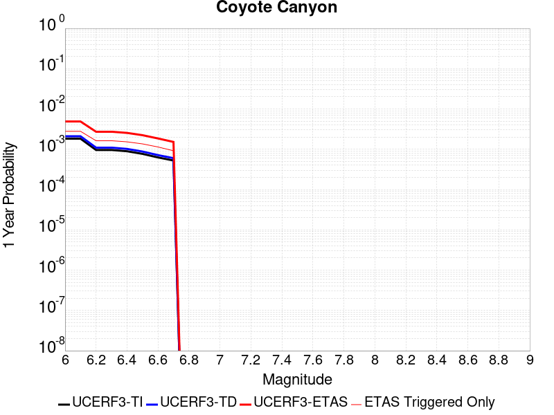 |  |

| Magnitude | 1 wk TI Prob | 1 wk TD Prob | 1 wk ETAS Prob | 1 wk ETAS/TD Gain | 1 wk ETAS Triggered Only | 1 mo TI Prob | 1 mo TD Prob | 1 mo ETAS Prob | 1 mo ETAS/TD Gain | 1 mo ETAS Triggered Only | 1 yr TI Prob | 1 yr TD Prob | 1 yr ETAS Prob | 1 yr ETAS/TD Gain | 1 yr ETAS Triggered Only | 10 yr TI Prob | 10 yr TD Prob | 10 yr ETAS Prob | 10 yr ETAS/TD Gain | 10 yr ETAS Triggered Only |
|-----|-----|-----|-----|-----|-----|-----|-----|-----|-----|-----|-----|-----|-----|-----|-----|-----|-----|-----|-----|-----|
| 6.0 | 3.5090034E-5 | 4.0364317E-5 | 8.631971E-4 | 21.385153 | 8.22866E-4 | 1.503772E-4 | 1.7297991E-4 | 0.0015764497 | 9.113484 | 0.0014037126 | 0.0018293047 | 0.0021042533 | 0.004736714 | 2.2510188 | 0.0026380115 | 0.018143194 | 0.020869205 | 0.0246844 | 1.1828146 | 0.0038965126 |
| 6.1 | 3.5090034E-5 | 4.0364317E-5 | 8.631971E-4 | 21.385153 | 8.22866E-4 | 1.503772E-4 | 1.7297991E-4 | 0.0015764497 | 9.113484 | 0.0014037126 | 0.0018293047 | 0.0021042533 | 0.004736714 | 2.2510188 | 0.0026380115 | 0.018143194 | 0.020869205 | 0.0246844 | 1.1828146 | 0.0038965126 |
| 6.2 | 1.841879E-5 | 2.1059794E-5 | 4.324841E-4 | 20.53601 | 4.11433E-4 | 7.8935285E-5 | 9.025371E-5 | 9.372452E-4 | 10.384562 | 8.470679E-4 | 9.606133E-4 | 0.0010983871 | 0.00264561 | 2.4086318 | 0.0015489243 | 0.0095647145 | 0.010939668 | 0.013117951 | 1.1991179 | 0.0022023767 |
| 6.3 | 1.841879E-5 | 2.1059794E-5 | 4.324841E-4 | 20.53601 | 4.11433E-4 | 7.8935285E-5 | 9.025371E-5 | 9.372452E-4 | 10.384562 | 8.470679E-4 | 9.606133E-4 | 0.0010983871 | 0.00264561 | 2.4086318 | 0.0015489243 | 0.0095647145 | 0.010939668 | 0.013117951 | 1.1991179 | 0.0022023767 |
| 6.4 | 1.712201E-5 | 1.9565212E-5 | 4.3099016E-4 | 22.028393 | 4.11433E-4 | 7.337798E-5 | 8.3848776E-5 | 8.824459E-4 | 10.524254 | 7.9866406E-4 | 8.930107E-4 | 0.0010204813 | 0.002471116 | 2.42152 | 0.0014521164 | 0.008894307 | 0.010167871 | 0.012252031 | 1.204975 | 0.0021055688 |
| 6.5 | 1.4744935E-5 | 1.6836972E-5 | 3.7985996E-4 | 22.561062 | 3.630291E-4 | 6.3191044E-5 | 7.215698E-5 | 7.7396265E-4 | 10.726095 | 7.018563E-4 | 7.6907943E-4 | 8.782507E-4 | 0.0021114657 | 2.404172 | 0.001234299 | 0.007664232 | 0.008756994 | 0.010628215 | 1.2136829 | 0.0018877514 |
| 6.6 | 1.2017839E-5 | 1.3724089E-5 | 3.28345E-4 | 23.92472 | 3.1462524E-4 | 5.150401E-5 | 5.88167E-5 | 6.3962914E-4 | 10.874958 | 5.8084656E-4 | 6.268809E-4 | 7.159466E-4 | 0.0017317004 | 2.4187562 | 0.0010164815 | 0.0062511545 | 0.0071450938 | 0.008610864 | 1.2051436 | 0.0014763183 |
| 6.7 | 1.00956095E-5 | 1.1533517E-5 | 2.2934847E-4 | 19.88539 | 2.1781746E-4 | 4.326618E-5 | 4.942891E-5 | 5.0924305E-4 | 10.302535 | 4.5983688E-4 | 5.266384E-4 | 6.017178E-4 | 0.0014240886 | 2.3667052 | 8.22866E-4 | 0.005253921 | 0.0060094125 | 0.0072122375 | 1.2001568 | 0.0012100971 |

## San Andreas (Mojave N)
*[(top)](#table-of-contents)*

| 1 Week | 1 Month | 1 Year | 10 Year |
|-----|-----|-----|-----|
|  |  |  | 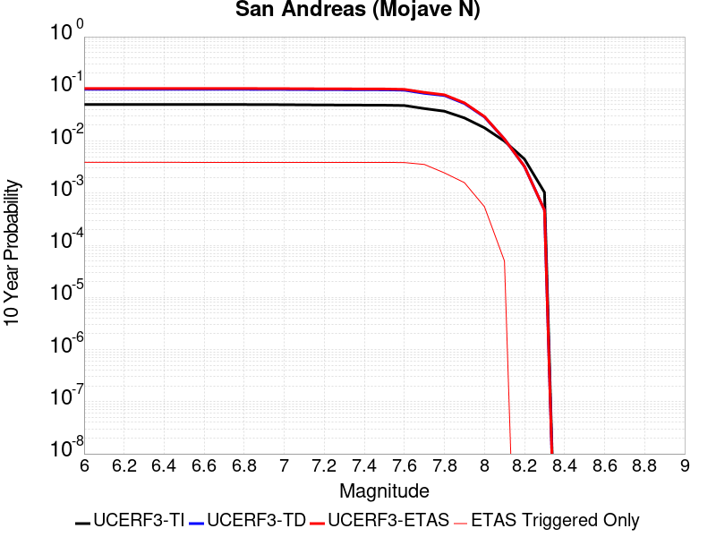 |

| Magnitude | 1 wk TI Prob | 1 wk TD Prob | 1 wk ETAS Prob | 1 wk ETAS/TD Gain | 1 wk ETAS Triggered Only | 1 mo TI Prob | 1 mo TD Prob | 1 mo ETAS Prob | 1 mo ETAS/TD Gain | 1 mo ETAS Triggered Only | 1 yr TI Prob | 1 yr TD Prob | 1 yr ETAS Prob | 1 yr ETAS/TD Gain | 1 yr ETAS Triggered Only | 10 yr TI Prob | 10 yr TD Prob | 10 yr ETAS Prob | 10 yr ETAS/TD Gain | 10 yr ETAS Triggered Only |
|-----|-----|-----|-----|-----|-----|-----|-----|-----|-----|-----|-----|-----|-----|-----|-----|-----|-----|-----|-----|-----|
| 6.0 | 9.877682E-5 | 1.9402112E-4 | 0.00196042 | 10.104158 | 0.0017667417 | 4.2326056E-4 | 8.312543E-4 | 0.002910891 | 3.5018058 | 0.002081367 | 0.0051410277 | 0.010073684 | 0.013020535 | 1.2925296 | 0.0029768387 | 0.05023708 | 0.09832245 | 0.101835854 | 1.0357335 | 0.0038965126 |
| 6.1 | 9.877682E-5 | 1.9402112E-4 | 0.00196042 | 10.104158 | 0.0017667417 | 4.2326056E-4 | 8.312543E-4 | 0.002910891 | 3.5018058 | 0.002081367 | 0.0051410277 | 0.010073684 | 0.013020535 | 1.2925296 | 0.0029768387 | 0.05023708 | 0.09832245 | 0.101835854 | 1.0357335 | 0.0038965126 |
| 6.2 | 9.877682E-5 | 1.9402112E-4 | 0.00196042 | 10.104158 | 0.0017667417 | 4.2326056E-4 | 8.312543E-4 | 0.002910891 | 3.5018058 | 0.002081367 | 0.0051410277 | 0.010073684 | 0.013020535 | 1.2925296 | 0.0029768387 | 0.05023708 | 0.09832245 | 0.101835854 | 1.0357335 | 0.0038965126 |
| 6.3 | 9.877682E-5 | 1.9402112E-4 | 0.00196042 | 10.104158 | 0.0017667417 | 4.2326056E-4 | 8.312543E-4 | 0.002910891 | 3.5018058 | 0.002081367 | 0.0051410277 | 0.010073684 | 0.013020535 | 1.2925296 | 0.0029768387 | 0.05023708 | 0.09832245 | 0.101835854 | 1.0357335 | 0.0038965126 |
| 6.4 | 9.877682E-5 | 1.9402112E-4 | 0.00196042 | 10.104158 | 0.0017667417 | 4.2326056E-4 | 8.312543E-4 | 0.002910891 | 3.5018058 | 0.002081367 | 0.0051410277 | 0.010073684 | 0.013020535 | 1.2925296 | 0.0029768387 | 0.05023708 | 0.09832245 | 0.101835854 | 1.0357335 | 0.0038965126 |
| 6.5 | 9.861474E-5 | 1.937588E-4 | 0.001960158 | 10.116486 | 0.0017667417 | 4.2256617E-4 | 8.3013077E-4 | 0.00290977 | 3.5051944 | 0.002081367 | 0.0051326132 | 0.0100601325 | 0.013007023 | 1.2929277 | 0.0029768387 | 0.050156746 | 0.09820035 | 0.10171422 | 1.0357827 | 0.0038965126 |
| 6.6 | 9.861474E-5 | 1.937588E-4 | 0.001960158 | 10.116486 | 0.0017667417 | 4.2256617E-4 | 8.3013077E-4 | 0.00290977 | 3.5051944 | 0.002081367 | 0.0051326132 | 0.0100601325 | 0.013007023 | 1.2929277 | 0.0029768387 | 0.050156746 | 0.09820035 | 0.10171422 | 1.0357827 | 0.0038965126 |
| 6.7 | 9.8552715E-5 | 1.9365833E-4 | 0.0019600578 | 10.121217 | 0.0017667417 | 4.223004E-4 | 8.2970044E-4 | 0.0029093404 | 3.506495 | 0.002081367 | 0.0051293927 | 0.010054941 | 0.013001848 | 1.2930804 | 0.0029768387 | 0.050125998 | 0.09815356 | 0.10166761 | 1.0358016 | 0.0038965126 |
| 6.8 | 9.8464974E-5 | 1.9350994E-4 | 0.0019599097 | 10.128212 | 0.0017667417 | 4.219245E-4 | 8.290649E-4 | 0.0029087062 | 3.5084178 | 0.002081367 | 0.0051248376 | 0.010047276 | 0.012994205 | 1.2933064 | 0.0029768387 | 0.05008251 | 0.09808378 | 0.10159811 | 1.0358299 | 0.0038965126 |
| 6.9 | 9.825824E-5 | 1.9319002E-4 | 0.0019595905 | 10.143332 | 0.0017667417 | 4.2103877E-4 | 8.276947E-4 | 0.0029073388 | 3.512574 | 0.002081367 | 0.0051141046 | 0.010030746 | 0.012977725 | 1.2937945 | 0.0029768387 | 0.049980022 | 0.097932965 | 0.10144788 | 1.035891 | 0.0038965126 |
| 7.0 | 9.781462E-5 | 1.9250368E-4 | 0.0019589053 | 10.175937 | 0.0017667417 | 4.1913814E-4 | 8.247551E-4 | 0.0029044054 | 3.5215368 | 0.002081367 | 0.005091073 | 0.009995285 | 0.01294237 | 1.2948475 | 0.0029768387 | 0.04976007 | 0.09760912 | 0.1011253 | 1.036023 | 0.0038965126 |
| 7.1 | 9.7121134E-5 | 1.9152075E-4 | 0.001957924 | 10.223039 | 0.0017667417 | 4.1616702E-4 | 8.205452E-4 | 0.0029002044 | 3.5344844 | 0.002081367 | 0.005055068 | 0.0099444995 | 0.012891735 | 1.2963685 | 0.0029768387 | 0.04941613 | 0.09714571 | 0.10066369 | 1.0362135 | 0.0038965126 |
| 7.2 | 9.663819E-5 | 1.9082859E-4 | 0.001957233 | 10.256498 | 0.0017667417 | 4.1409794E-4 | 8.175807E-4 | 0.0028972458 | 3.543682 | 0.002081367 | 0.0050299936 | 0.009908735 | 0.012856077 | 1.2974489 | 0.0029768387 | 0.049176537 | 0.09681883 | 0.10033809 | 1.0363489 | 0.0038965126 |
| 7.3 | 9.6277574E-5 | 1.9035369E-4 | 0.001956759 | 10.279596 | 0.0017667417 | 4.125529E-4 | 8.1554666E-4 | 0.0028952162 | 3.5500314 | 0.002081367 | 0.0050112694 | 0.009884195 | 0.012831611 | 1.2981948 | 0.0029768387 | 0.04899759 | 0.09659228 | 0.100112416 | 1.0364432 | 0.0038965126 |
| 7.4 | 9.593308E-5 | 1.8975153E-4 | 0.001956158 | 10.30905 | 0.0017667417 | 4.1107697E-4 | 8.129676E-4 | 0.0028926425 | 3.5581276 | 0.002081367 | 0.0049933824 | 0.009853081 | 0.012800588 | 1.2991458 | 0.0029768387 | 0.04882661 | 0.09630986 | 0.0998311 | 1.0365616 | 0.0038965126 |
| 7.5 | 9.561707E-5 | 1.8921228E-4 | 0.0019556198 | 10.335586 | 0.0017667417 | 4.0972308E-4 | 8.106579E-4 | 0.0028903375 | 3.5654218 | 0.002081367 | 0.0049769743 | 0.009825215 | 0.012772805 | 1.3000027 | 0.0029768387 | 0.048669744 | 0.096056245 | 0.09957848 | 1.0366684 | 0.0038965126 |
| 7.6 | 9.418194E-5 | 1.8573487E-4 | 0.0019521484 | 10.510403 | 0.0017667417 | 4.0357444E-4 | 7.95764E-4 | 0.0028754745 | 3.6134768 | 0.002081367 | 0.004902454 | 0.009645499 | 0.012569657 | 1.3031628 | 0.0029526367 | 0.047957025 | 0.094437465 | 0.09794408 | 1.0371317 | 0.0038723105 |
| 7.7 | 8.202141E-5 | 1.6022482E-4 | 0.001781495 | 11.118721 | 0.00162153 | 3.51473E-4 | 6.8649714E-4 | 0.0025729525 | 3.7479436 | 0.0018877514 | 0.00427079 | 0.008326128 | 0.0110141765 | 1.322845 | 0.0027106174 | 0.04189639 | 0.082237914 | 0.08552524 | 1.0399733 | 0.0035818873 |
| 7.8 | 7.2859846E-5 | 1.4517571E-4 | 0.0012583034 | 8.667451 | 0.0011132893 | 3.1221908E-4 | 6.2203326E-4 | 0.0019039382 | 3.06083 | 0.0012827029 | 0.003794643 | 0.0075469986 | 0.009396484 | 1.2450624 | 0.0018635495 | 0.037304975 | 0.07472766 | 0.077101365 | 1.0317646 | 0.0025654058 |
| 7.9 | 5.3874453E-5 | 1.00462625E-4 | 8.990464E-4 | 8.949063 | 7.9866406E-4 | 2.3087008E-4 | 4.3048308E-4 | 0.0013013779 | 3.023064 | 8.7126985E-4 | 0.0028072202 | 0.0052285474 | 0.0064323177 | 1.2302303 | 0.0012100971 | 0.02772022 | 0.052425884 | 0.054031204 | 1.0306207 | 0.0016941358 |
| 8.0 | 3.468538E-5 | 5.4261534E-5 | 4.1727096E-4 | 7.6899953 | 3.630291E-4 | 1.4864317E-4 | 2.3252872E-4 | 6.1966974E-4 | 2.664917 | 3.8723106E-4 | 0.0018082283 | 0.0028273636 | 0.003358301 | 1.1877853 | 5.324427E-4 | 0.017935853 | 0.028948462 | 0.029582998 | 1.0219195 | 6.534524E-4 |
| 8.1 | 1.9152367E-5 | 1.9401303E-5 | 6.780425E-5 | 3.4948297 | 4.8403883E-5 | 8.207899E-5 | 8.3145795E-5 | 1.3154565E-4 | 1.5821084 | 4.8403883E-5 | 9.988535E-4 | 0.0010118305 | 0.0011085403 | 1.095579 | 9.6807766E-5 | 0.009943757 | 0.01085595 | 0.010951708 | 1.0088207 | 9.6807766E-5 |
| 8.2 | 8.643924E-6 | 5.473668E-6 | 5.473668E-6 | 1.0 | 0.0 | 3.704486E-5 | 2.3458366E-5 | 2.3458366E-5 | 1.0 | 0.0 | 4.5092785E-4 | 2.8556827E-4 | 2.8556827E-4 | 1.0 | 0.0 | 0.0045001395 | 0.0032481793 | 0.0032481793 | 1.0 | 0.0 |
| 8.3 | 1.983087E-6 | 7.6564595E-7 | 7.6564595E-7 | 1.0 | 0.0 | 8.498917E-6 | 3.281336E-6 | 3.281336E-6 | 1.0 | 0.0 | 1.034694E-4 | 3.9949547E-5 | 3.9949547E-5 | 1.0 | 0.0 | 0.0010342124 | 4.717979E-4 | 4.717979E-4 | 1.0 | 0.0 |

## Death Valley (So)
*[(top)](#table-of-contents)*

| 1 Week | 1 Month | 1 Year | 10 Year |
|-----|-----|-----|-----|
|  |  |  |  |

| Magnitude | 1 wk TI Prob | 1 wk TD Prob | 1 wk ETAS Prob | 1 wk ETAS/TD Gain | 1 wk ETAS Triggered Only | 1 mo TI Prob | 1 mo TD Prob | 1 mo ETAS Prob | 1 mo ETAS/TD Gain | 1 mo ETAS Triggered Only | 1 yr TI Prob | 1 yr TD Prob | 1 yr ETAS Prob | 1 yr ETAS/TD Gain | 1 yr ETAS Triggered Only | 10 yr TI Prob | 10 yr TD Prob | 10 yr ETAS Prob | 10 yr ETAS/TD Gain | 10 yr ETAS Triggered Only |
|-----|-----|-----|-----|-----|-----|-----|-----|-----|-----|-----|-----|-----|-----|-----|-----|-----|-----|-----|-----|-----|
| 6.0 | 2.0684236E-5 | 2.5618314E-5 | 9.452685E-4 | 36.898155 | 9.1967377E-4 | 8.864371E-5 | 1.0978825E-4 | 0.0014165496 | 12.902561 | 0.0013069048 | 0.0010787029 | 0.0013358692 | 0.003777 | 2.8273726 | 0.002444396 | 0.010734817 | 0.013279985 | 0.016981468 | 1.2787265 | 0.0037513007 |
| 6.1 | 2.0684236E-5 | 2.5618314E-5 | 9.452685E-4 | 36.898155 | 9.1967377E-4 | 8.864371E-5 | 1.0978825E-4 | 0.0014165496 | 12.902561 | 0.0013069048 | 0.0010787029 | 0.0013358692 | 0.003777 | 2.8273726 | 0.002444396 | 0.010734817 | 0.013279985 | 0.016981468 | 1.2787265 | 0.0037513007 |
| 6.2 | 2.0684236E-5 | 2.5618314E-5 | 9.452685E-4 | 36.898155 | 9.1967377E-4 | 8.864371E-5 | 1.0978825E-4 | 0.0014165496 | 12.902561 | 0.0013069048 | 0.0010787029 | 0.0013358692 | 0.003777 | 2.8273726 | 0.002444396 | 0.010734817 | 0.013279985 | 0.016981468 | 1.2787265 | 0.0037513007 |
| 6.3 | 2.0240292E-5 | 2.51184E-5 | 8.721651E-4 | 34.72216 | 8.470679E-4 | 8.6741224E-5 | 1.0764593E-4 | 0.0013418121 | 12.465052 | 0.001234299 | 0.0010555626 | 0.001309818 | 0.003605991 | 2.7530472 | 0.0022991844 | 0.010505628 | 0.013022543 | 0.016486125 | 1.2659681 | 0.0035092814 |
| 6.4 | 2.0240292E-5 | 2.51184E-5 | 8.721651E-4 | 34.72216 | 8.470679E-4 | 8.6741224E-5 | 1.0764593E-4 | 0.0013418121 | 12.465052 | 0.001234299 | 0.0010555626 | 0.001309818 | 0.003605991 | 2.7530472 | 0.0022991844 | 0.010505628 | 0.013022543 | 0.016486125 | 1.2659681 | 0.0035092814 |
| 6.5 | 1.9962767E-5 | 2.4807652E-5 | 8.4765325E-4 | 34.16902 | 8.22866E-4 | 8.55519E-5 | 1.0631427E-4 | 0.0012920833 | 12.153433 | 0.0011858951 | 0.0010410968 | 0.0012936244 | 0.0035173225 | 2.7189674 | 0.0022265785 | 0.010362327 | 0.01286249 | 0.016231071 | 1.2618918 | 0.0034124737 |
| 6.6 | 1.8937297E-5 | 2.3311462E-5 | 7.493528E-4 | 32.14525 | 7.260582E-4 | 8.115732E-5 | 9.990252E-5 | 0.001140482 | 11.415948 | 0.0010406835 | 9.876423E-4 | 0.0012156491 | 0.0032461407 | 2.6702943 | 0.002032963 | 0.009832645 | 0.0120915035 | 0.0151997125 | 1.2570573 | 0.0031462524 |
| 6.7 | 1.8621096E-5 | 2.2912098E-5 | 7.005509E-4 | 30.575592 | 6.7765435E-4 | 7.980225E-5 | 9.8191085E-5 | 0.0010903733 | 11.104605 | 9.922796E-4 | 9.711593E-4 | 0.0011948354 | 0.0031770233 | 2.6589632 | 0.0019845592 | 0.009669261 | 0.011885625 | 0.01492274 | 1.2555283 | 0.0030736465 |
| 6.8 | 1.7830353E-5 | 2.1806083E-5 | 6.0264E-4 | 27.636324 | 5.8084656E-4 | 7.641356E-5 | 9.3451374E-5 | 9.1624045E-4 | 9.804462 | 8.22866E-4 | 9.29938E-4 | 0.0011371907 | 0.0028294 | 2.4880612 | 0.0016941358 | 0.009260561 | 0.01131609 | 0.0140199615 | 1.2389405 | 0.0027348194 |
| 6.9 | 1.3135183E-5 | 1.5304031E-5 | 4.2673072E-4 | 27.883553 | 4.11433E-4 | 5.6292425E-5 | 6.558709E-5 | 6.4639555E-4 | 9.855531 | 5.8084656E-4 | 6.8514474E-4 | 7.982367E-4 | 0.00193482 | 2.4238675 | 0.0011374912 | 0.006830362 | 0.007955158 | 0.009707846 | 1.2203208 | 0.0017667417 |
| 7.0 | 1.1507512E-5 | 1.3154237E-5 | 3.5197695E-4 | 26.757685 | 3.3882717E-4 | 4.9316975E-5 | 5.637412E-5 | 5.4038566E-4 | 9.585705 | 4.840388E-4 | 6.002687E-4 | 6.861445E-4 | 0.0015810019 | 2.304182 | 8.9547184E-4 | 0.0059864987 | 0.0068414924 | 0.008043311 | 1.1756661 | 0.0012100971 |
| 7.1 | 9.715903E-6 | 1.0865287E-5 | 1.3187368E-4 | 12.137156 | 1.210097E-4 | 4.1638916E-5 | 4.6564706E-5 | 2.4017123E-4 | 5.157795 | 1.9361553E-4 | 5.068359E-4 | 5.667821E-4 | 9.0541726E-4 | 1.5974697 | 3.3882717E-4 | 0.0050568148 | 0.005653834 | 0.0062313965 | 1.1021541 | 5.8084656E-4 |
| 7.2 | 9.233269E-6 | 1.0286314E-5 | 1.0709308E-4 | 10.411221 | 9.6807766E-5 | 3.9570554E-5 | 4.408348E-5 | 2.134896E-4 | 4.8428483 | 1.6941359E-4 | 4.81665E-4 | 5.365884E-4 | 8.0266694E-4 | 1.4958707 | 2.6622135E-4 | 0.0048062233 | 0.0053533595 | 0.005810735 | 1.085437 | 4.5983688E-4 |
| 7.3 | 8.8041315E-6 | 9.808164E-6 | 5.821157E-5 | 5.935012 | 4.8403883E-5 | 3.7731446E-5 | 4.2034335E-5 | 1.6303896E-4 | 3.878709 | 1.210097E-4 | 4.592835E-4 | 5.1165203E-4 | 7.2935806E-4 | 1.4254962 | 2.1781746E-4 | 0.0045833546 | 0.005105167 | 0.005418186 | 1.0613141 | 3.1462524E-4 |
| 7.4 | 8.708749E-6 | 9.707175E-6 | 5.811059E-5 | 5.9863544 | 4.8403883E-5 | 3.7322676E-5 | 4.160154E-5 | 1.6260621E-4 | 3.9086585 | 1.210097E-4 | 4.5430884E-4 | 5.0638523E-4 | 7.240924E-4 | 1.429924 | 2.1781746E-4 | 0.004533812 | 0.0050527398 | 0.005365775 | 1.0619537 | 3.1462524E-4 |
| 7.5 | 8.612678E-6 | 9.604817E-6 | 5.8008234E-5 | 6.039494 | 4.8403883E-5 | 3.6910955E-5 | 4.1162875E-5 | 1.621676E-4 | 3.9396567 | 1.210097E-4 | 4.492982E-4 | 5.01047E-4 | 6.945655E-4 | 1.3862283 | 1.9361553E-4 | 0.004483909 | 0.0049995985 | 0.00528857 | 1.0577989 | 2.9042328E-4 |
| 7.6 | 8.319024E-6 | 9.283916E-6 | 5.768735E-5 | 6.213687 | 4.8403883E-5 | 3.5652476E-5 | 3.978763E-5 | 1.6079252E-4 | 4.0412693 | 1.210097E-4 | 4.3398244E-4 | 4.8431093E-4 | 6.778327E-4 | 1.3995817 | 1.9361553E-4 | 0.0043313587 | 0.0048329784 | 0.005121998 | 1.0598016 | 2.9042328E-4 |
| 7.7 | 7.4718328E-6 | 8.34517E-6 | 5.674865E-5 | 6.800179 | 4.8403883E-5 | 3.2021748E-5 | 3.5764548E-5 | 1.5676992E-4 | 4.383389 | 1.210097E-4 | 3.8979502E-4 | 4.353504E-4 | 6.288816E-4 | 1.4445413 | 1.9361553E-4 | 0.00389112 | 0.0043453807 | 0.0046104454 | 1.0609992 | 2.6622135E-4 |
| 7.8 | 3.4586725E-7 | 3.6482615E-7 | 3.6482615E-7 | 1.0 | 0.0 | 1.4822873E-6 | 1.5635396E-6 | 1.5635396E-6 | 1.0 | 0.0 | 1.80467E-5 | 1.9035933E-5 | 1.9035933E-5 | 1.0 | 0.0 | 1.8045233E-4 | 1.9034347E-4 | 1.9034347E-4 | 1.0 | 0.0 |
| 7.9 | 2.5591178E-9 | 2.6696718E-9 | 2.6696718E-9 | 1.0 | 0.0 | 1.0967647E-8 | 1.14414505E-8 | 1.14414505E-8 | 1.0 | 0.0 | 1.335311E-7 | 1.3929966E-7 | 1.3929966E-7 | 1.0 | 0.0 | 1.3353102E-6 | 1.3929966E-6 | 1.3929966E-6 | 1.0 | 0.0 |

## Nelson Lake
*[(top)](#table-of-contents)*

| 1 Week | 1 Month | 1 Year | 10 Year |
|-----|-----|-----|-----|
|  |  |  |  |

| Magnitude | 1 wk TI Prob | 1 wk TD Prob | 1 wk ETAS Prob | 1 wk ETAS/TD Gain | 1 wk ETAS Triggered Only | 1 mo TI Prob | 1 mo TD Prob | 1 mo ETAS Prob | 1 mo ETAS/TD Gain | 1 mo ETAS Triggered Only | 1 yr TI Prob | 1 yr TD Prob | 1 yr ETAS Prob | 1 yr ETAS/TD Gain | 1 yr ETAS Triggered Only | 10 yr TI Prob | 10 yr TD Prob | 10 yr ETAS Prob | 10 yr ETAS/TD Gain | 10 yr ETAS Triggered Only |
|-----|-----|-----|-----|-----|-----|-----|-----|-----|-----|-----|-----|-----|-----|-----|-----|-----|-----|-----|-----|-----|
| 6.0 | 9.913453E-6 | 1.0192255E-5 | 5.910329E-4 | 57.988434 | 5.8084656E-4 | 4.2485535E-5 | 4.3680422E-5 | 9.3911315E-4 | 21.499636 | 8.9547184E-4 | 5.1713863E-4 | 5.316897E-4 | 0.0023458702 | 4.4121037 | 0.0018151456 | 0.0051593683 | 0.005305204 | 0.008410691 | 1.5853662 | 0.0031220503 |
| 6.1 | 9.913453E-6 | 1.0192255E-5 | 5.910329E-4 | 57.988434 | 5.8084656E-4 | 4.2485535E-5 | 4.3680422E-5 | 9.3911315E-4 | 21.499636 | 8.9547184E-4 | 5.1713863E-4 | 5.316897E-4 | 0.0023458702 | 4.4121037 | 0.0018151456 | 0.0051593683 | 0.005305204 | 0.008410691 | 1.5853662 | 0.0031220503 |
| 6.2 | 4.5596407E-6 | 4.696313E-6 | 2.2251275E-4 | 47.380306 | 2.1781746E-4 | 1.954117E-5 | 2.0126909E-5 | 3.8314873E-4 | 19.03664 | 3.630291E-4 | 2.3788778E-4 | 2.4501883E-4 | 0.0010434872 | 4.2588043 | 7.9866406E-4 | 0.0023763329 | 0.0024476128 | 0.0039203176 | 1.6016903 | 0.0014763183 |
| 6.3 | 4.5596407E-6 | 4.696313E-6 | 2.2251275E-4 | 47.380306 | 2.1781746E-4 | 1.954117E-5 | 2.0126909E-5 | 3.8314873E-4 | 19.03664 | 3.630291E-4 | 2.3788778E-4 | 2.4501883E-4 | 0.0010434872 | 4.2588043 | 7.9866406E-4 | 0.0023763329 | 0.0024476128 | 0.0039203176 | 1.6016903 | 0.0014763183 |
| 6.4 | 3.4025713E-6 | 3.5098972E-6 | 1.9712474E-4 | 56.16254 | 1.9361553E-4 | 1.4582367E-5 | 1.5042335E-5 | 3.0546126E-4 | 20.306772 | 2.9042328E-4 | 1.7752586E-4 | 1.8312587E-4 | 8.6065615E-4 | 4.699806 | 6.7765435E-4 | 0.001773841 | 0.0018298327 | 0.0030135578 | 1.6469035 | 0.0011858951 |
| 6.5 | 2.8352947E-6 | 2.927856E-6 | 1.9654282E-4 | 67.12858 | 1.9361553E-4 | 1.2151207E-5 | 1.2547898E-5 | 2.7876592E-4 | 22.216143 | 2.6622135E-4 | 1.479309E-4 | 1.5276071E-4 | 7.577168E-4 | 4.960155 | 6.0504855E-4 | 0.0014783246 | 0.0015266308 | 0.0025657255 | 1.6806457 | 0.0010406835 |
| 6.6 | 2.251518E-6 | 2.3290677E-6 | 1.7174226E-4 | 73.73863 | 1.6941359E-4 | 9.649328E-6 | 9.981683E-6 | 2.2779698E-4 | 22.821499 | 2.1781746E-4 | 1.1747423E-4 | 1.2152085E-4 | 5.8130187E-4 | 4.7835565 | 4.5983688E-4 | 0.0011741214 | 0.0012146058 | 0.0020364723 | 1.6766529 | 8.22866E-4 |
| 6.7 | 1.8911853E-6 | 1.9591396E-6 | 1.7137239E-4 | 87.47329 | 1.6941359E-4 | 8.105055E-6 | 8.39629E-6 | 2.2621192E-4 | 26.941893 | 2.1781746E-4 | 9.867457E-5 | 1.0222061E-4 | 4.894121E-4 | 4.787802 | 3.8723106E-4 | 9.863076E-4 | 0.0010217935 | 0.0016987553 | 1.6625233 | 6.7765435E-4 |
| 6.8 | 1.4874814E-6 | 1.5438305E-6 | 1.4675525E-4 | 95.05917 | 1.4521164E-4 | 6.374905E-6 | 6.6164025E-6 | 2.0023064E-4 | 30.262768 | 1.9361553E-4 | 7.76117E-5 | 8.055224E-5 | 4.1935212E-4 | 5.2059646 | 3.3882717E-4 | 7.75846E-4 | 8.0528157E-4 | 0.001313113 | 1.630626 | 5.082408E-4 |
| 6.9 | 6.835972E-7 | 7.1399285E-7 | 4.911784E-5 | 68.79318 | 4.8403883E-5 | 2.9296991E-6 | 3.0599674E-6 | 5.1463703E-5 | 16.818382 | 4.8403883E-5 | 3.56685E-5 | 3.7254784E-5 | 2.0666207E-4 | 5.547262 | 1.6941359E-4 | 3.5662777E-4 | 3.7251666E-4 | 5.90253E-4 | 1.5845009 | 2.1781746E-4 |

## Lenwood-Lockhart-Old Woman Springs
*[(top)](#table-of-contents)*

| 1 Week | 1 Month | 1 Year | 10 Year |
|-----|-----|-----|-----|
|  |  |  |  |

| Magnitude | 1 wk TI Prob | 1 wk TD Prob | 1 wk ETAS Prob | 1 wk ETAS/TD Gain | 1 wk ETAS Triggered Only | 1 mo TI Prob | 1 mo TD Prob | 1 mo ETAS Prob | 1 mo ETAS/TD Gain | 1 mo ETAS Triggered Only | 1 yr TI Prob | 1 yr TD Prob | 1 yr ETAS Prob | 1 yr ETAS/TD Gain | 1 yr ETAS Triggered Only | 10 yr TI Prob | 10 yr TD Prob | 10 yr ETAS Prob | 10 yr ETAS/TD Gain | 10 yr ETAS Triggered Only |
|-----|-----|-----|-----|-----|-----|-----|-----|-----|-----|-----|-----|-----|-----|-----|-----|-----|-----|-----|-----|-----|
| 6.0 | 3.744542E-5 | 4.396349E-5 | 0.0011330029 | 25.771452 | 0.0010890873 | 1.604705E-4 | 1.8840231E-4 | 0.0018096268 | 9.605121 | 0.00162153 | 0.0019519776 | 0.0022915571 | 0.004754498 | 2.0747893 | 0.002468598 | 0.019349206 | 0.022697281 | 0.0260323 | 1.1469347 | 0.0034124737 |
| 6.1 | 3.744542E-5 | 4.396349E-5 | 0.0011330029 | 25.771452 | 0.0010890873 | 1.604705E-4 | 1.8840231E-4 | 0.0018096268 | 9.605121 | 0.00162153 | 0.0019519776 | 0.0022915571 | 0.004754498 | 2.0747893 | 0.002468598 | 0.019349206 | 0.022697281 | 0.0260323 | 1.1469347 | 0.0034124737 |
| 6.2 | 3.744542E-5 | 4.396349E-5 | 0.0011330029 | 25.771452 | 0.0010890873 | 1.604705E-4 | 1.8840231E-4 | 0.0018096268 | 9.605121 | 0.00162153 | 0.0019519776 | 0.0022915571 | 0.004754498 | 2.0747893 | 0.002468598 | 0.019349206 | 0.022697281 | 0.0260323 | 1.1469347 | 0.0034124737 |
| 6.3 | 2.1079984E-5 | 2.5354384E-5 | 5.577836E-4 | 21.999493 | 5.324427E-4 | 9.0339665E-5 | 1.0865723E-4 | 8.1043725E-4 | 7.458659 | 7.018563E-4 | 0.0010993304 | 0.0013221189 | 0.0024097664 | 1.8226547 | 0.0010890873 | 0.010939079 | 0.013144747 | 0.014530009 | 1.1053852 | 0.0014037126 |
| 6.4 | 2.1079984E-5 | 2.5354384E-5 | 5.577836E-4 | 21.999493 | 5.324427E-4 | 9.0339665E-5 | 1.0865723E-4 | 8.1043725E-4 | 7.458659 | 7.018563E-4 | 0.0010993304 | 0.0013221189 | 0.0024097664 | 1.8226547 | 0.0010890873 | 0.010939079 | 0.013144747 | 0.014530009 | 1.1053852 | 0.0014037126 |
| 6.5 | 1.7397282E-5 | 2.0663285E-5 | 3.1108057E-4 | 15.0547495 | 2.9042328E-4 | 7.455765E-5 | 8.8554E-5 | 4.7575077E-4 | 5.372437 | 3.8723106E-4 | 9.073613E-4 | 0.0010776235 | 0.0017787233 | 1.6505983 | 7.018563E-4 | 0.009036654 | 0.010725273 | 0.011659025 | 1.0870609 | 9.438757E-4 |
| 6.6 | 1.52050325E-5 | 1.7680086E-5 | 2.8389672E-4 | 16.05743 | 2.6622135E-4 | 6.51628E-5 | 7.576964E-5 | 4.3877124E-4 | 5.7908583 | 3.630291E-4 | 7.9306826E-4 | 9.221128E-4 | 0.0015024238 | 1.6293275 | 5.8084656E-4 | 0.007902439 | 0.009183729 | 0.009975058 | 1.0861665 | 7.9866406E-4 |
| 6.7 | 1.332523E-5 | 1.5264379E-5 | 2.572801E-4 | 16.854933 | 2.420194E-4 | 5.7106878E-5 | 6.541716E-5 | 4.0422217E-4 | 6.179146 | 3.3882717E-4 | 6.950544E-4 | 7.9616875E-4 | 0.0013523703 | 1.6985974 | 5.5664463E-4 | 0.006928845 | 0.0079337945 | 0.008678102 | 1.0938148 | 7.502602E-4 |
| 6.8 | 1.1525329E-5 | 1.3031365E-5 | 2.5504763E-4 | 19.571827 | 2.420194E-4 | 4.9393333E-5 | 5.5847537E-5 | 3.704552E-4 | 6.6333313 | 3.1462524E-4 | 6.011979E-4 | 6.7973585E-4 | 0.0011634456 | 1.7116144 | 4.840388E-4 | 0.00599574 | 0.0067770192 | 0.007402005 | 1.0922214 | 6.292505E-4 |
| 6.9 | 1.0253909E-5 | 1.1514835E-5 | 2.293298E-4 | 19.91603 | 2.1781746E-4 | 4.3944583E-5 | 4.934838E-5 | 3.155566E-4 | 6.3944674 | 2.6622135E-4 | 5.3489394E-4 | 6.006545E-4 | 9.6346554E-4 | 1.6040262 | 3.630291E-4 | 0.0053360825 | 0.0059906896 | 0.0064958856 | 1.0843302 | 5.082408E-4 |
| 7.0 | 8.104563E-6 | 8.99143E-6 | 1.784035E-4 | 19.841503 | 1.6941359E-4 | 3.4733377E-5 | 3.853415E-5 | 2.0794121E-4 | 5.396284 | 1.6941359E-4 | 4.2279682E-4 | 4.6905465E-4 | 6.8676996E-4 | 1.4641577 | 2.1781746E-4 | 0.0042199334 | 0.0046808943 | 0.004969958 | 1.061754 | 2.9042328E-4 |
| 7.1 | 6.7986157E-6 | 7.5159796E-6 | 1.769283E-4 | 23.540283 | 1.6941359E-4 | 2.91366E-5 | 3.2210955E-5 | 2.0161908E-4 | 6.2593327 | 1.6941359E-4 | 3.5468035E-4 | 3.9209996E-4 | 5.8563956E-4 | 1.4935976 | 1.9361553E-4 | 0.003541148 | 0.003914298 | 0.00415537 | 1.0615876 | 2.420194E-4 |
| 7.2 | 5.6893327E-6 | 6.280132E-6 | 7.8885496E-5 | 12.561121 | 7.260582E-5 | 2.4382627E-5 | 2.6914584E-5 | 9.951845E-5 | 3.697566 | 7.260582E-5 | 2.9681803E-4 | 3.276378E-4 | 4.2441383E-4 | 1.2953751 | 9.6807766E-5 | 0.002964219 | 0.003271746 | 0.00339236 | 1.0368652 | 1.210097E-4 |
| 7.3 | 4.253348E-6 | 4.707075E-6 | 7.731256E-5 | 16.424757 | 7.260582E-5 | 1.8228506E-5 | 2.017303E-5 | 9.277739E-5 | 4.59908 | 7.260582E-5 | 2.2190946E-4 | 2.455808E-4 | 3.423648E-4 | 1.3941025 | 9.6807766E-5 | 0.00221688 | 0.0024532753 | 0.002573988 | 1.0492048 | 1.210097E-4 |
| 7.4 | 2.5448119E-6 | 2.8520594E-6 | 2.8520594E-6 | 1.0 | 0.0 | 1.0906291E-5 | 1.2223064E-5 | 1.2223064E-5 | 1.0 | 0.0 | 1.3277601E-4 | 1.4880729E-4 | 1.7300564E-4 | 1.1626153 | 2.4201941E-5 | 0.001326967 | 0.0014872387 | 0.0015114046 | 1.0162488 | 2.4201941E-5 |
| 7.5 | 4.3706837E-8 | 4.562909E-8 | 4.562909E-8 | 1.0 | 0.0 | 1.8731501E-7 | 1.9555324E-7 | 1.9555324E-7 | 1.0 | 0.0 | 2.2805577E-6 | 2.3808586E-6 | 2.3808586E-6 | 1.0 | 0.0 | 2.2805343E-5 | 2.3808387E-5 | 2.3808387E-5 | 1.0 | 0.0 |

## Towne Pass
*[(top)](#table-of-contents)*

| 1 Week | 1 Month | 1 Year | 10 Year |
|-----|-----|-----|-----|
|  |  |  |  |

| Magnitude | 1 wk TI Prob | 1 wk TD Prob | 1 wk ETAS Prob | 1 wk ETAS/TD Gain | 1 wk ETAS Triggered Only | 1 mo TI Prob | 1 mo TD Prob | 1 mo ETAS Prob | 1 mo ETAS/TD Gain | 1 mo ETAS Triggered Only | 1 yr TI Prob | 1 yr TD Prob | 1 yr ETAS Prob | 1 yr ETAS/TD Gain | 1 yr ETAS Triggered Only | 10 yr TI Prob | 10 yr TD Prob | 10 yr ETAS Prob | 10 yr ETAS/TD Gain | 10 yr ETAS Triggered Only |
|-----|-----|-----|-----|-----|-----|-----|-----|-----|-----|-----|-----|-----|-----|-----|-----|-----|-----|-----|-----|-----|
| 6.0 | 3.849728E-6 | 3.894542E-6 | 7.541518E-4 | 193.64326 | 7.502602E-4 | 1.649873E-5 | 1.6690812E-5 | 0.0010089538 | 60.449657 | 9.922796E-4 | 2.0085352E-4 | 2.0319606E-4 | 0.002235746 | 11.0029 | 0.002032963 | 0.0020067208 | 0.0020305319 | 0.0051462427 | 2.534431 | 0.0031220503 |
| 6.1 | 3.849728E-6 | 3.894542E-6 | 7.541518E-4 | 193.64326 | 7.502602E-4 | 1.649873E-5 | 1.6690812E-5 | 0.0010089538 | 60.449657 | 9.922796E-4 | 2.0085352E-4 | 2.0319606E-4 | 0.002235746 | 11.0029 | 0.002032963 | 0.0020067208 | 0.0020305319 | 0.0051462427 | 2.534431 | 0.0031220503 |
| 6.2 | 3.849728E-6 | 3.894542E-6 | 7.541518E-4 | 193.64326 | 7.502602E-4 | 1.649873E-5 | 1.6690812E-5 | 0.0010089538 | 60.449657 | 9.922796E-4 | 2.0085352E-4 | 2.0319606E-4 | 0.002235746 | 11.0029 | 0.002032963 | 0.0020067208 | 0.0020305319 | 0.0051462427 | 2.534431 | 0.0031220503 |
| 6.3 | 3.849728E-6 | 3.894542E-6 | 7.541518E-4 | 193.64326 | 7.502602E-4 | 1.649873E-5 | 1.6690812E-5 | 0.0010089538 | 60.449657 | 9.922796E-4 | 2.0085352E-4 | 2.0319606E-4 | 0.002235746 | 11.0029 | 0.002032963 | 0.0020067208 | 0.0020305319 | 0.0051462427 | 2.534431 | 0.0031220503 |
| 6.4 | 3.849728E-6 | 3.894542E-6 | 7.541518E-4 | 193.64326 | 7.502602E-4 | 1.649873E-5 | 1.6690812E-5 | 0.0010089538 | 60.449657 | 9.922796E-4 | 2.0085352E-4 | 2.0319606E-4 | 0.002235746 | 11.0029 | 0.002032963 | 0.0020067208 | 0.0020305319 | 0.0051462427 | 2.534431 | 0.0031220503 |
| 6.5 | 1.1953545E-6 | 1.2030526E-6 | 9.80107E-5 | 81.46834 | 9.6807766E-5 | 5.1229376E-6 | 5.15593E-6 | 1.2616502E-4 | 24.469883 | 1.210097E-4 | 6.236998E-5 | 6.277176E-5 | 3.7737723E-4 | 6.011895 | 3.1462524E-4 | 6.235248E-4 | 6.2755204E-4 | 0.0010387268 | 1.6552043 | 4.11433E-4 |
| 6.6 | 1.1953545E-6 | 1.2030526E-6 | 9.80107E-5 | 81.46834 | 9.6807766E-5 | 5.1229376E-6 | 5.15593E-6 | 1.2616502E-4 | 24.469883 | 1.210097E-4 | 6.236998E-5 | 6.277176E-5 | 3.7737723E-4 | 6.011895 | 3.1462524E-4 | 6.235248E-4 | 6.2755204E-4 | 0.0010387268 | 1.6552043 | 4.11433E-4 |
| 6.7 | 8.375951E-7 | 8.410676E-7 | 7.344683E-5 | 87.325714 | 7.260582E-5 | 3.5896885E-6 | 3.6045708E-6 | 1.00411984E-4 | 27.85685 | 9.6807766E-5 | 4.370358E-5 | 4.3884826E-5 | 2.1329097E-4 | 4.8602443 | 1.6941359E-4 | 4.3694986E-4 | 4.3876728E-4 | 6.322979E-4 | 1.441078 | 1.9361553E-4 |
| 6.8 | 6.38041E-7 | 6.3921624E-7 | 4.904307E-5 | 76.723755 | 4.8403883E-5 | 2.7344586E-6 | 2.7394954E-6 | 7.534512E-5 | 27.503284 | 7.260582E-5 | 3.3291526E-5 | 3.3352884E-5 | 1.5435855E-4 | 4.628042 | 1.210097E-4 | 3.3286537E-4 | 3.334826E-4 | 4.7864582E-4 | 1.4352947 | 1.4521164E-4 |
| 6.9 | 5.3460053E-7 | 5.345339E-7 | 4.893839E-5 | 91.55339 | 4.8403883E-5 | 2.2911431E-6 | 2.2908578E-6 | 7.489652E-5 | 32.693657 | 7.260582E-5 | 2.789431E-5 | 2.7890868E-5 | 1.488972E-4 | 5.3385644 | 1.210097E-4 | 2.789081E-4 | 2.78877E-4 | 4.2404816E-4 | 1.5205562 | 1.4521164E-4 |
| 7.0 | 3.557783E-7 | 3.5324283E-7 | 2.4555175E-5 | 69.51358 | 2.4201941E-5 | 1.5247632E-6 | 1.513897E-6 | 4.9917704E-5 | 32.972984 | 4.8403883E-5 | 1.8563835E-5 | 1.8431549E-5 | 1.15237526E-4 | 6.252189 | 9.6807766E-5 | 1.8562283E-4 | 1.8430105E-4 | 3.0528844E-4 | 1.6564661 | 1.210097E-4 |
| 7.1 | 3.037942E-7 | 3.0002275E-7 | 2.4501956E-5 | 81.66699 | 2.4201941E-5 | 1.3019744E-6 | 1.2858112E-6 | 4.9689632E-5 | 38.644577 | 4.8403883E-5 | 1.5851423E-5 | 1.5654647E-5 | 1.124609E-4 | 7.1838665 | 9.6807766E-5 | 1.5850292E-4 | 1.5653619E-4 | 2.7752694E-4 | 1.7729251 | 1.210097E-4 |
| 7.2 | 2.0808248E-7 | 2.0217735E-7 | 2.4404113E-5 | 120.706474 | 2.4201941E-5 | 8.917818E-7 | 8.6647407E-7 | 2.5068393E-5 | 28.9315 | 2.4201941E-5 | 1.0857389E-5 | 1.0549275E-5 | 8.315433E-5 | 7.8824687 | 7.260582E-5 | 1.0856859E-4 | 1.0548821E-4 | 2.0228577E-4 | 1.9176149 | 9.6807766E-5 |
| 7.3 | 1.1162073E-7 | 1.0636902E-7 | 1.0636902E-7 | 1.0 | 0.0 | 4.7837443E-7 | 4.5586717E-7 | 4.5586717E-7 | 1.0 | 0.0 | 5.8241935E-6 | 5.5501705E-6 | 5.3953783E-5 | 9.721104 | 4.8403883E-5 | 5.8240406E-5 | 5.550052E-5 | 1.2810231E-4 | 2.308128 | 7.260582E-5 |

## San Andreas (San Bernardino N)
*[(top)](#table-of-contents)*

| 1 Week | 1 Month | 1 Year | 10 Year |
|-----|-----|-----|-----|
| 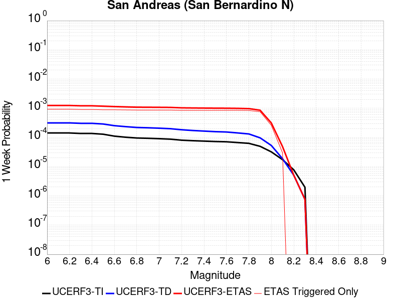 |  |  |  |

| Magnitude | 1 wk TI Prob | 1 wk TD Prob | 1 wk ETAS Prob | 1 wk ETAS/TD Gain | 1 wk ETAS Triggered Only | 1 mo TI Prob | 1 mo TD Prob | 1 mo ETAS Prob | 1 mo ETAS/TD Gain | 1 mo ETAS Triggered Only | 1 yr TI Prob | 1 yr TD Prob | 1 yr ETAS Prob | 1 yr ETAS/TD Gain | 1 yr ETAS Triggered Only | 10 yr TI Prob | 10 yr TD Prob | 10 yr ETAS Prob | 10 yr ETAS/TD Gain | 10 yr ETAS Triggered Only |
|-----|-----|-----|-----|-----|-----|-----|-----|-----|-----|-----|-----|-----|-----|-----|-----|-----|-----|-----|-----|-----|
| 6.0 | 1.4273766E-4 | 3.160784E-4 | 0.0012596558 | 3.9852636 | 9.438757E-4 | 6.115894E-4 | 0.0013539245 | 0.002417368 | 1.7854527 | 0.0010648854 | 0.0074207084 | 0.016360939 | 0.017884523 | 1.0931232 | 0.0015489243 | 0.07177748 | 0.15021163 | 0.15206261 | 1.0123225 | 0.0021781747 |
| 6.1 | 1.4273766E-4 | 3.160784E-4 | 0.0012596558 | 3.9852636 | 9.438757E-4 | 6.115894E-4 | 0.0013539245 | 0.002417368 | 1.7854527 | 0.0010648854 | 0.0074207084 | 0.016360939 | 0.017884523 | 1.0931232 | 0.0015489243 | 0.07177748 | 0.15021163 | 0.15206261 | 1.0123225 | 0.0021781747 |
| 6.2 | 1.4273766E-4 | 3.160784E-4 | 0.0012596558 | 3.9852636 | 9.438757E-4 | 6.115894E-4 | 0.0013539245 | 0.002417368 | 1.7854527 | 0.0010648854 | 0.0074207084 | 0.016360939 | 0.017884523 | 1.0931232 | 0.0015489243 | 0.07177748 | 0.15021163 | 0.15206261 | 1.0123225 | 0.0021781747 |
| 6.3 | 1.3730655E-4 | 3.0512668E-4 | 0.0012245198 | 4.013152 | 9.1967377E-4 | 5.883239E-4 | 0.001307036 | 0.0023463594 | 1.7951757 | 0.0010406835 | 0.0071393442 | 0.015798455 | 0.01729909 | 1.0949861 | 0.0015247223 | 0.06914291 | 0.1455135 | 0.14735405 | 1.0126486 | 0.0021539729 |
| 6.4 | 1.3730655E-4 | 3.0512668E-4 | 0.0012245198 | 4.013152 | 9.1967377E-4 | 5.883239E-4 | 0.001307036 | 0.0023463594 | 1.7951757 | 0.0010406835 | 0.0071393442 | 0.015798455 | 0.01729909 | 1.0949861 | 0.0015247223 | 0.06914291 | 0.1455135 | 0.14735405 | 1.0126486 | 0.0021539729 |
| 6.5 | 1.2942807E-4 | 2.8927144E-4 | 0.0011844842 | 4.0947156 | 8.9547184E-4 | 5.545738E-4 | 0.0012391509 | 0.002254373 | 1.8192884 | 0.0010164815 | 0.0067310524 | 0.014983548 | 0.016461585 | 1.098644 | 0.0015005204 | 0.06530788 | 0.13865088 | 0.1405062 | 1.0133812 | 0.0021539729 |
| 6.6 | 1.1125901E-4 | 2.5365927E-4 | 0.001148904 | 4.52932 | 8.9547184E-4 | 4.767372E-4 | 0.0010866605 | 0.0021020374 | 1.9344013 | 0.0010164815 | 0.005788839 | 0.0131504685 | 0.014631256 | 1.1126034 | 0.0015005204 | 0.056403454 | 0.12300496 | 0.12489398 | 1.0153573 | 0.0021539729 |
| 6.7 | 1.02209575E-4 | 2.3500937E-4 | 0.0011060745 | 4.706512 | 8.7126985E-4 | 4.3796748E-4 | 0.0010067957 | 0.0019980762 | 1.9845896 | 9.922796E-4 | 0.0053192247 | 0.012189267 | 0.01364759 | 1.11964 | 0.0014763183 | 0.051936906 | 0.114792764 | 0.11667805 | 1.0164235 | 0.0021297708 |
| 6.8 | 9.610582E-5 | 2.2026796E-4 | 0.0010671493 | 4.8447776 | 8.470679E-4 | 4.1181705E-4 | 9.436647E-4 | 0.0019108288 | 2.0249023 | 9.680776E-4 | 0.0050023515 | 0.011428859 | 0.0128404545 | 1.1235114 | 0.0014279145 | 0.048912346 | 0.10820469 | 0.11006084 | 1.0171541 | 0.002081367 |
| 6.9 | 9.3877505E-5 | 2.1482339E-4 | 0.0010617094 | 4.9422426 | 8.470679E-4 | 4.0227012E-4 | 9.203475E-4 | 0.0018875342 | 2.0508928 | 9.680776E-4 | 0.0048866454 | 0.011147907 | 0.012559903 | 1.1266602 | 0.0014279145 | 0.04780577 | 0.105798274 | 0.10763779 | 1.017387 | 0.002057165 |
| 7.0 | 9.1019785E-5 | 2.0809306E-4 | 0.0010549848 | 5.0697737 | 8.470679E-4 | 3.900265E-4 | 8.915232E-4 | 0.0018587378 | 2.084901 | 9.680776E-4 | 0.0047382377 | 0.0108004995 | 0.012212992 | 1.1307802 | 0.0014279145 | 0.046384744 | 0.10276815 | 0.10461391 | 1.0179603 | 0.002057165 |
| 7.1 | 8.771155E-5 | 1.9983841E-4 | 0.0010467371 | 5.2379174 | 8.470679E-4 | 3.758525E-4 | 8.5616973E-4 | 0.0018234185 | 2.1297395 | 9.680776E-4 | 0.0045664064 | 0.010374243 | 0.011763393 | 1.1339037 | 0.0014037126 | 0.044737056 | 0.09907644 | 0.10090798 | 1.0184861 | 0.002032963 |
| 7.2 | 8.0830236E-5 | 1.8389444E-4 | 0.0010308066 | 5.605426 | 8.470679E-4 | 3.4636928E-4 | 7.8788114E-4 | 0.001755196 | 2.2277422 | 9.680776E-4 | 0.0042088944 | 0.009550368 | 0.010940676 | 1.1455762 | 0.0014037126 | 0.041300658 | 0.09180518 | 0.09365151 | 1.0201113 | 0.002032963 |
| 7.3 | 7.7668235E-5 | 1.7333007E-4 | 0.0010202512 | 5.886175 | 8.470679E-4 | 3.328214E-4 | 7.426318E-4 | 0.0017099906 | 2.3026087 | 9.680776E-4 | 0.0040445733 | 0.009004138 | 0.010395211 | 1.1544926 | 0.0014037126 | 0.03971748 | 0.08706761 | 0.08892357 | 1.0213163 | 0.002032963 |
| 7.4 | 7.520177E-5 | 1.655312E-4 | 0.0010124589 | 6.116424 | 8.470679E-4 | 3.2225347E-4 | 7.092266E-4 | 0.0016766177 | 2.3640084 | 9.680776E-4 | 0.0039163795 | 0.008600714 | 0.009992353 | 1.1618052 | 0.0014037126 | 0.038480744 | 0.08352157 | 0.085384734 | 1.0223076 | 0.002032963 |
| 7.5 | 7.274697E-5 | 1.584075E-4 | 0.0010053413 | 6.346551 | 8.470679E-4 | 3.1173544E-4 | 6.7871273E-4 | 0.0016461334 | 2.4253757 | 9.680776E-4 | 0.003788775 | 0.008232076 | 0.009624233 | 1.1691138 | 0.0014037126 | 0.03724827 | 0.08023654 | 0.08210638 | 1.0233041 | 0.002032963 |
| 7.6 | 7.1185845E-5 | 1.5410586E-4 | 0.0010010432 | 6.4958158 | 8.470679E-4 | 3.0504653E-4 | 6.602866E-4 | 0.001627725 | 2.4651797 | 9.680776E-4 | 0.0037076178 | 0.0080094095 | 0.009401879 | 1.1738542 | 0.0014037126 | 0.036463667 | 0.07822661 | 0.080100544 | 1.0239551 | 0.002032963 |
| 7.7 | 6.709961E-5 | 1.4319421E-4 | 9.901408E-4 | 6.914671 | 8.470679E-4 | 2.8753807E-4 | 6.135452E-4 | 0.0015810289 | 2.5768745 | 9.680776E-4 | 0.003495157 | 0.0074443663 | 0.008837629 | 1.1871567 | 0.0014037126 | 0.034406938 | 0.07305558 | 0.074940026 | 1.0257946 | 0.002032963 |
| 7.8 | 6.300812E-5 | 1.320343E-4 | 9.789903E-4 | 7.414667 | 8.470679E-4 | 2.7000686E-4 | 5.657386E-4 | 0.0015332686 | 2.7102067 | 9.680776E-4 | 0.0032823787 | 0.006866143 | 0.0082602175 | 1.2030361 | 0.0014037126 | 0.032343175 | 0.06771385 | 0.06958659 | 1.0276567 | 0.002008761 |
| 7.9 | 4.983037E-5 | 9.7241085E-5 | 8.958275E-4 | 9.212439 | 7.9866406E-4 | 2.1354125E-4 | 4.1668097E-4 | 0.0012875878 | 3.0901048 | 8.7126985E-4 | 0.0025967648 | 0.0050613005 | 0.006265273 | 1.2378781 | 0.0012100971 | 0.025666296 | 0.050650507 | 0.052258834 | 1.0317534 | 0.0016941358 |
| 8.0 | 3.2211527E-5 | 5.3306234E-5 | 4.16316E-4 | 7.8098936 | 3.630291E-4 | 1.380421E-4 | 2.2843528E-4 | 6.155779E-4 | 2.6947584 | 3.8723106E-4 | 0.0016793669 | 0.0027776542 | 0.003308618 | 1.1911554 | 5.324427E-4 | 0.016667323 | 0.028362568 | 0.028997488 | 1.0223858 | 6.534524E-4 |
| 8.1 | 1.743376E-5 | 1.8823403E-5 | 6.722637E-5 | 3.5714252 | 4.8403883E-5 | 7.471398E-5 | 8.066923E-5 | 1.290692E-4 | 1.5999806 | 4.8403883E-5 | 9.0926304E-4 | 9.81706E-4 | 0.0010784187 | 1.0985149 | 9.6807766E-5 | 0.009055517 | 0.010483979 | 0.010579772 | 1.009137 | 9.6807766E-5 |
| 8.2 | 7.831616E-6 | 5.1540533E-6 | 5.1540533E-6 | 1.0 | 0.0 | 3.3563636E-5 | 2.2088612E-5 | 2.2088612E-5 | 1.0 | 0.0 | 4.0856065E-4 | 2.6889573E-4 | 2.6889573E-4 | 1.0 | 0.0 | 0.004078103 | 0.0030413668 | 0.0030413668 | 1.0 | 0.0 |
| 8.3 | 1.983087E-6 | 7.6564595E-7 | 7.6564595E-7 | 1.0 | 0.0 | 8.498917E-6 | 3.281336E-6 | 3.281336E-6 | 1.0 | 0.0 | 1.034694E-4 | 3.9949547E-5 | 3.9949547E-5 | 1.0 | 0.0 | 0.0010342124 | 4.717979E-4 | 4.717979E-4 | 1.0 | 0.0 |

## Bicycle Lake
*[(top)](#table-of-contents)*

| 1 Week | 1 Month | 1 Year | 10 Year |
|-----|-----|-----|-----|
|  |  |  |  |

| Magnitude | 1 wk TI Prob | 1 wk TD Prob | 1 wk ETAS Prob | 1 wk ETAS/TD Gain | 1 wk ETAS Triggered Only | 1 mo TI Prob | 1 mo TD Prob | 1 mo ETAS Prob | 1 mo ETAS/TD Gain | 1 mo ETAS Triggered Only | 1 yr TI Prob | 1 yr TD Prob | 1 yr ETAS Prob | 1 yr ETAS/TD Gain | 1 yr ETAS Triggered Only | 10 yr TI Prob | 10 yr TD Prob | 10 yr ETAS Prob | 10 yr ETAS/TD Gain | 10 yr ETAS Triggered Only |
|-----|-----|-----|-----|-----|-----|-----|-----|-----|-----|-----|-----|-----|-----|-----|-----|-----|-----|-----|-----|-----|
| 6.0 | 1.9621975E-5 | 2.2097078E-5 | 5.061252E-4 | 22.904621 | 4.840388E-4 | 8.4091465E-5 | 9.4699084E-5 | 9.416868E-4 | 9.943991 | 8.470679E-4 | 0.0010233327 | 0.0011524865 | 0.0025062333 | 2.1746314 | 0.0013553087 | 0.01018633 | 0.011478408 | 0.013703354 | 1.1938374 | 0.0022507806 |
| 6.1 | 1.9621975E-5 | 2.2097078E-5 | 5.061252E-4 | 22.904621 | 4.840388E-4 | 8.4091465E-5 | 9.4699084E-5 | 9.416868E-4 | 9.943991 | 8.470679E-4 | 0.0010233327 | 0.0011524865 | 0.0025062333 | 2.1746314 | 0.0013553087 | 0.01018633 | 0.011478408 | 0.013703354 | 1.1938374 | 0.0022507806 |
| 6.2 | 9.9971285E-6 | 1.125564E-5 | 2.77474E-4 | 24.651997 | 2.6622135E-4 | 4.2844134E-5 | 4.8237856E-5 | 5.806549E-4 | 12.037328 | 5.324427E-4 | 5.2150246E-4 | 5.871897E-4 | 0.0014337602 | 2.4417326 | 8.470679E-4 | 0.0052028033 | 0.005861487 | 0.007160731 | 1.2216579 | 0.0013069048 |
| 6.3 | 9.589428E-6 | 1.0798346E-5 | 2.7701684E-4 | 25.653635 | 2.6622135E-4 | 4.10969E-5 | 4.62781E-5 | 5.302945E-4 | 11.458866 | 4.840388E-4 | 5.002399E-4 | 5.6334207E-4 | 0.0013373679 | 2.373989 | 7.744621E-4 | 0.0049911533 | 0.0056242296 | 0.0068515865 | 1.2182267 | 0.001234299 |
| 6.4 | 9.589428E-6 | 1.0798346E-5 | 2.7701684E-4 | 25.653635 | 2.6622135E-4 | 4.10969E-5 | 4.62781E-5 | 5.302945E-4 | 11.458866 | 4.840388E-4 | 5.002399E-4 | 5.6334207E-4 | 0.0013373679 | 2.373989 | 7.744621E-4 | 0.0049911533 | 0.0056242296 | 0.0068515865 | 1.2182267 | 0.001234299 |
| 6.5 | 5.557707E-6 | 6.2856016E-6 | 1.7569812E-4 | 27.952477 | 1.6941359E-4 | 2.3818526E-5 | 2.6938165E-5 | 3.6575622E-4 | 13.577621 | 3.3882717E-4 | 2.8995197E-4 | 3.279497E-4 | 8.844118E-4 | 2.696791 | 5.5664463E-4 | 0.0028957394 | 0.0032772934 | 0.0040250947 | 1.2281765 | 7.502602E-4 |
| 6.6 | 4.8742945E-6 | 5.5132896E-6 | 1.2652233E-4 | 22.948608 | 1.210097E-4 | 2.0889667E-5 | 2.3628318E-5 | 2.898434E-4 | 12.26678 | 2.6622135E-4 | 2.54302E-4 | 2.87663E-4 | 6.989776E-4 | 2.429849 | 4.11433E-4 | 0.002540112 | 0.0028754752 | 0.0034787839 | 1.2098118 | 6.0504855E-4 |
| 6.7 | 3.991108E-6 | 4.5159104E-6 | 5.2919575E-5 | 11.718473 | 4.8403883E-5 | 1.7104636E-5 | 1.9353902E-5 | 1.8876421E-4 | 9.75329 | 1.6941359E-4 | 2.0822904E-4 | 2.3563375E-4 | 4.7759613E-4 | 2.0268579 | 2.420194E-4 | 0.0020803404 | 0.0023563374 | 0.002742656 | 1.1639488 | 3.8723106E-4 |

## Paradise
*[(top)](#table-of-contents)*

| 1 Week | 1 Month | 1 Year | 10 Year |
|-----|-----|-----|-----|
|  |  |  | 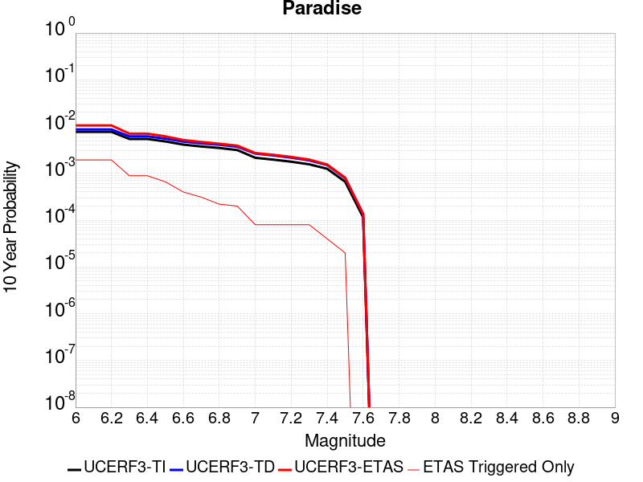 |

| Magnitude | 1 wk TI Prob | 1 wk TD Prob | 1 wk ETAS Prob | 1 wk ETAS/TD Gain | 1 wk ETAS Triggered Only | 1 mo TI Prob | 1 mo TD Prob | 1 mo ETAS Prob | 1 mo ETAS/TD Gain | 1 mo ETAS Triggered Only | 1 yr TI Prob | 1 yr TD Prob | 1 yr ETAS Prob | 1 yr ETAS/TD Gain | 1 yr ETAS Triggered Only | 10 yr TI Prob | 10 yr TD Prob | 10 yr ETAS Prob | 10 yr ETAS/TD Gain | 10 yr ETAS Triggered Only |
|-----|-----|-----|-----|-----|-----|-----|-----|-----|-----|-----|-----|-----|-----|-----|-----|-----|-----|-----|-----|-----|
| 6.0 | 1.4851273E-5 | 1.6694768E-5 | 4.5232242E-4 | 27.093662 | 4.3563492E-4 | 6.364676E-5 | 7.154718E-5 | 7.007526E-4 | 9.794273 | 6.292505E-4 | 7.7462377E-4 | 8.707624E-4 | 0.0020072632 | 2.3051789 | 0.0011374912 | 0.0077192914 | 0.008675884 | 0.010307338 | 1.1880447 | 0.001645732 |
| 6.1 | 1.4851273E-5 | 1.6694768E-5 | 4.5232242E-4 | 27.093662 | 4.3563492E-4 | 6.364676E-5 | 7.154718E-5 | 7.007526E-4 | 9.794273 | 6.292505E-4 | 7.7462377E-4 | 8.707624E-4 | 0.0020072632 | 2.3051789 | 0.0011374912 | 0.0077192914 | 0.008675884 | 0.010307338 | 1.1880447 | 0.001645732 |
| 6.2 | 1.4851273E-5 | 1.6694768E-5 | 4.5232242E-4 | 27.093662 | 4.3563492E-4 | 6.364676E-5 | 7.154718E-5 | 7.007526E-4 | 9.794273 | 6.292505E-4 | 7.7462377E-4 | 8.707624E-4 | 0.0020072632 | 2.3051789 | 0.0011374912 | 0.0077192914 | 0.008675884 | 0.010307338 | 1.1880447 | 0.001645732 |
| 6.3 | 1.0426831E-5 | 1.1888697E-5 | 1.3289697E-4 | 11.178429 | 1.210097E-4 | 4.4685654E-5 | 5.09506E-5 | 2.6875696E-4 | 5.2748537 | 2.1781746E-4 | 5.43912E-4 | 6.201529E-4 | 0.0010555177 | 1.702028 | 4.3563492E-4 | 0.0054258266 | 0.0061848317 | 0.0068101906 | 1.1011117 | 6.292505E-4 |
| 6.4 | 1.0426831E-5 | 1.1888697E-5 | 1.3289697E-4 | 11.178429 | 1.210097E-4 | 4.4685654E-5 | 5.09506E-5 | 2.6875696E-4 | 5.2748537 | 2.1781746E-4 | 5.43912E-4 | 6.201529E-4 | 0.0010555177 | 1.702028 | 4.3563492E-4 | 0.0054258266 | 0.0061848317 | 0.0068101906 | 1.1011117 | 6.292505E-4 |
| 6.5 | 9.25027E-6 | 1.0620037E-5 | 8.322509E-5 | 7.83661 | 7.260582E-5 | 3.964341E-5 | 4.551368E-5 | 1.9071871E-4 | 4.1903605 | 1.4521164E-4 | 4.8255164E-4 | 5.5399304E-4 | 8.68444E-4 | 1.5676081 | 3.1462524E-4 | 0.0048150513 | 0.0055266195 | 0.0060079833 | 1.0870991 | 4.840388E-4 |
| 6.6 | 7.904275E-6 | 9.159602E-6 | 8.176476E-5 | 8.926671 | 7.260582E-5 | 3.3875025E-5 | 3.925487E-5 | 1.6025982E-4 | 4.082546 | 1.210097E-4 | 4.1235037E-4 | 4.7782718E-4 | 7.197309E-4 | 1.5062579 | 2.420194E-4 | 0.0041158604 | 0.004768395 | 0.0051056063 | 1.070718 | 3.3882717E-4 |
| 6.7 | 7.2061953E-6 | 8.407326E-6 | 8.101254E-5 | 9.635946 | 7.260582E-5 | 3.088333E-5 | 3.603092E-5 | 1.5703627E-4 | 4.358375 | 1.210097E-4 | 3.7593965E-4 | 4.3859181E-4 | 6.3212245E-4 | 1.4412545 | 1.9361553E-4 | 0.003753043 | 0.004377631 | 0.004666783 | 1.0660522 | 2.9042328E-4 |
| 6.8 | 6.6948724E-6 | 7.842242E-6 | 8.04475E-5 | 10.258226 | 7.260582E-5 | 2.8691995E-5 | 3.3609194E-5 | 1.5461483E-4 | 4.600373 | 1.210097E-4 | 3.4926904E-4 | 4.091187E-4 | 5.7846296E-4 | 1.4139246 | 1.6941359E-4 | 0.003487206 | 0.0040840125 | 0.0042768377 | 1.0472145 | 1.9361553E-4 |
| 6.9 | 6.0421025E-6 | 7.1306963E-6 | 7.9736004E-5 | 11.182078 | 7.260582E-5 | 2.5894467E-5 | 3.0559786E-5 | 1.2736459E-4 | 4.1677184 | 9.6807766E-5 | 3.1521954E-4 | 3.7200528E-4 | 4.9297E-4 | 1.3251693 | 1.210097E-4 | 0.0031477278 | 0.0037141638 | 0.0038588361 | 1.0389515 | 1.4521164E-4 |
| 7.0 | 4.134091E-6 | 5.0803824E-6 | 5.348402E-5 | 10.527557 | 4.8403883E-5 | 1.7717413E-5 | 2.1772896E-5 | 9.437714E-5 | 4.3346157 | 7.260582E-5 | 2.1568815E-4 | 2.650543E-4 | 3.3764087E-4 | 1.2738556 | 7.260582E-5 | 0.0021547892 | 0.0026475347 | 0.0027199483 | 1.0273514 | 7.260582E-5 |
| 7.1 | 3.7674888E-6 | 4.631936E-6 | 5.3035594E-5 | 11.449984 | 4.8403883E-5 | 1.6146281E-5 | 1.9851012E-5 | 9.24554E-5 | 4.657465 | 7.260582E-5 | 1.9656324E-4 | 2.4166079E-4 | 3.1424908E-4 | 1.3003726 | 7.260582E-5 | 0.0019638946 | 0.0024141306 | 0.0024865612 | 1.0300027 | 7.260582E-5 |
| 7.2 | 3.4065345E-6 | 4.156782E-6 | 5.2560463E-5 | 12.644507 | 4.8403883E-5 | 1.4599351E-5 | 1.7814667E-5 | 9.04192E-5 | 5.0755477 | 7.260582E-5 | 1.777326E-4 | 2.168735E-4 | 2.8946355E-4 | 1.3347117 | 7.260582E-5 | 0.0017759053 | 0.0021667667 | 0.0022392152 | 1.0334362 | 7.260582E-5 |
| 7.3 | 2.9934936E-6 | 3.6293673E-6 | 5.2033072E-5 | 14.336679 | 4.8403883E-5 | 1.2829195E-5 | 1.5554348E-5 | 8.815904E-5 | 5.667807 | 7.260582E-5 | 1.5618425E-4 | 1.8935918E-4 | 2.6195127E-4 | 1.3833565 | 7.260582E-5 | 0.0015607453 | 0.0018921237 | 0.0019645921 | 1.0383 | 7.260582E-5 |
| 7.4 | 2.4049796E-6 | 2.8890186E-6 | 2.709089E-5 | 9.377194 | 2.4201941E-5 | 1.0307015E-5 | 1.2381457E-5 | 6.078474E-5 | 4.9093366 | 4.8403883E-5 | 1.2548068E-4 | 1.5073526E-4 | 1.9913184E-4 | 1.3210701 | 4.8403883E-5 | 0.0012540985 | 0.0015064715 | 0.0015548025 | 1.0320822 | 4.8403883E-5 |
| 7.5 | 1.2710091E-6 | 1.5134859E-6 | 1.5134859E-6 | 1.0 | 0.0 | 5.44717E-6 | 6.4863593E-6 | 3.0688145E-5 | 4.7311816 | 2.4201941E-5 | 6.631728E-5 | 7.896981E-5 | 1.0316984E-4 | 1.3064466 | 2.4201941E-5 | 6.6297496E-4 | 7.895401E-4 | 8.1372296E-4 | 1.030629 | 2.4201941E-5 |
| 7.6 | 2.21172E-7 | 2.6040198E-7 | 2.6040198E-7 | 1.0 | 0.0 | 9.478797E-7 | 1.1160082E-6 | 1.1160082E-6 | 1.0 | 0.0 | 1.1540374E-5 | 1.3587343E-5 | 1.3587343E-5 | 1.0 | 0.0 | 1.1539775E-4 | 1.3586794E-4 | 1.3586794E-4 | 1.0 | 0.0 |

## Garlic Springs
*[(top)](#table-of-contents)*

| 1 Week | 1 Month | 1 Year | 10 Year |
|-----|-----|-----|-----|
|  |  |  | 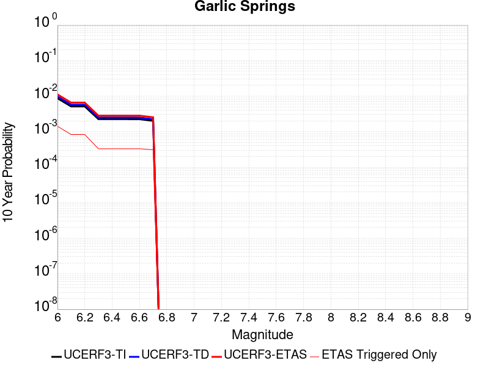 |

| Magnitude | 1 wk TI Prob | 1 wk TD Prob | 1 wk ETAS Prob | 1 wk ETAS/TD Gain | 1 wk ETAS Triggered Only | 1 mo TI Prob | 1 mo TD Prob | 1 mo ETAS Prob | 1 mo ETAS/TD Gain | 1 mo ETAS Triggered Only | 1 yr TI Prob | 1 yr TD Prob | 1 yr ETAS Prob | 1 yr ETAS/TD Gain | 1 yr ETAS Triggered Only | 10 yr TI Prob | 10 yr TD Prob | 10 yr ETAS Prob | 10 yr ETAS/TD Gain | 10 yr ETAS Triggered Only |
|-----|-----|-----|-----|-----|-----|-----|-----|-----|-----|-----|-----|-----|-----|-----|-----|-----|-----|-----|-----|-----|
| 6.0 | 1.6760017E-5 | 1.8776833E-5 | 3.3339616E-4 | 17.755718 | 3.1462524E-4 | 7.182667E-5 | 8.0470316E-5 | 5.402702E-4 | 6.7139063 | 4.5983688E-4 | 8.7413884E-4 | 9.794032E-4 | 0.001970711 | 2.0121548 | 9.922796E-4 | 0.008707083 | 0.009762413 | 0.011320182 | 1.159568 | 0.0015731262 |
| 6.1 | 9.852767E-6 | 1.0973587E-5 | 1.8038531E-4 | 16.438135 | 1.6941359E-4 | 4.222546E-5 | 4.702921E-5 | 2.8903724E-4 | 6.145909 | 2.420194E-4 | 5.139737E-4 | 5.7250116E-4 | 0.0011288271 | 1.9717464 | 5.5664463E-4 | 0.005127866 | 0.005717221 | 0.0065113194 | 1.1388958 | 7.9866406E-4 |
| 6.2 | 9.852767E-6 | 1.0973587E-5 | 1.8038531E-4 | 16.438135 | 1.6941359E-4 | 4.222546E-5 | 4.702921E-5 | 2.8903724E-4 | 6.145909 | 2.420194E-4 | 5.139737E-4 | 5.7250116E-4 | 0.0011288271 | 1.9717464 | 5.5664463E-4 | 0.005127866 | 0.005717221 | 0.0065113194 | 1.1388958 | 7.9866406E-4 |
| 6.3 | 4.3167724E-6 | 4.7780286E-6 | 1.0158533E-4 | 21.26093 | 9.6807766E-5 | 1.8500323E-5 | 2.0477235E-5 | 1.4148446E-4 | 6.9093537 | 1.210097E-4 | 2.2521814E-4 | 2.4930484E-4 | 4.67068E-4 | 1.8734815 | 2.1781746E-4 | 0.0022499003 | 0.00249251 | 0.0028787758 | 1.1549706 | 3.8723106E-4 |
| 6.4 | 4.3167724E-6 | 4.7780286E-6 | 1.0158533E-4 | 21.26093 | 9.6807766E-5 | 1.8500323E-5 | 2.0477235E-5 | 1.4148446E-4 | 6.9093537 | 1.210097E-4 | 2.2521814E-4 | 2.4930484E-4 | 4.67068E-4 | 1.8734815 | 2.1781746E-4 | 0.0022499003 | 0.00249251 | 0.0028787758 | 1.1549706 | 3.8723106E-4 |
| 6.5 | 4.3167724E-6 | 4.7780286E-6 | 1.0158533E-4 | 21.26093 | 9.6807766E-5 | 1.8500323E-5 | 2.0477235E-5 | 1.4148446E-4 | 6.9093537 | 1.210097E-4 | 2.2521814E-4 | 2.4930484E-4 | 4.67068E-4 | 1.8734815 | 2.1781746E-4 | 0.0022499003 | 0.00249251 | 0.0028787758 | 1.1549706 | 3.8723106E-4 |
| 6.6 | 4.301311E-6 | 4.760897E-6 | 1.015682E-4 | 21.333838 | 9.6807766E-5 | 1.8434059E-5 | 2.0403815E-5 | 1.4141104E-4 | 6.9306183 | 1.210097E-4 | 2.2441156E-4 | 2.4841115E-4 | 4.661745E-4 | 1.8766247 | 2.1781746E-4 | 0.0022418506 | 0.002483593 | 0.0028698624 | 1.1555284 | 3.8723106E-4 |
| 6.7 | 3.8599724E-6 | 4.27106E-6 | 7.6876575E-5 | 17.999414 | 7.260582E-5 | 1.6542634E-5 | 1.8304541E-5 | 1.1511053E-4 | 6.2886324 | 9.6807766E-5 | 2.0138794E-4 | 2.228578E-4 | 4.1643018E-4 | 1.8685914 | 1.9361553E-4 | 0.0020120554 | 0.002228578 | 0.002590798 | 1.1625341 | 3.630291E-4 |

## San Andreas (San Bernardino S)
*[(top)](#table-of-contents)*

| 1 Week | 1 Month | 1 Year | 10 Year |
|-----|-----|-----|-----|
|  |  |  |  |

| Magnitude | 1 wk TI Prob | 1 wk TD Prob | 1 wk ETAS Prob | 1 wk ETAS/TD Gain | 1 wk ETAS Triggered Only | 1 mo TI Prob | 1 mo TD Prob | 1 mo ETAS Prob | 1 mo ETAS/TD Gain | 1 mo ETAS Triggered Only | 1 yr TI Prob | 1 yr TD Prob | 1 yr ETAS Prob | 1 yr ETAS/TD Gain | 1 yr ETAS Triggered Only | 10 yr TI Prob | 10 yr TD Prob | 10 yr ETAS Prob | 10 yr ETAS/TD Gain | 10 yr ETAS Triggered Only |
|-----|-----|-----|-----|-----|-----|-----|-----|-----|-----|-----|-----|-----|-----|-----|-----|-----|-----|-----|-----|-----|
| 6.0 | 1.2336002E-4 | 3.0005194E-4 | 7.839455E-4 | 2.6126995 | 4.840388E-4 | 5.2857865E-4 | 0.0012853292 | 0.0017929167 | 1.3949085 | 5.082408E-4 | 0.006416472 | 0.015541554 | 0.01630398 | 1.0490572 | 7.744621E-4 | 0.06234337 | 0.14294699 | 0.14385965 | 1.0063846 | 0.0010648854 |
| 6.1 | 1.2336002E-4 | 3.0005194E-4 | 7.839455E-4 | 2.6126995 | 4.840388E-4 | 5.2857865E-4 | 0.0012853292 | 0.0017929167 | 1.3949085 | 5.082408E-4 | 0.006416472 | 0.015541554 | 0.01630398 | 1.0490572 | 7.744621E-4 | 0.06234337 | 0.14294699 | 0.14385965 | 1.0063846 | 0.0010648854 |
| 6.2 | 1.2336002E-4 | 3.0005194E-4 | 7.839455E-4 | 2.6126995 | 4.840388E-4 | 5.2857865E-4 | 0.0012853292 | 0.0017929167 | 1.3949085 | 5.082408E-4 | 0.006416472 | 0.015541554 | 0.01630398 | 1.0490572 | 7.744621E-4 | 0.06234337 | 0.14294699 | 0.14385965 | 1.0063846 | 0.0010648854 |
| 6.3 | 1.1712257E-4 | 2.8793467E-4 | 7.4763916E-4 | 2.5965583 | 4.5983688E-4 | 5.018573E-4 | 0.0012334478 | 0.0017168896 | 1.3919435 | 4.840388E-4 | 0.006093008 | 0.014918666 | 0.015657734 | 1.0495398 | 7.502602E-4 | 0.059286322 | 0.13765779 | 0.13855521 | 1.0065192 | 0.0010406835 |
| 6.4 | 1.1712257E-4 | 2.8793467E-4 | 7.4763916E-4 | 2.5965583 | 4.5983688E-4 | 5.018573E-4 | 0.0012334478 | 0.0017168896 | 1.3919435 | 4.840388E-4 | 0.006093008 | 0.014918666 | 0.015657734 | 1.0495398 | 7.502602E-4 | 0.059286322 | 0.13765779 | 0.13855521 | 1.0065192 | 0.0010406835 |
| 6.5 | 1.0689076E-4 | 2.6806415E-4 | 7.277778E-4 | 2.7149386 | 4.5983688E-4 | 4.5802278E-4 | 0.0011483653 | 0.0016318483 | 1.4210185 | 4.840388E-4 | 0.0055621783 | 0.013896335 | 0.01463617 | 1.0532396 | 7.502602E-4 | 0.05425003 | 0.1288989 | 0.12980545 | 1.007033 | 0.0010406835 |
| 6.6 | 9.7648895E-5 | 2.505129E-4 | 6.860387E-4 | 2.7385364 | 4.3563492E-4 | 4.1842813E-4 | 0.0010732086 | 0.0015325521 | 1.4280094 | 4.5983688E-4 | 0.005082469 | 0.012992399 | 0.013709024 | 1.0551573 | 7.260582E-4 | 0.049677886 | 0.121077746 | 0.12197115 | 1.0073788 | 0.0010164815 |
| 6.7 | 8.757013E-5 | 2.3122175E-4 | 6.425596E-4 | 2.7789755 | 4.11433E-4 | 3.7524657E-4 | 9.905964E-4 | 0.0014257997 | 1.4393348 | 4.3563492E-4 | 0.00455906 | 0.011997902 | 0.012691338 | 1.0577964 | 7.018563E-4 | 0.04466656 | 0.112373024 | 0.1132538 | 1.0078379 | 9.922796E-4 |
| 6.8 | 8.562978E-5 | 2.2682057E-4 | 6.381603E-4 | 2.8135026 | 4.11433E-4 | 3.6693315E-4 | 9.7174826E-4 | 0.0014069598 | 1.4478645 | 4.3563492E-4 | 0.004458263 | 0.011770921 | 0.012464516 | 1.0589244 | 7.018563E-4 | 0.043698758 | 0.11037863 | 0.11126138 | 1.0079975 | 9.922796E-4 |
| 6.9 | 6.124075E-5 | 1.7066885E-4 | 5.33636E-4 | 3.1267335 | 3.630291E-4 | 2.6243398E-4 | 7.312337E-4 | 0.0011181816 | 1.5291713 | 3.8723106E-4 | 0.0031904527 | 0.008866636 | 0.009514295 | 1.0730444 | 6.534524E-4 | 0.031450346 | 0.08420262 | 0.08504485 | 1.0100025 | 9.1967377E-4 |
| 7.0 | 5.8598747E-5 | 1.6495936E-4 | 5.279286E-4 | 3.2003555 | 3.630291E-4 | 2.5111332E-4 | 7.067779E-4 | 0.0010937353 | 1.547495 | 3.8723106E-4 | 0.0030530186 | 0.008571265 | 0.0092191165 | 1.075584 | 6.534524E-4 | 0.03011414 | 0.08151562 | 0.08236032 | 1.0103625 | 9.1967377E-4 |
| 7.1 | 5.613814E-5 | 1.5914452E-4 | 5.2211585E-4 | 3.2807655 | 3.630291E-4 | 2.4056983E-4 | 6.818704E-4 | 0.0010688375 | 1.5675081 | 3.8723106E-4 | 0.0029250039 | 0.008270353 | 0.008918401 | 1.0783579 | 6.534524E-4 | 0.028868021 | 0.07881268 | 0.07965987 | 1.0107495 | 9.1967377E-4 |
| 7.2 | 4.991222E-5 | 1.4520933E-4 | 5.081857E-4 | 3.499677 | 3.630291E-4 | 2.1389198E-4 | 6.221777E-4 | 0.0010091678 | 1.621993 | 3.8723106E-4 | 0.002601025 | 0.0075488063 | 0.008197325 | 1.0859102 | 6.534524E-4 | 0.025707912 | 0.07226191 | 0.07311512 | 1.0118073 | 9.1967377E-4 |
| 7.3 | 4.7410045E-5 | 1.371513E-4 | 5.0013064E-4 | 3.6465611 | 3.630291E-4 | 2.0317009E-4 | 5.8765925E-4 | 9.746627E-4 | 1.6585509 | 3.8723106E-4 | 0.0024707897 | 0.0071313656 | 0.007780158 | 1.0909773 | 6.534524E-4 | 0.024434982 | 0.068541944 | 0.06939858 | 1.012498 | 9.1967377E-4 |
| 7.4 | 4.5556746E-5 | 1.3123035E-4 | 4.942118E-4 | 3.7659874 | 3.630291E-4 | 1.952286E-4 | 5.6229485E-4 | 9.4930816E-4 | 1.6882747 | 3.8723106E-4 | 0.002374317 | 0.0068245293 | 0.0074735223 | 1.0950971 | 6.534524E-4 | 0.023491086 | 0.06579143 | 0.06665059 | 1.0130589 | 9.1967377E-4 |
| 7.5 | 4.3084514E-5 | 1.2358342E-4 | 4.8656767E-4 | 3.9371598 | 3.630291E-4 | 1.8463485E-4 | 5.2953605E-4 | 9.1656204E-4 | 1.7308775 | 3.8723106E-4 | 0.0022456115 | 0.0064281146 | 0.0070773666 | 1.101002 | 6.534524E-4 | 0.022230545 | 0.062190283 | 0.063052766 | 1.0138683 | 9.1967377E-4 |
| 7.6 | 3.408608E-5 | 9.836477E-5 | 4.6135817E-4 | 4.6902785 | 3.630291E-4 | 1.4607502E-4 | 4.214953E-4 | 8.0856314E-4 | 1.9183207 | 3.8723106E-4 | 0.0017770125 | 0.005119656 | 0.005769763 | 1.1269826 | 6.534524E-4 | 0.017628696 | 0.05002244 | 0.05089611 | 1.0174656 | 9.1967377E-4 |
| 7.7 | 2.8315713E-5 | 8.2495724E-5 | 4.2129494E-4 | 5.10687 | 3.3882717E-4 | 1.2134742E-4 | 3.5350522E-4 | 7.1640604E-4 | 2.0265782 | 3.630291E-4 | 0.0014764034 | 0.004295442 | 0.004921989 | 1.1458634 | 6.292505E-4 | 0.01466633 | 0.042272415 | 0.043130033 | 1.0202879 | 8.9547184E-4 |
| 7.8 | 2.6222975E-5 | 7.463898E-5 | 4.1344087E-4 | 5.5392084 | 3.3882717E-4 | 1.1237934E-4 | 3.1984213E-4 | 6.8275514E-4 | 2.1346629 | 3.630291E-4 | 0.0013673597 | 0.003887131 | 0.0045139357 | 1.1612512 | 6.292505E-4 | 0.013589768 | 0.038437475 | 0.039298527 | 1.0224013 | 8.9547184E-4 |
| 7.9 | 2.1469694E-5 | 5.7884805E-5 | 3.9669237E-4 | 6.8531346 | 3.3882717E-4 | 9.200973E-5 | 2.4805416E-4 | 6.1099324E-4 | 2.4631445 | 3.630291E-4 | 0.0011196428 | 0.00301588 | 0.003594975 | 1.1920152 | 5.8084656E-4 | 0.011140184 | 0.030153265 | 0.030927846 | 1.0256882 | 7.9866406E-4 |
| 8.0 | 1.2420249E-5 | 3.1321662E-5 | 2.0072995E-4 | 6.408662 | 1.6941359E-4 | 5.322855E-5 | 1.342288E-4 | 3.2781833E-4 | 2.4422355 | 1.9361553E-4 | 6.478649E-4 | 0.0016330116 | 0.0018746358 | 1.1479623 | 2.420194E-4 | 0.0064597935 | 0.01652369 | 0.016809314 | 1.0172857 | 2.9042328E-4 |
| 8.1 | 4.9197724E-6 | 7.822525E-6 | 7.822525E-6 | 1.0 | 0.0 | 2.1084568E-5 | 3.3524673E-5 | 3.3524673E-5 | 1.0 | 0.0 | 2.566744E-4 | 4.080866E-4 | 4.080866E-4 | 1.0 | 0.0 | 0.002563781 | 0.004384557 | 0.004384557 | 1.0 | 0.0 |
| 8.2 | 2.5634774E-6 | 2.9065757E-6 | 2.9065757E-6 | 1.0 | 0.0 | 1.0986286E-5 | 1.2456694E-5 | 1.2456694E-5 | 1.0 | 0.0 | 1.3374983E-4 | 1.5164974E-4 | 1.5164974E-4 | 1.0 | 0.0 | 0.0013366934 | 0.001704941 | 0.001704941 | 1.0 | 0.0 |
| 8.3 | 5.2850464E-7 | 3.2080476E-7 | 3.2080476E-7 | 1.0 | 0.0 | 2.2650179E-6 | 1.3748769E-6 | 1.3748769E-6 | 1.0 | 0.0 | 2.7576245E-5 | 1.673901E-5 | 1.673901E-5 | 1.0 | 0.0 | 2.7572823E-4 | 1.986671E-4 | 1.986671E-4 | 1.0 | 0.0 |

## Helendale-So Lockhart
*[(top)](#table-of-contents)*

| 1 Week | 1 Month | 1 Year | 10 Year |
|-----|-----|-----|-----|
|  |  |  |  |

| Magnitude | 1 wk TI Prob | 1 wk TD Prob | 1 wk ETAS Prob | 1 wk ETAS/TD Gain | 1 wk ETAS Triggered Only | 1 mo TI Prob | 1 mo TD Prob | 1 mo ETAS Prob | 1 mo ETAS/TD Gain | 1 mo ETAS Triggered Only | 1 yr TI Prob | 1 yr TD Prob | 1 yr ETAS Prob | 1 yr ETAS/TD Gain | 1 yr ETAS Triggered Only | 10 yr TI Prob | 10 yr TD Prob | 10 yr ETAS Prob | 10 yr ETAS/TD Gain | 10 yr ETAS Triggered Only |
|-----|-----|-----|-----|-----|-----|-----|-----|-----|-----|-----|-----|-----|-----|-----|-----|-----|-----|-----|-----|-----|
| 6.0 | 1.7296055E-5 | 1.8103729E-5 | 2.8432027E-4 | 15.705066 | 2.6622135E-4 | 7.412385E-5 | 7.7585224E-5 | 3.6798598E-4 | 4.7429905 | 2.9042328E-4 | 9.0208417E-4 | 9.4421144E-4 | 0.0016695841 | 1.7682312 | 7.260582E-4 | 0.008984311 | 0.009404116 | 0.010387064 | 1.1045232 | 9.922796E-4 |
| 6.1 | 1.7296055E-5 | 1.8103729E-5 | 2.8432027E-4 | 15.705066 | 2.6622135E-4 | 7.412385E-5 | 7.7585224E-5 | 3.6798598E-4 | 4.7429905 | 2.9042328E-4 | 9.0208417E-4 | 9.4421144E-4 | 0.0016695841 | 1.7682312 | 7.260582E-4 | 0.008984311 | 0.009404116 | 0.010387064 | 1.1045232 | 9.922796E-4 |
| 6.2 | 1.7296055E-5 | 1.8103729E-5 | 2.8432027E-4 | 15.705066 | 2.6622135E-4 | 7.412385E-5 | 7.7585224E-5 | 3.6798598E-4 | 4.7429905 | 2.9042328E-4 | 9.0208417E-4 | 9.4421144E-4 | 0.0016695841 | 1.7682312 | 7.260582E-4 | 0.008984311 | 0.009404116 | 0.010387064 | 1.1045232 | 9.922796E-4 |
| 6.3 | 1.0669118E-5 | 1.1135425E-5 | 1.8054713E-4 | 16.213762 | 1.6941359E-4 | 4.5723988E-5 | 4.772239E-5 | 2.1712789E-4 | 4.549812 | 1.6941359E-4 | 5.5654737E-4 | 5.80868E-4 | 0.0010162499 | 1.7495368 | 4.3563492E-4 | 0.0055515557 | 0.0057937936 | 0.0064675217 | 1.1162845 | 6.7765435E-4 |
| 6.4 | 1.0669118E-5 | 1.1135425E-5 | 1.8054713E-4 | 16.213762 | 1.6941359E-4 | 4.5723988E-5 | 4.772239E-5 | 2.1712789E-4 | 4.549812 | 1.6941359E-4 | 5.5654737E-4 | 5.80868E-4 | 0.0010162499 | 1.7495368 | 4.3563492E-4 | 0.0055515557 | 0.0057937936 | 0.0064675217 | 1.1162845 | 6.7765435E-4 |
| 6.5 | 8.790038E-6 | 9.170197E-6 | 1.5438051E-4 | 16.835028 | 1.4521164E-4 | 3.767105E-5 | 3.930026E-5 | 1.8450619E-4 | 4.694783 | 1.4521164E-4 | 4.585485E-4 | 4.7837716E-4 | 8.65423E-4 | 1.8090808 | 3.8723106E-4 | 0.0045760344 | 0.004773638 | 0.005375799 | 1.1261429 | 6.0504855E-4 |
| 6.6 | 7.396949E-6 | 7.715537E-6 | 1.5292606E-4 | 19.820534 | 1.4521164E-4 | 3.1700827E-5 | 3.3066175E-5 | 1.7827303E-4 | 5.3914013 | 1.4521164E-4 | 3.858892E-4 | 4.025073E-4 | 6.928137E-4 | 1.721245 | 2.9042328E-4 | 0.003852198 | 0.00401789 | 0.004499984 | 1.1199869 | 4.840388E-4 |
| 6.7 | 6.4600285E-6 | 6.738031E-6 | 1.519487E-4 | 22.550905 | 1.4521164E-4 | 2.7685543E-5 | 2.887696E-5 | 1.7408442E-4 | 6.028488 | 1.4521164E-4 | 3.3701936E-4 | 3.5152107E-4 | 6.176488E-4 | 1.757075 | 2.6622135E-4 | 0.0033650869 | 0.003509732 | 0.003919721 | 1.1168149 | 4.11433E-4 |
| 6.8 | 5.600104E-6 | 5.836009E-6 | 1.5104681E-4 | 25.881865 | 1.4521164E-4 | 2.4000226E-5 | 2.5011232E-5 | 1.7021925E-4 | 6.805712 | 1.4521164E-4 | 2.9216358E-4 | 3.044698E-4 | 5.22221E-4 | 1.7151815 | 2.1781746E-4 | 0.0029177975 | 0.003040588 | 0.0033542567 | 1.1031605 | 3.1462524E-4 |
| 6.9 | 4.839122E-6 | 5.0395092E-6 | 1.260486E-4 | 25.01208 | 1.210097E-4 | 2.0738931E-5 | 2.159772E-5 | 1.4260481E-4 | 6.6027713 | 1.210097E-4 | 2.5246723E-4 | 2.6292098E-4 | 4.0809446E-4 | 1.5521562 | 1.4521164E-4 | 0.002521806 | 0.002626147 | 0.0028675306 | 1.0919156 | 2.420194E-4 |
| 7.0 | 3.6937633E-6 | 3.845208E-6 | 7.645075E-5 | 19.882084 | 7.260582E-5 | 1.5830317E-5 | 1.647936E-5 | 8.908399E-5 | 5.4057913 | 7.260582E-5 | 1.9271708E-4 | 2.0061806E-4 | 2.732093E-4 | 1.3618381 | 7.260582E-5 | 0.0019255003 | 0.002004401 | 0.0021010146 | 1.0482008 | 9.6807766E-5 |
| 7.1 | 2.7858857E-6 | 2.8978538E-6 | 7.550346E-5 | 26.05496 | 7.260582E-5 | 1.1939455E-5 | 1.2419316E-5 | 8.5024236E-5 | 6.846129 | 7.260582E-5 | 1.4535317E-4 | 1.511949E-4 | 2.2378974E-4 | 1.4801409 | 7.260582E-5 | 0.0014525814 | 0.0015109418 | 0.0016076033 | 1.0639744 | 9.6807766E-5 |
| 7.2 | 2.1672065E-6 | 2.2540128E-6 | 2.6455898E-5 | 11.737245 | 2.4201941E-5 | 9.2879945E-6 | 9.66002E-6 | 3.386173E-5 | 3.5053475 | 2.4201941E-5 | 1.1307546E-4 | 1.1760458E-4 | 1.4180367E-4 | 1.2057666 | 2.4201941E-5 | 0.0011301794 | 0.0011754417 | 0.0012237886 | 1.0411309 | 4.8403883E-5 |
| 7.3 | 1.4823496E-6 | 1.5422102E-6 | 2.5744113E-5 | 16.692999 | 2.4201941E-5 | 6.3529114E-6 | 6.6094562E-6 | 3.0811236E-5 | 4.66169 | 2.4201941E-5 | 7.734395E-5 | 8.046731E-5 | 1.04667306E-4 | 1.3007431 | 2.4201941E-5 | 7.731704E-4 | 8.0439687E-4 | 8.5276185E-4 | 1.0601257 | 4.8403883E-5 |
| 7.4 | 4.2321457E-7 | 4.4108765E-7 | 4.4108765E-7 | 1.0 | 0.0 | 1.8137755E-6 | 1.8903745E-6 | 1.8903745E-6 | 1.0 | 0.0 | 2.2082493E-5 | 2.3015113E-5 | 2.3015113E-5 | 1.0 | 0.0 | 2.2080299E-4 | 2.3013182E-4 | 2.3013182E-4 | 1.0 | 0.0 |
| 7.5 | 5.6942316E-8 | 5.9415648E-8 | 5.9415648E-8 | 1.0 | 0.0 | 2.440385E-7 | 2.5463845E-7 | 2.5463845E-7 | 1.0 | 0.0 | 2.9711643E-6 | 3.1002196E-6 | 3.1002196E-6 | 1.0 | 0.0 | 2.9711247E-5 | 3.1001844E-5 | 3.1001844E-5 | 1.0 | 0.0 |

## Coyote Lake
*[(top)](#table-of-contents)*

| 1 Week | 1 Month | 1 Year | 10 Year |
|-----|-----|-----|-----|
| 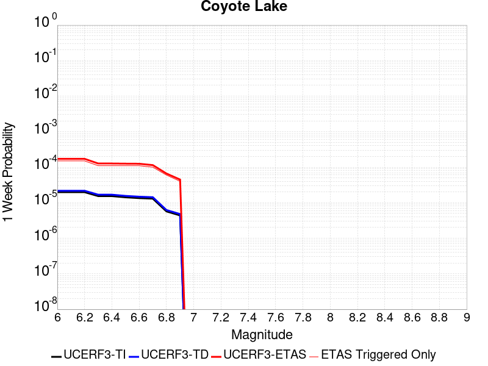 | 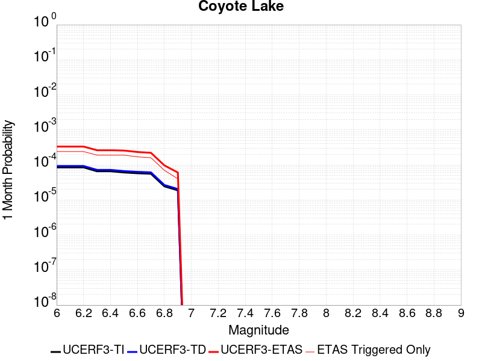 |  |  |

| Magnitude | 1 wk TI Prob | 1 wk TD Prob | 1 wk ETAS Prob | 1 wk ETAS/TD Gain | 1 wk ETAS Triggered Only | 1 mo TI Prob | 1 mo TD Prob | 1 mo ETAS Prob | 1 mo ETAS/TD Gain | 1 mo ETAS Triggered Only | 1 yr TI Prob | 1 yr TD Prob | 1 yr ETAS Prob | 1 yr ETAS/TD Gain | 1 yr ETAS Triggered Only | 10 yr TI Prob | 10 yr TD Prob | 10 yr ETAS Prob | 10 yr ETAS/TD Gain | 10 yr ETAS Triggered Only |
|-----|-----|-----|-----|-----|-----|-----|-----|-----|-----|-----|-----|-----|-----|-----|-----|-----|-----|-----|-----|-----|
| 6.0 | 1.980352E-5 | 2.1706745E-5 | 1.6691524E-4 | 7.6895566 | 1.4521164E-4 | 8.486947E-5 | 9.302599E-5 | 3.5922258E-4 | 3.861529 | 2.6622135E-4 | 0.0010327959 | 0.0011320751 | 0.001712264 | 1.5125005 | 5.8084656E-4 | 0.010280091 | 0.011270258 | 0.012179567 | 1.0806822 | 9.1967377E-4 |
| 6.1 | 1.980352E-5 | 2.1706745E-5 | 1.6691524E-4 | 7.6895566 | 1.4521164E-4 | 8.486947E-5 | 9.302599E-5 | 3.5922258E-4 | 3.861529 | 2.6622135E-4 | 0.0010327959 | 0.0011320751 | 0.001712264 | 1.5125005 | 5.8084656E-4 | 0.010280091 | 0.011270258 | 0.012179567 | 1.0806822 | 9.1967377E-4 |
| 6.2 | 1.980352E-5 | 2.1706745E-5 | 1.6691524E-4 | 7.6895566 | 1.4521164E-4 | 8.486947E-5 | 9.302599E-5 | 3.5922258E-4 | 3.861529 | 2.6622135E-4 | 0.0010327959 | 0.0011320751 | 0.001712264 | 1.5125005 | 5.8084656E-4 | 0.010280091 | 0.011270258 | 0.012179567 | 1.0806822 | 9.1967377E-4 |
| 6.3 | 1.5344787E-5 | 1.682067E-5 | 1.3782833E-4 | 8.193987 | 1.210097E-4 | 6.576172E-5 | 7.2086936E-5 | 2.898887E-4 | 4.0213766 | 2.1781746E-4 | 8.003548E-4 | 8.773662E-4 | 0.0012642576 | 1.440969 | 3.8723106E-4 | 0.007974784 | 0.00874507 | 0.009368816 | 1.0713257 | 6.292505E-4 |
| 6.4 | 1.5344787E-5 | 1.682067E-5 | 1.3782833E-4 | 8.193987 | 1.210097E-4 | 6.576172E-5 | 7.2086936E-5 | 2.898887E-4 | 4.0213766 | 2.1781746E-4 | 8.003548E-4 | 8.773662E-4 | 0.0012642576 | 1.440969 | 3.8723106E-4 | 0.007974784 | 0.00874507 | 0.009368816 | 1.0713257 | 6.292505E-4 |
| 6.5 | 1.4189697E-5 | 1.5557987E-5 | 1.3656581E-4 | 8.777859 | 1.210097E-4 | 6.081157E-5 | 6.6675726E-5 | 2.8447868E-4 | 4.2666006 | 2.1781746E-4 | 7.401293E-4 | 8.115349E-4 | 0.0011984517 | 1.4767716 | 3.8723106E-4 | 0.0073766913 | 0.008091656 | 0.008691808 | 1.0741693 | 6.0504855E-4 |
| 6.6 | 1.3469301E-5 | 1.4771577E-5 | 1.357795E-4 | 9.191943 | 1.210097E-4 | 5.7724297E-5 | 6.330556E-5 | 2.3270842E-4 | 3.6759555 | 1.6941359E-4 | 7.025667E-4 | 7.7053264E-4 | 0.0011090988 | 1.4393923 | 3.3882717E-4 | 0.0070034964 | 0.0076845144 | 0.008236881 | 1.0718806 | 5.5664463E-4 |
| 6.7 | 1.3027966E-5 | 1.4281745E-5 | 1.1108813E-4 | 7.77833 | 9.6807766E-5 | 5.5832945E-5 | 6.120638E-5 | 2.0640914E-4 | 3.3723469 | 1.4521164E-4 | 6.7955407E-4 | 7.4499263E-4 | 0.0010593835 | 1.4220053 | 3.1462524E-4 | 0.006774798 | 0.0074308286 | 0.007959315 | 1.0711207 | 5.324427E-4 |
| 6.8 | 5.695434E-6 | 6.2244176E-6 | 3.0426208E-5 | 4.888201 | 2.4201941E-5 | 2.4408775E-5 | 2.6675973E-5 | 5.087727E-5 | 1.9072319 | 2.4201941E-5 | 2.971363E-4 | 3.2476155E-4 | 3.4895563E-4 | 1.0744979 | 2.4201941E-5 | 0.0029673933 | 0.0032458105 | 0.0033181806 | 1.0222964 | 7.260582E-5 |
| 6.9 | 4.385688E-6 | 4.7930553E-6 | 2.899488E-5 | 6.049352 | 2.4201941E-5 | 1.879567E-5 | 2.0541665E-5 | 4.474311E-5 | 2.1781635 | 2.4201941E-5 | 2.2881327E-4 | 2.5009477E-4 | 2.7429068E-4 | 1.0967469 | 2.4201941E-5 | 0.002285778 | 0.0025009478 | 0.002573372 | 1.0289587 | 7.260582E-5 |

## Death Valley (Black Mtns Frontal)
*[(top)](#table-of-contents)*

| 1 Week | 1 Month | 1 Year | 10 Year |
|-----|-----|-----|-----|
|  |  |  |  |

| Magnitude | 1 wk TI Prob | 1 wk TD Prob | 1 wk ETAS Prob | 1 wk ETAS/TD Gain | 1 wk ETAS Triggered Only | 1 mo TI Prob | 1 mo TD Prob | 1 mo ETAS Prob | 1 mo ETAS/TD Gain | 1 mo ETAS Triggered Only | 1 yr TI Prob | 1 yr TD Prob | 1 yr ETAS Prob | 1 yr ETAS/TD Gain | 1 yr ETAS Triggered Only | 10 yr TI Prob | 10 yr TD Prob | 10 yr ETAS Prob | 10 yr ETAS/TD Gain | 10 yr ETAS Triggered Only |
|-----|-----|-----|-----|-----|-----|-----|-----|-----|-----|-----|-----|-----|-----|-----|-----|-----|-----|-----|-----|-----|
| 6.0 | 1.6707214E-5 | 1.867027E-5 | 2.8488666E-4 | 15.258841 | 2.6622135E-4 | 7.160038E-5 | 8.001303E-5 | 4.430131E-4 | 5.536762 | 3.630291E-4 | 8.71386E-4 | 9.737309E-4 | 0.0016023685 | 1.645597 | 6.292505E-4 | 0.00867977 | 0.009695496 | 0.010654189 | 1.09888 | 9.680776E-4 |
| 6.1 | 1.6707214E-5 | 1.867027E-5 | 2.8488666E-4 | 15.258841 | 2.6622135E-4 | 7.160038E-5 | 8.001303E-5 | 4.430131E-4 | 5.536762 | 3.630291E-4 | 8.71386E-4 | 9.737309E-4 | 0.0016023685 | 1.645597 | 6.292505E-4 | 0.00867977 | 0.009695496 | 0.010654189 | 1.09888 | 9.680776E-4 |
| 6.2 | 1.6707214E-5 | 1.867027E-5 | 2.8488666E-4 | 15.258841 | 2.6622135E-4 | 7.160038E-5 | 8.001303E-5 | 4.430131E-4 | 5.536762 | 3.630291E-4 | 8.71386E-4 | 9.737309E-4 | 0.0016023685 | 1.645597 | 6.292505E-4 | 0.00867977 | 0.009695496 | 0.010654189 | 1.09888 | 9.680776E-4 |
| 6.3 | 1.6707214E-5 | 1.867027E-5 | 2.8488666E-4 | 15.258841 | 2.6622135E-4 | 7.160038E-5 | 8.001303E-5 | 4.430131E-4 | 5.536762 | 3.630291E-4 | 8.71386E-4 | 9.737309E-4 | 0.0016023685 | 1.645597 | 6.292505E-4 | 0.00867977 | 0.009695496 | 0.010654189 | 1.09888 | 9.680776E-4 |
| 6.4 | 1.5515609E-5 | 1.7338214E-5 | 2.1095038E-4 | 12.166789 | 1.9361553E-4 | 6.649377E-5 | 7.4304546E-5 | 3.405061E-4 | 4.5825744 | 2.6622135E-4 | 8.0926094E-4 | 9.042885E-4 | 0.0014120697 | 1.5615256 | 5.082408E-4 | 0.008063202 | 0.009006773 | 0.009822227 | 1.0905379 | 8.22866E-4 |
| 6.5 | 1.5515609E-5 | 1.7338214E-5 | 2.1095038E-4 | 12.166789 | 1.9361553E-4 | 6.649377E-5 | 7.4304546E-5 | 3.405061E-4 | 4.5825744 | 2.6622135E-4 | 8.0926094E-4 | 9.042885E-4 | 0.0014120697 | 1.5615256 | 5.082408E-4 | 0.008063202 | 0.009006773 | 0.009822227 | 1.0905379 | 8.22866E-4 |
| 6.6 | 1.5041828E-5 | 1.6809145E-5 | 2.1042142E-4 | 12.5182705 | 1.9361553E-4 | 6.4463384E-5 | 7.203723E-5 | 3.3823942E-4 | 4.695341 | 2.6622135E-4 | 7.8455906E-4 | 8.767063E-4 | 0.0013603208 | 1.5516266 | 4.840388E-4 | 0.00781795 | 0.008733132 | 0.0094768405 | 1.0851594 | 7.502602E-4 |
| 6.7 | 1.4634985E-5 | 1.6356016E-5 | 1.6156529E-4 | 9.878035 | 1.4521164E-4 | 6.271985E-5 | 7.009536E-5 | 2.8789756E-4 | 4.107227 | 2.1781746E-4 | 7.6334673E-4 | 8.5308263E-4 | 0.0012641647 | 1.4818783 | 4.11433E-4 | 0.007607299 | 0.008498715 | 0.0091226185 | 1.0734113 | 6.292505E-4 |
| 6.8 | 1.4209158E-5 | 1.5882048E-5 | 8.848672E-5 | 5.571493 | 7.260582E-5 | 6.089497E-5 | 6.8064175E-5 | 2.1326594E-4 | 3.1333067 | 1.4521164E-4 | 7.4114406E-4 | 8.2837185E-4 | 0.0011185546 | 1.3503048 | 2.9042328E-4 | 0.007386771 | 0.008253456 | 0.0087335 | 1.0581628 | 4.840388E-4 |
| 6.9 | 1.3780098E-5 | 1.5404594E-5 | 6.380773E-5 | 4.1421237 | 4.8403883E-5 | 5.9056227E-5 | 6.6018045E-5 | 1.8701976E-4 | 2.8328583 | 1.210097E-4 | 7.1877235E-4 | 8.0347876E-4 | 0.0010694861 | 1.3310697 | 2.6622135E-4 | 0.0071645193 | 0.008006332 | 0.0084144715 | 1.050977 | 4.11433E-4 |
| 7.0 | 1.3585064E-5 | 1.5188155E-5 | 6.35913E-5 | 4.186901 | 4.8403883E-5 | 5.8220405E-5 | 6.50905E-5 | 1.8609234E-4 | 2.8589783 | 1.210097E-4 | 7.086029E-4 | 7.9219416E-4 | 0.0010582046 | 1.3357894 | 2.6622135E-4 | 0.007063476 | 0.007894293 | 0.008302479 | 1.0517063 | 4.11433E-4 |
| 7.1 | 1.3398601E-5 | 1.49813395E-5 | 6.33845E-5 | 4.2308965 | 4.8403883E-5 | 5.742131E-5 | 6.420419E-5 | 1.8520613E-4 | 2.8846424 | 1.210097E-4 | 6.9888023E-4 | 7.8141113E-4 | 0.0010232414 | 1.309479 | 2.420194E-4 | 0.0069668638 | 0.007787224 | 0.00817144 | 1.0493392 | 3.8723106E-4 |
| 7.2 | 1.3126312E-5 | 1.4679561E-5 | 6.3082734E-5 | 4.2973175 | 4.8403883E-5 | 5.6254412E-5 | 6.291092E-5 | 1.8391301E-4 | 2.9233878 | 1.210097E-4 | 6.846822E-4 | 7.6567667E-4 | 0.0010075108 | 1.3158436 | 2.420194E-4 | 0.006825765 | 0.00763097 | 0.008015246 | 1.0503575 | 3.8723106E-4 |
| 7.3 | 1.2922429E-5 | 1.4453788E-5 | 6.285697E-5 | 4.3488235 | 4.8403883E-5 | 5.5380664E-5 | 6.194336E-5 | 1.8294557E-4 | 2.953433 | 1.210097E-4 | 6.74051E-4 | 7.53905E-4 | 9.957419E-4 | 1.3207791 | 2.420194E-4 | 0.006720101 | 0.007514055 | 0.007874356 | 1.0479503 | 3.630291E-4 |
| 7.4 | 1.2768878E-5 | 1.4283772E-5 | 6.268696E-5 | 4.3886843 | 4.8403883E-5 | 5.4722615E-5 | 6.1214756E-5 | 1.8221706E-4 | 2.976685 | 1.210097E-4 | 6.660441E-4 | 7.4504025E-4 | 9.868793E-4 | 1.3245987 | 2.420194E-4 | 0.0066405144 | 0.0074260035 | 0.007786337 | 1.0485232 | 3.630291E-4 |
| 7.5 | 1.2521929E-5 | 1.40120155E-5 | 6.2415216E-5 | 4.454407 | 4.8403883E-5 | 5.366431E-5 | 6.005014E-5 | 1.8105259E-4 | 3.0150235 | 1.210097E-4 | 6.531671E-4 | 7.3087064E-4 | 9.4852893E-4 | 1.2978069 | 2.1781746E-4 | 0.006512506 | 0.0072852457 | 0.0076216045 | 1.0461699 | 3.3882717E-4 |
| 7.6 | 1.1301089E-5 | 1.2648149E-5 | 6.105142E-5 | 4.8269053 | 4.8403883E-5 | 4.8432343E-5 | 5.4205255E-5 | 1.752084E-4 | 3.2323139 | 1.210097E-4 | 5.895042E-4 | 6.5975444E-4 | 8.5324224E-4 | 1.2932724 | 1.9361553E-4 | 0.0058794282 | 0.00657851 | 0.0068910657 | 1.0475116 | 3.1462524E-4 |
| 7.7 | 9.189108E-6 | 1.0283358E-5 | 5.8686743E-5 | 5.7069626 | 4.8403883E-5 | 3.93813E-5 | 4.407082E-5 | 1.650752E-4 | 3.74568 | 1.210097E-4 | 4.7936183E-4 | 5.3643517E-4 | 7.299468E-4 | 1.3607364 | 1.9361553E-4 | 0.004783291 | 0.005351914 | 0.0056167105 | 1.049477 | 2.6622135E-4 |
| 7.8 | 3.4586725E-7 | 3.6482615E-7 | 3.6482615E-7 | 1.0 | 0.0 | 1.4822873E-6 | 1.5635396E-6 | 1.5635396E-6 | 1.0 | 0.0 | 1.80467E-5 | 1.9035933E-5 | 1.9035933E-5 | 1.0 | 0.0 | 1.8045233E-4 | 1.9034347E-4 | 1.9034347E-4 | 1.0 | 0.0 |
| 7.9 | 2.5591178E-9 | 2.6696718E-9 | 2.6696718E-9 | 1.0 | 0.0 | 1.0967647E-8 | 1.14414505E-8 | 1.14414505E-8 | 1.0 | 0.0 | 1.335311E-7 | 1.3929966E-7 | 1.3929966E-7 | 1.0 | 0.0 | 1.3353102E-6 | 1.3929966E-6 | 1.3929966E-6 | 1.0 | 0.0 |

## San Andreas (Big Bend)
*[(top)](#table-of-contents)*

| 1 Week | 1 Month | 1 Year | 10 Year |
|-----|-----|-----|-----|
|  |  |  |  |

| Magnitude | 1 wk TI Prob | 1 wk TD Prob | 1 wk ETAS Prob | 1 wk ETAS/TD Gain | 1 wk ETAS Triggered Only | 1 mo TI Prob | 1 mo TD Prob | 1 mo ETAS Prob | 1 mo ETAS/TD Gain | 1 mo ETAS Triggered Only | 1 yr TI Prob | 1 yr TD Prob | 1 yr ETAS Prob | 1 yr ETAS/TD Gain | 1 yr ETAS Triggered Only | 10 yr TI Prob | 10 yr TD Prob | 10 yr ETAS Prob | 10 yr ETAS/TD Gain | 10 yr ETAS Triggered Only |
|-----|-----|-----|-----|-----|-----|-----|-----|-----|-----|-----|-----|-----|-----|-----|-----|-----|-----|-----|-----|-----|
| 6.0 | 1.0179969E-4 | 2.0073925E-4 | 3.9431592E-4 | 1.964319 | 1.9361553E-4 | 4.362114E-4 | 8.6002843E-4 | 0.0011260208 | 1.3092833 | 2.6622135E-4 | 0.0052979486 | 0.010420859 | 0.010947754 | 1.0505615 | 5.324427E-4 | 0.051734097 | 0.101455905 | 0.10221703 | 1.0075021 | 8.470679E-4 |
| 6.1 | 1.0179969E-4 | 2.0073925E-4 | 3.9431592E-4 | 1.964319 | 1.9361553E-4 | 4.362114E-4 | 8.6002843E-4 | 0.0011260208 | 1.3092833 | 2.6622135E-4 | 0.0052979486 | 0.010420859 | 0.010947754 | 1.0505615 | 5.324427E-4 | 0.051734097 | 0.101455905 | 0.10221703 | 1.0075021 | 8.470679E-4 |
| 6.2 | 1.0179969E-4 | 2.0073925E-4 | 3.9431592E-4 | 1.964319 | 1.9361553E-4 | 4.362114E-4 | 8.6002843E-4 | 0.0011260208 | 1.3092833 | 2.6622135E-4 | 0.0052979486 | 0.010420859 | 0.010947754 | 1.0505615 | 5.324427E-4 | 0.051734097 | 0.101455905 | 0.10221703 | 1.0075021 | 8.470679E-4 |
| 6.3 | 1.0179969E-4 | 2.0073925E-4 | 3.9431592E-4 | 1.964319 | 1.9361553E-4 | 4.362114E-4 | 8.6002843E-4 | 0.0011260208 | 1.3092833 | 2.6622135E-4 | 0.0052979486 | 0.010420859 | 0.010947754 | 1.0505615 | 5.324427E-4 | 0.051734097 | 0.101455905 | 0.10221703 | 1.0075021 | 8.470679E-4 |
| 6.4 | 9.1639464E-5 | 1.8430917E-4 | 2.569016E-4 | 1.3938624 | 7.260582E-5 | 3.9268145E-4 | 7.896575E-4 | 9.3475456E-4 | 1.1837467 | 1.4521164E-4 | 0.0047704205 | 0.009571818 | 0.009859461 | 1.0300511 | 2.9042328E-4 | 0.046693064 | 0.09378695 | 0.094313316 | 1.0056124 | 5.8084656E-4 |
| 6.5 | 9.1639464E-5 | 1.8430917E-4 | 2.569016E-4 | 1.3938624 | 7.260582E-5 | 3.9268145E-4 | 7.896575E-4 | 9.3475456E-4 | 1.1837467 | 1.4521164E-4 | 0.0047704205 | 0.009571818 | 0.009859461 | 1.0300511 | 2.9042328E-4 | 0.046693064 | 0.09378695 | 0.094313316 | 1.0056124 | 5.8084656E-4 |
| 6.6 | 9.042622E-5 | 1.8238011E-4 | 2.549727E-4 | 1.3980291 | 7.260582E-5 | 3.8748336E-4 | 7.813951E-4 | 9.264933E-4 | 1.1856911 | 1.4521164E-4 | 0.0047074095 | 0.0094721 | 0.009759773 | 1.0303705 | 2.9042328E-4 | 0.046089325 | 0.09287721 | 0.09340411 | 1.005673 | 5.8084656E-4 |
| 6.7 | 8.9836685E-5 | 1.8152347E-4 | 2.541161E-4 | 1.3999077 | 7.260582E-5 | 3.8495753E-4 | 7.7772595E-4 | 9.2282466E-4 | 1.1865679 | 1.4521164E-4 | 0.00467679 | 0.009427815 | 0.009715499 | 1.0305145 | 2.9042328E-4 | 0.045795817 | 0.09247148 | 0.09299862 | 1.0057005 | 5.8084656E-4 |
| 6.8 | 8.9471854E-5 | 1.8099119E-4 | 2.535839E-4 | 1.4010841 | 7.260582E-5 | 3.8339442E-4 | 7.754462E-4 | 9.205452E-4 | 1.1871169 | 1.4521164E-4 | 0.004657841 | 0.009400298 | 0.009687991 | 1.0306047 | 2.9042328E-4 | 0.04561414 | 0.0922192 | 0.09274649 | 1.0057178 | 5.8084656E-4 |
| 6.9 | 8.858234E-5 | 1.7981093E-4 | 2.282061E-4 | 1.2691448 | 4.8403883E-5 | 3.7958333E-4 | 7.7039085E-4 | 8.67124E-4 | 1.1255637 | 9.6807766E-5 | 0.004611638 | 0.009339278 | 0.009579037 | 1.0256721 | 2.420194E-4 | 0.04517103 | 0.09165911 | 0.09212076 | 1.0050367 | 5.082408E-4 |
| 7.0 | 8.7433385E-5 | 1.7819891E-4 | 2.2659416E-4 | 1.27158 | 4.8403883E-5 | 3.746607E-4 | 7.6348626E-4 | 8.602201E-4 | 1.1267002 | 9.6807766E-5 | 0.004551957 | 0.009255932 | 0.009495711 | 1.0259055 | 2.420194E-4 | 0.044598386 | 0.09089323 | 0.09135527 | 1.0050834 | 5.082408E-4 |
| 7.1 | 8.684964E-5 | 1.7731842E-4 | 2.2571371E-4 | 1.2729288 | 4.8403883E-5 | 3.7215967E-4 | 7.597149E-4 | 8.564492E-4 | 1.1273296 | 9.6807766E-5 | 0.0045216335 | 0.009210405 | 0.009450195 | 1.0260347 | 2.420194E-4 | 0.04430731 | 0.09047475 | 0.09093701 | 1.0051092 | 5.082408E-4 |
| 7.2 | 8.606521E-5 | 1.7622454E-4 | 2.2461989E-4 | 1.2746233 | 4.8403883E-5 | 3.6879873E-4 | 7.550296E-4 | 8.517643E-4 | 1.1281204 | 9.6807766E-5 | 0.0044808835 | 0.009153842 | 0.009393645 | 1.0261971 | 2.420194E-4 | 0.043916024 | 0.08995518 | 0.0904177 | 1.0051417 | 5.082408E-4 |
| 7.3 | 8.568266E-5 | 1.7564454E-4 | 2.2403992E-4 | 1.2755302 | 4.8403883E-5 | 3.6715972E-4 | 7.5254537E-4 | 8.492803E-4 | 1.1285436 | 9.6807766E-5 | 0.0044610105 | 0.00912385 | 0.0093636615 | 1.026284 | 2.420194E-4 | 0.043725148 | 0.08967623 | 0.0901389 | 1.0051593 | 5.082408E-4 |
| 7.4 | 8.5432206E-5 | 1.752704E-4 | 2.2366579E-4 | 1.2761185 | 4.8403883E-5 | 3.6608664E-4 | 7.509428E-4 | 8.476779E-4 | 1.1288182 | 9.6807766E-5 | 0.004447999 | 0.009104501 | 0.009344318 | 1.0263404 | 2.420194E-4 | 0.043600157 | 0.08949642 | 0.089959174 | 1.0051707 | 5.082408E-4 |
| 7.5 | 8.4791965E-5 | 1.7396381E-4 | 2.2235927E-4 | 1.2781926 | 4.8403883E-5 | 3.633435E-4 | 7.4534636E-4 | 8.4208196E-4 | 1.1297861 | 9.6807766E-5 | 0.0044147377 | 0.009036932 | 0.0092767645 | 1.0265391 | 2.420194E-4 | 0.043280575 | 0.08887209 | 0.08933516 | 1.0052105 | 5.082408E-4 |
| 7.6 | 8.241105E-5 | 1.6841735E-4 | 2.1681307E-4 | 1.287356 | 4.8403883E-5 | 3.531424E-4 | 7.2158914E-4 | 8.18327E-4 | 1.1340623 | 9.6807766E-5 | 0.0042910352 | 0.008750047 | 0.008989949 | 1.0274172 | 2.420194E-4 | 0.042091176 | 0.08625032 | 0.08671473 | 1.0053843 | 5.082408E-4 |
| 7.7 | 7.00432E-5 | 1.4205615E-4 | 1.9045315E-4 | 1.3406893 | 4.8403883E-5 | 3.001506E-4 | 6.0867006E-4 | 7.054189E-4 | 1.1589512 | 9.6807766E-5 | 0.0036482112 | 0.0073854174 | 0.007577603 | 1.0260223 | 1.9361553E-4 | 0.035888977 | 0.07352299 | 0.07390417 | 1.0051845 | 4.11433E-4 |
| 7.8 | 6.415362E-5 | 1.2969968E-4 | 1.7809728E-4 | 1.3731513 | 4.8403883E-5 | 2.749151E-4 | 5.557374E-4 | 6.2830286E-4 | 1.1305751 | 7.260582E-5 | 0.0033419547 | 0.0067451415 | 0.0069134124 | 1.0249469 | 1.6941359E-4 | 0.03292141 | 0.06725514 | 0.06759375 | 1.0050348 | 3.630291E-4 |
| 7.9 | 4.939911E-5 | 9.341721E-5 | 1.17616895E-4 | 1.2590494 | 2.4201941E-5 | 2.116933E-4 | 4.0029807E-4 | 4.2449034E-4 | 1.0604357 | 2.4201941E-5 | 0.0025743195 | 0.004862747 | 0.004959084 | 1.0198113 | 9.6807766E-5 | 0.025447013 | 0.048915803 | 0.04909995 | 1.0037645 | 1.9361553E-4 |
| 8.0 | 3.344983E-5 | 5.2228E-5 | 7.6428674E-5 | 1.4633659 | 2.4201941E-5 | 1.4334853E-4 | 2.2381509E-4 | 2.480116E-4 | 1.1081095 | 2.4201941E-5 | 0.0017438711 | 0.0027215453 | 0.0027698176 | 1.017737 | 4.8403883E-5 | 0.017302496 | 0.027923161 | 0.02799374 | 1.0025276 | 7.260582E-5 |
| 8.1 | 1.9104898E-5 | 1.9171663E-5 | 1.9171663E-5 | 1.0 | 0.0 | 8.1875565E-5 | 8.2161685E-5 | 8.2161685E-5 | 1.0 | 0.0 | 9.963791E-4 | 9.9986E-4 | 9.9986E-4 | 1.0 | 0.0 | 0.009919235 | 0.010749552 | 0.010749552 | 1.0 | 0.0 |
| 8.2 | 8.643924E-6 | 5.473668E-6 | 5.473668E-6 | 1.0 | 0.0 | 3.704486E-5 | 2.3458366E-5 | 2.3458366E-5 | 1.0 | 0.0 | 4.5092785E-4 | 2.8556827E-4 | 2.8556827E-4 | 1.0 | 0.0 | 0.0045001395 | 0.0032481793 | 0.0032481793 | 1.0 | 0.0 |
| 8.3 | 1.983087E-6 | 7.6564595E-7 | 7.6564595E-7 | 1.0 | 0.0 | 8.498917E-6 | 3.281336E-6 | 3.281336E-6 | 1.0 | 0.0 | 1.034694E-4 | 3.9949547E-5 | 3.9949547E-5 | 1.0 | 0.0 | 0.0010342124 | 4.717979E-4 | 4.717979E-4 | 1.0 | 0.0 |

## San Andreas (San Gorgonio Pass-Garnet HIll)
*[(top)](#table-of-contents)*

| 1 Week | 1 Month | 1 Year | 10 Year |
|-----|-----|-----|-----|
|  |  |  | 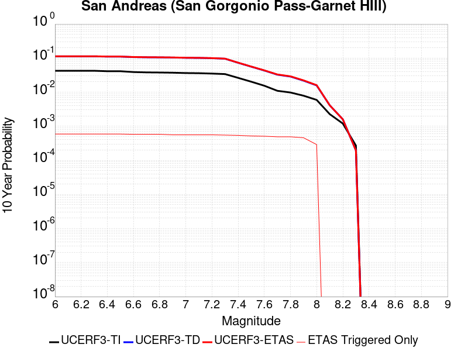 |

| Magnitude | 1 wk TI Prob | 1 wk TD Prob | 1 wk ETAS Prob | 1 wk ETAS/TD Gain | 1 wk ETAS Triggered Only | 1 mo TI Prob | 1 mo TD Prob | 1 mo ETAS Prob | 1 mo ETAS/TD Gain | 1 mo ETAS Triggered Only | 1 yr TI Prob | 1 yr TD Prob | 1 yr ETAS Prob | 1 yr ETAS/TD Gain | 1 yr ETAS Triggered Only | 10 yr TI Prob | 10 yr TD Prob | 10 yr ETAS Prob | 10 yr ETAS/TD Gain | 10 yr ETAS Triggered Only |
|-----|-----|-----|-----|-----|-----|-----|-----|-----|-----|-----|-----|-----|-----|-----|-----|-----|-----|-----|-----|-----|
| 6.0 | 8.31567E-5 | 2.3384395E-4 | 5.0000305E-4 | 2.138191 | 2.6622135E-4 | 3.5633717E-4 | 0.0010018025 | 0.0012919349 | 1.2896103 | 2.9042328E-4 | 0.004329778 | 0.012128622 | 0.012558973 | 1.0354823 | 4.3563492E-4 | 0.042463828 | 0.11258187 | 0.113097325 | 1.0045785 | 5.8084656E-4 |
| 6.1 | 8.31567E-5 | 2.3384395E-4 | 5.0000305E-4 | 2.138191 | 2.6622135E-4 | 3.5633717E-4 | 0.0010018025 | 0.0012919349 | 1.2896103 | 2.9042328E-4 | 0.004329778 | 0.012128622 | 0.012558973 | 1.0354823 | 4.3563492E-4 | 0.042463828 | 0.11258187 | 0.113097325 | 1.0045785 | 5.8084656E-4 |
| 6.2 | 8.31567E-5 | 2.3384395E-4 | 5.0000305E-4 | 2.138191 | 2.6622135E-4 | 3.5633717E-4 | 0.0010018025 | 0.0012919349 | 1.2896103 | 2.9042328E-4 | 0.004329778 | 0.012128622 | 0.012558973 | 1.0354823 | 4.3563492E-4 | 0.042463828 | 0.11258187 | 0.113097325 | 1.0045785 | 5.8084656E-4 |
| 6.3 | 8.31567E-5 | 2.3384395E-4 | 5.0000305E-4 | 2.138191 | 2.6622135E-4 | 3.5633717E-4 | 0.0010018025 | 0.0012919349 | 1.2896103 | 2.9042328E-4 | 0.004329778 | 0.012128622 | 0.012558973 | 1.0354823 | 4.3563492E-4 | 0.042463828 | 0.11258187 | 0.113097325 | 1.0045785 | 5.8084656E-4 |
| 6.4 | 8.059055E-5 | 2.2941893E-4 | 4.955792E-4 | 2.1601496 | 2.6622135E-4 | 3.4534236E-4 | 9.828559E-4 | 0.0012729939 | 1.2951988 | 2.9042328E-4 | 0.0041964394 | 0.011900819 | 0.01233127 | 1.0361698 | 4.3563492E-4 | 0.041180745 | 0.110562965 | 0.11107959 | 1.0046726 | 5.8084656E-4 |
| 6.5 | 8.059055E-5 | 2.2941893E-4 | 4.955792E-4 | 2.1601496 | 2.6622135E-4 | 3.4534236E-4 | 9.828559E-4 | 0.0012729939 | 1.2951988 | 2.9042328E-4 | 0.0041964394 | 0.011900819 | 0.01233127 | 1.0361698 | 4.3563492E-4 | 0.041180745 | 0.110562965 | 0.11107959 | 1.0046726 | 5.8084656E-4 |
| 6.6 | 7.619237E-5 | 2.2186468E-4 | 4.8802697E-4 | 2.1996605 | 2.6622135E-4 | 3.2649786E-4 | 9.5050444E-4 | 0.0012406517 | 1.305256 | 2.9042328E-4 | 0.0039678677 | 0.0115115335 | 0.011942154 | 1.0374078 | 4.3563492E-4 | 0.03897764 | 0.10709954 | 0.107618175 | 1.0048426 | 5.8084656E-4 |
| 6.7 | 7.440636E-5 | 2.1862281E-4 | 4.8478597E-4 | 2.2174537 | 2.6622135E-4 | 3.188454E-4 | 9.3662075E-4 | 0.001226772 | 1.3097852 | 2.9042328E-4 | 0.0038750346 | 0.011344268 | 0.011774961 | 1.0379657 | 4.3563492E-4 | 0.038081564 | 0.1056081 | 0.106127605 | 1.0049192 | 5.8084656E-4 |
| 6.8 | 7.3735864E-5 | 2.1709445E-4 | 4.8325802E-4 | 2.2260265 | 2.6622135E-4 | 3.1597257E-4 | 9.300753E-4 | 0.0012202285 | 1.3119674 | 2.9042328E-4 | 0.0038401815 | 0.011265406 | 0.011696134 | 1.0382345 | 4.3563492E-4 | 0.03774495 | 0.104909696 | 0.105429605 | 1.0049558 | 5.8084656E-4 |
| 6.9 | 7.27575E-5 | 2.1478413E-4 | 4.809483E-4 | 2.239217 | 2.6622135E-4 | 3.117806E-4 | 9.20181E-4 | 0.001210337 | 1.315325 | 2.9042328E-4 | 0.003789323 | 0.011146182 | 0.011576962 | 1.0386481 | 4.3563492E-4 | 0.037253562 | 0.10385753 | 0.10437805 | 1.0050119 | 5.8084656E-4 |
| 7.0 | 7.102591E-5 | 2.1062451E-4 | 4.7678978E-4 | 2.2636957 | 2.6622135E-4 | 3.0436125E-4 | 9.023664E-4 | 0.0011925277 | 1.3215559 | 2.9042328E-4 | 0.003699303 | 0.010931484 | 0.011362357 | 1.0394157 | 4.3563492E-4 | 0.03638325 | 0.101959534 | 0.10248116 | 1.005116 | 5.8084656E-4 |
| 7.1 | 7.028513E-5 | 2.0898094E-4 | 4.7514666E-4 | 2.2736363 | 2.6622135E-4 | 3.0118722E-4 | 8.953274E-4 | 0.0011854906 | 1.3240862 | 2.9042328E-4 | 0.0036607897 | 0.010846641 | 0.011277551 | 1.0397274 | 4.3563492E-4 | 0.036010686 | 0.10120243 | 0.1017245 | 1.0051587 | 5.8084656E-4 |
| 7.2 | 6.8498244E-5 | 2.050596E-4 | 4.7122635E-4 | 2.297997 | 2.6622135E-4 | 2.9353087E-4 | 8.7853306E-4 | 0.0011687012 | 1.3302871 | 2.9042328E-4 | 0.003567883 | 0.0106441835 | 0.011075181 | 1.0404915 | 4.3563492E-4 | 0.035111405 | 0.09939449 | 0.099917606 | 1.005263 | 5.8084656E-4 |
| 7.3 | 6.622592E-5 | 1.9733235E-4 | 4.6350117E-4 | 2.3488352 | 2.6622135E-4 | 2.8379448E-4 | 8.4543816E-4 | 0.0011356159 | 1.3432276 | 2.9042328E-4 | 0.0034497243 | 0.010245111 | 0.010676282 | 1.0420856 | 4.3563492E-4 | 0.033966612 | 0.095891245 | 0.0964164 | 1.0054765 | 5.8084656E-4 |
| 7.4 | 5.1050705E-5 | 1.4690042E-4 | 4.1308266E-4 | 2.811991 | 2.6622135E-4 | 2.1877038E-4 | 6.294222E-4 | 9.196627E-4 | 1.4611222 | 2.9042328E-4 | 0.002660276 | 0.007636482 | 0.008044773 | 1.0534658 | 4.11433E-4 | 0.02628654 | 0.07286554 | 0.073381625 | 1.0070827 | 5.5664463E-4 |
| 7.5 | 3.9302922E-5 | 1.11307076E-4 | 3.5329955E-4 | 3.1740978 | 2.420194E-4 | 1.6843023E-4 | 4.7694342E-4 | 7.430378E-4 | 1.557916 | 2.6622135E-4 | 0.0020487092 | 0.0057913954 | 0.0061763837 | 1.066476 | 3.8723106E-4 | 0.020299247 | 0.05601151 | 0.05651413 | 1.0089735 | 5.324427E-4 |
| 7.6 | 2.9851626E-5 | 8.4956984E-5 | 3.2695584E-4 | 3.8484867 | 2.420194E-4 | 1.2792926E-4 | 3.6405068E-4 | 6.301751E-4 | 1.7310092 | 2.6622135E-4 | 0.0015564259 | 0.0044233347 | 0.004808853 | 1.0871556 | 3.8723106E-4 | 0.0154556995 | 0.043196145 | 0.04370559 | 1.0117937 | 5.324427E-4 |
| 7.7 | 2.1135214E-5 | 6.353527E-5 | 2.813389E-4 | 4.4280744 | 2.1781746E-4 | 9.0576345E-5 | 2.722656E-4 | 5.142191E-4 | 1.8886672 | 2.420194E-4 | 0.0011022091 | 0.0033098008 | 0.0036716282 | 1.10932 | 3.630291E-4 | 0.010967582 | 0.03258456 | 0.03307624 | 1.0150894 | 5.082408E-4 |
| 7.8 | 1.883379E-5 | 5.564576E-5 | 2.7345112E-4 | 4.9141407 | 2.1781746E-4 | 8.0713755E-5 | 2.3846005E-4 | 4.8042176E-4 | 2.0146844 | 2.420194E-4 | 9.822468E-4 | 0.002899389 | 0.0032613657 | 1.1248457 | 3.630291E-4 | 0.0097791655 | 0.028696978 | 0.029190633 | 1.0172024 | 5.082408E-4 |
| 7.9 | 1.5156185E-5 | 4.1662403E-5 | 2.594708E-4 | 6.2279363 | 2.1781746E-4 | 6.495346E-5 | 1.7854095E-4 | 4.2051714E-4 | 2.355298 | 2.420194E-4 | 7.9052144E-4 | 0.0021715704 | 0.0025096617 | 1.1556898 | 3.3882717E-4 | 0.007877152 | 0.021760946 | 0.022210775 | 1.0206715 | 4.5983688E-4 |
| 8.0 | 1.1405907E-5 | 2.9976925E-5 | 1.9938544E-4 | 6.651297 | 1.6941359E-4 | 4.8881542E-5 | 1.2846621E-4 | 3.2205688E-4 | 2.5069382 | 1.9361553E-4 | 5.9497025E-4 | 0.0015629551 | 0.0018045962 | 1.1546053 | 2.420194E-4 | 0.005933798 | 0.015774013 | 0.016059855 | 1.0181211 | 2.9042328E-4 |
| 8.1 | 4.3511436E-6 | 7.369465E-6 | 7.369465E-6 | 1.0 | 0.0 | 1.8647626E-5 | 3.158304E-5 | 3.158304E-5 | 1.0 | 0.0 | 2.2701119E-4 | 3.844558E-4 | 3.844558E-4 | 1.0 | 0.0 | 0.0022677942 | 0.0041165445 | 0.0041165445 | 1.0 | 0.0 |
| 8.2 | 2.3042528E-6 | 2.7328301E-6 | 2.7328301E-6 | 1.0 | 0.0 | 9.875332E-6 | 1.1712076E-5 | 1.1712076E-5 | 1.0 | 0.0 | 1.2022553E-4 | 1.4258524E-4 | 1.4258524E-4 | 1.0 | 0.0 | 0.0012016051 | 0.0015979637 | 0.0015979637 | 1.0 | 0.0 |
| 8.3 | 5.202968E-7 | 3.1590292E-7 | 3.1590292E-7 | 1.0 | 0.0 | 2.2298414E-6 | 1.353869E-6 | 1.353869E-6 | 1.0 | 0.0 | 2.714798E-5 | 1.6483244E-5 | 1.6483244E-5 | 1.0 | 0.0 | 2.7144665E-4 | 1.955901E-4 | 1.955901E-4 | 1.0 | 0.0 |

## San Andreas (Carrizo) rev
*[(top)](#table-of-contents)*

| 1 Week | 1 Month | 1 Year | 10 Year |
|-----|-----|-----|-----|
|  |  |  |  |

| Magnitude | 1 wk TI Prob | 1 wk TD Prob | 1 wk ETAS Prob | 1 wk ETAS/TD Gain | 1 wk ETAS Triggered Only | 1 mo TI Prob | 1 mo TD Prob | 1 mo ETAS Prob | 1 mo ETAS/TD Gain | 1 mo ETAS Triggered Only | 1 yr TI Prob | 1 yr TD Prob | 1 yr ETAS Prob | 1 yr ETAS/TD Gain | 1 yr ETAS Triggered Only | 10 yr TI Prob | 10 yr TD Prob | 10 yr ETAS Prob | 10 yr ETAS/TD Gain | 10 yr ETAS Triggered Only |
|-----|-----|-----|-----|-----|-----|-----|-----|-----|-----|-----|-----|-----|-----|-----|-----|-----|-----|-----|-----|-----|
| 6.0 | 1.1674632E-4 | 2.4324407E-4 | 3.1583224E-4 | 1.298417 | 7.260582E-5 | 5.002454E-4 | 0.0010420597 | 0.00118712 | 1.1392053 | 1.4521164E-4 | 0.006073493 | 0.012613757 | 0.012900516 | 1.0227339 | 2.9042328E-4 | 0.0591016 | 0.120640226 | 0.121129714 | 1.0040574 | 5.5664463E-4 |
| 6.1 | 1.1674632E-4 | 2.4324407E-4 | 3.1583224E-4 | 1.298417 | 7.260582E-5 | 5.002454E-4 | 0.0010420597 | 0.00118712 | 1.1392053 | 1.4521164E-4 | 0.006073493 | 0.012613757 | 0.012900516 | 1.0227339 | 2.9042328E-4 | 0.0591016 | 0.120640226 | 0.121129714 | 1.0040574 | 5.5664463E-4 |
| 6.2 | 1.1674632E-4 | 2.4324407E-4 | 3.1583224E-4 | 1.298417 | 7.260582E-5 | 5.002454E-4 | 0.0010420597 | 0.00118712 | 1.1392053 | 1.4521164E-4 | 0.006073493 | 0.012613757 | 0.012900516 | 1.0227339 | 2.9042328E-4 | 0.0591016 | 0.120640226 | 0.121129714 | 1.0040574 | 5.5664463E-4 |
| 6.3 | 1.1674632E-4 | 2.4324407E-4 | 3.1583224E-4 | 1.298417 | 7.260582E-5 | 5.002454E-4 | 0.0010420597 | 0.00118712 | 1.1392053 | 1.4521164E-4 | 0.006073493 | 0.012613757 | 0.012900516 | 1.0227339 | 2.9042328E-4 | 0.0591016 | 0.120640226 | 0.121129714 | 1.0040574 | 5.5664463E-4 |
| 6.4 | 1.1674632E-4 | 2.4324407E-4 | 3.1583224E-4 | 1.298417 | 7.260582E-5 | 5.002454E-4 | 0.0010420597 | 0.00118712 | 1.1392053 | 1.4521164E-4 | 0.006073493 | 0.012613757 | 0.012900516 | 1.0227339 | 2.9042328E-4 | 0.0591016 | 0.120640226 | 0.121129714 | 1.0040574 | 5.5664463E-4 |
| 6.5 | 1.13136164E-4 | 2.3644442E-4 | 3.090331E-4 | 1.3070009 | 7.260582E-5 | 4.847792E-4 | 0.0010129412 | 0.0011580058 | 1.1432112 | 1.4521164E-4 | 0.0058862255 | 0.012263271 | 0.012550132 | 1.023392 | 2.9042328E-4 | 0.057327334 | 0.11761008 | 0.11810126 | 1.0041764 | 5.5664463E-4 |
| 6.6 | 1.13136164E-4 | 2.3644442E-4 | 3.090331E-4 | 1.3070009 | 7.260582E-5 | 4.847792E-4 | 0.0010129412 | 0.0011580058 | 1.1432112 | 1.4521164E-4 | 0.0058862255 | 0.012263271 | 0.012550132 | 1.023392 | 2.9042328E-4 | 0.057327334 | 0.11761008 | 0.11810126 | 1.0041764 | 5.5664463E-4 |
| 6.7 | 1.1149675E-4 | 2.3335687E-4 | 3.0594575E-4 | 1.3110638 | 7.260582E-5 | 4.777557E-4 | 9.997191E-4 | 0.0011447856 | 1.1451073 | 1.4521164E-4 | 0.0058011734 | 0.012104088 | 0.012390996 | 1.0237033 | 2.9042328E-4 | 0.05652051 | 0.1162291 | 0.11672105 | 1.0042325 | 5.5664463E-4 |
| 6.8 | 1.1103589E-4 | 2.3237852E-4 | 3.0496746E-4 | 1.3123738 | 7.260582E-5 | 4.7578133E-4 | 9.955293E-4 | 0.0011405963 | 1.1457186 | 1.4521164E-4 | 0.005777263 | 0.012053643 | 0.012340566 | 1.0238038 | 2.9042328E-4 | 0.056293584 | 0.11578894 | 0.11628113 | 1.0042508 | 5.5664463E-4 |
| 6.9 | 1.1053259E-4 | 2.3130233E-4 | 3.0389137E-4 | 1.3138275 | 7.260582E-5 | 4.7362508E-4 | 9.909206E-4 | 0.0011359884 | 1.146397 | 1.4521164E-4 | 0.0057511497 | 0.011998152 | 0.012285091 | 1.0239153 | 2.9042328E-4 | 0.05604569 | 0.11530445 | 0.11579691 | 1.0042709 | 5.5664463E-4 |
| 7.0 | 1.1005377E-4 | 2.3031076E-4 | 3.0289986E-4 | 1.3151789 | 7.260582E-5 | 4.7157376E-4 | 9.866742E-4 | 0.0011317426 | 1.1470276 | 1.4521164E-4 | 0.0057263062 | 0.011947021 | 0.012233974 | 1.0240189 | 2.9042328E-4 | 0.055809796 | 0.11485658 | 0.11534929 | 1.0042897 | 5.5664463E-4 |
| 7.1 | 1.0308142E-4 | 2.1540876E-4 | 2.8799893E-4 | 1.3369881 | 7.260582E-5 | 4.417027E-4 | 9.228548E-4 | 0.0010679325 | 1.1572052 | 1.4521164E-4 | 0.0053644776 | 0.011178188 | 0.011465365 | 1.0256908 | 2.9042328E-4 | 0.052368138 | 0.10809042 | 0.108565316 | 1.0043935 | 5.324427E-4 |
| 7.2 | 1.0027479E-4 | 2.094876E-4 | 2.8207822E-4 | 1.346515 | 7.260582E-5 | 4.296783E-4 | 8.9749607E-4 | 0.0010425774 | 1.1616513 | 1.4521164E-4 | 0.0052187922 | 0.010872566 | 0.011159832 | 1.0264212 | 2.9042328E-4 | 0.050979212 | 0.10539086 | 0.10586719 | 1.0045196 | 5.324427E-4 |
| 7.3 | 9.816942E-5 | 2.0423878E-4 | 2.7682979E-4 | 1.3554221 | 7.260582E-5 | 4.2065824E-4 | 8.7501644E-4 | 0.001020101 | 1.1658078 | 1.4521164E-4 | 0.005109493 | 0.010601572 | 0.010888916 | 1.0271039 | 2.9042328E-4 | 0.049935985 | 0.10297546 | 0.10345307 | 1.0046382 | 5.324427E-4 |
| 7.4 | 9.5634205E-5 | 1.9793298E-4 | 2.7052444E-4 | 1.3667476 | 7.260582E-5 | 4.0979648E-4 | 8.4800937E-4 | 9.930979E-4 | 1.171093 | 1.4521164E-4 | 0.0049778637 | 0.010275901 | 0.01056334 | 1.0279721 | 2.9042328E-4 | 0.048678253 | 0.100067884 | 0.100547045 | 1.0047884 | 5.324427E-4 |
| 7.5 | 8.052417E-5 | 1.6113915E-4 | 2.0953524E-4 | 1.3003372 | 4.8403883E-5 | 3.4505792E-4 | 6.9041376E-4 | 7.871547E-4 | 1.1401203 | 9.6807766E-5 | 0.0041929903 | 0.008373471 | 0.008613464 | 1.0286611 | 2.420194E-4 | 0.04114753 | 0.082815245 | 0.083259195 | 1.0053607 | 4.840388E-4 |
| 7.6 | 7.897024E-5 | 1.5767086E-4 | 2.0606711E-4 | 1.3069448 | 4.8403883E-5 | 3.384E-4 | 6.755574E-4 | 7.7229977E-4 | 1.1432037 | 9.6807766E-5 | 0.0041122385 | 0.00819397 | 0.008434006 | 1.0292943 | 2.420194E-4 | 0.040369697 | 0.08115866 | 0.081603415 | 1.00548 | 4.840388E-4 |
| 7.7 | 6.707427E-5 | 1.3277122E-4 | 1.8116868E-4 | 1.3645177 | 4.8403883E-5 | 2.8742946E-4 | 5.688955E-4 | 6.656482E-4 | 1.1700711 | 9.6807766E-5 | 0.003493839 | 0.0069043385 | 0.007096617 | 1.027849 | 1.9361553E-4 | 0.034394164 | 0.06905339 | 0.069413885 | 1.0052205 | 3.8723106E-4 |
| 7.8 | 6.147705E-5 | 1.2198445E-4 | 1.7038242E-4 | 1.3967553 | 4.8403883E-5 | 2.6344648E-4 | 5.226858E-4 | 5.9525366E-4 | 1.1388365 | 7.260582E-5 | 0.0032027436 | 0.006345156 | 0.006513495 | 1.0265303 | 1.6941359E-4 | 0.031569764 | 0.0635172 | 0.0638345 | 1.0049956 | 3.3882717E-4 |
| 7.9 | 4.7636717E-5 | 8.8802946E-5 | 1.1300274E-4 | 1.2725111 | 2.4201941E-5 | 2.0414138E-4 | 3.8052857E-4 | 4.047213E-4 | 1.0635767 | 2.4201941E-5 | 0.0024825884 | 0.004623101 | 0.0047194613 | 1.0208431 | 9.6807766E-5 | 0.024550365 | 0.046629366 | 0.046813954 | 1.0039586 | 1.9361553E-4 |
| 8.0 | 3.3554235E-5 | 5.2138024E-5 | 7.633871E-5 | 1.4641656 | 2.4201941E-5 | 1.4379594E-4 | 2.2342955E-4 | 2.4762607E-4 | 1.108296 | 2.4201941E-5 | 0.0017493097 | 0.002716863 | 0.0027651356 | 1.0177677 | 4.8403883E-5 | 0.017356034 | 0.027881905 | 0.027952487 | 1.0025314 | 7.260582E-5 |
| 8.1 | 1.9175432E-5 | 1.9183564E-5 | 1.9183564E-5 | 1.0 | 0.0 | 8.217783E-5 | 8.221269E-5 | 8.221269E-5 | 1.0 | 0.0 | 0.0010000558 | 0.0010004805 | 0.0010004805 | 1.0 | 0.0 | 0.009955673 | 0.010757771 | 0.010757771 | 1.0 | 0.0 |
| 8.2 | 8.643924E-6 | 5.473668E-6 | 5.473668E-6 | 1.0 | 0.0 | 3.704486E-5 | 2.3458366E-5 | 2.3458366E-5 | 1.0 | 0.0 | 4.5092785E-4 | 2.8556827E-4 | 2.8556827E-4 | 1.0 | 0.0 | 0.0045001395 | 0.0032481793 | 0.0032481793 | 1.0 | 0.0 |
| 8.3 | 1.983087E-6 | 7.6564595E-7 | 7.6564595E-7 | 1.0 | 0.0 | 8.498917E-6 | 3.281336E-6 | 3.281336E-6 | 1.0 | 0.0 | 1.034694E-4 | 3.9949547E-5 | 3.9949547E-5 | 1.0 | 0.0 | 0.0010342124 | 4.717979E-4 | 4.717979E-4 | 1.0 | 0.0 |

## Sierra Nevada  (No Extension)
*[(top)](#table-of-contents)*

| 1 Week | 1 Month | 1 Year | 10 Year |
|-----|-----|-----|-----|
|  | 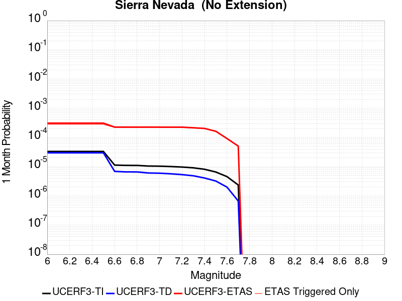 |  |  |

| Magnitude | 1 wk TI Prob | 1 wk TD Prob | 1 wk ETAS Prob | 1 wk ETAS/TD Gain | 1 wk ETAS Triggered Only | 1 mo TI Prob | 1 mo TD Prob | 1 mo ETAS Prob | 1 mo ETAS/TD Gain | 1 mo ETAS Triggered Only | 1 yr TI Prob | 1 yr TD Prob | 1 yr ETAS Prob | 1 yr ETAS/TD Gain | 1 yr ETAS Triggered Only | 10 yr TI Prob | 10 yr TD Prob | 10 yr ETAS Prob | 10 yr ETAS/TD Gain | 10 yr ETAS Triggered Only |
|-----|-----|-----|-----|-----|-----|-----|-----|-----|-----|-----|-----|-----|-----|-----|-----|-----|-----|-----|-----|-----|
| 6.0 | 7.7690465E-6 | 6.9762887E-6 | 2.731958E-4 | 39.160618 | 2.6622135E-4 | 3.329549E-5 | 2.989824E-5 | 2.9611163E-4 | 9.903982 | 2.6622135E-4 | 4.0529718E-4 | 3.6398612E-4 | 7.510762E-4 | 2.063475 | 3.8723106E-4 | 0.004045588 | 0.0036374154 | 0.004119694 | 1.1325881 | 4.840388E-4 |
| 6.1 | 7.7690465E-6 | 6.9762887E-6 | 2.731958E-4 | 39.160618 | 2.6622135E-4 | 3.329549E-5 | 2.989824E-5 | 2.9611163E-4 | 9.903982 | 2.6622135E-4 | 4.0529718E-4 | 3.6398612E-4 | 7.510762E-4 | 2.063475 | 3.8723106E-4 | 0.004045588 | 0.0036374154 | 0.004119694 | 1.1325881 | 4.840388E-4 |
| 6.2 | 7.7690465E-6 | 6.9762887E-6 | 2.731958E-4 | 39.160618 | 2.6622135E-4 | 3.329549E-5 | 2.989824E-5 | 2.9611163E-4 | 9.903982 | 2.6622135E-4 | 4.0529718E-4 | 3.6398612E-4 | 7.510762E-4 | 2.063475 | 3.8723106E-4 | 0.004045588 | 0.0036374154 | 0.004119694 | 1.1325881 | 4.840388E-4 |
| 6.3 | 7.7690465E-6 | 6.9762887E-6 | 2.731958E-4 | 39.160618 | 2.6622135E-4 | 3.329549E-5 | 2.989824E-5 | 2.9611163E-4 | 9.903982 | 2.6622135E-4 | 4.0529718E-4 | 3.6398612E-4 | 7.510762E-4 | 2.063475 | 3.8723106E-4 | 0.004045588 | 0.0036374154 | 0.004119694 | 1.1325881 | 4.840388E-4 |
| 6.4 | 7.7690465E-6 | 6.9762887E-6 | 2.731958E-4 | 39.160618 | 2.6622135E-4 | 3.329549E-5 | 2.989824E-5 | 2.9611163E-4 | 9.903982 | 2.6622135E-4 | 4.0529718E-4 | 3.6398612E-4 | 7.510762E-4 | 2.063475 | 3.8723106E-4 | 0.004045588 | 0.0036374154 | 0.004119694 | 1.1325881 | 4.840388E-4 |
| 6.5 | 7.7690465E-6 | 6.9762887E-6 | 2.731958E-4 | 39.160618 | 2.6622135E-4 | 3.329549E-5 | 2.989824E-5 | 2.9611163E-4 | 9.903982 | 2.6622135E-4 | 4.0529718E-4 | 3.6398612E-4 | 7.510762E-4 | 2.063475 | 3.8723106E-4 | 0.004045588 | 0.0036374154 | 0.004119694 | 1.1325881 | 4.840388E-4 |
| 6.6 | 2.653E-6 | 1.6148208E-6 | 1.9523004E-4 | 120.89888 | 1.9361553E-4 | 1.136995E-5 | 6.9206426E-6 | 2.0053484E-4 | 28.976332 | 1.9361553E-4 | 1.3842035E-4 | 8.42556E-5 | 3.7465442E-4 | 4.446641 | 2.9042328E-4 | 0.0013833415 | 8.4224E-4 | 0.0012049633 | 1.4306651 | 3.630291E-4 |
| 6.7 | 2.5902466E-6 | 1.5501544E-6 | 1.9516538E-4 | 125.90061 | 1.9361553E-4 | 1.11010095E-5 | 6.643502E-6 | 2.0025774E-4 | 30.1434 | 1.9361553E-4 | 1.351464E-4 | 8.088166E-5 | 3.7128147E-4 | 4.590428 | 2.9042328E-4 | 0.0013506424 | 8.0852525E-4 | 0.0011712608 | 1.4486386 | 3.630291E-4 |
| 6.8 | 2.5853892E-6 | 1.5469546E-6 | 1.9516218E-4 | 126.15896 | 1.9361553E-4 | 1.1080193E-5 | 6.629789E-6 | 2.0024403E-4 | 30.203682 | 1.9361553E-4 | 1.34893E-4 | 8.071472E-5 | 3.7111458E-4 | 4.597855 | 2.9042328E-4 | 0.0013481114 | 8.06857E-4 | 0.0011695932 | 1.4495668 | 3.630291E-4 |
| 6.9 | 2.458257E-6 | 1.422029E-6 | 1.9503728E-4 | 137.15424 | 1.9361553E-4 | 1.0535345E-5 | 6.0943958E-6 | 1.9970874E-4 | 32.769245 | 1.9361553E-4 | 1.2826028E-4 | 7.419676E-5 | 3.645985E-4 | 4.913941 | 2.9042328E-4 | 0.0012818627 | 7.4172183E-4 | 0.0011044816 | 1.489078 | 3.630291E-4 |
| 7.0 | 2.4341468E-6 | 1.3989927E-6 | 1.9501425E-4 | 139.39618 | 1.9361553E-4 | 1.0432016E-5 | 5.9956697E-6 | 1.9961003E-4 | 33.292366 | 1.9361553E-4 | 1.270024E-4 | 7.299485E-5 | 3.6339695E-4 | 4.9783916 | 2.9042328E-4 | 0.0012692984 | 7.297107E-4 | 0.0010924749 | 1.4971343 | 3.630291E-4 |
| 7.1 | 2.3652476E-6 | 1.3339427E-6 | 1.9494921E-4 | 146.14511 | 1.9361553E-4 | 1.0136736E-5 | 5.716885E-6 | 1.993313E-4 | 34.86712 | 1.9361553E-4 | 1.2340778E-4 | 6.9600865E-5 | 3.6000393E-4 | 5.172406 | 2.9042328E-4 | 0.0012333926 | 6.957924E-4 | 0.001058569 | 1.5213861 | 3.630291E-4 |
| 7.2 | 2.272158E-6 | 1.2502497E-6 | 1.9486554E-4 | 155.8613 | 1.9361553E-4 | 9.737784E-6 | 5.358202E-6 | 1.9897269E-4 | 37.134228 | 1.9361553E-4 | 1.1855107E-4 | 6.523417E-5 | 3.556385E-4 | 5.451721 | 2.9042328E-4 | 0.0011848784 | 6.5215176E-4 | 0.001014944 | 1.5563005 | 3.630291E-4 |
| 7.3 | 2.1382127E-6 | 1.1419382E-6 | 1.9475725E-4 | 170.54971 | 1.9361553E-4 | 9.163737E-6 | 4.894012E-6 | 1.985086E-4 | 40.561527 | 1.9361553E-4 | 1.1156279E-4 | 5.9582977E-5 | 3.4998896E-4 | 5.8739758 | 2.9042328E-4 | 0.001115068 | 5.956712E-4 | 9.342965E-4 | 1.5684769 | 3.3882717E-4 |
| 7.4 | 1.9048055E-6 | 9.574928E-7 | 1.9457283E-4 | 203.21075 | 1.9361553E-4 | 8.163426E-6 | 4.103534E-6 | 1.9771827E-4 | 48.182434 | 1.9361553E-4 | 9.9385186E-5 | 4.995939E-5 | 3.4036816E-4 | 6.8128967 | 2.9042328E-4 | 9.934074E-4 | 4.9948227E-4 | 8.139504E-4 | 1.629588 | 3.1462524E-4 |
| 7.5 | 1.5373403E-6 | 7.559763E-7 | 1.2176559E-4 | 161.07065 | 1.210097E-4 | 6.5885843E-6 | 3.2398946E-6 | 1.2424921E-4 | 38.34977 | 1.210097E-4 | 8.021306E-5 | 3.9445007E-5 | 2.330529E-4 | 5.908299 | 1.9361553E-4 | 8.0184115E-4 | 3.9438053E-4 | 6.121121E-4 | 1.552085 | 2.1781746E-4 |
| 7.6 | 1.0680322E-6 | 4.65941E-7 | 7.307173E-5 | 156.82614 | 7.260582E-5 | 4.577273E-6 | 1.9968884E-6 | 7.460257E-5 | 37.359406 | 7.260582E-5 | 5.5726876E-5 | 2.4311848E-5 | 1.2111726E-4 | 4.98182 | 9.6807766E-5 | 5.5712904E-4 | 2.4309216E-4 | 3.398764E-4 | 1.398138 | 9.6807766E-5 |
| 7.7 | 5.509146E-7 | 1.5578539E-7 | 4.855966E-5 | 311.70868 | 4.8403883E-5 | 2.3610605E-6 | 6.676515E-7 | 4.9071503E-5 | 73.49867 | 4.8403883E-5 | 2.8745531E-5 | 8.128628E-6 | 5.6532117E-5 | 6.954694 | 4.8403883E-5 | 2.8741814E-4 | 8.128342E-5 | 1.2968337E-4 | 1.5954467 | 4.8403883E-5 |

## San Andreas (Cholame) rev
*[(top)](#table-of-contents)*

| 1 Week | 1 Month | 1 Year | 10 Year |
|-----|-----|-----|-----|
|  | 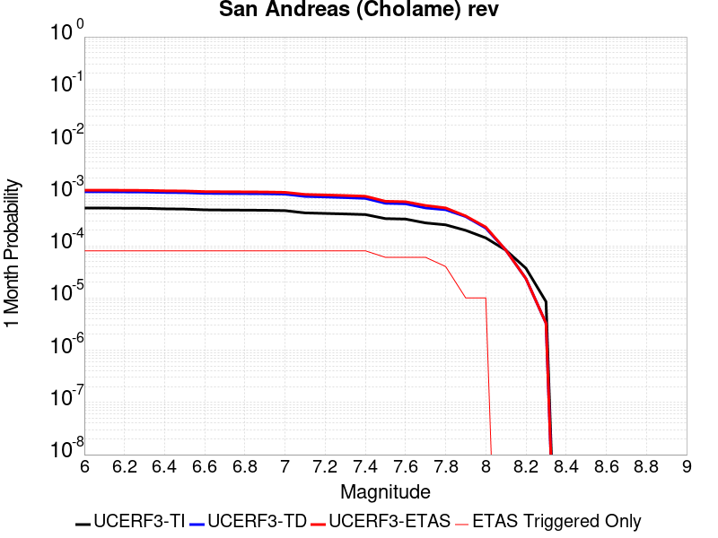 |  |  |

| Magnitude | 1 wk TI Prob | 1 wk TD Prob | 1 wk ETAS Prob | 1 wk ETAS/TD Gain | 1 wk ETAS Triggered Only | 1 mo TI Prob | 1 mo TD Prob | 1 mo ETAS Prob | 1 mo ETAS/TD Gain | 1 mo ETAS Triggered Only | 1 yr TI Prob | 1 yr TD Prob | 1 yr ETAS Prob | 1 yr ETAS/TD Gain | 1 yr ETAS Triggered Only | 10 yr TI Prob | 10 yr TD Prob | 10 yr ETAS Prob | 10 yr ETAS/TD Gain | 10 yr ETAS Triggered Only |
|-----|-----|-----|-----|-----|-----|-----|-----|-----|-----|-----|-----|-----|-----|-----|-----|-----|-----|-----|-----|-----|
| 6.0 | 1.2302514E-4 | 2.5205986E-4 | 3.2464738E-4 | 1.2879773 | 7.260582E-5 | 5.27144E-4 | 0.0010798109 | 0.0012006899 | 1.1119447 | 1.210097E-4 | 0.0063991086 | 0.013067958 | 0.0133545855 | 1.0219337 | 2.9042328E-4 | 0.06217949 | 0.12438412 | 0.12482914 | 1.0035778 | 5.082408E-4 |
| 6.1 | 1.2302514E-4 | 2.5205986E-4 | 3.2464738E-4 | 1.2879773 | 7.260582E-5 | 5.27144E-4 | 0.0010798109 | 0.0012006899 | 1.1119447 | 1.210097E-4 | 0.0063991086 | 0.013067958 | 0.0133545855 | 1.0219337 | 2.9042328E-4 | 0.06217949 | 0.12438412 | 0.12482914 | 1.0035778 | 5.082408E-4 |
| 6.2 | 1.2203569E-4 | 2.502277E-4 | 3.2281535E-4 | 1.2900864 | 7.260582E-5 | 5.2290526E-4 | 0.0010719653 | 0.0011928453 | 1.1127648 | 1.210097E-4 | 0.006347804 | 0.012973578 | 0.013260233 | 1.0220953 | 2.9042328E-4 | 0.061695136 | 0.123571314 | 0.12401675 | 1.0036047 | 5.082408E-4 |
| 6.3 | 1.2142645E-4 | 2.4908737E-4 | 3.2167512E-4 | 1.2914147 | 7.260582E-5 | 5.202953E-4 | 0.0010670823 | 0.0011879628 | 1.1132814 | 1.210097E-4 | 0.006316212 | 0.012914834 | 0.013201506 | 1.0221971 | 2.9042328E-4 | 0.06139677 | 0.12306532 | 0.12351102 | 1.0036216 | 5.082408E-4 |
| 6.4 | 1.1865206E-4 | 2.4414246E-4 | 3.1673055E-4 | 1.2973186 | 7.260582E-5 | 5.0840975E-4 | 0.0010459068 | 0.00116679 | 1.1155773 | 1.210097E-4 | 0.006172335 | 0.012660044 | 0.012946791 | 1.0226498 | 2.9042328E-4 | 0.060036868 | 0.12085904 | 0.12130586 | 1.003697 | 5.082408E-4 |
| 6.5 | 1.17443946E-4 | 2.4207575E-4 | 3.14664E-4 | 1.2998576 | 7.260582E-5 | 5.032341E-4 | 0.0010370566 | 0.0011579408 | 1.1165648 | 1.210097E-4 | 0.006109677 | 0.012553536 | 0.012840314 | 1.0228443 | 2.9042328E-4 | 0.059444077 | 0.11993008 | 0.12037737 | 1.0037296 | 5.082408E-4 |
| 6.6 | 1.13579066E-4 | 2.3516564E-4 | 3.0775438E-4 | 1.3086708 | 7.260582E-5 | 4.866766E-4 | 0.001007465 | 0.0011283527 | 1.119992 | 1.210097E-4 | 0.0059092017 | 0.012197345 | 0.012460318 | 1.02156 | 2.6622135E-4 | 0.057545185 | 0.1168492 | 0.117276676 | 1.0036584 | 4.840388E-4 |
| 6.7 | 1.1271412E-4 | 2.336088E-4 | 3.0619767E-4 | 1.3107283 | 7.260582E-5 | 4.829711E-4 | 0.001000798 | 0.0011216865 | 1.1207923 | 1.210097E-4 | 0.005864331 | 0.012117079 | 0.012380075 | 1.0217046 | 2.6622135E-4 | 0.057119697 | 0.11615275 | 0.11658057 | 1.0036832 | 4.840388E-4 |
| 6.8 | 1.1217975E-4 | 2.3249313E-4 | 3.0508207E-4 | 1.3122197 | 7.260582E-5 | 4.8068175E-4 | 9.960202E-4 | 0.0011169093 | 1.1213722 | 1.210097E-4 | 0.005836608 | 0.012059555 | 0.012322566 | 1.0218093 | 2.6622135E-4 | 0.056856725 | 0.11565061 | 0.11607867 | 1.0037013 | 4.840388E-4 |
| 6.9 | 1.1146753E-4 | 2.3098059E-4 | 3.0356963E-4 | 1.3142648 | 7.260582E-5 | 4.7763053E-4 | 9.895428E-4 | 0.0011104327 | 1.1221675 | 1.210097E-4 | 0.0057996577 | 0.011981564 | 0.012244595 | 1.021953 | 2.6622135E-4 | 0.056506127 | 0.11497027 | 0.11539865 | 1.0037261 | 4.840388E-4 |
| 7.0 | 1.0965793E-4 | 2.2721413E-4 | 2.9980345E-4 | 1.3194754 | 7.260582E-5 | 4.698779E-4 | 9.734129E-4 | 0.0010943048 | 1.1241939 | 1.210097E-4 | 0.005705768 | 0.011787324 | 0.012050407 | 1.0223192 | 2.6622135E-4 | 0.055614736 | 0.11327011 | 0.113699324 | 1.0037893 | 4.840388E-4 |
| 7.1 | 9.927982E-5 | 2.0540332E-4 | 2.7799423E-4 | 1.3534067 | 7.260582E-5 | 4.2541555E-4 | 8.8000396E-4 | 0.0010009072 | 1.1373894 | 1.210097E-4 | 0.0051671406 | 0.010661708 | 0.010925092 | 1.0247036 | 2.6622135E-4 | 0.05048634 | 0.10336573 | 0.10379974 | 1.0041988 | 4.840388E-4 |
| 7.2 | 9.696786E-5 | 2.0044584E-4 | 2.7303712E-4 | 1.362149 | 7.260582E-5 | 4.1551032E-4 | 8.587718E-4 | 9.796775E-4 | 1.1407892 | 1.210097E-4 | 0.00504711 | 0.010405703 | 0.010669155 | 1.0253179 | 2.6622135E-4 | 0.04934009 | 0.10110233 | 0.101537436 | 1.0043036 | 4.840388E-4 |
| 7.3 | 9.4727984E-5 | 1.9473763E-4 | 2.673293E-4 | 1.3727666 | 7.260582E-5 | 4.0591392E-4 | 8.343239E-4 | 9.552326E-4 | 1.1449182 | 1.210097E-4 | 0.0049308087 | 0.010110851 | 0.01037438 | 1.026064 | 2.6622135E-4 | 0.048228268 | 0.09847412 | 0.098910496 | 1.0044314 | 4.840388E-4 |
| 7.4 | 9.220358E-5 | 1.8844259E-4 | 2.6103473E-4 | 1.3852215 | 7.260582E-5 | 3.9509835E-4 | 8.07362E-4 | 9.28274E-4 | 1.1497618 | 1.210097E-4 | 0.004799717 | 0.009785578 | 0.010049194 | 1.0269393 | 2.6622135E-4 | 0.046973653 | 0.09555831 | 0.09599609 | 1.0045813 | 4.840388E-4 |
| 7.5 | 7.71631E-5 | 1.5179155E-4 | 2.001881E-4 | 1.3188355 | 4.8403883E-5 | 3.306571E-4 | 6.5037323E-4 | 7.229318E-4 | 1.1115645 | 7.260582E-5 | 0.0040183207 | 0.007889617 | 0.008105716 | 1.0273902 | 2.1781746E-4 | 0.03946433 | 0.078289196 | 0.07869073 | 1.0051287 | 4.3563492E-4 |
| 7.6 | 7.5634416E-5 | 1.4838556E-4 | 1.9678226E-4 | 1.3261551 | 4.8403883E-5 | 3.241072E-4 | 6.357833E-4 | 7.0834294E-4 | 1.1141264 | 7.260582E-5 | 0.0039388672 | 0.007713256 | 0.007929393 | 1.0280216 | 2.1781746E-4 | 0.038697794 | 0.076654874 | 0.077057116 | 1.0052475 | 4.3563492E-4 |
| 7.7 | 6.3783E-5 | 1.2359623E-4 | 1.7199414E-4 | 1.3915807 | 4.8403883E-5 | 2.7332708E-4 | 5.2959064E-4 | 6.02158E-4 | 1.1370254 | 7.260582E-5 | 0.0033226798 | 0.0064287307 | 0.006597055 | 1.0261831 | 1.6941359E-4 | 0.032734364 | 0.06454488 | 0.064861834 | 1.0049107 | 3.3882717E-4 |
| 7.8 | 5.863422E-5 | 1.14169685E-4 | 1.6256805E-4 | 1.423916 | 4.8403883E-5 | 2.512653E-4 | 4.892069E-4 | 5.3758716E-4 | 1.0988952 | 4.8403883E-5 | 0.003054864 | 0.0059398497 | 0.0060841986 | 1.0243018 | 1.4521164E-4 | 0.030132094 | 0.05966162 | 0.059957474 | 1.0049589 | 3.1462524E-4 |
| 7.9 | 4.595283E-5 | 8.426815E-5 | 1.08468055E-4 | 1.2871773 | 2.4201941E-5 | 1.9692584E-4 | 3.6109926E-4 | 3.8529246E-4 | 1.0669987 | 2.4201941E-5 | 0.0023949358 | 0.0043875277 | 0.0044839107 | 1.0219675 | 9.6807766E-5 | 0.023692891 | 0.044363137 | 0.044548165 | 1.0041708 | 1.9361553E-4 |
| 8.0 | 3.2950178E-5 | 5.077396E-5 | 7.4974676E-5 | 1.4766363 | 2.4201941E-5 | 1.412074E-4 | 2.1758456E-4 | 2.4178122E-4 | 1.1112058 | 2.4201941E-5 | 0.0017178444 | 0.0026458753 | 0.0026941511 | 1.0182457 | 4.8403883E-5 | 0.017046256 | 0.027181072 | 0.027251706 | 1.0025986 | 7.260582E-5 |
| 8.1 | 1.9177472E-5 | 1.9183733E-5 | 1.9183733E-5 | 1.0 | 0.0 | 8.218658E-5 | 8.221342E-5 | 8.221342E-5 | 1.0 | 0.0 | 0.0010001622 | 0.0010004893 | 0.0010004893 | 1.0 | 0.0 | 0.009956728 | 0.010757887 | 0.010757887 | 1.0 | 0.0 |
| 8.2 | 8.643924E-6 | 5.473668E-6 | 5.473668E-6 | 1.0 | 0.0 | 3.704486E-5 | 2.3458366E-5 | 2.3458366E-5 | 1.0 | 0.0 | 4.5092785E-4 | 2.8556827E-4 | 2.8556827E-4 | 1.0 | 0.0 | 0.0045001395 | 0.0032481793 | 0.0032481793 | 1.0 | 0.0 |
| 8.3 | 1.983087E-6 | 7.6564595E-7 | 7.6564595E-7 | 1.0 | 0.0 | 8.498917E-6 | 3.281336E-6 | 3.281336E-6 | 1.0 | 0.0 | 1.034694E-4 | 3.9949547E-5 | 3.9949547E-5 | 1.0 | 0.0 | 0.0010342124 | 4.717979E-4 | 4.717979E-4 | 1.0 | 0.0 |

## San Andreas (Parkfield)
*[(top)](#table-of-contents)*

| 1 Week | 1 Month | 1 Year | 10 Year |
|-----|-----|-----|-----|
|  |  |  |  |

| Magnitude | 1 wk TI Prob | 1 wk TD Prob | 1 wk ETAS Prob | 1 wk ETAS/TD Gain | 1 wk ETAS Triggered Only | 1 mo TI Prob | 1 mo TD Prob | 1 mo ETAS Prob | 1 mo ETAS/TD Gain | 1 mo ETAS Triggered Only | 1 yr TI Prob | 1 yr TD Prob | 1 yr ETAS Prob | 1 yr ETAS/TD Gain | 1 yr ETAS Triggered Only | 10 yr TI Prob | 10 yr TD Prob | 10 yr ETAS Prob | 10 yr ETAS/TD Gain | 10 yr ETAS Triggered Only |
|-----|-----|-----|-----|-----|-----|-----|-----|-----|-----|-----|-----|-----|-----|-----|-----|-----|-----|-----|-----|-----|
| 6.0 | 5.556969E-4 | 7.778562E-4 | 8.745887E-4 | 1.1243578 | 9.6807766E-5 | 0.0023793848 | 0.0033299583 | 0.0034988075 | 1.0507061 | 1.6941359E-4 | 0.028586963 | 0.040235043 | 0.040467322 | 1.0057731 | 2.420194E-4 | 0.25176284 | 0.3371973 | 0.33751813 | 1.0009514 | 4.840388E-4 |
| 6.1 | 1.925858E-4 | 3.0278185E-4 | 3.5117107E-4 | 1.1598154 | 4.8403883E-5 | 8.2510663E-4 | 0.001297085 | 0.0013937671 | 1.0745381 | 9.6807766E-5 | 0.0099994885 | 0.01577393 | 0.015940672 | 1.0105706 | 1.6941359E-4 | 0.095613256 | 0.14975825 | 0.15000518 | 1.0016489 | 2.9042328E-4 |
| 6.2 | 9.4306815E-5 | 1.8243887E-4 | 2.3083393E-4 | 1.2652673 | 4.8403883E-5 | 4.0410945E-4 | 7.8164786E-4 | 8.783799E-4 | 1.123754 | 9.6807766E-5 | 0.0049089384 | 0.009475246 | 0.009643055 | 1.0177102 | 1.6941359E-4 | 0.048019063 | 0.0918565 | 0.09212025 | 1.0028713 | 2.9042328E-4 |
| 6.3 | 9.283051E-5 | 1.794041E-4 | 2.277993E-4 | 1.2697552 | 4.8403883E-5 | 3.9778434E-4 | 7.686494E-4 | 8.653827E-4 | 1.1258485 | 9.6807766E-5 | 0.0048322747 | 0.009318355 | 0.009486189 | 1.0180112 | 1.6941359E-4 | 0.047285385 | 0.090509474 | 0.090773605 | 1.0029184 | 2.9042328E-4 |
| 6.4 | 9.138826E-5 | 1.7702584E-4 | 2.2542114E-4 | 1.2733799 | 4.8403883E-5 | 3.916052E-4 | 7.5846276E-4 | 8.551971E-4 | 1.12754 | 9.6807766E-5 | 0.0047573745 | 0.009195387 | 0.009363243 | 1.0182544 | 1.6941359E-4 | 0.046568092 | 0.0894136 | 0.08967806 | 1.0029577 | 2.9042328E-4 |
| 6.5 | 9.000255E-5 | 1.746064E-4 | 2.2300181E-4 | 1.2771688 | 4.8403883E-5 | 3.8566816E-4 | 7.4809964E-4 | 8.44835E-4 | 1.1293081 | 9.6807766E-5 | 0.0046854047 | 0.009070284 | 0.009238161 | 1.0185084 | 1.6941359E-4 | 0.045878403 | 0.08829608 | 0.08856086 | 1.0029988 | 2.9042328E-4 |
| 6.6 | 8.8109264E-5 | 1.7141816E-4 | 2.1981374E-4 | 1.2823248 | 4.8403883E-5 | 3.7755648E-4 | 7.3444354E-4 | 8.311802E-4 | 1.1317142 | 9.6807766E-5 | 0.0045870654 | 0.008905404 | 0.00907331 | 1.0188543 | 1.6941359E-4 | 0.04493529 | 0.08682707 | 0.08709228 | 1.0030544 | 2.9042328E-4 |
| 6.7 | 8.738073E-5 | 1.7008898E-4 | 2.1848464E-4 | 1.2845314 | 4.8403883E-5 | 3.7443507E-4 | 7.287503E-4 | 8.2548754E-4 | 1.132744 | 9.6807766E-5 | 0.0045492216 | 0.008836695 | 0.0090046115 | 1.0190022 | 1.6941359E-4 | 0.04457213 | 0.0862268 | 0.08649218 | 1.0030777 | 2.9042328E-4 |
| 6.8 | 8.710195E-5 | 1.6954402E-4 | 2.179397E-4 | 1.285446 | 4.8403883E-5 | 3.7324068E-4 | 7.26416E-4 | 8.231535E-4 | 1.1331708 | 9.6807766E-5 | 0.0045347405 | 0.008808513 | 0.008976434 | 1.0190635 | 1.6941359E-4 | 0.04443313 | 0.08597436 | 0.086239815 | 1.0030876 | 2.9042328E-4 |
| 6.9 | 8.6801556E-5 | 1.6895356E-4 | 2.1734925E-4 | 1.2864438 | 4.8403883E-5 | 3.7195362E-4 | 7.238869E-4 | 8.206246E-4 | 1.1336365 | 9.6807766E-5 | 0.0045191357 | 0.0087779695 | 0.008945896 | 1.0191305 | 1.6941359E-4 | 0.044283327 | 0.08570042 | 0.085965954 | 1.0030984 | 2.9042328E-4 |
| 7.0 | 8.5571606E-5 | 1.664819E-4 | 2.1487773E-4 | 1.2906972 | 4.8403883E-5 | 3.6668387E-4 | 7.132999E-4 | 8.100386E-4 | 1.1356214 | 9.6807766E-5 | 0.004455241 | 0.008650103 | 0.008818051 | 1.0194157 | 1.6941359E-4 | 0.043669727 | 0.08454836 | 0.084814236 | 1.0031446 | 2.9042328E-4 |
| 7.1 | 7.82589E-5 | 1.5128969E-4 | 1.9968624E-4 | 1.3198934 | 4.8403883E-5 | 3.3535215E-4 | 6.4822397E-4 | 7.4496894E-4 | 1.1492462 | 9.6807766E-5 | 0.0040752706 | 0.007863738 | 0.008031819 | 1.0213742 | 1.6941359E-4 | 0.040013418 | 0.077460445 | 0.07772837 | 1.0034589 | 2.9042328E-4 |
| 7.2 | 7.690929E-5 | 1.4866212E-4 | 1.970588E-4 | 1.3255482 | 4.8403883E-5 | 3.2956956E-4 | 6.369685E-4 | 7.337146E-4 | 1.1518853 | 9.6807766E-5 | 0.004005129 | 0.0077276826 | 0.007895787 | 1.0217535 | 1.6941359E-4 | 0.0393371 | 0.07623341 | 0.07650169 | 1.0035192 | 2.9042328E-4 |
| 7.3 | 7.5543794E-5 | 1.4562748E-4 | 1.9402431E-4 | 1.3323331 | 4.8403883E-5 | 3.2371894E-4 | 6.239692E-4 | 7.2071655E-4 | 1.1550515 | 9.6807766E-5 | 0.003934157 | 0.0075705256 | 0.007738657 | 1.0222087 | 1.6941359E-4 | 0.038652334 | 0.07479777 | 0.07506647 | 1.0035924 | 2.9042328E-4 |
| 7.4 | 7.4214564E-5 | 1.4263717E-4 | 1.9103415E-4 | 1.3393013 | 4.8403883E-5 | 3.1802364E-4 | 6.1115966E-4 | 7.0790824E-4 | 1.1583033 | 9.6807766E-5 | 0.003865065 | 0.0074156416 | 0.007583799 | 1.022676 | 1.6941359E-4 | 0.03798529 | 0.07337152 | 0.07364064 | 1.0036678 | 2.9042328E-4 |
| 7.5 | 6.149578E-5 | 1.1191443E-4 | 1.3611367E-4 | 1.2162298 | 2.4201941E-5 | 2.6352672E-4 | 4.795452E-4 | 5.279259E-4 | 1.1008886 | 4.8403883E-5 | 0.0032037178 | 0.005822865 | 0.00594317 | 1.0206608 | 1.210097E-4 | 0.03157923 | 0.058559462 | 0.05878731 | 1.0038909 | 2.420194E-4 |
| 7.6 | 6.0643448E-5 | 1.102009E-4 | 1.3440016E-4 | 1.2195923 | 2.4201941E-5 | 2.598746E-4 | 4.7220418E-4 | 5.205852E-4 | 1.1024579 | 4.8403883E-5 | 0.0031593828 | 0.005733962 | 0.005854278 | 1.020983 | 1.210097E-4 | 0.031148417 | 0.05772042 | 0.057948466 | 1.003951 | 2.420194E-4 |
| 7.7 | 5.1652263E-5 | 9.175265E-5 | 1.1595237E-4 | 1.2637496 | 2.4201941E-5 | 2.2134806E-4 | 3.9316638E-4 | 4.4155124E-4 | 1.1230645 | 4.8403883E-5 | 0.002691582 | 0.0047763046 | 0.00487265 | 1.0201715 | 9.6807766E-5 | 0.026592141 | 0.04853641 | 0.048743654 | 1.0042698 | 2.1781746E-4 |
| 7.8 | 4.8090482E-5 | 8.560165E-5 | 1.0980152E-4 | 1.2827033 | 2.4201941E-5 | 2.060858E-4 | 3.6681266E-4 | 3.910057E-4 | 1.0659548 | 2.4201941E-5 | 0.0025062072 | 0.004456807 | 0.004529089 | 1.0162184 | 7.260582E-5 | 0.024781305 | 0.045302264 | 0.04548711 | 1.0040803 | 1.9361553E-4 |
| 7.9 | 3.970278E-5 | 6.7507375E-5 | 6.7507375E-5 | 1.0 | 0.0 | 1.7014367E-4 | 2.8928524E-4 | 2.8928524E-4 | 1.0 | 0.0 | 0.002069531 | 0.0035163634 | 0.0035404803 | 1.0068585 | 2.4201941E-5 | 0.020503636 | 0.03588176 | 0.035975095 | 1.0026011 | 9.6807766E-5 |
| 8.0 | 2.8982335E-5 | 4.0698153E-5 | 4.0698153E-5 | 1.0 | 0.0 | 1.2420409E-4 | 1.7440901E-4 | 1.7440901E-4 | 1.0 | 0.0 | 0.0015111357 | 0.0021213628 | 0.0021213628 | 1.0 | 0.0 | 0.015009012 | 0.02201118 | 0.02201118 | 1.0 | 0.0 |
| 8.1 | 1.8836186E-5 | 1.867974E-5 | 1.867974E-5 | 1.0 | 0.0 | 8.0724014E-5 | 8.005358E-5 | 8.005358E-5 | 1.0 | 0.0 | 9.823717E-4 | 9.742171E-4 | 9.742171E-4 | 1.0 | 0.0 | 0.009780403 | 0.010487711 | 0.010487711 | 1.0 | 0.0 |
| 8.2 | 8.643924E-6 | 5.473668E-6 | 5.473668E-6 | 1.0 | 0.0 | 3.704486E-5 | 2.3458366E-5 | 2.3458366E-5 | 1.0 | 0.0 | 4.5092785E-4 | 2.8556827E-4 | 2.8556827E-4 | 1.0 | 0.0 | 0.0045001395 | 0.0032481793 | 0.0032481793 | 1.0 | 0.0 |
| 8.3 | 1.983087E-6 | 7.6564595E-7 | 7.6564595E-7 | 1.0 | 0.0 | 8.498917E-6 | 3.281336E-6 | 3.281336E-6 | 1.0 | 0.0 | 1.034694E-4 | 3.9949547E-5 | 3.9949547E-5 | 1.0 | 0.0 | 0.0010342124 | 4.717979E-4 | 4.717979E-4 | 1.0 | 0.0 |

## San Andreas (Coachella) rev
*[(top)](#table-of-contents)*

| 1 Week | 1 Month | 1 Year | 10 Year |
|-----|-----|-----|-----|
| 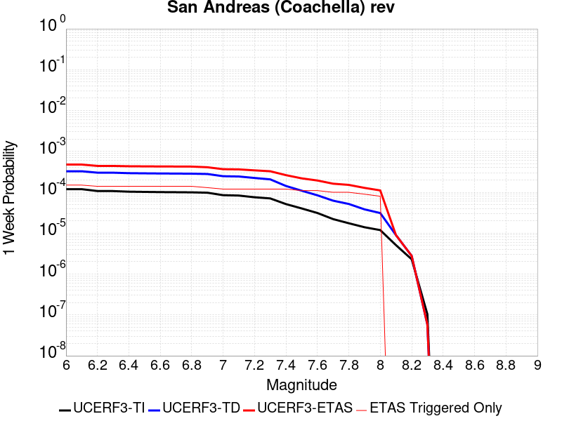 |  |  | 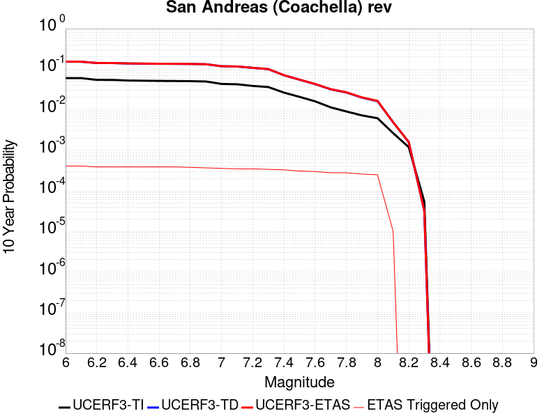 |

| Magnitude | 1 wk TI Prob | 1 wk TD Prob | 1 wk ETAS Prob | 1 wk ETAS/TD Gain | 1 wk ETAS Triggered Only | 1 mo TI Prob | 1 mo TD Prob | 1 mo ETAS Prob | 1 mo ETAS/TD Gain | 1 mo ETAS Triggered Only | 1 yr TI Prob | 1 yr TD Prob | 1 yr ETAS Prob | 1 yr ETAS/TD Gain | 1 yr ETAS Triggered Only | 10 yr TI Prob | 10 yr TD Prob | 10 yr ETAS Prob | 10 yr ETAS/TD Gain | 10 yr ETAS Triggered Only |
|-----|-----|-----|-----|-----|-----|-----|-----|-----|-----|-----|-----|-----|-----|-----|-----|-----|-----|-----|-----|-----|
| 6.0 | 1.1925945E-4 | 3.273077E-4 | 4.9666583E-4 | 1.5174279 | 1.6941359E-4 | 5.110118E-4 | 0.001401998 | 0.0015953421 | 1.1379061 | 1.9361553E-4 | 0.0062038354 | 0.016937068 | 0.017270155 | 1.0196662 | 3.3882717E-4 | 0.060334753 | 0.15267672 | 0.15302533 | 1.0022833 | 4.11433E-4 |
| 6.1 | 1.1925945E-4 | 3.273077E-4 | 4.9666583E-4 | 1.5174279 | 1.6941359E-4 | 5.110118E-4 | 0.001401998 | 0.0015953421 | 1.1379061 | 1.9361553E-4 | 0.0062038354 | 0.016937068 | 0.017270155 | 1.0196662 | 3.3882717E-4 | 0.060334753 | 0.15267672 | 0.15302533 | 1.0022833 | 4.11433E-4 |
| 6.2 | 1.07432395E-4 | 3.0231563E-4 | 4.7167798E-4 | 1.560217 | 1.6941359E-4 | 4.603433E-4 | 0.001294999 | 0.0014883638 | 1.1493165 | 1.9361553E-4 | 0.005590286 | 0.015653731 | 0.015963431 | 1.0197845 | 3.1462524E-4 | 0.05451731 | 0.14182784 | 0.14216015 | 1.002343 | 3.8723106E-4 |
| 6.3 | 1.0718766E-4 | 3.0176868E-4 | 4.7113115E-4 | 1.5612327 | 1.6941359E-4 | 4.592948E-4 | 0.0012926573 | 0.0014860226 | 1.1495874 | 1.9361553E-4 | 0.005577586 | 0.01562563 | 0.015935339 | 1.0198206 | 3.1462524E-4 | 0.054396555 | 0.14159605 | 0.14192845 | 1.0023475 | 3.8723106E-4 |
| 6.4 | 1.0355944E-4 | 2.9384956E-4 | 4.6321336E-4 | 1.5763624 | 1.6941359E-4 | 4.4375064E-4 | 0.0012587514 | 0.0014521232 | 1.1536219 | 1.9361553E-4 | 0.0053892885 | 0.015218662 | 0.015528499 | 1.020359 | 3.1462524E-4 | 0.052604496 | 0.13815795 | 0.13849169 | 1.0024155 | 3.8723106E-4 |
| 6.5 | 1.0227914E-4 | 2.9104383E-4 | 4.6040813E-4 | 1.5819201 | 1.6941359E-4 | 4.382655E-4 | 0.0012467385 | 0.0014401126 | 1.155104 | 1.9361553E-4 | 0.0053228354 | 0.015074439 | 0.015384321 | 1.0205568 | 3.1462524E-4 | 0.051971316 | 0.13694239 | 0.13727659 | 1.0024405 | 3.8723106E-4 |
| 6.6 | 1.0116757E-4 | 2.8870135E-4 | 4.5806603E-4 | 1.5866432 | 1.6941359E-4 | 4.3350324E-4 | 0.0012367087 | 0.0014300848 | 1.1563635 | 1.9361553E-4 | 0.0052651367 | 0.014954008 | 0.015263929 | 1.0207249 | 3.1462524E-4 | 0.051421247 | 0.13591973 | 0.13625434 | 1.0024618 | 3.8723106E-4 |
| 6.7 | 1.0050676E-4 | 2.8728697E-4 | 4.5665188E-4 | 1.5895321 | 1.6941359E-4 | 4.3067214E-4 | 0.0012306528 | 0.00142403 | 1.1571339 | 1.9361553E-4 | 0.005230834 | 0.014881288 | 0.015191231 | 1.0208278 | 3.1462524E-4 | 0.051094085 | 0.13530464 | 0.13563949 | 1.0024747 | 3.8723106E-4 |
| 6.8 | 9.976819E-5 | 2.8532353E-4 | 4.5468876E-4 | 1.5935903 | 1.6941359E-4 | 4.2750788E-4 | 0.001222246 | 0.0014156249 | 1.158216 | 1.9361553E-4 | 0.0051924936 | 0.014780328 | 0.015090303 | 1.0209721 | 3.1462524E-4 | 0.050728295 | 0.13445628 | 0.13479143 | 1.0024928 | 3.8723106E-4 |
| 6.9 | 9.77719E-5 | 2.802926E-4 | 4.496587E-4 | 1.6042476 | 1.6941359E-4 | 4.1895514E-4 | 0.0012007048 | 0.0013940879 | 1.161058 | 1.9361553E-4 | 0.0050888555 | 0.0145215895 | 0.014831646 | 1.0213515 | 3.1462524E-4 | 0.049738888 | 0.13228476 | 0.13262077 | 1.00254 | 3.8723106E-4 |
| 7.0 | 8.500761E-5 | 2.4763815E-4 | 4.1700978E-4 | 1.683948 | 1.6941359E-4 | 3.6426744E-4 | 0.0010608779 | 0.001254288 | 1.1823114 | 1.9361553E-4 | 0.0044259406 | 0.01284047 | 0.013151056 | 1.024188 | 3.1462524E-4 | 0.04338823 | 0.11813616 | 0.11847764 | 1.0028906 | 3.8723106E-4 |
| 7.1 | 8.319876E-5 | 2.4366553E-4 | 4.1303784E-4 | 1.6951016 | 1.6941359E-4 | 3.5651738E-4 | 0.0010438662 | 0.0012372795 | 1.1852857 | 1.9361553E-4 | 0.004331963 | 0.012635773 | 0.012946423 | 1.0245849 | 3.1462524E-4 | 0.042484846 | 0.11635632 | 0.116677105 | 1.002757 | 3.630291E-4 |
| 7.2 | 7.563917E-5 | 2.2414974E-4 | 3.9352535E-4 | 1.755636 | 1.6941359E-4 | 3.2412758E-4 | 9.602912E-4 | 0.0011537208 | 1.201428 | 1.9361553E-4 | 0.0039391145 | 0.011629559 | 0.011940526 | 1.0267394 | 3.1462524E-4 | 0.03870018 | 0.10776202 | 0.10808592 | 1.0030057 | 3.630291E-4 |
| 7.3 | 7.082985E-5 | 2.07311E-4 | 3.7668945E-4 | 1.8170259 | 1.6941359E-4 | 3.0352117E-4 | 8.881761E-4 | 0.0010816196 | 1.2177987 | 1.9361553E-4 | 0.0036891096 | 0.010760553 | 0.011071794 | 1.0289241 | 3.1462524E-4 | 0.03628465 | 0.10028403 | 0.10061066 | 1.003257 | 3.630291E-4 |
| 7.4 | 5.146215E-5 | 1.4274761E-4 | 3.12137E-4 | 2.1866357 | 1.6941359E-4 | 2.2053342E-4 | 6.1163295E-4 | 8.0513005E-4 | 1.3163615 | 1.9361553E-4 | 0.0026816884 | 0.0074213943 | 0.007709662 | 1.0388428 | 2.9042328E-4 | 0.02649557 | 0.07085049 | 0.07116531 | 1.0044434 | 3.3882717E-4 |
| 7.5 | 4.0285166E-5 | 1.0942422E-4 | 2.5461998E-4 | 2.326907 | 1.4521164E-4 | 1.7263928E-4 | 4.6887697E-4 | 6.3821115E-4 | 1.3611484 | 1.6941359E-4 | 0.002099857 | 0.0056937044 | 0.00595841 | 1.0464909 | 2.6622135E-4 | 0.020801254 | 0.055013083 | 0.0553104 | 1.0054045 | 3.1462524E-4 |
| 7.6 | 3.1168736E-5 | 8.439599E-5 | 2.2959539E-4 | 2.7204535 | 1.4521164E-4 | 1.3357346E-4 | 3.616471E-4 | 5.3099944E-4 | 1.4682806 | 1.6941359E-4 | 0.0016250437 | 0.004394191 | 0.0046592425 | 1.0603186 | 2.6622135E-4 | 0.016132116 | 0.042812478 | 0.04311363 | 1.0070343 | 3.1462524E-4 |
| 7.7 | 2.2100989E-5 | 6.239345E-5 | 1.833956E-4 | 2.9393406 | 1.210097E-4 | 9.4715084E-5 | 2.6737314E-4 | 4.1254595E-4 | 1.5429597 | 1.4521164E-4 | 0.001152546 | 0.0032504152 | 0.0034916478 | 1.074216 | 2.420194E-4 | 0.011465867 | 0.031902168 | 0.032183327 | 1.0088131 | 2.9042328E-4 |
| 7.8 | 1.7484861E-5 | 5.180078E-5 | 1.7280421E-4 | 3.3359385 | 1.210097E-4 | 7.493296E-5 | 2.2198448E-4 | 3.6716388E-4 | 1.6540071 | 1.4521164E-4 | 9.1192697E-4 | 0.0026993142 | 0.0029406804 | 1.0894176 | 2.420194E-4 | 0.009081938 | 0.026641788 | 0.026924474 | 1.0106106 | 2.9042328E-4 |
| 7.9 | 1.3967285E-5 | 3.8226146E-5 | 1.5923123E-4 | 4.1655054 | 1.210097E-4 | 5.985842E-5 | 1.6381606E-4 | 3.0900392E-4 | 1.8862859 | 1.4521164E-4 | 7.2853256E-4 | 0.0019926373 | 0.0022100208 | 1.1090933 | 2.1781746E-4 | 0.0072614877 | 0.019911002 | 0.020171924 | 1.0131043 | 2.6622135E-4 |
| 8.0 | 1.1887396E-5 | 3.106798E-5 | 1.5207393E-4 | 4.8948765 | 1.210097E-4 | 5.094499E-5 | 1.331417E-4 | 2.7833402E-4 | 2.0905097 | 1.4521164E-4 | 6.200787E-4 | 0.0016197958 | 0.0018372604 | 1.1342543 | 2.1781746E-4 | 0.006183513 | 0.016280567 | 0.016542453 | 1.0160859 | 2.6622135E-4 |
| 8.1 | 5.100864E-6 | 8.973766E-6 | 8.973766E-6 | 1.0 | 0.0 | 2.1860664E-5 | 3.845843E-5 | 3.845843E-5 | 1.0 | 0.0 | 2.6612106E-4 | 4.6813092E-4 | 4.923215E-4 | 1.0516748 | 2.4201941E-5 | 0.002658026 | 0.004918092 | 0.0049421745 | 1.0048968 | 2.4201941E-5 |
| 8.2 | 2.3004484E-6 | 2.7863473E-6 | 2.7863473E-6 | 1.0 | 0.0 | 9.859027E-6 | 1.19414335E-5 | 1.19414335E-5 | 1.0 | 0.0 | 1.2002704E-4 | 1.4537729E-4 | 1.4537729E-4 | 1.0 | 0.0 | 0.0011996223 | 0.0015973782 | 0.0015973782 | 1.0 | 0.0 |
| 8.3 | 1.0424446E-7 | 5.814421E-8 | 5.814421E-8 | 1.0 | 0.0 | 4.4676187E-7 | 2.4918944E-7 | 2.4918944E-7 | 1.0 | 0.0 | 5.439312E-6 | 3.0338776E-6 | 3.0338776E-6 | 1.0 | 0.0 | 5.4391792E-5 | 3.189592E-5 | 3.189592E-5 | 1.0 | 0.0 |

## Manix-Afton Hills
*[(top)](#table-of-contents)*

| 1 Week | 1 Month | 1 Year | 10 Year |
|-----|-----|-----|-----|
|  |  |  |  |

| Magnitude | 1 wk TI Prob | 1 wk TD Prob | 1 wk ETAS Prob | 1 wk ETAS/TD Gain | 1 wk ETAS Triggered Only | 1 mo TI Prob | 1 mo TD Prob | 1 mo ETAS Prob | 1 mo ETAS/TD Gain | 1 mo ETAS Triggered Only | 1 yr TI Prob | 1 yr TD Prob | 1 yr ETAS Prob | 1 yr ETAS/TD Gain | 1 yr ETAS Triggered Only | 10 yr TI Prob | 10 yr TD Prob | 10 yr ETAS Prob | 10 yr ETAS/TD Gain | 10 yr ETAS Triggered Only |
|-----|-----|-----|-----|-----|-----|-----|-----|-----|-----|-----|-----|-----|-----|-----|-----|-----|-----|-----|-----|-----|
| 6.0 | 1.3783202E-5 | 1.47110895E-5 | 1.599206E-4 | 10.870751 | 1.4521164E-4 | 5.906953E-5 | 6.30461E-5 | 2.5664942E-4 | 4.0708213 | 1.9361553E-4 | 7.189342E-4 | 7.6733343E-4 | 0.0010575339 | 1.3781934 | 2.9042328E-4 | 0.0071661277 | 0.007648596 | 0.007984832 | 1.0439605 | 3.3882717E-4 |
| 6.1 | 1.3783202E-5 | 1.47110895E-5 | 1.599206E-4 | 10.870751 | 1.4521164E-4 | 5.906953E-5 | 6.30461E-5 | 2.5664942E-4 | 4.0708213 | 1.9361553E-4 | 7.189342E-4 | 7.6733343E-4 | 0.0010575339 | 1.3781934 | 2.9042328E-4 | 0.0071661277 | 0.007648596 | 0.007984832 | 1.0439605 | 3.3882717E-4 |
| 6.2 | 1.3783202E-5 | 1.47110895E-5 | 1.599206E-4 | 10.870751 | 1.4521164E-4 | 5.906953E-5 | 6.30461E-5 | 2.5664942E-4 | 4.0708213 | 1.9361553E-4 | 7.189342E-4 | 7.6733343E-4 | 0.0010575339 | 1.3781934 | 2.9042328E-4 | 0.0071661277 | 0.007648596 | 0.007984832 | 1.0439605 | 3.3882717E-4 |
| 6.3 | 1.10494875E-5 | 1.1793136E-5 | 1.5700307E-4 | 13.313089 | 1.4521164E-4 | 4.7354086E-5 | 5.054109E-5 | 2.4414682E-4 | 4.8306603 | 1.9361553E-4 | 5.763835E-4 | 6.151744E-4 | 8.81232E-4 | 1.4324913 | 2.6622135E-4 | 0.005748908 | 0.0061357557 | 0.0064243968 | 1.0470425 | 2.9042328E-4 |
| 6.4 | 1.10494875E-5 | 1.1793136E-5 | 1.5700307E-4 | 13.313089 | 1.4521164E-4 | 4.7354086E-5 | 5.054109E-5 | 2.4414682E-4 | 4.8306603 | 1.9361553E-4 | 5.763835E-4 | 6.151744E-4 | 8.81232E-4 | 1.4324913 | 2.6622135E-4 | 0.005748908 | 0.0061357557 | 0.0064243968 | 1.0470425 | 2.9042328E-4 |
| 6.5 | 9.788949E-6 | 1.045432E-5 | 1.3146276E-4 | 12.57497 | 1.210097E-4 | 4.1951964E-5 | 4.480351E-5 | 1.9000865E-4 | 4.2409325 | 1.4521164E-4 | 5.1064545E-4 | 5.453555E-4 | 7.630542E-4 | 1.3991867 | 2.1781746E-4 | 0.0050947363 | 0.0054410985 | 0.005681801 | 1.0442379 | 2.420194E-4 |
| 6.6 | 8.810006E-6 | 9.4136285E-6 | 1.304222E-4 | 13.854615 | 1.210097E-4 | 3.775662E-5 | 4.0343548E-5 | 1.8554933E-4 | 4.599232 | 1.4521164E-4 | 4.5958988E-4 | 4.9108086E-4 | 7.0879137E-4 | 1.4433292 | 2.1781746E-4 | 0.0045864056 | 0.004900839 | 0.0051416727 | 1.0491413 | 2.420194E-4 |
| 6.7 | 8.80128E-6 | 9.404108E-6 | 1.3041268E-4 | 13.867628 | 1.210097E-4 | 3.7719226E-5 | 4.0302748E-5 | 1.8550854E-4 | 4.6028757 | 1.4521164E-4 | 4.591348E-4 | 4.9058435E-4 | 7.08295E-4 | 1.4437782 | 2.1781746E-4 | 0.004581874 | 0.0048958957 | 0.0051367306 | 1.0491911 | 2.420194E-4 |
| 6.8 | 6.8994877E-6 | 7.380076E-6 | 1.0418712E-4 | 14.117352 | 9.6807766E-5 | 2.9568899E-5 | 3.162856E-5 | 1.5263444E-4 | 4.8258424 | 1.210097E-4 | 3.5994186E-4 | 3.8501783E-4 | 5.7855883E-4 | 1.5026805 | 1.9361553E-4 | 0.003593594 | 0.0038443129 | 0.004037184 | 1.0501705 | 1.9361553E-4 |
| 6.9 | 4.9328037E-6 | 5.2709615E-6 | 7.78764E-5 | 14.7746105 | 7.260582E-5 | 2.1140417E-5 | 2.2589675E-5 | 1.4359664E-4 | 6.356738 | 1.210097E-4 | 2.5735417E-4 | 2.7500073E-4 | 4.68563E-4 | 1.703861 | 1.9361553E-4 | 0.0025705635 | 0.0027472095 | 0.0029402932 | 1.0702835 | 1.9361553E-4 |
| 7.0 | 3.347973E-6 | 3.59003E-6 | 7.619559E-5 | 21.224222 | 7.260582E-5 | 1.4348378E-5 | 1.5385775E-5 | 1.3639362E-4 | 8.864917 | 1.210097E-4 | 1.746775E-4 | 1.8730981E-4 | 3.8088908E-4 | 2.033471 | 1.9361553E-4 | 0.0017454025 | 0.0018719219 | 0.002065175 | 1.1032377 | 1.9361553E-4 |
| 7.1 | 1.2073567E-6 | 1.293482E-6 | 4.96973E-5 | 38.42133 | 4.8403883E-5 | 5.1743755E-6 | 5.543492E-6 | 7.8148914E-5 | 14.097416 | 7.260582E-5 | 6.29962E-5 | 6.749156E-5 | 1.6429278E-4 | 2.4342718 | 9.6807766E-5 | 6.297835E-4 | 6.7487074E-4 | 7.716132E-4 | 1.1433495 | 9.6807766E-5 |

## Elsinore (Glen Ivy) rev
*[(top)](#table-of-contents)*

| 1 Week | 1 Month | 1 Year | 10 Year |
|-----|-----|-----|-----|
|  |  |  |  |

| Magnitude | 1 wk TI Prob | 1 wk TD Prob | 1 wk ETAS Prob | 1 wk ETAS/TD Gain | 1 wk ETAS Triggered Only | 1 mo TI Prob | 1 mo TD Prob | 1 mo ETAS Prob | 1 mo ETAS/TD Gain | 1 mo ETAS Triggered Only | 1 yr TI Prob | 1 yr TD Prob | 1 yr ETAS Prob | 1 yr ETAS/TD Gain | 1 yr ETAS Triggered Only | 10 yr TI Prob | 10 yr TD Prob | 10 yr ETAS Prob | 10 yr ETAS/TD Gain | 10 yr ETAS Triggered Only |
|-----|-----|-----|-----|-----|-----|-----|-----|-----|-----|-----|-----|-----|-----|-----|-----|-----|-----|-----|-----|-----|
| 6.0 | 1.6204086E-4 | 2.937271E-4 | 4.1470124E-4 | 1.411859 | 1.210097E-4 | 6.94276E-4 | 0.0012583778 | 0.0013792353 | 1.0960423 | 1.210097E-4 | 0.008420097 | 0.0152346175 | 0.015496784 | 1.0172086 | 2.6622135E-4 | 0.081081145 | 0.13962454 | 0.1399577 | 1.0023861 | 3.8723106E-4 |
| 6.1 | 1.6204086E-4 | 2.937271E-4 | 4.1470124E-4 | 1.411859 | 1.210097E-4 | 6.94276E-4 | 0.0012583778 | 0.0013792353 | 1.0960423 | 1.210097E-4 | 0.008420097 | 0.0152346175 | 0.015496784 | 1.0172086 | 2.6622135E-4 | 0.081081145 | 0.13962454 | 0.1399577 | 1.0023861 | 3.8723106E-4 |
| 6.2 | 1.6204086E-4 | 2.937271E-4 | 4.1470124E-4 | 1.411859 | 1.210097E-4 | 6.94276E-4 | 0.0012583778 | 0.0013792353 | 1.0960423 | 1.210097E-4 | 0.008420097 | 0.0152346175 | 0.015496784 | 1.0172086 | 2.6622135E-4 | 0.081081145 | 0.13962454 | 0.1399577 | 1.0023861 | 3.8723106E-4 |
| 6.3 | 1.0111737E-4 | 1.7703463E-4 | 2.0123228E-4 | 1.1366832 | 2.4201941E-5 | 4.332882E-4 | 7.5861585E-4 | 7.8279944E-4 | 1.0318786 | 2.4201941E-5 | 0.005262531 | 0.0092177205 | 0.009361594 | 1.0156083 | 1.4521164E-4 | 0.0513964 | 0.08707393 | 0.08729488 | 1.0025375 | 2.420194E-4 |
| 6.4 | 1.0111737E-4 | 1.7703463E-4 | 2.0123228E-4 | 1.1366832 | 2.4201941E-5 | 4.332882E-4 | 7.5861585E-4 | 7.8279944E-4 | 1.0318786 | 2.4201941E-5 | 0.005262531 | 0.0092177205 | 0.009361594 | 1.0156083 | 1.4521164E-4 | 0.0513964 | 0.08707393 | 0.08729488 | 1.0025375 | 2.420194E-4 |
| 6.5 | 3.6624708E-5 | 4.6391986E-5 | 4.6391986E-5 | 1.0 | 0.0 | 1.569536E-4 | 1.9880968E-4 | 1.9880968E-4 | 1.0 | 0.0 | 0.001909235 | 0.0024181814 | 0.0024664681 | 1.0199683 | 4.8403883E-5 | 0.01892915 | 0.023697061 | 0.023815203 | 1.0049856 | 1.210097E-4 |
| 6.6 | 2.5051324E-5 | 2.6147465E-5 | 2.6147465E-5 | 1.0 | 0.0 | 1.073584E-4 | 1.12056E-4 | 1.12056E-4 | 1.0 | 0.0 | 0.0013063047 | 0.0013634725 | 0.0013876414 | 1.0177261 | 2.4201941E-5 | 0.012986525 | 0.013565759 | 0.013613507 | 1.0035197 | 4.8403883E-5 |
| 6.7 | 2.2189772E-5 | 2.2072489E-5 | 2.2072489E-5 | 1.0 | 0.0 | 9.509556E-5 | 9.459316E-5 | 9.459316E-5 | 1.0 | 0.0 | 0.0011571734 | 0.0011510996 | 0.0011510996 | 1.0 | 0.0 | 0.011511663 | 0.0114663225 | 0.011490247 | 1.0020865 | 2.4201941E-5 |
| 6.8 | 1.6654378E-5 | 1.44376E-5 | 1.44376E-5 | 1.0 | 0.0 | 7.137396E-5 | 6.187399E-5 | 6.187399E-5 | 1.0 | 0.0 | 8.686314E-4 | 7.5306057E-4 | 7.5306057E-4 | 1.0 | 0.0 | 0.008652439 | 0.0075100763 | 0.0075100763 | 1.0 | 0.0 |
| 6.9 | 1.5042909E-5 | 1.2331886E-5 | 1.2331886E-5 | 1.0 | 0.0 | 6.446802E-5 | 5.2849886E-5 | 5.2849886E-5 | 1.0 | 0.0 | 7.8461546E-4 | 6.4326054E-4 | 6.4326054E-4 | 1.0 | 0.0 | 0.007818509 | 0.006417925 | 0.006417925 | 1.0 | 0.0 |
| 7.0 | 1.4361385E-5 | 1.1451172E-5 | 1.1451172E-5 | 1.0 | 0.0 | 6.154734E-5 | 4.9075545E-5 | 4.9075545E-5 | 1.0 | 0.0 | 7.490812E-4 | 5.973339E-4 | 5.973339E-4 | 1.0 | 0.0 | 0.007465612 | 0.005960982 | 0.005960982 | 1.0 | 0.0 |
| 7.1 | 1.3265571E-5 | 1.0244736E-5 | 1.0244736E-5 | 1.0 | 0.0 | 5.6851208E-5 | 4.3905282E-5 | 4.3905282E-5 | 1.0 | 0.0 | 6.919436E-4 | 5.344183E-4 | 5.344183E-4 | 1.0 | 0.0 | 0.006897931 | 0.0053346003 | 0.0053346003 | 1.0 | 0.0 |
| 7.2 | 1.1596403E-5 | 8.504847E-6 | 8.504847E-6 | 1.0 | 0.0 | 4.9697923E-5 | 3.6448844E-5 | 3.6448844E-5 | 1.0 | 0.0 | 6.049042E-4 | 4.4367602E-4 | 4.4367602E-4 | 1.0 | 0.0 | 0.006032603 | 0.004429357 | 0.004429357 | 1.0 | 0.0 |
| 7.3 | 1.0150827E-5 | 7.238537E-6 | 7.238537E-6 | 1.0 | 0.0 | 4.3502816E-5 | 3.102194E-5 | 3.102194E-5 | 1.0 | 0.0 | 5.2951806E-4 | 3.776281E-4 | 3.776281E-4 | 1.0 | 0.0 | 0.005282581 | 0.003770271 | 0.003770271 | 1.0 | 0.0 |
| 7.4 | 9.080705E-6 | 6.352307E-6 | 6.352307E-6 | 1.0 | 0.0 | 3.8916725E-5 | 2.7223898E-5 | 2.7223898E-5 | 1.0 | 0.0 | 4.7370812E-4 | 3.314019E-4 | 3.314019E-4 | 1.0 | 0.0 | 0.004726996 | 0.0033092257 | 0.0033092257 | 1.0 | 0.0 |
| 7.5 | 7.671649E-6 | 5.225419E-6 | 5.225419E-6 | 1.0 | 0.0 | 3.287808E-5 | 2.2394468E-5 | 2.2394468E-5 | 1.0 | 0.0 | 4.0021708E-4 | 2.7261977E-4 | 2.7261977E-4 | 1.0 | 0.0 | 0.0039949706 | 0.0027229784 | 0.0027229784 | 1.0 | 0.0 |
| 7.6 | 6.990086E-6 | 4.687336E-6 | 4.687336E-6 | 1.0 | 0.0 | 2.9957167E-5 | 2.0088435E-5 | 2.0088435E-5 | 1.0 | 0.0 | 3.6466747E-4 | 2.445504E-4 | 2.445504E-4 | 1.0 | 0.0 | 0.0036406964 | 0.0024429292 | 0.0024429292 | 1.0 | 0.0 |
| 7.7 | 4.163505E-6 | 2.329331E-6 | 2.329331E-6 | 1.0 | 0.0 | 1.7843471E-5 | 9.982813E-6 | 9.982813E-6 | 1.0 | 0.0 | 2.172226E-4 | 1.2153471E-4 | 1.2153471E-4 | 1.0 | 0.0 | 0.0021701038 | 0.0012147555 | 0.0012147555 | 1.0 | 0.0 |
| 7.8 | 2.2692414E-7 | 9.384417E-8 | 9.384417E-8 | 1.0 | 0.0 | 9.725317E-7 | 4.0218927E-7 | 4.0218927E-7 | 1.0 | 0.0 | 1.1840509E-5 | 4.8966467E-6 | 4.8966467E-6 | 1.0 | 0.0 | 1.1839878E-4 | 4.8965718E-5 | 4.8965718E-5 | 1.0 | 0.0 |
| 7.9 | 6.676829E-9 | 3.4397174E-9 | 3.4397174E-9 | 1.0 | 0.0 | 2.861498E-8 | 1.4741646E-8 | 1.4741646E-8 | 1.0 | 0.0 | 3.4838732E-7 | 1.7947953E-7 | 1.7947953E-7 | 1.0 | 0.0 | 3.4838679E-6 | 1.794794E-6 | 1.794794E-6 | 1.0 | 0.0 |

## Cady
*[(top)](#table-of-contents)*

| 1 Week | 1 Month | 1 Year | 10 Year |
|-----|-----|-----|-----|
|  |  |  |  |

| Magnitude | 1 wk TI Prob | 1 wk TD Prob | 1 wk ETAS Prob | 1 wk ETAS/TD Gain | 1 wk ETAS Triggered Only | 1 mo TI Prob | 1 mo TD Prob | 1 mo ETAS Prob | 1 mo ETAS/TD Gain | 1 mo ETAS Triggered Only | 1 yr TI Prob | 1 yr TD Prob | 1 yr ETAS Prob | 1 yr ETAS/TD Gain | 1 yr ETAS Triggered Only | 10 yr TI Prob | 10 yr TD Prob | 10 yr ETAS Prob | 10 yr ETAS/TD Gain | 10 yr ETAS Triggered Only |
|-----|-----|-----|-----|-----|-----|-----|-----|-----|-----|-----|-----|-----|-----|-----|-----|-----|-----|-----|-----|-----|
| 6.0 | 1.9892565E-5 | 2.1858728E-5 | 2.1547002E-4 | 9.85739 | 1.9361553E-4 | 8.525106E-5 | 9.3677416E-5 | 3.114745E-4 | 3.3249688 | 2.1781746E-4 | 0.0010374374 | 0.0011400167 | 0.0014059346 | 1.2332579 | 2.6622135E-4 | 0.010326075 | 0.011350701 | 0.011757463 | 1.035836 | 4.11433E-4 |
| 6.1 | 1.9892565E-5 | 2.1858728E-5 | 2.1547002E-4 | 9.85739 | 1.9361553E-4 | 8.525106E-5 | 9.3677416E-5 | 3.114745E-4 | 3.3249688 | 2.1781746E-4 | 0.0010374374 | 0.0011400167 | 0.0014059346 | 1.2332579 | 2.6622135E-4 | 0.010326075 | 0.011350701 | 0.011757463 | 1.035836 | 4.11433E-4 |
| 6.2 | 1.9892565E-5 | 2.1858728E-5 | 2.1547002E-4 | 9.85739 | 1.9361553E-4 | 8.525106E-5 | 9.3677416E-5 | 3.114745E-4 | 3.3249688 | 2.1781746E-4 | 0.0010374374 | 0.0011400167 | 0.0014059346 | 1.2332579 | 2.6622135E-4 | 0.010326075 | 0.011350701 | 0.011757463 | 1.035836 | 4.11433E-4 |
| 6.3 | 1.1117327E-5 | 1.2176583E-5 | 1.3318482E-4 | 10.937782 | 1.210097E-4 | 4.764482E-5 | 5.2184492E-5 | 1.7318789E-4 | 3.3187616 | 1.210097E-4 | 5.7992124E-4 | 6.351925E-4 | 7.803119E-4 | 1.2284652 | 1.4521164E-4 | 0.0057841022 | 0.0063368753 | 0.0065773614 | 1.0379502 | 2.420194E-4 |
| 6.4 | 1.1117327E-5 | 1.2176583E-5 | 1.3318482E-4 | 10.937782 | 1.210097E-4 | 4.764482E-5 | 5.2184492E-5 | 1.7318789E-4 | 3.3187616 | 1.210097E-4 | 5.7992124E-4 | 6.351925E-4 | 7.803119E-4 | 1.2284652 | 1.4521164E-4 | 0.0057841022 | 0.0063368753 | 0.0065773614 | 1.0379502 | 2.420194E-4 |
| 6.5 | 6.103093E-6 | 6.672021E-6 | 7.927736E-5 | 11.882061 | 7.260582E-5 | 2.615585E-5 | 2.8594131E-5 | 1.0119788E-4 | 3.5391135 | 7.260582E-5 | 3.1840094E-4 | 3.480905E-4 | 4.4486456E-4 | 1.2780141 | 9.6807766E-5 | 0.0031794512 | 0.0034766865 | 0.0036213933 | 1.041622 | 1.4521164E-4 |
| 6.6 | 5.817237E-6 | 6.3656585E-6 | 7.897102E-5 | 12.405789 | 7.260582E-5 | 2.4930776E-5 | 2.728118E-5 | 9.988502E-5 | 3.6613162 | 7.260582E-5 | 3.034899E-4 | 3.3211018E-4 | 4.2888577E-4 | 1.2913961 | 9.6807766E-5 | 0.0030307577 | 0.0033173605 | 0.0034620904 | 1.043628 | 1.4521164E-4 |
| 6.7 | 4.8846314E-6 | 5.3405684E-6 | 7.7946E-5 | 14.595077 | 7.260582E-5 | 2.0933967E-5 | 2.2888014E-5 | 9.549218E-5 | 4.1721478 | 7.260582E-5 | 2.5484123E-4 | 2.7863772E-4 | 3.7541852E-4 | 1.3473356 | 9.6807766E-5 | 0.0025454918 | 0.0027840391 | 0.0029288465 | 1.0520134 | 1.4521164E-4 |
| 6.8 | 1.7788773E-6 | 1.9399079E-6 | 2.6141803E-5 | 13.475795 | 2.4201941E-5 | 7.6237375E-6 | 8.313874E-6 | 3.2515614E-5 | 3.9110065 | 2.4201941E-5 | 9.281505E-5 | 1.01218284E-4 | 1.4961726E-4 | 1.4781644 | 4.8403883E-5 | 9.2776294E-4 | 0.0010118765 | 0.0010602314 | 1.0477873 | 4.8403883E-5 |
| 6.9 | 7.5455404E-7 | 8.297092E-7 | 8.297092E-7 | 1.0 | 0.0 | 3.233799E-6 | 3.5558937E-6 | 3.5558937E-6 | 1.0 | 0.0 | 3.937079E-5 | 4.3292483E-5 | 4.3292483E-5 | 1.0 | 0.0 | 3.9363815E-4 | 4.3287344E-4 | 4.3287344E-4 | 1.0 | 0.0 |
| 7.0 | 6.8578805E-7 | 7.541816E-7 | 7.541816E-7 | 1.0 | 0.0 | 2.9390883E-6 | 3.2322048E-6 | 3.2322048E-6 | 1.0 | 0.0 | 3.578281E-5 | 3.9351715E-5 | 3.9351715E-5 | 1.0 | 0.0 | 3.577705E-4 | 3.9347992E-4 | 3.9347992E-4 | 1.0 | 0.0 |

## Calico-Hidalgo
*[(top)](#table-of-contents)*

| 1 Week | 1 Month | 1 Year | 10 Year |
|-----|-----|-----|-----|
| 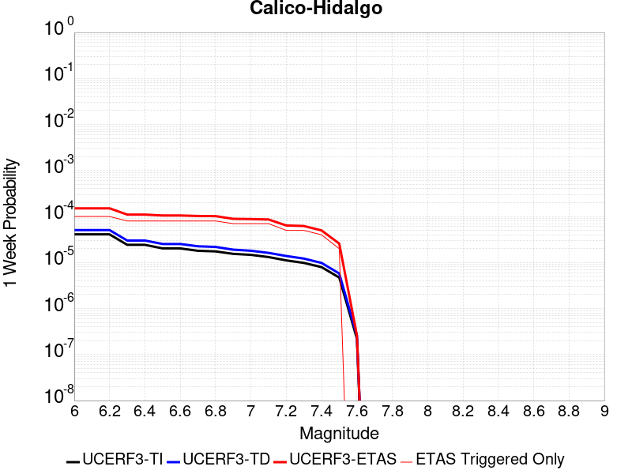 | 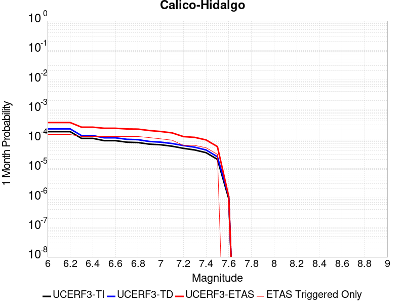 | 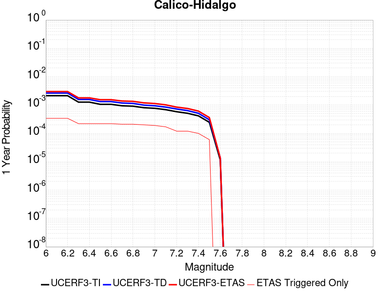 |  |

| Magnitude | 1 wk TI Prob | 1 wk TD Prob | 1 wk ETAS Prob | 1 wk ETAS/TD Gain | 1 wk ETAS Triggered Only | 1 mo TI Prob | 1 mo TD Prob | 1 mo ETAS Prob | 1 mo ETAS/TD Gain | 1 mo ETAS Triggered Only | 1 yr TI Prob | 1 yr TD Prob | 1 yr ETAS Prob | 1 yr ETAS/TD Gain | 1 yr ETAS Triggered Only | 10 yr TI Prob | 10 yr TD Prob | 10 yr ETAS Prob | 10 yr ETAS/TD Gain | 10 yr ETAS Triggered Only |
|-----|-----|-----|-----|-----|-----|-----|-----|-----|-----|-----|-----|-----|-----|-----|-----|-----|-----|-----|-----|-----|
| 6.0 | 4.0906612E-5 | 5.0704355E-5 | 2.4431007E-4 | 4.818325 | 1.9361553E-4 | 1.7530227E-4 | 2.1728857E-4 | 4.8345208E-4 | 2.224931 | 2.6622135E-4 | 0.0021322158 | 0.002642678 | 0.003004748 | 1.1370087 | 3.630291E-4 | 0.02111873 | 0.026152814 | 0.026529917 | 1.0144192 | 3.8723106E-4 |
| 6.1 | 4.0906612E-5 | 5.0704355E-5 | 2.4431007E-4 | 4.818325 | 1.9361553E-4 | 1.7530227E-4 | 2.1728857E-4 | 4.8345208E-4 | 2.224931 | 2.6622135E-4 | 0.0021322158 | 0.002642678 | 0.003004748 | 1.1370087 | 3.630291E-4 | 0.02111873 | 0.026152814 | 0.026529917 | 1.0144192 | 3.8723106E-4 |
| 6.2 | 4.0906612E-5 | 5.0704355E-5 | 2.4431007E-4 | 4.818325 | 1.9361553E-4 | 1.7530227E-4 | 2.1728857E-4 | 4.8345208E-4 | 2.224931 | 2.6622135E-4 | 0.0021322158 | 0.002642678 | 0.003004748 | 1.1370087 | 3.630291E-4 | 0.02111873 | 0.026152814 | 0.026529917 | 1.0144192 | 3.8723106E-4 |
| 6.3 | 2.4242801E-5 | 3.0090967E-5 | 1.7529825E-4 | 5.82561 | 1.4521164E-4 | 1.0389358E-4 | 1.289551E-4 | 3.467445E-4 | 2.6888776 | 2.1781746E-4 | 0.0012641704 | 0.0015689312 | 0.0018347348 | 1.169417 | 2.6622135E-4 | 0.01257003 | 0.015582229 | 0.015868127 | 1.0183477 | 2.9042328E-4 |
| 6.4 | 2.4242801E-5 | 3.0090967E-5 | 1.7529825E-4 | 5.82561 | 1.4521164E-4 | 1.0389358E-4 | 1.289551E-4 | 3.467445E-4 | 2.6888776 | 2.1781746E-4 | 0.0012641704 | 0.0015689312 | 0.0018347348 | 1.169417 | 2.6622135E-4 | 0.01257003 | 0.015582229 | 0.015868127 | 1.0183477 | 2.9042328E-4 |
| 6.5 | 2.0286952E-5 | 2.5316054E-5 | 1.7052403E-4 | 6.7358055 | 1.4521164E-4 | 8.694118E-5 | 1.0849296E-4 | 3.262868E-4 | 3.0074468 | 2.1781746E-4 | 0.0010579949 | 0.0013201186 | 0.0015859884 | 1.2013985 | 2.6622135E-4 | 0.010529719 | 0.013124701 | 0.013387428 | 1.0200177 | 2.6622135E-4 |
| 6.6 | 2.0269223E-5 | 2.5297004E-5 | 1.7050498E-4 | 6.740125 | 1.4521164E-4 | 8.6865206E-5 | 1.08411325E-4 | 3.262052E-4 | 3.0089586 | 2.1781746E-4 | 0.0010570707 | 0.0013191258 | 0.0015849959 | 1.2015502 | 2.6622135E-4 | 0.010520565 | 0.01311489 | 0.01337762 | 1.020033 | 2.6622135E-4 |
| 6.7 | 1.799852E-5 | 2.2540933E-5 | 1.6774931E-4 | 7.4419856 | 1.4521164E-4 | 7.713423E-5 | 9.660051E-5 | 3.1439692E-4 | 3.2546096 | 2.1781746E-4 | 9.3870464E-4 | 0.0011754911 | 0.0014413996 | 1.2262105 | 2.6622135E-4 | 0.009347493 | 0.011694346 | 0.011957454 | 1.0224987 | 2.6622135E-4 |
| 6.8 | 1.7458793E-5 | 2.184258E-5 | 1.6705105E-4 | 7.6479545 | 1.4521164E-4 | 7.4821255E-5 | 9.360778E-5 | 3.1140484E-4 | 3.3266985 | 2.1781746E-4 | 9.10568E-4 | 0.0011390933 | 0.0014050114 | 1.2334472 | 2.6622135E-4 | 0.009068459 | 0.011334131 | 0.011597334 | 1.0232222 | 2.6622135E-4 |
| 6.9 | 1.542884E-5 | 1.9026285E-5 | 1.4003369E-4 | 7.360012 | 1.210097E-4 | 6.612192E-5 | 8.153875E-5 | 2.7513847E-4 | 3.3743281 | 1.9361553E-4 | 8.04737E-4 | 9.922953E-4 | 0.0012340746 | 1.2436565 | 2.420194E-4 | 0.008018291 | 0.009880043 | 0.010119671 | 1.0242537 | 2.420194E-4 |
| 7.0 | 1.468253E-5 | 1.803109E-5 | 1.3903862E-4 | 7.711048 | 1.210097E-4 | 6.292361E-5 | 7.727389E-5 | 2.7087447E-4 | 3.5053813 | 1.9361553E-4 | 7.658257E-4 | 9.4041653E-4 | 0.0011822084 | 1.2571114 | 2.420194E-4 | 0.0076319184 | 0.009365736 | 0.009605489 | 1.0255989 | 2.420194E-4 |
| 7.1 | 1.3139281E-5 | 1.620139E-5 | 1.3720914E-4 | 8.468973 | 1.210097E-4 | 5.6309986E-5 | 6.943275E-5 | 2.3883457E-4 | 3.4397972 | 1.6941359E-4 | 6.853584E-4 | 8.4502844E-4 | 0.0010626619 | 1.2575457 | 2.1781746E-4 | 0.0068324856 | 0.008419449 | 0.008635433 | 1.0256529 | 2.1781746E-4 |
| 7.2 | 1.1127404E-5 | 1.3867038E-5 | 8.647185E-5 | 6.2357836 | 7.260582E-5 | 4.7688E-5 | 5.9428872E-5 | 1.5623089E-4 | 2.6288717 | 9.6807766E-5 | 5.8044674E-4 | 7.233172E-4 | 8.4423943E-4 | 1.1671772 | 1.210097E-4 | 0.0057893298 | 0.007210737 | 0.0073308744 | 1.0166608 | 1.210097E-4 |
| 7.3 | 9.808154E-6 | 1.2176586E-5 | 8.4781524E-5 | 6.962668 | 7.260582E-5 | 4.2034266E-5 | 5.2184383E-5 | 1.4898709E-4 | 2.8550131 | 9.6807766E-5 | 5.11647E-4 | 6.351704E-4 | 7.561032E-4 | 1.1903943 | 1.210097E-4 | 0.0051047057 | 0.006334625 | 0.0064548687 | 1.0189819 | 1.210097E-4 |
| 7.4 | 7.942452E-6 | 9.792348E-6 | 5.8195757E-5 | 5.9429827 | 4.8403883E-5 | 3.4038632E-5 | 4.1966585E-5 | 1.1456936E-4 | 2.730014 | 7.260582E-5 | 4.1434157E-4 | 5.108328E-4 | 6.075912E-4 | 1.1894128 | 9.6807766E-5 | 0.0041356985 | 0.005097527 | 0.0051938416 | 1.0188943 | 9.6807766E-5 |
| 7.5 | 4.7121216E-6 | 5.7729717E-6 | 5.7729717E-6 | 1.0 | 0.0 | 2.019465E-5 | 2.4741115E-5 | 4.8942456E-5 | 1.9781832 | 2.4201941E-5 | 2.4584212E-4 | 3.011891E-4 | 3.4957842E-4 | 1.1606609 | 4.8403883E-5 | 0.0024557032 | 0.0030085614 | 0.0030568198 | 1.0160403 | 4.8403883E-5 |
| 7.6 | 2.21172E-7 | 2.6040198E-7 | 2.6040198E-7 | 1.0 | 0.0 | 9.478797E-7 | 1.1160082E-6 | 1.1160082E-6 | 1.0 | 0.0 | 1.1540374E-5 | 1.3587343E-5 | 1.3587343E-5 | 1.0 | 0.0 | 1.1539775E-4 | 1.3586794E-4 | 1.3586794E-4 | 1.0 | 0.0 |

## Death Valley (Fish Lake Valley)
*[(top)](#table-of-contents)*

| 1 Week | 1 Month | 1 Year | 10 Year |
|-----|-----|-----|-----|
|  |  |  |  |

| Magnitude | 1 wk TI Prob | 1 wk TD Prob | 1 wk ETAS Prob | 1 wk ETAS/TD Gain | 1 wk ETAS Triggered Only | 1 mo TI Prob | 1 mo TD Prob | 1 mo ETAS Prob | 1 mo ETAS/TD Gain | 1 mo ETAS Triggered Only | 1 yr TI Prob | 1 yr TD Prob | 1 yr ETAS Prob | 1 yr ETAS/TD Gain | 1 yr ETAS Triggered Only | 10 yr TI Prob | 10 yr TD Prob | 10 yr ETAS Prob | 10 yr ETAS/TD Gain | 10 yr ETAS Triggered Only |
|-----|-----|-----|-----|-----|-----|-----|-----|-----|-----|-----|-----|-----|-----|-----|-----|-----|-----|-----|-----|-----|
| 6.0 | 3.872328E-5 | 4.7265705E-5 | 1.1986809E-4 | 2.536048 | 7.260582E-5 | 1.6594635E-4 | 2.0255324E-4 | 3.4773548E-4 | 1.7167609 | 1.4521164E-4 | 0.0020185246 | 0.0024635606 | 0.0027291263 | 1.1077974 | 2.6622135E-4 | 0.02000288 | 0.024388338 | 0.024789736 | 1.0164586 | 4.11433E-4 |
| 6.1 | 3.872328E-5 | 4.7265705E-5 | 1.1986809E-4 | 2.536048 | 7.260582E-5 | 1.6594635E-4 | 2.0255324E-4 | 3.4773548E-4 | 1.7167609 | 1.4521164E-4 | 0.0020185246 | 0.0024635606 | 0.0027291263 | 1.1077974 | 2.6622135E-4 | 0.02000288 | 0.024388338 | 0.024789736 | 1.0164586 | 4.11433E-4 |
| 6.2 | 3.872328E-5 | 4.7265705E-5 | 1.1986809E-4 | 2.536048 | 7.260582E-5 | 1.6594635E-4 | 2.0255324E-4 | 3.4773548E-4 | 1.7167609 | 1.4521164E-4 | 0.0020185246 | 0.0024635606 | 0.0027291263 | 1.1077974 | 2.6622135E-4 | 0.02000288 | 0.024388338 | 0.024789736 | 1.0164586 | 4.11433E-4 |
| 6.3 | 2.8356371E-5 | 3.360979E-5 | 1.0621317E-4 | 3.1601856 | 7.260582E-5 | 1.2152165E-4 | 1.4403443E-4 | 2.8922517E-4 | 2.008028 | 1.4521164E-4 | 0.0014785219 | 0.0017522788 | 0.0020180338 | 1.1516625 | 2.6622135E-4 | 0.014687235 | 0.017391816 | 0.017796094 | 1.0232452 | 4.11433E-4 |
| 6.4 | 2.8356371E-5 | 3.360979E-5 | 1.0621317E-4 | 3.1601856 | 7.260582E-5 | 1.2152165E-4 | 1.4403443E-4 | 2.8922517E-4 | 2.008028 | 1.4521164E-4 | 0.0014785219 | 0.0017522788 | 0.0020180338 | 1.1516625 | 2.6622135E-4 | 0.014687235 | 0.017391816 | 0.017796094 | 1.0232452 | 4.11433E-4 |
| 6.5 | 2.4448687E-5 | 2.8607585E-5 | 1.0121133E-4 | 3.5379195 | 7.260582E-5 | 1.0477588E-4 | 1.2259845E-4 | 2.677923E-4 | 2.1843042 | 1.4521164E-4 | 0.0012748998 | 0.0014916616 | 0.0017333201 | 1.1620061 | 2.420194E-4 | 0.012676105 | 0.014821392 | 0.01517904 | 1.0241306 | 3.630291E-4 |
| 6.6 | 2.1298161E-5 | 2.4660083E-5 | 7.306277E-5 | 2.962795 | 4.8403883E-5 | 9.127464E-5 | 1.0568197E-4 | 2.2667888E-4 | 2.1449153 | 1.210097E-4 | 0.0011107022 | 0.0012859512 | 0.0015034886 | 1.1691645 | 2.1781746E-4 | 0.011051672 | 0.01278853 | 0.013123024 | 1.0261558 | 3.3882717E-4 |
| 6.7 | 1.8959729E-5 | 2.1781027E-5 | 7.018385E-5 | 3.2222474 | 4.8403883E-5 | 8.125345E-5 | 9.334406E-5 | 2.1434246E-4 | 2.2962625 | 1.210097E-4 | 9.888117E-4 | 0.001135897 | 0.001353467 | 1.1915404 | 2.1781746E-4 | 0.009844234 | 0.01130357 | 0.011638568 | 1.0296364 | 3.3882717E-4 |
| 6.8 | 1.6691629E-5 | 1.9018351E-5 | 6.7421315E-5 | 3.545066 | 4.8403883E-5 | 7.153359E-5 | 8.150477E-5 | 2.0250461E-4 | 2.4845738 | 1.210097E-4 | 8.7057345E-4 | 9.918857E-4 | 0.0012094871 | 1.2193816 | 2.1781746E-4 | 0.008671708 | 0.009876343 | 0.010211824 | 1.0339681 | 3.3882717E-4 |
| 6.9 | 1.450505E-5 | 1.638954E-5 | 6.479263E-5 | 3.9532914 | 4.8403883E-5 | 6.216302E-5 | 7.0239046E-5 | 1.9124025E-4 | 2.7227058 | 1.210097E-4 | 7.5657194E-4 | 8.5483363E-4 | 0.0010724649 | 1.2545891 | 2.1781746E-4 | 0.007540013 | 0.008516386 | 0.008852327 | 1.0394465 | 3.3882717E-4 |
| 7.0 | 1.2940855E-5 | 1.4537972E-5 | 6.294115E-5 | 4.3294315 | 4.8403883E-5 | 5.545963E-5 | 6.230414E-5 | 1.833063E-4 | 2.9421208 | 1.210097E-4 | 6.750118E-4 | 7.5829466E-4 | 9.7594695E-4 | 1.2870287 | 2.1781746E-4 | 0.006729651 | 0.0075576897 | 0.007893956 | 1.0444933 | 3.3882717E-4 |
| 7.1 | 1.2544658E-5 | 1.4078208E-5 | 6.2481406E-5 | 4.438165 | 4.8403883E-5 | 5.3761712E-5 | 6.0333812E-5 | 1.8133622E-4 | 3.0055487 | 1.210097E-4 | 6.5435225E-4 | 7.343222E-4 | 9.519797E-4 | 1.296406 | 2.1781746E-4 | 0.006524288 | 0.007319551 | 0.007655898 | 1.0459518 | 3.3882717E-4 |
| 7.2 | 1.2489416E-5 | 1.4015674E-5 | 6.2418876E-5 | 4.453505 | 4.8403883E-5 | 5.3524967E-5 | 6.0065824E-5 | 1.8106826E-4 | 3.0144973 | 1.210097E-4 | 6.514716E-4 | 7.310616E-4 | 9.4871985E-4 | 1.297729 | 2.1781746E-4 | 0.006495651 | 0.0072871596 | 0.007623518 | 1.0461576 | 3.3882717E-4 |
| 7.3 | 1.2368307E-5 | 1.3879812E-5 | 6.228302E-5 | 4.48731 | 4.8403883E-5 | 5.3005948E-5 | 5.9483587E-5 | 1.804861E-4 | 3.0342166 | 1.210097E-4 | 6.451563E-4 | 7.2397763E-4 | 9.416374E-4 | 1.3006444 | 2.1781746E-4 | 0.0064328653 | 0.007216782 | 0.007553164 | 1.0466111 | 3.3882717E-4 |
| 7.4 | 1.2161707E-5 | 1.36478675E-5 | 6.205109E-5 | 4.5465775 | 4.8403883E-5 | 5.212056E-5 | 5.8489582E-5 | 1.7949221E-4 | 3.0687895 | 1.210097E-4 | 6.3438306E-4 | 7.118836E-4 | 9.29546E-4 | 1.3057556 | 2.1781746E-4 | 0.006325751 | 0.0070966207 | 0.0074330433 | 1.0474061 | 3.3882717E-4 |
| 7.5 | 1.1707948E-5 | 1.3145515E-5 | 6.154876E-5 | 4.682111 | 4.8403883E-5 | 5.0175953E-5 | 5.6336736E-5 | 1.7733962E-4 | 3.1478505 | 1.210097E-4 | 6.10721E-4 | 6.856895E-4 | 9.0335764E-4 | 1.3174441 | 2.1781746E-4 | 0.0060904534 | 0.006836321 | 0.0071728323 | 1.049224 | 3.3882717E-4 |
| 7.6 | 1.0319538E-5 | 1.1579622E-5 | 5.9982944E-5 | 5.180043 | 4.8403883E-5 | 4.4225842E-5 | 4.9626036E-5 | 1.7062973E-4 | 3.4383106 | 1.210097E-4 | 5.383166E-4 | 6.040347E-4 | 7.9753326E-4 | 1.3203435 | 1.9361553E-4 | 0.0053701443 | 0.0060244603 | 0.00633719 | 1.05191 | 3.1462524E-4 |
| 7.7 | 8.937764E-6 | 1.0022779E-5 | 5.8426176E-5 | 5.829339 | 4.8403883E-5 | 3.830414E-5 | 4.295409E-5 | 1.639586E-4 | 3.8170662 | 1.210097E-4 | 4.6625308E-4 | 5.228456E-4 | 7.163599E-4 | 1.3701175 | 1.9361553E-4 | 0.0046527605 | 0.005216664 | 0.005481497 | 1.0507667 | 2.6622135E-4 |
| 7.8 | 3.108007E-7 | 3.284654E-7 | 3.284654E-7 | 1.0 | 0.0 | 1.3320023E-6 | 1.407708E-6 | 1.407708E-6 | 1.0 | 0.0 | 1.6217007E-5 | 1.7138715E-5 | 1.7138715E-5 | 1.0 | 0.0 | 1.6215823E-4 | 1.7137431E-4 | 1.7137431E-4 | 1.0 | 0.0 |
| 7.9 | 2.5591178E-9 | 2.6696718E-9 | 2.6696718E-9 | 1.0 | 0.0 | 1.0967647E-8 | 1.14414505E-8 | 1.14414505E-8 | 1.0 | 0.0 | 1.335311E-7 | 1.3929966E-7 | 1.3929966E-7 | 1.0 | 0.0 | 1.3353102E-6 | 1.3929966E-6 | 1.3929966E-6 | 1.0 | 0.0 |

## Death Valley (No)
*[(top)](#table-of-contents)*

| 1 Week | 1 Month | 1 Year | 10 Year |
|-----|-----|-----|-----|
| 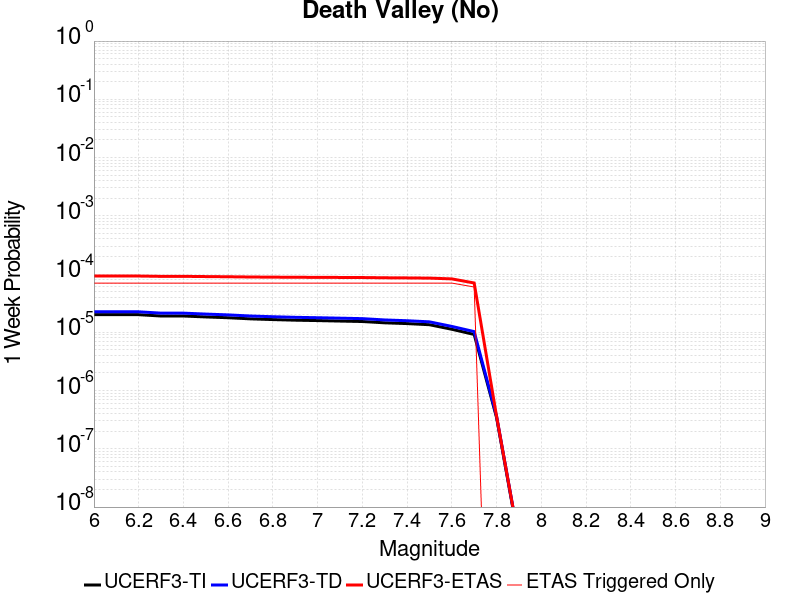 |  |  |  |

| Magnitude | 1 wk TI Prob | 1 wk TD Prob | 1 wk ETAS Prob | 1 wk ETAS/TD Gain | 1 wk ETAS Triggered Only | 1 mo TI Prob | 1 mo TD Prob | 1 mo ETAS Prob | 1 mo ETAS/TD Gain | 1 mo ETAS Triggered Only | 1 yr TI Prob | 1 yr TD Prob | 1 yr ETAS Prob | 1 yr ETAS/TD Gain | 1 yr ETAS Triggered Only | 10 yr TI Prob | 10 yr TD Prob | 10 yr ETAS Prob | 10 yr ETAS/TD Gain | 10 yr ETAS Triggered Only |
|-----|-----|-----|-----|-----|-----|-----|-----|-----|-----|-----|-----|-----|-----|-----|-----|-----|-----|-----|-----|-----|
| 6.0 | 2.0074807E-5 | 2.2500084E-5 | 7.0902875E-5 | 3.1512272 | 4.8403883E-5 | 8.603206E-5 | 9.642541E-5 | 2.1742344E-4 | 2.2548356 | 1.210097E-4 | 0.001046937 | 0.0011733545 | 0.0014392635 | 1.2266229 | 2.6622135E-4 | 0.010420183 | 0.011672506 | 0.012055217 | 1.0327874 | 3.8723106E-4 |
| 6.1 | 2.0074807E-5 | 2.2500084E-5 | 7.0902875E-5 | 3.1512272 | 4.8403883E-5 | 8.603206E-5 | 9.642541E-5 | 2.1742344E-4 | 2.2548356 | 1.210097E-4 | 0.001046937 | 0.0011733545 | 0.0014392635 | 1.2266229 | 2.6622135E-4 | 0.010420183 | 0.011672506 | 0.012055217 | 1.0327874 | 3.8723106E-4 |
| 6.2 | 2.0074807E-5 | 2.2500084E-5 | 7.0902875E-5 | 3.1512272 | 4.8403883E-5 | 8.603206E-5 | 9.642541E-5 | 2.1742344E-4 | 2.2548356 | 1.210097E-4 | 0.001046937 | 0.0011733545 | 0.0014392635 | 1.2266229 | 2.6622135E-4 | 0.010420183 | 0.011672506 | 0.012055217 | 1.0327874 | 3.8723106E-4 |
| 6.3 | 1.9050609E-5 | 2.1336948E-5 | 6.97398E-5 | 3.2684991 | 4.8403883E-5 | 8.164292E-5 | 9.1440896E-5 | 2.1243954E-4 | 2.3232443 | 1.210097E-4 | 9.935491E-4 | 0.001112731 | 0.0013786561 | 1.2389842 | 2.6622135E-4 | 0.009891188 | 0.011072419 | 0.011455363 | 1.0345854 | 3.8723106E-4 |
| 6.4 | 1.9050609E-5 | 2.1336948E-5 | 6.97398E-5 | 3.2684991 | 4.8403883E-5 | 8.164292E-5 | 9.1440896E-5 | 2.1243954E-4 | 2.3232443 | 1.210097E-4 | 9.935491E-4 | 0.001112731 | 0.0013786561 | 1.2389842 | 2.6622135E-4 | 0.009891188 | 0.011072419 | 0.011455363 | 1.0345854 | 3.8723106E-4 |
| 6.5 | 1.8367004E-5 | 2.0561009E-5 | 6.89639E-5 | 3.3541105 | 4.8403883E-5 | 7.8713354E-5 | 8.811567E-5 | 2.091147E-4 | 2.3731842 | 1.210097E-4 | 9.5791375E-4 | 0.0010722869 | 0.0013140467 | 1.225462 | 2.420194E-4 | 0.009537951 | 0.0106719155 | 0.011031071 | 1.0336542 | 3.630291E-4 |
| 6.6 | 1.779439E-5 | 1.9910927E-5 | 6.831385E-5 | 3.4309726 | 4.8403883E-5 | 7.625944E-5 | 8.53298E-5 | 2.0632918E-4 | 2.4180202 | 1.210097E-4 | 9.280632E-4 | 0.0010384015 | 0.0012801696 | 1.2328272 | 2.420194E-4 | 0.009241969 | 0.010336253 | 0.010695529 | 1.0347589 | 3.630291E-4 |
| 6.7 | 1.7025437E-5 | 1.9043426E-5 | 6.744639E-5 | 3.541715 | 4.8403883E-5 | 7.296412E-5 | 8.161216E-5 | 2.0261199E-4 | 2.48262 | 1.210097E-4 | 8.87976E-4 | 9.931813E-4 | 0.0012349604 | 1.243439 | 2.420194E-4 | 0.008844362 | 0.009888145 | 0.010247584 | 1.0363505 | 3.630291E-4 |
| 6.8 | 1.6545107E-5 | 1.8512545E-5 | 6.6915534E-5 | 3.6146045 | 4.8403883E-5 | 7.090568E-5 | 7.93371E-5 | 2.003372E-4 | 2.5251389 | 1.210097E-4 | 8.629347E-4 | 9.655073E-4 | 0.001207293 | 1.2504236 | 2.420194E-4 | 0.008595915 | 0.009613829 | 0.009973368 | 1.0373981 | 3.630291E-4 |
| 6.9 | 1.615478E-5 | 1.8087594E-5 | 6.6490604E-5 | 3.6760335 | 4.8403883E-5 | 6.9232934E-5 | 7.751599E-5 | 1.9851631E-4 | 2.5609725 | 1.210097E-4 | 8.4258494E-4 | 9.433546E-4 | 0.0011851457 | 1.2563099 | 2.420194E-4 | 0.008393973 | 0.009394196 | 0.009753814 | 1.038281 | 3.630291E-4 |
| 7.0 | 1.5894311E-5 | 1.780555E-5 | 6.620857E-5 | 3.7184231 | 4.8403883E-5 | 6.81167E-5 | 7.6307304E-5 | 1.9730777E-4 | 2.5856998 | 1.210097E-4 | 8.2900526E-4 | 9.286515E-4 | 0.0011704462 | 1.2603718 | 2.420194E-4 | 0.008259195 | 0.009248397 | 0.009608069 | 1.0388901 | 3.630291E-4 |
| 7.1 | 1.5602263E-5 | 1.7483504E-5 | 6.588654E-5 | 3.7684975 | 4.8403883E-5 | 6.6865134E-5 | 7.492718E-5 | 1.9592782E-4 | 2.61491 | 1.210097E-4 | 8.137789E-4 | 9.118627E-4 | 0.0011536614 | 1.2651701 | 2.420194E-4 | 0.008108052 | 0.009081894 | 0.009441626 | 1.0396098 | 3.630291E-4 |
| 7.2 | 1.5323829E-5 | 1.717063E-5 | 6.557368E-5 | 3.8189445 | 4.8403883E-5 | 6.56719E-5 | 7.358637E-5 | 1.9458718E-4 | 2.644337 | 1.210097E-4 | 7.99262E-4 | 8.9555193E-4 | 0.0011373545 | 1.270004 | 2.420194E-4 | 0.007963934 | 0.008920107 | 0.009279897 | 1.0403348 | 3.630291E-4 |
| 7.3 | 1.4556212E-5 | 1.6302456E-5 | 6.470555E-5 | 3.9690676 | 4.8403883E-5 | 6.238227E-5 | 6.9865826E-5 | 1.9086708E-4 | 2.731909 | 1.210097E-4 | 7.592395E-4 | 8.5029035E-4 | 0.001092104 | 1.2843895 | 2.420194E-4 | 0.0075665074 | 0.008471014 | 0.008830968 | 1.0424924 | 3.630291E-4 |
| 7.4 | 1.411725E-5 | 1.580796E-5 | 6.4211075E-5 | 4.061946 | 4.8403883E-5 | 6.0501097E-5 | 6.7746674E-5 | 1.8874818E-4 | 2.7860878 | 1.210097E-4 | 7.363519E-4 | 8.245094E-4 | 0.0010663293 | 1.2932894 | 2.420194E-4 | 0.0073391674 | 0.008215138 | 0.008575185 | 1.0438272 | 3.630291E-4 |
| 7.5 | 1.3503312E-5 | 1.5126289E-5 | 6.352944E-5 | 4.1999354 | 4.8403883E-5 | 5.7870053E-5 | 6.482538E-5 | 1.8582723E-4 | 2.8665817 | 1.210097E-4 | 7.043401E-4 | 7.8896893E-4 | 0.0010307974 | 1.306512 | 2.420194E-4 | 0.007021119 | 0.007862304 | 0.008222479 | 1.0458103 | 3.630291E-4 |
| 7.6 | 1.1279839E-5 | 1.2626327E-5 | 6.1029597E-5 | 4.8335195 | 4.8403883E-5 | 4.834127E-5 | 5.4111737E-5 | 1.751149E-4 | 3.2361722 | 1.210097E-4 | 5.88396E-4 | 6.5861654E-4 | 8.5210457E-4 | 1.2937795 | 1.9361553E-4 | 0.005868405 | 0.006567199 | 0.0068797576 | 1.047594 | 3.1462524E-4 |
| 7.7 | 9.189108E-6 | 1.0283358E-5 | 5.8686743E-5 | 5.7069626 | 4.8403883E-5 | 3.93813E-5 | 4.407082E-5 | 1.650752E-4 | 3.74568 | 1.210097E-4 | 4.7936183E-4 | 5.3643517E-4 | 7.299468E-4 | 1.3607364 | 1.9361553E-4 | 0.004783291 | 0.005351914 | 0.0056167105 | 1.049477 | 2.6622135E-4 |
| 7.8 | 3.4586725E-7 | 3.6482615E-7 | 3.6482615E-7 | 1.0 | 0.0 | 1.4822873E-6 | 1.5635396E-6 | 1.5635396E-6 | 1.0 | 0.0 | 1.80467E-5 | 1.9035933E-5 | 1.9035933E-5 | 1.0 | 0.0 | 1.8045233E-4 | 1.9034347E-4 | 1.9034347E-4 | 1.0 | 0.0 |
| 7.9 | 2.5591178E-9 | 2.6696718E-9 | 2.6696718E-9 | 1.0 | 0.0 | 1.0967647E-8 | 1.14414505E-8 | 1.14414505E-8 | 1.0 | 0.0 | 1.335311E-7 | 1.3929966E-7 | 1.3929966E-7 | 1.0 | 0.0 | 1.3353102E-6 | 1.3929966E-6 | 1.3929966E-6 | 1.0 | 0.0 |

## San Andreas (North Branch Mill Creek)
*[(top)](#table-of-contents)*

| 1 Week | 1 Month | 1 Year | 10 Year |
|-----|-----|-----|-----|
|  |  |  | 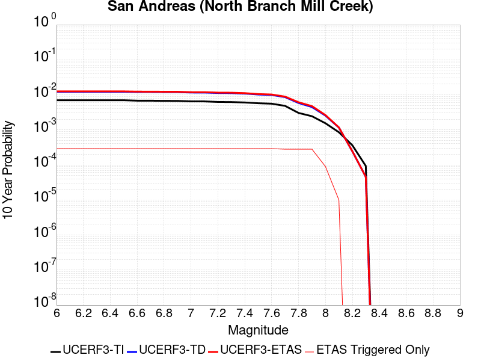 |

| Magnitude | 1 wk TI Prob | 1 wk TD Prob | 1 wk ETAS Prob | 1 wk ETAS/TD Gain | 1 wk ETAS Triggered Only | 1 mo TI Prob | 1 mo TD Prob | 1 mo ETAS Prob | 1 mo ETAS/TD Gain | 1 mo ETAS Triggered Only | 1 yr TI Prob | 1 yr TD Prob | 1 yr ETAS Prob | 1 yr ETAS/TD Gain | 1 yr ETAS Triggered Only | 10 yr TI Prob | 10 yr TD Prob | 10 yr ETAS Prob | 10 yr ETAS/TD Gain | 10 yr ETAS Triggered Only |
|-----|-----|-----|-----|-----|-----|-----|-----|-----|-----|-----|-----|-----|-----|-----|-----|-----|-----|-----|-----|-----|
| 6.0 | 1.3461156E-5 | 2.3500992E-5 | 2.1711197E-4 | 9.238418 | 1.9361553E-4 | 5.7689394E-5 | 1.00714664E-4 | 3.427097E-4 | 3.4027786 | 2.420194E-4 | 7.02142E-4 | 0.0012255146 | 0.001515582 | 1.2366903 | 2.9042328E-4 | 0.0069992766 | 0.012228744 | 0.012587334 | 1.0293235 | 3.630291E-4 |
| 6.1 | 1.3461156E-5 | 2.3500992E-5 | 2.1711197E-4 | 9.238418 | 1.9361553E-4 | 5.7689394E-5 | 1.00714664E-4 | 3.427097E-4 | 3.4027786 | 2.420194E-4 | 7.02142E-4 | 0.0012255146 | 0.001515582 | 1.2366903 | 2.9042328E-4 | 0.0069992766 | 0.012228744 | 0.012587334 | 1.0293235 | 3.630291E-4 |
| 6.2 | 1.3461156E-5 | 2.3500992E-5 | 2.1711197E-4 | 9.238418 | 1.9361553E-4 | 5.7689394E-5 | 1.00714664E-4 | 3.427097E-4 | 3.4027786 | 2.420194E-4 | 7.02142E-4 | 0.0012255146 | 0.001515582 | 1.2366903 | 2.9042328E-4 | 0.0069992766 | 0.012228744 | 0.012587334 | 1.0293235 | 3.630291E-4 |
| 6.3 | 1.3461156E-5 | 2.3500992E-5 | 2.1711197E-4 | 9.238418 | 1.9361553E-4 | 5.7689394E-5 | 1.00714664E-4 | 3.427097E-4 | 3.4027786 | 2.420194E-4 | 7.02142E-4 | 0.0012255146 | 0.001515582 | 1.2366903 | 2.9042328E-4 | 0.0069992766 | 0.012228744 | 0.012587334 | 1.0293235 | 3.630291E-4 |
| 6.4 | 1.3461156E-5 | 2.3500992E-5 | 2.1711197E-4 | 9.238418 | 1.9361553E-4 | 5.7689394E-5 | 1.00714664E-4 | 3.427097E-4 | 3.4027786 | 2.420194E-4 | 7.02142E-4 | 0.0012255146 | 0.001515582 | 1.2366903 | 2.9042328E-4 | 0.0069992766 | 0.012228744 | 0.012587334 | 1.0293235 | 3.630291E-4 |
| 6.5 | 1.3450706E-5 | 2.348995E-5 | 2.1710093E-4 | 9.24229 | 1.9361553E-4 | 5.764461E-5 | 1.00667356E-4 | 3.426624E-4 | 3.4039078 | 2.420194E-4 | 7.0159714E-4 | 0.0012249392 | 0.0015150068 | 1.2368016 | 2.9042328E-4 | 0.006993862 | 0.012223054 | 0.0125816455 | 1.0293373 | 3.630291E-4 |
| 6.6 | 1.3074523E-5 | 2.3104236E-5 | 2.1671529E-4 | 9.379894 | 1.9361553E-4 | 5.6032466E-5 | 9.901441E-5 | 3.4100987E-4 | 3.4440427 | 2.420194E-4 | 6.8198174E-4 | 0.001204837 | 0.0014949105 | 1.2407573 | 2.9042328E-4 | 0.006798926 | 0.012024219 | 0.012382884 | 1.0298284 | 3.630291E-4 |
| 6.7 | 1.3050216E-5 | 2.3079532E-5 | 2.1669059E-4 | 9.388864 | 1.9361553E-4 | 5.59283E-5 | 9.890855E-5 | 3.4090402E-4 | 3.4466588 | 2.420194E-4 | 6.8071426E-4 | 0.0012035496 | 0.0014936234 | 1.2410152 | 2.9042328E-4 | 0.0067863287 | 0.012011484 | 0.012370152 | 1.0298605 | 3.630291E-4 |
| 6.8 | 1.29049395E-5 | 2.2927941E-5 | 2.1653903E-4 | 9.444329 | 1.9361553E-4 | 5.530571E-5 | 9.825892E-5 | 3.4025454E-4 | 3.4628363 | 2.420194E-4 | 6.73139E-4 | 0.001195649 | 0.001485725 | 1.2426097 | 2.9042328E-4 | 0.0067110364 | 0.011933329 | 0.012292026 | 1.0300584 | 3.630291E-4 |
| 6.9 | 1.2867369E-5 | 2.2887343E-5 | 2.1649845E-4 | 9.459309 | 1.9361553E-4 | 5.51447E-5 | 9.808494E-5 | 3.4008062E-4 | 3.467205 | 2.420194E-4 | 6.711799E-4 | 0.0011935332 | 0.0014836099 | 1.2430403 | 2.9042328E-4 | 0.006691564 | 0.011912397 | 0.012271102 | 1.0301119 | 3.630291E-4 |
| 7.0 | 1.2495996E-5 | 2.2287419E-5 | 2.1589863E-4 | 9.687018 | 1.9361553E-4 | 5.3553173E-5 | 9.551403E-5 | 3.375103E-4 | 3.5336204 | 2.420194E-4 | 6.518148E-4 | 0.0011622658 | 0.0014523516 | 1.2495865 | 2.9042328E-4 | 0.0064990623 | 0.011603 | 0.011961817 | 1.0309244 | 3.630291E-4 |
| 7.1 | 1.2452067E-5 | 2.2232492E-5 | 2.1584371E-4 | 9.708481 | 1.9361553E-4 | 5.3364907E-5 | 9.527864E-5 | 3.37275E-4 | 3.5398803 | 2.420194E-4 | 6.4952404E-4 | 0.001159403 | 0.0014494896 | 1.2502034 | 2.9042328E-4 | 0.0064762887 | 0.011574671 | 0.011933498 | 1.0310011 | 3.630291E-4 |
| 7.2 | 1.2002777E-5 | 2.1611015E-5 | 2.1522236E-4 | 9.95892 | 1.9361553E-4 | 5.143946E-5 | 9.261536E-5 | 3.3461236E-4 | 3.612925 | 2.420194E-4 | 6.2609545E-4 | 0.0011270114 | 0.0014171074 | 1.2574029 | 2.9042328E-4 | 0.006243344 | 0.011254058 | 0.011613001 | 1.0318946 | 3.630291E-4 |
| 7.3 | 1.1923425E-5 | 2.1480853E-5 | 2.1509222E-4 | 10.0132065 | 1.9361553E-4 | 5.109939E-5 | 9.205757E-5 | 3.340547E-4 | 3.6287587 | 2.420194E-4 | 6.219575E-4 | 0.0011202273 | 0.0014103253 | 1.2589635 | 2.9042328E-4 | 0.0062021962 | 0.011186945 | 0.011545913 | 1.0320882 | 3.630291E-4 |
| 7.4 | 1.16105175E-5 | 2.0854808E-5 | 2.144663E-4 | 10.283782 | 1.9361553E-4 | 4.975841E-5 | 8.93747E-5 | 3.313725E-4 | 3.7076766 | 2.420194E-4 | 6.0564023E-4 | 0.0010875963 | 0.0013777037 | 1.2667419 | 2.9042328E-4 | 0.006039923 | 0.010864409 | 0.011223494 | 1.0330515 | 3.630291E-4 |
| 7.5 | 1.1037265E-5 | 1.9554842E-5 | 2.1316658E-4 | 10.900962 | 1.9361553E-4 | 4.7301706E-5 | 8.380379E-5 | 3.2580292E-4 | 3.8876872 | 2.420194E-4 | 5.757461E-4 | 0.0010198357 | 0.0013099628 | 1.2844841 | 2.9042328E-4 | 0.005742567 | 0.010195527 | 0.010554856 | 1.0352436 | 3.630291E-4 |
| 7.6 | 1.0720915E-5 | 1.8996727E-5 | 2.1260857E-4 | 11.191853 | 1.9361553E-4 | 4.5945973E-5 | 8.141202E-5 | 3.2341172E-4 | 3.9725304 | 2.420194E-4 | 5.592486E-4 | 9.907428E-4 | 0.0012808783 | 1.2928464 | 2.9042328E-4 | 0.005578433 | 0.009907238 | 0.010266671 | 1.0362798 | 3.630291E-4 |
| 7.7 | 9.276279E-6 | 1.6442464E-5 | 2.1005482E-4 | 12.775142 | 1.9361553E-4 | 3.9754876E-5 | 7.046581E-5 | 3.1246815E-4 | 4.4343233 | 2.420194E-4 | 4.839081E-4 | 8.5758517E-4 | 0.0011477594 | 1.338362 | 2.9042328E-4 | 0.0048285574 | 0.008586576 | 0.008946488 | 1.0419157 | 3.630291E-4 |
| 7.8 | 5.8346777E-6 | 1.11555855E-5 | 2.0476895E-4 | 18.355734 | 1.9361553E-4 | 2.5005522E-5 | 4.7808775E-5 | 2.898166E-4 | 6.061996 | 2.420194E-4 | 3.043997E-4 | 5.819165E-4 | 8.721708E-4 | 1.4987903 | 2.9042328E-4 | 0.0030398308 | 0.0058473335 | 0.0062082396 | 1.0617216 | 3.630291E-4 |
| 7.9 | 4.690204E-6 | 8.509473E-6 | 2.0212335E-4 | 23.752745 | 1.9361553E-4 | 2.0100719E-5 | 3.6468664E-5 | 2.7847925E-4 | 7.636124 | 2.420194E-4 | 2.4469878E-4 | 4.439156E-4 | 7.3420996E-4 | 1.6539404 | 2.9042328E-4 | 0.002444295 | 0.004471165 | 0.004832571 | 1.0808303 | 3.630291E-4 |
| 8.0 | 2.9570454E-6 | 4.8470656E-6 | 1.0165436E-4 | 20.972351 | 9.6807766E-5 | 1.267299E-5 | 2.0772974E-5 | 1.17578726E-4 | 5.660178 | 9.6807766E-5 | 1.5428272E-4 | 2.5288164E-4 | 3.7386073E-4 | 1.4784021 | 1.210097E-4 | 0.0015417566 | 0.002549932 | 0.0026947735 | 1.056802 | 1.4521164E-4 |
| 8.1 | 1.6376824E-6 | 2.1968672E-6 | 2.1968672E-6 | 1.0 | 0.0 | 7.01862E-6 | 9.415111E-6 | 9.415111E-6 | 1.0 | 0.0 | 8.544835E-5 | 1.1462297E-4 | 1.3882213E-4 | 1.2111197 | 2.4201941E-5 | 8.54155E-4 | 0.0011607445 | 0.0011849182 | 1.0208261 | 2.4201941E-5 |
| 8.2 | 6.9631557E-7 | 4.535001E-7 | 4.535001E-7 | 1.0 | 0.0 | 2.984206E-6 | 1.9435704E-6 | 1.9435704E-6 | 1.0 | 0.0 | 3.63321E-5 | 2.3662713E-5 | 2.3662713E-5 | 1.0 | 0.0 | 3.6326164E-4 | 2.4510184E-4 | 2.4510184E-4 | 1.0 | 0.0 |
| 8.3 | 1.7876137E-7 | 8.357368E-8 | 8.357368E-8 | 1.0 | 0.0 | 7.661199E-7 | 3.5817288E-7 | 3.5817288E-7 | 1.0 | 0.0 | 9.32747E-6 | 4.3607465E-6 | 4.3607465E-6 | 1.0 | 0.0 | 9.3270784E-5 | 4.5800018E-5 | 4.5800018E-5 | 1.0 | 0.0 |

## Red Pass
*[(top)](#table-of-contents)*

| 1 Week | 1 Month | 1 Year | 10 Year |
|-----|-----|-----|-----|
| 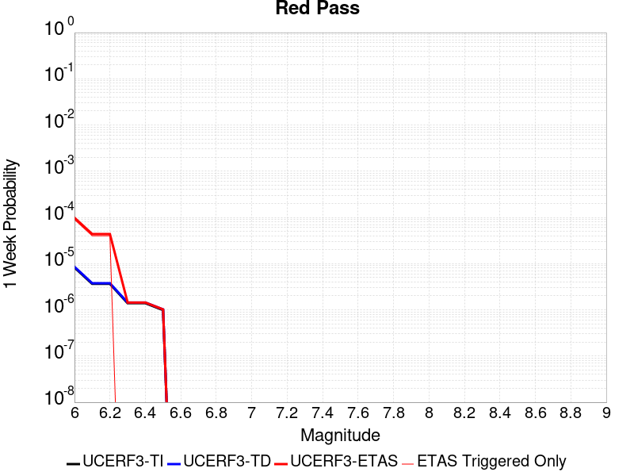 |  |  | 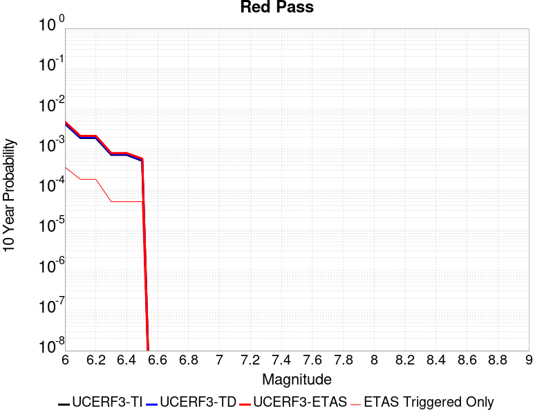 |

| Magnitude | 1 wk TI Prob | 1 wk TD Prob | 1 wk ETAS Prob | 1 wk ETAS/TD Gain | 1 wk ETAS Triggered Only | 1 mo TI Prob | 1 mo TD Prob | 1 mo ETAS Prob | 1 mo ETAS/TD Gain | 1 mo ETAS Triggered Only | 1 yr TI Prob | 1 yr TD Prob | 1 yr ETAS Prob | 1 yr ETAS/TD Gain | 1 yr ETAS Triggered Only | 10 yr TI Prob | 10 yr TD Prob | 10 yr ETAS Prob | 10 yr ETAS/TD Gain | 10 yr ETAS Triggered Only |
|-----|-----|-----|-----|-----|-----|-----|-----|-----|-----|-----|-----|-----|-----|-----|-----|-----|-----|-----|-----|-----|
| 6.0 | 8.258278E-6 | 8.551265E-6 | 1.5376166E-4 | 17.981161 | 1.4521164E-4 | 3.539214E-5 | 3.6647863E-5 | 2.0605524E-4 | 5.6225715 | 1.6941359E-4 | 4.308141E-4 | 4.4611428E-4 | 6.880257E-4 | 1.5422634 | 2.420194E-4 | 0.0042997985 | 0.004453945 | 0.004767169 | 1.070325 | 3.1462524E-4 |
| 6.1 | 3.649988E-6 | 3.7753161E-6 | 5.2179017E-5 | 13.821098 | 4.8403883E-5 | 1.5642712E-5 | 1.6179853E-5 | 6.458295E-5 | 3.9915662 | 4.8403883E-5 | 1.9043336E-4 | 1.9697666E-4 | 2.9376536E-4 | 1.4913714 | 9.6807766E-5 | 0.0019027026 | 0.001968488 | 0.0021134138 | 1.073623 | 1.4521164E-4 |
| 6.2 | 3.649988E-6 | 3.7753161E-6 | 5.2179017E-5 | 13.821098 | 4.8403883E-5 | 1.5642712E-5 | 1.6179853E-5 | 6.458295E-5 | 3.9915662 | 4.8403883E-5 | 1.9043336E-4 | 1.9697666E-4 | 2.9376536E-4 | 1.4913714 | 9.6807766E-5 | 0.0019027026 | 0.001968488 | 0.0021134138 | 1.073623 | 1.4521164E-4 |
| 6.3 | 1.3924937E-6 | 1.4411166E-6 | 1.4411166E-6 | 1.0 | 0.0 | 5.9678164E-6 | 6.1762075E-6 | 6.1762075E-6 | 1.0 | 0.0 | 7.265574E-5 | 7.519415E-5 | 9.939427E-5 | 1.3218352 | 2.4201941E-5 | 7.263199E-4 | 7.518258E-4 | 7.760095E-4 | 1.0321667 | 2.4201941E-5 |
| 6.4 | 1.3924937E-6 | 1.4411166E-6 | 1.4411166E-6 | 1.0 | 0.0 | 5.9678164E-6 | 6.1762075E-6 | 6.1762075E-6 | 1.0 | 0.0 | 7.265574E-5 | 7.519415E-5 | 9.939427E-5 | 1.3218352 | 2.4201941E-5 | 7.263199E-4 | 7.518258E-4 | 7.760095E-4 | 1.0321667 | 2.4201941E-5 |
| 6.5 | 9.876812E-7 | 1.0221912E-6 | 1.0221912E-6 | 1.0 | 0.0 | 4.2329125E-6 | 4.3808195E-6 | 4.3808195E-6 | 1.0 | 0.0 | 5.153449E-5 | 5.3336476E-5 | 7.753713E-5 | 1.4537355 | 2.4201941E-5 | 5.1522546E-4 | 5.333648E-4 | 5.575538E-4 | 1.0453517 | 2.4201941E-5 |

## Ludlow
*[(top)](#table-of-contents)*

| 1 Week | 1 Month | 1 Year | 10 Year |
|-----|-----|-----|-----|
|  |  | 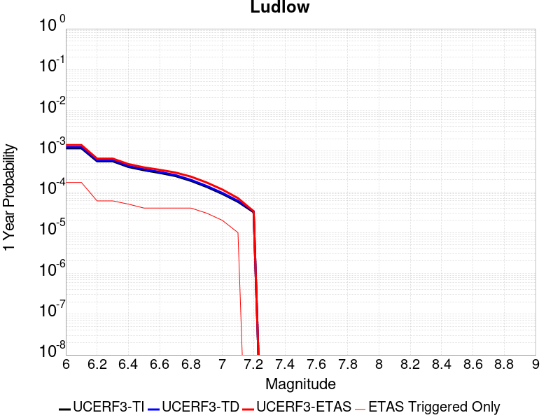 | 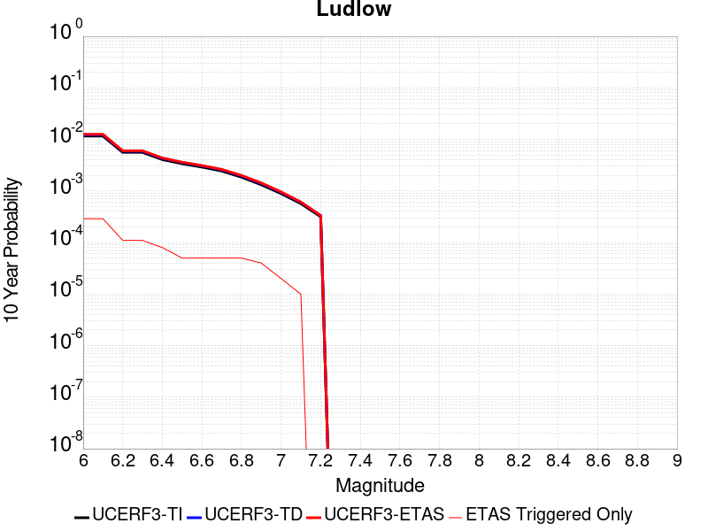 |

| Magnitude | 1 wk TI Prob | 1 wk TD Prob | 1 wk ETAS Prob | 1 wk ETAS/TD Gain | 1 wk ETAS Triggered Only | 1 mo TI Prob | 1 mo TD Prob | 1 mo ETAS Prob | 1 mo ETAS/TD Gain | 1 mo ETAS Triggered Only | 1 yr TI Prob | 1 yr TD Prob | 1 yr ETAS Prob | 1 yr ETAS/TD Gain | 1 yr ETAS Triggered Only | 10 yr TI Prob | 10 yr TD Prob | 10 yr ETAS Prob | 10 yr ETAS/TD Gain | 10 yr ETAS Triggered Only |
|-----|-----|-----|-----|-----|-----|-----|-----|-----|-----|-----|-----|-----|-----|-----|-----|-----|-----|-----|-----|-----|
| 6.0 | 2.2407607E-5 | 2.3657254E-5 | 7.205999E-5 | 3.0459998 | 4.8403883E-5 | 9.602906E-5 | 1.0138454E-4 | 1.9818249E-4 | 1.9547604 | 9.6807766E-5 | 0.0011685267 | 0.001233702 | 0.0014029065 | 1.137152 | 1.6941359E-4 | 0.011624013 | 0.012273042 | 0.012583806 | 1.0253209 | 3.1462524E-4 |
| 6.1 | 2.2407607E-5 | 2.3657254E-5 | 7.205999E-5 | 3.0459998 | 4.8403883E-5 | 9.602906E-5 | 1.0138454E-4 | 1.9818249E-4 | 1.9547604 | 9.6807766E-5 | 0.0011685267 | 0.001233702 | 0.0014029065 | 1.137152 | 1.6941359E-4 | 0.011624013 | 0.012273042 | 0.012583806 | 1.0253209 | 3.1462524E-4 |
| 6.2 | 1.0781252E-5 | 1.1365663E-5 | 3.556733E-5 | 3.1293666 | 2.4201941E-5 | 4.620455E-5 | 4.8709102E-5 | 9.711063E-5 | 1.9936855 | 4.8403883E-5 | 5.623952E-4 | 5.9287593E-4 | 6.654387E-4 | 1.1223911 | 7.260582E-5 | 0.00560974 | 0.0059133614 | 0.0060336553 | 1.0203427 | 1.210097E-4 |
| 6.3 | 1.0781252E-5 | 1.1365663E-5 | 3.556733E-5 | 3.1293666 | 2.4201941E-5 | 4.620455E-5 | 4.8709102E-5 | 9.711063E-5 | 1.9936855 | 4.8403883E-5 | 5.623952E-4 | 5.9287593E-4 | 6.654387E-4 | 1.1223911 | 7.260582E-5 | 0.00560974 | 0.0059133614 | 0.0060336553 | 1.0203427 | 1.210097E-4 |
| 6.4 | 7.814439E-6 | 8.237729E-6 | 3.243947E-5 | 3.9379144 | 2.4201941E-5 | 3.3490025E-5 | 3.530408E-5 | 8.3706254E-5 | 2.371008 | 4.8403883E-5 | 4.0766477E-4 | 4.2974384E-4 | 5.0231843E-4 | 1.1688788 | 7.260582E-5 | 0.0040691774 | 0.0042892746 | 0.0044097654 | 1.0280912 | 1.210097E-4 |
| 6.5 | 6.4986366E-6 | 6.85092E-6 | 3.1052696E-5 | 4.5326314 | 2.4201941E-5 | 2.7851002E-5 | 2.9360759E-5 | 5.356199E-5 | 1.8242713 | 2.4201941E-5 | 3.390332E-4 | 3.5740953E-4 | 4.057961E-4 | 1.1353813 | 4.8403883E-5 | 0.003385164 | 0.0035684432 | 0.00364079 | 1.020274 | 7.260582E-5 |
| 6.6 | 5.582177E-6 | 5.8860055E-6 | 3.0087804E-5 | 5.1117525 | 2.4201941E-5 | 2.3923398E-5 | 2.5225498E-5 | 4.9426828E-5 | 1.9593995 | 2.4201941E-5 | 2.9122844E-4 | 3.0707786E-4 | 3.5546688E-4 | 1.157579 | 4.8403883E-5 | 0.0029084706 | 0.003066609 | 0.003138992 | 1.0236037 | 7.260582E-5 |
| 6.7 | 4.6858763E-6 | 4.940427E-6 | 2.914225E-5 | 5.8987303 | 2.4201941E-5 | 2.0082172E-5 | 2.1173091E-5 | 4.537452E-5 | 2.1430275 | 2.4201941E-5 | 2.4447302E-4 | 2.5775246E-4 | 3.0614386E-4 | 1.1877438 | 4.8403883E-5 | 0.0024420423 | 0.0025745912 | 0.0026470101 | 1.0281283 | 7.260582E-5 |
| 6.8 | 3.5584908E-6 | 3.7520183E-6 | 2.7953869E-5 | 7.450355 | 2.4201941E-5 | 1.5250586E-5 | 1.6079981E-5 | 4.0281535E-5 | 2.5050733 | 2.4201941E-5 | 1.8566006E-4 | 1.957566E-4 | 2.4415102E-4 | 1.2472173 | 4.8403883E-5 | 0.0018550502 | 0.0019558826 | 0.0020283465 | 1.0370492 | 7.260582E-5 |
| 6.9 | 2.532834E-6 | 2.6710034E-6 | 2.687288E-5 | 10.060967 | 2.4201941E-5 | 1.0854958E-5 | 1.1447109E-5 | 3.5648773E-5 | 3.1142163 | 2.4201941E-5 | 1.3215111E-4 | 1.3935992E-4 | 1.6355849E-4 | 1.1736408 | 2.4201941E-5 | 0.0013207254 | 0.0013927529 | 0.0014410893 | 1.0347058 | 4.8403883E-5 |
| 7.0 | 1.7083285E-6 | 1.8019439E-6 | 2.6003841E-5 | 14.430994 | 2.4201941E-5 | 7.3213873E-6 | 7.722595E-6 | 3.1924348E-5 | 4.133889 | 2.4201941E-5 | 8.913424E-5 | 9.40187E-5 | 1.1821836E-4 | 1.257392 | 2.4201941E-5 | 8.9098496E-4 | 9.3980576E-4 | 9.6398493E-4 | 1.0257279 | 2.4201941E-5 |
| 7.1 | 1.0905424E-6 | 1.1497619E-6 | 1.1497619E-6 | 1.0 | 0.0 | 4.6737446E-6 | 4.9275427E-6 | 4.9275427E-6 | 1.0 | 0.0 | 5.6901354E-5 | 5.999128E-5 | 5.999128E-5 | 1.0 | 0.0 | 5.6886784E-4 | 5.997606E-4 | 5.997606E-4 | 1.0 | 0.0 |
| 7.2 | 6.06668E-7 | 6.387277E-7 | 6.387277E-7 | 1.0 | 0.0 | 2.600003E-6 | 2.7374022E-6 | 2.7374022E-6 | 1.0 | 0.0 | 3.1654577E-5 | 3.3327433E-5 | 3.3327433E-5 | 1.0 | 0.0 | 3.1650066E-4 | 3.3323118E-4 | 3.3323118E-4 | 1.0 | 0.0 |

## San Jacinto (San Bernardino)
*[(top)](#table-of-contents)*

| 1 Week | 1 Month | 1 Year | 10 Year |
|-----|-----|-----|-----|
|  |  |  |  |

| Magnitude | 1 wk TI Prob | 1 wk TD Prob | 1 wk ETAS Prob | 1 wk ETAS/TD Gain | 1 wk ETAS Triggered Only | 1 mo TI Prob | 1 mo TD Prob | 1 mo ETAS Prob | 1 mo ETAS/TD Gain | 1 mo ETAS Triggered Only | 1 yr TI Prob | 1 yr TD Prob | 1 yr ETAS Prob | 1 yr ETAS/TD Gain | 1 yr ETAS Triggered Only | 10 yr TI Prob | 10 yr TD Prob | 10 yr ETAS Prob | 10 yr ETAS/TD Gain | 10 yr ETAS Triggered Only |
|-----|-----|-----|-----|-----|-----|-----|-----|-----|-----|-----|-----|-----|-----|-----|-----|-----|-----|-----|-----|-----|
| 6.0 | 3.409352E-5 | 3.598562E-5 | 1.8119204E-4 | 5.0351233 | 1.4521164E-4 | 1.461069E-4 | 1.5421498E-4 | 2.9940423E-4 | 1.9414731 | 1.4521164E-4 | 0.0017774 | 0.0018759521 | 0.0021175174 | 1.1287695 | 2.420194E-4 | 0.01763251 | 0.019349992 | 0.01965853 | 1.0159451 | 3.1462524E-4 |
| 6.1 | 3.409352E-5 | 3.598562E-5 | 1.8119204E-4 | 5.0351233 | 1.4521164E-4 | 1.461069E-4 | 1.5421498E-4 | 2.9940423E-4 | 1.9414731 | 1.4521164E-4 | 0.0017774 | 0.0018759521 | 0.0021175174 | 1.1287695 | 2.420194E-4 | 0.01763251 | 0.019349992 | 0.01965853 | 1.0159451 | 3.1462524E-4 |
| 6.2 | 3.409352E-5 | 3.598562E-5 | 1.8119204E-4 | 5.0351233 | 1.4521164E-4 | 1.461069E-4 | 1.5421498E-4 | 2.9940423E-4 | 1.9414731 | 1.4521164E-4 | 0.0017774 | 0.0018759521 | 0.0021175174 | 1.1287695 | 2.420194E-4 | 0.01763251 | 0.019349992 | 0.01965853 | 1.0159451 | 3.1462524E-4 |
| 6.3 | 3.409352E-5 | 3.598562E-5 | 1.8119204E-4 | 5.0351233 | 1.4521164E-4 | 1.461069E-4 | 1.5421498E-4 | 2.9940423E-4 | 1.9414731 | 1.4521164E-4 | 0.0017774 | 0.0018759521 | 0.0021175174 | 1.1287695 | 2.420194E-4 | 0.01763251 | 0.019349992 | 0.01965853 | 1.0159451 | 3.1462524E-4 |
| 6.4 | 3.400795E-5 | 3.5878285E-5 | 1.8108472E-4 | 5.0471954 | 1.4521164E-4 | 1.4574021E-4 | 1.5375503E-4 | 2.9894433E-4 | 1.9442899 | 1.4521164E-4 | 0.0017729428 | 0.0018703619 | 0.0021119285 | 1.129155 | 2.420194E-4 | 0.017588645 | 0.019295074 | 0.019603629 | 1.0159913 | 3.1462524E-4 |
| 6.5 | 3.341482E-5 | 3.5138914E-5 | 1.8034547E-4 | 5.132357 | 1.4521164E-4 | 1.4319851E-4 | 1.5058667E-4 | 2.9577644E-4 | 1.9641609 | 1.4521164E-4 | 0.0017420477 | 0.0018318522 | 0.0020492708 | 1.1186877 | 2.1781746E-4 | 0.017284546 | 0.018916616 | 0.019201545 | 1.0150623 | 2.9042328E-4 |
| 6.6 | 3.3364955E-5 | 3.5076133E-5 | 1.8028269E-4 | 5.139754 | 1.4521164E-4 | 1.4298483E-4 | 1.5031763E-4 | 2.9550746E-4 | 1.9658868 | 1.4521164E-4 | 0.0017394501 | 0.0018285823 | 0.0020460014 | 1.1189004 | 2.1781746E-4 | 0.017258976 | 0.01888448 | 0.01916942 | 1.0150886 | 2.9042328E-4 |
| 6.7 | 3.335922E-5 | 3.5065907E-5 | 1.8027246E-4 | 5.140961 | 1.4521164E-4 | 1.4296026E-4 | 1.5027382E-4 | 2.9546363E-4 | 1.9661685 | 1.4521164E-4 | 0.0017391514 | 0.0018280497 | 0.002045469 | 1.1189351 | 2.1781746E-4 | 0.017256035 | 0.018879272 | 0.019164212 | 1.0150927 | 2.9042328E-4 |
| 6.8 | 3.327683E-5 | 3.4959972E-5 | 1.8016653E-4 | 5.153509 | 1.4521164E-4 | 1.4260718E-4 | 1.4981985E-4 | 2.9500976E-4 | 1.9690964 | 1.4521164E-4 | 0.0017348597 | 0.001822532 | 0.0020399527 | 1.1192958 | 2.1781746E-4 | 0.017213784 | 0.018825045 | 0.01911 | 1.0151371 | 2.9042328E-4 |
| 6.9 | 3.3235785E-5 | 3.4900928E-5 | 1.801075E-4 | 5.1605363 | 1.4521164E-4 | 1.4243131E-4 | 1.4956683E-4 | 2.9475676E-4 | 1.9707361 | 1.4521164E-4 | 0.0017327217 | 0.0018194567 | 0.002036878 | 1.1194979 | 2.1781746E-4 | 0.017192734 | 0.018794911 | 0.019079875 | 1.0151618 | 2.9042328E-4 |
| 7.0 | 3.3197095E-5 | 3.4840854E-5 | 1.8004744E-4 | 5.1677103 | 1.4521164E-4 | 1.422655E-4 | 1.4930942E-4 | 2.944994E-4 | 1.97241 | 1.4521164E-4 | 0.0017307063 | 0.0018163278 | 0.0020337496 | 1.1197041 | 2.1781746E-4 | 0.017172894 | 0.01876429 | 0.019049263 | 1.015187 | 2.9042328E-4 |
| 7.1 | 3.3129716E-5 | 3.4721066E-5 | 1.7992767E-4 | 5.18209 | 1.4521164E-4 | 1.4197677E-4 | 1.4879608E-4 | 2.9398612E-4 | 1.9757652 | 1.4521164E-4 | 0.0017271966 | 0.0018100884 | 0.0020275116 | 1.1201174 | 2.1781746E-4 | 0.017138338 | 0.018703366 | 0.018988358 | 1.0152375 | 2.9042328E-4 |
| 7.2 | 3.3034008E-5 | 3.4588513E-5 | 1.7979514E-4 | 5.1981173 | 1.4521164E-4 | 1.4156665E-4 | 1.4822806E-4 | 2.9341818E-4 | 1.979505 | 1.4521164E-4 | 0.0017222111 | 0.0018031843 | 0.0020206089 | 1.1205782 | 2.1781746E-4 | 0.017089253 | 0.01863575 | 0.01892076 | 1.0152938 | 2.9042328E-4 |
| 7.3 | 3.2956614E-5 | 3.4456265E-5 | 1.7966291E-4 | 5.2142305 | 1.4521164E-4 | 1.4123498E-4 | 1.4766137E-4 | 2.9285156E-4 | 1.9832647 | 1.4521164E-4 | 0.0017181796 | 0.0017962961 | 0.0020137222 | 1.1210414 | 2.1781746E-4 | 0.017049557 | 0.018568495 | 0.018853527 | 1.0153502 | 2.9042328E-4 |
| 7.4 | 3.2915937E-5 | 3.4377957E-5 | 1.7958462E-4 | 5.22383 | 1.4521164E-4 | 1.4106068E-4 | 1.473258E-4 | 2.9251605E-4 | 1.9855046 | 1.4521164E-4 | 0.0017160608 | 0.0017922173 | 0.0020096444 | 1.1213174 | 2.1781746E-4 | 0.017028693 | 0.018528769 | 0.018813811 | 1.0153837 | 2.9042328E-4 |
| 7.5 | 3.281791E-5 | 3.424287E-5 | 1.7944955E-4 | 5.240494 | 1.4521164E-4 | 1.406406E-4 | 1.4674691E-4 | 2.9193723E-4 | 1.9893928 | 1.4521164E-4 | 0.0017109542 | 0.0017851809 | 0.0020026097 | 1.1217964 | 2.1781746E-4 | 0.016978411 | 0.018459652 | 0.018744715 | 1.0154425 | 2.9042328E-4 |
| 7.6 | 3.2521442E-5 | 3.396782E-5 | 1.7917453E-4 | 5.274832 | 1.4521164E-4 | 1.3937015E-4 | 1.4556825E-4 | 2.9075876E-4 | 1.997405 | 1.4521164E-4 | 0.0016955109 | 0.0017708542 | 0.001988286 | 1.1227835 | 2.1781746E-4 | 0.016826328 | 0.018317295 | 0.0186024 | 1.0155647 | 2.9042328E-4 |
| 7.7 | 3.0287873E-5 | 3.245191E-5 | 1.7765885E-4 | 5.4745264 | 1.4521164E-4 | 1.297987E-4 | 1.3907222E-4 | 2.8426366E-4 | 2.0440004 | 1.4521164E-4 | 0.0015791537 | 0.0016918903 | 0.0019093392 | 1.1285243 | 2.1781746E-4 | 0.01567979 | 0.017528199 | 0.017813532 | 1.0162785 | 2.9042328E-4 |
| 7.8 | 2.6316151E-5 | 2.9662837E-5 | 1.7487018E-4 | 5.8952613 | 1.4521164E-4 | 1.1277862E-4 | 1.2712025E-4 | 2.7231345E-4 | 2.1421719 | 1.4521164E-4 | 0.0013722149 | 0.0015465913 | 0.0017640719 | 1.1406193 | 2.1781746E-4 | 0.013637724 | 0.016069878 | 0.016355634 | 1.0177821 | 2.9042328E-4 |
| 7.9 | 2.0761147E-5 | 2.3417291E-5 | 1.4442416E-4 | 6.1674156 | 1.210097E-4 | 8.897331E-5 | 1.0035596E-4 | 2.2135352E-4 | 2.2056837 | 1.210097E-4 | 0.0010827117 | 0.0012211498 | 0.0014145289 | 1.1583582 | 1.9361553E-4 | 0.010774517 | 0.012793272 | 0.013056087 | 1.0205432 | 2.6622135E-4 |
| 8.0 | 1.5738568E-5 | 1.6032505E-5 | 1.12838716E-4 | 7.038121 | 9.6807766E-5 | 6.744926E-5 | 6.8708934E-5 | 1.6551005E-4 | 2.4088578 | 9.6807766E-5 | 8.2088535E-4 | 8.3621085E-4 | 0.0010054827 | 1.2024273 | 1.6941359E-4 | 0.008178596 | 0.008865741 | 0.009081627 | 1.0243506 | 2.1781746E-4 |
| 8.1 | 1.0105832E-5 | 8.329479E-6 | 5.673296E-5 | 6.8111053 | 4.8403883E-5 | 4.3309992E-5 | 3.569728E-5 | 8.409943E-5 | 2.355906 | 4.8403883E-5 | 5.2717153E-4 | 4.3452822E-4 | 5.071025E-4 | 1.1670185 | 7.260582E-5 | 0.005259227 | 0.0046768794 | 0.0047491454 | 1.0154518 | 7.260582E-5 |
| 8.2 | 4.189207E-6 | 1.577699E-6 | 1.577699E-6 | 1.0 | 0.0 | 1.7953622E-5 | 6.7615497E-6 | 6.7615497E-6 | 1.0 | 0.0 | 2.1856341E-4 | 8.231879E-5 | 8.231879E-5 | 1.0 | 0.0 | 0.0021834858 | 9.562628E-4 | 9.562628E-4 | 1.0 | 0.0 |
| 8.3 | 1.2758221E-6 | 3.612677E-7 | 3.612677E-7 | 1.0 | 0.0 | 5.4677976E-6 | 1.5482892E-6 | 1.5482892E-6 | 1.0 | 0.0 | 6.65684E-5 | 1.8850264E-5 | 1.8850264E-5 | 1.0 | 0.0 | 6.6548464E-4 | 2.2739546E-4 | 2.2739546E-4 | 1.0 | 0.0 |

## San Andreas (Creeping Section) 2011 CFM
*[(top)](#table-of-contents)*

| 1 Week | 1 Month | 1 Year | 10 Year |
|-----|-----|-----|-----|
|  | 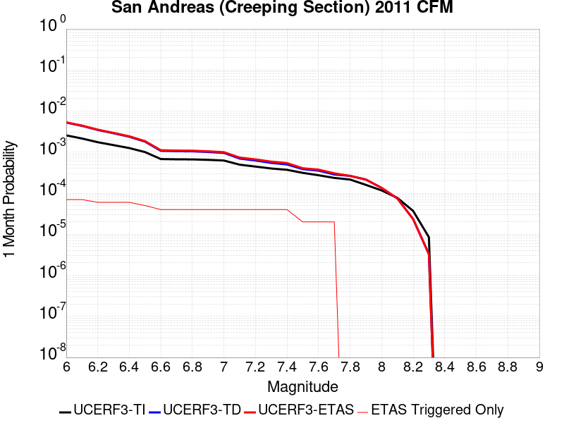 |  |  |

| Magnitude | 1 wk TI Prob | 1 wk TD Prob | 1 wk ETAS Prob | 1 wk ETAS/TD Gain | 1 wk ETAS Triggered Only | 1 mo TI Prob | 1 mo TD Prob | 1 mo ETAS Prob | 1 mo ETAS/TD Gain | 1 mo ETAS Triggered Only | 1 yr TI Prob | 1 yr TD Prob | 1 yr ETAS Prob | 1 yr ETAS/TD Gain | 1 yr ETAS Triggered Only | 10 yr TI Prob | 10 yr TD Prob | 10 yr ETAS Prob | 10 yr ETAS/TD Gain | 10 yr ETAS Triggered Only |
|-----|-----|-----|-----|-----|-----|-----|-----|-----|-----|-----|-----|-----|-----|-----|-----|-----|-----|-----|-----|-----|
| 6.0 | 5.986481E-4 | 0.0012275929 | 0.0013001096 | 1.0590723 | 7.260582E-5 | 0.0025631124 | 0.005245547 | 0.0053659217 | 1.022948 | 1.210097E-4 | 0.030762846 | 0.06120491 | 0.061363954 | 1.0025985 | 1.6941359E-4 | 0.26835477 | 0.42593494 | 0.42608777 | 1.0003588 | 2.6622135E-4 |
| 6.1 | 5.015945E-4 | 0.0010217986 | 0.0010943302 | 1.0709842 | 7.260582E-5 | 0.00214792 | 0.0043678596 | 0.0044883406 | 1.0275836 | 1.210097E-4 | 0.025839351 | 0.05124837 | 0.05138614 | 1.0026883 | 1.4521164E-4 | 0.23032776 | 0.37285668 | 0.3729933 | 1.0003663 | 2.1781746E-4 |
| 6.2 | 4.073338E-4 | 8.1073755E-4 | 8.591022E-4 | 1.0596551 | 4.8403883E-5 | 0.0017445484 | 0.0034671477 | 0.0035636197 | 1.0278246 | 9.6807766E-5 | 0.021034058 | 0.04093317 | 0.041049223 | 1.0028353 | 1.210097E-4 | 0.19150782 | 0.31303346 | 0.31316647 | 1.0004249 | 1.9361553E-4 |
| 6.3 | 3.464099E-4 | 6.7391695E-4 | 7.222882E-4 | 1.0717763 | 4.8403883E-5 | 0.0014837692 | 0.0028829593 | 0.002979488 | 1.0334826 | 9.6807766E-5 | 0.017915873 | 0.034189582 | 0.034306455 | 1.0034183 | 1.210097E-4 | 0.16538359 | 0.2713166 | 0.27145767 | 1.00052 | 1.9361553E-4 |
| 6.4 | 2.935057E-4 | 5.5442745E-4 | 6.028045E-4 | 1.0872558 | 4.8403883E-5 | 0.0012572751 | 0.0023725363 | 0.0024691145 | 1.0407066 | 9.6807766E-5 | 0.015200248 | 0.02826451 | 0.028382098 | 1.0041603 | 1.210097E-4 | 0.14201577 | 0.23298529 | 0.2331338 | 1.0006374 | 1.9361553E-4 |
| 6.5 | 2.3409708E-4 | 4.2093755E-4 | 4.6932106E-4 | 1.1149422 | 4.8403883E-5 | 0.0010028875 | 0.0018019684 | 0.0018986018 | 1.0536265 | 9.6807766E-5 | 0.012141965 | 0.021587461 | 0.021705858 | 1.0054846 | 1.210097E-4 | 0.11499573 | 0.18682368 | 0.18698113 | 1.0008427 | 1.9361553E-4 |
| 6.6 | 1.5842178E-4 | 2.506933E-4 | 2.7488917E-4 | 1.0965159 | 2.4201941E-5 | 6.7877385E-4 | 0.0010739497 | 0.0011464776 | 1.0675337 | 7.260582E-5 | 0.0082328 | 0.012995575 | 0.013091125 | 1.0073525 | 9.6807766E-5 | 0.07934396 | 0.12314638 | 0.12329493 | 1.0012063 | 1.6941359E-4 |
| 6.7 | 1.5616413E-4 | 2.4605883E-4 | 2.702548E-4 | 1.0983342 | 2.4201941E-5 | 6.691031E-4 | 0.0010541069 | 0.0011266362 | 1.0688064 | 7.260582E-5 | 0.0081159435 | 0.01275744 | 0.012853013 | 1.0074916 | 9.6807766E-5 | 0.0782586 | 0.12117351 | 0.12132239 | 1.0012287 | 1.6941359E-4 |
| 6.8 | 1.5538467E-4 | 2.4429744E-4 | 2.684935E-4 | 1.0990434 | 2.4201941E-5 | 6.6576427E-4 | 0.0010465645 | 0.0011190943 | 1.0693028 | 7.260582E-5 | 0.008075596 | 0.012666838 | 0.01276242 | 1.0075458 | 9.6807766E-5 | 0.07788358 | 0.120404355 | 0.12055337 | 1.0012376 | 1.6941359E-4 |
| 6.9 | 1.5153569E-4 | 2.3539034E-4 | 2.5958658E-4 | 1.102792 | 2.4201941E-5 | 6.49277E-4 | 0.0010084276 | 0.0010809603 | 1.0719265 | 7.260582E-5 | 0.007876333 | 0.01220901 | 0.012304637 | 1.0078324 | 9.6807766E-5 | 0.07602952 | 0.11647445 | 0.11662413 | 1.0012851 | 1.6941359E-4 |
| 7.0 | 1.4588932E-4 | 2.2396253E-4 | 2.4815905E-4 | 1.1080383 | 2.4201941E-5 | 6.250901E-4 | 9.5948833E-4 | 0.0010320245 | 1.0755988 | 7.260582E-5 | 0.0075839474 | 0.011619697 | 0.01171538 | 1.0082345 | 9.6807766E-5 | 0.073302895 | 0.11132046 | 0.11147101 | 1.0013524 | 1.6941359E-4 |
| 7.1 | 1.1565079E-4 | 1.6281738E-4 | 1.8701538E-4 | 1.1486205 | 2.4201941E-5 | 4.955521E-4 | 6.9760304E-4 | 7.701582E-4 | 1.1040064 | 7.260582E-5 | 0.006016669 | 0.0084604435 | 0.008556432 | 1.0113456 | 9.6807766E-5 | 0.058563538 | 0.08367046 | 0.0838257 | 1.0018554 | 1.6941359E-4 |
| 7.2 | 1.0393792E-4 | 1.4615769E-4 | 1.7035608E-4 | 1.1655637 | 2.4201941E-5 | 4.4537216E-4 | 6.2624045E-4 | 6.9880084E-4 | 1.1158667 | 7.260582E-5 | 0.005408933 | 0.0075979927 | 0.0076940646 | 1.0126444 | 9.6807766E-5 | 0.052791595 | 0.07561969 | 0.075776294 | 1.0020709 | 1.6941359E-4 |
| 7.3 | 9.332884E-5 | 1.2780898E-4 | 1.5200784E-4 | 1.1893361 | 2.4201941E-5 | 3.999194E-4 | 5.4763845E-4 | 6.202045E-4 | 1.1325072 | 7.260582E-5 | 0.0048581534 | 0.006647249 | 0.0067434134 | 1.0144668 | 9.6807766E-5 | 0.047533102 | 0.06648326 | 0.066641405 | 1.0023788 | 1.6941359E-4 |
| 7.4 | 8.670252E-5 | 1.17032345E-4 | 1.4123145E-4 | 1.2067728 | 2.4201941E-5 | 3.715293E-4 | 5.0147134E-4 | 5.740408E-4 | 1.1447129 | 7.260582E-5 | 0.004513991 | 0.006088443 | 0.0061846613 | 1.0158035 | 9.6807766E-5 | 0.044233937 | 0.061151642 | 0.061310697 | 1.002601 | 1.6941359E-4 |
| 7.5 | 7.3036405E-5 | 9.005856E-5 | 9.005856E-5 | 1.0 | 0.0 | 3.129756E-4 | 3.8590826E-4 | 4.1010085E-4 | 1.06269 | 2.4201941E-5 | 0.0038038217 | 0.0046883323 | 0.004736509 | 1.010276 | 4.8403883E-5 | 0.03739367 | 0.047877792 | 0.047993008 | 1.0024065 | 1.210097E-4 |
| 7.6 | 6.3935775E-5 | 8.280385E-5 | 8.280385E-5 | 1.0 | 0.0 | 2.7398168E-4 | 3.5482543E-4 | 3.7901878E-4 | 1.0681838 | 2.4201941E-5 | 0.0033306254 | 0.004311461 | 0.0043596565 | 1.0111784 | 4.8403883E-5 | 0.032811474 | 0.04399201 | 0.044107694 | 1.0026298 | 1.210097E-4 |
| 7.7 | 5.5050095E-5 | 6.6618326E-5 | 6.6618326E-5 | 1.0 | 0.0 | 2.3590765E-4 | 2.854759E-4 | 3.0967093E-4 | 1.0847533 | 2.4201941E-5 | 0.0028683927 | 0.003470134 | 0.0035183697 | 1.0139003 | 4.8403883E-5 | 0.0283165 | 0.035796214 | 0.03591289 | 1.0032595 | 1.210097E-4 |
| 7.8 | 5.027131E-5 | 6.162871E-5 | 6.162871E-5 | 1.0 | 0.0 | 2.1543067E-4 | 2.640963E-4 | 2.640963E-4 | 1.0 | 0.0 | 0.0026197135 | 0.003210635 | 0.0032347592 | 1.0075139 | 2.4201941E-5 | 0.025890453 | 0.03312666 | 0.03322026 | 1.0028255 | 9.6807766E-5 |
| 7.9 | 3.7271806E-5 | 5.022507E-5 | 5.022507E-5 | 1.0 | 0.0 | 1.5972654E-4 | 2.1523255E-4 | 2.1523255E-4 | 1.0 | 0.0 | 0.0019429359 | 0.002617309 | 0.002617309 | 1.0 | 0.0 | 0.019260362 | 0.027067466 | 0.027114559 | 1.0017399 | 4.8403883E-5 |
| 8.0 | 2.7310243E-5 | 3.1427757E-5 | 3.1427757E-5 | 1.0 | 0.0 | 1.17038646E-4 | 1.3468343E-4 | 1.3468343E-4 | 1.0 | 0.0 | 0.0014240141 | 0.0016385383 | 0.0016385383 | 1.0 | 0.0 | 0.014149235 | 0.01721386 | 0.01721386 | 1.0 | 0.0 |
| 8.1 | 1.7940547E-5 | 1.7399378E-5 | 1.7399378E-5 | 1.0 | 0.0 | 7.688579E-5 | 7.456663E-5 | 7.456663E-5 | 1.0 | 0.0 | 9.3568244E-4 | 9.074711E-4 | 9.074711E-4 | 1.0 | 0.0 | 0.009317525 | 0.009798636 | 0.009798636 | 1.0 | 0.0 |
| 8.2 | 8.643924E-6 | 5.473668E-6 | 5.473668E-6 | 1.0 | 0.0 | 3.704486E-5 | 2.3458366E-5 | 2.3458366E-5 | 1.0 | 0.0 | 4.5092785E-4 | 2.8556827E-4 | 2.8556827E-4 | 1.0 | 0.0 | 0.0045001395 | 0.0032481793 | 0.0032481793 | 1.0 | 0.0 |
| 8.3 | 1.983087E-6 | 7.6564595E-7 | 7.6564595E-7 | 1.0 | 0.0 | 8.498917E-6 | 3.281336E-6 | 3.281336E-6 | 1.0 | 0.0 | 1.034694E-4 | 3.9949547E-5 | 3.9949547E-5 | 1.0 | 0.0 | 0.0010342124 | 4.717979E-4 | 4.717979E-4 | 1.0 | 0.0 |

## Scodie Lineament
*[(top)](#table-of-contents)*

| 1 Week | 1 Month | 1 Year | 10 Year |
|-----|-----|-----|-----|
|  |  |  |  |

| Magnitude | 1 wk TI Prob | 1 wk TD Prob | 1 wk ETAS Prob | 1 wk ETAS/TD Gain | 1 wk ETAS Triggered Only | 1 mo TI Prob | 1 mo TD Prob | 1 mo ETAS Prob | 1 mo ETAS/TD Gain | 1 mo ETAS Triggered Only | 1 yr TI Prob | 1 yr TD Prob | 1 yr ETAS Prob | 1 yr ETAS/TD Gain | 1 yr ETAS Triggered Only | 10 yr TI Prob | 10 yr TD Prob | 10 yr ETAS Prob | 10 yr ETAS/TD Gain | 10 yr ETAS Triggered Only |
|-----|-----|-----|-----|-----|-----|-----|-----|-----|-----|-----|-----|-----|-----|-----|-----|-----|-----|-----|-----|-----|
| 6.0 | 3.2919327E-6 | 3.0133303E-6 | 7.561893E-5 | 25.094803 | 7.260582E-5 | 1.4108206E-5 | 1.2914227E-5 | 1.0972074E-4 | 8.496114 | 9.6807766E-5 | 1.7175387E-4 | 1.5722254E-4 | 3.992039E-4 | 2.539101 | 2.420194E-4 | 0.0017162118 | 0.0015714248 | 0.0018855556 | 1.1999019 | 3.1462524E-4 |
| 6.1 | 1.8663811E-6 | 1.5490382E-6 | 2.5750942E-5 | 16.623827 | 2.4201941E-5 | 7.998751E-6 | 6.6387206E-6 | 5.504228E-5 | 8.291098 | 4.8403883E-5 | 9.738045E-5 | 8.082393E-5 | 1.5342388E-4 | 1.8982483 | 7.260582E-5 | 9.7337784E-4 | 8.079941E-4 | 8.805413E-4 | 1.0897868 | 7.260582E-5 |
| 6.2 | 1.8663811E-6 | 1.5490382E-6 | 2.5750942E-5 | 16.623827 | 2.4201941E-5 | 7.998751E-6 | 6.6387206E-6 | 5.504228E-5 | 8.291098 | 4.8403883E-5 | 9.738045E-5 | 8.082393E-5 | 1.5342388E-4 | 1.8982483 | 7.260582E-5 | 9.7337784E-4 | 8.079941E-4 | 8.805413E-4 | 1.0897868 | 7.260582E-5 |
| 6.3 | 1.8663811E-6 | 1.5490382E-6 | 2.5750942E-5 | 16.623827 | 2.4201941E-5 | 7.998751E-6 | 6.6387206E-6 | 5.504228E-5 | 8.291098 | 4.8403883E-5 | 9.738045E-5 | 8.082393E-5 | 1.5342388E-4 | 1.8982483 | 7.260582E-5 | 9.7337784E-4 | 8.079941E-4 | 8.805413E-4 | 1.0897868 | 7.260582E-5 |
| 6.4 | 1.8663811E-6 | 1.5490382E-6 | 2.5750942E-5 | 16.623827 | 2.4201941E-5 | 7.998751E-6 | 6.6387206E-6 | 5.504228E-5 | 8.291098 | 4.8403883E-5 | 9.738045E-5 | 8.082393E-5 | 1.5342388E-4 | 1.8982483 | 7.260582E-5 | 9.7337784E-4 | 8.079941E-4 | 8.805413E-4 | 1.0897868 | 7.260582E-5 |
| 6.5 | 1.8106311E-6 | 1.4909722E-6 | 2.5692878E-5 | 17.232298 | 2.4201941E-5 | 7.759824E-6 | 6.389868E-6 | 5.479344E-5 | 8.57505 | 4.8403883E-5 | 9.447177E-5 | 7.779436E-5 | 1.5039454E-4 | 1.9332318 | 7.260582E-5 | 9.4431615E-4 | 7.7771995E-4 | 8.502693E-4 | 1.0932847 | 7.260582E-5 |
| 6.6 | 1.2414679E-6 | 8.9974395E-7 | 2.5101663E-5 | 27.898674 | 2.4201941E-5 | 5.320566E-6 | 3.85604E-6 | 5.2259737E-5 | 13.552694 | 4.8403883E-5 | 6.477596E-5 | 4.6946367E-5 | 1.19548786E-4 | 2.5464969 | 7.260582E-5 | 6.475708E-4 | 4.6937316E-4 | 5.4194493E-4 | 1.1546142 | 7.260582E-5 |
| 6.7 | 1.1062215E-6 | 7.594193E-7 | 2.4961342E-5 | 32.868984 | 2.4201941E-5 | 4.7409408E-6 | 3.2546504E-6 | 2.7456514E-5 | 8.436087 | 2.4201941E-5 | 5.7719422E-5 | 3.962472E-5 | 6.3825704E-5 | 1.6107546 | 2.4201941E-5 | 5.770443E-4 | 3.9618355E-4 | 4.203759E-4 | 1.0610635 | 2.4201941E-5 |
| 6.8 | 1.0006736E-6 | 6.5002786E-7 | 2.4851954E-5 | 38.232136 | 2.4201941E-5 | 4.288594E-6 | 2.7858312E-6 | 2.6987705E-5 | 9.687488 | 2.4201941E-5 | 5.221238E-5 | 3.391703E-5 | 5.811815E-5 | 1.7135389 | 2.4201941E-5 | 5.220012E-4 | 3.3912458E-4 | 3.6331834E-4 | 1.0713418 | 2.4201941E-5 |
| 6.9 | 9.167364E-7 | 5.6315065E-7 | 2.4765079E-5 | 43.975937 | 2.4201941E-5 | 3.9288643E-6 | 2.413501E-6 | 2.6615384E-5 | 11.027708 | 2.4201941E-5 | 4.7832873E-5 | 2.9384037E-5 | 5.3585267E-5 | 1.8236183 | 2.4201941E-5 | 4.782258E-4 | 2.9380718E-4 | 3.18002E-4 | 1.0823493 | 2.4201941E-5 |
| 7.0 | 7.6987664E-7 | 4.113265E-7 | 2.4613257E-5 | 59.838734 | 2.4201941E-5 | 3.2994672E-6 | 1.7628269E-6 | 2.5964726E-5 | 14.729027 | 2.4201941E-5 | 4.0170275E-5 | 2.1462245E-5 | 4.5663666E-5 | 2.1276276 | 2.4201941E-5 | 4.0163012E-4 | 2.1460558E-4 | 2.3880233E-4 | 1.1127498 | 2.4201941E-5 |
| 7.1 | 7.1038727E-7 | 3.5210306E-7 | 2.4554036E-5 | 69.73537 | 2.4201941E-5 | 3.0445133E-6 | 1.5090123E-6 | 2.5710917E-5 | 17.03824 | 2.4201941E-5 | 3.706632E-5 | 1.8372106E-5 | 4.2573603E-5 | 2.3172958 | 2.4201941E-5 | 3.7060137E-4 | 1.8370937E-4 | 2.0790687E-4 | 1.1317161 | 2.4201941E-5 |
| 7.2 | 2.0799602E-7 | 3.1178534E-8 | 3.1178534E-8 | 1.0 | 0.0 | 8.914113E-7 | 1.3362228E-7 | 1.3362228E-7 | 1.0 | 0.0 | 1.0852878E-5 | 1.6268501E-6 | 1.6268501E-6 | 1.0 | 0.0 | 1.08523476E-4 | 1.626839E-5 | 1.626839E-5 | 1.0 | 0.0 |
| 7.3 | 1.5048182E-7 | 1.5939106E-8 | 1.5939106E-8 | 1.0 | 0.0 | 6.449219E-7 | 6.8310456E-8 | 6.8310456E-8 | 1.0 | 0.0 | 7.851896E-6 | 8.316795E-7 | 8.316795E-7 | 1.0 | 0.0 | 7.851618E-5 | 8.316767E-6 | 8.316767E-6 | 1.0 | 0.0 |
| 7.4 | 5.9334678E-8 | 4.8638475E-9 | 4.8638475E-9 | 1.0 | 0.0 | 2.5429145E-7 | 2.084506E-8 | 2.084506E-8 | 1.0 | 0.0 | 3.095994E-6 | 2.5378858E-7 | 2.5378858E-7 | 1.0 | 0.0 | 3.095951E-5 | 2.5378843E-6 | 2.5378843E-6 | 1.0 | 0.0 |

## White Wolf (Extension)
*[(top)](#table-of-contents)*

| 1 Week | 1 Month | 1 Year | 10 Year |
|-----|-----|-----|-----|
| 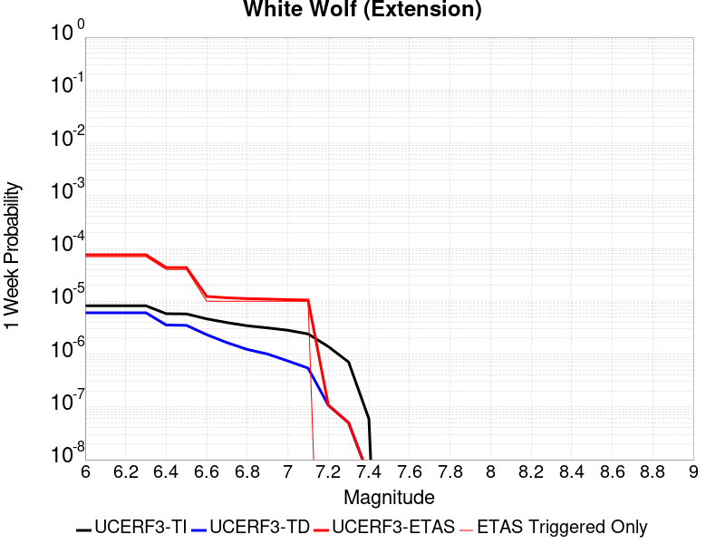 |  |  |  |

| Magnitude | 1 wk TI Prob | 1 wk TD Prob | 1 wk ETAS Prob | 1 wk ETAS/TD Gain | 1 wk ETAS Triggered Only | 1 mo TI Prob | 1 mo TD Prob | 1 mo ETAS Prob | 1 mo ETAS/TD Gain | 1 mo ETAS Triggered Only | 1 yr TI Prob | 1 yr TD Prob | 1 yr ETAS Prob | 1 yr ETAS/TD Gain | 1 yr ETAS Triggered Only | 10 yr TI Prob | 10 yr TD Prob | 10 yr ETAS Prob | 10 yr ETAS/TD Gain | 10 yr ETAS Triggered Only |
|-----|-----|-----|-----|-----|-----|-----|-----|-----|-----|-----|-----|-----|-----|-----|-----|-----|-----|-----|-----|-----|
| 6.0 | 8.222555E-6 | 6.066615E-6 | 7.8672E-5 | 12.968022 | 7.260582E-5 | 3.5239045E-5 | 2.5999556E-5 | 1.228048E-4 | 4.7233424 | 9.6807766E-5 | 4.289509E-4 | 3.1650523E-4 | 5.100595E-4 | 1.6115357 | 1.9361553E-4 | 0.0042812387 | 0.0031611966 | 0.0034265763 | 1.0839492 | 2.6622135E-4 |
| 6.1 | 8.222555E-6 | 6.066615E-6 | 7.8672E-5 | 12.968022 | 7.260582E-5 | 3.5239045E-5 | 2.5999556E-5 | 1.228048E-4 | 4.7233424 | 9.6807766E-5 | 4.289509E-4 | 3.1650523E-4 | 5.100595E-4 | 1.6115357 | 1.9361553E-4 | 0.0042812387 | 0.0031611966 | 0.0034265763 | 1.0839492 | 2.6622135E-4 |
| 6.2 | 8.222555E-6 | 6.066615E-6 | 7.8672E-5 | 12.968022 | 7.260582E-5 | 3.5239045E-5 | 2.5999556E-5 | 1.228048E-4 | 4.7233424 | 9.6807766E-5 | 4.289509E-4 | 3.1650523E-4 | 5.100595E-4 | 1.6115357 | 1.9361553E-4 | 0.0042812387 | 0.0031611966 | 0.0034265763 | 1.0839492 | 2.6622135E-4 |
| 6.3 | 8.222555E-6 | 6.066615E-6 | 7.8672E-5 | 12.968022 | 7.260582E-5 | 3.5239045E-5 | 2.5999556E-5 | 1.228048E-4 | 4.7233424 | 9.6807766E-5 | 4.289509E-4 | 3.1650523E-4 | 5.100595E-4 | 1.6115357 | 1.9361553E-4 | 0.0042812387 | 0.0031611966 | 0.0034265763 | 1.0839492 | 2.6622135E-4 |
| 6.4 | 5.821773E-6 | 3.5571256E-6 | 5.1960837E-5 | 14.607534 | 4.8403883E-5 | 2.4950215E-5 | 1.5244741E-5 | 8.7849454E-5 | 5.762607 | 7.260582E-5 | 3.0372653E-4 | 1.8559002E-4 | 2.8237983E-4 | 1.5215248 | 9.6807766E-5 | 0.0030331176 | 0.0018544586 | 0.001999401 | 1.0781589 | 1.4521164E-4 |
| 6.5 | 5.766023E-6 | 3.4990599E-6 | 5.190277E-5 | 14.833348 | 4.8403883E-5 | 2.4711293E-5 | 1.49958905E-5 | 8.760062E-5 | 5.841642 | 7.260582E-5 | 3.0081844E-4 | 1.8256076E-4 | 2.7935085E-4 | 1.5301801 | 9.6807766E-5 | 0.0030041158 | 0.0018242161 | 0.0019691628 | 1.079457 | 1.4521164E-4 |
| 6.6 | 4.643576E-6 | 2.3325733E-6 | 2.6534457E-5 | 11.375616 | 2.4201941E-5 | 1.9900888E-5 | 9.9967065E-6 | 5.8400106E-5 | 5.8419347 | 4.8403883E-5 | 2.4226638E-4 | 1.2170354E-4 | 1.9430052E-4 | 1.5965068 | 7.260582E-5 | 0.0024200242 | 0.0012164112 | 0.0013131013 | 1.0794879 | 9.6807766E-5 |
| 6.7 | 3.9529173E-6 | 1.6482975E-6 | 2.5850199E-5 | 15.682969 | 2.4201941E-5 | 1.6940963E-5 | 7.064114E-6 | 3.1265885E-5 | 4.4260163 | 2.4201941E-5 | 2.0623671E-4 | 8.600239E-5 | 1.1020224E-4 | 1.2813859 | 2.4201941E-5 | 0.002060454 | 8.597095E-4 | 9.0807176E-4 | 1.0562541 | 4.8403883E-5 |
| 6.8 | 3.4377522E-6 | 1.2244764E-6 | 2.5426387E-5 | 20.765112 | 2.4201941E-5 | 1.473314E-5 | 5.247746E-6 | 2.944956E-5 | 5.61185 | 2.4201941E-5 | 1.7936122E-4 | 6.388952E-5 | 8.808992E-5 | 1.378785 | 2.4201941E-5 | 0.0017921652 | 6.3872064E-4 | 6.6290714E-4 | 1.0378671 | 2.4201941E-5 |
| 6.9 | 3.1367306E-6 | 1.0033316E-6 | 2.5205249E-5 | 25.121555 | 2.4201941E-5 | 1.3443062E-5 | 4.299986E-6 | 2.8501823E-5 | 6.628353 | 2.4201941E-5 | 1.63657E-4 | 5.2351144E-5 | 7.655182E-5 | 1.4622759 | 2.4201941E-5 | 0.0016353652 | 5.233958E-4 | 5.47585E-4 | 1.046216 | 2.4201941E-5 |
| 7.0 | 2.8298145E-6 | 7.4282326E-7 | 2.4944746E-5 | 33.580997 | 2.4201941E-5 | 1.2127721E-5 | 3.1835248E-6 | 2.738539E-5 | 8.602222 | 2.4201941E-5 | 1.47645E-4 | 3.8758775E-5 | 6.295978E-5 | 1.6244006 | 2.4201941E-5 | 0.0014754693 | 3.8752513E-4 | 4.1171772E-4 | 1.0624284 | 2.4201941E-5 |
| 7.1 | 2.4091064E-6 | 5.4223835E-7 | 2.4744166E-5 | 45.633377 | 2.4201941E-5 | 1.03247E-5 | 2.3238767E-6 | 2.6525762E-5 | 11.414444 | 2.4201941E-5 | 1.2569598E-4 | 2.8292874E-5 | 5.249413E-5 | 1.8553835 | 2.4201941E-5 | 0.001256249 | 2.8289677E-4 | 3.0709186E-4 | 1.0855262 | 2.4201941E-5 |
| 7.2 | 1.3875518E-6 | 1.0740268E-7 | 1.0740268E-7 | 1.0 | 0.0 | 5.9466374E-6 | 4.6029712E-7 | 4.6029712E-7 | 1.0 | 0.0 | 7.23979E-5 | 5.604104E-6 | 5.604104E-6 | 1.0 | 0.0 | 7.2374323E-4 | 5.6039742E-5 | 5.6039742E-5 | 1.0 | 0.0 |
| 7.3 | 7.056077E-7 | 5.0002956E-8 | 5.0002956E-8 | 1.0 | 0.0 | 3.0240296E-6 | 2.1429837E-7 | 2.1429837E-7 | 1.0 | 0.0 | 3.681694E-5 | 2.60908E-6 | 2.60908E-6 | 1.0 | 0.0 | 3.681084E-4 | 2.609054E-5 | 2.609054E-5 | 1.0 | 0.0 |
| 7.4 | 5.9334678E-8 | 4.8638475E-9 | 4.8638475E-9 | 1.0 | 0.0 | 2.5429145E-7 | 2.084506E-8 | 2.084506E-8 | 1.0 | 0.0 | 3.095994E-6 | 2.5378858E-7 | 2.5378858E-7 | 1.0 | 0.0 | 3.095951E-5 | 2.5378843E-6 | 2.5378843E-6 | 1.0 | 0.0 |

## Baker
*[(top)](#table-of-contents)*

| 1 Week | 1 Month | 1 Year | 10 Year |
|-----|-----|-----|-----|
|  |  |  |  |

| Magnitude | 1 wk TI Prob | 1 wk TD Prob | 1 wk ETAS Prob | 1 wk ETAS/TD Gain | 1 wk ETAS Triggered Only | 1 mo TI Prob | 1 mo TD Prob | 1 mo ETAS Prob | 1 mo ETAS/TD Gain | 1 mo ETAS Triggered Only | 1 yr TI Prob | 1 yr TD Prob | 1 yr ETAS Prob | 1 yr ETAS/TD Gain | 1 yr ETAS Triggered Only | 10 yr TI Prob | 10 yr TD Prob | 10 yr ETAS Prob | 10 yr ETAS/TD Gain | 10 yr ETAS Triggered Only |
|-----|-----|-----|-----|-----|-----|-----|-----|-----|-----|-----|-----|-----|-----|-----|-----|-----|-----|-----|-----|-----|
| 6.0 | 5.695525E-6 | 5.8348373E-6 | 5.4238437E-5 | 9.295621 | 4.8403883E-5 | 2.4409164E-5 | 2.5006228E-5 | 1.4601291E-4 | 5.8390617 | 1.210097E-4 | 2.9714106E-4 | 3.044123E-4 | 5.4635806E-4 | 1.7947962 | 2.420194E-4 | 0.0029674405 | 0.0030403486 | 0.003329889 | 1.0952326 | 2.9042328E-4 |
| 6.1 | 5.695525E-6 | 5.8348373E-6 | 5.4238437E-5 | 9.295621 | 4.8403883E-5 | 2.4409164E-5 | 2.5006228E-5 | 1.4601291E-4 | 5.8390617 | 1.210097E-4 | 2.9714106E-4 | 3.044123E-4 | 5.4635806E-4 | 1.7947962 | 2.420194E-4 | 0.0029674405 | 0.0030403486 | 0.003329889 | 1.0952326 | 2.9042328E-4 |
| 6.2 | 5.695525E-6 | 5.8348373E-6 | 5.4238437E-5 | 9.295621 | 4.8403883E-5 | 2.4409164E-5 | 2.5006228E-5 | 1.4601291E-4 | 5.8390617 | 1.210097E-4 | 2.9714106E-4 | 3.044123E-4 | 5.4635806E-4 | 1.7947962 | 2.420194E-4 | 0.0029674405 | 0.0030403486 | 0.003329889 | 1.0952326 | 2.9042328E-4 |
| 6.3 | 3.2995713E-6 | 3.383667E-6 | 2.7585525E-5 | 8.152554 | 2.4201941E-5 | 1.4140943E-5 | 1.4501353E-5 | 8.710612E-5 | 6.0067587 | 7.260582E-5 | 1.7215237E-4 | 1.7654014E-4 | 3.4592382E-4 | 1.9594628 | 1.6941359E-4 | 0.0017201907 | 0.001764046 | 0.0019814793 | 1.1232582 | 2.1781746E-4 |
| 6.4 | 3.2995713E-6 | 3.383667E-6 | 2.7585525E-5 | 8.152554 | 2.4201941E-5 | 1.4140943E-5 | 1.4501353E-5 | 8.710612E-5 | 6.0067587 | 7.260582E-5 | 1.7215237E-4 | 1.7654014E-4 | 3.4592382E-4 | 1.9594628 | 1.6941359E-4 | 0.0017201907 | 0.001764046 | 0.0019814793 | 1.1232582 | 2.1781746E-4 |
| 6.5 | 2.782202E-6 | 2.8558404E-6 | 2.7057713E-5 | 9.474518 | 2.4201941E-5 | 1.1923668E-5 | 1.223926E-5 | 8.484419E-5 | 6.932134 | 7.260582E-5 | 1.4516099E-4 | 1.4900314E-4 | 3.1839148E-4 | 2.1368105 | 1.6941359E-4 | 0.001450662 | 0.0014890651 | 0.0017065582 | 1.1460602 | 2.1781746E-4 |
| 6.6 | 2.3163404E-6 | 2.38092E-6 | 2.38092E-6 | 1.0 | 0.0 | 9.927136E-6 | 1.0203904E-5 | 5.8607293E-5 | 5.7436147 | 4.8403883E-5 | 1.20856166E-4 | 1.2422565E-4 | 2.6941925E-4 | 2.1687891 | 1.4521164E-4 | 0.0012079047 | 0.0012415823 | 0.0014349575 | 1.155749 | 1.9361553E-4 |
| 6.7 | 2.037056E-6 | 2.0965003E-6 | 2.0965003E-6 | 1.0 | 0.0 | 8.7302105E-6 | 8.984972E-6 | 5.7388417E-5 | 6.387156 | 4.8403883E-5 | 1.0628513E-4 | 1.093867E-4 | 2.3038317E-4 | 2.1061351 | 1.210097E-4 | 0.0010623431 | 0.0010933448 | 0.0012625731 | 1.1547804 | 1.6941359E-4 |
| 6.8 | 1.8356744E-6 | 1.8915287E-6 | 1.8915287E-6 | 1.0 | 0.0 | 7.867153E-6 | 8.106527E-6 | 3.230827E-5 | 3.985464 | 2.4201941E-5 | 9.577837E-5 | 9.869264E-5 | 1.9549085E-4 | 1.9808048 | 9.6807766E-5 | 9.57371E-4 | 9.86502E-4 | 0.0011073924 | 1.1225444 | 1.210097E-4 |
| 6.9 | 1.6310546E-6 | 1.6832072E-6 | 1.6832072E-6 | 1.0 | 0.0 | 6.9902153E-6 | 7.213726E-6 | 3.1415493E-5 | 4.354961 | 2.4201941E-5 | 8.510255E-5 | 8.782368E-5 | 1.3622332E-4 | 1.5511 | 4.8403883E-5 | 8.5069967E-4 | 8.7790104E-4 | 9.5044315E-4 | 1.0826312 | 7.260582E-5 |
| 7.0 | 1.2058036E-6 | 1.2508665E-6 | 1.2508665E-6 | 1.0 | 0.0 | 5.1677193E-6 | 5.3608455E-6 | 2.9562658E-5 | 5.514551 | 2.4201941E-5 | 6.291517E-5 | 6.5266366E-5 | 1.1366709E-4 | 1.7415875 | 4.8403883E-5 | 6.289736E-4 | 6.524743E-4 | 7.008466E-4 | 1.0741367 | 4.8403883E-5 |
| 7.1 | 1.052382E-6 | 1.0951609E-6 | 1.0951609E-6 | 1.0 | 0.0 | 4.5102006E-6 | 4.693538E-6 | 2.8895365E-5 | 6.1564145 | 2.4201941E-5 | 5.491031E-5 | 5.7142337E-5 | 1.05543455E-4 | 1.8470273 | 4.8403883E-5 | 5.4896745E-4 | 5.7127734E-4 | 6.1965355E-4 | 1.0846808 | 4.8403883E-5 |
| 7.2 | 1.0067454E-6 | 1.0487711E-6 | 1.0487711E-6 | 1.0 | 0.0 | 4.3146156E-6 | 4.4947255E-6 | 2.8696557E-5 | 6.384496 | 2.4201941E-5 | 5.252918E-5 | 5.4721917E-5 | 1.0312315E-4 | 1.8844945 | 4.8403883E-5 | 5.251676E-4 | 5.470853E-4 | 5.954627E-4 | 1.0884275 | 4.8403883E-5 |
| 7.3 | 9.3596316E-7 | 9.767723E-7 | 9.767723E-7 | 1.0 | 0.0 | 4.0112645E-6 | 4.1861604E-6 | 2.8388E-5 | 6.781393 | 2.4201941E-5 | 4.8836053E-5 | 5.096532E-5 | 9.9366735E-5 | 1.9496932 | 4.8403883E-5 | 4.8825322E-4 | 5.095371E-4 | 5.579163E-4 | 1.0949473 | 4.8403883E-5 |
| 7.4 | 8.8117395E-7 | 9.2076635E-7 | 9.2076635E-7 | 1.0 | 0.0 | 3.7764542E-6 | 3.9461356E-6 | 2.814798E-5 | 7.13305 | 2.4201941E-5 | 4.5977362E-5 | 4.8043148E-5 | 9.64447E-5 | 2.00746 | 4.8403883E-5 | 4.596785E-4 | 4.8032837E-4 | 5.2870903E-4 | 1.1007241 | 4.8403883E-5 |
| 7.5 | 8.292386E-7 | 8.6745956E-7 | 8.6745956E-7 | 1.0 | 0.0 | 3.5538749E-6 | 3.7176785E-6 | 2.791953E-5 | 7.5099363 | 2.4201941E-5 | 4.326757E-5 | 4.5261804E-5 | 6.946265E-5 | 1.5346859 | 2.4201941E-5 | 4.3259145E-4 | 4.5252658E-4 | 4.7671757E-4 | 1.0534576 | 2.4201941E-5 |
| 7.6 | 7.553842E-7 | 7.9144706E-7 | 7.9144706E-7 | 1.0 | 0.0 | 3.2373566E-6 | 3.3919116E-6 | 2.7593771E-5 | 8.135168 | 2.4201941E-5 | 3.9414106E-5 | 4.129575E-5 | 6.5496686E-5 | 1.5860395 | 2.4201941E-5 | 3.9407116E-4 | 4.1288146E-4 | 4.370734E-4 | 1.0585929 | 2.4201941E-5 |
| 7.7 | 6.5285366E-7 | 6.852797E-7 | 6.852797E-7 | 1.0 | 0.0 | 2.797941E-6 | 2.9369096E-6 | 2.713878E-5 | 9.240591 | 2.4201941E-5 | 3.40644E-5 | 3.5756293E-5 | 5.995737E-5 | 1.676834 | 2.4201941E-5 | 3.405918E-4 | 3.5750607E-4 | 3.8169936E-4 | 1.0676724 | 2.4201941E-5 |
| 7.8 | 3.4586725E-7 | 3.6482615E-7 | 3.6482615E-7 | 1.0 | 0.0 | 1.4822873E-6 | 1.5635396E-6 | 1.5635396E-6 | 1.0 | 0.0 | 1.80467E-5 | 1.9035933E-5 | 1.9035933E-5 | 1.0 | 0.0 | 1.8045233E-4 | 1.9034347E-4 | 1.9034347E-4 | 1.0 | 0.0 |
| 7.9 | 2.5591178E-9 | 2.6696718E-9 | 2.6696718E-9 | 1.0 | 0.0 | 1.0967647E-8 | 1.14414505E-8 | 1.14414505E-8 | 1.0 | 0.0 | 1.335311E-7 | 1.3929966E-7 | 1.3929966E-7 | 1.0 | 0.0 | 1.3353102E-6 | 1.3929966E-6 | 1.3929966E-6 | 1.0 | 0.0 |

## Rose Canyon
*[(top)](#table-of-contents)*

| 1 Week | 1 Month | 1 Year | 10 Year |
|-----|-----|-----|-----|
|  |  |  |  |

| Magnitude | 1 wk TI Prob | 1 wk TD Prob | 1 wk ETAS Prob | 1 wk ETAS/TD Gain | 1 wk ETAS Triggered Only | 1 mo TI Prob | 1 mo TD Prob | 1 mo ETAS Prob | 1 mo ETAS/TD Gain | 1 mo ETAS Triggered Only | 1 yr TI Prob | 1 yr TD Prob | 1 yr ETAS Prob | 1 yr ETAS/TD Gain | 1 yr ETAS Triggered Only | 10 yr TI Prob | 10 yr TD Prob | 10 yr ETAS Prob | 10 yr ETAS/TD Gain | 10 yr ETAS Triggered Only |
|-----|-----|-----|-----|-----|-----|-----|-----|-----|-----|-----|-----|-----|-----|-----|-----|-----|-----|-----|-----|-----|
| 6.0 | 4.5923203E-5 | 4.9714607E-5 | 7.391535E-5 | 1.4867933 | 2.4201941E-5 | 1.9679888E-4 | 2.1304654E-4 | 2.3724334E-4 | 1.1135751 | 2.4201941E-5 | 0.0023933933 | 0.0025909478 | 0.0026633656 | 1.0279503 | 7.260582E-5 | 0.023677798 | 0.025618518 | 0.025854338 | 1.009205 | 2.420194E-4 |
| 6.1 | 4.5923203E-5 | 4.9714607E-5 | 7.391535E-5 | 1.4867933 | 2.4201941E-5 | 1.9679888E-4 | 2.1304654E-4 | 2.3724334E-4 | 1.1135751 | 2.4201941E-5 | 0.0023933933 | 0.0025909478 | 0.0026633656 | 1.0279503 | 7.260582E-5 | 0.023677798 | 0.025618518 | 0.025736427 | 1.0046026 | 1.210097E-4 |
| 6.2 | 2.8844734E-5 | 2.9669678E-5 | 5.3870903E-5 | 1.8156887 | 2.4201941E-5 | 1.2361443E-4 | 1.2714976E-4 | 1.5134862E-4 | 1.1903177 | 2.4201941E-5 | 0.0015039665 | 0.001546976 | 0.0015711406 | 1.0156205 | 2.4201941E-5 | 0.0149382865 | 0.015364873 | 0.015412534 | 1.003102 | 4.8403883E-5 |
| 6.3 | 2.3171577E-5 | 2.3162425E-5 | 4.7363807E-5 | 2.044855 | 2.4201941E-5 | 9.9302975E-5 | 9.926383E-5 | 1.2346337E-4 | 1.2437901 | 2.4201941E-5 | 0.0012083431 | 0.0012078804 | 0.0012320532 | 1.0200125 | 2.4201941E-5 | 0.012017938 | 0.012012152 | 0.0120599745 | 1.0039811 | 4.8403883E-5 |
| 6.4 | 2.0066604E-5 | 1.9668067E-5 | 4.386953E-5 | 2.2304955 | 2.4201941E-5 | 8.599689E-5 | 8.428905E-5 | 1.0848895E-4 | 1.2871062 | 2.4201941E-5 | 0.0010465092 | 0.001025746 | 0.0010499231 | 1.0235703 | 2.4201941E-5 | 0.010415946 | 0.010211479 | 0.010259388 | 1.0046917 | 4.8403883E-5 |
| 6.5 | 1.776989E-5 | 1.7115402E-5 | 4.131693E-5 | 2.4140203 | 2.4201941E-5 | 7.615444E-5 | 7.33497E-5 | 9.754986E-5 | 1.3299286 | 2.4201941E-5 | 9.267859E-4 | 8.926737E-4 | 9.16854E-4 | 1.0270876 | 2.4201941E-5 | 0.009229303 | 0.008874663 | 0.00889865 | 1.0027028 | 2.4201941E-5 |
| 6.6 | 1.5227364E-5 | 1.4340872E-5 | 3.854247E-5 | 2.6875956 | 2.4201941E-5 | 6.52585E-5 | 6.145947E-5 | 8.565992E-5 | 1.3937628 | 2.4201941E-5 | 7.942326E-4 | 7.480173E-4 | 7.722011E-4 | 1.0323306 | 2.4201941E-5 | 0.007914 | 0.0074410336 | 0.007465055 | 1.0032283 | 2.4201941E-5 |
| 6.7 | 1.2703898E-5 | 1.1674277E-5 | 3.5875935E-5 | 3.0730755 | 2.4201941E-5 | 5.4444143E-5 | 5.0031682E-5 | 7.423241E-5 | 1.4837081 | 2.4201941E-5 | 6.626558E-4 | 6.089697E-4 | 6.331569E-4 | 1.0397183 | 2.4201941E-5 | 0.006606833 | 0.0060623093 | 0.0060863644 | 1.003968 | 2.4201941E-5 |
| 6.8 | 1.1554917E-5 | 1.0610384E-5 | 3.481207E-5 | 3.2809432 | 2.4201941E-5 | 4.9520135E-5 | 4.547231E-5 | 6.9673144E-5 | 1.5322105 | 2.4201941E-5 | 6.0274085E-4 | 5.5348873E-4 | 5.776773E-4 | 1.043702 | 2.4201941E-5 | 0.0060110865 | 0.005504414 | 0.0055284826 | 1.0043726 | 2.4201941E-5 |
| 6.9 | 8.732078E-6 | 7.882285E-6 | 3.2084037E-5 | 4.0703974 | 2.4201941E-5 | 3.7422655E-5 | 3.37808E-5 | 5.7981924E-5 | 1.7164165 | 2.4201941E-5 | 4.5552556E-4 | 4.112066E-4 | 4.3539857E-4 | 1.0588317 | 2.4201941E-5 | 0.0045459294 | 0.004089515 | 0.004113618 | 1.0058938 | 2.4201941E-5 |
| 7.0 | 5.9337494E-6 | 5.107436E-6 | 5.107436E-6 | 1.0 | 0.0 | 2.5430107E-5 | 2.1888829E-5 | 2.1888829E-5 | 1.0 | 0.0 | 3.0956755E-4 | 2.6646405E-4 | 2.6646405E-4 | 1.0 | 0.0 | 0.0030913667 | 0.002661461 | 0.002661461 | 1.0 | 0.0 |
| 7.1 | 5.013409E-6 | 4.17734E-6 | 4.17734E-6 | 1.0 | 0.0 | 2.1485863E-5 | 1.7902763E-5 | 1.7902763E-5 | 1.0 | 0.0 | 2.6155898E-4 | 2.1794444E-4 | 2.1794444E-4 | 1.0 | 0.0 | 0.0026125133 | 0.0021773188 | 0.0021773188 | 1.0 | 0.0 |
| 7.2 | 4.120763E-6 | 3.2820917E-6 | 3.2820917E-6 | 1.0 | 0.0 | 1.7660293E-5 | 1.4066032E-5 | 1.4066032E-5 | 1.0 | 0.0 | 2.1499286E-4 | 1.7124058E-4 | 1.7124058E-4 | 1.0 | 0.0 | 0.0021478499 | 0.0017110958 | 0.0017110958 | 1.0 | 0.0 |
| 7.3 | 3.2081239E-6 | 2.4404965E-6 | 2.4404965E-6 | 1.0 | 0.0 | 1.374903E-5 | 1.0459229E-5 | 1.0459229E-5 | 1.0 | 0.0 | 1.6738157E-4 | 1.2733374E-4 | 1.2733374E-4 | 1.0 | 0.0 | 0.0016725556 | 0.0012726148 | 0.0012726148 | 1.0 | 0.0 |
| 7.4 | 2.4194755E-6 | 1.7680321E-6 | 1.7680321E-6 | 1.0 | 0.0 | 1.0369139E-5 | 7.5772587E-6 | 7.5772587E-6 | 1.0 | 0.0 | 1.2623696E-4 | 9.224927E-5 | 9.224927E-5 | 1.0 | 0.0 | 0.0012616527 | 9.221151E-4 | 9.221151E-4 | 1.0 | 0.0 |
| 7.5 | 1.3842889E-6 | 9.3782967E-7 | 9.3782967E-7 | 1.0 | 0.0 | 5.9326535E-6 | 4.019264E-6 | 4.019264E-6 | 1.0 | 0.0 | 7.222766E-5 | 4.8933474E-5 | 4.8933474E-5 | 1.0 | 0.0 | 7.220419E-4 | 4.8923056E-4 | 4.8923056E-4 | 1.0 | 0.0 |
| 7.6 | 1.0021575E-6 | 6.4113493E-7 | 6.4113493E-7 | 1.0 | 0.0 | 4.2949537E-6 | 2.7477186E-6 | 2.7477186E-6 | 1.0 | 0.0 | 5.2289808E-5 | 3.345298E-5 | 3.345298E-5 | 1.0 | 0.0 | 5.2277505E-4 | 3.344816E-4 | 3.344816E-4 | 1.0 | 0.0 |
| 7.7 | 8.7620116E-8 | 6.449304E-8 | 6.449304E-8 | 1.0 | 0.0 | 3.7551473E-7 | 2.763987E-7 | 2.763987E-7 | 1.0 | 0.0 | 4.5718825E-6 | 3.3651493E-6 | 3.3651493E-6 | 1.0 | 0.0 | 4.5717883E-5 | 3.3651013E-5 | 3.3651013E-5 | 1.0 | 0.0 |

## Santa Rosa Island
*[(top)](#table-of-contents)*

| 1 Week | 1 Month | 1 Year | 10 Year |
|-----|-----|-----|-----|
|  |  |  | 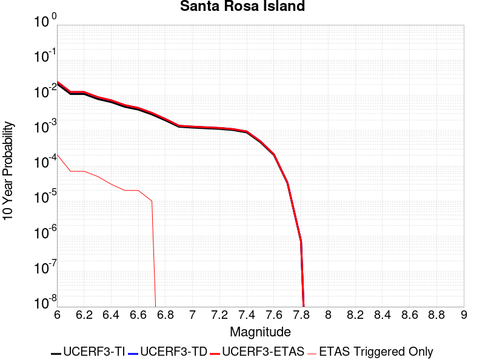 |

| Magnitude | 1 wk TI Prob | 1 wk TD Prob | 1 wk ETAS Prob | 1 wk ETAS/TD Gain | 1 wk ETAS Triggered Only | 1 mo TI Prob | 1 mo TD Prob | 1 mo ETAS Prob | 1 mo ETAS/TD Gain | 1 mo ETAS Triggered Only | 1 yr TI Prob | 1 yr TD Prob | 1 yr ETAS Prob | 1 yr ETAS/TD Gain | 1 yr ETAS Triggered Only | 10 yr TI Prob | 10 yr TD Prob | 10 yr ETAS Prob | 10 yr ETAS/TD Gain | 10 yr ETAS Triggered Only |
|-----|-----|-----|-----|-----|-----|-----|-----|-----|-----|-----|-----|-----|-----|-----|-----|-----|-----|-----|-----|-----|
| 6.0 | 4.1143165E-5 | 4.709113E-5 | 1.1969353E-4 | 2.5417428 | 7.260582E-5 | 1.7631594E-4 | 2.0180462E-4 | 2.9859284E-4 | 1.4796135 | 9.6807766E-5 | 0.002144533 | 0.0024543991 | 0.0025992543 | 1.0590186 | 1.4521164E-4 | 0.021239553 | 0.024293557 | 0.024529696 | 1.0097203 | 2.420194E-4 |
| 6.1 | 2.1061249E-5 | 2.3864959E-5 | 4.8066322E-5 | 2.0140963 | 2.4201941E-5 | 9.0259375E-5 | 1.0227455E-4 | 1.2647401E-4 | 1.2366128 | 2.4201941E-5 | 0.0010983539 | 0.0012445103 | 0.001292854 | 1.0388455 | 4.8403883E-5 | 0.01092941 | 0.01237845 | 0.012450157 | 1.0057929 | 7.260582E-5 |
| 6.2 | 2.1061249E-5 | 2.3864959E-5 | 4.8066322E-5 | 2.0140963 | 2.4201941E-5 | 9.0259375E-5 | 1.0227455E-4 | 1.2647401E-4 | 1.2366128 | 2.4201941E-5 | 0.0010983539 | 0.0012445103 | 0.001292854 | 1.0388455 | 4.8403883E-5 | 0.01092941 | 0.01237845 | 0.012450157 | 1.0057929 | 7.260582E-5 |
| 6.3 | 1.5158236E-5 | 1.7074419E-5 | 4.1275947E-5 | 2.4174144 | 2.4201941E-5 | 6.496225E-5 | 7.3174095E-5 | 9.7374264E-5 | 1.3307204 | 2.4201941E-5 | 7.906284E-4 | 8.9054246E-4 | 9.3890325E-4 | 1.0543048 | 4.8403883E-5 | 0.007878214 | 0.00887099 | 0.008918964 | 1.005408 | 4.8403883E-5 |
| 6.4 | 1.2341918E-5 | 1.3852917E-5 | 3.805452E-5 | 2.7470405 | 2.4201941E-5 | 5.2892858E-5 | 5.9368336E-5 | 8.356884E-5 | 1.4076332 | 2.4201941E-5 | 6.437803E-4 | 7.225779E-4 | 7.467624E-4 | 1.0334697 | 2.4201941E-5 | 0.006419184 | 0.0072031217 | 0.0072271493 | 1.0033357 | 2.4201941E-5 |
| 6.5 | 9.061158E-6 | 1.0117032E-5 | 3.4318728E-5 | 3.3921738 | 2.4201941E-5 | 3.883296E-5 | 4.3358017E-5 | 6.75589E-5 | 1.5581642 | 2.4201941E-5 | 4.726887E-4 | 5.277613E-4 | 5.519505E-4 | 1.0458336 | 2.4201941E-5 | 0.004716845 | 0.0052656177 | 0.005289692 | 1.004572 | 2.4201941E-5 |
| 6.6 | 7.5461685E-6 | 8.400734E-6 | 3.260247E-5 | 3.8809075 | 2.4201941E-5 | 3.2340322E-5 | 3.600267E-5 | 6.0203743E-5 | 1.672202 | 2.4201941E-5 | 3.936723E-4 | 4.3824868E-4 | 4.6244E-4 | 1.0552 | 2.4201941E-5 | 0.003929756 | 0.0043742736 | 0.0043983697 | 1.0055085 | 2.4201941E-5 |
| 6.7 | 5.5023775E-6 | 6.087381E-6 | 3.0289175E-5 | 4.975732 | 2.4201941E-5 | 2.3581404E-5 | 2.6088532E-5 | 5.0289844E-5 | 1.9276608 | 2.4201941E-5 | 2.8706578E-4 | 3.1758484E-4 | 3.417791E-4 | 1.076182 | 2.4201941E-5 | 0.0028669522 | 0.0031716316 | 0.0031957568 | 1.0076065 | 2.4201941E-5 |
| 6.8 | 3.7351679E-6 | 4.0831405E-6 | 4.0831405E-6 | 1.0 | 0.0 | 1.6007763E-5 | 1.7499071E-5 | 1.7499071E-5 | 1.0 | 0.0 | 1.948771E-4 | 2.1303285E-4 | 2.1303285E-4 | 1.0 | 0.0 | 0.0019470629 | 0.0021285315 | 0.0021285315 | 1.0 | 0.0 |
| 6.9 | 2.456366E-6 | 2.6292707E-6 | 2.6292707E-6 | 1.0 | 0.0 | 1.0527241E-5 | 1.1268255E-5 | 1.1268255E-5 | 1.0 | 0.0 | 1.2816161E-4 | 1.3718239E-4 | 1.3718239E-4 | 1.0 | 0.0 | 0.0012808773 | 0.0013709799 | 0.0013709799 | 1.0 | 0.0 |
| 7.0 | 2.3245157E-6 | 2.4827784E-6 | 2.4827784E-6 | 1.0 | 0.0 | 9.962172E-6 | 1.0640436E-5 | 1.0640436E-5 | 1.0 | 0.0 | 1.2128269E-4 | 1.2953962E-4 | 1.2953962E-4 | 1.0 | 0.0 | 0.0012121652 | 0.0012946434 | 0.0012946434 | 1.0 | 0.0 |
| 7.1 | 2.2248344E-6 | 2.37325E-6 | 2.37325E-6 | 1.0 | 0.0 | 9.53497E-6 | 1.0171032E-5 | 1.0171032E-5 | 1.0 | 0.0 | 1.1608207E-4 | 1.238253E-4 | 1.238253E-4 | 1.0 | 0.0 | 0.0011602144 | 0.0012375651 | 0.0012375651 | 1.0 | 0.0 |
| 7.2 | 2.1350402E-6 | 2.2761542E-6 | 2.2761542E-6 | 1.0 | 0.0 | 9.150141E-6 | 9.75491E-6 | 9.75491E-6 | 1.0 | 0.0 | 1.1139726E-4 | 1.1875957E-4 | 1.1875957E-4 | 1.0 | 0.0 | 0.0011134144 | 0.0011869629 | 0.0011869629 | 1.0 | 0.0 |
| 7.3 | 1.9793572E-6 | 2.1087192E-6 | 2.1087192E-6 | 1.0 | 0.0 | 8.482932E-6 | 9.037337E-6 | 9.037337E-6 | 1.0 | 0.0 | 1.032748E-4 | 1.1002403E-4 | 1.1002403E-4 | 1.0 | 0.0 | 0.0010322682 | 0.0010996974 | 0.0010996974 | 1.0 | 0.0 |
| 7.4 | 1.6951194E-6 | 1.8045735E-6 | 1.8045735E-6 | 1.0 | 0.0 | 7.264777E-6 | 7.733864E-6 | 7.733864E-6 | 1.0 | 0.0 | 8.844508E-5 | 9.415574E-5 | 9.415574E-5 | 1.0 | 0.0 | 8.840988E-4 | 9.411601E-4 | 9.411601E-4 | 1.0 | 0.0 |
| 7.5 | 8.987207E-7 | 9.512216E-7 | 9.512216E-7 | 1.0 | 0.0 | 3.8516546E-6 | 4.0766577E-6 | 4.0766577E-6 | 1.0 | 0.0 | 4.6892885E-5 | 4.9632188E-5 | 4.9632188E-5 | 1.0 | 0.0 | 4.688299E-4 | 4.962122E-4 | 4.962122E-4 | 1.0 | 0.0 |
| 7.6 | 3.8783037E-7 | 4.0529335E-7 | 4.0529335E-7 | 1.0 | 0.0 | 1.6621291E-6 | 1.7369704E-6 | 1.7369704E-6 | 1.0 | 0.0 | 2.0236233E-5 | 2.1147416E-5 | 2.1147416E-5 | 1.0 | 0.0 | 2.023439E-4 | 2.114547E-4 | 2.114547E-4 | 1.0 | 0.0 |
| 7.7 | 6.181804E-8 | 6.339047E-8 | 6.339047E-8 | 1.0 | 0.0 | 2.6493444E-7 | 2.7167343E-7 | 2.7167343E-7 | 1.0 | 0.0 | 3.225572E-6 | 3.307619E-6 | 3.307619E-6 | 1.0 | 0.0 | 3.225525E-5 | 3.3075703E-5 | 3.3075703E-5 | 1.0 | 0.0 |
| 7.8 | 1.3704449E-9 | 1.3964153E-9 | 1.3964153E-9 | 1.0 | 0.0 | 5.873335E-9 | 5.984637E-9 | 5.984637E-9 | 1.0 | 0.0 | 7.1507856E-8 | 7.286295E-8 | 7.286295E-8 | 1.0 | 0.0 | 7.1507833E-7 | 7.286294E-7 | 7.286294E-7 | 1.0 | 0.0 |

## San Jacinto (Stepovers Combined)
*[(top)](#table-of-contents)*

| 1 Week | 1 Month | 1 Year | 10 Year |
|-----|-----|-----|-----|
|  | 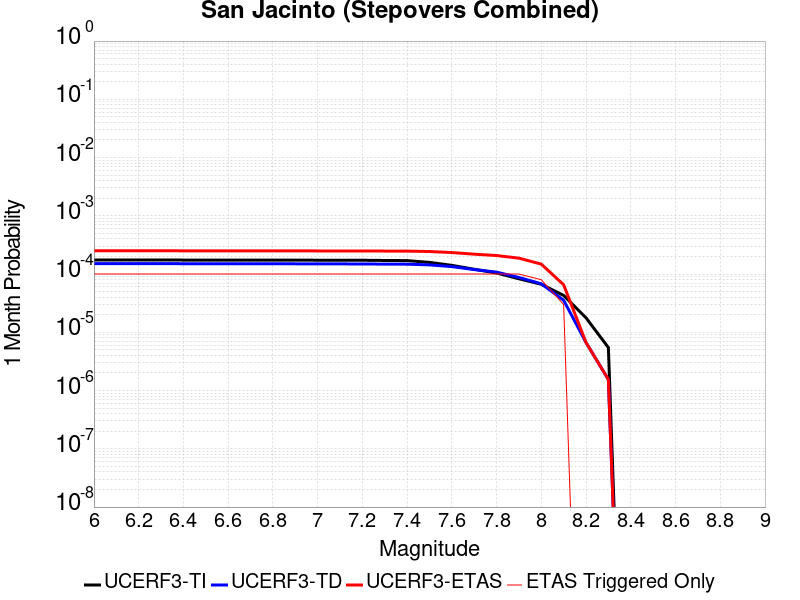 |  |  |

| Magnitude | 1 wk TI Prob | 1 wk TD Prob | 1 wk ETAS Prob | 1 wk ETAS/TD Gain | 1 wk ETAS Triggered Only | 1 mo TI Prob | 1 mo TD Prob | 1 mo ETAS Prob | 1 mo ETAS/TD Gain | 1 mo ETAS Triggered Only | 1 yr TI Prob | 1 yr TD Prob | 1 yr ETAS Prob | 1 yr ETAS/TD Gain | 1 yr ETAS Triggered Only | 10 yr TI Prob | 10 yr TD Prob | 10 yr ETAS Prob | 10 yr ETAS/TD Gain | 10 yr ETAS Triggered Only |
|-----|-----|-----|-----|-----|-----|-----|-----|-----|-----|-----|-----|-----|-----|-----|-----|-----|-----|-----|-----|-----|
| 6.0 | 4.0667746E-5 | 3.5271103E-5 | 1.3207545E-4 | 3.7445796 | 9.6807766E-5 | 1.742787E-4 | 1.5115313E-4 | 2.4794627E-4 | 1.6403648 | 9.6807766E-5 | 0.0021197782 | 0.0018387372 | 0.0020078393 | 1.0919664 | 1.6941359E-4 | 0.020996714 | 0.018986495 | 0.01922392 | 1.0125049 | 2.420194E-4 |
| 6.1 | 4.0667746E-5 | 3.5271103E-5 | 1.3207545E-4 | 3.7445796 | 9.6807766E-5 | 1.742787E-4 | 1.5115313E-4 | 2.4794627E-4 | 1.6403648 | 9.6807766E-5 | 0.0021197782 | 0.0018387372 | 0.0020078393 | 1.0919664 | 1.6941359E-4 | 0.020996714 | 0.018986495 | 0.01922392 | 1.0125049 | 2.420194E-4 |
| 6.2 | 4.0667746E-5 | 3.5271103E-5 | 1.3207545E-4 | 3.7445796 | 9.6807766E-5 | 1.742787E-4 | 1.5115313E-4 | 2.4794627E-4 | 1.6403648 | 9.6807766E-5 | 0.0021197782 | 0.0018387372 | 0.0020078393 | 1.0919664 | 1.6941359E-4 | 0.020996714 | 0.018986495 | 0.01922392 | 1.0125049 | 2.420194E-4 |
| 6.3 | 4.0667746E-5 | 3.5271103E-5 | 1.3207545E-4 | 3.7445796 | 9.6807766E-5 | 1.742787E-4 | 1.5115313E-4 | 2.4794627E-4 | 1.6403648 | 9.6807766E-5 | 0.0021197782 | 0.0018387372 | 0.0020078393 | 1.0919664 | 1.6941359E-4 | 0.020996714 | 0.018986495 | 0.01922392 | 1.0125049 | 2.420194E-4 |
| 6.4 | 4.0577226E-5 | 3.5143014E-5 | 1.3194738E-4 | 3.7545834 | 9.6807766E-5 | 1.738908E-4 | 1.5060425E-4 | 2.4739743E-4 | 1.6426989 | 9.6807766E-5 | 0.0021150648 | 0.0018320669 | 0.00200117 | 1.0923018 | 1.6941359E-4 | 0.020950472 | 0.018921062 | 0.019134758 | 1.0112941 | 2.1781746E-4 |
| 6.5 | 4.0577226E-5 | 3.5143014E-5 | 1.3194738E-4 | 3.7545834 | 9.6807766E-5 | 1.738908E-4 | 1.5060425E-4 | 2.4739743E-4 | 1.6426989 | 9.6807766E-5 | 0.0021150648 | 0.0018320669 | 0.00200117 | 1.0923018 | 1.6941359E-4 | 0.020950472 | 0.018921062 | 0.019134758 | 1.0112941 | 2.1781746E-4 |
| 6.6 | 4.053861E-5 | 3.5088357E-5 | 1.3189272E-4 | 3.7588744 | 9.6807766E-5 | 1.7372532E-4 | 1.5037002E-4 | 2.4716323E-4 | 1.6437001 | 9.6807766E-5 | 0.0021130538 | 0.0018292206 | 0.0019983242 | 1.0924457 | 1.6941359E-4 | 0.020930743 | 0.01889314 | 0.019106843 | 1.011311 | 2.1781746E-4 |
| 6.7 | 4.0516545E-5 | 3.505743E-5 | 1.318618E-4 | 3.7613082 | 9.6807766E-5 | 1.7363077E-4 | 1.502375E-4 | 2.4703072E-4 | 1.644268 | 9.6807766E-5 | 0.002111905 | 0.0018276101 | 0.001996714 | 1.0925274 | 1.6941359E-4 | 0.020919468 | 0.018877337 | 0.019091042 | 1.0113207 | 2.1781746E-4 |
| 6.8 | 4.049434E-5 | 3.5028992E-5 | 1.3183337E-4 | 3.76355 | 9.6807766E-5 | 1.7353562E-4 | 1.5011564E-4 | 2.4690886E-4 | 1.6447911 | 9.6807766E-5 | 0.0021107488 | 0.0018261289 | 0.0019952331 | 1.0926026 | 1.6941359E-4 | 0.020908125 | 0.018862749 | 0.019076457 | 1.0113297 | 2.1781746E-4 |
| 6.9 | 4.046386E-5 | 3.4991554E-5 | 1.3179592E-4 | 3.766507 | 9.6807766E-5 | 1.73405E-4 | 1.499552E-4 | 2.4674844E-4 | 1.6454811 | 9.6807766E-5 | 0.0021091616 | 0.0018241788 | 0.0019932834 | 1.0927018 | 1.6941359E-4 | 0.020892553 | 0.018843522 | 0.019057235 | 1.0113415 | 2.1781746E-4 |
| 7.0 | 4.036382E-5 | 3.4872126E-5 | 1.3167651E-4 | 3.775982 | 9.6807766E-5 | 1.7297632E-4 | 1.4944343E-4 | 2.462367E-4 | 1.647692 | 9.6807766E-5 | 0.0021039525 | 0.0018179584 | 0.001987064 | 1.0930195 | 1.6941359E-4 | 0.02084144 | 0.018782137 | 0.018995862 | 1.0113792 | 2.1781746E-4 |
| 7.1 | 4.0343282E-5 | 3.485059E-5 | 1.3165498E-4 | 3.7776976 | 9.6807766E-5 | 1.7288832E-4 | 1.4935112E-4 | 2.4614442E-4 | 1.6480923 | 9.6807766E-5 | 0.002102883 | 0.0018168368 | 0.0019859425 | 1.0930771 | 1.6941359E-4 | 0.020830948 | 0.018771008 | 0.018984737 | 1.0113862 | 2.1781746E-4 |
| 7.2 | 4.0257353E-5 | 3.475509E-5 | 1.3155949E-4 | 3.7853303 | 9.6807766E-5 | 1.725201E-4 | 1.489419E-4 | 2.4573522E-4 | 1.6498733 | 9.6807766E-5 | 0.0020984085 | 0.0018118626 | 0.0019809692 | 1.093333 | 1.6941359E-4 | 0.020787042 | 0.018721746 | 0.018935487 | 1.0114167 | 2.1781746E-4 |
| 7.3 | 3.9940667E-5 | 3.458276E-5 | 1.3138718E-4 | 3.7992103 | 9.6807766E-5 | 1.7116306E-4 | 1.4820343E-4 | 2.4499683E-4 | 1.6531118 | 9.6807766E-5 | 0.0020819185 | 0.0018028866 | 0.0019719948 | 1.0937985 | 1.6941359E-4 | 0.020625217 | 0.018630387 | 0.018844146 | 1.0114737 | 2.1781746E-4 |
| 7.4 | 3.9721202E-5 | 3.4468165E-5 | 1.312726E-4 | 3.808517 | 9.6807766E-5 | 1.7022261E-4 | 1.4771236E-4 | 2.4450582E-4 | 1.6552835 | 9.6807766E-5 | 0.0020704903 | 0.0017969179 | 0.001966027 | 1.0941107 | 1.6941359E-4 | 0.020513052 | 0.018569522 | 0.018783294 | 1.011512 | 2.1781746E-4 |
| 7.5 | 3.7036873E-5 | 3.3535776E-5 | 1.303403E-4 | 3.8866045 | 9.6807766E-5 | 1.5871979E-4 | 1.4371685E-4 | 2.405107E-4 | 1.6735039 | 9.6807766E-5 | 0.0019307006 | 0.0017483513 | 0.0019174687 | 1.0967296 | 1.6941359E-4 | 0.019140124 | 0.018071128 | 0.01828501 | 1.0118356 | 2.1781746E-4 |
| 7.6 | 3.2940967E-5 | 3.13167E-5 | 1.2812144E-4 | 4.0911536 | 9.6807766E-5 | 1.4116794E-4 | 1.3420754E-4 | 2.3100231E-4 | 1.7212319 | 9.6807766E-5 | 0.0017173645 | 0.0016327545 | 0.0018018914 | 1.10359 | 1.6941359E-4 | 0.01704153 | 0.016904091 | 0.017118227 | 1.0126677 | 2.1781746E-4 |
| 7.7 | 2.8236149E-5 | 2.7882697E-5 | 1.2468777E-4 | 4.471869 | 9.6807766E-5 | 1.2100645E-4 | 1.1949181E-4 | 2.16288E-4 | 1.8100655 | 9.6807766E-5 | 0.0014722579 | 0.0014538429 | 0.0016230101 | 1.1163588 | 1.6941359E-4 | 0.014625421 | 0.015114912 | 0.015329436 | 1.0141929 | 2.1781746E-4 |
| 7.8 | 2.4329287E-5 | 2.5206451E-5 | 1.2201178E-4 | 4.840498 | 9.6807766E-5 | 1.042642E-4 | 1.08023174E-4 | 2.0482048E-4 | 1.8960791 | 9.6807766E-5 | 0.0012686774 | 0.0013143895 | 0.0014835804 | 1.1287221 | 1.6941359E-4 | 0.012614589 | 0.013712341 | 0.013927171 | 1.015667 | 2.1781746E-4 |
| 7.9 | 1.9370926E-5 | 2.0420413E-5 | 1.172262E-4 | 5.7406383 | 9.6807766E-5 | 8.301561E-5 | 8.751312E-5 | 1.8431242E-4 | 2.1061118 | 9.6807766E-5 | 0.0010102465 | 0.0010649522 | 0.0012341854 | 1.1589115 | 1.6941359E-4 | 0.0100566605 | 0.011199402 | 0.011414779 | 1.0192312 | 2.1781746E-4 |
| 8.0 | 1.5583017E-5 | 1.5885415E-5 | 1.1269164E-4 | 7.094032 | 9.6807766E-5 | 6.6782646E-5 | 6.807858E-5 | 1.6487975E-4 | 2.4219036 | 9.6807766E-5 | 8.127754E-4 | 8.2854216E-4 | 9.978154E-4 | 1.2043024 | 1.6941359E-4 | 0.008098091 | 0.008781636 | 0.008997541 | 1.024586 | 2.1781746E-4 |
| 8.1 | 1.0024873E-5 | 8.291399E-6 | 5.669488E-5 | 6.837794 | 4.8403883E-5 | 4.2963035E-5 | 3.553409E-5 | 8.393625E-5 | 2.3621333 | 4.8403883E-5 | 5.229494E-4 | 4.3254215E-4 | 5.051166E-4 | 1.1677858 | 7.260582E-5 | 0.0052172043 | 0.0046530655 | 0.004725334 | 1.0155313 | 7.260582E-5 |
| 8.2 | 4.142796E-6 | 1.5602761E-6 | 1.5602761E-6 | 1.0 | 0.0 | 1.775472E-5 | 6.6868806E-6 | 6.6868806E-6 | 1.0 | 0.0 | 2.1614227E-4 | 8.140976E-5 | 8.140976E-5 | 1.0 | 0.0 | 0.0021593217 | 9.4514614E-4 | 9.4514614E-4 | 1.0 | 0.0 |
| 8.3 | 1.2750878E-6 | 3.609817E-7 | 3.609817E-7 | 1.0 | 0.0 | 5.4646503E-6 | 1.5470634E-6 | 1.5470634E-6 | 1.0 | 0.0 | 6.653009E-5 | 1.8835339E-5 | 1.8835339E-5 | 1.0 | 0.0 | 6.6510175E-4 | 2.272251E-4 | 2.272251E-4 | 1.0 | 0.0 |

## Owens Valley
*[(top)](#table-of-contents)*

| 1 Week | 1 Month | 1 Year | 10 Year |
|-----|-----|-----|-----|
|  |  |  |  |

| Magnitude | 1 wk TI Prob | 1 wk TD Prob | 1 wk ETAS Prob | 1 wk ETAS/TD Gain | 1 wk ETAS Triggered Only | 1 mo TI Prob | 1 mo TD Prob | 1 mo ETAS Prob | 1 mo ETAS/TD Gain | 1 mo ETAS Triggered Only | 1 yr TI Prob | 1 yr TD Prob | 1 yr ETAS Prob | 1 yr ETAS/TD Gain | 1 yr ETAS Triggered Only | 10 yr TI Prob | 10 yr TD Prob | 10 yr ETAS Prob | 10 yr ETAS/TD Gain | 10 yr ETAS Triggered Only |
|-----|-----|-----|-----|-----|-----|-----|-----|-----|-----|-----|-----|-----|-----|-----|-----|-----|-----|-----|-----|-----|
| 6.0 | 4.83821E-5 | 3.6210524E-6 | 1.00428464E-4 | 27.734608 | 9.6807766E-5 | 2.0733538E-4 | 1.551871E-5 | 1.1232497E-4 | 7.2380357 | 9.6807766E-5 | 0.002521386 | 1.889249E-4 | 3.341091E-4 | 1.7684758 | 1.4521164E-4 | 0.024929691 | 0.0019297141 | 0.0021471113 | 1.1126577 | 2.1781746E-4 |
| 6.1 | 4.83821E-5 | 3.6210524E-6 | 1.00428464E-4 | 27.734608 | 9.6807766E-5 | 2.0733538E-4 | 1.551871E-5 | 1.1232497E-4 | 7.2380357 | 9.6807766E-5 | 0.002521386 | 1.889249E-4 | 3.341091E-4 | 1.7684758 | 1.4521164E-4 | 0.024929691 | 0.0019297141 | 0.0021471113 | 1.1126577 | 2.1781746E-4 |
| 6.2 | 4.83821E-5 | 3.6210524E-6 | 1.00428464E-4 | 27.734608 | 9.6807766E-5 | 2.0733538E-4 | 1.551871E-5 | 1.1232497E-4 | 7.2380357 | 9.6807766E-5 | 0.002521386 | 1.889249E-4 | 3.341091E-4 | 1.7684758 | 1.4521164E-4 | 0.024929691 | 0.0019297141 | 0.0021471113 | 1.1126577 | 2.1781746E-4 |
| 6.3 | 3.953008E-5 | 3.1530958E-6 | 7.575869E-5 | 24.026764 | 7.260582E-5 | 1.6940363E-4 | 1.3513202E-5 | 8.6118045E-5 | 6.372882 | 7.260582E-5 | 0.002060538 | 1.6451156E-4 | 2.8550136E-4 | 1.7354486 | 1.210097E-4 | 0.020415364 | 0.0016621627 | 0.0018554565 | 1.1162905 | 1.9361553E-4 |
| 6.4 | 3.953008E-5 | 3.1530958E-6 | 7.575869E-5 | 24.026764 | 7.260582E-5 | 1.6940363E-4 | 1.3513202E-5 | 8.6118045E-5 | 6.372882 | 7.260582E-5 | 0.002060538 | 1.6451156E-4 | 2.8550136E-4 | 1.7354486 | 1.210097E-4 | 0.020415364 | 0.0016621627 | 0.0018554565 | 1.1162905 | 1.9361553E-4 |
| 6.5 | 3.457342E-5 | 2.9707387E-6 | 7.557635E-5 | 25.440252 | 7.260582E-5 | 1.4816338E-4 | 1.273168E-5 | 8.533658E-5 | 6.702696 | 7.260582E-5 | 0.0018023965 | 1.5499788E-4 | 2.7598883E-4 | 1.7805974 | 1.210097E-4 | 0.017878477 | 0.0015563119 | 0.001749626 | 1.124213 | 1.9361553E-4 |
| 6.6 | 3.1127765E-5 | 2.8737306E-6 | 5.1277475E-5 | 17.843521 | 4.8403883E-5 | 1.3339789E-4 | 1.2315934E-5 | 6.071922E-5 | 4.9301353 | 4.8403883E-5 | 0.0016229092 | 1.4993687E-4 | 2.467301E-4 | 1.64556 | 9.6807766E-5 | 0.016111081 | 0.0015013438 | 0.001670503 | 1.1126719 | 1.6941359E-4 |
| 6.7 | 2.806885E-5 | 2.8101606E-6 | 5.1213905E-5 | 18.224548 | 4.8403883E-5 | 1.2028952E-4 | 1.2043493E-5 | 6.0446793E-5 | 5.0190415 | 4.8403883E-5 | 0.001463541 | 1.4662035E-4 | 2.4341392E-4 | 1.6601646 | 9.6807766E-5 | 0.014539397 | 0.0014656087 | 0.001634774 | 1.1154232 | 1.6941359E-4 |
| 6.8 | 2.524524E-5 | 2.2351392E-6 | 5.063891E-5 | 22.65582 | 4.8403883E-5 | 1.0818939E-4 | 9.579134E-6 | 5.7982554E-5 | 6.0530057 | 4.8403883E-5 | 0.0013164099 | 1.16620016E-4 | 2.134165E-4 | 1.8300159 | 9.6807766E-5 | 0.01308639 | 0.001165827 | 0.0013350431 | 1.1451468 | 1.6941359E-4 |
| 6.9 | 2.2704568E-5 | 1.6079711E-6 | 5.0011775E-5 | 31.102411 | 4.8403883E-5 | 9.730166E-5 | 6.8912864E-6 | 5.5294833E-5 | 8.023877 | 4.8403883E-5 | 0.0011840039 | 8.38982E-5 | 1.8069784E-4 | 2.153775 | 9.6807766E-5 | 0.011777153 | 8.38853E-4 | 0.0010081246 | 1.2017891 | 1.6941359E-4 |
| 7.0 | 2.0871712E-5 | 1.5393621E-6 | 4.994317E-5 | 32.44407 | 4.8403883E-5 | 8.944713E-5 | 6.5972495E-6 | 5.500081E-5 | 8.33693 | 4.8403883E-5 | 0.0010884746 | 8.031857E-5 | 1.7711856E-4 | 2.2052007 | 9.6807766E-5 | 0.010831586 | 8.030395E-4 | 9.7231707E-4 | 1.210796 | 1.6941359E-4 |
| 7.1 | 1.944928E-5 | 1.3862556E-6 | 4.979007E-5 | 35.91695 | 4.8403883E-5 | 8.335139E-5 | 5.941082E-6 | 5.4344677E-5 | 9.147269 | 4.8403883E-5 | 0.0010143308 | 7.233028E-5 | 1.6913105E-4 | 2.338316 | 9.6807766E-5 | 0.010097133 | 7.2319806E-4 | 8.924891E-4 | 1.2340868 | 1.6941359E-4 |
| 7.2 | 1.7876306E-5 | 1.2487686E-6 | 4.965259E-5 | 39.761242 | 4.8403883E-5 | 7.6610486E-5 | 5.3518543E-6 | 5.3755477E-5 | 10.044271 | 4.8403883E-5 | 9.3233347E-4 | 6.515689E-5 | 1.6195835E-4 | 2.4856672 | 9.6807766E-5 | 0.009284316 | 6.5148395E-4 | 8.2078716E-4 | 1.2598732 | 1.6941359E-4 |
| 7.3 | 1.2618672E-5 | 1.1113839E-6 | 4.9515213E-5 | 44.552753 | 4.8403883E-5 | 5.40789E-5 | 4.763065E-6 | 5.3166717E-5 | 11.162291 | 4.8403883E-5 | 6.582117E-4 | 5.7988782E-5 | 1.5479093E-4 | 2.6693254 | 9.6807766E-5 | 0.0065626553 | 5.7983754E-4 | 7.24965E-4 | 1.2502898 | 1.4521164E-4 |
| 7.4 | 7.4874442E-6 | 8.547518E-7 | 4.9258593E-5 | 57.62912 | 4.8403883E-5 | 3.208865E-5 | 3.6632168E-6 | 5.206692E-5 | 14.213443 | 4.8403883E-5 | 3.906093E-4 | 4.4598757E-5 | 1.1720134E-4 | 2.627906 | 7.260582E-5 | 0.003899234 | 4.459579E-4 | 5.427225E-4 | 1.2169814 | 9.6807766E-5 |
| 7.5 | 2.4734156E-6 | 6.0679935E-7 | 2.4808725E-5 | 40.88456 | 2.4201941E-5 | 1.060031E-5 | 2.6005662E-6 | 2.6802445E-5 | 10.306388 | 2.4201941E-5 | 1.2905113E-4 | 3.1661435E-5 | 5.5862612E-5 | 1.7643739 | 2.4201941E-5 | 0.0012897621 | 3.1656958E-4 | 3.6495813E-4 | 1.1528529 | 4.8403883E-5 |
| 7.6 | 1.1328841E-6 | 3.1961991E-7 | 2.4521552E-5 | 76.72098 | 2.4201941E-5 | 4.8552088E-6 | 1.369799E-6 | 2.5571706E-5 | 18.668219 | 2.4201941E-5 | 5.9110564E-5 | 1.6677177E-5 | 4.0878713E-5 | 2.4511771 | 2.4201941E-5 | 5.9094845E-4 | 1.6675945E-4 | 1.9095735E-4 | 1.1451067 | 2.4201941E-5 |
| 7.7 | 4.8613185E-7 | 8.962742E-8 | 2.4291567E-5 | 271.0283 | 2.4201941E-5 | 2.0834207E-6 | 3.8411747E-7 | 2.4586048E-5 | 64.00659 | 2.4201941E-5 | 2.536535E-5 | 4.676621E-6 | 2.8878449E-5 | 6.1750674 | 2.4201941E-5 | 2.5362454E-4 | 4.676529E-5 | 7.09661E-5 | 1.5174952 | 2.4201941E-5 |

## Brawley (Seismic Zone) alt 1
*[(top)](#table-of-contents)*

| 1 Week | 1 Month | 1 Year | 10 Year |
|-----|-----|-----|-----|
| 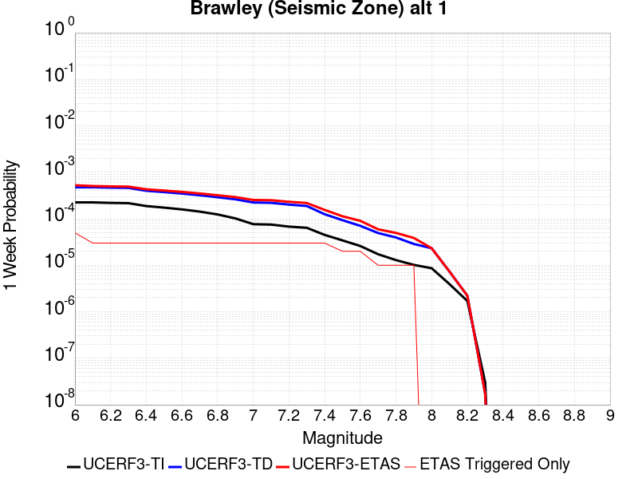 |  |  |  |

| Magnitude | 1 wk TI Prob | 1 wk TD Prob | 1 wk ETAS Prob | 1 wk ETAS/TD Gain | 1 wk ETAS Triggered Only | 1 mo TI Prob | 1 mo TD Prob | 1 mo ETAS Prob | 1 mo ETAS/TD Gain | 1 mo ETAS Triggered Only | 1 yr TI Prob | 1 yr TD Prob | 1 yr ETAS Prob | 1 yr ETAS/TD Gain | 1 yr ETAS Triggered Only | 10 yr TI Prob | 10 yr TD Prob | 10 yr ETAS Prob | 10 yr ETAS/TD Gain | 10 yr ETAS Triggered Only |
|-----|-----|-----|-----|-----|-----|-----|-----|-----|-----|-----|-----|-----|-----|-----|-----|-----|-----|-----|-----|-----|
| 6.0 | 2.2521618E-4 | 4.763429E-4 | 5.4891413E-4 | 1.1523508 | 7.260582E-5 | 9.6485513E-4 | 0.0020399094 | 0.0021365196 | 1.0473601 | 9.6807766E-5 | 0.011683988 | 0.024544531 | 0.024733394 | 1.0076947 | 1.9361553E-4 | 0.11088423 | 0.21349923 | 0.21367054 | 1.0008024 | 2.1781746E-4 |
| 6.1 | 2.2521618E-4 | 4.763429E-4 | 5.247237E-4 | 1.1015673 | 4.8403883E-5 | 9.6485513E-4 | 0.0020399094 | 0.0021123672 | 1.0355201 | 7.260582E-5 | 0.011683988 | 0.024544531 | 0.024709787 | 1.0067328 | 1.6941359E-4 | 0.11088423 | 0.21349923 | 0.21365151 | 1.0007132 | 1.9361553E-4 |
| 6.2 | 2.198148E-4 | 4.6718874E-4 | 5.1557E-4 | 1.1035583 | 4.8403883E-5 | 9.417233E-4 | 0.0020007377 | 0.0020731983 | 1.036217 | 7.260582E-5 | 0.011405343 | 0.024078513 | 0.024243848 | 1.0068665 | 1.6941359E-4 | 0.10837428 | 0.20993572 | 0.2100887 | 1.0007286 | 1.9361553E-4 |
| 6.3 | 2.1704129E-4 | 4.615455E-4 | 5.0992705E-4 | 1.104825 | 4.8403883E-5 | 9.298453E-4 | 0.0019765892 | 0.0020490517 | 1.0366603 | 7.260582E-5 | 0.011262234 | 0.023792034 | 0.023957416 | 1.0069512 | 1.6941359E-4 | 0.107082725 | 0.20782684 | 0.20798022 | 1.000738 | 1.9361553E-4 |
| 6.4 | 1.876142E-4 | 4.004663E-4 | 4.488508E-4 | 1.1208204 | 4.8403883E-5 | 8.038131E-4 | 0.0017151695 | 0.0017876509 | 1.042259 | 7.260582E-5 | 0.00974259 | 0.020678662 | 0.020844571 | 1.0080233 | 1.6941359E-4 | 0.093263686 | 0.18457787 | 0.18473575 | 1.0008553 | 1.9361553E-4 |
| 6.5 | 1.7390939E-4 | 3.7478763E-4 | 4.231734E-4 | 1.1291018 | 4.8403883E-5 | 7.45113E-4 | 0.0016052561 | 0.0016777454 | 1.0451574 | 7.260582E-5 | 0.009034078 | 0.019367293 | 0.019533426 | 1.008578 | 1.6941359E-4 | 0.086755216 | 0.17440015 | 0.17456 | 1.0009166 | 1.9361553E-4 |
| 6.6 | 1.591791E-4 | 3.4893592E-4 | 3.973229E-4 | 1.1386701 | 4.8403883E-5 | 6.8201777E-4 | 0.0014945926 | 0.0015670899 | 1.0485064 | 7.260582E-5 | 0.008271996 | 0.018045008 | 0.018211365 | 1.0092189 | 1.6941359E-4 | 0.07970774 | 0.16380787 | 0.16396977 | 1.0009884 | 1.9361553E-4 |
| 6.7 | 1.4268003E-4 | 3.2059717E-4 | 3.6898555E-4 | 1.150932 | 4.8403883E-5 | 6.1134255E-4 | 0.0013732726 | 0.00142161 | 1.0351987 | 4.8403883E-5 | 0.007417723 | 0.01659171 | 0.016710712 | 1.0071723 | 1.210097E-4 | 0.07174956 | 0.15193594 | 0.15205908 | 1.0008105 | 1.4521164E-4 |
| 6.8 | 1.239713E-4 | 2.9055026E-4 | 3.389401E-4 | 1.1665454 | 4.8403883E-5 | 5.3119735E-4 | 0.0012446274 | 0.001292971 | 1.0388418 | 4.8403883E-5 | 0.0064481674 | 0.015049482 | 0.015168671 | 1.0079198 | 1.210097E-4 | 0.06264243 | 0.13838051 | 0.13850562 | 1.0009042 | 1.4521164E-4 |
| 6.9 | 1.0180238E-4 | 2.6255674E-4 | 3.1094791E-4 | 1.1843075 | 4.8403883E-5 | 4.3622297E-4 | 0.0011247622 | 0.0011731117 | 1.0429864 | 4.8403883E-5 | 0.005298089 | 0.013608998 | 0.013728361 | 1.0087708 | 1.210097E-4 | 0.05173543 | 0.12496473 | 0.12509179 | 1.0010169 | 1.4521164E-4 |
| 7.0 | 7.6619996E-5 | 2.2400476E-4 | 2.723978E-4 | 1.2160357 | 4.8403883E-5 | 3.283301E-4 | 9.596704E-4 | 0.0010080278 | 1.0503896 | 4.8403883E-5 | 0.0039900932 | 0.011622103 | 0.011741706 | 1.010291 | 1.210097E-4 | 0.039192066 | 0.10726982 | 0.107399456 | 1.0012085 | 1.4521164E-4 |
| 7.1 | 7.5127435E-5 | 2.2083633E-4 | 2.6922952E-4 | 1.219136 | 4.8403883E-5 | 3.2193496E-4 | 9.461013E-4 | 9.944594E-4 | 1.051113 | 4.8403883E-5 | 0.0039125155 | 0.011458648 | 0.011578271 | 1.0104395 | 1.210097E-4 | 0.038443442 | 0.10583378 | 0.10596362 | 1.0012269 | 1.4521164E-4 |
| 7.2 | 6.788582E-5 | 2.0211334E-4 | 2.5050744E-4 | 1.2394404 | 4.8403883E-5 | 2.9090676E-4 | 8.6591556E-4 | 9.142775E-4 | 1.0558506 | 4.8403883E-5 | 0.0035360386 | 0.0104922 | 0.01061194 | 1.0114123 | 1.210097E-4 | 0.034803 | 0.097503684 | 0.09763474 | 1.0013441 | 1.4521164E-4 |
| 7.3 | 6.399602E-5 | 1.8842232E-4 | 2.3681707E-4 | 1.256842 | 4.8403883E-5 | 2.7423984E-4 | 8.0727716E-4 | 8.5564196E-4 | 1.059911 | 4.8403883E-5 | 0.0033337586 | 0.009784897 | 0.009904722 | 1.012246 | 1.210097E-4 | 0.03284188 | 0.091397986 | 0.09152993 | 1.0014436 | 1.4521164E-4 |
| 7.4 | 4.506759E-5 | 1.2530042E-4 | 1.7369824E-4 | 1.3862542 | 4.8403883E-5 | 1.9313251E-4 | 5.3689216E-4 | 5.8527006E-4 | 1.0901073 | 4.8403883E-5 | 0.0023488526 | 0.006517245 | 0.006613422 | 1.0147573 | 9.6807766E-5 | 0.023241805 | 0.062364522 | 0.062455293 | 1.0014554 | 9.6807766E-5 |
| 7.5 | 3.43289E-5 | 9.336103E-5 | 1.1756071E-4 | 1.2592053 | 2.4201941E-5 | 1.4711556E-4 | 4.0005764E-4 | 4.242499E-4 | 1.0604719 | 2.4201941E-5 | 0.0017896603 | 0.004859886 | 0.0049321395 | 1.0148672 | 7.260582E-5 | 0.01775316 | 0.047057066 | 0.047126256 | 1.0014703 | 7.260582E-5 |
| 7.6 | 2.5980507E-5 | 7.053672E-5 | 9.4736955E-5 | 1.343087 | 2.4201941E-5 | 1.1134028E-4 | 3.0226534E-4 | 3.2645997E-4 | 1.0800443 | 2.4201941E-5 | 0.001354725 | 0.0036738948 | 0.0037462339 | 1.01969 | 7.260582E-5 | 0.013464959 | 0.03584298 | 0.035912983 | 1.001953 | 7.260582E-5 |
| 7.7 | 1.7292105E-5 | 4.9412036E-5 | 4.9412036E-5 | 1.0 | 0.0 | 7.4106916E-5 | 2.1174872E-4 | 2.1174872E-4 | 1.0 | 0.0 | 9.018782E-4 | 0.0025749984 | 0.0026232777 | 1.0187492 | 4.8403883E-5 | 0.008982267 | 0.025292097 | 0.025339276 | 1.0018654 | 4.8403883E-5 |
| 7.8 | 1.2927471E-5 | 3.9697254E-5 | 3.9697254E-5 | 1.0 | 0.0 | 5.5402274E-5 | 1.7012001E-4 | 1.7012001E-4 | 1.0 | 0.0 | 6.743139E-4 | 0.0020692463 | 0.00211755 | 1.0233437 | 4.8403883E-5 | 0.0067227143 | 0.020433145 | 0.020480558 | 1.0023205 | 4.8403883E-5 |
| 7.9 | 1.0200774E-5 | 2.8748475E-5 | 2.8748475E-5 | 1.0 | 0.0 | 4.371687E-5 | 1.2320194E-4 | 1.2320194E-4 | 1.0 | 0.0 | 5.321229E-4 | 0.0014989526 | 0.0015231182 | 1.0161217 | 2.4201941E-5 | 0.005308505 | 0.014992895 | 0.015016734 | 1.00159 | 2.4201941E-5 |
| 8.0 | 8.650396E-6 | 2.3279512E-5 | 2.3279512E-5 | 1.0 | 0.0 | 3.70726E-5 | 9.976552E-5 | 9.976552E-5 | 1.0 | 0.0 | 4.5126543E-4 | 0.0012139693 | 0.0012381418 | 1.019912 | 2.4201941E-5 | 0.0045035016 | 0.012212164 | 0.01223607 | 1.0019575 | 2.4201941E-5 |
| 8.1 | 3.9368224E-6 | 7.3283345E-6 | 7.3283345E-6 | 1.0 | 0.0 | 1.6871985E-5 | 3.1406773E-5 | 3.1406773E-5 | 1.0 | 0.0 | 2.0539707E-4 | 3.8231048E-4 | 3.8231048E-4 | 1.0 | 0.0 | 0.0020520731 | 0.0040015313 | 0.0040015313 | 1.0 | 0.0 |
| 8.2 | 1.7101195E-6 | 2.2178374E-6 | 2.2178374E-6 | 1.0 | 0.0 | 7.329063E-6 | 9.504983E-6 | 9.504983E-6 | 1.0 | 0.0 | 8.922769E-5 | 1.15717055E-4 | 1.15717055E-4 | 1.0 | 0.0 | 8.9191867E-4 | 0.00126669 | 0.00126669 | 1.0 | 0.0 |
| 8.3 | 3.0346666E-8 | 1.721086E-8 | 1.721086E-8 | 1.0 | 0.0 | 1.3005713E-7 | 7.376083E-8 | 7.376083E-8 | 1.0 | 0.0 | 1.5834444E-6 | 8.98038E-7 | 8.98038E-7 | 1.0 | 0.0 | 1.5834332E-5 | 9.36379E-6 | 9.36379E-6 | 1.0 | 0.0 |

## Santa Ynez (West)
*[(top)](#table-of-contents)*

| 1 Week | 1 Month | 1 Year | 10 Year |
|-----|-----|-----|-----|
|  |  |  |  |

| Magnitude | 1 wk TI Prob | 1 wk TD Prob | 1 wk ETAS Prob | 1 wk ETAS/TD Gain | 1 wk ETAS Triggered Only | 1 mo TI Prob | 1 mo TD Prob | 1 mo ETAS Prob | 1 mo ETAS/TD Gain | 1 mo ETAS Triggered Only | 1 yr TI Prob | 1 yr TD Prob | 1 yr ETAS Prob | 1 yr ETAS/TD Gain | 1 yr ETAS Triggered Only | 10 yr TI Prob | 10 yr TD Prob | 10 yr ETAS Prob | 10 yr ETAS/TD Gain | 10 yr ETAS Triggered Only |
|-----|-----|-----|-----|-----|-----|-----|-----|-----|-----|-----|-----|-----|-----|-----|-----|-----|-----|-----|-----|-----|
| 6.0 | 4.7352758E-5 | 5.497084E-5 | 1.5177329E-4 | 2.760978 | 9.6807766E-5 | 2.0292461E-4 | 2.3556968E-4 | 3.3235463E-4 | 1.4108549 | 9.6807766E-5 | 0.0024678076 | 0.002864558 | 0.0029610884 | 1.0336982 | 9.6807766E-5 | 0.024405818 | 0.028304456 | 0.02849259 | 1.0066469 | 1.9361553E-4 |
| 6.1 | 4.7352758E-5 | 5.497084E-5 | 1.2757267E-4 | 2.3207335 | 7.260582E-5 | 2.0292461E-4 | 2.3556968E-4 | 3.081584E-4 | 1.3081412 | 7.260582E-5 | 0.0024678076 | 0.002864558 | 0.0029369558 | 1.0252737 | 7.260582E-5 | 0.024405818 | 0.028304456 | 0.028445557 | 1.0049851 | 1.4521164E-4 |
| 6.2 | 3.0415853E-5 | 3.3925004E-5 | 1.06528365E-4 | 3.1401136 | 7.260582E-5 | 1.3034715E-4 | 1.4538495E-4 | 2.1798022E-4 | 1.4993314 | 7.260582E-5 | 0.0015858212 | 0.0017686592 | 0.0018411366 | 1.0409788 | 7.260582E-5 | 0.015745522 | 0.01754978 | 0.017692443 | 1.0081291 | 1.4521164E-4 |
| 6.3 | 3.0415853E-5 | 3.3925004E-5 | 1.06528365E-4 | 3.1401136 | 7.260582E-5 | 1.3034715E-4 | 1.4538495E-4 | 2.1798022E-4 | 1.4993314 | 7.260582E-5 | 0.0015858212 | 0.0017686592 | 0.0018411366 | 1.0409788 | 7.260582E-5 | 0.015745522 | 0.01754978 | 0.017692443 | 1.0081291 | 1.4521164E-4 |
| 6.4 | 2.5452082E-5 | 2.7912318E-5 | 1.0051612E-4 | 3.601138 | 7.260582E-5 | 1.09075794E-4 | 1.1961885E-4 | 1.9221599E-4 | 1.6069038 | 7.260582E-5 | 0.0013271887 | 0.0014554056 | 0.0015279057 | 1.0498143 | 7.260582E-5 | 0.013192902 | 0.01446091 | 0.01458017 | 1.008247 | 1.210097E-4 |
| 6.5 | 2.3143784E-5 | 2.5128133E-5 | 7.35308E-5 | 2.926234 | 4.8403883E-5 | 9.9183875E-5 | 1.07687636E-4 | 1.560863E-4 | 1.4494357 | 4.8403883E-5 | 0.0012068948 | 0.001310323 | 0.0013586634 | 1.036892 | 4.8403883E-5 | 0.012003611 | 0.013027638 | 0.013123184 | 1.0073341 | 9.6807766E-5 |
| 6.6 | 1.9118515E-5 | 2.0354244E-5 | 6.8757145E-5 | 3.3780246 | 4.8403883E-5 | 8.193392E-5 | 8.722961E-5 | 1.3562926E-4 | 1.5548536 | 4.8403883E-5 | 9.97089E-4 | 0.001061511 | 0.0011098635 | 1.0455506 | 4.8403883E-5 | 0.00992627 | 0.010565317 | 0.010661102 | 1.009066 | 9.6807766E-5 |
| 6.7 | 1.722807E-5 | 1.8146253E-5 | 6.6549255E-5 | 3.6673827 | 4.8403883E-5 | 7.3832496E-5 | 7.776737E-5 | 1.2616749E-4 | 1.6223705 | 4.8403883E-5 | 8.985399E-4 | 9.4641204E-4 | 9.947701E-4 | 1.0510962 | 4.8403883E-5 | 0.008949154 | 0.009424461 | 0.009520357 | 1.0101751 | 9.6807766E-5 |
| 6.8 | 1.5317364E-5 | 1.5926391E-5 | 4.0127947E-5 | 2.5195882 | 2.4201941E-5 | 6.56442E-5 | 6.82542E-5 | 9.245449E-5 | 1.3545612 | 2.4201941E-5 | 7.98925E-4 | 8.3068234E-4 | 8.548642E-4 | 1.0291108 | 2.4201941E-5 | 0.007960589 | 0.008276261 | 0.008348266 | 1.0087001 | 7.260582E-5 |
| 6.9 | 1.3071226E-5 | 1.332953E-5 | 3.753115E-5 | 2.8156393 | 2.4201941E-5 | 5.6018336E-5 | 5.712532E-5 | 8.1325874E-5 | 1.4236398 | 2.4201941E-5 | 6.8180985E-4 | 6.952811E-4 | 7.194662E-4 | 1.0347847 | 2.4201941E-5 | 0.0067972173 | 0.0069313184 | 0.007003421 | 1.0104024 | 7.260582E-5 |
| 7.0 | 1.1836986E-5 | 1.1932688E-5 | 3.613434E-5 | 3.028181 | 2.4201941E-5 | 5.0728955E-5 | 5.1139097E-5 | 7.53398E-5 | 1.4732329 | 2.4201941E-5 | 6.1745E-4 | 6.2244234E-4 | 6.466292E-4 | 1.038858 | 2.4201941E-5 | 0.006157372 | 0.0062071825 | 0.0062793377 | 1.0116245 | 7.260582E-5 |
| 7.1 | 1.0597169E-5 | 1.0542107E-5 | 3.4743793E-5 | 3.2957163 | 2.4201941E-5 | 4.541565E-5 | 4.5179684E-5 | 6.938053E-5 | 1.5356578 | 2.4201941E-5 | 5.5279525E-4 | 5.4992497E-4 | 5.7411357E-4 | 1.0439854 | 2.4201941E-5 | 0.0055142213 | 0.005485772 | 0.0055579795 | 1.0131627 | 7.260582E-5 |
| 7.2 | 9.59113E-6 | 9.45905E-6 | 3.3660763E-5 | 3.5585775 | 2.4201941E-5 | 4.11042E-5 | 4.053816E-5 | 6.473912E-5 | 1.596992 | 2.4201941E-5 | 5.0032866E-4 | 4.934414E-4 | 5.176314E-4 | 1.049023 | 2.4201941E-5 | 0.004992037 | 0.0049235765 | 0.004995825 | 1.014674 | 7.260582E-5 |
| 7.3 | 8.586084E-6 | 8.379489E-6 | 3.258123E-5 | 3.8882115 | 2.4201941E-5 | 3.679698E-5 | 3.591161E-5 | 6.011268E-5 | 1.6739067 | 2.4201941E-5 | 4.4791115E-4 | 4.3713715E-4 | 4.613285E-4 | 1.0553404 | 2.4201941E-5 | 0.004470094 | 0.004362884 | 0.0044351732 | 1.0165691 | 7.260582E-5 |
| 7.4 | 7.2622997E-6 | 6.9514485E-6 | 3.115322E-5 | 4.481544 | 2.4201941E-5 | 3.112377E-5 | 2.9791589E-5 | 5.3992808E-5 | 1.8123507 | 2.4201941E-5 | 3.78866E-4 | 3.6265317E-4 | 3.8684634E-4 | 1.0667115 | 2.4201941E-5 | 0.0037822074 | 0.003620714 | 0.0036689427 | 1.0133202 | 4.8403883E-5 |
| 7.5 | 5.627296E-6 | 5.2514984E-6 | 2.9453313E-5 | 5.608554 | 2.4201941E-5 | 2.411676E-5 | 2.2506232E-5 | 4.6707628E-5 | 2.0753198 | 2.4201941E-5 | 2.9358198E-4 | 2.7397962E-4 | 2.9817494E-4 | 1.0883106 | 2.4201941E-5 | 0.0029319443 | 0.0027364905 | 0.0027606261 | 1.0088199 | 2.4201941E-5 |
| 7.6 | 2.265244E-6 | 2.0608632E-6 | 2.6262755E-5 | 12.74357 | 2.4201941E-5 | 9.708152E-6 | 8.832241E-6 | 3.3033968E-5 | 3.7401571 | 2.4201941E-5 | 1.18190335E-4 | 1.0752732E-4 | 1.3172666E-4 | 1.225053 | 2.4201941E-5 | 0.001181275 | 0.0010747615 | 0.0010989375 | 1.0224942 | 2.4201941E-5 |
| 7.7 | 1.3099874E-6 | 1.1016228E-6 | 1.1016228E-6 | 1.0 | 0.0 | 5.61422E-6 | 4.7212325E-6 | 4.7212325E-6 | 1.0 | 0.0 | 6.8350986E-5 | 5.7479516E-5 | 5.7479516E-5 | 1.0 | 0.0 | 6.832996E-4 | 5.7464885E-4 | 5.7464885E-4 | 1.0 | 0.0 |
| 7.8 | 7.903951E-7 | 6.0710704E-7 | 6.0710704E-7 | 1.0 | 0.0 | 3.3874032E-6 | 2.601885E-6 | 2.601885E-6 | 1.0 | 0.0 | 4.1240855E-5 | 3.16775E-5 | 3.16775E-5 | 1.0 | 0.0 | 4.12332E-4 | 3.167312E-4 | 3.167312E-4 | 1.0 | 0.0 |
| 7.9 | 7.0753297E-9 | 5.090092E-9 | 5.090092E-9 | 1.0 | 0.0 | 3.032284E-8 | 2.181468E-8 | 2.181468E-8 | 1.0 | 0.0 | 3.6918053E-7 | 2.655937E-7 | 2.655937E-7 | 1.0 | 0.0 | 3.691799E-6 | 2.6559348E-6 | 2.6559348E-6 | 1.0 | 0.0 |

## Lake Isabella (Seismicity)
*[(top)](#table-of-contents)*

| 1 Week | 1 Month | 1 Year | 10 Year |
|-----|-----|-----|-----|
|  |  |  |  |

| Magnitude | 1 wk TI Prob | 1 wk TD Prob | 1 wk ETAS Prob | 1 wk ETAS/TD Gain | 1 wk ETAS Triggered Only | 1 mo TI Prob | 1 mo TD Prob | 1 mo ETAS Prob | 1 mo ETAS/TD Gain | 1 mo ETAS Triggered Only | 1 yr TI Prob | 1 yr TD Prob | 1 yr ETAS Prob | 1 yr ETAS/TD Gain | 1 yr ETAS Triggered Only | 10 yr TI Prob | 10 yr TD Prob | 10 yr ETAS Prob | 10 yr ETAS/TD Gain | 10 yr ETAS Triggered Only |
|-----|-----|-----|-----|-----|-----|-----|-----|-----|-----|-----|-----|-----|-----|-----|-----|-----|-----|-----|-----|-----|
| 6.0 | 9.431637E-6 | 9.741651E-6 | 8.234677E-5 | 8.45306 | 7.260582E-5 | 4.0420677E-5 | 4.1749343E-5 | 1.3855306E-4 | 3.3186886 | 9.6807766E-5 | 4.920106E-4 | 5.0819275E-4 | 6.7752023E-4 | 1.3331954 | 1.6941359E-4 | 0.004909227 | 0.005071599 | 0.0052883117 | 1.0427307 | 2.1781746E-4 |
| 6.1 | 9.431637E-6 | 9.741651E-6 | 8.234677E-5 | 8.45306 | 7.260582E-5 | 4.0420677E-5 | 4.1749343E-5 | 1.3855306E-4 | 3.3186886 | 9.6807766E-5 | 4.920106E-4 | 5.0819275E-4 | 6.7752023E-4 | 1.3331954 | 1.6941359E-4 | 0.004909227 | 0.005071599 | 0.0052883117 | 1.0427307 | 2.1781746E-4 |
| 6.2 | 9.431637E-6 | 9.741651E-6 | 8.234677E-5 | 8.45306 | 7.260582E-5 | 4.0420677E-5 | 4.1749343E-5 | 1.3855306E-4 | 3.3186886 | 9.6807766E-5 | 4.920106E-4 | 5.0819275E-4 | 6.7752023E-4 | 1.3331954 | 1.6941359E-4 | 0.004909227 | 0.005071599 | 0.0052883117 | 1.0427307 | 2.1781746E-4 |
| 6.3 | 9.431637E-6 | 9.741651E-6 | 8.234677E-5 | 8.45306 | 7.260582E-5 | 4.0420677E-5 | 4.1749343E-5 | 1.3855306E-4 | 3.3186886 | 9.6807766E-5 | 4.920106E-4 | 5.0819275E-4 | 6.7752023E-4 | 1.3331954 | 1.6941359E-4 | 0.004909227 | 0.005071599 | 0.0052883117 | 1.0427307 | 2.1781746E-4 |
| 6.4 | 5.144063E-6 | 5.3000763E-6 | 5.37037E-5 | 10.132628 | 4.8403883E-5 | 2.2045799E-5 | 2.2714434E-5 | 9.531861E-5 | 4.196389 | 7.260582E-5 | 2.6837454E-4 | 2.765166E-4 | 3.9749284E-4 | 1.4375008 | 1.210097E-4 | 0.0026805066 | 0.0027620657 | 0.0029068762 | 1.0524284 | 1.4521164E-4 |
| 6.5 | 5.144063E-6 | 5.3000763E-6 | 5.37037E-5 | 10.132628 | 4.8403883E-5 | 2.2045799E-5 | 2.2714434E-5 | 9.531861E-5 | 4.196389 | 7.260582E-5 | 2.6837454E-4 | 2.765166E-4 | 3.9749284E-4 | 1.4375008 | 1.210097E-4 | 0.0026805066 | 0.0027620657 | 0.0029068762 | 1.0524284 | 1.4521164E-4 |
| 6.6 | 3.4009804E-6 | 3.498786E-6 | 5.1902498E-5 | 14.83443 | 4.8403883E-5 | 1.4575549E-5 | 1.4994721E-5 | 6.339788E-5 | 4.228013 | 4.8403883E-5 | 1.7744285E-4 | 1.8254704E-4 | 2.551396E-4 | 1.397665 | 7.260582E-5 | 0.0017730123 | 0.0018241286 | 0.0019207598 | 1.0529739 | 9.6807766E-5 |
| 6.7 | 3.3880428E-6 | 3.4856528E-6 | 5.1889365E-5 | 14.886557 | 4.8403883E-5 | 1.4520103E-5 | 1.4938435E-5 | 6.334159E-5 | 4.2401757 | 4.8403883E-5 | 1.767679E-4 | 1.8186188E-4 | 2.544545E-4 | 1.3991635 | 7.260582E-5 | 0.0017662736 | 0.0018172882 | 0.00191392 | 1.0531737 | 9.6807766E-5 |
| 6.8 | 2.6582E-6 | 2.7337003E-6 | 5.113745E-5 | 18.706312 | 4.8403883E-5 | 1.1392236E-5 | 1.1715813E-5 | 6.0119128E-5 | 5.1314516 | 4.8403883E-5 | 1.3869164E-4 | 1.4263204E-4 | 2.152275E-4 | 1.5089703 | 7.260582E-5 | 0.0013860512 | 0.0014255369 | 0.0015222067 | 1.0678129 | 9.6807766E-5 |
| 6.9 | 2.406011E-6 | 2.4743288E-6 | 5.087809E-5 | 20.56238 | 4.8403883E-5 | 1.0311434E-5 | 1.0604231E-5 | 5.9007598E-5 | 5.5645337 | 4.8403883E-5 | 1.2553448E-4 | 1.2910018E-4 | 2.0169663E-4 | 1.5623264 | 7.260582E-5 | 0.0012546359 | 0.0012903814 | 0.0013870642 | 1.0749258 | 9.6807766E-5 |
| 7.0 | 1.6953097E-6 | 1.7429371E-6 | 2.5944835E-5 | 14.885697 | 2.4201941E-5 | 7.265593E-6 | 7.469715E-6 | 3.1671476E-5 | 4.2399845 | 2.4201941E-5 | 8.8455E-5 | 9.094104E-5 | 1.3934051E-4 | 1.5322073 | 4.8403883E-5 | 8.84198E-4 | 9.09141E-4 | 9.816808E-4 | 1.0797894 | 7.260582E-5 |
| 7.1 | 3.5013824E-7 | 3.5714822E-7 | 3.5714822E-7 | 1.0 | 0.0 | 1.5005916E-6 | 1.5306344E-6 | 1.5306344E-6 | 1.0 | 0.0 | 1.826955E-5 | 1.8635317E-5 | 1.8635317E-5 | 1.0 | 0.0 | 1.8268047E-4 | 1.863378E-4 | 2.1053522E-4 | 1.1298579 | 2.4201941E-5 |
| 7.2 | 2.2321095E-7 | 2.2750574E-7 | 2.2750574E-7 | 1.0 | 0.0 | 9.56618E-7 | 9.750242E-7 | 9.750242E-7 | 1.0 | 0.0 | 1.1646762E-5 | 1.1870856E-5 | 1.1870856E-5 | 1.0 | 0.0 | 1.1646151E-4 | 1.1870232E-4 | 1.429014E-4 | 1.2038635 | 2.4201941E-5 |
| 7.3 | 1.5760406E-7 | 1.6060922E-7 | 1.6060922E-7 | 1.0 | 0.0 | 6.7544585E-7 | 6.8832503E-7 | 6.8832503E-7 | 1.0 | 0.0 | 8.223522E-6 | 8.380326E-6 | 8.380326E-6 | 1.0 | 0.0 | 8.2232174E-5 | 8.3800165E-5 | 1.0800007E-4 | 1.2887812 | 2.4201941E-5 |
| 7.4 | 1.1216497E-7 | 1.1431706E-7 | 1.1431706E-7 | 1.0 | 0.0 | 4.8070694E-7 | 4.899302E-7 | 4.899302E-7 | 1.0 | 0.0 | 5.852591E-6 | 5.964884E-6 | 5.964884E-6 | 1.0 | 0.0 | 5.8524372E-5 | 5.9647282E-5 | 8.384778E-5 | 1.4057268 | 2.4201941E-5 |
| 7.5 | 4.885185E-8 | 4.9787737E-8 | 4.9787737E-8 | 1.0 | 0.0 | 2.0936506E-7 | 2.13376E-7 | 2.13376E-7 | 1.0 | 0.0 | 2.5490165E-6 | 2.59785E-6 | 2.59785E-6 | 1.0 | 0.0 | 2.5489873E-5 | 2.5978214E-5 | 2.5978214E-5 | 1.0 | 0.0 |
| 7.6 | 1.504641E-9 | 1.5317903E-9 | 1.5317903E-9 | 1.0 | 0.0 | 6.4484613E-9 | 6.5648154E-9 | 6.5648154E-9 | 1.0 | 0.0 | 7.851001E-8 | 7.992663E-8 | 7.992663E-8 | 1.0 | 0.0 | 7.8509987E-7 | 7.992663E-7 | 7.992663E-7 | 1.0 | 0.0 |

## Tin Mountain
*[(top)](#table-of-contents)*

| 1 Week | 1 Month | 1 Year | 10 Year |
|-----|-----|-----|-----|
|  |  | 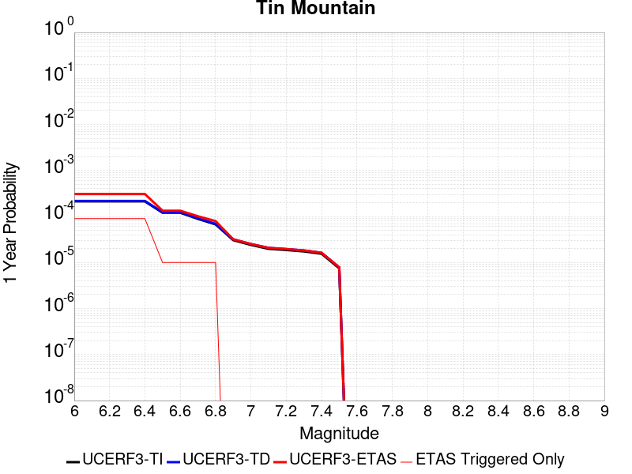 |  |

| Magnitude | 1 wk TI Prob | 1 wk TD Prob | 1 wk ETAS Prob | 1 wk ETAS/TD Gain | 1 wk ETAS Triggered Only | 1 mo TI Prob | 1 mo TD Prob | 1 mo ETAS Prob | 1 mo ETAS/TD Gain | 1 mo ETAS Triggered Only | 1 yr TI Prob | 1 yr TD Prob | 1 yr ETAS Prob | 1 yr ETAS/TD Gain | 1 yr ETAS Triggered Only | 10 yr TI Prob | 10 yr TD Prob | 10 yr ETAS Prob | 10 yr ETAS/TD Gain | 10 yr ETAS Triggered Only |
|-----|-----|-----|-----|-----|-----|-----|-----|-----|-----|-----|-----|-----|-----|-----|-----|-----|-----|-----|-----|-----|
| 6.0 | 4.083776E-6 | 4.1815365E-6 | 2.8383376E-5 | 6.787786 | 2.4201941E-5 | 1.750178E-5 | 1.792077E-5 | 6.632378E-5 | 3.7009451 | 4.8403883E-5 | 2.1306332E-4 | 2.1816725E-4 | 3.1495388E-4 | 1.4436351 | 9.6807766E-5 | 0.0021285915 | 0.0021798965 | 0.002397239 | 1.0997032 | 2.1781746E-4 |
| 6.1 | 4.083776E-6 | 4.1815365E-6 | 2.8383376E-5 | 6.787786 | 2.4201941E-5 | 1.750178E-5 | 1.792077E-5 | 6.632378E-5 | 3.7009451 | 4.8403883E-5 | 2.1306332E-4 | 2.1816725E-4 | 3.1495388E-4 | 1.4436351 | 9.6807766E-5 | 0.0021285915 | 0.0021798965 | 0.002397239 | 1.0997032 | 2.1781746E-4 |
| 6.2 | 4.083776E-6 | 4.1815365E-6 | 2.8383376E-5 | 6.787786 | 2.4201941E-5 | 1.750178E-5 | 1.792077E-5 | 6.632378E-5 | 3.7009451 | 4.8403883E-5 | 2.1306332E-4 | 2.1816725E-4 | 3.1495388E-4 | 1.4436351 | 9.6807766E-5 | 0.0021285915 | 0.0021798965 | 0.002397239 | 1.0997032 | 2.1781746E-4 |
| 6.3 | 4.083776E-6 | 4.1815365E-6 | 2.8383376E-5 | 6.787786 | 2.4201941E-5 | 1.750178E-5 | 1.792077E-5 | 6.632378E-5 | 3.7009451 | 4.8403883E-5 | 2.1306332E-4 | 2.1816725E-4 | 3.1495388E-4 | 1.4436351 | 9.6807766E-5 | 0.0021285915 | 0.0021798965 | 0.002397239 | 1.0997032 | 2.1781746E-4 |
| 6.4 | 4.083776E-6 | 4.1815365E-6 | 2.8383376E-5 | 6.787786 | 2.4201941E-5 | 1.750178E-5 | 1.792077E-5 | 6.632378E-5 | 3.7009451 | 4.8403883E-5 | 2.1306332E-4 | 2.1816725E-4 | 3.1495388E-4 | 1.4436351 | 9.6807766E-5 | 0.0021285915 | 0.0021798965 | 0.002397239 | 1.0997032 | 2.1781746E-4 |
| 6.5 | 2.3143427E-6 | 2.3731573E-6 | 2.657504E-5 | 11.19818 | 2.4201941E-5 | 9.9185745E-6 | 1.0170638E-5 | 3.4372333E-5 | 3.379565 | 2.4201941E-5 | 1.2075195E-4 | 1.2382126E-4 | 1.480202E-4 | 1.1954345 | 2.4201941E-5 | 0.0012068636 | 0.0012375986 | 0.0012859426 | 1.0390627 | 4.8403883E-5 |
| 6.6 | 2.3143427E-6 | 2.3731573E-6 | 2.657504E-5 | 11.19818 | 2.4201941E-5 | 9.9185745E-6 | 1.0170638E-5 | 3.4372333E-5 | 3.379565 | 2.4201941E-5 | 1.2075195E-4 | 1.2382126E-4 | 1.480202E-4 | 1.1954345 | 2.4201941E-5 | 0.0012068636 | 0.0012375986 | 0.0012859426 | 1.0390627 | 4.8403883E-5 |
| 6.7 | 1.7029532E-6 | 1.7497915E-6 | 2.5951691E-5 | 14.831305 | 2.4201941E-5 | 7.2983503E-6 | 7.499088E-6 | 3.170085E-5 | 4.227294 | 2.4201941E-5 | 8.885379E-5 | 9.1298105E-5 | 1.1549784E-4 | 1.2650628 | 2.4201941E-5 | 8.881827E-4 | 9.1265864E-4 | 9.610183E-4 | 1.0529877 | 4.8403883E-5 |
| 6.8 | 1.2914646E-6 | 1.3299378E-6 | 2.5531846E-5 | 19.197775 | 2.4201941E-5 | 5.534837E-6 | 5.6997237E-6 | 2.9901526E-5 | 5.246136 | 2.4201941E-5 | 6.738455E-5 | 6.939237E-5 | 9.359263E-5 | 1.3487453 | 2.4201941E-5 | 6.736412E-4 | 6.9375033E-4 | 7.179355E-4 | 1.0348614 | 2.4201941E-5 |
| 6.9 | 5.8708974E-7 | 6.1169936E-7 | 6.1169936E-7 | 1.0 | 0.0 | 2.5160964E-6 | 2.6215664E-6 | 2.6215664E-6 | 1.0 | 0.0 | 3.0633044E-5 | 3.1917145E-5 | 3.1917145E-5 | 1.0 | 0.0 | 3.0628822E-4 | 3.191297E-4 | 3.191297E-4 | 1.0 | 0.0 |
| 7.0 | 4.6248786E-7 | 4.832015E-7 | 4.832015E-7 | 1.0 | 0.0 | 1.9820893E-6 | 2.0708624E-6 | 2.0708624E-6 | 1.0 | 0.0 | 2.413167E-5 | 2.5212494E-5 | 2.5212494E-5 | 1.0 | 0.0 | 2.412905E-4 | 2.5210003E-4 | 2.5210003E-4 | 1.0 | 0.0 |
| 7.1 | 3.804606E-7 | 3.987147E-7 | 3.987147E-7 | 1.0 | 0.0 | 1.6305444E-6 | 1.7087764E-6 | 1.7087764E-6 | 1.0 | 0.0 | 1.9851697E-5 | 2.0804187E-5 | 2.0804187E-5 | 1.0 | 0.0 | 1.9849923E-4 | 2.0802575E-4 | 2.0802575E-4 | 1.0 | 0.0 |
| 7.2 | 3.5864858E-7 | 3.7616863E-7 | 3.7616863E-7 | 1.0 | 0.0 | 1.5370645E-6 | 1.6121504E-6 | 1.6121504E-6 | 1.0 | 0.0 | 1.87136E-5 | 1.9627789E-5 | 1.9627789E-5 | 1.0 | 0.0 | 1.8712023E-4 | 1.9626386E-4 | 1.9626386E-4 | 1.0 | 0.0 |
| 7.3 | 3.342063E-7 | 3.506347E-7 | 3.506347E-7 | 1.0 | 0.0 | 1.4323119E-6 | 1.5027196E-6 | 1.5027196E-6 | 1.0 | 0.0 | 1.7438259E-5 | 1.829549E-5 | 1.829549E-5 | 1.0 | 0.0 | 1.743689E-4 | 1.8294314E-4 | 1.8294314E-4 | 1.0 | 0.0 |
| 7.4 | 2.971242E-7 | 3.1165817E-7 | 3.1165817E-7 | 1.0 | 0.0 | 1.2733886E-6 | 1.3356774E-6 | 1.3356774E-6 | 1.0 | 0.0 | 1.5503398E-5 | 1.6261785E-5 | 1.6261785E-5 | 1.0 | 0.0 | 1.5502315E-4 | 1.6260923E-4 | 1.6260923E-4 | 1.0 | 0.0 |
| 7.5 | 1.4326713E-7 | 1.5012525E-7 | 1.5012525E-7 | 1.0 | 0.0 | 6.140018E-7 | 6.433939E-7 | 6.433939E-7 | 1.0 | 0.0 | 7.4754466E-6 | 7.8333205E-6 | 7.8333205E-6 | 1.0 | 0.0 | 7.475195E-5 | 7.833321E-5 | 7.833321E-5 | 1.0 | 0.0 |

## San Jacinto (San Jacinto Valley) rev
*[(top)](#table-of-contents)*

| 1 Week | 1 Month | 1 Year | 10 Year |
|-----|-----|-----|-----|
|  |  |  |  |

| Magnitude | 1 wk TI Prob | 1 wk TD Prob | 1 wk ETAS Prob | 1 wk ETAS/TD Gain | 1 wk ETAS Triggered Only | 1 mo TI Prob | 1 mo TD Prob | 1 mo ETAS Prob | 1 mo ETAS/TD Gain | 1 mo ETAS Triggered Only | 1 yr TI Prob | 1 yr TD Prob | 1 yr ETAS Prob | 1 yr ETAS/TD Gain | 1 yr ETAS Triggered Only | 10 yr TI Prob | 10 yr TD Prob | 10 yr ETAS Prob | 10 yr ETAS/TD Gain | 10 yr ETAS Triggered Only |
|-----|-----|-----|-----|-----|-----|-----|-----|-----|-----|-----|-----|-----|-----|-----|-----|-----|-----|-----|-----|-----|
| 6.0 | 3.652694E-5 | 3.4401106E-5 | 1.3120554E-4 | 3.813992 | 9.6807766E-5 | 1.5653463E-4 | 1.4742499E-4 | 2.4421848E-4 | 1.656561 | 9.6807766E-5 | 0.0019041431 | 0.0017934233 | 0.0019625332 | 1.0942944 | 1.6941359E-4 | 0.018879099 | 0.018526303 | 0.018740084 | 1.0115393 | 2.1781746E-4 |
| 6.1 | 3.652694E-5 | 3.4401106E-5 | 1.3120554E-4 | 3.813992 | 9.6807766E-5 | 1.5653463E-4 | 1.4742499E-4 | 2.4421848E-4 | 1.656561 | 9.6807766E-5 | 0.0019041431 | 0.0017934233 | 0.0019625332 | 1.0942944 | 1.6941359E-4 | 0.018879099 | 0.018526303 | 0.018740084 | 1.0115393 | 2.1781746E-4 |
| 6.2 | 3.652694E-5 | 3.4401106E-5 | 1.3120554E-4 | 3.813992 | 9.6807766E-5 | 1.5653463E-4 | 1.4742499E-4 | 2.4421848E-4 | 1.656561 | 9.6807766E-5 | 0.0019041431 | 0.0017934233 | 0.0019625332 | 1.0942944 | 1.6941359E-4 | 0.018879099 | 0.018526303 | 0.018740084 | 1.0115393 | 2.1781746E-4 |
| 6.3 | 3.652694E-5 | 3.4401106E-5 | 1.3120554E-4 | 3.813992 | 9.6807766E-5 | 1.5653463E-4 | 1.4742499E-4 | 2.4421848E-4 | 1.656561 | 9.6807766E-5 | 0.0019041431 | 0.0017934233 | 0.0019625332 | 1.0942944 | 1.6941359E-4 | 0.018879099 | 0.018526303 | 0.018740084 | 1.0115393 | 2.1781746E-4 |
| 6.4 | 3.646941E-5 | 3.432268E-5 | 1.3112712E-4 | 3.8204222 | 9.6807766E-5 | 1.5628811E-4 | 1.4708891E-4 | 2.4388244E-4 | 1.6580613 | 9.6807766E-5 | 0.0019011468 | 0.0017893389 | 0.0019584494 | 1.0945101 | 1.6941359E-4 | 0.018849645 | 0.018486181 | 0.018699974 | 1.0115649 | 2.1781746E-4 |
| 6.5 | 3.646941E-5 | 3.432268E-5 | 1.3112712E-4 | 3.8204222 | 9.6807766E-5 | 1.5628811E-4 | 1.4708891E-4 | 2.4388244E-4 | 1.6580613 | 9.6807766E-5 | 0.0019011468 | 0.0017893389 | 0.0019584494 | 1.0945101 | 1.6941359E-4 | 0.018849645 | 0.018486181 | 0.018699974 | 1.0115649 | 2.1781746E-4 |
| 6.6 | 3.6442503E-5 | 3.4286066E-5 | 1.310905E-4 | 3.8234339 | 9.6807766E-5 | 1.561728E-4 | 1.4693203E-4 | 2.4372556E-4 | 1.6587641 | 9.6807766E-5 | 0.0018997455 | 0.001787432 | 0.0019565427 | 1.094611 | 1.6941359E-4 | 0.018835869 | 0.01846745 | 0.018681245 | 1.0115769 | 2.1781746E-4 |
| 6.7 | 3.6432113E-5 | 3.427164E-5 | 1.3107609E-4 | 3.8246224 | 9.6807766E-5 | 1.5612828E-4 | 1.4687021E-4 | 2.4366376E-4 | 1.6590414 | 9.6807766E-5 | 0.0018992044 | 0.0017866807 | 0.0019557916 | 1.0946509 | 1.6941359E-4 | 0.018830549 | 0.018460074 | 0.01867387 | 1.0115815 | 2.1781746E-4 |
| 6.8 | 3.6409598E-5 | 3.4240697E-5 | 1.3104515E-4 | 3.8271751 | 9.6807766E-5 | 1.560318E-4 | 1.4673761E-4 | 2.4353116E-4 | 1.659637 | 9.6807766E-5 | 0.0018980318 | 0.0017850689 | 0.0019541802 | 1.0947365 | 1.6941359E-4 | 0.018819023 | 0.018444229 | 0.018658029 | 1.0115917 | 2.1781746E-4 |
| 6.9 | 3.638078E-5 | 3.4201123E-5 | 1.3100558E-4 | 3.8304467 | 9.6807766E-5 | 1.5590832E-4 | 1.4656801E-4 | 2.4336159E-4 | 1.6604004 | 9.6807766E-5 | 0.0018965311 | 0.0017830075 | 0.001952119 | 1.0948462 | 1.6941359E-4 | 0.018804269 | 0.018423963 | 0.018637767 | 1.0116047 | 2.1781746E-4 |
| 7.0 | 3.6294874E-5 | 3.408314E-5 | 1.3088761E-4 | 3.840245 | 9.6807766E-5 | 1.5554018E-4 | 1.4606243E-4 | 2.4285605E-4 | 1.6626866 | 9.6807766E-5 | 0.0018920569 | 0.0017768623 | 0.0019459748 | 1.0951748 | 1.6941359E-4 | 0.018760284 | 0.018363545 | 0.018577361 | 1.0116436 | 2.1781746E-4 |
| 7.1 | 3.6260717E-5 | 3.403942E-5 | 1.308439E-4 | 3.8438928 | 9.6807766E-5 | 1.5539382E-4 | 1.4587509E-4 | 2.4266874E-4 | 1.6635379 | 9.6807766E-5 | 0.001890278 | 0.0017745851 | 0.001943698 | 1.0952972 | 1.6941359E-4 | 0.018742796 | 0.018341139 | 0.018554961 | 1.0116581 | 2.1781746E-4 |
| 7.2 | 3.6210204E-5 | 3.397364E-5 | 1.3077812E-4 | 3.8493996 | 9.6807766E-5 | 1.5517735E-4 | 1.455932E-4 | 2.4238687E-4 | 1.6648227 | 9.6807766E-5 | 0.001887647 | 0.0017711588 | 0.0019402723 | 1.0954819 | 1.6941359E-4 | 0.01871693 | 0.018307408 | 0.018521238 | 1.01168 | 2.1781746E-4 |
| 7.3 | 3.6119454E-5 | 3.386193E-5 | 1.3066642E-4 | 3.8588002 | 9.6807766E-5 | 1.5478847E-4 | 1.4511449E-4 | 2.419082E-4 | 1.6670163 | 9.6807766E-5 | 0.0018829206 | 0.0017653398 | 0.0019344543 | 1.0957972 | 1.6941359E-4 | 0.018670462 | 0.01824996 | 0.018463803 | 1.0117174 | 2.1781746E-4 |
| 7.4 | 3.607848E-5 | 3.380943E-5 | 1.3061392E-4 | 3.8632395 | 9.6807766E-5 | 1.5461289E-4 | 1.4488952E-4 | 2.4168326E-4 | 1.6680521 | 9.6807766E-5 | 0.0018807866 | 0.0017626052 | 0.0019317202 | 1.0959461 | 1.6941359E-4 | 0.018649481 | 0.018222956 | 0.018436804 | 1.0117351 | 2.1781746E-4 |
| 7.5 | 3.5856774E-5 | 3.3619202E-5 | 1.3042371E-4 | 3.8794408 | 9.6807766E-5 | 1.5366284E-4 | 1.4407437E-4 | 2.4086818E-4 | 1.6718323 | 9.6807766E-5 | 0.0018692396 | 0.0017526967 | 0.0019218134 | 1.0964894 | 1.6941359E-4 | 0.018535944 | 0.018124057 | 0.018337926 | 1.0118003 | 2.1781746E-4 |
| 7.6 | 3.286655E-5 | 3.2142278E-5 | 1.2894694E-4 | 4.0117545 | 9.6807766E-5 | 1.4084904E-4 | 1.3774536E-4 | 2.3453978E-4 | 1.7027056 | 9.6807766E-5 | 0.001713488 | 0.0016757617 | 0.0018448913 | 1.100927 | 1.6941359E-4 | 0.017003361 | 0.017343804 | 0.017557843 | 1.012341 | 2.1781746E-4 |
| 7.7 | 2.8882527E-5 | 2.9235205E-5 | 1.2604013E-4 | 4.3112454 | 9.6807766E-5 | 1.237764E-4 | 1.2528773E-4 | 2.2208336E-4 | 1.7725867 | 9.6807766E-5 | 0.0015059357 | 0.0015243118 | 0.0016934671 | 1.1109716 | 1.6941359E-4 | 0.014957713 | 0.015830338 | 0.016044708 | 1.0135417 | 2.1781746E-4 |
| 7.8 | 2.4950225E-5 | 2.6526219E-5 | 1.2333141E-4 | 4.6494155 | 9.6807766E-5 | 1.0692515E-4 | 1.1367885E-4 | 2.1047561E-4 | 1.8514931 | 9.6807766E-5 | 0.0013010362 | 0.0013831621 | 0.0015523414 | 1.1223134 | 1.6941359E-4 | 0.012934455 | 0.01441176 | 0.014626438 | 1.014896 | 2.1781746E-4 |
| 7.9 | 1.9881603E-5 | 2.150649E-5 | 1.1831217E-4 | 5.501231 | 9.6807766E-5 | 8.520408E-5 | 9.216742E-5 | 1.8896627E-4 | 2.05025 | 9.6807766E-5 | 0.001036866 | 0.0011215615 | 0.001290785 | 1.1508821 | 1.6941359E-4 | 0.010320415 | 0.011776998 | 0.01199225 | 1.0182773 | 2.1781746E-4 |
| 8.0 | 1.563292E-5 | 1.5936288E-5 | 1.12742506E-4 | 7.074578 | 9.6807766E-5 | 6.6996516E-5 | 6.829659E-5 | 1.6509775E-4 | 2.4173644 | 9.6807766E-5 | 8.153773E-4 | 8.3119445E-4 | 0.0010004672 | 1.20365 | 1.6941359E-4 | 0.00812392 | 0.008810331 | 0.009026229 | 1.0245051 | 2.1781746E-4 |
| 8.1 | 1.0045313E-5 | 8.300794E-6 | 5.6704273E-5 | 6.831187 | 4.8403883E-5 | 4.305063E-5 | 3.557435E-5 | 8.397651E-5 | 2.3605917 | 4.8403883E-5 | 5.2401534E-4 | 4.3303217E-4 | 5.056065E-4 | 1.1675959 | 7.260582E-5 | 0.0052278144 | 0.0046587666 | 0.0047310344 | 1.0155121 | 7.260582E-5 |
| 8.2 | 4.1554413E-6 | 1.5648296E-6 | 1.5648296E-6 | 1.0 | 0.0 | 1.7808914E-5 | 6.7063957E-6 | 6.7063957E-6 | 1.0 | 0.0 | 2.1680194E-4 | 8.164734E-5 | 8.164734E-5 | 1.0 | 0.0 | 0.0021659054 | 9.479703E-4 | 9.479703E-4 | 1.0 | 0.0 |
| 8.3 | 1.2758221E-6 | 3.612677E-7 | 3.612677E-7 | 1.0 | 0.0 | 5.4677976E-6 | 1.5482892E-6 | 1.5482892E-6 | 1.0 | 0.0 | 6.65684E-5 | 1.8850264E-5 | 1.8850264E-5 | 1.0 | 0.0 | 6.6548464E-4 | 2.2739546E-4 | 2.2739546E-4 | 1.0 | 0.0 |

## Pinto Mtn
*[(top)](#table-of-contents)*

| 1 Week | 1 Month | 1 Year | 10 Year |
|-----|-----|-----|-----|
|  |  |  | 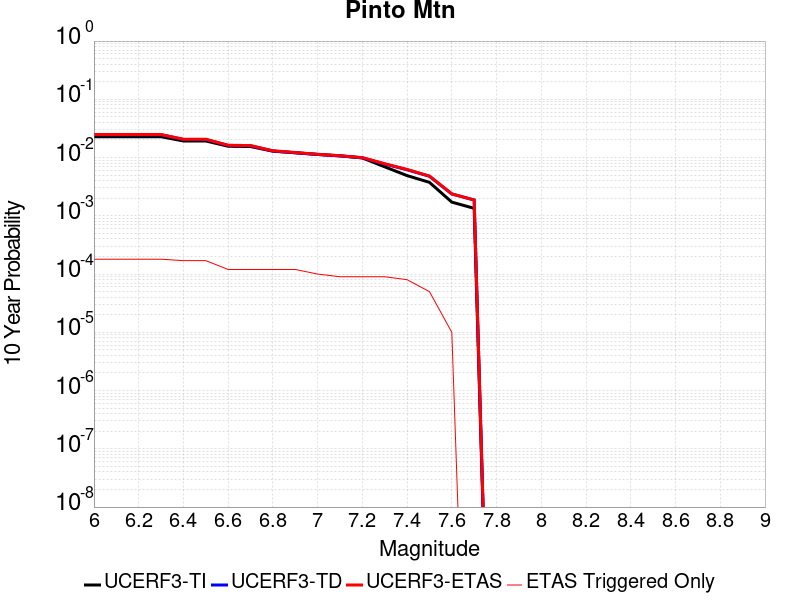 |

| Magnitude | 1 wk TI Prob | 1 wk TD Prob | 1 wk ETAS Prob | 1 wk ETAS/TD Gain | 1 wk ETAS Triggered Only | 1 mo TI Prob | 1 mo TD Prob | 1 mo ETAS Prob | 1 mo ETAS/TD Gain | 1 mo ETAS Triggered Only | 1 yr TI Prob | 1 yr TD Prob | 1 yr ETAS Prob | 1 yr ETAS/TD Gain | 1 yr ETAS Triggered Only | 10 yr TI Prob | 10 yr TD Prob | 10 yr ETAS Prob | 10 yr ETAS/TD Gain | 10 yr ETAS Triggered Only |
|-----|-----|-----|-----|-----|-----|-----|-----|-----|-----|-----|-----|-----|-----|-----|-----|-----|-----|-----|-----|-----|
| 6.0 | 4.4194956E-5 | 4.7853926E-5 | 7.205471E-5 | 1.505722 | 2.4201941E-5 | 1.893932E-4 | 2.0507304E-4 | 2.2927002E-4 | 1.117992 | 2.4201941E-5 | 0.0023034236 | 0.0024940688 | 0.002590635 | 1.0387183 | 9.6807766E-5 | 0.022796938 | 0.024678305 | 0.024867142 | 1.0076519 | 1.9361553E-4 |
| 6.1 | 4.4194956E-5 | 4.7853926E-5 | 7.205471E-5 | 1.505722 | 2.4201941E-5 | 1.893932E-4 | 2.0507304E-4 | 2.2927002E-4 | 1.117992 | 2.4201941E-5 | 0.0023034236 | 0.0024940688 | 0.002590635 | 1.0387183 | 9.6807766E-5 | 0.022796938 | 0.024678305 | 0.024867142 | 1.0076519 | 1.9361553E-4 |
| 6.2 | 4.4194956E-5 | 4.7853926E-5 | 7.205471E-5 | 1.505722 | 2.4201941E-5 | 1.893932E-4 | 2.0507304E-4 | 2.2927002E-4 | 1.117992 | 2.4201941E-5 | 0.0023034236 | 0.0024940688 | 0.002590635 | 1.0387183 | 9.6807766E-5 | 0.022796938 | 0.024678305 | 0.024867142 | 1.0076519 | 1.9361553E-4 |
| 6.3 | 4.4194956E-5 | 4.7853926E-5 | 7.205471E-5 | 1.505722 | 2.4201941E-5 | 1.893932E-4 | 2.0507304E-4 | 2.2927002E-4 | 1.117992 | 2.4201941E-5 | 0.0023034236 | 0.0024940688 | 0.002590635 | 1.0387183 | 9.6807766E-5 | 0.022796938 | 0.024678305 | 0.024867142 | 1.0076519 | 1.9361553E-4 |
| 6.4 | 3.729929E-5 | 3.960349E-5 | 6.380447E-5 | 1.6110821 | 2.4201941E-5 | 1.5984432E-4 | 1.6971873E-4 | 1.9391657E-4 | 1.1425761 | 2.4201941E-5 | 0.0019443673 | 0.0020644604 | 0.0021610684 | 1.0467957 | 9.6807766E-5 | 0.019274427 | 0.020462848 | 0.020628795 | 1.0081097 | 1.6941359E-4 |
| 6.5 | 3.729929E-5 | 3.960349E-5 | 6.380447E-5 | 1.6110821 | 2.4201941E-5 | 1.5984432E-4 | 1.6971873E-4 | 1.9391657E-4 | 1.1425761 | 2.4201941E-5 | 0.0019443673 | 0.0020644604 | 0.0021610684 | 1.0467957 | 9.6807766E-5 | 0.019274427 | 0.020462848 | 0.020628795 | 1.0081097 | 1.6941359E-4 |
| 6.6 | 3.0204548E-5 | 3.12056E-5 | 5.5406785E-5 | 1.7755399 | 2.4201941E-5 | 1.2944164E-4 | 1.3373162E-4 | 1.5793034E-4 | 1.1809498 | 2.4201941E-5 | 0.0015748127 | 0.0016270012 | 0.0017236515 | 1.0594039 | 9.6807766E-5 | 0.015636992 | 0.016154764 | 0.016273819 | 1.0073696 | 1.210097E-4 |
| 6.7 | 2.9857754E-5 | 3.0814987E-5 | 5.501618E-5 | 1.785371 | 2.4201941E-5 | 1.2795553E-4 | 1.3205773E-4 | 1.5625647E-4 | 1.1832436 | 2.4201941E-5 | 0.0015567453 | 0.0016066517 | 0.0017033039 | 1.0601575 | 9.6807766E-5 | 0.015458848 | 0.015954204 | 0.016073283 | 1.0074638 | 1.210097E-4 |
| 6.8 | 2.4819734E-5 | 2.5009665E-5 | 4.9211E-5 | 1.9676793 | 2.4201941E-5 | 1.0636595E-4 | 1.0718E-4 | 1.3137935E-4 | 1.2257823 | 2.4201941E-5 | 0.0012942362 | 0.001304157 | 0.0014008385 | 1.0741334 | 9.6807766E-5 | 0.012867244 | 0.012967403 | 0.013086843 | 1.0092108 | 1.210097E-4 |
| 6.9 | 2.331124E-5 | 2.3337945E-5 | 4.753932E-5 | 2.0369968 | 2.4201941E-5 | 9.990149E-5 | 1.0001605E-4 | 1.2421557E-4 | 1.2419564 | 2.4201941E-5 | 0.001215622 | 0.0012170355 | 0.0013137255 | 1.0794472 | 9.6807766E-5 | 0.012089936 | 0.012105897 | 0.012225442 | 1.0098749 | 1.210097E-4 |
| 7.0 | 2.1818534E-5 | 2.1761074E-5 | 4.596249E-5 | 2.1121426 | 2.4201941E-5 | 9.3504656E-5 | 9.3258524E-5 | 1.1745821E-4 | 1.2594904 | 2.4201941E-5 | 0.0011378246 | 0.0011348509 | 0.0012073744 | 1.0639057 | 7.260582E-5 | 0.011320163 | 0.01129266 | 0.011388374 | 1.0084758 | 9.6807766E-5 |
| 7.1 | 2.066081E-5 | 2.0540718E-5 | 4.4742163E-5 | 2.1782181 | 2.4201941E-5 | 8.854332E-5 | 8.8028784E-5 | 1.122286E-4 | 1.274908 | 2.4201941E-5 | 0.0010774818 | 0.0010712431 | 0.0011437711 | 1.0677046 | 7.260582E-5 | 0.010722724 | 0.0106628435 | 0.010734675 | 1.0067366 | 7.260582E-5 |
| 7.2 | 1.8990233E-5 | 1.9054001E-5 | 4.325548E-5 | 2.270152 | 2.4201941E-5 | 8.138417E-5 | 8.165756E-5 | 1.0585753E-4 | 1.2963592 | 2.4201941E-5 | 9.904018E-4 | 9.937467E-4 | 0.0010662804 | 1.0729901 | 7.260582E-5 | 0.009859995 | 0.009895029 | 0.009966916 | 1.007265 | 7.260582E-5 |
| 7.3 | 1.3335872E-5 | 1.4906713E-5 | 3.9108294E-5 | 2.6235356 | 2.4201941E-5 | 5.7152483E-5 | 6.388442E-5 | 8.808482E-5 | 1.3788153 | 2.4201941E-5 | 6.956093E-4 | 7.77528E-4 | 8.5007737E-4 | 1.0933077 | 7.260582E-5 | 0.006934359 | 0.007749376 | 0.007821419 | 1.0092967 | 7.260582E-5 |
| 7.4 | 9.414066E-6 | 1.186096E-5 | 3.6062615E-5 | 3.0404465 | 2.4201941E-5 | 4.0345374E-5 | 5.083175E-5 | 7.503246E-5 | 1.4760944 | 2.4201941E-5 | 4.910942E-4 | 6.1871024E-4 | 6.670842E-4 | 1.0781851 | 4.8403883E-5 | 0.0049001034 | 0.0061708256 | 0.0062189307 | 1.0077956 | 4.8403883E-5 |
| 7.5 | 7.2101157E-6 | 9.158192E-6 | 9.158192E-6 | 1.0 | 0.0 | 3.090013E-5 | 3.9248847E-5 | 3.9248847E-5 | 1.0 | 0.0 | 3.7614413E-4 | 4.7775774E-4 | 5.019481E-4 | 1.0506332 | 2.4201941E-5 | 0.0037550807 | 0.004768082 | 0.0047921687 | 1.0050516 | 2.4201941E-5 |
| 7.6 | 3.296375E-6 | 4.5455017E-6 | 4.5455017E-6 | 1.0 | 0.0 | 1.4127245E-5 | 1.9480583E-5 | 1.9480583E-5 | 1.0 | 0.0 | 1.7198564E-4 | 2.3715167E-4 | 2.3715167E-4 | 1.0 | 0.0 | 0.0017185259 | 0.0023691233 | 0.0023691233 | 1.0 | 0.0 |
| 7.7 | 2.5741092E-6 | 3.5844084E-6 | 3.5844084E-6 | 1.0 | 0.0 | 1.103185E-5 | 1.5361667E-5 | 1.5361667E-5 | 1.0 | 0.0 | 1.3430449E-4 | 1.8701357E-4 | 1.8701357E-4 | 1.0 | 0.0 | 0.0013422335 | 0.0018686918 | 0.0018686918 | 1.0 | 0.0 |

## Independence rev 2011
*[(top)](#table-of-contents)*

| 1 Week | 1 Month | 1 Year | 10 Year |
|-----|-----|-----|-----|
|  |  |  |  |

| Magnitude | 1 wk TI Prob | 1 wk TD Prob | 1 wk ETAS Prob | 1 wk ETAS/TD Gain | 1 wk ETAS Triggered Only | 1 mo TI Prob | 1 mo TD Prob | 1 mo ETAS Prob | 1 mo ETAS/TD Gain | 1 mo ETAS Triggered Only | 1 yr TI Prob | 1 yr TD Prob | 1 yr ETAS Prob | 1 yr ETAS/TD Gain | 1 yr ETAS Triggered Only | 10 yr TI Prob | 10 yr TD Prob | 10 yr ETAS Prob | 10 yr ETAS/TD Gain | 10 yr ETAS Triggered Only |
|-----|-----|-----|-----|-----|-----|-----|-----|-----|-----|-----|-----|-----|-----|-----|-----|-----|-----|-----|-----|-----|
| 6.0 | 4.422171E-6 | 4.3262253E-6 | 1.4953724E-4 | 34.565292 | 1.4521164E-4 | 1.8952025E-5 | 1.8540852E-5 | 1.637498E-4 | 8.831839 | 1.4521164E-4 | 2.3071647E-4 | 2.2571447E-4 | 4.1928628E-4 | 1.857596 | 1.9361553E-4 | 0.0023047708 | 0.0022551457 | 0.0024483246 | 1.0856614 | 1.9361553E-4 |
| 6.1 | 4.422171E-6 | 4.3262253E-6 | 1.4953724E-4 | 34.565292 | 1.4521164E-4 | 1.8952025E-5 | 1.8540852E-5 | 1.637498E-4 | 8.831839 | 1.4521164E-4 | 2.3071647E-4 | 2.2571447E-4 | 4.1928628E-4 | 1.857596 | 1.9361553E-4 | 0.0023047708 | 0.0022551457 | 0.0024483246 | 1.0856614 | 1.9361553E-4 |
| 6.2 | 4.422171E-6 | 4.3262253E-6 | 1.4953724E-4 | 34.565292 | 1.4521164E-4 | 1.8952025E-5 | 1.8540852E-5 | 1.637498E-4 | 8.831839 | 1.4521164E-4 | 2.3071647E-4 | 2.2571447E-4 | 4.1928628E-4 | 1.857596 | 1.9361553E-4 | 0.0023047708 | 0.0022551457 | 0.0024483246 | 1.0856614 | 1.9361553E-4 |
| 6.3 | 4.422171E-6 | 4.3262253E-6 | 1.4953724E-4 | 34.565292 | 1.4521164E-4 | 1.8952025E-5 | 1.8540852E-5 | 1.637498E-4 | 8.831839 | 1.4521164E-4 | 2.3071647E-4 | 2.2571447E-4 | 4.1928628E-4 | 1.857596 | 1.9361553E-4 | 0.0023047708 | 0.0022551457 | 0.0024483246 | 1.0856614 | 1.9361553E-4 |
| 6.4 | 4.422171E-6 | 4.3262253E-6 | 1.4953724E-4 | 34.565292 | 1.4521164E-4 | 1.8952025E-5 | 1.8540852E-5 | 1.637498E-4 | 8.831839 | 1.4521164E-4 | 2.3071647E-4 | 2.2571447E-4 | 4.1928628E-4 | 1.857596 | 1.9361553E-4 | 0.0023047708 | 0.0022551457 | 0.0024483246 | 1.0856614 | 1.9361553E-4 |
| 6.5 | 4.422171E-6 | 4.3262253E-6 | 1.4953724E-4 | 34.565292 | 1.4521164E-4 | 1.8952025E-5 | 1.8540852E-5 | 1.637498E-4 | 8.831839 | 1.4521164E-4 | 2.3071647E-4 | 2.2571447E-4 | 4.1928628E-4 | 1.857596 | 1.9361553E-4 | 0.0023047708 | 0.0022551457 | 0.0024483246 | 1.0856614 | 1.9361553E-4 |
| 6.6 | 2.663744E-6 | 2.5319846E-6 | 1.4774327E-4 | 58.350777 | 1.4521164E-4 | 1.1415996E-5 | 1.08513195E-5 | 1.5606139E-4 | 14.381788 | 1.4521164E-4 | 1.3898089E-4 | 1.321073E-4 | 3.2569724E-4 | 2.4653993 | 1.9361553E-4 | 0.0013889399 | 0.0013203359 | 0.0015136958 | 1.1464475 | 1.9361553E-4 |
| 6.7 | 2.663744E-6 | 2.5319846E-6 | 1.4774327E-4 | 58.350777 | 1.4521164E-4 | 1.1415996E-5 | 1.08513195E-5 | 1.5606139E-4 | 14.381788 | 1.4521164E-4 | 1.3898089E-4 | 1.321073E-4 | 3.2569724E-4 | 2.4653993 | 1.9361553E-4 | 0.0013889399 | 0.0013203359 | 0.0015136958 | 1.1464475 | 1.9361553E-4 |
| 6.8 | 1.9716529E-6 | 1.8322567E-6 | 1.4704364E-4 | 80.252754 | 1.4521164E-4 | 8.449913E-6 | 7.852505E-6 | 1.5306301E-4 | 19.492252 | 1.4521164E-4 | 1.0287284E-4 | 9.560019E-5 | 2.891972E-4 | 3.0250695 | 1.9361553E-4 | 0.0010282523 | 9.5560355E-4 | 0.001149034 | 1.2024171 | 1.9361553E-4 |
| 6.9 | 1.8788617E-6 | 1.7429976E-6 | 1.469544E-4 | 84.3113 | 1.4521164E-4 | 8.0522395E-6 | 7.4699688E-6 | 1.5268053E-4 | 20.439245 | 1.4521164E-4 | 9.80316E-5 | 9.09432E-5 | 2.845411E-4 | 3.1287785 | 1.9361553E-4 | 9.798837E-4 | 9.090718E-4 | 0.0011025113 | 1.212788 | 1.9361553E-4 |
| 7.0 | 1.5045488E-6 | 1.3849498E-6 | 1.465964E-4 | 105.84962 | 1.4521164E-4 | 6.44805E-6 | 5.9354857E-6 | 1.5114628E-4 | 25.464853 | 1.4521164E-4 | 7.8502184E-5 | 7.226219E-5 | 2.6586372E-4 | 3.679154 | 1.9361553E-4 | 7.8474457E-4 | 7.223921E-4 | 9.1586774E-4 | 1.2678264 | 1.9361553E-4 |
| 7.1 | 1.272341E-6 | 1.1625089E-6 | 1.4637399E-4 | 125.91215 | 1.4521164E-4 | 5.4528787E-6 | 4.9821715E-6 | 1.501931E-4 | 30.14611 | 1.4521164E-4 | 6.6386776E-5 | 6.0656283E-5 | 2.5426006E-4 | 4.1918173 | 1.9361553E-4 | 6.636695E-4 | 6.064005E-4 | 7.998986E-4 | 1.319093 | 1.9361553E-4 |
| 7.2 | 1.0416892E-6 | 9.409871E-7 | 1.461525E-4 | 155.31828 | 1.4521164E-4 | 4.464375E-6 | 4.032796E-6 | 1.4924386E-4 | 37.00754 | 1.4521164E-4 | 5.4352407E-5 | 4.9098202E-5 | 2.4270422E-4 | 4.9432406 | 1.9361553E-4 | 5.4339116E-4 | 4.908754E-4 | 6.843959E-4 | 1.3942355 | 1.9361553E-4 |
| 7.3 | 7.9450155E-7 | 7.2350036E-7 | 1.4593505E-4 | 201.70694 | 1.4521164E-4 | 3.4050022E-6 | 3.1007123E-6 | 1.4831191E-4 | 47.831562 | 1.4521164E-4 | 4.1455114E-5 | 3.7750528E-5 | 2.3135875E-4 | 6.1286225 | 1.9361553E-4 | 4.144738E-4 | 3.7744228E-4 | 5.7098473E-4 | 1.5127736 | 1.9361553E-4 |
| 7.4 | 5.3893444E-7 | 5.0195166E-7 | 1.4571352E-4 | 290.29395 | 1.4521164E-4 | 2.309717E-6 | 2.1512196E-6 | 1.4736256E-4 | 68.50186 | 1.4521164E-4 | 2.8120441E-5 | 2.6190788E-5 | 2.1980125E-4 | 8.392311 | 1.9361553E-4 | 2.8116882E-4 | 2.6187746E-4 | 4.554423E-4 | 1.7391427 | 1.9361553E-4 |
| 7.5 | 3.8852085E-7 | 3.6825622E-7 | 9.717599E-5 | 263.88144 | 9.6807766E-5 | 1.6650882E-6 | 1.57824E-6 | 9.838585E-5 | 62.338966 | 9.6807766E-5 | 2.027226E-5 | 1.9214905E-5 | 1.6442376E-4 | 8.557095 | 1.4521164E-4 | 2.0270412E-4 | 1.9213265E-4 | 3.373164E-4 | 1.7556432 | 1.4521164E-4 |
| 7.6 | 2.414929E-7 | 2.3457605E-7 | 4.8638445E-5 | 207.34618 | 4.8403883E-5 | 1.0349692E-6 | 1.0053255E-6 | 4.940916E-5 | 49.147423 | 4.8403883E-5 | 1.2600677E-5 | 1.2239771E-5 | 8.484471E-5 | 6.9318867 | 7.260582E-5 | 1.2599962E-4 | 1.223911E-4 | 1.9498802E-4 | 1.5931554 | 7.260582E-5 |
| 7.7 | 6.8298014E-8 | 6.8589785E-8 | 2.4270528E-5 | 353.8505 | 2.4201941E-5 | 2.9270575E-7 | 2.939562E-7 | 2.449589E-5 | 83.33177 | 2.4201941E-5 | 3.5636867E-6 | 3.5789112E-6 | 2.7780765E-5 | 7.762351 | 2.4201941E-5 | 3.5636294E-5 | 3.5788584E-5 | 5.998966E-5 | 1.6762233 | 2.4201941E-5 |

## Imperial
*[(top)](#table-of-contents)*

| 1 Week | 1 Month | 1 Year | 10 Year |
|-----|-----|-----|-----|
|  |  |  |  |

| Magnitude | 1 wk TI Prob | 1 wk TD Prob | 1 wk ETAS Prob | 1 wk ETAS/TD Gain | 1 wk ETAS Triggered Only | 1 mo TI Prob | 1 mo TD Prob | 1 mo ETAS Prob | 1 mo ETAS/TD Gain | 1 mo ETAS Triggered Only | 1 yr TI Prob | 1 yr TD Prob | 1 yr ETAS Prob | 1 yr ETAS/TD Gain | 1 yr ETAS Triggered Only | 10 yr TI Prob | 10 yr TD Prob | 10 yr ETAS Prob | 10 yr ETAS/TD Gain | 10 yr ETAS Triggered Only |
|-----|-----|-----|-----|-----|-----|-----|-----|-----|-----|-----|-----|-----|-----|-----|-----|-----|-----|-----|-----|-----|
| 6.0 | 2.7496446E-4 | 5.055345E-4 | 5.5391394E-4 | 1.0956995 | 4.8403883E-5 | 0.0011778869 | 0.002164817 | 0.0022372657 | 1.0334665 | 7.260582E-5 | 0.0142467655 | 0.026048409 | 0.02621341 | 1.0063344 | 1.6941359E-4 | 0.13367249 | 0.22807029 | 0.22821975 | 1.0006553 | 1.9361553E-4 |
| 6.1 | 2.5356023E-4 | 4.8657708E-4 | 5.349574E-4 | 1.09943 | 4.8403883E-5 | 0.001086234 | 0.002083702 | 0.0021561566 | 1.034772 | 7.260582E-5 | 0.013144928 | 0.02507094 | 0.025236106 | 1.006588 | 1.6941359E-4 | 0.123940155 | 0.21949561 | 0.21964674 | 1.0006884 | 1.9361553E-4 |
| 6.2 | 2.4820742E-4 | 4.775311E-4 | 5.2591186E-4 | 1.1013144 | 4.8403883E-5 | 0.0010633124 | 0.0020449946 | 0.002117452 | 1.0354315 | 7.260582E-5 | 0.01286919 | 0.024610676 | 0.02477592 | 1.0067143 | 1.6941359E-4 | 0.12148927 | 0.21600136 | 0.21615316 | 1.0007027 | 1.9361553E-4 |
| 6.3 | 2.3205351E-4 | 4.5892023E-4 | 5.073019E-4 | 1.105425 | 4.8403883E-5 | 9.94136E-4 | 0.0019653554 | 0.0020378185 | 1.0368702 | 7.260582E-5 | 0.012036599 | 0.023661187 | 0.023826592 | 1.0069906 | 1.6941359E-4 | 0.11405133 | 0.20793827 | 0.20809163 | 1.0007375 | 1.9361553E-4 |
| 6.4 | 2.0304754E-4 | 3.9878016E-4 | 4.4716473E-4 | 1.1213315 | 4.8403883E-5 | 8.6991355E-4 | 0.0017079529 | 0.0017804347 | 1.0424378 | 7.260582E-5 | 0.010539869 | 0.020595418 | 0.020761343 | 1.0080564 | 1.6941359E-4 | 0.100537635 | 0.18507113 | 0.1852289 | 1.0008526 | 1.9361553E-4 |
| 6.5 | 1.854992E-4 | 3.6990462E-4 | 4.182906E-4 | 1.1308067 | 4.8403883E-5 | 7.9475436E-4 | 0.0015843548 | 0.0016568456 | 1.0457542 | 7.260582E-5 | 0.009633281 | 0.01911443 | 0.019280603 | 1.0086937 | 1.6941359E-4 | 0.0922623 | 0.1733039 | 0.17346396 | 1.0009236 | 1.9361553E-4 |
| 6.6 | 1.6586106E-4 | 3.4036173E-4 | 3.8874915E-4 | 1.1421646 | 4.8403883E-5 | 7.106394E-4 | 0.0014578878 | 0.0015303878 | 1.0497295 | 7.260582E-5 | 0.008617763 | 0.017607626 | 0.017774055 | 1.0094522 | 1.6941359E-4 | 0.08291132 | 0.16078055 | 0.16094303 | 1.0010107 | 1.9361553E-4 |
| 6.7 | 1.4224656E-4 | 3.076812E-4 | 3.560702E-4 | 1.1572698 | 4.8403883E-5 | 6.094856E-4 | 0.0013179756 | 0.0013663156 | 1.0366775 | 4.8403883E-5 | 0.0073952693 | 0.015928522 | 0.016047603 | 1.0074761 | 1.210097E-4 | 0.07153955 | 0.14648798 | 0.14661193 | 1.000846 | 1.4521164E-4 |
| 6.8 | 1.2317259E-4 | 2.779231E-4 | 3.2631351E-4 | 1.1741145 | 4.8403883E-5 | 5.2777573E-4 | 0.0011905615 | 0.0012389077 | 1.0406079 | 4.8403883E-5 | 0.0064067547 | 0.014400131 | 0.014519398 | 1.0082824 | 1.210097E-4 | 0.06225166 | 0.13294089 | 0.13306679 | 1.0009471 | 1.4521164E-4 |
| 6.9 | 9.859898E-5 | 2.5015484E-4 | 2.985466E-4 | 1.1934472 | 4.8403883E-5 | 4.2249862E-4 | 0.0010716559 | 0.001120008 | 1.0451189 | 4.8403883E-5 | 0.0051317946 | 0.012970319 | 0.013089758 | 1.0092087 | 1.210097E-4 | 0.05014893 | 0.119408876 | 0.11953674 | 1.0010709 | 1.4521164E-4 |
| 7.0 | 7.3191884E-5 | 2.1267848E-4 | 2.6107207E-4 | 1.2275434 | 4.8403883E-5 | 3.136418E-4 | 9.11164E-4 | 9.595238E-4 | 1.0530747 | 4.8403883E-5 | 0.003811904 | 0.011037681 | 0.011157355 | 1.0108423 | 1.210097E-4 | 0.037471764 | 0.10206756 | 0.10219795 | 1.0012774 | 1.4521164E-4 |
| 7.1 | 7.1760296E-5 | 2.0969207E-4 | 2.580858E-4 | 1.2307848 | 4.8403883E-5 | 3.0750787E-4 | 8.9837395E-4 | 9.4673433E-4 | 1.053831 | 4.8403883E-5 | 0.003737482 | 0.010883528 | 0.01100322 | 1.0109977 | 1.210097E-4 | 0.03675245 | 0.10070406 | 0.10083465 | 1.0012968 | 1.4521164E-4 |
| 7.2 | 6.46614E-5 | 1.9137723E-4 | 2.3977185E-4 | 1.2528756 | 4.8403883E-5 | 2.7709085E-4 | 8.199333E-4 | 8.6829753E-4 | 1.0589855 | 4.8403883E-5 | 0.0033683628 | 0.009937617 | 0.010057424 | 1.0120559 | 1.210097E-4 | 0.033177625 | 0.092511006 | 0.092642784 | 1.0014244 | 1.4521164E-4 |
| 7.3 | 6.088115E-5 | 1.780939E-4 | 2.2648917E-4 | 1.2717402 | 4.8403883E-5 | 2.6089314E-4 | 7.6303916E-4 | 8.114061E-4 | 1.0633873 | 4.8403883E-5 | 0.0031717476 | 0.009251006 | 0.009370896 | 1.0129597 | 1.210097E-4 | 0.031268585 | 0.08656135 | 0.086693995 | 1.0015323 | 1.4521164E-4 |
| 7.4 | 4.199346E-5 | 1.1511097E-4 | 1.6350928E-4 | 1.4204491 | 4.8403883E-5 | 1.7995955E-4 | 4.932403E-4 | 5.416203E-4 | 1.0980861 | 4.8403883E-5 | 0.0021888057 | 0.005988835 | 0.006085063 | 1.0160679 | 9.6807766E-5 | 0.02167372 | 0.05744024 | 0.057531487 | 1.0015886 | 9.6807766E-5 |
| 7.5 | 3.130448E-5 | 8.333871E-5 | 1.0753864E-4 | 1.2903804 | 2.4201941E-5 | 1.3415517E-4 | 3.5711733E-4 | 3.8131065E-4 | 1.067746 | 2.4201941E-5 | 0.0016321153 | 0.0043392954 | 0.004411586 | 1.0166596 | 7.260582E-5 | 0.016201803 | 0.042133506 | 0.042203054 | 1.0016506 | 7.260582E-5 |
| 7.6 | 2.3074248E-5 | 6.0849357E-5 | 8.5049825E-5 | 1.3977112 | 2.4201941E-5 | 9.888588E-5 | 2.6075702E-4 | 2.8495264E-4 | 1.0927899 | 2.4201941E-5 | 0.0012032706 | 0.0031701182 | 0.003242494 | 1.0228306 | 7.260582E-5 | 0.011967761 | 0.03102816 | 0.031098515 | 1.0022674 | 7.260582E-5 |
| 7.7 | 1.45864815E-5 | 4.0128452E-5 | 4.0128452E-5 | 1.0 | 0.0 | 6.2511994E-5 | 1.7196777E-4 | 1.7196777E-4 | 1.0 | 0.0 | 7.608177E-4 | 0.0020917025 | 0.0021400051 | 1.0230925 | 4.8403883E-5 | 0.007582182 | 0.02062909 | 0.020676494 | 1.002298 | 4.8403883E-5 |
| 7.8 | 1.0352979E-5 | 3.096395E-5 | 3.096395E-5 | 1.0 | 0.0 | 4.4369157E-5 | 1.326959E-4 | 1.326959E-4 | 1.0 | 0.0 | 5.400606E-4 | 0.0016143778 | 0.0016627035 | 1.0299346 | 4.8403883E-5 | 0.0053875 | 0.016017893 | 0.016065521 | 1.0029734 | 4.8403883E-5 |
| 7.9 | 8.137906E-6 | 2.2151205E-5 | 2.2151205E-5 | 1.0 | 0.0 | 3.4876273E-5 | 9.493029E-5 | 9.493029E-5 | 1.0 | 0.0 | 4.2453592E-4 | 0.0011551644 | 0.0011793384 | 1.0209268 | 2.4201941E-5 | 0.004237258 | 0.011618842 | 0.011642763 | 1.0020587 | 2.4201941E-5 |
| 8.0 | 6.93792E-6 | 1.8010365E-5 | 1.8010365E-5 | 1.0 | 0.0 | 2.9733603E-5 | 7.7185E-5 | 7.7185E-5 | 1.0 | 0.0 | 3.6194647E-4 | 9.3932304E-4 | 9.635022E-4 | 1.0257411 | 2.4201941E-5 | 0.0036135751 | 0.009502415 | 0.009526387 | 1.0025227 | 2.4201941E-5 |
| 8.1 | 3.4286315E-6 | 6.380179E-6 | 6.380179E-6 | 1.0 | 0.0 | 1.4694053E-5 | 2.734334E-5 | 2.734334E-5 | 1.0 | 0.0 | 1.7888541E-4 | 3.3285443E-4 | 3.3285443E-4 | 1.0 | 0.0 | 0.0017874148 | 0.0034863674 | 0.0034863674 | 1.0 | 0.0 |
| 8.2 | 1.4906886E-6 | 1.936633E-6 | 1.936633E-6 | 1.0 | 0.0 | 6.3886496E-6 | 8.2998295E-6 | 8.2998295E-6 | 1.0 | 0.0 | 7.7779034E-5 | 1.0104576E-4 | 1.0104576E-4 | 1.0 | 0.0 | 7.775182E-4 | 0.0011075423 | 0.0011075423 | 1.0 | 0.0 |
| 8.3 | 2.5758007E-8 | 1.4495866E-8 | 1.4495866E-8 | 1.0 | 0.0 | 1.10391454E-7 | 6.212514E-8 | 6.212514E-8 | 1.0 | 0.0 | 1.3440151E-6 | 7.563736E-7 | 7.563736E-7 | 1.0 | 0.0 | 1.344007E-5 | 7.884359E-6 | 7.884359E-6 | 1.0 | 0.0 |

## San Jacinto (Anza) rev
*[(top)](#table-of-contents)*

| 1 Week | 1 Month | 1 Year | 10 Year |
|-----|-----|-----|-----|
|  |  |  |  |

| Magnitude | 1 wk TI Prob | 1 wk TD Prob | 1 wk ETAS Prob | 1 wk ETAS/TD Gain | 1 wk ETAS Triggered Only | 1 mo TI Prob | 1 mo TD Prob | 1 mo ETAS Prob | 1 mo ETAS/TD Gain | 1 mo ETAS Triggered Only | 1 yr TI Prob | 1 yr TD Prob | 1 yr ETAS Prob | 1 yr ETAS/TD Gain | 1 yr ETAS Triggered Only | 10 yr TI Prob | 10 yr TD Prob | 10 yr ETAS Prob | 10 yr ETAS/TD Gain | 10 yr ETAS Triggered Only |
|-----|-----|-----|-----|-----|-----|-----|-----|-----|-----|-----|-----|-----|-----|-----|-----|-----|-----|-----|-----|-----|
| 6.0 | 6.3015636E-5 | 4.3298347E-5 | 1.1590103E-4 | 2.6768003 | 7.260582E-5 | 2.7003905E-4 | 1.8555121E-4 | 2.5814355E-4 | 1.3912255 | 7.260582E-5 | 0.0032827691 | 0.0022567573 | 0.0024016413 | 1.0642 | 1.4521164E-4 | 0.032346968 | 0.02329361 | 0.023482718 | 1.0081184 | 1.9361553E-4 |
| 6.1 | 6.3015636E-5 | 4.3298347E-5 | 1.1590103E-4 | 2.6768003 | 7.260582E-5 | 2.7003905E-4 | 1.8555121E-4 | 2.5814355E-4 | 1.3912255 | 7.260582E-5 | 0.0032827691 | 0.0022567573 | 0.0024016413 | 1.0642 | 1.4521164E-4 | 0.032346968 | 0.02329361 | 0.023482718 | 1.0081184 | 1.9361553E-4 |
| 6.2 | 6.3015636E-5 | 4.3298347E-5 | 1.1590103E-4 | 2.6768003 | 7.260582E-5 | 2.7003905E-4 | 1.8555121E-4 | 2.5814355E-4 | 1.3912255 | 7.260582E-5 | 0.0032827691 | 0.0022567573 | 0.0024016413 | 1.0642 | 1.4521164E-4 | 0.032346968 | 0.02329361 | 0.023482718 | 1.0081184 | 1.9361553E-4 |
| 6.3 | 6.3015636E-5 | 4.3298347E-5 | 1.1590103E-4 | 2.6768003 | 7.260582E-5 | 2.7003905E-4 | 1.8555121E-4 | 2.5814355E-4 | 1.3912255 | 7.260582E-5 | 0.0032827691 | 0.0022567573 | 0.0024016413 | 1.0642 | 1.4521164E-4 | 0.032346968 | 0.02329361 | 0.023482718 | 1.0081184 | 1.9361553E-4 |
| 6.4 | 6.3015636E-5 | 4.3298347E-5 | 1.1590103E-4 | 2.6768003 | 7.260582E-5 | 2.7003905E-4 | 1.8555121E-4 | 2.5814355E-4 | 1.3912255 | 7.260582E-5 | 0.0032827691 | 0.0022567573 | 0.0024016413 | 1.0642 | 1.4521164E-4 | 0.032346968 | 0.02329361 | 0.023482718 | 1.0081184 | 1.9361553E-4 |
| 6.5 | 5.811017E-5 | 4.0080286E-5 | 1.126832E-4 | 2.8114371 | 7.260582E-5 | 2.4901982E-4 | 1.7176138E-4 | 2.443547E-4 | 1.4226407 | 7.260582E-5 | 0.0030276014 | 0.0020891947 | 0.002234103 | 1.0693609 | 1.4521164E-4 | 0.02986684 | 0.021590833 | 0.02178027 | 1.0087739 | 1.9361553E-4 |
| 6.6 | 5.811017E-5 | 4.0080286E-5 | 1.126832E-4 | 2.8114371 | 7.260582E-5 | 2.4901982E-4 | 1.7176138E-4 | 2.443547E-4 | 1.4226407 | 7.260582E-5 | 0.0030276014 | 0.0020891947 | 0.002234103 | 1.0693609 | 1.4521164E-4 | 0.02986684 | 0.021590833 | 0.02178027 | 1.0087739 | 1.9361553E-4 |
| 6.7 | 5.712442E-5 | 3.950301E-5 | 1.1210597E-4 | 2.8379092 | 7.260582E-5 | 2.4479596E-4 | 1.6928767E-4 | 2.418812E-4 | 1.4288176 | 7.260582E-5 | 0.0029763177 | 0.0020591344 | 0.002204047 | 1.0703756 | 1.4521164E-4 | 0.029367693 | 0.021282919 | 0.021472413 | 1.0089036 | 1.9361553E-4 |
| 6.8 | 5.6967532E-5 | 3.93593E-5 | 1.1196226E-4 | 2.8446205 | 7.260582E-5 | 2.4412372E-4 | 1.6867183E-4 | 2.4126541E-4 | 1.4303836 | 7.260582E-5 | 0.0029681553 | 0.0020516508 | 0.0021965646 | 1.0706327 | 1.4521164E-4 | 0.029288229 | 0.02120852 | 0.021398028 | 1.0089356 | 1.9361553E-4 |
| 6.9 | 5.6211324E-5 | 3.9064216E-5 | 1.1166721E-4 | 2.8585548 | 7.260582E-5 | 2.4088343E-4 | 1.6740736E-4 | 2.4000103E-4 | 1.4336349 | 7.260582E-5 | 0.0029288116 | 0.0020362847 | 0.0021812008 | 1.0711669 | 1.4521164E-4 | 0.028905109 | 0.021047527 | 0.021237068 | 1.0090053 | 1.9361553E-4 |
| 7.0 | 5.4383527E-5 | 3.7925012E-5 | 1.1052808E-4 | 2.9143848 | 7.260582E-5 | 2.3305144E-4 | 1.6252567E-4 | 2.3511969E-4 | 1.446662 | 7.260582E-5 | 0.0028337094 | 0.001976959 | 0.0021218834 | 1.0733068 | 1.4521164E-4 | 0.027978465 | 0.02044095 | 0.020630607 | 1.0092783 | 1.9361553E-4 |
| 7.1 | 5.1393665E-5 | 3.638787E-5 | 1.0899105E-4 | 2.9952579 | 7.260582E-5 | 2.2023996E-4 | 1.5593872E-4 | 2.2853322E-4 | 1.4655323 | 7.260582E-5 | 0.0026781242 | 0.0018969048 | 0.002041841 | 1.0764067 | 1.4521164E-4 | 0.026460782 | 0.019616077 | 0.019805895 | 1.0096766 | 1.9361553E-4 |
| 7.2 | 4.785222E-5 | 3.4738845E-5 | 1.07342144E-4 | 3.0899746 | 7.260582E-5 | 2.0506482E-4 | 1.4887229E-4 | 2.214673E-4 | 1.4876329 | 7.260582E-5 | 0.0024938055 | 0.0018110167 | 0.0019559653 | 1.0800371 | 1.4521164E-4 | 0.024660049 | 0.018728783 | 0.018918773 | 1.0101442 | 1.9361553E-4 |
| 7.3 | 4.2143256E-5 | 3.3834414E-5 | 1.0643778E-4 | 3.1458437 | 7.260582E-5 | 1.8060145E-4 | 1.449966E-4 | 2.1759188E-4 | 1.500669 | 7.260582E-5 | 0.002196605 | 0.0017639075 | 0.001908863 | 1.0821786 | 1.4521164E-4 | 0.02175019 | 0.018236695 | 0.01842678 | 1.0104232 | 1.9361553E-4 |
| 7.4 | 4.0264713E-5 | 3.3472694E-5 | 1.06076084E-4 | 3.1690335 | 7.260582E-5 | 1.7255165E-4 | 1.4344654E-4 | 2.1604194E-4 | 1.5060799 | 7.260582E-5 | 0.002098792 | 0.0017450659 | 0.0018900242 | 1.0830675 | 1.4521164E-4 | 0.020790804 | 0.018041389 | 0.018231511 | 1.0105381 | 1.9361553E-4 |
| 7.5 | 3.694492E-5 | 3.2186905E-5 | 1.0479039E-4 | 3.255684 | 7.260582E-5 | 1.5832575E-4 | 1.379366E-4 | 2.1053241E-4 | 1.5262984 | 7.260582E-5 | 0.0019259118 | 0.0016780876 | 0.0018230556 | 1.0863888 | 1.4521164E-4 | 0.01909306 | 0.017357888 | 0.017548142 | 1.0109607 | 1.9361553E-4 |
| 7.6 | 3.200565E-5 | 2.9502702E-5 | 1.0210639E-4 | 3.4609163 | 7.260582E-5 | 1.3715986E-4 | 1.2643404E-4 | 1.9903068E-4 | 1.5741858 | 7.260582E-5 | 0.001668642 | 0.0015382497 | 0.001683238 | 1.0942553 | 1.4521164E-4 | 0.01656168 | 0.015946016 | 0.016136544 | 1.0119483 | 1.9361553E-4 |
| 7.7 | 2.731642E-5 | 2.6091477E-5 | 9.8695404E-5 | 3.7826686 | 7.260582E-5 | 1.1706512E-4 | 1.11815825E-4 | 1.8441353E-4 | 1.6492615 | 7.260582E-5 | 0.001424336 | 0.0013605085 | 0.0015055226 | 1.1065881 | 1.4521164E-4 | 0.014152412 | 0.0141668 | 0.014357672 | 1.0134733 | 1.9361553E-4 |
| 7.8 | 2.3466424E-5 | 2.3503619E-5 | 9.610774E-5 | 4.0890613 | 7.260582E-5 | 1.0056651E-4 | 1.0072591E-4 | 1.7332443E-4 | 1.7207531 | 7.260582E-5 | 0.0012237094 | 0.0012256489 | 0.0013706825 | 1.1183321 | 1.4521164E-4 | 0.012169928 | 0.012808796 | 0.012999931 | 1.0149223 | 1.9361553E-4 |
| 7.9 | 1.8611925E-5 | 1.890698E-5 | 9.151143E-5 | 4.840087 | 7.260582E-5 | 7.9762955E-5 | 8.10274E-5 | 1.5362733E-4 | 1.8959924 | 7.260582E-5 | 9.7068126E-4 | 9.860628E-4 | 0.0011311313 | 1.1471189 | 1.4521164E-4 | 0.0096645225 | 0.010393705 | 0.010585309 | 1.0184345 | 1.9361553E-4 |
| 8.0 | 1.5460775E-5 | 1.5739915E-5 | 8.83446E-5 | 5.6127744 | 7.260582E-5 | 6.6258784E-5 | 6.745504E-5 | 1.4005597E-4 | 2.076286 | 7.260582E-5 | 8.0640207E-4 | 8.2095637E-4 | 9.660488E-4 | 1.1767359 | 1.4521164E-4 | 0.008034821 | 0.008702706 | 0.008894636 | 1.0220541 | 1.9361553E-4 |
| 8.1 | 9.983884E-6 | 8.268954E-6 | 5.6672437E-5 | 6.85364 | 4.8403883E-5 | 4.2787375E-5 | 3.5437897E-5 | 8.384007E-5 | 2.3658307 | 4.8403883E-5 | 5.2081177E-4 | 4.313715E-4 | 5.03946E-4 | 1.1682413 | 7.260582E-5 | 0.0051959283 | 0.00463968 | 0.0047119493 | 1.0155762 | 7.260582E-5 |
| 8.2 | 4.1226E-6 | 1.5522551E-6 | 1.5522551E-6 | 1.0 | 0.0 | 1.7668166E-5 | 6.6525045E-6 | 6.6525045E-6 | 1.0 | 0.0 | 2.1508869E-4 | 8.099126E-5 | 8.099126E-5 | 1.0 | 0.0 | 0.0021488064 | 9.401847E-4 | 9.401847E-4 | 1.0 | 0.0 |
| 8.3 | 1.2750878E-6 | 3.609817E-7 | 3.609817E-7 | 1.0 | 0.0 | 5.4646503E-6 | 1.5470634E-6 | 1.5470634E-6 | 1.0 | 0.0 | 6.653009E-5 | 1.8835339E-5 | 1.8835339E-5 | 1.0 | 0.0 | 6.6510175E-4 | 2.272251E-4 | 2.272251E-4 | 1.0 | 0.0 |

## Santa Ynez (East)
*[(top)](#table-of-contents)*

| 1 Week | 1 Month | 1 Year | 10 Year |
|-----|-----|-----|-----|
|  |  |  |  |

| Magnitude | 1 wk TI Prob | 1 wk TD Prob | 1 wk ETAS Prob | 1 wk ETAS/TD Gain | 1 wk ETAS Triggered Only | 1 mo TI Prob | 1 mo TD Prob | 1 mo ETAS Prob | 1 mo ETAS/TD Gain | 1 mo ETAS Triggered Only | 1 yr TI Prob | 1 yr TD Prob | 1 yr ETAS Prob | 1 yr ETAS/TD Gain | 1 yr ETAS Triggered Only | 10 yr TI Prob | 10 yr TD Prob | 10 yr ETAS Prob | 10 yr ETAS/TD Gain | 10 yr ETAS Triggered Only |
|-----|-----|-----|-----|-----|-----|-----|-----|-----|-----|-----|-----|-----|-----|-----|-----|-----|-----|-----|-----|-----|
| 6.0 | 3.2269712E-5 | 3.6750775E-5 | 8.5152875E-5 | 2.3170364 | 4.8403883E-5 | 1.3829143E-4 | 1.5749714E-4 | 2.0589339E-4 | 1.3072834 | 4.8403883E-5 | 0.0016823979 | 0.0019164253 | 0.0020130475 | 1.0504179 | 9.6807766E-5 | 0.016697178 | 0.019056438 | 0.019222623 | 1.0087206 | 1.6941359E-4 |
| 6.1 | 3.2269712E-5 | 3.6750775E-5 | 8.5152875E-5 | 2.3170364 | 4.8403883E-5 | 1.3829143E-4 | 1.5749714E-4 | 2.0589339E-4 | 1.3072834 | 4.8403883E-5 | 0.0016823979 | 0.0019164253 | 0.0020130475 | 1.0504179 | 9.6807766E-5 | 0.016697178 | 0.019056438 | 0.019222623 | 1.0087206 | 1.6941359E-4 |
| 6.2 | 3.2269712E-5 | 3.6750775E-5 | 8.5152875E-5 | 2.3170364 | 4.8403883E-5 | 1.3829143E-4 | 1.5749714E-4 | 2.0589339E-4 | 1.3072834 | 4.8403883E-5 | 0.0016823979 | 0.0019164253 | 0.0020130475 | 1.0504179 | 9.6807766E-5 | 0.016697178 | 0.019056438 | 0.019222623 | 1.0087206 | 1.6941359E-4 |
| 6.3 | 3.2269712E-5 | 3.6750775E-5 | 8.5152875E-5 | 2.3170364 | 4.8403883E-5 | 1.3829143E-4 | 1.5749714E-4 | 2.0589339E-4 | 1.3072834 | 4.8403883E-5 | 0.0016823979 | 0.0019164253 | 0.0020130475 | 1.0504179 | 9.6807766E-5 | 0.016697178 | 0.019056438 | 0.019222623 | 1.0087206 | 1.6941359E-4 |
| 6.4 | 1.4404779E-5 | 1.48492945E-5 | 3.9050876E-5 | 2.6298137 | 2.4201941E-5 | 6.1733306E-5 | 6.363831E-5 | 8.783871E-5 | 1.3802804 | 2.4201941E-5 | 7.513438E-4 | 7.7452604E-4 | 7.987093E-4 | 1.0312232 | 2.4201941E-5 | 0.0074880854 | 0.007718817 | 0.007790862 | 1.0093337 | 7.260582E-5 |
| 6.5 | 1.4404779E-5 | 1.48492945E-5 | 3.9050876E-5 | 2.6298137 | 2.4201941E-5 | 6.1733306E-5 | 6.363831E-5 | 8.783871E-5 | 1.3802804 | 2.4201941E-5 | 7.513438E-4 | 7.7452604E-4 | 7.987093E-4 | 1.0312232 | 2.4201941E-5 | 0.0074880854 | 0.007718817 | 0.007790862 | 1.0093337 | 7.260582E-5 |
| 6.6 | 1.280208E-5 | 1.301186E-5 | 3.7213485E-5 | 2.8599668 | 2.4201941E-5 | 5.4864904E-5 | 5.5763932E-5 | 7.996452E-5 | 1.4339828 | 2.4201941E-5 | 6.6777546E-4 | 6.7871617E-4 | 7.029017E-4 | 1.0356342 | 2.4201941E-5 | 0.006657724 | 0.0067666434 | 0.006838758 | 1.0106573 | 7.260582E-5 |
| 6.7 | 1.2457027E-5 | 1.262838E-5 | 3.6830017E-5 | 2.916448 | 2.4201941E-5 | 5.3386164E-5 | 5.4120515E-5 | 7.832115E-5 | 1.4471619 | 2.4201941E-5 | 6.497827E-4 | 6.5871974E-4 | 6.829057E-4 | 1.0367167 | 2.4201941E-5 | 0.00647886 | 0.00656787 | 0.0066399984 | 1.010982 | 7.260582E-5 |
| 6.8 | 1.2095134E-5 | 1.2230827E-5 | 3.6432473E-5 | 2.9787414 | 2.4201941E-5 | 5.1835254E-5 | 5.2416784E-5 | 7.6617456E-5 | 1.461697 | 2.4201941E-5 | 6.309115E-4 | 6.3798914E-4 | 6.621756E-4 | 1.0379106 | 2.4201941E-5 | 0.0062912325 | 0.006361764 | 0.0064339074 | 1.0113403 | 7.260582E-5 |
| 6.9 | 1.1104036E-5 | 1.115726E-5 | 3.535893E-5 | 3.169141 | 2.4201941E-5 | 4.758786E-5 | 4.781596E-5 | 7.2016745E-5 | 1.5061235 | 2.4201941E-5 | 5.7922816E-4 | 5.82005E-4 | 6.061929E-4 | 1.0415596 | 2.4201941E-5 | 0.005777207 | 0.0058049536 | 0.005877138 | 1.012435 | 7.260582E-5 |
| 7.0 | 1.0577444E-5 | 1.05815925E-5 | 3.478328E-5 | 3.2871494 | 2.4201941E-5 | 4.5331115E-5 | 4.53489E-5 | 6.9549744E-5 | 1.5336589 | 2.4201941E-5 | 5.5176654E-4 | 5.5198424E-4 | 5.761728E-4 | 1.0438211 | 2.4201941E-5 | 0.0055039856 | 0.00550627 | 0.005578476 | 1.0131134 | 7.260582E-5 |
| 7.1 | 1.0021775E-5 | 9.9809E-6 | 3.4182598E-5 | 3.4248013 | 2.4201941E-5 | 4.294976E-5 | 4.277459E-5 | 6.6975495E-5 | 1.5657777 | 2.4201941E-5 | 5.2278786E-4 | 5.206574E-4 | 5.4484676E-4 | 1.0464592 | 2.4201941E-5 | 0.0052155964 | 0.005194508 | 0.0052667367 | 1.0139048 | 7.260582E-5 |
| 7.2 | 8.874109E-6 | 8.748706E-6 | 3.2950436E-5 | 3.766321 | 2.4201941E-5 | 3.8031343E-5 | 3.7493923E-5 | 6.1694955E-5 | 1.6454655 | 2.4201941E-5 | 4.629332E-4 | 4.56394E-4 | 4.805849E-4 | 1.0530044 | 2.4201941E-5 | 0.0046197 | 0.0045546847 | 0.00462696 | 1.0158683 | 7.260582E-5 |
| 7.3 | 7.5504267E-6 | 7.5050243E-6 | 3.1706782E-5 | 4.224741 | 2.4201941E-5 | 3.235857E-5 | 3.2164E-5 | 5.6365163E-5 | 1.7524302 | 2.4201941E-5 | 3.9389438E-4 | 3.9152734E-4 | 4.157198E-4 | 1.06179 | 2.4201941E-5 | 0.0039319694 | 0.0039084824 | 0.0039808042 | 1.0185039 | 7.260582E-5 |
| 7.4 | 6.309394E-6 | 6.183062E-6 | 3.0384854E-5 | 4.914208 | 2.4201941E-5 | 2.703998E-5 | 2.6498574E-5 | 5.0699873E-5 | 1.9133058 | 2.4201941E-5 | 3.2916202E-4 | 3.2257332E-4 | 3.4676745E-4 | 1.0750035 | 2.4201941E-5 | 0.003286749 | 0.0032211484 | 0.0032693963 | 1.0149785 | 4.8403883E-5 |
| 7.5 | 4.6103073E-6 | 4.4408016E-6 | 2.8642635E-5 | 6.4498796 | 2.4201941E-5 | 1.975831E-5 | 1.9031871E-5 | 4.323335E-5 | 2.271629 | 2.4201941E-5 | 2.4053088E-4 | 2.316891E-4 | 2.5588542E-4 | 1.1044345 | 2.4201941E-5 | 0.002402707 | 0.002314545 | 0.002338691 | 1.0104322 | 2.4201941E-5 |
| 7.6 | 1.2858658E-6 | 1.3008196E-6 | 2.550273E-5 | 19.605125 | 2.4201941E-5 | 5.5108417E-6 | 5.574929E-6 | 2.9776735E-5 | 5.341186 | 2.4201941E-5 | 6.7092435E-5 | 6.787272E-5 | 9.2073016E-5 | 1.3565542 | 2.4201941E-5 | 6.707218E-4 | 6.7852676E-4 | 7.027123E-4 | 1.0356442 | 2.4201941E-5 |
| 7.7 | 5.3302307E-7 | 5.612138E-7 | 5.612138E-7 | 1.0 | 0.0 | 2.2843826E-6 | 2.4052001E-6 | 2.4052001E-6 | 1.0 | 0.0 | 2.7812002E-5 | 2.9282955E-5 | 2.9282955E-5 | 1.0 | 0.0 | 2.7808524E-4 | 2.9279455E-4 | 2.9279455E-4 | 1.0 | 0.0 |
| 7.8 | 4.613933E-8 | 4.80301E-8 | 4.80301E-8 | 1.0 | 0.0 | 1.9773998E-7 | 2.0584326E-7 | 2.0584326E-7 | 1.0 | 0.0 | 2.4074816E-6 | 2.5061388E-6 | 2.5061388E-6 | 1.0 | 0.0 | 2.4074554E-5 | 2.5061116E-5 | 2.5061116E-5 | 1.0 | 0.0 |

## Kern Canyon (North Kern) 2011
*[(top)](#table-of-contents)*

| 1 Week | 1 Month | 1 Year | 10 Year |
|-----|-----|-----|-----|
|  |  |  |  |

| Magnitude | 1 wk TI Prob | 1 wk TD Prob | 1 wk ETAS Prob | 1 wk ETAS/TD Gain | 1 wk ETAS Triggered Only | 1 mo TI Prob | 1 mo TD Prob | 1 mo ETAS Prob | 1 mo ETAS/TD Gain | 1 mo ETAS Triggered Only | 1 yr TI Prob | 1 yr TD Prob | 1 yr ETAS Prob | 1 yr ETAS/TD Gain | 1 yr ETAS Triggered Only | 10 yr TI Prob | 10 yr TD Prob | 10 yr ETAS Prob | 10 yr ETAS/TD Gain | 10 yr ETAS Triggered Only |
|-----|-----|-----|-----|-----|-----|-----|-----|-----|-----|-----|-----|-----|-----|-----|-----|-----|-----|-----|-----|-----|
| 6.0 | 6.6264497E-6 | 6.75733E-6 | 5.5160886E-5 | 8.163118 | 4.8403883E-5 | 2.8398761E-5 | 2.895971E-5 | 1.0156343E-4 | 3.5070596 | 7.260582E-5 | 3.4570007E-4 | 3.5253543E-4 | 4.4930907E-4 | 1.2745075 | 9.6807766E-5 | 0.0034516277 | 0.0035205502 | 0.0036893673 | 1.0479519 | 1.6941359E-4 |
| 6.1 | 6.6264497E-6 | 6.75733E-6 | 5.5160886E-5 | 8.163118 | 4.8403883E-5 | 2.8398761E-5 | 2.895971E-5 | 1.0156343E-4 | 3.5070596 | 7.260582E-5 | 3.4570007E-4 | 3.5253543E-4 | 4.4930907E-4 | 1.2745075 | 9.6807766E-5 | 0.0034516277 | 0.0035205502 | 0.0036893673 | 1.0479519 | 1.6941359E-4 |
| 6.2 | 6.6264497E-6 | 6.75733E-6 | 5.5160886E-5 | 8.163118 | 4.8403883E-5 | 2.8398761E-5 | 2.895971E-5 | 1.0156343E-4 | 3.5070596 | 7.260582E-5 | 3.4570007E-4 | 3.5253543E-4 | 4.4930907E-4 | 1.2745075 | 9.6807766E-5 | 0.0034516277 | 0.0035205502 | 0.0036893673 | 1.0479519 | 1.6941359E-4 |
| 6.3 | 6.6264497E-6 | 6.75733E-6 | 5.5160886E-5 | 8.163118 | 4.8403883E-5 | 2.8398761E-5 | 2.895971E-5 | 1.0156343E-4 | 3.5070596 | 7.260582E-5 | 3.4570007E-4 | 3.5253543E-4 | 4.4930907E-4 | 1.2745075 | 9.6807766E-5 | 0.0034516277 | 0.0035205502 | 0.0036893673 | 1.0479519 | 1.6941359E-4 |
| 6.4 | 6.6264497E-6 | 6.75733E-6 | 5.5160886E-5 | 8.163118 | 4.8403883E-5 | 2.8398761E-5 | 2.895971E-5 | 1.0156343E-4 | 3.5070596 | 7.260582E-5 | 3.4570007E-4 | 3.5253543E-4 | 4.4930907E-4 | 1.2745075 | 9.6807766E-5 | 0.0034516277 | 0.0035205502 | 0.0036893673 | 1.0479519 | 1.6941359E-4 |
| 6.5 | 3.2162225E-6 | 3.2570915E-6 | 5.1660816E-5 | 15.861027 | 4.8403883E-5 | 1.3783738E-5 | 1.3958894E-5 | 8.6563705E-5 | 6.2013297 | 7.260582E-5 | 1.6780409E-4 | 1.6993708E-4 | 2.667284E-4 | 1.5695715 | 9.6807766E-5 | 0.0016767744 | 0.001698151 | 0.001867277 | 1.0995941 | 1.6941359E-4 |
| 6.6 | 3.2162225E-6 | 3.2570915E-6 | 5.1660816E-5 | 15.861027 | 4.8403883E-5 | 1.3783738E-5 | 1.3958894E-5 | 8.6563705E-5 | 6.2013297 | 7.260582E-5 | 1.6780409E-4 | 1.6993708E-4 | 2.667284E-4 | 1.5695715 | 9.6807766E-5 | 0.0016767744 | 0.001698151 | 0.001867277 | 1.0995941 | 1.6941359E-4 |
| 6.7 | 2.1908265E-6 | 2.2071222E-6 | 2.2071222E-6 | 1.0 | 0.0 | 9.389223E-6 | 9.459062E-6 | 9.459062E-6 | 1.0 | 0.0 | 1.1430779E-4 | 1.1515819E-4 | 1.3935735E-4 | 1.2101383 | 2.4201941E-5 | 0.0011424901 | 0.0011510046 | 0.0012477009 | 1.0840104 | 9.6807766E-5 |
| 6.8 | 1.7303895E-6 | 1.736553E-6 | 1.736553E-6 | 1.0 | 0.0 | 7.415934E-6 | 7.442349E-6 | 7.442349E-6 | 1.0 | 0.0 | 9.028525E-5 | 9.060693E-5 | 9.060693E-5 | 1.0 | 0.0 | 9.024858E-4 | 9.0570963E-4 | 9.5406966E-4 | 1.0533947 | 4.8403883E-5 |
| 6.9 | 1.3700314E-6 | 1.3688623E-6 | 1.3688623E-6 | 1.0 | 0.0 | 5.87155E-6 | 5.86654E-6 | 5.86654E-6 | 1.0 | 0.0 | 7.148377E-5 | 7.142283E-5 | 7.142283E-5 | 1.0 | 0.0 | 7.146078E-4 | 7.140033E-4 | 7.623726E-4 | 1.0677438 | 4.8403883E-5 |
| 7.0 | 1.1467797E-6 | 1.1413805E-6 | 1.1413805E-6 | 1.0 | 0.0 | 4.9147607E-6 | 4.8916218E-6 | 4.8916218E-6 | 1.0 | 0.0 | 5.983557E-5 | 5.95539E-5 | 5.95539E-5 | 1.0 | 0.0 | 5.981946E-4 | 5.9538253E-4 | 6.195701E-4 | 1.0406252 | 2.4201941E-5 |
| 7.1 | 9.3952065E-7 | 9.3026915E-7 | 9.3026915E-7 | 1.0 | 0.0 | 4.026511E-6 | 3.986862E-6 | 3.986862E-6 | 1.0 | 0.0 | 4.9021666E-5 | 4.853898E-5 | 4.853898E-5 | 1.0 | 0.0 | 4.901085E-4 | 4.8528553E-4 | 5.0947577E-4 | 1.0498474 | 2.4201941E-5 |
| 7.2 | 6.858055E-7 | 6.7193014E-7 | 6.7193014E-7 | 1.0 | 0.0 | 2.939163E-6 | 2.8796974E-6 | 2.8796974E-6 | 1.0 | 0.0 | 3.5783723E-5 | 3.5059762E-5 | 3.5059762E-5 | 1.0 | 0.0 | 3.5777962E-4 | 3.5054318E-4 | 3.7473664E-4 | 1.069017 | 2.4201941E-5 |
| 7.3 | 5.1101983E-7 | 4.939301E-7 | 4.939301E-7 | 1.0 | 0.0 | 2.1900833E-6 | 2.1168414E-6 | 2.1168414E-6 | 1.0 | 0.0 | 2.6663936E-5 | 2.5772246E-5 | 2.5772246E-5 | 1.0 | 0.0 | 2.6660739E-4 | 2.5769303E-4 | 2.8188876E-4 | 1.0938935 | 2.4201941E-5 |
| 7.4 | 3.4999414E-7 | 3.2995916E-7 | 3.2995916E-7 | 1.0 | 0.0 | 1.499974E-6 | 1.4141099E-6 | 1.4141099E-6 | 1.0 | 0.0 | 1.8262032E-5 | 1.7216655E-5 | 1.7216655E-5 | 1.0 | 0.0 | 1.826053E-4 | 1.7215345E-4 | 1.9635122E-4 | 1.1405593 | 2.4201941E-5 |
| 7.5 | 1.7021522E-7 | 1.4750053E-7 | 1.4750053E-7 | 1.0 | 0.0 | 7.2949354E-7 | 6.32145E-7 | 6.32145E-7 | 1.0 | 0.0 | 8.881548E-6 | 7.696339E-6 | 7.696339E-6 | 1.0 | 0.0 | 8.8811925E-5 | 7.696081E-5 | 7.696081E-5 | 1.0 | 0.0 |
| 7.6 | 2.572245E-8 | 1.735264E-8 | 1.735264E-8 | 1.0 | 0.0 | 1.10239064E-7 | 7.436845E-8 | 7.436845E-8 | 1.0 | 0.0 | 1.3421597E-6 | 9.0543557E-7 | 9.0543557E-7 | 1.0 | 0.0 | 1.3421517E-5 | 9.054324E-6 | 9.054324E-6 | 1.0 | 0.0 |

## Santa Cruz Catalina Ridge alt1
*[(top)](#table-of-contents)*

| 1 Week | 1 Month | 1 Year | 10 Year |
|-----|-----|-----|-----|
|  |  |  |  |

| Magnitude | 1 wk TI Prob | 1 wk TD Prob | 1 wk ETAS Prob | 1 wk ETAS/TD Gain | 1 wk ETAS Triggered Only | 1 mo TI Prob | 1 mo TD Prob | 1 mo ETAS Prob | 1 mo ETAS/TD Gain | 1 mo ETAS Triggered Only | 1 yr TI Prob | 1 yr TD Prob | 1 yr ETAS Prob | 1 yr ETAS/TD Gain | 1 yr ETAS Triggered Only | 10 yr TI Prob | 10 yr TD Prob | 10 yr ETAS Prob | 10 yr ETAS/TD Gain | 10 yr ETAS Triggered Only |
|-----|-----|-----|-----|-----|-----|-----|-----|-----|-----|-----|-----|-----|-----|-----|-----|-----|-----|-----|-----|-----|
| 6.0 | 3.2833184E-5 | 3.6558402E-5 | 8.496051E-5 | 2.323967 | 4.8403883E-5 | 1.4070606E-4 | 1.5667039E-4 | 2.0506668E-4 | 1.3089052 | 4.8403883E-5 | 0.00171175 | 0.0019059594 | 0.0020508943 | 1.076043 | 1.4521164E-4 | 0.016986247 | 0.018913032 | 0.019079242 | 1.0087881 | 1.6941359E-4 |
| 6.1 | 1.9835548E-5 | 2.1659505E-5 | 4.586092E-5 | 2.1173577 | 2.4201941E-5 | 8.500672E-5 | 9.282326E-5 | 1.1702296E-4 | 1.2607073 | 2.4201941E-5 | 0.0010344655 | 0.0011295575 | 0.0012504305 | 1.1070092 | 1.210097E-4 | 0.010296632 | 0.011240296 | 0.011383875 | 1.0127736 | 1.4521164E-4 |
| 6.2 | 1.9835548E-5 | 2.1659505E-5 | 4.586092E-5 | 2.1173577 | 2.4201941E-5 | 8.500672E-5 | 9.282326E-5 | 1.1702296E-4 | 1.2607073 | 2.4201941E-5 | 0.0010344655 | 0.0011295575 | 0.0012504305 | 1.1070092 | 1.210097E-4 | 0.010296632 | 0.011240296 | 0.011383875 | 1.0127736 | 1.4521164E-4 |
| 6.3 | 1.5728183E-5 | 1.703395E-5 | 4.123548E-5 | 2.420782 | 2.4201941E-5 | 6.7404755E-5 | 7.300063E-5 | 9.7200806E-5 | 1.3315064 | 2.4201941E-5 | 8.2034385E-4 | 8.884264E-4 | 9.851481E-4 | 1.1088686 | 9.6807766E-5 | 0.008173222 | 0.008849427 | 0.008945378 | 1.0108427 | 9.6807766E-5 |
| 6.4 | 1.5728183E-5 | 1.703395E-5 | 4.123548E-5 | 2.420782 | 2.4201941E-5 | 6.7404755E-5 | 7.300063E-5 | 9.7200806E-5 | 1.3315064 | 2.4201941E-5 | 8.2034385E-4 | 8.884264E-4 | 9.851481E-4 | 1.1088686 | 9.6807766E-5 | 0.008173222 | 0.008849427 | 0.008945378 | 1.0108427 | 9.6807766E-5 |
| 6.5 | 1.3707734E-5 | 1.4794522E-5 | 3.8996106E-5 | 2.6358476 | 2.4201941E-5 | 5.8746107E-5 | 6.3403575E-5 | 8.760398E-5 | 1.3816884 | 2.4201941E-5 | 7.1499916E-4 | 7.716686E-4 | 8.6840166E-4 | 1.1253557 | 9.6807766E-5 | 0.0071270303 | 0.0076902895 | 0.007786353 | 1.0124915 | 9.6807766E-5 |
| 6.6 | 1.2539813E-5 | 1.3510219E-5 | 3.7711834E-5 | 2.791356 | 2.4201941E-5 | 5.3740947E-5 | 5.789967E-5 | 8.210021E-5 | 1.4179738 | 2.4201941E-5 | 6.540996E-4 | 7.0470315E-4 | 8.014427E-4 | 1.137277 | 9.6807766E-5 | 0.0065217763 | 0.0070249885 | 0.007121116 | 1.0136837 | 9.6807766E-5 |
| 6.7 | 1.1504083E-5 | 1.2377375E-5 | 3.6579015E-5 | 2.955313 | 2.4201941E-5 | 4.930228E-5 | 5.3044827E-5 | 7.724548E-5 | 1.4562303 | 2.4201941E-5 | 6.0008996E-4 | 6.456314E-4 | 7.4237667E-4 | 1.149846 | 9.6807766E-5 | 0.005984721 | 0.006437786 | 0.0065339706 | 1.0149406 | 9.6807766E-5 |
| 6.8 | 1.012739E-5 | 1.0877071E-5 | 3.507875E-5 | 3.2250178 | 2.4201941E-5 | 4.340238E-5 | 4.6615194E-5 | 7.081601E-5 | 1.5191615 | 2.4201941E-5 | 5.282958E-4 | 5.673937E-4 | 6.6414656E-4 | 1.1705215 | 9.6807766E-5 | 0.0052704164 | 0.0056596193 | 0.0057558795 | 1.0170082 | 9.6807766E-5 |
| 6.9 | 8.9607865E-6 | 9.609117E-6 | 3.3810826E-5 | 3.5186193 | 2.4201941E-5 | 3.8402806E-5 | 4.1181287E-5 | 6.5382235E-5 | 1.5876684 | 2.4201941E-5 | 4.6745385E-4 | 5.012679E-4 | 5.738373E-4 | 1.1447717 | 7.260582E-5 | 0.0046647177 | 0.005001492 | 0.0050737346 | 1.0144442 | 7.260582E-5 |
| 7.0 | 8.046829E-6 | 8.619746E-6 | 3.2821477E-5 | 3.8077083 | 2.4201941E-5 | 3.4485955E-5 | 3.694125E-5 | 6.1142295E-5 | 1.6551226 | 2.4201941E-5 | 4.1978562E-4 | 4.496677E-4 | 5.222409E-4 | 1.1613929 | 7.260582E-5 | 0.004189935 | 0.0044876686 | 0.004559949 | 1.0161064 | 7.260582E-5 |
| 7.1 | 7.136131E-6 | 7.637656E-6 | 3.1839412E-5 | 4.168741 | 2.4201941E-5 | 3.0583058E-5 | 3.2732405E-5 | 5.6933553E-5 | 1.7393636 | 2.4201941E-5 | 3.7228514E-4 | 3.9844486E-4 | 4.7102175E-4 | 1.1821504 | 7.260582E-5 | 0.0037166206 | 0.003977381 | 0.0040496984 | 1.018182 | 7.260582E-5 |
| 7.2 | 6.362014E-6 | 6.8049585E-6 | 3.1006733E-5 | 4.5564914 | 2.4201941E-5 | 2.726549E-5 | 2.9163786E-5 | 5.336502E-5 | 1.8298386 | 2.4201941E-5 | 3.3190678E-4 | 3.550119E-4 | 4.2759193E-4 | 1.2044439 | 7.260582E-5 | 0.0033141149 | 0.003544516 | 0.0036168646 | 1.0204114 | 7.260582E-5 |
| 7.3 | 5.004101E-6 | 5.351715E-6 | 2.9553526E-5 | 5.5222535 | 2.4201941E-5 | 2.1445969E-5 | 2.2935723E-5 | 4.713711E-5 | 2.055183 | 2.4201941E-5 | 2.6107338E-4 | 2.792072E-4 | 3.2759755E-4 | 1.1733135 | 4.8403883E-5 | 0.002607669 | 0.0027886187 | 0.0028368875 | 1.0173093 | 4.8403883E-5 |
| 7.4 | 3.4901443E-6 | 3.7320526E-6 | 2.7933904E-5 | 7.4848633 | 2.4201941E-5 | 1.4957676E-5 | 1.5994416E-5 | 4.019597E-5 | 2.5131254 | 2.4201941E-5 | 1.8209449E-4 | 1.9471499E-4 | 2.4310945E-4 | 1.2485399 | 4.8403883E-5 | 0.0018194534 | 0.0019454823 | 0.0019937921 | 1.0248318 | 4.8403883E-5 |
| 7.5 | 1.1215045E-6 | 1.189387E-6 | 2.5391299E-5 | 21.348223 | 2.4201941E-5 | 4.806439E-6 | 5.097363E-6 | 2.929918E-5 | 5.747909 | 2.4201941E-5 | 5.851682E-5 | 6.205866E-5 | 8.62591E-5 | 1.3899606 | 2.4201941E-5 | 5.850142E-4 | 6.2041637E-4 | 6.446033E-4 | 1.038985 | 2.4201941E-5 |
| 7.6 | 2.8599047E-7 | 2.9951994E-7 | 2.9951994E-7 | 1.0 | 0.0 | 1.2256729E-6 | 1.2836562E-6 | 1.2836562E-6 | 1.0 | 0.0 | 1.4922465E-5 | 1.5628404E-5 | 1.5628404E-5 | 1.0 | 0.0 | 1.4921463E-4 | 1.5627318E-4 | 1.5627318E-4 | 1.0 | 0.0 |
| 7.7 | 2.0781519E-7 | 2.1744323E-7 | 2.1744323E-7 | 1.0 | 0.0 | 8.906362E-7 | 9.3189925E-7 | 9.3189925E-7 | 1.0 | 0.0 | 1.08434415E-5 | 1.13458145E-5 | 1.13458145E-5 | 1.0 | 0.0 | 1.0842913E-4 | 1.1345245E-4 | 1.1345245E-4 | 1.0 | 0.0 |
| 7.8 | 3.614776E-8 | 3.764102E-8 | 3.764102E-8 | 1.0 | 0.0 | 1.5491896E-7 | 1.6131864E-7 | 1.6131864E-7 | 1.0 | 0.0 | 1.8861368E-6 | 1.9640527E-6 | 1.9640527E-6 | 1.0 | 0.0 | 1.8861208E-5 | 1.9640367E-5 | 1.9640367E-5 | 1.0 | 0.0 |

## Chino alt 1
*[(top)](#table-of-contents)*

| 1 Week | 1 Month | 1 Year | 10 Year |
|-----|-----|-----|-----|
|  |  | 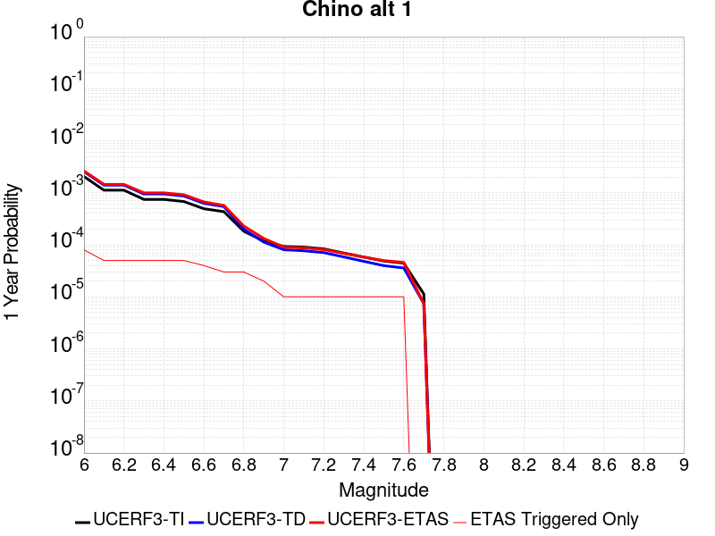 |  |

| Magnitude | 1 wk TI Prob | 1 wk TD Prob | 1 wk ETAS Prob | 1 wk ETAS/TD Gain | 1 wk ETAS Triggered Only | 1 mo TI Prob | 1 mo TD Prob | 1 mo ETAS Prob | 1 mo ETAS/TD Gain | 1 mo ETAS Triggered Only | 1 yr TI Prob | 1 yr TD Prob | 1 yr ETAS Prob | 1 yr ETAS/TD Gain | 1 yr ETAS Triggered Only | 10 yr TI Prob | 10 yr TD Prob | 10 yr ETAS Prob | 10 yr ETAS/TD Gain | 10 yr ETAS Triggered Only |
|-----|-----|-----|-----|-----|-----|-----|-----|-----|-----|-----|-----|-----|-----|-----|-----|-----|-----|-----|-----|-----|
| 6.0 | 3.939946E-5 | 4.894798E-5 | 7.314874E-5 | 1.4944179 | 2.4201941E-5 | 1.6884391E-4 | 2.0976314E-4 | 2.3395999E-4 | 1.1153532 | 2.4201941E-5 | 0.0020537362 | 0.002551385 | 0.0025996654 | 1.0189232 | 4.8403883E-5 | 0.020348595 | 0.025280168 | 0.025374528 | 1.0037326 | 9.6807766E-5 |
| 6.1 | 2.1505624E-5 | 2.6878823E-5 | 2.6878823E-5 | 1.0 | 0.0 | 9.2163704E-5 | 1.15190494E-4 | 1.15190494E-4 | 1.0 | 0.0 | 0.0011215154 | 0.0014016517 | 0.0014258196 | 1.0172426 | 2.4201941E-5 | 0.011158722 | 0.013947425 | 0.013995154 | 1.003422 | 4.8403883E-5 |
| 6.2 | 2.1505624E-5 | 2.6878823E-5 | 2.6878823E-5 | 1.0 | 0.0 | 9.2163704E-5 | 1.15190494E-4 | 1.15190494E-4 | 1.0 | 0.0 | 0.0011215154 | 0.0014016517 | 0.0014258196 | 1.0172426 | 2.4201941E-5 | 0.011158722 | 0.013947425 | 0.013995154 | 1.003422 | 4.8403883E-5 |
| 6.3 | 1.4290785E-5 | 1.8164832E-5 | 1.8164832E-5 | 1.0 | 0.0 | 6.1244784E-5 | 7.784722E-5 | 7.784722E-5 | 1.0 | 0.0 | 7.454001E-4 | 9.4742293E-4 | 9.716019E-4 | 1.0255208 | 2.4201941E-5 | 0.007429048 | 0.00944674 | 0.0094946865 | 1.0050755 | 4.8403883E-5 |
| 6.4 | 1.4290785E-5 | 1.8164832E-5 | 1.8164832E-5 | 1.0 | 0.0 | 6.1244784E-5 | 7.784722E-5 | 7.784722E-5 | 1.0 | 0.0 | 7.454001E-4 | 9.4742293E-4 | 9.716019E-4 | 1.0255208 | 2.4201941E-5 | 0.007429048 | 0.00944674 | 0.0094946865 | 1.0050755 | 4.8403883E-5 |
| 6.5 | 1.3017944E-5 | 1.6651793E-5 | 1.6651793E-5 | 1.0 | 0.0 | 5.5789995E-5 | 7.1363116E-5 | 7.1363116E-5 | 1.0 | 0.0 | 6.790315E-4 | 8.6854334E-4 | 8.9272426E-4 | 1.0278407 | 2.4201941E-5 | 0.0067696036 | 0.008664233 | 0.008712217 | 1.0055382 | 4.8403883E-5 |
| 6.6 | 9.470016E-6 | 1.2039209E-5 | 1.2039209E-5 | 1.0 | 0.0 | 4.058515E-5 | 5.159578E-5 | 5.159578E-5 | 1.0 | 0.0 | 4.940122E-4 | 6.280315E-4 | 6.5221824E-4 | 1.038512 | 2.4201941E-5 | 0.004929154 | 0.006273248 | 0.006321348 | 1.0076675 | 4.8403883E-5 |
| 6.7 | 8.314155E-6 | 1.040749E-5 | 1.040749E-5 | 1.0 | 0.0 | 3.5631605E-5 | 4.4602948E-5 | 4.4602948E-5 | 1.0 | 0.0 | 4.3372845E-4 | 5.4293784E-4 | 5.4293784E-4 | 1.0 | 0.0 | 0.004328829 | 0.0054270807 | 0.005451151 | 1.0044353 | 2.4201941E-5 |
| 6.8 | 3.4856364E-6 | 3.8134033E-6 | 3.8134033E-6 | 1.0 | 0.0 | 1.4938357E-5 | 1.6343065E-5 | 1.6343065E-5 | 1.0 | 0.0 | 1.8185932E-4 | 1.9896074E-4 | 1.9896074E-4 | 1.0 | 0.0 | 0.0018171056 | 0.0019894529 | 0.0019894529 | 1.0 | 0.0 |
| 6.9 | 2.2645952E-6 | 2.152909E-6 | 2.152909E-6 | 1.0 | 0.0 | 9.705372E-6 | 9.226722E-6 | 9.226722E-6 | 1.0 | 0.0 | 1.18156495E-4 | 1.12329755E-4 | 1.12329755E-4 | 1.0 | 0.0 | 0.0011809369 | 0.0011233138 | 0.0011233138 | 1.0 | 0.0 |
| 7.0 | 1.7864003E-6 | 1.5430741E-6 | 1.5430741E-6 | 1.0 | 0.0 | 7.655979E-6 | 6.613158E-6 | 6.613158E-6 | 1.0 | 0.0 | 9.3207556E-5 | 8.051228E-5 | 8.051228E-5 | 1.0 | 0.0 | 9.316847E-4 | 8.052856E-4 | 8.052856E-4 | 1.0 | 0.0 |
| 7.1 | 1.7315456E-6 | 1.4733466E-6 | 1.4733466E-6 | 1.0 | 0.0 | 7.420889E-6 | 6.314328E-6 | 6.314328E-6 | 1.0 | 0.0 | 9.034557E-5 | 7.687428E-5 | 7.687428E-5 | 1.0 | 0.0 | 9.0308854E-4 | 7.68921E-4 | 7.68921E-4 | 1.0 | 0.0 |
| 7.2 | 1.6008337E-6 | 1.3574178E-6 | 1.3574178E-6 | 1.0 | 0.0 | 6.860698E-6 | 5.817492E-6 | 5.817492E-6 | 1.0 | 0.0 | 8.352579E-5 | 7.082572E-5 | 7.082572E-5 | 1.0 | 0.0 | 8.34944E-4 | 7.0846075E-4 | 7.0846075E-4 | 1.0 | 0.0 |
| 7.3 | 1.3320939E-6 | 1.1217794E-6 | 1.1217794E-6 | 1.0 | 0.0 | 5.7089615E-6 | 4.8076176E-6 | 4.8076176E-6 | 1.0 | 0.0 | 6.9504385E-5 | 5.853122E-5 | 5.853122E-5 | 1.0 | 0.0 | 6.9482654E-4 | 5.8530655E-4 | 5.8530655E-4 | 1.0 | 0.0 |
| 7.4 | 1.114294E-6 | 9.237087E-7 | 9.237087E-7 | 1.0 | 0.0 | 4.775537E-6 | 3.9587458E-6 | 3.9587458E-6 | 1.0 | 0.0 | 5.8140613E-5 | 4.81967E-5 | 4.81967E-5 | 1.0 | 0.0 | 5.81254E-4 | 4.8187698E-4 | 4.8187698E-4 | 1.0 | 0.0 |
| 7.5 | 9.354081E-7 | 7.6233886E-7 | 7.6233886E-7 | 1.0 | 0.0 | 4.0088858E-6 | 3.2671626E-6 | 3.2671626E-6 | 1.0 | 0.0 | 4.8807087E-5 | 3.9777013E-5 | 3.9777013E-5 | 1.0 | 0.0 | 4.879637E-4 | 3.9770233E-4 | 3.9770233E-4 | 1.0 | 0.0 |
| 7.6 | 8.521771E-7 | 6.880688E-7 | 6.880688E-7 | 1.0 | 0.0 | 3.6521824E-6 | 2.948863E-6 | 2.948863E-6 | 1.0 | 0.0 | 4.4464414E-5 | 3.590185E-5 | 3.590185E-5 | 1.0 | 0.0 | 4.4455516E-4 | 3.5896365E-4 | 3.5896365E-4 | 1.0 | 0.0 |
| 7.7 | 2.1803626E-7 | 1.4186368E-7 | 1.4186368E-7 | 1.0 | 0.0 | 9.344408E-7 | 6.0798715E-7 | 6.0798715E-7 | 1.0 | 0.0 | 1.1376757E-5 | 7.4022278E-6 | 7.4022278E-6 | 1.0 | 0.0 | 1.13761744E-4 | 7.402077E-5 | 7.402077E-5 | 1.0 | 0.0 |

## Deep Springs
*[(top)](#table-of-contents)*

| 1 Week | 1 Month | 1 Year | 10 Year |
|-----|-----|-----|-----|
|  |  |  |  |

| Magnitude | 1 wk TI Prob | 1 wk TD Prob | 1 wk ETAS Prob | 1 wk ETAS/TD Gain | 1 wk ETAS Triggered Only | 1 mo TI Prob | 1 mo TD Prob | 1 mo ETAS Prob | 1 mo ETAS/TD Gain | 1 mo ETAS Triggered Only | 1 yr TI Prob | 1 yr TD Prob | 1 yr ETAS Prob | 1 yr ETAS/TD Gain | 1 yr ETAS Triggered Only | 10 yr TI Prob | 10 yr TD Prob | 10 yr ETAS Prob | 10 yr ETAS/TD Gain | 10 yr ETAS Triggered Only |
|-----|-----|-----|-----|-----|-----|-----|-----|-----|-----|-----|-----|-----|-----|-----|-----|-----|-----|-----|-----|-----|
| 6.0 | 1.9810619E-5 | 2.311252E-5 | 4.73139E-5 | 2.0471113 | 2.4201941E-5 | 8.489989E-5 | 9.9052755E-5 | 1.4745185E-4 | 1.4886193 | 4.8403883E-5 | 0.001033166 | 0.0012058078 | 0.0013024989 | 1.0801878 | 9.6807766E-5 | 0.010283757 | 0.01204243 | 0.012185893 | 1.0119132 | 1.4521164E-4 |
| 6.1 | 1.9810619E-5 | 2.311252E-5 | 4.73139E-5 | 2.0471113 | 2.4201941E-5 | 8.489989E-5 | 9.9052755E-5 | 1.4745185E-4 | 1.4886193 | 4.8403883E-5 | 0.001033166 | 0.0012058078 | 0.0013024989 | 1.0801878 | 9.6807766E-5 | 0.010283757 | 0.01204243 | 0.012185893 | 1.0119132 | 1.4521164E-4 |
| 6.2 | 1.9810619E-5 | 2.311252E-5 | 4.73139E-5 | 2.0471113 | 2.4201941E-5 | 8.489989E-5 | 9.9052755E-5 | 1.4745185E-4 | 1.4886193 | 4.8403883E-5 | 0.001033166 | 0.0012058078 | 0.0013024989 | 1.0801878 | 9.6807766E-5 | 0.010283757 | 0.01204243 | 0.012185893 | 1.0119132 | 1.4521164E-4 |
| 6.3 | 1.9810619E-5 | 2.311252E-5 | 4.73139E-5 | 2.0471113 | 2.4201941E-5 | 8.489989E-5 | 9.9052755E-5 | 1.4745185E-4 | 1.4886193 | 4.8403883E-5 | 0.001033166 | 0.0012058078 | 0.0013024989 | 1.0801878 | 9.6807766E-5 | 0.010283757 | 0.01204243 | 0.012185893 | 1.0119132 | 1.4521164E-4 |
| 6.4 | 1.9810619E-5 | 2.311252E-5 | 4.73139E-5 | 2.0471113 | 2.4201941E-5 | 8.489989E-5 | 9.9052755E-5 | 1.4745185E-4 | 1.4886193 | 4.8403883E-5 | 0.001033166 | 0.0012058078 | 0.0013024989 | 1.0801878 | 9.6807766E-5 | 0.010283757 | 0.01204243 | 0.012185893 | 1.0119132 | 1.4521164E-4 |
| 6.5 | 1.7190405E-5 | 2.0050558E-5 | 4.4252014E-5 | 2.2070215 | 2.4201941E-5 | 7.367108E-5 | 8.593096E-5 | 1.1013082E-4 | 1.2816198 | 2.4201941E-5 | 8.9657627E-4 | 0.0010462092 | 0.0011187391 | 1.0693264 | 7.260582E-5 | 0.008929676 | 0.010462061 | 0.0105578555 | 1.0091565 | 9.6807766E-5 |
| 6.6 | 1.7190405E-5 | 2.0050558E-5 | 4.4252014E-5 | 2.2070215 | 2.4201941E-5 | 7.367108E-5 | 8.593096E-5 | 1.1013082E-4 | 1.2816198 | 2.4201941E-5 | 8.9657627E-4 | 0.0010462092 | 0.0011187391 | 1.0693264 | 7.260582E-5 | 0.008929676 | 0.010462061 | 0.0105578555 | 1.0091565 | 9.6807766E-5 |

## Oak Ridge (Onshore)
*[(top)](#table-of-contents)*

| 1 Week | 1 Month | 1 Year | 10 Year |
|-----|-----|-----|-----|
|  |  |  |  |

| Magnitude | 1 wk TI Prob | 1 wk TD Prob | 1 wk ETAS Prob | 1 wk ETAS/TD Gain | 1 wk ETAS Triggered Only | 1 mo TI Prob | 1 mo TD Prob | 1 mo ETAS Prob | 1 mo ETAS/TD Gain | 1 mo ETAS Triggered Only | 1 yr TI Prob | 1 yr TD Prob | 1 yr ETAS Prob | 1 yr ETAS/TD Gain | 1 yr ETAS Triggered Only | 10 yr TI Prob | 10 yr TD Prob | 10 yr ETAS Prob | 10 yr ETAS/TD Gain | 10 yr ETAS Triggered Only |
|-----|-----|-----|-----|-----|-----|-----|-----|-----|-----|-----|-----|-----|-----|-----|-----|-----|-----|-----|-----|-----|
| 6.0 | 3.155064E-5 | 2.9526076E-5 | 7.792853E-5 | 2.639312 | 4.8403883E-5 | 1.3521002E-4 | 1.265344E-4 | 1.7493217E-4 | 1.3824869 | 4.8403883E-5 | 0.001644939 | 0.0015395058 | 0.0016119998 | 1.0470892 | 7.260582E-5 | 0.01632816 | 0.015293054 | 0.015412213 | 1.0077918 | 1.210097E-4 |
| 6.1 | 3.155064E-5 | 2.9526076E-5 | 7.792853E-5 | 2.639312 | 4.8403883E-5 | 1.3521002E-4 | 1.265344E-4 | 1.7493217E-4 | 1.3824869 | 4.8403883E-5 | 0.001644939 | 0.0015395058 | 0.0016119998 | 1.0470892 | 7.260582E-5 | 0.01632816 | 0.015293054 | 0.015412213 | 1.0077918 | 1.210097E-4 |
| 6.2 | 3.155064E-5 | 2.9526076E-5 | 7.792853E-5 | 2.639312 | 4.8403883E-5 | 1.3521002E-4 | 1.265344E-4 | 1.7493217E-4 | 1.3824869 | 4.8403883E-5 | 0.001644939 | 0.0015395058 | 0.0016119998 | 1.0470892 | 7.260582E-5 | 0.01632816 | 0.015293054 | 0.015412213 | 1.0077918 | 1.210097E-4 |
| 6.3 | 3.155064E-5 | 2.9526076E-5 | 7.792853E-5 | 2.639312 | 4.8403883E-5 | 1.3521002E-4 | 1.265344E-4 | 1.7493217E-4 | 1.3824869 | 4.8403883E-5 | 0.001644939 | 0.0015395058 | 0.0016119998 | 1.0470892 | 7.260582E-5 | 0.01632816 | 0.015293054 | 0.015412213 | 1.0077918 | 1.210097E-4 |
| 6.4 | 3.155064E-5 | 2.9526076E-5 | 7.792853E-5 | 2.639312 | 4.8403883E-5 | 1.3521002E-4 | 1.265344E-4 | 1.7493217E-4 | 1.3824869 | 4.8403883E-5 | 0.001644939 | 0.0015395058 | 0.0016119998 | 1.0470892 | 7.260582E-5 | 0.01632816 | 0.015293054 | 0.015412213 | 1.0077918 | 1.210097E-4 |
| 6.5 | 3.155064E-5 | 2.9526076E-5 | 7.792853E-5 | 2.639312 | 4.8403883E-5 | 1.3521002E-4 | 1.265344E-4 | 1.7493217E-4 | 1.3824869 | 4.8403883E-5 | 0.001644939 | 0.0015395058 | 0.0016119998 | 1.0470892 | 7.260582E-5 | 0.01632816 | 0.015293054 | 0.015412213 | 1.0077918 | 1.210097E-4 |
| 6.6 | 3.155064E-5 | 2.9526076E-5 | 7.792853E-5 | 2.639312 | 4.8403883E-5 | 1.3521002E-4 | 1.265344E-4 | 1.7493217E-4 | 1.3824869 | 4.8403883E-5 | 0.001644939 | 0.0015395058 | 0.0016119998 | 1.0470892 | 7.260582E-5 | 0.01632816 | 0.015293054 | 0.015412213 | 1.0077918 | 1.210097E-4 |
| 6.7 | 3.098897E-5 | 2.8864279E-5 | 7.726676E-5 | 2.6768992 | 4.8403883E-5 | 1.328031E-4 | 1.236984E-4 | 1.7209629E-4 | 1.3912573 | 4.8403883E-5 | 0.0016156785 | 0.0015050253 | 0.0015775218 | 1.0481696 | 7.260582E-5 | 0.016039822 | 0.014952909 | 0.01507211 | 1.0079718 | 1.210097E-4 |
| 6.8 | 3.0449872E-5 | 2.8239476E-5 | 7.664199E-5 | 2.714002 | 4.8403883E-5 | 1.3049292E-4 | 1.2102092E-4 | 1.6941894E-4 | 1.3999145 | 4.8403883E-5 | 0.0015875935 | 0.001472471 | 0.00154497 | 1.0492362 | 7.260582E-5 | 0.015762992 | 0.014631658 | 0.014750897 | 1.0081494 | 1.210097E-4 |
| 6.9 | 2.697928E-5 | 2.4219877E-5 | 2.4219877E-5 | 1.0 | 0.0 | 1.15620365E-4 | 1.03795464E-4 | 1.03795464E-4 | 1.0 | 0.0 | 0.0014067689 | 0.0012629988 | 0.0012871701 | 1.0191381 | 2.4201941E-5 | 0.0139789665 | 0.012561066 | 0.01263276 | 1.0057076 | 7.260582E-5 |
| 7.0 | 2.4893961E-5 | 2.1862146E-5 | 2.1862146E-5 | 1.0 | 0.0 | 1.0668404E-4 | 9.369165E-5 | 9.369165E-5 | 1.0 | 0.0 | 0.0012981043 | 0.0011401166 | 0.0011642909 | 1.0212034 | 2.4201941E-5 | 0.012905477 | 0.011345102 | 0.011416884 | 1.0063272 | 7.260582E-5 |
| 7.1 | 2.0945363E-5 | 1.7354592E-5 | 1.7354592E-5 | 1.0 | 0.0 | 8.976275E-5 | 7.437473E-5 | 7.437473E-5 | 1.0 | 0.0 | 0.0010923136 | 9.0514094E-4 | 9.2932093E-4 | 1.0267141 | 2.4201941E-5 | 0.0108696 | 0.009015621 | 0.009087572 | 1.0079807 | 7.260582E-5 |
| 7.2 | 2.0439404E-5 | 1.680953E-5 | 1.680953E-5 | 1.0 | 0.0 | 8.7594504E-5 | 7.203888E-5 | 7.203888E-5 | 1.0 | 0.0 | 0.0010659413 | 8.767251E-4 | 9.009058E-4 | 1.0275807 | 2.4201941E-5 | 0.010608427 | 0.008733723 | 0.008805695 | 1.0082407 | 7.260582E-5 |
| 7.3 | 1.8463334E-5 | 1.5381947E-5 | 1.5381947E-5 | 1.0 | 0.0 | 7.912617E-5 | 6.592098E-5 | 6.592098E-5 | 1.0 | 0.0 | 9.6293533E-4 | 8.0229685E-4 | 8.2647934E-4 | 1.0301416 | 2.4201941E-5 | 0.009587734 | 0.0079950085 | 0.008067034 | 1.0090088 | 7.260582E-5 |
| 7.4 | 1.763139E-5 | 1.4516977E-5 | 1.4516977E-5 | 1.0 | 0.0 | 7.556091E-5 | 6.221415E-5 | 6.221415E-5 | 1.0 | 0.0 | 9.1956573E-4 | 7.57198E-4 | 7.813817E-4 | 1.0319383 | 2.4201941E-5 | 0.009157699 | 0.007547126 | 0.007619184 | 1.0095477 | 7.260582E-5 |
| 7.5 | 1.3594944E-5 | 1.1163363E-5 | 1.1163363E-5 | 1.0 | 0.0 | 5.8262744E-5 | 4.7842117E-5 | 4.7842117E-5 | 1.0 | 0.0 | 7.0911803E-4 | 5.8232463E-4 | 5.8232463E-4 | 1.0 | 0.0 | 0.007068595 | 0.005808362 | 0.005832423 | 1.0041425 | 2.4201941E-5 |
| 7.6 | 6.9889534E-6 | 5.6367194E-6 | 5.6367194E-6 | 1.0 | 0.0 | 2.9952313E-5 | 2.4157147E-5 | 2.4157147E-5 | 1.0 | 0.0 | 3.646084E-4 | 2.94074E-4 | 2.94074E-4 | 1.0 | 0.0 | 0.0036401073 | 0.0029368924 | 0.0029610235 | 1.0082165 | 2.4201941E-5 |
| 7.7 | 4.0824193E-6 | 3.2832731E-6 | 3.2832731E-6 | 1.0 | 0.0 | 1.7495966E-5 | 1.4071096E-5 | 1.4071096E-5 | 1.0 | 0.0 | 2.1299256E-4 | 1.7130225E-4 | 1.7130225E-4 | 1.0 | 0.0 | 0.0021278851 | 0.0017117155 | 0.0017358761 | 1.0141147 | 2.4201941E-5 |
| 7.8 | 1.7023609E-6 | 1.43706E-6 | 1.43706E-6 | 1.0 | 0.0 | 7.295812E-6 | 6.158814E-6 | 6.158814E-6 | 1.0 | 0.0 | 8.882289E-5 | 7.4981006E-5 | 7.4981006E-5 | 1.0 | 0.0 | 8.8787393E-4 | 7.4955984E-4 | 7.4955984E-4 | 1.0 | 0.0 |
| 7.9 | 2.721225E-7 | 2.261692E-7 | 2.261692E-7 | 1.0 | 0.0 | 1.1662388E-6 | 9.692963E-7 | 9.692963E-7 | 1.0 | 0.0 | 1.4198865E-5 | 1.1801121E-5 | 1.1801121E-5 | 1.0 | 0.0 | 1.4197957E-4 | 1.1800523E-4 | 1.1800523E-4 | 1.0 | 0.0 |
| 8.0 | 9.364255E-9 | 5.1204916E-9 | 5.1204916E-9 | 1.0 | 0.0 | 4.0132523E-8 | 2.1944963E-8 | 2.1944963E-8 | 1.0 | 0.0 | 4.8861335E-7 | 2.671799E-7 | 2.671799E-7 | 1.0 | 0.0 | 4.8861225E-6 | 2.6717962E-6 | 2.6717962E-6 | 1.0 | 0.0 |

## Big Pine (East)
*[(top)](#table-of-contents)*

| 1 Week | 1 Month | 1 Year | 10 Year |
|-----|-----|-----|-----|
|  |  |  |  |

| Magnitude | 1 wk TI Prob | 1 wk TD Prob | 1 wk ETAS Prob | 1 wk ETAS/TD Gain | 1 wk ETAS Triggered Only | 1 mo TI Prob | 1 mo TD Prob | 1 mo ETAS Prob | 1 mo ETAS/TD Gain | 1 mo ETAS Triggered Only | 1 yr TI Prob | 1 yr TD Prob | 1 yr ETAS Prob | 1 yr ETAS/TD Gain | 1 yr ETAS Triggered Only | 10 yr TI Prob | 10 yr TD Prob | 10 yr ETAS Prob | 10 yr ETAS/TD Gain | 10 yr ETAS Triggered Only |
|-----|-----|-----|-----|-----|-----|-----|-----|-----|-----|-----|-----|-----|-----|-----|-----|-----|-----|-----|-----|-----|
| 6.0 | 9.916913E-6 | 1.28172705E-5 | 3.70189E-5 | 2.8882046 | 2.4201941E-5 | 4.250036E-5 | 5.493013E-5 | 1.2753197E-4 | 2.3217125 | 7.260582E-5 | 5.173191E-4 | 6.685912E-4 | 7.411485E-4 | 1.1085227 | 7.260582E-5 | 0.0051611643 | 0.006670449 | 0.0068146917 | 1.0216242 | 1.4521164E-4 |
| 6.1 | 9.916913E-6 | 1.28172705E-5 | 3.70189E-5 | 2.8882046 | 2.4201941E-5 | 4.250036E-5 | 5.493013E-5 | 1.2753197E-4 | 2.3217125 | 7.260582E-5 | 5.173191E-4 | 6.685912E-4 | 7.411485E-4 | 1.1085227 | 7.260582E-5 | 0.0051611643 | 0.006670449 | 0.0068146917 | 1.0216242 | 1.4521164E-4 |
| 6.2 | 9.916913E-6 | 1.28172705E-5 | 3.70189E-5 | 2.8882046 | 2.4201941E-5 | 4.250036E-5 | 5.493013E-5 | 1.2753197E-4 | 2.3217125 | 7.260582E-5 | 5.173191E-4 | 6.685912E-4 | 7.411485E-4 | 1.1085227 | 7.260582E-5 | 0.0051611643 | 0.006670449 | 0.0068146917 | 1.0216242 | 1.4521164E-4 |
| 6.3 | 5.479711E-6 | 8.1132375E-6 | 3.2314983E-5 | 3.9829946 | 2.4201941E-5 | 2.3484265E-5 | 3.4770575E-5 | 8.3172774E-5 | 2.3920448 | 4.8403883E-5 | 2.858834E-4 | 4.232527E-4 | 4.716361E-4 | 1.1143132 | 4.8403883E-5 | 0.0028551589 | 0.0042272513 | 0.0043477495 | 1.0285051 | 1.210097E-4 |
| 6.4 | 5.465009E-6 | 8.0975315E-6 | 3.2299275E-5 | 3.9887807 | 2.4201941E-5 | 2.3421257E-5 | 3.4703262E-5 | 8.3105464E-5 | 2.394745 | 4.8403883E-5 | 2.851165E-4 | 4.2243348E-4 | 4.708169E-4 | 1.1145351 | 4.8403883E-5 | 0.0028475097 | 0.00421909 | 0.0043395893 | 1.0285604 | 1.210097E-4 |
| 6.5 | 4.826767E-6 | 7.4225877E-6 | 3.162435E-5 | 4.2605557 | 2.4201941E-5 | 2.068598E-5 | 3.1810716E-5 | 8.021306E-5 | 2.5215735 | 4.8403883E-5 | 2.518227E-4 | 3.8722943E-4 | 4.3561458E-4 | 1.1249521 | 4.8403883E-5 | 0.0025153751 | 0.0038682907 | 0.0039888322 | 1.0311614 | 1.210097E-4 |
| 6.6 | 4.3146847E-6 | 6.8825234E-6 | 3.10843E-5 | 4.51641 | 2.4201941E-5 | 1.8491375E-5 | 2.949621E-5 | 7.7898665E-5 | 2.640972 | 4.8403883E-5 | 2.2510924E-4 | 3.5905963E-4 | 4.0744612E-4 | 1.134759 | 4.8403883E-5 | 0.0022488134 | 0.0035875062 | 0.0036839666 | 1.0268879 | 9.6807766E-5 |
| 6.7 | 3.6968106E-6 | 5.9957474E-6 | 3.0197543E-5 | 5.0364933 | 2.4201941E-5 | 1.5843378E-5 | 2.5695816E-5 | 7.4098454E-5 | 2.8836777 | 4.8403883E-5 | 1.9287605E-4 | 3.128032E-4 | 3.6119192E-4 | 1.1546938 | 4.8403883E-5 | 0.0019270873 | 0.0031262499 | 0.003222755 | 1.0308692 | 9.6807766E-5 |
| 6.8 | 3.4671132E-6 | 5.7024477E-6 | 2.9904251E-5 | 5.2441077 | 2.4201941E-5 | 1.4858972E-5 | 2.4438841E-5 | 7.284154E-5 | 2.9805644 | 4.8403883E-5 | 1.8089297E-4 | 2.9750372E-4 | 3.4589318E-4 | 1.1626517 | 4.8403883E-5 | 0.0018074579 | 0.0029736666 | 0.0030701866 | 1.0324582 | 9.6807766E-5 |
| 6.9 | 2.7686972E-6 | 4.8254797E-6 | 4.8254797E-6 | 1.0 | 0.0 | 1.1865792E-5 | 2.0680467E-5 | 2.0680467E-5 | 1.0 | 0.0 | 1.4445644E-4 | 2.5175634E-4 | 2.5175634E-4 | 1.0 | 0.0 | 0.0014436257 | 0.002517256 | 0.002541397 | 1.0095903 | 2.4201941E-5 |
| 7.0 | 2.1472624E-6 | 3.985277E-6 | 3.985277E-6 | 1.0 | 0.0 | 9.20252E-6 | 1.707965E-5 | 1.707965E-5 | 1.0 | 0.0 | 1.12034926E-4 | 2.0792543E-4 | 2.0792543E-4 | 1.0 | 0.0 | 0.0011197845 | 0.0020798238 | 0.0021039755 | 1.0116123 | 2.4201941E-5 |
| 7.1 | 1.7018335E-6 | 3.3450835E-6 | 3.3450835E-6 | 1.0 | 0.0 | 7.293552E-6 | 1.4335996E-5 | 1.4335996E-5 | 1.0 | 0.0 | 8.879537E-5 | 1.7452713E-4 | 1.7452713E-4 | 1.0 | 0.0 | 8.87599E-4 | 0.0017463792 | 0.0017705389 | 1.0138341 | 2.4201941E-5 |
| 7.2 | 1.25603E-6 | 2.794679E-6 | 2.794679E-6 | 1.0 | 0.0 | 5.3829745E-6 | 1.1977142E-5 | 1.1977142E-5 | 1.0 | 0.0 | 6.553574E-5 | 1.4581217E-4 | 1.4581217E-4 | 1.0 | 0.0 | 6.551642E-4 | 0.0014596173 | 0.0014837839 | 1.0165569 | 2.4201941E-5 |
| 7.3 | 1.112297E-6 | 2.610519E-6 | 2.610519E-6 | 1.0 | 0.0 | 4.7669787E-6 | 1.1187892E-5 | 1.1187892E-5 | 1.0 | 0.0 | 5.803642E-5 | 1.3620428E-4 | 1.3620428E-4 | 1.0 | 0.0 | 5.802127E-4 | 0.001363502 | 0.0013876709 | 1.0177256 | 2.4201941E-5 |
| 7.4 | 1.0137181E-6 | 2.4836752E-6 | 2.4836752E-6 | 1.0 | 0.0 | 4.3444993E-6 | 1.064428E-5 | 1.064428E-5 | 1.0 | 0.0 | 5.2892992E-5 | 1.2958662E-4 | 1.2958662E-4 | 1.0 | 0.0 | 5.288041E-4 | 0.0012971918 | 0.0013213623 | 1.018633 | 2.4201941E-5 |
| 7.5 | 9.598608E-7 | 2.407328E-6 | 2.407328E-6 | 1.0 | 0.0 | 4.1136827E-6 | 1.03170805E-5 | 1.03170805E-5 | 1.0 | 0.0 | 5.0082934E-5 | 1.2560343E-4 | 1.2560343E-4 | 1.0 | 0.0 | 5.007165E-4 | 0.0012572132 | 0.0012813847 | 1.0192263 | 2.4201941E-5 |
| 7.6 | 7.929459E-7 | 2.0450152E-6 | 2.0450152E-6 | 1.0 | 0.0 | 3.3983351E-6 | 8.764322E-6 | 8.764322E-6 | 1.0 | 0.0 | 4.1373947E-5 | 1.0670057E-4 | 1.0670057E-4 | 1.0 | 0.0 | 4.1366243E-4 | 0.0010685825 | 0.0010927586 | 1.0226245 | 2.4201941E-5 |
| 7.7 | 4.155788E-7 | 1.1606729E-6 | 1.1606729E-6 | 1.0 | 0.0 | 1.7810507E-6 | 4.974303E-6 | 4.974303E-6 | 1.0 | 0.0 | 2.1684076E-5 | 6.05605E-5 | 6.05605E-5 | 1.0 | 0.0 | 2.1681961E-4 | 6.085995E-4 | 6.327868E-4 | 1.0397424 | 2.4201941E-5 |
| 7.8 | 1.14666925E-7 | 2.592197E-7 | 2.592197E-7 | 1.0 | 0.0 | 4.914296E-7 | 1.1109411E-6 | 1.1109411E-6 | 1.0 | 0.0 | 5.9831386E-6 | 1.3525627E-5 | 1.3525627E-5 | 1.0 | 0.0 | 5.9829777E-5 | 1.3636416E-4 | 1.605628E-4 | 1.177456 | 2.4201941E-5 |
| 7.9 | 2.9231824E-8 | 4.1462318E-8 | 4.1462318E-8 | 1.0 | 0.0 | 1.2527924E-7 | 1.7769564E-7 | 1.7769564E-7 | 1.0 | 0.0 | 1.5252737E-6 | 2.1634426E-6 | 2.1634426E-6 | 1.0 | 0.0 | 1.5252632E-5 | 2.197062E-5 | 2.197062E-5 | 1.0 | 0.0 |

## Santa Cruz Island
*[(top)](#table-of-contents)*

| 1 Week | 1 Month | 1 Year | 10 Year |
|-----|-----|-----|-----|
|  |  |  |  |

| Magnitude | 1 wk TI Prob | 1 wk TD Prob | 1 wk ETAS Prob | 1 wk ETAS/TD Gain | 1 wk ETAS Triggered Only | 1 mo TI Prob | 1 mo TD Prob | 1 mo ETAS Prob | 1 mo ETAS/TD Gain | 1 mo ETAS Triggered Only | 1 yr TI Prob | 1 yr TD Prob | 1 yr ETAS Prob | 1 yr ETAS/TD Gain | 1 yr ETAS Triggered Only | 10 yr TI Prob | 10 yr TD Prob | 10 yr ETAS Prob | 10 yr ETAS/TD Gain | 10 yr ETAS Triggered Only |
|-----|-----|-----|-----|-----|-----|-----|-----|-----|-----|-----|-----|-----|-----|-----|-----|-----|-----|-----|-----|-----|
| 6.0 | 2.9164563E-5 | 3.1599742E-5 | 8.000209E-5 | 2.5317323 | 4.8403883E-5 | 1.2498499E-4 | 1.3542121E-4 | 2.080172E-4 | 1.5360755 | 7.260582E-5 | 0.0015206301 | 0.0016476426 | 0.0017684529 | 1.0733231 | 1.210097E-4 | 0.015102667 | 0.016368 | 0.016487028 | 1.007272 | 1.210097E-4 |
| 6.1 | 2.9164563E-5 | 3.1599742E-5 | 8.000209E-5 | 2.5317323 | 4.8403883E-5 | 1.2498499E-4 | 1.3542121E-4 | 2.080172E-4 | 1.5360755 | 7.260582E-5 | 0.0015206301 | 0.0016476426 | 0.0017684529 | 1.0733231 | 1.210097E-4 | 0.015102667 | 0.016368 | 0.016487028 | 1.007272 | 1.210097E-4 |
| 6.2 | 2.9164563E-5 | 3.1599742E-5 | 8.000209E-5 | 2.5317323 | 4.8403883E-5 | 1.2498499E-4 | 1.3542121E-4 | 2.080172E-4 | 1.5360755 | 7.260582E-5 | 0.0015206301 | 0.0016476426 | 0.0017684529 | 1.0733231 | 1.210097E-4 | 0.015102667 | 0.016368 | 0.016487028 | 1.007272 | 1.210097E-4 |
| 6.3 | 1.6635553E-5 | 1.780436E-5 | 4.2005868E-5 | 2.3593025 | 2.4201941E-5 | 7.1293274E-5 | 7.630227E-5 | 1.2470245E-4 | 1.6343218 | 4.8403883E-5 | 8.6765E-4 | 9.286024E-4 | 0.0010253203 | 1.1041542 | 9.6807766E-5 | 0.008642701 | 0.009249094 | 0.009345006 | 1.0103699 | 9.6807766E-5 |
| 6.4 | 1.6635553E-5 | 1.780436E-5 | 4.2005868E-5 | 2.3593025 | 2.4201941E-5 | 7.1293274E-5 | 7.630227E-5 | 1.2470245E-4 | 1.6343218 | 4.8403883E-5 | 8.6765E-4 | 9.286024E-4 | 0.0010253203 | 1.1041542 | 9.6807766E-5 | 0.008642701 | 0.009249094 | 0.009345006 | 1.0103699 | 9.6807766E-5 |
| 6.5 | 1.2238748E-5 | 1.3042996E-5 | 3.7244623E-5 | 2.8555264 | 2.4201941E-5 | 5.2450723E-5 | 5.5897377E-5 | 1.0429855E-4 | 1.8658935 | 4.8403883E-5 | 6.3840044E-4 | 6.8034173E-4 | 7.287127E-4 | 1.071098 | 4.8403883E-5 | 0.0063656955 | 0.006782988 | 0.0068310634 | 1.0070877 | 4.8403883E-5 |
| 6.6 | 1.0489767E-5 | 1.1156636E-5 | 3.5358305E-5 | 3.1692624 | 2.4201941E-5 | 4.495537E-5 | 4.781329E-5 | 9.621486E-5 | 2.0123036 | 4.8403883E-5 | 5.4719415E-4 | 5.819736E-4 | 6.3034927E-4 | 1.0831236 | 4.8403883E-5 | 0.005458487 | 0.005804736 | 0.005852859 | 1.0082903 | 4.8403883E-5 |
| 6.7 | 8.699222E-6 | 9.236783E-6 | 3.34385E-5 | 3.620146 | 2.4201941E-5 | 3.7281847E-5 | 3.958561E-5 | 8.798758E-5 | 2.222716 | 4.8403883E-5 | 4.5381195E-4 | 4.818488E-4 | 5.3022936E-4 | 1.100406 | 4.8403883E-5 | 0.0045288634 | 0.004808108 | 0.004856279 | 1.0100187 | 4.8403883E-5 |
| 6.8 | 8.307732E-6 | 8.8169045E-6 | 3.301863E-5 | 3.7449234 | 2.4201941E-5 | 3.560408E-5 | 3.7786187E-5 | 8.618824E-5 | 2.2809455 | 4.8403883E-5 | 4.3339343E-4 | 4.5995016E-4 | 5.0833175E-4 | 1.1051888 | 4.8403883E-5 | 0.004325492 | 0.0045900354 | 0.004638217 | 1.010497 | 4.8403883E-5 |
| 6.9 | 8.073121E-6 | 8.564939E-6 | 3.276667E-5 | 3.8256748 | 2.4201941E-5 | 3.459863E-5 | 3.670637E-5 | 8.510848E-5 | 2.3186297 | 4.8403883E-5 | 4.2115687E-4 | 4.4680882E-4 | 4.951911E-4 | 1.108284 | 4.8403883E-5 | 0.004203596 | 0.004459156 | 0.004507344 | 1.0108066 | 4.8403883E-5 |
| 7.0 | 7.617019E-6 | 8.074665E-6 | 3.227641E-5 | 3.9972446 | 2.4201941E-5 | 3.264396E-5 | 3.4605247E-5 | 8.300746E-5 | 2.3986955 | 4.8403883E-5 | 3.9736772E-4 | 4.2123784E-4 | 4.6962133E-4 | 1.1148603 | 4.8403883E-5 | 0.003966579 | 0.0042044413 | 0.004252642 | 1.0114641 | 4.8403883E-5 |
| 7.1 | 7.1224836E-6 | 7.5457883E-6 | 3.1747546E-5 | 4.20732 | 2.4201941E-5 | 3.052457E-5 | 3.2338692E-5 | 5.653985E-5 | 1.7483654 | 2.4201941E-5 | 3.715733E-4 | 3.9365282E-4 | 4.1784524E-4 | 1.0614562 | 2.4201941E-5 | 0.003709526 | 0.0039295983 | 0.003953705 | 1.0061346 | 2.4201941E-5 |
| 7.2 | 6.441115E-6 | 6.8273835E-6 | 3.1029158E-5 | 4.54481 | 2.4201941E-5 | 2.7604487E-5 | 2.9259889E-5 | 5.346112E-5 | 1.8271129 | 2.4201941E-5 | 3.360328E-4 | 3.5618115E-4 | 3.8037446E-4 | 1.0679243 | 2.4201941E-5 | 0.0033552512 | 0.0035561312 | 0.003580247 | 1.0067815 | 2.4201941E-5 |
| 7.3 | 5.494274E-6 | 5.8199944E-6 | 3.0021794E-5 | 5.1583886 | 2.4201941E-5 | 2.3546674E-5 | 2.4942596E-5 | 4.9143935E-5 | 1.9702814 | 2.4201941E-5 | 2.8664304E-4 | 3.03634E-4 | 3.278286E-4 | 1.0796834 | 2.4201941E-5 | 0.002862736 | 0.0030322145 | 0.003056343 | 1.0079575 | 2.4201941E-5 |
| 7.4 | 4.0802624E-6 | 4.3122564E-6 | 2.8514092E-5 | 6.612337 | 2.4201941E-5 | 1.7486722E-5 | 1.8480969E-5 | 4.2682463E-5 | 2.309536 | 2.4201941E-5 | 2.1288003E-4 | 2.2498264E-4 | 2.4917914E-4 | 1.1075482 | 2.4201941E-5 | 0.0021267622 | 0.0022475577 | 0.002271705 | 1.0107439 | 2.4201941E-5 |
| 7.5 | 2.3584746E-6 | 2.4753099E-6 | 2.6677191E-5 | 10.777313 | 2.4201941E-5 | 1.0107709E-5 | 1.0608428E-5 | 3.4810113E-5 | 3.281364 | 2.4201941E-5 | 1.2305441E-4 | 1.2915001E-4 | 1.5334882E-4 | 1.1873698 | 2.4201941E-5 | 0.0012298629 | 0.0012907545 | 0.0013149253 | 1.018726 | 2.4201941E-5 |
| 7.6 | 9.4981914E-7 | 9.860934E-7 | 9.860934E-7 | 1.0 | 0.0 | 4.0706473E-6 | 4.2261076E-6 | 4.2261076E-6 | 1.0 | 0.0 | 4.9559E-5 | 5.1451658E-5 | 5.1451658E-5 | 1.0 | 0.0 | 4.954795E-4 | 5.1439874E-4 | 5.1439874E-4 | 1.0 | 0.0 |
| 7.7 | 2.6013532E-7 | 2.6416632E-7 | 2.6416632E-7 | 1.0 | 0.0 | 1.1148652E-6 | 1.1321408E-6 | 1.1321408E-6 | 1.0 | 0.0 | 1.3573399E-5 | 1.3783729E-5 | 1.3783729E-5 | 1.0 | 0.0 | 1.357257E-4 | 1.378288E-4 | 1.378288E-4 | 1.0 | 0.0 |
| 7.8 | 4.1522263E-8 | 3.965698E-8 | 3.965698E-8 | 1.0 | 0.0 | 1.7795254E-7 | 1.6995848E-7 | 1.6995848E-7 | 1.0 | 0.0 | 2.16657E-6 | 2.0692428E-6 | 2.0692428E-6 | 1.0 | 0.0 | 2.1665488E-5 | 2.0692256E-5 | 2.0692256E-5 | 1.0 | 0.0 |
| 7.9 | 7.7242046E-10 | 5.9475225E-10 | 5.9475225E-10 | 1.0 | 0.0 | 3.3103735E-9 | 2.5489382E-9 | 2.5489382E-9 | 1.0 | 0.0 | 4.0303796E-8 | 3.1033323E-8 | 3.1033323E-8 | 1.0 | 0.0 | 4.030379E-7 | 3.103332E-7 | 3.103332E-7 | 1.0 | 0.0 |

## Mission Creek
*[(top)](#table-of-contents)*

| 1 Week | 1 Month | 1 Year | 10 Year |
|-----|-----|-----|-----|
|  |  |  |  |

| Magnitude | 1 wk TI Prob | 1 wk TD Prob | 1 wk ETAS Prob | 1 wk ETAS/TD Gain | 1 wk ETAS Triggered Only | 1 mo TI Prob | 1 mo TD Prob | 1 mo ETAS Prob | 1 mo ETAS/TD Gain | 1 mo ETAS Triggered Only | 1 yr TI Prob | 1 yr TD Prob | 1 yr ETAS Prob | 1 yr ETAS/TD Gain | 1 yr ETAS Triggered Only | 10 yr TI Prob | 10 yr TD Prob | 10 yr ETAS Prob | 10 yr ETAS/TD Gain | 10 yr ETAS Triggered Only |
|-----|-----|-----|-----|-----|-----|-----|-----|-----|-----|-----|-----|-----|-----|-----|-----|-----|-----|-----|-----|-----|
| 6.0 | 1.1549387E-5 | 1.6322783E-5 | 6.472587E-5 | 3.9653702 | 4.8403883E-5 | 4.9496433E-5 | 6.995299E-5 | 1.18353484E-4 | 1.6919003 | 4.8403883E-5 | 6.0245243E-4 | 8.5135986E-4 | 9.7226654E-4 | 1.1420159 | 1.210097E-4 | 0.006008218 | 0.008510157 | 0.0086541325 | 1.0169182 | 1.4521164E-4 |
| 6.1 | 1.1549387E-5 | 1.6322783E-5 | 6.472587E-5 | 3.9653702 | 4.8403883E-5 | 4.9496433E-5 | 6.995299E-5 | 1.18353484E-4 | 1.6919003 | 4.8403883E-5 | 6.0245243E-4 | 8.5135986E-4 | 9.7226654E-4 | 1.1420159 | 1.210097E-4 | 0.006008218 | 0.008510157 | 0.0086541325 | 1.0169182 | 1.4521164E-4 |
| 6.2 | 1.1549387E-5 | 1.6322783E-5 | 6.472587E-5 | 3.9653702 | 4.8403883E-5 | 4.9496433E-5 | 6.995299E-5 | 1.18353484E-4 | 1.6919003 | 4.8403883E-5 | 6.0245243E-4 | 8.5135986E-4 | 9.7226654E-4 | 1.1420159 | 1.210097E-4 | 0.006008218 | 0.008510157 | 0.0086541325 | 1.0169182 | 1.4521164E-4 |
| 6.3 | 1.1549387E-5 | 1.6322783E-5 | 6.472587E-5 | 3.9653702 | 4.8403883E-5 | 4.9496433E-5 | 6.995299E-5 | 1.18353484E-4 | 1.6919003 | 4.8403883E-5 | 6.0245243E-4 | 8.5135986E-4 | 9.7226654E-4 | 1.1420159 | 1.210097E-4 | 0.006008218 | 0.008510157 | 0.0086541325 | 1.0169182 | 1.4521164E-4 |
| 6.4 | 1.1549387E-5 | 1.6322783E-5 | 6.472587E-5 | 3.9653702 | 4.8403883E-5 | 4.9496433E-5 | 6.995299E-5 | 1.18353484E-4 | 1.6919003 | 4.8403883E-5 | 6.0245243E-4 | 8.5135986E-4 | 9.7226654E-4 | 1.1420159 | 1.210097E-4 | 0.006008218 | 0.008510157 | 0.0086541325 | 1.0169182 | 1.4521164E-4 |
| 6.5 | 1.1549387E-5 | 1.6322783E-5 | 6.472587E-5 | 3.9653702 | 4.8403883E-5 | 4.9496433E-5 | 6.995299E-5 | 1.18353484E-4 | 1.6919003 | 4.8403883E-5 | 6.0245243E-4 | 8.5135986E-4 | 9.7226654E-4 | 1.1420159 | 1.210097E-4 | 0.006008218 | 0.008510157 | 0.0086541325 | 1.0169182 | 1.4521164E-4 |
| 6.6 | 9.202681E-6 | 1.3846059E-5 | 6.224927E-5 | 4.4958115 | 4.8403883E-5 | 3.9439463E-5 | 5.9338956E-5 | 1.07739965E-4 | 1.8156701 | 4.8403883E-5 | 4.800697E-4 | 7.2222133E-4 | 8.431436E-4 | 1.1674311 | 1.210097E-4 | 0.004790339 | 0.0072273402 | 0.0073715025 | 1.0199468 | 1.4521164E-4 |
| 6.7 | 9.019164E-6 | 1.3651728E-5 | 6.205495E-5 | 4.5455747 | 4.8403883E-5 | 3.8652986E-5 | 5.8506146E-5 | 1.06907195E-4 | 1.8272815 | 4.8403883E-5 | 4.7049852E-4 | 7.1208854E-4 | 8.3301205E-4 | 1.1698153 | 1.210097E-4 | 0.004695036 | 0.0071266647 | 0.0072708414 | 1.0202307 | 1.4521164E-4 |
| 6.8 | 8.673558E-6 | 1.3273839E-5 | 6.167708E-5 | 4.646514 | 4.8403883E-5 | 3.717186E-5 | 5.688669E-5 | 1.0528782E-4 | 1.850834 | 4.8403883E-5 | 4.524734E-4 | 6.923842E-4 | 8.1331015E-4 | 1.1746515 | 1.210097E-4 | 0.0045155324 | 0.0069308523 | 0.007075058 | 1.0208063 | 1.4521164E-4 |
| 6.9 | 7.002255E-6 | 1.1478069E-5 | 5.9881393E-5 | 5.217027 | 4.8403883E-5 | 3.000932E-5 | 4.9190832E-5 | 9.759233E-5 | 1.9839537 | 4.8403883E-5 | 3.653022E-4 | 5.9874065E-4 | 7.196779E-4 | 1.2019861 | 1.210097E-4 | 0.0036470229 | 0.005999676 | 0.006144016 | 1.024058 | 1.4521164E-4 |
| 7.0 | 5.84644E-6 | 9.675359E-6 | 5.8078775E-5 | 6.002751 | 4.8403883E-5 | 2.5055931E-5 | 4.146519E-5 | 8.986707E-5 | 2.1672893 | 4.8403883E-5 | 3.0501327E-4 | 5.047263E-4 | 6.2567496E-4 | 1.2396321 | 1.210097E-4 | 0.0030459496 | 0.005063994 | 0.0052084704 | 1.0285301 | 1.4521164E-4 |
| 7.1 | 5.54703E-6 | 9.329834E-6 | 5.7733265E-5 | 6.188027 | 4.8403883E-5 | 2.377277E-5 | 3.9984414E-5 | 8.838636E-5 | 2.2105203 | 4.8403883E-5 | 2.8939504E-4 | 4.8670598E-4 | 6.076568E-4 | 1.2485089 | 1.210097E-4 | 0.0028901845 | 0.0048845876 | 0.0050290897 | 1.0295833 | 1.4521164E-4 |
| 7.2 | 4.384709E-6 | 7.681918E-6 | 5.6085428E-5 | 7.3009667 | 4.8403883E-5 | 1.8791474E-5 | 3.292211E-5 | 8.13244E-5 | 2.470206 | 4.8403883E-5 | 2.2876218E-4 | 4.0075663E-4 | 5.217178E-4 | 1.3018321 | 1.210097E-4 | 0.0022852682 | 0.004028542 | 0.0041731684 | 1.0359005 | 1.4521164E-4 |
| 7.3 | 3.7888456E-6 | 6.915788E-6 | 5.5319335E-5 | 7.998992 | 4.8403883E-5 | 1.623781E-5 | 2.9638775E-5 | 7.804122E-5 | 2.6330786 | 4.8403883E-5 | 1.9767738E-4 | 3.6079568E-4 | 4.8176173E-4 | 1.3352758 | 1.210097E-4 | 0.0019750162 | 0.00363027 | 0.0037749545 | 1.039855 | 1.4521164E-4 |
| 7.4 | 2.1982462E-6 | 5.0241033E-6 | 5.3427742E-5 | 10.634284 | 4.8403883E-5 | 9.421021E-6 | 2.1531694E-5 | 6.993453E-5 | 3.247981 | 4.8403883E-5 | 1.1469489E-4 | 2.6211704E-4 | 3.5889942E-4 | 1.3692335 | 9.6807766E-5 | 0.0011463572 | 0.0026460327 | 0.002766722 | 1.0456115 | 1.210097E-4 |
| 7.5 | 2.051923E-6 | 4.6153277E-6 | 5.3018986E-5 | 11.487589 | 4.8403883E-5 | 8.793926E-6 | 1.9779825E-5 | 6.818275E-5 | 3.4470854 | 4.8403883E-5 | 1.0706078E-4 | 2.4079291E-4 | 3.3757737E-4 | 1.4019406 | 9.6807766E-5 | 0.0010700922 | 0.0024335932 | 0.0025543084 | 1.0496037 | 1.210097E-4 |
| 7.6 | 1.8733427E-6 | 4.1236603E-6 | 5.2527343E-5 | 12.738037 | 4.8403883E-5 | 8.028587E-6 | 1.7672712E-5 | 6.6075736E-5 | 3.7388568 | 4.8403883E-5 | 9.774366E-5 | 2.151441E-4 | 3.1193104E-4 | 1.4498702 | 9.6807766E-5 | 9.770069E-4 | 0.0021782513 | 0.0022989972 | 1.0554326 | 1.210097E-4 |
| 7.7 | 1.8411953E-6 | 4.0433315E-6 | 5.244702E-5 | 12.971238 | 4.8403883E-5 | 7.890813E-6 | 1.732845E-5 | 6.5731496E-5 | 3.7932703 | 4.8403883E-5 | 9.606641E-5 | 2.1095353E-4 | 3.0774088E-4 | 1.4588088 | 9.6807766E-5 | 9.6024893E-4 | 0.0021365292 | 0.0022572803 | 1.0565175 | 1.210097E-4 |
| 7.8 | 1.7194251E-6 | 3.71068E-6 | 5.211438E-5 | 14.044429 | 4.8403883E-5 | 7.368944E-6 | 1.5902819E-5 | 6.430593E-5 | 4.0436816 | 4.8403883E-5 | 8.97132E-5 | 1.9359968E-4 | 2.903887E-4 | 1.4999441 | 9.6807766E-5 | 8.967699E-4 | 0.0019624757 | 0.0020832478 | 1.0615407 | 1.210097E-4 |
| 7.9 | 1.4035052E-6 | 2.9502596E-6 | 5.1354E-5 | 17.406603 | 4.8403883E-5 | 6.0150082E-6 | 1.2643909E-5 | 6.1047176E-5 | 4.828189 | 4.8403883E-5 | 7.3230265E-5 | 1.5392878E-4 | 2.5072164E-4 | 1.6288159 | 9.6807766E-5 | 7.3206134E-4 | 0.0015631174 | 0.001683938 | 1.0772946 | 1.210097E-4 |
| 8.0 | 3.9318823E-7 | 5.528477E-7 | 2.4754776E-5 | 44.77684 | 2.4201941E-5 | 1.6850913E-6 | 2.3693453E-6 | 2.657123E-5 | 11.214586 | 2.4201941E-5 | 2.0515794E-5 | 2.8846403E-5 | 5.3047646E-5 | 1.8389691 | 2.4201941E-5 | 2.0513899E-4 | 2.990952E-4 | 3.2328992E-4 | 1.0808929 | 2.4201941E-5 |
| 8.1 | 1.596793E-7 | 1.13775044E-7 | 1.13775044E-7 | 1.0 | 0.0 | 6.8433974E-7 | 4.876072E-7 | 4.876072E-7 | 1.0 | 0.0 | 8.331805E-6 | 5.936602E-6 | 5.936602E-6 | 1.0 | 0.0 | 8.331492E-5 | 6.5494125E-5 | 6.5494125E-5 | 1.0 | 0.0 |
| 8.2 | 4.9003038E-8 | 2.5435753E-8 | 2.5435753E-8 | 1.0 | 0.0 | 2.10013E-7 | 1.09010365E-7 | 1.09010365E-7 | 1.0 | 0.0 | 2.5569052E-6 | 1.3272004E-6 | 1.3272004E-6 | 1.0 | 0.0 | 2.556876E-5 | 1.4952613E-5 | 1.4952613E-5 | 1.0 | 0.0 |

## White Mountains
*[(top)](#table-of-contents)*

| 1 Week | 1 Month | 1 Year | 10 Year |
|-----|-----|-----|-----|
|  |  |  | 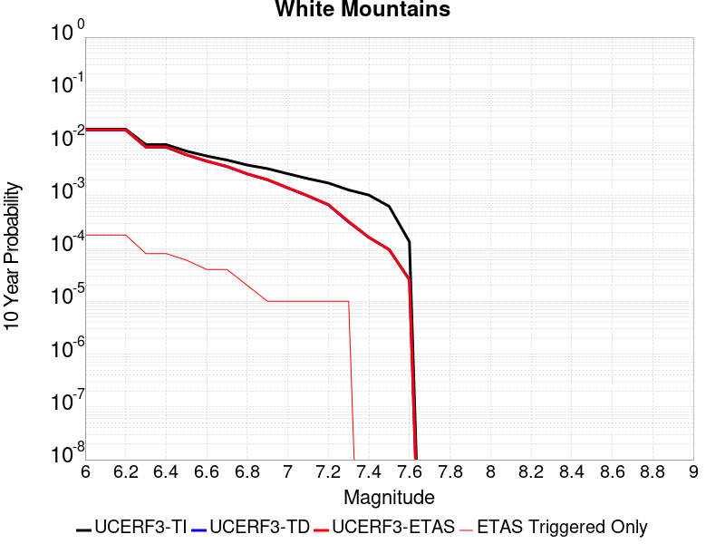 |

| Magnitude | 1 wk TI Prob | 1 wk TD Prob | 1 wk ETAS Prob | 1 wk ETAS/TD Gain | 1 wk ETAS Triggered Only | 1 mo TI Prob | 1 mo TD Prob | 1 mo ETAS Prob | 1 mo ETAS/TD Gain | 1 mo ETAS Triggered Only | 1 yr TI Prob | 1 yr TD Prob | 1 yr ETAS Prob | 1 yr ETAS/TD Gain | 1 yr ETAS Triggered Only | 10 yr TI Prob | 10 yr TD Prob | 10 yr ETAS Prob | 10 yr ETAS/TD Gain | 10 yr ETAS Triggered Only |
|-----|-----|-----|-----|-----|-----|-----|-----|-----|-----|-----|-----|-----|-----|-----|-----|-----|-----|-----|-----|-----|
| 6.0 | 3.503579E-5 | 3.3784127E-5 | 8.218637E-5 | 2.432692 | 4.8403883E-5 | 1.5014476E-4 | 1.4478175E-4 | 2.1737706E-4 | 1.501412 | 7.260582E-5 | 0.0018264796 | 0.0017614134 | 0.00188221 | 1.0685793 | 1.210097E-4 | 0.018115403 | 0.017486857 | 0.01760575 | 1.006799 | 1.210097E-4 |
| 6.1 | 3.503579E-5 | 3.3784127E-5 | 8.218637E-5 | 2.432692 | 4.8403883E-5 | 1.5014476E-4 | 1.4478175E-4 | 2.1737706E-4 | 1.501412 | 7.260582E-5 | 0.0018264796 | 0.0017614134 | 0.00188221 | 1.0685793 | 1.210097E-4 | 0.018115403 | 0.017486857 | 0.01760575 | 1.006799 | 1.210097E-4 |
| 6.2 | 3.503579E-5 | 3.3784127E-5 | 8.218637E-5 | 2.432692 | 4.8403883E-5 | 1.5014476E-4 | 1.4478175E-4 | 2.1737706E-4 | 1.501412 | 7.260582E-5 | 0.0018264796 | 0.0017614134 | 0.00188221 | 1.0685793 | 1.210097E-4 | 0.018115403 | 0.017486857 | 0.01760575 | 1.006799 | 1.210097E-4 |
| 6.3 | 1.7818425E-5 | 1.591616E-5 | 4.0117717E-5 | 2.520565 | 2.4201941E-5 | 7.636245E-5 | 6.821041E-5 | 1.1661099E-4 | 1.7095777 | 4.8403883E-5 | 9.293162E-4 | 8.301596E-4 | 9.027051E-4 | 1.0873874 | 7.260582E-5 | 0.009254395 | 0.0082720425 | 0.008344048 | 1.0087047 | 7.260582E-5 |
| 6.4 | 1.7818425E-5 | 1.591616E-5 | 4.0117717E-5 | 2.520565 | 2.4201941E-5 | 7.636245E-5 | 6.821041E-5 | 1.1661099E-4 | 1.7095777 | 4.8403883E-5 | 9.293162E-4 | 8.301596E-4 | 9.027051E-4 | 1.0873874 | 7.260582E-5 | 0.009254395 | 0.0082720425 | 0.008344048 | 1.0087047 | 7.260582E-5 |
| 6.5 | 1.3397557E-5 | 1.1336374E-5 | 1.1336374E-5 | 1.0 | 0.0 | 5.741684E-5 | 4.8583595E-5 | 7.278436E-5 | 1.4981263 | 2.4201941E-5 | 6.988258E-4 | 5.913517E-4 | 6.39727E-4 | 1.0818045 | 4.8403883E-5 | 0.006966323 | 0.005898487 | 0.005946605 | 1.0081577 | 4.8403883E-5 |
| 6.6 | 1.0818695E-5 | 8.625434E-6 | 8.625434E-6 | 1.0 | 0.0 | 4.6365014E-5 | 3.6965648E-5 | 6.116669E-5 | 1.6546901 | 2.4201941E-5 | 5.6434784E-4 | 4.4996818E-4 | 4.9835024E-4 | 1.1075234 | 4.8403883E-5 | 0.005629168 | 0.0044910074 | 0.004539194 | 1.0107296 | 4.8403883E-5 |
| 6.7 | 9.067908E-6 | 6.802476E-6 | 6.802476E-6 | 1.0 | 0.0 | 3.8861883E-5 | 2.915316E-5 | 5.3354397E-5 | 1.8301411 | 2.4201941E-5 | 4.7304068E-4 | 3.548851E-4 | 4.032718E-4 | 1.1363447 | 4.8403883E-5 | 0.00472035 | 0.003543501 | 0.0035917333 | 1.0136116 | 4.8403883E-5 |
| 6.8 | 7.295947E-6 | 4.9364285E-6 | 4.9364285E-6 | 1.0 | 0.0 | 3.126797E-5 | 2.1155956E-5 | 2.1155956E-5 | 1.0 | 0.0 | 3.8062103E-4 | 2.5754445E-4 | 2.8174015E-4 | 1.0939476 | 2.4201941E-5 | 0.0037996976 | 0.0025725728 | 0.0025967124 | 1.0093834 | 2.4201941E-5 |
| 6.9 | 6.2243444E-6 | 3.8322546E-6 | 3.8322546E-6 | 1.0 | 0.0 | 2.6675489E-5 | 1.6423846E-5 | 1.6423846E-5 | 1.0 | 0.0 | 3.2472567E-4 | 1.9994251E-4 | 2.2413961E-4 | 1.1210203 | 2.4201941E-5 | 0.0032425157 | 0.001997679 | 0.0020218326 | 1.0120908 | 2.4201941E-5 |
| 7.0 | 4.9878413E-6 | 2.679564E-6 | 2.679564E-6 | 1.0 | 0.0 | 2.1376287E-5 | 1.1483797E-5 | 1.1483797E-5 | 1.0 | 0.0 | 2.602252E-4 | 1.3980652E-4 | 1.6400508E-4 | 1.173086 | 2.4201941E-5 | 0.002599207 | 0.0013972119 | 0.00142138 | 1.0172974 | 2.4201941E-5 |
| 7.1 | 4.0252844E-6 | 1.885702E-6 | 1.885702E-6 | 1.0 | 0.0 | 1.7251105E-5 | 8.081555E-6 | 8.081555E-6 | 1.0 | 0.0 | 2.1001195E-4 | 9.838863E-5 | 1.2258819E-4 | 1.2459589 | 2.4201941E-5 | 0.0020981359 | 9.834635E-4 | 0.0010076415 | 1.0245847 | 2.4201941E-5 |
| 7.2 | 3.3284066E-6 | 1.2818929E-6 | 1.2818929E-6 | 1.0 | 0.0 | 1.4264522E-5 | 5.4938155E-6 | 5.4938155E-6 | 1.0 | 0.0 | 1.736567E-4 | 6.688525E-5 | 9.1085574E-5 | 1.3618186 | 2.4201941E-5 | 0.0017352107 | 6.6866126E-4 | 6.92847E-4 | 1.0361704 | 2.4201941E-5 |
| 7.3 | 2.458226E-6 | 6.056684E-7 | 6.056684E-7 | 1.0 | 0.0 | 1.0535211E-5 | 2.5957193E-6 | 2.5957193E-6 | 1.0 | 0.0 | 1.2825865E-4 | 3.160246E-5 | 5.5803637E-5 | 1.7658004 | 2.4201941E-5 | 0.0012818464 | 3.1598343E-4 | 3.401777E-4 | 1.0765682 | 2.4201941E-5 |
| 7.4 | 1.965953E-6 | 3.1084684E-7 | 3.1084684E-7 | 1.0 | 0.0 | 8.425486E-6 | 1.3322001E-6 | 1.3322001E-6 | 1.0 | 0.0 | 1.0257547E-4 | 1.6219417E-5 | 1.6219417E-5 | 1.0 | 0.0 | 0.0010252813 | 1.6218246E-4 | 1.6218246E-4 | 1.0 | 0.0 |
| 7.5 | 1.2014192E-6 | 1.8241002E-7 | 1.8241002E-7 | 1.0 | 0.0 | 5.148929E-6 | 7.8175697E-7 | 7.8175697E-7 | 1.0 | 0.0 | 6.2686406E-5 | 9.51785E-6 | 9.51785E-6 | 1.0 | 0.0 | 6.266873E-4 | 9.517451E-5 | 9.517451E-5 | 1.0 | 0.0 |
| 7.6 | 2.5612175E-7 | 4.893784E-8 | 4.893784E-8 | 1.0 | 0.0 | 1.0976642E-6 | 2.0973359E-7 | 2.0973359E-7 | 1.0 | 0.0 | 1.3363979E-5 | 2.5535037E-6 | 2.5535037E-6 | 1.0 | 0.0 | 1.3363175E-4 | 2.553478E-5 | 2.553478E-5 | 1.0 | 0.0 |

## Mission Ridge-Arroyo Parida-Santa Ana
*[(top)](#table-of-contents)*

| 1 Week | 1 Month | 1 Year | 10 Year |
|-----|-----|-----|-----|
|  |  |  |  |

| Magnitude | 1 wk TI Prob | 1 wk TD Prob | 1 wk ETAS Prob | 1 wk ETAS/TD Gain | 1 wk ETAS Triggered Only | 1 mo TI Prob | 1 mo TD Prob | 1 mo ETAS Prob | 1 mo ETAS/TD Gain | 1 mo ETAS Triggered Only | 1 yr TI Prob | 1 yr TD Prob | 1 yr ETAS Prob | 1 yr ETAS/TD Gain | 1 yr ETAS Triggered Only | 10 yr TI Prob | 10 yr TD Prob | 10 yr ETAS Prob | 10 yr ETAS/TD Gain | 10 yr ETAS Triggered Only |
|-----|-----|-----|-----|-----|-----|-----|-----|-----|-----|-----|-----|-----|-----|-----|-----|-----|-----|-----|-----|-----|
| 6.0 | 4.169034E-5 | 4.7137048E-5 | 4.7137048E-5 | 1.0 | 0.0 | 1.7866064E-4 | 2.0200513E-4 | 2.0200513E-4 | 1.0 | 0.0 | 0.0021730233 | 0.0024574657 | 0.0025057506 | 1.0196483 | 4.8403883E-5 | 0.021518968 | 0.02438483 | 0.024479277 | 1.0038732 | 9.6807766E-5 |
| 6.1 | 1.73813E-5 | 1.6854203E-5 | 1.6854203E-5 | 1.0 | 0.0 | 7.4489166E-5 | 7.223036E-5 | 7.223036E-5 | 1.0 | 0.0 | 9.065282E-4 | 8.790605E-4 | 8.790605E-4 | 1.0 | 0.0 | 0.009028391 | 0.008757128 | 0.008805109 | 1.005479 | 4.8403883E-5 |
| 6.2 | 1.4622182E-5 | 1.3673262E-5 | 1.3673262E-5 | 1.0 | 0.0 | 6.2664985E-5 | 5.85984E-5 | 5.85984E-5 | 1.0 | 0.0 | 7.6267915E-4 | 7.132059E-4 | 7.132059E-4 | 1.0 | 0.0 | 0.007600669 | 0.007109767 | 0.007157827 | 1.0067596 | 4.8403883E-5 |
| 6.3 | 1.3552434E-5 | 1.2482174E-5 | 1.2482174E-5 | 1.0 | 0.0 | 5.8080568E-5 | 5.349395E-5 | 5.349395E-5 | 1.0 | 0.0 | 7.069015E-4 | 6.510974E-4 | 6.510974E-4 | 1.0 | 0.0 | 0.00704657 | 0.006492415 | 0.0065405043 | 1.0074071 | 4.8403883E-5 |
| 6.4 | 1.30977305E-5 | 1.1979128E-5 | 1.1979128E-5 | 1.0 | 0.0 | 5.613192E-5 | 5.133813E-5 | 5.133813E-5 | 1.0 | 0.0 | 6.831918E-4 | 6.2486547E-4 | 6.2486547E-4 | 1.0 | 0.0 | 0.006810953 | 0.006231584 | 0.0062796865 | 1.0077192 | 4.8403883E-5 |
| 6.5 | 1.225205E-5 | 1.1048776E-5 | 1.1048776E-5 | 1.0 | 0.0 | 5.2507727E-5 | 4.735105E-5 | 4.735105E-5 | 1.0 | 0.0 | 6.3909404E-4 | 5.7634927E-4 | 5.7634927E-4 | 1.0 | 0.0 | 0.006372592 | 0.005749009 | 0.0057971347 | 1.0083711 | 4.8403883E-5 |
| 6.6 | 1.1352241E-5 | 1.0063508E-5 | 1.0063508E-5 | 1.0 | 0.0 | 4.8651553E-5 | 4.3128617E-5 | 4.3128617E-5 | 1.0 | 0.0 | 5.921717E-4 | 5.249665E-4 | 5.249665E-4 | 1.0 | 0.0 | 0.0059059616 | 0.0052376646 | 0.005285815 | 1.0091931 | 4.8403883E-5 |
| 6.7 | 1.0864116E-5 | 9.517E-6 | 9.517E-6 | 1.0 | 0.0 | 4.6559664E-5 | 4.0786515E-5 | 4.0786515E-5 | 1.0 | 0.0 | 5.667165E-4 | 4.964647E-4 | 4.964647E-4 | 1.0 | 0.0 | 0.005652734 | 0.0049539437 | 0.005002108 | 1.0097224 | 4.8403883E-5 |
| 6.8 | 1.0666365E-5 | 9.299752E-6 | 9.299752E-6 | 1.0 | 0.0 | 4.571219E-5 | 3.985548E-5 | 3.985548E-5 | 1.0 | 0.0 | 5.564038E-4 | 4.8513446E-4 | 4.8513446E-4 | 1.0 | 0.0 | 0.005550127 | 0.00484114 | 0.00488931 | 1.00995 | 4.8403883E-5 |
| 6.9 | 1.0038665E-5 | 8.592018E-6 | 8.592018E-6 | 1.0 | 0.0 | 4.302214E-5 | 3.682243E-5 | 3.682243E-5 | 1.0 | 0.0 | 5.236687E-4 | 4.4822265E-4 | 4.4822265E-4 | 1.0 | 0.0 | 0.005224364 | 0.0044735507 | 0.0045217383 | 1.0107716 | 4.8403883E-5 |
| 7.0 | 9.5379955E-6 | 8.025047E-6 | 8.025047E-6 | 1.0 | 0.0 | 4.0876483E-5 | 3.439261E-5 | 3.439261E-5 | 1.0 | 0.0 | 4.975576E-4 | 4.1865133E-4 | 4.1865133E-4 | 1.0 | 0.0 | 0.00496445 | 0.00417898 | 0.0042271814 | 1.0115343 | 4.8403883E-5 |
| 7.1 | 9.207389E-6 | 7.652347E-6 | 7.652347E-6 | 1.0 | 0.0 | 3.945964E-5 | 3.2795375E-5 | 3.2795375E-5 | 1.0 | 0.0 | 4.803152E-4 | 3.992122E-4 | 3.992122E-4 | 1.0 | 0.0 | 0.004792784 | 0.003985301 | 0.004033512 | 1.0120972 | 4.8403883E-5 |
| 7.2 | 7.638091E-6 | 5.9310923E-6 | 5.9310923E-6 | 1.0 | 0.0 | 3.2734264E-5 | 2.5418722E-5 | 2.5418722E-5 | 1.0 | 0.0 | 3.984668E-4 | 3.094293E-4 | 3.094293E-4 | 1.0 | 0.0 | 0.0039775306 | 0.0030901956 | 0.00313845 | 1.0156153 | 4.8403883E-5 |
| 7.3 | 7.2500147E-6 | 5.596131E-6 | 5.596131E-6 | 1.0 | 0.0 | 3.1071122E-5 | 2.3983199E-5 | 2.3983199E-5 | 1.0 | 0.0 | 3.7822526E-4 | 2.9195662E-4 | 2.9195662E-4 | 1.0 | 0.0 | 0.0037758215 | 0.0029159402 | 0.002964203 | 1.0165514 | 4.8403883E-5 |
| 7.4 | 6.3899715E-6 | 4.9184864E-6 | 4.9184864E-6 | 1.0 | 0.0 | 2.7385306E-5 | 2.1079059E-5 | 2.1079059E-5 | 1.0 | 0.0 | 3.3336508E-4 | 2.566075E-4 | 2.566075E-4 | 1.0 | 0.0 | 0.0033286542 | 0.002563311 | 0.0026115908 | 1.018835 | 4.8403883E-5 |
| 7.5 | 5.379025E-6 | 4.0838477E-6 | 4.0838477E-6 | 1.0 | 0.0 | 2.305276E-5 | 1.7502087E-5 | 1.7502087E-5 | 1.0 | 0.0 | 2.806312E-4 | 2.1306718E-4 | 2.1306718E-4 | 1.0 | 0.0 | 0.0028027708 | 0.0021286402 | 0.0021527905 | 1.0113455 | 2.4201941E-5 |
| 7.6 | 4.1270696E-6 | 3.0883373E-6 | 3.0883373E-6 | 1.0 | 0.0 | 1.768732E-5 | 1.32356645E-5 | 1.32356645E-5 | 1.0 | 0.0 | 2.1532185E-4 | 1.6113237E-4 | 1.6113237E-4 | 1.0 | 0.0 | 0.0021511333 | 0.0016101635 | 0.0016343264 | 1.0150065 | 2.4201941E-5 |
| 7.7 | 2.5406805E-6 | 1.8282044E-6 | 1.8282044E-6 | 1.0 | 0.0 | 1.0888585E-5 | 7.835139E-6 | 7.835139E-6 | 1.0 | 0.0 | 1.3256045E-4 | 9.53887E-5 | 9.53887E-5 | 1.0 | 0.0 | 0.0013248142 | 9.534837E-4 | 9.776625E-4 | 1.0253584 | 2.4201941E-5 |
| 7.8 | 4.8608285E-7 | 3.509864E-7 | 3.509864E-7 | 1.0 | 0.0 | 2.0832106E-6 | 1.5042266E-6 | 1.5042266E-6 | 1.0 | 0.0 | 2.5362791E-5 | 1.8313805E-5 | 1.8313805E-5 | 1.0 | 0.0 | 2.5359896E-4 | 1.8312308E-4 | 1.8312308E-4 | 1.0 | 0.0 |
| 7.9 | 2.0472514E-8 | 1.2688718E-8 | 1.2688718E-8 | 1.0 | 0.0 | 8.7739345E-8 | 5.438022E-8 | 5.438022E-8 | 1.0 | 0.0 | 1.068226E-6 | 6.6207895E-7 | 6.6207895E-7 | 1.0 | 0.0 | 1.0682209E-5 | 6.620771E-6 | 6.620771E-6 | 1.0 | 0.0 |
| 8.0 | 4.443582E-9 | 2.032067E-9 | 2.032067E-9 | 1.0 | 0.0 | 1.9043922E-8 | 8.7088585E-9 | 8.7088585E-9 | 1.0 | 0.0 | 2.3185973E-7 | 1.0603035E-7 | 1.0603035E-7 | 1.0 | 0.0 | 2.3185949E-6 | 1.0603031E-6 | 1.0603031E-6 | 1.0 | 0.0 |

## San Jacinto (Clark) rev
*[(top)](#table-of-contents)*

| 1 Week | 1 Month | 1 Year | 10 Year |
|-----|-----|-----|-----|
|  |  |  |  |

| Magnitude | 1 wk TI Prob | 1 wk TD Prob | 1 wk ETAS Prob | 1 wk ETAS/TD Gain | 1 wk ETAS Triggered Only | 1 mo TI Prob | 1 mo TD Prob | 1 mo ETAS Prob | 1 mo ETAS/TD Gain | 1 mo ETAS Triggered Only | 1 yr TI Prob | 1 yr TD Prob | 1 yr ETAS Prob | 1 yr ETAS/TD Gain | 1 yr ETAS Triggered Only | 10 yr TI Prob | 10 yr TD Prob | 10 yr ETAS Prob | 10 yr ETAS/TD Gain | 10 yr ETAS Triggered Only |
|-----|-----|-----|-----|-----|-----|-----|-----|-----|-----|-----|-----|-----|-----|-----|-----|-----|-----|-----|-----|-----|
| 6.0 | 4.482615E-5 | 2.1153059E-5 | 2.1153059E-5 | 1.0 | 0.0 | 1.9209793E-4 | 9.065287E-5 | 1.1485261E-4 | 1.2669497 | 2.4201941E-5 | 0.0023362834 | 0.0011031491 | 0.0011756748 | 1.0657443 | 7.260582E-5 | 0.02311874 | 0.011485709 | 0.011605329 | 1.0104147 | 1.210097E-4 |
| 6.1 | 4.482615E-5 | 2.1153059E-5 | 2.1153059E-5 | 1.0 | 0.0 | 1.9209793E-4 | 9.065287E-5 | 1.1485261E-4 | 1.2669497 | 2.4201941E-5 | 0.0023362834 | 0.0011031491 | 0.0011756748 | 1.0657443 | 7.260582E-5 | 0.02311874 | 0.011485709 | 0.011605329 | 1.0104147 | 1.210097E-4 |
| 6.2 | 4.482615E-5 | 2.1153059E-5 | 2.1153059E-5 | 1.0 | 0.0 | 1.9209793E-4 | 9.065287E-5 | 1.1485261E-4 | 1.2669497 | 2.4201941E-5 | 0.0023362834 | 0.0011031491 | 0.0011756748 | 1.0657443 | 7.260582E-5 | 0.02311874 | 0.011485709 | 0.011605329 | 1.0104147 | 1.210097E-4 |
| 6.3 | 4.482615E-5 | 2.1153059E-5 | 2.1153059E-5 | 1.0 | 0.0 | 1.9209793E-4 | 9.065287E-5 | 1.1485261E-4 | 1.2669497 | 2.4201941E-5 | 0.0023362834 | 0.0011031491 | 0.0011756748 | 1.0657443 | 7.260582E-5 | 0.02311874 | 0.011485709 | 0.011605329 | 1.0104147 | 1.210097E-4 |
| 6.4 | 4.482615E-5 | 2.1153059E-5 | 2.1153059E-5 | 1.0 | 0.0 | 1.9209793E-4 | 9.065287E-5 | 1.1485261E-4 | 1.2669497 | 2.4201941E-5 | 0.0023362834 | 0.0011031491 | 0.0011756748 | 1.0657443 | 7.260582E-5 | 0.02311874 | 0.011485709 | 0.011605329 | 1.0104147 | 1.210097E-4 |
| 6.5 | 3.7294863E-5 | 1.7354667E-5 | 1.7354667E-5 | 1.0 | 0.0 | 1.5982533E-4 | 7.437504E-5 | 9.857518E-5 | 1.3253798 | 2.4201941E-5 | 0.0019441366 | 9.051445E-4 | 9.776846E-4 | 1.080142 | 7.260582E-5 | 0.01927216 | 0.009485902 | 0.009605764 | 1.0126358 | 1.210097E-4 |
| 6.6 | 3.7294863E-5 | 1.7354667E-5 | 1.7354667E-5 | 1.0 | 0.0 | 1.5982533E-4 | 7.437504E-5 | 9.857518E-5 | 1.3253798 | 2.4201941E-5 | 0.0019441366 | 9.051445E-4 | 9.776846E-4 | 1.080142 | 7.260582E-5 | 0.01927216 | 0.009485902 | 0.009605764 | 1.0126358 | 1.210097E-4 |
| 6.7 | 3.6039248E-5 | 1.6602684E-5 | 1.6602684E-5 | 1.0 | 0.0 | 1.5444479E-4 | 7.115244E-5 | 9.535266E-5 | 1.3401179 | 2.4201941E-5 | 0.0018787434 | 8.659408E-4 | 9.3848375E-4 | 1.0837736 | 7.260582E-5 | 0.01862939 | 0.009088189 | 0.009208099 | 1.0131941 | 1.210097E-4 |
| 6.8 | 3.5031844E-5 | 1.6231123E-5 | 1.6231123E-5 | 1.0 | 0.0 | 1.5012783E-4 | 6.956012E-5 | 9.376038E-5 | 1.3479042 | 2.4201941E-5 | 0.0018262739 | 8.4656954E-4 | 9.1911387E-4 | 1.0856922 | 7.260582E-5 | 0.01811338 | 0.008888788 | 0.009008721 | 1.0134927 | 1.210097E-4 |
| 6.9 | 3.435112E-5 | 1.6061658E-5 | 1.6061658E-5 | 1.0 | 0.0 | 1.4721078E-4 | 6.8833884E-5 | 9.303416E-5 | 1.351575 | 2.4201941E-5 | 0.0017908178 | 8.377344E-4 | 9.102794E-4 | 1.0865966 | 7.260582E-5 | 0.017764548 | 0.008796512 | 0.008916457 | 1.0136355 | 1.210097E-4 |
| 7.0 | 2.8959772E-5 | 1.43355255E-5 | 1.43355255E-5 | 1.0 | 0.0 | 1.241074E-4 | 6.1436534E-5 | 6.1436534E-5 | 1.0 | 0.0 | 0.0015099603 | 7.477359E-4 | 7.9610356E-4 | 1.0646856 | 4.8403883E-5 | 0.014997416 | 0.007868331 | 0.007964377 | 1.0122067 | 9.6807766E-5 |
| 7.1 | 2.6002877E-5 | 1.2827699E-5 | 1.2827699E-5 | 1.0 | 0.0 | 1.11436144E-4 | 5.4974706E-5 | 5.4974706E-5 | 1.0 | 0.0 | 0.0013558907 | 6.6911365E-4 | 7.174851E-4 | 1.0722919 | 4.8403883E-5 | 0.013476475 | 0.0070483433 | 0.007144469 | 1.013638 | 9.6807766E-5 |
| 7.2 | 2.2544838E-5 | 1.1260331E-5 | 1.1260331E-5 | 1.0 | 0.0 | 9.661716E-5 | 4.825768E-5 | 4.825768E-5 | 1.0 | 0.0 | 0.001175679 | 5.873803E-4 | 6.357557E-4 | 1.082358 | 4.8403883E-5 | 0.011694785 | 0.00619256 | 0.0062887683 | 1.0155361 | 9.6807766E-5 |
| 7.3 | 1.75334E-5 | 1.0810585E-5 | 1.0810585E-5 | 1.0 | 0.0 | 7.514098E-5 | 4.6330264E-5 | 4.6330264E-5 | 1.0 | 0.0 | 9.144575E-4 | 5.6392635E-4 | 6.12303E-4 | 1.0857853 | 4.8403883E-5 | 0.009107036 | 0.0059332196 | 0.0060294527 | 1.0162194 | 9.6807766E-5 |
| 7.4 | 1.5924552E-5 | 1.0610475E-5 | 1.0610475E-5 | 1.0 | 0.0 | 6.82463E-5 | 4.547268E-5 | 4.547268E-5 | 1.0 | 0.0 | 8.305819E-4 | 5.534906E-4 | 6.018677E-4 | 1.0874037 | 4.8403883E-5 | 0.008274844 | 0.0058205863 | 0.0059168306 | 1.0165352 | 9.6807766E-5 |
| 7.5 | 1.3428931E-5 | 9.851045E-6 | 9.851045E-6 | 1.0 | 0.0 | 5.7551293E-5 | 4.221809E-5 | 4.221809E-5 | 1.0 | 0.0 | 7.004617E-4 | 5.1388505E-4 | 5.622641E-4 | 1.0941436 | 4.8403883E-5 | 0.006982579 | 0.005406209 | 0.005502493 | 1.01781 | 9.6807766E-5 |
| 7.6 | 1.0688787E-5 | 8.614091E-6 | 8.614091E-6 | 1.0 | 0.0 | 4.5808283E-5 | 3.6917012E-5 | 3.6917012E-5 | 1.0 | 0.0 | 5.5757316E-4 | 4.4937237E-4 | 4.977545E-4 | 1.107666 | 4.8403883E-5 | 0.005561762 | 0.0047413614 | 0.0048377104 | 1.0203209 | 9.6807766E-5 |
| 7.7 | 8.81236E-6 | 7.4673385E-6 | 7.4673385E-6 | 1.0 | 0.0 | 3.776671E-5 | 3.200249E-5 | 3.200249E-5 | 1.0 | 0.0 | 4.597127E-4 | 3.8956082E-4 | 4.3794586E-4 | 1.124204 | 4.8403883E-5 | 0.0045876284 | 0.0041344194 | 0.0042308266 | 1.0233183 | 9.6807766E-5 |
| 7.8 | 7.780431E-6 | 6.695928E-6 | 6.695928E-6 | 1.0 | 0.0 | 3.3344273E-5 | 2.8696519E-5 | 2.8696519E-5 | 1.0 | 0.0 | 4.0589093E-4 | 3.4932428E-4 | 3.9771126E-4 | 1.138516 | 4.8403883E-5 | 0.0040515037 | 0.0037226272 | 0.0038190745 | 1.0259085 | 9.6807766E-5 |
| 7.9 | 6.5437994E-6 | 5.7797783E-6 | 5.7797783E-6 | 1.0 | 0.0 | 2.8044553E-5 | 2.4770245E-5 | 2.4770245E-5 | 1.0 | 0.0 | 3.4138895E-4 | 3.0153614E-4 | 3.4992545E-4 | 1.1604759 | 4.8403883E-5 | 0.0034086495 | 0.0032343294 | 0.003330824 | 1.0298345 | 9.6807766E-5 |
| 8.0 | 5.4488164E-6 | 4.812793E-6 | 4.812793E-6 | 1.0 | 0.0 | 2.3351862E-5 | 2.0626094E-5 | 2.0626094E-5 | 1.0 | 0.0 | 2.8427184E-4 | 2.510939E-4 | 2.9948563E-4 | 1.1927236 | 4.8403883E-5 | 0.0028390845 | 0.0027107038 | 0.002807249 | 1.0356164 | 9.6807766E-5 |
| 8.1 | 2.8397242E-6 | 1.3665673E-6 | 1.3665673E-6 | 1.0 | 0.0 | 1.217019E-5 | 5.856704E-6 | 5.856704E-6 | 1.0 | 0.0 | 1.4816198E-4 | 7.1303046E-5 | 7.1303046E-5 | 1.0 | 0.0 | 0.0014806325 | 8.113543E-4 | 8.113543E-4 | 1.0 | 0.0 |
| 8.2 | 2.030244E-6 | 6.3151083E-7 | 6.3151083E-7 | 1.0 | 0.0 | 8.701017E-6 | 2.7064723E-6 | 2.7064723E-6 | 1.0 | 0.0 | 1.05929736E-4 | 3.2950808E-5 | 3.2950808E-5 | 1.0 | 0.0 | 0.0010587925 | 3.9470522E-4 | 3.9470522E-4 | 1.0 | 0.0 |
| 8.3 | 1.0659804E-6 | 2.9230563E-7 | 2.9230563E-7 | 1.0 | 0.0 | 4.568479E-6 | 1.2527379E-6 | 1.2527379E-6 | 1.0 | 0.0 | 5.5619817E-5 | 1.5251981E-5 | 1.5251981E-5 | 1.0 | 0.0 | 5.5605895E-4 | 1.8556409E-4 | 1.8556409E-4 | 1.0 | 0.0 |

## Whittier alt 1
*[(top)](#table-of-contents)*

| 1 Week | 1 Month | 1 Year | 10 Year |
|-----|-----|-----|-----|
|  |  |  |  |

| Magnitude | 1 wk TI Prob | 1 wk TD Prob | 1 wk ETAS Prob | 1 wk ETAS/TD Gain | 1 wk ETAS Triggered Only | 1 mo TI Prob | 1 mo TD Prob | 1 mo ETAS Prob | 1 mo ETAS/TD Gain | 1 mo ETAS Triggered Only | 1 yr TI Prob | 1 yr TD Prob | 1 yr ETAS Prob | 1 yr ETAS/TD Gain | 1 yr ETAS Triggered Only | 10 yr TI Prob | 10 yr TD Prob | 10 yr ETAS Prob | 10 yr ETAS/TD Gain | 10 yr ETAS Triggered Only |
|-----|-----|-----|-----|-----|-----|-----|-----|-----|-----|-----|-----|-----|-----|-----|-----|-----|-----|-----|-----|-----|
| 6.0 | 4.2554693E-5 | 4.7252182E-5 | 4.7252182E-5 | 1.0 | 0.0 | 1.8236451E-4 | 2.0249544E-4 | 2.0249544E-4 | 1.0 | 0.0 | 0.002218027 | 0.0024629163 | 0.0024870588 | 1.0098023 | 2.4201941E-5 | 0.02196019 | 0.024390263 | 0.024508322 | 1.0048404 | 1.210097E-4 |
| 6.1 | 4.2554693E-5 | 4.7252182E-5 | 4.7252182E-5 | 1.0 | 0.0 | 1.8236451E-4 | 2.0249544E-4 | 2.0249544E-4 | 1.0 | 0.0 | 0.002218027 | 0.0024629163 | 0.0024870588 | 1.0098023 | 2.4201941E-5 | 0.02196019 | 0.024390263 | 0.024508322 | 1.0048404 | 1.210097E-4 |
| 6.2 | 4.2554693E-5 | 4.7252182E-5 | 4.7252182E-5 | 1.0 | 0.0 | 1.8236451E-4 | 2.0249544E-4 | 2.0249544E-4 | 1.0 | 0.0 | 0.002218027 | 0.0024629163 | 0.0024870588 | 1.0098023 | 2.4201941E-5 | 0.02196019 | 0.024390263 | 0.024508322 | 1.0048404 | 1.210097E-4 |
| 6.3 | 1.9617712E-5 | 1.826841E-5 | 1.826841E-5 | 1.0 | 0.0 | 8.40732E-5 | 7.829095E-5 | 7.829095E-5 | 1.0 | 0.0 | 0.0010231105 | 9.527944E-4 | 9.527944E-4 | 1.0 | 0.0 | 0.01018413 | 0.0094904 | 0.009538344 | 1.0050519 | 4.8403883E-5 |
| 6.4 | 1.5611336E-5 | 1.3604089E-5 | 1.3604089E-5 | 1.0 | 0.0 | 6.690401E-5 | 5.8301972E-5 | 5.8301972E-5 | 1.0 | 0.0 | 8.142519E-4 | 7.096013E-4 | 7.096013E-4 | 1.0 | 0.0 | 0.008112748 | 0.0070753377 | 0.007123399 | 1.0067928 | 4.8403883E-5 |
| 6.5 | 1.5150166E-5 | 1.3100744E-5 | 1.3100744E-5 | 1.0 | 0.0 | 6.492767E-5 | 5.614487E-5 | 5.614487E-5 | 1.0 | 0.0 | 7.9020765E-4 | 6.8335526E-4 | 6.8335526E-4 | 1.0 | 0.0 | 0.007874036 | 0.006814508 | 0.0068625817 | 1.0070547 | 4.8403883E-5 |
| 6.6 | 1.295588E-5 | 1.0380544E-5 | 1.0380544E-5 | 1.0 | 0.0 | 5.552402E-5 | 4.44873E-5 | 4.44873E-5 | 1.0 | 0.0 | 6.7579525E-4 | 5.415002E-4 | 5.415002E-4 | 1.0 | 0.0 | 0.006737438 | 0.005403343 | 0.005403343 | 1.0 | 0.0 |
| 6.7 | 1.2542085E-5 | 9.899189E-6 | 9.899189E-6 | 1.0 | 0.0 | 5.3750682E-5 | 4.2424414E-5 | 4.2424414E-5 | 1.0 | 0.0 | 6.542181E-4 | 5.163967E-4 | 5.163967E-4 | 1.0 | 0.0 | 0.006522954 | 0.005153464 | 0.005153464 | 1.0 | 0.0 |
| 6.8 | 1.2195878E-5 | 9.49523E-6 | 9.49523E-6 | 1.0 | 0.0 | 5.2267E-5 | 4.069322E-5 | 4.069322E-5 | 1.0 | 0.0 | 6.36165E-4 | 4.9532915E-4 | 4.9532915E-4 | 1.0 | 0.0 | 0.0063434686 | 0.0049436963 | 0.0049436963 | 1.0 | 0.0 |
| 6.9 | 1.1580298E-5 | 8.772739E-6 | 8.772739E-6 | 1.0 | 0.0 | 4.9628903E-5 | 3.759692E-5 | 3.759692E-5 | 1.0 | 0.0 | 6.040644E-4 | 4.5764804E-4 | 4.5764804E-4 | 1.0 | 0.0 | 0.00602425 | 0.0045684646 | 0.0045684646 | 1.0 | 0.0 |
| 7.0 | 1.0964795E-5 | 8.083794E-6 | 8.083794E-6 | 1.0 | 0.0 | 4.6991136E-5 | 3.4644378E-5 | 3.4644378E-5 | 1.0 | 0.0 | 5.7196687E-4 | 4.217152E-4 | 4.217152E-4 | 1.0 | 0.0 | 0.0057049696 | 0.004210459 | 0.004210459 | 1.0 | 0.0 |
| 7.1 | 1.0230601E-5 | 7.32646E-6 | 7.32646E-6 | 1.0 | 0.0 | 4.3844695E-5 | 3.1398744E-5 | 3.1398744E-5 | 1.0 | 0.0 | 5.336784E-4 | 3.8221394E-4 | 3.8221394E-4 | 1.0 | 0.0 | 0.005323986 | 0.0038167592 | 0.0038167592 | 1.0 | 0.0 |
| 7.2 | 9.40865E-6 | 6.5430822E-6 | 6.5430822E-6 | 1.0 | 0.0 | 4.032216E-5 | 2.8041486E-5 | 2.8041486E-5 | 1.0 | 0.0 | 4.908117E-4 | 3.4135283E-4 | 3.4135283E-4 | 1.0 | 0.0 | 0.0048972913 | 0.0034094024 | 0.0034094024 | 1.0 | 0.0 |
| 7.3 | 8.237384E-6 | 5.5975433E-6 | 5.5975433E-6 | 1.0 | 0.0 | 3.5302593E-5 | 2.3989258E-5 | 2.3989258E-5 | 1.0 | 0.0 | 4.2972428E-4 | 2.920311E-4 | 2.920311E-4 | 1.0 | 0.0 | 0.0042889426 | 0.0029167992 | 0.0029167992 | 1.0 | 0.0 |
| 7.4 | 7.5316966E-6 | 5.0276153E-6 | 5.0276153E-6 | 1.0 | 0.0 | 3.2278298E-5 | 2.154675E-5 | 2.154675E-5 | 1.0 | 0.0 | 3.9291743E-4 | 2.623011E-4 | 2.623011E-4 | 1.0 | 0.0 | 0.0039222343 | 0.0026200267 | 0.0026200267 | 1.0 | 0.0 |
| 7.5 | 6.149649E-6 | 3.9336355E-6 | 3.9336355E-6 | 1.0 | 0.0 | 2.6355372E-5 | 1.6858336E-5 | 1.6858336E-5 | 1.0 | 0.0 | 3.208294E-4 | 2.052318E-4 | 2.052318E-4 | 1.0 | 0.0 | 0.003203666 | 0.0020505118 | 0.0020505118 | 1.0 | 0.0 |
| 7.6 | 5.457711E-6 | 3.3951796E-6 | 3.3951796E-6 | 1.0 | 0.0 | 2.338998E-5 | 1.4550694E-5 | 1.4550694E-5 | 1.0 | 0.0 | 2.8473578E-4 | 1.771411E-4 | 1.771411E-4 | 1.0 | 0.0 | 0.0028437122 | 0.0017700798 | 0.0017700798 | 1.0 | 0.0 |
| 7.7 | 4.1676276E-6 | 2.3329922E-6 | 2.3329922E-6 | 1.0 | 0.0 | 1.7861139E-5 | 9.998504E-6 | 9.998504E-6 | 1.0 | 0.0 | 2.1743766E-4 | 1.2172572E-4 | 1.2172572E-4 | 1.0 | 0.0 | 0.0021722503 | 0.0012166635 | 0.0012166635 | 1.0 | 0.0 |
| 7.8 | 2.2692414E-7 | 9.384417E-8 | 9.384417E-8 | 1.0 | 0.0 | 9.725317E-7 | 4.0218927E-7 | 4.0218927E-7 | 1.0 | 0.0 | 1.1840509E-5 | 4.8966467E-6 | 4.8966467E-6 | 1.0 | 0.0 | 1.1839878E-4 | 4.8965718E-5 | 4.8965718E-5 | 1.0 | 0.0 |
| 7.9 | 6.676829E-9 | 3.4397174E-9 | 3.4397174E-9 | 1.0 | 0.0 | 2.861498E-8 | 1.4741646E-8 | 1.4741646E-8 | 1.0 | 0.0 | 3.4838732E-7 | 1.7947953E-7 | 1.7947953E-7 | 1.0 | 0.0 | 3.4838679E-6 | 1.794794E-6 | 1.794794E-6 | 1.0 | 0.0 |

## Cucamonga
*[(top)](#table-of-contents)*

| 1 Week | 1 Month | 1 Year | 10 Year |
|-----|-----|-----|-----|
|  |  |  |  |

| Magnitude | 1 wk TI Prob | 1 wk TD Prob | 1 wk ETAS Prob | 1 wk ETAS/TD Gain | 1 wk ETAS Triggered Only | 1 mo TI Prob | 1 mo TD Prob | 1 mo ETAS Prob | 1 mo ETAS/TD Gain | 1 mo ETAS Triggered Only | 1 yr TI Prob | 1 yr TD Prob | 1 yr ETAS Prob | 1 yr ETAS/TD Gain | 1 yr ETAS Triggered Only | 10 yr TI Prob | 10 yr TD Prob | 10 yr ETAS Prob | 10 yr ETAS/TD Gain | 10 yr ETAS Triggered Only |
|-----|-----|-----|-----|-----|-----|-----|-----|-----|-----|-----|-----|-----|-----|-----|-----|-----|-----|-----|-----|-----|
| 6.0 | 1.1848348E-5 | 1.1737109E-5 | 1.1737109E-5 | 1.0 | 0.0 | 5.0777642E-5 | 5.0300943E-5 | 5.0300943E-5 | 1.0 | 0.0 | 6.180424E-4 | 6.122446E-4 | 6.606188E-4 | 1.0790113 | 4.8403883E-5 | 0.0061632637 | 0.006106745 | 0.0062029613 | 1.0157558 | 9.6807766E-5 |
| 6.1 | 1.1848348E-5 | 1.1737109E-5 | 1.1737109E-5 | 1.0 | 0.0 | 5.0777642E-5 | 5.0300943E-5 | 5.0300943E-5 | 1.0 | 0.0 | 6.180424E-4 | 6.122446E-4 | 6.606188E-4 | 1.0790113 | 4.8403883E-5 | 0.0061632637 | 0.006106745 | 0.0062029613 | 1.0157558 | 9.6807766E-5 |
| 6.2 | 1.1848348E-5 | 1.1737109E-5 | 1.1737109E-5 | 1.0 | 0.0 | 5.0777642E-5 | 5.0300943E-5 | 5.0300943E-5 | 1.0 | 0.0 | 6.180424E-4 | 6.122446E-4 | 6.606188E-4 | 1.0790113 | 4.8403883E-5 | 0.0061632637 | 0.006106745 | 0.0062029613 | 1.0157558 | 9.6807766E-5 |
| 6.3 | 1.1848348E-5 | 1.1737109E-5 | 1.1737109E-5 | 1.0 | 0.0 | 5.0777642E-5 | 5.0300943E-5 | 5.0300943E-5 | 1.0 | 0.0 | 6.180424E-4 | 6.122446E-4 | 6.606188E-4 | 1.0790113 | 4.8403883E-5 | 0.0061632637 | 0.006106745 | 0.0062029613 | 1.0157558 | 9.6807766E-5 |
| 6.4 | 1.1848348E-5 | 1.1737109E-5 | 1.1737109E-5 | 1.0 | 0.0 | 5.0777642E-5 | 5.0300943E-5 | 5.0300943E-5 | 1.0 | 0.0 | 6.180424E-4 | 6.122446E-4 | 6.606188E-4 | 1.0790113 | 4.8403883E-5 | 0.0061632637 | 0.006106745 | 0.0062029613 | 1.0157558 | 9.6807766E-5 |
| 6.5 | 1.16988695E-5 | 1.157614E-5 | 1.157614E-5 | 1.0 | 0.0 | 5.013705E-5 | 4.9611102E-5 | 4.9611102E-5 | 1.0 | 0.0 | 6.102476E-4 | 6.0385047E-4 | 6.522251E-4 | 1.0801103 | 4.8403883E-5 | 0.006085745 | 0.0060232594 | 0.006119484 | 1.0159755 | 9.6807766E-5 |
| 6.6 | 1.16988695E-5 | 1.157614E-5 | 1.157614E-5 | 1.0 | 0.0 | 5.013705E-5 | 4.9611102E-5 | 4.9611102E-5 | 1.0 | 0.0 | 6.102476E-4 | 6.0385047E-4 | 6.522251E-4 | 1.0801103 | 4.8403883E-5 | 0.006085745 | 0.0060232594 | 0.006119484 | 1.0159755 | 9.6807766E-5 |
| 6.7 | 1.1397107E-5 | 1.1115039E-5 | 1.1115039E-5 | 1.0 | 0.0 | 4.884383E-5 | 4.7635025E-5 | 4.7635025E-5 | 1.0 | 0.0 | 5.9451134E-4 | 5.798046E-4 | 6.281804E-4 | 1.0834347 | 4.8403883E-5 | 0.005929234 | 0.005784061 | 0.005880309 | 1.0166402 | 9.6807766E-5 |
| 6.8 | 1.058387E-5 | 9.785037E-6 | 9.785037E-6 | 1.0 | 0.0 | 4.5358654E-5 | 4.1935207E-5 | 4.1935207E-5 | 1.0 | 0.0 | 5.521017E-4 | 5.1044265E-4 | 5.5882183E-4 | 1.0947789 | 4.8403883E-5 | 0.00550732 | 0.005093702 | 0.0051900167 | 1.0189086 | 9.6807766E-5 |
| 6.9 | 9.690046E-6 | 8.579504E-6 | 8.579504E-6 | 1.0 | 0.0 | 4.1528107E-5 | 3.6768783E-5 | 3.6768783E-5 | 1.0 | 0.0 | 5.054874E-4 | 4.475684E-4 | 4.9595063E-4 | 1.1081002 | 4.8403883E-5 | 0.005043391 | 0.0044675954 | 0.0045639705 | 1.0215721 | 9.6807766E-5 |
| 7.0 | 9.381461E-6 | 8.18712E-6 | 8.18712E-6 | 1.0 | 0.0 | 4.020564E-5 | 3.508719E-5 | 3.508719E-5 | 1.0 | 0.0 | 4.893937E-4 | 4.2710314E-4 | 4.7548633E-4 | 1.1132822 | 4.8403883E-5 | 0.0048831734 | 0.004263747 | 0.004360142 | 1.022608 | 9.6807766E-5 |
| 7.1 | 8.946492E-6 | 7.781904E-6 | 7.781904E-6 | 1.0 | 0.0 | 3.8341543E-5 | 3.3350592E-5 | 3.3350592E-5 | 1.0 | 0.0 | 4.667083E-4 | 4.0596814E-4 | 4.5435235E-4 | 1.1191823 | 4.8403883E-5 | 0.0046572937 | 0.0040531927 | 0.004149608 | 1.0237875 | 9.6807766E-5 |
| 7.2 | 8.251016E-6 | 6.9752878E-6 | 6.9752878E-6 | 1.0 | 0.0 | 3.5361016E-5 | 2.9893748E-5 | 2.9893748E-5 | 1.0 | 0.0 | 4.3043532E-4 | 3.6389584E-4 | 4.1228213E-4 | 1.1329674 | 4.8403883E-5 | 0.0042960253 | 0.0036339252 | 0.0037303811 | 1.0265431 | 9.6807766E-5 |
| 7.3 | 7.717881E-6 | 6.4863584E-6 | 6.4863584E-6 | 1.0 | 0.0 | 3.3076216E-5 | 2.7798384E-5 | 2.7798384E-5 | 1.0 | 0.0 | 4.026285E-4 | 3.38393E-4 | 3.8678048E-4 | 1.142992 | 4.8403883E-5 | 0.004018998 | 0.0033797103 | 0.0034761908 | 1.028547 | 9.6807766E-5 |
| 7.4 | 7.275623E-6 | 6.032004E-6 | 6.032004E-6 | 1.0 | 0.0 | 3.118087E-5 | 2.5851192E-5 | 2.5851192E-5 | 1.0 | 0.0 | 3.7956095E-4 | 3.1469302E-4 | 3.3888733E-4 | 1.0768824 | 2.4201941E-5 | 0.0037891332 | 0.0031434046 | 0.0031675305 | 1.007675 | 2.4201941E-5 |
| 7.5 | 6.5109502E-6 | 5.100593E-6 | 5.100593E-6 | 1.0 | 0.0 | 2.7903774E-5 | 2.1859503E-5 | 2.1859503E-5 | 1.0 | 0.0 | 3.3967546E-4 | 2.661071E-4 | 2.903026E-4 | 1.0909239 | 2.4201941E-5 | 0.0033915674 | 0.0026588016 | 0.0026829392 | 1.0090784 | 2.4201941E-5 |
| 7.6 | 5.4495326E-6 | 3.908547E-6 | 3.908547E-6 | 1.0 | 0.0 | 2.335493E-5 | 1.6750808E-5 | 1.6750808E-5 | 1.0 | 0.0 | 2.8430918E-4 | 2.0392207E-4 | 2.0392207E-4 | 1.0 | 0.0 | 0.0028394572 | 0.0020382616 | 0.0020382616 | 1.0 | 0.0 |
| 7.7 | 4.7997164E-6 | 3.2002263E-6 | 3.2002263E-6 | 1.0 | 0.0 | 2.057005E-5 | 1.3715184E-5 | 1.3715184E-5 | 1.0 | 0.0 | 2.504116E-4 | 1.6696959E-4 | 1.6696959E-4 | 1.0 | 0.0 | 0.002501296 | 0.0016693701 | 0.0016693701 | 1.0 | 0.0 |
| 7.8 | 3.3941733E-6 | 2.0641678E-6 | 2.0641678E-6 | 1.0 | 0.0 | 1.4546376E-5 | 8.846404E-6 | 8.846404E-6 | 1.0 | 0.0 | 1.7708774E-4 | 1.07699656E-4 | 1.07699656E-4 | 1.0 | 0.0 | 0.0017694668 | 0.0010766032 | 0.0010766032 | 1.0 | 0.0 |
| 7.9 | 9.750552E-7 | 5.155798E-7 | 5.155798E-7 | 1.0 | 0.0 | 4.178801E-6 | 2.2096258E-6 | 2.2096258E-6 | 1.0 | 0.0 | 5.0875715E-5 | 2.6901867E-5 | 2.6901867E-5 | 1.0 | 0.0 | 5.086407E-4 | 2.689865E-4 | 2.689865E-4 | 1.0 | 0.0 |
| 8.0 | 1.133857E-7 | 6.053372E-8 | 6.053372E-8 | 1.0 | 0.0 | 4.8593864E-7 | 2.594302E-7 | 2.594302E-7 | 1.0 | 0.0 | 5.9162867E-6 | 3.1585582E-6 | 3.1585582E-6 | 1.0 | 0.0 | 5.916129E-5 | 3.158515E-5 | 3.158515E-5 | 1.0 | 0.0 |

## San Jacinto (Lytle Creek connector)
*[(top)](#table-of-contents)*

| 1 Week | 1 Month | 1 Year | 10 Year |
|-----|-----|-----|-----|
| 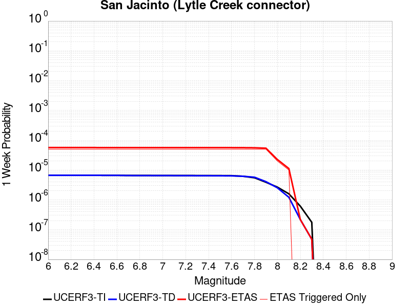 |  |  |  |

| Magnitude | 1 wk TI Prob | 1 wk TD Prob | 1 wk ETAS Prob | 1 wk ETAS/TD Gain | 1 wk ETAS Triggered Only | 1 mo TI Prob | 1 mo TD Prob | 1 mo ETAS Prob | 1 mo ETAS/TD Gain | 1 mo ETAS Triggered Only | 1 yr TI Prob | 1 yr TD Prob | 1 yr ETAS Prob | 1 yr ETAS/TD Gain | 1 yr ETAS Triggered Only | 10 yr TI Prob | 10 yr TD Prob | 10 yr ETAS Prob | 10 yr ETAS/TD Gain | 10 yr ETAS Triggered Only |
|-----|-----|-----|-----|-----|-----|-----|-----|-----|-----|-----|-----|-----|-----|-----|-----|-----|-----|-----|-----|-----|
| 6.0 | 6.693995E-6 | 6.660123E-6 | 5.5063683E-5 | 8.267668 | 4.8403883E-5 | 2.8688235E-5 | 2.8543072E-5 | 7.694557E-5 | 2.6957705 | 4.8403883E-5 | 3.492233E-4 | 3.4745657E-4 | 4.2003716E-4 | 1.2088912 | 7.260582E-5 | 0.00348675 | 0.0035491167 | 0.0036696969 | 1.0339748 | 1.210097E-4 |
| 6.1 | 6.693995E-6 | 6.660123E-6 | 5.5063683E-5 | 8.267668 | 4.8403883E-5 | 2.8688235E-5 | 2.8543072E-5 | 7.694557E-5 | 2.6957705 | 4.8403883E-5 | 3.492233E-4 | 3.4745657E-4 | 4.2003716E-4 | 1.2088912 | 7.260582E-5 | 0.00348675 | 0.0035491167 | 0.0036696969 | 1.0339748 | 1.210097E-4 |
| 6.2 | 6.693995E-6 | 6.660123E-6 | 5.5063683E-5 | 8.267668 | 4.8403883E-5 | 2.8688235E-5 | 2.8543072E-5 | 7.694557E-5 | 2.6957705 | 4.8403883E-5 | 3.492233E-4 | 3.4745657E-4 | 4.2003716E-4 | 1.2088912 | 7.260582E-5 | 0.00348675 | 0.0035491167 | 0.0036696969 | 1.0339748 | 1.210097E-4 |
| 6.3 | 6.693995E-6 | 6.660123E-6 | 5.5063683E-5 | 8.267668 | 4.8403883E-5 | 2.8688235E-5 | 2.8543072E-5 | 7.694557E-5 | 2.6957705 | 4.8403883E-5 | 3.492233E-4 | 3.4745657E-4 | 4.2003716E-4 | 1.2088912 | 7.260582E-5 | 0.00348675 | 0.0035491167 | 0.0036696969 | 1.0339748 | 1.210097E-4 |
| 6.4 | 6.693995E-6 | 6.660123E-6 | 5.5063683E-5 | 8.267668 | 4.8403883E-5 | 2.8688235E-5 | 2.8543072E-5 | 7.694557E-5 | 2.6957705 | 4.8403883E-5 | 3.492233E-4 | 3.4745657E-4 | 4.2003716E-4 | 1.2088912 | 7.260582E-5 | 0.00348675 | 0.0035491167 | 0.0036696969 | 1.0339748 | 1.210097E-4 |
| 6.5 | 6.6561875E-6 | 6.620341E-6 | 5.5023902E-5 | 8.311339 | 4.8403883E-5 | 2.8526205E-5 | 2.8372582E-5 | 7.677509E-5 | 2.7059608 | 4.8403883E-5 | 3.472512E-4 | 3.453815E-4 | 4.1796226E-4 | 1.2101465 | 7.260582E-5 | 0.0034670907 | 0.0035284322 | 0.003649015 | 1.0341746 | 1.210097E-4 |
| 6.6 | 6.6561875E-6 | 6.620341E-6 | 5.5023902E-5 | 8.311339 | 4.8403883E-5 | 2.8526205E-5 | 2.8372582E-5 | 7.677509E-5 | 2.7059608 | 4.8403883E-5 | 3.472512E-4 | 3.453815E-4 | 4.1796226E-4 | 1.2101465 | 7.260582E-5 | 0.0034670907 | 0.0035284322 | 0.003649015 | 1.0341746 | 1.210097E-4 |
| 6.7 | 6.5802237E-6 | 6.539518E-6 | 5.4943084E-5 | 8.401703 | 4.8403883E-5 | 2.8200653E-5 | 2.8026205E-5 | 7.642873E-5 | 2.7270453 | 4.8403883E-5 | 3.4328885E-4 | 3.4116567E-4 | 4.1374672E-4 | 1.2127444 | 7.260582E-5 | 0.0034275902 | 0.0034864065 | 0.0036069944 | 1.034588 | 1.210097E-4 |
| 6.8 | 6.575632E-6 | 6.5340073E-6 | 5.4937573E-5 | 8.407945 | 4.8403883E-5 | 2.8180975E-5 | 2.8002589E-5 | 7.6405115E-5 | 2.7285018 | 4.8403883E-5 | 3.4304935E-4 | 3.4087826E-4 | 4.1345932E-4 | 1.2129238 | 7.260582E-5 | 0.0034252026 | 0.0034835413 | 0.0036041294 | 1.0346166 | 1.210097E-4 |
| 6.9 | 6.570433E-6 | 6.525401E-6 | 5.492897E-5 | 8.417715 | 4.8403883E-5 | 2.8158694E-5 | 2.7965707E-5 | 7.636823E-5 | 2.7307816 | 4.8403883E-5 | 3.4277816E-4 | 3.4042934E-4 | 4.1301045E-4 | 1.2132046 | 7.260582E-5 | 0.0034224992 | 0.0034790665 | 0.003599655 | 1.0346612 | 1.210097E-4 |
| 7.0 | 6.5643826E-6 | 6.5155223E-6 | 5.4919088E-5 | 8.428962 | 4.8403883E-5 | 2.8132765E-5 | 2.7923368E-5 | 7.63259E-5 | 2.7334058 | 4.8403883E-5 | 3.424626E-4 | 3.3991406E-4 | 4.124952E-4 | 1.2135279 | 7.260582E-5 | 0.0034193532 | 0.0034739296 | 0.0035945189 | 1.0347127 | 1.210097E-4 |
| 7.1 | 6.557402E-6 | 6.504234E-6 | 5.49078E-5 | 8.441855 | 4.8403883E-5 | 2.8102848E-5 | 2.7874992E-5 | 7.627752E-5 | 2.7364142 | 4.8403883E-5 | 3.4209844E-4 | 3.3932526E-4 | 4.1190643E-4 | 1.2138985 | 7.260582E-5 | 0.0034157229 | 0.0034680606 | 0.0035886506 | 1.0347716 | 1.210097E-4 |
| 7.2 | 6.546394E-6 | 6.4862006E-6 | 5.488977E-5 | 8.462545 | 4.8403883E-5 | 2.8055672E-5 | 2.7797707E-5 | 7.6200246E-5 | 2.7412422 | 4.8403883E-5 | 3.4152428E-4 | 3.383846E-4 | 4.1096585E-4 | 1.2144934 | 7.260582E-5 | 0.0034099987 | 0.0034586883 | 0.0035792794 | 1.0348662 | 1.210097E-4 |
| 7.3 | 6.5364216E-6 | 6.4669857E-6 | 5.4870554E-5 | 8.484718 | 4.8403883E-5 | 2.8012933E-5 | 2.771536E-5 | 7.6117896E-5 | 2.7464159 | 4.8403883E-5 | 3.4100408E-4 | 3.373823E-4 | 4.0996366E-4 | 1.2151308 | 7.260582E-5 | 0.003404813 | 0.0034487103 | 0.0035693026 | 1.0349674 | 1.210097E-4 |
| 7.4 | 6.5269523E-6 | 6.4480723E-6 | 5.4851644E-5 | 8.506673 | 4.8403883E-5 | 2.7972354E-5 | 2.7634303E-5 | 7.603685E-5 | 2.7515385 | 4.8403883E-5 | 3.4051016E-4 | 3.3639578E-4 | 4.0897718E-4 | 1.2157619 | 7.260582E-5 | 0.0033998888 | 0.0034388923 | 0.0035594858 | 1.0350676 | 1.210097E-4 |
| 7.5 | 6.5111835E-6 | 6.424346E-6 | 5.4827917E-5 | 8.534397 | 4.8403883E-5 | 2.7904773E-5 | 2.753262E-5 | 7.593517E-5 | 2.7580073 | 4.8403883E-5 | 3.3968766E-4 | 3.3515817E-4 | 4.0773966E-4 | 1.2165589 | 7.260582E-5 | 0.0033916887 | 0.0034265644 | 0.0035471595 | 1.0351942 | 1.210097E-4 |
| 7.6 | 6.4768806E-6 | 6.383454E-6 | 5.4787026E-5 | 8.582662 | 4.8403883E-5 | 2.7757764E-5 | 2.7357375E-5 | 7.5759934E-5 | 2.7692692 | 4.8403883E-5 | 3.3789838E-4 | 3.330252E-4 | 4.0560684E-4 | 1.2179464 | 7.260582E-5 | 0.0033738504 | 0.0034052972 | 0.0035258948 | 1.0354147 | 1.210097E-4 |
| 7.7 | 6.1655364E-6 | 6.1759456E-6 | 5.457953E-5 | 8.837437 | 4.8403883E-5 | 2.642346E-5 | 2.646807E-5 | 7.487067E-5 | 2.8287168 | 4.8403883E-5 | 3.2165812E-4 | 3.2220117E-4 | 3.947836E-4 | 1.2252705 | 7.260582E-5 | 0.0032119295 | 0.0032969362 | 0.003417547 | 1.0365827 | 1.210097E-4 |
| 7.8 | 5.5043524E-6 | 5.7370175E-6 | 5.4140623E-5 | 9.437067 | 4.8403883E-5 | 2.3589868E-5 | 2.4586987E-5 | 7.298968E-5 | 2.9686306 | 4.8403883E-5 | 2.871688E-4 | 2.993055E-4 | 3.718896E-4 | 1.2425084 | 7.260582E-5 | 0.0028679797 | 0.0030670585 | 0.0031876971 | 1.0393336 | 1.210097E-4 |
| 7.9 | 3.889249E-6 | 4.0766436E-6 | 5.248033E-5 | 12.873415 | 4.8403883E-5 | 1.6668104E-5 | 1.7471213E-5 | 6.587425E-5 | 3.770445 | 4.8403883E-5 | 2.0291525E-4 | 2.126913E-4 | 2.8528168E-4 | 1.3412945 | 7.260582E-5 | 0.0020273007 | 0.0021941073 | 0.0022907027 | 1.044025 | 9.6807766E-5 |
| 8.0 | 2.668535E-6 | 2.5313454E-6 | 2.5313454E-6 | 1.0 | 0.0 | 1.1436528E-5 | 1.0848577E-5 | 1.0848577E-5 | 1.0 | 0.0 | 1.3923083E-4 | 1.3207346E-4 | 1.562722E-4 | 1.1832218 | 2.4201941E-5 | 0.0013914363 | 0.0013755665 | 0.0014239039 | 1.0351399 | 4.8403883E-5 |
| 8.1 | 1.5911459E-6 | 1.2185134E-6 | 1.2185134E-6 | 1.0 | 0.0 | 6.8191785E-6 | 5.2221894E-6 | 5.2221894E-6 | 1.0 | 0.0 | 8.3020335E-5 | 6.357832E-5 | 8.7778724E-5 | 1.3806392 | 2.4201941E-5 | 8.298933E-4 | 6.6911156E-4 | 6.932973E-4 | 1.036146 | 2.4201941E-5 |
| 8.2 | 6.1294963E-7 | 2.1802066E-7 | 2.1802066E-7 | 1.0 | 0.0 | 2.6269242E-6 | 9.3437393E-7 | 9.3437393E-7 | 1.0 | 0.0 | 3.1982334E-5 | 1.1375943E-5 | 1.1375943E-5 | 1.0 | 0.0 | 3.1977732E-4 | 1.2778955E-4 | 1.2778955E-4 | 1.0 | 0.0 |
| 8.3 | 1.762871E-7 | 4.7516316E-8 | 4.7516316E-8 | 1.0 | 0.0 | 7.5551594E-7 | 2.0364133E-7 | 2.0364133E-7 | 1.0 | 0.0 | 9.1983675E-6 | 2.4793305E-6 | 2.4793305E-6 | 1.0 | 0.0 | 9.197987E-5 | 2.8671833E-5 | 2.8671833E-5 | 1.0 | 0.0 |

## Ventura-Pitas Point
*[(top)](#table-of-contents)*

| 1 Week | 1 Month | 1 Year | 10 Year |
|-----|-----|-----|-----|
|  |  |  |  |

| Magnitude | 1 wk TI Prob | 1 wk TD Prob | 1 wk ETAS Prob | 1 wk ETAS/TD Gain | 1 wk ETAS Triggered Only | 1 mo TI Prob | 1 mo TD Prob | 1 mo ETAS Prob | 1 mo ETAS/TD Gain | 1 mo ETAS Triggered Only | 1 yr TI Prob | 1 yr TD Prob | 1 yr ETAS Prob | 1 yr ETAS/TD Gain | 1 yr ETAS Triggered Only | 10 yr TI Prob | 10 yr TD Prob | 10 yr ETAS Prob | 10 yr ETAS/TD Gain | 10 yr ETAS Triggered Only |
|-----|-----|-----|-----|-----|-----|-----|-----|-----|-----|-----|-----|-----|-----|-----|-----|-----|-----|-----|-----|-----|
| 6.0 | 3.3179622E-5 | 3.373519E-5 | 5.793631E-5 | 1.7173852 | 2.4201941E-5 | 1.4219063E-4 | 1.4457281E-4 | 1.6877125E-4 | 1.1673789 | 2.4201941E-5 | 0.0017297962 | 0.0017590097 | 0.0018314878 | 1.041204 | 7.260582E-5 | 0.017163932 | 0.017476497 | 0.017595392 | 1.0068032 | 1.210097E-4 |
| 6.1 | 3.3179622E-5 | 3.373519E-5 | 5.793631E-5 | 1.7173852 | 2.4201941E-5 | 1.4219063E-4 | 1.4457281E-4 | 1.6877125E-4 | 1.1673789 | 2.4201941E-5 | 0.0017297962 | 0.0017590097 | 0.0018314878 | 1.041204 | 7.260582E-5 | 0.017163932 | 0.017476497 | 0.017595392 | 1.0068032 | 1.210097E-4 |
| 6.2 | 3.3179622E-5 | 3.373519E-5 | 5.793631E-5 | 1.7173852 | 2.4201941E-5 | 1.4219063E-4 | 1.4457281E-4 | 1.6877125E-4 | 1.1673789 | 2.4201941E-5 | 0.0017297962 | 0.0017590097 | 0.0018314878 | 1.041204 | 7.260582E-5 | 0.017163932 | 0.017476497 | 0.017595392 | 1.0068032 | 1.210097E-4 |
| 6.3 | 3.3179622E-5 | 3.373519E-5 | 5.793631E-5 | 1.7173852 | 2.4201941E-5 | 1.4219063E-4 | 1.4457281E-4 | 1.6877125E-4 | 1.1673789 | 2.4201941E-5 | 0.0017297962 | 0.0017590097 | 0.0018314878 | 1.041204 | 7.260582E-5 | 0.017163932 | 0.017476497 | 0.017595392 | 1.0068032 | 1.210097E-4 |
| 6.4 | 1.8754668E-5 | 1.7019594E-5 | 1.7019594E-5 | 1.0 | 0.0 | 8.037467E-5 | 7.2939205E-5 | 7.2939205E-5 | 1.0 | 0.0 | 9.781223E-4 | 8.8769617E-4 | 8.8769617E-4 | 1.0 | 0.0 | 0.009738282 | 0.008843943 | 0.008843943 | 1.0 | 0.0 |
| 6.5 | 1.8754668E-5 | 1.7019594E-5 | 1.7019594E-5 | 1.0 | 0.0 | 8.037467E-5 | 7.2939205E-5 | 7.2939205E-5 | 1.0 | 0.0 | 9.781223E-4 | 8.8769617E-4 | 8.8769617E-4 | 1.0 | 0.0 | 0.009738282 | 0.008843943 | 0.008843943 | 1.0 | 0.0 |
| 6.6 | 1.4361558E-5 | 1.2122258E-5 | 1.2122258E-5 | 1.0 | 0.0 | 6.154808E-5 | 5.1951512E-5 | 5.1951512E-5 | 1.0 | 0.0 | 7.490902E-4 | 6.323284E-4 | 6.323284E-4 | 1.0 | 0.0 | 0.0074657016 | 0.006305652 | 0.006305652 | 1.0 | 0.0 |
| 6.7 | 1.4361558E-5 | 1.2122258E-5 | 1.2122258E-5 | 1.0 | 0.0 | 6.154808E-5 | 5.1951512E-5 | 5.1951512E-5 | 1.0 | 0.0 | 7.490902E-4 | 6.323284E-4 | 6.323284E-4 | 1.0 | 0.0 | 0.0074657016 | 0.006305652 | 0.006305652 | 1.0 | 0.0 |
| 6.8 | 1.3663846E-5 | 1.1344401E-5 | 1.1344401E-5 | 1.0 | 0.0 | 5.8558027E-5 | 4.8617967E-5 | 4.8617967E-5 | 1.0 | 0.0 | 7.127108E-4 | 5.917649E-4 | 5.917649E-4 | 1.0 | 0.0 | 0.007104293 | 0.0059022107 | 0.0059022107 | 1.0 | 0.0 |
| 6.9 | 1.3644157E-5 | 1.1322501E-5 | 1.1322501E-5 | 1.0 | 0.0 | 5.8473648E-5 | 4.8524114E-5 | 4.8524114E-5 | 1.0 | 0.0 | 7.116841E-4 | 5.906229E-4 | 5.906229E-4 | 1.0 | 0.0 | 0.007094092 | 0.0058908514 | 0.0058908514 | 1.0 | 0.0 |
| 7.0 | 1.3568845E-5 | 1.12420685E-5 | 1.12420685E-5 | 1.0 | 0.0 | 5.8150898E-5 | 4.8179416E-5 | 4.8179416E-5 | 1.0 | 0.0 | 7.077572E-4 | 5.8642845E-4 | 5.8642845E-4 | 1.0 | 0.0 | 0.007055073 | 0.005849128 | 0.005849128 | 1.0 | 0.0 |
| 7.1 | 1.306572E-5 | 1.0720521E-5 | 1.0720521E-5 | 1.0 | 0.0 | 5.599474E-5 | 4.594429E-5 | 4.594429E-5 | 1.0 | 0.0 | 6.815227E-4 | 5.5923004E-4 | 5.5923004E-4 | 1.0 | 0.0 | 0.0067943637 | 0.005578536 | 0.005578536 | 1.0 | 0.0 |
| 7.2 | 1.232604E-5 | 9.995121E-6 | 9.995121E-6 | 1.0 | 0.0 | 5.2824813E-5 | 4.283554E-5 | 4.283554E-5 | 1.0 | 0.0 | 6.429523E-4 | 5.2139966E-4 | 5.2139966E-4 | 1.0 | 0.0 | 0.0064109527 | 0.005202059 | 0.005202059 | 1.0 | 0.0 |
| 7.3 | 1.0917261E-5 | 8.843812E-6 | 8.843812E-6 | 1.0 | 0.0 | 4.678742E-5 | 3.7901507E-5 | 3.7901507E-5 | 1.0 | 0.0 | 5.69488E-4 | 4.6135474E-4 | 4.6135474E-4 | 1.0 | 0.0 | 0.0056803077 | 0.004604239 | 0.004604239 | 1.0 | 0.0 |
| 7.4 | 1.039959E-5 | 8.42354E-6 | 8.42354E-6 | 1.0 | 0.0 | 4.456891E-5 | 3.6100395E-5 | 3.6100395E-5 | 1.0 | 0.0 | 5.424914E-4 | 4.394352E-4 | 4.394352E-4 | 1.0 | 0.0 | 0.0054116896 | 0.0043859277 | 0.0043859277 | 1.0 | 0.0 |
| 7.5 | 9.015877E-6 | 7.29752E-6 | 7.29752E-6 | 1.0 | 0.0 | 3.86389E-5 | 3.1274718E-5 | 3.1274718E-5 | 1.0 | 0.0 | 4.7032707E-4 | 3.8070456E-4 | 3.8070456E-4 | 1.0 | 0.0 | 0.004693329 | 0.003800772 | 0.003800772 | 1.0 | 0.0 |
| 7.6 | 4.900162E-6 | 3.874119E-6 | 3.874119E-6 | 1.0 | 0.0 | 2.1000526E-5 | 1.6603262E-5 | 1.6603262E-5 | 1.0 | 0.0 | 2.556514E-4 | 2.0212609E-4 | 2.0212609E-4 | 1.0 | 0.0 | 0.0025535747 | 0.002019436 | 0.002019436 | 1.0 | 0.0 |
| 7.7 | 3.8850626E-6 | 3.12676E-6 | 3.12676E-6 | 1.0 | 0.0 | 1.6650163E-5 | 1.3400332E-5 | 1.3400332E-5 | 1.0 | 0.0 | 2.0269687E-4 | 1.6313691E-4 | 1.6313691E-4 | 1.0 | 0.0 | 0.002025121 | 0.0016301809 | 0.0016301809 | 1.0 | 0.0 |
| 7.8 | 2.4654719E-6 | 2.029902E-6 | 2.029902E-6 | 1.0 | 0.0 | 1.0566265E-5 | 8.699551E-6 | 8.699551E-6 | 1.0 | 0.0 | 1.2863669E-4 | 1.0591193E-4 | 1.0591193E-4 | 1.0 | 0.0 | 0.0012856225 | 0.0010586192 | 0.0010586192 | 1.0 | 0.0 |
| 7.9 | 4.095894E-7 | 3.2765078E-7 | 3.2765078E-7 | 1.0 | 0.0 | 1.7553821E-6 | 1.4042168E-6 | 1.4042168E-6 | 1.0 | 0.0 | 2.1371567E-5 | 1.709621E-5 | 1.709621E-5 | 1.0 | 0.0 | 2.1369511E-4 | 1.7094925E-4 | 1.7094925E-4 | 1.0 | 0.0 |
| 8.0 | 7.791402E-9 | 5.6836056E-9 | 5.6836056E-9 | 1.0 | 0.0 | 3.3391725E-8 | 2.4358311E-8 | 2.4358311E-8 | 1.0 | 0.0 | 4.0654416E-7 | 2.965624E-7 | 2.965624E-7 | 1.0 | 0.0 | 4.065434E-6 | 2.9656223E-6 | 2.9656223E-6 | 1.0 | 0.0 |

## Raymond
*[(top)](#table-of-contents)*

| 1 Week | 1 Month | 1 Year | 10 Year |
|-----|-----|-----|-----|
| 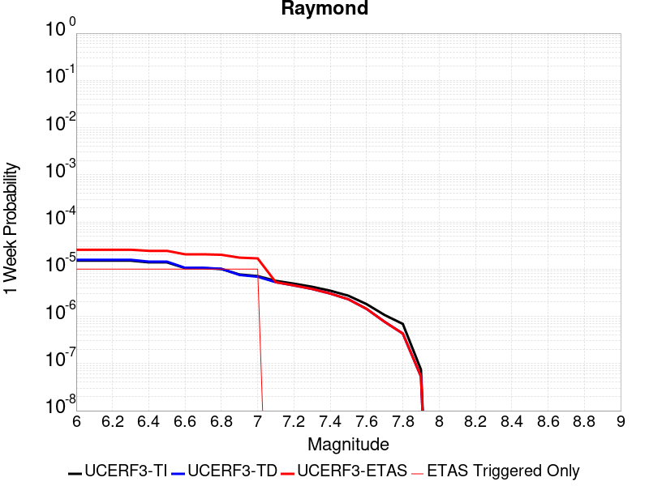 |  |  |  |

| Magnitude | 1 wk TI Prob | 1 wk TD Prob | 1 wk ETAS Prob | 1 wk ETAS/TD Gain | 1 wk ETAS Triggered Only | 1 mo TI Prob | 1 mo TD Prob | 1 mo ETAS Prob | 1 mo ETAS/TD Gain | 1 mo ETAS Triggered Only | 1 yr TI Prob | 1 yr TD Prob | 1 yr ETAS Prob | 1 yr ETAS/TD Gain | 1 yr ETAS Triggered Only | 10 yr TI Prob | 10 yr TD Prob | 10 yr ETAS Prob | 10 yr ETAS/TD Gain | 10 yr ETAS Triggered Only |
|-----|-----|-----|-----|-----|-----|-----|-----|-----|-----|-----|-----|-----|-----|-----|-----|-----|-----|-----|-----|-----|
| 6.0 | 1.5157413E-5 | 1.5810125E-5 | 4.0011684E-5 | 2.5307631 | 2.4201941E-5 | 6.4958724E-5 | 6.775606E-5 | 9.195636E-5 | 1.3571681 | 2.4201941E-5 | 7.905855E-4 | 8.246429E-4 | 8.9718885E-4 | 1.0879725 | 7.260582E-5 | 0.007877788 | 0.008218355 | 0.008314366 | 1.0116826 | 9.6807766E-5 |
| 6.1 | 1.5157413E-5 | 1.5810125E-5 | 4.0011684E-5 | 2.5307631 | 2.4201941E-5 | 6.4958724E-5 | 6.775606E-5 | 9.195636E-5 | 1.3571681 | 2.4201941E-5 | 7.905855E-4 | 8.246429E-4 | 8.9718885E-4 | 1.0879725 | 7.260582E-5 | 0.007877788 | 0.008218355 | 0.008314366 | 1.0116826 | 9.6807766E-5 |
| 6.2 | 1.5157413E-5 | 1.5810125E-5 | 4.0011684E-5 | 2.5307631 | 2.4201941E-5 | 6.4958724E-5 | 6.775606E-5 | 9.195636E-5 | 1.3571681 | 2.4201941E-5 | 7.905855E-4 | 8.246429E-4 | 8.9718885E-4 | 1.0879725 | 7.260582E-5 | 0.007877788 | 0.008218355 | 0.008314366 | 1.0116826 | 9.6807766E-5 |
| 6.3 | 1.5157413E-5 | 1.5810125E-5 | 4.0011684E-5 | 2.5307631 | 2.4201941E-5 | 6.4958724E-5 | 6.775606E-5 | 9.195636E-5 | 1.3571681 | 2.4201941E-5 | 7.905855E-4 | 8.246429E-4 | 8.9718885E-4 | 1.0879725 | 7.260582E-5 | 0.007877788 | 0.008218355 | 0.008314366 | 1.0116826 | 9.6807766E-5 |
| 6.4 | 1.3941944E-5 | 1.4454688E-5 | 3.865628E-5 | 2.6743073 | 2.4201941E-5 | 5.9749822E-5 | 6.194732E-5 | 8.614777E-5 | 1.3906616 | 2.4201941E-5 | 7.2721124E-4 | 7.53971E-4 | 8.2652207E-4 | 1.0962253 | 7.260582E-5 | 0.007248361 | 0.007516471 | 0.007612551 | 1.0127826 | 9.6807766E-5 |
| 6.5 | 1.3941944E-5 | 1.4454688E-5 | 3.865628E-5 | 2.6743073 | 2.4201941E-5 | 5.9749822E-5 | 6.194732E-5 | 8.614777E-5 | 1.3906616 | 2.4201941E-5 | 7.2721124E-4 | 7.53971E-4 | 8.2652207E-4 | 1.0962253 | 7.260582E-5 | 0.007248361 | 0.007516471 | 0.007612551 | 1.0127826 | 9.6807766E-5 |
| 6.6 | 1.0542609E-5 | 1.067111E-5 | 3.487279E-5 | 3.267963 | 2.4201941E-5 | 4.5181827E-5 | 4.573256E-5 | 6.993339E-5 | 1.5291817 | 2.4201941E-5 | 5.499499E-4 | 5.566571E-4 | 6.0503406E-4 | 1.0869062 | 4.8403883E-5 | 0.005485909 | 0.0055531966 | 0.0056253993 | 1.013002 | 7.260582E-5 |
| 6.7 | 1.0542609E-5 | 1.067111E-5 | 3.487279E-5 | 3.267963 | 2.4201941E-5 | 4.5181827E-5 | 4.573256E-5 | 6.993339E-5 | 1.5291817 | 2.4201941E-5 | 5.499499E-4 | 5.566571E-4 | 6.0503406E-4 | 1.0869062 | 4.8403883E-5 | 0.005485909 | 0.0055531966 | 0.0056253993 | 1.013002 | 7.260582E-5 |
| 6.8 | 1.0079132E-5 | 1.0176644E-5 | 3.437834E-5 | 3.3781607 | 2.4201941E-5 | 4.3195567E-5 | 4.3613487E-5 | 6.781437E-5 | 1.5548946 | 2.4201941E-5 | 5.257791E-4 | 5.308702E-4 | 5.792484E-4 | 1.09113 | 4.8403883E-5 | 0.0052453685 | 0.0052965777 | 0.005368799 | 1.0136355 | 7.260582E-5 |
| 6.9 | 7.721598E-6 | 7.548902E-6 | 3.175066E-5 | 4.205997 | 2.4201941E-5 | 3.3092143E-5 | 3.2352043E-5 | 5.6553203E-5 | 1.7480565 | 2.4201941E-5 | 4.0282236E-4 | 3.9381615E-4 | 4.4220098E-4 | 1.1228614 | 4.8403883E-5 | 0.0040209293 | 0.003931324 | 0.0040036445 | 1.0183959 | 7.260582E-5 |
| 7.0 | 7.137566E-6 | 6.911303E-6 | 3.1113075E-5 | 4.501767 | 2.4201941E-5 | 3.058921E-5 | 2.961954E-5 | 5.3820764E-5 | 1.8170695 | 2.4201941E-5 | 3.7236E-4 | 3.605593E-4 | 4.0894572E-4 | 1.1341983 | 4.8403883E-5 | 0.0037173668 | 0.003599869 | 0.0036722135 | 1.0200964 | 7.260582E-5 |
| 7.1 | 5.654976E-6 | 5.299538E-6 | 5.299538E-6 | 1.0 | 0.0 | 2.4235387E-5 | 2.2712107E-5 | 2.2712107E-5 | 1.0 | 0.0 | 2.9502588E-4 | 2.7648505E-4 | 3.006803E-4 | 1.0875101 | 2.4201941E-5 | 0.0029463451 | 0.0027614492 | 0.0028097194 | 1.01748 | 4.8403883E-5 |
| 7.2 | 4.9358455E-6 | 4.526655E-6 | 4.526655E-6 | 1.0 | 0.0 | 2.1153453E-5 | 1.9399806E-5 | 1.9399806E-5 | 1.0 | 0.0 | 2.5751285E-4 | 2.3616718E-4 | 2.603634E-4 | 1.1024538 | 2.4201941E-5 | 0.0025721465 | 0.002359192 | 0.0024074814 | 1.0204687 | 4.8403883E-5 |
| 7.3 | 4.2368597E-6 | 3.8056128E-6 | 3.8056128E-6 | 1.0 | 0.0 | 1.8157843E-5 | 1.6309668E-5 | 1.6309668E-5 | 1.0 | 0.0 | 2.2104931E-4 | 1.9855222E-4 | 2.2274935E-4 | 1.1218679 | 2.4201941E-5 | 0.0022082955 | 0.0019837746 | 0.0020320825 | 1.0243515 | 4.8403883E-5 |
| 7.4 | 3.4999923E-6 | 3.0437407E-6 | 3.0437407E-6 | 1.0 | 0.0 | 1.49998805E-5 | 1.3044538E-5 | 1.3044538E-5 | 1.0 | 0.0 | 1.8260824E-4 | 1.5880575E-4 | 1.5880575E-4 | 1.0 | 0.0 | 0.0018245826 | 0.0015869461 | 0.0015869461 | 1.0 | 0.0 |
| 7.5 | 2.738017E-6 | 2.3020405E-6 | 2.3020405E-6 | 1.0 | 0.0 | 1.1734306E-5 | 9.865851E-6 | 9.865851E-6 | 1.0 | 0.0 | 1.428558E-4 | 1.20110184E-4 | 1.20110184E-4 | 1.0 | 0.0 | 0.0014276401 | 0.0012004747 | 0.0012004747 | 1.0 | 0.0 |
| 7.6 | 1.8186392E-6 | 1.442302E-6 | 1.442302E-6 | 1.0 | 0.0 | 7.794145E-6 | 6.1812802E-6 | 6.1812802E-6 | 1.0 | 0.0 | 9.488958E-5 | 7.5254524E-5 | 7.5254524E-5 | 1.0 | 0.0 | 9.4849075E-4 | 7.5230957E-4 | 7.5230957E-4 | 1.0 | 0.0 |
| 7.7 | 1.0660348E-6 | 7.6437E-7 | 7.6437E-7 | 1.0 | 0.0 | 4.5687125E-6 | 3.2758674E-6 | 3.2758674E-6 | 1.0 | 0.0 | 5.5622655E-5 | 3.988297E-5 | 3.988297E-5 | 1.0 | 0.0 | 5.5608735E-4 | 3.9877492E-4 | 3.9877492E-4 | 1.0 | 0.0 |
| 7.8 | 6.913602E-7 | 4.3202903E-7 | 4.3202903E-7 | 1.0 | 0.0 | 2.962969E-6 | 1.8515517E-6 | 1.8515517E-6 | 1.0 | 0.0 | 3.607355E-5 | 2.2542416E-5 | 2.2542416E-5 | 1.0 | 0.0 | 3.6067693E-4 | 2.2541684E-4 | 2.2541684E-4 | 1.0 | 0.0 |
| 7.9 | 7.425201E-8 | 5.322267E-8 | 5.322267E-8 | 1.0 | 0.0 | 3.1822285E-7 | 2.2809714E-7 | 2.2809714E-7 | 1.0 | 0.0 | 3.874356E-6 | 2.7770805E-6 | 2.7770805E-6 | 1.0 | 0.0 | 3.8742884E-5 | 2.7770588E-5 | 2.7770588E-5 | 1.0 | 0.0 |

## Simi-Santa Rosa
*[(top)](#table-of-contents)*

| 1 Week | 1 Month | 1 Year | 10 Year |
|-----|-----|-----|-----|
|  |  |  | 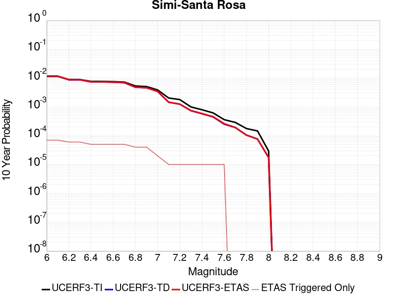 |

| Magnitude | 1 wk TI Prob | 1 wk TD Prob | 1 wk ETAS Prob | 1 wk ETAS/TD Gain | 1 wk ETAS Triggered Only | 1 mo TI Prob | 1 mo TD Prob | 1 mo ETAS Prob | 1 mo ETAS/TD Gain | 1 mo ETAS Triggered Only | 1 yr TI Prob | 1 yr TD Prob | 1 yr ETAS Prob | 1 yr ETAS/TD Gain | 1 yr ETAS Triggered Only | 10 yr TI Prob | 10 yr TD Prob | 10 yr ETAS Prob | 10 yr ETAS/TD Gain | 10 yr ETAS Triggered Only |
|-----|-----|-----|-----|-----|-----|-----|-----|-----|-----|-----|-----|-----|-----|-----|-----|-----|-----|-----|-----|-----|
| 6.0 | 2.198912E-5 | 2.2275388E-5 | 4.647679E-5 | 2.0864637 | 2.4201941E-5 | 9.4235686E-5 | 9.54627E-5 | 1.19662334E-4 | 1.2534983 | 2.4201941E-5 | 0.0011467156 | 0.0011616825 | 0.0011858564 | 1.0208093 | 2.4201941E-5 | 0.011408163 | 0.011560547 | 0.011632314 | 1.0062078 | 7.260582E-5 |
| 6.1 | 2.198912E-5 | 2.2275388E-5 | 4.647679E-5 | 2.0864637 | 2.4201941E-5 | 9.4235686E-5 | 9.54627E-5 | 1.19662334E-4 | 1.2534983 | 2.4201941E-5 | 0.0011467156 | 0.0011616825 | 0.0011858564 | 1.0208093 | 2.4201941E-5 | 0.011408163 | 0.011560547 | 0.011632314 | 1.0062078 | 7.260582E-5 |
| 6.2 | 1.69983E-5 | 1.6668506E-5 | 4.0870043E-5 | 2.451932 | 2.4201941E-5 | 7.284782E-5 | 7.143466E-5 | 9.5634874E-5 | 1.3387741 | 2.4201941E-5 | 8.865613E-4 | 8.6939917E-4 | 8.9358E-4 | 1.0278133 | 2.4201941E-5 | 0.008830327 | 0.0086629 | 0.008734876 | 1.0083086 | 7.260582E-5 |
| 6.3 | 1.69983E-5 | 1.6668506E-5 | 4.0870043E-5 | 2.451932 | 2.4201941E-5 | 7.284782E-5 | 7.143466E-5 | 9.5634874E-5 | 1.3387741 | 2.4201941E-5 | 8.865613E-4 | 8.6939917E-4 | 8.9358E-4 | 1.0278133 | 2.4201941E-5 | 0.008830327 | 0.0086629 | 0.008734876 | 1.0083086 | 7.260582E-5 |
| 6.4 | 1.4666188E-5 | 1.4052489E-5 | 3.825409E-5 | 2.7222288 | 2.4201941E-5 | 6.285358E-5 | 6.0223705E-5 | 8.442419E-5 | 1.4018432 | 2.4201941E-5 | 7.6497364E-4 | 7.330018E-4 | 7.5718603E-4 | 1.0329933 | 2.4201941E-5 | 0.0076234564 | 0.0073083164 | 0.007356366 | 1.0065747 | 4.8403883E-5 |
| 6.5 | 1.4666188E-5 | 1.4052489E-5 | 3.825409E-5 | 2.7222288 | 2.4201941E-5 | 6.285358E-5 | 6.0223705E-5 | 8.442419E-5 | 1.4018432 | 2.4201941E-5 | 7.6497364E-4 | 7.330018E-4 | 7.5718603E-4 | 1.0329933 | 2.4201941E-5 | 0.0076234564 | 0.0073083164 | 0.007356366 | 1.0065747 | 4.8403883E-5 |
| 6.6 | 1.4377586E-5 | 1.3729529E-5 | 3.793114E-5 | 2.7627413 | 2.4201941E-5 | 6.1616774E-5 | 5.883965E-5 | 8.304017E-5 | 1.411296 | 2.4201941E-5 | 7.4992597E-4 | 7.1616215E-4 | 7.4034673E-4 | 1.0337697 | 2.4201941E-5 | 0.007474003 | 0.0071410104 | 0.007189069 | 1.0067298 | 4.8403883E-5 |
| 6.7 | 1.3881404E-5 | 1.3207497E-5 | 3.7409118E-5 | 2.8324153 | 2.4201941E-5 | 5.9490372E-5 | 5.6602472E-5 | 8.0803045E-5 | 1.4275533 | 2.4201941E-5 | 7.240546E-4 | 6.889419E-4 | 7.131272E-4 | 1.035105 | 2.4201941E-5 | 0.007217 | 0.0068705105 | 0.006918582 | 1.0069968 | 4.8403883E-5 |
| 6.8 | 1.0176516E-5 | 9.1541E-6 | 9.1541E-6 | 1.0 | 0.0 | 4.3612912E-5 | 3.923136E-5 | 3.923136E-5 | 1.0 | 0.0 | 5.308578E-4 | 4.775537E-4 | 4.775537E-4 | 1.0 | 0.0 | 0.0052959146 | 0.004766908 | 0.0047909943 | 1.0050529 | 2.4201941E-5 |
| 6.9 | 9.699797E-6 | 8.774672E-6 | 8.774672E-6 | 1.0 | 0.0 | 4.15699E-5 | 3.760529E-5 | 3.760529E-5 | 1.0 | 0.0 | 5.05996E-4 | 4.5776463E-4 | 4.5776463E-4 | 1.0 | 0.0 | 0.005048454 | 0.0045698346 | 0.004593926 | 1.0052718 | 2.4201941E-5 |
| 7.0 | 7.4049476E-6 | 6.559291E-6 | 6.559291E-6 | 1.0 | 0.0 | 3.1735104E-5 | 2.8111013E-5 | 2.8111013E-5 | 1.0 | 0.0 | 3.8630638E-4 | 3.422105E-4 | 3.422105E-4 | 1.0 | 0.0 | 0.0038563553 | 0.0034180775 | 0.0034421969 | 1.0070564 | 2.4201941E-5 |
| 7.1 | 3.873439E-6 | 2.759473E-6 | 2.759473E-6 | 1.0 | 0.0 | 1.6600346E-5 | 1.1826261E-5 | 1.1826261E-5 | 1.0 | 0.0 | 2.0209046E-4 | 1.4397544E-4 | 1.4397544E-4 | 1.0 | 0.0 | 0.0020190678 | 0.0014388453 | 0.0014388453 | 1.0 | 0.0 |
| 7.2 | 3.417706E-6 | 2.367616E-6 | 2.367616E-6 | 1.0 | 0.0 | 1.4647229E-5 | 1.0146887E-5 | 1.0146887E-5 | 1.0 | 0.0 | 1.7831543E-4 | 1.2353157E-4 | 1.2353157E-4 | 1.0 | 0.0 | 0.0017817242 | 0.0012346513 | 0.0012346513 | 1.0 | 0.0 |
| 7.3 | 1.90225E-6 | 1.4073756E-6 | 1.4073756E-6 | 1.0 | 0.0 | 8.152474E-6 | 6.031596E-6 | 6.031596E-6 | 1.0 | 0.0 | 9.9251854E-5 | 7.343223E-5 | 7.343223E-5 | 1.0 | 0.0 | 9.920754E-4 | 7.340819E-4 | 7.340819E-4 | 1.0 | 0.0 |
| 7.4 | 1.5170556E-6 | 1.1024792E-6 | 1.1024792E-6 | 1.0 | 0.0 | 6.5016507E-6 | 4.7249023E-6 | 4.7249023E-6 | 1.0 | 0.0 | 7.915472E-5 | 5.752418E-5 | 5.752418E-5 | 1.0 | 0.0 | 7.9126534E-4 | 5.75094E-4 | 5.75094E-4 | 1.0 | 0.0 |
| 7.5 | 1.178732E-6 | 8.5351127E-7 | 8.5351127E-7 | 1.0 | 0.0 | 5.0516987E-6 | 3.6579004E-6 | 3.6579004E-6 | 1.0 | 0.0 | 6.1502695E-5 | 4.4534037E-5 | 4.4534037E-5 | 1.0 | 0.0 | 6.148568E-4 | 4.4525208E-4 | 4.4525208E-4 | 1.0 | 0.0 |
| 7.6 | 6.8722386E-7 | 4.793211E-7 | 4.793211E-7 | 1.0 | 0.0 | 2.9452417E-6 | 2.0542318E-6 | 2.0542318E-6 | 1.0 | 0.0 | 3.5857727E-5 | 2.5009986E-5 | 2.5009986E-5 | 1.0 | 0.0 | 3.5851944E-4 | 2.5007184E-4 | 2.5007184E-4 | 1.0 | 0.0 |
| 7.7 | 5.5126515E-7 | 3.6731117E-7 | 3.6731117E-7 | 1.0 | 0.0 | 2.3625628E-6 | 1.5741898E-6 | 1.5741898E-6 | 1.0 | 0.0 | 2.8763823E-5 | 1.9165593E-5 | 1.9165593E-5 | 1.0 | 0.0 | 2.87601E-4 | 1.9163951E-4 | 1.9163951E-4 | 1.0 | 0.0 |
| 7.8 | 3.3860243E-7 | 2.0075514E-7 | 2.0075514E-7 | 1.0 | 0.0 | 1.4511525E-6 | 8.6037886E-7 | 8.6037886E-7 | 1.0 | 0.0 | 1.7667637E-5 | 1.0475063E-5 | 1.0475063E-5 | 1.0 | 0.0 | 1.7666233E-4 | 1.0474575E-4 | 1.0474575E-4 | 1.0 | 0.0 |
| 7.9 | 2.7955386E-7 | 1.4648724E-7 | 1.4648724E-7 | 1.0 | 0.0 | 1.1980875E-6 | 6.278023E-7 | 6.278023E-7 | 1.0 | 0.0 | 1.4586617E-5 | 7.643467E-6 | 7.643467E-6 | 1.0 | 0.0 | 1.458566E-4 | 7.643208E-5 | 7.643208E-5 | 1.0 | 0.0 |
| 8.0 | 5.6259015E-8 | 3.335318E-8 | 3.335318E-8 | 1.0 | 0.0 | 2.4111003E-7 | 1.429422E-7 | 1.429422E-7 | 1.0 | 0.0 | 2.9355108E-6 | 1.7403199E-6 | 1.7403199E-6 | 1.0 | 0.0 | 2.935472E-5 | 1.7403077E-5 | 1.7403077E-5 | 1.0 | 0.0 |

## Hayward (No) 2011 CFM
*[(top)](#table-of-contents)*

| 1 Week | 1 Month | 1 Year | 10 Year |
|-----|-----|-----|-----|
|  |  |  |  |

| Magnitude | 1 wk TI Prob | 1 wk TD Prob | 1 wk ETAS Prob | 1 wk ETAS/TD Gain | 1 wk ETAS Triggered Only | 1 mo TI Prob | 1 mo TD Prob | 1 mo ETAS Prob | 1 mo ETAS/TD Gain | 1 mo ETAS Triggered Only | 1 yr TI Prob | 1 yr TD Prob | 1 yr ETAS Prob | 1 yr ETAS/TD Gain | 1 yr ETAS Triggered Only | 10 yr TI Prob | 10 yr TD Prob | 10 yr ETAS Prob | 10 yr ETAS/TD Gain | 10 yr ETAS Triggered Only |
|-----|-----|-----|-----|-----|-----|-----|-----|-----|-----|-----|-----|-----|-----|-----|-----|-----|-----|-----|-----|-----|
| 6.0 | 9.3068506E-5 | 1.739643E-4 | 1.9816204E-4 | 1.1390959 | 2.4201941E-5 | 3.9880406E-4 | 7.453474E-4 | 7.695313E-4 | 1.0324465 | 2.4201941E-5 | 0.0048446343 | 0.009036727 | 0.009108677 | 1.0079619 | 7.260582E-5 | 0.047403704 | 0.086396605 | 0.08648505 | 1.0010237 | 9.6807766E-5 |
| 6.1 | 9.055486E-5 | 1.6947639E-4 | 1.9367422E-4 | 1.14278 | 2.4201941E-5 | 3.880345E-4 | 7.2612526E-4 | 7.503096E-4 | 1.033306 | 2.4201941E-5 | 0.0047140904 | 0.008804814 | 0.00887678 | 1.0081736 | 7.260582E-5 | 0.046153355 | 0.08428568 | 0.08437432 | 1.0010518 | 9.6807766E-5 |
| 6.2 | 9.006742E-5 | 1.6868232E-4 | 1.9288018E-4 | 1.1434523 | 2.4201941E-5 | 3.859461E-4 | 7.227246E-4 | 7.4690906E-4 | 1.0334629 | 2.4201941E-5 | 0.0046887742 | 0.00876378 | 0.008835749 | 1.0082122 | 7.260582E-5 | 0.0459107 | 0.08390991 | 0.08399859 | 1.0010569 | 9.6807766E-5 |
| 6.3 | 8.8336754E-5 | 1.6547782E-4 | 1.8967575E-4 | 1.1462307 | 2.4201941E-5 | 3.7853114E-4 | 7.0899865E-4 | 7.3318346E-4 | 1.0341111 | 2.4201941E-5 | 0.004598882 | 0.008598051 | 0.008670033 | 1.0083718 | 7.260582E-5 | 0.04504866 | 0.08240195 | 0.08249078 | 1.001078 | 9.6807766E-5 |
| 6.4 | 8.526157E-5 | 1.5974796E-4 | 1.8394603E-4 | 1.1514766 | 2.4201941E-5 | 3.6535555E-4 | 6.844552E-4 | 7.0864055E-4 | 1.0353352 | 2.4201941E-5 | 0.0044391346 | 0.00830156 | 0.008373563 | 1.0086734 | 7.260582E-5 | 0.043514993 | 0.07968467 | 0.079773754 | 1.0011181 | 9.6807766E-5 |
| 6.5 | 8.152396E-5 | 1.5307199E-4 | 1.7727022E-4 | 1.158084 | 2.4201941E-5 | 3.493416E-4 | 6.558586E-4 | 6.8004464E-4 | 1.0368769 | 2.4201941E-5 | 0.0042449418 | 0.007955993 | 0.00802802 | 1.0090533 | 7.260582E-5 | 0.04164765 | 0.07651448 | 0.07660388 | 1.0011684 | 9.6807766E-5 |
| 6.6 | 7.987405E-5 | 1.5011412E-4 | 1.7431243E-4 | 1.1611995 | 2.4201941E-5 | 3.4227243E-4 | 6.431883E-4 | 6.6737464E-4 | 1.0376039 | 2.4201941E-5 | 0.0041592065 | 0.007802858 | 0.007850884 | 1.0061549 | 4.8403883E-5 | 0.04082218 | 0.075105876 | 0.07517303 | 1.0008941 | 7.260582E-5 |
| 6.7 | 7.777665E-5 | 1.4650672E-4 | 1.7070511E-4 | 1.1651692 | 2.4201941E-5 | 3.332859E-4 | 6.277355E-4 | 6.5192225E-4 | 1.0385301 | 2.4201941E-5 | 0.004050208 | 0.007616053 | 0.007664088 | 1.0063071 | 4.8403883E-5 | 0.039771806 | 0.0733825 | 0.073449776 | 1.0009168 | 7.260582E-5 |
| 6.8 | 7.3284005E-5 | 1.3801287E-4 | 1.6221147E-4 | 1.1753359 | 2.4201941E-5 | 3.140365E-4 | 5.9135025E-4 | 6.1553787E-4 | 1.0409024 | 2.4201941E-5 | 0.0038166929 | 0.007176059 | 0.0072241155 | 1.0066968 | 4.8403883E-5 | 0.037518036 | 0.06929624 | 0.06936382 | 1.0009751 | 7.260582E-5 |
| 6.9 | 6.458263E-5 | 1.21319164E-4 | 1.4551816E-4 | 1.1994656 | 2.4201941E-5 | 2.7675333E-4 | 5.1983615E-4 | 5.440255E-4 | 1.0465326 | 2.4201941E-5 | 0.0033642664 | 0.0063107396 | 0.006358838 | 1.0076216 | 4.8403883E-5 | 0.033137884 | 0.061224625 | 0.061292786 | 1.0011133 | 7.260582E-5 |
| 7.0 | 5.3853604E-5 | 1.00254634E-4 | 1.00254634E-4 | 1.0 | 0.0 | 2.3078074E-4 | 4.295923E-4 | 4.295923E-4 | 1.0 | 0.0 | 0.0028061352 | 0.0052178074 | 0.005241883 | 1.0046141 | 2.4201941E-5 | 0.027709642 | 0.050957024 | 0.05100296 | 1.0009015 | 4.8403883E-5 |
| 7.1 | 4.4308683E-5 | 8.17098E-5 | 8.17098E-5 | 1.0 | 0.0 | 1.8988053E-4 | 3.5013806E-4 | 3.5013806E-4 | 1.0 | 0.0 | 0.0023093442 | 0.0042546396 | 0.0042787385 | 1.0056641 | 2.4201941E-5 | 0.022854926 | 0.041824497 | 0.041870877 | 1.0011089 | 4.8403883E-5 |
| 7.2 | 3.295973E-5 | 6.0774026E-5 | 6.0774026E-5 | 1.0 | 0.0 | 1.4124835E-4 | 2.6043423E-4 | 2.6043423E-4 | 1.0 | 0.0 | 0.0017183421 | 0.0031661994 | 0.0031903246 | 1.0076196 | 2.4201941E-5 | 0.017051157 | 0.031370014 | 0.031393453 | 1.0007473 | 2.4201941E-5 |
| 7.3 | 2.452256E-5 | 4.518223E-5 | 4.518223E-5 | 1.0 | 0.0 | 1.05092455E-4 | 1.9362383E-4 | 1.9362383E-4 | 1.0 | 0.0 | 0.0012787496 | 0.0023548352 | 0.0023789802 | 1.0102533 | 2.4201941E-5 | 0.0127141625 | 0.023442036 | 0.02346567 | 1.0010083 | 2.4201941E-5 |
| 7.4 | 1.8829967E-5 | 3.4604043E-5 | 3.4604043E-5 | 1.0 | 0.0 | 8.069736E-5 | 1.4829468E-4 | 1.4829468E-4 | 1.0 | 0.0 | 9.820475E-4 | 0.0018040023 | 0.0018040023 | 1.0 | 0.0 | 0.009777189 | 0.01802003 | 0.01802003 | 1.0 | 0.0 |
| 7.5 | 1.26374125E-5 | 2.292219E-5 | 2.292219E-5 | 1.0 | 0.0 | 5.4159216E-5 | 9.823428E-5 | 9.823428E-5 | 1.0 | 0.0 | 6.5918895E-4 | 0.0011953521 | 0.0011953521 | 1.0 | 0.0 | 0.00657237 | 0.011988704 | 0.011988704 | 1.0 | 0.0 |
| 7.6 | 4.666429E-6 | 8.479636E-6 | 8.479636E-6 | 1.0 | 0.0 | 1.9998828E-5 | 3.6340796E-5 | 3.6340796E-5 | 1.0 | 0.0 | 2.4345852E-4 | 4.423606E-4 | 4.423606E-4 | 1.0 | 0.0 | 0.0024319198 | 0.004458377 | 0.004458377 | 1.0 | 0.0 |
| 7.7 | 3.8399318E-7 | 7.1343146E-7 | 7.1343146E-7 | 1.0 | 0.0 | 1.6456839E-6 | 3.0575598E-6 | 3.0575598E-6 | 1.0 | 0.0 | 2.003602E-5 | 3.7225156E-5 | 3.7225156E-5 | 1.0 | 0.0 | 2.0034213E-4 | 3.86166E-4 | 3.86166E-4 | 1.0 | 0.0 |
| 7.8 | 2.5637698E-7 | 5.3666145E-7 | 5.3666145E-7 | 1.0 | 0.0 | 1.098758E-6 | 2.2999754E-6 | 2.2999754E-6 | 1.0 | 0.0 | 1.3377297E-5 | 2.8001843E-5 | 2.8001843E-5 | 1.0 | 0.0 | 1.3376492E-4 | 2.9246495E-4 | 2.9246495E-4 | 1.0 | 0.0 |
| 7.9 | 1.7141245E-7 | 3.7293606E-7 | 3.7293606E-7 | 1.0 | 0.0 | 7.3462456E-7 | 1.5982963E-6 | 1.5982963E-6 | 1.0 | 0.0 | 8.944017E-6 | 1.9459085E-5 | 1.9459085E-5 | 1.0 | 0.0 | 8.943657E-5 | 2.0246378E-4 | 2.0246378E-4 | 1.0 | 0.0 |
| 8.0 | 1.1808895E-7 | 2.7512246E-7 | 2.7512246E-7 | 1.0 | 0.0 | 5.060954E-7 | 1.1790958E-6 | 1.1790958E-6 | 1.0 | 0.0 | 6.161694E-6 | 1.4355397E-5 | 1.4355397E-5 | 1.0 | 0.0 | 6.161523E-5 | 1.4817173E-4 | 1.4817173E-4 | 1.0 | 0.0 |
| 8.1 | 5.138535E-8 | 1.12307575E-7 | 1.12307575E-7 | 1.0 | 0.0 | 2.2022292E-7 | 4.8131807E-7 | 4.8131807E-7 | 1.0 | 0.0 | 2.6812106E-6 | 5.860032E-6 | 5.860032E-6 | 1.0 | 0.0 | 2.6811784E-5 | 6.0156468E-5 | 6.0156468E-5 | 1.0 | 0.0 |

## Big Pine (Central)
*[(top)](#table-of-contents)*

| 1 Week | 1 Month | 1 Year | 10 Year |
|-----|-----|-----|-----|
|  |  |  |  |

| Magnitude | 1 wk TI Prob | 1 wk TD Prob | 1 wk ETAS Prob | 1 wk ETAS/TD Gain | 1 wk ETAS Triggered Only | 1 mo TI Prob | 1 mo TD Prob | 1 mo ETAS Prob | 1 mo ETAS/TD Gain | 1 mo ETAS Triggered Only | 1 yr TI Prob | 1 yr TD Prob | 1 yr ETAS Prob | 1 yr ETAS/TD Gain | 1 yr ETAS Triggered Only | 10 yr TI Prob | 10 yr TD Prob | 10 yr ETAS Prob | 10 yr ETAS/TD Gain | 10 yr ETAS Triggered Only |
|-----|-----|-----|-----|-----|-----|-----|-----|-----|-----|-----|-----|-----|-----|-----|-----|-----|-----|-----|-----|-----|
| 6.0 | 1.2706755E-5 | 1.4250602E-5 | 1.4250602E-5 | 1.0 | 0.0 | 5.4456385E-5 | 6.107279E-5 | 8.527325E-5 | 1.3962561 | 2.4201941E-5 | 6.628048E-4 | 7.433441E-4 | 7.67528E-4 | 1.032534 | 2.4201941E-5 | 0.006608314 | 0.007413639 | 0.0075097294 | 1.0129613 | 9.6807766E-5 |
| 6.1 | 8.342579E-6 | 9.510835E-6 | 9.510835E-6 | 1.0 | 0.0 | 3.5753423E-5 | 4.076021E-5 | 6.496116E-5 | 1.5937397 | 2.4201941E-5 | 4.3521097E-4 | 4.9616426E-4 | 5.203542E-4 | 1.0487539 | 2.4201941E-5 | 0.0043435963 | 0.004954155 | 0.005050483 | 1.0194439 | 9.6807766E-5 |
| 6.2 | 6.923899E-6 | 7.967221E-6 | 7.967221E-6 | 1.0 | 0.0 | 2.9673516E-5 | 3.4144894E-5 | 5.834601E-5 | 1.708777 | 2.4201941E-5 | 3.6121515E-4 | 4.1565404E-4 | 4.3984593E-4 | 1.0582019 | 2.4201941E-5 | 0.003606286 | 0.0041521094 | 0.0042485152 | 1.0232185 | 9.6807766E-5 |
| 6.3 | 2.728396E-6 | 3.4243646E-6 | 3.4243646E-6 | 1.0 | 0.0 | 1.1693074E-5 | 1.4675771E-5 | 3.887736E-5 | 2.6490843 | 2.4201941E-5 | 1.4235388E-4 | 1.7866373E-4 | 2.0286135E-4 | 1.1354367 | 2.4201941E-5 | 0.0014226272 | 0.0017867433 | 0.0018350607 | 1.0270422 | 4.8403883E-5 |
| 6.4 | 2.7136944E-6 | 3.4086581E-6 | 3.4086581E-6 | 1.0 | 0.0 | 1.1630066E-5 | 1.4608458E-5 | 3.8810045E-5 | 2.6566832 | 2.4201941E-5 | 1.4158686E-4 | 1.7784433E-4 | 2.0204196E-4 | 1.1360607 | 2.4201941E-5 | 0.0014149669 | 0.0017785623 | 0.0018268802 | 1.0271667 | 4.8403883E-5 |
| 6.5 | 2.6971882E-6 | 3.3910032E-6 | 3.3910032E-6 | 1.0 | 0.0 | 1.1559327E-5 | 1.4532795E-5 | 3.8734383E-5 | 2.6653087 | 2.4201941E-5 | 1.4072572E-4 | 1.7692328E-4 | 2.0112094E-4 | 1.1367692 | 2.4201941E-5 | 0.0014063664 | 0.0017693666 | 0.0018176849 | 1.0273082 | 4.8403883E-5 |
| 6.6 | 2.669092E-6 | 3.3610236E-6 | 3.3610236E-6 | 1.0 | 0.0 | 1.1438916E-5 | 1.4404312E-5 | 3.8605904E-5 | 2.680163 | 2.4201941E-5 | 1.3925991E-4 | 1.7535927E-4 | 1.9955696E-4 | 1.1379893 | 2.4201941E-5 | 0.0013917267 | 0.0017537511 | 0.0018020701 | 1.0275518 | 4.8403883E-5 |
| 6.7 | 2.6408059E-6 | 3.3310494E-6 | 3.3310494E-6 | 1.0 | 0.0 | 1.1317691E-5 | 1.4275853E-5 | 3.8477447E-5 | 2.695282 | 2.4201941E-5 | 1.3778417E-4 | 1.737955E-4 | 1.9799324E-4 | 1.1392311 | 2.4201941E-5 | 0.0013769877 | 0.0017381381 | 0.0017864578 | 1.0277997 | 4.8403883E-5 |
| 6.8 | 2.1786943E-6 | 2.8545066E-6 | 2.8545066E-6 | 1.0 | 0.0 | 9.337228E-6 | 1.2233547E-5 | 1.2233547E-5 | 1.0 | 0.0 | 1.1367482E-4 | 1.4893398E-4 | 1.4893398E-4 | 1.0 | 0.0 | 0.0011361669 | 0.0014898704 | 0.0015140363 | 1.0162201 | 2.4201941E-5 |
| 6.9 | 1.4411696E-6 | 2.0685677E-6 | 2.0685677E-6 | 1.0 | 0.0 | 6.1764263E-6 | 8.865261E-6 | 8.865261E-6 | 1.0 | 0.0 | 7.51954E-5 | 1.0792949E-4 | 1.0792949E-4 | 1.0 | 0.0 | 7.5169955E-4 | 0.0010802548 | 0.0011044306 | 1.0223798 | 2.4201941E-5 |
| 7.0 | 1.0073411E-6 | 1.5543274E-6 | 1.5543274E-6 | 1.0 | 0.0 | 4.317169E-6 | 6.661387E-6 | 6.661387E-6 | 1.0 | 0.0 | 5.2560266E-5 | 8.109952E-5 | 8.109952E-5 | 1.0 | 0.0 | 5.2547833E-4 | 8.1217213E-4 | 8.3635445E-4 | 1.0297748 | 2.4201941E-5 |
| 7.1 | 8.947104E-7 | 1.430316E-6 | 1.430316E-6 | 1.0 | 0.0 | 3.834468E-6 | 6.1299124E-6 | 6.1299124E-6 | 1.0 | 0.0 | 4.6683643E-5 | 7.462928E-5 | 7.462928E-5 | 1.0 | 0.0 | 4.6673836E-4 | 7.4751483E-4 | 7.7169866E-4 | 1.0323523 | 2.4201941E-5 |
| 7.2 | 5.215166E-7 | 1.0112277E-6 | 1.0112277E-6 | 1.0 | 0.0 | 2.2350691E-6 | 4.333826E-6 | 4.333826E-6 | 1.0 | 0.0 | 2.7211627E-5 | 5.27631E-5 | 5.27631E-5 | 1.0 | 0.0 | 2.7208295E-4 | 5.289683E-4 | 5.531574E-4 | 1.0457289 | 2.4201941E-5 |
| 7.3 | 4.4024807E-7 | 9.220183E-7 | 9.220183E-7 | 1.0 | 0.0 | 1.8867761E-6 | 3.951501E-6 | 3.951501E-6 | 1.0 | 0.0 | 2.2971257E-5 | 4.8108504E-5 | 4.8108504E-5 | 1.0 | 0.0 | 2.2968883E-4 | 4.824433E-4 | 5.066336E-4 | 1.0501411 | 2.4201941E-5 |
| 7.4 | 3.6130905E-7 | 8.359109E-7 | 8.359109E-7 | 1.0 | 0.0 | 1.5484665E-6 | 3.5824705E-6 | 3.5824705E-6 | 1.0 | 0.0 | 1.8852415E-5 | 4.3615746E-5 | 4.3615746E-5 | 1.0 | 0.0 | 1.8850817E-4 | 4.3752496E-4 | 4.617163E-4 | 1.0552914 | 2.4201941E-5 |
| 7.5 | 3.408184E-7 | 8.1087245E-7 | 8.1087245E-7 | 1.0 | 0.0 | 1.4606494E-6 | 3.475163E-6 | 3.475163E-6 | 1.0 | 0.0 | 1.7783263E-5 | 4.230933E-5 | 4.230933E-5 | 1.0 | 0.0 | 1.778184E-4 | 4.2444657E-4 | 4.4863822E-4 | 1.0569957 | 2.4201941E-5 |
| 7.6 | 3.1428627E-7 | 7.732167E-7 | 7.732167E-7 | 1.0 | 0.0 | 1.3469405E-6 | 3.313782E-6 | 3.313782E-6 | 1.0 | 0.0 | 1.6398877E-5 | 4.0344585E-5 | 4.0344585E-5 | 1.0 | 0.0 | 1.6397667E-4 | 4.0477706E-4 | 4.2896922E-4 | 1.0597665 | 2.4201941E-5 |
| 7.7 | 1.7972785E-7 | 5.0782415E-7 | 5.0782415E-7 | 1.0 | 0.0 | 7.70262E-7 | 2.1763874E-6 | 2.1763874E-6 | 1.0 | 0.0 | 9.377899E-6 | 2.6497206E-5 | 2.6497206E-5 | 1.0 | 0.0 | 9.377503E-5 | 2.6633305E-4 | 2.9052855E-4 | 1.0908468 | 2.4201941E-5 |
| 7.8 | 4.9230927E-8 | 1.1981747E-7 | 1.1981747E-7 | 1.0 | 0.0 | 2.1098968E-7 | 5.135033E-7 | 5.135033E-7 | 1.0 | 0.0 | 2.5687964E-6 | 6.2518866E-6 | 6.2518866E-6 | 1.0 | 0.0 | 2.5687666E-5 | 6.2971965E-5 | 8.717238E-5 | 1.3843046 | 2.4201941E-5 |
| 7.9 | 3.6805972E-9 | 4.1051638E-9 | 4.1051638E-9 | 1.0 | 0.0 | 1.5773987E-8 | 1.7593557E-8 | 1.7593557E-8 | 1.0 | 0.0 | 1.9204828E-7 | 2.1420155E-7 | 2.1420155E-7 | 1.0 | 0.0 | 1.920481E-6 | 2.1898923E-6 | 2.1898923E-6 | 1.0 | 0.0 |

## San Jacinto (Borrego)
*[(top)](#table-of-contents)*

| 1 Week | 1 Month | 1 Year | 10 Year |
|-----|-----|-----|-----|
|  |  |  |  |

| Magnitude | 1 wk TI Prob | 1 wk TD Prob | 1 wk ETAS Prob | 1 wk ETAS/TD Gain | 1 wk ETAS Triggered Only | 1 mo TI Prob | 1 mo TD Prob | 1 mo ETAS Prob | 1 mo ETAS/TD Gain | 1 mo ETAS Triggered Only | 1 yr TI Prob | 1 yr TD Prob | 1 yr ETAS Prob | 1 yr ETAS/TD Gain | 1 yr ETAS Triggered Only | 10 yr TI Prob | 10 yr TD Prob | 10 yr ETAS Prob | 10 yr ETAS/TD Gain | 10 yr ETAS Triggered Only |
|-----|-----|-----|-----|-----|-----|-----|-----|-----|-----|-----|-----|-----|-----|-----|-----|-----|-----|-----|-----|-----|
| 6.0 | 3.543992E-5 | 2.7925962E-5 | 1.0052976E-4 | 3.5998673 | 7.260582E-5 | 1.5187653E-4 | 1.1967727E-4 | 1.9227441E-4 | 1.6066076 | 7.260582E-5 | 0.0018475284 | 0.0014561092 | 0.001552776 | 1.066387 | 9.6807766E-5 | 0.018322436 | 0.01486815 | 0.01496352 | 1.0064143 | 9.6807766E-5 |
| 6.1 | 3.542281E-5 | 2.7925962E-5 | 1.0052976E-4 | 3.5998673 | 7.260582E-5 | 1.5180321E-4 | 1.1967727E-4 | 1.9227441E-4 | 1.6066076 | 7.260582E-5 | 0.0018466372 | 0.0014561092 | 0.001552776 | 1.066387 | 9.6807766E-5 | 0.018313672 | 0.01486815 | 0.01496352 | 1.0064143 | 9.6807766E-5 |
| 6.2 | 3.4688688E-5 | 2.7925962E-5 | 1.0052976E-4 | 3.5998673 | 7.260582E-5 | 1.4865733E-4 | 1.1967727E-4 | 1.9227441E-4 | 1.6066076 | 7.260582E-5 | 0.0018084005 | 0.0014561091 | 0.001552776 | 1.066387 | 9.6807766E-5 | 0.017937548 | 0.01486815 | 0.014963519 | 1.0064143 | 9.6807766E-5 |
| 6.3 | 3.2087122E-5 | 2.7771312E-5 | 1.0037512E-4 | 3.6143456 | 7.260582E-5 | 1.3750899E-4 | 1.1901455E-4 | 1.9161173E-4 | 1.6099858 | 7.260582E-5 | 0.0016728862 | 0.0014480512 | 0.0015447187 | 1.066757 | 9.6807766E-5 | 0.016603488 | 0.014789308 | 0.014884684 | 1.006449 | 9.6807766E-5 |
| 6.4 | 3.1828724E-5 | 2.773829E-5 | 1.003421E-4 | 3.617458 | 7.260582E-5 | 1.364017E-4 | 1.1887303E-4 | 1.9147023E-4 | 1.610712 | 7.260582E-5 | 0.0016594254 | 0.0014463306 | 0.0015429982 | 1.0668366 | 9.6807766E-5 | 0.016470885 | 0.014772502 | 0.014867879 | 1.0064564 | 9.6807766E-5 |
| 6.5 | 3.1563577E-5 | 2.7477974E-5 | 1.000818E-4 | 3.6422555 | 7.260582E-5 | 1.3526545E-4 | 1.17757496E-4 | 1.9035477E-4 | 1.6164981 | 7.260582E-5 | 0.0016456128 | 0.0014327668 | 0.0015294359 | 1.0674702 | 9.6807766E-5 | 0.0163348 | 0.01463991 | 0.0147353 | 1.0065157 | 9.6807766E-5 |
| 6.6 | 3.1467625E-5 | 2.7322194E-5 | 9.992603E-5 | 3.657321 | 7.260582E-5 | 1.3485427E-4 | 1.17089934E-4 | 1.8968726E-4 | 1.6200134 | 7.260582E-5 | 0.0016406142 | 0.0014246498 | 0.0015213197 | 1.0678551 | 9.6807766E-5 | 0.016285548 | 0.014560228 | 0.014655626 | 1.006552 | 9.6807766E-5 |
| 6.7 | 3.1223695E-5 | 2.6940217E-5 | 9.9544086E-5 | 3.6949992 | 7.260582E-5 | 1.3380898E-4 | 1.1545303E-4 | 1.8805047E-4 | 1.6288049 | 7.260582E-5 | 0.0016279068 | 0.0014047464 | 0.0015014182 | 1.068818 | 9.6807766E-5 | 0.01616033 | 0.01436451 | 0.014459927 | 1.0066426 | 9.6807766E-5 |
| 6.8 | 3.1015585E-5 | 2.6761221E-5 | 9.9365105E-5 | 3.7130256 | 7.260582E-5 | 1.3291716E-4 | 1.1468597E-4 | 1.8728347E-4 | 1.6330111 | 7.260582E-5 | 0.001617065 | 0.0013954195 | 0.0014920922 | 1.0692786 | 9.6807766E-5 | 0.016053487 | 0.014271772 | 0.014367198 | 1.0066863 | 9.6807766E-5 |
| 6.9 | 2.6641965E-5 | 2.2183434E-5 | 9.478765E-5 | 4.2729025 | 7.260582E-5 | 1.1417485E-4 | 9.506842E-5 | 1.6766734E-4 | 1.7636492 | 7.260582E-5 | 0.0013891924 | 0.0011568473 | 0.0012535431 | 1.0835856 | 9.6807766E-5 | 0.0138054015 | 0.011882191 | 0.011977849 | 1.0080504 | 9.6807766E-5 |
| 7.0 | 2.3854353E-5 | 2.047825E-5 | 9.3082584E-5 | 4.5454364 | 7.260582E-5 | 1.02228936E-4 | 8.776099E-5 | 1.6036045E-4 | 1.8272406 | 7.260582E-5 | 0.0012439266 | 0.0010679689 | 0.0011646732 | 1.0905498 | 9.6807766E-5 | 0.012369866 | 0.0109826205 | 0.011078365 | 1.0087178 | 9.6807766E-5 |
| 7.1 | 2.3672901E-5 | 2.0314741E-5 | 9.291909E-5 | 4.5739737 | 7.260582E-5 | 1.0145135E-4 | 8.706028E-5 | 1.5965979E-4 | 1.8338993 | 7.260582E-5 | 0.0012344702 | 0.0010594461 | 0.0011561513 | 1.091279 | 9.6807766E-5 | 0.0122763505 | 0.010897858 | 0.010993611 | 1.0087864 | 9.6807766E-5 |
| 7.2 | 2.2717244E-5 | 1.9542116E-5 | 9.214652E-5 | 4.7152786 | 7.260582E-5 | 9.735599E-5 | 8.3749255E-5 | 1.56349E-4 | 1.8668703 | 7.260582E-5 | 0.0011846646 | 0.0010191725 | 0.0011158816 | 1.0948899 | 9.6807766E-5 | 0.01178369 | 0.010495322 | 0.010591113 | 1.0091271 | 9.6807766E-5 |
| 7.3 | 2.1016205E-5 | 1.8383771E-5 | 9.098826E-5 | 4.9493794 | 7.260582E-5 | 9.006634E-5 | 7.878522E-5 | 1.5138532E-4 | 1.9214939 | 7.260582E-5 | 0.001096006 | 9.5879E-4 | 0.001055505 | 1.1008719 | 9.6807766E-5 | 0.010906163 | 0.009890901 | 0.009986751 | 1.0096908 | 9.6807766E-5 |
| 7.4 | 2.0683625E-5 | 1.8186302E-5 | 9.07908E-5 | 4.9922633 | 7.260582E-5 | 8.86411E-5 | 7.7938974E-5 | 1.5053914E-4 | 1.9315001 | 7.260582E-5 | 0.001078671 | 9.48496E-4 | 0.0010452119 | 1.1019677 | 9.6807766E-5 | 0.010734501 | 0.0097876275 | 0.009883488 | 1.009794 | 9.6807766E-5 |
| 7.5 | 1.9993966E-5 | 1.7781347E-5 | 9.038588E-5 | 5.083185 | 7.260582E-5 | 8.568561E-5 | 7.6203556E-5 | 1.4880385E-4 | 1.9527152 | 7.260582E-5 | 0.001042723 | 9.2738547E-4 | 0.0010241035 | 1.1042911 | 9.6807766E-5 | 0.010378438 | 0.009574548 | 0.009670429 | 1.0100142 | 9.6807766E-5 |
| 7.6 | 1.788966E-5 | 1.6434618E-5 | 8.903925E-5 | 5.417786 | 7.260582E-5 | 7.666772E-5 | 7.043219E-5 | 1.430329E-4 | 2.030789 | 7.260582E-5 | 9.3302975E-4 | 8.5717626E-4 | 9.5390104E-4 | 1.1128411 | 9.6807766E-5 | 0.00929122 | 0.008866415 | 0.008962365 | 1.0108217 | 9.6807766E-5 |
| 7.7 | 1.5125781E-5 | 1.4236738E-5 | 8.684153E-5 | 6.099819 | 7.260582E-5 | 6.4823165E-5 | 6.101317E-5 | 1.3361457E-4 | 2.18993 | 7.260582E-5 | 7.889362E-4 | 7.4258295E-4 | 8.3931885E-4 | 1.1302694 | 9.6807766E-5 | 0.007861412 | 0.007714161 | 0.007810222 | 1.0124526 | 9.6807766E-5 |
| 7.8 | 1.250089E-5 | 1.262994E-5 | 8.5234846E-5 | 6.7486343 | 7.260582E-5 | 5.3574146E-5 | 5.4127195E-5 | 1.267291E-4 | 2.34132 | 7.260582E-5 | 6.5207E-4 | 6.588E-4 | 7.55544E-4 | 1.1468488 | 9.6807766E-5 | 0.006501599 | 0.006867759 | 0.0069639017 | 1.0139992 | 9.6807766E-5 |
| 7.9 | 9.561E-6 | 9.754065E-6 | 8.2359176E-5 | 8.443575 | 7.260582E-5 | 4.0975072E-5 | 4.180247E-5 | 1.1440526E-4 | 2.7368062 | 7.260582E-5 | 4.987573E-4 | 5.0882675E-4 | 6.055853E-4 | 1.19016 | 9.6807766E-5 | 0.0049763937 | 0.0053523607 | 0.00544865 | 1.0179901 | 9.6807766E-5 |
| 8.0 | 8.01699E-6 | 8.292994E-6 | 8.0898215E-5 | 9.755008 | 7.260582E-5 | 3.4358076E-5 | 3.554092E-5 | 1.08144166E-4 | 3.042807 | 7.260582E-5 | 4.1822926E-4 | 4.3262533E-4 | 5.293912E-4 | 1.2236713 | 9.6807766E-5 | 0.0041744304 | 0.0045733186 | 0.004669684 | 1.0210712 | 9.6807766E-5 |
| 8.1 | 6.541947E-6 | 6.461784E-6 | 5.486535E-5 | 8.490744 | 4.8403883E-5 | 2.8036617E-5 | 2.7693068E-5 | 7.609561E-5 | 2.7478216 | 4.8403883E-5 | 3.4129233E-4 | 3.3711144E-4 | 4.096928E-4 | 1.2153037 | 7.260582E-5 | 0.0034076865 | 0.0035805756 | 0.0036529214 | 1.0202051 | 7.260582E-5 |
| 8.2 | 1.7968189E-6 | 7.9684827E-7 | 7.9684827E-7 | 1.0 | 0.0 | 7.70063E-6 | 3.4150596E-6 | 3.4150596E-6 | 1.0 | 0.0 | 9.3751136E-5 | 4.157758E-5 | 4.157758E-5 | 1.0 | 0.0 | 9.371159E-4 | 4.7107413E-4 | 4.7107413E-4 | 1.0 | 0.0 |
| 8.3 | 1.5167889E-7 | 4.8951257E-8 | 4.8951257E-8 | 1.0 | 0.0 | 6.500522E-7 | 2.0979108E-7 | 2.0979108E-7 | 1.0 | 0.0 | 7.9143565E-6 | 2.5542038E-6 | 2.5542038E-6 | 1.0 | 0.0 | 7.914075E-5 | 2.9679897E-5 | 2.9679897E-5 | 1.0 | 0.0 |

## Pleito
*[(top)](#table-of-contents)*

| 1 Week | 1 Month | 1 Year | 10 Year |
|-----|-----|-----|-----|
|  |  |  |  |

| Magnitude | 1 wk TI Prob | 1 wk TD Prob | 1 wk ETAS Prob | 1 wk ETAS/TD Gain | 1 wk ETAS Triggered Only | 1 mo TI Prob | 1 mo TD Prob | 1 mo ETAS Prob | 1 mo ETAS/TD Gain | 1 mo ETAS Triggered Only | 1 yr TI Prob | 1 yr TD Prob | 1 yr ETAS Prob | 1 yr ETAS/TD Gain | 1 yr ETAS Triggered Only | 10 yr TI Prob | 10 yr TD Prob | 10 yr ETAS Prob | 10 yr ETAS/TD Gain | 10 yr ETAS Triggered Only |
|-----|-----|-----|-----|-----|-----|-----|-----|-----|-----|-----|-----|-----|-----|-----|-----|-----|-----|-----|-----|-----|
| 6.0 | 1.6763008E-5 | 2.4764735E-5 | 7.3167415E-5 | 2.9545004 | 4.8403883E-5 | 7.183948E-5 | 1.0613067E-4 | 1.545294E-4 | 1.4560298 | 4.8403883E-5 | 8.742947E-4 | 0.001291447 | 0.0013881298 | 1.0748639 | 9.6807766E-5 | 0.00870863 | 0.012954412 | 0.013049966 | 1.0073762 | 9.6807766E-5 |
| 6.1 | 1.6763008E-5 | 2.4764735E-5 | 7.3167415E-5 | 2.9545004 | 4.8403883E-5 | 7.183948E-5 | 1.0613067E-4 | 1.545294E-4 | 1.4560298 | 4.8403883E-5 | 8.742947E-4 | 0.001291447 | 0.0013881298 | 1.0748639 | 9.6807766E-5 | 0.00870863 | 0.012954412 | 0.013049966 | 1.0073762 | 9.6807766E-5 |
| 6.2 | 1.6763008E-5 | 2.4764735E-5 | 7.3167415E-5 | 2.9545004 | 4.8403883E-5 | 7.183948E-5 | 1.0613067E-4 | 1.545294E-4 | 1.4560298 | 4.8403883E-5 | 8.742947E-4 | 0.001291447 | 0.0013881298 | 1.0748639 | 9.6807766E-5 | 0.00870863 | 0.012954412 | 0.013049966 | 1.0073762 | 9.6807766E-5 |
| 6.3 | 1.6763008E-5 | 2.4764735E-5 | 7.3167415E-5 | 2.9545004 | 4.8403883E-5 | 7.183948E-5 | 1.0613067E-4 | 1.545294E-4 | 1.4560298 | 4.8403883E-5 | 8.742947E-4 | 0.001291447 | 0.0013881298 | 1.0748639 | 9.6807766E-5 | 0.00870863 | 0.012954412 | 0.013049966 | 1.0073762 | 9.6807766E-5 |
| 6.4 | 1.6763008E-5 | 2.4764735E-5 | 7.3167415E-5 | 2.9545004 | 4.8403883E-5 | 7.183948E-5 | 1.0613067E-4 | 1.545294E-4 | 1.4560298 | 4.8403883E-5 | 8.742947E-4 | 0.001291447 | 0.0013881298 | 1.0748639 | 9.6807766E-5 | 0.00870863 | 0.012954412 | 0.013049966 | 1.0073762 | 9.6807766E-5 |
| 6.5 | 1.6763008E-5 | 2.4764735E-5 | 7.3167415E-5 | 2.9545004 | 4.8403883E-5 | 7.183948E-5 | 1.0613067E-4 | 1.545294E-4 | 1.4560298 | 4.8403883E-5 | 8.742947E-4 | 0.001291447 | 0.0013881298 | 1.0748639 | 9.6807766E-5 | 0.00870863 | 0.012954412 | 0.013049966 | 1.0073762 | 9.6807766E-5 |
| 6.6 | 9.910213E-6 | 1.721552E-5 | 6.5618566E-5 | 3.8115938 | 4.8403883E-5 | 4.247165E-5 | 7.3778734E-5 | 1.2217904E-4 | 1.6560198 | 4.8403883E-5 | 5.169696E-4 | 8.9788967E-4 | 9.4625005E-4 | 1.0538601 | 4.8403883E-5 | 0.0051576863 | 0.009051226 | 0.009099192 | 1.0052993 | 4.8403883E-5 |
| 6.7 | 9.910213E-6 | 1.721552E-5 | 6.5618566E-5 | 3.8115938 | 4.8403883E-5 | 4.247165E-5 | 7.3778734E-5 | 1.2217904E-4 | 1.6560198 | 4.8403883E-5 | 5.169696E-4 | 8.9788967E-4 | 9.4625005E-4 | 1.0538601 | 4.8403883E-5 | 0.0051576863 | 0.009051226 | 0.009099192 | 1.0052993 | 4.8403883E-5 |
| 6.8 | 8.300162E-6 | 1.5475129E-5 | 3.9676695E-5 | 2.5639007 | 2.4201941E-5 | 3.557164E-5 | 6.63203E-5 | 9.052064E-5 | 1.3649008 | 2.4201941E-5 | 4.3299864E-4 | 8.07152E-4 | 8.313344E-4 | 1.0299602 | 2.4201941E-5 | 0.004321559 | 0.008150663 | 0.008174668 | 1.0029451 | 2.4201941E-5 |
| 6.9 | 8.183114E-6 | 1.5346344E-5 | 3.9547915E-5 | 2.5770252 | 2.4201941E-5 | 3.5070017E-5 | 6.57684E-5 | 8.9968744E-5 | 1.3679632 | 2.4201941E-5 | 4.2689382E-4 | 8.0043747E-4 | 8.246201E-4 | 1.0302117 | 2.4201941E-5 | 0.0042607468 | 0.008084008 | 0.008108014 | 1.0029696 | 2.4201941E-5 |
| 7.0 | 7.1748823E-6 | 1.4133306E-5 | 1.4133306E-5 | 1.0 | 0.0 | 3.0749135E-5 | 6.0569906E-5 | 6.0569906E-5 | 1.0 | 0.0 | 3.743064E-4 | 7.3718966E-4 | 7.3718966E-4 | 1.0 | 0.0 | 0.0037367654 | 0.0074553755 | 0.0074553755 | 1.0 | 0.0 |
| 7.1 | 7.1671807E-6 | 1.4123676E-5 | 1.4123676E-5 | 1.0 | 0.0 | 3.0716128E-5 | 6.0528637E-5 | 6.0528637E-5 | 1.0 | 0.0 | 3.7390468E-4 | 7.366875E-4 | 7.366875E-4 | 1.0 | 0.0 | 0.0037327618 | 0.0074503883 | 0.0074503883 | 1.0 | 0.0 |
| 7.2 | 7.0649667E-6 | 1.3970962E-5 | 1.3970962E-5 | 1.0 | 0.0 | 3.0278077E-5 | 5.987418E-5 | 5.987418E-5 | 1.0 | 0.0 | 3.6857324E-4 | 7.287248E-4 | 7.287248E-4 | 1.0 | 0.0 | 0.0036796255 | 0.0073711374 | 0.0073711374 | 1.0 | 0.0 |
| 7.3 | 7.02082E-6 | 1.3914415E-5 | 1.3914415E-5 | 1.0 | 0.0 | 3.008888E-5 | 5.9631846E-5 | 5.9631846E-5 | 1.0 | 0.0 | 3.6627054E-4 | 7.257764E-4 | 7.257764E-4 | 1.0 | 0.0 | 0.0036566744 | 0.0073416373 | 0.0073416373 | 1.0 | 0.0 |
| 7.4 | 6.987146E-6 | 1.3873975E-5 | 1.3873975E-5 | 1.0 | 0.0 | 2.9944567E-5 | 5.9458544E-5 | 5.9458544E-5 | 1.0 | 0.0 | 3.6451413E-4 | 7.2366785E-4 | 7.2366785E-4 | 1.0 | 0.0 | 0.0036391679 | 0.007320571 | 0.007320571 | 1.0 | 0.0 |
| 7.5 | 6.9494554E-6 | 1.383088E-5 | 1.383088E-5 | 1.0 | 0.0 | 2.9783041E-5 | 5.9273858E-5 | 5.9273858E-5 | 1.0 | 0.0 | 3.625482E-4 | 7.2142074E-4 | 7.2142074E-4 | 1.0 | 0.0 | 0.0036195726 | 0.007298199 | 0.007298199 | 1.0 | 0.0 |
| 7.6 | 6.92694E-6 | 1.3789992E-5 | 1.3789992E-5 | 1.0 | 0.0 | 2.9686547E-5 | 5.909863E-5 | 5.909863E-5 | 1.0 | 0.0 | 3.6137376E-4 | 7.192888E-4 | 7.192888E-4 | 1.0 | 0.0 | 0.0036078666 | 0.007276951 | 0.007276951 | 1.0 | 0.0 |
| 7.7 | 6.395867E-6 | 1.26690065E-5 | 1.26690065E-5 | 1.0 | 0.0 | 2.741057E-5 | 5.4294615E-5 | 5.4294615E-5 | 1.0 | 0.0 | 3.336726E-4 | 6.6083675E-4 | 6.6083675E-4 | 1.0 | 0.0 | 0.0033317201 | 0.0066955453 | 0.0066955453 | 1.0 | 0.0 |
| 7.8 | 5.8664327E-6 | 1.1536581E-5 | 1.1536581E-5 | 1.0 | 0.0 | 2.5141611E-5 | 4.9441554E-5 | 4.9441554E-5 | 1.0 | 0.0 | 3.060561E-4 | 6.0178485E-4 | 6.0178485E-4 | 1.0 | 0.0 | 0.0030563495 | 0.0061010164 | 0.0061010164 | 1.0 | 0.0 |
| 7.9 | 3.7167474E-6 | 7.1145205E-6 | 7.1145205E-6 | 1.0 | 0.0 | 1.592882E-5 | 3.0490448E-5 | 3.0490448E-5 | 1.0 | 0.0 | 1.9391612E-4 | 3.7115812E-4 | 3.7115812E-4 | 1.0 | 0.0 | 0.0019374699 | 0.0037676243 | 0.0037676243 | 1.0 | 0.0 |
| 8.0 | 1.0903841E-6 | 1.2879104E-6 | 1.2879104E-6 | 1.0 | 0.0 | 4.6730665E-6 | 5.5196047E-6 | 5.5196047E-6 | 1.0 | 0.0 | 5.68931E-5 | 6.719913E-5 | 6.719913E-5 | 1.0 | 0.0 | 5.6878536E-4 | 6.942094E-4 | 6.942094E-4 | 1.0 | 0.0 |
| 8.1 | 2.6894583E-7 | 1.1056095E-7 | 1.1056095E-7 | 1.0 | 0.0 | 1.1526245E-6 | 4.7383253E-7 | 4.7383253E-7 | 1.0 | 0.0 | 1.4033113E-5 | 5.768896E-6 | 5.768896E-6 | 1.0 | 0.0 | 1.4032227E-4 | 6.454915E-5 | 6.454915E-5 | 1.0 | 0.0 |
| 8.2 | 5.2967013E-9 | 2.4567874E-9 | 2.4567874E-9 | 1.0 | 0.0 | 2.2700148E-8 | 1.0529089E-8 | 1.0529089E-8 | 1.0 | 0.0 | 2.7637427E-7 | 1.2819166E-7 | 1.2819166E-7 | 1.0 | 0.0 | 2.7637393E-6 | 1.4588004E-6 | 1.4588004E-6 | 1.0 | 0.0 |

## San Jacinto (Coyote Creek)
*[(top)](#table-of-contents)*

| 1 Week | 1 Month | 1 Year | 10 Year |
|-----|-----|-----|-----|
|  |  |  | 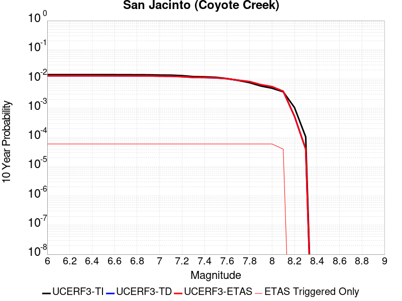 |

| Magnitude | 1 wk TI Prob | 1 wk TD Prob | 1 wk ETAS Prob | 1 wk ETAS/TD Gain | 1 wk ETAS Triggered Only | 1 mo TI Prob | 1 mo TD Prob | 1 mo ETAS Prob | 1 mo ETAS/TD Gain | 1 mo ETAS Triggered Only | 1 yr TI Prob | 1 yr TD Prob | 1 yr ETAS Prob | 1 yr ETAS/TD Gain | 1 yr ETAS Triggered Only | 10 yr TI Prob | 10 yr TD Prob | 10 yr ETAS Prob | 10 yr ETAS/TD Gain | 10 yr ETAS Triggered Only |
|-----|-----|-----|-----|-----|-----|-----|-----|-----|-----|-----|-----|-----|-----|-----|-----|-----|-----|-----|-----|-----|
| 6.0 | 2.7374346E-5 | 2.41444E-5 | 9.674847E-5 | 4.007077 | 7.260582E-5 | 1.1731335E-4 | 1.034719E-4 | 1.7607021E-4 | 1.7016234 | 7.260582E-5 | 0.0014273542 | 0.001259045 | 0.0013557309 | 1.0767931 | 9.6807766E-5 | 0.01418221 | 0.012928195 | 0.013023751 | 1.0073913 | 9.6807766E-5 |
| 6.1 | 2.7374346E-5 | 2.41444E-5 | 9.674847E-5 | 4.007077 | 7.260582E-5 | 1.1731335E-4 | 1.034719E-4 | 1.7607021E-4 | 1.7016234 | 7.260582E-5 | 0.0014273542 | 0.001259045 | 0.0013557309 | 1.0767931 | 9.6807766E-5 | 0.01418221 | 0.012928195 | 0.013023751 | 1.0073913 | 9.6807766E-5 |
| 6.2 | 2.7374346E-5 | 2.41444E-5 | 9.674847E-5 | 4.007077 | 7.260582E-5 | 1.1731335E-4 | 1.034719E-4 | 1.7607021E-4 | 1.7016234 | 7.260582E-5 | 0.0014273542 | 0.001259045 | 0.0013557309 | 1.0767931 | 9.6807766E-5 | 0.01418221 | 0.012928195 | 0.013023751 | 1.0073913 | 9.6807766E-5 |
| 6.3 | 2.7374346E-5 | 2.41444E-5 | 9.674847E-5 | 4.007077 | 7.260582E-5 | 1.1731335E-4 | 1.034719E-4 | 1.7607021E-4 | 1.7016234 | 7.260582E-5 | 0.0014273542 | 0.001259045 | 0.0013557309 | 1.0767931 | 9.6807766E-5 | 0.01418221 | 0.012928195 | 0.013023751 | 1.0073913 | 9.6807766E-5 |
| 6.4 | 2.7374346E-5 | 2.41444E-5 | 9.674847E-5 | 4.007077 | 7.260582E-5 | 1.1731335E-4 | 1.034719E-4 | 1.7607021E-4 | 1.7016234 | 7.260582E-5 | 0.0014273542 | 0.001259045 | 0.0013557309 | 1.0767931 | 9.6807766E-5 | 0.01418221 | 0.012928195 | 0.013023751 | 1.0073913 | 9.6807766E-5 |
| 6.5 | 2.7282445E-5 | 2.4030476E-5 | 9.6634554E-5 | 4.021333 | 7.260582E-5 | 1.16919524E-4 | 1.0298371E-4 | 1.7558206E-4 | 1.7049499 | 7.260582E-5 | 0.0014225657 | 0.001253108 | 0.0013497946 | 1.0771573 | 9.6807766E-5 | 0.014134934 | 0.012869522 | 0.012965084 | 1.0074254 | 9.6807766E-5 |
| 6.6 | 2.7282445E-5 | 2.4030476E-5 | 9.6634554E-5 | 4.021333 | 7.260582E-5 | 1.16919524E-4 | 1.0298371E-4 | 1.7558206E-4 | 1.7049499 | 7.260582E-5 | 0.0014225657 | 0.001253108 | 0.0013497946 | 1.0771573 | 9.6807766E-5 | 0.014134934 | 0.012869522 | 0.012965084 | 1.0074254 | 9.6807766E-5 |
| 6.7 | 2.7216198E-5 | 2.3955597E-5 | 9.655968E-5 | 4.0307775 | 7.260582E-5 | 1.1663563E-4 | 1.02662816E-4 | 1.7526119E-4 | 1.7071534 | 7.260582E-5 | 0.0014191137 | 0.0012492058 | 0.0013458927 | 1.0773987 | 9.6807766E-5 | 0.014100855 | 0.012830934 | 0.012926499 | 1.0074481 | 9.6807766E-5 |
| 6.8 | 2.7078617E-5 | 2.3872815E-5 | 9.6476906E-5 | 4.0412874 | 7.260582E-5 | 1.1604605E-4 | 1.0230807E-4 | 1.7490647E-4 | 1.7096057 | 7.260582E-5 | 0.001411945 | 0.0012448917 | 0.0013415789 | 1.0776672 | 9.6807766E-5 | 0.014030075 | 0.0127880825 | 0.012883652 | 1.0074733 | 9.6807766E-5 |
| 6.9 | 2.6982952E-5 | 2.3792329E-5 | 9.639643E-5 | 4.0515757 | 7.260582E-5 | 1.15636096E-4 | 1.0196315E-4 | 1.7456157E-4 | 1.7120064 | 7.260582E-5 | 0.0014069602 | 0.0012406971 | 0.0013373848 | 1.0779301 | 9.6807766E-5 | 0.013980856 | 0.012746378 | 0.012841952 | 1.0074981 | 9.6807766E-5 |
| 7.0 | 2.6449972E-5 | 2.3369357E-5 | 9.597348E-5 | 4.106809 | 7.260582E-5 | 1.1335209E-4 | 1.0015055E-4 | 1.727491E-4 | 1.7248942 | 7.260582E-5 | 0.001379188 | 0.0012186535 | 0.0013153433 | 1.0793415 | 9.6807766E-5 | 0.0137065975 | 0.012527733 | 0.012623328 | 1.0076307 | 9.6807766E-5 |
| 7.1 | 2.6257849E-5 | 2.3195396E-5 | 9.5799536E-5 | 4.13011 | 7.260582E-5 | 1.1252879E-4 | 9.940507E-5 | 1.7200367E-4 | 1.7303311 | 7.260582E-5 | 0.0013691769 | 0.0012095873 | 0.001306278 | 1.0799369 | 9.6807766E-5 | 0.013607717 | 0.012437661 | 0.012533264 | 1.0076866 | 9.6807766E-5 |
| 7.2 | 2.5270041E-5 | 2.2390155E-5 | 9.499435E-5 | 4.242684 | 7.260582E-5 | 1.0829568E-4 | 9.5954296E-5 | 1.6855315E-4 | 1.7565984 | 7.260582E-5 | 0.0013177024 | 0.0011676198 | 0.0012643145 | 1.0828135 | 9.6807766E-5 | 0.013099162 | 0.0120187905 | 0.0121144345 | 1.0079579 | 9.6807766E-5 |
| 7.3 | 2.339701E-5 | 2.1122027E-5 | 9.372632E-5 | 4.437373 | 7.260582E-5 | 1.0026905E-4 | 9.051985E-5 | 1.631191E-4 | 1.8020258 | 7.260582E-5 | 0.001220092 | 0.001101524 | 0.0011982251 | 1.0877885 | 9.6807766E-5 | 0.012134149 | 0.011357642 | 0.01145335 | 1.0084268 | 9.6807766E-5 |
| 7.4 | 2.296333E-5 | 2.0852396E-5 | 9.345671E-5 | 4.481821 | 7.260582E-5 | 9.841056E-5 | 8.936436E-5 | 1.6196369E-4 | 1.812397 | 7.260582E-5 | 0.0011974899 | 0.0010874701 | 0.0011841726 | 1.0889243 | 9.6807766E-5 | 0.011910575 | 0.011216754 | 0.011312475 | 1.0085338 | 9.6807766E-5 |
| 7.5 | 2.2188895E-5 | 2.037534E-5 | 9.297969E-5 | 4.5633435 | 7.260582E-5 | 9.50918E-5 | 8.731998E-5 | 1.5991947E-4 | 1.8314189 | 7.260582E-5 | 0.0011571277 | 0.0010626042 | 0.0011593092 | 1.0910075 | 9.6807766E-5 | 0.011511209 | 0.010966369 | 0.011062115 | 1.0087309 | 9.6807766E-5 |
| 7.6 | 2.0013189E-5 | 1.8961666E-5 | 9.1566115E-5 | 4.829012 | 7.260582E-5 | 8.5767984E-5 | 8.126176E-5 | 1.5386168E-4 | 1.8934082 | 7.260582E-5 | 0.001043725 | 9.889146E-4 | 0.0010856267 | 1.0977961 | 9.6807766E-5 | 0.010388365 | 0.010224371 | 0.010320189 | 1.0093715 | 9.6807766E-5 |
| 7.7 | 1.7230794E-5 | 1.6743043E-5 | 8.934765E-5 | 5.336405 | 7.260582E-5 | 7.384417E-5 | 7.175393E-5 | 1.4435455E-4 | 2.0117998 | 7.260582E-5 | 8.986819E-4 | 8.732547E-4 | 9.69978E-4 | 1.1107618 | 9.6807766E-5 | 0.008950562 | 0.00906292 | 0.009158851 | 1.010585 | 9.6807766E-5 |
| 7.8 | 1.4478809E-5 | 1.499039E-5 | 8.759512E-5 | 5.8434186 | 7.260582E-5 | 6.205057E-5 | 6.424295E-5 | 1.368441E-4 | 2.130103 | 7.260582E-5 | 7.552038E-4 | 7.8187784E-4 | 8.7860995E-4 | 1.1237177 | 9.6807766E-5 | 0.0075264242 | 0.008141388 | 0.0082374085 | 1.011794 | 9.6807766E-5 |
| 7.9 | 1.1114467E-5 | 1.1644517E-5 | 8.424949E-5 | 7.2351217 | 7.260582E-5 | 4.7632562E-5 | 4.990412E-5 | 1.2250632E-4 | 2.4548337 | 7.260582E-5 | 5.797721E-4 | 6.074139E-4 | 7.041628E-4 | 1.1592802 | 9.6807766E-5 | 0.0057826187 | 0.0063803545 | 0.006476545 | 1.0150759 | 9.6807766E-5 |
| 8.0 | 9.327402E-6 | 9.8986575E-6 | 8.2503764E-5 | 8.334844 | 7.260582E-5 | 3.9973966E-5 | 4.2422133E-5 | 1.1502487E-4 | 2.7114356 | 7.260582E-5 | 4.8657437E-4 | 5.163676E-4 | 6.131254E-4 | 1.1873816 | 9.6807766E-5 | 0.0048551033 | 0.00544994 | 0.0055462206 | 1.0176662 | 9.6807766E-5 |
| 8.1 | 7.0235833E-6 | 6.826985E-6 | 5.5230536E-5 | 8.090034 | 4.8403883E-5 | 3.0100724E-5 | 2.9258183E-5 | 7.766065E-5 | 2.6543224 | 4.8403883E-5 | 3.664147E-4 | 3.5616063E-4 | 4.287406E-4 | 1.2037843 | 7.260582E-5 | 0.003658111 | 0.0037874572 | 0.0038597882 | 1.0190974 | 7.260582E-5 |
| 8.2 | 2.0358202E-6 | 8.9912584E-7 | 8.9912584E-7 | 1.0 | 0.0 | 8.724915E-6 | 3.853391E-6 | 3.853391E-6 | 1.0 | 0.0 | 1.06220665E-4 | 4.6914047E-5 | 4.6914047E-5 | 1.0 | 0.0 | 0.001061699 | 5.3239096E-4 | 5.3239096E-4 | 1.0 | 0.0 |
| 8.3 | 2.0051264E-7 | 6.61379E-8 | 6.61379E-8 | 1.0 | 0.0 | 8.5933965E-7 | 2.8344812E-7 | 2.8344812E-7 | 1.0 | 0.0 | 1.046241E-5 | 3.450976E-6 | 3.450976E-6 | 1.0 | 0.0 | 1.0461917E-4 | 4.0120205E-5 | 4.0120205E-5 | 1.0 | 0.0 |

## Cleghorn Pass
*[(top)](#table-of-contents)*

| 1 Week | 1 Month | 1 Year | 10 Year |
|-----|-----|-----|-----|
| 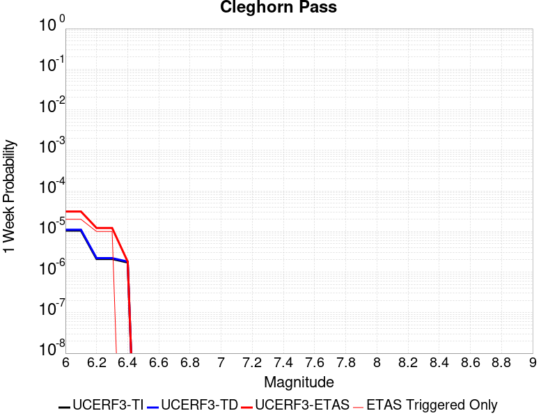 |  |  |  |

| Magnitude | 1 wk TI Prob | 1 wk TD Prob | 1 wk ETAS Prob | 1 wk ETAS/TD Gain | 1 wk ETAS Triggered Only | 1 mo TI Prob | 1 mo TD Prob | 1 mo ETAS Prob | 1 mo ETAS/TD Gain | 1 mo ETAS Triggered Only | 1 yr TI Prob | 1 yr TD Prob | 1 yr ETAS Prob | 1 yr ETAS/TD Gain | 1 yr ETAS Triggered Only | 10 yr TI Prob | 10 yr TD Prob | 10 yr ETAS Prob | 10 yr ETAS/TD Gain | 10 yr ETAS Triggered Only |
|-----|-----|-----|-----|-----|-----|-----|-----|-----|-----|-----|-----|-----|-----|-----|-----|-----|-----|-----|-----|-----|
| 6.0 | 1.0522846E-5 | 1.1040642E-5 | 3.5242316E-5 | 3.192053 | 2.4201941E-5 | 4.509713E-5 | 4.7316473E-5 | 7.151727E-5 | 1.5114666 | 2.4201941E-5 | 5.4891926E-4 | 5.759784E-4 | 6.485424E-4 | 1.1259838 | 7.260582E-5 | 0.0054756533 | 0.005750022 | 0.00582221 | 1.0125544 | 7.260582E-5 |
| 6.1 | 1.0522846E-5 | 1.1040642E-5 | 3.5242316E-5 | 3.192053 | 2.4201941E-5 | 4.509713E-5 | 4.7316473E-5 | 7.151727E-5 | 1.5114666 | 2.4201941E-5 | 5.4891926E-4 | 5.759784E-4 | 6.485424E-4 | 1.1259838 | 7.260582E-5 | 0.0054756533 | 0.005750022 | 0.00582221 | 1.0125544 | 7.260582E-5 |
| 6.2 | 2.1045846E-6 | 2.2082024E-6 | 2.641009E-5 | 11.959995 | 2.4201941E-5 | 9.019617E-6 | 9.463714E-6 | 3.3665427E-5 | 3.5573165 | 2.4201941E-5 | 1.098083E-4 | 1.1521882E-4 | 1.8781627E-4 | 1.6300833 | 7.260582E-5 | 0.0010975406 | 0.0011520023 | 0.0012245245 | 1.0629531 | 7.260582E-5 |
| 6.3 | 2.1045846E-6 | 2.2082024E-6 | 2.641009E-5 | 11.959995 | 2.4201941E-5 | 9.019617E-6 | 9.463714E-6 | 3.3665427E-5 | 3.5573165 | 2.4201941E-5 | 1.098083E-4 | 1.1521882E-4 | 1.8781627E-4 | 1.6300833 | 7.260582E-5 | 0.0010975406 | 0.0011520023 | 0.0012245245 | 1.0629531 | 7.260582E-5 |
| 6.4 | 1.7259927E-6 | 1.810877E-6 | 1.810877E-6 | 1.0 | 0.0 | 7.3970905E-6 | 7.760902E-6 | 7.760902E-6 | 1.0 | 0.0 | 9.005586E-5 | 9.4488976E-5 | 1.4288828E-4 | 1.5122217 | 4.8403883E-5 | 9.001937E-4 | 9.448898E-4 | 9.93248E-4 | 1.0511786 | 4.8403883E-5 |

## Pine Mtn
*[(top)](#table-of-contents)*

| 1 Week | 1 Month | 1 Year | 10 Year |
|-----|-----|-----|-----|
|  |  |  |  |

| Magnitude | 1 wk TI Prob | 1 wk TD Prob | 1 wk ETAS Prob | 1 wk ETAS/TD Gain | 1 wk ETAS Triggered Only | 1 mo TI Prob | 1 mo TD Prob | 1 mo ETAS Prob | 1 mo ETAS/TD Gain | 1 mo ETAS Triggered Only | 1 yr TI Prob | 1 yr TD Prob | 1 yr ETAS Prob | 1 yr ETAS/TD Gain | 1 yr ETAS Triggered Only | 10 yr TI Prob | 10 yr TD Prob | 10 yr ETAS Prob | 10 yr ETAS/TD Gain | 10 yr ETAS Triggered Only |
|-----|-----|-----|-----|-----|-----|-----|-----|-----|-----|-----|-----|-----|-----|-----|-----|-----|-----|-----|-----|-----|
| 6.0 | 6.894797E-6 | 7.2254716E-6 | 3.1427237E-5 | 4.349507 | 2.4201941E-5 | 2.9548795E-5 | 3.0965955E-5 | 1.0356953E-4 | 3.3446257 | 7.260582E-5 | 3.596972E-4 | 3.7694827E-4 | 4.4952673E-4 | 1.1925422 | 7.260582E-5 | 0.0035911554 | 0.0037633865 | 0.003835719 | 1.0192201 | 7.260582E-5 |
| 6.1 | 6.894797E-6 | 7.2254716E-6 | 3.1427237E-5 | 4.349507 | 2.4201941E-5 | 2.9548795E-5 | 3.0965955E-5 | 1.0356953E-4 | 3.3446257 | 7.260582E-5 | 3.596972E-4 | 3.7694827E-4 | 4.4952673E-4 | 1.1925422 | 7.260582E-5 | 0.0035911554 | 0.0037633865 | 0.003835719 | 1.0192201 | 7.260582E-5 |
| 6.2 | 6.894797E-6 | 7.2254716E-6 | 3.1427237E-5 | 4.349507 | 2.4201941E-5 | 2.9548795E-5 | 3.0965955E-5 | 1.0356953E-4 | 3.3446257 | 7.260582E-5 | 3.596972E-4 | 3.7694827E-4 | 4.4952673E-4 | 1.1925422 | 7.260582E-5 | 0.0035911554 | 0.0037633865 | 0.003835719 | 1.0192201 | 7.260582E-5 |
| 6.3 | 6.894797E-6 | 7.2254716E-6 | 3.1427237E-5 | 4.349507 | 2.4201941E-5 | 2.9548795E-5 | 3.0965955E-5 | 1.0356953E-4 | 3.3446257 | 7.260582E-5 | 3.596972E-4 | 3.7694827E-4 | 4.4952673E-4 | 1.1925422 | 7.260582E-5 | 0.0035911554 | 0.0037633865 | 0.003835719 | 1.0192201 | 7.260582E-5 |
| 6.4 | 6.894797E-6 | 7.2254716E-6 | 3.1427237E-5 | 4.349507 | 2.4201941E-5 | 2.9548795E-5 | 3.0965955E-5 | 1.0356953E-4 | 3.3446257 | 7.260582E-5 | 3.596972E-4 | 3.7694827E-4 | 4.4952673E-4 | 1.1925422 | 7.260582E-5 | 0.0035911554 | 0.0037633865 | 0.003835719 | 1.0192201 | 7.260582E-5 |
| 6.5 | 6.894797E-6 | 7.2254716E-6 | 3.1427237E-5 | 4.349507 | 2.4201941E-5 | 2.9548795E-5 | 3.0965955E-5 | 1.0356953E-4 | 3.3446257 | 7.260582E-5 | 3.596972E-4 | 3.7694827E-4 | 4.4952673E-4 | 1.1925422 | 7.260582E-5 | 0.0035911554 | 0.0037633865 | 0.003835719 | 1.0192201 | 7.260582E-5 |
| 6.6 | 6.894797E-6 | 7.2254716E-6 | 3.1427237E-5 | 4.349507 | 2.4201941E-5 | 2.9548795E-5 | 3.0965955E-5 | 1.0356953E-4 | 3.3446257 | 7.260582E-5 | 3.596972E-4 | 3.7694827E-4 | 4.4952673E-4 | 1.1925422 | 7.260582E-5 | 0.0035911554 | 0.0037633865 | 0.003835719 | 1.0192201 | 7.260582E-5 |
| 6.7 | 6.0867933E-6 | 6.397124E-6 | 3.059891E-5 | 4.7832294 | 2.4201941E-5 | 2.6085996E-5 | 2.7415968E-5 | 7.581853E-5 | 2.7654877 | 4.8403883E-5 | 3.1755073E-4 | 3.337405E-4 | 3.821282E-4 | 1.144986 | 4.8403883E-5 | 0.0031709734 | 0.0033326119 | 0.0033808544 | 1.014476 | 4.8403883E-5 |
| 6.8 | 5.6530425E-6 | 5.950606E-6 | 3.0152403E-5 | 5.067115 | 2.4201941E-5 | 2.42271E-5 | 2.5502359E-5 | 4.970368E-5 | 1.9489837 | 2.4201941E-5 | 2.94925E-4 | 3.1044905E-4 | 3.3464347E-4 | 1.0779337 | 2.4201941E-5 | 0.002945339 | 0.0031003582 | 0.0031244853 | 1.007782 | 2.4201941E-5 |
| 6.9 | 4.6015225E-6 | 4.8638444E-6 | 2.9065668E-5 | 5.975863 | 2.4201941E-5 | 1.9720663E-5 | 2.084489E-5 | 4.5046327E-5 | 2.161025 | 2.4201941E-5 | 2.4007261E-4 | 2.5375842E-4 | 2.779542E-4 | 1.0953498 | 2.4201941E-5 | 0.0023981342 | 0.002534831 | 0.0025589715 | 1.0095235 | 2.4201941E-5 |
| 7.0 | 4.4875965E-6 | 4.7474837E-6 | 2.894931E-5 | 6.097822 | 2.4201941E-5 | 1.9232413E-5 | 2.0346208E-5 | 4.4547654E-5 | 2.189482 | 2.4201941E-5 | 2.3412947E-4 | 2.4768838E-4 | 2.7188432E-4 | 1.097687 | 2.4201941E-5 | 0.0023388295 | 0.0024742668 | 0.002498409 | 1.0097573 | 2.4201941E-5 |
| 7.1 | 3.203907E-6 | 3.42942E-6 | 2.7631278E-5 | 8.057129 | 2.4201941E-5 | 1.3730958E-5 | 1.4697435E-5 | 3.889902E-5 | 2.6466537 | 2.4201941E-5 | 1.6716159E-4 | 1.7892725E-4 | 2.0312486E-4 | 1.1352371 | 2.4201941E-5 | 0.0016703589 | 0.001787898 | 0.0018120566 | 1.0135124 | 2.4201941E-5 |
| 7.2 | 2.2060601E-6 | 2.3784874E-6 | 2.658037E-5 | 11.175325 | 2.4201941E-5 | 9.4545085E-6 | 1.019348E-5 | 3.4395176E-5 | 3.3742328 | 2.4201941E-5 | 1.15102564E-4 | 1.2409901E-4 | 1.4829794E-4 | 1.1949971 | 2.4201941E-5 | 0.0011504296 | 0.0012403419 | 0.0012645138 | 1.0194881 | 2.4201941E-5 |
| 7.3 | 1.3765207E-6 | 1.5216535E-6 | 2.5723557E-5 | 16.905003 | 2.4201941E-5 | 5.899361E-6 | 6.5213567E-6 | 3.072314E-5 | 4.711158 | 2.4201941E-5 | 7.182235E-5 | 7.939472E-5 | 1.03594735E-4 | 1.3048065 | 2.4201941E-5 | 7.1799144E-4 | 7.9367263E-4 | 8.1785535E-4 | 1.0304694 | 2.4201941E-5 |
| 7.4 | 1.1245983E-6 | 1.2587126E-6 | 2.5460624E-5 | 20.22751 | 2.4201941E-5 | 4.819698E-6 | 5.394472E-6 | 2.9596282E-5 | 5.4864097 | 2.4201941E-5 | 5.8678244E-5 | 6.56758E-5 | 8.987615E-5 | 1.368482 | 2.4201941E-5 | 5.866275E-4 | 6.565722E-4 | 6.8075827E-4 | 1.0368369 | 2.4201941E-5 |
| 7.5 | 8.031682E-7 | 9.276999E-7 | 2.5129619E-5 | 27.088089 | 2.4201941E-5 | 3.4421448E-6 | 3.975851E-6 | 2.8177696E-5 | 7.087211 | 2.4201941E-5 | 4.1907308E-5 | 4.840498E-5 | 7.260575E-5 | 1.4999645 | 2.4201941E-5 | 4.1899405E-4 | 4.8395112E-4 | 5.0814135E-4 | 1.0499848 | 2.4201941E-5 |
| 7.6 | 4.8953444E-7 | 6.0030544E-7 | 2.4802232E-5 | 41.31602 | 2.4201941E-5 | 2.098003E-6 | 2.5727354E-6 | 2.6774615E-5 | 10.407061 | 2.4201941E-5 | 2.5542888E-5 | 3.1322652E-5 | 5.5523837E-5 | 1.7726415 | 2.4201941E-5 | 2.5539953E-4 | 3.1318725E-4 | 3.373816E-4 | 1.077252 | 2.4201941E-5 |
| 7.7 | 6.634529E-8 | 6.788826E-8 | 6.788826E-8 | 1.0 | 0.0 | 2.843369E-7 | 2.9094966E-7 | 2.9094966E-7 | 1.0 | 0.0 | 3.4617963E-6 | 3.5423066E-6 | 3.5423066E-6 | 1.0 | 0.0 | 3.4617424E-5 | 3.542255E-5 | 3.542255E-5 | 1.0 | 0.0 |
| 7.8 | 9.235578E-9 | 9.488566E-9 | 9.488566E-9 | 1.0 | 0.0 | 3.9581046E-8 | 4.0665284E-8 | 4.0665284E-8 | 1.0 | 0.0 | 4.818991E-7 | 4.950997E-7 | 4.950997E-7 | 1.0 | 0.0 | 4.8189804E-6 | 4.950988E-6 | 4.950988E-6 | 1.0 | 0.0 |

## Bennett Valley 2011 CFM
*[(top)](#table-of-contents)*

| 1 Week | 1 Month | 1 Year | 10 Year |
|-----|-----|-----|-----|
|  |  |  | 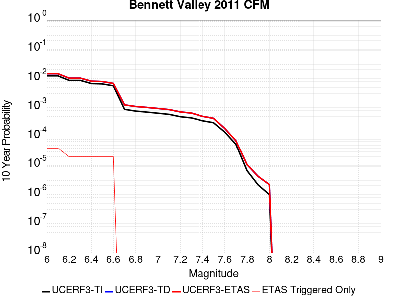 |

| Magnitude | 1 wk TI Prob | 1 wk TD Prob | 1 wk ETAS Prob | 1 wk ETAS/TD Gain | 1 wk ETAS Triggered Only | 1 mo TI Prob | 1 mo TD Prob | 1 mo ETAS Prob | 1 mo ETAS/TD Gain | 1 mo ETAS Triggered Only | 1 yr TI Prob | 1 yr TD Prob | 1 yr ETAS Prob | 1 yr ETAS/TD Gain | 1 yr ETAS Triggered Only | 10 yr TI Prob | 10 yr TD Prob | 10 yr ETAS Prob | 10 yr ETAS/TD Gain | 10 yr ETAS Triggered Only |
|-----|-----|-----|-----|-----|-----|-----|-----|-----|-----|-----|-----|-----|-----|-----|-----|-----|-----|-----|-----|-----|
| 6.0 | 2.3893934E-5 | 2.823899E-5 | 7.66415E-5 | 2.7140315 | 4.8403883E-5 | 1.0239855E-4 | 1.2101967E-4 | 1.6941769E-4 | 1.3999187 | 4.8403883E-5 | 0.0012459893 | 0.0014726035 | 0.0015209361 | 1.0328212 | 4.8403883E-5 | 0.012390262 | 0.01465108 | 0.014722622 | 1.004883 | 7.260582E-5 |
| 6.1 | 2.3893934E-5 | 2.823899E-5 | 7.66415E-5 | 2.7140315 | 4.8403883E-5 | 1.0239855E-4 | 1.2101967E-4 | 1.6941769E-4 | 1.3999187 | 4.8403883E-5 | 0.0012459893 | 0.0014726035 | 0.0015209361 | 1.0328212 | 4.8403883E-5 | 0.012390262 | 0.01465108 | 0.014722622 | 1.004883 | 7.260582E-5 |
| 6.2 | 1.6657146E-5 | 1.9853873E-5 | 4.4055334E-5 | 2.2189794 | 2.4201941E-5 | 7.138582E-5 | 8.508605E-5 | 1.0928593E-4 | 1.2844166 | 2.4201941E-5 | 8.6877577E-4 | 0.0010355718 | 0.0010597487 | 1.0233464 | 2.4201941E-5 | 0.008653872 | 0.010325706 | 0.01037361 | 1.0046393 | 4.8403883E-5 |
| 6.3 | 1.6657146E-5 | 1.9853873E-5 | 4.4055334E-5 | 2.2189794 | 2.4201941E-5 | 7.138582E-5 | 8.508605E-5 | 1.0928593E-4 | 1.2844166 | 2.4201941E-5 | 8.6877577E-4 | 0.0010355718 | 0.0010597487 | 1.0233464 | 2.4201941E-5 | 0.008653872 | 0.010325706 | 0.01037361 | 1.0046393 | 4.8403883E-5 |
| 6.4 | 1.29418495E-5 | 1.5567592E-5 | 3.976916E-5 | 2.554612 | 2.4201941E-5 | 5.546389E-5 | 6.671728E-5 | 9.091761E-5 | 1.3627295 | 2.4201941E-5 | 6.7506364E-4 | 8.1211043E-4 | 8.362927E-4 | 1.029777 | 2.4201941E-5 | 0.0067301663 | 0.008108544 | 0.008156556 | 1.0059211 | 4.8403883E-5 |
| 6.5 | 1.2582504E-5 | 1.5134623E-5 | 3.93362E-5 | 2.5990868 | 2.4201941E-5 | 5.39239E-5 | 6.486179E-5 | 8.906217E-5 | 1.3731067 | 2.4201941E-5 | 6.563257E-4 | 7.8953634E-4 | 8.137192E-4 | 1.0306292 | 2.4201941E-5 | 0.006543907 | 0.007884451 | 0.007932474 | 1.0060908 | 4.8403883E-5 |
| 6.6 | 1.0846706E-5 | 1.3036858E-5 | 3.7238482E-5 | 2.8564 | 2.4201941E-5 | 4.6485053E-5 | 5.5871777E-5 | 8.0072365E-5 | 1.4331452 | 2.4201941E-5 | 5.6580856E-4 | 6.801549E-4 | 7.0434035E-4 | 1.0355588 | 2.4201941E-5 | 0.005643701 | 0.0067976816 | 0.0068457564 | 1.0070722 | 4.8403883E-5 |
| 6.7 | 1.6803231E-6 | 2.377902E-6 | 2.377902E-6 | 1.0 | 0.0 | 7.2013645E-6 | 1.019097E-5 | 1.019097E-5 | 1.0 | 0.0 | 8.7673085E-5 | 1.2406812E-4 | 1.2406812E-4 | 1.0 | 0.0 | 8.76385E-4 | 0.0012444188 | 0.0012444188 | 1.0 | 0.0 |
| 6.8 | 1.4609833E-6 | 2.0939708E-6 | 2.0939708E-6 | 1.0 | 0.0 | 6.261342E-6 | 8.974131E-6 | 8.974131E-6 | 1.0 | 0.0 | 7.6229175E-5 | 1.0925463E-4 | 1.0925463E-4 | 1.0 | 0.0 | 7.620303E-4 | 0.0010963798 | 0.0010963798 | 1.0 | 0.0 |
| 6.9 | 1.3492396E-6 | 1.9459103E-6 | 1.9459103E-6 | 1.0 | 0.0 | 5.7824427E-6 | 8.339589E-6 | 8.339589E-6 | 1.0 | 0.0 | 7.0398964E-5 | 1.01529826E-4 | 1.01529826E-4 | 1.0 | 0.0 | 7.037667E-4 | 0.001019178 | 0.001019178 | 1.0 | 0.0 |
| 7.0 | 1.2347921E-6 | 1.7888974E-6 | 1.7888974E-6 | 1.0 | 0.0 | 5.291955E-6 | 7.666681E-6 | 7.666681E-6 | 1.0 | 0.0 | 6.442765E-5 | 9.33379E-5 | 9.33379E-5 | 1.0 | 0.0 | 6.440897E-4 | 9.373068E-4 | 9.373068E-4 | 1.0 | 0.0 |
| 7.1 | 1.1262973E-6 | 1.6359154E-6 | 1.6359154E-6 | 1.0 | 0.0 | 4.8269794E-6 | 7.0110473E-6 | 7.0110473E-6 | 1.0 | 0.0 | 5.876689E-5 | 8.535621E-5 | 8.535621E-5 | 1.0 | 0.0 | 5.875135E-4 | 8.5754244E-4 | 8.5754244E-4 | 1.0 | 0.0 |
| 7.2 | 9.351744E-7 | 1.3611758E-6 | 1.3611758E-6 | 1.0 | 0.0 | 4.007884E-6 | 5.8335977E-6 | 5.8335977E-6 | 1.0 | 0.0 | 4.8794896E-5 | 7.1021765E-5 | 7.1021765E-5 | 1.0 | 0.0 | 4.878418E-4 | 7.142461E-4 | 7.142461E-4 | 1.0 | 0.0 |
| 7.3 | 8.5039534E-7 | 1.2386733E-6 | 1.2386733E-6 | 1.0 | 0.0 | 3.6445463E-6 | 5.308589E-6 | 5.308589E-6 | 1.0 | 0.0 | 4.437145E-5 | 6.463018E-5 | 6.463018E-5 | 1.0 | 0.0 | 4.436259E-4 | 6.50103E-4 | 6.50103E-4 | 1.0 | 0.0 |
| 7.4 | 6.7875015E-7 | 9.600642E-7 | 9.600642E-7 | 1.0 | 0.0 | 2.908926E-6 | 4.1145545E-6 | 4.1145545E-6 | 1.0 | 0.0 | 3.54156E-5 | 5.009356E-5 | 5.009356E-5 | 1.0 | 0.0 | 3.5409955E-4 | 5.0413073E-4 | 5.0413073E-4 | 1.0 | 0.0 |
| 7.5 | 5.826867E-7 | 8.1883735E-7 | 8.1883735E-7 | 1.0 | 0.0 | 2.4972264E-6 | 3.5092983E-6 | 3.5092983E-6 | 1.0 | 0.0 | 3.0403306E-5 | 4.2724878E-5 | 4.2724878E-5 | 1.0 | 0.0 | 3.0399146E-4 | 4.300558E-4 | 4.300558E-4 | 1.0 | 0.0 |
| 7.6 | 2.7734902E-7 | 3.6822587E-7 | 3.6822587E-7 | 1.0 | 0.0 | 1.1886381E-6 | 1.57811E-6 | 1.57811E-6 | 1.0 | 0.0 | 1.4471572E-5 | 1.9213321E-5 | 1.9213321E-5 | 1.0 | 0.0 | 1.447063E-4 | 1.9315645E-4 | 1.9315645E-4 | 1.0 | 0.0 |
| 7.7 | 1.0530888E-7 | 1.3749101E-7 | 1.3749101E-7 | 1.0 | 0.0 | 4.513237E-7 | 5.8924707E-7 | 5.8924707E-7 | 1.0 | 0.0 | 5.4948523E-6 | 7.174059E-6 | 7.174059E-6 | 1.0 | 0.0 | 5.4947162E-5 | 7.255585E-5 | 7.255585E-5 | 1.0 | 0.0 |
| 7.8 | 1.2714258E-8 | 1.9633259E-8 | 1.9633259E-8 | 1.0 | 0.0 | 5.448968E-8 | 8.4142535E-8 | 8.4142535E-8 | 1.0 | 0.0 | 6.6341164E-7 | 1.0244348E-6 | 1.0244348E-6 | 1.0 | 0.0 | 6.6340967E-6 | 1.0658595E-5 | 1.0658595E-5 | 1.0 | 0.0 |
| 7.9 | 4.075888E-9 | 7.559928E-9 | 7.559928E-9 | 1.0 | 0.0 | 1.7468091E-8 | 3.239969E-8 | 3.239969E-8 | 1.0 | 0.0 | 2.12674E-7 | 3.9446616E-7 | 3.9446616E-7 | 1.0 | 0.0 | 2.1267379E-6 | 4.1952467E-6 | 4.1952467E-6 | 1.0 | 0.0 |
| 8.0 | 1.9126138E-9 | 3.9956882E-9 | 3.9956882E-9 | 1.0 | 0.0 | 8.196917E-9 | 1.7124377E-8 | 1.7124377E-8 | 1.0 | 0.0 | 9.9797454E-8 | 2.0848927E-7 | 2.0848927E-7 | 1.0 | 0.0 | 9.979741E-7 | 2.1982228E-6 | 2.1982228E-6 | 1.0 | 0.0 |

## Dry Mountain
*[(top)](#table-of-contents)*

| 1 Week | 1 Month | 1 Year | 10 Year |
|-----|-----|-----|-----|
|  |  |  |  |

| Magnitude | 1 wk TI Prob | 1 wk TD Prob | 1 wk ETAS Prob | 1 wk ETAS/TD Gain | 1 wk ETAS Triggered Only | 1 mo TI Prob | 1 mo TD Prob | 1 mo ETAS Prob | 1 mo ETAS/TD Gain | 1 mo ETAS Triggered Only | 1 yr TI Prob | 1 yr TD Prob | 1 yr ETAS Prob | 1 yr ETAS/TD Gain | 1 yr ETAS Triggered Only | 10 yr TI Prob | 10 yr TD Prob | 10 yr ETAS Prob | 10 yr ETAS/TD Gain | 10 yr ETAS Triggered Only |
|-----|-----|-----|-----|-----|-----|-----|-----|-----|-----|-----|-----|-----|-----|-----|-----|-----|-----|-----|-----|-----|
| 6.0 | 6.222801E-6 | 6.439381E-6 | 5.4842953E-5 | 8.516805 | 4.8403883E-5 | 2.6668875E-5 | 2.7597147E-5 | 7.599969E-5 | 2.7538967 | 4.8403883E-5 | 3.2464517E-4 | 3.3595937E-4 | 4.085408E-4 | 1.2160423 | 7.260582E-5 | 0.0032417132 | 0.0033560768 | 0.003428439 | 1.0215615 | 7.260582E-5 |
| 6.1 | 6.222801E-6 | 6.439381E-6 | 5.4842953E-5 | 8.516805 | 4.8403883E-5 | 2.6668875E-5 | 2.7597147E-5 | 7.599969E-5 | 2.7538967 | 4.8403883E-5 | 3.2464517E-4 | 3.3595937E-4 | 4.085408E-4 | 1.2160423 | 7.260582E-5 | 0.0032417132 | 0.0033560768 | 0.003428439 | 1.0215615 | 7.260582E-5 |
| 6.2 | 6.222801E-6 | 6.439381E-6 | 5.4842953E-5 | 8.516805 | 4.8403883E-5 | 2.6668875E-5 | 2.7597147E-5 | 7.599969E-5 | 2.7538967 | 4.8403883E-5 | 3.2464517E-4 | 3.3595937E-4 | 4.085408E-4 | 1.2160423 | 7.260582E-5 | 0.0032417132 | 0.0033560768 | 0.003428439 | 1.0215615 | 7.260582E-5 |
| 6.3 | 6.222801E-6 | 6.439381E-6 | 5.4842953E-5 | 8.516805 | 4.8403883E-5 | 2.6668875E-5 | 2.7597147E-5 | 7.599969E-5 | 2.7538967 | 4.8403883E-5 | 3.2464517E-4 | 3.3595937E-4 | 4.085408E-4 | 1.2160423 | 7.260582E-5 | 0.0032417132 | 0.0033560768 | 0.003428439 | 1.0215615 | 7.260582E-5 |
| 6.4 | 6.222801E-6 | 6.439381E-6 | 5.4842953E-5 | 8.516805 | 4.8403883E-5 | 2.6668875E-5 | 2.7597147E-5 | 7.599969E-5 | 2.7538967 | 4.8403883E-5 | 3.2464517E-4 | 3.3595937E-4 | 4.085408E-4 | 1.2160423 | 7.260582E-5 | 0.0032417132 | 0.0033560768 | 0.003428439 | 1.0215615 | 7.260582E-5 |
| 6.5 | 2.8528623E-6 | 2.9521684E-6 | 2.9521684E-6 | 1.0 | 0.0 | 1.22264955E-5 | 1.2652138E-5 | 1.2652138E-5 | 1.0 | 0.0 | 1.4884741E-4 | 1.540376E-4 | 1.540376E-4 | 1.0 | 0.0 | 0.0014874774 | 0.0015401616 | 0.0015401616 | 1.0 | 0.0 |
| 6.6 | 2.8528623E-6 | 2.9521684E-6 | 2.9521684E-6 | 1.0 | 0.0 | 1.22264955E-5 | 1.2652138E-5 | 1.2652138E-5 | 1.0 | 0.0 | 1.4884741E-4 | 1.540376E-4 | 1.540376E-4 | 1.0 | 0.0 | 0.0014874774 | 0.0015401616 | 0.0015401616 | 1.0 | 0.0 |
| 6.7 | 2.541E-6 | 2.6293578E-6 | 2.6293578E-6 | 1.0 | 0.0 | 1.0889954E-5 | 1.1268677E-5 | 1.1268677E-5 | 1.0 | 0.0 | 1.3257713E-4 | 1.3719614E-4 | 1.3719614E-4 | 1.0 | 0.0 | 0.0013249806 | 0.0013719613 | 0.0013719613 | 1.0 | 0.0 |

## Channel Islands Thrust
*[(top)](#table-of-contents)*

| 1 Week | 1 Month | 1 Year | 10 Year |
|-----|-----|-----|-----|
|  |  |  |  |

| Magnitude | 1 wk TI Prob | 1 wk TD Prob | 1 wk ETAS Prob | 1 wk ETAS/TD Gain | 1 wk ETAS Triggered Only | 1 mo TI Prob | 1 mo TD Prob | 1 mo ETAS Prob | 1 mo ETAS/TD Gain | 1 mo ETAS Triggered Only | 1 yr TI Prob | 1 yr TD Prob | 1 yr ETAS Prob | 1 yr ETAS/TD Gain | 1 yr ETAS Triggered Only | 10 yr TI Prob | 10 yr TD Prob | 10 yr ETAS Prob | 10 yr ETAS/TD Gain | 10 yr ETAS Triggered Only |
|-----|-----|-----|-----|-----|-----|-----|-----|-----|-----|-----|-----|-----|-----|-----|-----|-----|-----|-----|-----|-----|
| 6.0 | 2.2156251E-5 | 2.4092022E-5 | 2.4092022E-5 | 1.0 | 0.0 | 9.495191E-5 | 1.03248036E-4 | 1.03248036E-4 | 1.0 | 0.0 | 0.0011554264 | 0.0012564266 | 0.0013047695 | 1.0384766 | 4.8403883E-5 | 0.011494373 | 0.0125038205 | 0.012575518 | 1.0057341 | 7.260582E-5 |
| 6.1 | 2.2156251E-5 | 2.4092022E-5 | 2.4092022E-5 | 1.0 | 0.0 | 9.495191E-5 | 1.03248036E-4 | 1.03248036E-4 | 1.0 | 0.0 | 0.0011554264 | 0.0012564266 | 0.0013047695 | 1.0384766 | 4.8403883E-5 | 0.011494373 | 0.0125038205 | 0.012575518 | 1.0057341 | 7.260582E-5 |
| 6.2 | 2.2156251E-5 | 2.4092022E-5 | 2.4092022E-5 | 1.0 | 0.0 | 9.495191E-5 | 1.03248036E-4 | 1.03248036E-4 | 1.0 | 0.0 | 0.0011554264 | 0.0012564266 | 0.0013047695 | 1.0384766 | 4.8403883E-5 | 0.011494373 | 0.0125038205 | 0.012575518 | 1.0057341 | 7.260582E-5 |
| 6.3 | 2.2156251E-5 | 2.4092022E-5 | 2.4092022E-5 | 1.0 | 0.0 | 9.495191E-5 | 1.03248036E-4 | 1.03248036E-4 | 1.0 | 0.0 | 0.0011554264 | 0.0012564266 | 0.0013047695 | 1.0384766 | 4.8403883E-5 | 0.011494373 | 0.0125038205 | 0.012575518 | 1.0057341 | 7.260582E-5 |
| 6.4 | 2.2156251E-5 | 2.4092022E-5 | 2.4092022E-5 | 1.0 | 0.0 | 9.495191E-5 | 1.03248036E-4 | 1.03248036E-4 | 1.0 | 0.0 | 0.0011554264 | 0.0012564266 | 0.0013047695 | 1.0384766 | 4.8403883E-5 | 0.011494373 | 0.0125038205 | 0.012575518 | 1.0057341 | 7.260582E-5 |
| 6.5 | 2.2156251E-5 | 2.4092022E-5 | 2.4092022E-5 | 1.0 | 0.0 | 9.495191E-5 | 1.03248036E-4 | 1.03248036E-4 | 1.0 | 0.0 | 0.0011554264 | 0.0012564266 | 0.0013047695 | 1.0384766 | 4.8403883E-5 | 0.011494373 | 0.0125038205 | 0.012575518 | 1.0057341 | 7.260582E-5 |
| 6.6 | 2.2156251E-5 | 2.4092022E-5 | 2.4092022E-5 | 1.0 | 0.0 | 9.495191E-5 | 1.03248036E-4 | 1.03248036E-4 | 1.0 | 0.0 | 0.0011554264 | 0.0012564266 | 0.0013047695 | 1.0384766 | 4.8403883E-5 | 0.011494373 | 0.0125038205 | 0.012575518 | 1.0057341 | 7.260582E-5 |
| 6.7 | 1.0601296E-5 | 1.1379544E-5 | 1.1379544E-5 | 1.0 | 0.0 | 4.5433335E-5 | 4.876859E-5 | 4.876859E-5 | 1.0 | 0.0 | 5.5301044E-4 | 5.936007E-4 | 6.4197584E-4 | 1.0814945 | 4.8403883E-5 | 0.005516363 | 0.005920653 | 0.0059928293 | 1.0121906 | 7.260582E-5 |
| 6.8 | 1.0246747E-5 | 1.0996669E-5 | 1.0996669E-5 | 1.0 | 0.0 | 4.391389E-5 | 4.7127756E-5 | 4.7127756E-5 | 1.0 | 0.0 | 5.345204E-4 | 5.7363417E-4 | 6.2201027E-4 | 1.0843327 | 4.8403883E-5 | 0.0053323656 | 0.005722025 | 0.0057942155 | 1.0126163 | 7.260582E-5 |
| 6.9 | 9.049551E-6 | 9.699645E-6 | 9.699645E-6 | 1.0 | 0.0 | 3.878322E-5 | 4.1569267E-5 | 4.1569267E-5 | 1.0 | 0.0 | 4.7208337E-4 | 5.059924E-4 | 5.301821E-4 | 1.0478064 | 2.4201941E-5 | 0.0047108172 | 0.0050488203 | 0.00509698 | 1.0095388 | 4.8403883E-5 |
| 7.0 | 8.6542195E-6 | 9.274603E-6 | 9.274603E-6 | 1.0 | 0.0 | 3.7088983E-5 | 3.9747716E-5 | 3.9747716E-5 | 1.0 | 0.0 | 4.5146482E-4 | 4.8382508E-4 | 5.0801534E-4 | 1.0499979 | 2.4201941E-5 | 0.004505487 | 0.0048281294 | 0.0048762993 | 1.009977 | 4.8403883E-5 |
| 7.1 | 8.391028E-6 | 8.992925E-6 | 8.992925E-6 | 1.0 | 0.0 | 3.5961057E-5 | 3.8540562E-5 | 3.8540562E-5 | 1.0 | 0.0 | 4.3773788E-4 | 4.6913436E-4 | 4.9332494E-4 | 1.0515643 | 2.4201941E-5 | 0.004368766 | 0.0046818503 | 0.0047300276 | 1.0102903 | 4.8403883E-5 |
| 7.2 | 5.965188E-6 | 6.3716957E-6 | 6.3716957E-6 | 1.0 | 0.0 | 2.556484E-5 | 2.7306984E-5 | 2.7306984E-5 | 1.0 | 0.0 | 3.1120746E-4 | 3.3241237E-4 | 3.5660624E-4 | 1.0727828 | 2.4201941E-5 | 0.00310772 | 0.0033192094 | 0.003343331 | 1.0072672 | 2.4201941E-5 |
| 7.3 | 4.877518E-6 | 5.206007E-6 | 5.206007E-6 | 1.0 | 0.0 | 2.0903482E-5 | 2.231127E-5 | 2.231127E-5 | 1.0 | 0.0 | 2.5447016E-4 | 2.716063E-4 | 2.9580167E-4 | 1.0890825 | 2.4201941E-5 | 0.0025417898 | 0.0027127897 | 0.0027369258 | 1.0088972 | 2.4201941E-5 |
| 7.4 | 3.8829853E-6 | 4.141863E-6 | 4.141863E-6 | 1.0 | 0.0 | 1.664126E-5 | 1.7750723E-5 | 1.7750723E-5 | 1.0 | 0.0 | 2.0258849E-4 | 2.1609403E-4 | 2.4029074E-4 | 1.111973 | 2.4201941E-5 | 0.002024039 | 0.002158881 | 0.0021830306 | 1.0111862 | 2.4201941E-5 |
| 7.5 | 1.3489616E-6 | 1.4277905E-6 | 1.4277905E-6 | 1.0 | 0.0 | 5.7812517E-6 | 6.119088E-6 | 6.119088E-6 | 1.0 | 0.0 | 7.038446E-5 | 7.449739E-5 | 7.449739E-5 | 1.0 | 0.0 | 7.036218E-4 | 7.4472814E-4 | 7.4472814E-4 | 1.0 | 0.0 |
| 7.6 | 6.058192E-7 | 6.35378E-7 | 6.35378E-7 | 1.0 | 0.0 | 2.5963652E-6 | 2.7230458E-6 | 2.7230458E-6 | 1.0 | 0.0 | 3.161029E-5 | 3.3152595E-5 | 3.3152595E-5 | 1.0 | 0.0 | 3.1605794E-4 | 3.314781E-4 | 3.314781E-4 | 1.0 | 0.0 |
| 7.7 | 2.2170494E-7 | 2.2607924E-7 | 2.2607924E-7 | 1.0 | 0.0 | 9.5016367E-7 | 9.689107E-7 | 9.689107E-7 | 1.0 | 0.0 | 1.1568181E-5 | 1.17964355E-5 | 1.17964355E-5 | 1.0 | 0.0 | 1.1567579E-4 | 1.179592E-4 | 1.179592E-4 | 1.0 | 0.0 |
| 7.8 | 2.1613102E-8 | 1.5466837E-8 | 1.5466837E-8 | 1.0 | 0.0 | 9.262757E-8 | 6.628645E-8 | 6.628645E-8 | 1.0 | 0.0 | 1.1277401E-6 | 8.070372E-7 | 8.070372E-7 | 1.0 | 0.0 | 1.1277344E-5 | 8.07035E-6 | 8.07035E-6 | 1.0 | 0.0 |

## Coronado Bank alt1
*[(top)](#table-of-contents)*

| 1 Week | 1 Month | 1 Year | 10 Year |
|-----|-----|-----|-----|
| 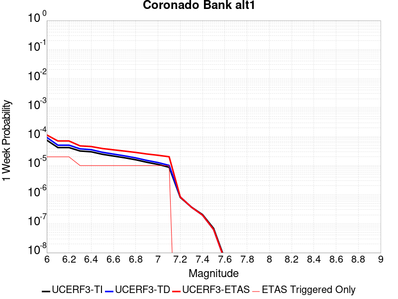 |  |  |  |

| Magnitude | 1 wk TI Prob | 1 wk TD Prob | 1 wk ETAS Prob | 1 wk ETAS/TD Gain | 1 wk ETAS Triggered Only | 1 mo TI Prob | 1 mo TD Prob | 1 mo ETAS Prob | 1 mo ETAS/TD Gain | 1 mo ETAS Triggered Only | 1 yr TI Prob | 1 yr TD Prob | 1 yr ETAS Prob | 1 yr ETAS/TD Gain | 1 yr ETAS Triggered Only | 10 yr TI Prob | 10 yr TD Prob | 10 yr ETAS Prob | 10 yr ETAS/TD Gain | 10 yr ETAS Triggered Only |
|-----|-----|-----|-----|-----|-----|-----|-----|-----|-----|-----|-----|-----|-----|-----|-----|-----|-----|-----|-----|-----|
| 6.0 | 7.533492E-5 | 9.3951705E-5 | 1.1815137E-4 | 1.2575756 | 2.4201941E-5 | 3.22824E-4 | 4.025903E-4 | 4.267825E-4 | 1.0600914 | 2.4201941E-5 | 0.0039233007 | 0.004891121 | 0.004915205 | 1.0049239 | 2.4201941E-5 | 0.03854755 | 0.047904 | 0.047950085 | 1.000962 | 4.8403883E-5 |
| 6.1 | 4.1807285E-5 | 5.0493105E-5 | 7.4693824E-5 | 1.4792876 | 2.4201941E-5 | 1.7916178E-4 | 2.1638138E-4 | 2.4057808E-4 | 1.1118244 | 2.4201941E-5 | 0.0021791123 | 0.0026313365 | 0.0026554747 | 1.0091734 | 2.4201941E-5 | 0.021578677 | 0.026011124 | 0.026058268 | 1.0018125 | 4.8403883E-5 |
| 6.2 | 4.1807285E-5 | 5.0493105E-5 | 7.4693824E-5 | 1.4792876 | 2.4201941E-5 | 1.7916178E-4 | 2.1638138E-4 | 2.4057808E-4 | 1.1118244 | 2.4201941E-5 | 0.0021791123 | 0.0026313365 | 0.0026554747 | 1.0091734 | 2.4201941E-5 | 0.021578677 | 0.026011124 | 0.026058268 | 1.0018125 | 4.8403883E-5 |
| 6.3 | 3.1793104E-5 | 3.7711125E-5 | 3.7711125E-5 | 1.0 | 0.0 | 1.3624904E-4 | 1.6160926E-4 | 1.6160926E-4 | 1.0 | 0.0 | 0.0016575698 | 0.001965849 | 0.001965849 | 1.0 | 0.0 | 0.016452603 | 0.019488495 | 0.019512225 | 1.0012176 | 2.4201941E-5 |
| 6.4 | 2.9878007E-5 | 3.5335797E-5 | 3.5335797E-5 | 1.0 | 0.0 | 1.2804232E-4 | 1.5143053E-4 | 1.5143053E-4 | 1.0 | 0.0 | 0.0015578003 | 0.0018421395 | 0.0018421395 | 1.0 | 0.0 | 0.015469253 | 0.018272463 | 0.018296223 | 1.0013003 | 2.4201941E-5 |
| 6.5 | 2.4512565E-5 | 2.8764101E-5 | 2.8764101E-5 | 1.0 | 0.0 | 1.0504962E-4 | 1.2326906E-4 | 1.2326906E-4 | 1.0 | 0.0 | 0.0012782287 | 0.0014997943 | 0.0014997943 | 1.0 | 0.0 | 0.012709012 | 0.0148996925 | 0.014923534 | 1.0016001 | 2.4201941E-5 |
| 6.6 | 2.1317413E-5 | 2.490667E-5 | 2.490667E-5 | 1.0 | 0.0 | 9.135714E-5 | 1.0673863E-4 | 1.0673863E-4 | 1.0 | 0.0 | 0.0011117056 | 0.0012987903 | 0.0012987903 | 1.0 | 0.0 | 0.011061605 | 0.012914407 | 0.012938296 | 1.0018498 | 2.4201941E-5 |
| 6.7 | 1.8585655E-5 | 2.1634882E-5 | 2.1634882E-5 | 1.0 | 0.0 | 7.9650374E-5 | 9.271774E-5 | 9.271774E-5 | 1.0 | 0.0 | 9.6931186E-4 | 0.0011282744 | 0.0011282744 | 1.0 | 0.0 | 0.0096509475 | 0.011227623 | 0.011251553 | 1.0021313 | 2.4201941E-5 |
| 6.8 | 1.5862879E-5 | 1.8419476E-5 | 1.8419476E-5 | 1.0 | 0.0 | 6.798199E-5 | 7.8938334E-5 | 7.8938334E-5 | 1.0 | 0.0 | 8.273665E-4 | 9.606697E-4 | 9.606697E-4 | 1.0 | 0.0 | 0.008242928 | 0.009567151 | 0.009591121 | 1.0025055 | 2.4201941E-5 |
| 6.9 | 1.3021509E-5 | 1.5095266E-5 | 1.5095266E-5 | 1.0 | 0.0 | 5.5805274E-5 | 6.46925E-5 | 6.46925E-5 | 1.0 | 0.0 | 6.792174E-4 | 7.873646E-4 | 7.873646E-4 | 1.0 | 0.0 | 0.006771452 | 0.007847573 | 0.007871585 | 1.0030597 | 2.4201941E-5 |
| 7.0 | 1.0974371E-5 | 1.2720105E-5 | 1.2720105E-5 | 1.0 | 0.0 | 4.7032172E-5 | 5.4513697E-5 | 5.4513697E-5 | 1.0 | 0.0 | 5.7246623E-4 | 6.635197E-4 | 6.635197E-4 | 1.0 | 0.0 | 0.0057099373 | 0.0066171354 | 0.006641177 | 1.0036333 | 2.4201941E-5 |
| 7.1 | 8.766221E-6 | 1.0163833E-5 | 1.0163833E-5 | 1.0 | 0.0 | 3.7568978E-5 | 4.3558655E-5 | 4.3558655E-5 | 1.0 | 0.0 | 4.573063E-4 | 5.302148E-4 | 5.302148E-4 | 1.0 | 0.0 | 0.0045636636 | 0.005291197 | 0.005291197 | 1.0 | 0.0 |
| 7.2 | 8.026024E-7 | 8.331776E-7 | 8.331776E-7 | 1.0 | 0.0 | 3.43972E-6 | 3.5707562E-6 | 3.5707562E-6 | 1.0 | 0.0 | 4.1877785E-5 | 4.34731E-5 | 4.34731E-5 | 1.0 | 0.0 | 4.1869894E-4 | 4.3464705E-4 | 4.3464705E-4 | 1.0 | 0.0 |
| 7.3 | 3.7293114E-7 | 3.700106E-7 | 3.700106E-7 | 1.0 | 0.0 | 1.5982754E-6 | 1.5857588E-6 | 1.5857588E-6 | 1.0 | 0.0 | 1.9458828E-5 | 1.9306442E-5 | 1.9306442E-5 | 1.0 | 0.0 | 1.9457124E-4 | 1.9304773E-4 | 1.9304773E-4 | 1.0 | 0.0 |
| 7.4 | 2.0557036E-7 | 1.9674441E-7 | 1.9674441E-7 | 1.0 | 0.0 | 8.810155E-7 | 8.4319004E-7 | 8.4319004E-7 | 1.0 | 0.0 | 1.0726311E-5 | 1.02657905E-5 | 1.02657905E-5 | 1.0 | 0.0 | 1.0725793E-4 | 1.026532E-4 | 1.026532E-4 | 1.0 | 0.0 |
| 7.5 | 6.845446E-8 | 6.2794086E-8 | 6.2794086E-8 | 1.0 | 0.0 | 2.9337625E-7 | 2.6911746E-7 | 2.6911746E-7 | 1.0 | 0.0 | 3.5718497E-6 | 3.2765004E-6 | 3.2765004E-6 | 1.0 | 0.0 | 3.5717923E-5 | 3.276453E-5 | 3.276453E-5 | 1.0 | 0.0 |
| 7.6 | 6.0975145E-9 | 5.531901E-9 | 5.531901E-9 | 1.0 | 0.0 | 2.6132206E-8 | 2.3708148E-8 | 2.3708148E-8 | 1.0 | 0.0 | 3.1815955E-7 | 2.8864667E-7 | 2.8864667E-7 | 1.0 | 0.0 | 3.181591E-6 | 2.886464E-6 | 2.886464E-6 | 1.0 | 0.0 |

## Palos Verdes
*[(top)](#table-of-contents)*

| 1 Week | 1 Month | 1 Year | 10 Year |
|-----|-----|-----|-----|
|  |  | 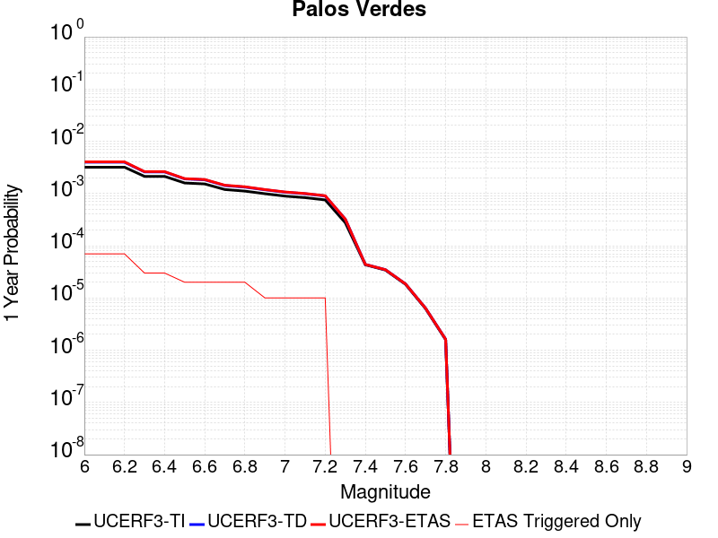 |  |

| Magnitude | 1 wk TI Prob | 1 wk TD Prob | 1 wk ETAS Prob | 1 wk ETAS/TD Gain | 1 wk ETAS Triggered Only | 1 mo TI Prob | 1 mo TD Prob | 1 mo ETAS Prob | 1 mo ETAS/TD Gain | 1 mo ETAS Triggered Only | 1 yr TI Prob | 1 yr TD Prob | 1 yr ETAS Prob | 1 yr ETAS/TD Gain | 1 yr ETAS Triggered Only | 10 yr TI Prob | 10 yr TD Prob | 10 yr ETAS Prob | 10 yr ETAS/TD Gain | 10 yr ETAS Triggered Only |
|-----|-----|-----|-----|-----|-----|-----|-----|-----|-----|-----|-----|-----|-----|-----|-----|-----|-----|-----|-----|-----|
| 6.0 | 6.126063E-5 | 7.622572E-5 | 7.622572E-5 | 1.0 | 0.0 | 2.6251914E-4 | 3.266441E-4 | 3.750322E-4 | 1.148137 | 4.8403883E-5 | 0.0031914865 | 0.0039701737 | 0.0040424913 | 1.0182152 | 7.260582E-5 | 0.031460393 | 0.03904909 | 0.03911886 | 1.0017867 | 7.260582E-5 |
| 6.1 | 6.126063E-5 | 7.622572E-5 | 7.622572E-5 | 1.0 | 0.0 | 2.6251914E-4 | 3.266441E-4 | 3.750322E-4 | 1.148137 | 4.8403883E-5 | 0.0031914865 | 0.0039701737 | 0.0040424913 | 1.0182152 | 7.260582E-5 | 0.031460393 | 0.03904909 | 0.03911886 | 1.0017867 | 7.260582E-5 |
| 6.2 | 6.126063E-5 | 7.622572E-5 | 7.622572E-5 | 1.0 | 0.0 | 2.6251914E-4 | 3.266441E-4 | 3.750322E-4 | 1.148137 | 4.8403883E-5 | 0.0031914865 | 0.0039701737 | 0.0040424913 | 1.0182152 | 7.260582E-5 | 0.031460393 | 0.03904909 | 0.03911886 | 1.0017867 | 7.260582E-5 |
| 6.3 | 4.0838047E-5 | 4.9749007E-5 | 4.9749007E-5 | 1.0 | 0.0 | 1.7500846E-4 | 2.1319388E-4 | 2.6158744E-4 | 1.2269932 | 4.8403883E-5 | 0.0021286458 | 0.002592754 | 0.0026410327 | 1.0186205 | 4.8403883E-5 | 0.021083709 | 0.025646746 | 0.02569391 | 1.0018389 | 4.8403883E-5 |
| 6.4 | 4.0838047E-5 | 4.9749007E-5 | 4.9749007E-5 | 1.0 | 0.0 | 1.7500846E-4 | 2.1319388E-4 | 2.6158744E-4 | 1.2269932 | 4.8403883E-5 | 0.0021286458 | 0.002592754 | 0.0026410327 | 1.0186205 | 4.8403883E-5 | 0.021083709 | 0.025646746 | 0.02569391 | 1.0018389 | 4.8403883E-5 |
| 6.5 | 3.0512005E-5 | 3.6561592E-5 | 3.6561592E-5 | 1.0 | 0.0 | 1.3075917E-4 | 1.566838E-4 | 1.8088197E-4 | 1.1544393 | 2.4201941E-5 | 0.0015908304 | 0.001906072 | 0.0019302279 | 1.0126731 | 2.4201941E-5 | 0.015794903 | 0.018909173 | 0.018932916 | 1.0012558 | 2.4201941E-5 |
| 6.6 | 2.9255087E-5 | 3.5154393E-5 | 3.5154393E-5 | 1.0 | 0.0 | 1.2537291E-4 | 1.5065364E-4 | 1.7485193E-4 | 1.160622 | 2.4201941E-5 | 0.0015253464 | 0.0018327782 | 0.0018569358 | 1.0131809 | 2.4201941E-5 | 0.015149189 | 0.018188244 | 0.018212005 | 1.0013064 | 2.4201941E-5 |
| 6.7 | 2.287198E-5 | 2.724828E-5 | 2.724828E-5 | 1.0 | 0.0 | 9.801909E-5 | 1.16773626E-4 | 1.4097274E-4 | 1.207231 | 2.4201941E-5 | 0.001192729 | 0.0014208833 | 0.0014450509 | 1.0170088 | 2.4201941E-5 | 0.011863477 | 0.014127217 | 0.014151078 | 1.001689 | 2.4201941E-5 |
| 6.8 | 2.1325764E-5 | 2.5431878E-5 | 2.5431878E-5 | 1.0 | 0.0 | 9.139293E-5 | 1.0898972E-4 | 1.3318902E-4 | 1.2220329 | 2.4201941E-5 | 0.001112141 | 0.0013262323 | 0.0013504021 | 1.0182245 | 2.4201941E-5 | 0.011065915 | 0.013192211 | 0.013216094 | 1.0018103 | 2.4201941E-5 |
| 6.9 | 1.9009392E-5 | 2.2613547E-5 | 2.2613547E-5 | 1.0 | 0.0 | 8.1466285E-5 | 9.6912096E-5 | 9.6912096E-5 | 1.0 | 0.0 | 9.914007E-4 | 0.0011793535 | 0.0011793535 | 1.0 | 0.0 | 0.009869894 | 0.011739633 | 0.011739633 | 1.0 | 0.0 |
| 7.0 | 1.7098473E-5 | 2.0319356E-5 | 2.0319356E-5 | 1.0 | 0.0 | 7.3277115E-5 | 8.708052E-5 | 8.708052E-5 | 1.0 | 0.0 | 8.917837E-4 | 0.001059775 | 0.001059775 | 1.0 | 0.0 | 0.008882134 | 0.010555646 | 0.010555646 | 1.0 | 0.0 |
| 7.1 | 1.5982785E-5 | 1.899476E-5 | 1.899476E-5 | 1.0 | 0.0 | 6.849585E-5 | 8.1404054E-5 | 8.1404054E-5 | 1.0 | 0.0 | 8.336179E-4 | 9.907284E-4 | 9.907284E-4 | 1.0 | 0.0 | 0.008304977 | 0.009871479 | 0.009871479 | 1.0 | 0.0 |
| 7.2 | 1.4468002E-5 | 1.7197237E-5 | 1.7197237E-5 | 1.0 | 0.0 | 6.200425E-5 | 7.370083E-5 | 7.370083E-5 | 1.0 | 0.0 | 7.546402E-4 | 8.970222E-4 | 8.970222E-4 | 1.0 | 0.0 | 0.007520827 | 0.008942284 | 0.008942284 | 1.0 | 0.0 |
| 7.3 | 5.288233E-6 | 6.2036747E-6 | 6.2036747E-6 | 1.0 | 0.0 | 2.2663658E-5 | 2.6587102E-5 | 2.6587102E-5 | 1.0 | 0.0 | 2.7589512E-4 | 3.236848E-4 | 3.236848E-4 | 1.0 | 0.0 | 0.0027555283 | 0.0032355562 | 0.0032355562 | 1.0 | 0.0 |
| 7.4 | 8.279556E-7 | 8.408347E-7 | 8.408347E-7 | 1.0 | 0.0 | 3.5483763E-6 | 3.6035726E-6 | 3.6035726E-6 | 1.0 | 0.0 | 4.3200624E-5 | 4.3872686E-5 | 4.3872686E-5 | 1.0 | 0.0 | 4.3192226E-4 | 4.3864746E-4 | 4.3864746E-4 | 1.0 | 0.0 |
| 7.5 | 6.559831E-7 | 6.667229E-7 | 6.667229E-7 | 1.0 | 0.0 | 2.8113532E-6 | 2.857381E-6 | 2.857381E-6 | 1.0 | 0.0 | 3.4227687E-5 | 3.4788125E-5 | 3.4788125E-5 | 1.0 | 0.0 | 3.4222414E-4 | 3.4783344E-4 | 3.4783344E-4 | 1.0 | 0.0 |
| 7.6 | 3.5018968E-7 | 3.5620027E-7 | 3.5620027E-7 | 1.0 | 0.0 | 1.500812E-6 | 1.526572E-6 | 1.526572E-6 | 1.0 | 0.0 | 1.8272232E-5 | 1.8585903E-5 | 1.8585903E-5 | 1.0 | 0.0 | 1.8270731E-4 | 1.8584808E-4 | 1.8584808E-4 | 1.0 | 0.0 |
| 7.7 | 1.1986104E-7 | 1.2198376E-7 | 1.2198376E-7 | 1.0 | 0.0 | 5.1369005E-7 | 5.2278745E-7 | 5.2278745E-7 | 1.0 | 0.0 | 6.2541585E-6 | 6.364919E-6 | 6.364919E-6 | 1.0 | 0.0 | 6.2539824E-5 | 6.364741E-5 | 6.364741E-5 | 1.0 | 0.0 |
| 7.8 | 3.0445005E-8 | 3.1027582E-8 | 3.1027582E-8 | 1.0 | 0.0 | 1.3047858E-7 | 1.3297536E-7 | 1.3297536E-7 | 1.0 | 0.0 | 1.5885756E-6 | 1.6189739E-6 | 1.6189739E-6 | 1.0 | 0.0 | 1.5885644E-5 | 1.6189642E-5 | 1.6189642E-5 | 1.0 | 0.0 |

## Lost Hills
*[(top)](#table-of-contents)*

| 1 Week | 1 Month | 1 Year | 10 Year |
|-----|-----|-----|-----|
|  |  |  |  |

| Magnitude | 1 wk TI Prob | 1 wk TD Prob | 1 wk ETAS Prob | 1 wk ETAS/TD Gain | 1 wk ETAS Triggered Only | 1 mo TI Prob | 1 mo TD Prob | 1 mo ETAS Prob | 1 mo ETAS/TD Gain | 1 mo ETAS Triggered Only | 1 yr TI Prob | 1 yr TD Prob | 1 yr ETAS Prob | 1 yr ETAS/TD Gain | 1 yr ETAS Triggered Only | 10 yr TI Prob | 10 yr TD Prob | 10 yr ETAS Prob | 10 yr ETAS/TD Gain | 10 yr ETAS Triggered Only |
|-----|-----|-----|-----|-----|-----|-----|-----|-----|-----|-----|-----|-----|-----|-----|-----|-----|-----|-----|-----|-----|
| 6.0 | 2.233523E-5 | 2.5106583E-5 | 4.9307917E-5 | 1.9639437 | 2.4201941E-5 | 9.571891E-5 | 1.0759615E-4 | 1.5599483E-4 | 1.4498179 | 4.8403883E-5 | 0.0011647546 | 0.001309364 | 0.0013818748 | 1.0553786 | 7.260582E-5 | 0.011586686 | 0.013033091 | 0.013104751 | 1.0054983 | 7.260582E-5 |
| 6.1 | 2.233523E-5 | 2.5106583E-5 | 4.9307917E-5 | 1.9639437 | 2.4201941E-5 | 9.571891E-5 | 1.0759615E-4 | 1.5599483E-4 | 1.4498179 | 4.8403883E-5 | 0.0011647546 | 0.001309364 | 0.0013818748 | 1.0553786 | 7.260582E-5 | 0.011586686 | 0.013033091 | 0.013104751 | 1.0054983 | 7.260582E-5 |
| 6.2 | 2.233523E-5 | 2.5106583E-5 | 4.9307917E-5 | 1.9639437 | 2.4201941E-5 | 9.571891E-5 | 1.0759615E-4 | 1.5599483E-4 | 1.4498179 | 4.8403883E-5 | 0.0011647546 | 0.001309364 | 0.0013818748 | 1.0553786 | 7.260582E-5 | 0.011586686 | 0.013033091 | 0.013104751 | 1.0054983 | 7.260582E-5 |
| 6.3 | 2.233523E-5 | 2.5106583E-5 | 4.9307917E-5 | 1.9639437 | 2.4201941E-5 | 9.571891E-5 | 1.0759615E-4 | 1.5599483E-4 | 1.4498179 | 4.8403883E-5 | 0.0011647546 | 0.001309364 | 0.0013818748 | 1.0553786 | 7.260582E-5 | 0.011586686 | 0.013033091 | 0.013104751 | 1.0054983 | 7.260582E-5 |
| 6.4 | 1.2288092E-5 | 1.3781108E-5 | 1.3781108E-5 | 1.0 | 0.0 | 5.2662188E-5 | 5.906108E-5 | 8.326159E-5 | 1.4097539 | 2.4201941E-5 | 6.409735E-4 | 7.189252E-4 | 7.672943E-4 | 1.0672797 | 4.8403883E-5 | 0.006391279 | 0.0071752006 | 0.0072232573 | 1.0066975 | 4.8403883E-5 |
| 6.5 | 1.2288092E-5 | 1.3781108E-5 | 1.3781108E-5 | 1.0 | 0.0 | 5.2662188E-5 | 5.906108E-5 | 8.326159E-5 | 1.4097539 | 2.4201941E-5 | 6.409735E-4 | 7.189252E-4 | 7.672943E-4 | 1.0672797 | 4.8403883E-5 | 0.006391279 | 0.0071752006 | 0.0072232573 | 1.0066975 | 4.8403883E-5 |
| 6.6 | 8.58281E-6 | 9.63377E-6 | 9.63377E-6 | 1.0 | 0.0 | 3.6782953E-5 | 4.12874E-5 | 6.548834E-5 | 1.586158 | 2.4201941E-5 | 4.4774043E-4 | 5.026414E-4 | 5.5102096E-4 | 1.0962507 | 4.8403883E-5 | 0.0044683935 | 0.005023205 | 0.0050713657 | 1.0095876 | 4.8403883E-5 |
| 6.7 | 7.205685E-6 | 8.088302E-6 | 8.088302E-6 | 1.0 | 0.0 | 3.088114E-5 | 3.466415E-5 | 5.886525E-5 | 1.6981593 | 2.4201941E-5 | 3.7591302E-4 | 4.2203604E-4 | 4.7041947E-4 | 1.114643 | 4.8403883E-5 | 0.0037527776 | 0.0042203604 | 0.00426856 | 1.0114207 | 4.8403883E-5 |

## Oceanic - West Huasna
*[(top)](#table-of-contents)*

| 1 Week | 1 Month | 1 Year | 10 Year |
|-----|-----|-----|-----|
|  |  |  |  |

| Magnitude | 1 wk TI Prob | 1 wk TD Prob | 1 wk ETAS Prob | 1 wk ETAS/TD Gain | 1 wk ETAS Triggered Only | 1 mo TI Prob | 1 mo TD Prob | 1 mo ETAS Prob | 1 mo ETAS/TD Gain | 1 mo ETAS Triggered Only | 1 yr TI Prob | 1 yr TD Prob | 1 yr ETAS Prob | 1 yr ETAS/TD Gain | 1 yr ETAS Triggered Only | 10 yr TI Prob | 10 yr TD Prob | 10 yr ETAS Prob | 10 yr ETAS/TD Gain | 10 yr ETAS Triggered Only |
|-----|-----|-----|-----|-----|-----|-----|-----|-----|-----|-----|-----|-----|-----|-----|-----|-----|-----|-----|-----|-----|
| 6.0 | 3.195567E-5 | 2.7926368E-5 | 2.7926368E-5 | 1.0 | 0.0 | 1.3694567E-4 | 1.19679185E-4 | 1.4387823E-4 | 1.2021992 | 2.4201941E-5 | 0.0016660384 | 0.0014561634 | 0.00148033 | 1.0165962 | 2.4201941E-5 | 0.016536033 | 0.01447077 | 0.014542325 | 1.0049448 | 7.260582E-5 |
| 6.1 | 2.1156782E-5 | 1.7573117E-5 | 1.7573117E-5 | 1.0 | 0.0 | 9.066878E-5 | 7.531123E-5 | 7.531123E-5 | 1.0 | 0.0 | 0.0011033333 | 9.1653795E-4 | 9.1653795E-4 | 1.0 | 0.0 | 0.010978713 | 0.009128587 | 0.009152568 | 1.002627 | 2.4201941E-5 |
| 6.2 | 1.6195117E-5 | 1.3327227E-5 | 1.3327227E-5 | 1.0 | 0.0 | 6.9405796E-5 | 5.7115452E-5 | 5.7115452E-5 | 1.0 | 0.0 | 8.44688E-4 | 6.9516135E-4 | 6.9516135E-4 | 1.0 | 0.0 | 0.008414844 | 0.0069301617 | 0.006954196 | 1.003468 | 2.4201941E-5 |
| 6.3 | 1.3559345E-5 | 1.1179013E-5 | 1.1179013E-5 | 1.0 | 0.0 | 5.811018E-5 | 4.7909183E-5 | 4.7909183E-5 | 1.0 | 0.0 | 7.072618E-4 | 5.8313913E-4 | 5.8313913E-4 | 1.0 | 0.0 | 0.0070501505 | 0.005816208 | 0.0058402694 | 1.0041369 | 2.4201941E-5 |
| 6.4 | 1.2120619E-5 | 1.0000874E-5 | 1.0000874E-5 | 1.0 | 0.0 | 5.1944477E-5 | 4.2860185E-5 | 4.2860185E-5 | 1.0 | 0.0 | 6.322405E-4 | 5.216983E-4 | 5.216983E-4 | 1.0 | 0.0 | 0.006304447 | 0.005204804 | 0.0052288794 | 1.0046257 | 2.4201941E-5 |
| 6.5 | 1.13511915E-5 | 9.367378E-6 | 9.367378E-6 | 1.0 | 0.0 | 4.8647056E-5 | 4.0145293E-5 | 4.0145293E-5 | 1.0 | 0.0 | 5.9211696E-4 | 4.886598E-4 | 4.886598E-4 | 1.0 | 0.0 | 0.0059054173 | 0.0048759114 | 0.0048999954 | 1.0049393 | 2.4201941E-5 |
| 6.6 | 9.850605E-6 | 8.1353155E-6 | 8.1353155E-6 | 1.0 | 0.0 | 4.2216197E-5 | 3.4865174E-5 | 3.4865174E-5 | 1.0 | 0.0 | 5.1386096E-4 | 4.2440102E-4 | 4.2440102E-4 | 1.0 | 0.0 | 0.0051267436 | 0.0042359377 | 0.004260037 | 1.0056893 | 2.4201941E-5 |
| 6.7 | 8.8558645E-6 | 7.318341E-6 | 7.318341E-6 | 1.0 | 0.0 | 3.7953152E-5 | 3.1363943E-5 | 3.1363943E-5 | 1.0 | 0.0 | 4.6198163E-4 | 3.8178926E-4 | 3.8178926E-4 | 1.0 | 0.0 | 0.004610224 | 0.0038113592 | 0.0038354688 | 1.0063257 | 2.4201941E-5 |
| 6.8 | 7.67136E-6 | 6.39169E-6 | 6.39169E-6 | 1.0 | 0.0 | 3.2876844E-5 | 2.739267E-5 | 2.739267E-5 | 1.0 | 0.0 | 4.0020206E-4 | 3.3345487E-4 | 3.3345487E-4 | 1.0 | 0.0 | 0.003994821 | 0.0033295664 | 0.0033536877 | 1.0072446 | 2.4201941E-5 |
| 6.9 | 6.534529E-6 | 5.458261E-6 | 5.458261E-6 | 1.0 | 0.0 | 2.8004823E-5 | 2.3392338E-5 | 2.3392338E-5 | 1.0 | 0.0 | 3.4090536E-4 | 2.8476462E-4 | 2.8476462E-4 | 1.0 | 0.0 | 0.0034038287 | 0.002844014 | 0.002868147 | 1.0084856 | 2.4201941E-5 |
| 7.0 | 5.460525E-6 | 4.5699203E-6 | 4.5699203E-6 | 1.0 | 0.0 | 2.3402039E-5 | 1.9585226E-5 | 1.9585226E-5 | 1.0 | 0.0 | 2.8488258E-4 | 2.3842414E-4 | 2.3842414E-4 | 1.0 | 0.0 | 0.0028451765 | 0.0023816973 | 0.0024058416 | 1.0101374 | 2.4201941E-5 |
| 7.1 | 4.4825083E-6 | 3.7524153E-6 | 3.7524153E-6 | 1.0 | 0.0 | 1.9210609E-5 | 1.6081682E-5 | 1.6081682E-5 | 1.0 | 0.0 | 2.3386406E-4 | 1.9577699E-4 | 1.9577699E-4 | 1.0 | 0.0 | 0.002336181 | 0.001956057 | 0.0019802118 | 1.0123487 | 2.4201941E-5 |
| 7.2 | 2.821708E-6 | 2.424941E-6 | 2.424941E-6 | 1.0 | 0.0 | 1.2092979E-5 | 1.0392562E-5 | 1.0392562E-5 | 1.0 | 0.0 | 1.4722206E-4 | 1.265221E-4 | 1.265221E-4 | 1.0 | 0.0 | 0.0014712457 | 0.0012645032 | 0.0012886747 | 1.0191153 | 2.4201941E-5 |
| 7.3 | 2.0644757E-6 | 1.7687502E-6 | 1.7687502E-6 | 1.0 | 0.0 | 8.847723E-6 | 7.580336E-6 | 7.580336E-6 | 1.0 | 0.0 | 1.0771569E-4 | 9.228668E-5 | 9.228668E-5 | 1.0 | 0.0 | 0.001076635 | 9.224854E-4 | 9.224854E-4 | 1.0 | 0.0 |
| 7.4 | 1.6980367E-6 | 1.4379966E-6 | 1.4379966E-6 | 1.0 | 0.0 | 7.27728E-6 | 6.1628284E-6 | 6.1628284E-6 | 1.0 | 0.0 | 8.8597284E-5 | 7.502986E-5 | 7.502986E-5 | 1.0 | 0.0 | 8.8561967E-4 | 7.5004686E-4 | 7.5004686E-4 | 1.0 | 0.0 |
| 7.5 | 1.3637683E-6 | 1.1302697E-6 | 1.1302697E-6 | 1.0 | 0.0 | 5.844708E-6 | 4.844004E-6 | 4.844004E-6 | 1.0 | 0.0 | 7.1156996E-5 | 5.897415E-5 | 5.897415E-5 | 1.0 | 0.0 | 7.1134215E-4 | 5.8958656E-4 | 5.8958656E-4 | 1.0 | 0.0 |
| 7.6 | 9.802994E-7 | 7.6772847E-7 | 7.6772847E-7 | 1.0 | 0.0 | 4.2012766E-6 | 3.2902608E-6 | 3.2902608E-6 | 1.0 | 0.0 | 5.1149345E-5 | 4.005819E-5 | 4.005819E-5 | 1.0 | 0.0 | 5.113757E-4 | 4.0051117E-4 | 4.0051117E-4 | 1.0 | 0.0 |
| 7.7 | 5.986191E-7 | 4.0050708E-7 | 4.0050708E-7 | 1.0 | 0.0 | 2.5655079E-6 | 1.7164577E-6 | 1.7164577E-6 | 1.0 | 0.0 | 3.1234613E-5 | 2.0897673E-5 | 2.0897673E-5 | 1.0 | 0.0 | 3.123022E-4 | 2.0895849E-4 | 2.0895849E-4 | 1.0 | 0.0 |
| 7.8 | 2.9189815E-7 | 1.5285202E-7 | 1.5285202E-7 | 1.0 | 0.0 | 1.2509914E-6 | 6.5507993E-7 | 6.5507993E-7 | 1.0 | 0.0 | 1.5230714E-5 | 7.975569E-6 | 7.975569E-6 | 1.0 | 0.0 | 1.522967E-4 | 7.97542E-5 | 7.97542E-5 | 1.0 | 0.0 |
| 7.9 | 1.2057845E-7 | 4.6208047E-8 | 4.6208047E-8 | 1.0 | 0.0 | 5.1676466E-7 | 1.9803447E-7 | 1.9803447E-7 | 1.0 | 0.0 | 6.2915915E-6 | 2.411067E-6 | 2.411067E-6 | 1.0 | 0.0 | 6.2914136E-5 | 2.4111772E-5 | 2.4111772E-5 | 1.0 | 0.0 |
| 8.0 | 3.3806387E-9 | 9.0093144E-10 | 9.0093144E-10 | 1.0 | 0.0 | 1.4488451E-8 | 3.8611354E-9 | 3.8611354E-9 | 1.0 | 0.0 | 1.7639688E-7 | 4.7009323E-8 | 4.7009323E-8 | 1.0 | 0.0 | 1.7639674E-6 | 4.712806E-7 | 4.712806E-7 | 1.0 | 0.0 |

## San Diego Trough north alt1
*[(top)](#table-of-contents)*

| 1 Week | 1 Month | 1 Year | 10 Year |
|-----|-----|-----|-----|
|  |  |  |  |

| Magnitude | 1 wk TI Prob | 1 wk TD Prob | 1 wk ETAS Prob | 1 wk ETAS/TD Gain | 1 wk ETAS Triggered Only | 1 mo TI Prob | 1 mo TD Prob | 1 mo ETAS Prob | 1 mo ETAS/TD Gain | 1 mo ETAS Triggered Only | 1 yr TI Prob | 1 yr TD Prob | 1 yr ETAS Prob | 1 yr ETAS/TD Gain | 1 yr ETAS Triggered Only | 10 yr TI Prob | 10 yr TD Prob | 10 yr ETAS Prob | 10 yr ETAS/TD Gain | 10 yr ETAS Triggered Only |
|-----|-----|-----|-----|-----|-----|-----|-----|-----|-----|-----|-----|-----|-----|-----|-----|-----|-----|-----|-----|-----|
| 6.0 | 7.329252E-5 | 8.821269E-5 | 8.821269E-5 | 1.0 | 0.0 | 3.14073E-4 | 3.7800326E-4 | 3.7800326E-4 | 1.0 | 0.0 | 0.0038171355 | 0.0045930487 | 0.004617139 | 1.0052451 | 2.4201941E-5 | 0.03752231 | 0.045045137 | 0.045114473 | 1.0015392 | 7.260582E-5 |
| 6.1 | 3.7940346E-5 | 4.4884906E-5 | 4.4884906E-5 | 1.0 | 0.0 | 1.6259136E-4 | 1.9235026E-4 | 1.9235026E-4 | 1.0 | 0.0 | 0.0019777524 | 0.002339431 | 0.002339431 | 1.0 | 0.0 | 0.019602431 | 0.023156732 | 0.023156732 | 1.0 | 0.0 |
| 6.2 | 2.8645263E-5 | 3.329672E-5 | 3.329672E-5 | 1.0 | 0.0 | 1.2275964E-4 | 1.4269259E-4 | 1.4269259E-4 | 1.0 | 0.0 | 0.0014935739 | 0.0017359206 | 0.0017359206 | 1.0 | 0.0 | 0.0148357535 | 0.017226268 | 0.017226268 | 1.0 | 0.0 |
| 6.3 | 2.8645263E-5 | 3.329672E-5 | 3.329672E-5 | 1.0 | 0.0 | 1.2275964E-4 | 1.4269259E-4 | 1.4269259E-4 | 1.0 | 0.0 | 0.0014935739 | 0.0017359206 | 0.0017359206 | 1.0 | 0.0 | 0.0148357535 | 0.017226268 | 0.017226268 | 1.0 | 0.0 |
| 6.4 | 2.2204576E-5 | 2.544832E-5 | 2.544832E-5 | 1.0 | 0.0 | 9.5159E-5 | 1.0905972E-4 | 1.0905972E-4 | 1.0 | 0.0 | 0.001157945 | 0.0013270028 | 0.0013270028 | 1.0 | 0.0 | 0.011519298 | 0.013191959 | 0.013191959 | 1.0 | 0.0 |
| 6.5 | 2.1004838E-5 | 2.4024695E-5 | 2.4024695E-5 | 1.0 | 0.0 | 9.0017624E-5 | 1.0295897E-4 | 1.0295897E-4 | 1.0 | 0.0 | 0.0010954136 | 0.0012528135 | 0.0012528135 | 1.0 | 0.0 | 0.010900296 | 0.012458592 | 0.012458592 | 1.0 | 0.0 |
| 6.6 | 1.820557E-5 | 2.070479E-5 | 2.070479E-5 | 1.0 | 0.0 | 7.802154E-5 | 8.8731824E-5 | 8.8731824E-5 | 1.0 | 0.0 | 9.4949827E-4 | 0.0010797799 | 0.0010797799 | 1.0 | 0.0 | 0.009454516 | 0.010746005 | 0.010746005 | 1.0 | 0.0 |
| 6.7 | 1.5884485E-5 | 1.7983646E-5 | 1.7983646E-5 | 1.0 | 0.0 | 6.807459E-5 | 7.707051E-5 | 7.707051E-5 | 1.0 | 0.0 | 8.284929E-4 | 9.3793223E-4 | 9.3793223E-4 | 1.0 | 0.0 | 0.008254109 | 0.009340104 | 0.009340104 | 1.0 | 0.0 |
| 6.8 | 1.4331171E-5 | 1.6201066E-5 | 1.6201066E-5 | 1.0 | 0.0 | 6.141786E-5 | 6.94313E-5 | 6.94313E-5 | 1.0 | 0.0 | 7.4750587E-4 | 8.450002E-4 | 8.450002E-4 | 1.0 | 0.0 | 0.0074499645 | 0.008418139 | 0.008418139 | 1.0 | 0.0 |
| 6.9 | 1.2574203E-5 | 1.4205835E-5 | 1.4205835E-5 | 1.0 | 0.0 | 5.3888325E-5 | 6.0880735E-5 | 6.0880735E-5 | 1.0 | 0.0 | 6.558929E-4 | 7.409723E-4 | 7.409723E-4 | 1.0 | 0.0 | 0.0065396037 | 0.007385203 | 0.007385203 | 1.0 | 0.0 |
| 7.0 | 1.0883844E-5 | 1.2289262E-5 | 1.2289262E-5 | 1.0 | 0.0 | 4.664421E-5 | 5.2667205E-5 | 5.2667205E-5 | 1.0 | 0.0 | 5.677453E-4 | 6.4103556E-4 | 6.4103556E-4 | 1.0 | 0.0 | 0.00566297 | 0.006391993 | 0.006391993 | 1.0 | 0.0 |
| 7.1 | 9.393088E-6 | 1.060702E-5 | 1.060702E-5 | 1.0 | 0.0 | 4.025547E-5 | 4.545787E-5 | 4.545787E-5 | 1.0 | 0.0 | 4.900001E-4 | 5.533098E-4 | 5.533098E-4 | 1.0 | 0.0 | 0.0048892107 | 0.005519418 | 0.005519418 | 1.0 | 0.0 |
| 7.2 | 8.190791E-6 | 9.258625E-6 | 9.258625E-6 | 1.0 | 0.0 | 3.510292E-5 | 3.9679224E-5 | 3.9679224E-5 | 1.0 | 0.0 | 4.2729423E-4 | 4.8298817E-4 | 4.8298817E-4 | 1.0 | 0.0 | 0.0042647356 | 0.004819465 | 0.004819465 | 1.0 | 0.0 |
| 7.3 | 6.268162E-6 | 7.089716E-6 | 7.089716E-6 | 1.0 | 0.0 | 2.6863276E-5 | 3.0384144E-5 | 3.0384144E-5 | 1.0 | 0.0 | 3.2701128E-4 | 3.6986457E-4 | 3.6986457E-4 | 1.0 | 0.0 | 0.003265305 | 0.003692536 | 0.003692536 | 1.0 | 0.0 |
| 7.4 | 4.985186E-6 | 5.6426816E-6 | 5.6426816E-6 | 1.0 | 0.0 | 2.1364907E-5 | 2.4182698E-5 | 2.4182698E-5 | 1.0 | 0.0 | 2.600867E-4 | 2.9438498E-4 | 2.9438498E-4 | 1.0 | 0.0 | 0.002597825 | 0.0029399914 | 0.0029399914 | 1.0 | 0.0 |
| 7.5 | 1.7489613E-6 | 1.969678E-6 | 1.969678E-6 | 1.0 | 0.0 | 7.495527E-6 | 8.4414505E-6 | 8.4414505E-6 | 1.0 | 0.0 | 9.125422E-5 | 1.02770035E-4 | 1.02770035E-4 | 1.0 | 0.0 | 9.1216754E-4 | 0.0010272472 | 0.0010272472 | 1.0 | 0.0 |
| 7.6 | 1.6988751E-7 | 1.7533823E-7 | 1.7533823E-7 | 1.0 | 0.0 | 7.2808916E-7 | 7.5144936E-7 | 7.5144936E-7 | 1.0 | 0.0 | 8.864449E-6 | 9.14886E-6 | 9.14886E-6 | 1.0 | 0.0 | 8.8640954E-5 | 9.1485024E-5 | 9.1485024E-5 | 1.0 | 0.0 |

## Owens Valley Keough Hot Springs
*[(top)](#table-of-contents)*

| 1 Week | 1 Month | 1 Year | 10 Year |
|-----|-----|-----|-----|
|  |  |  |  |

| Magnitude | 1 wk TI Prob | 1 wk TD Prob | 1 wk ETAS Prob | 1 wk ETAS/TD Gain | 1 wk ETAS Triggered Only | 1 mo TI Prob | 1 mo TD Prob | 1 mo ETAS Prob | 1 mo ETAS/TD Gain | 1 mo ETAS Triggered Only | 1 yr TI Prob | 1 yr TD Prob | 1 yr ETAS Prob | 1 yr ETAS/TD Gain | 1 yr ETAS Triggered Only | 10 yr TI Prob | 10 yr TD Prob | 10 yr ETAS Prob | 10 yr ETAS/TD Gain | 10 yr ETAS Triggered Only |
|-----|-----|-----|-----|-----|-----|-----|-----|-----|-----|-----|-----|-----|-----|-----|-----|-----|-----|-----|-----|-----|
| 6.0 | 1.5708529E-5 | 4.950463E-6 | 2.9152285E-5 | 5.8887997 | 2.4201941E-5 | 6.7320536E-5 | 2.1216127E-5 | 6.961898E-5 | 3.281418 | 4.8403883E-5 | 8.193192E-4 | 2.5828084E-4 | 3.3086792E-4 | 1.2810394 | 7.260582E-5 | 0.008163051 | 0.0025804387 | 0.0026528572 | 1.0280644 | 7.260582E-5 |
| 6.1 | 1.5708529E-5 | 4.950463E-6 | 2.9152285E-5 | 5.8887997 | 2.4201941E-5 | 6.7320536E-5 | 2.1216127E-5 | 6.961898E-5 | 3.281418 | 4.8403883E-5 | 8.193192E-4 | 2.5828084E-4 | 3.3086792E-4 | 1.2810394 | 7.260582E-5 | 0.008163051 | 0.0025804387 | 0.0026528572 | 1.0280644 | 7.260582E-5 |
| 6.2 | 1.5708529E-5 | 4.950463E-6 | 2.9152285E-5 | 5.8887997 | 2.4201941E-5 | 6.7320536E-5 | 2.1216127E-5 | 6.961898E-5 | 3.281418 | 4.8403883E-5 | 8.193192E-4 | 2.5828084E-4 | 3.3086792E-4 | 1.2810394 | 7.260582E-5 | 0.008163051 | 0.0025804387 | 0.0026528572 | 1.0280644 | 7.260582E-5 |
| 6.3 | 1.5708529E-5 | 4.950463E-6 | 2.9152285E-5 | 5.8887997 | 2.4201941E-5 | 6.7320536E-5 | 2.1216127E-5 | 6.961898E-5 | 3.281418 | 4.8403883E-5 | 8.193192E-4 | 2.5828084E-4 | 3.3086792E-4 | 1.2810394 | 7.260582E-5 | 0.008163051 | 0.0025804387 | 0.0026528572 | 1.0280644 | 7.260582E-5 |
| 6.4 | 1.4622509E-5 | 3.7263276E-6 | 2.7928178E-5 | 7.4948263 | 2.4201941E-5 | 6.266639E-5 | 1.5969896E-5 | 4.017145E-5 | 2.5154483 | 2.4201941E-5 | 7.626962E-4 | 1.9441944E-4 | 2.4281391E-4 | 1.2489178 | 4.8403883E-5 | 0.007600839 | 0.0019429466 | 0.0019912564 | 1.0248642 | 4.8403883E-5 |
| 6.5 | 1.3335527E-5 | 2.2775241E-6 | 2.647941E-5 | 11.626401 | 2.4201941E-5 | 5.7151006E-5 | 9.760785E-6 | 3.396249E-5 | 3.4794834 | 2.4201941E-5 | 6.955913E-4 | 1.1883176E-4 | 1.672299E-4 | 1.4072828 | 4.8403883E-5 | 0.0069341804 | 0.001187878 | 0.0012362244 | 1.0406998 | 4.8403883E-5 |
| 6.6 | 1.3332855E-5 | 2.2746733E-6 | 2.6476559E-5 | 11.639719 | 2.4201941E-5 | 5.7139558E-5 | 9.748568E-6 | 3.3950273E-5 | 3.482591 | 2.4201941E-5 | 6.9545204E-4 | 1.1868303E-4 | 1.6708116E-4 | 1.4077933 | 4.8403883E-5 | 0.0069327964 | 0.0011863923 | 0.0012347387 | 1.0407509 | 4.8403883E-5 |
| 6.7 | 1.3318214E-5 | 2.2639038E-6 | 2.646579E-5 | 11.690333 | 2.4201941E-5 | 5.707681E-5 | 9.702413E-6 | 3.3904118E-5 | 3.4944007 | 2.4201941E-5 | 6.946886E-4 | 1.18121156E-4 | 1.6651931E-4 | 1.4097333 | 4.8403883E-5 | 0.0069252094 | 0.0011807795 | 0.0012291262 | 1.0409448 | 4.8403883E-5 |
| 6.8 | 1.2441338E-5 | 1.677594E-6 | 2.5879495E-5 | 15.426554 | 2.4201941E-5 | 5.331893E-5 | 7.1896707E-6 | 3.139144E-5 | 4.3661857 | 2.4201941E-5 | 6.489646E-4 | 8.753102E-5 | 1.3593066E-4 | 1.5529428 | 4.8403883E-5 | 0.0064707273 | 8.751236E-4 | 9.2348515E-4 | 1.0552624 | 4.8403883E-5 |
| 6.9 | 1.1130476E-5 | 1.0302234E-6 | 2.5232139E-5 | 24.491909 | 2.4201941E-5 | 4.7701167E-5 | 4.4152357E-6 | 2.861707E-5 | 6.4814363 | 2.4201941E-5 | 5.806069E-4 | 5.3754186E-5 | 1.0215546E-4 | 1.9004188 | 4.8403883E-5 | 0.0057909233 | 5.375404E-4 | 5.8591826E-4 | 1.0899986 | 4.8403883E-5 |
| 7.0 | 1.0986073E-5 | 9.577824E-7 | 2.51597E-5 | 26.268702 | 2.4201941E-5 | 4.7082318E-5 | 4.1047756E-6 | 2.8306617E-5 | 6.896021 | 2.4201941E-5 | 5.730765E-4 | 4.9974507E-5 | 9.837597E-5 | 1.968523 | 4.8403883E-5 | 0.0057160086 | 4.997603E-4 | 5.4814003E-4 | 1.0968058 | 4.8403883E-5 |
| 7.1 | 1.0451338E-5 | 7.9988575E-7 | 2.5001807E-5 | 31.256723 | 2.4201941E-5 | 4.4790682E-5 | 3.4280772E-6 | 2.7629936E-5 | 8.059893 | 2.4201941E-5 | 5.451901E-4 | 4.1736046E-5 | 9.013791E-5 | 2.1597137 | 4.8403883E-5 | 0.005438545 | 4.1740583E-4 | 4.6578952E-4 | 1.1159152 | 4.8403883E-5 |
| 7.2 | 9.989061E-6 | 6.543693E-7 | 2.4856294E-5 | 37.98512 | 2.4201941E-5 | 4.280956E-5 | 2.8044367E-6 | 2.700631E-5 | 9.629852 | 2.4201941E-5 | 5.2108173E-4 | 3.4143486E-5 | 8.254572E-5 | 2.4176126 | 4.8403883E-5 | 0.0051986156 | 3.41488E-4 | 3.8987535E-4 | 1.1416956 | 4.8403883E-5 |
| 7.3 | 9.465365E-6 | 5.458855E-7 | 2.4747813E-5 | 45.33517 | 2.4201941E-5 | 4.056522E-5 | 2.3395073E-6 | 2.6541391E-5 | 11.344864 | 2.4201941E-5 | 4.937696E-4 | 2.8483131E-5 | 7.688563E-5 | 2.6993392 | 4.8403883E-5 | 0.0049267393 | 2.8489542E-4 | 3.3328548E-4 | 1.1698521 | 4.8403883E-5 |
| 7.4 | 6.3824805E-6 | 4.0153776E-7 | 2.4603469E-5 | 61.273113 | 2.4201941E-5 | 2.73532E-5 | 1.7208749E-6 | 2.5922775E-5 | 15.063718 | 2.4201941E-5 | 3.3297433E-4 | 2.0951453E-5 | 4.5152887E-5 | 2.1551197 | 2.4201941E-5 | 0.0033247585 | 2.0955436E-4 | 2.3375124E-4 | 1.1154683 | 2.4201941E-5 |
| 7.5 | 1.6192645E-6 | 2.5156373E-7 | 2.4453499E-5 | 97.20598 | 2.4201941E-5 | 6.9396865E-6 | 1.0781299E-6 | 2.5280046E-5 | 23.448051 | 2.4201941E-5 | 8.448741E-5 | 1.3126153E-5 | 3.7327776E-5 | 2.8437712 | 2.4201941E-5 | 8.4455294E-4 | 1.3125391E-4 | 1.5545267E-4 | 1.184366 | 2.4201941E-5 |
| 7.6 | 5.7062545E-7 | 1.0790214E-7 | 2.430984E-5 | 225.29526 | 2.4201941E-5 | 2.4455355E-6 | 4.6243767E-7 | 2.4664367E-5 | 53.33555 | 2.4201941E-5 | 2.9773988E-5 | 5.630165E-6 | 2.983197E-5 | 5.298596 | 2.4201941E-5 | 2.977E-4 | 5.6300305E-5 | 8.050088E-5 | 1.4298481 | 2.4201941E-5 |
| 7.7 | 2.5988817E-7 | 4.5445965E-8 | 2.4247385E-5 | 533.5432 | 2.4201941E-5 | 1.113806E-6 | 1.9476842E-7 | 2.4396704E-5 | 125.26007 | 2.4201941E-5 | 1.3560503E-5 | 2.3713033E-6 | 2.6573187E-5 | 11.206153 | 2.4201941E-5 | 1.3559677E-4 | 2.3712824E-5 | 4.791419E-5 | 2.0206025 | 2.4201941E-5 |

## Kern Canyon (Lake Isabella) 2011
*[(top)](#table-of-contents)*

| 1 Week | 1 Month | 1 Year | 10 Year |
|-----|-----|-----|-----|
|  |  | 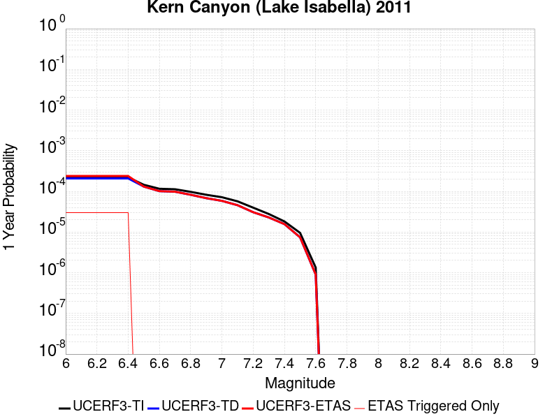 |  |

| Magnitude | 1 wk TI Prob | 1 wk TD Prob | 1 wk ETAS Prob | 1 wk ETAS/TD Gain | 1 wk ETAS Triggered Only | 1 mo TI Prob | 1 mo TD Prob | 1 mo ETAS Prob | 1 mo ETAS/TD Gain | 1 mo ETAS Triggered Only | 1 yr TI Prob | 1 yr TD Prob | 1 yr ETAS Prob | 1 yr ETAS/TD Gain | 1 yr ETAS Triggered Only | 10 yr TI Prob | 10 yr TD Prob | 10 yr ETAS Prob | 10 yr ETAS/TD Gain | 10 yr ETAS Triggered Only |
|-----|-----|-----|-----|-----|-----|-----|-----|-----|-----|-----|-----|-----|-----|-----|-----|-----|-----|-----|-----|-----|
| 6.0 | 4.2387383E-6 | 4.0016344E-6 | 2.8203478E-5 | 7.0479903 | 2.4201941E-5 | 1.8165894E-5 | 1.7149758E-5 | 4.1351283E-5 | 2.4111876 | 2.4201941E-5 | 2.2114732E-4 | 2.0878017E-4 | 2.5717393E-4 | 1.2317929 | 4.8403883E-5 | 0.0022092736 | 0.002086024 | 0.0021584786 | 1.0347332 | 7.260582E-5 |
| 6.1 | 4.2387383E-6 | 4.0016344E-6 | 2.8203478E-5 | 7.0479903 | 2.4201941E-5 | 1.8165894E-5 | 1.7149758E-5 | 4.1351283E-5 | 2.4111876 | 2.4201941E-5 | 2.2114732E-4 | 2.0878017E-4 | 2.5717393E-4 | 1.2317929 | 4.8403883E-5 | 0.0022092736 | 0.002086024 | 0.0021584786 | 1.0347332 | 7.260582E-5 |
| 6.2 | 4.2387383E-6 | 4.0016344E-6 | 2.8203478E-5 | 7.0479903 | 2.4201941E-5 | 1.8165894E-5 | 1.7149758E-5 | 4.1351283E-5 | 2.4111876 | 2.4201941E-5 | 2.2114732E-4 | 2.0878017E-4 | 2.5717393E-4 | 1.2317929 | 4.8403883E-5 | 0.0022092736 | 0.002086024 | 0.0021584786 | 1.0347332 | 7.260582E-5 |
| 6.3 | 4.2387383E-6 | 4.0016344E-6 | 2.8203478E-5 | 7.0479903 | 2.4201941E-5 | 1.8165894E-5 | 1.7149758E-5 | 4.1351283E-5 | 2.4111876 | 2.4201941E-5 | 2.2114732E-4 | 2.0878017E-4 | 2.5717393E-4 | 1.2317929 | 4.8403883E-5 | 0.0022092736 | 0.002086024 | 0.0021584786 | 1.0347332 | 7.260582E-5 |
| 6.4 | 4.2387383E-6 | 4.0016344E-6 | 2.8203478E-5 | 7.0479903 | 2.4201941E-5 | 1.8165894E-5 | 1.7149758E-5 | 4.1351283E-5 | 2.4111876 | 2.4201941E-5 | 2.2114732E-4 | 2.0878017E-4 | 2.5717393E-4 | 1.2317929 | 4.8403883E-5 | 0.0022092736 | 0.002086024 | 0.0021584786 | 1.0347332 | 7.260582E-5 |
| 6.5 | 2.7857532E-6 | 2.5178624E-6 | 2.5178624E-6 | 1.0 | 0.0 | 1.1938888E-5 | 1.0790796E-5 | 1.0790796E-5 | 1.0 | 0.0 | 1.4534626E-4 | 1.3137035E-4 | 1.3137035E-4 | 1.0 | 0.0 | 0.0014525123 | 0.0013129596 | 0.0013371299 | 1.0184089 | 2.4201941E-5 |
| 6.6 | 2.2233348E-6 | 1.944119E-6 | 1.944119E-6 | 1.0 | 0.0 | 9.528543E-6 | 8.331913E-6 | 8.331913E-6 | 1.0 | 0.0 | 1.1600384E-4 | 1.014364E-4 | 1.014364E-4 | 1.0 | 0.0 | 0.001159433 | 0.0010139096 | 0.0010380871 | 1.0238457 | 2.4201941E-5 |
| 6.7 | 2.1635126E-6 | 1.8834991E-6 | 1.8834991E-6 | 1.0 | 0.0 | 9.272164E-6 | 8.072114E-6 | 8.072114E-6 | 1.0 | 0.0 | 1.1288274E-4 | 9.827364E-5 | 9.827364E-5 | 1.0 | 0.0 | 0.0011282542 | 9.8231E-4 | 0.0010064881 | 1.0246136 | 2.4201941E-5 |
| 6.8 | 1.8685711E-6 | 1.583138E-6 | 1.583138E-6 | 1.0 | 0.0 | 8.008137E-6 | 6.7848596E-6 | 6.7848596E-6 | 1.0 | 0.0 | 9.74947E-5 | 8.2602586E-5 | 8.2602586E-5 | 1.0 | 0.0 | 9.745194E-4 | 8.2572375E-4 | 8.499057E-4 | 1.0292858 | 2.4201941E-5 |
| 6.9 | 1.5815071E-6 | 1.3064887E-6 | 1.3064887E-6 | 1.0 | 0.0 | 6.77787E-6 | 5.5992255E-6 | 5.5992255E-6 | 1.0 | 0.0 | 8.251744E-5 | 6.816846E-5 | 6.816846E-5 | 1.0 | 0.0 | 8.248681E-4 | 6.8147824E-4 | 7.056637E-4 | 1.0354897 | 2.4201941E-5 |
| 7.0 | 1.3772564E-6 | 1.1210681E-6 | 1.1210681E-6 | 1.0 | 0.0 | 5.9025137E-6 | 4.8045686E-6 | 4.8045686E-6 | 1.0 | 0.0 | 7.186073E-5 | 5.8494075E-5 | 5.8494075E-5 | 1.0 | 0.0 | 7.18375E-4 | 5.8478885E-4 | 6.0897664E-4 | 1.0413616 | 2.4201941E-5 |
| 7.1 | 1.0916998E-6 | 8.7637505E-7 | 8.7637505E-7 | 1.0 | 0.0 | 4.678705E-6 | 3.7558877E-6 | 3.7558877E-6 | 1.0 | 0.0 | 5.6961744E-5 | 4.5726985E-5 | 4.5726985E-5 | 1.0 | 0.0 | 5.6947145E-4 | 4.571771E-4 | 4.81368E-4 | 1.0529135 | 2.4201941E-5 |
| 7.2 | 7.6277024E-7 | 5.901439E-7 | 5.901439E-7 | 1.0 | 0.0 | 3.2690114E-6 | 2.5291856E-6 | 2.5291856E-6 | 1.0 | 0.0 | 3.9799485E-5 | 3.0792406E-5 | 3.0792406E-5 | 1.0 | 0.0 | 3.9792358E-4 | 3.07882E-4 | 3.3207648E-4 | 1.0785836 | 2.4201941E-5 |
| 7.3 | 5.3265916E-7 | 4.3824264E-7 | 4.3824264E-7 | 1.0 | 0.0 | 2.282823E-6 | 1.8781814E-6 | 1.8781814E-6 | 1.0 | 0.0 | 2.7793016E-5 | 2.2866623E-5 | 2.2866623E-5 | 1.0 | 0.0 | 2.778954E-4 | 2.2864307E-4 | 2.5283947E-4 | 1.1058261 | 2.4201941E-5 |
| 7.4 | 3.4946007E-7 | 3.0065647E-7 | 3.0065647E-7 | 1.0 | 0.0 | 1.497685E-6 | 1.2885271E-6 | 1.2885271E-6 | 1.0 | 0.0 | 1.8234163E-5 | 1.5687707E-5 | 1.5687707E-5 | 1.0 | 0.0 | 1.8232666E-4 | 1.5686621E-4 | 1.8106436E-4 | 1.1542598 | 2.4201941E-5 |
| 7.5 | 1.8317026E-7 | 1.4244755E-7 | 1.4244755E-7 | 1.0 | 0.0 | 7.850152E-7 | 6.1048934E-7 | 6.1048934E-7 | 1.0 | 0.0 | 9.557518E-6 | 7.432683E-6 | 7.432683E-6 | 1.0 | 0.0 | 9.5571064E-5 | 7.432442E-5 | 7.432442E-5 | 1.0 | 0.0 |
| 7.6 | 2.572245E-8 | 1.735264E-8 | 1.735264E-8 | 1.0 | 0.0 | 1.10239064E-7 | 7.436845E-8 | 7.436845E-8 | 1.0 | 0.0 | 1.3421597E-6 | 9.0543557E-7 | 9.0543557E-7 | 1.0 | 0.0 | 1.3421517E-5 | 9.054324E-6 | 9.054324E-6 | 1.0 | 0.0 |

## Santa Ynez River
*[(top)](#table-of-contents)*

| 1 Week | 1 Month | 1 Year | 10 Year |
|-----|-----|-----|-----|
|  |  |  |  |

| Magnitude | 1 wk TI Prob | 1 wk TD Prob | 1 wk ETAS Prob | 1 wk ETAS/TD Gain | 1 wk ETAS Triggered Only | 1 mo TI Prob | 1 mo TD Prob | 1 mo ETAS Prob | 1 mo ETAS/TD Gain | 1 mo ETAS Triggered Only | 1 yr TI Prob | 1 yr TD Prob | 1 yr ETAS Prob | 1 yr ETAS/TD Gain | 1 yr ETAS Triggered Only | 10 yr TI Prob | 10 yr TD Prob | 10 yr ETAS Prob | 10 yr ETAS/TD Gain | 10 yr ETAS Triggered Only |
|-----|-----|-----|-----|-----|-----|-----|-----|-----|-----|-----|-----|-----|-----|-----|-----|-----|-----|-----|-----|-----|
| 6.0 | 1.6396456E-5 | 1.7209444E-5 | 4.1410967E-5 | 2.4062932 | 2.4201941E-5 | 7.026863E-5 | 7.3752875E-5 | 9.795303E-5 | 1.3281249 | 2.4201941E-5 | 8.551848E-4 | 8.976069E-4 | 9.4596733E-4 | 1.0538771 | 4.8403883E-5 | 0.0085190125 | 0.008943363 | 0.009015319 | 1.0080458 | 7.260582E-5 |
| 6.1 | 1.6396456E-5 | 1.7209444E-5 | 4.1410967E-5 | 2.4062932 | 2.4201941E-5 | 7.026863E-5 | 7.3752875E-5 | 9.795303E-5 | 1.3281249 | 2.4201941E-5 | 8.551848E-4 | 8.976069E-4 | 9.4596733E-4 | 1.0538771 | 4.8403883E-5 | 0.0085190125 | 0.008943363 | 0.009015319 | 1.0080458 | 7.260582E-5 |
| 6.2 | 1.6396456E-5 | 1.7209444E-5 | 4.1410967E-5 | 2.4062932 | 2.4201941E-5 | 7.026863E-5 | 7.3752875E-5 | 9.795303E-5 | 1.3281249 | 2.4201941E-5 | 8.551848E-4 | 8.976069E-4 | 9.4596733E-4 | 1.0538771 | 4.8403883E-5 | 0.0085190125 | 0.008943363 | 0.009015319 | 1.0080458 | 7.260582E-5 |
| 6.3 | 9.736976E-6 | 1.01223395E-5 | 3.4324035E-5 | 3.3909192 | 2.4201941E-5 | 4.172923E-5 | 4.338076E-5 | 6.758165E-5 | 1.5578716 | 2.4201941E-5 | 5.0793495E-4 | 5.280378E-4 | 5.764161E-4 | 1.091619 | 4.8403883E-5 | 0.005067755 | 0.0052683367 | 0.0053164857 | 1.0091393 | 4.8403883E-5 |
| 6.4 | 9.736976E-6 | 1.01223395E-5 | 3.4324035E-5 | 3.3909192 | 2.4201941E-5 | 4.172923E-5 | 4.338076E-5 | 6.758165E-5 | 1.5578716 | 2.4201941E-5 | 5.0793495E-4 | 5.280378E-4 | 5.764161E-4 | 1.091619 | 4.8403883E-5 | 0.005067755 | 0.0052683367 | 0.0053164857 | 1.0091393 | 4.8403883E-5 |
| 6.5 | 7.081964E-6 | 7.329905E-6 | 7.329905E-6 | 1.0 | 0.0 | 3.035092E-5 | 3.141351E-5 | 3.141351E-5 | 1.0 | 0.0 | 3.694598E-4 | 3.8239395E-4 | 4.0658665E-4 | 1.0632664 | 2.4201941E-5 | 0.0036884616 | 0.0038175215 | 0.0038416309 | 1.0063155 | 2.4201941E-5 |
| 6.6 | 5.873247E-6 | 6.0597517E-6 | 6.0597517E-6 | 1.0 | 0.0 | 2.5170815E-5 | 2.5970112E-5 | 2.5970112E-5 | 1.0 | 0.0 | 3.064116E-4 | 3.161411E-4 | 3.403354E-4 | 1.07653 | 2.4201941E-5 | 0.0030598943 | 0.003157001 | 0.0031811264 | 1.0076419 | 2.4201941E-5 |
| 6.7 | 4.973277E-6 | 5.11591E-6 | 5.11591E-6 | 1.0 | 0.0 | 2.1313872E-5 | 2.1925147E-5 | 2.1925147E-5 | 1.0 | 0.0 | 2.5946548E-4 | 2.6690646E-4 | 2.9110193E-4 | 1.0906515 | 2.4201941E-5 | 0.0025916274 | 0.0026659078 | 0.0026900452 | 1.0090541 | 2.4201941E-5 |
| 6.8 | 4.396492E-6 | 4.510987E-6 | 4.510987E-6 | 1.0 | 0.0 | 1.884197E-5 | 1.933266E-5 | 1.933266E-5 | 1.0 | 0.0 | 2.2937685E-4 | 2.3535005E-4 | 2.595463E-4 | 1.1028095 | 2.4201941E-5 | 0.0022914023 | 0.0023510433 | 0.0023751885 | 1.0102699 | 2.4201941E-5 |
| 6.9 | 3.5255632E-6 | 3.6013423E-6 | 3.6013423E-6 | 1.0 | 0.0 | 1.5109469E-5 | 1.5434234E-5 | 1.5434234E-5 | 1.0 | 0.0 | 1.8394225E-4 | 1.8789574E-4 | 1.8789574E-4 | 1.0 | 0.0 | 0.0018379007 | 0.001877385 | 0.001877385 | 1.0 | 0.0 |
| 7.0 | 3.211603E-6 | 3.273663E-6 | 3.273663E-6 | 1.0 | 0.0 | 1.376394E-5 | 1.402991E-5 | 1.402991E-5 | 1.0 | 0.0 | 1.6756308E-4 | 1.708009E-4 | 1.708009E-4 | 1.0 | 0.0 | 0.0016743679 | 0.0017067104 | 0.0017067104 | 1.0 | 0.0 |
| 7.1 | 2.5094619E-6 | 2.5409295E-6 | 2.5409295E-6 | 1.0 | 0.0 | 1.0754793E-5 | 1.0889652E-5 | 1.0889652E-5 | 1.0 | 0.0 | 1.3093173E-4 | 1.325735E-4 | 1.325735E-4 | 1.0 | 0.0 | 0.0013085462 | 0.0013249503 | 0.0013249503 | 1.0 | 0.0 |
| 7.2 | 2.0515774E-6 | 2.0619466E-6 | 2.0619466E-6 | 1.0 | 0.0 | 8.792445E-6 | 8.836884E-6 | 8.836884E-6 | 1.0 | 0.0 | 1.0704277E-4 | 1.0758379E-4 | 1.0758379E-4 | 1.0 | 0.0 | 0.0010699122 | 0.0010753215 | 0.0010753215 | 1.0 | 0.0 |
| 7.3 | 1.6845745E-6 | 1.6773996E-6 | 1.6773996E-6 | 1.0 | 0.0 | 7.219585E-6 | 7.1888358E-6 | 7.1888358E-6 | 1.0 | 0.0 | 8.78949E-5 | 8.752059E-5 | 8.752059E-5 | 1.0 | 0.0 | 8.7860145E-4 | 8.7486405E-4 | 8.7486405E-4 | 1.0 | 0.0 |
| 7.4 | 1.3600285E-6 | 1.3333447E-6 | 1.3333447E-6 | 1.0 | 0.0 | 5.82868E-6 | 5.714322E-6 | 5.714322E-6 | 1.0 | 0.0 | 7.096187E-5 | 6.956967E-5 | 6.956967E-5 | 1.0 | 0.0 | 7.0939213E-4 | 6.9548114E-4 | 6.9548114E-4 | 1.0 | 0.0 |
| 7.5 | 9.735342E-7 | 9.2901894E-7 | 9.2901894E-7 | 1.0 | 0.0 | 4.172283E-6 | 3.9815036E-6 | 3.9815036E-6 | 1.0 | 0.0 | 5.079636E-5 | 4.8473747E-5 | 4.8473747E-5 | 1.0 | 0.0 | 5.0784746E-4 | 4.8463346E-4 | 4.8463346E-4 | 1.0 | 0.0 |
| 7.6 | 5.067187E-7 | 4.778609E-7 | 4.778609E-7 | 1.0 | 0.0 | 2.1716498E-6 | 2.0479738E-6 | 2.0479738E-6 | 1.0 | 0.0 | 2.6439517E-5 | 2.4933803E-5 | 2.4933803E-5 | 1.0 | 0.0 | 2.643637E-4 | 2.493108E-4 | 2.493108E-4 | 1.0 | 0.0 |
| 7.7 | 2.769089E-7 | 2.5759346E-7 | 2.5759346E-7 | 1.0 | 0.0 | 1.1867519E-6 | 1.1039714E-6 | 1.1039714E-6 | 1.0 | 0.0 | 1.4448608E-5 | 1.344077E-5 | 1.344077E-5 | 1.0 | 0.0 | 1.444767E-4 | 1.343996E-4 | 1.343996E-4 | 1.0 | 0.0 |
| 7.8 | 1.7044663E-7 | 1.5449208E-7 | 1.5449208E-7 | 1.0 | 0.0 | 7.3048534E-7 | 6.6210873E-7 | 6.6210873E-7 | 1.0 | 0.0 | 8.893623E-6 | 8.061144E-6 | 8.061144E-6 | 1.0 | 0.0 | 8.893267E-5 | 8.060854E-5 | 8.060854E-5 | 1.0 | 0.0 |
| 7.9 | 4.8344287E-8 | 4.0911143E-8 | 4.0911143E-8 | 1.0 | 0.0 | 2.0718979E-7 | 1.7533345E-7 | 1.7533345E-7 | 1.0 | 0.0 | 2.5225327E-6 | 2.1346827E-6 | 2.1346827E-6 | 1.0 | 0.0 | 2.5225041E-5 | 2.1346626E-5 | 2.1346626E-5 | 1.0 | 0.0 |

## Kern Canyon (South Kern) 2011
*[(top)](#table-of-contents)*

| 1 Week | 1 Month | 1 Year | 10 Year |
|-----|-----|-----|-----|
|  |  |  | 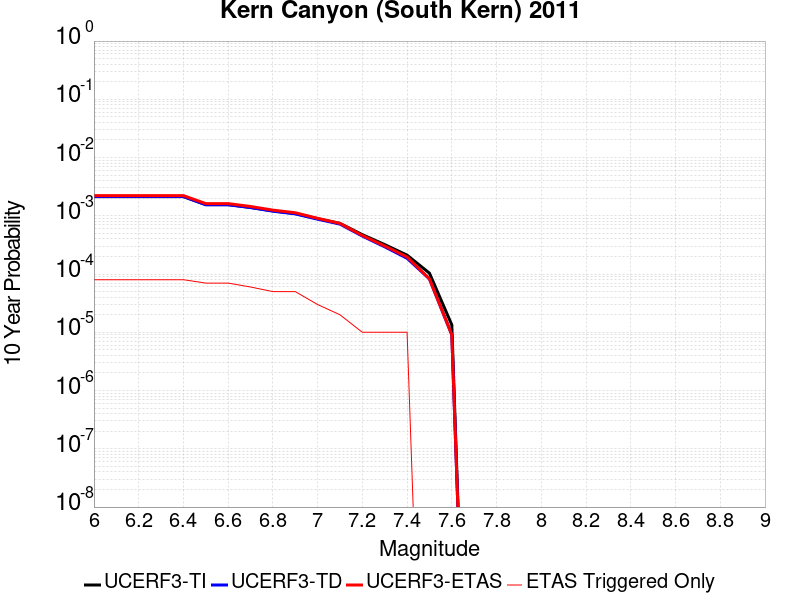 |

| Magnitude | 1 wk TI Prob | 1 wk TD Prob | 1 wk ETAS Prob | 1 wk ETAS/TD Gain | 1 wk ETAS Triggered Only | 1 mo TI Prob | 1 mo TD Prob | 1 mo ETAS Prob | 1 mo ETAS/TD Gain | 1 mo ETAS Triggered Only | 1 yr TI Prob | 1 yr TD Prob | 1 yr ETAS Prob | 1 yr ETAS/TD Gain | 1 yr ETAS Triggered Only | 10 yr TI Prob | 10 yr TD Prob | 10 yr ETAS Prob | 10 yr ETAS/TD Gain | 10 yr ETAS Triggered Only |
|-----|-----|-----|-----|-----|-----|-----|-----|-----|-----|-----|-----|-----|-----|-----|-----|-----|-----|-----|-----|-----|
| 6.0 | 4.105075E-6 | 4.113726E-6 | 2.8315568E-5 | 6.8831925 | 2.4201941E-5 | 1.7593058E-5 | 1.7630138E-5 | 4.1831652E-5 | 2.3727353 | 2.4201941E-5 | 2.1417443E-4 | 2.1462643E-4 | 2.3882318E-4 | 1.1127388 | 2.4201941E-5 | 0.0021396813 | 0.0021442554 | 0.0022167056 | 1.033788 | 7.260582E-5 |
| 6.1 | 4.105075E-6 | 4.113726E-6 | 2.8315568E-5 | 6.8831925 | 2.4201941E-5 | 1.7593058E-5 | 1.7630138E-5 | 4.1831652E-5 | 2.3727353 | 2.4201941E-5 | 2.1417443E-4 | 2.1462643E-4 | 2.3882318E-4 | 1.1127388 | 2.4201941E-5 | 0.0021396813 | 0.0021442554 | 0.0022167056 | 1.033788 | 7.260582E-5 |
| 6.2 | 4.105075E-6 | 4.113726E-6 | 2.8315568E-5 | 6.8831925 | 2.4201941E-5 | 1.7593058E-5 | 1.7630138E-5 | 4.1831652E-5 | 2.3727353 | 2.4201941E-5 | 2.1417443E-4 | 2.1462643E-4 | 2.3882318E-4 | 1.1127388 | 2.4201941E-5 | 0.0021396813 | 0.0021442554 | 0.0022167056 | 1.033788 | 7.260582E-5 |
| 6.3 | 4.105075E-6 | 4.113726E-6 | 2.8315568E-5 | 6.8831925 | 2.4201941E-5 | 1.7593058E-5 | 1.7630138E-5 | 4.1831652E-5 | 2.3727353 | 2.4201941E-5 | 2.1417443E-4 | 2.1462643E-4 | 2.3882318E-4 | 1.1127388 | 2.4201941E-5 | 0.0021396813 | 0.0021442554 | 0.0022167056 | 1.033788 | 7.260582E-5 |
| 6.4 | 4.105075E-6 | 4.113726E-6 | 2.8315568E-5 | 6.8831925 | 2.4201941E-5 | 1.7593058E-5 | 1.7630138E-5 | 4.1831652E-5 | 2.3727353 | 2.4201941E-5 | 2.1417443E-4 | 2.1462643E-4 | 2.3882318E-4 | 1.1127388 | 2.4201941E-5 | 0.0021396813 | 0.0021442554 | 0.0022167056 | 1.033788 | 7.260582E-5 |
| 6.5 | 2.9849807E-6 | 2.973154E-6 | 2.7175023E-5 | 9.140133 | 2.4201941E-5 | 1.2792712E-5 | 1.2742028E-5 | 3.694366E-5 | 2.899355 | 2.4201941E-5 | 1.5574014E-4 | 1.551233E-4 | 1.7932148E-4 | 1.1559932 | 2.4201941E-5 | 0.0015563103 | 0.0015501654 | 0.0016226586 | 1.0467649 | 7.260582E-5 |
| 6.6 | 2.9849807E-6 | 2.973154E-6 | 2.7175023E-5 | 9.140133 | 2.4201941E-5 | 1.2792712E-5 | 1.2742028E-5 | 3.694366E-5 | 2.899355 | 2.4201941E-5 | 1.5574014E-4 | 1.551233E-4 | 1.7932148E-4 | 1.1559932 | 2.4201941E-5 | 0.0015563103 | 0.0015501654 | 0.0016226586 | 1.0467649 | 7.260582E-5 |
| 6.7 | 2.6756725E-6 | 2.6582202E-6 | 2.6860096E-5 | 10.104542 | 2.4201941E-5 | 1.1467117E-5 | 1.1392323E-5 | 3.559399E-5 | 3.1243837 | 2.4201941E-5 | 1.396032E-4 | 1.386928E-4 | 1.628914E-4 | 1.1744761 | 2.4201941E-5 | 0.0013951553 | 0.0013860734 | 0.0014585786 | 1.0523098 | 7.260582E-5 |
| 6.8 | 2.3283721E-6 | 2.3047783E-6 | 2.6506663E-5 | 11.500744 | 2.4201941E-5 | 9.9787E-6 | 9.877584E-6 | 3.4079287E-5 | 3.450164 | 2.4201941E-5 | 1.214839E-4 | 1.2025302E-4 | 1.4445205E-4 | 1.2012343 | 2.4201941E-5 | 0.001214175 | 0.001201887 | 0.0012744055 | 1.0603373 | 7.260582E-5 |
| 6.9 | 2.0972677E-6 | 2.0696405E-6 | 2.6271531E-5 | 12.693766 | 2.4201941E-5 | 8.988259E-6 | 8.869858E-6 | 3.3071585E-5 | 3.728536 | 2.4201941E-5 | 1.0942656E-4 | 1.0798523E-4 | 1.3218456E-4 | 1.2240984 | 2.4201941E-5 | 0.0010937268 | 0.0010793334 | 0.0011518608 | 1.0671965 | 7.260582E-5 |
| 7.0 | 1.7132242E-6 | 1.6787029E-6 | 1.6787029E-6 | 1.0 | 0.0 | 7.3423685E-6 | 7.1944214E-6 | 7.1944214E-6 | 1.0 | 0.0 | 8.938967E-5 | 8.75886E-5 | 8.75886E-5 | 1.0 | 0.0 | 8.935372E-4 | 8.755446E-4 | 8.9972536E-4 | 1.0276179 | 2.4201941E-5 |
| 7.1 | 1.4215541E-6 | 1.3815746E-6 | 1.3815746E-6 | 1.0 | 0.0 | 6.0923603E-6 | 5.9210206E-6 | 5.9210206E-6 | 1.0 | 0.0 | 7.417196E-5 | 7.208607E-5 | 7.208607E-5 | 1.0 | 0.0 | 7.414721E-4 | 7.206296E-4 | 7.4481405E-4 | 1.0335603 | 2.4201941E-5 |
| 7.2 | 9.097853E-7 | 8.60377E-7 | 8.60377E-7 | 1.0 | 0.0 | 3.899074E-6 | 3.6873246E-6 | 3.6873246E-6 | 1.0 | 0.0 | 4.7470192E-5 | 4.4892266E-5 | 4.4892266E-5 | 1.0 | 0.0 | 4.7460053E-4 | 4.4883305E-4 | 4.7302412E-4 | 1.0538977 | 2.4201941E-5 |
| 7.3 | 6.144169E-7 | 5.628199E-7 | 5.628199E-7 | 1.0 | 0.0 | 2.6332125E-6 | 2.4120832E-6 | 2.4120832E-6 | 1.0 | 0.0 | 3.205889E-5 | 2.9366722E-5 | 2.9366722E-5 | 1.0 | 0.0 | 3.2054266E-4 | 2.9362892E-4 | 3.1782375E-4 | 1.0823994 | 2.4201941E-5 |
| 7.4 | 4.049844E-7 | 3.5728252E-7 | 3.5728252E-7 | 1.0 | 0.0 | 1.7356463E-6 | 1.5312098E-6 | 1.5312098E-6 | 1.0 | 0.0 | 2.1131287E-5 | 1.8642324E-5 | 1.8642324E-5 | 1.0 | 0.0 | 2.1129279E-4 | 1.8640784E-4 | 2.1060527E-4 | 1.129809 | 2.4201941E-5 |
| 7.5 | 1.9871162E-7 | 1.5830383E-7 | 1.5830383E-7 | 1.0 | 0.0 | 8.5162094E-7 | 6.784448E-7 | 6.784448E-7 | 1.0 | 0.0 | 1.0368436E-5 | 8.260035E-6 | 8.260035E-6 | 1.0 | 0.0 | 1.0367952E-4 | 8.259736E-5 | 8.259736E-5 | 1.0 | 0.0 |
| 7.6 | 2.572245E-8 | 1.735264E-8 | 1.735264E-8 | 1.0 | 0.0 | 1.10239064E-7 | 7.436845E-8 | 7.436845E-8 | 1.0 | 0.0 | 1.3421597E-6 | 9.0543557E-7 | 9.0543557E-7 | 1.0 | 0.0 | 1.3421517E-5 | 9.054324E-6 | 9.054324E-6 | 1.0 | 0.0 |

## Channel Islands Western Deep Ramp
*[(top)](#table-of-contents)*

| 1 Week | 1 Month | 1 Year | 10 Year |
|-----|-----|-----|-----|
|  | 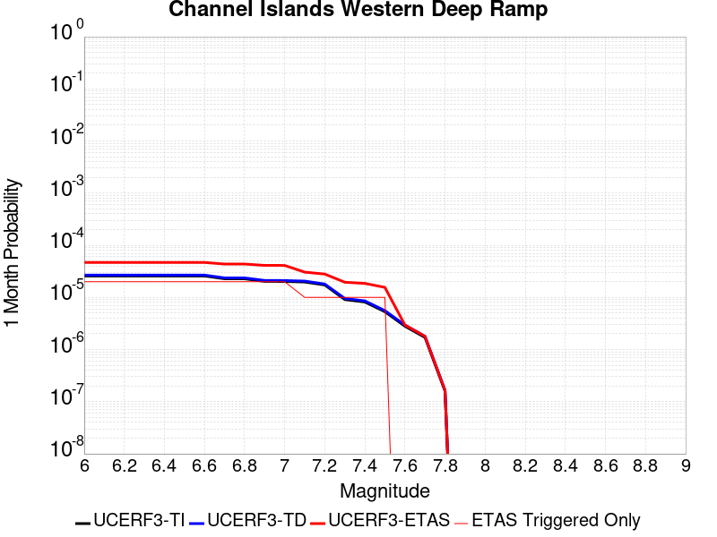 |  | 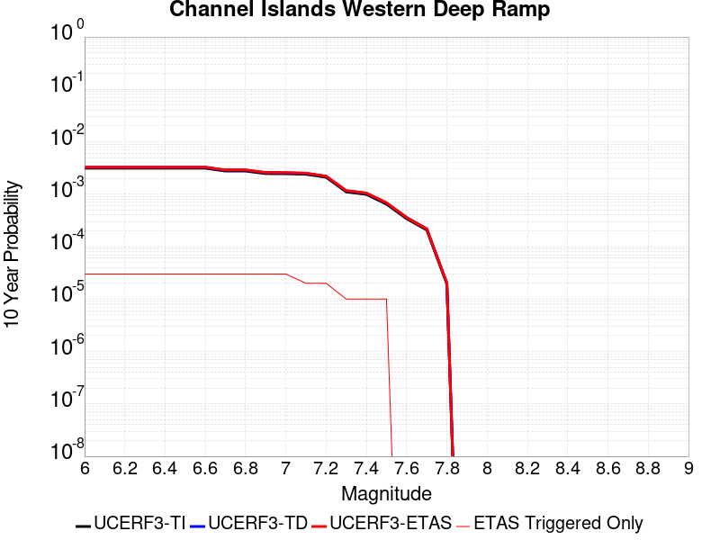 |

| Magnitude | 1 wk TI Prob | 1 wk TD Prob | 1 wk ETAS Prob | 1 wk ETAS/TD Gain | 1 wk ETAS Triggered Only | 1 mo TI Prob | 1 mo TD Prob | 1 mo ETAS Prob | 1 mo ETAS/TD Gain | 1 mo ETAS Triggered Only | 1 yr TI Prob | 1 yr TD Prob | 1 yr ETAS Prob | 1 yr ETAS/TD Gain | 1 yr ETAS Triggered Only | 10 yr TI Prob | 10 yr TD Prob | 10 yr ETAS Prob | 10 yr ETAS/TD Gain | 10 yr ETAS Triggered Only |
|-----|-----|-----|-----|-----|-----|-----|-----|-----|-----|-----|-----|-----|-----|-----|-----|-----|-----|-----|-----|-----|
| 6.0 | 6.0213506E-6 | 6.2548684E-6 | 3.0456658E-5 | 4.869272 | 2.4201941E-5 | 2.5805533E-5 | 2.6806329E-5 | 7.520891E-5 | 2.8056402 | 4.8403883E-5 | 3.1413708E-4 | 3.2632265E-4 | 3.9890478E-4 | 1.2224244 | 7.260582E-5 | 0.0031369338 | 0.0032588763 | 0.0033312454 | 1.0222068 | 7.260582E-5 |
| 6.1 | 6.0213506E-6 | 6.2548684E-6 | 3.0456658E-5 | 4.869272 | 2.4201941E-5 | 2.5805533E-5 | 2.6806329E-5 | 7.520891E-5 | 2.8056402 | 4.8403883E-5 | 3.1413708E-4 | 3.2632265E-4 | 3.9890478E-4 | 1.2224244 | 7.260582E-5 | 0.0031369338 | 0.0032588763 | 0.0033312454 | 1.0222068 | 7.260582E-5 |
| 6.2 | 6.0213506E-6 | 6.2548684E-6 | 3.0456658E-5 | 4.869272 | 2.4201941E-5 | 2.5805533E-5 | 2.6806329E-5 | 7.520891E-5 | 2.8056402 | 4.8403883E-5 | 3.1413708E-4 | 3.2632265E-4 | 3.9890478E-4 | 1.2224244 | 7.260582E-5 | 0.0031369338 | 0.0032588763 | 0.0033312454 | 1.0222068 | 7.260582E-5 |
| 6.3 | 6.0213506E-6 | 6.2548684E-6 | 3.0456658E-5 | 4.869272 | 2.4201941E-5 | 2.5805533E-5 | 2.6806329E-5 | 7.520891E-5 | 2.8056402 | 4.8403883E-5 | 3.1413708E-4 | 3.2632265E-4 | 3.9890478E-4 | 1.2224244 | 7.260582E-5 | 0.0031369338 | 0.0032588763 | 0.0033312454 | 1.0222068 | 7.260582E-5 |
| 6.4 | 6.0213506E-6 | 6.2548684E-6 | 3.0456658E-5 | 4.869272 | 2.4201941E-5 | 2.5805533E-5 | 2.6806329E-5 | 7.520891E-5 | 2.8056402 | 4.8403883E-5 | 3.1413708E-4 | 3.2632265E-4 | 3.9890478E-4 | 1.2224244 | 7.260582E-5 | 0.0031369338 | 0.0032588763 | 0.0033312454 | 1.0222068 | 7.260582E-5 |
| 6.5 | 6.0213506E-6 | 6.2548684E-6 | 3.0456658E-5 | 4.869272 | 2.4201941E-5 | 2.5805533E-5 | 2.6806329E-5 | 7.520891E-5 | 2.8056402 | 4.8403883E-5 | 3.1413708E-4 | 3.2632265E-4 | 3.9890478E-4 | 1.2224244 | 7.260582E-5 | 0.0031369338 | 0.0032588763 | 0.0033312454 | 1.0222068 | 7.260582E-5 |
| 6.6 | 6.0213506E-6 | 6.2548684E-6 | 3.0456658E-5 | 4.869272 | 2.4201941E-5 | 2.5805533E-5 | 2.6806329E-5 | 7.520891E-5 | 2.8056402 | 4.8403883E-5 | 3.1413708E-4 | 3.2632265E-4 | 3.9890478E-4 | 1.2224244 | 7.260582E-5 | 0.0031369338 | 0.0032588763 | 0.0033312454 | 1.0222068 | 7.260582E-5 |
| 6.7 | 5.313309E-6 | 5.5252403E-6 | 2.9727047E-5 | 5.380227 | 2.4201941E-5 | 2.2771126E-5 | 2.367941E-5 | 7.208215E-5 | 3.0440853 | 4.8403883E-5 | 2.772032E-4 | 2.8826276E-4 | 3.6084765E-4 | 1.2518011 | 7.260582E-5 | 0.0027685766 | 0.0028792918 | 0.0029516884 | 1.025144 | 7.260582E-5 |
| 6.8 | 5.313309E-6 | 5.5252403E-6 | 2.9727047E-5 | 5.380227 | 2.4201941E-5 | 2.2771126E-5 | 2.367941E-5 | 7.208215E-5 | 3.0440853 | 4.8403883E-5 | 2.772032E-4 | 2.8826276E-4 | 3.6084765E-4 | 1.2518011 | 7.260582E-5 | 0.0027685766 | 0.0028792918 | 0.0029516884 | 1.025144 | 7.260582E-5 |
| 6.9 | 4.744377E-6 | 4.9394303E-6 | 2.9141253E-5 | 5.899719 | 2.4201941E-5 | 2.0332885E-5 | 2.1168837E-5 | 6.9571695E-5 | 3.2865148 | 4.8403883E-5 | 2.4752476E-4 | 2.5770385E-4 | 3.3029096E-4 | 1.2816688 | 7.260582E-5 | 0.0024724922 | 0.0025744175 | 0.0026468365 | 1.0281302 | 7.260582E-5 |
| 7.0 | 4.722209E-6 | 4.9164732E-6 | 2.9118295E-5 | 5.9225984 | 2.4201941E-5 | 2.0237881E-5 | 2.107045E-5 | 6.947331E-5 | 3.2971916 | 4.8403883E-5 | 2.4636835E-4 | 2.5650626E-4 | 3.2909345E-4 | 1.2829841 | 7.260582E-5 | 0.002460954 | 0.0025624693 | 0.0026348892 | 1.0282617 | 7.260582E-5 |
| 7.1 | 4.611174E-6 | 4.801409E-6 | 2.9003233E-5 | 6.0405674 | 2.4201941E-5 | 1.9762025E-5 | 2.0577325E-5 | 4.4778768E-5 | 2.176122 | 2.4201941E-5 | 2.4057609E-4 | 2.5050386E-4 | 2.9889564E-4 | 1.1931777 | 4.8403883E-5 | 0.002403158 | 0.002502582 | 0.0025508646 | 1.0192932 | 4.8403883E-5 |
| 7.2 | 4.043994E-6 | 4.2120264E-6 | 2.8413866E-5 | 6.745889 | 2.4201941E-5 | 1.7331287E-5 | 1.8051438E-5 | 4.225294E-5 | 2.3406968 | 2.4201941E-5 | 2.10988E-4 | 2.1975765E-4 | 2.681509E-4 | 1.2202119 | 4.8403883E-5 | 0.002107878 | 0.0021957543 | 0.0022440518 | 1.0219959 | 4.8403883E-5 |
| 7.3 | 2.1233036E-6 | 2.2297875E-6 | 2.6431675E-5 | 11.853899 | 2.4201941E-5 | 9.099841E-6 | 9.556197E-6 | 3.3757908E-5 | 3.532567 | 2.4201941E-5 | 1.1078493E-4 | 1.1634055E-4 | 1.4053968E-4 | 1.2080026 | 2.4201941E-5 | 0.0011072971 | 0.001162802 | 0.0011869757 | 1.0207893 | 2.4201941E-5 |
| 7.4 | 1.9051884E-6 | 2.0014973E-6 | 2.620339E-5 | 13.091894 | 2.4201941E-5 | 8.165067E-6 | 8.577817E-6 | 3.277955E-5 | 3.8214326 | 2.4201941E-5 | 9.940516E-5 | 1.0442998E-4 | 1.2862938E-4 | 1.2317287 | 2.4201941E-5 | 9.93607E-4 | 0.0010438144 | 0.001067991 | 1.0231619 | 2.4201941E-5 |
| 7.5 | 1.2408497E-6 | 1.3038839E-6 | 2.5505793E-5 | 19.5614 | 2.4201941E-5 | 5.317916E-6 | 5.588062E-6 | 2.9789868E-5 | 5.3309836 | 2.4201941E-5 | 6.4743705E-5 | 6.8032554E-5 | 9.223285E-5 | 1.3557163 | 2.4201941E-5 | 6.4724847E-4 | 6.8011944E-4 | 7.043049E-4 | 1.0355606 | 2.4201941E-5 |
| 7.6 | 6.5440025E-7 | 6.886718E-7 | 6.886718E-7 | 1.0 | 0.0 | 2.8045695E-6 | 2.9514472E-6 | 2.9514472E-6 | 1.0 | 0.0 | 3.4145098E-5 | 3.593329E-5 | 3.593329E-5 | 1.0 | 0.0 | 3.4139853E-4 | 3.5927625E-4 | 3.5927625E-4 | 1.0 | 0.0 |
| 7.7 | 3.985963E-7 | 4.1930787E-7 | 4.1930787E-7 | 1.0 | 0.0 | 1.7082689E-6 | 1.7970326E-6 | 1.7970326E-6 | 1.0 | 0.0 | 2.0797976E-5 | 2.1878664E-5 | 2.1878664E-5 | 1.0 | 0.0 | 2.0796029E-4 | 2.1876628E-4 | 2.1876628E-4 | 1.0 | 0.0 |
| 7.8 | 3.706329E-8 | 3.8591796E-8 | 3.8591796E-8 | 1.0 | 0.0 | 1.5884267E-7 | 1.653934E-7 | 1.653934E-7 | 1.0 | 0.0 | 1.9339077E-6 | 2.0136629E-6 | 2.0136629E-6 | 1.0 | 0.0 | 1.933891E-5 | 2.0136458E-5 | 2.0136458E-5 | 1.0 | 0.0 |

## Red Mountain
*[(top)](#table-of-contents)*

| 1 Week | 1 Month | 1 Year | 10 Year |
|-----|-----|-----|-----|
|  |  |  |  |

| Magnitude | 1 wk TI Prob | 1 wk TD Prob | 1 wk ETAS Prob | 1 wk ETAS/TD Gain | 1 wk ETAS Triggered Only | 1 mo TI Prob | 1 mo TD Prob | 1 mo ETAS Prob | 1 mo ETAS/TD Gain | 1 mo ETAS Triggered Only | 1 yr TI Prob | 1 yr TD Prob | 1 yr ETAS Prob | 1 yr ETAS/TD Gain | 1 yr ETAS Triggered Only | 10 yr TI Prob | 10 yr TD Prob | 10 yr ETAS Prob | 10 yr ETAS/TD Gain | 10 yr ETAS Triggered Only |
|-----|-----|-----|-----|-----|-----|-----|-----|-----|-----|-----|-----|-----|-----|-----|-----|-----|-----|-----|-----|-----|
| 6.0 | 4.1810763E-5 | 4.7590016E-5 | 4.7590016E-5 | 1.0 | 0.0 | 1.7917668E-4 | 2.039422E-4 | 2.2813921E-4 | 1.1186464 | 2.4201941E-5 | 0.0021792934 | 0.0024803334 | 0.0025044752 | 1.0097333 | 2.4201941E-5 | 0.021580452 | 0.02454411 | 0.024591327 | 1.0019237 | 4.8403883E-5 |
| 6.1 | 4.1810763E-5 | 4.7590016E-5 | 4.7590016E-5 | 1.0 | 0.0 | 1.7917668E-4 | 2.039422E-4 | 2.2813921E-4 | 1.1186464 | 2.4201941E-5 | 0.0021792934 | 0.0024803334 | 0.0025044752 | 1.0097333 | 2.4201941E-5 | 0.021580452 | 0.02454411 | 0.024591327 | 1.0019237 | 4.8403883E-5 |
| 6.2 | 4.1810763E-5 | 4.7590016E-5 | 4.7590016E-5 | 1.0 | 0.0 | 1.7917668E-4 | 2.039422E-4 | 2.2813921E-4 | 1.1186464 | 2.4201941E-5 | 0.0021792934 | 0.0024803334 | 0.0025044752 | 1.0097333 | 2.4201941E-5 | 0.021580452 | 0.02454411 | 0.024591327 | 1.0019237 | 4.8403883E-5 |
| 6.3 | 4.1810763E-5 | 4.7590016E-5 | 4.7590016E-5 | 1.0 | 0.0 | 1.7917668E-4 | 2.039422E-4 | 2.2813921E-4 | 1.1186464 | 2.4201941E-5 | 0.0021792934 | 0.0024803334 | 0.0025044752 | 1.0097333 | 2.4201941E-5 | 0.021580452 | 0.02454411 | 0.024591327 | 1.0019237 | 4.8403883E-5 |
| 6.4 | 4.1810763E-5 | 4.7590016E-5 | 4.7590016E-5 | 1.0 | 0.0 | 1.7917668E-4 | 2.039422E-4 | 2.2813921E-4 | 1.1186464 | 2.4201941E-5 | 0.0021792934 | 0.0024803334 | 0.0025044752 | 1.0097333 | 2.4201941E-5 | 0.021580452 | 0.02454411 | 0.024591327 | 1.0019237 | 4.8403883E-5 |
| 6.5 | 3.154503E-5 | 3.5359757E-5 | 3.5359757E-5 | 1.0 | 0.0 | 1.3518598E-4 | 1.5153353E-4 | 1.5153353E-4 | 1.0 | 0.0 | 0.0016446467 | 0.0018434518 | 0.0018434518 | 1.0 | 0.0 | 0.01632528 | 0.018291244 | 0.018315004 | 1.0012989 | 2.4201941E-5 |
| 6.6 | 3.1535834E-5 | 3.5349138E-5 | 3.5349138E-5 | 1.0 | 0.0 | 1.3514658E-4 | 1.5148803E-4 | 1.5148803E-4 | 1.0 | 0.0 | 0.0016441676 | 0.0018428987 | 0.0018428987 | 1.0 | 0.0 | 0.01632056 | 0.018285805 | 0.018309565 | 1.0012994 | 2.4201941E-5 |
| 6.7 | 2.8267326E-5 | 3.1469353E-5 | 3.1469353E-5 | 1.0 | 0.0 | 1.2114006E-4 | 1.3486217E-4 | 1.3486217E-4 | 1.0 | 0.0 | 0.0014738824 | 0.0016407954 | 0.0016407954 | 1.0 | 0.0 | 0.014641452 | 0.01629557 | 0.01631938 | 1.001461 | 2.4201941E-5 |
| 6.8 | 2.8212884E-5 | 3.1407242E-5 | 3.1407242E-5 | 1.0 | 0.0 | 1.20906756E-4 | 1.3459599E-4 | 1.3459599E-4 | 1.0 | 0.0 | 0.0014710457 | 0.0016375595 | 0.0016375595 | 1.0 | 0.0 | 0.014613459 | 0.016263688 | 0.016287496 | 1.0014639 | 2.4201941E-5 |
| 6.9 | 2.4227871E-5 | 2.6706994E-5 | 2.6706994E-5 | 1.0 | 0.0 | 1.03829596E-4 | 1.1445395E-4 | 1.1445395E-4 | 1.0 | 0.0 | 0.0012633923 | 0.0013926621 | 0.0013926621 | 1.0 | 0.0 | 0.012562336 | 0.0138470335 | 0.0138709005 | 1.0017236 | 2.4201941E-5 |
| 7.0 | 2.348524E-5 | 2.5835778E-5 | 2.5835778E-5 | 1.0 | 0.0 | 1.0064714E-4 | 1.10720495E-4 | 1.10720495E-4 | 1.0 | 0.0 | 0.0012246901 | 0.001347264 | 0.001347264 | 1.0 | 0.0 | 0.012179627 | 0.013398598 | 0.013422475 | 1.0017821 | 2.4201941E-5 |
| 7.1 | 2.2311642E-5 | 2.4462845E-5 | 2.4462845E-5 | 1.0 | 0.0 | 9.561782E-5 | 1.04836974E-4 | 1.04836974E-4 | 1.0 | 0.0 | 0.0011635252 | 0.0012757176 | 0.0012757176 | 1.0 | 0.0 | 0.01157452 | 0.01269146 | 0.012715355 | 1.0018828 | 2.4201941E-5 |
| 7.2 | 1.6533986E-5 | 1.7670362E-5 | 1.7670362E-5 | 1.0 | 0.0 | 7.085802E-5 | 7.572828E-5 | 7.572828E-5 | 1.0 | 0.0 | 8.623549E-4 | 9.2166534E-4 | 9.2166534E-4 | 1.0 | 0.0 | 0.008590161 | 0.009184707 | 0.009208687 | 1.0026108 | 2.4201941E-5 |
| 7.3 | 1.4703092E-5 | 1.5559537E-5 | 1.5559537E-5 | 1.0 | 0.0 | 6.301173E-5 | 6.668237E-5 | 6.668237E-5 | 1.0 | 0.0 | 7.668978E-4 | 8.1161706E-4 | 8.1161706E-4 | 1.0 | 0.0 | 0.0076425658 | 0.008092604 | 0.00811661 | 1.0029664 | 2.4201941E-5 |
| 7.4 | 6.1331984E-6 | 5.5288874E-6 | 5.5288874E-6 | 1.0 | 0.0 | 2.6284872E-5 | 2.3695018E-5 | 2.3695018E-5 | 1.0 | 0.0 | 3.199713E-4 | 2.884492E-4 | 2.884492E-4 | 1.0 | 0.0 | 0.0031951098 | 0.0028808024 | 0.0029049346 | 1.008377 | 2.4201941E-5 |
| 7.5 | 5.954766E-6 | 5.338517E-6 | 5.338517E-6 | 1.0 | 0.0 | 2.5520176E-5 | 2.2879161E-5 | 2.2879161E-5 | 1.0 | 0.0 | 3.1066386E-4 | 2.785187E-4 | 2.785187E-4 | 1.0 | 0.0 | 0.003102299 | 0.0027817504 | 0.002805885 | 1.008676 | 2.4201941E-5 |
| 7.6 | 4.9726646E-6 | 4.315309E-6 | 4.315309E-6 | 1.0 | 0.0 | 2.1311245E-5 | 1.8494053E-5 | 1.8494053E-5 | 1.0 | 0.0 | 2.5943352E-4 | 2.2514217E-4 | 2.2514217E-4 | 1.0 | 0.0 | 0.0025913084 | 0.0022491754 | 0.0022733228 | 1.0107361 | 2.4201941E-5 |
| 7.7 | 3.3613894E-6 | 2.8526886E-6 | 2.8526886E-6 | 1.0 | 0.0 | 1.4405875E-5 | 1.22257525E-5 | 1.22257525E-5 | 1.0 | 0.0 | 1.7537741E-4 | 1.4883863E-4 | 1.4883863E-4 | 1.0 | 0.0 | 0.0017523908 | 0.0014874157 | 0.0015115817 | 1.0162469 | 2.4201941E-5 |
| 7.8 | 1.1828961E-6 | 1.0122935E-6 | 1.0122935E-6 | 1.0 | 0.0 | 5.069545E-6 | 4.338394E-6 | 4.338394E-6 | 1.0 | 0.0 | 6.171996E-5 | 5.281869E-5 | 5.281869E-5 | 1.0 | 0.0 | 6.170282E-4 | 5.280643E-4 | 5.280643E-4 | 1.0 | 0.0 |
| 7.9 | 2.2967266E-7 | 1.861919E-7 | 1.861919E-7 | 1.0 | 0.0 | 9.843111E-7 | 7.97965E-7 | 7.97965E-7 | 1.0 | 0.0 | 1.19839215E-5 | 9.715184E-6 | 9.715184E-6 | 1.0 | 0.0 | 1.1983275E-4 | 9.714788E-5 | 9.714788E-5 | 1.0 | 0.0 |

## Blue Cut
*[(top)](#table-of-contents)*

| 1 Week | 1 Month | 1 Year | 10 Year |
|-----|-----|-----|-----|
|  |  | 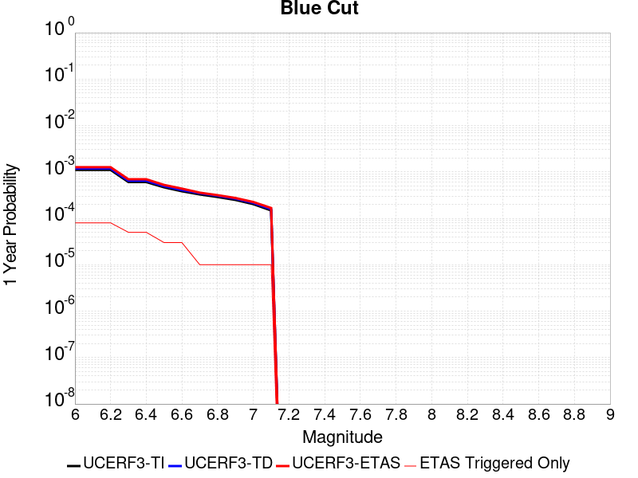 |  |

| Magnitude | 1 wk TI Prob | 1 wk TD Prob | 1 wk ETAS Prob | 1 wk ETAS/TD Gain | 1 wk ETAS Triggered Only | 1 mo TI Prob | 1 mo TD Prob | 1 mo ETAS Prob | 1 mo ETAS/TD Gain | 1 mo ETAS Triggered Only | 1 yr TI Prob | 1 yr TD Prob | 1 yr ETAS Prob | 1 yr ETAS/TD Gain | 1 yr ETAS Triggered Only | 10 yr TI Prob | 10 yr TD Prob | 10 yr ETAS Prob | 10 yr ETAS/TD Gain | 10 yr ETAS Triggered Only |
|-----|-----|-----|-----|-----|-----|-----|-----|-----|-----|-----|-----|-----|-----|-----|-----|-----|-----|-----|-----|-----|
| 6.0 | 2.1227985E-5 | 2.2719574E-5 | 2.2719574E-5 | 1.0 | 0.0 | 9.097391E-5 | 9.73663E-5 | 1.21565885E-4 | 1.2485417 | 2.4201941E-5 | 0.0011070445 | 0.0011848481 | 0.0012090214 | 1.020402 | 2.4201941E-5 | 0.011015458 | 0.011791152 | 0.011862901 | 1.006085 | 7.260582E-5 |
| 6.1 | 2.1227985E-5 | 2.2719574E-5 | 2.2719574E-5 | 1.0 | 0.0 | 9.097391E-5 | 9.73663E-5 | 1.21565885E-4 | 1.2485417 | 2.4201941E-5 | 0.0011070445 | 0.0011848481 | 0.0012090214 | 1.020402 | 2.4201941E-5 | 0.011015458 | 0.011791152 | 0.011862901 | 1.006085 | 7.260582E-5 |
| 6.2 | 2.1227985E-5 | 2.2719574E-5 | 2.2719574E-5 | 1.0 | 0.0 | 9.097391E-5 | 9.73663E-5 | 1.21565885E-4 | 1.2485417 | 2.4201941E-5 | 0.0011070445 | 0.0011848481 | 0.0012090214 | 1.020402 | 2.4201941E-5 | 0.011015458 | 0.011791152 | 0.011862901 | 1.006085 | 7.260582E-5 |
| 6.3 | 1.1613981E-5 | 1.2353542E-5 | 1.2353542E-5 | 1.0 | 0.0 | 4.9773254E-5 | 5.2942745E-5 | 7.7143406E-5 | 1.45711 | 2.4201941E-5 | 6.0582085E-4 | 6.443998E-4 | 6.685861E-4 | 1.0375332 | 2.4201941E-5 | 0.0060417196 | 0.0064265593 | 0.0064506056 | 1.0037417 | 2.4201941E-5 |
| 6.4 | 1.1613981E-5 | 1.2353542E-5 | 1.2353542E-5 | 1.0 | 0.0 | 4.9773254E-5 | 5.2942745E-5 | 7.7143406E-5 | 1.45711 | 2.4201941E-5 | 6.0582085E-4 | 6.443998E-4 | 6.685861E-4 | 1.0375332 | 2.4201941E-5 | 0.0060417196 | 0.0064265593 | 0.0064506056 | 1.0037417 | 2.4201941E-5 |
| 6.5 | 8.931326E-6 | 9.4816E-6 | 9.4816E-6 | 1.0 | 0.0 | 3.8276554E-5 | 4.0634844E-5 | 4.0634844E-5 | 1.0 | 0.0 | 4.6591737E-4 | 4.946261E-4 | 4.946261E-4 | 1.0 | 0.0 | 0.0046494175 | 0.004936161 | 0.004936161 | 1.0 | 0.0 |
| 6.6 | 7.345353E-6 | 7.79028E-6 | 7.79028E-6 | 1.0 | 0.0 | 3.1479703E-5 | 3.338653E-5 | 3.338653E-5 | 1.0 | 0.0 | 3.83198E-4 | 4.064132E-4 | 4.064132E-4 | 1.0 | 0.0 | 0.0038253788 | 0.0040574907 | 0.0040574907 | 1.0 | 0.0 |
| 6.7 | 6.2775666E-6 | 6.655149E-6 | 6.655149E-6 | 1.0 | 0.0 | 2.690358E-5 | 2.8521798E-5 | 2.8521798E-5 | 1.0 | 0.0 | 3.2750185E-4 | 3.472051E-4 | 3.472051E-4 | 1.0 | 0.0 | 0.0032701963 | 0.003467367 | 0.003467367 | 1.0 | 0.0 |
| 6.8 | 5.5234095E-6 | 5.8551113E-6 | 5.8551113E-6 | 1.0 | 0.0 | 2.367154E-5 | 2.5093133E-5 | 2.5093133E-5 | 1.0 | 0.0 | 2.8816288E-4 | 3.0547334E-4 | 3.0547334E-4 | 1.0 | 0.0 | 0.002877895 | 0.0030512505 | 0.0030512505 | 1.0 | 0.0 |
| 6.9 | 4.7780054E-6 | 5.0654203E-6 | 5.0654203E-6 | 1.0 | 0.0 | 2.0477004E-5 | 2.1708804E-5 | 2.1708804E-5 | 1.0 | 0.0 | 2.4927902E-4 | 2.642797E-4 | 2.642797E-4 | 1.0 | 0.0 | 0.0024899957 | 0.002640346 | 0.002640346 | 1.0 | 0.0 |
| 7.0 | 3.883171E-6 | 4.118487E-6 | 4.118487E-6 | 1.0 | 0.0 | 1.6642054E-5 | 1.7650578E-5 | 1.7650578E-5 | 1.0 | 0.0 | 2.0259817E-4 | 2.1488148E-4 | 2.1488148E-4 | 1.0 | 0.0 | 0.0020241356 | 0.0021474129 | 0.0021474129 | 1.0 | 0.0 |
| 7.1 | 2.8358215E-6 | 3.0097158E-6 | 3.0097158E-6 | 1.0 | 0.0 | 1.2153464E-5 | 1.2898756E-5 | 1.2898756E-5 | 1.0 | 0.0 | 1.4795837E-4 | 1.5703762E-4 | 1.5703762E-4 | 1.0 | 0.0 | 0.001478599 | 0.0015699116 | 0.0015699116 | 1.0 | 0.0 |

## Cleghorn
*[(top)](#table-of-contents)*

| 1 Week | 1 Month | 1 Year | 10 Year |
|-----|-----|-----|-----|
|  |  | 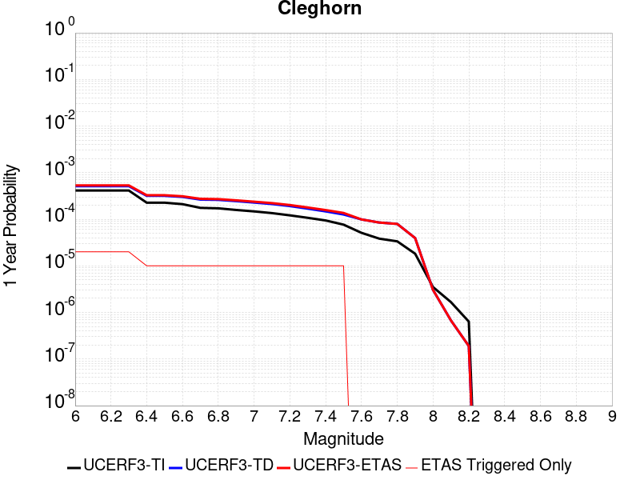 | 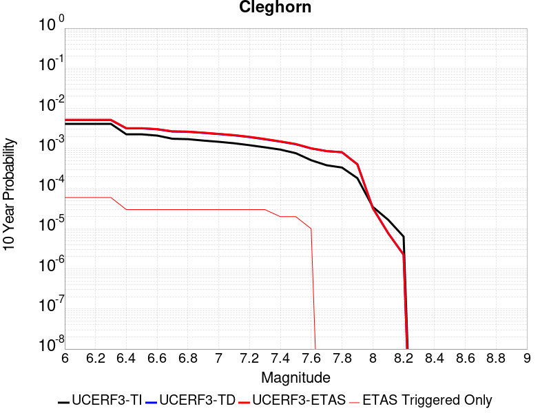 |

| Magnitude | 1 wk TI Prob | 1 wk TD Prob | 1 wk ETAS Prob | 1 wk ETAS/TD Gain | 1 wk ETAS Triggered Only | 1 mo TI Prob | 1 mo TD Prob | 1 mo ETAS Prob | 1 mo ETAS/TD Gain | 1 mo ETAS Triggered Only | 1 yr TI Prob | 1 yr TD Prob | 1 yr ETAS Prob | 1 yr ETAS/TD Gain | 1 yr ETAS Triggered Only | 10 yr TI Prob | 10 yr TD Prob | 10 yr ETAS Prob | 10 yr ETAS/TD Gain | 10 yr ETAS Triggered Only |
|-----|-----|-----|-----|-----|-----|-----|-----|-----|-----|-----|-----|-----|-----|-----|-----|-----|-----|-----|-----|-----|
| 6.0 | 7.9267165E-6 | 9.831764E-6 | 9.831764E-6 | 1.0 | 0.0 | 3.39712E-5 | 4.2135514E-5 | 6.633643E-5 | 1.5743593 | 2.4201941E-5 | 4.1352084E-4 | 5.1288976E-4 | 5.6126877E-4 | 1.0943264 | 4.8403883E-5 | 0.004127522 | 0.005132214 | 0.0052044475 | 1.0140744 | 7.260582E-5 |
| 6.1 | 7.9267165E-6 | 9.831764E-6 | 9.831764E-6 | 1.0 | 0.0 | 3.39712E-5 | 4.2135514E-5 | 6.633643E-5 | 1.5743593 | 2.4201941E-5 | 4.1352084E-4 | 5.1288976E-4 | 5.6126877E-4 | 1.0943264 | 4.8403883E-5 | 0.004127522 | 0.005132214 | 0.0052044475 | 1.0140744 | 7.260582E-5 |
| 6.2 | 7.9267165E-6 | 9.831764E-6 | 9.831764E-6 | 1.0 | 0.0 | 3.39712E-5 | 4.2135514E-5 | 6.633643E-5 | 1.5743593 | 2.4201941E-5 | 4.1352084E-4 | 5.1288976E-4 | 5.6126877E-4 | 1.0943264 | 4.8403883E-5 | 0.004127522 | 0.005132214 | 0.0052044475 | 1.0140744 | 7.260582E-5 |
| 6.3 | 7.9267165E-6 | 9.831764E-6 | 9.831764E-6 | 1.0 | 0.0 | 3.39712E-5 | 4.2135514E-5 | 6.633643E-5 | 1.5743593 | 2.4201941E-5 | 4.1352084E-4 | 5.1288976E-4 | 5.6126877E-4 | 1.0943264 | 4.8403883E-5 | 0.004127522 | 0.005132214 | 0.0052044475 | 1.0140744 | 7.260582E-5 |
| 6.4 | 4.3445207E-6 | 6.0916254E-6 | 6.0916254E-6 | 1.0 | 0.0 | 1.8619241E-5 | 2.6106709E-5 | 2.6106709E-5 | 1.0 | 0.0 | 2.2666567E-4 | 3.1780385E-4 | 3.419981E-4 | 1.0761296 | 2.4201941E-5 | 0.0022643462 | 0.0031877246 | 0.003235974 | 1.015136 | 4.8403883E-5 |
| 6.5 | 4.3445207E-6 | 6.0916254E-6 | 6.0916254E-6 | 1.0 | 0.0 | 1.8619241E-5 | 2.6106709E-5 | 2.6106709E-5 | 1.0 | 0.0 | 2.2666567E-4 | 3.1780385E-4 | 3.419981E-4 | 1.0761296 | 2.4201941E-5 | 0.0022643462 | 0.0031877246 | 0.003235974 | 1.015136 | 4.8403883E-5 |
| 6.6 | 4.040109E-6 | 5.774033E-6 | 5.774033E-6 | 1.0 | 0.0 | 1.7314638E-5 | 2.4745626E-5 | 2.4745626E-5 | 1.0 | 0.0 | 2.1078532E-4 | 3.0123728E-4 | 3.2543193E-4 | 1.0803176 | 2.4201941E-5 | 0.002105855 | 0.0030225143 | 0.003070772 | 1.015966 | 4.8403883E-5 |
| 6.7 | 3.3632055E-6 | 5.06753E-6 | 5.06753E-6 | 1.0 | 0.0 | 1.4413658E-5 | 2.1717806E-5 | 2.1717806E-5 | 1.0 | 0.0 | 1.7547216E-4 | 2.643825E-4 | 2.8857807E-4 | 1.0915172 | 2.4201941E-5 | 0.0017533366 | 0.0026548486 | 0.002703124 | 1.0181838 | 4.8403883E-5 |
| 6.8 | 3.2902772E-6 | 4.9894375E-6 | 4.9894375E-6 | 1.0 | 0.0 | 1.4101111E-5 | 2.138313E-5 | 2.138313E-5 | 1.0 | 0.0 | 1.716675E-4 | 2.6030882E-4 | 2.8450447E-4 | 1.0929497 | 2.4201941E-5 | 0.0017153495 | 0.0026142076 | 0.0026624848 | 1.0184673 | 4.8403883E-5 |
| 6.9 | 3.031547E-6 | 4.6911987E-6 | 4.6911987E-6 | 1.0 | 0.0 | 1.299228E-5 | 2.0104984E-5 | 2.0104984E-5 | 1.0 | 0.0 | 1.5816953E-4 | 2.4475096E-4 | 2.6894698E-4 | 1.0988598 | 2.4201941E-5 | 0.00158057 | 0.0024589805 | 0.0025072652 | 1.0196362 | 4.8403883E-5 |
| 7.0 | 2.8259715E-6 | 4.3707637E-6 | 4.3707637E-6 | 1.0 | 0.0 | 1.211125E-5 | 1.8731711E-5 | 1.8731711E-5 | 1.0 | 0.0 | 1.4744449E-4 | 2.2803496E-4 | 2.5223137E-4 | 1.1061084 | 2.4201941E-5 | 0.001473467 | 0.0022921748 | 0.0023404676 | 1.0210686 | 4.8403883E-5 |
| 7.1 | 2.5962665E-6 | 4.065983E-6 | 4.065983E-6 | 1.0 | 0.0 | 1.1126809E-5 | 1.7425526E-5 | 1.7425526E-5 | 1.0 | 0.0 | 1.3546048E-4 | 2.1213535E-4 | 2.3633215E-4 | 1.114063 | 2.4201941E-5 | 0.0013537793 | 0.0021334959 | 0.0021817964 | 1.0226392 | 4.8403883E-5 |
| 7.2 | 2.3247253E-6 | 3.6765352E-6 | 3.6765352E-6 | 1.0 | 0.0 | 9.96307E-6 | 1.5756486E-5 | 1.5756486E-5 | 1.0 | 0.0 | 1.21293626E-4 | 1.9181852E-4 | 2.1601582E-4 | 1.1261468 | 2.4201941E-5 | 0.0012122744 | 0.0019307166 | 0.001979027 | 1.025022 | 4.8403883E-5 |
| 7.3 | 2.056928E-6 | 3.235253E-6 | 3.235253E-6 | 1.0 | 0.0 | 8.815376E-6 | 1.3865297E-5 | 1.3865297E-5 | 1.0 | 0.0 | 1.0732192E-4 | 1.6879707E-4 | 1.9299492E-4 | 1.1433547 | 2.4201941E-5 | 0.001072701 | 0.0017009423 | 0.0017492638 | 1.0284086 | 4.8403883E-5 |
| 7.4 | 1.8055999E-6 | 2.8256538E-6 | 2.8256538E-6 | 1.0 | 0.0 | 7.738263E-6 | 1.210989E-5 | 1.210989E-5 | 1.0 | 0.0 | 9.4209274E-5 | 1.4742807E-4 | 1.7162645E-4 | 1.1641368 | 2.4201941E-5 | 9.4169343E-4 | 0.0014876705 | 0.0015118364 | 1.0162442 | 2.4201941E-5 |
| 7.5 | 1.4683443E-6 | 2.4248943E-6 | 2.4248943E-6 | 1.0 | 0.0 | 6.292889E-6 | 1.0392363E-5 | 1.0392363E-5 | 1.0 | 0.0 | 7.661323E-5 | 1.2651978E-4 | 1.5071865E-4 | 1.1912656 | 2.4201941E-5 | 7.658682E-4 | 0.0012788812 | 0.0013030522 | 1.0189002 | 2.4201941E-5 |
| 7.6 | 9.804088E-7 | 1.9004091E-6 | 1.9004091E-6 | 1.0 | 0.0 | 4.201745E-6 | 8.144585E-6 | 8.144585E-6 | 1.0 | 0.0 | 5.1155046E-5 | 9.915586E-5 | 9.915586E-5 | 1.0 | 0.0 | 5.114327E-4 | 0.0010055583 | 0.0010055583 | 1.0 | 0.0 |
| 7.7 | 7.3434086E-7 | 1.6285549E-6 | 1.6285549E-6 | 1.0 | 0.0 | 3.1471714E-6 | 6.9795024E-6 | 6.9795024E-6 | 1.0 | 0.0 | 3.831614E-5 | 8.4972155E-5 | 8.4972155E-5 | 1.0 | 0.0 | 3.8309532E-4 | 8.6387293E-4 | 8.6387293E-4 | 1.0 | 0.0 |
| 7.8 | 6.434184E-7 | 1.5221389E-6 | 1.5221389E-6 | 1.0 | 0.0 | 2.7575045E-6 | 6.523436E-6 | 6.523436E-6 | 1.0 | 0.0 | 3.35721E-5 | 7.9419966E-5 | 7.9419966E-5 | 1.0 | 0.0 | 3.3567028E-4 | 8.080443E-4 | 8.080443E-4 | 1.0 | 0.0 |
| 7.9 | 3.4943926E-7 | 7.5750586E-7 | 7.5750586E-7 | 1.0 | 0.0 | 1.497596E-6 | 3.2464498E-6 | 3.2464498E-6 | 1.0 | 0.0 | 1.8233079E-5 | 3.9524817E-5 | 3.9524817E-5 | 1.0 | 0.0 | 1.8231584E-4 | 4.0401975E-4 | 4.0401975E-4 | 1.0 | 0.0 |
| 8.0 | 6.717524E-8 | 5.837515E-8 | 5.837515E-8 | 1.0 | 0.0 | 2.8789387E-7 | 2.501792E-7 | 2.501792E-7 | 1.0 | 0.0 | 3.505102E-6 | 3.0459275E-6 | 3.0459275E-6 | 1.0 | 0.0 | 3.5050467E-5 | 3.2751934E-5 | 3.2751934E-5 | 1.0 | 0.0 |
| 8.1 | 3.1984914E-8 | 1.2949885E-8 | 1.2949885E-8 | 1.0 | 0.0 | 1.370782E-7 | 5.549951E-8 | 5.549951E-8 | 1.0 | 0.0 | 1.6689258E-6 | 6.757063E-7 | 6.757063E-7 | 1.0 | 0.0 | 1.6689133E-5 | 7.741151E-6 | 7.741151E-6 | 1.0 | 0.0 |
| 8.2 | 1.21887656E-8 | 3.6471115E-9 | 3.6471115E-9 | 1.0 | 0.0 | 5.2237567E-8 | 1.563048E-8 | 1.563048E-8 | 1.0 | 0.0 | 6.359922E-7 | 1.9030107E-7 | 1.9030107E-7 | 1.0 | 0.0 | 6.3599036E-6 | 2.245849E-6 | 2.245849E-6 | 1.0 | 0.0 |

## Pisgah-Bullion Mtn-Mesquite Lk
*[(top)](#table-of-contents)*

| 1 Week | 1 Month | 1 Year | 10 Year |
|-----|-----|-----|-----|
|  |  |  |  |

| Magnitude | 1 wk TI Prob | 1 wk TD Prob | 1 wk ETAS Prob | 1 wk ETAS/TD Gain | 1 wk ETAS Triggered Only | 1 mo TI Prob | 1 mo TD Prob | 1 mo ETAS Prob | 1 mo ETAS/TD Gain | 1 mo ETAS Triggered Only | 1 yr TI Prob | 1 yr TD Prob | 1 yr ETAS Prob | 1 yr ETAS/TD Gain | 1 yr ETAS Triggered Only | 10 yr TI Prob | 10 yr TD Prob | 10 yr ETAS Prob | 10 yr ETAS/TD Gain | 10 yr ETAS Triggered Only |
|-----|-----|-----|-----|-----|-----|-----|-----|-----|-----|-----|-----|-----|-----|-----|-----|-----|-----|-----|-----|-----|
| 6.0 | 3.0240792E-5 | 2.40909E-5 | 2.40909E-5 | 1.0 | 0.0 | 1.2959696E-4 | 1.032432E-4 | 1.2744263E-4 | 1.2343926 | 2.4201941E-5 | 0.0015767008 | 0.0012563618 | 0.0013288764 | 1.0577179 | 7.260582E-5 | 0.015655609 | 0.012502613 | 0.012574311 | 1.0057347 | 7.260582E-5 |
| 6.1 | 3.0240792E-5 | 2.40909E-5 | 2.40909E-5 | 1.0 | 0.0 | 1.2959696E-4 | 1.032432E-4 | 1.2744263E-4 | 1.2343926 | 2.4201941E-5 | 0.0015767008 | 0.0012563618 | 0.0013288764 | 1.0577179 | 7.260582E-5 | 0.015655609 | 0.012502613 | 0.012574311 | 1.0057347 | 7.260582E-5 |
| 6.2 | 3.0240792E-5 | 2.40909E-5 | 2.40909E-5 | 1.0 | 0.0 | 1.2959696E-4 | 1.032432E-4 | 1.2744263E-4 | 1.2343926 | 2.4201941E-5 | 0.0015767008 | 0.0012563618 | 0.0013288764 | 1.0577179 | 7.260582E-5 | 0.015655609 | 0.012502613 | 0.012574311 | 1.0057347 | 7.260582E-5 |
| 6.3 | 2.0498217E-5 | 1.3638054E-5 | 1.3638054E-5 | 1.0 | 0.0 | 8.784654E-5 | 5.8447586E-5 | 8.264811E-5 | 1.4140552 | 2.4201941E-5 | 0.0010690069 | 7.1138324E-4 | 7.839374E-4 | 1.1019902 | 7.260582E-5 | 0.01063879 | 0.0070926864 | 0.0071647773 | 1.0101641 | 7.260582E-5 |
| 6.4 | 2.0498217E-5 | 1.3638054E-5 | 1.3638054E-5 | 1.0 | 0.0 | 8.784654E-5 | 5.8447586E-5 | 8.264811E-5 | 1.4140552 | 2.4201941E-5 | 0.0010690069 | 7.1138324E-4 | 7.839374E-4 | 1.1019902 | 7.260582E-5 | 0.01063879 | 0.0070926864 | 0.0071647773 | 1.0101641 | 7.260582E-5 |
| 6.5 | 1.7316182E-5 | 1.04769715E-5 | 1.04769715E-5 | 1.0 | 0.0 | 7.42101E-5 | 4.490059E-5 | 6.910144E-5 | 1.5389874 | 2.4201941E-5 | 9.0313336E-4 | 5.465376E-4 | 5.94915E-4 | 1.0885162 | 4.8403883E-5 | 0.008994718 | 0.00545293 | 0.00550107 | 1.0088283 | 4.8403883E-5 |
| 6.6 | 1.5251077E-5 | 8.414133E-6 | 8.414133E-6 | 1.0 | 0.0 | 6.536012E-5 | 3.606011E-5 | 6.026118E-5 | 1.6711313 | 2.4201941E-5 | 7.9546886E-4 | 4.3895066E-4 | 4.8733328E-4 | 1.1102234 | 4.8403883E-5 | 0.007926274 | 0.0043815537 | 0.0044297455 | 1.0109988 | 4.8403883E-5 |
| 6.7 | 1.2997425E-5 | 6.4112146E-6 | 6.4112146E-6 | 1.0 | 0.0 | 5.570206E-5 | 2.7476372E-5 | 5.1677645E-5 | 1.8808032 | 2.4201941E-5 | 6.7796157E-4 | 3.3447813E-4 | 3.828658E-4 | 1.1446662 | 4.8403883E-5 | 0.0067589693 | 0.003340207 | 0.0033884493 | 1.0144429 | 4.8403883E-5 |
| 6.8 | 1.035386E-5 | 4.333145E-6 | 4.333145E-6 | 1.0 | 0.0 | 4.437293E-5 | 1.8570496E-5 | 1.8570496E-5 | 1.0 | 0.0 | 5.401065E-4 | 2.260732E-4 | 2.5026966E-4 | 1.1070293 | 2.4201941E-5 | 0.0053879567 | 0.002258519 | 0.0022826663 | 1.0106916 | 2.4201941E-5 |
| 6.9 | 8.816252E-6 | 3.5805879E-6 | 3.5805879E-6 | 1.0 | 0.0 | 3.778339E-5 | 1.534529E-5 | 1.534529E-5 | 1.0 | 0.0 | 4.5991567E-4 | 1.8681347E-4 | 2.1101089E-4 | 1.1295272 | 2.4201941E-5 | 0.00458965 | 0.0018666228 | 0.0018907796 | 1.0129415 | 2.4201941E-5 |
| 7.0 | 6.8232207E-6 | 2.5674399E-6 | 2.5674399E-6 | 1.0 | 0.0 | 2.9242048E-5 | 1.100327E-5 | 1.100327E-5 | 1.0 | 0.0 | 3.5596377E-4 | 1.3395688E-4 | 1.3395688E-4 | 1.0 | 0.0 | 0.0035539411 | 0.0013387925 | 0.0013387925 | 1.0 | 0.0 |
| 7.1 | 5.837013E-6 | 2.2273143E-6 | 2.2273143E-6 | 1.0 | 0.0 | 2.501553E-5 | 9.5456E-6 | 9.5456E-6 | 1.0 | 0.0 | 3.045215E-4 | 1.1621177E-4 | 1.1621177E-4 | 1.0 | 0.0 | 0.0030410455 | 0.001161539 | 0.001161539 | 1.0 | 0.0 |
| 7.2 | 4.278052E-6 | 1.6275065E-6 | 1.6275065E-6 | 1.0 | 0.0 | 1.833438E-5 | 6.975011E-6 | 6.975011E-6 | 1.0 | 0.0 | 2.231982E-4 | 8.491768E-5 | 8.491768E-5 | 1.0 | 0.0 | 0.0022297418 | 8.4887556E-4 | 8.4887556E-4 | 1.0 | 0.0 |
| 7.3 | 1.8803692E-6 | 8.344788E-7 | 8.344788E-7 | 1.0 | 0.0 | 8.0587E-6 | 3.5763337E-6 | 3.5763337E-6 | 1.0 | 0.0 | 9.811026E-5 | 4.354114E-5 | 4.354114E-5 | 1.0 | 0.0 | 9.806695E-4 | 4.3534054E-4 | 4.3534054E-4 | 1.0 | 0.0 |

## Rodgers Creek - Healdsburg 2011 CFM
*[(top)](#table-of-contents)*

| 1 Week | 1 Month | 1 Year | 10 Year |
|-----|-----|-----|-----|
|  |  |  |  |

| Magnitude | 1 wk TI Prob | 1 wk TD Prob | 1 wk ETAS Prob | 1 wk ETAS/TD Gain | 1 wk ETAS Triggered Only | 1 mo TI Prob | 1 mo TD Prob | 1 mo ETAS Prob | 1 mo ETAS/TD Gain | 1 mo ETAS Triggered Only | 1 yr TI Prob | 1 yr TD Prob | 1 yr ETAS Prob | 1 yr ETAS/TD Gain | 1 yr ETAS Triggered Only | 10 yr TI Prob | 10 yr TD Prob | 10 yr ETAS Prob | 10 yr ETAS/TD Gain | 10 yr ETAS Triggered Only |
|-----|-----|-----|-----|-----|-----|-----|-----|-----|-----|-----|-----|-----|-----|-----|-----|-----|-----|-----|-----|-----|
| 6.0 | 7.390182E-5 | 1.3137296E-4 | 1.3137296E-4 | 1.0 | 0.0 | 3.1668364E-4 | 5.629057E-4 | 5.629057E-4 | 1.0 | 0.0 | 0.0038488081 | 0.0068318076 | 0.006855844 | 1.0035183 | 2.4201941E-5 | 0.037828278 | 0.06618395 | 0.06622915 | 1.000683 | 4.8403883E-5 |
| 6.1 | 7.318768E-5 | 1.303531E-4 | 1.303531E-4 | 1.0 | 0.0 | 3.1362378E-4 | 5.585369E-4 | 5.585369E-4 | 1.0 | 0.0 | 0.0038116854 | 0.006778966 | 0.006803004 | 1.003546 | 2.4201941E-5 | 0.037469655 | 0.06568854 | 0.06573377 | 1.0006884 | 4.8403883E-5 |
| 6.2 | 7.1379836E-5 | 1.2728151E-4 | 1.2728151E-4 | 1.0 | 0.0 | 3.058777E-4 | 5.453785E-4 | 5.453785E-4 | 1.0 | 0.0 | 0.003717703 | 0.0066197454 | 0.006643787 | 1.0036318 | 2.4201941E-5 | 0.0365612 | 0.06421061 | 0.0642559 | 1.0007055 | 4.8403883E-5 |
| 6.3 | 6.9255926E-5 | 1.2382482E-4 | 1.2382482E-4 | 1.0 | 0.0 | 2.9677735E-4 | 5.305703E-4 | 5.305703E-4 | 1.0 | 0.0 | 0.0036072785 | 0.0064406106 | 0.006464657 | 1.0037335 | 2.4201941E-5 | 0.035492823 | 0.062541805 | 0.06258719 | 1.0007255 | 4.8403883E-5 |
| 6.4 | 6.6757144E-5 | 1.195919E-4 | 1.195919E-4 | 1.0 | 0.0 | 2.8607066E-4 | 5.1243644E-4 | 5.1243644E-4 | 1.0 | 0.0 | 0.0034773487 | 0.00622114 | 0.006245191 | 1.0038661 | 2.4201941E-5 | 0.034234364 | 0.060491614 | 0.06053709 | 1.0007517 | 4.8403883E-5 |
| 6.5 | 6.5735134E-5 | 1.180849E-4 | 1.180849E-4 | 1.0 | 0.0 | 2.8169158E-4 | 5.059804E-4 | 5.059804E-4 | 1.0 | 0.0 | 0.003424202 | 0.0061429944 | 0.0061670477 | 1.0039155 | 2.4201941E-5 | 0.03371918 | 0.059755705 | 0.059801217 | 1.0007616 | 4.8403883E-5 |
| 6.6 | 6.289601E-5 | 1.13442366E-4 | 1.13442366E-4 | 1.0 | 0.0 | 2.6952647E-4 | 4.8609133E-4 | 4.8609133E-4 | 1.0 | 0.0 | 0.0032765474 | 0.005902183 | 0.005926242 | 1.0040764 | 2.4201941E-5 | 0.032286562 | 0.057495043 | 0.057540663 | 1.0007935 | 4.8403883E-5 |
| 6.7 | 6.115274E-5 | 1.106132E-4 | 1.106132E-4 | 1.0 | 0.0 | 2.6205686E-4 | 4.739708E-4 | 4.739708E-4 | 1.0 | 0.0 | 0.0031858748 | 0.0057554054 | 0.005779468 | 1.0041809 | 2.4201941E-5 | 0.031405866 | 0.05611361 | 0.0561593 | 1.0008142 | 4.8403883E-5 |
| 6.8 | 5.9232367E-5 | 1.0728657E-4 | 1.0728657E-4 | 1.0 | 0.0 | 2.538283E-4 | 4.5971893E-4 | 4.5971893E-4 | 1.0 | 0.0 | 0.0030859804 | 0.005582791 | 0.0056068576 | 1.0043108 | 2.4201941E-5 | 0.030434765 | 0.05448041 | 0.05452618 | 1.0008401 | 4.8403883E-5 |
| 6.9 | 5.4030377E-5 | 9.8228295E-5 | 9.8228295E-5 | 1.0 | 0.0 | 2.315382E-4 | 4.209108E-4 | 4.209108E-4 | 1.0 | 0.0 | 0.0028153337 | 0.0051126136 | 0.005136692 | 1.0047096 | 2.4201941E-5 | 0.027799325 | 0.05001572 | 0.050061703 | 1.0009193 | 4.8403883E-5 |
| 7.0 | 4.8260714E-5 | 8.7408924E-5 | 8.7408924E-5 | 1.0 | 0.0 | 2.0681522E-4 | 3.7455617E-4 | 3.7455617E-4 | 1.0 | 0.0 | 0.0025150678 | 0.0045507406 | 0.0045748325 | 1.0052941 | 2.4201941E-5 | 0.024867928 | 0.044667073 | 0.044713315 | 1.0010352 | 4.8403883E-5 |
| 7.1 | 4.0294493E-5 | 7.389363E-5 | 7.389363E-5 | 1.0 | 0.0 | 1.7267925E-4 | 3.1664874E-4 | 3.1664874E-4 | 1.0 | 0.0 | 0.0021003427 | 0.0038484214 | 0.0038725303 | 1.0062646 | 2.4201941E-5 | 0.02080602 | 0.037923187 | 0.037969757 | 1.001228 | 4.8403883E-5 |
| 7.2 | 3.096388E-5 | 5.698023E-5 | 5.698023E-5 | 1.0 | 0.0 | 1.326956E-4 | 2.4417826E-4 | 2.4417826E-4 | 1.0 | 0.0 | 0.0016143717 | 0.0029688394 | 0.0029929695 | 1.0081278 | 2.4201941E-5 | 0.01602694 | 0.029437006 | 0.029460495 | 1.000798 | 2.4201941E-5 |
| 7.3 | 2.3615226E-5 | 4.3629818E-5 | 4.3629818E-5 | 1.0 | 0.0 | 1.0120418E-4 | 1.869716E-4 | 1.869716E-4 | 1.0 | 0.0 | 0.0012314644 | 0.0022740164 | 0.0022981633 | 1.0106186 | 2.4201941E-5 | 0.0122466255 | 0.022637889 | 0.022661543 | 1.0010449 | 2.4201941E-5 |
| 7.4 | 1.8251132E-5 | 3.3542477E-5 | 3.3542477E-5 | 1.0 | 0.0 | 7.821679E-5 | 1.4374561E-4 | 1.4374561E-4 | 1.0 | 0.0 | 9.518733E-4 | 0.0017487077 | 0.0017487077 | 1.0 | 0.0 | 0.009478063 | 0.017466031 | 0.017466031 | 1.0 | 0.0 |
| 7.5 | 1.2411432E-5 | 2.2461069E-5 | 2.2461069E-5 | 1.0 | 0.0 | 5.3190768E-5 | 9.6258205E-5 | 9.6258205E-5 | 1.0 | 0.0 | 6.4740516E-4 | 0.0011713194 | 0.0011713194 | 1.0 | 0.0 | 0.006455223 | 0.011743137 | 0.011743137 | 1.0 | 0.0 |
| 7.6 | 4.4771446E-6 | 8.08443E-6 | 8.08443E-6 | 1.0 | 0.0 | 1.918762E-5 | 3.4647102E-5 | 3.4647102E-5 | 1.0 | 0.0 | 2.3358424E-4 | 4.2174806E-4 | 4.2174806E-4 | 1.0 | 0.0 | 0.0023333887 | 0.0042453306 | 0.0042453306 | 1.0 | 0.0 |
| 7.7 | 2.157941E-7 | 3.5350925E-7 | 3.5350925E-7 | 1.0 | 0.0 | 9.248315E-7 | 1.5150388E-6 | 1.5150388E-6 | 1.0 | 0.0 | 1.1259765E-5 | 1.844544E-5 | 1.844544E-5 | 1.0 | 0.0 | 1.1259195E-4 | 1.9069649E-4 | 1.9069649E-4 | 1.0 | 0.0 |
| 7.8 | 9.9623286E-8 | 1.9900986E-7 | 1.9900986E-7 | 1.0 | 0.0 | 4.269569E-7 | 8.528991E-7 | 8.528991E-7 | 1.0 | 0.0 | 5.1981874E-6 | 1.03839975E-5 | 1.03839975E-5 | 1.0 | 0.0 | 5.198066E-5 | 1.0902916E-4 | 1.0902916E-4 | 1.0 | 0.0 |
| 7.9 | 5.6745257E-8 | 1.1774714E-7 | 1.1774714E-7 | 1.0 | 0.0 | 2.4319394E-7 | 5.046305E-7 | 5.046305E-7 | 1.0 | 0.0 | 2.960882E-6 | 6.143859E-6 | 6.143859E-6 | 1.0 | 0.0 | 2.9608427E-5 | 6.471445E-5 | 6.471445E-5 | 1.0 | 0.0 |
| 8.0 | 2.8614323E-8 | 6.5789635E-8 | 6.5789635E-8 | 1.0 | 0.0 | 1.2263281E-7 | 2.8195555E-7 | 2.8195555E-7 | 1.0 | 0.0 | 1.4930534E-6 | 3.4328034E-6 | 3.4328034E-6 | 1.0 | 0.0 | 1.4930434E-5 | 3.5830046E-5 | 3.5830046E-5 | 1.0 | 0.0 |
| 8.1 | 3.5045191E-9 | 8.966459E-9 | 8.966459E-9 | 1.0 | 0.0 | 1.5019367E-8 | 3.8427682E-8 | 3.8427682E-8 | 1.0 | 0.0 | 1.8286079E-7 | 4.6785692E-7 | 4.6785692E-7 | 1.0 | 0.0 | 1.8286064E-6 | 4.834128E-6 | 4.834128E-6 | 1.0 | 0.0 |

## San Pedro Basin
*[(top)](#table-of-contents)*

| 1 Week | 1 Month | 1 Year | 10 Year |
|-----|-----|-----|-----|
|  |  |  |  |

| Magnitude | 1 wk TI Prob | 1 wk TD Prob | 1 wk ETAS Prob | 1 wk ETAS/TD Gain | 1 wk ETAS Triggered Only | 1 mo TI Prob | 1 mo TD Prob | 1 mo ETAS Prob | 1 mo ETAS/TD Gain | 1 mo ETAS Triggered Only | 1 yr TI Prob | 1 yr TD Prob | 1 yr ETAS Prob | 1 yr ETAS/TD Gain | 1 yr ETAS Triggered Only | 10 yr TI Prob | 10 yr TD Prob | 10 yr ETAS Prob | 10 yr ETAS/TD Gain | 10 yr ETAS Triggered Only |
|-----|-----|-----|-----|-----|-----|-----|-----|-----|-----|-----|-----|-----|-----|-----|-----|-----|-----|-----|-----|-----|
| 6.0 | 5.3449043E-5 | 6.337018E-5 | 6.337018E-5 | 1.0 | 0.0 | 2.2904722E-4 | 2.7156167E-4 | 2.7156167E-4 | 1.0 | 0.0 | 0.0027850836 | 0.0033018515 | 0.0033500954 | 1.0146112 | 4.8403883E-5 | 0.027504366 | 0.03258948 | 0.032636307 | 1.0014368 | 4.8403883E-5 |
| 6.1 | 5.3449043E-5 | 6.337018E-5 | 6.337018E-5 | 1.0 | 0.0 | 2.2904722E-4 | 2.7156167E-4 | 2.7156167E-4 | 1.0 | 0.0 | 0.0027850836 | 0.0033018515 | 0.0033500954 | 1.0146112 | 4.8403883E-5 | 0.027504366 | 0.03258948 | 0.032636307 | 1.0014368 | 4.8403883E-5 |
| 6.2 | 2.3189454E-5 | 2.6642829E-5 | 2.6642829E-5 | 1.0 | 0.0 | 9.9379584E-5 | 1.1417881E-4 | 1.1417881E-4 | 1.0 | 0.0 | 0.0012092749 | 0.0013892875 | 0.0014134559 | 1.0173962 | 2.4201941E-5 | 0.012027155 | 0.01381089 | 0.013834758 | 1.0017282 | 2.4201941E-5 |
| 6.3 | 2.3189454E-5 | 2.6642829E-5 | 2.6642829E-5 | 1.0 | 0.0 | 9.9379584E-5 | 1.1417881E-4 | 1.1417881E-4 | 1.0 | 0.0 | 0.0012092749 | 0.0013892875 | 0.0014134559 | 1.0173962 | 2.4201941E-5 | 0.012027155 | 0.01381089 | 0.013834758 | 1.0017282 | 2.4201941E-5 |
| 6.4 | 1.966056E-5 | 2.246342E-5 | 2.246342E-5 | 1.0 | 0.0 | 8.425682E-5 | 9.626848E-5 | 9.626848E-5 | 1.0 | 0.0 | 0.001025344 | 0.0011714787 | 0.0011956522 | 1.0206351 | 2.4201941E-5 | 0.010206259 | 0.011657119 | 0.011681039 | 1.002052 | 2.4201941E-5 |
| 6.5 | 1.7342953E-5 | 1.9745152E-5 | 1.9745152E-5 | 1.0 | 0.0 | 7.4324824E-5 | 8.461954E-5 | 8.461954E-5 | 1.0 | 0.0 | 9.04529E-4 | 0.0010297929 | 0.0010297929 | 1.0 | 0.0 | 0.009008561 | 0.010253932 | 0.010253932 | 1.0 | 0.0 |
| 6.6 | 1.439804E-5 | 1.6322716E-5 | 1.6322716E-5 | 1.0 | 0.0 | 6.170443E-5 | 6.99528E-5 | 6.99528E-5 | 1.0 | 0.0 | 7.509924E-4 | 8.513747E-4 | 8.513747E-4 | 1.0 | 0.0 | 0.0074845953 | 0.008484333 | 0.008484333 | 1.0 | 0.0 |
| 6.7 | 1.2634884E-5 | 1.4285298E-5 | 1.4285298E-5 | 1.0 | 0.0 | 5.414838E-5 | 6.122144E-5 | 6.122144E-5 | 1.0 | 0.0 | 6.590571E-4 | 7.451466E-4 | 7.451466E-4 | 1.0 | 0.0 | 0.006571059 | 0.007429502 | 0.007429502 | 1.0 | 0.0 |
| 6.8 | 1.146091E-5 | 1.2933193E-5 | 1.2933193E-5 | 1.0 | 0.0 | 4.911726E-5 | 5.542696E-5 | 5.542696E-5 | 1.0 | 0.0 | 5.9783855E-4 | 6.74644E-4 | 6.74644E-4 | 1.0 | 0.0 | 0.0059623276 | 0.0067288997 | 0.0067288997 | 1.0 | 0.0 |
| 6.9 | 9.109035E-6 | 1.0235013E-5 | 1.0235013E-5 | 1.0 | 0.0 | 3.9038136E-5 | 4.386376E-5 | 4.386376E-5 | 1.0 | 0.0 | 4.7518566E-4 | 5.339384E-4 | 5.339384E-4 | 1.0 | 0.0 | 0.0047417083 | 0.0053293095 | 0.0053293095 | 1.0 | 0.0 |
| 7.0 | 5.9351028E-6 | 6.583965E-6 | 6.583965E-6 | 1.0 | 0.0 | 2.5435906E-5 | 2.821682E-5 | 2.821682E-5 | 1.0 | 0.0 | 3.0963816E-4 | 3.4350925E-4 | 3.4350925E-4 | 1.0 | 0.0 | 0.0030920706 | 0.0034320997 | 0.0034320997 | 1.0 | 0.0 |
| 7.1 | 2.1557585E-6 | 2.2096492E-6 | 2.2096492E-6 | 1.0 | 0.0 | 9.238933E-6 | 9.469892E-6 | 9.469892E-6 | 1.0 | 0.0 | 1.1247819E-4 | 1.15289986E-4 | 1.15289986E-4 | 1.0 | 0.0 | 0.0011242128 | 0.0011523172 | 0.0011523172 | 1.0 | 0.0 |
| 7.2 | 2.1251979E-6 | 2.1779954E-6 | 2.1779954E-6 | 1.0 | 0.0 | 9.107958E-6 | 9.334234E-6 | 9.334234E-6 | 1.0 | 0.0 | 1.1088375E-4 | 1.13638525E-4 | 1.13638525E-4 | 1.0 | 0.0 | 0.0011082845 | 0.0011358195 | 0.0011358195 | 1.0 | 0.0 |
| 7.3 | 1.7145798E-6 | 1.7442885E-6 | 1.7442885E-6 | 1.0 | 0.0 | 7.3481783E-6 | 7.475501E-6 | 7.475501E-6 | 1.0 | 0.0 | 8.94604E-5 | 9.1010515E-5 | 9.1010515E-5 | 1.0 | 0.0 | 8.9424395E-4 | 9.0974156E-4 | 9.0974156E-4 | 1.0 | 0.0 |
| 7.4 | 1.4467993E-6 | 1.4641878E-6 | 1.4641878E-6 | 1.0 | 0.0 | 6.200554E-6 | 6.275076E-6 | 6.275076E-6 | 1.0 | 0.0 | 7.548913E-5 | 7.639644E-5 | 7.639644E-5 | 1.0 | 0.0 | 7.546349E-4 | 7.6370913E-4 | 7.6370913E-4 | 1.0 | 0.0 |
| 7.5 | 1.2803735E-6 | 1.2931506E-6 | 1.2931506E-6 | 1.0 | 0.0 | 5.487303E-6 | 5.5420624E-6 | 5.5420624E-6 | 1.0 | 0.0 | 6.680587E-5 | 6.747259E-5 | 6.747259E-5 | 1.0 | 0.0 | 6.678579E-4 | 6.745281E-4 | 6.745281E-4 | 1.0 | 0.0 |
| 7.6 | 6.755009E-7 | 6.76947E-7 | 6.76947E-7 | 1.0 | 0.0 | 2.8950008E-6 | 2.9011985E-6 | 2.9011985E-6 | 1.0 | 0.0 | 3.5246063E-5 | 3.532158E-5 | 3.532158E-5 | 1.0 | 0.0 | 3.5240475E-4 | 3.5316538E-4 | 3.5316538E-4 | 1.0 | 0.0 |
| 7.7 | 6.211885E-8 | 4.5699714E-8 | 4.5699714E-8 | 1.0 | 0.0 | 2.6622362E-7 | 1.9585592E-7 | 1.9585592E-7 | 1.0 | 0.0 | 3.2412677E-6 | 2.3845432E-6 | 2.3845432E-6 | 1.0 | 0.0 | 3.2412205E-5 | 2.3845198E-5 | 2.3845198E-5 | 1.0 | 0.0 |
| 7.8 | 2.6580573E-9 | 1.5138054E-9 | 1.5138054E-9 | 1.0 | 0.0 | 1.1391674E-8 | 6.4877375E-9 | 6.4877375E-9 | 1.0 | 0.0 | 1.3869362E-7 | 7.89882E-8 | 7.89882E-8 | 1.0 | 0.0 | 1.3869354E-6 | 7.89882E-7 | 7.89882E-7 | 1.0 | 0.0 |

## Hayward (So) 2011 CFM
*[(top)](#table-of-contents)*

| 1 Week | 1 Month | 1 Year | 10 Year |
|-----|-----|-----|-----|
|  |  | 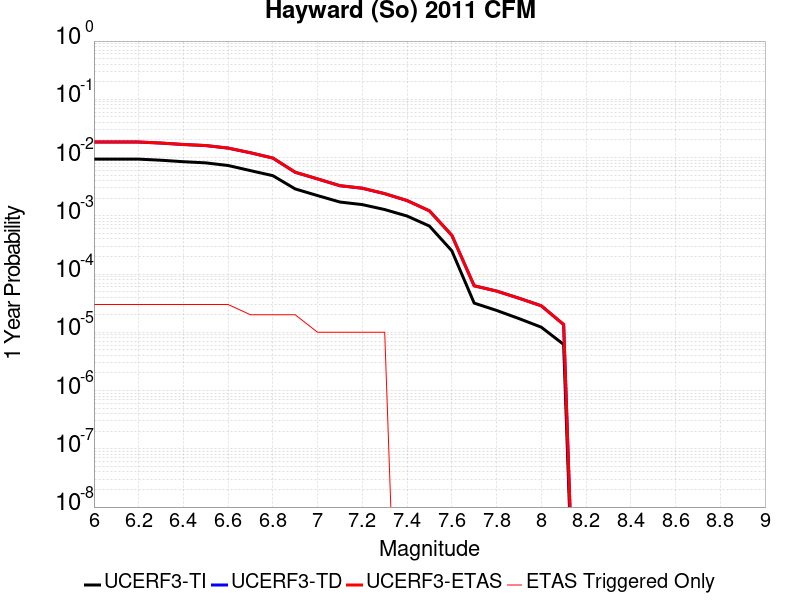 |  |

| Magnitude | 1 wk TI Prob | 1 wk TD Prob | 1 wk ETAS Prob | 1 wk ETAS/TD Gain | 1 wk ETAS Triggered Only | 1 mo TI Prob | 1 mo TD Prob | 1 mo ETAS Prob | 1 mo ETAS/TD Gain | 1 mo ETAS Triggered Only | 1 yr TI Prob | 1 yr TD Prob | 1 yr ETAS Prob | 1 yr ETAS/TD Gain | 1 yr ETAS Triggered Only | 10 yr TI Prob | 10 yr TD Prob | 10 yr ETAS Prob | 10 yr ETAS/TD Gain | 10 yr ETAS Triggered Only |
|-----|-----|-----|-----|-----|-----|-----|-----|-----|-----|-----|-----|-----|-----|-----|-----|-----|-----|-----|-----|-----|
| 6.0 | 1.8091932E-4 | 3.570673E-4 | 3.812606E-4 | 1.0677556 | 2.4201941E-5 | 7.751381E-4 | 0.0015294008 | 0.0015535657 | 1.0158002 | 2.4201941E-5 | 0.00939654 | 0.018463885 | 0.018511396 | 1.0025731 | 4.8403883E-5 | 0.090090066 | 0.1667085 | 0.16674882 | 1.000242 | 4.8403883E-5 |
| 6.1 | 1.8091932E-4 | 3.570673E-4 | 3.812606E-4 | 1.0677556 | 2.4201941E-5 | 7.751381E-4 | 0.0015294008 | 0.0015535657 | 1.0158002 | 2.4201941E-5 | 0.00939654 | 0.018463885 | 0.018511396 | 1.0025731 | 4.8403883E-5 | 0.090090066 | 0.1667085 | 0.16674882 | 1.000242 | 4.8403883E-5 |
| 6.2 | 1.8091932E-4 | 3.570673E-4 | 3.812606E-4 | 1.0677556 | 2.4201941E-5 | 7.751381E-4 | 0.0015294008 | 0.0015535657 | 1.0158002 | 2.4201941E-5 | 0.00939654 | 0.018463885 | 0.018511396 | 1.0025731 | 4.8403883E-5 | 0.090090066 | 0.1667085 | 0.16674882 | 1.000242 | 4.8403883E-5 |
| 6.3 | 1.7322872E-4 | 3.4263515E-4 | 3.668288E-4 | 1.0706105 | 2.4201941E-5 | 7.4219756E-4 | 0.0014676197 | 0.0014917861 | 1.0164664 | 2.4201941E-5 | 0.0089988755 | 0.017724147 | 0.017771693 | 1.0026826 | 4.8403883E-5 | 0.08643075 | 0.16065954 | 0.16070016 | 1.0002528 | 4.8403883E-5 |
| 6.4 | 1.6334097E-4 | 3.2345165E-4 | 3.4764575E-4 | 1.0747998 | 2.4201941E-5 | 6.998449E-4 | 0.0013854936 | 0.001409662 | 1.0174439 | 2.4201941E-5 | 0.008487372 | 0.016739927 | 0.01678752 | 1.0028431 | 4.8403883E-5 | 0.081704415 | 0.15256606 | 0.15260707 | 1.0002688 | 4.8403883E-5 |
| 6.5 | 1.5600289E-4 | 3.101982E-4 | 3.3439262E-4 | 1.0779967 | 2.4201941E-5 | 6.684125E-4 | 0.0013287518 | 0.0013529216 | 1.0181898 | 2.4201941E-5 | 0.008107598 | 0.016059443 | 0.016107071 | 1.0029657 | 4.8403883E-5 | 0.078181036 | 0.14684291 | 0.1468842 | 1.0002812 | 4.8403883E-5 |
| 6.6 | 1.4046066E-4 | 2.8034003E-4 | 3.045352E-4 | 1.0863065 | 2.4201941E-5 | 6.018354E-4 | 0.0012009109 | 0.0012250837 | 1.0201287 | 2.4201941E-5 | 0.0073027555 | 0.014524571 | 0.014572271 | 1.0032841 | 4.8403883E-5 | 0.07067384 | 0.13393044 | 0.13397238 | 1.000313 | 4.8403883E-5 |
| 6.7 | 1.14696966E-4 | 2.3272466E-4 | 2.5692096E-4 | 1.1039697 | 2.4201941E-5 | 4.914658E-4 | 9.970153E-4 | 0.001021193 | 1.0242501 | 2.4201941E-5 | 0.0059671924 | 0.012072163 | 0.012119982 | 1.0039611 | 4.8403883E-5 | 0.058094822 | 0.11274141 | 0.112784356 | 1.0003809 | 4.8403883E-5 |
| 6.8 | 9.3874296E-5 | 1.8862431E-4 | 2.1282169E-4 | 1.1282835 | 2.4201941E-5 | 4.0225635E-4 | 8.081431E-4 | 8.323255E-4 | 1.0299234 | 2.4201941E-5 | 0.0048864787 | 0.009795489 | 0.009843419 | 1.0048931 | 4.8403883E-5 | 0.047804173 | 0.092592984 | 0.09263691 | 1.0004743 | 4.8403883E-5 |
| 6.9 | 5.551852E-5 | 1.0729875E-4 | 1.3149809E-4 | 1.2255324 | 2.4201941E-5 | 2.3791482E-4 | 4.5977137E-4 | 4.8396218E-4 | 1.0526149 | 2.4201941E-5 | 0.0028927654 | 0.005583468 | 0.0056316014 | 1.0086207 | 4.8403883E-5 | 0.028553981 | 0.054246075 | 0.05429185 | 1.0008439 | 4.8403883E-5 |
| 7.0 | 4.2662363E-5 | 8.246792E-5 | 8.246792E-5 | 1.0 | 0.0 | 1.8282588E-4 | 3.5338648E-4 | 3.5338648E-4 | 1.0 | 0.0 | 0.0022236328 | 0.0042940658 | 0.0043181637 | 1.0056119 | 2.4201941E-5 | 0.022015138 | 0.04206509 | 0.042088274 | 1.0005511 | 2.4201941E-5 |
| 7.1 | 3.305886E-5 | 6.302183E-5 | 6.302183E-5 | 1.0 | 0.0 | 1.4167312E-4 | 2.7006568E-4 | 2.7006568E-4 | 1.0 | 0.0 | 0.0017235056 | 0.003283111 | 0.0033072336 | 1.0073475 | 2.4201941E-5 | 0.017101998 | 0.032453902 | 0.03247732 | 1.0007216 | 2.4201941E-5 |
| 7.2 | 2.9856887E-5 | 5.701622E-5 | 5.701622E-5 | 1.0 | 0.0 | 1.2795182E-4 | 2.4433242E-4 | 2.4433242E-4 | 1.0 | 0.0 | 0.0015567001 | 0.0029707062 | 0.0029948363 | 1.0081227 | 2.4201941E-5 | 0.015458403 | 0.029454801 | 0.02947829 | 1.0007975 | 2.4201941E-5 |
| 7.3 | 2.4559737E-5 | 4.599286E-5 | 4.599286E-5 | 1.0 | 0.0 | 1.0525176E-4 | 1.9709744E-4 | 1.9709744E-4 | 1.0 | 0.0 | 0.0012806869 | 0.0023970334 | 0.0024211772 | 1.0100725 | 2.4201941E-5 | 0.012733313 | 0.023858516 | 0.023882141 | 1.0009902 | 2.4201941E-5 |
| 7.4 | 1.9002231E-5 | 3.505084E-5 | 3.505084E-5 | 1.0 | 0.0 | 8.143559E-5 | 1.502093E-4 | 1.502093E-4 | 1.0 | 0.0 | 9.910273E-4 | 0.001827274 | 0.001827274 | 1.0 | 0.0 | 0.009866194 | 0.018258808 | 0.018258808 | 1.0 | 0.0 |
| 7.5 | 1.2783333E-5 | 2.3331182E-5 | 2.3331182E-5 | 1.0 | 0.0 | 5.4784563E-5 | 9.998698E-5 | 9.998698E-5 | 1.0 | 0.0 | 6.667979E-4 | 0.0012166675 | 0.0012166675 | 1.0 | 0.0 | 0.006648007 | 0.012209443 | 0.012209443 | 1.0 | 0.0 |
| 7.6 | 4.8149627E-6 | 8.888056E-6 | 8.888056E-6 | 1.0 | 0.0 | 2.063539E-5 | 3.8091122E-5 | 3.8091122E-5 | 1.0 | 0.0 | 2.5120692E-4 | 4.6366194E-4 | 4.6366194E-4 | 1.0 | 0.0 | 0.0025092314 | 0.0046805087 | 0.0046805087 | 1.0 | 0.0 |
| 7.7 | 6.0838227E-7 | 1.205754E-6 | 1.205754E-6 | 1.0 | 0.0 | 2.6073499E-6 | 5.1675065E-6 | 5.1675065E-6 | 1.0 | 0.0 | 3.174402E-5 | 6.291258E-5 | 6.291258E-5 | 1.0 | 0.0 | 3.1739488E-4 | 6.5296254E-4 | 6.5296254E-4 | 1.0 | 0.0 |
| 7.8 | 4.5542808E-7 | 9.792941E-7 | 9.792941E-7 | 1.0 | 0.0 | 1.9518332E-6 | 4.196968E-6 | 4.196968E-6 | 1.0 | 0.0 | 2.376331E-5 | 5.109689E-5 | 5.109689E-5 | 1.0 | 0.0 | 2.3760769E-4 | 5.321693E-4 | 5.321693E-4 | 1.0 | 0.0 |
| 7.9 | 3.3016747E-7 | 7.3869535E-7 | 7.3869535E-7 | 1.0 | 0.0 | 1.4150027E-6 | 3.1658333E-6 | 3.1658333E-6 | 1.0 | 0.0 | 1.7227521E-5 | 3.854334E-5 | 3.854334E-5 | 1.0 | 0.0 | 1.7226185E-4 | 3.9932923E-4 | 3.9932923E-4 | 1.0 | 0.0 |
| 8.0 | 2.347038E-7 | 5.471963E-7 | 5.471963E-7 | 1.0 | 0.0 | 1.0058731E-6 | 2.3451248E-6 | 2.3451248E-6 | 1.0 | 0.0 | 1.2246436E-5 | 2.8551523E-5 | 2.8551523E-5 | 1.0 | 0.0 | 1.2245761E-4 | 2.9357258E-4 | 2.9357258E-4 | 1.0 | 0.0 |
| 8.1 | 1.18822804E-7 | 2.6060948E-7 | 2.6060948E-7 | 1.0 | 0.0 | 5.092405E-7 | 1.1168972E-6 | 1.1168972E-6 | 1.0 | 0.0 | 6.1999854E-6 | 1.359814E-5 | 1.359814E-5 | 1.0 | 0.0 | 6.199812E-5 | 1.3918082E-4 | 1.3918082E-4 | 1.0 | 0.0 |

## Calaveras (So) - Paicines extension 2011 CFM
*[(top)](#table-of-contents)*

| 1 Week | 1 Month | 1 Year | 10 Year |
|-----|-----|-----|-----|
|  |  |  | 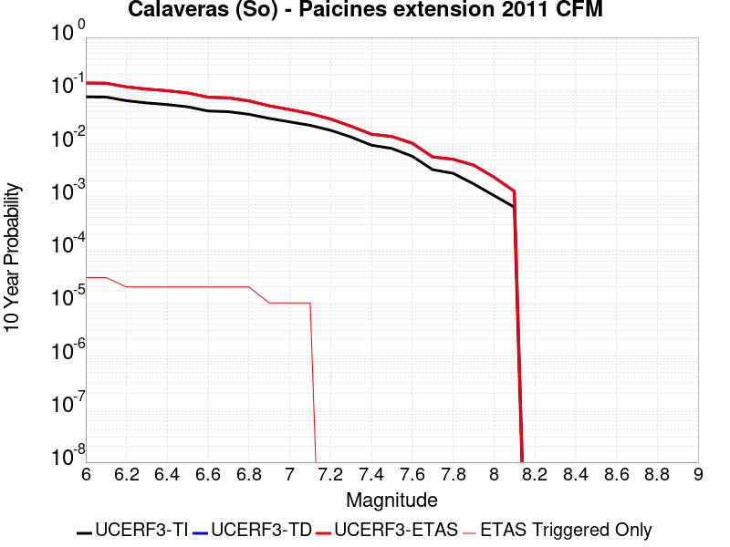 |

| Magnitude | 1 wk TI Prob | 1 wk TD Prob | 1 wk ETAS Prob | 1 wk ETAS/TD Gain | 1 wk ETAS Triggered Only | 1 mo TI Prob | 1 mo TD Prob | 1 mo ETAS Prob | 1 mo ETAS/TD Gain | 1 mo ETAS Triggered Only | 1 yr TI Prob | 1 yr TD Prob | 1 yr ETAS Prob | 1 yr ETAS/TD Gain | 1 yr ETAS Triggered Only | 10 yr TI Prob | 10 yr TD Prob | 10 yr ETAS Prob | 10 yr ETAS/TD Gain | 10 yr ETAS Triggered Only |
|-----|-----|-----|-----|-----|-----|-----|-----|-----|-----|-----|-----|-----|-----|-----|-----|-----|-----|-----|-----|-----|
| 6.0 | 1.5183659E-4 | 3.0520977E-4 | 3.0520977E-4 | 1.0 | 0.0 | 6.5056595E-4 | 0.0013068188 | 0.0013068188 | 1.0 | 0.0 | 0.007891912 | 0.015696203 | 0.015696203 | 1.0 | 0.0 | 0.076174594 | 0.13848905 | 0.13853075 | 1.0003011 | 4.8403883E-5 |
| 6.1 | 1.5024997E-4 | 3.021517E-4 | 3.021517E-4 | 1.0 | 0.0 | 6.437695E-4 | 0.0012937278 | 0.0012937278 | 1.0 | 0.0 | 0.0078097614 | 0.015539596 | 0.015539596 | 1.0 | 0.0 | 0.075409345 | 0.13715863 | 0.1372004 | 1.0003045 | 4.8403883E-5 |
| 6.2 | 1.2743923E-4 | 2.5313982E-4 | 2.5313982E-4 | 1.0 | 0.0 | 5.460538E-4 | 0.0010839999 | 0.0010839999 | 1.0 | 0.0 | 0.0066279583 | 0.013046881 | 0.013046881 | 1.0 | 0.0 | 0.064337276 | 0.117256075 | 0.117277436 | 1.0001822 | 2.4201941E-5 |
| 6.3 | 1.1525114E-4 | 2.2599236E-4 | 2.2599236E-4 | 1.0 | 0.0 | 4.9383997E-4 | 9.678718E-4 | 9.678718E-4 | 1.0 | 0.0 | 0.0059959386 | 0.011668079 | 0.011668079 | 1.0 | 0.0 | 0.058367174 | 0.106372125 | 0.106393754 | 1.0002034 | 2.4201941E-5 |
| 6.4 | 1.07200925E-4 | 2.0840544E-4 | 2.0840544E-4 | 1.0 | 0.0 | 4.5935164E-4 | 8.926123E-4 | 8.926123E-4 | 1.0 | 0.0 | 0.0055782744 | 0.010772959 | 0.010772959 | 1.0 | 0.0 | 0.0544031 | 0.099194765 | 0.09921657 | 1.0002198 | 2.4201941E-5 |
| 6.5 | 9.69631E-5 | 1.8734725E-4 | 1.8734725E-4 | 1.0 | 0.0 | 4.1548995E-4 | 8.024631E-4 | 8.024631E-4 | 1.0 | 0.0 | 0.0050468626 | 0.009694842 | 0.009694842 | 1.0 | 0.0 | 0.04933773 | 0.090086564 | 0.09010859 | 1.0002445 | 2.4201941E-5 |
| 6.6 | 8.0552316E-5 | 1.507068E-4 | 1.507068E-4 | 1.0 | 0.0 | 3.4517853E-4 | 6.4569083E-4 | 6.4569083E-4 | 1.0 | 0.0 | 0.0041944524 | 0.007826508 | 0.007826508 | 1.0 | 0.0 | 0.04116161 | 0.0748563 | 0.07487869 | 1.0002991 | 2.4201941E-5 |
| 6.7 | 7.815757E-5 | 1.4611272E-4 | 1.4611272E-4 | 1.0 | 0.0 | 3.34918E-4 | 6.26014E-4 | 6.26014E-4 | 1.0 | 0.0 | 0.004070005 | 0.007589312 | 0.007589312 | 1.0 | 0.0 | 0.039962657 | 0.07270582 | 0.07272826 | 1.0003086 | 2.4201941E-5 |
| 6.8 | 6.965264E-5 | 1.2722758E-4 | 1.2722758E-4 | 1.0 | 0.0 | 2.9847719E-4 | 5.4513285E-4 | 5.4513285E-4 | 1.0 | 0.0 | 0.0036279052 | 0.0066135945 | 0.0066135945 | 1.0 | 0.0 | 0.03569247 | 0.063801065 | 0.06382372 | 1.0003551 | 2.4201941E-5 |
| 6.9 | 5.8000453E-5 | 1.01439E-4 | 1.01439E-4 | 1.0 | 0.0 | 2.4854968E-4 | 4.346666E-4 | 4.346666E-4 | 1.0 | 0.0 | 0.0030218933 | 0.005279322 | 0.005279322 | 1.0 | 0.0 | 0.029811295 | 0.051502965 | 0.05152592 | 1.0004457 | 2.4201941E-5 |
| 7.0 | 4.9865852E-5 | 8.568029E-5 | 8.568029E-5 | 1.0 | 0.0 | 2.1369329E-4 | 3.6715003E-4 | 3.6715003E-4 | 1.0 | 0.0 | 0.0025986114 | 0.004460979 | 0.004460979 | 1.0 | 0.0 | 0.025684336 | 0.043782018 | 0.04380516 | 1.0005286 | 2.4201941E-5 |
| 7.1 | 4.283875E-5 | 7.1124625E-5 | 7.1124625E-5 | 1.0 | 0.0 | 1.8358172E-4 | 3.0478454E-4 | 3.0478454E-4 | 1.0 | 0.0 | 0.0022328163 | 0.003704494 | 0.003704494 | 1.0 | 0.0 | 0.022105146 | 0.03673582 | 0.036759134 | 1.0006346 | 2.4201941E-5 |
| 7.2 | 3.450115E-5 | 5.5778568E-5 | 5.5778568E-5 | 1.0 | 0.0 | 1.478537E-4 | 2.3902925E-4 | 2.3902925E-4 | 1.0 | 0.0 | 0.0017986323 | 0.0029063264 | 0.0029063264 | 1.0 | 0.0 | 0.017841442 | 0.029079042 | 0.029079042 | 1.0 | 0.0 |
| 7.3 | 2.5709045E-5 | 4.059001E-5 | 4.059001E-5 | 1.0 | 0.0 | 1.1017697E-4 | 1.7394568E-4 | 1.7394568E-4 | 1.0 | 0.0 | 0.0013405791 | 0.0021157486 | 0.0021157486 | 1.0 | 0.0 | 0.013325208 | 0.02129686 | 0.02129686 | 1.0 | 0.0 |
| 7.4 | 1.8003093E-5 | 2.8511378E-5 | 2.8511378E-5 | 1.0 | 0.0 | 7.715383E-5 | 1.2218591E-4 | 1.2218591E-4 | 1.0 | 0.0 | 9.3894306E-4 | 0.0014866006 | 0.0014866006 | 1.0 | 0.0 | 0.009349857 | 0.015051589 | 0.015051589 | 1.0 | 0.0 |
| 7.5 | 1.5595824E-5 | 2.5823752E-5 | 2.5823752E-5 | 1.0 | 0.0 | 6.683753E-5 | 1.10668545E-4 | 1.10668545E-4 | 1.0 | 0.0 | 8.134431E-4 | 0.0013465589 | 0.0013465589 | 1.0 | 0.0 | 0.008104719 | 0.013651571 | 0.013651571 | 1.0 | 0.0 |
| 7.6 | 1.1110309E-5 | 1.9223195E-5 | 1.9223195E-5 | 1.0 | 0.0 | 4.761474E-5 | 8.2382525E-5 | 8.2382525E-5 | 1.0 | 0.0 | 5.795553E-4 | 0.0010025471 | 0.0010025471 | 1.0 | 0.0 | 0.0057804612 | 0.01020344 | 0.01020344 | 1.0 | 0.0 |
| 7.7 | 6.2140443E-6 | 1.04376995E-5 | 1.04376995E-5 | 1.0 | 0.0 | 2.6631347E-5 | 4.4732235E-5 | 4.4732235E-5 | 1.0 | 0.0 | 3.241884E-4 | 5.4447894E-4 | 5.4447894E-4 | 1.0 | 0.0 | 0.0032371588 | 0.005620102 | 0.005620102 | 1.0 | 0.0 |
| 7.8 | 5.305533E-6 | 9.433651E-6 | 9.433651E-6 | 1.0 | 0.0 | 2.27378E-5 | 4.0429306E-5 | 4.0429306E-5 | 1.0 | 0.0 | 2.7679754E-4 | 4.9211574E-4 | 4.9211574E-4 | 1.0 | 0.0 | 0.0027645302 | 0.005074622 | 0.005074622 | 1.0 | 0.0 |
| 7.9 | 3.363505E-6 | 7.3854467E-6 | 7.3854467E-6 | 1.0 | 0.0 | 1.4414942E-5 | 3.1651532E-5 | 3.1651532E-5 | 1.0 | 0.0 | 1.7548777E-4 | 3.8528934E-4 | 3.8528934E-4 | 1.0 | 0.0 | 0.0017534926 | 0.003948784 | 0.003948784 | 1.0 | 0.0 |
| 8.0 | 2.0271132E-6 | 4.4134235E-6 | 4.4134235E-6 | 1.0 | 0.0 | 8.687599E-6 | 1.8914534E-5 | 1.8914534E-5 | 1.0 | 0.0 | 1.05766376E-4 | 2.3026018E-4 | 2.3026018E-4 | 1.0 | 0.0 | 0.0010571606 | 0.002351194 | 0.002351194 | 1.0 | 0.0 |
| 8.1 | 1.2206116E-6 | 2.3752666E-6 | 2.3752666E-6 | 1.0 | 0.0 | 5.2311816E-6 | 1.0179674E-5 | 1.0179674E-5 | 1.0 | 0.0 | 6.3687774E-5 | 1.2393051E-4 | 1.2393051E-4 | 1.0 | 0.0 | 6.366953E-4 | 0.0012705618 | 0.0012705618 | 1.0 | 0.0 |

## Santa Susana East (connector)
*[(top)](#table-of-contents)*

| 1 Week | 1 Month | 1 Year | 10 Year |
|-----|-----|-----|-----|
|  |  |  |  |

| Magnitude | 1 wk TI Prob | 1 wk TD Prob | 1 wk ETAS Prob | 1 wk ETAS/TD Gain | 1 wk ETAS Triggered Only | 1 mo TI Prob | 1 mo TD Prob | 1 mo ETAS Prob | 1 mo ETAS/TD Gain | 1 mo ETAS Triggered Only | 1 yr TI Prob | 1 yr TD Prob | 1 yr ETAS Prob | 1 yr ETAS/TD Gain | 1 yr ETAS Triggered Only | 10 yr TI Prob | 10 yr TD Prob | 10 yr ETAS Prob | 10 yr ETAS/TD Gain | 10 yr ETAS Triggered Only |
|-----|-----|-----|-----|-----|-----|-----|-----|-----|-----|-----|-----|-----|-----|-----|-----|-----|-----|-----|-----|-----|
| 6.0 | 2.858397E-5 | 3.2021693E-5 | 3.2021693E-5 | 1.0 | 0.0 | 1.2249697E-4 | 1.3723019E-4 | 1.6142882E-4 | 1.1763359 | 2.4201941E-5 | 0.0014903803 | 0.00166977 | 0.0017180931 | 1.02894 | 4.8403883E-5 | 0.014804244 | 0.016599316 | 0.016646918 | 1.0028676 | 4.8403883E-5 |
| 6.1 | 2.858397E-5 | 3.2021693E-5 | 3.2021693E-5 | 1.0 | 0.0 | 1.2249697E-4 | 1.3723019E-4 | 1.6142882E-4 | 1.1763359 | 2.4201941E-5 | 0.0014903803 | 0.00166977 | 0.0017180931 | 1.02894 | 4.8403883E-5 | 0.014804244 | 0.016599316 | 0.016646918 | 1.0028676 | 4.8403883E-5 |
| 6.2 | 2.858397E-5 | 3.2021693E-5 | 3.2021693E-5 | 1.0 | 0.0 | 1.2249697E-4 | 1.3723019E-4 | 1.6142882E-4 | 1.1763359 | 2.4201941E-5 | 0.0014903803 | 0.00166977 | 0.0017180931 | 1.02894 | 4.8403883E-5 | 0.014804244 | 0.016599316 | 0.016646918 | 1.0028676 | 4.8403883E-5 |
| 6.3 | 1.943582E-5 | 2.0367343E-5 | 2.0367343E-5 | 1.0 | 0.0 | 8.329371E-5 | 8.7286324E-5 | 1.1148615E-4 | 1.2772465 | 2.4201941E-5 | 0.001013629 | 0.001062305 | 0.0011106575 | 1.0455166 | 4.8403883E-5 | 0.010090181 | 0.010583852 | 0.010631744 | 1.004525 | 4.8403883E-5 |
| 6.4 | 1.943582E-5 | 2.0367343E-5 | 2.0367343E-5 | 1.0 | 0.0 | 8.329371E-5 | 8.7286324E-5 | 1.1148615E-4 | 1.2772465 | 2.4201941E-5 | 0.001013629 | 0.001062305 | 0.0011106575 | 1.0455166 | 4.8403883E-5 | 0.010090181 | 0.010583852 | 0.010631744 | 1.004525 | 4.8403883E-5 |
| 6.5 | 1.943582E-5 | 2.0367343E-5 | 2.0367343E-5 | 1.0 | 0.0 | 8.329371E-5 | 8.7286324E-5 | 1.1148615E-4 | 1.2772465 | 2.4201941E-5 | 0.001013629 | 0.001062305 | 0.0011106575 | 1.0455166 | 4.8403883E-5 | 0.010090181 | 0.010583852 | 0.010631744 | 1.004525 | 4.8403883E-5 |
| 6.6 | 1.943582E-5 | 2.0367343E-5 | 2.0367343E-5 | 1.0 | 0.0 | 8.329371E-5 | 8.7286324E-5 | 1.1148615E-4 | 1.2772465 | 2.4201941E-5 | 0.001013629 | 0.001062305 | 0.0011106575 | 1.0455166 | 4.8403883E-5 | 0.010090181 | 0.010583852 | 0.010631744 | 1.004525 | 4.8403883E-5 |
| 6.7 | 1.9404439E-5 | 2.0354766E-5 | 2.0354766E-5 | 1.0 | 0.0 | 8.3159226E-5 | 8.723242E-5 | 1.1143225E-4 | 1.2774178 | 2.4201941E-5 | 0.0010119933 | 0.0010616493 | 0.0011100018 | 1.0455447 | 4.8403883E-5 | 0.010073971 | 0.010577358 | 0.010625251 | 1.0045278 | 4.8403883E-5 |
| 6.8 | 1.2217526E-5 | 1.1593157E-5 | 1.1593157E-5 | 1.0 | 0.0 | 5.2359774E-5 | 4.9684106E-5 | 4.9684106E-5 | 1.0 | 0.0 | 6.372938E-4 | 6.047529E-4 | 6.2894024E-4 | 1.0399953 | 2.4201941E-5 | 0.0063546924 | 0.006033274 | 0.00605733 | 1.0039872 | 2.4201941E-5 |
| 6.9 | 1.2217526E-5 | 1.1593157E-5 | 1.1593157E-5 | 1.0 | 0.0 | 5.2359774E-5 | 4.9684106E-5 | 4.9684106E-5 | 1.0 | 0.0 | 6.372938E-4 | 6.047529E-4 | 6.2894024E-4 | 1.0399953 | 2.4201941E-5 | 0.0063546924 | 0.006033274 | 0.00605733 | 1.0039872 | 2.4201941E-5 |
| 7.0 | 9.276017E-6 | 8.059273E-6 | 8.059273E-6 | 1.0 | 0.0 | 3.9753755E-5 | 3.4539302E-5 | 3.4539302E-5 | 1.0 | 0.0 | 4.8389446E-4 | 4.2043833E-4 | 4.446301E-4 | 1.0575393 | 2.4201941E-5 | 0.0048284214 | 0.0041973097 | 0.0042214105 | 1.0057418 | 2.4201941E-5 |
| 7.1 | 9.130355E-6 | 7.942446E-6 | 7.942446E-6 | 1.0 | 0.0 | 3.9129503E-5 | 3.4038632E-5 | 3.4038632E-5 | 1.0 | 0.0 | 4.7629757E-4 | 4.1434498E-4 | 4.385369E-4 | 1.058386 | 2.4201941E-5 | 0.00475278 | 0.0041366047 | 0.0041607064 | 1.0058265 | 2.4201941E-5 |
| 7.2 | 8.851015E-6 | 7.741608E-6 | 7.741608E-6 | 1.0 | 0.0 | 3.7932372E-5 | 3.317792E-5 | 3.317792E-5 | 1.0 | 0.0 | 4.6172875E-4 | 4.038697E-4 | 4.2806187E-4 | 1.0599009 | 2.4201941E-5 | 0.0046077054 | 0.0040322347 | 0.004056339 | 1.0059779 | 2.4201941E-5 |
| 7.3 | 8.573006E-6 | 7.5503312E-6 | 7.5503312E-6 | 1.0 | 0.0 | 3.6740938E-5 | 3.235818E-5 | 3.235818E-5 | 1.0 | 0.0 | 4.472291E-4 | 3.9389305E-4 | 4.1808546E-4 | 1.0614188 | 2.4201941E-5 | 0.004463301 | 0.003932817 | 0.0039569237 | 1.0061296 | 2.4201941E-5 |
| 7.4 | 7.852282E-6 | 6.8178556E-6 | 6.8178556E-6 | 1.0 | 0.0 | 3.36522E-5 | 2.921907E-5 | 2.921907E-5 | 1.0 | 0.0 | 4.096385E-4 | 3.5568717E-4 | 3.7988048E-4 | 1.0680186 | 2.4201941E-5 | 0.0040888423 | 0.0035519868 | 0.003576103 | 1.0067894 | 2.4201941E-5 |
| 7.5 | 4.8869324E-6 | 4.2790975E-6 | 4.2790975E-6 | 1.0 | 0.0 | 2.0943828E-5 | 1.833887E-5 | 1.833887E-5 | 1.0 | 0.0 | 2.5496128E-4 | 2.2325452E-4 | 2.2325452E-4 | 1.0 | 0.0 | 0.0025466895 | 0.00223057 | 0.00223057 | 1.0 | 0.0 |
| 7.6 | 1.3894544E-6 | 1.1568394E-6 | 1.1568394E-6 | 1.0 | 0.0 | 5.954791E-6 | 4.957875E-6 | 4.957875E-6 | 1.0 | 0.0 | 7.249717E-5 | 6.036068E-5 | 6.036068E-5 | 1.0 | 0.0 | 7.247352E-4 | 6.0346466E-4 | 6.0346466E-4 | 1.0 | 0.0 |
| 7.7 | 2.9924632E-7 | 2.3719332E-7 | 2.3719332E-7 | 1.0 | 0.0 | 1.2824837E-6 | 1.0165425E-6 | 1.0165425E-6 | 1.0 | 0.0 | 1.5614127E-5 | 1.2376341E-5 | 1.2376341E-5 | 1.0 | 0.0 | 1.5613029E-4 | 1.2375724E-4 | 1.2375724E-4 | 1.0 | 0.0 |
| 7.8 | 4.8188564E-8 | 2.6321862E-8 | 2.6321862E-8 | 1.0 | 0.0 | 2.065224E-7 | 1.12807975E-7 | 1.12807975E-7 | 1.0 | 0.0 | 2.5144072E-6 | 1.3734362E-6 | 1.3734362E-6 | 1.0 | 0.0 | 2.5143789E-5 | 1.3734286E-5 | 1.3734286E-5 | 1.0 | 0.0 |
| 7.9 | 2.6127251E-9 | 2.7681102E-9 | 2.7681102E-9 | 1.0 | 0.0 | 1.1197393E-8 | 1.186333E-8 | 1.186333E-8 | 1.0 | 0.0 | 1.3632825E-7 | 1.4443603E-7 | 1.4443603E-7 | 1.0 | 0.0 | 1.3632817E-6 | 1.4443604E-6 | 1.4443604E-6 | 1.0 | 0.0 |

## Great Valley 09 (Laguna Seca)
*[(top)](#table-of-contents)*

| 1 Week | 1 Month | 1 Year | 10 Year |
|-----|-----|-----|-----|
| 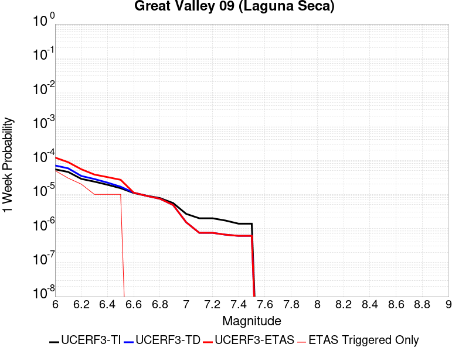 |  |  |  |

| Magnitude | 1 wk TI Prob | 1 wk TD Prob | 1 wk ETAS Prob | 1 wk ETAS/TD Gain | 1 wk ETAS Triggered Only | 1 mo TI Prob | 1 mo TD Prob | 1 mo ETAS Prob | 1 mo ETAS/TD Gain | 1 mo ETAS Triggered Only | 1 yr TI Prob | 1 yr TD Prob | 1 yr ETAS Prob | 1 yr ETAS/TD Gain | 1 yr ETAS Triggered Only | 10 yr TI Prob | 10 yr TD Prob | 10 yr ETAS Prob | 10 yr ETAS/TD Gain | 10 yr ETAS Triggered Only |
|-----|-----|-----|-----|-----|-----|-----|-----|-----|-----|-----|-----|-----|-----|-----|-----|-----|-----|-----|-----|-----|
| 6.0 | 5.4353277E-5 | 7.050019E-5 | 7.050019E-5 | 1.0 | 0.0 | 2.3292181E-4 | 3.0211007E-4 | 3.0211007E-4 | 1.0 | 0.0 | 0.0028321352 | 0.0036720056 | 0.0036961187 | 1.0065668 | 2.4201941E-5 | 0.02796312 | 0.036115844 | 0.0361625 | 1.0012919 | 4.8403883E-5 |
| 6.1 | 4.5578287E-5 | 5.822054E-5 | 5.822054E-5 | 1.0 | 0.0 | 1.953209E-4 | 2.4949352E-4 | 2.4949352E-4 | 1.0 | 0.0 | 0.0023754383 | 0.0030333549 | 0.0030574836 | 1.0079544 | 2.4201941E-5 | 0.023502063 | 0.029919893 | 0.029966848 | 1.0015694 | 4.8403883E-5 |
| 6.2 | 2.8536782E-5 | 3.4736422E-5 | 3.4736422E-5 | 1.0 | 0.0 | 1.2229476E-4 | 1.4886161E-4 | 1.4886161E-4 | 1.0 | 0.0 | 0.0014879217 | 0.0018108576 | 0.0018108576 | 1.0 | 0.0 | 0.014779986 | 0.017958276 | 0.017982043 | 1.0013235 | 2.4201941E-5 |
| 6.3 | 2.3698774E-5 | 2.8213344E-5 | 2.8213344E-5 | 1.0 | 0.0 | 1.01562226E-4 | 1.2090833E-4 | 1.2090833E-4 | 1.0 | 0.0 | 0.0012358186 | 0.001471051 | 0.001471051 | 1.0 | 0.0 | 0.012289686 | 0.014611455 | 0.014635303 | 1.0016322 | 2.4201941E-5 |
| 6.4 | 1.9191197E-5 | 2.212289E-5 | 2.212289E-5 | 1.0 | 0.0 | 8.2245395E-5 | 9.4808805E-5 | 9.4808805E-5 | 1.0 | 0.0 | 0.0010008777 | 0.0011536906 | 0.0011536906 | 1.0 | 0.0 | 0.009963818 | 0.011477022 | 0.011500946 | 1.0020845 | 2.4201941E-5 |
| 6.5 | 1.5203241E-5 | 1.6801298E-5 | 1.6801298E-5 | 1.0 | 0.0 | 6.5155116E-5 | 7.200338E-5 | 7.200338E-5 | 1.0 | 0.0 | 7.9297484E-4 | 8.76301E-4 | 8.76301E-4 | 1.0 | 0.0 | 0.007901512 | 0.008729581 | 0.008729581 | 1.0 | 0.0 |
| 6.6 | 1.0984925E-5 | 1.12425605E-5 | 1.12425605E-5 | 1.0 | 0.0 | 4.70774E-5 | 4.8181533E-5 | 4.8181533E-5 | 1.0 | 0.0 | 5.730166E-4 | 5.8645604E-4 | 5.8645604E-4 | 1.0 | 0.0 | 0.005715413 | 0.0058494755 | 0.0058494755 | 1.0 | 0.0 |
| 6.7 | 9.134616E-6 | 9.019868E-6 | 9.019868E-6 | 1.0 | 0.0 | 3.9147766E-5 | 3.865602E-5 | 3.865602E-5 | 1.0 | 0.0 | 4.7651984E-4 | 4.7053778E-4 | 4.7053778E-4 | 1.0 | 0.0 | 0.004754993 | 0.00469566 | 0.00469566 | 1.0 | 0.0 |
| 6.8 | 7.785589E-6 | 7.4519185E-6 | 7.4519185E-6 | 1.0 | 0.0 | 3.3366385E-5 | 3.1936415E-5 | 3.1936415E-5 | 1.0 | 0.0 | 4.0616E-4 | 3.887585E-4 | 3.887585E-4 | 1.0 | 0.0 | 0.0040541845 | 0.003880988 | 0.003880988 | 1.0 | 0.0 |
| 6.9 | 5.579095E-6 | 4.8984666E-6 | 4.8984666E-6 | 1.0 | 0.0 | 2.3910188E-5 | 2.0993268E-5 | 2.0993268E-5 | 1.0 | 0.0 | 2.9106764E-4 | 2.5556443E-4 | 2.5556443E-4 | 1.0 | 0.0 | 0.002906867 | 0.0025528427 | 0.0025528427 | 1.0 | 0.0 |
| 7.0 | 2.6816688E-6 | 1.521587E-6 | 1.521587E-6 | 1.0 | 0.0 | 1.1492816E-5 | 6.521071E-6 | 6.521071E-6 | 1.0 | 0.0 | 1.3991605E-4 | 7.939124E-5 | 7.939124E-5 | 1.0 | 0.0 | 0.0013982799 | 7.936375E-4 | 7.936375E-4 | 1.0 | 0.0 |
| 7.1 | 1.9951021E-6 | 7.45357E-7 | 7.45357E-7 | 1.0 | 0.0 | 8.55041E-6 | 3.1943835E-6 | 3.1943835E-6 | 1.0 | 0.0 | 1.0409627E-4 | 3.889097E-5 | 3.889097E-5 | 1.0 | 0.0 | 0.0010404752 | 3.8884574E-4 | 3.8884574E-4 | 1.0 | 0.0 |
| 7.2 | 1.9951021E-6 | 7.45357E-7 | 7.45357E-7 | 1.0 | 0.0 | 8.55041E-6 | 3.1943835E-6 | 3.1943835E-6 | 1.0 | 0.0 | 1.0409627E-4 | 3.889097E-5 | 3.889097E-5 | 1.0 | 0.0 | 0.0010404752 | 3.8884574E-4 | 3.8884574E-4 | 1.0 | 0.0 |
| 7.3 | 1.7087556E-6 | 6.578663E-7 | 6.578663E-7 | 1.0 | 0.0 | 7.3232177E-6 | 2.819424E-6 | 2.819424E-6 | 1.0 | 0.0 | 8.915652E-5 | 3.432599E-5 | 3.432599E-5 | 1.0 | 0.0 | 8.9120766E-4 | 3.432109E-4 | 3.432109E-4 | 1.0 | 0.0 |
| 7.4 | 1.3804846E-6 | 6.0737113E-7 | 6.0737113E-7 | 1.0 | 0.0 | 5.916349E-6 | 2.6030168E-6 | 2.6030168E-6 | 1.0 | 0.0 | 7.2029165E-5 | 3.169131E-5 | 3.169131E-5 | 1.0 | 0.0 | 7.200583E-4 | 3.168719E-4 | 3.168719E-4 | 1.0 | 0.0 |
| 7.5 | 1.3804846E-6 | 6.0737113E-7 | 6.0737113E-7 | 1.0 | 0.0 | 5.916349E-6 | 2.6030168E-6 | 2.6030168E-6 | 1.0 | 0.0 | 7.2029165E-5 | 3.169131E-5 | 3.169131E-5 | 1.0 | 0.0 | 7.200583E-4 | 3.168719E-4 | 3.168719E-4 | 1.0 | 0.0 |

## Santa Susana alt 1
*[(top)](#table-of-contents)*

| 1 Week | 1 Month | 1 Year | 10 Year |
|-----|-----|-----|-----|
|  |  |  |  |

| Magnitude | 1 wk TI Prob | 1 wk TD Prob | 1 wk ETAS Prob | 1 wk ETAS/TD Gain | 1 wk ETAS Triggered Only | 1 mo TI Prob | 1 mo TD Prob | 1 mo ETAS Prob | 1 mo ETAS/TD Gain | 1 mo ETAS Triggered Only | 1 yr TI Prob | 1 yr TD Prob | 1 yr ETAS Prob | 1 yr ETAS/TD Gain | 1 yr ETAS Triggered Only | 10 yr TI Prob | 10 yr TD Prob | 10 yr ETAS Prob | 10 yr ETAS/TD Gain | 10 yr ETAS Triggered Only |
|-----|-----|-----|-----|-----|-----|-----|-----|-----|-----|-----|-----|-----|-----|-----|-----|-----|-----|-----|-----|-----|
| 6.0 | 2.674877E-5 | 2.7198214E-5 | 2.7198214E-5 | 1.0 | 0.0 | 1.1463255E-4 | 1.16559204E-4 | 1.4075832E-4 | 1.2076123 | 2.4201941E-5 | 0.0013947578 | 0.0014182981 | 0.0014666334 | 1.0340798 | 4.8403883E-5 | 0.013860362 | 0.014104388 | 0.014152109 | 1.0033834 | 4.8403883E-5 |
| 6.1 | 2.674877E-5 | 2.7198214E-5 | 2.7198214E-5 | 1.0 | 0.0 | 1.1463255E-4 | 1.16559204E-4 | 1.4075832E-4 | 1.2076123 | 2.4201941E-5 | 0.0013947578 | 0.0014182981 | 0.0014666334 | 1.0340798 | 4.8403883E-5 | 0.013860362 | 0.014104388 | 0.014152109 | 1.0033834 | 4.8403883E-5 |
| 6.2 | 2.674877E-5 | 2.7198214E-5 | 2.7198214E-5 | 1.0 | 0.0 | 1.1463255E-4 | 1.16559204E-4 | 1.4075832E-4 | 1.2076123 | 2.4201941E-5 | 0.0013947578 | 0.0014182981 | 0.0014666334 | 1.0340798 | 4.8403883E-5 | 0.013860362 | 0.014104388 | 0.014152109 | 1.0033834 | 4.8403883E-5 |
| 6.3 | 2.674877E-5 | 2.7198214E-5 | 2.7198214E-5 | 1.0 | 0.0 | 1.1463255E-4 | 1.16559204E-4 | 1.4075832E-4 | 1.2076123 | 2.4201941E-5 | 0.0013947578 | 0.0014182981 | 0.0014666334 | 1.0340798 | 4.8403883E-5 | 0.013860362 | 0.014104388 | 0.014152109 | 1.0033834 | 4.8403883E-5 |
| 6.4 | 2.674877E-5 | 2.7198214E-5 | 2.7198214E-5 | 1.0 | 0.0 | 1.1463255E-4 | 1.16559204E-4 | 1.4075832E-4 | 1.2076123 | 2.4201941E-5 | 0.0013947578 | 0.0014182981 | 0.0014666334 | 1.0340798 | 4.8403883E-5 | 0.013860362 | 0.014104388 | 0.014152109 | 1.0033834 | 4.8403883E-5 |
| 6.5 | 2.674877E-5 | 2.7198214E-5 | 2.7198214E-5 | 1.0 | 0.0 | 1.1463255E-4 | 1.16559204E-4 | 1.4075832E-4 | 1.2076123 | 2.4201941E-5 | 0.0013947578 | 0.0014182981 | 0.0014666334 | 1.0340798 | 4.8403883E-5 | 0.013860362 | 0.014104388 | 0.014152109 | 1.0033834 | 4.8403883E-5 |
| 6.6 | 2.6647976E-5 | 2.7074553E-5 | 2.7074553E-5 | 1.0 | 0.0 | 1.14200615E-4 | 1.16029274E-4 | 1.4022841E-4 | 1.2085606 | 2.4201941E-5 | 0.0013895056 | 0.0014118546 | 0.0014601902 | 1.0342355 | 4.8403883E-5 | 0.013808494 | 0.014040773 | 0.0140884975 | 1.003399 | 4.8403883E-5 |
| 6.7 | 2.6647976E-5 | 2.7074553E-5 | 2.7074553E-5 | 1.0 | 0.0 | 1.14200615E-4 | 1.16029274E-4 | 1.4022841E-4 | 1.2085606 | 2.4201941E-5 | 0.0013895056 | 0.0014118546 | 0.0014601902 | 1.0342355 | 4.8403883E-5 | 0.013808494 | 0.014040773 | 0.0140884975 | 1.003399 | 4.8403883E-5 |
| 6.8 | 1.9073179E-5 | 1.7637467E-5 | 1.7637467E-5 | 1.0 | 0.0 | 8.1739636E-5 | 7.558706E-5 | 7.558706E-5 | 1.0 | 0.0 | 9.947256E-4 | 9.19902E-4 | 9.4408164E-4 | 1.026285 | 2.4201941E-5 | 0.009902848 | 0.009163361 | 0.009187342 | 1.002617 | 2.4201941E-5 |
| 6.9 | 1.9041876E-5 | 1.7619597E-5 | 1.7619597E-5 | 1.0 | 0.0 | 8.160549E-5 | 7.551048E-5 | 7.551048E-5 | 1.0 | 0.0 | 9.930939E-4 | 9.189705E-4 | 9.431502E-4 | 1.0263118 | 2.4201941E-5 | 0.0098866755 | 0.009154123 | 0.009178104 | 1.0026196 | 2.4201941E-5 |
| 7.0 | 1.5917482E-5 | 1.3864049E-5 | 1.3864049E-5 | 1.0 | 0.0 | 6.8215995E-5 | 5.9416023E-5 | 5.9416023E-5 | 1.0 | 0.0 | 8.302132E-4 | 7.2315463E-4 | 7.473391E-4 | 1.033443 | 2.4201941E-5 | 0.008271185 | 0.0072090672 | 0.0072330944 | 1.003333 | 2.4201941E-5 |
| 7.1 | 1.577788E-5 | 1.3744056E-5 | 1.3744056E-5 | 1.0 | 0.0 | 6.761774E-5 | 5.890179E-5 | 5.890179E-5 | 1.0 | 0.0 | 8.2293496E-4 | 7.16898E-4 | 7.410826E-4 | 1.033735 | 2.4201941E-5 | 0.008198941 | 0.0071469042 | 0.0071709333 | 1.0033622 | 2.4201941E-5 |
| 7.2 | 1.5416446E-5 | 1.34701295E-5 | 1.34701295E-5 | 1.0 | 0.0 | 6.606882E-5 | 5.7727877E-5 | 5.7727877E-5 | 1.0 | 0.0 | 8.0409093E-4 | 7.026149E-4 | 7.2679983E-4 | 1.0344213 | 2.4201941E-5 | 0.008011877 | 0.0070049763 | 0.007029009 | 1.0034307 | 2.4201941E-5 |
| 7.3 | 1.4534083E-5 | 1.2718032E-5 | 1.2718032E-5 | 1.0 | 0.0 | 6.228744E-5 | 5.4504737E-5 | 5.4504737E-5 | 1.0 | 0.0 | 7.580857E-4 | 6.633976E-4 | 6.8758347E-4 | 1.0364577 | 2.4201941E-5 | 0.007555048 | 0.0066151717 | 0.0066392133 | 1.0036343 | 2.4201941E-5 |
| 7.4 | 1.2858995E-5 | 1.1229814E-5 | 1.1229814E-5 | 1.0 | 0.0 | 5.5108816E-5 | 4.812691E-5 | 4.812691E-5 | 1.0 | 0.0 | 6.7074323E-4 | 5.8579154E-4 | 6.0997927E-4 | 1.0412908 | 2.4201941E-5 | 0.0066872234 | 0.0058433902 | 0.005867451 | 1.0041176 | 2.4201941E-5 |
| 7.5 | 8.827668E-6 | 7.805494E-6 | 7.805494E-6 | 1.0 | 0.0 | 3.7832317E-5 | 3.3451703E-5 | 3.3451703E-5 | 1.0 | 0.0 | 4.605111E-4 | 4.072008E-4 | 4.072008E-4 | 1.0 | 0.0 | 0.0045955796 | 0.0040648985 | 0.0040648985 | 1.0 | 0.0 |
| 7.6 | 3.2533426E-6 | 2.8720106E-6 | 2.8720106E-6 | 1.0 | 0.0 | 1.3942822E-5 | 1.230856E-5 | 1.230856E-5 | 1.0 | 0.0 | 1.6974064E-4 | 1.4984679E-4 | 1.4984679E-4 | 1.0 | 0.0 | 0.0016961104 | 0.0014974943 | 0.0014974943 | 1.0 | 0.0 |
| 7.7 | 1.2751709E-6 | 1.1491339E-6 | 1.1491339E-6 | 1.0 | 0.0 | 5.4650063E-6 | 4.9248506E-6 | 4.9248506E-6 | 1.0 | 0.0 | 6.653442E-5 | 5.99585E-5 | 5.99585E-5 | 1.0 | 0.0 | 6.6514505E-4 | 5.9943215E-4 | 5.9943215E-4 | 1.0 | 0.0 |
| 7.8 | 3.067544E-7 | 3.240052E-7 | 3.240052E-7 | 1.0 | 0.0 | 1.3146611E-6 | 1.3885931E-6 | 1.3885931E-6 | 1.0 | 0.0 | 1.600588E-5 | 1.6906E-5 | 1.6906E-5 | 1.0 | 0.0 | 1.6004729E-4 | 1.6904817E-4 | 1.6904817E-4 | 1.0 | 0.0 |
| 7.9 | 7.622999E-8 | 8.0879715E-8 | 8.0879715E-8 | 1.0 | 0.0 | 3.2669993E-7 | 3.4662733E-7 | 3.4662733E-7 | 1.0 | 0.0 | 3.977564E-6 | 4.220182E-6 | 4.220182E-6 | 1.0 | 0.0 | 3.977493E-5 | 4.2201224E-5 | 4.2201224E-5 | 1.0 | 0.0 |

## North Frontal  (West)
*[(top)](#table-of-contents)*

| 1 Week | 1 Month | 1 Year | 10 Year |
|-----|-----|-----|-----|
| 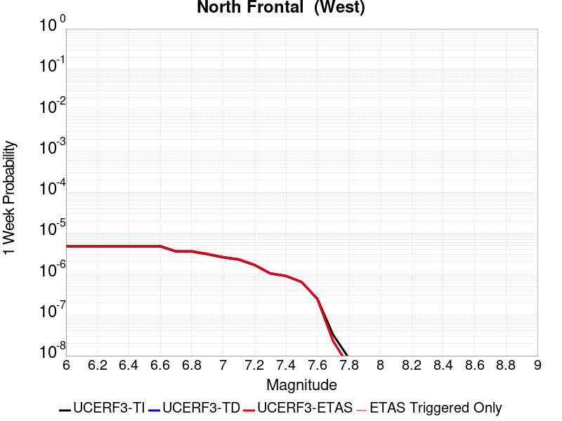 |  |  |  |

| Magnitude | 1 wk TI Prob | 1 wk TD Prob | 1 wk ETAS Prob | 1 wk ETAS/TD Gain | 1 wk ETAS Triggered Only | 1 mo TI Prob | 1 mo TD Prob | 1 mo ETAS Prob | 1 mo ETAS/TD Gain | 1 mo ETAS Triggered Only | 1 yr TI Prob | 1 yr TD Prob | 1 yr ETAS Prob | 1 yr ETAS/TD Gain | 1 yr ETAS Triggered Only | 10 yr TI Prob | 10 yr TD Prob | 10 yr ETAS Prob | 10 yr ETAS/TD Gain | 10 yr ETAS Triggered Only |
|-----|-----|-----|-----|-----|-----|-----|-----|-----|-----|-----|-----|-----|-----|-----|-----|-----|-----|-----|-----|-----|
| 6.0 | 4.7316266E-6 | 4.852674E-6 | 4.852674E-6 | 1.0 | 0.0 | 2.0278241E-5 | 2.0797017E-5 | 2.0797017E-5 | 1.0 | 0.0 | 2.4685962E-4 | 2.5317573E-4 | 2.7737155E-4 | 1.0955693 | 2.4201941E-5 | 0.0024658558 | 0.002529019 | 0.0025773006 | 1.019091 | 4.8403883E-5 |
| 6.1 | 4.7316266E-6 | 4.852674E-6 | 4.852674E-6 | 1.0 | 0.0 | 2.0278241E-5 | 2.0797017E-5 | 2.0797017E-5 | 1.0 | 0.0 | 2.4685962E-4 | 2.5317573E-4 | 2.7737155E-4 | 1.0955693 | 2.4201941E-5 | 0.0024658558 | 0.002529019 | 0.0025773006 | 1.019091 | 4.8403883E-5 |
| 6.2 | 4.7316266E-6 | 4.852674E-6 | 4.852674E-6 | 1.0 | 0.0 | 2.0278241E-5 | 2.0797017E-5 | 2.0797017E-5 | 1.0 | 0.0 | 2.4685962E-4 | 2.5317573E-4 | 2.7737155E-4 | 1.0955693 | 2.4201941E-5 | 0.0024658558 | 0.002529019 | 0.0025773006 | 1.019091 | 4.8403883E-5 |
| 6.3 | 4.7316266E-6 | 4.852674E-6 | 4.852674E-6 | 1.0 | 0.0 | 2.0278241E-5 | 2.0797017E-5 | 2.0797017E-5 | 1.0 | 0.0 | 2.4685962E-4 | 2.5317573E-4 | 2.7737155E-4 | 1.0955693 | 2.4201941E-5 | 0.0024658558 | 0.002529019 | 0.0025773006 | 1.019091 | 4.8403883E-5 |
| 6.4 | 4.7316266E-6 | 4.852674E-6 | 4.852674E-6 | 1.0 | 0.0 | 2.0278241E-5 | 2.0797017E-5 | 2.0797017E-5 | 1.0 | 0.0 | 2.4685962E-4 | 2.5317573E-4 | 2.7737155E-4 | 1.0955693 | 2.4201941E-5 | 0.0024658558 | 0.002529019 | 0.0025773006 | 1.019091 | 4.8403883E-5 |
| 6.5 | 4.7316266E-6 | 4.852674E-6 | 4.852674E-6 | 1.0 | 0.0 | 2.0278241E-5 | 2.0797017E-5 | 2.0797017E-5 | 1.0 | 0.0 | 2.4685962E-4 | 2.5317573E-4 | 2.7737155E-4 | 1.0955693 | 2.4201941E-5 | 0.0024658558 | 0.002529019 | 0.0025773006 | 1.019091 | 4.8403883E-5 |
| 6.6 | 4.7316266E-6 | 4.852674E-6 | 4.852674E-6 | 1.0 | 0.0 | 2.0278241E-5 | 2.0797017E-5 | 2.0797017E-5 | 1.0 | 0.0 | 2.4685962E-4 | 2.5317573E-4 | 2.7737155E-4 | 1.0955693 | 2.4201941E-5 | 0.0024658558 | 0.002529019 | 0.0025773006 | 1.019091 | 4.8403883E-5 |
| 6.7 | 3.5382777E-6 | 3.6308872E-6 | 3.6308872E-6 | 1.0 | 0.0 | 1.516396E-5 | 1.5560858E-5 | 1.5560858E-5 | 1.0 | 0.0 | 1.8460557E-4 | 1.8943775E-4 | 2.136351E-4 | 1.1277325 | 2.4201941E-5 | 0.0018445229 | 0.0018928396 | 0.0019411518 | 1.0255237 | 4.8403883E-5 |
| 6.8 | 3.5382777E-6 | 3.6308872E-6 | 3.6308872E-6 | 1.0 | 0.0 | 1.516396E-5 | 1.5560858E-5 | 1.5560858E-5 | 1.0 | 0.0 | 1.8460557E-4 | 1.8943775E-4 | 2.136351E-4 | 1.1277325 | 2.4201941E-5 | 0.0018445229 | 0.0018928396 | 0.0019411518 | 1.0255237 | 4.8403883E-5 |
| 6.9 | 3.0428037E-6 | 3.1227619E-6 | 3.1227619E-6 | 1.0 | 0.0 | 1.30405215E-5 | 1.3383201E-5 | 1.3383201E-5 | 1.0 | 0.0 | 1.5875678E-4 | 1.6292896E-4 | 1.8712696E-4 | 1.1485187 | 2.4201941E-5 | 0.0015864341 | 0.0016281622 | 0.0016764873 | 1.0296807 | 4.8403883E-5 |
| 7.0 | 2.538778E-6 | 2.6060916E-6 | 2.6060916E-6 | 1.0 | 0.0 | 1.0880432E-5 | 1.116892E-5 | 1.116892E-5 | 1.0 | 0.0 | 1.324612E-4 | 1.3597358E-4 | 1.6017223E-4 | 1.1779659 | 2.4201941E-5 | 0.0013238228 | 0.0013589506 | 0.0014072887 | 1.0355701 | 4.8403883E-5 |
| 7.1 | 2.2418935E-6 | 2.3012087E-6 | 2.3012087E-6 | 1.0 | 0.0 | 9.60808E-6 | 9.862288E-6 | 9.862288E-6 | 1.0 | 0.0 | 1.1697209E-4 | 1.2006718E-4 | 1.4426622E-4 | 1.2015458 | 2.4201941E-5 | 0.0011691054 | 0.0012000671 | 0.0012484129 | 1.040286 | 4.8403883E-5 |
| 7.2 | 1.6526745E-6 | 1.6924864E-6 | 1.6924864E-6 | 1.0 | 0.0 | 7.082872E-6 | 7.2534945E-6 | 7.2534945E-6 | 1.0 | 0.0 | 8.623055E-5 | 8.830797E-5 | 1.12507776E-4 | 1.2740387 | 2.4201941E-5 | 8.61971E-4 | 8.8275387E-4 | 9.31115E-4 | 1.0547844 | 4.8403883E-5 |
| 7.3 | 1.0246019E-6 | 1.0442274E-6 | 1.0442274E-6 | 1.0 | 0.0 | 4.391144E-6 | 4.4752533E-6 | 4.4752533E-6 | 1.0 | 0.0 | 5.3460866E-5 | 5.4484964E-5 | 7.868559E-5 | 1.4441707 | 2.4201941E-5 | 5.344801E-4 | 5.4472755E-4 | 5.9310504E-4 | 1.0888104 | 4.8403883E-5 |
| 7.4 | 8.9045164E-7 | 9.056572E-7 | 9.056572E-7 | 1.0 | 0.0 | 3.8162157E-6 | 3.881383E-6 | 3.881383E-6 | 1.0 | 0.0 | 4.646144E-5 | 4.725492E-5 | 7.145572E-5 | 1.5121329 | 2.4201941E-5 | 4.6451724E-4 | 4.7245962E-4 | 4.966501E-4 | 1.0512012 | 2.4201941E-5 |
| 7.5 | 6.3357E-7 | 6.4027137E-7 | 6.4027137E-7 | 1.0 | 0.0 | 2.7152971E-6 | 2.7440176E-6 | 2.7440176E-6 | 1.0 | 0.0 | 3.305824E-5 | 3.340797E-5 | 5.76091E-5 | 1.724412 | 2.4201941E-5 | 3.3053322E-4 | 3.3403604E-4 | 3.582299E-4 | 1.0724288 | 2.4201941E-5 |
| 7.6 | 2.5087024E-7 | 2.436123E-7 | 2.436123E-7 | 1.0 | 0.0 | 1.0751578E-6 | 1.0440525E-6 | 1.0440525E-6 | 1.0 | 0.0 | 1.3089967E-5 | 1.2711286E-5 | 1.2711286E-5 | 1.0 | 0.0 | 1.3089196E-4 | 1.2710765E-4 | 1.2710765E-4 | 1.0 | 0.0 |
| 7.7 | 3.282987E-8 | 2.2875435E-8 | 2.2875435E-8 | 1.0 | 0.0 | 1.4069944E-7 | 9.8037575E-8 | 9.8037575E-8 | 1.0 | 0.0 | 1.7130144E-6 | 1.193607E-6 | 1.193607E-6 | 1.0 | 0.0 | 1.7130013E-5 | 1.1936014E-5 | 1.1936014E-5 | 1.0 | 0.0 |
| 7.8 | 8.77499E-9 | 5.6817466E-9 | 5.6817466E-9 | 1.0 | 0.0 | 3.7607098E-8 | 2.4350342E-8 | 2.4350342E-8 | 1.0 | 0.0 | 4.578663E-7 | 2.964654E-7 | 2.964654E-7 | 1.0 | 0.0 | 4.5786537E-6 | 2.9646512E-6 | 2.9646512E-6 | 1.0 | 0.0 |

## Calaveras (Central) 2011 CFM
*[(top)](#table-of-contents)*

| 1 Week | 1 Month | 1 Year | 10 Year |
|-----|-----|-----|-----|
|  |  |  |  |

| Magnitude | 1 wk TI Prob | 1 wk TD Prob | 1 wk ETAS Prob | 1 wk ETAS/TD Gain | 1 wk ETAS Triggered Only | 1 mo TI Prob | 1 mo TD Prob | 1 mo ETAS Prob | 1 mo ETAS/TD Gain | 1 mo ETAS Triggered Only | 1 yr TI Prob | 1 yr TD Prob | 1 yr ETAS Prob | 1 yr ETAS/TD Gain | 1 yr ETAS Triggered Only | 10 yr TI Prob | 10 yr TD Prob | 10 yr ETAS Prob | 10 yr ETAS/TD Gain | 10 yr ETAS Triggered Only |
|-----|-----|-----|-----|-----|-----|-----|-----|-----|-----|-----|-----|-----|-----|-----|-----|-----|-----|-----|-----|-----|
| 6.0 | 1.5010907E-4 | 2.4804124E-4 | 2.7223717E-4 | 1.097548 | 2.4201941E-5 | 6.4316596E-4 | 0.001062498 | 0.0010866742 | 1.0227542 | 2.4201941E-5 | 0.0078024664 | 0.012850443 | 0.012874334 | 1.0018592 | 2.4201941E-5 | 0.07534136 | 0.120411225 | 0.1204538 | 1.0003536 | 4.8403883E-5 |
| 6.1 | 1.4521465E-4 | 2.3965565E-4 | 2.6385178E-4 | 1.1009622 | 2.4201941E-5 | 6.222001E-4 | 0.0010265942 | 0.0010507712 | 1.0235507 | 2.4201941E-5 | 0.0075490056 | 0.012419763 | 0.0124436645 | 1.0019245 | 2.4201941E-5 | 0.07297657 | 0.11668273 | 0.11672548 | 1.0003664 | 4.8403883E-5 |
| 6.2 | 1.429998E-4 | 2.3896809E-4 | 2.6316426E-4 | 1.1012527 | 2.4201941E-5 | 6.127123E-4 | 0.0010236499 | 0.0010478272 | 1.0236186 | 2.4201941E-5 | 0.007434286 | 0.012384372 | 0.012408274 | 1.00193 | 2.4201941E-5 | 0.07190444 | 0.11633677 | 0.116379544 | 1.0003676 | 4.8403883E-5 |
| 6.3 | 1.3536277E-4 | 2.3227946E-4 | 2.564758E-4 | 1.104169 | 2.4201941E-5 | 5.799972E-4 | 9.950127E-4 | 0.0010191905 | 1.024299 | 2.4201941E-5 | 0.0070386264 | 0.012040534 | 0.012064445 | 1.0019858 | 2.4201941E-5 | 0.0681982 | 0.113249525 | 0.11329245 | 1.000379 | 4.8403883E-5 |
| 6.4 | 1.2993296E-4 | 2.2651516E-4 | 2.5071163E-4 | 1.1068205 | 2.4201941E-5 | 5.5673666E-4 | 9.703276E-4 | 9.945061E-4 | 1.0249178 | 2.4201941E-5 | 0.006757223 | 0.011743338 | 0.011767255 | 1.0020367 | 2.4201941E-5 | 0.06555412 | 0.11052752 | 0.11057058 | 1.0003896 | 4.8403883E-5 |
| 6.5 | 1.0498927E-4 | 1.7981966E-4 | 2.0401725E-4 | 1.1345658 | 2.4201941E-5 | 4.498764E-4 | 7.7042676E-4 | 7.9461007E-4 | 1.0313895 | 2.4201941E-5 | 0.005463498 | 0.00933952 | 0.009363496 | 1.0025672 | 2.4201941E-5 | 0.053311124 | 0.08920739 | 0.08925147 | 1.0004942 | 4.8403883E-5 |
| 6.6 | 1.0157505E-4 | 1.7469494E-4 | 1.9889265E-4 | 1.1385142 | 2.4201941E-5 | 4.35249E-4 | 7.4847665E-4 | 7.726605E-4 | 1.0323107 | 2.4201941E-5 | 0.0052862884 | 0.009074567 | 0.009098548 | 1.0026428 | 2.4201941E-5 | 0.05162293 | 0.08678487 | 0.086829074 | 1.0005094 | 4.8403883E-5 |
| 6.7 | 9.660386E-5 | 1.6728783E-4 | 1.9148573E-4 | 1.1446482 | 2.4201941E-5 | 4.1395082E-4 | 7.167497E-4 | 7.409343E-4 | 1.0337421 | 2.4201941E-5 | 0.0050282106 | 0.008691474 | 0.008715466 | 1.0027604 | 2.4201941E-5 | 0.049159497 | 0.08327401 | 0.08331838 | 1.0005329 | 4.8403883E-5 |
| 6.8 | 9.089927E-5 | 1.5643238E-4 | 1.8063054E-4 | 1.1546876 | 2.4201941E-5 | 3.8951015E-4 | 6.702511E-4 | 6.944368E-4 | 1.0360845 | 2.4201941E-5 | 0.0047319788 | 0.008129742 | 0.008153747 | 1.0029528 | 2.4201941E-5 | 0.046324775 | 0.078163 | 0.07820762 | 1.0005709 | 4.8403883E-5 |
| 6.9 | 7.353187E-5 | 1.2295779E-4 | 1.4715675E-4 | 1.1968071 | 2.4201941E-5 | 3.150985E-4 | 5.2685605E-4 | 5.5104523E-4 | 1.0459124 | 2.4201941E-5 | 0.0038295772 | 0.006395728 | 0.006419775 | 1.0037599 | 2.4201941E-5 | 0.037642512 | 0.06218928 | 0.062234674 | 1.0007299 | 4.8403883E-5 |
| 7.0 | 5.746064E-5 | 9.3890936E-5 | 1.18090604E-4 | 1.2577423 | 2.4201941E-5 | 2.4623662E-4 | 4.0232803E-4 | 4.2652024E-4 | 1.0601306 | 2.4201941E-5 | 0.0029938098 | 0.0048874132 | 0.004911497 | 1.0049276 | 2.4201941E-5 | 0.02953797 | 0.04798713 | 0.048033208 | 1.0009602 | 4.8403883E-5 |
| 7.1 | 4.9557195E-5 | 8.052768E-5 | 1.04727675E-4 | 1.3005177 | 2.4201941E-5 | 2.123707E-4 | 3.4507332E-4 | 3.6926693E-4 | 1.0701114 | 2.4201941E-5 | 0.0025825473 | 0.004193237 | 0.0042173374 | 1.0057474 | 2.4201941E-5 | 0.0255274 | 0.041373473 | 0.04141987 | 1.0011215 | 4.8403883E-5 |
| 7.2 | 3.687595E-5 | 5.952694E-5 | 8.372744E-5 | 1.4065471 | 2.4201941E-5 | 1.5803022E-4 | 2.5509068E-4 | 2.7928644E-4 | 1.0948516 | 2.4201941E-5 | 0.0019223199 | 0.003101335 | 0.0031254617 | 1.0077795 | 2.4201941E-5 | 0.01905776 | 0.030883823 | 0.030907277 | 1.0007595 | 2.4201941E-5 |
| 7.3 | 2.5846984E-5 | 4.2473923E-5 | 4.2473923E-5 | 1.0 | 0.0 | 1.1076809E-4 | 1.820185E-4 | 1.820185E-4 | 1.0 | 0.0 | 0.0013477671 | 0.0022138404 | 0.0022138404 | 1.0 | 0.0 | 0.013396223 | 0.022175217 | 0.022175217 | 1.0 | 0.0 |
| 7.4 | 1.7747854E-5 | 2.993759E-5 | 2.993759E-5 | 1.0 | 0.0 | 7.6060016E-5 | 1.2829766E-4 | 1.2829766E-4 | 1.0 | 0.0 | 9.2563726E-4 | 0.0015609078 | 0.0015609078 | 1.0 | 0.0 | 0.009217911 | 0.015708687 | 0.015708687 | 1.0 | 0.0 |
| 7.5 | 1.4883479E-5 | 2.6244672E-5 | 2.6244672E-5 | 1.0 | 0.0 | 6.378478E-5 | 1.12472335E-4 | 1.12472335E-4 | 1.0 | 0.0 | 7.76303E-4 | 0.0013684932 | 0.0013684932 | 1.0 | 0.0 | 0.0077359667 | 0.013801667 | 0.013801667 | 1.0 | 0.0 |
| 7.6 | 8.166975E-6 | 1.4964299E-5 | 1.4964299E-5 | 1.0 | 0.0 | 3.5000852E-5 | 6.413114E-5 | 6.413114E-5 | 1.0 | 0.0 | 4.2605202E-4 | 7.805183E-4 | 7.805183E-4 | 1.0 | 0.0 | 0.004252361 | 0.007939203 | 0.007939203 | 1.0 | 0.0 |
| 7.7 | 3.3858064E-6 | 6.254251E-6 | 6.254251E-6 | 1.0 | 0.0 | 1.4510518E-5 | 2.6803657E-5 | 2.6803657E-5 | 1.0 | 0.0 | 1.7665124E-4 | 3.2628572E-4 | 3.2628572E-4 | 1.0 | 0.0 | 0.0017651088 | 0.003388363 | 0.003388363 | 1.0 | 0.0 |
| 7.8 | 2.7721615E-6 | 5.366695E-6 | 5.366695E-6 | 1.0 | 0.0 | 1.1880637E-5 | 2.2999919E-5 | 2.2999919E-5 | 1.0 | 0.0 | 1.4463716E-4 | 2.7998807E-4 | 2.7998807E-4 | 1.0 | 0.0 | 0.0014454306 | 0.002907615 | 0.002907615 | 1.0 | 0.0 |
| 7.9 | 1.9736292E-6 | 4.128705E-6 | 4.128705E-6 | 1.0 | 0.0 | 8.4583835E-6 | 1.769433E-5 | 1.769433E-5 | 1.0 | 0.0 | 1.0297595E-4 | 2.1540721E-4 | 2.1540721E-4 | 1.0 | 0.0 | 0.0010292825 | 0.0022237299 | 0.0022237299 | 1.0 | 0.0 |
| 8.0 | 1.1767289E-6 | 2.5546633E-6 | 2.5546633E-6 | 1.0 | 0.0 | 5.0431145E-6 | 1.0948511E-5 | 1.0948511E-5 | 1.0 | 0.0 | 6.139818E-5 | 1.3329E-4 | 1.3329E-4 | 1.0 | 0.0 | 6.1381224E-4 | 0.001366126 | 0.001366126 | 1.0 | 0.0 |
| 8.1 | 7.5112825E-7 | 1.541076E-6 | 1.541076E-6 | 1.0 | 0.0 | 3.2191172E-6 | 6.604595E-6 | 6.604595E-6 | 1.0 | 0.0 | 3.9192048E-5 | 8.0408E-5 | 8.0408E-5 | 1.0 | 0.0 | 3.9185135E-4 | 8.2356273E-4 | 8.2356273E-4 | 1.0 | 0.0 |

## Newport-Inglewood (Offshore)
*[(top)](#table-of-contents)*

| 1 Week | 1 Month | 1 Year | 10 Year |
|-----|-----|-----|-----|
|  | 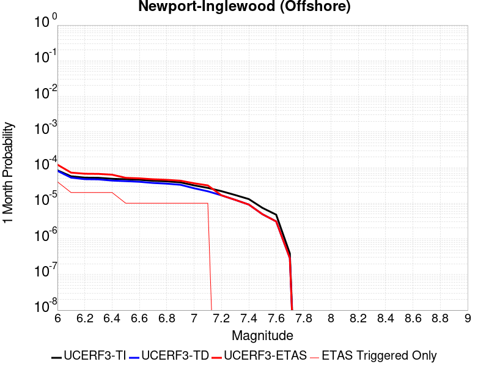 |  | 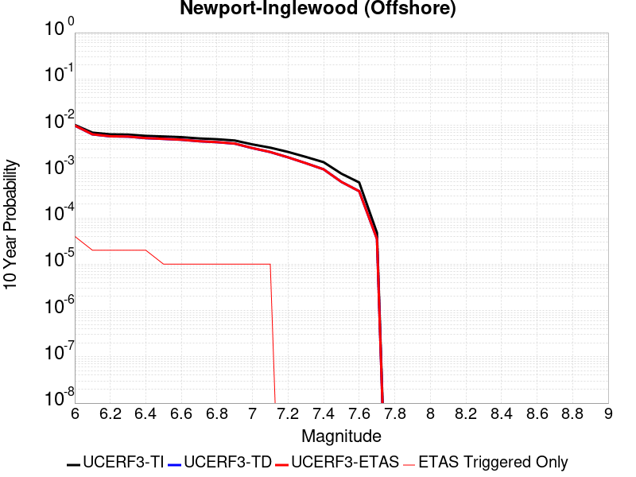 |

| Magnitude | 1 wk TI Prob | 1 wk TD Prob | 1 wk ETAS Prob | 1 wk ETAS/TD Gain | 1 wk ETAS Triggered Only | 1 mo TI Prob | 1 mo TD Prob | 1 mo ETAS Prob | 1 mo ETAS/TD Gain | 1 mo ETAS Triggered Only | 1 yr TI Prob | 1 yr TD Prob | 1 yr ETAS Prob | 1 yr ETAS/TD Gain | 1 yr ETAS Triggered Only | 10 yr TI Prob | 10 yr TD Prob | 10 yr ETAS Prob | 10 yr ETAS/TD Gain | 10 yr ETAS Triggered Only |
|-----|-----|-----|-----|-----|-----|-----|-----|-----|-----|-----|-----|-----|-----|-----|-----|-----|-----|-----|-----|-----|
| 6.0 | 1.9626508E-5 | 1.8965342E-5 | 4.3166823E-5 | 2.27609 | 2.4201941E-5 | 8.411089E-5 | 8.1277576E-5 | 1.2967753E-4 | 1.5954895 | 4.8403883E-5 | 0.001023569 | 9.891179E-4 | 0.0010374739 | 1.048888 | 4.8403883E-5 | 0.010188672 | 0.009848497 | 0.009896424 | 1.0048665 | 4.8403883E-5 |
| 6.1 | 1.331886E-5 | 1.2218078E-5 | 1.2218078E-5 | 1.0 | 0.0 | 5.707958E-5 | 5.2362153E-5 | 5.2362153E-5 | 1.0 | 0.0 | 6.947222E-4 | 6.3732424E-4 | 6.3732424E-4 | 1.0 | 0.0 | 0.006925544 | 0.006355142 | 0.006355142 | 1.0 | 0.0 |
| 6.2 | 1.2250852E-5 | 1.1076016E-5 | 1.1076016E-5 | 1.0 | 0.0 | 5.2502597E-5 | 4.746778E-5 | 4.746778E-5 | 1.0 | 0.0 | 6.3903164E-4 | 5.7776796E-4 | 5.7776796E-4 | 1.0 | 0.0 | 0.006371971 | 0.0057627796 | 0.0057627796 | 1.0 | 0.0 |
| 6.3 | 1.2106258E-5 | 1.0918878E-5 | 1.0918878E-5 | 1.0 | 0.0 | 5.1882926E-5 | 4.6794354E-5 | 4.6794354E-5 | 1.0 | 0.0 | 6.3149154E-4 | 5.695733E-4 | 5.695733E-4 | 1.0 | 0.0 | 0.0062970007 | 0.005681252 | 0.005681252 | 1.0 | 0.0 |
| 6.4 | 1.1348758E-5 | 1.0109348E-5 | 1.0109348E-5 | 1.0 | 0.0 | 4.8636626E-5 | 4.3325064E-5 | 4.3325064E-5 | 1.0 | 0.0 | 5.919901E-4 | 5.2735576E-4 | 5.2735576E-4 | 1.0 | 0.0 | 0.005904155 | 0.0052611395 | 0.0052611395 | 1.0 | 0.0 |
| 6.5 | 1.100837E-5 | 9.743376E-6 | 9.743376E-6 | 1.0 | 0.0 | 4.7177873E-5 | 4.175666E-5 | 4.175666E-5 | 1.0 | 0.0 | 5.7423924E-4 | 5.082695E-4 | 5.082695E-4 | 1.0 | 0.0 | 0.005727576 | 0.005071162 | 0.005071162 | 1.0 | 0.0 |
| 6.6 | 1.0634696E-5 | 9.34553E-6 | 9.34553E-6 | 1.0 | 0.0 | 4.557647E-5 | 4.0051662E-5 | 4.0051662E-5 | 1.0 | 0.0 | 5.5475225E-4 | 4.875206E-4 | 4.875206E-4 | 1.0 | 0.0 | 0.0055336943 | 0.0048645977 | 0.0048645977 | 1.0 | 0.0 |
| 6.7 | 9.9780855E-6 | 8.667898E-6 | 8.667898E-6 | 1.0 | 0.0 | 4.276252E-5 | 3.7147613E-5 | 3.7147613E-5 | 1.0 | 0.0 | 5.205093E-4 | 4.5217903E-4 | 4.5217903E-4 | 1.0 | 0.0 | 0.0051929182 | 0.0045126686 | 0.0045126686 | 1.0 | 0.0 |
| 6.8 | 9.59546E-6 | 8.272933E-6 | 8.272933E-6 | 1.0 | 0.0 | 4.1122752E-5 | 3.545495E-5 | 3.545495E-5 | 1.0 | 0.0 | 5.0055445E-4 | 4.3157916E-4 | 4.3157916E-4 | 1.0 | 0.0 | 0.004994285 | 0.004307486 | 0.004307486 | 1.0 | 0.0 |
| 6.9 | 9.000614E-6 | 7.706823E-6 | 7.706823E-6 | 1.0 | 0.0 | 3.857349E-5 | 3.3028828E-5 | 3.3028828E-5 | 1.0 | 0.0 | 4.6953102E-4 | 4.0205245E-4 | 4.0205245E-4 | 1.0 | 0.0 | 0.004685402 | 0.0040133223 | 0.0040133223 | 1.0 | 0.0 |
| 7.0 | 7.4070194E-6 | 6.148865E-6 | 6.148865E-6 | 1.0 | 0.0 | 3.1743984E-5 | 2.6352012E-5 | 2.6352012E-5 | 1.0 | 0.0 | 3.8641447E-4 | 3.2078868E-4 | 3.2078868E-4 | 1.0 | 0.0 | 0.0038574322 | 0.0032032758 | 0.0032032758 | 1.0 | 0.0 |
| 7.1 | 6.299615E-6 | 5.0565613E-6 | 5.0565613E-6 | 1.0 | 0.0 | 2.699807E-5 | 2.1670798E-5 | 2.1670798E-5 | 1.0 | 0.0 | 3.2865192E-4 | 2.6381016E-4 | 2.6381016E-4 | 1.0 | 0.0 | 0.003281663 | 0.0026349847 | 0.0026349847 | 1.0 | 0.0 |
| 7.2 | 5.096653E-6 | 3.892733E-6 | 3.892733E-6 | 1.0 | 0.0 | 2.1842614E-5 | 1.6683034E-5 | 1.6683034E-5 | 1.0 | 0.0 | 2.6590136E-4 | 2.0309711E-4 | 2.0309711E-4 | 1.0 | 0.0 | 0.0026558342 | 0.0020291263 | 0.0020291263 | 1.0 | 0.0 |
| 7.3 | 3.9753018E-6 | 2.9098787E-6 | 2.9098787E-6 | 1.0 | 0.0 | 1.7036897E-5 | 1.24708495E-5 | 1.24708495E-5 | 1.0 | 0.0 | 2.0740448E-4 | 1.518221E-4 | 1.518221E-4 | 1.0 | 0.0 | 0.00207211 | 0.0015171919 | 0.0015171919 | 1.0 | 0.0 |
| 7.4 | 3.0568392E-6 | 2.1449732E-6 | 2.1449732E-6 | 1.0 | 0.0 | 1.3100675E-5 | 9.19271E-6 | 9.19271E-6 | 1.0 | 0.0 | 1.5948903E-4 | 1.11915564E-4 | 1.11915564E-4 | 1.0 | 0.0 | 0.0015937461 | 0.0011185983 | 0.0011185983 | 1.0 | 0.0 |
| 7.5 | 1.7279019E-6 | 1.1469651E-6 | 1.1469651E-6 | 1.0 | 0.0 | 7.405273E-6 | 4.9155556E-6 | 4.9155556E-6 | 1.0 | 0.0 | 9.015547E-5 | 5.9845286E-5 | 5.9845286E-5 | 1.0 | 0.0 | 9.01189E-4 | 5.982956E-4 | 5.982956E-4 | 1.0 | 0.0 |
| 7.6 | 1.1156416E-6 | 7.222962E-7 | 7.222962E-7 | 1.0 | 0.0 | 4.7813123E-6 | 3.0955514E-6 | 3.0955514E-6 | 1.0 | 0.0 | 5.821092E-5 | 3.768771E-5 | 3.768771E-5 | 1.0 | 0.0 | 5.8195676E-4 | 3.7681553E-4 | 3.7681553E-4 | 1.0 | 0.0 |
| 7.7 | 9.117973E-8 | 6.7342256E-8 | 6.7342256E-8 | 1.0 | 0.0 | 3.907702E-7 | 2.8860964E-7 | 2.8860964E-7 | 1.0 | 0.0 | 4.757617E-6 | 3.5138169E-6 | 3.5138169E-6 | 1.0 | 0.0 | 4.7575148E-5 | 3.5137644E-5 | 3.5137644E-5 | 1.0 | 0.0 |

## Camp Rock 2011
*[(top)](#table-of-contents)*

| 1 Week | 1 Month | 1 Year | 10 Year |
|-----|-----|-----|-----|
| 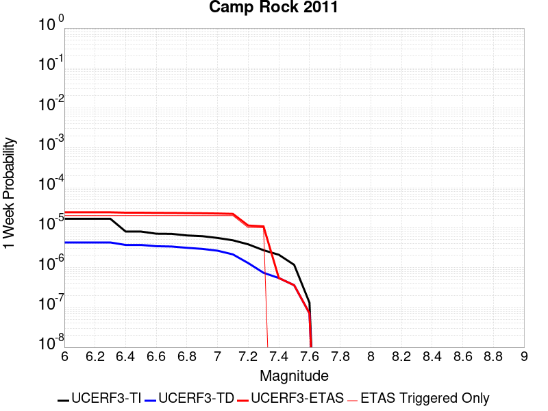 |  | 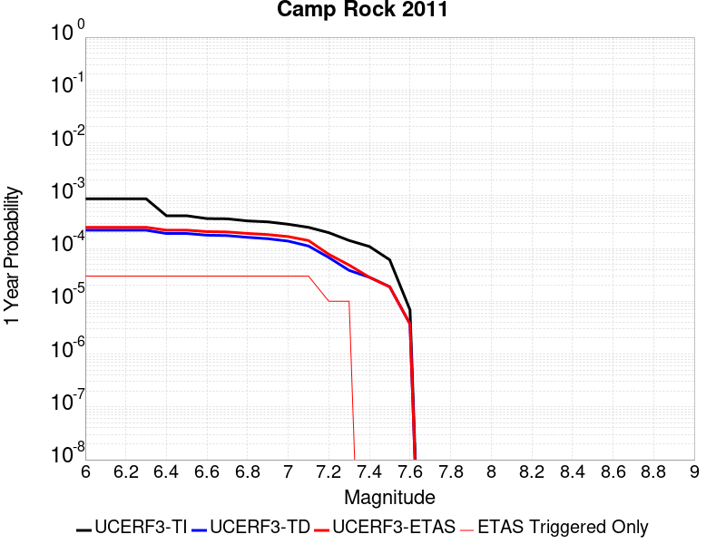 | 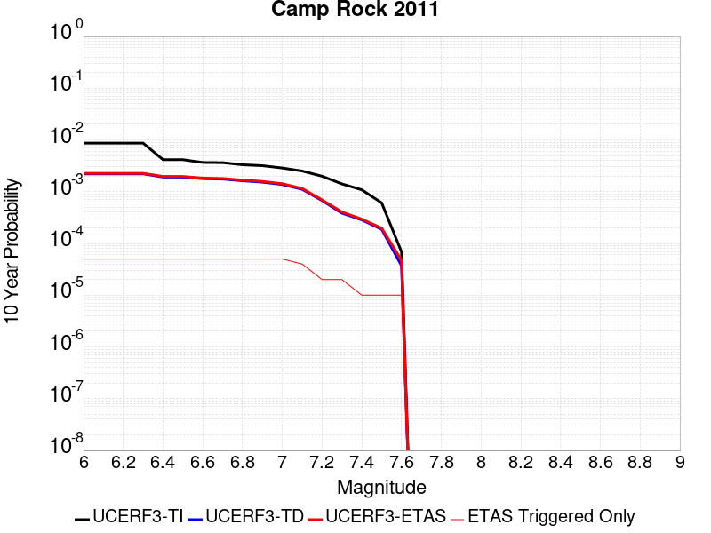 |

| Magnitude | 1 wk TI Prob | 1 wk TD Prob | 1 wk ETAS Prob | 1 wk ETAS/TD Gain | 1 wk ETAS Triggered Only | 1 mo TI Prob | 1 mo TD Prob | 1 mo ETAS Prob | 1 mo ETAS/TD Gain | 1 mo ETAS Triggered Only | 1 yr TI Prob | 1 yr TD Prob | 1 yr ETAS Prob | 1 yr ETAS/TD Gain | 1 yr ETAS Triggered Only | 10 yr TI Prob | 10 yr TD Prob | 10 yr ETAS Prob | 10 yr ETAS/TD Gain | 10 yr ETAS Triggered Only |
|-----|-----|-----|-----|-----|-----|-----|-----|-----|-----|-----|-----|-----|-----|-----|-----|-----|-----|-----|-----|-----|
| 6.0 | 1.6710783E-5 | 4.249999E-6 | 4.249999E-6 | 1.0 | 0.0 | 7.161568E-5 | 1.8214158E-5 | 1.8214158E-5 | 1.0 | 0.0 | 8.7157206E-4 | 2.2173533E-4 | 2.459319E-4 | 1.1091237 | 2.4201941E-5 | 0.008681616 | 0.0022151938 | 0.0022634903 | 1.0218024 | 4.8403883E-5 |
| 6.1 | 1.6710783E-5 | 4.249999E-6 | 4.249999E-6 | 1.0 | 0.0 | 7.161568E-5 | 1.8214158E-5 | 1.8214158E-5 | 1.0 | 0.0 | 8.7157206E-4 | 2.2173533E-4 | 2.459319E-4 | 1.1091237 | 2.4201941E-5 | 0.008681616 | 0.0022151938 | 0.0022634903 | 1.0218024 | 4.8403883E-5 |
| 6.2 | 1.6710783E-5 | 4.249999E-6 | 4.249999E-6 | 1.0 | 0.0 | 7.161568E-5 | 1.8214158E-5 | 1.8214158E-5 | 1.0 | 0.0 | 8.7157206E-4 | 2.2173533E-4 | 2.459319E-4 | 1.1091237 | 2.4201941E-5 | 0.008681616 | 0.0022151938 | 0.0022634903 | 1.0218024 | 4.8403883E-5 |
| 6.3 | 1.6710783E-5 | 4.249999E-6 | 4.249999E-6 | 1.0 | 0.0 | 7.161568E-5 | 1.8214158E-5 | 1.8214158E-5 | 1.0 | 0.0 | 8.7157206E-4 | 2.2173533E-4 | 2.459319E-4 | 1.1091237 | 2.4201941E-5 | 0.008681616 | 0.0022151938 | 0.0022634903 | 1.0218024 | 4.8403883E-5 |
| 6.4 | 7.982846E-6 | 3.6820359E-6 | 3.6820359E-6 | 1.0 | 0.0 | 3.421175E-5 | 1.578006E-5 | 1.578006E-5 | 1.0 | 0.0 | 4.1644843E-4 | 1.9210564E-4 | 2.1630293E-4 | 1.1259582 | 2.4201941E-5 | 0.0041566887 | 0.0019194306 | 0.0019677416 | 1.0251694 | 4.8403883E-5 |
| 6.5 | 7.982846E-6 | 3.6820359E-6 | 3.6820359E-6 | 1.0 | 0.0 | 3.421175E-5 | 1.578006E-5 | 1.578006E-5 | 1.0 | 0.0 | 4.1644843E-4 | 1.9210564E-4 | 2.1630293E-4 | 1.1259582 | 2.4201941E-5 | 0.0041566887 | 0.0019194306 | 0.0019677416 | 1.0251694 | 4.8403883E-5 |
| 6.6 | 7.048869E-6 | 3.4242998E-6 | 3.4242998E-6 | 1.0 | 0.0 | 3.0209088E-5 | 1.467549E-5 | 1.467549E-5 | 1.0 | 0.0 | 3.677336E-4 | 1.7865976E-4 | 2.0285738E-4 | 1.1354396 | 2.4201941E-5 | 0.0036712566 | 0.0017851929 | 0.0018335104 | 1.0270656 | 4.8403883E-5 |
| 6.7 | 6.987307E-6 | 3.3622775E-6 | 3.3622775E-6 | 1.0 | 0.0 | 2.9945259E-5 | 1.4409683E-5 | 1.4409683E-5 | 1.0 | 0.0 | 3.6452254E-4 | 1.7542407E-4 | 1.9962176E-4 | 1.1379383 | 2.4201941E-5 | 0.0036392517 | 0.0017528872 | 0.0018012061 | 1.0275654 | 4.8403883E-5 |
| 6.8 | 6.3737602E-6 | 3.1178672E-6 | 3.1178672E-6 | 1.0 | 0.0 | 2.731583E-5 | 1.3362222E-5 | 1.3362222E-5 | 1.0 | 0.0 | 3.3251947E-4 | 1.6267318E-4 | 1.868712E-4 | 1.1487522 | 2.4201941E-5 | 0.0033202237 | 0.0016255698 | 0.0016738949 | 1.0297282 | 4.8403883E-5 |
| 6.9 | 6.112211E-6 | 2.933078E-6 | 2.933078E-6 | 1.0 | 0.0 | 2.6194928E-5 | 1.2570275E-5 | 1.2570275E-5 | 1.0 | 0.0 | 3.1887658E-4 | 1.5303263E-4 | 1.7723088E-4 | 1.1581247 | 2.4201941E-5 | 0.003184194 | 0.0015293002 | 0.0015776302 | 1.0316026 | 4.8403883E-5 |
| 7.0 | 5.5140117E-6 | 2.64191E-6 | 2.64191E-6 | 1.0 | 0.0 | 2.3631264E-5 | 1.1322423E-5 | 1.1322423E-5 | 1.0 | 0.0 | 2.8767265E-4 | 1.3784204E-4 | 1.6204064E-4 | 1.1755532 | 2.4201941E-5 | 0.0028730053 | 0.0013775907 | 0.0014259279 | 1.0350882 | 4.8403883E-5 |
| 7.1 | 4.8151105E-6 | 2.1342612E-6 | 2.1342612E-6 | 1.0 | 0.0 | 2.0636026E-5 | 9.146803E-6 | 9.146803E-6 | 1.0 | 0.0 | 2.5121463E-4 | 1.1135685E-4 | 1.355561E-4 | 1.2173126 | 2.4201941E-5 | 0.0025093083 | 0.0011130325 | 0.0011372074 | 1.0217199 | 2.4201941E-5 |
| 7.2 | 3.818335E-6 | 1.2937372E-6 | 1.2937372E-6 | 1.0 | 0.0 | 1.6364189E-5 | 5.5445767E-6 | 5.5445767E-6 | 1.0 | 0.0 | 1.9921579E-4 | 6.750321E-5 | 6.750321E-5 | 1.0 | 0.0 | 0.0019903728 | 6.7483535E-4 | 6.7483535E-4 | 1.0 | 0.0 |
| 7.3 | 2.7166698E-6 | 7.383078E-7 | 7.383078E-7 | 1.0 | 0.0 | 1.1642818E-5 | 3.1641725E-6 | 3.1641725E-6 | 1.0 | 0.0 | 1.4174209E-4 | 3.852314E-5 | 3.852314E-5 | 1.0 | 0.0 | 0.0014165172 | 3.8516664E-4 | 3.8516664E-4 | 1.0 | 0.0 |
| 7.4 | 2.0893426E-6 | 5.4614605E-7 | 5.4614605E-7 | 1.0 | 0.0 | 8.954295E-6 | 2.340624E-6 | 2.340624E-6 | 1.0 | 0.0 | 1.0901308E-4 | 2.8496728E-5 | 2.8496728E-5 | 1.0 | 0.0 | 0.0010895962 | 2.849313E-4 | 2.849313E-4 | 1.0 | 0.0 |
| 7.5 | 1.1681728E-6 | 3.6028484E-7 | 3.6028484E-7 | 1.0 | 0.0 | 5.0064455E-6 | 1.544077E-6 | 1.544077E-6 | 1.0 | 0.0 | 6.0951766E-5 | 1.879898E-5 | 1.879898E-5 | 1.0 | 0.0 | 6.093505E-4 | 1.8797436E-4 | 1.8797436E-4 | 1.0 | 0.0 |
| 7.6 | 1.3154387E-7 | 7.1196716E-8 | 7.1196716E-8 | 1.0 | 0.0 | 5.6375933E-7 | 3.0512876E-7 | 3.0512876E-7 | 1.0 | 0.0 | 6.863748E-6 | 3.714938E-6 | 3.714938E-6 | 1.0 | 0.0 | 6.863536E-5 | 3.7148915E-5 | 3.7148915E-5 | 1.0 | 0.0 |

## Elysian Park (Upper)
*[(top)](#table-of-contents)*

| 1 Week | 1 Month | 1 Year | 10 Year |
|-----|-----|-----|-----|
|  |  | 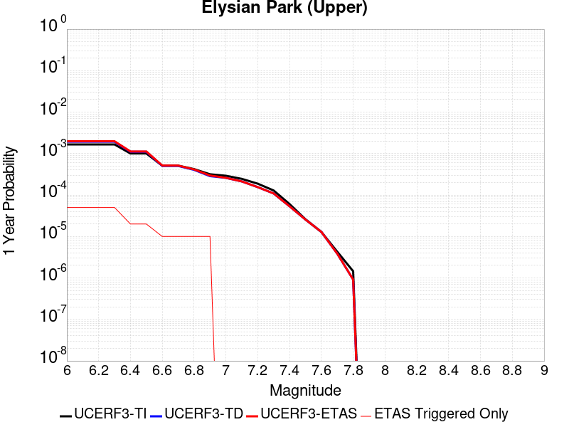 |  |

| Magnitude | 1 wk TI Prob | 1 wk TD Prob | 1 wk ETAS Prob | 1 wk ETAS/TD Gain | 1 wk ETAS Triggered Only | 1 mo TI Prob | 1 mo TD Prob | 1 mo ETAS Prob | 1 mo ETAS/TD Gain | 1 mo ETAS Triggered Only | 1 yr TI Prob | 1 yr TD Prob | 1 yr ETAS Prob | 1 yr ETAS/TD Gain | 1 yr ETAS Triggered Only | 10 yr TI Prob | 10 yr TD Prob | 10 yr ETAS Prob | 10 yr ETAS/TD Gain | 10 yr ETAS Triggered Only |
|-----|-----|-----|-----|-----|-----|-----|-----|-----|-----|-----|-----|-----|-----|-----|-----|-----|-----|-----|-----|-----|
| 6.0 | 3.1876025E-5 | 3.7035275E-5 | 3.7035275E-5 | 1.0 | 0.0 | 1.3660437E-4 | 1.5871569E-4 | 1.5871569E-4 | 1.0 | 0.0 | 0.0016618895 | 0.001931122 | 0.0019552773 | 1.0125084 | 2.4201941E-5 | 0.016495159 | 0.019189863 | 0.019237338 | 1.002474 | 4.8403883E-5 |
| 6.1 | 3.1876025E-5 | 3.7035275E-5 | 3.7035275E-5 | 1.0 | 0.0 | 1.3660437E-4 | 1.5871569E-4 | 1.5871569E-4 | 1.0 | 0.0 | 0.0016618895 | 0.001931122 | 0.0019552773 | 1.0125084 | 2.4201941E-5 | 0.016495159 | 0.019189863 | 0.019237338 | 1.002474 | 4.8403883E-5 |
| 6.2 | 3.1876025E-5 | 3.7035275E-5 | 3.7035275E-5 | 1.0 | 0.0 | 1.3660437E-4 | 1.5871569E-4 | 1.5871569E-4 | 1.0 | 0.0 | 0.0016618895 | 0.001931122 | 0.0019552773 | 1.0125084 | 2.4201941E-5 | 0.016495159 | 0.019189863 | 0.019237338 | 1.002474 | 4.8403883E-5 |
| 6.3 | 3.1876025E-5 | 3.7035275E-5 | 3.7035275E-5 | 1.0 | 0.0 | 1.3660437E-4 | 1.5871569E-4 | 1.5871569E-4 | 1.0 | 0.0 | 0.0016618895 | 0.001931122 | 0.0019552773 | 1.0125084 | 2.4201941E-5 | 0.016495159 | 0.019189863 | 0.019237338 | 1.002474 | 4.8403883E-5 |
| 6.4 | 1.9273462E-5 | 2.120244E-5 | 2.120244E-5 | 1.0 | 0.0 | 8.259794E-5 | 9.086542E-5 | 9.086542E-5 | 1.0 | 0.0 | 0.001005166 | 0.0011058967 | 0.0011058967 | 1.0 | 0.0 | 0.010006315 | 0.011020744 | 0.011020744 | 1.0 | 0.0 |
| 6.5 | 1.9273462E-5 | 2.120244E-5 | 2.120244E-5 | 1.0 | 0.0 | 8.259794E-5 | 9.086542E-5 | 9.086542E-5 | 1.0 | 0.0 | 0.001005166 | 0.0011058967 | 0.0011058967 | 1.0 | 0.0 | 0.010006315 | 0.011020744 | 0.011020744 | 1.0 | 0.0 |
| 6.6 | 9.813258E-6 | 9.665589E-6 | 9.665589E-6 | 1.0 | 0.0 | 4.205614E-5 | 4.1423333E-5 | 4.1423333E-5 | 1.0 | 0.0 | 5.119132E-4 | 5.042196E-4 | 5.042196E-4 | 1.0 | 0.0 | 0.005107356 | 0.0050314795 | 0.0050314795 | 1.0 | 0.0 |
| 6.7 | 9.801478E-6 | 9.653158E-6 | 9.653158E-6 | 1.0 | 0.0 | 4.2005657E-5 | 4.137006E-5 | 4.137006E-5 | 1.0 | 0.0 | 5.112989E-4 | 5.0357135E-4 | 5.0357135E-4 | 1.0 | 0.0 | 0.0051012407 | 0.005025026 | 0.005025026 | 1.0 | 0.0 |
| 6.8 | 8.102489E-6 | 7.772994E-6 | 7.772994E-6 | 1.0 | 0.0 | 3.4724493E-5 | 3.3312434E-5 | 3.3312434E-5 | 1.0 | 0.0 | 4.2268867E-4 | 4.0550836E-4 | 4.0550836E-4 | 1.0 | 0.0 | 0.004218856 | 0.0040481784 | 0.0040481784 | 1.0 | 0.0 |
| 6.9 | 6.08275E-6 | 5.481441E-6 | 5.481441E-6 | 1.0 | 0.0 | 2.6068668E-5 | 2.3491682E-5 | 2.3491682E-5 | 1.0 | 0.0 | 3.173398E-4 | 2.8597447E-4 | 2.8597447E-4 | 1.0 | 0.0 | 0.0031688702 | 0.0028561424 | 0.0028561424 | 1.0 | 0.0 |
| 7.0 | 5.5995934E-6 | 4.9827686E-6 | 4.9827686E-6 | 1.0 | 0.0 | 2.3998036E-5 | 2.1354552E-5 | 2.1354552E-5 | 1.0 | 0.0 | 2.9213692E-4 | 2.5996132E-4 | 2.5996132E-4 | 1.0 | 0.0 | 0.0029175316 | 0.0025966396 | 0.0025966396 | 1.0 | 0.0 |
| 7.1 | 4.709881E-6 | 4.0873906E-6 | 4.0873906E-6 | 1.0 | 0.0 | 2.0185047E-5 | 1.7517272E-5 | 1.7517272E-5 | 1.0 | 0.0 | 2.4572524E-4 | 2.1325232E-4 | 2.1325232E-4 | 1.0 | 0.0 | 0.002454537 | 0.0021305184 | 0.0021305184 | 1.0 | 0.0 |
| 7.2 | 3.6063436E-6 | 2.9779412E-6 | 2.9779412E-6 | 1.0 | 0.0 | 1.5455667E-5 | 1.27625435E-5 | 1.27625435E-5 | 1.0 | 0.0 | 1.881565E-4 | 1.55373E-4 | 1.55373E-4 | 1.0 | 0.0 | 0.0018799726 | 0.0015526549 | 0.0015526549 | 1.0 | 0.0 |
| 7.3 | 2.471135E-6 | 2.0954562E-6 | 2.0954562E-6 | 1.0 | 0.0 | 1.0590536E-5 | 8.980496E-6 | 8.980496E-6 | 1.0 | 0.0 | 1.2893214E-4 | 1.0933213E-4 | 1.0933213E-4 | 1.0 | 0.0 | 0.0012885736 | 0.0010927906 | 0.0010927906 | 1.0 | 0.0 |
| 7.4 | 1.163943E-6 | 1.0275061E-6 | 1.0275061E-6 | 1.0 | 0.0 | 4.988318E-6 | 4.40359E-6 | 4.40359E-6 | 1.0 | 0.0 | 6.0731076E-5 | 5.361242E-5 | 5.361242E-5 | 1.0 | 0.0 | 6.071448E-4 | 5.3599785E-4 | 5.3599785E-4 | 1.0 | 0.0 |
| 7.5 | 4.99459E-7 | 4.917601E-7 | 4.917601E-7 | 1.0 | 0.0 | 2.140537E-6 | 2.1075416E-6 | 2.1075416E-6 | 1.0 | 0.0 | 2.6060725E-5 | 2.5659032E-5 | 2.5659032E-5 | 1.0 | 0.0 | 2.605767E-4 | 2.5656226E-4 | 2.5656226E-4 | 1.0 | 0.0 |
| 7.6 | 2.4667852E-7 | 2.4778313E-7 | 2.4778313E-7 | 1.0 | 0.0 | 1.0571932E-6 | 1.0619274E-6 | 1.0619274E-6 | 1.0 | 0.0 | 1.2871251E-5 | 1.2928893E-5 | 1.2928893E-5 | 1.0 | 0.0 | 1.2870505E-4 | 1.2928178E-4 | 1.2928178E-4 | 1.0 | 0.0 |
| 7.7 | 8.2312795E-8 | 7.3864214E-8 | 7.3864214E-8 | 1.0 | 0.0 | 3.527691E-7 | 3.165609E-7 | 3.165609E-7 | 1.0 | 0.0 | 4.294955E-6 | 3.854123E-6 | 3.854123E-6 | 1.0 | 0.0 | 4.2948723E-5 | 3.854068E-5 | 3.854068E-5 | 1.0 | 0.0 |
| 7.8 | 2.7819295E-8 | 1.7565618E-8 | 1.7565618E-8 | 1.0 | 0.0 | 1.1922555E-7 | 7.528122E-8 | 7.528122E-8 | 1.0 | 0.0 | 1.45157E-6 | 9.1654863E-7 | 9.1654863E-7 | 1.0 | 0.0 | 1.45156055E-5 | 9.165463E-6 | 9.165463E-6 | 1.0 | 0.0 |

## Sierra Madre
*[(top)](#table-of-contents)*

| 1 Week | 1 Month | 1 Year | 10 Year |
|-----|-----|-----|-----|
|  |  |  |  |

| Magnitude | 1 wk TI Prob | 1 wk TD Prob | 1 wk ETAS Prob | 1 wk ETAS/TD Gain | 1 wk ETAS Triggered Only | 1 mo TI Prob | 1 mo TD Prob | 1 mo ETAS Prob | 1 mo ETAS/TD Gain | 1 mo ETAS Triggered Only | 1 yr TI Prob | 1 yr TD Prob | 1 yr ETAS Prob | 1 yr ETAS/TD Gain | 1 yr ETAS Triggered Only | 10 yr TI Prob | 10 yr TD Prob | 10 yr ETAS Prob | 10 yr ETAS/TD Gain | 10 yr ETAS Triggered Only |
|-----|-----|-----|-----|-----|-----|-----|-----|-----|-----|-----|-----|-----|-----|-----|-----|-----|-----|-----|-----|-----|
| 6.0 | 1.3379373E-5 | 1.1000776E-5 | 1.1000776E-5 | 1.0 | 0.0 | 5.7338908E-5 | 4.714534E-5 | 4.714534E-5 | 1.0 | 0.0 | 6.978776E-4 | 5.738448E-4 | 5.9803284E-4 | 1.0421509 | 2.4201941E-5 | 0.0069569005 | 0.0057238447 | 0.005771972 | 1.0084081 | 4.8403883E-5 |
| 6.1 | 1.3379373E-5 | 1.1000776E-5 | 1.1000776E-5 | 1.0 | 0.0 | 5.7338908E-5 | 4.714534E-5 | 4.714534E-5 | 1.0 | 0.0 | 6.978776E-4 | 5.738448E-4 | 5.9803284E-4 | 1.0421509 | 2.4201941E-5 | 0.0069569005 | 0.0057238447 | 0.005771972 | 1.0084081 | 4.8403883E-5 |
| 6.2 | 1.3379373E-5 | 1.1000776E-5 | 1.1000776E-5 | 1.0 | 0.0 | 5.7338908E-5 | 4.714534E-5 | 4.714534E-5 | 1.0 | 0.0 | 6.978776E-4 | 5.738448E-4 | 5.9803284E-4 | 1.0421509 | 2.4201941E-5 | 0.0069569005 | 0.0057238447 | 0.005771972 | 1.0084081 | 4.8403883E-5 |
| 6.3 | 1.3379373E-5 | 1.1000776E-5 | 1.1000776E-5 | 1.0 | 0.0 | 5.7338908E-5 | 4.714534E-5 | 4.714534E-5 | 1.0 | 0.0 | 6.978776E-4 | 5.738448E-4 | 5.9803284E-4 | 1.0421509 | 2.4201941E-5 | 0.0069569005 | 0.0057238447 | 0.005771972 | 1.0084081 | 4.8403883E-5 |
| 6.4 | 1.3379373E-5 | 1.1000776E-5 | 1.1000776E-5 | 1.0 | 0.0 | 5.7338908E-5 | 4.714534E-5 | 4.714534E-5 | 1.0 | 0.0 | 6.978776E-4 | 5.738448E-4 | 5.9803284E-4 | 1.0421509 | 2.4201941E-5 | 0.0069569005 | 0.0057238447 | 0.005771972 | 1.0084081 | 4.8403883E-5 |
| 6.5 | 1.26563245E-5 | 1.0230232E-5 | 1.0230232E-5 | 1.0 | 0.0 | 5.4240263E-5 | 4.384312E-5 | 4.384312E-5 | 1.0 | 0.0 | 6.601751E-4 | 5.3366035E-4 | 5.5784936E-4 | 1.0453266 | 2.4201941E-5 | 0.006582173 | 0.0053239604 | 0.0053721066 | 1.0090433 | 4.8403883E-5 |
| 6.6 | 1.26563245E-5 | 1.0230232E-5 | 1.0230232E-5 | 1.0 | 0.0 | 5.4240263E-5 | 4.384312E-5 | 4.384312E-5 | 1.0 | 0.0 | 6.601751E-4 | 5.3366035E-4 | 5.5784936E-4 | 1.0453266 | 2.4201941E-5 | 0.006582173 | 0.0053239604 | 0.0053721066 | 1.0090433 | 4.8403883E-5 |
| 6.7 | 1.2502474E-5 | 1.00663765E-5 | 1.00663765E-5 | 1.0 | 0.0 | 5.3580934E-5 | 4.3140906E-5 | 4.3140906E-5 | 1.0 | 0.0 | 6.521526E-4 | 5.25115E-4 | 5.4930424E-4 | 1.0460646 | 2.4201941E-5 | 0.0065024206 | 0.0052389116 | 0.005287062 | 1.0091909 | 4.8403883E-5 |
| 6.8 | 1.2454966E-5 | 1.0018662E-5 | 1.0018662E-5 | 1.0 | 0.0 | 5.3377335E-5 | 4.293642E-5 | 4.293642E-5 | 1.0 | 0.0 | 6.4967526E-4 | 5.226266E-4 | 5.4681586E-4 | 1.0462841 | 2.4201941E-5 | 0.006477792 | 0.0052141445 | 0.0052622957 | 1.0092348 | 4.8403883E-5 |
| 6.9 | 1.2225574E-5 | 9.792639E-6 | 9.792639E-6 | 1.0 | 0.0 | 5.2394265E-5 | 4.196778E-5 | 4.196778E-5 | 1.0 | 0.0 | 6.3771347E-4 | 5.10839E-4 | 5.350286E-4 | 1.0473527 | 2.4201941E-5 | 0.006358865 | 0.0050968137 | 0.005144971 | 1.0094485 | 4.8403883E-5 |
| 7.0 | 1.182946E-5 | 9.399179E-6 | 9.399179E-6 | 1.0 | 0.0 | 5.06967E-5 | 4.0281582E-5 | 4.0281582E-5 | 1.0 | 0.0 | 6.1705755E-4 | 4.903189E-4 | 5.14509E-4 | 1.0493354 | 2.4201941E-5 | 0.006153469 | 0.004892533 | 0.0049407003 | 1.009845 | 4.8403883E-5 |
| 7.1 | 1.14369095E-5 | 8.986194E-6 | 8.986194E-6 | 1.0 | 0.0 | 4.9014405E-5 | 3.85117E-5 | 3.85117E-5 | 1.0 | 0.0 | 5.9658696E-4 | 4.6878002E-4 | 4.9297063E-4 | 1.0516033 | 2.4201941E-5 | 0.005949879 | 0.0046780678 | 0.004726245 | 1.0102986 | 4.8403883E-5 |
| 7.2 | 1.0836419E-5 | 8.39959E-6 | 8.39959E-6 | 1.0 | 0.0 | 4.644097E-5 | 3.599775E-5 | 3.599775E-5 | 1.0 | 0.0 | 5.652721E-4 | 4.3818538E-4 | 4.6237672E-4 | 1.055208 | 2.4201941E-5 | 0.0056383642 | 0.0043733614 | 0.0044215536 | 1.0110195 | 4.8403883E-5 |
| 7.3 | 1.0403439E-5 | 8.020854E-6 | 8.020854E-6 | 1.0 | 0.0 | 4.4585406E-5 | 3.437464E-5 | 3.437464E-5 | 1.0 | 0.0 | 5.426921E-4 | 4.184318E-4 | 4.426236E-4 | 1.0578154 | 2.4201941E-5 | 0.005413687 | 0.004176585 | 0.0042247865 | 1.0115409 | 4.8403883E-5 |
| 7.4 | 9.768864E-6 | 7.4144855E-6 | 7.4144855E-6 | 1.0 | 0.0 | 4.186589E-5 | 3.1775984E-5 | 3.1775984E-5 | 1.0 | 0.0 | 5.09598E-4 | 3.868048E-4 | 3.868048E-4 | 1.0 | 0.0 | 0.0050843097 | 0.0038614576 | 0.0038614576 | 1.0 | 0.0 |
| 7.5 | 8.687089E-6 | 6.450183E-6 | 6.450183E-6 | 1.0 | 0.0 | 3.722985E-5 | 2.7643353E-5 | 2.7643353E-5 | 1.0 | 0.0 | 4.5317915E-4 | 3.3650672E-4 | 3.3650672E-4 | 1.0 | 0.0 | 0.004522561 | 0.003360109 | 0.003360109 | 1.0 | 0.0 |
| 7.6 | 6.3506063E-6 | 4.430329E-6 | 4.430329E-6 | 1.0 | 0.0 | 2.72166E-5 | 1.8986988E-5 | 1.8986988E-5 | 1.0 | 0.0 | 3.3131172E-4 | 2.3114232E-4 | 2.3114232E-4 | 1.0 | 0.0 | 0.003308182 | 0.0023090935 | 0.0023090935 | 1.0 | 0.0 |
| 7.7 | 4.62223E-6 | 2.9329542E-6 | 2.9329542E-6 | 1.0 | 0.0 | 1.9809406E-5 | 1.2569743E-5 | 1.2569743E-5 | 1.0 | 0.0 | 2.4115283E-4 | 1.5302589E-4 | 1.5302589E-4 | 1.0 | 0.0 | 0.0024089129 | 0.0015292577 | 0.0015292577 | 1.0 | 0.0 |
| 7.8 | 3.2145008E-6 | 1.949411E-6 | 1.949411E-6 | 1.0 | 0.0 | 1.3776359E-5 | 8.354592E-6 | 8.354592E-6 | 1.0 | 0.0 | 1.6771426E-4 | 1.01712416E-4 | 1.01712416E-4 | 1.0 | 0.0 | 0.0016758774 | 0.0010166786 | 0.0010166786 | 1.0 | 0.0 |
| 7.9 | 1.0391769E-6 | 5.602482E-7 | 5.602482E-7 | 1.0 | 0.0 | 4.4536077E-6 | 2.4010617E-6 | 2.4010617E-6 | 1.0 | 0.0 | 5.4221324E-5 | 2.9232539E-5 | 2.9232539E-5 | 1.0 | 0.0 | 5.4208096E-4 | 2.9228735E-4 | 2.9228735E-4 | 1.0 | 0.0 |
| 8.0 | 1.210983E-7 | 6.613497E-8 | 6.613497E-8 | 1.0 | 0.0 | 5.1899264E-7 | 2.8343558E-7 | 2.8343558E-7 | 1.0 | 0.0 | 6.3187167E-6 | 3.4508228E-6 | 3.4508228E-6 | 1.0 | 0.0 | 6.318537E-5 | 3.450771E-5 | 3.450771E-5 | 1.0 | 0.0 |

## Los Osos 2011
*[(top)](#table-of-contents)*

| 1 Week | 1 Month | 1 Year | 10 Year |
|-----|-----|-----|-----|
|  |  |  |  |

| Magnitude | 1 wk TI Prob | 1 wk TD Prob | 1 wk ETAS Prob | 1 wk ETAS/TD Gain | 1 wk ETAS Triggered Only | 1 mo TI Prob | 1 mo TD Prob | 1 mo ETAS Prob | 1 mo ETAS/TD Gain | 1 mo ETAS Triggered Only | 1 yr TI Prob | 1 yr TD Prob | 1 yr ETAS Prob | 1 yr ETAS/TD Gain | 1 yr ETAS Triggered Only | 10 yr TI Prob | 10 yr TD Prob | 10 yr ETAS Prob | 10 yr ETAS/TD Gain | 10 yr ETAS Triggered Only |
|-----|-----|-----|-----|-----|-----|-----|-----|-----|-----|-----|-----|-----|-----|-----|-----|-----|-----|-----|-----|-----|
| 6.0 | 4.8871775E-6 | 4.9814826E-6 | 2.9183304E-5 | 5.858357 | 2.4201941E-5 | 2.0944879E-5 | 2.1349053E-5 | 4.5550478E-5 | 2.1336064 | 2.4201941E-5 | 2.5497406E-4 | 2.598965E-4 | 2.8409215E-4 | 1.0930972 | 2.4201941E-5 | 0.002546817 | 0.0025962 | 0.002644478 | 1.0185957 | 4.8403883E-5 |
| 6.1 | 4.8871775E-6 | 4.9814826E-6 | 2.9183304E-5 | 5.858357 | 2.4201941E-5 | 2.0944879E-5 | 2.1349053E-5 | 4.5550478E-5 | 2.1336064 | 2.4201941E-5 | 2.5497406E-4 | 2.598965E-4 | 2.8409215E-4 | 1.0930972 | 2.4201941E-5 | 0.002546817 | 0.0025962 | 0.002644478 | 1.0185957 | 4.8403883E-5 |
| 6.2 | 4.8871775E-6 | 4.9814826E-6 | 2.9183304E-5 | 5.858357 | 2.4201941E-5 | 2.0944879E-5 | 2.1349053E-5 | 4.5550478E-5 | 2.1336064 | 2.4201941E-5 | 2.5497406E-4 | 2.598965E-4 | 2.8409215E-4 | 1.0930972 | 2.4201941E-5 | 0.002546817 | 0.0025962 | 0.002644478 | 1.0185957 | 4.8403883E-5 |
| 6.3 | 4.8871775E-6 | 4.9814826E-6 | 2.9183304E-5 | 5.858357 | 2.4201941E-5 | 2.0944879E-5 | 2.1349053E-5 | 4.5550478E-5 | 2.1336064 | 2.4201941E-5 | 2.5497406E-4 | 2.598965E-4 | 2.8409215E-4 | 1.0930972 | 2.4201941E-5 | 0.002546817 | 0.0025962 | 0.002644478 | 1.0185957 | 4.8403883E-5 |
| 6.4 | 4.8871775E-6 | 4.9814826E-6 | 2.9183304E-5 | 5.858357 | 2.4201941E-5 | 2.0944879E-5 | 2.1349053E-5 | 4.5550478E-5 | 2.1336064 | 2.4201941E-5 | 2.5497406E-4 | 2.598965E-4 | 2.8409215E-4 | 1.0930972 | 2.4201941E-5 | 0.002546817 | 0.0025962 | 0.002644478 | 1.0185957 | 4.8403883E-5 |
| 6.5 | 3.1724062E-6 | 3.2233943E-6 | 3.2233943E-6 | 1.0 | 0.0 | 1.3595956E-5 | 1.3814474E-5 | 1.3814474E-5 | 1.0 | 0.0 | 1.6551818E-4 | 1.6817838E-4 | 1.6817838E-4 | 1.0 | 0.0 | 0.0016539496 | 0.0016805246 | 0.0017046859 | 1.0143772 | 2.4201941E-5 |
| 6.6 | 3.1022591E-6 | 3.1511038E-6 | 3.1511038E-6 | 1.0 | 0.0 | 1.3295328E-5 | 1.3504661E-5 | 1.3504661E-5 | 1.0 | 0.0 | 1.618586E-4 | 1.6440697E-4 | 1.6440697E-4 | 1.0 | 0.0 | 0.0016174077 | 0.0016428662 | 0.0016670284 | 1.0147073 | 2.4201941E-5 |
| 6.7 | 2.611518E-6 | 2.6491825E-6 | 2.6491825E-6 | 1.0 | 0.0 | 1.1192172E-5 | 1.1353591E-5 | 1.1353591E-5 | 1.0 | 0.0 | 1.3625617E-4 | 1.3822124E-4 | 1.3822124E-4 | 1.0 | 0.0 | 0.0013617266 | 0.0013813572 | 0.0014055257 | 1.0174962 | 2.4201941E-5 |
| 6.8 | 2.4780884E-6 | 2.5121587E-6 | 2.5121587E-6 | 1.0 | 0.0 | 1.0620336E-5 | 1.076635E-5 | 1.076635E-5 | 1.0 | 0.0 | 1.2929492E-4 | 1.3107246E-4 | 1.3107246E-4 | 1.0 | 0.0 | 0.0012921972 | 0.0013099556 | 0.0013341259 | 1.0184512 | 2.4201941E-5 |
| 6.9 | 2.1376322E-6 | 2.1635049E-6 | 2.1635049E-6 | 1.0 | 0.0 | 9.161248E-6 | 9.272131E-6 | 9.272131E-6 | 1.0 | 0.0 | 1.1153249E-4 | 1.1288237E-4 | 1.1288237E-4 | 1.0 | 0.0 | 0.0011147653 | 0.0011282521 | 0.0011524268 | 1.0214267 | 2.4201941E-5 |
| 7.0 | 1.9282882E-6 | 1.949458E-6 | 1.949458E-6 | 1.0 | 0.0 | 8.264066E-6 | 8.354793E-6 | 8.354793E-6 | 1.0 | 0.0 | 1.0061036E-4 | 1.0171487E-4 | 1.0171487E-4 | 1.0 | 0.0 | 0.0010056482 | 0.0010166845 | 0.0010408618 | 1.0237806 | 2.4201941E-5 |
| 7.1 | 1.6353226E-6 | 1.6501111E-6 | 1.6501111E-6 | 1.0 | 0.0 | 7.0085066E-6 | 7.0718856E-6 | 7.0718856E-6 | 1.0 | 0.0 | 8.532523E-5 | 8.6096814E-5 | 8.6096814E-5 | 1.0 | 0.0 | 8.529247E-4 | 8.6063537E-4 | 8.8481646E-4 | 1.0280968 | 2.4201941E-5 |
| 7.2 | 1.4446276E-6 | 1.4553335E-6 | 1.4553335E-6 | 1.0 | 0.0 | 6.191247E-6 | 6.2371287E-6 | 6.2371287E-6 | 1.0 | 0.0 | 7.537582E-5 | 7.59344E-5 | 7.59344E-5 | 1.0 | 0.0 | 7.535026E-4 | 7.590851E-4 | 7.8326865E-4 | 1.0318588 | 2.4201941E-5 |
| 7.3 | 1.2014582E-6 | 1.2069066E-6 | 1.2069066E-6 | 1.0 | 0.0 | 5.149096E-6 | 5.172447E-6 | 5.172447E-6 | 1.0 | 0.0 | 6.268844E-5 | 6.297272E-5 | 6.297272E-5 | 1.0 | 0.0 | 6.267076E-4 | 6.295492E-4 | 6.295492E-4 | 1.0 | 0.0 |
| 7.4 | 9.707733E-7 | 9.709767E-7 | 9.709767E-7 | 1.0 | 0.0 | 4.16045E-6 | 4.161322E-6 | 4.161322E-6 | 1.0 | 0.0 | 5.0652303E-5 | 5.066292E-5 | 5.066292E-5 | 1.0 | 0.0 | 5.064076E-4 | 5.065139E-4 | 5.065139E-4 | 1.0 | 0.0 |
| 7.5 | 7.174908E-7 | 7.114907E-7 | 7.114907E-7 | 1.0 | 0.0 | 3.074957E-6 | 3.0492424E-6 | 3.0492424E-6 | 1.0 | 0.0 | 3.743696E-5 | 3.7123897E-5 | 3.7123897E-5 | 1.0 | 0.0 | 3.7430652E-4 | 3.7117713E-4 | 3.7117713E-4 | 1.0 | 0.0 |
| 7.6 | 4.5535776E-7 | 4.4207857E-7 | 4.4207857E-7 | 1.0 | 0.0 | 1.9515319E-6 | 1.8946212E-6 | 1.8946212E-6 | 1.0 | 0.0 | 2.3759641E-5 | 2.3066768E-5 | 2.3066768E-5 | 1.0 | 0.0 | 2.37571E-4 | 2.3064384E-4 | 2.3064384E-4 | 1.0 | 0.0 |
| 7.7 | 2.1173553E-7 | 1.9060734E-7 | 1.9060734E-7 | 1.0 | 0.0 | 9.0743765E-7 | 8.1688836E-7 | 8.1688836E-7 | 1.0 | 0.0 | 1.1047998E-5 | 9.94557E-6 | 9.94557E-6 | 1.0 | 0.0 | 1.1047449E-4 | 9.945128E-5 | 9.945128E-5 | 1.0 | 0.0 |
| 7.8 | 9.873608E-8 | 7.367457E-8 | 7.367457E-8 | 1.0 | 0.0 | 4.2315455E-7 | 3.1574814E-7 | 3.1574814E-7 | 1.0 | 0.0 | 5.1518946E-6 | 3.8442267E-6 | 3.8442267E-6 | 1.0 | 0.0 | 5.1517753E-5 | 3.844161E-5 | 3.844161E-5 | 1.0 | 0.0 |
| 7.9 | 5.4399106E-8 | 3.187941E-8 | 3.187941E-8 | 1.0 | 0.0 | 2.33139E-7 | 1.3662603E-7 | 1.3662603E-7 | 1.0 | 0.0 | 2.8384638E-6 | 1.6634207E-6 | 1.6634207E-6 | 1.0 | 0.0 | 2.8384275E-5 | 1.6634083E-5 | 1.6634083E-5 | 1.0 | 0.0 |
| 8.0 | 1.817203E-8 | 8.420079E-9 | 8.420079E-9 | 1.0 | 0.0 | 7.7880124E-8 | 3.6086053E-8 | 3.6086053E-8 | 1.0 | 0.0 | 9.481901E-7 | 4.393476E-7 | 4.393476E-7 | 1.0 | 0.0 | 9.481861E-6 | 4.393468E-6 | 4.393468E-6 | 1.0 | 0.0 |

## Bullion Mountains
*[(top)](#table-of-contents)*

| 1 Week | 1 Month | 1 Year | 10 Year |
|-----|-----|-----|-----|
|  |  |  |  |

| Magnitude | 1 wk TI Prob | 1 wk TD Prob | 1 wk ETAS Prob | 1 wk ETAS/TD Gain | 1 wk ETAS Triggered Only | 1 mo TI Prob | 1 mo TD Prob | 1 mo ETAS Prob | 1 mo ETAS/TD Gain | 1 mo ETAS Triggered Only | 1 yr TI Prob | 1 yr TD Prob | 1 yr ETAS Prob | 1 yr ETAS/TD Gain | 1 yr ETAS Triggered Only | 10 yr TI Prob | 10 yr TD Prob | 10 yr ETAS Prob | 10 yr ETAS/TD Gain | 10 yr ETAS Triggered Only |
|-----|-----|-----|-----|-----|-----|-----|-----|-----|-----|-----|-----|-----|-----|-----|-----|-----|-----|-----|-----|-----|
| 6.0 | 1.6420427E-5 | 1.4692009E-5 | 3.8893595E-5 | 2.6472619 | 2.4201941E-5 | 7.037136E-5 | 6.296445E-5 | 8.7164866E-5 | 1.3843504 | 2.4201941E-5 | 8.5643446E-4 | 7.6636096E-4 | 8.1472774E-4 | 1.0631123 | 4.8403883E-5 | 0.008531413 | 0.0076409746 | 0.007689009 | 1.0062864 | 4.8403883E-5 |
| 6.1 | 1.6420427E-5 | 1.4692009E-5 | 3.8893595E-5 | 2.6472619 | 2.4201941E-5 | 7.037136E-5 | 6.296445E-5 | 8.7164866E-5 | 1.3843504 | 2.4201941E-5 | 8.5643446E-4 | 7.6636096E-4 | 8.1472774E-4 | 1.0631123 | 4.8403883E-5 | 0.008531413 | 0.0076409746 | 0.007689009 | 1.0062864 | 4.8403883E-5 |
| 6.2 | 1.6420427E-5 | 1.4692009E-5 | 3.8893595E-5 | 2.6472619 | 2.4201941E-5 | 7.037136E-5 | 6.296445E-5 | 8.7164866E-5 | 1.3843504 | 2.4201941E-5 | 8.5643446E-4 | 7.6636096E-4 | 8.1472774E-4 | 1.0631123 | 4.8403883E-5 | 0.008531413 | 0.0076409746 | 0.007689009 | 1.0062864 | 4.8403883E-5 |
| 6.3 | 1.2046778E-5 | 9.862255E-6 | 3.4063956E-5 | 3.4539723 | 2.4201941E-5 | 5.1628023E-5 | 4.2266256E-5 | 6.6467175E-5 | 1.5725825 | 2.4201941E-5 | 6.283899E-4 | 5.144933E-4 | 5.6287233E-4 | 1.0940323 | 4.8403883E-5 | 0.0062661595 | 0.0051353034 | 0.005183459 | 1.0093774 | 4.8403883E-5 |
| 6.4 | 1.2046778E-5 | 9.862255E-6 | 3.4063956E-5 | 3.4539723 | 2.4201941E-5 | 5.1628023E-5 | 4.2266256E-5 | 6.6467175E-5 | 1.5725825 | 2.4201941E-5 | 6.283899E-4 | 5.144933E-4 | 5.6287233E-4 | 1.0940323 | 4.8403883E-5 | 0.0062661595 | 0.0051353034 | 0.005183459 | 1.0093774 | 4.8403883E-5 |
| 6.5 | 1.0244343E-5 | 7.879378E-6 | 7.879378E-6 | 1.0 | 0.0 | 4.390359E-5 | 3.3768443E-5 | 3.3768443E-5 | 1.0 | 0.0 | 5.343951E-4 | 4.1107394E-4 | 4.3526592E-4 | 1.0588508 | 2.4201941E-5 | 0.005331118 | 0.0041051665 | 0.004129269 | 1.0058713 | 2.4201941E-5 |
| 6.6 | 9.605408E-6 | 7.1774166E-6 | 7.1774166E-6 | 1.0 | 0.0 | 4.1165385E-5 | 3.0760108E-5 | 3.0760108E-5 | 1.0 | 0.0 | 5.010733E-4 | 3.7446033E-4 | 3.986532E-4 | 1.0646073 | 2.4201941E-5 | 0.00499945 | 0.0037402906 | 0.0037644021 | 1.0064464 | 2.4201941E-5 |
| 6.7 | 8.60418E-6 | 6.123926E-6 | 6.123926E-6 | 1.0 | 0.0 | 3.687454E-5 | 2.6245243E-5 | 2.6245243E-5 | 1.0 | 0.0 | 4.48855E-4 | 3.195085E-4 | 3.437027E-4 | 1.0757232 | 2.4201941E-5 | 0.004479495 | 0.0031924031 | 0.0032165276 | 1.0075569 | 2.4201941E-5 |
| 6.8 | 5.187994E-6 | 2.563117E-6 | 2.563117E-6 | 1.0 | 0.0 | 2.223407E-5 | 1.0984763E-5 | 1.0984763E-5 | 1.0 | 0.0 | 2.7066618E-4 | 1.3373529E-4 | 1.5793399E-4 | 1.1809448 | 2.4201941E-5 | 0.0027033675 | 0.0013369396 | 0.0013611092 | 1.0180783 | 2.4201941E-5 |
| 6.9 | 4.5302368E-6 | 2.3442778E-6 | 2.3442778E-6 | 1.0 | 0.0 | 1.9415156E-5 | 1.0046889E-5 | 1.0046889E-5 | 1.0 | 0.0 | 2.3635388E-4 | 1.2231797E-4 | 1.4651696E-4 | 1.1978366 | 2.4201941E-5 | 0.0023610266 | 0.0012228956 | 0.0012470679 | 1.0197664 | 2.4201941E-5 |
| 7.0 | 3.431668E-6 | 1.6882177E-6 | 1.6882177E-6 | 1.0 | 0.0 | 1.4707065E-5 | 7.2352186E-6 | 7.2352186E-6 | 1.0 | 0.0 | 1.7904381E-4 | 8.808879E-5 | 1.12288595E-4 | 1.2747207 | 2.4201941E-5 | 0.0017889962 | 8.8088785E-4 | 9.050685E-4 | 1.0274503 | 2.4201941E-5 |

## Robinson Creek
*[(top)](#table-of-contents)*

| 1 Week | 1 Month | 1 Year | 10 Year |
|-----|-----|-----|-----|
|  |  |  |  |

| Magnitude | 1 wk TI Prob | 1 wk TD Prob | 1 wk ETAS Prob | 1 wk ETAS/TD Gain | 1 wk ETAS Triggered Only | 1 mo TI Prob | 1 mo TD Prob | 1 mo ETAS Prob | 1 mo ETAS/TD Gain | 1 mo ETAS Triggered Only | 1 yr TI Prob | 1 yr TD Prob | 1 yr ETAS Prob | 1 yr ETAS/TD Gain | 1 yr ETAS Triggered Only | 10 yr TI Prob | 10 yr TD Prob | 10 yr ETAS Prob | 10 yr ETAS/TD Gain | 10 yr ETAS Triggered Only |
|-----|-----|-----|-----|-----|-----|-----|-----|-----|-----|-----|-----|-----|-----|-----|-----|-----|-----|-----|-----|-----|
| 6.0 | 1.3705327E-5 | 1.5285013E-5 | 6.368815E-5 | 4.166706 | 4.8403883E-5 | 5.8735794E-5 | 6.55072E-5 | 1.1390791E-4 | 1.738861 | 4.8403883E-5 | 7.1487366E-4 | 7.9755014E-4 | 8.4591546E-4 | 1.0606422 | 4.8403883E-5 | 0.0071257832 | 0.007975501 | 0.008023519 | 1.0060207 | 4.8403883E-5 |
| 6.1 | 1.3705327E-5 | 1.5285013E-5 | 6.368815E-5 | 4.166706 | 4.8403883E-5 | 5.8735794E-5 | 6.55072E-5 | 1.1390791E-4 | 1.738861 | 4.8403883E-5 | 7.1487366E-4 | 7.9755014E-4 | 8.4591546E-4 | 1.0606422 | 4.8403883E-5 | 0.0071257832 | 0.007975501 | 0.008023519 | 1.0060207 | 4.8403883E-5 |
| 6.2 | 1.3705327E-5 | 1.5285013E-5 | 6.368815E-5 | 4.166706 | 4.8403883E-5 | 5.8735794E-5 | 6.55072E-5 | 1.1390791E-4 | 1.738861 | 4.8403883E-5 | 7.1487366E-4 | 7.9755014E-4 | 8.4591546E-4 | 1.0606422 | 4.8403883E-5 | 0.0071257832 | 0.007975501 | 0.008023519 | 1.0060207 | 4.8403883E-5 |
| 6.3 | 1.3705327E-5 | 1.5285013E-5 | 6.368815E-5 | 4.166706 | 4.8403883E-5 | 5.8735794E-5 | 6.55072E-5 | 1.1390791E-4 | 1.738861 | 4.8403883E-5 | 7.1487366E-4 | 7.9755014E-4 | 8.4591546E-4 | 1.0606422 | 4.8403883E-5 | 0.0071257832 | 0.007975501 | 0.008023519 | 1.0060207 | 4.8403883E-5 |
| 6.4 | 1.3705327E-5 | 1.5285013E-5 | 6.368815E-5 | 4.166706 | 4.8403883E-5 | 5.8735794E-5 | 6.55072E-5 | 1.1390791E-4 | 1.738861 | 4.8403883E-5 | 7.1487366E-4 | 7.9755014E-4 | 8.4591546E-4 | 1.0606422 | 4.8403883E-5 | 0.0071257832 | 0.007975501 | 0.008023519 | 1.0060207 | 4.8403883E-5 |

## San Diego Trough south
*[(top)](#table-of-contents)*

| 1 Week | 1 Month | 1 Year | 10 Year |
|-----|-----|-----|-----|
|  |  |  |  |

| Magnitude | 1 wk TI Prob | 1 wk TD Prob | 1 wk ETAS Prob | 1 wk ETAS/TD Gain | 1 wk ETAS Triggered Only | 1 mo TI Prob | 1 mo TD Prob | 1 mo ETAS Prob | 1 mo ETAS/TD Gain | 1 mo ETAS Triggered Only | 1 yr TI Prob | 1 yr TD Prob | 1 yr ETAS Prob | 1 yr ETAS/TD Gain | 1 yr ETAS Triggered Only | 10 yr TI Prob | 10 yr TD Prob | 10 yr ETAS Prob | 10 yr ETAS/TD Gain | 10 yr ETAS Triggered Only |
|-----|-----|-----|-----|-----|-----|-----|-----|-----|-----|-----|-----|-----|-----|-----|-----|-----|-----|-----|-----|-----|
| 6.0 | 8.279495E-5 | 1.0425541E-4 | 1.2845482E-4 | 1.2321167 | 2.4201941E-5 | 3.5478722E-4 | 4.4673498E-4 | 4.709261E-4 | 1.0541509 | 2.4201941E-5 | 0.004310982 | 0.0054259133 | 0.005449984 | 1.0044363 | 2.4201941E-5 | 0.042283054 | 0.05299303 | 0.05303887 | 1.000865 | 4.8403883E-5 |
| 6.1 | 4.6961468E-5 | 5.773024E-5 | 5.773024E-5 | 1.0 | 0.0 | 2.0124791E-4 | 2.473905E-4 | 2.473905E-4 | 1.0 | 0.0 | 0.00244744 | 0.003007886 | 0.003007886 | 1.0 | 0.0 | 0.024206603 | 0.029679636 | 0.02970312 | 1.0007912 | 2.4201941E-5 |
| 6.2 | 3.5079658E-5 | 4.214258E-5 | 4.214258E-5 | 1.0 | 0.0 | 1.5033272E-4 | 1.8059829E-4 | 1.8059829E-4 | 1.0 | 0.0 | 0.0018287642 | 0.002196587 | 0.002196587 | 1.0 | 0.0 | 0.018137876 | 0.021751188 | 0.021774862 | 1.0010885 | 2.4201941E-5 |
| 6.3 | 3.5079658E-5 | 4.214258E-5 | 4.214258E-5 | 1.0 | 0.0 | 1.5033272E-4 | 1.8059829E-4 | 1.8059829E-4 | 1.0 | 0.0 | 0.0018287642 | 0.002196587 | 0.002196587 | 1.0 | 0.0 | 0.018137876 | 0.021751188 | 0.021774862 | 1.0010885 | 2.4201941E-5 |
| 6.4 | 2.7196904E-5 | 3.208715E-5 | 3.208715E-5 | 1.0 | 0.0 | 1.16552954E-4 | 1.3750911E-4 | 1.3750911E-4 | 1.0 | 0.0 | 0.0014181085 | 0.0016728995 | 0.0016728995 | 1.0 | 0.0 | 0.014090929 | 0.016604666 | 0.016628467 | 1.0014334 | 2.4201941E-5 |
| 6.5 | 2.5584688E-5 | 3.0101632E-5 | 3.0101632E-5 | 1.0 | 0.0 | 1.0964406E-4 | 1.2900059E-4 | 1.2900059E-4 | 1.0 | 0.0 | 0.0013340989 | 0.0015694627 | 0.0015694627 | 1.0 | 0.0 | 0.013261181 | 0.015585332 | 0.015609156 | 1.0015286 | 2.4201941E-5 |
| 6.6 | 2.2034688E-5 | 2.574271E-5 | 2.574271E-5 | 1.0 | 0.0 | 9.443096E-5 | 1.1032127E-4 | 1.1032127E-4 | 1.0 | 0.0 | 0.0011490905 | 0.0013423412 | 0.0013423412 | 1.0 | 0.0 | 0.011431668 | 0.013343325 | 0.013367204 | 1.0017896 | 2.4201941E-5 |
| 6.7 | 1.9394853E-5 | 2.254176E-5 | 2.254176E-5 | 1.0 | 0.0 | 8.311815E-5 | 9.6604E-5 | 9.6604E-5 | 1.0 | 0.0 | 0.0010114936 | 0.0011755243 | 0.0011755243 | 1.0 | 0.0 | 0.01006902 | 0.011693766 | 0.0117176855 | 1.0020454 | 2.4201941E-5 |
| 6.8 | 1.7615313E-5 | 2.0403182E-5 | 2.0403182E-5 | 1.0 | 0.0 | 7.549201E-5 | 8.743931E-5 | 8.743931E-5 | 1.0 | 0.0 | 9.1872766E-4 | 0.0010640579 | 0.0010640579 | 1.0 | 0.0 | 0.009149387 | 0.010590198 | 0.010614144 | 1.0022612 | 2.4201941E-5 |
| 6.9 | 1.5621423E-5 | 1.8026114E-5 | 1.8026114E-5 | 1.0 | 0.0 | 6.6947236E-5 | 7.725251E-5 | 7.725251E-5 | 1.0 | 0.0 | 8.147778E-4 | 9.40147E-4 | 9.40147E-4 | 1.0 | 0.0 | 0.008117969 | 0.009362142 | 0.009362142 | 1.0 | 0.0 |
| 7.0 | 1.3444376E-5 | 1.544809E-5 | 1.544809E-5 | 1.0 | 0.0 | 5.7617483E-5 | 6.620443E-5 | 6.620443E-5 | 1.0 | 0.0 | 7.0126704E-4 | 8.057436E-4 | 8.057436E-4 | 1.0 | 0.0 | 0.006990582 | 0.008028555 | 0.008028555 | 1.0 | 0.0 |
| 7.1 | 1.2268361E-5 | 1.407303E-5 | 1.407303E-5 | 1.0 | 0.0 | 5.2577634E-5 | 6.0311606E-5 | 6.0311606E-5 | 1.0 | 0.0 | 6.399447E-4 | 7.3404907E-4 | 7.3404907E-4 | 1.0 | 0.0 | 0.0063810493 | 0.0073165493 | 0.0073165493 | 1.0 | 0.0 |
| 7.2 | 1.0922655E-5 | 1.2513563E-5 | 1.2513563E-5 | 1.0 | 0.0 | 4.681054E-5 | 5.3628468E-5 | 5.3628468E-5 | 1.0 | 0.0 | 5.697693E-4 | 6.5273355E-4 | 6.5273355E-4 | 1.0 | 0.0 | 0.0056831064 | 0.0065084435 | 0.0065084435 | 1.0 | 0.0 |
| 7.3 | 6.1106753E-6 | 6.928925E-6 | 6.928925E-6 | 1.0 | 0.0 | 2.6188345E-5 | 2.9695057E-5 | 2.9695057E-5 | 1.0 | 0.0 | 3.1879646E-4 | 3.6147775E-4 | 3.6147775E-4 | 1.0 | 0.0 | 0.0031833951 | 0.003608943 | 0.003608943 | 1.0 | 0.0 |
| 7.4 | 4.933187E-6 | 5.5895525E-6 | 5.5895525E-6 | 1.0 | 0.0 | 2.114206E-5 | 2.3955008E-5 | 2.3955008E-5 | 1.0 | 0.0 | 2.5737417E-4 | 2.9161357E-4 | 2.9161357E-4 | 1.0 | 0.0 | 0.002570763 | 0.0029123505 | 0.0029123505 | 1.0 | 0.0 |
| 7.5 | 1.7489613E-6 | 1.969678E-6 | 1.969678E-6 | 1.0 | 0.0 | 7.495527E-6 | 8.4414505E-6 | 8.4414505E-6 | 1.0 | 0.0 | 9.125422E-5 | 1.02770035E-4 | 1.02770035E-4 | 1.0 | 0.0 | 9.1216754E-4 | 0.0010272472 | 0.0010272472 | 1.0 | 0.0 |
| 7.6 | 1.6988751E-7 | 1.7533823E-7 | 1.7533823E-7 | 1.0 | 0.0 | 7.2808916E-7 | 7.5144936E-7 | 7.5144936E-7 | 1.0 | 0.0 | 8.864449E-6 | 9.14886E-6 | 9.14886E-6 | 1.0 | 0.0 | 8.8640954E-5 | 9.1485024E-5 | 9.1485024E-5 | 1.0 | 0.0 |

## San Clemente
*[(top)](#table-of-contents)*

| 1 Week | 1 Month | 1 Year | 10 Year |
|-----|-----|-----|-----|
|  |  |  |  |

| Magnitude | 1 wk TI Prob | 1 wk TD Prob | 1 wk ETAS Prob | 1 wk ETAS/TD Gain | 1 wk ETAS Triggered Only | 1 mo TI Prob | 1 mo TD Prob | 1 mo ETAS Prob | 1 mo ETAS/TD Gain | 1 mo ETAS Triggered Only | 1 yr TI Prob | 1 yr TD Prob | 1 yr ETAS Prob | 1 yr ETAS/TD Gain | 1 yr ETAS Triggered Only | 10 yr TI Prob | 10 yr TD Prob | 10 yr ETAS Prob | 10 yr ETAS/TD Gain | 10 yr ETAS Triggered Only |
|-----|-----|-----|-----|-----|-----|-----|-----|-----|-----|-----|-----|-----|-----|-----|-----|-----|-----|-----|-----|-----|
| 6.0 | 6.681379E-5 | 8.163834E-5 | 8.163834E-5 | 1.0 | 0.0 | 2.8631336E-4 | 3.4983488E-4 | 3.4983488E-4 | 1.0 | 0.0 | 0.003480294 | 0.00425141 | 0.004275509 | 1.0056685 | 2.4201941E-5 | 0.03426291 | 0.04175603 | 0.041802414 | 1.0011108 | 4.8403883E-5 |
| 6.1 | 6.681379E-5 | 8.163834E-5 | 8.163834E-5 | 1.0 | 0.0 | 2.8631336E-4 | 3.4983488E-4 | 3.4983488E-4 | 1.0 | 0.0 | 0.003480294 | 0.00425141 | 0.004275509 | 1.0056685 | 2.4201941E-5 | 0.03426291 | 0.04175603 | 0.041802414 | 1.0011108 | 4.8403883E-5 |
| 6.2 | 3.9400576E-5 | 4.6452373E-5 | 4.6452373E-5 | 1.0 | 0.0 | 1.6884868E-4 | 1.9906677E-4 | 1.9906677E-4 | 1.0 | 0.0 | 0.0020537945 | 0.0024209984 | 0.0024451418 | 1.0099725 | 2.4201941E-5 | 0.020349167 | 0.023952903 | 0.023976525 | 1.0009862 | 2.4201941E-5 |
| 6.3 | 3.2590255E-5 | 3.792912E-5 | 3.792912E-5 | 1.0 | 0.0 | 1.3966505E-4 | 1.6254342E-4 | 1.6254342E-4 | 1.0 | 0.0 | 0.0016990956 | 0.0019772002 | 0.0020013542 | 1.0122163 | 2.4201941E-5 | 0.01686163 | 0.019599883 | 0.01962361 | 1.0012106 | 2.4201941E-5 |
| 6.4 | 2.9454652E-5 | 3.4097764E-5 | 3.4097764E-5 | 1.0 | 0.0 | 1.2622811E-4 | 1.4612524E-4 | 1.4612524E-4 | 1.0 | 0.0 | 0.0015357438 | 0.0017776493 | 0.0018018081 | 1.0135903 | 2.4201941E-5 | 0.015251739 | 0.01763747 | 0.017661246 | 1.001348 | 2.4201941E-5 |
| 6.5 | 2.790836E-5 | 3.2247463E-5 | 3.2247463E-5 | 1.0 | 0.0 | 1.1960178E-4 | 1.3819624E-4 | 1.3819624E-4 | 1.0 | 0.0 | 0.001455179 | 0.0016812662 | 0.0017054275 | 1.0143709 | 2.4201941E-5 | 0.014456868 | 0.016688485 | 0.016712282 | 1.001426 | 2.4201941E-5 |
| 6.6 | 2.2492153E-5 | 2.5762702E-5 | 2.5762702E-5 | 1.0 | 0.0 | 9.639138E-5 | 1.1040699E-4 | 1.1040699E-4 | 1.0 | 0.0 | 0.0011729331 | 0.0013433909 | 0.0013675604 | 1.0179913 | 2.4201941E-5 | 0.011667615 | 0.013354417 | 0.013378295 | 1.001788 | 2.4201941E-5 |
| 6.7 | 1.9862755E-5 | 2.2666423E-5 | 2.2666423E-5 | 1.0 | 0.0 | 8.512331E-5 | 9.713826E-5 | 9.713826E-5 | 1.0 | 0.0 | 0.0010358836 | 0.0011820279 | 0.0012062013 | 1.0204507 | 2.4201941E-5 | 0.010310682 | 0.011758701 | 0.011782618 | 1.0020341 | 2.4201941E-5 |
| 6.8 | 1.6697575E-5 | 1.897771E-5 | 1.897771E-5 | 1.0 | 0.0 | 7.155907E-5 | 8.133056E-5 | 8.133056E-5 | 1.0 | 0.0 | 8.7088346E-4 | 9.897591E-4 | 0.001013937 | 1.0244281 | 2.4201941E-5 | 0.008674784 | 0.0098545365 | 0.0098785 | 1.0024318 | 2.4201941E-5 |
| 6.9 | 1.5218415E-5 | 1.72694E-5 | 1.72694E-5 | 1.0 | 0.0 | 6.522015E-5 | 7.4009666E-5 | 7.4009666E-5 | 1.0 | 0.0 | 7.93766E-4 | 9.00704E-4 | 9.2488417E-4 | 1.0268458 | 2.4201941E-5 | 0.007909367 | 0.008971481 | 0.008995465 | 1.0026735 | 2.4201941E-5 |
| 7.0 | 1.2392958E-5 | 1.4033016E-5 | 1.4033016E-5 | 1.0 | 0.0 | 5.3111595E-5 | 6.014015E-5 | 6.014015E-5 | 1.0 | 0.0 | 6.4644177E-4 | 7.319679E-4 | 7.5615215E-4 | 1.03304 | 2.4201941E-5 | 0.0064456454 | 0.0072963564 | 0.007320382 | 1.0032928 | 2.4201941E-5 |
| 7.1 | 1.0934128E-5 | 1.2375138E-5 | 1.2375138E-5 | 1.0 | 0.0 | 4.6859706E-5 | 5.303527E-5 | 5.303527E-5 | 1.0 | 0.0 | 5.7036756E-4 | 6.455204E-4 | 6.6970673E-4 | 1.037468 | 2.4201941E-5 | 0.0056890585 | 0.0064371997 | 0.006461246 | 1.0037355 | 2.4201941E-5 |
| 7.2 | 9.5798805E-6 | 1.0844935E-5 | 1.0844935E-5 | 1.0 | 0.0 | 4.1055984E-5 | 4.6477508E-5 | 4.6477508E-5 | 1.0 | 0.0 | 4.9974193E-4 | 5.657239E-4 | 5.899122E-4 | 1.0427563 | 2.4201941E-5 | 0.0049861963 | 0.0056435615 | 0.005667627 | 1.0042642 | 2.4201941E-5 |
| 7.3 | 8.0167365E-6 | 9.083918E-6 | 9.083918E-6 | 1.0 | 0.0 | 3.4356988E-5 | 3.8930535E-5 | 3.8930535E-5 | 1.0 | 0.0 | 4.1821605E-4 | 4.7388324E-4 | 4.980737E-4 | 1.0510473 | 2.4201941E-5 | 0.0041742986 | 0.0047294297 | 0.0047535175 | 1.0050931 | 2.4201941E-5 |
| 7.4 | 2.9581017E-6 | 3.3623792E-6 | 3.3623792E-6 | 1.0 | 0.0 | 1.2677518E-5 | 1.4410146E-5 | 1.4410146E-5 | 1.0 | 0.0 | 1.5433785E-4 | 1.7543444E-4 | 1.7543444E-4 | 1.0 | 0.0 | 0.001542307 | 0.0017534546 | 0.0017534546 | 1.0 | 0.0 |

## San Juan
*[(top)](#table-of-contents)*

| 1 Week | 1 Month | 1 Year | 10 Year |
|-----|-----|-----|-----|
|  |  |  |  |

| Magnitude | 1 wk TI Prob | 1 wk TD Prob | 1 wk ETAS Prob | 1 wk ETAS/TD Gain | 1 wk ETAS Triggered Only | 1 mo TI Prob | 1 mo TD Prob | 1 mo ETAS Prob | 1 mo ETAS/TD Gain | 1 mo ETAS Triggered Only | 1 yr TI Prob | 1 yr TD Prob | 1 yr ETAS Prob | 1 yr ETAS/TD Gain | 1 yr ETAS Triggered Only | 10 yr TI Prob | 10 yr TD Prob | 10 yr ETAS Prob | 10 yr ETAS/TD Gain | 10 yr ETAS Triggered Only |
|-----|-----|-----|-----|-----|-----|-----|-----|-----|-----|-----|-----|-----|-----|-----|-----|-----|-----|-----|-----|-----|
| 6.0 | 8.682808E-6 | 8.74917E-6 | 8.74917E-6 | 1.0 | 0.0 | 3.72115E-5 | 3.749593E-5 | 3.749593E-5 | 1.0 | 0.0 | 4.5295584E-4 | 4.5642213E-4 | 5.048039E-4 | 1.1060023 | 4.8403883E-5 | 0.004520337 | 0.004555389 | 0.004603572 | 1.0105772 | 4.8403883E-5 |
| 6.1 | 8.682808E-6 | 8.74917E-6 | 8.74917E-6 | 1.0 | 0.0 | 3.72115E-5 | 3.749593E-5 | 3.749593E-5 | 1.0 | 0.0 | 4.5295584E-4 | 4.5642213E-4 | 5.048039E-4 | 1.1060023 | 4.8403883E-5 | 0.004520337 | 0.004555389 | 0.004603572 | 1.0105772 | 4.8403883E-5 |
| 6.2 | 8.682808E-6 | 8.74917E-6 | 8.74917E-6 | 1.0 | 0.0 | 3.72115E-5 | 3.749593E-5 | 3.749593E-5 | 1.0 | 0.0 | 4.5295584E-4 | 4.5642213E-4 | 5.048039E-4 | 1.1060023 | 4.8403883E-5 | 0.004520337 | 0.004555389 | 0.004603572 | 1.0105772 | 4.8403883E-5 |
| 6.3 | 6.3054235E-6 | 6.282591E-6 | 6.282591E-6 | 1.0 | 0.0 | 2.7022963E-5 | 2.692512E-5 | 2.692512E-5 | 1.0 | 0.0 | 3.2895492E-4 | 3.2776545E-4 | 3.7615345E-4 | 1.14763 | 4.8403883E-5 | 0.003284684 | 0.0032730205 | 0.003321266 | 1.0147403 | 4.8403883E-5 |
| 6.4 | 6.1490473E-6 | 6.1144706E-6 | 6.1144706E-6 | 1.0 | 0.0 | 2.6352795E-5 | 2.6204618E-5 | 2.6204618E-5 | 1.0 | 0.0 | 3.2079802E-4 | 3.189959E-4 | 3.4319013E-4 | 1.0758449 | 2.4201941E-5 | 0.0032033534 | 0.0031855768 | 0.0032097015 | 1.0075731 | 2.4201941E-5 |
| 6.5 | 5.204848E-6 | 5.137238E-6 | 5.137238E-6 | 1.0 | 0.0 | 2.23063E-5 | 2.2016555E-5 | 2.2016555E-5 | 1.0 | 0.0 | 2.7154534E-4 | 2.6801953E-4 | 2.9221497E-4 | 1.0902749 | 2.4201941E-5 | 0.0027121378 | 0.0026771172 | 0.0027012546 | 1.0090162 | 2.4201941E-5 |
| 6.6 | 4.5179986E-6 | 4.415036E-6 | 4.415036E-6 | 1.0 | 0.0 | 1.9362706E-5 | 1.892145E-5 | 1.892145E-5 | 1.0 | 0.0 | 2.3571544E-4 | 2.303451E-4 | 2.5454146E-4 | 1.105044 | 2.4201941E-5 | 0.0023546559 | 0.0023012008 | 0.0023253472 | 1.0104929 | 2.4201941E-5 |
| 6.7 | 3.9442616E-6 | 3.8198336E-6 | 3.8198336E-6 | 1.0 | 0.0 | 1.6903869E-5 | 1.6370615E-5 | 1.6370615E-5 | 1.0 | 0.0 | 2.0578515E-4 | 1.9929469E-4 | 2.234918E-4 | 1.1214137 | 2.4201941E-5 | 0.002055947 | 0.001991285 | 0.0020154386 | 1.0121298 | 2.4201941E-5 |
| 6.8 | 3.4536245E-6 | 3.3163408E-6 | 3.3163408E-6 | 1.0 | 0.0 | 1.4801163E-5 | 1.4212815E-5 | 1.4212815E-5 | 1.0 | 0.0 | 1.8018926E-4 | 1.7302789E-4 | 1.9722564E-4 | 1.1398488 | 2.4201941E-5 | 0.0018004322 | 0.001729051 | 0.001753211 | 1.013973 | 2.4201941E-5 |
| 6.9 | 3.059865E-6 | 2.9120363E-6 | 2.9120363E-6 | 1.0 | 0.0 | 1.3113641E-5 | 1.2480099E-5 | 1.2480099E-5 | 1.0 | 0.0 | 1.596469E-4 | 1.5193518E-4 | 1.5193518E-4 | 1.0 | 0.0 | 0.0015953224 | 0.0015184281 | 0.0015184281 | 1.0 | 0.0 |
| 7.0 | 2.6504351E-6 | 2.492005E-6 | 2.492005E-6 | 1.0 | 0.0 | 1.1358958E-5 | 1.0679981E-5 | 1.0679981E-5 | 1.0 | 0.0 | 1.3828653E-4 | 1.3002155E-4 | 1.3002155E-4 | 1.0 | 0.0 | 0.0013820052 | 0.001299567 | 0.001299567 | 1.0 | 0.0 |
| 7.1 | 2.2039317E-6 | 2.0338366E-6 | 2.0338366E-6 | 1.0 | 0.0 | 9.445387E-6 | 8.716416E-6 | 8.716416E-6 | 1.0 | 0.0 | 1.1499152E-4 | 1.0611773E-4 | 1.0611773E-4 | 1.0 | 0.0 | 0.0011493203 | 0.0010607811 | 0.0010607811 | 1.0 | 0.0 |
| 7.2 | 1.0786707E-6 | 8.770239E-7 | 8.770239E-7 | 1.0 | 0.0 | 4.622866E-6 | 3.7586685E-6 | 3.7586685E-6 | 1.0 | 0.0 | 5.628194E-5 | 4.576084E-5 | 4.576084E-5 | 1.0 | 0.0 | 5.6267687E-4 | 4.5757365E-4 | 4.5757365E-4 | 1.0 | 0.0 |
| 7.3 | 6.846433E-7 | 4.868812E-7 | 4.868812E-7 | 1.0 | 0.0 | 2.9341822E-6 | 2.086632E-6 | 2.086632E-6 | 1.0 | 0.0 | 3.5723086E-5 | 2.5404452E-5 | 2.5404452E-5 | 1.0 | 0.0 | 3.571734E-4 | 2.5405022E-4 | 2.5405022E-4 | 1.0 | 0.0 |
| 7.4 | 5.23043E-7 | 3.2627884E-7 | 3.2627884E-7 | 1.0 | 0.0 | 2.2416111E-6 | 1.3983371E-6 | 1.3983371E-6 | 1.0 | 0.0 | 2.7291273E-5 | 1.7024622E-5 | 1.7024622E-5 | 1.0 | 0.0 | 2.7287923E-4 | 1.7026608E-4 | 1.7026608E-4 | 1.0 | 0.0 |
| 7.5 | 4.648444E-7 | 2.723464E-7 | 2.723464E-7 | 1.0 | 0.0 | 1.9921886E-6 | 1.1671983E-6 | 1.1671983E-6 | 1.0 | 0.0 | 2.4254627E-5 | 1.4210547E-5 | 1.4210547E-5 | 1.0 | 0.0 | 2.425198E-4 | 1.4212691E-4 | 1.4212691E-4 | 1.0 | 0.0 |
| 7.6 | 3.9906567E-7 | 2.2083036E-7 | 2.2083036E-7 | 1.0 | 0.0 | 1.7102802E-6 | 9.4641547E-7 | 9.4641547E-7 | 1.0 | 0.0 | 2.0822463E-5 | 1.1522548E-5 | 1.1522548E-5 | 1.0 | 0.0 | 2.0820512E-4 | 1.15244526E-4 | 1.15244526E-4 | 1.0 | 0.0 |
| 7.7 | 1.8784601E-7 | 5.366277E-8 | 5.366277E-8 | 1.0 | 0.0 | 8.0505407E-7 | 2.2998329E-7 | 2.2998329E-7 | 1.0 | 0.0 | 9.80149E-6 | 2.800043E-6 | 2.800043E-6 | 1.0 | 0.0 | 9.801057E-5 | 2.8008939E-5 | 2.8008939E-5 | 1.0 | 0.0 |
| 7.8 | 1.00154914E-7 | 1.2412917E-8 | 1.2412917E-8 | 1.0 | 0.0 | 4.2923529E-7 | 5.3198217E-8 | 5.3198217E-8 | 1.0 | 0.0 | 5.225927E-6 | 6.476881E-7 | 6.476881E-7 | 1.0 | 0.0 | 5.225804E-5 | 6.4827886E-6 | 6.4827886E-6 | 1.0 | 0.0 |
| 7.9 | 6.171429E-8 | 4.2946513E-9 | 4.2946513E-9 | 1.0 | 0.0 | 2.6448978E-7 | 1.8405647E-8 | 1.8405647E-8 | 1.0 | 0.0 | 3.2201583E-6 | 2.2408874E-7 | 2.2408874E-7 | 1.0 | 0.0 | 3.2201115E-5 | 2.2462114E-6 | 2.2462114E-6 | 1.0 | 0.0 |
| 8.0 | 1.3974572E-8 | 3.3737857E-10 | 3.3737857E-10 | 1.0 | 0.0 | 5.989102E-8 | 1.4459075E-9 | 1.4459075E-9 | 1.0 | 0.0 | 7.2917294E-7 | 1.760392E-8 | 1.760392E-8 | 1.0 | 0.0 | 7.2917055E-6 | 1.8038004E-7 | 1.8038004E-7 | 1.0 | 0.0 |
| 8.1 | 1.8403477E-9 | 1.1291601E-10 | 1.1291601E-10 | 1.0 | 0.0 | 7.887204E-9 | 4.839261E-10 | 4.839261E-10 | 1.0 | 0.0 | 9.602671E-8 | 5.8917977E-9 | 5.8917977E-9 | 1.0 | 0.0 | 9.602667E-7 | 6.0206084E-8 | 6.0206084E-8 | 1.0 | 0.0 |

## Cleghorn Lake
*[(top)](#table-of-contents)*

| 1 Week | 1 Month | 1 Year | 10 Year |
|-----|-----|-----|-----|
|  | 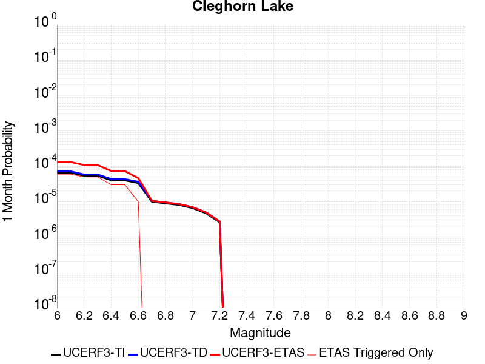 |  |  |

| Magnitude | 1 wk TI Prob | 1 wk TD Prob | 1 wk ETAS Prob | 1 wk ETAS/TD Gain | 1 wk ETAS Triggered Only | 1 mo TI Prob | 1 mo TD Prob | 1 mo ETAS Prob | 1 mo ETAS/TD Gain | 1 mo ETAS Triggered Only | 1 yr TI Prob | 1 yr TD Prob | 1 yr ETAS Prob | 1 yr ETAS/TD Gain | 1 yr ETAS Triggered Only | 10 yr TI Prob | 10 yr TD Prob | 10 yr ETAS Prob | 10 yr ETAS/TD Gain | 10 yr ETAS Triggered Only |
|-----|-----|-----|-----|-----|-----|-----|-----|-----|-----|-----|-----|-----|-----|-----|-----|-----|-----|-----|-----|-----|
| 6.0 | 1.5467183E-5 | 1.6794203E-5 | 1.6794203E-5 | 1.0 | 0.0 | 6.6286244E-5 | 7.197348E-5 | 7.197348E-5 | 1.0 | 0.0 | 8.067362E-4 | 8.759797E-4 | 9.243412E-4 | 1.0552084 | 4.8403883E-5 | 0.008038137 | 0.008730696 | 0.008778676 | 1.0054957 | 4.8403883E-5 |
| 6.1 | 1.5467183E-5 | 1.6794203E-5 | 1.6794203E-5 | 1.0 | 0.0 | 6.6286244E-5 | 7.197348E-5 | 7.197348E-5 | 1.0 | 0.0 | 8.067362E-4 | 8.759797E-4 | 9.243412E-4 | 1.0552084 | 4.8403883E-5 | 0.008038137 | 0.008730696 | 0.008778676 | 1.0054957 | 4.8403883E-5 |
| 6.2 | 1.2624631E-5 | 1.3681544E-5 | 1.3681544E-5 | 1.0 | 0.0 | 5.410444E-5 | 5.863415E-5 | 5.863415E-5 | 1.0 | 0.0 | 6.585225E-4 | 7.1368564E-4 | 7.6205493E-4 | 1.067774 | 4.8403883E-5 | 0.0065657445 | 0.0071187317 | 0.0071667912 | 1.0067511 | 4.8403883E-5 |
| 6.3 | 1.2624631E-5 | 1.3681544E-5 | 1.3681544E-5 | 1.0 | 0.0 | 5.410444E-5 | 5.863415E-5 | 5.863415E-5 | 1.0 | 0.0 | 6.585225E-4 | 7.1368564E-4 | 7.6205493E-4 | 1.067774 | 4.8403883E-5 | 0.0065657445 | 0.0071187317 | 0.0071667912 | 1.0067511 | 4.8403883E-5 |
| 6.4 | 9.417684E-6 | 1.0170118E-5 | 1.0170118E-5 | 1.0 | 0.0 | 4.036088E-5 | 4.3585722E-5 | 4.3585722E-5 | 1.0 | 0.0 | 4.912829E-4 | 5.3056807E-4 | 5.5475713E-4 | 1.045591 | 2.4201941E-5 | 0.004901982 | 0.005297049 | 0.0053211227 | 1.0045447 | 2.4201941E-5 |
| 6.5 | 9.368219E-6 | 1.0117545E-5 | 1.0117545E-5 | 1.0 | 0.0 | 4.014889E-5 | 4.3360415E-5 | 4.3360415E-5 | 1.0 | 0.0 | 4.8870314E-4 | 5.2782625E-4 | 5.5201544E-4 | 1.0458279 | 2.4201941E-5 | 0.004876298 | 0.0052697617 | 0.005293836 | 1.0045685 | 2.4201941E-5 |
| 6.6 | 7.803798E-6 | 8.441831E-6 | 8.441831E-6 | 1.0 | 0.0 | 3.3444423E-5 | 3.6179E-5 | 3.6179E-5 | 1.0 | 0.0 | 4.0710976E-4 | 4.4043022E-4 | 4.646215E-4 | 1.0549265 | 2.4201941E-5 | 0.0040636472 | 0.0043994905 | 0.0044235857 | 1.0054768 | 2.4201941E-5 |
| 6.7 | 2.3108669E-6 | 2.4438336E-6 | 2.4438336E-6 | 1.0 | 0.0 | 9.903678E-6 | 1.0473532E-5 | 1.0473532E-5 | 1.0 | 0.0 | 1.205706E-4 | 1.2750797E-4 | 1.2750797E-4 | 1.0 | 0.0 | 0.001205052 | 0.0012743667 | 0.0012743667 | 1.0 | 0.0 |
| 6.8 | 2.0882828E-6 | 2.2062823E-6 | 2.2062823E-6 | 1.0 | 0.0 | 8.949753E-6 | 9.455462E-6 | 9.455462E-6 | 1.0 | 0.0 | 1.08957785E-4 | 1.1511434E-4 | 1.1511434E-4 | 1.0 | 0.0 | 0.0010890438 | 0.0011505639 | 0.0011505639 | 1.0 | 0.0 |
| 6.9 | 1.876935E-6 | 1.981051E-6 | 1.981051E-6 | 1.0 | 0.0 | 8.043982E-6 | 8.490192E-6 | 8.490192E-6 | 1.0 | 0.0 | 9.7931086E-5 | 1.03363345E-4 | 1.03363345E-4 | 1.0 | 0.0 | 9.788794E-4 | 0.0010331686 | 0.0010331686 | 1.0 | 0.0 |
| 7.0 | 1.5357559E-6 | 1.6202807E-6 | 1.6202807E-6 | 1.0 | 0.0 | 6.5817944E-6 | 6.9440425E-6 | 6.9440425E-6 | 1.0 | 0.0 | 8.01304E-5 | 8.454057E-5 | 8.454057E-5 | 1.0 | 0.0 | 8.010151E-4 | 8.450965E-4 | 8.450965E-4 | 1.0 | 0.0 |
| 7.1 | 1.0905424E-6 | 1.1497619E-6 | 1.1497619E-6 | 1.0 | 0.0 | 4.6737446E-6 | 4.9275427E-6 | 4.9275427E-6 | 1.0 | 0.0 | 5.6901354E-5 | 5.999128E-5 | 5.999128E-5 | 1.0 | 0.0 | 5.6886784E-4 | 5.997606E-4 | 5.997606E-4 | 1.0 | 0.0 |
| 7.2 | 6.06668E-7 | 6.387277E-7 | 6.387277E-7 | 1.0 | 0.0 | 2.600003E-6 | 2.7374022E-6 | 2.7374022E-6 | 1.0 | 0.0 | 3.1654577E-5 | 3.3327433E-5 | 3.3327433E-5 | 1.0 | 0.0 | 3.1650066E-4 | 3.3323118E-4 | 3.3323118E-4 | 1.0 | 0.0 |

## Malibu Coast alt 1
*[(top)](#table-of-contents)*

| 1 Week | 1 Month | 1 Year | 10 Year |
|-----|-----|-----|-----|
|  |  |  |  |

| Magnitude | 1 wk TI Prob | 1 wk TD Prob | 1 wk ETAS Prob | 1 wk ETAS/TD Gain | 1 wk ETAS Triggered Only | 1 mo TI Prob | 1 mo TD Prob | 1 mo ETAS Prob | 1 mo ETAS/TD Gain | 1 mo ETAS Triggered Only | 1 yr TI Prob | 1 yr TD Prob | 1 yr ETAS Prob | 1 yr ETAS/TD Gain | 1 yr ETAS Triggered Only | 10 yr TI Prob | 10 yr TD Prob | 10 yr ETAS Prob | 10 yr ETAS/TD Gain | 10 yr ETAS Triggered Only |
|-----|-----|-----|-----|-----|-----|-----|-----|-----|-----|-----|-----|-----|-----|-----|-----|-----|-----|-----|-----|-----|
| 6.0 | 1.6572556E-5 | 1.759807E-5 | 1.759807E-5 | 1.0 | 0.0 | 7.102331E-5 | 7.5418226E-5 | 9.961834E-5 | 1.3208789 | 2.4201941E-5 | 8.6436566E-4 | 9.1784896E-4 | 9.4202865E-4 | 1.026344 | 2.4201941E-5 | 0.0086101135 | 0.009142514 | 0.009166495 | 1.002623 | 2.4201941E-5 |
| 6.1 | 1.6572556E-5 | 1.759807E-5 | 1.759807E-5 | 1.0 | 0.0 | 7.102331E-5 | 7.5418226E-5 | 7.5418226E-5 | 1.0 | 0.0 | 8.6436566E-4 | 9.1784896E-4 | 9.1784896E-4 | 1.0 | 0.0 | 0.0086101135 | 0.009142514 | 0.009142514 | 1.0 | 0.0 |
| 6.2 | 1.1085717E-5 | 1.155715E-5 | 1.155715E-5 | 1.0 | 0.0 | 4.750935E-5 | 4.9529724E-5 | 4.9529724E-5 | 1.0 | 0.0 | 5.782728E-4 | 6.0286105E-4 | 6.0286105E-4 | 1.0 | 0.0 | 0.0057677035 | 0.0060126274 | 0.0060126274 | 1.0 | 0.0 |
| 6.3 | 1.0208568E-5 | 1.0592241E-5 | 1.0592241E-5 | 1.0 | 0.0 | 4.375027E-5 | 4.5394543E-5 | 4.5394543E-5 | 1.0 | 0.0 | 5.325294E-4 | 5.5254134E-4 | 5.5254134E-4 | 1.0 | 0.0 | 0.0053125503 | 0.0055119833 | 0.0055119833 | 1.0 | 0.0 |
| 6.4 | 9.0682315E-6 | 9.342641E-6 | 9.342641E-6 | 1.0 | 0.0 | 3.8863272E-5 | 4.0039286E-5 | 4.0039286E-5 | 1.0 | 0.0 | 4.730576E-4 | 4.873713E-4 | 4.873713E-4 | 1.0 | 0.0 | 0.0047205184 | 0.004863238 | 0.004863238 | 1.0 | 0.0 |
| 6.5 | 7.605796E-6 | 7.74859E-6 | 7.74859E-6 | 1.0 | 0.0 | 3.259586E-5 | 3.320783E-5 | 3.320783E-5 | 1.0 | 0.0 | 3.9678233E-4 | 4.0423166E-4 | 4.0423166E-4 | 1.0 | 0.0 | 0.0039607463 | 0.0040351013 | 0.0040351013 | 1.0 | 0.0 |
| 6.6 | 5.889873E-6 | 5.8795417E-6 | 5.8795417E-6 | 1.0 | 0.0 | 2.5242069E-5 | 2.5197793E-5 | 2.5197793E-5 | 1.0 | 0.0 | 3.0727885E-4 | 3.0674002E-4 | 3.0674002E-4 | 1.0 | 0.0 | 0.003068543 | 0.0030631793 | 0.0030631793 | 1.0 | 0.0 |
| 6.7 | 5.66586E-6 | 5.6416443E-6 | 5.6416443E-6 | 1.0 | 0.0 | 2.428203E-5 | 2.4178253E-5 | 2.4178253E-5 | 1.0 | 0.0 | 2.955936E-4 | 2.9433056E-4 | 2.9433056E-4 | 1.0 | 0.0 | 0.0029520073 | 0.0029394194 | 0.0029394194 | 1.0 | 0.0 |
| 6.8 | 5.521556E-6 | 5.48943E-6 | 5.48943E-6 | 1.0 | 0.0 | 2.3663597E-5 | 2.3525918E-5 | 2.3525918E-5 | 1.0 | 0.0 | 2.880662E-4 | 2.8639048E-4 | 2.8639048E-4 | 1.0 | 0.0 | 0.0028769306 | 0.0028602257 | 0.0028602257 | 1.0 | 0.0 |
| 6.9 | 5.29752E-6 | 5.2499345E-6 | 5.2499345E-6 | 1.0 | 0.0 | 2.270346E-5 | 2.2499526E-5 | 2.2499526E-5 | 1.0 | 0.0 | 2.7637955E-4 | 2.7389737E-4 | 2.7389737E-4 | 1.0 | 0.0 | 0.0027603607 | 0.0027356083 | 0.0027356083 | 1.0 | 0.0 |
| 7.0 | 5.106743E-6 | 5.0476815E-6 | 5.0476815E-6 | 1.0 | 0.0 | 2.1885859E-5 | 2.1632743E-5 | 2.1632743E-5 | 1.0 | 0.0 | 2.6642776E-4 | 2.6334688E-4 | 2.6334688E-4 | 1.0 | 0.0 | 0.0026610855 | 0.0026303576 | 0.0026303576 | 1.0 | 0.0 |
| 7.1 | 4.8469647E-6 | 4.770376E-6 | 4.770376E-6 | 1.0 | 0.0 | 2.0772539E-5 | 2.044431E-5 | 2.044431E-5 | 1.0 | 0.0 | 2.528763E-4 | 2.488811E-4 | 2.488811E-4 | 1.0 | 0.0 | 0.0025258875 | 0.0024860317 | 0.0024860317 | 1.0 | 0.0 |
| 7.2 | 4.545514E-6 | 4.4481967E-6 | 4.4481967E-6 | 1.0 | 0.0 | 1.9480629E-5 | 1.906356E-5 | 1.906356E-5 | 1.0 | 0.0 | 2.3715083E-4 | 2.3207419E-4 | 2.3207419E-4 | 1.0 | 0.0 | 0.0023689792 | 0.002318326 | 0.002318326 | 1.0 | 0.0 |
| 7.3 | 3.794097E-6 | 3.6519373E-6 | 3.6519373E-6 | 1.0 | 0.0 | 1.6260314E-5 | 1.5651065E-5 | 1.5651065E-5 | 1.0 | 0.0 | 1.9795135E-4 | 1.9053511E-4 | 1.9053511E-4 | 1.0 | 0.0 | 0.001977751 | 0.0019037221 | 0.0019037221 | 1.0 | 0.0 |
| 7.4 | 2.808217E-6 | 2.7190777E-6 | 2.7190777E-6 | 1.0 | 0.0 | 1.203516E-5 | 1.1653137E-5 | 1.1653137E-5 | 1.0 | 0.0 | 1.4651821E-4 | 1.4186774E-4 | 1.4186774E-4 | 1.0 | 0.0 | 0.0014642165 | 0.0014177744 | 0.0014177744 | 1.0 | 0.0 |
| 7.5 | 1.83809E-6 | 1.8190703E-6 | 1.8190703E-6 | 1.0 | 0.0 | 7.877505E-6 | 7.795992E-6 | 7.795992E-6 | 1.0 | 0.0 | 9.59044E-5 | 9.4912095E-5 | 9.4912095E-5 | 1.0 | 0.0 | 9.5863023E-4 | 9.487176E-4 | 9.487176E-4 | 1.0 | 0.0 |
| 7.6 | 1.1292672E-6 | 1.1001456E-6 | 1.1001456E-6 | 1.0 | 0.0 | 4.839708E-6 | 4.7149015E-6 | 4.7149015E-6 | 1.0 | 0.0 | 5.8921847E-5 | 5.7402427E-5 | 5.7402427E-5 | 1.0 | 0.0 | 5.890623E-4 | 5.7387765E-4 | 5.7387765E-4 | 1.0 | 0.0 |
| 7.7 | 5.065272E-7 | 4.6091537E-7 | 4.6091537E-7 | 1.0 | 0.0 | 2.170829E-6 | 1.9753502E-6 | 1.9753502E-6 | 1.0 | 0.0 | 2.6429525E-5 | 2.4049634E-5 | 2.4049634E-5 | 1.0 | 0.0 | 2.642638E-4 | 2.4047145E-4 | 2.4047145E-4 | 1.0 | 0.0 |
| 7.8 | 8.952991E-8 | 6.707853E-8 | 6.707853E-8 | 1.0 | 0.0 | 3.8369956E-7 | 2.874794E-7 | 2.874794E-7 | 1.0 | 0.0 | 4.671532E-6 | 3.5000562E-6 | 3.5000562E-6 | 1.0 | 0.0 | 4.671434E-5 | 3.500003E-5 | 3.500003E-5 | 1.0 | 0.0 |
| 7.9 | 8.007447E-10 | 6.161581E-10 | 6.161581E-10 | 1.0 | 0.0 | 3.4317629E-9 | 2.640678E-9 | 2.640678E-9 | 1.0 | 0.0 | 4.1781714E-8 | 3.2150254E-8 | 3.2150254E-8 | 1.0 | 0.0 | 4.1781706E-7 | 3.2150248E-7 | 3.2150248E-7 | 1.0 | 0.0 |

## Fish Slough 2011 CFM
*[(top)](#table-of-contents)*

| 1 Week | 1 Month | 1 Year | 10 Year |
|-----|-----|-----|-----|
|  |  | 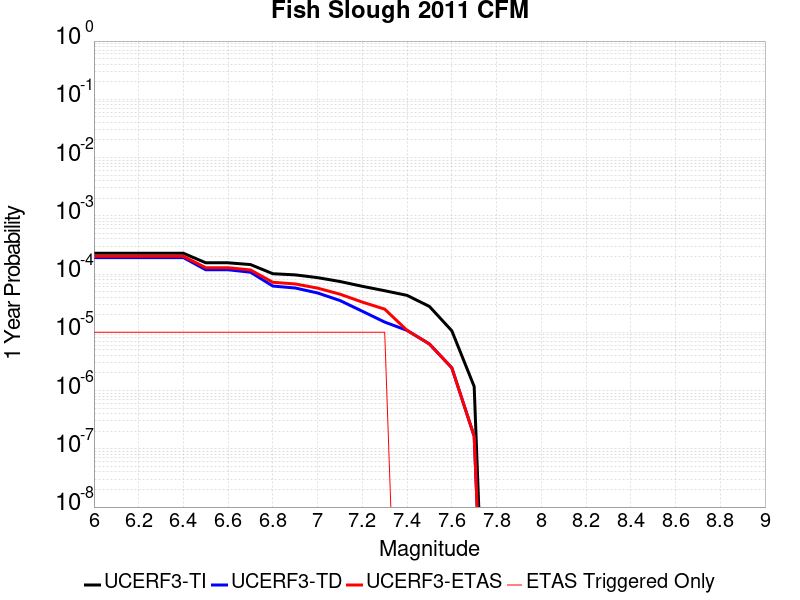 |  |

| Magnitude | 1 wk TI Prob | 1 wk TD Prob | 1 wk ETAS Prob | 1 wk ETAS/TD Gain | 1 wk ETAS Triggered Only | 1 mo TI Prob | 1 mo TD Prob | 1 mo ETAS Prob | 1 mo ETAS/TD Gain | 1 mo ETAS Triggered Only | 1 yr TI Prob | 1 yr TD Prob | 1 yr ETAS Prob | 1 yr ETAS/TD Gain | 1 yr ETAS Triggered Only | 10 yr TI Prob | 10 yr TD Prob | 10 yr ETAS Prob | 10 yr ETAS/TD Gain | 10 yr ETAS Triggered Only |
|-----|-----|-----|-----|-----|-----|-----|-----|-----|-----|-----|-----|-----|-----|-----|-----|-----|-----|-----|-----|-----|
| 6.0 | 4.3629925E-6 | 3.6772458E-6 | 3.6772458E-6 | 1.0 | 0.0 | 1.8698405E-5 | 1.5759542E-5 | 1.5759542E-5 | 1.0 | 0.0 | 2.276293E-4 | 1.9185765E-4 | 2.1605495E-4 | 1.126121 | 2.4201941E-5 | 0.0022739628 | 0.001917129 | 0.0019412846 | 1.0125998 | 2.4201941E-5 |
| 6.1 | 4.3629925E-6 | 3.6772458E-6 | 3.6772458E-6 | 1.0 | 0.0 | 1.8698405E-5 | 1.5759542E-5 | 1.5759542E-5 | 1.0 | 0.0 | 2.276293E-4 | 1.9185765E-4 | 2.1605495E-4 | 1.126121 | 2.4201941E-5 | 0.0022739628 | 0.001917129 | 0.0019412846 | 1.0125998 | 2.4201941E-5 |
| 6.2 | 4.3629925E-6 | 3.6772458E-6 | 3.6772458E-6 | 1.0 | 0.0 | 1.8698405E-5 | 1.5759542E-5 | 1.5759542E-5 | 1.0 | 0.0 | 2.276293E-4 | 1.9185765E-4 | 2.1605495E-4 | 1.126121 | 2.4201941E-5 | 0.0022739628 | 0.001917129 | 0.0019412846 | 1.0125998 | 2.4201941E-5 |
| 6.3 | 4.3629925E-6 | 3.6772458E-6 | 3.6772458E-6 | 1.0 | 0.0 | 1.8698405E-5 | 1.5759542E-5 | 1.5759542E-5 | 1.0 | 0.0 | 2.276293E-4 | 1.9185765E-4 | 2.1605495E-4 | 1.126121 | 2.4201941E-5 | 0.0022739628 | 0.001917129 | 0.0019412846 | 1.0125998 | 2.4201941E-5 |
| 6.4 | 4.3629925E-6 | 3.6772458E-6 | 3.6772458E-6 | 1.0 | 0.0 | 1.8698405E-5 | 1.5759542E-5 | 1.5759542E-5 | 1.0 | 0.0 | 2.276293E-4 | 1.9185765E-4 | 2.1605495E-4 | 1.126121 | 2.4201941E-5 | 0.0022739628 | 0.001917129 | 0.0019412846 | 1.0125998 | 2.4201941E-5 |
| 6.5 | 2.991715E-6 | 2.2703657E-6 | 2.2703657E-6 | 1.0 | 0.0 | 1.2821573E-5 | 9.730108E-6 | 9.730108E-6 | 1.0 | 0.0 | 1.5609147E-4 | 1.1845854E-4 | 1.4265762E-4 | 1.2042831 | 2.4201941E-5 | 0.0015598187 | 0.0011840442 | 0.0012082173 | 1.0204159 | 2.4201941E-5 |
| 6.6 | 2.991715E-6 | 2.2703657E-6 | 2.2703657E-6 | 1.0 | 0.0 | 1.2821573E-5 | 9.730108E-6 | 9.730108E-6 | 1.0 | 0.0 | 1.5609147E-4 | 1.1845854E-4 | 1.4265762E-4 | 1.2042831 | 2.4201941E-5 | 0.0015598187 | 0.0011840442 | 0.0012082173 | 1.0204159 | 2.4201941E-5 |
| 6.7 | 2.7890346E-6 | 2.0621612E-6 | 2.0621612E-6 | 1.0 | 0.0 | 1.1952951E-5 | 8.837809E-6 | 8.837809E-6 | 1.0 | 0.0 | 1.4551746E-4 | 1.07595915E-4 | 1.3179526E-4 | 1.2249094 | 2.4201941E-5 | 0.0014542221 | 0.0010755265 | 0.0010997024 | 1.0224782 | 2.4201941E-5 |
| 6.8 | 1.9416723E-6 | 1.192531E-6 | 1.192531E-6 | 1.0 | 0.0 | 8.321425E-6 | 5.1108377E-6 | 5.1108377E-6 | 1.0 | 0.0 | 1.01308644E-4 | 6.2222716E-5 | 8.642315E-5 | 1.3889325 | 2.4201941E-5 | 0.0010126247 | 6.22057E-4 | 6.4624386E-4 | 1.0388821 | 2.4201941E-5 |
| 6.9 | 1.8567416E-6 | 1.1046726E-6 | 1.1046726E-6 | 1.0 | 0.0 | 7.957439E-6 | 4.734303E-6 | 4.734303E-6 | 1.0 | 0.0 | 9.687752E-5 | 5.7638652E-5 | 8.18392E-5 | 1.4198667 | 2.4201941E-5 | 9.6835295E-4 | 5.762409E-4 | 6.004289E-4 | 1.0419755 | 2.4201941E-5 |
| 7.0 | 1.6634067E-6 | 9.0737336E-7 | 9.0737336E-7 | 1.0 | 0.0 | 7.1288664E-6 | 3.8887374E-6 | 3.8887374E-6 | 1.0 | 0.0 | 8.679049E-5 | 4.7344376E-5 | 7.1545175E-5 | 1.5111651 | 2.4201941E-5 | 8.6756604E-4 | 4.733458E-4 | 4.9753627E-4 | 1.0511053 | 2.4201941E-5 |
| 7.1 | 1.4281054E-6 | 6.736389E-7 | 6.736389E-7 | 1.0 | 0.0 | 6.1204373E-6 | 2.8870209E-6 | 2.8870209E-6 | 1.0 | 0.0 | 7.451377E-5 | 3.514893E-5 | 5.935002E-5 | 1.68853 | 2.4201941E-5 | 7.44888E-4 | 3.5143548E-4 | 3.7562894E-4 | 1.0688417 | 2.4201941E-5 |
| 7.2 | 1.1810387E-6 | 4.408126E-7 | 4.408126E-7 | 1.0 | 0.0 | 5.0615845E-6 | 1.8891956E-6 | 1.8891956E-6 | 1.0 | 0.0 | 6.1623046E-5 | 2.3000723E-5 | 4.7202106E-5 | 2.052201 | 2.4201941E-5 | 6.160596E-4 | 2.2998432E-4 | 2.541807E-4 | 1.1052088 | 2.4201941E-5 |
| 7.3 | 9.918052E-7 | 2.8731267E-7 | 2.8731267E-7 | 1.0 | 0.0 | 4.2505867E-6 | 1.2313394E-6 | 1.2313394E-6 | 1.0 | 0.0 | 5.1749663E-5 | 1.4991455E-5 | 3.9193033E-5 | 2.6143582 | 2.4201941E-5 | 5.173762E-4 | 1.4990455E-4 | 1.7410287E-4 | 1.1614248 | 2.4201941E-5 |
| 7.4 | 8.25252E-7 | 2.0692863E-7 | 2.0692863E-7 | 1.0 | 0.0 | 3.5367896E-6 | 8.868367E-7 | 8.868367E-7 | 1.0 | 0.0 | 4.3059565E-5 | 1.0797184E-5 | 1.0797184E-5 | 1.0 | 0.0 | 4.305122E-4 | 1.0796666E-4 | 1.0796666E-4 | 1.0 | 0.0 |
| 7.5 | 5.3248567E-7 | 1.2071294E-7 | 1.2071294E-7 | 1.0 | 0.0 | 2.2820795E-6 | 5.1734105E-7 | 5.1734105E-7 | 1.0 | 0.0 | 2.7783964E-5 | 6.2986096E-6 | 6.2986096E-6 | 1.0 | 0.0 | 2.778049E-4 | 6.298435E-5 | 6.298435E-5 | 1.0 | 0.0 |
| 7.6 | 2.037542E-7 | 4.7123013E-8 | 4.7123013E-8 | 1.0 | 0.0 | 8.73232E-7 | 2.0195576E-7 | 2.0195576E-7 | 1.0 | 0.0 | 1.0631547E-5 | 2.4588087E-6 | 2.4588087E-6 | 1.0 | 0.0 | 1.0631039E-4 | 2.4587836E-5 | 2.4587836E-5 | 1.0 | 0.0 |
| 7.7 | 2.2501226E-8 | 3.1506997E-9 | 3.1506997E-9 | 1.0 | 0.0 | 9.6433816E-8 | 1.3502998E-8 | 1.3502998E-8 | 1.0 | 0.0 | 1.1740811E-6 | 1.64399E-7 | 1.64399E-7 | 1.0 | 0.0 | 1.1740749E-5 | 1.6439889E-6 | 1.6439889E-6 | 1.0 | 0.0 |

## North Frontal  (East)
*[(top)](#table-of-contents)*

| 1 Week | 1 Month | 1 Year | 10 Year |
|-----|-----|-----|-----|
|  |  |  |  |

| Magnitude | 1 wk TI Prob | 1 wk TD Prob | 1 wk ETAS Prob | 1 wk ETAS/TD Gain | 1 wk ETAS Triggered Only | 1 mo TI Prob | 1 mo TD Prob | 1 mo ETAS Prob | 1 mo ETAS/TD Gain | 1 mo ETAS Triggered Only | 1 yr TI Prob | 1 yr TD Prob | 1 yr ETAS Prob | 1 yr ETAS/TD Gain | 1 yr ETAS Triggered Only | 10 yr TI Prob | 10 yr TD Prob | 10 yr ETAS Prob | 10 yr ETAS/TD Gain | 10 yr ETAS Triggered Only |
|-----|-----|-----|-----|-----|-----|-----|-----|-----|-----|-----|-----|-----|-----|-----|-----|-----|-----|-----|-----|-----|
| 6.0 | 7.135738E-6 | 7.4771765E-6 | 7.4771765E-6 | 1.0 | 0.0 | 3.0581377E-5 | 3.204476E-5 | 3.204476E-5 | 1.0 | 0.0 | 3.7226462E-4 | 3.9009505E-4 | 4.1428756E-4 | 1.062017 | 2.4201941E-5 | 0.0037164164 | 0.0038960609 | 0.0039201686 | 1.0061877 | 2.4201941E-5 |
| 6.1 | 7.135738E-6 | 7.4771765E-6 | 7.4771765E-6 | 1.0 | 0.0 | 3.0581377E-5 | 3.204476E-5 | 3.204476E-5 | 1.0 | 0.0 | 3.7226462E-4 | 3.9009505E-4 | 4.1428756E-4 | 1.062017 | 2.4201941E-5 | 0.0037164164 | 0.0038960609 | 0.0039201686 | 1.0061877 | 2.4201941E-5 |
| 6.2 | 7.135738E-6 | 7.4771765E-6 | 7.4771765E-6 | 1.0 | 0.0 | 3.0581377E-5 | 3.204476E-5 | 3.204476E-5 | 1.0 | 0.0 | 3.7226462E-4 | 3.9009505E-4 | 4.1428756E-4 | 1.062017 | 2.4201941E-5 | 0.0037164164 | 0.0038960609 | 0.0039201686 | 1.0061877 | 2.4201941E-5 |
| 6.3 | 7.135738E-6 | 7.4771765E-6 | 7.4771765E-6 | 1.0 | 0.0 | 3.0581377E-5 | 3.204476E-5 | 3.204476E-5 | 1.0 | 0.0 | 3.7226462E-4 | 3.9009505E-4 | 4.1428756E-4 | 1.062017 | 2.4201941E-5 | 0.0037164164 | 0.0038960609 | 0.0039201686 | 1.0061877 | 2.4201941E-5 |
| 6.4 | 7.135738E-6 | 7.4771765E-6 | 7.4771765E-6 | 1.0 | 0.0 | 3.0581377E-5 | 3.204476E-5 | 3.204476E-5 | 1.0 | 0.0 | 3.7226462E-4 | 3.9009505E-4 | 4.1428756E-4 | 1.062017 | 2.4201941E-5 | 0.0037164164 | 0.0038960609 | 0.0039201686 | 1.0061877 | 2.4201941E-5 |
| 6.5 | 7.135738E-6 | 7.4771765E-6 | 7.4771765E-6 | 1.0 | 0.0 | 3.0581377E-5 | 3.204476E-5 | 3.204476E-5 | 1.0 | 0.0 | 3.7226462E-4 | 3.9009505E-4 | 4.1428756E-4 | 1.062017 | 2.4201941E-5 | 0.0037164164 | 0.0038960609 | 0.0039201686 | 1.0061877 | 2.4201941E-5 |
| 6.6 | 7.135738E-6 | 7.4771765E-6 | 7.4771765E-6 | 1.0 | 0.0 | 3.0581377E-5 | 3.204476E-5 | 3.204476E-5 | 1.0 | 0.0 | 3.7226462E-4 | 3.9009505E-4 | 4.1428756E-4 | 1.062017 | 2.4201941E-5 | 0.0037164164 | 0.0038960609 | 0.0039201686 | 1.0061877 | 2.4201941E-5 |
| 6.7 | 7.135738E-6 | 7.4771765E-6 | 7.4771765E-6 | 1.0 | 0.0 | 3.0581377E-5 | 3.204476E-5 | 3.204476E-5 | 1.0 | 0.0 | 3.7226462E-4 | 3.9009505E-4 | 4.1428756E-4 | 1.062017 | 2.4201941E-5 | 0.0037164164 | 0.0038960609 | 0.0039201686 | 1.0061877 | 2.4201941E-5 |
| 6.8 | 5.959142E-6 | 6.236683E-6 | 6.236683E-6 | 1.0 | 0.0 | 2.553893E-5 | 2.6728469E-5 | 2.6728469E-5 | 1.0 | 0.0 | 3.108921E-4 | 3.253886E-4 | 3.4958264E-4 | 1.0743544 | 2.4201941E-5 | 0.0031045752 | 0.0032508948 | 0.003275018 | 1.0074205 | 2.4201941E-5 |
| 6.9 | 2.2946929E-6 | 2.3824605E-6 | 2.3824605E-6 | 1.0 | 0.0 | 9.834361E-6 | 1.0210508E-5 | 1.0210508E-5 | 1.0 | 0.0 | 1.1972676E-4 | 1.2430632E-4 | 1.4850525E-4 | 1.1946718 | 2.4201941E-5 | 0.0011966228 | 0.0012424142 | 0.0012665861 | 1.0194556 | 2.4201941E-5 |
| 7.0 | 2.2468673E-6 | 2.3321538E-6 | 2.3321538E-6 | 1.0 | 0.0 | 9.629396E-6 | 9.994909E-6 | 9.994909E-6 | 1.0 | 0.0 | 1.1723159E-4 | 1.21681696E-4 | 1.458807E-4 | 1.1988713 | 2.4201941E-5 | 0.0011716976 | 0.0012161969 | 0.0012403695 | 1.0198755 | 2.4201941E-5 |
| 7.1 | 1.9921076E-6 | 2.0646032E-6 | 2.0646032E-6 | 1.0 | 0.0 | 8.537577E-6 | 8.848272E-6 | 8.848272E-6 | 1.0 | 0.0 | 1.0394004E-4 | 1.0772282E-4 | 1.3192215E-4 | 1.2246444 | 2.4201941E-5 | 0.0010389143 | 0.0010767487 | 0.0011009247 | 1.0224527 | 2.4201941E-5 |
| 7.2 | 1.4524545E-6 | 1.5045148E-6 | 1.5045148E-6 | 1.0 | 0.0 | 6.2247905E-6 | 6.447906E-6 | 6.447906E-6 | 1.0 | 0.0 | 7.5784184E-5 | 7.850068E-5 | 1.0270072E-4 | 1.3082781 | 2.4201941E-5 | 7.575835E-4 | 7.8475394E-4 | 8.089369E-4 | 1.030816 | 2.4201941E-5 |
| 7.3 | 8.9802575E-7 | 9.3087283E-7 | 9.3087283E-7 | 1.0 | 0.0 | 3.848676E-6 | 3.9894494E-6 | 3.9894494E-6 | 1.0 | 0.0 | 4.685662E-5 | 4.857058E-5 | 7.277134E-5 | 1.4982598 | 2.4201941E-5 | 4.6846745E-4 | 4.8561094E-4 | 5.0980115E-4 | 1.049814 | 2.4201941E-5 |
| 7.4 | 7.776139E-7 | 8.0604747E-7 | 8.0604747E-7 | 1.0 | 0.0 | 3.3326266E-6 | 3.4544853E-6 | 3.4544853E-6 | 1.0 | 0.0 | 4.0573974E-5 | 4.2057654E-5 | 6.625858E-5 | 1.5754225 | 2.4201941E-5 | 4.0566566E-4 | 4.205077E-4 | 4.446995E-4 | 1.0575299 | 2.4201941E-5 |
| 7.5 | 5.244417E-7 | 5.441219E-7 | 5.441219E-7 | 1.0 | 0.0 | 2.2476054E-6 | 2.3319494E-6 | 2.3319494E-6 | 1.0 | 0.0 | 2.7364253E-5 | 2.839118E-5 | 5.2592433E-5 | 1.8524215 | 2.4201941E-5 | 2.7360884E-4 | 2.8388205E-4 | 3.080771E-4 | 1.0852293 | 2.4201941E-5 |
| 7.6 | 1.5489647E-7 | 1.6089504E-7 | 1.6089504E-7 | 1.0 | 0.0 | 6.6384183E-7 | 6.895501E-7 | 6.895501E-7 | 1.0 | 0.0 | 8.082245E-6 | 8.395261E-6 | 8.395261E-6 | 1.0 | 0.0 | 8.08195E-5 | 8.395143E-5 | 8.395143E-5 | 1.0 | 0.0 |

## Calaveras (No) 2011 CFM
*[(top)](#table-of-contents)*

| 1 Week | 1 Month | 1 Year | 10 Year |
|-----|-----|-----|-----|
| 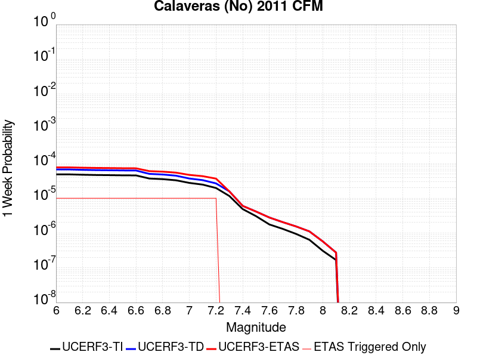 |  | 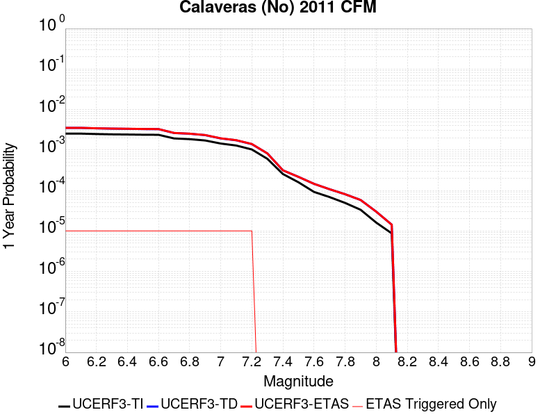 |  |

| Magnitude | 1 wk TI Prob | 1 wk TD Prob | 1 wk ETAS Prob | 1 wk ETAS/TD Gain | 1 wk ETAS Triggered Only | 1 mo TI Prob | 1 mo TD Prob | 1 mo ETAS Prob | 1 mo ETAS/TD Gain | 1 mo ETAS Triggered Only | 1 yr TI Prob | 1 yr TD Prob | 1 yr ETAS Prob | 1 yr ETAS/TD Gain | 1 yr ETAS Triggered Only | 10 yr TI Prob | 10 yr TD Prob | 10 yr ETAS Prob | 10 yr ETAS/TD Gain | 10 yr ETAS Triggered Only |
|-----|-----|-----|-----|-----|-----|-----|-----|-----|-----|-----|-----|-----|-----|-----|-----|-----|-----|-----|-----|-----|
| 6.0 | 4.8694856E-5 | 6.747457E-5 | 9.1674876E-5 | 1.3586582 | 2.4201941E-5 | 2.0867554E-4 | 2.891453E-4 | 3.1334025E-4 | 1.0836774 | 2.4201941E-5 | 0.0025376645 | 0.0035146773 | 0.0035387941 | 1.0068618 | 2.4201941E-5 | 0.02508881 | 0.034771074 | 0.034794435 | 1.0006719 | 2.4201941E-5 |
| 6.1 | 4.8694856E-5 | 6.747457E-5 | 9.1674876E-5 | 1.3586582 | 2.4201941E-5 | 2.0867554E-4 | 2.891453E-4 | 3.1334025E-4 | 1.0836774 | 2.4201941E-5 | 0.0025376645 | 0.0035146773 | 0.0035387941 | 1.0068618 | 2.4201941E-5 | 0.02508881 | 0.034771074 | 0.034794435 | 1.0006719 | 2.4201941E-5 |
| 6.2 | 4.7541962E-5 | 6.5805805E-5 | 9.000615E-5 | 1.367754 | 2.4201941E-5 | 2.0373536E-4 | 2.8199502E-4 | 3.0619014E-4 | 1.0857998 | 2.4201941E-5 | 0.0024776561 | 0.003427919 | 0.003452038 | 1.0070361 | 2.4201941E-5 | 0.024502134 | 0.0339325 | 0.03395588 | 1.000689 | 2.4201941E-5 |
| 6.3 | 4.6717287E-5 | 6.463939E-5 | 8.883976E-5 | 1.3743906 | 2.4201941E-5 | 2.0020158E-4 | 2.7699716E-4 | 3.011924E-4 | 1.0873483 | 2.4201941E-5 | 0.0024347296 | 0.0033672696 | 0.00339139 | 1.0071632 | 2.4201941E-5 | 0.024082264 | 0.033345006 | 0.0333684 | 1.0007015 | 2.4201941E-5 |
| 6.4 | 4.6276386E-5 | 6.400103E-5 | 8.820143E-5 | 1.378125 | 2.4201941E-5 | 1.983123E-4 | 2.7426204E-4 | 2.9845734E-4 | 1.0882196 | 2.4201941E-5 | 0.0024117786 | 0.00333408 | 0.0033582014 | 1.0072348 | 2.4201941E-5 | 0.02385771 | 0.03302388 | 0.03304728 | 1.0007087 | 2.4201941E-5 |
| 6.5 | 4.5720994E-5 | 6.32025E-5 | 8.740291E-5 | 1.3829027 | 2.4201941E-5 | 1.9593239E-4 | 2.7084045E-4 | 2.9503583E-4 | 1.0893345 | 2.4201941E-5 | 0.002382867 | 0.0032925585 | 0.003316681 | 1.0073262 | 2.4201941E-5 | 0.023574775 | 0.032621842 | 0.032645255 | 1.0007176 | 2.4201941E-5 |
| 6.6 | 4.549134E-5 | 6.285557E-5 | 8.705599E-5 | 1.3850163 | 2.4201941E-5 | 1.949483E-4 | 2.693539E-4 | 2.9354935E-4 | 1.0898277 | 2.4201941E-5 | 0.0023709119 | 0.0032745146 | 0.0032986372 | 1.0073668 | 2.4201941E-5 | 0.023457756 | 0.03244731 | 0.032470725 | 1.0007217 | 2.4201941E-5 |
| 6.7 | 3.701047E-5 | 5.03607E-5 | 7.456142E-5 | 1.4805478 | 2.4201941E-5 | 1.5860666E-4 | 2.1581395E-4 | 2.4001068E-4 | 1.1121184 | 2.4201941E-5 | 0.0019293258 | 0.002624412 | 0.0026485506 | 1.0091976 | 2.4201941E-5 | 0.019126613 | 0.026125198 | 0.026148768 | 1.0009022 | 2.4201941E-5 |
| 6.8 | 3.5523568E-5 | 4.834225E-5 | 7.254302E-5 | 1.5006132 | 2.4201941E-5 | 1.5223498E-4 | 2.0716486E-4 | 2.3136179E-4 | 1.1168003 | 2.4201941E-5 | 0.0018518851 | 0.0025193577 | 0.0025434985 | 1.0095822 | 2.4201941E-5 | 0.018365284 | 0.025097623 | 0.025121218 | 1.0009401 | 2.4201941E-5 |
| 6.9 | 3.2946147E-5 | 4.4663826E-5 | 6.886469E-5 | 1.5418447 | 2.4201941E-5 | 1.4119013E-4 | 1.9140259E-4 | 2.1559991E-4 | 1.126421 | 2.4201941E-5 | 0.0017176344 | 0.0023278783 | 0.0023520237 | 1.0103724 | 2.4201941E-5 | 0.017044188 | 0.023219762 | 0.023243403 | 1.001018 | 2.4201941E-5 |
| 7.0 | 2.7682381E-5 | 3.7023216E-5 | 6.122426E-5 | 1.6536721 | 2.4201941E-5 | 1.1863338E-4 | 1.5866144E-4 | 1.8285954E-4 | 1.1525141 | 2.4201941E-5 | 0.0014434044 | 0.0019300217 | 0.001954177 | 1.0125155 | 2.4201941E-5 | 0.01434065 | 0.019311164 | 0.019334897 | 1.001229 | 2.4201941E-5 |
| 7.1 | 2.471967E-5 | 3.328756E-5 | 5.7488694E-5 | 1.7270324 | 2.4201941E-5 | 1.05937135E-4 | 1.4265333E-4 | 1.6685182E-4 | 1.1696315 | 2.4201941E-5 | 0.0012890215 | 0.0017354497 | 0.0017596096 | 1.0139214 | 2.4201941E-5 | 0.0128157 | 0.017386293 | 0.017410073 | 1.0013678 | 2.4201941E-5 |
| 7.2 | 1.9748062E-5 | 2.6775411E-5 | 5.0976705E-5 | 1.9038626 | 2.4201941E-5 | 8.463181E-5 | 1.1474685E-4 | 1.3894601E-4 | 1.2108917 | 2.4201941E-5 | 0.0010299052 | 0.001396171 | 0.0014203392 | 1.0173103 | 2.4201941E-5 | 0.01025145 | 0.014031046 | 0.014054908 | 1.0017006 | 2.4201941E-5 |
| 7.3 | 1.1603734E-5 | 1.5784257E-5 | 1.5784257E-5 | 1.0 | 0.0 | 4.9729337E-5 | 6.7645145E-5 | 6.7645145E-5 | 1.0 | 0.0 | 6.052865E-4 | 8.232826E-4 | 8.232826E-4 | 1.0 | 0.0 | 0.0060364045 | 0.008308739 | 0.008308739 | 1.0 | 0.0 |
| 7.4 | 4.885381E-6 | 6.035117E-6 | 6.035117E-6 | 1.0 | 0.0 | 2.0937177E-5 | 2.5864532E-5 | 2.5864532E-5 | 1.0 | 0.0 | 2.5488032E-4 | 3.1485534E-4 | 3.1485534E-4 | 1.0 | 0.0 | 0.0025458818 | 0.0032009764 | 0.0032009764 | 1.0 | 0.0 |
| 7.5 | 3.0571264E-6 | 4.1554085E-6 | 4.1554085E-6 | 1.0 | 0.0 | 1.3101904E-5 | 1.7808772E-5 | 1.7808772E-5 | 1.0 | 0.0 | 1.5950401E-4 | 2.1680034E-4 | 2.1680034E-4 | 1.0 | 0.0 | 0.0015938957 | 0.0022209007 | 0.0022209007 | 1.0 | 0.0 |
| 7.6 | 1.764948E-6 | 2.795641E-6 | 2.795641E-6 | 1.0 | 0.0 | 7.564041E-6 | 1.1981264E-5 | 1.1981264E-5 | 1.0 | 0.0 | 9.208831E-5 | 1.458622E-4 | 1.458622E-4 | 1.0 | 0.0 | 9.205016E-4 | 0.0015124046 | 0.0015124046 | 1.0 | 0.0 |
| 7.7 | 1.3173734E-6 | 2.0585271E-6 | 2.0585271E-6 | 1.0 | 0.0 | 5.645874E-6 | 8.82223E-6 | 8.82223E-6 | 1.0 | 0.0 | 6.873634E-5 | 1.0740537E-4 | 1.0740537E-4 | 1.0 | 0.0 | 6.8715087E-4 | 0.0011261607 | 0.0011261607 | 1.0 | 0.0 |
| 7.8 | 9.4429885E-7 | 1.5490102E-6 | 1.5490102E-6 | 1.0 | 0.0 | 4.0469886E-6 | 6.6385983E-6 | 6.6385983E-6 | 1.0 | 0.0 | 4.9270973E-5 | 8.082195E-5 | 8.082195E-5 | 1.0 | 0.0 | 4.926005E-4 | 8.501931E-4 | 8.501931E-4 | 1.0 | 0.0 |
| 7.9 | 6.388233E-7 | 1.11492E-6 | 1.11492E-6 | 1.0 | 0.0 | 2.7378112E-6 | 4.7782196E-6 | 4.7782196E-6 | 1.0 | 0.0 | 3.3332344E-5 | 5.8173282E-5 | 5.8173282E-5 | 1.0 | 0.0 | 3.3327343E-4 | 6.096674E-4 | 6.096674E-4 | 1.0 | 0.0 |
| 8.0 | 3.087986E-7 | 5.754721E-7 | 5.754721E-7 | 1.0 | 0.0 | 1.323422E-6 | 2.4663066E-6 | 2.4663066E-6 | 1.0 | 0.0 | 1.6112543E-5 | 3.0026871E-5 | 3.0026871E-5 | 1.0 | 0.0 | 1.6111376E-4 | 3.110238E-4 | 3.110238E-4 | 1.0 | 0.0 |
| 8.1 | 1.6725647E-7 | 2.7410795E-7 | 2.7410795E-7 | 1.0 | 0.0 | 7.168133E-7 | 1.1747478E-6 | 1.1747478E-6 | 1.0 | 0.0 | 8.7271665E-6 | 1.4302462E-5 | 1.4302462E-5 | 1.0 | 0.0 | 8.726824E-5 | 1.4847395E-4 | 1.4847395E-4 | 1.0 | 0.0 |

## Franklin 2011 CFM
*[(top)](#table-of-contents)*

| 1 Week | 1 Month | 1 Year | 10 Year |
|-----|-----|-----|-----|
| 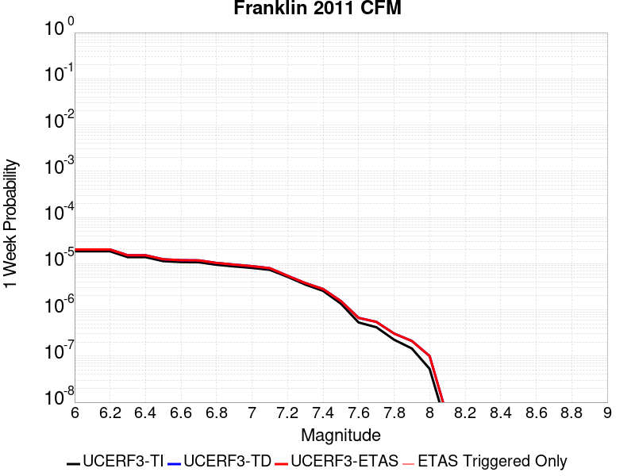 |  |  |  |

| Magnitude | 1 wk TI Prob | 1 wk TD Prob | 1 wk ETAS Prob | 1 wk ETAS/TD Gain | 1 wk ETAS Triggered Only | 1 mo TI Prob | 1 mo TD Prob | 1 mo ETAS Prob | 1 mo ETAS/TD Gain | 1 mo ETAS Triggered Only | 1 yr TI Prob | 1 yr TD Prob | 1 yr ETAS Prob | 1 yr ETAS/TD Gain | 1 yr ETAS Triggered Only | 10 yr TI Prob | 10 yr TD Prob | 10 yr ETAS Prob | 10 yr ETAS/TD Gain | 10 yr ETAS Triggered Only |
|-----|-----|-----|-----|-----|-----|-----|-----|-----|-----|-----|-----|-----|-----|-----|-----|-----|-----|-----|-----|-----|
| 6.0 | 1.845602E-5 | 2.0212667E-5 | 2.0212667E-5 | 1.0 | 0.0 | 7.9094825E-5 | 8.6623004E-5 | 8.6623004E-5 | 1.0 | 0.0 | 9.6255407E-4 | 0.0010541538 | 0.0010541538 | 1.0 | 0.0 | 0.009583955 | 0.010508837 | 0.010532784 | 1.0022788 | 2.4201941E-5 |
| 6.1 | 1.845602E-5 | 2.0212667E-5 | 2.0212667E-5 | 1.0 | 0.0 | 7.9094825E-5 | 8.6623004E-5 | 8.6623004E-5 | 1.0 | 0.0 | 9.6255407E-4 | 0.0010541538 | 0.0010541538 | 1.0 | 0.0 | 0.009583955 | 0.010508837 | 0.010532784 | 1.0022788 | 2.4201941E-5 |
| 6.2 | 1.845602E-5 | 2.0212667E-5 | 2.0212667E-5 | 1.0 | 0.0 | 7.9094825E-5 | 8.6623004E-5 | 8.6623004E-5 | 1.0 | 0.0 | 9.6255407E-4 | 0.0010541538 | 0.0010541538 | 1.0 | 0.0 | 0.009583955 | 0.010508837 | 0.010532784 | 1.0022788 | 2.4201941E-5 |
| 6.3 | 1.3813506E-5 | 1.5154875E-5 | 1.5154875E-5 | 1.0 | 0.0 | 5.9199396E-5 | 6.494789E-5 | 6.494789E-5 | 1.0 | 0.0 | 7.205143E-4 | 7.904614E-4 | 7.904614E-4 | 1.0 | 0.0 | 0.007181826 | 0.007891684 | 0.007891684 | 1.0 | 0.0 |
| 6.4 | 1.3813506E-5 | 1.5154875E-5 | 1.5154875E-5 | 1.0 | 0.0 | 5.9199396E-5 | 6.494789E-5 | 6.494789E-5 | 1.0 | 0.0 | 7.205143E-4 | 7.904614E-4 | 7.904614E-4 | 1.0 | 0.0 | 0.007181826 | 0.007891684 | 0.007891684 | 1.0 | 0.0 |
| 6.5 | 1.1308949E-5 | 1.2417847E-5 | 1.2417847E-5 | 1.0 | 0.0 | 4.8466023E-5 | 5.321827E-5 | 5.321827E-5 | 1.0 | 0.0 | 5.899141E-4 | 6.477419E-4 | 6.477419E-4 | 1.0 | 0.0 | 0.0058835056 | 0.0064731706 | 0.0064731706 | 1.0 | 0.0 |
| 6.6 | 1.0813164E-5 | 1.187607E-5 | 1.187607E-5 | 1.0 | 0.0 | 4.6341313E-5 | 5.089646E-5 | 5.089646E-5 | 1.0 | 0.0 | 5.640594E-4 | 6.194901E-4 | 6.194901E-4 | 1.0 | 0.0 | 0.005626298 | 0.006192248 | 0.006192248 | 1.0 | 0.0 |
| 6.7 | 1.0706348E-5 | 1.1757834E-5 | 1.1757834E-5 | 1.0 | 0.0 | 4.5883542E-5 | 5.0389754E-5 | 5.0389754E-5 | 1.0 | 0.0 | 5.5848894E-4 | 6.1332446E-4 | 6.1332446E-4 | 1.0 | 0.0 | 0.005570874 | 0.006130933 | 0.006130933 | 1.0 | 0.0 |
| 6.8 | 9.443655E-6 | 1.0349157E-5 | 1.0349157E-5 | 1.0 | 0.0 | 4.0472176E-5 | 4.435278E-5 | 4.435278E-5 | 1.0 | 0.0 | 4.9263734E-4 | 5.3986267E-4 | 5.3986267E-4 | 1.0 | 0.0 | 0.0049154665 | 0.0054000774 | 0.0054000774 | 1.0 | 0.0 |
| 6.9 | 8.7001645E-6 | 9.522226E-6 | 9.522226E-6 | 1.0 | 0.0 | 3.728589E-5 | 4.0808907E-5 | 4.0808907E-5 | 1.0 | 0.0 | 4.538611E-4 | 4.967364E-4 | 4.967364E-4 | 1.0 | 0.0 | 0.0045293528 | 0.004970812 | 0.004970812 | 1.0 | 0.0 |
| 7.0 | 8.074731E-6 | 8.815842E-6 | 8.815842E-6 | 1.0 | 0.0 | 3.460553E-5 | 3.778164E-5 | 3.778164E-5 | 1.0 | 0.0 | 4.212409E-4 | 4.5989547E-4 | 4.5989547E-4 | 1.0 | 0.0 | 0.004204433 | 0.0046039745 | 0.0046039745 | 1.0 | 0.0 |
| 7.1 | 7.3370957E-6 | 7.961713E-6 | 7.961713E-6 | 1.0 | 0.0 | 3.1444317E-5 | 3.412119E-5 | 3.412119E-5 | 1.0 | 0.0 | 3.8276732E-4 | 4.1534728E-4 | 4.1534728E-4 | 1.0 | 0.0 | 0.0038210868 | 0.0041600685 | 0.0041600685 | 1.0 | 0.0 |
| 7.2 | 5.1750103E-6 | 5.457141E-6 | 5.457141E-6 | 1.0 | 0.0 | 2.2178427E-5 | 2.338754E-5 | 2.338754E-5 | 1.0 | 0.0 | 2.699889E-4 | 2.8470642E-4 | 2.8470642E-4 | 1.0 | 0.0 | 0.002696611 | 0.0028573358 | 0.0028573358 | 1.0 | 0.0 |
| 7.3 | 3.5221371E-6 | 3.7960758E-6 | 3.7960758E-6 | 1.0 | 0.0 | 1.5094786E-5 | 1.6268796E-5 | 1.6268796E-5 | 1.0 | 0.0 | 1.8376352E-4 | 1.980547E-4 | 1.980547E-4 | 1.0 | 0.0 | 0.0018361164 | 0.0019921293 | 0.0019921293 | 1.0 | 0.0 |
| 7.4 | 2.5749775E-6 | 2.8182237E-6 | 2.8182237E-6 | 1.0 | 0.0 | 1.1035571E-5 | 1.2078047E-5 | 1.2078047E-5 | 1.0 | 0.0 | 1.343498E-4 | 1.4704037E-4 | 1.4704037E-4 | 1.0 | 0.0 | 0.001342686 | 0.0014814398 | 0.0014814398 | 1.0 | 0.0 |
| 7.5 | 1.3642131E-6 | 1.5497532E-6 | 1.5497532E-6 | 1.0 | 0.0 | 5.8466144E-6 | 6.6417824E-6 | 6.6417824E-6 | 1.0 | 0.0 | 7.1180206E-5 | 8.086072E-5 | 8.086072E-5 | 1.0 | 0.0 | 7.115741E-4 | 8.1887894E-4 | 8.1887894E-4 | 1.0 | 0.0 |
| 7.6 | 5.329124E-7 | 6.701074E-7 | 6.701074E-7 | 1.0 | 0.0 | 2.2839083E-6 | 2.8718855E-6 | 2.8718855E-6 | 1.0 | 0.0 | 2.7806227E-5 | 3.496465E-5 | 3.496465E-5 | 1.0 | 0.0 | 2.780275E-4 | 3.5998534E-4 | 3.5998534E-4 | 1.0 | 0.0 |
| 7.7 | 4.199127E-7 | 5.486731E-7 | 5.486731E-7 | 1.0 | 0.0 | 1.7996247E-6 | 2.351454E-6 | 2.351454E-6 | 1.0 | 0.0 | 2.191021E-5 | 2.862858E-5 | 2.862858E-5 | 1.0 | 0.0 | 2.190805E-4 | 2.9645322E-4 | 2.9645322E-4 | 1.0 | 0.0 |
| 7.8 | 2.2586491E-7 | 3.0661545E-7 | 3.0661545E-7 | 1.0 | 0.0 | 9.67992E-7 | 1.3140656E-6 | 1.3140656E-6 | 1.0 | 0.0 | 1.178524E-5 | 1.5998632E-5 | 1.5998632E-5 | 1.0 | 0.0 | 1.17846146E-4 | 1.6630026E-4 | 1.6630026E-4 | 1.0 | 0.0 |
| 7.9 | 1.4568845E-7 | 2.1202912E-7 | 2.1202912E-7 | 1.0 | 0.0 | 6.243789E-7 | 9.0869594E-7 | 9.0869594E-7 | 1.0 | 0.0 | 7.601787E-6 | 1.1063317E-5 | 1.1063317E-5 | 1.0 | 0.0 | 7.601527E-5 | 1.15088624E-4 | 1.15088624E-4 | 1.0 | 0.0 |
| 8.0 | 5.2868224E-8 | 9.997299E-8 | 9.997299E-8 | 1.0 | 0.0 | 2.2657808E-7 | 4.284556E-7 | 4.284556E-7 | 1.0 | 0.0 | 2.7585847E-6 | 5.2164346E-6 | 5.2164346E-6 | 1.0 | 0.0 | 2.7585504E-5 | 5.4021348E-5 | 5.4021348E-5 | 1.0 | 0.0 |
| 8.1 | 2.654434E-9 | 4.7228426E-9 | 4.7228426E-9 | 1.0 | 0.0 | 1.1376145E-8 | 2.0240753E-8 | 2.0240753E-8 | 1.0 | 0.0 | 1.3850456E-7 | 2.4643114E-7 | 2.4643114E-7 | 1.0 | 0.0 | 1.3850448E-6 | 2.533639E-6 | 2.533639E-6 | 1.0 | 0.0 |

## Carlsbad
*[(top)](#table-of-contents)*

| 1 Week | 1 Month | 1 Year | 10 Year |
|-----|-----|-----|-----|
|  |  |  |  |

| Magnitude | 1 wk TI Prob | 1 wk TD Prob | 1 wk ETAS Prob | 1 wk ETAS/TD Gain | 1 wk ETAS Triggered Only | 1 mo TI Prob | 1 mo TD Prob | 1 mo ETAS Prob | 1 mo ETAS/TD Gain | 1 mo ETAS Triggered Only | 1 yr TI Prob | 1 yr TD Prob | 1 yr ETAS Prob | 1 yr ETAS/TD Gain | 1 yr ETAS Triggered Only | 10 yr TI Prob | 10 yr TD Prob | 10 yr ETAS Prob | 10 yr ETAS/TD Gain | 10 yr ETAS Triggered Only |
|-----|-----|-----|-----|-----|-----|-----|-----|-----|-----|-----|-----|-----|-----|-----|-----|-----|-----|-----|-----|-----|
| 6.0 | 4.9038536E-6 | 4.9872688E-6 | 4.9872688E-6 | 1.0 | 0.0 | 2.1016345E-5 | 2.1373837E-5 | 2.1373837E-5 | 1.0 | 0.0 | 2.5584397E-4 | 2.6019584E-4 | 2.6019584E-4 | 1.0 | 0.0 | 0.002555496 | 0.002598959 | 0.0026230982 | 1.009288 | 2.4201941E-5 |
| 6.1 | 4.9038536E-6 | 4.9872688E-6 | 4.9872688E-6 | 1.0 | 0.0 | 2.1016345E-5 | 2.1373837E-5 | 2.1373837E-5 | 1.0 | 0.0 | 2.5584397E-4 | 2.6019584E-4 | 2.6019584E-4 | 1.0 | 0.0 | 0.002555496 | 0.002598959 | 0.0026230982 | 1.009288 | 2.4201941E-5 |
| 6.2 | 4.3820614E-6 | 4.4547814E-6 | 4.4547814E-6 | 1.0 | 0.0 | 1.8780129E-5 | 1.9091782E-5 | 1.9091782E-5 | 1.0 | 0.0 | 2.2862408E-4 | 2.3241801E-4 | 2.3241801E-4 | 1.0 | 0.0 | 0.00228389 | 0.002321785 | 0.0023459308 | 1.0103997 | 2.4201941E-5 |
| 6.3 | 4.302872E-6 | 4.373019E-6 | 4.373019E-6 | 1.0 | 0.0 | 1.8440749E-5 | 1.8741377E-5 | 1.8741377E-5 | 1.0 | 0.0 | 2.24493E-4 | 2.2815271E-4 | 2.2815271E-4 | 1.0 | 0.0 | 0.0022426634 | 0.0022792201 | 0.0023033668 | 1.0105944 | 2.4201941E-5 |
| 6.4 | 4.0835243E-6 | 4.147667E-6 | 4.147667E-6 | 1.0 | 0.0 | 1.75007E-5 | 1.7775597E-5 | 1.7775597E-5 | 1.0 | 0.0 | 2.1305021E-4 | 2.1639673E-4 | 2.1639673E-4 | 1.0 | 0.0 | 0.0021284607 | 0.0021618942 | 0.002186044 | 1.0111706 | 2.4201941E-5 |
| 6.5 | 3.987806E-6 | 4.048899E-6 | 4.048899E-6 | 1.0 | 0.0 | 1.7090486E-5 | 1.7352311E-5 | 1.7352311E-5 | 1.0 | 0.0 | 2.080568E-4 | 2.1124425E-4 | 2.1124425E-4 | 1.0 | 0.0 | 0.002078621 | 0.0021104682 | 0.0021104682 | 1.0 | 0.0 |
| 6.6 | 3.8707576E-6 | 3.927501E-6 | 3.927501E-6 | 1.0 | 0.0 | 1.6588854E-5 | 1.683204E-5 | 1.683204E-5 | 1.0 | 0.0 | 2.0195059E-4 | 2.0491115E-4 | 2.0491115E-4 | 1.0 | 0.0 | 0.0020176715 | 0.0020472556 | 0.0020472556 | 1.0 | 0.0 |
| 6.7 | 3.3093434E-6 | 3.3424044E-6 | 3.3424044E-6 | 1.0 | 0.0 | 1.4182823E-5 | 1.4324512E-5 | 1.4324512E-5 | 1.0 | 0.0 | 1.7266218E-4 | 1.7438704E-4 | 1.7438704E-4 | 1.0 | 0.0 | 0.001725281 | 0.001742508 | 0.001742508 | 1.0 | 0.0 |
| 6.8 | 3.136983E-6 | 3.1664663E-6 | 3.1664663E-6 | 1.0 | 0.0 | 1.3444143E-5 | 1.35704995E-5 | 1.35704995E-5 | 1.0 | 0.0 | 1.6367015E-4 | 1.6520836E-4 | 1.6520836E-4 | 1.0 | 0.0 | 0.0016354966 | 0.0016508611 | 0.0016508611 | 1.0 | 0.0 |
| 6.9 | 2.9056644E-6 | 2.9267715E-6 | 2.9267715E-6 | 1.0 | 0.0 | 1.2452788E-5 | 1.2543246E-5 | 1.2543246E-5 | 1.0 | 0.0 | 1.5160214E-4 | 1.5270336E-4 | 1.5270336E-4 | 1.0 | 0.0 | 0.0015149876 | 0.0015259896 | 0.0015259896 | 1.0 | 0.0 |
| 7.0 | 2.5071035E-6 | 2.51141E-6 | 2.51141E-6 | 1.0 | 0.0 | 1.0744685E-5 | 1.0763142E-5 | 1.0763142E-5 | 1.0 | 0.0 | 1.308087E-4 | 1.310334E-4 | 1.310334E-4 | 1.0 | 0.0 | 0.0013073172 | 0.0013095647 | 0.0013095647 | 1.0 | 0.0 |
| 7.1 | 2.1786877E-6 | 2.1678952E-6 | 2.1678952E-6 | 1.0 | 0.0 | 9.3372E-6 | 9.290947E-6 | 9.290947E-6 | 1.0 | 0.0 | 1.13674476E-4 | 1.13111426E-4 | 1.13111426E-4 | 1.0 | 0.0 | 0.0011361635 | 0.0011305414 | 0.0011305414 | 1.0 | 0.0 |
| 7.2 | 1.6628418E-6 | 1.6213987E-6 | 1.6213987E-6 | 1.0 | 0.0 | 7.1264453E-6 | 6.9488333E-6 | 6.9488333E-6 | 1.0 | 0.0 | 8.676102E-5 | 8.459878E-5 | 8.459878E-5 | 1.0 | 0.0 | 8.672715E-4 | 8.4566796E-4 | 8.4566796E-4 | 1.0 | 0.0 |
| 7.3 | 1.0595926E-6 | 9.816912E-7 | 9.816912E-7 | 1.0 | 0.0 | 4.541103E-6 | 4.207241E-6 | 4.207241E-6 | 1.0 | 0.0 | 5.5286528E-5 | 5.1221967E-5 | 5.1221967E-5 | 1.0 | 0.0 | 5.527277E-4 | 5.121025E-4 | 5.121025E-4 | 1.0 | 0.0 |
| 7.4 | 7.956623E-7 | 7.173889E-7 | 7.173889E-7 | 1.0 | 0.0 | 3.4099767E-6 | 3.0745202E-6 | 3.0745202E-6 | 1.0 | 0.0 | 4.1515676E-5 | 3.7431648E-5 | 3.7431648E-5 | 1.0 | 0.0 | 4.150792E-4 | 3.7425413E-4 | 3.7425413E-4 | 1.0 | 0.0 |
| 7.5 | 5.1043804E-7 | 4.448447E-7 | 4.448447E-7 | 1.0 | 0.0 | 2.1875896E-6 | 1.9064759E-6 | 1.9064759E-6 | 1.0 | 0.0 | 2.663358E-5 | 2.3211102E-5 | 2.3211102E-5 | 1.0 | 0.0 | 2.6630386E-4 | 2.3208735E-4 | 2.3208735E-4 | 1.0 | 0.0 |
| 7.6 | 2.3723294E-7 | 1.9896439E-7 | 1.9896439E-7 | 1.0 | 0.0 | 1.0167122E-6 | 8.527042E-7 | 8.527042E-7 | 1.0 | 0.0 | 1.2378401E-5 | 1.0381627E-5 | 1.0381627E-5 | 1.0 | 0.0 | 1.237771E-4 | 1.038117E-4 | 1.038117E-4 | 1.0 | 0.0 |
| 7.7 | 1.9992152E-8 | 9.860285E-9 | 9.860285E-9 | 1.0 | 0.0 | 8.568065E-8 | 4.2258364E-8 | 4.2258364E-8 | 1.0 | 0.0 | 1.0431614E-6 | 5.144956E-7 | 5.144956E-7 | 1.0 | 0.0 | 1.0431565E-5 | 5.144956E-6 | 5.144956E-6 | 1.0 | 0.0 |

## Elsinore (Coyote Mountains)
*[(top)](#table-of-contents)*

| 1 Week | 1 Month | 1 Year | 10 Year |
|-----|-----|-----|-----|
|  |  | 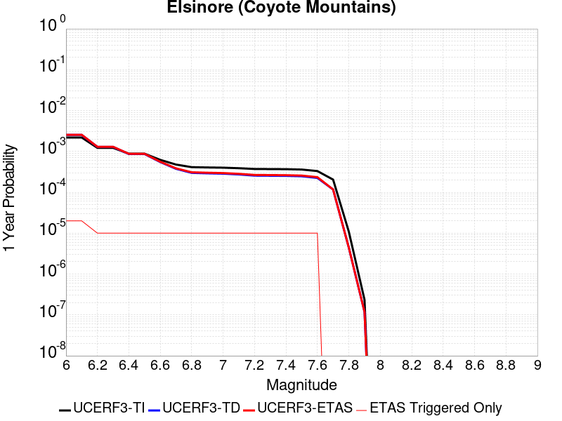 |  |

| Magnitude | 1 wk TI Prob | 1 wk TD Prob | 1 wk ETAS Prob | 1 wk ETAS/TD Gain | 1 wk ETAS Triggered Only | 1 mo TI Prob | 1 mo TD Prob | 1 mo ETAS Prob | 1 mo ETAS/TD Gain | 1 mo ETAS Triggered Only | 1 yr TI Prob | 1 yr TD Prob | 1 yr ETAS Prob | 1 yr ETAS/TD Gain | 1 yr ETAS Triggered Only | 10 yr TI Prob | 10 yr TD Prob | 10 yr ETAS Prob | 10 yr ETAS/TD Gain | 10 yr ETAS Triggered Only |
|-----|-----|-----|-----|-----|-----|-----|-----|-----|-----|-----|-----|-----|-----|-----|-----|-----|-----|-----|-----|-----|
| 6.0 | 4.20513E-5 | 4.8630944E-5 | 4.8630944E-5 | 1.0 | 0.0 | 1.8020741E-4 | 2.0840492E-4 | 2.3260183E-4 | 1.1161052 | 2.4201941E-5 | 0.0021918174 | 0.0025349057 | 0.0025590463 | 1.0095233 | 2.4201941E-5 | 0.021703249 | 0.025111204 | 0.025134798 | 1.0009396 | 2.4201941E-5 |
| 6.1 | 4.20513E-5 | 4.8630944E-5 | 4.8630944E-5 | 1.0 | 0.0 | 1.8020741E-4 | 2.0840492E-4 | 2.3260183E-4 | 1.1161052 | 2.4201941E-5 | 0.0021918174 | 0.0025349057 | 0.0025590463 | 1.0095233 | 2.4201941E-5 | 0.021703249 | 0.025111204 | 0.025134798 | 1.0009396 | 2.4201941E-5 |
| 6.2 | 2.3413893E-5 | 2.4695422E-5 | 2.4695422E-5 | 1.0 | 0.0 | 1.0034139E-4 | 1.0583377E-4 | 1.0583377E-4 | 1.0 | 0.0 | 0.0012209718 | 0.0012878523 | 0.0012878523 | 1.0 | 0.0 | 0.012142851 | 0.012812569 | 0.012812569 | 1.0 | 0.0 |
| 6.3 | 2.3413893E-5 | 2.4695422E-5 | 2.4695422E-5 | 1.0 | 0.0 | 1.0034139E-4 | 1.0583377E-4 | 1.0583377E-4 | 1.0 | 0.0 | 0.0012209718 | 0.0012878523 | 0.0012878523 | 1.0 | 0.0 | 0.012142851 | 0.012812569 | 0.012812569 | 1.0 | 0.0 |
| 6.4 | 1.6894814E-5 | 1.6568214E-5 | 1.6568214E-5 | 1.0 | 0.0 | 7.240433E-5 | 7.100491E-5 | 7.100491E-5 | 1.0 | 0.0 | 8.811662E-4 | 8.641788E-4 | 8.641788E-4 | 1.0 | 0.0 | 0.0087768035 | 0.008611842 | 0.008611842 | 1.0 | 0.0 |
| 6.5 | 1.6894814E-5 | 1.6568214E-5 | 1.6568214E-5 | 1.0 | 0.0 | 7.240433E-5 | 7.100491E-5 | 7.100491E-5 | 1.0 | 0.0 | 8.811662E-4 | 8.641788E-4 | 8.641788E-4 | 1.0 | 0.0 | 0.0087768035 | 0.008611842 | 0.008611842 | 1.0 | 0.0 |
| 6.6 | 1.1910969E-5 | 1.0530538E-5 | 1.0530538E-5 | 1.0 | 0.0 | 5.1046012E-5 | 4.513017E-5 | 4.513017E-5 | 1.0 | 0.0 | 6.21308E-4 | 5.493346E-4 | 5.493346E-4 | 1.0 | 0.0 | 0.0061957375 | 0.0054810685 | 0.0054810685 | 1.0 | 0.0 |
| 6.7 | 9.1486E-6 | 7.2026473E-6 | 7.2026473E-6 | 1.0 | 0.0 | 3.9207694E-5 | 3.0868145E-5 | 3.0868145E-5 | 1.0 | 0.0 | 4.7724912E-4 | 3.7575865E-4 | 3.7575865E-4 | 1.0 | 0.0 | 0.0047622547 | 0.0037516125 | 0.0037516125 | 1.0 | 0.0 |
| 6.8 | 7.90441E-6 | 5.7288153E-6 | 5.7288153E-6 | 1.0 | 0.0 | 3.3875604E-5 | 2.4551842E-5 | 2.4551842E-5 | 1.0 | 0.0 | 4.1235742E-4 | 2.9887896E-4 | 2.9887896E-4 | 1.0 | 0.0 | 0.0041159308 | 0.0029848986 | 0.0029848986 | 1.0 | 0.0 |
| 6.9 | 7.77015E-6 | 5.5827695E-6 | 5.5827695E-6 | 1.0 | 0.0 | 3.3300217E-5 | 2.3925944E-5 | 2.3925944E-5 | 1.0 | 0.0 | 4.0535472E-4 | 2.912607E-4 | 2.912607E-4 | 1.0 | 0.0 | 0.004046161 | 0.0029089167 | 0.0029089167 | 1.0 | 0.0 |
| 7.0 | 7.675798E-6 | 5.4796283E-6 | 5.4796283E-6 | 1.0 | 0.0 | 3.289586E-5 | 2.3483917E-5 | 2.3483917E-5 | 1.0 | 0.0 | 4.004335E-4 | 2.8588044E-4 | 2.8588044E-4 | 1.0 | 0.0 | 0.003997127 | 0.0028552532 | 0.0028552532 | 1.0 | 0.0 |
| 7.1 | 7.447814E-6 | 5.2385003E-6 | 5.2385003E-6 | 1.0 | 0.0 | 3.191881E-5 | 2.245053E-5 | 2.245053E-5 | 1.0 | 0.0 | 3.8854225E-4 | 2.7330214E-4 | 2.7330214E-4 | 1.0 | 0.0 | 0.003878636 | 0.0027297847 | 0.0027297847 | 1.0 | 0.0 |
| 7.2 | 7.128185E-6 | 4.905146E-6 | 4.905146E-6 | 1.0 | 0.0 | 3.0549007E-5 | 2.1021891E-5 | 2.1021891E-5 | 1.0 | 0.0 | 3.7187067E-4 | 2.5591266E-4 | 2.5591266E-4 | 1.0 | 0.0 | 0.00371249 | 0.002556298 | 0.002556298 | 1.0 | 0.0 |
| 7.3 | 7.0913875E-6 | 4.873821E-6 | 4.873821E-6 | 1.0 | 0.0 | 3.0391306E-5 | 2.0887644E-5 | 2.0887644E-5 | 1.0 | 0.0 | 3.6995133E-4 | 2.542786E-4 | 2.542786E-4 | 1.0 | 0.0 | 0.0036933604 | 0.0025399947 | 0.0025399947 | 1.0 | 0.0 |
| 7.4 | 7.051521E-6 | 4.837673E-6 | 4.837673E-6 | 1.0 | 0.0 | 3.0220453E-5 | 2.0732725E-5 | 2.0732725E-5 | 1.0 | 0.0 | 3.6787192E-4 | 2.5239287E-4 | 2.5239287E-4 | 1.0 | 0.0 | 0.0036726352 | 0.0025211805 | 0.0025211805 | 1.0 | 0.0 |
| 7.5 | 6.910666E-6 | 4.7332255E-6 | 4.7332255E-6 | 1.0 | 0.0 | 2.9616802E-5 | 2.02851E-5 | 2.02851E-5 | 1.0 | 0.0 | 3.605249E-4 | 2.4694428E-4 | 2.4694428E-4 | 1.0 | 0.0 | 0.0035994058 | 0.002466817 | 0.002466817 | 1.0 | 0.0 |
| 7.6 | 6.341753E-6 | 4.306345E-6 | 4.306345E-6 | 1.0 | 0.0 | 2.7178658E-5 | 1.8455641E-5 | 1.8455641E-5 | 1.0 | 0.0 | 3.3084993E-4 | 2.2467543E-4 | 2.2467543E-4 | 1.0 | 0.0 | 0.0033035777 | 0.002244598 | 0.002244598 | 1.0 | 0.0 |
| 7.7 | 3.9205916E-6 | 2.2437468E-6 | 2.2437468E-6 | 1.0 | 0.0 | 1.6802427E-5 | 9.616027E-6 | 9.616027E-6 | 1.0 | 0.0 | 2.0455034E-4 | 1.17069576E-4 | 1.17069576E-4 | 1.0 | 0.0 | 0.0020436216 | 0.001170152 | 0.001170152 | 1.0 | 0.0 |
| 7.8 | 2.0846227E-7 | 8.4853966E-8 | 8.4853966E-8 | 1.0 | 0.0 | 8.9340944E-7 | 3.6365984E-7 | 3.6365984E-7 | 1.0 | 0.0 | 1.0877206E-5 | 4.427553E-6 | 4.427553E-6 | 1.0 | 0.0 | 1.0876673E-4 | 4.4274973E-5 | 4.4274973E-5 | 1.0 | 0.0 |
| 7.9 | 4.4969806E-9 | 2.269088E-9 | 2.269088E-9 | 1.0 | 0.0 | 1.9272775E-8 | 9.724664E-9 | 9.724664E-9 | 1.0 | 0.0 | 2.3464601E-7 | 1.1839777E-7 | 1.1839777E-7 | 1.0 | 0.0 | 2.3464577E-6 | 1.1839772E-6 | 1.1839772E-6 | 1.0 | 0.0 |

## Mono Lake 2011 CFM
*[(top)](#table-of-contents)*

| 1 Week | 1 Month | 1 Year | 10 Year |
|-----|-----|-----|-----|
|  |  |  |  |

| Magnitude | 1 wk TI Prob | 1 wk TD Prob | 1 wk ETAS Prob | 1 wk ETAS/TD Gain | 1 wk ETAS Triggered Only | 1 mo TI Prob | 1 mo TD Prob | 1 mo ETAS Prob | 1 mo ETAS/TD Gain | 1 mo ETAS Triggered Only | 1 yr TI Prob | 1 yr TD Prob | 1 yr ETAS Prob | 1 yr ETAS/TD Gain | 1 yr ETAS Triggered Only | 10 yr TI Prob | 10 yr TD Prob | 10 yr ETAS Prob | 10 yr ETAS/TD Gain | 10 yr ETAS Triggered Only |
|-----|-----|-----|-----|-----|-----|-----|-----|-----|-----|-----|-----|-----|-----|-----|-----|-----|-----|-----|-----|-----|
| 6.0 | 2.0341662E-5 | 2.3828192E-5 | 2.3828192E-5 | 1.0 | 0.0 | 8.717564E-5 | 1.0211982E-4 | 1.0211982E-4 | 1.0 | 0.0 | 0.0010608466 | 0.0012431308 | 0.0012431308 | 1.0 | 0.0 | 0.010557966 | 0.012413842 | 0.012437743 | 1.0019253 | 2.4201941E-5 |
| 6.1 | 2.0341662E-5 | 2.3828192E-5 | 2.3828192E-5 | 1.0 | 0.0 | 8.717564E-5 | 1.0211982E-4 | 1.0211982E-4 | 1.0 | 0.0 | 0.0010608466 | 0.0012431308 | 0.0012431308 | 1.0 | 0.0 | 0.010557966 | 0.012413842 | 0.012437743 | 1.0019253 | 2.4201941E-5 |
| 6.2 | 2.0341662E-5 | 2.3828192E-5 | 2.3828192E-5 | 1.0 | 0.0 | 8.717564E-5 | 1.0211982E-4 | 1.0211982E-4 | 1.0 | 0.0 | 0.0010608466 | 0.0012431308 | 0.0012431308 | 1.0 | 0.0 | 0.010557966 | 0.012413842 | 0.012437743 | 1.0019253 | 2.4201941E-5 |
| 6.3 | 2.0341662E-5 | 2.3828192E-5 | 2.3828192E-5 | 1.0 | 0.0 | 8.717564E-5 | 1.0211982E-4 | 1.0211982E-4 | 1.0 | 0.0 | 0.0010608466 | 0.0012431308 | 0.0012431308 | 1.0 | 0.0 | 0.010557966 | 0.012413842 | 0.012437743 | 1.0019253 | 2.4201941E-5 |
| 6.4 | 1.749821E-5 | 2.049101E-5 | 2.049101E-5 | 1.0 | 0.0 | 7.499018E-5 | 8.781861E-5 | 8.781861E-5 | 1.0 | 0.0 | 9.1262296E-4 | 0.0010691914 | 0.0010691914 | 1.0 | 0.0 | 0.009088841 | 0.01069187 | 0.01069187 | 1.0 | 0.0 |
| 6.5 | 1.749821E-5 | 2.049101E-5 | 2.049101E-5 | 1.0 | 0.0 | 7.499018E-5 | 8.781861E-5 | 8.781861E-5 | 1.0 | 0.0 | 9.1262296E-4 | 0.0010691914 | 0.0010691914 | 1.0 | 0.0 | 0.009088841 | 0.01069187 | 0.01069187 | 1.0 | 0.0 |

## Contra Costa Shear Zone (connector) 2011 CFM
*[(top)](#table-of-contents)*

| 1 Week | 1 Month | 1 Year | 10 Year |
|-----|-----|-----|-----|
|  |  | 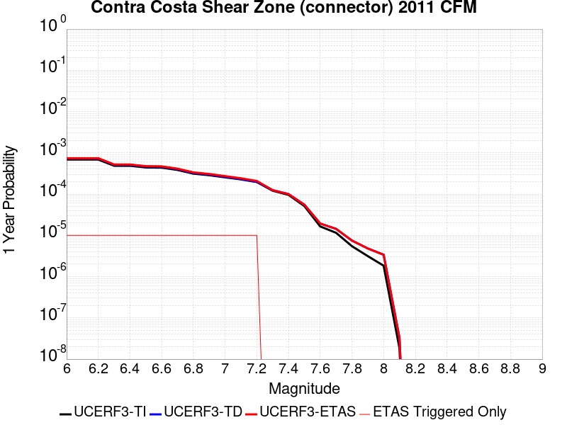 |  |

| Magnitude | 1 wk TI Prob | 1 wk TD Prob | 1 wk ETAS Prob | 1 wk ETAS/TD Gain | 1 wk ETAS Triggered Only | 1 mo TI Prob | 1 mo TD Prob | 1 mo ETAS Prob | 1 mo ETAS/TD Gain | 1 mo ETAS Triggered Only | 1 yr TI Prob | 1 yr TD Prob | 1 yr ETAS Prob | 1 yr ETAS/TD Gain | 1 yr ETAS Triggered Only | 10 yr TI Prob | 10 yr TD Prob | 10 yr ETAS Prob | 10 yr ETAS/TD Gain | 10 yr ETAS Triggered Only |
|-----|-----|-----|-----|-----|-----|-----|-----|-----|-----|-----|-----|-----|-----|-----|-----|-----|-----|-----|-----|-----|
| 6.0 | 1.3187427E-5 | 1.4041856E-5 | 3.824346E-5 | 2.723533 | 2.4201941E-5 | 5.6516317E-5 | 6.0178125E-5 | 8.437861E-5 | 1.4021475 | 2.4201941E-5 | 6.878689E-4 | 7.324452E-4 | 7.566294E-4 | 1.0330185 | 2.4201941E-5 | 0.006857436 | 0.0073068435 | 0.007330869 | 1.003288 | 2.4201941E-5 |
| 6.1 | 1.3187427E-5 | 1.4041856E-5 | 3.824346E-5 | 2.723533 | 2.4201941E-5 | 5.6516317E-5 | 6.0178125E-5 | 8.437861E-5 | 1.4021475 | 2.4201941E-5 | 6.878689E-4 | 7.324452E-4 | 7.566294E-4 | 1.0330185 | 2.4201941E-5 | 0.006857436 | 0.0073068435 | 0.007330869 | 1.003288 | 2.4201941E-5 |
| 6.2 | 1.3187427E-5 | 1.4041856E-5 | 3.824346E-5 | 2.723533 | 2.4201941E-5 | 5.6516317E-5 | 6.0178125E-5 | 8.437861E-5 | 1.4021475 | 2.4201941E-5 | 6.878689E-4 | 7.324452E-4 | 7.566294E-4 | 1.0330185 | 2.4201941E-5 | 0.006857436 | 0.0073068435 | 0.007330869 | 1.003288 | 2.4201941E-5 |
| 6.3 | 9.315374E-6 | 9.824786E-6 | 3.402649E-5 | 3.4633315 | 2.4201941E-5 | 3.992242E-5 | 4.210557E-5 | 6.630649E-5 | 1.5747677 | 2.4201941E-5 | 4.8594706E-4 | 5.1251886E-4 | 5.367084E-4 | 1.0471973 | 2.4201941E-5 | 0.004848858 | 0.005118056 | 0.0051421346 | 1.0047045 | 2.4201941E-5 |
| 6.4 | 9.315374E-6 | 9.824786E-6 | 3.402649E-5 | 3.4633315 | 2.4201941E-5 | 3.992242E-5 | 4.210557E-5 | 6.630649E-5 | 1.5747677 | 2.4201941E-5 | 4.8594706E-4 | 5.1251886E-4 | 5.367084E-4 | 1.0471973 | 2.4201941E-5 | 0.004848858 | 0.005118056 | 0.0051421346 | 1.0047045 | 2.4201941E-5 |
| 6.5 | 8.492638E-6 | 8.9384675E-6 | 3.3140193E-5 | 3.707592 | 2.4201941E-5 | 3.639651E-5 | 3.8307175E-5 | 6.250819E-5 | 1.6317619 | 2.4201941E-5 | 4.430374E-4 | 4.6629342E-4 | 4.9048406E-4 | 1.0518786 | 2.4201941E-5 | 0.0044215517 | 0.0046577626 | 0.0046818517 | 1.0051719 | 2.4201941E-5 |
| 6.6 | 8.402072E-6 | 8.839268E-6 | 3.3040993E-5 | 3.7379787 | 2.4201941E-5 | 3.6008387E-5 | 3.7882044E-5 | 6.208307E-5 | 1.6388521 | 2.4201941E-5 | 4.383139E-4 | 4.6111966E-4 | 4.8531045E-4 | 1.0524609 | 2.4201941E-5 | 0.0043745036 | 0.0046062404 | 0.004630331 | 1.00523 | 2.4201941E-5 |
| 6.7 | 7.383587E-6 | 7.746864E-6 | 3.1948617E-5 | 4.124071 | 2.4201941E-5 | 3.164356E-5 | 3.320044E-5 | 5.7401576E-5 | 1.7289404 | 2.4201941E-5 | 3.8519225E-4 | 4.0414243E-4 | 4.283346E-4 | 1.0598605 | 2.4201941E-5 | 0.0038452526 | 0.004038561 | 0.0040626656 | 1.0059686 | 2.4201941E-5 |
| 6.8 | 6.004921E-6 | 6.2645436E-6 | 3.0466334E-5 | 4.8632965 | 2.4201941E-5 | 2.5735122E-5 | 2.684777E-5 | 5.104906E-5 | 1.9014264 | 2.4201941E-5 | 3.1328006E-4 | 3.268231E-4 | 3.5101714E-4 | 1.0740279 | 2.4201941E-5 | 0.0031283877 | 0.0032677576 | 0.0032918805 | 1.007382 | 2.4201941E-5 |
| 6.9 | 5.505255E-6 | 5.716953E-6 | 2.9918756E-5 | 5.2333393 | 2.4201941E-5 | 2.3593739E-5 | 2.4501E-5 | 4.8702346E-5 | 1.9877698 | 2.4201941E-5 | 2.872159E-4 | 2.9825929E-4 | 3.22454E-4 | 1.0811198 | 2.4201941E-5 | 0.0028684495 | 0.0029829137 | 0.0030070436 | 1.0080893 | 2.4201941E-5 |
| 7.0 | 4.891922E-6 | 5.0476283E-6 | 2.9249448E-5 | 5.794691 | 2.4201941E-5 | 2.096521E-5 | 2.1632515E-5 | 4.5833935E-5 | 2.1187518 | 2.4201941E-5 | 2.5522153E-4 | 2.633444E-4 | 2.8753997E-4 | 1.091878 | 2.4201941E-5 | 0.0025492862 | 0.0026346396 | 0.0026587776 | 1.0091618 | 2.4201941E-5 |
| 7.1 | 4.3599E-6 | 4.451648E-6 | 2.8653481E-5 | 6.436601 | 2.4201941E-5 | 1.868515E-5 | 1.9078352E-5 | 4.3279833E-5 | 2.2685308 | 2.4201941E-5 | 2.2746796E-4 | 2.3225446E-4 | 2.564508E-4 | 1.1041802 | 2.4201941E-5 | 0.0022723526 | 0.0023244268 | 0.0023485725 | 1.0103878 | 2.4201941E-5 |
| 7.2 | 3.7647926E-6 | 3.8026728E-6 | 2.8004522E-5 | 7.364431 | 2.4201941E-5 | 1.6134725E-5 | 1.6297068E-5 | 4.0498617E-5 | 2.4850245 | 2.4201941E-5 | 1.9642258E-4 | 1.98399E-4 | 2.2259614E-4 | 1.121962 | 2.4201941E-5 | 0.0019624906 | 0.0019865124 | 0.0020106663 | 1.0121589 | 2.4201941E-5 |
| 7.3 | 2.3179882E-6 | 2.3909522E-6 | 2.3909522E-6 | 1.0 | 0.0 | 9.934198E-6 | 1.0246898E-5 | 1.0246898E-5 | 1.0 | 0.0 | 1.20942146E-4 | 1.2474888E-4 | 1.2474888E-4 | 1.0 | 0.0 | 0.0012087635 | 0.0012510661 | 0.0012510661 | 1.0 | 0.0 |
| 7.4 | 1.8378355E-6 | 1.918258E-6 | 1.918258E-6 | 1.0 | 0.0 | 7.876414E-6 | 8.22108E-6 | 8.22108E-6 | 1.0 | 0.0 | 9.5891126E-5 | 1.0008709E-4 | 1.0008709E-4 | 1.0 | 0.0 | 9.584976E-4 | 0.0010046052 | 0.0010046052 | 1.0 | 0.0 |
| 7.5 | 9.840493E-7 | 1.0624356E-6 | 1.0624356E-6 | 1.0 | 0.0 | 4.2173474E-6 | 4.5532875E-6 | 4.5532875E-6 | 1.0 | 0.0 | 5.1344992E-5 | 5.5434877E-5 | 5.5434877E-5 | 1.0 | 0.0 | 5.133313E-4 | 5.5791624E-4 | 5.5791624E-4 | 1.0 | 0.0 |
| 7.6 | 3.1602997E-7 | 3.7040812E-7 | 3.7040812E-7 | 1.0 | 0.0 | 1.3544135E-6 | 1.5874624E-6 | 1.5874624E-6 | 1.0 | 0.0 | 1.648986E-5 | 1.9327184E-5 | 1.9327184E-5 | 1.0 | 0.0 | 1.6488635E-4 | 1.9678357E-4 | 1.9678357E-4 | 1.0 | 0.0 |
| 7.7 | 2.2125788E-7 | 2.758609E-7 | 2.758609E-7 | 1.0 | 0.0 | 9.482477E-7 | 1.1822605E-6 | 1.1822605E-6 | 1.0 | 0.0 | 1.1544855E-5 | 1.4393927E-5 | 1.4393927E-5 | 1.0 | 0.0 | 1.1544255E-4 | 1.4742192E-4 | 1.4742192E-4 | 1.0 | 0.0 |
| 7.8 | 1.0509553E-7 | 1.4376357E-7 | 1.4376357E-7 | 1.0 | 0.0 | 4.5040935E-7 | 6.161294E-7 | 6.161294E-7 | 1.0 | 0.0 | 5.48372E-6 | 7.50135E-6 | 7.50135E-6 | 1.0 | 0.0 | 5.4835844E-5 | 7.731651E-5 | 7.731651E-5 | 1.0 | 0.0 |
| 7.9 | 6.029319E-8 | 9.239286E-8 | 9.239286E-8 | 1.0 | 0.0 | 2.5839938E-7 | 3.9596935E-7 | 3.9596935E-7 | 1.0 | 0.0 | 3.1460077E-6 | 4.8209163E-6 | 4.8209163E-6 | 1.0 | 0.0 | 3.1459633E-5 | 4.9793067E-5 | 4.9793067E-5 | 1.0 | 0.0 |
| 8.0 | 3.531068E-8 | 6.50862E-8 | 6.50862E-8 | 1.0 | 0.0 | 1.5133148E-7 | 2.789408E-7 | 2.789408E-7 | 1.0 | 0.0 | 1.8424593E-6 | 3.3960991E-6 | 3.3960991E-6 | 1.0 | 0.0 | 1.842444E-5 | 3.5104295E-5 | 3.5104295E-5 | 1.0 | 0.0 |
| 8.1 | 3.5238246E-10 | 6.2561634E-10 | 6.2561634E-10 | 1.0 | 0.0 | 1.5102107E-9 | 2.6812126E-9 | 2.6812126E-9 | 1.0 | 0.0 | 1.8386816E-8 | 3.264376E-8 | 3.264376E-8 | 1.0 | 0.0 | 1.8386814E-7 | 3.3448472E-7 | 3.3448472E-7 | 1.0 | 0.0 |

## Cerro Prieto
*[(top)](#table-of-contents)*

| 1 Week | 1 Month | 1 Year | 10 Year |
|-----|-----|-----|-----|
|  |  | 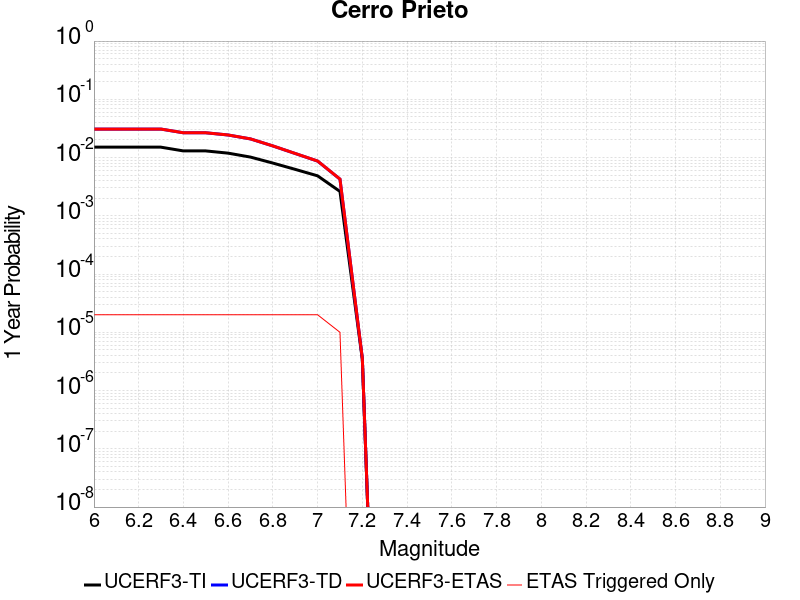 |  |

| Magnitude | 1 wk TI Prob | 1 wk TD Prob | 1 wk ETAS Prob | 1 wk ETAS/TD Gain | 1 wk ETAS Triggered Only | 1 mo TI Prob | 1 mo TD Prob | 1 mo ETAS Prob | 1 mo ETAS/TD Gain | 1 mo ETAS Triggered Only | 1 yr TI Prob | 1 yr TD Prob | 1 yr ETAS Prob | 1 yr ETAS/TD Gain | 1 yr ETAS Triggered Only | 10 yr TI Prob | 10 yr TD Prob | 10 yr ETAS Prob | 10 yr ETAS/TD Gain | 10 yr ETAS Triggered Only |
|-----|-----|-----|-----|-----|-----|-----|-----|-----|-----|-----|-----|-----|-----|-----|-----|-----|-----|-----|-----|-----|
| 6.0 | 2.9101528E-4 | 5.9654453E-4 | 5.9654453E-4 | 1.0 | 0.0 | 0.0012466122 | 0.0025543566 | 0.0025784967 | 1.0094506 | 2.4201941E-5 | 0.015072231 | 0.030802928 | 0.030826384 | 1.0007615 | 2.4201941E-5 | 0.14089979 | 0.25386256 | 0.25388062 | 1.0000712 | 2.4201941E-5 |
| 6.1 | 2.9101528E-4 | 5.9654453E-4 | 5.9654453E-4 | 1.0 | 0.0 | 0.0012466122 | 0.0025543566 | 0.0025784967 | 1.0094506 | 2.4201941E-5 | 0.015072231 | 0.030802928 | 0.030826384 | 1.0007615 | 2.4201941E-5 | 0.14089979 | 0.25386256 | 0.25388062 | 1.0000712 | 2.4201941E-5 |
| 6.2 | 2.9101528E-4 | 5.9654453E-4 | 5.9654453E-4 | 1.0 | 0.0 | 0.0012466122 | 0.0025543566 | 0.0025784967 | 1.0094506 | 2.4201941E-5 | 0.015072231 | 0.030802928 | 0.030826384 | 1.0007615 | 2.4201941E-5 | 0.14089979 | 0.25386256 | 0.25388062 | 1.0000712 | 2.4201941E-5 |
| 6.3 | 2.9101528E-4 | 5.9654453E-4 | 5.9654453E-4 | 1.0 | 0.0 | 0.0012466122 | 0.0025543566 | 0.0025784967 | 1.0094506 | 2.4201941E-5 | 0.015072231 | 0.030802928 | 0.030826384 | 1.0007615 | 2.4201941E-5 | 0.14089979 | 0.25386256 | 0.25388062 | 1.0000712 | 2.4201941E-5 |
| 6.4 | 2.508648E-4 | 5.140412E-4 | 5.140412E-4 | 1.0 | 0.0 | 0.0010746918 | 0.0022013725 | 0.0022255213 | 1.0109699 | 2.4201941E-5 | 0.013006088 | 0.026629416 | 0.026652973 | 1.0008847 | 2.4201941E-5 | 0.12270685 | 0.2242222 | 0.22424097 | 1.0000837 | 2.4201941E-5 |
| 6.5 | 2.508648E-4 | 5.140412E-4 | 5.140412E-4 | 1.0 | 0.0 | 0.0010746918 | 0.0022013725 | 0.0022255213 | 1.0109699 | 2.4201941E-5 | 0.013006088 | 0.026629416 | 0.026652973 | 1.0008847 | 2.4201941E-5 | 0.12270685 | 0.2242222 | 0.22424097 | 1.0000837 | 2.4201941E-5 |
| 6.6 | 2.294914E-4 | 4.7123645E-4 | 4.7123645E-4 | 1.0 | 0.0 | 9.831638E-4 | 0.0020182093 | 0.0020423622 | 1.0119675 | 2.4201941E-5 | 0.011904482 | 0.024394194 | 0.024417805 | 1.0009679 | 2.4201941E-5 | 0.11286586 | 0.20837563 | 0.20839478 | 1.0000919 | 2.4201941E-5 |
| 6.7 | 1.9621674E-4 | 4.0426268E-4 | 4.0426268E-4 | 1.0 | 0.0 | 8.4065786E-4 | 0.0017315624 | 0.0017557224 | 1.0139527 | 2.4201941E-5 | 0.010187071 | 0.020888962 | 0.020912658 | 1.0011344 | 2.4201941E-5 | 0.09732539 | 0.18264732 | 0.18266709 | 1.0001084 | 2.4201941E-5 |
| 6.8 | 1.5476145E-4 | 3.0572579E-4 | 3.0572579E-4 | 1.0 | 0.0 | 6.6309475E-4 | 0.0013096977 | 0.001333868 | 1.0184548 | 2.4201941E-5 | 0.008043335 | 0.015826825 | 0.015850645 | 1.001505 | 2.4201941E-5 | 0.07758363 | 0.14310057 | 0.14312132 | 1.000145 | 2.4201941E-5 |
| 6.9 | 1.20509176E-4 | 2.2588465E-4 | 2.2588465E-4 | 1.0 | 0.0 | 5.1636563E-4 | 9.6778123E-4 | 9.919597E-4 | 1.0249834 | 2.4201941E-5 | 0.006268645 | 0.011734025 | 0.011757943 | 1.0020384 | 2.4201941E-5 | 0.060947374 | 0.10917958 | 0.10920114 | 1.0001974 | 2.4201941E-5 |
| 7.0 | 9.3269155E-5 | 1.6721459E-4 | 1.6721459E-4 | 1.0 | 0.0 | 3.9966372E-4 | 7.1648025E-4 | 7.406649E-4 | 1.0337547 | 2.4201941E-5 | 0.0048550544 | 0.008695914 | 0.008719906 | 1.002759 | 2.4201941E-5 | 0.04750344 | 0.082943216 | 0.08296541 | 1.0002676 | 2.4201941E-5 |
| 7.1 | 5.029709E-5 | 8.174011E-5 | 8.174011E-5 | 1.0 | 0.0 | 2.1554115E-4 | 3.50287E-4 | 3.7448047E-4 | 1.0690676 | 2.4201941E-5 | 0.0026210553 | 0.004259821 | 0.00428392 | 1.0056572 | 2.4201941E-5 | 0.025903556 | 0.04226813 | 0.04229131 | 1.0005484 | 2.4201941E-5 |
| 7.2 | 6.5445185E-8 | 6.824737E-8 | 6.824737E-8 | 1.0 | 0.0 | 2.8047933E-7 | 2.9248872E-7 | 2.9248872E-7 | 1.0 | 0.0 | 3.4148304E-6 | 3.56105E-6 | 3.56105E-6 | 1.0 | 0.0 | 3.414778E-5 | 3.56105E-5 | 3.56105E-5 | 1.0 | 0.0 |

## Great Valley 03a Dunnigan Hills
*[(top)](#table-of-contents)*

| 1 Week | 1 Month | 1 Year | 10 Year |
|-----|-----|-----|-----|
|  |  |  |  |

| Magnitude | 1 wk TI Prob | 1 wk TD Prob | 1 wk ETAS Prob | 1 wk ETAS/TD Gain | 1 wk ETAS Triggered Only | 1 mo TI Prob | 1 mo TD Prob | 1 mo ETAS Prob | 1 mo ETAS/TD Gain | 1 mo ETAS Triggered Only | 1 yr TI Prob | 1 yr TD Prob | 1 yr ETAS Prob | 1 yr ETAS/TD Gain | 1 yr ETAS Triggered Only | 10 yr TI Prob | 10 yr TD Prob | 10 yr ETAS Prob | 10 yr ETAS/TD Gain | 10 yr ETAS Triggered Only |
|-----|-----|-----|-----|-----|-----|-----|-----|-----|-----|-----|-----|-----|-----|-----|-----|-----|-----|-----|-----|-----|
| 6.0 | 1.6591328E-5 | 1.8107954E-5 | 1.8107954E-5 | 1.0 | 0.0 | 7.110376E-5 | 7.7603596E-5 | 7.7603596E-5 | 1.0 | 0.0 | 8.6534437E-4 | 9.444834E-4 | 9.686625E-4 | 1.0256003 | 2.4201941E-5 | 0.008619824 | 0.009411525 | 0.009435499 | 1.0025473 | 2.4201941E-5 |
| 6.1 | 8.041125E-6 | 8.769726E-6 | 8.769726E-6 | 1.0 | 0.0 | 3.4461507E-5 | 3.7584115E-5 | 3.7584115E-5 | 1.0 | 0.0 | 4.194881E-4 | 4.5751085E-4 | 4.8170172E-4 | 1.0528749 | 2.4201941E-5 | 0.004186971 | 0.004567687 | 0.0045917784 | 1.0052743 | 2.4201941E-5 |
| 6.2 | 3.2807004E-6 | 3.5795688E-6 | 3.5795688E-6 | 1.0 | 0.0 | 1.4060069E-5 | 1.5340942E-5 | 1.5340942E-5 | 1.0 | 0.0 | 1.7116789E-4 | 1.8676413E-4 | 2.1096155E-4 | 1.1295614 | 2.4201941E-5 | 0.0017103611 | 0.0018664796 | 0.0018906364 | 1.0129424 | 2.4201941E-5 |
| 6.3 | 1.9339366E-6 | 2.1103806E-6 | 2.1103806E-6 | 1.0 | 0.0 | 8.288273E-6 | 9.044474E-6 | 9.044474E-6 | 1.0 | 0.0 | 1.00905054E-4 | 1.1011375E-4 | 1.3431303E-4 | 1.2197661 | 2.4201941E-5 | 0.0010085925 | 0.0011008718 | 0.0011250472 | 1.0219601 | 2.4201941E-5 |
| 6.4 | 1.3142635E-6 | 1.4339867E-6 | 1.4339867E-6 | 1.0 | 0.0 | 5.6325457E-6 | 6.145657E-6 | 6.145657E-6 | 1.0 | 0.0 | 6.857408E-5 | 7.482337E-5 | 9.9023506E-5 | 1.3234301 | 2.4201941E-5 | 6.8552926E-4 | 7.4823375E-4 | 7.724176E-4 | 1.0323212 | 2.4201941E-5 |

## Likely 2011 CFM
*[(top)](#table-of-contents)*

| 1 Week | 1 Month | 1 Year | 10 Year |
|-----|-----|-----|-----|
|  |  |  |  |

| Magnitude | 1 wk TI Prob | 1 wk TD Prob | 1 wk ETAS Prob | 1 wk ETAS/TD Gain | 1 wk ETAS Triggered Only | 1 mo TI Prob | 1 mo TD Prob | 1 mo ETAS Prob | 1 mo ETAS/TD Gain | 1 mo ETAS Triggered Only | 1 yr TI Prob | 1 yr TD Prob | 1 yr ETAS Prob | 1 yr ETAS/TD Gain | 1 yr ETAS Triggered Only | 10 yr TI Prob | 10 yr TD Prob | 10 yr ETAS Prob | 10 yr ETAS/TD Gain | 10 yr ETAS Triggered Only |
|-----|-----|-----|-----|-----|-----|-----|-----|-----|-----|-----|-----|-----|-----|-----|-----|-----|-----|-----|-----|-----|
| 6.0 | 2.5315949E-5 | 2.7104748E-5 | 5.1306033E-5 | 1.89288 | 2.4201941E-5 | 1.0849241E-4 | 1.16158284E-4 | 1.4035741E-4 | 1.208329 | 2.4201941E-5 | 0.0013200947 | 0.0014133542 | 0.0014375219 | 1.0170996 | 2.4201941E-5 | 0.013122803 | 0.01404831 | 0.014072172 | 1.0016986 | 2.4201941E-5 |
| 6.1 | 2.5315949E-5 | 2.7104748E-5 | 5.1306033E-5 | 1.89288 | 2.4201941E-5 | 1.0849241E-4 | 1.16158284E-4 | 1.4035741E-4 | 1.208329 | 2.4201941E-5 | 0.0013200947 | 0.0014133542 | 0.0014375219 | 1.0170996 | 2.4201941E-5 | 0.013122803 | 0.01404831 | 0.014072172 | 1.0016986 | 2.4201941E-5 |
| 6.2 | 1.6375941E-5 | 1.7465842E-5 | 1.7465842E-5 | 1.0 | 0.0 | 7.0180715E-5 | 7.485153E-5 | 7.485153E-5 | 1.0 | 0.0 | 8.5411523E-4 | 9.109487E-4 | 9.109487E-4 | 1.0 | 0.0 | 0.008508399 | 0.009073433 | 0.009073433 | 1.0 | 0.0 |
| 6.3 | 1.1945543E-5 | 1.2712587E-5 | 1.2712587E-5 | 1.0 | 0.0 | 5.119418E-5 | 5.4481407E-5 | 5.4481407E-5 | 1.0 | 0.0 | 6.2311086E-4 | 6.631146E-4 | 6.631146E-4 | 1.0 | 0.0 | 0.0062136655 | 0.0066119144 | 0.0066119144 | 1.0 | 0.0 |
| 6.4 | 9.192729E-6 | 9.768488E-6 | 9.768488E-6 | 1.0 | 0.0 | 3.939681E-5 | 4.1864292E-5 | 4.1864292E-5 | 1.0 | 0.0 | 4.7955062E-4 | 5.0958124E-4 | 5.0958124E-4 | 1.0 | 0.0 | 0.004785171 | 0.0050844094 | 0.0050844094 | 1.0 | 0.0 |
| 6.5 | 7.67906E-6 | 8.152622E-6 | 8.152622E-6 | 1.0 | 0.0 | 3.2909844E-5 | 3.4939352E-5 | 3.4939352E-5 | 1.0 | 0.0 | 4.006037E-4 | 4.2530545E-4 | 4.2530545E-4 | 1.0 | 0.0 | 0.0039988225 | 0.004245108 | 0.004245108 | 1.0 | 0.0 |
| 6.6 | 6.4884057E-6 | 6.8847507E-6 | 6.8847507E-6 | 1.0 | 0.0 | 2.7807157E-5 | 2.9505749E-5 | 2.9505749E-5 | 1.0 | 0.0 | 3.3849955E-4 | 3.591747E-4 | 3.591747E-4 | 1.0 | 0.0 | 0.003379844 | 0.0035860867 | 0.0035860867 | 1.0 | 0.0 |
| 6.7 | 4.6060636E-6 | 4.884041E-6 | 4.884041E-6 | 1.0 | 0.0 | 1.9740122E-5 | 2.0931442E-5 | 2.0931442E-5 | 1.0 | 0.0 | 2.403095E-4 | 2.5481134E-4 | 2.5481134E-4 | 1.0 | 0.0 | 0.002400498 | 0.0025452746 | 0.0025452746 | 1.0 | 0.0 |
| 6.8 | 3.2795615E-6 | 3.4773732E-6 | 3.4773732E-6 | 1.0 | 0.0 | 1.4055187E-5 | 1.4902946E-5 | 1.4902946E-5 | 1.0 | 0.0 | 1.7110848E-4 | 1.8142881E-4 | 1.8142881E-4 | 1.0 | 0.0 | 0.0017097679 | 0.0018128622 | 0.0018128622 | 1.0 | 0.0 |
| 6.9 | 2.3289967E-6 | 2.4705569E-6 | 2.4705569E-6 | 1.0 | 0.0 | 9.981376E-6 | 1.058806E-5 | 1.058806E-5 | 1.0 | 0.0 | 1.2151648E-4 | 1.2890245E-4 | 1.2890245E-4 | 1.0 | 0.0 | 0.0012145005 | 0.0012883197 | 0.0012883197 | 1.0 | 0.0 |
| 7.0 | 1.211292E-6 | 1.2863958E-6 | 1.2863958E-6 | 1.0 | 0.0 | 5.1912407E-6 | 5.5131145E-6 | 5.5131145E-6 | 1.0 | 0.0 | 6.320152E-5 | 6.712041E-5 | 6.712041E-5 | 1.0 | 0.0 | 6.3183554E-4 | 6.710312E-4 | 6.710312E-4 | 1.0 | 0.0 |

## Hector Mine
*[(top)](#table-of-contents)*

| 1 Week | 1 Month | 1 Year | 10 Year |
|-----|-----|-----|-----|
| 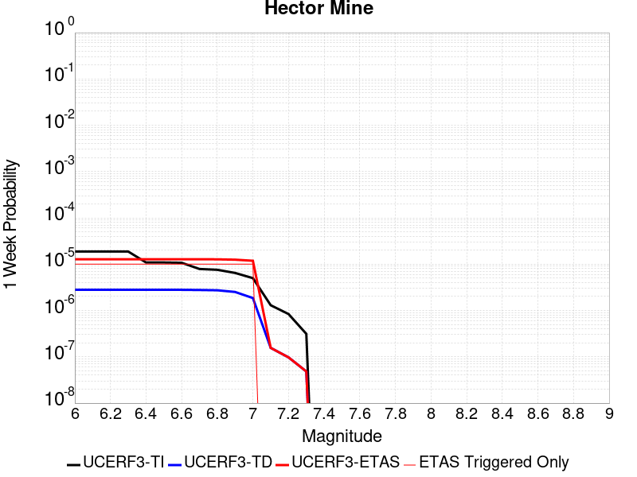 |  |  |  |

| Magnitude | 1 wk TI Prob | 1 wk TD Prob | 1 wk ETAS Prob | 1 wk ETAS/TD Gain | 1 wk ETAS Triggered Only | 1 mo TI Prob | 1 mo TD Prob | 1 mo ETAS Prob | 1 mo ETAS/TD Gain | 1 mo ETAS Triggered Only | 1 yr TI Prob | 1 yr TD Prob | 1 yr ETAS Prob | 1 yr ETAS/TD Gain | 1 yr ETAS Triggered Only | 10 yr TI Prob | 10 yr TD Prob | 10 yr ETAS Prob | 10 yr ETAS/TD Gain | 10 yr ETAS Triggered Only |
|-----|-----|-----|-----|-----|-----|-----|-----|-----|-----|-----|-----|-----|-----|-----|-----|-----|-----|-----|-----|-----|
| 6.0 | 1.8760093E-5 | 2.7962699E-6 | 2.7962699E-6 | 1.0 | 0.0 | 8.039792E-5 | 1.19839815E-5 | 1.19839815E-5 | 1.0 | 0.0 | 9.78405E-4 | 1.458992E-4 | 1.7009761E-4 | 1.1658571 | 2.4201941E-5 | 0.009741086 | 0.0014584264 | 0.001482593 | 1.0165703 | 2.4201941E-5 |
| 6.1 | 1.8760093E-5 | 2.7962699E-6 | 2.7962699E-6 | 1.0 | 0.0 | 8.039792E-5 | 1.19839815E-5 | 1.19839815E-5 | 1.0 | 0.0 | 9.78405E-4 | 1.458992E-4 | 1.7009761E-4 | 1.1658571 | 2.4201941E-5 | 0.009741086 | 0.0014584264 | 0.001482593 | 1.0165703 | 2.4201941E-5 |
| 6.2 | 1.8760093E-5 | 2.7962699E-6 | 2.7962699E-6 | 1.0 | 0.0 | 8.039792E-5 | 1.19839815E-5 | 1.19839815E-5 | 1.0 | 0.0 | 9.78405E-4 | 1.458992E-4 | 1.7009761E-4 | 1.1658571 | 2.4201941E-5 | 0.009741086 | 0.0014584264 | 0.001482593 | 1.0165703 | 2.4201941E-5 |
| 6.3 | 1.8760093E-5 | 2.7962699E-6 | 2.7962699E-6 | 1.0 | 0.0 | 8.039792E-5 | 1.19839815E-5 | 1.19839815E-5 | 1.0 | 0.0 | 9.78405E-4 | 1.458992E-4 | 1.7009761E-4 | 1.1658571 | 2.4201941E-5 | 0.009741086 | 0.0014584264 | 0.001482593 | 1.0165703 | 2.4201941E-5 |
| 6.4 | 1.0888055E-5 | 2.7962699E-6 | 2.7962699E-6 | 1.0 | 0.0 | 4.666226E-5 | 1.19839815E-5 | 1.19839815E-5 | 1.0 | 0.0 | 5.679649E-4 | 1.458992E-4 | 1.7009761E-4 | 1.1658571 | 2.4201941E-5 | 0.0056651547 | 0.0014584264 | 0.001482593 | 1.0165703 | 2.4201941E-5 |
| 6.5 | 1.0888055E-5 | 2.7962699E-6 | 2.7962699E-6 | 1.0 | 0.0 | 4.666226E-5 | 1.19839815E-5 | 1.19839815E-5 | 1.0 | 0.0 | 5.679649E-4 | 1.458992E-4 | 1.7009761E-4 | 1.1658571 | 2.4201941E-5 | 0.0056651547 | 0.0014584264 | 0.001482593 | 1.0165703 | 2.4201941E-5 |
| 6.6 | 1.0730738E-5 | 2.7962699E-6 | 2.7962699E-6 | 1.0 | 0.0 | 4.5988065E-5 | 1.19839815E-5 | 1.19839815E-5 | 1.0 | 0.0 | 5.5976084E-4 | 1.458992E-4 | 1.7009761E-4 | 1.1658571 | 2.4201941E-5 | 0.0055835294 | 0.0014584264 | 0.001482593 | 1.0165703 | 2.4201941E-5 |
| 6.7 | 7.881326E-6 | 2.770952E-6 | 2.770952E-6 | 1.0 | 0.0 | 3.3776672E-5 | 1.1875478E-5 | 1.1875478E-5 | 1.0 | 0.0 | 4.111534E-4 | 1.4457834E-4 | 1.687768E-4 | 1.1673725 | 2.4201941E-5 | 0.0041039353 | 0.001445235 | 0.0014694019 | 1.0167218 | 2.4201941E-5 |
| 6.8 | 7.5683483E-6 | 2.7327321E-6 | 2.7327321E-6 | 1.0 | 0.0 | 3.2435375E-5 | 1.1711679E-5 | 1.1711679E-5 | 1.0 | 0.0 | 3.9482914E-4 | 1.4258435E-4 | 1.6678285E-4 | 1.1697135 | 2.4201941E-5 | 0.0039412836 | 0.0014253207 | 0.0014494882 | 1.0169559 | 2.4201941E-5 |
| 6.9 | 6.473048E-6 | 2.513824E-6 | 2.513824E-6 | 1.0 | 0.0 | 2.7741338E-5 | 1.07735095E-5 | 1.07735095E-5 | 1.0 | 0.0 | 3.3769844E-4 | 1.3116356E-4 | 1.5536232E-4 | 1.1844931 | 2.4201941E-5 | 0.0033718573 | 0.001311251 | 0.0013354211 | 1.018433 | 2.4201941E-5 |
| 7.0 | 4.9959954E-6 | 1.8564588E-6 | 1.8564588E-6 | 1.0 | 0.0 | 2.1411232E-5 | 7.956248E-6 | 7.956248E-6 | 1.0 | 0.0 | 2.6065056E-4 | 9.686658E-5 | 1.2106617E-4 | 1.249824 | 2.4201941E-5 | 0.0026034506 | 9.685931E-4 | 9.927716E-4 | 1.0249625 | 2.4201941E-5 |
| 7.1 | 1.2997541E-6 | 1.5599346E-7 | 1.5599346E-7 | 1.0 | 0.0 | 5.5703626E-6 | 6.685433E-7 | 6.685433E-7 | 1.0 | 0.0 | 6.7817055E-5 | 8.139488E-6 | 8.139488E-6 | 1.0 | 0.0 | 6.779636E-4 | 8.1392296E-5 | 8.1392296E-5 | 1.0 | 0.0 |
| 7.2 | 8.392699E-7 | 9.725453E-8 | 9.725453E-8 | 1.0 | 0.0 | 3.596866E-6 | 4.1680505E-7 | 4.1680505E-7 | 1.0 | 0.0 | 4.3790962E-5 | 5.0745916E-6 | 5.0745916E-6 | 1.0 | 0.0 | 4.3782333E-4 | 5.074495E-5 | 5.074495E-5 | 1.0 | 0.0 |
| 7.3 | 3.13015E-7 | 4.8283802E-8 | 4.8283802E-8 | 1.0 | 0.0 | 1.3414921E-6 | 2.0693057E-7 | 2.0693057E-7 | 1.0 | 0.0 | 1.6332544E-5 | 2.5193776E-6 | 2.5193776E-6 | 1.0 | 0.0 | 1.6331344E-4 | 2.5193574E-5 | 2.5193574E-5 | 1.0 | 0.0 |

## Newport-Inglewood alt 1
*[(top)](#table-of-contents)*

| 1 Week | 1 Month | 1 Year | 10 Year |
|-----|-----|-----|-----|
|  |  |  |  |

| Magnitude | 1 wk TI Prob | 1 wk TD Prob | 1 wk ETAS Prob | 1 wk ETAS/TD Gain | 1 wk ETAS Triggered Only | 1 mo TI Prob | 1 mo TD Prob | 1 mo ETAS Prob | 1 mo ETAS/TD Gain | 1 mo ETAS Triggered Only | 1 yr TI Prob | 1 yr TD Prob | 1 yr ETAS Prob | 1 yr ETAS/TD Gain | 1 yr ETAS Triggered Only | 10 yr TI Prob | 10 yr TD Prob | 10 yr ETAS Prob | 10 yr ETAS/TD Gain | 10 yr ETAS Triggered Only |
|-----|-----|-----|-----|-----|-----|-----|-----|-----|-----|-----|-----|-----|-----|-----|-----|-----|-----|-----|-----|-----|
| 6.0 | 2.9668912E-5 | 3.0404828E-5 | 3.0404828E-5 | 1.0 | 0.0 | 1.2714628E-4 | 1.3030265E-4 | 1.3030265E-4 | 1.0 | 0.0 | 0.0015469068 | 0.0015857654 | 0.001609929 | 1.0152378 | 2.4201941E-5 | 0.015361829 | 0.01579211 | 0.015815929 | 1.0015084 | 2.4201941E-5 |
| 6.1 | 2.9668912E-5 | 3.0404828E-5 | 3.0404828E-5 | 1.0 | 0.0 | 1.2714628E-4 | 1.3030265E-4 | 1.3030265E-4 | 1.0 | 0.0 | 0.0015469068 | 0.0015857654 | 0.001609929 | 1.0152378 | 2.4201941E-5 | 0.015361829 | 0.01579211 | 0.015815929 | 1.0015084 | 2.4201941E-5 |
| 6.2 | 2.9668912E-5 | 3.0404828E-5 | 3.0404828E-5 | 1.0 | 0.0 | 1.2714628E-4 | 1.3030265E-4 | 1.3030265E-4 | 1.0 | 0.0 | 0.0015469068 | 0.0015857654 | 0.001609929 | 1.0152378 | 2.4201941E-5 | 0.015361829 | 0.01579211 | 0.015815929 | 1.0015084 | 2.4201941E-5 |
| 6.3 | 2.9668912E-5 | 3.0404828E-5 | 3.0404828E-5 | 1.0 | 0.0 | 1.2714628E-4 | 1.3030265E-4 | 1.3030265E-4 | 1.0 | 0.0 | 0.0015469068 | 0.0015857654 | 0.001609929 | 1.0152378 | 2.4201941E-5 | 0.015361829 | 0.01579211 | 0.015815929 | 1.0015084 | 2.4201941E-5 |
| 6.4 | 1.275942E-5 | 1.02725335E-5 | 1.02725335E-5 | 1.0 | 0.0 | 5.4682085E-5 | 4.4024422E-5 | 4.4024422E-5 | 1.0 | 0.0 | 6.65551E-4 | 5.358697E-4 | 5.358697E-4 | 1.0 | 0.0 | 0.0066356123 | 0.0053462 | 0.0053462 | 1.0 | 0.0 |
| 6.5 | 1.275942E-5 | 1.02725335E-5 | 1.02725335E-5 | 1.0 | 0.0 | 5.4682085E-5 | 4.4024422E-5 | 4.4024422E-5 | 1.0 | 0.0 | 6.65551E-4 | 5.358697E-4 | 5.358697E-4 | 1.0 | 0.0 | 0.0066356123 | 0.0053462 | 0.0053462 | 1.0 | 0.0 |
| 6.6 | 1.1255358E-5 | 8.661911E-6 | 8.661911E-6 | 1.0 | 0.0 | 4.8236358E-5 | 3.7121958E-5 | 3.7121958E-5 | 1.0 | 0.0 | 5.871194E-4 | 4.5186782E-4 | 4.5186782E-4 | 1.0 | 0.0 | 0.005855706 | 0.0045096674 | 0.0045096674 | 1.0 | 0.0 |
| 6.7 | 1.0504745E-5 | 7.8998455E-6 | 7.8998455E-6 | 1.0 | 0.0 | 4.5019555E-5 | 3.385605E-5 | 3.385605E-5 | 1.0 | 0.0 | 5.4797524E-4 | 4.121207E-4 | 4.121207E-4 | 1.0 | 0.0 | 0.0054662596 | 0.004113694 | 0.004113694 | 1.0 | 0.0 |
| 6.8 | 1.0476007E-5 | 7.881227E-6 | 7.881227E-6 | 1.0 | 0.0 | 4.4896402E-5 | 3.3776258E-5 | 3.3776258E-5 | 1.0 | 0.0 | 5.464766E-4 | 4.1114958E-4 | 4.1114958E-4 | 1.0 | 0.0 | 0.005451347 | 0.004104019 | 0.004104019 | 1.0 | 0.0 |
| 6.9 | 9.076797E-6 | 6.4896567E-6 | 6.4896567E-6 | 1.0 | 0.0 | 3.889998E-5 | 2.7812519E-5 | 2.7812519E-5 | 1.0 | 0.0 | 4.7350433E-4 | 3.3856515E-4 | 3.3856515E-4 | 1.0 | 0.0 | 0.004724967 | 0.003380531 | 0.003380531 | 1.0 | 0.0 |
| 7.0 | 8.73795E-6 | 6.2120503E-6 | 6.2120503E-6 | 1.0 | 0.0 | 3.7447822E-5 | 2.6622802E-5 | 2.6622802E-5 | 1.0 | 0.0 | 4.5583185E-4 | 3.2408469E-4 | 3.2408469E-4 | 1.0 | 0.0 | 0.0045489795 | 0.0032361522 | 0.0032361522 | 1.0 | 0.0 |
| 7.1 | 8.391299E-6 | 5.9557533E-6 | 5.9557533E-6 | 1.0 | 0.0 | 3.5962214E-5 | 2.5524409E-5 | 2.5524409E-5 | 1.0 | 0.0 | 4.37752E-4 | 3.1071564E-4 | 3.1071564E-4 | 1.0 | 0.0 | 0.004368907 | 0.0031028416 | 0.0031028416 | 1.0 | 0.0 |
| 7.2 | 7.796882E-6 | 5.4964826E-6 | 5.4964826E-6 | 1.0 | 0.0 | 3.341478E-5 | 2.3556144E-5 | 2.3556144E-5 | 1.0 | 0.0 | 4.06749E-4 | 2.867585E-4 | 2.867585E-4 | 1.0 | 0.0 | 0.0040600533 | 0.002863909 | 0.002863909 | 1.0 | 0.0 |
| 7.3 | 6.4738833E-6 | 4.6477753E-6 | 4.6477753E-6 | 1.0 | 0.0 | 2.774492E-5 | 1.9918885E-5 | 1.9918885E-5 | 1.0 | 0.0 | 3.3774204E-4 | 2.424856E-4 | 2.424856E-4 | 1.0 | 0.0 | 0.0033722918 | 0.0024222268 | 0.0024222268 | 1.0 | 0.0 |
| 7.4 | 5.382145E-6 | 3.8857215E-6 | 3.8857215E-6 | 1.0 | 0.0 | 2.3066134E-5 | 1.6652988E-5 | 1.6652988E-5 | 1.0 | 0.0 | 2.8079396E-4 | 2.0273139E-4 | 2.0273139E-4 | 1.0 | 0.0 | 0.0028043943 | 0.002025479 | 0.002025479 | 1.0 | 0.0 |
| 7.5 | 3.648244E-6 | 2.5737634E-6 | 2.5737634E-6 | 1.0 | 0.0 | 1.5635238E-5 | 1.1030369E-5 | 1.1030369E-5 | 1.0 | 0.0 | 1.9034238E-4 | 1.3428657E-4 | 1.3428657E-4 | 1.0 | 0.0 | 0.0019017943 | 0.0013420646 | 0.0013420646 | 1.0 | 0.0 |
| 7.6 | 2.2906888E-6 | 1.547986E-6 | 1.547986E-6 | 1.0 | 0.0 | 9.817201E-6 | 6.634209E-6 | 6.634209E-6 | 1.0 | 0.0 | 1.1951787E-4 | 8.076857E-5 | 8.076857E-5 | 1.0 | 0.0 | 0.0011945361 | 8.073989E-4 | 8.073989E-4 | 1.0 | 0.0 |
| 7.7 | 6.0479874E-7 | 3.397468E-7 | 3.397468E-7 | 1.0 | 0.0 | 2.5919921E-6 | 1.456057E-6 | 1.456057E-6 | 1.0 | 0.0 | 3.1557047E-5 | 1.7727363E-5 | 1.7727363E-5 | 1.0 | 0.0 | 3.1552566E-4 | 1.7726087E-4 | 1.7726087E-4 | 1.0 | 0.0 |
| 7.8 | 1.16056995E-8 | 9.782997E-9 | 9.782997E-9 | 1.0 | 0.0 | 4.9738713E-8 | 4.1927127E-8 | 4.1927127E-8 | 1.0 | 0.0 | 6.0556863E-7 | 5.1046277E-7 | 5.1046277E-7 | 1.0 | 0.0 | 6.05567E-6 | 5.1046277E-6 | 5.1046277E-6 | 1.0 | 0.0 |

## Hollywood
*[(top)](#table-of-contents)*

| 1 Week | 1 Month | 1 Year | 10 Year |
|-----|-----|-----|-----|
|  |  |  |  |

| Magnitude | 1 wk TI Prob | 1 wk TD Prob | 1 wk ETAS Prob | 1 wk ETAS/TD Gain | 1 wk ETAS Triggered Only | 1 mo TI Prob | 1 mo TD Prob | 1 mo ETAS Prob | 1 mo ETAS/TD Gain | 1 mo ETAS Triggered Only | 1 yr TI Prob | 1 yr TD Prob | 1 yr ETAS Prob | 1 yr ETAS/TD Gain | 1 yr ETAS Triggered Only | 10 yr TI Prob | 10 yr TD Prob | 10 yr ETAS Prob | 10 yr ETAS/TD Gain | 10 yr ETAS Triggered Only |
|-----|-----|-----|-----|-----|-----|-----|-----|-----|-----|-----|-----|-----|-----|-----|-----|-----|-----|-----|-----|-----|
| 6.0 | 1.24487615E-5 | 1.2593229E-5 | 3.6794867E-5 | 2.9217975 | 2.4201941E-5 | 5.3350745E-5 | 5.3969892E-5 | 7.817053E-5 | 1.4484099 | 2.4201941E-5 | 6.4935174E-4 | 6.5689E-4 | 6.81076E-4 | 1.036819 | 2.4201941E-5 | 0.0064745755 | 0.0065499707 | 0.006574014 | 1.0036708 | 2.4201941E-5 |
| 6.1 | 1.24487615E-5 | 1.2593229E-5 | 3.6794867E-5 | 2.9217975 | 2.4201941E-5 | 5.3350745E-5 | 5.3969892E-5 | 7.817053E-5 | 1.4484099 | 2.4201941E-5 | 6.4935174E-4 | 6.5689E-4 | 6.81076E-4 | 1.036819 | 2.4201941E-5 | 0.0064745755 | 0.0065499707 | 0.006574014 | 1.0036708 | 2.4201941E-5 |
| 6.2 | 1.24487615E-5 | 1.2593229E-5 | 3.6794867E-5 | 2.9217975 | 2.4201941E-5 | 5.3350745E-5 | 5.3969892E-5 | 7.817053E-5 | 1.4484099 | 2.4201941E-5 | 6.4935174E-4 | 6.5689E-4 | 6.81076E-4 | 1.036819 | 2.4201941E-5 | 0.0064745755 | 0.0065499707 | 0.006574014 | 1.0036708 | 2.4201941E-5 |
| 6.3 | 1.24487615E-5 | 1.2593229E-5 | 3.6794867E-5 | 2.9217975 | 2.4201941E-5 | 5.3350745E-5 | 5.3969892E-5 | 7.817053E-5 | 1.4484099 | 2.4201941E-5 | 6.4935174E-4 | 6.5689E-4 | 6.81076E-4 | 1.036819 | 2.4201941E-5 | 0.0064745755 | 0.0065499707 | 0.006574014 | 1.0036708 | 2.4201941E-5 |
| 6.4 | 1.2431024E-5 | 1.25738425E-5 | 3.677548E-5 | 2.9247606 | 2.4201941E-5 | 5.327473E-5 | 5.388681E-5 | 7.808745E-5 | 1.4491013 | 2.4201941E-5 | 6.4842677E-4 | 6.558791E-4 | 6.8006513E-4 | 1.0368758 | 2.4201941E-5 | 0.0064653796 | 0.0065399213 | 0.0065639648 | 1.0036764 | 2.4201941E-5 |
| 6.5 | 1.1242222E-5 | 1.1317804E-5 | 3.551947E-5 | 3.1383712 | 2.4201941E-5 | 4.8180063E-5 | 4.8503985E-5 | 7.270475E-5 | 1.4989439 | 2.4201941E-5 | 5.864344E-4 | 5.903787E-4 | 6.145664E-4 | 1.0409697 | 2.4201941E-5 | 0.0058488925 | 0.00588839 | 0.005912449 | 1.0040859 | 2.4201941E-5 |
| 6.6 | 1.1234066E-5 | 1.1308918E-5 | 3.5510584E-5 | 3.1400516 | 2.4201941E-5 | 4.8145106E-5 | 4.8465907E-5 | 7.266667E-5 | 1.4993359 | 2.4201941E-5 | 5.86009E-4 | 5.899153E-4 | 6.14103E-4 | 1.0410019 | 2.4201941E-5 | 0.005844661 | 0.0058837803 | 0.00590784 | 1.0040891 | 2.4201941E-5 |
| 6.7 | 1.12294E-5 | 1.1303661E-5 | 3.5505327E-5 | 3.1410468 | 2.4201941E-5 | 4.812511E-5 | 4.8443377E-5 | 7.264414E-5 | 1.4995681 | 2.4201941E-5 | 5.857657E-4 | 5.896412E-4 | 6.138289E-4 | 1.041021 | 2.4201941E-5 | 0.0058422405 | 0.005881054 | 0.005905113 | 1.004091 | 2.4201941E-5 |
| 6.8 | 1.0252819E-5 | 1.0218449E-5 | 3.4420143E-5 | 3.3684313 | 2.4201941E-5 | 4.3939912E-5 | 4.3792625E-5 | 6.7993504E-5 | 1.5526246 | 2.4201941E-5 | 5.3483713E-4 | 5.330469E-4 | 5.5723597E-4 | 1.0453788 | 2.4201941E-5 | 0.005335517 | 0.0053179096 | 0.0053419825 | 1.0045269 | 2.4201941E-5 |
| 6.9 | 9.252289E-6 | 9.110309E-6 | 3.331203E-5 | 3.6565201 | 2.4201941E-5 | 3.9652066E-5 | 3.9043607E-5 | 6.32446E-5 | 1.6198453 | 2.4201941E-5 | 4.8265693E-4 | 4.752539E-4 | 4.994443E-4 | 1.0509 | 2.4201941E-5 | 0.0048161 | 0.004742549 | 0.004766636 | 1.0050789 | 2.4201941E-5 |
| 7.0 | 8.474604E-6 | 8.25826E-6 | 3.246E-5 | 3.93061 | 2.4201941E-5 | 3.6319227E-5 | 3.5392073E-5 | 5.9593156E-5 | 1.6837996 | 2.4201941E-5 | 4.4209688E-4 | 4.3081472E-4 | 4.5500626E-4 | 1.0561529 | 2.4201941E-5 | 0.004412184 | 0.0042999457 | 0.0043240436 | 1.0056043 | 2.4201941E-5 |
| 7.1 | 6.643643E-6 | 6.2683707E-6 | 6.2683707E-6 | 1.0 | 0.0 | 2.8472443E-5 | 2.686417E-5 | 2.686417E-5 | 1.0 | 0.0 | 3.4659685E-4 | 3.2702263E-4 | 3.2702263E-4 | 1.0 | 0.0 | 0.0034605677 | 0.0032654598 | 0.0032654598 | 1.0 | 0.0 |
| 7.2 | 5.549002E-6 | 5.1087086E-6 | 5.1087086E-6 | 1.0 | 0.0 | 2.378122E-5 | 2.1894282E-5 | 2.1894282E-5 | 1.0 | 0.0 | 2.8949787E-4 | 2.665304E-4 | 2.665304E-4 | 1.0 | 0.0 | 0.0028912104 | 0.002662124 | 0.002662124 | 1.0 | 0.0 |
| 7.3 | 4.3059727E-6 | 3.9598913E-6 | 3.9598913E-6 | 1.0 | 0.0 | 1.8454039E-5 | 1.6970853E-5 | 1.6970853E-5 | 1.0 | 0.0 | 2.2465475E-4 | 2.0660064E-4 | 2.0660064E-4 | 1.0 | 0.0 | 0.0022442779 | 0.0020640958 | 0.0020640958 | 1.0 | 0.0 |
| 7.4 | 2.8550733E-6 | 2.7013002E-6 | 2.7013002E-6 | 1.0 | 0.0 | 1.2235971E-5 | 1.1576949E-5 | 1.1576949E-5 | 1.0 | 0.0 | 1.4896276E-4 | 1.4094029E-4 | 1.4094029E-4 | 1.0 | 0.0 | 0.0014886294 | 0.0014085141 | 0.0014085141 | 1.0 | 0.0 |
| 7.5 | 1.9927045E-6 | 1.8976393E-6 | 1.8976393E-6 | 1.0 | 0.0 | 8.540134E-6 | 8.132714E-6 | 8.132714E-6 | 1.0 | 0.0 | 1.0397117E-4 | 9.901134E-5 | 9.901134E-5 | 1.0 | 0.0 | 0.0010392254 | 9.896759E-4 | 9.896759E-4 | 1.0 | 0.0 |
| 7.6 | 1.345084E-6 | 1.2216018E-6 | 1.2216018E-6 | 1.0 | 0.0 | 5.764633E-6 | 5.2354258E-6 | 5.2354258E-6 | 1.0 | 0.0 | 7.018215E-5 | 6.373946E-5 | 6.373946E-5 | 1.0 | 0.0 | 7.0159987E-4 | 6.372138E-4 | 6.372138E-4 | 1.0 | 0.0 |
| 7.7 | 7.6835164E-7 | 6.2777013E-7 | 6.2777013E-7 | 1.0 | 0.0 | 3.2929315E-6 | 2.6904406E-6 | 2.6904406E-6 | 1.0 | 0.0 | 4.00907E-5 | 3.2755637E-5 | 3.2755637E-5 | 1.0 | 0.0 | 4.0083472E-4 | 3.2750957E-4 | 3.2750957E-4 | 1.0 | 0.0 |
| 7.8 | 3.6562128E-7 | 2.4534745E-7 | 2.4534745E-7 | 1.0 | 0.0 | 1.5669474E-6 | 1.0514887E-6 | 1.0514887E-6 | 1.0 | 0.0 | 1.9077417E-5 | 1.2801803E-5 | 1.2801803E-5 | 1.0 | 0.0 | 1.907578E-4 | 1.2801103E-4 | 1.2801103E-4 | 1.0 | 0.0 |
| 7.9 | 7.5024424E-8 | 5.381742E-8 | 5.381742E-8 | 1.0 | 0.0 | 3.215332E-7 | 2.3064608E-7 | 2.3064608E-7 | 1.0 | 0.0 | 3.91466E-6 | 2.8081138E-6 | 2.8081138E-6 | 1.0 | 0.0 | 3.9145907E-5 | 2.8080913E-5 | 2.8080913E-5 | 1.0 | 0.0 |

## Great Valley 07 (Orestimba)
*[(top)](#table-of-contents)*

| 1 Week | 1 Month | 1 Year | 10 Year |
|-----|-----|-----|-----|
|  |  |  |  |

| Magnitude | 1 wk TI Prob | 1 wk TD Prob | 1 wk ETAS Prob | 1 wk ETAS/TD Gain | 1 wk ETAS Triggered Only | 1 mo TI Prob | 1 mo TD Prob | 1 mo ETAS Prob | 1 mo ETAS/TD Gain | 1 mo ETAS Triggered Only | 1 yr TI Prob | 1 yr TD Prob | 1 yr ETAS Prob | 1 yr ETAS/TD Gain | 1 yr ETAS Triggered Only | 10 yr TI Prob | 10 yr TD Prob | 10 yr ETAS Prob | 10 yr ETAS/TD Gain | 10 yr ETAS Triggered Only |
|-----|-----|-----|-----|-----|-----|-----|-----|-----|-----|-----|-----|-----|-----|-----|-----|-----|-----|-----|-----|-----|
| 6.0 | 2.9687902E-5 | 3.27575E-5 | 3.27575E-5 | 1.0 | 0.0 | 1.2722766E-4 | 1.4038214E-4 | 1.4038214E-4 | 1.0 | 0.0 | 0.0015478961 | 0.0017078844 | 0.001732045 | 1.0141466 | 2.4201941E-5 | 0.015371585 | 0.016955135 | 0.016978927 | 1.0014032 | 2.4201941E-5 |
| 6.1 | 2.9687902E-5 | 3.27575E-5 | 3.27575E-5 | 1.0 | 0.0 | 1.2722766E-4 | 1.4038214E-4 | 1.4038214E-4 | 1.0 | 0.0 | 0.0015478961 | 0.0017078844 | 0.001732045 | 1.0141466 | 2.4201941E-5 | 0.015371585 | 0.016955135 | 0.016978927 | 1.0014032 | 2.4201941E-5 |
| 6.2 | 1.9231524E-5 | 2.1159167E-5 | 2.1159167E-5 | 1.0 | 0.0 | 8.2418206E-5 | 9.067912E-5 | 9.067912E-5 | 1.0 | 0.0 | 0.0010029797 | 0.0011034822 | 0.0011276575 | 1.0219082 | 2.4201941E-5 | 0.00998465 | 0.010982441 | 0.011006377 | 1.0021795 | 2.4201941E-5 |
| 6.3 | 1.324766E-5 | 1.4548534E-5 | 1.4548534E-5 | 1.0 | 0.0 | 5.6774446E-5 | 6.234942E-5 | 6.234942E-5 | 1.0 | 0.0 | 6.910097E-4 | 7.5884897E-4 | 7.5884897E-4 | 1.0 | 0.0 | 0.006888649 | 0.0075635235 | 0.0075635235 | 1.0 | 0.0 |
| 6.4 | 7.818645E-6 | 8.57284E-6 | 8.57284E-6 | 1.0 | 0.0 | 3.3508048E-5 | 3.6740246E-5 | 3.6740246E-5 | 1.0 | 0.0 | 4.078841E-4 | 4.4722404E-4 | 4.4722404E-4 | 1.0 | 0.0 | 0.004071363 | 0.0044635804 | 0.0044635804 | 1.0 | 0.0 |
| 6.5 | 5.3076565E-6 | 5.8178007E-6 | 5.8178007E-6 | 1.0 | 0.0 | 2.27469E-5 | 2.4933206E-5 | 2.4933206E-5 | 1.0 | 0.0 | 2.7690834E-4 | 3.035216E-4 | 3.035216E-4 | 1.0 | 0.0 | 0.0027656353 | 0.00303128 | 0.00303128 | 1.0 | 0.0 |
| 6.6 | 3.6003578E-6 | 3.9484953E-6 | 3.9484953E-6 | 1.0 | 0.0 | 1.5430012E-5 | 1.6922022E-5 | 1.6922022E-5 | 1.0 | 0.0 | 1.8784421E-4 | 2.0600771E-4 | 2.0600771E-4 | 1.0 | 0.0 | 0.0018768552 | 0.0020583214 | 0.0020583214 | 1.0 | 0.0 |
| 6.7 | 2.5361826E-6 | 2.7834678E-6 | 2.7834678E-6 | 1.0 | 0.0 | 1.0869308E-5 | 1.1929101E-5 | 1.1929101E-5 | 1.0 | 0.0 | 1.3232579E-4 | 1.4522845E-4 | 1.4522845E-4 | 1.0 | 0.0 | 0.0013224703 | 0.0014514653 | 0.0014514653 | 1.0 | 0.0 |
| 6.8 | 1.2115831E-6 | 1.3313797E-6 | 1.3313797E-6 | 1.0 | 0.0 | 5.1924885E-6 | 5.7059065E-6 | 5.7059065E-6 | 1.0 | 0.0 | 6.3216714E-5 | 6.9468166E-5 | 6.9468166E-5 | 1.0 | 0.0 | 6.3198735E-4 | 6.945596E-4 | 6.945596E-4 | 1.0 | 0.0 |

## Garberville - Briceland 2011 CFM
*[(top)](#table-of-contents)*

| 1 Week | 1 Month | 1 Year | 10 Year |
|-----|-----|-----|-----|
|  |  |  |  |

| Magnitude | 1 wk TI Prob | 1 wk TD Prob | 1 wk ETAS Prob | 1 wk ETAS/TD Gain | 1 wk ETAS Triggered Only | 1 mo TI Prob | 1 mo TD Prob | 1 mo ETAS Prob | 1 mo ETAS/TD Gain | 1 mo ETAS Triggered Only | 1 yr TI Prob | 1 yr TD Prob | 1 yr ETAS Prob | 1 yr ETAS/TD Gain | 1 yr ETAS Triggered Only | 10 yr TI Prob | 10 yr TD Prob | 10 yr ETAS Prob | 10 yr ETAS/TD Gain | 10 yr ETAS Triggered Only |
|-----|-----|-----|-----|-----|-----|-----|-----|-----|-----|-----|-----|-----|-----|-----|-----|-----|-----|-----|-----|-----|
| 6.0 | 4.8399295E-5 | 6.4527754E-5 | 6.4527754E-5 | 1.0 | 0.0 | 2.0740906E-4 | 2.765224E-4 | 2.765224E-4 | 1.0 | 0.0 | 0.002522281 | 0.0033621131 | 0.0033621131 | 1.0 | 0.0 | 0.024938442 | 0.03317879 | 0.03320219 | 1.0007052 | 2.4201941E-5 |
| 6.1 | 4.8399295E-5 | 6.4527754E-5 | 6.4527754E-5 | 1.0 | 0.0 | 2.0740906E-4 | 2.765224E-4 | 2.765224E-4 | 1.0 | 0.0 | 0.002522281 | 0.0033621131 | 0.0033621131 | 1.0 | 0.0 | 0.024938442 | 0.03317879 | 0.03320219 | 1.0007052 | 2.4201941E-5 |
| 6.2 | 4.8399295E-5 | 6.4527754E-5 | 6.4527754E-5 | 1.0 | 0.0 | 2.0740906E-4 | 2.765224E-4 | 2.765224E-4 | 1.0 | 0.0 | 0.002522281 | 0.0033621131 | 0.0033621131 | 1.0 | 0.0 | 0.024938442 | 0.03317879 | 0.03320219 | 1.0007052 | 2.4201941E-5 |
| 6.3 | 4.8399295E-5 | 6.4527754E-5 | 6.4527754E-5 | 1.0 | 0.0 | 2.0740906E-4 | 2.765224E-4 | 2.765224E-4 | 1.0 | 0.0 | 0.002522281 | 0.0033621131 | 0.0033621131 | 1.0 | 0.0 | 0.024938442 | 0.03317879 | 0.03320219 | 1.0007052 | 2.4201941E-5 |
| 6.4 | 4.8399295E-5 | 6.4527754E-5 | 6.4527754E-5 | 1.0 | 0.0 | 2.0740906E-4 | 2.765224E-4 | 2.765224E-4 | 1.0 | 0.0 | 0.002522281 | 0.0033621131 | 0.0033621131 | 1.0 | 0.0 | 0.024938442 | 0.03317879 | 0.03320219 | 1.0007052 | 2.4201941E-5 |
| 6.5 | 4.8399295E-5 | 6.4527754E-5 | 6.4527754E-5 | 1.0 | 0.0 | 2.0740906E-4 | 2.765224E-4 | 2.765224E-4 | 1.0 | 0.0 | 0.002522281 | 0.0033621131 | 0.0033621131 | 1.0 | 0.0 | 0.024938442 | 0.03317879 | 0.03320219 | 1.0007052 | 2.4201941E-5 |
| 6.6 | 4.8399295E-5 | 6.4527754E-5 | 6.4527754E-5 | 1.0 | 0.0 | 2.0740906E-4 | 2.765224E-4 | 2.765224E-4 | 1.0 | 0.0 | 0.002522281 | 0.0033621131 | 0.0033621131 | 1.0 | 0.0 | 0.024938442 | 0.03317879 | 0.03320219 | 1.0007052 | 2.4201941E-5 |
| 6.7 | 3.495179E-5 | 4.630908E-5 | 4.630908E-5 | 1.0 | 0.0 | 1.4978478E-4 | 1.9845538E-4 | 1.9845538E-4 | 1.0 | 0.0 | 0.0018221042 | 0.0024140473 | 0.0024140473 | 1.0 | 0.0 | 0.018072363 | 0.023930654 | 0.023930654 | 1.0 | 0.0 |
| 6.8 | 2.7517597E-5 | 3.62417E-5 | 3.62417E-5 | 1.0 | 0.0 | 1.1792722E-4 | 1.5531495E-4 | 1.5531495E-4 | 1.0 | 0.0 | 0.0014348183 | 0.0018897917 | 0.0018897917 | 1.0 | 0.0 | 0.014255894 | 0.01878354 | 0.01878354 | 1.0 | 0.0 |
| 6.9 | 2.74461E-5 | 3.6159425E-5 | 3.6159425E-5 | 1.0 | 0.0 | 1.1762084E-4 | 1.5496238E-4 | 1.5496238E-4 | 1.0 | 0.0 | 0.001431093 | 0.0018855067 | 0.0018855067 | 1.0 | 0.0 | 0.014219119 | 0.018741412 | 0.018741412 | 1.0 | 0.0 |
| 7.0 | 1.9023773E-5 | 2.4707771E-5 | 2.4707771E-5 | 1.0 | 0.0 | 8.152791E-5 | 1.0588833E-4 | 1.0588833E-4 | 1.0 | 0.0 | 9.921503E-4 | 0.0012888273 | 0.0012888273 | 1.0 | 0.0 | 0.009877323 | 0.012852578 | 0.012852578 | 1.0 | 0.0 |
| 7.1 | 5.566844E-6 | 6.512147E-6 | 6.512147E-6 | 1.0 | 0.0 | 2.3857683E-5 | 2.7908927E-5 | 2.7908927E-5 | 1.0 | 0.0 | 2.9042858E-4 | 3.3974246E-4 | 3.3974246E-4 | 1.0 | 0.0 | 0.002900493 | 0.0033926512 | 0.0033926512 | 1.0 | 0.0 |
| 7.2 | 4.011353E-6 | 4.6746213E-6 | 4.6746213E-6 | 1.0 | 0.0 | 1.7191402E-5 | 2.0033956E-5 | 2.0033956E-5 | 1.0 | 0.0 | 2.0928521E-4 | 2.4388955E-4 | 2.4388955E-4 | 1.0 | 0.0 | 0.0020908823 | 0.0024365564 | 0.0024365564 | 1.0 | 0.0 |
| 7.3 | 2.0974871E-6 | 2.4395908E-6 | 2.4395908E-6 | 1.0 | 0.0 | 8.989199E-6 | 1.0455362E-5 | 1.0455362E-5 | 1.0 | 0.0 | 1.09438006E-4 | 1.272891E-4 | 1.272891E-4 | 1.0 | 0.0 | 0.0010938413 | 0.0012724071 | 0.0012724071 | 1.0 | 0.0 |

## San Jose
*[(top)](#table-of-contents)*

| 1 Week | 1 Month | 1 Year | 10 Year |
|-----|-----|-----|-----|
|  |  |  |  |

| Magnitude | 1 wk TI Prob | 1 wk TD Prob | 1 wk ETAS Prob | 1 wk ETAS/TD Gain | 1 wk ETAS Triggered Only | 1 mo TI Prob | 1 mo TD Prob | 1 mo ETAS Prob | 1 mo ETAS/TD Gain | 1 mo ETAS Triggered Only | 1 yr TI Prob | 1 yr TD Prob | 1 yr ETAS Prob | 1 yr ETAS/TD Gain | 1 yr ETAS Triggered Only | 10 yr TI Prob | 10 yr TD Prob | 10 yr ETAS Prob | 10 yr ETAS/TD Gain | 10 yr ETAS Triggered Only |
|-----|-----|-----|-----|-----|-----|-----|-----|-----|-----|-----|-----|-----|-----|-----|-----|-----|-----|-----|-----|-----|
| 6.0 | 5.0851277E-6 | 4.125642E-6 | 4.125642E-6 | 1.0 | 0.0 | 2.1793223E-5 | 1.768122E-5 | 1.768122E-5 | 1.0 | 0.0 | 2.653002E-4 | 2.152502E-4 | 2.152502E-4 | 1.0 | 0.0 | 0.0026498367 | 0.0021507454 | 0.0021748953 | 1.0112286 | 2.4201941E-5 |
| 6.1 | 5.0851277E-6 | 4.125642E-6 | 4.125642E-6 | 1.0 | 0.0 | 2.1793223E-5 | 1.768122E-5 | 1.768122E-5 | 1.0 | 0.0 | 2.653002E-4 | 2.152502E-4 | 2.152502E-4 | 1.0 | 0.0 | 0.0026498367 | 0.0021507454 | 0.0021748953 | 1.0112286 | 2.4201941E-5 |
| 6.2 | 5.0851277E-6 | 4.125642E-6 | 4.125642E-6 | 1.0 | 0.0 | 2.1793223E-5 | 1.768122E-5 | 1.768122E-5 | 1.0 | 0.0 | 2.653002E-4 | 2.152502E-4 | 2.152502E-4 | 1.0 | 0.0 | 0.0026498367 | 0.0021507454 | 0.0021748953 | 1.0112286 | 2.4201941E-5 |
| 6.3 | 5.0851277E-6 | 4.125642E-6 | 4.125642E-6 | 1.0 | 0.0 | 2.1793223E-5 | 1.768122E-5 | 1.768122E-5 | 1.0 | 0.0 | 2.653002E-4 | 2.152502E-4 | 2.152502E-4 | 1.0 | 0.0 | 0.0026498367 | 0.0021507454 | 0.0021748953 | 1.0112286 | 2.4201941E-5 |
| 6.4 | 4.3115124E-6 | 3.3237525E-6 | 3.3237525E-6 | 1.0 | 0.0 | 1.8477778E-5 | 1.4244589E-5 | 1.4244589E-5 | 1.0 | 0.0 | 2.2494372E-4 | 1.7341628E-4 | 1.7341628E-4 | 1.0 | 0.0 | 0.0022471617 | 0.0017330965 | 0.0017572565 | 1.0139403 | 2.4201941E-5 |
| 6.5 | 4.3115124E-6 | 3.3237525E-6 | 3.3237525E-6 | 1.0 | 0.0 | 1.8477778E-5 | 1.4244589E-5 | 1.4244589E-5 | 1.0 | 0.0 | 2.2494372E-4 | 1.7341628E-4 | 1.7341628E-4 | 1.0 | 0.0 | 0.0022471617 | 0.0017330965 | 0.0017572565 | 1.0139403 | 2.4201941E-5 |
| 6.6 | 3.110396E-6 | 2.0799562E-6 | 2.0799562E-6 | 1.0 | 0.0 | 1.33302E-5 | 8.9140685E-6 | 8.9140685E-6 | 1.0 | 0.0 | 1.622831E-4 | 1.0852366E-4 | 1.0852366E-4 | 1.0 | 0.0 | 0.0016216465 | 0.001084804 | 0.001084804 | 1.0 | 0.0 |
| 6.7 | 3.110396E-6 | 2.0799562E-6 | 2.0799562E-6 | 1.0 | 0.0 | 1.33302E-5 | 8.9140685E-6 | 8.9140685E-6 | 1.0 | 0.0 | 1.622831E-4 | 1.0852366E-4 | 1.0852366E-4 | 1.0 | 0.0 | 0.0016216465 | 0.001084804 | 0.001084804 | 1.0 | 0.0 |
| 6.8 | 2.856651E-6 | 1.9024077E-6 | 1.9024077E-6 | 1.0 | 0.0 | 1.2242733E-5 | 8.153152E-6 | 8.153152E-6 | 1.0 | 0.0 | 1.4904508E-4 | 9.926035E-5 | 9.926035E-5 | 1.0 | 0.0 | 0.0014894515 | 9.922545E-4 | 9.922545E-4 | 1.0 | 0.0 |
| 6.9 | 2.1618725E-6 | 1.4186406E-6 | 1.4186406E-6 | 1.0 | 0.0 | 9.265135E-6 | 6.0798748E-6 | 6.0798748E-6 | 1.0 | 0.0 | 1.12797185E-4 | 7.402005E-5 | 7.402005E-5 | 1.0 | 0.0 | 0.0011273995 | 7.4003247E-4 | 7.4003247E-4 | 1.0 | 0.0 |
| 7.0 | 1.9684312E-6 | 1.3256082E-6 | 1.3256082E-6 | 1.0 | 0.0 | 8.436106E-6 | 5.681166E-6 | 5.681166E-6 | 1.0 | 0.0 | 1.02704755E-4 | 6.916608E-5 | 6.916608E-5 | 1.0 | 0.0 | 0.001026573 | 6.9152354E-4 | 6.9152354E-4 | 1.0 | 0.0 |
| 7.1 | 1.6070337E-6 | 1.1154867E-6 | 1.1154867E-6 | 1.0 | 0.0 | 6.887269E-6 | 4.7806493E-6 | 4.7806493E-6 | 1.0 | 0.0 | 8.384928E-5 | 5.8202913E-5 | 5.8202913E-5 | 1.0 | 0.0 | 8.3817646E-4 | 5.819527E-4 | 5.819527E-4 | 1.0 | 0.0 |
| 7.2 | 1.0631658E-6 | 6.403567E-7 | 6.403567E-7 | 1.0 | 0.0 | 4.556417E-6 | 2.744383E-6 | 2.744383E-6 | 1.0 | 0.0 | 5.5472963E-5 | 3.3412365E-5 | 3.3412365E-5 | 1.0 | 0.0 | 5.545912E-4 | 3.3414463E-4 | 3.3414463E-4 | 1.0 | 0.0 |
| 7.3 | 7.060711E-7 | 4.5823228E-7 | 4.5823228E-7 | 1.0 | 0.0 | 3.0260155E-6 | 1.9638512E-6 | 1.9638512E-6 | 1.0 | 0.0 | 3.6841117E-5 | 2.3909635E-5 | 2.3909635E-5 | 1.0 | 0.0 | 3.6835007E-4 | 2.3914136E-4 | 2.3914136E-4 | 1.0 | 0.0 |
| 7.4 | 3.3677085E-7 | 2.3231999E-7 | 2.3231999E-7 | 1.0 | 0.0 | 1.4433028E-6 | 9.956567E-7 | 9.956567E-7 | 1.0 | 0.0 | 1.757207E-5 | 1.2122056E-5 | 1.2122056E-5 | 1.0 | 0.0 | 1.7570681E-4 | 1.2128407E-4 | 1.2128407E-4 | 1.0 | 0.0 |
| 7.5 | 3.129161E-7 | 1.9529637E-7 | 1.9529637E-7 | 1.0 | 0.0 | 1.3410682E-6 | 8.3698416E-7 | 8.3698416E-7 | 1.0 | 0.0 | 1.6327383E-5 | 1.0190237E-5 | 1.0190237E-5 | 1.0 | 0.0 | 1.6326184E-4 | 1.0196777E-4 | 1.0196777E-4 | 1.0 | 0.0 |
| 7.6 | 2.8008668E-7 | 1.4240818E-7 | 1.4240818E-7 | 1.0 | 0.0 | 1.2003709E-6 | 6.103206E-7 | 6.103206E-7 | 1.0 | 0.0 | 1.46144175E-5 | 7.43063E-6 | 7.43063E-6 | 1.0 | 0.0 | 1.4613457E-4 | 7.43735E-5 | 7.43735E-5 | 1.0 | 0.0 |
| 7.7 | 2.7852005E-7 | 1.4015403E-7 | 1.4015403E-7 | 1.0 | 0.0 | 1.1936568E-6 | 6.0066003E-7 | 6.0066003E-7 | 1.0 | 0.0 | 1.4532674E-5 | 7.3130127E-6 | 7.3130127E-6 | 1.0 | 0.0 | 1.4531724E-4 | 7.31974E-5 | 7.31974E-5 | 1.0 | 0.0 |
| 7.8 | 1.1810797E-7 | 7.5187074E-8 | 7.5187074E-8 | 1.0 | 0.0 | 5.0617695E-7 | 3.2223028E-7 | 3.2223028E-7 | 1.0 | 0.0 | 6.1626865E-6 | 3.9231472E-6 | 3.9231472E-6 | 1.0 | 0.0 | 6.162516E-5 | 3.9271265E-5 | 3.9271265E-5 | 1.0 | 0.0 |

## Elsinore (Temecula) rev
*[(top)](#table-of-contents)*

| 1 Week | 1 Month | 1 Year | 10 Year |
|-----|-----|-----|-----|
|  |  |  | 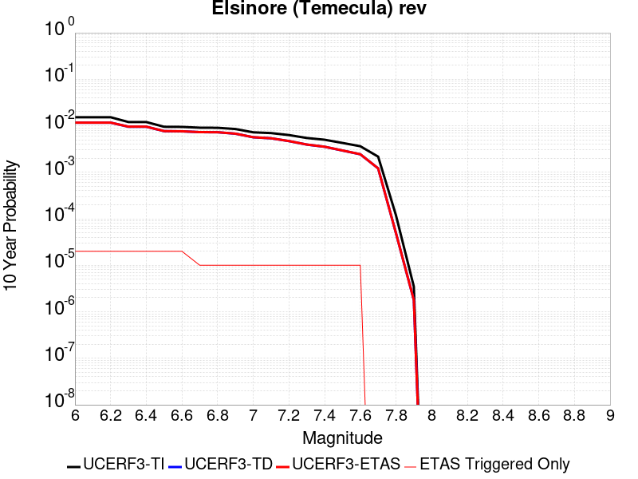 |

| Magnitude | 1 wk TI Prob | 1 wk TD Prob | 1 wk ETAS Prob | 1 wk ETAS/TD Gain | 1 wk ETAS Triggered Only | 1 mo TI Prob | 1 mo TD Prob | 1 mo ETAS Prob | 1 mo ETAS/TD Gain | 1 mo ETAS Triggered Only | 1 yr TI Prob | 1 yr TD Prob | 1 yr ETAS Prob | 1 yr ETAS/TD Gain | 1 yr ETAS Triggered Only | 10 yr TI Prob | 10 yr TD Prob | 10 yr ETAS Prob | 10 yr ETAS/TD Gain | 10 yr ETAS Triggered Only |
|-----|-----|-----|-----|-----|-----|-----|-----|-----|-----|-----|-----|-----|-----|-----|-----|-----|-----|-----|-----|-----|
| 6.0 | 2.9514995E-5 | 2.251887E-5 | 4.6720266E-5 | 2.0747163 | 2.4201941E-5 | 1.264867E-4 | 9.6505995E-5 | 1.20705605E-4 | 1.2507576 | 2.4201941E-5 | 0.0015388876 | 0.0011743492 | 0.0011985227 | 1.0205846 | 2.4201941E-5 | 0.015282745 | 0.011688135 | 0.011712054 | 1.0020465 | 2.4201941E-5 |
| 6.1 | 2.9514995E-5 | 2.251887E-5 | 4.6720266E-5 | 2.0747163 | 2.4201941E-5 | 1.264867E-4 | 9.6505995E-5 | 1.20705605E-4 | 1.2507576 | 2.4201941E-5 | 0.0015388876 | 0.0011743492 | 0.0011985227 | 1.0205846 | 2.4201941E-5 | 0.015282745 | 0.011688135 | 0.011712054 | 1.0020465 | 2.4201941E-5 |
| 6.2 | 2.9514995E-5 | 2.251887E-5 | 4.6720266E-5 | 2.0747163 | 2.4201941E-5 | 1.264867E-4 | 9.6505995E-5 | 1.20705605E-4 | 1.2507576 | 2.4201941E-5 | 0.0015388876 | 0.0011743492 | 0.0011985227 | 1.0205846 | 2.4201941E-5 | 0.015282745 | 0.011688135 | 0.011712054 | 1.0020465 | 2.4201941E-5 |
| 6.3 | 2.3223649E-5 | 1.840822E-5 | 4.2609714E-5 | 2.3147113 | 2.4201941E-5 | 9.952613E-5 | 7.889008E-5 | 1.0309011E-4 | 1.3067564 | 2.4201941E-5 | 0.001211057 | 9.600807E-4 | 9.842594E-4 | 1.025184 | 2.4201941E-5 | 0.012044783 | 0.009551284 | 0.009575254 | 1.0025097 | 2.4201941E-5 |
| 6.4 | 2.3223649E-5 | 1.840822E-5 | 4.2609714E-5 | 2.3147113 | 2.4201941E-5 | 9.952613E-5 | 7.889008E-5 | 1.0309011E-4 | 1.3067564 | 2.4201941E-5 | 0.001211057 | 9.600807E-4 | 9.842594E-4 | 1.025184 | 2.4201941E-5 | 0.012044783 | 0.009551284 | 0.009575254 | 1.0025097 | 2.4201941E-5 |
| 6.5 | 1.8338875E-5 | 1.4750074E-5 | 3.8951657E-5 | 2.640777 | 2.4201941E-5 | 7.8592806E-5 | 6.321312E-5 | 8.741353E-5 | 1.3828384 | 2.4201941E-5 | 9.5644733E-4 | 7.6935673E-4 | 7.935401E-4 | 1.0314332 | 2.4201941E-5 | 0.009523412 | 0.0076699676 | 0.0076939836 | 1.0031313 | 2.4201941E-5 |
| 6.6 | 1.8223333E-5 | 1.461263E-5 | 3.8814218E-5 | 2.6562102 | 2.4201941E-5 | 7.809766E-5 | 6.26241E-5 | 8.6824526E-5 | 1.3864394 | 2.4201941E-5 | 9.504242E-4 | 7.621905E-4 | 7.86374E-4 | 1.031729 | 2.4201941E-5 | 0.009463696 | 0.007598796 | 0.0076228143 | 1.0031607 | 2.4201941E-5 |
| 6.7 | 1.7512752E-5 | 1.4026963E-5 | 1.4026963E-5 | 1.0 | 0.0 | 7.505249E-5 | 6.0114216E-5 | 6.0114216E-5 | 1.0 | 0.0 | 9.13381E-4 | 7.316534E-4 | 7.316534E-4 | 1.0 | 0.0 | 0.00909636 | 0.0072983317 | 0.0072983317 | 1.0 | 0.0 |
| 6.8 | 1.7417142E-5 | 1.395093E-5 | 1.395093E-5 | 1.0 | 0.0 | 7.4642754E-5 | 5.978838E-5 | 5.978838E-5 | 1.0 | 0.0 | 9.083966E-4 | 7.27689E-4 | 7.27689E-4 | 1.0 | 0.0 | 0.009046922 | 0.007259359 | 0.007259359 | 1.0 | 0.0 |
| 6.9 | 1.6402591E-5 | 1.29883665E-5 | 1.29883665E-5 | 1.0 | 0.0 | 7.0294926E-5 | 5.5663284E-5 | 5.5663284E-5 | 1.0 | 0.0 | 8.5550465E-4 | 6.774974E-4 | 6.774974E-4 | 1.0 | 0.0 | 0.008522186 | 0.0067598647 | 0.0067598647 | 1.0 | 0.0 |
| 7.0 | 1.3912486E-5 | 1.0878067E-5 | 1.0878067E-5 | 1.0 | 0.0 | 5.9623577E-5 | 4.661947E-5 | 4.661947E-5 | 1.0 | 0.0 | 7.2567526E-4 | 5.674469E-4 | 5.674469E-4 | 1.0 | 0.0 | 0.0072331014 | 0.0056635314 | 0.0056635314 | 1.0 | 0.0 |
| 7.1 | 1.3405147E-5 | 1.0327192E-5 | 1.0327192E-5 | 1.0 | 0.0 | 5.7449364E-5 | 4.4258657E-5 | 4.4258657E-5 | 1.0 | 0.0 | 6.9922156E-4 | 5.3871854E-4 | 5.3871854E-4 | 1.0 | 0.0 | 0.0069702556 | 0.005377366 | 0.005377366 | 1.0 | 0.0 |
| 7.2 | 1.21402E-5 | 8.996479E-6 | 8.996479E-6 | 1.0 | 0.0 | 5.202839E-5 | 3.8555776E-5 | 3.8555776E-5 | 1.0 | 0.0 | 6.332616E-4 | 4.6931725E-4 | 4.6931725E-4 | 1.0 | 0.0 | 0.0063146 | 0.0046847262 | 0.0046847262 | 1.0 | 0.0 |
| 7.3 | 1.05047775E-5 | 7.571515E-6 | 7.571515E-6 | 1.0 | 0.0 | 4.5019697E-5 | 3.2448956E-5 | 3.2448956E-5 | 1.0 | 0.0 | 5.4797693E-4 | 3.9499588E-4 | 3.9499588E-4 | 1.0 | 0.0 | 0.005466277 | 0.003943348 | 0.003943348 | 1.0 | 0.0 |
| 7.4 | 9.624483E-6 | 6.786621E-6 | 6.786621E-6 | 1.0 | 0.0 | 4.124713E-5 | 2.90852E-5 | 2.90852E-5 | 1.0 | 0.0 | 5.0206814E-4 | 3.5405616E-4 | 3.5405616E-4 | 1.0 | 0.0 | 0.005009353 | 0.0035350726 | 0.0035350726 | 1.0 | 0.0 |
| 7.5 | 8.215151E-6 | 5.6353133E-6 | 5.6353133E-6 | 1.0 | 0.0 | 3.5207315E-5 | 2.4151126E-5 | 2.4151126E-5 | 1.0 | 0.0 | 4.2856473E-4 | 2.9400157E-4 | 2.9400157E-4 | 1.0 | 0.0 | 0.004277392 | 0.002936254 | 0.002936254 | 1.0 | 0.0 |
| 7.6 | 6.975058E-6 | 4.675836E-6 | 4.675836E-6 | 1.0 | 0.0 | 2.9892764E-5 | 2.003915E-5 | 2.003915E-5 | 1.0 | 0.0 | 3.6388362E-4 | 2.439505E-4 | 2.439505E-4 | 1.0 | 0.0 | 0.0036328835 | 0.0024369434 | 0.0024369434 | 1.0 | 0.0 |
| 7.7 | 4.159604E-6 | 2.326789E-6 | 2.326789E-6 | 1.0 | 0.0 | 1.7826753E-5 | 9.971919E-6 | 9.971919E-6 | 1.0 | 0.0 | 2.1701909E-4 | 1.2140209E-4 | 1.2140209E-4 | 1.0 | 0.0 | 0.0021680726 | 0.0012134308 | 0.0012134308 | 1.0 | 0.0 |
| 7.8 | 2.2692414E-7 | 9.384417E-8 | 9.384417E-8 | 1.0 | 0.0 | 9.725317E-7 | 4.0218927E-7 | 4.0218927E-7 | 1.0 | 0.0 | 1.1840509E-5 | 4.8966467E-6 | 4.8966467E-6 | 1.0 | 0.0 | 1.1839878E-4 | 4.8965718E-5 | 4.8965718E-5 | 1.0 | 0.0 |
| 7.9 | 6.676829E-9 | 3.4397174E-9 | 3.4397174E-9 | 1.0 | 0.0 | 2.861498E-8 | 1.4741646E-8 | 1.4741646E-8 | 1.0 | 0.0 | 3.4838732E-7 | 1.7947953E-7 | 1.7947953E-7 | 1.0 | 0.0 | 3.4838679E-6 | 1.794794E-6 | 1.794794E-6 | 1.0 | 0.0 |

## Del Valle
*[(top)](#table-of-contents)*

| 1 Week | 1 Month | 1 Year | 10 Year |
|-----|-----|-----|-----|
|  |  |  |  |

| Magnitude | 1 wk TI Prob | 1 wk TD Prob | 1 wk ETAS Prob | 1 wk ETAS/TD Gain | 1 wk ETAS Triggered Only | 1 mo TI Prob | 1 mo TD Prob | 1 mo ETAS Prob | 1 mo ETAS/TD Gain | 1 mo ETAS Triggered Only | 1 yr TI Prob | 1 yr TD Prob | 1 yr ETAS Prob | 1 yr ETAS/TD Gain | 1 yr ETAS Triggered Only | 10 yr TI Prob | 10 yr TD Prob | 10 yr ETAS Prob | 10 yr ETAS/TD Gain | 10 yr ETAS Triggered Only |
|-----|-----|-----|-----|-----|-----|-----|-----|-----|-----|-----|-----|-----|-----|-----|-----|-----|-----|-----|-----|-----|
| 6.0 | 1.0716125E-5 | 8.767882E-6 | 8.767882E-6 | 1.0 | 0.0 | 4.592544E-5 | 3.7576207E-5 | 3.7576207E-5 | 1.0 | 0.0 | 5.589988E-4 | 4.5741402E-4 | 4.5741402E-4 | 1.0 | 0.0 | 0.0055759475 | 0.004566694 | 0.0045907856 | 1.0052755 | 2.4201941E-5 |
| 6.1 | 1.0716125E-5 | 8.767882E-6 | 8.767882E-6 | 1.0 | 0.0 | 4.592544E-5 | 3.7576207E-5 | 3.7576207E-5 | 1.0 | 0.0 | 5.589988E-4 | 4.5741402E-4 | 4.5741402E-4 | 1.0 | 0.0 | 0.0055759475 | 0.004566694 | 0.0045907856 | 1.0052755 | 2.4201941E-5 |
| 6.2 | 1.0716125E-5 | 8.767882E-6 | 8.767882E-6 | 1.0 | 0.0 | 4.592544E-5 | 3.7576207E-5 | 3.7576207E-5 | 1.0 | 0.0 | 5.589988E-4 | 4.5741402E-4 | 4.5741402E-4 | 1.0 | 0.0 | 0.0055759475 | 0.004566694 | 0.0045907856 | 1.0052755 | 2.4201941E-5 |
| 6.3 | 7.1293784E-6 | 4.8658226E-6 | 4.8658226E-6 | 1.0 | 0.0 | 3.055412E-5 | 2.0853362E-5 | 2.0853362E-5 | 1.0 | 0.0 | 3.7193293E-4 | 2.5386084E-4 | 2.5386084E-4 | 1.0 | 0.0 | 0.0037131102 | 0.0025358086 | 0.0025358086 | 1.0 | 0.0 |
| 6.4 | 7.1293784E-6 | 4.8658226E-6 | 4.8658226E-6 | 1.0 | 0.0 | 3.055412E-5 | 2.0853362E-5 | 2.0853362E-5 | 1.0 | 0.0 | 3.7193293E-4 | 2.5386084E-4 | 2.5386084E-4 | 1.0 | 0.0 | 0.0037131102 | 0.0025358086 | 0.0025358086 | 1.0 | 0.0 |
| 6.5 | 7.1293784E-6 | 4.8658226E-6 | 4.8658226E-6 | 1.0 | 0.0 | 3.055412E-5 | 2.0853362E-5 | 2.0853362E-5 | 1.0 | 0.0 | 3.7193293E-4 | 2.5386084E-4 | 2.5386084E-4 | 1.0 | 0.0 | 0.0037131102 | 0.0025358086 | 0.0025358086 | 1.0 | 0.0 |
| 6.6 | 7.1293784E-6 | 4.8658226E-6 | 4.8658226E-6 | 1.0 | 0.0 | 3.055412E-5 | 2.0853362E-5 | 2.0853362E-5 | 1.0 | 0.0 | 3.7193293E-4 | 2.5386084E-4 | 2.5386084E-4 | 1.0 | 0.0 | 0.0037131102 | 0.0025358086 | 0.0025358086 | 1.0 | 0.0 |
| 6.7 | 7.12272E-6 | 4.8631982E-6 | 4.8631982E-6 | 1.0 | 0.0 | 3.0525585E-5 | 2.0842115E-5 | 2.0842115E-5 | 1.0 | 0.0 | 3.7158563E-4 | 2.5372393E-4 | 2.5372393E-4 | 1.0 | 0.0 | 0.003709649 | 0.0025344428 | 0.0025344428 | 1.0 | 0.0 |
| 6.8 | 6.7558703E-6 | 4.559404E-6 | 4.559404E-6 | 1.0 | 0.0 | 2.895341E-5 | 1.954016E-5 | 1.954016E-5 | 1.0 | 0.0 | 3.5245073E-4 | 2.3787611E-4 | 2.3787611E-4 | 1.0 | 0.0 | 0.0035189227 | 0.0023763045 | 0.0023763045 | 1.0 | 0.0 |
| 6.9 | 6.6700386E-6 | 4.5025436E-6 | 4.5025436E-6 | 1.0 | 0.0 | 2.8585566E-5 | 1.9296476E-5 | 1.9296476E-5 | 1.0 | 0.0 | 3.479737E-4 | 2.349099E-4 | 2.349099E-4 | 1.0 | 0.0 | 0.003474293 | 0.0023467052 | 0.0023467052 | 1.0 | 0.0 |
| 7.0 | 6.3181424E-6 | 4.098708E-6 | 4.098708E-6 | 1.0 | 0.0 | 2.7077473E-5 | 1.7565775E-5 | 1.7565775E-5 | 1.0 | 0.0 | 3.2961834E-4 | 2.1384275E-4 | 2.1384275E-4 | 1.0 | 0.0 | 0.0032912986 | 0.0021364389 | 0.0021364389 | 1.0 | 0.0 |
| 7.1 | 6.248759E-6 | 4.033899E-6 | 4.033899E-6 | 1.0 | 0.0 | 2.678012E-5 | 1.7288028E-5 | 1.7288028E-5 | 1.0 | 0.0 | 3.2599916E-4 | 2.1046183E-4 | 2.1046183E-4 | 1.0 | 0.0 | 0.0032552136 | 0.0021026938 | 0.0021026938 | 1.0 | 0.0 |
| 7.2 | 6.0411944E-6 | 3.869892E-6 | 3.869892E-6 | 1.0 | 0.0 | 2.5890577E-5 | 1.658515E-5 | 1.658515E-5 | 1.0 | 0.0 | 3.1517216E-4 | 2.019059E-4 | 2.019059E-4 | 1.0 | 0.0 | 0.0031472554 | 0.0020172922 | 0.0020172922 | 1.0 | 0.0 |
| 7.3 | 4.7691183E-6 | 3.0780905E-6 | 3.0780905E-6 | 1.0 | 0.0 | 2.0438918E-5 | 1.3191751E-5 | 1.3191751E-5 | 1.0 | 0.0 | 2.488154E-4 | 1.6059795E-4 | 1.6059795E-4 | 1.0 | 0.0 | 0.00248537 | 0.0016048512 | 0.0016048512 | 1.0 | 0.0 |
| 7.4 | 3.5524722E-6 | 2.1893159E-6 | 2.1893159E-6 | 1.0 | 0.0 | 1.5224792E-5 | 9.382749E-6 | 9.382749E-6 | 1.0 | 0.0 | 1.8534607E-4 | 1.14229064E-4 | 1.14229064E-4 | 1.0 | 0.0 | 0.0018519156 | 0.0011417117 | 0.0011417117 | 1.0 | 0.0 |
| 7.5 | 2.7133442E-6 | 1.5915855E-6 | 1.5915855E-6 | 1.0 | 0.0 | 1.1628566E-5 | 6.821063E-6 | 6.821063E-6 | 1.0 | 0.0 | 1.415686E-4 | 8.30433E-5 | 8.30433E-5 | 1.0 | 0.0 | 0.0014147845 | 8.301246E-4 | 8.301246E-4 | 1.0 | 0.0 |
| 7.6 | 1.915338E-6 | 1.1738952E-6 | 1.1738952E-6 | 1.0 | 0.0 | 8.208566E-6 | 5.0309695E-6 | 5.0309695E-6 | 1.0 | 0.0 | 9.993471E-5 | 6.125034E-5 | 6.125034E-5 | 1.0 | 0.0 | 9.988978E-4 | 6.123355E-4 | 6.123355E-4 | 1.0 | 0.0 |
| 7.7 | 1.2120448E-6 | 7.1801645E-7 | 7.1801645E-7 | 1.0 | 0.0 | 5.194467E-6 | 3.0772098E-6 | 3.0772098E-6 | 1.0 | 0.0 | 6.3240805E-5 | 3.746439E-5 | 3.746439E-5 | 1.0 | 0.0 | 6.322281E-4 | 3.745811E-4 | 3.745811E-4 | 1.0 | 0.0 |
| 7.8 | 6.272381E-7 | 3.93245E-7 | 3.93245E-7 | 1.0 | 0.0 | 2.6881603E-6 | 1.6853346E-6 | 1.6853346E-6 | 1.0 | 0.0 | 3.272786E-5 | 2.0518757E-5 | 2.0518757E-5 | 1.0 | 0.0 | 3.272304E-4 | 2.0516879E-4 | 2.0516879E-4 | 1.0 | 0.0 |
| 7.9 | 2.0292627E-7 | 1.2004223E-7 | 1.2004223E-7 | 1.0 | 0.0 | 8.6968373E-7 | 5.144666E-7 | 5.144666E-7 | 1.0 | 0.0 | 1.0588348E-5 | 6.2636127E-6 | 6.2636127E-6 | 1.0 | 0.0 | 1.0587843E-4 | 6.263438E-5 | 6.263438E-5 | 1.0 | 0.0 |
| 8.0 | 4.374492E-8 | 2.1898856E-8 | 2.1898856E-8 | 1.0 | 0.0 | 1.8747821E-7 | 9.3852236E-8 | 9.3852236E-8 | 1.0 | 0.0 | 2.2825448E-6 | 1.1426505E-6 | 1.1426505E-6 | 1.0 | 0.0 | 2.2825214E-5 | 1.1426449E-5 | 1.1426449E-5 | 1.0 | 0.0 |

## Los Alamos 2011 CFM
*[(top)](#table-of-contents)*

| 1 Week | 1 Month | 1 Year | 10 Year |
|-----|-----|-----|-----|
|  |  |  |  |

| Magnitude | 1 wk TI Prob | 1 wk TD Prob | 1 wk ETAS Prob | 1 wk ETAS/TD Gain | 1 wk ETAS Triggered Only | 1 mo TI Prob | 1 mo TD Prob | 1 mo ETAS Prob | 1 mo ETAS/TD Gain | 1 mo ETAS Triggered Only | 1 yr TI Prob | 1 yr TD Prob | 1 yr ETAS Prob | 1 yr ETAS/TD Gain | 1 yr ETAS Triggered Only | 10 yr TI Prob | 10 yr TD Prob | 10 yr ETAS Prob | 10 yr ETAS/TD Gain | 10 yr ETAS Triggered Only |
|-----|-----|-----|-----|-----|-----|-----|-----|-----|-----|-----|-----|-----|-----|-----|-----|-----|-----|-----|-----|-----|
| 6.0 | 4.6284417E-6 | 4.7517333E-6 | 2.895356E-5 | 6.0932627 | 2.4201941E-5 | 1.9836029E-5 | 2.0364423E-5 | 4.456587E-5 | 2.1884181 | 2.4201941E-5 | 2.4147688E-4 | 2.479104E-4 | 2.7210635E-4 | 1.0975995 | 2.4201941E-5 | 0.0024121467 | 0.0024765125 | 0.0025006544 | 1.0097483 | 2.4201941E-5 |
| 6.1 | 4.6284417E-6 | 4.7517333E-6 | 2.895356E-5 | 6.0932627 | 2.4201941E-5 | 1.9836029E-5 | 2.0364423E-5 | 4.456587E-5 | 2.1884181 | 2.4201941E-5 | 2.4147688E-4 | 2.479104E-4 | 2.7210635E-4 | 1.0975995 | 2.4201941E-5 | 0.0024121467 | 0.0024765125 | 0.0025006544 | 1.0097483 | 2.4201941E-5 |
| 6.2 | 4.6284417E-6 | 4.7517333E-6 | 2.895356E-5 | 6.0932627 | 2.4201941E-5 | 1.9836029E-5 | 2.0364423E-5 | 4.456587E-5 | 2.1884181 | 2.4201941E-5 | 2.4147688E-4 | 2.479104E-4 | 2.7210635E-4 | 1.0975995 | 2.4201941E-5 | 0.0024121467 | 0.0024765125 | 0.0025006544 | 1.0097483 | 2.4201941E-5 |
| 6.3 | 4.6284417E-6 | 4.7517333E-6 | 2.895356E-5 | 6.0932627 | 2.4201941E-5 | 1.9836029E-5 | 2.0364423E-5 | 4.456587E-5 | 2.1884181 | 2.4201941E-5 | 2.4147688E-4 | 2.479104E-4 | 2.7210635E-4 | 1.0975995 | 2.4201941E-5 | 0.0024121467 | 0.0024765125 | 0.0025006544 | 1.0097483 | 2.4201941E-5 |
| 6.4 | 4.6284417E-6 | 4.7517333E-6 | 2.895356E-5 | 6.0932627 | 2.4201941E-5 | 1.9836029E-5 | 2.0364423E-5 | 4.456587E-5 | 2.1884181 | 2.4201941E-5 | 2.4147688E-4 | 2.479104E-4 | 2.7210635E-4 | 1.0975995 | 2.4201941E-5 | 0.0024121467 | 0.0024765125 | 0.0025006544 | 1.0097483 | 2.4201941E-5 |
| 6.5 | 4.6284417E-6 | 4.7517333E-6 | 2.895356E-5 | 6.0932627 | 2.4201941E-5 | 1.9836029E-5 | 2.0364423E-5 | 4.456587E-5 | 2.1884181 | 2.4201941E-5 | 2.4147688E-4 | 2.479104E-4 | 2.7210635E-4 | 1.0975995 | 2.4201941E-5 | 0.0024121467 | 0.0024765125 | 0.0025006544 | 1.0097483 | 2.4201941E-5 |
| 6.6 | 4.6284417E-6 | 4.7517333E-6 | 2.895356E-5 | 6.0932627 | 2.4201941E-5 | 1.9836029E-5 | 2.0364423E-5 | 4.456587E-5 | 2.1884181 | 2.4201941E-5 | 2.4147688E-4 | 2.479104E-4 | 2.7210635E-4 | 1.0975995 | 2.4201941E-5 | 0.0024121467 | 0.0024765125 | 0.0025006544 | 1.0097483 | 2.4201941E-5 |
| 6.7 | 4.062321E-6 | 4.166351E-6 | 2.8368191E-5 | 6.8088818 | 2.4201941E-5 | 1.7409831E-5 | 1.7855677E-5 | 4.2057185E-5 | 2.3553958 | 2.4201941E-5 | 2.1194408E-4 | 2.1737268E-4 | 2.4156936E-4 | 1.1113143 | 2.4201941E-5 | 0.0021174205 | 0.0021717504 | 0.0021958996 | 1.0111197 | 2.4201941E-5 |
| 6.8 | 4.062321E-6 | 4.166351E-6 | 2.8368191E-5 | 6.8088818 | 2.4201941E-5 | 1.7409831E-5 | 1.7855677E-5 | 4.2057185E-5 | 2.3553958 | 2.4201941E-5 | 2.1194408E-4 | 2.1737268E-4 | 2.4156936E-4 | 1.1113143 | 2.4201941E-5 | 0.0021174205 | 0.0021717504 | 0.0021958996 | 1.0111197 | 2.4201941E-5 |
| 6.9 | 3.2936077E-6 | 3.37296E-6 | 2.7574819E-5 | 8.175259 | 2.4201941E-5 | 1.4115385E-5 | 1.4455468E-5 | 3.865706E-5 | 2.674217 | 2.4201941E-5 | 1.7184127E-4 | 1.7598206E-4 | 2.0017974E-4 | 1.1375009 | 2.4201941E-5 | 0.0017170844 | 0.0017585196 | 0.0017826789 | 1.0137385 | 2.4201941E-5 |
| 7.0 | 3.1687898E-6 | 3.2448177E-6 | 2.744668E-5 | 8.45862 | 2.4201941E-5 | 1.3580457E-5 | 1.3906293E-5 | 3.8107897E-5 | 2.7403347 | 2.4201941E-5 | 1.6532952E-4 | 1.692969E-4 | 1.9349474E-4 | 1.1429315 | 2.4201941E-5 | 0.0016520657 | 0.0016917707 | 0.0017159318 | 1.0142815 | 2.4201941E-5 |
| 7.1 | 2.9379228E-6 | 3.007328E-6 | 2.7209197E-5 | 9.047632 | 2.4201941E-5 | 1.25910365E-5 | 1.288849E-5 | 3.7090118E-5 | 2.8777707 | 2.4201941E-5 | 1.5328509E-4 | 1.5690697E-4 | 1.8110512E-4 | 1.1542196 | 2.4201941E-5 | 0.001531794 | 0.001568051 | 0.001592215 | 1.0154102 | 2.4201941E-5 |
| 7.2 | 2.0020686E-6 | 2.041632E-6 | 2.6243524E-5 | 12.854189 | 2.4201941E-5 | 8.580266E-6 | 8.749822E-6 | 3.295155E-5 | 3.765968 | 2.4201941E-5 | 1.0445973E-4 | 1.0652392E-4 | 1.3072329E-4 | 1.2271731 | 2.4201941E-5 | 0.0010441064 | 0.001064733 | 0.0010889092 | 1.0227063 | 2.4201941E-5 |
| 7.3 | 1.7364243E-6 | 1.7678824E-6 | 2.596978E-5 | 14.689767 | 2.4201941E-5 | 7.441797E-6 | 7.576617E-6 | 3.1778374E-5 | 4.1942697 | 2.4201941E-5 | 9.0600115E-5 | 9.224144E-5 | 1.1644115E-4 | 1.2623518 | 2.4201941E-5 | 9.0563187E-4 | 9.2203467E-4 | 9.462143E-4 | 1.0262243 | 2.4201941E-5 |
| 7.4 | 1.5718434E-6 | 1.5983198E-6 | 2.5800222E-5 | 16.14209 | 2.4201941E-5 | 6.7364545E-6 | 6.8499244E-6 | 3.10517E-5 | 4.533145 | 2.4201941E-5 | 8.201325E-5 | 8.339467E-5 | 1.0759459E-4 | 1.2901855 | 2.4201941E-5 | 8.198299E-4 | 8.3363673E-4 | 8.5781846E-4 | 1.0290076 | 2.4201941E-5 |
| 7.5 | 1.3841119E-6 | 1.4042814E-6 | 2.5606189E-5 | 18.234371 | 2.4201941E-5 | 5.9318945E-6 | 6.018335E-6 | 3.022013E-5 | 5.0213437 | 2.4201941E-5 | 7.221842E-5 | 7.327079E-5 | 9.747096E-5 | 1.330284 | 2.4201941E-5 | 7.2194956E-4 | 7.3246926E-4 | 7.566535E-4 | 1.0330174 | 2.4201941E-5 |
| 7.6 | 1.0843726E-6 | 1.0934443E-6 | 2.529536E-5 | 23.133652 | 2.4201941E-5 | 4.647303E-6 | 4.6861815E-6 | 2.888801E-5 | 6.1645093 | 2.4201941E-5 | 5.6579443E-5 | 5.705279E-5 | 8.1253354E-5 | 1.4241784 | 2.4201941E-5 | 5.656504E-4 | 5.70384E-4 | 5.9457216E-4 | 1.0424068 | 2.4201941E-5 |
| 7.7 | 5.544814E-7 | 5.501884E-7 | 5.501884E-7 | 1.0 | 0.0 | 2.3763469E-6 | 2.3579482E-6 | 2.3579482E-6 | 1.0 | 0.0 | 2.8931638E-5 | 2.8707644E-5 | 2.8707644E-5 | 1.0 | 0.0 | 2.8927872E-4 | 2.870395E-4 | 2.870395E-4 | 1.0 | 0.0 |
| 7.8 | 2.0707465E-7 | 1.9778598E-7 | 1.9778598E-7 | 1.0 | 0.0 | 8.874625E-7 | 8.476539E-7 | 8.476539E-7 | 1.0 | 0.0 | 1.08048025E-5 | 1.0320137E-5 | 1.0320137E-5 | 1.0 | 0.0 | 1.0804277E-4 | 1.0319663E-4 | 1.0319663E-4 | 1.0 | 0.0 |
| 7.9 | 3.9821284E-8 | 3.4331528E-8 | 3.4331528E-8 | 1.0 | 0.0 | 1.7066264E-7 | 1.4713511E-7 | 1.4713511E-7 | 1.0 | 0.0 | 2.0778157E-6 | 1.7913685E-6 | 1.7913685E-6 | 1.0 | 0.0 | 2.0777963E-5 | 1.7913546E-5 | 1.7913546E-5 | 1.0 | 0.0 |
| 8.0 | 7.880441E-11 | 8.2353124E-11 | 8.2353124E-11 | 1.0 | 0.0 | 3.3773329E-10 | 3.52942E-10 | 3.52942E-10 | 1.0 | 0.0 | 4.1119033E-9 | 4.2970694E-9 | 4.2970694E-9 | 1.0 | 0.0 | 4.1119034E-8 | 4.2970694E-8 | 4.2970694E-8 | 1.0 | 0.0 |

## San Gregorio (North) 2011 CFM
*[(top)](#table-of-contents)*

| 1 Week | 1 Month | 1 Year | 10 Year |
|-----|-----|-----|-----|
|  |  |  |  |

| Magnitude | 1 wk TI Prob | 1 wk TD Prob | 1 wk ETAS Prob | 1 wk ETAS/TD Gain | 1 wk ETAS Triggered Only | 1 mo TI Prob | 1 mo TD Prob | 1 mo ETAS Prob | 1 mo ETAS/TD Gain | 1 mo ETAS Triggered Only | 1 yr TI Prob | 1 yr TD Prob | 1 yr ETAS Prob | 1 yr ETAS/TD Gain | 1 yr ETAS Triggered Only | 10 yr TI Prob | 10 yr TD Prob | 10 yr ETAS Prob | 10 yr ETAS/TD Gain | 10 yr ETAS Triggered Only |
|-----|-----|-----|-----|-----|-----|-----|-----|-----|-----|-----|-----|-----|-----|-----|-----|-----|-----|-----|-----|-----|
| 6.0 | 5.0283932E-5 | 4.3057098E-5 | 4.3057098E-5 | 1.0 | 0.0 | 2.1548476E-4 | 1.8451746E-4 | 1.8451746E-4 | 1.0 | 0.0 | 0.0026203706 | 0.002244199 | 0.0022683467 | 1.0107601 | 2.4201941E-5 | 0.02589687 | 0.022295918 | 0.02231958 | 1.0010613 | 2.4201941E-5 |
| 6.1 | 5.0283932E-5 | 4.3057098E-5 | 4.3057098E-5 | 1.0 | 0.0 | 2.1548476E-4 | 1.8451746E-4 | 1.8451746E-4 | 1.0 | 0.0 | 0.0026203706 | 0.002244199 | 0.0022683467 | 1.0107601 | 2.4201941E-5 | 0.02589687 | 0.022295918 | 0.02231958 | 1.0010613 | 2.4201941E-5 |
| 6.2 | 4.2998647E-5 | 3.4440873E-5 | 3.4440873E-5 | 1.0 | 0.0 | 1.842669E-4 | 1.4759546E-4 | 1.4759546E-4 | 1.0 | 0.0 | 0.0022411412 | 0.001795506 | 0.0018196645 | 1.013455 | 2.4201941E-5 | 0.022186736 | 0.017884884 | 0.017908653 | 1.001329 | 2.4201941E-5 |
| 6.3 | 4.2998647E-5 | 3.4440873E-5 | 3.4440873E-5 | 1.0 | 0.0 | 1.842669E-4 | 1.4759546E-4 | 1.4759546E-4 | 1.0 | 0.0 | 0.0022411412 | 0.001795506 | 0.0018196645 | 1.013455 | 2.4201941E-5 | 0.022186736 | 0.017884884 | 0.017908653 | 1.001329 | 2.4201941E-5 |
| 6.4 | 4.1101295E-5 | 3.2326076E-5 | 3.2326076E-5 | 1.0 | 0.0 | 1.7613651E-4 | 1.3853304E-4 | 1.3853304E-4 | 1.0 | 0.0 | 0.0021423528 | 0.0016853481 | 0.0016853481 | 1.0 | 0.0 | 0.02121817 | 0.016800618 | 0.016800618 | 1.0 | 0.0 |
| 6.5 | 4.1032585E-5 | 3.224411E-5 | 3.224411E-5 | 1.0 | 0.0 | 1.7584208E-4 | 1.381818E-4 | 1.381818E-4 | 1.0 | 0.0 | 0.0021387753 | 0.0016810785 | 0.0016810785 | 1.0 | 0.0 | 0.021183075 | 0.01675857 | 0.01675857 | 1.0 | 0.0 |
| 6.6 | 4.011629E-5 | 3.1265718E-5 | 3.1265718E-5 | 1.0 | 0.0 | 1.7191563E-4 | 1.3398913E-4 | 1.3398913E-4 | 1.0 | 0.0 | 0.0020910634 | 0.0016301107 | 0.0016301107 | 1.0 | 0.0 | 0.020714961 | 0.016257357 | 0.016257357 | 1.0 | 0.0 |
| 6.7 | 3.8583938E-5 | 2.9452754E-5 | 2.9452754E-5 | 1.0 | 0.0 | 1.6534925E-4 | 1.2622007E-4 | 1.2622007E-4 | 1.0 | 0.0 | 0.0020112682 | 0.0015356604 | 0.0015356604 | 1.0 | 0.0 | 0.019931622 | 0.015326062 | 0.015326062 | 1.0 | 0.0 |
| 6.8 | 3.44341E-5 | 2.4450024E-5 | 2.4450024E-5 | 1.0 | 0.0 | 1.4756636E-4 | 1.0478167E-4 | 1.0478167E-4 | 1.0 | 0.0 | 0.0017951399 | 0.0012749807 | 0.0012749807 | 1.0 | 0.0 | 0.017807078 | 0.012751525 | 0.012751525 | 1.0 | 0.0 |
| 6.9 | 3.221199E-5 | 2.1777196E-5 | 2.1777196E-5 | 1.0 | 0.0 | 1.3804408E-4 | 9.3327544E-5 | 9.3327544E-5 | 1.0 | 0.0 | 0.0016793909 | 0.0011356788 | 0.0011356788 | 1.0 | 0.0 | 0.01666756 | 0.011372544 | 0.011372544 | 1.0 | 0.0 |
| 7.0 | 2.9186718E-5 | 1.814604E-5 | 1.814604E-5 | 1.0 | 0.0 | 1.2507994E-4 | 7.776645E-5 | 7.776645E-5 | 1.0 | 0.0 | 0.0015217843 | 9.463997E-4 | 9.463997E-4 | 1.0 | 0.0 | 0.015114053 | 0.0094966395 | 0.0094966395 | 1.0 | 0.0 |
| 7.1 | 2.6840138E-5 | 1.5283675E-5 | 1.5283675E-5 | 1.0 | 0.0 | 1.1502409E-4 | 6.549983E-5 | 6.549983E-5 | 1.0 | 0.0 | 0.0013995186 | 7.971706E-4 | 7.971706E-4 | 1.0 | 0.0 | 0.013907375 | 0.0080155255 | 0.0080155255 | 1.0 | 0.0 |
| 7.2 | 2.453002E-5 | 1.2605825E-5 | 1.2605825E-5 | 1.0 | 0.0 | 1.05124425E-4 | 5.4023847E-5 | 5.4023847E-5 | 1.0 | 0.0 | 0.0012791384 | 6.5754243E-4 | 6.5754243E-4 | 1.0 | 0.0 | 0.012718005 | 0.006627395 | 0.006627395 | 1.0 | 0.0 |
| 7.3 | 2.3330727E-5 | 1.1487833E-5 | 1.1487833E-5 | 1.0 | 0.0 | 9.9985E-5 | 4.923264E-5 | 4.923264E-5 | 1.0 | 0.0 | 0.0012166376 | 5.99243E-4 | 5.99243E-4 | 1.0 | 0.0 | 0.012099981 | 0.0060462817 | 0.0060462817 | 1.0 | 0.0 |
| 7.4 | 2.2136466E-5 | 1.0368137E-5 | 1.0368137E-5 | 1.0 | 0.0 | 9.486712E-5 | 4.4434113E-5 | 4.4434113E-5 | 1.0 | 0.0 | 0.0011543952 | 5.408513E-4 | 5.408513E-4 | 1.0 | 0.0 | 0.011484168 | 0.0054640025 | 0.0054640025 | 1.0 | 0.0 |
| 7.5 | 2.0994974E-5 | 9.426374E-6 | 9.426374E-6 | 1.0 | 0.0 | 8.997535E-5 | 4.0398125E-5 | 4.0398125E-5 | 1.0 | 0.0 | 0.0010948994 | 4.917364E-4 | 4.917364E-4 | 1.0 | 0.0 | 0.010895205 | 0.004973108 | 0.004973108 | 1.0 | 0.0 |
| 7.6 | 1.7091823E-5 | 6.892992E-6 | 6.892992E-6 | 1.0 | 0.0 | 7.3248615E-5 | 2.9541061E-5 | 2.9541061E-5 | 1.0 | 0.0 | 8.9143694E-4 | 3.5960317E-4 | 3.5960317E-4 | 1.0 | 0.0 | 0.008878695 | 0.0036480771 | 0.0036480771 | 1.0 | 0.0 |
| 7.7 | 1.2772179E-5 | 4.0202267E-6 | 4.0202267E-6 | 1.0 | 0.0 | 5.473676E-5 | 1.722943E-5 | 1.722943E-5 | 1.0 | 0.0 | 6.6621625E-4 | 2.0974813E-4 | 2.0974813E-4 | 1.0 | 0.0 | 0.006642225 | 0.0021365841 | 0.0021365841 | 1.0 | 0.0 |
| 7.8 | 7.041923E-6 | 1.9402341E-6 | 1.9402341E-6 | 1.0 | 0.0 | 3.017932E-5 | 8.315263E-6 | 8.315263E-6 | 1.0 | 0.0 | 3.6737128E-4 | 1.01233614E-4 | 1.01233614E-4 | 1.0 | 0.0 | 0.0036676454 | 0.0010376878 | 0.0010376878 | 1.0 | 0.0 |
| 7.9 | 2.946768E-6 | 1.0031822E-6 | 1.0031822E-6 | 1.0 | 0.0 | 1.2628945E-5 | 4.299345E-6 | 4.299345E-6 | 1.0 | 0.0 | 1.5374656E-4 | 5.2343268E-5 | 5.2343268E-5 | 1.0 | 0.0 | 0.0015364023 | 5.339059E-4 | 5.339059E-4 | 1.0 | 0.0 |
| 8.0 | 1.1433375E-6 | 5.180804E-7 | 5.180804E-7 | 1.0 | 0.0 | 4.9000087E-6 | 2.2203426E-6 | 2.2203426E-6 | 1.0 | 0.0 | 5.965597E-5 | 2.7032334E-5 | 2.7032334E-5 | 1.0 | 0.0 | 5.963996E-4 | 2.7394458E-4 | 2.7394458E-4 | 1.0 | 0.0 |
| 8.1 | 2.6675295E-7 | 1.6288074E-7 | 1.6288074E-7 | 1.0 | 0.0 | 1.1432264E-6 | 6.9806015E-7 | 6.9806015E-7 | 1.0 | 0.0 | 1.3918692E-5 | 8.498849E-6 | 8.498849E-6 | 1.0 | 0.0 | 1.391782E-4 | 8.6366665E-5 | 8.6366665E-5 | 1.0 | 0.0 |
| 8.2 | 1.2704569E-8 | 9.429871E-9 | 9.429871E-9 | 1.0 | 0.0 | 5.444815E-8 | 4.041373E-8 | 4.041373E-8 | 1.0 | 0.0 | 6.629061E-7 | 4.920371E-7 | 4.920371E-7 | 1.0 | 0.0 | 6.629041E-6 | 5.1106863E-6 | 5.1106863E-6 | 1.0 | 0.0 |

## San Gorgonio Pass
*[(top)](#table-of-contents)*

| 1 Week | 1 Month | 1 Year | 10 Year |
|-----|-----|-----|-----|
|  |  |  |  |

| Magnitude | 1 wk TI Prob | 1 wk TD Prob | 1 wk ETAS Prob | 1 wk ETAS/TD Gain | 1 wk ETAS Triggered Only | 1 mo TI Prob | 1 mo TD Prob | 1 mo ETAS Prob | 1 mo ETAS/TD Gain | 1 mo ETAS Triggered Only | 1 yr TI Prob | 1 yr TD Prob | 1 yr ETAS Prob | 1 yr ETAS/TD Gain | 1 yr ETAS Triggered Only | 10 yr TI Prob | 10 yr TD Prob | 10 yr ETAS Prob | 10 yr ETAS/TD Gain | 10 yr ETAS Triggered Only |
|-----|-----|-----|-----|-----|-----|-----|-----|-----|-----|-----|-----|-----|-----|-----|-----|-----|-----|-----|-----|-----|
| 6.0 | 7.644328E-6 | 1.331474E-5 | 3.7516358E-5 | 2.8176563 | 2.4201941E-5 | 3.2760996E-5 | 5.706197E-5 | 8.126253E-5 | 1.4241102 | 2.4201941E-5 | 3.987921E-4 | 6.945166E-4 | 7.1870175E-4 | 1.034823 | 2.4201941E-5 | 0.003980772 | 0.006930024 | 0.006954058 | 1.0034682 | 2.4201941E-5 |
| 6.1 | 7.644328E-6 | 1.331474E-5 | 3.7516358E-5 | 2.8176563 | 2.4201941E-5 | 3.2760996E-5 | 5.706197E-5 | 8.126253E-5 | 1.4241102 | 2.4201941E-5 | 3.987921E-4 | 6.945166E-4 | 7.1870175E-4 | 1.034823 | 2.4201941E-5 | 0.003980772 | 0.006930024 | 0.006954058 | 1.0034682 | 2.4201941E-5 |
| 6.2 | 7.644328E-6 | 1.331474E-5 | 3.7516358E-5 | 2.8176563 | 2.4201941E-5 | 3.2760996E-5 | 5.706197E-5 | 8.126253E-5 | 1.4241102 | 2.4201941E-5 | 3.987921E-4 | 6.945166E-4 | 7.1870175E-4 | 1.034823 | 2.4201941E-5 | 0.003980772 | 0.006930024 | 0.006954058 | 1.0034682 | 2.4201941E-5 |
| 6.3 | 7.644328E-6 | 1.331474E-5 | 3.7516358E-5 | 2.8176563 | 2.4201941E-5 | 3.2760996E-5 | 5.706197E-5 | 8.126253E-5 | 1.4241102 | 2.4201941E-5 | 3.987921E-4 | 6.945166E-4 | 7.1870175E-4 | 1.034823 | 2.4201941E-5 | 0.003980772 | 0.006930024 | 0.006954058 | 1.0034682 | 2.4201941E-5 |
| 6.4 | 7.644328E-6 | 1.331474E-5 | 3.7516358E-5 | 2.8176563 | 2.4201941E-5 | 3.2760996E-5 | 5.706197E-5 | 8.126253E-5 | 1.4241102 | 2.4201941E-5 | 3.987921E-4 | 6.945166E-4 | 7.1870175E-4 | 1.034823 | 2.4201941E-5 | 0.003980772 | 0.006930024 | 0.006954058 | 1.0034682 | 2.4201941E-5 |
| 6.5 | 7.644328E-6 | 1.331474E-5 | 3.7516358E-5 | 2.8176563 | 2.4201941E-5 | 3.2760996E-5 | 5.706197E-5 | 8.126253E-5 | 1.4241102 | 2.4201941E-5 | 3.987921E-4 | 6.945166E-4 | 7.1870175E-4 | 1.034823 | 2.4201941E-5 | 0.003980772 | 0.006930024 | 0.006954058 | 1.0034682 | 2.4201941E-5 |
| 6.6 | 7.644328E-6 | 1.331474E-5 | 3.7516358E-5 | 2.8176563 | 2.4201941E-5 | 3.2760996E-5 | 5.706197E-5 | 8.126253E-5 | 1.4241102 | 2.4201941E-5 | 3.987921E-4 | 6.945166E-4 | 7.1870175E-4 | 1.034823 | 2.4201941E-5 | 0.003980772 | 0.006930024 | 0.006954058 | 1.0034682 | 2.4201941E-5 |
| 6.7 | 6.987586E-6 | 1.2619013E-5 | 3.682065E-5 | 2.9178708 | 2.4201941E-5 | 2.9946454E-5 | 5.408041E-5 | 7.8281046E-5 | 1.4474936 | 2.4201941E-5 | 3.645371E-4 | 6.582382E-4 | 6.8242423E-4 | 1.0367435 | 2.4201941E-5 | 0.0036393967 | 0.0065694 | 0.006593443 | 1.0036598 | 2.4201941E-5 |
| 6.8 | 6.987586E-6 | 1.2619013E-5 | 3.682065E-5 | 2.9178708 | 2.4201941E-5 | 2.9946454E-5 | 5.408041E-5 | 7.8281046E-5 | 1.4474936 | 2.4201941E-5 | 3.645371E-4 | 6.582382E-4 | 6.8242423E-4 | 1.0367435 | 2.4201941E-5 | 0.0036393967 | 0.0065694 | 0.006593443 | 1.0036598 | 2.4201941E-5 |
| 6.9 | 5.504702E-6 | 1.1049877E-5 | 3.525155E-5 | 3.190221 | 2.4201941E-5 | 2.3591367E-5 | 4.7355785E-5 | 7.155658E-5 | 1.511042 | 2.4201941E-5 | 2.8718702E-4 | 5.764092E-4 | 6.005972E-4 | 1.0419632 | 2.4201941E-5 | 0.0028681618 | 0.0057553523 | 0.005779415 | 1.0041809 | 2.4201941E-5 |
| 7.0 | 5.4825764E-6 | 1.1026218E-5 | 3.522789E-5 | 3.1949208 | 2.4201941E-5 | 2.3496545E-5 | 4.725439E-5 | 7.1455186E-5 | 1.5121386 | 2.4201941E-5 | 2.8603288E-4 | 5.751754E-4 | 5.993634E-4 | 1.0420533 | 2.4201941E-5 | 0.00285665 | 0.0057430784 | 0.005767141 | 1.0041898 | 2.4201941E-5 |
| 7.1 | 5.4692787E-6 | 1.1011928E-5 | 3.52136E-5 | 3.1977692 | 2.4201941E-5 | 2.3439556E-5 | 4.719315E-5 | 7.139395E-5 | 1.5128032 | 2.4201941E-5 | 2.8533922E-4 | 5.744302E-4 | 5.9861824E-4 | 1.0421079 | 2.4201941E-5 | 0.0028497311 | 0.0057356646 | 0.0057597277 | 1.0041953 | 2.4201941E-5 |
| 7.2 | 5.453661E-6 | 1.0994954E-5 | 3.519663E-5 | 3.2011619 | 2.4201941E-5 | 2.3372622E-5 | 4.712041E-5 | 7.132121E-5 | 1.5135949 | 2.4201941E-5 | 2.8452452E-4 | 5.7354505E-4 | 5.977331E-4 | 1.0421729 | 2.4201941E-5 | 0.002841605 | 0.005726859 | 0.005750922 | 1.0042019 | 2.4201941E-5 |
| 7.3 | 5.4422303E-6 | 1.09818775E-5 | 3.518355E-5 | 3.203783 | 2.4201941E-5 | 2.3323635E-5 | 4.7064368E-5 | 7.126517E-5 | 1.5142064 | 2.4201941E-5 | 2.8392827E-4 | 5.728631E-4 | 5.9705117E-4 | 1.0422231 | 2.4201941E-5 | 0.0028356577 | 0.0057200743 | 0.005744138 | 1.0042069 | 2.4201941E-5 |
| 7.4 | 5.398595E-6 | 1.0929241E-5 | 3.5130917E-5 | 3.2143967 | 2.4201941E-5 | 2.313663E-5 | 4.6838795E-5 | 7.1039605E-5 | 1.516683 | 2.4201941E-5 | 2.8165206E-4 | 5.701182E-4 | 5.9430633E-4 | 1.0424266 | 2.4201941E-5 | 0.0028129534 | 0.0056927665 | 0.0057168305 | 1.0042272 | 2.4201941E-5 |
| 7.5 | 5.3578788E-6 | 1.0855785E-5 | 3.5057463E-5 | 3.2293806 | 2.4201941E-5 | 2.2962136E-5 | 4.6523994E-5 | 7.072481E-5 | 1.5201793 | 2.4201941E-5 | 2.7952815E-4 | 5.662875E-4 | 5.904757E-4 | 1.0427138 | 2.4201941E-5 | 0.002791768 | 0.0056546913 | 0.0056787566 | 1.0042558 | 2.4201941E-5 |
| 7.6 | 4.8091474E-6 | 9.604131E-6 | 3.380584E-5 | 3.5199268 | 2.4201941E-5 | 2.0610469E-5 | 4.1159943E-5 | 6.536089E-5 | 1.5879732 | 2.4201941E-5 | 2.5090357E-4 | 5.010119E-4 | 5.2520167E-4 | 1.0482819 | 2.4201941E-5 | 0.0025062046 | 0.0050054584 | 0.005029539 | 1.0048109 | 2.4201941E-5 |
| 7.7 | 1.5991155E-6 | 3.353035E-6 | 2.7554895E-5 | 8.217896 | 2.4201941E-5 | 6.853334E-6 | 1.4370073E-5 | 3.8571667E-5 | 2.6841664 | 2.4201941E-5 | 8.343615E-5 | 1.7494184E-4 | 1.9913955E-4 | 1.1383185 | 2.4201941E-5 | 8.340483E-4 | 0.0017535852 | 0.0017777446 | 1.0137773 | 2.4201941E-5 |
| 7.8 | 9.258398E-7 | 2.0581049E-6 | 2.6259997E-5 | 12.759309 | 2.4201941E-5 | 3.967879E-6 | 8.82042E-6 | 3.302215E-5 | 3.7438295 | 2.4201941E-5 | 4.8307855E-5 | 1.0738334E-4 | 1.3158268E-4 | 1.2253547 | 2.4201941E-5 | 4.8297356E-4 | 0.0010788103 | 0.0011029862 | 1.0224097 | 2.4201941E-5 |
| 7.9 | 5.975575E-7 | 1.2292295E-6 | 2.543114E-5 | 20.688684 | 2.4201941E-5 | 2.5609581E-6 | 5.2681157E-6 | 2.946993E-5 | 5.594017 | 2.4201941E-5 | 3.117922E-5 | 6.413743E-5 | 8.8337816E-5 | 1.3773209 | 2.4201941E-5 | 3.1174847E-4 | 6.464778E-4 | 6.7066407E-4 | 1.0374124 | 2.4201941E-5 |
| 8.0 | 3.4413725E-7 | 6.714992E-7 | 2.4873423E-5 | 37.041626 | 2.4201941E-5 | 1.4748731E-6 | 2.8778506E-6 | 2.7079723E-5 | 9.409704 | 2.4201941E-5 | 1.7956432E-5 | 3.5037272E-5 | 5.9238366E-5 | 1.6907243 | 2.4201941E-5 | 1.7954981E-4 | 3.5392298E-4 | 3.7811635E-4 | 1.0683577 | 2.4201941E-5 |
| 8.1 | 1.1787731E-8 | 9.6332045E-9 | 9.6332045E-9 | 1.0 | 0.0 | 5.0518846E-8 | 4.1285162E-8 | 4.1285162E-8 | 1.0 | 0.0 | 6.1506677E-7 | 5.0264674E-7 | 5.0264674E-7 | 1.0 | 0.0 | 6.1506507E-6 | 5.2417968E-6 | 5.2417968E-6 | 1.0 | 0.0 |

## San Jacinto (Superstition Mtn)
*[(top)](#table-of-contents)*

| 1 Week | 1 Month | 1 Year | 10 Year |
|-----|-----|-----|-----|
|  |  |  |  |

| Magnitude | 1 wk TI Prob | 1 wk TD Prob | 1 wk ETAS Prob | 1 wk ETAS/TD Gain | 1 wk ETAS Triggered Only | 1 mo TI Prob | 1 mo TD Prob | 1 mo ETAS Prob | 1 mo ETAS/TD Gain | 1 mo ETAS Triggered Only | 1 yr TI Prob | 1 yr TD Prob | 1 yr ETAS Prob | 1 yr ETAS/TD Gain | 1 yr ETAS Triggered Only | 10 yr TI Prob | 10 yr TD Prob | 10 yr ETAS Prob | 10 yr ETAS/TD Gain | 10 yr ETAS Triggered Only |
|-----|-----|-----|-----|-----|-----|-----|-----|-----|-----|-----|-----|-----|-----|-----|-----|-----|-----|-----|-----|-----|
| 6.0 | 6.4193904E-5 | 9.599558E-5 | 1.20195196E-4 | 1.2520909 | 2.4201941E-5 | 2.7508775E-4 | 4.1135435E-4 | 4.3554633E-4 | 1.0588106 | 2.4201941E-5 | 0.0033440501 | 0.0049981694 | 0.00502225 | 1.004818 | 2.4201941E-5 | 0.03294174 | 0.048820045 | 0.048843063 | 1.0004716 | 2.4201941E-5 |
| 6.1 | 6.4193904E-5 | 9.599558E-5 | 1.20195196E-4 | 1.2520909 | 2.4201941E-5 | 2.7508775E-4 | 4.1135435E-4 | 4.3554633E-4 | 1.0588106 | 2.4201941E-5 | 0.0033440501 | 0.0049981694 | 0.00502225 | 1.004818 | 2.4201941E-5 | 0.03294174 | 0.048820045 | 0.048843063 | 1.0004716 | 2.4201941E-5 |
| 6.2 | 5.7023593E-5 | 8.3144616E-5 | 1.07344546E-4 | 1.2910583 | 2.4201941E-5 | 2.4436394E-4 | 3.5629462E-4 | 3.8048794E-4 | 1.0679026 | 2.4201941E-5 | 0.002971072 | 0.0043309047 | 0.004355002 | 1.005564 | 2.4201941E-5 | 0.029316625 | 0.042502448 | 0.042525623 | 1.0005453 | 2.4201941E-5 |
| 6.3 | 5.6940098E-5 | 8.298998E-5 | 1.0718991E-4 | 1.2916007 | 2.4201941E-5 | 2.4400617E-4 | 3.5563204E-4 | 3.798254E-4 | 1.0680292 | 2.4201941E-5 | 0.002966728 | 0.00432287 | 0.0043469677 | 1.0055743 | 2.4201941E-5 | 0.029274331 | 0.04242582 | 0.042448994 | 1.0005462 | 2.4201941E-5 |
| 6.4 | 5.4171585E-5 | 7.748391E-5 | 1.01683974E-4 | 1.3123238 | 2.4201941E-5 | 2.3214328E-4 | 3.3204095E-4 | 3.5623484E-4 | 1.0728642 | 2.4201941E-5 | 0.0028226813 | 0.0040367534 | 0.0040608575 | 1.0059712 | 2.4201941E-5 | 0.02787096 | 0.039715026 | 0.039738268 | 1.0005852 | 2.4201941E-5 |
| 6.5 | 4.375144E-5 | 5.6421442E-5 | 8.062202E-5 | 1.4289252 | 2.4201941E-5 | 1.874927E-4 | 2.417904E-4 | 2.6598648E-4 | 1.1000705 | 2.4201941E-5 | 0.0022803338 | 0.002941 | 0.0029651306 | 1.0082049 | 2.4201941E-5 | 0.022570757 | 0.029235592 | 0.029259086 | 1.0008036 | 2.4201941E-5 |
| 6.6 | 2.772192E-5 | 2.5488029E-5 | 2.5488029E-5 | 1.0 | 0.0 | 1.1880282E-4 | 1.0922994E-4 | 1.0922994E-4 | 1.0 | 0.0 | 0.0014454646 | 0.0013290826 | 0.0013290826 | 1.0 | 0.0 | 0.014360986 | 0.013540891 | 0.013540891 | 1.0 | 0.0 |
| 6.7 | 2.7124124E-5 | 2.4699055E-5 | 2.4699055E-5 | 1.0 | 0.0 | 1.1624106E-4 | 1.0584891E-4 | 1.0584891E-4 | 1.0 | 0.0 | 0.0014143161 | 0.0012879678 | 0.0012879678 | 1.0 | 0.0 | 0.014053487 | 0.013134248 | 0.013134248 | 1.0 | 0.0 |
| 6.8 | 2.5475807E-5 | 2.2164071E-5 | 2.2164071E-5 | 1.0 | 0.0 | 1.0917746E-4 | 9.498548E-5 | 9.498548E-5 | 1.0 | 0.0 | 0.001328425 | 0.0011558468 | 0.0011558468 | 1.0 | 0.0 | 0.0132051185 | 0.011821818 | 0.011821818 | 1.0 | 0.0 |
| 6.9 | 2.1162023E-5 | 1.762564E-5 | 1.762564E-5 | 1.0 | 0.0 | 9.069123E-5 | 7.553629E-5 | 7.553629E-5 | 1.0 | 0.0 | 0.0011036064 | 9.1927015E-4 | 9.1927015E-4 | 1.0 | 0.0 | 0.010981417 | 0.009446762 | 0.009446762 | 1.0 | 0.0 |
| 7.0 | 1.8754288E-5 | 1.616099E-5 | 1.616099E-5 | 1.0 | 0.0 | 8.037304E-5 | 6.9259564E-5 | 6.9259564E-5 | 1.0 | 0.0 | 9.781026E-4 | 8.429114E-4 | 8.429114E-4 | 1.0 | 0.0 | 0.009738087 | 0.008669995 | 0.008669995 | 1.0 | 0.0 |
| 7.1 | 1.8678527E-5 | 1.6086136E-5 | 1.6086136E-5 | 1.0 | 0.0 | 8.0048376E-5 | 6.8938774E-5 | 6.8938774E-5 | 1.0 | 0.0 | 9.7415317E-4 | 8.3900883E-4 | 8.3900883E-4 | 1.0 | 0.0 | 0.009698939 | 0.008631011 | 0.008631011 | 1.0 | 0.0 |
| 7.2 | 1.7804578E-5 | 1.5380709E-5 | 1.5380709E-5 | 1.0 | 0.0 | 7.6303106E-5 | 6.591567E-5 | 6.591567E-5 | 1.0 | 0.0 | 9.285943E-4 | 8.022301E-4 | 8.022301E-4 | 1.0 | 0.0 | 0.009247236 | 0.008262424 | 0.008262424 | 1.0 | 0.0 |
| 7.3 | 1.6583685E-5 | 1.4529837E-5 | 1.4529837E-5 | 1.0 | 0.0 | 7.1070994E-5 | 6.226926E-5 | 6.226926E-5 | 1.0 | 0.0 | 8.649459E-4 | 7.5786654E-4 | 7.5786654E-4 | 1.0 | 0.0 | 0.00861587 | 0.007817646 | 0.007817646 | 1.0 | 0.0 |
| 7.4 | 1.6387552E-5 | 1.4394727E-5 | 1.4394727E-5 | 1.0 | 0.0 | 7.023047E-5 | 6.169024E-5 | 6.169024E-5 | 1.0 | 0.0 | 8.5472054E-4 | 7.508219E-4 | 7.508219E-4 | 1.0 | 0.0 | 0.008514405 | 0.0077470187 | 0.0077470187 | 1.0 | 0.0 |
| 7.5 | 1.5790754E-5 | 1.40354305E-5 | 1.40354305E-5 | 1.0 | 0.0 | 6.767291E-5 | 6.015047E-5 | 6.015047E-5 | 1.0 | 0.0 | 8.236062E-4 | 7.320879E-4 | 7.320879E-4 | 1.0 | 0.0 | 0.008205604 | 0.007557581 | 0.007557581 | 1.0 | 0.0 |
| 7.6 | 1.4248672E-5 | 1.3054444E-5 | 1.3054444E-5 | 1.0 | 0.0 | 6.106431E-5 | 5.5946428E-5 | 5.5946428E-5 | 1.0 | 0.0 | 7.432043E-4 | 6.809366E-4 | 6.809366E-4 | 1.0 | 0.0 | 0.007407237 | 0.007040175 | 0.007040175 | 1.0 | 0.0 |
| 7.7 | 1.15449975E-5 | 1.0903222E-5 | 1.0903222E-5 | 1.0 | 0.0 | 4.947762E-5 | 4.672726E-5 | 4.672726E-5 | 1.0 | 0.0 | 6.022235E-4 | 5.6875666E-4 | 5.6875666E-4 | 1.0 | 0.0 | 0.006005941 | 0.0059102564 | 0.0059102564 | 1.0 | 0.0 |
| 7.8 | 9.1391985E-6 | 9.5139185E-6 | 9.5139185E-6 | 1.0 | 0.0 | 3.9167408E-5 | 4.0773306E-5 | 4.0773306E-5 | 1.0 | 0.0 | 4.767588E-4 | 4.963025E-4 | 4.963025E-4 | 1.0 | 0.0 | 0.0047573727 | 0.005176809 | 0.005176809 | 1.0 | 0.0 |
| 7.9 | 6.973017E-6 | 7.3817937E-6 | 7.3817937E-6 | 1.0 | 0.0 | 2.9884017E-5 | 3.163588E-5 | 3.163588E-5 | 1.0 | 0.0 | 3.6377716E-4 | 3.8509927E-4 | 3.8509927E-4 | 1.0 | 0.0 | 0.0036318225 | 0.004051976 | 0.004051976 | 1.0 | 0.0 |
| 8.0 | 5.7638235E-6 | 6.259641E-6 | 6.259641E-6 | 1.0 | 0.0 | 2.4701867E-5 | 2.682676E-5 | 2.682676E-5 | 1.0 | 0.0 | 3.0070372E-4 | 3.2656736E-4 | 3.2656736E-4 | 1.0 | 0.0 | 0.0030029714 | 0.0034535413 | 0.0034535413 | 1.0 | 0.0 |
| 8.1 | 5.1124434E-6 | 5.4953657E-6 | 5.4953657E-6 | 1.0 | 0.0 | 2.1910288E-5 | 2.3551356E-5 | 2.3551356E-5 | 1.0 | 0.0 | 2.6672508E-4 | 2.8670052E-4 | 2.8670052E-4 | 1.0 | 0.0 | 0.0026640517 | 0.0030403896 | 0.0030403896 | 1.0 | 0.0 |
| 8.2 | 1.1075938E-6 | 5.3348367E-7 | 5.3348367E-7 | 1.0 | 0.0 | 4.7468216E-6 | 2.2863567E-6 | 2.2863567E-6 | 1.0 | 0.0 | 5.779102E-5 | 2.7836059E-5 | 2.7836059E-5 | 1.0 | 0.0 | 5.777599E-4 | 3.133962E-4 | 3.133962E-4 | 1.0 | 0.0 |
| 8.3 | 1.3584393E-8 | 4.4718784E-9 | 4.4718784E-9 | 1.0 | 0.0 | 5.8218827E-8 | 1.9165192E-8 | 1.9165192E-8 | 1.0 | 0.0 | 7.0881396E-7 | 2.3333622E-7 | 2.3333622E-7 | 1.0 | 0.0 | 7.0881174E-6 | 2.6140672E-6 | 2.6140672E-6 | 1.0 | 0.0 |

## Ortigalita (South)
*[(top)](#table-of-contents)*

| 1 Week | 1 Month | 1 Year | 10 Year |
|-----|-----|-----|-----|
|  |  |  |  |

| Magnitude | 1 wk TI Prob | 1 wk TD Prob | 1 wk ETAS Prob | 1 wk ETAS/TD Gain | 1 wk ETAS Triggered Only | 1 mo TI Prob | 1 mo TD Prob | 1 mo ETAS Prob | 1 mo ETAS/TD Gain | 1 mo ETAS Triggered Only | 1 yr TI Prob | 1 yr TD Prob | 1 yr ETAS Prob | 1 yr ETAS/TD Gain | 1 yr ETAS Triggered Only | 10 yr TI Prob | 10 yr TD Prob | 10 yr ETAS Prob | 10 yr ETAS/TD Gain | 10 yr ETAS Triggered Only |
|-----|-----|-----|-----|-----|-----|-----|-----|-----|-----|-----|-----|-----|-----|-----|-----|-----|-----|-----|-----|-----|
| 6.0 | 3.72394E-5 | 4.32556E-5 | 6.7456494E-5 | 1.5594858 | 2.4201941E-5 | 1.5958765E-4 | 1.8536886E-4 | 2.0956631E-4 | 1.1305368 | 2.4201941E-5 | 0.0019412481 | 0.0022546863 | 0.0022788337 | 1.0107099 | 2.4201941E-5 | 0.019243775 | 0.022334501 | 0.022358162 | 1.0010594 | 2.4201941E-5 |
| 6.1 | 2.7299884E-5 | 3.1492036E-5 | 5.5693214E-5 | 1.7684857 | 2.4201941E-5 | 1.16994255E-4 | 1.349592E-4 | 1.5915788E-4 | 1.1793036 | 2.4201941E-5 | 0.0014234743 | 0.0016419457 | 0.0016661079 | 1.0147156 | 2.4201941E-5 | 0.014143906 | 0.016304072 | 0.01632788 | 1.0014602 | 2.4201941E-5 |
| 6.2 | 2.7299884E-5 | 3.1492036E-5 | 5.5693214E-5 | 1.7684857 | 2.4201941E-5 | 1.16994255E-4 | 1.349592E-4 | 1.5915788E-4 | 1.1793036 | 2.4201941E-5 | 0.0014234743 | 0.0016419457 | 0.0016661079 | 1.0147156 | 2.4201941E-5 | 0.014143906 | 0.016304072 | 0.01632788 | 1.0014602 | 2.4201941E-5 |
| 6.3 | 2.0546433E-5 | 2.3631454E-5 | 4.7832822E-5 | 2.0241168 | 2.4201941E-5 | 8.805317E-5 | 1.0127383E-4 | 1.2547332E-4 | 1.2389511 | 2.4201941E-5 | 0.00107152 | 0.0012323305 | 0.0012565025 | 1.0196149 | 2.4201941E-5 | 0.010663681 | 0.012257031 | 0.012280936 | 1.0019504 | 2.4201941E-5 |
| 6.4 | 2.0546433E-5 | 2.3631454E-5 | 4.7832822E-5 | 2.0241168 | 2.4201941E-5 | 8.805317E-5 | 1.0127383E-4 | 1.2547332E-4 | 1.2389511 | 2.4201941E-5 | 0.00107152 | 0.0012323305 | 0.0012565025 | 1.0196149 | 2.4201941E-5 | 0.010663681 | 0.012257031 | 0.012280936 | 1.0019504 | 2.4201941E-5 |
| 6.5 | 1.7779594E-5 | 2.0446974E-5 | 4.4648423E-5 | 2.18362 | 2.4201941E-5 | 7.619603E-5 | 8.762703E-5 | 1.1182685E-4 | 1.2761685 | 2.4201941E-5 | 9.272918E-4 | 0.0010663505 | 0.0010905266 | 1.0226718 | 2.4201941E-5 | 0.009234319 | 0.010613804 | 0.010637749 | 1.002256 | 2.4201941E-5 |
| 6.6 | 1.6272212E-5 | 1.8714967E-5 | 4.2916457E-5 | 2.293162 | 2.4201941E-5 | 6.973618E-5 | 8.0204605E-5 | 1.0440461E-4 | 1.3017282 | 2.4201941E-5 | 8.487073E-4 | 9.760659E-4 | 0.0010002442 | 1.0247712 | 2.4201941E-5 | 0.008454733 | 0.009719091 | 0.009743057 | 1.002466 | 2.4201941E-5 |
| 6.7 | 1.3051484E-5 | 1.5038758E-5 | 3.9240334E-5 | 2.6092803 | 2.4201941E-5 | 5.593373E-5 | 6.445028E-5 | 8.865066E-5 | 1.3754891 | 2.4201941E-5 | 6.807804E-4 | 7.844092E-4 | 8.085921E-4 | 1.0308295 | 2.4201941E-5 | 0.006786986 | 0.007817388 | 0.007841401 | 1.0030717 | 2.4201941E-5 |
| 6.8 | 1.04277415E-5 | 1.1987235E-5 | 3.6188885E-5 | 3.018952 | 2.4201941E-5 | 4.4689557E-5 | 5.1372896E-5 | 7.55736E-5 | 1.4710791 | 2.4201941E-5 | 5.439595E-4 | 6.2529295E-4 | 6.4947974E-4 | 1.0386808 | 2.4201941E-5 | 0.0054262993 | 0.00623609 | 0.006260141 | 1.0038568 | 2.4201941E-5 |
| 6.9 | 7.639968E-6 | 8.791503E-6 | 3.299323E-5 | 3.7528543 | 2.4201941E-5 | 3.274231E-5 | 3.767736E-5 | 6.187839E-5 | 1.6423229 | 2.4201941E-5 | 3.9856473E-4 | 4.586312E-4 | 4.82822E-4 | 1.0527457 | 2.4201941E-5 | 0.003978506 | 0.004577433 | 0.004601524 | 1.005263 | 2.4201941E-5 |
| 7.0 | 3.919831E-6 | 4.5334014E-6 | 4.5334014E-6 | 1.0 | 0.0 | 1.679917E-5 | 1.942873E-5 | 1.942873E-5 | 1.0 | 0.0 | 2.045107E-4 | 2.3652123E-4 | 2.3652123E-4 | 1.0 | 0.0 | 0.0020432258 | 0.0023629034 | 0.0023629034 | 1.0 | 0.0 |
| 7.1 | 1.6017933E-6 | 1.8570418E-6 | 1.8570418E-6 | 1.0 | 0.0 | 6.8648105E-6 | 7.958732E-6 | 7.958732E-6 | 1.0 | 0.0 | 8.357586E-5 | 9.689432E-5 | 9.689432E-5 | 1.0 | 0.0 | 8.3544437E-4 | 9.686254E-4 | 9.686254E-4 | 1.0 | 0.0 |

## Santa Monica alt 1
*[(top)](#table-of-contents)*

| 1 Week | 1 Month | 1 Year | 10 Year |
|-----|-----|-----|-----|
|  |  |  |  |

| Magnitude | 1 wk TI Prob | 1 wk TD Prob | 1 wk ETAS Prob | 1 wk ETAS/TD Gain | 1 wk ETAS Triggered Only | 1 mo TI Prob | 1 mo TD Prob | 1 mo ETAS Prob | 1 mo ETAS/TD Gain | 1 mo ETAS Triggered Only | 1 yr TI Prob | 1 yr TD Prob | 1 yr ETAS Prob | 1 yr ETAS/TD Gain | 1 yr ETAS Triggered Only | 10 yr TI Prob | 10 yr TD Prob | 10 yr ETAS Prob | 10 yr ETAS/TD Gain | 10 yr ETAS Triggered Only |
|-----|-----|-----|-----|-----|-----|-----|-----|-----|-----|-----|-----|-----|-----|-----|-----|-----|-----|-----|-----|-----|
| 6.0 | 1.1066008E-5 | 1.1480312E-5 | 3.5681976E-5 | 3.1081014 | 2.4201941E-5 | 4.742488E-5 | 4.920049E-5 | 7.340124E-5 | 1.4918803 | 2.4201941E-5 | 5.7724497E-4 | 5.9886527E-4 | 6.230527E-4 | 1.0403888 | 2.4201941E-5 | 0.005757478 | 0.0059739016 | 0.0059979586 | 1.0040271 | 2.4201941E-5 |
| 6.1 | 1.1066008E-5 | 1.1480312E-5 | 3.5681976E-5 | 3.1081014 | 2.4201941E-5 | 4.742488E-5 | 4.920049E-5 | 7.340124E-5 | 1.4918803 | 2.4201941E-5 | 5.7724497E-4 | 5.9886527E-4 | 6.230527E-4 | 1.0403888 | 2.4201941E-5 | 0.005757478 | 0.0059739016 | 0.0059979586 | 1.0040271 | 2.4201941E-5 |
| 6.2 | 1.1066008E-5 | 1.1480312E-5 | 3.5681976E-5 | 3.1081014 | 2.4201941E-5 | 4.742488E-5 | 4.920049E-5 | 7.340124E-5 | 1.4918803 | 2.4201941E-5 | 5.7724497E-4 | 5.9886527E-4 | 6.230527E-4 | 1.0403888 | 2.4201941E-5 | 0.005757478 | 0.0059739016 | 0.0059979586 | 1.0040271 | 2.4201941E-5 |
| 6.3 | 1.1066008E-5 | 1.1480312E-5 | 3.5681976E-5 | 3.1081014 | 2.4201941E-5 | 4.742488E-5 | 4.920049E-5 | 7.340124E-5 | 1.4918803 | 2.4201941E-5 | 5.7724497E-4 | 5.9886527E-4 | 6.230527E-4 | 1.0403888 | 2.4201941E-5 | 0.005757478 | 0.0059739016 | 0.0059979586 | 1.0040271 | 2.4201941E-5 |
| 6.4 | 1.1066008E-5 | 1.1480312E-5 | 3.5681976E-5 | 3.1081014 | 2.4201941E-5 | 4.742488E-5 | 4.920049E-5 | 7.340124E-5 | 1.4918803 | 2.4201941E-5 | 5.7724497E-4 | 5.9886527E-4 | 6.230527E-4 | 1.0403888 | 2.4201941E-5 | 0.005757478 | 0.0059739016 | 0.0059979586 | 1.0040271 | 2.4201941E-5 |
| 6.5 | 8.183544E-6 | 8.335434E-6 | 3.2537173E-5 | 3.903477 | 2.4201941E-5 | 3.5071862E-5 | 3.572281E-5 | 5.9923885E-5 | 1.6774685 | 2.4201941E-5 | 4.2691626E-4 | 4.3483998E-4 | 4.590314E-4 | 1.055633 | 2.4201941E-5 | 0.0042609703 | 0.004340057 | 0.004364154 | 1.0055522 | 2.4201941E-5 |
| 6.6 | 8.1543285E-6 | 8.303648E-6 | 3.2505388E-5 | 3.914591 | 2.4201941E-5 | 3.4946657E-5 | 3.558659E-5 | 5.9787668E-5 | 1.6800618 | 2.4201941E-5 | 4.2539247E-4 | 4.3318217E-4 | 4.5737362E-4 | 1.055846 | 2.4201941E-5 | 0.0042457907 | 0.004323543 | 0.0043476406 | 1.0055735 | 2.4201941E-5 |
| 6.7 | 8.110878E-6 | 8.257045E-6 | 3.2458785E-5 | 3.9310415 | 2.4201941E-5 | 3.4760444E-5 | 3.5386864E-5 | 5.958795E-5 | 1.6839002 | 2.4201941E-5 | 4.231262E-4 | 4.3075148E-4 | 4.5494302E-4 | 1.0561612 | 2.4201941E-5 | 0.0042232145 | 0.004299331 | 0.0043234285 | 1.005605 | 2.4201941E-5 |
| 6.8 | 7.644036E-6 | 7.751063E-6 | 3.1952815E-5 | 4.122379 | 2.4201941E-5 | 3.275974E-5 | 3.3218425E-5 | 5.7419562E-5 | 1.7285455 | 2.4201941E-5 | 3.9877684E-4 | 4.043607E-4 | 4.2855286E-4 | 1.0598282 | 2.4201941E-5 | 0.00398062 | 0.004036396 | 0.0040605 | 1.0059717 | 2.4201941E-5 |
| 6.9 | 7.3698293E-6 | 7.4557215E-6 | 3.165748E-5 | 4.2460656 | 2.4201941E-5 | 3.15846E-5 | 3.195271E-5 | 5.6153876E-5 | 1.7574059 | 2.4201941E-5 | 3.8447464E-4 | 3.889562E-4 | 4.1314872E-4 | 1.0621986 | 2.4201941E-5 | 0.0038381014 | 0.0038828978 | 0.003907006 | 1.0062088 | 2.4201941E-5 |
| 7.0 | 7.209872E-6 | 7.2856283E-6 | 3.1487394E-5 | 4.3218503 | 2.4201941E-5 | 3.0899086E-5 | 3.1223753E-5 | 5.5424942E-5 | 1.7750889 | 2.4201941E-5 | 3.7613141E-4 | 3.800843E-4 | 4.0427703E-4 | 1.063651 | 2.4201941E-5 | 0.0037549543 | 0.003794485 | 0.003818595 | 1.006354 | 2.4201941E-5 |
| 7.1 | 5.603456E-6 | 5.5238947E-6 | 5.5238947E-6 | 1.0 | 0.0 | 2.4014591E-5 | 2.3673623E-5 | 2.3673623E-5 | 1.0 | 0.0 | 2.923384E-4 | 2.8818863E-4 | 2.8818863E-4 | 1.0 | 0.0 | 0.0029195412 | 0.002878191 | 0.002878191 | 1.0 | 0.0 |
| 7.2 | 4.7483613E-6 | 4.591135E-6 | 4.591135E-6 | 1.0 | 0.0 | 2.0349962E-5 | 1.9676147E-5 | 1.9676147E-5 | 1.0 | 0.0 | 2.4773262E-4 | 2.3953087E-4 | 2.3953087E-4 | 1.0 | 0.0 | 0.0024745662 | 0.0023927412 | 0.0023927412 | 1.0 | 0.0 |
| 7.3 | 3.829015E-6 | 3.6342271E-6 | 3.6342271E-6 | 1.0 | 0.0 | 1.6409962E-5 | 1.5575166E-5 | 1.5575166E-5 | 1.0 | 0.0 | 1.9977297E-4 | 1.8961124E-4 | 1.8961124E-4 | 1.0 | 0.0 | 0.0019959346 | 0.0018945034 | 0.0018945034 | 1.0 | 0.0 |
| 7.4 | 2.610755E-6 | 2.4995722E-6 | 2.4995722E-6 | 1.0 | 0.0 | 1.1188902E-5 | 1.0712408E-5 | 1.0712408E-5 | 1.0 | 0.0 | 1.3621636E-4 | 1.304158E-4 | 1.304158E-4 | 1.0 | 0.0 | 0.001361329 | 0.0013033971 | 0.0013033971 | 1.0 | 0.0 |
| 7.5 | 1.792146E-6 | 1.7584194E-6 | 1.7584194E-6 | 1.0 | 0.0 | 7.680603E-6 | 7.5360617E-6 | 7.5360617E-6 | 1.0 | 0.0 | 9.3507326E-5 | 9.174772E-5 | 9.174772E-5 | 1.0 | 0.0 | 9.3467993E-4 | 9.1710157E-4 | 9.1710157E-4 | 1.0 | 0.0 |
| 7.6 | 1.1473018E-6 | 1.102916E-6 | 1.102916E-6 | 1.0 | 0.0 | 4.9169985E-6 | 4.7267745E-6 | 4.7267745E-6 | 1.0 | 0.0 | 5.986281E-5 | 5.7546975E-5 | 5.7546975E-5 | 1.0 | 0.0 | 5.984669E-4 | 5.753224E-4 | 5.753224E-4 | 1.0 | 0.0 |
| 7.7 | 5.330919E-7 | 4.7452562E-7 | 4.7452562E-7 | 1.0 | 0.0 | 2.2846775E-6 | 2.0336797E-6 | 2.0336797E-6 | 1.0 | 0.0 | 2.7815593E-5 | 2.4759782E-5 | 2.4759782E-5 | 1.0 | 0.0 | 2.7812112E-4 | 2.4757136E-4 | 2.4757136E-4 | 1.0 | 0.0 |
| 7.8 | 1.1668574E-7 | 8.296564E-8 | 8.296564E-8 | 1.0 | 0.0 | 5.000816E-7 | 3.5556698E-7 | 3.5556698E-7 | 1.0 | 0.0 | 6.0884768E-6 | 4.3290197E-6 | 4.3290197E-6 | 1.0 | 0.0 | 6.08831E-5 | 4.3289383E-5 | 4.3289383E-5 | 1.0 | 0.0 |
| 7.9 | 8.007447E-10 | 6.161581E-10 | 6.161581E-10 | 1.0 | 0.0 | 3.4317629E-9 | 2.640678E-9 | 2.640678E-9 | 1.0 | 0.0 | 4.1781714E-8 | 3.2150254E-8 | 3.2150254E-8 | 1.0 | 0.0 | 4.1781706E-7 | 3.2150248E-7 | 3.2150248E-7 | 1.0 | 0.0 |

## Los Alamos extension
*[(top)](#table-of-contents)*

| 1 Week | 1 Month | 1 Year | 10 Year |
|-----|-----|-----|-----|
|  |  |  |  |

| Magnitude | 1 wk TI Prob | 1 wk TD Prob | 1 wk ETAS Prob | 1 wk ETAS/TD Gain | 1 wk ETAS Triggered Only | 1 mo TI Prob | 1 mo TD Prob | 1 mo ETAS Prob | 1 mo ETAS/TD Gain | 1 mo ETAS Triggered Only | 1 yr TI Prob | 1 yr TD Prob | 1 yr ETAS Prob | 1 yr ETAS/TD Gain | 1 yr ETAS Triggered Only | 10 yr TI Prob | 10 yr TD Prob | 10 yr ETAS Prob | 10 yr ETAS/TD Gain | 10 yr ETAS Triggered Only |
|-----|-----|-----|-----|-----|-----|-----|-----|-----|-----|-----|-----|-----|-----|-----|-----|-----|-----|-----|-----|-----|
| 6.0 | 4.0146506E-6 | 4.086164E-6 | 2.8288006E-5 | 6.9228754 | 2.4201941E-5 | 1.7205533E-5 | 1.7512022E-5 | 4.1713538E-5 | 2.3819945 | 2.4201941E-5 | 2.0945723E-4 | 2.1318911E-4 | 2.3738589E-4 | 1.1134992 | 2.4201941E-5 | 0.0020925992 | 0.002129955 | 0.0021541056 | 1.0113385 | 2.4201941E-5 |
| 6.1 | 4.0146506E-6 | 4.086164E-6 | 2.8288006E-5 | 6.9228754 | 2.4201941E-5 | 1.7205533E-5 | 1.7512022E-5 | 4.1713538E-5 | 2.3819945 | 2.4201941E-5 | 2.0945723E-4 | 2.1318911E-4 | 2.3738589E-4 | 1.1134992 | 2.4201941E-5 | 0.0020925992 | 0.002129955 | 0.0021541056 | 1.0113385 | 2.4201941E-5 |
| 6.2 | 4.0146506E-6 | 4.086164E-6 | 2.8288006E-5 | 6.9228754 | 2.4201941E-5 | 1.7205533E-5 | 1.7512022E-5 | 4.1713538E-5 | 2.3819945 | 2.4201941E-5 | 2.0945723E-4 | 2.1318911E-4 | 2.3738589E-4 | 1.1134992 | 2.4201941E-5 | 0.0020925992 | 0.002129955 | 0.0021541056 | 1.0113385 | 2.4201941E-5 |
| 6.3 | 4.0146506E-6 | 4.086164E-6 | 2.8288006E-5 | 6.9228754 | 2.4201941E-5 | 1.7205533E-5 | 1.7512022E-5 | 4.1713538E-5 | 2.3819945 | 2.4201941E-5 | 2.0945723E-4 | 2.1318911E-4 | 2.3738589E-4 | 1.1134992 | 2.4201941E-5 | 0.0020925992 | 0.002129955 | 0.0021541056 | 1.0113385 | 2.4201941E-5 |
| 6.4 | 4.0146506E-6 | 4.086164E-6 | 2.8288006E-5 | 6.9228754 | 2.4201941E-5 | 1.7205533E-5 | 1.7512022E-5 | 4.1713538E-5 | 2.3819945 | 2.4201941E-5 | 2.0945723E-4 | 2.1318911E-4 | 2.3738589E-4 | 1.1134992 | 2.4201941E-5 | 0.0020925992 | 0.002129955 | 0.0021541056 | 1.0113385 | 2.4201941E-5 |
| 6.5 | 4.0146506E-6 | 4.086164E-6 | 2.8288006E-5 | 6.9228754 | 2.4201941E-5 | 1.7205533E-5 | 1.7512022E-5 | 4.1713538E-5 | 2.3819945 | 2.4201941E-5 | 2.0945723E-4 | 2.1318911E-4 | 2.3738589E-4 | 1.1134992 | 2.4201941E-5 | 0.0020925992 | 0.002129955 | 0.0021541056 | 1.0113385 | 2.4201941E-5 |
| 6.6 | 4.0146506E-6 | 4.086164E-6 | 2.8288006E-5 | 6.9228754 | 2.4201941E-5 | 1.7205533E-5 | 1.7512022E-5 | 4.1713538E-5 | 2.3819945 | 2.4201941E-5 | 2.0945723E-4 | 2.1318911E-4 | 2.3738589E-4 | 1.1134992 | 2.4201941E-5 | 0.0020925992 | 0.002129955 | 0.0021541056 | 1.0113385 | 2.4201941E-5 |
| 6.7 | 4.0146506E-6 | 4.086164E-6 | 2.8288006E-5 | 6.9228754 | 2.4201941E-5 | 1.7205533E-5 | 1.7512022E-5 | 4.1713538E-5 | 2.3819945 | 2.4201941E-5 | 2.0945723E-4 | 2.1318911E-4 | 2.3738589E-4 | 1.1134992 | 2.4201941E-5 | 0.0020925992 | 0.002129955 | 0.0021541056 | 1.0113385 | 2.4201941E-5 |
| 6.8 | 3.6584688E-6 | 3.7188636E-6 | 2.7920714E-5 | 7.507862 | 2.4201941E-5 | 1.5679057E-5 | 1.5937894E-5 | 4.013945E-5 | 2.5184913 | 2.4201941E-5 | 1.9087581E-4 | 1.9402753E-4 | 2.1822477E-4 | 1.1247103 | 2.4201941E-5 | 0.0019071194 | 0.0019386737 | 0.0019628287 | 1.0124595 | 2.4201941E-5 |
| 6.9 | 3.644631E-6 | 3.7045736E-6 | 2.7906424E-5 | 7.5329657 | 2.4201941E-5 | 1.5619753E-5 | 1.5876652E-5 | 4.007821E-5 | 2.524349 | 2.4201941E-5 | 1.901539E-4 | 1.9328203E-4 | 2.1747929E-4 | 1.1251915 | 2.4201941E-5 | 0.0018999127 | 0.0019312317 | 0.001955387 | 1.0125077 | 2.4201941E-5 |
| 7.0 | 3.6318522E-6 | 3.691334E-6 | 2.7893186E-5 | 7.556397 | 2.4201941E-5 | 1.5564989E-5 | 1.5819913E-5 | 4.002147E-5 | 2.5298162 | 2.4201941E-5 | 1.8948725E-4 | 1.9259135E-4 | 2.1678863E-4 | 1.1256405 | 2.4201941E-5 | 0.0018932576 | 0.0019243368 | 0.0019484921 | 1.0125526 | 2.4201941E-5 |
| 7.1 | 3.5001724E-6 | 3.5554046E-6 | 2.775726E-5 | 7.8070607 | 2.4201941E-5 | 1.5000653E-5 | 1.5237365E-5 | 3.9438935E-5 | 2.5883043 | 2.4201941E-5 | 1.8261763E-4 | 1.8550004E-4 | 2.096975E-4 | 1.1304444 | 2.4201941E-5 | 0.0018246764 | 0.0018535426 | 0.0018776997 | 1.0130329 | 2.4201941E-5 |
| 7.2 | 2.5204702E-6 | 2.5436989E-6 | 2.6745578E-5 | 10.514443 | 2.4201941E-5 | 1.080197E-5 | 1.0901522E-5 | 3.51032E-5 | 3.2200274 | 2.4201941E-5 | 1.3150605E-4 | 1.3271799E-4 | 1.5691672E-4 | 1.1823319 | 2.4201941E-5 | 0.0013142825 | 0.001326393 | 0.0013505628 | 1.0182222 | 2.4201941E-5 |
| 7.3 | 2.1399692E-6 | 2.1501362E-6 | 2.6352025E-5 | 12.25598 | 2.4201941E-5 | 9.1712645E-6 | 9.2148375E-6 | 3.3416556E-5 | 3.626386 | 2.4201941E-5 | 1.1165442E-4 | 1.121849E-4 | 1.3638413E-4 | 1.2157084 | 2.4201941E-5 | 0.0011159834 | 0.001121286 | 0.0011454608 | 1.0215598 | 2.4201941E-5 |
| 7.4 | 1.9660122E-6 | 1.970241E-6 | 2.6172134E-5 | 13.283722 | 2.4201941E-5 | 8.42574E-6 | 8.4438625E-6 | 3.26456E-5 | 3.8661926 | 2.4201941E-5 | 1.0257855E-4 | 1.0279921E-4 | 1.2699867E-4 | 1.2354051 | 2.4201941E-5 | 0.0010253121 | 0.0010275197 | 0.0010516968 | 1.0235295 | 2.4201941E-5 |
| 7.5 | 1.7204633E-6 | 1.7151029E-6 | 2.5917003E-5 | 15.111048 | 2.4201941E-5 | 7.373393E-6 | 7.3504207E-6 | 3.1552183E-5 | 4.292568 | 2.4201941E-5 | 8.976737E-5 | 8.948772E-5 | 1.136875E-4 | 1.2704257 | 2.4201941E-5 | 8.9731114E-4 | 8.945199E-4 | 9.187002E-4 | 1.0270315 | 2.4201941E-5 |
| 7.6 | 1.3717638E-6 | 1.3535872E-6 | 2.5555495E-5 | 18.87983 | 2.4201941E-5 | 5.878974E-6 | 5.801075E-6 | 3.0002875E-5 | 5.171951 | 2.4201941E-5 | 7.157416E-5 | 7.062583E-5 | 9.482606E-5 | 1.3426541 | 2.4201941E-5 | 7.1551115E-4 | 7.0603646E-4 | 7.302213E-4 | 1.0342544 | 2.4201941E-5 |
| 7.7 | 8.272564E-7 | 7.9576733E-7 | 7.9576733E-7 | 1.0 | 0.0 | 3.5453797E-6 | 3.4104269E-6 | 3.4104269E-6 | 1.0 | 0.0 | 4.3164142E-5 | 4.1521158E-5 | 4.1521158E-5 | 1.0 | 0.0 | 4.315576E-4 | 4.151342E-4 | 4.151342E-4 | 1.0 | 0.0 |
| 7.8 | 3.9708277E-7 | 3.671937E-7 | 3.671937E-7 | 1.0 | 0.0 | 1.7017821E-6 | 1.5736864E-6 | 1.5736864E-6 | 1.0 | 0.0 | 2.0719E-5 | 1.9159465E-5 | 1.9159465E-5 | 1.0 | 0.0 | 2.071707E-4 | 1.9157819E-4 | 1.9157819E-4 | 1.0 | 0.0 |
| 7.9 | 9.292528E-8 | 7.889168E-8 | 7.889168E-8 | 1.0 | 0.0 | 3.9825116E-7 | 3.3810713E-7 | 3.3810713E-7 | 1.0 | 0.0 | 4.848697E-6 | 4.1164467E-6 | 4.1164467E-6 | 1.0 | 0.0 | 4.8485912E-5 | 4.1163716E-5 | 4.1163716E-5 | 1.0 | 0.0 |
| 8.0 | 7.880441E-11 | 8.2353124E-11 | 8.2353124E-11 | 1.0 | 0.0 | 3.3773329E-10 | 3.52942E-10 | 3.52942E-10 | 1.0 | 0.0 | 4.1119033E-9 | 4.2970694E-9 | 4.2970694E-9 | 1.0 | 0.0 | 4.1119034E-8 | 4.2970694E-8 | 4.2970694E-8 | 1.0 | 0.0 |

## Malibu Coast (Extension) alt 1
*[(top)](#table-of-contents)*

| 1 Week | 1 Month | 1 Year | 10 Year |
|-----|-----|-----|-----|
|  |  |  |  |

| Magnitude | 1 wk TI Prob | 1 wk TD Prob | 1 wk ETAS Prob | 1 wk ETAS/TD Gain | 1 wk ETAS Triggered Only | 1 mo TI Prob | 1 mo TD Prob | 1 mo ETAS Prob | 1 mo ETAS/TD Gain | 1 mo ETAS Triggered Only | 1 yr TI Prob | 1 yr TD Prob | 1 yr ETAS Prob | 1 yr ETAS/TD Gain | 1 yr ETAS Triggered Only | 10 yr TI Prob | 10 yr TD Prob | 10 yr ETAS Prob | 10 yr ETAS/TD Gain | 10 yr ETAS Triggered Only |
|-----|-----|-----|-----|-----|-----|-----|-----|-----|-----|-----|-----|-----|-----|-----|-----|-----|-----|-----|-----|-----|
| 6.0 | 8.930738E-6 | 9.3292765E-6 | 9.3292765E-6 | 1.0 | 0.0 | 3.827403E-5 | 3.998201E-5 | 3.998201E-5 | 1.0 | 0.0 | 4.6588664E-4 | 4.86674E-4 | 4.86674E-4 | 1.0 | 0.0 | 0.0046491115 | 0.004856264 | 0.0048803487 | 1.0049595 | 2.4201941E-5 |
| 6.1 | 7.199952E-6 | 7.5302974E-6 | 7.5302974E-6 | 1.0 | 0.0 | 3.0856572E-5 | 3.2272306E-5 | 3.2272306E-5 | 1.0 | 0.0 | 3.75614E-4 | 3.928451E-4 | 3.928451E-4 | 1.0 | 0.0 | 0.0037497976 | 0.0039215726 | 0.0039215726 | 1.0 | 0.0 |
| 6.2 | 6.3721413E-6 | 6.666792E-6 | 6.666792E-6 | 1.0 | 0.0 | 2.7308892E-5 | 2.8571656E-5 | 2.8571656E-5 | 1.0 | 0.0 | 3.3243504E-4 | 3.4780474E-4 | 3.4780474E-4 | 1.0 | 0.0 | 0.0033193815 | 0.0034726441 | 0.0034726441 | 1.0 | 0.0 |
| 6.3 | 6.016345E-6 | 6.295159E-6 | 6.295159E-6 | 1.0 | 0.0 | 2.578408E-5 | 2.6978976E-5 | 2.6978976E-5 | 1.0 | 0.0 | 3.1387596E-4 | 3.2841985E-4 | 3.2841985E-4 | 1.0 | 0.0 | 0.00313433 | 0.0032793812 | 0.0032793812 | 1.0 | 0.0 |
| 6.4 | 5.8104883E-6 | 6.0795455E-6 | 6.0795455E-6 | 1.0 | 0.0 | 2.4901856E-5 | 2.6054937E-5 | 2.6054937E-5 | 1.0 | 0.0 | 3.031379E-4 | 3.17173E-4 | 3.17173E-4 | 1.0 | 0.0 | 0.0030272473 | 0.0031672379 | 0.0031672379 | 1.0 | 0.0 |
| 6.5 | 5.476925E-6 | 5.727514E-6 | 5.727514E-6 | 1.0 | 0.0 | 2.3472323E-5 | 2.454626E-5 | 2.454626E-5 | 1.0 | 0.0 | 2.8573806E-4 | 2.9881002E-4 | 2.9881002E-4 | 1.0 | 0.0 | 0.0028537093 | 0.0029841145 | 0.0029841145 | 1.0 | 0.0 |
| 6.6 | 5.222387E-6 | 5.4585807E-6 | 5.4585807E-6 | 1.0 | 0.0 | 2.2381464E-5 | 2.3393708E-5 | 2.3393708E-5 | 1.0 | 0.0 | 2.7246025E-4 | 2.8478145E-4 | 2.8478145E-4 | 1.0 | 0.0 | 0.0027212645 | 0.002844196 | 0.002844196 | 1.0 | 0.0 |
| 6.7 | 5.0337076E-6 | 5.259104E-6 | 5.259104E-6 | 1.0 | 0.0 | 2.1572854E-5 | 2.2538823E-5 | 2.2538823E-5 | 1.0 | 0.0 | 2.6261783E-4 | 2.743759E-4 | 2.743759E-4 | 1.0 | 0.0 | 0.002623077 | 0.0027404015 | 0.0027404015 | 1.0 | 0.0 |
| 6.8 | 4.5675624E-6 | 4.7587173E-6 | 4.7587173E-6 | 1.0 | 0.0 | 1.9575122E-5 | 2.0394344E-5 | 2.0394344E-5 | 1.0 | 0.0 | 2.3830103E-4 | 2.4827302E-4 | 2.4827302E-4 | 1.0 | 0.0 | 0.0023804565 | 0.0024799763 | 0.0024799763 | 1.0 | 0.0 |
| 6.9 | 4.2802412E-6 | 4.4520216E-6 | 4.4520216E-6 | 1.0 | 0.0 | 1.8343762E-5 | 1.9079953E-5 | 1.9079953E-5 | 1.0 | 0.0 | 2.2331243E-4 | 2.3227383E-4 | 2.3227383E-4 | 1.0 | 0.0 | 0.0022308815 | 0.0023203273 | 0.0023203273 | 1.0 | 0.0 |
| 7.0 | 3.9794063E-6 | 4.1301E-6 | 4.1301E-6 | 1.0 | 0.0 | 1.7054486E-5 | 1.770031E-5 | 1.770031E-5 | 1.0 | 0.0 | 2.0761859E-4 | 2.1548007E-4 | 2.1548007E-4 | 1.0 | 0.0 | 0.0020742472 | 0.002152725 | 0.002152725 | 1.0 | 0.0 |
| 7.1 | 3.7730424E-6 | 3.911218E-6 | 3.911218E-6 | 1.0 | 0.0 | 1.6170083E-5 | 1.6762255E-5 | 1.6762255E-5 | 1.0 | 0.0 | 1.9685295E-4 | 2.0406146E-4 | 2.0406146E-4 | 1.0 | 0.0 | 0.0019667868 | 0.0020387538 | 0.0020387538 | 1.0 | 0.0 |
| 7.2 | 3.424985E-6 | 3.541338E-6 | 3.541338E-6 | 1.0 | 0.0 | 1.4678424E-5 | 1.5177075E-5 | 1.5177075E-5 | 1.0 | 0.0 | 1.7869516E-4 | 1.8476533E-4 | 1.8476533E-4 | 1.0 | 0.0 | 0.0017855153 | 0.0018461292 | 0.0018461292 | 1.0 | 0.0 |
| 7.3 | 2.6966375E-6 | 2.759654E-6 | 2.759654E-6 | 1.0 | 0.0 | 1.15569665E-5 | 1.1827035E-5 | 1.1827035E-5 | 1.0 | 0.0 | 1.4069698E-4 | 1.4398468E-4 | 1.4398468E-4 | 1.0 | 0.0 | 0.0014060794 | 0.001438918 | 0.001438918 | 1.0 | 0.0 |
| 7.4 | 2.215957E-6 | 2.249379E-6 | 2.249379E-6 | 1.0 | 0.0 | 9.496924E-6 | 9.64016E-6 | 9.64016E-6 | 1.0 | 0.0 | 1.1561892E-4 | 1.1736266E-4 | 1.1736266E-4 | 1.0 | 0.0 | 0.0011555878 | 0.0011730106 | 0.0011730106 | 1.0 | 0.0 |
| 7.5 | 1.2040218E-6 | 1.2219067E-6 | 1.2219067E-6 | 1.0 | 0.0 | 5.160083E-6 | 5.2367327E-6 | 5.2367327E-6 | 1.0 | 0.0 | 6.2822204E-5 | 6.3755375E-5 | 6.3755375E-5 | 1.0 | 0.0 | 6.280445E-4 | 6.3737266E-4 | 6.3737266E-4 | 1.0 | 0.0 |
| 7.6 | 6.6157446E-7 | 6.6789755E-7 | 6.6789755E-7 | 1.0 | 0.0 | 2.835316E-6 | 2.8624152E-6 | 2.8624152E-6 | 1.0 | 0.0 | 3.4519428E-5 | 3.4849363E-5 | 3.4849363E-5 | 1.0 | 0.0 | 3.4514067E-4 | 3.484405E-4 | 3.484405E-4 | 1.0 | 0.0 |
| 7.7 | 2.6012302E-7 | 2.4357584E-7 | 2.4357584E-7 | 1.0 | 0.0 | 1.1148124E-6 | 1.0438962E-6 | 1.0438962E-6 | 1.0 | 0.0 | 1.3572758E-5 | 1.2709373E-5 | 1.2709373E-5 | 1.0 | 0.0 | 1.3571928E-4 | 1.2708752E-4 | 1.2708752E-4 | 1.0 | 0.0 |
| 7.8 | 2.8323132E-8 | 2.0266642E-8 | 2.0266642E-8 | 1.0 | 0.0 | 1.2138484E-7 | 8.685703E-8 | 8.685703E-8 | 1.0 | 0.0 | 1.4778595E-6 | 1.0574839E-6 | 1.0574839E-6 | 1.0 | 0.0 | 1.4778497E-5 | 1.0574797E-5 | 1.0574797E-5 | 1.0 | 0.0 |

## San Cayetano
*[(top)](#table-of-contents)*

| 1 Week | 1 Month | 1 Year | 10 Year |
|-----|-----|-----|-----|
|  |  |  |  |

| Magnitude | 1 wk TI Prob | 1 wk TD Prob | 1 wk ETAS Prob | 1 wk ETAS/TD Gain | 1 wk ETAS Triggered Only | 1 mo TI Prob | 1 mo TD Prob | 1 mo ETAS Prob | 1 mo ETAS/TD Gain | 1 mo ETAS Triggered Only | 1 yr TI Prob | 1 yr TD Prob | 1 yr ETAS Prob | 1 yr ETAS/TD Gain | 1 yr ETAS Triggered Only | 10 yr TI Prob | 10 yr TD Prob | 10 yr ETAS Prob | 10 yr ETAS/TD Gain | 10 yr ETAS Triggered Only |
|-----|-----|-----|-----|-----|-----|-----|-----|-----|-----|-----|-----|-----|-----|-----|-----|-----|-----|-----|-----|-----|
| 6.0 | 2.3476267E-5 | 1.8169216E-5 | 1.8169216E-5 | 1.0 | 0.0 | 1.0060869E-4 | 7.786576E-5 | 7.786576E-5 | 1.0 | 0.0 | 0.0012242225 | 9.4760704E-4 | 9.4760704E-4 | 1.0 | 0.0 | 0.012175002 | 0.00943675 | 0.009460723 | 1.0025405 | 2.4201941E-5 |
| 6.1 | 2.3476267E-5 | 1.8169216E-5 | 1.8169216E-5 | 1.0 | 0.0 | 1.0060869E-4 | 7.786576E-5 | 7.786576E-5 | 1.0 | 0.0 | 0.0012242225 | 9.4760704E-4 | 9.4760704E-4 | 1.0 | 0.0 | 0.012175002 | 0.00943675 | 0.009460723 | 1.0025405 | 2.4201941E-5 |
| 6.2 | 2.3476267E-5 | 1.8169216E-5 | 1.8169216E-5 | 1.0 | 0.0 | 1.0060869E-4 | 7.786576E-5 | 7.786576E-5 | 1.0 | 0.0 | 0.0012242225 | 9.4760704E-4 | 9.4760704E-4 | 1.0 | 0.0 | 0.012175002 | 0.00943675 | 0.009460723 | 1.0025405 | 2.4201941E-5 |
| 6.3 | 2.3476267E-5 | 1.8169216E-5 | 1.8169216E-5 | 1.0 | 0.0 | 1.0060869E-4 | 7.786576E-5 | 7.786576E-5 | 1.0 | 0.0 | 0.0012242225 | 9.4760704E-4 | 9.4760704E-4 | 1.0 | 0.0 | 0.012175002 | 0.00943675 | 0.009460723 | 1.0025405 | 2.4201941E-5 |
| 6.4 | 2.3476267E-5 | 1.8169216E-5 | 1.8169216E-5 | 1.0 | 0.0 | 1.0060869E-4 | 7.786576E-5 | 7.786576E-5 | 1.0 | 0.0 | 0.0012242225 | 9.4760704E-4 | 9.4760704E-4 | 1.0 | 0.0 | 0.012175002 | 0.00943675 | 0.009460723 | 1.0025405 | 2.4201941E-5 |
| 6.5 | 2.3476267E-5 | 1.8169216E-5 | 1.8169216E-5 | 1.0 | 0.0 | 1.0060869E-4 | 7.786576E-5 | 7.786576E-5 | 1.0 | 0.0 | 0.0012242225 | 9.4760704E-4 | 9.4760704E-4 | 1.0 | 0.0 | 0.012175002 | 0.00943675 | 0.009460723 | 1.0025405 | 2.4201941E-5 |
| 6.6 | 2.3476267E-5 | 1.8169216E-5 | 1.8169216E-5 | 1.0 | 0.0 | 1.0060869E-4 | 7.786576E-5 | 7.786576E-5 | 1.0 | 0.0 | 0.0012242225 | 9.4760704E-4 | 9.4760704E-4 | 1.0 | 0.0 | 0.012175002 | 0.00943675 | 0.009460723 | 1.0025405 | 2.4201941E-5 |
| 6.7 | 2.3476267E-5 | 1.8169216E-5 | 1.8169216E-5 | 1.0 | 0.0 | 1.0060869E-4 | 7.786576E-5 | 7.786576E-5 | 1.0 | 0.0 | 0.0012242225 | 9.4760704E-4 | 9.4760704E-4 | 1.0 | 0.0 | 0.012175002 | 0.00943675 | 0.009460723 | 1.0025405 | 2.4201941E-5 |
| 6.8 | 2.3241924E-5 | 1.7936945E-5 | 1.7936945E-5 | 1.0 | 0.0 | 9.960445E-5 | 7.687038E-5 | 7.687038E-5 | 1.0 | 0.0 | 0.0012120095 | 9.354987E-4 | 9.354987E-4 | 1.0 | 0.0 | 0.012054204 | 0.0093166195 | 0.009340595 | 1.0025735 | 2.4201941E-5 |
| 6.9 | 2.2761007E-5 | 1.7432383E-5 | 1.7432383E-5 | 1.0 | 0.0 | 9.7543525E-5 | 7.47081E-5 | 7.47081E-5 | 1.0 | 0.0 | 0.0011869454 | 9.09195E-4 | 9.09195E-4 | 1.0 | 0.0 | 0.011806256 | 0.009055741 | 0.009079724 | 1.0026484 | 2.4201941E-5 |
| 7.0 | 2.240283E-5 | 1.7066137E-5 | 1.7066137E-5 | 1.0 | 0.0 | 9.600859E-5 | 7.313856E-5 | 7.313856E-5 | 1.0 | 0.0 | 0.0011682777 | 8.9010154E-4 | 8.9010154E-4 | 1.0 | 0.0 | 0.011621549 | 0.008866336 | 0.008890323 | 1.0027055 | 2.4201941E-5 |
| 7.1 | 2.1871154E-5 | 1.658602E-5 | 1.658602E-5 | 1.0 | 0.0 | 9.373015E-5 | 7.108103E-5 | 7.108103E-5 | 1.0 | 0.0 | 0.0011405671 | 8.6507126E-4 | 8.6507126E-4 | 1.0 | 0.0 | 0.011347309 | 0.008617996 | 0.00864199 | 1.0027841 | 2.4201941E-5 |
| 7.2 | 2.0714133E-5 | 1.5564563E-5 | 1.5564563E-5 | 1.0 | 0.0 | 8.8771834E-5 | 6.670358E-5 | 6.670358E-5 | 1.0 | 0.0 | 0.0010802611 | 8.118168E-4 | 8.118168E-4 | 1.0 | 0.0 | 0.010750249 | 0.008089443 | 0.008113449 | 1.0029676 | 2.4201941E-5 |
| 7.3 | 1.8408395E-5 | 1.3996829E-5 | 1.3996829E-5 | 1.0 | 0.0 | 7.8890735E-5 | 5.9985046E-5 | 5.9985046E-5 | 1.0 | 0.0 | 9.600714E-4 | 7.300762E-4 | 7.300762E-4 | 1.0 | 0.0 | 0.009559342 | 0.0072776447 | 0.0073016705 | 1.0033013 | 2.4201941E-5 |
| 7.4 | 1.6856795E-5 | 1.285006E-5 | 1.285006E-5 | 1.0 | 0.0 | 7.2241404E-5 | 5.5070537E-5 | 5.5070537E-5 | 1.0 | 0.0 | 8.7918417E-4 | 6.7028037E-4 | 6.7028037E-4 | 1.0 | 0.0 | 0.00875714 | 0.0066834087 | 0.006707449 | 1.003597 | 2.4201941E-5 |
| 7.5 | 1.2822778E-5 | 9.577415E-6 | 9.577415E-6 | 1.0 | 0.0 | 5.495361E-5 | 4.1045427E-5 | 4.1045427E-5 | 1.0 | 0.0 | 6.688548E-4 | 4.9961504E-4 | 4.9961504E-4 | 1.0 | 0.0 | 0.006668452 | 0.0049851923 | 0.0049851923 | 1.0 | 0.0 |
| 7.6 | 5.6272684E-6 | 3.854899E-6 | 3.854899E-6 | 1.0 | 0.0 | 2.4116642E-5 | 1.6520893E-5 | 1.6520893E-5 | 1.0 | 0.0 | 2.9358055E-4 | 2.0112342E-4 | 2.0112342E-4 | 1.0 | 0.0 | 0.0029319301 | 0.0020094248 | 0.0020094248 | 1.0 | 0.0 |
| 7.7 | 3.5261346E-6 | 2.3407094E-6 | 2.3407094E-6 | 1.0 | 0.0 | 1.5111918E-5 | 1.0031574E-5 | 1.0031574E-5 | 1.0 | 0.0 | 1.8397206E-4 | 1.2212765E-4 | 1.2212765E-4 | 1.0 | 0.0 | 0.0018381984 | 0.0012206127 | 0.0012206127 | 1.0 | 0.0 |
| 7.8 | 1.4826929E-6 | 1.0564395E-6 | 1.0564395E-6 | 1.0 | 0.0 | 6.354383E-6 | 4.52759E-6 | 4.52759E-6 | 1.0 | 0.0 | 7.736187E-5 | 5.5122033E-5 | 5.5122033E-5 | 1.0 | 0.0 | 7.733494E-4 | 5.510856E-4 | 5.510856E-4 | 1.0 | 0.0 |
| 7.9 | 2.7568166E-7 | 1.6977887E-7 | 1.6977887E-7 | 1.0 | 0.0 | 1.1814923E-6 | 7.276235E-7 | 7.276235E-7 | 1.0 | 0.0 | 1.4384574E-5 | 8.85878E-6 | 8.85878E-6 | 1.0 | 0.0 | 1.4383643E-4 | 8.858431E-5 | 8.858431E-5 | 1.0 | 0.0 |
| 8.0 | 5.407832E-8 | 2.688677E-8 | 2.688677E-8 | 1.0 | 0.0 | 2.3176422E-7 | 1.15229014E-7 | 1.15229014E-7 | 1.0 | 0.0 | 2.8217257E-6 | 1.4029123E-6 | 1.4029123E-6 | 1.0 | 0.0 | 2.8216898E-5 | 1.40290385E-5 | 1.40290385E-5 | 1.0 | 0.0 |

## Sheephole
*[(top)](#table-of-contents)*

| 1 Week | 1 Month | 1 Year | 10 Year |
|-----|-----|-----|-----|
|  |  |  |  |

| Magnitude | 1 wk TI Prob | 1 wk TD Prob | 1 wk ETAS Prob | 1 wk ETAS/TD Gain | 1 wk ETAS Triggered Only | 1 mo TI Prob | 1 mo TD Prob | 1 mo ETAS Prob | 1 mo ETAS/TD Gain | 1 mo ETAS Triggered Only | 1 yr TI Prob | 1 yr TD Prob | 1 yr ETAS Prob | 1 yr ETAS/TD Gain | 1 yr ETAS Triggered Only | 10 yr TI Prob | 10 yr TD Prob | 10 yr ETAS Prob | 10 yr ETAS/TD Gain | 10 yr ETAS Triggered Only |
|-----|-----|-----|-----|-----|-----|-----|-----|-----|-----|-----|-----|-----|-----|-----|-----|-----|-----|-----|-----|-----|
| 6.0 | 4.5579695E-6 | 4.7412627E-6 | 2.8943088E-5 | 6.104511 | 2.4201941E-5 | 1.9534009E-5 | 2.031957E-5 | 4.452102E-5 | 2.1910415 | 2.4201941E-5 | 2.3780059E-4 | 2.473682E-4 | 2.7156417E-4 | 1.0978135 | 2.4201941E-5 | 0.0023754628 | 0.002471473 | 0.0024956153 | 1.0097684 | 2.4201941E-5 |
| 6.1 | 4.5579695E-6 | 4.7412627E-6 | 2.8943088E-5 | 6.104511 | 2.4201941E-5 | 1.9534009E-5 | 2.031957E-5 | 4.452102E-5 | 2.1910415 | 2.4201941E-5 | 2.3780059E-4 | 2.473682E-4 | 2.7156417E-4 | 1.0978135 | 2.4201941E-5 | 0.0023754628 | 0.002471473 | 0.0024956153 | 1.0097684 | 2.4201941E-5 |
| 6.2 | 2.6677674E-6 | 2.7873941E-6 | 2.7873941E-6 | 1.0 | 0.0 | 1.1433239E-5 | 1.1945926E-5 | 1.1945926E-5 | 1.0 | 0.0 | 1.3919079E-4 | 1.4543302E-4 | 1.4543302E-4 | 1.0 | 0.0 | 0.0013910364 | 0.0014534844 | 0.0014534844 | 1.0 | 0.0 |
| 6.3 | 2.6677674E-6 | 2.7873941E-6 | 2.7873941E-6 | 1.0 | 0.0 | 1.1433239E-5 | 1.1945926E-5 | 1.1945926E-5 | 1.0 | 0.0 | 1.3919079E-4 | 1.4543302E-4 | 1.4543302E-4 | 1.0 | 0.0 | 0.0013910364 | 0.0014534844 | 0.0014534844 | 1.0 | 0.0 |
| 6.4 | 2.2159759E-6 | 2.3228788E-6 | 2.3228788E-6 | 1.0 | 0.0 | 9.497005E-6 | 9.955161E-6 | 9.955161E-6 | 1.0 | 0.0 | 1.156199E-4 | 1.2119815E-4 | 1.2119815E-4 | 1.0 | 0.0 | 0.0011555976 | 0.0012113999 | 0.0012113999 | 1.0 | 0.0 |
| 6.5 | 2.1986082E-6 | 2.304759E-6 | 2.304759E-6 | 1.0 | 0.0 | 9.4225725E-6 | 9.877506E-6 | 9.877506E-6 | 1.0 | 0.0 | 1.1471378E-4 | 1.2025281E-4 | 1.2025281E-4 | 1.0 | 0.0 | 0.0011465458 | 0.0012019566 | 0.0012019566 | 1.0 | 0.0 |
| 6.6 | 1.5232331E-6 | 1.6018919E-6 | 1.6018919E-6 | 1.0 | 0.0 | 6.5281256E-6 | 6.865234E-6 | 6.865234E-6 | 1.0 | 0.0 | 7.947703E-5 | 8.35812E-5 | 8.35812E-5 | 1.0 | 0.0 | 7.9448614E-4 | 8.3551643E-4 | 8.3551643E-4 | 1.0 | 0.0 |
| 6.7 | 1.3137362E-6 | 1.382819E-6 | 1.382819E-6 | 1.0 | 0.0 | 5.6302856E-6 | 5.926355E-6 | 5.926355E-6 | 1.0 | 0.0 | 6.854657E-5 | 7.215112E-5 | 7.215112E-5 | 1.0 | 0.0 | 6.8525434E-4 | 7.212908E-4 | 7.212908E-4 | 1.0 | 0.0 |
| 6.8 | 1.2275751E-6 | 1.2922847E-6 | 1.2922847E-6 | 1.0 | 0.0 | 5.2610258E-6 | 5.5383516E-6 | 5.5383516E-6 | 1.0 | 0.0 | 6.4051106E-5 | 6.7427485E-5 | 6.7427485E-5 | 1.0 | 0.0 | 6.4032647E-4 | 6.740836E-4 | 6.740836E-4 | 1.0 | 0.0 |
| 6.9 | 1.1837088E-6 | 1.246102E-6 | 1.246102E-6 | 1.0 | 0.0 | 5.0730278E-6 | 5.340427E-6 | 5.340427E-6 | 1.0 | 0.0 | 6.176237E-5 | 6.501789E-5 | 6.501789E-5 | 1.0 | 0.0 | 6.17452E-4 | 6.5000186E-4 | 6.5000186E-4 | 1.0 | 0.0 |
| 7.0 | 9.849371E-7 | 1.0366288E-6 | 1.0366288E-6 | 1.0 | 0.0 | 4.2211523E-6 | 4.442688E-6 | 4.442688E-6 | 1.0 | 0.0 | 5.1391315E-5 | 5.4088487E-5 | 5.4088487E-5 | 1.0 | 0.0 | 5.137943E-4 | 5.407633E-4 | 5.407633E-4 | 1.0 | 0.0 |
| 7.1 | 8.1643645E-7 | 8.591669E-7 | 8.591669E-7 | 1.0 | 0.0 | 3.4990085E-6 | 3.682139E-6 | 3.682139E-6 | 1.0 | 0.0 | 4.2599597E-5 | 4.482921E-5 | 4.482921E-5 | 1.0 | 0.0 | 4.259143E-4 | 4.4821028E-4 | 4.4821028E-4 | 1.0 | 0.0 |
| 7.2 | 5.7295756E-7 | 6.029502E-7 | 6.029502E-7 | 1.0 | 0.0 | 2.45553E-6 | 2.58407E-6 | 2.58407E-6 | 1.0 | 0.0 | 2.9895667E-5 | 3.1460666E-5 | 3.1460666E-5 | 1.0 | 0.0 | 2.9891645E-4 | 3.145688E-4 | 3.145688E-4 | 1.0 | 0.0 |

## Maacama 2011 CFM
*[(top)](#table-of-contents)*

| 1 Week | 1 Month | 1 Year | 10 Year |
|-----|-----|-----|-----|
|  |  |  |  |

| Magnitude | 1 wk TI Prob | 1 wk TD Prob | 1 wk ETAS Prob | 1 wk ETAS/TD Gain | 1 wk ETAS Triggered Only | 1 mo TI Prob | 1 mo TD Prob | 1 mo ETAS Prob | 1 mo ETAS/TD Gain | 1 mo ETAS Triggered Only | 1 yr TI Prob | 1 yr TD Prob | 1 yr ETAS Prob | 1 yr ETAS/TD Gain | 1 yr ETAS Triggered Only | 10 yr TI Prob | 10 yr TD Prob | 10 yr ETAS Prob | 10 yr ETAS/TD Gain | 10 yr ETAS Triggered Only |
|-----|-----|-----|-----|-----|-----|-----|-----|-----|-----|-----|-----|-----|-----|-----|-----|-----|-----|-----|-----|-----|
| 6.0 | 1.368203E-4 | 2.579087E-4 | 2.579087E-4 | 1.0 | 0.0 | 5.862409E-4 | 0.0011047592 | 0.0011047592 | 1.0 | 0.0 | 0.0071141496 | 0.013350345 | 0.013350345 | 1.0 | 0.0 | 0.06890667 | 0.1241916 | 0.124212794 | 1.0001707 | 2.4201941E-5 |
| 6.1 | 1.368203E-4 | 2.579087E-4 | 2.579087E-4 | 1.0 | 0.0 | 5.862409E-4 | 0.0011047592 | 0.0011047592 | 1.0 | 0.0 | 0.0071141496 | 0.013350345 | 0.013350345 | 1.0 | 0.0 | 0.06890667 | 0.1241916 | 0.124212794 | 1.0001707 | 2.4201941E-5 |
| 6.2 | 1.360743E-4 | 2.566557E-4 | 2.566557E-4 | 1.0 | 0.0 | 5.8304524E-4 | 0.001099394 | 0.001099394 | 1.0 | 0.0 | 0.007075496 | 0.013285898 | 0.013285898 | 1.0 | 0.0 | 0.06854413 | 0.123625994 | 0.123647206 | 1.0001715 | 2.4201941E-5 |
| 6.3 | 1.1917239E-4 | 2.236021E-4 | 2.236021E-4 | 1.0 | 0.0 | 5.1063887E-4 | 9.578717E-4 | 9.578717E-4 | 1.0 | 0.0 | 0.0061993203 | 0.0115873255 | 0.0115873255 | 1.0 | 0.0 | 0.060292065 | 0.108845875 | 0.10886744 | 1.0001981 | 2.4201941E-5 |
| 6.4 | 1.1859289E-4 | 2.2263796E-4 | 2.2263796E-4 | 1.0 | 0.0 | 5.0815626E-4 | 9.537432E-4 | 9.537432E-4 | 1.0 | 0.0 | 0.006169266 | 0.011537647 | 0.011537647 | 1.0 | 0.0 | 0.06000784 | 0.10840272 | 0.1084243 | 1.0001991 | 2.4201941E-5 |
| 6.5 | 1.09512424E-4 | 2.0517908E-4 | 2.0517908E-4 | 1.0 | 0.0 | 4.6925453E-4 | 8.7897904E-4 | 8.7897904E-4 | 1.0 | 0.0 | 0.005698218 | 0.010639169 | 0.010639169 | 1.0 | 0.0 | 0.055543028 | 0.1004949 | 0.10051666 | 1.0002166 | 2.4201941E-5 |
| 6.6 | 1.0502928E-4 | 1.9675294E-4 | 1.9675294E-4 | 1.0 | 0.0 | 4.500478E-4 | 8.429031E-4 | 8.429031E-4 | 1.0 | 0.0 | 0.0054655746 | 0.010205293 | 0.010205293 | 1.0 | 0.0 | 0.053330887 | 0.0966474 | 0.096669264 | 1.0002263 | 2.4201941E-5 |
| 6.7 | 9.739358E-5 | 1.8259176E-4 | 1.8259176E-4 | 1.0 | 0.0 | 4.173343E-4 | 7.822563E-4 | 7.822563E-4 | 1.0 | 0.0 | 0.0050692135 | 0.009475343 | 0.009475343 | 1.0 | 0.0 | 0.049551267 | 0.09012011 | 0.09014213 | 1.0002444 | 2.4201941E-5 |
| 6.8 | 8.969524E-5 | 1.6658378E-4 | 1.6658378E-4 | 1.0 | 0.0 | 3.8435153E-4 | 7.1369443E-4 | 7.1369443E-4 | 1.0 | 0.0 | 0.0046694432 | 0.00864909 | 0.00864909 | 1.0 | 0.0 | 0.045725387 | 0.08265246 | 0.08267466 | 1.0002686 | 2.4201941E-5 |
| 6.9 | 7.838291E-5 | 1.4418772E-4 | 1.4418772E-4 | 1.0 | 0.0 | 3.358835E-4 | 6.1778206E-4 | 6.1778206E-4 | 1.0 | 0.0 | 0.0040817154 | 0.007491724 | 0.007491724 | 1.0 | 0.0 | 0.04007554 | 0.07205298 | 0.072075434 | 1.0003117 | 2.4201941E-5 |
| 7.0 | 6.961957E-5 | 1.2708071E-4 | 1.2708071E-4 | 1.0 | 0.0 | 2.9833548E-4 | 5.445059E-4 | 5.445059E-4 | 1.0 | 0.0 | 0.0036261857 | 0.006606692 | 0.006606692 | 1.0 | 0.0 | 0.035675827 | 0.063871816 | 0.063871816 | 1.0 | 0.0 |
| 7.1 | 5.999398E-5 | 1.09053384E-4 | 1.09053384E-4 | 1.0 | 0.0 | 2.570917E-4 | 4.6728246E-4 | 4.6728246E-4 | 1.0 | 0.0 | 0.0031255994 | 0.00567284 | 0.00567284 | 1.0 | 0.0 | 0.030820016 | 0.055139277 | 0.055139277 | 1.0 | 0.0 |
| 7.2 | 5.116532E-5 | 9.305489E-5 | 9.305489E-5 | 1.0 | 0.0 | 2.1926152E-4 | 3.9874107E-4 | 3.9874107E-4 | 1.0 | 0.0 | 0.002666241 | 0.00484315 | 0.00484315 | 1.0 | 0.0 | 0.026344774 | 0.047303654 | 0.047303654 | 1.0 | 0.0 |
| 7.3 | 4.2087835E-5 | 7.617064E-5 | 7.617064E-5 | 1.0 | 0.0 | 1.8036396E-4 | 3.264016E-4 | 3.264016E-4 | 1.0 | 0.0 | 0.0021937196 | 0.0039662397 | 0.0039662397 | 1.0 | 0.0 | 0.0217219 | 0.038905017 | 0.038905017 | 1.0 | 0.0 |
| 7.4 | 2.8991652E-5 | 5.1163643E-5 | 5.1163643E-5 | 1.0 | 0.0 | 1.2424402E-4 | 2.1925455E-4 | 2.1925455E-4 | 1.0 | 0.0 | 0.0015116213 | 0.0026661097 | 0.0026661097 | 1.0 | 0.0 | 0.015013801 | 0.026332043 | 0.026332043 | 1.0 | 0.0 |
| 7.5 | 1.1292299E-6 | 1.4950216E-6 | 1.4950216E-6 | 1.0 | 0.0 | 4.8395473E-6 | 6.407227E-6 | 6.407227E-6 | 1.0 | 0.0 | 5.8919897E-5 | 7.8006444E-5 | 7.8006444E-5 | 1.0 | 0.0 | 5.890428E-4 | 7.805042E-4 | 7.805042E-4 | 1.0 | 0.0 |
| 7.6 | 2.6535366E-7 | 3.4720998E-7 | 3.4720998E-7 | 1.0 | 0.0 | 1.1372296E-6 | 1.4880419E-6 | 1.4880419E-6 | 1.0 | 0.0 | 1.3845682E-5 | 1.811676E-5 | 1.811676E-5 | 1.0 | 0.0 | 1.3844819E-4 | 1.8170691E-4 | 1.8170691E-4 | 1.0 | 0.0 |
| 7.7 | 9.727789E-8 | 1.2302418E-7 | 1.2302418E-7 | 1.0 | 0.0 | 4.1690518E-7 | 5.2724636E-7 | 5.2724636E-7 | 1.0 | 0.0 | 5.0758085E-6 | 6.419206E-6 | 6.419206E-6 | 1.0 | 0.0 | 5.0756928E-5 | 6.456404E-5 | 6.456404E-5 | 1.0 | 0.0 |
| 7.8 | 6.1939325E-9 | 7.711711E-9 | 7.711711E-9 | 1.0 | 0.0 | 2.6545425E-8 | 3.305019E-8 | 3.305019E-8 | 1.0 | 0.0 | 3.231905E-7 | 4.0238598E-7 | 4.0238598E-7 | 1.0 | 0.0 | 3.2319003E-6 | 4.0597915E-6 | 4.0597915E-6 | 1.0 | 0.0 |

## Russ 2011 CFM
*[(top)](#table-of-contents)*

| 1 Week | 1 Month | 1 Year | 10 Year |
|-----|-----|-----|-----|
|  |  | 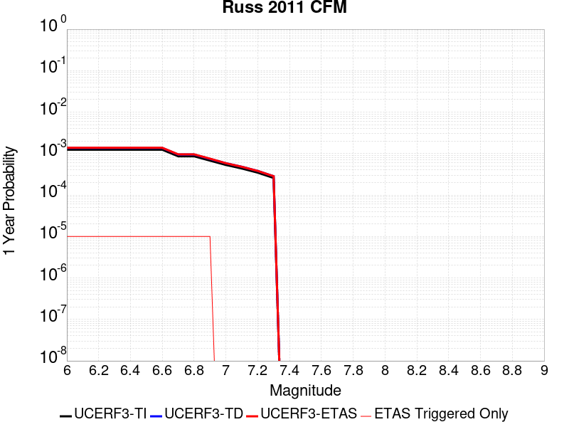 | 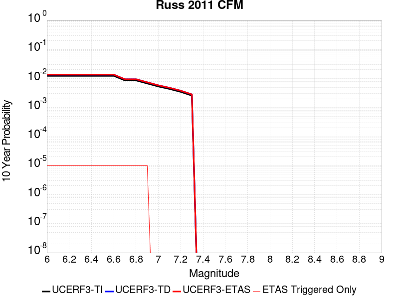 |

| Magnitude | 1 wk TI Prob | 1 wk TD Prob | 1 wk ETAS Prob | 1 wk ETAS/TD Gain | 1 wk ETAS Triggered Only | 1 mo TI Prob | 1 mo TD Prob | 1 mo ETAS Prob | 1 mo ETAS/TD Gain | 1 mo ETAS Triggered Only | 1 yr TI Prob | 1 yr TD Prob | 1 yr ETAS Prob | 1 yr ETAS/TD Gain | 1 yr ETAS Triggered Only | 10 yr TI Prob | 10 yr TD Prob | 10 yr ETAS Prob | 10 yr ETAS/TD Gain | 10 yr ETAS Triggered Only |
|-----|-----|-----|-----|-----|-----|-----|-----|-----|-----|-----|-----|-----|-----|-----|-----|-----|-----|-----|-----|-----|
| 6.0 | 2.3806366E-5 | 2.6254156E-5 | 2.6254156E-5 | 1.0 | 0.0 | 1.0202329E-4 | 1.1251331E-4 | 1.1251331E-4 | 1.0 | 0.0 | 0.0012414258 | 0.0013690525 | 0.0013932213 | 1.0176537 | 2.4201941E-5 | 0.012345135 | 0.013612664 | 0.013636536 | 1.0017537 | 2.4201941E-5 |
| 6.1 | 2.3806366E-5 | 2.6254156E-5 | 2.6254156E-5 | 1.0 | 0.0 | 1.0202329E-4 | 1.1251331E-4 | 1.1251331E-4 | 1.0 | 0.0 | 0.0012414258 | 0.0013690525 | 0.0013932213 | 1.0176537 | 2.4201941E-5 | 0.012345135 | 0.013612664 | 0.013636536 | 1.0017537 | 2.4201941E-5 |
| 6.2 | 2.3806366E-5 | 2.6254156E-5 | 2.6254156E-5 | 1.0 | 0.0 | 1.0202329E-4 | 1.1251331E-4 | 1.1251331E-4 | 1.0 | 0.0 | 0.0012414258 | 0.0013690525 | 0.0013932213 | 1.0176537 | 2.4201941E-5 | 0.012345135 | 0.013612664 | 0.013636536 | 1.0017537 | 2.4201941E-5 |
| 6.3 | 2.3806366E-5 | 2.6254156E-5 | 2.6254156E-5 | 1.0 | 0.0 | 1.0202329E-4 | 1.1251331E-4 | 1.1251331E-4 | 1.0 | 0.0 | 0.0012414258 | 0.0013690525 | 0.0013932213 | 1.0176537 | 2.4201941E-5 | 0.012345135 | 0.013612664 | 0.013636536 | 1.0017537 | 2.4201941E-5 |
| 6.4 | 2.3806366E-5 | 2.6254156E-5 | 2.6254156E-5 | 1.0 | 0.0 | 1.0202329E-4 | 1.1251331E-4 | 1.1251331E-4 | 1.0 | 0.0 | 0.0012414258 | 0.0013690525 | 0.0013932213 | 1.0176537 | 2.4201941E-5 | 0.012345135 | 0.013612664 | 0.013636536 | 1.0017537 | 2.4201941E-5 |
| 6.5 | 2.3806366E-5 | 2.6254156E-5 | 2.6254156E-5 | 1.0 | 0.0 | 1.0202329E-4 | 1.1251331E-4 | 1.1251331E-4 | 1.0 | 0.0 | 0.0012414258 | 0.0013690525 | 0.0013932213 | 1.0176537 | 2.4201941E-5 | 0.012345135 | 0.013612664 | 0.013636536 | 1.0017537 | 2.4201941E-5 |
| 6.6 | 2.3806366E-5 | 2.6254156E-5 | 2.6254156E-5 | 1.0 | 0.0 | 1.0202329E-4 | 1.1251331E-4 | 1.1251331E-4 | 1.0 | 0.0 | 0.0012414258 | 0.0013690525 | 0.0013932213 | 1.0176537 | 2.4201941E-5 | 0.012345135 | 0.013612664 | 0.013636536 | 1.0017537 | 2.4201941E-5 |
| 6.7 | 1.6515693E-5 | 1.8187944E-5 | 1.8187944E-5 | 1.0 | 0.0 | 7.077962E-5 | 7.79462E-5 | 7.79462E-5 | 1.0 | 0.0 | 8.6140115E-4 | 9.486156E-4 | 9.7279454E-4 | 1.0254887 | 2.4201941E-5 | 0.008580698 | 0.009449055 | 0.0094730295 | 1.0025371 | 2.4201941E-5 |
| 6.8 | 1.6515693E-5 | 1.8187944E-5 | 1.8187944E-5 | 1.0 | 0.0 | 7.077962E-5 | 7.79462E-5 | 7.79462E-5 | 1.0 | 0.0 | 8.6140115E-4 | 9.486156E-4 | 9.7279454E-4 | 1.0254887 | 2.4201941E-5 | 0.008580698 | 0.009449055 | 0.0094730295 | 1.0025371 | 2.4201941E-5 |
| 6.9 | 1.2971182E-5 | 1.4273831E-5 | 1.4273831E-5 | 1.0 | 0.0 | 5.5589593E-5 | 6.117227E-5 | 6.117227E-5 | 1.0 | 0.0 | 6.765931E-4 | 7.4454385E-4 | 7.6872774E-4 | 1.0324816 | 2.4201941E-5 | 0.0067453682 | 0.0074230675 | 0.00744709 | 1.0032362 | 2.4201941E-5 |
| 7.0 | 1.0201805E-5 | 1.1221911E-5 | 1.1221911E-5 | 1.0 | 0.0 | 4.3721288E-5 | 4.8093138E-5 | 4.8093138E-5 | 1.0 | 0.0 | 5.3217664E-4 | 5.853974E-4 | 5.853974E-4 | 1.0 | 0.0 | 0.00530904 | 0.005840605 | 0.005840605 | 1.0 | 0.0 |
| 7.1 | 8.3744935E-6 | 9.2126675E-6 | 9.2126675E-6 | 1.0 | 0.0 | 3.5890193E-5 | 3.9482366E-5 | 3.9482366E-5 | 1.0 | 0.0 | 4.368755E-4 | 4.8061032E-4 | 4.8061032E-4 | 1.0 | 0.0 | 0.004360176 | 0.0047975346 | 0.0047975346 | 1.0 | 0.0 |
| 7.2 | 6.649391E-6 | 7.3170095E-6 | 7.3170095E-6 | 1.0 | 0.0 | 2.8497077E-5 | 3.135833E-5 | 3.135833E-5 | 1.0 | 0.0 | 3.4689668E-4 | 3.8173737E-4 | 3.8173737E-4 | 1.0 | 0.0 | 0.0034635565 | 0.0038124465 | 0.0038124465 | 1.0 | 0.0 |
| 7.3 | 4.9549312E-6 | 5.454593E-6 | 5.454593E-6 | 1.0 | 0.0 | 2.1235246E-5 | 2.33767E-5 | 2.33767E-5 | 1.0 | 0.0 | 2.5850846E-4 | 2.8458887E-4 | 2.8458887E-4 | 1.0 | 0.0 | 0.0025820795 | 0.0028436882 | 0.0028436882 | 1.0 | 0.0 |

## East Huasna 2011 CFM
*[(top)](#table-of-contents)*

| 1 Week | 1 Month | 1 Year | 10 Year |
|-----|-----|-----|-----|
|  |  |  | 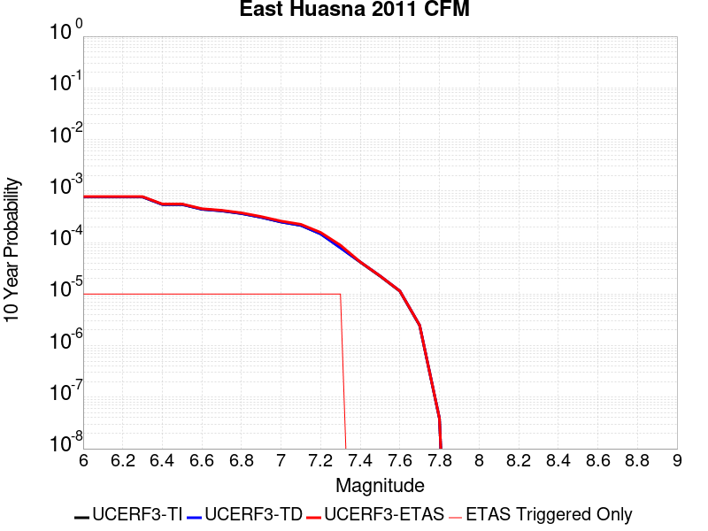 |

| Magnitude | 1 wk TI Prob | 1 wk TD Prob | 1 wk ETAS Prob | 1 wk ETAS/TD Gain | 1 wk ETAS Triggered Only | 1 mo TI Prob | 1 mo TD Prob | 1 mo ETAS Prob | 1 mo ETAS/TD Gain | 1 mo ETAS Triggered Only | 1 yr TI Prob | 1 yr TD Prob | 1 yr ETAS Prob | 1 yr ETAS/TD Gain | 1 yr ETAS Triggered Only | 10 yr TI Prob | 10 yr TD Prob | 10 yr ETAS Prob | 10 yr ETAS/TD Gain | 10 yr ETAS Triggered Only |
|-----|-----|-----|-----|-----|-----|-----|-----|-----|-----|-----|-----|-----|-----|-----|-----|-----|-----|-----|-----|-----|
| 6.0 | 1.4658423E-6 | 1.471566E-6 | 1.471566E-6 | 1.0 | 0.0 | 6.282166E-6 | 6.3066964E-6 | 3.0508485E-5 | 4.837475 | 2.4201941E-5 | 7.6482684E-5 | 7.67814E-5 | 1.0098148E-4 | 1.3151816 | 2.4201941E-5 | 7.645637E-4 | 7.6755567E-4 | 7.9173903E-4 | 1.031507 | 2.4201941E-5 |
| 6.1 | 1.4658423E-6 | 1.471566E-6 | 1.471566E-6 | 1.0 | 0.0 | 6.282166E-6 | 6.3066964E-6 | 3.0508485E-5 | 4.837475 | 2.4201941E-5 | 7.6482684E-5 | 7.67814E-5 | 1.0098148E-4 | 1.3151816 | 2.4201941E-5 | 7.645637E-4 | 7.6755567E-4 | 7.9173903E-4 | 1.031507 | 2.4201941E-5 |
| 6.2 | 1.4658423E-6 | 1.471566E-6 | 1.471566E-6 | 1.0 | 0.0 | 6.282166E-6 | 6.3066964E-6 | 3.0508485E-5 | 4.837475 | 2.4201941E-5 | 7.6482684E-5 | 7.67814E-5 | 1.0098148E-4 | 1.3151816 | 2.4201941E-5 | 7.645637E-4 | 7.6755567E-4 | 7.9173903E-4 | 1.031507 | 2.4201941E-5 |
| 6.3 | 1.4658423E-6 | 1.471566E-6 | 1.471566E-6 | 1.0 | 0.0 | 6.282166E-6 | 6.3066964E-6 | 3.0508485E-5 | 4.837475 | 2.4201941E-5 | 7.6482684E-5 | 7.67814E-5 | 1.0098148E-4 | 1.3151816 | 2.4201941E-5 | 7.645637E-4 | 7.6755567E-4 | 7.9173903E-4 | 1.031507 | 2.4201941E-5 |
| 6.4 | 1.0488257E-6 | 1.0527515E-6 | 1.0527515E-6 | 1.0 | 0.0 | 4.4949593E-6 | 4.5117845E-6 | 2.8713615E-5 | 6.3641376 | 2.4201941E-5 | 5.472476E-5 | 5.492961E-5 | 7.913022E-5 | 1.440575 | 2.4201941E-5 | 5.4711284E-4 | 5.491622E-4 | 5.733509E-4 | 1.0440464 | 2.4201941E-5 |
| 6.5 | 1.0488257E-6 | 1.0527515E-6 | 1.0527515E-6 | 1.0 | 0.0 | 4.4949593E-6 | 4.5117845E-6 | 2.8713615E-5 | 6.3641376 | 2.4201941E-5 | 5.472476E-5 | 5.492961E-5 | 7.913022E-5 | 1.440575 | 2.4201941E-5 | 5.4711284E-4 | 5.491622E-4 | 5.733509E-4 | 1.0440464 | 2.4201941E-5 |
| 6.6 | 8.463064E-7 | 8.4936323E-7 | 8.4936323E-7 | 1.0 | 0.0 | 3.6270226E-6 | 3.6401232E-6 | 2.7841976E-5 | 7.648636 | 2.4201941E-5 | 4.4158103E-5 | 4.4317607E-5 | 6.851847E-5 | 1.546078 | 2.4201941E-5 | 4.414933E-4 | 4.4308856E-4 | 4.6727978E-4 | 1.0545968 | 2.4201941E-5 |
| 6.7 | 7.876149E-7 | 7.902533E-7 | 7.902533E-7 | 1.0 | 0.0 | 3.375488E-6 | 3.3867955E-6 | 2.7588654E-5 | 8.1459465 | 2.4201941E-5 | 4.109579E-5 | 4.1233463E-5 | 6.5434404E-5 | 1.5869248 | 2.4201941E-5 | 4.108819E-4 | 4.1225873E-4 | 4.364507E-4 | 1.0586815 | 2.4201941E-5 |
| 6.8 | 6.9940785E-7 | 7.0165777E-7 | 7.0165777E-7 | 1.0 | 0.0 | 2.9974588E-6 | 3.0071012E-6 | 2.720897E-5 | 9.048239 | 2.4201941E-5 | 3.649345E-5 | 3.6610847E-5 | 6.08119E-5 | 1.6610351 | 2.4201941E-5 | 3.6487455E-4 | 3.6604863E-4 | 3.902417E-4 | 1.0660925 | 2.4201941E-5 |
| 6.9 | 5.899658E-7 | 5.9155997E-7 | 5.9155997E-7 | 1.0 | 0.0 | 2.5284223E-6 | 2.5352545E-6 | 2.6737134E-5 | 10.546134 | 2.4201941E-5 | 3.0783107E-5 | 3.086629E-5 | 5.506748E-5 | 1.7840656 | 2.4201941E-5 | 3.0778843E-4 | 3.086203E-4 | 3.3281476E-4 | 1.0783956 | 2.4201941E-5 |
| 7.0 | 4.793814E-7 | 4.803273E-7 | 4.803273E-7 | 1.0 | 0.0 | 2.05449E-6 | 2.058544E-6 | 2.6260435E-5 | 12.756801 | 2.4201941E-5 | 2.501313E-5 | 2.5062485E-5 | 4.926382E-5 | 1.9656398 | 2.4201941E-5 | 2.5010316E-4 | 2.505968E-4 | 2.7479266E-4 | 1.096553 | 2.4201941E-5 |
| 7.1 | 4.1256908E-7 | 4.129941E-7 | 4.129941E-7 | 1.0 | 0.0 | 1.768152E-6 | 1.7699736E-6 | 2.597187E-5 | 14.6735935 | 2.4201941E-5 | 2.1527037E-5 | 2.1549216E-5 | 4.5750636E-5 | 2.1230767 | 2.4201941E-5 | 2.1524953E-4 | 2.1547142E-4 | 2.3966814E-4 | 1.1122967 | 2.4201941E-5 |
| 7.2 | 2.822599E-7 | 2.8161418E-7 | 2.8161418E-7 | 1.0 | 0.0 | 1.2096847E-6 | 1.2069174E-6 | 2.540883E-5 | 21.052666 | 2.4201941E-5 | 1.47278115E-5 | 1.4694121E-5 | 3.8895705E-5 | 2.647025 | 2.4201941E-5 | 1.4726835E-4 | 1.4693156E-4 | 1.7112996E-4 | 1.1646916 | 2.4201941E-5 |
| 7.3 | 1.5261652E-7 | 1.5075021E-7 | 1.5075021E-7 | 1.0 | 0.0 | 6.540707E-7 | 6.460722E-7 | 2.4847997E-5 | 38.460094 | 2.4201941E-5 | 7.963281E-6 | 7.8659E-6 | 3.206765E-5 | 4.0767937 | 2.4201941E-5 | 7.962996E-5 | 7.865624E-5 | 1.0285628E-4 | 1.3076683 | 2.4201941E-5 |
| 7.4 | 7.976414E-8 | 8.057865E-8 | 8.057865E-8 | 1.0 | 0.0 | 3.418463E-7 | 3.45337E-7 | 3.45337E-7 | 1.0 | 0.0 | 4.1619705E-6 | 4.2044703E-6 | 4.2044703E-6 | 1.0 | 0.0 | 4.161893E-5 | 4.2043914E-5 | 4.2043914E-5 | 1.0 | 0.0 |
| 7.5 | 4.2715055E-8 | 4.3202512E-8 | 4.3202512E-8 | 1.0 | 0.0 | 1.830645E-7 | 1.8515361E-7 | 1.8515361E-7 | 1.0 | 0.0 | 2.228808E-6 | 2.2542429E-6 | 2.2542429E-6 | 1.0 | 0.0 | 2.2287857E-5 | 2.2542203E-5 | 2.2542203E-5 | 1.0 | 0.0 |
| 7.6 | 2.1807532E-8 | 2.2057476E-8 | 2.2057476E-8 | 1.0 | 0.0 | 9.346085E-8 | 9.4532034E-8 | 9.4532034E-8 | 1.0 | 0.0 | 1.1378852E-6 | 1.1509269E-6 | 1.1509269E-6 | 1.0 | 0.0 | 1.1378794E-5 | 1.1509211E-5 | 1.1509211E-5 | 1.0 | 0.0 |
| 7.7 | 4.7196043E-9 | 4.767283E-9 | 4.767283E-9 | 1.0 | 0.0 | 2.0226874E-8 | 2.0431212E-8 | 2.0431212E-8 | 1.0 | 0.0 | 2.4626218E-7 | 2.4874998E-7 | 2.4874998E-7 | 1.0 | 0.0 | 2.462619E-6 | 2.487497E-6 | 2.487497E-6 | 1.0 | 0.0 |
| 7.8 | 7.400003E-11 | 7.4654505E-11 | 7.4654505E-11 | 1.0 | 0.0 | 3.171432E-10 | 3.1994773E-10 | 3.1994773E-10 | 1.0 | 0.0 | 3.861218E-9 | 3.895363E-9 | 3.895363E-9 | 1.0 | 0.0 | 3.861218E-8 | 3.895363E-8 | 3.895363E-8 | 1.0 | 0.0 |

## Keddie Ridge 2011 CFM
*[(top)](#table-of-contents)*

| 1 Week | 1 Month | 1 Year | 10 Year |
|-----|-----|-----|-----|
|  |  |  |  |

| Magnitude | 1 wk TI Prob | 1 wk TD Prob | 1 wk ETAS Prob | 1 wk ETAS/TD Gain | 1 wk ETAS Triggered Only | 1 mo TI Prob | 1 mo TD Prob | 1 mo ETAS Prob | 1 mo ETAS/TD Gain | 1 mo ETAS Triggered Only | 1 yr TI Prob | 1 yr TD Prob | 1 yr ETAS Prob | 1 yr ETAS/TD Gain | 1 yr ETAS Triggered Only | 10 yr TI Prob | 10 yr TD Prob | 10 yr ETAS Prob | 10 yr ETAS/TD Gain | 10 yr ETAS Triggered Only |
|-----|-----|-----|-----|-----|-----|-----|-----|-----|-----|-----|-----|-----|-----|-----|-----|-----|-----|-----|-----|-----|
| 6.0 | 2.2591947E-5 | 2.5189187E-5 | 2.5189187E-5 | 1.0 | 0.0 | 9.6819036E-5 | 1.0794964E-4 | 1.0794964E-4 | 1.0 | 0.0 | 0.0011781343 | 0.0013135736 | 0.0013135736 | 1.0 | 0.0 | 0.011719079 | 0.013066037 | 0.013089922 | 1.0018281 | 2.4201941E-5 |
| 6.1 | 2.2591947E-5 | 2.5189187E-5 | 2.5189187E-5 | 1.0 | 0.0 | 9.6819036E-5 | 1.0794964E-4 | 1.0794964E-4 | 1.0 | 0.0 | 0.0011781343 | 0.0013135736 | 0.0013135736 | 1.0 | 0.0 | 0.011719079 | 0.013066037 | 0.013089922 | 1.0018281 | 2.4201941E-5 |
| 6.2 | 1.3775145E-5 | 1.5322817E-5 | 1.5322817E-5 | 1.0 | 0.0 | 5.9035E-5 | 6.56677E-5 | 6.56677E-5 | 1.0 | 0.0 | 7.185141E-4 | 7.9923525E-4 | 7.9923525E-4 | 1.0 | 0.0 | 0.0071619535 | 0.007966028 | 0.007966028 | 1.0 | 0.0 |
| 6.3 | 9.705435E-6 | 1.0768351E-5 | 1.0768351E-5 | 1.0 | 0.0 | 4.1594063E-5 | 4.6149325E-5 | 4.6149325E-5 | 1.0 | 0.0 | 5.0629E-4 | 5.617356E-4 | 5.617356E-4 | 1.0 | 0.0 | 0.005051381 | 0.0056043877 | 0.0056043877 | 1.0 | 0.0 |
| 6.4 | 7.2549733E-6 | 8.027268E-6 | 8.027268E-6 | 1.0 | 0.0 | 3.109237E-5 | 3.440217E-5 | 3.440217E-5 | 1.0 | 0.0 | 3.7848388E-4 | 4.1877388E-4 | 4.1877388E-4 | 1.0 | 0.0 | 0.003778399 | 0.004180635 | 0.004180635 | 1.0 | 0.0 |
| 6.5 | 5.983293E-6 | 6.6130237E-6 | 6.6130237E-6 | 1.0 | 0.0 | 2.5642432E-5 | 2.834126E-5 | 2.834126E-5 | 1.0 | 0.0 | 3.1215188E-4 | 3.4500693E-4 | 3.4500693E-4 | 1.0 | 0.0 | 0.0031171376 | 0.003445376 | 0.003445376 | 1.0 | 0.0 |
| 6.6 | 4.0336154E-6 | 4.4578037E-6 | 4.4578037E-6 | 1.0 | 0.0 | 1.728681E-5 | 1.9104757E-5 | 1.9104757E-5 | 1.0 | 0.0 | 2.1044657E-4 | 2.3257962E-4 | 2.3257962E-4 | 1.0 | 0.0 | 0.002102474 | 0.002323758 | 0.002323758 | 1.0 | 0.0 |
| 6.7 | 1.5832104E-6 | 1.7816087E-6 | 1.7816087E-6 | 1.0 | 0.0 | 6.7851697E-6 | 7.635445E-6 | 7.635445E-6 | 1.0 | 0.0 | 8.260631E-5 | 9.295785E-5 | 9.295785E-5 | 1.0 | 0.0 | 8.2575605E-4 | 9.2921633E-4 | 9.2921633E-4 | 1.0 | 0.0 |
| 6.8 | 7.5177275E-7 | 8.5902946E-7 | 8.5902946E-7 | 1.0 | 0.0 | 3.221879E-6 | 3.6815507E-6 | 3.6815507E-6 | 1.0 | 0.0 | 3.9225673E-5 | 4.4822125E-5 | 4.4822125E-5 | 1.0 | 0.0 | 3.921875E-4 | 4.481474E-4 | 4.481474E-4 | 1.0 | 0.0 |

## Carson Range (Genoa)
*[(top)](#table-of-contents)*

| 1 Week | 1 Month | 1 Year | 10 Year |
|-----|-----|-----|-----|
|  |  |  |  |

| Magnitude | 1 wk TI Prob | 1 wk TD Prob | 1 wk ETAS Prob | 1 wk ETAS/TD Gain | 1 wk ETAS Triggered Only | 1 mo TI Prob | 1 mo TD Prob | 1 mo ETAS Prob | 1 mo ETAS/TD Gain | 1 mo ETAS Triggered Only | 1 yr TI Prob | 1 yr TD Prob | 1 yr ETAS Prob | 1 yr ETAS/TD Gain | 1 yr ETAS Triggered Only | 10 yr TI Prob | 10 yr TD Prob | 10 yr ETAS Prob | 10 yr ETAS/TD Gain | 10 yr ETAS Triggered Only |
|-----|-----|-----|-----|-----|-----|-----|-----|-----|-----|-----|-----|-----|-----|-----|-----|-----|-----|-----|-----|-----|
| 6.0 | 4.1268457E-5 | 5.014691E-5 | 7.434764E-5 | 1.4825965 | 2.4201941E-5 | 1.7685282E-4 | 2.1489977E-4 | 2.3909652E-4 | 1.1125954 | 2.4201941E-5 | 0.0021510567 | 0.002613659 | 0.0026377977 | 1.0092356 | 2.4201941E-5 | 0.02130354 | 0.025868865 | 0.02589244 | 1.0009114 | 2.4201941E-5 |
| 6.1 | 4.1268457E-5 | 5.014691E-5 | 7.434764E-5 | 1.4825965 | 2.4201941E-5 | 1.7685282E-4 | 2.1489977E-4 | 2.3909652E-4 | 1.1125954 | 2.4201941E-5 | 0.0021510567 | 0.002613659 | 0.0026377977 | 1.0092356 | 2.4201941E-5 | 0.02130354 | 0.025868865 | 0.02589244 | 1.0009114 | 2.4201941E-5 |
| 6.2 | 4.1268457E-5 | 5.014691E-5 | 7.434764E-5 | 1.4825965 | 2.4201941E-5 | 1.7685282E-4 | 2.1489977E-4 | 2.3909652E-4 | 1.1125954 | 2.4201941E-5 | 0.0021510567 | 0.002613659 | 0.0026377977 | 1.0092356 | 2.4201941E-5 | 0.02130354 | 0.025868865 | 0.02589244 | 1.0009114 | 2.4201941E-5 |
| 6.3 | 4.1268457E-5 | 5.014691E-5 | 7.434764E-5 | 1.4825965 | 2.4201941E-5 | 1.7685282E-4 | 2.1489977E-4 | 2.3909652E-4 | 1.1125954 | 2.4201941E-5 | 0.0021510567 | 0.002613659 | 0.0026377977 | 1.0092356 | 2.4201941E-5 | 0.02130354 | 0.025868865 | 0.02589244 | 1.0009114 | 2.4201941E-5 |
| 6.4 | 4.1268457E-5 | 5.014691E-5 | 7.434764E-5 | 1.4825965 | 2.4201941E-5 | 1.7685282E-4 | 2.1489977E-4 | 2.3909652E-4 | 1.1125954 | 2.4201941E-5 | 0.0021510567 | 0.002613659 | 0.0026377977 | 1.0092356 | 2.4201941E-5 | 0.02130354 | 0.025868865 | 0.02589244 | 1.0009114 | 2.4201941E-5 |
| 6.5 | 2.5677185E-5 | 3.0978295E-5 | 5.5179487E-5 | 1.7812306 | 2.4201941E-5 | 1.1004044E-4 | 1.3275839E-4 | 1.5695712E-4 | 1.1822765 | 2.4201941E-5 | 0.0013389189 | 0.0016153152 | 0.0016394781 | 1.0149586 | 2.4201941E-5 | 0.0133088045 | 0.01605366 | 0.016077474 | 1.0014833 | 2.4201941E-5 |
| 6.6 | 2.5677185E-5 | 3.0978295E-5 | 5.5179487E-5 | 1.7812306 | 2.4201941E-5 | 1.1004044E-4 | 1.3275839E-4 | 1.5695712E-4 | 1.1822765 | 2.4201941E-5 | 0.0013389189 | 0.0016153152 | 0.0016394781 | 1.0149586 | 2.4201941E-5 | 0.0133088045 | 0.01605366 | 0.016077474 | 1.0014833 | 2.4201941E-5 |
| 6.7 | 1.9969408E-5 | 2.4063473E-5 | 4.8264832E-5 | 2.0057302 | 2.4201941E-5 | 8.558037E-5 | 1.0312596E-4 | 1.273254E-4 | 1.2346591 | 2.4201941E-5 | 0.0010414429 | 0.0012549888 | 0.0012791605 | 1.0192604 | 2.4201941E-5 | 0.010365757 | 0.012494174 | 0.012518073 | 1.0019128 | 2.4201941E-5 |
| 6.8 | 1.4783156E-5 | 1.7817569E-5 | 1.7817569E-5 | 1.0 | 0.0 | 6.335485E-5 | 7.635951E-5 | 7.635951E-5 | 1.0 | 0.0 | 7.710722E-4 | 9.294107E-4 | 9.294107E-4 | 1.0 | 0.0 | 0.0076840227 | 0.009268024 | 0.009268024 | 1.0 | 0.0 |
| 6.9 | 1.06660555E-5 | 1.2877027E-5 | 1.2877027E-5 | 1.0 | 0.0 | 4.5710865E-5 | 5.518674E-5 | 5.518674E-5 | 1.0 | 0.0 | 5.5638765E-4 | 6.718067E-4 | 6.718067E-4 | 1.0 | 0.0 | 0.005549967 | 0.0067090564 | 0.0067090564 | 1.0 | 0.0 |
| 7.0 | 7.664838E-6 | 9.258307E-6 | 9.258307E-6 | 1.0 | 0.0 | 3.2848893E-5 | 3.9678456E-5 | 3.9678456E-5 | 1.0 | 0.0 | 3.998619E-4 | 4.830852E-4 | 4.830852E-4 | 1.0 | 0.0 | 0.0039914316 | 0.00483085 | 0.00483085 | 1.0 | 0.0 |

## Hosgri
*[(top)](#table-of-contents)*

| 1 Week | 1 Month | 1 Year | 10 Year |
|-----|-----|-----|-----|
|  |  |  |  |

| Magnitude | 1 wk TI Prob | 1 wk TD Prob | 1 wk ETAS Prob | 1 wk ETAS/TD Gain | 1 wk ETAS Triggered Only | 1 mo TI Prob | 1 mo TD Prob | 1 mo ETAS Prob | 1 mo ETAS/TD Gain | 1 mo ETAS Triggered Only | 1 yr TI Prob | 1 yr TD Prob | 1 yr ETAS Prob | 1 yr ETAS/TD Gain | 1 yr ETAS Triggered Only | 10 yr TI Prob | 10 yr TD Prob | 10 yr ETAS Prob | 10 yr ETAS/TD Gain | 10 yr ETAS Triggered Only |
|-----|-----|-----|-----|-----|-----|-----|-----|-----|-----|-----|-----|-----|-----|-----|-----|-----|-----|-----|-----|-----|
| 6.0 | 2.883978E-5 | 2.9128403E-5 | 2.9128403E-5 | 1.0 | 0.0 | 1.235932E-4 | 1.248302E-4 | 1.248302E-4 | 1.0 | 0.0 | 0.0015037085 | 0.0015187752 | 0.0015187752 | 1.0 | 0.0 | 0.01493574 | 0.01508773 | 0.0151115665 | 1.0015799 | 2.4201941E-5 |
| 6.1 | 2.883978E-5 | 2.9128403E-5 | 2.9128403E-5 | 1.0 | 0.0 | 1.235932E-4 | 1.248302E-4 | 1.248302E-4 | 1.0 | 0.0 | 0.0015037085 | 0.0015187752 | 0.0015187752 | 1.0 | 0.0 | 0.01493574 | 0.01508773 | 0.0151115665 | 1.0015799 | 2.4201941E-5 |
| 6.2 | 2.883978E-5 | 2.9128403E-5 | 2.9128403E-5 | 1.0 | 0.0 | 1.235932E-4 | 1.248302E-4 | 1.248302E-4 | 1.0 | 0.0 | 0.0015037085 | 0.0015187752 | 0.0015187752 | 1.0 | 0.0 | 0.01493574 | 0.01508773 | 0.0151115665 | 1.0015799 | 2.4201941E-5 |
| 6.3 | 2.2914428E-5 | 2.2641956E-5 | 2.2641956E-5 | 1.0 | 0.0 | 9.8200995E-5 | 9.703337E-5 | 9.703337E-5 | 1.0 | 0.0 | 0.0011949413 | 0.001180746 | 0.001180746 | 1.0 | 0.0 | 0.011885363 | 0.011746123 | 0.011770041 | 1.0020362 | 2.4201941E-5 |
| 6.4 | 2.0195741E-5 | 1.9696547E-5 | 1.9696547E-5 | 1.0 | 0.0 | 8.65503E-5 | 8.4411055E-5 | 8.4411055E-5 | 1.0 | 0.0 | 0.0010532405 | 0.001027222 | 0.001027222 | 1.0 | 0.0 | 0.010482626 | 0.010225783 | 0.010249738 | 1.0023426 | 2.4201941E-5 |
| 6.5 | 1.9924333E-5 | 1.9408968E-5 | 1.9408968E-5 | 1.0 | 0.0 | 8.53872E-5 | 8.317865E-5 | 8.317865E-5 | 1.0 | 0.0 | 0.0010390934 | 0.0010122315 | 0.0010122315 | 1.0 | 0.0 | 0.010342481 | 0.010077244 | 0.010101201 | 1.0023774 | 2.4201941E-5 |
| 6.6 | 1.809694E-5 | 1.7458287E-5 | 1.7458287E-5 | 1.0 | 0.0 | 7.7556004E-5 | 7.4819094E-5 | 7.4819094E-5 | 1.0 | 0.0 | 9.438353E-4 | 9.105431E-4 | 9.105431E-4 | 1.0 | 0.0 | 0.009398366 | 0.009069063 | 0.009093045 | 1.0026444 | 2.4201941E-5 |
| 6.7 | 1.675989E-5 | 1.6042752E-5 | 1.6042752E-5 | 1.0 | 0.0 | 7.182612E-5 | 6.8752845E-5 | 6.8752845E-5 | 1.0 | 0.0 | 8.7413215E-4 | 8.3674554E-4 | 8.3674554E-4 | 1.0 | 0.0 | 0.008707017 | 0.008336853 | 0.008360853 | 1.0028788 | 2.4201941E-5 |
| 6.8 | 1.5401129E-5 | 1.4614069E-5 | 1.4614069E-5 | 1.0 | 0.0 | 6.6003166E-5 | 6.263023E-5 | 6.263023E-5 | 1.0 | 0.0 | 8.032922E-4 | 7.6225714E-4 | 7.6225714E-4 | 1.0 | 0.0 | 0.008003947 | 0.0075972863 | 0.0076213046 | 1.0031614 | 2.4201941E-5 |
| 6.9 | 1.356559E-5 | 1.2689955E-5 | 1.2689955E-5 | 1.0 | 0.0 | 5.8136946E-5 | 5.438439E-5 | 5.438439E-5 | 1.0 | 0.0 | 7.0758746E-4 | 6.6192925E-4 | 6.6192925E-4 | 1.0 | 0.0 | 0.007053386 | 0.006600378 | 0.00662442 | 1.0036426 | 2.4201941E-5 |
| 7.0 | 1.2030819E-5 | 1.1095949E-5 | 1.1095949E-5 | 1.0 | 0.0 | 5.155963E-5 | 4.75532E-5 | 4.75532E-5 | 1.0 | 0.0 | 6.275577E-4 | 5.788065E-4 | 5.788065E-4 | 1.0 | 0.0 | 0.006257884 | 0.0057737473 | 0.0057978095 | 1.0041676 | 2.4201941E-5 |
| 7.1 | 1.0972698E-5 | 1.0022167E-5 | 1.0022167E-5 | 1.0 | 0.0 | 4.7025E-5 | 4.2951437E-5 | 4.2951437E-5 | 1.0 | 0.0 | 5.72379E-4 | 5.2280835E-4 | 5.2280835E-4 | 1.0 | 0.0 | 0.0057090693 | 0.005216533 | 0.0052406085 | 1.0046153 | 2.4201941E-5 |
| 7.2 | 9.961926E-6 | 9.034732E-6 | 9.034732E-6 | 1.0 | 0.0 | 4.2693267E-5 | 3.8719707E-5 | 3.8719707E-5 | 1.0 | 0.0 | 5.1966653E-4 | 4.7131052E-4 | 4.7131052E-4 | 1.0 | 0.0 | 0.00518453 | 0.0047038523 | 0.0047279405 | 1.0051209 | 2.4201941E-5 |
| 7.3 | 8.700929E-6 | 7.828089E-6 | 7.828089E-6 | 1.0 | 0.0 | 3.7289166E-5 | 3.354852E-5 | 3.354852E-5 | 1.0 | 0.0 | 4.53901E-4 | 4.083767E-4 | 4.083767E-4 | 1.0 | 0.0 | 0.00452975 | 0.004076999 | 0.004076999 | 1.0 | 0.0 |
| 7.4 | 7.866285E-6 | 6.9987263E-6 | 6.9987263E-6 | 1.0 | 0.0 | 3.3712215E-5 | 2.9994197E-5 | 2.9994197E-5 | 1.0 | 0.0 | 4.103689E-4 | 3.6511818E-4 | 3.6511818E-4 | 1.0 | 0.0 | 0.004096119 | 0.0036459167 | 0.0036459167 | 1.0 | 0.0 |
| 7.5 | 6.8381305E-6 | 5.9596814E-6 | 5.9596814E-6 | 1.0 | 0.0 | 2.9305946E-5 | 2.5541241E-5 | 2.5541241E-5 | 1.0 | 0.0 | 3.5674145E-4 | 3.1092027E-4 | 3.1092027E-4 | 1.0 | 0.0 | 0.0035616932 | 0.003105584 | 0.003105584 | 1.0 | 0.0 |
| 7.6 | 5.503376E-6 | 4.595227E-6 | 4.595227E-6 | 1.0 | 0.0 | 2.3585684E-5 | 1.9693682E-5 | 1.9693682E-5 | 1.0 | 0.0 | 2.8711787E-4 | 2.397442E-4 | 2.397442E-4 | 1.0 | 0.0 | 0.002867472 | 0.0023955852 | 0.0023955852 | 1.0 | 0.0 |
| 7.7 | 3.6144982E-6 | 2.6521896E-6 | 2.6521896E-6 | 1.0 | 0.0 | 1.5490614E-5 | 1.1366477E-5 | 1.1366477E-5 | 1.0 | 0.0 | 1.8858191E-4 | 1.3837808E-4 | 1.3837808E-4 | 1.0 | 0.0 | 0.0018842196 | 0.001383647 | 0.001383647 | 1.0 | 0.0 |
| 7.8 | 1.9853494E-6 | 1.1360784E-6 | 1.1360784E-6 | 1.0 | 0.0 | 8.508612E-6 | 4.8688985E-6 | 4.8688985E-6 | 1.0 | 0.0 | 1.0358743E-4 | 5.9277223E-5 | 5.9277223E-5 | 1.0 | 0.0 | 0.0010353916 | 5.933389E-4 | 5.933389E-4 | 1.0 | 0.0 |
| 7.9 | 1.1818757E-6 | 5.29477E-7 | 5.29477E-7 | 1.0 | 0.0 | 5.0651715E-6 | 2.269185E-6 | 2.269185E-6 | 1.0 | 0.0 | 6.1666724E-5 | 2.7626977E-5 | 2.7626977E-5 | 1.0 | 0.0 | 6.1649614E-4 | 2.7691363E-4 | 2.7691363E-4 | 1.0 | 0.0 |
| 8.0 | 6.962958E-7 | 2.71365E-7 | 2.71365E-7 | 1.0 | 0.0 | 2.9841215E-6 | 1.1629924E-6 | 1.1629924E-6 | 1.0 | 0.0 | 3.6331072E-5 | 1.415934E-5 | 1.415934E-5 | 1.0 | 0.0 | 3.6325134E-4 | 1.4215276E-4 | 1.4215276E-4 | 1.0 | 0.0 |
| 8.1 | 1.5033264E-7 | 6.52693E-8 | 6.52693E-8 | 1.0 | 0.0 | 6.442826E-7 | 2.7972553E-7 | 2.7972553E-7 | 1.0 | 0.0 | 7.844113E-6 | 3.4056532E-6 | 3.4056532E-6 | 1.0 | 0.0 | 7.843835E-5 | 3.4072833E-5 | 3.4072833E-5 | 1.0 | 0.0 |

## Sierra Madre (San Fernando)
*[(top)](#table-of-contents)*

| 1 Week | 1 Month | 1 Year | 10 Year |
|-----|-----|-----|-----|
|  |  |  |  |

| Magnitude | 1 wk TI Prob | 1 wk TD Prob | 1 wk ETAS Prob | 1 wk ETAS/TD Gain | 1 wk ETAS Triggered Only | 1 mo TI Prob | 1 mo TD Prob | 1 mo ETAS Prob | 1 mo ETAS/TD Gain | 1 mo ETAS Triggered Only | 1 yr TI Prob | 1 yr TD Prob | 1 yr ETAS Prob | 1 yr ETAS/TD Gain | 1 yr ETAS Triggered Only | 10 yr TI Prob | 10 yr TD Prob | 10 yr ETAS Prob | 10 yr ETAS/TD Gain | 10 yr ETAS Triggered Only |
|-----|-----|-----|-----|-----|-----|-----|-----|-----|-----|-----|-----|-----|-----|-----|-----|-----|-----|-----|-----|-----|
| 6.0 | 1.0346413E-5 | 6.2872386E-6 | 6.2872386E-6 | 1.0 | 0.0 | 4.4341014E-5 | 2.6945036E-5 | 2.6945036E-5 | 1.0 | 0.0 | 5.3971814E-4 | 3.2800753E-4 | 3.5220155E-4 | 1.0737605 | 2.4201941E-5 | 0.0053840918 | 0.0032753467 | 0.0032994694 | 1.0073649 | 2.4201941E-5 |
| 6.1 | 1.0346413E-5 | 6.2872386E-6 | 6.2872386E-6 | 1.0 | 0.0 | 4.4341014E-5 | 2.6945036E-5 | 2.6945036E-5 | 1.0 | 0.0 | 5.3971814E-4 | 3.2800753E-4 | 3.5220155E-4 | 1.0737605 | 2.4201941E-5 | 0.0053840918 | 0.0032753467 | 0.0032994694 | 1.0073649 | 2.4201941E-5 |
| 6.2 | 1.0346413E-5 | 6.2872386E-6 | 6.2872386E-6 | 1.0 | 0.0 | 4.4341014E-5 | 2.6945036E-5 | 2.6945036E-5 | 1.0 | 0.0 | 5.3971814E-4 | 3.2800753E-4 | 3.5220155E-4 | 1.0737605 | 2.4201941E-5 | 0.0053840918 | 0.0032753467 | 0.0032994694 | 1.0073649 | 2.4201941E-5 |
| 6.3 | 1.0346413E-5 | 6.2872386E-6 | 6.2872386E-6 | 1.0 | 0.0 | 4.4341014E-5 | 2.6945036E-5 | 2.6945036E-5 | 1.0 | 0.0 | 5.3971814E-4 | 3.2800753E-4 | 3.5220155E-4 | 1.0737605 | 2.4201941E-5 | 0.0053840918 | 0.0032753467 | 0.0032994694 | 1.0073649 | 2.4201941E-5 |
| 6.4 | 1.0249558E-5 | 6.2872386E-6 | 6.2872386E-6 | 1.0 | 0.0 | 4.392594E-5 | 2.6945036E-5 | 2.6945036E-5 | 1.0 | 0.0 | 5.3466705E-4 | 3.2800753E-4 | 3.5220155E-4 | 1.0737605 | 2.4201941E-5 | 0.0053338245 | 0.0032753467 | 0.0032994694 | 1.0073649 | 2.4201941E-5 |
| 6.5 | 1.0249558E-5 | 6.2872386E-6 | 6.2872386E-6 | 1.0 | 0.0 | 4.392594E-5 | 2.6945036E-5 | 2.6945036E-5 | 1.0 | 0.0 | 5.3466705E-4 | 3.2800753E-4 | 3.5220155E-4 | 1.0737605 | 2.4201941E-5 | 0.0053338245 | 0.0032753467 | 0.0032994694 | 1.0073649 | 2.4201941E-5 |
| 6.6 | 9.9035515E-6 | 6.2872386E-6 | 6.2872386E-6 | 1.0 | 0.0 | 4.2443102E-5 | 2.6945036E-5 | 2.6945036E-5 | 1.0 | 0.0 | 5.166222E-4 | 3.2800753E-4 | 3.5220155E-4 | 1.0737605 | 2.4201941E-5 | 0.0051542283 | 0.0032753467 | 0.0032994694 | 1.0073649 | 2.4201941E-5 |
| 6.7 | 9.87217E-6 | 6.274661E-6 | 6.274661E-6 | 1.0 | 0.0 | 4.2308613E-5 | 2.6891132E-5 | 2.6891132E-5 | 1.0 | 0.0 | 5.149856E-4 | 3.2735144E-4 | 3.5154546E-4 | 1.0739084 | 2.4201941E-5 | 0.005137938 | 0.003268805 | 0.003292928 | 1.0073797 | 2.4201941E-5 |
| 6.8 | 9.4359175E-6 | 6.1786473E-6 | 6.1786473E-6 | 1.0 | 0.0 | 4.043902E-5 | 2.6479653E-5 | 2.6479653E-5 | 1.0 | 0.0 | 4.9223384E-4 | 3.223432E-4 | 3.4653733E-4 | 1.075057 | 2.4201941E-5 | 0.0049114493 | 0.0032188678 | 0.0032429919 | 1.0074946 | 2.4201941E-5 |
| 6.9 | 8.700447E-6 | 6.0399334E-6 | 6.0399334E-6 | 1.0 | 0.0 | 3.72871E-5 | 2.5885178E-5 | 2.5885178E-5 | 1.0 | 0.0 | 4.5387587E-4 | 3.1510755E-4 | 3.3930186E-4 | 1.0767812 | 2.4201941E-5 | 0.0045295 | 0.0031467169 | 0.0031708425 | 1.007667 | 2.4201941E-5 |
| 7.0 | 8.648878E-6 | 6.014848E-6 | 6.014848E-6 | 1.0 | 0.0 | 3.7066096E-5 | 2.5777672E-5 | 2.5777672E-5 | 1.0 | 0.0 | 4.5118626E-4 | 3.1379904E-4 | 3.3799338E-4 | 1.0771013 | 2.4201941E-5 | 0.004502713 | 0.0031336688 | 0.003157795 | 1.007699 | 2.4201941E-5 |
| 7.1 | 8.505786E-6 | 5.9244794E-6 | 5.9244794E-6 | 1.0 | 0.0 | 3.645286E-5 | 2.5390384E-5 | 2.5390384E-5 | 1.0 | 0.0 | 4.437232E-4 | 3.0908515E-4 | 3.332796E-4 | 1.0782777 | 2.4201941E-5 | 0.0044283825 | 0.0030866617 | 0.003110789 | 1.0078166 | 2.4201941E-5 |
| 7.2 | 8.139752E-6 | 5.698777E-6 | 5.698777E-6 | 1.0 | 0.0 | 3.4884186E-5 | 2.4423107E-5 | 2.4423107E-5 | 1.0 | 0.0 | 4.246322E-4 | 2.973118E-4 | 3.2150655E-4 | 1.0813783 | 2.4201941E-5 | 0.004238217 | 0.0029692466 | 0.0029933767 | 1.0081266 | 2.4201941E-5 |
| 7.3 | 7.8816E-6 | 5.5520936E-6 | 5.5520936E-6 | 1.0 | 0.0 | 3.3777847E-5 | 2.3794475E-5 | 2.3794475E-5 | 1.0 | 0.0 | 4.111677E-4 | 2.8966027E-4 | 3.138552E-4 | 1.0835286 | 2.4201941E-5 | 0.004104078 | 0.0028929329 | 0.0029170648 | 1.0083417 | 2.4201941E-5 |
| 7.4 | 7.5810603E-6 | 5.356333E-6 | 5.356333E-6 | 1.0 | 0.0 | 3.2489854E-5 | 2.2955517E-5 | 2.2955517E-5 | 1.0 | 0.0 | 3.9549218E-4 | 2.7944864E-4 | 3.036438E-4 | 1.0865818 | 2.4201941E-5 | 0.0039478904 | 0.0027910774 | 0.002815212 | 1.008647 | 2.4201941E-5 |
| 7.5 | 6.349153E-6 | 4.4075887E-6 | 4.4075887E-6 | 1.0 | 0.0 | 2.7210372E-5 | 1.8889532E-5 | 1.8889532E-5 | 1.0 | 0.0 | 3.312359E-4 | 2.2995661E-4 | 2.2995661E-4 | 1.0 | 0.0 | 0.0033074263 | 0.0022972687 | 0.0022972687 | 1.0 | 0.0 |
| 7.6 | 4.430576E-6 | 2.8905786E-6 | 2.8905786E-6 | 1.0 | 0.0 | 1.8988047E-5 | 1.23881355E-5 | 1.23881355E-5 | 1.0 | 0.0 | 2.3115493E-4 | 1.5081534E-4 | 1.5081534E-4 | 1.0 | 0.0 | 0.0023091463 | 0.0015071525 | 0.0015071525 | 1.0 | 0.0 |
| 7.7 | 3.005066E-6 | 1.7509823E-6 | 1.7509823E-6 | 1.0 | 0.0 | 1.2878791E-5 | 7.504188E-6 | 7.504188E-6 | 1.0 | 0.0 | 1.56788E-4 | 9.135967E-5 | 9.135967E-5 | 1.0 | 0.0 | 0.0015667742 | 9.1322226E-4 | 9.1322226E-4 | 1.0 | 0.0 |
| 7.8 | 1.8459098E-6 | 1.0581826E-6 | 1.0581826E-6 | 1.0 | 0.0 | 7.911018E-6 | 4.5350607E-6 | 4.5350607E-6 | 1.0 | 0.0 | 9.631238E-5 | 5.5212968E-5 | 5.5212968E-5 | 1.0 | 0.0 | 9.627065E-4 | 5.5199297E-4 | 5.5199297E-4 | 1.0 | 0.0 |
| 7.9 | 9.839262E-7 | 5.2340516E-7 | 5.2340516E-7 | 1.0 | 0.0 | 4.2168194E-6 | 2.243163E-6 | 2.243163E-6 | 1.0 | 0.0 | 5.1338568E-5 | 2.731017E-5 | 2.731017E-5 | 1.0 | 0.0 | 5.132671E-4 | 2.7306844E-4 | 2.7306844E-4 | 1.0 | 0.0 |
| 8.0 | 1.210983E-7 | 6.613497E-8 | 6.613497E-8 | 1.0 | 0.0 | 5.1899264E-7 | 2.8343558E-7 | 2.8343558E-7 | 1.0 | 0.0 | 6.3187167E-6 | 3.4508228E-6 | 3.4508228E-6 | 1.0 | 0.0 | 6.318537E-5 | 3.450771E-5 | 3.450771E-5 | 1.0 | 0.0 |

## Sisar
*[(top)](#table-of-contents)*

| 1 Week | 1 Month | 1 Year | 10 Year |
|-----|-----|-----|-----|
|  |  |  |  |

| Magnitude | 1 wk TI Prob | 1 wk TD Prob | 1 wk ETAS Prob | 1 wk ETAS/TD Gain | 1 wk ETAS Triggered Only | 1 mo TI Prob | 1 mo TD Prob | 1 mo ETAS Prob | 1 mo ETAS/TD Gain | 1 mo ETAS Triggered Only | 1 yr TI Prob | 1 yr TD Prob | 1 yr ETAS Prob | 1 yr ETAS/TD Gain | 1 yr ETAS Triggered Only | 10 yr TI Prob | 10 yr TD Prob | 10 yr ETAS Prob | 10 yr ETAS/TD Gain | 10 yr ETAS Triggered Only |
|-----|-----|-----|-----|-----|-----|-----|-----|-----|-----|-----|-----|-----|-----|-----|-----|-----|-----|-----|-----|-----|
| 6.0 | 4.544193E-6 | 3.8396115E-6 | 3.8396115E-6 | 1.0 | 0.0 | 1.9474966E-5 | 1.6455377E-5 | 1.6455377E-5 | 1.0 | 0.0 | 2.3708193E-4 | 2.0032612E-4 | 2.0032612E-4 | 1.0 | 0.0 | 0.0023682916 | 0.002001489 | 0.0020256427 | 1.0120678 | 2.4201941E-5 |
| 6.1 | 4.544193E-6 | 3.8396115E-6 | 3.8396115E-6 | 1.0 | 0.0 | 1.9474966E-5 | 1.6455377E-5 | 1.6455377E-5 | 1.0 | 0.0 | 2.3708193E-4 | 2.0032612E-4 | 2.0032612E-4 | 1.0 | 0.0 | 0.0023682916 | 0.002001489 | 0.0020256427 | 1.0120678 | 2.4201941E-5 |
| 6.2 | 4.544193E-6 | 3.8396115E-6 | 3.8396115E-6 | 1.0 | 0.0 | 1.9474966E-5 | 1.6455377E-5 | 1.6455377E-5 | 1.0 | 0.0 | 2.3708193E-4 | 2.0032612E-4 | 2.0032612E-4 | 1.0 | 0.0 | 0.0023682916 | 0.002001489 | 0.0020256427 | 1.0120678 | 2.4201941E-5 |
| 6.3 | 4.544193E-6 | 3.8396115E-6 | 3.8396115E-6 | 1.0 | 0.0 | 1.9474966E-5 | 1.6455377E-5 | 1.6455377E-5 | 1.0 | 0.0 | 2.3708193E-4 | 2.0032612E-4 | 2.0032612E-4 | 1.0 | 0.0 | 0.0023682916 | 0.002001489 | 0.0020256427 | 1.0120678 | 2.4201941E-5 |
| 6.4 | 4.544193E-6 | 3.8396115E-6 | 3.8396115E-6 | 1.0 | 0.0 | 1.9474966E-5 | 1.6455377E-5 | 1.6455377E-5 | 1.0 | 0.0 | 2.3708193E-4 | 2.0032612E-4 | 2.0032612E-4 | 1.0 | 0.0 | 0.0023682916 | 0.002001489 | 0.0020256427 | 1.0120678 | 2.4201941E-5 |
| 6.5 | 4.544193E-6 | 3.8396115E-6 | 3.8396115E-6 | 1.0 | 0.0 | 1.9474966E-5 | 1.6455377E-5 | 1.6455377E-5 | 1.0 | 0.0 | 2.3708193E-4 | 2.0032612E-4 | 2.0032612E-4 | 1.0 | 0.0 | 0.0023682916 | 0.002001489 | 0.0020256427 | 1.0120678 | 2.4201941E-5 |
| 6.6 | 4.544193E-6 | 3.8396115E-6 | 3.8396115E-6 | 1.0 | 0.0 | 1.9474966E-5 | 1.6455377E-5 | 1.6455377E-5 | 1.0 | 0.0 | 2.3708193E-4 | 2.0032612E-4 | 2.0032612E-4 | 1.0 | 0.0 | 0.0023682916 | 0.002001489 | 0.0020256427 | 1.0120678 | 2.4201941E-5 |
| 6.7 | 4.544193E-6 | 3.8396115E-6 | 3.8396115E-6 | 1.0 | 0.0 | 1.9474966E-5 | 1.6455377E-5 | 1.6455377E-5 | 1.0 | 0.0 | 2.3708193E-4 | 2.0032612E-4 | 2.0032612E-4 | 1.0 | 0.0 | 0.0023682916 | 0.002001489 | 0.0020256427 | 1.0120678 | 2.4201941E-5 |
| 6.8 | 4.544193E-6 | 3.8396115E-6 | 3.8396115E-6 | 1.0 | 0.0 | 1.9474966E-5 | 1.6455377E-5 | 1.6455377E-5 | 1.0 | 0.0 | 2.3708193E-4 | 2.0032612E-4 | 2.0032612E-4 | 1.0 | 0.0 | 0.0023682916 | 0.002001489 | 0.0020256427 | 1.0120678 | 2.4201941E-5 |
| 6.9 | 4.542225E-6 | 3.8375733E-6 | 3.8375733E-6 | 1.0 | 0.0 | 1.9466532E-5 | 1.6446642E-5 | 1.6446642E-5 | 1.0 | 0.0 | 2.3697925E-4 | 2.0021979E-4 | 2.0021979E-4 | 1.0 | 0.0 | 0.002367267 | 0.0020004278 | 0.0020245814 | 1.0120742 | 2.4201941E-5 |
| 7.0 | 4.5278484E-6 | 3.8226376E-6 | 3.8226376E-6 | 1.0 | 0.0 | 1.940492E-5 | 1.6382632E-5 | 1.6382632E-5 | 1.0 | 0.0 | 2.3622929E-4 | 1.9944062E-4 | 1.9944062E-4 | 1.0 | 0.0 | 0.0023597833 | 0.00199265 | 0.0020168037 | 1.0121214 | 2.4201941E-5 |
| 7.1 | 4.5132488E-6 | 3.807425E-6 | 3.807425E-6 | 1.0 | 0.0 | 1.9342351E-5 | 1.6317435E-5 | 1.6317435E-5 | 1.0 | 0.0 | 2.3546767E-4 | 1.98647E-4 | 1.98647E-4 | 1.0 | 0.0 | 0.0023521832 | 0.001984728 | 0.002008882 | 1.0121698 | 2.4201941E-5 |
| 7.2 | 4.448859E-6 | 3.7398854E-6 | 3.7398854E-6 | 1.0 | 0.0 | 1.9066398E-5 | 1.6027983E-5 | 1.6027983E-5 | 1.0 | 0.0 | 2.3210866E-4 | 1.9512356E-4 | 1.9512356E-4 | 1.0 | 0.0 | 0.0023186638 | 0.0019495559 | 0.0019737107 | 1.0123899 | 2.4201941E-5 |
| 7.3 | 4.3424366E-6 | 3.6337199E-6 | 3.6337199E-6 | 1.0 | 0.0 | 1.861031E-5 | 1.5572994E-5 | 1.5572994E-5 | 1.0 | 0.0 | 2.2655698E-4 | 1.8958503E-4 | 1.8958503E-4 | 1.0 | 0.0 | 0.0022632615 | 0.0018942665 | 0.0019184225 | 1.0127522 | 2.4201941E-5 |
| 7.4 | 4.218641E-6 | 3.533073E-6 | 3.533073E-6 | 1.0 | 0.0 | 1.8079765E-5 | 1.5141655E-5 | 1.5141655E-5 | 1.0 | 0.0 | 2.2009891E-4 | 1.8433439E-4 | 1.8433439E-4 | 1.0 | 0.0 | 0.0021988105 | 0.0018418481 | 0.0018660056 | 1.0131159 | 2.4201941E-5 |
| 7.5 | 3.983779E-6 | 3.3478434E-6 | 3.3478434E-6 | 1.0 | 0.0 | 1.7073227E-5 | 1.4347824E-5 | 1.4347824E-5 | 1.0 | 0.0 | 2.0784672E-4 | 1.7467108E-4 | 1.7467108E-4 | 1.0 | 0.0 | 0.0020765243 | 0.0017453709 | 0.0017695306 | 1.0138421 | 2.4201941E-5 |
| 7.6 | 2.777393E-6 | 2.352273E-6 | 2.352273E-6 | 1.0 | 0.0 | 1.1903058E-5 | 1.0081131E-5 | 1.0081131E-5 | 1.0 | 0.0 | 1.449101E-4 | 1.2273094E-4 | 1.2273094E-4 | 1.0 | 0.0 | 0.0014481564 | 0.0012266394 | 0.0012508116 | 1.0197061 | 2.4201941E-5 |
| 7.7 | 1.9028433E-6 | 1.5938805E-6 | 1.5938805E-6 | 1.0 | 0.0 | 8.155017E-6 | 6.8308987E-6 | 6.8308987E-6 | 1.0 | 0.0 | 9.928281E-5 | 8.316306E-5 | 8.316306E-5 | 1.0 | 0.0 | 9.923846E-4 | 8.3132414E-4 | 8.55506E-4 | 1.0290883 | 2.4201941E-5 |
| 7.8 | 4.9095956E-7 | 4.3584043E-7 | 4.3584043E-7 | 1.0 | 0.0 | 2.1041105E-6 | 1.8678862E-6 | 1.8678862E-6 | 1.0 | 0.0 | 2.5617246E-5 | 2.2741278E-5 | 2.2741278E-5 | 1.0 | 0.0 | 2.5614293E-4 | 2.273897E-4 | 2.273897E-4 | 1.0 | 0.0 |
| 7.9 | 1.16657894E-7 | 1.03356285E-7 | 1.03356285E-7 | 1.0 | 0.0 | 4.999623E-7 | 4.4295544E-7 | 4.4295544E-7 | 1.0 | 0.0 | 6.087024E-6 | 5.3929693E-6 | 5.3929693E-6 | 1.0 | 0.0 | 6.0868573E-5 | 5.3928416E-5 | 5.3928416E-5 | 1.0 | 0.0 |
| 8.0 | 2.5100346E-9 | 1.7067109E-9 | 1.7067109E-9 | 1.0 | 0.0 | 1.0757291E-8 | 7.3144757E-9 | 7.3144757E-9 | 1.0 | 0.0 | 1.3097001E-7 | 8.905374E-8 | 8.905374E-8 | 1.0 | 0.0 | 1.3096993E-6 | 8.9053714E-7 | 8.9053714E-7 | 1.0 | 0.0 |

## Elmore Ranch
*[(top)](#table-of-contents)*

| 1 Week | 1 Month | 1 Year | 10 Year |
|-----|-----|-----|-----|
|  |  |  |  |

| Magnitude | 1 wk TI Prob | 1 wk TD Prob | 1 wk ETAS Prob | 1 wk ETAS/TD Gain | 1 wk ETAS Triggered Only | 1 mo TI Prob | 1 mo TD Prob | 1 mo ETAS Prob | 1 mo ETAS/TD Gain | 1 mo ETAS Triggered Only | 1 yr TI Prob | 1 yr TD Prob | 1 yr ETAS Prob | 1 yr ETAS/TD Gain | 1 yr ETAS Triggered Only | 10 yr TI Prob | 10 yr TD Prob | 10 yr ETAS Prob | 10 yr ETAS/TD Gain | 10 yr ETAS Triggered Only |
|-----|-----|-----|-----|-----|-----|-----|-----|-----|-----|-----|-----|-----|-----|-----|-----|-----|-----|-----|-----|-----|
| 6.0 | 9.102099E-5 | 8.953848E-5 | 8.953848E-5 | 1.0 | 0.0 | 3.9003167E-4 | 3.836898E-4 | 4.0788244E-4 | 1.0630527 | 2.4201941E-5 | 0.0047383 | 0.004662132 | 0.004686221 | 1.005167 | 2.4201941E-5 | 0.046385348 | 0.04583787 | 0.045860965 | 1.0005038 | 2.4201941E-5 |
| 6.1 | 3.8306698E-5 | 4.14921E-5 | 4.14921E-5 | 1.0 | 0.0 | 1.6416123E-4 | 1.7781362E-4 | 1.7781362E-4 | 1.0 | 0.0 | 0.0019968306 | 0.0021632186 | 0.0021632186 | 1.0 | 0.0 | 0.019789828 | 0.021595007 | 0.021595007 | 1.0 | 0.0 |
| 6.2 | 3.8306698E-5 | 4.14921E-5 | 4.14921E-5 | 1.0 | 0.0 | 1.6416123E-4 | 1.7781362E-4 | 1.7781362E-4 | 1.0 | 0.0 | 0.0019968306 | 0.0021632186 | 0.0021632186 | 1.0 | 0.0 | 0.019789828 | 0.021595007 | 0.021595007 | 1.0 | 0.0 |
| 6.3 | 3.3197924E-5 | 3.6550366E-5 | 3.6550366E-5 | 1.0 | 0.0 | 1.4226905E-4 | 1.56639E-4 | 1.56639E-4 | 1.0 | 0.0 | 0.0017307495 | 0.0019059771 | 0.0019059771 | 1.0 | 0.0 | 0.017173318 | 0.019057386 | 0.019057386 | 1.0 | 0.0 |
| 6.4 | 2.5148964E-5 | 2.7420736E-5 | 2.7420736E-5 | 1.0 | 0.0 | 1.0777682E-4 | 1.17515796E-4 | 1.17515796E-4 | 1.0 | 0.0 | 0.0013113929 | 0.0014304637 | 0.0014304637 | 1.0 | 0.0 | 0.01303681 | 0.014365338 | 0.014365338 | 1.0 | 0.0 |
| 6.5 | 2.5148964E-5 | 2.7420736E-5 | 2.7420736E-5 | 1.0 | 0.0 | 1.0777682E-4 | 1.17515796E-4 | 1.17515796E-4 | 1.0 | 0.0 | 0.0013113929 | 0.0014304637 | 0.0014304637 | 1.0 | 0.0 | 0.01303681 | 0.014365338 | 0.014365338 | 1.0 | 0.0 |

## San Luis Range 2011 CFM
*[(top)](#table-of-contents)*

| 1 Week | 1 Month | 1 Year | 10 Year |
|-----|-----|-----|-----|
|  |  |  |  |

| Magnitude | 1 wk TI Prob | 1 wk TD Prob | 1 wk ETAS Prob | 1 wk ETAS/TD Gain | 1 wk ETAS Triggered Only | 1 mo TI Prob | 1 mo TD Prob | 1 mo ETAS Prob | 1 mo ETAS/TD Gain | 1 mo ETAS Triggered Only | 1 yr TI Prob | 1 yr TD Prob | 1 yr ETAS Prob | 1 yr ETAS/TD Gain | 1 yr ETAS Triggered Only | 10 yr TI Prob | 10 yr TD Prob | 10 yr ETAS Prob | 10 yr ETAS/TD Gain | 10 yr ETAS Triggered Only |
|-----|-----|-----|-----|-----|-----|-----|-----|-----|-----|-----|-----|-----|-----|-----|-----|-----|-----|-----|-----|-----|
| 6.0 | 8.8368415E-6 | 8.965455E-6 | 8.965455E-6 | 1.0 | 0.0 | 3.787163E-5 | 3.8422855E-5 | 6.262387E-5 | 1.6298598 | 2.4201941E-5 | 4.609895E-4 | 4.6770574E-4 | 4.9189635E-4 | 1.0517219 | 2.4201941E-5 | 0.0046003438 | 0.004667997 | 0.0046920856 | 1.0051605 | 2.4201941E-5 |
| 6.1 | 8.8368415E-6 | 8.965455E-6 | 8.965455E-6 | 1.0 | 0.0 | 3.787163E-5 | 3.8422855E-5 | 6.262387E-5 | 1.6298598 | 2.4201941E-5 | 4.609895E-4 | 4.6770574E-4 | 4.9189635E-4 | 1.0517219 | 2.4201941E-5 | 0.0046003438 | 0.004667997 | 0.0046920856 | 1.0051605 | 2.4201941E-5 |
| 6.2 | 8.8368415E-6 | 8.965455E-6 | 8.965455E-6 | 1.0 | 0.0 | 3.787163E-5 | 3.8422855E-5 | 6.262387E-5 | 1.6298598 | 2.4201941E-5 | 4.609895E-4 | 4.6770574E-4 | 4.9189635E-4 | 1.0517219 | 2.4201941E-5 | 0.0046003438 | 0.004667997 | 0.0046920856 | 1.0051605 | 2.4201941E-5 |
| 6.3 | 8.8368415E-6 | 8.965455E-6 | 8.965455E-6 | 1.0 | 0.0 | 3.787163E-5 | 3.8422855E-5 | 6.262387E-5 | 1.6298598 | 2.4201941E-5 | 4.609895E-4 | 4.6770574E-4 | 4.9189635E-4 | 1.0517219 | 2.4201941E-5 | 0.0046003438 | 0.004667997 | 0.0046920856 | 1.0051605 | 2.4201941E-5 |
| 6.4 | 3.9094193E-6 | 3.941204E-6 | 3.941204E-6 | 1.0 | 0.0 | 1.6754546E-5 | 1.6890766E-5 | 1.6890766E-5 | 1.0 | 0.0 | 2.039675E-4 | 2.0562594E-4 | 2.0562594E-4 | 1.0 | 0.0 | 0.0020378039 | 0.0020543856 | 0.0020543856 | 1.0 | 0.0 |
| 6.5 | 3.9094193E-6 | 3.941204E-6 | 3.941204E-6 | 1.0 | 0.0 | 1.6754546E-5 | 1.6890766E-5 | 1.6890766E-5 | 1.0 | 0.0 | 2.039675E-4 | 2.0562594E-4 | 2.0562594E-4 | 1.0 | 0.0 | 0.0020378039 | 0.0020543856 | 0.0020543856 | 1.0 | 0.0 |
| 6.6 | 3.0587726E-6 | 3.0753893E-6 | 3.0753893E-6 | 1.0 | 0.0 | 1.3108959E-5 | 1.3180174E-5 | 1.3180174E-5 | 1.0 | 0.0 | 1.595899E-4 | 1.6045693E-4 | 1.6045693E-4 | 1.0 | 0.0 | 0.0015947534 | 0.0016034227 | 0.0016034227 | 1.0 | 0.0 |
| 6.7 | 2.6160574E-6 | 2.6251284E-6 | 2.6251284E-6 | 1.0 | 0.0 | 1.1211626E-5 | 1.1250502E-5 | 1.1250502E-5 | 1.0 | 0.0 | 1.3649299E-4 | 1.3696631E-4 | 1.3696631E-4 | 1.0 | 0.0 | 0.0013640919 | 0.0013688251 | 0.0013688251 | 1.0 | 0.0 |
| 6.8 | 2.5110312E-6 | 2.5181412E-6 | 2.5181412E-6 | 1.0 | 0.0 | 1.0761518E-5 | 1.079199E-5 | 1.079199E-5 | 1.0 | 0.0 | 1.310136E-4 | 1.313846E-4 | 1.313846E-4 | 1.0 | 0.0 | 0.0013093639 | 0.0013130752 | 0.0013130752 | 1.0 | 0.0 |
| 6.9 | 1.8564405E-6 | 1.852488E-6 | 1.852488E-6 | 1.0 | 0.0 | 7.95615E-6 | 7.93921E-6 | 7.93921E-6 | 1.0 | 0.0 | 9.686181E-5 | 9.665562E-5 | 9.665562E-5 | 1.0 | 0.0 | 9.68196E-4 | 9.6613786E-4 | 9.6613786E-4 | 1.0 | 0.0 |
| 7.0 | 1.546127E-6 | 1.5369549E-6 | 1.5369549E-6 | 1.0 | 0.0 | 6.626242E-6 | 6.5869326E-6 | 6.5869326E-6 | 1.0 | 0.0 | 8.06715E-5 | 8.019296E-5 | 8.019296E-5 | 1.0 | 0.0 | 8.0642226E-4 | 8.016409E-4 | 8.016409E-4 | 1.0 | 0.0 |
| 7.1 | 1.3368208E-6 | 1.3235336E-6 | 1.3235336E-6 | 1.0 | 0.0 | 5.7292195E-6 | 5.6722747E-6 | 5.6722747E-6 | 1.0 | 0.0 | 6.975101E-5 | 6.905776E-5 | 6.905776E-5 | 1.0 | 0.0 | 6.972912E-4 | 6.903635E-4 | 6.903635E-4 | 1.0 | 0.0 |
| 7.2 | 1.0623363E-6 | 1.0454378E-6 | 1.0454378E-6 | 1.0 | 0.0 | 4.5528623E-6 | 4.4804397E-6 | 4.4804397E-6 | 1.0 | 0.0 | 5.5429686E-5 | 5.4547992E-5 | 5.4547992E-5 | 1.0 | 0.0 | 5.5415864E-4 | 5.453463E-4 | 5.453463E-4 | 1.0 | 0.0 |
| 7.3 | 7.831679E-7 | 7.727399E-7 | 7.727399E-7 | 1.0 | 0.0 | 3.3564295E-6 | 3.3117383E-6 | 3.3117383E-6 | 1.0 | 0.0 | 4.086376E-5 | 4.031967E-5 | 4.031967E-5 | 1.0 | 0.0 | 4.0856248E-4 | 4.0312367E-4 | 4.0312367E-4 | 1.0 | 0.0 |
| 7.4 | 5.9558846E-7 | 5.910646E-7 | 5.910646E-7 | 1.0 | 0.0 | 2.5525194E-6 | 2.5331315E-6 | 2.5331315E-6 | 1.0 | 0.0 | 3.107648E-5 | 3.084044E-5 | 3.084044E-5 | 1.0 | 0.0 | 3.1072134E-4 | 3.083617E-4 | 3.083617E-4 | 1.0 | 0.0 |
| 7.5 | 4.1616502E-7 | 4.1196404E-7 | 4.1196404E-7 | 1.0 | 0.0 | 1.7835631E-6 | 1.765559E-6 | 1.765559E-6 | 1.0 | 0.0 | 2.1714664E-5 | 2.1495469E-5 | 2.1495469E-5 | 1.0 | 0.0 | 2.1712543E-4 | 2.1493394E-4 | 2.1493394E-4 | 1.0 | 0.0 |
| 7.6 | 2.3816014E-7 | 2.3376614E-7 | 2.3376614E-7 | 1.0 | 0.0 | 1.0206859E-6 | 1.0018545E-6 | 1.0018545E-6 | 1.0 | 0.0 | 1.242678E-5 | 1.219751E-5 | 1.219751E-5 | 1.0 | 0.0 | 1.2426086E-4 | 1.2196843E-4 | 1.2196843E-4 | 1.0 | 0.0 |
| 7.7 | 9.918777E-8 | 9.3868096E-8 | 9.3868096E-8 | 1.0 | 0.0 | 4.2509038E-7 | 4.022918E-7 | 4.022918E-7 | 1.0 | 0.0 | 5.1754632E-6 | 4.8978914E-6 | 4.8978914E-6 | 1.0 | 0.0 | 5.1753424E-5 | 4.897784E-5 | 4.897784E-5 | 1.0 | 0.0 |
| 7.8 | 3.4982556E-8 | 2.968672E-8 | 2.968672E-8 | 1.0 | 0.0 | 1.4992524E-7 | 1.272288E-7 | 1.272288E-7 | 1.0 | 0.0 | 1.8253382E-6 | 1.5490094E-6 | 1.5490094E-6 | 1.0 | 0.0 | 1.8253233E-5 | 1.5489988E-5 | 1.5489988E-5 | 1.0 | 0.0 |
| 7.9 | 1.6624908E-8 | 1.1476994E-8 | 1.1476994E-8 | 1.0 | 0.0 | 7.12496E-8 | 4.9187115E-8 | 4.9187115E-8 | 1.0 | 0.0 | 8.6746354E-7 | 5.988529E-7 | 5.988529E-7 | 1.0 | 0.0 | 8.674601E-6 | 5.9885133E-6 | 5.9885133E-6 | 1.0 | 0.0 |
| 8.0 | 6.3352315E-9 | 3.0886564E-9 | 3.0886564E-9 | 1.0 | 0.0 | 2.715099E-8 | 1.32370985E-8 | 1.32370985E-8 | 1.0 | 0.0 | 3.3056327E-7 | 1.6116167E-7 | 1.6116167E-7 | 1.0 | 0.0 | 3.3056278E-6 | 1.6116155E-6 | 1.6116155E-6 | 1.0 | 0.0 |

## Cedar Mtn-Mahogany Mtn
*[(top)](#table-of-contents)*

| 1 Week | 1 Month | 1 Year | 10 Year |
|-----|-----|-----|-----|
|  |  |  |  |

| Magnitude | 1 wk TI Prob | 1 wk TD Prob | 1 wk ETAS Prob | 1 wk ETAS/TD Gain | 1 wk ETAS Triggered Only | 1 mo TI Prob | 1 mo TD Prob | 1 mo ETAS Prob | 1 mo ETAS/TD Gain | 1 mo ETAS Triggered Only | 1 yr TI Prob | 1 yr TD Prob | 1 yr ETAS Prob | 1 yr ETAS/TD Gain | 1 yr ETAS Triggered Only | 10 yr TI Prob | 10 yr TD Prob | 10 yr ETAS Prob | 10 yr ETAS/TD Gain | 10 yr ETAS Triggered Only |
|-----|-----|-----|-----|-----|-----|-----|-----|-----|-----|-----|-----|-----|-----|-----|-----|-----|-----|-----|-----|-----|
| 6.0 | 2.7763876E-5 | 2.9588866E-5 | 5.379009E-5 | 1.8179166 | 2.4201941E-5 | 1.1898261E-4 | 1.2680366E-4 | 1.5100253E-4 | 1.1908374 | 2.4201941E-5 | 0.0014476506 | 0.0015428112 | 0.0015669758 | 1.0156627 | 2.4201941E-5 | 0.0143825635 | 0.015328225 | 0.015352056 | 1.0015547 | 2.4201941E-5 |
| 6.1 | 1.6162443E-5 | 1.7142966E-5 | 1.7142966E-5 | 1.0 | 0.0 | 6.926578E-5 | 7.346788E-5 | 7.346788E-5 | 1.0 | 0.0 | 8.4298453E-4 | 8.941221E-4 | 8.941221E-4 | 1.0 | 0.0 | 0.008397939 | 0.008907059 | 0.008907059 | 1.0 | 0.0 |
| 6.2 | 1.6162443E-5 | 1.7142966E-5 | 1.7142966E-5 | 1.0 | 0.0 | 6.926578E-5 | 7.346788E-5 | 7.346788E-5 | 1.0 | 0.0 | 8.4298453E-4 | 8.941221E-4 | 8.941221E-4 | 1.0 | 0.0 | 0.008397939 | 0.008907059 | 0.008907059 | 1.0 | 0.0 |
| 6.3 | 9.746053E-6 | 1.0303152E-5 | 1.0303152E-5 | 1.0 | 0.0 | 4.1768133E-5 | 4.415564E-5 | 4.415564E-5 | 1.0 | 0.0 | 5.0840835E-4 | 5.3746643E-4 | 5.3746643E-4 | 1.0 | 0.0 | 0.0050724675 | 0.005362084 | 0.005362084 | 1.0 | 0.0 |
| 6.4 | 9.746053E-6 | 1.0303152E-5 | 1.0303152E-5 | 1.0 | 0.0 | 4.1768133E-5 | 4.415564E-5 | 4.415564E-5 | 1.0 | 0.0 | 5.0840835E-4 | 5.3746643E-4 | 5.3746643E-4 | 1.0 | 0.0 | 0.0050724675 | 0.005362084 | 0.005362084 | 1.0 | 0.0 |
| 6.5 | 7.290083E-6 | 7.695325E-6 | 7.695325E-6 | 1.0 | 0.0 | 3.124284E-5 | 3.297956E-5 | 3.297956E-5 | 1.0 | 0.0 | 3.8031515E-4 | 4.014543E-4 | 4.014543E-4 | 1.0 | 0.0 | 0.0037966494 | 0.004007511 | 0.004007511 | 1.0 | 0.0 |
| 6.6 | 5.67907E-6 | 5.9891527E-6 | 5.9891527E-6 | 1.0 | 0.0 | 2.4338644E-5 | 2.5667552E-5 | 2.5667552E-5 | 1.0 | 0.0 | 2.962827E-4 | 3.12459E-4 | 3.12459E-4 | 1.0 | 0.0 | 0.0029588798 | 0.003120333 | 0.003120333 | 1.0 | 0.0 |
| 6.7 | 3.4853963E-6 | 3.672631E-6 | 3.672631E-6 | 1.0 | 0.0 | 1.4937327E-5 | 1.5739755E-5 | 1.5739755E-5 | 1.0 | 0.0 | 1.8184677E-4 | 1.916153E-4 | 1.916153E-4 | 1.0 | 0.0 | 0.0018169804 | 0.0019145629 | 0.0019145629 | 1.0 | 0.0 |
| 6.8 | 2.7535168E-6 | 2.9015764E-6 | 2.9015764E-6 | 1.0 | 0.0 | 1.1800733E-5 | 1.2435271E-5 | 1.2435271E-5 | 1.0 | 0.0 | 1.4366445E-4 | 1.5138938E-4 | 1.5138938E-4 | 1.0 | 0.0 | 0.0014357162 | 0.0015129098 | 0.0015129098 | 1.0 | 0.0 |
| 6.9 | 1.6594106E-6 | 1.7496985E-6 | 1.7496985E-6 | 1.0 | 0.0 | 7.1117406E-6 | 7.4986883E-6 | 7.4986883E-6 | 1.0 | 0.0 | 8.6582E-5 | 9.129302E-5 | 9.129302E-5 | 1.0 | 0.0 | 8.654827E-4 | 9.125856E-4 | 9.125856E-4 | 1.0 | 0.0 |
| 7.0 | 5.10215E-7 | 5.389254E-7 | 5.389254E-7 | 1.0 | 0.0 | 2.186634E-6 | 2.3096788E-6 | 2.3096788E-6 | 1.0 | 0.0 | 2.6621943E-5 | 2.8120105E-5 | 2.8120105E-5 | 1.0 | 0.0 | 2.6618753E-4 | 2.81178E-4 | 2.81178E-4 | 1.0 | 0.0 |

## Contra Costa (Lafayette) 2011 CFM
*[(top)](#table-of-contents)*

| 1 Week | 1 Month | 1 Year | 10 Year |
|-----|-----|-----|-----|
| 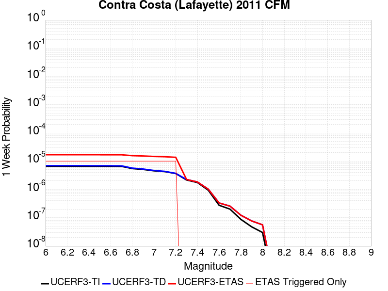 |  |  | 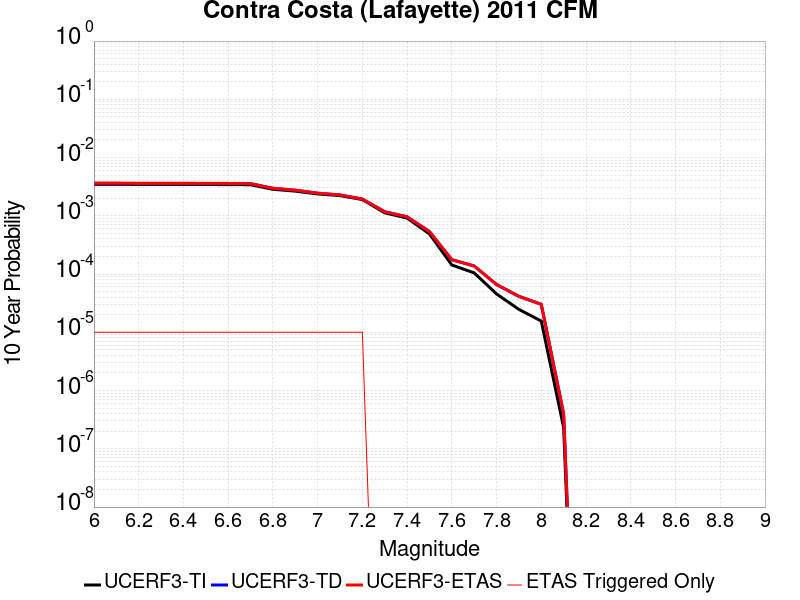 |

| Magnitude | 1 wk TI Prob | 1 wk TD Prob | 1 wk ETAS Prob | 1 wk ETAS/TD Gain | 1 wk ETAS Triggered Only | 1 mo TI Prob | 1 mo TD Prob | 1 mo ETAS Prob | 1 mo ETAS/TD Gain | 1 mo ETAS Triggered Only | 1 yr TI Prob | 1 yr TD Prob | 1 yr ETAS Prob | 1 yr ETAS/TD Gain | 1 yr ETAS Triggered Only | 10 yr TI Prob | 10 yr TD Prob | 10 yr ETAS Prob | 10 yr ETAS/TD Gain | 10 yr ETAS Triggered Only |
|-----|-----|-----|-----|-----|-----|-----|-----|-----|-----|-----|-----|-----|-----|-----|-----|-----|-----|-----|-----|-----|
| 6.0 | 6.655419E-6 | 6.936133E-6 | 3.1137908E-5 | 4.489231 | 2.4201941E-5 | 2.8522913E-5 | 2.9725958E-5 | 5.392718E-5 | 1.8141444 | 2.4201941E-5 | 3.472111E-4 | 3.618554E-4 | 3.860486E-4 | 1.0668586 | 2.4201941E-5 | 0.0034666911 | 0.0036175281 | 0.0036416426 | 1.006666 | 2.4201941E-5 |
| 6.1 | 6.655419E-6 | 6.936133E-6 | 3.1137908E-5 | 4.489231 | 2.4201941E-5 | 2.8522913E-5 | 2.9725958E-5 | 5.392718E-5 | 1.8141444 | 2.4201941E-5 | 3.472111E-4 | 3.618554E-4 | 3.860486E-4 | 1.0668586 | 2.4201941E-5 | 0.0034666911 | 0.0036175281 | 0.0036416426 | 1.006666 | 2.4201941E-5 |
| 6.2 | 6.6254133E-6 | 6.9045423E-6 | 3.1106316E-5 | 4.505196 | 2.4201941E-5 | 2.839432E-5 | 2.9590572E-5 | 5.3791795E-5 | 1.8178694 | 2.4201941E-5 | 3.45646E-4 | 3.6020763E-4 | 3.8440086E-4 | 1.0671647 | 2.4201941E-5 | 0.003451089 | 0.0036011038 | 0.0036252185 | 1.0066965 | 2.4201941E-5 |
| 6.3 | 6.6254133E-6 | 6.9045423E-6 | 3.1106316E-5 | 4.505196 | 2.4201941E-5 | 2.839432E-5 | 2.9590572E-5 | 5.3791795E-5 | 1.8178694 | 2.4201941E-5 | 3.45646E-4 | 3.6020763E-4 | 3.8440086E-4 | 1.0671647 | 2.4201941E-5 | 0.003451089 | 0.0036011038 | 0.0036252185 | 1.0066965 | 2.4201941E-5 |
| 6.4 | 6.6254133E-6 | 6.9045423E-6 | 3.1106316E-5 | 4.505196 | 2.4201941E-5 | 2.839432E-5 | 2.9590572E-5 | 5.3791795E-5 | 1.8178694 | 2.4201941E-5 | 3.45646E-4 | 3.6020763E-4 | 3.8440086E-4 | 1.0671647 | 2.4201941E-5 | 0.003451089 | 0.0036011038 | 0.0036252185 | 1.0066965 | 2.4201941E-5 |
| 6.5 | 6.606445E-6 | 6.884091E-6 | 3.1085867E-5 | 4.5156093 | 2.4201941E-5 | 2.8313027E-5 | 2.9502924E-5 | 5.3704152E-5 | 1.8202993 | 2.4201941E-5 | 3.4465658E-4 | 3.5914086E-4 | 3.8333412E-4 | 1.0673642 | 2.4201941E-5 | 0.0034412253 | 0.0035904706 | 0.0036145858 | 1.0067164 | 2.4201941E-5 |
| 6.6 | 6.59966E-6 | 6.8766285E-6 | 3.10784E-5 | 4.5194244 | 2.4201941E-5 | 2.828395E-5 | 2.9470944E-5 | 5.367217E-5 | 1.8211894 | 2.4201941E-5 | 3.4430268E-4 | 3.5875165E-4 | 3.829449E-4 | 1.0674373 | 2.4201941E-5 | 0.0034376972 | 0.003586591 | 0.0036107062 | 1.0067236 | 2.4201941E-5 |
| 6.7 | 6.5570975E-6 | 6.83062E-6 | 3.1032396E-5 | 4.5431304 | 2.4201941E-5 | 2.8101544E-5 | 2.9273768E-5 | 5.3475E-5 | 1.8267208 | 2.4201941E-5 | 3.4208258E-4 | 3.563518E-4 | 3.8054513E-4 | 1.0678917 | 2.4201941E-5 | 0.0034155648 | 0.0035626697 | 0.0035867854 | 1.0067691 | 2.4201941E-5 |
| 6.8 | 5.472255E-6 | 5.6736194E-6 | 2.9875424E-5 | 5.2656727 | 2.4201941E-5 | 2.345231E-5 | 2.4315288E-5 | 4.851664E-5 | 1.9953142 | 2.4201941E-5 | 2.8549446E-4 | 2.9599888E-4 | 3.2019365E-4 | 1.0817394 | 2.4201941E-5 | 0.0028512797 | 0.0029607643 | 0.0029848947 | 1.00815 | 2.4201941E-5 |
| 6.9 | 5.092346E-6 | 5.2639816E-6 | 2.9465795E-5 | 5.597625 | 2.4201941E-5 | 2.1824157E-5 | 2.2559729E-5 | 4.6761124E-5 | 2.0727699 | 2.4201941E-5 | 2.656767E-4 | 2.7463044E-4 | 2.9882573E-4 | 1.0881013 | 2.4201941E-5 | 0.002653593 | 0.002747621 | 0.0027717564 | 1.0087842 | 2.4201941E-5 |
| 7.0 | 4.5525762E-6 | 4.6773084E-6 | 2.8879136E-5 | 6.1743064 | 2.4201941E-5 | 1.9510895E-5 | 2.0045454E-5 | 4.424691E-5 | 2.2073288 | 2.4201941E-5 | 2.3751926E-4 | 2.4402638E-4 | 2.6822241E-4 | 1.0991534 | 2.4201941E-5 | 0.0023726553 | 0.0024422838 | 0.0024664265 | 1.0098853 | 2.4201941E-5 |
| 7.1 | 4.261504E-6 | 4.356478E-6 | 2.8558314E-5 | 6.5553675 | 2.4201941E-5 | 1.826346E-5 | 1.8670487E-5 | 4.2871976E-5 | 2.2962432 | 2.4201941E-5 | 2.2233493E-4 | 2.2728974E-4 | 2.5148617E-4 | 1.1064564 | 2.4201941E-5 | 0.002221126 | 0.0022752623 | 0.0022994091 | 1.0106128 | 2.4201941E-5 |
| 7.2 | 3.654114E-6 | 3.697206E-6 | 2.7899057E-5 | 7.545984 | 2.4201941E-5 | 1.5660395E-5 | 1.5845073E-5 | 4.004663E-5 | 2.527387 | 2.4201941E-5 | 1.9064861E-4 | 1.9289694E-4 | 2.1709422E-4 | 1.1254414 | 2.4201941E-5 | 0.0019048514 | 0.0019319316 | 0.0019560868 | 1.0125031 | 2.4201941E-5 |
| 7.3 | 2.1595129E-6 | 2.2442475E-6 | 2.2442475E-6 | 1.0 | 0.0 | 9.255023E-6 | 9.618168E-6 | 9.618168E-6 | 1.0 | 0.0 | 1.1267407E-4 | 1.17094954E-4 | 1.17094954E-4 | 1.0 | 0.0 | 0.0011261696 | 0.0011749809 | 0.0011749809 | 1.0 | 0.0 |
| 7.4 | 1.7532738E-6 | 1.8335537E-6 | 1.8335537E-6 | 1.0 | 0.0 | 7.5140088E-6 | 7.858064E-6 | 7.858064E-6 | 1.0 | 0.0 | 9.147922E-5 | 9.566777E-5 | 9.566777E-5 | 1.0 | 0.0 | 9.144157E-4 | 9.607641E-4 | 9.607641E-4 | 1.0 | 0.0 |
| 7.5 | 9.387875E-7 | 1.0194132E-6 | 1.0194132E-6 | 1.0 | 0.0 | 4.0233685E-6 | 4.3689065E-6 | 4.3689065E-6 | 1.0 | 0.0 | 4.8983413E-5 | 5.319015E-5 | 5.319015E-5 | 1.0 | 0.0 | 4.897262E-4 | 5.35806E-4 | 5.35806E-4 | 1.0 | 0.0 |
| 7.6 | 2.7471893E-7 | 3.3111127E-7 | 3.3111127E-7 | 1.0 | 0.0 | 1.1773664E-6 | 1.4190474E-6 | 1.4190474E-6 | 1.0 | 0.0 | 1.433434E-5 | 1.7276767E-5 | 1.7276767E-5 | 1.0 | 0.0 | 1.4333417E-4 | 1.7661233E-4 | 1.7661233E-4 | 1.0 | 0.0 |
| 7.7 | 2.0057985E-7 | 2.564454E-7 | 2.564454E-7 | 1.0 | 0.0 | 8.596276E-7 | 1.0990511E-6 | 1.0990511E-6 | 1.0 | 0.0 | 1.0465916E-5 | 1.3380866E-5 | 1.3380866E-5 | 1.0 | 0.0 | 1.0465423E-4 | 1.3761544E-4 | 1.3761544E-4 | 1.0 | 0.0 |
| 7.8 | 8.7403905E-8 | 1.2261823E-7 | 1.2261823E-7 | 1.0 | 0.0 | 3.745881E-7 | 5.255066E-7 | 5.255066E-7 | 1.0 | 0.0 | 4.5606007E-6 | 6.398024E-6 | 6.398024E-6 | 1.0 | 0.0 | 4.560507E-5 | 6.6243636E-5 | 6.6243636E-5 | 1.0 | 0.0 |
| 7.9 | 4.740233E-8 | 7.649451E-8 | 7.649451E-8 | 1.0 | 0.0 | 2.0315284E-7 | 3.2783356E-7 | 3.2783356E-7 | 1.0 | 0.0 | 2.473383E-6 | 3.991366E-6 | 3.991366E-6 | 1.0 | 0.0 | 2.4733554E-5 | 4.1450698E-5 | 4.1450698E-5 | 1.0 | 0.0 |
| 8.0 | 2.99164E-8 | 5.59337E-8 | 5.59337E-8 | 1.0 | 0.0 | 1.2821314E-7 | 2.3971583E-7 | 2.3971583E-7 | 1.0 | 0.0 | 1.5609938E-6 | 2.9185364E-6 | 2.9185364E-6 | 1.0 | 0.0 | 1.5609829E-5 | 3.0209583E-5 | 3.0209583E-5 | 1.0 | 0.0 |
| 8.1 | 4.431212E-10 | 7.424964E-10 | 7.424964E-10 | 1.0 | 0.0 | 1.899091E-9 | 3.1821275E-9 | 3.1821275E-9 | 1.0 | 0.0 | 2.3121432E-8 | 3.8742403E-8 | 3.8742403E-8 | 1.0 | 0.0 | 2.312143E-7 | 3.962537E-7 | 3.962537E-7 | 1.0 | 0.0 |

## Northridge
*[(top)](#table-of-contents)*

| 1 Week | 1 Month | 1 Year | 10 Year |
|-----|-----|-----|-----|
|  |  | 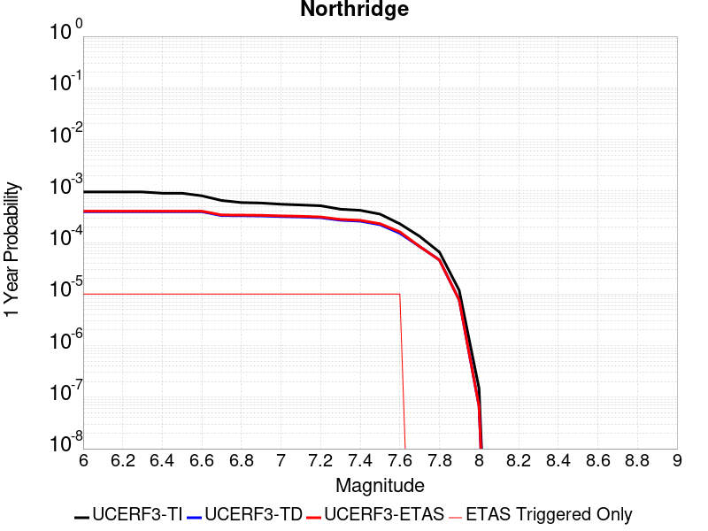 |  |

| Magnitude | 1 wk TI Prob | 1 wk TD Prob | 1 wk ETAS Prob | 1 wk ETAS/TD Gain | 1 wk ETAS Triggered Only | 1 mo TI Prob | 1 mo TD Prob | 1 mo ETAS Prob | 1 mo ETAS/TD Gain | 1 mo ETAS Triggered Only | 1 yr TI Prob | 1 yr TD Prob | 1 yr ETAS Prob | 1 yr ETAS/TD Gain | 1 yr ETAS Triggered Only | 10 yr TI Prob | 10 yr TD Prob | 10 yr ETAS Prob | 10 yr ETAS/TD Gain | 10 yr ETAS Triggered Only |
|-----|-----|-----|-----|-----|-----|-----|-----|-----|-----|-----|-----|-----|-----|-----|-----|-----|-----|-----|-----|-----|
| 6.0 | 1.8340852E-5 | 7.5878907E-6 | 7.5878907E-6 | 1.0 | 0.0 | 7.860128E-5 | 3.251914E-5 | 3.251914E-5 | 1.0 | 0.0 | 9.565505E-4 | 3.9585077E-4 | 3.9585077E-4 | 1.0 | 0.0 | 0.009524435 | 0.0039516874 | 0.0039757937 | 1.0061003 | 2.4201941E-5 |
| 6.1 | 1.8340852E-5 | 7.5878907E-6 | 7.5878907E-6 | 1.0 | 0.0 | 7.860128E-5 | 3.251914E-5 | 3.251914E-5 | 1.0 | 0.0 | 9.565505E-4 | 3.9585077E-4 | 3.9585077E-4 | 1.0 | 0.0 | 0.009524435 | 0.0039516874 | 0.0039757937 | 1.0061003 | 2.4201941E-5 |
| 6.2 | 1.8340852E-5 | 7.5878907E-6 | 7.5878907E-6 | 1.0 | 0.0 | 7.860128E-5 | 3.251914E-5 | 3.251914E-5 | 1.0 | 0.0 | 9.565505E-4 | 3.9585077E-4 | 3.9585077E-4 | 1.0 | 0.0 | 0.009524435 | 0.0039516874 | 0.0039757937 | 1.0061003 | 2.4201941E-5 |
| 6.3 | 1.8340852E-5 | 7.5878907E-6 | 7.5878907E-6 | 1.0 | 0.0 | 7.860128E-5 | 3.251914E-5 | 3.251914E-5 | 1.0 | 0.0 | 9.565505E-4 | 3.9585077E-4 | 3.9585077E-4 | 1.0 | 0.0 | 0.009524435 | 0.0039516874 | 0.0039757937 | 1.0061003 | 2.4201941E-5 |
| 6.4 | 1.7361892E-5 | 7.5878907E-6 | 7.5878907E-6 | 1.0 | 0.0 | 7.440598E-5 | 3.251914E-5 | 3.251914E-5 | 1.0 | 0.0 | 9.055163E-4 | 3.9585077E-4 | 3.9585077E-4 | 1.0 | 0.0 | 0.009018354 | 0.0039516874 | 0.0039757937 | 1.0061003 | 2.4201941E-5 |
| 6.5 | 1.7361892E-5 | 7.5878907E-6 | 7.5878907E-6 | 1.0 | 0.0 | 7.440598E-5 | 3.251914E-5 | 3.251914E-5 | 1.0 | 0.0 | 9.055163E-4 | 3.9585077E-4 | 3.9585077E-4 | 1.0 | 0.0 | 0.009018354 | 0.0039516874 | 0.0039757937 | 1.0061003 | 2.4201941E-5 |
| 6.6 | 1.5458201E-5 | 7.5878907E-6 | 7.5878907E-6 | 1.0 | 0.0 | 6.624775E-5 | 3.251914E-5 | 3.251914E-5 | 1.0 | 0.0 | 8.0626784E-4 | 3.9585077E-4 | 3.9585077E-4 | 1.0 | 0.0 | 0.008033488 | 0.0039516874 | 0.0039757937 | 1.0061003 | 2.4201941E-5 |
| 6.7 | 1.2538368E-5 | 6.381497E-6 | 6.381497E-6 | 1.0 | 0.0 | 5.3734755E-5 | 2.7348988E-5 | 2.7348988E-5 | 1.0 | 0.0 | 6.5402425E-4 | 3.329235E-4 | 3.329235E-4 | 1.0 | 0.0 | 0.0065210275 | 0.0033243035 | 0.003348425 | 1.0072562 | 2.4201941E-5 |
| 6.8 | 1.1438097E-5 | 6.350156E-6 | 6.350156E-6 | 1.0 | 0.0 | 4.9019498E-5 | 2.7214674E-5 | 2.7214674E-5 | 1.0 | 0.0 | 5.9664896E-4 | 3.3128873E-4 | 3.3128873E-4 | 1.0 | 0.0 | 0.005950495 | 0.0033080047 | 0.0033321264 | 1.007292 | 2.4201941E-5 |
| 6.9 | 1.1204891E-5 | 6.2866116E-6 | 6.2866116E-6 | 1.0 | 0.0 | 4.8020076E-5 | 2.6942345E-5 | 2.6942345E-5 | 1.0 | 0.0 | 5.8448757E-4 | 3.2797412E-4 | 3.2797412E-4 | 1.0 | 0.0 | 0.0058295266 | 0.0032749567 | 0.0032990794 | 1.0073658 | 2.4201941E-5 |
| 7.0 | 1.061046E-5 | 6.1152687E-6 | 6.1152687E-6 | 1.0 | 0.0 | 4.5472607E-5 | 2.6208034E-5 | 2.6208034E-5 | 1.0 | 0.0 | 5.534883E-4 | 3.190365E-4 | 3.190365E-4 | 1.0 | 0.0 | 0.0055211177 | 0.0031858315 | 0.0032099562 | 1.0075725 | 2.4201941E-5 |
| 7.1 | 1.0266979E-5 | 6.0041907E-6 | 6.0041907E-6 | 1.0 | 0.0 | 4.40006E-5 | 2.5731995E-5 | 2.5731995E-5 | 1.0 | 0.0 | 5.355756E-4 | 3.1324243E-4 | 3.1324243E-4 | 1.0 | 0.0 | 0.0053428668 | 0.0031280548 | 0.003152181 | 1.0077128 | 2.4201941E-5 |
| 7.2 | 9.91273E-6 | 5.819906E-6 | 5.819906E-6 | 1.0 | 0.0 | 4.248244E-5 | 2.4942217E-5 | 2.4942217E-5 | 1.0 | 0.0 | 5.171009E-4 | 3.036296E-4 | 3.036296E-4 | 1.0 | 0.0 | 0.0051589934 | 0.0030321924 | 0.003056321 | 1.0079575 | 2.4201941E-5 |
| 7.3 | 8.4959265E-6 | 5.1930183E-6 | 5.1930183E-6 | 1.0 | 0.0 | 3.6410605E-5 | 2.2255605E-5 | 2.2255605E-5 | 1.0 | 0.0 | 4.4320893E-4 | 2.7092852E-4 | 2.7092852E-4 | 1.0 | 0.0 | 0.00442326 | 0.0027060085 | 0.002730145 | 1.0089196 | 2.4201941E-5 |
| 7.4 | 8.0847185E-6 | 4.9818977E-6 | 4.9818977E-6 | 1.0 | 0.0 | 3.4648332E-5 | 2.1350817E-5 | 2.1350817E-5 | 1.0 | 0.0 | 4.2176177E-4 | 2.5991542E-4 | 2.5991542E-4 | 1.0 | 0.0 | 0.0042096223 | 0.0025961401 | 0.0026202793 | 1.0092981 | 2.4201941E-5 |
| 7.5 | 6.8220684E-6 | 4.2532647E-6 | 4.2532647E-6 | 1.0 | 0.0 | 2.9237108E-5 | 1.8228153E-5 | 1.8228153E-5 | 1.0 | 0.0 | 3.5590364E-4 | 2.2190536E-4 | 2.2190536E-4 | 1.0 | 0.0 | 0.0035533418 | 0.0022168586 | 0.0022168586 | 1.0 | 0.0 |
| 7.6 | 4.4224143E-6 | 2.8999295E-6 | 2.8999295E-6 | 1.0 | 0.0 | 1.8953066E-5 | 1.24282105E-5 | 1.24282105E-5 | 1.0 | 0.0 | 2.3072914E-4 | 1.5130307E-4 | 1.5130307E-4 | 1.0 | 0.0 | 0.0023048974 | 0.0015120122 | 0.0015120122 | 1.0 | 0.0 |
| 7.7 | 2.5297056E-6 | 1.6045943E-6 | 1.6045943E-6 | 1.0 | 0.0 | 1.0841551E-5 | 6.876815E-6 | 6.876815E-6 | 1.0 | 0.0 | 1.319879E-4 | 8.372205E-5 | 8.372205E-5 | 1.0 | 0.0 | 0.0013190953 | 8.369098E-4 | 8.369098E-4 | 1.0 | 0.0 |
| 7.8 | 1.2508156E-6 | 8.780148E-7 | 8.780148E-7 | 1.0 | 0.0 | 5.3606273E-6 | 3.7629154E-6 | 3.7629154E-6 | 1.0 | 0.0 | 6.526368E-5 | 4.5812543E-5 | 4.5812543E-5 | 1.0 | 0.0 | 6.524452E-4 | 4.580323E-4 | 4.580323E-4 | 1.0 | 0.0 |
| 7.9 | 2.262199E-7 | 1.466491E-7 | 1.466491E-7 | 1.0 | 0.0 | 9.695135E-7 | 6.2849597E-7 | 6.2849597E-7 | 1.0 | 0.0 | 1.1803763E-5 | 7.651913E-6 | 7.651913E-6 | 1.0 | 0.0 | 1.1803136E-4 | 7.651657E-5 | 7.651657E-5 | 1.0 | 0.0 |
| 8.0 | 2.865362E-9 | 1.27525E-9 | 1.27525E-9 | 1.0 | 0.0 | 1.2280123E-8 | 5.465357E-9 | 5.465357E-9 | 1.0 | 0.0 | 1.4951048E-7 | 6.654073E-8 | 6.654073E-8 | 1.0 | 0.0 | 1.4951038E-6 | 6.6540724E-7 | 6.6540724E-7 | 1.0 | 0.0 |

## Rinconada 2011 CFM
*[(top)](#table-of-contents)*

| 1 Week | 1 Month | 1 Year | 10 Year |
|-----|-----|-----|-----|
|  |  |  |  |

| Magnitude | 1 wk TI Prob | 1 wk TD Prob | 1 wk ETAS Prob | 1 wk ETAS/TD Gain | 1 wk ETAS Triggered Only | 1 mo TI Prob | 1 mo TD Prob | 1 mo ETAS Prob | 1 mo ETAS/TD Gain | 1 mo ETAS Triggered Only | 1 yr TI Prob | 1 yr TD Prob | 1 yr ETAS Prob | 1 yr ETAS/TD Gain | 1 yr ETAS Triggered Only | 10 yr TI Prob | 10 yr TD Prob | 10 yr ETAS Prob | 10 yr ETAS/TD Gain | 10 yr ETAS Triggered Only |
|-----|-----|-----|-----|-----|-----|-----|-----|-----|-----|-----|-----|-----|-----|-----|-----|-----|-----|-----|-----|-----|
| 6.0 | 1.5752368E-5 | 1.6274716E-5 | 1.6274716E-5 | 1.0 | 0.0 | 6.75084E-5 | 6.974694E-5 | 9.394719E-5 | 1.3469722 | 2.4201941E-5 | 8.2160486E-4 | 8.488413E-4 | 8.7302265E-4 | 1.0284876 | 2.4201941E-5 | 0.008185739 | 0.00845637 | 0.008480367 | 1.0028378 | 2.4201941E-5 |
| 6.1 | 1.0966133E-5 | 1.1323029E-5 | 1.1323029E-5 | 1.0 | 0.0 | 4.6996865E-5 | 4.852637E-5 | 7.272713E-5 | 1.4987137 | 2.4201941E-5 | 5.720366E-4 | 5.9064914E-4 | 6.1483675E-4 | 1.040951 | 2.4201941E-5 | 0.0057056635 | 0.005890889 | 0.0059149484 | 1.0040841 | 2.4201941E-5 |
| 6.2 | 1.0966133E-5 | 1.1323029E-5 | 1.1323029E-5 | 1.0 | 0.0 | 4.6996865E-5 | 4.852637E-5 | 7.272713E-5 | 1.4987137 | 2.4201941E-5 | 5.720366E-4 | 5.9064914E-4 | 6.1483675E-4 | 1.040951 | 2.4201941E-5 | 0.0057056635 | 0.005890889 | 0.0059149484 | 1.0040841 | 2.4201941E-5 |
| 6.3 | 8.926149E-6 | 9.212772E-6 | 9.212772E-6 | 1.0 | 0.0 | 3.8254362E-5 | 3.948271E-5 | 6.36837E-5 | 1.6129514 | 2.4201941E-5 | 4.6564735E-4 | 4.8059633E-4 | 5.047866E-4 | 1.050334 | 2.4201941E-5 | 0.0046467283 | 0.0047956146 | 0.0048197005 | 1.0050225 | 2.4201941E-5 |
| 6.4 | 7.676955E-6 | 7.920191E-6 | 7.920191E-6 | 1.0 | 0.0 | 3.290082E-5 | 3.3943234E-5 | 5.8144356E-5 | 1.712988 | 2.4201941E-5 | 4.0049385E-4 | 4.131807E-4 | 4.3737266E-4 | 1.0585505 | 2.4201941E-5 | 0.0039977287 | 0.004124151 | 0.0041482532 | 1.0058441 | 2.4201941E-5 |
| 6.5 | 6.1671026E-6 | 6.358955E-6 | 6.358955E-6 | 1.0 | 0.0 | 2.6430173E-5 | 2.725238E-5 | 5.1453662E-5 | 1.8880428 | 2.4201941E-5 | 3.2173982E-4 | 3.317473E-4 | 3.559412E-4 | 1.0729288 | 2.4201941E-5 | 0.003212744 | 0.0033125326 | 0.0033366543 | 1.007282 | 2.4201941E-5 |
| 6.6 | 5.553456E-6 | 5.7248126E-6 | 5.7248126E-6 | 1.0 | 0.0 | 2.3800309E-5 | 2.4534682E-5 | 4.873603E-5 | 1.9864137 | 2.4201941E-5 | 2.897302E-4 | 2.9866886E-4 | 3.2286358E-4 | 1.0810084 | 2.4201941E-5 | 0.0028935277 | 0.0029826832 | 0.003006813 | 1.0080899 | 2.4201941E-5 |
| 6.7 | 4.787857E-6 | 4.93331E-6 | 4.93331E-6 | 1.0 | 0.0 | 2.0519226E-5 | 2.1142585E-5 | 4.5344015E-5 | 2.144677 | 2.4201941E-5 | 2.4979294E-4 | 2.573806E-4 | 2.8157633E-4 | 1.0940075 | 2.4201941E-5 | 0.0024951235 | 0.002570831 | 0.0025949706 | 1.0093899 | 2.4201941E-5 |
| 6.8 | 3.9955166E-6 | 4.1134763E-6 | 4.1134763E-6 | 1.0 | 0.0 | 1.7123532E-5 | 1.7629065E-5 | 4.183058E-5 | 2.372819 | 2.4201941E-5 | 2.0845905E-4 | 2.1461275E-4 | 2.388095E-4 | 1.1127461 | 2.4201941E-5 | 0.002082636 | 0.0021440587 | 0.0021682086 | 1.0112637 | 2.4201941E-5 |
| 6.9 | 3.4250072E-6 | 3.5224466E-6 | 3.5224466E-6 | 1.0 | 0.0 | 1.46785205E-5 | 1.5096112E-5 | 3.9297687E-5 | 2.603166 | 2.4201941E-5 | 1.7869633E-4 | 1.8377969E-4 | 2.0797718E-4 | 1.1316658 | 2.4201941E-5 | 0.001785527 | 0.0018362795 | 0.001860437 | 1.0131557 | 2.4201941E-5 |
| 7.0 | 2.7712713E-6 | 2.8467002E-6 | 2.8467002E-6 | 1.0 | 0.0 | 1.1876823E-5 | 1.22000865E-5 | 3.6401732E-5 | 2.9837275 | 2.4201941E-5 | 1.4459073E-4 | 1.4852594E-4 | 1.7272429E-4 | 1.1629233 | 2.4201941E-5 | 0.0014449668 | 0.0014842683 | 0.0015084343 | 1.0162815 | 2.4201941E-5 |
| 7.1 | 2.227358E-6 | 2.2856987E-6 | 2.2856987E-6 | 1.0 | 0.0 | 9.545785E-6 | 9.795815E-6 | 3.399752E-5 | 3.4706168 | 2.4201941E-5 | 1.16213734E-4 | 1.1925753E-4 | 1.4345658E-4 | 1.2029142 | 2.4201941E-5 | 0.0011615298 | 0.0011919363 | 0.0012161095 | 1.0202805 | 2.4201941E-5 |
| 7.2 | 1.581796E-6 | 1.6209015E-6 | 1.6209015E-6 | 1.0 | 0.0 | 6.779108E-6 | 6.946702E-6 | 3.1148476E-5 | 4.483923 | 2.4201941E-5 | 8.253252E-5 | 8.4572814E-5 | 1.08772714E-4 | 1.2861427 | 2.4201941E-5 | 8.250187E-4 | 8.4540684E-4 | 8.6958834E-4 | 1.0286033 | 2.4201941E-5 |
| 7.3 | 1.0306567E-6 | 1.054648E-6 | 1.054648E-6 | 1.0 | 0.0 | 4.4170924E-6 | 4.519912E-6 | 2.8721744E-5 | 6.3544917 | 2.4201941E-5 | 5.3776774E-5 | 5.502854E-5 | 7.922915E-5 | 1.4397829 | 2.4201941E-5 | 5.376376E-4 | 5.501494E-4 | 5.74338E-4 | 1.0439674 | 2.4201941E-5 |
| 7.4 | 6.535541E-7 | 6.682744E-7 | 6.682744E-7 | 1.0 | 0.0 | 2.800943E-6 | 2.8640302E-6 | 2.8640302E-6 | 1.0 | 0.0 | 3.4100947E-5 | 3.4869012E-5 | 3.4869012E-5 | 1.0 | 0.0 | 3.4095717E-4 | 3.486355E-4 | 3.486355E-4 | 1.0 | 0.0 |
| 7.5 | 3.2656962E-7 | 3.3316712E-7 | 3.3316712E-7 | 1.0 | 0.0 | 1.3995833E-6 | 1.4278584E-6 | 1.4278584E-6 | 1.0 | 0.0 | 1.7039794E-5 | 1.7384036E-5 | 1.7384036E-5 | 1.0 | 0.0 | 1.7038487E-4 | 1.738268E-4 | 1.738268E-4 | 1.0 | 0.0 |
| 7.6 | 9.754343E-8 | 9.821017E-8 | 9.821017E-8 | 1.0 | 0.0 | 4.180432E-7 | 4.2090065E-7 | 4.2090065E-7 | 1.0 | 0.0 | 5.089664E-6 | 5.1244533E-6 | 5.1244533E-6 | 1.0 | 0.0 | 5.0895473E-5 | 5.124336E-5 | 5.124336E-5 | 1.0 | 0.0 |
| 7.7 | 6.0001453E-9 | 5.8491207E-9 | 5.8491207E-9 | 1.0 | 0.0 | 2.5714908E-8 | 2.506766E-8 | 2.506766E-8 | 1.0 | 0.0 | 3.1307894E-7 | 3.051987E-7 | 3.051987E-7 | 1.0 | 0.0 | 3.1307852E-6 | 3.0519832E-6 | 3.0519832E-6 | 1.0 | 0.0 |
| 7.8 | 7.400003E-11 | 7.4654505E-11 | 7.4654505E-11 | 1.0 | 0.0 | 3.171432E-10 | 3.1994773E-10 | 3.1994773E-10 | 1.0 | 0.0 | 3.861218E-9 | 3.895363E-9 | 3.895363E-9 | 1.0 | 0.0 | 3.861218E-8 | 3.895363E-8 | 3.895363E-8 | 1.0 | 0.0 |

## Calaveras (So) 2011 CFM
*[(top)](#table-of-contents)*

| 1 Week | 1 Month | 1 Year | 10 Year |
|-----|-----|-----|-----|
|  |  |  |  |

| Magnitude | 1 wk TI Prob | 1 wk TD Prob | 1 wk ETAS Prob | 1 wk ETAS/TD Gain | 1 wk ETAS Triggered Only | 1 mo TI Prob | 1 mo TD Prob | 1 mo ETAS Prob | 1 mo ETAS/TD Gain | 1 mo ETAS Triggered Only | 1 yr TI Prob | 1 yr TD Prob | 1 yr ETAS Prob | 1 yr ETAS/TD Gain | 1 yr ETAS Triggered Only | 10 yr TI Prob | 10 yr TD Prob | 10 yr ETAS Prob | 10 yr ETAS/TD Gain | 10 yr ETAS Triggered Only |
|-----|-----|-----|-----|-----|-----|-----|-----|-----|-----|-----|-----|-----|-----|-----|-----|-----|-----|-----|-----|-----|
| 6.0 | 1.5950744E-4 | 3.0713255E-4 | 3.0713255E-4 | 1.0 | 0.0 | 6.834242E-4 | 0.001315409 | 0.001315409 | 1.0 | 0.0 | 0.00828899 | 0.015858326 | 0.015858326 | 1.0 | 0.0 | 0.079865426 | 0.14440185 | 0.14442256 | 1.0001434 | 2.4201941E-5 |
| 6.1 | 1.3584697E-4 | 2.603514E-4 | 2.603514E-4 | 1.0 | 0.0 | 5.8207137E-4 | 0.0011151754 | 0.0011151754 | 1.0 | 0.0 | 0.007063716 | 0.013461385 | 0.013461385 | 1.0 | 0.0 | 0.06843361 | 0.124029994 | 0.1240512 | 1.000171 | 2.4201941E-5 |
| 6.2 | 1.14676266E-4 | 2.1714384E-4 | 2.1714384E-4 | 1.0 | 0.0 | 4.9137714E-4 | 9.30223E-4 | 9.30223E-4 | 1.0 | 0.0 | 0.0059661185 | 0.011245058 | 0.011245058 | 1.0 | 0.0 | 0.058084648 | 0.10502057 | 0.10504223 | 1.0002062 | 2.4201941E-5 |
| 6.3 | 8.691518E-5 | 1.5987935E-4 | 1.5987935E-4 | 1.0 | 0.0 | 3.7244044E-4 | 6.849807E-4 | 6.849807E-4 | 1.0 | 0.0 | 0.004525038 | 0.008301122 | 0.008301122 | 1.0 | 0.0 | 0.044339992 | 0.0793365 | 0.07935878 | 1.0002809 | 2.4201941E-5 |
| 6.4 | 8.50982E-5 | 1.5694331E-4 | 1.5694331E-4 | 1.0 | 0.0 | 3.646556E-4 | 6.724042E-4 | 6.724042E-4 | 1.0 | 0.0 | 0.0044306475 | 0.008149155 | 0.008149155 | 1.0 | 0.0 | 0.04343345 | 0.07794268 | 0.07796499 | 1.0002863 | 2.4201941E-5 |
| 6.5 | 8.4062965E-5 | 1.5518743E-4 | 1.5518743E-4 | 1.0 | 0.0 | 3.602201E-4 | 6.6488347E-4 | 6.6488347E-4 | 1.0 | 0.0 | 0.004376863 | 0.008058365 | 0.008058365 | 1.0 | 0.0 | 0.042916555 | 0.07711388 | 0.07713622 | 1.0002897 | 2.4201941E-5 |
| 6.6 | 8.194716E-5 | 1.5154552E-4 | 1.5154552E-4 | 1.0 | 0.0 | 3.5115483E-4 | 6.492843E-4 | 6.492843E-4 | 1.0 | 0.0 | 0.0042669317 | 0.007870209 | 0.007870209 | 1.0 | 0.0 | 0.04185927 | 0.07539919 | 0.075421564 | 1.0002968 | 2.4201941E-5 |
| 6.7 | 8.012326E-5 | 1.4822475E-4 | 1.4822475E-4 | 1.0 | 0.0 | 3.433402E-4 | 6.350612E-4 | 6.350612E-4 | 1.0 | 0.0 | 0.004172157 | 0.007698701 | 0.007698701 | 1.0 | 0.0 | 0.040946912 | 0.07384132 | 0.07386374 | 1.0003035 | 2.4201941E-5 |
| 6.8 | 7.119773E-5 | 1.2881879E-4 | 1.2881879E-4 | 1.0 | 0.0 | 3.0509746E-4 | 5.519494E-4 | 5.519494E-4 | 1.0 | 0.0 | 0.0037082357 | 0.006696066 | 0.006696066 | 1.0 | 0.0 | 0.036469642 | 0.06468575 | 0.06470838 | 1.00035 | 2.4201941E-5 |
| 6.9 | 5.7343088E-5 | 9.919277E-5 | 9.919277E-5 | 1.0 | 0.0 | 2.4573295E-4 | 4.25043E-4 | 4.25043E-4 | 1.0 | 0.0 | 0.0029876942 | 0.005162694 | 0.005162694 | 1.0 | 0.0 | 0.02947844 | 0.05051036 | 0.050533343 | 1.0004549 | 2.4201941E-5 |
| 7.0 | 4.8746577E-5 | 8.2850725E-5 | 8.2850725E-5 | 1.0 | 0.0 | 2.0889717E-4 | 3.5502657E-4 | 3.5502657E-4 | 1.0 | 0.0 | 0.0025403565 | 0.004313948 | 0.004313948 | 1.0 | 0.0 | 0.025115121 | 0.042485245 | 0.04250842 | 1.0005455 | 2.4201941E-5 |
| 7.1 | 4.2998014E-5 | 7.265203E-5 | 7.265203E-5 | 1.0 | 0.0 | 1.8426418E-4 | 3.1132903E-4 | 3.1132903E-4 | 1.0 | 0.0 | 0.002241108 | 0.003783903 | 0.003783903 | 1.0 | 0.0 | 0.022186412 | 0.037423562 | 0.037446856 | 1.0006225 | 2.4201941E-5 |
| 7.2 | 3.221292E-5 | 5.390791E-5 | 5.390791E-5 | 1.0 | 0.0 | 1.3804805E-4 | 2.3101359E-4 | 2.3101359E-4 | 1.0 | 0.0 | 0.0016794393 | 0.0028089907 | 0.0028089907 | 1.0 | 0.0 | 0.016668037 | 0.02803602 | 0.02803602 | 1.0 | 0.0 |
| 7.3 | 2.3756531E-5 | 3.9473416E-5 | 3.9473416E-5 | 1.0 | 0.0 | 1.0180973E-4 | 1.6916092E-4 | 1.6916092E-4 | 1.0 | 0.0 | 0.0012388286 | 0.0020576057 | 0.0020576057 | 1.0 | 0.0 | 0.012319452 | 0.020643145 | 0.020643145 | 1.0 | 0.0 |
| 7.4 | 1.5997684E-5 | 2.7342163E-5 | 2.7342163E-5 | 1.0 | 0.0 | 6.8559704E-5 | 1.1717545E-4 | 1.1717545E-4 | 1.0 | 0.0 | 8.343947E-4 | 0.00142568 | 0.00142568 | 1.0 | 0.0 | 0.008312687 | 0.014376011 | 0.014376011 | 1.0 | 0.0 |
| 7.5 | 1.3814293E-5 | 2.4783874E-5 | 2.4783874E-5 | 1.0 | 0.0 | 5.9202768E-5 | 1.062123E-4 | 1.062123E-4 | 1.0 | 0.0 | 7.205553E-4 | 0.00129237 | 0.00129237 | 1.0 | 0.0 | 0.007182234 | 0.013055085 | 0.013055085 | 1.0 | 0.0 |
| 7.6 | 8.817309E-6 | 1.6430757E-5 | 1.6430757E-5 | 1.0 | 0.0 | 3.7787922E-5 | 7.0415634E-5 | 7.0415634E-5 | 1.0 | 0.0 | 4.5997082E-4 | 8.569745E-4 | 8.569745E-4 | 1.0 | 0.0 | 0.004590199 | 0.008719284 | 0.008719284 | 1.0 | 0.0 |
| 7.7 | 4.0352206E-6 | 7.707318E-6 | 7.707318E-6 | 1.0 | 0.0 | 1.7293689E-5 | 3.3030945E-5 | 3.3030945E-5 | 1.0 | 0.0 | 2.1053031E-4 | 4.0207763E-4 | 4.0207763E-4 | 1.0 | 0.0 | 0.0021033096 | 0.004165172 | 0.004165172 | 1.0 | 0.0 |
| 7.8 | 3.413169E-6 | 6.787282E-6 | 6.787282E-6 | 1.0 | 0.0 | 1.4627784E-5 | 2.9088029E-5 | 2.9088029E-5 | 1.0 | 0.0 | 1.7807873E-4 | 3.5408925E-4 | 3.5408925E-4 | 1.0 | 0.0 | 0.0017793609 | 0.0036665166 | 0.0036665166 | 1.0 | 0.0 |
| 7.9 | 2.4740732E-6 | 5.2791843E-6 | 5.2791843E-6 | 1.0 | 0.0 | 1.06031275E-5 | 2.262488E-5 | 2.262488E-5 | 1.0 | 0.0 | 1.2908543E-4 | 2.7542314E-4 | 2.7542314E-4 | 1.0 | 0.0 | 0.0012901047 | 0.0028347955 | 0.0028347955 | 1.0 | 0.0 |
| 8.0 | 1.5231818E-6 | 3.2889548E-6 | 3.2889548E-6 | 1.0 | 0.0 | 6.527906E-6 | 1.40954435E-5 | 1.40954435E-5 | 1.0 | 0.0 | 7.9474354E-5 | 1.7159856E-4 | 1.7159856E-4 | 1.0 | 0.0 | 7.944594E-4 | 0.0017564303 | 0.0017564303 | 1.0 | 0.0 |
| 8.1 | 1.0104524E-6 | 2.045782E-6 | 2.045782E-6 | 1.0 | 0.0 | 4.330503E-6 | 8.767608E-6 | 8.767608E-6 | 1.0 | 0.0 | 5.2722597E-5 | 1.0674043E-4 | 1.0674043E-4 | 1.0 | 0.0 | 5.271009E-4 | 0.001092934 | 0.001092934 | 1.0 | 0.0 |

## Davis Creek
*[(top)](#table-of-contents)*

| 1 Week | 1 Month | 1 Year | 10 Year |
|-----|-----|-----|-----|
|  |  |  |  |

| Magnitude | 1 wk TI Prob | 1 wk TD Prob | 1 wk ETAS Prob | 1 wk ETAS/TD Gain | 1 wk ETAS Triggered Only | 1 mo TI Prob | 1 mo TD Prob | 1 mo ETAS Prob | 1 mo ETAS/TD Gain | 1 mo ETAS Triggered Only | 1 yr TI Prob | 1 yr TD Prob | 1 yr ETAS Prob | 1 yr ETAS/TD Gain | 1 yr ETAS Triggered Only | 10 yr TI Prob | 10 yr TD Prob | 10 yr ETAS Prob | 10 yr ETAS/TD Gain | 10 yr ETAS Triggered Only |
|-----|-----|-----|-----|-----|-----|-----|-----|-----|-----|-----|-----|-----|-----|-----|-----|-----|-----|-----|-----|-----|
| 6.0 | 2.331472E-5 | 2.5417214E-5 | 2.5417214E-5 | 1.0 | 0.0 | 9.99164E-5 | 1.0892704E-4 | 1.0892704E-4 | 1.0 | 0.0 | 0.0012158032 | 0.0013254983 | 0.0013254983 | 1.0 | 0.0 | 0.01209173 | 0.013187704 | 0.0132115865 | 1.001811 | 2.4201941E-5 |
| 6.1 | 1.0407654E-5 | 1.1316986E-5 | 1.1316986E-5 | 1.0 | 0.0 | 4.4603472E-5 | 4.8500624E-5 | 4.8500624E-5 | 1.0 | 0.0 | 5.4291193E-4 | 5.9036224E-4 | 5.9036224E-4 | 1.0 | 0.0 | 0.0054158745 | 0.005890611 | 0.0059146704 | 1.0040843 | 2.4201941E-5 |
| 6.2 | 1.0407654E-5 | 1.1316986E-5 | 1.1316986E-5 | 1.0 | 0.0 | 4.4603472E-5 | 4.8500624E-5 | 4.8500624E-5 | 1.0 | 0.0 | 5.4291193E-4 | 5.9036224E-4 | 5.9036224E-4 | 1.0 | 0.0 | 0.0054158745 | 0.005890611 | 0.0059146704 | 1.0040843 | 2.4201941E-5 |
| 6.3 | 5.1323277E-6 | 5.568556E-6 | 5.568556E-6 | 1.0 | 0.0 | 2.1995505E-5 | 2.386507E-5 | 2.386507E-5 | 1.0 | 0.0 | 2.6776237E-4 | 2.905271E-4 | 2.905271E-4 | 1.0 | 0.0 | 0.0026743996 | 0.0029023192 | 0.0029264507 | 1.0083146 | 2.4201941E-5 |
| 6.4 | 2.4985154E-6 | 2.704538E-6 | 2.704538E-6 | 1.0 | 0.0 | 1.07078795E-5 | 1.1590847E-5 | 1.1590847E-5 | 1.0 | 0.0 | 1.3036063E-4 | 1.4111304E-4 | 1.4111304E-4 | 1.0 | 0.0 | 0.0013028418 | 0.001410589 | 0.0014347568 | 1.0171331 | 2.4201941E-5 |
| 6.5 | 2.4846438E-6 | 2.6904722E-6 | 2.6904722E-6 | 1.0 | 0.0 | 1.064843E-5 | 1.1530565E-5 | 1.1530565E-5 | 1.0 | 0.0 | 1.2963692E-4 | 1.403792E-4 | 1.403792E-4 | 1.0 | 0.0 | 0.0012956132 | 0.0014032599 | 0.001427428 | 1.0172228 | 2.4201941E-5 |
| 6.6 | 2.072566E-7 | 2.1018087E-7 | 2.1018087E-7 | 1.0 | 0.0 | 8.882423E-7 | 9.0077486E-7 | 9.0077486E-7 | 1.0 | 0.0 | 1.0814296E-5 | 1.0966881E-5 | 1.0966881E-5 | 1.0 | 0.0 | 1.081377E-4 | 1.09663575E-4 | 1.09663575E-4 | 1.0 | 0.0 |
| 6.7 | 1.7544528E-7 | 1.7790826E-7 | 1.7790826E-7 | 1.0 | 0.0 | 7.5190815E-7 | 7.6246374E-7 | 7.6246374E-7 | 1.0 | 0.0 | 9.154443E-6 | 9.282958E-6 | 9.282958E-6 | 1.0 | 0.0 | 9.1540656E-5 | 9.282586E-5 | 9.282586E-5 | 1.0 | 0.0 |
| 6.8 | 1.2320395E-7 | 1.2481138E-7 | 1.2481138E-7 | 1.0 | 0.0 | 5.280168E-7 | 5.349058E-7 | 5.349058E-7 | 1.0 | 0.0 | 6.428586E-6 | 6.5124595E-6 | 6.5124595E-6 | 1.0 | 0.0 | 6.4284E-5 | 6.5122804E-5 | 6.5122804E-5 | 1.0 | 0.0 |
| 6.9 | 6.399997E-8 | 6.486058E-8 | 6.486058E-8 | 1.0 | 0.0 | 2.7428555E-7 | 2.7797387E-7 | 2.7797387E-7 | 1.0 | 0.0 | 3.3394215E-6 | 3.3843273E-6 | 3.3843273E-6 | 1.0 | 0.0 | 3.3393713E-5 | 3.384282E-5 | 3.384282E-5 | 1.0 | 0.0 |
| 7.0 | 6.4455685E-9 | 6.535264E-9 | 6.535264E-9 | 1.0 | 0.0 | 2.7623864E-8 | 2.8008275E-8 | 2.8008275E-8 | 1.0 | 0.0 | 3.3632048E-7 | 3.4100074E-7 | 3.4100074E-7 | 1.0 | 0.0 | 3.3631998E-6 | 3.4100074E-6 | 3.4100074E-6 | 1.0 | 0.0 |

## Clayton
*[(top)](#table-of-contents)*

| 1 Week | 1 Month | 1 Year | 10 Year |
|-----|-----|-----|-----|
|  |  |  |  |

| Magnitude | 1 wk TI Prob | 1 wk TD Prob | 1 wk ETAS Prob | 1 wk ETAS/TD Gain | 1 wk ETAS Triggered Only | 1 mo TI Prob | 1 mo TD Prob | 1 mo ETAS Prob | 1 mo ETAS/TD Gain | 1 mo ETAS Triggered Only | 1 yr TI Prob | 1 yr TD Prob | 1 yr ETAS Prob | 1 yr ETAS/TD Gain | 1 yr ETAS Triggered Only | 10 yr TI Prob | 10 yr TD Prob | 10 yr ETAS Prob | 10 yr ETAS/TD Gain | 10 yr ETAS Triggered Only |
|-----|-----|-----|-----|-----|-----|-----|-----|-----|-----|-----|-----|-----|-----|-----|-----|-----|-----|-----|-----|-----|
| 6.0 | 1.1413061E-5 | 1.2667071E-5 | 3.6868707E-5 | 2.9105942 | 2.4201941E-5 | 4.89122E-5 | 5.4286444E-5 | 7.848707E-5 | 1.445795 | 2.4201941E-5 | 5.953433E-4 | 6.607592E-4 | 6.849452E-4 | 1.0366032 | 2.4201941E-5 | 0.005937509 | 0.006590149 | 0.006614191 | 1.0036483 | 2.4201941E-5 |
| 6.1 | 1.1413061E-5 | 1.2667071E-5 | 3.6868707E-5 | 2.9105942 | 2.4201941E-5 | 4.89122E-5 | 5.4286444E-5 | 7.848707E-5 | 1.445795 | 2.4201941E-5 | 5.953433E-4 | 6.607592E-4 | 6.849452E-4 | 1.0366032 | 2.4201941E-5 | 0.005937509 | 0.006590149 | 0.006614191 | 1.0036483 | 2.4201941E-5 |
| 6.2 | 1.1413061E-5 | 1.2667071E-5 | 3.6868707E-5 | 2.9105942 | 2.4201941E-5 | 4.89122E-5 | 5.4286444E-5 | 7.848707E-5 | 1.445795 | 2.4201941E-5 | 5.953433E-4 | 6.607592E-4 | 6.849452E-4 | 1.0366032 | 2.4201941E-5 | 0.005937509 | 0.006590149 | 0.006614191 | 1.0036483 | 2.4201941E-5 |
| 6.3 | 8.538689E-6 | 9.532765E-6 | 9.532765E-6 | 1.0 | 0.0 | 3.659387E-5 | 4.085413E-5 | 4.085413E-5 | 1.0 | 0.0 | 4.4543925E-4 | 4.972963E-4 | 4.972963E-4 | 1.0 | 0.0 | 0.0044454746 | 0.0049629 | 0.0049629 | 1.0 | 0.0 |
| 6.4 | 8.538689E-6 | 9.532765E-6 | 9.532765E-6 | 1.0 | 0.0 | 3.659387E-5 | 4.085413E-5 | 4.085413E-5 | 1.0 | 0.0 | 4.4543925E-4 | 4.972963E-4 | 4.972963E-4 | 1.0 | 0.0 | 0.0044454746 | 0.0049629 | 0.0049629 | 1.0 | 0.0 |
| 6.5 | 7.197462E-6 | 8.080964E-6 | 8.080964E-6 | 1.0 | 0.0 | 3.08459E-5 | 3.463229E-5 | 3.463229E-5 | 1.0 | 0.0 | 3.7548412E-4 | 4.2157478E-4 | 4.2157478E-4 | 1.0 | 0.0 | 0.003748503 | 0.0042085624 | 0.0042085624 | 1.0 | 0.0 |
| 6.6 | 7.1760483E-6 | 8.05698E-6 | 8.05698E-6 | 1.0 | 0.0 | 3.075413E-5 | 3.4529505E-5 | 3.4529505E-5 | 1.0 | 0.0 | 3.743672E-4 | 4.2032383E-4 | 4.2032383E-4 | 1.0 | 0.0 | 0.0037373714 | 0.0041961004 | 0.0041961004 | 1.0 | 0.0 |
| 6.7 | 6.202582E-6 | 6.9767057E-6 | 6.9767057E-6 | 1.0 | 0.0 | 2.6582224E-5 | 2.9899868E-5 | 2.9899868E-5 | 1.0 | 0.0 | 3.235905E-4 | 3.6397774E-4 | 3.6397774E-4 | 1.0 | 0.0 | 0.0032311971 | 0.003634572 | 0.003634572 | 1.0 | 0.0 |
| 6.8 | 3.6417277E-6 | 4.121308E-6 | 4.121308E-6 | 1.0 | 0.0 | 1.5607311E-5 | 1.7662633E-5 | 1.7662633E-5 | 1.0 | 0.0 | 1.9000245E-4 | 2.150221E-4 | 2.150221E-4 | 1.0 | 0.0 | 0.0018984007 | 0.0021482168 | 0.0021482168 | 1.0 | 0.0 |
| 6.9 | 2.6498485E-6 | 2.9995322E-6 | 2.9995322E-6 | 1.0 | 0.0 | 1.1356444E-5 | 1.2855077E-5 | 1.2855077E-5 | 1.0 | 0.0 | 1.3825593E-4 | 1.5649972E-4 | 1.5649972E-4 | 1.0 | 0.0 | 0.0013816995 | 0.0015639347 | 0.0015639347 | 1.0 | 0.0 |
| 7.0 | 2.070442E-6 | 2.3407345E-6 | 2.3407345E-6 | 1.0 | 0.0 | 8.873292E-6 | 1.0031682E-5 | 1.0031682E-5 | 1.0 | 0.0 | 1.0802698E-4 | 1.2212919E-4 | 1.2212919E-4 | 1.0 | 0.0 | 0.0010797448 | 0.0012206505 | 0.0012206505 | 1.0 | 0.0 |
| 7.1 | 1.2111691E-6 | 1.3588814E-6 | 1.3588814E-6 | 1.0 | 0.0 | 5.190714E-6 | 5.823765E-6 | 5.823765E-6 | 1.0 | 0.0 | 6.319511E-5 | 7.09022E-5 | 7.09022E-5 | 1.0 | 0.0 | 6.3177146E-4 | 7.0881215E-4 | 7.0881215E-4 | 1.0 | 0.0 |
| 7.2 | 3.9541607E-7 | 4.2228464E-7 | 4.2228464E-7 | 1.0 | 0.0 | 1.6946392E-6 | 1.8097901E-6 | 1.8097901E-6 | 1.0 | 0.0 | 2.0632036E-5 | 2.2033973E-5 | 2.2033973E-5 | 1.0 | 0.0 | 2.063012E-4 | 2.2031803E-4 | 2.2031803E-4 | 1.0 | 0.0 |
| 7.3 | 2.5685637E-7 | 2.7457227E-7 | 2.7457227E-7 | 1.0 | 0.0 | 1.1008126E-6 | 1.1767378E-6 | 1.1767378E-6 | 1.0 | 0.0 | 1.3402311E-5 | 1.432669E-5 | 1.432669E-5 | 1.0 | 0.0 | 1.3401502E-4 | 1.4325773E-4 | 1.4325773E-4 | 1.0 | 0.0 |
| 7.4 | 1.482299E-7 | 1.5808227E-7 | 1.5808227E-7 | 1.0 | 0.0 | 6.3527085E-7 | 6.774953E-7 | 6.774953E-7 | 1.0 | 0.0 | 7.734395E-6 | 8.248474E-6 | 8.248474E-6 | 1.0 | 0.0 | 7.734126E-5 | 8.248171E-5 | 8.248171E-5 | 1.0 | 0.0 |
| 7.5 | 9.7969505E-8 | 1.0438379E-7 | 1.0438379E-7 | 1.0 | 0.0 | 4.1986925E-7 | 4.47359E-7 | 4.47359E-7 | 1.0 | 0.0 | 5.111896E-6 | 5.4465827E-6 | 5.4465827E-6 | 1.0 | 0.0 | 5.1117782E-5 | 5.4464508E-5 | 5.4464508E-5 | 1.0 | 0.0 |
| 7.6 | 6.125415E-8 | 6.5232356E-8 | 6.5232356E-8 | 1.0 | 0.0 | 2.6251774E-7 | 2.7956722E-7 | 2.7956722E-7 | 1.0 | 0.0 | 3.196149E-6 | 3.4037257E-6 | 3.4037257E-6 | 1.0 | 0.0 | 3.196103E-5 | 3.4036748E-5 | 3.4036748E-5 | 1.0 | 0.0 |

## Holser alt 1
*[(top)](#table-of-contents)*

| 1 Week | 1 Month | 1 Year | 10 Year |
|-----|-----|-----|-----|
|  |  |  |  |

| Magnitude | 1 wk TI Prob | 1 wk TD Prob | 1 wk ETAS Prob | 1 wk ETAS/TD Gain | 1 wk ETAS Triggered Only | 1 mo TI Prob | 1 mo TD Prob | 1 mo ETAS Prob | 1 mo ETAS/TD Gain | 1 mo ETAS Triggered Only | 1 yr TI Prob | 1 yr TD Prob | 1 yr ETAS Prob | 1 yr ETAS/TD Gain | 1 yr ETAS Triggered Only | 10 yr TI Prob | 10 yr TD Prob | 10 yr ETAS Prob | 10 yr ETAS/TD Gain | 10 yr ETAS Triggered Only |
|-----|-----|-----|-----|-----|-----|-----|-----|-----|-----|-----|-----|-----|-----|-----|-----|-----|-----|-----|-----|-----|
| 6.0 | 6.2746653E-6 | 5.7899742E-6 | 5.7899742E-6 | 1.0 | 0.0 | 2.6891146E-5 | 2.4814004E-5 | 2.4814004E-5 | 1.0 | 0.0 | 3.273505E-4 | 3.0208015E-4 | 3.0208015E-4 | 1.0 | 0.0 | 0.0032686873 | 0.003017828 | 0.003041957 | 1.0079955 | 2.4201941E-5 |
| 6.1 | 6.2746653E-6 | 5.7899742E-6 | 5.7899742E-6 | 1.0 | 0.0 | 2.6891146E-5 | 2.4814004E-5 | 2.4814004E-5 | 1.0 | 0.0 | 3.273505E-4 | 3.0208015E-4 | 3.0208015E-4 | 1.0 | 0.0 | 0.0032686873 | 0.003017828 | 0.003041957 | 1.0079955 | 2.4201941E-5 |
| 6.2 | 6.2746653E-6 | 5.7899742E-6 | 5.7899742E-6 | 1.0 | 0.0 | 2.6891146E-5 | 2.4814004E-5 | 2.4814004E-5 | 1.0 | 0.0 | 3.273505E-4 | 3.0208015E-4 | 3.0208015E-4 | 1.0 | 0.0 | 0.0032686873 | 0.003017828 | 0.003041957 | 1.0079955 | 2.4201941E-5 |
| 6.3 | 6.2746653E-6 | 5.7899742E-6 | 5.7899742E-6 | 1.0 | 0.0 | 2.6891146E-5 | 2.4814004E-5 | 2.4814004E-5 | 1.0 | 0.0 | 3.273505E-4 | 3.0208015E-4 | 3.0208015E-4 | 1.0 | 0.0 | 0.0032686873 | 0.003017828 | 0.003041957 | 1.0079955 | 2.4201941E-5 |
| 6.4 | 6.2746653E-6 | 5.7899742E-6 | 5.7899742E-6 | 1.0 | 0.0 | 2.6891146E-5 | 2.4814004E-5 | 2.4814004E-5 | 1.0 | 0.0 | 3.273505E-4 | 3.0208015E-4 | 3.0208015E-4 | 1.0 | 0.0 | 0.0032686873 | 0.003017828 | 0.003041957 | 1.0079955 | 2.4201941E-5 |
| 6.5 | 6.2746653E-6 | 5.7899742E-6 | 5.7899742E-6 | 1.0 | 0.0 | 2.6891146E-5 | 2.4814004E-5 | 2.4814004E-5 | 1.0 | 0.0 | 3.273505E-4 | 3.0208015E-4 | 3.0208015E-4 | 1.0 | 0.0 | 0.0032686873 | 0.003017828 | 0.003041957 | 1.0079955 | 2.4201941E-5 |
| 6.6 | 3.375825E-6 | 2.7711988E-6 | 2.7711988E-6 | 1.0 | 0.0 | 1.4467741E-5 | 1.1876513E-5 | 1.1876513E-5 | 1.0 | 0.0 | 1.761305E-4 | 1.4458712E-4 | 1.4458712E-4 | 1.0 | 0.0 | 0.0017599097 | 0.0014449474 | 0.0014691144 | 1.0167252 | 2.4201941E-5 |
| 6.7 | 3.375825E-6 | 2.7711988E-6 | 2.7711988E-6 | 1.0 | 0.0 | 1.4467741E-5 | 1.1876513E-5 | 1.1876513E-5 | 1.0 | 0.0 | 1.761305E-4 | 1.4458712E-4 | 1.4458712E-4 | 1.0 | 0.0 | 0.0017599097 | 0.0014449474 | 0.0014691144 | 1.0167252 | 2.4201941E-5 |
| 6.8 | 3.366533E-6 | 2.7615984E-6 | 2.7615984E-6 | 1.0 | 0.0 | 1.4427919E-5 | 1.1835369E-5 | 1.1835369E-5 | 1.0 | 0.0 | 1.7564575E-4 | 1.4408625E-4 | 1.4408625E-4 | 1.0 | 0.0 | 0.0017550698 | 0.0014399453 | 0.0014641124 | 1.0167834 | 2.4201941E-5 |
| 6.9 | 3.253174E-6 | 2.6438204E-6 | 2.6438204E-6 | 1.0 | 0.0 | 1.39421E-5 | 1.13306105E-5 | 1.13306105E-5 | 1.0 | 0.0 | 1.6973184E-4 | 1.379416E-4 | 1.379416E-4 | 1.0 | 0.0 | 0.0016960226 | 0.0013785758 | 0.0014027443 | 1.0175315 | 2.4201941E-5 |
| 7.0 | 2.9336593E-6 | 2.3118082E-6 | 2.3118082E-6 | 1.0 | 0.0 | 1.2572766E-5 | 9.907712E-6 | 9.907712E-6 | 1.0 | 0.0 | 1.5306266E-4 | 1.2061974E-4 | 1.2061974E-4 | 1.0 | 0.0 | 0.0015295728 | 0.0012055453 | 0.001229718 | 1.0200514 | 2.4201941E-5 |
| 7.1 | 2.9087812E-6 | 2.2876604E-6 | 2.2876604E-6 | 1.0 | 0.0 | 1.2466146E-5 | 9.804223E-6 | 9.804223E-6 | 1.0 | 0.0 | 1.5176475E-4 | 1.19359895E-4 | 1.19359895E-4 | 1.0 | 0.0 | 0.0015166114 | 0.0011929603 | 0.0012171334 | 1.0202631 | 2.4201941E-5 |
| 7.2 | 2.8674524E-6 | 2.247552E-6 | 2.247552E-6 | 1.0 | 0.0 | 1.2289024E-5 | 9.63233E-6 | 9.63233E-6 | 1.0 | 0.0 | 1.4960859E-4 | 1.1726733E-4 | 1.1726733E-4 | 1.0 | 0.0 | 0.0014950791 | 0.0011720568 | 0.0011962304 | 1.0206249 | 2.4201941E-5 |
| 7.3 | 2.8057775E-6 | 2.1954418E-6 | 2.1954418E-6 | 1.0 | 0.0 | 1.2024705E-5 | 9.409002E-6 | 9.409002E-6 | 1.0 | 0.0 | 1.4639096E-4 | 1.145486E-4 | 1.145486E-4 | 1.0 | 0.0 | 0.0014629456 | 0.0011448979 | 0.0011690721 | 1.0211147 | 2.4201941E-5 |
| 7.4 | 2.683666E-6 | 2.1092408E-6 | 2.1092408E-6 | 1.0 | 0.0 | 1.1501375E-5 | 9.0395715E-6 | 9.0395715E-6 | 1.0 | 0.0 | 1.4002025E-4 | 1.1005125E-4 | 1.1005125E-4 | 1.0 | 0.0 | 0.0013993206 | 0.0010999697 | 0.001124145 | 1.0219781 | 2.4201941E-5 |
| 7.5 | 2.434495E-6 | 1.9195488E-6 | 1.9195488E-6 | 1.0 | 0.0 | 1.0433508E-5 | 8.226612E-6 | 8.226612E-6 | 1.0 | 0.0 | 1.2702055E-4 | 1.0015442E-4 | 1.0015442E-4 | 1.0 | 0.0 | 0.0012694797 | 0.0010010948 | 0.0010252725 | 1.0241513 | 2.4201941E-5 |
| 7.6 | 1.9914562E-6 | 1.5731545E-6 | 1.5731545E-6 | 1.0 | 0.0 | 8.534785E-6 | 6.7420733E-6 | 6.7420733E-6 | 1.0 | 0.0 | 1.03906044E-4 | 8.2081664E-5 | 8.2081664E-5 | 1.0 | 0.0 | 0.0010385747 | 8.2051504E-4 | 8.446971E-4 | 1.0294719 | 2.4201941E-5 |
| 7.7 | 1.5229501E-6 | 1.1896134E-6 | 1.1896134E-6 | 1.0 | 0.0 | 6.526913E-6 | 5.098333E-6 | 5.098333E-6 | 1.0 | 0.0 | 7.946226E-5 | 6.207045E-5 | 6.207045E-5 | 1.0 | 0.0 | 7.943385E-4 | 6.2053243E-4 | 6.4471934E-4 | 1.0389777 | 2.4201941E-5 |
| 7.8 | 6.3489426E-7 | 4.6878412E-7 | 4.6878412E-7 | 1.0 | 0.0 | 2.7209726E-6 | 2.0090733E-6 | 2.0090733E-6 | 1.0 | 0.0 | 3.312734E-5 | 2.4460194E-5 | 2.4460194E-5 | 1.0 | 0.0 | 3.31224E-4 | 2.445752E-4 | 2.445752E-4 | 1.0 | 0.0 |
| 7.9 | 1.5459432E-7 | 1.01936465E-7 | 1.01936465E-7 | 1.0 | 0.0 | 6.6254694E-7 | 4.3687047E-7 | 4.3687047E-7 | 1.0 | 0.0 | 8.066479E-6 | 5.318885E-6 | 5.318885E-6 | 1.0 | 0.0 | 8.066186E-5 | 5.3187596E-5 | 5.3187596E-5 | 1.0 | 0.0 |
| 8.0 | 1.8307812E-8 | 9.690041E-9 | 9.690041E-9 | 1.0 | 0.0 | 7.846205E-8 | 4.1528747E-8 | 4.1528747E-8 | 1.0 | 0.0 | 9.55275E-7 | 5.056124E-7 | 5.056124E-7 | 1.0 | 0.0 | 9.552709E-6 | 5.0561125E-6 | 5.0561125E-6 | 1.0 | 0.0 |

## White Wolf
*[(top)](#table-of-contents)*

| 1 Week | 1 Month | 1 Year | 10 Year |
|-----|-----|-----|-----|
|  |  |  |  |

| Magnitude | 1 wk TI Prob | 1 wk TD Prob | 1 wk ETAS Prob | 1 wk ETAS/TD Gain | 1 wk ETAS Triggered Only | 1 mo TI Prob | 1 mo TD Prob | 1 mo ETAS Prob | 1 mo ETAS/TD Gain | 1 mo ETAS Triggered Only | 1 yr TI Prob | 1 yr TD Prob | 1 yr ETAS Prob | 1 yr ETAS/TD Gain | 1 yr ETAS Triggered Only | 10 yr TI Prob | 10 yr TD Prob | 10 yr ETAS Prob | 10 yr ETAS/TD Gain | 10 yr ETAS Triggered Only |
|-----|-----|-----|-----|-----|-----|-----|-----|-----|-----|-----|-----|-----|-----|-----|-----|-----|-----|-----|-----|-----|
| 6.0 | 2.0037822E-5 | 1.0468583E-6 | 2.5248773E-5 | 24.118616 | 2.4201941E-5 | 8.587355E-5 | 4.4865283E-6 | 2.868836E-5 | 6.3943343 | 2.4201941E-5 | 0.001045009 | 5.4622164E-5 | 7.8822784E-5 | 1.4430549 | 2.4201941E-5 | 0.010401085 | 5.4609246E-4 | 5.702812E-4 | 1.0442942 | 2.4201941E-5 |
| 6.1 | 2.0037822E-5 | 1.0468583E-6 | 2.5248773E-5 | 24.118616 | 2.4201941E-5 | 8.587355E-5 | 4.4865283E-6 | 2.868836E-5 | 6.3943343 | 2.4201941E-5 | 0.001045009 | 5.4622164E-5 | 7.8822784E-5 | 1.4430549 | 2.4201941E-5 | 0.010401085 | 5.4609246E-4 | 5.702812E-4 | 1.0442942 | 2.4201941E-5 |
| 6.2 | 2.0037822E-5 | 1.0468583E-6 | 2.5248773E-5 | 24.118616 | 2.4201941E-5 | 8.587355E-5 | 4.4865283E-6 | 2.868836E-5 | 6.3943343 | 2.4201941E-5 | 0.001045009 | 5.4622164E-5 | 7.8822784E-5 | 1.4430549 | 2.4201941E-5 | 0.010401085 | 5.4609246E-4 | 5.702812E-4 | 1.0442942 | 2.4201941E-5 |
| 6.3 | 2.0037822E-5 | 1.0468583E-6 | 2.5248773E-5 | 24.118616 | 2.4201941E-5 | 8.587355E-5 | 4.4865283E-6 | 2.868836E-5 | 6.3943343 | 2.4201941E-5 | 0.001045009 | 5.4622164E-5 | 7.8822784E-5 | 1.4430549 | 2.4201941E-5 | 0.010401085 | 5.4609246E-4 | 5.702812E-4 | 1.0442942 | 2.4201941E-5 |
| 6.4 | 1.132487E-5 | 1.0468583E-6 | 2.5248773E-5 | 24.118616 | 2.4201941E-5 | 4.8534253E-5 | 4.4865283E-6 | 2.868836E-5 | 6.3943343 | 2.4201941E-5 | 5.907443E-4 | 5.4622164E-5 | 7.8822784E-5 | 1.4430549 | 2.4201941E-5 | 0.005891764 | 5.4609246E-4 | 5.702812E-4 | 1.0442942 | 2.4201941E-5 |
| 6.5 | 1.132487E-5 | 1.0468583E-6 | 2.5248773E-5 | 24.118616 | 2.4201941E-5 | 4.8534253E-5 | 4.4865283E-6 | 2.868836E-5 | 6.3943343 | 2.4201941E-5 | 5.907443E-4 | 5.4622164E-5 | 7.8822784E-5 | 1.4430549 | 2.4201941E-5 | 0.005891764 | 5.4609246E-4 | 5.702812E-4 | 1.0442942 | 2.4201941E-5 |
| 6.6 | 9.347473E-6 | 1.0468583E-6 | 2.5248773E-5 | 24.118616 | 2.4201941E-5 | 4.0059982E-5 | 4.4865283E-6 | 2.868836E-5 | 6.3943343 | 2.4201941E-5 | 4.8762115E-4 | 5.4622164E-5 | 7.8822784E-5 | 1.4430549 | 2.4201941E-5 | 0.0048655253 | 5.4609246E-4 | 5.702812E-4 | 1.0442942 | 2.4201941E-5 |
| 6.7 | 7.842647E-6 | 1.0047773E-6 | 2.5206695E-5 | 25.086845 | 2.4201941E-5 | 3.361091E-5 | 4.306182E-6 | 2.8508019E-5 | 6.6202545 | 2.4201941E-5 | 4.0913603E-4 | 5.2426552E-5 | 7.662722E-5 | 1.461611 | 2.4201941E-5 | 0.004083836 | 5.241468E-4 | 5.483361E-4 | 1.0461497 | 2.4201941E-5 |
| 6.8 | 6.26597E-6 | 9.734289E-7 | 2.5175346E-5 | 25.862545 | 2.4201941E-5 | 2.685388E-5 | 4.1718313E-6 | 2.8373672E-5 | 6.8012505 | 2.4201941E-5 | 3.2689696E-4 | 5.0790914E-5 | 7.499163E-5 | 1.4764771 | 2.4201941E-5 | 0.003264165 | 5.07798E-4 | 5.3198764E-4 | 1.0476364 | 2.4201941E-5 |
| 6.9 | 5.258436E-6 | 9.1827343E-7 | 2.5120193E-5 | 27.355896 | 2.4201941E-5 | 2.2535958E-5 | 3.935452E-6 | 2.8137298E-5 | 7.149699 | 2.4201941E-5 | 2.7434074E-4 | 4.7913123E-5 | 7.21139E-5 | 1.5050972 | 2.4201941E-5 | 0.0027400232 | 4.7903272E-4 | 5.0322304E-4 | 1.0504984 | 2.4201941E-5 |
| 7.0 | 4.675028E-6 | 8.660704E-7 | 2.506799E-5 | 28.944517 | 2.4201941E-5 | 2.003568E-5 | 3.7117254E-6 | 2.7913577E-5 | 7.5203776 | 2.4201941E-5 | 2.4390711E-4 | 4.518937E-5 | 6.939021E-5 | 1.535543 | 2.4201941E-5 | 0.0024363957 | 4.518065E-4 | 4.759975E-4 | 1.0535429 | 2.4201941E-5 |
| 7.1 | 2.8270078E-6 | 6.8737717E-7 | 2.4889301E-5 | 36.20909 | 2.4201941E-5 | 1.2115692E-5 | 2.945899E-6 | 2.714777E-5 | 9.215445 | 2.4201941E-5 | 1.4749856E-4 | 3.586577E-5 | 6.0066843E-5 | 1.674768 | 2.4201941E-5 | 0.001474007 | 3.5860392E-4 | 3.8279718E-4 | 1.0674652 | 2.4201941E-5 |
| 7.2 | 1.6881406E-6 | 2.2703432E-7 | 2.2703432E-7 | 1.0 | 0.0 | 7.2348685E-6 | 9.730038E-7 | 9.730038E-7 | 1.0 | 0.0 | 8.808096E-5 | 1.1846259E-5 | 1.1846259E-5 | 1.0 | 0.0 | 8.8046055E-4 | 1.1845643E-4 | 1.1845643E-4 | 1.0 | 0.0 |
| 7.3 | 9.086107E-7 | 1.5264496E-7 | 1.5264496E-7 | 1.0 | 0.0 | 3.8940398E-6 | 6.5419255E-7 | 6.5419255E-7 | 1.0 | 0.0 | 4.7408903E-5 | 7.964766E-6 | 7.964766E-6 | 1.0 | 0.0 | 4.739879E-4 | 7.964489E-5 | 7.964489E-5 | 1.0 | 0.0 |
| 7.4 | 1.9717383E-7 | 9.003399E-8 | 9.003399E-8 | 1.0 | 0.0 | 8.450304E-7 | 3.8585992E-7 | 3.8585992E-7 | 1.0 | 0.0 | 1.0288197E-5 | 4.697835E-6 | 4.697835E-6 | 1.0 | 0.0 | 1.028772E-4 | 4.6977384E-5 | 4.6977384E-5 | 1.0 | 0.0 |
| 7.5 | 1.086975E-7 | 6.659662E-8 | 6.659662E-8 | 1.0 | 0.0 | 4.6584634E-7 | 2.8541407E-7 | 2.8541407E-7 | 1.0 | 0.0 | 5.6716644E-6 | 3.474911E-6 | 3.474911E-6 | 1.0 | 0.0 | 5.6715195E-5 | 3.474859E-5 | 3.474859E-5 | 1.0 | 0.0 |
| 7.6 | 2.4217808E-8 | 1.5820849E-8 | 1.5820849E-8 | 1.0 | 0.0 | 1.03790605E-7 | 6.780364E-8 | 6.780364E-8 | 1.0 | 0.0 | 1.2636499E-6 | 8.25509E-7 | 8.25509E-7 | 1.0 | 0.0 | 1.2636427E-5 | 8.255064E-6 | 8.255064E-6 | 1.0 | 0.0 |

## Hayward (So) extension 2011 CFM
*[(top)](#table-of-contents)*

| 1 Week | 1 Month | 1 Year | 10 Year |
|-----|-----|-----|-----|
|  | 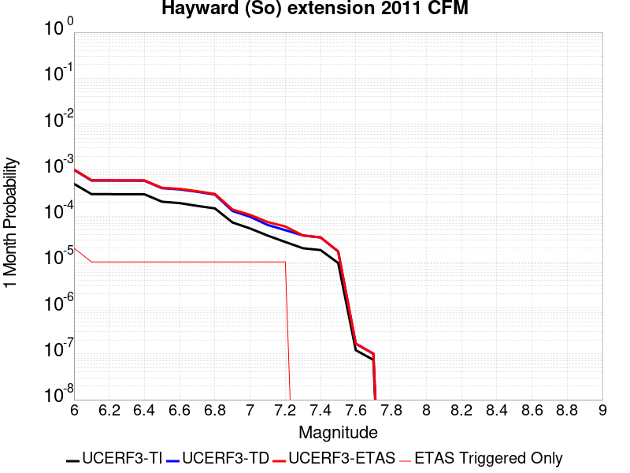 |  | 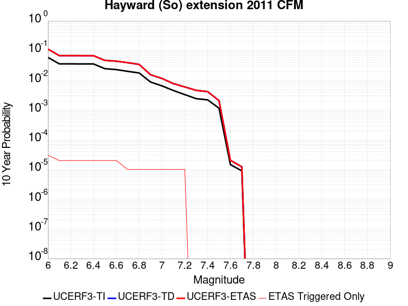 |

| Magnitude | 1 wk TI Prob | 1 wk TD Prob | 1 wk ETAS Prob | 1 wk ETAS/TD Gain | 1 wk ETAS Triggered Only | 1 mo TI Prob | 1 mo TD Prob | 1 mo ETAS Prob | 1 mo ETAS/TD Gain | 1 mo ETAS Triggered Only | 1 yr TI Prob | 1 yr TD Prob | 1 yr ETAS Prob | 1 yr ETAS/TD Gain | 1 yr ETAS Triggered Only | 10 yr TI Prob | 10 yr TD Prob | 10 yr ETAS Prob | 10 yr ETAS/TD Gain | 10 yr ETAS Triggered Only |
|-----|-----|-----|-----|-----|-----|-----|-----|-----|-----|-----|-----|-----|-----|-----|-----|-----|-----|-----|-----|-----|
| 6.0 | 1.1721256E-4 | 2.3671088E-4 | 2.6090708E-4 | 1.1022184 | 2.4201941E-5 | 5.022428E-4 | 0.0010138806 | 0.001038058 | 1.0238464 | 2.4201941E-5 | 0.0060976758 | 0.012250609 | 0.012274515 | 1.0019513 | 2.4201941E-5 | 0.0593305 | 0.11284437 | 0.11286584 | 1.0001903 | 2.4201941E-5 |
| 6.1 | 6.99169E-5 | 1.3808164E-4 | 1.6228024E-4 | 1.1752485 | 2.4201941E-5 | 2.9960944E-4 | 5.9155683E-4 | 6.1574444E-4 | 1.0408881 | 2.4201941E-5 | 0.0036416445 | 0.0071723475 | 0.007196376 | 1.0033501 | 2.4201941E-5 | 0.035825435 | 0.067804344 | 0.067826904 | 1.0003327 | 2.4201941E-5 |
| 6.2 | 6.99169E-5 | 1.3808164E-4 | 1.6228024E-4 | 1.1752485 | 2.4201941E-5 | 2.9960944E-4 | 5.9155683E-4 | 6.1574444E-4 | 1.0408881 | 2.4201941E-5 | 0.0036416445 | 0.0071723475 | 0.007196376 | 1.0033501 | 2.4201941E-5 | 0.035825435 | 0.067804344 | 0.067826904 | 1.0003327 | 2.4201941E-5 |
| 6.3 | 6.970908E-5 | 1.3776305E-4 | 1.6196167E-4 | 1.1756538 | 2.4201941E-5 | 2.9871898E-4 | 5.9019245E-4 | 6.143801E-4 | 1.0409826 | 2.4201941E-5 | 0.0036308395 | 0.007155884 | 0.007179913 | 1.0033579 | 2.4201941E-5 | 0.035720866 | 0.0676533 | 0.067675866 | 1.0003335 | 2.4201941E-5 |
| 6.4 | 6.9517155E-5 | 1.3743227E-4 | 1.616309E-4 | 1.1760767 | 2.4201941E-5 | 2.9789665E-4 | 5.8877567E-4 | 6.1296334E-4 | 1.0410813 | 2.4201941E-5 | 0.0036208609 | 0.0071387975 | 0.0071628266 | 1.003366 | 2.4201941E-5 | 0.03562429 | 0.06749734 | 0.06751991 | 1.0003344 | 2.4201941E-5 |
| 6.5 | 4.786248E-5 | 9.415232E-5 | 1.1835198E-4 | 1.2570268 | 2.4201941E-5 | 2.0510878E-4 | 4.0344993E-4 | 4.2764208E-4 | 1.0599632 | 2.4201941E-5 | 0.0024943394 | 0.0049013784 | 0.004925462 | 1.0049136 | 2.4201941E-5 | 0.02466527 | 0.046900697 | 0.046923764 | 1.0004919 | 2.4201941E-5 |
| 6.6 | 4.4662214E-5 | 8.8819244E-5 | 1.13019036E-4 | 1.2724612 | 2.4201941E-5 | 1.9139545E-4 | 3.80601E-4 | 4.047937E-4 | 1.0635645 | 2.4201941E-5 | 0.0023277493 | 0.0046244357 | 0.0046485257 | 1.0052093 | 2.4201941E-5 | 0.02303517 | 0.04429206 | 0.04431519 | 1.0005223 | 2.4201941E-5 |
| 6.7 | 3.884542E-5 | 7.8650686E-5 | 1.02850725E-4 | 1.3076901 | 2.4201941E-5 | 1.6646975E-4 | 3.3703333E-4 | 3.612271E-4 | 1.0717845 | 2.4201941E-5 | 0.002024885 | 0.0040961048 | 0.0041202074 | 1.0058843 | 2.4201941E-5 | 0.020065336 | 0.039332055 | 0.039355304 | 1.0005912 | 2.4201941E-5 |
| 6.8 | 3.4221863E-5 | 6.855886E-5 | 9.2759146E-5 | 1.3529855 | 2.4201941E-5 | 1.4665688E-4 | 2.9379298E-4 | 3.179878E-4 | 1.0823534 | 2.4201941E-5 | 0.0017840851 | 0.0035714838 | 0.0035955992 | 1.0067523 | 2.4201941E-5 | 0.017698295 | 0.034419462 | 0.03444283 | 1.0006789 | 2.4201941E-5 |
| 6.9 | 1.6927712E-5 | 3.006262E-5 | 5.4263834E-5 | 1.8050268 | 2.4201941E-5 | 7.2545314E-5 | 1.2883375E-4 | 1.5303258E-4 | 1.1878299 | 2.4201941E-5 | 8.828813E-4 | 0.0015674793 | 0.0015916433 | 1.0154158 | 2.4201941E-5 | 0.008793819 | 0.015463544 | 0.015487372 | 1.0015409 | 2.4201941E-5 |
| 7.0 | 1.2509653E-5 | 2.246337E-5 | 4.6664765E-5 | 2.0773716 | 2.4201941E-5 | 5.3611697E-5 | 9.626828E-5 | 1.2046789E-4 | 1.2513767 | 2.4201941E-5 | 6.525269E-4 | 0.0011714802 | 0.0011956537 | 1.0206351 | 2.4201941E-5 | 0.0065061417 | 0.011583166 | 0.011607088 | 1.0020652 | 2.4201941E-5 |
| 7.1 | 8.751583E-6 | 1.4926157E-5 | 3.9127735E-5 | 2.6214206 | 2.4201941E-5 | 3.750624E-5 | 6.396771E-5 | 8.8168104E-5 | 1.378322 | 2.4201941E-5 | 4.5654282E-4 | 7.785344E-4 | 8.027175E-4 | 1.0310624 | 2.4201941E-5 | 0.0045560603 | 0.007764457 | 0.007788471 | 1.0030928 | 2.4201941E-5 |
| 7.2 | 6.354379E-6 | 1.1499087E-5 | 3.570075E-5 | 3.1046596 | 2.4201941E-5 | 2.7232769E-5 | 4.9280898E-5 | 7.348164E-5 | 1.4910777 | 2.4201941E-5 | 3.3150852E-4 | 5.9983454E-4 | 6.24022E-4 | 1.0403235 | 2.4201941E-5 | 0.0033101442 | 0.006001243 | 0.0060252994 | 1.0040087 | 2.4201941E-5 |
| 7.3 | 4.645554E-6 | 8.818441E-6 | 8.818441E-6 | 1.0 | 0.0 | 1.9909365E-5 | 3.7792794E-5 | 3.7792794E-5 | 1.0 | 0.0 | 2.4236954E-4 | 4.6003403E-4 | 4.6003403E-4 | 1.0 | 0.0 | 0.0024210536 | 0.004611421 | 0.004611421 | 1.0 | 0.0 |
| 7.4 | 4.23437E-6 | 7.992759E-6 | 7.992759E-6 | 1.0 | 0.0 | 1.8147173E-5 | 3.425425E-5 | 3.425425E-5 | 1.0 | 0.0 | 2.2091944E-4 | 4.1696956E-4 | 4.1696956E-4 | 1.0 | 0.0 | 0.0022069993 | 0.0041826614 | 0.0041826614 | 1.0 | 0.0 |
| 7.5 | 2.2187417E-6 | 3.952336E-6 | 3.952336E-6 | 1.0 | 0.0 | 9.508858E-6 | 1.6938488E-5 | 1.6938488E-5 | 1.0 | 0.0 | 1.157642E-4 | 2.0620918E-4 | 2.0620918E-4 | 1.0 | 0.0 | 0.0011570391 | 0.0020739497 | 0.0020739497 | 1.0 | 0.0 |
| 7.6 | 2.7952495E-8 | 3.8785874E-8 | 3.8785874E-8 | 1.0 | 0.0 | 1.1979641E-7 | 1.6622516E-7 | 1.6622516E-7 | 1.0 | 0.0 | 1.4585203E-6 | 2.0237894E-6 | 2.0237894E-6 | 1.0 | 0.0 | 1.4585107E-5 | 2.0317146E-5 | 2.0317146E-5 | 1.0 | 0.0 |
| 7.7 | 1.7192724E-8 | 2.3436652E-8 | 2.3436652E-8 | 1.0 | 0.0 | 7.36831E-8 | 1.0044278E-7 | 1.0044278E-7 | 1.0 | 0.0 | 8.9709135E-7 | 1.2228902E-6 | 1.2228902E-6 | 1.0 | 0.0 | 8.970877E-6 | 1.2285953E-5 | 1.2285953E-5 | 1.0 | 0.0 |

