# ComCat M7.1 (ci38457511), ShakeMap Surfaces, kCOV=1.5 Results

|   | ComCat M7.1 (ci38457511), ShakeMap Surfaces, kCOV=1.5 |
|-----|-----|
| Num Simulations | 20289 (incomplete) |
| Start Time | 2019/07/06 03:19:54 UTC |
| Start Time Epoch Milliseconds | 1562383194040 |
| Duration | 10 Years |
| Includes Spontaneous? | false |
| Trigger Ruptures | 283 Trigger Ruptures |
|   | First: M3.98 at 2019/07/04 17:02:55 UTC |
|   | Last: M7.1 at 2019/07/06 03:19:53 UTC |
|   | Largest: M7.1 at 2019/07/06 03:19:53 UTC |
| Trigger Ruptures | *(none)* |
| Config Generated With | u3etas_comcat_event_config_builder.sh --event-id ci38457511 --mag-complete 3.5 --num-simulations 100000 --days-before 7 --etas-k-cov 1.5 --finite-surf-shakemap --finite-surf-shakemap-min-mag 5 --hpc-site USC_HPC --nodes 36 --hours 24 --queue scec |

## Table Of Contents

* [Probabilities Summary Table](#probabilities-summary-table)
* [Magnitude Number Distribution](#magnitude-number-distribution)
  * [10 Year Magnitude Number Distribution](#10-year-magnitude-number-distribution)
  * [1 Year Magnitude Number Distribution](#1-year-magnitude-number-distribution)
  * [1 Month Magnitude Number Distribution](#1-month-magnitude-number-distribution)
  * [1 Week Magnitude Number Distribution](#1-week-magnitude-number-distribution)
  * [1 Day Magnitude Number Distribution](#1-day-magnitude-number-distribution)
  * [1 Hour Magnitude Number Distribution](#1-hour-magnitude-number-distribution)
* [Hazard Change Over Time](#hazard-change-over-time)
  * [M&ge;5.0 Hazard Change Over Time](#m50-hazard-change-over-time)
  * [M&ge;6.0 Hazard Change Over Time](#m60-hazard-change-over-time)
  * [M&ge;7.0 Hazard Change Over Time](#m70-hazard-change-over-time)
  * [M&ge;8.0 Hazard Change Over Time](#m80-hazard-change-over-time)
* [Trigger Rupture Fault Map](#trigger-rupture-fault-map)
* [Trigger Rupture Depth Map](#trigger-rupture-depth-map)
* [Fault Distances To Triggers](#fault-distances-to-triggers)
* [Individual Simulated Catalog Maps](#individual-simulated-catalog-maps)
* [ComCat Data Comparisons](#comcat-data-comparisons)
  * [ComCat Magnitude-Number Distributions](#comcat-magnitude-number-distributions)
  * [ComCat Time-Dependent Mc](#comcat-time-dependent-mc)
  * [ComCat Cumulative Number Vs Time](#comcat-cumulative-number-vs-time)
  * [ComCat Cumulative Number Simulation Percentiles](#comcat-cumulative-number-simulation-percentiles)
  * [ComCat Probability Spatial Distribution](#comcat-probability-spatial-distribution)
  * [ComCat Mean Expectation Spatial Distribution](#comcat-mean-expectation-spatial-distribution)
  * [ComCat Depth Distribution](#comcat-depth-distribution)
* [Section Participation](#section-participation)
  * [Section Participation Plots](#section-participation-plots)
  * [Supra-Seismogenic Parent Sections Table](#supra-seismogenic-parent-sections-table)
  * [M≥6.5 Parent Sections Table](#m65-parent-sections-table)
  * [M≥7 Parent Sections Table](#m7-parent-sections-table)
  * [M≥7.5 Parent Sections Table](#m75-parent-sections-table)
  * [M≥8 Parent Sections Table](#m8-parent-sections-table)
* [Fault Magnitude-Probability Distributions](#fault-magnitude-probability-distributions)
* [Gridded Nucleation](#gridded-nucleation)
* [JSON Input File](#json-input-file)

## Probabilities Summary Table
*[(top)](#table-of-contents)*

| Magnitude | 1 Hour Prob | 1 Day Prob | 1 Week Prob | 1 Month Prob | 1 Year Prob | 10 Year Prob |
|-----|-----|-----|-----|-----|-----|-----|
| **M&ge;4** | 0.965 (96.52%) | 0.996 (99.65%) | 0.999 (99.95%) | 1.000 (100.00%) | 1.000 (100.00%) | 1.000 (100.00%) |
| *95% Conf* | *[96.26% 96.77%]* | *[99.55% 99.72%]* | *[99.90% 99.97%]* | *[99.97% 100.00%]* | *[99.98% 100.00%]* | *[99.98% 100.00%]* |
| **M&ge;4.5** | 0.829 (82.93%) | 0.957 (95.67%) | 0.984 (98.42%) | 0.992 (99.16%) | 0.998 (99.76%) | 0.999 (99.91%) |
| *95% Conf* | *[82.40% 83.44%]* | *[95.38% 95.95%]* | *[98.23% 98.58%]* | *[99.02% 99.28%]* | *[99.68% 99.82%]* | *[99.85% 99.94%]* |
| **M&ge;5** | 0.569 (56.92%) | 0.800 (80.04%) | 0.880 (87.97%) | 0.916 (91.64%) | 0.954 (95.36%) | 0.970 (96.99%) |
| *95% Conf* | *[56.24% 57.60%]* | *[79.49% 80.59%]* | *[87.51% 88.41%]* | *[91.25% 92.02%]* | *[95.06% 95.64%]* | *[96.74% 97.22%]* |
| **M&ge;5.5** | 0.284 (28.40%) | 0.515 (51.45%) | 0.618 (61.82%) | 0.683 (68.30%) | 0.766 (76.57%) | 0.815 (81.53%) |
| *95% Conf* | *[27.78% 29.03%]* | *[50.76% 52.14%]* | *[61.14% 62.49%]* | *[67.65% 68.94%]* | *[75.98% 77.15%]* | *[80.98% 82.06%]* |
| **M&ge;6** | 0.098 (9.76%) | 0.222 (22.25%) | 0.299 (29.90%) | 0.354 (35.40%) | 0.433 (43.34%) | 0.495 (49.51%) |
| *95% Conf* | *[9.36% 10.18%]* | *[21.68% 22.83%]* | *[29.27% 30.54%]* | *[34.74% 36.06%]* | *[42.66% 44.02%]* | *[48.82% 50.20%]* |
| **M&ge;6.5** | 0.025 (2.49%) | 0.063 (6.31%) | 0.089 (8.94%) | 0.112 (11.21%) | 0.148 (14.80%) | 0.180 (18.03%) |
| *95% Conf* | *[2.28% 2.72%]* | *[5.98% 6.66%]* | *[8.55% 9.34%]* | *[10.78% 11.66%]* | *[14.32% 15.30%]* | *[17.51% 18.57%]* |
| **M&ge;7** | 8.82E-3 (0.88%) | 0.023 (2.30%) | 0.033 (3.28%) | 0.041 (4.11%) | 0.053 (5.34%) | 0.067 (6.68%) |
| *95% Conf* | *[0.76% 1.02%]* | *[2.10% 2.51%]* | *[3.04% 3.53%]* | *[3.84% 4.39%]* | *[5.03% 5.66%]* | *[6.35% 7.04%]* |
| **M&ge;7.1** | 7.69E-3 (0.77%) | 0.020 (1.98%) | 0.028 (2.79%) | 0.034 (3.42%) | 0.045 (4.53%) | 0.057 (5.71%) |
| *95% Conf* | *[0.66% 0.90%]* | *[1.79% 2.18%]* | *[2.57% 3.03%]* | *[3.18% 3.68%]* | *[4.25% 4.83%]* | *[5.39% 6.04%]* |
| **M&ge;7.5** | 2.96E-3 (0.30%) | 7.05E-3 (0.70%) | 9.66E-3 (0.97%) | 0.012 (1.16%) | 0.017 (1.66%) | 0.022 (2.17%) |
| *95% Conf* | *[0.23% 0.38%]* | *[0.60% 0.83%]* | *[0.84% 1.11%]* | *[1.02% 1.32%]* | *[1.49% 1.84%]* | *[1.97% 2.38%]* |
| **M&ge;8** | 4.93E-5 (0.00%) | 9.86E-5 (0.01%) | 1.48E-4 (0.01%) | 1.48E-4 (0.01%) | 1.48E-4 (0.01%) | 2.96E-4 (0.03%) |
| *95% Conf* | *[0.00% 0.03%]* | *[0.00% 0.04%]* | *[0.00% 0.05%]* | *[0.00% 0.05%]* | *[0.00% 0.05%]* | *[0.01% 0.07%]* |

## Magnitude Number Distribution
*[(top)](#table-of-contents)*

### 10 Year Magnitude Number Distribution
*[(top)](#table-of-contents)*

**Legend**
* **Mean** (thick black line): mean expected number across all 20289 catalogs
* **2.5%,97.5%** (thin black lines): expected number percentiles across all 20289 catalogs
* **Median** (thin blue line): median expected number across all 20289 catalogs
* **Mode** (thin cyan line): modal expected number across all 20289 catalogs
* **10 yr Probability** (thin red line): 10 year probability calculated as the fraction of catalogs with at least 1 occurrence
* **10 yr Supraseismogenic Probability** (thin dashed red line): same as above, but only for supraseismogenic ruptures on explicitly modeled UCERF3 faults
* **95% Conf** (light red shaded region): binomial 95% confidence bounds on probability
* **Primary** (thin green line): mean expected number from primary triggered aftershocks only (no secondary, tertiary, etc...) across all 20289 catalogs


| Mag | Mean | 2.5 %ile | 97.5 %ile | Median | Mode | 10 yr Probability | 10 yr Prob 95% Conf | 10 yr Supra-Seis Prob | Primary Aftershocks Mean |
|-----|-----|-----|-----|-----|-----|-----|-----|-----|-----|
| **M&ge;2.5** | 5288.696 | 541.000 | 25291.000 | 2871.000 | 1196.000 | 1.000 (100.00%) | [99.98% 100.00%] | 0.256 (25.58%) | 2380.324 |
| **M&ge;2.6** | 4200.854 | 429.000 | 20064.000 | 2280.000 | 1652.000 | 1.000 (100.00%) | [99.98% 100.00%] | 0.256 (25.58%) | 1890.706 |
| **M&ge;2.7** | 3336.320 | 339.000 | 15974.000 | 1814.000 | 1197.000 | 1.000 (100.00%) | [99.98% 100.00%] | 0.256 (25.58%) | 1501.605 |
| **M&ge;2.8** | 2650.151 | 267.000 | 12664.000 | 1438.000 | 569.000 | 1.000 (100.00%) | [99.98% 100.00%] | 0.256 (25.58%) | 1192.710 |
| **M&ge;2.9** | 2105.122 | 213.000 | 10033.000 | 1143.000 | 421.000 | 1.000 (100.00%) | [99.98% 100.00%] | 0.256 (25.58%) | 947.411 |
| **M&ge;3** | 1671.866 | 168.000 | 7986.000 | 907.000 | 330.000 | 1.000 (100.00%) | [99.98% 100.00%] | 0.256 (25.58%) | 752.290 |
| **M&ge;3.1** | 1328.032 | 133.000 | 6343.000 | 721.000 | 293.000 | 1.000 (100.00%) | [99.98% 100.00%] | 0.256 (25.58%) | 597.577 |
| **M&ge;3.2** | 1054.734 | 106.000 | 5030.000 | 572.000 | 210.000 | 1.000 (100.00%) | [99.98% 100.00%] | 0.256 (25.58%) | 474.658 |
| **M&ge;3.3** | 837.636 | 83.000 | 4001.000 | 456.000 | 137.000 | 1.000 (100.00%) | [99.98% 100.00%] | 0.256 (25.58%) | 376.980 |
| **M&ge;3.4** | 665.292 | 65.000 | 3167.000 | 361.000 | 143.000 | 1.000 (100.00%) | [99.98% 100.00%] | 0.256 (25.58%) | 299.441 |
| **M&ge;3.5** | 528.339 | 52.000 | 2516.000 | 287.000 | 117.000 | 1.000 (100.00%) | [99.98% 100.00%] | 0.256 (25.58%) | 237.805 |
| **M&ge;3.6** | 419.551 | 41.000 | 2007.000 | 228.000 | 90.000 | 1.000 (100.00%) | [99.98% 100.00%] | 0.256 (25.58%) | 188.819 |
| **M&ge;3.7** | 333.189 | 32.000 | 1590.000 | 181.000 | 64.000 | 1.000 (100.00%) | [99.98% 100.00%] | 0.256 (25.58%) | 149.967 |
| **M&ge;3.8** | 264.425 | 25.000 | 1274.000 | 144.000 | 54.000 | 1.000 (100.00%) | [99.98% 100.00%] | 0.256 (25.58%) | 119.007 |
| **M&ge;3.9** | 209.996 | 19.000 | 1011.000 | 114.000 | 32.000 | 1.000 (100.00%) | [99.98% 100.00%] | 0.256 (25.58%) | 94.513 |
| **M&ge;4** | 166.786 | 15.000 | 805.000 | 90.000 | 30.000 | 1.000 (100.00%) | [99.98% 100.00%] | 0.256 (25.58%) | 75.019 |
| **M&ge;4.1** | 132.420 | 11.000 | 642.000 | 72.000 | 30.000 | 1.000 (100.00%) | [99.98% 100.00%] | 0.256 (25.58%) | 59.564 |
| **M&ge;4.2** | 105.056 | 9.000 | 508.000 | 57.000 | 24.000 | 1.000 (100.00%) | [99.98% 100.00%] | 0.256 (25.58%) | 47.249 |
| **M&ge;4.3** | 83.305 | 7.000 | 404.000 | 45.000 | 19.000 | 1.000 (99.99%) | [99.96% 100.00%] | 0.256 (25.58%) | 37.484 |
| **M&ge;4.4** | 66.066 | 5.000 | 318.000 | 36.000 | 11.000 | 1.000 (99.96%) | [99.92% 99.98%] | 0.256 (25.58%) | 29.716 |
| **M&ge;4.5** | 52.369 | 4.000 | 253.000 | 29.000 | 10.000 | 0.999 (99.91%) | [99.85% 99.94%] | 0.256 (25.58%) | 23.559 |
| **M&ge;4.6** | 41.497 | 3.000 | 202.000 | 23.000 | 8.000 | 0.998 (99.81%) | [99.74% 99.87%] | 0.256 (25.58%) | 18.663 |
| **M&ge;4.7** | 32.839 | 2.000 | 160.000 | 18.000 | 7.000 | 0.995 (99.50%) | [99.39% 99.59%] | 0.256 (25.58%) | 14.756 |
| **M&ge;4.8** | 25.947 | 1.000 | 127.000 | 14.000 | 4.000 | 0.990 (99.01%) | [98.86% 99.14%] | 0.256 (25.58%) | 11.657 |
| **M&ge;4.9** | 20.504 | 1.000 | 101.000 | 11.000 | 3.000 | 0.982 (98.20%) | [98.00% 98.37%] | 0.256 (25.58%) | 9.217 |
| **M&ge;5** | 16.161 | 0.000 | 79.000 | 9.000 | 3.000 | 0.970 (96.99%) | [96.74% 97.22%] | 0.256 (25.58%) | 7.279 |
| **M&ge;5.1** | 12.727 | 0.000 | 62.000 | 7.000 | 2.000 | 0.952 (95.24%) | [94.94% 95.53%] | 0.256 (25.58%) | 5.732 |
| **M&ge;5.2** | 9.993 | 0.000 | 49.000 | 5.000 | 1.000 | 0.928 (92.78%) | [92.41% 93.13%] | 0.256 (25.58%) | 4.498 |
| **M&ge;5.3** | 7.850 | 0.000 | 39.000 | 4.000 | 1.000 | 0.897 (89.72%) | [89.29% 90.13%] | 0.256 (25.58%) | 3.531 |
| **M&ge;5.4** | 6.121 | 0.000 | 30.000 | 3.000 | 1.000 | 0.860 (85.97%) | [85.48% 86.44%] | 0.256 (25.58%) | 2.759 |
| **M&ge;5.5** | 4.757 | 0.000 | 24.000 | 2.000 | 0.000 | 0.815 (81.53%) | [80.98% 82.06%] | 0.256 (25.58%) | 2.144 |
| **M&ge;5.6** | 3.681 | 0.000 | 19.000 | 2.000 | 0.000 | 0.763 (76.31%) | [75.71% 76.89%] | 0.256 (25.58%) | 1.664 |
| **M&ge;5.7** | 2.819 | 0.000 | 15.000 | 1.000 | 0.000 | 0.704 (70.38%) | [69.75% 71.01%] | 0.256 (25.58%) | 1.278 |
| **M&ge;5.8** | 2.135 | 0.000 | 11.000 | 1.000 | 0.000 | 0.634 (63.45%) | [62.78% 64.11%] | 0.256 (25.58%) | 0.970 |
| **M&ge;5.9** | 1.598 | 0.000 | 9.000 | 1.000 | 0.000 | 0.565 (56.51%) | [55.82% 57.19%] | 0.256 (25.58%) | 0.728 |
| **M&ge;6** | 1.219 | 0.000 | 7.000 | 0.000 | 0.000 | 0.495 (49.51%) | [48.82% 50.20%] | 0.256 (25.57%) | 0.550 |
| **M&ge;6.1** | 0.883 | 0.000 | 5.000 | 0.000 | 0.000 | 0.419 (41.94%) | [41.26% 42.62%] | 0.225 (22.46%) | 0.404 |
| **M&ge;6.2** | 0.583 | 0.000 | 4.000 | 0.000 | 0.000 | 0.329 (32.88%) | [32.23% 33.53%] | 0.181 (18.13%) | 0.268 |
| **M&ge;6.3** | 0.436 | 0.000 | 3.000 | 0.000 | 0.000 | 0.273 (27.28%) | [26.67% 27.90%] | 0.158 (15.79%) | 0.202 |
| **M&ge;6.4** | 0.329 | 0.000 | 2.000 | 0.000 | 0.000 | 0.221 (22.15%) | [21.58% 22.72%] | 0.139 (13.93%) | 0.152 |
| **M&ge;6.5** | 0.253 | 0.000 | 2.000 | 0.000 | 0.000 | 0.180 (18.03%) | [17.51% 18.57%] | 0.122 (12.24%) | 0.116 |
| **M&ge;6.6** | 0.202 | 0.000 | 2.000 | 0.000 | 0.000 | 0.156 (15.63%) | [15.14% 16.14%] | 0.114 (11.36%) | 0.097 |
| **M&ge;6.7** | 0.162 | 0.000 | 1.000 | 0.000 | 0.000 | 0.130 (13.05%) | [12.59% 13.52%] | 0.101 (10.06%) | 0.080 |
| **M&ge;6.8** | 0.129 | 0.000 | 1.000 | 0.000 | 0.000 | 0.109 (10.91%) | [10.49% 11.35%] | 0.088 (8.84%) | 0.065 |
| **M&ge;6.9** | 0.096 | 0.000 | 1.000 | 0.000 | 0.000 | 0.085 (8.52%) | [8.14% 8.92%] | 0.072 (7.16%) | 0.050 |
| **M&ge;7** | 0.073 | 0.000 | 1.000 | 0.000 | 0.000 | 0.067 (6.68%) | [6.35% 7.04%] | 0.059 (5.88%) | 0.038 |
| **M&ge;7.1** | 0.060 | 0.000 | 1.000 | 0.000 | 0.000 | 0.057 (5.71%) | [5.39% 6.04%] | 0.052 (5.20%) | 0.031 |
| **M&ge;7.2** | 0.046 | 0.000 | 1.000 | 0.000 | 0.000 | 0.044 (4.42%) | [4.14% 4.71%] | 0.041 (4.13%) | 0.023 |
| **M&ge;7.3** | 0.032 | 0.000 | 1.000 | 0.000 | 0.000 | 0.032 (3.15%) | [2.92% 3.41%] | 0.030 (3.01%) | 0.016 |
| **M&ge;7.4** | 0.029 | 0.000 | 1.000 | 0.000 | 0.000 | 0.029 (2.88%) | [2.66% 3.13%] | 0.028 (2.79%) | 0.014 |
| **M&ge;7.5** | 0.022 | 0.000 | 0.000 | 0.000 | 0.000 | 0.022 (2.17%) | [1.97% 2.38%] | 0.021 (2.14%) | 0.011 |
| **M&ge;7.6** | 0.011 | 0.000 | 0.000 | 0.000 | 0.000 | 0.011 (1.12%) | [0.99% 1.28%] | 0.011 (1.12%) | 5.72E-3 |
| **M&ge;7.7** | 3.65E-3 | 0.000 | 0.000 | 0.000 | 0.000 | 3.65E-3 (0.36%) | [0.29% 0.46%] | 3.65E-3 (0.36%) | 1.87E-3 |
| **M&ge;7.8** | 2.22E-3 | 0.000 | 0.000 | 0.000 | 0.000 | 2.22E-3 (0.22%) | [0.16% 0.30%] | 2.22E-3 (0.22%) | 1.28E-3 |
| **M&ge;7.9** | 1.13E-3 | 0.000 | 0.000 | 0.000 | 0.000 | 1.13E-3 (0.11%) | [0.07% 0.17%] | 1.13E-3 (0.11%) | 6.41E-4 |
| **M&ge;8** | 2.96E-4 | 0.000 | 0.000 | 0.000 | 0.000 | 2.96E-4 (0.03%) | [0.01% 0.07%] | 2.96E-4 (0.03%) | 1.97E-4 |
| **M&ge;8.1** | 4.93E-5 | 0.000 | 0.000 | 0.000 | 0.000 | 4.93E-5 (0.00%) | [0.00% 0.03%] | 4.93E-5 (0.00%) | 4.93E-5 |
| **M&ge;8.2** | 0.000 | 0.000 | 0.000 | 0.000 | 0.000 | 0.000 (0.00%) | [0.00% 0.02%] | 0.000 (0.00%) | 0.000 |
| **M&ge;8.3** | 0.000 | 0.000 | 0.000 | 0.000 | 0.000 | 0.000 (0.00%) | [0.00% 0.02%] | 0.000 (0.00%) | 0.000 |
| **M&ge;8.4** | 0.000 | 0.000 | 0.000 | 0.000 | 0.000 | 0.000 (0.00%) | [0.00% 0.02%] | 0.000 (0.00%) | 0.000 |
| **M&ge;8.5** | 0.000 | 0.000 | 0.000 | 0.000 | 0.000 | 0.000 (0.00%) | [0.00% 0.02%] | 0.000 (0.00%) | 0.000 |
| **M&ge;8.6** | 0.000 | 0.000 | 0.000 | 0.000 | 0.000 | 0.000 (0.00%) | [0.00% 0.02%] | 0.000 (0.00%) | 0.000 |
| **M&ge;8.7** | 0.000 | 0.000 | 0.000 | 0.000 | 0.000 | 0.000 (0.00%) | [0.00% 0.02%] | 0.000 (0.00%) | 0.000 |
| **M&ge;8.8** | 0.000 | 0.000 | 0.000 | 0.000 | 0.000 | 0.000 (0.00%) | [0.00% 0.02%] | 0.000 (0.00%) | 0.000 |
| **M&ge;8.9** | 0.000 | 0.000 | 0.000 | 0.000 | 0.000 | 0.000 (0.00%) | [0.00% 0.02%] | 0.000 (0.00%) | 0.000 |
| **M&ge;9** | 0.000 | 0.000 | 0.000 | 0.000 | 0.000 | 0.000 (0.00%) | [0.00% 0.02%] | 0.000 (0.00%) | 0.000 |

### 1 Year Magnitude Number Distribution
*[(top)](#table-of-contents)*

**Legend**
* **Mean** (thick black line): mean expected number across all 20289 catalogs
* **2.5%,97.5%** (thin black lines): expected number percentiles across all 20289 catalogs
* **Median** (thin blue line): median expected number across all 20289 catalogs
* **Mode** (thin cyan line): modal expected number across all 20289 catalogs
* **1 yr Probability** (thin red line): 1 year probability calculated as the fraction of catalogs with at least 1 occurrence
* **1 yr Supraseismogenic Probability** (thin dashed red line): same as above, but only for supraseismogenic ruptures on explicitly modeled UCERF3 faults
* **95% Conf** (light red shaded region): binomial 95% confidence bounds on probability
* **Primary** (thin green line): mean expected number from primary triggered aftershocks only (no secondary, tertiary, etc...) across all 20289 catalogs


| Mag | Mean | 2.5 %ile | 97.5 %ile | Median | Mode | 1 yr Probability | 1 yr Prob 95% Conf | 1 yr Supra-Seis Prob | Primary Aftershocks Mean |
|-----|-----|-----|-----|-----|-----|-----|-----|-----|-----|
| **M&ge;2.5** | 4043.066 | 416.000 | 19149.000 | 2223.000 | 864.000 | 1.000 (100.00%) | [99.98% 100.00%] | 0.213 (21.26%) | 2073.119 |
| **M&ge;2.6** | 3211.414 | 328.000 | 15222.000 | 1763.000 | 654.000 | 1.000 (100.00%) | [99.98% 100.00%] | 0.213 (21.26%) | 1646.667 |
| **M&ge;2.7** | 2550.428 | 261.000 | 12074.000 | 1399.000 | 665.000 | 1.000 (100.00%) | [99.98% 100.00%] | 0.213 (21.26%) | 1307.765 |
| **M&ge;2.8** | 2025.849 | 207.000 | 9557.000 | 1113.000 | 387.000 | 1.000 (100.00%) | [99.98% 100.00%] | 0.213 (21.26%) | 1038.756 |
| **M&ge;2.9** | 1609.227 | 163.000 | 7596.000 | 885.000 | 361.000 | 1.000 (100.00%) | [99.98% 100.00%] | 0.213 (21.26%) | 825.098 |
| **M&ge;3** | 1278.001 | 129.000 | 6048.000 | 702.000 | 303.000 | 1.000 (100.00%) | [99.98% 100.00%] | 0.213 (21.26%) | 655.177 |
| **M&ge;3.1** | 1015.186 | 102.000 | 4798.000 | 557.000 | 235.000 | 1.000 (100.00%) | [99.98% 100.00%] | 0.213 (21.26%) | 520.432 |
| **M&ge;3.2** | 806.393 | 81.000 | 3818.000 | 444.000 | 139.000 | 1.000 (100.00%) | [99.98% 100.00%] | 0.213 (21.26%) | 413.413 |
| **M&ge;3.3** | 640.429 | 64.000 | 3033.000 | 353.000 | 150.000 | 1.000 (100.00%) | [99.98% 100.00%] | 0.213 (21.26%) | 328.324 |
| **M&ge;3.4** | 508.629 | 51.000 | 2402.000 | 279.000 | 114.000 | 1.000 (100.00%) | [99.98% 100.00%] | 0.213 (21.26%) | 260.789 |
| **M&ge;3.5** | 403.976 | 40.000 | 1917.000 | 222.000 | 89.000 | 1.000 (100.00%) | [99.98% 100.00%] | 0.213 (21.26%) | 207.134 |
| **M&ge;3.6** | 320.774 | 31.000 | 1521.000 | 176.000 | 54.000 | 1.000 (100.00%) | [99.98% 100.00%] | 0.213 (21.26%) | 164.464 |
| **M&ge;3.7** | 254.723 | 24.000 | 1203.000 | 140.000 | 55.000 | 1.000 (100.00%) | [99.98% 100.00%] | 0.213 (21.26%) | 130.627 |
| **M&ge;3.8** | 202.141 | 19.000 | 957.000 | 111.000 | 43.000 | 1.000 (100.00%) | [99.98% 100.00%] | 0.213 (21.26%) | 103.651 |
| **M&ge;3.9** | 160.550 | 15.000 | 756.000 | 88.000 | 31.000 | 1.000 (100.00%) | [99.98% 100.00%] | 0.213 (21.26%) | 82.319 |
| **M&ge;4** | 127.516 | 11.000 | 603.000 | 70.000 | 27.000 | 1.000 (100.00%) | [99.98% 100.00%] | 0.213 (21.26%) | 65.342 |
| **M&ge;4.1** | 101.258 | 9.000 | 478.000 | 56.000 | 22.000 | 1.000 (100.00%) | [99.98% 100.00%] | 0.213 (21.26%) | 51.898 |
| **M&ge;4.2** | 80.345 | 6.000 | 379.000 | 44.000 | 17.000 | 1.000 (100.00%) | [99.97% 100.00%] | 0.213 (21.26%) | 41.168 |
| **M&ge;4.3** | 63.715 | 5.000 | 301.000 | 35.000 | 10.000 | 1.000 (99.98%) | [99.95% 99.99%] | 0.213 (21.26%) | 32.671 |
| **M&ge;4.4** | 50.504 | 4.000 | 239.000 | 28.000 | 11.000 | 0.999 (99.91%) | [99.85% 99.94%] | 0.213 (21.26%) | 25.890 |
| **M&ge;4.5** | 40.055 | 3.000 | 190.000 | 22.000 | 7.000 | 0.998 (99.76%) | [99.68% 99.82%] | 0.213 (21.26%) | 20.535 |
| **M&ge;4.6** | 31.717 | 2.000 | 151.000 | 17.000 | 7.000 | 0.996 (99.57%) | [99.46% 99.65%] | 0.213 (21.26%) | 16.266 |
| **M&ge;4.7** | 25.099 | 1.000 | 120.000 | 14.000 | 5.000 | 0.991 (99.08%) | [98.93% 99.20%] | 0.213 (21.26%) | 12.865 |
| **M&ge;4.8** | 19.838 | 1.000 | 96.000 | 11.000 | 3.000 | 0.983 (98.33%) | [98.14% 98.50%] | 0.213 (21.26%) | 10.166 |
| **M&ge;4.9** | 15.680 | 0.000 | 76.000 | 9.000 | 3.000 | 0.971 (97.14%) | [96.90% 97.36%] | 0.213 (21.26%) | 8.037 |
| **M&ge;5** | 12.356 | 0.000 | 60.000 | 7.000 | 2.000 | 0.954 (95.36%) | [95.06% 95.64%] | 0.213 (21.26%) | 6.348 |
| **M&ge;5.1** | 9.735 | 0.000 | 47.000 | 5.000 | 1.000 | 0.931 (93.08%) | [92.73% 93.43%] | 0.213 (21.26%) | 5.003 |
| **M&ge;5.2** | 7.646 | 0.000 | 38.000 | 4.000 | 1.000 | 0.900 (89.97%) | [89.55% 90.38%] | 0.213 (21.26%) | 3.926 |
| **M&ge;5.3** | 6.009 | 0.000 | 30.000 | 3.000 | 1.000 | 0.863 (86.28%) | [85.80% 86.75%] | 0.213 (21.26%) | 3.082 |
| **M&ge;5.4** | 4.684 | 0.000 | 24.000 | 2.000 | 0.000 | 0.817 (81.69%) | [81.15% 82.22%] | 0.213 (21.26%) | 2.410 |
| **M&ge;5.5** | 3.637 | 0.000 | 19.000 | 2.000 | 0.000 | 0.766 (76.57%) | [75.98% 77.15%] | 0.213 (21.26%) | 1.870 |
| **M&ge;5.6** | 2.816 | 0.000 | 15.000 | 1.000 | 0.000 | 0.708 (70.77%) | [70.14% 71.39%] | 0.213 (21.26%) | 1.452 |
| **M&ge;5.7** | 2.158 | 0.000 | 11.000 | 1.000 | 0.000 | 0.644 (64.38%) | [63.72% 65.04%] | 0.213 (21.26%) | 1.114 |
| **M&ge;5.8** | 1.638 | 0.000 | 9.000 | 1.000 | 0.000 | 0.573 (57.33%) | [56.65% 58.01%] | 0.213 (21.26%) | 0.847 |
| **M&ge;5.9** | 1.227 | 0.000 | 7.000 | 1.000 | 0.000 | 0.502 (50.16%) | [49.47% 50.85%] | 0.213 (21.26%) | 0.637 |
| **M&ge;6** | 0.935 | 0.000 | 6.000 | 0.000 | 0.000 | 0.433 (43.34%) | [42.66% 44.02%] | 0.212 (21.25%) | 0.482 |
| **M&ge;6.1** | 0.680 | 0.000 | 4.000 | 0.000 | 0.000 | 0.360 (36.03%) | [35.37% 36.70%] | 0.187 (18.72%) | 0.355 |
| **M&ge;6.2** | 0.448 | 0.000 | 3.000 | 0.000 | 0.000 | 0.276 (27.64%) | [27.02% 28.26%] | 0.149 (14.94%) | 0.235 |
| **M&ge;6.3** | 0.335 | 0.000 | 2.000 | 0.000 | 0.000 | 0.226 (22.63%) | [22.06% 23.22%] | 0.130 (12.99%) | 0.177 |
| **M&ge;6.4** | 0.252 | 0.000 | 2.000 | 0.000 | 0.000 | 0.182 (18.19%) | [17.66% 18.73%] | 0.114 (11.37%) | 0.132 |
| **M&ge;6.5** | 0.195 | 0.000 | 2.000 | 0.000 | 0.000 | 0.148 (14.80%) | [14.32% 15.30%] | 0.100 (9.98%) | 0.102 |
| **M&ge;6.6** | 0.156 | 0.000 | 1.000 | 0.000 | 0.000 | 0.127 (12.69%) | [12.24% 13.16%] | 0.092 (9.18%) | 0.085 |
| **M&ge;6.7** | 0.126 | 0.000 | 1.000 | 0.000 | 0.000 | 0.105 (10.54%) | [10.12% 10.97%] | 0.081 (8.14%) | 0.070 |
| **M&ge;6.8** | 0.101 | 0.000 | 1.000 | 0.000 | 0.000 | 0.088 (8.79%) | [8.41% 9.19%] | 0.072 (7.16%) | 0.057 |
| **M&ge;6.9** | 0.076 | 0.000 | 1.000 | 0.000 | 0.000 | 0.069 (6.85%) | [6.51% 7.21%] | 0.058 (5.77%) | 0.044 |
| **M&ge;7** | 0.057 | 0.000 | 1.000 | 0.000 | 0.000 | 0.053 (5.34%) | [5.03% 5.66%] | 0.047 (4.69%) | 0.033 |
| **M&ge;7.1** | 0.047 | 0.000 | 1.000 | 0.000 | 0.000 | 0.045 (4.53%) | [4.25% 4.83%] | 0.041 (4.12%) | 0.028 |
| **M&ge;7.2** | 0.035 | 0.000 | 1.000 | 0.000 | 0.000 | 0.034 (3.43%) | [3.18% 3.69%] | 0.032 (3.20%) | 0.020 |
| **M&ge;7.3** | 0.025 | 0.000 | 0.000 | 0.000 | 0.000 | 0.024 (2.41%) | [2.20% 2.63%] | 0.023 (2.29%) | 0.014 |
| **M&ge;7.4** | 0.023 | 0.000 | 0.000 | 0.000 | 0.000 | 0.022 (2.21%) | [2.02% 2.43%] | 0.021 (2.14%) | 0.013 |
| **M&ge;7.5** | 0.017 | 0.000 | 0.000 | 0.000 | 0.000 | 0.017 (1.66%) | [1.49% 1.84%] | 0.016 (1.63%) | 9.46E-3 |
| **M&ge;7.6** | 8.97E-3 | 0.000 | 0.000 | 0.000 | 0.000 | 8.92E-3 (0.89%) | [0.77% 1.03%] | 8.87E-3 (0.89%) | 5.03E-3 |
| **M&ge;7.7** | 2.86E-3 | 0.000 | 0.000 | 0.000 | 0.000 | 2.86E-3 (0.29%) | [0.22% 0.37%] | 2.86E-3 (0.29%) | 1.68E-3 |
| **M&ge;7.8** | 1.68E-3 | 0.000 | 0.000 | 0.000 | 0.000 | 1.68E-3 (0.17%) | [0.12% 0.24%] | 1.68E-3 (0.17%) | 1.13E-3 |
| **M&ge;7.9** | 7.39E-4 | 0.000 | 0.000 | 0.000 | 0.000 | 7.39E-4 (0.07%) | [0.04% 0.13%] | 7.39E-4 (0.07%) | 5.42E-4 |
| **M&ge;8** | 1.48E-4 | 0.000 | 0.000 | 0.000 | 0.000 | 1.48E-4 (0.01%) | [0.00% 0.05%] | 1.48E-4 (0.01%) | 1.48E-4 |
| **M&ge;8.1** | 0.000 | 0.000 | 0.000 | 0.000 | 0.000 | 0.000 (0.00%) | [0.00% 0.02%] | 0.000 (0.00%) | 0.000 |
| **M&ge;8.2** | 0.000 | 0.000 | 0.000 | 0.000 | 0.000 | 0.000 (0.00%) | [0.00% 0.02%] | 0.000 (0.00%) | 0.000 |
| **M&ge;8.3** | 0.000 | 0.000 | 0.000 | 0.000 | 0.000 | 0.000 (0.00%) | [0.00% 0.02%] | 0.000 (0.00%) | 0.000 |
| **M&ge;8.4** | 0.000 | 0.000 | 0.000 | 0.000 | 0.000 | 0.000 (0.00%) | [0.00% 0.02%] | 0.000 (0.00%) | 0.000 |
| **M&ge;8.5** | 0.000 | 0.000 | 0.000 | 0.000 | 0.000 | 0.000 (0.00%) | [0.00% 0.02%] | 0.000 (0.00%) | 0.000 |
| **M&ge;8.6** | 0.000 | 0.000 | 0.000 | 0.000 | 0.000 | 0.000 (0.00%) | [0.00% 0.02%] | 0.000 (0.00%) | 0.000 |
| **M&ge;8.7** | 0.000 | 0.000 | 0.000 | 0.000 | 0.000 | 0.000 (0.00%) | [0.00% 0.02%] | 0.000 (0.00%) | 0.000 |
| **M&ge;8.8** | 0.000 | 0.000 | 0.000 | 0.000 | 0.000 | 0.000 (0.00%) | [0.00% 0.02%] | 0.000 (0.00%) | 0.000 |
| **M&ge;8.9** | 0.000 | 0.000 | 0.000 | 0.000 | 0.000 | 0.000 (0.00%) | [0.00% 0.02%] | 0.000 (0.00%) | 0.000 |
| **M&ge;9** | 0.000 | 0.000 | 0.000 | 0.000 | 0.000 | 0.000 (0.00%) | [0.00% 0.02%] | 0.000 (0.00%) | 0.000 |

### 1 Month Magnitude Number Distribution
*[(top)](#table-of-contents)*

**Legend**
* **Mean** (thick black line): mean expected number across all 20289 catalogs
* **2.5%,97.5%** (thin black lines): expected number percentiles across all 20289 catalogs
* **Median** (thin blue line): median expected number across all 20289 catalogs
* **Mode** (thin cyan line): modal expected number across all 20289 catalogs
* **1 mo Probability** (thin red line): 1 month probability calculated as the fraction of catalogs with at least 1 occurrence
* **1 mo Supraseismogenic Probability** (thin dashed red line): same as above, but only for supraseismogenic ruptures on explicitly modeled UCERF3 faults
* **95% Conf** (light red shaded region): binomial 95% confidence bounds on probability
* **Primary** (thin green line): mean expected number from primary triggered aftershocks only (no secondary, tertiary, etc...) across all 20289 catalogs


| Mag | Mean | 2.5 %ile | 97.5 %ile | Median | Mode | 1 mo Probability | 1 mo Prob 95% Conf | 1 mo Supra-Seis Prob | Primary Aftershocks Mean |
|-----|-----|-----|-----|-----|-----|-----|-----|-----|-----|
| **M&ge;2.5** | 2819.796 | 279.000 | 13359.000 | 1559.000 | 526.000 | 1.000 (100.00%) | [99.98% 100.00%] | 0.165 (16.46%) | 1680.121 |
| **M&ge;2.6** | 2239.837 | 220.000 | 10562.000 | 1236.000 | 593.000 | 1.000 (100.00%) | [99.98% 100.00%] | 0.165 (16.46%) | 1334.589 |
| **M&ge;2.7** | 1778.912 | 174.000 | 8416.000 | 984.000 | 563.000 | 1.000 (100.00%) | [99.98% 100.00%] | 0.165 (16.46%) | 1059.969 |
| **M&ge;2.8** | 1412.999 | 138.000 | 6665.000 | 782.000 | 233.000 | 1.000 (100.00%) | [99.98% 100.00%] | 0.165 (16.46%) | 841.885 |
| **M&ge;2.9** | 1122.381 | 109.000 | 5317.000 | 620.000 | 354.000 | 1.000 (100.00%) | [99.98% 100.00%] | 0.165 (16.46%) | 668.721 |
| **M&ge;3** | 891.298 | 86.000 | 4233.000 | 493.000 | 177.000 | 1.000 (100.00%) | [99.98% 100.00%] | 0.165 (16.46%) | 530.995 |
| **M&ge;3.1** | 708.007 | 68.000 | 3365.000 | 392.000 | 109.000 | 1.000 (100.00%) | [99.98% 100.00%] | 0.165 (16.46%) | 421.765 |
| **M&ge;3.2** | 562.442 | 54.000 | 2666.000 | 311.000 | 98.000 | 1.000 (100.00%) | [99.98% 100.00%] | 0.165 (16.46%) | 335.071 |
| **M&ge;3.3** | 446.713 | 43.000 | 2125.000 | 247.000 | 85.000 | 1.000 (100.00%) | [99.98% 100.00%] | 0.165 (16.46%) | 266.126 |
| **M&ge;3.4** | 354.768 | 34.000 | 1683.000 | 196.000 | 96.000 | 1.000 (100.00%) | [99.98% 100.00%] | 0.165 (16.46%) | 211.378 |
| **M&ge;3.5** | 281.812 | 27.000 | 1336.000 | 156.000 | 53.000 | 1.000 (100.00%) | [99.98% 100.00%] | 0.165 (16.46%) | 167.897 |
| **M&ge;3.6** | 223.768 | 21.000 | 1062.000 | 123.000 | 47.000 | 1.000 (100.00%) | [99.98% 100.00%] | 0.165 (16.46%) | 133.306 |
| **M&ge;3.7** | 177.698 | 16.000 | 843.000 | 98.000 | 32.000 | 1.000 (100.00%) | [99.98% 100.00%] | 0.165 (16.46%) | 105.877 |
| **M&ge;3.8** | 141.029 | 12.000 | 673.000 | 78.000 | 25.000 | 1.000 (100.00%) | [99.98% 100.00%] | 0.165 (16.46%) | 84.015 |
| **M&ge;3.9** | 111.989 | 10.000 | 533.000 | 62.000 | 21.000 | 1.000 (100.00%) | [99.97% 100.00%] | 0.165 (16.46%) | 66.708 |
| **M&ge;4** | 88.935 | 7.000 | 423.000 | 49.000 | 17.000 | 1.000 (100.00%) | [99.97% 100.00%] | 0.165 (16.46%) | 52.952 |
| **M&ge;4.1** | 70.624 | 6.000 | 336.000 | 39.000 | 18.000 | 1.000 (99.98%) | [99.94% 99.99%] | 0.165 (16.46%) | 42.054 |
| **M&ge;4.2** | 56.015 | 4.000 | 265.000 | 31.000 | 14.000 | 0.999 (99.94%) | [99.89% 99.96%] | 0.165 (16.46%) | 33.354 |
| **M&ge;4.3** | 44.455 | 3.000 | 210.000 | 25.000 | 10.000 | 0.998 (99.80%) | [99.72% 99.85%] | 0.165 (16.46%) | 26.480 |
| **M&ge;4.4** | 35.230 | 2.000 | 167.000 | 20.000 | 8.000 | 0.995 (99.54%) | [99.44% 99.63%] | 0.165 (16.46%) | 20.991 |
| **M&ge;4.5** | 27.946 | 1.000 | 133.000 | 15.000 | 5.000 | 0.992 (99.16%) | [99.02% 99.28%] | 0.165 (16.46%) | 16.653 |
| **M&ge;4.6** | 22.136 | 1.000 | 106.000 | 12.000 | 4.000 | 0.986 (98.64%) | [98.47% 98.80%] | 0.165 (16.46%) | 13.192 |
| **M&ge;4.7** | 17.522 | 1.000 | 84.000 | 10.000 | 4.000 | 0.977 (97.68%) | [97.46% 97.88%] | 0.165 (16.46%) | 10.437 |
| **M&ge;4.8** | 13.848 | 0.000 | 67.000 | 8.000 | 3.000 | 0.963 (96.31%) | [96.04% 96.57%] | 0.165 (16.46%) | 8.246 |
| **M&ge;4.9** | 10.951 | 0.000 | 53.000 | 6.000 | 2.000 | 0.943 (94.31%) | [93.98% 94.62%] | 0.165 (16.46%) | 6.521 |
| **M&ge;5** | 8.645 | 0.000 | 42.000 | 5.000 | 1.000 | 0.916 (91.64%) | [91.25% 92.02%] | 0.165 (16.46%) | 5.152 |
| **M&ge;5.1** | 6.815 | 0.000 | 34.000 | 4.000 | 1.000 | 0.884 (88.42%) | [87.97% 88.86%] | 0.165 (16.46%) | 4.064 |
| **M&ge;5.2** | 5.351 | 0.000 | 26.000 | 3.000 | 1.000 | 0.843 (84.29%) | [83.78% 84.79%] | 0.165 (16.46%) | 3.190 |
| **M&ge;5.3** | 4.199 | 0.000 | 21.000 | 2.000 | 0.000 | 0.797 (79.67%) | [79.11% 80.22%] | 0.165 (16.46%) | 2.504 |
| **M&ge;5.4** | 3.275 | 0.000 | 17.000 | 2.000 | 0.000 | 0.740 (74.01%) | [73.40% 74.61%] | 0.165 (16.46%) | 1.956 |
| **M&ge;5.5** | 2.541 | 0.000 | 13.000 | 1.000 | 0.000 | 0.683 (68.30%) | [67.65% 68.94%] | 0.165 (16.46%) | 1.514 |
| **M&ge;5.6** | 1.966 | 0.000 | 10.000 | 1.000 | 0.000 | 0.620 (62.03%) | [61.36% 62.70%] | 0.165 (16.46%) | 1.176 |
| **M&ge;5.7** | 1.507 | 0.000 | 8.000 | 1.000 | 0.000 | 0.554 (55.35%) | [54.66% 56.04%] | 0.165 (16.46%) | 0.903 |
| **M&ge;5.8** | 1.147 | 0.000 | 6.000 | 0.000 | 0.000 | 0.484 (48.40%) | [47.71% 49.09%] | 0.165 (16.46%) | 0.687 |
| **M&ge;5.9** | 0.861 | 0.000 | 5.000 | 0.000 | 0.000 | 0.417 (41.66%) | [40.98% 42.35%] | 0.165 (16.46%) | 0.517 |
| **M&ge;6** | 0.655 | 0.000 | 4.000 | 0.000 | 0.000 | 0.354 (35.40%) | [34.74% 36.06%] | 0.164 (16.45%) | 0.391 |
| **M&ge;6.1** | 0.478 | 0.000 | 3.000 | 0.000 | 0.000 | 0.289 (28.92%) | [28.30% 29.55%] | 0.146 (14.58%) | 0.288 |
| **M&ge;6.2** | 0.315 | 0.000 | 2.000 | 0.000 | 0.000 | 0.217 (21.65%) | [21.09% 22.23%] | 0.115 (11.47%) | 0.190 |
| **M&ge;6.3** | 0.236 | 0.000 | 2.000 | 0.000 | 0.000 | 0.175 (17.48%) | [16.96% 18.01%] | 0.099 (9.95%) | 0.144 |
| **M&ge;6.4** | 0.178 | 0.000 | 2.000 | 0.000 | 0.000 | 0.138 (13.83%) | [13.35% 14.31%] | 0.086 (8.63%) | 0.109 |
| **M&ge;6.5** | 0.138 | 0.000 | 1.000 | 0.000 | 0.000 | 0.112 (11.21%) | [10.78% 11.66%] | 0.076 (7.60%) | 0.085 |
| **M&ge;6.6** | 0.112 | 0.000 | 1.000 | 0.000 | 0.000 | 0.096 (9.57%) | [9.17% 9.98%] | 0.070 (7.01%) | 0.071 |
| **M&ge;6.7** | 0.091 | 0.000 | 1.000 | 0.000 | 0.000 | 0.080 (8.03%) | [7.67% 8.42%] | 0.063 (6.28%) | 0.059 |
| **M&ge;6.8** | 0.075 | 0.000 | 1.000 | 0.000 | 0.000 | 0.068 (6.75%) | [6.41% 7.11%] | 0.056 (5.58%) | 0.049 |
| **M&ge;6.9** | 0.056 | 0.000 | 1.000 | 0.000 | 0.000 | 0.052 (5.23%) | [4.93% 5.55%] | 0.045 (4.47%) | 0.037 |
| **M&ge;7** | 0.043 | 0.000 | 1.000 | 0.000 | 0.000 | 0.041 (4.11%) | [3.84% 4.39%] | 0.036 (3.64%) | 0.028 |
| **M&ge;7.1** | 0.036 | 0.000 | 1.000 | 0.000 | 0.000 | 0.034 (3.42%) | [3.18% 3.68%] | 0.031 (3.13%) | 0.023 |
| **M&ge;7.2** | 0.026 | 0.000 | 1.000 | 0.000 | 0.000 | 0.025 (2.53%) | [2.32% 2.76%] | 0.024 (2.39%) | 0.017 |
| **M&ge;7.3** | 0.018 | 0.000 | 0.000 | 0.000 | 0.000 | 0.017 (1.74%) | [1.57% 1.94%] | 0.017 (1.65%) | 0.012 |
| **M&ge;7.4** | 0.016 | 0.000 | 0.000 | 0.000 | 0.000 | 0.016 (1.60%) | [1.44% 1.79%] | 0.015 (1.55%) | 0.011 |
| **M&ge;7.5** | 0.012 | 0.000 | 0.000 | 0.000 | 0.000 | 0.012 (1.16%) | [1.02% 1.32%] | 0.011 (1.15%) | 7.69E-3 |
| **M&ge;7.6** | 6.41E-3 | 0.000 | 0.000 | 0.000 | 0.000 | 6.36E-3 (0.64%) | [0.53% 0.76%] | 6.31E-3 (0.63%) | 4.09E-3 |
| **M&ge;7.7** | 2.02E-3 | 0.000 | 0.000 | 0.000 | 0.000 | 2.02E-3 (0.20%) | [0.15% 0.28%] | 2.02E-3 (0.20%) | 1.43E-3 |
| **M&ge;7.8** | 1.28E-3 | 0.000 | 0.000 | 0.000 | 0.000 | 1.28E-3 (0.13%) | [0.09% 0.19%] | 1.28E-3 (0.13%) | 9.86E-4 |
| **M&ge;7.9** | 5.91E-4 | 0.000 | 0.000 | 0.000 | 0.000 | 5.91E-4 (0.06%) | [0.03% 0.11%] | 5.91E-4 (0.06%) | 5.42E-4 |
| **M&ge;8** | 1.48E-4 | 0.000 | 0.000 | 0.000 | 0.000 | 1.48E-4 (0.01%) | [0.00% 0.05%] | 1.48E-4 (0.01%) | 1.48E-4 |
| **M&ge;8.1** | 0.000 | 0.000 | 0.000 | 0.000 | 0.000 | 0.000 (0.00%) | [0.00% 0.02%] | 0.000 (0.00%) | 0.000 |
| **M&ge;8.2** | 0.000 | 0.000 | 0.000 | 0.000 | 0.000 | 0.000 (0.00%) | [0.00% 0.02%] | 0.000 (0.00%) | 0.000 |
| **M&ge;8.3** | 0.000 | 0.000 | 0.000 | 0.000 | 0.000 | 0.000 (0.00%) | [0.00% 0.02%] | 0.000 (0.00%) | 0.000 |
| **M&ge;8.4** | 0.000 | 0.000 | 0.000 | 0.000 | 0.000 | 0.000 (0.00%) | [0.00% 0.02%] | 0.000 (0.00%) | 0.000 |
| **M&ge;8.5** | 0.000 | 0.000 | 0.000 | 0.000 | 0.000 | 0.000 (0.00%) | [0.00% 0.02%] | 0.000 (0.00%) | 0.000 |
| **M&ge;8.6** | 0.000 | 0.000 | 0.000 | 0.000 | 0.000 | 0.000 (0.00%) | [0.00% 0.02%] | 0.000 (0.00%) | 0.000 |
| **M&ge;8.7** | 0.000 | 0.000 | 0.000 | 0.000 | 0.000 | 0.000 (0.00%) | [0.00% 0.02%] | 0.000 (0.00%) | 0.000 |
| **M&ge;8.8** | 0.000 | 0.000 | 0.000 | 0.000 | 0.000 | 0.000 (0.00%) | [0.00% 0.02%] | 0.000 (0.00%) | 0.000 |
| **M&ge;8.9** | 0.000 | 0.000 | 0.000 | 0.000 | 0.000 | 0.000 (0.00%) | [0.00% 0.02%] | 0.000 (0.00%) | 0.000 |
| **M&ge;9** | 0.000 | 0.000 | 0.000 | 0.000 | 0.000 | 0.000 (0.00%) | [0.00% 0.02%] | 0.000 (0.00%) | 0.000 |

### 1 Week Magnitude Number Distribution
*[(top)](#table-of-contents)*

**Legend**
* **Mean** (thick black line): mean expected number across all 20289 catalogs
* **2.5%,97.5%** (thin black lines): expected number percentiles across all 20289 catalogs
* **Median** (thin blue line): median expected number across all 20289 catalogs
* **Mode** (thin cyan line): modal expected number across all 20289 catalogs
* **1 wk Probability** (thin red line): 1 week probability calculated as the fraction of catalogs with at least 1 occurrence
* **1 wk Supraseismogenic Probability** (thin dashed red line): same as above, but only for supraseismogenic ruptures on explicitly modeled UCERF3 faults
* **95% Conf** (light red shaded region): binomial 95% confidence bounds on probability
* **Primary** (thin green line): mean expected number from primary triggered aftershocks only (no secondary, tertiary, etc...) across all 20289 catalogs


| Mag | Mean | 2.5 %ile | 97.5 %ile | Median | Mode | 1 wk Probability | 1 wk Prob 95% Conf | 1 wk Supra-Seis Prob | Primary Aftershocks Mean |
|-----|-----|-----|-----|-----|-----|-----|-----|-----|-----|
| **M&ge;2.5** | 2181.897 | 203.000 | 10337.000 | 1197.000 | 549.000 | 1.000 (100.00%) | [99.98% 100.00%] | 0.135 (13.49%) | 1422.426 |
| **M&ge;2.6** | 1733.045 | 162.000 | 8214.000 | 950.000 | 392.000 | 1.000 (100.00%) | [99.98% 100.00%] | 0.135 (13.49%) | 1129.867 |
| **M&ge;2.7** | 1376.416 | 127.000 | 6527.000 | 754.000 | 312.000 | 1.000 (100.00%) | [99.98% 100.00%] | 0.135 (13.49%) | 897.423 |
| **M&ge;2.8** | 1093.196 | 101.000 | 5185.000 | 600.000 | 197.000 | 1.000 (100.00%) | [99.98% 100.00%] | 0.135 (13.49%) | 712.711 |
| **M&ge;2.9** | 868.364 | 80.000 | 4100.000 | 477.000 | 205.000 | 1.000 (100.00%) | [99.98% 100.00%] | 0.135 (13.49%) | 566.114 |
| **M&ge;3** | 689.533 | 63.000 | 3249.000 | 378.000 | 125.000 | 1.000 (100.00%) | [99.98% 100.00%] | 0.135 (13.49%) | 449.473 |
| **M&ge;3.1** | 547.771 | 50.000 | 2588.000 | 300.000 | 109.000 | 1.000 (100.00%) | [99.98% 100.00%] | 0.135 (13.49%) | 357.050 |
| **M&ge;3.2** | 435.152 | 39.000 | 2056.000 | 239.000 | 113.000 | 1.000 (100.00%) | [99.98% 100.00%] | 0.135 (13.49%) | 283.661 |
| **M&ge;3.3** | 345.597 | 31.000 | 1632.000 | 190.000 | 62.000 | 1.000 (100.00%) | [99.98% 100.00%] | 0.135 (13.49%) | 225.296 |
| **M&ge;3.4** | 274.450 | 24.000 | 1299.000 | 151.000 | 58.000 | 1.000 (100.00%) | [99.98% 100.00%] | 0.135 (13.49%) | 178.922 |
| **M&ge;3.5** | 217.971 | 19.000 | 1031.000 | 120.000 | 41.000 | 1.000 (100.00%) | [99.98% 100.00%] | 0.135 (13.49%) | 142.119 |
| **M&ge;3.6** | 173.083 | 15.000 | 821.000 | 95.000 | 38.000 | 1.000 (100.00%) | [99.98% 100.00%] | 0.135 (13.49%) | 112.848 |
| **M&ge;3.7** | 137.461 | 11.000 | 653.000 | 75.000 | 28.000 | 1.000 (100.00%) | [99.98% 100.00%] | 0.135 (13.49%) | 89.630 |
| **M&ge;3.8** | 109.119 | 9.000 | 520.000 | 60.000 | 22.000 | 1.000 (99.99%) | [99.96% 100.00%] | 0.135 (13.49%) | 71.138 |
| **M&ge;3.9** | 86.645 | 7.000 | 412.000 | 47.000 | 17.000 | 1.000 (99.98%) | [99.94% 99.99%] | 0.135 (13.49%) | 56.477 |
| **M&ge;4** | 68.807 | 5.000 | 327.000 | 38.000 | 13.000 | 0.999 (99.95%) | [99.90% 99.97%] | 0.135 (13.49%) | 44.831 |
| **M&ge;4.1** | 54.625 | 4.000 | 261.000 | 30.000 | 12.000 | 0.999 (99.89%) | [99.83% 99.93%] | 0.135 (13.49%) | 35.588 |
| **M&ge;4.2** | 43.330 | 3.000 | 207.000 | 24.000 | 7.000 | 0.998 (99.81%) | [99.73% 99.86%] | 0.135 (13.49%) | 28.226 |
| **M&ge;4.3** | 34.389 | 2.000 | 165.000 | 19.000 | 9.000 | 0.995 (99.52%) | [99.41% 99.61%] | 0.135 (13.49%) | 22.410 |
| **M&ge;4.4** | 27.269 | 1.000 | 131.000 | 15.000 | 4.000 | 0.991 (99.07%) | [98.92% 99.19%] | 0.135 (13.49%) | 17.769 |
| **M&ge;4.5** | 21.629 | 1.000 | 104.000 | 12.000 | 4.000 | 0.984 (98.42%) | [98.23% 98.58%] | 0.135 (13.49%) | 14.096 |
| **M&ge;4.6** | 17.120 | 0.000 | 83.000 | 9.000 | 3.000 | 0.974 (97.45%) | [97.22% 97.66%] | 0.135 (13.49%) | 11.163 |
| **M&ge;4.7** | 13.555 | 0.000 | 65.000 | 7.000 | 3.000 | 0.958 (95.80%) | [95.51% 96.07%] | 0.135 (13.49%) | 8.835 |
| **M&ge;4.8** | 10.709 | 0.000 | 53.000 | 6.000 | 1.000 | 0.939 (93.90%) | [93.56% 94.23%] | 0.135 (13.49%) | 6.977 |
| **M&ge;4.9** | 8.469 | 0.000 | 42.000 | 5.000 | 1.000 | 0.913 (91.30%) | [90.90% 91.68%] | 0.135 (13.49%) | 5.519 |
| **M&ge;5** | 6.685 | 0.000 | 33.000 | 4.000 | 1.000 | 0.880 (87.97%) | [87.51% 88.41%] | 0.135 (13.49%) | 4.358 |
| **M&ge;5.1** | 5.274 | 0.000 | 26.000 | 3.000 | 1.000 | 0.842 (84.23%) | [83.72% 84.73%] | 0.135 (13.49%) | 3.440 |
| **M&ge;5.2** | 4.141 | 0.000 | 21.000 | 2.000 | 0.000 | 0.794 (79.45%) | [78.88% 80.00%] | 0.135 (13.49%) | 2.702 |
| **M&ge;5.3** | 3.245 | 0.000 | 17.000 | 2.000 | 0.000 | 0.741 (74.07%) | [73.46% 74.67%] | 0.135 (13.49%) | 2.119 |
| **M&ge;5.4** | 2.532 | 0.000 | 13.000 | 1.000 | 0.000 | 0.679 (67.91%) | [67.27% 68.55%] | 0.135 (13.49%) | 1.656 |
| **M&ge;5.5** | 1.964 | 0.000 | 10.000 | 1.000 | 0.000 | 0.618 (61.82%) | [61.14% 62.49%] | 0.135 (13.49%) | 1.280 |
| **M&ge;5.6** | 1.525 | 0.000 | 8.000 | 1.000 | 0.000 | 0.554 (55.36%) | [54.68% 56.05%] | 0.135 (13.49%) | 0.997 |
| **M&ge;5.7** | 1.172 | 0.000 | 7.000 | 0.000 | 0.000 | 0.487 (48.75%) | [48.06% 49.44%] | 0.135 (13.49%) | 0.768 |
| **M&ge;5.8** | 0.892 | 0.000 | 5.000 | 0.000 | 0.000 | 0.420 (42.03%) | [41.35% 42.71%] | 0.135 (13.49%) | 0.583 |
| **M&ge;5.9** | 0.671 | 0.000 | 4.000 | 0.000 | 0.000 | 0.357 (35.65%) | [35.00% 36.32%] | 0.135 (13.49%) | 0.439 |
| **M&ge;6** | 0.509 | 0.000 | 3.000 | 0.000 | 0.000 | 0.299 (29.90%) | [29.27% 30.54%] | 0.135 (13.48%) | 0.331 |
| **M&ge;6.1** | 0.372 | 0.000 | 3.000 | 0.000 | 0.000 | 0.240 (24.03%) | [23.45% 24.63%] | 0.119 (11.93%) | 0.246 |
| **M&ge;6.2** | 0.243 | 0.000 | 2.000 | 0.000 | 0.000 | 0.176 (17.56%) | [17.04% 18.09%] | 0.093 (9.26%) | 0.162 |
| **M&ge;6.3** | 0.182 | 0.000 | 2.000 | 0.000 | 0.000 | 0.140 (14.04%) | [13.57% 14.53%] | 0.080 (8.01%) | 0.123 |
| **M&ge;6.4** | 0.138 | 0.000 | 1.000 | 0.000 | 0.000 | 0.111 (11.06%) | [10.63% 11.50%] | 0.070 (6.97%) | 0.092 |
| **M&ge;6.5** | 0.107 | 0.000 | 1.000 | 0.000 | 0.000 | 0.089 (8.94%) | [8.55% 9.34%] | 0.062 (6.18%) | 0.072 |
| **M&ge;6.6** | 0.088 | 0.000 | 1.000 | 0.000 | 0.000 | 0.077 (7.67%) | [7.31% 8.05%] | 0.057 (5.70%) | 0.060 |
| **M&ge;6.7** | 0.072 | 0.000 | 1.000 | 0.000 | 0.000 | 0.064 (6.43%) | [6.10% 6.78%] | 0.051 (5.10%) | 0.050 |
| **M&ge;6.8** | 0.059 | 0.000 | 1.000 | 0.000 | 0.000 | 0.054 (5.44%) | [5.14% 5.76%] | 0.046 (4.55%) | 0.042 |
| **M&ge;6.9** | 0.045 | 0.000 | 1.000 | 0.000 | 0.000 | 0.042 (4.17%) | [3.90% 4.46%] | 0.036 (3.62%) | 0.032 |
| **M&ge;7** | 0.034 | 0.000 | 1.000 | 0.000 | 0.000 | 0.033 (3.28%) | [3.04% 3.53%] | 0.029 (2.95%) | 0.024 |
| **M&ge;7.1** | 0.029 | 0.000 | 1.000 | 0.000 | 0.000 | 0.028 (2.79%) | [2.57% 3.03%] | 0.026 (2.55%) | 0.020 |
| **M&ge;7.2** | 0.021 | 0.000 | 0.000 | 0.000 | 0.000 | 0.020 (2.03%) | [1.84% 2.24%] | 0.019 (1.92%) | 0.014 |
| **M&ge;7.3** | 0.015 | 0.000 | 0.000 | 0.000 | 0.000 | 0.014 (1.44%) | [1.28% 1.62%] | 0.014 (1.36%) | 0.010 |
| **M&ge;7.4** | 0.014 | 0.000 | 0.000 | 0.000 | 0.000 | 0.013 (1.35%) | [1.19% 1.52%] | 0.013 (1.29%) | 9.32E-3 |
| **M&ge;7.5** | 9.71E-3 | 0.000 | 0.000 | 0.000 | 0.000 | 9.66E-3 (0.97%) | [0.84% 1.11%] | 9.51E-3 (0.95%) | 6.65E-3 |
| **M&ge;7.6** | 5.03E-3 | 0.000 | 0.000 | 0.000 | 0.000 | 5.03E-3 (0.50%) | [0.41% 0.61%] | 4.98E-3 (0.50%) | 3.30E-3 |
| **M&ge;7.7** | 1.53E-3 | 0.000 | 0.000 | 0.000 | 0.000 | 1.53E-3 (0.15%) | [0.11% 0.22%] | 1.53E-3 (0.15%) | 1.23E-3 |
| **M&ge;7.8** | 1.04E-3 | 0.000 | 0.000 | 0.000 | 0.000 | 1.04E-3 (0.10%) | [0.07% 0.16%] | 1.04E-3 (0.10%) | 8.38E-4 |
| **M&ge;7.9** | 4.44E-4 | 0.000 | 0.000 | 0.000 | 0.000 | 4.44E-4 (0.04%) | [0.02% 0.09%] | 4.44E-4 (0.04%) | 3.94E-4 |
| **M&ge;8** | 1.48E-4 | 0.000 | 0.000 | 0.000 | 0.000 | 1.48E-4 (0.01%) | [0.00% 0.05%] | 1.48E-4 (0.01%) | 1.48E-4 |
| **M&ge;8.1** | 0.000 | 0.000 | 0.000 | 0.000 | 0.000 | 0.000 (0.00%) | [0.00% 0.02%] | 0.000 (0.00%) | 0.000 |
| **M&ge;8.2** | 0.000 | 0.000 | 0.000 | 0.000 | 0.000 | 0.000 (0.00%) | [0.00% 0.02%] | 0.000 (0.00%) | 0.000 |
| **M&ge;8.3** | 0.000 | 0.000 | 0.000 | 0.000 | 0.000 | 0.000 (0.00%) | [0.00% 0.02%] | 0.000 (0.00%) | 0.000 |
| **M&ge;8.4** | 0.000 | 0.000 | 0.000 | 0.000 | 0.000 | 0.000 (0.00%) | [0.00% 0.02%] | 0.000 (0.00%) | 0.000 |
| **M&ge;8.5** | 0.000 | 0.000 | 0.000 | 0.000 | 0.000 | 0.000 (0.00%) | [0.00% 0.02%] | 0.000 (0.00%) | 0.000 |
| **M&ge;8.6** | 0.000 | 0.000 | 0.000 | 0.000 | 0.000 | 0.000 (0.00%) | [0.00% 0.02%] | 0.000 (0.00%) | 0.000 |
| **M&ge;8.7** | 0.000 | 0.000 | 0.000 | 0.000 | 0.000 | 0.000 (0.00%) | [0.00% 0.02%] | 0.000 (0.00%) | 0.000 |
| **M&ge;8.8** | 0.000 | 0.000 | 0.000 | 0.000 | 0.000 | 0.000 (0.00%) | [0.00% 0.02%] | 0.000 (0.00%) | 0.000 |
| **M&ge;8.9** | 0.000 | 0.000 | 0.000 | 0.000 | 0.000 | 0.000 (0.00%) | [0.00% 0.02%] | 0.000 (0.00%) | 0.000 |
| **M&ge;9** | 0.000 | 0.000 | 0.000 | 0.000 | 0.000 | 0.000 (0.00%) | [0.00% 0.02%] | 0.000 (0.00%) | 0.000 |

### 1 Day Magnitude Number Distribution
*[(top)](#table-of-contents)*

**Legend**
* **Mean** (thick black line): mean expected number across all 20289 catalogs
* **2.5%,97.5%** (thin black lines): expected number percentiles across all 20289 catalogs
* **Median** (thin blue line): median expected number across all 20289 catalogs
* **Mode** (thin cyan line): modal expected number across all 20289 catalogs
* **1 d Probability** (thin red line): 1 day probability calculated as the fraction of catalogs with at least 1 occurrence
* **1 d Supraseismogenic Probability** (thin dashed red line): same as above, but only for supraseismogenic ruptures on explicitly modeled UCERF3 faults
* **95% Conf** (light red shaded region): binomial 95% confidence bounds on probability
* **Primary** (thin green line): mean expected number from primary triggered aftershocks only (no secondary, tertiary, etc...) across all 20289 catalogs


| Mag | Mean | 2.5 %ile | 97.5 %ile | Median | Mode | 1 d Probability | 1 d Prob 95% Conf | 1 d Supra-Seis Prob | Primary Aftershocks Mean |
|-----|-----|-----|-----|-----|-----|-----|-----|-----|-----|
| **M&ge;2.5** | 1434.040 | 114.000 | 6900.000 | 776.000 | 347.000 | 1.000 (100.00%) | [99.98% 100.00%] | 0.096 (9.61%) | 1057.817 |
| **M&ge;2.6** | 1139.071 | 92.000 | 5486.000 | 615.000 | 288.000 | 1.000 (100.00%) | [99.98% 100.00%] | 0.096 (9.61%) | 840.272 |
| **M&ge;2.7** | 904.668 | 72.000 | 4362.000 | 489.000 | 222.000 | 1.000 (100.00%) | [99.98% 100.00%] | 0.096 (9.61%) | 667.372 |
| **M&ge;2.8** | 718.528 | 57.000 | 3470.000 | 388.000 | 129.000 | 1.000 (100.00%) | [99.98% 100.00%] | 0.096 (9.61%) | 530.048 |
| **M&ge;2.9** | 570.740 | 45.000 | 2760.000 | 308.000 | 74.000 | 1.000 (100.00%) | [99.98% 100.00%] | 0.096 (9.61%) | 421.061 |
| **M&ge;3** | 453.223 | 35.000 | 2183.000 | 245.000 | 110.000 | 1.000 (100.00%) | [99.98% 100.00%] | 0.096 (9.61%) | 334.334 |
| **M&ge;3.1** | 360.071 | 28.000 | 1732.000 | 195.000 | 73.000 | 1.000 (100.00%) | [99.98% 100.00%] | 0.096 (9.61%) | 265.609 |
| **M&ge;3.2** | 286.058 | 22.000 | 1375.000 | 155.000 | 58.000 | 1.000 (100.00%) | [99.98% 100.00%] | 0.096 (9.61%) | 211.038 |
| **M&ge;3.3** | 227.201 | 17.000 | 1089.000 | 123.000 | 38.000 | 1.000 (100.00%) | [99.98% 100.00%] | 0.096 (9.61%) | 167.607 |
| **M&ge;3.4** | 180.473 | 13.000 | 868.000 | 98.000 | 31.000 | 1.000 (100.00%) | [99.98% 100.00%] | 0.096 (9.61%) | 133.108 |
| **M&ge;3.5** | 143.362 | 10.000 | 694.000 | 78.000 | 26.000 | 1.000 (100.00%) | [99.97% 100.00%] | 0.096 (9.61%) | 105.754 |
| **M&ge;3.6** | 113.827 | 8.000 | 546.000 | 62.000 | 20.000 | 1.000 (99.99%) | [99.96% 100.00%] | 0.096 (9.61%) | 83.980 |
| **M&ge;3.7** | 90.381 | 6.000 | 435.000 | 49.000 | 16.000 | 1.000 (99.97%) | [99.93% 99.98%] | 0.096 (9.61%) | 66.667 |
| **M&ge;3.8** | 71.746 | 5.000 | 344.000 | 39.000 | 12.000 | 0.999 (99.92%) | [99.86% 99.95%] | 0.096 (9.61%) | 52.907 |
| **M&ge;3.9** | 56.938 | 3.000 | 274.000 | 31.000 | 10.000 | 0.998 (99.82%) | [99.75% 99.87%] | 0.096 (9.61%) | 41.987 |
| **M&ge;4** | 45.211 | 2.000 | 217.000 | 25.000 | 9.000 | 0.996 (99.65%) | [99.55% 99.72%] | 0.096 (9.61%) | 33.322 |
| **M&ge;4.1** | 35.874 | 2.000 | 173.000 | 19.000 | 7.000 | 0.994 (99.40%) | [99.28% 99.50%] | 0.096 (9.61%) | 26.445 |
| **M&ge;4.2** | 28.443 | 1.000 | 136.000 | 15.000 | 4.000 | 0.990 (98.96%) | [98.81% 99.09%] | 0.096 (9.61%) | 20.967 |
| **M&ge;4.3** | 22.589 | 1.000 | 109.000 | 12.000 | 4.000 | 0.983 (98.27%) | [98.07% 98.44%] | 0.096 (9.61%) | 16.656 |
| **M&ge;4.4** | 17.904 | 0.000 | 87.000 | 10.000 | 3.000 | 0.970 (97.03%) | [96.79% 97.26%] | 0.096 (9.61%) | 13.197 |
| **M&ge;4.5** | 14.201 | 0.000 | 70.000 | 8.000 | 2.000 | 0.957 (95.67%) | [95.38% 95.95%] | 0.096 (9.61%) | 10.471 |
| **M&ge;4.6** | 11.239 | 0.000 | 55.000 | 6.000 | 2.000 | 0.937 (93.72%) | [93.38% 94.05%] | 0.096 (9.61%) | 8.296 |
| **M&ge;4.7** | 8.897 | 0.000 | 44.000 | 5.000 | 1.000 | 0.910 (91.05%) | [90.65% 91.44%] | 0.096 (9.61%) | 6.559 |
| **M&ge;4.8** | 7.025 | 0.000 | 35.000 | 4.000 | 1.000 | 0.882 (88.18%) | [87.72% 88.62%] | 0.096 (9.61%) | 5.178 |
| **M&ge;4.9** | 5.556 | 0.000 | 28.000 | 3.000 | 1.000 | 0.845 (84.46%) | [83.96% 84.96%] | 0.096 (9.61%) | 4.097 |
| **M&ge;5** | 4.387 | 0.000 | 22.000 | 2.000 | 0.000 | 0.800 (80.04%) | [79.49% 80.59%] | 0.096 (9.61%) | 3.235 |
| **M&ge;5.1** | 3.464 | 0.000 | 17.000 | 2.000 | 0.000 | 0.754 (75.41%) | [74.81% 76.00%] | 0.096 (9.61%) | 2.555 |
| **M&ge;5.2** | 2.722 | 0.000 | 14.000 | 1.000 | 0.000 | 0.698 (69.83%) | [69.19% 70.46%] | 0.096 (9.61%) | 2.010 |
| **M&ge;5.3** | 2.133 | 0.000 | 11.000 | 1.000 | 0.000 | 0.639 (63.91%) | [63.25% 64.57%] | 0.096 (9.61%) | 1.577 |
| **M&ge;5.4** | 1.666 | 0.000 | 9.000 | 1.000 | 0.000 | 0.576 (57.64%) | [56.96% 58.32%] | 0.096 (9.61%) | 1.234 |
| **M&ge;5.5** | 1.291 | 0.000 | 7.000 | 1.000 | 0.000 | 0.515 (51.45%) | [50.76% 52.14%] | 0.096 (9.61%) | 0.953 |
| **M&ge;5.6** | 1.001 | 0.000 | 6.000 | 0.000 | 0.000 | 0.452 (45.19%) | [44.51% 45.88%] | 0.096 (9.61%) | 0.741 |
| **M&ge;5.7** | 0.769 | 0.000 | 5.000 | 0.000 | 0.000 | 0.391 (39.07%) | [38.40% 39.75%] | 0.096 (9.61%) | 0.570 |
| **M&ge;5.8** | 0.585 | 0.000 | 4.000 | 0.000 | 0.000 | 0.329 (32.90%) | [32.26% 33.56%] | 0.096 (9.61%) | 0.433 |
| **M&ge;5.9** | 0.439 | 0.000 | 3.000 | 0.000 | 0.000 | 0.273 (27.31%) | [26.69% 27.93%] | 0.096 (9.61%) | 0.325 |
| **M&ge;6** | 0.331 | 0.000 | 2.000 | 0.000 | 0.000 | 0.222 (22.25%) | [21.68% 22.83%] | 0.096 (9.61%) | 0.244 |
| **M&ge;6.1** | 0.242 | 0.000 | 2.000 | 0.000 | 0.000 | 0.177 (17.75%) | [17.23% 18.28%] | 0.085 (8.52%) | 0.181 |
| **M&ge;6.2** | 0.159 | 0.000 | 1.000 | 0.000 | 0.000 | 0.127 (12.65%) | [12.20% 13.12%] | 0.066 (6.62%) | 0.119 |
| **M&ge;6.3** | 0.120 | 0.000 | 1.000 | 0.000 | 0.000 | 0.100 (9.96%) | [9.55% 10.38%] | 0.057 (5.71%) | 0.090 |
| **M&ge;6.4** | 0.091 | 0.000 | 1.000 | 0.000 | 0.000 | 0.078 (7.80%) | [7.43% 8.18%] | 0.050 (4.99%) | 0.069 |
| **M&ge;6.5** | 0.071 | 0.000 | 1.000 | 0.000 | 0.000 | 0.063 (6.31%) | [5.98% 6.66%] | 0.044 (4.40%) | 0.055 |
| **M&ge;6.6** | 0.059 | 0.000 | 1.000 | 0.000 | 0.000 | 0.054 (5.41%) | [5.11% 5.73%] | 0.041 (4.09%) | 0.046 |
| **M&ge;6.7** | 0.049 | 0.000 | 1.000 | 0.000 | 0.000 | 0.045 (4.53%) | [4.25% 4.83%] | 0.037 (3.67%) | 0.038 |
| **M&ge;6.8** | 0.041 | 0.000 | 1.000 | 0.000 | 0.000 | 0.038 (3.82%) | [3.57% 4.10%] | 0.032 (3.24%) | 0.032 |
| **M&ge;6.9** | 0.031 | 0.000 | 1.000 | 0.000 | 0.000 | 0.029 (2.95%) | [2.72% 3.19%] | 0.026 (2.58%) | 0.025 |
| **M&ge;7** | 0.024 | 0.000 | 0.000 | 0.000 | 0.000 | 0.023 (2.30%) | [2.10% 2.51%] | 0.021 (2.09%) | 0.019 |
| **M&ge;7.1** | 0.020 | 0.000 | 0.000 | 0.000 | 0.000 | 0.020 (1.98%) | [1.79% 2.18%] | 0.018 (1.82%) | 0.016 |
| **M&ge;7.2** | 0.015 | 0.000 | 0.000 | 0.000 | 0.000 | 0.015 (1.47%) | [1.31% 1.65%] | 0.014 (1.39%) | 0.011 |
| **M&ge;7.3** | 0.011 | 0.000 | 0.000 | 0.000 | 0.000 | 0.010 (1.04%) | [0.91% 1.20%] | 9.96E-3 (1.00%) | 7.98E-3 |
| **M&ge;7.4** | 9.96E-3 | 0.000 | 0.000 | 0.000 | 0.000 | 9.86E-3 (0.99%) | [0.86% 1.13%] | 9.46E-3 (0.95%) | 7.49E-3 |
| **M&ge;7.5** | 7.05E-3 | 0.000 | 0.000 | 0.000 | 0.000 | 7.05E-3 (0.70%) | [0.60% 0.83%] | 6.90E-3 (0.69%) | 5.37E-3 |
| **M&ge;7.6** | 3.45E-3 | 0.000 | 0.000 | 0.000 | 0.000 | 3.45E-3 (0.35%) | [0.27% 0.44%] | 3.40E-3 (0.34%) | 2.46E-3 |
| **M&ge;7.7** | 1.13E-3 | 0.000 | 0.000 | 0.000 | 0.000 | 1.13E-3 (0.11%) | [0.07% 0.17%] | 1.13E-3 (0.11%) | 8.87E-4 |
| **M&ge;7.8** | 7.39E-4 | 0.000 | 0.000 | 0.000 | 0.000 | 7.39E-4 (0.07%) | [0.04% 0.13%] | 7.39E-4 (0.07%) | 5.91E-4 |
| **M&ge;7.9** | 2.96E-4 | 0.000 | 0.000 | 0.000 | 0.000 | 2.96E-4 (0.03%) | [0.01% 0.07%] | 2.96E-4 (0.03%) | 2.46E-4 |
| **M&ge;8** | 9.86E-5 | 0.000 | 0.000 | 0.000 | 0.000 | 9.86E-5 (0.01%) | [0.00% 0.04%] | 9.86E-5 (0.01%) | 9.86E-5 |
| **M&ge;8.1** | 0.000 | 0.000 | 0.000 | 0.000 | 0.000 | 0.000 (0.00%) | [0.00% 0.02%] | 0.000 (0.00%) | 0.000 |
| **M&ge;8.2** | 0.000 | 0.000 | 0.000 | 0.000 | 0.000 | 0.000 (0.00%) | [0.00% 0.02%] | 0.000 (0.00%) | 0.000 |
| **M&ge;8.3** | 0.000 | 0.000 | 0.000 | 0.000 | 0.000 | 0.000 (0.00%) | [0.00% 0.02%] | 0.000 (0.00%) | 0.000 |
| **M&ge;8.4** | 0.000 | 0.000 | 0.000 | 0.000 | 0.000 | 0.000 (0.00%) | [0.00% 0.02%] | 0.000 (0.00%) | 0.000 |
| **M&ge;8.5** | 0.000 | 0.000 | 0.000 | 0.000 | 0.000 | 0.000 (0.00%) | [0.00% 0.02%] | 0.000 (0.00%) | 0.000 |
| **M&ge;8.6** | 0.000 | 0.000 | 0.000 | 0.000 | 0.000 | 0.000 (0.00%) | [0.00% 0.02%] | 0.000 (0.00%) | 0.000 |
| **M&ge;8.7** | 0.000 | 0.000 | 0.000 | 0.000 | 0.000 | 0.000 (0.00%) | [0.00% 0.02%] | 0.000 (0.00%) | 0.000 |
| **M&ge;8.8** | 0.000 | 0.000 | 0.000 | 0.000 | 0.000 | 0.000 (0.00%) | [0.00% 0.02%] | 0.000 (0.00%) | 0.000 |
| **M&ge;8.9** | 0.000 | 0.000 | 0.000 | 0.000 | 0.000 | 0.000 (0.00%) | [0.00% 0.02%] | 0.000 (0.00%) | 0.000 |
| **M&ge;9** | 0.000 | 0.000 | 0.000 | 0.000 | 0.000 | 0.000 (0.00%) | [0.00% 0.02%] | 0.000 (0.00%) | 0.000 |

### 1 Hour Magnitude Number Distribution
*[(top)](#table-of-contents)*

**Legend**
* **Mean** (thick black line): mean expected number across all 20289 catalogs
* **2.5%,97.5%** (thin black lines): expected number percentiles across all 20289 catalogs
* **Median** (thin blue line): median expected number across all 20289 catalogs
* **Mode** (thin cyan line): modal expected number across all 20289 catalogs
* **1 hr Probability** (thin red line): 1 hour probability calculated as the fraction of catalogs with at least 1 occurrence
* **1 hr Supraseismogenic Probability** (thin dashed red line): same as above, but only for supraseismogenic ruptures on explicitly modeled UCERF3 faults
* **95% Conf** (light red shaded region): binomial 95% confidence bounds on probability
* **Primary** (thin green line): mean expected number from primary triggered aftershocks only (no secondary, tertiary, etc...) across all 20289 catalogs


| Mag | Mean | 2.5 %ile | 97.5 %ile | Median | Mode | 1 hr Probability | 1 hr Prob 95% Conf | 1 hr Supra-Seis Prob | Primary Aftershocks Mean |
|-----|-----|-----|-----|-----|-----|-----|-----|-----|-----|
| **M&ge;2.5** | 503.476 | 35.000 | 2401.000 | 276.000 | 88.000 | 1.000 (100.00%) | [99.98% 100.00%] | 0.038 (3.75%) | 454.562 |
| **M&ge;2.6** | 399.980 | 27.000 | 1909.000 | 218.000 | 93.000 | 1.000 (100.00%) | [99.98% 100.00%] | 0.038 (3.75%) | 361.119 |
| **M&ge;2.7** | 317.644 | 22.000 | 1516.000 | 174.000 | 61.000 | 1.000 (100.00%) | [99.98% 100.00%] | 0.038 (3.75%) | 286.792 |
| **M&ge;2.8** | 252.262 | 17.000 | 1208.000 | 138.000 | 53.000 | 1.000 (100.00%) | [99.98% 100.00%] | 0.038 (3.75%) | 227.768 |
| **M&ge;2.9** | 200.402 | 13.000 | 959.000 | 110.000 | 42.000 | 1.000 (99.99%) | [99.95% 100.00%] | 0.038 (3.75%) | 180.945 |
| **M&ge;3** | 159.114 | 10.000 | 761.000 | 87.000 | 25.000 | 1.000 (99.99%) | [99.95% 100.00%] | 0.038 (3.75%) | 143.659 |
| **M&ge;3.1** | 126.390 | 8.000 | 605.000 | 69.000 | 18.000 | 1.000 (99.99%) | [99.95% 100.00%] | 0.038 (3.75%) | 114.106 |
| **M&ge;3.2** | 100.424 | 6.000 | 481.000 | 55.000 | 23.000 | 1.000 (99.96%) | [99.92% 99.98%] | 0.038 (3.75%) | 90.660 |
| **M&ge;3.3** | 79.770 | 5.000 | 380.000 | 44.000 | 15.000 | 0.999 (99.92%) | [99.86% 99.95%] | 0.038 (3.75%) | 71.996 |
| **M&ge;3.4** | 63.372 | 4.000 | 302.000 | 35.000 | 13.000 | 0.998 (99.81%) | [99.73% 99.86%] | 0.038 (3.75%) | 57.185 |
| **M&ge;3.5** | 50.343 | 3.000 | 240.000 | 28.000 | 7.000 | 0.997 (99.65%) | [99.56% 99.72%] | 0.038 (3.75%) | 45.435 |
| **M&ge;3.6** | 39.975 | 2.000 | 189.000 | 22.000 | 6.000 | 0.995 (99.46%) | [99.34% 99.55%] | 0.038 (3.75%) | 36.067 |
| **M&ge;3.7** | 31.739 | 1.000 | 152.000 | 17.000 | 6.000 | 0.991 (99.06%) | [98.92% 99.19%] | 0.038 (3.75%) | 28.630 |
| **M&ge;3.8** | 25.192 | 1.000 | 121.000 | 14.000 | 3.000 | 0.984 (98.44%) | [98.26% 98.61%] | 0.038 (3.75%) | 22.723 |
| **M&ge;3.9** | 19.993 | 1.000 | 96.000 | 11.000 | 4.000 | 0.976 (97.58%) | [97.35% 97.78%] | 0.038 (3.75%) | 18.030 |
| **M&ge;4** | 15.848 | 0.000 | 76.000 | 9.000 | 3.000 | 0.965 (96.52%) | [96.26% 96.77%] | 0.038 (3.75%) | 14.289 |
| **M&ge;4.1** | 12.567 | 0.000 | 60.000 | 7.000 | 2.000 | 0.949 (94.94%) | [94.63% 95.23%] | 0.038 (3.75%) | 11.336 |
| **M&ge;4.2** | 9.972 | 0.000 | 48.000 | 5.000 | 1.000 | 0.929 (92.94%) | [92.58% 93.29%] | 0.038 (3.75%) | 8.994 |
| **M&ge;4.3** | 7.916 | 0.000 | 38.000 | 4.000 | 1.000 | 0.901 (90.11%) | [89.69% 90.52%] | 0.038 (3.75%) | 7.144 |
| **M&ge;4.4** | 6.275 | 0.000 | 31.000 | 3.000 | 1.000 | 0.867 (86.67%) | [86.20% 87.14%] | 0.038 (3.75%) | 5.662 |
| **M&ge;4.5** | 4.991 | 0.000 | 25.000 | 3.000 | 1.000 | 0.829 (82.93%) | [82.40% 83.44%] | 0.038 (3.75%) | 4.503 |
| **M&ge;4.6** | 3.964 | 0.000 | 20.000 | 2.000 | 0.000 | 0.785 (78.54%) | [77.96% 79.10%] | 0.038 (3.75%) | 3.578 |
| **M&ge;4.7** | 3.134 | 0.000 | 16.000 | 2.000 | 0.000 | 0.736 (73.57%) | [72.96% 74.18%] | 0.038 (3.75%) | 2.830 |
| **M&ge;4.8** | 2.471 | 0.000 | 13.000 | 1.000 | 0.000 | 0.684 (68.43%) | [67.79% 69.07%] | 0.038 (3.75%) | 2.233 |
| **M&ge;4.9** | 1.959 | 0.000 | 10.000 | 1.000 | 0.000 | 0.629 (62.86%) | [62.19% 63.52%] | 0.038 (3.75%) | 1.770 |
| **M&ge;5** | 1.543 | 0.000 | 8.000 | 1.000 | 0.000 | 0.569 (56.92%) | [56.24% 57.60%] | 0.038 (3.75%) | 1.396 |
| **M&ge;5.1** | 1.215 | 0.000 | 7.000 | 1.000 | 0.000 | 0.510 (50.97%) | [50.28% 51.66%] | 0.038 (3.75%) | 1.098 |
| **M&ge;5.2** | 0.952 | 0.000 | 5.000 | 0.000 | 0.000 | 0.446 (44.64%) | [43.95% 45.33%] | 0.038 (3.75%) | 0.861 |
| **M&ge;5.3** | 0.746 | 0.000 | 4.000 | 0.000 | 0.000 | 0.391 (39.07%) | [38.39% 39.74%] | 0.038 (3.75%) | 0.676 |
| **M&ge;5.4** | 0.584 | 0.000 | 4.000 | 0.000 | 0.000 | 0.336 (33.61%) | [32.96% 34.27%] | 0.038 (3.75%) | 0.529 |
| **M&ge;5.5** | 0.453 | 0.000 | 3.000 | 0.000 | 0.000 | 0.284 (28.40%) | [27.78% 29.03%] | 0.038 (3.75%) | 0.410 |
| **M&ge;5.6** | 0.353 | 0.000 | 2.000 | 0.000 | 0.000 | 0.237 (23.67%) | [23.09% 24.27%] | 0.038 (3.75%) | 0.320 |
| **M&ge;5.7** | 0.272 | 0.000 | 2.000 | 0.000 | 0.000 | 0.194 (19.43%) | [18.89% 19.99%] | 0.038 (3.75%) | 0.247 |
| **M&ge;5.8** | 0.206 | 0.000 | 2.000 | 0.000 | 0.000 | 0.156 (15.60%) | [15.10% 16.11%] | 0.038 (3.75%) | 0.187 |
| **M&ge;5.9** | 0.154 | 0.000 | 1.000 | 0.000 | 0.000 | 0.124 (12.36%) | [11.91% 12.82%] | 0.038 (3.75%) | 0.140 |
| **M&ge;6** | 0.117 | 0.000 | 1.000 | 0.000 | 0.000 | 0.098 (9.76%) | [9.36% 10.18%] | 0.038 (3.75%) | 0.106 |
| **M&ge;6.1** | 0.086 | 0.000 | 1.000 | 0.000 | 0.000 | 0.075 (7.52%) | [7.16% 7.89%] | 0.034 (3.37%) | 0.079 |
| **M&ge;6.2** | 0.056 | 0.000 | 1.000 | 0.000 | 0.000 | 0.051 (5.13%) | [4.83% 5.45%] | 0.026 (2.64%) | 0.051 |
| **M&ge;6.3** | 0.043 | 0.000 | 1.000 | 0.000 | 0.000 | 0.040 (3.97%) | [3.71% 4.25%] | 0.023 (2.27%) | 0.039 |
| **M&ge;6.4** | 0.033 | 0.000 | 1.000 | 0.000 | 0.000 | 0.031 (3.11%) | [2.88% 3.36%] | 0.020 (1.99%) | 0.030 |
| **M&ge;6.5** | 0.026 | 0.000 | 0.000 | 0.000 | 0.000 | 0.025 (2.49%) | [2.28% 2.72%] | 0.018 (1.79%) | 0.024 |
| **M&ge;6.6** | 0.022 | 0.000 | 0.000 | 0.000 | 0.000 | 0.021 (2.12%) | [1.93% 2.33%] | 0.017 (1.66%) | 0.020 |
| **M&ge;6.7** | 0.018 | 0.000 | 0.000 | 0.000 | 0.000 | 0.018 (1.77%) | [1.59% 1.96%] | 0.015 (1.47%) | 0.017 |
| **M&ge;6.8** | 0.015 | 0.000 | 0.000 | 0.000 | 0.000 | 0.015 (1.46%) | [1.31% 1.64%] | 0.013 (1.28%) | 0.014 |
| **M&ge;6.9** | 0.012 | 0.000 | 0.000 | 0.000 | 0.000 | 0.011 (1.14%) | [1.00% 1.30%] | 0.010 (1.05%) | 0.011 |
| **M&ge;7** | 9.02E-3 | 0.000 | 0.000 | 0.000 | 0.000 | 8.82E-3 (0.88%) | [0.76% 1.02%] | 8.38E-3 (0.84%) | 7.84E-3 |
| **M&ge;7.1** | 7.74E-3 | 0.000 | 0.000 | 0.000 | 0.000 | 7.69E-3 (0.77%) | [0.66% 0.90%] | 7.34E-3 (0.73%) | 6.80E-3 |
| **M&ge;7.2** | 5.47E-3 | 0.000 | 0.000 | 0.000 | 0.000 | 5.47E-3 (0.55%) | [0.45% 0.66%] | 5.27E-3 (0.53%) | 4.73E-3 |
| **M&ge;7.3** | 4.04E-3 | 0.000 | 0.000 | 0.000 | 0.000 | 4.04E-3 (0.40%) | [0.32% 0.50%] | 3.94E-3 (0.39%) | 3.35E-3 |
| **M&ge;7.4** | 3.89E-3 | 0.000 | 0.000 | 0.000 | 0.000 | 3.89E-3 (0.39%) | [0.31% 0.49%] | 3.80E-3 (0.38%) | 3.20E-3 |
| **M&ge;7.5** | 2.96E-3 | 0.000 | 0.000 | 0.000 | 0.000 | 2.96E-3 (0.30%) | [0.23% 0.38%] | 2.96E-3 (0.30%) | 2.37E-3 |
| **M&ge;7.6** | 1.48E-3 | 0.000 | 0.000 | 0.000 | 0.000 | 1.48E-3 (0.15%) | [0.10% 0.21%] | 1.48E-3 (0.15%) | 1.18E-3 |
| **M&ge;7.7** | 5.42E-4 | 0.000 | 0.000 | 0.000 | 0.000 | 5.42E-4 (0.05%) | [0.03% 0.10%] | 5.42E-4 (0.05%) | 3.94E-4 |
| **M&ge;7.8** | 3.94E-4 | 0.000 | 0.000 | 0.000 | 0.000 | 3.94E-4 (0.04%) | [0.02% 0.08%] | 3.94E-4 (0.04%) | 2.96E-4 |
| **M&ge;7.9** | 1.48E-4 | 0.000 | 0.000 | 0.000 | 0.000 | 1.48E-4 (0.01%) | [0.00% 0.05%] | 1.48E-4 (0.01%) | 9.86E-5 |
| **M&ge;8** | 4.93E-5 | 0.000 | 0.000 | 0.000 | 0.000 | 4.93E-5 (0.00%) | [0.00% 0.03%] | 4.93E-5 (0.00%) | 4.93E-5 |
| **M&ge;8.1** | 0.000 | 0.000 | 0.000 | 0.000 | 0.000 | 0.000 (0.00%) | [0.00% 0.02%] | 0.000 (0.00%) | 0.000 |
| **M&ge;8.2** | 0.000 | 0.000 | 0.000 | 0.000 | 0.000 | 0.000 (0.00%) | [0.00% 0.02%] | 0.000 (0.00%) | 0.000 |
| **M&ge;8.3** | 0.000 | 0.000 | 0.000 | 0.000 | 0.000 | 0.000 (0.00%) | [0.00% 0.02%] | 0.000 (0.00%) | 0.000 |
| **M&ge;8.4** | 0.000 | 0.000 | 0.000 | 0.000 | 0.000 | 0.000 (0.00%) | [0.00% 0.02%] | 0.000 (0.00%) | 0.000 |
| **M&ge;8.5** | 0.000 | 0.000 | 0.000 | 0.000 | 0.000 | 0.000 (0.00%) | [0.00% 0.02%] | 0.000 (0.00%) | 0.000 |
| **M&ge;8.6** | 0.000 | 0.000 | 0.000 | 0.000 | 0.000 | 0.000 (0.00%) | [0.00% 0.02%] | 0.000 (0.00%) | 0.000 |
| **M&ge;8.7** | 0.000 | 0.000 | 0.000 | 0.000 | 0.000 | 0.000 (0.00%) | [0.00% 0.02%] | 0.000 (0.00%) | 0.000 |
| **M&ge;8.8** | 0.000 | 0.000 | 0.000 | 0.000 | 0.000 | 0.000 (0.00%) | [0.00% 0.02%] | 0.000 (0.00%) | 0.000 |
| **M&ge;8.9** | 0.000 | 0.000 | 0.000 | 0.000 | 0.000 | 0.000 (0.00%) | [0.00% 0.02%] | 0.000 (0.00%) | 0.000 |
| **M&ge;9** | 0.000 | 0.000 | 0.000 | 0.000 | 0.000 | 0.000 (0.00%) | [0.00% 0.02%] | 0.000 (0.00%) | 0.000 |


## Hazard Change Over Time
*[(top)](#table-of-contents)*

These plots show how the probability of ruptures of various magnitudes within the region used to fetch ComCat trigger ruptures changes over time

### M&ge;5.0 Hazard Change Over Time
*[(top)](#table-of-contents)*


| Forecast Duration | UCERF3-ETAS [95% Conf] | UCERF3-ETAS Triggered Only | UCERF3-TD | UCERF3-ETAS/TD Gain | UCERF3-TI |
|-----|-----|-----|-----|-----|-----|
| 1 Hour | 0.565 [0.558 - 0.572] | 0.565 | 3.02E-5 | 18686.41 | 3.00E-5 |
| 1 Day | 0.797 [0.791 - 0.802] | 0.797 | 7.25E-4 | 1099.05 | 7.20E-4 |
| 1 Week | 0.878 [0.873 - 0.882] | 0.877 | 5.07E-3 | 173.26 | 5.03E-3 |
| 1 Month | 0.916 [0.912 - 0.919] | 0.914 | 0.022 | 42.53 | 0.021 |
| 1 Year | 0.963 [0.961 - 0.965] | 0.952 | 0.233 | 4.14 | 0.231 |
| 10 Years | 0.998 [0.998 - 0.998] | 0.969 | 0.929 | 1.07 | 0.928 |
| 30 Years | 1.000 [1.000 - 1.000] \* | \* | 1.000 | 1 \* | 1.000 |
| 100 Years | 1.000 [1.000 - 1.000] \* | \* | 1.000 | 1 \* | 1.000 |

\* *forecast duration is longer than simulation length, only ETAS ruptures from the first 10 years are included*
### M&ge;6.0 Hazard Change Over Time
*[(top)](#table-of-contents)*


| Forecast Duration | UCERF3-ETAS [95% Conf] | UCERF3-ETAS Triggered Only | UCERF3-TD | UCERF3-ETAS/TD Gain | UCERF3-TI |
|-----|-----|-----|-----|-----|-----|
| 1 Hour | 0.096 [0.092 - 0.100] | 0.096 | 3.50E-6 | 27377.21 | 3.28E-6 |
| 1 Day | 0.218 [0.212 - 0.223] | 0.218 | 8.40E-5 | 2590.3 | 7.86E-5 |
| 1 Week | 0.293 [0.287 - 0.299] | 0.293 | 5.88E-4 | 498.68 | 5.50E-4 |
| 1 Month | 0.348 [0.341 - 0.354] | 0.346 | 2.52E-3 | 138.13 | 2.36E-3 |
| 1 Year | 0.441 [0.435 - 0.448] | 0.424 | 0.030 | 14.6 | 0.028 |
| 10 Years | 0.621 [0.616 - 0.626] | 0.485 | 0.264 | 2.35 | 0.250 |
| 30 Years | 0.796 [0.793 - 0.798] \* | \* | 0.603 | 1.32 \* | 0.577 |
| 100 Years | 0.977 [0.977 - 0.977] \* | \* | 0.956 | 1.02 \* | 0.943 |

\* *forecast duration is longer than simulation length, only ETAS ruptures from the first 10 years are included*
### M&ge;7.0 Hazard Change Over Time
*[(top)](#table-of-contents)*


| Forecast Duration | UCERF3-ETAS [95% Conf] | UCERF3-ETAS Triggered Only | UCERF3-TD | UCERF3-ETAS/TD Gain | UCERF3-TI |
|-----|-----|-----|-----|-----|-----|
| 1 Hour | 8.72E-3 [7.51E-3 - 0.010] | 8.72E-3 | 3.60E-7 | 24239.28 | 3.21E-7 |
| 1 Day | 0.023 [0.021 - 0.025] | 0.023 | 8.64E-6 | 2608.54 | 7.71E-6 |
| 1 Week | 0.032 [0.030 - 0.035] | 0.032 | 6.05E-5 | 534.07 | 5.39E-5 |
| 1 Month | 0.040 [0.038 - 0.043] | 0.040 | 2.59E-4 | 156.18 | 2.31E-4 |
| 1 Year | 0.055 [0.052 - 0.058] | 0.052 | 3.15E-3 | 17.47 | 2.81E-3 |
| 10 Years | 0.094 [0.091 - 0.097] | 0.065 | 0.031 | 3.01 | 0.028 |
| 30 Years | 0.151 [0.148 - 0.155] \* | \* | 0.093 | 1.63 \* | 0.081 |
| 100 Years | 0.339 [0.337 - 0.342] \* | \* | 0.294 | 1.16 \* | 0.245 |

\* *forecast duration is longer than simulation length, only ETAS ruptures from the first 10 years are included*
### M&ge;8.0 Hazard Change Over Time
*[(top)](#table-of-contents)*


| Forecast Duration | UCERF3-ETAS [95% Conf] | UCERF3-ETAS Triggered Only | UCERF3-TD | UCERF3-ETAS/TD Gain | UCERF3-TI |
|-----|-----|-----|-----|-----|-----|
| 1 Hour | 4.93E-5 [2.59E-6 - 3.20E-4] | 4.93E-5 | 1.24E-8 | 3986.69 | 1.06E-8 |
| 1 Day | 9.89E-5 [1.74E-5 - 3.98E-4] | 9.86E-5 | 2.97E-7 | 333.14 | 2.54E-7 |
| 1 Week | 1.50E-4 [4.03E-5 - 4.73E-4] | 1.48E-4 | 2.08E-6 | 72.17 | 1.78E-6 |
| 1 Month | 1.57E-4 [4.71E-5 - 4.80E-4] | 1.48E-4 | 8.90E-6 | 17.61 | 7.63E-6 |
| 1 Year | 2.56E-4 [1.47E-4 - 5.79E-4] | 1.48E-4 | 1.08E-4 | 2.36 | 9.29E-5 |
| 10 Years | 1.34E-3 [1.19E-3 - 1.71E-3] | 2.46E-4 | 1.10E-3 | 1.22 | 9.29E-4 |
| 30 Years | 3.75E-3 [3.59E-3 - 4.11E-3] \* | \* | 3.50E-3 | 1.07 \* | 2.78E-3 |
| 100 Years | 0.014 [0.014 - 0.014] \* | \* | 0.014 | 1.02 \* | 9.25E-3 |

\* *forecast duration is longer than simulation length, only ETAS ruptures from the first 10 years are included*

## Trigger Rupture Fault Map
*[(top)](#table-of-contents)*


## Trigger Rupture Depth Map
*[(top)](#table-of-contents)*


## Fault Distances To Triggers
*[(top)](#table-of-contents)*

| Section Name | Strike, Dip, Rake | # Hypos In Poly | Max Mag w/ Hypo In Poly | # Surfs In Poly | Max Mag w/ Surf In Poly | Min Dist To Any (km) | Min Poly Dist To Any (km) | Min Dist To Largest (km) | Min Poly Dist To Largest (km) | Min Hypo Dist To Largest (km) | Min Hypo Poly Dist To Largest (km) |
|-----|-----|-----|-----|-----|-----|-----|-----|-----|-----|-----|-----|
| Airport Lake | 359, 50, -90 | 92 | 7.1 | 92 | 7.1 | 0.036 | 0.000 | 0.036 | 0.000 | 5.612 | 0.000 |
| Little Lake | 327, 90, 180 | 16 | 3.75 | 17 | 7.1 | 2.268 | 0.000 | 11.284 | 0.000 | 13.471 | 1.469 |
| Garlock (Central) | 71, 90, 0 | 2 | 2.76 | 3 | 7.1 | 5.600 | 0.000 | 5.600 | 0.000 | 22.766 | 10.797 |
| So Sierra Nevada | 2, 50, -90 | 0 |  | 0 |  | 4.248 | 4.233 | 4.248 | 4.233 | 16.191 | 15.188 |
| Tank Canyon | 189, 50, -90 | 0 |  | 0 |  | 9.015 | 9.011 | 9.015 | 9.011 | 17.039 | 16.895 |
| Blackwater | 323, 90, 180 | 0 |  | 0 |  | 14.394 | 8.726 | 14.394 | 8.726 | 29.622 | 27.613 |

## Individual Simulated Catalog Maps
*[(top)](#table-of-contents)*

These are map plots of individual catalogs from the simulations, selected as the closest catalog to each of the given percentiles in terms of total number of events.

| Duration | p0.0 %-ile | p25.0 %-ile | p50.0 %-ile | p75.0 %-ile | p90.0 %-ile | p95.0 %-ile | p97.5 %-ile | p98.0 %-ile | p99.0 %-ile | p99.5 %-ile | p99.9 %-ile | p99.995071 %-ile |
|-----|-----|-----|-----|-----|-----|-----|-----|-----|-----|-----|-----|-----|
| **1 Week** |  |  |  |  |  |  |  |  |  | 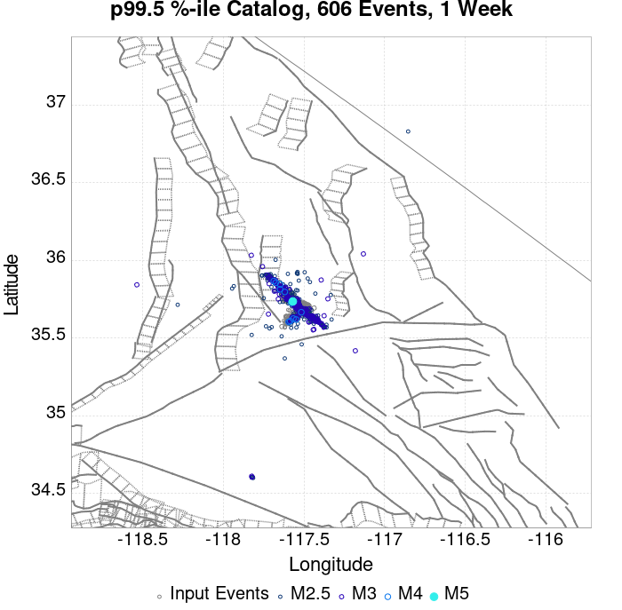 |  |  |
| **1 Month** |  |  |  |  | 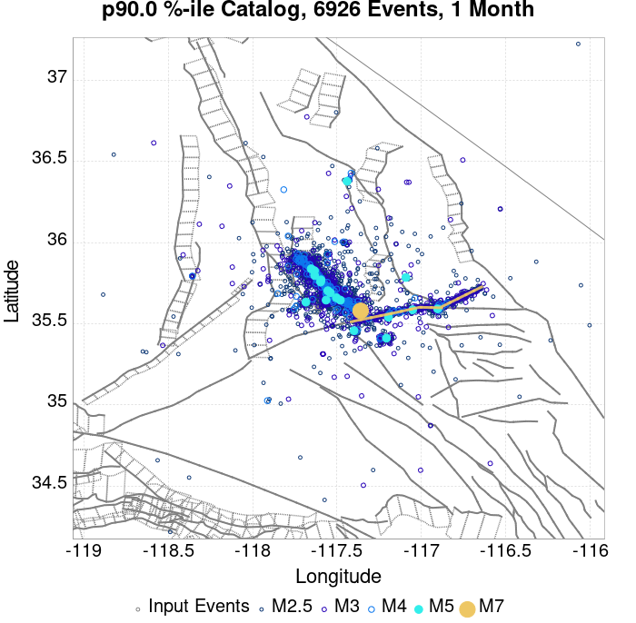 | 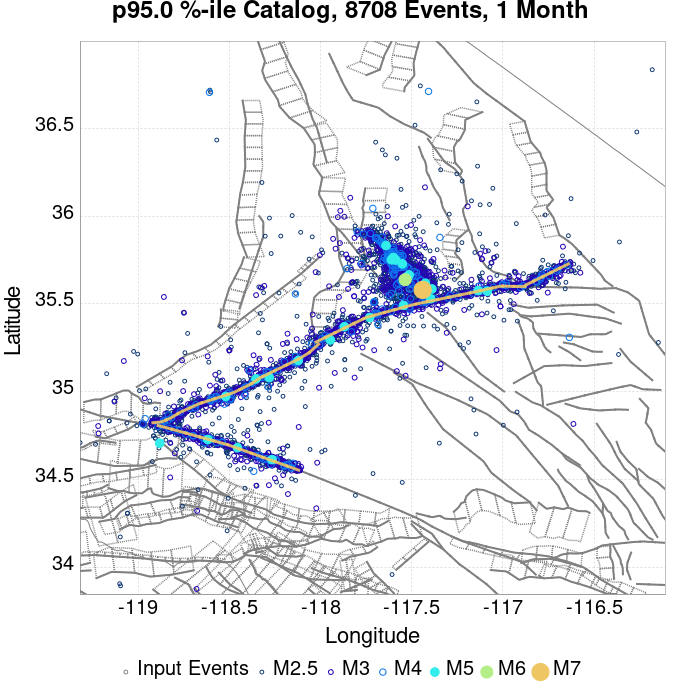 |  |  |  |  |  | 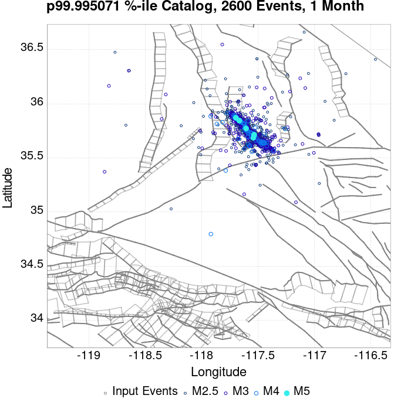 |
| **1 Year** |  |  |  |  |  |  |  | 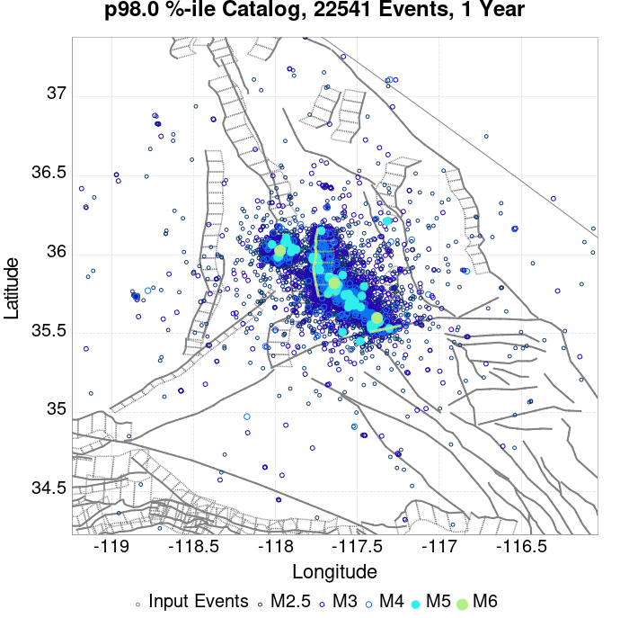 |  |  |  |  |
| **10 Year** |  |  |  |  |  |  |  |  | 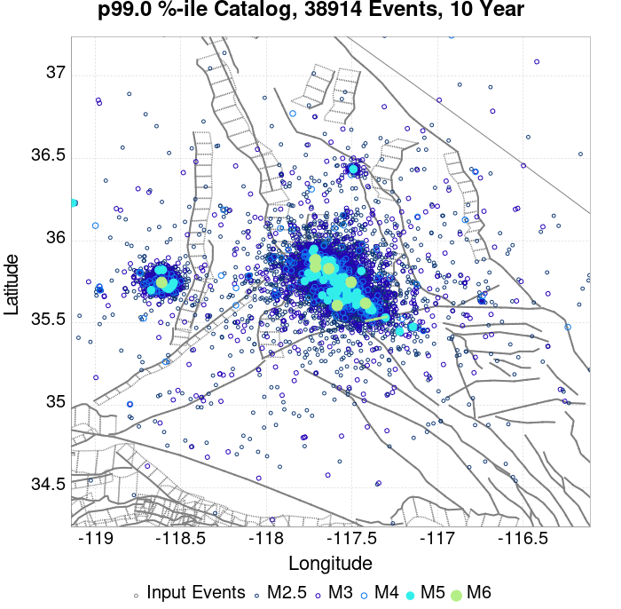 |  |  |  |

## ComCat Data Comparisons
*[(top)](#table-of-contents)*

These plots compare simulated sequences with data from ComCat. All plots only consider events with hypocenters inside the ComCat region defined in the JSON input file.

Last updated at 2019/11/06 06:33:36 UTC, 4 months after the simulation start time.

Total matching ComCat events found: 2093

### ComCat Magnitude-Number Distributions
*[(top)](#table-of-contents)*

| Incremental MND | Cumulative MND |
|-----|-----|
|  |  |

### ComCat Time-Dependent Mc
*[(top)](#table-of-contents)*

The following plots compare simulation results with ComCat data above a magnitude threshold. Plots labeled as *M&ge;Mc(t)* use the time-dependent magnitude of completeness (Mc) defined in Helmstetter et al. (2006), which is plotted below. In the case of multiple M&ge;5 ruptures, either as input to the simulation or in the comparison data, the maximum calculated time-dependent Mc is used. This time-dependent Mc function is plotted below.


### ComCat Cumulative Number Vs Time
*[(top)](#table-of-contents)*

| M&ge;Mc(t) | M&ge;3.5 | M&ge;4 | M&ge;5 | M&ge;6 | M&ge;7 |
|-----|-----|-----|-----|-----|-----|
|  |  |  |  | 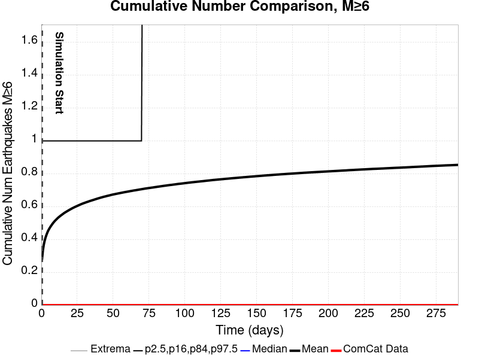 |  |

### ComCat Cumulative Number Simulation Percentiles
*[(top)](#table-of-contents)*

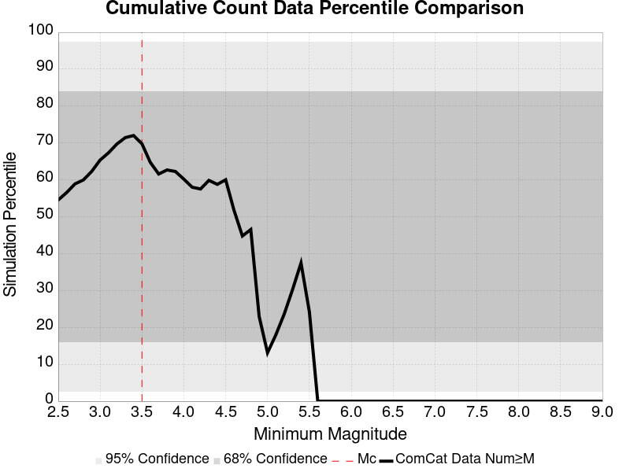

### ComCat Probability Spatial Distribution
*[(top)](#table-of-contents)*

*Note: maps labeled 'Forecast' are for a duration that extends into the future, only forecasted values are plotted (ComCat data omitted)*

|  | 1 Day | 1 Week | 1 Month | Current (4 Month) | Forecast: 1 Year |
|-----|-----|-----|-----|-----|-----|
| **M&ge;Mc(t)** |  |  |  |  |  |
|  | Prob: 100.00%, Actual: 314 | Prob: 100.00%, Actual: 823 | Prob: 100.00%, Actual: 1173 | Prob: 100.00%, Actual: 1381 | Prob: 100.00% |
| **M&ge;3.5** |  |  |  |  |  |
|  | Prob: 100.00%, Actual: 218 | Prob: 100.00%, Actual: 273 | Prob: 100.00%, Actual: 302 | Prob: 100.00%, Actual: 317 | Prob: 100.00% |
| **M&ge;4** |  |  |  |  | 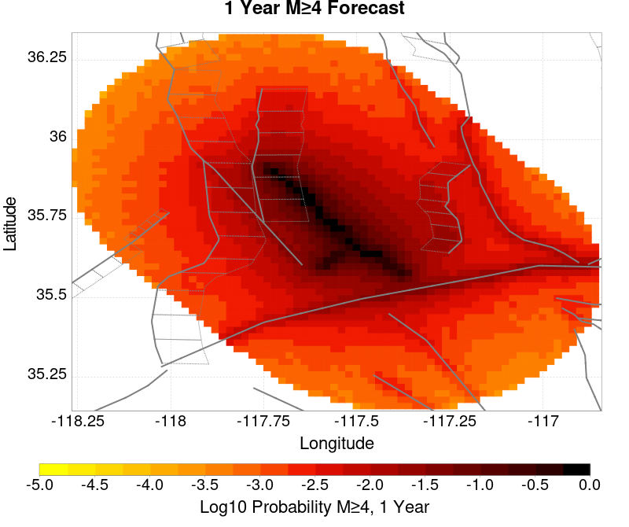 |
|  | Prob: 99.64%, Actual: 63 | Prob: 99.94%, Actual: 75 | Prob: 100.00%, Actual: 81 | Prob: 100.00%, Actual: 83 | Prob: 100.00% |
| **M&ge;5** | 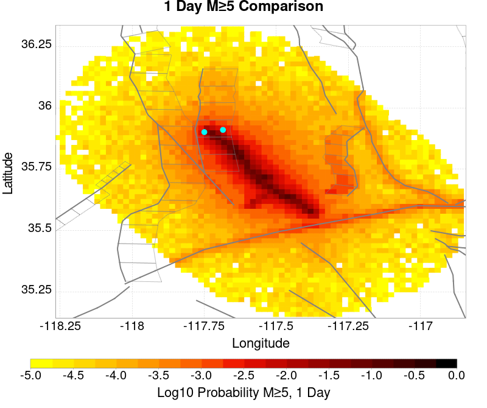 |  |  | 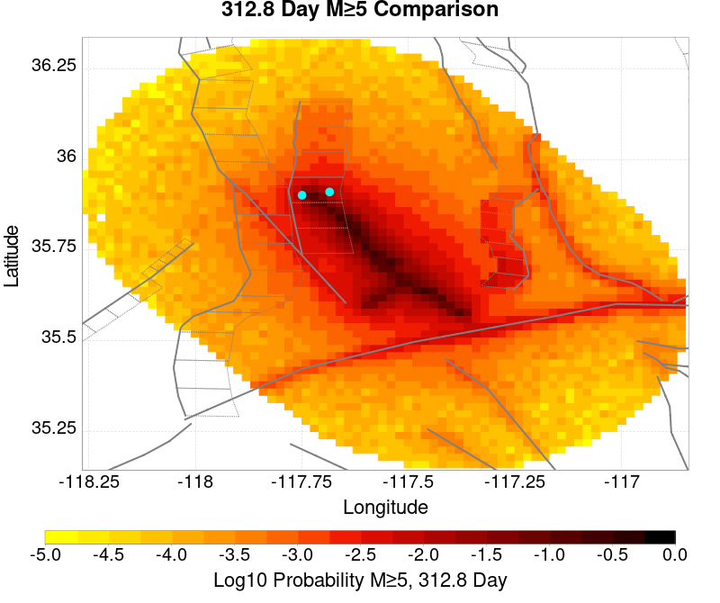 |  |
|  | Prob: 79.67%, Actual: 2 | Prob: 87.69%, Actual: 2 | Prob: 91.37%, Actual: 2 | Prob: 93.82%, Actual: 3 | Prob: 95.19% |
| **M&ge;6** |  |  |  |  |  |
|  | Prob: 21.61%, Actual: 0 | Prob: 29.13%, Actual: 0 | Prob: 34.43%, Actual: 0 | Prob: 38.94%, Actual: 0 | Prob: 42.18% |
| **M&ge;7** | 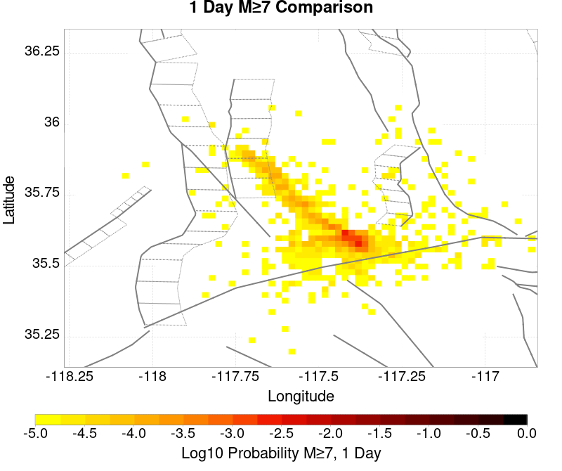 | 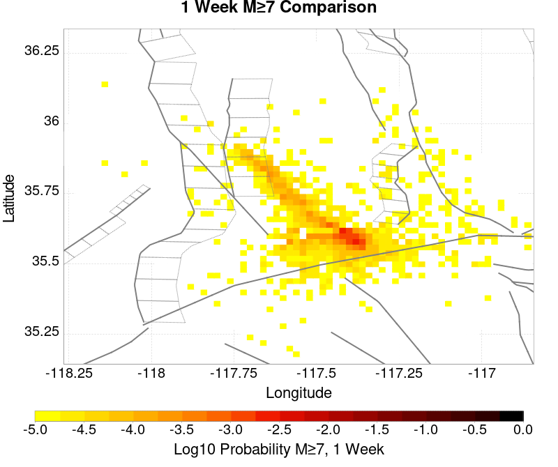 |  |  | 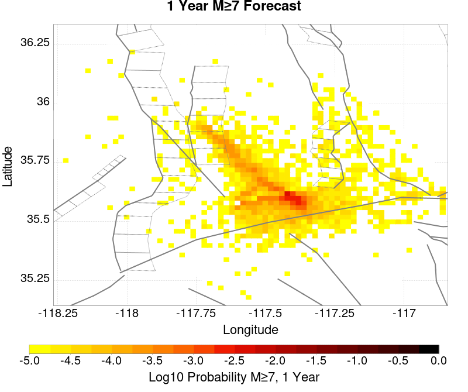 |
|  | Prob: 2.21%, Actual: 0 | Prob: 3.16%, Actual: 0 | Prob: 3.94%, Actual: 0 | Prob: 4.68%, Actual: 0 | Prob: 5.10% |
| **M&ge;8** | 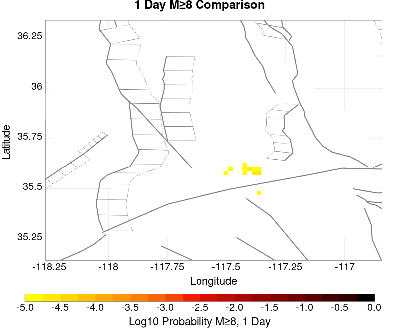 |  |  |  |  |
|  | Prob: 0.01%, Actual: 0 | Prob: 0.01%, Actual: 0 | Prob: 0.01%, Actual: 0 | Prob: 0.01%, Actual: 0 | Prob: 0.01% |

### ComCat Mean Expectation Spatial Distribution
*[(top)](#table-of-contents)*

*Note: maps labeled 'Forecast' are for a duration that extends into the future, only forecasted values are plotted (ComCat data omitted)*

|  | 1 Day | 1 Week | 1 Month | Current (4 Month) | Forecast: 1 Year |
|-----|-----|-----|-----|-----|-----|
| **M&ge;Mc(t)** |  |  | 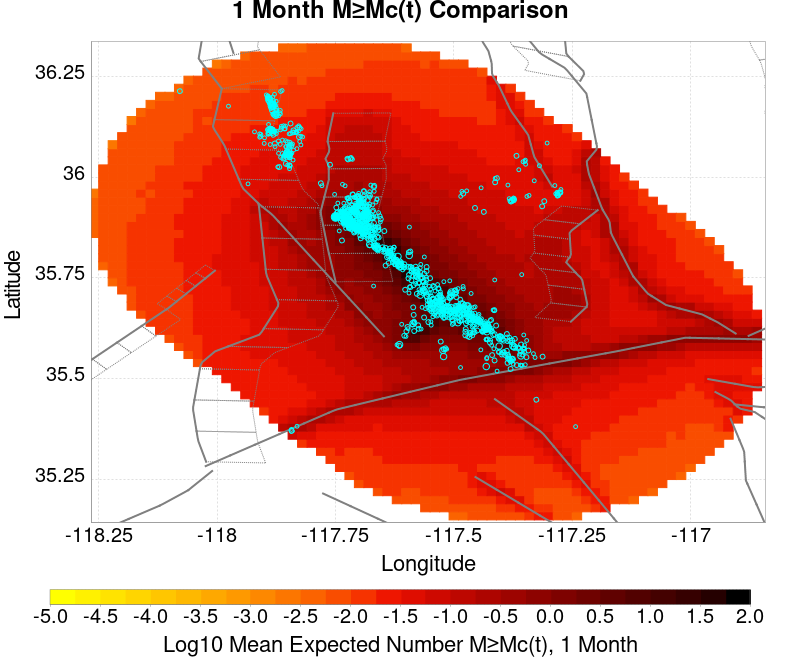 |  |  |
|  | Mean: 304.538, Actual: 314 | Mean: 999.399, Actual: 823 | Mean: 1591.198, Actual: 1173 | Mean: 2210.767, Actual: 1381 | Mean: 2704.474 |
| **M&ge;3.5** |  |  |  |  |  |
|  | Mean: 138.566, Actual: 218 | Mean: 208.946, Actual: 273 | Mean: 268.147, Actual: 302 | Mean: 329.996, Actual: 317 | Mean: 379.341 |
| **M&ge;4** |  |  |  | 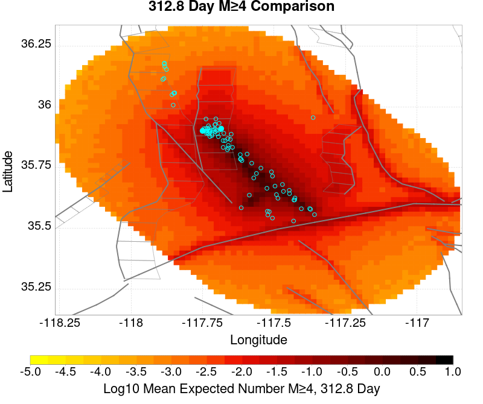 |  |
|  | Mean: 43.680, Actual: 63 | Mean: 65.938, Actual: 75 | Mean: 84.607, Actual: 81 | Mean: 104.120, Actual: 83 | Mean: 119.704 |
| **M&ge;5** |  |  |  |  |  |
|  | Mean: 4.231, Actual: 2 | Mean: 6.398, Actual: 2 | Mean: 8.213, Actual: 2 | Mean: 10.079, Actual: 3 | Mean: 11.581 |
| **M&ge;6** |  |  | 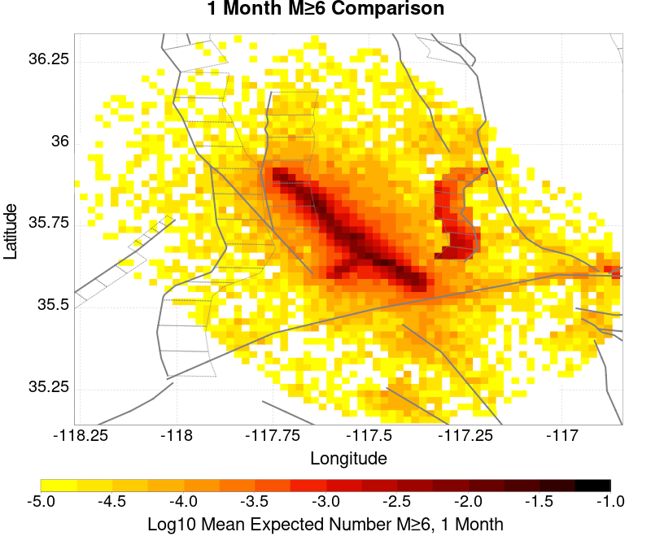 | 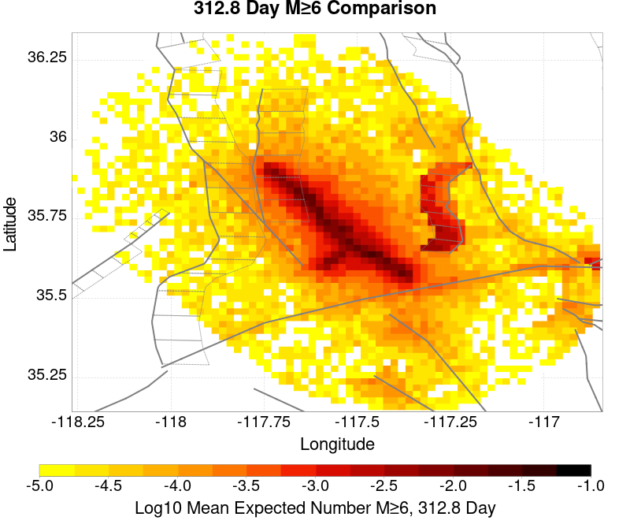 |  |
|  | Mean: 0.312, Actual: 0 | Mean: 0.475, Actual: 0 | Mean: 0.607, Actual: 0 | Mean: 0.744, Actual: 0 | Mean: 0.855 |
| **M&ge;7** |  |  |  |  |  |
|  | Mean: 0.023, Actual: 0 | Mean: 0.033, Actual: 0 | Mean: 0.041, Actual: 0 | Mean: 0.049, Actual: 0 | Mean: 0.053 |
| **M&ge;8** |  |  | 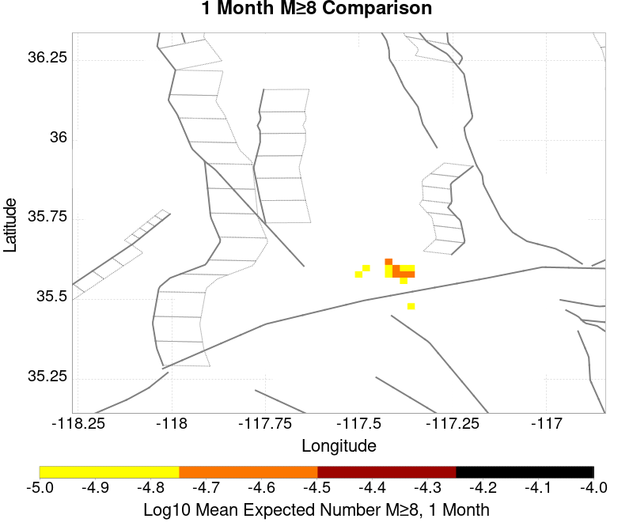 |  |  |
|  | Mean: 9.86E-5, Actual: 0 | Mean: 1.48E-4, Actual: 0 | Mean: 1.48E-4, Actual: 0 | Mean: 1.48E-4, Actual: 0 | Mean: 1.48E-4 |

### ComCat Depth Distribution
*[(top)](#table-of-contents)*

| M&ge;Mc(t) | M&ge;3.5 | M&ge;4 | M&ge;5 | M&ge;6 | M&ge;7 | M&ge;8 |
|-----|-----|-----|-----|-----|-----|-----|
|  | 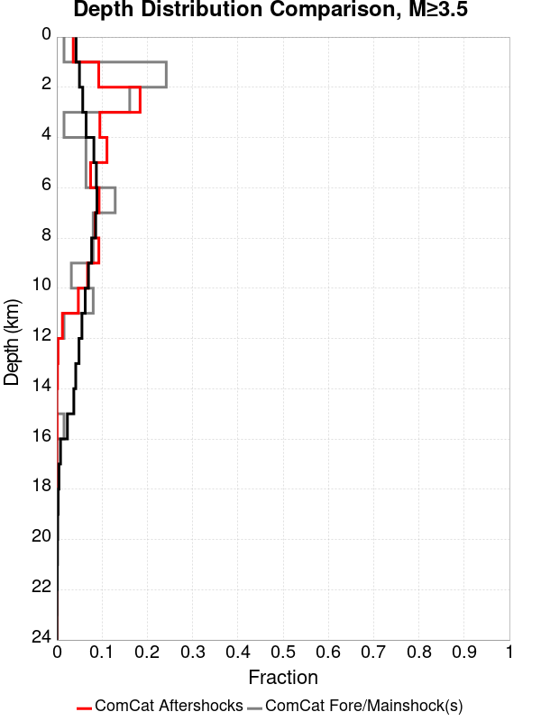 |  |  |  |  |  |

## Section Participation
*[(top)](#table-of-contents)*

### Section Participation Plots
*[(top)](#table-of-contents)*

| Min Mag | 1 yr Triggered Ruptures (no spontaneous) | 10 yr Triggered Ruptures (no spontaneous) | 10 yr Triggered Ruptures (primary aftershocks only) |
|-----|-----|-----|-----|
| **All Supra. Seis.** |  |  |  |
| **M&ge;6.5** |  |  |  |
| **M&ge;7** |  |  |  |
| **M&ge;7.5** |  |  |  |
| **M&ge;8** |  |  |  |

### Supra-Seismogenic Parent Sections Table
*[(top)](#table-of-contents)*

*First 10 of 136 with matching ruptures shown*

| Parent Name | Triggered 10 Year Mean Count | Triggered 1 Day Prob | Triggered 1 Day 95% Conf | Triggered 1 Week Prob | Triggered 1 Week 95% Conf | Triggered 1 Month Prob | Triggered 1 Month 95% Conf | Triggered 1 Year Prob | Triggered 1 Year 95% Conf | Triggered 10 Year Prob | Triggered 10 Year 95% Conf | Triggered 10 Year Primary Mean Count |
|-----|-----|-----|-----|-----|-----|-----|-----|-----|-----|-----|-----|-----|
| Garlock (Central) | 0.1304155 | 0.044 (4.44%) | [4.16% 4.74%] | 0.064 (6.42%) | [6.09% 6.77%] | 0.077 (7.73%) | [7.37% 8.11%] | 0.099 (9.94%) | [9.53% 10.36%] | 0.121 (12.11%) | [11.67% 12.57%] | 0.07112228 |
| Tank Canyon | 0.10513086 | 0.022 (2.16%) | [1.97% 2.38%] | 0.033 (3.34%) | [3.10% 3.60%] | 0.044 (4.40%) | [4.12% 4.69%] | 0.065 (6.53%) | [6.20% 6.88%] | 0.089 (8.86%) | [8.47% 9.26%] | 0.029621962 |
| Little Lake | 0.060623985 | 0.021 (2.07%) | [1.88% 2.27%] | 0.030 (3.01%) | [2.78% 3.26%] | 0.037 (3.66%) | [3.41% 3.93%] | 0.047 (4.75%) | [4.46% 5.05%] | 0.057 (5.68%) | [5.37% 6.01%] | 0.035388634 |
| Airport Lake | 0.05002711 | 0.020 (2.00%) | [1.81% 2.20%] | 0.027 (2.68%) | [2.46% 2.91%] | 0.033 (3.29%) | [3.05% 3.55%] | 0.042 (4.21%) | [3.94% 4.50%] | 0.050 (4.95%) | [4.66% 5.26%] | 0.033417124 |
| Owl Lake | 0.037606586 | 8.08E-3 (0.81%) | [0.69% 0.94%] | 0.013 (1.33%) | [1.18% 1.50%] | 0.018 (1.80%) | [1.63% 2.00%] | 0.026 (2.59%) | [2.38% 2.82%] | 0.034 (3.36%) | [3.11% 3.62%] | 0.011188328 |
| Panamint Valley | 0.029819114 | 7.94E-3 (0.79%) | [0.68% 0.93%] | 0.011 (1.13%) | [0.99% 1.29%] | 0.015 (1.49%) | [1.33% 1.67%] | 0.021 (2.14%) | [1.95% 2.36%] | 0.029 (2.89%) | [2.66% 3.13%] | 0.011040465 |
| Garlock (East) | 0.02567894 | 5.67E-3 (0.57%) | [0.47% 0.68%] | 9.51E-3 (0.95%) | [0.82% 1.10%] | 0.012 (1.20%) | [1.06% 1.36%] | 0.017 (1.69%) | [1.52% 1.87%] | 0.024 (2.39%) | [2.18% 2.61%] | 0.0069988663 |
| Hunter Mountain-Saline Valley | 0.01360343 | 4.44E-3 (0.44%) | [0.36% 0.55%] | 5.96E-3 (0.60%) | [0.50% 0.71%] | 7.20E-3 (0.72%) | [0.61% 0.85%] | 0.010 (1.02%) | [0.89% 1.17%] | 0.013 (1.34%) | [1.18% 1.51%] | 0.0065552765 |
| Blackwater | 0.012420523 | 2.61E-3 (0.26%) | [0.20% 0.34%] | 4.34E-3 (0.43%) | [0.35% 0.54%] | 5.67E-3 (0.57%) | [0.47% 0.68%] | 8.67E-3 (0.87%) | [0.75% 1.01%] | 0.012 (1.21%) | [1.06% 1.37%] | 0.003055843 |
| Ash Hill | 0.010843314 | 2.32E-3 (0.23%) | [0.17% 0.31%] | 3.60E-3 (0.36%) | [0.28% 0.45%] | 4.73E-3 (0.47%) | [0.39% 0.58%] | 6.95E-3 (0.69%) | [0.59% 0.82%] | 9.81E-3 (0.98%) | [0.85% 1.13%] | 0.0025136773 |

### M≥6.5 Parent Sections Table
*[(top)](#table-of-contents)*

*First 10 of 108 with matching ruptures shown*

| Parent Name | Triggered 10 Year Mean Count | Triggered 1 Day Prob | Triggered 1 Day 95% Conf | Triggered 1 Week Prob | Triggered 1 Week 95% Conf | Triggered 1 Month Prob | Triggered 1 Month 95% Conf | Triggered 1 Year Prob | Triggered 1 Year 95% Conf | Triggered 10 Year Prob | Triggered 10 Year 95% Conf | Triggered 10 Year Primary Mean Count |
|-----|-----|-----|-----|-----|-----|-----|-----|-----|-----|-----|-----|-----|
| Garlock (Central) | 0.054315146 | 0.019 (1.88%) | [1.70% 2.08%] | 0.027 (2.66%) | [2.44% 2.89%] | 0.033 (3.26%) | [3.02% 3.52%] | 0.043 (4.26%) | [3.99% 4.55%] | 0.053 (5.34%) | [5.03% 5.66%] | 0.029227661 |
| Little Lake | 0.037853025 | 0.014 (1.36%) | [1.20% 1.53%] | 0.019 (1.94%) | [1.75% 2.14%] | 0.024 (2.37%) | [2.16% 2.59%] | 0.031 (3.09%) | [2.86% 3.34%] | 0.036 (3.64%) | [3.39% 3.91%] | 0.023313126 |
| Airport Lake | 0.03765587 | 0.015 (1.53%) | [1.37% 1.71%] | 0.020 (2.02%) | [1.83% 2.23%] | 0.025 (2.47%) | [2.27% 2.70%] | 0.032 (3.20%) | [2.97% 3.46%] | 0.038 (3.75%) | [3.50% 4.02%] | 0.024693184 |
| Panamint Valley | 0.027749026 | 7.49E-3 (0.75%) | [0.64% 0.88%] | 0.011 (1.08%) | [0.94% 1.23%] | 0.014 (1.38%) | [1.23% 1.56%] | 0.020 (1.99%) | [1.81% 2.20%] | 0.027 (2.70%) | [2.48% 2.93%] | 0.0109911775 |
| Owl Lake | 0.022031642 | 6.31E-3 (0.63%) | [0.53% 0.75%] | 0.010 (1.00%) | [0.87% 1.15%] | 0.013 (1.30%) | [1.15% 1.47%] | 0.017 (1.74%) | [1.57% 1.94%] | 0.022 (2.19%) | [1.99% 2.40%] | 0.009956134 |
| Garlock (East) | 0.018137908 | 5.03E-3 (0.50%) | [0.41% 0.61%] | 7.39E-3 (0.74%) | [0.63% 0.87%] | 9.41E-3 (0.94%) | [0.82% 1.09%] | 0.013 (1.27%) | [1.12% 1.43%] | 0.017 (1.75%) | [1.58% 1.94%] | 0.006752427 |
| Hunter Mountain-Saline Valley | 0.013554143 | 4.39E-3 (0.44%) | [0.35% 0.54%] | 5.91E-3 (0.59%) | [0.49% 0.71%] | 7.15E-3 (0.71%) | [0.61% 0.84%] | 0.010 (1.02%) | [0.88% 1.17%] | 0.013 (1.33%) | [1.18% 1.50%] | 0.0065059885 |
| Tank Canyon | 0.012420523 | 2.56E-3 (0.26%) | [0.19% 0.34%] | 4.04E-3 (0.40%) | [0.32% 0.50%] | 5.67E-3 (0.57%) | [0.47% 0.68%] | 8.53E-3 (0.85%) | [0.73% 0.99%] | 0.012 (1.24%) | [1.09% 1.40%] | 0.0032529943 |
| Garlock (West) | 0.008773227 | 3.01E-3 (0.30%) | [0.23% 0.39%] | 4.24E-3 (0.42%) | [0.34% 0.53%] | 4.93E-3 (0.49%) | [0.40% 0.60%] | 6.75E-3 (0.68%) | [0.57% 0.80%] | 8.72E-3 (0.87%) | [0.75% 1.01%] | 0.0043866136 |
| So Sierra Nevada | 0.0043866136 | 8.38E-4 (0.08%) | [0.05% 0.14%] | 1.48E-3 (0.15%) | [0.10% 0.21%] | 2.12E-3 (0.21%) | [0.16% 0.29%] | 3.20E-3 (0.32%) | [0.25% 0.41%] | 4.29E-3 (0.43%) | [0.35% 0.53%] | 8.871803E-4 |

### M≥7 Parent Sections Table
*[(top)](#table-of-contents)*

*First 10 of 71 with matching ruptures shown*

| Parent Name | Triggered 10 Year Mean Count | Triggered 1 Day Prob | Triggered 1 Day 95% Conf | Triggered 1 Week Prob | Triggered 1 Week 95% Conf | Triggered 1 Month Prob | Triggered 1 Month 95% Conf | Triggered 1 Year Prob | Triggered 1 Year 95% Conf | Triggered 10 Year Prob | Triggered 10 Year 95% Conf | Triggered 10 Year Primary Mean Count |
|-----|-----|-----|-----|-----|-----|-----|-----|-----|-----|-----|-----|-----|
| Garlock (Central) | 0.047858447 | 0.016 (1.62%) | [1.45% 1.80%] | 0.023 (2.33%) | [2.13% 2.55%] | 0.029 (2.87%) | [2.65% 3.11%] | 0.038 (3.76%) | [3.50% 4.03%] | 0.047 (4.72%) | [4.44% 5.02%] | 0.02567894 |
| Panamint Valley | 0.01808862 | 5.96E-3 (0.60%) | [0.50% 0.71%] | 8.23E-3 (0.82%) | [0.71% 0.96%] | 9.96E-3 (1.00%) | [0.87% 1.14%] | 0.014 (1.38%) | [1.23% 1.55%] | 0.018 (1.80%) | [1.63% 2.00%] | 0.008871802 |
| Owl Lake | 0.016560698 | 5.42E-3 (0.54%) | [0.45% 0.66%] | 8.38E-3 (0.84%) | [0.72% 0.98%] | 0.011 (1.06%) | [0.93% 1.21%] | 0.013 (1.33%) | [1.18% 1.50%] | 0.017 (1.66%) | [1.49% 1.84%] | 0.009413968 |
| Garlock (East) | 0.013702006 | 4.44E-3 (0.44%) | [0.36% 0.55%] | 6.46E-3 (0.65%) | [0.54% 0.77%] | 8.13E-3 (0.81%) | [0.70% 0.95%] | 0.011 (1.05%) | [0.92% 1.21%] | 0.014 (1.37%) | [1.21% 1.54%] | 0.0064074127 |
| Hunter Mountain-Saline Valley | 0.01315984 | 4.34E-3 (0.43%) | [0.35% 0.54%] | 5.87E-3 (0.59%) | [0.49% 0.70%] | 7.05E-3 (0.70%) | [0.60% 0.83%] | 0.010 (1.01%) | [0.87% 1.15%] | 0.013 (1.32%) | [1.17% 1.48%] | 0.0064567006 |
| Garlock (West) | 0.008674651 | 2.96E-3 (0.30%) | [0.23% 0.38%] | 4.19E-3 (0.42%) | [0.34% 0.52%] | 4.88E-3 (0.49%) | [0.40% 0.60%] | 6.70E-3 (0.67%) | [0.56% 0.79%] | 8.63E-3 (0.86%) | [0.74% 1.00%] | 0.0043373257 |
| Little Lake | 0.0082310615 | 3.55E-3 (0.35%) | [0.28% 0.45%] | 4.83E-3 (0.48%) | [0.39% 0.59%] | 5.82E-3 (0.58%) | [0.48% 0.70%] | 7.10E-3 (0.71%) | [0.60% 0.84%] | 8.23E-3 (0.82%) | [0.71% 0.96%] | 0.0055695204 |
| Airport Lake | 0.007787471 | 3.35E-3 (0.34%) | [0.26% 0.43%] | 4.44E-3 (0.44%) | [0.36% 0.55%] | 5.37E-3 (0.54%) | [0.44% 0.65%] | 6.65E-3 (0.67%) | [0.56% 0.79%] | 7.79E-3 (0.78%) | [0.66% 0.91%] | 0.005224506 |
| San Andreas (Mojave N) | 0.0034008576 | 1.18E-3 (0.12%) | [0.08% 0.18%] | 1.63E-3 (0.16%) | [0.11% 0.23%] | 1.97E-3 (0.20%) | [0.14% 0.27%] | 2.56E-3 (0.26%) | [0.19% 0.34%] | 3.40E-3 (0.34%) | [0.27% 0.43%] | 0.0018236482 |
| San Andreas (Mojave S) | 0.0026615406 | 8.87E-4 (0.09%) | [0.05% 0.14%] | 1.23E-3 (0.12%) | [0.08% 0.18%] | 1.53E-3 (0.15%) | [0.11% 0.22%] | 2.07E-3 (0.21%) | [0.15% 0.28%] | 2.66E-3 (0.27%) | [0.20% 0.35%] | 0.0014786337 |

### M≥7.5 Parent Sections Table
*[(top)](#table-of-contents)*

*First 10 of 50 with matching ruptures shown*

| Parent Name | Triggered 10 Year Mean Count | Triggered 1 Day Prob | Triggered 1 Day 95% Conf | Triggered 1 Week Prob | Triggered 1 Week 95% Conf | Triggered 1 Month Prob | Triggered 1 Month 95% Conf | Triggered 1 Year Prob | Triggered 1 Year 95% Conf | Triggered 10 Year Prob | Triggered 10 Year 95% Conf | Triggered 10 Year Primary Mean Count |
|-----|-----|-----|-----|-----|-----|-----|-----|-----|-----|-----|-----|-----|
| Garlock (Central) | 0.019567253 | 6.51E-3 (0.65%) | [0.55% 0.77%] | 9.02E-3 (0.90%) | [0.78% 1.04%] | 0.011 (1.08%) | [0.94% 1.23%] | 0.015 (1.52%) | [1.36% 1.70%] | 0.020 (1.96%) | [1.77% 2.16%] | 0.010005422 |
| Hunter Mountain-Saline Valley | 0.012519099 | 4.14E-3 (0.41%) | [0.33% 0.51%] | 5.62E-3 (0.56%) | [0.47% 0.68%] | 6.80E-3 (0.68%) | [0.57% 0.81%] | 9.71E-3 (0.97%) | [0.84% 1.12%] | 0.013 (1.25%) | [1.11% 1.42%] | 0.0063088373 |
| Panamint Valley | 0.012519099 | 4.14E-3 (0.41%) | [0.33% 0.51%] | 5.62E-3 (0.56%) | [0.47% 0.68%] | 6.80E-3 (0.68%) | [0.57% 0.81%] | 9.71E-3 (0.97%) | [0.84% 1.12%] | 0.013 (1.25%) | [1.11% 1.42%] | 0.0063088373 |
| Garlock (West) | 0.0077381833 | 2.56E-3 (0.26%) | [0.19% 0.34%] | 3.65E-3 (0.36%) | [0.29% 0.46%] | 4.34E-3 (0.43%) | [0.35% 0.54%] | 5.96E-3 (0.60%) | [0.50% 0.71%] | 7.74E-3 (0.77%) | [0.66% 0.91%] | 0.0039430233 |
| Garlock (East) | 0.0049287793 | 1.53E-3 (0.15%) | [0.11% 0.22%] | 2.22E-3 (0.22%) | [0.16% 0.30%] | 2.81E-3 (0.28%) | [0.21% 0.37%] | 3.80E-3 (0.38%) | [0.30% 0.48%] | 4.93E-3 (0.49%) | [0.40% 0.60%] | 0.002365814 |
| San Andreas (Mojave N) | 0.0033515699 | 1.18E-3 (0.12%) | [0.08% 0.18%] | 1.63E-3 (0.16%) | [0.11% 0.23%] | 1.97E-3 (0.20%) | [0.14% 0.27%] | 2.56E-3 (0.26%) | [0.19% 0.34%] | 3.35E-3 (0.34%) | [0.26% 0.43%] | 0.0018236482 |
| San Andreas (Mojave S) | 0.0025629653 | 8.87E-4 (0.09%) | [0.05% 0.14%] | 1.23E-3 (0.12%) | [0.08% 0.18%] | 1.48E-3 (0.15%) | [0.10% 0.21%] | 2.02E-3 (0.20%) | [0.15% 0.28%] | 2.56E-3 (0.26%) | [0.19% 0.34%] | 0.0014786337 |
| San Andreas (San Bernardino N) | 0.0015279215 | 4.93E-4 (0.05%) | [0.03% 0.09%] | 6.90E-4 (0.07%) | [0.04% 0.12%] | 8.38E-4 (0.08%) | [0.05% 0.14%] | 1.13E-3 (0.11%) | [0.07% 0.17%] | 1.53E-3 (0.15%) | [0.11% 0.22%] | 8.871803E-4 |
| Owl Lake | 0.0014786337 | 4.93E-4 (0.05%) | [0.03% 0.09%] | 7.89E-4 (0.08%) | [0.05% 0.13%] | 7.89E-4 (0.08%) | [0.05% 0.13%] | 1.08E-3 (0.11%) | [0.07% 0.17%] | 1.48E-3 (0.15%) | [0.10% 0.21%] | 7.3931686E-4 |
| Death Valley (Black Mtns Frontal) | 6.407413E-4 | 9.86E-5 (0.01%) | [0.00% 0.04%] | 9.86E-5 (0.01%) | [0.00% 0.04%] | 2.46E-4 (0.02%) | [0.01% 0.06%] | 4.44E-4 (0.04%) | [0.02% 0.09%] | 6.41E-4 (0.06%) | [0.04% 0.11%] | 1.4786338E-4 |

### M≥8 Parent Sections Table
*[(top)](#table-of-contents)*

*First 10 of 23 with matching ruptures shown*

| Parent Name | Triggered 10 Year Mean Count | Triggered 1 Day Prob | Triggered 1 Day 95% Conf | Triggered 1 Week Prob | Triggered 1 Week 95% Conf | Triggered 1 Month Prob | Triggered 1 Month 95% Conf | Triggered 1 Year Prob | Triggered 1 Year 95% Conf | Triggered 10 Year Prob | Triggered 10 Year 95% Conf | Triggered 10 Year Primary Mean Count |
|-----|-----|-----|-----|-----|-----|-----|-----|-----|-----|-----|-----|-----|
| San Andreas (Mojave N) | 2.9572676E-4 | 9.86E-5 (0.01%) | [0.00% 0.04%] | 1.48E-4 (0.01%) | [0.00% 0.05%] | 1.48E-4 (0.01%) | [0.00% 0.05%] | 1.48E-4 (0.01%) | [0.00% 0.05%] | 2.96E-4 (0.03%) | [0.01% 0.07%] | 1.9715117E-4 |
| San Andreas (Mojave S) | 2.9572676E-4 | 9.86E-5 (0.01%) | [0.00% 0.04%] | 1.48E-4 (0.01%) | [0.00% 0.05%] | 1.48E-4 (0.01%) | [0.00% 0.05%] | 1.48E-4 (0.01%) | [0.00% 0.05%] | 2.96E-4 (0.03%) | [0.01% 0.07%] | 1.9715117E-4 |
| San Andreas (San Bernardino N) | 2.9572676E-4 | 9.86E-5 (0.01%) | [0.00% 0.04%] | 1.48E-4 (0.01%) | [0.00% 0.05%] | 1.48E-4 (0.01%) | [0.00% 0.05%] | 1.48E-4 (0.01%) | [0.00% 0.05%] | 2.96E-4 (0.03%) | [0.01% 0.07%] | 1.9715117E-4 |
| Garlock (Central) | 2.4643895E-4 | 9.86E-5 (0.01%) | [0.00% 0.04%] | 1.48E-4 (0.01%) | [0.00% 0.05%] | 1.48E-4 (0.01%) | [0.00% 0.05%] | 1.48E-4 (0.01%) | [0.00% 0.05%] | 2.46E-4 (0.02%) | [0.01% 0.06%] | 1.9715117E-4 |
| Garlock (East) | 2.4643895E-4 | 9.86E-5 (0.01%) | [0.00% 0.04%] | 1.48E-4 (0.01%) | [0.00% 0.05%] | 1.48E-4 (0.01%) | [0.00% 0.05%] | 1.48E-4 (0.01%) | [0.00% 0.05%] | 2.46E-4 (0.02%) | [0.01% 0.06%] | 1.9715117E-4 |
| Garlock (West) | 2.4643895E-4 | 9.86E-5 (0.01%) | [0.00% 0.04%] | 1.48E-4 (0.01%) | [0.00% 0.05%] | 1.48E-4 (0.01%) | [0.00% 0.05%] | 1.48E-4 (0.01%) | [0.00% 0.05%] | 2.46E-4 (0.02%) | [0.01% 0.06%] | 1.9715117E-4 |
| San Andreas (San Bernardino S) | 1.9715117E-4 | 9.86E-5 (0.01%) | [0.00% 0.04%] | 9.86E-5 (0.01%) | [0.00% 0.04%] | 9.86E-5 (0.01%) | [0.00% 0.04%] | 9.86E-5 (0.01%) | [0.00% 0.04%] | 1.97E-4 (0.02%) | [0.01% 0.05%] | 9.857558E-5 |
| San Andreas (San Gorgonio Pass-Garnet HIll) | 1.4786338E-4 | 4.93E-5 (0.00%) | [0.00% 0.03%] | 4.93E-5 (0.00%) | [0.00% 0.03%] | 4.93E-5 (0.00%) | [0.00% 0.03%] | 4.93E-5 (0.00%) | [0.00% 0.03%] | 1.48E-4 (0.01%) | [0.00% 0.05%] | 4.928779E-5 |
| San Andreas (Coachella) rev | 9.857558E-5 | 4.93E-5 (0.00%) | [0.00% 0.03%] | 4.93E-5 (0.00%) | [0.00% 0.03%] | 4.93E-5 (0.00%) | [0.00% 0.03%] | 4.93E-5 (0.00%) | [0.00% 0.03%] | 9.86E-5 (0.01%) | [0.00% 0.04%] | 4.928779E-5 |
| San Jacinto (Lytle Creek connector) | 9.857558E-5 | 0.000 (0.00%) | [0.00% 0.02%] | 4.93E-5 (0.00%) | [0.00% 0.03%] | 4.93E-5 (0.00%) | [0.00% 0.03%] | 4.93E-5 (0.00%) | [0.00% 0.03%] | 9.86E-5 (0.01%) | [0.00% 0.04%] | 9.857558E-5 |

## Fault Magnitude-Probability Distributions
*[(top)](#table-of-contents)*

The first 5 sections (sorted by trigger rate) are plotted below. All fault MPDs are available [here](plots/parent_sect_mpds/README.md)

| 1 Week | 1 Month | 1 Year | 10 Year |
|-----|-----|-----|-----|
|  |  |  |  |
|  |  |  |  |
|  |  |  |  |
|  | 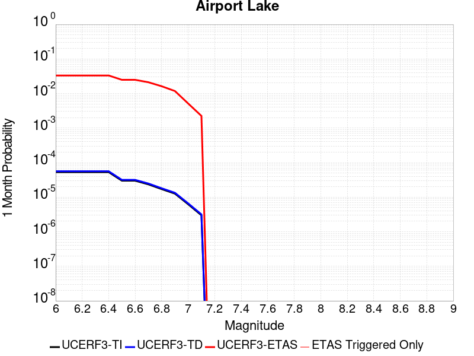 |  |  |
|  | 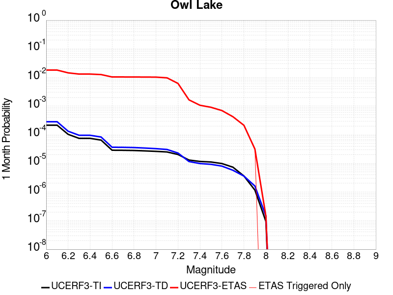 |  |  |

## Gridded Nucleation
*[(top)](#table-of-contents)*

| Min Mag | Triggered Ruptures (no spontaneous) | Triggered Ruptures (primary aftershocks only) |
|-----|-----|-----|
| **M&ge;2.5** |  |  |
| **M&ge;5** | 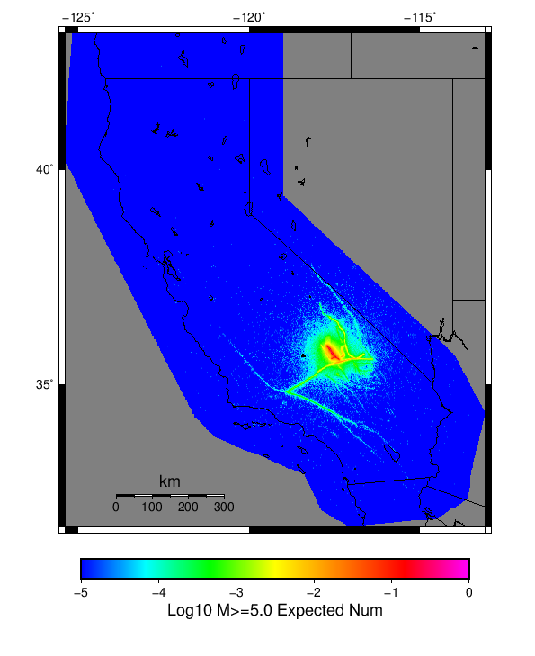 |  |
| **M&ge;6** |  |  |
| **M&ge;7** |  |  |


## JSON Input File
*[(top)](#table-of-contents)*

```
{
  "numSimulations": 100000,
  "duration": 10.0,
  "startTimeMillis": 1562383194040,
  "includeSpontaneous": false,
  "randomSeed": 1572975561977,
  "binaryOutput": true,
  "binaryOutputFilters": [
    {
      "prefix": "results_complete",
      "descendantsOnly": false
    },
    {
      "prefix": "results_m5_preserve_chain",
      "minMag": 5.0,
      "preserveChainBelowMag": true,
      "descendantsOnly": false
    }
  ],
  "forceRecalc": false,
  "simulationName": "ComCat M7.1 (ci38457511), ShakeMap Surfaces, kCOV\u003d1.5",
  "numRetries": 3,
  "outputDir": "/home/scec-02/kmilner/ucerf3/etas_sim/2019_11_05-ComCatM7p1_ci38457511_ShakeMapSurfaces_kCOV1p5",
  "treatTriggerCatalogAsSpontaneous": false,
  "triggerRuptures": [
    "omitted due to length, see original input file"
  ],
  "cacheDir": "/home/scec-02/kmilner/ucerf3/ucerf3-etas-launcher/inputs/cache_fm3p1_ba",
  "fssFile": "/home/scec-02/kmilner/ucerf3/ucerf3-etas-launcher/inputs/2013_05_10-ucerf3p3-production-10runs_COMPOUND_SOL_FM3_1_SpatSeisU3_MEAN_BRANCH_AVG_SOL.zip",
  "probModel": "FULL_TD",
  "applySubSeisForSupraNucl": true,
  "totRateScaleFactor": 1.14,
  "gridSeisCorr": true,
  "timeIndependentERF": false,
  "griddedOnly": false,
  "imposeGR": false,
  "includeIndirectTriggering": true,
  "gridSeisDiscr": 0.1,
  "catalogCompletenessModel": "RELAXED",
  "etas_k_cov": 1.5,
  "configCommand": "u3etas_comcat_event_config_builder.sh --event-id ci38457511 --mag-complete 3.5 --num-simulations 100000 --days-before 7 --etas-k-cov 1.5 --finite-surf-shakemap --finite-surf-shakemap-min-mag 5 --hpc-site USC_HPC --nodes 36 --hours 24 --queue scec",
  "configTime": 1572975561977,
  "comcatMetadata": {
    "region": {
      "border": [
        {
          "latitude": 35.15123745324938,
          "longitude": -117.46198765392752
        },
        {
          "latitude": 35.170513097218205,
          "longitude": -117.55046477274733
        },
        {
          "latitude": 35.201997575622634,
          "longitude": -117.63356287896195
        },
        {
          "latitude": 35.24474776584818,
          "longitude": -117.70878534540662
        },
        {
          "latitude": 35.2893890362986,
          "longitude": -117.76387551603122
        },
        {
          "latitude": 35.288830898189985,
          "longitude": -117.76465036296011
        },
        {
          "latitude": 35.62116745212862,
          "longitude": -118.13026990137416
        },
        {
          "latitude": 35.621789874646055,
          "longitude": -118.12940866580139
        },
        {
          "latitude": 35.621789874646055,
          "longitude": -118.12940866580136
        },
        {
          "latitude": 35.63100857737423,
          "longitude": -118.14083341711117
        },
        {
          "latitude": 35.69213881200874,
          "longitude": -118.19401186444136
        },
        {
          "latitude": 35.759827796433385,
          "longitude": -118.23338865654299
        },
        {
          "latitude": 35.8320329014668,
          "longitude": -118.25773927868946
        },
        {
          "latitude": 35.906569563076914,
          "longitude": -118.26628547708222
        },
        {
          "latitude": 35.9811764992231,
          "longitude": -118.25872343341653
        },
        {
          "latitude": 36.05358395358725,
          "longitude": -118.23523828089384
        },
        {
          "latitude": 36.12158296055357,
          "longitude": -118.19650389473806
        },
        {
          "latitude": 36.18309350302806,
          "longitude": -118.14366730262441
        },
        {
          "latitude": 36.23622937613509,
          "longitude": -118.07831757407638
        },
        {
          "latitude": 36.279357589115186,
          "longitude": -118.00243964650828
        },
        {
          "latitude": 36.31115024550475,
          "longitude": -117.91835419890715
        },
        {
          "latitude": 36.33062704347584,
          "longitude": -117.82864534929934
        },
        {
          "latitude": 36.337186832826475,
          "longitude": -117.7360785775
        },
        {
          "latitude": 36.33062704347584,
          "longitude": -117.64351180570065
        },
        {
          "latitude": 36.31115024550475,
          "longitude": -117.55380295609284
        },
        {
          "latitude": 36.279357589115186,
          "longitude": -117.46971750849171
        },
        {
          "latitude": 36.23622937613509,
          "longitude": -117.39383958092363
        },
        {
          "latitude": 36.19237301765921,
          "longitude": -117.33990236386252
        },
        {
          "latitude": 36.19237301765921,
          "longitude": -117.3399023638625
        },
        {
          "latitude": 36.19300476664728,
          "longitude": -117.33902822340912
        },
        {
          "latitude": 35.858277657147454,
          "longitude": -116.97410396317103
        },
        {
          "latitude": 35.85771127553969,
          "longitude": -116.97489025431044
        },
        {
          "latitude": 35.849566414597014,
          "longitude": -116.96491461360324
        },
        {
          "latitude": 35.78805819220281,
          "longitude": -116.9122967694479
        },
        {
          "latitude": 35.72006106557635,
          "longitude": -116.87372034968973
        },
        {
          "latitude": 35.64765482528862,
          "longitude": -116.85032807444419
        },
        {
          "latitude": 35.57304829206068,
          "longitude": -116.8427916482061
        },
        {
          "latitude": 35.49851117585832,
          "longitude": -116.8512961557198
        },
        {
          "latitude": 35.42630481575459,
          "longitude": -116.87553976530553
        },
        {
          "latitude": 35.35861392859174,
          "longitude": -116.91474809853695
        },
        {
          "latitude": 35.29748137319737,
          "longitude": -116.96770221389164
        },
        {
          "latitude": 35.24474776584818,
          "longitude": -117.03277884359336
        },
        {
          "latitude": 35.201997575622634,
          "longitude": -117.10800131003803
        },
        {
          "latitude": 35.170513097218205,
          "longitude": -117.19109941625265
        },
        {
          "latitude": 35.15123745324938,
          "longitude": -117.27957653507247
        },
        {
          "latitude": 35.14474752487352,
          "longitude": -117.3707820945
        }
      ]
    },
    "eventID": "ci38457511",
    "minDepth": -10.0,
    "maxDepth": 24.0,
    "minMag": 2.5,
    "startTime": 1561778393040,
    "endTime": 1562383193040,
    "magComplete": 3.5
  }
}
```

