# ComCat M7.1 (ci38457511), ShakeMap Surfaces, kCOV=1.5 Results

|   | ComCat M7.1 (ci38457511), ShakeMap Surfaces, kCOV=1.5 |
|-----|-----|
| Num Simulations | 5335 (incomplete) |
| Start Time | 2019/07/06 03:19:54 UTC |
| Start Time Epoch Milliseconds | 1562383194040 |
| Duration | 10 Years |
| Includes Spontaneous? | false |
| Trigger Ruptures | 283 Trigger Ruptures |
|   | First: M3.98 at 2019/07/04 17:02:55 UTC |
|   | Last: M7.1 at 2019/07/06 03:19:53 UTC |
|   | Largest: M7.1 at 2019/07/06 03:19:53 UTC |
| Trigger Ruptures | *(none)* |
| Config Generated With | u3etas_comcat_event_config_builder.sh --event-id ci38457511 --mag-complete 3.5 --num-simulations 100000 --days-before 7 --etas-k-cov 1.5 --finite-surf-shakemap --finite-surf-shakemap-min-mag 5 --hpc-site USC_HPC --nodes 36 --hours 24 --queue scec |

## Table Of Contents

* [Probabilities Summary Table](#probabilities-summary-table)
* [Magnitude Number Distribution](#magnitude-number-distribution)
  * [10 Year Magnitude Number Distribution](#10-year-magnitude-number-distribution)
  * [1 Year Magnitude Number Distribution](#1-year-magnitude-number-distribution)
  * [1 Month Magnitude Number Distribution](#1-month-magnitude-number-distribution)
  * [1 Week Magnitude Number Distribution](#1-week-magnitude-number-distribution)
  * [1 Day Magnitude Number Distribution](#1-day-magnitude-number-distribution)
  * [1 Hour Magnitude Number Distribution](#1-hour-magnitude-number-distribution)
* [Hazard Change Over Time](#hazard-change-over-time)
  * [M&ge;5.0 Hazard Change Over Time](#m50-hazard-change-over-time)
  * [M&ge;6.0 Hazard Change Over Time](#m60-hazard-change-over-time)
  * [M&ge;7.0 Hazard Change Over Time](#m70-hazard-change-over-time)
  * [M&ge;8.0 Hazard Change Over Time](#m80-hazard-change-over-time)
* [Trigger Rupture Fault Map](#trigger-rupture-fault-map)
* [Trigger Rupture Depth Map](#trigger-rupture-depth-map)
* [Fault Distances To Triggers](#fault-distances-to-triggers)
* [Individual Simulated Catalog Maps](#individual-simulated-catalog-maps)
* [ComCat Data Comparisons](#comcat-data-comparisons)
  * [ComCat Magnitude-Number Distributions](#comcat-magnitude-number-distributions)
  * [ComCat Time-Dependent Mc](#comcat-time-dependent-mc)
  * [ComCat Cumulative Number Vs Time](#comcat-cumulative-number-vs-time)
  * [ComCat Cumulative Number Simulation Percentiles](#comcat-cumulative-number-simulation-percentiles)
  * [ComCat Probability Spatial Distribution](#comcat-probability-spatial-distribution)
  * [ComCat Mean Expectation Spatial Distribution](#comcat-mean-expectation-spatial-distribution)
  * [ComCat Depth Distribution](#comcat-depth-distribution)
* [Section Participation](#section-participation)
  * [Section Participation Plots](#section-participation-plots)
  * [Supra-Seismogenic Parent Sections Table](#supra-seismogenic-parent-sections-table)
  * [M≥6.5 Parent Sections Table](#m65-parent-sections-table)
  * [M≥7 Parent Sections Table](#m7-parent-sections-table)
  * [M≥7.5 Parent Sections Table](#m75-parent-sections-table)
  * [M≥8 Parent Sections Table](#m8-parent-sections-table)
  * [Fault Magnitude-Probability Distributions](#fault-magnitude-probability-distributions)
* [Gridded Nucleation](#gridded-nucleation)
* [JSON Input File](#json-input-file)

## Probabilities Summary Table
*[(top)](#table-of-contents)*

| Magnitude | 1 Hour Prob | 1 Day Prob | 1 Week Prob | 1 Month Prob | 1 Year Prob | 10 Year Prob |
|-----|-----|-----|-----|-----|-----|-----|
| **M&ge;4** | 0.966 (96.61%) | 0.995 (99.48%) | 0.999 (99.91%) | 1.000 (99.98%) | 1.000 (100.00%) | 1.000 (100.00%) |
| **M&ge;4.5** | 0.825 (82.55%) | 0.954 (95.39%) | 0.983 (98.31%) | 0.990 (99.03%) | 0.997 (99.72%) | 0.999 (99.91%) |
| **M&ge;5** | 0.566 (56.61%) | 0.795 (79.46%) | 0.874 (87.40%) | 0.914 (91.36%) | 0.952 (95.18%) | 0.967 (96.70%) |
| **M&ge;5.5** | 0.284 (28.42%) | 0.512 (51.25%) | 0.613 (61.35%) | 0.679 (67.87%) | 0.763 (76.31%) | 0.812 (81.18%) |
| **M&ge;6** | 0.098 (9.84%) | 0.214 (21.37%) | 0.296 (29.56%) | 0.348 (34.83%) | 0.426 (42.57%) | 0.488 (48.77%) |
| **M&ge;6.5** | 0.026 (2.62%) | 0.061 (6.15%) | 0.087 (8.72%) | 0.109 (10.91%) | 0.142 (14.23%) | 0.175 (17.51%) |
| **M&ge;7** | 0.010 (1.01%) | 0.022 (2.23%) | 0.032 (3.19%) | 0.040 (4.01%) | 0.052 (5.25%) | 0.064 (6.41%) |
| **M&ge;7.1** | 9.00E-3 (0.90%) | 0.019 (1.86%) | 0.026 (2.61%) | 0.032 (3.19%) | 0.044 (4.39%) | 0.053 (5.32%) |
| **M&ge;7.5** | 3.75E-3 (0.37%) | 8.06E-3 (0.81%) | 0.010 (1.05%) | 0.013 (1.26%) | 0.018 (1.84%) | 0.023 (2.27%) |
| **M&ge;8** | 1.87E-4 (0.02%) | 1.87E-4 (0.02%) | 1.87E-4 (0.02%) | 1.87E-4 (0.02%) | 1.87E-4 (0.02%) | 3.75E-4 (0.04%) |

## Magnitude Number Distribution
*[(top)](#table-of-contents)*

### 10 Year Magnitude Number Distribution
*[(top)](#table-of-contents)*

**Legend**
* **Mean** (thick black line): mean expected number across all 5335 catalogs
* **2.5%,97.5%** (thin black lines): expected number percentiles across all 5335 catalogs
* **Median** (thin blue line): median expected number across all 5335 catalogs
* **Mode** (thin cyan line): modal expected number across all 5335 catalogs
* **10 yr Probability** (thin red line): 10 year probability calculated as the fraction of catalogs with at least 1 occurrence
* **10 yr Supraseismogenic Probability** (thin dashed red line): same as above, but only for supraseismogenic ruptures on explicitly modeled UCERF3 faults
* **95% Conf** (light red shaded region): binomial 95% confidence bounds on probability
* **Primary** (thin green line): mean expected number from primary triggered aftershocks only (no secondary, tertiary, etc...) across all 5335 catalogs


| Mag | Mean | 2.5 %ile | 97.5 %ile | Median | Mode | 10 yr Probability | 10 yr Supra-Seis Prob | Primary Aftershocks Mean |
|-----|-----|-----|-----|-----|-----|-----|-----|-----|
| **M&ge;2.5** | 5187.791 | 519.000 | 24335.000 | 2823.000 | 991.000 | 1.000 (100.00%) | 0.250 (25.00%) | 2368.294 |
| **M&ge;2.6** | 4121.088 | 410.000 | 19368.000 | 2246.000 | 947.000 | 1.000 (100.00%) | 0.250 (25.00%) | 1881.390 |
| **M&ge;2.7** | 3272.725 | 324.000 | 15360.000 | 1783.000 | 616.000 | 1.000 (100.00%) | 0.250 (25.00%) | 1494.100 |
| **M&ge;2.8** | 2599.638 | 259.000 | 12238.000 | 1420.000 | 394.000 | 1.000 (100.00%) | 0.250 (25.00%) | 1186.682 |
| **M&ge;2.9** | 2065.069 | 208.000 | 9741.000 | 1128.000 | 491.000 | 1.000 (100.00%) | 0.250 (25.00%) | 942.766 |
| **M&ge;3** | 1640.604 | 162.000 | 7748.000 | 894.000 | 291.000 | 1.000 (100.00%) | 0.250 (25.00%) | 748.933 |
| **M&ge;3.1** | 1303.170 | 128.000 | 6146.000 | 709.000 | 271.000 | 1.000 (100.00%) | 0.250 (25.00%) | 594.804 |
| **M&ge;3.2** | 1035.296 | 102.000 | 4897.000 | 563.000 | 258.000 | 1.000 (100.00%) | 0.250 (25.00%) | 472.637 |
| **M&ge;3.3** | 822.210 | 79.000 | 3895.000 | 447.000 | 329.000 | 1.000 (100.00%) | 0.250 (25.00%) | 375.495 |
| **M&ge;3.4** | 652.912 | 64.000 | 3069.000 | 355.000 | 146.000 | 1.000 (100.00%) | 0.250 (25.00%) | 298.019 |
| **M&ge;3.5** | 518.302 | 50.000 | 2437.000 | 281.000 | 93.000 | 1.000 (100.00%) | 0.250 (25.00%) | 236.641 |
| **M&ge;3.6** | 411.648 | 39.000 | 1947.000 | 224.000 | 88.000 | 1.000 (100.00%) | 0.250 (25.00%) | 187.932 |
| **M&ge;3.7** | 326.830 | 30.000 | 1544.000 | 178.000 | 67.000 | 1.000 (100.00%) | 0.250 (25.00%) | 149.148 |
| **M&ge;3.8** | 259.428 | 24.000 | 1241.000 | 142.000 | 54.000 | 1.000 (100.00%) | 0.250 (25.00%) | 118.352 |
| **M&ge;3.9** | 205.999 | 19.000 | 984.000 | 112.000 | 41.000 | 1.000 (100.00%) | 0.250 (25.00%) | 93.924 |
| **M&ge;4** | 163.447 | 14.000 | 774.000 | 89.000 | 30.000 | 1.000 (100.00%) | 0.250 (25.00%) | 74.471 |
| **M&ge;4.1** | 129.761 | 11.000 | 615.000 | 70.000 | 34.000 | 1.000 (100.00%) | 0.250 (25.00%) | 59.114 |
| **M&ge;4.2** | 102.974 | 8.000 | 486.000 | 56.000 | 21.000 | 1.000 (100.00%) | 0.250 (25.00%) | 46.917 |
| **M&ge;4.3** | 81.646 | 6.000 | 388.000 | 44.000 | 16.000 | 1.000 (99.96%) | 0.250 (25.00%) | 37.234 |
| **M&ge;4.4** | 64.830 | 5.000 | 313.000 | 36.000 | 11.000 | 0.999 (99.93%) | 0.250 (25.00%) | 29.565 |
| **M&ge;4.5** | 51.411 | 3.000 | 247.000 | 28.000 | 10.000 | 0.999 (99.91%) | 0.250 (25.00%) | 23.464 |
| **M&ge;4.6** | 40.685 | 2.000 | 197.000 | 22.000 | 7.000 | 0.998 (99.81%) | 0.250 (25.00%) | 18.560 |
| **M&ge;4.7** | 32.243 | 2.000 | 156.000 | 17.000 | 7.000 | 0.994 (99.44%) | 0.250 (25.00%) | 14.707 |
| **M&ge;4.8** | 25.511 | 1.000 | 125.000 | 14.000 | 3.000 | 0.988 (98.84%) | 0.250 (25.00%) | 11.629 |
| **M&ge;4.9** | 20.144 | 1.000 | 99.000 | 11.000 | 3.000 | 0.979 (97.86%) | 0.250 (25.00%) | 9.210 |
| **M&ge;5** | 15.888 | 0.000 | 76.000 | 9.000 | 2.000 | 0.967 (96.70%) | 0.250 (25.00%) | 7.284 |
| **M&ge;5.1** | 12.530 | 0.000 | 61.000 | 7.000 | 2.000 | 0.948 (94.83%) | 0.250 (25.00%) | 5.733 |
| **M&ge;5.2** | 9.844 | 0.000 | 48.000 | 5.000 | 1.000 | 0.924 (92.37%) | 0.250 (25.00%) | 4.495 |
| **M&ge;5.3** | 7.726 | 0.000 | 38.000 | 4.000 | 1.000 | 0.893 (89.26%) | 0.250 (25.00%) | 3.529 |
| **M&ge;5.4** | 6.025 | 0.000 | 30.000 | 3.000 | 1.000 | 0.856 (85.57%) | 0.250 (25.00%) | 2.762 |
| **M&ge;5.5** | 4.705 | 0.000 | 23.000 | 2.000 | 0.000 | 0.812 (81.18%) | 0.250 (25.00%) | 2.169 |
| **M&ge;5.6** | 3.626 | 0.000 | 18.000 | 2.000 | 0.000 | 0.762 (76.23%) | 0.250 (25.00%) | 1.670 |
| **M&ge;5.7** | 2.782 | 0.000 | 14.000 | 1.000 | 0.000 | 0.705 (70.52%) | 0.250 (25.00%) | 1.291 |
| **M&ge;5.8** | 2.106 | 0.000 | 11.000 | 1.000 | 0.000 | 0.639 (63.86%) | 0.250 (25.00%) | 0.980 |
| **M&ge;5.9** | 1.572 | 0.000 | 9.000 | 1.000 | 0.000 | 0.565 (56.48%) | 0.250 (25.00%) | 0.737 |
| **M&ge;6** | 1.191 | 0.000 | 7.000 | 0.000 | 0.000 | 0.488 (48.77%) | 0.250 (25.00%) | 0.553 |
| **M&ge;6.1** | 0.860 | 0.000 | 5.000 | 0.000 | 0.000 | 0.409 (40.90%) | 0.217 (21.67%) | 0.403 |
| **M&ge;6.2** | 0.569 | 0.000 | 4.000 | 0.000 | 0.000 | 0.324 (32.39%) | 0.177 (17.71%) | 0.269 |
| **M&ge;6.3** | 0.421 | 0.000 | 3.000 | 0.000 | 0.000 | 0.266 (26.58%) | 0.155 (15.46%) | 0.201 |
| **M&ge;6.4** | 0.317 | 0.000 | 2.000 | 0.000 | 0.000 | 0.214 (21.44%) | 0.134 (13.42%) | 0.150 |
| **M&ge;6.5** | 0.246 | 0.000 | 2.000 | 0.000 | 0.000 | 0.175 (17.51%) | 0.120 (12.00%) | 0.119 |
| **M&ge;6.6** | 0.193 | 0.000 | 2.000 | 0.000 | 0.000 | 0.151 (15.11%) | 0.109 (10.95%) | 0.097 |
| **M&ge;6.7** | 0.154 | 0.000 | 1.000 | 0.000 | 0.000 | 0.127 (12.65%) | 0.096 (9.60%) | 0.081 |
| **M&ge;6.8** | 0.124 | 0.000 | 1.000 | 0.000 | 0.000 | 0.107 (10.72%) | 0.085 (8.53%) | 0.068 |
| **M&ge;6.9** | 0.091 | 0.000 | 1.000 | 0.000 | 0.000 | 0.083 (8.30%) | 0.069 (6.92%) | 0.053 |
| **M&ge;7** | 0.068 | 0.000 | 1.000 | 0.000 | 0.000 | 0.064 (6.41%) | 0.055 (5.51%) | 0.039 |
| **M&ge;7.1** | 0.056 | 0.000 | 1.000 | 0.000 | 0.000 | 0.053 (5.32%) | 0.048 (4.82%) | 0.032 |
| **M&ge;7.2** | 0.045 | 0.000 | 1.000 | 0.000 | 0.000 | 0.043 (4.35%) | 0.040 (4.03%) | 0.026 |
| **M&ge;7.3** | 0.031 | 0.000 | 1.000 | 0.000 | 0.000 | 0.031 (3.09%) | 0.029 (2.92%) | 0.019 |
| **M&ge;7.4** | 0.029 | 0.000 | 1.000 | 0.000 | 0.000 | 0.029 (2.89%) | 0.028 (2.77%) | 0.017 |
| **M&ge;7.5** | 0.023 | 0.000 | 0.000 | 0.000 | 0.000 | 0.023 (2.27%) | 0.022 (2.23%) | 0.014 |
| **M&ge;7.6** | 0.010 | 0.000 | 0.000 | 0.000 | 0.000 | 0.010 (1.01%) | 0.010 (1.01%) | 6.00E-3 |
| **M&ge;7.7** | 3.37E-3 | 0.000 | 0.000 | 0.000 | 0.000 | 3.37E-3 (0.34%) | 3.37E-3 (0.34%) | 2.25E-3 |
| **M&ge;7.8** | 2.06E-3 | 0.000 | 0.000 | 0.000 | 0.000 | 2.06E-3 (0.21%) | 2.06E-3 (0.21%) | 1.87E-3 |
| **M&ge;7.9** | 7.50E-4 | 0.000 | 0.000 | 0.000 | 0.000 | 7.50E-4 (0.07%) | 7.50E-4 (0.07%) | 5.62E-4 |
| **M&ge;8** | 3.75E-4 | 0.000 | 0.000 | 0.000 | 0.000 | 3.75E-4 (0.04%) | 3.75E-4 (0.04%) | 1.87E-4 |
| **M&ge;8.1** | 0.000 | 0.000 | 0.000 | 0.000 | 0.000 | 0.000 (0.00%) | 0.000 (0.00%) | 0.000 |
| **M&ge;8.2** | 0.000 | 0.000 | 0.000 | 0.000 | 0.000 | 0.000 (0.00%) | 0.000 (0.00%) | 0.000 |
| **M&ge;8.3** | 0.000 | 0.000 | 0.000 | 0.000 | 0.000 | 0.000 (0.00%) | 0.000 (0.00%) | 0.000 |
| **M&ge;8.4** | 0.000 | 0.000 | 0.000 | 0.000 | 0.000 | 0.000 (0.00%) | 0.000 (0.00%) | 0.000 |
| **M&ge;8.5** | 0.000 | 0.000 | 0.000 | 0.000 | 0.000 | 0.000 (0.00%) | 0.000 (0.00%) | 0.000 |
| **M&ge;8.6** | 0.000 | 0.000 | 0.000 | 0.000 | 0.000 | 0.000 (0.00%) | 0.000 (0.00%) | 0.000 |
| **M&ge;8.7** | 0.000 | 0.000 | 0.000 | 0.000 | 0.000 | 0.000 (0.00%) | 0.000 (0.00%) | 0.000 |
| **M&ge;8.8** | 0.000 | 0.000 | 0.000 | 0.000 | 0.000 | 0.000 (0.00%) | 0.000 (0.00%) | 0.000 |
| **M&ge;8.9** | 0.000 | 0.000 | 0.000 | 0.000 | 0.000 | 0.000 (0.00%) | 0.000 (0.00%) | 0.000 |
| **M&ge;9** | 0.000 | 0.000 | 0.000 | 0.000 | 0.000 | 0.000 (0.00%) | 0.000 (0.00%) | 0.000 |

### 1 Year Magnitude Number Distribution
*[(top)](#table-of-contents)*

**Legend**
* **Mean** (thick black line): mean expected number across all 5335 catalogs
* **2.5%,97.5%** (thin black lines): expected number percentiles across all 5335 catalogs
* **Median** (thin blue line): median expected number across all 5335 catalogs
* **Mode** (thin cyan line): modal expected number across all 5335 catalogs
* **1 yr Probability** (thin red line): 1 year probability calculated as the fraction of catalogs with at least 1 occurrence
* **1 yr Supraseismogenic Probability** (thin dashed red line): same as above, but only for supraseismogenic ruptures on explicitly modeled UCERF3 faults
* **95% Conf** (light red shaded region): binomial 95% confidence bounds on probability
* **Primary** (thin green line): mean expected number from primary triggered aftershocks only (no secondary, tertiary, etc...) across all 5335 catalogs


| Mag | Mean | 2.5 %ile | 97.5 %ile | Median | Mode | 1 yr Probability | 1 yr Supra-Seis Prob | Primary Aftershocks Mean |
|-----|-----|-----|-----|-----|-----|-----|-----|-----|
| **M&ge;2.5** | 3977.584 | 399.000 | 18442.000 | 2191.000 | 1017.000 | 1.000 (100.00%) | 0.208 (20.82%) | 2062.098 |
| **M&ge;2.6** | 3159.727 | 319.000 | 14725.000 | 1741.000 | 690.000 | 1.000 (100.00%) | 0.208 (20.82%) | 1638.178 |
| **M&ge;2.7** | 2509.179 | 254.000 | 11652.000 | 1382.000 | 611.000 | 1.000 (100.00%) | 0.208 (20.82%) | 1300.968 |
| **M&ge;2.8** | 1993.054 | 201.000 | 9224.000 | 1099.000 | 376.000 | 1.000 (100.00%) | 0.208 (20.82%) | 1033.331 |
| **M&ge;2.9** | 1583.153 | 159.000 | 7301.000 | 872.000 | 260.000 | 1.000 (100.00%) | 0.208 (20.82%) | 820.933 |
| **M&ge;3** | 1257.872 | 125.000 | 5793.000 | 692.000 | 245.000 | 1.000 (100.00%) | 0.208 (20.82%) | 652.193 |
| **M&ge;3.1** | 999.025 | 101.000 | 4611.000 | 548.000 | 203.000 | 1.000 (100.00%) | 0.208 (20.82%) | 517.913 |
| **M&ge;3.2** | 793.781 | 79.000 | 3639.000 | 437.000 | 159.000 | 1.000 (100.00%) | 0.208 (20.82%) | 411.592 |
| **M&ge;3.3** | 630.397 | 62.000 | 2888.000 | 347.000 | 124.000 | 1.000 (100.00%) | 0.208 (20.82%) | 326.979 |
| **M&ge;3.4** | 500.467 | 49.000 | 2295.000 | 276.000 | 123.000 | 1.000 (100.00%) | 0.208 (20.82%) | 259.478 |
| **M&ge;3.5** | 397.340 | 39.000 | 1834.000 | 219.000 | 87.000 | 1.000 (100.00%) | 0.208 (20.82%) | 206.052 |
| **M&ge;3.6** | 315.566 | 30.000 | 1456.000 | 174.000 | 73.000 | 1.000 (100.00%) | 0.208 (20.82%) | 163.673 |
| **M&ge;3.7** | 250.520 | 23.000 | 1157.000 | 138.000 | 54.000 | 1.000 (100.00%) | 0.208 (20.82%) | 129.893 |
| **M&ge;3.8** | 198.853 | 19.000 | 923.000 | 109.000 | 43.000 | 1.000 (100.00%) | 0.208 (20.82%) | 103.064 |
| **M&ge;3.9** | 157.874 | 14.000 | 733.000 | 87.000 | 33.000 | 1.000 (100.00%) | 0.208 (20.82%) | 81.801 |
| **M&ge;4** | 125.271 | 11.000 | 580.000 | 69.000 | 27.000 | 1.000 (100.00%) | 0.208 (20.82%) | 64.860 |
| **M&ge;4.1** | 99.458 | 8.000 | 464.000 | 55.000 | 22.000 | 1.000 (100.00%) | 0.208 (20.82%) | 51.507 |
| **M&ge;4.2** | 78.962 | 6.000 | 368.000 | 43.000 | 17.000 | 1.000 (100.00%) | 0.208 (20.82%) | 40.892 |
| **M&ge;4.3** | 62.594 | 5.000 | 289.000 | 35.000 | 11.000 | 0.999 (99.94%) | 0.208 (20.82%) | 32.470 |
| **M&ge;4.4** | 49.671 | 4.000 | 229.000 | 27.000 | 9.000 | 0.998 (99.83%) | 0.208 (20.82%) | 25.777 |
| **M&ge;4.5** | 39.406 | 3.000 | 181.000 | 22.000 | 9.000 | 0.997 (99.72%) | 0.208 (20.82%) | 20.475 |
| **M&ge;4.6** | 31.167 | 2.000 | 148.000 | 17.000 | 5.000 | 0.996 (99.57%) | 0.208 (20.82%) | 16.195 |
| **M&ge;4.7** | 24.705 | 1.000 | 118.000 | 13.000 | 4.000 | 0.990 (98.99%) | 0.208 (20.82%) | 12.847 |
| **M&ge;4.8** | 19.550 | 1.000 | 95.000 | 11.000 | 3.000 | 0.980 (97.98%) | 0.208 (20.82%) | 10.156 |
| **M&ge;4.9** | 15.461 | 0.000 | 75.000 | 8.000 | 3.000 | 0.967 (96.72%) | 0.208 (20.82%) | 8.044 |
| **M&ge;5** | 12.189 | 0.000 | 60.000 | 7.000 | 2.000 | 0.952 (95.18%) | 0.208 (20.82%) | 6.363 |
| **M&ge;5.1** | 9.618 | 0.000 | 47.000 | 5.000 | 1.000 | 0.930 (93.01%) | 0.208 (20.82%) | 5.018 |
| **M&ge;5.2** | 7.555 | 0.000 | 37.000 | 4.000 | 1.000 | 0.899 (89.90%) | 0.208 (20.82%) | 3.935 |
| **M&ge;5.3** | 5.921 | 0.000 | 30.000 | 3.000 | 1.000 | 0.860 (86.02%) | 0.208 (20.82%) | 3.088 |
| **M&ge;5.4** | 4.609 | 0.000 | 23.000 | 2.000 | 0.000 | 0.813 (81.33%) | 0.208 (20.82%) | 2.413 |
| **M&ge;5.5** | 3.606 | 0.000 | 18.000 | 2.000 | 0.000 | 0.763 (76.31%) | 0.208 (20.82%) | 1.894 |
| **M&ge;5.6** | 2.777 | 0.000 | 14.000 | 1.000 | 0.000 | 0.709 (70.91%) | 0.208 (20.82%) | 1.462 |
| **M&ge;5.7** | 2.136 | 0.000 | 11.000 | 1.000 | 0.000 | 0.646 (64.61%) | 0.208 (20.82%) | 1.128 |
| **M&ge;5.8** | 1.617 | 0.000 | 9.000 | 1.000 | 0.000 | 0.577 (57.71%) | 0.208 (20.82%) | 0.856 |
| **M&ge;5.9** | 1.205 | 0.000 | 7.000 | 0.000 | 0.000 | 0.500 (49.95%) | 0.208 (20.82%) | 0.645 |
| **M&ge;6** | 0.912 | 0.000 | 6.000 | 0.000 | 0.000 | 0.426 (42.57%) | 0.208 (20.82%) | 0.484 |
| **M&ge;6.1** | 0.658 | 0.000 | 4.000 | 0.000 | 0.000 | 0.348 (34.83%) | 0.180 (17.99%) | 0.353 |
| **M&ge;6.2** | 0.435 | 0.000 | 3.000 | 0.000 | 0.000 | 0.270 (27.01%) | 0.147 (14.73%) | 0.234 |
| **M&ge;6.3** | 0.322 | 0.000 | 2.000 | 0.000 | 0.000 | 0.217 (21.67%) | 0.129 (12.88%) | 0.174 |
| **M&ge;6.4** | 0.241 | 0.000 | 2.000 | 0.000 | 0.000 | 0.173 (17.26%) | 0.112 (11.15%) | 0.130 |
| **M&ge;6.5** | 0.189 | 0.000 | 2.000 | 0.000 | 0.000 | 0.142 (14.23%) | 0.099 (9.92%) | 0.103 |
| **M&ge;6.6** | 0.148 | 0.000 | 1.000 | 0.000 | 0.000 | 0.120 (12.01%) | 0.089 (8.92%) | 0.084 |
| **M&ge;6.7** | 0.120 | 0.000 | 1.000 | 0.000 | 0.000 | 0.102 (10.20%) | 0.079 (7.95%) | 0.070 |
| **M&ge;6.8** | 0.097 | 0.000 | 1.000 | 0.000 | 0.000 | 0.086 (8.62%) | 0.071 (7.07%) | 0.059 |
| **M&ge;6.9** | 0.073 | 0.000 | 1.000 | 0.000 | 0.000 | 0.067 (6.75%) | 0.058 (5.77%) | 0.046 |
| **M&ge;7** | 0.055 | 0.000 | 1.000 | 0.000 | 0.000 | 0.052 (5.25%) | 0.046 (4.55%) | 0.035 |
| **M&ge;7.1** | 0.045 | 0.000 | 1.000 | 0.000 | 0.000 | 0.044 (4.39%) | 0.040 (3.99%) | 0.029 |
| **M&ge;7.2** | 0.036 | 0.000 | 1.000 | 0.000 | 0.000 | 0.036 (3.56%) | 0.033 (3.26%) | 0.024 |
| **M&ge;7.3** | 0.025 | 0.000 | 1.000 | 0.000 | 0.000 | 0.025 (2.51%) | 0.023 (2.34%) | 0.017 |
| **M&ge;7.4** | 0.024 | 0.000 | 0.000 | 0.000 | 0.000 | 0.023 (2.34%) | 0.022 (2.23%) | 0.015 |
| **M&ge;7.5** | 0.018 | 0.000 | 0.000 | 0.000 | 0.000 | 0.018 (1.84%) | 0.018 (1.80%) | 0.012 |
| **M&ge;7.6** | 8.81E-3 | 0.000 | 0.000 | 0.000 | 0.000 | 8.81E-3 (0.88%) | 8.81E-3 (0.88%) | 5.62E-3 |
| **M&ge;7.7** | 3.00E-3 | 0.000 | 0.000 | 0.000 | 0.000 | 3.00E-3 (0.30%) | 3.00E-3 (0.30%) | 2.25E-3 |
| **M&ge;7.8** | 1.87E-3 | 0.000 | 0.000 | 0.000 | 0.000 | 1.87E-3 (0.19%) | 1.87E-3 (0.19%) | 1.87E-3 |
| **M&ge;7.9** | 5.62E-4 | 0.000 | 0.000 | 0.000 | 0.000 | 5.62E-4 (0.06%) | 5.62E-4 (0.06%) | 5.62E-4 |
| **M&ge;8** | 1.87E-4 | 0.000 | 0.000 | 0.000 | 0.000 | 1.87E-4 (0.02%) | 1.87E-4 (0.02%) | 1.87E-4 |
| **M&ge;8.1** | 0.000 | 0.000 | 0.000 | 0.000 | 0.000 | 0.000 (0.00%) | 0.000 (0.00%) | 0.000 |
| **M&ge;8.2** | 0.000 | 0.000 | 0.000 | 0.000 | 0.000 | 0.000 (0.00%) | 0.000 (0.00%) | 0.000 |
| **M&ge;8.3** | 0.000 | 0.000 | 0.000 | 0.000 | 0.000 | 0.000 (0.00%) | 0.000 (0.00%) | 0.000 |
| **M&ge;8.4** | 0.000 | 0.000 | 0.000 | 0.000 | 0.000 | 0.000 (0.00%) | 0.000 (0.00%) | 0.000 |
| **M&ge;8.5** | 0.000 | 0.000 | 0.000 | 0.000 | 0.000 | 0.000 (0.00%) | 0.000 (0.00%) | 0.000 |
| **M&ge;8.6** | 0.000 | 0.000 | 0.000 | 0.000 | 0.000 | 0.000 (0.00%) | 0.000 (0.00%) | 0.000 |
| **M&ge;8.7** | 0.000 | 0.000 | 0.000 | 0.000 | 0.000 | 0.000 (0.00%) | 0.000 (0.00%) | 0.000 |
| **M&ge;8.8** | 0.000 | 0.000 | 0.000 | 0.000 | 0.000 | 0.000 (0.00%) | 0.000 (0.00%) | 0.000 |
| **M&ge;8.9** | 0.000 | 0.000 | 0.000 | 0.000 | 0.000 | 0.000 (0.00%) | 0.000 (0.00%) | 0.000 |
| **M&ge;9** | 0.000 | 0.000 | 0.000 | 0.000 | 0.000 | 0.000 (0.00%) | 0.000 (0.00%) | 0.000 |

### 1 Month Magnitude Number Distribution
*[(top)](#table-of-contents)*

**Legend**
* **Mean** (thick black line): mean expected number across all 5335 catalogs
* **2.5%,97.5%** (thin black lines): expected number percentiles across all 5335 catalogs
* **Median** (thin blue line): median expected number across all 5335 catalogs
* **Mode** (thin cyan line): modal expected number across all 5335 catalogs
* **1 mo Probability** (thin red line): 1 month probability calculated as the fraction of catalogs with at least 1 occurrence
* **1 mo Supraseismogenic Probability** (thin dashed red line): same as above, but only for supraseismogenic ruptures on explicitly modeled UCERF3 faults
* **95% Conf** (light red shaded region): binomial 95% confidence bounds on probability
* **Primary** (thin green line): mean expected number from primary triggered aftershocks only (no secondary, tertiary, etc...) across all 5335 catalogs

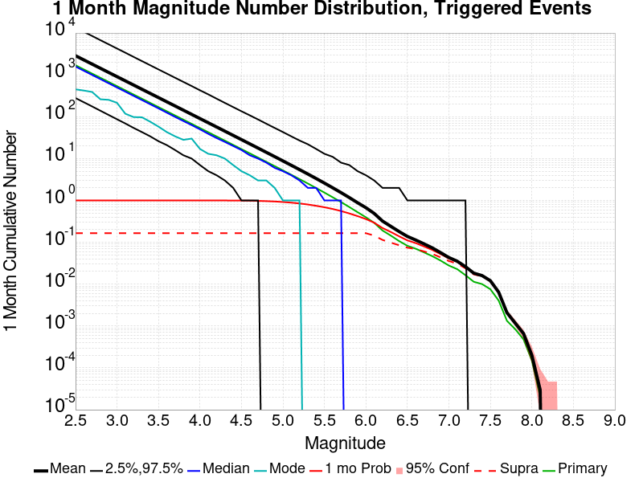

| Mag | Mean | 2.5 %ile | 97.5 %ile | Median | Mode | 1 mo Probability | 1 mo Supra-Seis Prob | Primary Aftershocks Mean |
|-----|-----|-----|-----|-----|-----|-----|-----|-----|
| **M&ge;2.5** | 2769.230 | 263.000 | 12881.000 | 1532.000 | 360.000 | 1.000 (100.00%) | 0.158 (15.80%) | 1670.085 |
| **M&ge;2.6** | 2199.886 | 212.000 | 10210.000 | 1220.000 | 506.000 | 1.000 (100.00%) | 0.158 (15.80%) | 1326.879 |
| **M&ge;2.7** | 1747.322 | 167.000 | 8140.000 | 969.000 | 573.000 | 1.000 (100.00%) | 0.158 (15.80%) | 1053.855 |
| **M&ge;2.8** | 1387.981 | 134.000 | 6450.000 | 772.000 | 300.000 | 1.000 (100.00%) | 0.158 (15.80%) | 837.164 |
| **M&ge;2.9** | 1102.595 | 107.000 | 5134.000 | 612.000 | 261.000 | 1.000 (100.00%) | 0.158 (15.80%) | 665.044 |
| **M&ge;3** | 876.087 | 84.000 | 4102.000 | 488.000 | 249.000 | 1.000 (100.00%) | 0.158 (15.80%) | 528.338 |
| **M&ge;3.1** | 695.727 | 67.000 | 3246.000 | 388.000 | 109.000 | 1.000 (100.00%) | 0.158 (15.80%) | 419.571 |
| **M&ge;3.2** | 552.771 | 52.000 | 2574.000 | 307.000 | 134.000 | 1.000 (100.00%) | 0.158 (15.80%) | 333.404 |
| **M&ge;3.3** | 439.124 | 41.000 | 2048.000 | 243.000 | 85.000 | 1.000 (100.00%) | 0.158 (15.80%) | 264.958 |
| **M&ge;3.4** | 348.670 | 33.000 | 1614.000 | 193.000 | 71.000 | 1.000 (100.00%) | 0.158 (15.80%) | 210.327 |
| **M&ge;3.5** | 276.858 | 26.000 | 1302.000 | 153.000 | 60.000 | 1.000 (100.00%) | 0.158 (15.80%) | 166.996 |
| **M&ge;3.6** | 219.871 | 20.000 | 1026.000 | 122.000 | 50.000 | 1.000 (100.00%) | 0.158 (15.80%) | 132.625 |
| **M&ge;3.7** | 174.562 | 15.000 | 818.000 | 96.000 | 36.000 | 1.000 (100.00%) | 0.158 (15.80%) | 105.255 |
| **M&ge;3.8** | 138.576 | 12.000 | 648.000 | 76.000 | 28.000 | 1.000 (100.00%) | 0.158 (15.80%) | 83.506 |
| **M&ge;3.9** | 109.981 | 9.000 | 516.000 | 61.000 | 26.000 | 1.000 (99.98%) | 0.158 (15.80%) | 66.226 |
| **M&ge;4** | 87.258 | 7.000 | 413.000 | 48.000 | 17.000 | 1.000 (99.98%) | 0.158 (15.80%) | 52.513 |
| **M&ge;4.1** | 69.220 | 5.000 | 327.000 | 38.000 | 13.000 | 1.000 (99.96%) | 0.158 (15.80%) | 41.685 |
| **M&ge;4.2** | 54.879 | 4.000 | 260.000 | 30.000 | 11.000 | 0.999 (99.93%) | 0.158 (15.80%) | 33.049 |
| **M&ge;4.3** | 43.547 | 3.000 | 203.000 | 24.000 | 10.000 | 0.997 (99.72%) | 0.158 (15.80%) | 26.233 |
| **M&ge;4.4** | 34.567 | 2.000 | 163.000 | 19.000 | 5.000 | 0.994 (99.40%) | 0.158 (15.80%) | 20.841 |
| **M&ge;4.5** | 27.424 | 1.000 | 131.000 | 15.000 | 8.000 | 0.990 (99.03%) | 0.158 (15.80%) | 16.563 |
| **M&ge;4.6** | 21.684 | 1.000 | 104.000 | 12.000 | 6.000 | 0.986 (98.56%) | 0.158 (15.80%) | 13.098 |
| **M&ge;4.7** | 17.192 | 1.000 | 83.000 | 9.000 | 4.000 | 0.976 (97.60%) | 0.158 (15.80%) | 10.390 |
| **M&ge;4.8** | 13.607 | 0.000 | 66.000 | 7.000 | 2.000 | 0.959 (95.90%) | 0.158 (15.80%) | 8.218 |
| **M&ge;4.9** | 10.772 | 0.000 | 52.000 | 6.000 | 1.000 | 0.938 (93.80%) | 0.158 (15.80%) | 6.518 |
| **M&ge;5** | 8.488 | 0.000 | 41.000 | 5.000 | 1.000 | 0.914 (91.36%) | 0.158 (15.80%) | 5.150 |
| **M&ge;5.1** | 6.709 | 0.000 | 33.000 | 4.000 | 1.000 | 0.880 (87.97%) | 0.158 (15.80%) | 4.064 |
| **M&ge;5.2** | 5.268 | 0.000 | 26.000 | 3.000 | 0.000 | 0.836 (83.56%) | 0.158 (15.80%) | 3.190 |
| **M&ge;5.3** | 4.118 | 0.000 | 21.000 | 2.000 | 0.000 | 0.790 (78.97%) | 0.158 (15.80%) | 2.500 |
| **M&ge;5.4** | 3.208 | 0.000 | 16.000 | 2.000 | 0.000 | 0.733 (73.31%) | 0.158 (15.80%) | 1.948 |
| **M&ge;5.5** | 2.504 | 0.000 | 13.000 | 1.000 | 0.000 | 0.679 (67.87%) | 0.158 (15.80%) | 1.523 |
| **M&ge;5.6** | 1.920 | 0.000 | 10.000 | 1.000 | 0.000 | 0.619 (61.93%) | 0.158 (15.80%) | 1.173 |
| **M&ge;5.7** | 1.479 | 0.000 | 8.000 | 1.000 | 0.000 | 0.554 (55.43%) | 0.158 (15.80%) | 0.908 |
| **M&ge;5.8** | 1.118 | 0.000 | 6.000 | 0.000 | 0.000 | 0.488 (48.75%) | 0.158 (15.80%) | 0.691 |
| **M&ge;5.9** | 0.839 | 0.000 | 5.000 | 0.000 | 0.000 | 0.417 (41.72%) | 0.158 (15.80%) | 0.520 |
| **M&ge;6** | 0.633 | 0.000 | 4.000 | 0.000 | 0.000 | 0.348 (34.83%) | 0.158 (15.80%) | 0.391 |
| **M&ge;6.1** | 0.456 | 0.000 | 3.000 | 0.000 | 0.000 | 0.279 (27.93%) | 0.138 (13.83%) | 0.284 |
| **M&ge;6.2** | 0.302 | 0.000 | 2.000 | 0.000 | 0.000 | 0.212 (21.16%) | 0.111 (11.12%) | 0.189 |
| **M&ge;6.3** | 0.222 | 0.000 | 2.000 | 0.000 | 0.000 | 0.167 (16.68%) | 0.097 (9.71%) | 0.139 |
| **M&ge;6.4** | 0.169 | 0.000 | 2.000 | 0.000 | 0.000 | 0.134 (13.38%) | 0.085 (8.55%) | 0.106 |
| **M&ge;6.5** | 0.133 | 0.000 | 1.000 | 0.000 | 0.000 | 0.109 (10.91%) | 0.076 (7.59%) | 0.085 |
| **M&ge;6.6** | 0.104 | 0.000 | 1.000 | 0.000 | 0.000 | 0.092 (9.17%) | 0.069 (6.86%) | 0.070 |
| **M&ge;6.7** | 0.085 | 0.000 | 1.000 | 0.000 | 0.000 | 0.078 (7.76%) | 0.061 (6.13%) | 0.058 |
| **M&ge;6.8** | 0.072 | 0.000 | 1.000 | 0.000 | 0.000 | 0.067 (6.67%) | 0.055 (5.51%) | 0.050 |
| **M&ge;6.9** | 0.054 | 0.000 | 1.000 | 0.000 | 0.000 | 0.052 (5.17%) | 0.045 (4.50%) | 0.038 |
| **M&ge;7** | 0.041 | 0.000 | 1.000 | 0.000 | 0.000 | 0.040 (4.01%) | 0.035 (3.52%) | 0.029 |
| **M&ge;7.1** | 0.033 | 0.000 | 1.000 | 0.000 | 0.000 | 0.032 (3.19%) | 0.030 (2.98%) | 0.023 |
| **M&ge;7.2** | 0.026 | 0.000 | 1.000 | 0.000 | 0.000 | 0.026 (2.57%) | 0.024 (2.42%) | 0.019 |
| **M&ge;7.3** | 0.018 | 0.000 | 0.000 | 0.000 | 0.000 | 0.018 (1.82%) | 0.017 (1.69%) | 0.013 |
| **M&ge;7.4** | 0.017 | 0.000 | 0.000 | 0.000 | 0.000 | 0.017 (1.69%) | 0.016 (1.61%) | 0.012 |
| **M&ge;7.5** | 0.013 | 0.000 | 0.000 | 0.000 | 0.000 | 0.013 (1.26%) | 0.012 (1.24%) | 9.56E-3 |
| **M&ge;7.6** | 6.00E-3 | 0.000 | 0.000 | 0.000 | 0.000 | 6.00E-3 (0.60%) | 6.00E-3 (0.60%) | 4.87E-3 |
| **M&ge;7.7** | 2.06E-3 | 0.000 | 0.000 | 0.000 | 0.000 | 2.06E-3 (0.21%) | 2.06E-3 (0.21%) | 1.87E-3 |
| **M&ge;7.8** | 1.69E-3 | 0.000 | 0.000 | 0.000 | 0.000 | 1.69E-3 (0.17%) | 1.69E-3 (0.17%) | 1.69E-3 |
| **M&ge;7.9** | 5.62E-4 | 0.000 | 0.000 | 0.000 | 0.000 | 5.62E-4 (0.06%) | 5.62E-4 (0.06%) | 5.62E-4 |
| **M&ge;8** | 1.87E-4 | 0.000 | 0.000 | 0.000 | 0.000 | 1.87E-4 (0.02%) | 1.87E-4 (0.02%) | 1.87E-4 |
| **M&ge;8.1** | 0.000 | 0.000 | 0.000 | 0.000 | 0.000 | 0.000 (0.00%) | 0.000 (0.00%) | 0.000 |
| **M&ge;8.2** | 0.000 | 0.000 | 0.000 | 0.000 | 0.000 | 0.000 (0.00%) | 0.000 (0.00%) | 0.000 |
| **M&ge;8.3** | 0.000 | 0.000 | 0.000 | 0.000 | 0.000 | 0.000 (0.00%) | 0.000 (0.00%) | 0.000 |
| **M&ge;8.4** | 0.000 | 0.000 | 0.000 | 0.000 | 0.000 | 0.000 (0.00%) | 0.000 (0.00%) | 0.000 |
| **M&ge;8.5** | 0.000 | 0.000 | 0.000 | 0.000 | 0.000 | 0.000 (0.00%) | 0.000 (0.00%) | 0.000 |
| **M&ge;8.6** | 0.000 | 0.000 | 0.000 | 0.000 | 0.000 | 0.000 (0.00%) | 0.000 (0.00%) | 0.000 |
| **M&ge;8.7** | 0.000 | 0.000 | 0.000 | 0.000 | 0.000 | 0.000 (0.00%) | 0.000 (0.00%) | 0.000 |
| **M&ge;8.8** | 0.000 | 0.000 | 0.000 | 0.000 | 0.000 | 0.000 (0.00%) | 0.000 (0.00%) | 0.000 |
| **M&ge;8.9** | 0.000 | 0.000 | 0.000 | 0.000 | 0.000 | 0.000 (0.00%) | 0.000 (0.00%) | 0.000 |
| **M&ge;9** | 0.000 | 0.000 | 0.000 | 0.000 | 0.000 | 0.000 (0.00%) | 0.000 (0.00%) | 0.000 |

### 1 Week Magnitude Number Distribution
*[(top)](#table-of-contents)*

**Legend**
* **Mean** (thick black line): mean expected number across all 5335 catalogs
* **2.5%,97.5%** (thin black lines): expected number percentiles across all 5335 catalogs
* **Median** (thin blue line): median expected number across all 5335 catalogs
* **Mode** (thin cyan line): modal expected number across all 5335 catalogs
* **1 wk Probability** (thin red line): 1 week probability calculated as the fraction of catalogs with at least 1 occurrence
* **1 wk Supraseismogenic Probability** (thin dashed red line): same as above, but only for supraseismogenic ruptures on explicitly modeled UCERF3 faults
* **95% Conf** (light red shaded region): binomial 95% confidence bounds on probability
* **Primary** (thin green line): mean expected number from primary triggered aftershocks only (no secondary, tertiary, etc...) across all 5335 catalogs

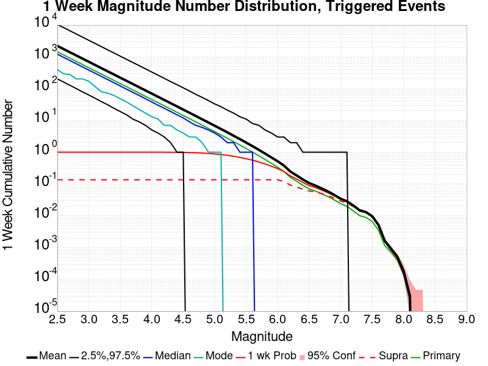

| Mag | Mean | 2.5 %ile | 97.5 %ile | Median | Mode | 1 wk Probability | 1 wk Supra-Seis Prob | Primary Aftershocks Mean |
|-----|-----|-----|-----|-----|-----|-----|-----|-----|
| **M&ge;2.5** | 2149.073 | 195.000 | 10182.000 | 1181.000 | 505.000 | 1.000 (100.00%) | 0.131 (13.08%) | 1413.446 |
| **M&ge;2.6** | 1707.181 | 154.000 | 8082.000 | 939.000 | 392.000 | 1.000 (100.00%) | 0.131 (13.08%) | 1122.942 |
| **M&ge;2.7** | 1355.974 | 124.000 | 6397.000 | 743.000 | 447.000 | 1.000 (100.00%) | 0.131 (13.08%) | 891.939 |
| **M&ge;2.8** | 1076.900 | 98.000 | 5094.000 | 595.000 | 394.000 | 1.000 (100.00%) | 0.131 (13.08%) | 708.419 |
| **M&ge;2.9** | 855.448 | 78.000 | 4040.000 | 472.000 | 151.000 | 1.000 (100.00%) | 0.131 (13.08%) | 562.768 |
| **M&ge;3** | 679.749 | 62.000 | 3214.000 | 374.000 | 146.000 | 1.000 (100.00%) | 0.131 (13.08%) | 447.053 |
| **M&ge;3.1** | 539.803 | 48.000 | 2551.000 | 295.000 | 93.000 | 1.000 (100.00%) | 0.131 (13.08%) | 355.060 |
| **M&ge;3.2** | 428.913 | 38.000 | 2042.000 | 235.000 | 79.000 | 1.000 (100.00%) | 0.131 (13.08%) | 282.174 |
| **M&ge;3.3** | 340.680 | 30.000 | 1615.000 | 187.000 | 103.000 | 1.000 (100.00%) | 0.131 (13.08%) | 224.236 |
| **M&ge;3.4** | 270.484 | 24.000 | 1278.000 | 148.000 | 50.000 | 1.000 (100.00%) | 0.131 (13.08%) | 177.965 |
| **M&ge;3.5** | 214.771 | 18.000 | 1017.000 | 118.000 | 40.000 | 1.000 (100.00%) | 0.131 (13.08%) | 141.306 |
| **M&ge;3.6** | 170.577 | 14.000 | 807.000 | 93.000 | 31.000 | 1.000 (100.00%) | 0.131 (13.08%) | 112.240 |
| **M&ge;3.7** | 135.422 | 11.000 | 641.000 | 74.000 | 29.000 | 1.000 (100.00%) | 0.131 (13.08%) | 89.079 |
| **M&ge;3.8** | 107.537 | 8.000 | 511.000 | 59.000 | 22.000 | 1.000 (99.98%) | 0.131 (13.08%) | 70.724 |
| **M&ge;3.9** | 85.319 | 6.000 | 406.000 | 47.000 | 17.000 | 1.000 (99.96%) | 0.131 (13.08%) | 56.060 |
| **M&ge;4** | 67.686 | 5.000 | 322.000 | 37.000 | 14.000 | 0.999 (99.91%) | 0.131 (13.08%) | 44.437 |
| **M&ge;4.1** | 53.680 | 3.000 | 253.000 | 29.000 | 14.000 | 0.999 (99.87%) | 0.131 (13.08%) | 35.263 |
| **M&ge;4.2** | 42.546 | 3.000 | 200.000 | 23.000 | 11.000 | 0.998 (99.78%) | 0.131 (13.08%) | 27.955 |
| **M&ge;4.3** | 33.739 | 2.000 | 161.000 | 19.000 | 5.000 | 0.993 (99.34%) | 0.131 (13.08%) | 22.171 |
| **M&ge;4.4** | 26.793 | 1.000 | 129.000 | 15.000 | 4.000 | 0.989 (98.91%) | 0.131 (13.08%) | 17.624 |
| **M&ge;4.5** | 21.256 | 1.000 | 103.000 | 12.000 | 3.000 | 0.983 (98.31%) | 0.131 (13.08%) | 14.007 |
| **M&ge;4.6** | 16.809 | 0.000 | 81.000 | 9.000 | 4.000 | 0.972 (97.24%) | 0.131 (13.08%) | 11.073 |
| **M&ge;4.7** | 13.342 | 0.000 | 64.000 | 7.000 | 2.000 | 0.953 (95.31%) | 0.131 (13.08%) | 8.787 |
| **M&ge;4.8** | 10.567 | 0.000 | 52.000 | 6.000 | 1.000 | 0.931 (93.14%) | 0.131 (13.08%) | 6.955 |
| **M&ge;4.9** | 8.362 | 0.000 | 42.000 | 5.000 | 1.000 | 0.904 (90.42%) | 0.131 (13.08%) | 5.515 |
| **M&ge;5** | 6.602 | 0.000 | 32.000 | 4.000 | 1.000 | 0.874 (87.40%) | 0.131 (13.08%) | 4.361 |
| **M&ge;5.1** | 5.221 | 0.000 | 26.000 | 3.000 | 1.000 | 0.837 (83.73%) | 0.131 (13.08%) | 3.444 |
| **M&ge;5.2** | 4.100 | 0.000 | 20.000 | 2.000 | 0.000 | 0.790 (79.01%) | 0.131 (13.08%) | 2.706 |
| **M&ge;5.3** | 3.199 | 0.000 | 16.000 | 2.000 | 0.000 | 0.738 (73.81%) | 0.131 (13.08%) | 2.118 |
| **M&ge;5.4** | 2.487 | 0.000 | 13.000 | 1.000 | 0.000 | 0.673 (67.29%) | 0.131 (13.08%) | 1.647 |
| **M&ge;5.5** | 1.941 | 0.000 | 10.000 | 1.000 | 0.000 | 0.613 (61.35%) | 0.131 (13.08%) | 1.285 |
| **M&ge;5.6** | 1.492 | 0.000 | 8.000 | 1.000 | 0.000 | 0.551 (55.05%) | 0.131 (13.08%) | 0.989 |
| **M&ge;5.7** | 1.158 | 0.000 | 7.000 | 0.000 | 0.000 | 0.488 (48.85%) | 0.131 (13.08%) | 0.768 |
| **M&ge;5.8** | 0.873 | 0.000 | 5.000 | 0.000 | 0.000 | 0.420 (42.02%) | 0.131 (13.08%) | 0.583 |
| **M&ge;5.9** | 0.657 | 0.000 | 4.000 | 0.000 | 0.000 | 0.356 (35.60%) | 0.131 (13.08%) | 0.436 |
| **M&ge;6** | 0.496 | 0.000 | 3.000 | 0.000 | 0.000 | 0.296 (29.56%) | 0.131 (13.08%) | 0.328 |
| **M&ge;6.1** | 0.359 | 0.000 | 3.000 | 0.000 | 0.000 | 0.235 (23.47%) | 0.115 (11.47%) | 0.240 |
| **M&ge;6.2** | 0.236 | 0.000 | 2.000 | 0.000 | 0.000 | 0.174 (17.36%) | 0.090 (9.03%) | 0.160 |
| **M&ge;6.3** | 0.172 | 0.000 | 2.000 | 0.000 | 0.000 | 0.134 (13.40%) | 0.078 (7.78%) | 0.117 |
| **M&ge;6.4** | 0.131 | 0.000 | 1.000 | 0.000 | 0.000 | 0.107 (10.67%) | 0.069 (6.88%) | 0.089 |
| **M&ge;6.5** | 0.103 | 0.000 | 1.000 | 0.000 | 0.000 | 0.087 (8.72%) | 0.062 (6.20%) | 0.071 |
| **M&ge;6.6** | 0.082 | 0.000 | 1.000 | 0.000 | 0.000 | 0.074 (7.42%) | 0.057 (5.66%) | 0.058 |
| **M&ge;6.7** | 0.067 | 0.000 | 1.000 | 0.000 | 0.000 | 0.062 (6.20%) | 0.050 (5.04%) | 0.048 |
| **M&ge;6.8** | 0.057 | 0.000 | 1.000 | 0.000 | 0.000 | 0.054 (5.38%) | 0.046 (4.61%) | 0.041 |
| **M&ge;6.9** | 0.043 | 0.000 | 1.000 | 0.000 | 0.000 | 0.041 (4.12%) | 0.037 (3.75%) | 0.031 |
| **M&ge;7** | 0.033 | 0.000 | 1.000 | 0.000 | 0.000 | 0.032 (3.19%) | 0.029 (2.92%) | 0.023 |
| **M&ge;7.1** | 0.027 | 0.000 | 1.000 | 0.000 | 0.000 | 0.026 (2.61%) | 0.025 (2.46%) | 0.019 |
| **M&ge;7.2** | 0.021 | 0.000 | 0.000 | 0.000 | 0.000 | 0.021 (2.10%) | 0.020 (1.99%) | 0.016 |
| **M&ge;7.3** | 0.016 | 0.000 | 0.000 | 0.000 | 0.000 | 0.015 (1.54%) | 0.014 (1.42%) | 0.011 |
| **M&ge;7.4** | 0.015 | 0.000 | 0.000 | 0.000 | 0.000 | 0.015 (1.46%) | 0.014 (1.39%) | 0.011 |
| **M&ge;7.5** | 0.010 | 0.000 | 0.000 | 0.000 | 0.000 | 0.010 (1.05%) | 0.010 (1.03%) | 8.06E-3 |
| **M&ge;7.6** | 5.06E-3 | 0.000 | 0.000 | 0.000 | 0.000 | 5.06E-3 (0.51%) | 5.06E-3 (0.51%) | 3.94E-3 |
| **M&ge;7.7** | 1.87E-3 | 0.000 | 0.000 | 0.000 | 0.000 | 1.87E-3 (0.19%) | 1.87E-3 (0.19%) | 1.69E-3 |
| **M&ge;7.8** | 1.50E-3 | 0.000 | 0.000 | 0.000 | 0.000 | 1.50E-3 (0.15%) | 1.50E-3 (0.15%) | 1.50E-3 |
| **M&ge;7.9** | 3.75E-4 | 0.000 | 0.000 | 0.000 | 0.000 | 3.75E-4 (0.04%) | 3.75E-4 (0.04%) | 3.75E-4 |
| **M&ge;8** | 1.87E-4 | 0.000 | 0.000 | 0.000 | 0.000 | 1.87E-4 (0.02%) | 1.87E-4 (0.02%) | 1.87E-4 |
| **M&ge;8.1** | 0.000 | 0.000 | 0.000 | 0.000 | 0.000 | 0.000 (0.00%) | 0.000 (0.00%) | 0.000 |
| **M&ge;8.2** | 0.000 | 0.000 | 0.000 | 0.000 | 0.000 | 0.000 (0.00%) | 0.000 (0.00%) | 0.000 |
| **M&ge;8.3** | 0.000 | 0.000 | 0.000 | 0.000 | 0.000 | 0.000 (0.00%) | 0.000 (0.00%) | 0.000 |
| **M&ge;8.4** | 0.000 | 0.000 | 0.000 | 0.000 | 0.000 | 0.000 (0.00%) | 0.000 (0.00%) | 0.000 |
| **M&ge;8.5** | 0.000 | 0.000 | 0.000 | 0.000 | 0.000 | 0.000 (0.00%) | 0.000 (0.00%) | 0.000 |
| **M&ge;8.6** | 0.000 | 0.000 | 0.000 | 0.000 | 0.000 | 0.000 (0.00%) | 0.000 (0.00%) | 0.000 |
| **M&ge;8.7** | 0.000 | 0.000 | 0.000 | 0.000 | 0.000 | 0.000 (0.00%) | 0.000 (0.00%) | 0.000 |
| **M&ge;8.8** | 0.000 | 0.000 | 0.000 | 0.000 | 0.000 | 0.000 (0.00%) | 0.000 (0.00%) | 0.000 |
| **M&ge;8.9** | 0.000 | 0.000 | 0.000 | 0.000 | 0.000 | 0.000 (0.00%) | 0.000 (0.00%) | 0.000 |
| **M&ge;9** | 0.000 | 0.000 | 0.000 | 0.000 | 0.000 | 0.000 (0.00%) | 0.000 (0.00%) | 0.000 |

### 1 Day Magnitude Number Distribution
*[(top)](#table-of-contents)*

**Legend**
* **Mean** (thick black line): mean expected number across all 5335 catalogs
* **2.5%,97.5%** (thin black lines): expected number percentiles across all 5335 catalogs
* **Median** (thin blue line): median expected number across all 5335 catalogs
* **Mode** (thin cyan line): modal expected number across all 5335 catalogs
* **1 d Probability** (thin red line): 1 day probability calculated as the fraction of catalogs with at least 1 occurrence
* **1 d Supraseismogenic Probability** (thin dashed red line): same as above, but only for supraseismogenic ruptures on explicitly modeled UCERF3 faults
* **95% Conf** (light red shaded region): binomial 95% confidence bounds on probability
* **Primary** (thin green line): mean expected number from primary triggered aftershocks only (no secondary, tertiary, etc...) across all 5335 catalogs


| Mag | Mean | 2.5 %ile | 97.5 %ile | Median | Mode | 1 d Probability | 1 d Supra-Seis Prob | Primary Aftershocks Mean |
|-----|-----|-----|-----|-----|-----|-----|-----|-----|
| **M&ge;2.5** | 1413.123 | 112.000 | 6840.000 | 767.000 | 347.000 | 1.000 (100.00%) | 0.092 (9.22%) | 1050.509 |
| **M&ge;2.6** | 1122.568 | 91.000 | 5452.000 | 610.000 | 288.000 | 1.000 (100.00%) | 0.092 (9.22%) | 834.613 |
| **M&ge;2.7** | 891.630 | 72.000 | 4329.000 | 484.000 | 184.000 | 1.000 (100.00%) | 0.092 (9.22%) | 662.929 |
| **M&ge;2.8** | 708.104 | 57.000 | 3428.000 | 383.000 | 168.000 | 1.000 (100.00%) | 0.092 (9.22%) | 526.501 |
| **M&ge;2.9** | 562.529 | 44.000 | 2717.000 | 305.000 | 103.000 | 1.000 (100.00%) | 0.092 (9.22%) | 418.369 |
| **M&ge;3** | 446.976 | 35.000 | 2160.000 | 243.000 | 76.000 | 1.000 (100.00%) | 0.092 (9.22%) | 332.379 |
| **M&ge;3.1** | 354.999 | 27.000 | 1718.000 | 194.000 | 62.000 | 1.000 (100.00%) | 0.092 (9.22%) | 263.997 |
| **M&ge;3.2** | 282.155 | 22.000 | 1357.000 | 153.000 | 49.000 | 1.000 (100.00%) | 0.092 (9.22%) | 209.865 |
| **M&ge;3.3** | 224.143 | 17.000 | 1071.000 | 121.000 | 39.000 | 1.000 (100.00%) | 0.092 (9.22%) | 166.730 |
| **M&ge;3.4** | 178.021 | 13.000 | 858.000 | 96.000 | 33.000 | 1.000 (100.00%) | 0.092 (9.22%) | 132.325 |
| **M&ge;3.5** | 141.460 | 10.000 | 676.000 | 77.000 | 23.000 | 1.000 (99.98%) | 0.092 (9.22%) | 105.160 |
| **M&ge;3.6** | 112.389 | 8.000 | 537.000 | 61.000 | 18.000 | 1.000 (99.98%) | 0.092 (9.22%) | 83.565 |
| **M&ge;3.7** | 89.210 | 6.000 | 428.000 | 48.000 | 9.000 | 0.999 (99.93%) | 0.092 (9.22%) | 66.283 |
| **M&ge;3.8** | 70.874 | 5.000 | 335.000 | 38.000 | 15.000 | 0.998 (99.83%) | 0.092 (9.22%) | 52.629 |
| **M&ge;3.9** | 56.191 | 3.000 | 268.000 | 30.000 | 13.000 | 0.997 (99.72%) | 0.092 (9.22%) | 41.702 |
| **M&ge;4** | 44.624 | 2.000 | 215.000 | 24.000 | 8.000 | 0.995 (99.48%) | 0.092 (9.22%) | 33.083 |
| **M&ge;4.1** | 35.373 | 2.000 | 170.000 | 19.000 | 9.000 | 0.992 (99.21%) | 0.092 (9.22%) | 26.236 |
| **M&ge;4.2** | 28.034 | 1.000 | 133.000 | 15.000 | 6.000 | 0.987 (98.74%) | 0.092 (9.22%) | 20.791 |
| **M&ge;4.3** | 22.250 | 1.000 | 106.000 | 12.000 | 3.000 | 0.980 (97.99%) | 0.092 (9.22%) | 16.497 |
| **M&ge;4.4** | 17.655 | 0.000 | 85.000 | 10.000 | 4.000 | 0.969 (96.91%) | 0.092 (9.22%) | 13.097 |
| **M&ge;4.5** | 13.991 | 0.000 | 68.000 | 7.000 | 3.000 | 0.954 (95.39%) | 0.092 (9.22%) | 10.407 |
| **M&ge;4.6** | 11.051 | 0.000 | 54.000 | 6.000 | 2.000 | 0.931 (93.12%) | 0.092 (9.22%) | 8.219 |
| **M&ge;4.7** | 8.767 | 0.000 | 43.000 | 5.000 | 1.000 | 0.906 (90.61%) | 0.092 (9.22%) | 6.505 |
| **M&ge;4.8** | 6.946 | 0.000 | 34.000 | 4.000 | 1.000 | 0.875 (87.46%) | 0.092 (9.22%) | 5.152 |
| **M&ge;4.9** | 5.495 | 0.000 | 27.000 | 3.000 | 0.000 | 0.836 (83.60%) | 0.092 (9.22%) | 4.082 |
| **M&ge;5** | 4.337 | 0.000 | 21.000 | 2.000 | 0.000 | 0.795 (79.46%) | 0.092 (9.22%) | 3.222 |
| **M&ge;5.1** | 3.426 | 0.000 | 17.000 | 2.000 | 0.000 | 0.748 (74.81%) | 0.092 (9.22%) | 2.543 |
| **M&ge;5.2** | 2.690 | 0.000 | 13.000 | 1.000 | 0.000 | 0.695 (69.48%) | 0.092 (9.22%) | 2.003 |
| **M&ge;5.3** | 2.091 | 0.000 | 11.000 | 1.000 | 0.000 | 0.637 (63.75%) | 0.092 (9.22%) | 1.566 |
| **M&ge;5.4** | 1.623 | 0.000 | 9.000 | 1.000 | 0.000 | 0.572 (57.23%) | 0.092 (9.22%) | 1.218 |
| **M&ge;5.5** | 1.265 | 0.000 | 7.000 | 1.000 | 0.000 | 0.512 (51.25%) | 0.092 (9.22%) | 0.950 |
| **M&ge;5.6** | 0.972 | 0.000 | 5.000 | 0.000 | 0.000 | 0.449 (44.87%) | 0.092 (9.22%) | 0.729 |
| **M&ge;5.7** | 0.751 | 0.000 | 4.000 | 0.000 | 0.000 | 0.389 (38.86%) | 0.092 (9.22%) | 0.562 |
| **M&ge;5.8** | 0.566 | 0.000 | 4.000 | 0.000 | 0.000 | 0.322 (32.22%) | 0.092 (9.22%) | 0.424 |
| **M&ge;5.9** | 0.422 | 0.000 | 3.000 | 0.000 | 0.000 | 0.265 (26.49%) | 0.092 (9.22%) | 0.316 |
| **M&ge;6** | 0.316 | 0.000 | 2.000 | 0.000 | 0.000 | 0.214 (21.37%) | 0.092 (9.22%) | 0.237 |
| **M&ge;6.1** | 0.229 | 0.000 | 2.000 | 0.000 | 0.000 | 0.170 (17.04%) | 0.082 (8.25%) | 0.174 |
| **M&ge;6.2** | 0.150 | 0.000 | 1.000 | 0.000 | 0.000 | 0.123 (12.28%) | 0.065 (6.47%) | 0.116 |
| **M&ge;6.3** | 0.110 | 0.000 | 1.000 | 0.000 | 0.000 | 0.094 (9.41%) | 0.056 (5.57%) | 0.084 |
| **M&ge;6.4** | 0.085 | 0.000 | 1.000 | 0.000 | 0.000 | 0.075 (7.48%) | 0.050 (4.97%) | 0.065 |
| **M&ge;6.5** | 0.068 | 0.000 | 1.000 | 0.000 | 0.000 | 0.061 (6.15%) | 0.045 (4.48%) | 0.053 |
| **M&ge;6.6** | 0.055 | 0.000 | 1.000 | 0.000 | 0.000 | 0.052 (5.23%) | 0.041 (4.12%) | 0.043 |
| **M&ge;6.7** | 0.046 | 0.000 | 1.000 | 0.000 | 0.000 | 0.044 (4.42%) | 0.037 (3.73%) | 0.037 |
| **M&ge;6.8** | 0.040 | 0.000 | 1.000 | 0.000 | 0.000 | 0.039 (3.86%) | 0.034 (3.41%) | 0.032 |
| **M&ge;6.9** | 0.030 | 0.000 | 1.000 | 0.000 | 0.000 | 0.030 (2.96%) | 0.027 (2.74%) | 0.024 |
| **M&ge;7** | 0.023 | 0.000 | 0.000 | 0.000 | 0.000 | 0.022 (2.23%) | 0.021 (2.08%) | 0.019 |
| **M&ge;7.1** | 0.019 | 0.000 | 0.000 | 0.000 | 0.000 | 0.019 (1.86%) | 0.018 (1.80%) | 0.015 |
| **M&ge;7.2** | 0.016 | 0.000 | 0.000 | 0.000 | 0.000 | 0.016 (1.57%) | 0.015 (1.52%) | 0.013 |
| **M&ge;7.3** | 0.011 | 0.000 | 0.000 | 0.000 | 0.000 | 0.011 (1.11%) | 0.010 (1.05%) | 9.18E-3 |
| **M&ge;7.4** | 0.010 | 0.000 | 0.000 | 0.000 | 0.000 | 0.010 (1.05%) | 0.010 (1.01%) | 8.62E-3 |
| **M&ge;7.5** | 8.06E-3 | 0.000 | 0.000 | 0.000 | 0.000 | 8.06E-3 (0.81%) | 7.87E-3 (0.79%) | 6.56E-3 |
| **M&ge;7.6** | 3.94E-3 | 0.000 | 0.000 | 0.000 | 0.000 | 3.94E-3 (0.39%) | 3.94E-3 (0.39%) | 3.19E-3 |
| **M&ge;7.7** | 1.50E-3 | 0.000 | 0.000 | 0.000 | 0.000 | 1.50E-3 (0.15%) | 1.50E-3 (0.15%) | 1.31E-3 |
| **M&ge;7.8** | 1.31E-3 | 0.000 | 0.000 | 0.000 | 0.000 | 1.31E-3 (0.13%) | 1.31E-3 (0.13%) | 1.31E-3 |
| **M&ge;7.9** | 3.75E-4 | 0.000 | 0.000 | 0.000 | 0.000 | 3.75E-4 (0.04%) | 3.75E-4 (0.04%) | 3.75E-4 |
| **M&ge;8** | 1.87E-4 | 0.000 | 0.000 | 0.000 | 0.000 | 1.87E-4 (0.02%) | 1.87E-4 (0.02%) | 1.87E-4 |
| **M&ge;8.1** | 0.000 | 0.000 | 0.000 | 0.000 | 0.000 | 0.000 (0.00%) | 0.000 (0.00%) | 0.000 |
| **M&ge;8.2** | 0.000 | 0.000 | 0.000 | 0.000 | 0.000 | 0.000 (0.00%) | 0.000 (0.00%) | 0.000 |
| **M&ge;8.3** | 0.000 | 0.000 | 0.000 | 0.000 | 0.000 | 0.000 (0.00%) | 0.000 (0.00%) | 0.000 |
| **M&ge;8.4** | 0.000 | 0.000 | 0.000 | 0.000 | 0.000 | 0.000 (0.00%) | 0.000 (0.00%) | 0.000 |
| **M&ge;8.5** | 0.000 | 0.000 | 0.000 | 0.000 | 0.000 | 0.000 (0.00%) | 0.000 (0.00%) | 0.000 |
| **M&ge;8.6** | 0.000 | 0.000 | 0.000 | 0.000 | 0.000 | 0.000 (0.00%) | 0.000 (0.00%) | 0.000 |
| **M&ge;8.7** | 0.000 | 0.000 | 0.000 | 0.000 | 0.000 | 0.000 (0.00%) | 0.000 (0.00%) | 0.000 |
| **M&ge;8.8** | 0.000 | 0.000 | 0.000 | 0.000 | 0.000 | 0.000 (0.00%) | 0.000 (0.00%) | 0.000 |
| **M&ge;8.9** | 0.000 | 0.000 | 0.000 | 0.000 | 0.000 | 0.000 (0.00%) | 0.000 (0.00%) | 0.000 |
| **M&ge;9** | 0.000 | 0.000 | 0.000 | 0.000 | 0.000 | 0.000 (0.00%) | 0.000 (0.00%) | 0.000 |

### 1 Hour Magnitude Number Distribution
*[(top)](#table-of-contents)*

**Legend**
* **Mean** (thick black line): mean expected number across all 5335 catalogs
* **2.5%,97.5%** (thin black lines): expected number percentiles across all 5335 catalogs
* **Median** (thin blue line): median expected number across all 5335 catalogs
* **Mode** (thin cyan line): modal expected number across all 5335 catalogs
* **1 hr Probability** (thin red line): 1 hour probability calculated as the fraction of catalogs with at least 1 occurrence
* **1 hr Supraseismogenic Probability** (thin dashed red line): same as above, but only for supraseismogenic ruptures on explicitly modeled UCERF3 faults
* **95% Conf** (light red shaded region): binomial 95% confidence bounds on probability
* **Primary** (thin green line): mean expected number from primary triggered aftershocks only (no secondary, tertiary, etc...) across all 5335 catalogs

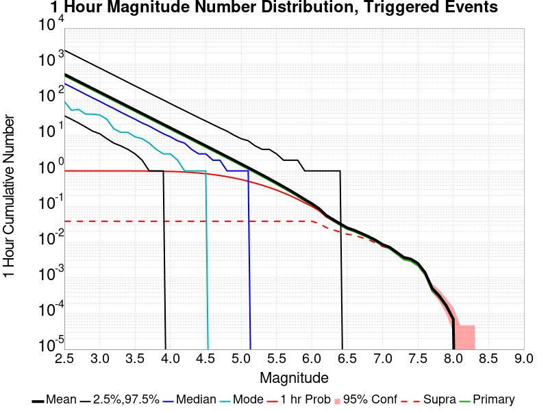

| Mag | Mean | 2.5 %ile | 97.5 %ile | Median | Mode | 1 hr Probability | 1 hr Supra-Seis Prob | Primary Aftershocks Mean |
|-----|-----|-----|-----|-----|-----|-----|-----|-----|
| **M&ge;2.5** | 500.064 | 35.000 | 2465.000 | 273.000 | 88.000 | 1.000 (100.00%) | 0.038 (3.79%) | 451.198 |
| **M&ge;2.6** | 397.208 | 28.000 | 1947.000 | 218.000 | 86.000 | 1.000 (100.00%) | 0.038 (3.79%) | 358.373 |
| **M&ge;2.7** | 315.219 | 21.000 | 1552.000 | 173.000 | 67.000 | 1.000 (100.00%) | 0.038 (3.79%) | 284.445 |
| **M&ge;2.8** | 250.290 | 17.000 | 1227.000 | 137.000 | 53.000 | 1.000 (100.00%) | 0.038 (3.79%) | 225.899 |
| **M&ge;2.9** | 199.008 | 13.000 | 971.000 | 109.000 | 41.000 | 0.999 (99.94%) | 0.038 (3.79%) | 179.593 |
| **M&ge;3** | 158.125 | 11.000 | 774.000 | 86.000 | 36.000 | 0.999 (99.94%) | 0.038 (3.79%) | 142.702 |
| **M&ge;3.1** | 125.559 | 8.000 | 615.000 | 68.000 | 18.000 | 0.999 (99.94%) | 0.038 (3.79%) | 113.295 |
| **M&ge;3.2** | 99.811 | 6.000 | 484.000 | 55.000 | 16.000 | 0.999 (99.91%) | 0.038 (3.79%) | 90.072 |
| **M&ge;3.3** | 79.339 | 5.000 | 385.000 | 43.000 | 19.000 | 0.999 (99.85%) | 0.038 (3.79%) | 71.570 |
| **M&ge;3.4** | 62.960 | 4.000 | 307.000 | 35.000 | 13.000 | 0.998 (99.78%) | 0.038 (3.79%) | 56.772 |
| **M&ge;3.5** | 50.027 | 3.000 | 244.000 | 27.000 | 8.000 | 0.997 (99.66%) | 0.038 (3.79%) | 45.090 |
| **M&ge;3.6** | 39.789 | 2.000 | 191.000 | 22.000 | 6.000 | 0.995 (99.48%) | 0.038 (3.79%) | 35.857 |
| **M&ge;3.7** | 31.546 | 1.000 | 153.000 | 17.000 | 7.000 | 0.991 (99.14%) | 0.038 (3.79%) | 28.421 |
| **M&ge;3.8** | 25.053 | 1.000 | 123.000 | 14.000 | 4.000 | 0.986 (98.58%) | 0.038 (3.79%) | 22.556 |
| **M&ge;3.9** | 19.888 | 1.000 | 99.000 | 11.000 | 4.000 | 0.978 (97.75%) | 0.038 (3.79%) | 17.900 |
| **M&ge;4** | 15.778 | 0.000 | 77.000 | 9.000 | 3.000 | 0.966 (96.61%) | 0.038 (3.79%) | 14.190 |
| **M&ge;4.1** | 12.490 | 0.000 | 62.000 | 7.000 | 2.000 | 0.950 (95.01%) | 0.038 (3.79%) | 11.243 |
| **M&ge;4.2** | 9.896 | 0.000 | 48.000 | 5.000 | 2.000 | 0.927 (92.73%) | 0.038 (3.79%) | 8.901 |
| **M&ge;4.3** | 7.841 | 0.000 | 37.000 | 4.000 | 1.000 | 0.901 (90.07%) | 0.038 (3.79%) | 7.058 |
| **M&ge;4.4** | 6.224 | 0.000 | 31.000 | 3.000 | 1.000 | 0.867 (86.65%) | 0.038 (3.79%) | 5.606 |
| **M&ge;4.5** | 4.972 | 0.000 | 25.000 | 3.000 | 0.000 | 0.825 (82.55%) | 0.038 (3.79%) | 4.475 |
| **M&ge;4.6** | 3.938 | 0.000 | 20.000 | 2.000 | 0.000 | 0.778 (77.77%) | 0.038 (3.79%) | 3.544 |
| **M&ge;4.7** | 3.132 | 0.000 | 16.000 | 2.000 | 0.000 | 0.732 (73.16%) | 0.038 (3.79%) | 2.818 |
| **M&ge;4.8** | 2.486 | 0.000 | 13.000 | 1.000 | 0.000 | 0.682 (68.25%) | 0.038 (3.79%) | 2.238 |
| **M&ge;4.9** | 1.971 | 0.000 | 11.000 | 1.000 | 0.000 | 0.630 (63.04%) | 0.038 (3.79%) | 1.776 |
| **M&ge;5** | 1.546 | 0.000 | 8.000 | 1.000 | 0.000 | 0.566 (56.61%) | 0.038 (3.79%) | 1.397 |
| **M&ge;5.1** | 1.218 | 0.000 | 7.000 | 1.000 | 0.000 | 0.508 (50.82%) | 0.038 (3.79%) | 1.099 |
| **M&ge;5.2** | 0.960 | 0.000 | 5.000 | 0.000 | 0.000 | 0.447 (44.70%) | 0.038 (3.79%) | 0.868 |
| **M&ge;5.3** | 0.749 | 0.000 | 4.000 | 0.000 | 0.000 | 0.390 (38.97%) | 0.038 (3.79%) | 0.676 |
| **M&ge;5.4** | 0.585 | 0.000 | 4.000 | 0.000 | 0.000 | 0.336 (33.63%) | 0.038 (3.79%) | 0.528 |
| **M&ge;5.5** | 0.462 | 0.000 | 3.000 | 0.000 | 0.000 | 0.284 (28.42%) | 0.038 (3.79%) | 0.417 |
| **M&ge;5.6** | 0.357 | 0.000 | 3.000 | 0.000 | 0.000 | 0.239 (23.88%) | 0.038 (3.79%) | 0.325 |
| **M&ge;5.7** | 0.278 | 0.000 | 2.000 | 0.000 | 0.000 | 0.199 (19.94%) | 0.038 (3.79%) | 0.254 |
| **M&ge;5.8** | 0.210 | 0.000 | 2.000 | 0.000 | 0.000 | 0.161 (16.14%) | 0.038 (3.79%) | 0.192 |
| **M&ge;5.9** | 0.156 | 0.000 | 1.000 | 0.000 | 0.000 | 0.125 (12.50%) | 0.038 (3.79%) | 0.143 |
| **M&ge;6** | 0.118 | 0.000 | 1.000 | 0.000 | 0.000 | 0.098 (9.84%) | 0.038 (3.79%) | 0.108 |
| **M&ge;6.1** | 0.085 | 0.000 | 1.000 | 0.000 | 0.000 | 0.074 (7.40%) | 0.035 (3.49%) | 0.079 |
| **M&ge;6.2** | 0.058 | 0.000 | 1.000 | 0.000 | 0.000 | 0.053 (5.32%) | 0.028 (2.79%) | 0.054 |
| **M&ge;6.3** | 0.043 | 0.000 | 1.000 | 0.000 | 0.000 | 0.040 (3.96%) | 0.024 (2.38%) | 0.040 |
| **M&ge;6.4** | 0.034 | 0.000 | 1.000 | 0.000 | 0.000 | 0.032 (3.19%) | 0.022 (2.19%) | 0.031 |
| **M&ge;6.5** | 0.028 | 0.000 | 1.000 | 0.000 | 0.000 | 0.026 (2.62%) | 0.020 (2.01%) | 0.025 |
| **M&ge;6.6** | 0.023 | 0.000 | 0.000 | 0.000 | 0.000 | 0.022 (2.25%) | 0.018 (1.82%) | 0.021 |
| **M&ge;6.7** | 0.019 | 0.000 | 0.000 | 0.000 | 0.000 | 0.018 (1.82%) | 0.016 (1.57%) | 0.017 |
| **M&ge;6.8** | 0.017 | 0.000 | 0.000 | 0.000 | 0.000 | 0.016 (1.63%) | 0.014 (1.44%) | 0.015 |
| **M&ge;6.9** | 0.013 | 0.000 | 0.000 | 0.000 | 0.000 | 0.013 (1.33%) | 0.012 (1.24%) | 0.012 |
| **M&ge;7** | 0.010 | 0.000 | 0.000 | 0.000 | 0.000 | 0.010 (1.01%) | 9.56E-3 (0.96%) | 9.00E-3 |
| **M&ge;7.1** | 9.00E-3 | 0.000 | 0.000 | 0.000 | 0.000 | 9.00E-3 (0.90%) | 8.81E-3 (0.88%) | 8.06E-3 |
| **M&ge;7.2** | 6.94E-3 | 0.000 | 0.000 | 0.000 | 0.000 | 6.94E-3 (0.69%) | 6.75E-3 (0.67%) | 6.37E-3 |
| **M&ge;7.3** | 5.06E-3 | 0.000 | 0.000 | 0.000 | 0.000 | 5.06E-3 (0.51%) | 4.87E-3 (0.49%) | 4.50E-3 |
| **M&ge;7.4** | 4.87E-3 | 0.000 | 0.000 | 0.000 | 0.000 | 4.87E-3 (0.49%) | 4.69E-3 (0.47%) | 4.31E-3 |
| **M&ge;7.5** | 3.75E-3 | 0.000 | 0.000 | 0.000 | 0.000 | 3.75E-3 (0.37%) | 3.75E-3 (0.37%) | 3.19E-3 |
| **M&ge;7.6** | 2.25E-3 | 0.000 | 0.000 | 0.000 | 0.000 | 2.25E-3 (0.22%) | 2.25E-3 (0.22%) | 1.87E-3 |
| **M&ge;7.7** | 1.12E-3 | 0.000 | 0.000 | 0.000 | 0.000 | 1.12E-3 (0.11%) | 1.12E-3 (0.11%) | 9.37E-4 |
| **M&ge;7.8** | 9.37E-4 | 0.000 | 0.000 | 0.000 | 0.000 | 9.37E-4 (0.09%) | 9.37E-4 (0.09%) | 9.37E-4 |
| **M&ge;7.9** | 1.87E-4 | 0.000 | 0.000 | 0.000 | 0.000 | 1.87E-4 (0.02%) | 1.87E-4 (0.02%) | 1.87E-4 |
| **M&ge;8** | 1.87E-4 | 0.000 | 0.000 | 0.000 | 0.000 | 1.87E-4 (0.02%) | 1.87E-4 (0.02%) | 1.87E-4 |
| **M&ge;8.1** | 0.000 | 0.000 | 0.000 | 0.000 | 0.000 | 0.000 (0.00%) | 0.000 (0.00%) | 0.000 |
| **M&ge;8.2** | 0.000 | 0.000 | 0.000 | 0.000 | 0.000 | 0.000 (0.00%) | 0.000 (0.00%) | 0.000 |
| **M&ge;8.3** | 0.000 | 0.000 | 0.000 | 0.000 | 0.000 | 0.000 (0.00%) | 0.000 (0.00%) | 0.000 |
| **M&ge;8.4** | 0.000 | 0.000 | 0.000 | 0.000 | 0.000 | 0.000 (0.00%) | 0.000 (0.00%) | 0.000 |
| **M&ge;8.5** | 0.000 | 0.000 | 0.000 | 0.000 | 0.000 | 0.000 (0.00%) | 0.000 (0.00%) | 0.000 |
| **M&ge;8.6** | 0.000 | 0.000 | 0.000 | 0.000 | 0.000 | 0.000 (0.00%) | 0.000 (0.00%) | 0.000 |
| **M&ge;8.7** | 0.000 | 0.000 | 0.000 | 0.000 | 0.000 | 0.000 (0.00%) | 0.000 (0.00%) | 0.000 |
| **M&ge;8.8** | 0.000 | 0.000 | 0.000 | 0.000 | 0.000 | 0.000 (0.00%) | 0.000 (0.00%) | 0.000 |
| **M&ge;8.9** | 0.000 | 0.000 | 0.000 | 0.000 | 0.000 | 0.000 (0.00%) | 0.000 (0.00%) | 0.000 |
| **M&ge;9** | 0.000 | 0.000 | 0.000 | 0.000 | 0.000 | 0.000 (0.00%) | 0.000 (0.00%) | 0.000 |


## Hazard Change Over Time
*[(top)](#table-of-contents)*

These plots show how the probability of ruptures of various magnitudes within the region used to fetch ComCat trigger ruptures changes over time

### M&ge;5.0 Hazard Change Over Time
*[(top)](#table-of-contents)*


| Forecast Duration | UCERF3-ETAS [95% Conf] | UCERF3-ETAS Triggered Only | UCERF3-TD | UCERF3-ETAS/TD Gain | UCERF3-TI |
|-----|-----|-----|-----|-----|-----|
| 1 Hour | 0.563 [0.550 - 0.576] | 0.563 | 3.02E-5 | 18629.68 | 3.00E-5 |
| 1 Day | 0.791 [0.780 - 0.802] | 0.791 | 7.25E-4 | 1091.01 | 7.20E-4 |
| 1 Week | 0.872 [0.863 - 0.881] | 0.871 | 5.07E-3 | 172.14 | 5.03E-3 |
| 1 Month | 0.913 [0.905 - 0.921] | 0.911 | 0.022 | 42.42 | 0.021 |
| 1 Year | 0.962 [0.958 - 0.967] | 0.951 | 0.233 | 4.13 | 0.231 |
| 10 Years | 0.998 [0.997 - 0.998] | 0.966 | 0.929 | 1.07 | 0.928 |
| 30 Years | 1.000 [1.000 - 1.000] \* | \* | 1.000 | 1 \* | 1.000 |
| 100 Years | 1.000 [1.000 - 1.000] \* | \* | 1.000 | 1 \* | 1.000 |

\* *forecast duration is longer than simulation length, only ETAS ruptures from the first 10 years are included*
### M&ge;6.0 Hazard Change Over Time
*[(top)](#table-of-contents)*


| Forecast Duration | UCERF3-ETAS [95% Conf] | UCERF3-ETAS Triggered Only | UCERF3-TD | UCERF3-ETAS/TD Gain | UCERF3-TI |
|-----|-----|-----|-----|-----|-----|
| 1 Hour | 0.097 [0.089 - 0.105] | 0.097 | 3.50E-6 | 27582.03 | 3.28E-6 |
| 1 Day | 0.208 [0.197 - 0.219] | 0.208 | 8.40E-5 | 2477.84 | 7.86E-5 |
| 1 Week | 0.290 [0.278 - 0.302] | 0.290 | 5.88E-4 | 493.37 | 5.50E-4 |
| 1 Month | 0.342 [0.330 - 0.355] | 0.341 | 2.52E-3 | 136.06 | 2.36E-3 |
| 1 Year | 0.435 [0.422 - 0.448] | 0.417 | 0.030 | 14.39 | 0.028 |
| 10 Years | 0.617 [0.607 - 0.627] | 0.479 | 0.264 | 2.33 | 0.250 |
| 30 Years | 0.793 [0.788 - 0.799] \* | \* | 0.603 | 1.32 \* | 0.577 |
| 100 Years | 0.977 [0.976 - 0.978] \* | \* | 0.956 | 1.02 \* | 0.943 |

\* *forecast duration is longer than simulation length, only ETAS ruptures from the first 10 years are included*
### M&ge;7.0 Hazard Change Over Time
*[(top)](#table-of-contents)*


| Forecast Duration | UCERF3-ETAS [95% Conf] | UCERF3-ETAS Triggered Only | UCERF3-TD | UCERF3-ETAS/TD Gain | UCERF3-TI |
|-----|-----|-----|-----|-----|-----|
| 1 Hour | 9.93E-3 [7.52E-3 - 0.013] | 9.93E-3 | 3.60E-7 | 27602.37 | 3.21E-7 |
| 1 Day | 0.022 [0.018 - 0.027] | 0.022 | 8.64E-6 | 2561.49 | 7.71E-6 |
| 1 Week | 0.032 [0.027 - 0.037] | 0.032 | 6.05E-5 | 524.86 | 5.39E-5 |
| 1 Month | 0.040 [0.035 - 0.046] | 0.040 | 2.59E-4 | 154.32 | 2.31E-4 |
| 1 Year | 0.055 [0.049 - 0.061] | 0.052 | 3.15E-3 | 17.31 | 2.81E-3 |
| 10 Years | 0.092 [0.086 - 0.099] | 0.063 | 0.031 | 2.95 | 0.028 |
| 30 Years | 0.149 [0.144 - 0.156] \* | \* | 0.093 | 1.61 \* | 0.081 |
| 100 Years | 0.338 [0.334 - 0.343] \* | \* | 0.294 | 1.15 \* | 0.245 |

\* *forecast duration is longer than simulation length, only ETAS ruptures from the first 10 years are included*
### M&ge;8.0 Hazard Change Over Time
*[(top)](#table-of-contents)*


| Forecast Duration | UCERF3-ETAS [95% Conf] | UCERF3-ETAS Triggered Only | UCERF3-TD | UCERF3-ETAS/TD Gain | UCERF3-TI |
|-----|-----|-----|-----|-----|-----|
| 1 Hour | 1.87E-4 [9.80E-6 - 1.22E-3] | 1.87E-4 | 1.24E-8 | 15158.56 | 1.06E-8 |
| 1 Day | 1.88E-4 [1.01E-5 - 1.22E-3] | 1.87E-4 | 2.97E-7 | 632.56 | 2.54E-7 |
| 1 Week | 1.90E-4 [1.19E-5 - 1.22E-3] | 1.87E-4 | 2.08E-6 | 91.22 | 1.78E-6 |
| 1 Month | 1.96E-4 [1.87E-5 - 1.23E-3] | 1.87E-4 | 8.90E-6 | 22.05 | 7.63E-6 |
| 1 Year | 2.96E-4 [1.18E-4 - 1.32E-3] | 1.87E-4 | 1.08E-4 | 2.73 | 9.29E-5 |
| 10 Years | 1.28E-3 [1.11E-3 - 2.31E-3] | 1.87E-4 | 1.10E-3 | 1.17 | 9.29E-4 |
| 30 Years | 3.69E-3 [3.51E-3 - 4.72E-3] \* | \* | 3.50E-3 | 1.05 \* | 2.78E-3 |
| 100 Years | 0.014 [0.014 - 0.015] \* | \* | 0.014 | 1.01 \* | 9.25E-3 |

\* *forecast duration is longer than simulation length, only ETAS ruptures from the first 10 years are included*

## Trigger Rupture Fault Map
*[(top)](#table-of-contents)*


## Trigger Rupture Depth Map
*[(top)](#table-of-contents)*


## Fault Distances To Triggers
*[(top)](#table-of-contents)*

| Section Name | Strike, Dip, Rake | # Hypos In Poly | Max Mag w/ Hypo In Poly | # Surfs In Poly | Max Mag w/ Surf In Poly | Min Dist To Any (km) | Min Poly Dist To Any (km) | Min Dist To Largest (km) | Min Poly Dist To Largest (km) | Min Hypo Dist To Largest (km) | Min Hypo Poly Dist To Largest (km) |
|-----|-----|-----|-----|-----|-----|-----|-----|-----|-----|-----|-----|
| Airport Lake | 359, 50, -90 | 92 | 7.1 | 92 | 7.1 | 0.036 | 0.000 | 0.036 | 0.000 | 5.612 | 0.000 |
| Little Lake | 327, 90, 180 | 16 | 3.75 | 17 | 7.1 | 2.268 | 0.000 | 11.284 | 0.000 | 13.471 | 1.469 |
| Garlock (Central) | 71, 90, 0 | 2 | 2.76 | 3 | 7.1 | 5.600 | 0.000 | 5.600 | 0.000 | 22.766 | 10.797 |
| So Sierra Nevada | 2, 50, -90 | 0 |  | 0 |  | 4.248 | 4.233 | 4.248 | 4.233 | 16.191 | 15.188 |
| Tank Canyon | 189, 50, -90 | 0 |  | 0 |  | 9.015 | 9.011 | 9.015 | 9.011 | 17.039 | 16.895 |
| Blackwater | 323, 90, 180 | 0 |  | 0 |  | 14.394 | 8.726 | 14.394 | 8.726 | 29.622 | 27.613 |

## Individual Simulated Catalog Maps
*[(top)](#table-of-contents)*

These are map plots of individual catalogs from the simulations, selected as the closest catalog to each of the given percentiles in terms of total number of events.

| Duration | p0.0 %-ile | p25.0 %-ile | p50.0 %-ile | p75.0 %-ile | p90.0 %-ile | p95.0 %-ile | p97.5 %-ile | p98.0 %-ile | p99.0 %-ile | p99.5 %-ile | p99.9 %-ile | p99.981256 %-ile |
|-----|-----|-----|-----|-----|-----|-----|-----|-----|-----|-----|-----|-----|
| **1 Week** |  |  |  |  |  |  |  |  | 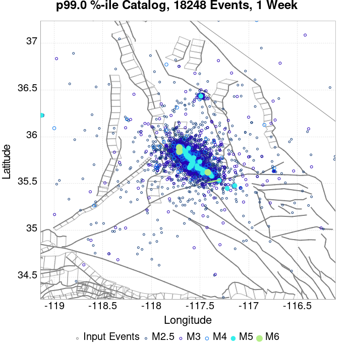 |  | 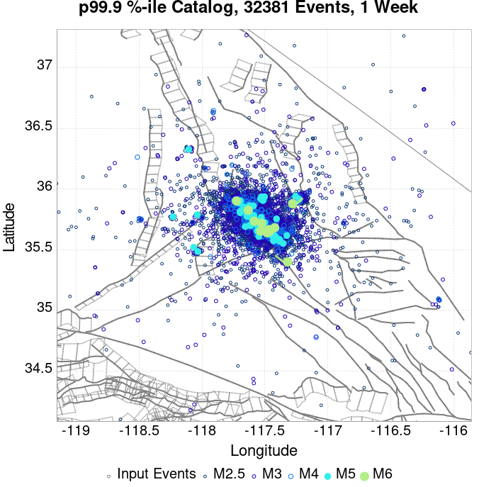 | 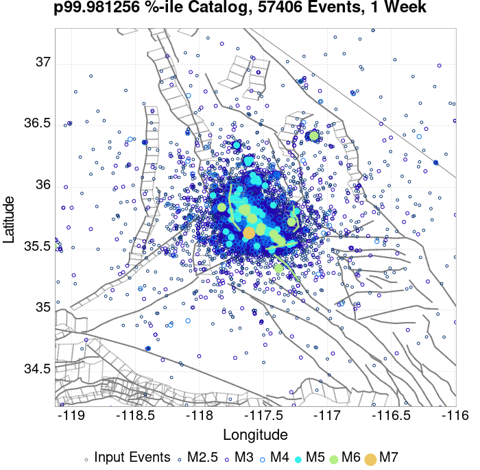 |
| **1 Month** | 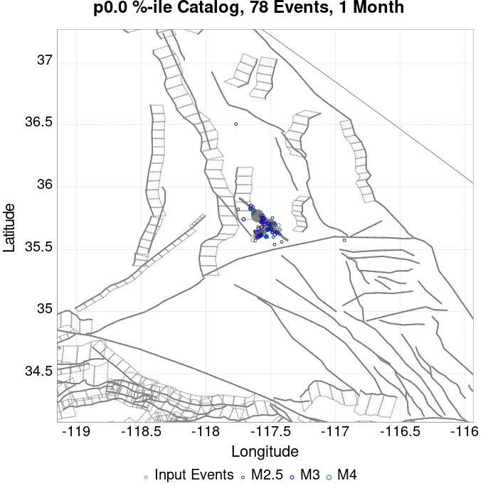 | 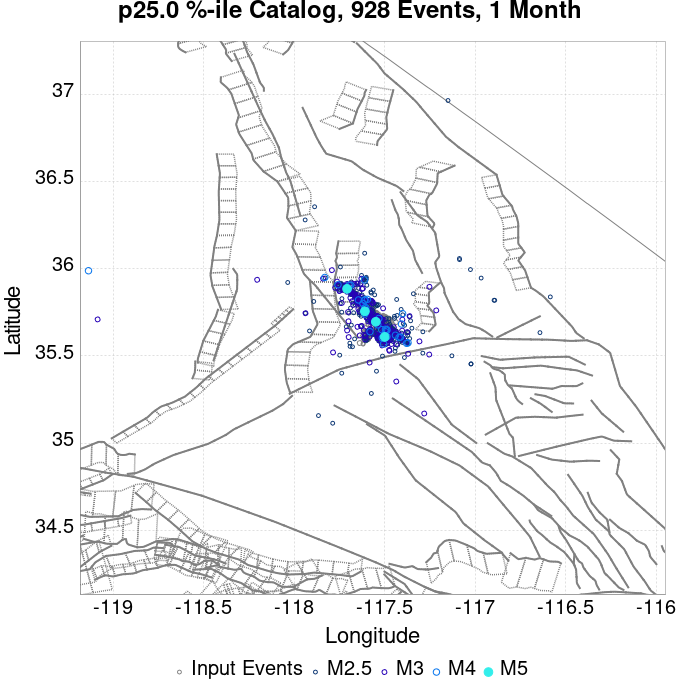 |  |  |  |  |  |  |  |  |  |  |
| **1 Year** |  | 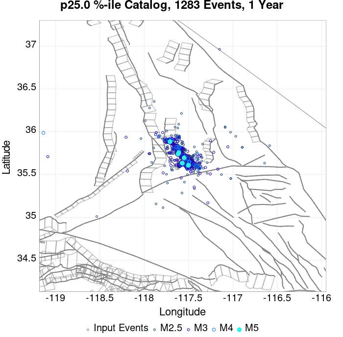 | 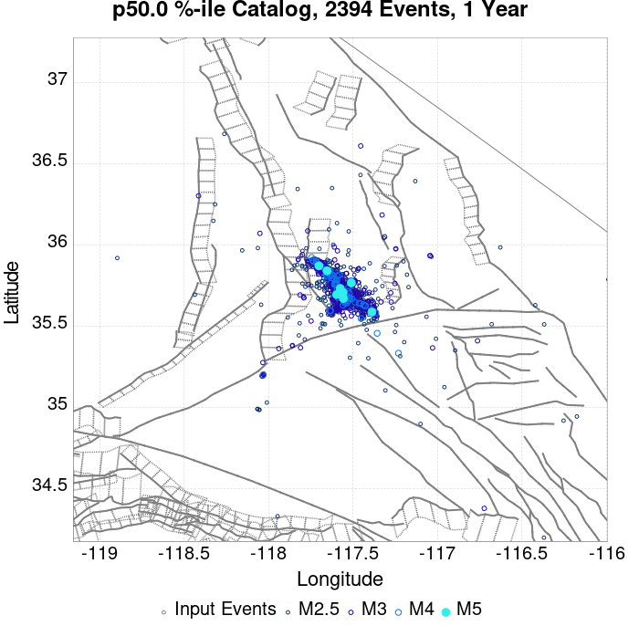 |  |  |  | 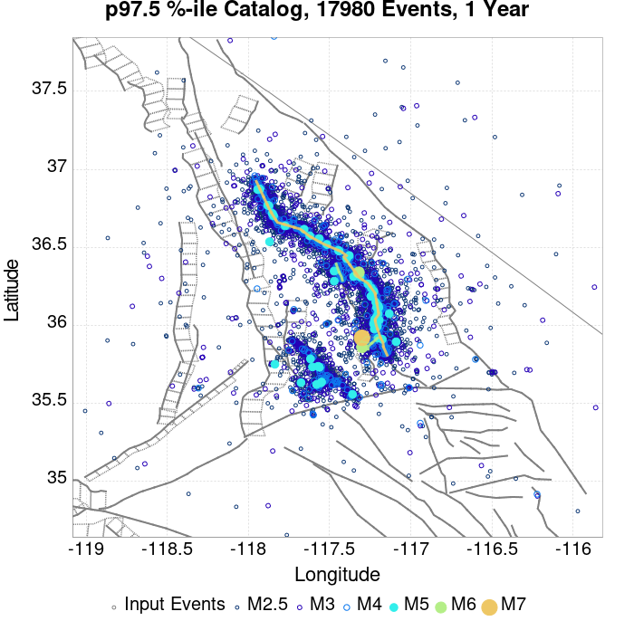 |  |  |  |  |  |
| **10 Year** |  |  |  | 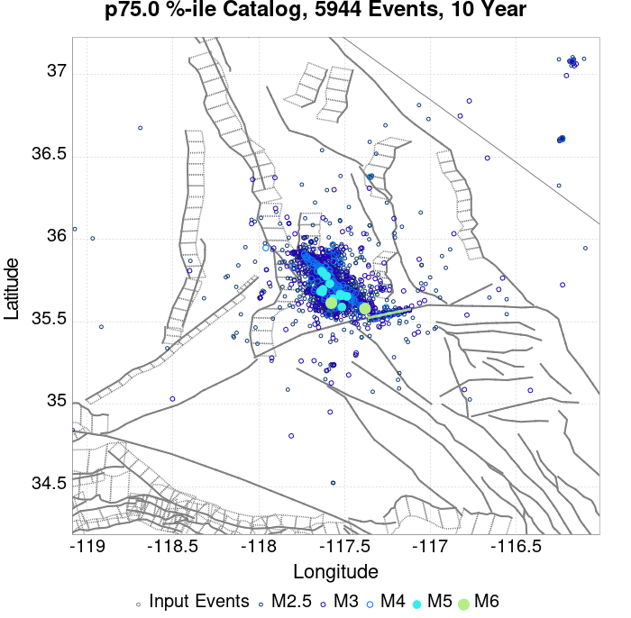 |  | 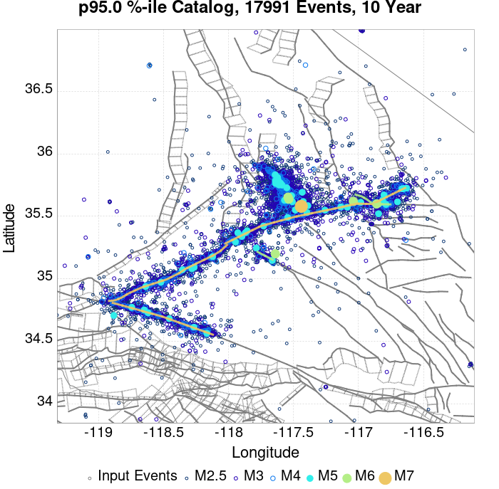 | 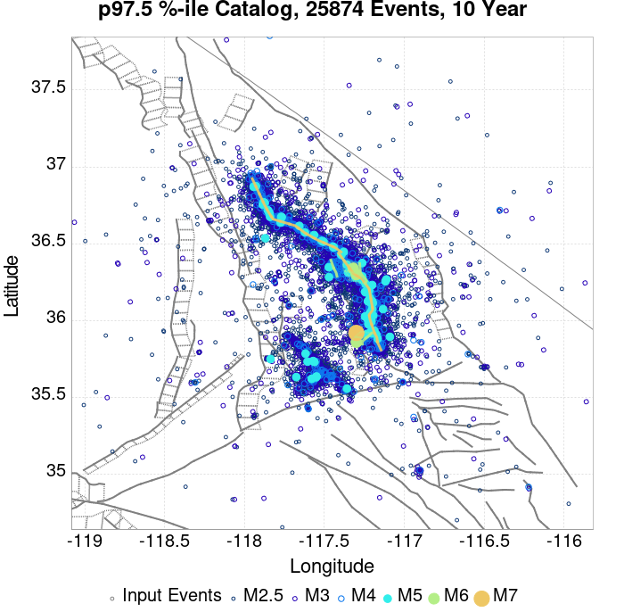 |  |  |  |  | 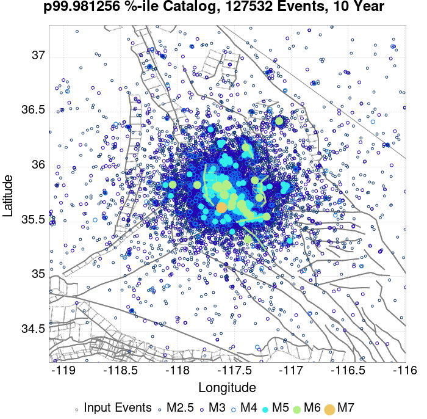 |

## ComCat Data Comparisons
*[(top)](#table-of-contents)*

These plots compare simulated sequences with data from ComCat. All plots only consider events with hypocenters inside the ComCat region defined in the JSON input file.

Last updated at 2019/11/06 01:41:10 UTC, 4 mo after the simulation start time

### ComCat Magnitude-Number Distributions
*[(top)](#table-of-contents)*

| Incremental MND | Cumulative MND |
|-----|-----|
|  |  |

### ComCat Time-Dependent Mc
*[(top)](#table-of-contents)*

The following plots compare simulation results with ComCat data above a magnitude threshold. Plots labeled as *M&ge;Mc(t)* use the time-dependent magnitude of completeness (Mc) defined in Helmstetter et al. (2006), which is plotted below. In the case of multiple M&ge;5 ruptures, either as input to the simulation or in the comparison data, the maximum calculated time-dependent Mc is used. This time-dependent Mc function is plotted below.


### ComCat Cumulative Number Vs Time
*[(top)](#table-of-contents)*

| M&ge;Mc(t) | M&ge;3.5 | M&ge;4 | M&ge;5 | M&ge;6 | M&ge;7 |
|-----|-----|-----|-----|-----|-----|
|  |  | 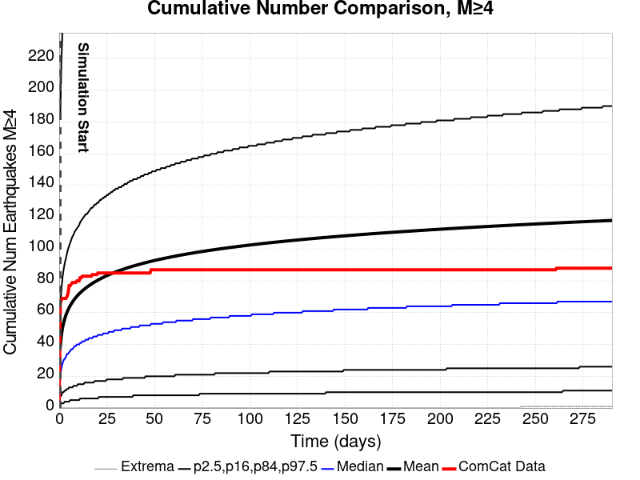 |  |  |  |

### ComCat Cumulative Number Simulation Percentiles
*[(top)](#table-of-contents)*


### ComCat Probability Spatial Distribution
*[(top)](#table-of-contents)*

|  | 1 Day | 1 Week | 1 Month | Current (4 Month) |
|-----|-----|-----|-----|-----|
| **M&ge;Mc(t)** |  |  |  |  |
| **M&ge;3.5** |  |  | 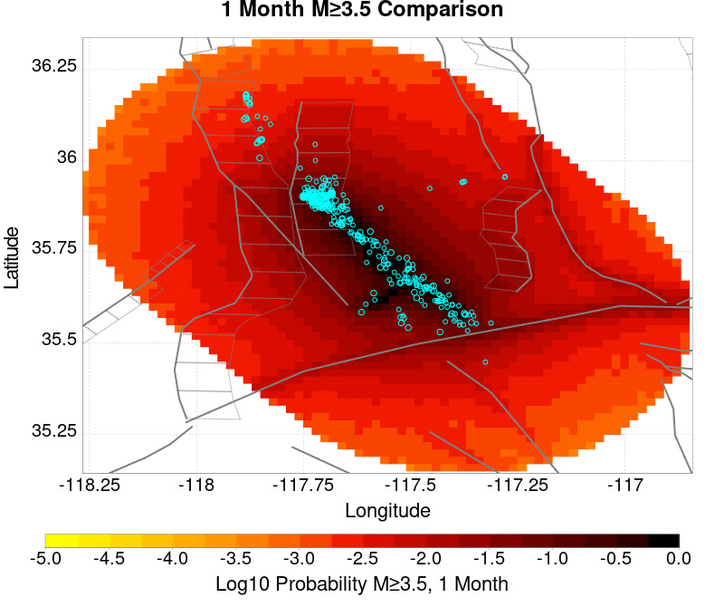 |  |
| **M&ge;4** |  |  |  |  |
| **M&ge;5** |  |  |  |  |
| **M&ge;6** |  |  |  |  |
| **M&ge;7** |  |  |  |  |
| **M&ge;8** |  |  |  | 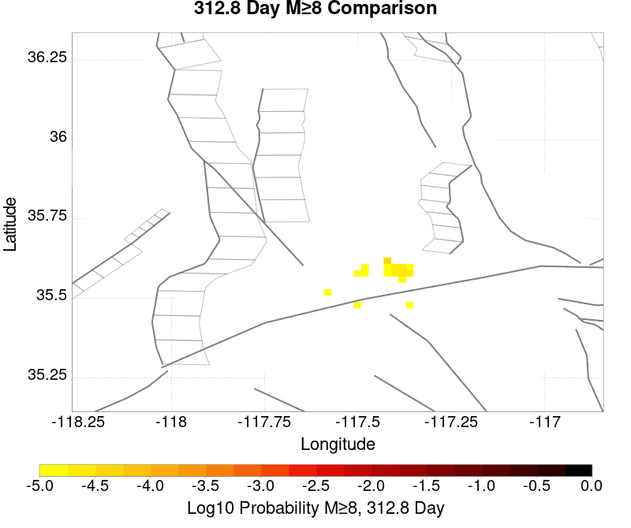 |

### ComCat Mean Expectation Spatial Distribution
*[(top)](#table-of-contents)*

|  | 1 Day | 1 Week | 1 Month | Current (4 Month) |
|-----|-----|-----|-----|-----|
| **M&ge;Mc(t)** |  |  |  |  |
| **M&ge;3.5** |  |  |  |  |
| **M&ge;4** |  |  | 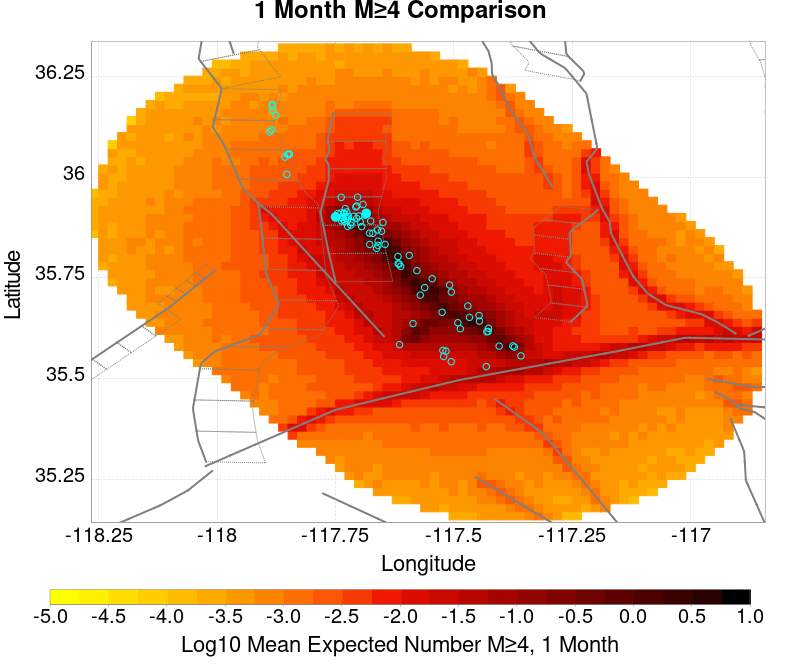 |  |
| **M&ge;5** |  |  |  | 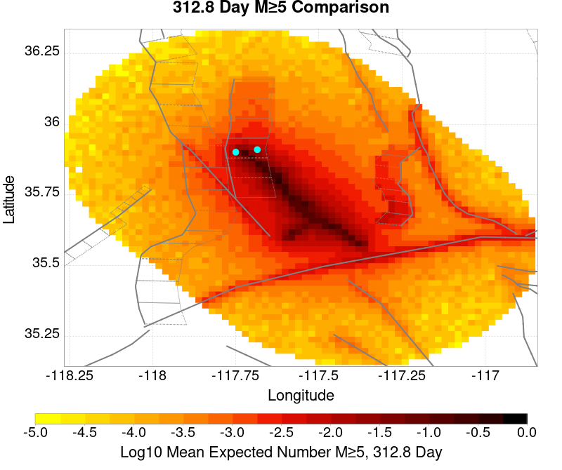 |
| **M&ge;6** |  |  |  |  |
| **M&ge;7** |  |  |  | 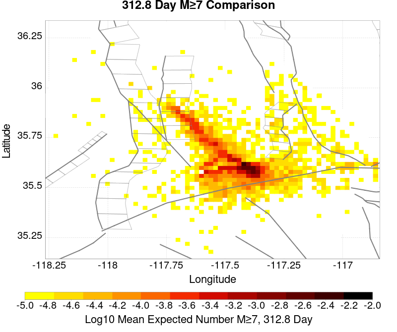 |
| **M&ge;8** |  |  |  |  |

### ComCat Depth Distribution
*[(top)](#table-of-contents)*

| M&ge;Mc(t) | M&ge;3.5 | M&ge;4 | M&ge;5 | M&ge;6 | M&ge;7 | M&ge;8 |
|-----|-----|-----|-----|-----|-----|-----|
|  |  |  |  |  |  | 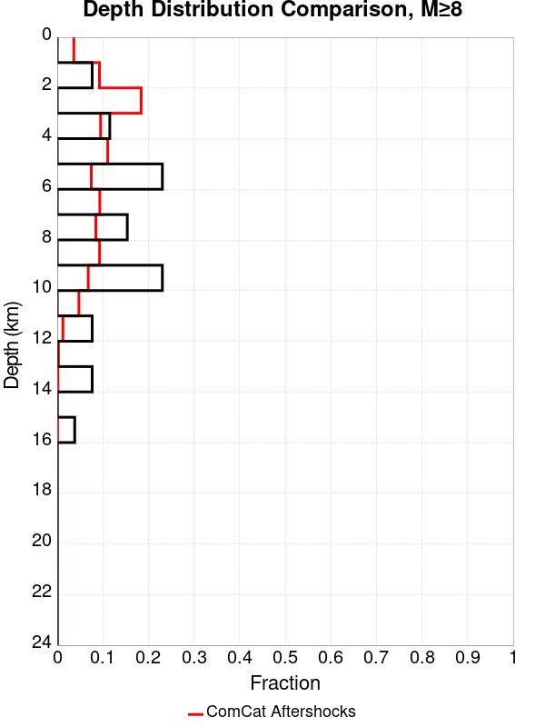 |

## Section Participation
*[(top)](#table-of-contents)*

### Section Participation Plots
*[(top)](#table-of-contents)*

| Min Mag | 1 yr Triggered Ruptures (no spontaneous) | 10 yr Triggered Ruptures (no spontaneous) | 10 yr Triggered Ruptures (primary aftershocks only) |
|-----|-----|-----|-----|
| **All Supra. Seis.** |  |  |  |
| **M&ge;6.5** |  |  | 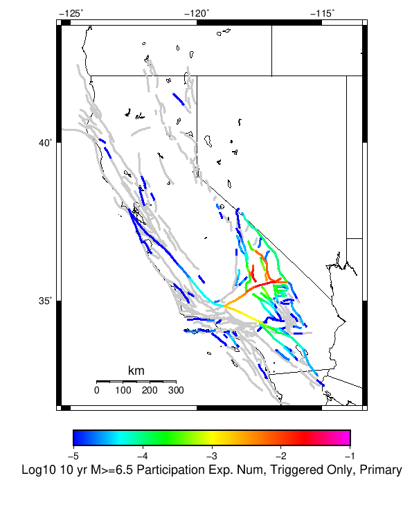 |
| **M&ge;7** |  |  |  |
| **M&ge;7.5** |  |  |  |
| **M&ge;8** | 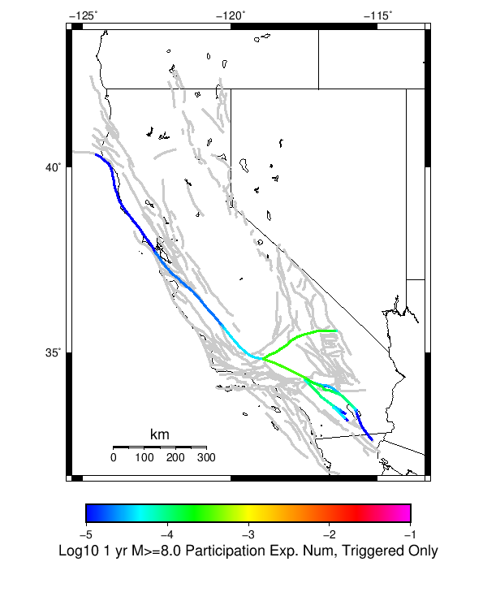 |  |  |

### Supra-Seismogenic Parent Sections Table
*[(top)](#table-of-contents)*

*First 10 of 88 with matching ruptures shown*

| Parent Name | Triggered 10 Year Mean Count | Triggered 1 Day Prob | Triggered 1 Week Prob | Triggered 1 Month Prob | Triggered 1 Year Prob | Triggered 10 Year Prob | Triggered 10 Year Primary Mean Count |
|-----|-----|-----|-----|-----|-----|-----|-----|
| Garlock (Central) | 0.12221181 | 0.041424554 | 0.059981257 | 0.0710403 | 0.09484536 | 0.11396439 | 0.07066542 |
| Tank Canyon | 0.10290534 | 0.020243675 | 0.03280225 | 0.043861292 | 0.06841612 | 0.088847235 | 0.028491097 |
| Little Lake | 0.05829428 | 0.019868791 | 0.029803187 | 0.035613872 | 0.04573571 | 0.054920338 | 0.03411434 |
| Airport Lake | 0.049109653 | 0.019868791 | 0.0262418 | 0.032052483 | 0.040299907 | 0.04873477 | 0.03149016 |
| Owl Lake | 0.034676664 | 0.0073102154 | 0.011246486 | 0.015557638 | 0.024554826 | 0.030740393 | 0.010871602 |
| Panamint Valley | 0.029240862 | 0.007497657 | 0.011433927 | 0.015182755 | 0.021368323 | 0.028303655 | 0.0127460165 |
| Garlock (East) | 0.023430178 | 0.005435801 | 0.00918463 | 0.01049672 | 0.015557638 | 0.021368323 | 0.00656045 |
| Hunter Mountain-Saline Valley | 0.014245548 | 0.00524836 | 0.006747891 | 0.008247423 | 0.011246486 | 0.014058107 | 0.008247423 |
| Blackwater | 0.012558576 | 0.0024367385 | 0.00393627 | 0.0050609186 | 0.008247423 | 0.012183692 | 0.0031865041 |
| Ash Hill | 0.010684161 | 0.0016869728 | 0.0029990629 | 0.0041237115 | 0.007122774 | 0.009746954 | 0.0024367385 |

### M≥6.5 Parent Sections Table
*[(top)](#table-of-contents)*

*First 10 of 67 with matching ruptures shown*

| Parent Name | Triggered 10 Year Mean Count | Triggered 1 Day Prob | Triggered 1 Week Prob | Triggered 1 Month Prob | Triggered 1 Year Prob | Triggered 10 Year Prob | Triggered 10 Year Primary Mean Count |
|-----|-----|-----|-----|-----|-----|-----|-----|
| Garlock (Central) | 0.050796624 | 0.018556701 | 0.026054358 | 0.0316776 | 0.041424554 | 0.05004686 | 0.030552952 |
| Airport Lake | 0.038800374 | 0.016307404 | 0.021743204 | 0.025304593 | 0.032427367 | 0.038612932 | 0.025492033 |
| Little Lake | 0.03842549 | 0.013308341 | 0.019306466 | 0.023430178 | 0.031115277 | 0.037113402 | 0.024179943 |
| Panamint Valley | 0.027366448 | 0.0073102154 | 0.011059044 | 0.01443299 | 0.020243675 | 0.026804123 | 0.0127460165 |
| Owl Lake | 0.019868791 | 0.006185567 | 0.008997188 | 0.011621368 | 0.016682288 | 0.01968135 | 0.009559513 |
| Garlock (East) | 0.015557638 | 0.0046860357 | 0.0073102154 | 0.008434864 | 0.01180881 | 0.015182755 | 0.0063730082 |
| Hunter Mountain-Saline Valley | 0.014245548 | 0.00524836 | 0.006747891 | 0.008247423 | 0.011246486 | 0.014058107 | 0.008247423 |
| Tank Canyon | 0.0119962515 | 0.0018744143 | 0.003561387 | 0.0050609186 | 0.00787254 | 0.0119962515 | 0.0028116214 |
| Garlock (West) | 0.00918463 | 0.0033739456 | 0.0043111527 | 0.0050609186 | 0.007497657 | 0.008997188 | 0.006185567 |
| So Sierra Nevada | 0.00524836 | 0.0011246485 | 0.0014995314 | 0.002249297 | 0.0037488285 | 0.0050609186 | 9.3720714E-4 |

### M≥7 Parent Sections Table
*[(top)](#table-of-contents)*

*First 10 of 46 with matching ruptures shown*

| Parent Name | Triggered 10 Year Mean Count | Triggered 1 Day Prob | Triggered 1 Week Prob | Triggered 1 Month Prob | Triggered 1 Year Prob | Triggered 10 Year Prob | Triggered 10 Year Primary Mean Count |
|-----|-----|-----|-----|-----|-----|-----|-----|
| Garlock (Central) | 0.044236176 | 0.01574508 | 0.02230553 | 0.026991565 | 0.03598875 | 0.043861292 | 0.027179006 |
| Panamint Valley | 0.01836926 | 0.006185567 | 0.008997188 | 0.011059044 | 0.01443299 | 0.018181818 | 0.011059044 |
| Owl Lake | 0.015182755 | 0.00524836 | 0.0076850983 | 0.009746954 | 0.012933458 | 0.015182755 | 0.008809747 |
| Hunter Mountain-Saline Valley | 0.013683224 | 0.0050609186 | 0.00656045 | 0.00787254 | 0.010871602 | 0.013683224 | 0.008247423 |
| Garlock (East) | 0.011059044 | 0.00393627 | 0.0059981258 | 0.006935333 | 0.008997188 | 0.011059044 | 0.005810684 |
| Garlock (West) | 0.008997188 | 0.0033739456 | 0.0043111527 | 0.0050609186 | 0.007497657 | 0.008809747 | 0.006185567 |
| Little Lake | 0.00787254 | 0.0037488285 | 0.00524836 | 0.0059981258 | 0.006935333 | 0.00787254 | 0.00524836 |
| Airport Lake | 0.0076850983 | 0.003561387 | 0.0050609186 | 0.005810684 | 0.006747891 | 0.0076850983 | 0.0050609186 |
| San Andreas (Mojave N) | 0.0031865041 | 0.0014995314 | 0.0018744143 | 0.0020618557 | 0.0024367385 | 0.0031865041 | 0.002249297 |
| San Andreas (Mojave S) | 0.0028116214 | 0.0014995314 | 0.0018744143 | 0.0020618557 | 0.0024367385 | 0.0028116214 | 0.0020618557 |

### M≥7.5 Parent Sections Table
*[(top)](#table-of-contents)*

*First 10 of 38 with matching ruptures shown*

| Parent Name | Triggered 10 Year Mean Count | Triggered 1 Day Prob | Triggered 1 Week Prob | Triggered 1 Month Prob | Triggered 1 Year Prob | Triggered 10 Year Prob | Triggered 10 Year Primary Mean Count |
|-----|-----|-----|-----|-----|-----|-----|-----|
| Garlock (Central) | 0.020243675 | 0.0076850983 | 0.009934396 | 0.01180881 | 0.016682288 | 0.020243675 | 0.013308341 |
| Hunter Mountain-Saline Valley | 0.012933458 | 0.0046860357 | 0.006185567 | 0.007497657 | 0.01049672 | 0.012933458 | 0.00787254 |
| Panamint Valley | 0.012933458 | 0.0046860357 | 0.006185567 | 0.007497657 | 0.01049672 | 0.012933458 | 0.00787254 |
| Garlock (West) | 0.008247423 | 0.0031865041 | 0.0041237115 | 0.004873477 | 0.006935333 | 0.008247423 | 0.005810684 |
| Garlock (East) | 0.004498594 | 0.0018744143 | 0.002249297 | 0.0028116214 | 0.0037488285 | 0.004498594 | 0.0029990629 |
| San Andreas (Mojave N) | 0.0029990629 | 0.0014995314 | 0.0018744143 | 0.0020618557 | 0.0024367385 | 0.0029990629 | 0.002249297 |
| San Andreas (Mojave S) | 0.00262418 | 0.0014995314 | 0.0018744143 | 0.0020618557 | 0.0024367385 | 0.00262418 | 0.0020618557 |
| Owl Lake | 0.0018744143 | 7.497657E-4 | 0.0011246485 | 0.0011246485 | 0.0016869728 | 0.0018744143 | 0.0011246485 |
| San Andreas (San Bernardino N) | 0.0014995314 | 7.497657E-4 | 9.3720714E-4 | 0.0011246485 | 0.00131209 | 0.0014995314 | 0.00131209 |
| San Andreas (San Bernardino S) | 5.6232425E-4 | 1.8744143E-4 | 1.8744143E-4 | 1.8744143E-4 | 1.8744143E-4 | 5.6232425E-4 | 1.8744143E-4 |

### M≥8 Parent Sections Table
*[(top)](#table-of-contents)*

*First 10 of 16 with matching ruptures shown*

| Parent Name | Triggered 10 Year Mean Count | Triggered 1 Day Prob | Triggered 1 Week Prob | Triggered 1 Month Prob | Triggered 1 Year Prob | Triggered 10 Year Prob | Triggered 10 Year Primary Mean Count |
|-----|-----|-----|-----|-----|-----|-----|-----|
| San Andreas (Mojave N) | 3.7488286E-4 | 1.8744143E-4 | 1.8744143E-4 | 1.8744143E-4 | 1.8744143E-4 | 3.7488286E-4 | 1.8744143E-4 |
| San Andreas (Mojave S) | 3.7488286E-4 | 1.8744143E-4 | 1.8744143E-4 | 1.8744143E-4 | 1.8744143E-4 | 3.7488286E-4 | 1.8744143E-4 |
| San Andreas (San Bernardino N) | 3.7488286E-4 | 1.8744143E-4 | 1.8744143E-4 | 1.8744143E-4 | 1.8744143E-4 | 3.7488286E-4 | 1.8744143E-4 |
| San Andreas (San Bernardino S) | 3.7488286E-4 | 1.8744143E-4 | 1.8744143E-4 | 1.8744143E-4 | 1.8744143E-4 | 3.7488286E-4 | 1.8744143E-4 |
| Brawley (Seismic Zone) alt 1 | 1.8744143E-4 | 0.0 | 0.0 | 0.0 | 0.0 | 1.8744143E-4 | 0.0 |
| Garlock (Central) | 1.8744143E-4 | 1.8744143E-4 | 1.8744143E-4 | 1.8744143E-4 | 1.8744143E-4 | 1.8744143E-4 | 1.8744143E-4 |
| Garlock (East) | 1.8744143E-4 | 1.8744143E-4 | 1.8744143E-4 | 1.8744143E-4 | 1.8744143E-4 | 1.8744143E-4 | 1.8744143E-4 |
| Garlock (West) | 1.8744143E-4 | 1.8744143E-4 | 1.8744143E-4 | 1.8744143E-4 | 1.8744143E-4 | 1.8744143E-4 | 1.8744143E-4 |
| Imperial | 1.8744143E-4 | 0.0 | 0.0 | 0.0 | 0.0 | 1.8744143E-4 | 0.0 |
| Mission Creek | 1.8744143E-4 | 1.8744143E-4 | 1.8744143E-4 | 1.8744143E-4 | 1.8744143E-4 | 1.8744143E-4 | 1.8744143E-4 |

### Fault Magnitude-Probability Distributions
*[(top)](#table-of-contents)*

The first 5 sections (sorted by trigger rate) are plotted below. All fault MPDs are available [here](plots/parent_sect_mpds/README.md)

| 1 Week | 1 Month | 1 Year | 10 Year |
|-----|-----|-----|-----|
|  |  |  |  |
|  |  |  | 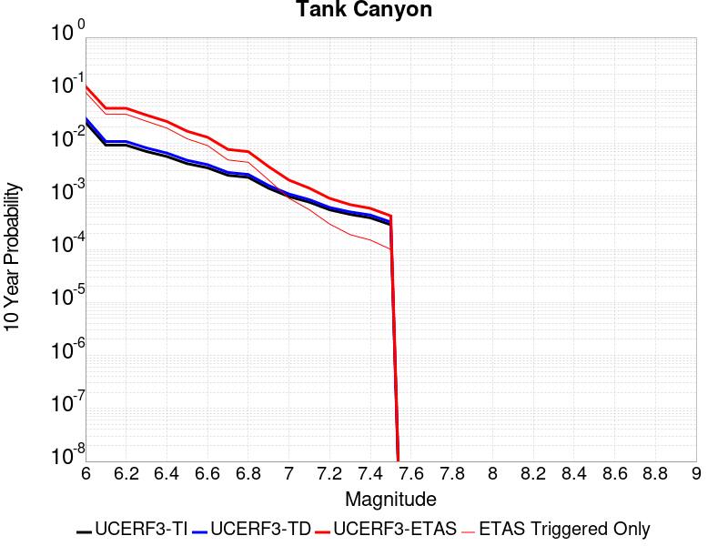 |
|  |  |  |  |
|  |  |  |  |
|  |  |  |  |

## Gridded Nucleation
*[(top)](#table-of-contents)*

| Min Mag | Triggered Ruptures (no spontaneous) | Triggered Ruptures (primary aftershocks only) |
|-----|-----|-----|
| **M&ge;2.5** |  |  |
| **M&ge;5** |  |  |
| **M&ge;6** |  |  |
| **M&ge;7** |  |  |


## JSON Input File
*[(top)](#table-of-contents)*

```
{
  "numSimulations": 100000,
  "duration": 10.0,
  "startTimeMillis": 1562383194040,
  "includeSpontaneous": false,
  "randomSeed": 1572975561977,
  "binaryOutput": true,
  "binaryOutputFilters": [
    {
      "prefix": "results_complete",
      "descendantsOnly": false
    },
    {
      "prefix": "results_m5_preserve_chain",
      "minMag": 5.0,
      "preserveChainBelowMag": true,
      "descendantsOnly": false
    }
  ],
  "forceRecalc": false,
  "simulationName": "ComCat M7.1 (ci38457511), ShakeMap Surfaces, kCOV\u003d1.5",
  "numRetries": 3,
  "outputDir": "/home/scec-02/kmilner/ucerf3/etas_sim/2019_11_05-ComCatM7p1_ci38457511_ShakeMapSurfaces_kCOV1p5",
  "treatTriggerCatalogAsSpontaneous": false,
  "triggerRuptures": [
    "omitted due to length, see original input file"
  ],
  "cacheDir": "/home/scec-02/kmilner/ucerf3/ucerf3-etas-launcher/inputs/cache_fm3p1_ba",
  "fssFile": "/home/scec-02/kmilner/ucerf3/ucerf3-etas-launcher/inputs/2013_05_10-ucerf3p3-production-10runs_COMPOUND_SOL_FM3_1_SpatSeisU3_MEAN_BRANCH_AVG_SOL.zip",
  "probModel": "FULL_TD",
  "applySubSeisForSupraNucl": true,
  "totRateScaleFactor": 1.14,
  "gridSeisCorr": true,
  "timeIndependentERF": false,
  "griddedOnly": false,
  "imposeGR": false,
  "includeIndirectTriggering": true,
  "gridSeisDiscr": 0.1,
  "catalogCompletenessModel": "RELAXED",
  "etas_k_cov": 1.5,
  "configCommand": "u3etas_comcat_event_config_builder.sh --event-id ci38457511 --mag-complete 3.5 --num-simulations 100000 --days-before 7 --etas-k-cov 1.5 --finite-surf-shakemap --finite-surf-shakemap-min-mag 5 --hpc-site USC_HPC --nodes 36 --hours 24 --queue scec",
  "configTime": 1572975561977,
  "comcatMetadata": {
    "region": {
      "border": [
        {
          "latitude": 35.15123745324938,
          "longitude": -117.46198765392752
        },
        {
          "latitude": 35.170513097218205,
          "longitude": -117.55046477274733
        },
        {
          "latitude": 35.201997575622634,
          "longitude": -117.63356287896195
        },
        {
          "latitude": 35.24474776584818,
          "longitude": -117.70878534540662
        },
        {
          "latitude": 35.2893890362986,
          "longitude": -117.76387551603122
        },
        {
          "latitude": 35.288830898189985,
          "longitude": -117.76465036296011
        },
        {
          "latitude": 35.62116745212862,
          "longitude": -118.13026990137416
        },
        {
          "latitude": 35.621789874646055,
          "longitude": -118.12940866580139
        },
        {
          "latitude": 35.621789874646055,
          "longitude": -118.12940866580136
        },
        {
          "latitude": 35.63100857737423,
          "longitude": -118.14083341711117
        },
        {
          "latitude": 35.69213881200874,
          "longitude": -118.19401186444136
        },
        {
          "latitude": 35.759827796433385,
          "longitude": -118.23338865654299
        },
        {
          "latitude": 35.8320329014668,
          "longitude": -118.25773927868946
        },
        {
          "latitude": 35.906569563076914,
          "longitude": -118.26628547708222
        },
        {
          "latitude": 35.9811764992231,
          "longitude": -118.25872343341653
        },
        {
          "latitude": 36.05358395358725,
          "longitude": -118.23523828089384
        },
        {
          "latitude": 36.12158296055357,
          "longitude": -118.19650389473806
        },
        {
          "latitude": 36.18309350302806,
          "longitude": -118.14366730262441
        },
        {
          "latitude": 36.23622937613509,
          "longitude": -118.07831757407638
        },
        {
          "latitude": 36.279357589115186,
          "longitude": -118.00243964650828
        },
        {
          "latitude": 36.31115024550475,
          "longitude": -117.91835419890715
        },
        {
          "latitude": 36.33062704347584,
          "longitude": -117.82864534929934
        },
        {
          "latitude": 36.337186832826475,
          "longitude": -117.7360785775
        },
        {
          "latitude": 36.33062704347584,
          "longitude": -117.64351180570065
        },
        {
          "latitude": 36.31115024550475,
          "longitude": -117.55380295609284
        },
        {
          "latitude": 36.279357589115186,
          "longitude": -117.46971750849171
        },
        {
          "latitude": 36.23622937613509,
          "longitude": -117.39383958092363
        },
        {
          "latitude": 36.19237301765921,
          "longitude": -117.33990236386252
        },
        {
          "latitude": 36.19237301765921,
          "longitude": -117.3399023638625
        },
        {
          "latitude": 36.19300476664728,
          "longitude": -117.33902822340912
        },
        {
          "latitude": 35.858277657147454,
          "longitude": -116.97410396317103
        },
        {
          "latitude": 35.85771127553969,
          "longitude": -116.97489025431044
        },
        {
          "latitude": 35.849566414597014,
          "longitude": -116.96491461360324
        },
        {
          "latitude": 35.78805819220281,
          "longitude": -116.9122967694479
        },
        {
          "latitude": 35.72006106557635,
          "longitude": -116.87372034968973
        },
        {
          "latitude": 35.64765482528862,
          "longitude": -116.85032807444419
        },
        {
          "latitude": 35.57304829206068,
          "longitude": -116.8427916482061
        },
        {
          "latitude": 35.49851117585832,
          "longitude": -116.8512961557198
        },
        {
          "latitude": 35.42630481575459,
          "longitude": -116.87553976530553
        },
        {
          "latitude": 35.35861392859174,
          "longitude": -116.91474809853695
        },
        {
          "latitude": 35.29748137319737,
          "longitude": -116.96770221389164
        },
        {
          "latitude": 35.24474776584818,
          "longitude": -117.03277884359336
        },
        {
          "latitude": 35.201997575622634,
          "longitude": -117.10800131003803
        },
        {
          "latitude": 35.170513097218205,
          "longitude": -117.19109941625265
        },
        {
          "latitude": 35.15123745324938,
          "longitude": -117.27957653507247
        },
        {
          "latitude": 35.14474752487352,
          "longitude": -117.3707820945
        }
      ]
    },
    "eventID": "ci38457511",
    "minDepth": -10.0,
    "maxDepth": 24.0,
    "minMag": 2.5,
    "startTime": 1561778393040,
    "endTime": 1562383193040,
    "magComplete": 3.5
  }
}
```

