# ComCat M7.1 (ci38457511), ShakeMap Surfaces, kCOV=1.5 Results

|   | ComCat M7.1 (ci38457511), ShakeMap Surfaces, kCOV=1.5 |
|-----|-----|
| Num Simulations | 16767 (incomplete) |
| Start Time | 2019/07/06 03:19:54 UTC |
| Start Time Epoch Milliseconds | 1562383194040 |
| Duration | 10 Years |
| Includes Spontaneous? | false |
| Trigger Ruptures | 283 Trigger Ruptures |
|   | First: M3.98 at 2019/07/04 17:02:55 UTC |
|   | Last: M7.1 at 2019/07/06 03:19:53 UTC |
|   | Largest: M7.1 at 2019/07/06 03:19:53 UTC |
| Trigger Ruptures | *(none)* |
| Config Generated With | u3etas_comcat_event_config_builder.sh --event-id ci38457511 --mag-complete 3.5 --num-simulations 100000 --days-before 7 --etas-k-cov 1.5 --finite-surf-shakemap --finite-surf-shakemap-min-mag 5 --hpc-site USC_HPC --nodes 36 --hours 24 --queue scec |

## Table Of Contents

* [Probabilities Summary Table](#probabilities-summary-table)
* [Magnitude Number Distribution](#magnitude-number-distribution)
  * [10 Year Magnitude Number Distribution](#10-year-magnitude-number-distribution)
  * [1 Year Magnitude Number Distribution](#1-year-magnitude-number-distribution)
  * [1 Month Magnitude Number Distribution](#1-month-magnitude-number-distribution)
  * [1 Week Magnitude Number Distribution](#1-week-magnitude-number-distribution)
  * [1 Day Magnitude Number Distribution](#1-day-magnitude-number-distribution)
  * [1 Hour Magnitude Number Distribution](#1-hour-magnitude-number-distribution)
* [Hazard Change Over Time](#hazard-change-over-time)
  * [M&ge;5.0 Hazard Change Over Time](#m50-hazard-change-over-time)
  * [M&ge;6.0 Hazard Change Over Time](#m60-hazard-change-over-time)
  * [M&ge;7.0 Hazard Change Over Time](#m70-hazard-change-over-time)
  * [M&ge;8.0 Hazard Change Over Time](#m80-hazard-change-over-time)
* [Trigger Rupture Fault Map](#trigger-rupture-fault-map)
* [Trigger Rupture Depth Map](#trigger-rupture-depth-map)
* [Fault Distances To Triggers](#fault-distances-to-triggers)
* [Individual Simulated Catalog Maps](#individual-simulated-catalog-maps)
* [ComCat Data Comparisons](#comcat-data-comparisons)
  * [ComCat Magnitude-Number Distributions](#comcat-magnitude-number-distributions)
  * [ComCat Time-Dependent Mc](#comcat-time-dependent-mc)
  * [ComCat Cumulative Number Vs Time](#comcat-cumulative-number-vs-time)
  * [ComCat Cumulative Number Simulation Percentiles](#comcat-cumulative-number-simulation-percentiles)
  * [ComCat Probability Spatial Distribution](#comcat-probability-spatial-distribution)
  * [ComCat Mean Expectation Spatial Distribution](#comcat-mean-expectation-spatial-distribution)
  * [ComCat Depth Distribution](#comcat-depth-distribution)
* [Section Participation](#section-participation)
  * [Section Participation Plots](#section-participation-plots)
  * [Supra-Seismogenic Parent Sections Table](#supra-seismogenic-parent-sections-table)
  * [M≥6.5 Parent Sections Table](#m65-parent-sections-table)
  * [M≥7 Parent Sections Table](#m7-parent-sections-table)
  * [M≥7.5 Parent Sections Table](#m75-parent-sections-table)
  * [M≥8 Parent Sections Table](#m8-parent-sections-table)
  * [Fault Magnitude-Probability Distributions](#fault-magnitude-probability-distributions)
* [Gridded Nucleation](#gridded-nucleation)
* [JSON Input File](#json-input-file)

## Probabilities Summary Table
*[(top)](#table-of-contents)*

| Magnitude | 1 Hour Prob | 1 Day Prob | 1 Week Prob | 1 Month Prob | 1 Year Prob | 10 Year Prob |
|-----|-----|-----|-----|-----|-----|-----|
| **M&ge;4** | 0.965 (96.53%), <small>*CI<sup>95%</sup>=[96.24% 96.80%]*</small> | 0.996 (99.64%), <small>*CI<sup>95%</sup>=[99.53% 99.72%]*</small> | 0.999 (99.94%), <small>*CI<sup>95%</sup>=[99.89% 99.97%]*</small> | 1.000 (99.99%), <small>*CI<sup>95%</sup>=[99.96% 100.00%]*</small> | 1.000 (100.00%), <small>*CI<sup>95%</sup>=[99.97% 100.00%]*</small> | 1.000 (100.00%), <small>*CI<sup>95%</sup>=[99.97% 100.00%]*</small> |
| **M&ge;4.5** | 0.829 (82.93%), <small>*CI<sup>95%</sup>=[82.35% 83.50%]*</small> | 0.956 (95.63%), <small>*CI<sup>95%</sup>=[95.31% 95.94%]*</small> | 0.984 (98.41%), <small>*CI<sup>95%</sup>=[98.20% 98.59%]*</small> | 0.992 (99.15%), <small>*CI<sup>95%</sup>=[99.00% 99.28%]*</small> | 0.997 (99.74%), <small>*CI<sup>95%</sup>=[99.64% 99.81%]*</small> | 0.999 (99.90%), <small>*CI<sup>95%</sup>=[99.83% 99.94%]*</small> |
| **M&ge;5** | 0.570 (56.99%), <small>*CI<sup>95%</sup>=[56.24% 57.74%]*</small> | 0.800 (79.98%), <small>*CI<sup>95%</sup>=[79.37% 80.59%]*</small> | 0.879 (87.94%), <small>*CI<sup>95%</sup>=[87.44% 88.43%]*</small> | 0.916 (91.64%), <small>*CI<sup>95%</sup>=[91.21% 92.05%]*</small> | 0.954 (95.41%), <small>*CI<sup>95%</sup>=[95.08% 95.72%]*</small> | 0.970 (96.98%), <small>*CI<sup>95%</sup>=[96.71% 97.23%]*</small> |
| **M&ge;5.5** | 0.283 (28.31%), <small>*CI<sup>95%</sup>=[27.63% 29.00%]*</small> | 0.513 (51.30%), <small>*CI<sup>95%</sup>=[50.54% 52.06%]*</small> | 0.616 (61.62%), <small>*CI<sup>95%</sup>=[60.88% 62.36%]*</small> | 0.682 (68.17%), <small>*CI<sup>95%</sup>=[67.46% 68.87%]*</small> | 0.765 (76.47%), <small>*CI<sup>95%</sup>=[75.81% 77.10%]*</small> | 0.814 (81.36%), <small>*CI<sup>95%</sup>=[80.76% 81.94%]*</small> |
| **M&ge;6** | 0.095 (9.52%), <small>*CI<sup>95%</sup>=[9.08% 9.98%]*</small> | 0.219 (21.88%), <small>*CI<sup>95%</sup>=[21.25% 22.51%]*</small> | 0.297 (29.65%), <small>*CI<sup>95%</sup>=[28.96% 30.35%]*</small> | 0.353 (35.27%), <small>*CI<sup>95%</sup>=[34.54% 36.00%]*</small> | 0.432 (43.18%), <small>*CI<sup>95%</sup>=[42.43% 43.93%]*</small> | 0.494 (49.41%), <small>*CI<sup>95%</sup>=[48.65% 50.17%]*</small> |
| **M&ge;6.5** | 0.024 (2.42%), <small>*CI<sup>95%</sup>=[2.20% 2.67%]*</small> | 0.061 (6.14%), <small>*CI<sup>95%</sup>=[5.78% 6.51%]*</small> | 0.088 (8.80%), <small>*CI<sup>95%</sup>=[8.37% 9.24%]*</small> | 0.111 (11.05%), <small>*CI<sup>95%</sup>=[10.58% 11.54%]*</small> | 0.145 (14.55%), <small>*CI<sup>95%</sup>=[14.02% 15.09%]*</small> | 0.178 (17.79%), <small>*CI<sup>95%</sup>=[17.22% 18.38%]*</small> |
| **M&ge;7** | 8.71E-3 (0.87%), <small>*CI<sup>95%</sup>=[0.74% 1.03%]*</small> | 0.023 (2.25%), <small>*CI<sup>95%</sup>=[2.04% 2.49%]*</small> | 0.032 (3.24%), <small>*CI<sup>95%</sup>=[2.98% 3.52%]*</small> | 0.040 (4.04%), <small>*CI<sup>95%</sup>=[3.75% 4.35%]*</small> | 0.052 (5.24%), <small>*CI<sup>95%</sup>=[4.91% 5.59%]*</small> | 0.066 (6.57%), <small>*CI<sup>95%</sup>=[6.20% 6.96%]*</small> |
| **M&ge;7.1** | 7.40E-3 (0.74%), <small>*CI<sup>95%</sup>=[0.62% 0.88%]*</small> | 0.019 (1.92%), <small>*CI<sup>95%</sup>=[1.72% 2.14%]*</small> | 0.027 (2.74%), <small>*CI<sup>95%</sup>=[2.50% 3.00%]*</small> | 0.034 (3.36%), <small>*CI<sup>95%</sup>=[3.10% 3.65%]*</small> | 0.045 (4.47%), <small>*CI<sup>95%</sup>=[4.16% 4.79%]*</small> | 0.056 (5.61%), <small>*CI<sup>95%</sup>=[5.27% 5.97%]*</small> |
| **M&ge;7.5** | 2.80E-3 (0.28%), <small>*CI<sup>95%</sup>=[0.21% 0.38%]*</small> | 6.92E-3 (0.69%), <small>*CI<sup>95%</sup>=[0.57% 0.83%]*</small> | 9.30E-3 (0.93%), <small>*CI<sup>95%</sup>=[0.79% 1.09%]*</small> | 0.011 (1.12%), <small>*CI<sup>95%</sup>=[0.97% 1.30%]*</small> | 0.016 (1.60%), <small>*CI<sup>95%</sup>=[1.42% 1.80%]*</small> | 0.021 (2.15%), <small>*CI<sup>95%</sup>=[1.94% 2.38%]*</small> |
| **M&ge;8** | 5.96E-5 (0.01%), <small>*CI<sup>95%</sup>=[0.00% 0.04%]*</small> | 1.19E-4 (0.01%), <small>*CI<sup>95%</sup>=[0.00% 0.05%]*</small> | 1.19E-4 (0.01%), <small>*CI<sup>95%</sup>=[0.00% 0.05%]*</small> | 1.19E-4 (0.01%), <small>*CI<sup>95%</sup>=[0.00% 0.05%]*</small> | 1.19E-4 (0.01%), <small>*CI<sup>95%</sup>=[0.00% 0.05%]*</small> | 2.98E-4 (0.03%), <small>*CI<sup>95%</sup>=[0.01% 0.07%]*</small> |

## Magnitude Number Distribution
*[(top)](#table-of-contents)*

### 10 Year Magnitude Number Distribution
*[(top)](#table-of-contents)*

**Legend**
* **Mean** (thick black line): mean expected number across all 16767 catalogs
* **2.5%,97.5%** (thin black lines): expected number percentiles across all 16767 catalogs
* **Median** (thin blue line): median expected number across all 16767 catalogs
* **Mode** (thin cyan line): modal expected number across all 16767 catalogs
* **10 yr Probability** (thin red line): 10 year probability calculated as the fraction of catalogs with at least 1 occurrence
* **10 yr Supraseismogenic Probability** (thin dashed red line): same as above, but only for supraseismogenic ruptures on explicitly modeled UCERF3 faults
* **95% Conf** (light red shaded region): binomial 95% confidence bounds on probability
* **Primary** (thin green line): mean expected number from primary triggered aftershocks only (no secondary, tertiary, etc...) across all 16767 catalogs


| Mag | Mean | 2.5 %ile | 97.5 %ile | Median | Mode | 10 yr Probability | 10 yr Supra-Seis Prob | Primary Aftershocks Mean |
|-----|-----|-----|-----|-----|-----|-----|-----|-----|
| **M&ge;2.5** | 5256.242 | 537.000 | 25120.000 | 2880.000 | 1196.000 | 1.000 (100.00%), <small>*CI<sup>95%</sup>=[99.97% 100.00%]*</small> | 0.255 (25.54%), <small>*CI<sup>95%</sup>=[24.89% 26.21%]*</small> | 2369.341 |
| **M&ge;2.6** | 4175.184 | 428.000 | 19931.000 | 2289.000 | 1603.000 | 1.000 (100.00%), <small>*CI<sup>95%</sup>=[99.97% 100.00%]*</small> | 0.255 (25.54%), <small>*CI<sup>95%</sup>=[24.89% 26.21%]*</small> | 1882.044 |
| **M&ge;2.7** | 3315.978 | 337.000 | 15798.000 | 1820.000 | 736.000 | 1.000 (100.00%), <small>*CI<sup>95%</sup>=[99.97% 100.00%]*</small> | 0.255 (25.54%), <small>*CI<sup>95%</sup>=[24.89% 26.21%]*</small> | 1494.777 |
| **M&ge;2.8** | 2633.909 | 266.000 | 12541.000 | 1444.000 | 569.000 | 1.000 (100.00%), <small>*CI<sup>95%</sup>=[99.97% 100.00%]*</small> | 0.255 (25.54%), <small>*CI<sup>95%</sup>=[24.89% 26.21%]*</small> | 1187.233 |
| **M&ge;2.9** | 2092.257 | 212.000 | 9993.000 | 1149.000 | 421.000 | 1.000 (100.00%), <small>*CI<sup>95%</sup>=[99.97% 100.00%]*</small> | 0.255 (25.54%), <small>*CI<sup>95%</sup>=[24.89% 26.21%]*</small> | 943.118 |
| **M&ge;3** | 1661.690 | 167.000 | 7910.000 | 912.000 | 374.000 | 1.000 (100.00%), <small>*CI<sup>95%</sup>=[99.97% 100.00%]*</small> | 0.255 (25.54%), <small>*CI<sup>95%</sup>=[24.89% 26.21%]*</small> | 748.979 |
| **M&ge;3.1** | 1319.892 | 132.000 | 6281.000 | 724.000 | 321.000 | 1.000 (100.00%), <small>*CI<sup>95%</sup>=[99.97% 100.00%]*</small> | 0.255 (25.54%), <small>*CI<sup>95%</sup>=[24.89% 26.21%]*</small> | 594.873 |
| **M&ge;3.2** | 1048.347 | 106.000 | 5000.000 | 575.000 | 238.000 | 1.000 (100.00%), <small>*CI<sup>95%</sup>=[99.97% 100.00%]*</small> | 0.255 (25.54%), <small>*CI<sup>95%</sup>=[24.89% 26.21%]*</small> | 472.539 |
| **M&ge;3.3** | 832.636 | 83.000 | 3953.000 | 458.000 | 175.000 | 1.000 (100.00%), <small>*CI<sup>95%</sup>=[99.97% 100.00%]*</small> | 0.255 (25.54%), <small>*CI<sup>95%</sup>=[24.89% 26.21%]*</small> | 375.323 |
| **M&ge;3.4** | 661.351 | 65.000 | 3138.000 | 363.000 | 143.000 | 1.000 (100.00%), <small>*CI<sup>95%</sup>=[99.97% 100.00%]*</small> | 0.255 (25.54%), <small>*CI<sup>95%</sup>=[24.89% 26.21%]*</small> | 298.106 |
| **M&ge;3.5** | 525.233 | 52.000 | 2507.000 | 288.000 | 93.000 | 1.000 (100.00%), <small>*CI<sup>95%</sup>=[99.97% 100.00%]*</small> | 0.255 (25.54%), <small>*CI<sup>95%</sup>=[24.89% 26.21%]*</small> | 236.752 |
| **M&ge;3.6** | 417.103 | 41.000 | 1983.000 | 229.000 | 96.000 | 1.000 (100.00%), <small>*CI<sup>95%</sup>=[99.97% 100.00%]*</small> | 0.255 (25.54%), <small>*CI<sup>95%</sup>=[24.89% 26.21%]*</small> | 187.991 |
| **M&ge;3.7** | 331.248 | 32.000 | 1586.000 | 182.000 | 64.000 | 1.000 (100.00%), <small>*CI<sup>95%</sup>=[99.97% 100.00%]*</small> | 0.255 (25.54%), <small>*CI<sup>95%</sup>=[24.89% 26.21%]*</small> | 149.295 |
| **M&ge;3.8** | 262.902 | 25.000 | 1265.000 | 145.000 | 48.000 | 1.000 (100.00%), <small>*CI<sup>95%</sup>=[99.97% 100.00%]*</small> | 0.255 (25.54%), <small>*CI<sup>95%</sup>=[24.89% 26.21%]*</small> | 118.475 |
| **M&ge;3.9** | 208.763 | 19.000 | 1003.000 | 115.000 | 55.000 | 1.000 (100.00%), <small>*CI<sup>95%</sup>=[99.97% 100.00%]*</small> | 0.255 (25.54%), <small>*CI<sup>95%</sup>=[24.89% 26.21%]*</small> | 94.079 |
| **M&ge;4** | 165.798 | 15.000 | 797.000 | 91.000 | 32.000 | 1.000 (100.00%), <small>*CI<sup>95%</sup>=[99.97% 100.00%]*</small> | 0.255 (25.54%), <small>*CI<sup>95%</sup>=[24.89% 26.21%]*</small> | 74.660 |
| **M&ge;4.1** | 131.632 | 11.000 | 638.000 | 72.000 | 37.000 | 1.000 (100.00%), <small>*CI<sup>95%</sup>=[99.97% 100.00%]*</small> | 0.255 (25.54%), <small>*CI<sup>95%</sup>=[24.89% 26.21%]*</small> | 59.265 |
| **M&ge;4.2** | 104.409 | 9.000 | 503.000 | 57.000 | 24.000 | 1.000 (100.00%), <small>*CI<sup>95%</sup>=[99.97% 100.00%]*</small> | 0.255 (25.54%), <small>*CI<sup>95%</sup>=[24.89% 26.21%]*</small> | 47.002 |
| **M&ge;4.3** | 82.773 | 7.000 | 401.000 | 46.000 | 19.000 | 1.000 (99.99%), <small>*CI<sup>95%</sup>=[99.95% 100.00%]*</small> | 0.255 (25.54%), <small>*CI<sup>95%</sup>=[24.89% 26.21%]*</small> | 37.271 |
| **M&ge;4.4** | 65.663 | 5.000 | 316.000 | 36.000 | 11.000 | 1.000 (99.96%), <small>*CI<sup>95%</sup>=[99.91% 99.98%]*</small> | 0.255 (25.54%), <small>*CI<sup>95%</sup>=[24.89% 26.21%]*</small> | 29.552 |
| **M&ge;4.5** | 52.038 | 4.000 | 252.000 | 29.000 | 10.000 | 0.999 (99.90%), <small>*CI<sup>95%</sup>=[99.83% 99.94%]*</small> | 0.255 (25.54%), <small>*CI<sup>95%</sup>=[24.89% 26.21%]*</small> | 23.425 |
| **M&ge;4.6** | 41.231 | 3.000 | 201.000 | 23.000 | 8.000 | 0.998 (99.83%), <small>*CI<sup>95%</sup>=[99.75% 99.88%]*</small> | 0.255 (25.54%), <small>*CI<sup>95%</sup>=[24.89% 26.21%]*</small> | 18.555 |
| **M&ge;4.7** | 32.626 | 2.000 | 159.000 | 18.000 | 7.000 | 0.995 (99.52%), <small>*CI<sup>95%</sup>=[99.40% 99.61%]*</small> | 0.255 (25.54%), <small>*CI<sup>95%</sup>=[24.89% 26.21%]*</small> | 14.676 |
| **M&ge;4.8** | 25.782 | 1.000 | 127.000 | 14.000 | 5.000 | 0.990 (99.02%), <small>*CI<sup>95%</sup>=[98.86% 99.16%]*</small> | 0.255 (25.54%), <small>*CI<sup>95%</sup>=[24.89% 26.21%]*</small> | 11.594 |
| **M&ge;4.9** | 20.368 | 1.000 | 101.000 | 11.000 | 3.000 | 0.982 (98.17%), <small>*CI<sup>95%</sup>=[97.96% 98.37%]*</small> | 0.255 (25.54%), <small>*CI<sup>95%</sup>=[24.89% 26.21%]*</small> | 9.168 |
| **M&ge;5** | 16.053 | 0.000 | 79.000 | 9.000 | 3.000 | 0.970 (96.98%), <small>*CI<sup>95%</sup>=[96.71% 97.23%]*</small> | 0.255 (25.54%), <small>*CI<sup>95%</sup>=[24.89% 26.21%]*</small> | 7.235 |
| **M&ge;5.1** | 12.644 | 0.000 | 62.000 | 7.000 | 2.000 | 0.952 (95.19%), <small>*CI<sup>95%</sup>=[94.86% 95.51%]*</small> | 0.255 (25.54%), <small>*CI<sup>95%</sup>=[24.89% 26.21%]*</small> | 5.694 |
| **M&ge;5.2** | 9.928 | 0.000 | 49.000 | 5.000 | 1.000 | 0.927 (92.69%), <small>*CI<sup>95%</sup>=[92.29% 93.08%]*</small> | 0.255 (25.54%), <small>*CI<sup>95%</sup>=[24.89% 26.21%]*</small> | 4.465 |
| **M&ge;5.3** | 7.796 | 0.000 | 38.000 | 4.000 | 1.000 | 0.896 (89.60%), <small>*CI<sup>95%</sup>=[89.12% 90.05%]*</small> | 0.255 (25.54%), <small>*CI<sup>95%</sup>=[24.89% 26.21%]*</small> | 3.502 |
| **M&ge;5.4** | 6.077 | 0.000 | 30.000 | 3.000 | 1.000 | 0.859 (85.92%), <small>*CI<sup>95%</sup>=[85.38% 86.44%]*</small> | 0.255 (25.54%), <small>*CI<sup>95%</sup>=[24.89% 26.21%]*</small> | 2.736 |
| **M&ge;5.5** | 4.719 | 0.000 | 23.000 | 3.000 | 0.000 | 0.814 (81.36%), <small>*CI<sup>95%</sup>=[80.76% 81.94%]*</small> | 0.255 (25.54%), <small>*CI<sup>95%</sup>=[24.89% 26.21%]*</small> | 2.123 |
| **M&ge;5.6** | 3.650 | 0.000 | 18.000 | 2.000 | 0.000 | 0.762 (76.19%), <small>*CI<sup>95%</sup>=[75.54% 76.83%]*</small> | 0.255 (25.54%), <small>*CI<sup>95%</sup>=[24.89% 26.21%]*</small> | 1.647 |
| **M&ge;5.7** | 2.798 | 0.000 | 14.000 | 1.000 | 0.000 | 0.703 (70.27%), <small>*CI<sup>95%</sup>=[69.57% 70.96%]*</small> | 0.255 (25.54%), <small>*CI<sup>95%</sup>=[24.89% 26.21%]*</small> | 1.264 |
| **M&ge;5.8** | 2.119 | 0.000 | 11.000 | 1.000 | 0.000 | 0.634 (63.44%), <small>*CI<sup>95%</sup>=[62.71% 64.17%]*</small> | 0.255 (25.54%), <small>*CI<sup>95%</sup>=[24.89% 26.21%]*</small> | 0.959 |
| **M&ge;5.9** | 1.585 | 0.000 | 9.000 | 1.000 | 0.000 | 0.566 (56.55%), <small>*CI<sup>95%</sup>=[55.80% 57.30%]*</small> | 0.255 (25.54%), <small>*CI<sup>95%</sup>=[24.88% 26.21%]*</small> | 0.721 |
| **M&ge;6** | 1.209 | 0.000 | 7.000 | 0.000 | 0.000 | 0.494 (49.41%), <small>*CI<sup>95%</sup>=[48.65% 50.17%]*</small> | 0.255 (25.53%), <small>*CI<sup>95%</sup>=[24.87% 26.20%]*</small> | 0.545 |
| **M&ge;6.1** | 0.875 | 0.000 | 5.000 | 0.000 | 0.000 | 0.420 (41.96%), <small>*CI<sup>95%</sup>=[41.21% 42.71%]*</small> | 0.224 (22.37%), <small>*CI<sup>95%</sup>=[21.74% 23.01%]*</small> | 0.401 |
| **M&ge;6.2** | 0.576 | 0.000 | 4.000 | 0.000 | 0.000 | 0.328 (32.75%), <small>*CI<sup>95%</sup>=[32.05% 33.47%]*</small> | 0.180 (18.02%), <small>*CI<sup>95%</sup>=[17.44% 18.61%]*</small> | 0.266 |
| **M&ge;6.3** | 0.429 | 0.000 | 3.000 | 0.000 | 0.000 | 0.270 (27.02%), <small>*CI<sup>95%</sup>=[26.35% 27.70%]*</small> | 0.157 (15.70%), <small>*CI<sup>95%</sup>=[15.16% 16.27%]*</small> | 0.199 |
| **M&ge;6.4** | 0.324 | 0.000 | 2.000 | 0.000 | 0.000 | 0.219 (21.87%), <small>*CI<sup>95%</sup>=[21.25% 22.51%]*</small> | 0.138 (13.84%), <small>*CI<sup>95%</sup>=[13.33% 14.38%]*</small> | 0.149 |
| **M&ge;6.5** | 0.249 | 0.000 | 2.000 | 0.000 | 0.000 | 0.178 (17.79%), <small>*CI<sup>95%</sup>=[17.22% 18.38%]*</small> | 0.122 (12.23%), <small>*CI<sup>95%</sup>=[11.74% 12.73%]*</small> | 0.115 |
| **M&ge;6.6** | 0.199 | 0.000 | 2.000 | 0.000 | 0.000 | 0.154 (15.42%), <small>*CI<sup>95%</sup>=[14.88% 15.98%]*</small> | 0.114 (11.36%), <small>*CI<sup>95%</sup>=[10.89% 11.85%]*</small> | 0.095 |
| **M&ge;6.7** | 0.159 | 0.000 | 1.000 | 0.000 | 0.000 | 0.128 (12.82%), <small>*CI<sup>95%</sup>=[12.32% 13.34%]*</small> | 0.100 (10.00%), <small>*CI<sup>95%</sup>=[9.55% 10.47%]*</small> | 0.079 |
| **M&ge;6.8** | 0.126 | 0.000 | 1.000 | 0.000 | 0.000 | 0.108 (10.76%), <small>*CI<sup>95%</sup>=[10.30% 11.24%]*</small> | 0.088 (8.77%), <small>*CI<sup>95%</sup>=[8.35% 9.21%]*</small> | 0.064 |
| **M&ge;6.9** | 0.094 | 0.000 | 1.000 | 0.000 | 0.000 | 0.084 (8.43%), <small>*CI<sup>95%</sup>=[8.01% 8.86%]*</small> | 0.071 (7.10%), <small>*CI<sup>95%</sup>=[6.72% 7.50%]*</small> | 0.050 |
| **M&ge;7** | 0.071 | 0.000 | 1.000 | 0.000 | 0.000 | 0.066 (6.57%), <small>*CI<sup>95%</sup>=[6.20% 6.96%]*</small> | 0.058 (5.77%), <small>*CI<sup>95%</sup>=[5.43% 6.14%]*</small> | 0.038 |
| **M&ge;7.1** | 0.059 | 0.000 | 1.000 | 0.000 | 0.000 | 0.056 (5.61%), <small>*CI<sup>95%</sup>=[5.27% 5.97%]*</small> | 0.051 (5.09%), <small>*CI<sup>95%</sup>=[4.77% 5.44%]*</small> | 0.031 |
| **M&ge;7.2** | 0.045 | 0.000 | 1.000 | 0.000 | 0.000 | 0.043 (4.32%), <small>*CI<sup>95%</sup>=[4.02% 4.65%]*</small> | 0.040 (4.04%), <small>*CI<sup>95%</sup>=[3.75% 4.35%]*</small> | 0.023 |
| **M&ge;7.3** | 0.032 | 0.000 | 1.000 | 0.000 | 0.000 | 0.031 (3.11%), <small>*CI<sup>95%</sup>=[2.85% 3.38%]*</small> | 0.030 (2.96%), <small>*CI<sup>95%</sup>=[2.72% 3.23%]*</small> | 0.016 |
| **M&ge;7.4** | 0.029 | 0.000 | 1.000 | 0.000 | 0.000 | 0.029 (2.86%), <small>*CI<sup>95%</sup>=[2.61% 3.12%]*</small> | 0.028 (2.76%), <small>*CI<sup>95%</sup>=[2.52% 3.02%]*</small> | 0.015 |
| **M&ge;7.5** | 0.022 | 0.000 | 0.000 | 0.000 | 0.000 | 0.021 (2.15%), <small>*CI<sup>95%</sup>=[1.94% 2.38%]*</small> | 0.021 (2.12%), <small>*CI<sup>95%</sup>=[1.91% 2.36%]*</small> | 0.011 |
| **M&ge;7.6** | 0.011 | 0.000 | 0.000 | 0.000 | 0.000 | 0.011 (1.09%), <small>*CI<sup>95%</sup>=[0.94% 1.26%]*</small> | 0.011 (1.09%), <small>*CI<sup>95%</sup>=[0.94% 1.26%]*</small> | 5.73E-3 |
| **M&ge;7.7** | 3.52E-3 | 0.000 | 0.000 | 0.000 | 0.000 | 3.52E-3 (0.35%), <small>*CI<sup>95%</sup>=[0.27% 0.46%]*</small> | 3.52E-3 (0.35%), <small>*CI<sup>95%</sup>=[0.27% 0.46%]*</small> | 1.85E-3 |
| **M&ge;7.8** | 2.27E-3 | 0.000 | 0.000 | 0.000 | 0.000 | 2.27E-3 (0.23%), <small>*CI<sup>95%</sup>=[0.16% 0.31%]*</small> | 2.27E-3 (0.23%), <small>*CI<sup>95%</sup>=[0.16% 0.31%]*</small> | 1.25E-3 |
| **M&ge;7.9** | 1.07E-3 | 0.000 | 0.000 | 0.000 | 0.000 | 1.07E-3 (0.11%), <small>*CI<sup>95%</sup>=[0.07% 0.17%]*</small> | 1.07E-3 (0.11%), <small>*CI<sup>95%</sup>=[0.07% 0.17%]*</small> | 4.77E-4 |
| **M&ge;8** | 2.98E-4 | 0.000 | 0.000 | 0.000 | 0.000 | 2.98E-4 (0.03%), <small>*CI<sup>95%</sup>=[0.01% 0.07%]*</small> | 2.98E-4 (0.03%), <small>*CI<sup>95%</sup>=[0.01% 0.07%]*</small> | 1.79E-4 |
| **M&ge;8.1** | 5.96E-5 | 0.000 | 0.000 | 0.000 | 0.000 | 5.96E-5 (0.01%), <small>*CI<sup>95%</sup>=[0.00% 0.04%]*</small> | 5.96E-5 (0.01%), <small>*CI<sup>95%</sup>=[0.00% 0.04%]*</small> | 5.96E-5 |
| **M&ge;8.2** | 0.000 | 0.000 | 0.000 | 0.000 | 0.000 | 0.000 (0.00%), <small>*CI<sup>95%</sup>=[0.00% 0.03%]*</small> | 0.000 (0.00%), <small>*CI<sup>95%</sup>=[0.00% 0.03%]*</small> | 0.000 |
| **M&ge;8.3** | 0.000 | 0.000 | 0.000 | 0.000 | 0.000 | 0.000 (0.00%), <small>*CI<sup>95%</sup>=[0.00% 0.03%]*</small> | 0.000 (0.00%), <small>*CI<sup>95%</sup>=[0.00% 0.03%]*</small> | 0.000 |
| **M&ge;8.4** | 0.000 | 0.000 | 0.000 | 0.000 | 0.000 | 0.000 (0.00%), <small>*CI<sup>95%</sup>=[0.00% 0.03%]*</small> | 0.000 (0.00%), <small>*CI<sup>95%</sup>=[0.00% 0.03%]*</small> | 0.000 |
| **M&ge;8.5** | 0.000 | 0.000 | 0.000 | 0.000 | 0.000 | 0.000 (0.00%), <small>*CI<sup>95%</sup>=[0.00% 0.03%]*</small> | 0.000 (0.00%), <small>*CI<sup>95%</sup>=[0.00% 0.03%]*</small> | 0.000 |
| **M&ge;8.6** | 0.000 | 0.000 | 0.000 | 0.000 | 0.000 | 0.000 (0.00%), <small>*CI<sup>95%</sup>=[0.00% 0.03%]*</small> | 0.000 (0.00%), <small>*CI<sup>95%</sup>=[0.00% 0.03%]*</small> | 0.000 |
| **M&ge;8.7** | 0.000 | 0.000 | 0.000 | 0.000 | 0.000 | 0.000 (0.00%), <small>*CI<sup>95%</sup>=[0.00% 0.03%]*</small> | 0.000 (0.00%), <small>*CI<sup>95%</sup>=[0.00% 0.03%]*</small> | 0.000 |
| **M&ge;8.8** | 0.000 | 0.000 | 0.000 | 0.000 | 0.000 | 0.000 (0.00%), <small>*CI<sup>95%</sup>=[0.00% 0.03%]*</small> | 0.000 (0.00%), <small>*CI<sup>95%</sup>=[0.00% 0.03%]*</small> | 0.000 |
| **M&ge;8.9** | 0.000 | 0.000 | 0.000 | 0.000 | 0.000 | 0.000 (0.00%), <small>*CI<sup>95%</sup>=[0.00% 0.03%]*</small> | 0.000 (0.00%), <small>*CI<sup>95%</sup>=[0.00% 0.03%]*</small> | 0.000 |
| **M&ge;9** | 0.000 | 0.000 | 0.000 | 0.000 | 0.000 | 0.000 (0.00%), <small>*CI<sup>95%</sup>=[0.00% 0.03%]*</small> | 0.000 (0.00%), <small>*CI<sup>95%</sup>=[0.00% 0.03%]*</small> | 0.000 |

### 1 Year Magnitude Number Distribution
*[(top)](#table-of-contents)*

**Legend**
* **Mean** (thick black line): mean expected number across all 16767 catalogs
* **2.5%,97.5%** (thin black lines): expected number percentiles across all 16767 catalogs
* **Median** (thin blue line): median expected number across all 16767 catalogs
* **Mode** (thin cyan line): modal expected number across all 16767 catalogs
* **1 yr Probability** (thin red line): 1 year probability calculated as the fraction of catalogs with at least 1 occurrence
* **1 yr Supraseismogenic Probability** (thin dashed red line): same as above, but only for supraseismogenic ruptures on explicitly modeled UCERF3 faults
* **95% Conf** (light red shaded region): binomial 95% confidence bounds on probability
* **Primary** (thin green line): mean expected number from primary triggered aftershocks only (no secondary, tertiary, etc...) across all 16767 catalogs


| Mag | Mean | 2.5 %ile | 97.5 %ile | Median | Mode | 1 yr Probability | 1 yr Supra-Seis Prob | Primary Aftershocks Mean |
|-----|-----|-----|-----|-----|-----|-----|-----|-----|
| **M&ge;2.5** | 4018.801 | 415.000 | 19029.000 | 2233.000 | 905.000 | 1.000 (100.00%), <small>*CI<sup>95%</sup>=[99.97% 100.00%]*</small> | 0.213 (21.27%), <small>*CI<sup>95%</sup>=[20.65% 21.90%]*</small> | 2063.386 |
| **M&ge;2.6** | 3192.273 | 328.000 | 15126.000 | 1771.000 | 654.000 | 1.000 (100.00%), <small>*CI<sup>95%</sup>=[99.97% 100.00%]*</small> | 0.213 (21.27%), <small>*CI<sup>95%</sup>=[20.65% 21.90%]*</small> | 1639.036 |
| **M&ge;2.7** | 2535.308 | 260.000 | 11989.000 | 1407.000 | 665.000 | 1.000 (100.00%), <small>*CI<sup>95%</sup>=[99.97% 100.00%]*</small> | 0.213 (21.27%), <small>*CI<sup>95%</sup>=[20.65% 21.90%]*</small> | 1301.769 |
| **M&ge;2.8** | 2013.773 | 206.000 | 9517.000 | 1117.000 | 474.000 | 1.000 (100.00%), <small>*CI<sup>95%</sup>=[99.97% 100.00%]*</small> | 0.213 (21.27%), <small>*CI<sup>95%</sup>=[20.65% 21.90%]*</small> | 1033.941 |
| **M&ge;2.9** | 1599.696 | 163.000 | 7545.000 | 888.000 | 445.000 | 1.000 (100.00%), <small>*CI<sup>95%</sup>=[99.97% 100.00%]*</small> | 0.213 (21.27%), <small>*CI<sup>95%</sup>=[20.65% 21.90%]*</small> | 821.330 |
| **M&ge;3** | 1270.498 | 128.000 | 6004.000 | 705.000 | 303.000 | 1.000 (100.00%), <small>*CI<sup>95%</sup>=[99.97% 100.00%]*</small> | 0.213 (21.27%), <small>*CI<sup>95%</sup>=[20.65% 21.90%]*</small> | 652.260 |
| **M&ge;3.1** | 1009.165 | 102.000 | 4749.000 | 560.000 | 235.000 | 1.000 (100.00%), <small>*CI<sup>95%</sup>=[99.97% 100.00%]*</small> | 0.213 (21.27%), <small>*CI<sup>95%</sup>=[20.65% 21.90%]*</small> | 518.040 |
| **M&ge;3.2** | 801.705 | 81.000 | 3799.000 | 446.000 | 183.000 | 1.000 (100.00%), <small>*CI<sup>95%</sup>=[99.97% 100.00%]*</small> | 0.213 (21.27%), <small>*CI<sup>95%</sup>=[20.65% 21.90%]*</small> | 411.550 |
| **M&ge;3.3** | 636.780 | 63.000 | 3005.000 | 355.000 | 135.000 | 1.000 (100.00%), <small>*CI<sup>95%</sup>=[99.97% 100.00%]*</small> | 0.213 (21.27%), <small>*CI<sup>95%</sup>=[20.65% 21.90%]*</small> | 326.879 |
| **M&ge;3.4** | 505.752 | 51.000 | 2385.000 | 281.000 | 114.000 | 1.000 (100.00%), <small>*CI<sup>95%</sup>=[99.97% 100.00%]*</small> | 0.213 (21.27%), <small>*CI<sup>95%</sup>=[20.65% 21.90%]*</small> | 259.629 |
| **M&ge;3.5** | 401.685 | 40.000 | 1901.000 | 223.000 | 89.000 | 1.000 (100.00%), <small>*CI<sup>95%</sup>=[99.97% 100.00%]*</small> | 0.213 (21.27%), <small>*CI<sup>95%</sup>=[20.65% 21.90%]*</small> | 206.209 |
| **M&ge;3.6** | 318.969 | 31.000 | 1504.000 | 177.000 | 63.000 | 1.000 (100.00%), <small>*CI<sup>95%</sup>=[99.97% 100.00%]*</small> | 0.213 (21.27%), <small>*CI<sup>95%</sup>=[20.65% 21.90%]*</small> | 163.745 |
| **M&ge;3.7** | 253.286 | 24.000 | 1196.000 | 141.000 | 55.000 | 1.000 (100.00%), <small>*CI<sup>95%</sup>=[99.97% 100.00%]*</small> | 0.213 (21.27%), <small>*CI<sup>95%</sup>=[20.65% 21.90%]*</small> | 130.039 |
| **M&ge;3.8** | 201.015 | 19.000 | 952.000 | 112.000 | 43.000 | 1.000 (100.00%), <small>*CI<sup>95%</sup>=[99.97% 100.00%]*</small> | 0.213 (21.27%), <small>*CI<sup>95%</sup>=[20.65% 21.90%]*</small> | 103.193 |
| **M&ge;3.9** | 159.647 | 15.000 | 749.000 | 89.000 | 33.000 | 1.000 (100.00%), <small>*CI<sup>95%</sup>=[99.97% 100.00%]*</small> | 0.213 (21.27%), <small>*CI<sup>95%</sup>=[20.65% 21.90%]*</small> | 81.942 |
| **M&ge;4** | 126.776 | 11.000 | 599.000 | 70.000 | 27.000 | 1.000 (100.00%), <small>*CI<sup>95%</sup>=[99.97% 100.00%]*</small> | 0.213 (21.27%), <small>*CI<sup>95%</sup>=[20.65% 21.90%]*</small> | 65.028 |
| **M&ge;4.1** | 100.666 | 9.000 | 473.000 | 56.000 | 27.000 | 1.000 (100.00%), <small>*CI<sup>95%</sup>=[99.97% 100.00%]*</small> | 0.213 (21.27%), <small>*CI<sup>95%</sup>=[20.65% 21.90%]*</small> | 51.638 |
| **M&ge;4.2** | 79.864 | 7.000 | 377.000 | 44.000 | 17.000 | 1.000 (99.99%), <small>*CI<sup>95%</sup>=[99.96% 100.00%]*</small> | 0.213 (21.27%), <small>*CI<sup>95%</sup>=[20.65% 21.90%]*</small> | 40.954 |
| **M&ge;4.3** | 63.316 | 5.000 | 300.000 | 35.000 | 16.000 | 1.000 (99.98%), <small>*CI<sup>95%</sup>=[99.93% 99.99%]*</small> | 0.213 (21.27%), <small>*CI<sup>95%</sup>=[20.65% 21.90%]*</small> | 32.485 |
| **M&ge;4.4** | 50.204 | 4.000 | 237.000 | 28.000 | 11.000 | 0.999 (99.90%), <small>*CI<sup>95%</sup>=[99.84% 99.94%]*</small> | 0.213 (21.27%), <small>*CI<sup>95%</sup>=[20.65% 21.90%]*</small> | 25.747 |
| **M&ge;4.5** | 39.804 | 3.000 | 188.000 | 22.000 | 10.000 | 0.997 (99.74%), <small>*CI<sup>95%</sup>=[99.64% 99.81%]*</small> | 0.213 (21.27%), <small>*CI<sup>95%</sup>=[20.65% 21.90%]*</small> | 20.418 |
| **M&ge;4.6** | 31.510 | 2.000 | 150.000 | 17.000 | 7.000 | 0.996 (99.58%), <small>*CI<sup>95%</sup>=[99.46% 99.67%]*</small> | 0.213 (21.27%), <small>*CI<sup>95%</sup>=[20.65% 21.90%]*</small> | 16.171 |
| **M&ge;4.7** | 24.930 | 1.000 | 119.000 | 14.000 | 5.000 | 0.991 (99.08%), <small>*CI<sup>95%</sup>=[98.92% 99.21%]*</small> | 0.213 (21.27%), <small>*CI<sup>95%</sup>=[20.65% 21.90%]*</small> | 12.794 |
| **M&ge;4.8** | 19.706 | 1.000 | 95.000 | 11.000 | 3.000 | 0.983 (98.35%), <small>*CI<sup>95%</sup>=[98.14% 98.53%]*</small> | 0.213 (21.27%), <small>*CI<sup>95%</sup>=[20.65% 21.90%]*</small> | 10.109 |
| **M&ge;4.9** | 15.572 | 0.000 | 76.000 | 9.000 | 3.000 | 0.972 (97.17%), <small>*CI<sup>95%</sup>=[96.90% 97.41%]*</small> | 0.213 (21.27%), <small>*CI<sup>95%</sup>=[20.65% 21.90%]*</small> | 7.992 |
| **M&ge;5** | 12.269 | 0.000 | 60.000 | 7.000 | 2.000 | 0.954 (95.41%), <small>*CI<sup>95%</sup>=[95.08% 95.72%]*</small> | 0.213 (21.27%), <small>*CI<sup>95%</sup>=[20.65% 21.90%]*</small> | 6.306 |
| **M&ge;5.1** | 9.666 | 0.000 | 47.000 | 5.000 | 2.000 | 0.931 (93.10%), <small>*CI<sup>95%</sup>=[92.70% 93.48%]*</small> | 0.213 (21.27%), <small>*CI<sup>95%</sup>=[20.65% 21.90%]*</small> | 4.967 |
| **M&ge;5.2** | 7.592 | 0.000 | 37.000 | 4.000 | 1.000 | 0.899 (89.93%), <small>*CI<sup>95%</sup>=[89.46% 90.38%]*</small> | 0.213 (21.27%), <small>*CI<sup>95%</sup>=[20.65% 21.90%]*</small> | 3.894 |
| **M&ge;5.3** | 5.964 | 0.000 | 30.000 | 3.000 | 1.000 | 0.862 (86.22%), <small>*CI<sup>95%</sup>=[85.68% 86.73%]*</small> | 0.213 (21.27%), <small>*CI<sup>95%</sup>=[20.65% 21.90%]*</small> | 3.055 |
| **M&ge;5.4** | 4.646 | 0.000 | 23.000 | 2.000 | 0.000 | 0.817 (81.71%), <small>*CI<sup>95%</sup>=[81.11% 82.29%]*</small> | 0.213 (21.27%), <small>*CI<sup>95%</sup>=[20.65% 21.90%]*</small> | 2.388 |
| **M&ge;5.5** | 3.605 | 0.000 | 18.000 | 2.000 | 0.000 | 0.765 (76.47%), <small>*CI<sup>95%</sup>=[75.81% 77.10%]*</small> | 0.213 (21.27%), <small>*CI<sup>95%</sup>=[20.65% 21.90%]*</small> | 1.850 |
| **M&ge;5.6** | 2.790 | 0.000 | 14.000 | 1.000 | 0.000 | 0.707 (70.72%), <small>*CI<sup>95%</sup>=[70.03% 71.41%]*</small> | 0.213 (21.27%), <small>*CI<sup>95%</sup>=[20.65% 21.90%]*</small> | 1.436 |
| **M&ge;5.7** | 2.140 | 0.000 | 11.000 | 1.000 | 0.000 | 0.644 (64.38%), <small>*CI<sup>95%</sup>=[63.65% 65.11%]*</small> | 0.213 (21.27%), <small>*CI<sup>95%</sup>=[20.65% 21.90%]*</small> | 1.101 |
| **M&ge;5.8** | 1.624 | 0.000 | 9.000 | 1.000 | 0.000 | 0.574 (57.39%), <small>*CI<sup>95%</sup>=[56.63% 58.14%]*</small> | 0.213 (21.27%), <small>*CI<sup>95%</sup>=[20.65% 21.90%]*</small> | 0.836 |
| **M&ge;5.9** | 1.215 | 0.000 | 7.000 | 1.000 | 0.000 | 0.501 (50.09%), <small>*CI<sup>95%</sup>=[49.33% 50.85%]*</small> | 0.213 (21.26%), <small>*CI<sup>95%</sup>=[20.65% 21.89%]*</small> | 0.629 |
| **M&ge;6** | 0.925 | 0.000 | 5.000 | 0.000 | 0.000 | 0.432 (43.18%), <small>*CI<sup>95%</sup>=[42.43% 43.93%]*</small> | 0.213 (21.26%), <small>*CI<sup>95%</sup>=[20.64% 21.88%]*</small> | 0.476 |
| **M&ge;6.1** | 0.673 | 0.000 | 4.000 | 0.000 | 0.000 | 0.359 (35.89%), <small>*CI<sup>95%</sup>=[35.17% 36.62%]*</small> | 0.187 (18.66%), <small>*CI<sup>95%</sup>=[18.08% 19.26%]*</small> | 0.351 |
| **M&ge;6.2** | 0.441 | 0.000 | 3.000 | 0.000 | 0.000 | 0.274 (27.39%), <small>*CI<sup>95%</sup>=[26.72% 28.08%]*</small> | 0.149 (14.88%), <small>*CI<sup>95%</sup>=[14.35% 15.43%]*</small> | 0.232 |
| **M&ge;6.3** | 0.328 | 0.000 | 2.000 | 0.000 | 0.000 | 0.223 (22.31%), <small>*CI<sup>95%</sup>=[21.68% 22.95%]*</small> | 0.129 (12.92%), <small>*CI<sup>95%</sup>=[12.42% 13.44%]*</small> | 0.173 |
| **M&ge;6.4** | 0.247 | 0.000 | 2.000 | 0.000 | 0.000 | 0.179 (17.90%), <small>*CI<sup>95%</sup>=[17.32% 18.49%]*</small> | 0.113 (11.32%), <small>*CI<sup>95%</sup>=[10.85% 11.81%]*</small> | 0.130 |
| **M&ge;6.5** | 0.192 | 0.000 | 2.000 | 0.000 | 0.000 | 0.145 (14.55%), <small>*CI<sup>95%</sup>=[14.02% 15.09%]*</small> | 0.100 (10.03%), <small>*CI<sup>95%</sup>=[9.58% 10.49%]*</small> | 0.100 |
| **M&ge;6.6** | 0.152 | 0.000 | 1.000 | 0.000 | 0.000 | 0.124 (12.45%), <small>*CI<sup>95%</sup>=[11.95% 12.96%]*</small> | 0.092 (9.23%), <small>*CI<sup>95%</sup>=[8.80% 9.68%]*</small> | 0.083 |
| **M&ge;6.7** | 0.122 | 0.000 | 1.000 | 0.000 | 0.000 | 0.103 (10.30%), <small>*CI<sup>95%</sup>=[9.85% 10.77%]*</small> | 0.081 (8.12%), <small>*CI<sup>95%</sup>=[7.72% 8.55%]*</small> | 0.069 |
| **M&ge;6.8** | 0.098 | 0.000 | 1.000 | 0.000 | 0.000 | 0.086 (8.63%), <small>*CI<sup>95%</sup>=[8.21% 9.07%]*</small> | 0.071 (7.13%), <small>*CI<sup>95%</sup>=[6.75% 7.54%]*</small> | 0.057 |
| **M&ge;6.9** | 0.074 | 0.000 | 1.000 | 0.000 | 0.000 | 0.068 (6.75%), <small>*CI<sup>95%</sup>=[6.38% 7.14%]*</small> | 0.058 (5.76%), <small>*CI<sup>95%</sup>=[5.42% 6.13%]*</small> | 0.044 |
| **M&ge;7** | 0.056 | 0.000 | 1.000 | 0.000 | 0.000 | 0.052 (5.24%), <small>*CI<sup>95%</sup>=[4.91% 5.59%]*</small> | 0.046 (4.65%), <small>*CI<sup>95%</sup>=[4.33% 4.98%]*</small> | 0.033 |
| **M&ge;7.1** | 0.047 | 0.000 | 1.000 | 0.000 | 0.000 | 0.045 (4.47%), <small>*CI<sup>95%</sup>=[4.16% 4.79%]*</small> | 0.041 (4.06%), <small>*CI<sup>95%</sup>=[3.77% 4.37%]*</small> | 0.028 |
| **M&ge;7.2** | 0.035 | 0.000 | 1.000 | 0.000 | 0.000 | 0.034 (3.38%), <small>*CI<sup>95%</sup>=[3.11% 3.66%]*</small> | 0.031 (3.15%), <small>*CI<sup>95%</sup>=[2.89% 3.43%]*</small> | 0.020 |
| **M&ge;7.3** | 0.025 | 0.000 | 0.000 | 0.000 | 0.000 | 0.024 (2.37%), <small>*CI<sup>95%</sup>=[2.15% 2.62%]*</small> | 0.023 (2.26%), <small>*CI<sup>95%</sup>=[2.04% 2.50%]*</small> | 0.015 |
| **M&ge;7.4** | 0.022 | 0.000 | 0.000 | 0.000 | 0.000 | 0.022 (2.18%), <small>*CI<sup>95%</sup>=[1.97% 2.42%]*</small> | 0.021 (2.11%), <small>*CI<sup>95%</sup>=[1.90% 2.34%]*</small> | 0.013 |
| **M&ge;7.5** | 0.016 | 0.000 | 0.000 | 0.000 | 0.000 | 0.016 (1.60%), <small>*CI<sup>95%</sup>=[1.42% 1.80%]*</small> | 0.016 (1.58%), <small>*CI<sup>95%</sup>=[1.40% 1.78%]*</small> | 9.72E-3 |
| **M&ge;7.6** | 8.59E-3 | 0.000 | 0.000 | 0.000 | 0.000 | 8.53E-3 (0.85%), <small>*CI<sup>95%</sup>=[0.72% 1.01%]*</small> | 8.53E-3 (0.85%), <small>*CI<sup>95%</sup>=[0.72% 1.01%]*</small> | 5.13E-3 |
| **M&ge;7.7** | 2.74E-3 | 0.000 | 0.000 | 0.000 | 0.000 | 2.74E-3 (0.27%), <small>*CI<sup>95%</sup>=[0.20% 0.37%]*</small> | 2.74E-3 (0.27%), <small>*CI<sup>95%</sup>=[0.20% 0.37%]*</small> | 1.73E-3 |
| **M&ge;7.8** | 1.67E-3 | 0.000 | 0.000 | 0.000 | 0.000 | 1.67E-3 (0.17%), <small>*CI<sup>95%</sup>=[0.11% 0.24%]*</small> | 1.67E-3 (0.17%), <small>*CI<sup>95%</sup>=[0.11% 0.24%]*</small> | 1.13E-3 |
| **M&ge;7.9** | 6.56E-4 | 0.000 | 0.000 | 0.000 | 0.000 | 6.56E-4 (0.07%), <small>*CI<sup>95%</sup>=[0.03% 0.12%]*</small> | 6.56E-4 (0.07%), <small>*CI<sup>95%</sup>=[0.03% 0.12%]*</small> | 4.17E-4 |
| **M&ge;8** | 1.19E-4 | 0.000 | 0.000 | 0.000 | 0.000 | 1.19E-4 (0.01%), <small>*CI<sup>95%</sup>=[0.00% 0.05%]*</small> | 1.19E-4 (0.01%), <small>*CI<sup>95%</sup>=[0.00% 0.05%]*</small> | 1.19E-4 |
| **M&ge;8.1** | 0.000 | 0.000 | 0.000 | 0.000 | 0.000 | 0.000 (0.00%), <small>*CI<sup>95%</sup>=[0.00% 0.03%]*</small> | 0.000 (0.00%), <small>*CI<sup>95%</sup>=[0.00% 0.03%]*</small> | 0.000 |
| **M&ge;8.2** | 0.000 | 0.000 | 0.000 | 0.000 | 0.000 | 0.000 (0.00%), <small>*CI<sup>95%</sup>=[0.00% 0.03%]*</small> | 0.000 (0.00%), <small>*CI<sup>95%</sup>=[0.00% 0.03%]*</small> | 0.000 |
| **M&ge;8.3** | 0.000 | 0.000 | 0.000 | 0.000 | 0.000 | 0.000 (0.00%), <small>*CI<sup>95%</sup>=[0.00% 0.03%]*</small> | 0.000 (0.00%), <small>*CI<sup>95%</sup>=[0.00% 0.03%]*</small> | 0.000 |
| **M&ge;8.4** | 0.000 | 0.000 | 0.000 | 0.000 | 0.000 | 0.000 (0.00%), <small>*CI<sup>95%</sup>=[0.00% 0.03%]*</small> | 0.000 (0.00%), <small>*CI<sup>95%</sup>=[0.00% 0.03%]*</small> | 0.000 |
| **M&ge;8.5** | 0.000 | 0.000 | 0.000 | 0.000 | 0.000 | 0.000 (0.00%), <small>*CI<sup>95%</sup>=[0.00% 0.03%]*</small> | 0.000 (0.00%), <small>*CI<sup>95%</sup>=[0.00% 0.03%]*</small> | 0.000 |
| **M&ge;8.6** | 0.000 | 0.000 | 0.000 | 0.000 | 0.000 | 0.000 (0.00%), <small>*CI<sup>95%</sup>=[0.00% 0.03%]*</small> | 0.000 (0.00%), <small>*CI<sup>95%</sup>=[0.00% 0.03%]*</small> | 0.000 |
| **M&ge;8.7** | 0.000 | 0.000 | 0.000 | 0.000 | 0.000 | 0.000 (0.00%), <small>*CI<sup>95%</sup>=[0.00% 0.03%]*</small> | 0.000 (0.00%), <small>*CI<sup>95%</sup>=[0.00% 0.03%]*</small> | 0.000 |
| **M&ge;8.8** | 0.000 | 0.000 | 0.000 | 0.000 | 0.000 | 0.000 (0.00%), <small>*CI<sup>95%</sup>=[0.00% 0.03%]*</small> | 0.000 (0.00%), <small>*CI<sup>95%</sup>=[0.00% 0.03%]*</small> | 0.000 |
| **M&ge;8.9** | 0.000 | 0.000 | 0.000 | 0.000 | 0.000 | 0.000 (0.00%), <small>*CI<sup>95%</sup>=[0.00% 0.03%]*</small> | 0.000 (0.00%), <small>*CI<sup>95%</sup>=[0.00% 0.03%]*</small> | 0.000 |
| **M&ge;9** | 0.000 | 0.000 | 0.000 | 0.000 | 0.000 | 0.000 (0.00%), <small>*CI<sup>95%</sup>=[0.00% 0.03%]*</small> | 0.000 (0.00%), <small>*CI<sup>95%</sup>=[0.00% 0.03%]*</small> | 0.000 |

### 1 Month Magnitude Number Distribution
*[(top)](#table-of-contents)*

**Legend**
* **Mean** (thick black line): mean expected number across all 16767 catalogs
* **2.5%,97.5%** (thin black lines): expected number percentiles across all 16767 catalogs
* **Median** (thin blue line): median expected number across all 16767 catalogs
* **Mode** (thin cyan line): modal expected number across all 16767 catalogs
* **1 mo Probability** (thin red line): 1 month probability calculated as the fraction of catalogs with at least 1 occurrence
* **1 mo Supraseismogenic Probability** (thin dashed red line): same as above, but only for supraseismogenic ruptures on explicitly modeled UCERF3 faults
* **95% Conf** (light red shaded region): binomial 95% confidence bounds on probability
* **Primary** (thin green line): mean expected number from primary triggered aftershocks only (no secondary, tertiary, etc...) across all 16767 catalogs


| Mag | Mean | 2.5 %ile | 97.5 %ile | Median | Mode | 1 mo Probability | 1 mo Supra-Seis Prob | Primary Aftershocks Mean |
|-----|-----|-----|-----|-----|-----|-----|-----|-----|
| **M&ge;2.5** | 2800.209 | 276.000 | 13253.000 | 1566.000 | 543.000 | 1.000 (100.00%), <small>*CI<sup>95%</sup>=[99.97% 100.00%]*</small> | 0.164 (16.40%), <small>*CI<sup>95%</sup>=[15.85% 16.97%]*</small> | 1671.867 |
| **M&ge;2.6** | 2224.354 | 218.000 | 10510.000 | 1241.000 | 593.000 | 1.000 (100.00%), <small>*CI<sup>95%</sup>=[99.97% 100.00%]*</small> | 0.164 (16.40%), <small>*CI<sup>95%</sup>=[15.85% 16.97%]*</small> | 1328.099 |
| **M&ge;2.7** | 1766.631 | 173.000 | 8353.000 | 988.000 | 337.000 | 1.000 (100.00%), <small>*CI<sup>95%</sup>=[99.97% 100.00%]*</small> | 0.164 (16.40%), <small>*CI<sup>95%</sup>=[15.85% 16.97%]*</small> | 1054.835 |
| **M&ge;2.8** | 1403.203 | 137.000 | 6619.000 | 785.000 | 260.000 | 1.000 (100.00%), <small>*CI<sup>95%</sup>=[99.97% 100.00%]*</small> | 0.164 (16.40%), <small>*CI<sup>95%</sup>=[15.85% 16.97%]*</small> | 837.762 |
| **M&ge;2.9** | 1114.660 | 109.000 | 5273.000 | 622.000 | 214.000 | 1.000 (100.00%), <small>*CI<sup>95%</sup>=[99.97% 100.00%]*</small> | 0.164 (16.40%), <small>*CI<sup>95%</sup>=[15.85% 16.97%]*</small> | 665.488 |
| **M&ge;3** | 885.226 | 86.000 | 4162.000 | 495.000 | 196.000 | 1.000 (100.00%), <small>*CI<sup>95%</sup>=[99.97% 100.00%]*</small> | 0.164 (16.40%), <small>*CI<sup>95%</sup>=[15.85% 16.97%]*</small> | 528.482 |
| **M&ge;3.1** | 703.081 | 68.000 | 3337.000 | 394.000 | 109.000 | 1.000 (100.00%), <small>*CI<sup>95%</sup>=[99.97% 100.00%]*</small> | 0.164 (16.40%), <small>*CI<sup>95%</sup>=[15.85% 16.97%]*</small> | 419.694 |
| **M&ge;3.2** | 558.588 | 54.000 | 2643.000 | 313.000 | 98.000 | 1.000 (100.00%), <small>*CI<sup>95%</sup>=[99.97% 100.00%]*</small> | 0.164 (16.40%), <small>*CI<sup>95%</sup>=[15.85% 16.97%]*</small> | 333.457 |
| **M&ge;3.3** | 443.740 | 42.000 | 2102.000 | 248.000 | 85.000 | 1.000 (100.00%), <small>*CI<sup>95%</sup>=[99.97% 100.00%]*</small> | 0.164 (16.40%), <small>*CI<sup>95%</sup>=[15.85% 16.97%]*</small> | 264.887 |
| **M&ge;3.4** | 352.399 | 34.000 | 1667.000 | 197.000 | 72.000 | 1.000 (100.00%), <small>*CI<sup>95%</sup>=[99.97% 100.00%]*</small> | 0.164 (16.40%), <small>*CI<sup>95%</sup>=[15.85% 16.97%]*</small> | 210.371 |
| **M&ge;3.5** | 279.929 | 27.000 | 1320.000 | 156.000 | 60.000 | 1.000 (100.00%), <small>*CI<sup>95%</sup>=[99.97% 100.00%]*</small> | 0.164 (16.40%), <small>*CI<sup>95%</sup>=[15.85% 16.97%]*</small> | 167.088 |
| **M&ge;3.6** | 222.282 | 21.000 | 1054.000 | 124.000 | 47.000 | 1.000 (100.00%), <small>*CI<sup>95%</sup>=[99.97% 100.00%]*</small> | 0.164 (16.40%), <small>*CI<sup>95%</sup>=[15.85% 16.97%]*</small> | 132.674 |
| **M&ge;3.7** | 176.513 | 16.000 | 838.000 | 98.000 | 32.000 | 1.000 (100.00%), <small>*CI<sup>95%</sup>=[99.97% 100.00%]*</small> | 0.164 (16.40%), <small>*CI<sup>95%</sup>=[15.85% 16.97%]*</small> | 105.360 |
| **M&ge;3.8** | 140.106 | 12.000 | 664.000 | 78.000 | 25.000 | 1.000 (100.00%), <small>*CI<sup>95%</sup>=[99.97% 100.00%]*</small> | 0.164 (16.40%), <small>*CI<sup>95%</sup>=[15.85% 16.97%]*</small> | 83.607 |
| **M&ge;3.9** | 111.260 | 10.000 | 528.000 | 62.000 | 21.000 | 1.000 (99.99%), <small>*CI<sup>95%</sup>=[99.96% 100.00%]*</small> | 0.164 (16.40%), <small>*CI<sup>95%</sup>=[15.85% 16.97%]*</small> | 66.379 |
| **M&ge;4** | 88.336 | 7.000 | 421.000 | 49.000 | 17.000 | 1.000 (99.99%), <small>*CI<sup>95%</sup>=[99.96% 100.00%]*</small> | 0.164 (16.40%), <small>*CI<sup>95%</sup>=[15.85% 16.97%]*</small> | 52.677 |
| **M&ge;4.1** | 70.139 | 6.000 | 331.000 | 39.000 | 14.000 | 1.000 (99.98%), <small>*CI<sup>95%</sup>=[99.93% 99.99%]*</small> | 0.164 (16.40%), <small>*CI<sup>95%</sup>=[15.85% 16.97%]*</small> | 41.827 |
| **M&ge;4.2** | 55.612 | 4.000 | 262.000 | 31.000 | 14.000 | 0.999 (99.93%), <small>*CI<sup>95%</sup>=[99.88% 99.97%]*</small> | 0.164 (16.40%), <small>*CI<sup>95%</sup>=[15.85% 16.97%]*</small> | 33.166 |
| **M&ge;4.3** | 44.127 | 3.000 | 209.000 | 25.000 | 10.000 | 0.998 (99.79%), <small>*CI<sup>95%</sup>=[99.71% 99.85%]*</small> | 0.164 (16.40%), <small>*CI<sup>95%</sup>=[15.85% 16.97%]*</small> | 26.321 |
| **M&ge;4.4** | 34.976 | 2.000 | 166.000 | 20.000 | 8.000 | 0.995 (99.53%), <small>*CI<sup>95%</sup>=[99.41% 99.62%]*</small> | 0.164 (16.40%), <small>*CI<sup>95%</sup>=[15.85% 16.97%]*</small> | 20.864 |
| **M&ge;4.5** | 27.730 | 1.000 | 132.000 | 15.000 | 5.000 | 0.992 (99.15%), <small>*CI<sup>95%</sup>=[99.00% 99.28%]*</small> | 0.164 (16.40%), <small>*CI<sup>95%</sup>=[15.85% 16.97%]*</small> | 16.548 |
| **M&ge;4.6** | 21.956 | 1.000 | 105.000 | 12.000 | 4.000 | 0.986 (98.63%), <small>*CI<sup>95%</sup>=[98.44% 98.80%]*</small> | 0.164 (16.40%), <small>*CI<sup>95%</sup>=[15.85% 16.97%]*</small> | 13.104 |
| **M&ge;4.7** | 17.374 | 1.000 | 83.000 | 10.000 | 4.000 | 0.976 (97.63%), <small>*CI<sup>95%</sup>=[97.39% 97.85%]*</small> | 0.164 (16.40%), <small>*CI<sup>95%</sup>=[15.85% 16.97%]*</small> | 10.370 |
| **M&ge;4.8** | 13.728 | 0.000 | 66.000 | 8.000 | 2.000 | 0.963 (96.29%), <small>*CI<sup>95%</sup>=[95.99% 96.57%]*</small> | 0.164 (16.40%), <small>*CI<sup>95%</sup>=[15.85% 16.97%]*</small> | 8.192 |
| **M&ge;4.9** | 10.855 | 0.000 | 52.000 | 6.000 | 2.000 | 0.943 (94.30%), <small>*CI<sup>95%</sup>=[93.93% 94.64%]*</small> | 0.164 (16.40%), <small>*CI<sup>95%</sup>=[15.85% 16.97%]*</small> | 6.479 |
| **M&ge;5** | 8.566 | 0.000 | 42.000 | 5.000 | 1.000 | 0.916 (91.64%), <small>*CI<sup>95%</sup>=[91.21% 92.05%]*</small> | 0.164 (16.40%), <small>*CI<sup>95%</sup>=[15.85% 16.97%]*</small> | 5.114 |
| **M&ge;5.1** | 6.752 | 0.000 | 33.000 | 4.000 | 1.000 | 0.884 (88.36%), <small>*CI<sup>95%</sup>=[87.87% 88.84%]*</small> | 0.164 (16.40%), <small>*CI<sup>95%</sup>=[15.85% 16.97%]*</small> | 4.030 |
| **M&ge;5.2** | 5.299 | 0.000 | 26.000 | 3.000 | 1.000 | 0.842 (84.19%), <small>*CI<sup>95%</sup>=[83.63% 84.74%]*</small> | 0.164 (16.40%), <small>*CI<sup>95%</sup>=[15.85% 16.97%]*</small> | 3.162 |
| **M&ge;5.3** | 4.157 | 0.000 | 21.000 | 2.000 | 0.000 | 0.796 (79.57%), <small>*CI<sup>95%</sup>=[78.95% 80.17%]*</small> | 0.164 (16.40%), <small>*CI<sup>95%</sup>=[15.85% 16.97%]*</small> | 2.481 |
| **M&ge;5.4** | 3.239 | 0.000 | 17.000 | 2.000 | 0.000 | 0.740 (74.04%), <small>*CI<sup>95%</sup>=[73.37% 74.70%]*</small> | 0.164 (16.40%), <small>*CI<sup>95%</sup>=[15.85% 16.97%]*</small> | 1.936 |
| **M&ge;5.5** | 2.508 | 0.000 | 13.000 | 1.000 | 0.000 | 0.682 (68.17%), <small>*CI<sup>95%</sup>=[67.46% 68.87%]*</small> | 0.164 (16.40%), <small>*CI<sup>95%</sup>=[15.85% 16.97%]*</small> | 1.495 |
| **M&ge;5.6** | 1.940 | 0.000 | 10.000 | 1.000 | 0.000 | 0.619 (61.93%), <small>*CI<sup>95%</sup>=[61.18% 62.66%]*</small> | 0.164 (16.40%), <small>*CI<sup>95%</sup>=[15.85% 16.97%]*</small> | 1.161 |
| **M&ge;5.7** | 1.488 | 0.000 | 8.000 | 1.000 | 0.000 | 0.553 (55.31%), <small>*CI<sup>95%</sup>=[54.55% 56.07%]*</small> | 0.164 (16.40%), <small>*CI<sup>95%</sup>=[15.85% 16.97%]*</small> | 0.891 |
| **M&ge;5.8** | 1.132 | 0.000 | 6.000 | 0.000 | 0.000 | 0.484 (48.42%), <small>*CI<sup>95%</sup>=[47.66% 49.18%]*</small> | 0.164 (16.40%), <small>*CI<sup>95%</sup>=[15.85% 16.97%]*</small> | 0.679 |
| **M&ge;5.9** | 0.850 | 0.000 | 5.000 | 0.000 | 0.000 | 0.416 (41.56%), <small>*CI<sup>95%</sup>=[40.81% 42.31%]*</small> | 0.164 (16.40%), <small>*CI<sup>95%</sup>=[15.84% 16.97%]*</small> | 0.511 |
| **M&ge;6** | 0.646 | 0.000 | 4.000 | 0.000 | 0.000 | 0.353 (35.27%), <small>*CI<sup>95%</sup>=[34.54% 36.00%]*</small> | 0.164 (16.39%), <small>*CI<sup>95%</sup>=[15.83% 16.96%]*</small> | 0.386 |
| **M&ge;6.1** | 0.471 | 0.000 | 3.000 | 0.000 | 0.000 | 0.289 (28.85%), <small>*CI<sup>95%</sup>=[28.17% 29.55%]*</small> | 0.145 (14.47%), <small>*CI<sup>95%</sup>=[13.95% 15.02%]*</small> | 0.285 |
| **M&ge;6.2** | 0.309 | 0.000 | 2.000 | 0.000 | 0.000 | 0.215 (21.53%), <small>*CI<sup>95%</sup>=[20.91% 22.16%]*</small> | 0.113 (11.33%), <small>*CI<sup>95%</sup>=[10.86% 11.82%]*</small> | 0.188 |
| **M&ge;6.3** | 0.230 | 0.000 | 2.000 | 0.000 | 0.000 | 0.172 (17.24%), <small>*CI<sup>95%</sup>=[16.67% 17.82%]*</small> | 0.098 (9.82%), <small>*CI<sup>95%</sup>=[9.38% 10.29%]*</small> | 0.141 |
| **M&ge;6.4** | 0.174 | 0.000 | 2.000 | 0.000 | 0.000 | 0.136 (13.62%), <small>*CI<sup>95%</sup>=[13.10% 14.15%]*</small> | 0.086 (8.56%), <small>*CI<sup>95%</sup>=[8.14% 8.99%]*</small> | 0.107 |
| **M&ge;6.5** | 0.135 | 0.000 | 1.000 | 0.000 | 0.000 | 0.111 (11.05%), <small>*CI<sup>95%</sup>=[10.58% 11.54%]*</small> | 0.076 (7.63%), <small>*CI<sup>95%</sup>=[7.23% 8.04%]*</small> | 0.083 |
| **M&ge;6.6** | 0.109 | 0.000 | 1.000 | 0.000 | 0.000 | 0.094 (9.43%), <small>*CI<sup>95%</sup>=[8.99% 9.88%]*</small> | 0.070 (7.03%), <small>*CI<sup>95%</sup>=[6.65% 7.43%]*</small> | 0.069 |
| **M&ge;6.7** | 0.089 | 0.000 | 1.000 | 0.000 | 0.000 | 0.079 (7.90%), <small>*CI<sup>95%</sup>=[7.50% 8.32%]*</small> | 0.063 (6.26%), <small>*CI<sup>95%</sup>=[5.90% 6.64%]*</small> | 0.058 |
| **M&ge;6.8** | 0.073 | 0.000 | 1.000 | 0.000 | 0.000 | 0.067 (6.67%), <small>*CI<sup>95%</sup>=[6.30% 7.06%]*</small> | 0.056 (5.56%), <small>*CI<sup>95%</sup>=[5.22% 5.92%]*</small> | 0.048 |
| **M&ge;6.9** | 0.056 | 0.000 | 1.000 | 0.000 | 0.000 | 0.052 (5.20%), <small>*CI<sup>95%</sup>=[4.87% 5.55%]*</small> | 0.045 (4.47%), <small>*CI<sup>95%</sup>=[4.16% 4.79%]*</small> | 0.037 |
| **M&ge;7** | 0.043 | 0.000 | 1.000 | 0.000 | 0.000 | 0.040 (4.04%), <small>*CI<sup>95%</sup>=[3.75% 4.35%]*</small> | 0.036 (3.60%), <small>*CI<sup>95%</sup>=[3.32% 3.89%]*</small> | 0.028 |
| **M&ge;7.1** | 0.035 | 0.000 | 1.000 | 0.000 | 0.000 | 0.034 (3.36%), <small>*CI<sup>95%</sup>=[3.10% 3.65%]*</small> | 0.031 (3.07%), <small>*CI<sup>95%</sup>=[2.82% 3.35%]*</small> | 0.023 |
| **M&ge;7.2** | 0.026 | 0.000 | 0.000 | 0.000 | 0.000 | 0.025 (2.49%), <small>*CI<sup>95%</sup>=[2.26% 2.74%]*</small> | 0.023 (2.34%), <small>*CI<sup>95%</sup>=[2.12% 2.59%]*</small> | 0.017 |
| **M&ge;7.3** | 0.018 | 0.000 | 0.000 | 0.000 | 0.000 | 0.017 (1.72%), <small>*CI<sup>95%</sup>=[1.53% 1.94%]*</small> | 0.016 (1.63%), <small>*CI<sup>95%</sup>=[1.44% 1.83%]*</small> | 0.012 |
| **M&ge;7.4** | 0.016 | 0.000 | 0.000 | 0.000 | 0.000 | 0.016 (1.59%), <small>*CI<sup>95%</sup>=[1.41% 1.79%]*</small> | 0.015 (1.53%), <small>*CI<sup>95%</sup>=[1.35% 1.73%]*</small> | 0.011 |
| **M&ge;7.5** | 0.011 | 0.000 | 0.000 | 0.000 | 0.000 | 0.011 (1.12%), <small>*CI<sup>95%</sup>=[0.97% 1.30%]*</small> | 0.011 (1.11%), <small>*CI<sup>95%</sup>=[0.96% 1.28%]*</small> | 7.75E-3 |
| **M&ge;7.6** | 6.02E-3 | 0.000 | 0.000 | 0.000 | 0.000 | 5.96E-3 (0.60%), <small>*CI<sup>95%</sup>=[0.49% 0.73%]*</small> | 5.96E-3 (0.60%), <small>*CI<sup>95%</sup>=[0.49% 0.73%]*</small> | 4.12E-3 |
| **M&ge;7.7** | 1.91E-3 | 0.000 | 0.000 | 0.000 | 0.000 | 1.91E-3 (0.19%), <small>*CI<sup>95%</sup>=[0.13% 0.27%]*</small> | 1.91E-3 (0.19%), <small>*CI<sup>95%</sup>=[0.13% 0.27%]*</small> | 1.43E-3 |
| **M&ge;7.8** | 1.25E-3 | 0.000 | 0.000 | 0.000 | 0.000 | 1.25E-3 (0.13%), <small>*CI<sup>95%</sup>=[0.08% 0.20%]*</small> | 1.25E-3 (0.13%), <small>*CI<sup>95%</sup>=[0.08% 0.20%]*</small> | 9.54E-4 |
| **M&ge;7.9** | 4.77E-4 | 0.000 | 0.000 | 0.000 | 0.000 | 4.77E-4 (0.05%), <small>*CI<sup>95%</sup>=[0.02% 0.10%]*</small> | 4.77E-4 (0.05%), <small>*CI<sup>95%</sup>=[0.02% 0.10%]*</small> | 4.17E-4 |
| **M&ge;8** | 1.19E-4 | 0.000 | 0.000 | 0.000 | 0.000 | 1.19E-4 (0.01%), <small>*CI<sup>95%</sup>=[0.00% 0.05%]*</small> | 1.19E-4 (0.01%), <small>*CI<sup>95%</sup>=[0.00% 0.05%]*</small> | 1.19E-4 |
| **M&ge;8.1** | 0.000 | 0.000 | 0.000 | 0.000 | 0.000 | 0.000 (0.00%), <small>*CI<sup>95%</sup>=[0.00% 0.03%]*</small> | 0.000 (0.00%), <small>*CI<sup>95%</sup>=[0.00% 0.03%]*</small> | 0.000 |
| **M&ge;8.2** | 0.000 | 0.000 | 0.000 | 0.000 | 0.000 | 0.000 (0.00%), <small>*CI<sup>95%</sup>=[0.00% 0.03%]*</small> | 0.000 (0.00%), <small>*CI<sup>95%</sup>=[0.00% 0.03%]*</small> | 0.000 |
| **M&ge;8.3** | 0.000 | 0.000 | 0.000 | 0.000 | 0.000 | 0.000 (0.00%), <small>*CI<sup>95%</sup>=[0.00% 0.03%]*</small> | 0.000 (0.00%), <small>*CI<sup>95%</sup>=[0.00% 0.03%]*</small> | 0.000 |
| **M&ge;8.4** | 0.000 | 0.000 | 0.000 | 0.000 | 0.000 | 0.000 (0.00%), <small>*CI<sup>95%</sup>=[0.00% 0.03%]*</small> | 0.000 (0.00%), <small>*CI<sup>95%</sup>=[0.00% 0.03%]*</small> | 0.000 |
| **M&ge;8.5** | 0.000 | 0.000 | 0.000 | 0.000 | 0.000 | 0.000 (0.00%), <small>*CI<sup>95%</sup>=[0.00% 0.03%]*</small> | 0.000 (0.00%), <small>*CI<sup>95%</sup>=[0.00% 0.03%]*</small> | 0.000 |
| **M&ge;8.6** | 0.000 | 0.000 | 0.000 | 0.000 | 0.000 | 0.000 (0.00%), <small>*CI<sup>95%</sup>=[0.00% 0.03%]*</small> | 0.000 (0.00%), <small>*CI<sup>95%</sup>=[0.00% 0.03%]*</small> | 0.000 |
| **M&ge;8.7** | 0.000 | 0.000 | 0.000 | 0.000 | 0.000 | 0.000 (0.00%), <small>*CI<sup>95%</sup>=[0.00% 0.03%]*</small> | 0.000 (0.00%), <small>*CI<sup>95%</sup>=[0.00% 0.03%]*</small> | 0.000 |
| **M&ge;8.8** | 0.000 | 0.000 | 0.000 | 0.000 | 0.000 | 0.000 (0.00%), <small>*CI<sup>95%</sup>=[0.00% 0.03%]*</small> | 0.000 (0.00%), <small>*CI<sup>95%</sup>=[0.00% 0.03%]*</small> | 0.000 |
| **M&ge;8.9** | 0.000 | 0.000 | 0.000 | 0.000 | 0.000 | 0.000 (0.00%), <small>*CI<sup>95%</sup>=[0.00% 0.03%]*</small> | 0.000 (0.00%), <small>*CI<sup>95%</sup>=[0.00% 0.03%]*</small> | 0.000 |
| **M&ge;9** | 0.000 | 0.000 | 0.000 | 0.000 | 0.000 | 0.000 (0.00%), <small>*CI<sup>95%</sup>=[0.00% 0.03%]*</small> | 0.000 (0.00%), <small>*CI<sup>95%</sup>=[0.00% 0.03%]*</small> | 0.000 |

### 1 Week Magnitude Number Distribution
*[(top)](#table-of-contents)*

**Legend**
* **Mean** (thick black line): mean expected number across all 16767 catalogs
* **2.5%,97.5%** (thin black lines): expected number percentiles across all 16767 catalogs
* **Median** (thin blue line): median expected number across all 16767 catalogs
* **Mode** (thin cyan line): modal expected number across all 16767 catalogs
* **1 wk Probability** (thin red line): 1 week probability calculated as the fraction of catalogs with at least 1 occurrence
* **1 wk Supraseismogenic Probability** (thin dashed red line): same as above, but only for supraseismogenic ruptures on explicitly modeled UCERF3 faults
* **95% Conf** (light red shaded region): binomial 95% confidence bounds on probability
* **Primary** (thin green line): mean expected number from primary triggered aftershocks only (no secondary, tertiary, etc...) across all 16767 catalogs


| Mag | Mean | 2.5 %ile | 97.5 %ile | Median | Mode | 1 wk Probability | 1 wk Supra-Seis Prob | Primary Aftershocks Mean |
|-----|-----|-----|-----|-----|-----|-----|-----|-----|
| **M&ge;2.5** | 2168.818 | 201.000 | 10239.000 | 1203.000 | 545.000 | 1.000 (100.00%), <small>*CI<sup>95%</sup>=[99.97% 100.00%]*</small> | 0.134 (13.43%), <small>*CI<sup>95%</sup>=[12.92% 13.96%]*</small> | 1415.241 |
| **M&ge;2.6** | 1722.730 | 160.000 | 8118.000 | 954.000 | 392.000 | 1.000 (100.00%), <small>*CI<sup>95%</sup>=[99.97% 100.00%]*</small> | 0.134 (13.43%), <small>*CI<sup>95%</sup>=[12.92% 13.96%]*</small> | 1124.221 |
| **M&ge;2.7** | 1368.251 | 127.000 | 6453.000 | 758.000 | 312.000 | 1.000 (100.00%), <small>*CI<sup>95%</sup>=[99.97% 100.00%]*</small> | 0.134 (13.43%), <small>*CI<sup>95%</sup>=[12.92% 13.96%]*</small> | 892.965 |
| **M&ge;2.8** | 1086.670 | 101.000 | 5132.000 | 603.000 | 252.000 | 1.000 (100.00%), <small>*CI<sup>95%</sup>=[99.97% 100.00%]*</small> | 0.134 (13.43%), <small>*CI<sup>95%</sup>=[12.92% 13.96%]*</small> | 709.119 |
| **M&ge;2.9** | 863.220 | 80.000 | 4064.000 | 480.000 | 205.000 | 1.000 (100.00%), <small>*CI<sup>95%</sup>=[99.97% 100.00%]*</small> | 0.134 (13.43%), <small>*CI<sup>95%</sup>=[12.92% 13.96%]*</small> | 563.284 |
| **M&ge;3** | 685.510 | 63.000 | 3222.000 | 380.000 | 125.000 | 1.000 (100.00%), <small>*CI<sup>95%</sup>=[99.97% 100.00%]*</small> | 0.134 (13.43%), <small>*CI<sup>95%</sup>=[12.92% 13.96%]*</small> | 447.279 |
| **M&ge;3.1** | 544.490 | 49.000 | 2553.000 | 302.000 | 151.000 | 1.000 (100.00%), <small>*CI<sup>95%</sup>=[99.97% 100.00%]*</small> | 0.134 (13.43%), <small>*CI<sup>95%</sup>=[12.92% 13.96%]*</small> | 355.239 |
| **M&ge;3.2** | 432.598 | 39.000 | 2038.000 | 241.000 | 93.000 | 1.000 (100.00%), <small>*CI<sup>95%</sup>=[99.97% 100.00%]*</small> | 0.134 (13.43%), <small>*CI<sup>95%</sup>=[12.92% 13.96%]*</small> | 282.267 |
| **M&ge;3.3** | 343.625 | 31.000 | 1618.000 | 191.000 | 62.000 | 1.000 (100.00%), <small>*CI<sup>95%</sup>=[99.97% 100.00%]*</small> | 0.134 (13.43%), <small>*CI<sup>95%</sup>=[12.92% 13.96%]*</small> | 224.226 |
| **M&ge;3.4** | 272.872 | 24.000 | 1283.000 | 151.000 | 58.000 | 1.000 (100.00%), <small>*CI<sup>95%</sup>=[99.97% 100.00%]*</small> | 0.134 (13.43%), <small>*CI<sup>95%</sup>=[12.92% 13.96%]*</small> | 178.053 |
| **M&ge;3.5** | 216.724 | 19.000 | 1019.000 | 120.000 | 41.000 | 1.000 (100.00%), <small>*CI<sup>95%</sup>=[99.97% 100.00%]*</small> | 0.134 (13.43%), <small>*CI<sup>95%</sup>=[12.92% 13.96%]*</small> | 141.425 |
| **M&ge;3.6** | 172.097 | 15.000 | 810.000 | 95.000 | 38.000 | 1.000 (100.00%), <small>*CI<sup>95%</sup>=[99.97% 100.00%]*</small> | 0.134 (13.43%), <small>*CI<sup>95%</sup>=[12.92% 13.96%]*</small> | 112.301 |
| **M&ge;3.7** | 136.688 | 12.000 | 649.000 | 76.000 | 28.000 | 1.000 (100.00%), <small>*CI<sup>95%</sup>=[99.97% 100.00%]*</small> | 0.134 (13.43%), <small>*CI<sup>95%</sup>=[12.92% 13.96%]*</small> | 89.189 |
| **M&ge;3.8** | 108.525 | 9.000 | 513.000 | 60.000 | 22.000 | 1.000 (99.99%), <small>*CI<sup>95%</sup>=[99.95% 100.00%]*</small> | 0.134 (13.43%), <small>*CI<sup>95%</sup>=[12.92% 13.96%]*</small> | 70.793 |
| **M&ge;3.9** | 86.173 | 7.000 | 407.000 | 48.000 | 17.000 | 1.000 (99.97%), <small>*CI<sup>95%</sup>=[99.93% 99.99%]*</small> | 0.134 (13.43%), <small>*CI<sup>95%</sup>=[12.92% 13.96%]*</small> | 56.198 |
| **M&ge;4** | 68.406 | 5.000 | 323.000 | 38.000 | 13.000 | 0.999 (99.94%), <small>*CI<sup>95%</sup>=[99.89% 99.97%]*</small> | 0.134 (13.43%), <small>*CI<sup>95%</sup>=[12.92% 13.96%]*</small> | 44.590 |
| **M&ge;4.1** | 54.296 | 4.000 | 257.000 | 30.000 | 12.000 | 0.999 (99.89%), <small>*CI<sup>95%</sup>=[99.82% 99.93%]*</small> | 0.134 (13.43%), <small>*CI<sup>95%</sup>=[12.92% 13.96%]*</small> | 35.395 |
| **M&ge;4.2** | 43.057 | 3.000 | 205.000 | 24.000 | 8.000 | 0.998 (99.80%), <small>*CI<sup>95%</sup>=[99.72% 99.86%]*</small> | 0.134 (13.43%), <small>*CI<sup>95%</sup>=[12.92% 13.96%]*</small> | 28.064 |
| **M&ge;4.3** | 34.162 | 2.000 | 163.000 | 19.000 | 9.000 | 0.995 (99.52%), <small>*CI<sup>95%</sup>=[99.40% 99.62%]*</small> | 0.134 (13.43%), <small>*CI<sup>95%</sup>=[12.92% 13.96%]*</small> | 22.269 |
| **M&ge;4.4** | 27.088 | 1.000 | 131.000 | 15.000 | 6.000 | 0.991 (99.06%), <small>*CI<sup>95%</sup>=[98.90% 99.20%]*</small> | 0.134 (13.43%), <small>*CI<sup>95%</sup>=[12.92% 13.96%]*</small> | 17.653 |
| **M&ge;4.5** | 21.473 | 1.000 | 103.000 | 12.000 | 4.000 | 0.984 (98.41%), <small>*CI<sup>95%</sup>=[98.20% 98.59%]*</small> | 0.134 (13.43%), <small>*CI<sup>95%</sup>=[12.92% 13.96%]*</small> | 14.000 |
| **M&ge;4.6** | 16.994 | 0.000 | 82.000 | 9.000 | 3.000 | 0.974 (97.42%), <small>*CI<sup>95%</sup>=[97.16% 97.65%]*</small> | 0.134 (13.43%), <small>*CI<sup>95%</sup>=[12.92% 13.96%]*</small> | 11.086 |
| **M&ge;4.7** | 13.451 | 0.000 | 65.000 | 7.000 | 3.000 | 0.957 (95.71%), <small>*CI<sup>95%</sup>=[95.39% 96.01%]*</small> | 0.134 (13.43%), <small>*CI<sup>95%</sup>=[12.92% 13.96%]*</small> | 8.776 |
| **M&ge;4.8** | 10.624 | 0.000 | 52.000 | 6.000 | 1.000 | 0.938 (93.83%), <small>*CI<sup>95%</sup>=[93.45% 94.18%]*</small> | 0.134 (13.43%), <small>*CI<sup>95%</sup>=[12.92% 13.96%]*</small> | 6.930 |
| **M&ge;4.9** | 8.402 | 0.000 | 41.000 | 5.000 | 1.000 | 0.912 (91.24%), <small>*CI<sup>95%</sup>=[90.80% 91.67%]*</small> | 0.134 (13.43%), <small>*CI<sup>95%</sup>=[12.92% 13.96%]*</small> | 5.482 |
| **M&ge;5** | 6.634 | 0.000 | 33.000 | 4.000 | 1.000 | 0.879 (87.94%), <small>*CI<sup>95%</sup>=[87.44% 88.43%]*</small> | 0.134 (13.43%), <small>*CI<sup>95%</sup>=[12.92% 13.96%]*</small> | 4.326 |
| **M&ge;5.1** | 5.234 | 0.000 | 26.000 | 3.000 | 1.000 | 0.842 (84.18%), <small>*CI<sup>95%</sup>=[83.61% 84.72%]*</small> | 0.134 (13.43%), <small>*CI<sup>95%</sup>=[12.92% 13.96%]*</small> | 3.414 |
| **M&ge;5.2** | 4.109 | 0.000 | 21.000 | 2.000 | 0.000 | 0.794 (79.42%), <small>*CI<sup>95%</sup>=[78.80% 80.03%]*</small> | 0.134 (13.43%), <small>*CI<sup>95%</sup>=[12.92% 13.96%]*</small> | 2.680 |
| **M&ge;5.3** | 3.217 | 0.000 | 16.000 | 2.000 | 0.000 | 0.740 (74.00%), <small>*CI<sup>95%</sup>=[73.33% 74.66%]*</small> | 0.134 (13.43%), <small>*CI<sup>95%</sup>=[12.92% 13.96%]*</small> | 2.102 |
| **M&ge;5.4** | 2.507 | 0.000 | 13.000 | 1.000 | 0.000 | 0.679 (67.90%), <small>*CI<sup>95%</sup>=[67.18% 68.60%]*</small> | 0.134 (13.43%), <small>*CI<sup>95%</sup>=[12.92% 13.96%]*</small> | 1.640 |
| **M&ge;5.5** | 1.940 | 0.000 | 10.000 | 1.000 | 0.000 | 0.616 (61.62%), <small>*CI<sup>95%</sup>=[60.88% 62.36%]*</small> | 0.134 (13.43%), <small>*CI<sup>95%</sup>=[12.92% 13.96%]*</small> | 1.264 |
| **M&ge;5.6** | 1.505 | 0.000 | 8.000 | 1.000 | 0.000 | 0.552 (55.23%), <small>*CI<sup>95%</sup>=[54.48% 55.99%]*</small> | 0.134 (13.43%), <small>*CI<sup>95%</sup>=[12.92% 13.96%]*</small> | 0.984 |
| **M&ge;5.7** | 1.157 | 0.000 | 7.000 | 0.000 | 0.000 | 0.486 (48.59%), <small>*CI<sup>95%</sup>=[47.83% 49.35%]*</small> | 0.134 (13.43%), <small>*CI<sup>95%</sup>=[12.92% 13.96%]*</small> | 0.757 |
| **M&ge;5.8** | 0.880 | 0.000 | 5.000 | 0.000 | 0.000 | 0.419 (41.86%), <small>*CI<sup>95%</sup>=[41.11% 42.61%]*</small> | 0.134 (13.43%), <small>*CI<sup>95%</sup>=[12.92% 13.96%]*</small> | 0.575 |
| **M&ge;5.9** | 0.661 | 0.000 | 4.000 | 0.000 | 0.000 | 0.354 (35.37%), <small>*CI<sup>95%</sup>=[34.65% 36.10%]*</small> | 0.134 (13.43%), <small>*CI<sup>95%</sup>=[12.91% 13.95%]*</small> | 0.433 |
| **M&ge;6** | 0.503 | 0.000 | 3.000 | 0.000 | 0.000 | 0.297 (29.65%), <small>*CI<sup>95%</sup>=[28.96% 30.35%]*</small> | 0.134 (13.43%), <small>*CI<sup>95%</sup>=[12.91% 13.95%]*</small> | 0.327 |
| **M&ge;6.1** | 0.367 | 0.000 | 3.000 | 0.000 | 0.000 | 0.239 (23.92%), <small>*CI<sup>95%</sup>=[23.27% 24.57%]*</small> | 0.118 (11.84%), <small>*CI<sup>95%</sup>=[11.36% 12.34%]*</small> | 0.242 |
| **M&ge;6.2** | 0.238 | 0.000 | 2.000 | 0.000 | 0.000 | 0.174 (17.41%), <small>*CI<sup>95%</sup>=[16.84% 17.99%]*</small> | 0.092 (9.15%), <small>*CI<sup>95%</sup>=[8.72% 9.60%]*</small> | 0.159 |
| **M&ge;6.3** | 0.177 | 0.000 | 2.000 | 0.000 | 0.000 | 0.138 (13.81%), <small>*CI<sup>95%</sup>=[13.29% 14.34%]*</small> | 0.079 (7.94%), <small>*CI<sup>95%</sup>=[7.54% 8.37%]*</small> | 0.119 |
| **M&ge;6.4** | 0.135 | 0.000 | 1.000 | 0.000 | 0.000 | 0.108 (10.83%), <small>*CI<sup>95%</sup>=[10.37% 11.31%]*</small> | 0.069 (6.92%), <small>*CI<sup>95%</sup>=[6.54% 7.32%]*</small> | 0.090 |
| **M&ge;6.5** | 0.105 | 0.000 | 1.000 | 0.000 | 0.000 | 0.088 (8.80%), <small>*CI<sup>95%</sup>=[8.37% 9.24%]*</small> | 0.062 (6.21%), <small>*CI<sup>95%</sup>=[5.86% 6.59%]*</small> | 0.071 |
| **M&ge;6.6** | 0.086 | 0.000 | 1.000 | 0.000 | 0.000 | 0.075 (7.54%), <small>*CI<sup>95%</sup>=[7.15% 7.95%]*</small> | 0.057 (5.74%), <small>*CI<sup>95%</sup>=[5.40% 6.11%]*</small> | 0.059 |
| **M&ge;6.7** | 0.070 | 0.000 | 1.000 | 0.000 | 0.000 | 0.063 (6.31%), <small>*CI<sup>95%</sup>=[5.95% 6.69%]*</small> | 0.051 (5.10%), <small>*CI<sup>95%</sup>=[4.77% 5.45%]*</small> | 0.049 |
| **M&ge;6.8** | 0.058 | 0.000 | 1.000 | 0.000 | 0.000 | 0.054 (5.39%), <small>*CI<sup>95%</sup>=[5.06% 5.75%]*</small> | 0.046 (4.57%), <small>*CI<sup>95%</sup>=[4.27% 4.90%]*</small> | 0.041 |
| **M&ge;6.9** | 0.044 | 0.000 | 1.000 | 0.000 | 0.000 | 0.042 (4.18%), <small>*CI<sup>95%</sup>=[3.89% 4.50%]*</small> | 0.037 (3.65%), <small>*CI<sup>95%</sup>=[3.37% 3.95%]*</small> | 0.032 |
| **M&ge;7** | 0.034 | 0.000 | 1.000 | 0.000 | 0.000 | 0.032 (3.24%), <small>*CI<sup>95%</sup>=[2.98% 3.52%]*</small> | 0.029 (2.93%), <small>*CI<sup>95%</sup>=[2.69% 3.20%]*</small> | 0.024 |
| **M&ge;7.1** | 0.028 | 0.000 | 1.000 | 0.000 | 0.000 | 0.027 (2.74%), <small>*CI<sup>95%</sup>=[2.50% 3.00%]*</small> | 0.025 (2.50%), <small>*CI<sup>95%</sup>=[2.28% 2.76%]*</small> | 0.020 |
| **M&ge;7.2** | 0.021 | 0.000 | 0.000 | 0.000 | 0.000 | 0.020 (2.00%), <small>*CI<sup>95%</sup>=[1.80% 2.23%]*</small> | 0.019 (1.88%), <small>*CI<sup>95%</sup>=[1.69% 2.10%]*</small> | 0.014 |
| **M&ge;7.3** | 0.015 | 0.000 | 0.000 | 0.000 | 0.000 | 0.014 (1.44%), <small>*CI<sup>95%</sup>=[1.27% 1.63%]*</small> | 0.013 (1.35%), <small>*CI<sup>95%</sup>=[1.18% 1.54%]*</small> | 0.010 |
| **M&ge;7.4** | 0.014 | 0.000 | 0.000 | 0.000 | 0.000 | 0.013 (1.35%), <small>*CI<sup>95%</sup>=[1.18% 1.54%]*</small> | 0.013 (1.29%), <small>*CI<sup>95%</sup>=[1.13% 1.47%]*</small> | 9.54E-3 |
| **M&ge;7.5** | 9.36E-3 | 0.000 | 0.000 | 0.000 | 0.000 | 9.30E-3 (0.93%), <small>*CI<sup>95%</sup>=[0.79% 1.09%]*</small> | 9.18E-3 (0.92%), <small>*CI<sup>95%</sup>=[0.78% 1.08%]*</small> | 6.62E-3 |
| **M&ge;7.6** | 4.71E-3 | 0.000 | 0.000 | 0.000 | 0.000 | 4.71E-3 (0.47%), <small>*CI<sup>95%</sup>=[0.38% 0.59%]*</small> | 4.71E-3 (0.47%), <small>*CI<sup>95%</sup>=[0.38% 0.59%]*</small> | 3.28E-3 |
| **M&ge;7.7** | 1.49E-3 | 0.000 | 0.000 | 0.000 | 0.000 | 1.49E-3 (0.15%), <small>*CI<sup>95%</sup>=[0.10% 0.22%]*</small> | 1.49E-3 (0.15%), <small>*CI<sup>95%</sup>=[0.10% 0.22%]*</small> | 1.25E-3 |
| **M&ge;7.8** | 1.01E-3 | 0.000 | 0.000 | 0.000 | 0.000 | 1.01E-3 (0.10%), <small>*CI<sup>95%</sup>=[0.06% 0.17%]*</small> | 1.01E-3 (0.10%), <small>*CI<sup>95%</sup>=[0.06% 0.17%]*</small> | 8.35E-4 |
| **M&ge;7.9** | 3.58E-4 | 0.000 | 0.000 | 0.000 | 0.000 | 3.58E-4 (0.04%), <small>*CI<sup>95%</sup>=[0.01% 0.08%]*</small> | 3.58E-4 (0.04%), <small>*CI<sup>95%</sup>=[0.01% 0.08%]*</small> | 2.98E-4 |
| **M&ge;8** | 1.19E-4 | 0.000 | 0.000 | 0.000 | 0.000 | 1.19E-4 (0.01%), <small>*CI<sup>95%</sup>=[0.00% 0.05%]*</small> | 1.19E-4 (0.01%), <small>*CI<sup>95%</sup>=[0.00% 0.05%]*</small> | 1.19E-4 |
| **M&ge;8.1** | 0.000 | 0.000 | 0.000 | 0.000 | 0.000 | 0.000 (0.00%), <small>*CI<sup>95%</sup>=[0.00% 0.03%]*</small> | 0.000 (0.00%), <small>*CI<sup>95%</sup>=[0.00% 0.03%]*</small> | 0.000 |
| **M&ge;8.2** | 0.000 | 0.000 | 0.000 | 0.000 | 0.000 | 0.000 (0.00%), <small>*CI<sup>95%</sup>=[0.00% 0.03%]*</small> | 0.000 (0.00%), <small>*CI<sup>95%</sup>=[0.00% 0.03%]*</small> | 0.000 |
| **M&ge;8.3** | 0.000 | 0.000 | 0.000 | 0.000 | 0.000 | 0.000 (0.00%), <small>*CI<sup>95%</sup>=[0.00% 0.03%]*</small> | 0.000 (0.00%), <small>*CI<sup>95%</sup>=[0.00% 0.03%]*</small> | 0.000 |
| **M&ge;8.4** | 0.000 | 0.000 | 0.000 | 0.000 | 0.000 | 0.000 (0.00%), <small>*CI<sup>95%</sup>=[0.00% 0.03%]*</small> | 0.000 (0.00%), <small>*CI<sup>95%</sup>=[0.00% 0.03%]*</small> | 0.000 |
| **M&ge;8.5** | 0.000 | 0.000 | 0.000 | 0.000 | 0.000 | 0.000 (0.00%), <small>*CI<sup>95%</sup>=[0.00% 0.03%]*</small> | 0.000 (0.00%), <small>*CI<sup>95%</sup>=[0.00% 0.03%]*</small> | 0.000 |
| **M&ge;8.6** | 0.000 | 0.000 | 0.000 | 0.000 | 0.000 | 0.000 (0.00%), <small>*CI<sup>95%</sup>=[0.00% 0.03%]*</small> | 0.000 (0.00%), <small>*CI<sup>95%</sup>=[0.00% 0.03%]*</small> | 0.000 |
| **M&ge;8.7** | 0.000 | 0.000 | 0.000 | 0.000 | 0.000 | 0.000 (0.00%), <small>*CI<sup>95%</sup>=[0.00% 0.03%]*</small> | 0.000 (0.00%), <small>*CI<sup>95%</sup>=[0.00% 0.03%]*</small> | 0.000 |
| **M&ge;8.8** | 0.000 | 0.000 | 0.000 | 0.000 | 0.000 | 0.000 (0.00%), <small>*CI<sup>95%</sup>=[0.00% 0.03%]*</small> | 0.000 (0.00%), <small>*CI<sup>95%</sup>=[0.00% 0.03%]*</small> | 0.000 |
| **M&ge;8.9** | 0.000 | 0.000 | 0.000 | 0.000 | 0.000 | 0.000 (0.00%), <small>*CI<sup>95%</sup>=[0.00% 0.03%]*</small> | 0.000 (0.00%), <small>*CI<sup>95%</sup>=[0.00% 0.03%]*</small> | 0.000 |
| **M&ge;9** | 0.000 | 0.000 | 0.000 | 0.000 | 0.000 | 0.000 (0.00%), <small>*CI<sup>95%</sup>=[0.00% 0.03%]*</small> | 0.000 (0.00%), <small>*CI<sup>95%</sup>=[0.00% 0.03%]*</small> | 0.000 |

### 1 Day Magnitude Number Distribution
*[(top)](#table-of-contents)*

**Legend**
* **Mean** (thick black line): mean expected number across all 16767 catalogs
* **2.5%,97.5%** (thin black lines): expected number percentiles across all 16767 catalogs
* **Median** (thin blue line): median expected number across all 16767 catalogs
* **Mode** (thin cyan line): modal expected number across all 16767 catalogs
* **1 d Probability** (thin red line): 1 day probability calculated as the fraction of catalogs with at least 1 occurrence
* **1 d Supraseismogenic Probability** (thin dashed red line): same as above, but only for supraseismogenic ruptures on explicitly modeled UCERF3 faults
* **95% Conf** (light red shaded region): binomial 95% confidence bounds on probability
* **Primary** (thin green line): mean expected number from primary triggered aftershocks only (no secondary, tertiary, etc...) across all 16767 catalogs


| Mag | Mean | 2.5 %ile | 97.5 %ile | Median | Mode | 1 d Probability | 1 d Supra-Seis Prob | Primary Aftershocks Mean |
|-----|-----|-----|-----|-----|-----|-----|-----|-----|
| **M&ge;2.5** | 1423.540 | 113.000 | 6821.000 | 779.000 | 282.000 | 1.000 (100.00%), <small>*CI<sup>95%</sup>=[99.97% 100.00%]*</small> | 0.095 (9.49%), <small>*CI<sup>95%</sup>=[9.06% 9.95%]*</small> | 1052.244 |
| **M&ge;2.6** | 1130.800 | 92.000 | 5432.000 | 618.000 | 238.000 | 1.000 (100.00%), <small>*CI<sup>95%</sup>=[99.97% 100.00%]*</small> | 0.095 (9.49%), <small>*CI<sup>95%</sup>=[9.06% 9.95%]*</small> | 835.896 |
| **M&ge;2.7** | 898.158 | 72.000 | 4284.000 | 492.000 | 222.000 | 1.000 (100.00%), <small>*CI<sup>95%</sup>=[99.97% 100.00%]*</small> | 0.095 (9.49%), <small>*CI<sup>95%</sup>=[9.06% 9.95%]*</small> | 663.955 |
| **M&ge;2.8** | 713.307 | 57.000 | 3412.000 | 390.000 | 129.000 | 1.000 (100.00%), <small>*CI<sup>95%</sup>=[99.97% 100.00%]*</small> | 0.095 (9.49%), <small>*CI<sup>95%</sup>=[9.06% 9.95%]*</small> | 527.302 |
| **M&ge;2.9** | 566.607 | 45.000 | 2713.000 | 309.000 | 81.000 | 1.000 (100.00%), <small>*CI<sup>95%</sup>=[99.97% 100.00%]*</small> | 0.095 (9.49%), <small>*CI<sup>95%</sup>=[9.06% 9.95%]*</small> | 418.889 |
| **M&ge;3** | 449.974 | 35.000 | 2149.000 | 246.000 | 110.000 | 1.000 (100.00%), <small>*CI<sup>95%</sup>=[99.97% 100.00%]*</small> | 0.095 (9.49%), <small>*CI<sup>95%</sup>=[9.06% 9.95%]*</small> | 332.640 |
| **M&ge;3.1** | 357.438 | 28.000 | 1714.000 | 196.000 | 62.000 | 1.000 (100.00%), <small>*CI<sup>95%</sup>=[99.97% 100.00%]*</small> | 0.095 (9.49%), <small>*CI<sup>95%</sup>=[9.06% 9.95%]*</small> | 264.223 |
| **M&ge;3.2** | 284.012 | 22.000 | 1350.000 | 155.000 | 58.000 | 1.000 (100.00%), <small>*CI<sup>95%</sup>=[99.97% 100.00%]*</small> | 0.095 (9.49%), <small>*CI<sup>95%</sup>=[9.06% 9.95%]*</small> | 209.992 |
| **M&ge;3.3** | 225.617 | 17.000 | 1069.000 | 123.000 | 38.000 | 1.000 (100.00%), <small>*CI<sup>95%</sup>=[99.97% 100.00%]*</small> | 0.095 (9.49%), <small>*CI<sup>95%</sup>=[9.06% 9.95%]*</small> | 166.809 |
| **M&ge;3.4** | 179.236 | 13.000 | 852.000 | 98.000 | 31.000 | 1.000 (100.00%), <small>*CI<sup>95%</sup>=[99.97% 100.00%]*</small> | 0.095 (9.49%), <small>*CI<sup>95%</sup>=[9.06% 9.95%]*</small> | 132.483 |
| **M&ge;3.5** | 142.389 | 10.000 | 676.000 | 78.000 | 26.000 | 1.000 (99.99%), <small>*CI<sup>95%</sup>=[99.96% 100.00%]*</small> | 0.095 (9.49%), <small>*CI<sup>95%</sup>=[9.06% 9.95%]*</small> | 105.262 |
| **M&ge;3.6** | 113.060 | 8.000 | 540.000 | 62.000 | 18.000 | 1.000 (99.99%), <small>*CI<sup>95%</sup>=[99.95% 100.00%]*</small> | 0.095 (9.49%), <small>*CI<sup>95%</sup>=[9.06% 9.95%]*</small> | 83.596 |
| **M&ge;3.7** | 89.769 | 6.000 | 429.000 | 49.000 | 16.000 | 1.000 (99.96%), <small>*CI<sup>95%</sup>=[99.92% 99.99%]*</small> | 0.095 (9.49%), <small>*CI<sup>95%</sup>=[9.06% 9.95%]*</small> | 66.354 |
| **M&ge;3.8** | 71.270 | 5.000 | 337.000 | 39.000 | 12.000 | 0.999 (99.91%), <small>*CI<sup>95%</sup>=[99.85% 99.95%]*</small> | 0.095 (9.49%), <small>*CI<sup>95%</sup>=[9.06% 9.95%]*</small> | 52.652 |
| **M&ge;3.9** | 56.553 | 3.000 | 271.000 | 31.000 | 11.000 | 0.998 (99.82%), <small>*CI<sup>95%</sup>=[99.73% 99.87%]*</small> | 0.095 (9.49%), <small>*CI<sup>95%</sup>=[9.06% 9.95%]*</small> | 41.775 |
| **M&ge;4** | 44.881 | 2.000 | 215.000 | 25.000 | 9.000 | 0.996 (99.64%), <small>*CI<sup>95%</sup>=[99.53% 99.72%]*</small> | 0.095 (9.49%), <small>*CI<sup>95%</sup>=[9.06% 9.95%]*</small> | 33.134 |
| **M&ge;4.1** | 35.611 | 2.000 | 171.000 | 19.000 | 7.000 | 0.994 (99.40%), <small>*CI<sup>95%</sup>=[99.27% 99.51%]*</small> | 0.095 (9.49%), <small>*CI<sup>95%</sup>=[9.06% 9.95%]*</small> | 26.293 |
| **M&ge;4.2** | 28.221 | 1.000 | 134.000 | 15.000 | 6.000 | 0.989 (98.94%), <small>*CI<sup>95%</sup>=[98.77% 99.09%]*</small> | 0.095 (9.49%), <small>*CI<sup>95%</sup>=[9.06% 9.95%]*</small> | 20.839 |
| **M&ge;4.3** | 22.401 | 1.000 | 107.000 | 12.000 | 3.000 | 0.982 (98.25%), <small>*CI<sup>95%</sup>=[98.03% 98.44%]*</small> | 0.095 (9.49%), <small>*CI<sup>95%</sup>=[9.06% 9.95%]*</small> | 16.540 |
| **M&ge;4.4** | 17.744 | 0.000 | 86.000 | 10.000 | 2.000 | 0.970 (97.04%), <small>*CI<sup>95%</sup>=[96.77% 97.28%]*</small> | 0.095 (9.49%), <small>*CI<sup>95%</sup>=[9.06% 9.95%]*</small> | 13.096 |
| **M&ge;4.5** | 14.066 | 0.000 | 68.000 | 8.000 | 2.000 | 0.956 (95.63%), <small>*CI<sup>95%</sup>=[95.31% 95.94%]*</small> | 0.095 (9.49%), <small>*CI<sup>95%</sup>=[9.06% 9.95%]*</small> | 10.389 |
| **M&ge;4.6** | 11.130 | 0.000 | 54.000 | 6.000 | 2.000 | 0.936 (93.63%), <small>*CI<sup>95%</sup>=[93.25% 93.99%]*</small> | 0.095 (9.49%), <small>*CI<sup>95%</sup>=[9.06% 9.95%]*</small> | 8.227 |
| **M&ge;4.7** | 8.809 | 0.000 | 43.000 | 5.000 | 1.000 | 0.909 (90.93%), <small>*CI<sup>95%</sup>=[90.49% 91.36%]*</small> | 0.095 (9.49%), <small>*CI<sup>95%</sup>=[9.06% 9.95%]*</small> | 6.505 |
| **M&ge;4.8** | 6.955 | 0.000 | 34.000 | 4.000 | 1.000 | 0.880 (88.02%), <small>*CI<sup>95%</sup>=[87.51% 88.50%]*</small> | 0.095 (9.49%), <small>*CI<sup>95%</sup>=[9.06% 9.95%]*</small> | 5.133 |
| **M&ge;4.9** | 5.498 | 0.000 | 27.000 | 3.000 | 1.000 | 0.844 (84.36%), <small>*CI<sup>95%</sup>=[83.80% 84.91%]*</small> | 0.095 (9.49%), <small>*CI<sup>95%</sup>=[9.06% 9.95%]*</small> | 4.059 |
| **M&ge;5** | 4.341 | 0.000 | 22.000 | 2.000 | 0.000 | 0.800 (79.98%), <small>*CI<sup>95%</sup>=[79.37% 80.59%]*</small> | 0.095 (9.49%), <small>*CI<sup>95%</sup>=[9.06% 9.95%]*</small> | 3.204 |
| **M&ge;5.1** | 3.428 | 0.000 | 17.000 | 2.000 | 0.000 | 0.754 (75.36%), <small>*CI<sup>95%</sup>=[74.70% 76.01%]*</small> | 0.095 (9.49%), <small>*CI<sup>95%</sup>=[9.06% 9.95%]*</small> | 2.530 |
| **M&ge;5.2** | 2.692 | 0.000 | 14.000 | 1.000 | 0.000 | 0.698 (69.79%), <small>*CI<sup>95%</sup>=[69.08% 70.48%]*</small> | 0.095 (9.49%), <small>*CI<sup>95%</sup>=[9.06% 9.95%]*</small> | 1.989 |
| **M&ge;5.3** | 2.107 | 0.000 | 11.000 | 1.000 | 0.000 | 0.638 (63.75%), <small>*CI<sup>95%</sup>=[63.02% 64.48%]*</small> | 0.095 (9.49%), <small>*CI<sup>95%</sup>=[9.06% 9.95%]*</small> | 1.561 |
| **M&ge;5.4** | 1.643 | 0.000 | 9.000 | 1.000 | 0.000 | 0.575 (57.55%), <small>*CI<sup>95%</sup>=[56.79% 58.30%]*</small> | 0.095 (9.49%), <small>*CI<sup>95%</sup>=[9.06% 9.95%]*</small> | 1.219 |
| **M&ge;5.5** | 1.271 | 0.000 | 7.000 | 1.000 | 0.000 | 0.513 (51.30%), <small>*CI<sup>95%</sup>=[50.54% 52.06%]*</small> | 0.095 (9.49%), <small>*CI<sup>95%</sup>=[9.06% 9.95%]*</small> | 0.941 |
| **M&ge;5.6** | 0.985 | 0.000 | 6.000 | 0.000 | 0.000 | 0.451 (45.11%), <small>*CI<sup>95%</sup>=[44.35% 45.86%]*</small> | 0.095 (9.49%), <small>*CI<sup>95%</sup>=[9.06% 9.95%]*</small> | 0.731 |
| **M&ge;5.7** | 0.755 | 0.000 | 5.000 | 0.000 | 0.000 | 0.389 (38.87%), <small>*CI<sup>95%</sup>=[38.13% 39.61%]*</small> | 0.095 (9.49%), <small>*CI<sup>95%</sup>=[9.06% 9.95%]*</small> | 0.560 |
| **M&ge;5.8** | 0.573 | 0.000 | 4.000 | 0.000 | 0.000 | 0.326 (32.64%), <small>*CI<sup>95%</sup>=[31.93% 33.36%]*</small> | 0.095 (9.49%), <small>*CI<sup>95%</sup>=[9.06% 9.95%]*</small> | 0.424 |
| **M&ge;5.9** | 0.430 | 0.000 | 3.000 | 0.000 | 0.000 | 0.270 (26.95%), <small>*CI<sup>95%</sup>=[26.28% 27.63%]*</small> | 0.095 (9.49%), <small>*CI<sup>95%</sup>=[9.05% 9.94%]*</small> | 0.318 |
| **M&ge;6** | 0.323 | 0.000 | 2.000 | 0.000 | 0.000 | 0.219 (21.88%), <small>*CI<sup>95%</sup>=[21.25% 22.51%]*</small> | 0.095 (9.49%), <small>*CI<sup>95%</sup>=[9.05% 9.94%]*</small> | 0.239 |
| **M&ge;6.1** | 0.236 | 0.000 | 2.000 | 0.000 | 0.000 | 0.174 (17.44%), <small>*CI<sup>95%</sup>=[16.87% 18.02%]*</small> | 0.084 (8.37%), <small>*CI<sup>95%</sup>=[7.96% 8.80%]*</small> | 0.177 |
| **M&ge;6.2** | 0.153 | 0.000 | 1.000 | 0.000 | 0.000 | 0.123 (12.33%), <small>*CI<sup>95%</sup>=[11.84% 12.84%]*</small> | 0.064 (6.44%), <small>*CI<sup>95%</sup>=[6.07% 6.82%]*</small> | 0.115 |
| **M&ge;6.3** | 0.115 | 0.000 | 1.000 | 0.000 | 0.000 | 0.096 (9.65%), <small>*CI<sup>95%</sup>=[9.21% 10.11%]*</small> | 0.056 (5.59%), <small>*CI<sup>95%</sup>=[5.25% 5.96%]*</small> | 0.087 |
| **M&ge;6.4** | 0.087 | 0.000 | 1.000 | 0.000 | 0.000 | 0.075 (7.49%), <small>*CI<sup>95%</sup>=[7.10% 7.90%]*</small> | 0.049 (4.89%), <small>*CI<sup>95%</sup>=[4.57% 5.23%]*</small> | 0.066 |
| **M&ge;6.5** | 0.069 | 0.000 | 1.000 | 0.000 | 0.000 | 0.061 (6.14%), <small>*CI<sup>95%</sup>=[5.78% 6.51%]*</small> | 0.044 (4.36%), <small>*CI<sup>95%</sup>=[4.06% 4.68%]*</small> | 0.053 |
| **M&ge;6.6** | 0.057 | 0.000 | 1.000 | 0.000 | 0.000 | 0.053 (5.26%), <small>*CI<sup>95%</sup>=[4.93% 5.61%]*</small> | 0.041 (4.06%), <small>*CI<sup>95%</sup>=[3.76% 4.37%]*</small> | 0.044 |
| **M&ge;6.7** | 0.047 | 0.000 | 1.000 | 0.000 | 0.000 | 0.044 (4.40%), <small>*CI<sup>95%</sup>=[4.10% 4.73%]*</small> | 0.036 (3.61%), <small>*CI<sup>95%</sup>=[3.34% 3.91%]*</small> | 0.037 |
| **M&ge;6.8** | 0.040 | 0.000 | 1.000 | 0.000 | 0.000 | 0.038 (3.76%), <small>*CI<sup>95%</sup>=[3.48% 4.07%]*</small> | 0.032 (3.23%), <small>*CI<sup>95%</sup>=[2.97% 3.51%]*</small> | 0.031 |
| **M&ge;6.9** | 0.031 | 0.000 | 1.000 | 0.000 | 0.000 | 0.029 (2.92%), <small>*CI<sup>95%</sup>=[2.68% 3.19%]*</small> | 0.026 (2.58%), <small>*CI<sup>95%</sup>=[2.34% 2.83%]*</small> | 0.025 |
| **M&ge;7** | 0.023 | 0.000 | 0.000 | 0.000 | 0.000 | 0.023 (2.25%), <small>*CI<sup>95%</sup>=[2.04% 2.49%]*</small> | 0.021 (2.07%), <small>*CI<sup>95%</sup>=[1.86% 2.30%]*</small> | 0.019 |
| **M&ge;7.1** | 0.020 | 0.000 | 0.000 | 0.000 | 0.000 | 0.019 (1.92%), <small>*CI<sup>95%</sup>=[1.72% 2.14%]*</small> | 0.018 (1.78%), <small>*CI<sup>95%</sup>=[1.59% 1.99%]*</small> | 0.016 |
| **M&ge;7.2** | 0.015 | 0.000 | 0.000 | 0.000 | 0.000 | 0.015 (1.46%), <small>*CI<sup>95%</sup>=[1.28% 1.65%]*</small> | 0.014 (1.38%), <small>*CI<sup>95%</sup>=[1.21% 1.57%]*</small> | 0.011 |
| **M&ge;7.3** | 0.011 | 0.000 | 0.000 | 0.000 | 0.000 | 0.010 (1.04%), <small>*CI<sup>95%</sup>=[0.90% 1.21%]*</small> | 9.90E-3 (0.99%), <small>*CI<sup>95%</sup>=[0.85% 1.15%]*</small> | 8.17E-3 |
| **M&ge;7.4** | 0.010 | 0.000 | 0.000 | 0.000 | 0.000 | 9.96E-3 (1.00%), <small>*CI<sup>95%</sup>=[0.85% 1.16%]*</small> | 9.54E-3 (0.95%), <small>*CI<sup>95%</sup>=[0.82% 1.12%]*</small> | 7.75E-3 |
| **M&ge;7.5** | 6.92E-3 | 0.000 | 0.000 | 0.000 | 0.000 | 6.92E-3 (0.69%), <small>*CI<sup>95%</sup>=[0.57% 0.83%]*</small> | 6.80E-3 (0.68%), <small>*CI<sup>95%</sup>=[0.56% 0.82%]*</small> | 5.43E-3 |
| **M&ge;7.6** | 3.28E-3 | 0.000 | 0.000 | 0.000 | 0.000 | 3.28E-3 (0.33%), <small>*CI<sup>95%</sup>=[0.25% 0.43%]*</small> | 3.28E-3 (0.33%), <small>*CI<sup>95%</sup>=[0.25% 0.43%]*</small> | 2.50E-3 |
| **M&ge;7.7** | 1.19E-3 | 0.000 | 0.000 | 0.000 | 0.000 | 1.19E-3 (0.12%), <small>*CI<sup>95%</sup>=[0.07% 0.19%]*</small> | 1.19E-3 (0.12%), <small>*CI<sup>95%</sup>=[0.07% 0.19%]*</small> | 9.54E-4 |
| **M&ge;7.8** | 8.35E-4 | 0.000 | 0.000 | 0.000 | 0.000 | 8.35E-4 (0.08%), <small>*CI<sup>95%</sup>=[0.05% 0.14%]*</small> | 8.35E-4 (0.08%), <small>*CI<sup>95%</sup>=[0.05% 0.14%]*</small> | 6.56E-4 |
| **M&ge;7.9** | 2.98E-4 | 0.000 | 0.000 | 0.000 | 0.000 | 2.98E-4 (0.03%), <small>*CI<sup>95%</sup>=[0.01% 0.07%]*</small> | 2.98E-4 (0.03%), <small>*CI<sup>95%</sup>=[0.01% 0.07%]*</small> | 2.39E-4 |
| **M&ge;8** | 1.19E-4 | 0.000 | 0.000 | 0.000 | 0.000 | 1.19E-4 (0.01%), <small>*CI<sup>95%</sup>=[0.00% 0.05%]*</small> | 1.19E-4 (0.01%), <small>*CI<sup>95%</sup>=[0.00% 0.05%]*</small> | 1.19E-4 |
| **M&ge;8.1** | 0.000 | 0.000 | 0.000 | 0.000 | 0.000 | 0.000 (0.00%), <small>*CI<sup>95%</sup>=[0.00% 0.03%]*</small> | 0.000 (0.00%), <small>*CI<sup>95%</sup>=[0.00% 0.03%]*</small> | 0.000 |
| **M&ge;8.2** | 0.000 | 0.000 | 0.000 | 0.000 | 0.000 | 0.000 (0.00%), <small>*CI<sup>95%</sup>=[0.00% 0.03%]*</small> | 0.000 (0.00%), <small>*CI<sup>95%</sup>=[0.00% 0.03%]*</small> | 0.000 |
| **M&ge;8.3** | 0.000 | 0.000 | 0.000 | 0.000 | 0.000 | 0.000 (0.00%), <small>*CI<sup>95%</sup>=[0.00% 0.03%]*</small> | 0.000 (0.00%), <small>*CI<sup>95%</sup>=[0.00% 0.03%]*</small> | 0.000 |
| **M&ge;8.4** | 0.000 | 0.000 | 0.000 | 0.000 | 0.000 | 0.000 (0.00%), <small>*CI<sup>95%</sup>=[0.00% 0.03%]*</small> | 0.000 (0.00%), <small>*CI<sup>95%</sup>=[0.00% 0.03%]*</small> | 0.000 |
| **M&ge;8.5** | 0.000 | 0.000 | 0.000 | 0.000 | 0.000 | 0.000 (0.00%), <small>*CI<sup>95%</sup>=[0.00% 0.03%]*</small> | 0.000 (0.00%), <small>*CI<sup>95%</sup>=[0.00% 0.03%]*</small> | 0.000 |
| **M&ge;8.6** | 0.000 | 0.000 | 0.000 | 0.000 | 0.000 | 0.000 (0.00%), <small>*CI<sup>95%</sup>=[0.00% 0.03%]*</small> | 0.000 (0.00%), <small>*CI<sup>95%</sup>=[0.00% 0.03%]*</small> | 0.000 |
| **M&ge;8.7** | 0.000 | 0.000 | 0.000 | 0.000 | 0.000 | 0.000 (0.00%), <small>*CI<sup>95%</sup>=[0.00% 0.03%]*</small> | 0.000 (0.00%), <small>*CI<sup>95%</sup>=[0.00% 0.03%]*</small> | 0.000 |
| **M&ge;8.8** | 0.000 | 0.000 | 0.000 | 0.000 | 0.000 | 0.000 (0.00%), <small>*CI<sup>95%</sup>=[0.00% 0.03%]*</small> | 0.000 (0.00%), <small>*CI<sup>95%</sup>=[0.00% 0.03%]*</small> | 0.000 |
| **M&ge;8.9** | 0.000 | 0.000 | 0.000 | 0.000 | 0.000 | 0.000 (0.00%), <small>*CI<sup>95%</sup>=[0.00% 0.03%]*</small> | 0.000 (0.00%), <small>*CI<sup>95%</sup>=[0.00% 0.03%]*</small> | 0.000 |
| **M&ge;9** | 0.000 | 0.000 | 0.000 | 0.000 | 0.000 | 0.000 (0.00%), <small>*CI<sup>95%</sup>=[0.00% 0.03%]*</small> | 0.000 (0.00%), <small>*CI<sup>95%</sup>=[0.00% 0.03%]*</small> | 0.000 |

### 1 Hour Magnitude Number Distribution
*[(top)](#table-of-contents)*

**Legend**
* **Mean** (thick black line): mean expected number across all 16767 catalogs
* **2.5%,97.5%** (thin black lines): expected number percentiles across all 16767 catalogs
* **Median** (thin blue line): median expected number across all 16767 catalogs
* **Mode** (thin cyan line): modal expected number across all 16767 catalogs
* **1 hr Probability** (thin red line): 1 hour probability calculated as the fraction of catalogs with at least 1 occurrence
* **1 hr Supraseismogenic Probability** (thin dashed red line): same as above, but only for supraseismogenic ruptures on explicitly modeled UCERF3 faults
* **95% Conf** (light red shaded region): binomial 95% confidence bounds on probability
* **Primary** (thin green line): mean expected number from primary triggered aftershocks only (no secondary, tertiary, etc...) across all 16767 catalogs


| Mag | Mean | 2.5 %ile | 97.5 %ile | Median | Mode | 1 hr Probability | 1 hr Supra-Seis Prob | Primary Aftershocks Mean |
|-----|-----|-----|-----|-----|-----|-----|-----|-----|
| **M&ge;2.5** | 499.443 | 35.000 | 2382.000 | 276.000 | 88.000 | 1.000 (100.00%), <small>*CI<sup>95%</sup>=[99.97% 100.00%]*</small> | 0.037 (3.69%), <small>*CI<sup>95%</sup>=[3.41% 3.99%]*</small> | 452.023 |
| **M&ge;2.6** | 396.804 | 27.000 | 1899.000 | 219.000 | 88.000 | 1.000 (100.00%), <small>*CI<sup>95%</sup>=[99.97% 100.00%]*</small> | 0.037 (3.69%), <small>*CI<sup>95%</sup>=[3.41% 3.99%]*</small> | 359.130 |
| **M&ge;2.7** | 315.112 | 22.000 | 1505.000 | 174.000 | 66.000 | 1.000 (100.00%), <small>*CI<sup>95%</sup>=[99.97% 100.00%]*</small> | 0.037 (3.69%), <small>*CI<sup>95%</sup>=[3.41% 3.99%]*</small> | 285.207 |
| **M&ge;2.8** | 250.230 | 17.000 | 1201.000 | 138.000 | 53.000 | 1.000 (100.00%), <small>*CI<sup>95%</sup>=[99.97% 100.00%]*</small> | 0.037 (3.69%), <small>*CI<sup>95%</sup>=[3.41% 3.99%]*</small> | 226.497 |
| **M&ge;2.9** | 198.816 | 13.000 | 951.000 | 111.000 | 42.000 | 1.000 (99.98%), <small>*CI<sup>95%</sup>=[99.94% 100.00%]*</small> | 0.037 (3.69%), <small>*CI<sup>95%</sup>=[3.41% 3.99%]*</small> | 179.970 |
| **M&ge;3** | 157.885 | 11.000 | 756.000 | 87.000 | 25.000 | 1.000 (99.98%), <small>*CI<sup>95%</sup>=[99.94% 100.00%]*</small> | 0.037 (3.69%), <small>*CI<sup>95%</sup>=[3.41% 3.99%]*</small> | 142.917 |
| **M&ge;3.1** | 125.421 | 8.000 | 600.000 | 70.000 | 18.000 | 1.000 (99.98%), <small>*CI<sup>95%</sup>=[99.94% 100.00%]*</small> | 0.037 (3.69%), <small>*CI<sup>95%</sup>=[3.41% 3.99%]*</small> | 113.524 |
| **M&ge;3.2** | 99.658 | 6.000 | 476.000 | 56.000 | 21.000 | 1.000 (99.96%), <small>*CI<sup>95%</sup>=[99.91% 99.98%]*</small> | 0.037 (3.69%), <small>*CI<sup>95%</sup>=[3.41% 3.99%]*</small> | 90.207 |
| **M&ge;3.3** | 79.181 | 5.000 | 378.000 | 44.000 | 15.000 | 0.999 (99.91%), <small>*CI<sup>95%</sup>=[99.85% 99.95%]*</small> | 0.037 (3.69%), <small>*CI<sup>95%</sup>=[3.41% 3.99%]*</small> | 71.655 |
| **M&ge;3.4** | 62.910 | 4.000 | 299.000 | 35.000 | 13.000 | 0.998 (99.80%), <small>*CI<sup>95%</sup>=[99.71% 99.86%]*</small> | 0.037 (3.69%), <small>*CI<sup>95%</sup>=[3.41% 3.99%]*</small> | 56.921 |
| **M&ge;3.5** | 49.989 | 3.000 | 237.000 | 28.000 | 7.000 | 0.997 (99.66%), <small>*CI<sup>95%</sup>=[99.56% 99.74%]*</small> | 0.037 (3.69%), <small>*CI<sup>95%</sup>=[3.41% 3.99%]*</small> | 45.231 |
| **M&ge;3.6** | 39.695 | 2.000 | 189.000 | 22.000 | 6.000 | 0.995 (99.49%), <small>*CI<sup>95%</sup>=[99.37% 99.59%]*</small> | 0.037 (3.69%), <small>*CI<sup>95%</sup>=[3.41% 3.99%]*</small> | 35.905 |
| **M&ge;3.7** | 31.509 | 1.000 | 151.000 | 17.000 | 5.000 | 0.991 (99.11%), <small>*CI<sup>95%</sup>=[98.95% 99.24%]*</small> | 0.037 (3.69%), <small>*CI<sup>95%</sup>=[3.41% 3.99%]*</small> | 28.495 |
| **M&ge;3.8** | 25.013 | 1.000 | 120.000 | 14.000 | 4.000 | 0.985 (98.51%), <small>*CI<sup>95%</sup>=[98.32% 98.69%]*</small> | 0.037 (3.69%), <small>*CI<sup>95%</sup>=[3.41% 3.99%]*</small> | 22.617 |
| **M&ge;3.9** | 19.848 | 1.000 | 95.000 | 11.000 | 4.000 | 0.976 (97.64%), <small>*CI<sup>95%</sup>=[97.39% 97.86%]*</small> | 0.037 (3.69%), <small>*CI<sup>95%</sup>=[3.41% 3.99%]*</small> | 17.940 |
| **M&ge;4** | 15.716 | 0.000 | 75.000 | 9.000 | 3.000 | 0.965 (96.53%), <small>*CI<sup>95%</sup>=[96.24% 96.80%]*</small> | 0.037 (3.69%), <small>*CI<sup>95%</sup>=[3.41% 3.99%]*</small> | 14.201 |
| **M&ge;4.1** | 12.462 | 0.000 | 59.000 | 7.000 | 2.000 | 0.950 (94.99%), <small>*CI<sup>95%</sup>=[94.65% 95.31%]*</small> | 0.037 (3.69%), <small>*CI<sup>95%</sup>=[3.41% 3.99%]*</small> | 11.268 |
| **M&ge;4.2** | 9.878 | 0.000 | 47.000 | 5.000 | 1.000 | 0.929 (92.93%), <small>*CI<sup>95%</sup>=[92.53% 93.31%]*</small> | 0.037 (3.69%), <small>*CI<sup>95%</sup>=[3.41% 3.99%]*</small> | 8.929 |
| **M&ge;4.3** | 7.839 | 0.000 | 38.000 | 4.000 | 1.000 | 0.901 (90.09%), <small>*CI<sup>95%</sup>=[89.63% 90.54%]*</small> | 0.037 (3.69%), <small>*CI<sup>95%</sup>=[3.41% 3.99%]*</small> | 7.087 |
| **M&ge;4.4** | 6.209 | 0.000 | 30.000 | 3.000 | 1.000 | 0.867 (86.67%), <small>*CI<sup>95%</sup>=[86.14% 87.18%]*</small> | 0.037 (3.69%), <small>*CI<sup>95%</sup>=[3.41% 3.99%]*</small> | 5.613 |
| **M&ge;4.5** | 4.941 | 0.000 | 24.000 | 3.000 | 1.000 | 0.829 (82.93%), <small>*CI<sup>95%</sup>=[82.35% 83.50%]*</small> | 0.037 (3.69%), <small>*CI<sup>95%</sup>=[3.41% 3.99%]*</small> | 4.467 |
| **M&ge;4.6** | 3.923 | 0.000 | 20.000 | 2.000 | 0.000 | 0.785 (78.54%), <small>*CI<sup>95%</sup>=[77.90% 79.15%]*</small> | 0.037 (3.69%), <small>*CI<sup>95%</sup>=[3.41% 3.99%]*</small> | 3.550 |
| **M&ge;4.7** | 3.103 | 0.000 | 16.000 | 2.000 | 0.000 | 0.736 (73.56%), <small>*CI<sup>95%</sup>=[72.89% 74.23%]*</small> | 0.037 (3.69%), <small>*CI<sup>95%</sup>=[3.41% 3.99%]*</small> | 2.809 |
| **M&ge;4.8** | 2.446 | 0.000 | 13.000 | 1.000 | 0.000 | 0.684 (68.43%), <small>*CI<sup>95%</sup>=[67.72% 69.13%]*</small> | 0.037 (3.69%), <small>*CI<sup>95%</sup>=[3.41% 3.99%]*</small> | 2.217 |
| **M&ge;4.9** | 1.938 | 0.000 | 10.000 | 1.000 | 0.000 | 0.630 (62.95%), <small>*CI<sup>95%</sup>=[62.21% 63.68%]*</small> | 0.037 (3.69%), <small>*CI<sup>95%</sup>=[3.41% 3.99%]*</small> | 1.757 |
| **M&ge;5** | 1.527 | 0.000 | 8.000 | 1.000 | 0.000 | 0.570 (56.99%), <small>*CI<sup>95%</sup>=[56.24% 57.74%]*</small> | 0.037 (3.69%), <small>*CI<sup>95%</sup>=[3.41% 3.99%]*</small> | 1.385 |
| **M&ge;5.1** | 1.205 | 0.000 | 7.000 | 1.000 | 0.000 | 0.510 (51.00%), <small>*CI<sup>95%</sup>=[50.24% 51.76%]*</small> | 0.037 (3.69%), <small>*CI<sup>95%</sup>=[3.41% 3.99%]*</small> | 1.091 |
| **M&ge;5.2** | 0.944 | 0.000 | 5.000 | 0.000 | 0.000 | 0.445 (44.55%), <small>*CI<sup>95%</sup>=[43.79% 45.30%]*</small> | 0.037 (3.69%), <small>*CI<sup>95%</sup>=[3.41% 3.99%]*</small> | 0.856 |
| **M&ge;5.3** | 0.741 | 0.000 | 4.000 | 0.000 | 0.000 | 0.390 (38.99%), <small>*CI<sup>95%</sup>=[38.25% 39.74%]*</small> | 0.037 (3.69%), <small>*CI<sup>95%</sup>=[3.41% 3.99%]*</small> | 0.672 |
| **M&ge;5.4** | 0.579 | 0.000 | 4.000 | 0.000 | 0.000 | 0.336 (33.59%), <small>*CI<sup>95%</sup>=[32.88% 34.31%]*</small> | 0.037 (3.69%), <small>*CI<sup>95%</sup>=[3.41% 3.99%]*</small> | 0.525 |
| **M&ge;5.5** | 0.449 | 0.000 | 3.000 | 0.000 | 0.000 | 0.283 (28.31%), <small>*CI<sup>95%</sup>=[27.63% 29.00%]*</small> | 0.037 (3.69%), <small>*CI<sup>95%</sup>=[3.41% 3.99%]*</small> | 0.406 |
| **M&ge;5.6** | 0.348 | 0.000 | 2.000 | 0.000 | 0.000 | 0.236 (23.62%), <small>*CI<sup>95%</sup>=[22.98% 24.28%]*</small> | 0.037 (3.69%), <small>*CI<sup>95%</sup>=[3.41% 3.99%]*</small> | 0.317 |
| **M&ge;5.7** | 0.267 | 0.000 | 2.000 | 0.000 | 0.000 | 0.193 (19.32%), <small>*CI<sup>95%</sup>=[18.72% 19.93%]*</small> | 0.037 (3.69%), <small>*CI<sup>95%</sup>=[3.41% 3.99%]*</small> | 0.243 |
| **M&ge;5.8** | 0.201 | 0.000 | 2.000 | 0.000 | 0.000 | 0.154 (15.44%), <small>*CI<sup>95%</sup>=[14.89% 15.99%]*</small> | 0.037 (3.69%), <small>*CI<sup>95%</sup>=[3.41% 3.99%]*</small> | 0.182 |
| **M&ge;5.9** | 0.150 | 0.000 | 1.000 | 0.000 | 0.000 | 0.121 (12.12%), <small>*CI<sup>95%</sup>=[11.63% 12.62%]*</small> | 0.037 (3.69%), <small>*CI<sup>95%</sup>=[3.41% 3.99%]*</small> | 0.137 |
| **M&ge;6** | 0.113 | 0.000 | 1.000 | 0.000 | 0.000 | 0.095 (9.52%), <small>*CI<sup>95%</sup>=[9.08% 9.98%]*</small> | 0.037 (3.69%), <small>*CI<sup>95%</sup>=[3.41% 3.99%]*</small> | 0.103 |
| **M&ge;6.1** | 0.083 | 0.000 | 1.000 | 0.000 | 0.000 | 0.073 (7.31%), <small>*CI<sup>95%</sup>=[6.92% 7.72%]*</small> | 0.033 (3.31%), <small>*CI<sup>95%</sup>=[3.05% 3.59%]*</small> | 0.076 |
| **M&ge;6.2** | 0.054 | 0.000 | 1.000 | 0.000 | 0.000 | 0.050 (4.99%), <small>*CI<sup>95%</sup>=[4.66% 5.33%]*</small> | 0.026 (2.57%), <small>*CI<sup>95%</sup>=[2.34% 2.82%]*</small> | 0.050 |
| **M&ge;6.3** | 0.041 | 0.000 | 1.000 | 0.000 | 0.000 | 0.038 (3.85%), <small>*CI<sup>95%</sup>=[3.56% 4.15%]*</small> | 0.022 (2.24%), <small>*CI<sup>95%</sup>=[2.02% 2.47%]*</small> | 0.038 |
| **M&ge;6.4** | 0.032 | 0.000 | 1.000 | 0.000 | 0.000 | 0.030 (2.99%), <small>*CI<sup>95%</sup>=[2.74% 3.27%]*</small> | 0.020 (1.97%), <small>*CI<sup>95%</sup>=[1.77% 2.19%]*</small> | 0.029 |
| **M&ge;6.5** | 0.026 | 0.000 | 0.000 | 0.000 | 0.000 | 0.024 (2.42%), <small>*CI<sup>95%</sup>=[2.20% 2.67%]*</small> | 0.018 (1.78%), <small>*CI<sup>95%</sup>=[1.59% 1.99%]*</small> | 0.023 |
| **M&ge;6.6** | 0.022 | 0.000 | 0.000 | 0.000 | 0.000 | 0.021 (2.07%), <small>*CI<sup>95%</sup>=[1.86% 2.30%]*</small> | 0.016 (1.64%), <small>*CI<sup>95%</sup>=[1.46% 1.85%]*</small> | 0.020 |
| **M&ge;6.7** | 0.018 | 0.000 | 0.000 | 0.000 | 0.000 | 0.017 (1.71%), <small>*CI<sup>95%</sup>=[1.52% 1.92%]*</small> | 0.014 (1.43%), <small>*CI<sup>95%</sup>=[1.25% 1.62%]*</small> | 0.016 |
| **M&ge;6.8** | 0.015 | 0.000 | 0.000 | 0.000 | 0.000 | 0.014 (1.43%), <small>*CI<sup>95%</sup>=[1.26% 1.63%]*</small> | 0.013 (1.26%), <small>*CI<sup>95%</sup>=[1.10% 1.44%]*</small> | 0.013 |
| **M&ge;6.9** | 0.012 | 0.000 | 0.000 | 0.000 | 0.000 | 0.011 (1.13%), <small>*CI<sup>95%</sup>=[0.98% 1.31%]*</small> | 0.010 (1.03%), <small>*CI<sup>95%</sup>=[0.89% 1.20%]*</small> | 0.010 |
| **M&ge;7** | 8.89E-3 | 0.000 | 0.000 | 0.000 | 0.000 | 8.71E-3 (0.87%), <small>*CI<sup>95%</sup>=[0.74% 1.03%]*</small> | 8.23E-3 (0.82%), <small>*CI<sup>95%</sup>=[0.69% 0.97%]*</small> | 7.75E-3 |
| **M&ge;7.1** | 7.40E-3 | 0.000 | 0.000 | 0.000 | 0.000 | 7.40E-3 (0.74%), <small>*CI<sup>95%</sup>=[0.62% 0.88%]*</small> | 7.04E-3 (0.70%), <small>*CI<sup>95%</sup>=[0.59% 0.85%]*</small> | 6.56E-3 |
| **M&ge;7.2** | 5.31E-3 | 0.000 | 0.000 | 0.000 | 0.000 | 5.31E-3 (0.53%), <small>*CI<sup>95%</sup>=[0.43% 0.66%]*</small> | 5.07E-3 (0.51%), <small>*CI<sup>95%</sup>=[0.41% 0.63%]*</small> | 4.59E-3 |
| **M&ge;7.3** | 4.00E-3 | 0.000 | 0.000 | 0.000 | 0.000 | 4.00E-3 (0.40%), <small>*CI<sup>95%</sup>=[0.31% 0.51%]*</small> | 3.88E-3 (0.39%), <small>*CI<sup>95%</sup>=[0.30% 0.50%]*</small> | 3.34E-3 |
| **M&ge;7.4** | 3.82E-3 | 0.000 | 0.000 | 0.000 | 0.000 | 3.82E-3 (0.38%), <small>*CI<sup>95%</sup>=[0.30% 0.49%]*</small> | 3.70E-3 (0.37%), <small>*CI<sup>95%</sup>=[0.29% 0.48%]*</small> | 3.16E-3 |
| **M&ge;7.5** | 2.80E-3 | 0.000 | 0.000 | 0.000 | 0.000 | 2.80E-3 (0.28%), <small>*CI<sup>95%</sup>=[0.21% 0.38%]*</small> | 2.80E-3 (0.28%), <small>*CI<sup>95%</sup>=[0.21% 0.38%]*</small> | 2.27E-3 |
| **M&ge;7.6** | 1.43E-3 | 0.000 | 0.000 | 0.000 | 0.000 | 1.43E-3 (0.14%), <small>*CI<sup>95%</sup>=[0.09% 0.22%]*</small> | 1.43E-3 (0.14%), <small>*CI<sup>95%</sup>=[0.09% 0.22%]*</small> | 1.13E-3 |
| **M&ge;7.7** | 5.37E-4 | 0.000 | 0.000 | 0.000 | 0.000 | 5.37E-4 (0.05%), <small>*CI<sup>95%</sup>=[0.03% 0.11%]*</small> | 5.37E-4 (0.05%), <small>*CI<sup>95%</sup>=[0.03% 0.11%]*</small> | 3.58E-4 |
| **M&ge;7.8** | 4.17E-4 | 0.000 | 0.000 | 0.000 | 0.000 | 4.17E-4 (0.04%), <small>*CI<sup>95%</sup>=[0.02% 0.09%]*</small> | 4.17E-4 (0.04%), <small>*CI<sup>95%</sup>=[0.02% 0.09%]*</small> | 2.98E-4 |
| **M&ge;7.9** | 1.19E-4 | 0.000 | 0.000 | 0.000 | 0.000 | 1.19E-4 (0.01%), <small>*CI<sup>95%</sup>=[0.00% 0.05%]*</small> | 1.19E-4 (0.01%), <small>*CI<sup>95%</sup>=[0.00% 0.05%]*</small> | 5.96E-5 |
| **M&ge;8** | 5.96E-5 | 0.000 | 0.000 | 0.000 | 0.000 | 5.96E-5 (0.01%), <small>*CI<sup>95%</sup>=[0.00% 0.04%]*</small> | 5.96E-5 (0.01%), <small>*CI<sup>95%</sup>=[0.00% 0.04%]*</small> | 5.96E-5 |
| **M&ge;8.1** | 0.000 | 0.000 | 0.000 | 0.000 | 0.000 | 0.000 (0.00%), <small>*CI<sup>95%</sup>=[0.00% 0.03%]*</small> | 0.000 (0.00%), <small>*CI<sup>95%</sup>=[0.00% 0.03%]*</small> | 0.000 |
| **M&ge;8.2** | 0.000 | 0.000 | 0.000 | 0.000 | 0.000 | 0.000 (0.00%), <small>*CI<sup>95%</sup>=[0.00% 0.03%]*</small> | 0.000 (0.00%), <small>*CI<sup>95%</sup>=[0.00% 0.03%]*</small> | 0.000 |
| **M&ge;8.3** | 0.000 | 0.000 | 0.000 | 0.000 | 0.000 | 0.000 (0.00%), <small>*CI<sup>95%</sup>=[0.00% 0.03%]*</small> | 0.000 (0.00%), <small>*CI<sup>95%</sup>=[0.00% 0.03%]*</small> | 0.000 |
| **M&ge;8.4** | 0.000 | 0.000 | 0.000 | 0.000 | 0.000 | 0.000 (0.00%), <small>*CI<sup>95%</sup>=[0.00% 0.03%]*</small> | 0.000 (0.00%), <small>*CI<sup>95%</sup>=[0.00% 0.03%]*</small> | 0.000 |
| **M&ge;8.5** | 0.000 | 0.000 | 0.000 | 0.000 | 0.000 | 0.000 (0.00%), <small>*CI<sup>95%</sup>=[0.00% 0.03%]*</small> | 0.000 (0.00%), <small>*CI<sup>95%</sup>=[0.00% 0.03%]*</small> | 0.000 |
| **M&ge;8.6** | 0.000 | 0.000 | 0.000 | 0.000 | 0.000 | 0.000 (0.00%), <small>*CI<sup>95%</sup>=[0.00% 0.03%]*</small> | 0.000 (0.00%), <small>*CI<sup>95%</sup>=[0.00% 0.03%]*</small> | 0.000 |
| **M&ge;8.7** | 0.000 | 0.000 | 0.000 | 0.000 | 0.000 | 0.000 (0.00%), <small>*CI<sup>95%</sup>=[0.00% 0.03%]*</small> | 0.000 (0.00%), <small>*CI<sup>95%</sup>=[0.00% 0.03%]*</small> | 0.000 |
| **M&ge;8.8** | 0.000 | 0.000 | 0.000 | 0.000 | 0.000 | 0.000 (0.00%), <small>*CI<sup>95%</sup>=[0.00% 0.03%]*</small> | 0.000 (0.00%), <small>*CI<sup>95%</sup>=[0.00% 0.03%]*</small> | 0.000 |
| **M&ge;8.9** | 0.000 | 0.000 | 0.000 | 0.000 | 0.000 | 0.000 (0.00%), <small>*CI<sup>95%</sup>=[0.00% 0.03%]*</small> | 0.000 (0.00%), <small>*CI<sup>95%</sup>=[0.00% 0.03%]*</small> | 0.000 |
| **M&ge;9** | 0.000 | 0.000 | 0.000 | 0.000 | 0.000 | 0.000 (0.00%), <small>*CI<sup>95%</sup>=[0.00% 0.03%]*</small> | 0.000 (0.00%), <small>*CI<sup>95%</sup>=[0.00% 0.03%]*</small> | 0.000 |


## Hazard Change Over Time
*[(top)](#table-of-contents)*

These plots show how the probability of ruptures of various magnitudes within the region used to fetch ComCat trigger ruptures changes over time

### M&ge;5.0 Hazard Change Over Time
*[(top)](#table-of-contents)*


| Forecast Duration | UCERF3-ETAS [95% Conf] | UCERF3-ETAS Triggered Only | UCERF3-TD | UCERF3-ETAS/TD Gain | UCERF3-TI |
|-----|-----|-----|-----|-----|-----|
| 1 Hour | 0.565 [0.558 - 0.573] | 0.565 | 3.02E-5 | 18702.56 | 3.00E-5 |
| 1 Day | 0.796 [0.790 - 0.802] | 0.796 | 7.25E-4 | 1097.94 | 7.20E-4 |
| 1 Week | 0.877 [0.872 - 0.882] | 0.877 | 5.07E-3 | 173.18 | 5.03E-3 |
| 1 Month | 0.916 [0.911 - 0.920] | 0.914 | 0.022 | 42.53 | 0.021 |
| 1 Year | 0.964 [0.961 - 0.966] | 0.953 | 0.233 | 4.14 | 0.231 |
| 10 Years | 0.998 [0.998 - 0.998] | 0.969 | 0.929 | 1.07 | 0.928 |
| 30 Years | 1.000 [1.000 - 1.000] \* | \* | 1.000 | 1 \* | 1.000 |
| 100 Years | 1.000 [1.000 - 1.000] \* | \* | 1.000 | 1 \* | 1.000 |

\* *forecast duration is longer than simulation length, only ETAS ruptures from the first 10 years are included*
### M&ge;6.0 Hazard Change Over Time
*[(top)](#table-of-contents)*


| Forecast Duration | UCERF3-ETAS [95% Conf] | UCERF3-ETAS Triggered Only | UCERF3-TD | UCERF3-ETAS/TD Gain | UCERF3-TI |
|-----|-----|-----|-----|-----|-----|
| 1 Hour | 0.094 [0.089 - 0.098] | 0.094 | 3.50E-6 | 26737.54 | 3.28E-6 |
| 1 Day | 0.214 [0.208 - 0.221] | 0.214 | 8.40E-5 | 2550.58 | 7.86E-5 |
| 1 Week | 0.291 [0.284 - 0.298] | 0.290 | 5.88E-4 | 494.73 | 5.50E-4 |
| 1 Month | 0.346 [0.339 - 0.354] | 0.345 | 2.52E-3 | 137.6 | 2.36E-3 |
| 1 Year | 0.440 [0.432 - 0.447] | 0.422 | 0.030 | 14.55 | 0.028 |
| 10 Years | 0.621 [0.615 - 0.626] | 0.484 | 0.264 | 2.35 | 0.250 |
| 30 Years | 0.795 [0.792 - 0.798] \* | \* | 0.603 | 1.32 \* | 0.577 |
| 100 Years | 0.977 [0.977 - 0.977] \* | \* | 0.956 | 1.02 \* | 0.943 |

\* *forecast duration is longer than simulation length, only ETAS ruptures from the first 10 years are included*
### M&ge;7.0 Hazard Change Over Time
*[(top)](#table-of-contents)*


| Forecast Duration | UCERF3-ETAS [95% Conf] | UCERF3-ETAS Triggered Only | UCERF3-TD | UCERF3-ETAS/TD Gain | UCERF3-TI |
|-----|-----|-----|-----|-----|-----|
| 1 Hour | 8.59E-3 [7.27E-3 - 0.010] | 8.59E-3 | 3.60E-7 | 23862.42 | 3.21E-7 |
| 1 Day | 0.022 [0.020 - 0.025] | 0.022 | 8.64E-6 | 2562.5 | 7.71E-6 |
| 1 Week | 0.032 [0.029 - 0.035] | 0.032 | 6.05E-5 | 527.69 | 5.39E-5 |
| 1 Month | 0.040 [0.037 - 0.043] | 0.040 | 2.59E-4 | 153.8 | 2.31E-4 |
| 1 Year | 0.054 [0.051 - 0.057] | 0.051 | 3.15E-3 | 17.16 | 2.81E-3 |
| 10 Years | 0.093 [0.089 - 0.096] | 0.063 | 0.031 | 2.97 | 0.028 |
| 30 Years | 0.150 [0.147 - 0.154] \* | \* | 0.093 | 1.62 \* | 0.081 |
| 100 Years | 0.339 [0.336 - 0.341] \* | \* | 0.294 | 1.15 \* | 0.245 |

\* *forecast duration is longer than simulation length, only ETAS ruptures from the first 10 years are included*
### M&ge;8.0 Hazard Change Over Time
*[(top)](#table-of-contents)*


| Forecast Duration | UCERF3-ETAS [95% Conf] | UCERF3-ETAS Triggered Only | UCERF3-TD | UCERF3-ETAS/TD Gain | UCERF3-TI |
|-----|-----|-----|-----|-----|-----|
| 1 Hour | 5.97E-5 [3.13E-6 - 3.87E-4] | 5.96E-5 | 1.24E-8 | 4823.9 | 1.06E-8 |
| 1 Day | 1.20E-4 [2.10E-5 - 4.81E-4] | 1.19E-4 | 2.97E-7 | 402.91 | 2.54E-7 |
| 1 Week | 1.21E-4 [2.27E-5 - 4.83E-4] | 1.19E-4 | 2.08E-6 | 58.42 | 1.78E-6 |
| 1 Month | 1.28E-4 [2.96E-5 - 4.90E-4] | 1.19E-4 | 8.90E-6 | 14.4 | 7.63E-6 |
| 1 Year | 2.28E-4 [1.29E-4 - 5.89E-4] | 1.19E-4 | 1.08E-4 | 2.1 | 9.29E-5 |
| 10 Years | 1.34E-3 [1.17E-3 - 1.75E-3] | 2.39E-4 | 1.10E-3 | 1.22 | 9.29E-4 |
| 30 Years | 3.74E-3 [3.58E-3 - 4.16E-3] \* | \* | 3.50E-3 | 1.07 \* | 2.78E-3 |
| 100 Years | 0.014 [0.014 - 0.014] \* | \* | 0.014 | 1.02 \* | 9.25E-3 |

\* *forecast duration is longer than simulation length, only ETAS ruptures from the first 10 years are included*

## Trigger Rupture Fault Map
*[(top)](#table-of-contents)*

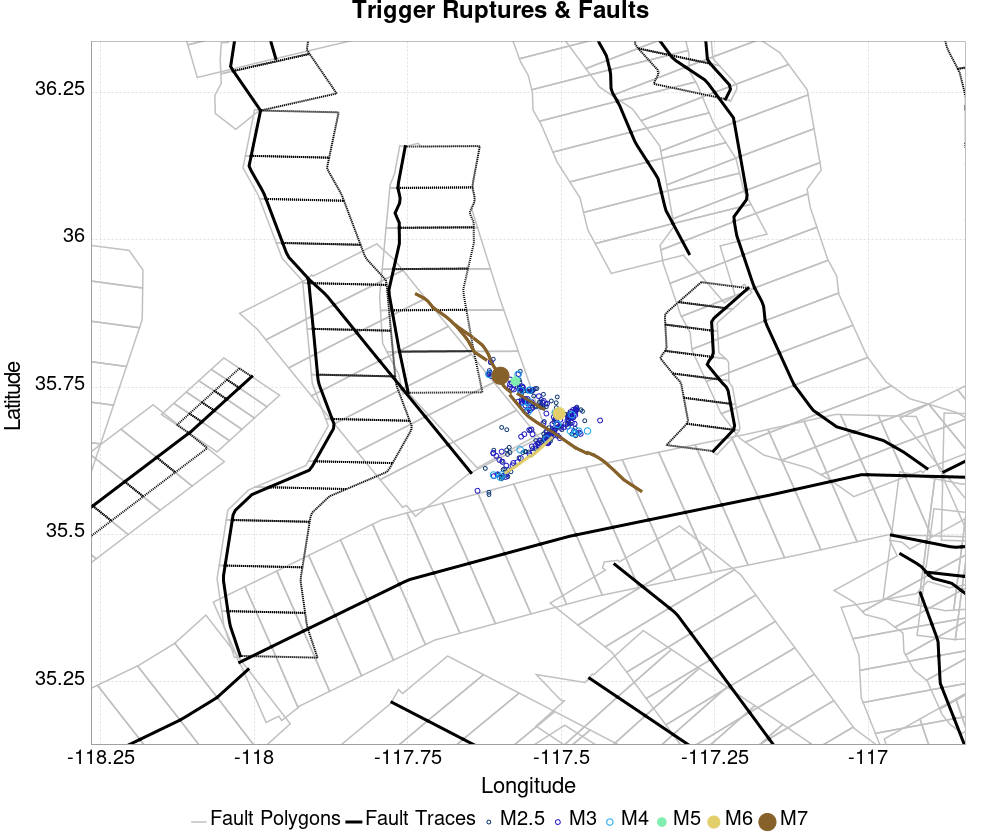
## Trigger Rupture Depth Map
*[(top)](#table-of-contents)*


## Fault Distances To Triggers
*[(top)](#table-of-contents)*

| Section Name | Strike, Dip, Rake | # Hypos In Poly | Max Mag w/ Hypo In Poly | # Surfs In Poly | Max Mag w/ Surf In Poly | Min Dist To Any (km) | Min Poly Dist To Any (km) | Min Dist To Largest (km) | Min Poly Dist To Largest (km) | Min Hypo Dist To Largest (km) | Min Hypo Poly Dist To Largest (km) |
|-----|-----|-----|-----|-----|-----|-----|-----|-----|-----|-----|-----|
| Airport Lake | 359, 50, -90 | 92 | 7.1 | 92 | 7.1 | 0.036 | 0.000 | 0.036 | 0.000 | 5.612 | 0.000 |
| Little Lake | 327, 90, 180 | 16 | 3.75 | 17 | 7.1 | 2.268 | 0.000 | 11.284 | 0.000 | 13.471 | 1.469 |
| Garlock (Central) | 71, 90, 0 | 2 | 2.76 | 3 | 7.1 | 5.600 | 0.000 | 5.600 | 0.000 | 22.766 | 10.797 |
| So Sierra Nevada | 2, 50, -90 | 0 |  | 0 |  | 4.248 | 4.233 | 4.248 | 4.233 | 16.191 | 15.188 |
| Tank Canyon | 189, 50, -90 | 0 |  | 0 |  | 9.015 | 9.011 | 9.015 | 9.011 | 17.039 | 16.895 |
| Blackwater | 323, 90, 180 | 0 |  | 0 |  | 14.394 | 8.726 | 14.394 | 8.726 | 29.622 | 27.613 |

## Individual Simulated Catalog Maps
*[(top)](#table-of-contents)*

These are map plots of individual catalogs from the simulations, selected as the closest catalog to each of the given percentiles in terms of total number of events.

| Duration | p0.0 %-ile | p25.0 %-ile | p50.0 %-ile | p75.0 %-ile | p90.0 %-ile | p95.0 %-ile | p97.5 %-ile | p98.0 %-ile | p99.0 %-ile | p99.5 %-ile | p99.9 %-ile | p99.994036 %-ile |
|-----|-----|-----|-----|-----|-----|-----|-----|-----|-----|-----|-----|-----|
| **1 Week** |  |  |  |  |  | 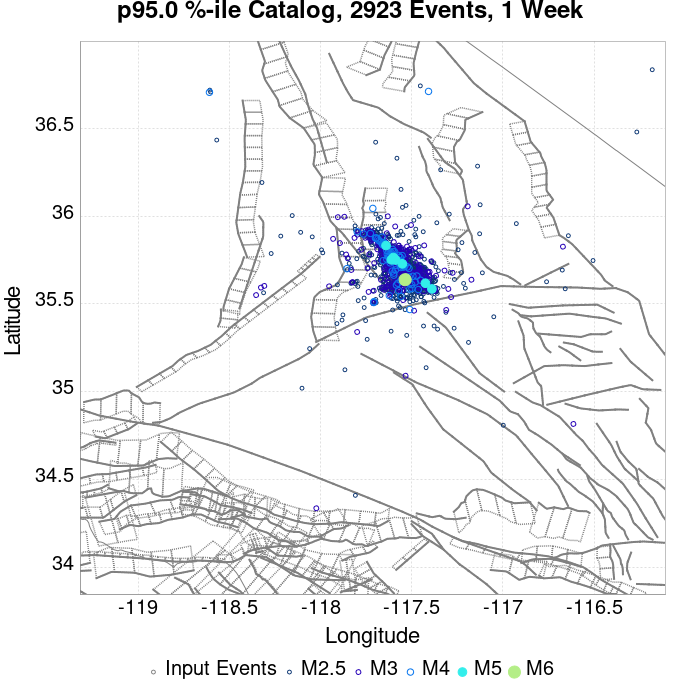 | 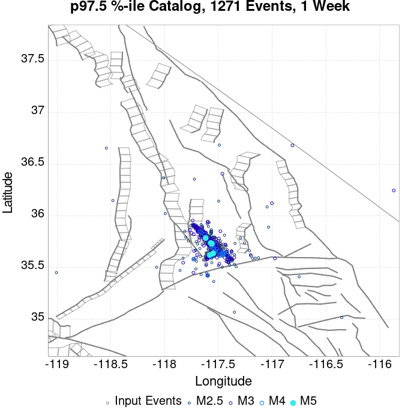 |  |  |  |  |  |
| **1 Month** |  |  | 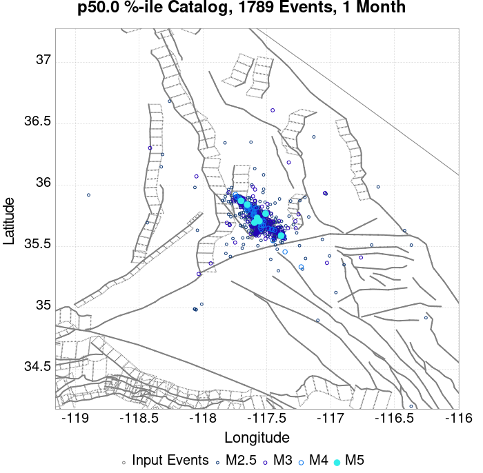 |  |  |  |  | 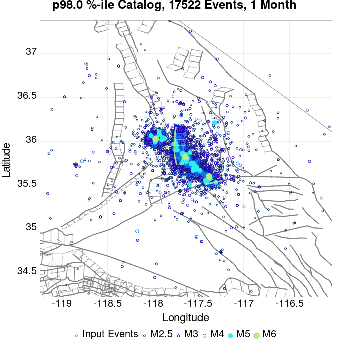 |  | 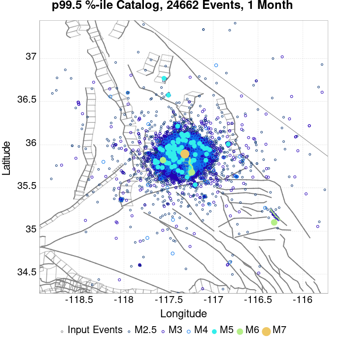 |  |  |
| **1 Year** |  |  |  |  | 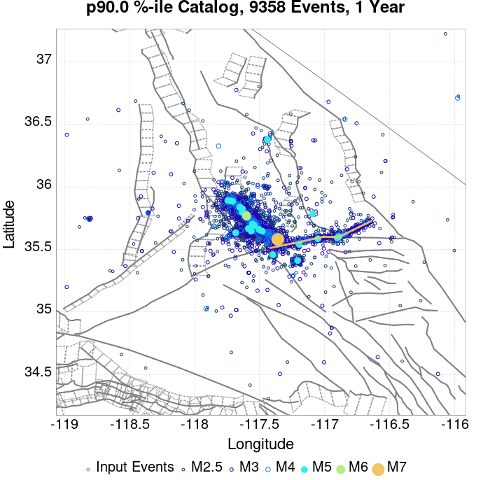 |  |  |  |  |  |  | 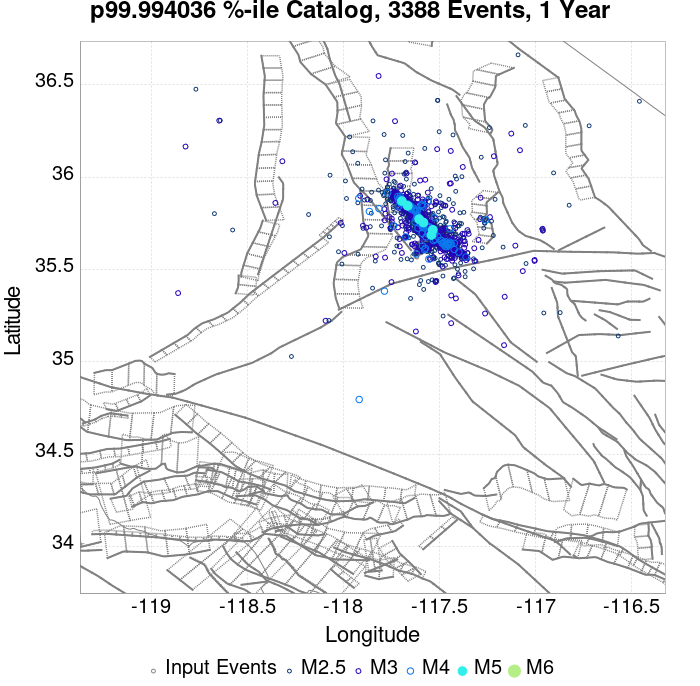 |
| **10 Year** |  |  |  |  | 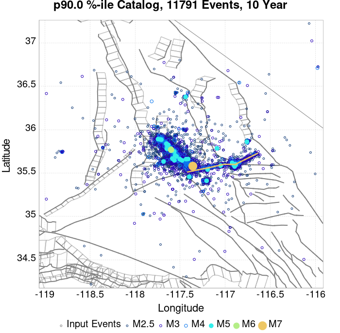 |  |  |  |  | 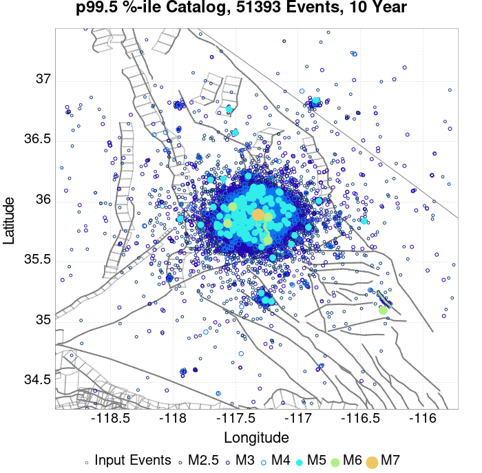 |  | 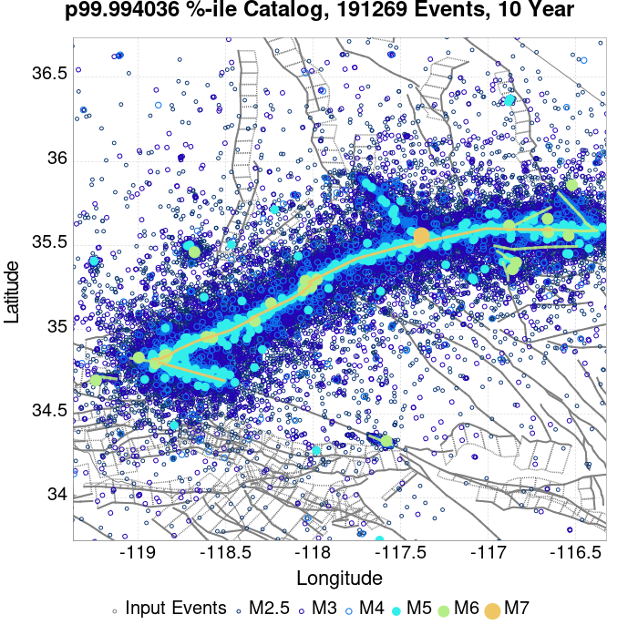 |

## ComCat Data Comparisons
*[(top)](#table-of-contents)*

These plots compare simulated sequences with data from ComCat. All plots only consider events with hypocenters inside the ComCat region defined in the JSON input file.

Last updated at 2019/11/06 03:10:03 UTC, 4 months after the simulation start time.

Total matching ComCat events found: 2093

### ComCat Magnitude-Number Distributions
*[(top)](#table-of-contents)*

| Incremental MND | Cumulative MND |
|-----|-----|
| 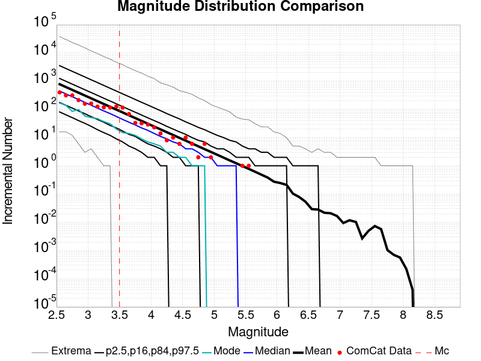 |  |

### ComCat Time-Dependent Mc
*[(top)](#table-of-contents)*

The following plots compare simulation results with ComCat data above a magnitude threshold. Plots labeled as *M&ge;Mc(t)* use the time-dependent magnitude of completeness (Mc) defined in Helmstetter et al. (2006), which is plotted below. In the case of multiple M&ge;5 ruptures, either as input to the simulation or in the comparison data, the maximum calculated time-dependent Mc is used. This time-dependent Mc function is plotted below.

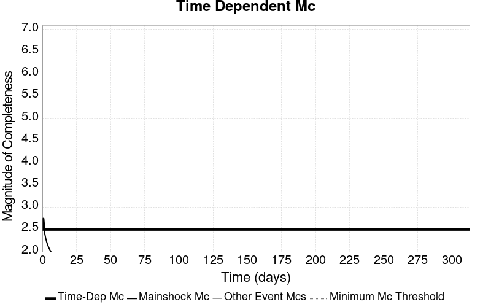

### ComCat Cumulative Number Vs Time
*[(top)](#table-of-contents)*

| M&ge;Mc(t) | M&ge;3.5 | M&ge;4 | M&ge;5 | M&ge;6 | M&ge;7 |
|-----|-----|-----|-----|-----|-----|
|  | 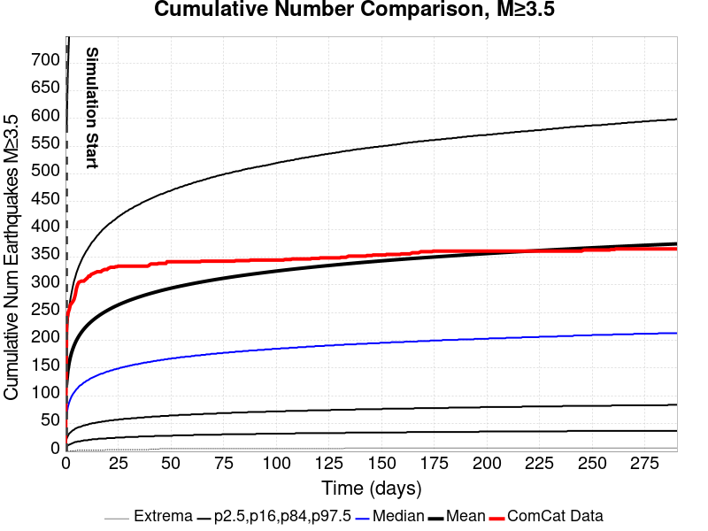 |  |  |  | 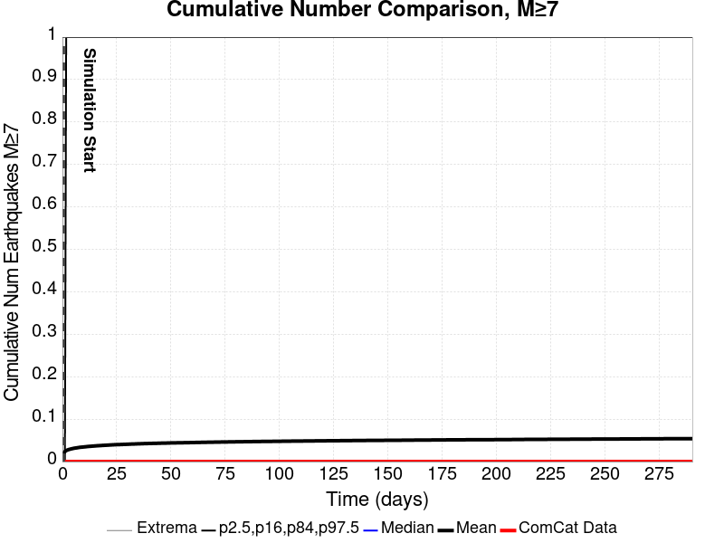 |

### ComCat Cumulative Number Simulation Percentiles
*[(top)](#table-of-contents)*


### ComCat Probability Spatial Distribution
*[(top)](#table-of-contents)*

*Note: maps labeled 'Forecast' are for a duration that extends into the future, only forecasted values are plotted (ComCat data omitted)*

|  | 1 Day | 1 Week | 1 Month | Current (4 Month) | Forecast: 1 Year |
|-----|-----|-----|-----|-----|-----|
| **M&ge;Mc(t)** |  | 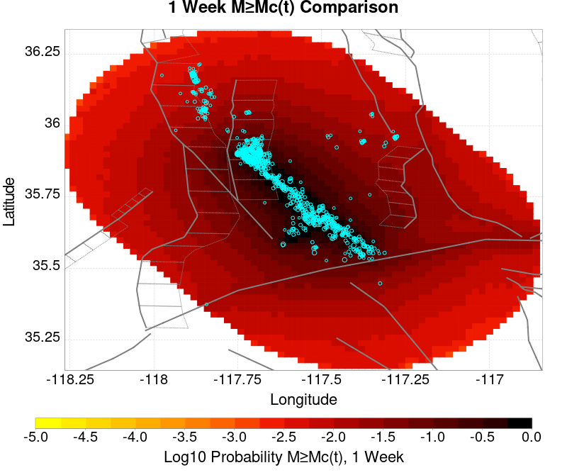 | 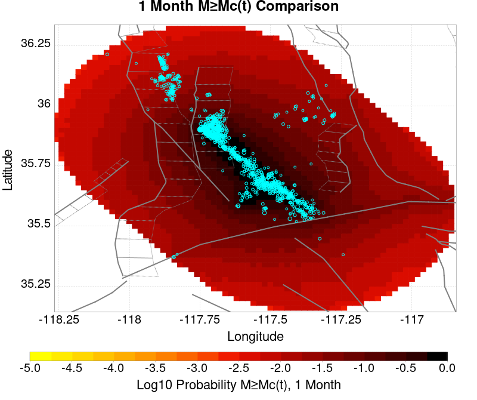 |  |  |
|  | Prob: 1.000 (100.00%), <small>*CI<sup>95%</sup>=[99.97% 100.00%]*</small>, Actual: 314 | Prob: 1.000 (100.00%), <small>*CI<sup>95%</sup>=[99.97% 100.00%]*</small>, Actual: 823 | Prob: 1.000 (100.00%), <small>*CI<sup>95%</sup>=[99.97% 100.00%]*</small>, Actual: 1173 | Prob: 1.000 (100.00%), <small>*CI<sup>95%</sup>=[99.97% 100.00%]*</small>, Actual: 1381 | Prob: 1.000 (100.00%), <small>*CI<sup>95%</sup>=[99.97% 100.00%]*</small> |
| **M&ge;3.5** |  |  |  |  |  |
|  | Prob: 1.000 (99.99%), <small>*CI<sup>95%</sup>=[99.96% 100.00%]*</small>, Actual: 218 | Prob: 1.000 (100.00%), <small>*CI<sup>95%</sup>=[99.97% 100.00%]*</small>, Actual: 273 | Prob: 1.000 (100.00%), <small>*CI<sup>95%</sup>=[99.97% 100.00%]*</small>, Actual: 302 | Prob: 1.000 (100.00%), <small>*CI<sup>95%</sup>=[99.97% 100.00%]*</small>, Actual: 317 | Prob: 1.000 (100.00%), <small>*CI<sup>95%</sup>=[99.97% 100.00%]*</small> |
| **M&ge;4** |  |  |  |  |  |
|  | Prob: 0.996 (99.62%), <small>*CI<sup>95%</sup>=[99.52% 99.71%]*</small>, Actual: 63 | Prob: 0.999 (99.93%), <small>*CI<sup>95%</sup>=[99.88% 99.97%]*</small>, Actual: 75 | Prob: 1.000 (99.99%), <small>*CI<sup>95%</sup>=[99.96% 100.00%]*</small>, Actual: 81 | Prob: 1.000 (100.00%), <small>*CI<sup>95%</sup>=[99.97% 100.00%]*</small>, Actual: 83 | Prob: 1.000 (100.00%), <small>*CI<sup>95%</sup>=[99.97% 100.00%]*</small> |
| **M&ge;5** |  |  |  |  |  |
|  | Prob: 0.796 (79.60%), <small>*CI<sup>95%</sup>=[78.98% 80.20%]*</small>, Actual: 2 | Prob: 0.877 (87.65%), <small>*CI<sup>95%</sup>=[87.14% 88.15%]*</small>, Actual: 2 | Prob: 0.914 (91.37%), <small>*CI<sup>95%</sup>=[90.93% 91.79%]*</small>, Actual: 2 | Prob: 0.939 (93.90%), <small>*CI<sup>95%</sup>=[93.52% 94.25%]*</small>, Actual: 3 | Prob: 0.953 (95.28%), <small>*CI<sup>95%</sup>=[94.94% 95.59%]*</small> |
| **M&ge;6** |  |  |  |  |  |
|  | Prob: 0.213 (21.27%), <small>*CI<sup>95%</sup>=[20.65% 21.90%]*</small>, Actual: 0 | Prob: 0.289 (28.88%), <small>*CI<sup>95%</sup>=[28.20% 29.58%]*</small>, Actual: 0 | Prob: 0.343 (34.29%), <small>*CI<sup>95%</sup>=[33.58% 35.02%]*</small>, Actual: 0 | Prob: 0.388 (38.79%), <small>*CI<sup>95%</sup>=[38.05% 39.53%]*</small>, Actual: 0 | Prob: 0.420 (41.99%), <small>*CI<sup>95%</sup>=[41.25% 42.75%]*</small> |
| **M&ge;7** |  |  | 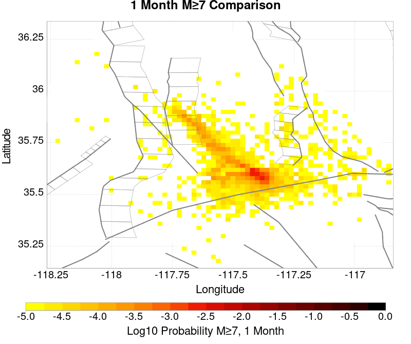 |  |  |
|  | Prob: 0.022 (2.16%), <small>*CI<sup>95%</sup>=[1.95% 2.40%]*</small>, Actual: 0 | Prob: 0.031 (3.11%), <small>*CI<sup>95%</sup>=[2.86% 3.39%]*</small>, Actual: 0 | Prob: 0.039 (3.88%), <small>*CI<sup>95%</sup>=[3.59% 4.18%]*</small>, Actual: 0 | Prob: 0.046 (4.58%), <small>*CI<sup>95%</sup>=[4.27% 4.91%]*</small>, Actual: 0 | Prob: 0.050 (4.99%), <small>*CI<sup>95%</sup>=[4.67% 5.34%]*</small> |
| **M&ge;8** |  |  |  |  |  |
|  | Prob: 1.19E-4 (0.01%), <small>*CI<sup>95%</sup>=[0.00% 0.05%]*</small>, Actual: 0 | Prob: 1.19E-4 (0.01%), <small>*CI<sup>95%</sup>=[0.00% 0.05%]*</small>, Actual: 0 | Prob: 1.19E-4 (0.01%), <small>*CI<sup>95%</sup>=[0.00% 0.05%]*</small>, Actual: 0 | Prob: 1.19E-4 (0.01%), <small>*CI<sup>95%</sup>=[0.00% 0.05%]*</small>, Actual: 0 | Prob: 1.19E-4 (0.01%), <small>*CI<sup>95%</sup>=[0.00% 0.05%]*</small> |

### ComCat Mean Expectation Spatial Distribution
*[(top)](#table-of-contents)*

*Note: maps labeled 'Forecast' are for a duration that extends into the future, only forecasted values are plotted (ComCat data omitted)*

|  | 1 Day | 1 Week | 1 Month | Current (4 Month) | Forecast: 1 Year |
|-----|-----|-----|-----|-----|-----|
| **M&ge;Mc(t)** |  |  |  |  | 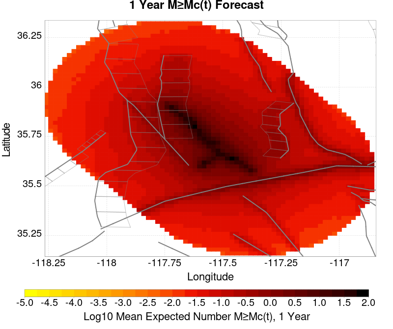 |
|  | Mean: 302.729, Actual: 314 | Mean: 994.980, Actual: 823 | Mean: 1584.162, Actual: 1173 | Mean: 2200.034, Actual: 1381 | Mean: 2691.636 |
| **M&ge;3.5** |  |  |  |  |  |
|  | Mean: 137.699, Actual: 218 | Mean: 207.798, Actual: 273 | Mean: 266.756, Actual: 302 | Mean: 328.267, Actual: 317 | Mean: 377.434 |
| **M&ge;4** |  | 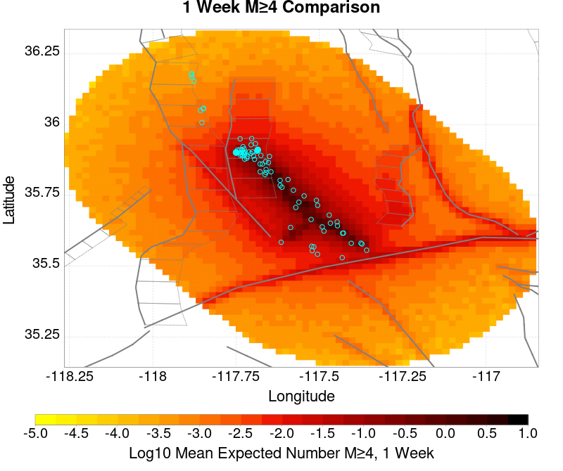 |  |  |  |
|  | Mean: 43.386, Actual: 63 | Mean: 65.567, Actual: 75 | Mean: 84.164, Actual: 81 | Mean: 103.552, Actual: 83 | Mean: 119.088 |
| **M&ge;5** | 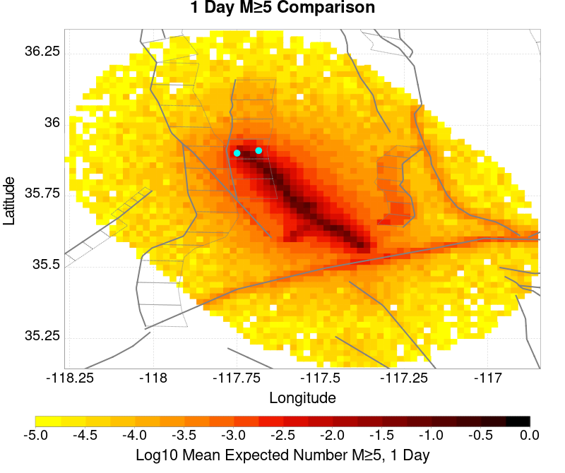 |  |  |  |  |
|  | Mean: 4.191, Actual: 2 | Mean: 6.351, Actual: 2 | Mean: 8.152, Actual: 2 | Mean: 10.006, Actual: 3 | Mean: 11.508 |
| **M&ge;6** | 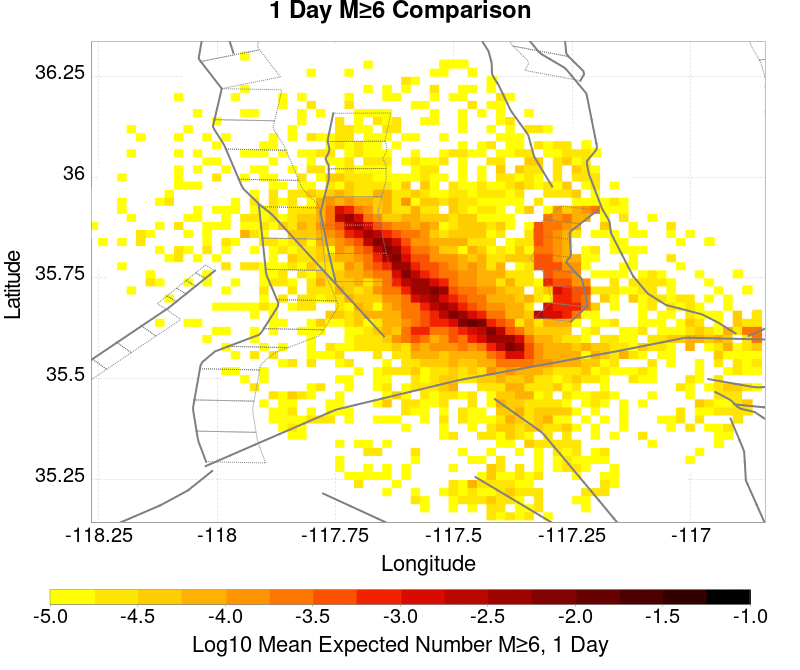 | 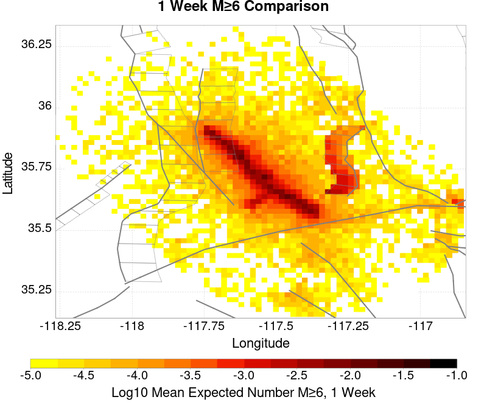 |  |  |  |
|  | Mean: 0.305, Actual: 0 | Mean: 0.469, Actual: 0 | Mean: 0.599, Actual: 0 | Mean: 0.736, Actual: 0 | Mean: 0.845 |
| **M&ge;7** |  |  |  |  | 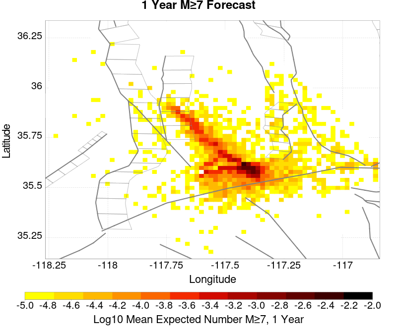 |
|  | Mean: 0.022, Actual: 0 | Mean: 0.032, Actual: 0 | Mean: 0.040, Actual: 0 | Mean: 0.048, Actual: 0 | Mean: 0.052 |
| **M&ge;8** |  | 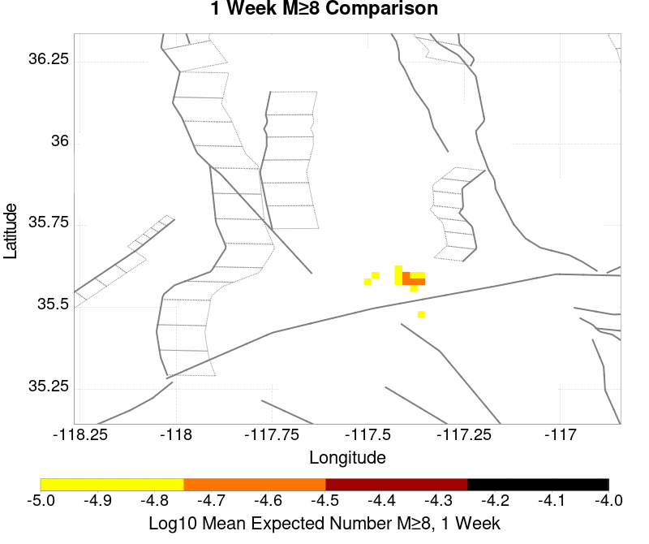 |  |  | 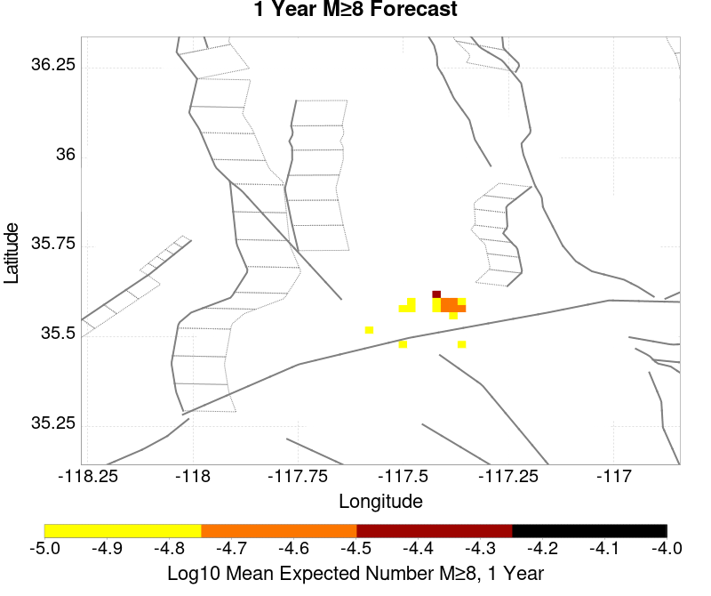 |
|  | Mean: 1.19E-4, Actual: 0 | Mean: 1.19E-4, Actual: 0 | Mean: 1.19E-4, Actual: 0 | Mean: 1.19E-4, Actual: 0 | Mean: 1.19E-4 |

### ComCat Depth Distribution
*[(top)](#table-of-contents)*

| M&ge;Mc(t) | M&ge;3.5 | M&ge;4 | M&ge;5 | M&ge;6 | M&ge;7 | M&ge;8 |
|-----|-----|-----|-----|-----|-----|-----|
|  |  |  |  |  |  |  |

## Section Participation
*[(top)](#table-of-contents)*

### Section Participation Plots
*[(top)](#table-of-contents)*

| Min Mag | 1 yr Triggered Ruptures (no spontaneous) | 10 yr Triggered Ruptures (no spontaneous) | 10 yr Triggered Ruptures (primary aftershocks only) |
|-----|-----|-----|-----|
| **All Supra. Seis.** |  |  |  |
| **M&ge;6.5** |  | 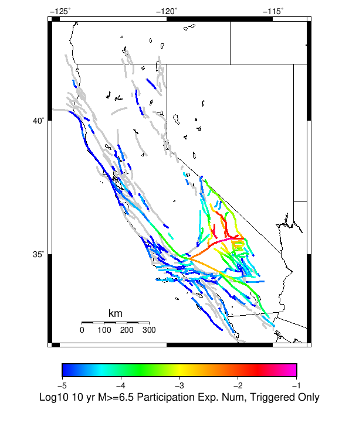 |  |
| **M&ge;7** |  |  |  |
| **M&ge;7.5** |  |  |  |
| **M&ge;8** |  |  |  |

### Supra-Seismogenic Parent Sections Table
*[(top)](#table-of-contents)*

*First 10 of 129 with matching ruptures shown*

| Parent Name | Triggered 10 Year Mean Count | Triggered 1 Day Prob | Triggered 1 Week Prob | Triggered 1 Month Prob | Triggered 1 Year Prob | Triggered 10 Year Prob | Triggered 10 Year Primary Mean Count |
|-----|-----|-----|-----|-----|-----|-----|-----|
| Garlock (Central) | 0.12852627 | 0.043 (4.35%), <small>*CI<sup>95%</sup>=[4.05% 4.67%]*</small> | 0.063 (6.29%), <small>*CI<sup>95%</sup>=[5.93% 6.67%]*</small> | 0.076 (7.57%), <small>*CI<sup>95%</sup>=[7.17% 7.98%]*</small> | 0.098 (9.82%), <small>*CI<sup>95%</sup>=[9.38% 10.29%]*</small> | 0.119 (11.94%), <small>*CI<sup>95%</sup>=[11.46% 12.44%]*</small> | 0.07019741 |
| Tank Canyon | 0.10598199 | 0.022 (2.20%), <small>*CI<sup>95%</sup>=[1.99% 2.44%]*</small> | 0.034 (3.37%), <small>*CI<sup>95%</sup>=[3.10% 3.66%]*</small> | 0.044 (4.40%), <small>*CI<sup>95%</sup>=[4.09% 4.72%]*</small> | 0.066 (6.59%), <small>*CI<sup>95%</sup>=[6.22% 6.98%]*</small> | 0.089 (8.93%), <small>*CI<sup>95%</sup>=[8.50% 9.37%]*</small> | 0.02976084 |
| Little Lake | 0.059819885 | 0.019 (1.94%), <small>*CI<sup>95%</sup>=[1.74% 2.17%]*</small> | 0.029 (2.95%), <small>*CI<sup>95%</sup>=[2.70% 3.22%]*</small> | 0.036 (3.60%), <small>*CI<sup>95%</sup>=[3.33% 3.90%]*</small> | 0.047 (4.68%), <small>*CI<sup>95%</sup>=[4.37% 5.02%]*</small> | 0.056 (5.58%), <small>*CI<sup>95%</sup>=[5.24% 5.94%]*</small> | 0.034889963 |
| Airport Lake | 0.049859844 | 0.020 (1.96%), <small>*CI<sup>95%</sup>=[1.76% 2.19%]*</small> | 0.027 (2.68%), <small>*CI<sup>95%</sup>=[2.44% 2.94%]*</small> | 0.033 (3.32%), <small>*CI<sup>95%</sup>=[3.05% 3.60%]*</small> | 0.042 (4.22%), <small>*CI<sup>95%</sup>=[3.93% 4.54%]*</small> | 0.049 (4.94%), <small>*CI<sup>95%</sup>=[4.62% 5.28%]*</small> | 0.03286217 |
| Owl Lake | 0.036321346 | 7.87E-3 (0.79%), <small>*CI<sup>95%</sup>=[0.66% 0.94%]*</small> | 0.013 (1.32%), <small>*CI<sup>95%</sup>=[1.16% 1.51%]*</small> | 0.018 (1.76%), <small>*CI<sup>95%</sup>=[1.57% 1.97%]*</small> | 0.025 (2.53%), <small>*CI<sup>95%</sup>=[2.30% 2.79%]*</small> | 0.033 (3.26%), <small>*CI<sup>95%</sup>=[3.00% 3.54%]*</small> | 0.010377527 |
| Panamint Valley | 0.030118685 | 7.75E-3 (0.78%), <small>*CI<sup>95%</sup>=[0.65% 0.92%]*</small> | 0.011 (1.12%), <small>*CI<sup>95%</sup>=[0.96% 1.29%]*</small> | 0.015 (1.49%), <small>*CI<sup>95%</sup>=[1.32% 1.69%]*</small> | 0.021 (2.14%), <small>*CI<sup>95%</sup>=[1.93% 2.37%]*</small> | 0.029 (2.91%), <small>*CI<sup>95%</sup>=[2.66% 3.18%]*</small> | 0.011391424 |
| Garlock (East) | 0.025108844 | 5.61E-3 (0.56%), <small>*CI<sup>95%</sup>=[0.46% 0.69%]*</small> | 9.48E-3 (0.95%), <small>*CI<sup>95%</sup>=[0.81% 1.11%]*</small> | 0.012 (1.17%), <small>*CI<sup>95%</sup>=[1.01% 1.35%]*</small> | 0.017 (1.67%), <small>*CI<sup>95%</sup>=[1.48% 1.88%]*</small> | 0.024 (2.36%), <small>*CI<sup>95%</sup>=[2.13% 2.60%]*</small> | 0.0071569155 |
| Hunter Mountain-Saline Valley | 0.013538498 | 4.29E-3 (0.43%), <small>*CI<sup>95%</sup>=[0.34% 0.54%]*</small> | 5.79E-3 (0.58%), <small>*CI<sup>95%</sup>=[0.47% 0.71%]*</small> | 7.10E-3 (0.71%), <small>*CI<sup>95%</sup>=[0.59% 0.85%]*</small> | 9.90E-3 (0.99%), <small>*CI<sup>95%</sup>=[0.85% 1.15%]*</small> | 0.013 (1.33%), <small>*CI<sup>95%</sup>=[1.16% 1.52%]*</small> | 0.0068587107 |
| Blackwater | 0.012584243 | 2.74E-3 (0.27%), <small>*CI<sup>95%</sup>=[0.20% 0.37%]*</small> | 4.59E-3 (0.46%), <small>*CI<sup>95%</sup>=[0.36% 0.58%]*</small> | 5.90E-3 (0.59%), <small>*CI<sup>95%</sup>=[0.48% 0.72%]*</small> | 8.89E-3 (0.89%), <small>*CI<sup>95%</sup>=[0.75% 1.05%]*</small> | 0.012 (1.22%), <small>*CI<sup>95%</sup>=[1.06% 1.40%]*</small> | 0.003220612 |
| Ash Hill | 0.011093219 | 2.15E-3 (0.21%), <small>*CI<sup>95%</sup>=[0.15% 0.30%]*</small> | 3.52E-3 (0.35%), <small>*CI<sup>95%</sup>=[0.27% 0.46%]*</small> | 4.53E-3 (0.45%), <small>*CI<sup>95%</sup>=[0.36% 0.57%]*</small> | 6.80E-3 (0.68%), <small>*CI<sup>95%</sup>=[0.56% 0.82%]*</small> | 9.90E-3 (0.99%), <small>*CI<sup>95%</sup>=[0.85% 1.15%]*</small> | 0.0026838433 |

### M≥6.5 Parent Sections Table
*[(top)](#table-of-contents)*

*First 10 of 100 with matching ruptures shown*

| Parent Name | Triggered 10 Year Mean Count | Triggered 1 Day Prob | Triggered 1 Week Prob | Triggered 1 Month Prob | Triggered 1 Year Prob | Triggered 10 Year Prob | Triggered 10 Year Primary Mean Count |
|-----|-----|-----|-----|-----|-----|-----|-----|
| Garlock (Central) | 0.052961174 | 0.018 (1.83%), <small>*CI<sup>95%</sup>=[1.64% 2.05%]*</small> | 0.026 (2.59%), <small>*CI<sup>95%</sup>=[2.36% 2.85%]*</small> | 0.032 (3.17%), <small>*CI<sup>95%</sup>=[2.91% 3.45%]*</small> | 0.042 (4.17%), <small>*CI<sup>95%</sup>=[3.88% 4.49%]*</small> | 0.052 (5.20%), <small>*CI<sup>95%</sup>=[4.87% 5.55%]*</small> | 0.028806584 |
| Airport Lake | 0.03781237 | 0.015 (1.53%), <small>*CI<sup>95%</sup>=[1.35% 1.73%]*</small> | 0.021 (2.07%), <small>*CI<sup>95%</sup>=[1.86% 2.30%]*</small> | 0.025 (2.53%), <small>*CI<sup>95%</sup>=[2.30% 2.79%]*</small> | 0.033 (3.25%), <small>*CI<sup>95%</sup>=[2.99% 3.53%]*</small> | 0.038 (3.77%), <small>*CI<sup>95%</sup>=[3.49% 4.07%]*</small> | 0.024452794 |
| Little Lake | 0.037693087 | 0.013 (1.31%), <small>*CI<sup>95%</sup>=[1.14% 1.49%]*</small> | 0.019 (1.93%), <small>*CI<sup>95%</sup>=[1.73% 2.16%]*</small> | 0.024 (2.37%), <small>*CI<sup>95%</sup>=[2.15% 2.61%]*</small> | 0.031 (3.08%), <small>*CI<sup>95%</sup>=[2.82% 3.35%]*</small> | 0.036 (3.60%), <small>*CI<sup>95%</sup>=[3.33% 3.90%]*</small> | 0.023021411 |
| Panamint Valley | 0.028090892 | 7.40E-3 (0.74%), <small>*CI<sup>95%</sup>=[0.62% 0.88%]*</small> | 0.011 (1.07%), <small>*CI<sup>95%</sup>=[0.92% 1.24%]*</small> | 0.014 (1.38%), <small>*CI<sup>95%</sup>=[1.21% 1.58%]*</small> | 0.020 (1.99%), <small>*CI<sup>95%</sup>=[1.79% 2.22%]*</small> | 0.027 (2.73%), <small>*CI<sup>95%</sup>=[2.49% 2.99%]*</small> | 0.011391424 |
| Owl Lake | 0.020277927 | 6.02E-3 (0.60%), <small>*CI<sup>95%</sup>=[0.49% 0.73%]*</small> | 9.60E-3 (0.96%), <small>*CI<sup>95%</sup>=[0.82% 1.12%]*</small> | 0.012 (1.23%), <small>*CI<sup>95%</sup>=[1.07% 1.41%]*</small> | 0.016 (1.64%), <small>*CI<sup>95%</sup>=[1.46% 1.85%]*</small> | 0.020 (2.02%), <small>*CI<sup>95%</sup>=[1.82% 2.25%]*</small> | 0.009065426 |
| Garlock (East) | 0.017594084 | 5.07E-3 (0.51%), <small>*CI<sup>95%</sup>=[0.41% 0.63%]*</small> | 7.34E-3 (0.73%), <small>*CI<sup>95%</sup>=[0.61% 0.88%]*</small> | 9.13E-3 (0.91%), <small>*CI<sup>95%</sup>=[0.78% 1.07%]*</small> | 0.013 (1.25%), <small>*CI<sup>95%</sup>=[1.09% 1.44%]*</small> | 0.017 (1.71%), <small>*CI<sup>95%</sup>=[1.52% 1.92%]*</small> | 0.0069183516 |
| Hunter Mountain-Saline Valley | 0.013478857 | 4.23E-3 (0.42%), <small>*CI<sup>95%</sup>=[0.33% 0.54%]*</small> | 5.73E-3 (0.57%), <small>*CI<sup>95%</sup>=[0.47% 0.70%]*</small> | 7.04E-3 (0.70%), <small>*CI<sup>95%</sup>=[0.59% 0.85%]*</small> | 9.84E-3 (0.98%), <small>*CI<sup>95%</sup>=[0.84% 1.15%]*</small> | 0.013 (1.32%), <small>*CI<sup>95%</sup>=[1.16% 1.51%]*</small> | 0.0067990697 |
| Tank Canyon | 0.012942089 | 2.62E-3 (0.26%), <small>*CI<sup>95%</sup>=[0.19% 0.36%]*</small> | 4.12E-3 (0.41%), <small>*CI<sup>95%</sup>=[0.32% 0.52%]*</small> | 5.73E-3 (0.57%), <small>*CI<sup>95%</sup>=[0.47% 0.70%]*</small> | 8.77E-3 (0.88%), <small>*CI<sup>95%</sup>=[0.74% 1.03%]*</small> | 0.013 (1.29%), <small>*CI<sup>95%</sup>=[1.13% 1.47%]*</small> | 0.003280253 |
| Garlock (West) | 0.008886503 | 3.10E-3 (0.31%), <small>*CI<sup>95%</sup>=[0.23% 0.41%]*</small> | 4.17E-3 (0.42%), <small>*CI<sup>95%</sup>=[0.33% 0.53%]*</small> | 4.77E-3 (0.48%), <small>*CI<sup>95%</sup>=[0.38% 0.60%]*</small> | 6.68E-3 (0.67%), <small>*CI<sup>95%</sup>=[0.55% 0.81%]*</small> | 8.83E-3 (0.88%), <small>*CI<sup>95%</sup>=[0.75% 1.04%]*</small> | 0.004592354 |
| So Sierra Nevada | 0.004711636 | 9.54E-4 (0.10%), <small>*CI<sup>95%</sup>=[0.06% 0.16%]*</small> | 1.49E-3 (0.15%), <small>*CI<sup>95%</sup>=[0.10% 0.22%]*</small> | 2.21E-3 (0.22%), <small>*CI<sup>95%</sup>=[0.16% 0.31%]*</small> | 3.46E-3 (0.35%), <small>*CI<sup>95%</sup>=[0.27% 0.45%]*</small> | 4.65E-3 (0.47%), <small>*CI<sup>95%</sup>=[0.37% 0.58%]*</small> | 9.542554E-4 |

### M≥7 Parent Sections Table
*[(top)](#table-of-contents)*

*First 10 of 66 with matching ruptures shown*

| Parent Name | Triggered 10 Year Mean Count | Triggered 1 Day Prob | Triggered 1 Week Prob | Triggered 1 Month Prob | Triggered 1 Year Prob | Triggered 10 Year Prob | Triggered 10 Year Primary Mean Count |
|-----|-----|-----|-----|-----|-----|-----|-----|
| Garlock (Central) | 0.046341028 | 0.016 (1.57%), <small>*CI<sup>95%</sup>=[1.39% 1.78%]*</small> | 0.023 (2.27%), <small>*CI<sup>95%</sup>=[2.05% 2.51%]*</small> | 0.028 (2.78%), <small>*CI<sup>95%</sup>=[2.54% 3.04%]*</small> | 0.037 (3.65%), <small>*CI<sup>95%</sup>=[3.37% 3.95%]*</small> | 0.046 (4.57%), <small>*CI<sup>95%</sup>=[4.27% 4.90%]*</small> | 0.025168486 |
| Panamint Valley | 0.01801157 | 5.73E-3 (0.57%), <small>*CI<sup>95%</sup>=[0.47% 0.70%]*</small> | 7.87E-3 (0.79%), <small>*CI<sup>95%</sup>=[0.66% 0.94%]*</small> | 9.78E-3 (0.98%), <small>*CI<sup>95%</sup>=[0.84% 1.14%]*</small> | 0.014 (1.36%), <small>*CI<sup>95%</sup>=[1.19% 1.55%]*</small> | 0.018 (1.80%), <small>*CI<sup>95%</sup>=[1.60% 2.01%]*</small> | 0.009125067 |
| Owl Lake | 0.015268086 | 5.13E-3 (0.51%), <small>*CI<sup>95%</sup>=[0.41% 0.64%]*</small> | 8.05E-3 (0.81%), <small>*CI<sup>95%</sup>=[0.68% 0.96%]*</small> | 0.010 (1.00%), <small>*CI<sup>95%</sup>=[0.86% 1.17%]*</small> | 0.012 (1.25%), <small>*CI<sup>95%</sup>=[1.09% 1.43%]*</small> | 0.015 (1.53%), <small>*CI<sup>95%</sup>=[1.35% 1.73%]*</small> | 0.008528657 |
| Garlock (East) | 0.0134192165 | 4.47E-3 (0.45%), <small>*CI<sup>95%</sup>=[0.35% 0.56%]*</small> | 6.50E-3 (0.65%), <small>*CI<sup>95%</sup>=[0.54% 0.79%]*</small> | 8.05E-3 (0.81%), <small>*CI<sup>95%</sup>=[0.68% 0.96%]*</small> | 0.011 (1.06%), <small>*CI<sup>95%</sup>=[0.91% 1.23%]*</small> | 0.013 (1.34%), <small>*CI<sup>95%</sup>=[1.17% 1.52%]*</small> | 0.006560506 |
| Hunter Mountain-Saline Valley | 0.013061371 | 4.17E-3 (0.42%), <small>*CI<sup>95%</sup>=[0.33% 0.53%]*</small> | 5.67E-3 (0.57%), <small>*CI<sup>95%</sup>=[0.46% 0.70%]*</small> | 6.92E-3 (0.69%), <small>*CI<sup>95%</sup>=[0.57% 0.83%]*</small> | 9.72E-3 (0.97%), <small>*CI<sup>95%</sup>=[0.83% 1.14%]*</small> | 0.013 (1.31%), <small>*CI<sup>95%</sup>=[1.14% 1.49%]*</small> | 0.0067394287 |
| Garlock (West) | 0.008767221 | 3.04E-3 (0.30%), <small>*CI<sup>95%</sup>=[0.23% 0.40%]*</small> | 4.12E-3 (0.41%), <small>*CI<sup>95%</sup>=[0.32% 0.52%]*</small> | 4.71E-3 (0.47%), <small>*CI<sup>95%</sup>=[0.38% 0.59%]*</small> | 6.62E-3 (0.66%), <small>*CI<sup>95%</sup>=[0.55% 0.80%]*</small> | 8.71E-3 (0.87%), <small>*CI<sup>95%</sup>=[0.74% 1.03%]*</small> | 0.004532713 |
| Little Lake | 0.008409375 | 3.64E-3 (0.36%), <small>*CI<sup>95%</sup>=[0.28% 0.47%]*</small> | 5.07E-3 (0.51%), <small>*CI<sup>95%</sup>=[0.41% 0.63%]*</small> | 6.08E-3 (0.61%), <small>*CI<sup>95%</sup>=[0.50% 0.74%]*</small> | 7.40E-3 (0.74%), <small>*CI<sup>95%</sup>=[0.62% 0.88%]*</small> | 8.41E-3 (0.84%), <small>*CI<sup>95%</sup>=[0.71% 0.99%]*</small> | 0.0056658913 |
| Airport Lake | 0.007991889 | 3.46E-3 (0.35%), <small>*CI<sup>95%</sup>=[0.27% 0.45%]*</small> | 4.71E-3 (0.47%), <small>*CI<sup>95%</sup>=[0.38% 0.59%]*</small> | 5.67E-3 (0.57%), <small>*CI<sup>95%</sup>=[0.46% 0.70%]*</small> | 6.98E-3 (0.70%), <small>*CI<sup>95%</sup>=[0.58% 0.84%]*</small> | 7.99E-3 (0.80%), <small>*CI<sup>95%</sup>=[0.67% 0.95%]*</small> | 0.0053676865 |
| San Andreas (Mojave N) | 0.0034591758 | 1.19E-3 (0.12%), <small>*CI<sup>95%</sup>=[0.07% 0.19%]*</small> | 1.55E-3 (0.16%), <small>*CI<sup>95%</sup>=[0.10% 0.23%]*</small> | 1.85E-3 (0.18%), <small>*CI<sup>95%</sup>=[0.13% 0.27%]*</small> | 2.50E-3 (0.25%), <small>*CI<sup>95%</sup>=[0.18% 0.34%]*</small> | 3.46E-3 (0.35%), <small>*CI<sup>95%</sup>=[0.27% 0.45%]*</small> | 0.0017892289 |
| San Andreas (Mojave S) | 0.0027434842 | 9.54E-4 (0.10%), <small>*CI<sup>95%</sup>=[0.06% 0.16%]*</small> | 1.19E-3 (0.12%), <small>*CI<sup>95%</sup>=[0.07% 0.19%]*</small> | 1.49E-3 (0.15%), <small>*CI<sup>95%</sup>=[0.10% 0.22%]*</small> | 2.09E-3 (0.21%), <small>*CI<sup>95%</sup>=[0.15% 0.29%]*</small> | 2.74E-3 (0.27%), <small>*CI<sup>95%</sup>=[0.20% 0.37%]*</small> | 0.0014313831 |

### M≥7.5 Parent Sections Table
*[(top)](#table-of-contents)*

*First 10 of 49 with matching ruptures shown*

| Parent Name | Triggered 10 Year Mean Count | Triggered 1 Day Prob | Triggered 1 Week Prob | Triggered 1 Month Prob | Triggered 1 Year Prob | Triggered 10 Year Prob | Triggered 10 Year Primary Mean Count |
|-----|-----|-----|-----|-----|-----|-----|-----|
| Garlock (Central) | 0.019562235 | 6.38E-3 (0.64%), <small>*CI<sup>95%</sup>=[0.53% 0.77%]*</small> | 8.71E-3 (0.87%), <small>*CI<sup>95%</sup>=[0.74% 1.03%]*</small> | 0.010 (1.04%), <small>*CI<sup>95%</sup>=[0.90% 1.21%]*</small> | 0.015 (1.48%), <small>*CI<sup>95%</sup>=[1.30% 1.68%]*</small> | 0.020 (1.96%), <small>*CI<sup>95%</sup>=[1.75% 2.18%]*</small> | 0.010377527 |
| Hunter Mountain-Saline Valley | 0.012464961 | 4.00E-3 (0.40%), <small>*CI<sup>95%</sup>=[0.31% 0.51%]*</small> | 5.43E-3 (0.54%), <small>*CI<sup>95%</sup>=[0.44% 0.67%]*</small> | 6.68E-3 (0.67%), <small>*CI<sup>95%</sup>=[0.55% 0.81%]*</small> | 9.42E-3 (0.94%), <small>*CI<sup>95%</sup>=[0.80% 1.10%]*</small> | 0.012 (1.25%), <small>*CI<sup>95%</sup>=[1.09% 1.43%]*</small> | 0.006560506 |
| Panamint Valley | 0.012464961 | 4.00E-3 (0.40%), <small>*CI<sup>95%</sup>=[0.31% 0.51%]*</small> | 5.43E-3 (0.54%), <small>*CI<sup>95%</sup>=[0.44% 0.67%]*</small> | 6.68E-3 (0.67%), <small>*CI<sup>95%</sup>=[0.55% 0.81%]*</small> | 9.42E-3 (0.94%), <small>*CI<sup>95%</sup>=[0.80% 1.10%]*</small> | 0.012 (1.25%), <small>*CI<sup>95%</sup>=[1.09% 1.43%]*</small> | 0.006560506 |
| Garlock (West) | 0.007872607 | 2.62E-3 (0.26%), <small>*CI<sup>95%</sup>=[0.19% 0.36%]*</small> | 3.58E-3 (0.36%), <small>*CI<sup>95%</sup>=[0.28% 0.46%]*</small> | 4.17E-3 (0.42%), <small>*CI<sup>95%</sup>=[0.33% 0.53%]*</small> | 5.90E-3 (0.59%), <small>*CI<sup>95%</sup>=[0.48% 0.72%]*</small> | 7.87E-3 (0.79%), <small>*CI<sup>95%</sup>=[0.66% 0.94%]*</small> | 0.004115226 |
| Garlock (East) | 0.0050694817 | 1.67E-3 (0.17%), <small>*CI<sup>95%</sup>=[0.11% 0.24%]*</small> | 2.21E-3 (0.22%), <small>*CI<sup>95%</sup>=[0.16% 0.31%]*</small> | 2.68E-3 (0.27%), <small>*CI<sup>95%</sup>=[0.20% 0.36%]*</small> | 3.76E-3 (0.38%), <small>*CI<sup>95%</sup>=[0.29% 0.48%]*</small> | 5.07E-3 (0.51%), <small>*CI<sup>95%</sup>=[0.41% 0.63%]*</small> | 0.0025049204 |
| San Andreas (Mojave N) | 0.0033995348 | 1.19E-3 (0.12%), <small>*CI<sup>95%</sup>=[0.07% 0.19%]*</small> | 1.55E-3 (0.16%), <small>*CI<sup>95%</sup>=[0.10% 0.23%]*</small> | 1.85E-3 (0.18%), <small>*CI<sup>95%</sup>=[0.13% 0.27%]*</small> | 2.50E-3 (0.25%), <small>*CI<sup>95%</sup>=[0.18% 0.34%]*</small> | 3.40E-3 (0.34%), <small>*CI<sup>95%</sup>=[0.26% 0.44%]*</small> | 0.0017892289 |
| San Andreas (Mojave S) | 0.0026242023 | 9.54E-4 (0.10%), <small>*CI<sup>95%</sup>=[0.06% 0.16%]*</small> | 1.19E-3 (0.12%), <small>*CI<sup>95%</sup>=[0.07% 0.19%]*</small> | 1.43E-3 (0.14%), <small>*CI<sup>95%</sup>=[0.09% 0.22%]*</small> | 2.03E-3 (0.20%), <small>*CI<sup>95%</sup>=[0.14% 0.29%]*</small> | 2.62E-3 (0.26%), <small>*CI<sup>95%</sup>=[0.19% 0.36%]*</small> | 0.0014313831 |
| San Andreas (San Bernardino N) | 0.001550665 | 5.37E-4 (0.05%), <small>*CI<sup>95%</sup>=[0.03% 0.11%]*</small> | 6.56E-4 (0.07%), <small>*CI<sup>95%</sup>=[0.03% 0.12%]*</small> | 7.75E-4 (0.08%), <small>*CI<sup>95%</sup>=[0.04% 0.14%]*</small> | 1.13E-3 (0.11%), <small>*CI<sup>95%</sup>=[0.07% 0.18%]*</small> | 1.55E-3 (0.16%), <small>*CI<sup>95%</sup>=[0.10% 0.23%]*</small> | 7.753325E-4 |
| Owl Lake | 0.0013121011 | 4.17E-4 (0.04%), <small>*CI<sup>95%</sup>=[0.02% 0.09%]*</small> | 7.16E-4 (0.07%), <small>*CI<sup>95%</sup>=[0.04% 0.13%]*</small> | 7.16E-4 (0.07%), <small>*CI<sup>95%</sup>=[0.04% 0.13%]*</small> | 9.54E-4 (0.10%), <small>*CI<sup>95%</sup>=[0.06% 0.16%]*</small> | 1.31E-3 (0.13%), <small>*CI<sup>95%</sup>=[0.08% 0.20%]*</small> | 7.1569154E-4 |
| San Andreas (San Bernardino S) | 5.3676864E-4 | 1.79E-4 (0.02%), <small>*CI<sup>95%</sup>=[0.00% 0.06%]*</small> | 1.79E-4 (0.02%), <small>*CI<sup>95%</sup>=[0.00% 0.06%]*</small> | 2.39E-4 (0.02%), <small>*CI<sup>95%</sup>=[0.01% 0.07%]*</small> | 3.58E-4 (0.04%), <small>*CI<sup>95%</sup>=[0.01% 0.08%]*</small> | 5.37E-4 (0.05%), <small>*CI<sup>95%</sup>=[0.03% 0.11%]*</small> | 1.7892288E-4 |

### M≥8 Parent Sections Table
*[(top)](#table-of-contents)*

*First 10 of 23 with matching ruptures shown*

| Parent Name | Triggered 10 Year Mean Count | Triggered 1 Day Prob | Triggered 1 Week Prob | Triggered 1 Month Prob | Triggered 1 Year Prob | Triggered 10 Year Prob | Triggered 10 Year Primary Mean Count |
|-----|-----|-----|-----|-----|-----|-----|-----|
| San Andreas (Mojave N) | 2.982048E-4 | 1.19E-4 (0.01%), <small>*CI<sup>95%</sup>=[0.00% 0.05%]*</small> | 1.19E-4 (0.01%), <small>*CI<sup>95%</sup>=[0.00% 0.05%]*</small> | 1.19E-4 (0.01%), <small>*CI<sup>95%</sup>=[0.00% 0.05%]*</small> | 1.19E-4 (0.01%), <small>*CI<sup>95%</sup>=[0.00% 0.05%]*</small> | 2.98E-4 (0.03%), <small>*CI<sup>95%</sup>=[0.01% 0.07%]*</small> | 1.7892288E-4 |
| San Andreas (Mojave S) | 2.982048E-4 | 1.19E-4 (0.01%), <small>*CI<sup>95%</sup>=[0.00% 0.05%]*</small> | 1.19E-4 (0.01%), <small>*CI<sup>95%</sup>=[0.00% 0.05%]*</small> | 1.19E-4 (0.01%), <small>*CI<sup>95%</sup>=[0.00% 0.05%]*</small> | 1.19E-4 (0.01%), <small>*CI<sup>95%</sup>=[0.00% 0.05%]*</small> | 2.98E-4 (0.03%), <small>*CI<sup>95%</sup>=[0.01% 0.07%]*</small> | 1.7892288E-4 |
| San Andreas (San Bernardino N) | 2.982048E-4 | 1.19E-4 (0.01%), <small>*CI<sup>95%</sup>=[0.00% 0.05%]*</small> | 1.19E-4 (0.01%), <small>*CI<sup>95%</sup>=[0.00% 0.05%]*</small> | 1.19E-4 (0.01%), <small>*CI<sup>95%</sup>=[0.00% 0.05%]*</small> | 1.19E-4 (0.01%), <small>*CI<sup>95%</sup>=[0.00% 0.05%]*</small> | 2.98E-4 (0.03%), <small>*CI<sup>95%</sup>=[0.01% 0.07%]*</small> | 1.7892288E-4 |
| Garlock (Central) | 2.3856385E-4 | 1.19E-4 (0.01%), <small>*CI<sup>95%</sup>=[0.00% 0.05%]*</small> | 1.19E-4 (0.01%), <small>*CI<sup>95%</sup>=[0.00% 0.05%]*</small> | 1.19E-4 (0.01%), <small>*CI<sup>95%</sup>=[0.00% 0.05%]*</small> | 1.19E-4 (0.01%), <small>*CI<sup>95%</sup>=[0.00% 0.05%]*</small> | 2.39E-4 (0.02%), <small>*CI<sup>95%</sup>=[0.01% 0.07%]*</small> | 1.7892288E-4 |
| Garlock (East) | 2.3856385E-4 | 1.19E-4 (0.01%), <small>*CI<sup>95%</sup>=[0.00% 0.05%]*</small> | 1.19E-4 (0.01%), <small>*CI<sup>95%</sup>=[0.00% 0.05%]*</small> | 1.19E-4 (0.01%), <small>*CI<sup>95%</sup>=[0.00% 0.05%]*</small> | 1.19E-4 (0.01%), <small>*CI<sup>95%</sup>=[0.00% 0.05%]*</small> | 2.39E-4 (0.02%), <small>*CI<sup>95%</sup>=[0.01% 0.07%]*</small> | 1.7892288E-4 |
| Garlock (West) | 2.3856385E-4 | 1.19E-4 (0.01%), <small>*CI<sup>95%</sup>=[0.00% 0.05%]*</small> | 1.19E-4 (0.01%), <small>*CI<sup>95%</sup>=[0.00% 0.05%]*</small> | 1.19E-4 (0.01%), <small>*CI<sup>95%</sup>=[0.00% 0.05%]*</small> | 1.19E-4 (0.01%), <small>*CI<sup>95%</sup>=[0.00% 0.05%]*</small> | 2.39E-4 (0.02%), <small>*CI<sup>95%</sup>=[0.01% 0.07%]*</small> | 1.7892288E-4 |
| San Andreas (San Bernardino S) | 2.3856385E-4 | 1.19E-4 (0.01%), <small>*CI<sup>95%</sup>=[0.00% 0.05%]*</small> | 1.19E-4 (0.01%), <small>*CI<sup>95%</sup>=[0.00% 0.05%]*</small> | 1.19E-4 (0.01%), <small>*CI<sup>95%</sup>=[0.00% 0.05%]*</small> | 1.19E-4 (0.01%), <small>*CI<sup>95%</sup>=[0.00% 0.05%]*</small> | 2.39E-4 (0.02%), <small>*CI<sup>95%</sup>=[0.01% 0.07%]*</small> | 1.19281925E-4 |
| San Andreas (San Gorgonio Pass-Garnet HIll) | 1.7892288E-4 | 5.96E-5 (0.01%), <small>*CI<sup>95%</sup>=[0.00% 0.04%]*</small> | 5.96E-5 (0.01%), <small>*CI<sup>95%</sup>=[0.00% 0.04%]*</small> | 5.96E-5 (0.01%), <small>*CI<sup>95%</sup>=[0.00% 0.04%]*</small> | 5.96E-5 (0.01%), <small>*CI<sup>95%</sup>=[0.00% 0.04%]*</small> | 1.79E-4 (0.02%), <small>*CI<sup>95%</sup>=[0.00% 0.06%]*</small> | 5.9640963E-5 |
| San Andreas (Coachella) rev | 1.19281925E-4 | 5.96E-5 (0.01%), <small>*CI<sup>95%</sup>=[0.00% 0.04%]*</small> | 5.96E-5 (0.01%), <small>*CI<sup>95%</sup>=[0.00% 0.04%]*</small> | 5.96E-5 (0.01%), <small>*CI<sup>95%</sup>=[0.00% 0.04%]*</small> | 5.96E-5 (0.01%), <small>*CI<sup>95%</sup>=[0.00% 0.04%]*</small> | 1.19E-4 (0.01%), <small>*CI<sup>95%</sup>=[0.00% 0.05%]*</small> | 5.9640963E-5 |
| Brawley (Seismic Zone) alt 1 | 5.9640963E-5 | 0.000 (0.00%), <small>*CI<sup>95%</sup>=[0.00% 0.03%]*</small> | 0.000 (0.00%), <small>*CI<sup>95%</sup>=[0.00% 0.03%]*</small> | 0.000 (0.00%), <small>*CI<sup>95%</sup>=[0.00% 0.03%]*</small> | 0.000 (0.00%), <small>*CI<sup>95%</sup>=[0.00% 0.03%]*</small> | 5.96E-5 (0.01%), <small>*CI<sup>95%</sup>=[0.00% 0.04%]*</small> | 0.0 |

### Fault Magnitude-Probability Distributions
*[(top)](#table-of-contents)*

The first 5 sections (sorted by trigger rate) are plotted below. All fault MPDs are available [here](plots/parent_sect_mpds/README.md)

| 1 Week | 1 Month | 1 Year | 10 Year |
|-----|-----|-----|-----|
|  |  |  |  |
|  |  |  |  |
|  |  |  |  |
|  |  |  |  |
|  |  |  |  |

## Gridded Nucleation
*[(top)](#table-of-contents)*

| Min Mag | Triggered Ruptures (no spontaneous) | Triggered Ruptures (primary aftershocks only) |
|-----|-----|-----|
| **M&ge;2.5** |  |  |
| **M&ge;5** |  | 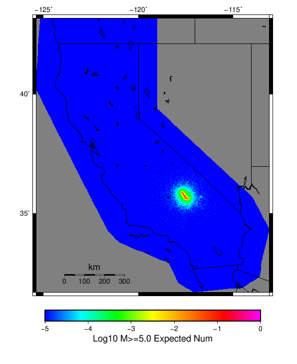 |
| **M&ge;6** |  |  |
| **M&ge;7** |  |  |


## JSON Input File
*[(top)](#table-of-contents)*

```
{
  "numSimulations": 100000,
  "duration": 10.0,
  "startTimeMillis": 1562383194040,
  "includeSpontaneous": false,
  "randomSeed": 1572975561977,
  "binaryOutput": true,
  "binaryOutputFilters": [
    {
      "prefix": "results_complete",
      "descendantsOnly": false
    },
    {
      "prefix": "results_m5_preserve_chain",
      "minMag": 5.0,
      "preserveChainBelowMag": true,
      "descendantsOnly": false
    }
  ],
  "forceRecalc": false,
  "simulationName": "ComCat M7.1 (ci38457511), ShakeMap Surfaces, kCOV\u003d1.5",
  "numRetries": 3,
  "outputDir": "/home/scec-02/kmilner/ucerf3/etas_sim/2019_11_05-ComCatM7p1_ci38457511_ShakeMapSurfaces_kCOV1p5",
  "treatTriggerCatalogAsSpontaneous": false,
  "triggerRuptures": [
    "omitted due to length, see original input file"
  ],
  "cacheDir": "/home/scec-02/kmilner/ucerf3/ucerf3-etas-launcher/inputs/cache_fm3p1_ba",
  "fssFile": "/home/scec-02/kmilner/ucerf3/ucerf3-etas-launcher/inputs/2013_05_10-ucerf3p3-production-10runs_COMPOUND_SOL_FM3_1_SpatSeisU3_MEAN_BRANCH_AVG_SOL.zip",
  "probModel": "FULL_TD",
  "applySubSeisForSupraNucl": true,
  "totRateScaleFactor": 1.14,
  "gridSeisCorr": true,
  "timeIndependentERF": false,
  "griddedOnly": false,
  "imposeGR": false,
  "includeIndirectTriggering": true,
  "gridSeisDiscr": 0.1,
  "catalogCompletenessModel": "RELAXED",
  "etas_k_cov": 1.5,
  "configCommand": "u3etas_comcat_event_config_builder.sh --event-id ci38457511 --mag-complete 3.5 --num-simulations 100000 --days-before 7 --etas-k-cov 1.5 --finite-surf-shakemap --finite-surf-shakemap-min-mag 5 --hpc-site USC_HPC --nodes 36 --hours 24 --queue scec",
  "configTime": 1572975561977,
  "comcatMetadata": {
    "region": {
      "border": [
        {
          "latitude": 35.15123745324938,
          "longitude": -117.46198765392752
        },
        {
          "latitude": 35.170513097218205,
          "longitude": -117.55046477274733
        },
        {
          "latitude": 35.201997575622634,
          "longitude": -117.63356287896195
        },
        {
          "latitude": 35.24474776584818,
          "longitude": -117.70878534540662
        },
        {
          "latitude": 35.2893890362986,
          "longitude": -117.76387551603122
        },
        {
          "latitude": 35.288830898189985,
          "longitude": -117.76465036296011
        },
        {
          "latitude": 35.62116745212862,
          "longitude": -118.13026990137416
        },
        {
          "latitude": 35.621789874646055,
          "longitude": -118.12940866580139
        },
        {
          "latitude": 35.621789874646055,
          "longitude": -118.12940866580136
        },
        {
          "latitude": 35.63100857737423,
          "longitude": -118.14083341711117
        },
        {
          "latitude": 35.69213881200874,
          "longitude": -118.19401186444136
        },
        {
          "latitude": 35.759827796433385,
          "longitude": -118.23338865654299
        },
        {
          "latitude": 35.8320329014668,
          "longitude": -118.25773927868946
        },
        {
          "latitude": 35.906569563076914,
          "longitude": -118.26628547708222
        },
        {
          "latitude": 35.9811764992231,
          "longitude": -118.25872343341653
        },
        {
          "latitude": 36.05358395358725,
          "longitude": -118.23523828089384
        },
        {
          "latitude": 36.12158296055357,
          "longitude": -118.19650389473806
        },
        {
          "latitude": 36.18309350302806,
          "longitude": -118.14366730262441
        },
        {
          "latitude": 36.23622937613509,
          "longitude": -118.07831757407638
        },
        {
          "latitude": 36.279357589115186,
          "longitude": -118.00243964650828
        },
        {
          "latitude": 36.31115024550475,
          "longitude": -117.91835419890715
        },
        {
          "latitude": 36.33062704347584,
          "longitude": -117.82864534929934
        },
        {
          "latitude": 36.337186832826475,
          "longitude": -117.7360785775
        },
        {
          "latitude": 36.33062704347584,
          "longitude": -117.64351180570065
        },
        {
          "latitude": 36.31115024550475,
          "longitude": -117.55380295609284
        },
        {
          "latitude": 36.279357589115186,
          "longitude": -117.46971750849171
        },
        {
          "latitude": 36.23622937613509,
          "longitude": -117.39383958092363
        },
        {
          "latitude": 36.19237301765921,
          "longitude": -117.33990236386252
        },
        {
          "latitude": 36.19237301765921,
          "longitude": -117.3399023638625
        },
        {
          "latitude": 36.19300476664728,
          "longitude": -117.33902822340912
        },
        {
          "latitude": 35.858277657147454,
          "longitude": -116.97410396317103
        },
        {
          "latitude": 35.85771127553969,
          "longitude": -116.97489025431044
        },
        {
          "latitude": 35.849566414597014,
          "longitude": -116.96491461360324
        },
        {
          "latitude": 35.78805819220281,
          "longitude": -116.9122967694479
        },
        {
          "latitude": 35.72006106557635,
          "longitude": -116.87372034968973
        },
        {
          "latitude": 35.64765482528862,
          "longitude": -116.85032807444419
        },
        {
          "latitude": 35.57304829206068,
          "longitude": -116.8427916482061
        },
        {
          "latitude": 35.49851117585832,
          "longitude": -116.8512961557198
        },
        {
          "latitude": 35.42630481575459,
          "longitude": -116.87553976530553
        },
        {
          "latitude": 35.35861392859174,
          "longitude": -116.91474809853695
        },
        {
          "latitude": 35.29748137319737,
          "longitude": -116.96770221389164
        },
        {
          "latitude": 35.24474776584818,
          "longitude": -117.03277884359336
        },
        {
          "latitude": 35.201997575622634,
          "longitude": -117.10800131003803
        },
        {
          "latitude": 35.170513097218205,
          "longitude": -117.19109941625265
        },
        {
          "latitude": 35.15123745324938,
          "longitude": -117.27957653507247
        },
        {
          "latitude": 35.14474752487352,
          "longitude": -117.3707820945
        }
      ]
    },
    "eventID": "ci38457511",
    "minDepth": -10.0,
    "maxDepth": 24.0,
    "minMag": 2.5,
    "startTime": 1561778393040,
    "endTime": 1562383193040,
    "magComplete": 3.5
  }
}
```

