# Parent Section Magnitude-Probability Distributions

Only fault sections with at least one triggered aftershock are plotted. Sections are sorted by total supraseismogenic trigger rate (decreasing)

## Table Of Contents

* [Garlock (Central)](#garlock-central)
* [Tank Canyon](#tank-canyon)
* [Little Lake](#little-lake)
* [Airport Lake](#airport-lake)
* [Owl Lake](#owl-lake)
* [Panamint Valley](#panamint-valley)
* [Garlock (East)](#garlock-east)
* [Hunter Mountain-Saline Valley](#hunter-mountain-saline-valley)
* [Blackwater](#blackwater)
* [Ash Hill](#ash-hill)
* [Garlock (West)](#garlock-west)
* [McLean Lake](#mclean-lake)
* [Goldstone Lake](#goldstone-lake)
* [Gravel Hills-Harper Lk](#gravel-hills-harper-lk)
* [So Sierra Nevada](#so-sierra-nevada)
* [Coyote Canyon](#coyote-canyon)
* [Lenwood-Lockhart-Old Woman Springs](#lenwood-lockhart-old-woman-springs)
* [Death Valley (So)](#death-valley-so)
* [San Andreas (Mojave S)](#san-andreas-mojave-s)
* [San Andreas (Mojave N)](#san-andreas-mojave-n)
* [Paradise](#paradise)
* [Towne Pass](#towne-pass)
* [Nelson Lake](#nelson-lake)
* [San Andreas (San Bernardino N)](#san-andreas-san-bernardino-n)
* [Garlic Springs](#garlic-springs)
* [Bicycle Lake](#bicycle-lake)
* [Coyote Lake](#coyote-lake)
* [Helendale-So Lockhart](#helendale-so-lockhart)
* [Death Valley (Black Mtns Frontal)](#death-valley-black-mtns-frontal)
* [San Andreas (San Bernardino S)](#san-andreas-san-bernardino-s)
* [Sierra Nevada  (No Extension)](#sierra-nevada--no-extension)
* [San Andreas (Creeping Section) 2011 CFM](#san-andreas-creeping-section-2011-cfm)
* [San Andreas (Parkfield)](#san-andreas-parkfield)
* [San Andreas (San Gorgonio Pass-Garnet HIll)](#san-andreas-san-gorgonio-pass-garnet-hill)
* [Lake Isabella (Seismicity)](#lake-isabella-seismicity)
* [Brawley (Seismic Zone) alt 1](#brawley-seismic-zone-alt-1)
* [San Andreas (Coachella) rev](#san-andreas-coachella-rev)
* [Santa Ynez (West)](#santa-ynez-west)
* [Imperial](#imperial)
* [San Andreas (Big Bend)](#san-andreas-big-bend)
* [San Jacinto (San Bernardino)](#san-jacinto-san-bernardino)
* [Ludlow](#ludlow)
* [Cleghorn](#cleghorn)
* [Death Valley (No)](#death-valley-no)
* [Elsinore (Glen Ivy) rev](#elsinore-glen-ivy-rev)
* [Death Valley (Fish Lake Valley)](#death-valley-fish-lake-valley)
* [Deep Springs](#deep-springs)
* [San Pedro Basin](#san-pedro-basin)
* [Mission Ridge-Arroyo Parida-Santa Ana](#mission-ridge-arroyo-parida-santa-ana)
* [Pisgah-Bullion Mtn-Mesquite Lk](#pisgah-bullion-mtn-mesquite-lk)
* [North Frontal  (West)](#north-frontal--west)
* [Santa Ynez (East)](#santa-ynez-east)
* [Pitas Point (Lower West)](#pitas-point-lower-west)
* [San Andreas (Carrizo) rev](#san-andreas-carrizo-rev)
* [Elmore Ranch](#elmore-ranch)
* [San Cayetano](#san-cayetano)
* [Sierra Madre](#sierra-madre)
* [Surprise Valley 2011 CFM](#surprise-valley-2011-cfm)
* [Hunting Creek - Bartlett Springs connector 2011](#hunting-creek---bartlett-springs-connector-2011)
* [Kern Canyon (North Kern) 2011](#kern-canyon-north-kern-2011)
* [San Jacinto (Lytle Creek connector)](#san-jacinto-lytle-creek-connector)
* [Kern Canyon (Lake Isabella) 2011](#kern-canyon-lake-isabella-2011)
* [Calaveras (So) - Paicines extension 2011 CFM](#calaveras-so---paicines-extension-2011-cfm)
* [Cleghorn Lake](#cleghorn-lake)
* [Independence rev 2011](#independence-rev-2011)
* [Hartley Springs 2011 CFM](#hartley-springs-2011-cfm)
* [Red Pass](#red-pass)
* [Dry Mountain](#dry-mountain)
* [Cucamonga](#cucamonga)
* [Hunting Creek - Berryessa 2011 CFM](#hunting-creek---berryessa-2011-cfm)
* [San Jacinto (Stepovers Combined)](#san-jacinto-stepovers-combined)
* [Big Pine (East)](#big-pine-east)
* [Pitas Point (Lower)-Montalvo](#pitas-point-lower-montalvo)
* [San Jacinto (San Jacinto Valley) rev](#san-jacinto-san-jacinto-valley-rev)
* [San Andreas (North Branch Mill Creek)](#san-andreas-north-branch-mill-creek)
* [Manix-Afton Hills](#manix-afton-hills)
* [Red Mountain](#red-mountain)
* [Kern Canyon (South Kern) 2011](#kern-canyon-south-kern-2011)
* [San Andreas (Cholame) rev](#san-andreas-cholame-rev)
* [Baker](#baker)
* [Mission Creek](#mission-creek)
* [Bullion Mountains](#bullion-mountains)
* [San Gabriel](#san-gabriel)
* [White Wolf (Extension)](#white-wolf-extension)
* [Great Valley 05 Pittsburg - Kirby Hills alt1](#great-valley-05-pittsburg---kirby-hills-alt1)
* [La Panza 2011](#la-panza-2011)
* [Owens Valley](#owens-valley)
* [Elsinore (Coyote Mountains)](#elsinore-coyote-mountains)

## Garlock (Central)
*[(top)](#table-of-contents)*

| 1 Week | 1 Month | 1 Year | 10 Year |
|-----|-----|-----|-----|
|  |  |  |  |

| Magnitude | 1 wk TI Prob | 1 wk TD Prob | 1 wk ETAS Prob | 1 wk ETAS/TD Gain | 1 wk ETAS Triggered Only | 1 mo TI Prob | 1 mo TD Prob | 1 mo ETAS Prob | 1 mo ETAS/TD Gain | 1 mo ETAS Triggered Only | 1 yr TI Prob | 1 yr TD Prob | 1 yr ETAS Prob | 1 yr ETAS/TD Gain | 1 yr ETAS Triggered Only | 10 yr TI Prob | 10 yr TD Prob | 10 yr ETAS Prob | 10 yr ETAS/TD Gain | 10 yr ETAS Triggered Only |
|-----|-----|-----|-----|-----|-----|-----|-----|-----|-----|-----|-----|-----|-----|-----|-----|-----|-----|-----|-----|-----|
| 6.0 | 5.5131142E-5 | 7.02476E-5 | 0.06004729 | 854.79486 | 0.059981257 | 2.3625491E-4 | 3.0102677E-4 | 0.071319945 | 236.92226 | 0.0710403 | 0.0028726095 | 0.003658906 | 0.098157234 | 26.826937 | 0.09484536 | 0.028357591 | 0.036136657 | 0.14598276 | 4.0397415 | 0.11396439 |
| 6.1 | 5.5131142E-5 | 7.02476E-5 | 0.06004729 | 854.79486 | 0.059981257 | 2.3625491E-4 | 3.0102677E-4 | 0.071319945 | 236.92226 | 0.0710403 | 0.0028726095 | 0.003658906 | 0.098157234 | 26.826937 | 0.09484536 | 0.028357591 | 0.036136657 | 0.14598276 | 4.0397415 | 0.11396439 |
| 6.2 | 4.216245E-5 | 5.1661802E-5 | 0.035663694 | 690.33 | 0.035613872 | 1.806837E-4 | 2.213891E-4 | 0.04332337 | 195.68881 | 0.04311153 | 0.0021976046 | 0.002692112 | 0.060455587 | 22.456564 | 0.0579194 | 0.021759989 | 0.026701318 | 0.094567694 | 3.5416863 | 0.06972821 |
| 6.3 | 4.216245E-5 | 5.1661802E-5 | 0.035663694 | 690.33 | 0.035613872 | 1.806837E-4 | 2.213891E-4 | 0.04332337 | 195.68881 | 0.04311153 | 0.0021976046 | 0.002692112 | 0.060455587 | 22.456564 | 0.0579194 | 0.021759989 | 0.026701318 | 0.094567694 | 3.5416863 | 0.06972821 |
| 6.4 | 3.6858168E-5 | 4.411026E-5 | 0.028346516 | 642.62866 | 0.028303655 | 1.5795401E-4 | 1.8903041E-4 | 0.034484327 | 182.4274 | 0.03430178 | 0.0019213937 | 0.0022990413 | 0.04680754 | 20.359589 | 0.04461106 | 0.019048655 | 0.022866098 | 0.07543169 | 3.2988439 | 0.053795688 |
| 6.5 | 3.39199E-5 | 4.0018425E-5 | 0.026093334 | 652.033 | 0.026054358 | 1.453629E-4 | 1.7149639E-4 | 0.031843666 | 185.68126 | 0.0316776 | 0.0017683565 | 0.0020859907 | 0.043424133 | 20.81703 | 0.041424554 | 0.017543508 | 0.020758783 | 0.06976673 | 3.3608296 | 0.05004686 |
| 6.6 | 3.3571985E-5 | 3.947258E-5 | 0.025905369 | 656.28766 | 0.025866916 | 1.4387199E-4 | 1.6915736E-4 | 0.03165399 | 187.12749 | 0.03149016 | 0.0017502342 | 0.0020575672 | 0.043209832 | 21.000448 | 0.041237112 | 0.017365133 | 0.020480042 | 0.06931834 | 3.3846776 | 0.04985942 |
| 6.7 | 3.2580007E-5 | 3.808902E-5 | 0.025154283 | 660.4077 | 0.025117151 | 1.3962112E-4 | 1.6322857E-4 | 0.030523783 | 187.00026 | 0.03036551 | 0.0016985617 | 0.0019855178 | 0.0416442 | 20.973974 | 0.039737582 | 0.016856372 | 0.019770874 | 0.06717464 | 3.397657 | 0.048359886 |
| 6.8 | 3.2185937E-5 | 3.7516216E-5 | 0.02496629 | 665.48 | 0.02492971 | 1.3793244E-4 | 1.60774E-4 | 0.029959168 | 186.34338 | 0.029803187 | 0.0016780337 | 0.0019556875 | 0.04105433 | 20.992275 | 0.039175257 | 0.016654192 | 0.019477878 | 0.065976866 | 3.3872716 | 0.04742268 |
| 6.9 | 3.165394E-5 | 3.672075E-5 | 0.023278603 | 633.936 | 0.023242736 | 1.3565269E-4 | 1.5736527E-4 | 0.028081743 | 178.44942 | 0.027928771 | 0.0016503202 | 0.00191426 | 0.038956616 | 20.350746 | 0.037113402 | 0.01638118 | 0.019071518 | 0.06356724 | 3.3330982 | 0.045360826 |
| 7.0 | 3.0903822E-5 | 3.562591E-5 | 0.022340361 | 627.08185 | 0.02230553 | 1.3243823E-4 | 1.5267366E-4 | 0.027140118 | 177.76556 | 0.026991565 | 0.0016112428 | 0.0018572382 | 0.037779152 | 20.341576 | 0.03598875 | 0.015996104 | 0.018513493 | 0.06156276 | 3.3252916 | 0.043861292 |
| 7.1 | 3.0069863E-5 | 3.4392175E-5 | 0.021401979 | 622.2921 | 0.021368323 | 1.2886449E-4 | 1.4738683E-4 | 0.026197905 | 177.7493 | 0.026054358 | 0.0015677959 | 0.0017929787 | 0.036594573 | 20.409931 | 0.034864105 | 0.01556781 | 0.01788099 | 0.05948528 | 3.3267334 | 0.042361762 |
| 7.2 | 2.7957109E-5 | 3.128141E-5 | 0.018774837 | 600.19147 | 0.018744143 | 1.1981068E-4 | 1.3405642E-4 | 0.022811428 | 170.16289 | 0.022680413 | 0.0014577188 | 0.0016309345 | 0.031759784 | 19.473366 | 0.03017807 | 0.014481937 | 0.016284352 | 0.05242461 | 3.219324 | 0.03673852 |
| 7.3 | 2.4519275E-5 | 2.6714602E-5 | 0.013522137 | 506.17026 | 0.013495782 | 1.0507837E-4 | 1.1448621E-4 | 0.015857764 | 138.51244 | 0.01574508 | 0.0012785783 | 0.001392993 | 0.02291873 | 16.452868 | 0.021555765 | 0.012712469 | 0.01392861 | 0.03998973 | 2.8710494 | 0.026429242 |
| 7.4 | 2.3225532E-5 | 2.5199166E-5 | 0.013145768 | 521.67474 | 0.0131209 | 9.95342E-5 | 1.0799204E-4 | 0.015289108 | 141.57625 | 0.015182755 | 0.0012111551 | 0.0013140244 | 0.021905487 | 16.670532 | 0.020618556 | 0.012045753 | 0.013146196 | 0.037933152 | 2.8854852 | 0.025117151 |
| 7.5 | 2.097765E-5 | 2.2483406E-5 | 0.009956655 | 442.8446 | 0.009934396 | 8.9901114E-5 | 9.6353964E-5 | 0.011904025 | 123.54475 | 0.01180881 | 0.0010939965 | 0.00117249 | 0.017835217 | 15.211402 | 0.016682288 | 0.010886264 | 0.0117406575 | 0.031746656 | 2.703993 | 0.020243675 |
| 7.6 | 1.511254E-5 | 1.5990969E-5 | 0.0050768284 | 317.481 | 0.0050609186 | 6.476642E-5 | 6.8530964E-5 | 0.0060662455 | 88.51831 | 0.0059981258 | 7.882459E-4 | 8.34053E-4 | 0.009074597 | 10.88012 | 0.008247423 | 0.007854558 | 0.008383867 | 0.017677365 | 2.1084976 | 0.009372071 |
| 7.7 | 9.934069E-6 | 1.0678523E-5 | 0.0018850728 | 176.52936 | 0.0018744143 | 4.2573887E-5 | 4.5764296E-5 | 0.0021075257 | 46.051743 | 0.0020618557 | 5.182138E-4 | 5.570383E-4 | 0.0029924195 | 5.372018 | 0.0024367385 | 0.00517007 | 0.005627419 | 0.008236832 | 1.4636961 | 0.00262418 |
| 7.8 | 6.7562896E-6 | 8.42837E-6 | 0.0015079471 | 178.91325 | 0.0014995314 | 2.8955206E-5 | 3.6121084E-5 | 0.001723033 | 47.701584 | 0.0016869728 | 3.5247262E-4 | 4.3968562E-4 | 0.0023132758 | 5.261204 | 0.0018744143 | 0.0035191406 | 0.004446416 | 0.006312496 | 1.4196818 | 0.0018744143 |
| 7.9 | 3.975453E-6 | 5.3710532E-6 | 3.8025188E-4 | 70.796524 | 3.7488286E-4 | 1.7037546E-5 | 2.3018596E-5 | 5.8532995E-4 | 25.428568 | 5.6232425E-4 | 2.0741238E-4 | 2.8021546E-4 | 8.4238214E-4 | 3.0061944 | 5.6232425E-4 | 0.002072189 | 0.0028335669 | 0.0033942978 | 1.1978887 | 5.6232425E-4 |
| 8.0 | 1.6729537E-6 | 2.0775192E-6 | 1.8951856E-4 | 91.22349 | 1.8744143E-4 | 7.169782E-6 | 8.903624E-6 | 1.9634338E-4 | 22.052074 | 1.8744143E-4 | 8.7288594E-5 | 1.0839626E-4 | 2.9581736E-4 | 2.7290366 | 1.8744143E-4 | 8.7254314E-4 | 0.001096854 | 0.0012840899 | 1.1707026 | 1.8744143E-4 |
| 8.1 | 3.6733252E-7 | 3.1489736E-7 | 3.1489736E-7 | 1.0 | 0.0 | 1.5742813E-6 | 1.3495595E-6 | 1.3495595E-6 | 1.0 | 0.0 | 1.9166706E-5 | 1.643078E-5 | 1.643078E-5 | 1.0 | 0.0 | 1.9165053E-4 | 1.662928E-4 | 1.662928E-4 | 1.0 | 0.0 |

## Tank Canyon
*[(top)](#table-of-contents)*

| 1 Week | 1 Month | 1 Year | 10 Year |
|-----|-----|-----|-----|
| 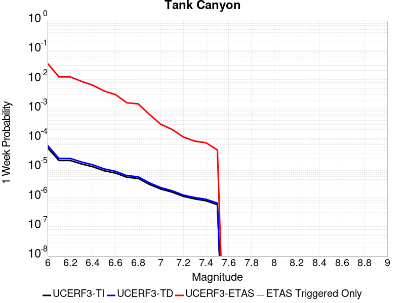 |  |  |  |

| Magnitude | 1 wk TI Prob | 1 wk TD Prob | 1 wk ETAS Prob | 1 wk ETAS/TD Gain | 1 wk ETAS Triggered Only | 1 mo TI Prob | 1 mo TD Prob | 1 mo ETAS Prob | 1 mo ETAS/TD Gain | 1 mo ETAS Triggered Only | 1 yr TI Prob | 1 yr TD Prob | 1 yr ETAS Prob | 1 yr ETAS/TD Gain | 1 yr ETAS Triggered Only | 10 yr TI Prob | 10 yr TD Prob | 10 yr ETAS Prob | 10 yr ETAS/TD Gain | 10 yr ETAS Triggered Only |
|-----|-----|-----|-----|-----|-----|-----|-----|-----|-----|-----|-----|-----|-----|-----|-----|-----|-----|-----|-----|-----|
| 6.0 | 4.8284557E-5 | 5.796445E-5 | 0.032858312 | 566.87006 | 0.03280225 | 2.0691741E-4 | 2.4839927E-4 | 0.0440988 | 177.53192 | 0.043861292 | 0.0025163088 | 0.0030207336 | 0.07123019 | 23.580427 | 0.06841612 | 0.02488006 | 0.029863616 | 0.11605755 | 3.8862524 | 0.088847235 |
| 6.1 | 1.7796336E-5 | 2.0873378E-5 | 0.011267124 | 539.7844 | 0.011246486 | 7.626778E-5 | 8.945448E-5 | 0.014521153 | 162.33008 | 0.01443299 | 9.281647E-4 | 0.0010886024 | 0.025429461 | 23.359735 | 0.024367385 | 0.009242975 | 0.010836642 | 0.045508347 | 4.1994877 | 0.035051547 |
| 6.2 | 1.7796336E-5 | 2.0873378E-5 | 0.011267124 | 539.7844 | 0.011246486 | 7.626778E-5 | 8.945448E-5 | 0.014521153 | 162.33008 | 0.01443299 | 9.281647E-4 | 0.0010886024 | 0.025429461 | 23.359735 | 0.024367385 | 0.009242975 | 0.010836642 | 0.045508347 | 4.1994877 | 0.035051547 |
| 6.3 | 1.3515912E-5 | 1.5759651E-5 | 0.007700737 | 488.63623 | 0.0076850983 | 5.792405E-5 | 6.7539746E-5 | 0.0105635505 | 156.40494 | 0.01049672 | 7.049971E-4 | 8.2200987E-4 | 0.018052446 | 21.96135 | 0.017244611 | 0.007027647 | 0.008192157 | 0.032917637 | 4.0181894 | 0.02492971 |
| 6.4 | 1.0870146E-5 | 1.2618114E-5 | 0.005260912 | 416.9333 | 0.00524836 | 4.658551E-5 | 5.4076605E-5 | 0.0071764654 | 132.70924 | 0.007122774 | 5.67031E-4 | 6.582015E-4 | 0.01227192 | 18.644625 | 0.011621368 | 0.005655863 | 0.006564382 | 0.024254426 | 3.6948528 | 0.017806936 |
| 6.5 | 7.964826E-6 | 9.196184E-6 | 0.0035705506 | 388.26437 | 0.003561387 | 3.4134522E-5 | 3.941168E-5 | 0.0051001306 | 129.40659 | 0.0050609186 | 4.1550855E-4 | 4.797421E-4 | 0.008348505 | 17.40207 | 0.00787254 | 0.0041473247 | 0.004788209 | 0.01672702 | 3.493377 | 0.0119962515 |
| 6.6 | 6.6317E-6 | 7.612378E-6 | 0.0026317723 | 345.72275 | 0.00262418 | 2.8421264E-5 | 3.262412E-5 | 0.0037813303 | 115.90597 | 0.0037488285 | 3.4597394E-4 | 3.9713533E-4 | 0.006018145 | 15.153889 | 0.005623243 | 0.0034543579 | 0.0039652516 | 0.012366669 | 3.1187603 | 0.008434864 |
| 6.7 | 4.793663E-6 | 5.4308593E-6 | 0.0016923945 | 311.62555 | 0.0016869728 | 2.0544108E-5 | 2.3274928E-5 | 0.0026473938 | 113.744446 | 0.00262418 | 2.500958E-4 | 2.833398E-4 | 0.0038437177 | 13.565754 | 0.003561387 | 0.0024981452 | 0.0028303189 | 0.007876913 | 2.783048 | 0.0050609186 |
| 6.8 | 4.382823E-6 | 4.969325E-6 | 0.0015044933 | 302.75607 | 0.0014995314 | 1.8783392E-5 | 2.1296957E-5 | 0.0024579836 | 115.41478 | 0.0024367385 | 2.286638E-4 | 2.5926388E-4 | 0.0032575491 | 12.564609 | 0.0029990629 | 0.0022842865 | 0.0025901233 | 0.0070770658 | 2.7323277 | 0.004498594 |
| 6.9 | 2.729601E-6 | 3.0735862E-6 | 9.402778E-4 | 305.92206 | 9.3720714E-4 | 1.1698237E-5 | 1.3172453E-5 | 0.001512684 | 114.83694 | 0.0014995314 | 1.4241673E-4 | 1.6036403E-4 | 0.001659655 | 10.349297 | 0.0014995314 | 0.001423255 | 0.0016024808 | 0.0036610323 | 2.2846029 | 0.0020618557 |
| 7.0 | 1.8987357E-6 | 2.126971E-6 | 7.5189106E-4 | 353.5032 | 7.497657E-4 | 8.137413E-6 | 9.115562E-6 | 9.4631413E-4 | 103.813034 | 9.3720714E-4 | 9.90685E-5 | 1.1097702E-4 | 0.0010480802 | 9.444119 | 9.3720714E-4 | 9.902435E-4 | 0.0011092846 | 0.002419919 | 2.1815133 | 0.00131209 |
| 7.1 | 1.4928986E-6 | 1.6641525E-6 | 5.639875E-4 | 338.90372 | 5.6232425E-4 | 6.398121E-6 | 7.132066E-6 | 7.5689243E-4 | 106.12527 | 7.497657E-4 | 7.789434E-5 | 8.6830034E-5 | 8.3653064E-4 | 9.634116 | 7.497657E-4 | 7.786704E-4 | 8.6801895E-4 | 0.0018044126 | 2.0787709 | 9.3720714E-4 |
| 7.2 | 1.069082E-6 | 1.1828765E-6 | 3.760653E-4 | 317.92438 | 3.7488286E-4 | 4.581772E-6 | 5.0694644E-6 | 3.7995042E-4 | 74.94883 | 3.7488286E-4 | 5.5781646E-5 | 6.171951E-5 | 4.3657923E-4 | 7.0736012 | 3.7488286E-4 | 5.576765E-4 | 6.1707594E-4 | 0.0011790532 | 1.9107101 | 5.6232425E-4 |
| 7.3 | 8.776551E-7 | 9.770151E-7 | 3.758595E-4 | 384.7018 | 3.7488286E-4 | 3.7613736E-6 | 4.187204E-6 | 3.790685E-4 | 90.53022 | 3.7488286E-4 | 4.579376E-5 | 5.0978535E-5 | 4.2584227E-4 | 8.353364 | 3.7488286E-4 | 4.5784327E-4 | 5.097194E-4 | 8.844112E-4 | 1.7350942 | 3.7488286E-4 |
| 7.4 | 7.55721E-7 | 8.5103835E-7 | 3.7573357E-4 | 441.50015 | 3.7488286E-4 | 3.2388E-6 | 3.6473052E-6 | 3.7852878E-4 | 103.78314 | 3.7488286E-4 | 3.9431678E-5 | 4.4405555E-5 | 4.1927176E-4 | 9.441876 | 3.7488286E-4 | 3.942468E-4 | 4.4401767E-4 | 8.1873406E-4 | 1.8439223 | 3.7488286E-4 |
| 7.5 | 5.587665E-7 | 6.305732E-7 | 3.755132E-4 | 595.51086 | 3.7488286E-4 | 2.3947114E-6 | 2.7024564E-6 | 3.775843E-4 | 139.71892 | 3.7488286E-4 | 2.915522E-5 | 3.2902408E-5 | 4.0777292E-4 | 12.393407 | 3.7488286E-4 | 2.9151395E-4 | 3.2902407E-4 | 7.037836E-4 | 2.1390033 | 3.7488286E-4 |

## Little Lake
*[(top)](#table-of-contents)*

| 1 Week | 1 Month | 1 Year | 10 Year |
|-----|-----|-----|-----|
|  |  | 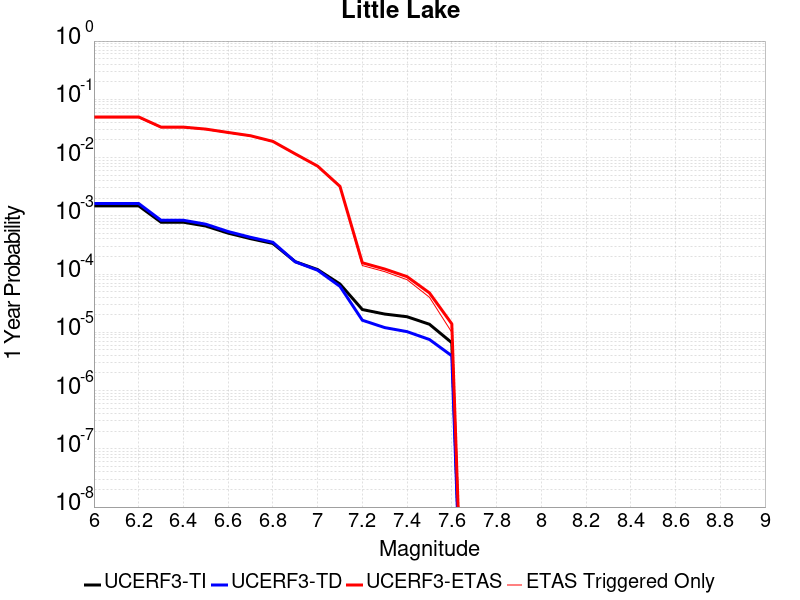 |  |

| Magnitude | 1 wk TI Prob | 1 wk TD Prob | 1 wk ETAS Prob | 1 wk ETAS/TD Gain | 1 wk ETAS Triggered Only | 1 mo TI Prob | 1 mo TD Prob | 1 mo ETAS Prob | 1 mo ETAS/TD Gain | 1 mo ETAS Triggered Only | 1 yr TI Prob | 1 yr TD Prob | 1 yr ETAS Prob | 1 yr ETAS/TD Gain | 1 yr ETAS Triggered Only | 10 yr TI Prob | 10 yr TD Prob | 10 yr ETAS Prob | 10 yr ETAS/TD Gain | 10 yr ETAS Triggered Only |
|-----|-----|-----|-----|-----|-----|-----|-----|-----|-----|-----|-----|-----|-----|-----|-----|-----|-----|-----|-----|-----|
| 6.0 | 2.8424427E-5 | 3.1205716E-5 | 0.029833462 | 956.0256 | 0.029803187 | 1.2181328E-4 | 1.3373268E-4 | 0.03574284 | 267.2708 | 0.035613872 | 0.0014820677 | 0.0016271125 | 0.047288403 | 29.062775 | 0.04573571 | 0.014722223 | 0.016165398 | 0.070197925 | 4.3424807 | 0.054920338 |
| 6.1 | 2.8424427E-5 | 3.1205716E-5 | 0.029833462 | 956.0256 | 0.029803187 | 1.2181328E-4 | 1.3373268E-4 | 0.03574284 | 267.2708 | 0.035613872 | 0.0014820677 | 0.0016271125 | 0.047288403 | 29.062775 | 0.04573571 | 0.014722223 | 0.016165398 | 0.070197925 | 4.3424807 | 0.054920338 |
| 6.2 | 2.8424427E-5 | 3.1205716E-5 | 0.029833462 | 956.0256 | 0.029803187 | 1.2181328E-4 | 1.3373268E-4 | 0.03574284 | 267.2708 | 0.035613872 | 0.0014820677 | 0.0016271125 | 0.047288403 | 29.062775 | 0.04573571 | 0.014722223 | 0.016165398 | 0.070197925 | 4.3424807 | 0.054920338 |
| 6.3 | 1.48860645E-5 | 1.6081383E-5 | 0.021009183 | 1306.4288 | 0.02099344 | 6.379586E-5 | 6.8918554E-5 | 0.025746623 | 373.58044 | 0.025679475 | 7.7643775E-4 | 8.387886E-4 | 0.034549944 | 41.19029 | 0.033739455 | 0.007737305 | 0.008359045 | 0.047764458 | 5.7141047 | 0.039737582 |
| 6.4 | 1.48860645E-5 | 1.6081383E-5 | 0.021009183 | 1306.4288 | 0.02099344 | 6.379586E-5 | 6.8918554E-5 | 0.025746623 | 373.58044 | 0.025679475 | 7.7643775E-4 | 8.387886E-4 | 0.034549944 | 41.19029 | 0.033739455 | 0.007737305 | 0.008359045 | 0.047764458 | 5.7141047 | 0.039737582 |
| 6.5 | 1.2797581E-5 | 1.376556E-5 | 0.019319966 | 1403.5002 | 0.019306466 | 5.4845623E-5 | 5.8994065E-5 | 0.02348779 | 398.13818 | 0.023430178 | 6.675408E-4 | 7.1804173E-4 | 0.031810977 | 44.302406 | 0.031115277 | 0.006655392 | 0.007159767 | 0.044007447 | 6.146491 | 0.037113402 |
| 6.6 | 9.661896E-6 | 1.0289033E-5 | 0.016504964 | 1604.1318 | 0.016494846 | 4.1407468E-5 | 4.40952E-5 | 0.019724578 | 447.31802 | 0.01968135 | 5.040193E-4 | 5.36743E-4 | 0.026202435 | 48.817467 | 0.025679475 | 0.005028777 | 0.0053560715 | 0.03667757 | 6.8478484 | 0.03149016 |
| 6.7 | 7.767871E-6 | 8.199681E-6 | 0.014815951 | 1806.8936 | 0.0148078725 | 3.329045E-5 | 3.5141096E-5 | 0.017654017 | 502.37524 | 0.017619494 | 4.0523586E-4 | 4.2777258E-4 | 0.022911122 | 53.55912 | 0.022492971 | 0.004044977 | 0.004270843 | 0.031333774 | 7.3366714 | 0.027179006 |
| 6.8 | 6.4235196E-6 | 6.735739E-6 | 0.012752667 | 1893.2839 | 0.0127460165 | 2.752908E-5 | 2.8867207E-5 | 0.015023748 | 520.4434 | 0.014995314 | 3.35115E-4 | 3.5141438E-4 | 0.018526843 | 52.720787 | 0.018181818 | 0.003346101 | 0.0035098472 | 0.025737088 | 7.332823 | 0.02230553 |
| 6.9 | 3.1283696E-6 | 3.1121751E-6 | 0.0090002725 | 2891.9558 | 0.008997188 | 1.3407229E-5 | 1.33378335E-5 | 0.0105099175 | 787.97784 | 0.01049672 | 1.6322079E-4 | 1.6237753E-4 | 0.012531503 | 77.1751 | 0.012371134 | 0.0016310095 | 0.0016227372 | 0.016219443 | 9.995114 | 0.014620431 |
| 7.0 | 2.290603E-6 | 2.2286763E-6 | 0.005250577 | 2355.9172 | 0.00524836 | 9.816834E-6 | 9.551441E-6 | 0.0060076197 | 628.9753 | 0.0059981258 | 1.19513395E-4 | 1.1628362E-4 | 0.00705081 | 60.63459 | 0.006935333 | 0.0011944914 | 0.0011623299 | 0.009025719 | 7.765196 | 0.00787254 |
| 7.1 | 1.293693E-6 | 1.1776774E-6 | 0.002250472 | 1910.941 | 0.002249297 | 5.5443866E-6 | 5.047183E-6 | 0.0022543329 | 446.6517 | 0.002249297 | 6.750081E-5 | 6.1448416E-5 | 0.002872897 | 46.752983 | 0.0028116214 | 6.7480316E-4 | 6.1438273E-4 | 0.003611603 | 5.878425 | 0.0029990629 |
| 7.2 | 4.715842E-7 | 3.091732E-7 | 1.8775054E-4 | 607.26654 | 1.8744143E-4 | 2.0210737E-6 | 1.3250274E-6 | 1.8876621E-4 | 142.46211 | 1.8744143E-4 | 2.4606294E-5 | 1.6132095E-5 | 2.035705E-4 | 12.618975 | 1.8744143E-4 | 2.460357E-4 | 1.6130977E-4 | 3.4872096E-4 | 2.1618092 | 1.8744143E-4 |
| 7.3 | 3.9430947E-7 | 2.3096938E-7 | 1.8767235E-4 | 812.5421 | 1.8744143E-4 | 1.6898966E-6 | 9.898685E-7 | 1.884311E-4 | 190.35976 | 1.8744143E-4 | 2.0574296E-5 | 1.2051582E-5 | 1.9949075E-4 | 16.553076 | 1.8744143E-4 | 2.0572392E-4 | 1.2050936E-4 | 3.079282E-4 | 2.5552223 | 1.8744143E-4 |
| 7.4 | 3.547123E-7 | 1.9678579E-7 | 1.8763817E-4 | 953.51483 | 1.8744143E-4 | 1.5201948E-6 | 8.433674E-7 | 1.8828464E-4 | 223.25339 | 1.8744143E-4 | 1.8508214E-5 | 1.02679505E-5 | 1.9770746E-4 | 19.254812 | 1.8744143E-4 | 1.8506673E-4 | 1.0267482E-4 | 2.90097E-4 | 2.8253956 | 1.8744143E-4 |
| 7.5 | 2.6354266E-7 | 1.4422719E-7 | 1.4422719E-7 | 1.0 | 0.0 | 1.129468E-6 | 6.1811636E-7 | 6.1811636E-7 | 1.0 | 0.0 | 1.3751187E-5 | 7.525541E-6 | 7.525541E-6 | 1.0 | 0.0 | 1.3750336E-4 | 7.5252916E-5 | 7.5252916E-5 | 1.0 | 0.0 |
| 7.6 | 1.269913E-7 | 7.572344E-8 | 7.572344E-8 | 1.0 | 0.0 | 5.4424834E-7 | 3.24529E-7 | 3.24529E-7 | 1.0 | 0.0 | 6.6262032E-6 | 3.9511337E-6 | 3.9511337E-6 | 1.0 | 0.0 | 6.626006E-5 | 3.9510673E-5 | 3.9510673E-5 | 1.0 | 0.0 |

## Airport Lake
*[(top)](#table-of-contents)*

| 1 Week | 1 Month | 1 Year | 10 Year |
|-----|-----|-----|-----|
|  |  |  |  |

| Magnitude | 1 wk TI Prob | 1 wk TD Prob | 1 wk ETAS Prob | 1 wk ETAS/TD Gain | 1 wk ETAS Triggered Only | 1 mo TI Prob | 1 mo TD Prob | 1 mo ETAS Prob | 1 mo ETAS/TD Gain | 1 mo ETAS Triggered Only | 1 yr TI Prob | 1 yr TD Prob | 1 yr ETAS Prob | 1 yr ETAS/TD Gain | 1 yr ETAS Triggered Only | 10 yr TI Prob | 10 yr TD Prob | 10 yr ETAS Prob | 10 yr ETAS/TD Gain | 10 yr ETAS Triggered Only |
|-----|-----|-----|-----|-----|-----|-----|-----|-----|-----|-----|-----|-----|-----|-----|-----|-----|-----|-----|-----|-----|
| 6.0 | 1.2387061E-5 | 1.3103157E-5 | 0.026254559 | 2003.682 | 0.0262418 | 5.3086325E-5 | 5.615534E-5 | 0.03210684 | 571.7504 | 0.032052483 | 6.461343E-4 | 6.8350515E-4 | 0.040955868 | 59.920345 | 0.040299907 | 0.0064425888 | 0.0068168393 | 0.055219393 | 8.100439 | 0.04873477 |
| 6.1 | 1.2387061E-5 | 1.3103157E-5 | 0.026254559 | 2003.682 | 0.0262418 | 5.3086325E-5 | 5.615534E-5 | 0.03210684 | 571.7504 | 0.032052483 | 6.461343E-4 | 6.8350515E-4 | 0.040955868 | 59.920345 | 0.040299907 | 0.0064425888 | 0.0068168393 | 0.055219393 | 8.100439 | 0.04873477 |
| 6.2 | 1.2387061E-5 | 1.3103157E-5 | 0.026254559 | 2003.682 | 0.0262418 | 5.3086325E-5 | 5.615534E-5 | 0.03210684 | 571.7504 | 0.032052483 | 6.461343E-4 | 6.8350515E-4 | 0.040955868 | 59.920345 | 0.040299907 | 0.0064425888 | 0.0068168393 | 0.055219393 | 8.100439 | 0.04873477 |
| 6.3 | 1.2387061E-5 | 1.3103157E-5 | 0.026254559 | 2003.682 | 0.0262418 | 5.3086325E-5 | 5.615534E-5 | 0.03210684 | 571.7504 | 0.032052483 | 6.461343E-4 | 6.8350515E-4 | 0.040955868 | 59.920345 | 0.040299907 | 0.0064425888 | 0.0068168393 | 0.055219393 | 8.100439 | 0.04873477 |
| 6.4 | 1.2387061E-5 | 1.3103157E-5 | 0.026254559 | 2003.682 | 0.0262418 | 5.3086325E-5 | 5.615534E-5 | 0.03210684 | 571.7504 | 0.032052483 | 6.461343E-4 | 6.8350515E-4 | 0.040955868 | 59.920345 | 0.040299907 | 0.0064425888 | 0.0068168393 | 0.055219393 | 8.100439 | 0.04873477 |
| 6.5 | 6.9922594E-6 | 7.384925E-6 | 0.02175043 | 2945.247 | 0.021743204 | 2.996648E-5 | 3.1649324E-5 | 0.02533544 | 800.5049 | 0.025304593 | 3.6478083E-4 | 3.8526783E-4 | 0.03280014 | 85.13594 | 0.032427367 | 0.003641826 | 0.0038465366 | 0.042310946 | 10.999751 | 0.038612932 |
| 6.6 | 6.9922594E-6 | 7.384925E-6 | 0.02175043 | 2945.247 | 0.021743204 | 2.996648E-5 | 3.1649324E-5 | 0.02533544 | 800.5049 | 0.025304593 | 3.6478083E-4 | 3.8526783E-4 | 0.03280014 | 85.13594 | 0.032427367 | 0.003641826 | 0.0038465366 | 0.042310946 | 10.999751 | 0.038612932 |
| 6.7 | 5.477277E-6 | 5.7860684E-6 | 0.01893726 | 3272.9065 | 0.018931584 | 2.3473833E-5 | 2.4797222E-5 | 0.022329774 | 900.49493 | 0.02230553 | 2.8575645E-4 | 3.0186825E-4 | 0.028784364 | 95.354065 | 0.028491097 | 0.0028538927 | 0.003014966 | 0.03609207 | 11.970971 | 0.033177134 |
| 6.8 | 3.9950432E-6 | 4.2190873E-6 | 0.015749233 | 3732.853 | 0.01574508 | 1.7121502E-5 | 1.8081691E-5 | 0.018387008 | 1016.88544 | 0.01836926 | 2.0843433E-4 | 2.2012512E-4 | 0.023270344 | 105.71417 | 0.023055295 | 0.0020823893 | 0.0021993418 | 0.028944515 | 13.160535 | 0.026804123 |
| 6.9 | 2.95695E-6 | 3.1230243E-6 | 0.011999337 | 3842.2168 | 0.0119962515 | 1.2672582E-5 | 1.3384334E-5 | 0.0138838645 | 1037.322 | 0.013870666 | 1.5427776E-4 | 1.6294434E-4 | 0.017029924 | 104.51374 | 0.016869728 | 0.001541707 | 0.0016284712 | 0.02127777 | 13.066102 | 0.01968135 |
| 7.0 | 1.456072E-6 | 1.540812E-6 | 0.0050624516 | 3285.5737 | 0.0050609186 | 6.2402937E-6 | 6.603469E-6 | 0.0058172494 | 880.93835 | 0.005810684 | 7.597293E-5 | 8.039528E-5 | 0.006827744 | 84.92718 | 0.006747891 | 7.594696E-4 | 8.0376083E-4 | 0.0084826825 | 10.55374 | 0.0076850983 |
| 7.1 | 6.995192E-7 | 7.4089746E-7 | 0.002062595 | 2783.9143 | 0.0020618557 | 2.997936E-6 | 3.1752747E-6 | 0.0020650243 | 650.3451 | 0.0020618557 | 3.649926E-5 | 3.865897E-5 | 0.0026627374 | 68.87761 | 0.00262418 | 3.6493264E-4 | 3.865897E-4 | 0.0031971242 | 8.270071 | 0.0028116214 |

## Owl Lake
*[(top)](#table-of-contents)*

| 1 Week | 1 Month | 1 Year | 10 Year |
|-----|-----|-----|-----|
|  |  |  |  |

| Magnitude | 1 wk TI Prob | 1 wk TD Prob | 1 wk ETAS Prob | 1 wk ETAS/TD Gain | 1 wk ETAS Triggered Only | 1 mo TI Prob | 1 mo TD Prob | 1 mo ETAS Prob | 1 mo ETAS/TD Gain | 1 mo ETAS Triggered Only | 1 yr TI Prob | 1 yr TD Prob | 1 yr ETAS Prob | 1 yr ETAS/TD Gain | 1 yr ETAS Triggered Only | 10 yr TI Prob | 10 yr TD Prob | 10 yr ETAS Prob | 10 yr ETAS/TD Gain | 10 yr ETAS Triggered Only |
|-----|-----|-----|-----|-----|-----|-----|-----|-----|-----|-----|-----|-----|-----|-----|-----|-----|-----|-----|-----|-----|
| 6.0 | 5.0320643E-5 | 6.6358676E-5 | 0.011312098 | 170.46901 | 0.011246486 | 2.1564208E-4 | 2.843643E-4 | 0.015837578 | 55.69468 | 0.015557638 | 0.0026222812 | 0.003457547 | 0.027927475 | 8.0772505 | 0.024554826 | 0.02591553 | 0.034141295 | 0.06383217 | 1.869647 | 0.030740393 |
| 6.1 | 5.0320643E-5 | 6.6358676E-5 | 0.011312098 | 170.46901 | 0.011246486 | 2.1564208E-4 | 2.843643E-4 | 0.015837578 | 55.69468 | 0.015557638 | 0.0026222812 | 0.003457547 | 0.027927475 | 8.0772505 | 0.024554826 | 0.02591553 | 0.034141295 | 0.06383217 | 1.869647 | 0.030740393 |
| 6.2 | 2.4125871E-5 | 3.0980515E-5 | 0.009590197 | 309.55576 | 0.009559513 | 1.0339249E-4 | 1.3276804E-4 | 0.012689676 | 95.5778 | 0.012558576 | 0.0012580766 | 0.0016154252 | 0.020703565 | 12.816171 | 0.019119026 | 0.012509781 | 0.016070755 | 0.038571104 | 2.4000804 | 0.022867855 |
| 6.3 | 1.7433485E-5 | 2.2355545E-5 | 0.009394217 | 420.21866 | 0.009372071 | 7.471279E-5 | 9.580685E-5 | 0.012090908 | 126.20088 | 0.0119962515 | 9.0924866E-4 | 0.001165962 | 0.01857769 | 15.933358 | 0.017432053 | 0.009055373 | 0.0116291465 | 0.032007925 | 2.7523882 | 0.020618556 |
| 6.4 | 1.7433485E-5 | 2.2355545E-5 | 0.009394217 | 420.21866 | 0.009372071 | 7.471279E-5 | 9.580685E-5 | 0.012090908 | 126.20088 | 0.0119962515 | 9.0924866E-4 | 0.001165962 | 0.01857769 | 15.933358 | 0.017432053 | 0.009055373 | 0.0116291465 | 0.032007925 | 2.7523882 | 0.020618556 |
| 6.5 | 1.5182742E-5 | 1.9429277E-5 | 0.009016443 | 464.06476 | 0.008997188 | 6.506727E-5 | 8.3266525E-5 | 0.011703667 | 140.55669 | 0.011621368 | 7.919061E-4 | 0.0010134344 | 0.017678814 | 17.44446 | 0.016682288 | 0.0078909 | 0.010118678 | 0.029600877 | 2.9253702 | 0.01968135 |
| 6.6 | 6.7271576E-6 | 8.547518E-6 | 0.00788102 | 922.0244 | 0.00787254 | 2.8830356E-5 | 3.6631736E-5 | 0.009970663 | 272.18646 | 0.009934396 | 3.5095305E-4 | 4.4590578E-4 | 0.013748312 | 30.832327 | 0.013308341 | 0.0035039932 | 0.0044680187 | 0.020142749 | 4.508206 | 0.01574508 |
| 6.7 | 6.682835E-6 | 8.479961E-6 | 0.007880953 | 929.36194 | 0.00787254 | 2.8640408E-5 | 3.6342215E-5 | 0.009970376 | 274.347 | 0.009934396 | 3.4864116E-4 | 4.423823E-4 | 0.013744836 | 31.070042 | 0.013308341 | 0.003480947 | 0.0044329325 | 0.020108216 | 4.536098 | 0.01574508 |
| 6.8 | 6.5774975E-6 | 8.326427E-6 | 0.0078808 | 946.48047 | 0.00787254 | 2.8188972E-5 | 3.5684232E-5 | 0.009969725 | 279.38742 | 0.009934396 | 3.4314668E-4 | 4.3437455E-4 | 0.013736935 | 31.624632 | 0.013308341 | 0.0034261728 | 0.0043531056 | 0.020029645 | 4.601231 | 0.01574508 |
| 6.9 | 6.363419E-6 | 7.999591E-6 | 0.007880476 | 985.11 | 0.00787254 | 2.727151E-5 | 3.428354E-5 | 0.0099683385 | 290.76166 | 0.009934396 | 3.3198006E-4 | 4.1732774E-4 | 0.013532752 | 32.427155 | 0.0131209 | 0.0033148455 | 0.0041830647 | 0.019675624 | 4.7036386 | 0.015557638 |
| 7.0 | 6.1342453E-6 | 7.631779E-6 | 0.0076926714 | 1007.97876 | 0.0076850983 | 2.6289357E-5 | 3.2707245E-5 | 0.009779342 | 298.99622 | 0.009746954 | 3.2002592E-4 | 3.9814346E-4 | 0.013326452 | 33.47148 | 0.012933458 | 0.0031956544 | 0.003991739 | 0.019113889 | 4.788361 | 0.015182755 |
| 7.1 | 5.842926E-6 | 7.142312E-6 | 0.0071298657 | 998.2573 | 0.007122774 | 2.504087E-5 | 3.060958E-5 | 0.009214958 | 301.04816 | 0.00918463 | 3.0482994E-4 | 3.7261334E-4 | 0.012551766 | 33.68577 | 0.012183692 | 0.0030441214 | 0.0037371595 | 0.01792947 | 4.79762 | 0.014245548 |
| 7.2 | 4.77173E-6 | 5.358478E-6 | 0.0054411306 | 1015.4246 | 0.005435801 | 2.045011E-5 | 2.2964727E-5 | 0.006583264 | 286.6685 | 0.00656045 | 2.4895166E-4 | 2.7956374E-4 | 0.009086848 | 32.50367 | 0.008809747 | 0.0024867293 | 0.0028086212 | 0.013088944 | 4.660274 | 0.010309278 |
| 7.3 | 3.0494948E-6 | 2.710356E-6 | 0.0011273558 | 415.94382 | 0.0011246485 | 1.3069198E-5 | 1.1615762E-5 | 0.0013236905 | 113.95641 | 0.00131209 | 1.5910587E-4 | 1.4141288E-4 | 0.002015562 | 14.253031 | 0.0018744143 | 0.0015899199 | 0.0014231089 | 0.0034820302 | 2.446777 | 0.0020618557 |
| 7.4 | 2.7263884E-6 | 2.3055634E-6 | 0.0011269515 | 488.7966 | 0.0011246485 | 1.1684469E-5 | 9.880949E-6 | 0.0011345184 | 114.81877 | 0.0011246485 | 1.4224913E-4 | 1.2029401E-4 | 0.0018070639 | 15.02206 | 0.0016869728 | 0.0014215811 | 0.0012110578 | 0.003083202 | 2.5458753 | 0.0018744143 |
| 7.5 | 2.6090431E-6 | 2.1655019E-6 | 0.0011268116 | 520.3467 | 0.0011246485 | 1.1181565E-5 | 9.2806895E-6 | 0.0011339188 | 122.18045 | 0.0011246485 | 1.3612706E-4 | 1.1298663E-4 | 0.0017997689 | 15.929043 | 0.0016869728 | 0.001360437 | 0.0011378126 | 0.0030100942 | 2.6455095 | 0.0018744143 |
| 7.6 | 2.3008756E-6 | 1.8726826E-6 | 9.3907805E-4 | 501.46143 | 9.3720714E-4 | 9.860858E-6 | 8.025758E-6 | 9.4522536E-4 | 117.773964 | 9.3720714E-4 | 1.20049335E-4 | 9.770931E-5 | 0.001409671 | 14.427194 | 0.00131209 | 0.001199845 | 9.848307E-4 | 0.0024828853 | 2.5211291 | 0.0014995314 |
| 7.7 | 1.7184348E-6 | 1.341808E-6 | 5.6366535E-4 | 420.07898 | 5.6232425E-4 | 7.3646997E-6 | 5.750593E-6 | 5.680716E-4 | 98.784874 | 5.6232425E-4 | 8.966153E-5 | 7.0011265E-5 | 6.3229614E-4 | 9.031349 | 5.6232425E-4 | 8.962536E-4 | 7.0769014E-4 | 0.0012696165 | 1.7940288 | 5.6232425E-4 |
| 7.8 | 8.4612907E-7 | 8.4054994E-7 | 3.757231E-4 | 446.99673 | 3.7488286E-4 | 3.6262625E-6 | 3.602352E-6 | 3.7848385E-4 | 105.06576 | 3.7488286E-4 | 4.4148852E-5 | 4.3857777E-5 | 4.1872417E-4 | 9.547319 | 3.7488286E-4 | 4.414008E-4 | 4.4386165E-4 | 8.185781E-4 | 1.8442191 | 3.7488286E-4 |
| 7.9 | 2.716738E-7 | 3.7681625E-7 | 3.7681625E-7 | 1.0 | 0.0 | 1.1643157E-6 | 1.6149258E-6 | 1.6149258E-6 | 1.0 | 0.0 | 1.4175452E-5 | 1.9661555E-5 | 1.9661555E-5 | 1.0 | 0.0 | 1.4174548E-4 | 1.9829652E-4 | 1.9829652E-4 | 1.0 | 0.0 |
| 8.0 | 2.1995428E-8 | 3.3853325E-8 | 3.3853325E-8 | 1.0 | 0.0 | 9.426611E-8 | 1.4508568E-7 | 1.4508568E-7 | 1.0 | 0.0 | 1.1476893E-6 | 1.7664173E-6 | 1.7664173E-6 | 1.0 | 0.0 | 1.14768345E-5 | 1.7869768E-5 | 1.7869768E-5 | 1.0 | 0.0 |

## Panamint Valley
*[(top)](#table-of-contents)*

| 1 Week | 1 Month | 1 Year | 10 Year |
|-----|-----|-----|-----|
|  |  |  |  |

| Magnitude | 1 wk TI Prob | 1 wk TD Prob | 1 wk ETAS Prob | 1 wk ETAS/TD Gain | 1 wk ETAS Triggered Only | 1 mo TI Prob | 1 mo TD Prob | 1 mo ETAS Prob | 1 mo ETAS/TD Gain | 1 mo ETAS Triggered Only | 1 yr TI Prob | 1 yr TD Prob | 1 yr ETAS Prob | 1 yr ETAS/TD Gain | 1 yr ETAS Triggered Only | 10 yr TI Prob | 10 yr TD Prob | 10 yr ETAS Prob | 10 yr ETAS/TD Gain | 10 yr ETAS Triggered Only |
|-----|-----|-----|-----|-----|-----|-----|-----|-----|-----|-----|-----|-----|-----|-----|-----|-----|-----|-----|-----|-----|
| 6.0 | 3.0211835E-5 | 3.3984263E-5 | 0.011467523 | 337.43628 | 0.011433927 | 1.2947287E-4 | 1.4563887E-4 | 0.015326183 | 105.23415 | 0.015182755 | 0.0015751923 | 0.0017717406 | 0.023102203 | 13.039269 | 0.021368323 | 0.015640736 | 0.017583003 | 0.045388997 | 2.581413 | 0.028303655 |
| 6.1 | 3.0211835E-5 | 3.3984263E-5 | 0.011467523 | 337.43628 | 0.011433927 | 1.2947287E-4 | 1.4563887E-4 | 0.015326183 | 105.23415 | 0.015182755 | 0.0015751923 | 0.0017717406 | 0.023102203 | 13.039269 | 0.021368323 | 0.015640736 | 0.017583003 | 0.045388997 | 2.581413 | 0.028303655 |
| 6.2 | 3.0211835E-5 | 3.3984263E-5 | 0.011467523 | 337.43628 | 0.011433927 | 1.2947287E-4 | 1.4563887E-4 | 0.015326183 | 105.23415 | 0.015182755 | 0.0015751923 | 0.0017717406 | 0.023102203 | 13.039269 | 0.021368323 | 0.015640736 | 0.017583003 | 0.045388997 | 2.581413 | 0.028303655 |
| 6.3 | 2.8573924E-5 | 3.2102445E-5 | 0.011278227 | 351.3199 | 0.011246486 | 1.2245393E-4 | 1.375748E-4 | 0.014755994 | 107.25797 | 0.014620431 | 0.001489857 | 0.0016737141 | 0.022070633 | 13.186621 | 0.020431114 | 0.01479908 | 0.016618038 | 0.043161057 | 2.5972414 | 0.026991565 |
| 6.4 | 2.8573924E-5 | 3.2102445E-5 | 0.011278227 | 351.3199 | 0.011246486 | 1.2245393E-4 | 1.375748E-4 | 0.014755994 | 107.25797 | 0.014620431 | 0.001489857 | 0.0016737141 | 0.022070633 | 13.186621 | 0.020431114 | 0.01479908 | 0.016618038 | 0.043161057 | 2.5972414 | 0.026991565 |
| 6.5 | 2.7468774E-5 | 3.0828138E-5 | 0.011089532 | 359.72107 | 0.011059044 | 1.1771801E-4 | 1.3211406E-4 | 0.014563197 | 110.231995 | 0.01443299 | 0.0014322745 | 0.0016073292 | 0.021818465 | 13.574359 | 0.020243675 | 0.014230782 | 0.015963882 | 0.042340107 | 2.6522439 | 0.026804123 |
| 6.6 | 2.6135967E-5 | 2.9252153E-5 | 0.010900537 | 372.6405 | 0.010871602 | 1.1200648E-4 | 1.2536049E-4 | 0.014369123 | 114.62242 | 0.014245548 | 0.0013628257 | 0.0015252219 | 0.021176552 | 13.884244 | 0.01968135 | 0.013544982 | 0.015154343 | 0.040444665 | 2.6688495 | 0.025679475 |
| 6.7 | 2.4498746E-5 | 2.7341044E-5 | 0.010523774 | 384.90753 | 0.01049672 | 1.04990395E-4 | 1.17170785E-4 | 0.013611372 | 116.16695 | 0.013495782 | 0.0012775084 | 0.0014256459 | 0.019768717 | 13.8665 | 0.01836926 | 0.012701893 | 0.014171593 | 0.03800887 | 2.6820464 | 0.024179943 |
| 6.8 | 2.2244329E-5 | 2.4935374E-5 | 0.01014652 | 406.9127 | 0.010121837 | 9.532935E-5 | 1.0686163E-4 | 0.013038938 | 122.01701 | 0.012933458 | 0.0011600169 | 0.0013002857 | 0.018522473 | 14.244926 | 0.017244611 | 0.011539802 | 0.012932955 | 0.035320044 | 2.731011 | 0.022680413 |
| 6.9 | 1.9902658E-5 | 2.2290182E-5 | 0.009394152 | 421.448 | 0.009372071 | 8.529431E-5 | 9.552596E-5 | 0.011903208 | 124.60705 | 0.01180881 | 0.0010379635 | 0.0011624265 | 0.01670198 | 14.368203 | 0.015557638 | 0.010331288 | 0.011569021 | 0.03120795 | 2.6975446 | 0.019868791 |
| 7.0 | 1.8353881E-5 | 2.056605E-5 | 0.009017569 | 438.4687 | 0.008997188 | 7.865712E-5 | 8.813734E-5 | 0.011146206 | 126.464066 | 0.011059044 | 9.5722964E-4 | 0.0010725616 | 0.015490071 | 14.442127 | 0.01443299 | 0.009531168 | 0.01067939 | 0.028667036 | 2.6843328 | 0.018181818 |
| 7.1 | 1.7667631E-5 | 1.9772435E-5 | 0.008641908 | 437.06845 | 0.0086223055 | 7.571623E-5 | 8.4736355E-5 | 0.010767993 | 127.076416 | 0.010684161 | 9.2145515E-4 | 0.0010311945 | 0.015074804 | 14.61878 | 0.014058107 | 0.009176437 | 0.0102695925 | 0.027708141 | 2.698076 | 0.017619494 |
| 7.2 | 1.6381597E-5 | 1.8158042E-5 | 0.0073282407 | 403.581 | 0.0073102154 | 7.020495E-5 | 7.781795E-5 | 0.009261733 | 119.017944 | 0.00918463 | 8.544101E-4 | 9.470391E-4 | 0.013119194 | 13.852853 | 0.012183692 | 0.008511325 | 0.009435269 | 0.024846116 | 2.6333237 | 0.015557638 |
| 7.3 | 1.4520491E-5 | 1.596657E-5 | 0.006576312 | 411.88004 | 0.00656045 | 6.222919E-5 | 6.842646E-5 | 0.007940427 | 116.043236 | 0.00787254 | 7.57377E-4 | 8.327899E-4 | 0.011695338 | 14.043565 | 0.010871602 | 0.0075480095 | 0.008300399 | 0.021684162 | 2.612424 | 0.013495782 |
| 7.4 | 1.2852287E-5 | 1.41454875E-5 | 0.006387064 | 451.52658 | 0.0063730082 | 5.5080065E-5 | 6.06222E-5 | 0.007745255 | 127.76268 | 0.0076850983 | 6.7039346E-4 | 7.378411E-4 | 0.011414119 | 15.469616 | 0.010684161 | 0.0066837464 | 0.007357429 | 0.020567855 | 2.795522 | 0.013308341 |
| 7.5 | 1.1637851E-5 | 1.2836868E-5 | 0.0061983243 | 482.85333 | 0.006185567 | 4.987555E-5 | 5.5014076E-5 | 0.0075522587 | 137.27866 | 0.007497657 | 6.070656E-4 | 6.696062E-4 | 0.011159297 | 16.665462 | 0.01049672 | 0.006054099 | 0.0066793845 | 0.019526456 | 2.9233913 | 0.012933458 |
| 7.6 | 3.0068115E-6 | 3.3330623E-6 | 0.0024400635 | 732.07855 | 0.0024367385 | 1.2886271E-5 | 1.4284516E-5 | 0.0028258658 | 197.8272 | 0.0028116214 | 1.5687906E-4 | 1.7390738E-4 | 0.0041094925 | 23.630354 | 0.00393627 | 0.0015676835 | 0.0017397973 | 0.006230565 | 3.5812016 | 0.004498594 |

## Garlock (East)
*[(top)](#table-of-contents)*

| 1 Week | 1 Month | 1 Year | 10 Year |
|-----|-----|-----|-----|
|  |  | 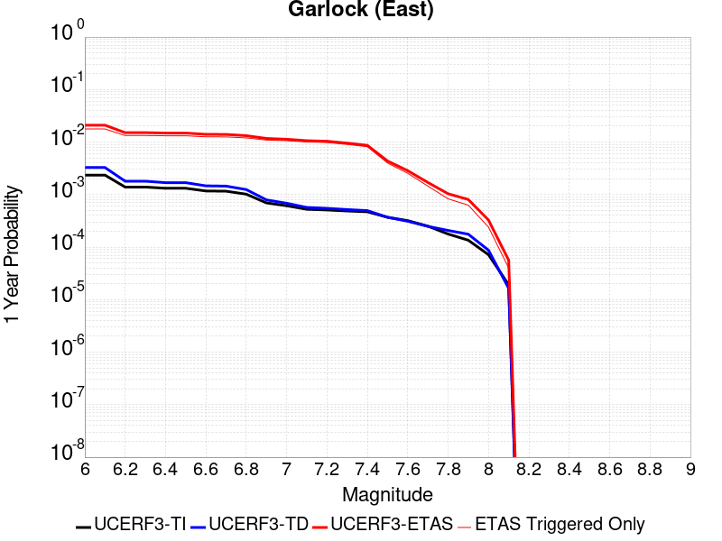 |  |

| Magnitude | 1 wk TI Prob | 1 wk TD Prob | 1 wk ETAS Prob | 1 wk ETAS/TD Gain | 1 wk ETAS Triggered Only | 1 mo TI Prob | 1 mo TD Prob | 1 mo ETAS Prob | 1 mo ETAS/TD Gain | 1 mo ETAS Triggered Only | 1 yr TI Prob | 1 yr TD Prob | 1 yr ETAS Prob | 1 yr ETAS/TD Gain | 1 yr ETAS Triggered Only | 10 yr TI Prob | 10 yr TD Prob | 10 yr ETAS Prob | 10 yr ETAS/TD Gain | 10 yr ETAS Triggered Only |
|-----|-----|-----|-----|-----|-----|-----|-----|-----|-----|-----|-----|-----|-----|-----|-----|-----|-----|-----|-----|-----|
| 6.0 | 4.5092507E-5 | 6.2904815E-5 | 0.009246957 | 146.99918 | 0.00918463 | 1.9323928E-4 | 2.6956675E-4 | 0.010763457 | 39.92873 | 0.01049672 | 0.0023501497 | 0.003277482 | 0.01878413 | 5.731269 | 0.015557638 | 0.023254504 | 0.03235377 | 0.053030748 | 1.6390902 | 0.021368323 |
| 6.1 | 4.5092507E-5 | 6.2904815E-5 | 0.009246957 | 146.99918 | 0.00918463 | 1.9323928E-4 | 2.6956675E-4 | 0.010763457 | 39.92873 | 0.01049672 | 0.0023501497 | 0.003277482 | 0.01878413 | 5.731269 | 0.015557638 | 0.023254504 | 0.03235377 | 0.053030748 | 1.6390902 | 0.021368323 |
| 6.2 | 2.6674514E-5 | 3.4511588E-5 | 0.0075319097 | 218.24292 | 0.007497657 | 1.1431433E-4 | 1.4789861E-4 | 0.008768929 | 59.29014 | 0.0086223055 | 0.0013908884 | 0.0017992114 | 0.013773879 | 7.655509 | 0.0119962515 | 0.01382215 | 0.017872788 | 0.032968275 | 1.8446074 | 0.015370197 |
| 6.3 | 2.6674514E-5 | 3.4511588E-5 | 0.0075319097 | 218.24292 | 0.007497657 | 1.1431433E-4 | 1.4789861E-4 | 0.008768929 | 59.29014 | 0.0086223055 | 0.0013908884 | 0.0017992114 | 0.013773879 | 7.655509 | 0.0119962515 | 0.01382215 | 0.017872788 | 0.032968275 | 1.8446074 | 0.015370197 |
| 6.4 | 2.5312667E-5 | 3.2340467E-5 | 0.0073423195 | 227.03195 | 0.0073102154 | 1.0847834E-4 | 1.3859481E-4 | 0.00857229 | 61.851448 | 0.008434864 | 0.0013199237 | 0.0016861152 | 0.013475014 | 7.9917517 | 0.01180881 | 0.013121112 | 0.016772287 | 0.03170039 | 1.890046 | 0.015182755 |
| 6.5 | 2.5312667E-5 | 3.2340467E-5 | 0.0073423195 | 227.03195 | 0.0073102154 | 1.0847834E-4 | 1.3859481E-4 | 0.00857229 | 61.851448 | 0.008434864 | 0.0013199237 | 0.0016861152 | 0.013475014 | 7.9917517 | 0.01180881 | 0.013121112 | 0.016772287 | 0.03170039 | 1.890046 | 0.015182755 |
| 6.6 | 2.246556E-5 | 2.8134691E-5 | 0.0073381444 | 260.82193 | 0.0073102154 | 9.627742E-5 | 1.2057181E-4 | 0.008554419 | 70.948746 | 0.008434864 | 0.0011715472 | 0.0014669969 | 0.01288415 | 8.782671 | 0.011433927 | 0.011653901 | 0.014613169 | 0.028835246 | 1.973237 | 0.01443299 |
| 6.7 | 2.2241198E-5 | 2.7804432E-5 | 0.0073378165 | 263.90817 | 0.0073102154 | 9.531594E-5 | 1.1915654E-4 | 0.008553016 | 71.779655 | 0.008434864 | 0.0011598538 | 0.0014497889 | 0.012867139 | 8.875181 | 0.011433927 | 0.011538187 | 0.014442829 | 0.02848263 | 1.972095 | 0.014245548 |
| 6.8 | 1.9528685E-5 | 2.3898969E-5 | 0.00733394 | 306.87265 | 0.0073102154 | 8.369167E-5 | 1.0242024E-4 | 0.008536421 | 83.34701 | 0.008434864 | 0.0010184698 | 0.0012462728 | 0.012291534 | 9.862636 | 0.011059044 | 0.010138147 | 0.012436723 | 0.025764663 | 2.07166 | 0.013495782 |
| 6.9 | 1.3318621E-5 | 1.5198818E-5 | 0.006013233 | 395.6382 | 0.0059981258 | 5.7078556E-5 | 6.51362E-5 | 0.007000017 | 107.46739 | 0.006935333 | 6.9470983E-4 | 7.927504E-4 | 0.009782806 | 12.340336 | 0.008997188 | 0.0069254204 | 0.007940721 | 0.0190979 | 2.4050589 | 0.011246486 |
| 7.0 | 1.1760853E-5 | 1.3107653E-5 | 0.0060111545 | 458.59885 | 0.0059981258 | 5.0402683E-5 | 5.6174475E-5 | 0.0069911177 | 124.453636 | 0.006935333 | 6.134799E-4 | 6.8371464E-4 | 0.009674751 | 14.150277 | 0.008997188 | 0.0061178906 | 0.006857401 | 0.017840609 | 2.6016574 | 0.011059044 |
| 7.1 | 1.0064758E-5 | 1.0902761E-5 | 0.0058215237 | 533.9495 | 0.005810684 | 4.3133965E-5 | 4.67253E-5 | 0.0067943013 | 145.40947 | 0.006747891 | 5.2502943E-4 | 5.6873553E-4 | 0.0091861375 | 16.151861 | 0.0086223055 | 0.005237907 | 0.0057133473 | 0.016336467 | 2.8593512 | 0.010684161 |
| 7.2 | 9.768808E-6 | 1.0498628E-5 | 0.005821122 | 554.46497 | 0.005810684 | 4.186565E-5 | 4.499337E-5 | 0.006792581 | 150.96849 | 0.006747891 | 5.095951E-4 | 5.4766005E-4 | 0.008977905 | 16.393208 | 0.008434864 | 0.0050842804 | 0.005503584 | 0.015942534 | 2.896755 | 0.01049672 |
| 7.3 | 9.344516E-6 | 9.9442705E-6 | 0.005633131 | 566.47003 | 0.005623243 | 4.004731E-5 | 4.2617627E-5 | 0.0064153546 | 150.5329 | 0.0063730082 | 4.8746695E-4 | 5.187495E-4 | 0.00857455 | 16.529268 | 0.008059981 | 0.0048639905 | 0.005215269 | 0.015284318 | 2.9306862 | 0.010121837 |
| 7.4 | 9.023491E-6 | 9.490441E-6 | 0.00544524 | 573.7605 | 0.005435801 | 3.867153E-5 | 4.0672705E-5 | 0.0062259883 | 153.07535 | 0.006185567 | 4.7072413E-4 | 4.95081E-4 | 0.008176374 | 16.515226 | 0.0076850983 | 0.004697283 | 0.0049787266 | 0.014304137 | 2.8730512 | 0.009372071 |
| 7.5 | 7.081253E-6 | 7.0873994E-6 | 0.0022563685 | 318.3634 | 0.002249297 | 3.0347876E-5 | 3.0374218E-5 | 0.00284191 | 93.56323 | 0.0028116214 | 3.6942272E-4 | 3.697441E-4 | 0.0041171866 | 11.135232 | 0.0037488285 | 0.003688092 | 0.0037244745 | 0.0082063135 | 2.2033482 | 0.004498594 |
| 7.6 | 6.116396E-6 | 5.9589424E-6 | 0.0011306008 | 189.73178 | 0.0011246485 | 2.6212863E-5 | 2.5538076E-5 | 0.0015250312 | 59.715977 | 0.0014995314 | 3.1909486E-4 | 3.1088197E-4 | 0.0023720968 | 7.630216 | 0.0020618557 | 0.0031863707 | 0.0031359126 | 0.005378156 | 1.715021 | 0.002249297 |
| 7.7 | 4.797145E-6 | 4.7571157E-6 | 7.5451925E-4 | 158.60857 | 7.497657E-4 | 2.055903E-5 | 2.0387479E-5 | 7.701379E-4 | 37.775043 | 7.497657E-4 | 2.5027743E-4 | 2.481894E-4 | 0.001185164 | 4.7752395 | 9.3720714E-4 | 0.0024999576 | 0.0025094065 | 0.003631233 | 1.4470484 | 0.0011246485 |
| 7.8 | 3.4028885E-6 | 3.978375E-6 | 5.663004E-4 | 142.34467 | 5.6232425E-4 | 1.4583726E-5 | 1.7050066E-5 | 5.793648E-4 | 33.980206 | 5.6232425E-4 | 1.775424E-4 | 2.0756487E-4 | 7.697724E-4 | 3.7085874 | 5.6232425E-4 | 0.0017740062 | 0.0021012141 | 0.0026623567 | 1.2670565 | 5.6232425E-4 |
| 7.9 | 2.5928412E-6 | 3.372436E-6 | 3.7825402E-4 | 112.16048 | 3.7488286E-4 | 1.1112129E-5 | 1.4453217E-5 | 3.8933064E-4 | 26.9373 | 3.7488286E-4 | 1.3528178E-4 | 1.7595377E-4 | 5.5077067E-4 | 3.1302009 | 3.7488286E-4 | 0.0013519945 | 0.0017812426 | 0.0021554576 | 1.2100866 | 3.7488286E-4 |
| 8.0 | 1.3743648E-6 | 1.6734741E-6 | 1.8911458E-4 | 113.00718 | 1.8744143E-4 | 5.8901214E-6 | 7.1720124E-6 | 1.9461209E-4 | 27.134935 | 1.8744143E-4 | 7.1709874E-5 | 8.731578E-5 | 2.7474083E-4 | 3.14652 | 1.8744143E-4 | 7.1686733E-4 | 8.837377E-4 | 0.0010710135 | 1.2119133 | 1.8744143E-4 |
| 8.1 | 3.6733252E-7 | 3.1489736E-7 | 3.1489736E-7 | 1.0 | 0.0 | 1.5742813E-6 | 1.3495595E-6 | 1.3495595E-6 | 1.0 | 0.0 | 1.9166706E-5 | 1.643078E-5 | 1.643078E-5 | 1.0 | 0.0 | 1.9165053E-4 | 1.662928E-4 | 1.662928E-4 | 1.0 | 0.0 |

## Hunter Mountain-Saline Valley
*[(top)](#table-of-contents)*

| 1 Week | 1 Month | 1 Year | 10 Year |
|-----|-----|-----|-----|
|  |  |  |  |

| Magnitude | 1 wk TI Prob | 1 wk TD Prob | 1 wk ETAS Prob | 1 wk ETAS/TD Gain | 1 wk ETAS Triggered Only | 1 mo TI Prob | 1 mo TD Prob | 1 mo ETAS Prob | 1 mo ETAS/TD Gain | 1 mo ETAS Triggered Only | 1 yr TI Prob | 1 yr TD Prob | 1 yr ETAS Prob | 1 yr ETAS/TD Gain | 1 yr ETAS Triggered Only | 10 yr TI Prob | 10 yr TD Prob | 10 yr ETAS Prob | 10 yr ETAS/TD Gain | 10 yr ETAS Triggered Only |
|-----|-----|-----|-----|-----|-----|-----|-----|-----|-----|-----|-----|-----|-----|-----|-----|-----|-----|-----|-----|-----|
| 6.0 | 4.5103672E-5 | 5.456906E-5 | 0.0068020923 | 124.65108 | 0.006747891 | 1.9328714E-4 | 2.3384714E-4 | 0.008479341 | 36.26019 | 0.008247423 | 0.002350731 | 0.0028435462 | 0.014058052 | 4.9438453 | 0.011246486 | 0.023260195 | 0.028092625 | 0.041755803 | 1.4863617 | 0.014058107 |
| 6.1 | 4.5103672E-5 | 5.456906E-5 | 0.0068020923 | 124.65108 | 0.006747891 | 1.9328714E-4 | 2.3384714E-4 | 0.008479341 | 36.26019 | 0.008247423 | 0.002350731 | 0.0028435462 | 0.014058052 | 4.9438453 | 0.011246486 | 0.023260195 | 0.028092625 | 0.041755803 | 1.4863617 | 0.014058107 |
| 6.2 | 3.9363465E-5 | 4.706271E-5 | 0.0067946366 | 144.3741 | 0.006747891 | 1.6868966E-4 | 2.016826E-4 | 0.008447442 | 41.88483 | 0.008247423 | 0.002051862 | 0.0024528534 | 0.013671753 | 5.573816 | 0.011246486 | 0.020330196 | 0.024274187 | 0.037991047 | 1.56508 | 0.014058107 |
| 6.3 | 3.9363465E-5 | 4.706271E-5 | 0.0067946366 | 144.3741 | 0.006747891 | 1.6868966E-4 | 2.016826E-4 | 0.008447442 | 41.88483 | 0.008247423 | 0.002051862 | 0.0024528534 | 0.013671753 | 5.573816 | 0.011246486 | 0.020330196 | 0.024274187 | 0.037991047 | 1.56508 | 0.014058107 |
| 6.4 | 3.2311684E-5 | 3.795112E-5 | 0.0067855865 | 178.79807 | 0.006747891 | 1.384713E-4 | 1.6263791E-4 | 0.00840872 | 51.702084 | 0.008247423 | 0.0016845843 | 0.001978387 | 0.0132026225 | 6.6734276 | 0.011246486 | 0.016718714 | 0.019617118 | 0.033399444 | 1.7025664 | 0.014058107 |
| 6.5 | 3.2311684E-5 | 3.795112E-5 | 0.0067855865 | 178.79807 | 0.006747891 | 1.384713E-4 | 1.6263791E-4 | 0.00840872 | 51.702084 | 0.008247423 | 0.0016845843 | 0.001978387 | 0.0132026225 | 6.6734276 | 0.011246486 | 0.016718714 | 0.019617118 | 0.033399444 | 1.7025664 | 0.014058107 |
| 6.6 | 2.9305844E-5 | 3.418196E-5 | 0.0067818426 | 198.40413 | 0.006747891 | 1.2559042E-4 | 1.4648624E-4 | 0.008205287 | 56.01404 | 0.008059981 | 0.0015279909 | 0.0017820727 | 0.012821409 | 7.194661 | 0.011059044 | 0.015175272 | 0.017686324 | 0.03131167 | 1.7703887 | 0.013870666 |
| 6.7 | 2.7826512E-5 | 3.2344353E-5 | 0.006780017 | 209.61981 | 0.006747891 | 1.19251024E-4 | 1.3861163E-4 | 0.008197475 | 59.13988 | 0.008059981 | 0.0014509142 | 0.0016863506 | 0.012726746 | 7.5469155 | 0.011059044 | 0.014414776 | 0.016743818 | 0.030382236 | 1.8145345 | 0.013870666 |
| 6.8 | 2.3389874E-5 | 2.6866792E-5 | 0.006774577 | 252.1543 | 0.006747891 | 1.0023846E-4 | 1.1513857E-4 | 0.008174192 | 70.99438 | 0.008059981 | 0.00121972 | 0.001400958 | 0.012444509 | 8.882856 | 0.011059044 | 0.01213047 | 0.013928067 | 0.027605541 | 1.9820081 | 0.013870666 |
| 6.9 | 2.069209E-5 | 2.357011E-5 | 0.0067713023 | 287.28345 | 0.006747891 | 8.867737E-5 | 1.0101105E-4 | 0.008160179 | 80.785 | 0.008059981 | 0.0010791123 | 0.0012291519 | 0.012274602 | 9.9862385 | 0.011059044 | 0.010738871 | 0.012229158 | 0.025930196 | 2.1203585 | 0.013870666 |
| 7.0 | 1.7462342E-5 | 1.9633622E-5 | 0.0065799546 | 335.13705 | 0.00656045 | 7.483646E-5 | 8.414151E-5 | 0.007956019 | 94.555214 | 0.00787254 | 9.1075303E-4 | 0.0010239641 | 0.011884434 | 11.6063 | 0.010871602 | 0.009070295 | 0.010196688 | 0.023740388 | 2.3282452 | 0.013683224 |
| 7.1 | 1.4807709E-5 | 1.6441827E-5 | 0.006576784 | 400.00323 | 0.00656045 | 6.3460066E-5 | 7.046316E-5 | 0.007942448 | 112.71774 | 0.00787254 | 7.723524E-4 | 8.575678E-4 | 0.011719847 | 13.66638 | 0.010871602 | 0.007696735 | 0.008546168 | 0.022112453 | 2.5874114 | 0.013683224 |
| 7.2 | 1.4180048E-5 | 1.5698413E-5 | 0.0065760454 | 418.8987 | 0.00656045 | 6.077022E-5 | 6.727727E-5 | 0.007939287 | 118.00847 | 0.00787254 | 7.396263E-4 | 8.1880915E-4 | 0.01168151 | 14.266462 | 0.010871602 | 0.0073716943 | 0.008161469 | 0.021733018 | 2.6628807 | 0.013683224 |
| 7.3 | 1.3730402E-5 | 1.5172151E-5 | 0.006388084 | 421.0401 | 0.0063730082 | 5.8843252E-5 | 6.502197E-5 | 0.007749621 | 119.18465 | 0.0076850983 | 7.161811E-4 | 7.9137104E-4 | 0.011467077 | 14.490139 | 0.010684161 | 0.007138774 | 0.007889058 | 0.02109241 | 2.6736283 | 0.013308341 |
| 7.4 | 1.2810095E-5 | 1.4109353E-5 | 0.006387028 | 452.68042 | 0.0063730082 | 5.489925E-5 | 6.0467344E-5 | 0.007745101 | 128.08734 | 0.0076850983 | 6.681934E-4 | 7.3595706E-4 | 0.0114122555 | 15.506686 | 0.010684161 | 0.006661878 | 0.0073386896 | 0.020549364 | 2.8001409 | 0.013308341 |
| 7.5 | 1.1595659E-5 | 1.2800734E-5 | 0.0061982884 | 484.21353 | 0.006185567 | 4.9694736E-5 | 5.485922E-5 | 0.007552105 | 137.66336 | 0.007497657 | 6.0486543E-4 | 6.67722E-4 | 0.011157433 | 16.709698 | 0.01049672 | 0.006032217 | 0.006660632 | 0.019507945 | 2.928843 | 0.012933458 |
| 7.6 | 2.997694E-6 | 3.3251877E-6 | 0.0024400556 | 733.80994 | 0.0024367385 | 1.28471975E-5 | 1.4250767E-5 | 0.002825832 | 198.29333 | 0.0028116214 | 1.564034E-4 | 1.7349655E-4 | 0.0041090837 | 23.683949 | 0.00393627 | 0.0015629337 | 0.0017356955 | 0.0062264814 | 3.587312 | 0.004498594 |

## Blackwater
*[(top)](#table-of-contents)*

| 1 Week | 1 Month | 1 Year | 10 Year |
|-----|-----|-----|-----|
|  |  |  |  |

| Magnitude | 1 wk TI Prob | 1 wk TD Prob | 1 wk ETAS Prob | 1 wk ETAS/TD Gain | 1 wk ETAS Triggered Only | 1 mo TI Prob | 1 mo TD Prob | 1 mo ETAS Prob | 1 mo ETAS/TD Gain | 1 mo ETAS Triggered Only | 1 yr TI Prob | 1 yr TD Prob | 1 yr ETAS Prob | 1 yr ETAS/TD Gain | 1 yr ETAS Triggered Only | 10 yr TI Prob | 10 yr TD Prob | 10 yr ETAS Prob | 10 yr ETAS/TD Gain | 10 yr ETAS Triggered Only |
|-----|-----|-----|-----|-----|-----|-----|-----|-----|-----|-----|-----|-----|-----|-----|-----|-----|-----|-----|-----|-----|
| 6.0 | 3.0708583E-5 | 3.3095846E-5 | 0.0039692353 | 119.931526 | 0.00393627 | 1.3160157E-4 | 1.4183241E-4 | 0.005202033 | 36.677322 | 0.0050609186 | 0.0016010714 | 0.0017255784 | 0.009958769 | 5.7712646 | 0.008247423 | 0.015895851 | 0.017135633 | 0.02911055 | 1.6988313 | 0.012183692 |
| 6.1 | 3.0708583E-5 | 3.3095846E-5 | 0.0039692353 | 119.931526 | 0.00393627 | 1.3160157E-4 | 1.4183241E-4 | 0.005202033 | 36.677322 | 0.0050609186 | 0.0016010714 | 0.0017255784 | 0.009958769 | 5.7712646 | 0.008247423 | 0.015895851 | 0.017135633 | 0.02911055 | 1.6988313 | 0.012183692 |
| 6.2 | 1.1707779E-5 | 1.2545122E-5 | 0.0016994968 | 135.47072 | 0.0016869728 | 5.017523E-5 | 5.3763757E-5 | 0.0021155085 | 39.34823 | 0.0020618557 | 6.107122E-4 | 6.5438676E-4 | 0.0032768494 | 5.007512 | 0.00262418 | 0.006090366 | 0.0065255696 | 0.01080859 | 1.6563443 | 0.0043111527 |
| 6.3 | 1.1707779E-5 | 1.2545122E-5 | 0.0016994968 | 135.47072 | 0.0016869728 | 5.017523E-5 | 5.3763757E-5 | 0.0021155085 | 39.34823 | 0.0020618557 | 6.107122E-4 | 6.5438676E-4 | 0.0032768494 | 5.007512 | 0.00262418 | 0.006090366 | 0.0065255696 | 0.01080859 | 1.6563443 | 0.0043111527 |
| 6.4 | 7.929244E-6 | 8.480098E-6 | 0.0015079988 | 177.82799 | 0.0014995314 | 3.3982033E-5 | 3.6342793E-5 | 0.0017232543 | 47.41667 | 0.0016869728 | 4.136527E-4 | 4.423877E-4 | 0.0023159727 | 5.235165 | 0.0018744143 | 0.0041288356 | 0.0044154758 | 0.007028069 | 1.59169 | 0.00262418 |
| 6.5 | 5.8832115E-6 | 6.285991E-6 | 7.5604697E-4 | 120.27491 | 7.497657E-4 | 2.521352E-5 | 2.6939697E-5 | 7.766852E-4 | 28.83051 | 7.497657E-4 | 3.0693135E-4 | 3.27944E-4 | 0.0012648437 | 3.8568895 | 9.3720714E-4 | 0.0030650778 | 0.0032748538 | 0.0047694743 | 1.4563931 | 0.0014995314 |
| 6.6 | 5.8832115E-6 | 6.285991E-6 | 7.5604697E-4 | 120.27491 | 7.497657E-4 | 2.521352E-5 | 2.6939697E-5 | 7.766852E-4 | 28.83051 | 7.497657E-4 | 3.0693135E-4 | 3.27944E-4 | 0.0012648437 | 3.8568895 | 9.3720714E-4 | 0.0030650778 | 0.0032748538 | 0.0047694743 | 1.4563931 | 0.0014995314 |
| 6.7 | 3.0715053E-6 | 3.2814662E-6 | 3.781631E-4 | 115.24211 | 3.7488286E-4 | 1.3163528E-5 | 1.4063357E-5 | 3.8894094E-4 | 27.656336 | 3.7488286E-4 | 1.6025416E-4 | 1.7120909E-4 | 7.334371E-4 | 4.283868 | 5.6232425E-4 | 0.0016013865 | 0.0017108864 | 0.0024593694 | 1.4374826 | 7.497657E-4 |
| 6.8 | 2.2722281E-6 | 2.4287538E-6 | 3.773107E-4 | 155.35156 | 3.7488286E-4 | 9.738084E-6 | 1.0408908E-5 | 3.8528786E-4 | 37.015205 | 3.7488286E-4 | 1.1855473E-4 | 1.26722E-4 | 5.0155737E-4 | 3.9579341 | 3.7488286E-4 | 0.001184915 | 0.0012665876 | 0.0018281996 | 1.4434056 | 5.6232425E-4 |
| 6.9 | 9.952399E-7 | 1.0653489E-6 | 3.759478E-4 | 352.88702 | 3.7488286E-4 | 4.265307E-6 | 4.5657757E-6 | 3.7944692E-4 | 83.10678 | 3.7488286E-4 | 5.1928873E-5 | 5.5587418E-5 | 4.3044944E-4 | 7.7436485 | 3.7488286E-4 | 5.191674E-4 | 5.557858E-4 | 9.304602E-4 | 1.6741347 | 3.7488286E-4 |
| 7.0 | 4.7385504E-7 | 5.0755597E-7 | 3.7539023E-4 | 739.60364 | 3.7488286E-4 | 2.0308057E-6 | 2.1752398E-6 | 3.7705727E-4 | 173.34056 | 3.7488286E-4 | 2.4724779E-5 | 2.6483543E-5 | 4.0135646E-4 | 15.154938 | 3.7488286E-4 | 2.4722028E-4 | 2.6483546E-4 | 6.39619E-4 | 2.4151564 | 3.7488286E-4 |

## Ash Hill
*[(top)](#table-of-contents)*

| 1 Week | 1 Month | 1 Year | 10 Year |
|-----|-----|-----|-----|
|  | 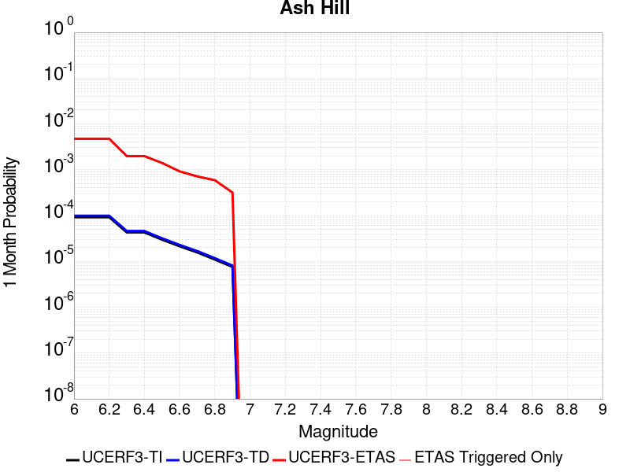 |  |  |

| Magnitude | 1 wk TI Prob | 1 wk TD Prob | 1 wk ETAS Prob | 1 wk ETAS/TD Gain | 1 wk ETAS Triggered Only | 1 mo TI Prob | 1 mo TD Prob | 1 mo ETAS Prob | 1 mo ETAS/TD Gain | 1 mo ETAS Triggered Only | 1 yr TI Prob | 1 yr TD Prob | 1 yr ETAS Prob | 1 yr ETAS/TD Gain | 1 yr ETAS Triggered Only | 10 yr TI Prob | 10 yr TD Prob | 10 yr ETAS Prob | 10 yr ETAS/TD Gain | 10 yr ETAS Triggered Only |
|-----|-----|-----|-----|-----|-----|-----|-----|-----|-----|-----|-----|-----|-----|-----|-----|-----|-----|-----|-----|-----|
| 6.0 | 2.1545662E-5 | 2.3194447E-5 | 0.0030221876 | 130.2979 | 0.0029990629 | 9.2335285E-5 | 9.940143E-5 | 0.0042227027 | 42.481308 | 0.0041237115 | 0.0011236023 | 0.0012096206 | 0.008323778 | 6.881314 | 0.007122774 | 0.011179381 | 0.012038348 | 0.021667965 | 1.7999117 | 0.009746954 |
| 6.1 | 2.1545662E-5 | 2.3194447E-5 | 0.0030221876 | 130.2979 | 0.0029990629 | 9.2335285E-5 | 9.940143E-5 | 0.0042227027 | 42.481308 | 0.0041237115 | 0.0011236023 | 0.0012096206 | 0.008323778 | 6.881314 | 0.007122774 | 0.011179381 | 0.012038348 | 0.021667965 | 1.7999117 | 0.009746954 |
| 6.2 | 2.1545662E-5 | 2.3194447E-5 | 0.0030221876 | 130.2979 | 0.0029990629 | 9.2335285E-5 | 9.940143E-5 | 0.0042227027 | 42.481308 | 0.0041237115 | 0.0011236023 | 0.0012096206 | 0.008323778 | 6.881314 | 0.007122774 | 0.011179381 | 0.012038348 | 0.021667965 | 1.7999117 | 0.009746954 |
| 6.3 | 1.0025529E-5 | 1.0746934E-5 | 0.0016977016 | 157.97078 | 0.0016869728 | 4.2965847E-5 | 4.605755E-5 | 0.0021078181 | 45.764877 | 0.0020618557 | 5.229836E-4 | 5.6061964E-4 | 0.00412001 | 7.349029 | 0.003561387 | 0.005217545 | 0.0055933665 | 0.010625977 | 1.8997463 | 0.0050609186 |
| 6.4 | 1.0025529E-5 | 1.0746934E-5 | 0.0016977016 | 157.97078 | 0.0016869728 | 4.2965847E-5 | 4.605755E-5 | 0.0021078181 | 45.764877 | 0.0020618557 | 5.229836E-4 | 5.6061964E-4 | 0.00412001 | 7.349029 | 0.003561387 | 0.005217545 | 0.0055933665 | 0.010625977 | 1.8997463 | 0.0050609186 |
| 6.5 | 6.9617327E-6 | 7.456634E-6 | 0.0011320967 | 151.82411 | 0.0011246485 | 2.9835655E-5 | 3.195666E-5 | 0.0015314402 | 47.92241 | 0.0014995314 | 3.6318856E-4 | 3.8901155E-4 | 0.0026374336 | 6.779834 | 0.002249297 | 0.0036259557 | 0.0038841602 | 0.006871574 | 1.7691274 | 0.0029990629 |
| 6.6 | 4.9919777E-6 | 5.3466883E-6 | 9.425488E-4 | 176.28647 | 9.3720714E-4 | 2.1394015E-5 | 2.2914215E-5 | 0.001147537 | 50.0797 | 0.0011246485 | 2.60441E-4 | 2.7895154E-4 | 0.002152843 | 7.717623 | 0.0018744143 | 0.0026013597 | 0.0027866727 | 0.005216621 | 1.8719891 | 0.0024367385 |
| 6.7 | 3.6630722E-6 | 3.924624E-6 | 9.4112806E-4 | 239.80084 | 9.3720714E-4 | 1.5698786E-5 | 1.681974E-5 | 0.0011414493 | 67.86368 | 0.0011246485 | 1.9111596E-4 | 2.0476682E-4 | 0.0018913943 | 9.236819 | 0.0016869728 | 0.0019095168 | 0.0020463446 | 0.004103981 | 2.005518 | 0.0020618557 |
| 6.8 | 2.5599613E-6 | 2.744925E-6 | 5.6506763E-4 | 205.85904 | 5.6232425E-4 | 1.0971216E-5 | 1.1763939E-5 | 7.615208E-4 | 64.73348 | 7.497657E-4 | 1.3356637E-4 | 1.4322149E-4 | 0.001267709 | 8.851388 | 0.0011246485 | 0.0013348613 | 0.0014317769 | 0.0025548153 | 1.7843668 | 0.0011246485 |
| 6.9 | 1.7684905E-6 | 1.8968707E-6 | 3.76779E-4 | 198.63188 | 3.7488286E-4 | 7.579223E-6 | 8.129446E-6 | 3.8300926E-4 | 47.11382 | 3.7488286E-4 | 9.2273134E-5 | 9.8976E-5 | 8.486675E-4 | 8.574477 | 7.497657E-4 | 9.223483E-4 | 9.8976E-4 | 0.0017387837 | 1.7567729 | 7.497657E-4 |

## Garlock (West)
*[(top)](#table-of-contents)*

| 1 Week | 1 Month | 1 Year | 10 Year |
|-----|-----|-----|-----|
|  | 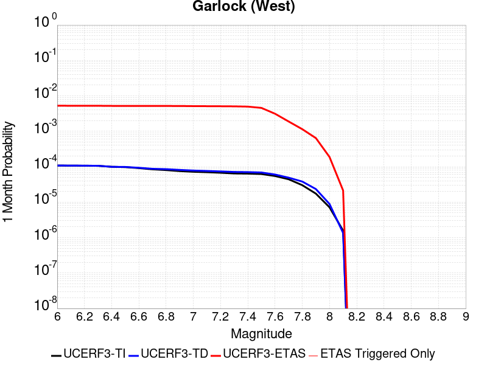 |  |  |

| Magnitude | 1 wk TI Prob | 1 wk TD Prob | 1 wk ETAS Prob | 1 wk ETAS/TD Gain | 1 wk ETAS Triggered Only | 1 mo TI Prob | 1 mo TD Prob | 1 mo ETAS Prob | 1 mo ETAS/TD Gain | 1 mo ETAS Triggered Only | 1 yr TI Prob | 1 yr TD Prob | 1 yr ETAS Prob | 1 yr ETAS/TD Gain | 1 yr ETAS Triggered Only | 10 yr TI Prob | 10 yr TD Prob | 10 yr ETAS Prob | 10 yr ETAS/TD Gain | 10 yr ETAS Triggered Only |
|-----|-----|-----|-----|-----|-----|-----|-----|-----|-----|-----|-----|-----|-----|-----|-----|-----|-----|-----|-----|-----|
| 6.0 | 2.5181727E-5 | 2.5197181E-5 | 0.004336241 | 172.09232 | 0.0043111527 | 1.0791722E-4 | 1.0798347E-4 | 0.0051683555 | 47.86247 | 0.0050609186 | 0.0013131002 | 0.0013139093 | 0.008801715 | 6.6988754 | 0.007497657 | 0.013053683 | 0.013141794 | 0.022020744 | 1.6756269 | 0.008997188 |
| 6.1 | 2.5077732E-5 | 2.5098223E-5 | 0.004336143 | 172.76692 | 0.0043111527 | 1.0747157E-4 | 1.075594E-4 | 0.0051679336 | 48.047253 | 0.0050609186 | 0.001307681 | 0.0013087525 | 0.008796597 | 6.72136 | 0.007497657 | 0.013000126 | 0.013090835 | 0.021970242 | 1.6782919 | 0.008997188 |
| 6.2 | 2.494612E-5 | 2.4979914E-5 | 0.004336025 | 173.58046 | 0.0043111527 | 1.0690756E-4 | 1.070524E-4 | 0.005167429 | 48.27009 | 0.0050609186 | 0.0013008224 | 0.0013025872 | 0.008790478 | 6.7484756 | 0.007497657 | 0.012932341 | 0.013029906 | 0.021909863 | 1.6815057 | 0.008997188 |
| 6.3 | 2.4733758E-5 | 2.4799276E-5 | 0.0043358454 | 174.83757 | 0.0043111527 | 1.0599751E-4 | 1.06278305E-4 | 0.005166659 | 48.61443 | 0.0050609186 | 0.0012897556 | 0.0012931736 | 0.008781135 | 6.790375 | 0.007497657 | 0.012822957 | 0.0129368715 | 0.021817666 | 1.6864715 | 0.008997188 |
| 6.4 | 2.3237335E-5 | 2.3178607E-5 | 0.0043342314 | 186.99274 | 0.0043111527 | 9.958477E-5 | 9.933313E-5 | 0.0051597487 | 51.94389 | 0.0050609186 | 0.0012117702 | 0.0012087126 | 0.008697307 | 7.195513 | 0.007497657 | 0.012051838 | 0.012101731 | 0.020990038 | 1.7344657 | 0.008997188 |
| 6.5 | 2.2732203E-5 | 2.2992977E-5 | 0.0043340465 | 188.49437 | 0.0043111527 | 9.742009E-5 | 9.8537625E-5 | 0.0051589576 | 52.355206 | 0.0050609186 | 0.0011854442 | 0.0011990381 | 0.008687705 | 7.2455626 | 0.007497657 | 0.011791403 | 0.012006035 | 0.020895204 | 1.7403916 | 0.008997188 |
| 6.6 | 2.1319436E-5 | 2.1773201E-5 | 0.004332832 | 198.9984 | 0.0043111527 | 9.136581E-5 | 9.3310395E-5 | 0.0051537566 | 55.232395 | 0.0050609186 | 0.001111811 | 0.0011354643 | 0.008624608 | 7.595666 | 0.007497657 | 0.011062649 | 0.011376952 | 0.02027178 | 1.7818288 | 0.008997188 |
| 6.7 | 1.970802E-5 | 2.0393094E-5 | 0.004331458 | 212.39827 | 0.0043111527 | 8.446021E-5 | 8.739606E-5 | 0.005147872 | 58.902794 | 0.0050609186 | 0.001027818 | 0.0010635294 | 0.0085532125 | 8.042291 | 0.007497657 | 0.010230771 | 0.0106646875 | 0.019565923 | 1.8346457 | 0.008997188 |
| 6.8 | 1.8744462E-5 | 1.9900775E-5 | 0.0043309676 | 217.6281 | 0.0043111527 | 8.033094E-5 | 8.528626E-5 | 0.0051457733 | 60.335316 | 0.0050609186 | 9.775903E-4 | 0.0010378672 | 0.008527743 | 8.216602 | 0.007497657 | 0.009733009 | 0.010410495 | 0.019128527 | 1.8374274 | 0.008809747 |
| 6.9 | 1.7559682E-5 | 1.8953151E-5 | 0.004330024 | 228.45934 | 0.0043111527 | 7.5253614E-5 | 8.122527E-5 | 0.0051417327 | 63.30213 | 0.0050609186 | 9.158276E-4 | 9.884704E-4 | 0.008478716 | 8.577612 | 0.007497657 | 0.0091206245 | 0.009921073 | 0.018643418 | 1.8791735 | 0.008809747 |
| 7.0 | 1.6794445E-5 | 1.8215967E-5 | 0.0043292902 | 237.66457 | 0.0043111527 | 7.197421E-5 | 7.806611E-5 | 0.0051385895 | 65.82357 | 0.0050609186 | 8.759337E-4 | 9.5004175E-4 | 0.008440576 | 8.884426 | 0.007497657 | 0.008724891 | 0.009539958 | 0.01826566 | 1.9146478 | 0.008809747 |
| 7.1 | 1.6337795E-5 | 1.771677E-5 | 0.0043287934 | 244.3331 | 0.0043111527 | 7.0017246E-5 | 7.592681E-5 | 0.005136461 | 67.65016 | 0.0050609186 | 8.521265E-4 | 9.2401815E-4 | 0.008414747 | 9.10669 | 0.007497657 | 0.008488664 | 0.009281721 | 0.018009698 | 1.9403404 | 0.008809747 |
| 7.2 | 1.5780008E-5 | 1.71654E-5 | 0.0043282444 | 252.14935 | 0.0043111527 | 6.762685E-5 | 7.3563926E-5 | 0.00513411 | 69.79114 | 0.0050609186 | 8.2304585E-4 | 8.952741E-4 | 0.008386219 | 9.367208 | 0.007497657 | 0.008200042 | 0.008996559 | 0.017727049 | 1.9704254 | 0.008809747 |
| 7.3 | 1.5058865E-5 | 1.6618484E-5 | 0.004140261 | 249.13594 | 0.0041237115 | 6.45364E-5 | 7.122013E-5 | 0.00494435 | 69.42349 | 0.004873477 | 7.854473E-4 | 8.667614E-4 | 0.008170641 | 9.426633 | 0.0073102154 | 0.00782677 | 0.008713263 | 0.01726044 | 1.9809387 | 0.0086223055 |
| 7.4 | 1.4887923E-5 | 1.6454453E-5 | 0.004140098 | 251.60959 | 0.0041237115 | 6.380382E-5 | 7.0517184E-5 | 0.0049436507 | 70.10561 | 0.004873477 | 7.7653467E-4 | 8.5820974E-4 | 0.007974871 | 9.29245 | 0.007122774 | 0.0077382675 | 0.008628101 | 0.016990189 | 1.9691689 | 0.008434864 |
| 7.5 | 1.4509299E-5 | 1.6046468E-5 | 0.0041396916 | 257.98148 | 0.0041237115 | 6.218123E-5 | 6.876877E-5 | 0.0049419105 | 71.86272 | 0.004873477 | 7.567935E-4 | 8.369394E-4 | 0.0077664675 | 9.279606 | 0.006935333 | 0.0075422134 | 0.008416411 | 0.01659442 | 1.9716742 | 0.008247423 |
| 7.6 | 1.2756717E-5 | 1.4050529E-5 | 0.0026381935 | 187.76472 | 0.00262418 | 5.4670498E-5 | 6.0215163E-5 | 0.0032465274 | 53.915447 | 0.0031865041 | 6.6541E-4 | 7.328737E-4 | 0.005040867 | 6.8782206 | 0.0043111527 | 0.006634211 | 0.007381374 | 0.012218879 | 1.6553663 | 0.004873477 |
| 7.7 | 1.0328985E-5 | 1.146033E-5 | 0.0018858531 | 164.55487 | 0.0018744143 | 4.4266326E-5 | 4.9114777E-5 | 0.0021108692 | 42.97829 | 0.0020618557 | 5.388092E-4 | 5.9780874E-4 | 0.0030330906 | 5.0736804 | 0.0024367385 | 0.0053750467 | 0.006038286 | 0.00864662 | 1.4319661 | 0.00262418 |
| 7.8 | 7.0306583E-6 | 8.899537E-6 | 0.0015084175 | 169.49394 | 0.0014995314 | 3.0131043E-5 | 3.8140315E-5 | 0.0017250488 | 45.229015 | 0.0016869728 | 3.667837E-4 | 4.6425956E-4 | 0.0023378036 | 5.035553 | 0.0018744143 | 0.003661789 | 0.0046950667 | 0.0065606805 | 1.3973562 | 0.0018744143 |
| 7.9 | 4.060633E-6 | 5.465412E-6 | 3.803462E-4 | 69.5915 | 3.7488286E-4 | 1.7402595E-5 | 2.3422985E-5 | 5.857341E-4 | 25.006807 | 5.6232425E-4 | 2.11856E-4 | 2.8513762E-4 | 8.4730156E-4 | 2.971553 | 5.6232425E-4 | 0.0021165414 | 0.002884143 | 0.0034448456 | 1.1944087 | 5.6232425E-4 |
| 8.0 | 1.6729537E-6 | 2.0775192E-6 | 1.8951856E-4 | 91.22349 | 1.8744143E-4 | 7.169782E-6 | 8.903624E-6 | 1.9634338E-4 | 22.052074 | 1.8744143E-4 | 8.7288594E-5 | 1.0839626E-4 | 2.9581736E-4 | 2.7290366 | 1.8744143E-4 | 8.7254314E-4 | 0.001096854 | 0.0012840899 | 1.1707026 | 1.8744143E-4 |
| 8.1 | 3.6733252E-7 | 3.1489736E-7 | 3.1489736E-7 | 1.0 | 0.0 | 1.5742813E-6 | 1.3495595E-6 | 1.3495595E-6 | 1.0 | 0.0 | 1.9166706E-5 | 1.643078E-5 | 1.643078E-5 | 1.0 | 0.0 | 1.9165053E-4 | 1.662928E-4 | 1.662928E-4 | 1.0 | 0.0 |

## McLean Lake
*[(top)](#table-of-contents)*

| 1 Week | 1 Month | 1 Year | 10 Year |
|-----|-----|-----|-----|
|  |  |  |  |

| Magnitude | 1 wk TI Prob | 1 wk TD Prob | 1 wk ETAS Prob | 1 wk ETAS/TD Gain | 1 wk ETAS Triggered Only | 1 mo TI Prob | 1 mo TD Prob | 1 mo ETAS Prob | 1 mo ETAS/TD Gain | 1 mo ETAS Triggered Only | 1 yr TI Prob | 1 yr TD Prob | 1 yr ETAS Prob | 1 yr ETAS/TD Gain | 1 yr ETAS Triggered Only | 10 yr TI Prob | 10 yr TD Prob | 10 yr ETAS Prob | 10 yr ETAS/TD Gain | 10 yr ETAS Triggered Only |
|-----|-----|-----|-----|-----|-----|-----|-----|-----|-----|-----|-----|-----|-----|-----|-----|-----|-----|-----|-----|-----|
| 6.0 | 1.7360222E-5 | 1.8501627E-5 | 0.0011431293 | 61.78534 | 0.0011246485 | 7.439883E-5 | 7.9290556E-5 | 0.0019535562 | 24.637943 | 0.0018744143 | 9.0542925E-4 | 9.6498354E-4 | 0.0047101947 | 4.8811135 | 0.0037488285 | 0.009017491 | 0.0096127745 | 0.015553242 | 1.6179763 | 0.0059981258 |
| 6.1 | 9.062689E-6 | 9.592193E-6 | 7.593507E-4 | 79.16341 | 7.497657E-4 | 3.8839516E-5 | 4.1108804E-5 | 0.0011657111 | 28.356728 | 0.0011246485 | 4.727685E-4 | 5.003936E-4 | 0.0025612176 | 5.118406 | 0.0020618557 | 0.0047176396 | 0.004993552 | 0.007791133 | 1.5602388 | 0.0028116214 |
| 6.2 | 9.062689E-6 | 9.592193E-6 | 7.593507E-4 | 79.16341 | 7.497657E-4 | 3.8839516E-5 | 4.1108804E-5 | 0.0011657111 | 28.356728 | 0.0011246485 | 4.727685E-4 | 5.003936E-4 | 0.0025612176 | 5.118406 | 0.0020618557 | 0.0047176396 | 0.004993552 | 0.007791133 | 1.5602388 | 0.0028116214 |
| 6.3 | 7.2575485E-6 | 7.66771E-6 | 3.8254767E-4 | 49.89074 | 3.7488286E-4 | 3.110341E-5 | 3.2861237E-5 | 5.9516705E-4 | 18.111523 | 5.6232425E-4 | 3.786182E-4 | 4.0001926E-4 | 0.0018989508 | 4.7471485 | 0.0014995314 | 0.0037797375 | 0.0039936965 | 0.0060473178 | 1.5142156 | 0.0020618557 |
| 6.4 | 7.2575485E-6 | 7.66771E-6 | 3.8254767E-4 | 49.89074 | 3.7488286E-4 | 3.110341E-5 | 3.2861237E-5 | 5.9516705E-4 | 18.111523 | 5.6232425E-4 | 3.786182E-4 | 4.0001926E-4 | 0.0018989508 | 4.7471485 | 0.0014995314 | 0.0037797375 | 0.0039936965 | 0.0060473178 | 1.5142156 | 0.0020618557 |
| 6.5 | 6.06582E-6 | 6.4038773E-6 | 3.8128434E-4 | 59.539608 | 3.7488286E-4 | 2.5996113E-5 | 2.7444936E-5 | 5.897538E-4 | 21.488619 | 5.6232425E-4 | 3.164567E-4 | 3.3409733E-4 | 0.001645749 | 4.9259562 | 0.00131209 | 0.0031600643 | 0.0033365893 | 0.0052047493 | 1.5599011 | 0.0018744143 |
| 6.6 | 5.598744E-6 | 5.910262E-6 | 3.807909E-4 | 64.428764 | 3.7488286E-4 | 2.3994397E-5 | 2.5329486E-5 | 5.876395E-4 | 23.199821 | 5.6232425E-4 | 2.9209262E-4 | 3.0834923E-4 | 0.0016200346 | 5.2538953 | 0.00131209 | 0.0029170897 | 0.003079843 | 0.0047616204 | 1.5460594 | 0.0016869728 |
| 6.7 | 5.246996E-6 | 5.539162E-6 | 3.8041992E-4 | 68.678246 | 3.7488286E-4 | 2.2486933E-5 | 2.3739085E-5 | 3.9861305E-4 | 16.791424 | 3.7488286E-4 | 2.73744E-4 | 2.8899137E-4 | 0.001413315 | 4.8905087 | 0.0011246485 | 0.0027340704 | 0.0028867796 | 0.004381982 | 1.5179483 | 0.0014995314 |
| 6.8 | 4.02324E-6 | 4.2469046E-6 | 1.9168753E-4 | 45.135826 | 1.8744143E-4 | 1.7242342E-5 | 1.8200926E-5 | 2.0563893E-4 | 11.298268 | 1.8744143E-4 | 2.099053E-4 | 2.2157968E-4 | 5.9637945E-4 | 2.6914897 | 3.7488286E-4 | 0.0020970714 | 0.002214172 | 0.0027752512 | 1.2534037 | 5.6232425E-4 |
| 6.9 | 6.835972E-7 | 7.1399285E-7 | 7.1399285E-7 | 1.0 | 0.0 | 2.9296991E-6 | 3.0599674E-6 | 3.0599674E-6 | 1.0 | 0.0 | 3.56685E-5 | 3.7254784E-5 | 3.7254784E-5 | 1.0 | 0.0 | 3.5662777E-4 | 3.7251666E-4 | 3.7251666E-4 | 1.0 | 0.0 |

## Goldstone Lake
*[(top)](#table-of-contents)*

| 1 Week | 1 Month | 1 Year | 10 Year |
|-----|-----|-----|-----|
|  |  |  |  |

| Magnitude | 1 wk TI Prob | 1 wk TD Prob | 1 wk ETAS Prob | 1 wk ETAS/TD Gain | 1 wk ETAS Triggered Only | 1 mo TI Prob | 1 mo TD Prob | 1 mo ETAS Prob | 1 mo ETAS/TD Gain | 1 mo ETAS Triggered Only | 1 yr TI Prob | 1 yr TD Prob | 1 yr ETAS Prob | 1 yr ETAS/TD Gain | 1 yr ETAS Triggered Only | 10 yr TI Prob | 10 yr TD Prob | 10 yr ETAS Prob | 10 yr ETAS/TD Gain | 10 yr ETAS Triggered Only |
|-----|-----|-----|-----|-----|-----|-----|-----|-----|-----|-----|-----|-----|-----|-----|-----|-----|-----|-----|-----|-----|
| 6.0 | 2.671352E-5 | 3.0376103E-5 | 9.6755475E-4 | 31.852497 | 9.3720714E-4 | 1.1448149E-4 | 1.3017791E-4 | 0.0016295142 | 12.517593 | 0.0014995314 | 0.001392921 | 0.0015839601 | 0.0049525616 | 3.1266959 | 0.0033739456 | 0.013842222 | 0.015746202 | 0.02109641 | 1.3397777 | 0.005435801 |
| 6.1 | 2.671352E-5 | 3.0376103E-5 | 9.6755475E-4 | 31.852497 | 9.3720714E-4 | 1.1448149E-4 | 1.3017791E-4 | 0.0016295142 | 12.517593 | 0.0014995314 | 0.001392921 | 0.0015839601 | 0.0049525616 | 3.1266959 | 0.0033739456 | 0.013842222 | 0.015746202 | 0.02109641 | 1.3397777 | 0.005435801 |
| 6.2 | 1.4197047E-5 | 1.6096254E-5 | 7.658499E-4 | 47.579384 | 7.497657E-4 | 6.0843064E-5 | 6.898268E-5 | 0.0011935537 | 17.302221 | 0.0011246485 | 7.4051257E-4 | 8.3963916E-4 | 0.0030870477 | 3.6766362 | 0.002249297 | 0.007380498 | 0.008374364 | 0.011348312 | 1.3551252 | 0.0029990629 |
| 6.3 | 1.4197047E-5 | 1.6096254E-5 | 7.658499E-4 | 47.579384 | 7.497657E-4 | 6.0843064E-5 | 6.898268E-5 | 0.0011935537 | 17.302221 | 0.0011246485 | 7.4051257E-4 | 8.3963916E-4 | 0.0030870477 | 3.6766362 | 0.002249297 | 0.007380498 | 0.008374364 | 0.011348312 | 1.3551252 | 0.0029990629 |
| 6.4 | 1.3238931E-5 | 1.500847E-5 | 5.773243E-4 | 38.466568 | 5.6232425E-4 | 5.6737044E-5 | 6.432098E-5 | 0.0010014678 | 15.569847 | 9.3720714E-4 | 6.9055456E-4 | 7.8292453E-4 | 0.002843166 | 3.6314685 | 0.0020618557 | 0.006884126 | 0.007811289 | 0.010600948 | 1.3571317 | 0.0028116214 |
| 6.5 | 1.3238931E-5 | 1.500847E-5 | 5.773243E-4 | 38.466568 | 5.6232425E-4 | 5.6737044E-5 | 6.432098E-5 | 0.0010014678 | 15.569847 | 9.3720714E-4 | 6.9055456E-4 | 7.8292453E-4 | 0.002843166 | 3.6314685 | 0.0020618557 | 0.006884126 | 0.007811289 | 0.010600948 | 1.3571317 | 0.0028116214 |
| 6.6 | 1.1328278E-5 | 1.2855176E-5 | 5.7517225E-4 | 44.742462 | 5.6232425E-4 | 4.8548856E-5 | 5.5092984E-5 | 6.1738625E-4 | 11.20626 | 5.6232425E-4 | 5.90922E-4 | 6.706464E-4 | 0.0023564878 | 3.5137563 | 0.0016869728 | 0.0058935313 | 0.0066956137 | 0.009116037 | 1.3614938 | 0.0024367385 |
| 6.7 | 8.651175E-6 | 9.824575E-6 | 9.824575E-6 | 1.0 | 0.0 | 3.707594E-5 | 4.2105148E-5 | 4.2105148E-5 | 1.0 | 0.0 | 4.5130608E-4 | 5.126002E-4 | 0.0014493269 | 2.8274024 | 9.3720714E-4 | 0.0045039062 | 0.0051230565 | 0.0066149053 | 1.291203 | 0.0014995314 |
| 6.8 | 1.0215377E-6 | 1.1754802E-6 | 1.1754802E-6 | 1.0 | 0.0 | 4.378012E-6 | 5.037763E-6 | 5.037763E-6 | 1.0 | 0.0 | 5.3300988E-5 | 6.133315E-5 | 6.133315E-5 | 1.0 | 0.0 | 5.3288206E-4 | 6.131735E-4 | 6.131735E-4 | 1.0 | 0.0 |
| 6.9 | 7.9360774E-7 | 9.283496E-7 | 9.283496E-7 | 1.0 | 0.0 | 3.4011714E-6 | 3.9786355E-6 | 3.9786355E-6 | 1.0 | 0.0 | 4.1408475E-5 | 4.843888E-5 | 4.843888E-5 | 1.0 | 0.0 | 4.140076E-4 | 4.842902E-4 | 4.842902E-4 | 1.0 | 0.0 |
| 7.0 | 7.4382757E-7 | 8.747428E-7 | 8.747428E-7 | 1.0 | 0.0 | 3.1878285E-6 | 3.7488926E-6 | 3.7488926E-6 | 1.0 | 0.0 | 3.8811122E-5 | 4.564188E-5 | 4.564188E-5 | 1.0 | 0.0 | 3.8804344E-4 | 4.563317E-4 | 4.563317E-4 | 1.0 | 0.0 |
| 7.1 | 6.4709513E-7 | 7.711399E-7 | 7.711399E-7 | 1.0 | 0.0 | 2.773262E-6 | 3.3048816E-6 | 3.3048816E-6 | 1.0 | 0.0 | 3.376394E-5 | 4.023625E-5 | 4.023625E-5 | 1.0 | 0.0 | 3.375881E-4 | 4.022956E-4 | 4.022956E-4 | 1.0 | 0.0 |
| 7.2 | 6.356704E-7 | 7.588459E-7 | 7.588459E-7 | 1.0 | 0.0 | 2.7242988E-6 | 3.252193E-6 | 3.252193E-6 | 1.0 | 0.0 | 3.3167835E-5 | 3.959479E-5 | 3.959479E-5 | 1.0 | 0.0 | 3.3162883E-4 | 3.9588328E-4 | 3.9588328E-4 | 1.0 | 0.0 |
| 7.3 | 5.7695723E-7 | 6.896648E-7 | 6.896648E-7 | 1.0 | 0.0 | 2.4726714E-6 | 2.9557032E-6 | 2.9557032E-6 | 1.0 | 0.0 | 3.0104358E-5 | 3.598515E-5 | 3.598515E-5 | 1.0 | 0.0 | 3.0100282E-4 | 3.5979896E-4 | 3.5979896E-4 | 1.0 | 0.0 |
| 7.4 | 5.209647E-7 | 6.193583E-7 | 6.193583E-7 | 1.0 | 0.0 | 2.232704E-6 | 2.6543903E-6 | 2.6543903E-6 | 1.0 | 0.0 | 2.718283E-5 | 3.2316777E-5 | 3.2316777E-5 | 1.0 | 0.0 | 2.7179506E-4 | 3.2312635E-4 | 3.2312635E-4 | 1.0 | 0.0 |
| 7.5 | 4.512955E-7 | 5.3489487E-7 | 5.3489487E-7 | 1.0 | 0.0 | 1.934122E-6 | 2.2924048E-6 | 2.2924048E-6 | 1.0 | 0.0 | 2.3547682E-5 | 2.7909726E-5 | 2.7909726E-5 | 1.0 | 0.0 | 2.3545188E-4 | 2.7906752E-4 | 2.7906752E-4 | 1.0 | 0.0 |
| 7.6 | 2.21172E-7 | 2.6040198E-7 | 2.6040198E-7 | 1.0 | 0.0 | 9.478797E-7 | 1.1160082E-6 | 1.1160082E-6 | 1.0 | 0.0 | 1.1540374E-5 | 1.3587343E-5 | 1.3587343E-5 | 1.0 | 0.0 | 1.1539775E-4 | 1.3586794E-4 | 1.3586794E-4 | 1.0 | 0.0 |

## Gravel Hills-Harper Lk
*[(top)](#table-of-contents)*

| 1 Week | 1 Month | 1 Year | 10 Year |
|-----|-----|-----|-----|
|  |  |  |  |

| Magnitude | 1 wk TI Prob | 1 wk TD Prob | 1 wk ETAS Prob | 1 wk ETAS/TD Gain | 1 wk ETAS Triggered Only | 1 mo TI Prob | 1 mo TD Prob | 1 mo ETAS Prob | 1 mo ETAS/TD Gain | 1 mo ETAS Triggered Only | 1 yr TI Prob | 1 yr TD Prob | 1 yr ETAS Prob | 1 yr ETAS/TD Gain | 1 yr ETAS Triggered Only | 10 yr TI Prob | 10 yr TD Prob | 10 yr ETAS Prob | 10 yr ETAS/TD Gain | 10 yr ETAS Triggered Only |
|-----|-----|-----|-----|-----|-----|-----|-----|-----|-----|-----|-----|-----|-----|-----|-----|-----|-----|-----|-----|-----|
| 6.0 | 3.0679566E-5 | 3.1464628E-5 | 0.0020932555 | 66.52726 | 0.0020618557 | 1.3147724E-4 | 1.3484266E-4 | 0.0025712526 | 19.06854 | 0.0024367385 | 0.0015995599 | 0.00164069 | 0.0055705016 | 3.3952188 | 0.00393627 | 0.015880952 | 0.016307337 | 0.021654496 | 1.3278989 | 0.005435801 |
| 6.1 | 3.0679566E-5 | 3.1464628E-5 | 0.0020932555 | 66.52726 | 0.0020618557 | 1.3147724E-4 | 1.3484266E-4 | 0.0025712526 | 19.06854 | 0.0024367385 | 0.0015995599 | 0.00164069 | 0.0055705016 | 3.3952188 | 0.00393627 | 0.015880952 | 0.016307337 | 0.021654496 | 1.3278989 | 0.005435801 |
| 6.2 | 1.514536E-5 | 1.36352E-5 | 5.759518E-4 | 42.24007 | 5.6232425E-4 | 6.490707E-5 | 5.843533E-5 | 9.955877E-4 | 17.037428 | 9.3720714E-4 | 7.8995706E-4 | 7.112298E-4 | 0.0018350785 | 2.5801485 | 0.0011246485 | 0.007871548 | 0.007090737 | 0.008393523 | 1.1837307 | 0.00131209 |
| 6.3 | 1.514536E-5 | 1.36352E-5 | 5.759518E-4 | 42.24007 | 5.6232425E-4 | 6.490707E-5 | 5.843533E-5 | 9.955877E-4 | 17.037428 | 9.3720714E-4 | 7.8995706E-4 | 7.112298E-4 | 0.0018350785 | 2.5801485 | 0.0011246485 | 0.007871548 | 0.007090737 | 0.008393523 | 1.1837307 | 0.00131209 |
| 6.4 | 1.2532521E-5 | 1.0689684E-5 | 3.8556854E-4 | 36.069218 | 3.7488286E-4 | 5.37097E-5 | 4.581216E-5 | 6.081107E-4 | 13.274001 | 5.6232425E-4 | 6.537194E-4 | 5.5762613E-4 | 0.0011196368 | 2.007863 | 5.6232425E-4 | 0.0065179965 | 0.005562859 | 0.006308454 | 1.1340308 | 7.497657E-4 |
| 6.5 | 1.1094058E-5 | 9.083657E-6 | 3.839631E-4 | 42.269665 | 3.7488286E-4 | 4.7545094E-5 | 3.89294E-5 | 4.1379765E-4 | 10.629438 | 3.7488286E-4 | 5.787078E-4 | 4.7386638E-4 | 8.485716E-4 | 1.7907403 | 3.7488286E-4 | 0.0057720304 | 0.004728967 | 0.005288632 | 1.1183482 | 5.6232425E-4 |
| 6.6 | 9.688328E-6 | 7.531688E-6 | 1.949717E-4 | 25.886852 | 1.8744143E-4 | 4.1520743E-5 | 3.227828E-5 | 2.1971365E-4 | 6.8068576 | 1.8744143E-4 | 5.053978E-4 | 3.9291973E-4 | 5.802875E-4 | 1.4768602 | 1.8744143E-4 | 0.0050424994 | 0.0039225067 | 0.004295919 | 1.0951973 | 3.7488286E-4 |
| 6.7 | 8.974824E-6 | 6.749406E-6 | 1.9418956E-4 | 28.771357 | 1.8744143E-4 | 3.8462964E-5 | 2.8925719E-5 | 2.1636172E-4 | 7.4799085 | 1.8744143E-4 | 4.6818596E-4 | 3.5211592E-4 | 5.3949136E-4 | 1.5321413 | 1.8744143E-4 | 0.004672008 | 0.003515801 | 0.0038893658 | 1.1062531 | 3.7488286E-4 |
| 6.8 | 7.4780046E-6 | 5.1161865E-6 | 1.9255665E-4 | 37.636757 | 1.8744143E-4 | 3.20482E-5 | 2.1926337E-5 | 2.0936366E-4 | 9.548501 | 1.8744143E-4 | 3.9011694E-4 | 2.6692182E-4 | 4.5431324E-4 | 1.7020459 | 1.8744143E-4 | 0.0038943281 | 0.0026661505 | 0.0028530923 | 1.0701168 | 1.8744143E-4 |
| 6.9 | 6.3409307E-6 | 3.907489E-6 | 3.907489E-6 | 1.0 | 0.0 | 2.7175134E-5 | 1.674628E-5 | 1.674628E-5 | 1.0 | 0.0 | 3.3080703E-4 | 2.0386786E-4 | 2.0386786E-4 | 1.0 | 0.0 | 0.0033031502 | 0.0020369065 | 0.0020369065 | 1.0 | 0.0 |
| 7.0 | 5.1239335E-6 | 2.6058492E-6 | 2.6058492E-6 | 1.0 | 0.0 | 2.195953E-5 | 1.1167879E-5 | 1.1167879E-5 | 1.0 | 0.0 | 2.6732447E-4 | 1.359607E-4 | 1.359607E-4 | 1.0 | 0.0 | 0.0026700313 | 0.0013588005 | 0.0013588005 | 1.0 | 0.0 |
| 7.1 | 4.438899E-6 | 2.0984692E-6 | 2.0984692E-6 | 1.0 | 0.0 | 1.9023713E-5 | 8.99341E-6 | 8.99341E-6 | 1.0 | 0.0 | 2.315891E-4 | 1.0948948E-4 | 1.0948948E-4 | 1.0 | 0.0 | 0.002313479 | 0.0010943774 | 0.0010943774 | 1.0 | 0.0 |
| 7.2 | 3.50367E-6 | 1.2615715E-6 | 1.2615715E-6 | 1.0 | 0.0 | 1.5015643E-5 | 5.406724E-6 | 5.406724E-6 | 1.0 | 0.0 | 1.8280011E-4 | 6.5824956E-5 | 6.5824956E-5 | 1.0 | 0.0 | 0.0018264982 | 6.580628E-4 | 6.580628E-4 | 1.0 | 0.0 |
| 7.3 | 2.561638E-6 | 7.118686E-7 | 7.118686E-7 | 1.0 | 0.0 | 1.0978401E-5 | 3.050862E-6 | 3.050862E-6 | 1.0 | 0.0 | 1.3365384E-4 | 3.7143633E-5 | 3.7143633E-5 | 1.0 | 0.0 | 0.0013357349 | 3.7137623E-4 | 3.7137623E-4 | 1.0 | 0.0 |
| 7.4 | 2.0368864E-6 | 5.304471E-7 | 5.304471E-7 | 1.0 | 0.0 | 8.729483E-6 | 2.2733427E-6 | 2.2733427E-6 | 1.0 | 0.0 | 1.06276275E-4 | 2.76776E-5 | 2.76776E-5 | 1.0 | 0.0 | 0.0010622547 | 2.767421E-4 | 2.767421E-4 | 1.0 | 0.0 |
| 7.5 | 1.1681728E-6 | 3.6028484E-7 | 3.6028484E-7 | 1.0 | 0.0 | 5.0064455E-6 | 1.544077E-6 | 1.544077E-6 | 1.0 | 0.0 | 6.0951766E-5 | 1.879898E-5 | 1.879898E-5 | 1.0 | 0.0 | 6.093505E-4 | 1.8797436E-4 | 1.8797436E-4 | 1.0 | 0.0 |
| 7.6 | 1.3154387E-7 | 7.1196716E-8 | 7.1196716E-8 | 1.0 | 0.0 | 5.6375933E-7 | 3.0512876E-7 | 3.0512876E-7 | 1.0 | 0.0 | 6.863748E-6 | 3.714938E-6 | 3.714938E-6 | 1.0 | 0.0 | 6.863536E-5 | 3.7148915E-5 | 3.7148915E-5 | 1.0 | 0.0 |

## So Sierra Nevada
*[(top)](#table-of-contents)*

| 1 Week | 1 Month | 1 Year | 10 Year |
|-----|-----|-----|-----|
|  | 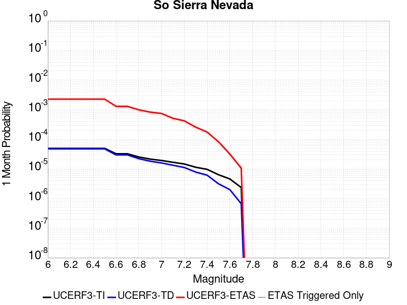 |  | 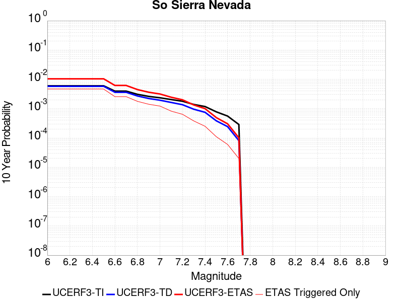 |

| Magnitude | 1 wk TI Prob | 1 wk TD Prob | 1 wk ETAS Prob | 1 wk ETAS/TD Gain | 1 wk ETAS Triggered Only | 1 mo TI Prob | 1 mo TD Prob | 1 mo ETAS Prob | 1 mo ETAS/TD Gain | 1 mo ETAS Triggered Only | 1 yr TI Prob | 1 yr TD Prob | 1 yr ETAS Prob | 1 yr ETAS/TD Gain | 1 yr ETAS Triggered Only | 10 yr TI Prob | 10 yr TD Prob | 10 yr ETAS Prob | 10 yr ETAS/TD Gain | 10 yr ETAS Triggered Only |
|-----|-----|-----|-----|-----|-----|-----|-----|-----|-----|-----|-----|-----|-----|-----|-----|-----|-----|-----|-----|-----|
| 6.0 | 1.15488665E-5 | 1.1079612E-5 | 0.0015105944 | 136.34001 | 0.0014995314 | 4.9494203E-5 | 4.7483256E-5 | 0.0022966736 | 48.368073 | 0.002249297 | 6.024253E-4 | 5.779681E-4 | 0.00432463 | 7.482472 | 0.0037488285 | 0.006007948 | 0.005765918 | 0.010797655 | 1.872669 | 0.0050609186 |
| 6.1 | 1.15488665E-5 | 1.1079612E-5 | 0.0015105944 | 136.34001 | 0.0014995314 | 4.9494203E-5 | 4.7483256E-5 | 0.0022966736 | 48.368073 | 0.002249297 | 6.024253E-4 | 5.779681E-4 | 0.00432463 | 7.482472 | 0.0037488285 | 0.006007948 | 0.005765918 | 0.010797655 | 1.872669 | 0.0050609186 |
| 6.2 | 1.15488665E-5 | 1.1079612E-5 | 0.0015105944 | 136.34001 | 0.0014995314 | 4.9494203E-5 | 4.7483256E-5 | 0.0022966736 | 48.368073 | 0.002249297 | 6.024253E-4 | 5.779681E-4 | 0.00432463 | 7.482472 | 0.0037488285 | 0.006007948 | 0.005765918 | 0.010797655 | 1.872669 | 0.0050609186 |
| 6.3 | 1.15488665E-5 | 1.1079612E-5 | 0.0015105944 | 136.34001 | 0.0014995314 | 4.9494203E-5 | 4.7483256E-5 | 0.0022966736 | 48.368073 | 0.002249297 | 6.024253E-4 | 5.779681E-4 | 0.00432463 | 7.482472 | 0.0037488285 | 0.006007948 | 0.005765918 | 0.010797655 | 1.872669 | 0.0050609186 |
| 6.4 | 1.15488665E-5 | 1.1079612E-5 | 0.0015105944 | 136.34001 | 0.0014995314 | 4.9494203E-5 | 4.7483256E-5 | 0.0022966736 | 48.368073 | 0.002249297 | 6.024253E-4 | 5.779681E-4 | 0.00432463 | 7.482472 | 0.0037488285 | 0.006007948 | 0.005765918 | 0.010797655 | 1.872669 | 0.0050609186 |
| 6.5 | 1.15488665E-5 | 1.1079612E-5 | 0.0015105944 | 136.34001 | 0.0014995314 | 4.9494203E-5 | 4.7483256E-5 | 0.0022966736 | 48.368073 | 0.002249297 | 6.024253E-4 | 5.779681E-4 | 0.00432463 | 7.482472 | 0.0037488285 | 0.006007948 | 0.005765918 | 0.010797655 | 1.872669 | 0.0050609186 |
| 6.6 | 7.587044E-6 | 6.9356042E-6 | 5.6925596E-4 | 82.07735 | 5.6232425E-4 | 3.2515498E-5 | 2.9723697E-5 | 9.6690294E-4 | 32.5297 | 9.3720714E-4 | 3.9580427E-4 | 3.6182883E-4 | 0.0020481911 | 5.6606636 | 0.0016869728 | 0.003951 | 0.0036126887 | 0.0058538597 | 1.620361 | 0.002249297 |
| 6.7 | 7.587044E-6 | 6.9356042E-6 | 5.6925596E-4 | 82.07735 | 5.6232425E-4 | 3.2515498E-5 | 2.9723697E-5 | 9.6690294E-4 | 32.5297 | 9.3720714E-4 | 3.9580427E-4 | 3.6182883E-4 | 0.0020481911 | 5.6606636 | 0.0016869728 | 0.003951 | 0.0036126887 | 0.0058538597 | 1.620361 | 0.002249297 |
| 6.8 | 5.9026956E-6 | 5.179362E-6 | 5.675007E-4 | 109.569626 | 5.6232425E-4 | 2.5297022E-5 | 2.2197082E-5 | 7.7194616E-4 | 34.776917 | 7.497657E-4 | 3.0794772E-4 | 2.7021713E-4 | 0.0013945617 | 5.1608934 | 0.0011246485 | 0.0030752132 | 0.002699002 | 0.004194486 | 1.5540879 | 0.0014995314 |
| 6.9 | 5.0118915E-6 | 4.2523943E-6 | 5.665743E-4 | 133.23653 | 5.6232425E-4 | 2.1479358E-5 | 1.8224424E-5 | 7.6797645E-4 | 42.139957 | 7.497657E-4 | 2.614798E-4 | 2.2186051E-4 | 0.0013462595 | 6.068045 | 0.0011246485 | 0.0026117235 | 0.0022164627 | 0.0033386184 | 1.5062823 | 0.0011246485 |
| 7.0 | 4.4924795E-6 | 3.7138868E-6 | 5.660361E-4 | 152.41069 | 5.6232425E-4 | 1.925334E-5 | 1.5916565E-5 | 7.656703E-4 | 48.10525 | 7.497657E-4 | 2.3438422E-4 | 1.9376757E-4 | 0.0011307931 | 5.835822 | 9.3720714E-4 | 0.0023413717 | 0.0019360491 | 0.002871442 | 1.4831451 | 9.3720714E-4 |
| 7.1 | 3.9118436E-6 | 3.1119469E-6 | 5.6543446E-4 | 181.69798 | 5.6232425E-4 | 1.6764936E-5 | 1.333685E-5 | 7.6309254E-4 | 57.216846 | 7.497657E-4 | 2.0409399E-4 | 1.6236462E-4 | 0.0010994195 | 6.7713 | 9.3720714E-4 | 0.0020390663 | 0.0016225161 | 0.0025582025 | 1.5766885 | 9.3720714E-4 |
| 7.2 | 3.4200818E-6 | 2.6054236E-6 | 5.649282E-4 | 216.82779 | 5.6232425E-4 | 1.4657411E-5 | 1.11660565E-5 | 7.609234E-4 | 68.14612 | 7.497657E-4 | 1.7843937E-4 | 1.3593875E-4 | 0.0010730185 | 7.893396 | 9.3720714E-4 | 0.0017829615 | 0.0013586058 | 0.0022945397 | 1.6888928 | 9.3720714E-4 |
| 7.3 | 2.6593618E-6 | 1.8283897E-6 | 3.7671055E-4 | 206.03406 | 3.7488286E-4 | 1.13972155E-5 | 7.8359335E-6 | 5.701558E-4 | 72.76169 | 5.6232425E-4 | 1.3875226E-4 | 9.539862E-5 | 6.5766927E-4 | 6.8939075 | 5.6232425E-4 | 0.0013866565 | 9.536055E-4 | 0.0015153936 | 1.5891199 | 5.6232425E-4 |
| 7.4 | 2.2577992E-6 | 1.4364078E-6 | 3.7631873E-4 | 261.986 | 3.7488286E-4 | 9.676246E-6 | 6.1560204E-6 | 3.8103657E-4 | 61.896572 | 3.7488286E-4 | 1.1780193E-4 | 7.4947224E-5 | 4.4980197E-4 | 6.001583 | 3.7488286E-4 | 0.001177395 | 7.4924453E-4 | 0.0011238465 | 1.4999729 | 3.7488286E-4 |
| 7.5 | 1.489319E-6 | 7.353661E-7 | 7.353661E-7 | 1.0 | 0.0 | 6.3827797E-6 | 3.1515651E-6 | 3.1515651E-6 | 1.0 | 0.0 | 7.770758E-5 | 3.8369635E-5 | 3.8369635E-5 | 1.0 | 0.0 | 7.7680405E-4 | 3.8363054E-4 | 3.8363054E-4 | 1.0 | 0.0 |
| 7.6 | 1.0680322E-6 | 4.65941E-7 | 4.65941E-7 | 1.0 | 0.0 | 4.577273E-6 | 1.9968884E-6 | 1.9968884E-6 | 1.0 | 0.0 | 5.5726876E-5 | 2.4311848E-5 | 2.4311848E-5 | 1.0 | 0.0 | 5.5712904E-4 | 2.4309216E-4 | 2.4309216E-4 | 1.0 | 0.0 |
| 7.7 | 5.509146E-7 | 1.5578539E-7 | 1.5578539E-7 | 1.0 | 0.0 | 2.3610605E-6 | 6.676515E-7 | 6.676515E-7 | 1.0 | 0.0 | 2.8745531E-5 | 8.128628E-6 | 8.128628E-6 | 1.0 | 0.0 | 2.8741814E-4 | 8.128342E-5 | 8.128342E-5 | 1.0 | 0.0 |

## Coyote Canyon
*[(top)](#table-of-contents)*

| 1 Week | 1 Month | 1 Year | 10 Year |
|-----|-----|-----|-----|
|  |  |  |  |

| Magnitude | 1 wk TI Prob | 1 wk TD Prob | 1 wk ETAS Prob | 1 wk ETAS/TD Gain | 1 wk ETAS Triggered Only | 1 mo TI Prob | 1 mo TD Prob | 1 mo ETAS Prob | 1 mo ETAS/TD Gain | 1 mo ETAS Triggered Only | 1 yr TI Prob | 1 yr TD Prob | 1 yr ETAS Prob | 1 yr ETAS/TD Gain | 1 yr ETAS Triggered Only | 10 yr TI Prob | 10 yr TD Prob | 10 yr ETAS Prob | 10 yr ETAS/TD Gain | 10 yr ETAS Triggered Only |
|-----|-----|-----|-----|-----|-----|-----|-----|-----|-----|-----|-----|-----|-----|-----|-----|-----|-----|-----|-----|-----|
| 6.0 | 3.5090034E-5 | 4.0364317E-5 | 9.775336E-4 | 24.217768 | 9.3720714E-4 | 1.503772E-4 | 1.7297991E-4 | 0.001484843 | 8.583904 | 0.00131209 | 0.0018293047 | 0.0021042533 | 0.0043488173 | 2.0666795 | 0.002249297 | 0.018143194 | 0.020869205 | 0.024172738 | 1.1582971 | 0.0033739456 |
| 6.1 | 3.5090034E-5 | 4.0364317E-5 | 9.775336E-4 | 24.217768 | 9.3720714E-4 | 1.503772E-4 | 1.7297991E-4 | 0.001484843 | 8.583904 | 0.00131209 | 0.0018293047 | 0.0021042533 | 0.0043488173 | 2.0666795 | 0.002249297 | 0.018143194 | 0.020869205 | 0.024172738 | 1.1582971 | 0.0033739456 |
| 6.2 | 1.841879E-5 | 2.1059794E-5 | 3.9593474E-4 | 18.800505 | 3.7488286E-4 | 7.8935285E-5 | 9.025371E-5 | 8.3995174E-4 | 9.306562 | 7.497657E-4 | 9.606133E-4 | 0.0010983871 | 0.0025962715 | 2.3637128 | 0.0014995314 | 0.0095647145 | 0.010939668 | 0.013164358 | 1.20336 | 0.002249297 |
| 6.3 | 1.841879E-5 | 2.1059794E-5 | 3.9593474E-4 | 18.800505 | 3.7488286E-4 | 7.8935285E-5 | 9.025371E-5 | 8.3995174E-4 | 9.306562 | 7.497657E-4 | 9.606133E-4 | 0.0010983871 | 0.0025962715 | 2.3637128 | 0.0014995314 | 0.0095647145 | 0.010939668 | 0.013164358 | 1.20336 | 0.002249297 |
| 6.4 | 1.712201E-5 | 1.9565212E-5 | 3.9444072E-4 | 20.160309 | 3.7488286E-4 | 7.337798E-5 | 8.3848776E-5 | 8.3355163E-4 | 9.94113 | 7.497657E-4 | 8.930107E-4 | 0.0010204813 | 0.0023312324 | 2.2844439 | 0.00131209 | 0.008894307 | 0.010167871 | 0.012208762 | 1.2007196 | 0.0020618557 |
| 6.5 | 1.4744935E-5 | 1.6836972E-5 | 3.9171352E-4 | 23.265081 | 3.7488286E-4 | 6.3191044E-5 | 7.215698E-5 | 8.218686E-4 | 11.390008 | 7.497657E-4 | 7.6907943E-4 | 8.782507E-4 | 0.0020019114 | 2.2794306 | 0.0011246485 | 0.007664232 | 0.008756994 | 0.010614995 | 1.2121732 | 0.0018744143 |
| 6.6 | 1.2017839E-5 | 1.3724089E-5 | 2.0116294E-4 | 14.657654 | 1.8744143E-4 | 5.150401E-5 | 5.88167E-5 | 6.211079E-4 | 10.5600605 | 5.6232425E-4 | 6.268809E-4 | 7.159466E-4 | 0.0016524828 | 2.3081088 | 9.3720714E-4 | 0.0062511545 | 0.0071450938 | 0.008261707 | 1.1562768 | 0.0011246485 |
| 6.7 | 1.00956095E-5 | 1.1533517E-5 | 1.9897278E-4 | 17.251701 | 1.8744143E-4 | 4.326618E-5 | 4.942891E-5 | 6.117254E-4 | 12.375862 | 5.6232425E-4 | 5.266384E-4 | 6.017178E-4 | 0.0013510323 | 2.2452924 | 7.497657E-4 | 0.005253921 | 0.0060094125 | 0.0067546726 | 1.1240155 | 7.497657E-4 |

## Lenwood-Lockhart-Old Woman Springs
*[(top)](#table-of-contents)*

| 1 Week | 1 Month | 1 Year | 10 Year |
|-----|-----|-----|-----|
|  |  |  |  |

| Magnitude | 1 wk TI Prob | 1 wk TD Prob | 1 wk ETAS Prob | 1 wk ETAS/TD Gain | 1 wk ETAS Triggered Only | 1 mo TI Prob | 1 mo TD Prob | 1 mo ETAS Prob | 1 mo ETAS/TD Gain | 1 mo ETAS Triggered Only | 1 yr TI Prob | 1 yr TD Prob | 1 yr ETAS Prob | 1 yr ETAS/TD Gain | 1 yr ETAS Triggered Only | 10 yr TI Prob | 10 yr TD Prob | 10 yr ETAS Prob | 10 yr ETAS/TD Gain | 10 yr ETAS Triggered Only |
|-----|-----|-----|-----|-----|-----|-----|-----|-----|-----|-----|-----|-----|-----|-----|-----|-----|-----|-----|-----|-----|
| 6.0 | 3.744542E-5 | 4.396349E-5 | 0.0013559958 | 30.843681 | 0.00131209 | 1.604705E-4 | 1.8840231E-4 | 0.0022498695 | 11.941836 | 0.0020618557 | 0.0019519776 | 0.0022915571 | 0.0054707592 | 2.3873544 | 0.0031865041 | 0.019349206 | 0.022697281 | 0.026361022 | 1.1614176 | 0.0037488285 |
| 6.1 | 3.744542E-5 | 4.396349E-5 | 0.0013559958 | 30.843681 | 0.00131209 | 1.604705E-4 | 1.8840231E-4 | 0.0022498695 | 11.941836 | 0.0020618557 | 0.0019519776 | 0.0022915571 | 0.0054707592 | 2.3873544 | 0.0031865041 | 0.019349206 | 0.022697281 | 0.026361022 | 1.1614176 | 0.0037488285 |
| 6.2 | 3.744542E-5 | 4.396349E-5 | 0.0013559958 | 30.843681 | 0.00131209 | 1.604705E-4 | 1.8840231E-4 | 0.0022498695 | 11.941836 | 0.0020618557 | 0.0019519776 | 0.0022915571 | 0.0054707592 | 2.3873544 | 0.0031865041 | 0.019349206 | 0.022697281 | 0.026361022 | 1.1614176 | 0.0037488285 |
| 6.3 | 2.1079984E-5 | 2.5354384E-5 | 4.0022773E-4 | 15.785346 | 3.7488286E-4 | 9.0339665E-5 | 1.0865723E-4 | 8.5834146E-4 | 7.8995337 | 7.497657E-4 | 0.0010993304 | 0.0013221189 | 0.0026324743 | 1.9911023 | 0.00131209 | 0.010939079 | 0.013144747 | 0.01443959 | 1.0985065 | 0.00131209 |
| 6.4 | 2.1079984E-5 | 2.5354384E-5 | 4.0022773E-4 | 15.785346 | 3.7488286E-4 | 9.0339665E-5 | 1.0865723E-4 | 8.5834146E-4 | 7.8995337 | 7.497657E-4 | 0.0010993304 | 0.0013221189 | 0.0026324743 | 1.9911023 | 0.00131209 | 0.010939079 | 0.013144747 | 0.01443959 | 1.0985065 | 0.00131209 |
| 6.5 | 1.7397282E-5 | 2.0663285E-5 | 3.955384E-4 | 19.142086 | 3.7488286E-4 | 7.455765E-5 | 8.8554E-5 | 4.6340364E-4 | 5.2330065 | 3.7488286E-4 | 9.073613E-4 | 0.0010776235 | 0.0018265812 | 1.6950088 | 7.497657E-4 | 0.009036654 | 0.010725273 | 0.011466998 | 1.0691566 | 7.497657E-4 |
| 6.6 | 1.52050325E-5 | 1.7680086E-5 | 1.7680086E-5 | 1.0 | 0.0 | 6.51628E-5 | 7.576964E-5 | 7.576964E-5 | 1.0 | 0.0 | 7.9306826E-4 | 9.221128E-4 | 0.0012966499 | 1.4061729 | 3.7488286E-4 | 0.007902439 | 0.009183729 | 0.009555168 | 1.0404454 | 3.7488286E-4 |
| 6.7 | 1.332523E-5 | 1.5264379E-5 | 1.5264379E-5 | 1.0 | 0.0 | 5.7106878E-5 | 6.541716E-5 | 6.541716E-5 | 1.0 | 0.0 | 6.950544E-4 | 7.9616875E-4 | 7.9616875E-4 | 1.0 | 0.0 | 0.006928845 | 0.0079337945 | 0.0079337945 | 1.0 | 0.0 |
| 6.8 | 1.1525329E-5 | 1.3031365E-5 | 1.3031365E-5 | 1.0 | 0.0 | 4.9393333E-5 | 5.5847537E-5 | 5.5847537E-5 | 1.0 | 0.0 | 6.011979E-4 | 6.7973585E-4 | 6.7973585E-4 | 1.0 | 0.0 | 0.00599574 | 0.0067770192 | 0.0067770192 | 1.0 | 0.0 |
| 6.9 | 1.0253909E-5 | 1.1514835E-5 | 1.1514835E-5 | 1.0 | 0.0 | 4.3944583E-5 | 4.934838E-5 | 4.934838E-5 | 1.0 | 0.0 | 5.3489394E-4 | 6.006545E-4 | 6.006545E-4 | 1.0 | 0.0 | 0.0053360825 | 0.0059906896 | 0.0059906896 | 1.0 | 0.0 |
| 7.0 | 8.104563E-6 | 8.99143E-6 | 8.99143E-6 | 1.0 | 0.0 | 3.4733377E-5 | 3.853415E-5 | 3.853415E-5 | 1.0 | 0.0 | 4.2279682E-4 | 4.6905465E-4 | 4.6905465E-4 | 1.0 | 0.0 | 0.0042199334 | 0.0046808943 | 0.0046808943 | 1.0 | 0.0 |
| 7.1 | 6.7986157E-6 | 7.5159796E-6 | 7.5159796E-6 | 1.0 | 0.0 | 2.91366E-5 | 3.2210955E-5 | 3.2210955E-5 | 1.0 | 0.0 | 3.5468035E-4 | 3.9209996E-4 | 3.9209996E-4 | 1.0 | 0.0 | 0.003541148 | 0.003914298 | 0.003914298 | 1.0 | 0.0 |
| 7.2 | 5.6893327E-6 | 6.280132E-6 | 6.280132E-6 | 1.0 | 0.0 | 2.4382627E-5 | 2.6914584E-5 | 2.6914584E-5 | 1.0 | 0.0 | 2.9681803E-4 | 3.276378E-4 | 3.276378E-4 | 1.0 | 0.0 | 0.002964219 | 0.003271746 | 0.003271746 | 1.0 | 0.0 |
| 7.3 | 4.253348E-6 | 4.707075E-6 | 4.707075E-6 | 1.0 | 0.0 | 1.8228506E-5 | 2.017303E-5 | 2.017303E-5 | 1.0 | 0.0 | 2.2190946E-4 | 2.455808E-4 | 2.455808E-4 | 1.0 | 0.0 | 0.00221688 | 0.0024532753 | 0.0024532753 | 1.0 | 0.0 |
| 7.4 | 2.5448119E-6 | 2.8520594E-6 | 2.8520594E-6 | 1.0 | 0.0 | 1.0906291E-5 | 1.2223064E-5 | 1.2223064E-5 | 1.0 | 0.0 | 1.3277601E-4 | 1.4880729E-4 | 1.4880729E-4 | 1.0 | 0.0 | 0.001326967 | 0.0014872387 | 0.0014872387 | 1.0 | 0.0 |
| 7.5 | 4.3706837E-8 | 4.562909E-8 | 4.562909E-8 | 1.0 | 0.0 | 1.8731501E-7 | 1.9555324E-7 | 1.9555324E-7 | 1.0 | 0.0 | 2.2805577E-6 | 2.3808586E-6 | 2.3808586E-6 | 1.0 | 0.0 | 2.2805343E-5 | 2.3808387E-5 | 2.3808387E-5 | 1.0 | 0.0 |

## Death Valley (So)
*[(top)](#table-of-contents)*

| 1 Week | 1 Month | 1 Year | 10 Year |
|-----|-----|-----|-----|
|  |  |  |  |

| Magnitude | 1 wk TI Prob | 1 wk TD Prob | 1 wk ETAS Prob | 1 wk ETAS/TD Gain | 1 wk ETAS Triggered Only | 1 mo TI Prob | 1 mo TD Prob | 1 mo ETAS Prob | 1 mo ETAS/TD Gain | 1 mo ETAS Triggered Only | 1 yr TI Prob | 1 yr TD Prob | 1 yr ETAS Prob | 1 yr ETAS/TD Gain | 1 yr ETAS Triggered Only | 10 yr TI Prob | 10 yr TD Prob | 10 yr ETAS Prob | 10 yr ETAS/TD Gain | 10 yr ETAS Triggered Only |
|-----|-----|-----|-----|-----|-----|-----|-----|-----|-----|-----|-----|-----|-----|-----|-----|-----|-----|-----|-----|-----|
| 6.0 | 2.0684236E-5 | 2.5618314E-5 | 0.0011502381 | 44.89905 | 0.0011246485 | 8.864371E-5 | 1.0978825E-4 | 0.001609155 | 14.656897 | 0.0014995314 | 0.0010787029 | 0.0013358692 | 0.0039565437 | 2.9617746 | 0.00262418 | 0.010734817 | 0.013279985 | 0.016794076 | 1.2646157 | 0.003561387 |
| 6.1 | 2.0684236E-5 | 2.5618314E-5 | 0.0011502381 | 44.89905 | 0.0011246485 | 8.864371E-5 | 1.0978825E-4 | 0.001609155 | 14.656897 | 0.0014995314 | 0.0010787029 | 0.0013358692 | 0.0039565437 | 2.9617746 | 0.00262418 | 0.010734817 | 0.013279985 | 0.016794076 | 1.2646157 | 0.003561387 |
| 6.2 | 2.0684236E-5 | 2.5618314E-5 | 0.0011502381 | 44.89905 | 0.0011246485 | 8.864371E-5 | 1.0978825E-4 | 0.001609155 | 14.656897 | 0.0014995314 | 0.0010787029 | 0.0013358692 | 0.0039565437 | 2.9617746 | 0.00262418 | 0.010734817 | 0.013279985 | 0.016794076 | 1.2646157 | 0.003561387 |
| 6.3 | 2.0240292E-5 | 2.51184E-5 | 0.0011497387 | 45.77277 | 0.0011246485 | 8.6741224E-5 | 1.0764593E-4 | 0.001607016 | 14.9287195 | 0.0014995314 | 0.0010555626 | 0.001309818 | 0.003930561 | 3.000845 | 0.00262418 | 0.010505628 | 0.013022543 | 0.016352551 | 1.2557111 | 0.0033739456 |
| 6.4 | 2.0240292E-5 | 2.51184E-5 | 0.0011497387 | 45.77277 | 0.0011246485 | 8.6741224E-5 | 1.0764593E-4 | 0.001607016 | 14.9287195 | 0.0014995314 | 0.0010555626 | 0.001309818 | 0.003930561 | 3.000845 | 0.00262418 | 0.010505628 | 0.013022543 | 0.016352551 | 1.2557111 | 0.0033739456 |
| 6.5 | 1.9962767E-5 | 2.4807652E-5 | 0.0011494283 | 46.33362 | 0.0011246485 | 8.55519E-5 | 1.0631427E-4 | 0.0016056863 | 15.103206 | 0.0014995314 | 0.0010410968 | 0.0012936244 | 0.0037272107 | 2.8812156 | 0.0024367385 | 0.010362327 | 0.01286249 | 0.016008008 | 1.2445496 | 0.0031865041 |
| 6.6 | 1.8937297E-5 | 2.3311462E-5 | 9.604967E-4 | 41.202766 | 9.3720714E-4 | 8.115732E-5 | 9.990252E-5 | 0.0014118614 | 14.13239 | 0.00131209 | 9.876423E-4 | 0.0012156491 | 0.003462212 | 2.8480356 | 0.002249297 | 0.009832645 | 0.0120915035 | 0.014869128 | 1.229717 | 0.0028116214 |
| 6.7 | 1.8621096E-5 | 2.2912098E-5 | 9.6009776E-4 | 41.90353 | 9.3720714E-4 | 7.980225E-5 | 9.8191085E-5 | 0.0014101522 | 14.361305 | 0.00131209 | 9.711593E-4 | 0.0011948354 | 0.0034414448 | 2.880267 | 0.002249297 | 0.009669261 | 0.011885625 | 0.0142934015 | 1.2025789 | 0.0024367385 |
| 6.8 | 1.7830353E-5 | 2.1806083E-5 | 9.5899275E-4 | 43.97822 | 9.3720714E-4 | 7.641356E-5 | 9.3451374E-5 | 0.0012179948 | 13.033461 | 0.0011246485 | 9.29938E-4 | 0.0011371907 | 0.0030094734 | 2.6464105 | 0.0018744143 | 0.009260561 | 0.01131609 | 0.013354613 | 1.1801438 | 0.0020618557 |
| 6.9 | 1.3135183E-5 | 1.5304031E-5 | 2.0274258E-4 | 13.24766 | 1.8744143E-4 | 5.6292425E-5 | 6.558709E-5 | 2.5301622E-4 | 3.857714 | 1.8744143E-4 | 6.8514474E-4 | 7.982367E-4 | 0.0017346957 | 2.1731596 | 9.3720714E-4 | 0.006830362 | 0.007955158 | 0.00907086 | 1.1402489 | 0.0011246485 |
| 7.0 | 1.1507512E-5 | 1.3154237E-5 | 2.005932E-4 | 15.249321 | 1.8744143E-4 | 4.9316975E-5 | 5.637412E-5 | 2.4380497E-4 | 4.324768 | 1.8744143E-4 | 6.002687E-4 | 6.861445E-4 | 0.0016227086 | 2.3649662 | 9.3720714E-4 | 0.0059864987 | 0.0068414924 | 0.007772288 | 1.1360515 | 9.3720714E-4 |
| 7.1 | 9.715903E-6 | 1.0865287E-5 | 1.0865287E-5 | 1.0 | 0.0 | 4.1638916E-5 | 4.6564706E-5 | 4.6564706E-5 | 1.0 | 0.0 | 5.068359E-4 | 5.667821E-4 | 0.0011287876 | 1.9915725 | 5.6232425E-4 | 0.0050568148 | 0.005653834 | 0.0062129786 | 1.0988966 | 5.6232425E-4 |
| 7.2 | 9.233269E-6 | 1.0286314E-5 | 1.0286314E-5 | 1.0 | 0.0 | 3.9570554E-5 | 4.408348E-5 | 4.408348E-5 | 1.0 | 0.0 | 4.81665E-4 | 5.365884E-4 | 9.112701E-4 | 1.6982664 | 3.7488286E-4 | 0.0048062233 | 0.0053533595 | 0.0057262355 | 1.0696527 | 3.7488286E-4 |
| 7.3 | 8.8041315E-6 | 9.808164E-6 | 9.808164E-6 | 1.0 | 0.0 | 3.7731446E-5 | 4.2034335E-5 | 4.2034335E-5 | 1.0 | 0.0 | 4.592835E-4 | 5.1165203E-4 | 8.8634307E-4 | 1.7323161 | 3.7488286E-4 | 0.0045833546 | 0.005105167 | 0.0054781362 | 1.0730572 | 3.7488286E-4 |
| 7.4 | 8.708749E-6 | 9.707175E-6 | 9.707175E-6 | 1.0 | 0.0 | 3.7322676E-5 | 4.160154E-5 | 4.160154E-5 | 1.0 | 0.0 | 4.5430884E-4 | 5.0638523E-4 | 8.8107825E-4 | 1.7399367 | 3.7488286E-4 | 0.004533812 | 0.0050527398 | 0.0054257284 | 1.073819 | 3.7488286E-4 |
| 7.5 | 8.612678E-6 | 9.604817E-6 | 9.604817E-6 | 1.0 | 0.0 | 3.6910955E-5 | 4.1162875E-5 | 4.1162875E-5 | 1.0 | 0.0 | 4.492982E-4 | 5.01047E-4 | 8.75742E-4 | 1.7478241 | 3.7488286E-4 | 0.004483909 | 0.0049995985 | 0.005372607 | 1.0746077 | 3.7488286E-4 |
| 7.6 | 8.319024E-6 | 9.283916E-6 | 9.283916E-6 | 1.0 | 0.0 | 3.5652476E-5 | 3.978763E-5 | 3.978763E-5 | 1.0 | 0.0 | 4.3398244E-4 | 4.8431093E-4 | 8.590122E-4 | 1.7736793 | 3.7488286E-4 | 0.0043313587 | 0.0048329784 | 0.0052060494 | 1.0771928 | 3.7488286E-4 |
| 7.7 | 7.4718328E-6 | 8.34517E-6 | 8.34517E-6 | 1.0 | 0.0 | 3.2021748E-5 | 3.5764548E-5 | 3.5764548E-5 | 1.0 | 0.0 | 3.8979502E-4 | 4.353504E-4 | 8.1007E-4 | 1.8607311 | 3.7488286E-4 | 0.00389112 | 0.0043453807 | 0.0047186343 | 1.0858967 | 3.7488286E-4 |
| 7.8 | 3.4586725E-7 | 3.6482615E-7 | 3.6482615E-7 | 1.0 | 0.0 | 1.4822873E-6 | 1.5635396E-6 | 1.5635396E-6 | 1.0 | 0.0 | 1.80467E-5 | 1.9035933E-5 | 1.9035933E-5 | 1.0 | 0.0 | 1.8045233E-4 | 1.9034347E-4 | 1.9034347E-4 | 1.0 | 0.0 |
| 7.9 | 2.5591178E-9 | 2.6696718E-9 | 2.6696718E-9 | 1.0 | 0.0 | 1.0967647E-8 | 1.14414505E-8 | 1.14414505E-8 | 1.0 | 0.0 | 1.335311E-7 | 1.3929966E-7 | 1.3929966E-7 | 1.0 | 0.0 | 1.3353102E-6 | 1.3929966E-6 | 1.3929966E-6 | 1.0 | 0.0 |

## San Andreas (Mojave S)
*[(top)](#table-of-contents)*

| 1 Week | 1 Month | 1 Year | 10 Year |
|-----|-----|-----|-----|
|  |  | 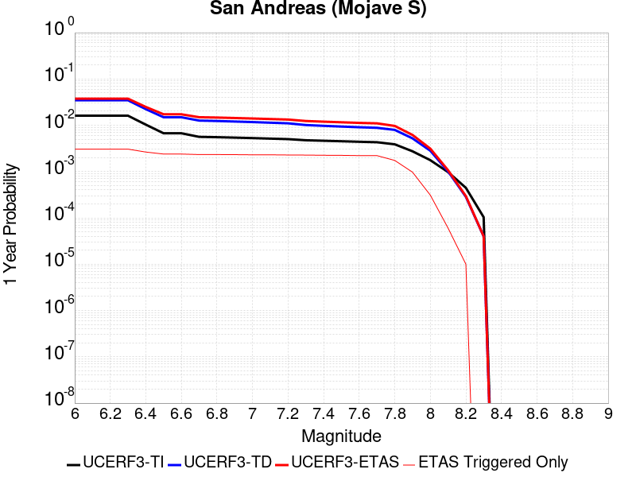 | 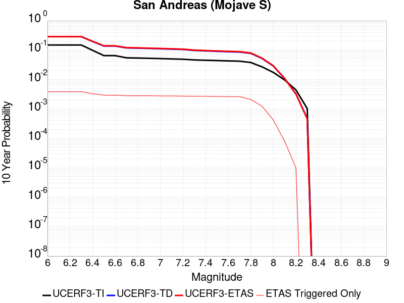 |

| Magnitude | 1 wk TI Prob | 1 wk TD Prob | 1 wk ETAS Prob | 1 wk ETAS/TD Gain | 1 wk ETAS Triggered Only | 1 mo TI Prob | 1 mo TD Prob | 1 mo ETAS Prob | 1 mo ETAS/TD Gain | 1 mo ETAS Triggered Only | 1 yr TI Prob | 1 yr TD Prob | 1 yr ETAS Prob | 1 yr ETAS/TD Gain | 1 yr ETAS Triggered Only | 10 yr TI Prob | 10 yr TD Prob | 10 yr ETAS Prob | 10 yr ETAS/TD Gain | 10 yr ETAS Triggered Only |
|-----|-----|-----|-----|-----|-----|-----|-----|-----|-----|-----|-----|-----|-----|-----|-----|-----|-----|-----|-----|-----|
| 6.0 | 3.1064058E-4 | 6.7462435E-4 | 0.002922404 | 4.331898 | 0.002249297 | 0.0013306376 | 0.002888172 | 0.005504773 | 1.9059713 | 0.00262418 | 0.016080605 | 0.034565594 | 0.037641957 | 1.0890007 | 0.0031865041 | 0.1496549 | 0.28654557 | 0.28908646 | 1.0088673 | 0.003561387 |
| 6.1 | 3.1064058E-4 | 6.7462435E-4 | 0.002922404 | 4.331898 | 0.002249297 | 0.0013306376 | 0.002888172 | 0.005504773 | 1.9059713 | 0.00262418 | 0.016080605 | 0.034565594 | 0.037641957 | 1.0890007 | 0.0031865041 | 0.1496549 | 0.28654557 | 0.28908646 | 1.0088673 | 0.003561387 |
| 6.2 | 3.1064058E-4 | 6.7462435E-4 | 0.002922404 | 4.331898 | 0.002249297 | 0.0013306376 | 0.002888172 | 0.005504773 | 1.9059713 | 0.00262418 | 0.016080605 | 0.034565594 | 0.037641957 | 1.0890007 | 0.0031865041 | 0.1496549 | 0.28654557 | 0.28908646 | 1.0088673 | 0.003561387 |
| 6.3 | 3.1064058E-4 | 6.7462435E-4 | 0.002922404 | 4.331898 | 0.002249297 | 0.0013306376 | 0.002888172 | 0.005504773 | 1.9059713 | 0.00262418 | 0.016080605 | 0.034565594 | 0.037641957 | 1.0890007 | 0.0031865041 | 0.1496549 | 0.28654557 | 0.28908646 | 1.0088673 | 0.003561387 |
| 6.4 | 1.9872203E-4 | 4.3181062E-4 | 0.002492776 | 5.7728453 | 0.0020618557 | 8.5138786E-4 | 0.0018493326 | 0.0042815646 | 2.3151946 | 0.0024367385 | 0.010316478 | 0.02228931 | 0.025038263 | 1.1233305 | 0.0028116214 | 0.098504856 | 0.19686839 | 0.19942757 | 1.0129994 | 0.0031865041 |
| 6.5 | 1.291105E-4 | 2.8754136E-4 | 0.0023488041 | 8.168578 | 0.0020618557 | 5.5321335E-4 | 0.0012317409 | 0.0034782675 | 2.8238628 | 0.002249297 | 0.006714592 | 0.014894155 | 0.01747925 | 1.1735644 | 0.00262418 | 0.065152965 | 0.13800792 | 0.1405931 | 1.0187321 | 0.0029990629 |
| 6.6 | 1.291105E-4 | 2.8754136E-4 | 0.0023488041 | 8.168578 | 0.0020618557 | 5.5321335E-4 | 0.0012317409 | 0.0034782675 | 2.8238628 | 0.002249297 | 0.006714592 | 0.014894155 | 0.01747925 | 1.1735644 | 0.00262418 | 0.065152965 | 0.13800792 | 0.1405931 | 1.0187321 | 0.0029990629 |
| 6.7 | 1.08001186E-4 | 2.4335351E-4 | 0.0021173116 | 8.700559 | 0.0018744143 | 4.6278012E-4 | 0.0010425274 | 0.0031022334 | 2.9756854 | 0.0020618557 | 0.0056198016 | 0.0126192 | 0.015025188 | 1.190661 | 0.0024367385 | 0.054797906 | 0.11918431 | 0.12166083 | 1.0207789 | 0.0028116214 |
| 6.8 | 1.0624356E-4 | 2.3853009E-4 | 0.0021124973 | 8.856314 | 0.0018744143 | 4.5525006E-4 | 0.0010218718 | 0.0030816204 | 3.0156624 | 0.0020618557 | 0.0055285925 | 0.012370593 | 0.014777187 | 1.1945416 | 0.0024367385 | 0.053930566 | 0.11713308 | 0.11961537 | 1.0211921 | 0.0028116214 |
| 6.9 | 1.0393785E-4 | 2.3223337E-4 | 0.0021062123 | 9.069378 | 0.0018744143 | 4.4537184E-4 | 9.949068E-4 | 0.003054711 | 3.0703492 | 0.0020618557 | 0.0054089287 | 0.012045963 | 0.014453349 | 1.19985 | 0.0024367385 | 0.05279156 | 0.114433445 | 0.116923325 | 1.0217583 | 0.0028116214 |
| 7.0 | 1.0155622E-4 | 2.2592908E-4 | 0.0020999198 | 9.294598 | 0.0018744143 | 4.3516833E-4 | 9.6790853E-4 | 0.0030277686 | 3.1281557 | 0.0020618557 | 0.005285311 | 0.011720838 | 0.014129016 | 1.2054613 | 0.0024367385 | 0.05161361 | 0.11169745 | 0.11419503 | 1.0223601 | 0.0028116214 |
| 7.1 | 9.885595E-5 | 2.188132E-4 | 0.0020928173 | 9.564402 | 0.0018744143 | 4.2359953E-4 | 9.374342E-4 | 0.002997357 | 3.1974053 | 0.0020618557 | 0.0051451353 | 0.011353733 | 0.013762806 | 1.2121832 | 0.0024367385 | 0.05027629 | 0.10857607 | 0.11108241 | 1.0230838 | 0.0028116214 |
| 7.2 | 9.6411415E-5 | 2.1244297E-4 | 0.002086459 | 9.821266 | 0.0018744143 | 4.1312634E-4 | 9.101525E-4 | 0.0029701316 | 3.263334 | 0.0020618557 | 0.005018219 | 0.011024987 | 0.013434861 | 1.2185829 | 0.0024367385 | 0.049064007 | 0.1057697 | 0.10828394 | 1.0237708 | 0.0028116214 |
| 7.3 | 9.1180635E-5 | 1.9472656E-4 | 0.0020687757 | 10.624004 | 0.0018744143 | 3.907156E-4 | 8.342756E-4 | 0.002894411 | 3.4693704 | 0.0020618557 | 0.004746591 | 0.010110112 | 0.012522215 | 1.2385832 | 0.0024367385 | 0.046464786 | 0.09796176 | 0.10032887 | 1.0241636 | 0.00262418 |
| 7.4 | 8.887388E-5 | 1.872126E-4 | 0.002061276 | 11.010348 | 0.0018744143 | 3.8083247E-4 | 8.020931E-4 | 0.002862295 | 3.568532 | 0.0020618557 | 0.0046267817 | 0.009721855 | 0.012134904 | 1.2482086 | 0.0024367385 | 0.045316286 | 0.094593845 | 0.09696979 | 1.0251174 | 0.00262418 |
| 7.5 | 8.6750515E-5 | 1.80528E-4 | 0.0020546038 | 11.381082 | 0.0018744143 | 3.7173493E-4 | 7.734621E-4 | 0.002833723 | 3.663687 | 0.0020618557 | 0.004516484 | 0.009376327 | 0.011790217 | 1.2574452 | 0.0024367385 | 0.04425787 | 0.09155606 | 0.093939975 | 1.0260378 | 0.00262418 |
| 7.6 | 8.453092E-5 | 1.7440386E-4 | 0.0020484913 | 11.745676 | 0.0018744143 | 3.6222505E-4 | 7.4723107E-4 | 0.0028075462 | 3.7572663 | 0.0020618557 | 0.0044011753 | 0.009059664 | 0.011474326 | 1.266529 | 0.0024367385 | 0.04315024 | 0.08871447 | 0.091105856 | 1.0269558 | 0.00262418 |
| 7.7 | 8.259102E-5 | 1.6962511E-4 | 0.0020437215 | 12.048461 | 0.0018744143 | 3.539135E-4 | 7.267622E-4 | 0.0027871195 | 3.834981 | 0.0020618557 | 0.004300386 | 0.0088125 | 0.011227765 | 1.2740725 | 0.0024367385 | 0.042181134 | 0.086465426 | 0.08886271 | 1.0277253 | 0.00262418 |
| 7.8 | 7.444844E-5 | 1.528469E-4 | 0.0016521491 | 10.809176 | 0.0014995314 | 3.1902574E-4 | 6.5489375E-4 | 0.0023407617 | 3.574262 | 0.0016869728 | 0.0038772223 | 0.007944231 | 0.009803754 | 1.2340722 | 0.0018744143 | 0.03810269 | 0.078293875 | 0.0801943 | 1.0242729 | 0.0020618557 |
| 7.9 | 5.2586525E-5 | 1.0007023E-4 | 4.7491558E-4 | 4.7458224 | 3.7488286E-4 | 2.2535135E-4 | 4.2880196E-4 | 9.908851E-4 | 2.3108222 | 5.6232425E-4 | 0.0027402006 | 0.005208178 | 0.0057675736 | 1.1074072 | 5.6232425E-4 | 0.027066574 | 0.052201588 | 0.052912217 | 1.0136131 | 7.497657E-4 |
| 8.0 | 3.379877E-5 | 5.4075565E-5 | 2.4150684E-4 | 4.4660997 | 1.8744143E-4 | 1.4484383E-4 | 2.3173184E-4 | 4.1912982E-4 | 1.8086847 | 1.8744143E-4 | 0.0017620471 | 0.0028176866 | 0.0030046 | 1.0663357 | 1.8744143E-4 | 0.017481409 | 0.028835917 | 0.02919999 | 1.0126257 | 3.7488286E-4 |
| 8.1 | 1.8668277E-5 | 1.9308145E-5 | 1.9308145E-5 | 1.0 | 0.0 | 8.000444E-5 | 8.274657E-5 | 8.274657E-5 | 1.0 | 0.0 | 9.736188E-4 | 0.0010069745 | 0.0010069745 | 1.0 | 0.0 | 0.009693642 | 0.010798624 | 0.010798624 | 1.0 | 0.0 |
| 8.2 | 8.541571E-6 | 5.4596358E-6 | 5.4596358E-6 | 1.0 | 0.0 | 3.660622E-5 | 2.339823E-5 | 2.339823E-5 | 1.0 | 0.0 | 4.455896E-4 | 2.848363E-4 | 2.848363E-4 | 1.0 | 0.0 | 0.0044469717 | 0.003240283 | 0.003240283 | 1.0 | 0.0 |
| 8.3 | 1.983087E-6 | 7.6564595E-7 | 7.6564595E-7 | 1.0 | 0.0 | 8.498917E-6 | 3.281336E-6 | 3.281336E-6 | 1.0 | 0.0 | 1.034694E-4 | 3.9949547E-5 | 3.9949547E-5 | 1.0 | 0.0 | 0.0010342124 | 4.717979E-4 | 4.717979E-4 | 1.0 | 0.0 |

## San Andreas (Mojave N)
*[(top)](#table-of-contents)*

| 1 Week | 1 Month | 1 Year | 10 Year |
|-----|-----|-----|-----|
|  |  |  |  |

| Magnitude | 1 wk TI Prob | 1 wk TD Prob | 1 wk ETAS Prob | 1 wk ETAS/TD Gain | 1 wk ETAS Triggered Only | 1 mo TI Prob | 1 mo TD Prob | 1 mo ETAS Prob | 1 mo ETAS/TD Gain | 1 mo ETAS Triggered Only | 1 yr TI Prob | 1 yr TD Prob | 1 yr ETAS Prob | 1 yr ETAS/TD Gain | 1 yr ETAS Triggered Only | 10 yr TI Prob | 10 yr TD Prob | 10 yr ETAS Prob | 10 yr ETAS/TD Gain | 10 yr ETAS Triggered Only |
|-----|-----|-----|-----|-----|-----|-----|-----|-----|-----|-----|-----|-----|-----|-----|-----|-----|-----|-----|-----|-----|
| 6.0 | 9.877682E-5 | 1.9402112E-4 | 0.0020680716 | 10.659003 | 0.0018744143 | 4.2326056E-4 | 8.312543E-4 | 0.002891396 | 3.4783533 | 0.0020618557 | 0.0051410277 | 0.010073684 | 0.012485876 | 1.2394547 | 0.0024367385 | 0.05023708 | 0.09832245 | 0.101195656 | 1.0292222 | 0.0031865041 |
| 6.1 | 9.877682E-5 | 1.9402112E-4 | 0.0020680716 | 10.659003 | 0.0018744143 | 4.2326056E-4 | 8.312543E-4 | 0.002891396 | 3.4783533 | 0.0020618557 | 0.0051410277 | 0.010073684 | 0.012485876 | 1.2394547 | 0.0024367385 | 0.05023708 | 0.09832245 | 0.101195656 | 1.0292222 | 0.0031865041 |
| 6.2 | 9.877682E-5 | 1.9402112E-4 | 0.0020680716 | 10.659003 | 0.0018744143 | 4.2326056E-4 | 8.312543E-4 | 0.002891396 | 3.4783533 | 0.0020618557 | 0.0051410277 | 0.010073684 | 0.012485876 | 1.2394547 | 0.0024367385 | 0.05023708 | 0.09832245 | 0.101195656 | 1.0292222 | 0.0031865041 |
| 6.3 | 9.877682E-5 | 1.9402112E-4 | 0.0020680716 | 10.659003 | 0.0018744143 | 4.2326056E-4 | 8.312543E-4 | 0.002891396 | 3.4783533 | 0.0020618557 | 0.0051410277 | 0.010073684 | 0.012485876 | 1.2394547 | 0.0024367385 | 0.05023708 | 0.09832245 | 0.101195656 | 1.0292222 | 0.0031865041 |
| 6.4 | 9.877682E-5 | 1.9402112E-4 | 0.0020680716 | 10.659003 | 0.0018744143 | 4.2326056E-4 | 8.312543E-4 | 0.002891396 | 3.4783533 | 0.0020618557 | 0.0051410277 | 0.010073684 | 0.012485876 | 1.2394547 | 0.0024367385 | 0.05023708 | 0.09832245 | 0.101195656 | 1.0292222 | 0.0031865041 |
| 6.5 | 9.861474E-5 | 1.937588E-4 | 0.00206781 | 10.672082 | 0.0018744143 | 4.2256617E-4 | 8.3013077E-4 | 0.0028902749 | 3.4817102 | 0.0020618557 | 0.0051326132 | 0.0100601325 | 0.012472357 | 1.2397807 | 0.0024367385 | 0.050156746 | 0.09820035 | 0.101073936 | 1.0292625 | 0.0031865041 |
| 6.6 | 9.861474E-5 | 1.937588E-4 | 0.00206781 | 10.672082 | 0.0018744143 | 4.2256617E-4 | 8.3013077E-4 | 0.0028902749 | 3.4817102 | 0.0020618557 | 0.0051326132 | 0.0100601325 | 0.012472357 | 1.2397807 | 0.0024367385 | 0.050156746 | 0.09820035 | 0.101073936 | 1.0292625 | 0.0031865041 |
| 6.7 | 9.8552715E-5 | 1.9365833E-4 | 0.0020677096 | 10.677101 | 0.0018744143 | 4.223004E-4 | 8.2970044E-4 | 0.0028898453 | 3.4829984 | 0.0020618557 | 0.0051293927 | 0.010054941 | 0.0124671785 | 1.2399056 | 0.0024367385 | 0.050125998 | 0.09815356 | 0.101027295 | 1.0292779 | 0.0031865041 |
| 6.8 | 9.8464974E-5 | 1.9350994E-4 | 0.0020675615 | 10.684524 | 0.0018744143 | 4.219245E-4 | 8.290649E-4 | 0.0028892113 | 3.4849033 | 0.0020618557 | 0.0051248376 | 0.010047276 | 0.012459531 | 1.2400906 | 0.0024367385 | 0.05008251 | 0.09808378 | 0.10095774 | 1.029301 | 0.0031865041 |
| 6.9 | 9.825824E-5 | 1.9319002E-4 | 0.002067242 | 10.700563 | 0.0018744143 | 4.2103877E-4 | 8.276947E-4 | 0.0028878439 | 3.4890206 | 0.0020618557 | 0.0051141046 | 0.010030746 | 0.012443042 | 1.2404902 | 0.0024367385 | 0.049980022 | 0.097932965 | 0.100807406 | 1.0293511 | 0.0031865041 |
| 7.0 | 9.781462E-5 | 1.9250368E-4 | 0.002066557 | 10.735156 | 0.0018744143 | 4.1913814E-4 | 8.247551E-4 | 0.0028849102 | 3.4978993 | 0.0020618557 | 0.005091073 | 0.009995285 | 0.012407668 | 1.2413521 | 0.0024367385 | 0.04976007 | 0.09760912 | 0.100484595 | 1.029459 | 0.0031865041 |
| 7.1 | 9.7121134E-5 | 1.9152075E-4 | 0.002065576 | 10.785129 | 0.0018744143 | 4.1616702E-4 | 8.205452E-4 | 0.002880709 | 3.5107255 | 0.0020618557 | 0.005055068 | 0.0099444995 | 0.012357006 | 1.2425971 | 0.0024367385 | 0.04941613 | 0.09714571 | 0.10002266 | 1.0296148 | 0.0031865041 |
| 7.2 | 9.663819E-5 | 1.9082859E-4 | 0.002064885 | 10.820628 | 0.0018744143 | 4.1409794E-4 | 8.175807E-4 | 0.0028777507 | 3.519837 | 0.0020618557 | 0.0050299936 | 0.009908735 | 0.012321329 | 1.2434815 | 0.0024367385 | 0.049176537 | 0.09681883 | 0.099696815 | 1.0297256 | 0.0031865041 |
| 7.3 | 9.6277574E-5 | 1.9035369E-4 | 0.002064411 | 10.845134 | 0.0018744143 | 4.125529E-4 | 8.1554666E-4 | 0.0028757208 | 3.5261266 | 0.0020618557 | 0.0050112694 | 0.009884195 | 0.012296849 | 1.244092 | 0.0024367385 | 0.04899759 | 0.09659228 | 0.09930165 | 1.0280496 | 0.0029990629 |
| 7.4 | 9.593308E-5 | 1.8975153E-4 | 0.0020638101 | 10.876382 | 0.0018744143 | 4.1107697E-4 | 8.129676E-4 | 0.0028731471 | 3.534147 | 0.0020618557 | 0.0049933824 | 0.009853081 | 0.01226581 | 1.2448705 | 0.0024367385 | 0.04882661 | 0.09630986 | 0.099020086 | 1.0281407 | 0.0029990629 |
| 7.5 | 9.561707E-5 | 1.8921228E-4 | 0.0020632718 | 10.904534 | 0.0018744143 | 4.0972308E-4 | 8.106579E-4 | 0.002870842 | 3.541373 | 0.0020618557 | 0.0049769743 | 0.009825215 | 0.012238012 | 1.245572 | 0.0024367385 | 0.048669744 | 0.096056245 | 0.09876723 | 1.0282229 | 0.0029990629 |
| 7.6 | 9.418194E-5 | 1.8573487E-4 | 0.002059801 | 11.090007 | 0.0018744143 | 4.0357444E-4 | 7.95764E-4 | 0.002855979 | 3.5889773 | 0.0020618557 | 0.004902454 | 0.009645499 | 0.012058734 | 1.2501929 | 0.0024367385 | 0.047957025 | 0.094437465 | 0.097153306 | 1.028758 | 0.0029990629 |
| 7.7 | 8.202141E-5 | 1.6022482E-4 | 0.0020343387 | 12.696776 | 0.0018744143 | 3.51473E-4 | 6.8649714E-4 | 0.0027469373 | 4.001382 | 0.0020618557 | 0.00427079 | 0.008326128 | 0.010742579 | 1.2902249 | 0.0024367385 | 0.04189639 | 0.082237914 | 0.08481831 | 1.0313772 | 0.0028116214 |
| 7.8 | 7.2859846E-5 | 1.4517571E-4 | 0.0016444894 | 11.3275795 | 0.0014995314 | 3.1221908E-4 | 6.2203326E-4 | 0.0023079568 | 3.710343 | 0.0016869728 | 0.003794643 | 0.0075469986 | 0.009407267 | 1.2464911 | 0.0018744143 | 0.037304975 | 0.07472766 | 0.07663544 | 1.0255297 | 0.0020618557 |
| 7.9 | 5.3874453E-5 | 1.00462625E-4 | 4.753078E-4 | 4.73119 | 3.7488286E-4 | 2.3087008E-4 | 4.3048308E-4 | 9.925653E-4 | 2.305701 | 5.6232425E-4 | 0.0028072202 | 0.0052285474 | 0.005787932 | 1.1069865 | 5.6232425E-4 | 0.02772022 | 0.052425884 | 0.05313634 | 1.0135517 | 7.497657E-4 |
| 8.0 | 3.468538E-5 | 5.4261534E-5 | 2.4169279E-4 | 4.4542193 | 1.8744143E-4 | 1.4864317E-4 | 2.3252872E-4 | 4.1992657E-4 | 1.8059126 | 1.8744143E-4 | 0.0018082283 | 0.0028273636 | 0.003014275 | 1.066108 | 1.8744143E-4 | 0.017935853 | 0.028948462 | 0.029312491 | 1.0125751 | 3.7488286E-4 |
| 8.1 | 1.9152367E-5 | 1.9401303E-5 | 1.9401303E-5 | 1.0 | 0.0 | 8.207899E-5 | 8.3145795E-5 | 8.3145795E-5 | 1.0 | 0.0 | 9.988535E-4 | 0.0010118305 | 0.0010118305 | 1.0 | 0.0 | 0.009943757 | 0.01085595 | 0.01085595 | 1.0 | 0.0 |
| 8.2 | 8.643924E-6 | 5.473668E-6 | 5.473668E-6 | 1.0 | 0.0 | 3.704486E-5 | 2.3458366E-5 | 2.3458366E-5 | 1.0 | 0.0 | 4.5092785E-4 | 2.8556827E-4 | 2.8556827E-4 | 1.0 | 0.0 | 0.0045001395 | 0.0032481793 | 0.0032481793 | 1.0 | 0.0 |
| 8.3 | 1.983087E-6 | 7.6564595E-7 | 7.6564595E-7 | 1.0 | 0.0 | 8.498917E-6 | 3.281336E-6 | 3.281336E-6 | 1.0 | 0.0 | 1.034694E-4 | 3.9949547E-5 | 3.9949547E-5 | 1.0 | 0.0 | 0.0010342124 | 4.717979E-4 | 4.717979E-4 | 1.0 | 0.0 |

## Paradise
*[(top)](#table-of-contents)*

| 1 Week | 1 Month | 1 Year | 10 Year |
|-----|-----|-----|-----|
|  |  |  |  |

| Magnitude | 1 wk TI Prob | 1 wk TD Prob | 1 wk ETAS Prob | 1 wk ETAS/TD Gain | 1 wk ETAS Triggered Only | 1 mo TI Prob | 1 mo TD Prob | 1 mo ETAS Prob | 1 mo ETAS/TD Gain | 1 mo ETAS Triggered Only | 1 yr TI Prob | 1 yr TD Prob | 1 yr ETAS Prob | 1 yr ETAS/TD Gain | 1 yr ETAS Triggered Only | 10 yr TI Prob | 10 yr TD Prob | 10 yr ETAS Prob | 10 yr ETAS/TD Gain | 10 yr ETAS Triggered Only |
|-----|-----|-----|-----|-----|-----|-----|-----|-----|-----|-----|-----|-----|-----|-----|-----|-----|-----|-----|-----|-----|
| 6.0 | 1.4851273E-5 | 1.6694768E-5 | 7.66448E-4 | 45.909466 | 7.497657E-4 | 6.364676E-5 | 7.154718E-5 | 0.0011961153 | 16.717854 | 0.0011246485 | 7.7462377E-4 | 8.707624E-4 | 0.0029308228 | 3.365812 | 0.0020618557 | 0.0077192914 | 0.008675884 | 0.0112772975 | 1.2998441 | 0.00262418 |
| 6.1 | 1.4851273E-5 | 1.6694768E-5 | 7.66448E-4 | 45.909466 | 7.497657E-4 | 6.364676E-5 | 7.154718E-5 | 0.0011961153 | 16.717854 | 0.0011246485 | 7.7462377E-4 | 8.707624E-4 | 0.0029308228 | 3.365812 | 0.0020618557 | 0.0077192914 | 0.008675884 | 0.0112772975 | 1.2998441 | 0.00262418 |
| 6.2 | 1.4851273E-5 | 1.6694768E-5 | 7.66448E-4 | 45.909466 | 7.497657E-4 | 6.364676E-5 | 7.154718E-5 | 0.0011961153 | 16.717854 | 0.0011246485 | 7.7462377E-4 | 8.707624E-4 | 0.0029308228 | 3.365812 | 0.0020618557 | 0.0077192914 | 0.008675884 | 0.0112772975 | 1.2998441 | 0.00262418 |
| 6.3 | 1.0426831E-5 | 1.1888697E-5 | 5.742063E-4 | 48.2985 | 5.6232425E-4 | 4.4685654E-5 | 5.09506E-5 | 9.8811E-4 | 19.39349 | 9.3720714E-4 | 5.43912E-4 | 6.201529E-4 | 0.0023060795 | 3.718566 | 0.0016869728 | 0.0054258266 | 0.0061848317 | 0.008047653 | 1.3011919 | 0.0018744143 |
| 6.4 | 1.0426831E-5 | 1.1888697E-5 | 5.742063E-4 | 48.2985 | 5.6232425E-4 | 4.4685654E-5 | 5.09506E-5 | 9.8811E-4 | 19.39349 | 9.3720714E-4 | 5.43912E-4 | 6.201529E-4 | 0.0023060795 | 3.718566 | 0.0016869728 | 0.0054258266 | 0.0061848317 | 0.008047653 | 1.3011919 | 0.0018744143 |
| 6.5 | 9.25027E-6 | 1.0620037E-5 | 5.7293836E-4 | 53.948807 | 5.6232425E-4 | 3.964341E-5 | 4.551368E-5 | 9.826781E-4 | 21.590832 | 9.3720714E-4 | 4.8255164E-4 | 5.5399304E-4 | 0.0020526936 | 3.7052698 | 0.0014995314 | 0.0048150513 | 0.0055266195 | 0.007204269 | 1.303558 | 0.0016869728 |
| 6.6 | 7.904275E-6 | 9.159602E-6 | 9.159602E-6 | 1.0 | 0.0 | 3.3875025E-5 | 3.925487E-5 | 3.925487E-5 | 1.0 | 0.0 | 4.1235037E-4 | 4.7782718E-4 | 6.6517905E-4 | 1.3920913 | 1.8744143E-4 | 0.0041158604 | 0.004768395 | 0.0051414897 | 1.0782434 | 3.7488286E-4 |
| 6.7 | 7.2061953E-6 | 8.407326E-6 | 8.407326E-6 | 1.0 | 0.0 | 3.088333E-5 | 3.603092E-5 | 3.603092E-5 | 1.0 | 0.0 | 3.7593965E-4 | 4.3859181E-4 | 4.3859181E-4 | 1.0 | 0.0 | 0.003753043 | 0.004377631 | 0.004564252 | 1.0426306 | 1.8744143E-4 |
| 6.8 | 6.6948724E-6 | 7.842242E-6 | 7.842242E-6 | 1.0 | 0.0 | 2.8691995E-5 | 3.3609194E-5 | 3.3609194E-5 | 1.0 | 0.0 | 3.4926904E-4 | 4.091187E-4 | 4.091187E-4 | 1.0 | 0.0 | 0.003487206 | 0.0040840125 | 0.0042706886 | 1.0457089 | 1.8744143E-4 |
| 6.9 | 6.0421025E-6 | 7.1306963E-6 | 7.1306963E-6 | 1.0 | 0.0 | 2.5894467E-5 | 3.0559786E-5 | 3.0559786E-5 | 1.0 | 0.0 | 3.1521954E-4 | 3.7200528E-4 | 3.7200528E-4 | 1.0 | 0.0 | 0.0031477278 | 0.0037141638 | 0.0037141638 | 1.0 | 0.0 |
| 7.0 | 4.134091E-6 | 5.0803824E-6 | 5.0803824E-6 | 1.0 | 0.0 | 1.7717413E-5 | 2.1772896E-5 | 2.1772896E-5 | 1.0 | 0.0 | 2.1568815E-4 | 2.650543E-4 | 2.650543E-4 | 1.0 | 0.0 | 0.0021547892 | 0.0026475347 | 0.0026475347 | 1.0 | 0.0 |
| 7.1 | 3.7674888E-6 | 4.631936E-6 | 4.631936E-6 | 1.0 | 0.0 | 1.6146281E-5 | 1.9851012E-5 | 1.9851012E-5 | 1.0 | 0.0 | 1.9656324E-4 | 2.4166079E-4 | 2.4166079E-4 | 1.0 | 0.0 | 0.0019638946 | 0.0024141306 | 0.0024141306 | 1.0 | 0.0 |
| 7.2 | 3.4065345E-6 | 4.156782E-6 | 4.156782E-6 | 1.0 | 0.0 | 1.4599351E-5 | 1.7814667E-5 | 1.7814667E-5 | 1.0 | 0.0 | 1.777326E-4 | 2.168735E-4 | 2.168735E-4 | 1.0 | 0.0 | 0.0017759053 | 0.0021667667 | 0.0021667667 | 1.0 | 0.0 |
| 7.3 | 2.9934936E-6 | 3.6293673E-6 | 3.6293673E-6 | 1.0 | 0.0 | 1.2829195E-5 | 1.5554348E-5 | 1.5554348E-5 | 1.0 | 0.0 | 1.5618425E-4 | 1.8935918E-4 | 1.8935918E-4 | 1.0 | 0.0 | 0.0015607453 | 0.0018921237 | 0.0018921237 | 1.0 | 0.0 |
| 7.4 | 2.4049796E-6 | 2.8890186E-6 | 2.8890186E-6 | 1.0 | 0.0 | 1.0307015E-5 | 1.2381457E-5 | 1.2381457E-5 | 1.0 | 0.0 | 1.2548068E-4 | 1.5073526E-4 | 1.5073526E-4 | 1.0 | 0.0 | 0.0012540985 | 0.0015064715 | 0.0015064715 | 1.0 | 0.0 |
| 7.5 | 1.2710091E-6 | 1.5134859E-6 | 1.5134859E-6 | 1.0 | 0.0 | 5.44717E-6 | 6.4863593E-6 | 6.4863593E-6 | 1.0 | 0.0 | 6.631728E-5 | 7.896981E-5 | 7.896981E-5 | 1.0 | 0.0 | 6.6297496E-4 | 7.895401E-4 | 7.895401E-4 | 1.0 | 0.0 |
| 7.6 | 2.21172E-7 | 2.6040198E-7 | 2.6040198E-7 | 1.0 | 0.0 | 9.478797E-7 | 1.1160082E-6 | 1.1160082E-6 | 1.0 | 0.0 | 1.1540374E-5 | 1.3587343E-5 | 1.3587343E-5 | 1.0 | 0.0 | 1.1539775E-4 | 1.3586794E-4 | 1.3586794E-4 | 1.0 | 0.0 |

## Towne Pass
*[(top)](#table-of-contents)*

| 1 Week | 1 Month | 1 Year | 10 Year |
|-----|-----|-----|-----|
| 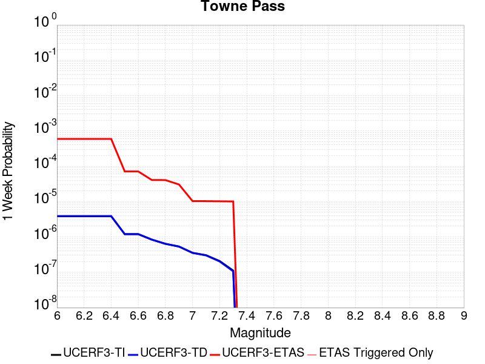 |  | 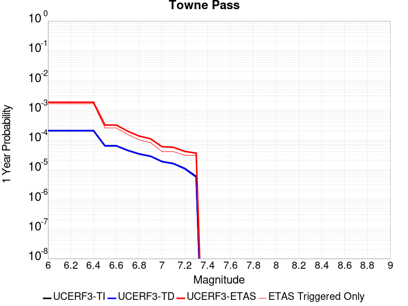 |  |

| Magnitude | 1 wk TI Prob | 1 wk TD Prob | 1 wk ETAS Prob | 1 wk ETAS/TD Gain | 1 wk ETAS Triggered Only | 1 mo TI Prob | 1 mo TD Prob | 1 mo ETAS Prob | 1 mo ETAS/TD Gain | 1 mo ETAS Triggered Only | 1 yr TI Prob | 1 yr TD Prob | 1 yr ETAS Prob | 1 yr ETAS/TD Gain | 1 yr ETAS Triggered Only | 10 yr TI Prob | 10 yr TD Prob | 10 yr ETAS Prob | 10 yr ETAS/TD Gain | 10 yr ETAS Triggered Only |
|-----|-----|-----|-----|-----|-----|-----|-----|-----|-----|-----|-----|-----|-----|-----|-----|-----|-----|-----|-----|-----|
| 6.0 | 3.849728E-6 | 3.894542E-6 | 9.41098E-4 | 241.64537 | 9.3720714E-4 | 1.649873E-5 | 1.6690812E-5 | 9.538823E-4 | 57.150143 | 9.3720714E-4 | 2.0085352E-4 | 2.0319606E-4 | 0.0018898261 | 9.300506 | 0.0016869728 | 0.0020067208 | 0.0020305319 | 0.004462322 | 2.1976128 | 0.0024367385 |
| 6.1 | 3.849728E-6 | 3.894542E-6 | 9.41098E-4 | 241.64537 | 9.3720714E-4 | 1.649873E-5 | 1.6690812E-5 | 9.538823E-4 | 57.150143 | 9.3720714E-4 | 2.0085352E-4 | 2.0319606E-4 | 0.0018898261 | 9.300506 | 0.0016869728 | 0.0020067208 | 0.0020305319 | 0.004462322 | 2.1976128 | 0.0024367385 |
| 6.2 | 3.849728E-6 | 3.894542E-6 | 9.41098E-4 | 241.64537 | 9.3720714E-4 | 1.649873E-5 | 1.6690812E-5 | 9.538823E-4 | 57.150143 | 9.3720714E-4 | 2.0085352E-4 | 2.0319606E-4 | 0.0018898261 | 9.300506 | 0.0016869728 | 0.0020067208 | 0.0020305319 | 0.004462322 | 2.1976128 | 0.0024367385 |
| 6.3 | 3.849728E-6 | 3.894542E-6 | 9.41098E-4 | 241.64537 | 9.3720714E-4 | 1.649873E-5 | 1.6690812E-5 | 9.538823E-4 | 57.150143 | 9.3720714E-4 | 2.0085352E-4 | 2.0319606E-4 | 0.0018898261 | 9.300506 | 0.0016869728 | 0.0020067208 | 0.0020305319 | 0.004462322 | 2.1976128 | 0.0024367385 |
| 6.4 | 3.849728E-6 | 3.894542E-6 | 9.41098E-4 | 241.64537 | 9.3720714E-4 | 1.649873E-5 | 1.6690812E-5 | 9.538823E-4 | 57.150143 | 9.3720714E-4 | 2.0085352E-4 | 2.0319606E-4 | 0.0018898261 | 9.300506 | 0.0016869728 | 0.0020067208 | 0.0020305319 | 0.004462322 | 2.1976128 | 0.0024367385 |
| 6.5 | 1.1953545E-6 | 1.2030526E-6 | 1.2030526E-6 | 1.0 | 0.0 | 5.1229376E-6 | 5.15593E-6 | 5.15593E-6 | 1.0 | 0.0 | 6.236998E-5 | 6.277176E-5 | 2.502014E-4 | 3.9858913 | 1.8744143E-4 | 6.235248E-4 | 6.2755204E-4 | 0.0010021996 | 1.5969985 | 3.7488286E-4 |
| 6.6 | 1.1953545E-6 | 1.2030526E-6 | 1.2030526E-6 | 1.0 | 0.0 | 5.1229376E-6 | 5.15593E-6 | 5.15593E-6 | 1.0 | 0.0 | 6.236998E-5 | 6.277176E-5 | 2.502014E-4 | 3.9858913 | 1.8744143E-4 | 6.235248E-4 | 6.2755204E-4 | 0.0010021996 | 1.5969985 | 3.7488286E-4 |
| 6.7 | 8.375951E-7 | 8.410676E-7 | 8.410676E-7 | 1.0 | 0.0 | 3.5896885E-6 | 3.6045708E-6 | 3.6045708E-6 | 1.0 | 0.0 | 4.370358E-5 | 4.3884826E-5 | 4.3884826E-5 | 1.0 | 0.0 | 4.3694986E-4 | 4.3876728E-4 | 4.3876728E-4 | 1.0 | 0.0 |
| 6.8 | 6.38041E-7 | 6.3921624E-7 | 6.3921624E-7 | 1.0 | 0.0 | 2.7344586E-6 | 2.7394954E-6 | 2.7394954E-6 | 1.0 | 0.0 | 3.3291526E-5 | 3.3352884E-5 | 3.3352884E-5 | 1.0 | 0.0 | 3.3286537E-4 | 3.334826E-4 | 3.334826E-4 | 1.0 | 0.0 |
| 6.9 | 5.3460053E-7 | 5.345339E-7 | 5.345339E-7 | 1.0 | 0.0 | 2.2911431E-6 | 2.2908578E-6 | 2.2908578E-6 | 1.0 | 0.0 | 2.789431E-5 | 2.7890868E-5 | 2.7890868E-5 | 1.0 | 0.0 | 2.789081E-4 | 2.78877E-4 | 2.78877E-4 | 1.0 | 0.0 |
| 7.0 | 3.557783E-7 | 3.5324283E-7 | 3.5324283E-7 | 1.0 | 0.0 | 1.5247632E-6 | 1.513897E-6 | 1.513897E-6 | 1.0 | 0.0 | 1.8563835E-5 | 1.8431549E-5 | 1.8431549E-5 | 1.0 | 0.0 | 1.8562283E-4 | 1.8430105E-4 | 1.8430105E-4 | 1.0 | 0.0 |
| 7.1 | 3.037942E-7 | 3.0002275E-7 | 3.0002275E-7 | 1.0 | 0.0 | 1.3019744E-6 | 1.2858112E-6 | 1.2858112E-6 | 1.0 | 0.0 | 1.5851423E-5 | 1.5654647E-5 | 1.5654647E-5 | 1.0 | 0.0 | 1.5850292E-4 | 1.5653619E-4 | 1.5653619E-4 | 1.0 | 0.0 |
| 7.2 | 2.0808248E-7 | 2.0217735E-7 | 2.0217735E-7 | 1.0 | 0.0 | 8.917818E-7 | 8.6647407E-7 | 8.6647407E-7 | 1.0 | 0.0 | 1.0857389E-5 | 1.0549275E-5 | 1.0549275E-5 | 1.0 | 0.0 | 1.0856859E-4 | 1.0548821E-4 | 1.0548821E-4 | 1.0 | 0.0 |
| 7.3 | 1.1162073E-7 | 1.0636902E-7 | 1.0636902E-7 | 1.0 | 0.0 | 4.7837443E-7 | 4.5586717E-7 | 4.5586717E-7 | 1.0 | 0.0 | 5.8241935E-6 | 5.5501705E-6 | 5.5501705E-6 | 1.0 | 0.0 | 5.8240406E-5 | 5.550052E-5 | 5.550052E-5 | 1.0 | 0.0 |

## Nelson Lake
*[(top)](#table-of-contents)*

| 1 Week | 1 Month | 1 Year | 10 Year |
|-----|-----|-----|-----|
|  |  |  |  |

| Magnitude | 1 wk TI Prob | 1 wk TD Prob | 1 wk ETAS Prob | 1 wk ETAS/TD Gain | 1 wk ETAS Triggered Only | 1 mo TI Prob | 1 mo TD Prob | 1 mo ETAS Prob | 1 mo ETAS/TD Gain | 1 mo ETAS Triggered Only | 1 yr TI Prob | 1 yr TD Prob | 1 yr ETAS Prob | 1 yr ETAS/TD Gain | 1 yr ETAS Triggered Only | 10 yr TI Prob | 10 yr TD Prob | 10 yr ETAS Prob | 10 yr ETAS/TD Gain | 10 yr ETAS Triggered Only |
|-----|-----|-----|-----|-----|-----|-----|-----|-----|-----|-----|-----|-----|-----|-----|-----|-----|-----|-----|-----|-----|
| 6.0 | 9.913453E-6 | 1.0192255E-5 | 1.9763177E-4 | 19.390387 | 1.8744143E-4 | 4.2485535E-5 | 4.3680422E-5 | 6.059801E-4 | 13.873037 | 5.6232425E-4 | 5.1713863E-4 | 5.316897E-4 | 0.001843082 | 3.466462 | 0.00131209 | 0.0051593683 | 0.005305204 | 0.007356121 | 1.386586 | 0.0020618557 |
| 6.1 | 9.913453E-6 | 1.0192255E-5 | 1.9763177E-4 | 19.390387 | 1.8744143E-4 | 4.2485535E-5 | 4.3680422E-5 | 6.059801E-4 | 13.873037 | 5.6232425E-4 | 5.1713863E-4 | 5.316897E-4 | 0.001843082 | 3.466462 | 0.00131209 | 0.0051593683 | 0.005305204 | 0.007356121 | 1.386586 | 0.0020618557 |
| 6.2 | 4.5596407E-6 | 4.696313E-6 | 4.696313E-6 | 1.0 | 0.0 | 1.954117E-5 | 2.0126909E-5 | 3.9500222E-4 | 19.625578 | 3.7488286E-4 | 2.3788778E-4 | 2.4501883E-4 | 9.946008E-4 | 4.0592833 | 7.497657E-4 | 0.0023763329 | 0.0024476128 | 0.0035695087 | 1.4583633 | 0.0011246485 |
| 6.3 | 4.5596407E-6 | 4.696313E-6 | 4.696313E-6 | 1.0 | 0.0 | 1.954117E-5 | 2.0126909E-5 | 3.9500222E-4 | 19.625578 | 3.7488286E-4 | 2.3788778E-4 | 2.4501883E-4 | 9.946008E-4 | 4.0592833 | 7.497657E-4 | 0.0023763329 | 0.0024476128 | 0.0035695087 | 1.4583633 | 0.0011246485 |
| 6.4 | 3.4025713E-6 | 3.5098972E-6 | 3.5098972E-6 | 1.0 | 0.0 | 1.4582367E-5 | 1.5042335E-5 | 2.0248094E-4 | 13.460739 | 1.8744143E-4 | 1.7752586E-4 | 1.8312587E-4 | 7.453472E-4 | 4.0701356 | 5.6232425E-4 | 0.001773841 | 0.0018298327 | 0.0025782264 | 1.4089957 | 7.497657E-4 |
| 6.5 | 2.8352947E-6 | 2.927856E-6 | 2.927856E-6 | 1.0 | 0.0 | 1.2151207E-5 | 1.2547898E-5 | 1.9998697E-4 | 15.937885 | 1.8744143E-4 | 1.479309E-4 | 1.5276071E-4 | 5.2758626E-4 | 3.453678 | 3.7488286E-4 | 0.0014783246 | 0.0015266308 | 0.0020880967 | 1.367781 | 5.6232425E-4 |
| 6.6 | 2.251518E-6 | 2.3290677E-6 | 2.3290677E-6 | 1.0 | 0.0 | 9.649328E-6 | 9.981683E-6 | 1.9742124E-4 | 19.77835 | 1.8744143E-4 | 1.1747423E-4 | 1.2152085E-4 | 4.9635815E-4 | 4.0845513 | 3.7488286E-4 | 0.0011741214 | 0.0012146058 | 0.0017762469 | 1.4624063 | 5.6232425E-4 |
| 6.7 | 1.8911853E-6 | 1.9591396E-6 | 1.9591396E-6 | 1.0 | 0.0 | 8.105055E-6 | 8.39629E-6 | 8.39629E-6 | 1.0 | 0.0 | 9.867457E-5 | 1.0222061E-4 | 2.8964286E-4 | 2.8335075 | 1.8744143E-4 | 9.863076E-4 | 0.0010217935 | 0.0013962932 | 1.3665123 | 3.7488286E-4 |
| 6.8 | 1.4874814E-6 | 1.5438305E-6 | 1.5438305E-6 | 1.0 | 0.0 | 6.374905E-6 | 6.6164025E-6 | 6.6164025E-6 | 1.0 | 0.0 | 7.76117E-5 | 8.055224E-5 | 2.6797858E-4 | 3.3267672 | 1.8744143E-4 | 7.75846E-4 | 8.0528157E-4 | 9.92572E-4 | 1.2325777 | 1.8744143E-4 |
| 6.9 | 6.835972E-7 | 7.1399285E-7 | 7.1399285E-7 | 1.0 | 0.0 | 2.9296991E-6 | 3.0599674E-6 | 3.0599674E-6 | 1.0 | 0.0 | 3.56685E-5 | 3.7254784E-5 | 3.7254784E-5 | 1.0 | 0.0 | 3.5662777E-4 | 3.7251666E-4 | 3.7251666E-4 | 1.0 | 0.0 |

## San Andreas (San Bernardino N)
*[(top)](#table-of-contents)*

| 1 Week | 1 Month | 1 Year | 10 Year |
|-----|-----|-----|-----|
|  |  |  |  |

| Magnitude | 1 wk TI Prob | 1 wk TD Prob | 1 wk ETAS Prob | 1 wk ETAS/TD Gain | 1 wk ETAS Triggered Only | 1 mo TI Prob | 1 mo TD Prob | 1 mo ETAS Prob | 1 mo ETAS/TD Gain | 1 mo ETAS Triggered Only | 1 yr TI Prob | 1 yr TD Prob | 1 yr ETAS Prob | 1 yr ETAS/TD Gain | 1 yr ETAS Triggered Only | 10 yr TI Prob | 10 yr TD Prob | 10 yr ETAS Prob | 10 yr ETAS/TD Gain | 10 yr ETAS Triggered Only |
|-----|-----|-----|-----|-----|-----|-----|-----|-----|-----|-----|-----|-----|-----|-----|-----|-----|-----|-----|-----|-----|
| 6.0 | 1.4273766E-4 | 3.160784E-4 | 0.0012529893 | 3.9641724 | 9.3720714E-4 | 6.115894E-4 | 0.0013539245 | 0.0024770503 | 1.8295336 | 0.0011246485 | 0.0074207084 | 0.016360939 | 0.017651562 | 1.0788844 | 0.00131209 | 0.07177748 | 0.15021163 | 0.1514859 | 1.0084833 | 0.0014995314 |
| 6.1 | 1.4273766E-4 | 3.160784E-4 | 0.0012529893 | 3.9641724 | 9.3720714E-4 | 6.115894E-4 | 0.0013539245 | 0.0024770503 | 1.8295336 | 0.0011246485 | 0.0074207084 | 0.016360939 | 0.017651562 | 1.0788844 | 0.00131209 | 0.07177748 | 0.15021163 | 0.1514859 | 1.0084833 | 0.0014995314 |
| 6.2 | 1.4273766E-4 | 3.160784E-4 | 0.0012529893 | 3.9641724 | 9.3720714E-4 | 6.115894E-4 | 0.0013539245 | 0.0024770503 | 1.8295336 | 0.0011246485 | 0.0074207084 | 0.016360939 | 0.017651562 | 1.0788844 | 0.00131209 | 0.07177748 | 0.15021163 | 0.1514859 | 1.0084833 | 0.0014995314 |
| 6.3 | 1.3730655E-4 | 3.0512668E-4 | 0.0012420479 | 4.070597 | 9.3720714E-4 | 5.883239E-4 | 0.001307036 | 0.0024302148 | 1.8593326 | 0.0011246485 | 0.0071393442 | 0.015798455 | 0.017089816 | 1.0817397 | 0.00131209 | 0.06914291 | 0.1455135 | 0.14679484 | 1.0088055 | 0.0014995314 |
| 6.4 | 1.3730655E-4 | 3.0512668E-4 | 0.0012420479 | 4.070597 | 9.3720714E-4 | 5.883239E-4 | 0.001307036 | 0.0024302148 | 1.8593326 | 0.0011246485 | 0.0071393442 | 0.015798455 | 0.017089816 | 1.0817397 | 0.00131209 | 0.06914291 | 0.1455135 | 0.14679484 | 1.0088055 | 0.0014995314 |
| 6.5 | 1.2942807E-4 | 2.8927144E-4 | 0.0012262075 | 4.2389507 | 9.3720714E-4 | 5.545738E-4 | 0.0012391509 | 0.0023624059 | 1.9064715 | 0.0011246485 | 0.0067310524 | 0.014983548 | 0.016275978 | 1.0862566 | 0.00131209 | 0.06530788 | 0.13865088 | 0.1399425 | 1.0093156 | 0.0014995314 |
| 6.6 | 1.1125901E-4 | 2.5365927E-4 | 0.0011906286 | 4.693811 | 9.3720714E-4 | 4.767372E-4 | 0.0010866605 | 0.002210087 | 2.033834 | 0.0011246485 | 0.005788839 | 0.0131504685 | 0.014445304 | 1.098463 | 0.00131209 | 0.056403454 | 0.12300496 | 0.12432004 | 1.0106913 | 0.0014995314 |
| 6.7 | 1.02209575E-4 | 2.3500937E-4 | 0.0011719962 | 4.987019 | 9.3720714E-4 | 4.3796748E-4 | 0.0010067957 | 0.002130312 | 2.1159327 | 0.0011246485 | 0.0053192247 | 0.012189267 | 0.013485364 | 1.106331 | 0.00131209 | 0.051936906 | 0.114792764 | 0.11612016 | 1.0115634 | 0.0014995314 |
| 6.8 | 9.610582E-5 | 2.2026796E-4 | 0.0011572686 | 5.253913 | 9.3720714E-4 | 4.1181705E-4 | 9.436647E-4 | 0.002067252 | 2.1906636 | 0.0011246485 | 0.0050023515 | 0.011428859 | 0.012725954 | 1.1134928 | 0.00131209 | 0.048912346 | 0.10820469 | 0.10954197 | 1.0123588 | 0.0014995314 |
| 6.9 | 9.3877505E-5 | 2.1482339E-4 | 0.0011518291 | 5.361749 | 9.3720714E-4 | 4.0227012E-4 | 9.203475E-4 | 0.002043961 | 2.2208579 | 0.0011246485 | 0.0048866454 | 0.011147907 | 0.01244537 | 1.1163863 | 0.00131209 | 0.04780577 | 0.105798274 | 0.107139155 | 1.012674 | 0.0014995314 |
| 7.0 | 9.1019785E-5 | 2.0809306E-4 | 0.0011451051 | 5.5028515 | 9.3720714E-4 | 3.900265E-4 | 8.915232E-4 | 0.002015169 | 2.2603664 | 0.0011246485 | 0.0047382377 | 0.0108004995 | 0.012098419 | 1.1201721 | 0.00131209 | 0.046384744 | 0.10276815 | 0.10411358 | 1.0130919 | 0.0014995314 |
| 7.1 | 8.771155E-5 | 1.9983841E-4 | 0.0011368582 | 5.6888876 | 9.3720714E-4 | 3.758525E-4 | 8.5616973E-4 | 0.0019798554 | 2.3124566 | 0.0011246485 | 0.0045664064 | 0.010374243 | 0.011672721 | 1.1251637 | 0.00131209 | 0.044737056 | 0.09907644 | 0.100427404 | 1.0136355 | 0.0014995314 |
| 7.2 | 8.0830236E-5 | 1.8389444E-4 | 0.0011209293 | 6.095504 | 9.3720714E-4 | 3.4636928E-4 | 7.8788114E-4 | 0.0019116435 | 2.4263096 | 0.0011246485 | 0.0042088944 | 0.009550368 | 0.010849928 | 1.1360742 | 0.00131209 | 0.041300658 | 0.09180518 | 0.09316705 | 1.0148343 | 0.0014995314 |
| 7.3 | 7.7668235E-5 | 1.7333007E-4 | 0.0011103748 | 6.4061284 | 9.3720714E-4 | 3.328214E-4 | 7.426318E-4 | 0.0018664452 | 2.5132847 | 0.0011246485 | 0.0040445733 | 0.009004138 | 0.010304414 | 1.1444087 | 0.00131209 | 0.03971748 | 0.08706761 | 0.08843659 | 1.0157231 | 0.0014995314 |
| 7.4 | 7.520177E-5 | 1.655312E-4 | 0.0011025831 | 6.6608787 | 9.3720714E-4 | 3.2225347E-4 | 7.092266E-4 | 0.0018330775 | 2.5846148 | 0.0011246485 | 0.0039163795 | 0.008600714 | 0.009901518 | 1.1512438 | 0.00131209 | 0.038480744 | 0.08352157 | 0.08489585 | 1.0164543 | 0.0014995314 |
| 7.5 | 7.274697E-5 | 1.584075E-4 | 0.0010954662 | 6.915494 | 9.3720714E-4 | 3.1173544E-4 | 6.7871273E-4 | 0.001802598 | 2.6559072 | 0.0011246485 | 0.003788775 | 0.008232076 | 0.009533364 | 1.1580755 | 0.00131209 | 0.03724827 | 0.08023654 | 0.08161575 | 1.0171894 | 0.0014995314 |
| 7.6 | 7.1185845E-5 | 1.5410586E-4 | 0.0010911685 | 7.080643 | 9.3720714E-4 | 3.0504653E-4 | 6.602866E-4 | 0.0017841925 | 2.7021487 | 0.0011246485 | 0.0037076178 | 0.0080094095 | 0.009310991 | 1.1625065 | 0.00131209 | 0.036463667 | 0.07822661 | 0.07960884 | 1.0176696 | 0.0014995314 |
| 7.7 | 6.709961E-5 | 1.4319421E-4 | 0.0010802671 | 7.54407 | 9.3720714E-4 | 2.8753807E-4 | 6.135452E-4 | 0.0017375037 | 2.8319082 | 0.0011246485 | 0.003495157 | 0.0074443663 | 0.008746688 | 1.1749407 | 0.00131209 | 0.034406938 | 0.07305558 | 0.07444556 | 1.0190264 | 0.0014995314 |
| 7.8 | 6.300812E-5 | 1.320343E-4 | 0.0010691177 | 8.097272 | 9.3720714E-4 | 2.7000686E-4 | 5.657386E-4 | 0.0016897509 | 2.986805 | 0.0011246485 | 0.0032823787 | 0.006866143 | 0.0081692245 | 1.1897836 | 0.00131209 | 0.032343175 | 0.06771385 | 0.06911184 | 1.0206456 | 0.0014995314 |
| 7.9 | 4.983037E-5 | 9.7241085E-5 | 4.7208747E-4 | 4.854815 | 3.7488286E-4 | 2.1354125E-4 | 4.1668097E-4 | 9.787709E-4 | 2.3489697 | 5.6232425E-4 | 0.0025967648 | 0.0050613005 | 0.0056207785 | 1.1105404 | 5.6232425E-4 | 0.025666296 | 0.050650507 | 0.0513623 | 1.014053 | 7.497657E-4 |
| 8.0 | 3.2211527E-5 | 5.3306234E-5 | 2.4073766E-4 | 4.516126 | 1.8744143E-4 | 1.380421E-4 | 2.2843528E-4 | 4.158339E-4 | 1.8203576 | 1.8744143E-4 | 0.0016793669 | 0.0027776542 | 0.002964575 | 1.0672945 | 1.8744143E-4 | 0.016667323 | 0.028362568 | 0.028726818 | 1.0128427 | 3.7488286E-4 |
| 8.1 | 1.743376E-5 | 1.8823403E-5 | 1.8823403E-5 | 1.0 | 0.0 | 7.471398E-5 | 8.066923E-5 | 8.066923E-5 | 1.0 | 0.0 | 9.0926304E-4 | 9.81706E-4 | 9.81706E-4 | 1.0 | 0.0 | 0.009055517 | 0.010483979 | 0.010483979 | 1.0 | 0.0 |
| 8.2 | 7.831616E-6 | 5.1540533E-6 | 5.1540533E-6 | 1.0 | 0.0 | 3.3563636E-5 | 2.2088612E-5 | 2.2088612E-5 | 1.0 | 0.0 | 4.0856065E-4 | 2.6889573E-4 | 2.6889573E-4 | 1.0 | 0.0 | 0.004078103 | 0.0030413668 | 0.0030413668 | 1.0 | 0.0 |
| 8.3 | 1.983087E-6 | 7.6564595E-7 | 7.6564595E-7 | 1.0 | 0.0 | 8.498917E-6 | 3.281336E-6 | 3.281336E-6 | 1.0 | 0.0 | 1.034694E-4 | 3.9949547E-5 | 3.9949547E-5 | 1.0 | 0.0 | 0.0010342124 | 4.717979E-4 | 4.717979E-4 | 1.0 | 0.0 |

## Garlic Springs
*[(top)](#table-of-contents)*

| 1 Week | 1 Month | 1 Year | 10 Year |
|-----|-----|-----|-----|
|  |  |  |  |

| Magnitude | 1 wk TI Prob | 1 wk TD Prob | 1 wk ETAS Prob | 1 wk ETAS/TD Gain | 1 wk ETAS Triggered Only | 1 mo TI Prob | 1 mo TD Prob | 1 mo ETAS Prob | 1 mo ETAS/TD Gain | 1 mo ETAS Triggered Only | 1 yr TI Prob | 1 yr TD Prob | 1 yr ETAS Prob | 1 yr ETAS/TD Gain | 1 yr ETAS Triggered Only | 10 yr TI Prob | 10 yr TD Prob | 10 yr ETAS Prob | 10 yr ETAS/TD Gain | 10 yr ETAS Triggered Only |
|-----|-----|-----|-----|-----|-----|-----|-----|-----|-----|-----|-----|-----|-----|-----|-----|-----|-----|-----|-----|-----|
| 6.0 | 1.6760017E-5 | 1.8776833E-5 | 5.810906E-4 | 30.947208 | 5.6232425E-4 | 7.182667E-5 | 8.0470316E-5 | 8.301757E-4 | 10.3165455 | 7.497657E-4 | 8.7413884E-4 | 9.794032E-4 | 0.0021029501 | 2.1471753 | 0.0011246485 | 0.008707083 | 0.009762413 | 0.011247305 | 1.152103 | 0.0014995314 |
| 6.1 | 9.852767E-6 | 1.0973587E-5 | 3.8585233E-4 | 35.161915 | 3.7488286E-4 | 4.222546E-5 | 4.702921E-5 | 4.2189442E-4 | 8.9709015 | 3.7488286E-4 | 5.139737E-4 | 5.7250116E-4 | 0.0011345035 | 1.9816614 | 5.6232425E-4 | 0.005127866 | 0.005717221 | 0.0064627007 | 1.1303918 | 7.497657E-4 |
| 6.2 | 9.852767E-6 | 1.0973587E-5 | 3.8585233E-4 | 35.161915 | 3.7488286E-4 | 4.222546E-5 | 4.702921E-5 | 4.2189442E-4 | 8.9709015 | 3.7488286E-4 | 5.139737E-4 | 5.7250116E-4 | 0.0011345035 | 1.9816614 | 5.6232425E-4 | 0.005127866 | 0.005717221 | 0.0064627007 | 1.1303918 | 7.497657E-4 |
| 6.3 | 4.3167724E-6 | 4.7780286E-6 | 4.7780286E-6 | 1.0 | 0.0 | 1.8500323E-5 | 2.0477235E-5 | 2.0477235E-5 | 1.0 | 0.0 | 2.2521814E-4 | 2.4930484E-4 | 6.240942E-4 | 2.5033379 | 3.7488286E-4 | 0.0022499003 | 0.00249251 | 0.0030534326 | 1.2250433 | 5.6232425E-4 |
| 6.4 | 4.3167724E-6 | 4.7780286E-6 | 4.7780286E-6 | 1.0 | 0.0 | 1.8500323E-5 | 2.0477235E-5 | 2.0477235E-5 | 1.0 | 0.0 | 2.2521814E-4 | 2.4930484E-4 | 6.240942E-4 | 2.5033379 | 3.7488286E-4 | 0.0022499003 | 0.00249251 | 0.0030534326 | 1.2250433 | 5.6232425E-4 |
| 6.5 | 4.3167724E-6 | 4.7780286E-6 | 4.7780286E-6 | 1.0 | 0.0 | 1.8500323E-5 | 2.0477235E-5 | 2.0477235E-5 | 1.0 | 0.0 | 2.2521814E-4 | 2.4930484E-4 | 6.240942E-4 | 2.5033379 | 3.7488286E-4 | 0.0022499003 | 0.00249251 | 0.0030534326 | 1.2250433 | 5.6232425E-4 |
| 6.6 | 4.301311E-6 | 4.760897E-6 | 4.760897E-6 | 1.0 | 0.0 | 1.8434059E-5 | 2.0403815E-5 | 2.0403815E-5 | 1.0 | 0.0 | 2.2441156E-4 | 2.4841115E-4 | 6.232009E-4 | 2.5087476 | 3.7488286E-4 | 0.0022418506 | 0.002483593 | 0.0030445207 | 1.2258533 | 5.6232425E-4 |
| 6.7 | 3.8599724E-6 | 4.27106E-6 | 4.27106E-6 | 1.0 | 0.0 | 1.6542634E-5 | 1.8304541E-5 | 1.8304541E-5 | 1.0 | 0.0 | 2.0138794E-4 | 2.228578E-4 | 5.976571E-4 | 2.6817868 | 3.7488286E-4 | 0.0020120554 | 0.002228578 | 0.0027896492 | 1.2517619 | 5.6232425E-4 |

## Bicycle Lake
*[(top)](#table-of-contents)*

| 1 Week | 1 Month | 1 Year | 10 Year |
|-----|-----|-----|-----|
|  |  |  |  |

| Magnitude | 1 wk TI Prob | 1 wk TD Prob | 1 wk ETAS Prob | 1 wk ETAS/TD Gain | 1 wk ETAS Triggered Only | 1 mo TI Prob | 1 mo TD Prob | 1 mo ETAS Prob | 1 mo ETAS/TD Gain | 1 mo ETAS Triggered Only | 1 yr TI Prob | 1 yr TD Prob | 1 yr ETAS Prob | 1 yr ETAS/TD Gain | 1 yr ETAS Triggered Only | 10 yr TI Prob | 10 yr TD Prob | 10 yr ETAS Prob | 10 yr ETAS/TD Gain | 10 yr ETAS Triggered Only |
|-----|-----|-----|-----|-----|-----|-----|-----|-----|-----|-----|-----|-----|-----|-----|-----|-----|-----|-----|-----|-----|
| 6.0 | 1.9621975E-5 | 2.2097078E-5 | 2.0953437E-4 | 9.482447 | 1.8744143E-4 | 8.4091465E-5 | 9.4699084E-5 | 6.5697014E-4 | 6.9374495 | 5.6232425E-4 | 0.0010233327 | 0.0011524865 | 0.0020886136 | 1.8122672 | 9.3720714E-4 | 0.01018633 | 0.011478408 | 0.012590148 | 1.0968548 | 0.0011246485 |
| 6.1 | 1.9621975E-5 | 2.2097078E-5 | 2.0953437E-4 | 9.482447 | 1.8744143E-4 | 8.4091465E-5 | 9.4699084E-5 | 6.5697014E-4 | 6.9374495 | 5.6232425E-4 | 0.0010233327 | 0.0011524865 | 0.0020886136 | 1.8122672 | 9.3720714E-4 | 0.01018633 | 0.011478408 | 0.012590148 | 1.0968548 | 0.0011246485 |
| 6.2 | 9.9971285E-6 | 1.125564E-5 | 1.9869495E-4 | 17.652924 | 1.8744143E-4 | 4.2844134E-5 | 4.8237856E-5 | 4.231026E-4 | 8.7711735 | 3.7488286E-4 | 5.2150246E-4 | 5.871897E-4 | 0.0011491837 | 1.9570912 | 5.6232425E-4 | 0.0052028033 | 0.005861487 | 0.0066068578 | 1.1271641 | 7.497657E-4 |
| 6.3 | 9.589428E-6 | 1.0798346E-5 | 1.9823774E-4 | 18.358158 | 1.8744143E-4 | 4.10969E-5 | 4.62781E-5 | 4.211436E-4 | 9.100279 | 3.7488286E-4 | 5.002399E-4 | 5.6334207E-4 | 0.0011253495 | 1.997631 | 5.6232425E-4 | 0.0049911533 | 0.0056242296 | 0.0063697784 | 1.1325601 | 7.497657E-4 |
| 6.4 | 9.589428E-6 | 1.0798346E-5 | 1.9823774E-4 | 18.358158 | 1.8744143E-4 | 4.10969E-5 | 4.62781E-5 | 4.211436E-4 | 9.100279 | 3.7488286E-4 | 5.002399E-4 | 5.6334207E-4 | 0.0011253495 | 1.997631 | 5.6232425E-4 | 0.0049911533 | 0.0056242296 | 0.0063697784 | 1.1325601 | 7.497657E-4 |
| 6.5 | 5.557707E-6 | 6.2856016E-6 | 1.9372585E-4 | 30.820574 | 1.8744143E-4 | 2.3818526E-5 | 2.6938165E-5 | 2.1437454E-4 | 7.958023 | 1.8744143E-4 | 2.8995197E-4 | 3.279497E-4 | 7.027096E-4 | 2.142736 | 3.7488286E-4 | 0.0028957394 | 0.0032772934 | 0.0038377747 | 1.1710196 | 5.6232425E-4 |
| 6.6 | 4.8742945E-6 | 5.5132896E-6 | 1.9295368E-4 | 34.99792 | 1.8744143E-4 | 2.0889667E-5 | 2.3628318E-5 | 2.1106531E-4 | 8.932727 | 1.8744143E-4 | 2.54302E-4 | 2.87663E-4 | 6.62438E-4 | 2.3028266 | 3.7488286E-4 | 0.002540112 | 0.0028754752 | 0.0032492802 | 1.1299976 | 3.7488286E-4 |
| 6.7 | 3.991108E-6 | 4.5159104E-6 | 1.9195648E-4 | 42.50671 | 1.8744143E-4 | 1.7104636E-5 | 1.9353902E-5 | 2.067917E-4 | 10.684755 | 1.8744143E-4 | 2.0822904E-4 | 2.3563375E-4 | 6.104283E-4 | 2.5905807 | 3.7488286E-4 | 0.0020803404 | 0.0023563374 | 0.002730337 | 1.1587207 | 3.7488286E-4 |

## Coyote Lake
*[(top)](#table-of-contents)*

| 1 Week | 1 Month | 1 Year | 10 Year |
|-----|-----|-----|-----|
|  |  |  |  |

| Magnitude | 1 wk TI Prob | 1 wk TD Prob | 1 wk ETAS Prob | 1 wk ETAS/TD Gain | 1 wk ETAS Triggered Only | 1 mo TI Prob | 1 mo TD Prob | 1 mo ETAS Prob | 1 mo ETAS/TD Gain | 1 mo ETAS Triggered Only | 1 yr TI Prob | 1 yr TD Prob | 1 yr ETAS Prob | 1 yr ETAS/TD Gain | 1 yr ETAS Triggered Only | 10 yr TI Prob | 10 yr TD Prob | 10 yr ETAS Prob | 10 yr ETAS/TD Gain | 10 yr ETAS Triggered Only |
|-----|-----|-----|-----|-----|-----|-----|-----|-----|-----|-----|-----|-----|-----|-----|-----|-----|-----|-----|-----|-----|
| 6.0 | 1.980352E-5 | 2.1706745E-5 | 2.091441E-4 | 9.634982 | 1.8744143E-4 | 8.486947E-5 | 9.302599E-5 | 2.8044998E-4 | 3.0147486 | 1.8744143E-4 | 0.0010327959 | 0.0011320751 | 0.001880992 | 1.6615435 | 7.497657E-4 | 0.010280091 | 0.011270258 | 0.012011574 | 1.0657762 | 7.497657E-4 |
| 6.1 | 1.980352E-5 | 2.1706745E-5 | 2.091441E-4 | 9.634982 | 1.8744143E-4 | 8.486947E-5 | 9.302599E-5 | 2.8044998E-4 | 3.0147486 | 1.8744143E-4 | 0.0010327959 | 0.0011320751 | 0.001880992 | 1.6615435 | 7.497657E-4 | 0.010280091 | 0.011270258 | 0.012011574 | 1.0657762 | 7.497657E-4 |
| 6.2 | 1.980352E-5 | 2.1706745E-5 | 2.091441E-4 | 9.634982 | 1.8744143E-4 | 8.486947E-5 | 9.302599E-5 | 2.8044998E-4 | 3.0147486 | 1.8744143E-4 | 0.0010327959 | 0.0011320751 | 0.001880992 | 1.6615435 | 7.497657E-4 | 0.010280091 | 0.011270258 | 0.012011574 | 1.0657762 | 7.497657E-4 |
| 6.3 | 1.5344787E-5 | 1.682067E-5 | 1.682067E-5 | 1.0 | 0.0 | 6.576172E-5 | 7.2086936E-5 | 7.2086936E-5 | 1.0 | 0.0 | 8.003548E-4 | 8.773662E-4 | 0.0014391971 | 1.6403607 | 5.6232425E-4 | 0.007974784 | 0.00874507 | 0.0093024755 | 1.0637395 | 5.6232425E-4 |
| 6.4 | 1.5344787E-5 | 1.682067E-5 | 1.682067E-5 | 1.0 | 0.0 | 6.576172E-5 | 7.2086936E-5 | 7.2086936E-5 | 1.0 | 0.0 | 8.003548E-4 | 8.773662E-4 | 0.0014391971 | 1.6403607 | 5.6232425E-4 | 0.007974784 | 0.00874507 | 0.0093024755 | 1.0637395 | 5.6232425E-4 |
| 6.5 | 1.4189697E-5 | 1.5557987E-5 | 1.5557987E-5 | 1.0 | 0.0 | 6.081157E-5 | 6.6675726E-5 | 6.6675726E-5 | 1.0 | 0.0 | 7.401293E-4 | 8.115349E-4 | 0.0013734028 | 1.6923522 | 5.6232425E-4 | 0.0073766913 | 0.008091656 | 0.00864943 | 1.068932 | 5.6232425E-4 |
| 6.6 | 1.3469301E-5 | 1.4771577E-5 | 1.4771577E-5 | 1.0 | 0.0 | 5.7724297E-5 | 6.330556E-5 | 6.330556E-5 | 1.0 | 0.0 | 7.025667E-4 | 7.7053264E-4 | 0.0013324236 | 1.7292241 | 5.6232425E-4 | 0.0070034964 | 0.0076845144 | 0.008242518 | 1.072614 | 5.6232425E-4 |
| 6.7 | 1.3027966E-5 | 1.4281745E-5 | 1.4281745E-5 | 1.0 | 0.0 | 5.5832945E-5 | 6.120638E-5 | 6.120638E-5 | 1.0 | 0.0 | 6.7955407E-4 | 7.4499263E-4 | 0.001306898 | 1.7542428 | 5.6232425E-4 | 0.006774798 | 0.0074308286 | 0.007988974 | 1.0751122 | 5.6232425E-4 |
| 6.8 | 5.695434E-6 | 6.2244176E-6 | 6.2244176E-6 | 1.0 | 0.0 | 2.4408775E-5 | 2.6675973E-5 | 2.6675973E-5 | 1.0 | 0.0 | 2.971363E-4 | 3.2476155E-4 | 5.121421E-4 | 1.5769789 | 1.8744143E-4 | 0.0029673933 | 0.0032458105 | 0.0034326434 | 1.0575613 | 1.8744143E-4 |
| 6.9 | 4.385688E-6 | 4.7930553E-6 | 4.7930553E-6 | 1.0 | 0.0 | 1.879567E-5 | 2.0541665E-5 | 2.0541665E-5 | 1.0 | 0.0 | 2.2881327E-4 | 2.5009477E-4 | 4.3748933E-4 | 1.7492942 | 1.8744143E-4 | 0.002285778 | 0.0025009478 | 0.0026879206 | 1.0747607 | 1.8744143E-4 |

## Helendale-So Lockhart
*[(top)](#table-of-contents)*

| 1 Week | 1 Month | 1 Year | 10 Year |
|-----|-----|-----|-----|
|  |  |  |  |

| Magnitude | 1 wk TI Prob | 1 wk TD Prob | 1 wk ETAS Prob | 1 wk ETAS/TD Gain | 1 wk ETAS Triggered Only | 1 mo TI Prob | 1 mo TD Prob | 1 mo ETAS Prob | 1 mo ETAS/TD Gain | 1 mo ETAS Triggered Only | 1 yr TI Prob | 1 yr TD Prob | 1 yr ETAS Prob | 1 yr ETAS/TD Gain | 1 yr ETAS Triggered Only | 10 yr TI Prob | 10 yr TD Prob | 10 yr ETAS Prob | 10 yr ETAS/TD Gain | 10 yr ETAS Triggered Only |
|-----|-----|-----|-----|-----|-----|-----|-----|-----|-----|-----|-----|-----|-----|-----|-----|-----|-----|-----|-----|-----|
| 6.0 | 1.7296055E-5 | 1.8103729E-5 | 2.0554176E-4 | 11.3535595 | 1.8744143E-4 | 7.412385E-5 | 7.7585224E-5 | 2.6501212E-4 | 3.415755 | 1.8744143E-4 | 9.0208417E-4 | 9.4421144E-4 | 0.0016932692 | 1.7933156 | 7.497657E-4 | 0.008984311 | 0.009404116 | 0.01033251 | 1.098722 | 9.3720714E-4 |
| 6.1 | 1.7296055E-5 | 1.8103729E-5 | 2.0554176E-4 | 11.3535595 | 1.8744143E-4 | 7.412385E-5 | 7.7585224E-5 | 2.6501212E-4 | 3.415755 | 1.8744143E-4 | 9.0208417E-4 | 9.4421144E-4 | 0.0016932692 | 1.7933156 | 7.497657E-4 | 0.008984311 | 0.009404116 | 0.01033251 | 1.098722 | 9.3720714E-4 |
| 6.2 | 1.7296055E-5 | 1.8103729E-5 | 2.0554176E-4 | 11.3535595 | 1.8744143E-4 | 7.412385E-5 | 7.7585224E-5 | 2.6501212E-4 | 3.415755 | 1.8744143E-4 | 9.0208417E-4 | 9.4421144E-4 | 0.0016932692 | 1.7933156 | 7.497657E-4 | 0.008984311 | 0.009404116 | 0.01033251 | 1.098722 | 9.3720714E-4 |
| 6.3 | 1.0669118E-5 | 1.1135425E-5 | 1.9857477E-4 | 17.832706 | 1.8744143E-4 | 4.5723988E-5 | 4.772239E-5 | 2.3515488E-4 | 4.9275584 | 1.8744143E-4 | 5.5654737E-4 | 5.80868E-4 | 0.0011428656 | 1.9675136 | 5.6232425E-4 | 0.0055515557 | 0.0057937936 | 0.00635286 | 1.096494 | 5.6232425E-4 |
| 6.4 | 1.0669118E-5 | 1.1135425E-5 | 1.9857477E-4 | 17.832706 | 1.8744143E-4 | 4.5723988E-5 | 4.772239E-5 | 2.3515488E-4 | 4.9275584 | 1.8744143E-4 | 5.5654737E-4 | 5.80868E-4 | 0.0011428656 | 1.9675136 | 5.6232425E-4 | 0.0055515557 | 0.0057937936 | 0.00635286 | 1.096494 | 5.6232425E-4 |
| 6.5 | 8.790038E-6 | 9.170197E-6 | 1.9660991E-4 | 21.440096 | 1.8744143E-4 | 3.767105E-5 | 3.930026E-5 | 2.2673432E-4 | 5.769283 | 1.8744143E-4 | 4.585485E-4 | 4.7837716E-4 | 8.5308065E-4 | 1.7832805 | 3.7488286E-4 | 0.0045760344 | 0.004773638 | 0.0051467316 | 1.0781571 | 3.7488286E-4 |
| 6.6 | 7.396949E-6 | 7.715537E-6 | 7.715537E-6 | 1.0 | 0.0 | 3.1700827E-5 | 3.3066175E-5 | 3.3066175E-5 | 1.0 | 0.0 | 3.858892E-4 | 4.025073E-4 | 5.898733E-4 | 1.4654971 | 1.8744143E-4 | 0.003852198 | 0.00401789 | 0.004204578 | 1.0464643 | 1.8744143E-4 |
| 6.7 | 6.4600285E-6 | 6.738031E-6 | 6.738031E-6 | 1.0 | 0.0 | 2.7685543E-5 | 2.887696E-5 | 2.887696E-5 | 1.0 | 0.0 | 3.3701936E-4 | 3.5152107E-4 | 3.5152107E-4 | 1.0 | 0.0 | 0.0033650869 | 0.003509732 | 0.003509732 | 1.0 | 0.0 |
| 6.8 | 5.600104E-6 | 5.836009E-6 | 5.836009E-6 | 1.0 | 0.0 | 2.4000226E-5 | 2.5011232E-5 | 2.5011232E-5 | 1.0 | 0.0 | 2.9216358E-4 | 3.044698E-4 | 3.044698E-4 | 1.0 | 0.0 | 0.0029177975 | 0.003040588 | 0.003040588 | 1.0 | 0.0 |
| 6.9 | 4.839122E-6 | 5.0395092E-6 | 5.0395092E-6 | 1.0 | 0.0 | 2.0738931E-5 | 2.159772E-5 | 2.159772E-5 | 1.0 | 0.0 | 2.5246723E-4 | 2.6292098E-4 | 2.6292098E-4 | 1.0 | 0.0 | 0.002521806 | 0.002626147 | 0.002626147 | 1.0 | 0.0 |
| 7.0 | 3.6937633E-6 | 3.845208E-6 | 3.845208E-6 | 1.0 | 0.0 | 1.5830317E-5 | 1.647936E-5 | 1.647936E-5 | 1.0 | 0.0 | 1.9271708E-4 | 2.0061806E-4 | 2.0061806E-4 | 1.0 | 0.0 | 0.0019255003 | 0.002004401 | 0.002004401 | 1.0 | 0.0 |
| 7.1 | 2.7858857E-6 | 2.8978538E-6 | 2.8978538E-6 | 1.0 | 0.0 | 1.1939455E-5 | 1.2419316E-5 | 1.2419316E-5 | 1.0 | 0.0 | 1.4535317E-4 | 1.511949E-4 | 1.511949E-4 | 1.0 | 0.0 | 0.0014525814 | 0.0015109418 | 0.0015109418 | 1.0 | 0.0 |
| 7.2 | 2.1672065E-6 | 2.2540128E-6 | 2.2540128E-6 | 1.0 | 0.0 | 9.2879945E-6 | 9.66002E-6 | 9.66002E-6 | 1.0 | 0.0 | 1.1307546E-4 | 1.1760458E-4 | 1.1760458E-4 | 1.0 | 0.0 | 0.0011301794 | 0.0011754417 | 0.0011754417 | 1.0 | 0.0 |
| 7.3 | 1.4823496E-6 | 1.5422102E-6 | 1.5422102E-6 | 1.0 | 0.0 | 6.3529114E-6 | 6.6094562E-6 | 6.6094562E-6 | 1.0 | 0.0 | 7.734395E-5 | 8.046731E-5 | 8.046731E-5 | 1.0 | 0.0 | 7.731704E-4 | 8.0439687E-4 | 8.0439687E-4 | 1.0 | 0.0 |
| 7.4 | 4.2321457E-7 | 4.4108765E-7 | 4.4108765E-7 | 1.0 | 0.0 | 1.8137755E-6 | 1.8903745E-6 | 1.8903745E-6 | 1.0 | 0.0 | 2.2082493E-5 | 2.3015113E-5 | 2.3015113E-5 | 1.0 | 0.0 | 2.2080299E-4 | 2.3013182E-4 | 2.3013182E-4 | 1.0 | 0.0 |
| 7.5 | 5.6942316E-8 | 5.9415648E-8 | 5.9415648E-8 | 1.0 | 0.0 | 2.440385E-7 | 2.5463845E-7 | 2.5463845E-7 | 1.0 | 0.0 | 2.9711643E-6 | 3.1002196E-6 | 3.1002196E-6 | 1.0 | 0.0 | 2.9711247E-5 | 3.1001844E-5 | 3.1001844E-5 | 1.0 | 0.0 |

## Death Valley (Black Mtns Frontal)
*[(top)](#table-of-contents)*

| 1 Week | 1 Month | 1 Year | 10 Year |
|-----|-----|-----|-----|
|  |  |  |  |

| Magnitude | 1 wk TI Prob | 1 wk TD Prob | 1 wk ETAS Prob | 1 wk ETAS/TD Gain | 1 wk ETAS Triggered Only | 1 mo TI Prob | 1 mo TD Prob | 1 mo ETAS Prob | 1 mo ETAS/TD Gain | 1 mo ETAS Triggered Only | 1 yr TI Prob | 1 yr TD Prob | 1 yr ETAS Prob | 1 yr ETAS/TD Gain | 1 yr ETAS Triggered Only | 10 yr TI Prob | 10 yr TD Prob | 10 yr ETAS Prob | 10 yr ETAS/TD Gain | 10 yr ETAS Triggered Only |
|-----|-----|-----|-----|-----|-----|-----|-----|-----|-----|-----|-----|-----|-----|-----|-----|-----|-----|-----|-----|-----|
| 6.0 | 1.6707214E-5 | 1.867027E-5 | 1.867027E-5 | 1.0 | 0.0 | 7.160038E-5 | 8.001303E-5 | 8.001303E-5 | 1.0 | 0.0 | 8.71386E-4 | 9.737309E-4 | 0.0015355076 | 1.5769322 | 5.6232425E-4 | 0.00867977 | 0.009695496 | 0.010252369 | 1.0574362 | 5.6232425E-4 |
| 6.1 | 1.6707214E-5 | 1.867027E-5 | 1.867027E-5 | 1.0 | 0.0 | 7.160038E-5 | 8.001303E-5 | 8.001303E-5 | 1.0 | 0.0 | 8.71386E-4 | 9.737309E-4 | 0.0015355076 | 1.5769322 | 5.6232425E-4 | 0.00867977 | 0.009695496 | 0.010252369 | 1.0574362 | 5.6232425E-4 |
| 6.2 | 1.6707214E-5 | 1.867027E-5 | 1.867027E-5 | 1.0 | 0.0 | 7.160038E-5 | 8.001303E-5 | 8.001303E-5 | 1.0 | 0.0 | 8.71386E-4 | 9.737309E-4 | 0.0015355076 | 1.5769322 | 5.6232425E-4 | 0.00867977 | 0.009695496 | 0.010252369 | 1.0574362 | 5.6232425E-4 |
| 6.3 | 1.6707214E-5 | 1.867027E-5 | 1.867027E-5 | 1.0 | 0.0 | 7.160038E-5 | 8.001303E-5 | 8.001303E-5 | 1.0 | 0.0 | 8.71386E-4 | 9.737309E-4 | 0.0015355076 | 1.5769322 | 5.6232425E-4 | 0.00867977 | 0.009695496 | 0.010252369 | 1.0574362 | 5.6232425E-4 |
| 6.4 | 1.5515609E-5 | 1.7338214E-5 | 1.7338214E-5 | 1.0 | 0.0 | 6.649377E-5 | 7.4304546E-5 | 7.4304546E-5 | 1.0 | 0.0 | 8.0926094E-4 | 9.042885E-4 | 0.0014661043 | 1.6212794 | 5.6232425E-4 | 0.008063202 | 0.009006773 | 0.009564033 | 1.0618712 | 5.6232425E-4 |
| 6.5 | 1.5515609E-5 | 1.7338214E-5 | 1.7338214E-5 | 1.0 | 0.0 | 6.649377E-5 | 7.4304546E-5 | 7.4304546E-5 | 1.0 | 0.0 | 8.0926094E-4 | 9.042885E-4 | 0.0014661043 | 1.6212794 | 5.6232425E-4 | 0.008063202 | 0.009006773 | 0.009564033 | 1.0618712 | 5.6232425E-4 |
| 6.6 | 1.5041828E-5 | 1.6809145E-5 | 1.6809145E-5 | 1.0 | 0.0 | 6.4463384E-5 | 7.203723E-5 | 7.203723E-5 | 1.0 | 0.0 | 7.8455906E-4 | 8.767063E-4 | 0.0014385376 | 1.6408432 | 5.6232425E-4 | 0.00781795 | 0.008733132 | 0.009290546 | 1.0638274 | 5.6232425E-4 |
| 6.7 | 1.4634985E-5 | 1.6356016E-5 | 1.6356016E-5 | 1.0 | 0.0 | 6.271985E-5 | 7.009536E-5 | 7.009536E-5 | 1.0 | 0.0 | 7.6334673E-4 | 8.5308263E-4 | 0.0014149272 | 1.6586051 | 5.6232425E-4 | 0.007607299 | 0.008498715 | 0.009056261 | 1.0656035 | 5.6232425E-4 |
| 6.8 | 1.4209158E-5 | 1.5882048E-5 | 1.5882048E-5 | 1.0 | 0.0 | 6.089497E-5 | 6.8064175E-5 | 6.8064175E-5 | 1.0 | 0.0 | 7.4114406E-4 | 8.2837185E-4 | 0.0013902304 | 1.6782684 | 5.6232425E-4 | 0.007386771 | 0.008253456 | 0.0088111395 | 1.0675696 | 5.6232425E-4 |
| 6.9 | 1.3780098E-5 | 1.5404594E-5 | 1.5404594E-5 | 1.0 | 0.0 | 5.9056227E-5 | 6.6018045E-5 | 6.6018045E-5 | 1.0 | 0.0 | 7.1877235E-4 | 8.0347876E-4 | 0.0013653513 | 1.6992997 | 5.6232425E-4 | 0.0071645193 | 0.008006332 | 0.008564155 | 1.0696726 | 5.6232425E-4 |
| 7.0 | 1.3585064E-5 | 1.5188155E-5 | 1.5188155E-5 | 1.0 | 0.0 | 5.8220405E-5 | 6.50905E-5 | 6.50905E-5 | 1.0 | 0.0 | 7.086029E-4 | 7.9219416E-4 | 0.0013540729 | 1.709269 | 5.6232425E-4 | 0.007063476 | 0.007894293 | 0.008452179 | 1.0706694 | 5.6232425E-4 |
| 7.1 | 1.3398601E-5 | 1.49813395E-5 | 1.49813395E-5 | 1.0 | 0.0 | 5.742131E-5 | 6.420419E-5 | 6.420419E-5 | 1.0 | 0.0 | 6.9888023E-4 | 7.8141113E-4 | 0.001343296 | 1.7190644 | 5.6232425E-4 | 0.0069668638 | 0.007787224 | 0.008345169 | 1.0716488 | 5.6232425E-4 |
| 7.2 | 1.3126312E-5 | 1.4679561E-5 | 1.4679561E-5 | 1.0 | 0.0 | 5.6254412E-5 | 6.291092E-5 | 6.291092E-5 | 1.0 | 0.0 | 6.846822E-4 | 7.6567667E-4 | 0.0011402725 | 1.4892349 | 3.7488286E-4 | 0.006825765 | 0.00763097 | 0.008002992 | 1.0487516 | 3.7488286E-4 |
| 7.3 | 1.2922429E-5 | 1.4453788E-5 | 1.4453788E-5 | 1.0 | 0.0 | 5.5380664E-5 | 6.194336E-5 | 6.194336E-5 | 1.0 | 0.0 | 6.74051E-4 | 7.53905E-4 | 0.0011285052 | 1.4968799 | 3.7488286E-4 | 0.006720101 | 0.007514055 | 0.007886121 | 1.049516 | 3.7488286E-4 |
| 7.4 | 1.2768878E-5 | 1.4283772E-5 | 1.4283772E-5 | 1.0 | 0.0 | 5.4722615E-5 | 6.1214756E-5 | 6.1214756E-5 | 1.0 | 0.0 | 6.660441E-4 | 7.4504025E-4 | 0.0011196438 | 1.5027964 | 3.7488286E-4 | 0.0066405144 | 0.0074260035 | 0.0077981027 | 1.0501076 | 3.7488286E-4 |
| 7.5 | 1.2521929E-5 | 1.40120155E-5 | 1.40120155E-5 | 1.0 | 0.0 | 5.366431E-5 | 6.005014E-5 | 6.005014E-5 | 1.0 | 0.0 | 6.531671E-4 | 7.3087064E-4 | 0.0011054795 | 1.5125515 | 3.7488286E-4 | 0.006512506 | 0.0072852457 | 0.0076573975 | 1.051083 | 3.7488286E-4 |
| 7.6 | 1.1301089E-5 | 1.2648149E-5 | 1.2648149E-5 | 1.0 | 0.0 | 4.8432343E-5 | 5.4205255E-5 | 5.4205255E-5 | 1.0 | 0.0 | 5.895042E-4 | 6.5975444E-4 | 0.00103439 | 1.5678408 | 3.7488286E-4 | 0.0058794282 | 0.00657851 | 0.006950927 | 1.0566111 | 3.7488286E-4 |
| 7.7 | 9.189108E-6 | 1.0283358E-5 | 1.0283358E-5 | 1.0 | 0.0 | 3.93813E-5 | 4.407082E-5 | 4.407082E-5 | 1.0 | 0.0 | 4.7936183E-4 | 5.3643517E-4 | 9.1111695E-4 | 1.6984661 | 3.7488286E-4 | 0.004783291 | 0.005351914 | 0.0057247905 | 1.0696716 | 3.7488286E-4 |
| 7.8 | 3.4586725E-7 | 3.6482615E-7 | 3.6482615E-7 | 1.0 | 0.0 | 1.4822873E-6 | 1.5635396E-6 | 1.5635396E-6 | 1.0 | 0.0 | 1.80467E-5 | 1.9035933E-5 | 1.9035933E-5 | 1.0 | 0.0 | 1.8045233E-4 | 1.9034347E-4 | 1.9034347E-4 | 1.0 | 0.0 |
| 7.9 | 2.5591178E-9 | 2.6696718E-9 | 2.6696718E-9 | 1.0 | 0.0 | 1.0967647E-8 | 1.14414505E-8 | 1.14414505E-8 | 1.0 | 0.0 | 1.335311E-7 | 1.3929966E-7 | 1.3929966E-7 | 1.0 | 0.0 | 1.3353102E-6 | 1.3929966E-6 | 1.3929966E-6 | 1.0 | 0.0 |

## San Andreas (San Bernardino S)
*[(top)](#table-of-contents)*

| 1 Week | 1 Month | 1 Year | 10 Year |
|-----|-----|-----|-----|
|  |  |  |  |

| Magnitude | 1 wk TI Prob | 1 wk TD Prob | 1 wk ETAS Prob | 1 wk ETAS/TD Gain | 1 wk ETAS Triggered Only | 1 mo TI Prob | 1 mo TD Prob | 1 mo ETAS Prob | 1 mo ETAS/TD Gain | 1 mo ETAS Triggered Only | 1 yr TI Prob | 1 yr TD Prob | 1 yr ETAS Prob | 1 yr ETAS/TD Gain | 1 yr ETAS Triggered Only | 10 yr TI Prob | 10 yr TD Prob | 10 yr ETAS Prob | 10 yr ETAS/TD Gain | 10 yr ETAS Triggered Only |
|-----|-----|-----|-----|-----|-----|-----|-----|-----|-----|-----|-----|-----|-----|-----|-----|-----|-----|-----|-----|-----|
| 6.0 | 1.2336002E-4 | 3.0005194E-4 | 4.8743712E-4 | 1.6245092 | 1.8744143E-4 | 5.2857865E-4 | 0.0012853292 | 0.0014725297 | 1.1456441 | 1.8744143E-4 | 0.006416472 | 0.015541554 | 0.015726082 | 1.0118732 | 1.8744143E-4 | 0.06234337 | 0.14294699 | 0.14342894 | 1.0033715 | 5.6232425E-4 |
| 6.1 | 1.2336002E-4 | 3.0005194E-4 | 4.8743712E-4 | 1.6245092 | 1.8744143E-4 | 5.2857865E-4 | 0.0012853292 | 0.0014725297 | 1.1456441 | 1.8744143E-4 | 0.006416472 | 0.015541554 | 0.015726082 | 1.0118732 | 1.8744143E-4 | 0.06234337 | 0.14294699 | 0.14342894 | 1.0033715 | 5.6232425E-4 |
| 6.2 | 1.2336002E-4 | 3.0005194E-4 | 4.8743712E-4 | 1.6245092 | 1.8744143E-4 | 5.2857865E-4 | 0.0012853292 | 0.0014725297 | 1.1456441 | 1.8744143E-4 | 0.006416472 | 0.015541554 | 0.015726082 | 1.0118732 | 1.8744143E-4 | 0.06234337 | 0.14294699 | 0.14342894 | 1.0033715 | 5.6232425E-4 |
| 6.3 | 1.1712257E-4 | 2.8793467E-4 | 4.753221E-4 | 1.6507986 | 1.8744143E-4 | 5.018573E-4 | 0.0012334478 | 0.001420658 | 1.151778 | 1.8744143E-4 | 0.006093008 | 0.014918666 | 0.015103311 | 1.0123768 | 1.8744143E-4 | 0.059286322 | 0.13765779 | 0.1381427 | 1.0035226 | 5.6232425E-4 |
| 6.4 | 1.1712257E-4 | 2.8793467E-4 | 4.753221E-4 | 1.6507986 | 1.8744143E-4 | 5.018573E-4 | 0.0012334478 | 0.001420658 | 1.151778 | 1.8744143E-4 | 0.006093008 | 0.014918666 | 0.015103311 | 1.0123768 | 1.8744143E-4 | 0.059286322 | 0.13765779 | 0.1381427 | 1.0035226 | 5.6232425E-4 |
| 6.5 | 1.0689076E-4 | 2.6806415E-4 | 4.5545533E-4 | 1.6990534 | 1.8744143E-4 | 4.5802278E-4 | 0.0011483653 | 0.0013355915 | 1.1630371 | 1.8744143E-4 | 0.0055621783 | 0.013896335 | 0.014081172 | 1.0133011 | 1.8744143E-4 | 0.05425003 | 0.1288989 | 0.12938875 | 1.0038002 | 5.6232425E-4 |
| 6.6 | 9.7648895E-5 | 2.505129E-4 | 4.3790738E-4 | 1.7480432 | 1.8744143E-4 | 4.1842813E-4 | 0.0010732086 | 0.001260449 | 1.1744677 | 1.8744143E-4 | 0.005082469 | 0.012992399 | 0.013177405 | 1.0142395 | 1.8744143E-4 | 0.049677886 | 0.121077746 | 0.12157199 | 1.004082 | 5.6232425E-4 |
| 6.7 | 8.757013E-5 | 2.3122175E-4 | 4.1861983E-4 | 1.810469 | 1.8744143E-4 | 3.7524657E-4 | 9.905964E-4 | 0.001177852 | 1.1890334 | 1.8744143E-4 | 0.00455906 | 0.011997902 | 0.012183094 | 1.0154355 | 1.8744143E-4 | 0.04466656 | 0.112373024 | 0.11287216 | 1.0044417 | 5.6232425E-4 |
| 6.8 | 8.562978E-5 | 2.2682057E-4 | 4.1421948E-4 | 1.8261989 | 1.8744143E-4 | 3.6693315E-4 | 9.7174826E-4 | 0.0011590075 | 1.1927035 | 1.8744143E-4 | 0.004458263 | 0.011770921 | 0.011956156 | 1.0157367 | 1.8744143E-4 | 0.043698758 | 0.11037863 | 0.110878885 | 1.0045322 | 5.6232425E-4 |
| 6.9 | 6.124075E-5 | 1.7066885E-4 | 3.5807828E-4 | 2.098088 | 1.8744143E-4 | 2.6243398E-4 | 7.312337E-4 | 9.185381E-4 | 1.2561485 | 1.8744143E-4 | 0.0031904527 | 0.008866636 | 0.009052415 | 1.0209526 | 1.8744143E-4 | 0.031450346 | 0.08420262 | 0.084717594 | 1.0061159 | 5.6232425E-4 |
| 7.0 | 5.8598747E-5 | 1.6495936E-4 | 3.5236985E-4 | 2.136101 | 1.8744143E-4 | 2.5111332E-4 | 7.067779E-4 | 8.9408684E-4 | 1.2650181 | 1.8744143E-4 | 0.0030530186 | 0.008571265 | 0.0087571 | 1.0216812 | 1.8744143E-4 | 0.03011414 | 0.08151562 | 0.0820321 | 1.0063361 | 5.6232425E-4 |
| 7.1 | 5.613814E-5 | 1.5914452E-4 | 3.465561E-4 | 2.177619 | 1.8744143E-4 | 2.4056983E-4 | 6.818704E-4 | 8.6918403E-4 | 1.2747056 | 1.8744143E-4 | 0.0029250039 | 0.008270353 | 0.008456244 | 1.0224768 | 1.8744143E-4 | 0.028868021 | 0.07881268 | 0.07933069 | 1.0065726 | 5.6232425E-4 |
| 7.2 | 4.991222E-5 | 1.4520933E-4 | 3.3262355E-4 | 2.2906485 | 1.8744143E-4 | 2.1389198E-4 | 6.221777E-4 | 8.0950244E-4 | 1.3010793 | 1.8744143E-4 | 0.002601025 | 0.0075488063 | 0.0077348324 | 1.0246432 | 1.8744143E-4 | 0.025707912 | 0.07226191 | 0.0727836 | 1.0072194 | 5.6232425E-4 |
| 7.3 | 4.7410045E-5 | 1.371513E-4 | 3.2456702E-4 | 2.3664887 | 1.8744143E-4 | 2.0317009E-4 | 5.8765925E-4 | 7.7499053E-4 | 1.3187753 | 1.8744143E-4 | 0.0024707897 | 0.0071313656 | 0.0073174704 | 1.0260967 | 1.8744143E-4 | 0.024434982 | 0.068541944 | 0.06906573 | 1.0076418 | 5.6232425E-4 |
| 7.4 | 4.5556746E-5 | 1.3123035E-4 | 3.1864716E-4 | 2.4281516 | 1.8744143E-4 | 1.952286E-4 | 5.6229485E-4 | 7.4963085E-4 | 1.3331634 | 1.8744143E-4 | 0.002374317 | 0.0068245293 | 0.007010692 | 1.0272784 | 1.8744143E-4 | 0.023491086 | 0.06579143 | 0.06631675 | 1.0079848 | 5.6232425E-4 |
| 7.5 | 4.3084514E-5 | 1.2358342E-4 | 3.1100167E-4 | 2.5165324 | 1.8744143E-4 | 1.8463485E-4 | 5.2953605E-4 | 7.168782E-4 | 1.3537855 | 1.8744143E-4 | 0.0022456115 | 0.0064281146 | 0.006614351 | 1.0289721 | 1.8744143E-4 | 0.022230545 | 0.062190283 | 0.06271764 | 1.0084797 | 5.6232425E-4 |
| 7.6 | 3.408608E-5 | 9.836477E-5 | 2.8578774E-4 | 2.9053874 | 1.8744143E-4 | 1.4607502E-4 | 4.214953E-4 | 6.088577E-4 | 1.4445184 | 1.8744143E-4 | 0.0017770125 | 0.005119656 | 0.0053061377 | 1.0364246 | 1.8744143E-4 | 0.017628696 | 0.05002244 | 0.05037857 | 1.0071194 | 3.7488286E-4 |
| 7.7 | 2.8315713E-5 | 8.2495724E-5 | 2.699217E-4 | 3.2719476 | 1.8744143E-4 | 1.2134742E-4 | 3.5350522E-4 | 5.4088037E-4 | 1.5300492 | 1.8744143E-4 | 0.0014764034 | 0.004295442 | 0.004482078 | 1.0434499 | 1.8744143E-4 | 0.01466633 | 0.042272415 | 0.04263145 | 1.0084934 | 3.7488286E-4 |
| 7.8 | 2.6222975E-5 | 7.463898E-5 | 2.620664E-4 | 3.51112 | 1.8744143E-4 | 1.1237934E-4 | 3.1984213E-4 | 5.072236E-4 | 1.5858561 | 1.8744143E-4 | 0.0013673597 | 0.003887131 | 0.004073844 | 1.0480336 | 1.8744143E-4 | 0.013589768 | 0.038437475 | 0.03879795 | 1.0093782 | 3.7488286E-4 |
| 7.9 | 2.1469694E-5 | 5.7884805E-5 | 2.4531537E-4 | 4.237993 | 1.8744143E-4 | 9.200973E-5 | 2.4805416E-4 | 4.354491E-4 | 1.7554598 | 1.8744143E-4 | 0.0011196428 | 0.00301588 | 0.0032027562 | 1.061964 | 1.8744143E-4 | 0.011140184 | 0.030153265 | 0.030516844 | 1.0120577 | 3.7488286E-4 |
| 8.0 | 1.2420249E-5 | 3.1321662E-5 | 2.1875721E-4 | 6.984215 | 1.8744143E-4 | 5.322855E-5 | 1.342288E-4 | 3.2164506E-4 | 2.3962448 | 1.8744143E-4 | 6.478649E-4 | 0.0016330116 | 0.0018201469 | 1.1145952 | 1.8744143E-4 | 0.0064597935 | 0.01652369 | 0.01689238 | 1.0223128 | 3.7488286E-4 |
| 8.1 | 4.9197724E-6 | 7.822525E-6 | 7.822525E-6 | 1.0 | 0.0 | 2.1084568E-5 | 3.3524673E-5 | 3.3524673E-5 | 1.0 | 0.0 | 2.566744E-4 | 4.080866E-4 | 4.080866E-4 | 1.0 | 0.0 | 0.002563781 | 0.004384557 | 0.004384557 | 1.0 | 0.0 |
| 8.2 | 2.5634774E-6 | 2.9065757E-6 | 2.9065757E-6 | 1.0 | 0.0 | 1.0986286E-5 | 1.2456694E-5 | 1.2456694E-5 | 1.0 | 0.0 | 1.3374983E-4 | 1.5164974E-4 | 1.5164974E-4 | 1.0 | 0.0 | 0.0013366934 | 0.001704941 | 0.001704941 | 1.0 | 0.0 |
| 8.3 | 5.2850464E-7 | 3.2080476E-7 | 3.2080476E-7 | 1.0 | 0.0 | 2.2650179E-6 | 1.3748769E-6 | 1.3748769E-6 | 1.0 | 0.0 | 2.7576245E-5 | 1.673901E-5 | 1.673901E-5 | 1.0 | 0.0 | 2.7572823E-4 | 1.986671E-4 | 1.986671E-4 | 1.0 | 0.0 |

## Sierra Nevada  (No Extension)
*[(top)](#table-of-contents)*

| 1 Week | 1 Month | 1 Year | 10 Year |
|-----|-----|-----|-----|
|  | 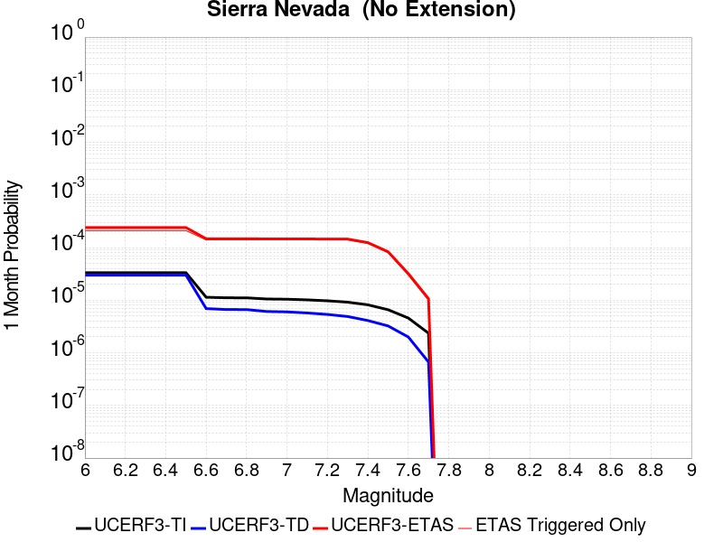 | 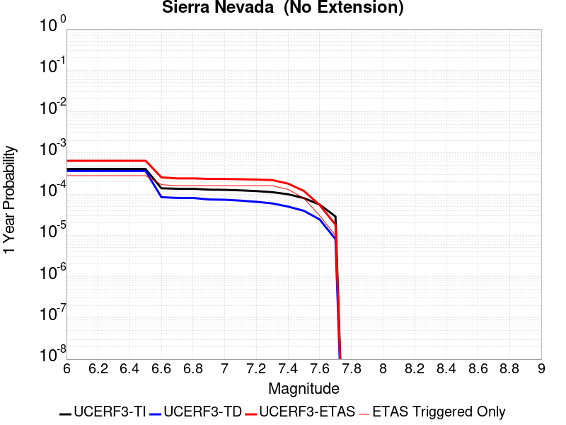 |  |

| Magnitude | 1 wk TI Prob | 1 wk TD Prob | 1 wk ETAS Prob | 1 wk ETAS/TD Gain | 1 wk ETAS Triggered Only | 1 mo TI Prob | 1 mo TD Prob | 1 mo ETAS Prob | 1 mo ETAS/TD Gain | 1 mo ETAS Triggered Only | 1 yr TI Prob | 1 yr TD Prob | 1 yr ETAS Prob | 1 yr ETAS/TD Gain | 1 yr ETAS Triggered Only | 10 yr TI Prob | 10 yr TD Prob | 10 yr ETAS Prob | 10 yr ETAS/TD Gain | 10 yr ETAS Triggered Only |
|-----|-----|-----|-----|-----|-----|-----|-----|-----|-----|-----|-----|-----|-----|-----|-----|-----|-----|-----|-----|-----|
| 6.0 | 7.7690465E-6 | 6.9762887E-6 | 3.8185652E-4 | 54.736343 | 3.7488286E-4 | 3.329549E-5 | 2.989824E-5 | 4.0476987E-4 | 13.538252 | 3.7488286E-4 | 4.0529718E-4 | 3.6398612E-4 | 7.387325E-4 | 2.0295625 | 3.7488286E-4 | 0.004045588 | 0.0036374154 | 0.004010935 | 1.1026881 | 3.7488286E-4 |
| 6.1 | 7.7690465E-6 | 6.9762887E-6 | 3.8185652E-4 | 54.736343 | 3.7488286E-4 | 3.329549E-5 | 2.989824E-5 | 4.0476987E-4 | 13.538252 | 3.7488286E-4 | 4.0529718E-4 | 3.6398612E-4 | 7.387325E-4 | 2.0295625 | 3.7488286E-4 | 0.004045588 | 0.0036374154 | 0.004010935 | 1.1026881 | 3.7488286E-4 |
| 6.2 | 7.7690465E-6 | 6.9762887E-6 | 3.8185652E-4 | 54.736343 | 3.7488286E-4 | 3.329549E-5 | 2.989824E-5 | 4.0476987E-4 | 13.538252 | 3.7488286E-4 | 4.0529718E-4 | 3.6398612E-4 | 7.387325E-4 | 2.0295625 | 3.7488286E-4 | 0.004045588 | 0.0036374154 | 0.004010935 | 1.1026881 | 3.7488286E-4 |
| 6.3 | 7.7690465E-6 | 6.9762887E-6 | 3.8185652E-4 | 54.736343 | 3.7488286E-4 | 3.329549E-5 | 2.989824E-5 | 4.0476987E-4 | 13.538252 | 3.7488286E-4 | 4.0529718E-4 | 3.6398612E-4 | 7.387325E-4 | 2.0295625 | 3.7488286E-4 | 0.004045588 | 0.0036374154 | 0.004010935 | 1.1026881 | 3.7488286E-4 |
| 6.4 | 7.7690465E-6 | 6.9762887E-6 | 3.8185652E-4 | 54.736343 | 3.7488286E-4 | 3.329549E-5 | 2.989824E-5 | 4.0476987E-4 | 13.538252 | 3.7488286E-4 | 4.0529718E-4 | 3.6398612E-4 | 7.387325E-4 | 2.0295625 | 3.7488286E-4 | 0.004045588 | 0.0036374154 | 0.004010935 | 1.1026881 | 3.7488286E-4 |
| 6.5 | 7.7690465E-6 | 6.9762887E-6 | 3.8185652E-4 | 54.736343 | 3.7488286E-4 | 3.329549E-5 | 2.989824E-5 | 4.0476987E-4 | 13.538252 | 3.7488286E-4 | 4.0529718E-4 | 3.6398612E-4 | 7.387325E-4 | 2.0295625 | 3.7488286E-4 | 0.004045588 | 0.0036374154 | 0.004010935 | 1.1026881 | 3.7488286E-4 |
| 6.6 | 2.653E-6 | 1.6148208E-6 | 1.8905594E-4 | 117.07549 | 1.8744143E-4 | 1.136995E-5 | 6.9206426E-6 | 1.9436076E-4 | 28.08421 | 1.8744143E-4 | 1.3842035E-4 | 8.42556E-5 | 2.7168123E-4 | 3.2244887 | 1.8744143E-4 | 0.0013833415 | 8.4224E-4 | 0.0010295236 | 1.2223636 | 1.8744143E-4 |
| 6.7 | 2.5902466E-6 | 1.5501544E-6 | 1.8899128E-4 | 121.91772 | 1.8744143E-4 | 1.11010095E-5 | 6.643502E-6 | 1.9408368E-4 | 29.214062 | 1.8744143E-4 | 1.351464E-4 | 8.088166E-5 | 2.6830792E-4 | 3.3172898 | 1.8744143E-4 | 0.0013506424 | 8.0852525E-4 | 9.958151E-4 | 1.2316438 | 1.8744143E-4 |
| 6.8 | 2.5853892E-6 | 1.5469546E-6 | 1.889881E-4 | 122.16783 | 1.8744143E-4 | 1.1080193E-5 | 6.629789E-6 | 1.9406997E-4 | 29.27242 | 1.8744143E-4 | 1.34893E-4 | 8.071472E-5 | 2.68141E-4 | 3.3220832 | 1.8744143E-4 | 0.0013481114 | 8.06857E-4 | 9.941472E-4 | 1.2321231 | 1.8744143E-4 |
| 6.9 | 2.458257E-6 | 1.422029E-6 | 1.8886318E-4 | 132.81248 | 1.8744143E-4 | 1.0535345E-5 | 6.0943958E-6 | 1.9353468E-4 | 31.756172 | 1.8744143E-4 | 1.2826028E-4 | 7.419676E-5 | 2.616243E-4 | 3.5260878 | 1.8744143E-4 | 0.0012818627 | 7.4172183E-4 | 9.2902425E-4 | 1.2525238 | 1.8744143E-4 |
| 7.0 | 2.4341468E-6 | 1.3989927E-6 | 1.8884016E-4 | 134.98294 | 1.8744143E-4 | 1.0432016E-5 | 5.9956697E-6 | 1.9343598E-4 | 32.262615 | 1.8744143E-4 | 1.270024E-4 | 7.299485E-5 | 2.604226E-4 | 3.5676844 | 1.8744143E-4 | 0.0012692984 | 7.297107E-4 | 9.170153E-4 | 1.2566835 | 1.8744143E-4 |
| 7.1 | 2.3652476E-6 | 1.3339427E-6 | 1.8877511E-4 | 141.51666 | 1.8744143E-4 | 1.0136736E-5 | 5.716885E-6 | 1.9315723E-4 | 33.787148 | 1.8744143E-4 | 1.2340778E-4 | 6.9600865E-5 | 2.5702926E-4 | 3.692903 | 1.8744143E-4 | 0.0012333926 | 6.957924E-4 | 8.831034E-4 | 1.2692053 | 1.8744143E-4 |
| 7.2 | 2.272158E-6 | 1.2502497E-6 | 1.8869144E-4 | 150.923 | 1.8744143E-4 | 9.737784E-6 | 5.358202E-6 | 1.9279862E-4 | 35.98196 | 1.8744143E-4 | 1.1855107E-4 | 6.523417E-5 | 2.5266336E-4 | 3.8731751 | 1.8744143E-4 | 0.0011848784 | 6.5215176E-4 | 8.3947094E-4 | 1.2872325 | 1.8744143E-4 |
| 7.3 | 2.1382127E-6 | 1.1419382E-6 | 1.8858314E-4 | 165.14304 | 1.8744143E-4 | 9.163737E-6 | 4.894012E-6 | 1.9233453E-4 | 39.29997 | 1.8744143E-4 | 1.1156279E-4 | 5.9582977E-5 | 2.4701323E-4 | 4.1457014 | 1.8744143E-4 | 0.001115068 | 5.956712E-4 | 7.8300096E-4 | 1.3144852 | 1.8744143E-4 |
| 7.4 | 1.9048055E-6 | 9.574928E-7 | 1.8839874E-4 | 196.76256 | 1.8744143E-4 | 8.163426E-6 | 4.103534E-6 | 1.9154418E-4 | 46.677856 | 1.8744143E-4 | 9.9385186E-5 | 4.995939E-5 | 2.3739145E-4 | 4.751688 | 1.8744143E-4 | 9.934074E-4 | 4.9948227E-4 | 6.868301E-4 | 1.3750839 | 1.8744143E-4 |
| 7.5 | 1.5373403E-6 | 7.559763E-7 | 7.559763E-7 | 1.0 | 0.0 | 6.5885843E-6 | 3.2398946E-6 | 3.2398946E-6 | 1.0 | 0.0 | 8.021306E-5 | 3.9445007E-5 | 3.9445007E-5 | 1.0 | 0.0 | 8.0184115E-4 | 3.9438053E-4 | 3.9438053E-4 | 1.0 | 0.0 |
| 7.6 | 1.0680322E-6 | 4.65941E-7 | 4.65941E-7 | 1.0 | 0.0 | 4.577273E-6 | 1.9968884E-6 | 1.9968884E-6 | 1.0 | 0.0 | 5.5726876E-5 | 2.4311848E-5 | 2.4311848E-5 | 1.0 | 0.0 | 5.5712904E-4 | 2.4309216E-4 | 2.4309216E-4 | 1.0 | 0.0 |
| 7.7 | 5.509146E-7 | 1.5578539E-7 | 1.5578539E-7 | 1.0 | 0.0 | 2.3610605E-6 | 6.676515E-7 | 6.676515E-7 | 1.0 | 0.0 | 2.8745531E-5 | 8.128628E-6 | 8.128628E-6 | 1.0 | 0.0 | 2.8741814E-4 | 8.128342E-5 | 8.128342E-5 | 1.0 | 0.0 |

## San Andreas (Creeping Section) 2011 CFM
*[(top)](#table-of-contents)*

| 1 Week | 1 Month | 1 Year | 10 Year |
|-----|-----|-----|-----|
|  |  |  |  |

| Magnitude | 1 wk TI Prob | 1 wk TD Prob | 1 wk ETAS Prob | 1 wk ETAS/TD Gain | 1 wk ETAS Triggered Only | 1 mo TI Prob | 1 mo TD Prob | 1 mo ETAS Prob | 1 mo ETAS/TD Gain | 1 mo ETAS Triggered Only | 1 yr TI Prob | 1 yr TD Prob | 1 yr ETAS Prob | 1 yr ETAS/TD Gain | 1 yr ETAS Triggered Only | 10 yr TI Prob | 10 yr TD Prob | 10 yr ETAS Prob | 10 yr ETAS/TD Gain | 10 yr ETAS Triggered Only |
|-----|-----|-----|-----|-----|-----|-----|-----|-----|-----|-----|-----|-----|-----|-----|-----|-----|-----|-----|-----|-----|
| 6.0 | 5.986481E-4 | 0.0012275929 | 0.0014148043 | 1.1525028 | 1.8744143E-4 | 0.0025631124 | 0.005245547 | 0.005432005 | 1.035546 | 1.8744143E-4 | 0.030762846 | 0.06120491 | 0.06155685 | 1.0057502 | 3.7488286E-4 | 0.26835477 | 0.42593494 | 0.42615014 | 1.0005052 | 3.7488286E-4 |
| 6.1 | 5.015945E-4 | 0.0010217986 | 0.0010217986 | 1.0 | 0.0 | 0.00214792 | 0.0043678596 | 0.0043678596 | 1.0 | 0.0 | 0.025839351 | 0.05124837 | 0.05124837 | 1.0 | 0.0 | 0.23032776 | 0.37285668 | 0.37285668 | 1.0 | 0.0 |
| 6.2 | 4.073338E-4 | 8.1073755E-4 | 8.1073755E-4 | 1.0 | 0.0 | 0.0017445484 | 0.0034671477 | 0.0034671477 | 1.0 | 0.0 | 0.021034058 | 0.04093317 | 0.04093317 | 1.0 | 0.0 | 0.19150782 | 0.31303346 | 0.31303346 | 1.0 | 0.0 |
| 6.3 | 3.464099E-4 | 6.7391695E-4 | 6.7391695E-4 | 1.0 | 0.0 | 0.0014837692 | 0.0028829593 | 0.0028829593 | 1.0 | 0.0 | 0.017915873 | 0.034189582 | 0.034189582 | 1.0 | 0.0 | 0.16538359 | 0.2713166 | 0.2713166 | 1.0 | 0.0 |
| 6.4 | 2.935057E-4 | 5.5442745E-4 | 5.5442745E-4 | 1.0 | 0.0 | 0.0012572751 | 0.0023725363 | 0.0023725363 | 1.0 | 0.0 | 0.015200248 | 0.02826451 | 0.02826451 | 1.0 | 0.0 | 0.14201577 | 0.23298529 | 0.23298529 | 1.0 | 0.0 |
| 6.5 | 2.3409708E-4 | 4.2093755E-4 | 4.2093755E-4 | 1.0 | 0.0 | 0.0010028875 | 0.0018019684 | 0.0018019684 | 1.0 | 0.0 | 0.012141965 | 0.021587461 | 0.021587461 | 1.0 | 0.0 | 0.11499573 | 0.18682368 | 0.18682368 | 1.0 | 0.0 |
| 6.6 | 1.5842178E-4 | 2.506933E-4 | 2.506933E-4 | 1.0 | 0.0 | 6.7877385E-4 | 0.0010739497 | 0.0010739497 | 1.0 | 0.0 | 0.0082328 | 0.012995575 | 0.012995575 | 1.0 | 0.0 | 0.07934396 | 0.12314638 | 0.12314638 | 1.0 | 0.0 |
| 6.7 | 1.5616413E-4 | 2.4605883E-4 | 2.4605883E-4 | 1.0 | 0.0 | 6.691031E-4 | 0.0010541069 | 0.0010541069 | 1.0 | 0.0 | 0.0081159435 | 0.01275744 | 0.01275744 | 1.0 | 0.0 | 0.0782586 | 0.12117351 | 0.12117351 | 1.0 | 0.0 |
| 6.8 | 1.5538467E-4 | 2.4429744E-4 | 2.4429744E-4 | 1.0 | 0.0 | 6.6576427E-4 | 0.0010465645 | 0.0010465645 | 1.0 | 0.0 | 0.008075596 | 0.012666838 | 0.012666838 | 1.0 | 0.0 | 0.07788358 | 0.120404355 | 0.120404355 | 1.0 | 0.0 |
| 6.9 | 1.5153569E-4 | 2.3539034E-4 | 2.3539034E-4 | 1.0 | 0.0 | 6.49277E-4 | 0.0010084276 | 0.0010084276 | 1.0 | 0.0 | 0.007876333 | 0.01220901 | 0.01220901 | 1.0 | 0.0 | 0.07602952 | 0.11647445 | 0.11647445 | 1.0 | 0.0 |
| 7.0 | 1.4588932E-4 | 2.2396253E-4 | 2.2396253E-4 | 1.0 | 0.0 | 6.250901E-4 | 9.5948833E-4 | 9.5948833E-4 | 1.0 | 0.0 | 0.0075839474 | 0.011619697 | 0.011619697 | 1.0 | 0.0 | 0.073302895 | 0.11132046 | 0.11132046 | 1.0 | 0.0 |
| 7.1 | 1.1565079E-4 | 1.6281738E-4 | 1.6281738E-4 | 1.0 | 0.0 | 4.955521E-4 | 6.9760304E-4 | 6.9760304E-4 | 1.0 | 0.0 | 0.006016669 | 0.0084604435 | 0.0084604435 | 1.0 | 0.0 | 0.058563538 | 0.08367046 | 0.08367046 | 1.0 | 0.0 |
| 7.2 | 1.0393792E-4 | 1.4615769E-4 | 1.4615769E-4 | 1.0 | 0.0 | 4.4537216E-4 | 6.2624045E-4 | 6.2624045E-4 | 1.0 | 0.0 | 0.005408933 | 0.0075979927 | 0.0075979927 | 1.0 | 0.0 | 0.052791595 | 0.07561969 | 0.07561969 | 1.0 | 0.0 |
| 7.3 | 9.332884E-5 | 1.2780898E-4 | 1.2780898E-4 | 1.0 | 0.0 | 3.999194E-4 | 5.4763845E-4 | 5.4763845E-4 | 1.0 | 0.0 | 0.0048581534 | 0.006647249 | 0.006647249 | 1.0 | 0.0 | 0.047533102 | 0.06648326 | 0.06648326 | 1.0 | 0.0 |
| 7.4 | 8.670252E-5 | 1.17032345E-4 | 1.17032345E-4 | 1.0 | 0.0 | 3.715293E-4 | 5.0147134E-4 | 5.0147134E-4 | 1.0 | 0.0 | 0.004513991 | 0.006088443 | 0.006088443 | 1.0 | 0.0 | 0.044233937 | 0.061151642 | 0.061151642 | 1.0 | 0.0 |
| 7.5 | 7.3036405E-5 | 9.005856E-5 | 9.005856E-5 | 1.0 | 0.0 | 3.129756E-4 | 3.8590826E-4 | 3.8590826E-4 | 1.0 | 0.0 | 0.0038038217 | 0.0046883323 | 0.0046883323 | 1.0 | 0.0 | 0.03739367 | 0.047877792 | 0.047877792 | 1.0 | 0.0 |
| 7.6 | 6.3935775E-5 | 8.280385E-5 | 8.280385E-5 | 1.0 | 0.0 | 2.7398168E-4 | 3.5482543E-4 | 3.5482543E-4 | 1.0 | 0.0 | 0.0033306254 | 0.004311461 | 0.004311461 | 1.0 | 0.0 | 0.032811474 | 0.04399201 | 0.04399201 | 1.0 | 0.0 |
| 7.7 | 5.5050095E-5 | 6.6618326E-5 | 6.6618326E-5 | 1.0 | 0.0 | 2.3590765E-4 | 2.854759E-4 | 2.854759E-4 | 1.0 | 0.0 | 0.0028683927 | 0.003470134 | 0.003470134 | 1.0 | 0.0 | 0.0283165 | 0.035796214 | 0.035796214 | 1.0 | 0.0 |
| 7.8 | 5.027131E-5 | 6.162871E-5 | 6.162871E-5 | 1.0 | 0.0 | 2.1543067E-4 | 2.640963E-4 | 2.640963E-4 | 1.0 | 0.0 | 0.0026197135 | 0.003210635 | 0.003210635 | 1.0 | 0.0 | 0.025890453 | 0.03312666 | 0.03312666 | 1.0 | 0.0 |
| 7.9 | 3.7271806E-5 | 5.022507E-5 | 5.022507E-5 | 1.0 | 0.0 | 1.5972654E-4 | 2.1523255E-4 | 2.1523255E-4 | 1.0 | 0.0 | 0.0019429359 | 0.002617309 | 0.002617309 | 1.0 | 0.0 | 0.019260362 | 0.027067466 | 0.027067466 | 1.0 | 0.0 |
| 8.0 | 2.7310243E-5 | 3.1427757E-5 | 3.1427757E-5 | 1.0 | 0.0 | 1.17038646E-4 | 1.3468343E-4 | 1.3468343E-4 | 1.0 | 0.0 | 0.0014240141 | 0.0016385383 | 0.0016385383 | 1.0 | 0.0 | 0.014149235 | 0.01721386 | 0.01721386 | 1.0 | 0.0 |
| 8.1 | 1.7940547E-5 | 1.7399378E-5 | 1.7399378E-5 | 1.0 | 0.0 | 7.688579E-5 | 7.456663E-5 | 7.456663E-5 | 1.0 | 0.0 | 9.3568244E-4 | 9.074711E-4 | 9.074711E-4 | 1.0 | 0.0 | 0.009317525 | 0.009798636 | 0.009798636 | 1.0 | 0.0 |
| 8.2 | 8.643924E-6 | 5.473668E-6 | 5.473668E-6 | 1.0 | 0.0 | 3.704486E-5 | 2.3458366E-5 | 2.3458366E-5 | 1.0 | 0.0 | 4.5092785E-4 | 2.8556827E-4 | 2.8556827E-4 | 1.0 | 0.0 | 0.0045001395 | 0.0032481793 | 0.0032481793 | 1.0 | 0.0 |
| 8.3 | 1.983087E-6 | 7.6564595E-7 | 7.6564595E-7 | 1.0 | 0.0 | 8.498917E-6 | 3.281336E-6 | 3.281336E-6 | 1.0 | 0.0 | 1.034694E-4 | 3.9949547E-5 | 3.9949547E-5 | 1.0 | 0.0 | 0.0010342124 | 4.717979E-4 | 4.717979E-4 | 1.0 | 0.0 |

## San Andreas (Parkfield)
*[(top)](#table-of-contents)*

| 1 Week | 1 Month | 1 Year | 10 Year |
|-----|-----|-----|-----|
|  |  |  | 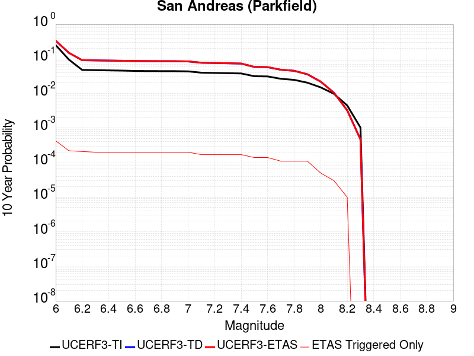 |

| Magnitude | 1 wk TI Prob | 1 wk TD Prob | 1 wk ETAS Prob | 1 wk ETAS/TD Gain | 1 wk ETAS Triggered Only | 1 mo TI Prob | 1 mo TD Prob | 1 mo ETAS Prob | 1 mo ETAS/TD Gain | 1 mo ETAS Triggered Only | 1 yr TI Prob | 1 yr TD Prob | 1 yr ETAS Prob | 1 yr ETAS/TD Gain | 1 yr ETAS Triggered Only | 10 yr TI Prob | 10 yr TD Prob | 10 yr ETAS Prob | 10 yr ETAS/TD Gain | 10 yr ETAS Triggered Only |
|-----|-----|-----|-----|-----|-----|-----|-----|-----|-----|-----|-----|-----|-----|-----|-----|-----|-----|-----|-----|-----|
| 6.0 | 5.556969E-4 | 7.778562E-4 | 9.651518E-4 | 1.2407844 | 1.8744143E-4 | 0.0023793848 | 0.0033299583 | 0.0035167756 | 1.056102 | 1.8744143E-4 | 0.028586963 | 0.040235043 | 0.040594842 | 1.0089425 | 3.7488286E-4 | 0.25176284 | 0.3371973 | 0.33757 | 1.0011053 | 5.6232425E-4 |
| 6.1 | 1.925858E-4 | 3.0278185E-4 | 4.9016654E-4 | 1.6188768 | 1.8744143E-4 | 8.2510663E-4 | 0.001297085 | 0.0014842832 | 1.1443223 | 1.8744143E-4 | 0.0099994885 | 0.01577393 | 0.015958415 | 1.0116955 | 1.8744143E-4 | 0.095613256 | 0.14975825 | 0.15007699 | 1.0021284 | 3.7488286E-4 |
| 6.2 | 9.4306815E-5 | 1.8243887E-4 | 1.8243887E-4 | 1.0 | 0.0 | 4.0410945E-4 | 7.8164786E-4 | 7.8164786E-4 | 1.0 | 0.0 | 0.0049089384 | 0.009475246 | 0.009475246 | 1.0 | 0.0 | 0.048019063 | 0.0918565 | 0.092026725 | 1.0018531 | 1.8744143E-4 |
| 6.3 | 9.283051E-5 | 1.794041E-4 | 1.794041E-4 | 1.0 | 0.0 | 3.9778434E-4 | 7.686494E-4 | 7.686494E-4 | 1.0 | 0.0 | 0.0048322747 | 0.009318355 | 0.009318355 | 1.0 | 0.0 | 0.047285385 | 0.090509474 | 0.09067995 | 1.0018835 | 1.8744143E-4 |
| 6.4 | 9.138826E-5 | 1.7702584E-4 | 1.7702584E-4 | 1.0 | 0.0 | 3.916052E-4 | 7.5846276E-4 | 7.5846276E-4 | 1.0 | 0.0 | 0.0047573745 | 0.009195387 | 0.009195387 | 1.0 | 0.0 | 0.046568092 | 0.0894136 | 0.089584276 | 1.0019089 | 1.8744143E-4 |
| 6.5 | 9.000255E-5 | 1.746064E-4 | 1.746064E-4 | 1.0 | 0.0 | 3.8566816E-4 | 7.4809964E-4 | 7.4809964E-4 | 1.0 | 0.0 | 0.0046854047 | 0.009070284 | 0.009070284 | 1.0 | 0.0 | 0.045878403 | 0.08829608 | 0.088466965 | 1.0019355 | 1.8744143E-4 |
| 6.6 | 8.8109264E-5 | 1.7141816E-4 | 1.7141816E-4 | 1.0 | 0.0 | 3.7755648E-4 | 7.3444354E-4 | 7.3444354E-4 | 1.0 | 0.0 | 0.0045870654 | 0.008905404 | 0.008905404 | 1.0 | 0.0 | 0.04493529 | 0.08682707 | 0.08699824 | 1.0019714 | 1.8744143E-4 |
| 6.7 | 8.738073E-5 | 1.7008898E-4 | 1.7008898E-4 | 1.0 | 0.0 | 3.7443507E-4 | 7.287503E-4 | 7.287503E-4 | 1.0 | 0.0 | 0.0045492216 | 0.008836695 | 0.008836695 | 1.0 | 0.0 | 0.04457213 | 0.0862268 | 0.08639808 | 1.0019864 | 1.8744143E-4 |
| 6.8 | 8.710195E-5 | 1.6954402E-4 | 1.6954402E-4 | 1.0 | 0.0 | 3.7324068E-4 | 7.26416E-4 | 7.26416E-4 | 1.0 | 0.0 | 0.0045347405 | 0.008808513 | 0.008808513 | 1.0 | 0.0 | 0.04443313 | 0.08597436 | 0.086145684 | 1.0019927 | 1.8744143E-4 |
| 6.9 | 8.6801556E-5 | 1.6895356E-4 | 1.6895356E-4 | 1.0 | 0.0 | 3.7195362E-4 | 7.238869E-4 | 7.238869E-4 | 1.0 | 0.0 | 0.0045191357 | 0.0087779695 | 0.0087779695 | 1.0 | 0.0 | 0.044283327 | 0.08570042 | 0.0858718 | 1.0019997 | 1.8744143E-4 |
| 7.0 | 8.5571606E-5 | 1.664819E-4 | 1.664819E-4 | 1.0 | 0.0 | 3.6668387E-4 | 7.132999E-4 | 7.132999E-4 | 1.0 | 0.0 | 0.004455241 | 0.008650103 | 0.008650103 | 1.0 | 0.0 | 0.043669727 | 0.08454836 | 0.084719956 | 1.0020295 | 1.8744143E-4 |
| 7.1 | 7.82589E-5 | 1.5128969E-4 | 1.5128969E-4 | 1.0 | 0.0 | 3.3535215E-4 | 6.4822397E-4 | 6.4822397E-4 | 1.0 | 0.0 | 0.0040752706 | 0.007863738 | 0.007863738 | 1.0 | 0.0 | 0.040013418 | 0.077460445 | 0.077633366 | 1.0022324 | 1.8744143E-4 |
| 7.2 | 7.690929E-5 | 1.4866212E-4 | 1.4866212E-4 | 1.0 | 0.0 | 3.2956956E-4 | 6.369685E-4 | 6.369685E-4 | 1.0 | 0.0 | 0.004005129 | 0.0077276826 | 0.0077276826 | 1.0 | 0.0 | 0.0393371 | 0.07623341 | 0.07640656 | 1.0022713 | 1.8744143E-4 |
| 7.3 | 7.5543794E-5 | 1.4562748E-4 | 1.4562748E-4 | 1.0 | 0.0 | 3.2371894E-4 | 6.239692E-4 | 6.239692E-4 | 1.0 | 0.0 | 0.003934157 | 0.0075705256 | 0.0075705256 | 1.0 | 0.0 | 0.038652334 | 0.07479777 | 0.07497119 | 1.0023185 | 1.8744143E-4 |
| 7.4 | 7.4214564E-5 | 1.4263717E-4 | 1.4263717E-4 | 1.0 | 0.0 | 3.1802364E-4 | 6.1115966E-4 | 6.1115966E-4 | 1.0 | 0.0 | 0.003865065 | 0.0074156416 | 0.0074156416 | 1.0 | 0.0 | 0.03798529 | 0.07337152 | 0.07354522 | 1.0023673 | 1.8744143E-4 |
| 7.5 | 6.149578E-5 | 1.1191443E-4 | 1.1191443E-4 | 1.0 | 0.0 | 2.6352672E-4 | 4.795452E-4 | 4.795452E-4 | 1.0 | 0.0 | 0.0032037178 | 0.005822865 | 0.005822865 | 1.0 | 0.0 | 0.03157923 | 0.058559462 | 0.05873593 | 1.0030134 | 1.8744143E-4 |
| 7.6 | 6.0643448E-5 | 1.102009E-4 | 1.102009E-4 | 1.0 | 0.0 | 2.598746E-4 | 4.7220418E-4 | 4.7220418E-4 | 1.0 | 0.0 | 0.0031593828 | 0.005733962 | 0.005733962 | 1.0 | 0.0 | 0.031148417 | 0.05772042 | 0.05789704 | 1.00306 | 1.8744143E-4 |
| 7.7 | 5.1652263E-5 | 9.175265E-5 | 9.175265E-5 | 1.0 | 0.0 | 2.2134806E-4 | 3.9316638E-4 | 3.9316638E-4 | 1.0 | 0.0 | 0.002691582 | 0.0047763046 | 0.0047763046 | 1.0 | 0.0 | 0.026592141 | 0.04853641 | 0.04871475 | 1.0036744 | 1.8744143E-4 |
| 7.8 | 4.8090482E-5 | 8.560165E-5 | 8.560165E-5 | 1.0 | 0.0 | 2.060858E-4 | 3.6681266E-4 | 3.6681266E-4 | 1.0 | 0.0 | 0.0025062072 | 0.004456807 | 0.004456807 | 1.0 | 0.0 | 0.024781305 | 0.045302264 | 0.045481216 | 1.0039501 | 1.8744143E-4 |
| 7.9 | 3.970278E-5 | 6.7507375E-5 | 6.7507375E-5 | 1.0 | 0.0 | 1.7014367E-4 | 2.8928524E-4 | 2.8928524E-4 | 1.0 | 0.0 | 0.002069531 | 0.0035163634 | 0.0035163634 | 1.0 | 0.0 | 0.020503636 | 0.03588176 | 0.036062475 | 1.0050365 | 1.8744143E-4 |
| 8.0 | 2.8982335E-5 | 4.0698153E-5 | 4.0698153E-5 | 1.0 | 0.0 | 1.2420409E-4 | 1.7440901E-4 | 1.7440901E-4 | 1.0 | 0.0 | 0.0015111357 | 0.0021213628 | 0.0021213628 | 1.0 | 0.0 | 0.015009012 | 0.02201118 | 0.022194495 | 1.0083283 | 1.8744143E-4 |
| 8.1 | 1.8836186E-5 | 1.867974E-5 | 1.867974E-5 | 1.0 | 0.0 | 8.0724014E-5 | 8.005358E-5 | 8.005358E-5 | 1.0 | 0.0 | 9.823717E-4 | 9.742171E-4 | 9.742171E-4 | 1.0 | 0.0 | 0.009780403 | 0.010487711 | 0.010487711 | 1.0 | 0.0 |
| 8.2 | 8.643924E-6 | 5.473668E-6 | 5.473668E-6 | 1.0 | 0.0 | 3.704486E-5 | 2.3458366E-5 | 2.3458366E-5 | 1.0 | 0.0 | 4.5092785E-4 | 2.8556827E-4 | 2.8556827E-4 | 1.0 | 0.0 | 0.0045001395 | 0.0032481793 | 0.0032481793 | 1.0 | 0.0 |
| 8.3 | 1.983087E-6 | 7.6564595E-7 | 7.6564595E-7 | 1.0 | 0.0 | 8.498917E-6 | 3.281336E-6 | 3.281336E-6 | 1.0 | 0.0 | 1.034694E-4 | 3.9949547E-5 | 3.9949547E-5 | 1.0 | 0.0 | 0.0010342124 | 4.717979E-4 | 4.717979E-4 | 1.0 | 0.0 |

## San Andreas (San Gorgonio Pass-Garnet HIll)
*[(top)](#table-of-contents)*

| 1 Week | 1 Month | 1 Year | 10 Year |
|-----|-----|-----|-----|
|  | 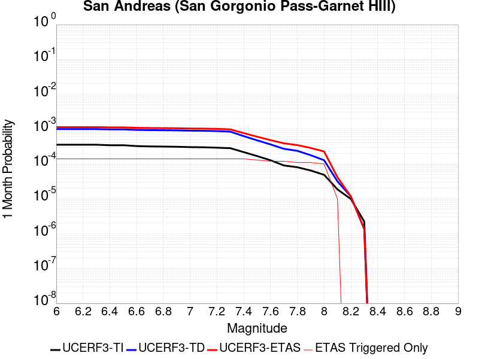 |  |  |

| Magnitude | 1 wk TI Prob | 1 wk TD Prob | 1 wk ETAS Prob | 1 wk ETAS/TD Gain | 1 wk ETAS Triggered Only | 1 mo TI Prob | 1 mo TD Prob | 1 mo ETAS Prob | 1 mo ETAS/TD Gain | 1 mo ETAS Triggered Only | 1 yr TI Prob | 1 yr TD Prob | 1 yr ETAS Prob | 1 yr ETAS/TD Gain | 1 yr ETAS Triggered Only | 10 yr TI Prob | 10 yr TD Prob | 10 yr ETAS Prob | 10 yr ETAS/TD Gain | 10 yr ETAS Triggered Only |
|-----|-----|-----|-----|-----|-----|-----|-----|-----|-----|-----|-----|-----|-----|-----|-----|-----|-----|-----|-----|-----|
| 6.0 | 8.31567E-5 | 2.3384395E-4 | 2.3384395E-4 | 1.0 | 0.0 | 3.5633717E-4 | 0.0010018025 | 0.0010018025 | 1.0 | 0.0 | 0.004329778 | 0.012128622 | 0.012128622 | 1.0 | 0.0 | 0.042463828 | 0.11258187 | 0.112914555 | 1.002955 | 3.7488286E-4 |
| 6.1 | 8.31567E-5 | 2.3384395E-4 | 2.3384395E-4 | 1.0 | 0.0 | 3.5633717E-4 | 0.0010018025 | 0.0010018025 | 1.0 | 0.0 | 0.004329778 | 0.012128622 | 0.012128622 | 1.0 | 0.0 | 0.042463828 | 0.11258187 | 0.112914555 | 1.002955 | 3.7488286E-4 |
| 6.2 | 8.31567E-5 | 2.3384395E-4 | 2.3384395E-4 | 1.0 | 0.0 | 3.5633717E-4 | 0.0010018025 | 0.0010018025 | 1.0 | 0.0 | 0.004329778 | 0.012128622 | 0.012128622 | 1.0 | 0.0 | 0.042463828 | 0.11258187 | 0.112914555 | 1.002955 | 3.7488286E-4 |
| 6.3 | 8.31567E-5 | 2.3384395E-4 | 2.3384395E-4 | 1.0 | 0.0 | 3.5633717E-4 | 0.0010018025 | 0.0010018025 | 1.0 | 0.0 | 0.004329778 | 0.012128622 | 0.012128622 | 1.0 | 0.0 | 0.042463828 | 0.11258187 | 0.112914555 | 1.002955 | 3.7488286E-4 |
| 6.4 | 8.059055E-5 | 2.2941893E-4 | 2.2941893E-4 | 1.0 | 0.0 | 3.4534236E-4 | 9.828559E-4 | 9.828559E-4 | 1.0 | 0.0 | 0.0041964394 | 0.011900819 | 0.011900819 | 1.0 | 0.0 | 0.041180745 | 0.110562965 | 0.1108964 | 1.0030158 | 3.7488286E-4 |
| 6.5 | 8.059055E-5 | 2.2941893E-4 | 2.2941893E-4 | 1.0 | 0.0 | 3.4534236E-4 | 9.828559E-4 | 9.828559E-4 | 1.0 | 0.0 | 0.0041964394 | 0.011900819 | 0.011900819 | 1.0 | 0.0 | 0.041180745 | 0.110562965 | 0.1108964 | 1.0030158 | 3.7488286E-4 |
| 6.6 | 7.619237E-5 | 2.2186468E-4 | 2.2186468E-4 | 1.0 | 0.0 | 3.2649786E-4 | 9.5050444E-4 | 9.5050444E-4 | 1.0 | 0.0 | 0.0039678677 | 0.0115115335 | 0.0115115335 | 1.0 | 0.0 | 0.03897764 | 0.10709954 | 0.10743427 | 1.0031254 | 3.7488286E-4 |
| 6.7 | 7.440636E-5 | 2.1862281E-4 | 2.1862281E-4 | 1.0 | 0.0 | 3.188454E-4 | 9.3662075E-4 | 9.3662075E-4 | 1.0 | 0.0 | 0.0038750346 | 0.011344268 | 0.011344268 | 1.0 | 0.0 | 0.038081564 | 0.1056081 | 0.1059434 | 1.0031749 | 3.7488286E-4 |
| 6.8 | 7.3735864E-5 | 2.1709445E-4 | 2.1709445E-4 | 1.0 | 0.0 | 3.1597257E-4 | 9.300753E-4 | 9.300753E-4 | 1.0 | 0.0 | 0.0038401815 | 0.011265406 | 0.011265406 | 1.0 | 0.0 | 0.03774495 | 0.104909696 | 0.10524525 | 1.0031985 | 3.7488286E-4 |
| 6.9 | 7.27575E-5 | 2.1478413E-4 | 2.1478413E-4 | 1.0 | 0.0 | 3.117806E-4 | 9.20181E-4 | 9.20181E-4 | 1.0 | 0.0 | 0.003789323 | 0.011146182 | 0.011146182 | 1.0 | 0.0 | 0.037253562 | 0.10385753 | 0.10419348 | 1.0032347 | 3.7488286E-4 |
| 7.0 | 7.102591E-5 | 2.1062451E-4 | 2.1062451E-4 | 1.0 | 0.0 | 3.0436125E-4 | 9.023664E-4 | 9.023664E-4 | 1.0 | 0.0 | 0.003699303 | 0.010931484 | 0.010931484 | 1.0 | 0.0 | 0.03638325 | 0.101959534 | 0.102296196 | 1.0033019 | 3.7488286E-4 |
| 7.1 | 7.028513E-5 | 2.0898094E-4 | 2.0898094E-4 | 1.0 | 0.0 | 3.0118722E-4 | 8.953274E-4 | 8.953274E-4 | 1.0 | 0.0 | 0.0036607897 | 0.010846641 | 0.010846641 | 1.0 | 0.0 | 0.036010686 | 0.10120243 | 0.10153937 | 1.0033294 | 3.7488286E-4 |
| 7.2 | 6.8498244E-5 | 2.050596E-4 | 2.050596E-4 | 1.0 | 0.0 | 2.9353087E-4 | 8.7853306E-4 | 8.7853306E-4 | 1.0 | 0.0 | 0.003567883 | 0.0106441835 | 0.0106441835 | 1.0 | 0.0 | 0.035111405 | 0.09939449 | 0.099732116 | 1.0033967 | 3.7488286E-4 |
| 7.3 | 6.622592E-5 | 1.9733235E-4 | 1.9733235E-4 | 1.0 | 0.0 | 2.8379448E-4 | 8.4543816E-4 | 8.4543816E-4 | 1.0 | 0.0 | 0.0034497243 | 0.010245111 | 0.010245111 | 1.0 | 0.0 | 0.033966612 | 0.095891245 | 0.09623018 | 1.0035346 | 3.7488286E-4 |
| 7.4 | 5.1050705E-5 | 1.4690042E-4 | 1.4690042E-4 | 1.0 | 0.0 | 2.1877038E-4 | 6.294222E-4 | 6.294222E-4 | 1.0 | 0.0 | 0.002660276 | 0.007636482 | 0.007636482 | 1.0 | 0.0 | 0.02628654 | 0.07286554 | 0.0732131 | 1.0047699 | 3.7488286E-4 |
| 7.5 | 3.9302922E-5 | 1.11307076E-4 | 1.11307076E-4 | 1.0 | 0.0 | 1.6843023E-4 | 4.7694342E-4 | 4.7694342E-4 | 1.0 | 0.0 | 0.0020487092 | 0.0057913954 | 0.0057913954 | 1.0 | 0.0 | 0.020299247 | 0.05601151 | 0.056365393 | 1.0063181 | 3.7488286E-4 |
| 7.6 | 2.9851626E-5 | 8.4956984E-5 | 8.4956984E-5 | 1.0 | 0.0 | 1.2792926E-4 | 3.6405068E-4 | 3.6405068E-4 | 1.0 | 0.0 | 0.0015564259 | 0.0044233347 | 0.0044233347 | 1.0 | 0.0 | 0.0154556995 | 0.043196145 | 0.043375492 | 1.0041518 | 1.8744143E-4 |
| 7.7 | 2.1135214E-5 | 6.353527E-5 | 6.353527E-5 | 1.0 | 0.0 | 9.0576345E-5 | 2.722656E-4 | 2.722656E-4 | 1.0 | 0.0 | 0.0011022091 | 0.0033098008 | 0.0033098008 | 1.0 | 0.0 | 0.010967582 | 0.03258456 | 0.032765895 | 1.005565 | 1.8744143E-4 |
| 7.8 | 1.883379E-5 | 5.564576E-5 | 5.564576E-5 | 1.0 | 0.0 | 8.0713755E-5 | 2.3846005E-4 | 2.3846005E-4 | 1.0 | 0.0 | 9.822468E-4 | 0.002899389 | 0.002899389 | 1.0 | 0.0 | 0.0097791655 | 0.028696978 | 0.02887904 | 1.0063443 | 1.8744143E-4 |
| 7.9 | 1.5156185E-5 | 4.1662403E-5 | 4.1662403E-5 | 1.0 | 0.0 | 6.495346E-5 | 1.7854095E-4 | 1.7854095E-4 | 1.0 | 0.0 | 7.9052144E-4 | 0.0021715704 | 0.0021715704 | 1.0 | 0.0 | 0.007877152 | 0.021760946 | 0.021944309 | 1.0084262 | 1.8744143E-4 |
| 8.0 | 1.1405907E-5 | 2.9976925E-5 | 2.9976925E-5 | 1.0 | 0.0 | 4.8881542E-5 | 1.2846621E-4 | 1.2846621E-4 | 1.0 | 0.0 | 5.9497025E-4 | 0.0015629551 | 0.0015629551 | 1.0 | 0.0 | 0.005933798 | 0.015774013 | 0.015958497 | 1.0116955 | 1.8744143E-4 |
| 8.1 | 4.3511436E-6 | 7.369465E-6 | 7.369465E-6 | 1.0 | 0.0 | 1.8647626E-5 | 3.158304E-5 | 3.158304E-5 | 1.0 | 0.0 | 2.2701119E-4 | 3.844558E-4 | 3.844558E-4 | 1.0 | 0.0 | 0.0022677942 | 0.0041165445 | 0.0041165445 | 1.0 | 0.0 |
| 8.2 | 2.3042528E-6 | 2.7328301E-6 | 2.7328301E-6 | 1.0 | 0.0 | 9.875332E-6 | 1.1712076E-5 | 1.1712076E-5 | 1.0 | 0.0 | 1.2022553E-4 | 1.4258524E-4 | 1.4258524E-4 | 1.0 | 0.0 | 0.0012016051 | 0.0015979637 | 0.0015979637 | 1.0 | 0.0 |
| 8.3 | 5.202968E-7 | 3.1590292E-7 | 3.1590292E-7 | 1.0 | 0.0 | 2.2298414E-6 | 1.353869E-6 | 1.353869E-6 | 1.0 | 0.0 | 2.714798E-5 | 1.6483244E-5 | 1.6483244E-5 | 1.0 | 0.0 | 2.7144665E-4 | 1.955901E-4 | 1.955901E-4 | 1.0 | 0.0 |

## Lake Isabella (Seismicity)
*[(top)](#table-of-contents)*

| 1 Week | 1 Month | 1 Year | 10 Year |
|-----|-----|-----|-----|
|  |  |  |  |

| Magnitude | 1 wk TI Prob | 1 wk TD Prob | 1 wk ETAS Prob | 1 wk ETAS/TD Gain | 1 wk ETAS Triggered Only | 1 mo TI Prob | 1 mo TD Prob | 1 mo ETAS Prob | 1 mo ETAS/TD Gain | 1 mo ETAS Triggered Only | 1 yr TI Prob | 1 yr TD Prob | 1 yr ETAS Prob | 1 yr ETAS/TD Gain | 1 yr ETAS Triggered Only | 10 yr TI Prob | 10 yr TD Prob | 10 yr ETAS Prob | 10 yr ETAS/TD Gain | 10 yr ETAS Triggered Only |
|-----|-----|-----|-----|-----|-----|-----|-----|-----|-----|-----|-----|-----|-----|-----|-----|-----|-----|-----|-----|-----|
| 6.0 | 9.431637E-6 | 9.741651E-6 | 1.9718125E-4 | 20.241049 | 1.8744143E-4 | 4.0420677E-5 | 4.1749343E-5 | 2.2918294E-4 | 5.489498 | 1.8744143E-4 | 4.920106E-4 | 5.0819275E-4 | 6.9553894E-4 | 1.3686517 | 1.8744143E-4 | 0.004909227 | 0.005071599 | 0.00544458 | 1.0735432 | 3.7488286E-4 |
| 6.1 | 9.431637E-6 | 9.741651E-6 | 1.9718125E-4 | 20.241049 | 1.8744143E-4 | 4.0420677E-5 | 4.1749343E-5 | 2.2918294E-4 | 5.489498 | 1.8744143E-4 | 4.920106E-4 | 5.0819275E-4 | 6.9553894E-4 | 1.3686517 | 1.8744143E-4 | 0.004909227 | 0.005071599 | 0.00544458 | 1.0735432 | 3.7488286E-4 |
| 6.2 | 9.431637E-6 | 9.741651E-6 | 1.9718125E-4 | 20.241049 | 1.8744143E-4 | 4.0420677E-5 | 4.1749343E-5 | 2.2918294E-4 | 5.489498 | 1.8744143E-4 | 4.920106E-4 | 5.0819275E-4 | 6.9553894E-4 | 1.3686517 | 1.8744143E-4 | 0.004909227 | 0.005071599 | 0.00544458 | 1.0735432 | 3.7488286E-4 |
| 6.3 | 9.431637E-6 | 9.741651E-6 | 1.9718125E-4 | 20.241049 | 1.8744143E-4 | 4.0420677E-5 | 4.1749343E-5 | 2.2918294E-4 | 5.489498 | 1.8744143E-4 | 4.920106E-4 | 5.0819275E-4 | 6.9553894E-4 | 1.3686517 | 1.8744143E-4 | 0.004909227 | 0.005071599 | 0.00544458 | 1.0735432 | 3.7488286E-4 |
| 6.4 | 5.144063E-6 | 5.3000763E-6 | 1.9274051E-4 | 36.365612 | 1.8744143E-4 | 2.2045799E-5 | 2.2714434E-5 | 2.101516E-4 | 9.251897 | 1.8744143E-4 | 2.6837454E-4 | 2.765166E-4 | 4.6390618E-4 | 1.6776794 | 1.8744143E-4 | 0.0026805066 | 0.0027620657 | 0.003135913 | 1.1353507 | 3.7488286E-4 |
| 6.5 | 5.144063E-6 | 5.3000763E-6 | 1.9274051E-4 | 36.365612 | 1.8744143E-4 | 2.2045799E-5 | 2.2714434E-5 | 2.101516E-4 | 9.251897 | 1.8744143E-4 | 2.6837454E-4 | 2.765166E-4 | 4.6390618E-4 | 1.6776794 | 1.8744143E-4 | 0.0026805066 | 0.0027620657 | 0.003135913 | 1.1353507 | 3.7488286E-4 |
| 6.6 | 3.4009804E-6 | 3.498786E-6 | 3.498786E-6 | 1.0 | 0.0 | 1.4575549E-5 | 1.4994721E-5 | 1.4994721E-5 | 1.0 | 0.0 | 1.7744285E-4 | 1.8254704E-4 | 1.8254704E-4 | 1.0 | 0.0 | 0.0017730123 | 0.0018241286 | 0.0020112281 | 1.1025692 | 1.8744143E-4 |
| 6.7 | 3.3880428E-6 | 3.4856528E-6 | 3.4856528E-6 | 1.0 | 0.0 | 1.4520103E-5 | 1.4938435E-5 | 1.4938435E-5 | 1.0 | 0.0 | 1.767679E-4 | 1.8186188E-4 | 1.8186188E-4 | 1.0 | 0.0 | 0.0017662736 | 0.0018172882 | 0.002004389 | 1.102956 | 1.8744143E-4 |
| 6.8 | 2.6582E-6 | 2.7337003E-6 | 2.7337003E-6 | 1.0 | 0.0 | 1.1392236E-5 | 1.1715813E-5 | 1.1715813E-5 | 1.0 | 0.0 | 1.3869164E-4 | 1.4263204E-4 | 1.4263204E-4 | 1.0 | 0.0 | 0.0013860512 | 0.0014255369 | 0.0016127111 | 1.1313008 | 1.8744143E-4 |
| 6.9 | 2.406011E-6 | 2.4743288E-6 | 2.4743288E-6 | 1.0 | 0.0 | 1.0311434E-5 | 1.0604231E-5 | 1.0604231E-5 | 1.0 | 0.0 | 1.2553448E-4 | 1.2910018E-4 | 1.2910018E-4 | 1.0 | 0.0 | 0.0012546359 | 0.0012903814 | 0.001477581 | 1.145073 | 1.8744143E-4 |
| 7.0 | 1.6953097E-6 | 1.7429371E-6 | 1.7429371E-6 | 1.0 | 0.0 | 7.265593E-6 | 7.469715E-6 | 7.469715E-6 | 1.0 | 0.0 | 8.8455E-5 | 9.094104E-5 | 9.094104E-5 | 1.0 | 0.0 | 8.84198E-4 | 9.09141E-4 | 0.001096412 | 1.2059867 | 1.8744143E-4 |
| 7.1 | 3.5013824E-7 | 3.5714822E-7 | 3.5714822E-7 | 1.0 | 0.0 | 1.5005916E-6 | 1.5306344E-6 | 1.5306344E-6 | 1.0 | 0.0 | 1.826955E-5 | 1.8635317E-5 | 1.8635317E-5 | 1.0 | 0.0 | 1.8268047E-4 | 1.863378E-4 | 1.863378E-4 | 1.0 | 0.0 |
| 7.2 | 2.2321095E-7 | 2.2750574E-7 | 2.2750574E-7 | 1.0 | 0.0 | 9.56618E-7 | 9.750242E-7 | 9.750242E-7 | 1.0 | 0.0 | 1.1646762E-5 | 1.1870856E-5 | 1.1870856E-5 | 1.0 | 0.0 | 1.1646151E-4 | 1.1870232E-4 | 1.1870232E-4 | 1.0 | 0.0 |
| 7.3 | 1.5760406E-7 | 1.6060922E-7 | 1.6060922E-7 | 1.0 | 0.0 | 6.7544585E-7 | 6.8832503E-7 | 6.8832503E-7 | 1.0 | 0.0 | 8.223522E-6 | 8.380326E-6 | 8.380326E-6 | 1.0 | 0.0 | 8.2232174E-5 | 8.3800165E-5 | 8.3800165E-5 | 1.0 | 0.0 |
| 7.4 | 1.1216497E-7 | 1.1431706E-7 | 1.1431706E-7 | 1.0 | 0.0 | 4.8070694E-7 | 4.899302E-7 | 4.899302E-7 | 1.0 | 0.0 | 5.852591E-6 | 5.964884E-6 | 5.964884E-6 | 1.0 | 0.0 | 5.8524372E-5 | 5.9647282E-5 | 5.9647282E-5 | 1.0 | 0.0 |
| 7.5 | 4.885185E-8 | 4.9787737E-8 | 4.9787737E-8 | 1.0 | 0.0 | 2.0936506E-7 | 2.13376E-7 | 2.13376E-7 | 1.0 | 0.0 | 2.5490165E-6 | 2.59785E-6 | 2.59785E-6 | 1.0 | 0.0 | 2.5489873E-5 | 2.5978214E-5 | 2.5978214E-5 | 1.0 | 0.0 |
| 7.6 | 1.504641E-9 | 1.5317903E-9 | 1.5317903E-9 | 1.0 | 0.0 | 6.4484613E-9 | 6.5648154E-9 | 6.5648154E-9 | 1.0 | 0.0 | 7.851001E-8 | 7.992663E-8 | 7.992663E-8 | 1.0 | 0.0 | 7.8509987E-7 | 7.992663E-7 | 7.992663E-7 | 1.0 | 0.0 |

## Brawley (Seismic Zone) alt 1
*[(top)](#table-of-contents)*

| 1 Week | 1 Month | 1 Year | 10 Year |
|-----|-----|-----|-----|
|  |  |  |  |

| Magnitude | 1 wk TI Prob | 1 wk TD Prob | 1 wk ETAS Prob | 1 wk ETAS/TD Gain | 1 wk ETAS Triggered Only | 1 mo TI Prob | 1 mo TD Prob | 1 mo ETAS Prob | 1 mo ETAS/TD Gain | 1 mo ETAS Triggered Only | 1 yr TI Prob | 1 yr TD Prob | 1 yr ETAS Prob | 1 yr ETAS/TD Gain | 1 yr ETAS Triggered Only | 10 yr TI Prob | 10 yr TD Prob | 10 yr ETAS Prob | 10 yr ETAS/TD Gain | 10 yr ETAS Triggered Only |
|-----|-----|-----|-----|-----|-----|-----|-----|-----|-----|-----|-----|-----|-----|-----|-----|-----|-----|-----|-----|-----|
| 6.0 | 2.2521618E-4 | 4.763429E-4 | 4.763429E-4 | 1.0 | 0.0 | 9.6485513E-4 | 0.0020399094 | 0.0020399094 | 1.0 | 0.0 | 0.011683988 | 0.024544531 | 0.024544531 | 1.0 | 0.0 | 0.11088423 | 0.21349923 | 0.21379407 | 1.001381 | 3.7488286E-4 |
| 6.1 | 2.2521618E-4 | 4.763429E-4 | 4.763429E-4 | 1.0 | 0.0 | 9.6485513E-4 | 0.0020399094 | 0.0020399094 | 1.0 | 0.0 | 0.011683988 | 0.024544531 | 0.024544531 | 1.0 | 0.0 | 0.11088423 | 0.21349923 | 0.21379407 | 1.001381 | 3.7488286E-4 |
| 6.2 | 2.198148E-4 | 4.6718874E-4 | 4.6718874E-4 | 1.0 | 0.0 | 9.417233E-4 | 0.0020007377 | 0.0020007377 | 1.0 | 0.0 | 0.011405343 | 0.024078513 | 0.024078513 | 1.0 | 0.0 | 0.10837428 | 0.20993572 | 0.21023192 | 1.0014108 | 3.7488286E-4 |
| 6.3 | 2.1704129E-4 | 4.615455E-4 | 4.615455E-4 | 1.0 | 0.0 | 9.298453E-4 | 0.0019765892 | 0.0019765892 | 1.0 | 0.0 | 0.011262234 | 0.023792034 | 0.023792034 | 1.0 | 0.0 | 0.107082725 | 0.20782684 | 0.2081238 | 1.001429 | 3.7488286E-4 |
| 6.4 | 1.876142E-4 | 4.004663E-4 | 4.004663E-4 | 1.0 | 0.0 | 8.038131E-4 | 0.0017151695 | 0.0017151695 | 1.0 | 0.0 | 0.00974259 | 0.020678662 | 0.020678662 | 1.0 | 0.0 | 0.093263686 | 0.18457787 | 0.18488355 | 1.0016562 | 3.7488286E-4 |
| 6.5 | 1.7390939E-4 | 3.7478763E-4 | 3.7478763E-4 | 1.0 | 0.0 | 7.45113E-4 | 0.0016052561 | 0.0016052561 | 1.0 | 0.0 | 0.009034078 | 0.019367293 | 0.019367293 | 1.0 | 0.0 | 0.086755216 | 0.17440015 | 0.17470965 | 1.0017747 | 3.7488286E-4 |
| 6.6 | 1.591791E-4 | 3.4893592E-4 | 3.4893592E-4 | 1.0 | 0.0 | 6.8201777E-4 | 0.0014945926 | 0.0014945926 | 1.0 | 0.0 | 0.008271996 | 0.018045008 | 0.018045008 | 1.0 | 0.0 | 0.07970774 | 0.16380787 | 0.16412134 | 1.0019137 | 3.7488286E-4 |
| 6.7 | 1.4268003E-4 | 3.2059717E-4 | 3.2059717E-4 | 1.0 | 0.0 | 6.1134255E-4 | 0.0013732726 | 0.0013732726 | 1.0 | 0.0 | 0.007417723 | 0.01659171 | 0.01659171 | 1.0 | 0.0 | 0.07174956 | 0.15193594 | 0.15225385 | 1.0020925 | 3.7488286E-4 |
| 6.8 | 1.239713E-4 | 2.9055026E-4 | 2.9055026E-4 | 1.0 | 0.0 | 5.3119735E-4 | 0.0012446274 | 0.0012446274 | 1.0 | 0.0 | 0.0064481674 | 0.015049482 | 0.015049482 | 1.0 | 0.0 | 0.06264243 | 0.13838051 | 0.13870351 | 1.0023342 | 3.7488286E-4 |
| 6.9 | 1.0180238E-4 | 2.6255674E-4 | 2.6255674E-4 | 1.0 | 0.0 | 4.3622297E-4 | 0.0011247622 | 0.0011247622 | 1.0 | 0.0 | 0.005298089 | 0.013608998 | 0.013608998 | 1.0 | 0.0 | 0.05173543 | 0.12496473 | 0.12529276 | 1.002625 | 3.7488286E-4 |
| 7.0 | 7.6619996E-5 | 2.2400476E-4 | 2.2400476E-4 | 1.0 | 0.0 | 3.283301E-4 | 9.596704E-4 | 9.596704E-4 | 1.0 | 0.0 | 0.0039900932 | 0.011622103 | 0.011622103 | 1.0 | 0.0 | 0.039192066 | 0.10726982 | 0.107604496 | 1.0031198 | 3.7488286E-4 |
| 7.1 | 7.5127435E-5 | 2.2083633E-4 | 2.2083633E-4 | 1.0 | 0.0 | 3.2193496E-4 | 9.461013E-4 | 9.461013E-4 | 1.0 | 0.0 | 0.0039125155 | 0.011458648 | 0.011458648 | 1.0 | 0.0 | 0.038443442 | 0.10583378 | 0.106168985 | 1.0031673 | 3.7488286E-4 |
| 7.2 | 6.788582E-5 | 2.0211334E-4 | 2.0211334E-4 | 1.0 | 0.0 | 2.9090676E-4 | 8.6591556E-4 | 8.6591556E-4 | 1.0 | 0.0 | 0.0035360386 | 0.0104922 | 0.0104922 | 1.0 | 0.0 | 0.034803 | 0.097503684 | 0.097842015 | 1.00347 | 3.7488286E-4 |
| 7.3 | 6.399602E-5 | 1.8842232E-4 | 1.8842232E-4 | 1.0 | 0.0 | 2.7423984E-4 | 8.0727716E-4 | 8.0727716E-4 | 1.0 | 0.0 | 0.0033337586 | 0.009784897 | 0.009784897 | 1.0 | 0.0 | 0.03284188 | 0.091397986 | 0.091738604 | 1.0037267 | 3.7488286E-4 |
| 7.4 | 4.506759E-5 | 1.2530042E-4 | 1.2530042E-4 | 1.0 | 0.0 | 1.9313251E-4 | 5.3689216E-4 | 5.3689216E-4 | 1.0 | 0.0 | 0.0023488526 | 0.006517245 | 0.006517245 | 1.0 | 0.0 | 0.023241805 | 0.062364522 | 0.06271602 | 1.0056362 | 3.7488286E-4 |
| 7.5 | 3.43289E-5 | 9.336103E-5 | 9.336103E-5 | 1.0 | 0.0 | 1.4711556E-4 | 4.0005764E-4 | 4.0005764E-4 | 1.0 | 0.0 | 0.0017896603 | 0.004859886 | 0.004859886 | 1.0 | 0.0 | 0.01775316 | 0.047057066 | 0.04741431 | 1.0075917 | 3.7488286E-4 |
| 7.6 | 2.5980507E-5 | 7.053672E-5 | 7.053672E-5 | 1.0 | 0.0 | 1.1134028E-4 | 3.0226534E-4 | 3.0226534E-4 | 1.0 | 0.0 | 0.001354725 | 0.0036738948 | 0.0036738948 | 1.0 | 0.0 | 0.013464959 | 0.03584298 | 0.036023702 | 1.0050421 | 1.8744143E-4 |
| 7.7 | 1.7292105E-5 | 4.9412036E-5 | 4.9412036E-5 | 1.0 | 0.0 | 7.4106916E-5 | 2.1174872E-4 | 2.1174872E-4 | 1.0 | 0.0 | 9.018782E-4 | 0.0025749984 | 0.0025749984 | 1.0 | 0.0 | 0.008982267 | 0.025292097 | 0.025474796 | 1.0072236 | 1.8744143E-4 |
| 7.8 | 1.2927471E-5 | 3.9697254E-5 | 3.9697254E-5 | 1.0 | 0.0 | 5.5402274E-5 | 1.7012001E-4 | 1.7012001E-4 | 1.0 | 0.0 | 6.743139E-4 | 0.0020692463 | 0.0020692463 | 1.0 | 0.0 | 0.0067227143 | 0.020433145 | 0.020616755 | 1.008986 | 1.8744143E-4 |
| 7.9 | 1.0200774E-5 | 2.8748475E-5 | 2.8748475E-5 | 1.0 | 0.0 | 4.371687E-5 | 1.2320194E-4 | 1.2320194E-4 | 1.0 | 0.0 | 5.321229E-4 | 0.0014989526 | 0.0014989526 | 1.0 | 0.0 | 0.005308505 | 0.014992895 | 0.015177526 | 1.0123146 | 1.8744143E-4 |
| 8.0 | 8.650396E-6 | 2.3279512E-5 | 2.3279512E-5 | 1.0 | 0.0 | 3.70726E-5 | 9.976552E-5 | 9.976552E-5 | 1.0 | 0.0 | 4.5126543E-4 | 0.0012139693 | 0.0012139693 | 1.0 | 0.0 | 0.0045035016 | 0.012212164 | 0.012397316 | 1.0151613 | 1.8744143E-4 |
| 8.1 | 3.9368224E-6 | 7.3283345E-6 | 7.3283345E-6 | 1.0 | 0.0 | 1.6871985E-5 | 3.1406773E-5 | 3.1406773E-5 | 1.0 | 0.0 | 2.0539707E-4 | 3.8231048E-4 | 3.8231048E-4 | 1.0 | 0.0 | 0.0020520731 | 0.0040015313 | 0.0040015313 | 1.0 | 0.0 |
| 8.2 | 1.7101195E-6 | 2.2178374E-6 | 2.2178374E-6 | 1.0 | 0.0 | 7.329063E-6 | 9.504983E-6 | 9.504983E-6 | 1.0 | 0.0 | 8.922769E-5 | 1.15717055E-4 | 1.15717055E-4 | 1.0 | 0.0 | 8.9191867E-4 | 0.00126669 | 0.00126669 | 1.0 | 0.0 |
| 8.3 | 3.0346666E-8 | 1.721086E-8 | 1.721086E-8 | 1.0 | 0.0 | 1.3005713E-7 | 7.376083E-8 | 7.376083E-8 | 1.0 | 0.0 | 1.5834444E-6 | 8.98038E-7 | 8.98038E-7 | 1.0 | 0.0 | 1.5834332E-5 | 9.36379E-6 | 9.36379E-6 | 1.0 | 0.0 |

## San Andreas (Coachella) rev
*[(top)](#table-of-contents)*

| 1 Week | 1 Month | 1 Year | 10 Year |
|-----|-----|-----|-----|
|  |  |  | 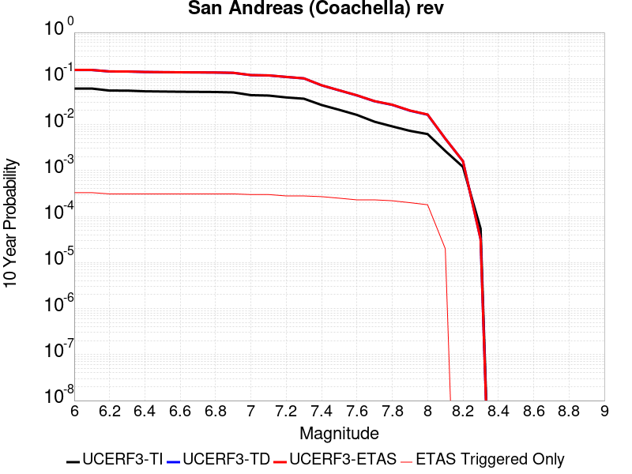 |

| Magnitude | 1 wk TI Prob | 1 wk TD Prob | 1 wk ETAS Prob | 1 wk ETAS/TD Gain | 1 wk ETAS Triggered Only | 1 mo TI Prob | 1 mo TD Prob | 1 mo ETAS Prob | 1 mo ETAS/TD Gain | 1 mo ETAS Triggered Only | 1 yr TI Prob | 1 yr TD Prob | 1 yr ETAS Prob | 1 yr ETAS/TD Gain | 1 yr ETAS Triggered Only | 10 yr TI Prob | 10 yr TD Prob | 10 yr ETAS Prob | 10 yr ETAS/TD Gain | 10 yr ETAS Triggered Only |
|-----|-----|-----|-----|-----|-----|-----|-----|-----|-----|-----|-----|-----|-----|-----|-----|-----|-----|-----|-----|-----|
| 6.0 | 1.1925945E-4 | 3.273077E-4 | 3.273077E-4 | 1.0 | 0.0 | 5.110118E-4 | 0.001401998 | 0.001401998 | 1.0 | 0.0 | 0.0062038354 | 0.016937068 | 0.016937068 | 1.0 | 0.0 | 0.060334753 | 0.15267672 | 0.15299436 | 1.0020806 | 3.7488286E-4 |
| 6.1 | 1.1925945E-4 | 3.273077E-4 | 3.273077E-4 | 1.0 | 0.0 | 5.110118E-4 | 0.001401998 | 0.001401998 | 1.0 | 0.0 | 0.0062038354 | 0.016937068 | 0.016937068 | 1.0 | 0.0 | 0.060334753 | 0.15267672 | 0.15299436 | 1.0020806 | 3.7488286E-4 |
| 6.2 | 1.07432395E-4 | 3.0231563E-4 | 3.0231563E-4 | 1.0 | 0.0 | 4.603433E-4 | 0.001294999 | 0.001294999 | 1.0 | 0.0 | 0.005590286 | 0.015653731 | 0.015653731 | 1.0 | 0.0 | 0.05451731 | 0.14182784 | 0.14214955 | 1.0022683 | 3.7488286E-4 |
| 6.3 | 1.0718766E-4 | 3.0176868E-4 | 3.0176868E-4 | 1.0 | 0.0 | 4.592948E-4 | 0.0012926573 | 0.0012926573 | 1.0 | 0.0 | 0.005577586 | 0.01562563 | 0.01562563 | 1.0 | 0.0 | 0.054396555 | 0.14159605 | 0.14191785 | 1.0022727 | 3.7488286E-4 |
| 6.4 | 1.0355944E-4 | 2.9384956E-4 | 2.9384956E-4 | 1.0 | 0.0 | 4.4375064E-4 | 0.0012587514 | 0.0012587514 | 1.0 | 0.0 | 0.0053892885 | 0.015218662 | 0.015218662 | 1.0 | 0.0 | 0.052604496 | 0.13815795 | 0.13848104 | 1.0023385 | 3.7488286E-4 |
| 6.5 | 1.0227914E-4 | 2.9104383E-4 | 2.9104383E-4 | 1.0 | 0.0 | 4.382655E-4 | 0.0012467385 | 0.0012467385 | 1.0 | 0.0 | 0.0053228354 | 0.015074439 | 0.015074439 | 1.0 | 0.0 | 0.051971316 | 0.13694239 | 0.13726592 | 1.0023626 | 3.7488286E-4 |
| 6.6 | 1.0116757E-4 | 2.8870135E-4 | 2.8870135E-4 | 1.0 | 0.0 | 4.3350324E-4 | 0.0012367087 | 0.0012367087 | 1.0 | 0.0 | 0.0052651367 | 0.014954008 | 0.014954008 | 1.0 | 0.0 | 0.051421247 | 0.13591973 | 0.13624367 | 1.0023832 | 3.7488286E-4 |
| 6.7 | 1.0050676E-4 | 2.8728697E-4 | 2.8728697E-4 | 1.0 | 0.0 | 4.3067214E-4 | 0.0012306528 | 0.0012306528 | 1.0 | 0.0 | 0.005230834 | 0.014881288 | 0.014881288 | 1.0 | 0.0 | 0.051094085 | 0.13530464 | 0.1356288 | 1.0023957 | 3.7488286E-4 |
| 6.8 | 9.976819E-5 | 2.8532353E-4 | 2.8532353E-4 | 1.0 | 0.0 | 4.2750788E-4 | 0.001222246 | 0.001222246 | 1.0 | 0.0 | 0.0051924936 | 0.014780328 | 0.014780328 | 1.0 | 0.0 | 0.050728295 | 0.13445628 | 0.13478075 | 1.0024133 | 3.7488286E-4 |
| 6.9 | 9.77719E-5 | 2.802926E-4 | 2.802926E-4 | 1.0 | 0.0 | 4.1895514E-4 | 0.0012007048 | 0.0012007048 | 1.0 | 0.0 | 0.0050888555 | 0.0145215895 | 0.0145215895 | 1.0 | 0.0 | 0.049738888 | 0.13228476 | 0.13261005 | 1.002459 | 3.7488286E-4 |
| 7.0 | 8.500761E-5 | 2.4763815E-4 | 2.4763815E-4 | 1.0 | 0.0 | 3.6426744E-4 | 0.0010608779 | 0.0010608779 | 1.0 | 0.0 | 0.0044259406 | 0.01284047 | 0.01284047 | 1.0 | 0.0 | 0.04338823 | 0.11813616 | 0.11846675 | 1.0027984 | 3.7488286E-4 |
| 7.1 | 8.319876E-5 | 2.4366553E-4 | 2.4366553E-4 | 1.0 | 0.0 | 3.5651738E-4 | 0.0010438662 | 0.0010438662 | 1.0 | 0.0 | 0.004331963 | 0.012635773 | 0.012635773 | 1.0 | 0.0 | 0.042484846 | 0.11635632 | 0.11668758 | 1.002847 | 3.7488286E-4 |
| 7.2 | 7.563917E-5 | 2.2414974E-4 | 2.2414974E-4 | 1.0 | 0.0 | 3.2412758E-4 | 9.602912E-4 | 9.602912E-4 | 1.0 | 0.0 | 0.0039391145 | 0.011629559 | 0.011629559 | 1.0 | 0.0 | 0.03870018 | 0.10776202 | 0.108096495 | 1.003104 | 3.7488286E-4 |
| 7.3 | 7.082985E-5 | 2.07311E-4 | 2.07311E-4 | 1.0 | 0.0 | 3.0352117E-4 | 8.881761E-4 | 8.881761E-4 | 1.0 | 0.0 | 0.0036891096 | 0.010760553 | 0.010760553 | 1.0 | 0.0 | 0.03628465 | 0.10028403 | 0.10062132 | 1.0033634 | 3.7488286E-4 |
| 7.4 | 5.146215E-5 | 1.4274761E-4 | 1.4274761E-4 | 1.0 | 0.0 | 2.2053342E-4 | 6.1163295E-4 | 6.1163295E-4 | 1.0 | 0.0 | 0.0026816884 | 0.0074213943 | 0.0074213943 | 1.0 | 0.0 | 0.02649557 | 0.07085049 | 0.07119881 | 1.0049163 | 3.7488286E-4 |
| 7.5 | 4.0285166E-5 | 1.0942422E-4 | 1.0942422E-4 | 1.0 | 0.0 | 1.7263928E-4 | 4.6887697E-4 | 4.6887697E-4 | 1.0 | 0.0 | 0.002099857 | 0.0056937044 | 0.0056937044 | 1.0 | 0.0 | 0.020801254 | 0.055013083 | 0.055367343 | 1.0064396 | 3.7488286E-4 |
| 7.6 | 3.1168736E-5 | 8.439599E-5 | 8.439599E-5 | 1.0 | 0.0 | 1.3357346E-4 | 3.616471E-4 | 3.616471E-4 | 1.0 | 0.0 | 0.0016250437 | 0.004394191 | 0.004394191 | 1.0 | 0.0 | 0.016132116 | 0.042812478 | 0.04299189 | 1.0041908 | 1.8744143E-4 |
| 7.7 | 2.2100989E-5 | 6.239345E-5 | 6.239345E-5 | 1.0 | 0.0 | 9.4715084E-5 | 2.6737314E-4 | 2.6737314E-4 | 1.0 | 0.0 | 0.001152546 | 0.0032504152 | 0.0032504152 | 1.0 | 0.0 | 0.011465867 | 0.031902168 | 0.03208363 | 1.0056881 | 1.8744143E-4 |
| 7.8 | 1.7484861E-5 | 5.180078E-5 | 5.180078E-5 | 1.0 | 0.0 | 7.493296E-5 | 2.2198448E-4 | 2.2198448E-4 | 1.0 | 0.0 | 9.1192697E-4 | 0.0026993142 | 0.0026993142 | 1.0 | 0.0 | 0.009081938 | 0.026641788 | 0.026824236 | 1.0068482 | 1.8744143E-4 |
| 7.9 | 1.3967285E-5 | 3.8226146E-5 | 3.8226146E-5 | 1.0 | 0.0 | 5.985842E-5 | 1.6381606E-4 | 1.6381606E-4 | 1.0 | 0.0 | 7.2853256E-4 | 0.0019926373 | 0.0019926373 | 1.0 | 0.0 | 0.0072614877 | 0.019911002 | 0.020094713 | 1.0092266 | 1.8744143E-4 |
| 8.0 | 1.1887396E-5 | 3.106798E-5 | 3.106798E-5 | 1.0 | 0.0 | 5.094499E-5 | 1.331417E-4 | 1.331417E-4 | 1.0 | 0.0 | 6.200787E-4 | 0.0016197958 | 0.0016197958 | 1.0 | 0.0 | 0.006183513 | 0.016280567 | 0.016464956 | 1.0113257 | 1.8744143E-4 |
| 8.1 | 5.100864E-6 | 8.973766E-6 | 8.973766E-6 | 1.0 | 0.0 | 2.1860664E-5 | 3.845843E-5 | 3.845843E-5 | 1.0 | 0.0 | 2.6612106E-4 | 4.6813092E-4 | 4.6813092E-4 | 1.0 | 0.0 | 0.002658026 | 0.004918092 | 0.004918092 | 1.0 | 0.0 |
| 8.2 | 2.3004484E-6 | 2.7863473E-6 | 2.7863473E-6 | 1.0 | 0.0 | 9.859027E-6 | 1.19414335E-5 | 1.19414335E-5 | 1.0 | 0.0 | 1.2002704E-4 | 1.4537729E-4 | 1.4537729E-4 | 1.0 | 0.0 | 0.0011996223 | 0.0015973782 | 0.0015973782 | 1.0 | 0.0 |
| 8.3 | 1.0424446E-7 | 5.814421E-8 | 5.814421E-8 | 1.0 | 0.0 | 4.4676187E-7 | 2.4918944E-7 | 2.4918944E-7 | 1.0 | 0.0 | 5.439312E-6 | 3.0338776E-6 | 3.0338776E-6 | 1.0 | 0.0 | 5.4391792E-5 | 3.189592E-5 | 3.189592E-5 | 1.0 | 0.0 |

## Santa Ynez (West)
*[(top)](#table-of-contents)*

| 1 Week | 1 Month | 1 Year | 10 Year |
|-----|-----|-----|-----|
|  |  |  |  |

| Magnitude | 1 wk TI Prob | 1 wk TD Prob | 1 wk ETAS Prob | 1 wk ETAS/TD Gain | 1 wk ETAS Triggered Only | 1 mo TI Prob | 1 mo TD Prob | 1 mo ETAS Prob | 1 mo ETAS/TD Gain | 1 mo ETAS Triggered Only | 1 yr TI Prob | 1 yr TD Prob | 1 yr ETAS Prob | 1 yr ETAS/TD Gain | 1 yr ETAS Triggered Only | 10 yr TI Prob | 10 yr TD Prob | 10 yr ETAS Prob | 10 yr ETAS/TD Gain | 10 yr ETAS Triggered Only |
|-----|-----|-----|-----|-----|-----|-----|-----|-----|-----|-----|-----|-----|-----|-----|-----|-----|-----|-----|-----|-----|
| 6.0 | 4.7352758E-5 | 5.497084E-5 | 5.497084E-5 | 1.0 | 0.0 | 2.0292461E-4 | 2.3556968E-4 | 2.3556968E-4 | 1.0 | 0.0 | 0.0024678076 | 0.002864558 | 0.003238367 | 1.1304945 | 3.7488286E-4 | 0.024405818 | 0.028304456 | 0.028668728 | 1.0128698 | 3.7488286E-4 |
| 6.1 | 4.7352758E-5 | 5.497084E-5 | 5.497084E-5 | 1.0 | 0.0 | 2.0292461E-4 | 2.3556968E-4 | 2.3556968E-4 | 1.0 | 0.0 | 0.0024678076 | 0.002864558 | 0.003238367 | 1.1304945 | 3.7488286E-4 | 0.024405818 | 0.028304456 | 0.028668728 | 1.0128698 | 3.7488286E-4 |
| 6.2 | 3.0415853E-5 | 3.3925004E-5 | 3.3925004E-5 | 1.0 | 0.0 | 1.3034715E-4 | 1.4538495E-4 | 1.4538495E-4 | 1.0 | 0.0 | 0.0015858212 | 0.0017686592 | 0.002142879 | 1.2115839 | 3.7488286E-4 | 0.015745522 | 0.01754978 | 0.017918082 | 1.0209862 | 3.7488286E-4 |
| 6.3 | 3.0415853E-5 | 3.3925004E-5 | 3.3925004E-5 | 1.0 | 0.0 | 1.3034715E-4 | 1.4538495E-4 | 1.4538495E-4 | 1.0 | 0.0 | 0.0015858212 | 0.0017686592 | 0.002142879 | 1.2115839 | 3.7488286E-4 | 0.015745522 | 0.01754978 | 0.017918082 | 1.0209862 | 3.7488286E-4 |
| 6.4 | 2.5452082E-5 | 2.7912318E-5 | 2.7912318E-5 | 1.0 | 0.0 | 1.09075794E-4 | 1.1961885E-4 | 1.1961885E-4 | 1.0 | 0.0 | 0.0013271887 | 0.0014554056 | 0.0018297428 | 1.2572048 | 3.7488286E-4 | 0.013192902 | 0.01446091 | 0.014830371 | 1.0255489 | 3.7488286E-4 |
| 6.5 | 2.3143784E-5 | 2.5128133E-5 | 2.5128133E-5 | 1.0 | 0.0 | 9.9183875E-5 | 1.07687636E-4 | 1.07687636E-4 | 1.0 | 0.0 | 0.0012068948 | 0.001310323 | 0.0016847146 | 1.2857246 | 3.7488286E-4 | 0.012003611 | 0.013027638 | 0.013397637 | 1.0284011 | 3.7488286E-4 |
| 6.6 | 1.9118515E-5 | 2.0354244E-5 | 2.0354244E-5 | 1.0 | 0.0 | 8.193392E-5 | 8.722961E-5 | 8.722961E-5 | 1.0 | 0.0 | 9.97089E-4 | 0.001061511 | 0.0014359959 | 1.3527848 | 3.7488286E-4 | 0.00992627 | 0.010565317 | 0.010936239 | 1.0351075 | 3.7488286E-4 |
| 6.7 | 1.722807E-5 | 1.8146253E-5 | 1.8146253E-5 | 1.0 | 0.0 | 7.3832496E-5 | 7.776737E-5 | 7.776737E-5 | 1.0 | 0.0 | 8.985399E-4 | 9.4641204E-4 | 0.0013209401 | 1.3957347 | 3.7488286E-4 | 0.008949154 | 0.009424461 | 0.009795811 | 1.0394027 | 3.7488286E-4 |
| 6.8 | 1.5317364E-5 | 1.5926391E-5 | 1.5926391E-5 | 1.0 | 0.0 | 6.56442E-5 | 6.82542E-5 | 6.82542E-5 | 1.0 | 0.0 | 7.98925E-4 | 8.3068234E-4 | 0.001017968 | 1.22546 | 1.8744143E-4 | 0.007960589 | 0.008276261 | 0.0084621515 | 1.0224606 | 1.8744143E-4 |
| 6.9 | 1.3071226E-5 | 1.332953E-5 | 1.332953E-5 | 1.0 | 0.0 | 5.6018336E-5 | 5.712532E-5 | 5.712532E-5 | 1.0 | 0.0 | 6.8180985E-4 | 6.952811E-4 | 8.8259217E-4 | 1.2694035 | 1.8744143E-4 | 0.0067972173 | 0.0069313184 | 0.0071174605 | 1.0268552 | 1.8744143E-4 |
| 7.0 | 1.1836986E-5 | 1.1932688E-5 | 1.1932688E-5 | 1.0 | 0.0 | 5.0728955E-5 | 5.1139097E-5 | 5.1139097E-5 | 1.0 | 0.0 | 6.1745E-4 | 6.2244234E-4 | 8.0976705E-4 | 1.3009512 | 1.8744143E-4 | 0.006157372 | 0.0062071825 | 0.00639346 | 1.0300101 | 1.8744143E-4 |
| 7.1 | 1.0597169E-5 | 1.0542107E-5 | 1.0542107E-5 | 1.0 | 0.0 | 4.541565E-5 | 4.5179684E-5 | 4.5179684E-5 | 1.0 | 0.0 | 5.5279525E-4 | 5.4992497E-4 | 7.372633E-4 | 1.3406616 | 1.8744143E-4 | 0.0055142213 | 0.005485772 | 0.005672185 | 1.0339812 | 1.8744143E-4 |
| 7.2 | 9.59113E-6 | 9.45905E-6 | 9.45905E-6 | 1.0 | 0.0 | 4.11042E-5 | 4.053816E-5 | 4.053816E-5 | 1.0 | 0.0 | 5.0032866E-4 | 4.934414E-4 | 6.8079034E-4 | 1.3796781 | 1.8744143E-4 | 0.004992037 | 0.0049235765 | 0.005110095 | 1.0378827 | 1.8744143E-4 |
| 7.3 | 8.586084E-6 | 8.379489E-6 | 8.379489E-6 | 1.0 | 0.0 | 3.679698E-5 | 3.591161E-5 | 3.591161E-5 | 1.0 | 0.0 | 4.4791115E-4 | 4.3713715E-4 | 6.2449666E-4 | 1.4286057 | 1.8744143E-4 | 0.004470094 | 0.004362884 | 0.0045495075 | 1.0427753 | 1.8744143E-4 |
| 7.4 | 7.2622997E-6 | 6.9514485E-6 | 6.9514485E-6 | 1.0 | 0.0 | 3.112377E-5 | 2.9791589E-5 | 2.9791589E-5 | 1.0 | 0.0 | 3.78866E-4 | 3.6265317E-4 | 5.5002666E-4 | 1.5166739 | 1.8744143E-4 | 0.0037822074 | 0.003620714 | 0.0038074767 | 1.0515817 | 1.8744143E-4 |
| 7.5 | 5.627296E-6 | 5.2514984E-6 | 5.2514984E-6 | 1.0 | 0.0 | 2.411676E-5 | 2.2506232E-5 | 2.2506232E-5 | 1.0 | 0.0 | 2.9358198E-4 | 2.7397962E-4 | 4.613697E-4 | 1.6839563 | 1.8744143E-4 | 0.0029319443 | 0.0027364905 | 0.002923419 | 1.0683095 | 1.8744143E-4 |
| 7.6 | 2.265244E-6 | 2.0608632E-6 | 2.0608632E-6 | 1.0 | 0.0 | 9.708152E-6 | 8.832241E-6 | 8.832241E-6 | 1.0 | 0.0 | 1.18190335E-4 | 1.0752732E-4 | 2.9494858E-4 | 2.7430108 | 1.8744143E-4 | 0.001181275 | 0.0010747615 | 0.0012620015 | 1.1742153 | 1.8744143E-4 |
| 7.7 | 1.3099874E-6 | 1.1016228E-6 | 1.1016228E-6 | 1.0 | 0.0 | 5.61422E-6 | 4.7212325E-6 | 4.7212325E-6 | 1.0 | 0.0 | 6.8350986E-5 | 5.7479516E-5 | 2.4491016E-4 | 4.260825 | 1.8744143E-4 | 6.832996E-4 | 5.7464885E-4 | 7.619826E-4 | 1.3259969 | 1.8744143E-4 |
| 7.8 | 7.903951E-7 | 6.0710704E-7 | 6.0710704E-7 | 1.0 | 0.0 | 3.3874032E-6 | 2.601885E-6 | 2.601885E-6 | 1.0 | 0.0 | 4.1240855E-5 | 3.16775E-5 | 3.16775E-5 | 1.0 | 0.0 | 4.12332E-4 | 3.167312E-4 | 3.167312E-4 | 1.0 | 0.0 |
| 7.9 | 7.0753297E-9 | 5.090092E-9 | 5.090092E-9 | 1.0 | 0.0 | 3.032284E-8 | 2.181468E-8 | 2.181468E-8 | 1.0 | 0.0 | 3.6918053E-7 | 2.655937E-7 | 2.655937E-7 | 1.0 | 0.0 | 3.691799E-6 | 2.6559348E-6 | 2.6559348E-6 | 1.0 | 0.0 |

## Imperial
*[(top)](#table-of-contents)*

| 1 Week | 1 Month | 1 Year | 10 Year |
|-----|-----|-----|-----|
|  |  |  |  |

| Magnitude | 1 wk TI Prob | 1 wk TD Prob | 1 wk ETAS Prob | 1 wk ETAS/TD Gain | 1 wk ETAS Triggered Only | 1 mo TI Prob | 1 mo TD Prob | 1 mo ETAS Prob | 1 mo ETAS/TD Gain | 1 mo ETAS Triggered Only | 1 yr TI Prob | 1 yr TD Prob | 1 yr ETAS Prob | 1 yr ETAS/TD Gain | 1 yr ETAS Triggered Only | 10 yr TI Prob | 10 yr TD Prob | 10 yr ETAS Prob | 10 yr ETAS/TD Gain | 10 yr ETAS Triggered Only |
|-----|-----|-----|-----|-----|-----|-----|-----|-----|-----|-----|-----|-----|-----|-----|-----|-----|-----|-----|-----|-----|
| 6.0 | 2.7496446E-4 | 5.055345E-4 | 5.055345E-4 | 1.0 | 0.0 | 0.0011778869 | 0.002164817 | 0.002164817 | 1.0 | 0.0 | 0.0142467655 | 0.026048409 | 0.026048409 | 1.0 | 0.0 | 0.13367249 | 0.22807029 | 0.22835967 | 1.0012689 | 3.7488286E-4 |
| 6.1 | 2.5356023E-4 | 4.8657708E-4 | 4.8657708E-4 | 1.0 | 0.0 | 0.001086234 | 0.002083702 | 0.002083702 | 1.0 | 0.0 | 0.013144928 | 0.02507094 | 0.02507094 | 1.0 | 0.0 | 0.123940155 | 0.21949561 | 0.21978821 | 1.001333 | 3.7488286E-4 |
| 6.2 | 2.4820742E-4 | 4.775311E-4 | 4.775311E-4 | 1.0 | 0.0 | 0.0010633124 | 0.0020449946 | 0.0020449946 | 1.0 | 0.0 | 0.01286919 | 0.024610676 | 0.024610676 | 1.0 | 0.0 | 0.12148927 | 0.21600136 | 0.21629527 | 1.0013607 | 3.7488286E-4 |
| 6.3 | 2.3205351E-4 | 4.5892023E-4 | 4.5892023E-4 | 1.0 | 0.0 | 9.94136E-4 | 0.0019653554 | 0.0019653554 | 1.0 | 0.0 | 0.012036599 | 0.023661187 | 0.023661187 | 1.0 | 0.0 | 0.11405133 | 0.20793827 | 0.2082352 | 1.001428 | 3.7488286E-4 |
| 6.4 | 2.0304754E-4 | 3.9878016E-4 | 3.9878016E-4 | 1.0 | 0.0 | 8.6991355E-4 | 0.0017079529 | 0.0017079529 | 1.0 | 0.0 | 0.010539869 | 0.020595418 | 0.020595418 | 1.0 | 0.0 | 0.100537635 | 0.18507113 | 0.18537663 | 1.0016507 | 3.7488286E-4 |
| 6.5 | 1.854992E-4 | 3.6990462E-4 | 3.6990462E-4 | 1.0 | 0.0 | 7.9475436E-4 | 0.0015843548 | 0.0015843548 | 1.0 | 0.0 | 0.009633281 | 0.01911443 | 0.01911443 | 1.0 | 0.0 | 0.0922623 | 0.1733039 | 0.1736138 | 1.0017883 | 3.7488286E-4 |
| 6.6 | 1.6586106E-4 | 3.4036173E-4 | 3.4036173E-4 | 1.0 | 0.0 | 7.106394E-4 | 0.0014578878 | 0.0014578878 | 1.0 | 0.0 | 0.008617763 | 0.017607626 | 0.017607626 | 1.0 | 0.0 | 0.08291132 | 0.16078055 | 0.16109516 | 1.0019567 | 3.7488286E-4 |
| 6.7 | 1.4224656E-4 | 3.076812E-4 | 3.076812E-4 | 1.0 | 0.0 | 6.094856E-4 | 0.0013179756 | 0.0013179756 | 1.0 | 0.0 | 0.0073952693 | 0.015928522 | 0.015928522 | 1.0 | 0.0 | 0.07153955 | 0.14648798 | 0.14680795 | 1.0021843 | 3.7488286E-4 |
| 6.8 | 1.2317259E-4 | 2.779231E-4 | 2.779231E-4 | 1.0 | 0.0 | 5.2777573E-4 | 0.0011905615 | 0.0011905615 | 1.0 | 0.0 | 0.0064067547 | 0.014400131 | 0.014400131 | 1.0 | 0.0 | 0.06225166 | 0.13294089 | 0.13326593 | 1.002445 | 3.7488286E-4 |
| 6.9 | 9.859898E-5 | 2.5015484E-4 | 2.5015484E-4 | 1.0 | 0.0 | 4.2249862E-4 | 0.0010716559 | 0.0010716559 | 1.0 | 0.0 | 0.0051317946 | 0.012970319 | 0.012970319 | 1.0 | 0.0 | 0.05014893 | 0.119408876 | 0.11973899 | 1.0027646 | 3.7488286E-4 |
| 7.0 | 7.3191884E-5 | 2.1267848E-4 | 2.1267848E-4 | 1.0 | 0.0 | 3.136418E-4 | 9.11164E-4 | 9.11164E-4 | 1.0 | 0.0 | 0.003811904 | 0.011037681 | 0.011037681 | 1.0 | 0.0 | 0.037471764 | 0.10206756 | 0.102404185 | 1.003298 | 3.7488286E-4 |
| 7.1 | 7.1760296E-5 | 2.0969207E-4 | 2.0969207E-4 | 1.0 | 0.0 | 3.0750787E-4 | 8.9837395E-4 | 8.9837395E-4 | 1.0 | 0.0 | 0.003737482 | 0.010883528 | 0.010883528 | 1.0 | 0.0 | 0.03675245 | 0.10070406 | 0.10104119 | 1.0033478 | 3.7488286E-4 |
| 7.2 | 6.46614E-5 | 1.9137723E-4 | 1.9137723E-4 | 1.0 | 0.0 | 2.7709085E-4 | 8.199333E-4 | 8.199333E-4 | 1.0 | 0.0 | 0.0033683628 | 0.009937617 | 0.009937617 | 1.0 | 0.0 | 0.033177625 | 0.092511006 | 0.09285121 | 1.0036774 | 3.7488286E-4 |
| 7.3 | 6.088115E-5 | 1.780939E-4 | 1.780939E-4 | 1.0 | 0.0 | 2.6089314E-4 | 7.6303916E-4 | 7.6303916E-4 | 1.0 | 0.0 | 0.0031717476 | 0.009251006 | 0.009251006 | 1.0 | 0.0 | 0.031268585 | 0.08656135 | 0.08690379 | 1.003956 | 3.7488286E-4 |
| 7.4 | 4.199346E-5 | 1.1511097E-4 | 1.1511097E-4 | 1.0 | 0.0 | 1.7995955E-4 | 4.932403E-4 | 4.932403E-4 | 1.0 | 0.0 | 0.0021888057 | 0.005988835 | 0.005988835 | 1.0 | 0.0 | 0.02167372 | 0.05744024 | 0.057793587 | 1.0061516 | 3.7488286E-4 |
| 7.5 | 3.130448E-5 | 8.333871E-5 | 8.333871E-5 | 1.0 | 0.0 | 1.3415517E-4 | 3.5711733E-4 | 3.5711733E-4 | 1.0 | 0.0 | 0.0016321153 | 0.0043392954 | 0.0043392954 | 1.0 | 0.0 | 0.016201803 | 0.042133506 | 0.042492595 | 1.0085226 | 3.7488286E-4 |
| 7.6 | 2.3074248E-5 | 6.0849357E-5 | 6.0849357E-5 | 1.0 | 0.0 | 9.888588E-5 | 2.6075702E-4 | 2.6075702E-4 | 1.0 | 0.0 | 0.0012032706 | 0.0031701182 | 0.0031701182 | 1.0 | 0.0 | 0.011967761 | 0.03102816 | 0.031209787 | 1.0058535 | 1.8744143E-4 |
| 7.7 | 1.45864815E-5 | 4.0128452E-5 | 4.0128452E-5 | 1.0 | 0.0 | 6.2511994E-5 | 1.7196777E-4 | 1.7196777E-4 | 1.0 | 0.0 | 7.608177E-4 | 0.0020917025 | 0.0020917025 | 1.0 | 0.0 | 0.007582182 | 0.02062909 | 0.020812664 | 1.0088989 | 1.8744143E-4 |
| 7.8 | 1.0352979E-5 | 3.096395E-5 | 3.096395E-5 | 1.0 | 0.0 | 4.4369157E-5 | 1.326959E-4 | 1.326959E-4 | 1.0 | 0.0 | 5.400606E-4 | 0.0016143778 | 0.0016143778 | 1.0 | 0.0 | 0.0053875 | 0.016017893 | 0.016202332 | 1.0115145 | 1.8744143E-4 |
| 7.9 | 8.137906E-6 | 2.2151205E-5 | 2.2151205E-5 | 1.0 | 0.0 | 3.4876273E-5 | 9.493029E-5 | 9.493029E-5 | 1.0 | 0.0 | 4.2453592E-4 | 0.0011551644 | 0.0011551644 | 1.0 | 0.0 | 0.004237258 | 0.011618842 | 0.011804106 | 1.0159451 | 1.8744143E-4 |
| 8.0 | 6.93792E-6 | 1.8010365E-5 | 1.8010365E-5 | 1.0 | 0.0 | 2.9733603E-5 | 7.7185E-5 | 7.7185E-5 | 1.0 | 0.0 | 3.6194647E-4 | 9.3932304E-4 | 9.3932304E-4 | 1.0 | 0.0 | 0.0036135751 | 0.009502415 | 0.009688075 | 1.0195382 | 1.8744143E-4 |
| 8.1 | 3.4286315E-6 | 6.380179E-6 | 6.380179E-6 | 1.0 | 0.0 | 1.4694053E-5 | 2.734334E-5 | 2.734334E-5 | 1.0 | 0.0 | 1.7888541E-4 | 3.3285443E-4 | 3.3285443E-4 | 1.0 | 0.0 | 0.0017874148 | 0.0034863674 | 0.0034863674 | 1.0 | 0.0 |
| 8.2 | 1.4906886E-6 | 1.936633E-6 | 1.936633E-6 | 1.0 | 0.0 | 6.3886496E-6 | 8.2998295E-6 | 8.2998295E-6 | 1.0 | 0.0 | 7.7779034E-5 | 1.0104576E-4 | 1.0104576E-4 | 1.0 | 0.0 | 7.775182E-4 | 0.0011075423 | 0.0011075423 | 1.0 | 0.0 |
| 8.3 | 2.5758007E-8 | 1.4495866E-8 | 1.4495866E-8 | 1.0 | 0.0 | 1.10391454E-7 | 6.212514E-8 | 6.212514E-8 | 1.0 | 0.0 | 1.3440151E-6 | 7.563736E-7 | 7.563736E-7 | 1.0 | 0.0 | 1.344007E-5 | 7.884359E-6 | 7.884359E-6 | 1.0 | 0.0 |

## San Andreas (Big Bend)
*[(top)](#table-of-contents)*

| 1 Week | 1 Month | 1 Year | 10 Year |
|-----|-----|-----|-----|
|  |  |  |  |

| Magnitude | 1 wk TI Prob | 1 wk TD Prob | 1 wk ETAS Prob | 1 wk ETAS/TD Gain | 1 wk ETAS Triggered Only | 1 mo TI Prob | 1 mo TD Prob | 1 mo ETAS Prob | 1 mo ETAS/TD Gain | 1 mo ETAS Triggered Only | 1 yr TI Prob | 1 yr TD Prob | 1 yr ETAS Prob | 1 yr ETAS/TD Gain | 1 yr ETAS Triggered Only | 10 yr TI Prob | 10 yr TD Prob | 10 yr ETAS Prob | 10 yr ETAS/TD Gain | 10 yr ETAS Triggered Only |
|-----|-----|-----|-----|-----|-----|-----|-----|-----|-----|-----|-----|-----|-----|-----|-----|-----|-----|-----|-----|-----|
| 6.0 | 1.0179969E-4 | 2.0073925E-4 | 3.8814306E-4 | 1.9335682 | 1.8744143E-4 | 4.362114E-4 | 8.6002843E-4 | 0.0010473087 | 1.2177604 | 1.8744143E-4 | 0.0052979486 | 0.010420859 | 0.010606348 | 1.0177997 | 1.8744143E-4 | 0.051734097 | 0.101455905 | 0.10179276 | 1.0033201 | 3.7488286E-4 |
| 6.1 | 1.0179969E-4 | 2.0073925E-4 | 3.8814306E-4 | 1.9335682 | 1.8744143E-4 | 4.362114E-4 | 8.6002843E-4 | 0.0010473087 | 1.2177604 | 1.8744143E-4 | 0.0052979486 | 0.010420859 | 0.010606348 | 1.0177997 | 1.8744143E-4 | 0.051734097 | 0.101455905 | 0.10179276 | 1.0033201 | 3.7488286E-4 |
| 6.2 | 1.0179969E-4 | 2.0073925E-4 | 3.8814306E-4 | 1.9335682 | 1.8744143E-4 | 4.362114E-4 | 8.6002843E-4 | 0.0010473087 | 1.2177604 | 1.8744143E-4 | 0.0052979486 | 0.010420859 | 0.010606348 | 1.0177997 | 1.8744143E-4 | 0.051734097 | 0.101455905 | 0.10179276 | 1.0033201 | 3.7488286E-4 |
| 6.3 | 1.0179969E-4 | 2.0073925E-4 | 3.8814306E-4 | 1.9335682 | 1.8744143E-4 | 4.362114E-4 | 8.6002843E-4 | 0.0010473087 | 1.2177604 | 1.8744143E-4 | 0.0052979486 | 0.010420859 | 0.010606348 | 1.0177997 | 1.8744143E-4 | 0.051734097 | 0.101455905 | 0.10179276 | 1.0033201 | 3.7488286E-4 |
| 6.4 | 9.1639464E-5 | 1.8430917E-4 | 3.7171604E-4 | 2.016807 | 1.8744143E-4 | 3.9268145E-4 | 7.896575E-4 | 9.76951E-4 | 1.2371831 | 1.8744143E-4 | 0.0047704205 | 0.009571818 | 0.009757466 | 1.0193952 | 1.8744143E-4 | 0.046693064 | 0.09378695 | 0.09412667 | 1.0036223 | 3.7488286E-4 |
| 6.5 | 9.1639464E-5 | 1.8430917E-4 | 3.7171604E-4 | 2.016807 | 1.8744143E-4 | 3.9268145E-4 | 7.896575E-4 | 9.76951E-4 | 1.2371831 | 1.8744143E-4 | 0.0047704205 | 0.009571818 | 0.009757466 | 1.0193952 | 1.8744143E-4 | 0.046693064 | 0.09378695 | 0.09412667 | 1.0036223 | 3.7488286E-4 |
| 6.6 | 9.042622E-5 | 1.8238011E-4 | 3.6978736E-4 | 2.027564 | 1.8744143E-4 | 3.8748336E-4 | 7.813951E-4 | 9.686901E-4 | 1.239693 | 1.8744143E-4 | 0.0047074095 | 0.0094721 | 0.009657766 | 1.0196013 | 1.8744143E-4 | 0.046089325 | 0.09287721 | 0.093217276 | 1.0036614 | 3.7488286E-4 |
| 6.7 | 8.9836685E-5 | 1.8152347E-4 | 1.8152347E-4 | 1.0 | 0.0 | 3.8495753E-4 | 7.7772595E-4 | 7.7772595E-4 | 1.0 | 0.0 | 0.00467679 | 0.009427815 | 0.009427815 | 1.0 | 0.0 | 0.045795817 | 0.09247148 | 0.09264159 | 1.0018395 | 1.8744143E-4 |
| 6.8 | 8.9471854E-5 | 1.8099119E-4 | 1.8099119E-4 | 1.0 | 0.0 | 3.8339442E-4 | 7.754462E-4 | 7.754462E-4 | 1.0 | 0.0 | 0.004657841 | 0.009400298 | 0.009400298 | 1.0 | 0.0 | 0.04561414 | 0.0922192 | 0.09238936 | 1.0018451 | 1.8744143E-4 |
| 6.9 | 8.858234E-5 | 1.7981093E-4 | 1.7981093E-4 | 1.0 | 0.0 | 3.7958333E-4 | 7.7039085E-4 | 7.7039085E-4 | 1.0 | 0.0 | 0.004611638 | 0.009339278 | 0.009339278 | 1.0 | 0.0 | 0.04517103 | 0.09165911 | 0.09182937 | 1.0018575 | 1.8744143E-4 |
| 7.0 | 8.7433385E-5 | 1.7819891E-4 | 1.7819891E-4 | 1.0 | 0.0 | 3.746607E-4 | 7.6348626E-4 | 7.6348626E-4 | 1.0 | 0.0 | 0.004551957 | 0.009255932 | 0.009255932 | 1.0 | 0.0 | 0.044598386 | 0.09089323 | 0.09106363 | 1.0018748 | 1.8744143E-4 |
| 7.1 | 8.684964E-5 | 1.7731842E-4 | 1.7731842E-4 | 1.0 | 0.0 | 3.7215967E-4 | 7.597149E-4 | 7.597149E-4 | 1.0 | 0.0 | 0.0045216335 | 0.009210405 | 0.009210405 | 1.0 | 0.0 | 0.04430731 | 0.09047475 | 0.09064523 | 1.0018843 | 1.8744143E-4 |
| 7.2 | 8.606521E-5 | 1.7622454E-4 | 1.7622454E-4 | 1.0 | 0.0 | 3.6879873E-4 | 7.550296E-4 | 7.550296E-4 | 1.0 | 0.0 | 0.0044808835 | 0.009153842 | 0.009153842 | 1.0 | 0.0 | 0.043916024 | 0.08995518 | 0.09012576 | 1.0018963 | 1.8744143E-4 |
| 7.3 | 8.568266E-5 | 1.7564454E-4 | 1.7564454E-4 | 1.0 | 0.0 | 3.6715972E-4 | 7.5254537E-4 | 7.5254537E-4 | 1.0 | 0.0 | 0.0044610105 | 0.00912385 | 0.00912385 | 1.0 | 0.0 | 0.043725148 | 0.08967623 | 0.089846864 | 1.0019028 | 1.8744143E-4 |
| 7.4 | 8.5432206E-5 | 1.752704E-4 | 1.752704E-4 | 1.0 | 0.0 | 3.6608664E-4 | 7.509428E-4 | 7.509428E-4 | 1.0 | 0.0 | 0.004447999 | 0.009104501 | 0.009104501 | 1.0 | 0.0 | 0.043600157 | 0.08949642 | 0.08966709 | 1.001907 | 1.8744143E-4 |
| 7.5 | 8.4791965E-5 | 1.7396381E-4 | 1.7396381E-4 | 1.0 | 0.0 | 3.633435E-4 | 7.4534636E-4 | 7.4534636E-4 | 1.0 | 0.0 | 0.0044147377 | 0.009036932 | 0.009036932 | 1.0 | 0.0 | 0.043280575 | 0.08887209 | 0.08904287 | 1.0019217 | 1.8744143E-4 |
| 7.6 | 8.241105E-5 | 1.6841735E-4 | 1.6841735E-4 | 1.0 | 0.0 | 3.531424E-4 | 7.2158914E-4 | 7.2158914E-4 | 1.0 | 0.0 | 0.0042910352 | 0.008750047 | 0.008750047 | 1.0 | 0.0 | 0.042091176 | 0.08625032 | 0.086421594 | 1.0019858 | 1.8744143E-4 |
| 7.7 | 7.00432E-5 | 1.4205615E-4 | 1.4205615E-4 | 1.0 | 0.0 | 3.001506E-4 | 6.0867006E-4 | 6.0867006E-4 | 1.0 | 0.0 | 0.0036482112 | 0.0073854174 | 0.0073854174 | 1.0 | 0.0 | 0.035888977 | 0.07352299 | 0.07369665 | 1.002362 | 1.8744143E-4 |
| 7.8 | 6.415362E-5 | 1.2969968E-4 | 1.2969968E-4 | 1.0 | 0.0 | 2.749151E-4 | 5.557374E-4 | 5.557374E-4 | 1.0 | 0.0 | 0.0033419547 | 0.0067451415 | 0.0067451415 | 1.0 | 0.0 | 0.03292141 | 0.06725514 | 0.067429975 | 1.0025996 | 1.8744143E-4 |
| 7.9 | 4.939911E-5 | 9.341721E-5 | 9.341721E-5 | 1.0 | 0.0 | 2.116933E-4 | 4.0029807E-4 | 4.0029807E-4 | 1.0 | 0.0 | 0.0025743195 | 0.004862747 | 0.004862747 | 1.0 | 0.0 | 0.025447013 | 0.048915803 | 0.049094073 | 1.0036445 | 1.8744143E-4 |
| 8.0 | 3.344983E-5 | 5.2228E-5 | 5.2228E-5 | 1.0 | 0.0 | 1.4334853E-4 | 2.2381509E-4 | 2.2381509E-4 | 1.0 | 0.0 | 0.0017438711 | 0.0027215453 | 0.0027215453 | 1.0 | 0.0 | 0.017302496 | 0.027923161 | 0.028105369 | 1.0065253 | 1.8744143E-4 |
| 8.1 | 1.9104898E-5 | 1.9171663E-5 | 1.9171663E-5 | 1.0 | 0.0 | 8.1875565E-5 | 8.2161685E-5 | 8.2161685E-5 | 1.0 | 0.0 | 9.963791E-4 | 9.9986E-4 | 9.9986E-4 | 1.0 | 0.0 | 0.009919235 | 0.010749552 | 0.010749552 | 1.0 | 0.0 |
| 8.2 | 8.643924E-6 | 5.473668E-6 | 5.473668E-6 | 1.0 | 0.0 | 3.704486E-5 | 2.3458366E-5 | 2.3458366E-5 | 1.0 | 0.0 | 4.5092785E-4 | 2.8556827E-4 | 2.8556827E-4 | 1.0 | 0.0 | 0.0045001395 | 0.0032481793 | 0.0032481793 | 1.0 | 0.0 |
| 8.3 | 1.983087E-6 | 7.6564595E-7 | 7.6564595E-7 | 1.0 | 0.0 | 8.498917E-6 | 3.281336E-6 | 3.281336E-6 | 1.0 | 0.0 | 1.034694E-4 | 3.9949547E-5 | 3.9949547E-5 | 1.0 | 0.0 | 0.0010342124 | 4.717979E-4 | 4.717979E-4 | 1.0 | 0.0 |

## San Jacinto (San Bernardino)
*[(top)](#table-of-contents)*

| 1 Week | 1 Month | 1 Year | 10 Year |
|-----|-----|-----|-----|
|  |  |  |  |

| Magnitude | 1 wk TI Prob | 1 wk TD Prob | 1 wk ETAS Prob | 1 wk ETAS/TD Gain | 1 wk ETAS Triggered Only | 1 mo TI Prob | 1 mo TD Prob | 1 mo ETAS Prob | 1 mo ETAS/TD Gain | 1 mo ETAS Triggered Only | 1 yr TI Prob | 1 yr TD Prob | 1 yr ETAS Prob | 1 yr ETAS/TD Gain | 1 yr ETAS Triggered Only | 10 yr TI Prob | 10 yr TD Prob | 10 yr ETAS Prob | 10 yr ETAS/TD Gain | 10 yr ETAS Triggered Only |
|-----|-----|-----|-----|-----|-----|-----|-----|-----|-----|-----|-----|-----|-----|-----|-----|-----|-----|-----|-----|-----|
| 6.0 | 3.409352E-5 | 3.598562E-5 | 3.598562E-5 | 1.0 | 0.0 | 1.461069E-4 | 1.5421498E-4 | 3.4162748E-4 | 2.215268 | 1.8744143E-4 | 0.0017774 | 0.0018759521 | 0.0020630418 | 1.0997306 | 1.8744143E-4 | 0.01763251 | 0.019349992 | 0.019533807 | 1.0094994 | 1.8744143E-4 |
| 6.1 | 3.409352E-5 | 3.598562E-5 | 3.598562E-5 | 1.0 | 0.0 | 1.461069E-4 | 1.5421498E-4 | 3.4162748E-4 | 2.215268 | 1.8744143E-4 | 0.0017774 | 0.0018759521 | 0.0020630418 | 1.0997306 | 1.8744143E-4 | 0.01763251 | 0.019349992 | 0.019533807 | 1.0094994 | 1.8744143E-4 |
| 6.2 | 3.409352E-5 | 3.598562E-5 | 3.598562E-5 | 1.0 | 0.0 | 1.461069E-4 | 1.5421498E-4 | 3.4162748E-4 | 2.215268 | 1.8744143E-4 | 0.0017774 | 0.0018759521 | 0.0020630418 | 1.0997306 | 1.8744143E-4 | 0.01763251 | 0.019349992 | 0.019533807 | 1.0094994 | 1.8744143E-4 |
| 6.3 | 3.409352E-5 | 3.598562E-5 | 3.598562E-5 | 1.0 | 0.0 | 1.461069E-4 | 1.5421498E-4 | 3.4162748E-4 | 2.215268 | 1.8744143E-4 | 0.0017774 | 0.0018759521 | 0.0020630418 | 1.0997306 | 1.8744143E-4 | 0.01763251 | 0.019349992 | 0.019533807 | 1.0094994 | 1.8744143E-4 |
| 6.4 | 3.400795E-5 | 3.5878285E-5 | 3.5878285E-5 | 1.0 | 0.0 | 1.4574021E-4 | 1.5375503E-4 | 3.4116762E-4 | 2.218904 | 1.8744143E-4 | 0.0017729428 | 0.0018703619 | 0.0020574527 | 1.1000292 | 1.8744143E-4 | 0.017588645 | 0.019295074 | 0.019478898 | 1.0095271 | 1.8744143E-4 |
| 6.5 | 3.341482E-5 | 3.5138914E-5 | 3.5138914E-5 | 1.0 | 0.0 | 1.4319851E-4 | 1.5058667E-4 | 3.3799987E-4 | 2.2445538 | 1.8744143E-4 | 0.0017420477 | 0.0018318522 | 0.0020189504 | 1.102136 | 1.8744143E-4 | 0.017284546 | 0.018916616 | 0.019100511 | 1.0097214 | 1.8744143E-4 |
| 6.6 | 3.3364955E-5 | 3.5076133E-5 | 3.5076133E-5 | 1.0 | 0.0 | 1.4298483E-4 | 1.5031763E-4 | 3.377309E-4 | 2.2467816 | 1.8744143E-4 | 0.0017394501 | 0.0018285823 | 0.002015681 | 1.102319 | 1.8744143E-4 | 0.017258976 | 0.01888448 | 0.019068383 | 1.0097382 | 1.8744143E-4 |
| 6.7 | 3.335922E-5 | 3.5065907E-5 | 3.5065907E-5 | 1.0 | 0.0 | 1.4296026E-4 | 1.5027382E-4 | 3.3768706E-4 | 2.2471452 | 1.8744143E-4 | 0.0017391514 | 0.0018280497 | 0.0020151485 | 1.1023488 | 1.8744143E-4 | 0.017256035 | 0.018879272 | 0.019063175 | 1.009741 | 1.8744143E-4 |
| 6.8 | 3.327683E-5 | 3.4959972E-5 | 3.4959972E-5 | 1.0 | 0.0 | 1.4260718E-4 | 1.4981985E-4 | 3.3723318E-4 | 2.2509246 | 1.8744143E-4 | 0.0017348597 | 0.001822532 | 0.0020096318 | 1.1026592 | 1.8744143E-4 | 0.017213784 | 0.018825045 | 0.019008957 | 1.0097696 | 1.8744143E-4 |
| 6.9 | 3.3235785E-5 | 3.4900928E-5 | 3.4900928E-5 | 1.0 | 0.0 | 1.4243131E-4 | 1.4956683E-4 | 3.369802E-4 | 2.253041 | 1.8744143E-4 | 0.0017327217 | 0.0018194567 | 0.002006557 | 1.1028332 | 1.8744143E-4 | 0.017192734 | 0.018794911 | 0.018978829 | 1.0097855 | 1.8744143E-4 |
| 7.0 | 3.3197095E-5 | 3.4840854E-5 | 3.4840854E-5 | 1.0 | 0.0 | 1.422655E-4 | 1.4930942E-4 | 3.3672285E-4 | 2.2552018 | 1.8744143E-4 | 0.0017307063 | 0.0018163278 | 0.0020034288 | 1.1030105 | 1.8744143E-4 | 0.017172894 | 0.01876429 | 0.018948214 | 1.0098019 | 1.8744143E-4 |
| 7.1 | 3.3129716E-5 | 3.4721066E-5 | 3.4721066E-5 | 1.0 | 0.0 | 1.4197677E-4 | 1.4879608E-4 | 3.362096E-4 | 2.2595327 | 1.8744143E-4 | 0.0017271966 | 0.0018100884 | 0.0019971905 | 1.1033663 | 1.8744143E-4 | 0.017138338 | 0.018703366 | 0.018887302 | 1.0098344 | 1.8744143E-4 |
| 7.2 | 3.3034008E-5 | 3.4588513E-5 | 3.4588513E-5 | 1.0 | 0.0 | 1.4156665E-4 | 1.4822806E-4 | 3.356417E-4 | 2.26436 | 1.8744143E-4 | 0.0017222111 | 0.0018031843 | 0.0019902878 | 1.1037627 | 1.8744143E-4 | 0.017089253 | 0.01863575 | 0.018819697 | 1.0098708 | 1.8744143E-4 |
| 7.3 | 3.2956614E-5 | 3.4456265E-5 | 3.4456265E-5 | 1.0 | 0.0 | 1.4123498E-4 | 1.4766137E-4 | 3.350751E-4 | 2.2692132 | 1.8744143E-4 | 0.0017181796 | 0.0017962961 | 0.001983401 | 1.1041614 | 1.8744143E-4 | 0.017049557 | 0.018568495 | 0.018752458 | 1.0099071 | 1.8744143E-4 |
| 7.4 | 3.2915937E-5 | 3.4377957E-5 | 3.4377957E-5 | 1.0 | 0.0 | 1.4106068E-4 | 1.473258E-4 | 3.347396E-4 | 2.2721045 | 1.8744143E-4 | 0.0017160608 | 0.0017922173 | 0.0019793229 | 1.1043988 | 1.8744143E-4 | 0.017028693 | 0.018528769 | 0.018712737 | 1.0099288 | 1.8744143E-4 |
| 7.5 | 3.281791E-5 | 3.424287E-5 | 3.424287E-5 | 1.0 | 0.0 | 1.406406E-4 | 1.4674691E-4 | 3.3416084E-4 | 2.2771235 | 1.8744143E-4 | 0.0017109542 | 0.0017851809 | 0.0019722877 | 1.1048111 | 1.8744143E-4 | 0.016978411 | 0.018459652 | 0.018643634 | 1.0099667 | 1.8744143E-4 |
| 7.6 | 3.2521442E-5 | 3.396782E-5 | 3.396782E-5 | 1.0 | 0.0 | 1.3937015E-4 | 1.4556825E-4 | 3.329824E-4 | 2.2874658 | 1.8744143E-4 | 0.0016955109 | 0.0017708542 | 0.0019579637 | 1.1056606 | 1.8744143E-4 | 0.016826328 | 0.018317295 | 0.018501302 | 1.0100456 | 1.8744143E-4 |
| 7.7 | 3.0287873E-5 | 3.245191E-5 | 3.245191E-5 | 1.0 | 0.0 | 1.297987E-4 | 1.3907222E-4 | 3.2648756E-4 | 2.347612 | 1.8744143E-4 | 0.0015791537 | 0.0016918903 | 0.0018790145 | 1.1106007 | 1.8744143E-4 | 0.01567979 | 0.017528199 | 0.017712355 | 1.0105063 | 1.8744143E-4 |
| 7.8 | 2.6316151E-5 | 2.9662837E-5 | 2.9662837E-5 | 1.0 | 0.0 | 1.1277862E-4 | 1.2712025E-4 | 3.1453784E-4 | 2.474333 | 1.8744143E-4 | 0.0013722149 | 0.0015465913 | 0.0017337428 | 1.121009 | 1.8744143E-4 | 0.013637724 | 0.016069878 | 0.016254308 | 1.0114768 | 1.8744143E-4 |
| 7.9 | 2.0761147E-5 | 2.3417291E-5 | 2.3417291E-5 | 1.0 | 0.0 | 8.897331E-5 | 1.0035596E-4 | 2.877786E-4 | 2.8675783 | 1.8744143E-4 | 0.0010827117 | 0.0012211498 | 0.0014083624 | 1.1533084 | 1.8744143E-4 | 0.010774517 | 0.012793272 | 0.012978315 | 1.0144641 | 1.8744143E-4 |
| 8.0 | 1.5738568E-5 | 1.6032505E-5 | 1.6032505E-5 | 1.0 | 0.0 | 6.744926E-5 | 6.8708934E-5 | 6.8708934E-5 | 1.0 | 0.0 | 8.2088535E-4 | 8.3621085E-4 | 8.3621085E-4 | 1.0 | 0.0 | 0.008178596 | 0.008865741 | 0.008865741 | 1.0 | 0.0 |
| 8.1 | 1.0105832E-5 | 8.329479E-6 | 8.329479E-6 | 1.0 | 0.0 | 4.3309992E-5 | 3.569728E-5 | 3.569728E-5 | 1.0 | 0.0 | 5.2717153E-4 | 4.3452822E-4 | 4.3452822E-4 | 1.0 | 0.0 | 0.005259227 | 0.0046768794 | 0.0046768794 | 1.0 | 0.0 |
| 8.2 | 4.189207E-6 | 1.577699E-6 | 1.577699E-6 | 1.0 | 0.0 | 1.7953622E-5 | 6.7615497E-6 | 6.7615497E-6 | 1.0 | 0.0 | 2.1856341E-4 | 8.231879E-5 | 8.231879E-5 | 1.0 | 0.0 | 0.0021834858 | 9.562628E-4 | 9.562628E-4 | 1.0 | 0.0 |
| 8.3 | 1.2758221E-6 | 3.612677E-7 | 3.612677E-7 | 1.0 | 0.0 | 5.4677976E-6 | 1.5482892E-6 | 1.5482892E-6 | 1.0 | 0.0 | 6.65684E-5 | 1.8850264E-5 | 1.8850264E-5 | 1.0 | 0.0 | 6.6548464E-4 | 2.2739546E-4 | 2.2739546E-4 | 1.0 | 0.0 |

## Ludlow
*[(top)](#table-of-contents)*

| 1 Week | 1 Month | 1 Year | 10 Year |
|-----|-----|-----|-----|
|  |  |  |  |

| Magnitude | 1 wk TI Prob | 1 wk TD Prob | 1 wk ETAS Prob | 1 wk ETAS/TD Gain | 1 wk ETAS Triggered Only | 1 mo TI Prob | 1 mo TD Prob | 1 mo ETAS Prob | 1 mo ETAS/TD Gain | 1 mo ETAS Triggered Only | 1 yr TI Prob | 1 yr TD Prob | 1 yr ETAS Prob | 1 yr ETAS/TD Gain | 1 yr ETAS Triggered Only | 10 yr TI Prob | 10 yr TD Prob | 10 yr ETAS Prob | 10 yr ETAS/TD Gain | 10 yr ETAS Triggered Only |
|-----|-----|-----|-----|-----|-----|-----|-----|-----|-----|-----|-----|-----|-----|-----|-----|-----|-----|-----|-----|-----|
| 6.0 | 2.2407607E-5 | 2.3657254E-5 | 2.1109424E-4 | 8.923024 | 1.8744143E-4 | 9.602906E-5 | 1.0138454E-4 | 4.7622938E-4 | 4.6972585 | 3.7488286E-4 | 0.0011685267 | 0.001233702 | 0.0016081223 | 1.3034934 | 3.7488286E-4 | 0.011624013 | 0.012273042 | 0.012643324 | 1.0301703 | 3.7488286E-4 |
| 6.1 | 2.2407607E-5 | 2.3657254E-5 | 2.1109424E-4 | 8.923024 | 1.8744143E-4 | 9.602906E-5 | 1.0138454E-4 | 4.7622938E-4 | 4.6972585 | 3.7488286E-4 | 0.0011685267 | 0.001233702 | 0.0016081223 | 1.3034934 | 3.7488286E-4 | 0.011624013 | 0.012273042 | 0.012643324 | 1.0301703 | 3.7488286E-4 |
| 6.2 | 1.0781252E-5 | 1.1365663E-5 | 1.1365663E-5 | 1.0 | 0.0 | 4.620455E-5 | 4.8709102E-5 | 2.361414E-4 | 4.8479934 | 1.8744143E-4 | 5.623952E-4 | 5.9287593E-4 | 7.8020623E-4 | 1.3159688 | 1.8744143E-4 | 0.00560974 | 0.0059133614 | 0.0060996944 | 1.0315105 | 1.8744143E-4 |
| 6.3 | 1.0781252E-5 | 1.1365663E-5 | 1.1365663E-5 | 1.0 | 0.0 | 4.620455E-5 | 4.8709102E-5 | 2.361414E-4 | 4.8479934 | 1.8744143E-4 | 5.623952E-4 | 5.9287593E-4 | 7.8020623E-4 | 1.3159688 | 1.8744143E-4 | 0.00560974 | 0.0059133614 | 0.0060996944 | 1.0315105 | 1.8744143E-4 |
| 6.4 | 7.814439E-6 | 8.237729E-6 | 8.237729E-6 | 1.0 | 0.0 | 3.3490025E-5 | 3.530408E-5 | 2.2273889E-4 | 6.309154 | 1.8744143E-4 | 4.0766477E-4 | 4.2974384E-4 | 6.171047E-4 | 1.4359827 | 1.8744143E-4 | 0.0040691774 | 0.0042892746 | 0.004475912 | 1.0435126 | 1.8744143E-4 |
| 6.5 | 6.4986366E-6 | 6.85092E-6 | 6.85092E-6 | 1.0 | 0.0 | 2.7851002E-5 | 2.9360759E-5 | 2.9360759E-5 | 1.0 | 0.0 | 3.390332E-4 | 3.5740953E-4 | 3.5740953E-4 | 1.0 | 0.0 | 0.003385164 | 0.0035684432 | 0.0035684432 | 1.0 | 0.0 |
| 6.6 | 5.582177E-6 | 5.8860055E-6 | 5.8860055E-6 | 1.0 | 0.0 | 2.3923398E-5 | 2.5225498E-5 | 2.5225498E-5 | 1.0 | 0.0 | 2.9122844E-4 | 3.0707786E-4 | 3.0707786E-4 | 1.0 | 0.0 | 0.0029084706 | 0.003066609 | 0.003066609 | 1.0 | 0.0 |
| 6.7 | 4.6858763E-6 | 4.940427E-6 | 4.940427E-6 | 1.0 | 0.0 | 2.0082172E-5 | 2.1173091E-5 | 2.1173091E-5 | 1.0 | 0.0 | 2.4447302E-4 | 2.5775246E-4 | 2.5775246E-4 | 1.0 | 0.0 | 0.0024420423 | 0.0025745912 | 0.0025745912 | 1.0 | 0.0 |
| 6.8 | 3.5584908E-6 | 3.7520183E-6 | 3.7520183E-6 | 1.0 | 0.0 | 1.5250586E-5 | 1.6079981E-5 | 1.6079981E-5 | 1.0 | 0.0 | 1.8566006E-4 | 1.957566E-4 | 1.957566E-4 | 1.0 | 0.0 | 0.0018550502 | 0.0019558826 | 0.0019558826 | 1.0 | 0.0 |
| 6.9 | 2.532834E-6 | 2.6710034E-6 | 2.6710034E-6 | 1.0 | 0.0 | 1.0854958E-5 | 1.1447109E-5 | 1.1447109E-5 | 1.0 | 0.0 | 1.3215111E-4 | 1.3935992E-4 | 1.3935992E-4 | 1.0 | 0.0 | 0.0013207254 | 0.0013927529 | 0.0013927529 | 1.0 | 0.0 |
| 7.0 | 1.7083285E-6 | 1.8019439E-6 | 1.8019439E-6 | 1.0 | 0.0 | 7.3213873E-6 | 7.722595E-6 | 7.722595E-6 | 1.0 | 0.0 | 8.913424E-5 | 9.40187E-5 | 9.40187E-5 | 1.0 | 0.0 | 8.9098496E-4 | 9.3980576E-4 | 9.3980576E-4 | 1.0 | 0.0 |
| 7.1 | 1.0905424E-6 | 1.1497619E-6 | 1.1497619E-6 | 1.0 | 0.0 | 4.6737446E-6 | 4.9275427E-6 | 4.9275427E-6 | 1.0 | 0.0 | 5.6901354E-5 | 5.999128E-5 | 5.999128E-5 | 1.0 | 0.0 | 5.6886784E-4 | 5.997606E-4 | 5.997606E-4 | 1.0 | 0.0 |
| 7.2 | 6.06668E-7 | 6.387277E-7 | 6.387277E-7 | 1.0 | 0.0 | 2.600003E-6 | 2.7374022E-6 | 2.7374022E-6 | 1.0 | 0.0 | 3.1654577E-5 | 3.3327433E-5 | 3.3327433E-5 | 1.0 | 0.0 | 3.1650066E-4 | 3.3323118E-4 | 3.3323118E-4 | 1.0 | 0.0 |

## Cleghorn
*[(top)](#table-of-contents)*

| 1 Week | 1 Month | 1 Year | 10 Year |
|-----|-----|-----|-----|
|  |  |  |  |

| Magnitude | 1 wk TI Prob | 1 wk TD Prob | 1 wk ETAS Prob | 1 wk ETAS/TD Gain | 1 wk ETAS Triggered Only | 1 mo TI Prob | 1 mo TD Prob | 1 mo ETAS Prob | 1 mo ETAS/TD Gain | 1 mo ETAS Triggered Only | 1 yr TI Prob | 1 yr TD Prob | 1 yr ETAS Prob | 1 yr ETAS/TD Gain | 1 yr ETAS Triggered Only | 10 yr TI Prob | 10 yr TD Prob | 10 yr ETAS Prob | 10 yr ETAS/TD Gain | 10 yr ETAS Triggered Only |
|-----|-----|-----|-----|-----|-----|-----|-----|-----|-----|-----|-----|-----|-----|-----|-----|-----|-----|-----|-----|-----|
| 6.0 | 7.9267165E-6 | 9.831764E-6 | 9.831764E-6 | 1.0 | 0.0 | 3.39712E-5 | 4.2135514E-5 | 4.2135514E-5 | 1.0 | 0.0 | 4.1352084E-4 | 5.1288976E-4 | 7.00235E-4 | 1.365274 | 1.8744143E-4 | 0.004127522 | 0.005132214 | 0.005505173 | 1.0726702 | 3.7488286E-4 |
| 6.1 | 7.9267165E-6 | 9.831764E-6 | 9.831764E-6 | 1.0 | 0.0 | 3.39712E-5 | 4.2135514E-5 | 4.2135514E-5 | 1.0 | 0.0 | 4.1352084E-4 | 5.1288976E-4 | 7.00235E-4 | 1.365274 | 1.8744143E-4 | 0.004127522 | 0.005132214 | 0.005505173 | 1.0726702 | 3.7488286E-4 |
| 6.2 | 7.9267165E-6 | 9.831764E-6 | 9.831764E-6 | 1.0 | 0.0 | 3.39712E-5 | 4.2135514E-5 | 4.2135514E-5 | 1.0 | 0.0 | 4.1352084E-4 | 5.1288976E-4 | 7.00235E-4 | 1.365274 | 1.8744143E-4 | 0.004127522 | 0.005132214 | 0.005505173 | 1.0726702 | 3.7488286E-4 |
| 6.3 | 7.9267165E-6 | 9.831764E-6 | 9.831764E-6 | 1.0 | 0.0 | 3.39712E-5 | 4.2135514E-5 | 4.2135514E-5 | 1.0 | 0.0 | 4.1352084E-4 | 5.1288976E-4 | 7.00235E-4 | 1.365274 | 1.8744143E-4 | 0.004127522 | 0.005132214 | 0.005505173 | 1.0726702 | 3.7488286E-4 |
| 6.4 | 4.3445207E-6 | 6.0916254E-6 | 6.0916254E-6 | 1.0 | 0.0 | 1.8619241E-5 | 2.6106709E-5 | 2.6106709E-5 | 1.0 | 0.0 | 2.2666567E-4 | 3.1780385E-4 | 3.1780385E-4 | 1.0 | 0.0 | 0.0022643462 | 0.0031877246 | 0.0033745687 | 1.0586135 | 1.8744143E-4 |
| 6.5 | 4.3445207E-6 | 6.0916254E-6 | 6.0916254E-6 | 1.0 | 0.0 | 1.8619241E-5 | 2.6106709E-5 | 2.6106709E-5 | 1.0 | 0.0 | 2.2666567E-4 | 3.1780385E-4 | 3.1780385E-4 | 1.0 | 0.0 | 0.0022643462 | 0.0031877246 | 0.0033745687 | 1.0586135 | 1.8744143E-4 |
| 6.6 | 4.040109E-6 | 5.774033E-6 | 5.774033E-6 | 1.0 | 0.0 | 1.7314638E-5 | 2.4745626E-5 | 2.4745626E-5 | 1.0 | 0.0 | 2.1078532E-4 | 3.0123728E-4 | 3.0123728E-4 | 1.0 | 0.0 | 0.002105855 | 0.0030225143 | 0.0032093893 | 1.0618277 | 1.8744143E-4 |
| 6.7 | 3.3632055E-6 | 5.06753E-6 | 5.06753E-6 | 1.0 | 0.0 | 1.4413658E-5 | 2.1717806E-5 | 2.1717806E-5 | 1.0 | 0.0 | 1.7547216E-4 | 2.643825E-4 | 2.643825E-4 | 1.0 | 0.0 | 0.0017533366 | 0.0026548486 | 0.0028417923 | 1.070416 | 1.8744143E-4 |
| 6.8 | 3.2902772E-6 | 4.9894375E-6 | 4.9894375E-6 | 1.0 | 0.0 | 1.4101111E-5 | 2.138313E-5 | 2.138313E-5 | 1.0 | 0.0 | 1.716675E-4 | 2.6030882E-4 | 2.6030882E-4 | 1.0 | 0.0 | 0.0017153495 | 0.0026142076 | 0.002801159 | 1.0715137 | 1.8744143E-4 |
| 6.9 | 3.031547E-6 | 4.6911987E-6 | 4.6911987E-6 | 1.0 | 0.0 | 1.299228E-5 | 2.0104984E-5 | 2.0104984E-5 | 1.0 | 0.0 | 1.5816953E-4 | 2.4475096E-4 | 2.4475096E-4 | 1.0 | 0.0 | 0.00158057 | 0.0024589805 | 0.002645961 | 1.0760399 | 1.8744143E-4 |
| 7.0 | 2.8259715E-6 | 4.3707637E-6 | 4.3707637E-6 | 1.0 | 0.0 | 1.211125E-5 | 1.8731711E-5 | 1.8731711E-5 | 1.0 | 0.0 | 1.4744449E-4 | 2.2803496E-4 | 2.2803496E-4 | 1.0 | 0.0 | 0.001473467 | 0.0022921748 | 0.0024791865 | 1.0815871 | 1.8744143E-4 |
| 7.1 | 2.5962665E-6 | 4.065983E-6 | 4.065983E-6 | 1.0 | 0.0 | 1.1126809E-5 | 1.7425526E-5 | 1.7425526E-5 | 1.0 | 0.0 | 1.3546048E-4 | 2.1213535E-4 | 2.1213535E-4 | 1.0 | 0.0 | 0.0013537793 | 0.0021334959 | 0.0023205373 | 1.087669 | 1.8744143E-4 |
| 7.2 | 2.3247253E-6 | 3.6765352E-6 | 3.6765352E-6 | 1.0 | 0.0 | 9.96307E-6 | 1.5756486E-5 | 1.5756486E-5 | 1.0 | 0.0 | 1.21293626E-4 | 1.9181852E-4 | 1.9181852E-4 | 1.0 | 0.0 | 0.0012122744 | 0.0019307166 | 0.002117796 | 1.0968964 | 1.8744143E-4 |
| 7.3 | 2.056928E-6 | 3.235253E-6 | 3.235253E-6 | 1.0 | 0.0 | 8.815376E-6 | 1.3865297E-5 | 1.3865297E-5 | 1.0 | 0.0 | 1.0732192E-4 | 1.6879707E-4 | 1.6879707E-4 | 1.0 | 0.0 | 0.001072701 | 0.0017009423 | 0.0018880649 | 1.1100111 | 1.8744143E-4 |
| 7.4 | 1.8055999E-6 | 2.8256538E-6 | 2.8256538E-6 | 1.0 | 0.0 | 7.738263E-6 | 1.210989E-5 | 1.210989E-5 | 1.0 | 0.0 | 9.4209274E-5 | 1.4742807E-4 | 1.4742807E-4 | 1.0 | 0.0 | 9.4169343E-4 | 0.0014876705 | 0.001674833 | 1.1258092 | 1.8744143E-4 |
| 7.5 | 1.4683443E-6 | 2.4248943E-6 | 2.4248943E-6 | 1.0 | 0.0 | 6.292889E-6 | 1.0392363E-5 | 1.0392363E-5 | 1.0 | 0.0 | 7.661323E-5 | 1.2651978E-4 | 1.2651978E-4 | 1.0 | 0.0 | 7.658682E-4 | 0.0012788812 | 0.0014660829 | 1.1463792 | 1.8744143E-4 |
| 7.6 | 9.804088E-7 | 1.9004091E-6 | 1.9004091E-6 | 1.0 | 0.0 | 4.201745E-6 | 8.144585E-6 | 8.144585E-6 | 1.0 | 0.0 | 5.1155046E-5 | 9.915586E-5 | 9.915586E-5 | 1.0 | 0.0 | 5.114327E-4 | 0.0010055583 | 0.0010055583 | 1.0 | 0.0 |
| 7.7 | 7.3434086E-7 | 1.6285549E-6 | 1.6285549E-6 | 1.0 | 0.0 | 3.1471714E-6 | 6.9795024E-6 | 6.9795024E-6 | 1.0 | 0.0 | 3.831614E-5 | 8.4972155E-5 | 8.4972155E-5 | 1.0 | 0.0 | 3.8309532E-4 | 8.6387293E-4 | 8.6387293E-4 | 1.0 | 0.0 |
| 7.8 | 6.434184E-7 | 1.5221389E-6 | 1.5221389E-6 | 1.0 | 0.0 | 2.7575045E-6 | 6.523436E-6 | 6.523436E-6 | 1.0 | 0.0 | 3.35721E-5 | 7.9419966E-5 | 7.9419966E-5 | 1.0 | 0.0 | 3.3567028E-4 | 8.080443E-4 | 8.080443E-4 | 1.0 | 0.0 |
| 7.9 | 3.4943926E-7 | 7.5750586E-7 | 7.5750586E-7 | 1.0 | 0.0 | 1.497596E-6 | 3.2464498E-6 | 3.2464498E-6 | 1.0 | 0.0 | 1.8233079E-5 | 3.9524817E-5 | 3.9524817E-5 | 1.0 | 0.0 | 1.8231584E-4 | 4.0401975E-4 | 4.0401975E-4 | 1.0 | 0.0 |
| 8.0 | 6.717524E-8 | 5.837515E-8 | 5.837515E-8 | 1.0 | 0.0 | 2.8789387E-7 | 2.501792E-7 | 2.501792E-7 | 1.0 | 0.0 | 3.505102E-6 | 3.0459275E-6 | 3.0459275E-6 | 1.0 | 0.0 | 3.5050467E-5 | 3.2751934E-5 | 3.2751934E-5 | 1.0 | 0.0 |
| 8.1 | 3.1984914E-8 | 1.2949885E-8 | 1.2949885E-8 | 1.0 | 0.0 | 1.370782E-7 | 5.549951E-8 | 5.549951E-8 | 1.0 | 0.0 | 1.6689258E-6 | 6.757063E-7 | 6.757063E-7 | 1.0 | 0.0 | 1.6689133E-5 | 7.741151E-6 | 7.741151E-6 | 1.0 | 0.0 |
| 8.2 | 1.21887656E-8 | 3.6471115E-9 | 3.6471115E-9 | 1.0 | 0.0 | 5.2237567E-8 | 1.563048E-8 | 1.563048E-8 | 1.0 | 0.0 | 6.359922E-7 | 1.9030107E-7 | 1.9030107E-7 | 1.0 | 0.0 | 6.3599036E-6 | 2.245849E-6 | 2.245849E-6 | 1.0 | 0.0 |

## Death Valley (No)
*[(top)](#table-of-contents)*

| 1 Week | 1 Month | 1 Year | 10 Year |
|-----|-----|-----|-----|
|  | 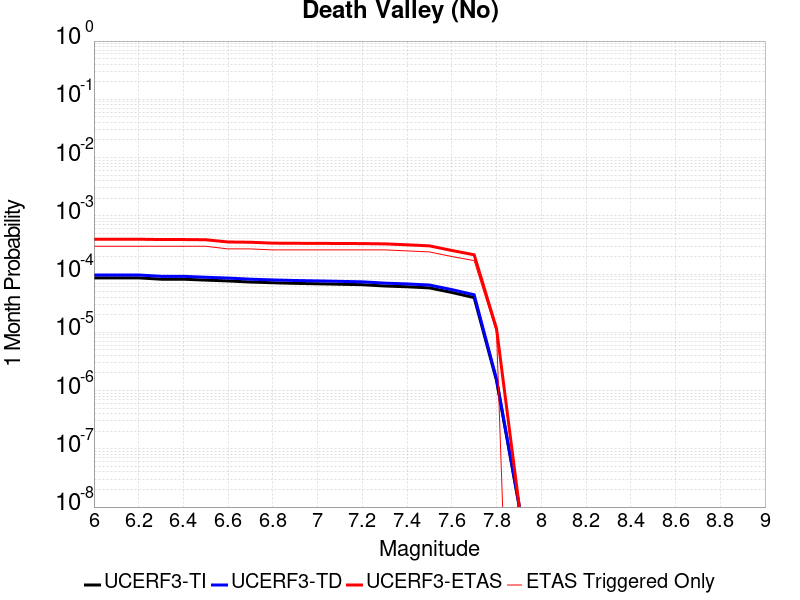 |  |  |

| Magnitude | 1 wk TI Prob | 1 wk TD Prob | 1 wk ETAS Prob | 1 wk ETAS/TD Gain | 1 wk ETAS Triggered Only | 1 mo TI Prob | 1 mo TD Prob | 1 mo ETAS Prob | 1 mo ETAS/TD Gain | 1 mo ETAS Triggered Only | 1 yr TI Prob | 1 yr TD Prob | 1 yr ETAS Prob | 1 yr ETAS/TD Gain | 1 yr ETAS Triggered Only | 10 yr TI Prob | 10 yr TD Prob | 10 yr ETAS Prob | 10 yr ETAS/TD Gain | 10 yr ETAS Triggered Only |
|-----|-----|-----|-----|-----|-----|-----|-----|-----|-----|-----|-----|-----|-----|-----|-----|-----|-----|-----|-----|-----|
| 6.0 | 2.0074807E-5 | 2.2500084E-5 | 2.2500084E-5 | 1.0 | 0.0 | 8.603206E-5 | 9.642541E-5 | 9.642541E-5 | 1.0 | 0.0 | 0.001046937 | 0.0011733545 | 0.0015477975 | 1.3191218 | 3.7488286E-4 | 0.010420183 | 0.011672506 | 0.012043013 | 1.0317419 | 3.7488286E-4 |
| 6.1 | 2.0074807E-5 | 2.2500084E-5 | 2.2500084E-5 | 1.0 | 0.0 | 8.603206E-5 | 9.642541E-5 | 9.642541E-5 | 1.0 | 0.0 | 0.001046937 | 0.0011733545 | 0.0015477975 | 1.3191218 | 3.7488286E-4 | 0.010420183 | 0.011672506 | 0.012043013 | 1.0317419 | 3.7488286E-4 |
| 6.2 | 2.0074807E-5 | 2.2500084E-5 | 2.2500084E-5 | 1.0 | 0.0 | 8.603206E-5 | 9.642541E-5 | 9.642541E-5 | 1.0 | 0.0 | 0.001046937 | 0.0011733545 | 0.0015477975 | 1.3191218 | 3.7488286E-4 | 0.010420183 | 0.011672506 | 0.012043013 | 1.0317419 | 3.7488286E-4 |
| 6.3 | 1.9050609E-5 | 2.1336948E-5 | 2.1336948E-5 | 1.0 | 0.0 | 8.164292E-5 | 9.1440896E-5 | 9.1440896E-5 | 1.0 | 0.0 | 9.935491E-4 | 0.001112731 | 0.0014871968 | 1.3365285 | 3.7488286E-4 | 0.009891188 | 0.011072419 | 0.011443151 | 1.0334824 | 3.7488286E-4 |
| 6.4 | 1.9050609E-5 | 2.1336948E-5 | 2.1336948E-5 | 1.0 | 0.0 | 8.164292E-5 | 9.1440896E-5 | 9.1440896E-5 | 1.0 | 0.0 | 9.935491E-4 | 0.001112731 | 0.0014871968 | 1.3365285 | 3.7488286E-4 | 0.009891188 | 0.011072419 | 0.011443151 | 1.0334824 | 3.7488286E-4 |
| 6.5 | 1.8367004E-5 | 2.0561009E-5 | 2.0561009E-5 | 1.0 | 0.0 | 7.8713354E-5 | 8.811567E-5 | 8.811567E-5 | 1.0 | 0.0 | 9.5791375E-4 | 0.0010722869 | 0.0014467677 | 1.3492358 | 3.7488286E-4 | 0.009537951 | 0.0106719155 | 0.011042798 | 1.0347531 | 3.7488286E-4 |
| 6.6 | 1.779439E-5 | 1.9910927E-5 | 1.9910927E-5 | 1.0 | 0.0 | 7.625944E-5 | 8.53298E-5 | 8.53298E-5 | 1.0 | 0.0 | 9.280632E-4 | 0.0010384015 | 0.001412895 | 1.3606443 | 3.7488286E-4 | 0.009241969 | 0.010336253 | 0.010707261 | 1.0358938 | 3.7488286E-4 |
| 6.7 | 1.7025437E-5 | 1.9043426E-5 | 1.9043426E-5 | 1.0 | 0.0 | 7.296412E-5 | 8.161216E-5 | 8.161216E-5 | 1.0 | 0.0 | 8.87976E-4 | 9.931813E-4 | 0.0013676918 | 1.3770818 | 3.7488286E-4 | 0.008844362 | 0.009888145 | 0.010259321 | 1.0375375 | 3.7488286E-4 |
| 6.8 | 1.6545107E-5 | 1.8512545E-5 | 1.8512545E-5 | 1.0 | 0.0 | 7.090568E-5 | 7.93371E-5 | 7.93371E-5 | 1.0 | 0.0 | 8.629347E-4 | 9.655073E-4 | 0.0013400281 | 1.3879006 | 3.7488286E-4 | 0.008595915 | 0.009613829 | 0.009985108 | 1.0386193 | 3.7488286E-4 |
| 6.9 | 1.615478E-5 | 1.8087594E-5 | 1.8087594E-5 | 1.0 | 0.0 | 6.9232934E-5 | 7.751599E-5 | 7.751599E-5 | 1.0 | 0.0 | 8.4258494E-4 | 9.433546E-4 | 0.0013178838 | 1.3970184 | 3.7488286E-4 | 0.008393973 | 0.009394196 | 0.009765557 | 1.0395309 | 3.7488286E-4 |
| 7.0 | 1.5894311E-5 | 1.780555E-5 | 1.780555E-5 | 1.0 | 0.0 | 6.81167E-5 | 7.6307304E-5 | 7.6307304E-5 | 1.0 | 0.0 | 8.2900526E-4 | 9.286515E-4 | 0.0013031862 | 1.4033103 | 3.7488286E-4 | 0.008259195 | 0.009248397 | 0.009619813 | 1.0401601 | 3.7488286E-4 |
| 7.1 | 1.5602263E-5 | 1.7483504E-5 | 1.7483504E-5 | 1.0 | 0.0 | 6.6865134E-5 | 7.492718E-5 | 7.492718E-5 | 1.0 | 0.0 | 8.137789E-4 | 9.118627E-4 | 0.0012864037 | 1.4107428 | 3.7488286E-4 | 0.008108052 | 0.009081894 | 0.009453372 | 1.0409032 | 3.7488286E-4 |
| 7.2 | 1.5323829E-5 | 1.717063E-5 | 1.717063E-5 | 1.0 | 0.0 | 6.56719E-5 | 7.358637E-5 | 7.358637E-5 | 1.0 | 0.0 | 7.99262E-4 | 8.9555193E-4 | 0.0012700991 | 1.4182305 | 3.7488286E-4 | 0.007963934 | 0.008920107 | 0.009291645 | 1.0416518 | 3.7488286E-4 |
| 7.3 | 1.4556212E-5 | 1.6302456E-5 | 1.6302456E-5 | 1.0 | 0.0 | 6.238227E-5 | 6.9865826E-5 | 6.9865826E-5 | 1.0 | 0.0 | 7.592395E-4 | 8.5029035E-4 | 0.0012248544 | 1.4405131 | 3.7488286E-4 | 0.0075665074 | 0.008471014 | 0.008842722 | 1.0438799 | 3.7488286E-4 |
| 7.4 | 1.411725E-5 | 1.580796E-5 | 1.580796E-5 | 1.0 | 0.0 | 6.0501097E-5 | 6.7746674E-5 | 6.7746674E-5 | 1.0 | 0.0 | 7.363519E-4 | 8.245094E-4 | 0.0011990832 | 1.454299 | 3.7488286E-4 | 0.0073391674 | 0.008215138 | 0.008586941 | 1.0452583 | 3.7488286E-4 |
| 7.5 | 1.3503312E-5 | 1.5126289E-5 | 1.5126289E-5 | 1.0 | 0.0 | 5.7870053E-5 | 6.482538E-5 | 6.482538E-5 | 1.0 | 0.0 | 7.043401E-4 | 7.8896893E-4 | 0.001163556 | 1.4747806 | 3.7488286E-4 | 0.007021119 | 0.007862304 | 0.00823424 | 1.0473062 | 3.7488286E-4 |
| 7.6 | 1.1279839E-5 | 1.2626327E-5 | 1.2626327E-5 | 1.0 | 0.0 | 4.834127E-5 | 5.4111737E-5 | 5.4111737E-5 | 1.0 | 0.0 | 5.88396E-4 | 6.5861654E-4 | 0.0010332525 | 1.5688225 | 3.7488286E-4 | 0.005868405 | 0.006567199 | 0.0069396193 | 1.0567093 | 3.7488286E-4 |
| 7.7 | 9.189108E-6 | 1.0283358E-5 | 1.0283358E-5 | 1.0 | 0.0 | 3.93813E-5 | 4.407082E-5 | 4.407082E-5 | 1.0 | 0.0 | 4.7936183E-4 | 5.3643517E-4 | 9.1111695E-4 | 1.6984661 | 3.7488286E-4 | 0.004783291 | 0.005351914 | 0.0057247905 | 1.0696716 | 3.7488286E-4 |
| 7.8 | 3.4586725E-7 | 3.6482615E-7 | 3.6482615E-7 | 1.0 | 0.0 | 1.4822873E-6 | 1.5635396E-6 | 1.5635396E-6 | 1.0 | 0.0 | 1.80467E-5 | 1.9035933E-5 | 1.9035933E-5 | 1.0 | 0.0 | 1.8045233E-4 | 1.9034347E-4 | 1.9034347E-4 | 1.0 | 0.0 |
| 7.9 | 2.5591178E-9 | 2.6696718E-9 | 2.6696718E-9 | 1.0 | 0.0 | 1.0967647E-8 | 1.14414505E-8 | 1.14414505E-8 | 1.0 | 0.0 | 1.335311E-7 | 1.3929966E-7 | 1.3929966E-7 | 1.0 | 0.0 | 1.3353102E-6 | 1.3929966E-6 | 1.3929966E-6 | 1.0 | 0.0 |

## Elsinore (Glen Ivy) rev
*[(top)](#table-of-contents)*

| 1 Week | 1 Month | 1 Year | 10 Year |
|-----|-----|-----|-----|
|  |  |  |  |

| Magnitude | 1 wk TI Prob | 1 wk TD Prob | 1 wk ETAS Prob | 1 wk ETAS/TD Gain | 1 wk ETAS Triggered Only | 1 mo TI Prob | 1 mo TD Prob | 1 mo ETAS Prob | 1 mo ETAS/TD Gain | 1 mo ETAS Triggered Only | 1 yr TI Prob | 1 yr TD Prob | 1 yr ETAS Prob | 1 yr ETAS/TD Gain | 1 yr ETAS Triggered Only | 10 yr TI Prob | 10 yr TD Prob | 10 yr ETAS Prob | 10 yr ETAS/TD Gain | 10 yr ETAS Triggered Only |
|-----|-----|-----|-----|-----|-----|-----|-----|-----|-----|-----|-----|-----|-----|-----|-----|-----|-----|-----|-----|-----|
| 6.0 | 1.6204086E-4 | 2.937271E-4 | 4.8111344E-4 | 1.6379608 | 1.8744143E-4 | 6.94276E-4 | 0.0012583778 | 0.0014455834 | 1.1487674 | 1.8744143E-4 | 0.008420097 | 0.0152346175 | 0.015419204 | 1.0121162 | 1.8744143E-4 | 0.081081145 | 0.13962454 | 0.13994709 | 1.00231 | 3.7488286E-4 |
| 6.1 | 1.6204086E-4 | 2.937271E-4 | 4.8111344E-4 | 1.6379608 | 1.8744143E-4 | 6.94276E-4 | 0.0012583778 | 0.0014455834 | 1.1487674 | 1.8744143E-4 | 0.008420097 | 0.0152346175 | 0.015419204 | 1.0121162 | 1.8744143E-4 | 0.081081145 | 0.13962454 | 0.13994709 | 1.00231 | 3.7488286E-4 |
| 6.2 | 1.6204086E-4 | 2.937271E-4 | 4.8111344E-4 | 1.6379608 | 1.8744143E-4 | 6.94276E-4 | 0.0012583778 | 0.0014455834 | 1.1487674 | 1.8744143E-4 | 0.008420097 | 0.0152346175 | 0.015419204 | 1.0121162 | 1.8744143E-4 | 0.081081145 | 0.13962454 | 0.13994709 | 1.00231 | 3.7488286E-4 |
| 6.3 | 1.0111737E-4 | 1.7703463E-4 | 1.7703463E-4 | 1.0 | 0.0 | 4.332882E-4 | 7.5861585E-4 | 7.5861585E-4 | 1.0 | 0.0 | 0.005262531 | 0.0092177205 | 0.0092177205 | 1.0 | 0.0 | 0.0513964 | 0.08707393 | 0.087245055 | 1.0019653 | 1.8744143E-4 |
| 6.4 | 1.0111737E-4 | 1.7703463E-4 | 1.7703463E-4 | 1.0 | 0.0 | 4.332882E-4 | 7.5861585E-4 | 7.5861585E-4 | 1.0 | 0.0 | 0.005262531 | 0.0092177205 | 0.0092177205 | 1.0 | 0.0 | 0.0513964 | 0.08707393 | 0.087245055 | 1.0019653 | 1.8744143E-4 |
| 6.5 | 3.6624708E-5 | 4.6391986E-5 | 4.6391986E-5 | 1.0 | 0.0 | 1.569536E-4 | 1.9880968E-4 | 1.9880968E-4 | 1.0 | 0.0 | 0.001909235 | 0.0024181814 | 0.0024181814 | 1.0 | 0.0 | 0.01892915 | 0.023697061 | 0.023697061 | 1.0 | 0.0 |
| 6.6 | 2.5051324E-5 | 2.6147465E-5 | 2.6147465E-5 | 1.0 | 0.0 | 1.073584E-4 | 1.12056E-4 | 1.12056E-4 | 1.0 | 0.0 | 0.0013063047 | 0.0013634725 | 0.0013634725 | 1.0 | 0.0 | 0.012986525 | 0.013565759 | 0.013565759 | 1.0 | 0.0 |
| 6.7 | 2.2189772E-5 | 2.2072489E-5 | 2.2072489E-5 | 1.0 | 0.0 | 9.509556E-5 | 9.459316E-5 | 9.459316E-5 | 1.0 | 0.0 | 0.0011571734 | 0.0011510996 | 0.0011510996 | 1.0 | 0.0 | 0.011511663 | 0.0114663225 | 0.0114663225 | 1.0 | 0.0 |
| 6.8 | 1.6654378E-5 | 1.44376E-5 | 1.44376E-5 | 1.0 | 0.0 | 7.137396E-5 | 6.187399E-5 | 6.187399E-5 | 1.0 | 0.0 | 8.686314E-4 | 7.5306057E-4 | 7.5306057E-4 | 1.0 | 0.0 | 0.008652439 | 0.0075100763 | 0.0075100763 | 1.0 | 0.0 |
| 6.9 | 1.5042909E-5 | 1.2331886E-5 | 1.2331886E-5 | 1.0 | 0.0 | 6.446802E-5 | 5.2849886E-5 | 5.2849886E-5 | 1.0 | 0.0 | 7.8461546E-4 | 6.4326054E-4 | 6.4326054E-4 | 1.0 | 0.0 | 0.007818509 | 0.006417925 | 0.006417925 | 1.0 | 0.0 |
| 7.0 | 1.4361385E-5 | 1.1451172E-5 | 1.1451172E-5 | 1.0 | 0.0 | 6.154734E-5 | 4.9075545E-5 | 4.9075545E-5 | 1.0 | 0.0 | 7.490812E-4 | 5.973339E-4 | 5.973339E-4 | 1.0 | 0.0 | 0.007465612 | 0.005960982 | 0.005960982 | 1.0 | 0.0 |
| 7.1 | 1.3265571E-5 | 1.0244736E-5 | 1.0244736E-5 | 1.0 | 0.0 | 5.6851208E-5 | 4.3905282E-5 | 4.3905282E-5 | 1.0 | 0.0 | 6.919436E-4 | 5.344183E-4 | 5.344183E-4 | 1.0 | 0.0 | 0.006897931 | 0.0053346003 | 0.0053346003 | 1.0 | 0.0 |
| 7.2 | 1.1596403E-5 | 8.504847E-6 | 8.504847E-6 | 1.0 | 0.0 | 4.9697923E-5 | 3.6448844E-5 | 3.6448844E-5 | 1.0 | 0.0 | 6.049042E-4 | 4.4367602E-4 | 4.4367602E-4 | 1.0 | 0.0 | 0.006032603 | 0.004429357 | 0.004429357 | 1.0 | 0.0 |
| 7.3 | 1.0150827E-5 | 7.238537E-6 | 7.238537E-6 | 1.0 | 0.0 | 4.3502816E-5 | 3.102194E-5 | 3.102194E-5 | 1.0 | 0.0 | 5.2951806E-4 | 3.776281E-4 | 3.776281E-4 | 1.0 | 0.0 | 0.005282581 | 0.003770271 | 0.003770271 | 1.0 | 0.0 |
| 7.4 | 9.080705E-6 | 6.352307E-6 | 6.352307E-6 | 1.0 | 0.0 | 3.8916725E-5 | 2.7223898E-5 | 2.7223898E-5 | 1.0 | 0.0 | 4.7370812E-4 | 3.314019E-4 | 3.314019E-4 | 1.0 | 0.0 | 0.004726996 | 0.0033092257 | 0.0033092257 | 1.0 | 0.0 |
| 7.5 | 7.671649E-6 | 5.225419E-6 | 5.225419E-6 | 1.0 | 0.0 | 3.287808E-5 | 2.2394468E-5 | 2.2394468E-5 | 1.0 | 0.0 | 4.0021708E-4 | 2.7261977E-4 | 2.7261977E-4 | 1.0 | 0.0 | 0.0039949706 | 0.0027229784 | 0.0027229784 | 1.0 | 0.0 |
| 7.6 | 6.990086E-6 | 4.687336E-6 | 4.687336E-6 | 1.0 | 0.0 | 2.9957167E-5 | 2.0088435E-5 | 2.0088435E-5 | 1.0 | 0.0 | 3.6466747E-4 | 2.445504E-4 | 2.445504E-4 | 1.0 | 0.0 | 0.0036406964 | 0.0024429292 | 0.0024429292 | 1.0 | 0.0 |
| 7.7 | 4.163505E-6 | 2.329331E-6 | 2.329331E-6 | 1.0 | 0.0 | 1.7843471E-5 | 9.982813E-6 | 9.982813E-6 | 1.0 | 0.0 | 2.172226E-4 | 1.2153471E-4 | 1.2153471E-4 | 1.0 | 0.0 | 0.0021701038 | 0.0012147555 | 0.0012147555 | 1.0 | 0.0 |
| 7.8 | 2.2692414E-7 | 9.384417E-8 | 9.384417E-8 | 1.0 | 0.0 | 9.725317E-7 | 4.0218927E-7 | 4.0218927E-7 | 1.0 | 0.0 | 1.1840509E-5 | 4.8966467E-6 | 4.8966467E-6 | 1.0 | 0.0 | 1.1839878E-4 | 4.8965718E-5 | 4.8965718E-5 | 1.0 | 0.0 |
| 7.9 | 6.676829E-9 | 3.4397174E-9 | 3.4397174E-9 | 1.0 | 0.0 | 2.861498E-8 | 1.4741646E-8 | 1.4741646E-8 | 1.0 | 0.0 | 3.4838732E-7 | 1.7947953E-7 | 1.7947953E-7 | 1.0 | 0.0 | 3.4838679E-6 | 1.794794E-6 | 1.794794E-6 | 1.0 | 0.0 |

## Death Valley (Fish Lake Valley)
*[(top)](#table-of-contents)*

| 1 Week | 1 Month | 1 Year | 10 Year |
|-----|-----|-----|-----|
|  |  |  |  |

| Magnitude | 1 wk TI Prob | 1 wk TD Prob | 1 wk ETAS Prob | 1 wk ETAS/TD Gain | 1 wk ETAS Triggered Only | 1 mo TI Prob | 1 mo TD Prob | 1 mo ETAS Prob | 1 mo ETAS/TD Gain | 1 mo ETAS Triggered Only | 1 yr TI Prob | 1 yr TD Prob | 1 yr ETAS Prob | 1 yr ETAS/TD Gain | 1 yr ETAS Triggered Only | 10 yr TI Prob | 10 yr TD Prob | 10 yr ETAS Prob | 10 yr ETAS/TD Gain | 10 yr ETAS Triggered Only |
|-----|-----|-----|-----|-----|-----|-----|-----|-----|-----|-----|-----|-----|-----|-----|-----|-----|-----|-----|-----|-----|
| 6.0 | 3.872328E-5 | 4.7265705E-5 | 4.7265705E-5 | 1.0 | 0.0 | 1.6594635E-4 | 2.0255324E-4 | 2.0255324E-4 | 1.0 | 0.0 | 0.0020185246 | 0.0024635606 | 0.0028375199 | 1.1517962 | 3.7488286E-4 | 0.02000288 | 0.024388338 | 0.024754077 | 1.0149965 | 3.7488286E-4 |
| 6.1 | 3.872328E-5 | 4.7265705E-5 | 4.7265705E-5 | 1.0 | 0.0 | 1.6594635E-4 | 2.0255324E-4 | 2.0255324E-4 | 1.0 | 0.0 | 0.0020185246 | 0.0024635606 | 0.0028375199 | 1.1517962 | 3.7488286E-4 | 0.02000288 | 0.024388338 | 0.024754077 | 1.0149965 | 3.7488286E-4 |
| 6.2 | 3.872328E-5 | 4.7265705E-5 | 4.7265705E-5 | 1.0 | 0.0 | 1.6594635E-4 | 2.0255324E-4 | 2.0255324E-4 | 1.0 | 0.0 | 0.0020185246 | 0.0024635606 | 0.0028375199 | 1.1517962 | 3.7488286E-4 | 0.02000288 | 0.024388338 | 0.024754077 | 1.0149965 | 3.7488286E-4 |
| 6.3 | 2.8356371E-5 | 3.360979E-5 | 3.360979E-5 | 1.0 | 0.0 | 1.2152165E-4 | 1.4403443E-4 | 1.4403443E-4 | 1.0 | 0.0 | 0.0014785219 | 0.0017522788 | 0.0021265047 | 1.2135653 | 3.7488286E-4 | 0.014687235 | 0.017391816 | 0.01776018 | 1.0211803 | 3.7488286E-4 |
| 6.4 | 2.8356371E-5 | 3.360979E-5 | 3.360979E-5 | 1.0 | 0.0 | 1.2152165E-4 | 1.4403443E-4 | 1.4403443E-4 | 1.0 | 0.0 | 0.0014785219 | 0.0017522788 | 0.0021265047 | 1.2135653 | 3.7488286E-4 | 0.014687235 | 0.017391816 | 0.01776018 | 1.0211803 | 3.7488286E-4 |
| 6.5 | 2.4448687E-5 | 2.8607585E-5 | 2.8607585E-5 | 1.0 | 0.0 | 1.0477588E-4 | 1.2259845E-4 | 1.2259845E-4 | 1.0 | 0.0 | 0.0012748998 | 0.0014916616 | 0.0018659853 | 1.250944 | 3.7488286E-4 | 0.012676105 | 0.014821392 | 0.015190718 | 1.0249184 | 3.7488286E-4 |
| 6.6 | 2.1298161E-5 | 2.4660083E-5 | 2.4660083E-5 | 1.0 | 0.0 | 9.127464E-5 | 1.0568197E-4 | 1.0568197E-4 | 1.0 | 0.0 | 0.0011107022 | 0.0012859512 | 0.001660352 | 1.291147 | 3.7488286E-4 | 0.011051672 | 0.01278853 | 0.013158619 | 1.0289391 | 3.7488286E-4 |
| 6.7 | 1.8959729E-5 | 2.1781027E-5 | 2.1781027E-5 | 1.0 | 0.0 | 8.125345E-5 | 9.334406E-5 | 9.334406E-5 | 1.0 | 0.0 | 9.888117E-4 | 0.001135897 | 0.001510354 | 1.3296576 | 3.7488286E-4 | 0.009844234 | 0.01130357 | 0.011674215 | 1.0327901 | 3.7488286E-4 |
| 6.8 | 1.6691629E-5 | 1.9018351E-5 | 1.9018351E-5 | 1.0 | 0.0 | 7.153359E-5 | 8.150477E-5 | 8.150477E-5 | 1.0 | 0.0 | 8.7057345E-4 | 9.918857E-4 | 0.0013663967 | 1.3775748 | 3.7488286E-4 | 0.008671708 | 0.009876343 | 0.010247524 | 1.0375828 | 3.7488286E-4 |
| 6.9 | 1.450505E-5 | 1.638954E-5 | 1.638954E-5 | 1.0 | 0.0 | 6.216302E-5 | 7.0239046E-5 | 7.0239046E-5 | 1.0 | 0.0 | 7.5657194E-4 | 8.5483363E-4 | 0.001229396 | 1.43817 | 3.7488286E-4 | 0.007540013 | 0.008516386 | 0.008888076 | 1.0436441 | 3.7488286E-4 |
| 7.0 | 1.2940855E-5 | 1.4537972E-5 | 1.4537972E-5 | 1.0 | 0.0 | 5.545963E-5 | 6.230414E-5 | 6.230414E-5 | 1.0 | 0.0 | 6.750118E-4 | 7.5829466E-4 | 0.0011328933 | 1.4940013 | 3.7488286E-4 | 0.006729651 | 0.0075576897 | 0.00792974 | 1.049228 | 3.7488286E-4 |
| 7.1 | 1.2544658E-5 | 1.4078208E-5 | 1.4078208E-5 | 1.0 | 0.0 | 5.3761712E-5 | 6.0333812E-5 | 6.0333812E-5 | 1.0 | 0.0 | 6.5435225E-4 | 7.343222E-4 | 0.0011089297 | 1.5101407 | 3.7488286E-4 | 0.006524288 | 0.007319551 | 0.0076916898 | 1.0508418 | 3.7488286E-4 |
| 7.2 | 1.2489416E-5 | 1.4015674E-5 | 1.4015674E-5 | 1.0 | 0.0 | 5.3524967E-5 | 6.0065824E-5 | 6.0065824E-5 | 1.0 | 0.0 | 6.514716E-4 | 7.310616E-4 | 0.0011056705 | 1.5124176 | 3.7488286E-4 | 0.006495651 | 0.0072871596 | 0.0076593105 | 1.0510694 | 3.7488286E-4 |
| 7.3 | 1.2368307E-5 | 1.3879812E-5 | 1.3879812E-5 | 1.0 | 0.0 | 5.3005948E-5 | 5.9483587E-5 | 5.9483587E-5 | 1.0 | 0.0 | 6.451563E-4 | 7.2397763E-4 | 0.001098589 | 1.5174351 | 3.7488286E-4 | 0.0064328653 | 0.007216782 | 0.0075889593 | 1.0515711 | 3.7488286E-4 |
| 7.4 | 1.2161707E-5 | 1.36478675E-5 | 1.36478675E-5 | 1.0 | 0.0 | 5.212056E-5 | 5.8489582E-5 | 5.8489582E-5 | 1.0 | 0.0 | 6.3438306E-4 | 7.118836E-4 | 0.0010864995 | 1.5262321 | 3.7488286E-4 | 0.006325751 | 0.0070966207 | 0.007468843 | 1.0524507 | 3.7488286E-4 |
| 7.5 | 1.1707948E-5 | 1.3145515E-5 | 1.3145515E-5 | 1.0 | 0.0 | 5.0175953E-5 | 5.6336736E-5 | 5.6336736E-5 | 1.0 | 0.0 | 6.10721E-4 | 6.856895E-4 | 0.0010603153 | 1.546349 | 3.7488286E-4 | 0.0060904534 | 0.006836321 | 0.007208641 | 1.0544621 | 3.7488286E-4 |
| 7.6 | 1.0319538E-5 | 1.1579622E-5 | 1.1579622E-5 | 1.0 | 0.0 | 4.4225842E-5 | 4.9626036E-5 | 4.9626036E-5 | 1.0 | 0.0 | 5.383166E-4 | 6.040347E-4 | 9.78691E-4 | 1.6202564 | 3.7488286E-4 | 0.0053701443 | 0.0060244603 | 0.006397085 | 1.0618519 | 3.7488286E-4 |
| 7.7 | 8.937764E-6 | 1.0022779E-5 | 1.0022779E-5 | 1.0 | 0.0 | 3.830414E-5 | 4.295409E-5 | 4.295409E-5 | 1.0 | 0.0 | 4.6625308E-4 | 5.228456E-4 | 8.9753245E-4 | 1.71663 | 3.7488286E-4 | 0.0046527605 | 0.005216664 | 0.0055895913 | 1.0714877 | 3.7488286E-4 |
| 7.8 | 3.108007E-7 | 3.284654E-7 | 3.284654E-7 | 1.0 | 0.0 | 1.3320023E-6 | 1.407708E-6 | 1.407708E-6 | 1.0 | 0.0 | 1.6217007E-5 | 1.7138715E-5 | 1.7138715E-5 | 1.0 | 0.0 | 1.6215823E-4 | 1.7137431E-4 | 1.7137431E-4 | 1.0 | 0.0 |
| 7.9 | 2.5591178E-9 | 2.6696718E-9 | 2.6696718E-9 | 1.0 | 0.0 | 1.0967647E-8 | 1.14414505E-8 | 1.14414505E-8 | 1.0 | 0.0 | 1.335311E-7 | 1.3929966E-7 | 1.3929966E-7 | 1.0 | 0.0 | 1.3353102E-6 | 1.3929966E-6 | 1.3929966E-6 | 1.0 | 0.0 |

## Deep Springs
*[(top)](#table-of-contents)*

| 1 Week | 1 Month | 1 Year | 10 Year |
|-----|-----|-----|-----|
|  |  |  |  |

| Magnitude | 1 wk TI Prob | 1 wk TD Prob | 1 wk ETAS Prob | 1 wk ETAS/TD Gain | 1 wk ETAS Triggered Only | 1 mo TI Prob | 1 mo TD Prob | 1 mo ETAS Prob | 1 mo ETAS/TD Gain | 1 mo ETAS Triggered Only | 1 yr TI Prob | 1 yr TD Prob | 1 yr ETAS Prob | 1 yr ETAS/TD Gain | 1 yr ETAS Triggered Only | 10 yr TI Prob | 10 yr TD Prob | 10 yr ETAS Prob | 10 yr ETAS/TD Gain | 10 yr ETAS Triggered Only |
|-----|-----|-----|-----|-----|-----|-----|-----|-----|-----|-----|-----|-----|-----|-----|-----|-----|-----|-----|-----|-----|
| 6.0 | 1.9810619E-5 | 2.311252E-5 | 2.311252E-5 | 1.0 | 0.0 | 8.489989E-5 | 9.9052755E-5 | 9.9052755E-5 | 1.0 | 0.0 | 0.001033166 | 0.0012058078 | 0.0012058078 | 1.0 | 0.0 | 0.010283757 | 0.01204243 | 0.012227614 | 1.0153776 | 1.8744143E-4 |
| 6.1 | 1.9810619E-5 | 2.311252E-5 | 2.311252E-5 | 1.0 | 0.0 | 8.489989E-5 | 9.9052755E-5 | 9.9052755E-5 | 1.0 | 0.0 | 0.001033166 | 0.0012058078 | 0.0012058078 | 1.0 | 0.0 | 0.010283757 | 0.01204243 | 0.012227614 | 1.0153776 | 1.8744143E-4 |
| 6.2 | 1.9810619E-5 | 2.311252E-5 | 2.311252E-5 | 1.0 | 0.0 | 8.489989E-5 | 9.9052755E-5 | 9.9052755E-5 | 1.0 | 0.0 | 0.001033166 | 0.0012058078 | 0.0012058078 | 1.0 | 0.0 | 0.010283757 | 0.01204243 | 0.012227614 | 1.0153776 | 1.8744143E-4 |
| 6.3 | 1.9810619E-5 | 2.311252E-5 | 2.311252E-5 | 1.0 | 0.0 | 8.489989E-5 | 9.9052755E-5 | 9.9052755E-5 | 1.0 | 0.0 | 0.001033166 | 0.0012058078 | 0.0012058078 | 1.0 | 0.0 | 0.010283757 | 0.01204243 | 0.012227614 | 1.0153776 | 1.8744143E-4 |
| 6.4 | 1.9810619E-5 | 2.311252E-5 | 2.311252E-5 | 1.0 | 0.0 | 8.489989E-5 | 9.9052755E-5 | 9.9052755E-5 | 1.0 | 0.0 | 0.001033166 | 0.0012058078 | 0.0012058078 | 1.0 | 0.0 | 0.010283757 | 0.01204243 | 0.012227614 | 1.0153776 | 1.8744143E-4 |
| 6.5 | 1.7190405E-5 | 2.0050558E-5 | 2.0050558E-5 | 1.0 | 0.0 | 7.367108E-5 | 8.593096E-5 | 8.593096E-5 | 1.0 | 0.0 | 8.9657627E-4 | 0.0010462092 | 0.0010462092 | 1.0 | 0.0 | 0.008929676 | 0.010462061 | 0.010647541 | 1.0177288 | 1.8744143E-4 |
| 6.6 | 1.7190405E-5 | 2.0050558E-5 | 2.0050558E-5 | 1.0 | 0.0 | 7.367108E-5 | 8.593096E-5 | 8.593096E-5 | 1.0 | 0.0 | 8.9657627E-4 | 0.0010462092 | 0.0010462092 | 1.0 | 0.0 | 0.008929676 | 0.010462061 | 0.010647541 | 1.0177288 | 1.8744143E-4 |

## San Pedro Basin
*[(top)](#table-of-contents)*

| 1 Week | 1 Month | 1 Year | 10 Year |
|-----|-----|-----|-----|
|  |  |  |  |

| Magnitude | 1 wk TI Prob | 1 wk TD Prob | 1 wk ETAS Prob | 1 wk ETAS/TD Gain | 1 wk ETAS Triggered Only | 1 mo TI Prob | 1 mo TD Prob | 1 mo ETAS Prob | 1 mo ETAS/TD Gain | 1 mo ETAS Triggered Only | 1 yr TI Prob | 1 yr TD Prob | 1 yr ETAS Prob | 1 yr ETAS/TD Gain | 1 yr ETAS Triggered Only | 10 yr TI Prob | 10 yr TD Prob | 10 yr ETAS Prob | 10 yr ETAS/TD Gain | 10 yr ETAS Triggered Only |
|-----|-----|-----|-----|-----|-----|-----|-----|-----|-----|-----|-----|-----|-----|-----|-----|-----|-----|-----|-----|-----|
| 6.0 | 5.3449043E-5 | 6.337018E-5 | 2.5079973E-4 | 3.957693 | 1.8744143E-4 | 2.2904722E-4 | 2.7156167E-4 | 4.5895218E-4 | 1.6900477 | 1.8744143E-4 | 0.0027850836 | 0.0033018515 | 0.0034886738 | 1.0565811 | 1.8744143E-4 | 0.027504366 | 0.03258948 | 0.032770813 | 1.0055641 | 1.8744143E-4 |
| 6.1 | 5.3449043E-5 | 6.337018E-5 | 2.5079973E-4 | 3.957693 | 1.8744143E-4 | 2.2904722E-4 | 2.7156167E-4 | 4.5895218E-4 | 1.6900477 | 1.8744143E-4 | 0.0027850836 | 0.0033018515 | 0.0034886738 | 1.0565811 | 1.8744143E-4 | 0.027504366 | 0.03258948 | 0.032770813 | 1.0055641 | 1.8744143E-4 |
| 6.2 | 2.3189454E-5 | 2.6642829E-5 | 2.1407926E-4 | 8.035155 | 1.8744143E-4 | 9.9379584E-5 | 1.1417881E-4 | 3.0159883E-4 | 2.6414607 | 1.8744143E-4 | 0.0012092749 | 0.0013892875 | 0.0015764686 | 1.1347317 | 1.8744143E-4 | 0.012027155 | 0.01381089 | 0.013995742 | 1.0133846 | 1.8744143E-4 |
| 6.3 | 2.3189454E-5 | 2.6642829E-5 | 2.1407926E-4 | 8.035155 | 1.8744143E-4 | 9.9379584E-5 | 1.1417881E-4 | 3.0159883E-4 | 2.6414607 | 1.8744143E-4 | 0.0012092749 | 0.0013892875 | 0.0015764686 | 1.1347317 | 1.8744143E-4 | 0.012027155 | 0.01381089 | 0.013995742 | 1.0133846 | 1.8744143E-4 |
| 6.4 | 1.966056E-5 | 2.246342E-5 | 2.0990064E-4 | 9.344109 | 1.8744143E-4 | 8.425682E-5 | 9.626848E-5 | 2.8369186E-4 | 2.9468822 | 1.8744143E-4 | 0.001025344 | 0.0011714787 | 0.0013587005 | 1.1598167 | 1.8744143E-4 | 0.010206259 | 0.011657119 | 0.011842376 | 1.0158921 | 1.8744143E-4 |
| 6.5 | 1.7342953E-5 | 1.9745152E-5 | 2.0718288E-4 | 10.492847 | 1.8744143E-4 | 7.4324824E-5 | 8.461954E-5 | 2.7204512E-4 | 3.2149205 | 1.8744143E-4 | 9.04529E-4 | 0.0010297929 | 0.0012170414 | 1.1818311 | 1.8744143E-4 | 0.009008561 | 0.010253932 | 0.010439452 | 1.0180925 | 1.8744143E-4 |
| 6.6 | 1.439804E-5 | 1.6322716E-5 | 2.0376108E-4 | 12.483282 | 1.8744143E-4 | 6.170443E-5 | 6.99528E-5 | 2.5738112E-4 | 3.6793537 | 1.8744143E-4 | 7.509924E-4 | 8.513747E-4 | 0.0010386566 | 1.2199758 | 1.8744143E-4 | 0.0074845953 | 0.008484333 | 0.008670184 | 1.0219052 | 1.8744143E-4 |
| 6.7 | 1.2634884E-5 | 1.4285298E-5 | 2.0172405E-4 | 14.121095 | 1.8744143E-4 | 5.414838E-5 | 6.122144E-5 | 2.486514E-4 | 4.061508 | 1.8744143E-4 | 6.590571E-4 | 7.451466E-4 | 9.3244837E-4 | 1.2513623 | 1.8744143E-4 | 0.006571059 | 0.007429502 | 0.0076155504 | 1.0250419 | 1.8744143E-4 |
| 6.8 | 1.146091E-5 | 1.2933193E-5 | 2.0037219E-4 | 15.492864 | 1.8744143E-4 | 4.911726E-5 | 5.542696E-5 | 2.4285799E-4 | 4.381586 | 1.8744143E-4 | 5.9783855E-4 | 6.74644E-4 | 8.61959E-4 | 1.2776501 | 1.8744143E-4 | 0.0059623276 | 0.0067288997 | 0.00691508 | 1.0276687 | 1.8744143E-4 |
| 6.9 | 9.109035E-6 | 1.0235013E-5 | 1.9767451E-4 | 19.313559 | 1.8744143E-4 | 3.9038136E-5 | 4.386376E-5 | 2.3129696E-4 | 5.2730765 | 1.8744143E-4 | 4.7518566E-4 | 5.339384E-4 | 7.2127976E-4 | 1.3508669 | 1.8744143E-4 | 0.0047417083 | 0.0053293095 | 0.005515752 | 1.0349844 | 1.8744143E-4 |
| 7.0 | 5.9351028E-6 | 6.583965E-6 | 1.9402415E-4 | 29.469196 | 1.8744143E-4 | 2.5435906E-5 | 2.821682E-5 | 2.1565295E-4 | 7.6427093 | 1.8744143E-4 | 3.0963816E-4 | 3.4350925E-4 | 5.308863E-4 | 1.5454788 | 1.8744143E-4 | 0.0030920706 | 0.0034320997 | 0.0036188979 | 1.0544268 | 1.8744143E-4 |
| 7.1 | 2.1557585E-6 | 2.2096492E-6 | 2.2096492E-6 | 1.0 | 0.0 | 9.238933E-6 | 9.469892E-6 | 9.469892E-6 | 1.0 | 0.0 | 1.1247819E-4 | 1.15289986E-4 | 1.15289986E-4 | 1.0 | 0.0 | 0.0011242128 | 0.0011523172 | 0.0011523172 | 1.0 | 0.0 |
| 7.2 | 2.1251979E-6 | 2.1779954E-6 | 2.1779954E-6 | 1.0 | 0.0 | 9.107958E-6 | 9.334234E-6 | 9.334234E-6 | 1.0 | 0.0 | 1.1088375E-4 | 1.13638525E-4 | 1.13638525E-4 | 1.0 | 0.0 | 0.0011082845 | 0.0011358195 | 0.0011358195 | 1.0 | 0.0 |
| 7.3 | 1.7145798E-6 | 1.7442885E-6 | 1.7442885E-6 | 1.0 | 0.0 | 7.3481783E-6 | 7.475501E-6 | 7.475501E-6 | 1.0 | 0.0 | 8.94604E-5 | 9.1010515E-5 | 9.1010515E-5 | 1.0 | 0.0 | 8.9424395E-4 | 9.0974156E-4 | 9.0974156E-4 | 1.0 | 0.0 |
| 7.4 | 1.4467993E-6 | 1.4641878E-6 | 1.4641878E-6 | 1.0 | 0.0 | 6.200554E-6 | 6.275076E-6 | 6.275076E-6 | 1.0 | 0.0 | 7.548913E-5 | 7.639644E-5 | 7.639644E-5 | 1.0 | 0.0 | 7.546349E-4 | 7.6370913E-4 | 7.6370913E-4 | 1.0 | 0.0 |
| 7.5 | 1.2803735E-6 | 1.2931506E-6 | 1.2931506E-6 | 1.0 | 0.0 | 5.487303E-6 | 5.5420624E-6 | 5.5420624E-6 | 1.0 | 0.0 | 6.680587E-5 | 6.747259E-5 | 6.747259E-5 | 1.0 | 0.0 | 6.678579E-4 | 6.745281E-4 | 6.745281E-4 | 1.0 | 0.0 |
| 7.6 | 6.755009E-7 | 6.76947E-7 | 6.76947E-7 | 1.0 | 0.0 | 2.8950008E-6 | 2.9011985E-6 | 2.9011985E-6 | 1.0 | 0.0 | 3.5246063E-5 | 3.532158E-5 | 3.532158E-5 | 1.0 | 0.0 | 3.5240475E-4 | 3.5316538E-4 | 3.5316538E-4 | 1.0 | 0.0 |
| 7.7 | 6.211885E-8 | 4.5699714E-8 | 4.5699714E-8 | 1.0 | 0.0 | 2.6622362E-7 | 1.9585592E-7 | 1.9585592E-7 | 1.0 | 0.0 | 3.2412677E-6 | 2.3845432E-6 | 2.3845432E-6 | 1.0 | 0.0 | 3.2412205E-5 | 2.3845198E-5 | 2.3845198E-5 | 1.0 | 0.0 |
| 7.8 | 2.6580573E-9 | 1.5138054E-9 | 1.5138054E-9 | 1.0 | 0.0 | 1.1391674E-8 | 6.4877375E-9 | 6.4877375E-9 | 1.0 | 0.0 | 1.3869362E-7 | 7.89882E-8 | 7.89882E-8 | 1.0 | 0.0 | 1.3869354E-6 | 7.89882E-7 | 7.89882E-7 | 1.0 | 0.0 |

## Mission Ridge-Arroyo Parida-Santa Ana
*[(top)](#table-of-contents)*

| 1 Week | 1 Month | 1 Year | 10 Year |
|-----|-----|-----|-----|
|  |  |  |  |

| Magnitude | 1 wk TI Prob | 1 wk TD Prob | 1 wk ETAS Prob | 1 wk ETAS/TD Gain | 1 wk ETAS Triggered Only | 1 mo TI Prob | 1 mo TD Prob | 1 mo ETAS Prob | 1 mo ETAS/TD Gain | 1 mo ETAS Triggered Only | 1 yr TI Prob | 1 yr TD Prob | 1 yr ETAS Prob | 1 yr ETAS/TD Gain | 1 yr ETAS Triggered Only | 10 yr TI Prob | 10 yr TD Prob | 10 yr ETAS Prob | 10 yr ETAS/TD Gain | 10 yr ETAS Triggered Only |
|-----|-----|-----|-----|-----|-----|-----|-----|-----|-----|-----|-----|-----|-----|-----|-----|-----|-----|-----|-----|-----|
| 6.0 | 4.169034E-5 | 4.7137048E-5 | 4.7137048E-5 | 1.0 | 0.0 | 1.7866064E-4 | 2.0200513E-4 | 2.0200513E-4 | 1.0 | 0.0 | 0.0021730233 | 0.0024574657 | 0.0026444464 | 1.0760869 | 1.8744143E-4 | 0.021518968 | 0.02438483 | 0.0245677 | 1.0074993 | 1.8744143E-4 |
| 6.1 | 1.73813E-5 | 1.6854203E-5 | 1.6854203E-5 | 1.0 | 0.0 | 7.4489166E-5 | 7.223036E-5 | 7.223036E-5 | 1.0 | 0.0 | 9.065282E-4 | 8.790605E-4 | 0.0010663371 | 1.2130418 | 1.8744143E-4 | 0.009028391 | 0.008757128 | 0.008942929 | 1.021217 | 1.8744143E-4 |
| 6.2 | 1.4622182E-5 | 1.3673262E-5 | 1.3673262E-5 | 1.0 | 0.0 | 6.2664985E-5 | 5.85984E-5 | 5.85984E-5 | 1.0 | 0.0 | 7.6267915E-4 | 7.132059E-4 | 9.005136E-4 | 1.2626278 | 1.8744143E-4 | 0.007600669 | 0.007109767 | 0.007295876 | 1.0261765 | 1.8744143E-4 |
| 6.3 | 1.3552434E-5 | 1.2482174E-5 | 1.2482174E-5 | 1.0 | 0.0 | 5.8080568E-5 | 5.349395E-5 | 5.349395E-5 | 1.0 | 0.0 | 7.069015E-4 | 6.510974E-4 | 8.3841674E-4 | 1.2876979 | 1.8744143E-4 | 0.00704657 | 0.006492415 | 0.0066786394 | 1.0286834 | 1.8744143E-4 |
| 6.4 | 1.30977305E-5 | 1.1979128E-5 | 1.1979128E-5 | 1.0 | 0.0 | 5.613192E-5 | 5.133813E-5 | 5.133813E-5 | 1.0 | 0.0 | 6.831918E-4 | 6.2486547E-4 | 8.1218977E-4 | 1.2997833 | 1.8744143E-4 | 0.006810953 | 0.006231584 | 0.0064178575 | 1.0298918 | 1.8744143E-4 |
| 6.5 | 1.225205E-5 | 1.1048776E-5 | 1.1048776E-5 | 1.0 | 0.0 | 5.2507727E-5 | 4.735105E-5 | 4.735105E-5 | 1.0 | 0.0 | 6.3909404E-4 | 5.7634927E-4 | 7.6368265E-4 | 1.3250345 | 1.8744143E-4 | 0.006372592 | 0.005749009 | 0.005935373 | 1.0324167 | 1.8744143E-4 |
| 6.6 | 1.1352241E-5 | 1.0063508E-5 | 1.0063508E-5 | 1.0 | 0.0 | 4.8651553E-5 | 4.3128617E-5 | 4.3128617E-5 | 1.0 | 0.0 | 5.921717E-4 | 5.249665E-4 | 7.1230956E-4 | 1.3568666 | 1.8744143E-4 | 0.0059059616 | 0.0052376646 | 0.005424124 | 1.0355998 | 1.8744143E-4 |
| 6.7 | 1.0864116E-5 | 9.517E-6 | 9.517E-6 | 1.0 | 0.0 | 4.6559664E-5 | 4.0786515E-5 | 4.0786515E-5 | 1.0 | 0.0 | 5.667165E-4 | 4.964647E-4 | 6.8381306E-4 | 1.3773649 | 1.8744143E-4 | 0.005652734 | 0.0049539437 | 0.005140457 | 1.0376494 | 1.8744143E-4 |
| 6.8 | 1.0666365E-5 | 9.299752E-6 | 9.299752E-6 | 1.0 | 0.0 | 4.571219E-5 | 3.985548E-5 | 3.985548E-5 | 1.0 | 0.0 | 5.564038E-4 | 4.8513446E-4 | 6.724849E-4 | 1.3861827 | 1.8744143E-4 | 0.005550127 | 0.00484114 | 0.005027674 | 1.038531 | 1.8744143E-4 |
| 6.9 | 1.0038665E-5 | 8.592018E-6 | 8.592018E-6 | 1.0 | 0.0 | 4.302214E-5 | 3.682243E-5 | 3.682243E-5 | 1.0 | 0.0 | 5.236687E-4 | 4.4822265E-4 | 6.3558004E-4 | 1.4180008 | 1.8744143E-4 | 0.005224364 | 0.0044735507 | 0.0046601538 | 1.0417125 | 1.8744143E-4 |
| 7.0 | 9.5379955E-6 | 8.025047E-6 | 8.025047E-6 | 1.0 | 0.0 | 4.0876483E-5 | 3.439261E-5 | 3.439261E-5 | 1.0 | 0.0 | 4.975576E-4 | 4.1865133E-4 | 6.060143E-4 | 1.4475393 | 1.8744143E-4 | 0.00496445 | 0.00417898 | 0.004365638 | 1.0446659 | 1.8744143E-4 |
| 7.1 | 9.207389E-6 | 7.652347E-6 | 7.652347E-6 | 1.0 | 0.0 | 3.945964E-5 | 3.2795375E-5 | 3.2795375E-5 | 1.0 | 0.0 | 4.803152E-4 | 3.992122E-4 | 5.865788E-4 | 1.4693408 | 1.8744143E-4 | 0.004792784 | 0.003985301 | 0.0041719954 | 1.0468458 | 1.8744143E-4 |
| 7.2 | 7.638091E-6 | 5.9310923E-6 | 5.9310923E-6 | 1.0 | 0.0 | 3.2734264E-5 | 2.5418722E-5 | 2.5418722E-5 | 1.0 | 0.0 | 3.984668E-4 | 3.094293E-4 | 4.9681275E-4 | 1.6055775 | 1.8744143E-4 | 0.0039775306 | 0.0030901956 | 0.0032770578 | 1.0604694 | 1.8744143E-4 |
| 7.3 | 7.2500147E-6 | 5.596131E-6 | 5.596131E-6 | 1.0 | 0.0 | 3.1071122E-5 | 2.3983199E-5 | 2.3983199E-5 | 1.0 | 0.0 | 3.7822526E-4 | 2.9195662E-4 | 4.7934332E-4 | 1.6418307 | 1.8744143E-4 | 0.0037758215 | 0.0029159402 | 0.003102835 | 1.0640942 | 1.8744143E-4 |
| 7.4 | 6.3899715E-6 | 4.9184864E-6 | 4.9184864E-6 | 1.0 | 0.0 | 2.7385306E-5 | 2.1079059E-5 | 2.1079059E-5 | 1.0 | 0.0 | 3.3336508E-4 | 2.566075E-4 | 4.4400085E-4 | 1.7302722 | 1.8744143E-4 | 0.0033286542 | 0.002563311 | 0.002750272 | 1.0729373 | 1.8744143E-4 |
| 7.5 | 5.379025E-6 | 4.0838477E-6 | 4.0838477E-6 | 1.0 | 0.0 | 2.305276E-5 | 1.7502087E-5 | 1.7502087E-5 | 1.0 | 0.0 | 2.806312E-4 | 2.1306718E-4 | 4.0046865E-4 | 1.8795418 | 1.8744143E-4 | 0.0028027708 | 0.0021286402 | 0.0023156826 | 1.0878694 | 1.8744143E-4 |
| 7.6 | 4.1270696E-6 | 3.0883373E-6 | 3.0883373E-6 | 1.0 | 0.0 | 1.768732E-5 | 1.32356645E-5 | 1.32356645E-5 | 1.0 | 0.0 | 2.1532185E-4 | 1.6113237E-4 | 3.485436E-4 | 2.1630886 | 1.8744143E-4 | 0.0021511333 | 0.0016101635 | 0.0017973031 | 1.1162239 | 1.8744143E-4 |
| 7.7 | 2.5406805E-6 | 1.8282044E-6 | 1.8282044E-6 | 1.0 | 0.0 | 1.0888585E-5 | 7.835139E-6 | 7.835139E-6 | 1.0 | 0.0 | 1.3256045E-4 | 9.53887E-5 | 2.8281225E-4 | 2.9648402 | 1.8744143E-4 | 0.0013248142 | 9.534837E-4 | 0.0011407464 | 1.1963984 | 1.8744143E-4 |
| 7.8 | 4.8608285E-7 | 3.509864E-7 | 3.509864E-7 | 1.0 | 0.0 | 2.0832106E-6 | 1.5042266E-6 | 1.5042266E-6 | 1.0 | 0.0 | 2.5362791E-5 | 1.8313805E-5 | 1.8313805E-5 | 1.0 | 0.0 | 2.5359896E-4 | 1.8312308E-4 | 1.8312308E-4 | 1.0 | 0.0 |
| 7.9 | 2.0472514E-8 | 1.2688718E-8 | 1.2688718E-8 | 1.0 | 0.0 | 8.7739345E-8 | 5.438022E-8 | 5.438022E-8 | 1.0 | 0.0 | 1.068226E-6 | 6.6207895E-7 | 6.6207895E-7 | 1.0 | 0.0 | 1.0682209E-5 | 6.620771E-6 | 6.620771E-6 | 1.0 | 0.0 |
| 8.0 | 4.443582E-9 | 2.032067E-9 | 2.032067E-9 | 1.0 | 0.0 | 1.9043922E-8 | 8.7088585E-9 | 8.7088585E-9 | 1.0 | 0.0 | 2.3185973E-7 | 1.0603035E-7 | 1.0603035E-7 | 1.0 | 0.0 | 2.3185949E-6 | 1.0603031E-6 | 1.0603031E-6 | 1.0 | 0.0 |

## Pisgah-Bullion Mtn-Mesquite Lk
*[(top)](#table-of-contents)*

| 1 Week | 1 Month | 1 Year | 10 Year |
|-----|-----|-----|-----|
|  |  |  |  |

| Magnitude | 1 wk TI Prob | 1 wk TD Prob | 1 wk ETAS Prob | 1 wk ETAS/TD Gain | 1 wk ETAS Triggered Only | 1 mo TI Prob | 1 mo TD Prob | 1 mo ETAS Prob | 1 mo ETAS/TD Gain | 1 mo ETAS Triggered Only | 1 yr TI Prob | 1 yr TD Prob | 1 yr ETAS Prob | 1 yr ETAS/TD Gain | 1 yr ETAS Triggered Only | 10 yr TI Prob | 10 yr TD Prob | 10 yr ETAS Prob | 10 yr ETAS/TD Gain | 10 yr ETAS Triggered Only |
|-----|-----|-----|-----|-----|-----|-----|-----|-----|-----|-----|-----|-----|-----|-----|-----|-----|-----|-----|-----|-----|
| 6.0 | 3.0240792E-5 | 2.40909E-5 | 2.40909E-5 | 1.0 | 0.0 | 1.2959696E-4 | 1.032432E-4 | 1.032432E-4 | 1.0 | 0.0 | 0.0015767008 | 0.0012563618 | 0.0014435677 | 1.1490064 | 1.8744143E-4 | 0.015655609 | 0.012502613 | 0.012687711 | 1.0148047 | 1.8744143E-4 |
| 6.1 | 3.0240792E-5 | 2.40909E-5 | 2.40909E-5 | 1.0 | 0.0 | 1.2959696E-4 | 1.032432E-4 | 1.032432E-4 | 1.0 | 0.0 | 0.0015767008 | 0.0012563618 | 0.0014435677 | 1.1490064 | 1.8744143E-4 | 0.015655609 | 0.012502613 | 0.012687711 | 1.0148047 | 1.8744143E-4 |
| 6.2 | 3.0240792E-5 | 2.40909E-5 | 2.40909E-5 | 1.0 | 0.0 | 1.2959696E-4 | 1.032432E-4 | 1.032432E-4 | 1.0 | 0.0 | 0.0015767008 | 0.0012563618 | 0.0014435677 | 1.1490064 | 1.8744143E-4 | 0.015655609 | 0.012502613 | 0.012687711 | 1.0148047 | 1.8744143E-4 |
| 6.3 | 2.0498217E-5 | 1.3638054E-5 | 1.3638054E-5 | 1.0 | 0.0 | 8.784654E-5 | 5.8447586E-5 | 5.8447586E-5 | 1.0 | 0.0 | 0.0010690069 | 7.1138324E-4 | 8.9869136E-4 | 1.2633013 | 1.8744143E-4 | 0.01063879 | 0.0070926864 | 0.0072787986 | 1.02624 | 1.8744143E-4 |
| 6.4 | 2.0498217E-5 | 1.3638054E-5 | 1.3638054E-5 | 1.0 | 0.0 | 8.784654E-5 | 5.8447586E-5 | 5.8447586E-5 | 1.0 | 0.0 | 0.0010690069 | 7.1138324E-4 | 8.9869136E-4 | 1.2633013 | 1.8744143E-4 | 0.01063879 | 0.0070926864 | 0.0072787986 | 1.02624 | 1.8744143E-4 |
| 6.5 | 1.7316182E-5 | 1.04769715E-5 | 1.04769715E-5 | 1.0 | 0.0 | 7.42101E-5 | 4.490059E-5 | 4.490059E-5 | 1.0 | 0.0 | 9.0313336E-4 | 5.465376E-4 | 7.3387654E-4 | 1.3427742 | 1.8744143E-4 | 0.008994718 | 0.00545293 | 0.0056393496 | 1.034187 | 1.8744143E-4 |
| 6.6 | 1.5251077E-5 | 8.414133E-6 | 8.414133E-6 | 1.0 | 0.0 | 6.536012E-5 | 3.606011E-5 | 3.606011E-5 | 1.0 | 0.0 | 7.9546886E-4 | 4.3895066E-4 | 6.263098E-4 | 1.4268342 | 1.8744143E-4 | 0.007926274 | 0.0043815537 | 0.0045681736 | 1.0425923 | 1.8744143E-4 |
| 6.7 | 1.2997425E-5 | 6.4112146E-6 | 6.4112146E-6 | 1.0 | 0.0 | 5.570206E-5 | 2.7476372E-5 | 2.7476372E-5 | 1.0 | 0.0 | 6.7796157E-4 | 3.3447813E-4 | 3.3447813E-4 | 1.0 | 0.0 | 0.0067589693 | 0.003340207 | 0.003340207 | 1.0 | 0.0 |
| 6.8 | 1.035386E-5 | 4.333145E-6 | 4.333145E-6 | 1.0 | 0.0 | 4.437293E-5 | 1.8570496E-5 | 1.8570496E-5 | 1.0 | 0.0 | 5.401065E-4 | 2.260732E-4 | 2.260732E-4 | 1.0 | 0.0 | 0.0053879567 | 0.002258519 | 0.002258519 | 1.0 | 0.0 |
| 6.9 | 8.816252E-6 | 3.5805879E-6 | 3.5805879E-6 | 1.0 | 0.0 | 3.778339E-5 | 1.534529E-5 | 1.534529E-5 | 1.0 | 0.0 | 4.5991567E-4 | 1.8681347E-4 | 1.8681347E-4 | 1.0 | 0.0 | 0.00458965 | 0.0018666228 | 0.0018666228 | 1.0 | 0.0 |
| 7.0 | 6.8232207E-6 | 2.5674399E-6 | 2.5674399E-6 | 1.0 | 0.0 | 2.9242048E-5 | 1.100327E-5 | 1.100327E-5 | 1.0 | 0.0 | 3.5596377E-4 | 1.3395688E-4 | 1.3395688E-4 | 1.0 | 0.0 | 0.0035539411 | 0.0013387925 | 0.0013387925 | 1.0 | 0.0 |
| 7.1 | 5.837013E-6 | 2.2273143E-6 | 2.2273143E-6 | 1.0 | 0.0 | 2.501553E-5 | 9.5456E-6 | 9.5456E-6 | 1.0 | 0.0 | 3.045215E-4 | 1.1621177E-4 | 1.1621177E-4 | 1.0 | 0.0 | 0.0030410455 | 0.001161539 | 0.001161539 | 1.0 | 0.0 |
| 7.2 | 4.278052E-6 | 1.6275065E-6 | 1.6275065E-6 | 1.0 | 0.0 | 1.833438E-5 | 6.975011E-6 | 6.975011E-6 | 1.0 | 0.0 | 2.231982E-4 | 8.491768E-5 | 8.491768E-5 | 1.0 | 0.0 | 0.0022297418 | 8.4887556E-4 | 8.4887556E-4 | 1.0 | 0.0 |
| 7.3 | 1.8803692E-6 | 8.344788E-7 | 8.344788E-7 | 1.0 | 0.0 | 8.0587E-6 | 3.5763337E-6 | 3.5763337E-6 | 1.0 | 0.0 | 9.811026E-5 | 4.354114E-5 | 4.354114E-5 | 1.0 | 0.0 | 9.806695E-4 | 4.3534054E-4 | 4.3534054E-4 | 1.0 | 0.0 |

## North Frontal  (West)
*[(top)](#table-of-contents)*

| 1 Week | 1 Month | 1 Year | 10 Year |
|-----|-----|-----|-----|
|  |  |  |  |

| Magnitude | 1 wk TI Prob | 1 wk TD Prob | 1 wk ETAS Prob | 1 wk ETAS/TD Gain | 1 wk ETAS Triggered Only | 1 mo TI Prob | 1 mo TD Prob | 1 mo ETAS Prob | 1 mo ETAS/TD Gain | 1 mo ETAS Triggered Only | 1 yr TI Prob | 1 yr TD Prob | 1 yr ETAS Prob | 1 yr ETAS/TD Gain | 1 yr ETAS Triggered Only | 10 yr TI Prob | 10 yr TD Prob | 10 yr ETAS Prob | 10 yr ETAS/TD Gain | 10 yr ETAS Triggered Only |
|-----|-----|-----|-----|-----|-----|-----|-----|-----|-----|-----|-----|-----|-----|-----|-----|-----|-----|-----|-----|-----|
| 6.0 | 4.7316266E-6 | 4.852674E-6 | 4.852674E-6 | 1.0 | 0.0 | 2.0278241E-5 | 2.0797017E-5 | 2.0797017E-5 | 1.0 | 0.0 | 2.4685962E-4 | 2.5317573E-4 | 2.5317573E-4 | 1.0 | 0.0 | 0.0024658558 | 0.002529019 | 0.0027159865 | 1.0739288 | 1.8744143E-4 |
| 6.1 | 4.7316266E-6 | 4.852674E-6 | 4.852674E-6 | 1.0 | 0.0 | 2.0278241E-5 | 2.0797017E-5 | 2.0797017E-5 | 1.0 | 0.0 | 2.4685962E-4 | 2.5317573E-4 | 2.5317573E-4 | 1.0 | 0.0 | 0.0024658558 | 0.002529019 | 0.0027159865 | 1.0739288 | 1.8744143E-4 |
| 6.2 | 4.7316266E-6 | 4.852674E-6 | 4.852674E-6 | 1.0 | 0.0 | 2.0278241E-5 | 2.0797017E-5 | 2.0797017E-5 | 1.0 | 0.0 | 2.4685962E-4 | 2.5317573E-4 | 2.5317573E-4 | 1.0 | 0.0 | 0.0024658558 | 0.002529019 | 0.0027159865 | 1.0739288 | 1.8744143E-4 |
| 6.3 | 4.7316266E-6 | 4.852674E-6 | 4.852674E-6 | 1.0 | 0.0 | 2.0278241E-5 | 2.0797017E-5 | 2.0797017E-5 | 1.0 | 0.0 | 2.4685962E-4 | 2.5317573E-4 | 2.5317573E-4 | 1.0 | 0.0 | 0.0024658558 | 0.002529019 | 0.0027159865 | 1.0739288 | 1.8744143E-4 |
| 6.4 | 4.7316266E-6 | 4.852674E-6 | 4.852674E-6 | 1.0 | 0.0 | 2.0278241E-5 | 2.0797017E-5 | 2.0797017E-5 | 1.0 | 0.0 | 2.4685962E-4 | 2.5317573E-4 | 2.5317573E-4 | 1.0 | 0.0 | 0.0024658558 | 0.002529019 | 0.0027159865 | 1.0739288 | 1.8744143E-4 |
| 6.5 | 4.7316266E-6 | 4.852674E-6 | 4.852674E-6 | 1.0 | 0.0 | 2.0278241E-5 | 2.0797017E-5 | 2.0797017E-5 | 1.0 | 0.0 | 2.4685962E-4 | 2.5317573E-4 | 2.5317573E-4 | 1.0 | 0.0 | 0.0024658558 | 0.002529019 | 0.0027159865 | 1.0739288 | 1.8744143E-4 |
| 6.6 | 4.7316266E-6 | 4.852674E-6 | 4.852674E-6 | 1.0 | 0.0 | 2.0278241E-5 | 2.0797017E-5 | 2.0797017E-5 | 1.0 | 0.0 | 2.4685962E-4 | 2.5317573E-4 | 2.5317573E-4 | 1.0 | 0.0 | 0.0024658558 | 0.002529019 | 0.0027159865 | 1.0739288 | 1.8744143E-4 |
| 6.7 | 3.5382777E-6 | 3.6308872E-6 | 3.6308872E-6 | 1.0 | 0.0 | 1.516396E-5 | 1.5560858E-5 | 1.5560858E-5 | 1.0 | 0.0 | 1.8460557E-4 | 1.8943775E-4 | 1.8943775E-4 | 1.0 | 0.0 | 0.0018445229 | 0.0018928396 | 0.0020799262 | 1.0988392 | 1.8744143E-4 |
| 6.8 | 3.5382777E-6 | 3.6308872E-6 | 3.6308872E-6 | 1.0 | 0.0 | 1.516396E-5 | 1.5560858E-5 | 1.5560858E-5 | 1.0 | 0.0 | 1.8460557E-4 | 1.8943775E-4 | 1.8943775E-4 | 1.0 | 0.0 | 0.0018445229 | 0.0018928396 | 0.0020799262 | 1.0988392 | 1.8744143E-4 |
| 6.9 | 3.0428037E-6 | 3.1227619E-6 | 3.1227619E-6 | 1.0 | 0.0 | 1.30405215E-5 | 1.3383201E-5 | 1.3383201E-5 | 1.0 | 0.0 | 1.5875678E-4 | 1.6292896E-4 | 1.6292896E-4 | 1.0 | 0.0 | 0.0015864341 | 0.0016281622 | 0.0018152985 | 1.1149371 | 1.8744143E-4 |
| 7.0 | 2.538778E-6 | 2.6060916E-6 | 2.6060916E-6 | 1.0 | 0.0 | 1.0880432E-5 | 1.116892E-5 | 1.116892E-5 | 1.0 | 0.0 | 1.324612E-4 | 1.3597358E-4 | 1.3597358E-4 | 1.0 | 0.0 | 0.0013238228 | 0.0013589506 | 0.0015461373 | 1.1377436 | 1.8744143E-4 |
| 7.1 | 2.2418935E-6 | 2.3012087E-6 | 2.3012087E-6 | 1.0 | 0.0 | 9.60808E-6 | 9.862288E-6 | 9.862288E-6 | 1.0 | 0.0 | 1.1697209E-4 | 1.2006718E-4 | 1.2006718E-4 | 1.0 | 0.0 | 0.0011691054 | 0.0012000671 | 0.0013872836 | 1.156005 | 1.8744143E-4 |
| 7.2 | 1.6526745E-6 | 1.6924864E-6 | 1.6924864E-6 | 1.0 | 0.0 | 7.082872E-6 | 7.2534945E-6 | 7.2534945E-6 | 1.0 | 0.0 | 8.623055E-5 | 8.830797E-5 | 8.830797E-5 | 1.0 | 0.0 | 8.61971E-4 | 8.8275387E-4 | 0.0010700298 | 1.2121497 | 1.8744143E-4 |
| 7.3 | 1.0246019E-6 | 1.0442274E-6 | 1.0442274E-6 | 1.0 | 0.0 | 4.391144E-6 | 4.4752533E-6 | 4.4752533E-6 | 1.0 | 0.0 | 5.3460866E-5 | 5.4484964E-5 | 5.4484964E-5 | 1.0 | 0.0 | 5.344801E-4 | 5.4472755E-4 | 7.3206687E-4 | 1.3439138 | 1.8744143E-4 |
| 7.4 | 8.9045164E-7 | 9.056572E-7 | 9.056572E-7 | 1.0 | 0.0 | 3.8162157E-6 | 3.881383E-6 | 3.881383E-6 | 1.0 | 0.0 | 4.646144E-5 | 4.725492E-5 | 4.725492E-5 | 1.0 | 0.0 | 4.6451724E-4 | 4.7245962E-4 | 6.598125E-4 | 1.3965479 | 1.8744143E-4 |
| 7.5 | 6.3357E-7 | 6.4027137E-7 | 6.4027137E-7 | 1.0 | 0.0 | 2.7152971E-6 | 2.7440176E-6 | 2.7440176E-6 | 1.0 | 0.0 | 3.305824E-5 | 3.340797E-5 | 3.340797E-5 | 1.0 | 0.0 | 3.3053322E-4 | 3.3403604E-4 | 5.2141486E-4 | 1.5609539 | 1.8744143E-4 |
| 7.6 | 2.5087024E-7 | 2.436123E-7 | 2.436123E-7 | 1.0 | 0.0 | 1.0751578E-6 | 1.0440525E-6 | 1.0440525E-6 | 1.0 | 0.0 | 1.3089967E-5 | 1.2711286E-5 | 1.2711286E-5 | 1.0 | 0.0 | 1.3089196E-4 | 1.2710765E-4 | 1.2710765E-4 | 1.0 | 0.0 |
| 7.7 | 3.282987E-8 | 2.2875435E-8 | 2.2875435E-8 | 1.0 | 0.0 | 1.4069944E-7 | 9.8037575E-8 | 9.8037575E-8 | 1.0 | 0.0 | 1.7130144E-6 | 1.193607E-6 | 1.193607E-6 | 1.0 | 0.0 | 1.7130013E-5 | 1.1936014E-5 | 1.1936014E-5 | 1.0 | 0.0 |
| 7.8 | 8.77499E-9 | 5.6817466E-9 | 5.6817466E-9 | 1.0 | 0.0 | 3.7607098E-8 | 2.4350342E-8 | 2.4350342E-8 | 1.0 | 0.0 | 4.578663E-7 | 2.964654E-7 | 2.964654E-7 | 1.0 | 0.0 | 4.5786537E-6 | 2.9646512E-6 | 2.9646512E-6 | 1.0 | 0.0 |

## Santa Ynez (East)
*[(top)](#table-of-contents)*

| 1 Week | 1 Month | 1 Year | 10 Year |
|-----|-----|-----|-----|
|  |  |  |  |

| Magnitude | 1 wk TI Prob | 1 wk TD Prob | 1 wk ETAS Prob | 1 wk ETAS/TD Gain | 1 wk ETAS Triggered Only | 1 mo TI Prob | 1 mo TD Prob | 1 mo ETAS Prob | 1 mo ETAS/TD Gain | 1 mo ETAS Triggered Only | 1 yr TI Prob | 1 yr TD Prob | 1 yr ETAS Prob | 1 yr ETAS/TD Gain | 1 yr ETAS Triggered Only | 10 yr TI Prob | 10 yr TD Prob | 10 yr ETAS Prob | 10 yr ETAS/TD Gain | 10 yr ETAS Triggered Only |
|-----|-----|-----|-----|-----|-----|-----|-----|-----|-----|-----|-----|-----|-----|-----|-----|-----|-----|-----|-----|-----|
| 6.0 | 3.2269712E-5 | 3.6750775E-5 | 2.241853E-4 | 6.100152 | 1.8744143E-4 | 1.3829143E-4 | 1.5749714E-4 | 3.4490903E-4 | 2.1899385 | 1.8744143E-4 | 0.0016823979 | 0.0019164253 | 0.0021035075 | 1.0976204 | 1.8744143E-4 | 0.016697178 | 0.019056438 | 0.019240309 | 1.0096487 | 1.8744143E-4 |
| 6.1 | 3.2269712E-5 | 3.6750775E-5 | 2.241853E-4 | 6.100152 | 1.8744143E-4 | 1.3829143E-4 | 1.5749714E-4 | 3.4490903E-4 | 2.1899385 | 1.8744143E-4 | 0.0016823979 | 0.0019164253 | 0.0021035075 | 1.0976204 | 1.8744143E-4 | 0.016697178 | 0.019056438 | 0.019240309 | 1.0096487 | 1.8744143E-4 |
| 6.2 | 3.2269712E-5 | 3.6750775E-5 | 2.241853E-4 | 6.100152 | 1.8744143E-4 | 1.3829143E-4 | 1.5749714E-4 | 3.4490903E-4 | 2.1899385 | 1.8744143E-4 | 0.0016823979 | 0.0019164253 | 0.0021035075 | 1.0976204 | 1.8744143E-4 | 0.016697178 | 0.019056438 | 0.019240309 | 1.0096487 | 1.8744143E-4 |
| 6.3 | 3.2269712E-5 | 3.6750775E-5 | 2.241853E-4 | 6.100152 | 1.8744143E-4 | 1.3829143E-4 | 1.5749714E-4 | 3.4490903E-4 | 2.1899385 | 1.8744143E-4 | 0.0016823979 | 0.0019164253 | 0.0021035075 | 1.0976204 | 1.8744143E-4 | 0.016697178 | 0.019056438 | 0.019240309 | 1.0096487 | 1.8744143E-4 |
| 6.4 | 1.4404779E-5 | 1.48492945E-5 | 1.48492945E-5 | 1.0 | 0.0 | 6.1733306E-5 | 6.363831E-5 | 6.363831E-5 | 1.0 | 0.0 | 7.513438E-4 | 7.7452604E-4 | 7.7452604E-4 | 1.0 | 0.0 | 0.0074880854 | 0.007718817 | 0.007718817 | 1.0 | 0.0 |
| 6.5 | 1.4404779E-5 | 1.48492945E-5 | 1.48492945E-5 | 1.0 | 0.0 | 6.1733306E-5 | 6.363831E-5 | 6.363831E-5 | 1.0 | 0.0 | 7.513438E-4 | 7.7452604E-4 | 7.7452604E-4 | 1.0 | 0.0 | 0.0074880854 | 0.007718817 | 0.007718817 | 1.0 | 0.0 |
| 6.6 | 1.280208E-5 | 1.301186E-5 | 1.301186E-5 | 1.0 | 0.0 | 5.4864904E-5 | 5.5763932E-5 | 5.5763932E-5 | 1.0 | 0.0 | 6.6777546E-4 | 6.7871617E-4 | 6.7871617E-4 | 1.0 | 0.0 | 0.006657724 | 0.0067666434 | 0.0067666434 | 1.0 | 0.0 |
| 6.7 | 1.2457027E-5 | 1.262838E-5 | 1.262838E-5 | 1.0 | 0.0 | 5.3386164E-5 | 5.4120515E-5 | 5.4120515E-5 | 1.0 | 0.0 | 6.497827E-4 | 6.5871974E-4 | 6.5871974E-4 | 1.0 | 0.0 | 0.00647886 | 0.00656787 | 0.00656787 | 1.0 | 0.0 |
| 6.8 | 1.2095134E-5 | 1.2230827E-5 | 1.2230827E-5 | 1.0 | 0.0 | 5.1835254E-5 | 5.2416784E-5 | 5.2416784E-5 | 1.0 | 0.0 | 6.309115E-4 | 6.3798914E-4 | 6.3798914E-4 | 1.0 | 0.0 | 0.0062912325 | 0.006361764 | 0.006361764 | 1.0 | 0.0 |
| 6.9 | 1.1104036E-5 | 1.115726E-5 | 1.115726E-5 | 1.0 | 0.0 | 4.758786E-5 | 4.781596E-5 | 4.781596E-5 | 1.0 | 0.0 | 5.7922816E-4 | 5.82005E-4 | 5.82005E-4 | 1.0 | 0.0 | 0.005777207 | 0.0058049536 | 0.0058049536 | 1.0 | 0.0 |
| 7.0 | 1.0577444E-5 | 1.05815925E-5 | 1.05815925E-5 | 1.0 | 0.0 | 4.5331115E-5 | 4.53489E-5 | 4.53489E-5 | 1.0 | 0.0 | 5.5176654E-4 | 5.5198424E-4 | 5.5198424E-4 | 1.0 | 0.0 | 0.0055039856 | 0.00550627 | 0.00550627 | 1.0 | 0.0 |
| 7.1 | 1.0021775E-5 | 9.9809E-6 | 9.9809E-6 | 1.0 | 0.0 | 4.294976E-5 | 4.277459E-5 | 4.277459E-5 | 1.0 | 0.0 | 5.2278786E-4 | 5.206574E-4 | 5.206574E-4 | 1.0 | 0.0 | 0.0052155964 | 0.005194508 | 0.005194508 | 1.0 | 0.0 |
| 7.2 | 8.874109E-6 | 8.748706E-6 | 8.748706E-6 | 1.0 | 0.0 | 3.8031343E-5 | 3.7493923E-5 | 3.7493923E-5 | 1.0 | 0.0 | 4.629332E-4 | 4.56394E-4 | 4.56394E-4 | 1.0 | 0.0 | 0.0046197 | 0.0045546847 | 0.0045546847 | 1.0 | 0.0 |
| 7.3 | 7.5504267E-6 | 7.5050243E-6 | 7.5050243E-6 | 1.0 | 0.0 | 3.235857E-5 | 3.2164E-5 | 3.2164E-5 | 1.0 | 0.0 | 3.9389438E-4 | 3.9152734E-4 | 3.9152734E-4 | 1.0 | 0.0 | 0.0039319694 | 0.0039084824 | 0.0039084824 | 1.0 | 0.0 |
| 7.4 | 6.309394E-6 | 6.183062E-6 | 6.183062E-6 | 1.0 | 0.0 | 2.703998E-5 | 2.6498574E-5 | 2.6498574E-5 | 1.0 | 0.0 | 3.2916202E-4 | 3.2257332E-4 | 3.2257332E-4 | 1.0 | 0.0 | 0.003286749 | 0.0032211484 | 0.0032211484 | 1.0 | 0.0 |
| 7.5 | 4.6103073E-6 | 4.4408016E-6 | 4.4408016E-6 | 1.0 | 0.0 | 1.975831E-5 | 1.9031871E-5 | 1.9031871E-5 | 1.0 | 0.0 | 2.4053088E-4 | 2.316891E-4 | 2.316891E-4 | 1.0 | 0.0 | 0.002402707 | 0.002314545 | 0.002314545 | 1.0 | 0.0 |
| 7.6 | 1.2858658E-6 | 1.3008196E-6 | 1.3008196E-6 | 1.0 | 0.0 | 5.5108417E-6 | 5.574929E-6 | 5.574929E-6 | 1.0 | 0.0 | 6.7092435E-5 | 6.787272E-5 | 6.787272E-5 | 1.0 | 0.0 | 6.707218E-4 | 6.7852676E-4 | 6.7852676E-4 | 1.0 | 0.0 |
| 7.7 | 5.3302307E-7 | 5.612138E-7 | 5.612138E-7 | 1.0 | 0.0 | 2.2843826E-6 | 2.4052001E-6 | 2.4052001E-6 | 1.0 | 0.0 | 2.7812002E-5 | 2.9282955E-5 | 2.9282955E-5 | 1.0 | 0.0 | 2.7808524E-4 | 2.9279455E-4 | 2.9279455E-4 | 1.0 | 0.0 |
| 7.8 | 4.613933E-8 | 4.80301E-8 | 4.80301E-8 | 1.0 | 0.0 | 1.9773998E-7 | 2.0584326E-7 | 2.0584326E-7 | 1.0 | 0.0 | 2.4074816E-6 | 2.5061388E-6 | 2.5061388E-6 | 1.0 | 0.0 | 2.4074554E-5 | 2.5061116E-5 | 2.5061116E-5 | 1.0 | 0.0 |

## Pitas Point (Lower West)
*[(top)](#table-of-contents)*

| 1 Week | 1 Month | 1 Year | 10 Year |
|-----|-----|-----|-----|
|  |  |  |  |

| Magnitude | 1 wk TI Prob | 1 wk TD Prob | 1 wk ETAS Prob | 1 wk ETAS/TD Gain | 1 wk ETAS Triggered Only | 1 mo TI Prob | 1 mo TD Prob | 1 mo ETAS Prob | 1 mo ETAS/TD Gain | 1 mo ETAS Triggered Only | 1 yr TI Prob | 1 yr TD Prob | 1 yr ETAS Prob | 1 yr ETAS/TD Gain | 1 yr ETAS Triggered Only | 10 yr TI Prob | 10 yr TD Prob | 10 yr ETAS Prob | 10 yr ETAS/TD Gain | 10 yr ETAS Triggered Only |
|-----|-----|-----|-----|-----|-----|-----|-----|-----|-----|-----|-----|-----|-----|-----|-----|-----|-----|-----|-----|-----|
| 6.0 | 8.151497E-6 | 7.855796E-6 | 7.855796E-6 | 1.0 | 0.0 | 3.493452E-5 | 3.3667267E-5 | 3.3667267E-5 | 1.0 | 0.0 | 4.252448E-4 | 4.0982262E-4 | 5.9718726E-4 | 1.4571847 | 1.8744143E-4 | 0.0042443196 | 0.004090749 | 0.004277424 | 1.0456333 | 1.8744143E-4 |
| 6.1 | 8.151497E-6 | 7.855796E-6 | 7.855796E-6 | 1.0 | 0.0 | 3.493452E-5 | 3.3667267E-5 | 3.3667267E-5 | 1.0 | 0.0 | 4.252448E-4 | 4.0982262E-4 | 5.9718726E-4 | 1.4571847 | 1.8744143E-4 | 0.0042443196 | 0.004090749 | 0.004277424 | 1.0456333 | 1.8744143E-4 |
| 6.2 | 8.151497E-6 | 7.855796E-6 | 7.855796E-6 | 1.0 | 0.0 | 3.493452E-5 | 3.3667267E-5 | 3.3667267E-5 | 1.0 | 0.0 | 4.252448E-4 | 4.0982262E-4 | 5.9718726E-4 | 1.4571847 | 1.8744143E-4 | 0.0042443196 | 0.004090749 | 0.004277424 | 1.0456333 | 1.8744143E-4 |
| 6.3 | 8.151497E-6 | 7.855796E-6 | 7.855796E-6 | 1.0 | 0.0 | 3.493452E-5 | 3.3667267E-5 | 3.3667267E-5 | 1.0 | 0.0 | 4.252448E-4 | 4.0982262E-4 | 5.9718726E-4 | 1.4571847 | 1.8744143E-4 | 0.0042443196 | 0.004090749 | 0.004277424 | 1.0456333 | 1.8744143E-4 |
| 6.4 | 8.151497E-6 | 7.855796E-6 | 7.855796E-6 | 1.0 | 0.0 | 3.493452E-5 | 3.3667267E-5 | 3.3667267E-5 | 1.0 | 0.0 | 4.252448E-4 | 4.0982262E-4 | 5.9718726E-4 | 1.4571847 | 1.8744143E-4 | 0.0042443196 | 0.004090749 | 0.004277424 | 1.0456333 | 1.8744143E-4 |
| 6.5 | 8.151497E-6 | 7.855796E-6 | 7.855796E-6 | 1.0 | 0.0 | 3.493452E-5 | 3.3667267E-5 | 3.3667267E-5 | 1.0 | 0.0 | 4.252448E-4 | 4.0982262E-4 | 5.9718726E-4 | 1.4571847 | 1.8744143E-4 | 0.0042443196 | 0.004090749 | 0.004277424 | 1.0456333 | 1.8744143E-4 |
| 6.6 | 8.151497E-6 | 7.855796E-6 | 7.855796E-6 | 1.0 | 0.0 | 3.493452E-5 | 3.3667267E-5 | 3.3667267E-5 | 1.0 | 0.0 | 4.252448E-4 | 4.0982262E-4 | 5.9718726E-4 | 1.4571847 | 1.8744143E-4 | 0.0042443196 | 0.004090749 | 0.004277424 | 1.0456333 | 1.8744143E-4 |
| 6.7 | 8.151497E-6 | 7.855796E-6 | 7.855796E-6 | 1.0 | 0.0 | 3.493452E-5 | 3.3667267E-5 | 3.3667267E-5 | 1.0 | 0.0 | 4.252448E-4 | 4.0982262E-4 | 5.9718726E-4 | 1.4571847 | 1.8744143E-4 | 0.0042443196 | 0.004090749 | 0.004277424 | 1.0456333 | 1.8744143E-4 |
| 6.8 | 8.151497E-6 | 7.855796E-6 | 7.855796E-6 | 1.0 | 0.0 | 3.493452E-5 | 3.3667267E-5 | 3.3667267E-5 | 1.0 | 0.0 | 4.252448E-4 | 4.0982262E-4 | 5.9718726E-4 | 1.4571847 | 1.8744143E-4 | 0.0042443196 | 0.004090749 | 0.004277424 | 1.0456333 | 1.8744143E-4 |
| 6.9 | 8.151497E-6 | 7.855796E-6 | 7.855796E-6 | 1.0 | 0.0 | 3.493452E-5 | 3.3667267E-5 | 3.3667267E-5 | 1.0 | 0.0 | 4.252448E-4 | 4.0982262E-4 | 5.9718726E-4 | 1.4571847 | 1.8744143E-4 | 0.0042443196 | 0.004090749 | 0.004277424 | 1.0456333 | 1.8744143E-4 |
| 7.0 | 8.103535E-6 | 7.805226E-6 | 7.805226E-6 | 1.0 | 0.0 | 3.4728975E-5 | 3.3450542E-5 | 3.3450542E-5 | 1.0 | 0.0 | 4.2274324E-4 | 4.07185E-4 | 5.945501E-4 | 1.4601474 | 1.8744143E-4 | 0.0042193993 | 0.0040644696 | 0.004251149 | 1.0459297 | 1.8744143E-4 |
| 7.1 | 7.853298E-6 | 7.540917E-6 | 7.540917E-6 | 1.0 | 0.0 | 3.3656554E-5 | 3.2317817E-5 | 3.2317817E-5 | 1.0 | 0.0 | 4.096915E-4 | 3.9339912E-4 | 5.807668E-4 | 1.4762789 | 1.8744143E-4 | 0.00408937 | 0.0039271032 | 0.0041138083 | 1.0475428 | 1.8744143E-4 |
| 7.2 | 7.771102E-6 | 7.453199E-6 | 7.453199E-6 | 1.0 | 0.0 | 3.33043E-5 | 3.1941894E-5 | 3.1941894E-5 | 1.0 | 0.0 | 4.0540437E-4 | 3.8882386E-4 | 5.761924E-4 | 1.4818854 | 1.8744143E-4 | 0.0040466557 | 0.003881511 | 0.004068225 | 1.0481035 | 1.8744143E-4 |
| 7.3 | 7.3945344E-6 | 7.0493033E-6 | 7.0493033E-6 | 1.0 | 0.0 | 3.1690477E-5 | 3.0210955E-5 | 3.0210955E-5 | 1.0 | 0.0 | 3.8576324E-4 | 3.677569E-4 | 5.5512943E-4 | 1.509501 | 1.8744143E-4 | 0.0038509427 | 0.003671551 | 0.0038583041 | 1.0508649 | 1.8744143E-4 |
| 7.4 | 6.964645E-6 | 6.5901527E-6 | 6.5901527E-6 | 1.0 | 0.0 | 2.9848137E-5 | 2.8243208E-5 | 2.8243208E-5 | 1.0 | 0.0 | 3.6334046E-4 | 3.438073E-4 | 5.3118425E-4 | 1.5450058 | 1.8744143E-4 | 0.0036274698 | 0.0034328073 | 0.0036196052 | 1.0544155 | 1.8744143E-4 |
| 7.5 | 6.6525035E-6 | 6.259191E-6 | 6.259191E-6 | 1.0 | 0.0 | 2.851042E-5 | 2.6824831E-5 | 2.6824831E-5 | 1.0 | 0.0 | 3.4705905E-4 | 3.2654387E-4 | 5.1392405E-4 | 1.5738286 | 1.8744143E-4 | 0.0034651754 | 0.0032606919 | 0.0034475222 | 1.0572977 | 1.8744143E-4 |
| 7.6 | 5.613338E-6 | 5.15142E-6 | 5.15142E-6 | 1.0 | 0.0 | 2.405694E-5 | 2.2077327E-5 | 2.2077327E-5 | 1.0 | 0.0 | 2.928539E-4 | 2.6875862E-4 | 4.5614966E-4 | 1.6972467 | 1.8744143E-4 | 0.0029246826 | 0.0026843674 | 0.0028713057 | 1.0696396 | 1.8744143E-4 |
| 7.7 | 4.494704E-6 | 3.996945E-6 | 3.996945E-6 | 1.0 | 0.0 | 1.9262876E-5 | 1.7129652E-5 | 1.7129652E-5 | 1.0 | 0.0 | 2.3450027E-4 | 2.0853379E-4 | 3.9593613E-4 | 1.8986665 | 1.8744143E-4 | 0.0023425296 | 0.0020834052 | 0.0022704562 | 1.0897813 | 1.8744143E-4 |
| 7.8 | 2.6075882E-6 | 2.1836663E-6 | 2.1836663E-6 | 1.0 | 0.0 | 1.117533E-5 | 9.358537E-6 | 9.358537E-6 | 1.0 | 0.0 | 1.3605114E-4 | 1.1393427E-4 | 1.1393427E-4 | 1.0 | 0.0 | 0.0013596788 | 0.0011387634 | 0.0011387634 | 1.0 | 0.0 |
| 7.9 | 4.045984E-7 | 3.2424057E-7 | 3.2424057E-7 | 1.0 | 0.0 | 1.733992E-6 | 1.3896017E-6 | 1.3896017E-6 | 1.0 | 0.0 | 2.1111147E-5 | 1.6918271E-5 | 1.6918271E-5 | 1.0 | 0.0 | 2.1109142E-4 | 1.6917015E-4 | 1.6917015E-4 | 1.0 | 0.0 |
| 8.0 | 7.791402E-9 | 5.6836056E-9 | 5.6836056E-9 | 1.0 | 0.0 | 3.3391725E-8 | 2.4358311E-8 | 2.4358311E-8 | 1.0 | 0.0 | 4.0654416E-7 | 2.965624E-7 | 2.965624E-7 | 1.0 | 0.0 | 4.065434E-6 | 2.9656223E-6 | 2.9656223E-6 | 1.0 | 0.0 |

## San Andreas (Carrizo) rev
*[(top)](#table-of-contents)*

| 1 Week | 1 Month | 1 Year | 10 Year |
|-----|-----|-----|-----|
|  |  |  |  |

| Magnitude | 1 wk TI Prob | 1 wk TD Prob | 1 wk ETAS Prob | 1 wk ETAS/TD Gain | 1 wk ETAS Triggered Only | 1 mo TI Prob | 1 mo TD Prob | 1 mo ETAS Prob | 1 mo ETAS/TD Gain | 1 mo ETAS Triggered Only | 1 yr TI Prob | 1 yr TD Prob | 1 yr ETAS Prob | 1 yr ETAS/TD Gain | 1 yr ETAS Triggered Only | 10 yr TI Prob | 10 yr TD Prob | 10 yr ETAS Prob | 10 yr ETAS/TD Gain | 10 yr ETAS Triggered Only |
|-----|-----|-----|-----|-----|-----|-----|-----|-----|-----|-----|-----|-----|-----|-----|-----|-----|-----|-----|-----|-----|
| 6.0 | 1.1674632E-4 | 2.4324407E-4 | 2.4324407E-4 | 1.0 | 0.0 | 5.002454E-4 | 0.0010420597 | 0.0010420597 | 1.0 | 0.0 | 0.006073493 | 0.012613757 | 0.012613757 | 1.0 | 0.0 | 0.0591016 | 0.120640226 | 0.120805055 | 1.0013663 | 1.8744143E-4 |
| 6.1 | 1.1674632E-4 | 2.4324407E-4 | 2.4324407E-4 | 1.0 | 0.0 | 5.002454E-4 | 0.0010420597 | 0.0010420597 | 1.0 | 0.0 | 0.006073493 | 0.012613757 | 0.012613757 | 1.0 | 0.0 | 0.0591016 | 0.120640226 | 0.120805055 | 1.0013663 | 1.8744143E-4 |
| 6.2 | 1.1674632E-4 | 2.4324407E-4 | 2.4324407E-4 | 1.0 | 0.0 | 5.002454E-4 | 0.0010420597 | 0.0010420597 | 1.0 | 0.0 | 0.006073493 | 0.012613757 | 0.012613757 | 1.0 | 0.0 | 0.0591016 | 0.120640226 | 0.120805055 | 1.0013663 | 1.8744143E-4 |
| 6.3 | 1.1674632E-4 | 2.4324407E-4 | 2.4324407E-4 | 1.0 | 0.0 | 5.002454E-4 | 0.0010420597 | 0.0010420597 | 1.0 | 0.0 | 0.006073493 | 0.012613757 | 0.012613757 | 1.0 | 0.0 | 0.0591016 | 0.120640226 | 0.120805055 | 1.0013663 | 1.8744143E-4 |
| 6.4 | 1.1674632E-4 | 2.4324407E-4 | 2.4324407E-4 | 1.0 | 0.0 | 5.002454E-4 | 0.0010420597 | 0.0010420597 | 1.0 | 0.0 | 0.006073493 | 0.012613757 | 0.012613757 | 1.0 | 0.0 | 0.0591016 | 0.120640226 | 0.120805055 | 1.0013663 | 1.8744143E-4 |
| 6.5 | 1.13136164E-4 | 2.3644442E-4 | 2.3644442E-4 | 1.0 | 0.0 | 4.847792E-4 | 0.0010129412 | 0.0010129412 | 1.0 | 0.0 | 0.0058862255 | 0.012263271 | 0.012263271 | 1.0 | 0.0 | 0.057327334 | 0.11761008 | 0.11777548 | 1.0014063 | 1.8744143E-4 |
| 6.6 | 1.13136164E-4 | 2.3644442E-4 | 2.3644442E-4 | 1.0 | 0.0 | 4.847792E-4 | 0.0010129412 | 0.0010129412 | 1.0 | 0.0 | 0.0058862255 | 0.012263271 | 0.012263271 | 1.0 | 0.0 | 0.057327334 | 0.11761008 | 0.11777548 | 1.0014063 | 1.8744143E-4 |
| 6.7 | 1.1149675E-4 | 2.3335687E-4 | 2.3335687E-4 | 1.0 | 0.0 | 4.777557E-4 | 9.997191E-4 | 9.997191E-4 | 1.0 | 0.0 | 0.0058011734 | 0.012104088 | 0.012104088 | 1.0 | 0.0 | 0.05652051 | 0.1162291 | 0.11639476 | 1.0014253 | 1.8744143E-4 |
| 6.8 | 1.1103589E-4 | 2.3237852E-4 | 2.3237852E-4 | 1.0 | 0.0 | 4.7578133E-4 | 9.955293E-4 | 9.955293E-4 | 1.0 | 0.0 | 0.005777263 | 0.012053643 | 0.012053643 | 1.0 | 0.0 | 0.056293584 | 0.11578894 | 0.115954675 | 1.0014313 | 1.8744143E-4 |
| 6.9 | 1.1053259E-4 | 2.3130233E-4 | 2.3130233E-4 | 1.0 | 0.0 | 4.7362508E-4 | 9.909206E-4 | 9.909206E-4 | 1.0 | 0.0 | 0.0057511497 | 0.011998152 | 0.011998152 | 1.0 | 0.0 | 0.05604569 | 0.11530445 | 0.115470275 | 1.0014381 | 1.8744143E-4 |
| 7.0 | 1.1005377E-4 | 2.3031076E-4 | 2.3031076E-4 | 1.0 | 0.0 | 4.7157376E-4 | 9.866742E-4 | 9.866742E-4 | 1.0 | 0.0 | 0.0057263062 | 0.011947021 | 0.011947021 | 1.0 | 0.0 | 0.055809796 | 0.11485658 | 0.115022495 | 1.0014446 | 1.8744143E-4 |
| 7.1 | 1.0308142E-4 | 2.1540876E-4 | 2.1540876E-4 | 1.0 | 0.0 | 4.417027E-4 | 9.228548E-4 | 9.228548E-4 | 1.0 | 0.0 | 0.0053644776 | 0.011178188 | 0.011178188 | 1.0 | 0.0 | 0.052368138 | 0.10809042 | 0.10825761 | 1.0015466 | 1.8744143E-4 |
| 7.2 | 1.0027479E-4 | 2.094876E-4 | 2.094876E-4 | 1.0 | 0.0 | 4.296783E-4 | 8.9749607E-4 | 8.9749607E-4 | 1.0 | 0.0 | 0.0052187922 | 0.010872566 | 0.010872566 | 1.0 | 0.0 | 0.050979212 | 0.10539086 | 0.105558544 | 1.0015911 | 1.8744143E-4 |
| 7.3 | 9.816942E-5 | 2.0423878E-4 | 2.0423878E-4 | 1.0 | 0.0 | 4.2065824E-4 | 8.7501644E-4 | 8.7501644E-4 | 1.0 | 0.0 | 0.005109493 | 0.010601572 | 0.010601572 | 1.0 | 0.0 | 0.049935985 | 0.10297546 | 0.103143595 | 1.0016328 | 1.8744143E-4 |
| 7.4 | 9.5634205E-5 | 1.9793298E-4 | 1.9793298E-4 | 1.0 | 0.0 | 4.0979648E-4 | 8.4800937E-4 | 8.4800937E-4 | 1.0 | 0.0 | 0.0049778637 | 0.010275901 | 0.010275901 | 1.0 | 0.0 | 0.048678253 | 0.100067884 | 0.10023657 | 1.0016857 | 1.8744143E-4 |
| 7.5 | 8.052417E-5 | 1.6113915E-4 | 1.6113915E-4 | 1.0 | 0.0 | 3.4505792E-4 | 6.9041376E-4 | 6.9041376E-4 | 1.0 | 0.0 | 0.0041929903 | 0.008373471 | 0.008373471 | 1.0 | 0.0 | 0.04114753 | 0.082815245 | 0.08298717 | 1.0020759 | 1.8744143E-4 |
| 7.6 | 7.897024E-5 | 1.5767086E-4 | 1.5767086E-4 | 1.0 | 0.0 | 3.384E-4 | 6.755574E-4 | 6.755574E-4 | 1.0 | 0.0 | 0.0041122385 | 0.00819397 | 0.00819397 | 1.0 | 0.0 | 0.040369697 | 0.08115866 | 0.08133089 | 1.0021222 | 1.8744143E-4 |
| 7.7 | 6.707427E-5 | 1.3277122E-4 | 1.3277122E-4 | 1.0 | 0.0 | 2.8742946E-4 | 5.688955E-4 | 5.688955E-4 | 1.0 | 0.0 | 0.003493839 | 0.0069043385 | 0.0069043385 | 1.0 | 0.0 | 0.034394164 | 0.06905339 | 0.06922789 | 1.002527 | 1.8744143E-4 |
| 7.8 | 6.147705E-5 | 1.2198445E-4 | 1.2198445E-4 | 1.0 | 0.0 | 2.6344648E-4 | 5.226858E-4 | 5.226858E-4 | 1.0 | 0.0 | 0.0032027436 | 0.006345156 | 0.006345156 | 1.0 | 0.0 | 0.031569764 | 0.0635172 | 0.06369273 | 1.0027636 | 1.8744143E-4 |
| 7.9 | 4.7636717E-5 | 8.8802946E-5 | 8.8802946E-5 | 1.0 | 0.0 | 2.0414138E-4 | 3.8052857E-4 | 3.8052857E-4 | 1.0 | 0.0 | 0.0024825884 | 0.004623101 | 0.004623101 | 1.0 | 0.0 | 0.024550365 | 0.046629366 | 0.046808064 | 1.0038323 | 1.8744143E-4 |
| 8.0 | 3.3554235E-5 | 5.2138024E-5 | 5.2138024E-5 | 1.0 | 0.0 | 1.4379594E-4 | 2.2342955E-4 | 2.2342955E-4 | 1.0 | 0.0 | 0.0017493097 | 0.002716863 | 0.002716863 | 1.0 | 0.0 | 0.017356034 | 0.027881905 | 0.02806412 | 1.0065353 | 1.8744143E-4 |
| 8.1 | 1.9175432E-5 | 1.9183564E-5 | 1.9183564E-5 | 1.0 | 0.0 | 8.217783E-5 | 8.221269E-5 | 8.221269E-5 | 1.0 | 0.0 | 0.0010000558 | 0.0010004805 | 0.0010004805 | 1.0 | 0.0 | 0.009955673 | 0.010757771 | 0.010757771 | 1.0 | 0.0 |
| 8.2 | 8.643924E-6 | 5.473668E-6 | 5.473668E-6 | 1.0 | 0.0 | 3.704486E-5 | 2.3458366E-5 | 2.3458366E-5 | 1.0 | 0.0 | 4.5092785E-4 | 2.8556827E-4 | 2.8556827E-4 | 1.0 | 0.0 | 0.0045001395 | 0.0032481793 | 0.0032481793 | 1.0 | 0.0 |
| 8.3 | 1.983087E-6 | 7.6564595E-7 | 7.6564595E-7 | 1.0 | 0.0 | 8.498917E-6 | 3.281336E-6 | 3.281336E-6 | 1.0 | 0.0 | 1.034694E-4 | 3.9949547E-5 | 3.9949547E-5 | 1.0 | 0.0 | 0.0010342124 | 4.717979E-4 | 4.717979E-4 | 1.0 | 0.0 |

## Elmore Ranch
*[(top)](#table-of-contents)*

| 1 Week | 1 Month | 1 Year | 10 Year |
|-----|-----|-----|-----|
|  |  |  |  |

| Magnitude | 1 wk TI Prob | 1 wk TD Prob | 1 wk ETAS Prob | 1 wk ETAS/TD Gain | 1 wk ETAS Triggered Only | 1 mo TI Prob | 1 mo TD Prob | 1 mo ETAS Prob | 1 mo ETAS/TD Gain | 1 mo ETAS Triggered Only | 1 yr TI Prob | 1 yr TD Prob | 1 yr ETAS Prob | 1 yr ETAS/TD Gain | 1 yr ETAS Triggered Only | 10 yr TI Prob | 10 yr TD Prob | 10 yr ETAS Prob | 10 yr ETAS/TD Gain | 10 yr ETAS Triggered Only |
|-----|-----|-----|-----|-----|-----|-----|-----|-----|-----|-----|-----|-----|-----|-----|-----|-----|-----|-----|-----|-----|
| 6.0 | 9.102099E-5 | 8.953848E-5 | 8.953848E-5 | 1.0 | 0.0 | 3.9003167E-4 | 3.836898E-4 | 3.836898E-4 | 1.0 | 0.0 | 0.0047383 | 0.004662132 | 0.004662132 | 1.0 | 0.0 | 0.046385348 | 0.04583787 | 0.046016723 | 1.0039018 | 1.8744143E-4 |
| 6.1 | 3.8306698E-5 | 4.14921E-5 | 4.14921E-5 | 1.0 | 0.0 | 1.6416123E-4 | 1.7781362E-4 | 1.7781362E-4 | 1.0 | 0.0 | 0.0019968306 | 0.0021632186 | 0.0021632186 | 1.0 | 0.0 | 0.019789828 | 0.021595007 | 0.021595007 | 1.0 | 0.0 |
| 6.2 | 3.8306698E-5 | 4.14921E-5 | 4.14921E-5 | 1.0 | 0.0 | 1.6416123E-4 | 1.7781362E-4 | 1.7781362E-4 | 1.0 | 0.0 | 0.0019968306 | 0.0021632186 | 0.0021632186 | 1.0 | 0.0 | 0.019789828 | 0.021595007 | 0.021595007 | 1.0 | 0.0 |
| 6.3 | 3.3197924E-5 | 3.6550366E-5 | 3.6550366E-5 | 1.0 | 0.0 | 1.4226905E-4 | 1.56639E-4 | 1.56639E-4 | 1.0 | 0.0 | 0.0017307495 | 0.0019059771 | 0.0019059771 | 1.0 | 0.0 | 0.017173318 | 0.019057386 | 0.019057386 | 1.0 | 0.0 |
| 6.4 | 2.5148964E-5 | 2.7420736E-5 | 2.7420736E-5 | 1.0 | 0.0 | 1.0777682E-4 | 1.17515796E-4 | 1.17515796E-4 | 1.0 | 0.0 | 0.0013113929 | 0.0014304637 | 0.0014304637 | 1.0 | 0.0 | 0.01303681 | 0.014365338 | 0.014365338 | 1.0 | 0.0 |
| 6.5 | 2.5148964E-5 | 2.7420736E-5 | 2.7420736E-5 | 1.0 | 0.0 | 1.0777682E-4 | 1.17515796E-4 | 1.17515796E-4 | 1.0 | 0.0 | 0.0013113929 | 0.0014304637 | 0.0014304637 | 1.0 | 0.0 | 0.01303681 | 0.014365338 | 0.014365338 | 1.0 | 0.0 |

## San Cayetano
*[(top)](#table-of-contents)*

| 1 Week | 1 Month | 1 Year | 10 Year |
|-----|-----|-----|-----|
|  |  |  |  |

| Magnitude | 1 wk TI Prob | 1 wk TD Prob | 1 wk ETAS Prob | 1 wk ETAS/TD Gain | 1 wk ETAS Triggered Only | 1 mo TI Prob | 1 mo TD Prob | 1 mo ETAS Prob | 1 mo ETAS/TD Gain | 1 mo ETAS Triggered Only | 1 yr TI Prob | 1 yr TD Prob | 1 yr ETAS Prob | 1 yr ETAS/TD Gain | 1 yr ETAS Triggered Only | 10 yr TI Prob | 10 yr TD Prob | 10 yr ETAS Prob | 10 yr ETAS/TD Gain | 10 yr ETAS Triggered Only |
|-----|-----|-----|-----|-----|-----|-----|-----|-----|-----|-----|-----|-----|-----|-----|-----|-----|-----|-----|-----|-----|
| 6.0 | 2.3476267E-5 | 1.8169216E-5 | 1.8169216E-5 | 1.0 | 0.0 | 1.0060869E-4 | 7.786576E-5 | 7.786576E-5 | 1.0 | 0.0 | 0.0012242225 | 9.4760704E-4 | 0.0011348708 | 1.1976175 | 1.8744143E-4 | 0.012175002 | 0.00943675 | 0.009622422 | 1.0196755 | 1.8744143E-4 |
| 6.1 | 2.3476267E-5 | 1.8169216E-5 | 1.8169216E-5 | 1.0 | 0.0 | 1.0060869E-4 | 7.786576E-5 | 7.786576E-5 | 1.0 | 0.0 | 0.0012242225 | 9.4760704E-4 | 0.0011348708 | 1.1976175 | 1.8744143E-4 | 0.012175002 | 0.00943675 | 0.009622422 | 1.0196755 | 1.8744143E-4 |
| 6.2 | 2.3476267E-5 | 1.8169216E-5 | 1.8169216E-5 | 1.0 | 0.0 | 1.0060869E-4 | 7.786576E-5 | 7.786576E-5 | 1.0 | 0.0 | 0.0012242225 | 9.4760704E-4 | 0.0011348708 | 1.1976175 | 1.8744143E-4 | 0.012175002 | 0.00943675 | 0.009622422 | 1.0196755 | 1.8744143E-4 |
| 6.3 | 2.3476267E-5 | 1.8169216E-5 | 1.8169216E-5 | 1.0 | 0.0 | 1.0060869E-4 | 7.786576E-5 | 7.786576E-5 | 1.0 | 0.0 | 0.0012242225 | 9.4760704E-4 | 0.0011348708 | 1.1976175 | 1.8744143E-4 | 0.012175002 | 0.00943675 | 0.009622422 | 1.0196755 | 1.8744143E-4 |
| 6.4 | 2.3476267E-5 | 1.8169216E-5 | 1.8169216E-5 | 1.0 | 0.0 | 1.0060869E-4 | 7.786576E-5 | 7.786576E-5 | 1.0 | 0.0 | 0.0012242225 | 9.4760704E-4 | 0.0011348708 | 1.1976175 | 1.8744143E-4 | 0.012175002 | 0.00943675 | 0.009622422 | 1.0196755 | 1.8744143E-4 |
| 6.5 | 2.3476267E-5 | 1.8169216E-5 | 1.8169216E-5 | 1.0 | 0.0 | 1.0060869E-4 | 7.786576E-5 | 7.786576E-5 | 1.0 | 0.0 | 0.0012242225 | 9.4760704E-4 | 0.0011348708 | 1.1976175 | 1.8744143E-4 | 0.012175002 | 0.00943675 | 0.009622422 | 1.0196755 | 1.8744143E-4 |
| 6.6 | 2.3476267E-5 | 1.8169216E-5 | 1.8169216E-5 | 1.0 | 0.0 | 1.0060869E-4 | 7.786576E-5 | 7.786576E-5 | 1.0 | 0.0 | 0.0012242225 | 9.4760704E-4 | 0.0011348708 | 1.1976175 | 1.8744143E-4 | 0.012175002 | 0.00943675 | 0.009622422 | 1.0196755 | 1.8744143E-4 |
| 6.7 | 2.3476267E-5 | 1.8169216E-5 | 1.8169216E-5 | 1.0 | 0.0 | 1.0060869E-4 | 7.786576E-5 | 7.786576E-5 | 1.0 | 0.0 | 0.0012242225 | 9.4760704E-4 | 0.0011348708 | 1.1976175 | 1.8744143E-4 | 0.012175002 | 0.00943675 | 0.009622422 | 1.0196755 | 1.8744143E-4 |
| 6.8 | 2.3241924E-5 | 1.7936945E-5 | 1.7936945E-5 | 1.0 | 0.0 | 9.960445E-5 | 7.687038E-5 | 7.687038E-5 | 1.0 | 0.0 | 0.0012120095 | 9.354987E-4 | 0.0011227648 | 1.2001778 | 1.8744143E-4 | 0.012054204 | 0.0093166195 | 0.009502314 | 1.0199316 | 1.8744143E-4 |
| 6.9 | 2.2761007E-5 | 1.7432383E-5 | 1.7432383E-5 | 1.0 | 0.0 | 9.7543525E-5 | 7.47081E-5 | 7.47081E-5 | 1.0 | 0.0 | 0.0011869454 | 9.09195E-4 | 0.001096466 | 1.2059746 | 1.8744143E-4 | 0.011806256 | 0.009055741 | 0.009241485 | 1.0205112 | 1.8744143E-4 |
| 7.0 | 2.240283E-5 | 1.7066137E-5 | 1.7066137E-5 | 1.0 | 0.0 | 9.600859E-5 | 7.313856E-5 | 7.313856E-5 | 1.0 | 0.0 | 0.0011682777 | 8.9010154E-4 | 0.0010773762 | 1.2103969 | 1.8744143E-4 | 0.011621549 | 0.008866336 | 0.0090521155 | 1.0209533 | 1.8744143E-4 |
| 7.1 | 2.1871154E-5 | 1.658602E-5 | 1.658602E-5 | 1.0 | 0.0 | 9.373015E-5 | 7.108103E-5 | 7.108103E-5 | 1.0 | 0.0 | 0.0011405671 | 8.6507126E-4 | 0.0010523505 | 1.21649 | 1.8744143E-4 | 0.011347309 | 0.008617996 | 0.008803822 | 1.0215626 | 1.8744143E-4 |
| 7.2 | 2.0714133E-5 | 1.5564563E-5 | 1.5564563E-5 | 1.0 | 0.0 | 8.8771834E-5 | 6.670358E-5 | 6.670358E-5 | 1.0 | 0.0 | 0.0010802611 | 8.118168E-4 | 9.99106E-4 | 1.2307038 | 1.8744143E-4 | 0.010750249 | 0.008089443 | 0.008275368 | 1.0229837 | 1.8744143E-4 |
| 7.3 | 1.8408395E-5 | 1.3996829E-5 | 1.3996829E-5 | 1.0 | 0.0 | 7.8890735E-5 | 5.9985046E-5 | 5.9985046E-5 | 1.0 | 0.0 | 9.600714E-4 | 7.300762E-4 | 9.173808E-4 | 1.2565548 | 1.8744143E-4 | 0.009559342 | 0.0072776447 | 0.007463722 | 1.0255684 | 1.8744143E-4 |
| 7.4 | 1.6856795E-5 | 1.285006E-5 | 1.285006E-5 | 1.0 | 0.0 | 7.2241404E-5 | 5.5070537E-5 | 5.5070537E-5 | 1.0 | 0.0 | 8.7918417E-4 | 6.7028037E-4 | 8.5759617E-4 | 1.2794589 | 1.8744143E-4 | 0.00875714 | 0.0066834087 | 0.0068695974 | 1.0278584 | 1.8744143E-4 |
| 7.5 | 1.2822778E-5 | 9.577415E-6 | 9.577415E-6 | 1.0 | 0.0 | 5.495361E-5 | 4.1045427E-5 | 4.1045427E-5 | 1.0 | 0.0 | 6.688548E-4 | 4.9961504E-4 | 6.8696286E-4 | 1.3749843 | 1.8744143E-4 | 0.006668452 | 0.0049851923 | 0.005171699 | 1.0374122 | 1.8744143E-4 |
| 7.6 | 5.6272684E-6 | 3.854899E-6 | 3.854899E-6 | 1.0 | 0.0 | 2.4116642E-5 | 1.6520893E-5 | 1.6520893E-5 | 1.0 | 0.0 | 2.9358055E-4 | 2.0112342E-4 | 3.8852714E-4 | 1.9317847 | 1.8744143E-4 | 0.0029319301 | 0.0020094248 | 0.0021964896 | 1.0930938 | 1.8744143E-4 |
| 7.7 | 3.5261346E-6 | 2.3407094E-6 | 2.3407094E-6 | 1.0 | 0.0 | 1.5111918E-5 | 1.0031574E-5 | 1.0031574E-5 | 1.0 | 0.0 | 1.8397206E-4 | 1.2212765E-4 | 3.095462E-4 | 2.534612 | 1.8744143E-4 | 0.0018381984 | 0.0012206127 | 0.0014078253 | 1.153376 | 1.8744143E-4 |
| 7.8 | 1.4826929E-6 | 1.0564395E-6 | 1.0564395E-6 | 1.0 | 0.0 | 6.354383E-6 | 4.52759E-6 | 4.52759E-6 | 1.0 | 0.0 | 7.736187E-5 | 5.5122033E-5 | 5.5122033E-5 | 1.0 | 0.0 | 7.733494E-4 | 5.510856E-4 | 5.510856E-4 | 1.0 | 0.0 |
| 7.9 | 2.7568166E-7 | 1.6977887E-7 | 1.6977887E-7 | 1.0 | 0.0 | 1.1814923E-6 | 7.276235E-7 | 7.276235E-7 | 1.0 | 0.0 | 1.4384574E-5 | 8.85878E-6 | 8.85878E-6 | 1.0 | 0.0 | 1.4383643E-4 | 8.858431E-5 | 8.858431E-5 | 1.0 | 0.0 |
| 8.0 | 5.407832E-8 | 2.688677E-8 | 2.688677E-8 | 1.0 | 0.0 | 2.3176422E-7 | 1.15229014E-7 | 1.15229014E-7 | 1.0 | 0.0 | 2.8217257E-6 | 1.4029123E-6 | 1.4029123E-6 | 1.0 | 0.0 | 2.8216898E-5 | 1.40290385E-5 | 1.40290385E-5 | 1.0 | 0.0 |

## Sierra Madre
*[(top)](#table-of-contents)*

| 1 Week | 1 Month | 1 Year | 10 Year |
|-----|-----|-----|-----|
|  |  |  |  |

| Magnitude | 1 wk TI Prob | 1 wk TD Prob | 1 wk ETAS Prob | 1 wk ETAS/TD Gain | 1 wk ETAS Triggered Only | 1 mo TI Prob | 1 mo TD Prob | 1 mo ETAS Prob | 1 mo ETAS/TD Gain | 1 mo ETAS Triggered Only | 1 yr TI Prob | 1 yr TD Prob | 1 yr ETAS Prob | 1 yr ETAS/TD Gain | 1 yr ETAS Triggered Only | 10 yr TI Prob | 10 yr TD Prob | 10 yr ETAS Prob | 10 yr ETAS/TD Gain | 10 yr ETAS Triggered Only |
|-----|-----|-----|-----|-----|-----|-----|-----|-----|-----|-----|-----|-----|-----|-----|-----|-----|-----|-----|-----|-----|
| 6.0 | 1.3379373E-5 | 1.1000776E-5 | 1.1000776E-5 | 1.0 | 0.0 | 5.7338908E-5 | 4.714534E-5 | 4.714534E-5 | 1.0 | 0.0 | 6.978776E-4 | 5.738448E-4 | 5.738448E-4 | 1.0 | 0.0 | 0.0069569005 | 0.0057238447 | 0.0059102136 | 1.03256 | 1.8744143E-4 |
| 6.1 | 1.3379373E-5 | 1.1000776E-5 | 1.1000776E-5 | 1.0 | 0.0 | 5.7338908E-5 | 4.714534E-5 | 4.714534E-5 | 1.0 | 0.0 | 6.978776E-4 | 5.738448E-4 | 5.738448E-4 | 1.0 | 0.0 | 0.0069569005 | 0.0057238447 | 0.0059102136 | 1.03256 | 1.8744143E-4 |
| 6.2 | 1.3379373E-5 | 1.1000776E-5 | 1.1000776E-5 | 1.0 | 0.0 | 5.7338908E-5 | 4.714534E-5 | 4.714534E-5 | 1.0 | 0.0 | 6.978776E-4 | 5.738448E-4 | 5.738448E-4 | 1.0 | 0.0 | 0.0069569005 | 0.0057238447 | 0.0059102136 | 1.03256 | 1.8744143E-4 |
| 6.3 | 1.3379373E-5 | 1.1000776E-5 | 1.1000776E-5 | 1.0 | 0.0 | 5.7338908E-5 | 4.714534E-5 | 4.714534E-5 | 1.0 | 0.0 | 6.978776E-4 | 5.738448E-4 | 5.738448E-4 | 1.0 | 0.0 | 0.0069569005 | 0.0057238447 | 0.0059102136 | 1.03256 | 1.8744143E-4 |
| 6.4 | 1.3379373E-5 | 1.1000776E-5 | 1.1000776E-5 | 1.0 | 0.0 | 5.7338908E-5 | 4.714534E-5 | 4.714534E-5 | 1.0 | 0.0 | 6.978776E-4 | 5.738448E-4 | 5.738448E-4 | 1.0 | 0.0 | 0.0069569005 | 0.0057238447 | 0.0059102136 | 1.03256 | 1.8744143E-4 |
| 6.5 | 1.26563245E-5 | 1.0230232E-5 | 1.0230232E-5 | 1.0 | 0.0 | 5.4240263E-5 | 4.384312E-5 | 4.384312E-5 | 1.0 | 0.0 | 6.601751E-4 | 5.3366035E-4 | 5.3366035E-4 | 1.0 | 0.0 | 0.006582173 | 0.0053239604 | 0.005510404 | 1.0350198 | 1.8744143E-4 |
| 6.6 | 1.26563245E-5 | 1.0230232E-5 | 1.0230232E-5 | 1.0 | 0.0 | 5.4240263E-5 | 4.384312E-5 | 4.384312E-5 | 1.0 | 0.0 | 6.601751E-4 | 5.3366035E-4 | 5.3366035E-4 | 1.0 | 0.0 | 0.006582173 | 0.0053239604 | 0.005510404 | 1.0350198 | 1.8744143E-4 |
| 6.7 | 1.2502474E-5 | 1.00663765E-5 | 1.00663765E-5 | 1.0 | 0.0 | 5.3580934E-5 | 4.3140906E-5 | 4.3140906E-5 | 1.0 | 0.0 | 6.521526E-4 | 5.25115E-4 | 5.25115E-4 | 1.0 | 0.0 | 0.0065024206 | 0.0052389116 | 0.0054253708 | 1.0355912 | 1.8744143E-4 |
| 6.8 | 1.2454966E-5 | 1.0018662E-5 | 1.0018662E-5 | 1.0 | 0.0 | 5.3377335E-5 | 4.293642E-5 | 4.293642E-5 | 1.0 | 0.0 | 6.4967526E-4 | 5.226266E-4 | 5.226266E-4 | 1.0 | 0.0 | 0.006477792 | 0.0052141445 | 0.0054006083 | 1.0357612 | 1.8744143E-4 |
| 6.9 | 1.2225574E-5 | 9.792639E-6 | 9.792639E-6 | 1.0 | 0.0 | 5.2394265E-5 | 4.196778E-5 | 4.196778E-5 | 1.0 | 0.0 | 6.3771347E-4 | 5.10839E-4 | 5.10839E-4 | 1.0 | 0.0 | 0.006358865 | 0.0050968137 | 0.0052833 | 1.0365888 | 1.8744143E-4 |
| 7.0 | 1.182946E-5 | 9.399179E-6 | 9.399179E-6 | 1.0 | 0.0 | 5.06967E-5 | 4.0281582E-5 | 4.0281582E-5 | 1.0 | 0.0 | 6.1705755E-4 | 4.903189E-4 | 4.903189E-4 | 1.0 | 0.0 | 0.006153469 | 0.004892533 | 0.0050790575 | 1.0381243 | 1.8744143E-4 |
| 7.1 | 1.14369095E-5 | 8.986194E-6 | 8.986194E-6 | 1.0 | 0.0 | 4.9014405E-5 | 3.85117E-5 | 3.85117E-5 | 1.0 | 0.0 | 5.9658696E-4 | 4.6878002E-4 | 4.6878002E-4 | 1.0 | 0.0 | 0.005949879 | 0.0046780678 | 0.004864632 | 1.0398806 | 1.8744143E-4 |
| 7.2 | 1.0836419E-5 | 8.39959E-6 | 8.39959E-6 | 1.0 | 0.0 | 4.644097E-5 | 3.599775E-5 | 3.599775E-5 | 1.0 | 0.0 | 5.652721E-4 | 4.3818538E-4 | 4.3818538E-4 | 1.0 | 0.0 | 0.0056383642 | 0.0043733614 | 0.004559983 | 1.0426724 | 1.8744143E-4 |
| 7.3 | 1.0403439E-5 | 8.020854E-6 | 8.020854E-6 | 1.0 | 0.0 | 4.4585406E-5 | 3.437464E-5 | 3.437464E-5 | 1.0 | 0.0 | 5.426921E-4 | 4.184318E-4 | 4.184318E-4 | 1.0 | 0.0 | 0.005413687 | 0.004176585 | 0.0043632435 | 1.0446917 | 1.8744143E-4 |
| 7.4 | 9.768864E-6 | 7.4144855E-6 | 7.4144855E-6 | 1.0 | 0.0 | 4.186589E-5 | 3.1775984E-5 | 3.1775984E-5 | 1.0 | 0.0 | 5.09598E-4 | 3.868048E-4 | 3.868048E-4 | 1.0 | 0.0 | 0.0050843097 | 0.0038614576 | 0.004048175 | 1.0483541 | 1.8744143E-4 |
| 7.5 | 8.687089E-6 | 6.450183E-6 | 6.450183E-6 | 1.0 | 0.0 | 3.722985E-5 | 2.7643353E-5 | 2.7643353E-5 | 1.0 | 0.0 | 4.5317915E-4 | 3.3650672E-4 | 3.3650672E-4 | 1.0 | 0.0 | 0.004522561 | 0.003360109 | 0.0035469206 | 1.0555968 | 1.8744143E-4 |
| 7.6 | 6.3506063E-6 | 4.430329E-6 | 4.430329E-6 | 1.0 | 0.0 | 2.72166E-5 | 1.8986988E-5 | 1.8986988E-5 | 1.0 | 0.0 | 3.3131172E-4 | 2.3114232E-4 | 2.3114232E-4 | 1.0 | 0.0 | 0.003308182 | 0.0023090935 | 0.0023090935 | 1.0 | 0.0 |
| 7.7 | 4.62223E-6 | 2.9329542E-6 | 2.9329542E-6 | 1.0 | 0.0 | 1.9809406E-5 | 1.2569743E-5 | 1.2569743E-5 | 1.0 | 0.0 | 2.4115283E-4 | 1.5302589E-4 | 1.5302589E-4 | 1.0 | 0.0 | 0.0024089129 | 0.0015292577 | 0.0015292577 | 1.0 | 0.0 |
| 7.8 | 3.2145008E-6 | 1.949411E-6 | 1.949411E-6 | 1.0 | 0.0 | 1.3776359E-5 | 8.354592E-6 | 8.354592E-6 | 1.0 | 0.0 | 1.6771426E-4 | 1.01712416E-4 | 1.01712416E-4 | 1.0 | 0.0 | 0.0016758774 | 0.0010166786 | 0.0010166786 | 1.0 | 0.0 |
| 7.9 | 1.0391769E-6 | 5.602482E-7 | 5.602482E-7 | 1.0 | 0.0 | 4.4536077E-6 | 2.4010617E-6 | 2.4010617E-6 | 1.0 | 0.0 | 5.4221324E-5 | 2.9232539E-5 | 2.9232539E-5 | 1.0 | 0.0 | 5.4208096E-4 | 2.9228735E-4 | 2.9228735E-4 | 1.0 | 0.0 |
| 8.0 | 1.210983E-7 | 6.613497E-8 | 6.613497E-8 | 1.0 | 0.0 | 5.1899264E-7 | 2.8343558E-7 | 2.8343558E-7 | 1.0 | 0.0 | 6.3187167E-6 | 3.4508228E-6 | 3.4508228E-6 | 1.0 | 0.0 | 6.318537E-5 | 3.450771E-5 | 3.450771E-5 | 1.0 | 0.0 |

## Surprise Valley 2011 CFM
*[(top)](#table-of-contents)*

| 1 Week | 1 Month | 1 Year | 10 Year |
|-----|-----|-----|-----|
|  |  |  |  |

| Magnitude | 1 wk TI Prob | 1 wk TD Prob | 1 wk ETAS Prob | 1 wk ETAS/TD Gain | 1 wk ETAS Triggered Only | 1 mo TI Prob | 1 mo TD Prob | 1 mo ETAS Prob | 1 mo ETAS/TD Gain | 1 mo ETAS Triggered Only | 1 yr TI Prob | 1 yr TD Prob | 1 yr ETAS Prob | 1 yr ETAS/TD Gain | 1 yr ETAS Triggered Only | 10 yr TI Prob | 10 yr TD Prob | 10 yr ETAS Prob | 10 yr ETAS/TD Gain | 10 yr ETAS Triggered Only |
|-----|-----|-----|-----|-----|-----|-----|-----|-----|-----|-----|-----|-----|-----|-----|-----|-----|-----|-----|-----|-----|
| 6.0 | 4.0396248E-5 | 4.485131E-5 | 4.485131E-5 | 1.0 | 0.0 | 1.7311527E-4 | 1.9220692E-4 | 1.9220692E-4 | 1.0 | 0.0 | 0.002105641 | 0.0023378176 | 0.0023378176 | 1.0 | 0.0 | 0.020858008 | 0.023153966 | 0.023337068 | 1.007908 | 1.8744143E-4 |
| 6.1 | 4.0396248E-5 | 4.485131E-5 | 4.485131E-5 | 1.0 | 0.0 | 1.7311527E-4 | 1.9220692E-4 | 1.9220692E-4 | 1.0 | 0.0 | 0.002105641 | 0.0023378176 | 0.0023378176 | 1.0 | 0.0 | 0.020858008 | 0.023153966 | 0.023337068 | 1.007908 | 1.8744143E-4 |
| 6.2 | 2.2295266E-5 | 2.440125E-5 | 2.440125E-5 | 1.0 | 0.0 | 9.554764E-5 | 1.0457276E-4 | 1.0457276E-4 | 1.0 | 0.0 | 0.0011626717 | 0.0012724606 | 0.0012724606 | 1.0 | 0.0 | 0.011566074 | 0.012654981 | 0.01284005 | 1.0146242 | 1.8744143E-4 |
| 6.3 | 1.572643E-5 | 1.7096807E-5 | 1.7096807E-5 | 1.0 | 0.0 | 6.7397246E-5 | 7.327003E-5 | 7.327003E-5 | 1.0 | 0.0 | 8.202525E-4 | 8.91708E-4 | 8.91708E-4 | 1.0 | 0.0 | 0.008172315 | 0.008882407 | 0.008882407 | 1.0 | 0.0 |
| 6.4 | 1.5714395E-5 | 1.7084629E-5 | 1.7084629E-5 | 1.0 | 0.0 | 6.734567E-5 | 7.3217845E-5 | 7.3217845E-5 | 1.0 | 0.0 | 8.1962504E-4 | 8.9107314E-4 | 8.9107314E-4 | 1.0 | 0.0 | 0.008166086 | 0.008876109 | 0.008876109 | 1.0 | 0.0 |
| 6.5 | 1.2733495E-5 | 1.38016E-5 | 1.38016E-5 | 1.0 | 0.0 | 5.457098E-5 | 5.9148413E-5 | 5.9148413E-5 | 1.0 | 0.0 | 6.641992E-4 | 7.1990065E-4 | 7.1990065E-4 | 1.0 | 0.0 | 0.0066221743 | 0.0071763797 | 0.0071763797 | 1.0 | 0.0 |
| 6.6 | 1.0983784E-5 | 1.1886554E-5 | 1.1886554E-5 | 1.0 | 0.0 | 4.7072506E-5 | 5.094141E-5 | 5.094141E-5 | 1.0 | 0.0 | 5.7295704E-4 | 6.200405E-4 | 6.200405E-4 | 1.0 | 0.0 | 0.0057148207 | 0.0061836545 | 0.0061836545 | 1.0 | 0.0 |
| 6.7 | 9.104806E-6 | 9.839491E-6 | 9.839491E-6 | 1.0 | 0.0 | 3.902001E-5 | 4.2168587E-5 | 4.2168587E-5 | 1.0 | 0.0 | 4.7496508E-4 | 5.132855E-4 | 5.132855E-4 | 1.0 | 0.0 | 0.004739512 | 0.005121397 | 0.005121397 | 1.0 | 0.0 |
| 6.8 | 6.2162403E-6 | 6.7041337E-6 | 6.7041337E-6 | 1.0 | 0.0 | 2.6640759E-5 | 2.8731698E-5 | 2.8731698E-5 | 1.0 | 0.0 | 3.2430296E-4 | 3.497545E-4 | 3.497545E-4 | 1.0 | 0.0 | 0.003238301 | 0.0034922638 | 0.0034922638 | 1.0 | 0.0 |
| 6.9 | 4.1792696E-6 | 4.50323E-6 | 4.50323E-6 | 1.0 | 0.0 | 1.7911032E-5 | 1.9299423E-5 | 1.9299423E-5 | 1.0 | 0.0 | 2.1804498E-4 | 2.3494668E-4 | 2.3494668E-4 | 1.0 | 0.0 | 0.0021783116 | 0.0023471361 | 0.0023471361 | 1.0 | 0.0 |
| 7.0 | 2.7478413E-6 | 2.9622424E-6 | 2.9622424E-6 | 1.0 | 0.0 | 1.177641E-5 | 1.269527E-5 | 1.269527E-5 | 1.0 | 0.0 | 1.4336836E-4 | 1.545552E-4 | 1.545552E-4 | 1.0 | 0.0 | 0.001432759 | 0.0015445995 | 0.0015445995 | 1.0 | 0.0 |
| 7.1 | 8.128648E-7 | 8.724922E-7 | 8.724922E-7 | 1.0 | 0.0 | 3.4837017E-6 | 3.7392501E-6 | 3.7392501E-6 | 1.0 | 0.0 | 4.2413245E-5 | 4.552502E-5 | 4.552502E-5 | 1.0 | 0.0 | 4.2405148E-4 | 4.5521575E-4 | 4.5521575E-4 | 1.0 | 0.0 |
| 7.2 | 4.8641045E-8 | 4.9402068E-8 | 4.9402068E-8 | 1.0 | 0.0 | 2.084616E-7 | 2.1172312E-7 | 2.1172312E-7 | 1.0 | 0.0 | 2.538017E-6 | 2.577726E-6 | 2.577726E-6 | 1.0 | 0.0 | 2.537988E-5 | 2.5776973E-5 | 2.5776973E-5 | 1.0 | 0.0 |
| 7.3 | 5.3911844E-9 | 5.4758145E-9 | 5.4758145E-9 | 1.0 | 0.0 | 2.3105075E-8 | 2.3467775E-8 | 2.3467775E-8 | 1.0 | 0.0 | 2.8130427E-7 | 2.8572015E-7 | 2.8572015E-7 | 1.0 | 0.0 | 2.8130391E-6 | 2.8571992E-6 | 2.8571992E-6 | 1.0 | 0.0 |

## Hunting Creek - Bartlett Springs connector 2011
*[(top)](#table-of-contents)*

| 1 Week | 1 Month | 1 Year | 10 Year |
|-----|-----|-----|-----|
|  |  |  |  |

| Magnitude | 1 wk TI Prob | 1 wk TD Prob | 1 wk ETAS Prob | 1 wk ETAS/TD Gain | 1 wk ETAS Triggered Only | 1 mo TI Prob | 1 mo TD Prob | 1 mo ETAS Prob | 1 mo ETAS/TD Gain | 1 mo ETAS Triggered Only | 1 yr TI Prob | 1 yr TD Prob | 1 yr ETAS Prob | 1 yr ETAS/TD Gain | 1 yr ETAS Triggered Only | 10 yr TI Prob | 10 yr TD Prob | 10 yr ETAS Prob | 10 yr ETAS/TD Gain | 10 yr ETAS Triggered Only |
|-----|-----|-----|-----|-----|-----|-----|-----|-----|-----|-----|-----|-----|-----|-----|-----|-----|-----|-----|-----|-----|
| 6.0 | 4.940016E-5 | 6.7870766E-5 | 6.7870766E-5 | 1.0 | 0.0 | 2.1169778E-4 | 2.9084194E-4 | 2.9084194E-4 | 1.0 | 0.0 | 0.002574374 | 0.0035350819 | 0.0037218605 | 1.0528358 | 1.8744143E-4 | 0.025447546 | 0.03477475 | 0.034955673 | 1.0052028 | 1.8744143E-4 |
| 6.1 | 4.940016E-5 | 6.7870766E-5 | 6.7870766E-5 | 1.0 | 0.0 | 2.1169778E-4 | 2.9084194E-4 | 2.9084194E-4 | 1.0 | 0.0 | 0.002574374 | 0.0035350819 | 0.0037218605 | 1.0528358 | 1.8744143E-4 | 0.025447546 | 0.03477475 | 0.034955673 | 1.0052028 | 1.8744143E-4 |
| 6.2 | 4.472471E-5 | 6.100572E-5 | 6.100572E-5 | 1.0 | 0.0 | 1.9166325E-4 | 2.6142647E-4 | 2.6142647E-4 | 1.0 | 0.0 | 0.0023310026 | 0.0031781218 | 0.0033649676 | 1.0587913 | 1.8744143E-4 | 0.02306703 | 0.031317808 | 0.03149938 | 1.0057977 | 1.8744143E-4 |
| 6.3 | 4.472471E-5 | 6.100572E-5 | 6.100572E-5 | 1.0 | 0.0 | 1.9166325E-4 | 2.6142647E-4 | 2.6142647E-4 | 1.0 | 0.0 | 0.0023310026 | 0.0031781218 | 0.0033649676 | 1.0587913 | 1.8744143E-4 | 0.02306703 | 0.031317808 | 0.03149938 | 1.0057977 | 1.8744143E-4 |
| 6.4 | 4.0001003E-5 | 5.410516E-5 | 5.410516E-5 | 1.0 | 0.0 | 1.714216E-4 | 2.318579E-4 | 2.318579E-4 | 1.0 | 0.0 | 0.0020850603 | 0.0028191686 | 0.0030060816 | 1.0663007 | 1.8744143E-4 | 0.02065605 | 0.027829198 | 0.028011424 | 1.0065479 | 1.8744143E-4 |
| 6.5 | 3.8033053E-5 | 5.126649E-5 | 5.126649E-5 | 1.0 | 0.0 | 1.6298861E-4 | 2.1969521E-4 | 2.1969521E-4 | 1.0 | 0.0 | 0.0019825802 | 0.0026714848 | 0.0028584255 | 1.0699763 | 1.8744143E-4 | 0.019649856 | 0.026391273 | 0.026573768 | 1.006915 | 1.8744143E-4 |
| 6.6 | 3.653754E-5 | 4.912955E-5 | 4.912955E-5 | 1.0 | 0.0 | 1.5658008E-4 | 2.1053842E-4 | 2.1053842E-4 | 1.0 | 0.0 | 0.0019046954 | 0.0025602889 | 0.0025602889 | 1.0 | 0.0 | 0.018884527 | 0.025307199 | 0.025307199 | 1.0 | 0.0 |
| 6.7 | 3.372024E-5 | 4.5140216E-5 | 4.5140216E-5 | 1.0 | 0.0 | 1.4450731E-4 | 1.9344388E-4 | 1.9344388E-4 | 1.0 | 0.0 | 0.0017579567 | 0.0023526535 | 0.0023526535 | 1.0 | 0.0 | 0.017441148 | 0.023278862 | 0.023278862 | 1.0 | 0.0 |
| 6.8 | 2.9650024E-5 | 3.9411647E-5 | 3.9411647E-5 | 1.0 | 0.0 | 1.2706534E-4 | 1.6889606E-4 | 1.6889606E-4 | 1.0 | 0.0 | 0.0015459227 | 0.0020543607 | 0.0020543607 | 1.0 | 0.0 | 0.015352124 | 0.020351961 | 0.020351961 | 1.0 | 0.0 |
| 6.9 | 2.860775E-5 | 3.7812886E-5 | 3.7812886E-5 | 1.0 | 0.0 | 1.2259888E-4 | 1.620452E-4 | 1.620452E-4 | 1.0 | 0.0 | 0.0014916194 | 0.0019711219 | 0.0019711219 | 1.0 | 0.0 | 0.014816469 | 0.019536555 | 0.019536555 | 1.0 | 0.0 |
| 7.0 | 2.6696067E-5 | 3.5067544E-5 | 3.5067544E-5 | 1.0 | 0.0 | 1.144067E-4 | 1.5028086E-4 | 1.5028086E-4 | 1.0 | 0.0 | 0.0013920115 | 0.0018281427 | 0.0018281427 | 1.0 | 0.0 | 0.013833242 | 0.01813184 | 0.01813184 | 1.0 | 0.0 |
| 7.1 | 2.456087E-5 | 3.2013326E-5 | 3.2013326E-5 | 1.0 | 0.0 | 1.0525662E-4 | 1.3719281E-4 | 1.3719281E-4 | 1.0 | 0.0 | 0.001280746 | 0.0016690517 | 0.0016690517 | 1.0 | 0.0 | 0.012733897 | 0.016566671 | 0.016566671 | 1.0 | 0.0 |
| 7.2 | 2.295761E-5 | 2.9823148E-5 | 2.9823148E-5 | 1.0 | 0.0 | 9.8386045E-5 | 1.2780727E-4 | 1.2780727E-4 | 1.0 | 0.0 | 0.0011971919 | 0.0015549522 | 0.0015549522 | 1.0 | 0.0 | 0.011907627 | 0.015442378 | 0.015442378 | 1.0 | 0.0 |
| 7.3 | 2.1256936E-5 | 2.7542124E-5 | 2.7542124E-5 | 1.0 | 0.0 | 9.109797E-5 | 1.1803238E-4 | 1.1803238E-4 | 1.0 | 0.0 | 0.0011085535 | 0.0014361058 | 0.0014361058 | 1.0 | 0.0 | 0.011030397 | 0.014269741 | 0.014269741 | 1.0 | 0.0 |
| 7.4 | 1.8784336E-5 | 2.430697E-5 | 2.430697E-5 | 1.0 | 0.0 | 8.050181E-5 | 1.0416861E-4 | 1.0416861E-4 | 1.0 | 0.0 | 9.796688E-4 | 0.0012675226 | 0.0012675226 | 1.0 | 0.0 | 0.009753612 | 0.012604194 | 0.012604194 | 1.0 | 0.0 |
| 7.5 | 1.7248298E-5 | 2.2269056E-5 | 2.2269056E-5 | 1.0 | 0.0 | 7.391918E-5 | 9.543537E-5 | 9.543537E-5 | 1.0 | 0.0 | 8.9959445E-4 | 0.0011613137 | 0.0011613137 | 1.0 | 0.0 | 0.008959615 | 0.011553645 | 0.011553645 | 1.0 | 0.0 |
| 7.6 | 1.0653709E-5 | 1.3722259E-5 | 1.3722259E-5 | 1.0 | 0.0 | 4.5657955E-5 | 5.880837E-5 | 5.880837E-5 | 1.0 | 0.0 | 5.557438E-4 | 7.157594E-4 | 7.157594E-4 | 1.0 | 0.0 | 0.0055435603 | 0.0071350415 | 0.0071350415 | 1.0 | 0.0 |
| 7.7 | 3.286316E-6 | 4.0903997E-6 | 4.0903997E-6 | 1.0 | 0.0 | 1.4084137E-5 | 1.7530168E-5 | 1.7530168E-5 | 1.0 | 0.0 | 1.7146087E-4 | 2.1340905E-4 | 2.1340905E-4 | 1.0 | 0.0 | 0.0017132863 | 0.0021320845 | 0.0021320845 | 1.0 | 0.0 |
| 7.8 | 5.1855085E-7 | 5.972095E-7 | 5.972095E-7 | 1.0 | 0.0 | 2.222359E-6 | 2.5594668E-6 | 2.5594668E-6 | 1.0 | 0.0 | 2.7056883E-5 | 3.1161075E-5 | 3.1161075E-5 | 1.0 | 0.0 | 2.705359E-4 | 3.1156064E-4 | 3.1156064E-4 | 1.0 | 0.0 |

## Kern Canyon (North Kern) 2011
*[(top)](#table-of-contents)*

| 1 Week | 1 Month | 1 Year | 10 Year |
|-----|-----|-----|-----|
|  |  |  |  |

| Magnitude | 1 wk TI Prob | 1 wk TD Prob | 1 wk ETAS Prob | 1 wk ETAS/TD Gain | 1 wk ETAS Triggered Only | 1 mo TI Prob | 1 mo TD Prob | 1 mo ETAS Prob | 1 mo ETAS/TD Gain | 1 mo ETAS Triggered Only | 1 yr TI Prob | 1 yr TD Prob | 1 yr ETAS Prob | 1 yr ETAS/TD Gain | 1 yr ETAS Triggered Only | 10 yr TI Prob | 10 yr TD Prob | 10 yr ETAS Prob | 10 yr ETAS/TD Gain | 10 yr ETAS Triggered Only |
|-----|-----|-----|-----|-----|-----|-----|-----|-----|-----|-----|-----|-----|-----|-----|-----|-----|-----|-----|-----|-----|
| 6.0 | 6.6264497E-6 | 6.75733E-6 | 6.75733E-6 | 1.0 | 0.0 | 2.8398761E-5 | 2.895971E-5 | 2.1639571E-4 | 7.4723024 | 1.8744143E-4 | 3.4570007E-4 | 3.5253543E-4 | 5.399108E-4 | 1.5315078 | 1.8744143E-4 | 0.0034516277 | 0.0035205502 | 0.0037073318 | 1.0530547 | 1.8744143E-4 |
| 6.1 | 6.6264497E-6 | 6.75733E-6 | 6.75733E-6 | 1.0 | 0.0 | 2.8398761E-5 | 2.895971E-5 | 2.1639571E-4 | 7.4723024 | 1.8744143E-4 | 3.4570007E-4 | 3.5253543E-4 | 5.399108E-4 | 1.5315078 | 1.8744143E-4 | 0.0034516277 | 0.0035205502 | 0.0037073318 | 1.0530547 | 1.8744143E-4 |
| 6.2 | 6.6264497E-6 | 6.75733E-6 | 6.75733E-6 | 1.0 | 0.0 | 2.8398761E-5 | 2.895971E-5 | 2.1639571E-4 | 7.4723024 | 1.8744143E-4 | 3.4570007E-4 | 3.5253543E-4 | 5.399108E-4 | 1.5315078 | 1.8744143E-4 | 0.0034516277 | 0.0035205502 | 0.0037073318 | 1.0530547 | 1.8744143E-4 |
| 6.3 | 6.6264497E-6 | 6.75733E-6 | 6.75733E-6 | 1.0 | 0.0 | 2.8398761E-5 | 2.895971E-5 | 2.1639571E-4 | 7.4723024 | 1.8744143E-4 | 3.4570007E-4 | 3.5253543E-4 | 5.399108E-4 | 1.5315078 | 1.8744143E-4 | 0.0034516277 | 0.0035205502 | 0.0037073318 | 1.0530547 | 1.8744143E-4 |
| 6.4 | 6.6264497E-6 | 6.75733E-6 | 6.75733E-6 | 1.0 | 0.0 | 2.8398761E-5 | 2.895971E-5 | 2.1639571E-4 | 7.4723024 | 1.8744143E-4 | 3.4570007E-4 | 3.5253543E-4 | 5.399108E-4 | 1.5315078 | 1.8744143E-4 | 0.0034516277 | 0.0035205502 | 0.0037073318 | 1.0530547 | 1.8744143E-4 |
| 6.5 | 3.2162225E-6 | 3.2570915E-6 | 3.2570915E-6 | 1.0 | 0.0 | 1.3783738E-5 | 1.3958894E-5 | 1.3958894E-5 | 1.0 | 0.0 | 1.6780409E-4 | 1.6993708E-4 | 1.6993708E-4 | 1.0 | 0.0 | 0.0016767744 | 0.001698151 | 0.001698151 | 1.0 | 0.0 |
| 6.6 | 3.2162225E-6 | 3.2570915E-6 | 3.2570915E-6 | 1.0 | 0.0 | 1.3783738E-5 | 1.3958894E-5 | 1.3958894E-5 | 1.0 | 0.0 | 1.6780409E-4 | 1.6993708E-4 | 1.6993708E-4 | 1.0 | 0.0 | 0.0016767744 | 0.001698151 | 0.001698151 | 1.0 | 0.0 |
| 6.7 | 2.1908265E-6 | 2.2071222E-6 | 2.2071222E-6 | 1.0 | 0.0 | 9.389223E-6 | 9.459062E-6 | 9.459062E-6 | 1.0 | 0.0 | 1.1430779E-4 | 1.1515819E-4 | 1.1515819E-4 | 1.0 | 0.0 | 0.0011424901 | 0.0011510046 | 0.0011510046 | 1.0 | 0.0 |
| 6.8 | 1.7303895E-6 | 1.736553E-6 | 1.736553E-6 | 1.0 | 0.0 | 7.415934E-6 | 7.442349E-6 | 7.442349E-6 | 1.0 | 0.0 | 9.028525E-5 | 9.060693E-5 | 9.060693E-5 | 1.0 | 0.0 | 9.024858E-4 | 9.0570963E-4 | 9.0570963E-4 | 1.0 | 0.0 |
| 6.9 | 1.3700314E-6 | 1.3688623E-6 | 1.3688623E-6 | 1.0 | 0.0 | 5.87155E-6 | 5.86654E-6 | 5.86654E-6 | 1.0 | 0.0 | 7.148377E-5 | 7.142283E-5 | 7.142283E-5 | 1.0 | 0.0 | 7.146078E-4 | 7.140033E-4 | 7.140033E-4 | 1.0 | 0.0 |
| 7.0 | 1.1467797E-6 | 1.1413805E-6 | 1.1413805E-6 | 1.0 | 0.0 | 4.9147607E-6 | 4.8916218E-6 | 4.8916218E-6 | 1.0 | 0.0 | 5.983557E-5 | 5.95539E-5 | 5.95539E-5 | 1.0 | 0.0 | 5.981946E-4 | 5.9538253E-4 | 5.9538253E-4 | 1.0 | 0.0 |
| 7.1 | 9.3952065E-7 | 9.3026915E-7 | 9.3026915E-7 | 1.0 | 0.0 | 4.026511E-6 | 3.986862E-6 | 3.986862E-6 | 1.0 | 0.0 | 4.9021666E-5 | 4.853898E-5 | 4.853898E-5 | 1.0 | 0.0 | 4.901085E-4 | 4.8528553E-4 | 4.8528553E-4 | 1.0 | 0.0 |
| 7.2 | 6.858055E-7 | 6.7193014E-7 | 6.7193014E-7 | 1.0 | 0.0 | 2.939163E-6 | 2.8796974E-6 | 2.8796974E-6 | 1.0 | 0.0 | 3.5783723E-5 | 3.5059762E-5 | 3.5059762E-5 | 1.0 | 0.0 | 3.5777962E-4 | 3.5054318E-4 | 3.5054318E-4 | 1.0 | 0.0 |
| 7.3 | 5.1101983E-7 | 4.939301E-7 | 4.939301E-7 | 1.0 | 0.0 | 2.1900833E-6 | 2.1168414E-6 | 2.1168414E-6 | 1.0 | 0.0 | 2.6663936E-5 | 2.5772246E-5 | 2.5772246E-5 | 1.0 | 0.0 | 2.6660739E-4 | 2.5769303E-4 | 2.5769303E-4 | 1.0 | 0.0 |
| 7.4 | 3.4999414E-7 | 3.2995916E-7 | 3.2995916E-7 | 1.0 | 0.0 | 1.499974E-6 | 1.4141099E-6 | 1.4141099E-6 | 1.0 | 0.0 | 1.8262032E-5 | 1.7216655E-5 | 1.7216655E-5 | 1.0 | 0.0 | 1.826053E-4 | 1.7215345E-4 | 1.7215345E-4 | 1.0 | 0.0 |
| 7.5 | 1.7021522E-7 | 1.4750053E-7 | 1.4750053E-7 | 1.0 | 0.0 | 7.2949354E-7 | 6.32145E-7 | 6.32145E-7 | 1.0 | 0.0 | 8.881548E-6 | 7.696339E-6 | 7.696339E-6 | 1.0 | 0.0 | 8.8811925E-5 | 7.696081E-5 | 7.696081E-5 | 1.0 | 0.0 |
| 7.6 | 2.572245E-8 | 1.735264E-8 | 1.735264E-8 | 1.0 | 0.0 | 1.10239064E-7 | 7.436845E-8 | 7.436845E-8 | 1.0 | 0.0 | 1.3421597E-6 | 9.0543557E-7 | 9.0543557E-7 | 1.0 | 0.0 | 1.3421517E-5 | 9.054324E-6 | 9.054324E-6 | 1.0 | 0.0 |

## San Jacinto (Lytle Creek connector)
*[(top)](#table-of-contents)*

| 1 Week | 1 Month | 1 Year | 10 Year |
|-----|-----|-----|-----|
|  |  |  |  |

| Magnitude | 1 wk TI Prob | 1 wk TD Prob | 1 wk ETAS Prob | 1 wk ETAS/TD Gain | 1 wk ETAS Triggered Only | 1 mo TI Prob | 1 mo TD Prob | 1 mo ETAS Prob | 1 mo ETAS/TD Gain | 1 mo ETAS Triggered Only | 1 yr TI Prob | 1 yr TD Prob | 1 yr ETAS Prob | 1 yr ETAS/TD Gain | 1 yr ETAS Triggered Only | 10 yr TI Prob | 10 yr TD Prob | 10 yr ETAS Prob | 10 yr ETAS/TD Gain | 10 yr ETAS Triggered Only |
|-----|-----|-----|-----|-----|-----|-----|-----|-----|-----|-----|-----|-----|-----|-----|-----|-----|-----|-----|-----|-----|
| 6.0 | 6.693995E-6 | 6.660123E-6 | 6.660123E-6 | 1.0 | 0.0 | 2.8688235E-5 | 2.8543072E-5 | 2.1597915E-4 | 7.56678 | 1.8744143E-4 | 3.492233E-4 | 3.4745657E-4 | 5.348329E-4 | 1.5392798 | 1.8744143E-4 | 0.00348675 | 0.0035491167 | 0.003735893 | 1.0526261 | 1.8744143E-4 |
| 6.1 | 6.693995E-6 | 6.660123E-6 | 6.660123E-6 | 1.0 | 0.0 | 2.8688235E-5 | 2.8543072E-5 | 2.1597915E-4 | 7.56678 | 1.8744143E-4 | 3.492233E-4 | 3.4745657E-4 | 5.348329E-4 | 1.5392798 | 1.8744143E-4 | 0.00348675 | 0.0035491167 | 0.003735893 | 1.0526261 | 1.8744143E-4 |
| 6.2 | 6.693995E-6 | 6.660123E-6 | 6.660123E-6 | 1.0 | 0.0 | 2.8688235E-5 | 2.8543072E-5 | 2.1597915E-4 | 7.56678 | 1.8744143E-4 | 3.492233E-4 | 3.4745657E-4 | 5.348329E-4 | 1.5392798 | 1.8744143E-4 | 0.00348675 | 0.0035491167 | 0.003735893 | 1.0526261 | 1.8744143E-4 |
| 6.3 | 6.693995E-6 | 6.660123E-6 | 6.660123E-6 | 1.0 | 0.0 | 2.8688235E-5 | 2.8543072E-5 | 2.1597915E-4 | 7.56678 | 1.8744143E-4 | 3.492233E-4 | 3.4745657E-4 | 5.348329E-4 | 1.5392798 | 1.8744143E-4 | 0.00348675 | 0.0035491167 | 0.003735893 | 1.0526261 | 1.8744143E-4 |
| 6.4 | 6.693995E-6 | 6.660123E-6 | 6.660123E-6 | 1.0 | 0.0 | 2.8688235E-5 | 2.8543072E-5 | 2.1597915E-4 | 7.56678 | 1.8744143E-4 | 3.492233E-4 | 3.4745657E-4 | 5.348329E-4 | 1.5392798 | 1.8744143E-4 | 0.00348675 | 0.0035491167 | 0.003735893 | 1.0526261 | 1.8744143E-4 |
| 6.5 | 6.6561875E-6 | 6.620341E-6 | 6.620341E-6 | 1.0 | 0.0 | 2.8526205E-5 | 2.8372582E-5 | 2.1580869E-4 | 7.6062407 | 1.8744143E-4 | 3.472512E-4 | 3.453815E-4 | 5.327582E-4 | 1.5425209 | 1.8744143E-4 | 0.0034670907 | 0.0035284322 | 0.0037152122 | 1.0529357 | 1.8744143E-4 |
| 6.6 | 6.6561875E-6 | 6.620341E-6 | 6.620341E-6 | 1.0 | 0.0 | 2.8526205E-5 | 2.8372582E-5 | 2.1580869E-4 | 7.6062407 | 1.8744143E-4 | 3.472512E-4 | 3.453815E-4 | 5.327582E-4 | 1.5425209 | 1.8744143E-4 | 0.0034670907 | 0.0035284322 | 0.0037152122 | 1.0529357 | 1.8744143E-4 |
| 6.7 | 6.5802237E-6 | 6.539518E-6 | 6.539518E-6 | 1.0 | 0.0 | 2.8200653E-5 | 2.8026205E-5 | 2.1546238E-4 | 7.68789 | 1.8744143E-4 | 3.4328885E-4 | 3.4116567E-4 | 5.2854314E-4 | 1.5492272 | 1.8744143E-4 | 0.0034275902 | 0.0034864065 | 0.0036731944 | 1.0535761 | 1.8744143E-4 |
| 6.8 | 6.575632E-6 | 6.5340073E-6 | 6.5340073E-6 | 1.0 | 0.0 | 2.8180975E-5 | 2.8002589E-5 | 2.1543876E-4 | 7.6935306 | 1.8744143E-4 | 3.4304935E-4 | 3.4087826E-4 | 5.2825577E-4 | 1.5496905 | 1.8744143E-4 | 0.0034252026 | 0.0034835413 | 0.00367033 | 1.0536203 | 1.8744143E-4 |
| 6.9 | 6.570433E-6 | 6.525401E-6 | 6.525401E-6 | 1.0 | 0.0 | 2.8158694E-5 | 2.7965707E-5 | 2.1540189E-4 | 7.7023582 | 1.8744143E-4 | 3.4277816E-4 | 3.4042934E-4 | 5.27807E-4 | 1.5504155 | 1.8744143E-4 | 0.0034224992 | 0.0034790665 | 0.0036658559 | 1.0536895 | 1.8744143E-4 |
| 7.0 | 6.5643826E-6 | 6.5155223E-6 | 6.5155223E-6 | 1.0 | 0.0 | 2.8132765E-5 | 2.7923368E-5 | 2.1535956E-4 | 7.7125206 | 1.8744143E-4 | 3.424626E-4 | 3.3991406E-4 | 5.2729173E-4 | 1.5512502 | 1.8744143E-4 | 0.0034193532 | 0.0034739296 | 0.0036607198 | 1.0537691 | 1.8744143E-4 |
| 7.1 | 6.557402E-6 | 6.504234E-6 | 6.504234E-6 | 1.0 | 0.0 | 2.8102848E-5 | 2.7874992E-5 | 2.1531119E-4 | 7.7241707 | 1.8744143E-4 | 3.4209844E-4 | 3.3932526E-4 | 5.267031E-4 | 1.5522071 | 1.8744143E-4 | 0.0034157229 | 0.0034680606 | 0.003654852 | 1.0538604 | 1.8744143E-4 |
| 7.2 | 6.546394E-6 | 6.4862006E-6 | 6.4862006E-6 | 1.0 | 0.0 | 2.8055672E-5 | 2.7797707E-5 | 2.1523391E-4 | 7.742866 | 1.8744143E-4 | 3.4152428E-4 | 3.383846E-4 | 5.2576256E-4 | 1.5537426 | 1.8744143E-4 | 0.0034099987 | 0.0034586883 | 0.0036454813 | 1.0540069 | 1.8744143E-4 |
| 7.3 | 6.5364216E-6 | 6.4669857E-6 | 6.4669857E-6 | 1.0 | 0.0 | 2.8012933E-5 | 2.771536E-5 | 2.151516E-4 | 7.762901 | 1.8744143E-4 | 3.4100408E-4 | 3.373823E-4 | 5.247605E-4 | 1.5553883 | 1.8744143E-4 | 0.003404813 | 0.0034487103 | 0.0036355052 | 1.0541637 | 1.8744143E-4 |
| 7.4 | 6.5269523E-6 | 6.4480723E-6 | 6.4480723E-6 | 1.0 | 0.0 | 2.7972354E-5 | 2.7634303E-5 | 2.1507055E-4 | 7.782738 | 1.8744143E-4 | 3.4051016E-4 | 3.3639578E-4 | 5.237741E-4 | 1.5570176 | 1.8744143E-4 | 0.0033998888 | 0.0034388923 | 0.003625689 | 1.0543189 | 1.8744143E-4 |
| 7.5 | 6.5111835E-6 | 6.424346E-6 | 6.424346E-6 | 1.0 | 0.0 | 2.7904773E-5 | 2.753262E-5 | 2.1496888E-4 | 7.807789 | 1.8744143E-4 | 3.3968766E-4 | 3.3515817E-4 | 5.2253675E-4 | 1.5590751 | 1.8744143E-4 | 0.0033916887 | 0.0034265644 | 0.0036133635 | 1.054515 | 1.8744143E-4 |
| 7.6 | 6.4768806E-6 | 6.383454E-6 | 6.383454E-6 | 1.0 | 0.0 | 2.7757764E-5 | 2.7357375E-5 | 2.1479368E-4 | 7.8513994 | 1.8744143E-4 | 3.3789838E-4 | 3.330252E-4 | 5.204042E-4 | 1.5626571 | 1.8744143E-4 | 0.0033738504 | 0.0034052972 | 0.0035921002 | 1.0548567 | 1.8744143E-4 |
| 7.7 | 6.1655364E-6 | 6.1759456E-6 | 6.1759456E-6 | 1.0 | 0.0 | 2.642346E-5 | 2.646807E-5 | 2.1390454E-4 | 8.081607 | 1.8744143E-4 | 3.2165812E-4 | 3.2220117E-4 | 5.0958217E-4 | 1.5815654 | 1.8744143E-4 | 0.0032119295 | 0.0032969362 | 0.0034837597 | 1.0566658 | 1.8744143E-4 |
| 7.8 | 5.5043524E-6 | 5.7370175E-6 | 5.7370175E-6 | 1.0 | 0.0 | 2.3589868E-5 | 2.4586987E-5 | 2.120238E-4 | 8.623415 | 1.8744143E-4 | 2.871688E-4 | 2.993055E-4 | 4.866908E-4 | 1.626067 | 1.8744143E-4 | 0.0028679797 | 0.0030670585 | 0.0032539251 | 1.0609269 | 1.8744143E-4 |
| 7.9 | 3.889249E-6 | 4.0766436E-6 | 4.0766436E-6 | 1.0 | 0.0 | 1.6668104E-5 | 1.7471213E-5 | 2.0490936E-4 | 11.728399 | 1.8744143E-4 | 2.0291525E-4 | 2.126913E-4 | 4.0009286E-4 | 1.8810965 | 1.8744143E-4 | 0.0020273007 | 0.0021941073 | 0.0023811376 | 1.085242 | 1.8744143E-4 |
| 8.0 | 2.668535E-6 | 2.5313454E-6 | 2.5313454E-6 | 1.0 | 0.0 | 1.1436528E-5 | 1.0848577E-5 | 1.0848577E-5 | 1.0 | 0.0 | 1.3923083E-4 | 1.3207346E-4 | 1.3207346E-4 | 1.0 | 0.0 | 0.0013914363 | 0.0013755665 | 0.0013755665 | 1.0 | 0.0 |
| 8.1 | 1.5911459E-6 | 1.2185134E-6 | 1.2185134E-6 | 1.0 | 0.0 | 6.8191785E-6 | 5.2221894E-6 | 5.2221894E-6 | 1.0 | 0.0 | 8.3020335E-5 | 6.357832E-5 | 6.357832E-5 | 1.0 | 0.0 | 8.298933E-4 | 6.6911156E-4 | 6.6911156E-4 | 1.0 | 0.0 |
| 8.2 | 6.1294963E-7 | 2.1802066E-7 | 2.1802066E-7 | 1.0 | 0.0 | 2.6269242E-6 | 9.3437393E-7 | 9.3437393E-7 | 1.0 | 0.0 | 3.1982334E-5 | 1.1375943E-5 | 1.1375943E-5 | 1.0 | 0.0 | 3.1977732E-4 | 1.2778955E-4 | 1.2778955E-4 | 1.0 | 0.0 |
| 8.3 | 1.762871E-7 | 4.7516316E-8 | 4.7516316E-8 | 1.0 | 0.0 | 7.5551594E-7 | 2.0364133E-7 | 2.0364133E-7 | 1.0 | 0.0 | 9.1983675E-6 | 2.4793305E-6 | 2.4793305E-6 | 1.0 | 0.0 | 9.197987E-5 | 2.8671833E-5 | 2.8671833E-5 | 1.0 | 0.0 |

## Kern Canyon (Lake Isabella) 2011
*[(top)](#table-of-contents)*

| 1 Week | 1 Month | 1 Year | 10 Year |
|-----|-----|-----|-----|
|  |  |  |  |

| Magnitude | 1 wk TI Prob | 1 wk TD Prob | 1 wk ETAS Prob | 1 wk ETAS/TD Gain | 1 wk ETAS Triggered Only | 1 mo TI Prob | 1 mo TD Prob | 1 mo ETAS Prob | 1 mo ETAS/TD Gain | 1 mo ETAS Triggered Only | 1 yr TI Prob | 1 yr TD Prob | 1 yr ETAS Prob | 1 yr ETAS/TD Gain | 1 yr ETAS Triggered Only | 10 yr TI Prob | 10 yr TD Prob | 10 yr ETAS Prob | 10 yr ETAS/TD Gain | 10 yr ETAS Triggered Only |
|-----|-----|-----|-----|-----|-----|-----|-----|-----|-----|-----|-----|-----|-----|-----|-----|-----|-----|-----|-----|-----|
| 6.0 | 4.2387383E-6 | 4.0016344E-6 | 1.914423E-4 | 47.841034 | 1.8744143E-4 | 1.8165894E-5 | 1.7149758E-5 | 2.0458797E-4 | 11.929496 | 1.8744143E-4 | 2.2114732E-4 | 2.0878017E-4 | 3.9618247E-4 | 1.8976058 | 1.8744143E-4 | 0.0022092736 | 0.002086024 | 0.0022730746 | 1.0896684 | 1.8744143E-4 |
| 6.1 | 4.2387383E-6 | 4.0016344E-6 | 1.914423E-4 | 47.841034 | 1.8744143E-4 | 1.8165894E-5 | 1.7149758E-5 | 2.0458797E-4 | 11.929496 | 1.8744143E-4 | 2.2114732E-4 | 2.0878017E-4 | 3.9618247E-4 | 1.8976058 | 1.8744143E-4 | 0.0022092736 | 0.002086024 | 0.0022730746 | 1.0896684 | 1.8744143E-4 |
| 6.2 | 4.2387383E-6 | 4.0016344E-6 | 1.914423E-4 | 47.841034 | 1.8744143E-4 | 1.8165894E-5 | 1.7149758E-5 | 2.0458797E-4 | 11.929496 | 1.8744143E-4 | 2.2114732E-4 | 2.0878017E-4 | 3.9618247E-4 | 1.8976058 | 1.8744143E-4 | 0.0022092736 | 0.002086024 | 0.0022730746 | 1.0896684 | 1.8744143E-4 |
| 6.3 | 4.2387383E-6 | 4.0016344E-6 | 1.914423E-4 | 47.841034 | 1.8744143E-4 | 1.8165894E-5 | 1.7149758E-5 | 2.0458797E-4 | 11.929496 | 1.8744143E-4 | 2.2114732E-4 | 2.0878017E-4 | 3.9618247E-4 | 1.8976058 | 1.8744143E-4 | 0.0022092736 | 0.002086024 | 0.0022730746 | 1.0896684 | 1.8744143E-4 |
| 6.4 | 4.2387383E-6 | 4.0016344E-6 | 1.914423E-4 | 47.841034 | 1.8744143E-4 | 1.8165894E-5 | 1.7149758E-5 | 2.0458797E-4 | 11.929496 | 1.8744143E-4 | 2.2114732E-4 | 2.0878017E-4 | 3.9618247E-4 | 1.8976058 | 1.8744143E-4 | 0.0022092736 | 0.002086024 | 0.0022730746 | 1.0896684 | 1.8744143E-4 |
| 6.5 | 2.7857532E-6 | 2.5178624E-6 | 2.5178624E-6 | 1.0 | 0.0 | 1.1938888E-5 | 1.0790796E-5 | 1.0790796E-5 | 1.0 | 0.0 | 1.4534626E-4 | 1.3137035E-4 | 1.3137035E-4 | 1.0 | 0.0 | 0.0014525123 | 0.0013129596 | 0.0013129596 | 1.0 | 0.0 |
| 6.6 | 2.2233348E-6 | 1.944119E-6 | 1.944119E-6 | 1.0 | 0.0 | 9.528543E-6 | 8.331913E-6 | 8.331913E-6 | 1.0 | 0.0 | 1.1600384E-4 | 1.014364E-4 | 1.014364E-4 | 1.0 | 0.0 | 0.001159433 | 0.0010139096 | 0.0010139096 | 1.0 | 0.0 |
| 6.7 | 2.1635126E-6 | 1.8834991E-6 | 1.8834991E-6 | 1.0 | 0.0 | 9.272164E-6 | 8.072114E-6 | 8.072114E-6 | 1.0 | 0.0 | 1.1288274E-4 | 9.827364E-5 | 9.827364E-5 | 1.0 | 0.0 | 0.0011282542 | 9.8231E-4 | 9.8231E-4 | 1.0 | 0.0 |
| 6.8 | 1.8685711E-6 | 1.583138E-6 | 1.583138E-6 | 1.0 | 0.0 | 8.008137E-6 | 6.7848596E-6 | 6.7848596E-6 | 1.0 | 0.0 | 9.74947E-5 | 8.2602586E-5 | 8.2602586E-5 | 1.0 | 0.0 | 9.745194E-4 | 8.2572375E-4 | 8.2572375E-4 | 1.0 | 0.0 |
| 6.9 | 1.5815071E-6 | 1.3064887E-6 | 1.3064887E-6 | 1.0 | 0.0 | 6.77787E-6 | 5.5992255E-6 | 5.5992255E-6 | 1.0 | 0.0 | 8.251744E-5 | 6.816846E-5 | 6.816846E-5 | 1.0 | 0.0 | 8.248681E-4 | 6.8147824E-4 | 6.8147824E-4 | 1.0 | 0.0 |
| 7.0 | 1.3772564E-6 | 1.1210681E-6 | 1.1210681E-6 | 1.0 | 0.0 | 5.9025137E-6 | 4.8045686E-6 | 4.8045686E-6 | 1.0 | 0.0 | 7.186073E-5 | 5.8494075E-5 | 5.8494075E-5 | 1.0 | 0.0 | 7.18375E-4 | 5.8478885E-4 | 5.8478885E-4 | 1.0 | 0.0 |
| 7.1 | 1.0916998E-6 | 8.7637505E-7 | 8.7637505E-7 | 1.0 | 0.0 | 4.678705E-6 | 3.7558877E-6 | 3.7558877E-6 | 1.0 | 0.0 | 5.6961744E-5 | 4.5726985E-5 | 4.5726985E-5 | 1.0 | 0.0 | 5.6947145E-4 | 4.571771E-4 | 4.571771E-4 | 1.0 | 0.0 |
| 7.2 | 7.6277024E-7 | 5.901439E-7 | 5.901439E-7 | 1.0 | 0.0 | 3.2690114E-6 | 2.5291856E-6 | 2.5291856E-6 | 1.0 | 0.0 | 3.9799485E-5 | 3.0792406E-5 | 3.0792406E-5 | 1.0 | 0.0 | 3.9792358E-4 | 3.07882E-4 | 3.07882E-4 | 1.0 | 0.0 |
| 7.3 | 5.3265916E-7 | 4.3824264E-7 | 4.3824264E-7 | 1.0 | 0.0 | 2.282823E-6 | 1.8781814E-6 | 1.8781814E-6 | 1.0 | 0.0 | 2.7793016E-5 | 2.2866623E-5 | 2.2866623E-5 | 1.0 | 0.0 | 2.778954E-4 | 2.2864307E-4 | 2.2864307E-4 | 1.0 | 0.0 |
| 7.4 | 3.4946007E-7 | 3.0065647E-7 | 3.0065647E-7 | 1.0 | 0.0 | 1.497685E-6 | 1.2885271E-6 | 1.2885271E-6 | 1.0 | 0.0 | 1.8234163E-5 | 1.5687707E-5 | 1.5687707E-5 | 1.0 | 0.0 | 1.8232666E-4 | 1.5686621E-4 | 1.5686621E-4 | 1.0 | 0.0 |
| 7.5 | 1.8317026E-7 | 1.4244755E-7 | 1.4244755E-7 | 1.0 | 0.0 | 7.850152E-7 | 6.1048934E-7 | 6.1048934E-7 | 1.0 | 0.0 | 9.557518E-6 | 7.432683E-6 | 7.432683E-6 | 1.0 | 0.0 | 9.5571064E-5 | 7.432442E-5 | 7.432442E-5 | 1.0 | 0.0 |
| 7.6 | 2.572245E-8 | 1.735264E-8 | 1.735264E-8 | 1.0 | 0.0 | 1.10239064E-7 | 7.436845E-8 | 7.436845E-8 | 1.0 | 0.0 | 1.3421597E-6 | 9.0543557E-7 | 9.0543557E-7 | 1.0 | 0.0 | 1.3421517E-5 | 9.054324E-6 | 9.054324E-6 | 1.0 | 0.0 |

## Calaveras (So) - Paicines extension 2011 CFM
*[(top)](#table-of-contents)*

| 1 Week | 1 Month | 1 Year | 10 Year |
|-----|-----|-----|-----|
|  |  |  |  |

| Magnitude | 1 wk TI Prob | 1 wk TD Prob | 1 wk ETAS Prob | 1 wk ETAS/TD Gain | 1 wk ETAS Triggered Only | 1 mo TI Prob | 1 mo TD Prob | 1 mo ETAS Prob | 1 mo ETAS/TD Gain | 1 mo ETAS Triggered Only | 1 yr TI Prob | 1 yr TD Prob | 1 yr ETAS Prob | 1 yr ETAS/TD Gain | 1 yr ETAS Triggered Only | 10 yr TI Prob | 10 yr TD Prob | 10 yr ETAS Prob | 10 yr ETAS/TD Gain | 10 yr ETAS Triggered Only |
|-----|-----|-----|-----|-----|-----|-----|-----|-----|-----|-----|-----|-----|-----|-----|-----|-----|-----|-----|-----|-----|
| 6.0 | 1.5183659E-4 | 3.0520977E-4 | 4.92594E-4 | 1.6139522 | 1.8744143E-4 | 6.5056595E-4 | 0.0013068188 | 0.0014940153 | 1.1432459 | 1.8744143E-4 | 0.007891912 | 0.015696203 | 0.015880704 | 1.0117544 | 1.8744143E-4 | 0.076174594 | 0.13848905 | 0.13865054 | 1.001166 | 1.8744143E-4 |
| 6.1 | 1.5024997E-4 | 3.021517E-4 | 3.021517E-4 | 1.0 | 0.0 | 6.437695E-4 | 0.0012937278 | 0.0012937278 | 1.0 | 0.0 | 0.0078097614 | 0.015539596 | 0.015539596 | 1.0 | 0.0 | 0.075409345 | 0.13715863 | 0.13715863 | 1.0 | 0.0 |
| 6.2 | 1.2743923E-4 | 2.5313982E-4 | 2.5313982E-4 | 1.0 | 0.0 | 5.460538E-4 | 0.0010839999 | 0.0010839999 | 1.0 | 0.0 | 0.0066279583 | 0.013046881 | 0.013046881 | 1.0 | 0.0 | 0.064337276 | 0.117256075 | 0.117256075 | 1.0 | 0.0 |
| 6.3 | 1.1525114E-4 | 2.2599236E-4 | 2.2599236E-4 | 1.0 | 0.0 | 4.9383997E-4 | 9.678718E-4 | 9.678718E-4 | 1.0 | 0.0 | 0.0059959386 | 0.011668079 | 0.011668079 | 1.0 | 0.0 | 0.058367174 | 0.106372125 | 0.106372125 | 1.0 | 0.0 |
| 6.4 | 1.07200925E-4 | 2.0840544E-4 | 2.0840544E-4 | 1.0 | 0.0 | 4.5935164E-4 | 8.926123E-4 | 8.926123E-4 | 1.0 | 0.0 | 0.0055782744 | 0.010772959 | 0.010772959 | 1.0 | 0.0 | 0.0544031 | 0.099194765 | 0.099194765 | 1.0 | 0.0 |
| 6.5 | 9.69631E-5 | 1.8734725E-4 | 1.8734725E-4 | 1.0 | 0.0 | 4.1548995E-4 | 8.024631E-4 | 8.024631E-4 | 1.0 | 0.0 | 0.0050468626 | 0.009694842 | 0.009694842 | 1.0 | 0.0 | 0.04933773 | 0.090086564 | 0.090086564 | 1.0 | 0.0 |
| 6.6 | 8.0552316E-5 | 1.507068E-4 | 1.507068E-4 | 1.0 | 0.0 | 3.4517853E-4 | 6.4569083E-4 | 6.4569083E-4 | 1.0 | 0.0 | 0.0041944524 | 0.007826508 | 0.007826508 | 1.0 | 0.0 | 0.04116161 | 0.0748563 | 0.0748563 | 1.0 | 0.0 |
| 6.7 | 7.815757E-5 | 1.4611272E-4 | 1.4611272E-4 | 1.0 | 0.0 | 3.34918E-4 | 6.26014E-4 | 6.26014E-4 | 1.0 | 0.0 | 0.004070005 | 0.007589312 | 0.007589312 | 1.0 | 0.0 | 0.039962657 | 0.07270582 | 0.07270582 | 1.0 | 0.0 |
| 6.8 | 6.965264E-5 | 1.2722758E-4 | 1.2722758E-4 | 1.0 | 0.0 | 2.9847719E-4 | 5.4513285E-4 | 5.4513285E-4 | 1.0 | 0.0 | 0.0036279052 | 0.0066135945 | 0.0066135945 | 1.0 | 0.0 | 0.03569247 | 0.063801065 | 0.063801065 | 1.0 | 0.0 |
| 6.9 | 5.8000453E-5 | 1.01439E-4 | 1.01439E-4 | 1.0 | 0.0 | 2.4854968E-4 | 4.346666E-4 | 4.346666E-4 | 1.0 | 0.0 | 0.0030218933 | 0.005279322 | 0.005279322 | 1.0 | 0.0 | 0.029811295 | 0.051502965 | 0.051502965 | 1.0 | 0.0 |
| 7.0 | 4.9865852E-5 | 8.568029E-5 | 8.568029E-5 | 1.0 | 0.0 | 2.1369329E-4 | 3.6715003E-4 | 3.6715003E-4 | 1.0 | 0.0 | 0.0025986114 | 0.004460979 | 0.004460979 | 1.0 | 0.0 | 0.025684336 | 0.043782018 | 0.043782018 | 1.0 | 0.0 |
| 7.1 | 4.283875E-5 | 7.1124625E-5 | 7.1124625E-5 | 1.0 | 0.0 | 1.8358172E-4 | 3.0478454E-4 | 3.0478454E-4 | 1.0 | 0.0 | 0.0022328163 | 0.003704494 | 0.003704494 | 1.0 | 0.0 | 0.022105146 | 0.03673582 | 0.03673582 | 1.0 | 0.0 |
| 7.2 | 3.450115E-5 | 5.5778568E-5 | 5.5778568E-5 | 1.0 | 0.0 | 1.478537E-4 | 2.3902925E-4 | 2.3902925E-4 | 1.0 | 0.0 | 0.0017986323 | 0.0029063264 | 0.0029063264 | 1.0 | 0.0 | 0.017841442 | 0.029079042 | 0.029079042 | 1.0 | 0.0 |
| 7.3 | 2.5709045E-5 | 4.059001E-5 | 4.059001E-5 | 1.0 | 0.0 | 1.1017697E-4 | 1.7394568E-4 | 1.7394568E-4 | 1.0 | 0.0 | 0.0013405791 | 0.0021157486 | 0.0021157486 | 1.0 | 0.0 | 0.013325208 | 0.02129686 | 0.02129686 | 1.0 | 0.0 |
| 7.4 | 1.8003093E-5 | 2.8511378E-5 | 2.8511378E-5 | 1.0 | 0.0 | 7.715383E-5 | 1.2218591E-4 | 1.2218591E-4 | 1.0 | 0.0 | 9.3894306E-4 | 0.0014866006 | 0.0014866006 | 1.0 | 0.0 | 0.009349857 | 0.015051589 | 0.015051589 | 1.0 | 0.0 |
| 7.5 | 1.5595824E-5 | 2.5823752E-5 | 2.5823752E-5 | 1.0 | 0.0 | 6.683753E-5 | 1.10668545E-4 | 1.10668545E-4 | 1.0 | 0.0 | 8.134431E-4 | 0.0013465589 | 0.0013465589 | 1.0 | 0.0 | 0.008104719 | 0.013651571 | 0.013651571 | 1.0 | 0.0 |
| 7.6 | 1.1110309E-5 | 1.9223195E-5 | 1.9223195E-5 | 1.0 | 0.0 | 4.761474E-5 | 8.2382525E-5 | 8.2382525E-5 | 1.0 | 0.0 | 5.795553E-4 | 0.0010025471 | 0.0010025471 | 1.0 | 0.0 | 0.0057804612 | 0.01020344 | 0.01020344 | 1.0 | 0.0 |
| 7.7 | 6.2140443E-6 | 1.04376995E-5 | 1.04376995E-5 | 1.0 | 0.0 | 2.6631347E-5 | 4.4732235E-5 | 4.4732235E-5 | 1.0 | 0.0 | 3.241884E-4 | 5.4447894E-4 | 5.4447894E-4 | 1.0 | 0.0 | 0.0032371588 | 0.005620102 | 0.005620102 | 1.0 | 0.0 |
| 7.8 | 5.305533E-6 | 9.433651E-6 | 9.433651E-6 | 1.0 | 0.0 | 2.27378E-5 | 4.0429306E-5 | 4.0429306E-5 | 1.0 | 0.0 | 2.7679754E-4 | 4.9211574E-4 | 4.9211574E-4 | 1.0 | 0.0 | 0.0027645302 | 0.005074622 | 0.005074622 | 1.0 | 0.0 |
| 7.9 | 3.363505E-6 | 7.3854467E-6 | 7.3854467E-6 | 1.0 | 0.0 | 1.4414942E-5 | 3.1651532E-5 | 3.1651532E-5 | 1.0 | 0.0 | 1.7548777E-4 | 3.8528934E-4 | 3.8528934E-4 | 1.0 | 0.0 | 0.0017534926 | 0.003948784 | 0.003948784 | 1.0 | 0.0 |
| 8.0 | 2.0271132E-6 | 4.4134235E-6 | 4.4134235E-6 | 1.0 | 0.0 | 8.687599E-6 | 1.8914534E-5 | 1.8914534E-5 | 1.0 | 0.0 | 1.05766376E-4 | 2.3026018E-4 | 2.3026018E-4 | 1.0 | 0.0 | 0.0010571606 | 0.002351194 | 0.002351194 | 1.0 | 0.0 |
| 8.1 | 1.2206116E-6 | 2.3752666E-6 | 2.3752666E-6 | 1.0 | 0.0 | 5.2311816E-6 | 1.0179674E-5 | 1.0179674E-5 | 1.0 | 0.0 | 6.3687774E-5 | 1.2393051E-4 | 1.2393051E-4 | 1.0 | 0.0 | 6.366953E-4 | 0.0012705618 | 0.0012705618 | 1.0 | 0.0 |

## Cleghorn Lake
*[(top)](#table-of-contents)*

| 1 Week | 1 Month | 1 Year | 10 Year |
|-----|-----|-----|-----|
|  |  |  |  |

| Magnitude | 1 wk TI Prob | 1 wk TD Prob | 1 wk ETAS Prob | 1 wk ETAS/TD Gain | 1 wk ETAS Triggered Only | 1 mo TI Prob | 1 mo TD Prob | 1 mo ETAS Prob | 1 mo ETAS/TD Gain | 1 mo ETAS Triggered Only | 1 yr TI Prob | 1 yr TD Prob | 1 yr ETAS Prob | 1 yr ETAS/TD Gain | 1 yr ETAS Triggered Only | 10 yr TI Prob | 10 yr TD Prob | 10 yr ETAS Prob | 10 yr ETAS/TD Gain | 10 yr ETAS Triggered Only |
|-----|-----|-----|-----|-----|-----|-----|-----|-----|-----|-----|-----|-----|-----|-----|-----|-----|-----|-----|-----|-----|
| 6.0 | 1.5467183E-5 | 1.6794203E-5 | 1.6794203E-5 | 1.0 | 0.0 | 6.6286244E-5 | 7.197348E-5 | 7.197348E-5 | 1.0 | 0.0 | 8.067362E-4 | 8.759797E-4 | 0.001063257 | 1.2137917 | 1.8744143E-4 | 0.008038137 | 0.008730696 | 0.0089165 | 1.0212818 | 1.8744143E-4 |
| 6.1 | 1.5467183E-5 | 1.6794203E-5 | 1.6794203E-5 | 1.0 | 0.0 | 6.6286244E-5 | 7.197348E-5 | 7.197348E-5 | 1.0 | 0.0 | 8.067362E-4 | 8.759797E-4 | 0.001063257 | 1.2137917 | 1.8744143E-4 | 0.008038137 | 0.008730696 | 0.0089165 | 1.0212818 | 1.8744143E-4 |
| 6.2 | 1.2624631E-5 | 1.3681544E-5 | 1.3681544E-5 | 1.0 | 0.0 | 5.410444E-5 | 5.863415E-5 | 5.863415E-5 | 1.0 | 0.0 | 6.585225E-4 | 7.1368564E-4 | 9.0099324E-4 | 1.2624512 | 1.8744143E-4 | 0.0065657445 | 0.0071187317 | 0.007304839 | 1.0261433 | 1.8744143E-4 |
| 6.3 | 1.2624631E-5 | 1.3681544E-5 | 1.3681544E-5 | 1.0 | 0.0 | 5.410444E-5 | 5.863415E-5 | 5.863415E-5 | 1.0 | 0.0 | 6.585225E-4 | 7.1368564E-4 | 9.0099324E-4 | 1.2624512 | 1.8744143E-4 | 0.0065657445 | 0.0071187317 | 0.007304839 | 1.0261433 | 1.8744143E-4 |
| 6.4 | 9.417684E-6 | 1.0170118E-5 | 1.0170118E-5 | 1.0 | 0.0 | 4.036088E-5 | 4.3585722E-5 | 4.3585722E-5 | 1.0 | 0.0 | 4.912829E-4 | 5.3056807E-4 | 7.1791E-4 | 1.353097 | 1.8744143E-4 | 0.004901982 | 0.005297049 | 0.0054834974 | 1.0351986 | 1.8744143E-4 |
| 6.5 | 9.368219E-6 | 1.0117545E-5 | 1.0117545E-5 | 1.0 | 0.0 | 4.014889E-5 | 4.3360415E-5 | 4.3360415E-5 | 1.0 | 0.0 | 4.8870314E-4 | 5.2782625E-4 | 7.151688E-4 | 1.3549321 | 1.8744143E-4 | 0.004876298 | 0.0052697617 | 0.0054562152 | 1.0353818 | 1.8744143E-4 |
| 6.6 | 7.803798E-6 | 8.441831E-6 | 8.441831E-6 | 1.0 | 0.0 | 3.3444423E-5 | 3.6179E-5 | 3.6179E-5 | 1.0 | 0.0 | 4.0710976E-4 | 4.4043022E-4 | 6.2778906E-4 | 1.4253997 | 1.8744143E-4 | 0.0040636472 | 0.0043994905 | 0.004586107 | 1.0424178 | 1.8744143E-4 |
| 6.7 | 2.3108669E-6 | 2.4438336E-6 | 2.4438336E-6 | 1.0 | 0.0 | 9.903678E-6 | 1.0473532E-5 | 1.0473532E-5 | 1.0 | 0.0 | 1.205706E-4 | 1.2750797E-4 | 1.2750797E-4 | 1.0 | 0.0 | 0.001205052 | 0.0012743667 | 0.0012743667 | 1.0 | 0.0 |
| 6.8 | 2.0882828E-6 | 2.2062823E-6 | 2.2062823E-6 | 1.0 | 0.0 | 8.949753E-6 | 9.455462E-6 | 9.455462E-6 | 1.0 | 0.0 | 1.08957785E-4 | 1.1511434E-4 | 1.1511434E-4 | 1.0 | 0.0 | 0.0010890438 | 0.0011505639 | 0.0011505639 | 1.0 | 0.0 |
| 6.9 | 1.876935E-6 | 1.981051E-6 | 1.981051E-6 | 1.0 | 0.0 | 8.043982E-6 | 8.490192E-6 | 8.490192E-6 | 1.0 | 0.0 | 9.7931086E-5 | 1.03363345E-4 | 1.03363345E-4 | 1.0 | 0.0 | 9.788794E-4 | 0.0010331686 | 0.0010331686 | 1.0 | 0.0 |
| 7.0 | 1.5357559E-6 | 1.6202807E-6 | 1.6202807E-6 | 1.0 | 0.0 | 6.5817944E-6 | 6.9440425E-6 | 6.9440425E-6 | 1.0 | 0.0 | 8.01304E-5 | 8.454057E-5 | 8.454057E-5 | 1.0 | 0.0 | 8.010151E-4 | 8.450965E-4 | 8.450965E-4 | 1.0 | 0.0 |
| 7.1 | 1.0905424E-6 | 1.1497619E-6 | 1.1497619E-6 | 1.0 | 0.0 | 4.6737446E-6 | 4.9275427E-6 | 4.9275427E-6 | 1.0 | 0.0 | 5.6901354E-5 | 5.999128E-5 | 5.999128E-5 | 1.0 | 0.0 | 5.6886784E-4 | 5.997606E-4 | 5.997606E-4 | 1.0 | 0.0 |
| 7.2 | 6.06668E-7 | 6.387277E-7 | 6.387277E-7 | 1.0 | 0.0 | 2.600003E-6 | 2.7374022E-6 | 2.7374022E-6 | 1.0 | 0.0 | 3.1654577E-5 | 3.3327433E-5 | 3.3327433E-5 | 1.0 | 0.0 | 3.1650066E-4 | 3.3323118E-4 | 3.3323118E-4 | 1.0 | 0.0 |

## Independence rev 2011
*[(top)](#table-of-contents)*

| 1 Week | 1 Month | 1 Year | 10 Year |
|-----|-----|-----|-----|
|  |  |  |  |

| Magnitude | 1 wk TI Prob | 1 wk TD Prob | 1 wk ETAS Prob | 1 wk ETAS/TD Gain | 1 wk ETAS Triggered Only | 1 mo TI Prob | 1 mo TD Prob | 1 mo ETAS Prob | 1 mo ETAS/TD Gain | 1 mo ETAS Triggered Only | 1 yr TI Prob | 1 yr TD Prob | 1 yr ETAS Prob | 1 yr ETAS/TD Gain | 1 yr ETAS Triggered Only | 10 yr TI Prob | 10 yr TD Prob | 10 yr ETAS Prob | 10 yr ETAS/TD Gain | 10 yr ETAS Triggered Only |
|-----|-----|-----|-----|-----|-----|-----|-----|-----|-----|-----|-----|-----|-----|-----|-----|-----|-----|-----|-----|-----|
| 6.0 | 4.422171E-6 | 4.3262253E-6 | 1.9176684E-4 | 44.326595 | 1.8744143E-4 | 1.8952025E-5 | 1.8540852E-5 | 2.059788E-4 | 11.109458 | 1.8744143E-4 | 2.3071647E-4 | 2.2571447E-4 | 4.1311356E-4 | 1.8302486 | 1.8744143E-4 | 0.0023047708 | 0.0022551457 | 0.0024421643 | 1.0829297 | 1.8744143E-4 |
| 6.1 | 4.422171E-6 | 4.3262253E-6 | 1.9176684E-4 | 44.326595 | 1.8744143E-4 | 1.8952025E-5 | 1.8540852E-5 | 2.059788E-4 | 11.109458 | 1.8744143E-4 | 2.3071647E-4 | 2.2571447E-4 | 4.1311356E-4 | 1.8302486 | 1.8744143E-4 | 0.0023047708 | 0.0022551457 | 0.0024421643 | 1.0829297 | 1.8744143E-4 |
| 6.2 | 4.422171E-6 | 4.3262253E-6 | 1.9176684E-4 | 44.326595 | 1.8744143E-4 | 1.8952025E-5 | 1.8540852E-5 | 2.059788E-4 | 11.109458 | 1.8744143E-4 | 2.3071647E-4 | 2.2571447E-4 | 4.1311356E-4 | 1.8302486 | 1.8744143E-4 | 0.0023047708 | 0.0022551457 | 0.0024421643 | 1.0829297 | 1.8744143E-4 |
| 6.3 | 4.422171E-6 | 4.3262253E-6 | 1.9176684E-4 | 44.326595 | 1.8744143E-4 | 1.8952025E-5 | 1.8540852E-5 | 2.059788E-4 | 11.109458 | 1.8744143E-4 | 2.3071647E-4 | 2.2571447E-4 | 4.1311356E-4 | 1.8302486 | 1.8744143E-4 | 0.0023047708 | 0.0022551457 | 0.0024421643 | 1.0829297 | 1.8744143E-4 |
| 6.4 | 4.422171E-6 | 4.3262253E-6 | 1.9176684E-4 | 44.326595 | 1.8744143E-4 | 1.8952025E-5 | 1.8540852E-5 | 2.059788E-4 | 11.109458 | 1.8744143E-4 | 2.3071647E-4 | 2.2571447E-4 | 4.1311356E-4 | 1.8302486 | 1.8744143E-4 | 0.0023047708 | 0.0022551457 | 0.0024421643 | 1.0829297 | 1.8744143E-4 |
| 6.5 | 4.422171E-6 | 4.3262253E-6 | 1.9176684E-4 | 44.326595 | 1.8744143E-4 | 1.8952025E-5 | 1.8540852E-5 | 2.059788E-4 | 11.109458 | 1.8744143E-4 | 2.3071647E-4 | 2.2571447E-4 | 4.1311356E-4 | 1.8302486 | 1.8744143E-4 | 0.0023047708 | 0.0022551457 | 0.0024421643 | 1.0829297 | 1.8744143E-4 |
| 6.6 | 2.663744E-6 | 2.5319846E-6 | 2.5319846E-6 | 1.0 | 0.0 | 1.1415996E-5 | 1.08513195E-5 | 1.08513195E-5 | 1.0 | 0.0 | 1.3898089E-4 | 1.321073E-4 | 1.321073E-4 | 1.0 | 0.0 | 0.0013889399 | 0.0013203359 | 0.0013203359 | 1.0 | 0.0 |
| 6.7 | 2.663744E-6 | 2.5319846E-6 | 2.5319846E-6 | 1.0 | 0.0 | 1.1415996E-5 | 1.08513195E-5 | 1.08513195E-5 | 1.0 | 0.0 | 1.3898089E-4 | 1.321073E-4 | 1.321073E-4 | 1.0 | 0.0 | 0.0013889399 | 0.0013203359 | 0.0013203359 | 1.0 | 0.0 |
| 6.8 | 1.9716529E-6 | 1.8322567E-6 | 1.8322567E-6 | 1.0 | 0.0 | 8.449913E-6 | 7.852505E-6 | 7.852505E-6 | 1.0 | 0.0 | 1.0287284E-4 | 9.560019E-5 | 9.560019E-5 | 1.0 | 0.0 | 0.0010282523 | 9.5560355E-4 | 9.5560355E-4 | 1.0 | 0.0 |
| 6.9 | 1.8788617E-6 | 1.7429976E-6 | 1.7429976E-6 | 1.0 | 0.0 | 8.0522395E-6 | 7.4699688E-6 | 7.4699688E-6 | 1.0 | 0.0 | 9.80316E-5 | 9.09432E-5 | 9.09432E-5 | 1.0 | 0.0 | 9.798837E-4 | 9.090718E-4 | 9.090718E-4 | 1.0 | 0.0 |
| 7.0 | 1.5045488E-6 | 1.3849498E-6 | 1.3849498E-6 | 1.0 | 0.0 | 6.44805E-6 | 5.9354857E-6 | 5.9354857E-6 | 1.0 | 0.0 | 7.8502184E-5 | 7.226219E-5 | 7.226219E-5 | 1.0 | 0.0 | 7.8474457E-4 | 7.223921E-4 | 7.223921E-4 | 1.0 | 0.0 |
| 7.1 | 1.272341E-6 | 1.1625089E-6 | 1.1625089E-6 | 1.0 | 0.0 | 5.4528787E-6 | 4.9821715E-6 | 4.9821715E-6 | 1.0 | 0.0 | 6.6386776E-5 | 6.0656283E-5 | 6.0656283E-5 | 1.0 | 0.0 | 6.636695E-4 | 6.064005E-4 | 6.064005E-4 | 1.0 | 0.0 |
| 7.2 | 1.0416892E-6 | 9.409871E-7 | 9.409871E-7 | 1.0 | 0.0 | 4.464375E-6 | 4.032796E-6 | 4.032796E-6 | 1.0 | 0.0 | 5.4352407E-5 | 4.9098202E-5 | 4.9098202E-5 | 1.0 | 0.0 | 5.4339116E-4 | 4.908754E-4 | 4.908754E-4 | 1.0 | 0.0 |
| 7.3 | 7.9450155E-7 | 7.2350036E-7 | 7.2350036E-7 | 1.0 | 0.0 | 3.4050022E-6 | 3.1007123E-6 | 3.1007123E-6 | 1.0 | 0.0 | 4.1455114E-5 | 3.7750528E-5 | 3.7750528E-5 | 1.0 | 0.0 | 4.144738E-4 | 3.7744228E-4 | 3.7744228E-4 | 1.0 | 0.0 |
| 7.4 | 5.3893444E-7 | 5.0195166E-7 | 5.0195166E-7 | 1.0 | 0.0 | 2.309717E-6 | 2.1512196E-6 | 2.1512196E-6 | 1.0 | 0.0 | 2.8120441E-5 | 2.6190788E-5 | 2.6190788E-5 | 1.0 | 0.0 | 2.8116882E-4 | 2.6187746E-4 | 2.6187746E-4 | 1.0 | 0.0 |
| 7.5 | 3.8852085E-7 | 3.6825622E-7 | 3.6825622E-7 | 1.0 | 0.0 | 1.6650882E-6 | 1.57824E-6 | 1.57824E-6 | 1.0 | 0.0 | 2.027226E-5 | 1.9214905E-5 | 1.9214905E-5 | 1.0 | 0.0 | 2.0270412E-4 | 1.9213265E-4 | 1.9213265E-4 | 1.0 | 0.0 |
| 7.6 | 2.414929E-7 | 2.3457605E-7 | 2.3457605E-7 | 1.0 | 0.0 | 1.0349692E-6 | 1.0053255E-6 | 1.0053255E-6 | 1.0 | 0.0 | 1.2600677E-5 | 1.2239771E-5 | 1.2239771E-5 | 1.0 | 0.0 | 1.2599962E-4 | 1.223911E-4 | 1.223911E-4 | 1.0 | 0.0 |
| 7.7 | 6.8298014E-8 | 6.8589785E-8 | 6.8589785E-8 | 1.0 | 0.0 | 2.9270575E-7 | 2.939562E-7 | 2.939562E-7 | 1.0 | 0.0 | 3.5636867E-6 | 3.5789112E-6 | 3.5789112E-6 | 1.0 | 0.0 | 3.5636294E-5 | 3.5788584E-5 | 3.5788584E-5 | 1.0 | 0.0 |

## Hartley Springs 2011 CFM
*[(top)](#table-of-contents)*

| 1 Week | 1 Month | 1 Year | 10 Year |
|-----|-----|-----|-----|
|  |  |  |  |

| Magnitude | 1 wk TI Prob | 1 wk TD Prob | 1 wk ETAS Prob | 1 wk ETAS/TD Gain | 1 wk ETAS Triggered Only | 1 mo TI Prob | 1 mo TD Prob | 1 mo ETAS Prob | 1 mo ETAS/TD Gain | 1 mo ETAS Triggered Only | 1 yr TI Prob | 1 yr TD Prob | 1 yr ETAS Prob | 1 yr ETAS/TD Gain | 1 yr ETAS Triggered Only | 10 yr TI Prob | 10 yr TD Prob | 10 yr ETAS Prob | 10 yr ETAS/TD Gain | 10 yr ETAS Triggered Only |
|-----|-----|-----|-----|-----|-----|-----|-----|-----|-----|-----|-----|-----|-----|-----|-----|-----|-----|-----|-----|-----|
| 6.0 | 1.4352418E-5 | 1.4434111E-5 | 1.4434111E-5 | 1.0 | 0.0 | 6.1508916E-5 | 6.185994E-5 | 2.4928976E-4 | 4.0299067 | 1.8744143E-4 | 7.486137E-4 | 7.5304887E-4 | 9.403491E-4 | 1.2487226 | 1.8744143E-4 | 0.007460968 | 0.007521092 | 0.0077071236 | 1.0247346 | 1.8744143E-4 |
| 6.1 | 1.4352418E-5 | 1.4434111E-5 | 1.4434111E-5 | 1.0 | 0.0 | 6.1508916E-5 | 6.185994E-5 | 2.4928976E-4 | 4.0299067 | 1.8744143E-4 | 7.486137E-4 | 7.5304887E-4 | 9.403491E-4 | 1.2487226 | 1.8744143E-4 | 0.007460968 | 0.007521092 | 0.0077071236 | 1.0247346 | 1.8744143E-4 |
| 6.2 | 1.4352418E-5 | 1.4434111E-5 | 1.4434111E-5 | 1.0 | 0.0 | 6.1508916E-5 | 6.185994E-5 | 2.4928976E-4 | 4.0299067 | 1.8744143E-4 | 7.486137E-4 | 7.5304887E-4 | 9.403491E-4 | 1.2487226 | 1.8744143E-4 | 0.007460968 | 0.007521092 | 0.0077071236 | 1.0247346 | 1.8744143E-4 |
| 6.3 | 1.4352418E-5 | 1.4434111E-5 | 1.4434111E-5 | 1.0 | 0.0 | 6.1508916E-5 | 6.185994E-5 | 2.4928976E-4 | 4.0299067 | 1.8744143E-4 | 7.486137E-4 | 7.5304887E-4 | 9.403491E-4 | 1.2487226 | 1.8744143E-4 | 0.007460968 | 0.007521092 | 0.0077071236 | 1.0247346 | 1.8744143E-4 |
| 6.4 | 1.4352418E-5 | 1.4434111E-5 | 1.4434111E-5 | 1.0 | 0.0 | 6.1508916E-5 | 6.185994E-5 | 2.4928976E-4 | 4.0299067 | 1.8744143E-4 | 7.486137E-4 | 7.5304887E-4 | 9.403491E-4 | 1.2487226 | 1.8744143E-4 | 0.007460968 | 0.007521092 | 0.0077071236 | 1.0247346 | 1.8744143E-4 |
| 6.5 | 1.2279858E-5 | 1.2133036E-5 | 1.2133036E-5 | 1.0 | 0.0 | 5.26269E-5 | 5.199858E-5 | 2.3943026E-4 | 4.6045537 | 1.8744143E-4 | 6.4054417E-4 | 6.33057E-4 | 8.2037976E-4 | 1.2959019 | 1.8744143E-4 | 0.0063870098 | 0.006328048 | 0.0065143034 | 1.0294333 | 1.8744143E-4 |
| 6.6 | 1.2279858E-5 | 1.2133036E-5 | 1.2133036E-5 | 1.0 | 0.0 | 5.26269E-5 | 5.199858E-5 | 2.3943026E-4 | 4.6045537 | 1.8744143E-4 | 6.4054417E-4 | 6.33057E-4 | 8.2037976E-4 | 1.2959019 | 1.8744143E-4 | 0.0063870098 | 0.006328048 | 0.0065143034 | 1.0294333 | 1.8744143E-4 |
| 6.7 | 2.1282601E-6 | 8.894127E-7 | 8.894127E-7 | 1.0 | 0.0 | 9.121083E-6 | 3.8117648E-6 | 3.8117648E-6 | 1.0 | 0.0 | 1.11043526E-4 | 4.6407506E-5 | 4.6407506E-5 | 1.0 | 0.0 | 0.0011098806 | 4.6400347E-4 | 4.6400347E-4 | 1.0 | 0.0 |
| 6.8 | 2.00516E-6 | 8.516916E-7 | 8.516916E-7 | 1.0 | 0.0 | 8.593515E-6 | 3.6501033E-6 | 3.6501033E-6 | 1.0 | 0.0 | 1.04621024E-4 | 4.443936E-5 | 4.443936E-5 | 1.0 | 0.0 | 0.0010457177 | 4.4432987E-4 | 4.4432987E-4 | 1.0 | 0.0 |
| 6.9 | 2.00516E-6 | 8.516916E-7 | 8.516916E-7 | 1.0 | 0.0 | 8.593515E-6 | 3.6501033E-6 | 3.6501033E-6 | 1.0 | 0.0 | 1.04621024E-4 | 4.443936E-5 | 4.443936E-5 | 1.0 | 0.0 | 0.0010457177 | 4.4432987E-4 | 4.4432987E-4 | 1.0 | 0.0 |
| 7.0 | 1.8366732E-6 | 8.2366813E-7 | 8.2366813E-7 | 1.0 | 0.0 | 7.871433E-6 | 3.5300031E-6 | 3.5300031E-6 | 1.0 | 0.0 | 9.583048E-5 | 4.2977194E-5 | 4.2977194E-5 | 1.0 | 0.0 | 9.5789164E-4 | 4.297139E-4 | 4.297139E-4 | 1.0 | 0.0 |
| 7.1 | 1.5097997E-6 | 7.1897E-7 | 7.1897E-7 | 1.0 | 0.0 | 6.470554E-6 | 3.0812978E-6 | 3.0812978E-6 | 1.0 | 0.0 | 7.877615E-5 | 3.7514397E-5 | 3.7514397E-5 | 1.0 | 0.0 | 7.874823E-4 | 3.7510434E-4 | 3.7510434E-4 | 1.0 | 0.0 |
| 7.2 | 1.3490993E-6 | 6.404769E-7 | 6.404769E-7 | 1.0 | 0.0 | 5.7818415E-6 | 2.7448996E-6 | 2.7448996E-6 | 1.0 | 0.0 | 7.0391645E-5 | 3.3418873E-5 | 3.3418873E-5 | 1.0 | 0.0 | 7.0369354E-4 | 3.3416142E-4 | 3.3416142E-4 | 1.0 | 0.0 |
| 7.3 | 7.900015E-7 | 4.0888176E-7 | 4.0888176E-7 | 1.0 | 0.0 | 3.3857161E-6 | 1.7523504E-6 | 1.7523504E-6 | 1.0 | 0.0 | 4.1220315E-5 | 2.1334865E-5 | 2.1334865E-5 | 1.0 | 0.0 | 4.121267E-4 | 2.1334866E-4 | 2.1334866E-4 | 1.0 | 0.0 |

## Red Pass
*[(top)](#table-of-contents)*

| 1 Week | 1 Month | 1 Year | 10 Year |
|-----|-----|-----|-----|
|  |  |  |  |

| Magnitude | 1 wk TI Prob | 1 wk TD Prob | 1 wk ETAS Prob | 1 wk ETAS/TD Gain | 1 wk ETAS Triggered Only | 1 mo TI Prob | 1 mo TD Prob | 1 mo ETAS Prob | 1 mo ETAS/TD Gain | 1 mo ETAS Triggered Only | 1 yr TI Prob | 1 yr TD Prob | 1 yr ETAS Prob | 1 yr ETAS/TD Gain | 1 yr ETAS Triggered Only | 10 yr TI Prob | 10 yr TD Prob | 10 yr ETAS Prob | 10 yr ETAS/TD Gain | 10 yr ETAS Triggered Only |
|-----|-----|-----|-----|-----|-----|-----|-----|-----|-----|-----|-----|-----|-----|-----|-----|-----|-----|-----|-----|-----|
| 6.0 | 8.258278E-6 | 8.551265E-6 | 1.9599109E-4 | 22.919544 | 1.8744143E-4 | 3.539214E-5 | 3.6647863E-5 | 2.2408243E-4 | 6.1144743 | 1.8744143E-4 | 4.308141E-4 | 4.4611428E-4 | 6.3347205E-4 | 1.4199772 | 1.8744143E-4 | 0.0042997985 | 0.004453945 | 0.0046405513 | 1.0418969 | 1.8744143E-4 |
| 6.1 | 3.649988E-6 | 3.7753161E-6 | 1.9121604E-4 | 50.649014 | 1.8744143E-4 | 1.5642712E-5 | 1.6179853E-5 | 2.0361824E-4 | 12.584679 | 1.8744143E-4 | 1.9043336E-4 | 1.9697666E-4 | 3.8438116E-4 | 1.9514046 | 1.8744143E-4 | 0.0019027026 | 0.001968488 | 0.0021555605 | 1.0950335 | 1.8744143E-4 |
| 6.2 | 3.649988E-6 | 3.7753161E-6 | 1.9121604E-4 | 50.649014 | 1.8744143E-4 | 1.5642712E-5 | 1.6179853E-5 | 2.0361824E-4 | 12.584679 | 1.8744143E-4 | 1.9043336E-4 | 1.9697666E-4 | 3.8438116E-4 | 1.9514046 | 1.8744143E-4 | 0.0019027026 | 0.001968488 | 0.0021555605 | 1.0950335 | 1.8744143E-4 |
| 6.3 | 1.3924937E-6 | 1.4411166E-6 | 1.4411166E-6 | 1.0 | 0.0 | 5.9678164E-6 | 6.1762075E-6 | 6.1762075E-6 | 1.0 | 0.0 | 7.265574E-5 | 7.519415E-5 | 7.519415E-5 | 1.0 | 0.0 | 7.263199E-4 | 7.518258E-4 | 7.518258E-4 | 1.0 | 0.0 |
| 6.4 | 1.3924937E-6 | 1.4411166E-6 | 1.4411166E-6 | 1.0 | 0.0 | 5.9678164E-6 | 6.1762075E-6 | 6.1762075E-6 | 1.0 | 0.0 | 7.265574E-5 | 7.519415E-5 | 7.519415E-5 | 1.0 | 0.0 | 7.263199E-4 | 7.518258E-4 | 7.518258E-4 | 1.0 | 0.0 |
| 6.5 | 9.876812E-7 | 1.0221912E-6 | 1.0221912E-6 | 1.0 | 0.0 | 4.2329125E-6 | 4.3808195E-6 | 4.3808195E-6 | 1.0 | 0.0 | 5.153449E-5 | 5.3336476E-5 | 5.3336476E-5 | 1.0 | 0.0 | 5.1522546E-4 | 5.333648E-4 | 5.333648E-4 | 1.0 | 0.0 |

## Dry Mountain
*[(top)](#table-of-contents)*

| 1 Week | 1 Month | 1 Year | 10 Year |
|-----|-----|-----|-----|
|  |  | 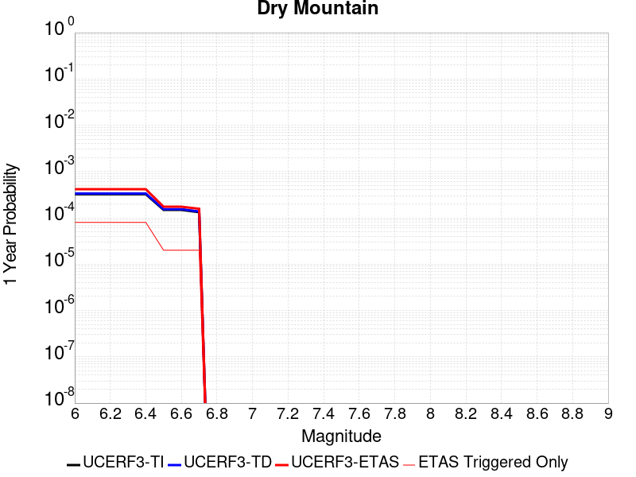 |  |

| Magnitude | 1 wk TI Prob | 1 wk TD Prob | 1 wk ETAS Prob | 1 wk ETAS/TD Gain | 1 wk ETAS Triggered Only | 1 mo TI Prob | 1 mo TD Prob | 1 mo ETAS Prob | 1 mo ETAS/TD Gain | 1 mo ETAS Triggered Only | 1 yr TI Prob | 1 yr TD Prob | 1 yr ETAS Prob | 1 yr ETAS/TD Gain | 1 yr ETAS Triggered Only | 10 yr TI Prob | 10 yr TD Prob | 10 yr ETAS Prob | 10 yr ETAS/TD Gain | 10 yr ETAS Triggered Only |
|-----|-----|-----|-----|-----|-----|-----|-----|-----|-----|-----|-----|-----|-----|-----|-----|-----|-----|-----|-----|-----|
| 6.0 | 6.222801E-6 | 6.439381E-6 | 1.938796E-4 | 30.108421 | 1.8744143E-4 | 2.6668875E-5 | 2.7597147E-5 | 2.150334E-4 | 7.7918706 | 1.8744143E-4 | 3.2464517E-4 | 3.3595937E-4 | 5.233378E-4 | 1.5577414 | 1.8744143E-4 | 0.0032417132 | 0.0033560768 | 0.0035428891 | 1.055664 | 1.8744143E-4 |
| 6.1 | 6.222801E-6 | 6.439381E-6 | 1.938796E-4 | 30.108421 | 1.8744143E-4 | 2.6668875E-5 | 2.7597147E-5 | 2.150334E-4 | 7.7918706 | 1.8744143E-4 | 3.2464517E-4 | 3.3595937E-4 | 5.233378E-4 | 1.5577414 | 1.8744143E-4 | 0.0032417132 | 0.0033560768 | 0.0035428891 | 1.055664 | 1.8744143E-4 |
| 6.2 | 6.222801E-6 | 6.439381E-6 | 1.938796E-4 | 30.108421 | 1.8744143E-4 | 2.6668875E-5 | 2.7597147E-5 | 2.150334E-4 | 7.7918706 | 1.8744143E-4 | 3.2464517E-4 | 3.3595937E-4 | 5.233378E-4 | 1.5577414 | 1.8744143E-4 | 0.0032417132 | 0.0033560768 | 0.0035428891 | 1.055664 | 1.8744143E-4 |
| 6.3 | 6.222801E-6 | 6.439381E-6 | 1.938796E-4 | 30.108421 | 1.8744143E-4 | 2.6668875E-5 | 2.7597147E-5 | 2.150334E-4 | 7.7918706 | 1.8744143E-4 | 3.2464517E-4 | 3.3595937E-4 | 5.233378E-4 | 1.5577414 | 1.8744143E-4 | 0.0032417132 | 0.0033560768 | 0.0035428891 | 1.055664 | 1.8744143E-4 |
| 6.4 | 6.222801E-6 | 6.439381E-6 | 1.938796E-4 | 30.108421 | 1.8744143E-4 | 2.6668875E-5 | 2.7597147E-5 | 2.150334E-4 | 7.7918706 | 1.8744143E-4 | 3.2464517E-4 | 3.3595937E-4 | 5.233378E-4 | 1.5577414 | 1.8744143E-4 | 0.0032417132 | 0.0033560768 | 0.0035428891 | 1.055664 | 1.8744143E-4 |
| 6.5 | 2.8528623E-6 | 2.9521684E-6 | 2.9521684E-6 | 1.0 | 0.0 | 1.22264955E-5 | 1.2652138E-5 | 1.2652138E-5 | 1.0 | 0.0 | 1.4884741E-4 | 1.540376E-4 | 1.540376E-4 | 1.0 | 0.0 | 0.0014874774 | 0.0015401616 | 0.0015401616 | 1.0 | 0.0 |
| 6.6 | 2.8528623E-6 | 2.9521684E-6 | 2.9521684E-6 | 1.0 | 0.0 | 1.22264955E-5 | 1.2652138E-5 | 1.2652138E-5 | 1.0 | 0.0 | 1.4884741E-4 | 1.540376E-4 | 1.540376E-4 | 1.0 | 0.0 | 0.0014874774 | 0.0015401616 | 0.0015401616 | 1.0 | 0.0 |
| 6.7 | 2.541E-6 | 2.6293578E-6 | 2.6293578E-6 | 1.0 | 0.0 | 1.0889954E-5 | 1.1268677E-5 | 1.1268677E-5 | 1.0 | 0.0 | 1.3257713E-4 | 1.3719614E-4 | 1.3719614E-4 | 1.0 | 0.0 | 0.0013249806 | 0.0013719613 | 0.0013719613 | 1.0 | 0.0 |

## Cucamonga
*[(top)](#table-of-contents)*

| 1 Week | 1 Month | 1 Year | 10 Year |
|-----|-----|-----|-----|
|  |  |  |  |

| Magnitude | 1 wk TI Prob | 1 wk TD Prob | 1 wk ETAS Prob | 1 wk ETAS/TD Gain | 1 wk ETAS Triggered Only | 1 mo TI Prob | 1 mo TD Prob | 1 mo ETAS Prob | 1 mo ETAS/TD Gain | 1 mo ETAS Triggered Only | 1 yr TI Prob | 1 yr TD Prob | 1 yr ETAS Prob | 1 yr ETAS/TD Gain | 1 yr ETAS Triggered Only | 10 yr TI Prob | 10 yr TD Prob | 10 yr ETAS Prob | 10 yr ETAS/TD Gain | 10 yr ETAS Triggered Only |
|-----|-----|-----|-----|-----|-----|-----|-----|-----|-----|-----|-----|-----|-----|-----|-----|-----|-----|-----|-----|-----|
| 6.0 | 1.1848348E-5 | 1.1737109E-5 | 1.1737109E-5 | 1.0 | 0.0 | 5.0777642E-5 | 5.0300943E-5 | 5.0300943E-5 | 1.0 | 0.0 | 6.180424E-4 | 6.122446E-4 | 6.122446E-4 | 1.0 | 0.0 | 0.0061632637 | 0.006106745 | 0.0062930416 | 1.0305067 | 1.8744143E-4 |
| 6.1 | 1.1848348E-5 | 1.1737109E-5 | 1.1737109E-5 | 1.0 | 0.0 | 5.0777642E-5 | 5.0300943E-5 | 5.0300943E-5 | 1.0 | 0.0 | 6.180424E-4 | 6.122446E-4 | 6.122446E-4 | 1.0 | 0.0 | 0.0061632637 | 0.006106745 | 0.0062930416 | 1.0305067 | 1.8744143E-4 |
| 6.2 | 1.1848348E-5 | 1.1737109E-5 | 1.1737109E-5 | 1.0 | 0.0 | 5.0777642E-5 | 5.0300943E-5 | 5.0300943E-5 | 1.0 | 0.0 | 6.180424E-4 | 6.122446E-4 | 6.122446E-4 | 1.0 | 0.0 | 0.0061632637 | 0.006106745 | 0.0062930416 | 1.0305067 | 1.8744143E-4 |
| 6.3 | 1.1848348E-5 | 1.1737109E-5 | 1.1737109E-5 | 1.0 | 0.0 | 5.0777642E-5 | 5.0300943E-5 | 5.0300943E-5 | 1.0 | 0.0 | 6.180424E-4 | 6.122446E-4 | 6.122446E-4 | 1.0 | 0.0 | 0.0061632637 | 0.006106745 | 0.0062930416 | 1.0305067 | 1.8744143E-4 |
| 6.4 | 1.1848348E-5 | 1.1737109E-5 | 1.1737109E-5 | 1.0 | 0.0 | 5.0777642E-5 | 5.0300943E-5 | 5.0300943E-5 | 1.0 | 0.0 | 6.180424E-4 | 6.122446E-4 | 6.122446E-4 | 1.0 | 0.0 | 0.0061632637 | 0.006106745 | 0.0062930416 | 1.0305067 | 1.8744143E-4 |
| 6.5 | 1.16988695E-5 | 1.157614E-5 | 1.157614E-5 | 1.0 | 0.0 | 5.013705E-5 | 4.9611102E-5 | 4.9611102E-5 | 1.0 | 0.0 | 6.102476E-4 | 6.0385047E-4 | 6.0385047E-4 | 1.0 | 0.0 | 0.006085745 | 0.0060232594 | 0.006209572 | 1.0309322 | 1.8744143E-4 |
| 6.6 | 1.16988695E-5 | 1.157614E-5 | 1.157614E-5 | 1.0 | 0.0 | 5.013705E-5 | 4.9611102E-5 | 4.9611102E-5 | 1.0 | 0.0 | 6.102476E-4 | 6.0385047E-4 | 6.0385047E-4 | 1.0 | 0.0 | 0.006085745 | 0.0060232594 | 0.006209572 | 1.0309322 | 1.8744143E-4 |
| 6.7 | 1.1397107E-5 | 1.1115039E-5 | 1.1115039E-5 | 1.0 | 0.0 | 4.884383E-5 | 4.7635025E-5 | 4.7635025E-5 | 1.0 | 0.0 | 5.9451134E-4 | 5.798046E-4 | 5.798046E-4 | 1.0 | 0.0 | 0.005929234 | 0.005784061 | 0.005970418 | 1.032219 | 1.8744143E-4 |
| 6.8 | 1.058387E-5 | 9.785037E-6 | 9.785037E-6 | 1.0 | 0.0 | 4.5358654E-5 | 4.1935207E-5 | 4.1935207E-5 | 1.0 | 0.0 | 5.521017E-4 | 5.1044265E-4 | 5.1044265E-4 | 1.0 | 0.0 | 0.00550732 | 0.005093702 | 0.0052801888 | 1.0366112 | 1.8744143E-4 |
| 6.9 | 9.690046E-6 | 8.579504E-6 | 8.579504E-6 | 1.0 | 0.0 | 4.1528107E-5 | 3.6768783E-5 | 3.6768783E-5 | 1.0 | 0.0 | 5.054874E-4 | 4.475684E-4 | 4.475684E-4 | 1.0 | 0.0 | 0.005043391 | 0.0044675954 | 0.0046541994 | 1.0417683 | 1.8744143E-4 |
| 7.0 | 9.381461E-6 | 8.18712E-6 | 8.18712E-6 | 1.0 | 0.0 | 4.020564E-5 | 3.508719E-5 | 3.508719E-5 | 1.0 | 0.0 | 4.893937E-4 | 4.2710314E-4 | 4.2710314E-4 | 1.0 | 0.0 | 0.0048831734 | 0.004263747 | 0.004450389 | 1.0437742 | 1.8744143E-4 |
| 7.1 | 8.946492E-6 | 7.781904E-6 | 7.781904E-6 | 1.0 | 0.0 | 3.8341543E-5 | 3.3350592E-5 | 3.3350592E-5 | 1.0 | 0.0 | 4.667083E-4 | 4.0596814E-4 | 4.0596814E-4 | 1.0 | 0.0 | 0.0046572937 | 0.0040531927 | 0.0042398744 | 1.0460579 | 1.8744143E-4 |
| 7.2 | 8.251016E-6 | 6.9752878E-6 | 6.9752878E-6 | 1.0 | 0.0 | 3.5361016E-5 | 2.9893748E-5 | 2.9893748E-5 | 1.0 | 0.0 | 4.3043532E-4 | 3.6389584E-4 | 3.6389584E-4 | 1.0 | 0.0 | 0.0042960253 | 0.0036339252 | 0.0038206854 | 1.0513935 | 1.8744143E-4 |
| 7.3 | 7.717881E-6 | 6.4863584E-6 | 6.4863584E-6 | 1.0 | 0.0 | 3.3076216E-5 | 2.7798384E-5 | 2.7798384E-5 | 1.0 | 0.0 | 4.026285E-4 | 3.38393E-4 | 3.38393E-4 | 1.0 | 0.0 | 0.004018998 | 0.0033797103 | 0.0035665182 | 1.0552734 | 1.8744143E-4 |
| 7.4 | 7.275623E-6 | 6.032004E-6 | 6.032004E-6 | 1.0 | 0.0 | 3.118087E-5 | 2.5851192E-5 | 2.5851192E-5 | 1.0 | 0.0 | 3.7956095E-4 | 3.1469302E-4 | 3.1469302E-4 | 1.0 | 0.0 | 0.0037891332 | 0.0031434046 | 0.0033302568 | 1.0594426 | 1.8744143E-4 |
| 7.5 | 6.5109502E-6 | 5.100593E-6 | 5.100593E-6 | 1.0 | 0.0 | 2.7903774E-5 | 2.1859503E-5 | 2.1859503E-5 | 1.0 | 0.0 | 3.3967546E-4 | 2.661071E-4 | 2.661071E-4 | 1.0 | 0.0 | 0.0033915674 | 0.0026588016 | 0.0028457448 | 1.0703111 | 1.8744143E-4 |
| 7.6 | 5.4495326E-6 | 3.908547E-6 | 3.908547E-6 | 1.0 | 0.0 | 2.335493E-5 | 1.6750808E-5 | 1.6750808E-5 | 1.0 | 0.0 | 2.8430918E-4 | 2.0392207E-4 | 2.0392207E-4 | 1.0 | 0.0 | 0.0028394572 | 0.0020382616 | 0.0020382616 | 1.0 | 0.0 |
| 7.7 | 4.7997164E-6 | 3.2002263E-6 | 3.2002263E-6 | 1.0 | 0.0 | 2.057005E-5 | 1.3715184E-5 | 1.3715184E-5 | 1.0 | 0.0 | 2.504116E-4 | 1.6696959E-4 | 1.6696959E-4 | 1.0 | 0.0 | 0.002501296 | 0.0016693701 | 0.0016693701 | 1.0 | 0.0 |
| 7.8 | 3.3941733E-6 | 2.0641678E-6 | 2.0641678E-6 | 1.0 | 0.0 | 1.4546376E-5 | 8.846404E-6 | 8.846404E-6 | 1.0 | 0.0 | 1.7708774E-4 | 1.07699656E-4 | 1.07699656E-4 | 1.0 | 0.0 | 0.0017694668 | 0.0010766032 | 0.0010766032 | 1.0 | 0.0 |
| 7.9 | 9.750552E-7 | 5.155798E-7 | 5.155798E-7 | 1.0 | 0.0 | 4.178801E-6 | 2.2096258E-6 | 2.2096258E-6 | 1.0 | 0.0 | 5.0875715E-5 | 2.6901867E-5 | 2.6901867E-5 | 1.0 | 0.0 | 5.086407E-4 | 2.689865E-4 | 2.689865E-4 | 1.0 | 0.0 |
| 8.0 | 1.133857E-7 | 6.053372E-8 | 6.053372E-8 | 1.0 | 0.0 | 4.8593864E-7 | 2.594302E-7 | 2.594302E-7 | 1.0 | 0.0 | 5.9162867E-6 | 3.1585582E-6 | 3.1585582E-6 | 1.0 | 0.0 | 5.916129E-5 | 3.158515E-5 | 3.158515E-5 | 1.0 | 0.0 |

## Hunting Creek - Berryessa 2011 CFM
*[(top)](#table-of-contents)*

| 1 Week | 1 Month | 1 Year | 10 Year |
|-----|-----|-----|-----|
|  |  |  |  |

| Magnitude | 1 wk TI Prob | 1 wk TD Prob | 1 wk ETAS Prob | 1 wk ETAS/TD Gain | 1 wk ETAS Triggered Only | 1 mo TI Prob | 1 mo TD Prob | 1 mo ETAS Prob | 1 mo ETAS/TD Gain | 1 mo ETAS Triggered Only | 1 yr TI Prob | 1 yr TD Prob | 1 yr ETAS Prob | 1 yr ETAS/TD Gain | 1 yr ETAS Triggered Only | 10 yr TI Prob | 10 yr TD Prob | 10 yr ETAS Prob | 10 yr ETAS/TD Gain | 10 yr ETAS Triggered Only |
|-----|-----|-----|-----|-----|-----|-----|-----|-----|-----|-----|-----|-----|-----|-----|-----|-----|-----|-----|-----|-----|
| 6.0 | 1.1270982E-4 | 2.0028367E-4 | 2.0028367E-4 | 1.0 | 0.0 | 4.8295266E-4 | 8.579912E-4 | 8.579912E-4 | 1.0 | 0.0 | 0.0058641075 | 0.010386173 | 0.010386173 | 1.0 | 0.0 | 0.057117578 | 0.09804048 | 0.098209545 | 1.0017245 | 1.8744143E-4 |
| 6.1 | 1.1239393E-4 | 1.9976508E-4 | 1.9976508E-4 | 1.0 | 0.0 | 4.8159933E-4 | 8.557703E-4 | 8.557703E-4 | 1.0 | 0.0 | 0.0058477195 | 0.010359417 | 0.010359417 | 1.0 | 0.0 | 0.056962132 | 0.09779895 | 0.09779895 | 1.0 | 0.0 |
| 6.2 | 7.596265E-5 | 1.2933646E-4 | 1.2933646E-4 | 1.0 | 0.0 | 3.2551357E-4 | 5.5415573E-4 | 5.5415573E-4 | 1.0 | 0.0 | 0.0039559277 | 0.0067213587 | 0.0067213587 | 1.0 | 0.0 | 0.038862433 | 0.06459229 | 0.06459229 | 1.0 | 0.0 |
| 6.3 | 6.78794E-5 | 1.1448377E-4 | 1.1448377E-4 | 1.0 | 0.0 | 2.9087928E-4 | 4.9052597E-4 | 4.9052597E-4 | 1.0 | 0.0 | 0.003535705 | 0.005952661 | 0.005952661 | 1.0 | 0.0 | 0.034799766 | 0.057466213 | 0.057466213 | 1.0 | 0.0 |
| 6.4 | 6.2165134E-5 | 1.0434825E-4 | 1.0434825E-4 | 1.0 | 0.0 | 2.6639478E-4 | 4.4711027E-4 | 4.4711027E-4 | 1.0 | 0.0 | 0.0032385332 | 0.0054274183 | 0.0054274183 | 1.0 | 0.0 | 0.03191742 | 0.05255138 | 0.05255138 | 1.0 | 0.0 |
| 6.5 | 5.4368087E-5 | 9.070258E-5 | 9.070258E-5 | 1.0 | 0.0 | 2.3298527E-4 | 3.886537E-4 | 3.886537E-4 | 1.0 | 0.0 | 0.0028329059 | 0.0047197016 | 0.0047197016 | 1.0 | 0.0 | 0.027970633 | 0.045881182 | 0.045881182 | 1.0 | 0.0 |
| 6.6 | 4.729947E-5 | 7.847101E-5 | 7.847101E-5 | 1.0 | 0.0 | 2.0269625E-4 | 3.3624718E-4 | 3.3624718E-4 | 1.0 | 0.0 | 0.002465034 | 0.004084746 | 0.004084746 | 1.0 | 0.0 | 0.02437869 | 0.03985269 | 0.03985269 | 1.0 | 0.0 |
| 6.7 | 3.6875328E-5 | 6.0443555E-5 | 6.0443555E-5 | 1.0 | 0.0 | 1.5802756E-4 | 2.5900968E-4 | 2.5900968E-4 | 1.0 | 0.0 | 0.0019222875 | 0.0031482724 | 0.0031482724 | 1.0 | 0.0 | 0.019057442 | 0.03089371 | 0.03089371 | 1.0 | 0.0 |
| 6.8 | 2.0292036E-5 | 2.8976721E-5 | 2.8976721E-5 | 1.0 | 0.0 | 8.6962966E-5 | 1.2417998E-4 | 1.2417998E-4 | 1.0 | 0.0 | 0.0010582599 | 0.0015108302 | 0.0015108302 | 1.0 | 0.0 | 0.010532344 | 0.0149790775 | 0.0149790775 | 1.0 | 0.0 |
| 6.9 | 1.7871042E-5 | 2.4472653E-5 | 2.4472653E-5 | 1.0 | 0.0 | 7.658793E-5 | 1.04878585E-4 | 1.04878585E-4 | 1.0 | 0.0 | 9.320591E-4 | 0.0012761486 | 0.0012761486 | 1.0 | 0.0 | 0.009281595 | 0.012680395 | 0.012680395 | 1.0 | 0.0 |
| 7.0 | 1.6415532E-5 | 2.1906566E-5 | 2.1906566E-5 | 1.0 | 0.0 | 7.035038E-5 | 9.388191E-5 | 9.388191E-5 | 1.0 | 0.0 | 8.561793E-4 | 0.0011424144 | 0.0011424144 | 1.0 | 0.0 | 0.008528882 | 0.011365017 | 0.011365017 | 1.0 | 0.0 |
| 7.1 | 1.5409885E-5 | 2.0346588E-5 | 2.0346588E-5 | 1.0 | 0.0 | 6.6040695E-5 | 8.719676E-5 | 8.719676E-5 | 1.0 | 0.0 | 8.0374884E-4 | 0.0010611062 | 0.0010611062 | 1.0 | 0.0 | 0.00800848 | 0.010560924 | 0.010560924 | 1.0 | 0.0 |
| 7.2 | 1.4497423E-5 | 1.905519E-5 | 1.905519E-5 | 1.0 | 0.0 | 6.213033E-5 | 8.166256E-5 | 8.166256E-5 | 1.0 | 0.0 | 7.5617427E-4 | 9.937913E-4 | 9.937913E-4 | 1.0 | 0.0 | 0.0075360634 | 0.00989425 | 0.00989425 | 1.0 | 0.0 |
| 7.3 | 1.3615175E-5 | 1.7826347E-5 | 1.7826347E-5 | 1.0 | 0.0 | 5.8349444E-5 | 7.6396405E-5 | 7.6396405E-5 | 1.0 | 0.0 | 7.101729E-4 | 9.297323E-4 | 9.297323E-4 | 1.0 | 0.0 | 0.0070790765 | 0.009259124 | 0.009259124 | 1.0 | 0.0 |
| 7.4 | 1.2252825E-5 | 1.6026455E-5 | 1.6026455E-5 | 1.0 | 0.0 | 5.251105E-5 | 6.868302E-5 | 6.868302E-5 | 1.0 | 0.0 | 6.391345E-4 | 8.3589775E-4 | 8.3589775E-4 | 1.0 | 0.0 | 0.0063729943 | 0.008328172 | 0.008328172 | 1.0 | 0.0 |
| 7.5 | 1.0913301E-5 | 1.4241286E-5 | 1.4241286E-5 | 1.0 | 0.0 | 4.6770452E-5 | 6.103267E-5 | 6.103267E-5 | 1.0 | 0.0 | 5.6928146E-4 | 7.428222E-4 | 7.428222E-4 | 1.0 | 0.0 | 0.0056782532 | 0.0074039865 | 0.0074039865 | 1.0 | 0.0 |
| 7.6 | 8.623192E-6 | 1.12347825E-5 | 1.12347825E-5 | 1.0 | 0.0 | 3.6956015E-5 | 4.8148195E-5 | 4.8148195E-5 | 1.0 | 0.0 | 4.4984656E-4 | 5.8604917E-4 | 5.8604917E-4 | 1.0 | 0.0 | 0.00448937 | 0.005845504 | 0.005845504 | 1.0 | 0.0 |
| 7.7 | 2.0993634E-6 | 2.66264E-6 | 2.66264E-6 | 1.0 | 0.0 | 8.997241E-6 | 1.1411265E-5 | 1.1411265E-5 | 1.0 | 0.0 | 1.09535904E-4 | 1.3892337E-4 | 1.3892337E-4 | 1.0 | 0.0 | 0.0010948193 | 0.0013883994 | 0.0013883994 | 1.0 | 0.0 |
| 7.8 | 1.8428308E-7 | 2.1674624E-7 | 2.1674624E-7 | 1.0 | 0.0 | 7.897844E-7 | 9.289122E-7 | 9.289122E-7 | 1.0 | 0.0 | 9.615583E-6 | 1.130945E-5 | 1.130945E-5 | 1.0 | 0.0 | 9.615166E-5 | 1.1308173E-4 | 1.1308173E-4 | 1.0 | 0.0 |

## San Jacinto (Stepovers Combined)
*[(top)](#table-of-contents)*

| 1 Week | 1 Month | 1 Year | 10 Year |
|-----|-----|-----|-----|
|  |  | 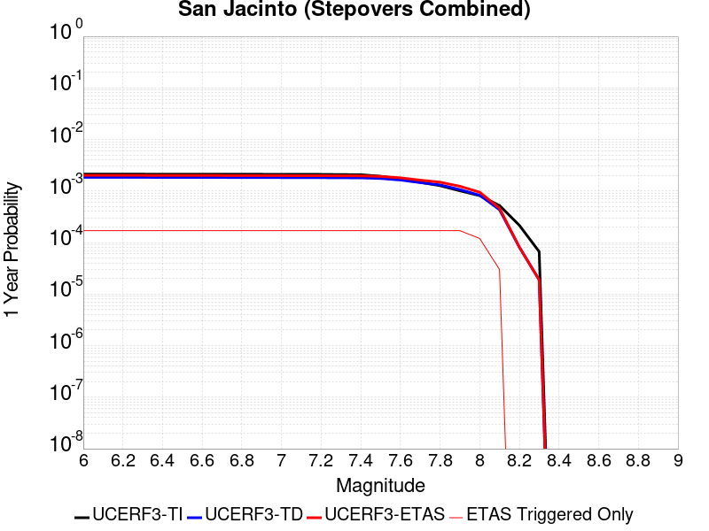 |  |

| Magnitude | 1 wk TI Prob | 1 wk TD Prob | 1 wk ETAS Prob | 1 wk ETAS/TD Gain | 1 wk ETAS Triggered Only | 1 mo TI Prob | 1 mo TD Prob | 1 mo ETAS Prob | 1 mo ETAS/TD Gain | 1 mo ETAS Triggered Only | 1 yr TI Prob | 1 yr TD Prob | 1 yr ETAS Prob | 1 yr ETAS/TD Gain | 1 yr ETAS Triggered Only | 10 yr TI Prob | 10 yr TD Prob | 10 yr ETAS Prob | 10 yr ETAS/TD Gain | 10 yr ETAS Triggered Only |
|-----|-----|-----|-----|-----|-----|-----|-----|-----|-----|-----|-----|-----|-----|-----|-----|-----|-----|-----|-----|-----|
| 6.0 | 4.0667746E-5 | 3.5271103E-5 | 3.5271103E-5 | 1.0 | 0.0 | 1.742787E-4 | 1.5115313E-4 | 3.3856623E-4 | 2.239889 | 1.8744143E-4 | 0.0021197782 | 0.0018387372 | 0.002025834 | 1.1017529 | 1.8744143E-4 | 0.020996714 | 0.018986495 | 0.019170377 | 1.0096849 | 1.8744143E-4 |
| 6.1 | 4.0667746E-5 | 3.5271103E-5 | 3.5271103E-5 | 1.0 | 0.0 | 1.742787E-4 | 1.5115313E-4 | 3.3856623E-4 | 2.239889 | 1.8744143E-4 | 0.0021197782 | 0.0018387372 | 0.002025834 | 1.1017529 | 1.8744143E-4 | 0.020996714 | 0.018986495 | 0.019170377 | 1.0096849 | 1.8744143E-4 |
| 6.2 | 4.0667746E-5 | 3.5271103E-5 | 3.5271103E-5 | 1.0 | 0.0 | 1.742787E-4 | 1.5115313E-4 | 3.3856623E-4 | 2.239889 | 1.8744143E-4 | 0.0021197782 | 0.0018387372 | 0.002025834 | 1.1017529 | 1.8744143E-4 | 0.020996714 | 0.018986495 | 0.019170377 | 1.0096849 | 1.8744143E-4 |
| 6.3 | 4.0667746E-5 | 3.5271103E-5 | 3.5271103E-5 | 1.0 | 0.0 | 1.742787E-4 | 1.5115313E-4 | 3.3856623E-4 | 2.239889 | 1.8744143E-4 | 0.0021197782 | 0.0018387372 | 0.002025834 | 1.1017529 | 1.8744143E-4 | 0.020996714 | 0.018986495 | 0.019170377 | 1.0096849 | 1.8744143E-4 |
| 6.4 | 4.0577226E-5 | 3.5143014E-5 | 3.5143014E-5 | 1.0 | 0.0 | 1.738908E-4 | 1.5060425E-4 | 3.3801745E-4 | 2.2444084 | 1.8744143E-4 | 0.0021150648 | 0.0018320669 | 0.002019165 | 1.102124 | 1.8744143E-4 | 0.020950472 | 0.018921062 | 0.019104958 | 1.009719 | 1.8744143E-4 |
| 6.5 | 4.0577226E-5 | 3.5143014E-5 | 3.5143014E-5 | 1.0 | 0.0 | 1.738908E-4 | 1.5060425E-4 | 3.3801745E-4 | 2.2444084 | 1.8744143E-4 | 0.0021150648 | 0.0018320669 | 0.002019165 | 1.102124 | 1.8744143E-4 | 0.020950472 | 0.018921062 | 0.019104958 | 1.009719 | 1.8744143E-4 |
| 6.6 | 4.053861E-5 | 3.5088357E-5 | 3.5088357E-5 | 1.0 | 0.0 | 1.7372532E-4 | 1.5037002E-4 | 3.3778325E-4 | 2.2463472 | 1.8744143E-4 | 0.0021130538 | 0.0018292206 | 0.0020163192 | 1.1022832 | 1.8744143E-4 | 0.020930743 | 0.01889314 | 0.01907704 | 1.0097337 | 1.8744143E-4 |
| 6.7 | 4.0516545E-5 | 3.505743E-5 | 3.505743E-5 | 1.0 | 0.0 | 1.7363077E-4 | 1.502375E-4 | 3.3765077E-4 | 2.2474465 | 1.8744143E-4 | 0.002111905 | 0.0018276101 | 0.002014709 | 1.1023735 | 1.8744143E-4 | 0.020919468 | 0.018877337 | 0.01906124 | 1.009742 | 1.8744143E-4 |
| 6.8 | 4.049434E-5 | 3.5028992E-5 | 3.5028992E-5 | 1.0 | 0.0 | 1.7353562E-4 | 1.5011564E-4 | 3.3752894E-4 | 2.2484593 | 1.8744143E-4 | 0.0021107488 | 0.0018261289 | 0.0020132281 | 1.1024567 | 1.8744143E-4 | 0.020908125 | 0.018862749 | 0.019046655 | 1.0097497 | 1.8744143E-4 |
| 6.9 | 4.046386E-5 | 3.4991554E-5 | 3.4991554E-5 | 1.0 | 0.0 | 1.73405E-4 | 1.499552E-4 | 3.3736852E-4 | 2.2497954 | 1.8744143E-4 | 0.0021091616 | 0.0018241788 | 0.0020112784 | 1.1025665 | 1.8744143E-4 | 0.020892553 | 0.018843522 | 0.019027432 | 1.0097598 | 1.8744143E-4 |
| 7.0 | 4.036382E-5 | 3.4872126E-5 | 3.4872126E-5 | 1.0 | 0.0 | 1.7297632E-4 | 1.4944343E-4 | 3.3685684E-4 | 2.254076 | 1.8744143E-4 | 0.0021039525 | 0.0018179584 | 0.002005059 | 1.102918 | 1.8744143E-4 | 0.02084144 | 0.018782137 | 0.018966056 | 1.0097923 | 1.8744143E-4 |
| 7.1 | 4.0343282E-5 | 3.485059E-5 | 3.485059E-5 | 1.0 | 0.0 | 1.7288832E-4 | 1.4935112E-4 | 3.3676455E-4 | 2.254851 | 1.8744143E-4 | 0.002102883 | 0.0018168368 | 0.0020039375 | 1.1029817 | 1.8744143E-4 | 0.020830948 | 0.018771008 | 0.01895493 | 1.0097983 | 1.8744143E-4 |
| 7.2 | 4.0257353E-5 | 3.475509E-5 | 3.475509E-5 | 1.0 | 0.0 | 1.725201E-4 | 1.489419E-4 | 3.3635538E-4 | 2.2582996 | 1.8744143E-4 | 0.0020984085 | 0.0018118626 | 0.0019989645 | 1.1032649 | 1.8744143E-4 | 0.020787042 | 0.018721746 | 0.018905679 | 1.0098245 | 1.8744143E-4 |
| 7.3 | 3.9940667E-5 | 3.458276E-5 | 3.458276E-5 | 1.0 | 0.0 | 1.7116306E-4 | 1.4820343E-4 | 3.3561708E-4 | 2.2645702 | 1.8744143E-4 | 0.0020819185 | 0.0018028866 | 0.0019899902 | 1.1037799 | 1.8744143E-4 | 0.020625217 | 0.018630387 | 0.018814337 | 1.0098736 | 1.8744143E-4 |
| 7.4 | 3.9721202E-5 | 3.4468165E-5 | 3.4468165E-5 | 1.0 | 0.0 | 1.7022261E-4 | 1.4771236E-4 | 3.351261E-4 | 2.268775 | 1.8744143E-4 | 0.0020704903 | 0.0017969179 | 0.0019840226 | 1.1041253 | 1.8744143E-4 | 0.020513052 | 0.018569522 | 0.018753482 | 1.0099066 | 1.8744143E-4 |
| 7.5 | 3.7036873E-5 | 3.3535776E-5 | 3.3535776E-5 | 1.0 | 0.0 | 1.5871979E-4 | 1.4371685E-4 | 3.3113133E-4 | 2.3040538 | 1.8744143E-4 | 0.0019307006 | 0.0017483513 | 0.001935465 | 1.107023 | 1.8744143E-4 | 0.019140124 | 0.018071128 | 0.018255183 | 1.010185 | 1.8744143E-4 |
| 7.6 | 3.2940967E-5 | 3.13167E-5 | 3.13167E-5 | 1.0 | 0.0 | 1.4116794E-4 | 1.3420754E-4 | 3.216238E-4 | 2.396466 | 1.8744143E-4 | 0.0017173645 | 0.0016327545 | 0.0018198899 | 1.1146133 | 1.8744143E-4 | 0.01704153 | 0.016904091 | 0.017088363 | 1.0109011 | 1.8744143E-4 |
| 7.7 | 2.8236149E-5 | 2.7882697E-5 | 2.7882697E-5 | 1.0 | 0.0 | 1.2100645E-4 | 1.1949181E-4 | 3.0691084E-4 | 2.5684676 | 1.8744143E-4 | 0.0014722579 | 0.0014538429 | 0.0016410118 | 1.1287408 | 1.8744143E-4 | 0.014625421 | 0.015114912 | 0.0152995195 | 1.0122137 | 1.8744143E-4 |
| 7.8 | 2.4329287E-5 | 2.5206451E-5 | 2.5206451E-5 | 1.0 | 0.0 | 1.042642E-4 | 1.08023174E-4 | 2.9544436E-4 | 2.735009 | 1.8744143E-4 | 0.0012686774 | 0.0013143895 | 0.0015015847 | 1.1424198 | 1.8744143E-4 | 0.012614589 | 0.013712341 | 0.013897211 | 1.0134821 | 1.8744143E-4 |
| 7.9 | 1.9370926E-5 | 2.0420413E-5 | 2.0420413E-5 | 1.0 | 0.0 | 8.301561E-5 | 8.751312E-5 | 2.7493815E-4 | 3.141679 | 1.8744143E-4 | 0.0010102465 | 0.0010649522 | 0.001252194 | 1.1758218 | 1.8744143E-4 | 0.0100566605 | 0.011199402 | 0.011384743 | 1.0165493 | 1.8744143E-4 |
| 8.0 | 1.5583017E-5 | 1.5885415E-5 | 1.5885415E-5 | 1.0 | 0.0 | 6.6782646E-5 | 6.807858E-5 | 6.807858E-5 | 1.0 | 0.0 | 8.127754E-4 | 8.2854216E-4 | 8.2854216E-4 | 1.0 | 0.0 | 0.008098091 | 0.008781636 | 0.008781636 | 1.0 | 0.0 |
| 8.1 | 1.0024873E-5 | 8.291399E-6 | 8.291399E-6 | 1.0 | 0.0 | 4.2963035E-5 | 3.553409E-5 | 3.553409E-5 | 1.0 | 0.0 | 5.229494E-4 | 4.3254215E-4 | 4.3254215E-4 | 1.0 | 0.0 | 0.0052172043 | 0.0046530655 | 0.0046530655 | 1.0 | 0.0 |
| 8.2 | 4.142796E-6 | 1.5602761E-6 | 1.5602761E-6 | 1.0 | 0.0 | 1.775472E-5 | 6.6868806E-6 | 6.6868806E-6 | 1.0 | 0.0 | 2.1614227E-4 | 8.140976E-5 | 8.140976E-5 | 1.0 | 0.0 | 0.0021593217 | 9.4514614E-4 | 9.4514614E-4 | 1.0 | 0.0 |
| 8.3 | 1.2750878E-6 | 3.609817E-7 | 3.609817E-7 | 1.0 | 0.0 | 5.4646503E-6 | 1.5470634E-6 | 1.5470634E-6 | 1.0 | 0.0 | 6.653009E-5 | 1.8835339E-5 | 1.8835339E-5 | 1.0 | 0.0 | 6.6510175E-4 | 2.272251E-4 | 2.272251E-4 | 1.0 | 0.0 |

## Big Pine (East)
*[(top)](#table-of-contents)*

| 1 Week | 1 Month | 1 Year | 10 Year |
|-----|-----|-----|-----|
|  |  |  |  |

| Magnitude | 1 wk TI Prob | 1 wk TD Prob | 1 wk ETAS Prob | 1 wk ETAS/TD Gain | 1 wk ETAS Triggered Only | 1 mo TI Prob | 1 mo TD Prob | 1 mo ETAS Prob | 1 mo ETAS/TD Gain | 1 mo ETAS Triggered Only | 1 yr TI Prob | 1 yr TD Prob | 1 yr ETAS Prob | 1 yr ETAS/TD Gain | 1 yr ETAS Triggered Only | 10 yr TI Prob | 10 yr TD Prob | 10 yr ETAS Prob | 10 yr ETAS/TD Gain | 10 yr ETAS Triggered Only |
|-----|-----|-----|-----|-----|-----|-----|-----|-----|-----|-----|-----|-----|-----|-----|-----|-----|-----|-----|-----|-----|
| 6.0 | 9.916913E-6 | 1.28172705E-5 | 2.002563E-4 | 15.623941 | 1.8744143E-4 | 4.250036E-5 | 5.493013E-5 | 2.4236126E-4 | 4.4121733 | 1.8744143E-4 | 5.173191E-4 | 6.685912E-4 | 8.5590733E-4 | 1.2801653 | 1.8744143E-4 | 0.0051611643 | 0.006670449 | 0.00685664 | 1.0279129 | 1.8744143E-4 |
| 6.1 | 9.916913E-6 | 1.28172705E-5 | 2.002563E-4 | 15.623941 | 1.8744143E-4 | 4.250036E-5 | 5.493013E-5 | 2.4236126E-4 | 4.4121733 | 1.8744143E-4 | 5.173191E-4 | 6.685912E-4 | 8.5590733E-4 | 1.2801653 | 1.8744143E-4 | 0.0051611643 | 0.006670449 | 0.00685664 | 1.0279129 | 1.8744143E-4 |
| 6.2 | 9.916913E-6 | 1.28172705E-5 | 2.002563E-4 | 15.623941 | 1.8744143E-4 | 4.250036E-5 | 5.493013E-5 | 2.4236126E-4 | 4.4121733 | 1.8744143E-4 | 5.173191E-4 | 6.685912E-4 | 8.5590733E-4 | 1.2801653 | 1.8744143E-4 | 0.0051611643 | 0.006670449 | 0.00685664 | 1.0279129 | 1.8744143E-4 |
| 6.3 | 5.479711E-6 | 8.1132375E-6 | 1.9555315E-4 | 24.102972 | 1.8744143E-4 | 2.3484265E-5 | 3.4770575E-5 | 2.2220548E-4 | 6.390619 | 1.8744143E-4 | 2.858834E-4 | 4.232527E-4 | 6.106148E-4 | 1.4426719 | 1.8744143E-4 | 0.0028551589 | 0.0042272513 | 0.0044139004 | 1.0441538 | 1.8744143E-4 |
| 6.4 | 5.465009E-6 | 8.0975315E-6 | 1.9553743E-4 | 24.147785 | 1.8744143E-4 | 2.3421257E-5 | 3.4703262E-5 | 2.2213819E-4 | 6.401075 | 1.8744143E-4 | 2.851165E-4 | 4.2243348E-4 | 6.0979574E-4 | 1.4435308 | 1.8744143E-4 | 0.0028475097 | 0.00421909 | 0.004405741 | 1.0442395 | 1.8744143E-4 |
| 6.5 | 4.826767E-6 | 7.4225877E-6 | 1.9486262E-4 | 26.252653 | 1.8744143E-4 | 2.068598E-5 | 3.1810716E-5 | 2.1924618E-4 | 6.892211 | 1.8744143E-4 | 2.518227E-4 | 3.8722943E-4 | 5.7459826E-4 | 1.4838704 | 1.8744143E-4 | 0.0025153751 | 0.0038682907 | 0.004055007 | 1.0482684 | 1.8744143E-4 |
| 6.6 | 4.3146847E-6 | 6.8825234E-6 | 1.9432265E-4 | 28.234217 | 1.8744143E-4 | 1.8491375E-5 | 2.949621E-5 | 2.1693211E-4 | 7.3545756 | 1.8744143E-4 | 2.2510924E-4 | 3.5905963E-4 | 5.4643373E-4 | 1.5218468 | 1.8744143E-4 | 0.0022488134 | 0.0035875062 | 0.003774275 | 1.052061 | 1.8744143E-4 |
| 6.7 | 3.6968106E-6 | 5.9957474E-6 | 5.9957474E-6 | 1.0 | 0.0 | 1.5843378E-5 | 2.5695816E-5 | 2.5695816E-5 | 1.0 | 0.0 | 1.9287605E-4 | 3.128032E-4 | 3.128032E-4 | 1.0 | 0.0 | 0.0019270873 | 0.0031262499 | 0.0031262499 | 1.0 | 0.0 |
| 6.8 | 3.4671132E-6 | 5.7024477E-6 | 5.7024477E-6 | 1.0 | 0.0 | 1.4858972E-5 | 2.4438841E-5 | 2.4438841E-5 | 1.0 | 0.0 | 1.8089297E-4 | 2.9750372E-4 | 2.9750372E-4 | 1.0 | 0.0 | 0.0018074579 | 0.0029736666 | 0.0029736666 | 1.0 | 0.0 |
| 6.9 | 2.7686972E-6 | 4.8254797E-6 | 4.8254797E-6 | 1.0 | 0.0 | 1.1865792E-5 | 2.0680467E-5 | 2.0680467E-5 | 1.0 | 0.0 | 1.4445644E-4 | 2.5175634E-4 | 2.5175634E-4 | 1.0 | 0.0 | 0.0014436257 | 0.002517256 | 0.002517256 | 1.0 | 0.0 |
| 7.0 | 2.1472624E-6 | 3.985277E-6 | 3.985277E-6 | 1.0 | 0.0 | 9.20252E-6 | 1.707965E-5 | 1.707965E-5 | 1.0 | 0.0 | 1.12034926E-4 | 2.0792543E-4 | 2.0792543E-4 | 1.0 | 0.0 | 0.0011197845 | 0.0020798238 | 0.0020798238 | 1.0 | 0.0 |
| 7.1 | 1.7018335E-6 | 3.3450835E-6 | 3.3450835E-6 | 1.0 | 0.0 | 7.293552E-6 | 1.4335996E-5 | 1.4335996E-5 | 1.0 | 0.0 | 8.879537E-5 | 1.7452713E-4 | 1.7452713E-4 | 1.0 | 0.0 | 8.87599E-4 | 0.0017463792 | 0.0017463792 | 1.0 | 0.0 |
| 7.2 | 1.25603E-6 | 2.794679E-6 | 2.794679E-6 | 1.0 | 0.0 | 5.3829745E-6 | 1.1977142E-5 | 1.1977142E-5 | 1.0 | 0.0 | 6.553574E-5 | 1.4581217E-4 | 1.4581217E-4 | 1.0 | 0.0 | 6.551642E-4 | 0.0014596173 | 0.0014596173 | 1.0 | 0.0 |
| 7.3 | 1.112297E-6 | 2.610519E-6 | 2.610519E-6 | 1.0 | 0.0 | 4.7669787E-6 | 1.1187892E-5 | 1.1187892E-5 | 1.0 | 0.0 | 5.803642E-5 | 1.3620428E-4 | 1.3620428E-4 | 1.0 | 0.0 | 5.802127E-4 | 0.001363502 | 0.001363502 | 1.0 | 0.0 |
| 7.4 | 1.0137181E-6 | 2.4836752E-6 | 2.4836752E-6 | 1.0 | 0.0 | 4.3444993E-6 | 1.064428E-5 | 1.064428E-5 | 1.0 | 0.0 | 5.2892992E-5 | 1.2958662E-4 | 1.2958662E-4 | 1.0 | 0.0 | 5.288041E-4 | 0.0012971918 | 0.0012971918 | 1.0 | 0.0 |
| 7.5 | 9.598608E-7 | 2.407328E-6 | 2.407328E-6 | 1.0 | 0.0 | 4.1136827E-6 | 1.03170805E-5 | 1.03170805E-5 | 1.0 | 0.0 | 5.0082934E-5 | 1.2560343E-4 | 1.2560343E-4 | 1.0 | 0.0 | 5.007165E-4 | 0.0012572132 | 0.0012572132 | 1.0 | 0.0 |
| 7.6 | 7.929459E-7 | 2.0450152E-6 | 2.0450152E-6 | 1.0 | 0.0 | 3.3983351E-6 | 8.764322E-6 | 8.764322E-6 | 1.0 | 0.0 | 4.1373947E-5 | 1.0670057E-4 | 1.0670057E-4 | 1.0 | 0.0 | 4.1366243E-4 | 0.0010685825 | 0.0010685825 | 1.0 | 0.0 |
| 7.7 | 4.155788E-7 | 1.1606729E-6 | 1.1606729E-6 | 1.0 | 0.0 | 1.7810507E-6 | 4.974303E-6 | 4.974303E-6 | 1.0 | 0.0 | 2.1684076E-5 | 6.05605E-5 | 6.05605E-5 | 1.0 | 0.0 | 2.1681961E-4 | 6.085995E-4 | 6.085995E-4 | 1.0 | 0.0 |
| 7.8 | 1.14666925E-7 | 2.592197E-7 | 2.592197E-7 | 1.0 | 0.0 | 4.914296E-7 | 1.1109411E-6 | 1.1109411E-6 | 1.0 | 0.0 | 5.9831386E-6 | 1.3525627E-5 | 1.3525627E-5 | 1.0 | 0.0 | 5.9829777E-5 | 1.3636416E-4 | 1.3636416E-4 | 1.0 | 0.0 |
| 7.9 | 2.9231824E-8 | 4.1462318E-8 | 4.1462318E-8 | 1.0 | 0.0 | 1.2527924E-7 | 1.7769564E-7 | 1.7769564E-7 | 1.0 | 0.0 | 1.5252737E-6 | 2.1634426E-6 | 2.1634426E-6 | 1.0 | 0.0 | 1.5252632E-5 | 2.197062E-5 | 2.197062E-5 | 1.0 | 0.0 |

## Pitas Point (Lower)-Montalvo
*[(top)](#table-of-contents)*

| 1 Week | 1 Month | 1 Year | 10 Year |
|-----|-----|-----|-----|
|  |  |  |  |

| Magnitude | 1 wk TI Prob | 1 wk TD Prob | 1 wk ETAS Prob | 1 wk ETAS/TD Gain | 1 wk ETAS Triggered Only | 1 mo TI Prob | 1 mo TD Prob | 1 mo ETAS Prob | 1 mo ETAS/TD Gain | 1 mo ETAS Triggered Only | 1 yr TI Prob | 1 yr TD Prob | 1 yr ETAS Prob | 1 yr ETAS/TD Gain | 1 yr ETAS Triggered Only | 10 yr TI Prob | 10 yr TD Prob | 10 yr ETAS Prob | 10 yr ETAS/TD Gain | 10 yr ETAS Triggered Only |
|-----|-----|-----|-----|-----|-----|-----|-----|-----|-----|-----|-----|-----|-----|-----|-----|-----|-----|-----|-----|-----|
| 6.0 | 5.2543637E-6 | 4.8379025E-6 | 4.8379025E-6 | 1.0 | 0.0 | 2.2518509E-5 | 2.0733705E-5 | 2.0733705E-5 | 1.0 | 0.0 | 2.7412834E-4 | 2.5240393E-4 | 4.3979805E-4 | 1.7424374 | 1.8744143E-4 | 0.0027379042 | 0.0025212052 | 0.002708174 | 1.0741585 | 1.8744143E-4 |
| 6.1 | 5.2543637E-6 | 4.8379025E-6 | 4.8379025E-6 | 1.0 | 0.0 | 2.2518509E-5 | 2.0733705E-5 | 2.0733705E-5 | 1.0 | 0.0 | 2.7412834E-4 | 2.5240393E-4 | 4.3979805E-4 | 1.7424374 | 1.8744143E-4 | 0.0027379042 | 0.0025212052 | 0.002708174 | 1.0741585 | 1.8744143E-4 |
| 6.2 | 5.2543637E-6 | 4.8379025E-6 | 4.8379025E-6 | 1.0 | 0.0 | 2.2518509E-5 | 2.0733705E-5 | 2.0733705E-5 | 1.0 | 0.0 | 2.7412834E-4 | 2.5240393E-4 | 4.3979805E-4 | 1.7424374 | 1.8744143E-4 | 0.0027379042 | 0.0025212052 | 0.002708174 | 1.0741585 | 1.8744143E-4 |
| 6.3 | 5.2543637E-6 | 4.8379025E-6 | 4.8379025E-6 | 1.0 | 0.0 | 2.2518509E-5 | 2.0733705E-5 | 2.0733705E-5 | 1.0 | 0.0 | 2.7412834E-4 | 2.5240393E-4 | 4.3979805E-4 | 1.7424374 | 1.8744143E-4 | 0.0027379042 | 0.0025212052 | 0.002708174 | 1.0741585 | 1.8744143E-4 |
| 6.4 | 5.2543637E-6 | 4.8379025E-6 | 4.8379025E-6 | 1.0 | 0.0 | 2.2518509E-5 | 2.0733705E-5 | 2.0733705E-5 | 1.0 | 0.0 | 2.7412834E-4 | 2.5240393E-4 | 4.3979805E-4 | 1.7424374 | 1.8744143E-4 | 0.0027379042 | 0.0025212052 | 0.002708174 | 1.0741585 | 1.8744143E-4 |
| 6.5 | 5.2543637E-6 | 4.8379025E-6 | 4.8379025E-6 | 1.0 | 0.0 | 2.2518509E-5 | 2.0733705E-5 | 2.0733705E-5 | 1.0 | 0.0 | 2.7412834E-4 | 2.5240393E-4 | 4.3979805E-4 | 1.7424374 | 1.8744143E-4 | 0.0027379042 | 0.0025212052 | 0.002708174 | 1.0741585 | 1.8744143E-4 |
| 6.6 | 5.2543637E-6 | 4.8379025E-6 | 4.8379025E-6 | 1.0 | 0.0 | 2.2518509E-5 | 2.0733705E-5 | 2.0733705E-5 | 1.0 | 0.0 | 2.7412834E-4 | 2.5240393E-4 | 4.3979805E-4 | 1.7424374 | 1.8744143E-4 | 0.0027379042 | 0.0025212052 | 0.002708174 | 1.0741585 | 1.8744143E-4 |
| 6.7 | 5.2543637E-6 | 4.8379025E-6 | 4.8379025E-6 | 1.0 | 0.0 | 2.2518509E-5 | 2.0733705E-5 | 2.0733705E-5 | 1.0 | 0.0 | 2.7412834E-4 | 2.5240393E-4 | 4.3979805E-4 | 1.7424374 | 1.8744143E-4 | 0.0027379042 | 0.0025212052 | 0.002708174 | 1.0741585 | 1.8744143E-4 |
| 6.8 | 5.2543637E-6 | 4.8379025E-6 | 4.8379025E-6 | 1.0 | 0.0 | 2.2518509E-5 | 2.0733705E-5 | 2.0733705E-5 | 1.0 | 0.0 | 2.7412834E-4 | 2.5240393E-4 | 4.3979805E-4 | 1.7424374 | 1.8744143E-4 | 0.0027379042 | 0.0025212052 | 0.002708174 | 1.0741585 | 1.8744143E-4 |
| 6.9 | 5.2543637E-6 | 4.8379025E-6 | 4.8379025E-6 | 1.0 | 0.0 | 2.2518509E-5 | 2.0733705E-5 | 2.0733705E-5 | 1.0 | 0.0 | 2.7412834E-4 | 2.5240393E-4 | 4.3979805E-4 | 1.7424374 | 1.8744143E-4 | 0.0027379042 | 0.0025212052 | 0.002708174 | 1.0741585 | 1.8744143E-4 |
| 7.0 | 5.2543637E-6 | 4.8379025E-6 | 4.8379025E-6 | 1.0 | 0.0 | 2.2518509E-5 | 2.0733705E-5 | 2.0733705E-5 | 1.0 | 0.0 | 2.7412834E-4 | 2.5240393E-4 | 4.3979805E-4 | 1.7424374 | 1.8744143E-4 | 0.0027379042 | 0.0025212052 | 0.002708174 | 1.0741585 | 1.8744143E-4 |
| 7.1 | 5.2543637E-6 | 4.8379025E-6 | 4.8379025E-6 | 1.0 | 0.0 | 2.2518509E-5 | 2.0733705E-5 | 2.0733705E-5 | 1.0 | 0.0 | 2.7412834E-4 | 2.5240393E-4 | 4.3979805E-4 | 1.7424374 | 1.8744143E-4 | 0.0027379042 | 0.0025212052 | 0.002708174 | 1.0741585 | 1.8744143E-4 |
| 7.2 | 5.2458695E-6 | 4.8290563E-6 | 4.8290563E-6 | 1.0 | 0.0 | 2.2482105E-5 | 2.0695794E-5 | 2.0695794E-5 | 1.0 | 0.0 | 2.7368523E-4 | 2.5194246E-4 | 4.3933667E-4 | 1.7437975 | 1.8744143E-4 | 0.0027334841 | 0.002516601 | 0.0027035705 | 1.0742946 | 1.8744143E-4 |
| 7.3 | 5.22665E-6 | 4.8089737E-6 | 4.8089737E-6 | 1.0 | 0.0 | 2.2399736E-5 | 2.0609727E-5 | 2.0609727E-5 | 1.0 | 0.0 | 2.7268266E-4 | 2.5089484E-4 | 4.3828922E-4 | 1.7469041 | 1.8744143E-4 | 0.002723483 | 0.0025061483 | 0.00269312 | 1.0746052 | 1.8744143E-4 |
| 7.4 | 5.210642E-6 | 4.7921862E-6 | 4.7921862E-6 | 1.0 | 0.0 | 2.233113E-5 | 2.053778E-5 | 2.053778E-5 | 1.0 | 0.0 | 2.718476E-4 | 2.500191E-4 | 4.3741366E-4 | 1.749521 | 1.8744143E-4 | 0.002715153 | 0.0024974106 | 0.002684384 | 1.0748669 | 1.8744143E-4 |
| 7.5 | 5.1226016E-6 | 4.7000726E-6 | 4.7000726E-6 | 1.0 | 0.0 | 2.1953823E-5 | 2.0143016E-5 | 2.0143016E-5 | 1.0 | 0.0 | 2.67255E-4 | 2.4521392E-4 | 4.3260938E-4 | 1.7642121 | 1.8744143E-4 | 0.0026693381 | 0.002449465 | 0.0026364473 | 1.076336 | 1.8744143E-4 |
| 7.6 | 4.8796987E-6 | 4.4449725E-6 | 4.4449725E-6 | 1.0 | 0.0 | 2.0912828E-5 | 1.9049745E-5 | 1.9049745E-5 | 1.0 | 0.0 | 2.5458392E-4 | 2.3190626E-4 | 4.193042E-4 | 1.8080763 | 1.8744143E-4 | 0.0025429246 | 0.0023166733 | 0.0025036803 | 1.0807223 | 1.8744143E-4 |
| 7.7 | 4.0834398E-6 | 3.6091444E-6 | 3.6091444E-6 | 1.0 | 0.0 | 1.7500339E-5 | 1.546767E-5 | 1.546767E-5 | 1.0 | 0.0 | 2.1304579E-4 | 1.8830286E-4 | 3.7570897E-4 | 1.9952378 | 1.8744143E-4 | 0.0021284167 | 0.0018814567 | 0.0020685454 | 1.0994382 | 1.8744143E-4 |
| 7.8 | 2.5445438E-6 | 2.1212566E-6 | 2.1212566E-6 | 1.0 | 0.0 | 1.0905142E-5 | 9.091068E-6 | 9.091068E-6 | 1.0 | 0.0 | 1.3276201E-4 | 1.1067818E-4 | 1.1067818E-4 | 1.0 | 0.0 | 0.0013268272 | 0.0011062352 | 0.0011062352 | 1.0 | 0.0 |
| 7.9 | 4.1677114E-7 | 3.3294015E-7 | 3.3294015E-7 | 1.0 | 0.0 | 1.7861609E-6 | 1.4268857E-6 | 1.4268857E-6 | 1.0 | 0.0 | 2.1746291E-5 | 1.7372196E-5 | 1.7372196E-5 | 1.0 | 0.0 | 2.1744163E-4 | 1.737087E-4 | 1.737087E-4 | 1.0 | 0.0 |
| 8.0 | 7.791402E-9 | 5.6836056E-9 | 5.6836056E-9 | 1.0 | 0.0 | 3.3391725E-8 | 2.4358311E-8 | 2.4358311E-8 | 1.0 | 0.0 | 4.0654416E-7 | 2.965624E-7 | 2.965624E-7 | 1.0 | 0.0 | 4.065434E-6 | 2.9656223E-6 | 2.9656223E-6 | 1.0 | 0.0 |

## San Jacinto (San Jacinto Valley) rev
*[(top)](#table-of-contents)*

| 1 Week | 1 Month | 1 Year | 10 Year |
|-----|-----|-----|-----|
|  |  |  |  |

| Magnitude | 1 wk TI Prob | 1 wk TD Prob | 1 wk ETAS Prob | 1 wk ETAS/TD Gain | 1 wk ETAS Triggered Only | 1 mo TI Prob | 1 mo TD Prob | 1 mo ETAS Prob | 1 mo ETAS/TD Gain | 1 mo ETAS Triggered Only | 1 yr TI Prob | 1 yr TD Prob | 1 yr ETAS Prob | 1 yr ETAS/TD Gain | 1 yr ETAS Triggered Only | 10 yr TI Prob | 10 yr TD Prob | 10 yr ETAS Prob | 10 yr ETAS/TD Gain | 10 yr ETAS Triggered Only |
|-----|-----|-----|-----|-----|-----|-----|-----|-----|-----|-----|-----|-----|-----|-----|-----|-----|-----|-----|-----|-----|
| 6.0 | 3.652694E-5 | 3.4401106E-5 | 3.4401106E-5 | 1.0 | 0.0 | 1.5653463E-4 | 1.4742499E-4 | 3.3483878E-4 | 2.2712486 | 1.8744143E-4 | 0.0019041431 | 0.0017934233 | 0.0019805287 | 1.1043285 | 1.8744143E-4 | 0.018879099 | 0.018526303 | 0.01871027 | 1.0099301 | 1.8744143E-4 |
| 6.1 | 3.652694E-5 | 3.4401106E-5 | 3.4401106E-5 | 1.0 | 0.0 | 1.5653463E-4 | 1.4742499E-4 | 3.3483878E-4 | 2.2712486 | 1.8744143E-4 | 0.0019041431 | 0.0017934233 | 0.0019805287 | 1.1043285 | 1.8744143E-4 | 0.018879099 | 0.018526303 | 0.01871027 | 1.0099301 | 1.8744143E-4 |
| 6.2 | 3.652694E-5 | 3.4401106E-5 | 3.4401106E-5 | 1.0 | 0.0 | 1.5653463E-4 | 1.4742499E-4 | 3.3483878E-4 | 2.2712486 | 1.8744143E-4 | 0.0019041431 | 0.0017934233 | 0.0019805287 | 1.1043285 | 1.8744143E-4 | 0.018879099 | 0.018526303 | 0.01871027 | 1.0099301 | 1.8744143E-4 |
| 6.3 | 3.652694E-5 | 3.4401106E-5 | 3.4401106E-5 | 1.0 | 0.0 | 1.5653463E-4 | 1.4742499E-4 | 3.3483878E-4 | 2.2712486 | 1.8744143E-4 | 0.0019041431 | 0.0017934233 | 0.0019805287 | 1.1043285 | 1.8744143E-4 | 0.018879099 | 0.018526303 | 0.01871027 | 1.0099301 | 1.8744143E-4 |
| 6.4 | 3.646941E-5 | 3.432268E-5 | 3.432268E-5 | 1.0 | 0.0 | 1.5628811E-4 | 1.4708891E-4 | 3.3450278E-4 | 2.2741535 | 1.8744143E-4 | 0.0019011468 | 0.0017893389 | 0.0019764449 | 1.1045672 | 1.8744143E-4 | 0.018849645 | 0.018486181 | 0.018670158 | 1.0099521 | 1.8744143E-4 |
| 6.5 | 3.646941E-5 | 3.432268E-5 | 3.432268E-5 | 1.0 | 0.0 | 1.5628811E-4 | 1.4708891E-4 | 3.3450278E-4 | 2.2741535 | 1.8744143E-4 | 0.0019011468 | 0.0017893389 | 0.0019764449 | 1.1045672 | 1.8744143E-4 | 0.018849645 | 0.018486181 | 0.018670158 | 1.0099521 | 1.8744143E-4 |
| 6.6 | 3.6442503E-5 | 3.4286066E-5 | 3.4286066E-5 | 1.0 | 0.0 | 1.561728E-4 | 1.4693203E-4 | 3.343459E-4 | 2.2755141 | 1.8744143E-4 | 0.0018997455 | 0.001787432 | 0.0019745384 | 1.1046789 | 1.8744143E-4 | 0.018835869 | 0.01846745 | 0.018651431 | 1.0099624 | 1.8744143E-4 |
| 6.7 | 3.6432113E-5 | 3.427164E-5 | 3.427164E-5 | 1.0 | 0.0 | 1.5612828E-4 | 1.4687021E-4 | 3.342841E-4 | 2.276051 | 1.8744143E-4 | 0.0018992044 | 0.0017866807 | 0.0019737873 | 1.104723 | 1.8744143E-4 | 0.018830549 | 0.018460074 | 0.018644055 | 1.0099665 | 1.8744143E-4 |
| 6.8 | 3.6409598E-5 | 3.4240697E-5 | 3.4240697E-5 | 1.0 | 0.0 | 1.560318E-4 | 1.4673761E-4 | 3.3415153E-4 | 2.2772045 | 1.8744143E-4 | 0.0018980318 | 0.0017850689 | 0.0019721757 | 1.1048177 | 1.8744143E-4 | 0.018819023 | 0.018444229 | 0.018628214 | 1.0099752 | 1.8744143E-4 |
| 6.9 | 3.638078E-5 | 3.4201123E-5 | 3.4201123E-5 | 1.0 | 0.0 | 1.5590832E-4 | 1.4656801E-4 | 3.3398197E-4 | 2.2786825 | 1.8744143E-4 | 0.0018965311 | 0.0017830075 | 0.0019701147 | 1.1049391 | 1.8744143E-4 | 0.018804269 | 0.018423963 | 0.01860795 | 1.0099864 | 1.8744143E-4 |
| 7.0 | 3.6294874E-5 | 3.408314E-5 | 3.408314E-5 | 1.0 | 0.0 | 1.5554018E-4 | 1.4606243E-4 | 3.334765E-4 | 2.2831092 | 1.8744143E-4 | 0.0018920569 | 0.0017768623 | 0.0019639707 | 1.1053027 | 1.8744143E-4 | 0.018760284 | 0.018363545 | 0.018547544 | 1.0100198 | 1.8744143E-4 |
| 7.1 | 3.6260717E-5 | 3.403942E-5 | 3.403942E-5 | 1.0 | 0.0 | 1.5539382E-4 | 1.4587509E-4 | 3.3328918E-4 | 2.2847571 | 1.8744143E-4 | 0.001890278 | 0.0017745851 | 0.0019616939 | 1.105438 | 1.8744143E-4 | 0.018742796 | 0.018341139 | 0.018525142 | 1.0100323 | 1.8744143E-4 |
| 7.2 | 3.6210204E-5 | 3.397364E-5 | 3.397364E-5 | 1.0 | 0.0 | 1.5517735E-4 | 1.455932E-4 | 3.3300734E-4 | 2.287245 | 1.8744143E-4 | 0.001887647 | 0.0017711588 | 0.0019582682 | 1.1056424 | 1.8744143E-4 | 0.01871693 | 0.018307408 | 0.018491417 | 1.0100511 | 1.8744143E-4 |
| 7.3 | 3.6119454E-5 | 3.386193E-5 | 3.386193E-5 | 1.0 | 0.0 | 1.5478847E-4 | 1.4511449E-4 | 3.3252873E-4 | 2.2914922 | 1.8744143E-4 | 0.0018829206 | 0.0017653398 | 0.0019524504 | 1.1059912 | 1.8744143E-4 | 0.018670462 | 0.01824996 | 0.01843398 | 1.0100833 | 1.8744143E-4 |
| 7.4 | 3.607848E-5 | 3.380943E-5 | 3.380943E-5 | 1.0 | 0.0 | 1.5461289E-4 | 1.4488952E-4 | 3.3230378E-4 | 2.2934978 | 1.8744143E-4 | 0.0018807866 | 0.0017626052 | 0.0019497162 | 1.106156 | 1.8744143E-4 | 0.018649481 | 0.018222956 | 0.018406982 | 1.0100986 | 1.8744143E-4 |
| 7.5 | 3.5856774E-5 | 3.3619202E-5 | 3.3619202E-5 | 1.0 | 0.0 | 1.5366284E-4 | 1.4407437E-4 | 3.314888E-4 | 2.3008173 | 1.8744143E-4 | 0.0018692396 | 0.0017526967 | 0.0019398095 | 1.1067572 | 1.8744143E-4 | 0.018535944 | 0.018124057 | 0.018308101 | 1.0101547 | 1.8744143E-4 |
| 7.6 | 3.286655E-5 | 3.2142278E-5 | 3.2142278E-5 | 1.0 | 0.0 | 1.4084904E-4 | 1.3774536E-4 | 3.2516095E-4 | 2.3605947 | 1.8744143E-4 | 0.001713488 | 0.0016757617 | 0.001862889 | 1.111667 | 1.8744143E-4 | 0.017003361 | 0.017343804 | 0.017527994 | 1.01062 | 1.8744143E-4 |
| 7.7 | 2.8882527E-5 | 2.9235205E-5 | 2.9235205E-5 | 1.0 | 0.0 | 1.237764E-4 | 1.2528773E-4 | 3.1270567E-4 | 2.4959004 | 1.8744143E-4 | 0.0015059357 | 0.0015243118 | 0.0017114675 | 1.1227804 | 1.8744143E-4 | 0.014957713 | 0.015830338 | 0.016014813 | 1.0116532 | 1.8744143E-4 |
| 7.8 | 2.4950225E-5 | 2.6526219E-5 | 2.6526219E-5 | 1.0 | 0.0 | 1.0692515E-4 | 1.1367885E-4 | 3.0109897E-4 | 2.6486807 | 1.8744143E-4 | 0.0013010362 | 0.0013831621 | 0.0015703443 | 1.1353291 | 1.8744143E-4 | 0.012934455 | 0.01441176 | 0.0145964995 | 1.0128187 | 1.8744143E-4 |
| 7.9 | 1.9881603E-5 | 2.150649E-5 | 2.150649E-5 | 1.0 | 0.0 | 8.520408E-5 | 9.216742E-5 | 2.7959156E-4 | 3.0335183 | 1.8744143E-4 | 0.001036866 | 0.0011215615 | 0.0013087927 | 1.166938 | 1.8744143E-4 | 0.010320415 | 0.011776998 | 0.011962232 | 1.0157285 | 1.8744143E-4 |
| 8.0 | 1.563292E-5 | 1.5936288E-5 | 1.5936288E-5 | 1.0 | 0.0 | 6.6996516E-5 | 6.829659E-5 | 6.829659E-5 | 1.0 | 0.0 | 8.153773E-4 | 8.3119445E-4 | 8.3119445E-4 | 1.0 | 0.0 | 0.00812392 | 0.008810331 | 0.008810331 | 1.0 | 0.0 |
| 8.1 | 1.0045313E-5 | 8.300794E-6 | 8.300794E-6 | 1.0 | 0.0 | 4.305063E-5 | 3.557435E-5 | 3.557435E-5 | 1.0 | 0.0 | 5.2401534E-4 | 4.3303217E-4 | 4.3303217E-4 | 1.0 | 0.0 | 0.0052278144 | 0.0046587666 | 0.0046587666 | 1.0 | 0.0 |
| 8.2 | 4.1554413E-6 | 1.5648296E-6 | 1.5648296E-6 | 1.0 | 0.0 | 1.7808914E-5 | 6.7063957E-6 | 6.7063957E-6 | 1.0 | 0.0 | 2.1680194E-4 | 8.164734E-5 | 8.164734E-5 | 1.0 | 0.0 | 0.0021659054 | 9.479703E-4 | 9.479703E-4 | 1.0 | 0.0 |
| 8.3 | 1.2758221E-6 | 3.612677E-7 | 3.612677E-7 | 1.0 | 0.0 | 5.4677976E-6 | 1.5482892E-6 | 1.5482892E-6 | 1.0 | 0.0 | 6.65684E-5 | 1.8850264E-5 | 1.8850264E-5 | 1.0 | 0.0 | 6.6548464E-4 | 2.2739546E-4 | 2.2739546E-4 | 1.0 | 0.0 |

## San Andreas (North Branch Mill Creek)
*[(top)](#table-of-contents)*

| 1 Week | 1 Month | 1 Year | 10 Year |
|-----|-----|-----|-----|
|  |  |  |  |

| Magnitude | 1 wk TI Prob | 1 wk TD Prob | 1 wk ETAS Prob | 1 wk ETAS/TD Gain | 1 wk ETAS Triggered Only | 1 mo TI Prob | 1 mo TD Prob | 1 mo ETAS Prob | 1 mo ETAS/TD Gain | 1 mo ETAS Triggered Only | 1 yr TI Prob | 1 yr TD Prob | 1 yr ETAS Prob | 1 yr ETAS/TD Gain | 1 yr ETAS Triggered Only | 10 yr TI Prob | 10 yr TD Prob | 10 yr ETAS Prob | 10 yr ETAS/TD Gain | 10 yr ETAS Triggered Only |
|-----|-----|-----|-----|-----|-----|-----|-----|-----|-----|-----|-----|-----|-----|-----|-----|-----|-----|-----|-----|-----|
| 6.0 | 1.3461156E-5 | 2.3500992E-5 | 2.1093801E-4 | 8.975707 | 1.8744143E-4 | 5.7689394E-5 | 1.00714664E-4 | 2.881372E-4 | 2.8609262 | 1.8744143E-4 | 7.02142E-4 | 0.0012255146 | 0.0014127264 | 1.1527617 | 1.8744143E-4 | 0.0069992766 | 0.012228744 | 0.012413893 | 1.0151405 | 1.8744143E-4 |
| 6.1 | 1.3461156E-5 | 2.3500992E-5 | 2.1093801E-4 | 8.975707 | 1.8744143E-4 | 5.7689394E-5 | 1.00714664E-4 | 2.881372E-4 | 2.8609262 | 1.8744143E-4 | 7.02142E-4 | 0.0012255146 | 0.0014127264 | 1.1527617 | 1.8744143E-4 | 0.0069992766 | 0.012228744 | 0.012413893 | 1.0151405 | 1.8744143E-4 |
| 6.2 | 1.3461156E-5 | 2.3500992E-5 | 2.1093801E-4 | 8.975707 | 1.8744143E-4 | 5.7689394E-5 | 1.00714664E-4 | 2.881372E-4 | 2.8609262 | 1.8744143E-4 | 7.02142E-4 | 0.0012255146 | 0.0014127264 | 1.1527617 | 1.8744143E-4 | 0.0069992766 | 0.012228744 | 0.012413893 | 1.0151405 | 1.8744143E-4 |
| 6.3 | 1.3461156E-5 | 2.3500992E-5 | 2.1093801E-4 | 8.975707 | 1.8744143E-4 | 5.7689394E-5 | 1.00714664E-4 | 2.881372E-4 | 2.8609262 | 1.8744143E-4 | 7.02142E-4 | 0.0012255146 | 0.0014127264 | 1.1527617 | 1.8744143E-4 | 0.0069992766 | 0.012228744 | 0.012413893 | 1.0151405 | 1.8744143E-4 |
| 6.4 | 1.3461156E-5 | 2.3500992E-5 | 2.1093801E-4 | 8.975707 | 1.8744143E-4 | 5.7689394E-5 | 1.00714664E-4 | 2.881372E-4 | 2.8609262 | 1.8744143E-4 | 7.02142E-4 | 0.0012255146 | 0.0014127264 | 1.1527617 | 1.8744143E-4 | 0.0069992766 | 0.012228744 | 0.012413893 | 1.0151405 | 1.8744143E-4 |
| 6.5 | 1.3450706E-5 | 2.348995E-5 | 2.1092697E-4 | 8.979455 | 1.8744143E-4 | 5.764461E-5 | 1.00667356E-4 | 2.880899E-4 | 2.8618007 | 1.8744143E-4 | 7.0159714E-4 | 0.0012249392 | 0.001412151 | 1.1528336 | 1.8744143E-4 | 0.006993862 | 0.012223054 | 0.012408204 | 1.0151477 | 1.8744143E-4 |
| 6.6 | 1.3074523E-5 | 2.3104236E-5 | 2.1054133E-4 | 9.112673 | 1.8744143E-4 | 5.6032466E-5 | 9.901441E-5 | 2.8643728E-4 | 2.8928847 | 1.8744143E-4 | 6.8198174E-4 | 0.001204837 | 0.0013920526 | 1.1553867 | 1.8744143E-4 | 0.006798926 | 0.012024219 | 0.012209407 | 1.0154012 | 1.8744143E-4 |
| 6.7 | 1.3050216E-5 | 2.3079532E-5 | 2.1051663E-4 | 9.121356 | 1.8744143E-4 | 5.59283E-5 | 9.890855E-5 | 2.8633143E-4 | 2.8949108 | 1.8744143E-4 | 6.8071426E-4 | 0.0012035496 | 0.0013907654 | 1.1555531 | 1.8744143E-4 | 0.0067863287 | 0.012011484 | 0.012196674 | 1.0154177 | 1.8744143E-4 |
| 6.8 | 1.29049395E-5 | 2.2927941E-5 | 2.1036506E-4 | 9.175053 | 1.8744143E-4 | 5.530571E-5 | 9.825892E-5 | 2.8568192E-4 | 2.9074402 | 1.8744143E-4 | 6.73139E-4 | 0.001195649 | 0.0013828663 | 1.1565821 | 1.8744143E-4 | 0.0067110364 | 0.011933329 | 0.012118533 | 1.01552 | 1.8744143E-4 |
| 6.9 | 1.2867369E-5 | 2.2887343E-5 | 2.1032448E-4 | 9.189554 | 1.8744143E-4 | 5.51447E-5 | 9.808494E-5 | 2.85508E-4 | 2.9108238 | 1.8744143E-4 | 6.711799E-4 | 0.0011935332 | 0.0013807509 | 1.1568601 | 1.8744143E-4 | 0.006691564 | 0.011912397 | 0.012097606 | 1.0155475 | 1.8744143E-4 |
| 7.0 | 1.2495996E-5 | 2.2287419E-5 | 2.0972466E-4 | 9.410002 | 1.8744143E-4 | 5.3553173E-5 | 9.551403E-5 | 2.8293754E-4 | 2.9622617 | 1.8744143E-4 | 6.518148E-4 | 0.0011622658 | 0.0013494893 | 1.161085 | 1.8744143E-4 | 0.0064990623 | 0.011603 | 0.011788267 | 1.0159671 | 1.8744143E-4 |
| 7.1 | 1.2452067E-5 | 2.2232492E-5 | 2.0966974E-4 | 9.43078 | 1.8744143E-4 | 5.3364907E-5 | 9.527864E-5 | 2.827022E-4 | 2.96711 | 1.8744143E-4 | 6.4952404E-4 | 0.001159403 | 0.0013466271 | 1.1614832 | 1.8744143E-4 | 0.0064762887 | 0.011574671 | 0.011759942 | 1.0160067 | 1.8744143E-4 |
| 7.2 | 1.2002777E-5 | 2.1611015E-5 | 2.0904839E-4 | 9.673233 | 1.8744143E-4 | 5.143946E-5 | 9.261536E-5 | 2.800394E-4 | 3.0236824 | 1.8744143E-4 | 6.2609545E-4 | 0.0011270114 | 0.0013142416 | 1.1661298 | 1.8744143E-4 | 0.006243344 | 0.011254058 | 0.01143939 | 1.016468 | 1.8744143E-4 |
| 7.3 | 1.1923425E-5 | 2.1480853E-5 | 2.0891825E-4 | 9.725789 | 1.8744143E-4 | 5.109939E-5 | 9.205757E-5 | 2.7948173E-4 | 3.0359452 | 1.8744143E-4 | 6.219575E-4 | 0.0011202273 | 0.0013074587 | 1.167137 | 1.8744143E-4 | 0.0062021962 | 0.011186945 | 0.01137229 | 1.016568 | 1.8744143E-4 |
| 7.4 | 1.16105175E-5 | 2.0854808E-5 | 2.0829232E-4 | 9.987737 | 1.8744143E-4 | 4.975841E-5 | 8.93747E-5 | 2.7679937E-4 | 3.0970664 | 1.8744143E-4 | 6.0564023E-4 | 0.0010875963 | 0.0012748339 | 1.1721572 | 1.8744143E-4 | 0.006039923 | 0.010864409 | 0.0110498145 | 1.0170654 | 1.8744143E-4 |
| 7.5 | 1.1037265E-5 | 1.9554842E-5 | 2.069926E-4 | 10.585235 | 1.8744143E-4 | 4.7301706E-5 | 8.380379E-5 | 2.712295E-4 | 3.2364826 | 1.8744143E-4 | 5.757461E-4 | 0.0010198357 | 0.001207086 | 1.1836083 | 1.8744143E-4 | 0.005742567 | 0.010195527 | 0.010381058 | 1.0181972 | 1.8744143E-4 |
| 7.6 | 1.0720915E-5 | 1.8996727E-5 | 2.0643459E-4 | 10.86685 | 1.8744143E-4 | 4.5945973E-5 | 8.141202E-5 | 2.688382E-4 | 3.302193 | 1.8744143E-4 | 5.592486E-4 | 9.907428E-4 | 0.0011779985 | 1.1890054 | 1.8744143E-4 | 0.005578433 | 0.009907238 | 0.010092823 | 1.0187322 | 1.8744143E-4 |
| 7.7 | 9.276279E-6 | 1.6442464E-5 | 2.038808E-4 | 12.399651 | 1.8744143E-4 | 3.9754876E-5 | 7.046581E-5 | 2.5789402E-4 | 3.6598463 | 1.8744143E-4 | 4.839081E-4 | 8.5758517E-4 | 0.0010448658 | 1.2183814 | 1.8744143E-4 | 0.0048285574 | 0.008586576 | 0.008772408 | 1.0216421 | 1.8744143E-4 |
| 7.8 | 5.8346777E-6 | 1.11555855E-5 | 1.9859492E-4 | 17.802286 | 1.8744143E-4 | 2.5005522E-5 | 4.7808775E-5 | 2.3524124E-4 | 4.9204617 | 1.8744143E-4 | 3.043997E-4 | 5.819165E-4 | 7.692489E-4 | 1.321923 | 1.8744143E-4 | 0.0030398308 | 0.0058473335 | 0.0060336785 | 1.0318685 | 1.8744143E-4 |
| 7.9 | 4.690204E-6 | 8.509473E-6 | 8.509473E-6 | 1.0 | 0.0 | 2.0100719E-5 | 3.6468664E-5 | 3.6468664E-5 | 1.0 | 0.0 | 2.4469878E-4 | 4.439156E-4 | 4.439156E-4 | 1.0 | 0.0 | 0.002444295 | 0.004471165 | 0.004471165 | 1.0 | 0.0 |
| 8.0 | 2.9570454E-6 | 4.8470656E-6 | 4.8470656E-6 | 1.0 | 0.0 | 1.267299E-5 | 2.0772974E-5 | 2.0772974E-5 | 1.0 | 0.0 | 1.5428272E-4 | 2.5288164E-4 | 2.5288164E-4 | 1.0 | 0.0 | 0.0015417566 | 0.002549932 | 0.002549932 | 1.0 | 0.0 |
| 8.1 | 1.6376824E-6 | 2.1968672E-6 | 2.1968672E-6 | 1.0 | 0.0 | 7.01862E-6 | 9.415111E-6 | 9.415111E-6 | 1.0 | 0.0 | 8.544835E-5 | 1.1462297E-4 | 1.1462297E-4 | 1.0 | 0.0 | 8.54155E-4 | 0.0011607445 | 0.0011607445 | 1.0 | 0.0 |
| 8.2 | 6.9631557E-7 | 4.535001E-7 | 4.535001E-7 | 1.0 | 0.0 | 2.984206E-6 | 1.9435704E-6 | 1.9435704E-6 | 1.0 | 0.0 | 3.63321E-5 | 2.3662713E-5 | 2.3662713E-5 | 1.0 | 0.0 | 3.6326164E-4 | 2.4510184E-4 | 2.4510184E-4 | 1.0 | 0.0 |
| 8.3 | 1.7876137E-7 | 8.357368E-8 | 8.357368E-8 | 1.0 | 0.0 | 7.661199E-7 | 3.5817288E-7 | 3.5817288E-7 | 1.0 | 0.0 | 9.32747E-6 | 4.3607465E-6 | 4.3607465E-6 | 1.0 | 0.0 | 9.3270784E-5 | 4.5800018E-5 | 4.5800018E-5 | 1.0 | 0.0 |

## Manix-Afton Hills
*[(top)](#table-of-contents)*

| 1 Week | 1 Month | 1 Year | 10 Year |
|-----|-----|-----|-----|
|  |  |  |  |

| Magnitude | 1 wk TI Prob | 1 wk TD Prob | 1 wk ETAS Prob | 1 wk ETAS/TD Gain | 1 wk ETAS Triggered Only | 1 mo TI Prob | 1 mo TD Prob | 1 mo ETAS Prob | 1 mo ETAS/TD Gain | 1 mo ETAS Triggered Only | 1 yr TI Prob | 1 yr TD Prob | 1 yr ETAS Prob | 1 yr ETAS/TD Gain | 1 yr ETAS Triggered Only | 10 yr TI Prob | 10 yr TD Prob | 10 yr ETAS Prob | 10 yr ETAS/TD Gain | 10 yr ETAS Triggered Only |
|-----|-----|-----|-----|-----|-----|-----|-----|-----|-----|-----|-----|-----|-----|-----|-----|-----|-----|-----|-----|-----|
| 6.0 | 1.3783202E-5 | 1.47110895E-5 | 2.0214976E-4 | 13.741318 | 1.8744143E-4 | 5.906953E-5 | 6.30461E-5 | 2.504757E-4 | 3.9728975 | 1.8744143E-4 | 7.189342E-4 | 7.6733343E-4 | 9.54631E-4 | 1.2440889 | 1.8744143E-4 | 0.0071661277 | 0.007648596 | 0.007834604 | 1.0243192 | 1.8744143E-4 |
| 6.1 | 1.3783202E-5 | 1.47110895E-5 | 2.0214976E-4 | 13.741318 | 1.8744143E-4 | 5.906953E-5 | 6.30461E-5 | 2.504757E-4 | 3.9728975 | 1.8744143E-4 | 7.189342E-4 | 7.6733343E-4 | 9.54631E-4 | 1.2440889 | 1.8744143E-4 | 0.0071661277 | 0.007648596 | 0.007834604 | 1.0243192 | 1.8744143E-4 |
| 6.2 | 1.3783202E-5 | 1.47110895E-5 | 2.0214976E-4 | 13.741318 | 1.8744143E-4 | 5.906953E-5 | 6.30461E-5 | 2.504757E-4 | 3.9728975 | 1.8744143E-4 | 7.189342E-4 | 7.6733343E-4 | 9.54631E-4 | 1.2440889 | 1.8744143E-4 | 0.0071661277 | 0.007648596 | 0.007834604 | 1.0243192 | 1.8744143E-4 |
| 6.3 | 1.10494875E-5 | 1.1793136E-5 | 1.1793136E-5 | 1.0 | 0.0 | 4.7354086E-5 | 5.054109E-5 | 5.054109E-5 | 1.0 | 0.0 | 5.763835E-4 | 6.151744E-4 | 6.151744E-4 | 1.0 | 0.0 | 0.005748908 | 0.0061357557 | 0.0061357557 | 1.0 | 0.0 |
| 6.4 | 1.10494875E-5 | 1.1793136E-5 | 1.1793136E-5 | 1.0 | 0.0 | 4.7354086E-5 | 5.054109E-5 | 5.054109E-5 | 1.0 | 0.0 | 5.763835E-4 | 6.151744E-4 | 6.151744E-4 | 1.0 | 0.0 | 0.005748908 | 0.0061357557 | 0.0061357557 | 1.0 | 0.0 |
| 6.5 | 9.788949E-6 | 1.045432E-5 | 1.045432E-5 | 1.0 | 0.0 | 4.1951964E-5 | 4.480351E-5 | 4.480351E-5 | 1.0 | 0.0 | 5.1064545E-4 | 5.453555E-4 | 5.453555E-4 | 1.0 | 0.0 | 0.0050947363 | 0.0054410985 | 0.0054410985 | 1.0 | 0.0 |
| 6.6 | 8.810006E-6 | 9.4136285E-6 | 9.4136285E-6 | 1.0 | 0.0 | 3.775662E-5 | 4.0343548E-5 | 4.0343548E-5 | 1.0 | 0.0 | 4.5958988E-4 | 4.9108086E-4 | 4.9108086E-4 | 1.0 | 0.0 | 0.0045864056 | 0.004900839 | 0.004900839 | 1.0 | 0.0 |
| 6.7 | 8.80128E-6 | 9.404108E-6 | 9.404108E-6 | 1.0 | 0.0 | 3.7719226E-5 | 4.0302748E-5 | 4.0302748E-5 | 1.0 | 0.0 | 4.591348E-4 | 4.9058435E-4 | 4.9058435E-4 | 1.0 | 0.0 | 0.004581874 | 0.0048958957 | 0.0048958957 | 1.0 | 0.0 |
| 6.8 | 6.8994877E-6 | 7.380076E-6 | 7.380076E-6 | 1.0 | 0.0 | 2.9568899E-5 | 3.162856E-5 | 3.162856E-5 | 1.0 | 0.0 | 3.5994186E-4 | 3.8501783E-4 | 3.8501783E-4 | 1.0 | 0.0 | 0.003593594 | 0.0038443129 | 0.0038443129 | 1.0 | 0.0 |
| 6.9 | 4.9328037E-6 | 5.2709615E-6 | 5.2709615E-6 | 1.0 | 0.0 | 2.1140417E-5 | 2.2589675E-5 | 2.2589675E-5 | 1.0 | 0.0 | 2.5735417E-4 | 2.7500073E-4 | 2.7500073E-4 | 1.0 | 0.0 | 0.0025705635 | 0.0027472095 | 0.0027472095 | 1.0 | 0.0 |
| 7.0 | 3.347973E-6 | 3.59003E-6 | 3.59003E-6 | 1.0 | 0.0 | 1.4348378E-5 | 1.5385775E-5 | 1.5385775E-5 | 1.0 | 0.0 | 1.746775E-4 | 1.8730981E-4 | 1.8730981E-4 | 1.0 | 0.0 | 0.0017454025 | 0.0018719219 | 0.0018719219 | 1.0 | 0.0 |
| 7.1 | 1.2073567E-6 | 1.293482E-6 | 1.293482E-6 | 1.0 | 0.0 | 5.1743755E-6 | 5.543492E-6 | 5.543492E-6 | 1.0 | 0.0 | 6.29962E-5 | 6.749156E-5 | 6.749156E-5 | 1.0 | 0.0 | 6.297835E-4 | 6.7487074E-4 | 6.7487074E-4 | 1.0 | 0.0 |

## Red Mountain
*[(top)](#table-of-contents)*

| 1 Week | 1 Month | 1 Year | 10 Year |
|-----|-----|-----|-----|
|  |  |  |  |

| Magnitude | 1 wk TI Prob | 1 wk TD Prob | 1 wk ETAS Prob | 1 wk ETAS/TD Gain | 1 wk ETAS Triggered Only | 1 mo TI Prob | 1 mo TD Prob | 1 mo ETAS Prob | 1 mo ETAS/TD Gain | 1 mo ETAS Triggered Only | 1 yr TI Prob | 1 yr TD Prob | 1 yr ETAS Prob | 1 yr ETAS/TD Gain | 1 yr ETAS Triggered Only | 10 yr TI Prob | 10 yr TD Prob | 10 yr ETAS Prob | 10 yr ETAS/TD Gain | 10 yr ETAS Triggered Only |
|-----|-----|-----|-----|-----|-----|-----|-----|-----|-----|-----|-----|-----|-----|-----|-----|-----|-----|-----|-----|-----|
| 6.0 | 4.1810763E-5 | 4.7590016E-5 | 4.7590016E-5 | 1.0 | 0.0 | 1.7917668E-4 | 2.039422E-4 | 2.039422E-4 | 1.0 | 0.0 | 0.0021792934 | 0.0024803334 | 0.0024803334 | 1.0 | 0.0 | 0.021580452 | 0.02454411 | 0.024726951 | 1.0074495 | 1.8744143E-4 |
| 6.1 | 4.1810763E-5 | 4.7590016E-5 | 4.7590016E-5 | 1.0 | 0.0 | 1.7917668E-4 | 2.039422E-4 | 2.039422E-4 | 1.0 | 0.0 | 0.0021792934 | 0.0024803334 | 0.0024803334 | 1.0 | 0.0 | 0.021580452 | 0.02454411 | 0.024726951 | 1.0074495 | 1.8744143E-4 |
| 6.2 | 4.1810763E-5 | 4.7590016E-5 | 4.7590016E-5 | 1.0 | 0.0 | 1.7917668E-4 | 2.039422E-4 | 2.039422E-4 | 1.0 | 0.0 | 0.0021792934 | 0.0024803334 | 0.0024803334 | 1.0 | 0.0 | 0.021580452 | 0.02454411 | 0.024726951 | 1.0074495 | 1.8744143E-4 |
| 6.3 | 4.1810763E-5 | 4.7590016E-5 | 4.7590016E-5 | 1.0 | 0.0 | 1.7917668E-4 | 2.039422E-4 | 2.039422E-4 | 1.0 | 0.0 | 0.0021792934 | 0.0024803334 | 0.0024803334 | 1.0 | 0.0 | 0.021580452 | 0.02454411 | 0.024726951 | 1.0074495 | 1.8744143E-4 |
| 6.4 | 4.1810763E-5 | 4.7590016E-5 | 4.7590016E-5 | 1.0 | 0.0 | 1.7917668E-4 | 2.039422E-4 | 2.039422E-4 | 1.0 | 0.0 | 0.0021792934 | 0.0024803334 | 0.0024803334 | 1.0 | 0.0 | 0.021580452 | 0.02454411 | 0.024726951 | 1.0074495 | 1.8744143E-4 |
| 6.5 | 3.154503E-5 | 3.5359757E-5 | 3.5359757E-5 | 1.0 | 0.0 | 1.3518598E-4 | 1.5153353E-4 | 1.5153353E-4 | 1.0 | 0.0 | 0.0016446467 | 0.0018434518 | 0.0018434518 | 1.0 | 0.0 | 0.01632528 | 0.018291244 | 0.018291244 | 1.0 | 0.0 |
| 6.6 | 3.1535834E-5 | 3.5349138E-5 | 3.5349138E-5 | 1.0 | 0.0 | 1.3514658E-4 | 1.5148803E-4 | 1.5148803E-4 | 1.0 | 0.0 | 0.0016441676 | 0.0018428987 | 0.0018428987 | 1.0 | 0.0 | 0.01632056 | 0.018285805 | 0.018285805 | 1.0 | 0.0 |
| 6.7 | 2.8267326E-5 | 3.1469353E-5 | 3.1469353E-5 | 1.0 | 0.0 | 1.2114006E-4 | 1.3486217E-4 | 1.3486217E-4 | 1.0 | 0.0 | 0.0014738824 | 0.0016407954 | 0.0016407954 | 1.0 | 0.0 | 0.014641452 | 0.01629557 | 0.01629557 | 1.0 | 0.0 |
| 6.8 | 2.8212884E-5 | 3.1407242E-5 | 3.1407242E-5 | 1.0 | 0.0 | 1.20906756E-4 | 1.3459599E-4 | 1.3459599E-4 | 1.0 | 0.0 | 0.0014710457 | 0.0016375595 | 0.0016375595 | 1.0 | 0.0 | 0.014613459 | 0.016263688 | 0.016263688 | 1.0 | 0.0 |
| 6.9 | 2.4227871E-5 | 2.6706994E-5 | 2.6706994E-5 | 1.0 | 0.0 | 1.03829596E-4 | 1.1445395E-4 | 1.1445395E-4 | 1.0 | 0.0 | 0.0012633923 | 0.0013926621 | 0.0013926621 | 1.0 | 0.0 | 0.012562336 | 0.0138470335 | 0.0138470335 | 1.0 | 0.0 |
| 7.0 | 2.348524E-5 | 2.5835778E-5 | 2.5835778E-5 | 1.0 | 0.0 | 1.0064714E-4 | 1.10720495E-4 | 1.10720495E-4 | 1.0 | 0.0 | 0.0012246901 | 0.001347264 | 0.001347264 | 1.0 | 0.0 | 0.012179627 | 0.013398598 | 0.013398598 | 1.0 | 0.0 |
| 7.1 | 2.2311642E-5 | 2.4462845E-5 | 2.4462845E-5 | 1.0 | 0.0 | 9.561782E-5 | 1.04836974E-4 | 1.04836974E-4 | 1.0 | 0.0 | 0.0011635252 | 0.0012757176 | 0.0012757176 | 1.0 | 0.0 | 0.01157452 | 0.01269146 | 0.01269146 | 1.0 | 0.0 |
| 7.2 | 1.6533986E-5 | 1.7670362E-5 | 1.7670362E-5 | 1.0 | 0.0 | 7.085802E-5 | 7.572828E-5 | 7.572828E-5 | 1.0 | 0.0 | 8.623549E-4 | 9.2166534E-4 | 9.2166534E-4 | 1.0 | 0.0 | 0.008590161 | 0.009184707 | 0.009184707 | 1.0 | 0.0 |
| 7.3 | 1.4703092E-5 | 1.5559537E-5 | 1.5559537E-5 | 1.0 | 0.0 | 6.301173E-5 | 6.668237E-5 | 6.668237E-5 | 1.0 | 0.0 | 7.668978E-4 | 8.1161706E-4 | 8.1161706E-4 | 1.0 | 0.0 | 0.0076425658 | 0.008092604 | 0.008092604 | 1.0 | 0.0 |
| 7.4 | 6.1331984E-6 | 5.5288874E-6 | 5.5288874E-6 | 1.0 | 0.0 | 2.6284872E-5 | 2.3695018E-5 | 2.3695018E-5 | 1.0 | 0.0 | 3.199713E-4 | 2.884492E-4 | 2.884492E-4 | 1.0 | 0.0 | 0.0031951098 | 0.0028808024 | 0.0028808024 | 1.0 | 0.0 |
| 7.5 | 5.954766E-6 | 5.338517E-6 | 5.338517E-6 | 1.0 | 0.0 | 2.5520176E-5 | 2.2879161E-5 | 2.2879161E-5 | 1.0 | 0.0 | 3.1066386E-4 | 2.785187E-4 | 2.785187E-4 | 1.0 | 0.0 | 0.003102299 | 0.0027817504 | 0.0027817504 | 1.0 | 0.0 |
| 7.6 | 4.9726646E-6 | 4.315309E-6 | 4.315309E-6 | 1.0 | 0.0 | 2.1311245E-5 | 1.8494053E-5 | 1.8494053E-5 | 1.0 | 0.0 | 2.5943352E-4 | 2.2514217E-4 | 2.2514217E-4 | 1.0 | 0.0 | 0.0025913084 | 0.0022491754 | 0.0022491754 | 1.0 | 0.0 |
| 7.7 | 3.3613894E-6 | 2.8526886E-6 | 2.8526886E-6 | 1.0 | 0.0 | 1.4405875E-5 | 1.22257525E-5 | 1.22257525E-5 | 1.0 | 0.0 | 1.7537741E-4 | 1.4883863E-4 | 1.4883863E-4 | 1.0 | 0.0 | 0.0017523908 | 0.0014874157 | 0.0014874157 | 1.0 | 0.0 |
| 7.8 | 1.1828961E-6 | 1.0122935E-6 | 1.0122935E-6 | 1.0 | 0.0 | 5.069545E-6 | 4.338394E-6 | 4.338394E-6 | 1.0 | 0.0 | 6.171996E-5 | 5.281869E-5 | 5.281869E-5 | 1.0 | 0.0 | 6.170282E-4 | 5.280643E-4 | 5.280643E-4 | 1.0 | 0.0 |
| 7.9 | 2.2967266E-7 | 1.861919E-7 | 1.861919E-7 | 1.0 | 0.0 | 9.843111E-7 | 7.97965E-7 | 7.97965E-7 | 1.0 | 0.0 | 1.19839215E-5 | 9.715184E-6 | 9.715184E-6 | 1.0 | 0.0 | 1.1983275E-4 | 9.714788E-5 | 9.714788E-5 | 1.0 | 0.0 |

## Kern Canyon (South Kern) 2011
*[(top)](#table-of-contents)*

| 1 Week | 1 Month | 1 Year | 10 Year |
|-----|-----|-----|-----|
|  |  |  |  |

| Magnitude | 1 wk TI Prob | 1 wk TD Prob | 1 wk ETAS Prob | 1 wk ETAS/TD Gain | 1 wk ETAS Triggered Only | 1 mo TI Prob | 1 mo TD Prob | 1 mo ETAS Prob | 1 mo ETAS/TD Gain | 1 mo ETAS Triggered Only | 1 yr TI Prob | 1 yr TD Prob | 1 yr ETAS Prob | 1 yr ETAS/TD Gain | 1 yr ETAS Triggered Only | 10 yr TI Prob | 10 yr TD Prob | 10 yr ETAS Prob | 10 yr ETAS/TD Gain | 10 yr ETAS Triggered Only |
|-----|-----|-----|-----|-----|-----|-----|-----|-----|-----|-----|-----|-----|-----|-----|-----|-----|-----|-----|-----|-----|
| 6.0 | 4.105075E-6 | 4.113726E-6 | 4.113726E-6 | 1.0 | 0.0 | 1.7593058E-5 | 1.7630138E-5 | 2.0506825E-4 | 11.631687 | 1.8744143E-4 | 2.1417443E-4 | 2.1462643E-4 | 4.0202762E-4 | 1.8731506 | 1.8744143E-4 | 0.0021396813 | 0.0021442554 | 0.0023312948 | 1.0872282 | 1.8744143E-4 |
| 6.1 | 4.105075E-6 | 4.113726E-6 | 4.113726E-6 | 1.0 | 0.0 | 1.7593058E-5 | 1.7630138E-5 | 2.0506825E-4 | 11.631687 | 1.8744143E-4 | 2.1417443E-4 | 2.1462643E-4 | 4.0202762E-4 | 1.8731506 | 1.8744143E-4 | 0.0021396813 | 0.0021442554 | 0.0023312948 | 1.0872282 | 1.8744143E-4 |
| 6.2 | 4.105075E-6 | 4.113726E-6 | 4.113726E-6 | 1.0 | 0.0 | 1.7593058E-5 | 1.7630138E-5 | 2.0506825E-4 | 11.631687 | 1.8744143E-4 | 2.1417443E-4 | 2.1462643E-4 | 4.0202762E-4 | 1.8731506 | 1.8744143E-4 | 0.0021396813 | 0.0021442554 | 0.0023312948 | 1.0872282 | 1.8744143E-4 |
| 6.3 | 4.105075E-6 | 4.113726E-6 | 4.113726E-6 | 1.0 | 0.0 | 1.7593058E-5 | 1.7630138E-5 | 2.0506825E-4 | 11.631687 | 1.8744143E-4 | 2.1417443E-4 | 2.1462643E-4 | 4.0202762E-4 | 1.8731506 | 1.8744143E-4 | 0.0021396813 | 0.0021442554 | 0.0023312948 | 1.0872282 | 1.8744143E-4 |
| 6.4 | 4.105075E-6 | 4.113726E-6 | 4.113726E-6 | 1.0 | 0.0 | 1.7593058E-5 | 1.7630138E-5 | 2.0506825E-4 | 11.631687 | 1.8744143E-4 | 2.1417443E-4 | 2.1462643E-4 | 4.0202762E-4 | 1.8731506 | 1.8744143E-4 | 0.0021396813 | 0.0021442554 | 0.0023312948 | 1.0872282 | 1.8744143E-4 |
| 6.5 | 2.9849807E-6 | 2.973154E-6 | 2.973154E-6 | 1.0 | 0.0 | 1.2792712E-5 | 1.2742028E-5 | 1.2742028E-5 | 1.0 | 0.0 | 1.5574014E-4 | 1.551233E-4 | 1.551233E-4 | 1.0 | 0.0 | 0.0015563103 | 0.0015501654 | 0.0015501654 | 1.0 | 0.0 |
| 6.6 | 2.9849807E-6 | 2.973154E-6 | 2.973154E-6 | 1.0 | 0.0 | 1.2792712E-5 | 1.2742028E-5 | 1.2742028E-5 | 1.0 | 0.0 | 1.5574014E-4 | 1.551233E-4 | 1.551233E-4 | 1.0 | 0.0 | 0.0015563103 | 0.0015501654 | 0.0015501654 | 1.0 | 0.0 |
| 6.7 | 2.6756725E-6 | 2.6582202E-6 | 2.6582202E-6 | 1.0 | 0.0 | 1.1467117E-5 | 1.1392323E-5 | 1.1392323E-5 | 1.0 | 0.0 | 1.396032E-4 | 1.386928E-4 | 1.386928E-4 | 1.0 | 0.0 | 0.0013951553 | 0.0013860734 | 0.0013860734 | 1.0 | 0.0 |
| 6.8 | 2.3283721E-6 | 2.3047783E-6 | 2.3047783E-6 | 1.0 | 0.0 | 9.9787E-6 | 9.877584E-6 | 9.877584E-6 | 1.0 | 0.0 | 1.214839E-4 | 1.2025302E-4 | 1.2025302E-4 | 1.0 | 0.0 | 0.001214175 | 0.001201887 | 0.001201887 | 1.0 | 0.0 |
| 6.9 | 2.0972677E-6 | 2.0696405E-6 | 2.0696405E-6 | 1.0 | 0.0 | 8.988259E-6 | 8.869858E-6 | 8.869858E-6 | 1.0 | 0.0 | 1.0942656E-4 | 1.0798523E-4 | 1.0798523E-4 | 1.0 | 0.0 | 0.0010937268 | 0.0010793334 | 0.0010793334 | 1.0 | 0.0 |
| 7.0 | 1.7132242E-6 | 1.6787029E-6 | 1.6787029E-6 | 1.0 | 0.0 | 7.3423685E-6 | 7.1944214E-6 | 7.1944214E-6 | 1.0 | 0.0 | 8.938967E-5 | 8.75886E-5 | 8.75886E-5 | 1.0 | 0.0 | 8.935372E-4 | 8.755446E-4 | 8.755446E-4 | 1.0 | 0.0 |
| 7.1 | 1.4215541E-6 | 1.3815746E-6 | 1.3815746E-6 | 1.0 | 0.0 | 6.0923603E-6 | 5.9210206E-6 | 5.9210206E-6 | 1.0 | 0.0 | 7.417196E-5 | 7.208607E-5 | 7.208607E-5 | 1.0 | 0.0 | 7.414721E-4 | 7.206296E-4 | 7.206296E-4 | 1.0 | 0.0 |
| 7.2 | 9.097853E-7 | 8.60377E-7 | 8.60377E-7 | 1.0 | 0.0 | 3.899074E-6 | 3.6873246E-6 | 3.6873246E-6 | 1.0 | 0.0 | 4.7470192E-5 | 4.4892266E-5 | 4.4892266E-5 | 1.0 | 0.0 | 4.7460053E-4 | 4.4883305E-4 | 4.4883305E-4 | 1.0 | 0.0 |
| 7.3 | 6.144169E-7 | 5.628199E-7 | 5.628199E-7 | 1.0 | 0.0 | 2.6332125E-6 | 2.4120832E-6 | 2.4120832E-6 | 1.0 | 0.0 | 3.205889E-5 | 2.9366722E-5 | 2.9366722E-5 | 1.0 | 0.0 | 3.2054266E-4 | 2.9362892E-4 | 2.9362892E-4 | 1.0 | 0.0 |
| 7.4 | 4.049844E-7 | 3.5728252E-7 | 3.5728252E-7 | 1.0 | 0.0 | 1.7356463E-6 | 1.5312098E-6 | 1.5312098E-6 | 1.0 | 0.0 | 2.1131287E-5 | 1.8642324E-5 | 1.8642324E-5 | 1.0 | 0.0 | 2.1129279E-4 | 1.8640784E-4 | 1.8640784E-4 | 1.0 | 0.0 |
| 7.5 | 1.9871162E-7 | 1.5830383E-7 | 1.5830383E-7 | 1.0 | 0.0 | 8.5162094E-7 | 6.784448E-7 | 6.784448E-7 | 1.0 | 0.0 | 1.0368436E-5 | 8.260035E-6 | 8.260035E-6 | 1.0 | 0.0 | 1.0367952E-4 | 8.259736E-5 | 8.259736E-5 | 1.0 | 0.0 |
| 7.6 | 2.572245E-8 | 1.735264E-8 | 1.735264E-8 | 1.0 | 0.0 | 1.10239064E-7 | 7.436845E-8 | 7.436845E-8 | 1.0 | 0.0 | 1.3421597E-6 | 9.0543557E-7 | 9.0543557E-7 | 1.0 | 0.0 | 1.3421517E-5 | 9.054324E-6 | 9.054324E-6 | 1.0 | 0.0 |

## San Andreas (Cholame) rev
*[(top)](#table-of-contents)*

| 1 Week | 1 Month | 1 Year | 10 Year |
|-----|-----|-----|-----|
|  |  |  |  |

| Magnitude | 1 wk TI Prob | 1 wk TD Prob | 1 wk ETAS Prob | 1 wk ETAS/TD Gain | 1 wk ETAS Triggered Only | 1 mo TI Prob | 1 mo TD Prob | 1 mo ETAS Prob | 1 mo ETAS/TD Gain | 1 mo ETAS Triggered Only | 1 yr TI Prob | 1 yr TD Prob | 1 yr ETAS Prob | 1 yr ETAS/TD Gain | 1 yr ETAS Triggered Only | 10 yr TI Prob | 10 yr TD Prob | 10 yr ETAS Prob | 10 yr ETAS/TD Gain | 10 yr ETAS Triggered Only |
|-----|-----|-----|-----|-----|-----|-----|-----|-----|-----|-----|-----|-----|-----|-----|-----|-----|-----|-----|-----|-----|
| 6.0 | 1.2302514E-4 | 2.5205986E-4 | 2.5205986E-4 | 1.0 | 0.0 | 5.27144E-4 | 0.0010798109 | 0.0010798109 | 1.0 | 0.0 | 0.0063991086 | 0.013067958 | 0.013067958 | 1.0 | 0.0 | 0.06217949 | 0.12438412 | 0.12454825 | 1.0013195 | 1.8744143E-4 |
| 6.1 | 1.2302514E-4 | 2.5205986E-4 | 2.5205986E-4 | 1.0 | 0.0 | 5.27144E-4 | 0.0010798109 | 0.0010798109 | 1.0 | 0.0 | 0.0063991086 | 0.013067958 | 0.013067958 | 1.0 | 0.0 | 0.06217949 | 0.12438412 | 0.12454825 | 1.0013195 | 1.8744143E-4 |
| 6.2 | 1.2203569E-4 | 2.502277E-4 | 2.502277E-4 | 1.0 | 0.0 | 5.2290526E-4 | 0.0010719653 | 0.0010719653 | 1.0 | 0.0 | 0.006347804 | 0.012973578 | 0.012973578 | 1.0 | 0.0 | 0.061695136 | 0.123571314 | 0.12373559 | 1.0013294 | 1.8744143E-4 |
| 6.3 | 1.2142645E-4 | 2.4908737E-4 | 2.4908737E-4 | 1.0 | 0.0 | 5.202953E-4 | 0.0010670823 | 0.0010670823 | 1.0 | 0.0 | 0.006316212 | 0.012914834 | 0.012914834 | 1.0 | 0.0 | 0.06139677 | 0.12306532 | 0.1232297 | 1.0013356 | 1.8744143E-4 |
| 6.4 | 1.1865206E-4 | 2.4414246E-4 | 2.4414246E-4 | 1.0 | 0.0 | 5.0840975E-4 | 0.0010459068 | 0.0010459068 | 1.0 | 0.0 | 0.006172335 | 0.012660044 | 0.012660044 | 1.0 | 0.0 | 0.060036868 | 0.12085904 | 0.12102383 | 1.0013635 | 1.8744143E-4 |
| 6.5 | 1.17443946E-4 | 2.4207575E-4 | 2.4207575E-4 | 1.0 | 0.0 | 5.032341E-4 | 0.0010370566 | 0.0010370566 | 1.0 | 0.0 | 0.006109677 | 0.012553536 | 0.012553536 | 1.0 | 0.0 | 0.059444077 | 0.11993008 | 0.120095044 | 1.0013754 | 1.8744143E-4 |
| 6.6 | 1.13579066E-4 | 2.3516564E-4 | 2.3516564E-4 | 1.0 | 0.0 | 4.866766E-4 | 0.001007465 | 0.001007465 | 1.0 | 0.0 | 0.0059092017 | 0.012197345 | 0.012197345 | 1.0 | 0.0 | 0.057545185 | 0.1168492 | 0.117014736 | 1.0014167 | 1.8744143E-4 |
| 6.7 | 1.1271412E-4 | 2.336088E-4 | 2.336088E-4 | 1.0 | 0.0 | 4.829711E-4 | 0.001000798 | 0.001000798 | 1.0 | 0.0 | 0.005864331 | 0.012117079 | 0.012117079 | 1.0 | 0.0 | 0.057119697 | 0.11615275 | 0.11631842 | 1.0014263 | 1.8744143E-4 |
| 6.8 | 1.1217975E-4 | 2.3249313E-4 | 2.3249313E-4 | 1.0 | 0.0 | 4.8068175E-4 | 9.960202E-4 | 9.960202E-4 | 1.0 | 0.0 | 0.005836608 | 0.012059555 | 0.012059555 | 1.0 | 0.0 | 0.056856725 | 0.11565061 | 0.11581638 | 1.0014334 | 1.8744143E-4 |
| 6.9 | 1.1146753E-4 | 2.3098059E-4 | 2.3098059E-4 | 1.0 | 0.0 | 4.7763053E-4 | 9.895428E-4 | 9.895428E-4 | 1.0 | 0.0 | 0.0057996577 | 0.011981564 | 0.011981564 | 1.0 | 0.0 | 0.056506127 | 0.11497027 | 0.115136154 | 1.0014429 | 1.8744143E-4 |
| 7.0 | 1.0965793E-4 | 2.2721413E-4 | 2.2721413E-4 | 1.0 | 0.0 | 4.698779E-4 | 9.734129E-4 | 9.734129E-4 | 1.0 | 0.0 | 0.005705768 | 0.011787324 | 0.011787324 | 1.0 | 0.0 | 0.055614736 | 0.11327011 | 0.11343633 | 1.0014673 | 1.8744143E-4 |
| 7.1 | 9.927982E-5 | 2.0540332E-4 | 2.0540332E-4 | 1.0 | 0.0 | 4.2541555E-4 | 8.8000396E-4 | 8.8000396E-4 | 1.0 | 0.0 | 0.0051671406 | 0.010661708 | 0.010661708 | 1.0 | 0.0 | 0.05048634 | 0.10336573 | 0.1035338 | 1.0016259 | 1.8744143E-4 |
| 7.2 | 9.696786E-5 | 2.0044584E-4 | 2.0044584E-4 | 1.0 | 0.0 | 4.1551032E-4 | 8.587718E-4 | 8.587718E-4 | 1.0 | 0.0 | 0.00504711 | 0.010405703 | 0.010405703 | 1.0 | 0.0 | 0.04934009 | 0.10110233 | 0.101270825 | 1.0016665 | 1.8744143E-4 |
| 7.3 | 9.4727984E-5 | 1.9473763E-4 | 1.9473763E-4 | 1.0 | 0.0 | 4.0591392E-4 | 8.343239E-4 | 8.343239E-4 | 1.0 | 0.0 | 0.0049308087 | 0.010110851 | 0.010110851 | 1.0 | 0.0 | 0.048228268 | 0.09847412 | 0.09864311 | 1.001716 | 1.8744143E-4 |
| 7.4 | 9.220358E-5 | 1.8844259E-4 | 1.8844259E-4 | 1.0 | 0.0 | 3.9509835E-4 | 8.07362E-4 | 8.07362E-4 | 1.0 | 0.0 | 0.004799717 | 0.009785578 | 0.009785578 | 1.0 | 0.0 | 0.046973653 | 0.09555831 | 0.09572784 | 1.0017741 | 1.8744143E-4 |
| 7.5 | 7.71631E-5 | 1.5179155E-4 | 1.5179155E-4 | 1.0 | 0.0 | 3.306571E-4 | 6.5037323E-4 | 6.5037323E-4 | 1.0 | 0.0 | 0.0040183207 | 0.007889617 | 0.007889617 | 1.0 | 0.0 | 0.03946433 | 0.078289196 | 0.07846197 | 1.0022068 | 1.8744143E-4 |
| 7.6 | 7.5634416E-5 | 1.4838556E-4 | 1.4838556E-4 | 1.0 | 0.0 | 3.241072E-4 | 6.357833E-4 | 6.357833E-4 | 1.0 | 0.0 | 0.0039388672 | 0.007713256 | 0.007713256 | 1.0 | 0.0 | 0.038697794 | 0.076654874 | 0.07682795 | 1.0022578 | 1.8744143E-4 |
| 7.7 | 6.3783E-5 | 1.2359623E-4 | 1.2359623E-4 | 1.0 | 0.0 | 2.7332708E-4 | 5.2959064E-4 | 5.2959064E-4 | 1.0 | 0.0 | 0.0033226798 | 0.0064287307 | 0.0064287307 | 1.0 | 0.0 | 0.032734364 | 0.06454488 | 0.06472022 | 1.0027167 | 1.8744143E-4 |
| 7.8 | 5.863422E-5 | 1.14169685E-4 | 1.14169685E-4 | 1.0 | 0.0 | 2.512653E-4 | 4.892069E-4 | 4.892069E-4 | 1.0 | 0.0 | 0.003054864 | 0.0059398497 | 0.0059398497 | 1.0 | 0.0 | 0.030132094 | 0.05966162 | 0.059837878 | 1.0029542 | 1.8744143E-4 |
| 7.9 | 4.595283E-5 | 8.426815E-5 | 8.426815E-5 | 1.0 | 0.0 | 1.9692584E-4 | 3.6109926E-4 | 3.6109926E-4 | 1.0 | 0.0 | 0.0023949358 | 0.0043875277 | 0.0043875277 | 1.0 | 0.0 | 0.023692891 | 0.044363137 | 0.044542264 | 1.0040377 | 1.8744143E-4 |
| 8.0 | 3.2950178E-5 | 5.077396E-5 | 5.077396E-5 | 1.0 | 0.0 | 1.412074E-4 | 2.1758456E-4 | 2.1758456E-4 | 1.0 | 0.0 | 0.0017178444 | 0.0026458753 | 0.0026458753 | 1.0 | 0.0 | 0.017046256 | 0.027181072 | 0.02736342 | 1.0067086 | 1.8744143E-4 |
| 8.1 | 1.9177472E-5 | 1.9183733E-5 | 1.9183733E-5 | 1.0 | 0.0 | 8.218658E-5 | 8.221342E-5 | 8.221342E-5 | 1.0 | 0.0 | 0.0010001622 | 0.0010004893 | 0.0010004893 | 1.0 | 0.0 | 0.009956728 | 0.010757887 | 0.010757887 | 1.0 | 0.0 |
| 8.2 | 8.643924E-6 | 5.473668E-6 | 5.473668E-6 | 1.0 | 0.0 | 3.704486E-5 | 2.3458366E-5 | 2.3458366E-5 | 1.0 | 0.0 | 4.5092785E-4 | 2.8556827E-4 | 2.8556827E-4 | 1.0 | 0.0 | 0.0045001395 | 0.0032481793 | 0.0032481793 | 1.0 | 0.0 |
| 8.3 | 1.983087E-6 | 7.6564595E-7 | 7.6564595E-7 | 1.0 | 0.0 | 8.498917E-6 | 3.281336E-6 | 3.281336E-6 | 1.0 | 0.0 | 1.034694E-4 | 3.9949547E-5 | 3.9949547E-5 | 1.0 | 0.0 | 0.0010342124 | 4.717979E-4 | 4.717979E-4 | 1.0 | 0.0 |

## Baker
*[(top)](#table-of-contents)*

| 1 Week | 1 Month | 1 Year | 10 Year |
|-----|-----|-----|-----|
| 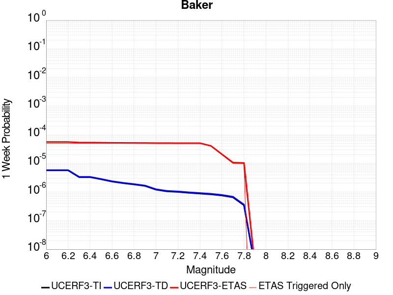 |  |  |  |

| Magnitude | 1 wk TI Prob | 1 wk TD Prob | 1 wk ETAS Prob | 1 wk ETAS/TD Gain | 1 wk ETAS Triggered Only | 1 mo TI Prob | 1 mo TD Prob | 1 mo ETAS Prob | 1 mo ETAS/TD Gain | 1 mo ETAS Triggered Only | 1 yr TI Prob | 1 yr TD Prob | 1 yr ETAS Prob | 1 yr ETAS/TD Gain | 1 yr ETAS Triggered Only | 10 yr TI Prob | 10 yr TD Prob | 10 yr ETAS Prob | 10 yr ETAS/TD Gain | 10 yr ETAS Triggered Only |
|-----|-----|-----|-----|-----|-----|-----|-----|-----|-----|-----|-----|-----|-----|-----|-----|-----|-----|-----|-----|-----|
| 6.0 | 5.695525E-6 | 5.8348373E-6 | 5.8348373E-6 | 1.0 | 0.0 | 2.4409164E-5 | 2.5006228E-5 | 2.5006228E-5 | 1.0 | 0.0 | 2.9714106E-4 | 3.044123E-4 | 3.044123E-4 | 1.0 | 0.0 | 0.0029674405 | 0.0030403486 | 0.0032272201 | 1.0614638 | 1.8744143E-4 |
| 6.1 | 5.695525E-6 | 5.8348373E-6 | 5.8348373E-6 | 1.0 | 0.0 | 2.4409164E-5 | 2.5006228E-5 | 2.5006228E-5 | 1.0 | 0.0 | 2.9714106E-4 | 3.044123E-4 | 3.044123E-4 | 1.0 | 0.0 | 0.0029674405 | 0.0030403486 | 0.0032272201 | 1.0614638 | 1.8744143E-4 |
| 6.2 | 5.695525E-6 | 5.8348373E-6 | 5.8348373E-6 | 1.0 | 0.0 | 2.4409164E-5 | 2.5006228E-5 | 2.5006228E-5 | 1.0 | 0.0 | 2.9714106E-4 | 3.044123E-4 | 3.044123E-4 | 1.0 | 0.0 | 0.0029674405 | 0.0030403486 | 0.0032272201 | 1.0614638 | 1.8744143E-4 |
| 6.3 | 3.2995713E-6 | 3.383667E-6 | 3.383667E-6 | 1.0 | 0.0 | 1.4140943E-5 | 1.4501353E-5 | 1.4501353E-5 | 1.0 | 0.0 | 1.7215237E-4 | 1.7654014E-4 | 1.7654014E-4 | 1.0 | 0.0 | 0.0017201907 | 0.001764046 | 0.0019511568 | 1.1060691 | 1.8744143E-4 |
| 6.4 | 3.2995713E-6 | 3.383667E-6 | 3.383667E-6 | 1.0 | 0.0 | 1.4140943E-5 | 1.4501353E-5 | 1.4501353E-5 | 1.0 | 0.0 | 1.7215237E-4 | 1.7654014E-4 | 1.7654014E-4 | 1.0 | 0.0 | 0.0017201907 | 0.001764046 | 0.0019511568 | 1.1060691 | 1.8744143E-4 |
| 6.5 | 2.782202E-6 | 2.8558404E-6 | 2.8558404E-6 | 1.0 | 0.0 | 1.1923668E-5 | 1.223926E-5 | 1.223926E-5 | 1.0 | 0.0 | 1.4516099E-4 | 1.4900314E-4 | 1.4900314E-4 | 1.0 | 0.0 | 0.001450662 | 0.0014890651 | 0.0016762274 | 1.1256912 | 1.8744143E-4 |
| 6.6 | 2.3163404E-6 | 2.38092E-6 | 2.38092E-6 | 1.0 | 0.0 | 9.927136E-6 | 1.0203904E-5 | 1.0203904E-5 | 1.0 | 0.0 | 1.20856166E-4 | 1.2422565E-4 | 1.2422565E-4 | 1.0 | 0.0 | 0.0012079047 | 0.0012415823 | 0.001428791 | 1.1507823 | 1.8744143E-4 |
| 6.7 | 2.037056E-6 | 2.0965003E-6 | 2.0965003E-6 | 1.0 | 0.0 | 8.7302105E-6 | 8.984972E-6 | 8.984972E-6 | 1.0 | 0.0 | 1.0628513E-4 | 1.093867E-4 | 1.093867E-4 | 1.0 | 0.0 | 0.0010623431 | 0.0010933448 | 0.0010933448 | 1.0 | 0.0 |
| 6.8 | 1.8356744E-6 | 1.8915287E-6 | 1.8915287E-6 | 1.0 | 0.0 | 7.867153E-6 | 8.106527E-6 | 8.106527E-6 | 1.0 | 0.0 | 9.577837E-5 | 9.869264E-5 | 9.869264E-5 | 1.0 | 0.0 | 9.57371E-4 | 9.86502E-4 | 9.86502E-4 | 1.0 | 0.0 |
| 6.9 | 1.6310546E-6 | 1.6832072E-6 | 1.6832072E-6 | 1.0 | 0.0 | 6.9902153E-6 | 7.213726E-6 | 7.213726E-6 | 1.0 | 0.0 | 8.510255E-5 | 8.782368E-5 | 8.782368E-5 | 1.0 | 0.0 | 8.5069967E-4 | 8.7790104E-4 | 8.7790104E-4 | 1.0 | 0.0 |
| 7.0 | 1.2058036E-6 | 1.2508665E-6 | 1.2508665E-6 | 1.0 | 0.0 | 5.1677193E-6 | 5.3608455E-6 | 5.3608455E-6 | 1.0 | 0.0 | 6.291517E-5 | 6.5266366E-5 | 6.5266366E-5 | 1.0 | 0.0 | 6.289736E-4 | 6.524743E-4 | 6.524743E-4 | 1.0 | 0.0 |
| 7.1 | 1.052382E-6 | 1.0951609E-6 | 1.0951609E-6 | 1.0 | 0.0 | 4.5102006E-6 | 4.693538E-6 | 4.693538E-6 | 1.0 | 0.0 | 5.491031E-5 | 5.7142337E-5 | 5.7142337E-5 | 1.0 | 0.0 | 5.4896745E-4 | 5.7127734E-4 | 5.7127734E-4 | 1.0 | 0.0 |
| 7.2 | 1.0067454E-6 | 1.0487711E-6 | 1.0487711E-6 | 1.0 | 0.0 | 4.3146156E-6 | 4.4947255E-6 | 4.4947255E-6 | 1.0 | 0.0 | 5.252918E-5 | 5.4721917E-5 | 5.4721917E-5 | 1.0 | 0.0 | 5.251676E-4 | 5.470853E-4 | 5.470853E-4 | 1.0 | 0.0 |
| 7.3 | 9.3596316E-7 | 9.767723E-7 | 9.767723E-7 | 1.0 | 0.0 | 4.0112645E-6 | 4.1861604E-6 | 4.1861604E-6 | 1.0 | 0.0 | 4.8836053E-5 | 5.096532E-5 | 5.096532E-5 | 1.0 | 0.0 | 4.8825322E-4 | 5.095371E-4 | 5.095371E-4 | 1.0 | 0.0 |
| 7.4 | 8.8117395E-7 | 9.2076635E-7 | 9.2076635E-7 | 1.0 | 0.0 | 3.7764542E-6 | 3.9461356E-6 | 3.9461356E-6 | 1.0 | 0.0 | 4.5977362E-5 | 4.8043148E-5 | 4.8043148E-5 | 1.0 | 0.0 | 4.596785E-4 | 4.8032837E-4 | 4.8032837E-4 | 1.0 | 0.0 |
| 7.5 | 8.292386E-7 | 8.6745956E-7 | 8.6745956E-7 | 1.0 | 0.0 | 3.5538749E-6 | 3.7176785E-6 | 3.7176785E-6 | 1.0 | 0.0 | 4.326757E-5 | 4.5261804E-5 | 4.5261804E-5 | 1.0 | 0.0 | 4.3259145E-4 | 4.5252658E-4 | 4.5252658E-4 | 1.0 | 0.0 |
| 7.6 | 7.553842E-7 | 7.9144706E-7 | 7.9144706E-7 | 1.0 | 0.0 | 3.2373566E-6 | 3.3919116E-6 | 3.3919116E-6 | 1.0 | 0.0 | 3.9414106E-5 | 4.129575E-5 | 4.129575E-5 | 1.0 | 0.0 | 3.9407116E-4 | 4.1288146E-4 | 4.1288146E-4 | 1.0 | 0.0 |
| 7.7 | 6.5285366E-7 | 6.852797E-7 | 6.852797E-7 | 1.0 | 0.0 | 2.797941E-6 | 2.9369096E-6 | 2.9369096E-6 | 1.0 | 0.0 | 3.40644E-5 | 3.5756293E-5 | 3.5756293E-5 | 1.0 | 0.0 | 3.405918E-4 | 3.5750607E-4 | 3.5750607E-4 | 1.0 | 0.0 |
| 7.8 | 3.4586725E-7 | 3.6482615E-7 | 3.6482615E-7 | 1.0 | 0.0 | 1.4822873E-6 | 1.5635396E-6 | 1.5635396E-6 | 1.0 | 0.0 | 1.80467E-5 | 1.9035933E-5 | 1.9035933E-5 | 1.0 | 0.0 | 1.8045233E-4 | 1.9034347E-4 | 1.9034347E-4 | 1.0 | 0.0 |
| 7.9 | 2.5591178E-9 | 2.6696718E-9 | 2.6696718E-9 | 1.0 | 0.0 | 1.0967647E-8 | 1.14414505E-8 | 1.14414505E-8 | 1.0 | 0.0 | 1.335311E-7 | 1.3929966E-7 | 1.3929966E-7 | 1.0 | 0.0 | 1.3353102E-6 | 1.3929966E-6 | 1.3929966E-6 | 1.0 | 0.0 |

## Mission Creek
*[(top)](#table-of-contents)*

| 1 Week | 1 Month | 1 Year | 10 Year |
|-----|-----|-----|-----|
|  |  |  |  |

| Magnitude | 1 wk TI Prob | 1 wk TD Prob | 1 wk ETAS Prob | 1 wk ETAS/TD Gain | 1 wk ETAS Triggered Only | 1 mo TI Prob | 1 mo TD Prob | 1 mo ETAS Prob | 1 mo ETAS/TD Gain | 1 mo ETAS Triggered Only | 1 yr TI Prob | 1 yr TD Prob | 1 yr ETAS Prob | 1 yr ETAS/TD Gain | 1 yr ETAS Triggered Only | 10 yr TI Prob | 10 yr TD Prob | 10 yr ETAS Prob | 10 yr ETAS/TD Gain | 10 yr ETAS Triggered Only |
|-----|-----|-----|-----|-----|-----|-----|-----|-----|-----|-----|-----|-----|-----|-----|-----|-----|-----|-----|-----|-----|
| 6.0 | 1.1549387E-5 | 1.6322783E-5 | 2.0376114E-4 | 12.483236 | 1.8744143E-4 | 4.9496433E-5 | 6.995299E-5 | 2.573813E-4 | 3.6793466 | 1.8744143E-4 | 6.0245243E-4 | 8.5135986E-4 | 0.0010386418 | 1.2199796 | 1.8744143E-4 | 0.006008218 | 0.008510157 | 0.008696003 | 1.0218382 | 1.8744143E-4 |
| 6.1 | 1.1549387E-5 | 1.6322783E-5 | 2.0376114E-4 | 12.483236 | 1.8744143E-4 | 4.9496433E-5 | 6.995299E-5 | 2.573813E-4 | 3.6793466 | 1.8744143E-4 | 6.0245243E-4 | 8.5135986E-4 | 0.0010386418 | 1.2199796 | 1.8744143E-4 | 0.006008218 | 0.008510157 | 0.008696003 | 1.0218382 | 1.8744143E-4 |
| 6.2 | 1.1549387E-5 | 1.6322783E-5 | 2.0376114E-4 | 12.483236 | 1.8744143E-4 | 4.9496433E-5 | 6.995299E-5 | 2.573813E-4 | 3.6793466 | 1.8744143E-4 | 6.0245243E-4 | 8.5135986E-4 | 0.0010386418 | 1.2199796 | 1.8744143E-4 | 0.006008218 | 0.008510157 | 0.008696003 | 1.0218382 | 1.8744143E-4 |
| 6.3 | 1.1549387E-5 | 1.6322783E-5 | 2.0376114E-4 | 12.483236 | 1.8744143E-4 | 4.9496433E-5 | 6.995299E-5 | 2.573813E-4 | 3.6793466 | 1.8744143E-4 | 6.0245243E-4 | 8.5135986E-4 | 0.0010386418 | 1.2199796 | 1.8744143E-4 | 0.006008218 | 0.008510157 | 0.008696003 | 1.0218382 | 1.8744143E-4 |
| 6.4 | 1.1549387E-5 | 1.6322783E-5 | 2.0376114E-4 | 12.483236 | 1.8744143E-4 | 4.9496433E-5 | 6.995299E-5 | 2.573813E-4 | 3.6793466 | 1.8744143E-4 | 6.0245243E-4 | 8.5135986E-4 | 0.0010386418 | 1.2199796 | 1.8744143E-4 | 0.006008218 | 0.008510157 | 0.008696003 | 1.0218382 | 1.8744143E-4 |
| 6.5 | 1.1549387E-5 | 1.6322783E-5 | 2.0376114E-4 | 12.483236 | 1.8744143E-4 | 4.9496433E-5 | 6.995299E-5 | 2.573813E-4 | 3.6793466 | 1.8744143E-4 | 6.0245243E-4 | 8.5135986E-4 | 0.0010386418 | 1.2199796 | 1.8744143E-4 | 0.006008218 | 0.008510157 | 0.008696003 | 1.0218382 | 1.8744143E-4 |
| 6.6 | 9.202681E-6 | 1.3846059E-5 | 2.0128489E-4 | 14.537341 | 1.8744143E-4 | 3.9439463E-5 | 5.9338956E-5 | 2.4676925E-4 | 4.1586385 | 1.8744143E-4 | 4.800697E-4 | 7.2222133E-4 | 9.0952736E-4 | 1.2593472 | 1.8744143E-4 | 0.004790339 | 0.0072273402 | 0.007413427 | 1.0257477 | 1.8744143E-4 |
| 6.7 | 9.019164E-6 | 1.3651728E-5 | 2.0109059E-4 | 14.730046 | 1.8744143E-4 | 3.8652986E-5 | 5.8506146E-5 | 2.459366E-4 | 4.203603 | 1.8744143E-4 | 4.7049852E-4 | 7.1208854E-4 | 8.993965E-4 | 1.2630403 | 1.8744143E-4 | 0.004695036 | 0.0071266647 | 0.00731277 | 1.026114 | 1.8744143E-4 |
| 6.8 | 8.673558E-6 | 1.3273839E-5 | 2.0071278E-4 | 15.120929 | 1.8744143E-4 | 3.717186E-5 | 5.688669E-5 | 2.4431746E-4 | 4.294809 | 1.8744143E-4 | 4.524734E-4 | 6.923842E-4 | 8.796959E-4 | 1.2705314 | 1.8744143E-4 | 0.0045155324 | 0.0069308523 | 0.007116995 | 1.026857 | 1.8744143E-4 |
| 6.9 | 7.002255E-6 | 1.1478069E-5 | 1.9891735E-4 | 17.330212 | 1.8744143E-4 | 3.000932E-5 | 4.9190832E-5 | 2.3662303E-4 | 4.8103075 | 1.8744143E-4 | 3.653022E-4 | 5.9874065E-4 | 7.8606984E-4 | 1.312872 | 1.8744143E-4 | 0.0036470229 | 0.005999676 | 0.0061859926 | 1.0310545 | 1.8744143E-4 |
| 7.0 | 5.84644E-6 | 9.675359E-6 | 1.9711498E-4 | 20.372885 | 1.8744143E-4 | 2.5055931E-5 | 4.146519E-5 | 2.2889885E-4 | 5.520265 | 1.8744143E-4 | 3.0501327E-4 | 5.047263E-4 | 6.9207314E-4 | 1.371185 | 1.8744143E-4 | 0.0030459496 | 0.005063994 | 0.005250486 | 1.0368271 | 1.8744143E-4 |
| 7.1 | 5.54703E-6 | 9.329834E-6 | 1.9676951E-4 | 21.090355 | 1.8744143E-4 | 2.377277E-5 | 3.9984414E-5 | 2.2741835E-4 | 5.6876745 | 1.8744143E-4 | 2.8939504E-4 | 4.8670598E-4 | 6.740562E-4 | 1.384935 | 1.8744143E-4 | 0.0028901845 | 0.0048845876 | 0.0050711134 | 1.0381867 | 1.8744143E-4 |
| 7.2 | 4.384709E-6 | 7.681918E-6 | 1.951219E-4 | 25.400154 | 1.8744143E-4 | 1.8791474E-5 | 3.292211E-5 | 2.2035737E-4 | 6.693294 | 1.8744143E-4 | 2.2876218E-4 | 4.0075663E-4 | 5.8812293E-4 | 1.4675314 | 1.8744143E-4 | 0.0022852682 | 0.004028542 | 0.0042152284 | 1.046341 | 1.8744143E-4 |
| 7.3 | 3.7888456E-6 | 6.915788E-6 | 1.9435592E-4 | 28.10322 | 1.8744143E-4 | 1.623781E-5 | 2.9638775E-5 | 2.1707464E-4 | 7.3240085 | 1.8744143E-4 | 1.9767738E-4 | 3.6079568E-4 | 5.481695E-4 | 1.5193349 | 1.8744143E-4 | 0.0019750162 | 0.00363027 | 0.003817031 | 1.0514455 | 1.8744143E-4 |
| 7.4 | 2.1982462E-6 | 5.0241033E-6 | 1.9246459E-4 | 38.308247 | 1.8744143E-4 | 9.421021E-6 | 2.1531694E-5 | 2.0896908E-4 | 9.705185 | 1.8744143E-4 | 1.1469489E-4 | 2.6211704E-4 | 4.4950933E-4 | 1.7149184 | 1.8744143E-4 | 0.0011463572 | 0.0026460327 | 0.002832978 | 1.0706512 | 1.8744143E-4 |
| 7.5 | 2.051923E-6 | 4.6153277E-6 | 1.9205589E-4 | 41.612625 | 1.8744143E-4 | 8.793926E-6 | 1.9779825E-5 | 2.0721754E-4 | 10.476207 | 1.8744143E-4 | 1.0706078E-4 | 2.4079291E-4 | 4.281892E-4 | 1.7782468 | 1.8744143E-4 | 0.0010700922 | 0.0024335932 | 0.0026205783 | 1.076835 | 1.8744143E-4 |
| 7.6 | 1.8733427E-6 | 4.1236603E-6 | 1.9156431E-4 | 46.454918 | 1.8744143E-4 | 8.028587E-6 | 1.7672712E-5 | 2.0511082E-4 | 11.606075 | 1.8744143E-4 | 9.774366E-5 | 2.151441E-4 | 4.025452E-4 | 1.8710492 | 1.8744143E-4 | 9.770069E-4 | 0.0021782513 | 0.0023652844 | 1.085864 | 1.8744143E-4 |
| 7.7 | 1.8411953E-6 | 4.0433315E-6 | 1.91484E-4 | 47.357975 | 1.8744143E-4 | 7.890813E-6 | 1.732845E-5 | 2.0476662E-4 | 11.816789 | 1.8744143E-4 | 9.606641E-5 | 2.1095353E-4 | 3.9835542E-4 | 1.8883562 | 1.8744143E-4 | 9.6024893E-4 | 0.0021365292 | 0.00232357 | 1.0875443 | 1.8744143E-4 |
| 7.8 | 1.7194251E-6 | 3.71068E-6 | 1.9115141E-4 | 51.513847 | 1.8744143E-4 | 7.368944E-6 | 1.5902819E-5 | 2.0334126E-4 | 12.786492 | 1.8744143E-4 | 8.97132E-5 | 1.9359968E-4 | 3.8100482E-4 | 1.9680033 | 1.8744143E-4 | 8.967699E-4 | 0.0019624757 | 0.0021495493 | 1.0953254 | 1.8744143E-4 |
| 7.9 | 1.4035052E-6 | 2.9502596E-6 | 1.9039113E-4 | 64.53368 | 1.8744143E-4 | 6.0150082E-6 | 1.2643909E-5 | 2.0008297E-4 | 15.824454 | 1.8744143E-4 | 7.3230265E-5 | 1.5392878E-4 | 3.4134137E-4 | 2.2175279 | 1.8744143E-4 | 7.3206134E-4 | 0.0015631174 | 0.0017502658 | 1.1197277 | 1.8744143E-4 |
| 8.0 | 3.9318823E-7 | 5.528477E-7 | 1.8799417E-4 | 340.0469 | 1.8744143E-4 | 1.6850913E-6 | 2.3693453E-6 | 1.8981032E-4 | 80.11087 | 1.8744143E-4 | 2.0515794E-5 | 2.8846403E-5 | 2.1628242E-4 | 7.4977255 | 1.8744143E-4 | 2.0513899E-4 | 2.990952E-4 | 4.8648057E-4 | 1.6265074 | 1.8744143E-4 |
| 8.1 | 1.596793E-7 | 1.13775044E-7 | 1.13775044E-7 | 1.0 | 0.0 | 6.8433974E-7 | 4.876072E-7 | 4.876072E-7 | 1.0 | 0.0 | 8.331805E-6 | 5.936602E-6 | 5.936602E-6 | 1.0 | 0.0 | 8.331492E-5 | 6.5494125E-5 | 6.5494125E-5 | 1.0 | 0.0 |
| 8.2 | 4.9003038E-8 | 2.5435753E-8 | 2.5435753E-8 | 1.0 | 0.0 | 2.10013E-7 | 1.09010365E-7 | 1.09010365E-7 | 1.0 | 0.0 | 2.5569052E-6 | 1.3272004E-6 | 1.3272004E-6 | 1.0 | 0.0 | 2.556876E-5 | 1.4952613E-5 | 1.4952613E-5 | 1.0 | 0.0 |

## Bullion Mountains
*[(top)](#table-of-contents)*

| 1 Week | 1 Month | 1 Year | 10 Year |
|-----|-----|-----|-----|
|  |  |  |  |

| Magnitude | 1 wk TI Prob | 1 wk TD Prob | 1 wk ETAS Prob | 1 wk ETAS/TD Gain | 1 wk ETAS Triggered Only | 1 mo TI Prob | 1 mo TD Prob | 1 mo ETAS Prob | 1 mo ETAS/TD Gain | 1 mo ETAS Triggered Only | 1 yr TI Prob | 1 yr TD Prob | 1 yr ETAS Prob | 1 yr ETAS/TD Gain | 1 yr ETAS Triggered Only | 10 yr TI Prob | 10 yr TD Prob | 10 yr ETAS Prob | 10 yr ETAS/TD Gain | 10 yr ETAS Triggered Only |
|-----|-----|-----|-----|-----|-----|-----|-----|-----|-----|-----|-----|-----|-----|-----|-----|-----|-----|-----|-----|-----|
| 6.0 | 1.6420427E-5 | 1.4692009E-5 | 2.0213069E-4 | 13.757865 | 1.8744143E-4 | 7.037136E-5 | 6.296445E-5 | 2.5039408E-4 | 3.976753 | 1.8744143E-4 | 8.5643446E-4 | 7.6636096E-4 | 9.536587E-4 | 1.244399 | 1.8744143E-4 | 0.008531413 | 0.0076409746 | 0.007826984 | 1.0243436 | 1.8744143E-4 |
| 6.1 | 1.6420427E-5 | 1.4692009E-5 | 2.0213069E-4 | 13.757865 | 1.8744143E-4 | 7.037136E-5 | 6.296445E-5 | 2.5039408E-4 | 3.976753 | 1.8744143E-4 | 8.5643446E-4 | 7.6636096E-4 | 9.536587E-4 | 1.244399 | 1.8744143E-4 | 0.008531413 | 0.0076409746 | 0.007826984 | 1.0243436 | 1.8744143E-4 |
| 6.2 | 1.6420427E-5 | 1.4692009E-5 | 2.0213069E-4 | 13.757865 | 1.8744143E-4 | 7.037136E-5 | 6.296445E-5 | 2.5039408E-4 | 3.976753 | 1.8744143E-4 | 8.5643446E-4 | 7.6636096E-4 | 9.536587E-4 | 1.244399 | 1.8744143E-4 | 0.008531413 | 0.0076409746 | 0.007826984 | 1.0243436 | 1.8744143E-4 |
| 6.3 | 1.2046778E-5 | 9.862255E-6 | 9.862255E-6 | 1.0 | 0.0 | 5.1628023E-5 | 4.2266256E-5 | 4.2266256E-5 | 1.0 | 0.0 | 6.283899E-4 | 5.144933E-4 | 5.144933E-4 | 1.0 | 0.0 | 0.0062661595 | 0.0051353034 | 0.0051353034 | 1.0 | 0.0 |
| 6.4 | 1.2046778E-5 | 9.862255E-6 | 9.862255E-6 | 1.0 | 0.0 | 5.1628023E-5 | 4.2266256E-5 | 4.2266256E-5 | 1.0 | 0.0 | 6.283899E-4 | 5.144933E-4 | 5.144933E-4 | 1.0 | 0.0 | 0.0062661595 | 0.0051353034 | 0.0051353034 | 1.0 | 0.0 |
| 6.5 | 1.0244343E-5 | 7.879378E-6 | 7.879378E-6 | 1.0 | 0.0 | 4.390359E-5 | 3.3768443E-5 | 3.3768443E-5 | 1.0 | 0.0 | 5.343951E-4 | 4.1107394E-4 | 4.1107394E-4 | 1.0 | 0.0 | 0.005331118 | 0.0041051665 | 0.0041051665 | 1.0 | 0.0 |
| 6.6 | 9.605408E-6 | 7.1774166E-6 | 7.1774166E-6 | 1.0 | 0.0 | 4.1165385E-5 | 3.0760108E-5 | 3.0760108E-5 | 1.0 | 0.0 | 5.010733E-4 | 3.7446033E-4 | 3.7446033E-4 | 1.0 | 0.0 | 0.00499945 | 0.0037402906 | 0.0037402906 | 1.0 | 0.0 |
| 6.7 | 8.60418E-6 | 6.123926E-6 | 6.123926E-6 | 1.0 | 0.0 | 3.687454E-5 | 2.6245243E-5 | 2.6245243E-5 | 1.0 | 0.0 | 4.48855E-4 | 3.195085E-4 | 3.195085E-4 | 1.0 | 0.0 | 0.004479495 | 0.0031924031 | 0.0031924031 | 1.0 | 0.0 |
| 6.8 | 5.187994E-6 | 2.563117E-6 | 2.563117E-6 | 1.0 | 0.0 | 2.223407E-5 | 1.0984763E-5 | 1.0984763E-5 | 1.0 | 0.0 | 2.7066618E-4 | 1.3373529E-4 | 1.3373529E-4 | 1.0 | 0.0 | 0.0027033675 | 0.0013369396 | 0.0013369396 | 1.0 | 0.0 |
| 6.9 | 4.5302368E-6 | 2.3442778E-6 | 2.3442778E-6 | 1.0 | 0.0 | 1.9415156E-5 | 1.0046889E-5 | 1.0046889E-5 | 1.0 | 0.0 | 2.3635388E-4 | 1.2231797E-4 | 1.2231797E-4 | 1.0 | 0.0 | 0.0023610266 | 0.0012228956 | 0.0012228956 | 1.0 | 0.0 |
| 7.0 | 3.431668E-6 | 1.6882177E-6 | 1.6882177E-6 | 1.0 | 0.0 | 1.4707065E-5 | 7.2352186E-6 | 7.2352186E-6 | 1.0 | 0.0 | 1.7904381E-4 | 8.808879E-5 | 8.808879E-5 | 1.0 | 0.0 | 0.0017889962 | 8.8088785E-4 | 8.8088785E-4 | 1.0 | 0.0 |

## San Gabriel
*[(top)](#table-of-contents)*

| 1 Week | 1 Month | 1 Year | 10 Year |
|-----|-----|-----|-----|
|  |  |  |  |

| Magnitude | 1 wk TI Prob | 1 wk TD Prob | 1 wk ETAS Prob | 1 wk ETAS/TD Gain | 1 wk ETAS Triggered Only | 1 mo TI Prob | 1 mo TD Prob | 1 mo ETAS Prob | 1 mo ETAS/TD Gain | 1 mo ETAS Triggered Only | 1 yr TI Prob | 1 yr TD Prob | 1 yr ETAS Prob | 1 yr ETAS/TD Gain | 1 yr ETAS Triggered Only | 10 yr TI Prob | 10 yr TD Prob | 10 yr ETAS Prob | 10 yr ETAS/TD Gain | 10 yr ETAS Triggered Only |
|-----|-----|-----|-----|-----|-----|-----|-----|-----|-----|-----|-----|-----|-----|-----|-----|-----|-----|-----|-----|-----|
| 6.0 | 1.083775E-5 | 1.198525E-5 | 1.198525E-5 | 1.0 | 0.0 | 4.6446676E-5 | 5.1364408E-5 | 5.1364408E-5 | 1.0 | 0.0 | 5.653415E-4 | 6.251936E-4 | 6.251936E-4 | 1.0 | 0.0 | 0.0056390543 | 0.0062463325 | 0.006432603 | 1.0298208 | 1.8744143E-4 |
| 6.1 | 1.083775E-5 | 1.198525E-5 | 1.198525E-5 | 1.0 | 0.0 | 4.6446676E-5 | 5.1364408E-5 | 5.1364408E-5 | 1.0 | 0.0 | 5.653415E-4 | 6.251936E-4 | 6.251936E-4 | 1.0 | 0.0 | 0.0056390543 | 0.0062463325 | 0.006432603 | 1.0298208 | 1.8744143E-4 |
| 6.2 | 1.083775E-5 | 1.198525E-5 | 1.198525E-5 | 1.0 | 0.0 | 4.6446676E-5 | 5.1364408E-5 | 5.1364408E-5 | 1.0 | 0.0 | 5.653415E-4 | 6.251936E-4 | 6.251936E-4 | 1.0 | 0.0 | 0.0056390543 | 0.0062463325 | 0.006432603 | 1.0298208 | 1.8744143E-4 |
| 6.3 | 1.083775E-5 | 1.198525E-5 | 1.198525E-5 | 1.0 | 0.0 | 4.6446676E-5 | 5.1364408E-5 | 5.1364408E-5 | 1.0 | 0.0 | 5.653415E-4 | 6.251936E-4 | 6.251936E-4 | 1.0 | 0.0 | 0.0056390543 | 0.0062463325 | 0.006432603 | 1.0298208 | 1.8744143E-4 |
| 6.4 | 1.083775E-5 | 1.198525E-5 | 1.198525E-5 | 1.0 | 0.0 | 4.6446676E-5 | 5.1364408E-5 | 5.1364408E-5 | 1.0 | 0.0 | 5.653415E-4 | 6.251936E-4 | 6.251936E-4 | 1.0 | 0.0 | 0.0056390543 | 0.0062463325 | 0.006432603 | 1.0298208 | 1.8744143E-4 |
| 6.5 | 6.7317824E-6 | 7.717007E-6 | 7.717007E-6 | 1.0 | 0.0 | 2.8850178E-5 | 3.3072472E-5 | 3.3072472E-5 | 1.0 | 0.0 | 3.511943E-4 | 4.0258403E-4 | 4.0258403E-4 | 1.0 | 0.0 | 0.003506398 | 0.004029533 | 0.004029533 | 1.0 | 0.0 |
| 6.6 | 6.7317824E-6 | 7.717007E-6 | 7.717007E-6 | 1.0 | 0.0 | 2.8850178E-5 | 3.3072472E-5 | 3.3072472E-5 | 1.0 | 0.0 | 3.511943E-4 | 4.0258403E-4 | 4.0258403E-4 | 1.0 | 0.0 | 0.003506398 | 0.004029533 | 0.004029533 | 1.0 | 0.0 |
| 6.7 | 6.274881E-6 | 7.2459275E-6 | 7.2459275E-6 | 1.0 | 0.0 | 2.6892068E-5 | 3.105361E-5 | 3.105361E-5 | 1.0 | 0.0 | 3.2736175E-4 | 3.7801306E-4 | 3.7801306E-4 | 1.0 | 0.0 | 0.0032687993 | 0.0037846796 | 0.0037846796 | 1.0 | 0.0 |
| 6.8 | 5.996209E-6 | 6.958647E-6 | 6.958647E-6 | 1.0 | 0.0 | 2.5697784E-5 | 2.9822439E-5 | 2.9822439E-5 | 1.0 | 0.0 | 3.128256E-4 | 3.6302864E-4 | 3.6302864E-4 | 1.0 | 0.0 | 0.003123856 | 0.0036353325 | 0.0036353325 | 1.0 | 0.0 |
| 6.9 | 5.686331E-6 | 6.6236917E-6 | 6.6236917E-6 | 1.0 | 0.0 | 2.4369761E-5 | 2.8386947E-5 | 2.8386947E-5 | 1.0 | 0.0 | 2.9666146E-4 | 3.4555717E-4 | 3.4555717E-4 | 1.0 | 0.0 | 0.0029626573 | 0.0034611735 | 0.0034611735 | 1.0 | 0.0 |
| 7.0 | 5.2329838E-6 | 6.1475757E-6 | 6.1475757E-6 | 1.0 | 0.0 | 2.242688E-5 | 2.6346492E-5 | 2.6346492E-5 | 1.0 | 0.0 | 2.7301308E-4 | 3.207221E-4 | 3.207221E-4 | 1.0 | 0.0 | 0.002726779 | 0.0032135549 | 0.0032135549 | 1.0 | 0.0 |
| 7.1 | 5.135671E-6 | 6.0377E-6 | 6.0377E-6 | 1.0 | 0.0 | 2.2009834E-5 | 2.5875606E-5 | 2.5875606E-5 | 1.0 | 0.0 | 2.6793676E-4 | 3.1499073E-4 | 3.1499073E-4 | 1.0 | 0.0 | 0.0026761394 | 0.0031564054 | 0.0031564054 | 1.0 | 0.0 |
| 7.2 | 4.989062E-6 | 5.8710784E-6 | 5.8710784E-6 | 1.0 | 0.0 | 2.1381518E-5 | 2.5161527E-5 | 2.5161527E-5 | 1.0 | 0.0 | 2.6028889E-4 | 3.0629928E-4 | 3.0629928E-4 | 1.0 | 0.0 | 0.0025998424 | 0.003069734 | 0.003069734 | 1.0 | 0.0 |
| 7.3 | 4.8219395E-6 | 5.7026323E-6 | 5.7026323E-6 | 1.0 | 0.0 | 2.0665291E-5 | 2.4439627E-5 | 2.4439627E-5 | 1.0 | 0.0 | 2.5157086E-4 | 2.975126E-4 | 2.975126E-4 | 1.0 | 0.0 | 0.0025128627 | 0.002982106 | 0.002982106 | 1.0 | 0.0 |
| 7.4 | 4.7118383E-6 | 5.5911896E-6 | 5.5911896E-6 | 1.0 | 0.0 | 2.0193436E-5 | 2.3962024E-5 | 2.3962024E-5 | 1.0 | 0.0 | 2.4582737E-4 | 2.9169934E-4 | 2.9169934E-4 | 1.0 | 0.0 | 0.002455556 | 0.0029241266 | 0.0029241266 | 1.0 | 0.0 |
| 7.5 | 4.5506545E-6 | 5.4365555E-6 | 5.4365555E-6 | 1.0 | 0.0 | 1.9502659E-5 | 2.329932E-5 | 2.329932E-5 | 1.0 | 0.0 | 2.37419E-4 | 2.8363304E-4 | 2.8363304E-4 | 1.0 | 0.0 | 0.002371655 | 0.0028436715 | 0.0028436715 | 1.0 | 0.0 |
| 7.6 | 4.343636E-6 | 5.2294336E-6 | 5.2294336E-6 | 1.0 | 0.0 | 1.861545E-5 | 2.241167E-5 | 2.241167E-5 | 1.0 | 0.0 | 2.2661954E-4 | 2.7282868E-4 | 2.7282868E-4 | 1.0 | 0.0 | 0.0022638857 | 0.0027358893 | 0.0027358893 | 1.0 | 0.0 |
| 7.7 | 2.936235E-6 | 2.743946E-6 | 2.743946E-6 | 1.0 | 0.0 | 1.2583803E-5 | 1.1759716E-5 | 1.1759716E-5 | 1.0 | 0.0 | 1.5319703E-4 | 1.4316518E-4 | 1.4316518E-4 | 1.0 | 0.0 | 0.0015309147 | 0.0014379849 | 0.0014379849 | 1.0 | 0.0 |
| 7.8 | 1.4541639E-6 | 9.122518E-7 | 9.122518E-7 | 1.0 | 0.0 | 6.232116E-6 | 3.9096444E-6 | 3.9096444E-6 | 1.0 | 0.0 | 7.587337E-5 | 4.7598885E-5 | 4.7598885E-5 | 1.0 | 0.0 | 7.584747E-4 | 4.8078224E-4 | 4.8078224E-4 | 1.0 | 0.0 |
| 7.9 | 8.098958E-7 | 2.4165956E-7 | 2.4165956E-7 | 1.0 | 0.0 | 3.4709774E-6 | 1.0356835E-6 | 1.0356835E-6 | 1.0 | 0.0 | 4.225833E-5 | 1.2609373E-5 | 1.2609373E-5 | 1.0 | 0.0 | 4.2250296E-4 | 1.2917137E-4 | 1.2917137E-4 | 1.0 | 0.0 |
| 8.0 | 5.2473234E-7 | 7.672734E-8 | 7.672734E-8 | 1.0 | 0.0 | 2.248851E-6 | 3.2883142E-7 | 3.2883142E-7 | 1.0 | 0.0 | 2.7379416E-5 | 4.003515E-6 | 4.003515E-6 | 1.0 | 0.0 | 2.7376044E-4 | 4.215796E-5 | 4.215796E-5 | 1.0 | 0.0 |
| 8.1 | 3.3162388E-7 | 4.1457096E-8 | 4.1457096E-8 | 1.0 | 0.0 | 1.4212444E-6 | 1.7767324E-7 | 1.7767324E-7 | 1.0 | 0.0 | 1.7303513E-5 | 2.1631695E-6 | 2.1631695E-6 | 1.0 | 0.0 | 1.7302166E-4 | 2.294416E-5 | 2.294416E-5 | 1.0 | 0.0 |
| 8.2 | 1.0235345E-7 | 1.4032201E-8 | 1.4032201E-8 | 1.0 | 0.0 | 4.3865757E-7 | 6.013801E-8 | 6.013801E-8 | 1.0 | 0.0 | 5.340643E-6 | 7.3217996E-7 | 7.3217996E-7 | 1.0 | 0.0 | 5.3405143E-5 | 7.921925E-6 | 7.921925E-6 | 1.0 | 0.0 |

## White Wolf (Extension)
*[(top)](#table-of-contents)*

| 1 Week | 1 Month | 1 Year | 10 Year |
|-----|-----|-----|-----|
|  |  |  |  |

| Magnitude | 1 wk TI Prob | 1 wk TD Prob | 1 wk ETAS Prob | 1 wk ETAS/TD Gain | 1 wk ETAS Triggered Only | 1 mo TI Prob | 1 mo TD Prob | 1 mo ETAS Prob | 1 mo ETAS/TD Gain | 1 mo ETAS Triggered Only | 1 yr TI Prob | 1 yr TD Prob | 1 yr ETAS Prob | 1 yr ETAS/TD Gain | 1 yr ETAS Triggered Only | 10 yr TI Prob | 10 yr TD Prob | 10 yr ETAS Prob | 10 yr ETAS/TD Gain | 10 yr ETAS Triggered Only |
|-----|-----|-----|-----|-----|-----|-----|-----|-----|-----|-----|-----|-----|-----|-----|-----|-----|-----|-----|-----|-----|
| 6.0 | 8.222555E-6 | 6.066615E-6 | 6.066615E-6 | 1.0 | 0.0 | 3.5239045E-5 | 2.5999556E-5 | 2.5999556E-5 | 1.0 | 0.0 | 4.289509E-4 | 3.1650523E-4 | 5.0388736E-4 | 1.5920347 | 1.8744143E-4 | 0.0042812387 | 0.0031611966 | 0.0033480455 | 1.0591071 | 1.8744143E-4 |
| 6.1 | 8.222555E-6 | 6.066615E-6 | 6.066615E-6 | 1.0 | 0.0 | 3.5239045E-5 | 2.5999556E-5 | 2.5999556E-5 | 1.0 | 0.0 | 4.289509E-4 | 3.1650523E-4 | 5.0388736E-4 | 1.5920347 | 1.8744143E-4 | 0.0042812387 | 0.0031611966 | 0.0033480455 | 1.0591071 | 1.8744143E-4 |
| 6.2 | 8.222555E-6 | 6.066615E-6 | 6.066615E-6 | 1.0 | 0.0 | 3.5239045E-5 | 2.5999556E-5 | 2.5999556E-5 | 1.0 | 0.0 | 4.289509E-4 | 3.1650523E-4 | 5.0388736E-4 | 1.5920347 | 1.8744143E-4 | 0.0042812387 | 0.0031611966 | 0.0033480455 | 1.0591071 | 1.8744143E-4 |
| 6.3 | 8.222555E-6 | 6.066615E-6 | 6.066615E-6 | 1.0 | 0.0 | 3.5239045E-5 | 2.5999556E-5 | 2.5999556E-5 | 1.0 | 0.0 | 4.289509E-4 | 3.1650523E-4 | 5.0388736E-4 | 1.5920347 | 1.8744143E-4 | 0.0042812387 | 0.0031611966 | 0.0033480455 | 1.0591071 | 1.8744143E-4 |
| 6.4 | 5.821773E-6 | 3.5571256E-6 | 3.5571256E-6 | 1.0 | 0.0 | 2.4950215E-5 | 1.5244741E-5 | 1.5244741E-5 | 1.0 | 0.0 | 3.0372653E-4 | 1.8559002E-4 | 1.8559002E-4 | 1.0 | 0.0 | 0.0030331176 | 0.0018544586 | 0.0018544586 | 1.0 | 0.0 |
| 6.5 | 5.766023E-6 | 3.4990599E-6 | 3.4990599E-6 | 1.0 | 0.0 | 2.4711293E-5 | 1.49958905E-5 | 1.49958905E-5 | 1.0 | 0.0 | 3.0081844E-4 | 1.8256076E-4 | 1.8256076E-4 | 1.0 | 0.0 | 0.0030041158 | 0.0018242161 | 0.0018242161 | 1.0 | 0.0 |
| 6.6 | 4.643576E-6 | 2.3325733E-6 | 2.3325733E-6 | 1.0 | 0.0 | 1.9900888E-5 | 9.9967065E-6 | 9.9967065E-6 | 1.0 | 0.0 | 2.4226638E-4 | 1.2170354E-4 | 1.2170354E-4 | 1.0 | 0.0 | 0.0024200242 | 0.0012164112 | 0.0012164112 | 1.0 | 0.0 |
| 6.7 | 3.9529173E-6 | 1.6482975E-6 | 1.6482975E-6 | 1.0 | 0.0 | 1.6940963E-5 | 7.064114E-6 | 7.064114E-6 | 1.0 | 0.0 | 2.0623671E-4 | 8.600239E-5 | 8.600239E-5 | 1.0 | 0.0 | 0.002060454 | 8.597095E-4 | 8.597095E-4 | 1.0 | 0.0 |
| 6.8 | 3.4377522E-6 | 1.2244764E-6 | 1.2244764E-6 | 1.0 | 0.0 | 1.473314E-5 | 5.247746E-6 | 5.247746E-6 | 1.0 | 0.0 | 1.7936122E-4 | 6.388952E-5 | 6.388952E-5 | 1.0 | 0.0 | 0.0017921652 | 6.3872064E-4 | 6.3872064E-4 | 1.0 | 0.0 |
| 6.9 | 3.1367306E-6 | 1.0033316E-6 | 1.0033316E-6 | 1.0 | 0.0 | 1.3443062E-5 | 4.299986E-6 | 4.299986E-6 | 1.0 | 0.0 | 1.63657E-4 | 5.2351144E-5 | 5.2351144E-5 | 1.0 | 0.0 | 0.0016353652 | 5.233958E-4 | 5.233958E-4 | 1.0 | 0.0 |
| 7.0 | 2.8298145E-6 | 7.4282326E-7 | 7.4282326E-7 | 1.0 | 0.0 | 1.2127721E-5 | 3.1835248E-6 | 3.1835248E-6 | 1.0 | 0.0 | 1.47645E-4 | 3.8758775E-5 | 3.8758775E-5 | 1.0 | 0.0 | 0.0014754693 | 3.8752513E-4 | 3.8752513E-4 | 1.0 | 0.0 |
| 7.1 | 2.4091064E-6 | 5.4223835E-7 | 5.4223835E-7 | 1.0 | 0.0 | 1.03247E-5 | 2.3238767E-6 | 2.3238767E-6 | 1.0 | 0.0 | 1.2569598E-4 | 2.8292874E-5 | 2.8292874E-5 | 1.0 | 0.0 | 0.001256249 | 2.8289677E-4 | 2.8289677E-4 | 1.0 | 0.0 |
| 7.2 | 1.3875518E-6 | 1.0740268E-7 | 1.0740268E-7 | 1.0 | 0.0 | 5.9466374E-6 | 4.6029712E-7 | 4.6029712E-7 | 1.0 | 0.0 | 7.23979E-5 | 5.604104E-6 | 5.604104E-6 | 1.0 | 0.0 | 7.2374323E-4 | 5.6039742E-5 | 5.6039742E-5 | 1.0 | 0.0 |
| 7.3 | 7.056077E-7 | 5.0002956E-8 | 5.0002956E-8 | 1.0 | 0.0 | 3.0240296E-6 | 2.1429837E-7 | 2.1429837E-7 | 1.0 | 0.0 | 3.681694E-5 | 2.60908E-6 | 2.60908E-6 | 1.0 | 0.0 | 3.681084E-4 | 2.609054E-5 | 2.609054E-5 | 1.0 | 0.0 |
| 7.4 | 5.9334678E-8 | 4.8638475E-9 | 4.8638475E-9 | 1.0 | 0.0 | 2.5429145E-7 | 2.084506E-8 | 2.084506E-8 | 1.0 | 0.0 | 3.095994E-6 | 2.5378858E-7 | 2.5378858E-7 | 1.0 | 0.0 | 3.095951E-5 | 2.5378843E-6 | 2.5378843E-6 | 1.0 | 0.0 |

## Great Valley 05 Pittsburg - Kirby Hills alt1
*[(top)](#table-of-contents)*

| 1 Week | 1 Month | 1 Year | 10 Year |
|-----|-----|-----|-----|
|  |  |  |  |

| Magnitude | 1 wk TI Prob | 1 wk TD Prob | 1 wk ETAS Prob | 1 wk ETAS/TD Gain | 1 wk ETAS Triggered Only | 1 mo TI Prob | 1 mo TD Prob | 1 mo ETAS Prob | 1 mo ETAS/TD Gain | 1 mo ETAS Triggered Only | 1 yr TI Prob | 1 yr TD Prob | 1 yr ETAS Prob | 1 yr ETAS/TD Gain | 1 yr ETAS Triggered Only | 10 yr TI Prob | 10 yr TD Prob | 10 yr ETAS Prob | 10 yr ETAS/TD Gain | 10 yr ETAS Triggered Only |
|-----|-----|-----|-----|-----|-----|-----|-----|-----|-----|-----|-----|-----|-----|-----|-----|-----|-----|-----|-----|-----|
| 6.0 | 4.187212E-5 | 5.344289E-5 | 5.344289E-5 | 1.0 | 0.0 | 1.794396E-4 | 2.2902661E-4 | 2.2902661E-4 | 1.0 | 0.0 | 0.002182488 | 0.0027857998 | 0.0027857998 | 1.0 | 0.0 | 0.021611776 | 0.027603218 | 0.027785486 | 1.0066031 | 1.8744143E-4 |
| 6.1 | 4.187212E-5 | 5.344289E-5 | 5.344289E-5 | 1.0 | 0.0 | 1.794396E-4 | 2.2902661E-4 | 2.2902661E-4 | 1.0 | 0.0 | 0.002182488 | 0.0027857998 | 0.0027857998 | 1.0 | 0.0 | 0.021611776 | 0.027603218 | 0.027785486 | 1.0066031 | 1.8744143E-4 |
| 6.2 | 1.7353306E-5 | 2.2154672E-5 | 2.2154672E-5 | 1.0 | 0.0 | 7.436919E-5 | 9.4947456E-5 | 9.4947456E-5 | 1.0 | 0.0 | 9.050688E-4 | 0.0011557573 | 0.0011557573 | 1.0 | 0.0 | 0.009013915 | 0.0115352 | 0.0115352 | 1.0 | 0.0 |
| 6.3 | 1.7353306E-5 | 2.2154672E-5 | 2.2154672E-5 | 1.0 | 0.0 | 7.436919E-5 | 9.4947456E-5 | 9.4947456E-5 | 1.0 | 0.0 | 9.050688E-4 | 0.0011557573 | 0.0011557573 | 1.0 | 0.0 | 0.009013915 | 0.0115352 | 0.0115352 | 1.0 | 0.0 |
| 6.4 | 1.4028824E-5 | 1.7901062E-5 | 1.7901062E-5 | 1.0 | 0.0 | 6.0122147E-5 | 7.671883E-5 | 7.671883E-5 | 1.0 | 0.0 | 7.3174125E-4 | 9.340303E-4 | 9.340303E-4 | 1.0 | 0.0 | 0.0072933645 | 0.009338211 | 0.009338211 | 1.0 | 0.0 |

## La Panza 2011
*[(top)](#table-of-contents)*

| 1 Week | 1 Month | 1 Year | 10 Year |
|-----|-----|-----|-----|
|  |  |  | 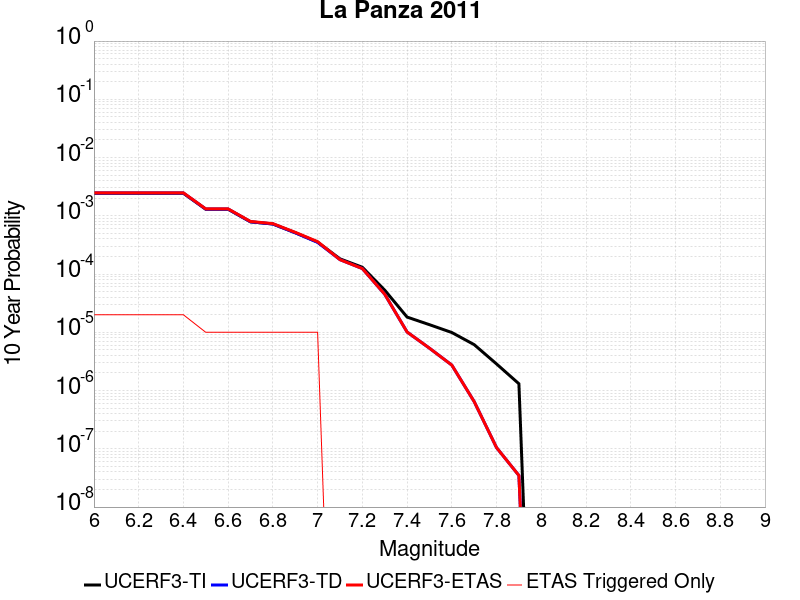 |

| Magnitude | 1 wk TI Prob | 1 wk TD Prob | 1 wk ETAS Prob | 1 wk ETAS/TD Gain | 1 wk ETAS Triggered Only | 1 mo TI Prob | 1 mo TD Prob | 1 mo ETAS Prob | 1 mo ETAS/TD Gain | 1 mo ETAS Triggered Only | 1 yr TI Prob | 1 yr TD Prob | 1 yr ETAS Prob | 1 yr ETAS/TD Gain | 1 yr ETAS Triggered Only | 10 yr TI Prob | 10 yr TD Prob | 10 yr ETAS Prob | 10 yr ETAS/TD Gain | 10 yr ETAS Triggered Only |
|-----|-----|-----|-----|-----|-----|-----|-----|-----|-----|-----|-----|-----|-----|-----|-----|-----|-----|-----|-----|-----|
| 6.0 | 4.6754544E-6 | 4.7175886E-6 | 1.9215813E-4 | 40.732277 | 1.8744143E-4 | 2.0037509E-5 | 2.021809E-5 | 2.0765573E-4 | 10.270788 | 1.8744143E-4 | 2.4392935E-4 | 2.4612944E-4 | 4.3352472E-4 | 1.7613689 | 1.8744143E-4 | 0.0024366176 | 0.0024587628 | 0.0026457433 | 1.0760466 | 1.8744143E-4 |
| 6.1 | 4.6754544E-6 | 4.7175886E-6 | 1.9215813E-4 | 40.732277 | 1.8744143E-4 | 2.0037509E-5 | 2.021809E-5 | 2.0765573E-4 | 10.270788 | 1.8744143E-4 | 2.4392935E-4 | 2.4612944E-4 | 4.3352472E-4 | 1.7613689 | 1.8744143E-4 | 0.0024366176 | 0.0024587628 | 0.0026457433 | 1.0760466 | 1.8744143E-4 |
| 6.2 | 4.6754544E-6 | 4.7175886E-6 | 1.9215813E-4 | 40.732277 | 1.8744143E-4 | 2.0037509E-5 | 2.021809E-5 | 2.0765573E-4 | 10.270788 | 1.8744143E-4 | 2.4392935E-4 | 2.4612944E-4 | 4.3352472E-4 | 1.7613689 | 1.8744143E-4 | 0.0024366176 | 0.0024587628 | 0.0026457433 | 1.0760466 | 1.8744143E-4 |
| 6.3 | 4.6754544E-6 | 4.7175886E-6 | 1.9215813E-4 | 40.732277 | 1.8744143E-4 | 2.0037509E-5 | 2.021809E-5 | 2.0765573E-4 | 10.270788 | 1.8744143E-4 | 2.4392935E-4 | 2.4612944E-4 | 4.3352472E-4 | 1.7613689 | 1.8744143E-4 | 0.0024366176 | 0.0024587628 | 0.0026457433 | 1.0760466 | 1.8744143E-4 |
| 6.4 | 4.6754544E-6 | 4.7175886E-6 | 1.9215813E-4 | 40.732277 | 1.8744143E-4 | 2.0037509E-5 | 2.021809E-5 | 2.0765573E-4 | 10.270788 | 1.8744143E-4 | 2.4392935E-4 | 2.4612944E-4 | 4.3352472E-4 | 1.7613689 | 1.8744143E-4 | 0.0024366176 | 0.0024587628 | 0.0026457433 | 1.0760466 | 1.8744143E-4 |
| 6.5 | 2.485343E-6 | 2.5006007E-6 | 2.5006007E-6 | 1.0 | 0.0 | 1.0651426E-5 | 1.0716818E-5 | 1.0716818E-5 | 1.0 | 0.0 | 1.296734E-4 | 1.3046984E-4 | 1.3046984E-4 | 1.0 | 0.0 | 0.0012959775 | 0.0013039707 | 0.0013039707 | 1.0 | 0.0 |
| 6.6 | 2.485343E-6 | 2.5006007E-6 | 2.5006007E-6 | 1.0 | 0.0 | 1.0651426E-5 | 1.0716818E-5 | 1.0716818E-5 | 1.0 | 0.0 | 1.296734E-4 | 1.3046984E-4 | 1.3046984E-4 | 1.0 | 0.0 | 0.0012959775 | 0.0013039707 | 0.0013039707 | 1.0 | 0.0 |
| 6.7 | 1.5108508E-6 | 1.514639E-6 | 1.514639E-6 | 1.0 | 0.0 | 6.4750584E-6 | 6.4912947E-6 | 6.4912947E-6 | 1.0 | 0.0 | 7.8830984E-5 | 7.902876E-5 | 7.902876E-5 | 1.0 | 0.0 | 7.880303E-4 | 7.9001737E-4 | 7.9001737E-4 | 1.0 | 0.0 |
| 6.8 | 1.3865837E-6 | 1.3885118E-6 | 1.3885118E-6 | 1.0 | 0.0 | 5.942488E-6 | 5.950752E-6 | 5.950752E-6 | 1.0 | 0.0 | 7.234739E-5 | 7.244809E-5 | 7.244809E-5 | 1.0 | 0.0 | 7.232384E-4 | 7.242546E-4 | 7.242546E-4 | 1.0 | 0.0 |
| 6.9 | 9.826583E-7 | 9.796303E-7 | 9.796303E-7 | 1.0 | 0.0 | 4.2113857E-6 | 4.198409E-6 | 4.198409E-6 | 1.0 | 0.0 | 5.1272415E-5 | 5.1114486E-5 | 5.1114486E-5 | 1.0 | 0.0 | 5.126059E-4 | 5.1103265E-4 | 5.1103265E-4 | 1.0 | 0.0 |
| 7.0 | 6.7797646E-7 | 6.710231E-7 | 6.710231E-7 | 1.0 | 0.0 | 2.9056102E-6 | 2.8758104E-6 | 2.8758104E-6 | 1.0 | 0.0 | 3.537523E-5 | 3.501246E-5 | 3.501246E-5 | 1.0 | 0.0 | 3.5369597E-4 | 3.5007254E-4 | 3.5007254E-4 | 1.0 | 0.0 |
| 7.1 | 3.4979826E-7 | 3.3874045E-7 | 3.3874045E-7 | 1.0 | 0.0 | 1.4991346E-6 | 1.4517441E-6 | 1.4517441E-6 | 1.0 | 0.0 | 1.825181E-5 | 1.7674853E-5 | 1.7674853E-5 | 1.0 | 0.0 | 1.825031E-4 | 1.7673563E-4 | 1.7673563E-4 | 1.0 | 0.0 |
| 7.2 | 2.5088332E-7 | 2.3832064E-7 | 2.3832064E-7 | 1.0 | 0.0 | 1.0752137E-6 | 1.0213738E-6 | 1.0213738E-6 | 1.0 | 0.0 | 1.3090649E-5 | 1.2435164E-5 | 1.2435164E-5 | 1.0 | 0.0 | 1.3089878E-4 | 1.2434553E-4 | 1.2434553E-4 | 1.0 | 0.0 |
| 7.3 | 1.0159086E-7 | 8.644785E-8 | 8.644785E-8 | 1.0 | 0.0 | 4.3538932E-7 | 3.704907E-7 | 3.704907E-7 | 1.0 | 0.0 | 5.300852E-6 | 4.510716E-6 | 4.510716E-6 | 1.0 | 0.0 | 5.3007258E-5 | 4.510628E-5 | 4.510628E-5 | 1.0 | 0.0 |
| 7.4 | 3.5006252E-8 | 1.9403883E-8 | 1.9403883E-8 | 1.0 | 0.0 | 1.5002678E-7 | 8.315949E-8 | 8.315949E-8 | 1.0 | 0.0 | 1.8265745E-6 | 1.0124663E-6 | 1.0124663E-6 | 1.0 | 0.0 | 1.8265595E-5 | 1.012462E-5 | 1.012462E-5 | 1.0 | 0.0 |
| 7.5 | 2.592274E-8 | 1.0238468E-8 | 1.0238468E-8 | 1.0 | 0.0 | 1.1109746E-7 | 4.3879147E-8 | 4.3879147E-8 | 1.0 | 0.0 | 1.3526106E-6 | 5.342285E-7 | 5.342285E-7 | 1.0 | 0.0 | 1.3526024E-5 | 5.342273E-6 | 5.342273E-6 | 1.0 | 0.0 |
| 7.6 | 1.9016717E-8 | 5.2442264E-9 | 5.2442264E-9 | 1.0 | 0.0 | 8.150022E-8 | 2.2475257E-8 | 2.2475257E-8 | 1.0 | 0.0 | 9.922647E-7 | 2.736362E-7 | 2.736362E-7 | 1.0 | 0.0 | 9.922603E-6 | 2.736359E-6 | 2.736359E-6 | 1.0 | 0.0 |
| 7.7 | 1.17738495E-8 | 1.2393437E-9 | 1.2393437E-9 | 1.0 | 0.0 | 5.0459356E-8 | 5.3114735E-9 | 5.3114735E-9 | 1.0 | 0.0 | 6.1434247E-7 | 6.466719E-8 | 6.466719E-8 | 1.0 | 0.0 | 6.143408E-6 | 6.466717E-7 | 6.466717E-7 | 1.0 | 0.0 |
| 7.8 | 5.489079E-9 | 2.009185E-10 | 2.009185E-10 | 1.0 | 0.0 | 2.3524624E-8 | 8.61079E-10 | 8.61079E-10 | 1.0 | 0.0 | 2.8641225E-7 | 1.0483639E-8 | 1.0483639E-8 | 1.0 | 0.0 | 2.8641189E-6 | 1.0483638E-7 | 1.0483638E-7 | 1.0 | 0.0 |
| 7.9 | 2.5081048E-9 | 6.675449E-11 | 6.675449E-11 | 1.0 | 0.0 | 1.0749021E-8 | 2.8609015E-10 | 2.8609015E-10 | 1.0 | 0.0 | 1.3086932E-7 | 3.483148E-9 | 3.483148E-9 | 1.0 | 0.0 | 1.3086925E-6 | 3.483148E-8 | 3.483148E-8 | 1.0 | 0.0 |

## Owens Valley
*[(top)](#table-of-contents)*

| 1 Week | 1 Month | 1 Year | 10 Year |
|-----|-----|-----|-----|
|  |  |  |  |

| Magnitude | 1 wk TI Prob | 1 wk TD Prob | 1 wk ETAS Prob | 1 wk ETAS/TD Gain | 1 wk ETAS Triggered Only | 1 mo TI Prob | 1 mo TD Prob | 1 mo ETAS Prob | 1 mo ETAS/TD Gain | 1 mo ETAS Triggered Only | 1 yr TI Prob | 1 yr TD Prob | 1 yr ETAS Prob | 1 yr ETAS/TD Gain | 1 yr ETAS Triggered Only | 10 yr TI Prob | 10 yr TD Prob | 10 yr ETAS Prob | 10 yr ETAS/TD Gain | 10 yr ETAS Triggered Only |
|-----|-----|-----|-----|-----|-----|-----|-----|-----|-----|-----|-----|-----|-----|-----|-----|-----|-----|-----|-----|-----|
| 6.0 | 4.83821E-5 | 3.6210524E-6 | 1.910618E-4 | 52.764164 | 1.8744143E-4 | 2.0733538E-4 | 1.551871E-5 | 2.0295722E-4 | 13.078228 | 1.8744143E-4 | 0.002521386 | 1.889249E-4 | 3.763309E-4 | 1.9919604 | 1.8744143E-4 | 0.024929691 | 0.0019297141 | 0.0021167938 | 1.0969468 | 1.8744143E-4 |
| 6.1 | 4.83821E-5 | 3.6210524E-6 | 1.910618E-4 | 52.764164 | 1.8744143E-4 | 2.0733538E-4 | 1.551871E-5 | 2.0295722E-4 | 13.078228 | 1.8744143E-4 | 0.002521386 | 1.889249E-4 | 3.763309E-4 | 1.9919604 | 1.8744143E-4 | 0.024929691 | 0.0019297141 | 0.0021167938 | 1.0969468 | 1.8744143E-4 |
| 6.2 | 4.83821E-5 | 3.6210524E-6 | 1.910618E-4 | 52.764164 | 1.8744143E-4 | 2.0733538E-4 | 1.551871E-5 | 2.0295722E-4 | 13.078228 | 1.8744143E-4 | 0.002521386 | 1.889249E-4 | 3.763309E-4 | 1.9919604 | 1.8744143E-4 | 0.024929691 | 0.0019297141 | 0.0021167938 | 1.0969468 | 1.8744143E-4 |
| 6.3 | 3.953008E-5 | 3.1530958E-6 | 1.9059393E-4 | 60.4466 | 1.8744143E-4 | 1.6940363E-4 | 1.3513202E-5 | 2.009521E-4 | 14.870797 | 1.8744143E-4 | 0.002060538 | 1.6451156E-4 | 3.5192215E-4 | 2.139194 | 1.8744143E-4 | 0.020415364 | 0.0016621627 | 0.0018492927 | 1.1125822 | 1.8744143E-4 |
| 6.4 | 3.953008E-5 | 3.1530958E-6 | 1.9059393E-4 | 60.4466 | 1.8744143E-4 | 1.6940363E-4 | 1.3513202E-5 | 2.009521E-4 | 14.870797 | 1.8744143E-4 | 0.002060538 | 1.6451156E-4 | 3.5192215E-4 | 2.139194 | 1.8744143E-4 | 0.020415364 | 0.0016621627 | 0.0018492927 | 1.1125822 | 1.8744143E-4 |
| 6.5 | 3.457342E-5 | 2.9707387E-6 | 1.904116E-4 | 64.09571 | 1.8744143E-4 | 1.4816338E-4 | 1.273168E-5 | 2.0017072E-4 | 15.722256 | 1.8744143E-4 | 0.0018023965 | 1.5499788E-4 | 3.4241023E-4 | 2.2091286 | 1.8744143E-4 | 0.017878477 | 0.0015563119 | 0.0017434615 | 1.120252 | 1.8744143E-4 |
| 6.6 | 3.1127765E-5 | 2.8737306E-6 | 1.9031462E-4 | 66.225624 | 1.8744143E-4 | 1.3339789E-4 | 1.2315934E-5 | 1.9975506E-4 | 16.219236 | 1.8744143E-4 | 0.0016229092 | 1.4993687E-4 | 3.3735018E-4 | 2.2499483 | 1.8744143E-4 | 0.016111081 | 0.0015013438 | 0.0016885038 | 1.1246617 | 1.8744143E-4 |
| 6.7 | 2.806885E-5 | 2.8101606E-6 | 1.9025106E-4 | 67.70113 | 1.8744143E-4 | 1.2028952E-4 | 1.2043493E-5 | 1.9948266E-4 | 16.563522 | 1.8744143E-4 | 0.001463541 | 1.4662035E-4 | 3.340343E-4 | 2.278226 | 1.8744143E-4 | 0.014539397 | 0.0014656087 | 0.0016527754 | 1.1277058 | 1.8744143E-4 |
| 6.8 | 2.524524E-5 | 2.2351392E-6 | 1.8967614E-4 | 84.861 | 1.8744143E-4 | 1.0818939E-4 | 9.579134E-6 | 1.9701876E-4 | 20.567492 | 1.8744143E-4 | 0.0013164099 | 1.16620016E-4 | 3.040396E-4 | 2.607096 | 1.8744143E-4 | 0.01308639 | 0.001165827 | 0.00135305 | 1.1605923 | 1.8744143E-4 |
| 6.9 | 2.2704568E-5 | 1.6079711E-6 | 1.890491E-4 | 117.56996 | 1.8744143E-4 | 9.730166E-5 | 6.8912864E-6 | 1.9433141E-4 | 28.199585 | 1.8744143E-4 | 0.0011840039 | 8.38982E-5 | 2.713239E-4 | 3.2339656 | 1.8744143E-4 | 0.011777153 | 8.38853E-4 | 0.0010261373 | 1.2232622 | 1.8744143E-4 |
| 7.0 | 2.0871712E-5 | 1.5393621E-6 | 1.889805E-4 | 122.765465 | 1.8744143E-4 | 8.944713E-5 | 6.5972495E-6 | 1.9403743E-4 | 29.41187 | 1.8744143E-4 | 0.0010884746 | 8.031857E-5 | 2.6774494E-4 | 3.333537 | 1.8744143E-4 | 0.010831586 | 8.030395E-4 | 9.903305E-4 | 1.2332275 | 1.8744143E-4 |
| 7.1 | 1.944928E-5 | 1.3862556E-6 | 1.8882743E-4 | 136.214 | 1.8744143E-4 | 8.335139E-5 | 5.941082E-6 | 1.9338139E-4 | 32.549862 | 1.8744143E-4 | 0.0010143308 | 7.233028E-5 | 2.5975815E-4 | 3.591278 | 1.8744143E-4 | 0.010097133 | 7.2319806E-4 | 9.105039E-4 | 1.2589966 | 1.8744143E-4 |
| 7.2 | 1.7876306E-5 | 1.2487686E-6 | 1.8868996E-4 | 151.10081 | 1.8744143E-4 | 7.6610486E-5 | 5.3518543E-6 | 1.9279227E-4 | 36.023453 | 1.8744143E-4 | 9.3233347E-4 | 6.515689E-5 | 2.525861E-4 | 3.8765833 | 1.8744143E-4 | 0.009284316 | 6.5148395E-4 | 8.3880324E-4 | 1.2875271 | 1.8744143E-4 |
| 7.3 | 1.2618672E-5 | 1.1113839E-6 | 1.885526E-4 | 169.65569 | 1.8744143E-4 | 5.40789E-5 | 4.763065E-6 | 1.922036E-4 | 40.35292 | 1.8744143E-4 | 6.582117E-4 | 5.7988782E-5 | 2.4541933E-4 | 4.2321863 | 1.8744143E-4 | 0.0065626553 | 5.7983754E-4 | 7.671703E-4 | 1.3230779 | 1.8744143E-4 |
| 7.4 | 7.4874442E-6 | 8.547518E-7 | 1.8829602E-4 | 220.29321 | 1.8744143E-4 | 3.208865E-5 | 3.6632168E-6 | 1.9110396E-4 | 52.168343 | 1.8744143E-4 | 3.906093E-4 | 4.4598757E-5 | 2.3203182E-4 | 5.2026525 | 1.8744143E-4 | 0.003899234 | 4.459579E-4 | 6.3331577E-4 | 1.4201245 | 1.8744143E-4 |
| 7.5 | 2.4734156E-6 | 6.0679935E-7 | 6.0679935E-7 | 1.0 | 0.0 | 1.060031E-5 | 2.6005662E-6 | 2.6005662E-6 | 1.0 | 0.0 | 1.2905113E-4 | 3.1661435E-5 | 3.1661435E-5 | 1.0 | 0.0 | 0.0012897621 | 3.1656958E-4 | 3.1656958E-4 | 1.0 | 0.0 |
| 7.6 | 1.1328841E-6 | 3.1961991E-7 | 3.1961991E-7 | 1.0 | 0.0 | 4.8552088E-6 | 1.369799E-6 | 1.369799E-6 | 1.0 | 0.0 | 5.9110564E-5 | 1.6677177E-5 | 1.6677177E-5 | 1.0 | 0.0 | 5.9094845E-4 | 1.6675945E-4 | 1.6675945E-4 | 1.0 | 0.0 |
| 7.7 | 4.8613185E-7 | 8.962742E-8 | 8.962742E-8 | 1.0 | 0.0 | 2.0834207E-6 | 3.8411747E-7 | 3.8411747E-7 | 1.0 | 0.0 | 2.536535E-5 | 4.676621E-6 | 4.676621E-6 | 1.0 | 0.0 | 2.5362454E-4 | 4.676529E-5 | 4.676529E-5 | 1.0 | 0.0 |

## Elsinore (Coyote Mountains)
*[(top)](#table-of-contents)*

| 1 Week | 1 Month | 1 Year | 10 Year |
|-----|-----|-----|-----|
|  |  |  |  |

| Magnitude | 1 wk TI Prob | 1 wk TD Prob | 1 wk ETAS Prob | 1 wk ETAS/TD Gain | 1 wk ETAS Triggered Only | 1 mo TI Prob | 1 mo TD Prob | 1 mo ETAS Prob | 1 mo ETAS/TD Gain | 1 mo ETAS Triggered Only | 1 yr TI Prob | 1 yr TD Prob | 1 yr ETAS Prob | 1 yr ETAS/TD Gain | 1 yr ETAS Triggered Only | 10 yr TI Prob | 10 yr TD Prob | 10 yr ETAS Prob | 10 yr ETAS/TD Gain | 10 yr ETAS Triggered Only |
|-----|-----|-----|-----|-----|-----|-----|-----|-----|-----|-----|-----|-----|-----|-----|-----|-----|-----|-----|-----|-----|
| 6.0 | 4.20513E-5 | 4.8630944E-5 | 2.3606325E-4 | 4.854178 | 1.8744143E-4 | 1.8020741E-4 | 2.0840492E-4 | 3.958073E-4 | 1.8992224 | 1.8744143E-4 | 0.0021918174 | 0.0025349057 | 0.002721872 | 1.0737567 | 1.8744143E-4 | 0.021703249 | 0.025111204 | 0.025293937 | 1.007277 | 1.8744143E-4 |
| 6.1 | 4.20513E-5 | 4.8630944E-5 | 2.3606325E-4 | 4.854178 | 1.8744143E-4 | 1.8020741E-4 | 2.0840492E-4 | 3.958073E-4 | 1.8992224 | 1.8744143E-4 | 0.0021918174 | 0.0025349057 | 0.002721872 | 1.0737567 | 1.8744143E-4 | 0.021703249 | 0.025111204 | 0.025293937 | 1.007277 | 1.8744143E-4 |
| 6.2 | 2.3413893E-5 | 2.4695422E-5 | 2.4695422E-5 | 1.0 | 0.0 | 1.0034139E-4 | 1.0583377E-4 | 1.0583377E-4 | 1.0 | 0.0 | 0.0012209718 | 0.0012878523 | 0.0012878523 | 1.0 | 0.0 | 0.012142851 | 0.012812569 | 0.012812569 | 1.0 | 0.0 |
| 6.3 | 2.3413893E-5 | 2.4695422E-5 | 2.4695422E-5 | 1.0 | 0.0 | 1.0034139E-4 | 1.0583377E-4 | 1.0583377E-4 | 1.0 | 0.0 | 0.0012209718 | 0.0012878523 | 0.0012878523 | 1.0 | 0.0 | 0.012142851 | 0.012812569 | 0.012812569 | 1.0 | 0.0 |
| 6.4 | 1.6894814E-5 | 1.6568214E-5 | 1.6568214E-5 | 1.0 | 0.0 | 7.240433E-5 | 7.100491E-5 | 7.100491E-5 | 1.0 | 0.0 | 8.811662E-4 | 8.641788E-4 | 8.641788E-4 | 1.0 | 0.0 | 0.0087768035 | 0.008611842 | 0.008611842 | 1.0 | 0.0 |
| 6.5 | 1.6894814E-5 | 1.6568214E-5 | 1.6568214E-5 | 1.0 | 0.0 | 7.240433E-5 | 7.100491E-5 | 7.100491E-5 | 1.0 | 0.0 | 8.811662E-4 | 8.641788E-4 | 8.641788E-4 | 1.0 | 0.0 | 0.0087768035 | 0.008611842 | 0.008611842 | 1.0 | 0.0 |
| 6.6 | 1.1910969E-5 | 1.0530538E-5 | 1.0530538E-5 | 1.0 | 0.0 | 5.1046012E-5 | 4.513017E-5 | 4.513017E-5 | 1.0 | 0.0 | 6.21308E-4 | 5.493346E-4 | 5.493346E-4 | 1.0 | 0.0 | 0.0061957375 | 0.0054810685 | 0.0054810685 | 1.0 | 0.0 |
| 6.7 | 9.1486E-6 | 7.2026473E-6 | 7.2026473E-6 | 1.0 | 0.0 | 3.9207694E-5 | 3.0868145E-5 | 3.0868145E-5 | 1.0 | 0.0 | 4.7724912E-4 | 3.7575865E-4 | 3.7575865E-4 | 1.0 | 0.0 | 0.0047622547 | 0.0037516125 | 0.0037516125 | 1.0 | 0.0 |
| 6.8 | 7.90441E-6 | 5.7288153E-6 | 5.7288153E-6 | 1.0 | 0.0 | 3.3875604E-5 | 2.4551842E-5 | 2.4551842E-5 | 1.0 | 0.0 | 4.1235742E-4 | 2.9887896E-4 | 2.9887896E-4 | 1.0 | 0.0 | 0.0041159308 | 0.0029848986 | 0.0029848986 | 1.0 | 0.0 |
| 6.9 | 7.77015E-6 | 5.5827695E-6 | 5.5827695E-6 | 1.0 | 0.0 | 3.3300217E-5 | 2.3925944E-5 | 2.3925944E-5 | 1.0 | 0.0 | 4.0535472E-4 | 2.912607E-4 | 2.912607E-4 | 1.0 | 0.0 | 0.004046161 | 0.0029089167 | 0.0029089167 | 1.0 | 0.0 |
| 7.0 | 7.675798E-6 | 5.4796283E-6 | 5.4796283E-6 | 1.0 | 0.0 | 3.289586E-5 | 2.3483917E-5 | 2.3483917E-5 | 1.0 | 0.0 | 4.004335E-4 | 2.8588044E-4 | 2.8588044E-4 | 1.0 | 0.0 | 0.003997127 | 0.0028552532 | 0.0028552532 | 1.0 | 0.0 |
| 7.1 | 7.447814E-6 | 5.2385003E-6 | 5.2385003E-6 | 1.0 | 0.0 | 3.191881E-5 | 2.245053E-5 | 2.245053E-5 | 1.0 | 0.0 | 3.8854225E-4 | 2.7330214E-4 | 2.7330214E-4 | 1.0 | 0.0 | 0.003878636 | 0.0027297847 | 0.0027297847 | 1.0 | 0.0 |
| 7.2 | 7.128185E-6 | 4.905146E-6 | 4.905146E-6 | 1.0 | 0.0 | 3.0549007E-5 | 2.1021891E-5 | 2.1021891E-5 | 1.0 | 0.0 | 3.7187067E-4 | 2.5591266E-4 | 2.5591266E-4 | 1.0 | 0.0 | 0.00371249 | 0.002556298 | 0.002556298 | 1.0 | 0.0 |
| 7.3 | 7.0913875E-6 | 4.873821E-6 | 4.873821E-6 | 1.0 | 0.0 | 3.0391306E-5 | 2.0887644E-5 | 2.0887644E-5 | 1.0 | 0.0 | 3.6995133E-4 | 2.542786E-4 | 2.542786E-4 | 1.0 | 0.0 | 0.0036933604 | 0.0025399947 | 0.0025399947 | 1.0 | 0.0 |
| 7.4 | 7.051521E-6 | 4.837673E-6 | 4.837673E-6 | 1.0 | 0.0 | 3.0220453E-5 | 2.0732725E-5 | 2.0732725E-5 | 1.0 | 0.0 | 3.6787192E-4 | 2.5239287E-4 | 2.5239287E-4 | 1.0 | 0.0 | 0.0036726352 | 0.0025211805 | 0.0025211805 | 1.0 | 0.0 |
| 7.5 | 6.910666E-6 | 4.7332255E-6 | 4.7332255E-6 | 1.0 | 0.0 | 2.9616802E-5 | 2.02851E-5 | 2.02851E-5 | 1.0 | 0.0 | 3.605249E-4 | 2.4694428E-4 | 2.4694428E-4 | 1.0 | 0.0 | 0.0035994058 | 0.002466817 | 0.002466817 | 1.0 | 0.0 |
| 7.6 | 6.341753E-6 | 4.306345E-6 | 4.306345E-6 | 1.0 | 0.0 | 2.7178658E-5 | 1.8455641E-5 | 1.8455641E-5 | 1.0 | 0.0 | 3.3084993E-4 | 2.2467543E-4 | 2.2467543E-4 | 1.0 | 0.0 | 0.0033035777 | 0.002244598 | 0.002244598 | 1.0 | 0.0 |
| 7.7 | 3.9205916E-6 | 2.2437468E-6 | 2.2437468E-6 | 1.0 | 0.0 | 1.6802427E-5 | 9.616027E-6 | 9.616027E-6 | 1.0 | 0.0 | 2.0455034E-4 | 1.17069576E-4 | 1.17069576E-4 | 1.0 | 0.0 | 0.0020436216 | 0.001170152 | 0.001170152 | 1.0 | 0.0 |
| 7.8 | 2.0846227E-7 | 8.4853966E-8 | 8.4853966E-8 | 1.0 | 0.0 | 8.9340944E-7 | 3.6365984E-7 | 3.6365984E-7 | 1.0 | 0.0 | 1.0877206E-5 | 4.427553E-6 | 4.427553E-6 | 1.0 | 0.0 | 1.0876673E-4 | 4.4274973E-5 | 4.4274973E-5 | 1.0 | 0.0 |
| 7.9 | 4.4969806E-9 | 2.269088E-9 | 2.269088E-9 | 1.0 | 0.0 | 1.9272775E-8 | 9.724664E-9 | 9.724664E-9 | 1.0 | 0.0 | 2.3464601E-7 | 1.1839777E-7 | 1.1839777E-7 | 1.0 | 0.0 | 2.3464577E-6 | 1.1839772E-6 | 1.1839772E-6 | 1.0 | 0.0 |

