# Parent Section Magnitude-Probability Distributions

Only fault sections with at least one triggered aftershock are plotted. Sections are sorted by total supraseismogenic trigger rate (decreasing)

## Table Of Contents

* [Garlock (Central)](#garlock-central)
* [Tank Canyon](#tank-canyon)
* [Little Lake](#little-lake)
* [Airport Lake](#airport-lake)
* [Owl Lake](#owl-lake)
* [Panamint Valley](#panamint-valley)
* [Garlock (East)](#garlock-east)
* [Hunter Mountain-Saline Valley](#hunter-mountain-saline-valley)
* [Blackwater](#blackwater)
* [Ash Hill](#ash-hill)
* [Garlock (West)](#garlock-west)
* [Gravel Hills-Harper Lk](#gravel-hills-harper-lk)
* [McLean Lake](#mclean-lake)
* [Goldstone Lake](#goldstone-lake)
* [Coyote Canyon](#coyote-canyon)
* [So Sierra Nevada](#so-sierra-nevada)
* [Death Valley (So)](#death-valley-so)
* [San Andreas (Mojave S)](#san-andreas-mojave-s)
* [Lenwood-Lockhart-Old Woman Springs](#lenwood-lockhart-old-woman-springs)
* [San Andreas (Mojave N)](#san-andreas-mojave-n)
* [Nelson Lake](#nelson-lake)
* [Towne Pass](#towne-pass)
* [Paradise](#paradise)
* [San Andreas (San Bernardino N)](#san-andreas-san-bernardino-n)
* [Bicycle Lake](#bicycle-lake)
* [Death Valley (Black Mtns Frontal)](#death-valley-black-mtns-frontal)
* [Garlic Springs](#garlic-springs)
* [Helendale-So Lockhart](#helendale-so-lockhart)
* [San Andreas (Big Bend)](#san-andreas-big-bend)
* [Coyote Lake](#coyote-lake)
* [San Andreas (Parkfield)](#san-andreas-parkfield)
* [Death Valley (No)](#death-valley-no)
* [San Andreas (San Bernardino S)](#san-andreas-san-bernardino-s)
* [Death Valley (Fish Lake Valley)](#death-valley-fish-lake-valley)
* [Elsinore (Glen Ivy) rev](#elsinore-glen-ivy-rev)
* [San Andreas (Creeping Section) 2011 CFM](#san-andreas-creeping-section-2011-cfm)
* [Ludlow](#ludlow)
* [San Andreas (Cholame) rev](#san-andreas-cholame-rev)
* [San Andreas (Carrizo) rev](#san-andreas-carrizo-rev)
* [Red Pass](#red-pass)
* [Baker](#baker)
* [Cady](#cady)
* [Manix-Afton Hills](#manix-afton-hills)
* [Santa Ynez (West)](#santa-ynez-west)
* [Sierra Nevada  (No Extension)](#sierra-nevada--no-extension)
* [San Jacinto (San Bernardino)](#san-jacinto-san-bernardino)
* [San Andreas (North Branch Mill Creek)](#san-andreas-north-branch-mill-creek)
* [White Wolf (Extension)](#white-wolf-extension)
* [White Mountains](#white-mountains)
* [Lake Isabella (Seismicity)](#lake-isabella-seismicity)
* [Santa Cruz Island](#santa-cruz-island)
* [Owens Valley](#owens-valley)
* [Pleito](#pleito)
* [Whittier alt 1](#whittier-alt-1)
* [Red Mountain](#red-mountain)
* [Big Pine (Central)](#big-pine-central)
* [San Andreas (San Gorgonio Pass-Garnet HIll)](#san-andreas-san-gorgonio-pass-garnet-hill)
* [San Andreas (Coachella) rev](#san-andreas-coachella-rev)
* [Palos Verdes](#palos-verdes)
* [Cleghorn](#cleghorn)
* [San Jacinto (Stepovers Combined)](#san-jacinto-stepovers-combined)
* [Calico-Hidalgo](#calico-hidalgo)
* [Brawley (Seismic Zone) alt 1](#brawley-seismic-zone-alt-1)
* [Imperial](#imperial)
* [San Jacinto (San Jacinto Valley) rev](#san-jacinto-san-jacinto-valley-rev)
* [Dry Mountain](#dry-mountain)
* [Kern Canyon (North Kern) 2011](#kern-canyon-north-kern-2011)
* [San Jacinto (Lytle Creek connector)](#san-jacinto-lytle-creek-connector)
* [Camp Rock 2011](#camp-rock-2011)
* [Scodie Lineament](#scodie-lineament)
* [Elysian Park (Upper)](#elysian-park-upper)
* [San Gabriel](#san-gabriel)
* [San Pedro Basin](#san-pedro-basin)
* [Hayward (So) 2011 CFM](#hayward-so-2011-cfm)
* [Independence rev 2011](#independence-rev-2011)
* [San Clemente](#san-clemente)
* [Mission Creek](#mission-creek)
* [Great Valley 05 Pittsburg - Kirby Hills alt1](#great-valley-05-pittsburg---kirby-hills-alt1)
* [Santa Rosa Island](#santa-rosa-island)
* [Blue Cut](#blue-cut)
* [Mono Lake 2011 CFM](#mono-lake-2011-cfm)
* [Maacama 2011 CFM](#maacama-2011-cfm)
* [Pisgah-Bullion Mtn-Mesquite Lk](#pisgah-bullion-mtn-mesquite-lk)
* [Deep Springs](#deep-springs)
* [Surprise Valley 2011 CFM](#surprise-valley-2011-cfm)
* [Chino alt 1](#chino-alt-1)
* [Rinconada 2011 CFM](#rinconada-2011-cfm)
* [North Frontal  (West)](#north-frontal--west)
* [Cleghorn Lake](#cleghorn-lake)
* [Kern Canyon (South Kern) 2011](#kern-canyon-south-kern-2011)
* [San Jose](#san-jose)
* [San Jacinto (Coyote Creek)](#san-jacinto-coyote-creek)
* [Hat Creek-McArthur-Mayfield](#hat-creek-mcarthur-mayfield)
* [Lost Hills](#lost-hills)
* [Hunting Creek - Bartlett Springs connector 2011](#hunting-creek---bartlett-springs-connector-2011)
* [San Jacinto (Anza) rev](#san-jacinto-anza-rev)
* [Hartley Springs 2011 CFM](#hartley-springs-2011-cfm)
* [Earthquake Valley (So Extension)](#earthquake-valley-so-extension)
* [Great Valley 04a Trout Creek](#great-valley-04a-trout-creek)
* [Cleghorn Pass](#cleghorn-pass)
* [Pitas Point (Lower West)](#pitas-point-lower-west)
* [Cucamonga](#cucamonga)
* [Simi-Santa Rosa](#simi-santa-rosa)
* [Elsinore (Coyote Mountains)](#elsinore-coyote-mountains)
* [San Andreas (Offshore) 2011 CFM](#san-andreas-offshore-2011-cfm)
* [Pinto Mtn](#pinto-mtn)
* [Kern Canyon (Lake Isabella) 2011](#kern-canyon-lake-isabella-2011)
* [Pitas Point (Lower)-Montalvo](#pitas-point-lower-montalvo)
* [Cerro Prieto](#cerro-prieto)
* [Sierra Madre](#sierra-madre)
* [Santa Ynez (East)](#santa-ynez-east)
* [Ortigalita (North)](#ortigalita-north)
* [Channel Islands Western Deep Ramp](#channel-islands-western-deep-ramp)
* [Mission Ridge-Arroyo Parida-Santa Ana](#mission-ridge-arroyo-parida-santa-ana)
* [Hosgri](#hosgri)
* [Santa Cruz Catalina Ridge alt1](#santa-cruz-catalina-ridge-alt1)
* [Calaveras (So) - Paicines extension 2011 CFM](#calaveras-so---paicines-extension-2011-cfm)
* [San Jacinto (Borrego)](#san-jacinto-borrego)
* [San Cayetano](#san-cayetano)
* [Almanor 2011 CFM](#almanor-2011-cfm)
* [Garberville - Briceland 2011 CFM](#garberville---briceland-2011-cfm)
* [Great Valley 03 Mysterious Ridge](#great-valley-03-mysterious-ridge)
* [White Wolf](#white-wolf)
* [Earthquake Valley (No  Extension)](#earthquake-valley-no--extension)
* [Big Pine (East)](#big-pine-east)
* [Hunting Creek - Berryessa 2011 CFM](#hunting-creek---berryessa-2011-cfm)
* [Bullion Mountains](#bullion-mountains)
* [Great Valley 09 (Laguna Seca)](#great-valley-09-laguna-seca)
* [Channel Islands Thrust](#channel-islands-thrust)
* [Gillem - Big Crack 2011 CFM](#gillem---big-crack-2011-cfm)
* [Elmore Ranch](#elmore-ranch)
* [Raymond](#raymond)
* [Elsinore (Stepovers Combined)](#elsinore-stepovers-combined)
* [Los Osos 2011](#los-osos-2011)
* [La Panza 2011](#la-panza-2011)
* [Earthquake Valley](#earthquake-valley)

## Garlock (Central)
*[(top)](#table-of-contents)*

| 1 Week | 1 Month | 1 Year | 10 Year |
|-----|-----|-----|-----|
|  |  |  |  |

| Magnitude | 1 wk TI Prob | 1 wk TD Prob | 1 wk ETAS Prob | 1 wk ETAS/TD Gain | 1 wk ETAS Triggered Only | 1 mo TI Prob | 1 mo TD Prob | 1 mo ETAS Prob | 1 mo ETAS/TD Gain | 1 mo ETAS Triggered Only | 1 yr TI Prob | 1 yr TD Prob | 1 yr ETAS Prob | 1 yr ETAS/TD Gain | 1 yr ETAS Triggered Only | 10 yr TI Prob | 10 yr TD Prob | 10 yr ETAS Prob | 10 yr ETAS/TD Gain | 10 yr ETAS Triggered Only |
|-----|-----|-----|-----|-----|-----|-----|-----|-----|-----|-----|-----|-----|-----|-----|-----|-----|-----|-----|-----|-----|
| 6.0 | 5.5131142E-5 | 7.02476E-5 | 0.06428773 | 915.15906 | 0.06422199 | 2.3625491E-4 | 3.0102677E-4 | 0.07756102 | 257.6549 | 0.077283256 | 0.0028726095 | 0.003658906 | 0.10265953 | 28.057438 | 0.099364184 | 0.028357591 | 0.036136657 | 0.15286061 | 4.2300706 | 0.121100105 |
| 6.1 | 5.5131142E-5 | 7.02476E-5 | 0.06428773 | 915.15906 | 0.06422199 | 2.3625491E-4 | 3.0102677E-4 | 0.07756102 | 257.6549 | 0.077283256 | 0.0028726095 | 0.003658906 | 0.10265953 | 28.057438 | 0.099364184 | 0.028357591 | 0.036136657 | 0.15286061 | 4.2300706 | 0.121100105 |
| 6.2 | 4.216245E-5 | 5.1661802E-5 | 0.038346298 | 742.2563 | 0.038296614 | 1.806837E-4 | 2.213891E-4 | 0.046886593 | 211.78366 | 0.046675537 | 0.0021976046 | 0.002692112 | 0.062710494 | 23.294163 | 0.060180392 | 0.021759989 | 0.026701318 | 0.09909068 | 3.7110782 | 0.07437528 |
| 6.3 | 4.216245E-5 | 5.1661802E-5 | 0.038346298 | 742.2563 | 0.038296614 | 1.806837E-4 | 2.213891E-4 | 0.046886593 | 211.78366 | 0.046675537 | 0.0021976046 | 0.002692112 | 0.062710494 | 23.294163 | 0.060180392 | 0.021759989 | 0.026701318 | 0.09909068 | 3.7110782 | 0.07437528 |
| 6.4 | 3.6858168E-5 | 4.411026E-5 | 0.02917191 | 661.3407 | 0.029129084 | 1.5795401E-4 | 1.8903041E-4 | 0.035965204 | 190.26146 | 0.035782937 | 0.0019213937 | 0.0022990413 | 0.048965618 | 21.298277 | 0.046774115 | 0.019048655 | 0.022866098 | 0.07998478 | 3.4979632 | 0.058455322 |
| 6.5 | 3.39199E-5 | 4.0018425E-5 | 0.026605075 | 664.8206 | 0.02656612 | 1.453629E-4 | 1.7149639E-4 | 0.03279442 | 191.22513 | 0.032628518 | 0.0017683565 | 0.0020859907 | 0.044581812 | 21.372007 | 0.04258465 | 0.017543508 | 0.020758783 | 0.073029384 | 3.5179992 | 0.05337868 |
| 6.6 | 3.3571985E-5 | 3.947258E-5 | 0.026555257 | 672.752 | 0.026516832 | 1.4387199E-4 | 1.6915736E-4 | 0.032742877 | 193.5646 | 0.03257923 | 0.0017502342 | 0.0020575672 | 0.044456225 | 21.606209 | 0.042486075 | 0.017365133 | 0.020480042 | 0.07262069 | 3.5459247 | 0.053230815 |
| 6.7 | 3.2580007E-5 | 3.808902E-5 | 0.025765337 | 676.4505 | 0.025728228 | 1.3962112E-4 | 1.6322857E-4 | 0.031751547 | 194.52199 | 0.031593475 | 0.0016985617 | 0.0019855178 | 0.04291154 | 21.612267 | 0.041007444 | 0.016856372 | 0.019770874 | 0.070306614 | 3.5560703 | 0.05155503 |
| 6.8 | 3.2185937E-5 | 3.7516216E-5 | 0.025419777 | 677.56775 | 0.025383212 | 1.3793244E-4 | 1.60774E-4 | 0.03120709 | 194.10535 | 0.031051308 | 0.0016780337 | 0.0019556875 | 0.042046677 | 21.499693 | 0.04016955 | 0.016654192 | 0.019477878 | 0.06886886 | 3.5357475 | 0.050372124 |
| 6.9 | 3.165394E-5 | 3.672075E-5 | 0.024137566 | 657.3277 | 0.02410173 | 1.3565269E-4 | 1.5736527E-4 | 0.029823946 | 189.52051 | 0.02967125 | 0.0016503202 | 0.00191426 | 0.04053111 | 21.173254 | 0.038690917 | 0.01638118 | 0.019071518 | 0.06688749 | 3.5071929 | 0.048745625 |
| 7.0 | 3.0903822E-5 | 3.562591E-5 | 0.023298634 | 653.98004 | 0.023263838 | 1.3243823E-4 | 1.5267366E-4 | 0.02888307 | 189.18175 | 0.028734783 | 0.0016112428 | 0.0018572382 | 0.039344784 | 21.184565 | 0.037557296 | 0.015996104 | 0.018513493 | 0.06485703 | 3.5032306 | 0.047217704 |
| 7.1 | 3.0069863E-5 | 3.4392175E-5 | 0.02216385 | 644.4445 | 0.02213022 | 1.2886449E-4 | 1.4738683E-4 | 0.02749808 | 186.57082 | 0.027354725 | 0.0015677959 | 0.0017929787 | 0.037708554 | 21.031235 | 0.035980087 | 0.01556781 | 0.01788099 | 0.062414948 | 3.4905758 | 0.04534477 |
| 7.2 | 2.7957109E-5 | 3.128141E-5 | 0.01816862 | 580.812 | 0.018137908 | 1.1981068E-4 | 1.3405642E-4 | 0.022606276 | 168.63255 | 0.022475233 | 0.0014577188 | 0.0016309345 | 0.031401414 | 19.253633 | 0.029819114 | 0.014481937 | 0.016284352 | 0.05366642 | 3.295582 | 0.038000885 |
| 7.3 | 2.4519275E-5 | 2.6714602E-5 | 0.012742625 | 476.991 | 0.0127162505 | 1.0507837E-4 | 1.1448621E-4 | 0.015490517 | 135.30466 | 0.015377791 | 0.0012785783 | 0.001392993 | 0.022458782 | 16.12268 | 0.021095175 | 0.012712469 | 0.01392861 | 0.04095092 | 2.940058 | 0.027404012 |
| 7.4 | 2.3225532E-5 | 2.5199166E-5 | 0.012100404 | 480.19064 | 0.012075509 | 9.95342E-5 | 1.0799204E-4 | 0.014597038 | 135.16772 | 0.014490611 | 0.0012111551 | 0.0013140244 | 0.021150904 | 16.09628 | 0.01986298 | 0.012045753 | 0.013146196 | 0.038438916 | 2.9239573 | 0.02562965 |
| 7.5 | 2.097765E-5 | 2.2483406E-5 | 0.009041946 | 402.1609 | 0.009019665 | 8.9901114E-5 | 9.6353964E-5 | 0.01088934 | 113.01393 | 0.010794027 | 0.0010939965 | 0.00117249 | 0.01633533 | 13.932171 | 0.01518064 | 0.010886264 | 0.0117406575 | 0.031078178 | 2.647056 | 0.019567253 |
| 7.6 | 1.511254E-5 | 1.5990969E-5 | 0.0048461175 | 303.05338 | 0.0048302035 | 6.476642E-5 | 6.8530964E-5 | 0.0061305137 | 89.45611 | 0.006062398 | 7.882459E-4 | 8.34053E-4 | 0.009156742 | 10.97861 | 0.008329636 | 0.007854558 | 0.008383867 | 0.018598652 | 2.2183857 | 0.0103011485 |
| 7.7 | 9.934069E-6 | 1.0678523E-5 | 0.0014400092 | 134.85097 | 0.0014293459 | 4.2573887E-5 | 4.5764296E-5 | 0.0018200435 | 39.769943 | 0.0017743605 | 5.182138E-4 | 5.570383E-4 | 0.002872274 | 5.1563315 | 0.0023165261 | 0.00517007 | 0.005627419 | 0.008421013 | 1.4964255 | 0.0028094042 |
| 7.8 | 6.7562896E-6 | 8.42837E-6 | 9.941759E-4 | 117.955894 | 9.857558E-4 | 2.8955206E-5 | 3.6121084E-5 | 0.0012682714 | 35.111664 | 0.0012321948 | 3.5247262E-4 | 4.3968562E-4 | 0.0020162014 | 4.585552 | 0.0015772093 | 0.0035191406 | 0.004446416 | 0.0064091617 | 1.4414219 | 0.0019715116 |
| 7.9 | 3.975453E-6 | 5.3710532E-6 | 4.489588E-4 | 83.5886 | 4.4359014E-4 | 1.7037546E-5 | 2.3018596E-5 | 6.1445846E-4 | 26.694002 | 5.914535E-4 | 2.0741238E-4 | 2.8021546E-4 | 0.0010193252 | 3.6376479 | 7.3931686E-4 | 0.002072189 | 0.0028335669 | 0.0038165294 | 1.3468994 | 9.857558E-4 |
| 8.0 | 1.6729537E-6 | 2.0775192E-6 | 1.4994059E-4 | 72.1729 | 1.4786338E-4 | 7.169782E-6 | 8.903624E-6 | 1.5676569E-4 | 17.606953 | 1.4786338E-4 | 8.7288594E-5 | 1.0839626E-4 | 2.562436E-4 | 2.3639524 | 1.4786338E-4 | 8.7254314E-4 | 0.001096854 | 0.0013430227 | 1.2244315 | 2.4643895E-4 |
| 8.1 | 3.6733252E-7 | 3.1489736E-7 | 3.1489736E-7 | 1.0 | 0.0 | 1.5742813E-6 | 1.3495595E-6 | 1.3495595E-6 | 1.0 | 0.0 | 1.9166706E-5 | 1.643078E-5 | 1.643078E-5 | 1.0 | 0.0 | 1.9165053E-4 | 1.662928E-4 | 2.1557239E-4 | 1.2963424 | 4.928779E-5 |

## Tank Canyon
*[(top)](#table-of-contents)*

| 1 Week | 1 Month | 1 Year | 10 Year |
|-----|-----|-----|-----|
|  | 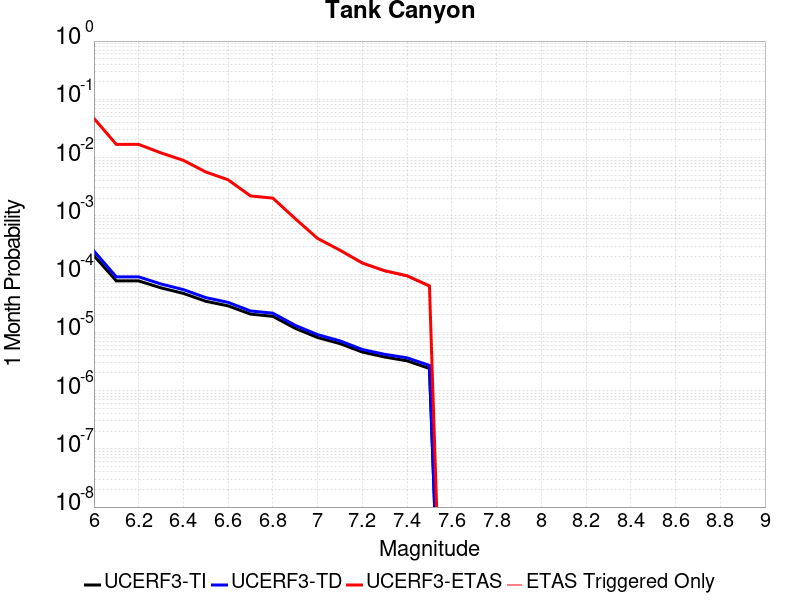 |  |  |

| Magnitude | 1 wk TI Prob | 1 wk TD Prob | 1 wk ETAS Prob | 1 wk ETAS/TD Gain | 1 wk ETAS Triggered Only | 1 mo TI Prob | 1 mo TD Prob | 1 mo ETAS Prob | 1 mo ETAS/TD Gain | 1 mo ETAS Triggered Only | 1 yr TI Prob | 1 yr TD Prob | 1 yr ETAS Prob | 1 yr ETAS/TD Gain | 1 yr ETAS Triggered Only | 10 yr TI Prob | 10 yr TD Prob | 10 yr ETAS Prob | 10 yr ETAS/TD Gain | 10 yr ETAS Triggered Only |
|-----|-----|-----|-----|-----|-----|-----|-----|-----|-----|-----|-----|-----|-----|-----|-----|-----|-----|-----|-----|-----|
| 6.0 | 4.8284557E-5 | 5.796445E-5 | 0.03347315 | 577.47723 | 0.033417124 | 2.0691741E-4 | 2.4839927E-4 | 0.04420219 | 177.94815 | 0.04396471 | 0.0025163088 | 0.0030207336 | 0.068129785 | 22.554052 | 0.06530632 | 0.02488006 | 0.029863616 | 0.11578875 | 3.8772516 | 0.08857016 |
| 6.1 | 1.7796336E-5 | 2.0873378E-5 | 0.011455403 | 548.80444 | 0.011434767 | 7.626778E-5 | 8.945448E-5 | 0.015761571 | 176.19655 | 0.015673518 | 9.281647E-4 | 0.0010886024 | 0.025164096 | 23.115967 | 0.02410173 | 0.009242975 | 0.010836642 | 0.045159232 | 4.1672716 | 0.034698606 |
| 6.2 | 1.7796336E-5 | 2.0873378E-5 | 0.011455403 | 548.80444 | 0.011434767 | 7.626778E-5 | 8.945448E-5 | 0.015761571 | 176.19655 | 0.015673518 | 9.281647E-4 | 0.0010886024 | 0.025164096 | 23.115967 | 0.02410173 | 0.009242975 | 0.010836642 | 0.045159232 | 4.1672716 | 0.034698606 |
| 6.3 | 1.3515912E-5 | 1.5759651E-5 | 0.008197404 | 520.1513 | 0.008181773 | 5.792405E-5 | 6.7539746E-5 | 0.011353682 | 168.1037 | 0.011286904 | 7.049971E-4 | 8.2200987E-4 | 0.018452534 | 22.44807 | 0.01764503 | 0.007027647 | 0.008192157 | 0.033367425 | 4.073094 | 0.025383212 |
| 6.4 | 1.0870146E-5 | 1.2618114E-5 | 0.0061242273 | 485.35202 | 0.006111686 | 4.658551E-5 | 5.4076605E-5 | 0.008383263 | 155.02568 | 0.008329636 | 5.67031E-4 | 6.582015E-4 | 0.013464592 | 20.456642 | 0.012814825 | 0.005655863 | 0.006564382 | 0.025464581 | 3.8792048 | 0.019025087 |
| 6.5 | 7.964826E-6 | 9.196184E-6 | 0.0040507577 | 440.48248 | 0.004041599 | 3.4134522E-5 | 3.941168E-5 | 0.0057072844 | 144.812 | 0.0056680962 | 4.1550855E-4 | 4.797421E-4 | 0.00900244 | 18.765163 | 0.008526788 | 0.0041473247 | 0.004788209 | 0.01710021 | 3.5713162 | 0.0123712355 |
| 6.6 | 6.6317E-6 | 7.612378E-6 | 0.00291557 | 383.0038 | 0.0029079798 | 2.8421264E-5 | 3.262412E-5 | 0.004074091 | 124.87972 | 0.004041599 | 3.4597394E-4 | 3.9713533E-4 | 0.0062600533 | 15.763022 | 0.005865247 | 0.0034543579 | 0.0039652516 | 0.012801875 | 3.2285154 | 0.008871802 |
| 6.7 | 4.793663E-6 | 5.4308593E-6 | 0.0016812066 | 309.56552 | 0.0016757849 | 2.0544108E-5 | 2.3274928E-5 | 0.0024383205 | 104.76168 | 0.0024151017 | 2.500958E-4 | 2.833398E-4 | 0.00363396 | 12.825449 | 0.0033515699 | 0.0024981452 | 0.0028303189 | 0.007892593 | 2.7885878 | 0.0050766426 |
| 6.8 | 4.382823E-6 | 4.969325E-6 | 0.0015328833 | 308.46912 | 0.0015279215 | 1.8783392E-5 | 2.1296957E-5 | 0.0022392003 | 105.1418 | 0.0022179505 | 2.286638E-4 | 2.5926388E-4 | 0.0033143146 | 12.783558 | 0.003055843 | 0.0022842865 | 0.0025901233 | 0.0072111757 | 2.784105 | 0.0046330523 |
| 6.9 | 2.729601E-6 | 3.0735862E-6 | 6.9310056E-4 | 225.50223 | 6.9002906E-4 | 1.1698237E-5 | 1.3172453E-5 | 9.989153E-4 | 75.833664 | 9.857558E-4 | 1.4241673E-4 | 1.6036403E-4 | 0.0014416411 | 8.989803 | 0.0012814826 | 0.001423255 | 0.0016024808 | 0.003620042 | 2.2590237 | 0.0020207996 |
| 7.0 | 1.8987357E-6 | 2.126971E-6 | 3.9642846E-4 | 186.3817 | 3.9430233E-4 | 8.137413E-6 | 9.115562E-6 | 4.5270164E-4 | 49.662506 | 4.4359014E-4 | 9.90685E-5 | 1.1097702E-4 | 6.5308256E-4 | 5.8848453 | 5.421657E-4 | 9.902435E-4 | 0.0011092846 | 0.0019954806 | 1.7988898 | 8.871803E-4 |
| 7.1 | 1.4928986E-6 | 1.6641525E-6 | 2.481027E-4 | 149.08652 | 2.4643895E-4 | 6.398121E-6 | 7.132066E-6 | 3.028567E-4 | 42.464092 | 2.9572676E-4 | 7.789434E-5 | 8.6830034E-5 | 3.825311E-4 | 4.405516 | 2.9572676E-4 | 7.786704E-4 | 8.6801895E-4 | 0.0013112241 | 1.5105938 | 4.4359014E-4 |
| 7.2 | 1.069082E-6 | 1.1828765E-6 | 1.4904607E-4 | 126.00307 | 1.4786338E-4 | 4.581772E-6 | 5.0694644E-6 | 1.5293209E-4 | 30.167309 | 1.4786338E-4 | 5.5781646E-5 | 6.171951E-5 | 2.0957376E-4 | 3.3955836 | 1.4786338E-4 | 5.576765E-4 | 6.1707594E-4 | 8.6336286E-4 | 1.3991193 | 2.4643895E-4 |
| 7.3 | 8.776551E-7 | 9.770151E-7 | 1.4884025E-4 | 152.3418 | 1.4786338E-4 | 3.7613736E-6 | 4.187204E-6 | 1.5204996E-4 | 36.313004 | 1.4786338E-4 | 4.579376E-5 | 5.0978535E-5 | 1.9883437E-4 | 3.9003546 | 1.4786338E-4 | 4.5784327E-4 | 5.097194E-4 | 7.067701E-4 | 1.3865865 | 1.9715117E-4 |
| 7.4 | 7.55721E-7 | 8.5103835E-7 | 1.4871429E-4 | 174.7445 | 1.4786338E-4 | 3.2388E-6 | 3.6473052E-6 | 1.5151015E-4 | 41.5403 | 1.4786338E-4 | 3.9431678E-5 | 4.4405555E-5 | 1.9226236E-4 | 4.329692 | 1.4786338E-4 | 3.942468E-4 | 4.4401767E-4 | 6.410813E-4 | 1.4438194 | 1.9715117E-4 |
| 7.5 | 5.587665E-7 | 6.305732E-7 | 9.9206096E-5 | 157.32686 | 9.857558E-5 | 2.3947114E-6 | 2.7024564E-6 | 1.0127777E-4 | 37.47619 | 9.857558E-5 | 2.915522E-5 | 3.2902408E-5 | 1.3147475E-4 | 3.9959004 | 9.857558E-5 | 2.9151395E-4 | 3.2902407E-4 | 4.768388E-4 | 1.449252 | 1.4786338E-4 |

## Little Lake
*[(top)](#table-of-contents)*

| 1 Week | 1 Month | 1 Year | 10 Year |
|-----|-----|-----|-----|
|  |  |  |  |

| Magnitude | 1 wk TI Prob | 1 wk TD Prob | 1 wk ETAS Prob | 1 wk ETAS/TD Gain | 1 wk ETAS Triggered Only | 1 mo TI Prob | 1 mo TD Prob | 1 mo ETAS Prob | 1 mo ETAS/TD Gain | 1 mo ETAS Triggered Only | 1 yr TI Prob | 1 yr TD Prob | 1 yr ETAS Prob | 1 yr ETAS/TD Gain | 1 yr ETAS Triggered Only | 10 yr TI Prob | 10 yr TD Prob | 10 yr ETAS Prob | 10 yr ETAS/TD Gain | 10 yr ETAS Triggered Only |
|-----|-----|-----|-----|-----|-----|-----|-----|-----|-----|-----|-----|-----|-----|-----|-----|-----|-----|-----|-----|-----|
| 6.0 | 2.8424427E-5 | 3.1205716E-5 | 0.030145107 | 966.0123 | 0.03011484 | 1.2181328E-4 | 1.3373268E-4 | 0.036749665 | 274.79944 | 0.03662083 | 0.0014820677 | 0.0016271125 | 0.049014024 | 30.123318 | 0.047464143 | 0.014722223 | 0.016165398 | 0.07202707 | 4.455632 | 0.056779537 |
| 6.1 | 2.8424427E-5 | 3.1205716E-5 | 0.030145107 | 966.0123 | 0.03011484 | 1.2181328E-4 | 1.3373268E-4 | 0.036749665 | 274.79944 | 0.03662083 | 0.0014820677 | 0.0016271125 | 0.049014024 | 30.123318 | 0.047464143 | 0.014722223 | 0.016165398 | 0.07202707 | 4.455632 | 0.056779537 |
| 6.2 | 2.8424427E-5 | 3.1205716E-5 | 0.030145107 | 966.0123 | 0.03011484 | 1.2181328E-4 | 1.3373268E-4 | 0.036749665 | 274.79944 | 0.03662083 | 0.0014820677 | 0.0016271125 | 0.049014024 | 30.123318 | 0.047464143 | 0.014722223 | 0.016165398 | 0.07202707 | 4.455632 | 0.056779537 |
| 6.3 | 1.48860645E-5 | 1.6081383E-5 | 0.020765908 | 1291.301 | 0.02075016 | 6.379586E-5 | 6.8918554E-5 | 0.02554895 | 370.71222 | 0.025481788 | 7.7643775E-4 | 8.387886E-4 | 0.033735417 | 40.21921 | 0.032924246 | 0.007737305 | 0.008359045 | 0.046970922 | 5.619173 | 0.038937356 |
| 6.4 | 1.48860645E-5 | 1.6081383E-5 | 0.020765908 | 1291.301 | 0.02075016 | 6.379586E-5 | 6.8918554E-5 | 0.02554895 | 370.71222 | 0.025481788 | 7.7643775E-4 | 8.387886E-4 | 0.033735417 | 40.21921 | 0.032924246 | 0.007737305 | 0.008359045 | 0.046970922 | 5.619173 | 0.038937356 |
| 6.5 | 1.2797581E-5 | 1.376556E-5 | 0.019383602 | 1408.123 | 0.019370101 | 5.4845623E-5 | 5.8994065E-5 | 0.023715738 | 402.0021 | 0.02365814 | 6.675408E-4 | 7.1804173E-4 | 0.031599298 | 44.007603 | 0.030903446 | 0.006655392 | 0.007159767 | 0.043273725 | 6.044013 | 0.03637439 |
| 6.6 | 9.661896E-6 | 1.0289033E-5 | 0.016915828 | 1644.064 | 0.016905712 | 4.1407468E-5 | 4.40952E-5 | 0.020744056 | 470.43796 | 0.020700872 | 5.040193E-4 | 5.36743E-4 | 0.027285649 | 50.83559 | 0.026763272 | 0.005028777 | 0.0053560715 | 0.037123494 | 6.931105 | 0.03193849 |
| 6.7 | 7.767871E-6 | 8.199681E-6 | 0.015435152 | 1882.4088 | 0.015427079 | 3.329045E-5 | 3.5141096E-5 | 0.018911703 | 538.16486 | 0.018877225 | 4.0523586E-4 | 4.2777258E-4 | 0.024666993 | 57.663803 | 0.024249593 | 0.004044977 | 0.004270843 | 0.033030137 | 7.7338676 | 0.028882645 |
| 6.8 | 6.4235196E-6 | 6.735739E-6 | 0.013166487 | 1954.7205 | 0.01315984 | 2.752908E-5 | 2.8867207E-5 | 0.016046938 | 555.8881 | 0.016018532 | 3.35115E-4 | 3.5141438E-4 | 0.020453766 | 58.204124 | 0.020109419 | 0.003346101 | 0.0035098472 | 0.02718318 | 7.744833 | 0.023756715 |
| 6.9 | 3.1283696E-6 | 3.1121751E-6 | 0.007839846 | 2519.089 | 0.007836759 | 1.3407229E-5 | 1.33378335E-5 | 0.009772191 | 732.667 | 0.009758983 | 1.6322079E-4 | 1.6237753E-4 | 0.012334486 | 75.96178 | 0.012174085 | 0.0016310095 | 0.0016227372 | 0.015646962 | 9.642327 | 0.01404702 |
| 7.0 | 2.290603E-6 | 2.2286763E-6 | 0.0048324214 | 2168.2922 | 0.0048302035 | 9.816834E-6 | 9.551441E-6 | 0.0058254553 | 609.9033 | 0.0058159595 | 1.19513395E-4 | 1.1628362E-4 | 0.0072129 | 62.028515 | 0.007097442 | 0.0011944914 | 0.0011623299 | 0.009383824 | 8.073288 | 0.0082310615 |
| 7.1 | 1.293693E-6 | 1.1776774E-6 | 0.0023177012 | 1968.0272 | 0.0023165261 | 5.5443866E-6 | 5.047183E-6 | 0.0024694244 | 489.26782 | 0.0024643897 | 6.750081E-5 | 6.1448416E-5 | 0.003264958 | 53.133312 | 0.0032037064 | 6.7480316E-4 | 6.1438273E-4 | 0.004308696 | 7.013048 | 0.0036965844 |
| 7.2 | 4.715842E-7 | 3.091732E-7 | 9.8884724E-5 | 319.83603 | 9.857558E-5 | 2.0210737E-6 | 1.3250274E-6 | 9.990048E-5 | 75.395035 | 9.857558E-5 | 2.4606294E-5 | 1.6132095E-5 | 1.1470609E-4 | 7.1104274 | 9.857558E-5 | 2.460357E-4 | 1.6130977E-4 | 2.5986944E-4 | 1.6109964 | 9.857558E-5 |
| 7.3 | 3.9430947E-7 | 2.3096938E-7 | 9.880653E-5 | 427.7906 | 9.857558E-5 | 1.6898966E-6 | 9.898685E-7 | 9.956535E-5 | 100.584435 | 9.857558E-5 | 2.0574296E-5 | 1.2051582E-5 | 1.1062597E-4 | 9.179374 | 9.857558E-5 | 2.0572392E-4 | 1.2050936E-4 | 2.1907306E-4 | 1.8178926 | 9.857558E-5 |
| 7.4 | 3.547123E-7 | 1.9678579E-7 | 9.877235E-5 | 501.92825 | 9.857558E-5 | 1.5201948E-6 | 8.433674E-7 | 9.941887E-5 | 117.883224 | 9.857558E-5 | 1.8508214E-5 | 1.02679505E-5 | 1.0884252E-4 | 10.600219 | 9.857558E-5 | 1.8506673E-4 | 1.0267482E-4 | 2.0124028E-4 | 1.9599769 | 9.857558E-5 |
| 7.5 | 2.6354266E-7 | 1.4422719E-7 | 4.9432012E-5 | 342.73712 | 4.928779E-5 | 1.129468E-6 | 6.1811636E-7 | 4.9905877E-5 | 80.73865 | 4.928779E-5 | 1.3751187E-5 | 7.525541E-6 | 5.681296E-5 | 7.549352 | 4.928779E-5 | 1.3750336E-4 | 7.5252916E-5 | 1.24537E-4 | 1.6549126 | 4.928779E-5 |
| 7.6 | 1.269913E-7 | 7.572344E-8 | 7.572344E-8 | 1.0 | 0.0 | 5.4424834E-7 | 3.24529E-7 | 3.24529E-7 | 1.0 | 0.0 | 6.6262032E-6 | 3.9511337E-6 | 3.9511337E-6 | 1.0 | 0.0 | 6.626006E-5 | 3.9510673E-5 | 3.9510673E-5 | 1.0 | 0.0 |

## Airport Lake
*[(top)](#table-of-contents)*

| 1 Week | 1 Month | 1 Year | 10 Year |
|-----|-----|-----|-----|
|  |  |  |  |

| Magnitude | 1 wk TI Prob | 1 wk TD Prob | 1 wk ETAS Prob | 1 wk ETAS/TD Gain | 1 wk ETAS Triggered Only | 1 mo TI Prob | 1 mo TD Prob | 1 mo ETAS Prob | 1 mo ETAS/TD Gain | 1 mo ETAS Triggered Only | 1 yr TI Prob | 1 yr TD Prob | 1 yr ETAS Prob | 1 yr ETAS/TD Gain | 1 yr ETAS Triggered Only | 10 yr TI Prob | 10 yr TD Prob | 10 yr ETAS Prob | 10 yr ETAS/TD Gain | 10 yr ETAS Triggered Only |
|-----|-----|-----|-----|-----|-----|-----|-----|-----|-----|-----|-----|-----|-----|-----|-----|-----|-----|-----|-----|-----|
| 6.0 | 1.2387061E-5 | 1.3103157E-5 | 0.026776023 | 2043.4788 | 0.026763272 | 5.3086325E-5 | 5.615534E-5 | 0.03297855 | 587.2737 | 0.032924246 | 6.461343E-4 | 6.8350515E-4 | 0.042795762 | 62.6122 | 0.04214106 | 0.0064425888 | 0.0068168393 | 0.0560134 | 8.216917 | 0.04953423 |
| 6.1 | 1.2387061E-5 | 1.3103157E-5 | 0.026776023 | 2043.4788 | 0.026763272 | 5.3086325E-5 | 5.615534E-5 | 0.03297855 | 587.2737 | 0.032924246 | 6.461343E-4 | 6.8350515E-4 | 0.042795762 | 62.6122 | 0.04214106 | 0.0064425888 | 0.0068168393 | 0.0560134 | 8.216917 | 0.04953423 |
| 6.2 | 1.2387061E-5 | 1.3103157E-5 | 0.026776023 | 2043.4788 | 0.026763272 | 5.3086325E-5 | 5.615534E-5 | 0.03297855 | 587.2737 | 0.032924246 | 6.461343E-4 | 6.8350515E-4 | 0.042795762 | 62.6122 | 0.04214106 | 0.0064425888 | 0.0068168393 | 0.0560134 | 8.216917 | 0.04953423 |
| 6.3 | 1.2387061E-5 | 1.3103157E-5 | 0.026776023 | 2043.4788 | 0.026763272 | 5.3086325E-5 | 5.615534E-5 | 0.03297855 | 587.2737 | 0.032924246 | 6.461343E-4 | 6.8350515E-4 | 0.042795762 | 62.6122 | 0.04214106 | 0.0064425888 | 0.0068168393 | 0.0560134 | 8.216917 | 0.04953423 |
| 6.4 | 1.2387061E-5 | 1.3103157E-5 | 0.026776023 | 2043.4788 | 0.026763272 | 5.3086325E-5 | 5.615534E-5 | 0.03297855 | 587.2737 | 0.032924246 | 6.461343E-4 | 6.8350515E-4 | 0.042795762 | 62.6122 | 0.04214106 | 0.0064425888 | 0.0068168393 | 0.0560134 | 8.216917 | 0.04953423 |
| 6.5 | 6.9922594E-6 | 7.384925E-6 | 0.02021523 | 2737.3643 | 0.020207994 | 2.996648E-5 | 3.1649324E-5 | 0.024773337 | 782.74457 | 0.024742471 | 3.6478083E-4 | 3.8526783E-4 | 0.03240999 | 84.12327 | 0.032037064 | 0.003641826 | 0.0038465366 | 0.04121027 | 10.713604 | 0.03750801 |
| 6.6 | 6.9922594E-6 | 7.384925E-6 | 0.02021523 | 2737.3643 | 0.020207994 | 2.996648E-5 | 3.1649324E-5 | 0.024773337 | 782.74457 | 0.024742471 | 3.6478083E-4 | 3.8526783E-4 | 0.03240999 | 84.12327 | 0.032037064 | 0.003641826 | 0.0038465366 | 0.04121027 | 10.713604 | 0.03750801 |
| 6.7 | 5.477277E-6 | 5.7860684E-6 | 0.017552137 | 3033.5173 | 0.017546454 | 2.3473833E-5 | 2.4797222E-5 | 0.02180946 | 879.51227 | 0.021785203 | 2.8575645E-4 | 3.0186825E-4 | 0.02823961 | 93.54945 | 0.027946178 | 0.0028538927 | 0.003014966 | 0.03554511 | 11.7895565 | 0.032628518 |
| 6.8 | 3.9950432E-6 | 4.2190873E-6 | 0.014001893 | 3318.702 | 0.013997733 | 1.7121502E-5 | 1.8081691E-5 | 0.017268497 | 955.0266 | 0.017250728 | 2.0843433E-4 | 2.2012512E-4 | 0.022148365 | 100.617165 | 0.021933068 | 0.0020823893 | 0.0021993418 | 0.027526729 | 12.515894 | 0.025383212 |
| 6.9 | 2.95695E-6 | 3.1230243E-6 | 0.009959226 | 3188.9683 | 0.009956134 | 1.2672582E-5 | 1.3384334E-5 | 0.01228588 | 917.9299 | 0.01227266 | 1.5427776E-4 | 1.6294434E-4 | 0.015686069 | 96.26642 | 0.015525654 | 0.001541707 | 0.0016284712 | 0.01958922 | 12.029208 | 0.017990043 |
| 7.0 | 1.456072E-6 | 1.540812E-6 | 0.0044374354 | 2879.9329 | 0.004435901 | 6.2402937E-6 | 6.603469E-6 | 0.0053789373 | 814.5624 | 0.005372369 | 7.597293E-5 | 8.039528E-5 | 0.0067337123 | 83.75756 | 0.006653852 | 7.594696E-4 | 8.0376083E-4 | 0.0085849725 | 10.681005 | 0.007787471 |
| 7.1 | 6.995192E-7 | 7.4089746E-7 | 0.0021201144 | 2861.549 | 0.002119375 | 2.997936E-6 | 3.1752747E-6 | 0.0022704066 | 715.0268 | 0.0022672385 | 3.649926E-5 | 3.865897E-5 | 0.003045098 | 78.76821 | 0.0030065554 | 3.6493264E-4 | 3.865897E-4 | 0.00388467 | 10.048561 | 0.0034994332 |

## Owl Lake
*[(top)](#table-of-contents)*

| 1 Week | 1 Month | 1 Year | 10 Year |
|-----|-----|-----|-----|
|  |  |  |  |

| Magnitude | 1 wk TI Prob | 1 wk TD Prob | 1 wk ETAS Prob | 1 wk ETAS/TD Gain | 1 wk ETAS Triggered Only | 1 mo TI Prob | 1 mo TD Prob | 1 mo ETAS Prob | 1 mo ETAS/TD Gain | 1 mo ETAS Triggered Only | 1 yr TI Prob | 1 yr TD Prob | 1 yr ETAS Prob | 1 yr ETAS/TD Gain | 1 yr ETAS Triggered Only | 10 yr TI Prob | 10 yr TD Prob | 10 yr ETAS Prob | 10 yr ETAS/TD Gain | 10 yr ETAS Triggered Only |
|-----|-----|-----|-----|-----|-----|-----|-----|-----|-----|-----|-----|-----|-----|-----|-----|-----|-----|-----|-----|-----|
| 6.0 | 5.0320643E-5 | 6.6358676E-5 | 0.013373179 | 201.52872 | 0.013307704 | 2.1564208E-4 | 2.843643E-4 | 0.018318566 | 64.41936 | 0.01803933 | 0.0026222812 | 0.003457547 | 0.029293288 | 8.472275 | 0.025925377 | 0.02591553 | 0.034141295 | 0.06656033 | 1.9495549 | 0.033564985 |
| 6.1 | 5.0320643E-5 | 6.6358676E-5 | 0.013373179 | 201.52872 | 0.013307704 | 2.1564208E-4 | 2.843643E-4 | 0.018318566 | 64.41936 | 0.01803933 | 0.0026222812 | 0.003457547 | 0.029293288 | 8.472275 | 0.025925377 | 0.02591553 | 0.034141295 | 0.06656033 | 1.9495549 | 0.033564985 |
| 6.2 | 2.4125871E-5 | 3.0980515E-5 | 0.011021817 | 355.7661 | 0.0109911775 | 1.0339249E-4 | 1.3276804E-4 | 0.014621455 | 110.12782 | 0.014490611 | 0.0012580766 | 0.0016154252 | 0.021692358 | 13.428266 | 0.020109419 | 0.012509781 | 0.016070755 | 0.0414825 | 2.5812416 | 0.025826802 |
| 6.3 | 1.7433485E-5 | 2.2355545E-5 | 0.0103725605 | 463.98154 | 0.010350436 | 7.471279E-5 | 9.580685E-5 | 0.013599368 | 141.94568 | 0.013504854 | 9.0924866E-4 | 0.001165962 | 0.01933195 | 16.58026 | 0.018187195 | 0.009055373 | 0.0116291465 | 0.03433016 | 2.9520788 | 0.022968112 |
| 6.4 | 1.7433485E-5 | 2.2355545E-5 | 0.0103725605 | 463.98154 | 0.010350436 | 7.471279E-5 | 9.580685E-5 | 0.013599368 | 141.94568 | 0.013504854 | 9.0924866E-4 | 0.001165962 | 0.01933195 | 16.58026 | 0.018187195 | 0.009055373 | 0.0116291465 | 0.03433016 | 2.9520788 | 0.022968112 |
| 6.5 | 1.5182742E-5 | 1.9429277E-5 | 0.010024657 | 515.95624 | 0.010005422 | 6.506727E-5 | 8.3266525E-5 | 0.01309416 | 157.256 | 0.013011977 | 7.919061E-4 | 0.0010134344 | 0.018443631 | 18.199137 | 0.017447878 | 0.0078909 | 0.010118678 | 0.03178102 | 3.1408277 | 0.02188378 |
| 6.6 | 6.7271576E-6 | 8.547518E-6 | 0.008485975 | 992.7999 | 0.0084775 | 2.8830356E-5 | 3.6631736E-5 | 0.010731691 | 292.96155 | 0.010695451 | 3.5095305E-4 | 4.4590578E-4 | 0.0138954725 | 31.162352 | 0.013455567 | 0.0035039932 | 0.0044680187 | 0.021249129 | 4.755828 | 0.016856425 |
| 6.7 | 6.682835E-6 | 8.479961E-6 | 0.008485909 | 1000.70135 | 0.0084775 | 2.8640408E-5 | 3.6342215E-5 | 0.010731405 | 295.28757 | 0.010695451 | 3.4864116E-4 | 4.423823E-4 | 0.013891997 | 31.402697 | 0.013455567 | 0.003480947 | 0.0044329325 | 0.021214634 | 4.7856884 | 0.016856425 |
| 6.8 | 6.5774975E-6 | 8.326427E-6 | 0.008485756 | 1019.1353 | 0.0084775 | 2.8188972E-5 | 3.5684232E-5 | 0.010730754 | 300.71414 | 0.010695451 | 3.4314668E-4 | 4.3437455E-4 | 0.013884096 | 31.963423 | 0.013455567 | 0.0034261728 | 0.0043531056 | 0.021087078 | 4.8441463 | 0.016807137 |
| 6.9 | 6.363419E-6 | 7.999591E-6 | 0.008436144 | 1054.572 | 0.008428212 | 2.727151E-5 | 3.428354E-5 | 0.010680081 | 311.52213 | 0.010646163 | 3.3198006E-4 | 4.1732774E-4 | 0.013768745 | 32.99264 | 0.013356991 | 0.0033148455 | 0.0041830647 | 0.02077265 | 4.965893 | 0.016659273 |
| 7.0 | 6.1342453E-6 | 7.631779E-6 | 0.008386493 | 1098.8909 | 0.008378925 | 2.6289357E-5 | 3.2707245E-5 | 0.010629236 | 324.98108 | 0.010596875 | 3.2002592E-4 | 3.9814346E-4 | 0.013700549 | 34.411087 | 0.013307704 | 0.0031956544 | 0.003991739 | 0.02048633 | 5.1321816 | 0.016560698 |
| 7.1 | 5.842926E-6 | 7.142312E-6 | 0.007893133 | 1105.1229 | 0.007886047 | 2.504087E-5 | 3.060958E-5 | 0.010035725 | 327.8622 | 0.010005422 | 3.0482994E-4 | 3.7261334E-4 | 0.012887048 | 34.58558 | 0.012519099 | 0.0030441214 | 0.0037371595 | 0.019352103 | 5.178292 | 0.015673518 |
| 7.2 | 4.77173E-6 | 5.358478E-6 | 0.004934111 | 920.80457 | 0.0049287793 | 2.045011E-5 | 2.2964727E-5 | 0.0062823705 | 273.56607 | 0.0062595494 | 2.4895166E-4 | 2.7956374E-4 | 0.008163406 | 29.200518 | 0.007886047 | 0.0024867293 | 0.0028086212 | 0.012982539 | 4.622389 | 0.010202573 |
| 7.3 | 3.0494948E-6 | 2.710356E-6 | 0.0010870388 | 401.06863 | 0.0010843314 | 1.3069198E-5 | 1.1615762E-5 | 0.0012930834 | 111.32146 | 0.0012814826 | 1.5910587E-4 | 1.4141288E-4 | 0.0017676799 | 12.500134 | 0.0016264971 | 0.0015899199 | 0.0014231089 | 0.0037363383 | 2.6254761 | 0.0023165261 |
| 7.4 | 2.7263884E-6 | 2.3055634E-6 | 9.3877147E-4 | 407.1766 | 9.36468E-4 | 1.1684469E-5 | 9.880949E-6 | 9.4633974E-4 | 95.77418 | 9.36468E-4 | 1.4224913E-4 | 1.2029401E-4 | 0.0013523406 | 11.241961 | 0.0012321948 | 0.0014215811 | 0.0012110578 | 0.0028848131 | 2.3820608 | 0.0016757849 |
| 7.5 | 2.6090431E-6 | 2.1655019E-6 | 7.907685E-4 | 365.16638 | 7.8860467E-4 | 1.1181565E-5 | 9.2806895E-6 | 7.97878E-4 | 85.97185 | 7.8860467E-4 | 1.3612706E-4 | 1.1298663E-4 | 0.0011971955 | 10.595904 | 0.0010843314 | 0.001360437 | 0.0011378126 | 0.002614764 | 2.298062 | 0.0014786337 |
| 7.6 | 2.3008756E-6 | 1.8726826E-6 | 5.440374E-4 | 290.51233 | 5.421657E-4 | 9.860858E-6 | 8.025758E-6 | 5.5018713E-4 | 68.552666 | 5.421657E-4 | 1.20049335E-4 | 9.770931E-5 | 8.862369E-4 | 9.070138 | 7.8860467E-4 | 0.001199845 | 9.848307E-4 | 0.0021665727 | 2.1999445 | 0.001182907 |
| 7.7 | 1.7184348E-6 | 1.341808E-6 | 2.9706815E-4 | 221.39394 | 2.9572676E-4 | 7.3646997E-6 | 5.750593E-6 | 3.0147564E-4 | 52.425137 | 2.9572676E-4 | 8.966153E-5 | 7.0011265E-5 | 4.64286E-4 | 6.63159 | 3.9430233E-4 | 8.962536E-4 | 7.0769014E-4 | 0.0012002193 | 1.6959672 | 4.928779E-4 |
| 7.8 | 8.4612907E-7 | 8.4054994E-7 | 1.9799155E-4 | 235.55 | 1.9715117E-4 | 3.6262625E-6 | 3.602352E-6 | 2.0075281E-4 | 55.728256 | 1.9715117E-4 | 4.4148852E-5 | 4.3857777E-5 | 2.902859E-4 | 6.6188016 | 2.4643895E-4 | 4.414008E-4 | 4.4386165E-4 | 7.8872306E-4 | 1.7769569 | 3.4501453E-4 |
| 7.9 | 2.716738E-7 | 3.7681625E-7 | 4.9664588E-5 | 131.80055 | 4.928779E-5 | 1.1643157E-6 | 1.6149258E-6 | 5.0902636E-5 | 31.52011 | 4.928779E-5 | 1.4175452E-5 | 1.9661555E-5 | 6.894838E-5 | 3.506761 | 4.928779E-5 | 1.4174548E-4 | 1.9829652E-4 | 2.9685255E-4 | 1.4970134 | 9.857558E-5 |
| 8.0 | 2.1995428E-8 | 3.3853325E-8 | 3.3853325E-8 | 1.0 | 0.0 | 9.426611E-8 | 1.4508568E-7 | 1.4508568E-7 | 1.0 | 0.0 | 1.1476893E-6 | 1.7664173E-6 | 1.7664173E-6 | 1.0 | 0.0 | 1.14768345E-5 | 1.7869768E-5 | 1.7869768E-5 | 1.0 | 0.0 |

## Panamint Valley
*[(top)](#table-of-contents)*

| 1 Week | 1 Month | 1 Year | 10 Year |
|-----|-----|-----|-----|
|  |  | 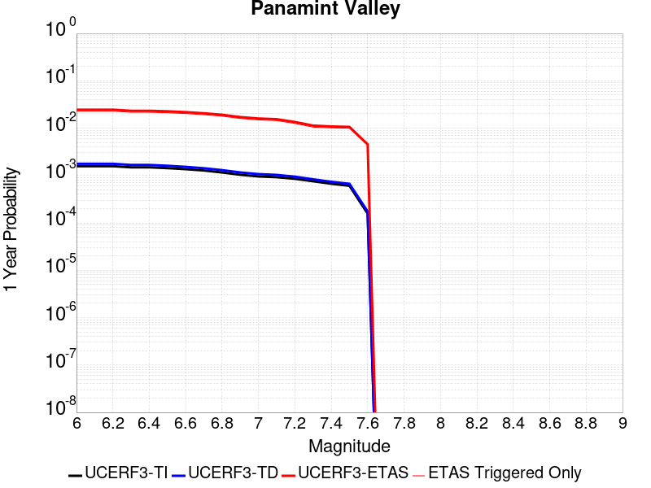 |  |

| Magnitude | 1 wk TI Prob | 1 wk TD Prob | 1 wk ETAS Prob | 1 wk ETAS/TD Gain | 1 wk ETAS Triggered Only | 1 mo TI Prob | 1 mo TD Prob | 1 mo ETAS Prob | 1 mo ETAS/TD Gain | 1 mo ETAS Triggered Only | 1 yr TI Prob | 1 yr TD Prob | 1 yr ETAS Prob | 1 yr ETAS/TD Gain | 1 yr ETAS Triggered Only | 10 yr TI Prob | 10 yr TD Prob | 10 yr ETAS Prob | 10 yr ETAS/TD Gain | 10 yr ETAS Triggered Only |
|-----|-----|-----|-----|-----|-----|-----|-----|-----|-----|-----|-----|-----|-----|-----|-----|-----|-----|-----|-----|-----|
| 6.0 | 3.0211835E-5 | 3.3984263E-5 | 0.011369791 | 334.5605 | 0.0113361925 | 1.2947287E-4 | 1.4563887E-4 | 0.0150283845 | 103.18938 | 0.014884913 | 0.0015751923 | 0.0017717406 | 0.023173943 | 13.079761 | 0.02144019 | 0.015640736 | 0.017583003 | 0.045957804 | 2.613763 | 0.028882645 |
| 6.1 | 3.0211835E-5 | 3.3984263E-5 | 0.011369791 | 334.5605 | 0.0113361925 | 1.2947287E-4 | 1.4563887E-4 | 0.0150283845 | 103.18938 | 0.014884913 | 0.0015751923 | 0.0017717406 | 0.023173943 | 13.079761 | 0.02144019 | 0.015640736 | 0.017583003 | 0.045957804 | 2.613763 | 0.028882645 |
| 6.2 | 3.0211835E-5 | 3.3984263E-5 | 0.011369791 | 334.5605 | 0.0113361925 | 1.2947287E-4 | 1.4563887E-4 | 0.0150283845 | 103.18938 | 0.014884913 | 0.0015751923 | 0.0017717406 | 0.023173943 | 13.079761 | 0.02144019 | 0.015640736 | 0.017583003 | 0.045957804 | 2.613763 | 0.028882645 |
| 6.3 | 2.8573924E-5 | 3.2102445E-5 | 0.011072213 | 344.9025 | 0.011040465 | 1.2245393E-4 | 1.375748E-4 | 0.014330506 | 104.16519 | 0.014194884 | 0.001489857 | 0.0016737141 | 0.022093913 | 13.200529 | 0.020454433 | 0.01479908 | 0.016618038 | 0.043712053 | 2.630398 | 0.027551875 |
| 6.4 | 2.8573924E-5 | 3.2102445E-5 | 0.011072213 | 344.9025 | 0.011040465 | 1.2245393E-4 | 1.375748E-4 | 0.014330506 | 104.16519 | 0.014194884 | 0.001489857 | 0.0016737141 | 0.022093913 | 13.200529 | 0.020454433 | 0.01479908 | 0.016618038 | 0.043712053 | 2.630398 | 0.027551875 |
| 6.5 | 2.7468774E-5 | 3.0828138E-5 | 0.010824522 | 351.12473 | 0.010794027 | 1.1771801E-4 | 1.3211406E-4 | 0.013980154 | 105.81882 | 0.013849869 | 0.0014322745 | 0.0016073292 | 0.021487592 | 13.368506 | 0.019912267 | 0.014230782 | 0.015963882 | 0.04249391 | 2.6618783 | 0.026960421 |
| 6.6 | 2.6135967E-5 | 2.9252153E-5 | 0.010625817 | 363.24908 | 0.010596875 | 1.1200648E-4 | 1.2536049E-4 | 0.013677804 | 109.10777 | 0.013554143 | 0.0013628257 | 0.0015252219 | 0.020767355 | 13.615956 | 0.019271526 | 0.013544982 | 0.015154343 | 0.04068684 | 2.6848302 | 0.025925377 |
| 6.7 | 2.4498746E-5 | 2.7341044E-5 | 0.010229635 | 374.14938 | 0.010202573 | 1.04990395E-4 | 1.17170785E-4 | 0.013029059 | 111.19717 | 0.012913401 | 0.0012775084 | 0.0014256459 | 0.019586913 | 13.738975 | 0.018187195 | 0.012701893 | 0.014171593 | 0.038174707 | 2.6937487 | 0.02434817 |
| 6.8 | 2.2244329E-5 | 2.4935374E-5 | 0.0098329615 | 394.33783 | 0.00980827 | 9.532935E-5 | 1.0686163E-4 | 0.01237821 | 115.83399 | 0.01227266 | 0.0011600169 | 0.0013002857 | 0.018282464 | 14.060343 | 0.017004289 | 0.011539802 | 0.012932955 | 0.03536077 | 2.73416 | 0.022721672 |
| 6.9 | 1.9902658E-5 | 2.2290182E-5 | 0.008795322 | 394.58276 | 0.008773227 | 8.529431E-5 | 9.552596E-5 | 0.010888522 | 113.98495 | 0.010794027 | 0.0010379635 | 0.0011624265 | 0.016177729 | 13.917205 | 0.015032777 | 0.010331288 | 0.011569021 | 0.031153489 | 2.692837 | 0.019813692 |
| 7.0 | 1.8353881E-5 | 2.056605E-5 | 0.0082514575 | 401.2174 | 0.0082310615 | 7.865712E-5 | 8.813734E-5 | 0.010043394 | 113.95163 | 0.009956134 | 9.5722964E-4 | 0.0010725616 | 0.014858341 | 13.853136 | 0.013800582 | 0.009531168 | 0.01067939 | 0.028526073 | 2.6711333 | 0.01803933 |
| 7.1 | 1.7667631E-5 | 1.9772435E-5 | 0.008004237 | 404.81796 | 0.007984622 | 7.571623E-5 | 8.4736355E-5 | 0.009793608 | 115.577415 | 0.009709695 | 9.2145515E-4 | 0.0010311945 | 0.014472886 | 14.03507 | 0.013455567 | 0.009176437 | 0.0102695925 | 0.02758707 | 2.6862867 | 0.017497165 |
| 7.2 | 1.6381597E-5 | 1.8158042E-5 | 0.0068690367 | 378.29172 | 0.006851003 | 7.020495E-5 | 7.781795E-5 | 0.008505374 | 109.298355 | 0.008428212 | 8.544101E-4 | 9.470391E-4 | 0.012715666 | 13.426759 | 0.011779782 | 0.008511325 | 0.009435269 | 0.024716789 | 2.6196167 | 0.015427079 |
| 7.3 | 1.4520491E-5 | 1.596657E-5 | 0.005930407 | 371.42648 | 0.005914535 | 6.222919E-5 | 6.842646E-5 | 0.0071653826 | 104.71655 | 0.007097442 | 7.57377E-4 | 8.327899E-4 | 0.010977619 | 13.181739 | 0.010153285 | 0.0075480095 | 0.008300399 | 0.021448765 | 2.5840642 | 0.013258416 |
| 7.4 | 1.2852287E-5 | 1.41454875E-5 | 0.0058300225 | 412.14716 | 0.0058159595 | 5.5080065E-5 | 6.06222E-5 | 0.007059064 | 116.44356 | 0.0069988663 | 6.7039346E-4 | 7.378411E-4 | 0.010637377 | 14.416894 | 0.009906846 | 0.0066837464 | 0.007357429 | 0.020126896 | 2.735588 | 0.012864114 |
| 7.5 | 1.1637851E-5 | 1.2836868E-5 | 0.005631573 | 438.70303 | 0.0056188083 | 4.987555E-5 | 5.5014076E-5 | 0.006856355 | 124.629105 | 0.006801715 | 6.070656E-4 | 6.696062E-4 | 0.0103728 | 15.490894 | 0.009709695 | 0.006054099 | 0.0066793845 | 0.019114863 | 2.8617702 | 0.012519099 |
| 7.6 | 3.0068115E-6 | 3.3330623E-6 | 0.002517002 | 755.162 | 0.0025136773 | 1.2886271E-5 | 1.4284516E-5 | 0.0031686581 | 221.82468 | 0.0031544187 | 1.5687906E-4 | 1.7390738E-4 | 0.004559758 | 26.219461 | 0.0043866136 | 0.0015676835 | 0.0017397973 | 0.007053618 | 4.0542755 | 0.0053230813 |

## Garlock (East)
*[(top)](#table-of-contents)*

| 1 Week | 1 Month | 1 Year | 10 Year |
|-----|-----|-----|-----|
|  |  |  |  |

| Magnitude | 1 wk TI Prob | 1 wk TD Prob | 1 wk ETAS Prob | 1 wk ETAS/TD Gain | 1 wk ETAS Triggered Only | 1 mo TI Prob | 1 mo TD Prob | 1 mo ETAS Prob | 1 mo ETAS/TD Gain | 1 mo ETAS Triggered Only | 1 yr TI Prob | 1 yr TD Prob | 1 yr ETAS Prob | 1 yr ETAS/TD Gain | 1 yr ETAS Triggered Only | 10 yr TI Prob | 10 yr TD Prob | 10 yr ETAS Prob | 10 yr ETAS/TD Gain | 10 yr ETAS Triggered Only |
|-----|-----|-----|-----|-----|-----|-----|-----|-----|-----|-----|-----|-----|-----|-----|-----|-----|-----|-----|-----|-----|
| 6.0 | 4.5092507E-5 | 6.2904815E-5 | 0.00957485 | 152.21172 | 0.009512544 | 1.9323928E-4 | 2.6956675E-4 | 0.012292546 | 45.601124 | 0.0120262215 | 0.0023501497 | 0.003277482 | 0.020078659 | 6.126246 | 0.016856425 | 0.023254504 | 0.03235377 | 0.055437252 | 1.7134712 | 0.023855291 |
| 6.1 | 4.5092507E-5 | 6.2904815E-5 | 0.00957485 | 152.21172 | 0.009512544 | 1.9323928E-4 | 2.6956675E-4 | 0.012292546 | 45.601124 | 0.0120262215 | 0.0023501497 | 0.003277482 | 0.020078659 | 6.126246 | 0.016856425 | 0.023254504 | 0.03235377 | 0.055437252 | 1.7134712 | 0.023855291 |
| 6.2 | 2.6674514E-5 | 3.4511588E-5 | 0.0075259972 | 218.07161 | 0.007491744 | 1.1431433E-4 | 1.4789861E-4 | 0.009708316 | 65.6417 | 0.009561831 | 0.0013908884 | 0.0017992114 | 0.0145909805 | 8.109653 | 0.012814825 | 0.01382215 | 0.017872788 | 0.035299264 | 1.9750285 | 0.017743604 |
| 6.3 | 2.6674514E-5 | 3.4511588E-5 | 0.0075259972 | 218.07161 | 0.007491744 | 1.1431433E-4 | 1.4789861E-4 | 0.009708316 | 65.6417 | 0.009561831 | 0.0013908884 | 0.0017992114 | 0.0145909805 | 8.109653 | 0.012814825 | 0.01382215 | 0.017872788 | 0.035299264 | 1.9750285 | 0.017743604 |
| 6.4 | 2.5312667E-5 | 3.2340467E-5 | 0.00742527 | 229.59686 | 0.0073931688 | 1.0847834E-4 | 1.3859481E-4 | 0.009551258 | 68.91498 | 0.009413968 | 0.0013199237 | 0.0016861152 | 0.01433172 | 8.499846 | 0.012666962 | 0.013121112 | 0.016772287 | 0.033975985 | 2.0257218 | 0.017497165 |
| 6.5 | 2.5312667E-5 | 3.2340467E-5 | 0.00742527 | 229.59686 | 0.0073931688 | 1.0847834E-4 | 1.3859481E-4 | 0.009551258 | 68.91498 | 0.009413968 | 0.0013199237 | 0.0016861152 | 0.01433172 | 8.499846 | 0.012666962 | 0.013121112 | 0.016772287 | 0.033975985 | 2.0257218 | 0.017497165 |
| 6.6 | 2.246556E-5 | 2.8134691E-5 | 0.00722395 | 256.76306 | 0.0071960175 | 9.627742E-5 | 1.2057181E-4 | 0.009286996 | 77.024605 | 0.00916753 | 0.0011715472 | 0.0014669969 | 0.013574006 | 9.252921 | 0.012124796 | 0.011653901 | 0.014613169 | 0.03098043 | 2.120035 | 0.016609985 |
| 6.7 | 2.2241198E-5 | 2.7804432E-5 | 0.007223622 | 259.80112 | 0.0071960175 | 9.531594E-5 | 1.1915654E-4 | 0.009285593 | 77.92769 | 0.00916753 | 0.0011598538 | 0.0014497889 | 0.013507791 | 9.317074 | 0.012075509 | 0.011538187 | 0.014442829 | 0.030715767 | 2.126714 | 0.01651141 |
| 6.8 | 1.9528685E-5 | 2.3898969E-5 | 0.0071211713 | 297.96982 | 0.007097442 | 8.369167E-5 | 1.0242024E-4 | 0.009071879 | 88.575066 | 0.008970378 | 0.0010184698 | 0.0012462728 | 0.0130113745 | 10.440229 | 0.011779782 | 0.010138147 | 0.012436723 | 0.027963988 | 2.2485013 | 0.015722806 |
| 6.9 | 1.3318621E-5 | 1.5198818E-5 | 0.0065210885 | 429.05234 | 0.0065059885 | 5.7078556E-5 | 6.51362E-5 | 0.008295661 | 127.358696 | 0.0082310615 | 6.9470983E-4 | 7.927504E-4 | 0.011479722 | 14.480879 | 0.010695451 | 0.0069254204 | 0.007940721 | 0.021778405 | 2.7426233 | 0.013948445 |
| 7.0 | 1.1760853E-5 | 1.3107653E-5 | 0.006469724 | 493.5837 | 0.0064567006 | 5.0402683E-5 | 5.6174475E-5 | 0.008188203 | 145.76378 | 0.008132486 | 6.134799E-4 | 6.8371464E-4 | 0.01122409 | 16.416338 | 0.010547588 | 0.0061178906 | 0.006857401 | 0.020416498 | 2.9772937 | 0.013652719 |
| 7.1 | 1.0064758E-5 | 1.0902761E-5 | 0.006221097 | 570.5983 | 0.0062102615 | 4.3133965E-5 | 4.67253E-5 | 0.007833833 | 167.6572 | 0.007787471 | 5.2502943E-4 | 5.6873553E-4 | 0.010666986 | 18.755617 | 0.010103997 | 0.005237907 | 0.0057133473 | 0.018601976 | 3.2558804 | 0.012962689 |
| 7.2 | 9.768808E-6 | 1.0498628E-5 | 0.006072833 | 578.4406 | 0.006062398 | 4.186565E-5 | 4.499337E-5 | 0.007585686 | 168.59566 | 0.007541032 | 5.095951E-4 | 5.4766005E-4 | 0.010350559 | 18.899605 | 0.00980827 | 0.0050842804 | 0.005503584 | 0.018100834 | 3.2889173 | 0.012666962 |
| 7.3 | 9.344516E-6 | 9.9442705E-6 | 0.0054315473 | 546.19867 | 0.005421657 | 4.004731E-5 | 4.2617627E-5 | 0.0067454716 | 158.27892 | 0.0067031397 | 4.8746695E-4 | 5.187495E-4 | 0.009336688 | 17.99845 | 0.008822515 | 0.0048639905 | 0.005215269 | 0.016737493 | 3.209325 | 0.011582631 |
| 7.4 | 9.023491E-6 | 9.490441E-6 | 0.0050367974 | 530.7232 | 0.0050273547 | 3.867153E-5 | 4.0672705E-5 | 0.0062999674 | 154.89424 | 0.0062595494 | 4.7072413E-4 | 4.95081E-4 | 0.008672804 | 17.517948 | 0.008181773 | 0.004697283 | 0.0049787266 | 0.015571885 | 3.1276844 | 0.010646163 |
| 7.5 | 7.081253E-6 | 7.0873994E-6 | 0.0022250223 | 313.94058 | 0.0022179505 | 3.0347876E-5 | 3.0374218E-5 | 0.002839693 | 93.49024 | 0.0028094042 | 3.6942272E-4 | 3.697441E-4 | 0.004163501 | 11.260493 | 0.00379516 | 0.003688092 | 0.0037244745 | 0.008634897 | 2.3184202 | 0.0049287793 |
| 7.6 | 6.116396E-6 | 5.9589424E-6 | 0.0014352964 | 240.86427 | 0.0014293459 | 2.6212863E-5 | 2.5538076E-5 | 0.0019477129 | 76.26701 | 0.0019222238 | 3.1909486E-4 | 3.1088197E-4 | 0.0027745054 | 8.924626 | 0.0024643897 | 0.0031863707 | 0.0031359126 | 0.006083906 | 1.9400753 | 0.0029572675 |
| 7.7 | 4.797145E-6 | 4.7571157E-6 | 8.426456E-4 | 177.13373 | 8.3789247E-4 | 2.055903E-5 | 2.0387479E-5 | 0.0011046968 | 54.18506 | 0.0010843314 | 2.5027743E-4 | 2.481894E-4 | 0.0015293539 | 6.1620436 | 0.0012814826 | 0.0024999576 | 0.0025094065 | 0.0041318224 | 1.6465336 | 0.0016264971 |
| 7.8 | 3.4028885E-6 | 3.978375E-6 | 5.4614194E-4 | 137.27765 | 5.421657E-4 | 1.4583726E-5 | 1.7050066E-5 | 7.070674E-4 | 41.470066 | 6.9002906E-4 | 1.775424E-4 | 2.0756487E-4 | 9.960058E-4 | 4.798528 | 7.8860467E-4 | 0.0017740062 | 0.0021012141 | 0.0031340828 | 1.4915581 | 0.0010350436 |
| 7.9 | 2.5928412E-6 | 3.372436E-6 | 3.9767343E-4 | 117.918755 | 3.9430233E-4 | 1.1112129E-5 | 1.4453217E-5 | 4.5803693E-4 | 31.691002 | 4.4359014E-4 | 1.3528178E-4 | 1.7595377E-4 | 7.180241E-4 | 4.0807543 | 5.421657E-4 | 0.0013519945 | 0.0017812426 | 0.0025192425 | 1.4143175 | 7.3931686E-4 |
| 8.0 | 1.3743648E-6 | 1.6734741E-6 | 1.495366E-4 | 89.35699 | 1.4786338E-4 | 5.8901214E-6 | 7.1720124E-6 | 1.5503433E-4 | 21.616573 | 1.4786338E-4 | 7.1709874E-5 | 8.731578E-5 | 2.3516624E-4 | 2.6932845 | 1.4786338E-4 | 7.1686733E-4 | 8.837377E-4 | 0.0011299589 | 1.2786134 | 2.4643895E-4 |
| 8.1 | 3.6733252E-7 | 3.1489736E-7 | 3.1489736E-7 | 1.0 | 0.0 | 1.5742813E-6 | 1.3495595E-6 | 1.3495595E-6 | 1.0 | 0.0 | 1.9166706E-5 | 1.643078E-5 | 1.643078E-5 | 1.0 | 0.0 | 1.9165053E-4 | 1.662928E-4 | 2.1557239E-4 | 1.2963424 | 4.928779E-5 |

## Hunter Mountain-Saline Valley
*[(top)](#table-of-contents)*

| 1 Week | 1 Month | 1 Year | 10 Year |
|-----|-----|-----|-----|
|  |  |  |  |

| Magnitude | 1 wk TI Prob | 1 wk TD Prob | 1 wk ETAS Prob | 1 wk ETAS/TD Gain | 1 wk ETAS Triggered Only | 1 mo TI Prob | 1 mo TD Prob | 1 mo ETAS Prob | 1 mo ETAS/TD Gain | 1 mo ETAS Triggered Only | 1 yr TI Prob | 1 yr TD Prob | 1 yr ETAS Prob | 1 yr ETAS/TD Gain | 1 yr ETAS Triggered Only | 10 yr TI Prob | 10 yr TD Prob | 10 yr ETAS Prob | 10 yr ETAS/TD Gain | 10 yr ETAS Triggered Only |
|-----|-----|-----|-----|-----|-----|-----|-----|-----|-----|-----|-----|-----|-----|-----|-----|-----|-----|-----|-----|-----|
| 6.0 | 4.5103672E-5 | 5.456906E-5 | 0.0060180663 | 110.283485 | 0.005963823 | 1.9328714E-4 | 2.3384714E-4 | 0.007428182 | 31.765118 | 0.0071960175 | 0.002350731 | 0.0028435462 | 0.013017108 | 4.5777726 | 0.010202573 | 0.023260195 | 0.028092625 | 0.041074384 | 1.4621056 | 0.013356991 |
| 6.1 | 4.5103672E-5 | 5.456906E-5 | 0.0060180663 | 110.283485 | 0.005963823 | 1.9328714E-4 | 2.3384714E-4 | 0.007428182 | 31.765118 | 0.0071960175 | 0.002350731 | 0.0028435462 | 0.013017108 | 4.5777726 | 0.010202573 | 0.023260195 | 0.028092625 | 0.041074384 | 1.4621056 | 0.013356991 |
| 6.2 | 3.9363465E-5 | 4.706271E-5 | 0.0059613194 | 126.66757 | 0.005914535 | 1.6868966E-4 | 2.016826E-4 | 0.007346971 | 36.428383 | 0.0071467296 | 0.002051862 | 0.0024528534 | 0.012581234 | 5.129224 | 0.010153285 | 0.020330196 | 0.024274187 | 0.037258856 | 1.5349168 | 0.013307704 |
| 6.3 | 3.9363465E-5 | 4.706271E-5 | 0.0059613194 | 126.66757 | 0.005914535 | 1.6868966E-4 | 2.016826E-4 | 0.007346971 | 36.428383 | 0.0071467296 | 0.002051862 | 0.0024528534 | 0.012581234 | 5.129224 | 0.010153285 | 0.020330196 | 0.024274187 | 0.037258856 | 1.5349168 | 0.013307704 |
| 6.4 | 3.2311684E-5 | 3.795112E-5 | 0.005952262 | 156.84023 | 0.005914535 | 1.384713E-4 | 1.6263791E-4 | 0.007308205 | 44.935436 | 0.0071467296 | 0.0016845843 | 0.001978387 | 0.012111585 | 6.121949 | 0.010153285 | 0.016718714 | 0.019617118 | 0.032663763 | 1.6650643 | 0.013307704 |
| 6.5 | 3.2311684E-5 | 3.795112E-5 | 0.005952262 | 156.84023 | 0.005914535 | 1.384713E-4 | 1.6263791E-4 | 0.007308205 | 44.935436 | 0.0071467296 | 0.0016845843 | 0.001978387 | 0.012111585 | 6.121949 | 0.010153285 | 0.016718714 | 0.019617118 | 0.032663763 | 1.6650643 | 0.013307704 |
| 6.6 | 2.9305844E-5 | 3.418196E-5 | 0.0059485147 | 174.02496 | 0.005914535 | 1.2559042E-4 | 1.4648624E-4 | 0.0072428887 | 49.444153 | 0.007097442 | 0.0015279909 | 0.0017820727 | 0.011868064 | 6.659697 | 0.010103997 | 0.015175272 | 0.017686324 | 0.030710248 | 1.7363838 | 0.013258416 |
| 6.7 | 2.7826512E-5 | 3.2344353E-5 | 0.005946688 | 183.85551 | 0.005914535 | 1.19251024E-4 | 1.3861163E-4 | 0.0072350698 | 52.1967 | 0.007097442 | 0.0014509142 | 0.0016863506 | 0.011773309 | 6.981531 | 0.010103997 | 0.014414776 | 0.016743818 | 0.029780237 | 1.778581 | 0.013258416 |
| 6.8 | 2.3389874E-5 | 2.6866792E-5 | 0.005941243 | 221.13705 | 0.005914535 | 1.0023846E-4 | 1.1513857E-4 | 0.0072117634 | 62.63551 | 0.007097442 | 0.00121972 | 0.001400958 | 0.0114908 | 8.202102 | 0.010103997 | 0.01213047 | 0.013928067 | 0.027001819 | 1.9386623 | 0.013258416 |
| 6.9 | 2.069209E-5 | 2.357011E-5 | 0.0059379656 | 251.9278 | 0.005914535 | 8.867737E-5 | 1.0101105E-4 | 0.0071977363 | 71.25692 | 0.007097442 | 0.0010791123 | 0.0012291519 | 0.01132073 | 9.2101965 | 0.010103997 | 0.010738871 | 0.012229158 | 0.025276748 | 2.0669248 | 0.013209128 |
| 7.0 | 1.7462342E-5 | 1.9633622E-5 | 0.0058847656 | 299.72897 | 0.005865247 | 7.483646E-5 | 8.414151E-5 | 0.0071317027 | 84.75843 | 0.0070481542 | 9.1075303E-4 | 0.0010239641 | 0.011068378 | 10.809341 | 0.010054709 | 0.009070295 | 0.010196688 | 0.02322234 | 2.2774398 | 0.01315984 |
| 7.1 | 1.4807709E-5 | 1.6441827E-5 | 0.0058815926 | 357.72137 | 0.005865247 | 6.3460066E-5 | 7.046316E-5 | 0.007118121 | 101.019035 | 0.0070481542 | 7.723524E-4 | 8.575678E-4 | 0.010854409 | 12.657202 | 0.010005422 | 0.007696735 | 0.008546168 | 0.021544674 | 2.520975 | 0.013110553 |
| 7.2 | 1.4180048E-5 | 1.5698413E-5 | 0.0058808536 | 374.61453 | 0.005865247 | 6.077022E-5 | 6.727727E-5 | 0.007114957 | 105.75574 | 0.0070481542 | 7.396263E-4 | 8.1880915E-4 | 0.010816039 | 13.209474 | 0.010005422 | 0.0073716943 | 0.008161469 | 0.021116136 | 2.5872958 | 0.0130612645 |
| 7.3 | 1.3730402E-5 | 1.5172151E-5 | 0.0058310432 | 384.32544 | 0.0058159595 | 5.8843252E-5 | 6.502197E-5 | 0.007063433 | 108.631485 | 0.0069988663 | 7.161811E-4 | 7.9137104E-4 | 0.010739626 | 13.57091 | 0.009956134 | 0.007138774 | 0.007889058 | 0.020700585 | 2.6239614 | 0.012913401 |
| 7.4 | 1.2810095E-5 | 1.4109353E-5 | 0.0058299867 | 413.20013 | 0.0058159595 | 5.489925E-5 | 6.0467344E-5 | 0.0070589106 | 116.73922 | 0.0069988663 | 6.681934E-4 | 7.3595706E-4 | 0.010635512 | 14.451267 | 0.009906846 | 0.006661878 | 0.0073386896 | 0.020108398 | 2.740053 | 0.012864114 |
| 7.5 | 1.1595659E-5 | 1.2800734E-5 | 0.005631537 | 439.93863 | 0.0056188083 | 4.9694736E-5 | 5.485922E-5 | 0.006856201 | 124.978096 | 0.006801715 | 6.0486543E-4 | 6.67722E-4 | 0.010370933 | 15.531813 | 0.009709695 | 0.006032217 | 0.006660632 | 0.019096347 | 2.867047 | 0.012519099 |
| 7.6 | 2.997694E-6 | 3.3251877E-6 | 0.0025169943 | 756.94806 | 0.0025136773 | 1.28471975E-5 | 1.4250767E-5 | 0.0031686244 | 222.34764 | 0.0031544187 | 1.564034E-4 | 1.7349655E-4 | 0.004559349 | 26.27919 | 0.0043866136 | 0.0015629337 | 0.0017356955 | 0.0070495377 | 4.061506 | 0.0053230813 |

## Blackwater
*[(top)](#table-of-contents)*

| 1 Week | 1 Month | 1 Year | 10 Year |
|-----|-----|-----|-----|
|  |  |  |  |

| Magnitude | 1 wk TI Prob | 1 wk TD Prob | 1 wk ETAS Prob | 1 wk ETAS/TD Gain | 1 wk ETAS Triggered Only | 1 mo TI Prob | 1 mo TD Prob | 1 mo ETAS Prob | 1 mo ETAS/TD Gain | 1 mo ETAS Triggered Only | 1 yr TI Prob | 1 yr TD Prob | 1 yr ETAS Prob | 1 yr ETAS/TD Gain | 1 yr ETAS Triggered Only | 10 yr TI Prob | 10 yr TD Prob | 10 yr ETAS Prob | 10 yr ETAS/TD Gain | 10 yr ETAS Triggered Only |
|-----|-----|-----|-----|-----|-----|-----|-----|-----|-----|-----|-----|-----|-----|-----|-----|-----|-----|-----|-----|-----|
| 6.0 | 3.0708583E-5 | 3.3095846E-5 | 0.0043702777 | 132.04913 | 0.0043373257 | 1.3160157E-4 | 1.4183241E-4 | 0.0058091246 | 40.95767 | 0.0056680962 | 0.0016010714 | 0.0017255784 | 0.010385261 | 6.018423 | 0.008674651 | 0.015895851 | 0.017135633 | 0.02900422 | 1.6926261 | 0.012075509 |
| 6.1 | 3.0708583E-5 | 3.3095846E-5 | 0.0043702777 | 132.04913 | 0.0043373257 | 1.3160157E-4 | 1.4183241E-4 | 0.0058091246 | 40.95767 | 0.0056680962 | 0.0016010714 | 0.0017255784 | 0.010385261 | 6.018423 | 0.008674651 | 0.015895851 | 0.017135633 | 0.02900422 | 1.6926261 | 0.012075509 |
| 6.2 | 1.1707779E-5 | 1.2545122E-5 | 0.0015897347 | 126.72134 | 0.0015772093 | 5.017523E-5 | 5.3763757E-5 | 0.002173025 | 40.418026 | 0.002119375 | 6.107122E-4 | 6.5438676E-4 | 0.0039052523 | 5.9678044 | 0.0032529943 | 0.006090366 | 0.0065255696 | 0.011079422 | 1.6978476 | 0.004583765 |
| 6.3 | 1.1707779E-5 | 1.2545122E-5 | 0.0015897347 | 126.72134 | 0.0015772093 | 5.017523E-5 | 5.3763757E-5 | 0.002173025 | 40.418026 | 0.002119375 | 6.107122E-4 | 6.5438676E-4 | 0.0039052523 | 5.9678044 | 0.0032529943 | 0.006090366 | 0.0065255696 | 0.011079422 | 1.6978476 | 0.004583765 |
| 6.4 | 7.929244E-6 | 8.480098E-6 | 0.001191377 | 140.49095 | 0.001182907 | 3.3982033E-5 | 3.6342793E-5 | 0.0015642088 | 43.040413 | 0.0015279215 | 4.136527E-4 | 4.423877E-4 | 0.0027086232 | 6.122736 | 0.0022672385 | 0.0041288356 | 0.0044154758 | 0.007359686 | 1.6667932 | 0.0029572675 |
| 6.5 | 5.8832115E-6 | 6.285991E-6 | 6.4702326E-4 | 102.930984 | 6.407413E-4 | 2.521352E-5 | 2.6939697E-5 | 8.6480955E-4 | 32.10168 | 8.3789247E-4 | 3.0693135E-4 | 3.27944E-4 | 0.0016582779 | 5.0565886 | 0.0013307703 | 0.0030650778 | 0.0032748538 | 0.00509253 | 1.5550404 | 0.0018236482 |
| 6.6 | 5.8832115E-6 | 6.285991E-6 | 6.4702326E-4 | 102.930984 | 6.407413E-4 | 2.521352E-5 | 2.6939697E-5 | 8.6480955E-4 | 32.10168 | 8.3789247E-4 | 3.0693135E-4 | 3.27944E-4 | 0.0016582779 | 5.0565886 | 0.0013307703 | 0.0030650778 | 0.0032748538 | 0.00509253 | 1.5550404 | 0.0018236482 |
| 6.7 | 3.0715053E-6 | 3.2814662E-6 | 4.4687014E-4 | 136.18002 | 4.4359014E-4 | 1.3163528E-5 | 1.4063357E-5 | 5.5622146E-4 | 39.551113 | 5.421657E-4 | 1.6025416E-4 | 1.7120909E-4 | 0.0011075168 | 6.4687967 | 9.36468E-4 | 0.0016013865 | 0.0017108864 | 0.0028917696 | 1.6902171 | 0.001182907 |
| 6.8 | 2.2722281E-6 | 2.4287538E-6 | 2.9815477E-4 | 122.76041 | 2.9572676E-4 | 9.738084E-6 | 1.0408908E-5 | 4.0470713E-4 | 38.880844 | 3.9430233E-4 | 1.1855473E-4 | 1.26722E-4 | 7.673821E-4 | 6.055634 | 6.407413E-4 | 0.001184915 | 0.0012665876 | 0.0021034188 | 1.6606975 | 8.3789247E-4 |
| 6.9 | 9.952399E-7 | 1.0653489E-6 | 1.4892856E-4 | 139.79324 | 1.4786338E-4 | 4.265307E-6 | 4.5657757E-6 | 1.5242847E-4 | 33.38501 | 1.4786338E-4 | 5.1928873E-5 | 5.5587418E-5 | 3.5129773E-4 | 6.3197346 | 2.9572676E-4 | 5.191674E-4 | 5.557858E-4 | 8.5134816E-4 | 1.5317919 | 2.9572676E-4 |
| 7.0 | 4.7385504E-7 | 5.0755597E-7 | 1.4837086E-4 | 292.32413 | 1.4786338E-4 | 2.0308057E-6 | 2.1752398E-6 | 1.500383E-4 | 68.97552 | 1.4786338E-4 | 2.4724779E-5 | 2.6483543E-5 | 2.2362948E-4 | 8.444092 | 1.9715117E-4 | 2.4722028E-4 | 2.6483546E-4 | 4.619344E-4 | 1.7442318 | 1.9715117E-4 |

## Ash Hill
*[(top)](#table-of-contents)*

| 1 Week | 1 Month | 1 Year | 10 Year |
|-----|-----|-----|-----|
|  |  | 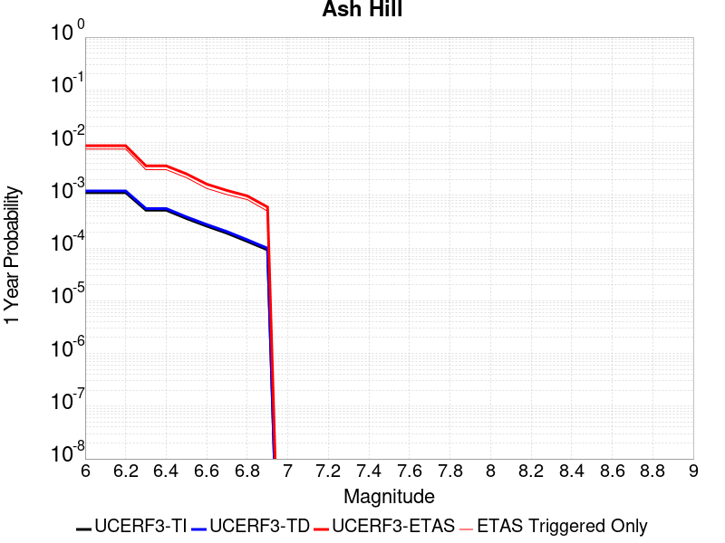 |  |

| Magnitude | 1 wk TI Prob | 1 wk TD Prob | 1 wk ETAS Prob | 1 wk ETAS/TD Gain | 1 wk ETAS Triggered Only | 1 mo TI Prob | 1 mo TD Prob | 1 mo ETAS Prob | 1 mo ETAS/TD Gain | 1 mo ETAS Triggered Only | 1 yr TI Prob | 1 yr TD Prob | 1 yr ETAS Prob | 1 yr ETAS/TD Gain | 1 yr ETAS Triggered Only | 10 yr TI Prob | 10 yr TD Prob | 10 yr ETAS Prob | 10 yr ETAS/TD Gain | 10 yr ETAS Triggered Only |
|-----|-----|-----|-----|-----|-----|-----|-----|-----|-----|-----|-----|-----|-----|-----|-----|-----|-----|-----|-----|-----|
| 6.0 | 2.1545662E-5 | 2.3194447E-5 | 0.0036211198 | 156.12012 | 0.0035980088 | 9.2335285E-5 | 9.940143E-5 | 0.0048305592 | 48.596474 | 0.004731628 | 0.0011236023 | 0.0012096206 | 0.008150793 | 6.7383056 | 0.0069495784 | 0.011179381 | 0.012038348 | 0.021728544 | 1.8049439 | 0.00980827 |
| 6.1 | 2.1545662E-5 | 2.3194447E-5 | 0.0036211198 | 156.12012 | 0.0035980088 | 9.2335285E-5 | 9.940143E-5 | 0.0048305592 | 48.596474 | 0.004731628 | 0.0011236023 | 0.0012096206 | 0.008150793 | 6.7383056 | 0.0069495784 | 0.011179381 | 0.012038348 | 0.021728544 | 1.8049439 | 0.00980827 |
| 6.2 | 2.1545662E-5 | 2.3194447E-5 | 0.0036211198 | 156.12012 | 0.0035980088 | 9.2335285E-5 | 9.940143E-5 | 0.0048305592 | 48.596474 | 0.004731628 | 0.0011236023 | 0.0012096206 | 0.008150793 | 6.7383056 | 0.0069495784 | 0.011179381 | 0.012038348 | 0.021728544 | 1.8049439 | 0.00980827 |
| 6.3 | 1.0025529E-5 | 1.0746934E-5 | 0.0012429284 | 115.654236 | 0.0012321948 | 4.2965847E-5 | 4.605755E-5 | 0.0017710509 | 38.452995 | 0.0017250727 | 5.229836E-4 | 5.6061964E-4 | 0.0034669691 | 6.1841736 | 0.0029079798 | 0.005217545 | 0.0055933665 | 0.009808407 | 1.7535785 | 0.00423875 |
| 6.4 | 1.0025529E-5 | 1.0746934E-5 | 0.0012429284 | 115.654236 | 0.0012321948 | 4.2965847E-5 | 4.605755E-5 | 0.0017710509 | 38.452995 | 0.0017250727 | 5.229836E-4 | 5.6061964E-4 | 0.0034669691 | 6.1841736 | 0.0029079798 | 0.005217545 | 0.0055933665 | 0.009808407 | 1.7535785 | 0.00423875 |
| 6.5 | 6.9617327E-6 | 7.456634E-6 | 8.9463027E-4 | 119.97776 | 8.871803E-4 | 2.9835655E-5 | 3.195666E-5 | 0.0013133982 | 41.099358 | 0.0012814826 | 3.6318856E-4 | 3.8901155E-4 | 0.002507562 | 6.445984 | 0.002119375 | 0.0036259557 | 0.0038841602 | 0.006928134 | 1.783689 | 0.003055843 |
| 6.6 | 4.9919777E-6 | 5.3466883E-6 | 6.9537206E-4 | 130.0566 | 6.9002906E-4 | 2.1394015E-5 | 2.2914215E-5 | 9.593608E-4 | 41.867496 | 9.36468E-4 | 2.60441E-4 | 2.7895154E-4 | 0.0018557209 | 6.6524844 | 0.0015772093 | 0.0026013597 | 0.0027866727 | 0.005145894 | 1.8466086 | 0.002365814 |
| 6.7 | 3.6630722E-6 | 3.924624E-6 | 5.460882E-4 | 139.14409 | 5.421657E-4 | 1.5698786E-5 | 1.681974E-5 | 7.5612415E-4 | 44.95457 | 7.3931686E-4 | 1.9111596E-4 | 2.0476682E-4 | 0.0012888762 | 6.2943606 | 0.0010843314 | 0.0019095168 | 0.0020463446 | 0.0037187003 | 1.8172405 | 0.0016757849 |
| 6.8 | 2.5599613E-6 | 2.744925E-6 | 3.4775853E-4 | 126.691444 | 3.4501453E-4 | 1.0971216E-5 | 1.1763939E-5 | 5.5392325E-4 | 47.086544 | 5.421657E-4 | 1.3356637E-4 | 1.4322149E-4 | 9.80994E-4 | 6.8494883 | 8.3789247E-4 | 0.0013348613 | 0.0014317769 | 0.0026622075 | 1.8593731 | 0.0012321948 |
| 6.9 | 1.7684905E-6 | 1.8968707E-6 | 1.4975996E-4 | 78.951065 | 1.4786338E-4 | 7.579223E-6 | 8.129446E-6 | 2.545664E-4 | 31.314114 | 2.4643895E-4 | 9.2273134E-5 | 9.8976E-5 | 6.4108806E-4 | 6.4772067 | 5.421657E-4 | 9.223483E-4 | 9.8976E-4 | 0.0018268232 | 1.8457233 | 8.3789247E-4 |

## Garlock (West)
*[(top)](#table-of-contents)*

| 1 Week | 1 Month | 1 Year | 10 Year |
|-----|-----|-----|-----|
|  |  |  |  |

| Magnitude | 1 wk TI Prob | 1 wk TD Prob | 1 wk ETAS Prob | 1 wk ETAS/TD Gain | 1 wk ETAS Triggered Only | 1 mo TI Prob | 1 mo TD Prob | 1 mo ETAS Prob | 1 mo ETAS/TD Gain | 1 mo ETAS Triggered Only | 1 yr TI Prob | 1 yr TD Prob | 1 yr ETAS Prob | 1 yr ETAS/TD Gain | 1 yr ETAS Triggered Only | 10 yr TI Prob | 10 yr TD Prob | 10 yr ETAS Prob | 10 yr ETAS/TD Gain | 10 yr ETAS Triggered Only |
|-----|-----|-----|-----|-----|-----|-----|-----|-----|-----|-----|-----|-----|-----|-----|-----|-----|-----|-----|-----|-----|
| 6.0 | 2.5181727E-5 | 2.5197181E-5 | 0.0042638406 | 169.21895 | 0.00423875 | 1.0791722E-4 | 1.0798347E-4 | 0.00503623 | 46.6389 | 0.0049287793 | 0.0013131002 | 0.0013139093 | 0.008057465 | 6.132436 | 0.006752427 | 0.013053683 | 0.013141794 | 0.021799726 | 1.6588088 | 0.008773227 |
| 6.1 | 2.5077732E-5 | 2.5098223E-5 | 0.004263742 | 169.88222 | 0.00423875 | 1.0747157E-4 | 1.075594E-4 | 0.0050358083 | 46.81886 | 0.0049287793 | 0.001307681 | 0.0013087525 | 0.008052343 | 6.1526856 | 0.006752427 | 0.013000126 | 0.013090835 | 0.021749213 | 1.6614076 | 0.008773227 |
| 6.2 | 2.494612E-5 | 2.4979914E-5 | 0.004263624 | 170.68208 | 0.00423875 | 1.0690756E-4 | 1.070524E-4 | 0.005035304 | 47.035877 | 0.0049287793 | 0.0013008224 | 0.0013025872 | 0.008046219 | 6.177106 | 0.006752427 | 0.012932341 | 0.013029906 | 0.021688819 | 1.6645415 | 0.008773227 |
| 6.3 | 2.4733758E-5 | 2.4799276E-5 | 0.0042634443 | 171.91809 | 0.00423875 | 1.0599751E-4 | 1.06278305E-4 | 0.005034534 | 47.371227 | 0.0049287793 | 0.0012897556 | 0.0012931736 | 0.008036869 | 6.2148414 | 0.006752427 | 0.012822957 | 0.0129368715 | 0.021596601 | 1.6693835 | 0.008773227 |
| 6.4 | 2.3237335E-5 | 2.3178607E-5 | 0.0042618304 | 183.86913 | 0.00423875 | 9.958477E-5 | 9.933313E-5 | 0.0050276225 | 50.613758 | 0.0049287793 | 0.0012117702 | 0.0012087126 | 0.007952978 | 6.57971 | 0.006752427 | 0.012051838 | 0.012101731 | 0.020720096 | 1.7121596 | 0.008723939 |
| 6.5 | 2.2732203E-5 | 2.2992977E-5 | 0.0042616455 | 185.34554 | 0.00423875 | 9.742009E-5 | 9.8537625E-5 | 0.0050268313 | 51.01433 | 0.0049287793 | 0.0011854442 | 0.0011990381 | 0.007943369 | 6.6247845 | 0.006752427 | 0.011791403 | 0.012006035 | 0.020625236 | 1.7179055 | 0.008723939 |
| 6.6 | 2.1319436E-5 | 2.1773201E-5 | 0.004211144 | 193.40952 | 0.0041894624 | 9.136581E-5 | 9.3310395E-5 | 0.0049723466 | 53.288235 | 0.0048794914 | 0.001111811 | 0.0011354643 | 0.007830992 | 6.896732 | 0.0067031397 | 0.011062649 | 0.011376952 | 0.019952912 | 1.7538012 | 0.008674651 |
| 6.7 | 1.970802E-5 | 2.0393094E-5 | 0.00420977 | 206.43115 | 0.0041894624 | 8.446021E-5 | 8.739606E-5 | 0.004966461 | 56.827057 | 0.0048794914 | 0.001027818 | 0.0010635294 | 0.00775954 | 7.296028 | 0.0067031397 | 0.010230771 | 0.0106646875 | 0.019246826 | 1.8047248 | 0.008674651 |
| 6.8 | 1.8744462E-5 | 1.9900775E-5 | 0.0042092795 | 211.51335 | 0.0041894624 | 8.033094E-5 | 8.528626E-5 | 0.0049643614 | 58.20822 | 0.0048794914 | 9.775903E-4 | 0.0010378672 | 0.00773405 | 7.4518685 | 0.0067031397 | 0.009733009 | 0.010410495 | 0.018946065 | 1.8199004 | 0.008625364 |
| 6.9 | 1.7559682E-5 | 1.8953151E-5 | 0.004208336 | 222.03886 | 0.0041894624 | 7.5253614E-5 | 8.122527E-5 | 0.0049603204 | 61.068684 | 0.0048794914 | 9.158276E-4 | 9.884704E-4 | 0.0076849842 | 7.774622 | 0.0067031397 | 0.0091206245 | 0.009921073 | 0.018460864 | 1.8607728 | 0.008625364 |
| 7.0 | 1.6794445E-5 | 1.8215967E-5 | 0.004207602 | 230.98427 | 0.0041894624 | 7.197421E-5 | 7.806611E-5 | 0.0049571767 | 63.49973 | 0.0048794914 | 8.759337E-4 | 9.5004175E-4 | 0.007646813 | 8.0489235 | 0.0067031397 | 0.008724891 | 0.009539958 | 0.018083036 | 1.8955047 | 0.008625364 |
| 7.1 | 1.6337795E-5 | 1.771677E-5 | 0.004157818 | 234.68263 | 0.0041401745 | 7.0017246E-5 | 7.592681E-5 | 0.0049057635 | 64.61175 | 0.0048302035 | 8.521265E-4 | 9.2401815E-4 | 0.007571722 | 8.194343 | 0.006653852 | 0.008488664 | 0.009281721 | 0.017778195 | 1.9153987 | 0.008576076 |
| 7.2 | 1.5780008E-5 | 1.71654E-5 | 0.004157269 | 242.18889 | 0.0041401745 | 6.762685E-5 | 7.3563926E-5 | 0.004903412 | 66.65511 | 0.0048302035 | 8.2304585E-4 | 8.952741E-4 | 0.007543169 | 8.425541 | 0.006653852 | 0.008200042 | 0.008996559 | 0.01749548 | 1.9446857 | 0.008576076 |
| 7.3 | 1.5058865E-5 | 1.6618484E-5 | 0.004107437 | 247.16078 | 0.0040908866 | 6.45364E-5 | 7.122013E-5 | 0.0048517953 | 68.12393 | 0.0047809156 | 7.854473E-4 | 8.667614E-4 | 0.007465601 | 8.613214 | 0.006604564 | 0.00782677 | 0.008713263 | 0.017165756 | 1.9700719 | 0.008526788 |
| 7.4 | 1.4887923E-5 | 1.6454453E-5 | 0.0041072736 | 249.61473 | 0.0040908866 | 6.380382E-5 | 7.0517184E-5 | 0.004851096 | 68.793106 | 0.0047809156 | 7.7653467E-4 | 8.5820974E-4 | 0.0074078604 | 8.63176 | 0.0065552765 | 0.0077382675 | 0.008628101 | 0.017032458 | 1.9740678 | 0.0084775 |
| 7.5 | 1.4509299E-5 | 1.6046468E-5 | 0.0036632845 | 228.29225 | 0.0036472965 | 6.218123E-5 | 6.876877E-5 | 0.004405796 | 64.06681 | 0.0043373257 | 7.567935E-4 | 8.369394E-4 | 0.006795771 | 8.119788 | 0.005963823 | 0.0075422134 | 0.008416411 | 0.016089465 | 1.911678 | 0.0077381833 |
| 7.6 | 1.2756717E-5 | 1.4050529E-5 | 0.0023305442 | 165.86879 | 0.0023165261 | 5.4670498E-5 | 6.0215163E-5 | 0.0029680198 | 49.290237 | 0.0029079798 | 6.6541E-4 | 7.328737E-4 | 0.0046730074 | 6.3762794 | 0.0039430233 | 0.006634211 | 0.007381374 | 0.012322696 | 1.6694312 | 0.004978067 |
| 7.7 | 1.0328985E-5 | 1.146033E-5 | 0.0014407899 | 125.71976 | 0.0014293459 | 4.4266326E-5 | 4.9114777E-5 | 0.0018233882 | 37.125042 | 0.0017743605 | 5.388092E-4 | 5.9780874E-4 | 0.00291295 | 4.8727126 | 0.0023165261 | 0.0053750467 | 0.006038286 | 0.008830726 | 1.4624557 | 0.0028094042 |
| 7.8 | 7.0306583E-6 | 8.899537E-6 | 9.946466E-4 | 111.76386 | 9.857558E-4 | 3.0131043E-5 | 3.8140315E-5 | 0.0012702881 | 33.305653 | 0.0012321948 | 3.667837E-4 | 4.6425956E-4 | 0.0020407366 | 4.3956804 | 0.0015772093 | 0.003661789 | 0.0046950667 | 0.006657322 | 1.4179398 | 0.0019715116 |
| 7.9 | 4.060633E-6 | 5.465412E-6 | 4.490531E-4 | 82.16272 | 4.4359014E-4 | 1.7402595E-5 | 2.3422985E-5 | 6.1486266E-4 | 26.250397 | 5.914535E-4 | 2.11856E-4 | 2.8513762E-4 | 0.0010242437 | 3.592103 | 7.3931686E-4 | 0.0021165414 | 0.002884143 | 0.0038670558 | 1.3407989 | 9.857558E-4 |
| 8.0 | 1.6729537E-6 | 2.0775192E-6 | 1.4994059E-4 | 72.1729 | 1.4786338E-4 | 7.169782E-6 | 8.903624E-6 | 1.5676569E-4 | 17.606953 | 1.4786338E-4 | 8.7288594E-5 | 1.0839626E-4 | 2.562436E-4 | 2.3639524 | 1.4786338E-4 | 8.7254314E-4 | 0.001096854 | 0.0013430227 | 1.2244315 | 2.4643895E-4 |
| 8.1 | 3.6733252E-7 | 3.1489736E-7 | 3.1489736E-7 | 1.0 | 0.0 | 1.5742813E-6 | 1.3495595E-6 | 1.3495595E-6 | 1.0 | 0.0 | 1.9166706E-5 | 1.643078E-5 | 1.643078E-5 | 1.0 | 0.0 | 1.9165053E-4 | 1.662928E-4 | 2.1557239E-4 | 1.2963424 | 4.928779E-5 |

## Gravel Hills-Harper Lk
*[(top)](#table-of-contents)*

| 1 Week | 1 Month | 1 Year | 10 Year |
|-----|-----|-----|-----|
|  | 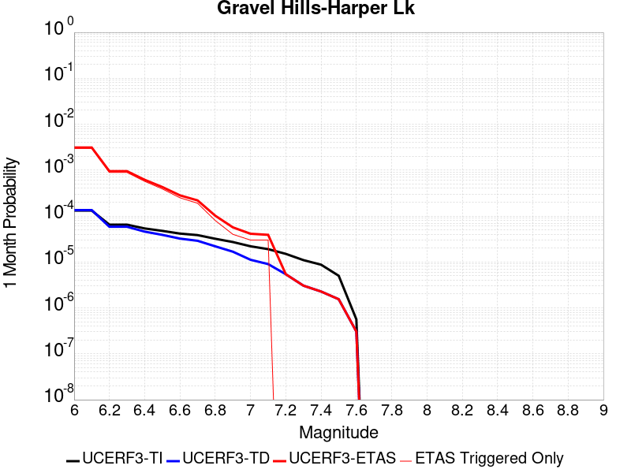 |  |  |

| Magnitude | 1 wk TI Prob | 1 wk TD Prob | 1 wk ETAS Prob | 1 wk ETAS/TD Gain | 1 wk ETAS Triggered Only | 1 mo TI Prob | 1 mo TD Prob | 1 mo ETAS Prob | 1 mo ETAS/TD Gain | 1 mo ETAS Triggered Only | 1 yr TI Prob | 1 yr TD Prob | 1 yr ETAS Prob | 1 yr ETAS/TD Gain | 1 yr ETAS Triggered Only | 10 yr TI Prob | 10 yr TD Prob | 10 yr ETAS Prob | 10 yr ETAS/TD Gain | 10 yr ETAS Triggered Only |
|-----|-----|-----|-----|-----|-----|-----|-----|-----|-----|-----|-----|-----|-----|-----|-----|-----|-----|-----|-----|-----|
| 6.0 | 3.0679566E-5 | 3.1464628E-5 | 0.0027914941 | 88.71849 | 0.0027601162 | 1.3147724E-4 | 1.3484266E-4 | 0.0033381172 | 24.755648 | 0.0032037064 | 0.0015995599 | 0.00164069 | 0.0063645546 | 3.879194 | 0.004731628 | 0.015880952 | 0.016307337 | 0.022707231 | 1.3924549 | 0.0065059885 |
| 6.1 | 3.0679566E-5 | 3.1464628E-5 | 0.0027914941 | 88.71849 | 0.0027601162 | 1.3147724E-4 | 1.3484266E-4 | 0.0033381172 | 24.755648 | 0.0032037064 | 0.0015995599 | 0.00164069 | 0.0063645546 | 3.879194 | 0.004731628 | 0.015880952 | 0.016307337 | 0.022707231 | 1.3924549 | 0.0065059885 |
| 6.2 | 1.514536E-5 | 1.36352E-5 | 7.036549E-4 | 51.60576 | 6.9002906E-4 | 6.490707E-5 | 5.843533E-5 | 8.962788E-4 | 15.337961 | 8.3789247E-4 | 7.8995706E-4 | 7.112298E-4 | 0.0020903065 | 2.9390028 | 0.0013800581 | 0.007871548 | 0.007090737 | 0.008950393 | 1.2622654 | 0.001872936 |
| 6.3 | 1.514536E-5 | 1.36352E-5 | 7.036549E-4 | 51.60576 | 6.9002906E-4 | 6.490707E-5 | 5.843533E-5 | 8.962788E-4 | 15.337961 | 8.3789247E-4 | 7.8995706E-4 | 7.112298E-4 | 0.0020903065 | 2.9390028 | 0.0013800581 | 0.007871548 | 0.007090737 | 0.008950393 | 1.2622654 | 0.001872936 |
| 6.4 | 1.2532521E-5 | 1.0689684E-5 | 5.528496E-4 | 51.71805 | 5.421657E-4 | 5.37097E-5 | 4.581216E-5 | 6.3723855E-4 | 13.909813 | 5.914535E-4 | 6.537194E-4 | 5.5762613E-4 | 0.0015428322 | 2.766786 | 9.857558E-4 | 0.0065179965 | 0.005562859 | 0.0068862266 | 1.2378933 | 0.0013307703 |
| 6.5 | 1.1094058E-5 | 9.083657E-6 | 5.019571E-4 | 55.259365 | 4.928779E-4 | 4.7545094E-5 | 3.89294E-5 | 5.317881E-4 | 13.660322 | 4.928779E-4 | 5.787078E-4 | 4.7386638E-4 | 0.0012620974 | 2.6634035 | 7.8860467E-4 | 0.0057720304 | 0.004728967 | 0.005759116 | 1.217838 | 0.0010350436 |
| 6.6 | 9.688328E-6 | 7.531688E-6 | 3.032562E-4 | 40.26404 | 2.9572676E-4 | 4.1520743E-5 | 3.227828E-5 | 3.2799548E-4 | 10.161492 | 2.9572676E-4 | 5.053978E-4 | 3.9291973E-4 | 9.348724E-4 | 2.379296 | 5.421657E-4 | 0.0050424994 | 0.0039225067 | 0.004658924 | 1.1877414 | 7.3931686E-4 |
| 6.7 | 8.974824E-6 | 6.749406E-6 | 2.531867E-4 | 37.51244 | 2.4643895E-4 | 3.8462964E-5 | 2.8925719E-5 | 2.7535754E-4 | 9.519471 | 2.4643895E-4 | 4.6818596E-4 | 3.5211592E-4 | 6.97009E-4 | 1.9794873 | 3.4501453E-4 | 0.004672008 | 0.003515801 | 0.0039578313 | 1.1257268 | 4.4359014E-4 |
| 6.8 | 7.4780046E-6 | 5.1161865E-6 | 2.0226634E-4 | 39.53459 | 1.9715117E-4 | 3.20482E-5 | 2.1926337E-5 | 2.1907318E-4 | 9.991326 | 1.9715117E-4 | 3.9011694E-4 | 2.6692182E-4 | 4.6402038E-4 | 1.738413 | 1.9715117E-4 | 0.0038943281 | 0.0026661505 | 0.0028627762 | 1.0737488 | 1.9715117E-4 |
| 6.9 | 6.3409307E-6 | 3.907489E-6 | 1.5177029E-4 | 38.840874 | 1.4786338E-4 | 2.7175134E-5 | 1.674628E-5 | 1.6460718E-4 | 9.829477 | 1.4786338E-4 | 3.3080703E-4 | 2.0386786E-4 | 3.517011E-4 | 1.7251424 | 1.4786338E-4 | 0.0033031502 | 0.0020369065 | 0.0021844688 | 1.0724442 | 1.4786338E-4 |
| 7.0 | 5.1239335E-6 | 2.6058492E-6 | 1.0118118E-4 | 38.828484 | 9.857558E-5 | 2.195953E-5 | 1.1167879E-5 | 1.0974236E-4 | 9.826607 | 9.857558E-5 | 2.6732447E-4 | 1.359607E-4 | 2.3452289E-4 | 1.7249314 | 9.857558E-5 | 0.0026700313 | 0.0013588005 | 0.0014572421 | 1.0724474 | 9.857558E-5 |
| 7.1 | 4.438899E-6 | 2.0984692E-6 | 1.00673846E-4 | 47.974895 | 9.857558E-5 | 1.9023713E-5 | 8.99341E-6 | 1.0756811E-4 | 11.96077 | 9.857558E-5 | 2.315891E-4 | 1.0948948E-4 | 2.0805428E-4 | 1.9002215 | 9.857558E-5 | 0.002313479 | 0.0010943774 | 0.001192845 | 1.089976 | 9.857558E-5 |
| 7.2 | 3.50367E-6 | 1.2615715E-6 | 1.2615715E-6 | 1.0 | 0.0 | 1.5015643E-5 | 5.406724E-6 | 5.406724E-6 | 1.0 | 0.0 | 1.8280011E-4 | 6.5824956E-5 | 6.5824956E-5 | 1.0 | 0.0 | 0.0018264982 | 6.580628E-4 | 6.580628E-4 | 1.0 | 0.0 |
| 7.3 | 2.561638E-6 | 7.118686E-7 | 7.118686E-7 | 1.0 | 0.0 | 1.0978401E-5 | 3.050862E-6 | 3.050862E-6 | 1.0 | 0.0 | 1.3365384E-4 | 3.7143633E-5 | 3.7143633E-5 | 1.0 | 0.0 | 0.0013357349 | 3.7137623E-4 | 3.7137623E-4 | 1.0 | 0.0 |
| 7.4 | 2.0368864E-6 | 5.304471E-7 | 5.304471E-7 | 1.0 | 0.0 | 8.729483E-6 | 2.2733427E-6 | 2.2733427E-6 | 1.0 | 0.0 | 1.06276275E-4 | 2.76776E-5 | 2.76776E-5 | 1.0 | 0.0 | 0.0010622547 | 2.767421E-4 | 2.767421E-4 | 1.0 | 0.0 |
| 7.5 | 1.1681728E-6 | 3.6028484E-7 | 3.6028484E-7 | 1.0 | 0.0 | 5.0064455E-6 | 1.544077E-6 | 1.544077E-6 | 1.0 | 0.0 | 6.0951766E-5 | 1.879898E-5 | 1.879898E-5 | 1.0 | 0.0 | 6.093505E-4 | 1.8797436E-4 | 1.8797436E-4 | 1.0 | 0.0 |
| 7.6 | 1.3154387E-7 | 7.1196716E-8 | 7.1196716E-8 | 1.0 | 0.0 | 5.6375933E-7 | 3.0512876E-7 | 3.0512876E-7 | 1.0 | 0.0 | 6.863748E-6 | 3.714938E-6 | 3.714938E-6 | 1.0 | 0.0 | 6.863536E-5 | 3.7148915E-5 | 3.7148915E-5 | 1.0 | 0.0 |

## McLean Lake
*[(top)](#table-of-contents)*

| 1 Week | 1 Month | 1 Year | 10 Year |
|-----|-----|-----|-----|
|  |  |  |  |

| Magnitude | 1 wk TI Prob | 1 wk TD Prob | 1 wk ETAS Prob | 1 wk ETAS/TD Gain | 1 wk ETAS Triggered Only | 1 mo TI Prob | 1 mo TD Prob | 1 mo ETAS Prob | 1 mo ETAS/TD Gain | 1 mo ETAS Triggered Only | 1 yr TI Prob | 1 yr TD Prob | 1 yr ETAS Prob | 1 yr ETAS/TD Gain | 1 yr ETAS Triggered Only | 10 yr TI Prob | 10 yr TD Prob | 10 yr ETAS Prob | 10 yr ETAS/TD Gain | 10 yr ETAS Triggered Only |
|-----|-----|-----|-----|-----|-----|-----|-----|-----|-----|-----|-----|-----|-----|-----|-----|-----|-----|-----|-----|-----|
| 6.0 | 1.7360222E-5 | 1.8501627E-5 | 0.0018421161 | 99.56509 | 0.0018236482 | 7.439883E-5 | 7.9290556E-5 | 0.0024942008 | 31.456469 | 0.0024151017 | 9.0542925E-4 | 9.6498354E-4 | 0.0052488837 | 5.43935 | 0.004288038 | 0.009017491 | 0.0096127745 | 0.015958594 | 1.6601444 | 0.0064074127 |
| 6.1 | 9.062689E-6 | 9.592193E-6 | 0.0010446259 | 108.903755 | 0.0010350436 | 3.8839516E-5 | 4.1108804E-5 | 0.0013225387 | 32.171665 | 0.0012814826 | 4.727685E-4 | 5.003936E-4 | 0.002520182 | 5.036399 | 0.0020207996 | 0.0047176396 | 0.004993552 | 0.007837969 | 1.569618 | 0.0028586918 |
| 6.2 | 9.062689E-6 | 9.592193E-6 | 0.0010446259 | 108.903755 | 0.0010350436 | 3.8839516E-5 | 4.1108804E-5 | 0.0013225387 | 32.171665 | 0.0012814826 | 4.727685E-4 | 5.003936E-4 | 0.002520182 | 5.036399 | 0.0020207996 | 0.0047176396 | 0.004993552 | 0.007837969 | 1.569618 | 0.0028586918 |
| 6.3 | 7.2575485E-6 | 7.66771E-6 | 8.9484116E-4 | 116.70254 | 8.871803E-4 | 3.110341E-5 | 3.2861237E-5 | 0.0010678709 | 32.49637 | 0.0010350436 | 3.786182E-4 | 4.0001926E-4 | 0.002124402 | 5.310749 | 0.0017250727 | 0.0037797375 | 0.0039936965 | 0.0062518804 | 1.565437 | 0.0022672385 |
| 6.4 | 7.2575485E-6 | 7.66771E-6 | 8.9484116E-4 | 116.70254 | 8.871803E-4 | 3.110341E-5 | 3.2861237E-5 | 0.0010678709 | 32.49637 | 0.0010350436 | 3.786182E-4 | 4.0001926E-4 | 0.002124402 | 5.310749 | 0.0017250727 | 0.0037797375 | 0.0039936965 | 0.0062518804 | 1.565437 | 0.0022672385 |
| 6.5 | 6.06582E-6 | 6.4038773E-6 | 6.964285E-4 | 108.751076 | 6.9002906E-4 | 2.5996113E-5 | 2.7444936E-5 | 8.653144E-4 | 31.52911 | 8.3789247E-4 | 3.164567E-4 | 3.3409733E-4 | 0.0018122371 | 5.4242787 | 0.0014786337 | 0.0031600643 | 0.0033365893 | 0.0052523995 | 1.5741823 | 0.0019222238 |
| 6.6 | 5.598744E-6 | 5.910262E-6 | 5.9736025E-4 | 101.0717 | 5.914535E-4 | 2.3994397E-5 | 2.5329486E-5 | 7.6462765E-4 | 30.187254 | 7.3931686E-4 | 2.9209262E-4 | 3.0834923E-4 | 0.0016879819 | 5.474253 | 0.0013800581 | 0.0029170897 | 0.003079843 | 0.0048487387 | 1.5743461 | 0.0017743605 |
| 6.7 | 5.246996E-6 | 5.539162E-6 | 5.969894E-4 | 107.776115 | 5.914535E-4 | 2.2486933E-5 | 2.3739085E-5 | 7.1375177E-4 | 30.066525 | 6.9002906E-4 | 2.73744E-4 | 2.8899137E-4 | 0.0016193772 | 5.6035485 | 0.0013307703 | 0.0027340704 | 0.0028867796 | 0.0046068723 | 1.5958518 | 0.0017250727 |
| 6.8 | 4.02324E-6 | 4.2469046E-6 | 4.4783513E-4 | 105.44978 | 4.4359014E-4 | 1.7242342E-5 | 1.8200926E-5 | 5.6035677E-4 | 30.787268 | 5.421657E-4 | 2.099053E-4 | 2.2157968E-4 | 0.0011085634 | 5.0030007 | 8.871803E-4 | 0.0020970714 | 0.002214172 | 0.003246924 | 1.466428 | 0.0010350436 |
| 6.9 | 6.835972E-7 | 7.1399285E-7 | 9.928951E-5 | 139.06233 | 9.857558E-5 | 2.9296991E-6 | 3.0599674E-6 | 1.0163525E-4 | 33.214485 | 9.857558E-5 | 3.56685E-5 | 3.7254784E-5 | 1.3582669E-4 | 3.645886 | 9.857558E-5 | 3.5662777E-4 | 3.7251666E-4 | 4.710555E-4 | 1.2645221 | 9.857558E-5 |

## Goldstone Lake
*[(top)](#table-of-contents)*

| 1 Week | 1 Month | 1 Year | 10 Year |
|-----|-----|-----|-----|
|  |  |  |  |

| Magnitude | 1 wk TI Prob | 1 wk TD Prob | 1 wk ETAS Prob | 1 wk ETAS/TD Gain | 1 wk ETAS Triggered Only | 1 mo TI Prob | 1 mo TD Prob | 1 mo ETAS Prob | 1 mo ETAS/TD Gain | 1 mo ETAS Triggered Only | 1 yr TI Prob | 1 yr TD Prob | 1 yr ETAS Prob | 1 yr ETAS/TD Gain | 1 yr ETAS Triggered Only | 10 yr TI Prob | 10 yr TD Prob | 10 yr ETAS Prob | 10 yr ETAS/TD Gain | 10 yr ETAS Triggered Only |
|-----|-----|-----|-----|-----|-----|-----|-----|-----|-----|-----|-----|-----|-----|-----|-----|-----|-----|-----|-----|-----|
| 6.0 | 2.671352E-5 | 3.0376103E-5 | 0.0011639609 | 38.318306 | 0.0011336192 | 1.1448149E-4 | 1.3017791E-4 | 0.0019043074 | 14.628499 | 0.0017743605 | 0.001392921 | 0.0015839601 | 0.0049794307 | 3.1436594 | 0.0034008576 | 0.013842222 | 0.015746202 | 0.020597372 | 1.3080851 | 0.0049287793 |
| 6.1 | 2.671352E-5 | 3.0376103E-5 | 0.0011639609 | 38.318306 | 0.0011336192 | 1.1448149E-4 | 1.3017791E-4 | 0.0019043074 | 14.628499 | 0.0017743605 | 0.001392921 | 0.0015839601 | 0.0049794307 | 3.1436594 | 0.0034008576 | 0.013842222 | 0.015746202 | 0.020597372 | 1.3080851 | 0.0049287793 |
| 6.2 | 1.4197047E-5 | 1.6096254E-5 | 8.5397525E-4 | 53.054283 | 8.3789247E-4 | 6.0843064E-5 | 6.898268E-5 | 0.0013503769 | 19.575592 | 0.0012814826 | 7.4051257E-4 | 8.3963916E-4 | 0.002760249 | 3.2874231 | 0.0019222238 | 0.007380498 | 0.008374364 | 0.011111367 | 1.326831 | 0.0027601162 |
| 6.3 | 1.4197047E-5 | 1.6096254E-5 | 8.5397525E-4 | 53.054283 | 8.3789247E-4 | 6.0843064E-5 | 6.898268E-5 | 0.0013503769 | 19.575592 | 0.0012814826 | 7.4051257E-4 | 8.3963916E-4 | 0.002760249 | 3.2874231 | 0.0019222238 | 0.007380498 | 0.008374364 | 0.011111367 | 1.326831 | 0.0027601162 |
| 6.4 | 1.3238931E-5 | 1.500847E-5 | 8.036013E-4 | 53.543186 | 7.8860467E-4 | 5.6737044E-5 | 6.432098E-5 | 0.0012471519 | 19.389503 | 0.001182907 | 6.9055456E-4 | 7.8292453E-4 | 0.002605145 | 3.3274536 | 0.0018236482 | 0.006884126 | 0.007811289 | 0.010354234 | 1.3255475 | 0.0025629653 |
| 6.5 | 1.3238931E-5 | 1.500847E-5 | 8.036013E-4 | 53.543186 | 7.8860467E-4 | 5.6737044E-5 | 6.432098E-5 | 0.0012471519 | 19.389503 | 0.001182907 | 6.9055456E-4 | 7.8292453E-4 | 0.002605145 | 3.3274536 | 0.0018236482 | 0.006884126 | 0.007811289 | 0.010354234 | 1.3255475 | 0.0025629653 |
| 6.6 | 1.1328278E-5 | 1.2855176E-5 | 7.028754E-4 | 54.676453 | 6.9002906E-4 | 4.8548856E-5 | 5.5092984E-5 | 9.4222435E-4 | 17.102438 | 8.871803E-4 | 5.90922E-4 | 6.706464E-4 | 0.0021975432 | 3.2767541 | 0.0015279215 | 0.0058935313 | 0.0066956137 | 0.008849756 | 1.3217244 | 0.0021686628 |
| 6.7 | 8.651175E-6 | 9.824575E-6 | 3.5483573E-4 | 36.11716 | 3.4501453E-4 | 3.707594E-5 | 4.2105148E-5 | 5.3496234E-4 | 12.705389 | 4.928779E-4 | 4.5130608E-4 | 5.126002E-4 | 0.0014978506 | 2.9220645 | 9.857558E-4 | 0.0045039062 | 0.0051230565 | 0.00664315 | 1.2967162 | 0.0015279215 |
| 6.8 | 1.0215377E-6 | 1.1754802E-6 | 1.1754802E-6 | 1.0 | 0.0 | 4.378012E-6 | 5.037763E-6 | 5.037763E-6 | 1.0 | 0.0 | 5.3300988E-5 | 6.133315E-5 | 6.133315E-5 | 1.0 | 0.0 | 5.3288206E-4 | 6.131735E-4 | 7.1168866E-4 | 1.1606643 | 9.857558E-5 |
| 6.9 | 7.9360774E-7 | 9.283496E-7 | 9.283496E-7 | 1.0 | 0.0 | 3.4011714E-6 | 3.9786355E-6 | 3.9786355E-6 | 1.0 | 0.0 | 4.1408475E-5 | 4.843888E-5 | 4.843888E-5 | 1.0 | 0.0 | 4.140076E-4 | 4.842902E-4 | 4.842902E-4 | 1.0 | 0.0 |
| 7.0 | 7.4382757E-7 | 8.747428E-7 | 8.747428E-7 | 1.0 | 0.0 | 3.1878285E-6 | 3.7488926E-6 | 3.7488926E-6 | 1.0 | 0.0 | 3.8811122E-5 | 4.564188E-5 | 4.564188E-5 | 1.0 | 0.0 | 3.8804344E-4 | 4.563317E-4 | 4.563317E-4 | 1.0 | 0.0 |
| 7.1 | 6.4709513E-7 | 7.711399E-7 | 7.711399E-7 | 1.0 | 0.0 | 2.773262E-6 | 3.3048816E-6 | 3.3048816E-6 | 1.0 | 0.0 | 3.376394E-5 | 4.023625E-5 | 4.023625E-5 | 1.0 | 0.0 | 3.375881E-4 | 4.022956E-4 | 4.022956E-4 | 1.0 | 0.0 |
| 7.2 | 6.356704E-7 | 7.588459E-7 | 7.588459E-7 | 1.0 | 0.0 | 2.7242988E-6 | 3.252193E-6 | 3.252193E-6 | 1.0 | 0.0 | 3.3167835E-5 | 3.959479E-5 | 3.959479E-5 | 1.0 | 0.0 | 3.3162883E-4 | 3.9588328E-4 | 3.9588328E-4 | 1.0 | 0.0 |
| 7.3 | 5.7695723E-7 | 6.896648E-7 | 6.896648E-7 | 1.0 | 0.0 | 2.4726714E-6 | 2.9557032E-6 | 2.9557032E-6 | 1.0 | 0.0 | 3.0104358E-5 | 3.598515E-5 | 3.598515E-5 | 1.0 | 0.0 | 3.0100282E-4 | 3.5979896E-4 | 3.5979896E-4 | 1.0 | 0.0 |
| 7.4 | 5.209647E-7 | 6.193583E-7 | 6.193583E-7 | 1.0 | 0.0 | 2.232704E-6 | 2.6543903E-6 | 2.6543903E-6 | 1.0 | 0.0 | 2.718283E-5 | 3.2316777E-5 | 3.2316777E-5 | 1.0 | 0.0 | 2.7179506E-4 | 3.2312635E-4 | 3.2312635E-4 | 1.0 | 0.0 |
| 7.5 | 4.512955E-7 | 5.3489487E-7 | 5.3489487E-7 | 1.0 | 0.0 | 1.934122E-6 | 2.2924048E-6 | 2.2924048E-6 | 1.0 | 0.0 | 2.3547682E-5 | 2.7909726E-5 | 2.7909726E-5 | 1.0 | 0.0 | 2.3545188E-4 | 2.7906752E-4 | 2.7906752E-4 | 1.0 | 0.0 |
| 7.6 | 2.21172E-7 | 2.6040198E-7 | 2.6040198E-7 | 1.0 | 0.0 | 9.478797E-7 | 1.1160082E-6 | 1.1160082E-6 | 1.0 | 0.0 | 1.1540374E-5 | 1.3587343E-5 | 1.3587343E-5 | 1.0 | 0.0 | 1.1539775E-4 | 1.3586794E-4 | 1.3586794E-4 | 1.0 | 0.0 |

## Coyote Canyon
*[(top)](#table-of-contents)*

| 1 Week | 1 Month | 1 Year | 10 Year |
|-----|-----|-----|-----|
|  |  |  |  |

| Magnitude | 1 wk TI Prob | 1 wk TD Prob | 1 wk ETAS Prob | 1 wk ETAS/TD Gain | 1 wk ETAS Triggered Only | 1 mo TI Prob | 1 mo TD Prob | 1 mo ETAS Prob | 1 mo ETAS/TD Gain | 1 mo ETAS Triggered Only | 1 yr TI Prob | 1 yr TD Prob | 1 yr ETAS Prob | 1 yr ETAS/TD Gain | 1 yr ETAS Triggered Only | 10 yr TI Prob | 10 yr TD Prob | 10 yr ETAS Prob | 10 yr ETAS/TD Gain | 10 yr ETAS Triggered Only |
|-----|-----|-----|-----|-----|-----|-----|-----|-----|-----|-----|-----|-----|-----|-----|-----|-----|-----|-----|-----|-----|
| 6.0 | 3.5090034E-5 | 4.0364317E-5 | 0.0010753662 | 26.641506 | 0.0010350436 | 1.503772E-4 | 1.7297991E-4 | 0.0016020786 | 9.261645 | 0.0014293459 | 0.0018293047 | 0.0021042533 | 0.0045634573 | 2.1686823 | 0.0024643897 | 0.018143194 | 0.020869205 | 0.024729941 | 1.1849967 | 0.0039430233 |
| 6.1 | 3.5090034E-5 | 4.0364317E-5 | 0.0010753662 | 26.641506 | 0.0010350436 | 1.503772E-4 | 1.7297991E-4 | 0.0016020786 | 9.261645 | 0.0014293459 | 0.0018293047 | 0.0021042533 | 0.0045634573 | 2.1686823 | 0.0024643897 | 0.018143194 | 0.020869205 | 0.024729941 | 1.1849967 | 0.0039430233 |
| 6.2 | 1.841879E-5 | 2.1059794E-5 | 6.125008E-4 | 29.083897 | 5.914535E-4 | 7.8935285E-5 | 9.025371E-5 | 9.773539E-4 | 10.828961 | 8.871803E-4 | 9.606133E-4 | 0.0010983871 | 0.0027723312 | 2.5240023 | 0.0016757849 | 0.0095647145 | 0.010939668 | 0.013425847 | 1.2272627 | 0.0025136773 |
| 6.3 | 1.841879E-5 | 2.1059794E-5 | 6.125008E-4 | 29.083897 | 5.914535E-4 | 7.8935285E-5 | 9.025371E-5 | 9.773539E-4 | 10.828961 | 8.871803E-4 | 9.606133E-4 | 0.0010983871 | 0.0027723312 | 2.5240023 | 0.0016757849 | 0.0095647145 | 0.010939668 | 0.013425847 | 1.2272627 | 0.0025136773 |
| 6.4 | 1.712201E-5 | 1.9565212E-5 | 4.6314666E-4 | 23.671947 | 4.4359014E-4 | 7.337798E-5 | 8.3848776E-5 | 8.2310365E-4 | 9.816525 | 7.3931686E-4 | 8.930107E-4 | 0.0010204813 | 0.0024483686 | 2.3992293 | 0.0014293459 | 0.008894307 | 0.010167871 | 0.0123144835 | 1.2111171 | 0.0021686628 |
| 6.5 | 1.4744935E-5 | 1.6836972E-5 | 4.1113267E-4 | 24.418446 | 3.9430233E-4 | 6.3191044E-5 | 7.215698E-5 | 6.635678E-4 | 9.196169 | 5.914535E-4 | 7.6907943E-4 | 8.782507E-4 | 0.0020108742 | 2.289636 | 0.0011336192 | 0.007664232 | 0.008756994 | 0.010515817 | 1.2008477 | 0.0017743605 |
| 6.6 | 1.2017839E-5 | 1.3724089E-5 | 2.6015966E-4 | 18.956425 | 2.4643895E-4 | 5.150401E-5 | 5.88167E-5 | 5.023807E-4 | 8.541465 | 4.4359014E-4 | 6.268809E-4 | 7.159466E-4 | 0.0016024917 | 2.2382839 | 8.871803E-4 | 0.0062511545 | 0.0071450938 | 0.008368485 | 1.171221 | 0.0012321948 |
| 6.7 | 1.00956095E-5 | 1.1533517E-5 | 2.5796963E-4 | 22.366953 | 2.4643895E-4 | 4.326618E-5 | 4.942891E-5 | 4.929971E-4 | 9.973862 | 4.4359014E-4 | 5.266384E-4 | 6.017178E-4 | 0.0014391061 | 2.3916628 | 8.3789247E-4 | 0.005253921 | 0.0060094125 | 0.007087228 | 1.1793545 | 0.0010843314 |

## So Sierra Nevada
*[(top)](#table-of-contents)*

| 1 Week | 1 Month | 1 Year | 10 Year |
|-----|-----|-----|-----|
|  |  |  |  |

| Magnitude | 1 wk TI Prob | 1 wk TD Prob | 1 wk ETAS Prob | 1 wk ETAS/TD Gain | 1 wk ETAS Triggered Only | 1 mo TI Prob | 1 mo TD Prob | 1 mo ETAS Prob | 1 mo ETAS/TD Gain | 1 mo ETAS Triggered Only | 1 yr TI Prob | 1 yr TD Prob | 1 yr ETAS Prob | 1 yr ETAS/TD Gain | 1 yr ETAS Triggered Only | 10 yr TI Prob | 10 yr TD Prob | 10 yr ETAS Prob | 10 yr ETAS/TD Gain | 10 yr ETAS Triggered Only |
|-----|-----|-----|-----|-----|-----|-----|-----|-----|-----|-----|-----|-----|-----|-----|-----|-----|-----|-----|-----|-----|
| 6.0 | 1.15488665E-5 | 1.1079612E-5 | 0.001489697 | 134.4539 | 0.0014786337 | 4.9494203E-5 | 4.7483256E-5 | 0.0021667576 | 45.632034 | 0.002119375 | 6.024253E-4 | 5.779681E-4 | 0.003779823 | 6.5398474 | 0.0032037064 | 0.006007948 | 0.005765918 | 0.010029231 | 1.7393988 | 0.004288038 |
| 6.1 | 1.15488665E-5 | 1.1079612E-5 | 0.001489697 | 134.4539 | 0.0014786337 | 4.9494203E-5 | 4.7483256E-5 | 0.0021667576 | 45.632034 | 0.002119375 | 6.024253E-4 | 5.779681E-4 | 0.003779823 | 6.5398474 | 0.0032037064 | 0.006007948 | 0.005765918 | 0.010029231 | 1.7393988 | 0.004288038 |
| 6.2 | 1.15488665E-5 | 1.1079612E-5 | 0.001489697 | 134.4539 | 0.0014786337 | 4.9494203E-5 | 4.7483256E-5 | 0.0021667576 | 45.632034 | 0.002119375 | 6.024253E-4 | 5.779681E-4 | 0.003779823 | 6.5398474 | 0.0032037064 | 0.006007948 | 0.005765918 | 0.010029231 | 1.7393988 | 0.004288038 |
| 6.3 | 1.15488665E-5 | 1.1079612E-5 | 0.001489697 | 134.4539 | 0.0014786337 | 4.9494203E-5 | 4.7483256E-5 | 0.0021667576 | 45.632034 | 0.002119375 | 6.024253E-4 | 5.779681E-4 | 0.003779823 | 6.5398474 | 0.0032037064 | 0.006007948 | 0.005765918 | 0.010029231 | 1.7393988 | 0.004288038 |
| 6.4 | 1.15488665E-5 | 1.1079612E-5 | 0.001489697 | 134.4539 | 0.0014786337 | 4.9494203E-5 | 4.7483256E-5 | 0.0021667576 | 45.632034 | 0.002119375 | 6.024253E-4 | 5.779681E-4 | 0.003779823 | 6.5398474 | 0.0032037064 | 0.006007948 | 0.005765918 | 0.010029231 | 1.7393988 | 0.004288038 |
| 6.5 | 1.15488665E-5 | 1.1079612E-5 | 0.001489697 | 134.4539 | 0.0014786337 | 4.9494203E-5 | 4.7483256E-5 | 0.0021667576 | 45.632034 | 0.002119375 | 6.024253E-4 | 5.779681E-4 | 0.003779823 | 6.5398474 | 0.0032037064 | 0.006007948 | 0.005765918 | 0.010029231 | 1.7393988 | 0.004288038 |
| 6.6 | 7.587044E-6 | 6.9356042E-6 | 7.955348E-4 | 114.703026 | 7.8860467E-4 | 3.2515498E-5 | 2.9723697E-5 | 0.0011633092 | 39.137436 | 0.0011336192 | 3.9580427E-4 | 3.6182883E-4 | 0.0019877374 | 5.493585 | 0.0016264971 | 0.003951 | 0.0036126887 | 0.0057244073 | 1.5845282 | 0.002119375 |
| 6.7 | 7.587044E-6 | 6.9356042E-6 | 7.955348E-4 | 114.703026 | 7.8860467E-4 | 3.2515498E-5 | 2.9723697E-5 | 0.0011633092 | 39.137436 | 0.0011336192 | 3.9580427E-4 | 3.6182883E-4 | 0.0019877374 | 5.493585 | 0.0016264971 | 0.003951 | 0.0036126887 | 0.0057244073 | 1.5845282 | 0.002119375 |
| 6.8 | 5.9026956E-6 | 5.179362E-6 | 7.9377997E-4 | 153.25826 | 7.8860467E-4 | 2.5297022E-5 | 2.2197082E-5 | 0.0011065045 | 49.84909 | 0.0010843314 | 3.0794772E-4 | 2.7021713E-4 | 0.0016006279 | 5.9234877 | 0.0013307703 | 0.0030752132 | 0.002699002 | 0.004173645 | 1.546366 | 0.0014786337 |
| 6.9 | 5.0118915E-6 | 4.2523943E-6 | 6.942785E-4 | 163.26767 | 6.9002906E-4 | 2.1479358E-5 | 1.8224424E-5 | 0.0010039622 | 55.088833 | 9.857558E-4 | 2.614798E-4 | 2.2186051E-4 | 0.0014045051 | 6.3305774 | 0.001182907 | 0.0026117235 | 0.0022164627 | 0.0034459264 | 1.5546963 | 0.0012321948 |
| 7.0 | 4.4924795E-6 | 3.7138868E-6 | 6.937404E-4 | 186.79633 | 6.9002906E-4 | 1.925334E-5 | 1.5916565E-5 | 0.0010016568 | 62.931717 | 9.857558E-4 | 2.3438422E-4 | 1.9376757E-4 | 0.0012778889 | 6.5949574 | 0.0010843314 | 0.0023413717 | 0.0019360491 | 0.0030674736 | 1.5843986 | 0.0011336192 |
| 7.1 | 3.9118436E-6 | 3.1119469E-6 | 4.467007E-4 | 143.5438 | 4.4359014E-4 | 1.6764936E-5 | 1.333685E-5 | 6.540696E-4 | 49.042282 | 6.407413E-4 | 2.0409399E-4 | 1.6236462E-4 | 8.522817E-4 | 5.249183 | 6.9002906E-4 | 0.0020390663 | 0.0016225161 | 0.0023606333 | 1.4549215 | 7.3931686E-4 |
| 7.2 | 3.4200818E-6 | 2.6054236E-6 | 3.4761906E-4 | 133.42133 | 3.4501453E-4 | 1.4657411E-5 | 1.11660565E-5 | 5.533257E-4 | 49.554264 | 5.421657E-4 | 1.7843937E-4 | 1.3593875E-4 | 7.273119E-4 | 5.3502903 | 5.914535E-4 | 0.0017829615 | 0.0013586058 | 0.0019984765 | 1.470976 | 6.407413E-4 |
| 7.3 | 2.6593618E-6 | 1.8283897E-6 | 1.9897919E-4 | 108.82756 | 1.9715117E-4 | 1.13972155E-5 | 7.8359335E-6 | 3.5284777E-4 | 45.029446 | 3.4501453E-4 | 1.3875226E-4 | 9.539862E-5 | 4.4038024E-4 | 4.6162124 | 3.4501453E-4 | 0.0013866565 | 9.536055E-4 | 0.0013475318 | 1.4130915 | 3.9430233E-4 |
| 7.4 | 2.2577992E-6 | 1.4364078E-6 | 1.4929957E-4 | 103.939545 | 1.4786338E-4 | 9.676246E-6 | 6.1560204E-6 | 2.0330597E-4 | 33.02555 | 1.9715117E-4 | 1.1780193E-4 | 7.4947224E-5 | 2.7208362E-4 | 3.630336 | 1.9715117E-4 | 0.001177395 | 7.4924453E-4 | 9.954988E-4 | 1.3286701 | 2.4643895E-4 |
| 7.5 | 1.489319E-6 | 7.353661E-7 | 5.002312E-5 | 68.02479 | 4.928779E-5 | 6.3827797E-6 | 3.1515651E-6 | 1.0172684E-4 | 32.278194 | 9.857558E-5 | 7.770758E-5 | 3.8369635E-5 | 1.3694144E-4 | 3.5690055 | 9.857558E-5 | 7.7680405E-4 | 3.8363054E-4 | 4.8216828E-4 | 1.2568558 | 9.857558E-5 |
| 7.6 | 1.0680322E-6 | 4.65941E-7 | 4.65941E-7 | 1.0 | 0.0 | 4.577273E-6 | 1.9968884E-6 | 1.9968884E-6 | 1.0 | 0.0 | 5.5726876E-5 | 2.4311848E-5 | 2.4311848E-5 | 1.0 | 0.0 | 5.5712904E-4 | 2.4309216E-4 | 2.4309216E-4 | 1.0 | 0.0 |
| 7.7 | 5.509146E-7 | 1.5578539E-7 | 1.5578539E-7 | 1.0 | 0.0 | 2.3610605E-6 | 6.676515E-7 | 6.676515E-7 | 1.0 | 0.0 | 2.8745531E-5 | 8.128628E-6 | 8.128628E-6 | 1.0 | 0.0 | 2.8741814E-4 | 8.128342E-5 | 8.128342E-5 | 1.0 | 0.0 |

## Death Valley (So)
*[(top)](#table-of-contents)*

| 1 Week | 1 Month | 1 Year | 10 Year |
|-----|-----|-----|-----|
|  |  |  |  |

| Magnitude | 1 wk TI Prob | 1 wk TD Prob | 1 wk ETAS Prob | 1 wk ETAS/TD Gain | 1 wk ETAS Triggered Only | 1 mo TI Prob | 1 mo TD Prob | 1 mo ETAS Prob | 1 mo ETAS/TD Gain | 1 mo ETAS Triggered Only | 1 yr TI Prob | 1 yr TD Prob | 1 yr ETAS Prob | 1 yr ETAS/TD Gain | 1 yr ETAS Triggered Only | 10 yr TI Prob | 10 yr TD Prob | 10 yr ETAS Prob | 10 yr ETAS/TD Gain | 10 yr ETAS Triggered Only |
|-----|-----|-----|-----|-----|-----|-----|-----|-----|-----|-----|-----|-----|-----|-----|-----|-----|-----|-----|-----|-----|
| 6.0 | 2.0684236E-5 | 2.5618314E-5 | 0.0010606354 | 41.40145 | 0.0010350436 | 8.864371E-5 | 1.0978825E-4 | 0.0018346716 | 16.711 | 0.0017250727 | 0.0010787029 | 0.0013358692 | 0.0039446326 | 2.9528582 | 0.002612253 | 0.010734817 | 0.013279985 | 0.017024744 | 1.2819853 | 0.00379516 |
| 6.1 | 2.0684236E-5 | 2.5618314E-5 | 0.0010606354 | 41.40145 | 0.0010350436 | 8.864371E-5 | 1.0978825E-4 | 0.0018346716 | 16.711 | 0.0017250727 | 0.0010787029 | 0.0013358692 | 0.0039446326 | 2.9528582 | 0.002612253 | 0.010734817 | 0.013279985 | 0.017024744 | 1.2819853 | 0.00379516 |
| 6.2 | 2.0684236E-5 | 2.5618314E-5 | 0.0010606354 | 41.40145 | 0.0010350436 | 8.864371E-5 | 1.0978825E-4 | 0.0018346716 | 16.711 | 0.0017250727 | 0.0010787029 | 0.0013358692 | 0.0039446326 | 2.9528582 | 0.002612253 | 0.010734817 | 0.013279985 | 0.017024744 | 1.2819853 | 0.00379516 |
| 6.3 | 2.0240292E-5 | 2.51184E-5 | 0.0010108495 | 40.24339 | 9.857558E-4 | 8.6741224E-5 | 1.0764593E-4 | 0.0016846855 | 15.650248 | 0.0015772093 | 0.0010555626 | 0.001309818 | 0.0037709796 | 2.8790104 | 0.0024643897 | 0.010505628 | 0.013022543 | 0.016573697 | 1.2726928 | 0.0035980088 |
| 6.4 | 2.0240292E-5 | 2.51184E-5 | 0.0010108495 | 40.24339 | 9.857558E-4 | 8.6741224E-5 | 1.0764593E-4 | 0.0016846855 | 15.650248 | 0.0015772093 | 0.0010555626 | 0.001309818 | 0.0037709796 | 2.8790104 | 0.0024643897 | 0.010505628 | 0.013022543 | 0.016573697 | 1.2726928 | 0.0035980088 |
| 6.5 | 1.9962767E-5 | 2.4807652E-5 | 0.001010539 | 40.734974 | 9.857558E-4 | 8.55519E-5 | 1.0631427E-4 | 0.0016833559 | 15.833773 | 0.0015772093 | 0.0010410968 | 0.0012936244 | 0.003705602 | 2.8645115 | 0.0024151017 | 0.010362327 | 0.01286249 | 0.016365565 | 1.2723482 | 0.003548721 |
| 6.6 | 1.8937297E-5 | 2.3311462E-5 | 9.10471E-4 | 39.056797 | 8.871803E-4 | 8.115732E-5 | 9.990252E-5 | 0.0014798228 | 14.812667 | 0.0013800581 | 9.876423E-4 | 0.0012156491 | 0.0033816756 | 2.781786 | 0.0021686628 | 0.009832645 | 0.0120915035 | 0.015305164 | 1.2657784 | 0.0032529943 |
| 6.7 | 1.8621096E-5 | 2.2912098E-5 | 8.6078537E-4 | 37.569035 | 8.3789247E-4 | 7.980225E-5 | 9.8191085E-5 | 0.0014288308 | 14.551532 | 0.0013307703 | 9.711593E-4 | 0.0011948354 | 0.0032624493 | 2.7304592 | 0.0020700872 | 0.009669261 | 0.011885625 | 0.014905148 | 1.2540482 | 0.003055843 |
| 6.8 | 1.7830353E-5 | 2.1806083E-5 | 8.1039354E-4 | 37.163643 | 7.8860467E-4 | 7.641356E-5 | 9.3451374E-5 | 0.001325531 | 14.184178 | 0.0012321948 | 9.29938E-4 | 0.0011371907 | 0.0030079968 | 2.645112 | 0.001872936 | 0.009260561 | 0.01131609 | 0.014044972 | 1.2411506 | 0.0027601162 |
| 6.9 | 1.3135183E-5 | 1.5304031E-5 | 5.081744E-4 | 33.205265 | 4.928779E-4 | 5.6292425E-5 | 6.558709E-5 | 9.034246E-4 | 13.774427 | 8.3789247E-4 | 6.8514474E-4 | 7.982367E-4 | 0.0020786964 | 2.6041102 | 0.0012814826 | 0.006830362 | 0.007955158 | 0.00986209 | 1.2397102 | 0.0019222238 |
| 7.0 | 1.1507512E-5 | 1.3154237E-5 | 4.5673852E-4 | 34.72178 | 4.4359014E-4 | 4.9316975E-5 | 5.637412E-5 | 8.449343E-4 | 14.987983 | 7.8860467E-4 | 6.002687E-4 | 6.861445E-4 | 0.0018682398 | 2.7228081 | 0.001182907 | 0.0059864987 | 0.0068414924 | 0.008456862 | 1.2361135 | 0.0016264971 |
| 7.1 | 9.715903E-6 | 1.0865287E-5 | 2.5730155E-4 | 23.681067 | 2.4643895E-4 | 4.1638916E-5 | 4.6564706E-5 | 5.887052E-4 | 12.642734 | 5.421657E-4 | 5.068359E-4 | 5.667821E-4 | 0.0014041996 | 2.4774947 | 8.3789247E-4 | 0.0050568148 | 0.005653834 | 0.0066830255 | 1.1820343 | 0.0010350436 |
| 7.2 | 9.233269E-6 | 1.0286314E-5 | 2.0743546E-4 | 20.16616 | 1.9715117E-4 | 3.9570554E-5 | 4.408348E-5 | 4.8765406E-4 | 11.062058 | 4.4359014E-4 | 4.81665E-4 | 5.365884E-4 | 0.0012262473 | 2.285266 | 6.9002906E-4 | 0.0048062233 | 0.0053533595 | 0.0062357904 | 1.1648369 | 8.871803E-4 |
| 7.3 | 8.8041315E-6 | 9.808164E-6 | 2.069574E-4 | 21.100523 | 1.9715117E-4 | 3.7731446E-5 | 4.2034335E-5 | 3.8703438E-4 | 9.207577 | 3.4501453E-4 | 4.592835E-4 | 5.1165203E-4 | 0.0011028029 | 2.1553767 | 5.914535E-4 | 0.0045833546 | 0.005105167 | 0.005889746 | 1.1536833 | 7.8860467E-4 |
| 7.4 | 8.708749E-6 | 9.707175E-6 | 1.5756911E-4 | 16.232231 | 1.4786338E-4 | 3.7322676E-5 | 4.160154E-5 | 3.3731599E-4 | 8.108257 | 2.9572676E-4 | 4.5430884E-4 | 5.0638523E-4 | 9.990135E-4 | 1.9728332 | 4.928779E-4 | 0.004533812 | 0.0050527398 | 0.0057392824 | 1.1358753 | 6.9002906E-4 |
| 7.5 | 8.612678E-6 | 9.604817E-6 | 1.08179454E-4 | 11.2630415 | 9.857558E-5 | 3.6910955E-5 | 4.1162875E-5 | 2.8759168E-4 | 6.986676 | 2.4643895E-4 | 4.492982E-4 | 5.01047E-4 | 9.444149E-4 | 1.8848828 | 4.4359014E-4 | 0.004483909 | 0.0049995985 | 0.0056371368 | 1.1275178 | 6.407413E-4 |
| 7.6 | 8.319024E-6 | 9.283916E-6 | 5.857125E-5 | 6.3088946 | 4.928779E-5 | 3.5652476E-5 | 3.978763E-5 | 2.3693095E-4 | 5.95489 | 1.9715117E-4 | 4.3398244E-4 | 4.8431093E-4 | 8.784223E-4 | 1.813757 | 3.9430233E-4 | 0.0043313587 | 0.0048329784 | 0.0054215733 | 1.1217872 | 5.914535E-4 |
| 7.7 | 7.4718328E-6 | 8.34517E-6 | 5.763255E-5 | 6.906097 | 4.928779E-5 | 3.2021748E-5 | 3.5764548E-5 | 2.3290866E-4 | 6.5122776 | 1.9715117E-4 | 3.8979502E-4 | 4.353504E-4 | 8.2948105E-4 | 1.9053183 | 3.9430233E-4 | 0.00389112 | 0.0043453807 | 0.00488519 | 1.1242261 | 5.421657E-4 |
| 7.8 | 3.4586725E-7 | 3.6482615E-7 | 3.6482615E-7 | 1.0 | 0.0 | 1.4822873E-6 | 1.5635396E-6 | 1.5635396E-6 | 1.0 | 0.0 | 1.80467E-5 | 1.9035933E-5 | 1.9035933E-5 | 1.0 | 0.0 | 1.8045233E-4 | 1.9034347E-4 | 1.9034347E-4 | 1.0 | 0.0 |
| 7.9 | 2.5591178E-9 | 2.6696718E-9 | 2.6696718E-9 | 1.0 | 0.0 | 1.0967647E-8 | 1.14414505E-8 | 1.14414505E-8 | 1.0 | 0.0 | 1.335311E-7 | 1.3929966E-7 | 1.3929966E-7 | 1.0 | 0.0 | 1.3353102E-6 | 1.3929966E-6 | 1.3929966E-6 | 1.0 | 0.0 |

## San Andreas (Mojave S)
*[(top)](#table-of-contents)*

| 1 Week | 1 Month | 1 Year | 10 Year |
|-----|-----|-----|-----|
|  |  |  |  |

| Magnitude | 1 wk TI Prob | 1 wk TD Prob | 1 wk ETAS Prob | 1 wk ETAS/TD Gain | 1 wk ETAS Triggered Only | 1 mo TI Prob | 1 mo TD Prob | 1 mo ETAS Prob | 1 mo ETAS/TD Gain | 1 mo ETAS Triggered Only | 1 yr TI Prob | 1 yr TD Prob | 1 yr ETAS Prob | 1 yr ETAS/TD Gain | 1 yr ETAS Triggered Only | 10 yr TI Prob | 10 yr TD Prob | 10 yr ETAS Prob | 10 yr ETAS/TD Gain | 10 yr ETAS Triggered Only |
|-----|-----|-----|-----|-----|-----|-----|-----|-----|-----|-----|-----|-----|-----|-----|-----|-----|-----|-----|-----|-----|
| 6.0 | 3.1064058E-4 | 6.7462435E-4 | 0.0021522606 | 3.1903095 | 0.0014786337 | 0.0013306376 | 0.002888172 | 0.004804844 | 1.6636281 | 0.0019222238 | 0.016080605 | 0.034565594 | 0.037182722 | 1.0757148 | 0.0027108286 | 0.1496549 | 0.28654557 | 0.2891126 | 1.0089585 | 0.0035980088 |
| 6.1 | 3.1064058E-4 | 6.7462435E-4 | 0.0021522606 | 3.1903095 | 0.0014786337 | 0.0013306376 | 0.002888172 | 0.004804844 | 1.6636281 | 0.0019222238 | 0.016080605 | 0.034565594 | 0.037182722 | 1.0757148 | 0.0027108286 | 0.1496549 | 0.28654557 | 0.2891126 | 1.0089585 | 0.0035980088 |
| 6.2 | 3.1064058E-4 | 6.7462435E-4 | 0.0021522606 | 3.1903095 | 0.0014786337 | 0.0013306376 | 0.002888172 | 0.004804844 | 1.6636281 | 0.0019222238 | 0.016080605 | 0.034565594 | 0.037182722 | 1.0757148 | 0.0027108286 | 0.1496549 | 0.28654557 | 0.2891126 | 1.0089585 | 0.0035980088 |
| 6.3 | 3.1064058E-4 | 6.7462435E-4 | 0.0021522606 | 3.1903095 | 0.0014786337 | 0.0013306376 | 0.002888172 | 0.004804844 | 1.6636281 | 0.0019222238 | 0.016080605 | 0.034565594 | 0.037182722 | 1.0757148 | 0.0027108286 | 0.1496549 | 0.28654557 | 0.2891126 | 1.0089585 | 0.0035980088 |
| 6.4 | 1.9872203E-4 | 4.3181062E-4 | 0.0018605393 | 4.308693 | 0.0014293459 | 8.5138786E-4 | 0.0018493326 | 0.0036696084 | 1.9842879 | 0.0018236482 | 0.010316478 | 0.02228931 | 0.02469877 | 1.1080993 | 0.0024643897 | 0.098504856 | 0.19686839 | 0.19940181 | 1.0128685 | 0.0031544187 |
| 6.5 | 1.291105E-4 | 2.8754136E-4 | 0.0016179291 | 5.6267695 | 0.0013307703 | 5.5321335E-4 | 0.0012317409 | 0.0028562346 | 2.3188598 | 0.0016264971 | 0.006714592 | 0.014894155 | 0.017127624 | 1.1499561 | 0.0022672385 | 0.065152965 | 0.13800792 | 0.14055707 | 1.018471 | 0.0029572675 |
| 6.6 | 1.291105E-4 | 2.8754136E-4 | 0.0016179291 | 5.6267695 | 0.0013307703 | 5.5321335E-4 | 0.0012317409 | 0.0028562346 | 2.3188598 | 0.0016264971 | 0.006714592 | 0.014894155 | 0.017127624 | 1.1499561 | 0.0022672385 | 0.065152965 | 0.13800792 | 0.14055707 | 1.018471 | 0.0029572675 |
| 6.7 | 1.08001186E-4 | 2.4335351E-4 | 0.0014752485 | 6.062162 | 0.0012321948 | 4.6278012E-4 | 0.0010425274 | 0.0025688559 | 2.4640658 | 0.0015279215 | 0.0056198016 | 0.0126192 | 0.0146631645 | 1.1619726 | 0.0020700872 | 0.054797906 | 0.11918431 | 0.12152863 | 1.0196698 | 0.0026615406 |
| 6.8 | 1.0624356E-4 | 2.3853009E-4 | 0.001470431 | 6.1645513 | 0.0012321948 | 4.5525006E-4 | 0.0010218718 | 0.002548232 | 2.4936905 | 0.0015279215 | 0.0055285925 | 0.012370593 | 0.014415071 | 1.1652693 | 0.0020700872 | 0.053930566 | 0.11713308 | 0.11948287 | 1.0200608 | 0.0026615406 |
| 6.9 | 1.0393785E-4 | 2.3223337E-4 | 0.001464142 | 6.304615 | 0.0012321948 | 4.4537184E-4 | 9.949068E-4 | 0.0025213081 | 2.5342157 | 0.0015279215 | 0.0054089287 | 0.012045963 | 0.0140911145 | 1.169779 | 0.0020700872 | 0.05279156 | 0.114433445 | 0.11679042 | 1.0205969 | 0.0026615406 |
| 7.0 | 1.0155622E-4 | 2.2592908E-4 | 0.0014578454 | 6.4526687 | 0.0012321948 | 4.3516833E-4 | 9.6790853E-4 | 0.0024943512 | 2.5770526 | 0.0015279215 | 0.005285311 | 0.011720838 | 0.013766662 | 1.1745459 | 0.0020700872 | 0.05161361 | 0.11169745 | 0.114061706 | 1.0211666 | 0.0026615406 |
| 7.1 | 9.885595E-5 | 2.188132E-4 | 0.0014507384 | 6.630031 | 0.0012321948 | 4.2359953E-4 | 9.374342E-4 | 0.0024639233 | 2.6283693 | 0.0015279215 | 0.0051451353 | 0.011353733 | 0.013400317 | 1.1802565 | 0.0020700872 | 0.05027629 | 0.10857607 | 0.11094863 | 1.0218517 | 0.0026615406 |
| 7.2 | 9.6411415E-5 | 2.1244297E-4 | 0.001444376 | 6.798888 | 0.0012321948 | 4.1312634E-4 | 9.101525E-4 | 0.0023874405 | 2.6231213 | 0.0014786337 | 0.005018219 | 0.011024987 | 0.013023507 | 1.1812719 | 0.0020207996 | 0.049064007 | 0.1057697 | 0.10810566 | 1.0220853 | 0.002612253 |
| 7.3 | 9.1180635E-5 | 1.9472656E-4 | 0.0014266814 | 7.3265886 | 0.0012321948 | 3.907156E-4 | 8.342756E-4 | 0.0023116758 | 2.7708778 | 0.0014786337 | 0.004746591 | 0.010110112 | 0.012110481 | 1.1978582 | 0.0020207996 | 0.046464786 | 0.09796176 | 0.100273654 | 1.0236 | 0.0025629653 |
| 7.4 | 8.887388E-5 | 1.872126E-4 | 0.0014191767 | 7.5805616 | 0.0012321948 | 3.8083247E-4 | 8.020931E-4 | 0.0022795408 | 2.8419902 | 0.0014786337 | 0.0046267817 | 0.009721855 | 0.011723008 | 1.2058407 | 0.0020207996 | 0.045316286 | 0.094593845 | 0.09691437 | 1.0245315 | 0.0025629653 |
| 7.5 | 8.6750515E-5 | 1.80528E-4 | 0.0014125004 | 7.8242726 | 0.0012321948 | 3.7173493E-4 | 7.734621E-4 | 0.0022509522 | 2.9102294 | 0.0014786337 | 0.004516484 | 0.009376327 | 0.011378178 | 1.2135006 | 0.0020207996 | 0.04425787 | 0.09155606 | 0.093884364 | 1.0254304 | 0.0025629653 |
| 7.6 | 8.453092E-5 | 1.7440386E-4 | 0.0014063837 | 8.063949 | 0.0012321948 | 3.6222505E-4 | 7.4723107E-4 | 0.00222476 | 2.9773386 | 0.0014786337 | 0.0044011753 | 0.009059664 | 0.0110621555 | 1.2210338 | 0.0020207996 | 0.04315024 | 0.08871447 | 0.091050066 | 1.0263271 | 0.0025629653 |
| 7.7 | 8.259102E-5 | 1.6962511E-4 | 0.0014016109 | 8.262992 | 0.0012321948 | 3.539135E-4 | 7.267622E-4 | 0.0022043213 | 3.0330708 | 0.0014786337 | 0.004300386 | 0.0088125 | 0.010815492 | 1.2272898 | 0.0020207996 | 0.042181134 | 0.086465426 | 0.088806786 | 1.0270785 | 0.0025629653 |
| 7.8 | 7.444844E-5 | 1.528469E-4 | 0.0011877323 | 7.770732 | 0.0010350436 | 3.1902574E-4 | 6.5489375E-4 | 0.0019355371 | 2.955498 | 0.0012814826 | 0.0038772223 | 0.007944231 | 0.009606703 | 1.2092679 | 0.0016757849 | 0.03810269 | 0.078293875 | 0.08033817 | 1.0261105 | 0.0022179505 |
| 7.9 | 5.2586525E-5 | 1.0007023E-4 | 5.4361596E-4 | 5.4323444 | 4.4359014E-4 | 2.2535135E-4 | 4.2880196E-4 | 0.0010200018 | 2.3787248 | 5.914535E-4 | 0.0027402006 | 0.005208178 | 0.0059436443 | 1.1412138 | 7.3931686E-4 | 0.027066574 | 0.052201588 | 0.053276032 | 1.0205826 | 0.0011336192 |
| 8.0 | 3.379877E-5 | 5.4075565E-5 | 2.0193095E-4 | 3.7342365 | 1.4786338E-4 | 1.4484383E-4 | 2.3173184E-4 | 3.7956095E-4 | 1.6379318 | 1.4786338E-4 | 0.0017620471 | 0.0028176866 | 0.0029651334 | 1.0523291 | 1.4786338E-4 | 0.017481409 | 0.028835917 | 0.029123116 | 1.0099598 | 2.9572676E-4 |
| 8.1 | 1.8668277E-5 | 1.9308145E-5 | 1.9308145E-5 | 1.0 | 0.0 | 8.000444E-5 | 8.274657E-5 | 8.274657E-5 | 1.0 | 0.0 | 9.736188E-4 | 0.0010069745 | 0.0010069745 | 1.0 | 0.0 | 0.009693642 | 0.010798624 | 0.010847379 | 1.0045149 | 4.928779E-5 |
| 8.2 | 8.541571E-6 | 5.4596358E-6 | 5.4596358E-6 | 1.0 | 0.0 | 3.660622E-5 | 2.339823E-5 | 2.339823E-5 | 1.0 | 0.0 | 4.455896E-4 | 2.848363E-4 | 2.848363E-4 | 1.0 | 0.0 | 0.0044469717 | 0.003240283 | 0.003240283 | 1.0 | 0.0 |
| 8.3 | 1.983087E-6 | 7.6564595E-7 | 7.6564595E-7 | 1.0 | 0.0 | 8.498917E-6 | 3.281336E-6 | 3.281336E-6 | 1.0 | 0.0 | 1.034694E-4 | 3.9949547E-5 | 3.9949547E-5 | 1.0 | 0.0 | 0.0010342124 | 4.717979E-4 | 4.717979E-4 | 1.0 | 0.0 |

## Lenwood-Lockhart-Old Woman Springs
*[(top)](#table-of-contents)*

| 1 Week | 1 Month | 1 Year | 10 Year |
|-----|-----|-----|-----|
|  |  |  | 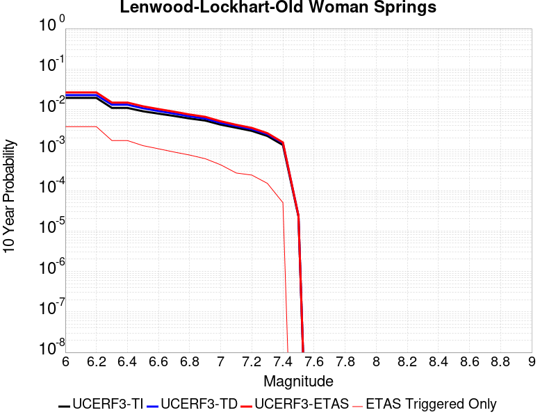 |

| Magnitude | 1 wk TI Prob | 1 wk TD Prob | 1 wk ETAS Prob | 1 wk ETAS/TD Gain | 1 wk ETAS Triggered Only | 1 mo TI Prob | 1 mo TD Prob | 1 mo ETAS Prob | 1 mo ETAS/TD Gain | 1 mo ETAS Triggered Only | 1 yr TI Prob | 1 yr TD Prob | 1 yr ETAS Prob | 1 yr ETAS/TD Gain | 1 yr ETAS Triggered Only | 10 yr TI Prob | 10 yr TD Prob | 10 yr ETAS Prob | 10 yr ETAS/TD Gain | 10 yr ETAS Triggered Only |
|-----|-----|-----|-----|-----|-----|-----|-----|-----|-----|-----|-----|-----|-----|-----|-----|-----|-----|-----|-----|-----|
| 6.0 | 3.744542E-5 | 4.396349E-5 | 0.0011282472 | 25.663279 | 0.0010843314 | 1.604705E-4 | 1.8840231E-4 | 0.0019624284 | 10.41616 | 0.0017743605 | 0.0019519776 | 0.0022915571 | 0.0050945235 | 2.223171 | 0.0028094042 | 0.019349206 | 0.022697281 | 0.026165456 | 1.1528013 | 0.003548721 |
| 6.1 | 3.744542E-5 | 4.396349E-5 | 0.0011282472 | 25.663279 | 0.0010843314 | 1.604705E-4 | 1.8840231E-4 | 0.0019624284 | 10.41616 | 0.0017743605 | 0.0019519776 | 0.0022915571 | 0.0050945235 | 2.223171 | 0.0028094042 | 0.019349206 | 0.022697281 | 0.026165456 | 1.1528013 | 0.003548721 |
| 6.2 | 3.744542E-5 | 4.396349E-5 | 0.0011282472 | 25.663279 | 0.0010843314 | 1.604705E-4 | 1.8840231E-4 | 0.0019624284 | 10.41616 | 0.0017743605 | 0.0019519776 | 0.0022915571 | 0.0050945235 | 2.223171 | 0.0028094042 | 0.019349206 | 0.022697281 | 0.026165456 | 1.1528013 | 0.003548721 |
| 6.3 | 2.1079984E-5 | 2.5354384E-5 | 3.7036018E-4 | 14.607343 | 3.4501453E-4 | 9.0339665E-5 | 1.0865723E-4 | 6.5076404E-4 | 5.9891458 | 5.421657E-4 | 0.0010993304 | 0.0013221189 | 0.0024050167 | 1.8190624 | 0.0010843314 | 0.010939079 | 0.013144747 | 0.014652585 | 1.1147102 | 0.0015279215 |
| 6.4 | 2.1079984E-5 | 2.5354384E-5 | 3.7036018E-4 | 14.607343 | 3.4501453E-4 | 9.0339665E-5 | 1.0865723E-4 | 6.5076404E-4 | 5.9891458 | 5.421657E-4 | 0.0010993304 | 0.0013221189 | 0.0024050167 | 1.8190624 | 0.0010843314 | 0.010939079 | 0.013144747 | 0.014652585 | 1.1147102 | 0.0015279215 |
| 6.5 | 1.7397282E-5 | 2.0663285E-5 | 3.6567068E-4 | 17.696638 | 3.4501453E-4 | 7.455765E-5 | 8.8554E-5 | 4.33538E-4 | 4.895747 | 3.4501453E-4 | 9.073613E-4 | 0.0010776235 | 0.0018653782 | 1.7310113 | 7.8860467E-4 | 0.009036654 | 0.010725273 | 0.011846734 | 1.1045624 | 0.0011336192 |
| 6.6 | 1.52050325E-5 | 1.7680086E-5 | 1.6554084E-4 | 9.363125 | 1.4786338E-4 | 6.51628E-5 | 7.576964E-5 | 2.2362181E-4 | 2.951338 | 1.4786338E-4 | 7.9306826E-4 | 9.221128E-4 | 0.001513021 | 1.6408198 | 5.914535E-4 | 0.007902439 | 0.009183729 | 0.009965091 | 1.0850812 | 7.8860467E-4 |
| 6.7 | 1.332523E-5 | 1.5264379E-5 | 1.631255E-4 | 10.686677 | 1.4786338E-4 | 5.7106878E-5 | 6.541716E-5 | 2.1327086E-4 | 3.260167 | 1.4786338E-4 | 6.950544E-4 | 7.9616875E-4 | 0.0012886543 | 1.6185693 | 4.928779E-4 | 0.006928845 | 0.0079337945 | 0.008618348 | 1.0862833 | 6.9002906E-4 |
| 6.8 | 1.1525329E-5 | 1.3031365E-5 | 1.1160567E-4 | 8.564388 | 9.857558E-5 | 4.9393333E-5 | 5.5847537E-5 | 1.5441762E-4 | 2.7649853 | 9.857558E-5 | 6.011979E-4 | 6.7973585E-4 | 0.0010245158 | 1.5072265 | 3.4501453E-4 | 0.00599574 | 0.0067770192 | 0.0073155104 | 1.0794585 | 5.421657E-4 |
| 6.9 | 1.0253909E-5 | 1.1514835E-5 | 1.10089284E-4 | 9.560648 | 9.857558E-5 | 4.3944583E-5 | 4.934838E-5 | 1.479191E-4 | 2.997446 | 9.857558E-5 | 5.3489394E-4 | 6.006545E-4 | 8.4694545E-4 | 1.4100376 | 2.4643895E-4 | 0.0053360825 | 0.0059906896 | 0.0064316224 | 1.073603 | 4.4359014E-4 |
| 7.0 | 8.104563E-6 | 8.99143E-6 | 1.0756613E-4 | 11.963182 | 9.857558E-5 | 3.4733377E-5 | 3.853415E-5 | 1.3710593E-4 | 3.5580373 | 9.857558E-5 | 4.2279682E-4 | 4.6905465E-4 | 6.6611334E-4 | 1.4201188 | 1.9715117E-4 | 0.0042199334 | 0.0046808943 | 0.005073351 | 1.0838423 | 3.9430233E-4 |
| 7.1 | 6.7986157E-6 | 7.5159796E-6 | 1.06090825E-4 | 14.115368 | 9.857558E-5 | 2.91366E-5 | 3.2210955E-5 | 1.3078336E-4 | 4.0602136 | 9.857558E-5 | 3.5468035E-4 | 3.9209996E-4 | 4.906369E-4 | 1.2513057 | 9.857558E-5 | 0.003541148 | 0.003914298 | 0.004110677 | 1.0501698 | 1.9715117E-4 |
| 7.2 | 5.6893327E-6 | 6.280132E-6 | 1.048551E-4 | 16.69632 | 9.857558E-5 | 2.4382627E-5 | 2.6914584E-5 | 1.2548751E-4 | 4.6624355 | 9.857558E-5 | 2.9681803E-4 | 3.276378E-4 | 4.2618107E-4 | 1.300769 | 9.857558E-5 | 0.002964219 | 0.003271746 | 0.0034682523 | 1.0600616 | 1.9715117E-4 |
| 7.3 | 4.253348E-6 | 4.707075E-6 | 5.3994634E-5 | 11.470953 | 4.928779E-5 | 1.8228506E-5 | 2.017303E-5 | 6.945983E-5 | 3.4432023 | 4.928779E-5 | 2.2190946E-4 | 2.455808E-4 | 2.948565E-4 | 1.2006496 | 4.928779E-5 | 0.00221688 | 0.0024532753 | 0.002502442 | 1.0200413 | 4.928779E-5 |
| 7.4 | 2.5448119E-6 | 2.8520594E-6 | 5.213971E-5 | 18.281425 | 4.928779E-5 | 1.0906291E-5 | 1.2223064E-5 | 6.1510254E-5 | 5.0323105 | 4.928779E-5 | 1.3277601E-4 | 1.4880729E-4 | 1.9808776E-4 | 1.3311696 | 4.928779E-5 | 0.001326967 | 0.0014872387 | 0.0015364531 | 1.0330912 | 4.928779E-5 |
| 7.5 | 4.3706837E-8 | 4.562909E-8 | 4.562909E-8 | 1.0 | 0.0 | 1.8731501E-7 | 1.9555324E-7 | 1.9555324E-7 | 1.0 | 0.0 | 2.2805577E-6 | 2.3808586E-6 | 2.3808586E-6 | 1.0 | 0.0 | 2.2805343E-5 | 2.3808387E-5 | 2.3808387E-5 | 1.0 | 0.0 |

## San Andreas (Mojave N)
*[(top)](#table-of-contents)*

| 1 Week | 1 Month | 1 Year | 10 Year |
|-----|-----|-----|-----|
|  |  |  |  |

| Magnitude | 1 wk TI Prob | 1 wk TD Prob | 1 wk ETAS Prob | 1 wk ETAS/TD Gain | 1 wk ETAS Triggered Only | 1 mo TI Prob | 1 mo TD Prob | 1 mo ETAS Prob | 1 mo ETAS/TD Gain | 1 mo ETAS Triggered Only | 1 yr TI Prob | 1 yr TD Prob | 1 yr ETAS Prob | 1 yr ETAS/TD Gain | 1 yr ETAS Triggered Only | 10 yr TI Prob | 10 yr TD Prob | 10 yr ETAS Prob | 10 yr ETAS/TD Gain | 10 yr ETAS Triggered Only |
|-----|-----|-----|-----|-----|-----|-----|-----|-----|-----|-----|-----|-----|-----|-----|-----|-----|-----|-----|-----|-----|
| 6.0 | 9.877682E-5 | 1.9402112E-4 | 0.0018202027 | 9.381467 | 0.0016264971 | 4.2326056E-4 | 8.312543E-4 | 0.002801127 | 3.3697596 | 0.0019715116 | 0.0051410277 | 0.010073684 | 0.012610831 | 1.2518588 | 0.0025629653 | 0.05023708 | 0.09832245 | 0.10138893 | 1.031188 | 0.0034008576 |
| 6.1 | 9.877682E-5 | 1.9402112E-4 | 0.0018202027 | 9.381467 | 0.0016264971 | 4.2326056E-4 | 8.312543E-4 | 0.002801127 | 3.3697596 | 0.0019715116 | 0.0051410277 | 0.010073684 | 0.012610831 | 1.2518588 | 0.0025629653 | 0.05023708 | 0.09832245 | 0.10138893 | 1.031188 | 0.0034008576 |
| 6.2 | 9.877682E-5 | 1.9402112E-4 | 0.0018202027 | 9.381467 | 0.0016264971 | 4.2326056E-4 | 8.312543E-4 | 0.002801127 | 3.3697596 | 0.0019715116 | 0.0051410277 | 0.010073684 | 0.012610831 | 1.2518588 | 0.0025629653 | 0.05023708 | 0.09832245 | 0.10138893 | 1.031188 | 0.0034008576 |
| 6.3 | 9.877682E-5 | 1.9402112E-4 | 0.0018202027 | 9.381467 | 0.0016264971 | 4.2326056E-4 | 8.312543E-4 | 0.002801127 | 3.3697596 | 0.0019715116 | 0.0051410277 | 0.010073684 | 0.012610831 | 1.2518588 | 0.0025629653 | 0.05023708 | 0.09832245 | 0.10138893 | 1.031188 | 0.0034008576 |
| 6.4 | 9.877682E-5 | 1.9402112E-4 | 0.0018202027 | 9.381467 | 0.0016264971 | 4.2326056E-4 | 8.312543E-4 | 0.002801127 | 3.3697596 | 0.0019715116 | 0.0051410277 | 0.010073684 | 0.012610831 | 1.2518588 | 0.0025629653 | 0.05023708 | 0.09832245 | 0.10138893 | 1.031188 | 0.0034008576 |
| 6.5 | 9.861474E-5 | 1.937588E-4 | 0.0018199407 | 9.392816 | 0.0016264971 | 4.2256617E-4 | 8.3013077E-4 | 0.0028000057 | 3.3729694 | 0.0019715116 | 0.0051326132 | 0.0100601325 | 0.012597314 | 1.2522016 | 0.0025629653 | 0.050156746 | 0.09820035 | 0.10126724 | 1.0312309 | 0.0034008576 |
| 6.6 | 9.861474E-5 | 1.937588E-4 | 0.0018199407 | 9.392816 | 0.0016264971 | 4.2256617E-4 | 8.3013077E-4 | 0.0028000057 | 3.3729694 | 0.0019715116 | 0.0051326132 | 0.0100601325 | 0.012597314 | 1.2522016 | 0.0025629653 | 0.050156746 | 0.09820035 | 0.10126724 | 1.0312309 | 0.0034008576 |
| 6.7 | 9.8552715E-5 | 1.9365833E-4 | 0.0018198405 | 9.397171 | 0.0016264971 | 4.223004E-4 | 8.2970044E-4 | 0.0027995764 | 3.3742013 | 0.0019715116 | 0.0051293927 | 0.010054941 | 0.012592136 | 1.2523332 | 0.0025629653 | 0.050125998 | 0.09815356 | 0.10122061 | 1.0312475 | 0.0034008576 |
| 6.8 | 9.8464974E-5 | 1.9350994E-4 | 0.0018196923 | 9.403611 | 0.0016264971 | 4.219245E-4 | 8.290649E-4 | 0.0027989422 | 3.3760228 | 0.0019715116 | 0.0051248376 | 0.010047276 | 0.01258449 | 1.2525276 | 0.0025629653 | 0.05008251 | 0.09808378 | 0.10115107 | 1.0312722 | 0.0034008576 |
| 6.9 | 9.825824E-5 | 1.9319002E-4 | 0.0018193729 | 9.417531 | 0.0016264971 | 4.2103877E-4 | 8.276947E-4 | 0.0027975745 | 3.3799596 | 0.0019715116 | 0.0051141046 | 0.010030746 | 0.0125680035 | 1.2529479 | 0.0025629653 | 0.049980022 | 0.097932965 | 0.10100076 | 1.0313256 | 0.0034008576 |
| 7.0 | 9.781462E-5 | 1.9250368E-4 | 0.0018186877 | 9.447548 | 0.0016264971 | 4.1913814E-4 | 8.247551E-4 | 0.0027946408 | 3.3884492 | 0.0019715116 | 0.005091073 | 0.009995285 | 0.012532633 | 1.2538544 | 0.0025629653 | 0.04976007 | 0.09760912 | 0.10067803 | 1.0314407 | 0.0034008576 |
| 7.1 | 9.7121134E-5 | 1.9152075E-4 | 0.0018177064 | 9.490911 | 0.0016264971 | 4.1616702E-4 | 8.205452E-4 | 0.0027904392 | 3.4007134 | 0.0019715116 | 0.005055068 | 0.0099444995 | 0.012481977 | 1.2551639 | 0.0025629653 | 0.04941613 | 0.09714571 | 0.10021619 | 1.0316069 | 0.0034008576 |
| 7.2 | 9.663819E-5 | 1.9082859E-4 | 0.0018170153 | 9.521714 | 0.0016264971 | 4.1409794E-4 | 8.175807E-4 | 0.0027874804 | 3.4094255 | 0.0019715116 | 0.0050299936 | 0.009908735 | 0.012446305 | 1.2560942 | 0.0025629653 | 0.049176537 | 0.09681883 | 0.09989042 | 1.0317252 | 0.0034008576 |
| 7.3 | 9.6277574E-5 | 1.9035369E-4 | 0.0018165412 | 9.542979 | 0.0016264971 | 4.125529E-4 | 8.1554666E-4 | 0.0027854505 | 3.4154398 | 0.0019715116 | 0.0050112694 | 0.009884195 | 0.012421828 | 1.2567364 | 0.0025629653 | 0.04899759 | 0.09659228 | 0.09962011 | 1.0313466 | 0.0033515699 |
| 7.4 | 9.593308E-5 | 1.8975153E-4 | 0.00181594 | 9.570094 | 0.0016264971 | 4.1107697E-4 | 8.129676E-4 | 0.0027828764 | 3.4231088 | 0.0019715116 | 0.0049933824 | 0.009853081 | 0.012390792 | 1.2575552 | 0.0025629653 | 0.04882661 | 0.09630986 | 0.09933864 | 1.0314482 | 0.0033515699 |
| 7.5 | 9.561707E-5 | 1.8921228E-4 | 0.0018154016 | 9.594523 | 0.0016264971 | 4.0972308E-4 | 8.106579E-4 | 0.0027805713 | 3.4300182 | 0.0019715116 | 0.0049769743 | 0.009825215 | 0.012362998 | 1.2582929 | 0.0025629653 | 0.048669744 | 0.096056245 | 0.099085875 | 1.0315402 | 0.0033515699 |
| 7.6 | 9.418194E-5 | 1.8573487E-4 | 0.0018119299 | 9.755464 | 0.0016264971 | 4.0357444E-4 | 7.95764E-4 | 0.0027657067 | 3.4755366 | 0.0019715116 | 0.004902454 | 0.009645499 | 0.0121837435 | 1.2631532 | 0.0025629653 | 0.047957025 | 0.094437465 | 0.09747252 | 1.0321382 | 0.0033515699 |
| 7.7 | 8.202141E-5 | 1.6022482E-4 | 0.0016386217 | 10.2270155 | 0.0014786337 | 3.51473E-4 | 6.8649714E-4 | 0.0025088934 | 3.6546307 | 0.0018236482 | 0.00427079 | 0.008326128 | 0.010721122 | 1.2876478 | 0.0024151017 | 0.04189639 | 0.082237914 | 0.085042454 | 1.0341027 | 0.003055843 |
| 7.8 | 7.2859846E-5 | 1.4517571E-4 | 0.001180069 | 8.128557 | 0.0010350436 | 3.1221908E-4 | 6.2203326E-4 | 0.0019027187 | 3.0588696 | 0.0012814826 | 0.003794643 | 0.0075469986 | 0.009210137 | 1.2203708 | 0.0016757849 | 0.037304975 | 0.07472766 | 0.07677987 | 1.0274625 | 0.0022179505 |
| 7.9 | 5.3874453E-5 | 1.00462625E-4 | 5.4400816E-4 | 5.4150305 | 4.4359014E-4 | 2.3087008E-4 | 4.3048308E-4 | 0.0010216819 | 2.3733382 | 5.914535E-4 | 0.0028072202 | 0.0052285474 | 0.005963999 | 1.1406608 | 7.3931686E-4 | 0.02772022 | 0.052425884 | 0.05350007 | 1.0204897 | 0.0011336192 |
| 8.0 | 3.468538E-5 | 5.4261534E-5 | 2.0211689E-4 | 3.7248647 | 1.4786338E-4 | 1.4864317E-4 | 2.3252872E-4 | 3.803577E-4 | 1.635745 | 1.4786338E-4 | 0.0018082283 | 0.0028273636 | 0.002974809 | 1.0521494 | 1.4786338E-4 | 0.017935853 | 0.028948462 | 0.029235628 | 1.0099199 | 2.9572676E-4 |
| 8.1 | 1.9152367E-5 | 1.9401303E-5 | 1.9401303E-5 | 1.0 | 0.0 | 8.207899E-5 | 8.3145795E-5 | 8.3145795E-5 | 1.0 | 0.0 | 9.988535E-4 | 0.0010118305 | 0.0010118305 | 1.0 | 0.0 | 0.009943757 | 0.01085595 | 0.010904703 | 1.0044909 | 4.928779E-5 |
| 8.2 | 8.643924E-6 | 5.473668E-6 | 5.473668E-6 | 1.0 | 0.0 | 3.704486E-5 | 2.3458366E-5 | 2.3458366E-5 | 1.0 | 0.0 | 4.5092785E-4 | 2.8556827E-4 | 2.8556827E-4 | 1.0 | 0.0 | 0.0045001395 | 0.0032481793 | 0.0032481793 | 1.0 | 0.0 |
| 8.3 | 1.983087E-6 | 7.6564595E-7 | 7.6564595E-7 | 1.0 | 0.0 | 8.498917E-6 | 3.281336E-6 | 3.281336E-6 | 1.0 | 0.0 | 1.034694E-4 | 3.9949547E-5 | 3.9949547E-5 | 1.0 | 0.0 | 0.0010342124 | 4.717979E-4 | 4.717979E-4 | 1.0 | 0.0 |

## Nelson Lake
*[(top)](#table-of-contents)*

| 1 Week | 1 Month | 1 Year | 10 Year |
|-----|-----|-----|-----|
|  |  |  | 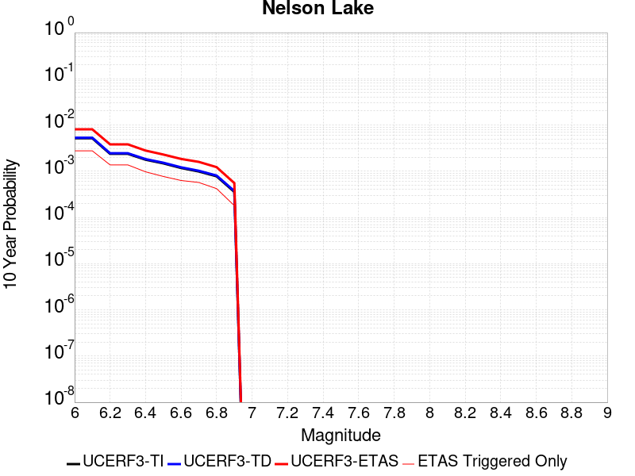 |

| Magnitude | 1 wk TI Prob | 1 wk TD Prob | 1 wk ETAS Prob | 1 wk ETAS/TD Gain | 1 wk ETAS Triggered Only | 1 mo TI Prob | 1 mo TD Prob | 1 mo ETAS Prob | 1 mo ETAS/TD Gain | 1 mo ETAS Triggered Only | 1 yr TI Prob | 1 yr TD Prob | 1 yr ETAS Prob | 1 yr ETAS/TD Gain | 1 yr ETAS Triggered Only | 10 yr TI Prob | 10 yr TD Prob | 10 yr ETAS Prob | 10 yr ETAS/TD Gain | 10 yr ETAS Triggered Only |
|-----|-----|-----|-----|-----|-----|-----|-----|-----|-----|-----|-----|-----|-----|-----|-----|-----|-----|-----|-----|-----|
| 6.0 | 9.913453E-6 | 1.0192255E-5 | 9.4665075E-4 | 92.87942 | 9.36468E-4 | 4.2485535E-5 | 4.3680422E-5 | 0.001472964 | 33.72138 | 0.0014293459 | 5.1713863E-4 | 5.316897E-4 | 0.0026991994 | 5.0766444 | 0.0021686628 | 0.0051593683 | 0.005305204 | 0.00814873 | 1.5359881 | 0.0028586918 |
| 6.1 | 9.913453E-6 | 1.0192255E-5 | 9.4665075E-4 | 92.87942 | 9.36468E-4 | 4.2485535E-5 | 4.3680422E-5 | 0.001472964 | 33.72138 | 0.0014293459 | 5.1713863E-4 | 5.316897E-4 | 0.0026991994 | 5.0766444 | 0.0021686628 | 0.0051593683 | 0.005305204 | 0.00814873 | 1.5359881 | 0.0028586918 |
| 6.2 | 4.5596407E-6 | 4.696313E-6 | 4.975719E-4 | 105.94948 | 4.928779E-4 | 1.954117E-5 | 2.0126909E-5 | 8.580025E-4 | 42.629623 | 8.3789247E-4 | 2.3788778E-4 | 2.4501883E-4 | 0.0013783603 | 5.6255283 | 0.0011336192 | 0.0023763329 | 0.0024476128 | 0.0038734602 | 1.5825461 | 0.0014293459 |
| 6.3 | 4.5596407E-6 | 4.696313E-6 | 4.975719E-4 | 105.94948 | 4.928779E-4 | 1.954117E-5 | 2.0126909E-5 | 8.580025E-4 | 42.629623 | 8.3789247E-4 | 2.3788778E-4 | 2.4501883E-4 | 0.0013783603 | 5.6255283 | 0.0011336192 | 0.0023763329 | 0.0024476128 | 0.0038734602 | 1.5825461 | 0.0014293459 |
| 6.4 | 3.4025713E-6 | 3.5098972E-6 | 3.4852323E-4 | 99.29727 | 3.4501453E-4 | 1.4582367E-5 | 1.5042335E-5 | 4.0933874E-4 | 27.212446 | 3.9430233E-4 | 1.7752586E-4 | 1.8312587E-4 | 8.730286E-4 | 4.767369 | 6.9002906E-4 | 0.001773841 | 0.0018298327 | 0.0027153895 | 1.4839551 | 8.871803E-4 |
| 6.5 | 2.8352947E-6 | 2.927856E-6 | 2.9865373E-4 | 102.00424 | 2.9572676E-4 | 1.2151207E-5 | 1.2547898E-5 | 3.575581E-4 | 28.495457 | 3.4501453E-4 | 1.479309E-4 | 1.5276071E-4 | 7.441238E-4 | 4.8711734 | 5.914535E-4 | 0.0014783246 | 0.0015266308 | 0.0022156064 | 1.4513047 | 6.9002906E-4 |
| 6.6 | 2.251518E-6 | 2.3290677E-6 | 1.9947978E-4 | 85.64791 | 1.9715117E-4 | 9.649328E-6 | 9.981683E-6 | 2.564182E-4 | 25.688871 | 2.4643895E-4 | 1.1747423E-4 | 1.2152085E-4 | 5.6505704E-4 | 4.6498775 | 4.4359014E-4 | 0.0011741214 | 0.0012146058 | 0.0017561129 | 1.4458296 | 5.421657E-4 |
| 6.7 | 1.8911853E-6 | 1.9591396E-6 | 1.4982223E-4 | 76.47348 | 1.4786338E-4 | 8.105055E-6 | 8.39629E-6 | 1.5625842E-4 | 18.610415 | 1.4786338E-4 | 9.867457E-5 | 1.0222061E-4 | 4.4719988E-4 | 4.3748503 | 3.4501453E-4 | 9.863076E-4 | 0.0010217935 | 0.0014156929 | 1.3854982 | 3.9430233E-4 |
| 6.8 | 1.4874814E-6 | 1.5438305E-6 | 1.4940697E-4 | 96.7768 | 1.4786338E-4 | 6.374905E-6 | 6.6164025E-6 | 1.544788E-4 | 23.347855 | 1.4786338E-4 | 7.76117E-5 | 8.055224E-5 | 4.2553898E-4 | 5.28277 | 3.4501453E-4 | 7.75846E-4 | 8.0528157E-4 | 0.0011500183 | 1.4280946 | 3.4501453E-4 |
| 6.9 | 6.835972E-7 | 7.1399285E-7 | 9.928951E-5 | 139.06233 | 9.857558E-5 | 2.9296991E-6 | 3.0599674E-6 | 1.0163525E-4 | 33.214485 | 9.857558E-5 | 3.56685E-5 | 3.7254784E-5 | 1.3582669E-4 | 3.645886 | 9.857558E-5 | 3.5662777E-4 | 3.7251666E-4 | 4.710555E-4 | 1.2645221 | 9.857558E-5 |

## Towne Pass
*[(top)](#table-of-contents)*

| 1 Week | 1 Month | 1 Year | 10 Year |
|-----|-----|-----|-----|
|  |  |  |  |

| Magnitude | 1 wk TI Prob | 1 wk TD Prob | 1 wk ETAS Prob | 1 wk ETAS/TD Gain | 1 wk ETAS Triggered Only | 1 mo TI Prob | 1 mo TD Prob | 1 mo ETAS Prob | 1 mo ETAS/TD Gain | 1 mo ETAS Triggered Only | 1 yr TI Prob | 1 yr TD Prob | 1 yr ETAS Prob | 1 yr ETAS/TD Gain | 1 yr ETAS Triggered Only | 10 yr TI Prob | 10 yr TD Prob | 10 yr ETAS Prob | 10 yr ETAS/TD Gain | 10 yr ETAS Triggered Only |
|-----|-----|-----|-----|-----|-----|-----|-----|-----|-----|-----|-----|-----|-----|-----|-----|-----|-----|-----|-----|-----|
| 6.0 | 3.849728E-6 | 3.894542E-6 | 6.9392094E-4 | 178.17781 | 6.9002906E-4 | 1.649873E-5 | 1.6690812E-5 | 9.5314323E-4 | 57.10586 | 9.36468E-4 | 2.0085352E-4 | 2.0319606E-4 | 0.0016815293 | 8.275403 | 0.0014786337 | 0.0020067208 | 0.0020305319 | 0.0043423544 | 2.1385305 | 0.0023165261 |
| 6.1 | 3.849728E-6 | 3.894542E-6 | 6.9392094E-4 | 178.17781 | 6.9002906E-4 | 1.649873E-5 | 1.6690812E-5 | 9.5314323E-4 | 57.10586 | 9.36468E-4 | 2.0085352E-4 | 2.0319606E-4 | 0.0016815293 | 8.275403 | 0.0014786337 | 0.0020067208 | 0.0020305319 | 0.0043423544 | 2.1385305 | 0.0023165261 |
| 6.2 | 3.849728E-6 | 3.894542E-6 | 6.9392094E-4 | 178.17781 | 6.9002906E-4 | 1.649873E-5 | 1.6690812E-5 | 9.5314323E-4 | 57.10586 | 9.36468E-4 | 2.0085352E-4 | 2.0319606E-4 | 0.0016815293 | 8.275403 | 0.0014786337 | 0.0020067208 | 0.0020305319 | 0.0043423544 | 2.1385305 | 0.0023165261 |
| 6.3 | 3.849728E-6 | 3.894542E-6 | 6.9392094E-4 | 178.17781 | 6.9002906E-4 | 1.649873E-5 | 1.6690812E-5 | 9.5314323E-4 | 57.10586 | 9.36468E-4 | 2.0085352E-4 | 2.0319606E-4 | 0.0016815293 | 8.275403 | 0.0014786337 | 0.0020067208 | 0.0020305319 | 0.0043423544 | 2.1385305 | 0.0023165261 |
| 6.4 | 3.849728E-6 | 3.894542E-6 | 6.9392094E-4 | 178.17781 | 6.9002906E-4 | 1.649873E-5 | 1.6690812E-5 | 9.5314323E-4 | 57.10586 | 9.36468E-4 | 2.0085352E-4 | 2.0319606E-4 | 0.0016815293 | 8.275403 | 0.0014786337 | 0.0020067208 | 0.0020305319 | 0.0043423544 | 2.1385305 | 0.0023165261 |
| 6.5 | 1.1953545E-6 | 1.2030526E-6 | 1.2030526E-6 | 1.0 | 0.0 | 5.1229376E-6 | 5.15593E-6 | 5.15593E-6 | 1.0 | 0.0 | 6.236998E-5 | 6.277176E-5 | 2.5991056E-4 | 4.140565 | 1.9715117E-4 | 6.235248E-4 | 6.2755204E-4 | 0.0011201206 | 1.7849048 | 4.928779E-4 |
| 6.6 | 1.1953545E-6 | 1.2030526E-6 | 1.2030526E-6 | 1.0 | 0.0 | 5.1229376E-6 | 5.15593E-6 | 5.15593E-6 | 1.0 | 0.0 | 6.236998E-5 | 6.277176E-5 | 2.5991056E-4 | 4.140565 | 1.9715117E-4 | 6.235248E-4 | 6.2755204E-4 | 0.0011201206 | 1.7849048 | 4.928779E-4 |
| 6.7 | 8.375951E-7 | 8.410676E-7 | 8.410676E-7 | 1.0 | 0.0 | 3.5896885E-6 | 3.6045708E-6 | 3.6045708E-6 | 1.0 | 0.0 | 4.370358E-5 | 4.3884826E-5 | 1.4245608E-4 | 3.2461355 | 9.857558E-5 | 4.3694986E-4 | 4.3876728E-4 | 6.850981E-4 | 1.5614157 | 2.4643895E-4 |
| 6.8 | 6.38041E-7 | 6.3921624E-7 | 6.3921624E-7 | 1.0 | 0.0 | 2.7344586E-6 | 2.7394954E-6 | 2.7394954E-6 | 1.0 | 0.0 | 3.3291526E-5 | 3.3352884E-5 | 8.263903E-5 | 2.4777176 | 4.928779E-5 | 3.3286537E-4 | 3.334826E-4 | 4.8129668E-4 | 1.4432437 | 1.4786338E-4 |
| 6.9 | 5.3460053E-7 | 5.345339E-7 | 5.345339E-7 | 1.0 | 0.0 | 2.2911431E-6 | 2.2908578E-6 | 2.2908578E-6 | 1.0 | 0.0 | 2.789431E-5 | 2.7890868E-5 | 2.7890868E-5 | 1.0 | 0.0 | 2.789081E-4 | 2.78877E-4 | 3.2815104E-4 | 1.1766874 | 4.928779E-5 |
| 7.0 | 3.557783E-7 | 3.5324283E-7 | 3.5324283E-7 | 1.0 | 0.0 | 1.5247632E-6 | 1.513897E-6 | 1.513897E-6 | 1.0 | 0.0 | 1.8563835E-5 | 1.8431549E-5 | 1.8431549E-5 | 1.0 | 0.0 | 1.8562283E-4 | 1.8430105E-4 | 2.3357976E-4 | 1.2673815 | 4.928779E-5 |
| 7.1 | 3.037942E-7 | 3.0002275E-7 | 3.0002275E-7 | 1.0 | 0.0 | 1.3019744E-6 | 1.2858112E-6 | 1.2858112E-6 | 1.0 | 0.0 | 1.5851423E-5 | 1.5654647E-5 | 1.5654647E-5 | 1.0 | 0.0 | 1.5850292E-4 | 1.5653619E-4 | 2.0581626E-4 | 1.3148159 | 4.928779E-5 |
| 7.2 | 2.0808248E-7 | 2.0217735E-7 | 2.0217735E-7 | 1.0 | 0.0 | 8.917818E-7 | 8.6647407E-7 | 8.6647407E-7 | 1.0 | 0.0 | 1.0857389E-5 | 1.0549275E-5 | 1.0549275E-5 | 1.0 | 0.0 | 1.0856859E-4 | 1.0548821E-4 | 1.547708E-4 | 1.4671857 | 4.928779E-5 |
| 7.3 | 1.1162073E-7 | 1.0636902E-7 | 1.0636902E-7 | 1.0 | 0.0 | 4.7837443E-7 | 4.5586717E-7 | 4.5586717E-7 | 1.0 | 0.0 | 5.8241935E-6 | 5.5501705E-6 | 5.5501705E-6 | 1.0 | 0.0 | 5.8240406E-5 | 5.550052E-5 | 1.0478558E-4 | 1.8880107 | 4.928779E-5 |

## Paradise
*[(top)](#table-of-contents)*

| 1 Week | 1 Month | 1 Year | 10 Year |
|-----|-----|-----|-----|
|  |  |  |  |

| Magnitude | 1 wk TI Prob | 1 wk TD Prob | 1 wk ETAS Prob | 1 wk ETAS/TD Gain | 1 wk ETAS Triggered Only | 1 mo TI Prob | 1 mo TD Prob | 1 mo ETAS Prob | 1 mo ETAS/TD Gain | 1 mo ETAS Triggered Only | 1 yr TI Prob | 1 yr TD Prob | 1 yr ETAS Prob | 1 yr ETAS/TD Gain | 1 yr ETAS Triggered Only | 10 yr TI Prob | 10 yr TD Prob | 10 yr ETAS Prob | 10 yr ETAS/TD Gain | 10 yr ETAS Triggered Only |
|-----|-----|-----|-----|-----|-----|-----|-----|-----|-----|-----|-----|-----|-----|-----|-----|-----|-----|-----|-----|-----|
| 6.0 | 1.4851273E-5 | 1.6694768E-5 | 5.095645E-4 | 30.522402 | 4.928779E-4 | 6.364676E-5 | 7.154718E-5 | 8.108112E-4 | 11.332539 | 7.3931686E-4 | 7.7462377E-4 | 8.707624E-4 | 0.0021018842 | 2.4138436 | 0.0012321948 | 0.0077192914 | 0.008675884 | 0.010581431 | 1.2196372 | 0.0019222238 |
| 6.1 | 1.4851273E-5 | 1.6694768E-5 | 5.095645E-4 | 30.522402 | 4.928779E-4 | 6.364676E-5 | 7.154718E-5 | 8.108112E-4 | 11.332539 | 7.3931686E-4 | 7.7462377E-4 | 8.707624E-4 | 0.0021018842 | 2.4138436 | 0.0012321948 | 0.0077192914 | 0.008675884 | 0.010581431 | 1.2196372 | 0.0019222238 |
| 6.2 | 1.4851273E-5 | 1.6694768E-5 | 5.095645E-4 | 30.522402 | 4.928779E-4 | 6.364676E-5 | 7.154718E-5 | 8.108112E-4 | 11.332539 | 7.3931686E-4 | 7.7462377E-4 | 8.707624E-4 | 0.0021018842 | 2.4138436 | 0.0012321948 | 0.0077192914 | 0.008675884 | 0.010581431 | 1.2196372 | 0.0019222238 |
| 6.3 | 1.0426831E-5 | 1.1888697E-5 | 3.0761192E-4 | 25.874317 | 2.9572676E-4 | 4.4685654E-5 | 5.09506E-5 | 5.438034E-4 | 10.67315 | 4.928779E-4 | 5.43912E-4 | 6.201529E-4 | 0.0013590113 | 2.1914132 | 7.3931686E-4 | 0.0054258266 | 0.0061848317 | 0.0074094054 | 1.1979963 | 0.0012321948 |
| 6.4 | 1.0426831E-5 | 1.1888697E-5 | 3.0761192E-4 | 25.874317 | 2.9572676E-4 | 4.4685654E-5 | 5.09506E-5 | 5.438034E-4 | 10.67315 | 4.928779E-4 | 5.43912E-4 | 6.201529E-4 | 0.0013590113 | 2.1914132 | 7.3931686E-4 | 0.0054258266 | 0.0061848317 | 0.0074094054 | 1.1979963 | 0.0012321948 |
| 6.5 | 9.25027E-6 | 1.0620037E-5 | 2.5705638E-4 | 24.204847 | 2.4643895E-4 | 3.964341E-5 | 4.551368E-5 | 4.3979805E-4 | 9.662987 | 3.9430233E-4 | 4.8255164E-4 | 5.5399304E-4 | 0.0011451188 | 2.0670276 | 5.914535E-4 | 0.0048150513 | 0.0055266195 | 0.0065069273 | 1.1773793 | 9.857558E-4 |
| 6.6 | 7.904275E-6 | 9.159602E-6 | 1.0773428E-4 | 11.761895 | 9.857558E-5 | 3.3875025E-5 | 3.925487E-5 | 1.3782659E-4 | 3.5110695 | 9.857558E-5 | 4.1235037E-4 | 4.7782718E-4 | 6.748841E-4 | 1.4124022 | 1.9715117E-4 | 0.0041158604 | 0.004768395 | 0.0052098697 | 1.0925835 | 4.4359014E-4 |
| 6.7 | 7.2061953E-6 | 8.407326E-6 | 5.7694702E-5 | 6.862432 | 4.928779E-5 | 3.088333E-5 | 3.603092E-5 | 8.531693E-5 | 2.367881 | 4.928779E-5 | 3.7593965E-4 | 4.3859181E-4 | 5.371242E-4 | 1.2246561 | 9.857558E-5 | 0.003753043 | 0.004377631 | 0.0047211354 | 1.0784681 | 3.4501453E-4 |
| 6.8 | 6.6948724E-6 | 7.842242E-6 | 7.842242E-6 | 1.0 | 0.0 | 2.8691995E-5 | 3.3609194E-5 | 3.3609194E-5 | 1.0 | 0.0 | 3.4926904E-4 | 4.091187E-4 | 4.5838632E-4 | 1.1204238 | 4.928779E-5 | 0.003487206 | 0.0040840125 | 0.0043785316 | 1.0721151 | 2.9572676E-4 |
| 6.9 | 6.0421025E-6 | 7.1306963E-6 | 7.1306963E-6 | 1.0 | 0.0 | 2.5894467E-5 | 3.0559786E-5 | 3.0559786E-5 | 1.0 | 0.0 | 3.1521954E-4 | 3.7200528E-4 | 3.7200528E-4 | 1.0 | 0.0 | 0.0031477278 | 0.0037141638 | 0.0038123734 | 1.0264419 | 9.857558E-5 |
| 7.0 | 4.134091E-6 | 5.0803824E-6 | 5.0803824E-6 | 1.0 | 0.0 | 1.7717413E-5 | 2.1772896E-5 | 2.1772896E-5 | 1.0 | 0.0 | 2.1568815E-4 | 2.650543E-4 | 2.650543E-4 | 1.0 | 0.0 | 0.0021547892 | 0.0026475347 | 0.002696692 | 1.0185672 | 4.928779E-5 |
| 7.1 | 3.7674888E-6 | 4.631936E-6 | 4.631936E-6 | 1.0 | 0.0 | 1.6146281E-5 | 1.9851012E-5 | 1.9851012E-5 | 1.0 | 0.0 | 1.9656324E-4 | 2.4166079E-4 | 2.4166079E-4 | 1.0 | 0.0 | 0.0019638946 | 0.0024141306 | 0.0024632993 | 1.020367 | 4.928779E-5 |
| 7.2 | 3.4065345E-6 | 4.156782E-6 | 4.156782E-6 | 1.0 | 0.0 | 1.4599351E-5 | 1.7814667E-5 | 1.7814667E-5 | 1.0 | 0.0 | 1.777326E-4 | 2.168735E-4 | 2.168735E-4 | 1.0 | 0.0 | 0.0017759053 | 0.0021667667 | 0.0022159475 | 1.0226979 | 4.928779E-5 |
| 7.3 | 2.9934936E-6 | 3.6293673E-6 | 3.6293673E-6 | 1.0 | 0.0 | 1.2829195E-5 | 1.5554348E-5 | 1.5554348E-5 | 1.0 | 0.0 | 1.5618425E-4 | 1.8935918E-4 | 1.8935918E-4 | 1.0 | 0.0 | 0.0015607453 | 0.0018921237 | 0.0019413183 | 1.0259997 | 4.928779E-5 |
| 7.4 | 2.4049796E-6 | 2.8890186E-6 | 2.8890186E-6 | 1.0 | 0.0 | 1.0307015E-5 | 1.2381457E-5 | 1.2381457E-5 | 1.0 | 0.0 | 1.2548068E-4 | 1.5073526E-4 | 1.5073526E-4 | 1.0 | 0.0 | 0.0012540985 | 0.0015064715 | 0.0015556851 | 1.0326681 | 4.928779E-5 |
| 7.5 | 1.2710091E-6 | 1.5134859E-6 | 1.5134859E-6 | 1.0 | 0.0 | 5.44717E-6 | 6.4863593E-6 | 6.4863593E-6 | 1.0 | 0.0 | 6.631728E-5 | 7.896981E-5 | 7.896981E-5 | 1.0 | 0.0 | 6.6297496E-4 | 7.895401E-4 | 8.38789E-4 | 1.0623766 | 4.928779E-5 |
| 7.6 | 2.21172E-7 | 2.6040198E-7 | 2.6040198E-7 | 1.0 | 0.0 | 9.478797E-7 | 1.1160082E-6 | 1.1160082E-6 | 1.0 | 0.0 | 1.1540374E-5 | 1.3587343E-5 | 1.3587343E-5 | 1.0 | 0.0 | 1.1539775E-4 | 1.3586794E-4 | 1.3586794E-4 | 1.0 | 0.0 |

## San Andreas (San Bernardino N)
*[(top)](#table-of-contents)*

| 1 Week | 1 Month | 1 Year | 10 Year |
|-----|-----|-----|-----|
|  |  |  |  |

| Magnitude | 1 wk TI Prob | 1 wk TD Prob | 1 wk ETAS Prob | 1 wk ETAS/TD Gain | 1 wk ETAS Triggered Only | 1 mo TI Prob | 1 mo TD Prob | 1 mo ETAS Prob | 1 mo ETAS/TD Gain | 1 mo ETAS Triggered Only | 1 yr TI Prob | 1 yr TD Prob | 1 yr ETAS Prob | 1 yr ETAS/TD Gain | 1 yr ETAS Triggered Only | 10 yr TI Prob | 10 yr TD Prob | 10 yr ETAS Prob | 10 yr ETAS/TD Gain | 10 yr ETAS Triggered Only |
|-----|-----|-----|-----|-----|-----|-----|-----|-----|-----|-----|-----|-----|-----|-----|-----|-----|-----|-----|-----|-----|
| 6.0 | 1.4273766E-4 | 3.160784E-4 | 0.0011044338 | 3.4941766 | 7.8860467E-4 | 6.115894E-4 | 0.0013539245 | 0.0023383456 | 1.7270873 | 9.857558E-4 | 0.0074207084 | 0.016360939 | 0.017621456 | 1.0770442 | 0.0012814826 | 0.07177748 | 0.15021163 | 0.15171945 | 1.010038 | 0.0017743605 |
| 6.1 | 1.4273766E-4 | 3.160784E-4 | 0.0011044338 | 3.4941766 | 7.8860467E-4 | 6.115894E-4 | 0.0013539245 | 0.0023383456 | 1.7270873 | 9.857558E-4 | 0.0074207084 | 0.016360939 | 0.017621456 | 1.0770442 | 0.0012814826 | 0.07177748 | 0.15021163 | 0.15171945 | 1.010038 | 0.0017743605 |
| 6.2 | 1.4273766E-4 | 3.160784E-4 | 0.0011044338 | 3.4941766 | 7.8860467E-4 | 6.115894E-4 | 0.0013539245 | 0.0023383456 | 1.7270873 | 9.857558E-4 | 0.0074207084 | 0.016360939 | 0.017621456 | 1.0770442 | 0.0012814826 | 0.07177748 | 0.15021163 | 0.15171945 | 1.010038 | 0.0017743605 |
| 6.3 | 1.3730655E-4 | 3.0512668E-4 | 0.001044218 | 3.422244 | 7.3931686E-4 | 5.883239E-4 | 0.001307036 | 0.0022422802 | 1.7155457 | 9.36468E-4 | 0.0071393442 | 0.015798455 | 0.017011184 | 1.0767624 | 0.0012321948 | 0.06914291 | 0.1455135 | 0.14698756 | 1.01013 | 0.0017250727 |
| 6.4 | 1.3730655E-4 | 3.0512668E-4 | 0.001044218 | 3.422244 | 7.3931686E-4 | 5.883239E-4 | 0.001307036 | 0.0022422802 | 1.7155457 | 9.36468E-4 | 0.0071393442 | 0.015798455 | 0.017011184 | 1.0767624 | 0.0012321948 | 0.06914291 | 0.1455135 | 0.14698756 | 1.01013 | 0.0017250727 |
| 6.5 | 1.2942807E-4 | 2.8927144E-4 | 0.0010283744 | 3.55505 | 7.3931686E-4 | 5.545738E-4 | 0.0012391509 | 0.0021744585 | 1.7547972 | 9.36468E-4 | 0.0067310524 | 0.014983548 | 0.01619728 | 1.0810044 | 0.0012321948 | 0.06530788 | 0.13865088 | 0.14013676 | 1.0107168 | 0.0017250727 |
| 6.6 | 1.1125901E-4 | 2.5365927E-4 | 9.435133E-4 | 3.7196093 | 6.9002906E-4 | 4.767372E-4 | 0.0010866605 | 0.0019728767 | 1.815541 | 8.871803E-4 | 0.005788839 | 0.0131504685 | 0.01431782 | 1.0887688 | 0.001182907 | 0.056403454 | 0.12300496 | 0.12443139 | 1.0115966 | 0.0016264971 |
| 6.7 | 1.02209575E-4 | 2.3500937E-4 | 9.248763E-4 | 3.9354868 | 6.9002906E-4 | 4.3796748E-4 | 0.0010067957 | 0.0018930828 | 1.8803048 | 8.871803E-4 | 0.0053192247 | 0.012189267 | 0.013357755 | 1.095862 | 0.001182907 | 0.051936906 | 0.114792764 | 0.11623255 | 1.0125425 | 0.0016264971 |
| 6.8 | 9.610582E-5 | 2.2026796E-4 | 9.1014506E-4 | 4.1319904 | 6.9002906E-4 | 4.1181705E-4 | 9.436647E-4 | 0.0018300078 | 1.9392563 | 8.871803E-4 | 0.0050023515 | 0.011428859 | 0.012598247 | 1.1023189 | 0.001182907 | 0.048912346 | 0.10820469 | 0.109655194 | 1.0134052 | 0.0016264971 |
| 6.9 | 9.3877505E-5 | 2.1482339E-4 | 9.0470427E-4 | 4.211386 | 6.9002906E-4 | 4.0227012E-4 | 9.203475E-4 | 0.0018067112 | 1.963075 | 8.871803E-4 | 0.0048866454 | 0.011147907 | 0.012317627 | 1.1049273 | 0.001182907 | 0.04780577 | 0.105798274 | 0.10725269 | 1.0137471 | 0.0016264971 |
| 7.0 | 9.1019785E-5 | 2.0809306E-4 | 8.9797855E-4 | 4.315274 | 6.9002906E-4 | 3.900265E-4 | 8.915232E-4 | 0.0017779125 | 1.9942415 | 8.871803E-4 | 0.0047382377 | 0.0108004995 | 0.011970631 | 1.1083405 | 0.001182907 | 0.046384744 | 0.10276815 | 0.1042275 | 1.0142003 | 0.0016264971 |
| 7.1 | 8.771155E-5 | 1.9983841E-4 | 8.897296E-4 | 4.452245 | 6.9002906E-4 | 3.758525E-4 | 8.5616973E-4 | 0.0017425905 | 2.035333 | 8.871803E-4 | 0.0045664064 | 0.010374243 | 0.011544879 | 1.1128405 | 0.001182907 | 0.044737056 | 0.09907644 | 0.10054179 | 1.01479 | 0.0016264971 |
| 7.2 | 8.0830236E-5 | 1.8389444E-4 | 8.7379664E-4 | 4.751621 | 6.9002906E-4 | 3.4636928E-4 | 7.8788114E-4 | 0.0016251134 | 2.0626378 | 8.3789247E-4 | 0.0042088944 | 0.009550368 | 0.010673162 | 1.1175654 | 0.0011336192 | 0.041300658 | 0.09180518 | 0.09319284 | 1.0151151 | 0.0015279215 |
| 7.3 | 7.7668235E-5 | 1.7333007E-4 | 8.632396E-4 | 4.980322 | 6.9002906E-4 | 3.328214E-4 | 7.426318E-4 | 0.001579902 | 2.1274366 | 8.3789247E-4 | 0.0040445733 | 0.009004138 | 0.01012755 | 1.1247662 | 0.0011336192 | 0.03971748 | 0.08706761 | 0.0884625 | 1.0160208 | 0.0015279215 |
| 7.4 | 7.520177E-5 | 1.655312E-4 | 8.5544604E-4 | 5.1678843 | 6.9002906E-4 | 3.2225347E-4 | 7.092266E-4 | 0.0015465248 | 2.1805792 | 8.3789247E-4 | 0.0039163795 | 0.008600714 | 0.009724583 | 1.1306716 | 0.0011336192 | 0.038480744 | 0.08352157 | 0.084921874 | 1.0167658 | 0.0015279215 |
| 7.5 | 7.274697E-5 | 1.584075E-4 | 8.483273E-4 | 5.3553476 | 6.9002906E-4 | 3.1173544E-4 | 6.7871273E-4 | 0.0015160365 | 2.2336938 | 8.3789247E-4 | 0.003788775 | 0.008232076 | 0.009356363 | 1.1365739 | 0.0011336192 | 0.03724827 | 0.08023654 | 0.08164187 | 1.0175148 | 0.0015279215 |
| 7.6 | 7.1185845E-5 | 1.5410586E-4 | 8.440286E-4 | 5.4769406 | 6.9002906E-4 | 3.0504653E-4 | 6.602866E-4 | 0.0014976257 | 2.268145 | 8.3789247E-4 | 0.0037076178 | 0.0080094095 | 0.009133949 | 1.1404023 | 0.0011336192 | 0.036463667 | 0.07822661 | 0.07963501 | 1.0180041 | 0.0015279215 |
| 7.7 | 6.709961E-5 | 1.4319421E-4 | 8.331245E-4 | 5.8181434 | 6.9002906E-4 | 2.8753807E-4 | 6.135452E-4 | 0.0014509235 | 2.3648193 | 8.3789247E-4 | 0.003495157 | 0.0074443663 | 0.008569546 | 1.1511452 | 0.0011336192 | 0.034406938 | 0.07305558 | 0.074471876 | 1.0193865 | 0.0015279215 |
| 7.8 | 6.300812E-5 | 1.320343E-4 | 8.2197227E-4 | 6.225445 | 6.9002906E-4 | 2.7000686E-4 | 5.657386E-4 | 0.001403157 | 2.4802215 | 8.3789247E-4 | 0.0032823787 | 0.006866143 | 0.007991979 | 1.1639692 | 0.0011336192 | 0.032343175 | 0.06771385 | 0.0691383 | 1.0210365 | 0.0015279215 |
| 7.9 | 4.983037E-5 | 9.7241085E-5 | 5.4078805E-4 | 5.5613127 | 4.4359014E-4 | 2.1354125E-4 | 4.1668097E-4 | 0.001007888 | 2.4188483 | 5.914535E-4 | 0.0025967648 | 0.0050613005 | 0.0057968753 | 1.1453332 | 7.3931686E-4 | 0.025666296 | 0.050650507 | 0.05172671 | 1.0212476 | 0.0011336192 |
| 8.0 | 3.2211527E-5 | 5.3306234E-5 | 2.0116172E-4 | 3.7737 | 1.4786338E-4 | 1.380421E-4 | 2.2843528E-4 | 3.7626488E-4 | 1.6471399 | 1.4786338E-4 | 0.0016793669 | 0.0027776542 | 0.002925107 | 1.0530853 | 1.4786338E-4 | 0.016667323 | 0.028362568 | 0.028649908 | 1.0101309 | 2.9572676E-4 |
| 8.1 | 1.743376E-5 | 1.8823403E-5 | 1.8823403E-5 | 1.0 | 0.0 | 7.471398E-5 | 8.066923E-5 | 8.066923E-5 | 1.0 | 0.0 | 9.0926304E-4 | 9.81706E-4 | 9.81706E-4 | 1.0 | 0.0 | 0.009055517 | 0.010483979 | 0.010532751 | 1.0046519 | 4.928779E-5 |
| 8.2 | 7.831616E-6 | 5.1540533E-6 | 5.1540533E-6 | 1.0 | 0.0 | 3.3563636E-5 | 2.2088612E-5 | 2.2088612E-5 | 1.0 | 0.0 | 4.0856065E-4 | 2.6889573E-4 | 2.6889573E-4 | 1.0 | 0.0 | 0.004078103 | 0.0030413668 | 0.0030413668 | 1.0 | 0.0 |
| 8.3 | 1.983087E-6 | 7.6564595E-7 | 7.6564595E-7 | 1.0 | 0.0 | 8.498917E-6 | 3.281336E-6 | 3.281336E-6 | 1.0 | 0.0 | 1.034694E-4 | 3.9949547E-5 | 3.9949547E-5 | 1.0 | 0.0 | 0.0010342124 | 4.717979E-4 | 4.717979E-4 | 1.0 | 0.0 |

## Bicycle Lake
*[(top)](#table-of-contents)*

| 1 Week | 1 Month | 1 Year | 10 Year |
|-----|-----|-----|-----|
|  | 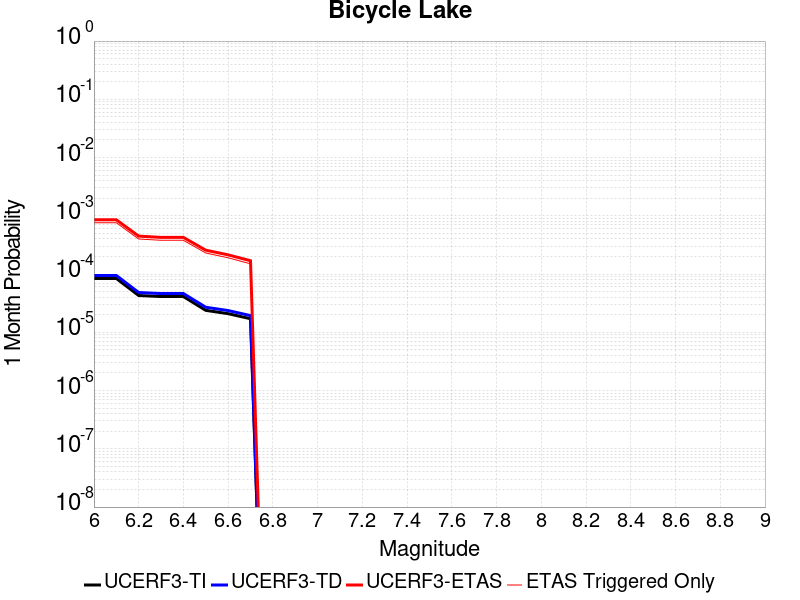 |  |  |

| Magnitude | 1 wk TI Prob | 1 wk TD Prob | 1 wk ETAS Prob | 1 wk ETAS/TD Gain | 1 wk ETAS Triggered Only | 1 mo TI Prob | 1 mo TD Prob | 1 mo ETAS Prob | 1 mo ETAS/TD Gain | 1 mo ETAS Triggered Only | 1 yr TI Prob | 1 yr TD Prob | 1 yr ETAS Prob | 1 yr ETAS/TD Gain | 1 yr ETAS Triggered Only | 10 yr TI Prob | 10 yr TD Prob | 10 yr ETAS Prob | 10 yr ETAS/TD Gain | 10 yr ETAS Triggered Only |
|-----|-----|-----|-----|-----|-----|-----|-----|-----|-----|-----|-----|-----|-----|-----|-----|-----|-----|-----|-----|-----|
| 6.0 | 1.9621975E-5 | 2.2097078E-5 | 4.656774E-4 | 21.074162 | 4.4359014E-4 | 8.4091465E-5 | 9.4699084E-5 | 8.3394593E-4 | 8.8062725 | 7.3931686E-4 | 0.0010233327 | 0.0011524865 | 0.0021371064 | 1.8543439 | 9.857558E-4 | 0.01018633 | 0.011478408 | 0.012988792 | 1.1315848 | 0.0015279215 |
| 6.1 | 1.9621975E-5 | 2.2097078E-5 | 4.656774E-4 | 21.074162 | 4.4359014E-4 | 8.4091465E-5 | 9.4699084E-5 | 8.3394593E-4 | 8.8062725 | 7.3931686E-4 | 0.0010233327 | 0.0011524865 | 0.0021371064 | 1.8543439 | 9.857558E-4 | 0.01018633 | 0.011478408 | 0.012988792 | 1.1315848 | 0.0015279215 |
| 6.2 | 9.9971285E-6 | 1.125564E-5 | 3.0697905E-4 | 27.273355 | 2.9572676E-4 | 4.2844134E-5 | 4.8237856E-5 | 5.41092E-4 | 11.217165 | 4.928779E-4 | 5.2150246E-4 | 5.871897E-4 | 0.0012768136 | 2.1744483 | 6.9002906E-4 | 0.0052028033 | 0.005861487 | 0.00703746 | 1.2006272 | 0.001182907 |
| 6.3 | 9.589428E-6 | 1.0798346E-5 | 3.065219E-4 | 28.386003 | 2.9572676E-4 | 4.10969E-5 | 4.62781E-5 | 5.391332E-4 | 11.649857 | 4.928779E-4 | 5.002399E-4 | 5.6334207E-4 | 0.0012529824 | 2.2241948 | 6.9002906E-4 | 0.0049911533 | 0.0056242296 | 0.006751473 | 1.2004263 | 0.0011336192 |
| 6.4 | 9.589428E-6 | 1.0798346E-5 | 3.065219E-4 | 28.386003 | 2.9572676E-4 | 4.10969E-5 | 4.62781E-5 | 5.391332E-4 | 11.649857 | 4.928779E-4 | 5.002399E-4 | 5.6334207E-4 | 0.0012529824 | 2.2241948 | 6.9002906E-4 | 0.0049911533 | 0.0056242296 | 0.006751473 | 1.2004263 | 0.0011336192 |
| 6.5 | 5.557707E-6 | 6.2856016E-6 | 1.5414805E-4 | 24.523993 | 1.4786338E-4 | 2.3818526E-5 | 2.6938165E-5 | 2.2408403E-4 | 8.318459 | 1.9715117E-4 | 2.8995197E-4 | 3.279497E-4 | 6.728511E-4 | 2.0516899 | 3.4501453E-4 | 0.0028957394 | 0.0032772934 | 0.003915935 | 1.1948686 | 6.407413E-4 |
| 6.6 | 4.8742945E-6 | 5.5132896E-6 | 1.5337585E-4 | 27.819298 | 1.4786338E-4 | 2.0889667E-5 | 2.3628318E-5 | 2.2077482E-4 | 9.343654 | 1.9715117E-4 | 2.54302E-4 | 2.87663E-4 | 6.325783E-4 | 2.1990256 | 3.4501453E-4 | 0.002540112 | 0.0028754752 | 0.003416082 | 1.188006 | 5.421657E-4 |
| 6.7 | 3.991108E-6 | 4.5159104E-6 | 1.5237862E-4 | 33.742615 | 1.4786338E-4 | 1.7104636E-5 | 1.9353902E-5 | 2.1650126E-4 | 11.1864395 | 1.9715117E-4 | 2.0822904E-4 | 2.3563375E-4 | 5.80567E-4 | 2.4638534 | 3.4501453E-4 | 0.0020803404 | 0.0023563374 | 0.002848054 | 1.2086784 | 4.928779E-4 |

## Death Valley (Black Mtns Frontal)
*[(top)](#table-of-contents)*

| 1 Week | 1 Month | 1 Year | 10 Year |
|-----|-----|-----|-----|
|  |  |  |  |

| Magnitude | 1 wk TI Prob | 1 wk TD Prob | 1 wk ETAS Prob | 1 wk ETAS/TD Gain | 1 wk ETAS Triggered Only | 1 mo TI Prob | 1 mo TD Prob | 1 mo ETAS Prob | 1 mo ETAS/TD Gain | 1 mo ETAS Triggered Only | 1 yr TI Prob | 1 yr TD Prob | 1 yr ETAS Prob | 1 yr ETAS/TD Gain | 1 yr ETAS Triggered Only | 10 yr TI Prob | 10 yr TD Prob | 10 yr ETAS Prob | 10 yr ETAS/TD Gain | 10 yr ETAS Triggered Only |
|-----|-----|-----|-----|-----|-----|-----|-----|-----|-----|-----|-----|-----|-----|-----|-----|-----|-----|-----|-----|-----|
| 6.0 | 1.6707214E-5 | 1.867027E-5 | 4.1296525E-4 | 22.11887 | 3.9430233E-4 | 7.160038E-5 | 8.001303E-5 | 7.2070304E-4 | 9.007321 | 6.407413E-4 | 8.71386E-4 | 9.737309E-4 | 0.002155486 | 2.2136364 | 0.001182907 | 0.00867977 | 0.009695496 | 0.011208604 | 1.156063 | 0.0015279215 |
| 6.1 | 1.6707214E-5 | 1.867027E-5 | 4.1296525E-4 | 22.11887 | 3.9430233E-4 | 7.160038E-5 | 8.001303E-5 | 7.2070304E-4 | 9.007321 | 6.407413E-4 | 8.71386E-4 | 9.737309E-4 | 0.002155486 | 2.2136364 | 0.001182907 | 0.00867977 | 0.009695496 | 0.011208604 | 1.156063 | 0.0015279215 |
| 6.2 | 1.6707214E-5 | 1.867027E-5 | 4.1296525E-4 | 22.11887 | 3.9430233E-4 | 7.160038E-5 | 8.001303E-5 | 7.2070304E-4 | 9.007321 | 6.407413E-4 | 8.71386E-4 | 9.737309E-4 | 0.002155486 | 2.2136364 | 0.001182907 | 0.00867977 | 0.009695496 | 0.011208604 | 1.156063 | 0.0015279215 |
| 6.3 | 1.6707214E-5 | 1.867027E-5 | 4.1296525E-4 | 22.11887 | 3.9430233E-4 | 7.160038E-5 | 8.001303E-5 | 7.2070304E-4 | 9.007321 | 6.407413E-4 | 8.71386E-4 | 9.737309E-4 | 0.002155486 | 2.2136364 | 0.001182907 | 0.00867977 | 0.009695496 | 0.011208604 | 1.156063 | 0.0015279215 |
| 6.4 | 1.5515609E-5 | 1.7338214E-5 | 3.1305983E-4 | 18.05606 | 2.9572676E-4 | 6.649377E-5 | 7.4304546E-5 | 5.671458E-4 | 7.6327205 | 4.928779E-4 | 8.0926094E-4 | 9.042885E-4 | 0.0018891529 | 2.0891042 | 9.857558E-4 | 0.008063202 | 0.009006773 | 0.010276713 | 1.1409984 | 0.0012814826 |
| 6.5 | 1.5515609E-5 | 1.7338214E-5 | 3.1305983E-4 | 18.05606 | 2.9572676E-4 | 6.649377E-5 | 7.4304546E-5 | 5.671458E-4 | 7.6327205 | 4.928779E-4 | 8.0926094E-4 | 9.042885E-4 | 0.0018891529 | 2.0891042 | 9.857558E-4 | 0.008063202 | 0.009006773 | 0.010276713 | 1.1409984 | 0.0012814826 |
| 6.6 | 1.5041828E-5 | 1.6809145E-5 | 3.1253093E-4 | 18.59291 | 2.9572676E-4 | 6.4463384E-5 | 7.203723E-5 | 5.648796E-4 | 7.8414955 | 4.928779E-4 | 7.8455906E-4 | 8.767063E-4 | 0.0017631088 | 2.0110598 | 8.871803E-4 | 0.00781795 | 0.008733132 | 0.009856852 | 1.1286731 | 0.0011336192 |
| 6.7 | 1.4634985E-5 | 1.6356016E-5 | 2.6279094E-4 | 16.066929 | 2.4643895E-4 | 6.271985E-5 | 7.009536E-5 | 5.136544E-4 | 7.327937 | 4.4359014E-4 | 7.6334673E-4 | 8.5308263E-4 | 0.0016902604 | 1.9813559 | 8.3789247E-4 | 0.007607299 | 0.008498715 | 0.009573831 | 1.1265033 | 0.0010843314 |
| 6.8 | 1.4209158E-5 | 1.5882048E-5 | 2.1303009E-4 | 13.413263 | 1.9715117E-4 | 6.089497E-5 | 6.8064175E-5 | 4.6233967E-4 | 6.792702 | 3.9430233E-4 | 7.4114406E-4 | 8.2837185E-4 | 0.0015670763 | 1.8917546 | 7.3931686E-4 | 0.007386771 | 0.008253456 | 0.009231077 | 1.1184498 | 9.857558E-4 |
| 6.9 | 1.3780098E-5 | 1.5404594E-5 | 2.1255272E-4 | 13.79801 | 1.9715117E-4 | 5.9056227E-5 | 6.6018045E-5 | 4.6029434E-4 | 6.9722505 | 3.9430233E-4 | 7.1877235E-4 | 8.0347876E-4 | 0.0014929534 | 1.8581119 | 6.9002906E-4 | 0.0071645193 | 0.008006332 | 0.008935303 | 1.1160295 | 9.36468E-4 |
| 7.0 | 1.3585064E-5 | 1.5188155E-5 | 2.1233632E-4 | 13.98039 | 1.9715117E-4 | 5.8220405E-5 | 6.50905E-5 | 4.5936718E-4 | 7.057361 | 3.9430233E-4 | 7.086029E-4 | 7.9219416E-4 | 0.0014816766 | 1.8703452 | 6.9002906E-4 | 0.007063476 | 0.007894293 | 0.008823369 | 1.1176895 | 9.36468E-4 |
| 7.1 | 1.3398601E-5 | 1.49813395E-5 | 2.1212955E-4 | 14.159585 | 1.9715117E-4 | 5.742131E-5 | 6.420419E-5 | 4.584812E-4 | 7.1409855 | 3.9430233E-4 | 6.9888023E-4 | 7.8141113E-4 | 0.0014709011 | 1.8823651 | 6.9002906E-4 | 0.0069668638 | 0.007787224 | 0.008667496 | 1.1130404 | 8.871803E-4 |
| 7.2 | 1.3126312E-5 | 1.4679561E-5 | 2.1182784E-4 | 14.43012 | 1.9715117E-4 | 5.6254412E-5 | 6.291092E-5 | 4.5718843E-4 | 7.2672353 | 3.9430233E-4 | 6.846822E-4 | 7.6567667E-4 | 0.0014059274 | 1.8361894 | 6.407413E-4 | 0.006825765 | 0.00763097 | 0.008462468 | 1.1089637 | 8.3789247E-4 |
| 7.3 | 1.2922429E-5 | 1.4453788E-5 | 2.116021E-4 | 14.639907 | 1.9715117E-4 | 5.5380664E-5 | 6.194336E-5 | 4.0693654E-4 | 6.5694933 | 3.4501453E-4 | 6.74051E-4 | 7.53905E-4 | 0.0013449126 | 1.7839285 | 5.914535E-4 | 0.006720101 | 0.007514055 | 0.008296734 | 1.104162 | 7.8860467E-4 |
| 7.4 | 1.2768878E-5 | 1.4283772E-5 | 1.6214504E-4 | 11.351696 | 1.4786338E-4 | 5.4722615E-5 | 6.1214756E-5 | 3.569234E-4 | 5.8306756 | 2.9572676E-4 | 6.660441E-4 | 7.4504025E-4 | 0.001237551 | 1.6610525 | 4.928779E-4 | 0.0066405144 | 0.0074260035 | 0.008110909 | 1.0922307 | 6.9002906E-4 |
| 7.5 | 1.2521929E-5 | 1.40120155E-5 | 1.1258622E-4 | 8.034977 | 9.857558E-5 | 5.366431E-5 | 6.005014E-5 | 3.064743E-4 | 5.10364 | 2.4643895E-4 | 6.531671E-4 | 7.3087064E-4 | 0.0011741365 | 1.6064903 | 4.4359014E-4 | 0.006512506 | 0.0072852457 | 0.007921319 | 1.0873098 | 6.407413E-4 |
| 7.6 | 1.1301089E-5 | 1.2648149E-5 | 6.1935316E-5 | 4.896789 | 4.928779E-5 | 4.8432343E-5 | 5.4205255E-5 | 2.5134574E-4 | 4.6369257 | 1.9715117E-4 | 5.895042E-4 | 6.5975444E-4 | 0.0010537966 | 1.5972558 | 3.9430233E-4 | 0.0058794282 | 0.00657851 | 0.0071660727 | 1.0893154 | 5.914535E-4 |
| 7.7 | 9.189108E-6 | 1.0283358E-5 | 5.9570644E-5 | 5.7929173 | 4.928779E-5 | 3.93813E-5 | 4.407082E-5 | 2.412133E-4 | 5.473311 | 1.9715117E-4 | 4.7936183E-4 | 5.3643517E-4 | 9.30526E-4 | 1.7346476 | 3.9430233E-4 | 0.004783291 | 0.005351914 | 0.005891178 | 1.1007609 | 5.421657E-4 |
| 7.8 | 3.4586725E-7 | 3.6482615E-7 | 3.6482615E-7 | 1.0 | 0.0 | 1.4822873E-6 | 1.5635396E-6 | 1.5635396E-6 | 1.0 | 0.0 | 1.80467E-5 | 1.9035933E-5 | 1.9035933E-5 | 1.0 | 0.0 | 1.8045233E-4 | 1.9034347E-4 | 1.9034347E-4 | 1.0 | 0.0 |
| 7.9 | 2.5591178E-9 | 2.6696718E-9 | 2.6696718E-9 | 1.0 | 0.0 | 1.0967647E-8 | 1.14414505E-8 | 1.14414505E-8 | 1.0 | 0.0 | 1.335311E-7 | 1.3929966E-7 | 1.3929966E-7 | 1.0 | 0.0 | 1.3353102E-6 | 1.3929966E-6 | 1.3929966E-6 | 1.0 | 0.0 |

## Garlic Springs
*[(top)](#table-of-contents)*

| 1 Week | 1 Month | 1 Year | 10 Year |
|-----|-----|-----|-----|
|  |  | 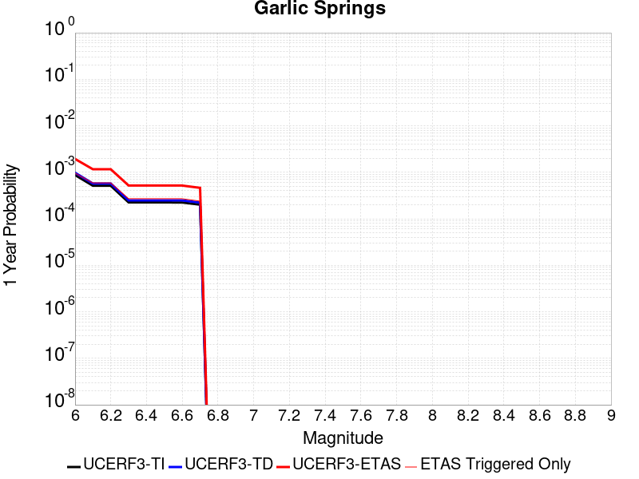 |  |

| Magnitude | 1 wk TI Prob | 1 wk TD Prob | 1 wk ETAS Prob | 1 wk ETAS/TD Gain | 1 wk ETAS Triggered Only | 1 mo TI Prob | 1 mo TD Prob | 1 mo ETAS Prob | 1 mo ETAS/TD Gain | 1 mo ETAS Triggered Only | 1 yr TI Prob | 1 yr TD Prob | 1 yr ETAS Prob | 1 yr ETAS/TD Gain | 1 yr ETAS Triggered Only | 10 yr TI Prob | 10 yr TD Prob | 10 yr ETAS Prob | 10 yr ETAS/TD Gain | 10 yr ETAS Triggered Only |
|-----|-----|-----|-----|-----|-----|-----|-----|-----|-----|-----|-----|-----|-----|-----|-----|-----|-----|-----|-----|-----|
| 6.0 | 1.6760017E-5 | 1.8776833E-5 | 4.623586E-4 | 24.623888 | 4.4359014E-4 | 7.182667E-5 | 8.0470316E-5 | 7.704439E-4 | 9.574262 | 6.9002906E-4 | 8.7413884E-4 | 9.794032E-4 | 0.0019641935 | 2.0055006 | 9.857558E-4 | 0.008707083 | 0.009762413 | 0.011128998 | 1.1399844 | 0.0013800581 |
| 6.1 | 9.852767E-6 | 1.0973587E-5 | 3.066971E-4 | 27.948664 | 2.9572676E-4 | 4.222546E-5 | 4.702921E-5 | 5.39884E-4 | 11.479757 | 4.928779E-4 | 5.139737E-4 | 5.7250116E-4 | 0.0011143564 | 1.9464703 | 5.421657E-4 | 0.005127866 | 0.005717221 | 0.0064033056 | 1.1200031 | 6.9002906E-4 |
| 6.2 | 9.852767E-6 | 1.0973587E-5 | 3.066971E-4 | 27.948664 | 2.9572676E-4 | 4.222546E-5 | 4.702921E-5 | 5.39884E-4 | 11.479757 | 4.928779E-4 | 5.139737E-4 | 5.7250116E-4 | 0.0011143564 | 1.9464703 | 5.421657E-4 | 0.005127866 | 0.005717221 | 0.0064033056 | 1.1200031 | 6.9002906E-4 |
| 6.3 | 4.3167724E-6 | 4.7780286E-6 | 1.526407E-4 | 31.946375 | 1.4786338E-4 | 1.8500323E-5 | 2.0477235E-5 | 1.6833757E-4 | 8.220718 | 1.4786338E-4 | 2.2521814E-4 | 2.4930484E-4 | 4.9568235E-4 | 1.9882581 | 2.4643895E-4 | 0.0022499003 | 0.00249251 | 0.0028366644 | 1.1380755 | 3.4501453E-4 |
| 6.4 | 4.3167724E-6 | 4.7780286E-6 | 1.526407E-4 | 31.946375 | 1.4786338E-4 | 1.8500323E-5 | 2.0477235E-5 | 1.6833757E-4 | 8.220718 | 1.4786338E-4 | 2.2521814E-4 | 2.4930484E-4 | 4.9568235E-4 | 1.9882581 | 2.4643895E-4 | 0.0022499003 | 0.00249251 | 0.0028366644 | 1.1380755 | 3.4501453E-4 |
| 6.5 | 4.3167724E-6 | 4.7780286E-6 | 1.526407E-4 | 31.946375 | 1.4786338E-4 | 1.8500323E-5 | 2.0477235E-5 | 1.6833757E-4 | 8.220718 | 1.4786338E-4 | 2.2521814E-4 | 2.4930484E-4 | 4.9568235E-4 | 1.9882581 | 2.4643895E-4 | 0.0022499003 | 0.00249251 | 0.0028366644 | 1.1380755 | 3.4501453E-4 |
| 6.6 | 4.301311E-6 | 4.760897E-6 | 1.5262357E-4 | 32.05773 | 1.4786338E-4 | 1.8434059E-5 | 2.0403815E-5 | 1.6826417E-4 | 8.246701 | 1.4786338E-4 | 2.2441156E-4 | 2.4841115E-4 | 4.9478887E-4 | 1.9918143 | 2.4643895E-4 | 0.0022418506 | 0.002483593 | 0.0028277508 | 1.1385725 | 3.4501453E-4 |
| 6.7 | 3.8599724E-6 | 4.27106E-6 | 1.521338E-4 | 35.619682 | 1.4786338E-4 | 1.6542634E-5 | 1.8304541E-5 | 1.661652E-4 | 9.077813 | 1.4786338E-4 | 2.0138794E-4 | 2.228578E-4 | 4.6924184E-4 | 2.105566 | 2.4643895E-4 | 0.0020120554 | 0.002228578 | 0.0025728235 | 1.1544688 | 3.4501453E-4 |

## Helendale-So Lockhart
*[(top)](#table-of-contents)*

| 1 Week | 1 Month | 1 Year | 10 Year |
|-----|-----|-----|-----|
|  |  |  |  |

| Magnitude | 1 wk TI Prob | 1 wk TD Prob | 1 wk ETAS Prob | 1 wk ETAS/TD Gain | 1 wk ETAS Triggered Only | 1 mo TI Prob | 1 mo TD Prob | 1 mo ETAS Prob | 1 mo ETAS/TD Gain | 1 mo ETAS Triggered Only | 1 yr TI Prob | 1 yr TD Prob | 1 yr ETAS Prob | 1 yr ETAS/TD Gain | 1 yr ETAS Triggered Only | 10 yr TI Prob | 10 yr TD Prob | 10 yr ETAS Prob | 10 yr ETAS/TD Gain | 10 yr ETAS Triggered Only |
|-----|-----|-----|-----|-----|-----|-----|-----|-----|-----|-----|-----|-----|-----|-----|-----|-----|-----|-----|-----|-----|
| 6.0 | 1.7296055E-5 | 1.8103729E-5 | 1.16677526E-4 | 6.4449444 | 9.857558E-5 | 7.412385E-5 | 7.7585224E-5 | 2.2543712E-4 | 2.905671 | 1.4786338E-4 | 9.0208417E-4 | 9.4421144E-4 | 0.001436624 | 1.5215067 | 4.928779E-4 | 0.008984311 | 0.009404116 | 0.010331778 | 1.0986441 | 9.36468E-4 |
| 6.1 | 1.7296055E-5 | 1.8103729E-5 | 1.16677526E-4 | 6.4449444 | 9.857558E-5 | 7.412385E-5 | 7.7585224E-5 | 2.2543712E-4 | 2.905671 | 1.4786338E-4 | 9.0208417E-4 | 9.4421144E-4 | 0.001436624 | 1.5215067 | 4.928779E-4 | 0.008984311 | 0.009404116 | 0.010331778 | 1.0986441 | 9.36468E-4 |
| 6.2 | 1.7296055E-5 | 1.8103729E-5 | 1.16677526E-4 | 6.4449444 | 9.857558E-5 | 7.412385E-5 | 7.7585224E-5 | 2.2543712E-4 | 2.905671 | 1.4786338E-4 | 9.0208417E-4 | 9.4421144E-4 | 0.001436624 | 1.5215067 | 4.928779E-4 | 0.008984311 | 0.009404116 | 0.010331778 | 1.0986441 | 9.36468E-4 |
| 6.3 | 1.0669118E-5 | 1.1135425E-5 | 1.0970991E-4 | 9.852333 | 9.857558E-5 | 4.5723988E-5 | 4.772239E-5 | 1.955787E-4 | 4.098259 | 1.4786338E-4 | 5.5654737E-4 | 5.80868E-4 | 0.0010242005 | 1.7632241 | 4.4359014E-4 | 0.0055515557 | 0.0057937936 | 0.006528827 | 1.1268656 | 7.3931686E-4 |
| 6.4 | 1.0669118E-5 | 1.1135425E-5 | 1.0970991E-4 | 9.852333 | 9.857558E-5 | 4.5723988E-5 | 4.772239E-5 | 1.955787E-4 | 4.098259 | 1.4786338E-4 | 5.5654737E-4 | 5.80868E-4 | 0.0010242005 | 1.7632241 | 4.4359014E-4 | 0.0055515557 | 0.0057937936 | 0.006528827 | 1.1268656 | 7.3931686E-4 |
| 6.5 | 8.790038E-6 | 9.170197E-6 | 1.07744876E-4 | 11.749461 | 9.857558E-5 | 3.767105E-5 | 3.930026E-5 | 1.8715783E-4 | 4.762254 | 1.4786338E-4 | 4.585485E-4 | 4.7837716E-4 | 8.7249087E-4 | 1.8238556 | 3.9430233E-4 | 0.0045760344 | 0.004773638 | 0.005411321 | 1.1335841 | 6.407413E-4 |
| 6.6 | 7.396949E-6 | 7.715537E-6 | 5.7002948E-5 | 7.3880725 | 4.928779E-5 | 3.1700827E-5 | 3.3066175E-5 | 1.316385E-4 | 3.9810624 | 9.857558E-5 | 3.858892E-4 | 4.025073E-4 | 7.47383E-4 | 1.8568184 | 3.4501453E-4 | 0.003852198 | 0.00401789 | 0.0045578773 | 1.1343957 | 5.421657E-4 |
| 6.7 | 6.4600285E-6 | 6.738031E-6 | 6.738031E-6 | 1.0 | 0.0 | 2.7685543E-5 | 2.887696E-5 | 2.887696E-5 | 1.0 | 0.0 | 3.3701936E-4 | 3.5152107E-4 | 5.486029E-4 | 1.5606545 | 1.9715117E-4 | 0.0033650869 | 0.003509732 | 0.0039026504 | 1.1119511 | 3.9430233E-4 |
| 6.8 | 5.600104E-6 | 5.836009E-6 | 5.836009E-6 | 1.0 | 0.0 | 2.4000226E-5 | 2.5011232E-5 | 2.5011232E-5 | 1.0 | 0.0 | 2.9216358E-4 | 3.044698E-4 | 4.5228816E-4 | 1.4854943 | 1.4786338E-4 | 0.0029177975 | 0.003040588 | 0.0033354156 | 1.096964 | 2.9572676E-4 |
| 6.9 | 4.839122E-6 | 5.0395092E-6 | 5.0395092E-6 | 1.0 | 0.0 | 2.0738931E-5 | 2.159772E-5 | 2.159772E-5 | 1.0 | 0.0 | 2.5246723E-4 | 2.6292098E-4 | 3.1219583E-4 | 1.1874131 | 4.928779E-5 | 0.002521806 | 0.002626147 | 0.0028227803 | 1.0748752 | 1.9715117E-4 |
| 7.0 | 3.6937633E-6 | 3.845208E-6 | 3.845208E-6 | 1.0 | 0.0 | 1.5830317E-5 | 1.647936E-5 | 1.647936E-5 | 1.0 | 0.0 | 1.9271708E-4 | 2.0061806E-4 | 2.0061806E-4 | 1.0 | 0.0 | 0.0019255003 | 0.002004401 | 0.002151968 | 1.0736215 | 1.4786338E-4 |
| 7.1 | 2.7858857E-6 | 2.8978538E-6 | 2.8978538E-6 | 1.0 | 0.0 | 1.1939455E-5 | 1.2419316E-5 | 1.2419316E-5 | 1.0 | 0.0 | 1.4535317E-4 | 1.511949E-4 | 1.511949E-4 | 1.0 | 0.0 | 0.0014525814 | 0.0015109418 | 0.0016093684 | 1.0651426 | 9.857558E-5 |
| 7.2 | 2.1672065E-6 | 2.2540128E-6 | 2.2540128E-6 | 1.0 | 0.0 | 9.2879945E-6 | 9.66002E-6 | 9.66002E-6 | 1.0 | 0.0 | 1.1307546E-4 | 1.1760458E-4 | 1.1760458E-4 | 1.0 | 0.0 | 0.0011301794 | 0.0011754417 | 0.0012246715 | 1.041882 | 4.928779E-5 |
| 7.3 | 1.4823496E-6 | 1.5422102E-6 | 1.5422102E-6 | 1.0 | 0.0 | 6.3529114E-6 | 6.6094562E-6 | 6.6094562E-6 | 1.0 | 0.0 | 7.734395E-5 | 8.046731E-5 | 8.046731E-5 | 1.0 | 0.0 | 7.731704E-4 | 8.0439687E-4 | 8.0439687E-4 | 1.0 | 0.0 |
| 7.4 | 4.2321457E-7 | 4.4108765E-7 | 4.4108765E-7 | 1.0 | 0.0 | 1.8137755E-6 | 1.8903745E-6 | 1.8903745E-6 | 1.0 | 0.0 | 2.2082493E-5 | 2.3015113E-5 | 2.3015113E-5 | 1.0 | 0.0 | 2.2080299E-4 | 2.3013182E-4 | 2.3013182E-4 | 1.0 | 0.0 |
| 7.5 | 5.6942316E-8 | 5.9415648E-8 | 5.9415648E-8 | 1.0 | 0.0 | 2.440385E-7 | 2.5463845E-7 | 2.5463845E-7 | 1.0 | 0.0 | 2.9711643E-6 | 3.1002196E-6 | 3.1002196E-6 | 1.0 | 0.0 | 2.9711247E-5 | 3.1001844E-5 | 3.1001844E-5 | 1.0 | 0.0 |

## San Andreas (Big Bend)
*[(top)](#table-of-contents)*

| 1 Week | 1 Month | 1 Year | 10 Year |
|-----|-----|-----|-----|
|  | 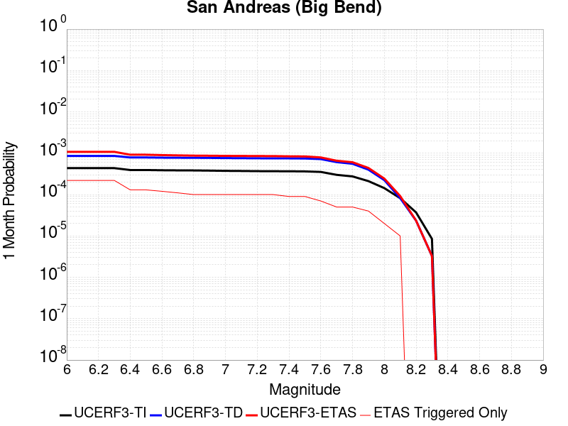 |  |  |

| Magnitude | 1 wk TI Prob | 1 wk TD Prob | 1 wk ETAS Prob | 1 wk ETAS/TD Gain | 1 wk ETAS Triggered Only | 1 mo TI Prob | 1 mo TD Prob | 1 mo ETAS Prob | 1 mo ETAS/TD Gain | 1 mo ETAS Triggered Only | 1 yr TI Prob | 1 yr TD Prob | 1 yr ETAS Prob | 1 yr ETAS/TD Gain | 1 yr ETAS Triggered Only | 10 yr TI Prob | 10 yr TD Prob | 10 yr ETAS Prob | 10 yr ETAS/TD Gain | 10 yr ETAS Triggered Only |
|-----|-----|-----|-----|-----|-----|-----|-----|-----|-----|-----|-----|-----|-----|-----|-----|-----|-----|-----|-----|-----|
| 6.0 | 1.0179969E-4 | 2.0073925E-4 | 4.4712875E-4 | 2.2274106 | 2.4643895E-4 | 4.362114E-4 | 8.6002843E-4 | 0.0011555009 | 1.3435612 | 2.9572676E-4 | 0.0052979486 | 0.010420859 | 0.010957375 | 1.0514848 | 5.421657E-4 | 0.051734097 | 0.101455905 | 0.10216451 | 1.0069842 | 7.8860467E-4 |
| 6.1 | 1.0179969E-4 | 2.0073925E-4 | 4.4712875E-4 | 2.2274106 | 2.4643895E-4 | 4.362114E-4 | 8.6002843E-4 | 0.0011555009 | 1.3435612 | 2.9572676E-4 | 0.0052979486 | 0.010420859 | 0.010957375 | 1.0514848 | 5.421657E-4 | 0.051734097 | 0.101455905 | 0.10216451 | 1.0069842 | 7.8860467E-4 |
| 6.2 | 1.0179969E-4 | 2.0073925E-4 | 4.4712875E-4 | 2.2274106 | 2.4643895E-4 | 4.362114E-4 | 8.6002843E-4 | 0.0011555009 | 1.3435612 | 2.9572676E-4 | 0.0052979486 | 0.010420859 | 0.010957375 | 1.0514848 | 5.421657E-4 | 0.051734097 | 0.101455905 | 0.10216451 | 1.0069842 | 7.8860467E-4 |
| 6.3 | 1.0179969E-4 | 2.0073925E-4 | 4.4712875E-4 | 2.2274106 | 2.4643895E-4 | 4.362114E-4 | 8.6002843E-4 | 0.0011555009 | 1.3435612 | 2.9572676E-4 | 0.0052979486 | 0.010420859 | 0.010957375 | 1.0514848 | 5.421657E-4 | 0.051734097 | 0.101455905 | 0.10216451 | 1.0069842 | 7.8860467E-4 |
| 6.4 | 9.1639464E-5 | 1.8430917E-4 | 3.3214528E-4 | 1.8021094 | 1.4786338E-4 | 3.9268145E-4 | 7.896575E-4 | 9.3740417E-4 | 1.1871021 | 1.4786338E-4 | 0.0047704205 | 0.009571818 | 0.009815898 | 1.0254998 | 2.4643895E-4 | 0.046693064 | 0.09378695 | 0.09414427 | 1.0038099 | 3.9430233E-4 |
| 6.5 | 9.1639464E-5 | 1.8430917E-4 | 3.3214528E-4 | 1.8021094 | 1.4786338E-4 | 3.9268145E-4 | 7.896575E-4 | 9.3740417E-4 | 1.1871021 | 1.4786338E-4 | 0.0047704205 | 0.009571818 | 0.009815898 | 1.0254998 | 2.4643895E-4 | 0.046693064 | 0.09378695 | 0.09414427 | 1.0038099 | 3.9430233E-4 |
| 6.6 | 9.042622E-5 | 1.8238011E-4 | 3.302165E-4 | 1.810595 | 1.4786338E-4 | 3.8748336E-4 | 7.813951E-4 | 9.29143E-4 | 1.1890821 | 1.4786338E-4 | 0.0047074095 | 0.0094721 | 0.009716204 | 1.0257709 | 2.4643895E-4 | 0.046089325 | 0.09287721 | 0.09323489 | 1.003851 | 3.9430233E-4 |
| 6.7 | 8.9836685E-5 | 1.8152347E-4 | 2.8008115E-4 | 1.5429474 | 9.857558E-5 | 3.8495753E-4 | 7.7772595E-4 | 8.762249E-4 | 1.1266499 | 9.857558E-5 | 0.00467679 | 0.009427815 | 0.009623107 | 1.0207145 | 1.9715117E-4 | 0.045795817 | 0.09247148 | 0.09278459 | 1.003386 | 3.4501453E-4 |
| 6.8 | 8.9471854E-5 | 1.8099119E-4 | 2.7954893E-4 | 1.5445443 | 9.857558E-5 | 3.8339442E-4 | 7.754462E-4 | 8.739453E-4 | 1.1270225 | 9.857558E-5 | 0.004657841 | 0.009400298 | 0.009595595 | 1.0207757 | 1.9715117E-4 | 0.04561414 | 0.0922192 | 0.092532404 | 1.0033963 | 3.4501453E-4 |
| 6.9 | 8.858234E-5 | 1.7981093E-4 | 2.7836877E-4 | 1.5481194 | 9.857558E-5 | 3.7958333E-4 | 7.7039085E-4 | 8.688905E-4 | 1.1278567 | 9.857558E-5 | 0.004611638 | 0.009339278 | 0.009534588 | 1.0209128 | 1.9715117E-4 | 0.04517103 | 0.09165911 | 0.09197249 | 1.003419 | 3.4501453E-4 |
| 7.0 | 8.7433385E-5 | 1.7819891E-4 | 2.767569E-4 | 1.5530787 | 9.857558E-5 | 3.746607E-4 | 7.6348626E-4 | 8.619866E-4 | 1.1290139 | 9.857558E-5 | 0.004551957 | 0.009255932 | 0.009402427 | 1.0158272 | 1.4786338E-4 | 0.044598386 | 0.09089323 | 0.09116208 | 1.0029578 | 2.9572676E-4 |
| 7.1 | 8.684964E-5 | 1.7731842E-4 | 2.7587652E-4 | 1.5558256 | 9.857558E-5 | 3.7215967E-4 | 7.597149E-4 | 8.582156E-4 | 1.1296548 | 9.857558E-5 | 0.0045216335 | 0.009210405 | 0.009356907 | 1.0159061 | 1.4786338E-4 | 0.04430731 | 0.09047475 | 0.09074372 | 1.0029728 | 2.9572676E-4 |
| 7.2 | 8.606521E-5 | 1.7622454E-4 | 2.7478274E-4 | 1.5592763 | 9.857558E-5 | 3.6879873E-4 | 7.550296E-4 | 8.535308E-4 | 1.13046 | 9.857558E-5 | 0.0044808835 | 0.009153842 | 0.009300351 | 1.0160053 | 1.4786338E-4 | 0.043916024 | 0.08995518 | 0.0902243 | 1.0029918 | 2.9572676E-4 |
| 7.3 | 8.568266E-5 | 1.7564454E-4 | 2.7420282E-4 | 1.5611234 | 9.857558E-5 | 3.6715972E-4 | 7.5254537E-4 | 8.5104676E-4 | 1.130891 | 9.857558E-5 | 0.0044610105 | 0.00912385 | 0.009270364 | 1.0160583 | 1.4786338E-4 | 0.043725148 | 0.08967623 | 0.08994544 | 1.003002 | 2.9572676E-4 |
| 7.4 | 8.5432206E-5 | 1.752704E-4 | 2.738287E-4 | 1.5623214 | 9.857558E-5 | 3.6608664E-4 | 7.509428E-4 | 8.4944436E-4 | 1.1311705 | 9.857558E-5 | 0.004447999 | 0.009104501 | 0.009251019 | 1.0160928 | 1.4786338E-4 | 0.043600157 | 0.08949642 | 0.08976568 | 1.0030086 | 2.9572676E-4 |
| 7.5 | 8.4791965E-5 | 1.7396381E-4 | 2.7252224E-4 | 1.5665456 | 9.857558E-5 | 3.633435E-4 | 7.4534636E-4 | 8.4384845E-4 | 1.1321561 | 9.857558E-5 | 0.0044147377 | 0.009036932 | 0.00918346 | 1.0162143 | 1.4786338E-4 | 0.043280575 | 0.08887209 | 0.08914153 | 1.0030318 | 2.9572676E-4 |
| 7.6 | 8.241105E-5 | 1.6841735E-4 | 2.6697633E-4 | 1.5852069 | 9.857558E-5 | 3.531424E-4 | 7.2158914E-4 | 8.2009356E-4 | 1.1365105 | 9.857558E-5 | 0.0042910352 | 0.008750047 | 0.008896616 | 1.0167507 | 1.4786338E-4 | 0.042091176 | 0.08625032 | 0.086520545 | 1.0031329 | 2.9572676E-4 |
| 7.7 | 7.00432E-5 | 1.4205615E-4 | 1.9133693E-4 | 1.3469106 | 4.928779E-5 | 3.001506E-4 | 6.0867006E-4 | 6.579278E-4 | 1.0809269 | 4.928779E-5 | 0.0036482112 | 0.0073854174 | 0.007483265 | 1.0132488 | 9.857558E-5 | 0.035888977 | 0.07352299 | 0.07375131 | 1.0031054 | 2.4643895E-4 |
| 7.8 | 6.415362E-5 | 1.2969968E-4 | 1.7898108E-4 | 1.3799654 | 4.928779E-5 | 2.749151E-4 | 5.557374E-4 | 6.049978E-4 | 1.0886397 | 4.928779E-5 | 0.0033419547 | 0.0067451415 | 0.0068430523 | 1.0145158 | 9.857558E-5 | 0.03292141 | 0.06725514 | 0.067485005 | 1.0034178 | 2.4643895E-4 |
| 7.9 | 4.939911E-5 | 9.341721E-5 | 9.341721E-5 | 1.0 | 0.0 | 2.116933E-4 | 4.0029807E-4 | 4.0029807E-4 | 1.0 | 0.0 | 0.0025743195 | 0.004862747 | 0.004862747 | 1.0 | 0.0 | 0.025447013 | 0.048915803 | 0.049056433 | 1.002875 | 1.4786338E-4 |
| 8.0 | 3.344983E-5 | 5.2228E-5 | 5.2228E-5 | 1.0 | 0.0 | 1.4334853E-4 | 2.2381509E-4 | 2.2381509E-4 | 1.0 | 0.0 | 0.0017438711 | 0.0027215453 | 0.0027215453 | 1.0 | 0.0 | 0.017302496 | 0.027923161 | 0.027971074 | 1.0017158 | 4.928779E-5 |
| 8.1 | 1.9104898E-5 | 1.9171663E-5 | 1.9171663E-5 | 1.0 | 0.0 | 8.1875565E-5 | 8.2161685E-5 | 8.2161685E-5 | 1.0 | 0.0 | 9.963791E-4 | 9.9986E-4 | 9.9986E-4 | 1.0 | 0.0 | 0.009919235 | 0.010749552 | 0.010749552 | 1.0 | 0.0 |
| 8.2 | 8.643924E-6 | 5.473668E-6 | 5.473668E-6 | 1.0 | 0.0 | 3.704486E-5 | 2.3458366E-5 | 2.3458366E-5 | 1.0 | 0.0 | 4.5092785E-4 | 2.8556827E-4 | 2.8556827E-4 | 1.0 | 0.0 | 0.0045001395 | 0.0032481793 | 0.0032481793 | 1.0 | 0.0 |
| 8.3 | 1.983087E-6 | 7.6564595E-7 | 7.6564595E-7 | 1.0 | 0.0 | 8.498917E-6 | 3.281336E-6 | 3.281336E-6 | 1.0 | 0.0 | 1.034694E-4 | 3.9949547E-5 | 3.9949547E-5 | 1.0 | 0.0 | 0.0010342124 | 4.717979E-4 | 4.717979E-4 | 1.0 | 0.0 |

## Coyote Lake
*[(top)](#table-of-contents)*

| 1 Week | 1 Month | 1 Year | 10 Year |
|-----|-----|-----|-----|
|  |  |  |  |

| Magnitude | 1 wk TI Prob | 1 wk TD Prob | 1 wk ETAS Prob | 1 wk ETAS/TD Gain | 1 wk ETAS Triggered Only | 1 mo TI Prob | 1 mo TD Prob | 1 mo ETAS Prob | 1 mo ETAS/TD Gain | 1 mo ETAS Triggered Only | 1 yr TI Prob | 1 yr TD Prob | 1 yr ETAS Prob | 1 yr ETAS/TD Gain | 1 yr ETAS Triggered Only | 10 yr TI Prob | 10 yr TD Prob | 10 yr ETAS Prob | 10 yr ETAS/TD Gain | 10 yr ETAS Triggered Only |
|-----|-----|-----|-----|-----|-----|-----|-----|-----|-----|-----|-----|-----|-----|-----|-----|-----|-----|-----|-----|-----|
| 6.0 | 1.980352E-5 | 2.1706745E-5 | 2.1885363E-4 | 10.082287 | 1.9715117E-4 | 8.486947E-5 | 9.302599E-5 | 2.9015882E-4 | 3.1191154 | 1.9715117E-4 | 0.0010327959 | 0.0011320751 | 0.001624395 | 1.4348828 | 4.928779E-4 | 0.010280091 | 0.011270258 | 0.011903778 | 1.0562117 | 6.407413E-4 |
| 6.1 | 1.980352E-5 | 2.1706745E-5 | 2.1885363E-4 | 10.082287 | 1.9715117E-4 | 8.486947E-5 | 9.302599E-5 | 2.9015882E-4 | 3.1191154 | 1.9715117E-4 | 0.0010327959 | 0.0011320751 | 0.001624395 | 1.4348828 | 4.928779E-4 | 0.010280091 | 0.011270258 | 0.011903778 | 1.0562117 | 6.407413E-4 |
| 6.2 | 1.980352E-5 | 2.1706745E-5 | 2.1885363E-4 | 10.082287 | 1.9715117E-4 | 8.486947E-5 | 9.302599E-5 | 2.9015882E-4 | 3.1191154 | 1.9715117E-4 | 0.0010327959 | 0.0011320751 | 0.001624395 | 1.4348828 | 4.928779E-4 | 0.010280091 | 0.011270258 | 0.011903778 | 1.0562117 | 6.407413E-4 |
| 6.3 | 1.5344787E-5 | 1.682067E-5 | 1.6468155E-4 | 9.790428 | 1.4786338E-4 | 6.576172E-5 | 7.2086936E-5 | 2.1993965E-4 | 3.0510335 | 1.4786338E-4 | 8.003548E-4 | 8.773662E-4 | 0.0012713226 | 1.4490216 | 3.9430233E-4 | 0.007974784 | 0.00874507 | 0.009282494 | 1.0614545 | 5.421657E-4 |
| 6.4 | 1.5344787E-5 | 1.682067E-5 | 1.6468155E-4 | 9.790428 | 1.4786338E-4 | 6.576172E-5 | 7.2086936E-5 | 2.1993965E-4 | 3.0510335 | 1.4786338E-4 | 8.003548E-4 | 8.773662E-4 | 0.0012713226 | 1.4490216 | 3.9430233E-4 | 0.007974784 | 0.00874507 | 0.009282494 | 1.0614545 | 5.421657E-4 |
| 6.5 | 1.4189697E-5 | 1.5557987E-5 | 1.6341906E-4 | 10.503869 | 1.4786338E-4 | 6.081157E-5 | 6.6675726E-5 | 2.1452924E-4 | 3.2175014 | 1.4786338E-4 | 7.401293E-4 | 8.115349E-4 | 0.0012055172 | 1.485478 | 3.9430233E-4 | 0.0073766913 | 0.008091656 | 0.008629435 | 1.0664608 | 5.421657E-4 |
| 6.6 | 1.3469301E-5 | 1.4771577E-5 | 1.6263277E-4 | 11.009845 | 1.4786338E-4 | 5.7724297E-5 | 6.330556E-5 | 2.1115958E-4 | 3.3355613 | 1.4786338E-4 | 7.025667E-4 | 7.7053264E-4 | 0.0011645311 | 1.5113326 | 3.9430233E-4 | 0.0070034964 | 0.0076845144 | 0.008222514 | 1.0700109 | 5.421657E-4 |
| 6.7 | 1.3027966E-5 | 1.4281745E-5 | 1.6214301E-4 | 11.353165 | 1.4786338E-4 | 5.5832945E-5 | 6.120638E-5 | 2.090607E-4 | 3.4156685 | 1.4786338E-4 | 6.7955407E-4 | 7.4499263E-4 | 0.0011390012 | 1.5288758 | 3.9430233E-4 | 0.006774798 | 0.0074308286 | 0.007968966 | 1.0724195 | 5.421657E-4 |
| 6.8 | 5.695434E-6 | 6.2244176E-6 | 6.2244176E-6 | 1.0 | 0.0 | 2.4408775E-5 | 2.6675973E-5 | 2.6675973E-5 | 1.0 | 0.0 | 2.971363E-4 | 3.2476155E-4 | 3.7403335E-4 | 1.1517168 | 4.928779E-5 | 0.0029673933 | 0.0032458105 | 0.003344066 | 1.0302715 | 9.857558E-5 |
| 6.9 | 4.385688E-6 | 4.7930553E-6 | 4.7930553E-6 | 1.0 | 0.0 | 1.879567E-5 | 2.0541665E-5 | 2.0541665E-5 | 1.0 | 0.0 | 2.2881327E-4 | 2.5009477E-4 | 2.9937024E-4 | 1.1970272 | 4.928779E-5 | 0.002285778 | 0.0025009478 | 0.0025501123 | 1.0196583 | 4.928779E-5 |

## San Andreas (Parkfield)
*[(top)](#table-of-contents)*

| 1 Week | 1 Month | 1 Year | 10 Year |
|-----|-----|-----|-----|
| 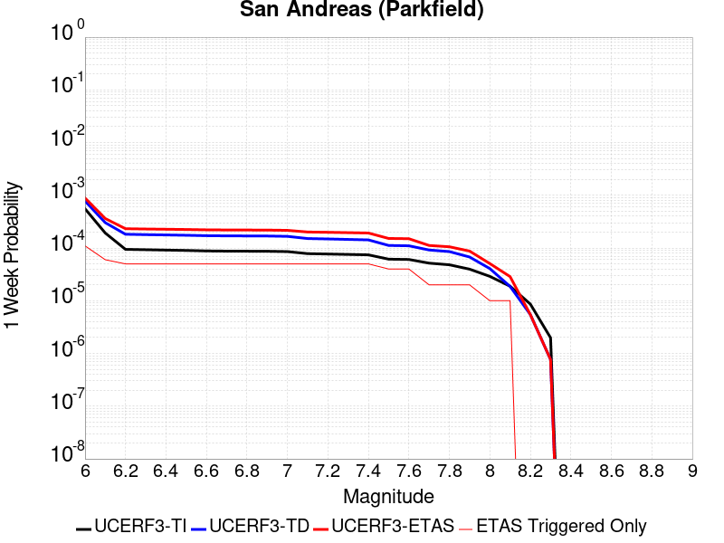 |  | 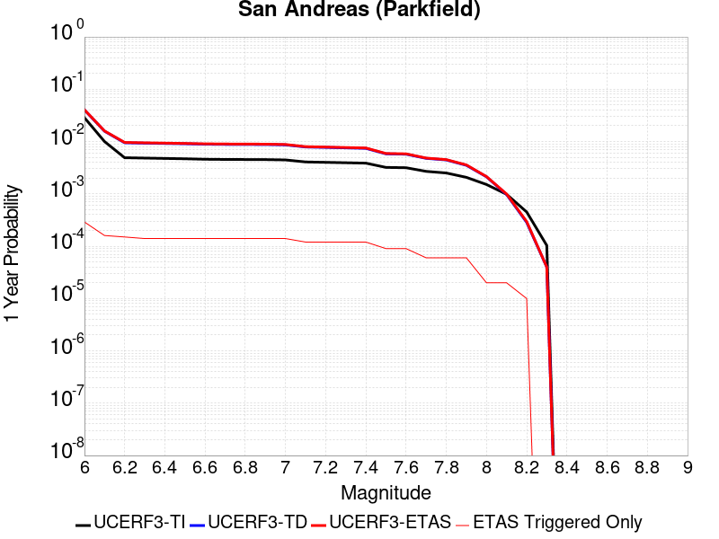 |  |

| Magnitude | 1 wk TI Prob | 1 wk TD Prob | 1 wk ETAS Prob | 1 wk ETAS/TD Gain | 1 wk ETAS Triggered Only | 1 mo TI Prob | 1 mo TD Prob | 1 mo ETAS Prob | 1 mo ETAS/TD Gain | 1 mo ETAS Triggered Only | 1 yr TI Prob | 1 yr TD Prob | 1 yr ETAS Prob | 1 yr ETAS/TD Gain | 1 yr ETAS Triggered Only | 10 yr TI Prob | 10 yr TD Prob | 10 yr ETAS Prob | 10 yr ETAS/TD Gain | 10 yr ETAS Triggered Only |
|-----|-----|-----|-----|-----|-----|-----|-----|-----|-----|-----|-----|-----|-----|-----|-----|-----|-----|-----|-----|-----|
| 6.0 | 5.556969E-4 | 7.778562E-4 | 0.0010241035 | 1.3165717 | 2.4643895E-4 | 0.0023793848 | 0.0033299583 | 0.0036247002 | 1.0885122 | 2.9572676E-4 | 0.028586963 | 0.040235043 | 0.040660784 | 1.0105814 | 4.4359014E-4 | 0.25176284 | 0.3371973 | 0.337622 | 1.0012594 | 6.407413E-4 |
| 6.1 | 1.925858E-4 | 3.0278185E-4 | 4.5060046E-4 | 1.4882016 | 1.4786338E-4 | 8.2510663E-4 | 0.001297085 | 0.0014939804 | 1.1517984 | 1.9715117E-4 | 0.0099994885 | 0.01577393 | 0.016064992 | 1.018452 | 2.9572676E-4 | 0.095613256 | 0.14975825 | 0.1501354 | 1.0025184 | 4.4359014E-4 |
| 6.2 | 9.4306815E-5 | 1.8243887E-4 | 2.8099646E-4 | 1.5402225 | 9.857558E-5 | 4.0410945E-4 | 7.8164786E-4 | 9.293956E-4 | 1.1890209 | 1.4786338E-4 | 0.0049089384 | 0.009475246 | 0.00971935 | 1.0257623 | 2.4643895E-4 | 0.048019063 | 0.0918565 | 0.092214584 | 1.0038983 | 3.9430233E-4 |
| 6.3 | 9.283051E-5 | 1.794041E-4 | 2.77962E-4 | 1.5493625 | 9.857558E-5 | 3.9778434E-4 | 7.686494E-4 | 8.671492E-4 | 1.1281466 | 9.857558E-5 | 0.0048322747 | 0.009318355 | 0.009513669 | 1.0209601 | 1.9715117E-4 | 0.047285385 | 0.090509474 | 0.090823255 | 1.0034668 | 3.4501453E-4 |
| 6.4 | 9.138826E-5 | 1.7702584E-4 | 2.7558397E-4 | 1.5567443 | 9.857558E-5 | 3.916052E-4 | 7.5846276E-4 | 8.5696357E-4 | 1.129869 | 9.857558E-5 | 0.0047573745 | 0.009195387 | 0.009390726 | 1.0212431 | 1.9715117E-4 | 0.046568092 | 0.0894136 | 0.08972777 | 1.0035136 | 3.4501453E-4 |
| 6.5 | 9.000255E-5 | 1.746064E-4 | 2.7316477E-4 | 1.5644603 | 9.857558E-5 | 3.8566816E-4 | 7.4809964E-4 | 8.466015E-4 | 1.1316694 | 9.857558E-5 | 0.0046854047 | 0.009070284 | 0.009265647 | 1.0215387 | 1.9715117E-4 | 0.045878403 | 0.08829608 | 0.08861063 | 1.0035625 | 3.4501453E-4 |
| 6.6 | 8.8109264E-5 | 1.7141816E-4 | 2.6997685E-4 | 1.5749606 | 9.857558E-5 | 3.7755648E-4 | 7.3444354E-4 | 8.3294674E-4 | 1.1341195 | 9.857558E-5 | 0.0045870654 | 0.008905404 | 0.009100799 | 1.0219412 | 1.9715117E-4 | 0.04493529 | 0.08682707 | 0.08714213 | 1.0036286 | 3.4501453E-4 |
| 6.7 | 8.738073E-5 | 1.7008898E-4 | 2.686478E-4 | 1.5794544 | 9.857558E-5 | 3.7443507E-4 | 7.287503E-4 | 8.272541E-4 | 1.1351681 | 9.857558E-5 | 0.0045492216 | 0.008836695 | 0.009032104 | 1.0221133 | 1.9715117E-4 | 0.04457213 | 0.0862268 | 0.08654206 | 1.0036563 | 3.4501453E-4 |
| 6.8 | 8.710195E-5 | 1.6954402E-4 | 2.681029E-4 | 1.5813173 | 9.857558E-5 | 3.7324068E-4 | 7.26416E-4 | 8.2492E-4 | 1.1356027 | 9.857558E-5 | 0.0045347405 | 0.008808513 | 0.009003928 | 1.0221847 | 1.9715117E-4 | 0.04443313 | 0.08597436 | 0.08628971 | 1.003668 | 3.4501453E-4 |
| 6.9 | 8.6801556E-5 | 1.6895356E-4 | 2.6751249E-4 | 1.5833492 | 9.857558E-5 | 3.7195362E-4 | 7.238869E-4 | 8.223911E-4 | 1.1360768 | 9.857558E-5 | 0.0045191357 | 0.0087779695 | 0.00897339 | 1.0222626 | 1.9715117E-4 | 0.044283327 | 0.08570042 | 0.086015865 | 1.0036808 | 3.4501453E-4 |
| 7.0 | 8.5571606E-5 | 1.664819E-4 | 2.6504108E-4 | 1.5920113 | 9.857558E-5 | 3.6668387E-4 | 7.132999E-4 | 8.118052E-4 | 1.138098 | 9.857558E-5 | 0.004455241 | 0.008650103 | 0.008845549 | 1.0225946 | 1.9715117E-4 | 0.043669727 | 0.08454836 | 0.08486421 | 1.0037357 | 3.4501453E-4 |
| 7.1 | 7.82589E-5 | 1.5128969E-4 | 2.4985036E-4 | 1.6514698 | 9.857558E-5 | 3.3535215E-4 | 6.4822397E-4 | 7.4673566E-4 | 1.1519717 | 9.857558E-5 | 0.0040752706 | 0.007863738 | 0.008059339 | 1.0248737 | 1.9715117E-4 | 0.040013418 | 0.077460445 | 0.077778734 | 1.004109 | 3.4501453E-4 |
| 7.2 | 7.690929E-5 | 1.4866212E-4 | 2.4722304E-4 | 1.6629862 | 9.857558E-5 | 3.2956956E-4 | 6.369685E-4 | 7.354813E-4 | 1.1546588 | 9.857558E-5 | 0.004005129 | 0.0077276826 | 0.007923311 | 1.0253152 | 1.9715117E-4 | 0.0393371 | 0.07623341 | 0.07655212 | 1.0041808 | 3.4501453E-4 |
| 7.3 | 7.5543794E-5 | 1.4562748E-4 | 2.441887E-4 | 1.6768038 | 9.857558E-5 | 3.2371894E-4 | 6.239692E-4 | 7.2248327E-4 | 1.1578829 | 9.857558E-5 | 0.003934157 | 0.0075705256 | 0.0077661844 | 1.0258448 | 1.9715117E-4 | 0.038652334 | 0.07479777 | 0.07511698 | 1.0042676 | 3.4501453E-4 |
| 7.4 | 7.4214564E-5 | 1.4263717E-4 | 2.411987E-4 | 1.6909946 | 9.857558E-5 | 3.1802364E-4 | 6.1115966E-4 | 7.09675E-4 | 1.1611941 | 9.857558E-5 | 0.003865065 | 0.0074156416 | 0.0076113306 | 1.0263886 | 1.9715117E-4 | 0.03798529 | 0.07337152 | 0.07369123 | 1.0043573 | 3.4501453E-4 |
| 7.5 | 6.149578E-5 | 1.1191443E-4 | 1.611967E-4 | 1.4403567 | 4.928779E-5 | 2.6352672E-4 | 4.795452E-4 | 5.288094E-4 | 1.102731 | 4.928779E-5 | 0.0032037178 | 0.005822865 | 0.005871866 | 1.0084152 | 4.928779E-5 | 0.03157923 | 0.058559462 | 0.05874507 | 1.0031695 | 1.9715117E-4 |
| 7.6 | 6.0643448E-5 | 1.102009E-4 | 1.5948326E-4 | 1.4472047 | 4.928779E-5 | 2.598746E-4 | 4.7220418E-4 | 5.214687E-4 | 1.1043289 | 4.928779E-5 | 0.0031593828 | 0.005733962 | 0.005782967 | 1.0085465 | 4.928779E-5 | 0.031148417 | 0.05772042 | 0.057906188 | 1.0032184 | 1.9715117E-4 |
| 7.7 | 5.1652263E-5 | 9.175265E-5 | 9.175265E-5 | 1.0 | 0.0 | 2.2134806E-4 | 3.9316638E-4 | 3.9316638E-4 | 1.0 | 0.0 | 0.002691582 | 0.0047763046 | 0.0047763046 | 1.0 | 0.0 | 0.026592141 | 0.04853641 | 0.048677094 | 1.0028986 | 1.4786338E-4 |
| 7.8 | 4.8090482E-5 | 8.560165E-5 | 8.560165E-5 | 1.0 | 0.0 | 2.060858E-4 | 3.6681266E-4 | 3.6681266E-4 | 1.0 | 0.0 | 0.0025062072 | 0.004456807 | 0.004456807 | 1.0 | 0.0 | 0.024781305 | 0.045302264 | 0.04544343 | 1.003116 | 1.4786338E-4 |
| 7.9 | 3.970278E-5 | 6.7507375E-5 | 6.7507375E-5 | 1.0 | 0.0 | 1.7014367E-4 | 2.8928524E-4 | 2.8928524E-4 | 1.0 | 0.0 | 0.002069531 | 0.0035163634 | 0.0035163634 | 1.0 | 0.0 | 0.020503636 | 0.03588176 | 0.036024317 | 1.003973 | 1.4786338E-4 |
| 8.0 | 2.8982335E-5 | 4.0698153E-5 | 4.0698153E-5 | 1.0 | 0.0 | 1.2420409E-4 | 1.7440901E-4 | 1.7440901E-4 | 1.0 | 0.0 | 0.0015111357 | 0.0021213628 | 0.0021213628 | 1.0 | 0.0 | 0.015009012 | 0.02201118 | 0.022059383 | 1.0021899 | 4.928779E-5 |
| 8.1 | 1.8836186E-5 | 1.867974E-5 | 1.867974E-5 | 1.0 | 0.0 | 8.0724014E-5 | 8.005358E-5 | 8.005358E-5 | 1.0 | 0.0 | 9.823717E-4 | 9.742171E-4 | 9.742171E-4 | 1.0 | 0.0 | 0.009780403 | 0.010487711 | 0.010487711 | 1.0 | 0.0 |
| 8.2 | 8.643924E-6 | 5.473668E-6 | 5.473668E-6 | 1.0 | 0.0 | 3.704486E-5 | 2.3458366E-5 | 2.3458366E-5 | 1.0 | 0.0 | 4.5092785E-4 | 2.8556827E-4 | 2.8556827E-4 | 1.0 | 0.0 | 0.0045001395 | 0.0032481793 | 0.0032481793 | 1.0 | 0.0 |
| 8.3 | 1.983087E-6 | 7.6564595E-7 | 7.6564595E-7 | 1.0 | 0.0 | 8.498917E-6 | 3.281336E-6 | 3.281336E-6 | 1.0 | 0.0 | 1.034694E-4 | 3.9949547E-5 | 3.9949547E-5 | 1.0 | 0.0 | 0.0010342124 | 4.717979E-4 | 4.717979E-4 | 1.0 | 0.0 |

## Death Valley (No)
*[(top)](#table-of-contents)*

| 1 Week | 1 Month | 1 Year | 10 Year |
|-----|-----|-----|-----|
|  |  |  |  |

| Magnitude | 1 wk TI Prob | 1 wk TD Prob | 1 wk ETAS Prob | 1 wk ETAS/TD Gain | 1 wk ETAS Triggered Only | 1 mo TI Prob | 1 mo TD Prob | 1 mo ETAS Prob | 1 mo ETAS/TD Gain | 1 mo ETAS Triggered Only | 1 yr TI Prob | 1 yr TD Prob | 1 yr ETAS Prob | 1 yr ETAS/TD Gain | 1 yr ETAS Triggered Only | 10 yr TI Prob | 10 yr TD Prob | 10 yr ETAS Prob | 10 yr ETAS/TD Gain | 10 yr ETAS Triggered Only |
|-----|-----|-----|-----|-----|-----|-----|-----|-----|-----|-----|-----|-----|-----|-----|-----|-----|-----|-----|-----|-----|
| 6.0 | 2.0074807E-5 | 2.2500084E-5 | 1.2107345E-4 | 5.381022 | 9.857558E-5 | 8.603206E-5 | 9.642541E-5 | 3.428406E-4 | 3.5555007 | 2.4643895E-4 | 0.001046937 | 0.0011733545 | 0.0016164241 | 1.3776094 | 4.4359014E-4 | 0.010420183 | 0.011672506 | 0.012305769 | 1.0542525 | 6.407413E-4 |
| 6.1 | 2.0074807E-5 | 2.2500084E-5 | 1.2107345E-4 | 5.381022 | 9.857558E-5 | 8.603206E-5 | 9.642541E-5 | 3.428406E-4 | 3.5555007 | 2.4643895E-4 | 0.001046937 | 0.0011733545 | 0.0016164241 | 1.3776094 | 4.4359014E-4 | 0.010420183 | 0.011672506 | 0.012305769 | 1.0542525 | 6.407413E-4 |
| 6.2 | 2.0074807E-5 | 2.2500084E-5 | 1.2107345E-4 | 5.381022 | 9.857558E-5 | 8.603206E-5 | 9.642541E-5 | 3.428406E-4 | 3.5555007 | 2.4643895E-4 | 0.001046937 | 0.0011733545 | 0.0016164241 | 1.3776094 | 4.4359014E-4 | 0.010420183 | 0.011672506 | 0.012305769 | 1.0542525 | 6.407413E-4 |
| 6.3 | 1.9050609E-5 | 2.1336948E-5 | 1.1991043E-4 | 5.619849 | 9.857558E-5 | 8.164292E-5 | 9.1440896E-5 | 3.3785732E-4 | 3.6948164 | 2.4643895E-4 | 9.935491E-4 | 0.001112731 | 0.0015558276 | 1.3982064 | 4.4359014E-4 | 0.009891188 | 0.011072419 | 0.011706065 | 1.0572275 | 6.407413E-4 |
| 6.4 | 1.9050609E-5 | 2.1336948E-5 | 1.1991043E-4 | 5.619849 | 9.857558E-5 | 8.164292E-5 | 9.1440896E-5 | 3.3785732E-4 | 3.6948164 | 2.4643895E-4 | 9.935491E-4 | 0.001112731 | 0.0015558276 | 1.3982064 | 4.4359014E-4 | 0.009891188 | 0.011072419 | 0.011706065 | 1.0572275 | 6.407413E-4 |
| 6.5 | 1.8367004E-5 | 2.0561009E-5 | 1.19134565E-4 | 5.7941985 | 9.857558E-5 | 7.8713354E-5 | 8.811567E-5 | 3.345329E-4 | 3.7965202 | 2.4643895E-4 | 9.5791375E-4 | 0.0010722869 | 0.0015154013 | 1.4132425 | 4.4359014E-4 | 0.009537951 | 0.0106719155 | 0.011305819 | 1.0593992 | 6.407413E-4 |
| 6.6 | 1.779439E-5 | 1.9910927E-5 | 1.18484546E-4 | 5.9507294 | 9.857558E-5 | 7.625944E-5 | 8.53298E-5 | 3.3174772E-4 | 3.8878298 | 2.4643895E-4 | 9.280632E-4 | 0.0010384015 | 0.001481531 | 1.426742 | 4.4359014E-4 | 0.009241969 | 0.010336253 | 0.010970371 | 1.0613489 | 6.407413E-4 |
| 6.7 | 1.7025437E-5 | 1.9043426E-5 | 1.1761713E-4 | 6.176259 | 9.857558E-5 | 7.296412E-5 | 8.161216E-5 | 3.2803102E-4 | 4.0193887 | 2.4643895E-4 | 8.87976E-4 | 9.931813E-4 | 0.0014363308 | 1.446192 | 4.4359014E-4 | 0.008844362 | 0.009888145 | 0.010522551 | 1.0641582 | 6.407413E-4 |
| 6.8 | 1.6545107E-5 | 1.8512545E-5 | 1.170863E-4 | 6.3247004 | 9.857558E-5 | 7.090568E-5 | 7.93371E-5 | 3.257565E-4 | 4.1059794 | 2.4643895E-4 | 8.629347E-4 | 9.655073E-4 | 0.0014086692 | 1.4589938 | 4.4359014E-4 | 0.008595915 | 0.009613829 | 0.0102484105 | 1.0660071 | 6.407413E-4 |
| 6.9 | 1.615478E-5 | 1.8087594E-5 | 1.16661395E-4 | 6.449802 | 9.857558E-5 | 6.9232934E-5 | 7.751599E-5 | 3.2393585E-4 | 4.178955 | 2.4643895E-4 | 8.4258494E-4 | 9.433546E-4 | 0.0013865263 | 1.4697827 | 4.4359014E-4 | 0.008393973 | 0.009394196 | 0.010028917 | 1.0675653 | 6.407413E-4 |
| 7.0 | 1.5894311E-5 | 1.780555E-5 | 1.1637938E-4 | 6.5361295 | 9.857558E-5 | 6.81167E-5 | 7.6307304E-5 | 3.2272746E-4 | 4.229313 | 2.4643895E-4 | 8.2900526E-4 | 9.286515E-4 | 0.0013718297 | 1.4772277 | 4.4359014E-4 | 0.008259195 | 0.009248397 | 0.009883213 | 1.0686406 | 6.407413E-4 |
| 7.1 | 1.5602263E-5 | 1.7483504E-5 | 1.1605736E-4 | 6.638107 | 9.857558E-5 | 6.6865134E-5 | 7.492718E-5 | 3.2134767E-4 | 4.2888 | 2.4643895E-4 | 8.137789E-4 | 9.118627E-4 | 0.0013550484 | 1.4860224 | 4.4359014E-4 | 0.008108052 | 0.009081894 | 0.009716816 | 1.0699108 | 6.407413E-4 |
| 7.2 | 1.5323829E-5 | 1.717063E-5 | 1.1574452E-4 | 6.740843 | 9.857558E-5 | 6.56719E-5 | 7.358637E-5 | 3.200072E-4 | 4.348729 | 2.4643895E-4 | 7.99262E-4 | 8.9555193E-4 | 0.0013387448 | 1.4948823 | 4.4359014E-4 | 0.007963934 | 0.008920107 | 0.009555132 | 1.0711904 | 6.407413E-4 |
| 7.3 | 1.4556212E-5 | 1.6302456E-5 | 1.1487643E-4 | 7.046572 | 9.857558E-5 | 6.238227E-5 | 6.9865826E-5 | 3.1628757E-4 | 4.527071 | 2.4643895E-4 | 7.592395E-4 | 8.5029035E-4 | 0.0012935033 | 1.5212489 | 4.4359014E-4 | 0.0075665074 | 0.008471014 | 0.009106328 | 1.0749985 | 6.407413E-4 |
| 7.4 | 1.411725E-5 | 1.580796E-5 | 1.1438198E-4 | 7.2357206 | 9.857558E-5 | 6.0501097E-5 | 6.7746674E-5 | 3.1416892E-4 | 4.637408 | 2.4643895E-4 | 7.363519E-4 | 8.245094E-4 | 0.0012677339 | 1.5375613 | 4.4359014E-4 | 0.0073391674 | 0.008215138 | 0.0088506155 | 1.0773544 | 6.407413E-4 |
| 7.5 | 1.3503312E-5 | 1.5126289E-5 | 1.1370038E-4 | 7.51674 | 9.857558E-5 | 5.7870053E-5 | 6.482538E-5 | 3.1124835E-4 | 4.8013353 | 2.4643895E-4 | 7.043401E-4 | 7.8896893E-4 | 0.0012322091 | 1.5617967 | 4.4359014E-4 | 0.007021119 | 0.007862304 | 0.008498007 | 1.0808547 | 6.407413E-4 |
| 7.6 | 1.1279839E-5 | 1.2626327E-5 | 6.1913495E-5 | 4.903524 | 4.928779E-5 | 4.834127E-5 | 5.4111737E-5 | 2.5125223E-4 | 4.6432114 | 1.9715117E-4 | 5.88396E-4 | 6.5861654E-4 | 0.0010526592 | 1.5982884 | 3.9430233E-4 | 0.005868405 | 0.006567199 | 0.007154768 | 1.0894703 | 5.914535E-4 |
| 7.7 | 9.189108E-6 | 1.0283358E-5 | 5.9570644E-5 | 5.7929173 | 4.928779E-5 | 3.93813E-5 | 4.407082E-5 | 2.412133E-4 | 5.473311 | 1.9715117E-4 | 4.7936183E-4 | 5.3643517E-4 | 9.30526E-4 | 1.7346476 | 3.9430233E-4 | 0.004783291 | 0.005351914 | 0.005891178 | 1.1007609 | 5.421657E-4 |
| 7.8 | 3.4586725E-7 | 3.6482615E-7 | 3.6482615E-7 | 1.0 | 0.0 | 1.4822873E-6 | 1.5635396E-6 | 1.5635396E-6 | 1.0 | 0.0 | 1.80467E-5 | 1.9035933E-5 | 1.9035933E-5 | 1.0 | 0.0 | 1.8045233E-4 | 1.9034347E-4 | 1.9034347E-4 | 1.0 | 0.0 |
| 7.9 | 2.5591178E-9 | 2.6696718E-9 | 2.6696718E-9 | 1.0 | 0.0 | 1.0967647E-8 | 1.14414505E-8 | 1.14414505E-8 | 1.0 | 0.0 | 1.335311E-7 | 1.3929966E-7 | 1.3929966E-7 | 1.0 | 0.0 | 1.3353102E-6 | 1.3929966E-6 | 1.3929966E-6 | 1.0 | 0.0 |

## San Andreas (San Bernardino S)
*[(top)](#table-of-contents)*

| 1 Week | 1 Month | 1 Year | 10 Year |
|-----|-----|-----|-----|
|  |  |  |  |

| Magnitude | 1 wk TI Prob | 1 wk TD Prob | 1 wk ETAS Prob | 1 wk ETAS/TD Gain | 1 wk ETAS Triggered Only | 1 mo TI Prob | 1 mo TD Prob | 1 mo ETAS Prob | 1 mo ETAS/TD Gain | 1 mo ETAS Triggered Only | 1 yr TI Prob | 1 yr TD Prob | 1 yr ETAS Prob | 1 yr ETAS/TD Gain | 1 yr ETAS Triggered Only | 10 yr TI Prob | 10 yr TD Prob | 10 yr ETAS Prob | 10 yr ETAS/TD Gain | 10 yr ETAS Triggered Only |
|-----|-----|-----|-----|-----|-----|-----|-----|-----|-----|-----|-----|-----|-----|-----|-----|-----|-----|-----|-----|-----|
| 6.0 | 1.2336002E-4 | 3.0005194E-4 | 4.4787093E-4 | 1.4926448 | 1.4786338E-4 | 5.2857865E-4 | 0.0012853292 | 0.0014822269 | 1.1531886 | 1.9715117E-4 | 0.006416472 | 0.015541554 | 0.015832685 | 1.0187324 | 2.9572676E-4 | 0.06234337 | 0.14294699 | 0.14349614 | 1.0038416 | 6.407413E-4 |
| 6.1 | 1.2336002E-4 | 3.0005194E-4 | 4.4787093E-4 | 1.4926448 | 1.4786338E-4 | 5.2857865E-4 | 0.0012853292 | 0.0014822269 | 1.1531886 | 1.9715117E-4 | 0.006416472 | 0.015541554 | 0.015832685 | 1.0187324 | 2.9572676E-4 | 0.06234337 | 0.14294699 | 0.14349614 | 1.0038416 | 6.407413E-4 |
| 6.2 | 1.2336002E-4 | 3.0005194E-4 | 4.4787093E-4 | 1.4926448 | 1.4786338E-4 | 5.2857865E-4 | 0.0012853292 | 0.0014822269 | 1.1531886 | 1.9715117E-4 | 0.006416472 | 0.015541554 | 0.015832685 | 1.0187324 | 2.9572676E-4 | 0.06234337 | 0.14294699 | 0.14349614 | 1.0038416 | 6.407413E-4 |
| 6.3 | 1.1712257E-4 | 2.8793467E-4 | 4.3575547E-4 | 1.5133832 | 1.4786338E-4 | 5.018573E-4 | 0.0012334478 | 0.0014303557 | 1.1596403 | 1.9715117E-4 | 0.006093008 | 0.014918666 | 0.015209981 | 1.0195268 | 2.9572676E-4 | 0.059286322 | 0.13765779 | 0.13821033 | 1.0040139 | 6.407413E-4 |
| 6.4 | 1.1712257E-4 | 2.8793467E-4 | 4.3575547E-4 | 1.5133832 | 1.4786338E-4 | 5.018573E-4 | 0.0012334478 | 0.0014303557 | 1.1596403 | 1.9715117E-4 | 0.006093008 | 0.014918666 | 0.015209981 | 1.0195268 | 2.9572676E-4 | 0.059286322 | 0.13765779 | 0.13821033 | 1.0040139 | 6.407413E-4 |
| 6.5 | 1.0689076E-4 | 2.6806415E-4 | 4.158879E-4 | 1.5514491 | 1.4786338E-4 | 4.5802278E-4 | 0.0011483653 | 0.0013452901 | 1.1714827 | 1.9715117E-4 | 0.0055621783 | 0.013896335 | 0.0141879525 | 1.0209852 | 2.9572676E-4 | 0.05425003 | 0.1288989 | 0.12941413 | 1.0039971 | 5.914535E-4 |
| 6.6 | 9.7648895E-5 | 2.505129E-4 | 3.9833924E-4 | 1.5900947 | 1.4786338E-4 | 4.1842813E-4 | 0.0010732086 | 0.0012701482 | 1.1835054 | 1.9715117E-4 | 0.005082469 | 0.012992399 | 0.013284283 | 1.0224658 | 2.9572676E-4 | 0.049677886 | 0.121077746 | 0.12155427 | 1.0039357 | 5.421657E-4 |
| 6.7 | 8.757013E-5 | 2.3122175E-4 | 3.7905094E-4 | 1.6393394 | 1.4786338E-4 | 3.7524657E-4 | 9.905964E-4 | 0.0011875522 | 1.1988256 | 1.9715117E-4 | 0.00455906 | 0.011997902 | 0.012290081 | 1.0243524 | 2.9572676E-4 | 0.04466656 | 0.112373024 | 0.112854265 | 1.0042825 | 5.421657E-4 |
| 6.8 | 8.562978E-5 | 2.2682057E-4 | 3.746504E-4 | 1.651748 | 1.4786338E-4 | 3.6693315E-4 | 9.7174826E-4 | 0.0011687079 | 1.2026858 | 1.9715117E-4 | 0.004458263 | 0.011770921 | 0.012063167 | 1.0248277 | 2.9572676E-4 | 0.043698758 | 0.11037863 | 0.11086095 | 1.0043697 | 5.421657E-4 |
| 6.9 | 6.124075E-5 | 1.7066885E-4 | 3.18507E-4 | 1.866228 | 1.4786338E-4 | 2.6243398E-4 | 7.312337E-4 | 9.282407E-4 | 1.2694173 | 1.9715117E-4 | 0.0031904527 | 0.008866636 | 0.009159741 | 1.033057 | 2.9572676E-4 | 0.031450346 | 0.08420262 | 0.08469913 | 1.0058967 | 5.421657E-4 |
| 7.0 | 5.8598747E-5 | 1.6495936E-4 | 3.1279834E-4 | 1.8962146 | 1.4786338E-4 | 2.5111332E-4 | 7.067779E-4 | 9.0378977E-4 | 1.2787465 | 1.9715117E-4 | 0.0030530186 | 0.008571265 | 0.008864458 | 1.0342064 | 2.9572676E-4 | 0.03011414 | 0.08151562 | 0.082013585 | 1.0061089 | 5.421657E-4 |
| 7.1 | 5.613814E-5 | 1.5914452E-4 | 3.0698435E-4 | 1.9289659 | 1.4786338E-4 | 2.4056983E-4 | 6.818704E-4 | 8.7888713E-4 | 1.2889358 | 1.9715117E-4 | 0.0029250039 | 0.008270353 | 0.008563634 | 1.0354618 | 2.9572676E-4 | 0.028868021 | 0.07881268 | 0.079312116 | 1.006337 | 5.421657E-4 |
| 7.2 | 4.991222E-5 | 1.4520933E-4 | 2.9305124E-4 | 2.0181296 | 1.4786338E-4 | 2.1389198E-4 | 6.221777E-4 | 8.192062E-4 | 1.3166757 | 1.9715117E-4 | 0.002601025 | 0.0075488063 | 0.0078423 | 1.0388796 | 2.9572676E-4 | 0.025707912 | 0.07226191 | 0.072719164 | 1.0063279 | 4.928779E-4 |
| 7.3 | 4.7410045E-5 | 1.371513E-4 | 2.849944E-4 | 2.0779562 | 1.4786338E-4 | 2.0317009E-4 | 5.8765925E-4 | 7.8469457E-4 | 1.3352884 | 1.9715117E-4 | 0.0024707897 | 0.0071313656 | 0.007424983 | 1.0411727 | 2.9572676E-4 | 0.024434982 | 0.068541944 | 0.06900104 | 1.006698 | 4.928779E-4 |
| 7.4 | 4.5556746E-5 | 1.3123035E-4 | 2.790743E-4 | 2.126599 | 1.4786338E-4 | 1.952286E-4 | 5.6229485E-4 | 7.593352E-4 | 1.3504217 | 1.9715117E-4 | 0.002374317 | 0.0068245293 | 0.007118238 | 1.0430372 | 2.9572676E-4 | 0.023491086 | 0.06579143 | 0.06625188 | 1.0069987 | 4.928779E-4 |
| 7.5 | 4.3084514E-5 | 1.2358342E-4 | 2.7142852E-4 | 2.1963181 | 1.4786338E-4 | 1.8463485E-4 | 5.2953605E-4 | 7.265828E-4 | 1.3721122 | 1.9715117E-4 | 0.0022456115 | 0.0064281146 | 0.0067219404 | 1.0457095 | 2.9572676E-4 | 0.022230545 | 0.062190283 | 0.06265251 | 1.0074325 | 4.928779E-4 |
| 7.6 | 3.408608E-5 | 9.836477E-5 | 2.462136E-4 | 2.503067 | 1.4786338E-4 | 1.4607502E-4 | 4.214953E-4 | 6.185633E-4 | 1.4675452 | 1.9715117E-4 | 0.0017770125 | 0.005119656 | 0.005413869 | 1.0574673 | 2.9572676E-4 | 0.017628696 | 0.05002244 | 0.05044384 | 1.0084243 | 4.4359014E-4 |
| 7.7 | 2.8315713E-5 | 8.2495724E-5 | 2.3034691E-4 | 2.7922282 | 1.4786338E-4 | 1.2134742E-4 | 3.5350522E-4 | 5.5058673E-4 | 1.5575066 | 1.9715117E-4 | 0.0014764034 | 0.004295442 | 0.004589898 | 1.068551 | 2.9572676E-4 | 0.01466633 | 0.042272415 | 0.042697255 | 1.01005 | 4.4359014E-4 |
| 7.8 | 2.6222975E-5 | 7.463898E-5 | 2.2249132E-4 | 2.9808998 | 1.4786338E-4 | 1.1237934E-4 | 3.1984213E-4 | 5.1693025E-4 | 1.6162044 | 1.9715117E-4 | 0.0013673597 | 0.003887131 | 0.004181708 | 1.0757827 | 2.9572676E-4 | 0.013589768 | 0.038437475 | 0.038864013 | 1.011097 | 4.4359014E-4 |
| 7.9 | 2.1469694E-5 | 5.7884805E-5 | 1.5645468E-4 | 2.7028627 | 9.857558E-5 | 9.200973E-5 | 2.4805416E-4 | 3.9588087E-4 | 1.5959452 | 1.4786338E-4 | 0.0011196428 | 0.00301588 | 0.0032615757 | 1.0814674 | 2.4643895E-4 | 0.011140184 | 0.030153265 | 0.030535677 | 1.0126823 | 3.9430233E-4 |
| 8.0 | 1.2420249E-5 | 3.1321662E-5 | 1.2989416E-4 | 4.147103 | 9.857558E-5 | 5.322855E-5 | 1.342288E-4 | 2.3279115E-4 | 1.7342862 | 9.857558E-5 | 6.478649E-4 | 0.0016330116 | 0.0017314262 | 1.0602657 | 9.857558E-5 | 0.0064597935 | 0.01652369 | 0.016717585 | 1.0117342 | 1.9715117E-4 |
| 8.1 | 4.9197724E-6 | 7.822525E-6 | 7.822525E-6 | 1.0 | 0.0 | 2.1084568E-5 | 3.3524673E-5 | 3.3524673E-5 | 1.0 | 0.0 | 2.566744E-4 | 4.080866E-4 | 4.080866E-4 | 1.0 | 0.0 | 0.002563781 | 0.004384557 | 0.004384557 | 1.0 | 0.0 |
| 8.2 | 2.5634774E-6 | 2.9065757E-6 | 2.9065757E-6 | 1.0 | 0.0 | 1.0986286E-5 | 1.2456694E-5 | 1.2456694E-5 | 1.0 | 0.0 | 1.3374983E-4 | 1.5164974E-4 | 1.5164974E-4 | 1.0 | 0.0 | 0.0013366934 | 0.001704941 | 0.001704941 | 1.0 | 0.0 |
| 8.3 | 5.2850464E-7 | 3.2080476E-7 | 3.2080476E-7 | 1.0 | 0.0 | 2.2650179E-6 | 1.3748769E-6 | 1.3748769E-6 | 1.0 | 0.0 | 2.7576245E-5 | 1.673901E-5 | 1.673901E-5 | 1.0 | 0.0 | 2.7572823E-4 | 1.986671E-4 | 1.986671E-4 | 1.0 | 0.0 |

## Death Valley (Fish Lake Valley)
*[(top)](#table-of-contents)*

| 1 Week | 1 Month | 1 Year | 10 Year |
|-----|-----|-----|-----|
|  |  |  |  |

| Magnitude | 1 wk TI Prob | 1 wk TD Prob | 1 wk ETAS Prob | 1 wk ETAS/TD Gain | 1 wk ETAS Triggered Only | 1 mo TI Prob | 1 mo TD Prob | 1 mo ETAS Prob | 1 mo ETAS/TD Gain | 1 mo ETAS Triggered Only | 1 yr TI Prob | 1 yr TD Prob | 1 yr ETAS Prob | 1 yr ETAS/TD Gain | 1 yr ETAS Triggered Only | 10 yr TI Prob | 10 yr TD Prob | 10 yr ETAS Prob | 10 yr ETAS/TD Gain | 10 yr ETAS Triggered Only |
|-----|-----|-----|-----|-----|-----|-----|-----|-----|-----|-----|-----|-----|-----|-----|-----|-----|-----|-----|-----|-----|
| 6.0 | 3.872328E-5 | 4.7265705E-5 | 1.4583663E-4 | 3.085464 | 9.857558E-5 | 1.6594635E-4 | 2.0255324E-4 | 4.489423E-4 | 2.2164161 | 2.4643895E-4 | 0.0020185246 | 0.0024635606 | 0.002906058 | 1.1796169 | 4.4359014E-4 | 0.02000288 | 0.024388338 | 0.024965366 | 1.0236601 | 5.914535E-4 |
| 6.1 | 3.872328E-5 | 4.7265705E-5 | 1.4583663E-4 | 3.085464 | 9.857558E-5 | 1.6594635E-4 | 2.0255324E-4 | 4.489423E-4 | 2.2164161 | 2.4643895E-4 | 0.0020185246 | 0.0024635606 | 0.002906058 | 1.1796169 | 4.4359014E-4 | 0.02000288 | 0.024388338 | 0.024965366 | 1.0236601 | 5.914535E-4 |
| 6.2 | 3.872328E-5 | 4.7265705E-5 | 1.4583663E-4 | 3.085464 | 9.857558E-5 | 1.6594635E-4 | 2.0255324E-4 | 4.489423E-4 | 2.2164161 | 2.4643895E-4 | 0.0020185246 | 0.0024635606 | 0.002906058 | 1.1796169 | 4.4359014E-4 | 0.02000288 | 0.024388338 | 0.024965366 | 1.0236601 | 5.914535E-4 |
| 6.3 | 2.8356371E-5 | 3.360979E-5 | 1.3218206E-4 | 3.932844 | 9.857558E-5 | 1.2152165E-4 | 1.4403443E-4 | 3.904379E-4 | 2.710726 | 2.4643895E-4 | 0.0014785219 | 0.0017522788 | 0.0021950917 | 1.2527069 | 4.4359014E-4 | 0.014687235 | 0.017391816 | 0.017972983 | 1.0334162 | 5.914535E-4 |
| 6.4 | 2.8356371E-5 | 3.360979E-5 | 1.3218206E-4 | 3.932844 | 9.857558E-5 | 1.2152165E-4 | 1.4403443E-4 | 3.904379E-4 | 2.710726 | 2.4643895E-4 | 0.0014785219 | 0.0017522788 | 0.0021950917 | 1.2527069 | 4.4359014E-4 | 0.014687235 | 0.017391816 | 0.017972983 | 1.0334162 | 5.914535E-4 |
| 6.5 | 2.4448687E-5 | 2.8607585E-5 | 1.2718035E-4 | 4.4456863 | 9.857558E-5 | 1.0477588E-4 | 1.2259845E-4 | 3.6900718E-4 | 3.0098848 | 2.4643895E-4 | 0.0012748998 | 0.0014916616 | 0.0019345902 | 1.2969363 | 4.4359014E-4 | 0.012676105 | 0.014821392 | 0.015404079 | 1.0393139 | 5.914535E-4 |
| 6.6 | 2.1298161E-5 | 2.4660083E-5 | 1.2323323E-4 | 4.997276 | 9.857558E-5 | 9.127464E-5 | 1.0568197E-4 | 3.5209488E-4 | 3.3316457 | 2.4643895E-4 | 0.0011107022 | 0.0012859512 | 0.0017289709 | 1.3445073 | 4.4359014E-4 | 0.011051672 | 0.01278853 | 0.01337242 | 1.0456573 | 5.914535E-4 |
| 6.7 | 1.8959729E-5 | 2.1781027E-5 | 1.2035446E-4 | 5.525656 | 9.857558E-5 | 8.125345E-5 | 9.334406E-5 | 3.3976E-4 | 3.6398675 | 2.4643895E-4 | 9.888117E-4 | 0.001135897 | 0.0015789833 | 1.390076 | 4.4359014E-4 | 0.009844234 | 0.01130357 | 0.011888338 | 1.051733 | 5.914535E-4 |
| 6.8 | 1.6691629E-5 | 1.9018351E-5 | 1.1759206E-4 | 6.1830835 | 9.857558E-5 | 7.153359E-5 | 8.150477E-5 | 3.2792366E-4 | 4.0233674 | 2.4643895E-4 | 8.7057345E-4 | 9.918857E-4 | 0.0014350358 | 1.4467754 | 4.4359014E-4 | 0.008671708 | 0.009876343 | 0.010461955 | 1.0592945 | 5.914535E-4 |
| 6.9 | 1.450505E-5 | 1.638954E-5 | 1.14963506E-4 | 7.014444 | 9.857558E-5 | 6.216302E-5 | 7.0239046E-5 | 3.1666068E-4 | 4.5083284 | 2.4643895E-4 | 7.5657194E-4 | 8.5483363E-4 | 0.0012980446 | 1.5184762 | 4.4359014E-4 | 0.007540013 | 0.008516386 | 0.009102802 | 1.0688574 | 5.914535E-4 |
| 7.0 | 1.2940855E-5 | 1.4537972E-5 | 1.13112124E-4 | 7.780461 | 9.857558E-5 | 5.545963E-5 | 6.230414E-5 | 3.0872773E-4 | 4.9551725 | 2.4643895E-4 | 6.750118E-4 | 7.5829466E-4 | 0.0012015484 | 1.5845402 | 4.4359014E-4 | 0.006729651 | 0.0075576897 | 0.008144673 | 1.077667 | 5.914535E-4 |
| 7.1 | 1.2544658E-5 | 1.4078208E-5 | 1.126524E-4 | 8.0019 | 9.857558E-5 | 5.3761712E-5 | 6.0333812E-5 | 3.067579E-4 | 5.084345 | 2.4643895E-4 | 6.5435225E-4 | 7.343222E-4 | 0.0011775866 | 1.6036375 | 4.4359014E-4 | 0.006524288 | 0.007319551 | 0.007906675 | 1.0802132 | 5.914535E-4 |
| 7.2 | 1.2489416E-5 | 1.4015674E-5 | 1.1258988E-4 | 8.03314 | 9.857558E-5 | 5.3524967E-5 | 6.0065824E-5 | 3.0648996E-4 | 5.1025686 | 2.4643895E-4 | 6.514716E-4 | 7.310616E-4 | 0.0011743275 | 1.6063317 | 4.4359014E-4 | 0.006495651 | 0.0072871596 | 0.0078743035 | 1.0805724 | 5.914535E-4 |
| 7.3 | 1.2368307E-5 | 1.3879812E-5 | 1.1245403E-4 | 8.101985 | 9.857558E-5 | 5.3005948E-5 | 5.9483587E-5 | 3.059079E-4 | 5.142728 | 2.4643895E-4 | 6.451563E-4 | 7.2397763E-4 | 0.0011672466 | 1.6122689 | 4.4359014E-4 | 0.0064328653 | 0.007216782 | 0.0078039668 | 1.0813638 | 5.914535E-4 |
| 7.4 | 1.2161707E-5 | 1.36478675E-5 | 1.1222211E-4 | 8.222684 | 9.857558E-5 | 5.212056E-5 | 5.8489582E-5 | 3.0491414E-4 | 5.2131357 | 2.4643895E-4 | 6.3438306E-4 | 7.118836E-4 | 0.0011551579 | 1.6226782 | 4.4359014E-4 | 0.006325751 | 0.0070966207 | 0.007683877 | 1.0827515 | 5.914535E-4 |
| 7.5 | 1.1707948E-5 | 1.3145515E-5 | 1.11719804E-4 | 8.498701 | 9.857558E-5 | 5.0175953E-5 | 5.6336736E-5 | 3.0276182E-4 | 5.3741455 | 2.4643895E-4 | 6.10721E-4 | 6.856895E-4 | 0.0011289754 | 1.6464821 | 4.4359014E-4 | 0.0060904534 | 0.006836321 | 0.0074237315 | 1.0859249 | 5.914535E-4 |
| 7.6 | 1.0319538E-5 | 1.1579622E-5 | 6.086684E-5 | 5.2563753 | 4.928779E-5 | 4.4225842E-5 | 4.9626036E-5 | 2.4676742E-4 | 4.9725394 | 1.9715117E-4 | 5.383166E-4 | 6.040347E-4 | 9.980989E-4 | 1.6523867 | 3.9430233E-4 | 0.0053701443 | 0.0060244603 | 0.00656336 | 1.0894519 | 5.421657E-4 |
| 7.7 | 8.937764E-6 | 1.0022779E-5 | 5.9310078E-5 | 5.917528 | 4.928779E-5 | 3.830414E-5 | 4.295409E-5 | 2.400968E-4 | 5.5896144 | 1.9715117E-4 | 4.6625308E-4 | 5.228456E-4 | 9.1694173E-4 | 1.7537525 | 3.9430233E-4 | 0.0046527605 | 0.005216664 | 0.0057560015 | 1.1033874 | 5.421657E-4 |
| 7.8 | 3.108007E-7 | 3.284654E-7 | 3.284654E-7 | 1.0 | 0.0 | 1.3320023E-6 | 1.407708E-6 | 1.407708E-6 | 1.0 | 0.0 | 1.6217007E-5 | 1.7138715E-5 | 1.7138715E-5 | 1.0 | 0.0 | 1.6215823E-4 | 1.7137431E-4 | 1.7137431E-4 | 1.0 | 0.0 |
| 7.9 | 2.5591178E-9 | 2.6696718E-9 | 2.6696718E-9 | 1.0 | 0.0 | 1.0967647E-8 | 1.14414505E-8 | 1.14414505E-8 | 1.0 | 0.0 | 1.335311E-7 | 1.3929966E-7 | 1.3929966E-7 | 1.0 | 0.0 | 1.3353102E-6 | 1.3929966E-6 | 1.3929966E-6 | 1.0 | 0.0 |

## Elsinore (Glen Ivy) rev
*[(top)](#table-of-contents)*

| 1 Week | 1 Month | 1 Year | 10 Year |
|-----|-----|-----|-----|
|  |  |  |  |

| Magnitude | 1 wk TI Prob | 1 wk TD Prob | 1 wk ETAS Prob | 1 wk ETAS/TD Gain | 1 wk ETAS Triggered Only | 1 mo TI Prob | 1 mo TD Prob | 1 mo ETAS Prob | 1 mo ETAS/TD Gain | 1 mo ETAS Triggered Only | 1 yr TI Prob | 1 yr TD Prob | 1 yr ETAS Prob | 1 yr ETAS/TD Gain | 1 yr ETAS Triggered Only | 10 yr TI Prob | 10 yr TD Prob | 10 yr ETAS Prob | 10 yr ETAS/TD Gain | 10 yr ETAS Triggered Only |
|-----|-----|-----|-----|-----|-----|-----|-----|-----|-----|-----|-----|-----|-----|-----|-----|-----|-----|-----|-----|-----|
| 6.0 | 1.6204086E-4 | 2.937271E-4 | 4.4154702E-4 | 1.5032561 | 1.4786338E-4 | 6.94276E-4 | 0.0012583778 | 0.0014060552 | 1.1173553 | 1.4786338E-4 | 0.008420097 | 0.0152346175 | 0.0154773025 | 1.0159298 | 2.4643895E-4 | 0.081081145 | 0.13962454 | 0.13992138 | 1.002126 | 3.4501453E-4 |
| 6.1 | 1.6204086E-4 | 2.937271E-4 | 4.4154702E-4 | 1.5032561 | 1.4786338E-4 | 6.94276E-4 | 0.0012583778 | 0.0014060552 | 1.1173553 | 1.4786338E-4 | 0.008420097 | 0.0152346175 | 0.0154773025 | 1.0159298 | 2.4643895E-4 | 0.081081145 | 0.13962454 | 0.13992138 | 1.002126 | 3.4501453E-4 |
| 6.2 | 1.6204086E-4 | 2.937271E-4 | 4.4154702E-4 | 1.5032561 | 1.4786338E-4 | 6.94276E-4 | 0.0012583778 | 0.0014060552 | 1.1173553 | 1.4786338E-4 | 0.008420097 | 0.0152346175 | 0.0154773025 | 1.0159298 | 2.4643895E-4 | 0.081081145 | 0.13962454 | 0.13992138 | 1.002126 | 3.4501453E-4 |
| 6.3 | 1.0111737E-4 | 1.7703463E-4 | 2.2631368E-4 | 1.2783583 | 4.928779E-5 | 4.332882E-4 | 7.5861585E-4 | 8.078663E-4 | 1.0649214 | 4.928779E-5 | 0.005262531 | 0.0092177205 | 0.009413055 | 1.0211911 | 1.9715117E-4 | 0.0513964 | 0.08707393 | 0.08734391 | 1.0031005 | 2.9572676E-4 |
| 6.4 | 1.0111737E-4 | 1.7703463E-4 | 2.2631368E-4 | 1.2783583 | 4.928779E-5 | 4.332882E-4 | 7.5861585E-4 | 8.078663E-4 | 1.0649214 | 4.928779E-5 | 0.005262531 | 0.0092177205 | 0.009413055 | 1.0211911 | 1.9715117E-4 | 0.0513964 | 0.08707393 | 0.08734391 | 1.0031005 | 2.9572676E-4 |
| 6.5 | 3.6624708E-5 | 4.6391986E-5 | 4.6391986E-5 | 1.0 | 0.0 | 1.569536E-4 | 1.9880968E-4 | 1.9880968E-4 | 1.0 | 0.0 | 0.001909235 | 0.0024181814 | 0.0025165186 | 1.0406657 | 9.857558E-5 | 0.01892915 | 0.023697061 | 0.0237933 | 1.0040612 | 9.857558E-5 |
| 6.6 | 2.5051324E-5 | 2.6147465E-5 | 2.6147465E-5 | 1.0 | 0.0 | 1.073584E-4 | 1.12056E-4 | 1.12056E-4 | 1.0 | 0.0 | 0.0013063047 | 0.0013634725 | 0.0014619137 | 1.0721989 | 9.857558E-5 | 0.012986525 | 0.013565759 | 0.013662998 | 1.0071679 | 9.857558E-5 |
| 6.7 | 2.2189772E-5 | 2.2072489E-5 | 2.2072489E-5 | 1.0 | 0.0 | 9.509556E-5 | 9.459316E-5 | 9.459316E-5 | 1.0 | 0.0 | 0.0011571734 | 0.0011510996 | 0.0011510996 | 1.0 | 0.0 | 0.011511663 | 0.0114663225 | 0.0114663225 | 1.0 | 0.0 |
| 6.8 | 1.6654378E-5 | 1.44376E-5 | 1.44376E-5 | 1.0 | 0.0 | 7.137396E-5 | 6.187399E-5 | 6.187399E-5 | 1.0 | 0.0 | 8.686314E-4 | 7.5306057E-4 | 7.5306057E-4 | 1.0 | 0.0 | 0.008652439 | 0.0075100763 | 0.0075100763 | 1.0 | 0.0 |
| 6.9 | 1.5042909E-5 | 1.2331886E-5 | 1.2331886E-5 | 1.0 | 0.0 | 6.446802E-5 | 5.2849886E-5 | 5.2849886E-5 | 1.0 | 0.0 | 7.8461546E-4 | 6.4326054E-4 | 6.4326054E-4 | 1.0 | 0.0 | 0.007818509 | 0.006417925 | 0.006417925 | 1.0 | 0.0 |
| 7.0 | 1.4361385E-5 | 1.1451172E-5 | 1.1451172E-5 | 1.0 | 0.0 | 6.154734E-5 | 4.9075545E-5 | 4.9075545E-5 | 1.0 | 0.0 | 7.490812E-4 | 5.973339E-4 | 5.973339E-4 | 1.0 | 0.0 | 0.007465612 | 0.005960982 | 0.005960982 | 1.0 | 0.0 |
| 7.1 | 1.3265571E-5 | 1.0244736E-5 | 1.0244736E-5 | 1.0 | 0.0 | 5.6851208E-5 | 4.3905282E-5 | 4.3905282E-5 | 1.0 | 0.0 | 6.919436E-4 | 5.344183E-4 | 5.344183E-4 | 1.0 | 0.0 | 0.006897931 | 0.0053346003 | 0.0053346003 | 1.0 | 0.0 |
| 7.2 | 1.1596403E-5 | 8.504847E-6 | 8.504847E-6 | 1.0 | 0.0 | 4.9697923E-5 | 3.6448844E-5 | 3.6448844E-5 | 1.0 | 0.0 | 6.049042E-4 | 4.4367602E-4 | 4.4367602E-4 | 1.0 | 0.0 | 0.006032603 | 0.004429357 | 0.004429357 | 1.0 | 0.0 |
| 7.3 | 1.0150827E-5 | 7.238537E-6 | 7.238537E-6 | 1.0 | 0.0 | 4.3502816E-5 | 3.102194E-5 | 3.102194E-5 | 1.0 | 0.0 | 5.2951806E-4 | 3.776281E-4 | 3.776281E-4 | 1.0 | 0.0 | 0.005282581 | 0.003770271 | 0.003770271 | 1.0 | 0.0 |
| 7.4 | 9.080705E-6 | 6.352307E-6 | 6.352307E-6 | 1.0 | 0.0 | 3.8916725E-5 | 2.7223898E-5 | 2.7223898E-5 | 1.0 | 0.0 | 4.7370812E-4 | 3.314019E-4 | 3.314019E-4 | 1.0 | 0.0 | 0.004726996 | 0.0033092257 | 0.0033092257 | 1.0 | 0.0 |
| 7.5 | 7.671649E-6 | 5.225419E-6 | 5.225419E-6 | 1.0 | 0.0 | 3.287808E-5 | 2.2394468E-5 | 2.2394468E-5 | 1.0 | 0.0 | 4.0021708E-4 | 2.7261977E-4 | 2.7261977E-4 | 1.0 | 0.0 | 0.0039949706 | 0.0027229784 | 0.0027229784 | 1.0 | 0.0 |
| 7.6 | 6.990086E-6 | 4.687336E-6 | 4.687336E-6 | 1.0 | 0.0 | 2.9957167E-5 | 2.0088435E-5 | 2.0088435E-5 | 1.0 | 0.0 | 3.6466747E-4 | 2.445504E-4 | 2.445504E-4 | 1.0 | 0.0 | 0.0036406964 | 0.0024429292 | 0.0024429292 | 1.0 | 0.0 |
| 7.7 | 4.163505E-6 | 2.329331E-6 | 2.329331E-6 | 1.0 | 0.0 | 1.7843471E-5 | 9.982813E-6 | 9.982813E-6 | 1.0 | 0.0 | 2.172226E-4 | 1.2153471E-4 | 1.2153471E-4 | 1.0 | 0.0 | 0.0021701038 | 0.0012147555 | 0.0012147555 | 1.0 | 0.0 |
| 7.8 | 2.2692414E-7 | 9.384417E-8 | 9.384417E-8 | 1.0 | 0.0 | 9.725317E-7 | 4.0218927E-7 | 4.0218927E-7 | 1.0 | 0.0 | 1.1840509E-5 | 4.8966467E-6 | 4.8966467E-6 | 1.0 | 0.0 | 1.1839878E-4 | 4.8965718E-5 | 4.8965718E-5 | 1.0 | 0.0 |
| 7.9 | 6.676829E-9 | 3.4397174E-9 | 3.4397174E-9 | 1.0 | 0.0 | 2.861498E-8 | 1.4741646E-8 | 1.4741646E-8 | 1.0 | 0.0 | 3.4838732E-7 | 1.7947953E-7 | 1.7947953E-7 | 1.0 | 0.0 | 3.4838679E-6 | 1.794794E-6 | 1.794794E-6 | 1.0 | 0.0 |

## San Andreas (Creeping Section) 2011 CFM
*[(top)](#table-of-contents)*

| 1 Week | 1 Month | 1 Year | 10 Year |
|-----|-----|-----|-----|
|  | 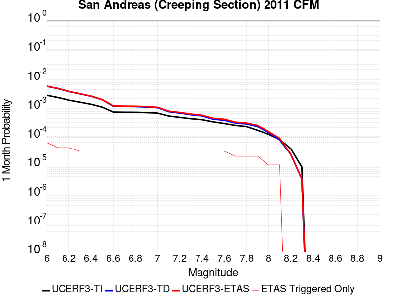 |  |  |

| Magnitude | 1 wk TI Prob | 1 wk TD Prob | 1 wk ETAS Prob | 1 wk ETAS/TD Gain | 1 wk ETAS Triggered Only | 1 mo TI Prob | 1 mo TD Prob | 1 mo ETAS Prob | 1 mo ETAS/TD Gain | 1 mo ETAS Triggered Only | 1 yr TI Prob | 1 yr TD Prob | 1 yr ETAS Prob | 1 yr ETAS/TD Gain | 1 yr ETAS Triggered Only | 10 yr TI Prob | 10 yr TD Prob | 10 yr ETAS Prob | 10 yr ETAS/TD Gain | 10 yr ETAS Triggered Only |
|-----|-----|-----|-----|-----|-----|-----|-----|-----|-----|-----|-----|-----|-----|-----|-----|-----|-----|-----|-----|-----|
| 6.0 | 5.986481E-4 | 0.0012275929 | 0.0012768202 | 1.0401007 | 4.928779E-5 | 0.0025631124 | 0.005245547 | 0.0053436053 | 1.0186937 | 9.857558E-5 | 0.030762846 | 0.06120491 | 0.061436266 | 1.00378 | 2.4643895E-4 | 0.26835477 | 0.42593494 | 0.42618957 | 1.0005978 | 4.4359014E-4 |
| 6.1 | 5.015945E-4 | 0.0010217986 | 0.0010217986 | 1.0 | 0.0 | 0.00214792 | 0.0043678596 | 0.004416932 | 1.0112349 | 4.928779E-5 | 0.025839351 | 0.05124837 | 0.051388655 | 1.0027374 | 1.4786338E-4 | 0.23032776 | 0.37285668 | 0.37304214 | 1.0004975 | 2.9572676E-4 |
| 6.2 | 4.073338E-4 | 8.1073755E-4 | 8.1073755E-4 | 1.0 | 0.0 | 0.0017445484 | 0.0034671477 | 0.0035162645 | 1.0141664 | 4.928779E-5 | 0.021034058 | 0.04093317 | 0.04107498 | 1.0034645 | 1.4786338E-4 | 0.19150782 | 0.31303346 | 0.31323662 | 1.000649 | 2.9572676E-4 |
| 6.3 | 3.464099E-4 | 6.7391695E-4 | 6.7391695E-4 | 1.0 | 0.0 | 0.0014837692 | 0.0028829593 | 0.0028829593 | 1.0 | 0.0 | 0.017915873 | 0.034189582 | 0.034284785 | 1.0027846 | 9.857558E-5 | 0.16538359 | 0.2713166 | 0.27149615 | 1.0006618 | 2.4643895E-4 |
| 6.4 | 2.935057E-4 | 5.5442745E-4 | 5.5442745E-4 | 1.0 | 0.0 | 0.0012572751 | 0.0023725363 | 0.0023725363 | 1.0 | 0.0 | 0.015200248 | 0.02826451 | 0.0283603 | 1.003389 | 9.857558E-5 | 0.14201577 | 0.23298529 | 0.23317431 | 1.0008113 | 2.4643895E-4 |
| 6.5 | 2.3409708E-4 | 4.2093755E-4 | 4.2093755E-4 | 1.0 | 0.0 | 0.0010028875 | 0.0018019684 | 0.0018019684 | 1.0 | 0.0 | 0.012141965 | 0.021587461 | 0.021683909 | 1.0044677 | 9.857558E-5 | 0.11499573 | 0.18682368 | 0.186984 | 1.0008582 | 1.9715117E-4 |
| 6.6 | 1.5842178E-4 | 2.506933E-4 | 2.506933E-4 | 1.0 | 0.0 | 6.7877385E-4 | 0.0010739497 | 0.0010739497 | 1.0 | 0.0 | 0.0082328 | 0.012995575 | 0.013092869 | 1.0074867 | 9.857558E-5 | 0.07934396 | 0.12314638 | 0.12331925 | 1.0014038 | 1.9715117E-4 |
| 6.7 | 1.5616413E-4 | 2.4605883E-4 | 2.4605883E-4 | 1.0 | 0.0 | 6.691031E-4 | 0.0010541069 | 0.0010541069 | 1.0 | 0.0 | 0.0081159435 | 0.01275744 | 0.012854758 | 1.0076283 | 9.857558E-5 | 0.0782586 | 0.12117351 | 0.12134677 | 1.0014299 | 1.9715117E-4 |
| 6.8 | 1.5538467E-4 | 2.4429744E-4 | 2.4429744E-4 | 1.0 | 0.0 | 6.6576427E-4 | 0.0010465645 | 0.0010465645 | 1.0 | 0.0 | 0.008075596 | 0.012666838 | 0.012764165 | 1.0076836 | 9.857558E-5 | 0.07788358 | 0.120404355 | 0.12057777 | 1.0014403 | 1.9715117E-4 |
| 6.9 | 1.5153569E-4 | 2.3539034E-4 | 2.3539034E-4 | 1.0 | 0.0 | 6.49277E-4 | 0.0010084276 | 0.0010084276 | 1.0 | 0.0 | 0.007876333 | 0.01220901 | 0.012306383 | 1.0079755 | 9.857558E-5 | 0.07602952 | 0.11647445 | 0.11664864 | 1.0014955 | 1.9715117E-4 |
| 7.0 | 1.4588932E-4 | 2.2396253E-4 | 2.2396253E-4 | 1.0 | 0.0 | 6.250901E-4 | 9.5948833E-4 | 9.5948833E-4 | 1.0 | 0.0 | 0.0075839474 | 0.011619697 | 0.011717127 | 1.008385 | 9.857558E-5 | 0.073302895 | 0.11132046 | 0.11149566 | 1.0015739 | 1.9715117E-4 |
| 7.1 | 1.1565079E-4 | 1.6281738E-4 | 1.6281738E-4 | 1.0 | 0.0 | 4.955521E-4 | 6.9760304E-4 | 6.9760304E-4 | 1.0 | 0.0 | 0.006016669 | 0.0084604435 | 0.008558185 | 1.0115528 | 9.857558E-5 | 0.058563538 | 0.08367046 | 0.083851114 | 1.0021591 | 1.9715117E-4 |
| 7.2 | 1.0393792E-4 | 1.4615769E-4 | 1.4615769E-4 | 1.0 | 0.0 | 4.4537216E-4 | 6.2624045E-4 | 6.2624045E-4 | 1.0 | 0.0 | 0.005408933 | 0.0075979927 | 0.0076958193 | 1.0128753 | 9.857558E-5 | 0.052791595 | 0.07561969 | 0.07580193 | 1.0024099 | 1.9715117E-4 |
| 7.3 | 9.332884E-5 | 1.2780898E-4 | 1.2780898E-4 | 1.0 | 0.0 | 3.999194E-4 | 5.4763845E-4 | 5.4763845E-4 | 1.0 | 0.0 | 0.0048581534 | 0.006647249 | 0.0067451694 | 1.0147309 | 9.857558E-5 | 0.047533102 | 0.06648326 | 0.0666673 | 1.0027683 | 1.9715117E-4 |
| 7.4 | 8.670252E-5 | 1.17032345E-4 | 1.17032345E-4 | 1.0 | 0.0 | 3.715293E-4 | 5.0147134E-4 | 5.0147134E-4 | 1.0 | 0.0 | 0.004513991 | 0.006088443 | 0.0061864182 | 1.0160921 | 9.857558E-5 | 0.044233937 | 0.061151642 | 0.061336737 | 1.0030268 | 1.9715117E-4 |
| 7.5 | 7.3036405E-5 | 9.005856E-5 | 9.005856E-5 | 1.0 | 0.0 | 3.129756E-4 | 3.8590826E-4 | 3.8590826E-4 | 1.0 | 0.0 | 0.0038038217 | 0.0046883323 | 0.0046883323 | 1.0 | 0.0 | 0.03739367 | 0.047877792 | 0.047971647 | 1.0019603 | 9.857558E-5 |
| 7.6 | 6.3935775E-5 | 8.280385E-5 | 8.280385E-5 | 1.0 | 0.0 | 2.7398168E-4 | 3.5482543E-4 | 3.5482543E-4 | 1.0 | 0.0 | 0.0033306254 | 0.004311461 | 0.004311461 | 1.0 | 0.0 | 0.032811474 | 0.04399201 | 0.044086248 | 1.0021422 | 9.857558E-5 |
| 7.7 | 5.5050095E-5 | 6.6618326E-5 | 6.6618326E-5 | 1.0 | 0.0 | 2.3590765E-4 | 2.854759E-4 | 2.854759E-4 | 1.0 | 0.0 | 0.0028683927 | 0.003470134 | 0.003470134 | 1.0 | 0.0 | 0.0283165 | 0.035796214 | 0.03589126 | 1.0026553 | 9.857558E-5 |
| 7.8 | 5.027131E-5 | 6.162871E-5 | 6.162871E-5 | 1.0 | 0.0 | 2.1543067E-4 | 2.640963E-4 | 2.640963E-4 | 1.0 | 0.0 | 0.0026197135 | 0.003210635 | 0.003210635 | 1.0 | 0.0 | 0.025890453 | 0.03312666 | 0.03322197 | 1.0028771 | 9.857558E-5 |
| 7.9 | 3.7271806E-5 | 5.022507E-5 | 5.022507E-5 | 1.0 | 0.0 | 1.5972654E-4 | 2.1523255E-4 | 2.1523255E-4 | 1.0 | 0.0 | 0.0019429359 | 0.002617309 | 0.002617309 | 1.0 | 0.0 | 0.019260362 | 0.027067466 | 0.027163371 | 1.0035433 | 9.857558E-5 |
| 8.0 | 2.7310243E-5 | 3.1427757E-5 | 3.1427757E-5 | 1.0 | 0.0 | 1.17038646E-4 | 1.3468343E-4 | 1.3468343E-4 | 1.0 | 0.0 | 0.0014240141 | 0.0016385383 | 0.0016385383 | 1.0 | 0.0 | 0.014149235 | 0.01721386 | 0.01721386 | 1.0 | 0.0 |
| 8.1 | 1.7940547E-5 | 1.7399378E-5 | 1.7399378E-5 | 1.0 | 0.0 | 7.688579E-5 | 7.456663E-5 | 7.456663E-5 | 1.0 | 0.0 | 9.3568244E-4 | 9.074711E-4 | 9.074711E-4 | 1.0 | 0.0 | 0.009317525 | 0.009798636 | 0.009798636 | 1.0 | 0.0 |
| 8.2 | 8.643924E-6 | 5.473668E-6 | 5.473668E-6 | 1.0 | 0.0 | 3.704486E-5 | 2.3458366E-5 | 2.3458366E-5 | 1.0 | 0.0 | 4.5092785E-4 | 2.8556827E-4 | 2.8556827E-4 | 1.0 | 0.0 | 0.0045001395 | 0.0032481793 | 0.0032481793 | 1.0 | 0.0 |
| 8.3 | 1.983087E-6 | 7.6564595E-7 | 7.6564595E-7 | 1.0 | 0.0 | 8.498917E-6 | 3.281336E-6 | 3.281336E-6 | 1.0 | 0.0 | 1.034694E-4 | 3.9949547E-5 | 3.9949547E-5 | 1.0 | 0.0 | 0.0010342124 | 4.717979E-4 | 4.717979E-4 | 1.0 | 0.0 |

## Ludlow
*[(top)](#table-of-contents)*

| 1 Week | 1 Month | 1 Year | 10 Year |
|-----|-----|-----|-----|
|  |  |  | 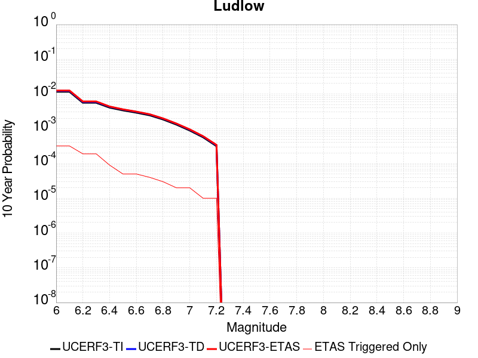 |

| Magnitude | 1 wk TI Prob | 1 wk TD Prob | 1 wk ETAS Prob | 1 wk ETAS/TD Gain | 1 wk ETAS Triggered Only | 1 mo TI Prob | 1 mo TD Prob | 1 mo ETAS Prob | 1 mo ETAS/TD Gain | 1 mo ETAS Triggered Only | 1 yr TI Prob | 1 yr TD Prob | 1 yr ETAS Prob | 1 yr ETAS/TD Gain | 1 yr ETAS Triggered Only | 10 yr TI Prob | 10 yr TD Prob | 10 yr ETAS Prob | 10 yr ETAS/TD Gain | 10 yr ETAS Triggered Only |
|-----|-----|-----|-----|-----|-----|-----|-----|-----|-----|-----|-----|-----|-----|-----|-----|-----|-----|-----|-----|-----|
| 6.0 | 2.2407607E-5 | 2.3657254E-5 | 1.7151712E-4 | 7.2500863 | 1.4786338E-4 | 9.602906E-5 | 1.0138454E-4 | 3.4779852E-4 | 3.4304886 | 2.4643895E-4 | 0.0011685267 | 0.001233702 | 0.0015782908 | 1.279313 | 3.4501453E-4 | 0.011624013 | 0.012273042 | 0.012711188 | 1.0356998 | 4.4359014E-4 |
| 6.1 | 2.2407607E-5 | 2.3657254E-5 | 1.7151712E-4 | 7.2500863 | 1.4786338E-4 | 9.602906E-5 | 1.0138454E-4 | 3.4779852E-4 | 3.4304886 | 2.4643895E-4 | 0.0011685267 | 0.001233702 | 0.0015782908 | 1.279313 | 3.4501453E-4 | 0.011624013 | 0.012273042 | 0.012711188 | 1.0356998 | 4.4359014E-4 |
| 6.2 | 1.0781252E-5 | 1.1365663E-5 | 6.0652896E-5 | 5.3365026 | 4.928779E-5 | 4.620455E-5 | 4.8709102E-5 | 1.9656528E-4 | 4.035494 | 1.4786338E-4 | 5.623952E-4 | 5.9287593E-4 | 7.406517E-4 | 1.2492523 | 1.4786338E-4 | 0.00560974 | 0.0059133614 | 0.0061093466 | 1.0331428 | 1.9715117E-4 |
| 6.3 | 1.0781252E-5 | 1.1365663E-5 | 6.0652896E-5 | 5.3365026 | 4.928779E-5 | 4.620455E-5 | 4.8709102E-5 | 1.9656528E-4 | 4.035494 | 1.4786338E-4 | 5.623952E-4 | 5.9287593E-4 | 7.406517E-4 | 1.2492523 | 1.4786338E-4 | 0.00560974 | 0.0059133614 | 0.0061093466 | 1.0331428 | 1.9715117E-4 |
| 6.4 | 7.814439E-6 | 8.237729E-6 | 5.7525114E-5 | 6.983128 | 4.928779E-5 | 3.3490025E-5 | 3.530408E-5 | 1.3387618E-4 | 3.792088 | 9.857558E-5 | 4.0766477E-4 | 4.2974384E-4 | 5.282771E-4 | 1.2292836 | 9.857558E-5 | 0.0040691774 | 0.0042892746 | 0.004387427 | 1.0228833 | 9.857558E-5 |
| 6.5 | 6.4986366E-6 | 6.85092E-6 | 5.6138375E-5 | 8.194283 | 4.928779E-5 | 2.7851002E-5 | 2.9360759E-5 | 7.864711E-5 | 2.6786468 | 4.928779E-5 | 3.390332E-4 | 3.5740953E-4 | 4.066797E-4 | 1.1378535 | 4.928779E-5 | 0.003385164 | 0.0035684432 | 0.0036175551 | 1.0137628 | 4.928779E-5 |
| 6.6 | 5.582177E-6 | 5.8860055E-6 | 5.5173507E-5 | 9.373675 | 4.928779E-5 | 2.3923398E-5 | 2.5225498E-5 | 7.451205E-5 | 2.9538383 | 4.928779E-5 | 2.9122844E-4 | 3.0707786E-4 | 3.5635053E-4 | 1.1604565 | 4.928779E-5 | 0.0029084706 | 0.003066609 | 0.0031157455 | 1.0160232 | 4.928779E-5 |
| 6.7 | 4.6858763E-6 | 4.940427E-6 | 5.4227974E-5 | 10.976374 | 4.928779E-5 | 2.0082172E-5 | 2.1173091E-5 | 7.045984E-5 | 3.3278012 | 4.928779E-5 | 2.4447302E-4 | 2.5775246E-4 | 3.0702754E-4 | 1.1911721 | 4.928779E-5 | 0.0024420423 | 0.0025745912 | 0.0026237522 | 1.0190946 | 4.928779E-5 |
| 6.8 | 3.5584908E-6 | 3.7520183E-6 | 5.3039625E-5 | 14.1362915 | 4.928779E-5 | 1.5250586E-5 | 1.6079981E-5 | 6.536698E-5 | 4.0651155 | 4.928779E-5 | 1.8566006E-4 | 1.957566E-4 | 2.4503475E-4 | 1.2517318 | 4.928779E-5 | 0.0018550502 | 0.0019558826 | 0.0020050742 | 1.0251505 | 4.928779E-5 |
| 6.9 | 2.532834E-6 | 2.6710034E-6 | 5.1958665E-5 | 19.452862 | 4.928779E-5 | 1.0854958E-5 | 1.1447109E-5 | 6.0734335E-5 | 5.3056483 | 4.928779E-5 | 1.3215111E-4 | 1.3935992E-4 | 1.8864084E-4 | 1.3536234 | 4.928779E-5 | 0.0013207254 | 0.0013927529 | 0.001441972 | 1.0353395 | 4.928779E-5 |
| 7.0 | 1.7083285E-6 | 1.8019439E-6 | 5.1089646E-5 | 28.352518 | 4.928779E-5 | 7.3213873E-6 | 7.722595E-6 | 5.7010006E-5 | 7.3822346 | 4.928779E-5 | 8.913424E-5 | 9.40187E-5 | 1.4330186E-4 | 1.5241846 | 4.928779E-5 | 8.9098496E-4 | 9.3980576E-4 | 9.890472E-4 | 1.0523953 | 4.928779E-5 |
| 7.1 | 1.0905424E-6 | 1.1497619E-6 | 1.1497619E-6 | 1.0 | 0.0 | 4.6737446E-6 | 4.9275427E-6 | 4.9275427E-6 | 1.0 | 0.0 | 5.6901354E-5 | 5.999128E-5 | 5.999128E-5 | 1.0 | 0.0 | 5.6886784E-4 | 5.997606E-4 | 5.997606E-4 | 1.0 | 0.0 |
| 7.2 | 6.06668E-7 | 6.387277E-7 | 6.387277E-7 | 1.0 | 0.0 | 2.600003E-6 | 2.7374022E-6 | 2.7374022E-6 | 1.0 | 0.0 | 3.1654577E-5 | 3.3327433E-5 | 3.3327433E-5 | 1.0 | 0.0 | 3.1650066E-4 | 3.3323118E-4 | 3.3323118E-4 | 1.0 | 0.0 |

## San Andreas (Cholame) rev
*[(top)](#table-of-contents)*

| 1 Week | 1 Month | 1 Year | 10 Year |
|-----|-----|-----|-----|
|  |  | 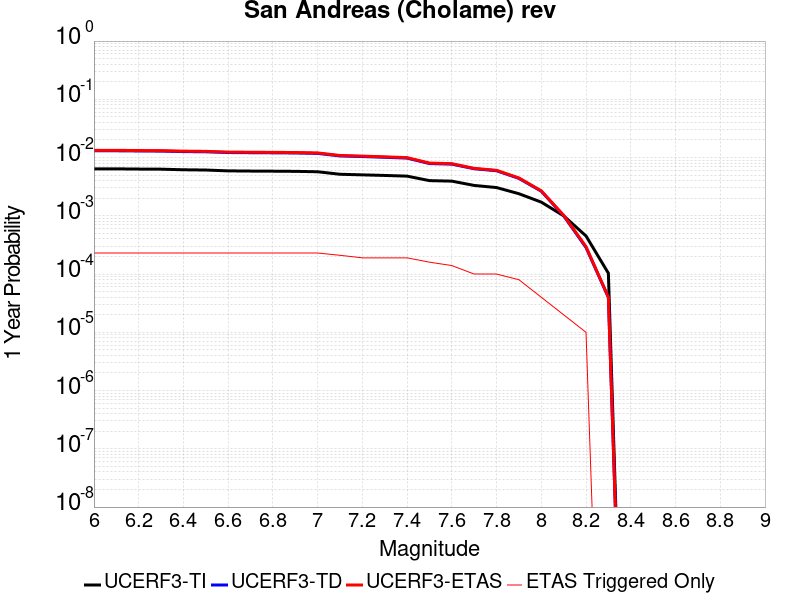 | 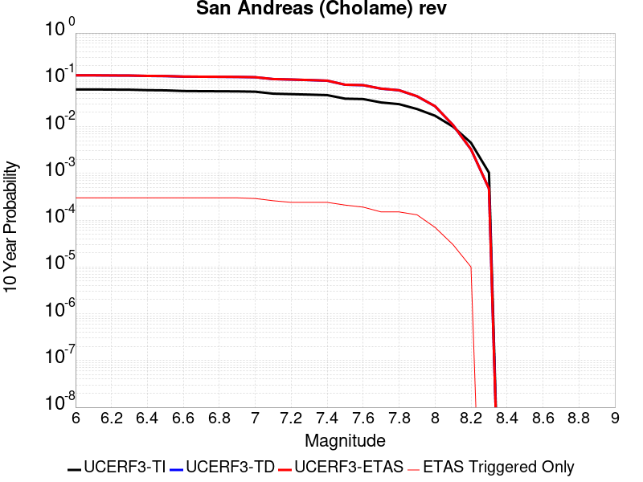 |

| Magnitude | 1 wk TI Prob | 1 wk TD Prob | 1 wk ETAS Prob | 1 wk ETAS/TD Gain | 1 wk ETAS Triggered Only | 1 mo TI Prob | 1 mo TD Prob | 1 mo ETAS Prob | 1 mo ETAS/TD Gain | 1 mo ETAS Triggered Only | 1 yr TI Prob | 1 yr TD Prob | 1 yr ETAS Prob | 1 yr ETAS/TD Gain | 1 yr ETAS Triggered Only | 10 yr TI Prob | 10 yr TD Prob | 10 yr ETAS Prob | 10 yr ETAS/TD Gain | 10 yr ETAS Triggered Only |
|-----|-----|-----|-----|-----|-----|-----|-----|-----|-----|-----|-----|-----|-----|-----|-----|-----|-----|-----|-----|-----|
| 6.0 | 1.2302514E-4 | 2.5205986E-4 | 3.9988596E-4 | 1.5864722 | 1.4786338E-4 | 5.27144E-4 | 0.0010798109 | 0.0012275147 | 1.1367866 | 1.4786338E-4 | 0.0063991086 | 0.013067958 | 0.01335982 | 1.0223342 | 2.9572676E-4 | 0.06217949 | 0.12438412 | 0.124772534 | 1.0031227 | 4.4359014E-4 |
| 6.1 | 1.2302514E-4 | 2.5205986E-4 | 3.9988596E-4 | 1.5864722 | 1.4786338E-4 | 5.27144E-4 | 0.0010798109 | 0.0012275147 | 1.1367866 | 1.4786338E-4 | 0.0063991086 | 0.013067958 | 0.01335982 | 1.0223342 | 2.9572676E-4 | 0.06217949 | 0.12438412 | 0.124772534 | 1.0031227 | 4.4359014E-4 |
| 6.2 | 1.2203569E-4 | 2.502277E-4 | 3.9805408E-4 | 1.5907674 | 1.4786338E-4 | 5.2290526E-4 | 0.0010719653 | 0.0012196702 | 1.1377889 | 1.4786338E-4 | 0.006347804 | 0.012973578 | 0.013265468 | 1.0224988 | 2.9572676E-4 | 0.061695136 | 0.123571314 | 0.123960085 | 1.0031462 | 4.4359014E-4 |
| 6.3 | 1.2142645E-4 | 2.4908737E-4 | 3.9691394E-4 | 1.5934726 | 1.4786338E-4 | 5.202953E-4 | 0.0010670823 | 0.0012147878 | 1.1384201 | 1.4786338E-4 | 0.006316212 | 0.012914834 | 0.013206741 | 1.0226024 | 2.9572676E-4 | 0.06139677 | 0.12306532 | 0.12345432 | 1.003161 | 4.4359014E-4 |
| 6.4 | 1.1865206E-4 | 2.4414246E-4 | 3.9196972E-4 | 1.6054959 | 1.4786338E-4 | 5.0840975E-4 | 0.0010459068 | 0.0011936156 | 1.1412255 | 1.4786338E-4 | 0.006172335 | 0.012660044 | 0.012952027 | 1.0230633 | 2.9572676E-4 | 0.060036868 | 0.12085904 | 0.12124902 | 1.0032268 | 4.4359014E-4 |
| 6.5 | 1.17443946E-4 | 2.4207575E-4 | 3.8990335E-4 | 1.6106666 | 1.4786338E-4 | 5.032341E-4 | 0.0010370566 | 0.0011847666 | 1.142432 | 1.4786338E-4 | 0.006109677 | 0.012553536 | 0.012845551 | 1.0232615 | 2.9572676E-4 | 0.059444077 | 0.11993008 | 0.12032047 | 1.0032551 | 4.4359014E-4 |
| 6.6 | 1.13579066E-4 | 2.3516564E-4 | 3.8299424E-4 | 1.6286148 | 1.4786338E-4 | 4.866766E-4 | 0.001007465 | 0.0011551793 | 1.1466199 | 1.4786338E-4 | 0.0059092017 | 0.012197345 | 0.012489464 | 1.0239495 | 2.9572676E-4 | 0.057545185 | 0.1168492 | 0.11724096 | 1.0033526 | 4.4359014E-4 |
| 6.7 | 1.1271412E-4 | 2.336088E-4 | 3.8143763E-4 | 1.6328051 | 1.4786338E-4 | 4.829711E-4 | 0.001000798 | 0.0011485133 | 1.1475977 | 1.4786338E-4 | 0.005864331 | 0.012117079 | 0.012409223 | 1.0241101 | 2.9572676E-4 | 0.057119697 | 0.11615275 | 0.11654482 | 1.0033754 | 4.4359014E-4 |
| 6.8 | 1.1217975E-4 | 2.3249313E-4 | 3.8032213E-4 | 1.6358424 | 1.4786338E-4 | 4.8068175E-4 | 9.960202E-4 | 0.0011437362 | 1.1483064 | 1.4786338E-4 | 0.005836608 | 0.012059555 | 0.012351716 | 1.0242264 | 2.9572676E-4 | 0.056856725 | 0.11565061 | 0.1160429 | 1.003392 | 4.4359014E-4 |
| 6.9 | 1.1146753E-4 | 2.3098059E-4 | 3.788098E-4 | 1.6400071 | 1.4786338E-4 | 4.7763053E-4 | 9.895428E-4 | 0.0011372598 | 1.149278 | 1.4786338E-4 | 0.0057996577 | 0.011981564 | 0.0122737475 | 1.024386 | 2.9572676E-4 | 0.056506127 | 0.11497027 | 0.11536285 | 1.0034148 | 4.4359014E-4 |
| 7.0 | 1.0965793E-4 | 2.2721413E-4 | 3.750439E-4 | 1.6506188 | 1.4786338E-4 | 4.698779E-4 | 9.734129E-4 | 0.0011211324 | 1.1517541 | 1.4786338E-4 | 0.005705768 | 0.011787324 | 0.012079565 | 1.0247928 | 2.9572676E-4 | 0.055614736 | 0.11327011 | 0.11366346 | 1.0034726 | 4.4359014E-4 |
| 7.1 | 9.927982E-5 | 2.0540332E-4 | 3.5323633E-4 | 1.7197206 | 1.4786338E-4 | 4.2541555E-4 | 8.8000396E-4 | 0.0010277373 | 1.1678779 | 1.4786338E-4 | 0.0051671406 | 0.010661708 | 0.010954282 | 1.0274415 | 2.9572676E-4 | 0.05048634 | 0.10336573 | 0.10376347 | 1.0038478 | 4.4359014E-4 |
| 7.2 | 9.696786E-5 | 2.0044584E-4 | 3.4827957E-4 | 1.7375246 | 1.4786338E-4 | 4.1551032E-4 | 8.587718E-4 | 0.0010065081 | 1.1720322 | 1.4786338E-4 | 0.00504711 | 0.010405703 | 0.010698353 | 1.028124 | 2.9572676E-4 | 0.04934009 | 0.10110233 | 0.10150108 | 1.0039439 | 4.4359014E-4 |
| 7.3 | 9.4727984E-5 | 1.9473763E-4 | 3.425722E-4 | 1.7591475 | 1.4786338E-4 | 4.0591392E-4 | 8.343239E-4 | 9.820638E-4 | 1.1770775 | 1.4786338E-4 | 0.0049308087 | 0.010110851 | 0.0104035875 | 1.0289527 | 2.9572676E-4 | 0.048228268 | 0.09847412 | 0.09887403 | 1.0040611 | 4.4359014E-4 |
| 7.4 | 9.220358E-5 | 1.8844259E-4 | 3.3627808E-4 | 1.7845123 | 1.4786338E-4 | 3.9509835E-4 | 8.07362E-4 | 9.55106E-4 | 1.1829959 | 1.4786338E-4 | 0.004799717 | 0.009785578 | 0.010078411 | 1.029925 | 2.9572676E-4 | 0.046973653 | 0.09555831 | 0.09595951 | 1.0041986 | 4.4359014E-4 |
| 7.5 | 7.71631E-5 | 1.5179155E-4 | 2.5035217E-4 | 1.6493156 | 9.857558E-5 | 3.306571E-4 | 6.5037323E-4 | 7.488847E-4 | 1.1514691 | 9.857558E-5 | 0.0040183207 | 0.007889617 | 0.008036314 | 1.0185937 | 1.4786338E-4 | 0.03946433 | 0.078289196 | 0.078561775 | 1.0034816 | 2.9572676E-4 |
| 7.6 | 7.5634416E-5 | 1.4838556E-4 | 2.4694653E-4 | 1.664222 | 9.857558E-5 | 3.241072E-4 | 6.357833E-4 | 7.342962E-4 | 1.1549473 | 9.857558E-5 | 0.0039388672 | 0.007713256 | 0.007859979 | 1.0190222 | 1.4786338E-4 | 0.038697794 | 0.076654874 | 0.07692794 | 1.0035622 | 2.9572676E-4 |
| 7.7 | 6.3783E-5 | 1.2359623E-4 | 1.7287793E-4 | 1.3987315 | 4.928779E-5 | 2.7332708E-4 | 5.2959064E-4 | 5.788523E-4 | 1.0930184 | 4.928779E-5 | 0.0033226798 | 0.0064287307 | 0.0065266723 | 1.0152351 | 9.857558E-5 | 0.032734364 | 0.06454488 | 0.06477541 | 1.0035716 | 2.4643895E-4 |
| 7.8 | 5.863422E-5 | 1.14169685E-4 | 1.6345186E-4 | 1.4316572 | 4.928779E-5 | 2.512653E-4 | 4.892069E-4 | 5.3847063E-4 | 1.1007011 | 4.928779E-5 | 0.003054864 | 0.0059398497 | 0.0060378397 | 1.016497 | 9.857558E-5 | 0.030132094 | 0.05966162 | 0.059893355 | 1.0038842 | 2.4643895E-4 |
| 7.9 | 4.595283E-5 | 8.426815E-5 | 8.426815E-5 | 1.0 | 0.0 | 1.9692584E-4 | 3.6109926E-4 | 3.6109926E-4 | 1.0 | 0.0 | 0.0023949358 | 0.0043875277 | 0.0043875277 | 1.0 | 0.0 | 0.023692891 | 0.044363137 | 0.04450444 | 1.0031852 | 1.4786338E-4 |
| 8.0 | 3.2950178E-5 | 5.077396E-5 | 5.077396E-5 | 1.0 | 0.0 | 1.412074E-4 | 2.1758456E-4 | 2.1758456E-4 | 1.0 | 0.0 | 0.0017178444 | 0.0026458753 | 0.0026458753 | 1.0 | 0.0 | 0.017046256 | 0.027181072 | 0.02722902 | 1.001764 | 4.928779E-5 |
| 8.1 | 1.9177472E-5 | 1.9183733E-5 | 1.9183733E-5 | 1.0 | 0.0 | 8.218658E-5 | 8.221342E-5 | 8.221342E-5 | 1.0 | 0.0 | 0.0010001622 | 0.0010004893 | 0.0010004893 | 1.0 | 0.0 | 0.009956728 | 0.010757887 | 0.010757887 | 1.0 | 0.0 |
| 8.2 | 8.643924E-6 | 5.473668E-6 | 5.473668E-6 | 1.0 | 0.0 | 3.704486E-5 | 2.3458366E-5 | 2.3458366E-5 | 1.0 | 0.0 | 4.5092785E-4 | 2.8556827E-4 | 2.8556827E-4 | 1.0 | 0.0 | 0.0045001395 | 0.0032481793 | 0.0032481793 | 1.0 | 0.0 |
| 8.3 | 1.983087E-6 | 7.6564595E-7 | 7.6564595E-7 | 1.0 | 0.0 | 8.498917E-6 | 3.281336E-6 | 3.281336E-6 | 1.0 | 0.0 | 1.034694E-4 | 3.9949547E-5 | 3.9949547E-5 | 1.0 | 0.0 | 0.0010342124 | 4.717979E-4 | 4.717979E-4 | 1.0 | 0.0 |

## San Andreas (Carrizo) rev
*[(top)](#table-of-contents)*

| 1 Week | 1 Month | 1 Year | 10 Year |
|-----|-----|-----|-----|
|  | 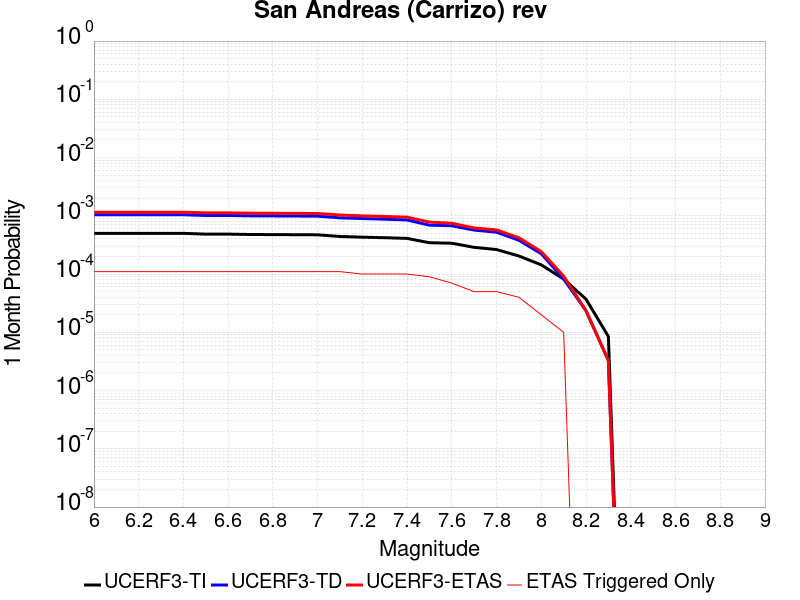 |  |  |

| Magnitude | 1 wk TI Prob | 1 wk TD Prob | 1 wk ETAS Prob | 1 wk ETAS/TD Gain | 1 wk ETAS Triggered Only | 1 mo TI Prob | 1 mo TD Prob | 1 mo ETAS Prob | 1 mo ETAS/TD Gain | 1 mo ETAS Triggered Only | 1 yr TI Prob | 1 yr TD Prob | 1 yr ETAS Prob | 1 yr ETAS/TD Gain | 1 yr ETAS Triggered Only | 10 yr TI Prob | 10 yr TD Prob | 10 yr ETAS Prob | 10 yr ETAS/TD Gain | 10 yr ETAS Triggered Only |
|-----|-----|-----|-----|-----|-----|-----|-----|-----|-----|-----|-----|-----|-----|-----|-----|-----|-----|-----|-----|-----|
| 6.0 | 1.1674632E-4 | 2.4324407E-4 | 3.9107146E-4 | 1.6077329 | 1.4786338E-4 | 5.002454E-4 | 0.0010420597 | 0.001189769 | 1.1417475 | 1.4786338E-4 | 0.006073493 | 0.012613757 | 0.012905753 | 1.023149 | 2.9572676E-4 | 0.0591016 | 0.120640226 | 0.1210303 | 1.0032334 | 4.4359014E-4 |
| 6.1 | 1.1674632E-4 | 2.4324407E-4 | 3.9107146E-4 | 1.6077329 | 1.4786338E-4 | 5.002454E-4 | 0.0010420597 | 0.001189769 | 1.1417475 | 1.4786338E-4 | 0.006073493 | 0.012613757 | 0.012905753 | 1.023149 | 2.9572676E-4 | 0.0591016 | 0.120640226 | 0.1210303 | 1.0032334 | 4.4359014E-4 |
| 6.2 | 1.1674632E-4 | 2.4324407E-4 | 3.9107146E-4 | 1.6077329 | 1.4786338E-4 | 5.002454E-4 | 0.0010420597 | 0.001189769 | 1.1417475 | 1.4786338E-4 | 0.006073493 | 0.012613757 | 0.012905753 | 1.023149 | 2.9572676E-4 | 0.0591016 | 0.120640226 | 0.1210303 | 1.0032334 | 4.4359014E-4 |
| 6.3 | 1.1674632E-4 | 2.4324407E-4 | 3.9107146E-4 | 1.6077329 | 1.4786338E-4 | 5.002454E-4 | 0.0010420597 | 0.001189769 | 1.1417475 | 1.4786338E-4 | 0.006073493 | 0.012613757 | 0.012905753 | 1.023149 | 2.9572676E-4 | 0.0591016 | 0.120640226 | 0.1210303 | 1.0032334 | 4.4359014E-4 |
| 6.4 | 1.1674632E-4 | 2.4324407E-4 | 3.9107146E-4 | 1.6077329 | 1.4786338E-4 | 5.002454E-4 | 0.0010420597 | 0.001189769 | 1.1417475 | 1.4786338E-4 | 0.006073493 | 0.012613757 | 0.012905753 | 1.023149 | 2.9572676E-4 | 0.0591016 | 0.120640226 | 0.1210303 | 1.0032334 | 4.4359014E-4 |
| 6.5 | 1.13136164E-4 | 2.3644442E-4 | 3.8427283E-4 | 1.6252142 | 1.4786338E-4 | 4.847792E-4 | 0.0010129412 | 0.0011606548 | 1.1458265 | 1.4786338E-4 | 0.0058862255 | 0.012263271 | 0.012555371 | 1.0238191 | 2.9572676E-4 | 0.057327334 | 0.11761008 | 0.1180015 | 1.0033281 | 4.4359014E-4 |
| 6.6 | 1.13136164E-4 | 2.3644442E-4 | 3.8427283E-4 | 1.6252142 | 1.4786338E-4 | 4.847792E-4 | 0.0010129412 | 0.0011606548 | 1.1458265 | 1.4786338E-4 | 0.0058862255 | 0.012263271 | 0.012555371 | 1.0238191 | 2.9572676E-4 | 0.057327334 | 0.11761008 | 0.1180015 | 1.0033281 | 4.4359014E-4 |
| 6.7 | 1.1149675E-4 | 2.3335687E-4 | 3.8118576E-4 | 1.6334884 | 1.4786338E-4 | 4.777557E-4 | 9.997191E-4 | 0.0011474346 | 1.147757 | 1.4786338E-4 | 0.0058011734 | 0.012104088 | 0.012396236 | 1.0241363 | 2.9572676E-4 | 0.05652051 | 0.1162291 | 0.11662114 | 1.0033729 | 4.4359014E-4 |
| 6.8 | 1.1103589E-4 | 2.3237852E-4 | 3.8020752E-4 | 1.6361561 | 1.4786338E-4 | 4.7578133E-4 | 9.955293E-4 | 0.0011432455 | 1.1483796 | 1.4786338E-4 | 0.005777263 | 0.012053643 | 0.012345806 | 1.0242385 | 2.9572676E-4 | 0.056293584 | 0.11578894 | 0.116181165 | 1.0033875 | 4.4359014E-4 |
| 6.9 | 1.1053259E-4 | 2.3130233E-4 | 3.791315E-4 | 1.6391166 | 1.4786338E-4 | 4.7362508E-4 | 9.909206E-4 | 0.0011386374 | 1.1490703 | 1.4786338E-4 | 0.0057511497 | 0.011998152 | 0.012290331 | 1.024352 | 2.9572676E-4 | 0.05604569 | 0.11530445 | 0.11569689 | 1.0034035 | 4.4359014E-4 |
| 7.0 | 1.1005377E-4 | 2.3031076E-4 | 3.7814007E-4 | 1.641869 | 1.4786338E-4 | 4.7157376E-4 | 9.866742E-4 | 0.0011343918 | 1.1497126 | 1.4786338E-4 | 0.0057263062 | 0.011947021 | 0.012239215 | 1.0244575 | 2.9572676E-4 | 0.055809796 | 0.11485658 | 0.115249224 | 1.0034186 | 4.4359014E-4 |
| 7.1 | 1.0308142E-4 | 2.1540876E-4 | 3.6324028E-4 | 1.6862837 | 1.4786338E-4 | 4.417027E-4 | 9.228548E-4 | 0.0010705817 | 1.160076 | 1.4786338E-4 | 0.0053644776 | 0.011178188 | 0.011470609 | 1.02616 | 2.9572676E-4 | 0.052368138 | 0.10809042 | 0.108486064 | 1.0036603 | 4.4359014E-4 |
| 7.2 | 1.0027479E-4 | 2.094876E-4 | 3.5732E-4 | 1.7056857 | 1.4786338E-4 | 4.296783E-4 | 8.9749607E-4 | 0.0010452267 | 1.1646031 | 1.4786338E-4 | 0.0052187922 | 0.010872566 | 0.011165078 | 1.0269036 | 2.9572676E-4 | 0.050979212 | 0.10539086 | 0.1057877 | 1.0037655 | 4.4359014E-4 |
| 7.3 | 9.816942E-5 | 2.0423878E-4 | 3.5207195E-4 | 1.7238252 | 1.4786338E-4 | 4.2065824E-4 | 8.7501644E-4 | 0.0010227504 | 1.1688356 | 1.4786338E-4 | 0.005109493 | 0.010601572 | 0.0108941635 | 1.0275989 | 2.9572676E-4 | 0.049935985 | 0.10297546 | 0.10337337 | 1.0038642 | 4.4359014E-4 |
| 7.4 | 9.5634205E-5 | 1.9793298E-4 | 3.457671E-4 | 1.7468897 | 1.4786338E-4 | 4.0979648E-4 | 8.4800937E-4 | 9.957474E-4 | 1.1742173 | 1.4786338E-4 | 0.0049778637 | 0.010275901 | 0.010568589 | 1.0284829 | 2.9572676E-4 | 0.048678253 | 0.100067884 | 0.100467086 | 1.0039893 | 4.4359014E-4 |
| 7.5 | 8.052417E-5 | 1.6113915E-4 | 2.5969886E-4 | 1.6116434 | 9.857558E-5 | 3.4505792E-4 | 6.9041376E-4 | 7.889213E-4 | 1.142679 | 9.857558E-5 | 0.0041929903 | 0.008373471 | 0.008520097 | 1.0175107 | 1.4786338E-4 | 0.04114753 | 0.082815245 | 0.08308648 | 1.0032752 | 2.9572676E-4 |
| 7.6 | 7.897024E-5 | 1.5767086E-4 | 2.562309E-4 | 1.6250999 | 9.857558E-5 | 3.384E-4 | 6.755574E-4 | 7.7406643E-4 | 1.1458188 | 9.857558E-5 | 0.0041122385 | 0.00819397 | 0.008340621 | 1.0178975 | 1.4786338E-4 | 0.040369697 | 0.08115866 | 0.08143039 | 1.0033481 | 2.9572676E-4 |
| 7.7 | 6.707427E-5 | 1.3277122E-4 | 1.8205248E-4 | 1.3711741 | 4.928779E-5 | 2.8742946E-4 | 5.688955E-4 | 6.1815523E-4 | 1.0865884 | 4.928779E-5 | 0.003493839 | 0.0069043385 | 0.0070022335 | 1.0141788 | 9.857558E-5 | 0.034394164 | 0.06905339 | 0.069282815 | 1.0033224 | 2.4643895E-4 |
| 7.8 | 6.147705E-5 | 1.2198445E-4 | 1.7126623E-4 | 1.4040005 | 4.928779E-5 | 2.6344648E-4 | 5.226858E-4 | 5.7194784E-4 | 1.0942479 | 4.928779E-5 | 0.0032027436 | 0.006345156 | 0.0064431066 | 1.015437 | 9.857558E-5 | 0.031569764 | 0.0635172 | 0.06374798 | 1.0036334 | 2.4643895E-4 |
| 7.9 | 4.7636717E-5 | 8.8802946E-5 | 8.8802946E-5 | 1.0 | 0.0 | 2.0414138E-4 | 3.8052857E-4 | 3.8052857E-4 | 1.0 | 0.0 | 0.0024825884 | 0.004623101 | 0.004623101 | 1.0 | 0.0 | 0.024550365 | 0.046629366 | 0.046770334 | 1.0030231 | 1.4786338E-4 |
| 8.0 | 3.3554235E-5 | 5.2138024E-5 | 5.2138024E-5 | 1.0 | 0.0 | 1.4379594E-4 | 2.2342955E-4 | 2.2342955E-4 | 1.0 | 0.0 | 0.0017493097 | 0.002716863 | 0.002716863 | 1.0 | 0.0 | 0.017356034 | 0.027881905 | 0.02792982 | 1.0017184 | 4.928779E-5 |
| 8.1 | 1.9175432E-5 | 1.9183564E-5 | 1.9183564E-5 | 1.0 | 0.0 | 8.217783E-5 | 8.221269E-5 | 8.221269E-5 | 1.0 | 0.0 | 0.0010000558 | 0.0010004805 | 0.0010004805 | 1.0 | 0.0 | 0.009955673 | 0.010757771 | 0.010757771 | 1.0 | 0.0 |
| 8.2 | 8.643924E-6 | 5.473668E-6 | 5.473668E-6 | 1.0 | 0.0 | 3.704486E-5 | 2.3458366E-5 | 2.3458366E-5 | 1.0 | 0.0 | 4.5092785E-4 | 2.8556827E-4 | 2.8556827E-4 | 1.0 | 0.0 | 0.0045001395 | 0.0032481793 | 0.0032481793 | 1.0 | 0.0 |
| 8.3 | 1.983087E-6 | 7.6564595E-7 | 7.6564595E-7 | 1.0 | 0.0 | 8.498917E-6 | 3.281336E-6 | 3.281336E-6 | 1.0 | 0.0 | 1.034694E-4 | 3.9949547E-5 | 3.9949547E-5 | 1.0 | 0.0 | 0.0010342124 | 4.717979E-4 | 4.717979E-4 | 1.0 | 0.0 |

## Red Pass
*[(top)](#table-of-contents)*

| 1 Week | 1 Month | 1 Year | 10 Year |
|-----|-----|-----|-----|
|  |  |  |  |

| Magnitude | 1 wk TI Prob | 1 wk TD Prob | 1 wk ETAS Prob | 1 wk ETAS/TD Gain | 1 wk ETAS Triggered Only | 1 mo TI Prob | 1 mo TD Prob | 1 mo ETAS Prob | 1 mo ETAS/TD Gain | 1 mo ETAS Triggered Only | 1 yr TI Prob | 1 yr TD Prob | 1 yr ETAS Prob | 1 yr ETAS/TD Gain | 1 yr ETAS Triggered Only | 10 yr TI Prob | 10 yr TD Prob | 10 yr ETAS Prob | 10 yr ETAS/TD Gain | 10 yr ETAS Triggered Only |
|-----|-----|-----|-----|-----|-----|-----|-----|-----|-----|-----|-----|-----|-----|-----|-----|-----|-----|-----|-----|-----|
| 6.0 | 8.258278E-6 | 8.551265E-6 | 5.7838635E-5 | 6.763752 | 4.928779E-5 | 3.539214E-5 | 3.6647863E-5 | 1.3521983E-4 | 3.6897058 | 9.857558E-5 | 4.308141E-4 | 4.4611428E-4 | 6.924433E-4 | 1.5521657 | 2.4643895E-4 | 0.0042997985 | 0.004453945 | 0.004797423 | 1.0771177 | 3.4501453E-4 |
| 6.1 | 3.649988E-6 | 3.7753161E-6 | 5.3062922E-5 | 14.055226 | 4.928779E-5 | 1.5642712E-5 | 1.6179853E-5 | 6.546685E-5 | 4.0461955 | 4.928779E-5 | 1.9043336E-4 | 1.9697666E-4 | 2.4625476E-4 | 1.2501721 | 4.928779E-5 | 0.0019027026 | 0.001968488 | 0.0020668695 | 1.0499783 | 9.857558E-5 |
| 6.2 | 3.649988E-6 | 3.7753161E-6 | 5.3062922E-5 | 14.055226 | 4.928779E-5 | 1.5642712E-5 | 1.6179853E-5 | 6.546685E-5 | 4.0461955 | 4.928779E-5 | 1.9043336E-4 | 1.9697666E-4 | 2.4625476E-4 | 1.2501721 | 4.928779E-5 | 0.0019027026 | 0.001968488 | 0.0020668695 | 1.0499783 | 9.857558E-5 |
| 6.3 | 1.3924937E-6 | 1.4411166E-6 | 1.4411166E-6 | 1.0 | 0.0 | 5.9678164E-6 | 6.1762075E-6 | 6.1762075E-6 | 1.0 | 0.0 | 7.265574E-5 | 7.519415E-5 | 7.519415E-5 | 1.0 | 0.0 | 7.263199E-4 | 7.518258E-4 | 7.518258E-4 | 1.0 | 0.0 |
| 6.4 | 1.3924937E-6 | 1.4411166E-6 | 1.4411166E-6 | 1.0 | 0.0 | 5.9678164E-6 | 6.1762075E-6 | 6.1762075E-6 | 1.0 | 0.0 | 7.265574E-5 | 7.519415E-5 | 7.519415E-5 | 1.0 | 0.0 | 7.263199E-4 | 7.518258E-4 | 7.518258E-4 | 1.0 | 0.0 |
| 6.5 | 9.876812E-7 | 1.0221912E-6 | 1.0221912E-6 | 1.0 | 0.0 | 4.2329125E-6 | 4.3808195E-6 | 4.3808195E-6 | 1.0 | 0.0 | 5.153449E-5 | 5.3336476E-5 | 5.3336476E-5 | 1.0 | 0.0 | 5.1522546E-4 | 5.333648E-4 | 5.333648E-4 | 1.0 | 0.0 |

## Baker
*[(top)](#table-of-contents)*

| 1 Week | 1 Month | 1 Year | 10 Year |
|-----|-----|-----|-----|
|  | 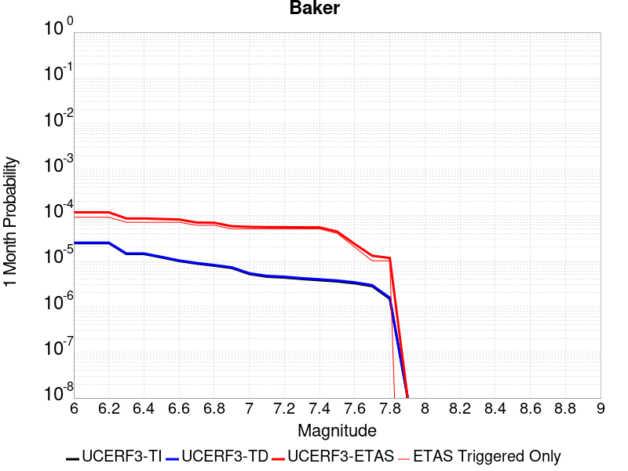 |  |  |

| Magnitude | 1 wk TI Prob | 1 wk TD Prob | 1 wk ETAS Prob | 1 wk ETAS/TD Gain | 1 wk ETAS Triggered Only | 1 mo TI Prob | 1 mo TD Prob | 1 mo ETAS Prob | 1 mo ETAS/TD Gain | 1 mo ETAS Triggered Only | 1 yr TI Prob | 1 yr TD Prob | 1 yr ETAS Prob | 1 yr ETAS/TD Gain | 1 yr ETAS Triggered Only | 10 yr TI Prob | 10 yr TD Prob | 10 yr ETAS Prob | 10 yr ETAS/TD Gain | 10 yr ETAS Triggered Only |
|-----|-----|-----|-----|-----|-----|-----|-----|-----|-----|-----|-----|-----|-----|-----|-----|-----|-----|-----|-----|-----|
| 6.0 | 5.695525E-6 | 5.8348373E-6 | 1.04409846E-4 | 17.894218 | 9.857558E-5 | 2.4409164E-5 | 2.5006228E-5 | 2.2215246E-4 | 8.883885 | 1.9715117E-4 | 2.9714106E-4 | 3.044123E-4 | 5.5077625E-4 | 1.8093101 | 2.4643895E-4 | 0.0029674405 | 0.0030403486 | 0.0033843142 | 1.1131335 | 3.4501453E-4 |
| 6.1 | 5.695525E-6 | 5.8348373E-6 | 1.04409846E-4 | 17.894218 | 9.857558E-5 | 2.4409164E-5 | 2.5006228E-5 | 2.2215246E-4 | 8.883885 | 1.9715117E-4 | 2.9714106E-4 | 3.044123E-4 | 5.5077625E-4 | 1.8093101 | 2.4643895E-4 | 0.0029674405 | 0.0030403486 | 0.0033843142 | 1.1131335 | 3.4501453E-4 |
| 6.2 | 5.695525E-6 | 5.8348373E-6 | 1.04409846E-4 | 17.894218 | 9.857558E-5 | 2.4409164E-5 | 2.5006228E-5 | 2.2215246E-4 | 8.883885 | 1.9715117E-4 | 2.9714106E-4 | 3.044123E-4 | 5.5077625E-4 | 1.8093101 | 2.4643895E-4 | 0.0029674405 | 0.0030403486 | 0.0033843142 | 1.1131335 | 3.4501453E-4 |
| 6.3 | 3.2995713E-6 | 3.383667E-6 | 1.0195892E-4 | 30.132668 | 9.857558E-5 | 1.4140943E-5 | 1.4501353E-5 | 1.13075504E-4 | 7.7975836 | 9.857558E-5 | 1.7215237E-4 | 1.7654014E-4 | 3.243774E-4 | 1.8374145 | 1.4786338E-4 | 0.0017201907 | 0.001764046 | 0.0019608494 | 1.1115637 | 1.9715117E-4 |
| 6.4 | 3.2995713E-6 | 3.383667E-6 | 1.0195892E-4 | 30.132668 | 9.857558E-5 | 1.4140943E-5 | 1.4501353E-5 | 1.13075504E-4 | 7.7975836 | 9.857558E-5 | 1.7215237E-4 | 1.7654014E-4 | 3.243774E-4 | 1.8374145 | 1.4786338E-4 | 0.0017201907 | 0.001764046 | 0.0019608494 | 1.1115637 | 1.9715117E-4 |
| 6.5 | 2.782202E-6 | 2.8558404E-6 | 1.0143114E-4 | 35.51709 | 9.857558E-5 | 1.1923668E-5 | 1.223926E-5 | 1.10813635E-4 | 9.053948 | 9.857558E-5 | 1.4516099E-4 | 1.4900314E-4 | 2.968445E-4 | 1.9922029 | 1.4786338E-4 | 0.001450662 | 0.0014890651 | 0.0016859226 | 1.1322021 | 1.9715117E-4 |
| 6.6 | 2.3163404E-6 | 2.38092E-6 | 1.0095627E-4 | 42.40221 | 9.857558E-5 | 9.927136E-6 | 1.0203904E-5 | 1.08778484E-4 | 10.660477 | 9.857558E-5 | 1.20856166E-4 | 1.2422565E-4 | 2.2278899E-4 | 1.7934217 | 9.857558E-5 | 0.0012079047 | 0.0012415823 | 0.0013892622 | 1.1189448 | 1.4786338E-4 |
| 6.7 | 2.037056E-6 | 2.0965003E-6 | 1.00671874E-4 | 48.01901 | 9.857558E-5 | 8.7302105E-6 | 8.984972E-6 | 1.0755967E-4 | 11.971064 | 9.857558E-5 | 1.0628513E-4 | 1.093867E-4 | 2.0795151E-4 | 1.9010675 | 9.857558E-5 | 0.0010623431 | 0.0010933448 | 0.0011918126 | 1.0900611 | 9.857558E-5 |
| 6.8 | 1.8356744E-6 | 1.8915287E-6 | 1.00466925E-4 | 53.114143 | 9.857558E-5 | 7.867153E-6 | 8.106527E-6 | 1.0668131E-4 | 13.159927 | 9.857558E-5 | 9.577837E-5 | 9.869264E-5 | 1.9725849E-4 | 1.9987154 | 9.857558E-5 | 9.57371E-4 | 9.86502E-4 | 0.0010849804 | 1.0998257 | 9.857558E-5 |
| 6.9 | 1.6310546E-6 | 1.6832072E-6 | 1.0025862E-4 | 59.56404 | 9.857558E-5 | 6.9902153E-6 | 7.213726E-6 | 1.057886E-4 | 14.664905 | 9.857558E-5 | 8.510255E-5 | 8.782368E-5 | 1.863906E-4 | 2.1223273 | 9.857558E-5 | 8.5069967E-4 | 8.7790104E-4 | 9.763901E-4 | 1.1121869 | 9.857558E-5 |
| 7.0 | 1.2058036E-6 | 1.2508665E-6 | 9.982633E-5 | 79.80574 | 9.857558E-5 | 5.1677193E-6 | 5.3608455E-6 | 1.039359E-4 | 19.387966 | 9.857558E-5 | 6.291517E-5 | 6.5266366E-5 | 1.6383552E-4 | 2.5102596 | 9.857558E-5 | 6.289736E-4 | 6.524743E-4 | 7.509856E-4 | 1.1509811 | 9.857558E-5 |
| 7.1 | 1.052382E-6 | 1.0951609E-6 | 9.967064E-5 | 91.01004 | 9.857558E-5 | 4.5102006E-6 | 4.693538E-6 | 1.03268656E-4 | 22.002306 | 9.857558E-5 | 5.491031E-5 | 5.7142337E-5 | 1.5571229E-4 | 2.72499 | 9.857558E-5 | 5.4896745E-4 | 5.7127734E-4 | 6.697966E-4 | 1.1724544 | 9.857558E-5 |
| 7.2 | 1.0067454E-6 | 1.0487711E-6 | 9.962425E-5 | 94.99142 | 9.857558E-5 | 4.3146156E-6 | 4.4947255E-6 | 1.0306986E-4 | 22.931293 | 9.857558E-5 | 5.252918E-5 | 5.4721917E-5 | 1.532921E-4 | 2.8012927 | 9.857558E-5 | 5.251676E-4 | 5.470853E-4 | 6.4560695E-4 | 1.1800846 | 9.857558E-5 |
| 7.3 | 9.3596316E-7 | 9.767723E-7 | 9.955226E-5 | 101.91962 | 9.857558E-5 | 4.0112645E-6 | 4.1861604E-6 | 1.0276133E-4 | 24.547873 | 9.857558E-5 | 4.8836053E-5 | 5.096532E-5 | 1.4953587E-4 | 2.9340713 | 9.857558E-5 | 4.8825322E-4 | 5.095371E-4 | 6.0806243E-4 | 1.1933625 | 9.857558E-5 |
| 7.4 | 8.8117395E-7 | 9.2076635E-7 | 9.949626E-5 | 108.0581 | 9.857558E-5 | 3.7764542E-6 | 3.9461356E-6 | 1.0252133E-4 | 25.980185 | 9.857558E-5 | 4.5977362E-5 | 4.8043148E-5 | 1.46614E-4 | 3.051715 | 9.857558E-5 | 4.596785E-4 | 4.8032837E-4 | 5.788566E-4 | 1.2051269 | 9.857558E-5 |
| 7.5 | 8.292386E-7 | 8.6745956E-7 | 5.015521E-5 | 57.818497 | 4.928779E-5 | 3.5538749E-6 | 3.7176785E-6 | 5.3005286E-5 | 14.25763 | 4.928779E-5 | 4.326757E-5 | 4.5261804E-5 | 9.4547366E-5 | 2.0888996 | 4.928779E-5 | 4.3259145E-4 | 4.5252658E-4 | 5.0179206E-4 | 1.1088676 | 4.928779E-5 |
| 7.6 | 7.553842E-7 | 7.9144706E-7 | 7.9144706E-7 | 1.0 | 0.0 | 3.2373566E-6 | 3.3919116E-6 | 3.3919116E-6 | 1.0 | 0.0 | 3.9414106E-5 | 4.129575E-5 | 4.129575E-5 | 1.0 | 0.0 | 3.9407116E-4 | 4.1288146E-4 | 4.1288146E-4 | 1.0 | 0.0 |
| 7.7 | 6.5285366E-7 | 6.852797E-7 | 6.852797E-7 | 1.0 | 0.0 | 2.797941E-6 | 2.9369096E-6 | 2.9369096E-6 | 1.0 | 0.0 | 3.40644E-5 | 3.5756293E-5 | 3.5756293E-5 | 1.0 | 0.0 | 3.405918E-4 | 3.5750607E-4 | 3.5750607E-4 | 1.0 | 0.0 |
| 7.8 | 3.4586725E-7 | 3.6482615E-7 | 3.6482615E-7 | 1.0 | 0.0 | 1.4822873E-6 | 1.5635396E-6 | 1.5635396E-6 | 1.0 | 0.0 | 1.80467E-5 | 1.9035933E-5 | 1.9035933E-5 | 1.0 | 0.0 | 1.8045233E-4 | 1.9034347E-4 | 1.9034347E-4 | 1.0 | 0.0 |
| 7.9 | 2.5591178E-9 | 2.6696718E-9 | 2.6696718E-9 | 1.0 | 0.0 | 1.0967647E-8 | 1.14414505E-8 | 1.14414505E-8 | 1.0 | 0.0 | 1.335311E-7 | 1.3929966E-7 | 1.3929966E-7 | 1.0 | 0.0 | 1.3353102E-6 | 1.3929966E-6 | 1.3929966E-6 | 1.0 | 0.0 |

## Cady
*[(top)](#table-of-contents)*

| 1 Week | 1 Month | 1 Year | 10 Year |
|-----|-----|-----|-----|
|  |  |  |  |

| Magnitude | 1 wk TI Prob | 1 wk TD Prob | 1 wk ETAS Prob | 1 wk ETAS/TD Gain | 1 wk ETAS Triggered Only | 1 mo TI Prob | 1 mo TD Prob | 1 mo ETAS Prob | 1 mo ETAS/TD Gain | 1 mo ETAS Triggered Only | 1 yr TI Prob | 1 yr TD Prob | 1 yr ETAS Prob | 1 yr ETAS/TD Gain | 1 yr ETAS Triggered Only | 10 yr TI Prob | 10 yr TD Prob | 10 yr ETAS Prob | 10 yr ETAS/TD Gain | 10 yr ETAS Triggered Only |
|-----|-----|-----|-----|-----|-----|-----|-----|-----|-----|-----|-----|-----|-----|-----|-----|-----|-----|-----|-----|-----|
| 6.0 | 1.9892565E-5 | 2.1858728E-5 | 1.2043216E-4 | 5.509568 | 9.857558E-5 | 8.525106E-5 | 9.3677416E-5 | 2.908101E-4 | 3.104378 | 1.9715117E-4 | 0.0010374374 | 0.0011400167 | 0.0013861747 | 1.2159249 | 2.4643895E-4 | 0.010326075 | 0.011350701 | 0.011691798 | 1.0300509 | 3.4501453E-4 |
| 6.1 | 1.9892565E-5 | 2.1858728E-5 | 1.2043216E-4 | 5.509568 | 9.857558E-5 | 8.525106E-5 | 9.3677416E-5 | 2.908101E-4 | 3.104378 | 1.9715117E-4 | 0.0010374374 | 0.0011400167 | 0.0013861747 | 1.2159249 | 2.4643895E-4 | 0.010326075 | 0.011350701 | 0.011691798 | 1.0300509 | 3.4501453E-4 |
| 6.2 | 1.9892565E-5 | 2.1858728E-5 | 1.2043216E-4 | 5.509568 | 9.857558E-5 | 8.525106E-5 | 9.3677416E-5 | 2.908101E-4 | 3.104378 | 1.9715117E-4 | 0.0010374374 | 0.0011400167 | 0.0013861747 | 1.2159249 | 2.4643895E-4 | 0.010326075 | 0.011350701 | 0.011691798 | 1.0300509 | 3.4501453E-4 |
| 6.3 | 1.1117327E-5 | 1.2176583E-5 | 1.1075097E-4 | 9.095406 | 9.857558E-5 | 4.764482E-5 | 5.2184492E-5 | 2.0004014E-4 | 3.8333256 | 1.4786338E-4 | 5.7992124E-4 | 6.351925E-4 | 7.8296196E-4 | 1.2326373 | 1.4786338E-4 | 0.0057841022 | 0.0063368753 | 0.0065817526 | 1.0386432 | 2.4643895E-4 |
| 6.4 | 1.1117327E-5 | 1.2176583E-5 | 1.1075097E-4 | 9.095406 | 9.857558E-5 | 4.764482E-5 | 5.2184492E-5 | 2.0004014E-4 | 3.8333256 | 1.4786338E-4 | 5.7992124E-4 | 6.351925E-4 | 7.8296196E-4 | 1.2326373 | 1.4786338E-4 | 0.0057841022 | 0.0063368753 | 0.0065817526 | 1.0386432 | 2.4643895E-4 |
| 6.5 | 6.103093E-6 | 6.672021E-6 | 6.672021E-6 | 1.0 | 0.0 | 2.615585E-5 | 2.8594131E-5 | 2.8594131E-5 | 1.0 | 0.0 | 3.1840094E-4 | 3.480905E-4 | 3.480905E-4 | 1.0 | 0.0 | 0.0031794512 | 0.0034766865 | 0.003525803 | 1.0141274 | 4.928779E-5 |
| 6.6 | 5.817237E-6 | 6.3656585E-6 | 6.3656585E-6 | 1.0 | 0.0 | 2.4930776E-5 | 2.728118E-5 | 2.728118E-5 | 1.0 | 0.0 | 3.034899E-4 | 3.3211018E-4 | 3.3211018E-4 | 1.0 | 0.0 | 0.0030307577 | 0.0033173605 | 0.0033664848 | 1.0148083 | 4.928779E-5 |
| 6.7 | 4.8846314E-6 | 5.3405684E-6 | 5.3405684E-6 | 1.0 | 0.0 | 2.0933967E-5 | 2.2888014E-5 | 2.2888014E-5 | 1.0 | 0.0 | 2.5484123E-4 | 2.7863772E-4 | 2.7863772E-4 | 1.0 | 0.0 | 0.0025454918 | 0.0027840391 | 0.0027840391 | 1.0 | 0.0 |
| 6.8 | 1.7788773E-6 | 1.9399079E-6 | 1.9399079E-6 | 1.0 | 0.0 | 7.6237375E-6 | 8.313874E-6 | 8.313874E-6 | 1.0 | 0.0 | 9.281505E-5 | 1.01218284E-4 | 1.01218284E-4 | 1.0 | 0.0 | 9.2776294E-4 | 0.0010118765 | 0.0010118765 | 1.0 | 0.0 |
| 6.9 | 7.5455404E-7 | 8.297092E-7 | 8.297092E-7 | 1.0 | 0.0 | 3.233799E-6 | 3.5558937E-6 | 3.5558937E-6 | 1.0 | 0.0 | 3.937079E-5 | 4.3292483E-5 | 4.3292483E-5 | 1.0 | 0.0 | 3.9363815E-4 | 4.3287344E-4 | 4.3287344E-4 | 1.0 | 0.0 |
| 7.0 | 6.8578805E-7 | 7.541816E-7 | 7.541816E-7 | 1.0 | 0.0 | 2.9390883E-6 | 3.2322048E-6 | 3.2322048E-6 | 1.0 | 0.0 | 3.578281E-5 | 3.9351715E-5 | 3.9351715E-5 | 1.0 | 0.0 | 3.577705E-4 | 3.9347992E-4 | 3.9347992E-4 | 1.0 | 0.0 |

## Manix-Afton Hills
*[(top)](#table-of-contents)*

| 1 Week | 1 Month | 1 Year | 10 Year |
|-----|-----|-----|-----|
|  | 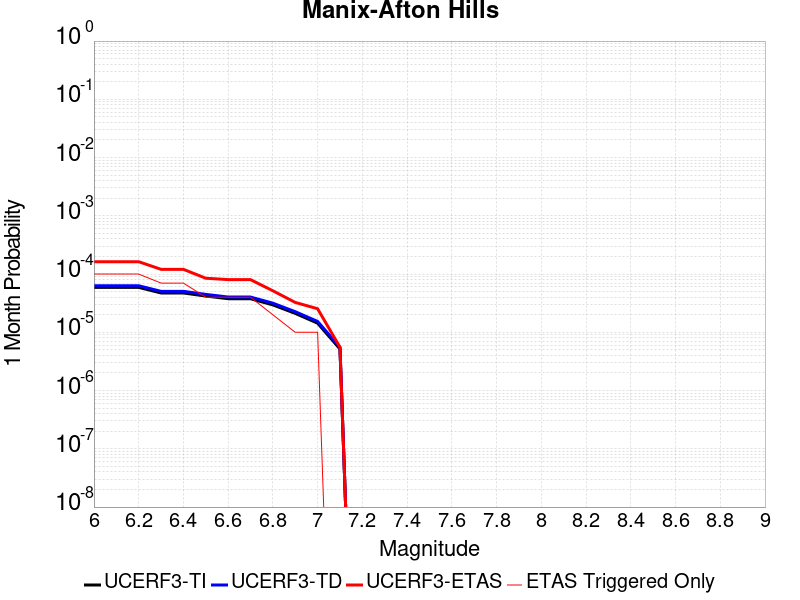 |  |  |

| Magnitude | 1 wk TI Prob | 1 wk TD Prob | 1 wk ETAS Prob | 1 wk ETAS/TD Gain | 1 wk ETAS Triggered Only | 1 mo TI Prob | 1 mo TD Prob | 1 mo ETAS Prob | 1 mo ETAS/TD Gain | 1 mo ETAS Triggered Only | 1 yr TI Prob | 1 yr TD Prob | 1 yr ETAS Prob | 1 yr ETAS/TD Gain | 1 yr ETAS Triggered Only | 10 yr TI Prob | 10 yr TD Prob | 10 yr ETAS Prob | 10 yr ETAS/TD Gain | 10 yr ETAS Triggered Only |
|-----|-----|-----|-----|-----|-----|-----|-----|-----|-----|-----|-----|-----|-----|-----|-----|-----|-----|-----|-----|-----|
| 6.0 | 1.3783202E-5 | 1.47110895E-5 | 1.1328522E-4 | 7.7006683 | 9.857558E-5 | 5.906953E-5 | 6.30461E-5 | 2.1090015E-4 | 3.3451736 | 1.4786338E-4 | 7.189342E-4 | 7.6733343E-4 | 9.6433336E-4 | 1.2567331 | 1.9715117E-4 | 0.0071661277 | 0.007648596 | 0.007942061 | 1.0383685 | 2.9572676E-4 |
| 6.1 | 1.3783202E-5 | 1.47110895E-5 | 1.1328522E-4 | 7.7006683 | 9.857558E-5 | 5.906953E-5 | 6.30461E-5 | 2.1090015E-4 | 3.3451736 | 1.4786338E-4 | 7.189342E-4 | 7.6733343E-4 | 9.6433336E-4 | 1.2567331 | 1.9715117E-4 | 0.0071661277 | 0.007648596 | 0.007942061 | 1.0383685 | 2.9572676E-4 |
| 6.2 | 1.3783202E-5 | 1.47110895E-5 | 1.1328522E-4 | 7.7006683 | 9.857558E-5 | 5.906953E-5 | 6.30461E-5 | 2.1090015E-4 | 3.3451736 | 1.4786338E-4 | 7.189342E-4 | 7.6733343E-4 | 9.6433336E-4 | 1.2567331 | 1.9715117E-4 | 0.0071661277 | 0.007648596 | 0.007942061 | 1.0383685 | 2.9572676E-4 |
| 6.3 | 1.10494875E-5 | 1.1793136E-5 | 1.1793136E-5 | 1.0 | 0.0 | 4.7354086E-5 | 5.054109E-5 | 9.982639E-5 | 1.9751531 | 4.928779E-5 | 5.763835E-4 | 6.151744E-4 | 6.644319E-4 | 1.0800707 | 4.928779E-5 | 0.005748908 | 0.0061357557 | 0.006233726 | 1.0159671 | 9.857558E-5 |
| 6.4 | 1.10494875E-5 | 1.1793136E-5 | 1.1793136E-5 | 1.0 | 0.0 | 4.7354086E-5 | 5.054109E-5 | 9.982639E-5 | 1.9751531 | 4.928779E-5 | 5.763835E-4 | 6.151744E-4 | 6.644319E-4 | 1.0800707 | 4.928779E-5 | 0.005748908 | 0.0061357557 | 0.006233726 | 1.0159671 | 9.857558E-5 |
| 6.5 | 9.788949E-6 | 1.045432E-5 | 1.045432E-5 | 1.0 | 0.0 | 4.1951964E-5 | 4.480351E-5 | 4.480351E-5 | 1.0 | 0.0 | 5.1064545E-4 | 5.453555E-4 | 5.453555E-4 | 1.0 | 0.0 | 0.0050947363 | 0.0054410985 | 0.005490118 | 1.0090091 | 4.928779E-5 |
| 6.6 | 8.810006E-6 | 9.4136285E-6 | 9.4136285E-6 | 1.0 | 0.0 | 3.775662E-5 | 4.0343548E-5 | 4.0343548E-5 | 1.0 | 0.0 | 4.5958988E-4 | 4.9108086E-4 | 4.9108086E-4 | 1.0 | 0.0 | 0.0045864056 | 0.004900839 | 0.0049498854 | 1.0100077 | 4.928779E-5 |
| 6.7 | 8.80128E-6 | 9.404108E-6 | 9.404108E-6 | 1.0 | 0.0 | 3.7719226E-5 | 4.0302748E-5 | 4.0302748E-5 | 1.0 | 0.0 | 4.591348E-4 | 4.9058435E-4 | 4.9058435E-4 | 1.0 | 0.0 | 0.004581874 | 0.0048958957 | 0.0049449424 | 1.0100179 | 4.928779E-5 |
| 6.8 | 6.8994877E-6 | 7.380076E-6 | 7.380076E-6 | 1.0 | 0.0 | 2.9568899E-5 | 3.162856E-5 | 3.162856E-5 | 1.0 | 0.0 | 3.5994186E-4 | 3.8501783E-4 | 3.8501783E-4 | 1.0 | 0.0 | 0.003593594 | 0.0038443129 | 0.0038934113 | 1.0127717 | 4.928779E-5 |
| 6.9 | 4.9328037E-6 | 5.2709615E-6 | 5.2709615E-6 | 1.0 | 0.0 | 2.1140417E-5 | 2.2589675E-5 | 2.2589675E-5 | 1.0 | 0.0 | 2.5735417E-4 | 2.7500073E-4 | 2.7500073E-4 | 1.0 | 0.0 | 0.0025705635 | 0.0027472095 | 0.0027472095 | 1.0 | 0.0 |
| 7.0 | 3.347973E-6 | 3.59003E-6 | 3.59003E-6 | 1.0 | 0.0 | 1.4348378E-5 | 1.5385775E-5 | 1.5385775E-5 | 1.0 | 0.0 | 1.746775E-4 | 1.8730981E-4 | 1.8730981E-4 | 1.0 | 0.0 | 0.0017454025 | 0.0018719219 | 0.0018719219 | 1.0 | 0.0 |
| 7.1 | 1.2073567E-6 | 1.293482E-6 | 1.293482E-6 | 1.0 | 0.0 | 5.1743755E-6 | 5.543492E-6 | 5.543492E-6 | 1.0 | 0.0 | 6.29962E-5 | 6.749156E-5 | 6.749156E-5 | 1.0 | 0.0 | 6.297835E-4 | 6.7487074E-4 | 6.7487074E-4 | 1.0 | 0.0 |

## Santa Ynez (West)
*[(top)](#table-of-contents)*

| 1 Week | 1 Month | 1 Year | 10 Year |
|-----|-----|-----|-----|
|  |  |  |  |

| Magnitude | 1 wk TI Prob | 1 wk TD Prob | 1 wk ETAS Prob | 1 wk ETAS/TD Gain | 1 wk ETAS Triggered Only | 1 mo TI Prob | 1 mo TD Prob | 1 mo ETAS Prob | 1 mo ETAS/TD Gain | 1 mo ETAS Triggered Only | 1 yr TI Prob | 1 yr TD Prob | 1 yr ETAS Prob | 1 yr ETAS/TD Gain | 1 yr ETAS Triggered Only | 10 yr TI Prob | 10 yr TD Prob | 10 yr ETAS Prob | 10 yr ETAS/TD Gain | 10 yr ETAS Triggered Only |
|-----|-----|-----|-----|-----|-----|-----|-----|-----|-----|-----|-----|-----|-----|-----|-----|-----|-----|-----|-----|-----|
| 6.0 | 4.7352758E-5 | 5.497084E-5 | 1.0425592E-4 | 1.8965677 | 4.928779E-5 | 2.0292461E-4 | 2.3556968E-4 | 3.3412204E-4 | 1.4183576 | 9.857558E-5 | 0.0024678076 | 0.002864558 | 0.003110291 | 1.085784 | 2.4643895E-4 | 0.024405818 | 0.028304456 | 0.028591812 | 1.0101523 | 2.9572676E-4 |
| 6.1 | 4.7352758E-5 | 5.497084E-5 | 1.0425592E-4 | 1.8965677 | 4.928779E-5 | 2.0292461E-4 | 2.3556968E-4 | 3.3412204E-4 | 1.4183576 | 9.857558E-5 | 0.0024678076 | 0.002864558 | 0.003110291 | 1.085784 | 2.4643895E-4 | 0.024405818 | 0.028304456 | 0.028591812 | 1.0101523 | 2.9572676E-4 |
| 6.2 | 3.0415853E-5 | 3.3925004E-5 | 8.3211125E-5 | 2.4527962 | 4.928779E-5 | 1.3034715E-4 | 1.4538495E-4 | 1.9466558E-4 | 1.3389665 | 4.928779E-5 | 0.0015858212 | 0.0017686592 | 0.001916261 | 1.0834541 | 1.4786338E-4 | 0.015745522 | 0.01754978 | 0.01774347 | 1.0110366 | 1.9715117E-4 |
| 6.3 | 3.0415853E-5 | 3.3925004E-5 | 8.3211125E-5 | 2.4527962 | 4.928779E-5 | 1.3034715E-4 | 1.4538495E-4 | 1.9466558E-4 | 1.3389665 | 4.928779E-5 | 0.0015858212 | 0.0017686592 | 0.001916261 | 1.0834541 | 1.4786338E-4 | 0.015745522 | 0.01754978 | 0.01774347 | 1.0110366 | 1.9715117E-4 |
| 6.4 | 2.5452082E-5 | 2.7912318E-5 | 2.7912318E-5 | 1.0 | 0.0 | 1.09075794E-4 | 1.1961885E-4 | 1.1961885E-4 | 1.0 | 0.0 | 0.0013271887 | 0.0014554056 | 0.0015538377 | 1.0676321 | 9.857558E-5 | 0.013192902 | 0.01446091 | 0.01455806 | 1.0067182 | 9.857558E-5 |
| 6.5 | 2.3143784E-5 | 2.5128133E-5 | 2.5128133E-5 | 1.0 | 0.0 | 9.9183875E-5 | 1.07687636E-4 | 1.07687636E-4 | 1.0 | 0.0 | 0.0012068948 | 0.001310323 | 0.0014087694 | 1.0751314 | 9.857558E-5 | 0.012003611 | 0.013027638 | 0.01312493 | 1.0074681 | 9.857558E-5 |
| 6.6 | 1.9118515E-5 | 2.0354244E-5 | 2.0354244E-5 | 1.0 | 0.0 | 8.193392E-5 | 8.722961E-5 | 8.722961E-5 | 1.0 | 0.0 | 9.97089E-4 | 0.001061511 | 0.0011599819 | 1.0927649 | 9.857558E-5 | 0.00992627 | 0.010565317 | 0.010662851 | 1.0092316 | 9.857558E-5 |
| 6.7 | 1.722807E-5 | 1.8146253E-5 | 1.8146253E-5 | 1.0 | 0.0 | 7.3832496E-5 | 7.776737E-5 | 7.776737E-5 | 1.0 | 0.0 | 8.985399E-4 | 9.4641204E-4 | 0.0010448943 | 1.1040586 | 9.857558E-5 | 0.008949154 | 0.009424461 | 0.009522107 | 1.010361 | 9.857558E-5 |
| 6.8 | 1.5317364E-5 | 1.5926391E-5 | 1.5926391E-5 | 1.0 | 0.0 | 6.56442E-5 | 6.82542E-5 | 6.82542E-5 | 1.0 | 0.0 | 7.98925E-4 | 8.3068234E-4 | 8.799292E-4 | 1.0592848 | 4.928779E-5 | 0.007960589 | 0.008276261 | 0.008325141 | 1.005906 | 4.928779E-5 |
| 6.9 | 1.3071226E-5 | 1.332953E-5 | 1.332953E-5 | 1.0 | 0.0 | 5.6018336E-5 | 5.712532E-5 | 5.712532E-5 | 1.0 | 0.0 | 6.8180985E-4 | 6.952811E-4 | 7.445346E-4 | 1.0708398 | 4.928779E-5 | 0.0067972173 | 0.0069313184 | 0.0069802646 | 1.0070616 | 4.928779E-5 |
| 7.0 | 1.1836986E-5 | 1.1932688E-5 | 1.1932688E-5 | 1.0 | 0.0 | 5.0728955E-5 | 5.1139097E-5 | 5.1139097E-5 | 1.0 | 0.0 | 6.1745E-4 | 6.2244234E-4 | 6.716994E-4 | 1.0791352 | 4.928779E-5 | 0.006157372 | 0.0062071825 | 0.006256164 | 1.0078912 | 4.928779E-5 |
| 7.1 | 1.0597169E-5 | 1.0542107E-5 | 1.0542107E-5 | 1.0 | 0.0 | 4.541565E-5 | 4.5179684E-5 | 4.5179684E-5 | 1.0 | 0.0 | 5.5279525E-4 | 5.4992497E-4 | 5.9918565E-4 | 1.0895771 | 4.928779E-5 | 0.0055142213 | 0.005485772 | 0.0055347895 | 1.0089353 | 4.928779E-5 |
| 7.2 | 9.59113E-6 | 9.45905E-6 | 9.45905E-6 | 1.0 | 0.0 | 4.11042E-5 | 4.053816E-5 | 4.053816E-5 | 1.0 | 0.0 | 5.0032866E-4 | 4.934414E-4 | 5.427049E-4 | 1.0998365 | 4.928779E-5 | 0.004992037 | 0.0049235765 | 0.004972622 | 1.0099612 | 4.928779E-5 |
| 7.3 | 8.586084E-6 | 8.379489E-6 | 8.379489E-6 | 1.0 | 0.0 | 3.679698E-5 | 3.591161E-5 | 3.591161E-5 | 1.0 | 0.0 | 4.4791115E-4 | 4.3713715E-4 | 4.864034E-4 | 1.112702 | 4.928779E-5 | 0.004470094 | 0.004362884 | 0.0044119568 | 1.0112478 | 4.928779E-5 |
| 7.4 | 7.2622997E-6 | 6.9514485E-6 | 6.9514485E-6 | 1.0 | 0.0 | 3.112377E-5 | 2.9791589E-5 | 2.9791589E-5 | 1.0 | 0.0 | 3.78866E-4 | 3.6265317E-4 | 4.119231E-4 | 1.1358596 | 4.928779E-5 | 0.0037822074 | 0.003620714 | 0.0036698233 | 1.0135634 | 4.928779E-5 |
| 7.5 | 5.627296E-6 | 5.2514984E-6 | 5.2514984E-6 | 1.0 | 0.0 | 2.411676E-5 | 2.2506232E-5 | 2.2506232E-5 | 1.0 | 0.0 | 2.9358198E-4 | 2.7397962E-4 | 3.2325392E-4 | 1.1798465 | 4.928779E-5 | 0.0029319443 | 0.0027364905 | 0.0027856433 | 1.017962 | 4.928779E-5 |
| 7.6 | 2.265244E-6 | 2.0608632E-6 | 2.0608632E-6 | 1.0 | 0.0 | 9.708152E-6 | 8.832241E-6 | 8.832241E-6 | 1.0 | 0.0 | 1.18190335E-4 | 1.0752732E-4 | 1.5680981E-4 | 1.4583254 | 4.928779E-5 | 0.001181275 | 0.0010747615 | 0.0011239963 | 1.04581 | 4.928779E-5 |
| 7.7 | 1.3099874E-6 | 1.1016228E-6 | 1.1016228E-6 | 1.0 | 0.0 | 5.61422E-6 | 4.7212325E-6 | 4.7212325E-6 | 1.0 | 0.0 | 6.8350986E-5 | 5.7479516E-5 | 1.0676447E-4 | 1.8574352 | 4.928779E-5 | 6.832996E-4 | 5.7464885E-4 | 6.2390836E-4 | 1.085721 | 4.928779E-5 |
| 7.8 | 7.903951E-7 | 6.0710704E-7 | 6.0710704E-7 | 1.0 | 0.0 | 3.3874032E-6 | 2.601885E-6 | 2.601885E-6 | 1.0 | 0.0 | 4.1240855E-5 | 3.16775E-5 | 3.16775E-5 | 1.0 | 0.0 | 4.12332E-4 | 3.167312E-4 | 3.167312E-4 | 1.0 | 0.0 |
| 7.9 | 7.0753297E-9 | 5.090092E-9 | 5.090092E-9 | 1.0 | 0.0 | 3.032284E-8 | 2.181468E-8 | 2.181468E-8 | 1.0 | 0.0 | 3.6918053E-7 | 2.655937E-7 | 2.655937E-7 | 1.0 | 0.0 | 3.691799E-6 | 2.6559348E-6 | 2.6559348E-6 | 1.0 | 0.0 |

## Sierra Nevada  (No Extension)
*[(top)](#table-of-contents)*

| 1 Week | 1 Month | 1 Year | 10 Year |
|-----|-----|-----|-----|
|  |  |  |  |

| Magnitude | 1 wk TI Prob | 1 wk TD Prob | 1 wk ETAS Prob | 1 wk ETAS/TD Gain | 1 wk ETAS Triggered Only | 1 mo TI Prob | 1 mo TD Prob | 1 mo ETAS Prob | 1 mo ETAS/TD Gain | 1 mo ETAS Triggered Only | 1 yr TI Prob | 1 yr TD Prob | 1 yr ETAS Prob | 1 yr ETAS/TD Gain | 1 yr ETAS Triggered Only | 10 yr TI Prob | 10 yr TD Prob | 10 yr ETAS Prob | 10 yr ETAS/TD Gain | 10 yr ETAS Triggered Only |
|-----|-----|-----|-----|-----|-----|-----|-----|-----|-----|-----|-----|-----|-----|-----|-----|-----|-----|-----|-----|-----|
| 6.0 | 7.7690465E-6 | 6.9762887E-6 | 1.5483864E-4 | 22.194986 | 1.4786338E-4 | 3.329549E-5 | 2.989824E-5 | 2.7632984E-4 | 9.242345 | 2.4643895E-4 | 4.0529718E-4 | 3.6398612E-4 | 6.103354E-4 | 1.6768095 | 2.4643895E-4 | 0.004045588 | 0.0036374154 | 0.003882958 | 1.0675046 | 2.4643895E-4 |
| 6.1 | 7.7690465E-6 | 6.9762887E-6 | 1.5483864E-4 | 22.194986 | 1.4786338E-4 | 3.329549E-5 | 2.989824E-5 | 2.7632984E-4 | 9.242345 | 2.4643895E-4 | 4.0529718E-4 | 3.6398612E-4 | 6.103354E-4 | 1.6768095 | 2.4643895E-4 | 0.004045588 | 0.0036374154 | 0.003882958 | 1.0675046 | 2.4643895E-4 |
| 6.2 | 7.7690465E-6 | 6.9762887E-6 | 1.5483864E-4 | 22.194986 | 1.4786338E-4 | 3.329549E-5 | 2.989824E-5 | 2.7632984E-4 | 9.242345 | 2.4643895E-4 | 4.0529718E-4 | 3.6398612E-4 | 6.103354E-4 | 1.6768095 | 2.4643895E-4 | 0.004045588 | 0.0036374154 | 0.003882958 | 1.0675046 | 2.4643895E-4 |
| 6.3 | 7.7690465E-6 | 6.9762887E-6 | 1.5483864E-4 | 22.194986 | 1.4786338E-4 | 3.329549E-5 | 2.989824E-5 | 2.7632984E-4 | 9.242345 | 2.4643895E-4 | 4.0529718E-4 | 3.6398612E-4 | 6.103354E-4 | 1.6768095 | 2.4643895E-4 | 0.004045588 | 0.0036374154 | 0.003882958 | 1.0675046 | 2.4643895E-4 |
| 6.4 | 7.7690465E-6 | 6.9762887E-6 | 1.5483864E-4 | 22.194986 | 1.4786338E-4 | 3.329549E-5 | 2.989824E-5 | 2.7632984E-4 | 9.242345 | 2.4643895E-4 | 4.0529718E-4 | 3.6398612E-4 | 6.103354E-4 | 1.6768095 | 2.4643895E-4 | 0.004045588 | 0.0036374154 | 0.003882958 | 1.0675046 | 2.4643895E-4 |
| 6.5 | 7.7690465E-6 | 6.9762887E-6 | 1.5483864E-4 | 22.194986 | 1.4786338E-4 | 3.329549E-5 | 2.989824E-5 | 2.7632984E-4 | 9.242345 | 2.4643895E-4 | 4.0529718E-4 | 3.6398612E-4 | 6.103354E-4 | 1.6768095 | 2.4643895E-4 | 0.004045588 | 0.0036374154 | 0.003882958 | 1.0675046 | 2.4643895E-4 |
| 6.6 | 2.653E-6 | 1.6148208E-6 | 1.0019024E-4 | 62.044186 | 9.857558E-5 | 1.136995E-5 | 6.9206426E-6 | 1.5478299E-4 | 22.365408 | 1.4786338E-4 | 1.3842035E-4 | 8.42556E-5 | 2.3210651E-4 | 2.7547903 | 1.4786338E-4 | 0.0013833415 | 8.4224E-4 | 9.899788E-4 | 1.1754118 | 1.4786338E-4 |
| 6.7 | 2.5902466E-6 | 1.5501544E-6 | 1.0012559E-4 | 64.59072 | 9.857558E-5 | 1.11010095E-5 | 6.643502E-6 | 1.5450589E-4 | 23.256695 | 1.4786338E-4 | 1.351464E-4 | 8.088166E-5 | 2.2873309E-4 | 2.8279967 | 1.4786338E-4 | 0.0013506424 | 8.0852525E-4 | 9.562691E-4 | 1.1827325 | 1.4786338E-4 |
| 6.8 | 2.5853892E-6 | 1.5469546E-6 | 1.00122386E-4 | 64.72225 | 9.857558E-5 | 1.1080193E-5 | 6.629789E-6 | 1.5449218E-4 | 23.30273 | 1.4786338E-4 | 1.34893E-4 | 8.071472E-5 | 2.2856616E-4 | 2.8317778 | 1.4786338E-4 | 0.0013481114 | 8.06857E-4 | 9.546011E-4 | 1.1831106 | 1.4786338E-4 |
| 6.9 | 2.458257E-6 | 1.422029E-6 | 9.999747E-5 | 70.32028 | 9.857558E-5 | 1.0535345E-5 | 6.0943958E-6 | 1.5395686E-4 | 25.262041 | 1.4786338E-4 | 1.2826028E-4 | 7.419676E-5 | 2.2204916E-4 | 2.992707 | 1.4786338E-4 | 0.0012818627 | 7.4172183E-4 | 8.894755E-4 | 1.1992036 | 1.4786338E-4 |
| 7.0 | 2.4341468E-6 | 1.3989927E-6 | 9.997444E-5 | 71.46172 | 9.857558E-5 | 1.0432016E-5 | 5.9956697E-6 | 1.5385816E-4 | 25.661547 | 1.4786338E-4 | 1.270024E-4 | 7.299485E-5 | 2.2084743E-4 | 3.0255208 | 1.4786338E-4 | 0.0012692984 | 7.297107E-4 | 8.774661E-4 | 1.202485 | 1.4786338E-4 |
| 7.1 | 2.3652476E-6 | 1.3339427E-6 | 9.99094E-5 | 74.89782 | 9.857558E-5 | 1.0136736E-5 | 5.716885E-6 | 1.5357941E-4 | 26.864178 | 1.4786338E-4 | 1.2340778E-4 | 6.9600865E-5 | 2.1745395E-4 | 3.1242995 | 1.4786338E-4 | 0.0012333926 | 6.957924E-4 | 8.435529E-4 | 1.2123629 | 1.4786338E-4 |
| 7.2 | 2.272158E-6 | 1.2502497E-6 | 9.982571E-5 | 79.84462 | 9.857558E-5 | 9.737784E-6 | 5.358202E-6 | 1.5322078E-4 | 28.59556 | 1.4786338E-4 | 1.1855107E-4 | 6.523417E-5 | 2.130879E-4 | 3.2665074 | 1.4786338E-4 | 0.0011848784 | 6.5215176E-4 | 7.9991866E-4 | 1.2265837 | 1.4786338E-4 |
| 7.3 | 2.1382127E-6 | 1.1419382E-6 | 9.971741E-5 | 87.322945 | 9.857558E-5 | 9.163737E-6 | 4.894012E-6 | 1.5275666E-4 | 31.212973 | 1.4786338E-4 | 1.1156279E-4 | 5.9582977E-5 | 2.0743754E-4 | 3.4814901 | 1.4786338E-4 | 0.001115068 | 5.956712E-4 | 7.434465E-4 | 1.248082 | 1.4786338E-4 |
| 7.4 | 1.9048055E-6 | 9.574928E-7 | 9.953298E-5 | 103.951675 | 9.857558E-5 | 8.163426E-6 | 4.103534E-6 | 1.519663E-4 | 37.033028 | 1.4786338E-4 | 9.9385186E-5 | 4.995939E-5 | 1.9781537E-4 | 3.9595234 | 1.4786338E-4 | 9.934074E-4 | 4.9948227E-4 | 6.472718E-4 | 1.2958854 | 1.4786338E-4 |
| 7.5 | 1.5373403E-6 | 7.559763E-7 | 5.004373E-5 | 66.19749 | 4.928779E-5 | 6.5885843E-6 | 3.2398946E-6 | 1.0181516E-4 | 31.425455 | 9.857558E-5 | 8.021306E-5 | 3.9445007E-5 | 1.380167E-4 | 3.498965 | 9.857558E-5 | 8.0184115E-4 | 3.9438053E-4 | 4.929172E-4 | 1.2498518 | 9.857558E-5 |
| 7.6 | 1.0680322E-6 | 4.65941E-7 | 4.65941E-7 | 1.0 | 0.0 | 4.577273E-6 | 1.9968884E-6 | 1.9968884E-6 | 1.0 | 0.0 | 5.5726876E-5 | 2.4311848E-5 | 2.4311848E-5 | 1.0 | 0.0 | 5.5712904E-4 | 2.4309216E-4 | 2.4309216E-4 | 1.0 | 0.0 |
| 7.7 | 5.509146E-7 | 1.5578539E-7 | 1.5578539E-7 | 1.0 | 0.0 | 2.3610605E-6 | 6.676515E-7 | 6.676515E-7 | 1.0 | 0.0 | 2.8745531E-5 | 8.128628E-6 | 8.128628E-6 | 1.0 | 0.0 | 2.8741814E-4 | 8.128342E-5 | 8.128342E-5 | 1.0 | 0.0 |

## San Jacinto (San Bernardino)
*[(top)](#table-of-contents)*

| 1 Week | 1 Month | 1 Year | 10 Year |
|-----|-----|-----|-----|
|  |  |  |  |

| Magnitude | 1 wk TI Prob | 1 wk TD Prob | 1 wk ETAS Prob | 1 wk ETAS/TD Gain | 1 wk ETAS Triggered Only | 1 mo TI Prob | 1 mo TD Prob | 1 mo ETAS Prob | 1 mo ETAS/TD Gain | 1 mo ETAS Triggered Only | 1 yr TI Prob | 1 yr TD Prob | 1 yr ETAS Prob | 1 yr ETAS/TD Gain | 1 yr ETAS Triggered Only | 10 yr TI Prob | 10 yr TD Prob | 10 yr ETAS Prob | 10 yr ETAS/TD Gain | 10 yr ETAS Triggered Only |
|-----|-----|-----|-----|-----|-----|-----|-----|-----|-----|-----|-----|-----|-----|-----|-----|-----|-----|-----|-----|-----|
| 6.0 | 3.409352E-5 | 3.598562E-5 | 1.3455766E-4 | 3.7392063 | 9.857558E-5 | 1.461069E-4 | 1.5421498E-4 | 3.0205556E-4 | 1.9586655 | 1.4786338E-4 | 0.0017774 | 0.0018759521 | 0.002023538 | 1.0786725 | 1.4786338E-4 | 0.01763251 | 0.019349992 | 0.019591663 | 1.0124894 | 2.4643895E-4 |
| 6.1 | 3.409352E-5 | 3.598562E-5 | 1.3455766E-4 | 3.7392063 | 9.857558E-5 | 1.461069E-4 | 1.5421498E-4 | 3.0205556E-4 | 1.9586655 | 1.4786338E-4 | 0.0017774 | 0.0018759521 | 0.002023538 | 1.0786725 | 1.4786338E-4 | 0.01763251 | 0.019349992 | 0.019591663 | 1.0124894 | 2.4643895E-4 |
| 6.2 | 3.409352E-5 | 3.598562E-5 | 1.3455766E-4 | 3.7392063 | 9.857558E-5 | 1.461069E-4 | 1.5421498E-4 | 3.0205556E-4 | 1.9586655 | 1.4786338E-4 | 0.0017774 | 0.0018759521 | 0.002023538 | 1.0786725 | 1.4786338E-4 | 0.01763251 | 0.019349992 | 0.019591663 | 1.0124894 | 2.4643895E-4 |
| 6.3 | 3.409352E-5 | 3.598562E-5 | 1.3455766E-4 | 3.7392063 | 9.857558E-5 | 1.461069E-4 | 1.5421498E-4 | 3.0205556E-4 | 1.9586655 | 1.4786338E-4 | 0.0017774 | 0.0018759521 | 0.002023538 | 1.0786725 | 1.4786338E-4 | 0.01763251 | 0.019349992 | 0.019591663 | 1.0124894 | 2.4643895E-4 |
| 6.4 | 3.400795E-5 | 3.5878285E-5 | 1.3445033E-4 | 3.7474012 | 9.857558E-5 | 1.4574021E-4 | 1.5375503E-4 | 3.0159566E-4 | 1.9615337 | 1.4786338E-4 | 0.0017729428 | 0.0018703619 | 0.0020179485 | 1.0789082 | 1.4786338E-4 | 0.017588645 | 0.019295074 | 0.019536758 | 1.0125257 | 2.4643895E-4 |
| 6.5 | 3.341482E-5 | 3.5138914E-5 | 1.3371103E-4 | 3.8052123 | 9.857558E-5 | 1.4319851E-4 | 1.5058667E-4 | 2.9842777E-4 | 1.9817677 | 1.4786338E-4 | 0.0017420477 | 0.0018318522 | 0.0019794449 | 1.0805701 | 1.4786338E-4 | 0.017284546 | 0.018916616 | 0.019158393 | 1.0127813 | 2.4643895E-4 |
| 6.6 | 3.3364955E-5 | 3.5076133E-5 | 1.3364825E-4 | 3.8102336 | 9.857558E-5 | 1.4298483E-4 | 1.5031763E-4 | 2.981588E-4 | 1.983525 | 1.4786338E-4 | 0.0017394501 | 0.0018285823 | 0.0019761752 | 1.0807145 | 1.4786338E-4 | 0.017258976 | 0.01888448 | 0.019126266 | 1.0128033 | 2.4643895E-4 |
| 6.7 | 3.335922E-5 | 3.5065907E-5 | 1.3363804E-4 | 3.811053 | 9.857558E-5 | 1.4296026E-4 | 1.5027382E-4 | 2.9811496E-4 | 1.9838119 | 1.4786338E-4 | 0.0017391514 | 0.0018280497 | 0.0019756428 | 1.080738 | 1.4786338E-4 | 0.017256035 | 0.018879272 | 0.019121058 | 1.012807 | 2.4643895E-4 |
| 6.8 | 3.327683E-5 | 3.4959972E-5 | 1.3353211E-4 | 3.8195713 | 9.857558E-5 | 1.4260718E-4 | 1.4981985E-4 | 2.9766108E-4 | 1.9867933 | 1.4786338E-4 | 0.0017348597 | 0.001822532 | 0.001970126 | 1.0809829 | 1.4786338E-4 | 0.017213784 | 0.018825045 | 0.019066844 | 1.0128446 | 2.4643895E-4 |
| 6.9 | 3.3235785E-5 | 3.4900928E-5 | 1.3347306E-4 | 3.8243418 | 9.857558E-5 | 1.4243131E-4 | 1.4956683E-4 | 2.9740809E-4 | 1.9884629 | 1.4786338E-4 | 0.0017327217 | 0.0018194567 | 0.001967051 | 1.08112 | 1.4786338E-4 | 0.017192734 | 0.018794911 | 0.019036718 | 1.0128655 | 2.4643895E-4 |
| 7.0 | 3.3197095E-5 | 3.4840854E-5 | 1.33413E-4 | 3.8292115 | 9.857558E-5 | 1.422655E-4 | 1.4930942E-4 | 2.9715072E-4 | 1.9901673 | 1.4786338E-4 | 0.0017307063 | 0.0018163278 | 0.0019639228 | 1.08126 | 1.4786338E-4 | 0.017172894 | 0.01876429 | 0.019006103 | 1.012887 | 2.4643895E-4 |
| 7.1 | 3.3129716E-5 | 3.4721066E-5 | 1.3329323E-4 | 3.8389728 | 9.857558E-5 | 1.4197677E-4 | 1.4879608E-4 | 2.9663744E-4 | 1.9935838 | 1.4786338E-4 | 0.0017271966 | 0.0018100884 | 0.001957684 | 1.0815406 | 1.4786338E-4 | 0.017138338 | 0.018703366 | 0.018945195 | 1.0129298 | 2.4643895E-4 |
| 7.2 | 3.3034008E-5 | 3.4588513E-5 | 1.3316069E-4 | 3.849853 | 9.857558E-5 | 1.4156665E-4 | 1.4822806E-4 | 2.960695E-4 | 1.9973918 | 1.4786338E-4 | 0.0017222111 | 0.0018031843 | 0.001950781 | 1.0818534 | 1.4786338E-4 | 0.017089253 | 0.01863575 | 0.018877596 | 1.0129776 | 2.4643895E-4 |
| 7.3 | 3.2956614E-5 | 3.4456265E-5 | 1.3302846E-4 | 3.8607912 | 9.857558E-5 | 1.4123498E-4 | 1.4766137E-4 | 2.955029E-4 | 2.0012202 | 1.4786338E-4 | 0.0017181796 | 0.0017962961 | 0.0019438938 | 1.0821679 | 1.4786338E-4 | 0.017049557 | 0.018568495 | 0.01881036 | 1.0130254 | 2.4643895E-4 |
| 7.4 | 3.2915937E-5 | 3.4377957E-5 | 1.3295015E-4 | 3.867308 | 9.857558E-5 | 1.4106068E-4 | 1.473258E-4 | 2.9516738E-4 | 2.003501 | 1.4786338E-4 | 0.0017160608 | 0.0017922173 | 0.0019398157 | 1.0823551 | 1.4786338E-4 | 0.017028693 | 0.018528769 | 0.018770643 | 1.0130539 | 2.4643895E-4 |
| 7.5 | 3.281791E-5 | 3.424287E-5 | 1.3281508E-4 | 3.87862 | 9.857558E-5 | 1.406406E-4 | 1.4674691E-4 | 2.945886E-4 | 2.00746 | 1.4786338E-4 | 0.0017109542 | 0.0017851809 | 0.0019327804 | 1.0826803 | 1.4786338E-4 | 0.016978411 | 0.018459652 | 0.018701542 | 1.0131037 | 2.4643895E-4 |
| 7.6 | 3.2521442E-5 | 3.396782E-5 | 1.3254005E-4 | 3.90193 | 9.857558E-5 | 1.3937015E-4 | 1.4556825E-4 | 2.934101E-4 | 2.0156188 | 1.4786338E-4 | 0.0016955109 | 0.0017708542 | 0.0019184557 | 1.0833504 | 1.4786338E-4 | 0.016826328 | 0.018317295 | 0.01855922 | 1.0132074 | 2.4643895E-4 |
| 7.7 | 3.0287873E-5 | 3.245191E-5 | 1.310243E-4 | 4.037491 | 9.857558E-5 | 1.297987E-4 | 1.3907222E-4 | 2.8691502E-4 | 2.063065 | 1.4786338E-4 | 0.0015791537 | 0.0016918903 | 0.0018395035 | 1.0872475 | 1.4786338E-4 | 0.01567979 | 0.017528199 | 0.017770318 | 1.0138131 | 2.4643895E-4 |
| 7.8 | 2.6316151E-5 | 2.9662837E-5 | 1.282355E-4 | 4.323103 | 9.857558E-5 | 1.1277862E-4 | 1.2712025E-4 | 2.7496484E-4 | 2.1630292 | 1.4786338E-4 | 0.0013722149 | 0.0015465913 | 0.0016942259 | 1.0954581 | 1.4786338E-4 | 0.013637724 | 0.016069878 | 0.016312357 | 1.015089 | 2.4643895E-4 |
| 7.9 | 2.0761147E-5 | 2.3417291E-5 | 1.2199057E-4 | 5.2094226 | 9.857558E-5 | 8.897331E-5 | 1.0035596E-4 | 2.482045E-4 | 2.473241 | 1.4786338E-4 | 0.0010827117 | 0.0012211498 | 0.0013688327 | 1.1209375 | 1.4786338E-4 | 0.010774517 | 0.012793272 | 0.0130365575 | 1.0190167 | 2.4643895E-4 |
| 8.0 | 1.5738568E-5 | 1.6032505E-5 | 6.531951E-5 | 4.074192 | 4.928779E-5 | 6.744926E-5 | 6.8708934E-5 | 1.1799334E-4 | 1.7172925 | 4.928779E-5 | 8.2088535E-4 | 8.3621085E-4 | 8.8545744E-4 | 1.0588925 | 4.928779E-5 | 0.008178596 | 0.008865741 | 0.008963442 | 1.0110202 | 9.857558E-5 |
| 8.1 | 1.0105832E-5 | 8.329479E-6 | 8.329479E-6 | 1.0 | 0.0 | 4.3309992E-5 | 3.569728E-5 | 3.569728E-5 | 1.0 | 0.0 | 5.2717153E-4 | 4.3452822E-4 | 4.3452822E-4 | 1.0 | 0.0 | 0.005259227 | 0.0046768794 | 0.0047259363 | 1.0104893 | 4.928779E-5 |
| 8.2 | 4.189207E-6 | 1.577699E-6 | 1.577699E-6 | 1.0 | 0.0 | 1.7953622E-5 | 6.7615497E-6 | 6.7615497E-6 | 1.0 | 0.0 | 2.1856341E-4 | 8.231879E-5 | 8.231879E-5 | 1.0 | 0.0 | 0.0021834858 | 9.562628E-4 | 9.562628E-4 | 1.0 | 0.0 |
| 8.3 | 1.2758221E-6 | 3.612677E-7 | 3.612677E-7 | 1.0 | 0.0 | 5.4677976E-6 | 1.5482892E-6 | 1.5482892E-6 | 1.0 | 0.0 | 6.65684E-5 | 1.8850264E-5 | 1.8850264E-5 | 1.0 | 0.0 | 6.6548464E-4 | 2.2739546E-4 | 2.2739546E-4 | 1.0 | 0.0 |

## San Andreas (North Branch Mill Creek)
*[(top)](#table-of-contents)*

| 1 Week | 1 Month | 1 Year | 10 Year |
|-----|-----|-----|-----|
|  |  |  |  |

| Magnitude | 1 wk TI Prob | 1 wk TD Prob | 1 wk ETAS Prob | 1 wk ETAS/TD Gain | 1 wk ETAS Triggered Only | 1 mo TI Prob | 1 mo TD Prob | 1 mo ETAS Prob | 1 mo ETAS/TD Gain | 1 mo ETAS Triggered Only | 1 yr TI Prob | 1 yr TD Prob | 1 yr ETAS Prob | 1 yr ETAS/TD Gain | 1 yr ETAS Triggered Only | 10 yr TI Prob | 10 yr TD Prob | 10 yr ETAS Prob | 10 yr ETAS/TD Gain | 10 yr ETAS Triggered Only |
|-----|-----|-----|-----|-----|-----|-----|-----|-----|-----|-----|-----|-----|-----|-----|-----|-----|-----|-----|-----|-----|
| 6.0 | 1.3461156E-5 | 2.3500992E-5 | 1.713609E-4 | 7.291645 | 1.4786338E-4 | 5.7689394E-5 | 1.00714664E-4 | 2.4856316E-4 | 2.4679935 | 1.4786338E-4 | 7.02142E-4 | 0.0012255146 | 0.0014224242 | 1.160675 | 1.9715117E-4 | 0.0069992766 | 0.012228744 | 0.0124721695 | 1.019906 | 2.4643895E-4 |
| 6.1 | 1.3461156E-5 | 2.3500992E-5 | 1.713609E-4 | 7.291645 | 1.4786338E-4 | 5.7689394E-5 | 1.00714664E-4 | 2.4856316E-4 | 2.4679935 | 1.4786338E-4 | 7.02142E-4 | 0.0012255146 | 0.0014224242 | 1.160675 | 1.9715117E-4 | 0.0069992766 | 0.012228744 | 0.0124721695 | 1.019906 | 2.4643895E-4 |
| 6.2 | 1.3461156E-5 | 2.3500992E-5 | 1.713609E-4 | 7.291645 | 1.4786338E-4 | 5.7689394E-5 | 1.00714664E-4 | 2.4856316E-4 | 2.4679935 | 1.4786338E-4 | 7.02142E-4 | 0.0012255146 | 0.0014224242 | 1.160675 | 1.9715117E-4 | 0.0069992766 | 0.012228744 | 0.0124721695 | 1.019906 | 2.4643895E-4 |
| 6.3 | 1.3461156E-5 | 2.3500992E-5 | 1.713609E-4 | 7.291645 | 1.4786338E-4 | 5.7689394E-5 | 1.00714664E-4 | 2.4856316E-4 | 2.4679935 | 1.4786338E-4 | 7.02142E-4 | 0.0012255146 | 0.0014224242 | 1.160675 | 1.9715117E-4 | 0.0069992766 | 0.012228744 | 0.0124721695 | 1.019906 | 2.4643895E-4 |
| 6.4 | 1.3461156E-5 | 2.3500992E-5 | 1.713609E-4 | 7.291645 | 1.4786338E-4 | 5.7689394E-5 | 1.00714664E-4 | 2.4856316E-4 | 2.4679935 | 1.4786338E-4 | 7.02142E-4 | 0.0012255146 | 0.0014224242 | 1.160675 | 1.9715117E-4 | 0.0069992766 | 0.012228744 | 0.0124721695 | 1.019906 | 2.4643895E-4 |
| 6.5 | 1.3450706E-5 | 2.348995E-5 | 1.7134985E-4 | 7.2946024 | 1.4786338E-4 | 5.764461E-5 | 1.00667356E-4 | 2.4851583E-4 | 2.4686835 | 1.4786338E-4 | 7.0159714E-4 | 0.0012249392 | 0.0014218489 | 1.1607505 | 1.9715117E-4 | 0.006993862 | 0.012223054 | 0.012466481 | 1.0199153 | 2.4643895E-4 |
| 6.6 | 1.3074523E-5 | 2.3104236E-5 | 1.709642E-4 | 7.3996906 | 1.4786338E-4 | 5.6032466E-5 | 9.901441E-5 | 2.4686314E-4 | 2.493204 | 1.4786338E-4 | 6.8198174E-4 | 0.001204837 | 0.0014017507 | 1.1634359 | 1.9715117E-4 | 0.006798926 | 0.012024219 | 0.012267695 | 1.0202488 | 2.4643895E-4 |
| 6.7 | 1.3050216E-5 | 2.3079532E-5 | 1.709395E-4 | 7.4065404 | 1.4786338E-4 | 5.59283E-5 | 9.890855E-5 | 2.467573E-4 | 2.4948025 | 1.4786338E-4 | 6.8071426E-4 | 0.0012035496 | 0.0014004635 | 1.1636109 | 1.9715117E-4 | 0.0067863287 | 0.012011484 | 0.012254963 | 1.0202705 | 2.4643895E-4 |
| 6.8 | 1.29049395E-5 | 2.2927941E-5 | 1.7078793E-4 | 7.4488993 | 1.4786338E-4 | 5.530571E-5 | 9.825892E-5 | 2.4610775E-4 | 2.5046864 | 1.4786338E-4 | 6.73139E-4 | 0.001195649 | 0.0013925645 | 1.1646934 | 1.9715117E-4 | 0.0067110364 | 0.011933329 | 0.012176827 | 1.0204049 | 2.4643895E-4 |
| 6.9 | 1.2867369E-5 | 2.2887343E-5 | 1.7074733E-4 | 7.4603386 | 1.4786338E-4 | 5.51447E-5 | 9.808494E-5 | 2.4593383E-4 | 2.5073555 | 1.4786338E-4 | 6.711799E-4 | 0.0011935332 | 0.001390449 | 1.1649857 | 1.9715117E-4 | 0.006691564 | 0.011912397 | 0.012155901 | 1.0204412 | 2.4643895E-4 |
| 7.0 | 1.2495996E-5 | 2.2287419E-5 | 1.701475E-4 | 7.6342397 | 1.4786338E-4 | 5.3553173E-5 | 9.551403E-5 | 2.4336328E-4 | 2.5479324 | 1.4786338E-4 | 6.518148E-4 | 0.0011622658 | 0.0013591879 | 1.1694294 | 1.9715117E-4 | 0.0064990623 | 0.011603 | 0.01184658 | 1.0209928 | 2.4643895E-4 |
| 7.1 | 1.2452067E-5 | 2.2232492E-5 | 1.7009258E-4 | 7.6506305 | 1.4786338E-4 | 5.3364907E-5 | 9.527864E-5 | 2.4312793E-4 | 2.5517569 | 1.4786338E-4 | 6.4952404E-4 | 0.001159403 | 0.0013563256 | 1.1698482 | 1.9715117E-4 | 0.0064762887 | 0.011574671 | 0.011818257 | 1.0210447 | 2.4643895E-4 |
| 7.2 | 1.2002777E-5 | 2.1611015E-5 | 1.694712E-4 | 7.84189 | 1.4786338E-4 | 5.143946E-5 | 9.261536E-5 | 2.4046504E-4 | 2.596384 | 1.4786338E-4 | 6.2609545E-4 | 0.0011270114 | 0.0013239403 | 1.1747355 | 1.9715117E-4 | 0.006243344 | 0.011254058 | 0.011497723 | 1.0216514 | 2.4643895E-4 |
| 7.3 | 1.1923425E-5 | 2.1480853E-5 | 1.6934104E-4 | 7.883348 | 1.4786338E-4 | 5.109939E-5 | 9.205757E-5 | 2.3990733E-4 | 2.6060576 | 1.4786338E-4 | 6.219575E-4 | 0.0011202273 | 0.0013171576 | 1.175795 | 1.9715117E-4 | 0.0062021962 | 0.011186945 | 0.011430627 | 1.0217828 | 2.4643895E-4 |
| 7.4 | 1.16105175E-5 | 2.0854808E-5 | 1.687151E-4 | 8.089986 | 1.4786338E-4 | 4.975841E-5 | 8.93747E-5 | 2.3722486E-4 | 2.654273 | 1.4786338E-4 | 6.0564023E-4 | 0.0010875963 | 0.0012845331 | 1.1810752 | 1.9715117E-4 | 0.006039923 | 0.010864409 | 0.01110817 | 1.0224367 | 2.4643895E-4 |
| 7.5 | 1.1037265E-5 | 1.9554842E-5 | 1.6741533E-4 | 8.561323 | 1.4786338E-4 | 4.7301706E-5 | 8.380379E-5 | 2.3165478E-4 | 2.7642517 | 1.4786338E-4 | 5.757461E-4 | 0.0010198357 | 0.0012167859 | 1.1931194 | 1.9715117E-4 | 0.005742567 | 0.010195527 | 0.010439454 | 1.0239248 | 2.4643895E-4 |
| 7.6 | 1.0720915E-5 | 1.8996727E-5 | 1.668573E-4 | 8.783476 | 1.4786338E-4 | 4.5945973E-5 | 8.141202E-5 | 2.2926336E-4 | 2.8160872 | 1.4786338E-4 | 5.592486E-4 | 9.907428E-4 | 0.0011876986 | 1.1987962 | 1.9715117E-4 | 0.005578433 | 0.009907238 | 0.010151236 | 1.0246282 | 2.4643895E-4 |
| 7.7 | 9.276279E-6 | 1.6442464E-5 | 1.643034E-4 | 9.992627 | 1.4786338E-4 | 3.9754876E-5 | 7.046581E-5 | 2.1831876E-4 | 3.0982227 | 1.4786338E-4 | 4.839081E-4 | 8.5758517E-4 | 0.0010545673 | 1.2296939 | 1.9715117E-4 | 0.0048285574 | 0.008586576 | 0.008830898 | 1.0284541 | 2.4643895E-4 |
| 7.8 | 5.8346777E-6 | 1.11555855E-5 | 1.590173E-4 | 14.254501 | 1.4786338E-4 | 2.5005522E-5 | 4.7808775E-5 | 1.9566508E-4 | 4.0926604 | 1.4786338E-4 | 3.043997E-4 | 5.819165E-4 | 7.7895296E-4 | 1.3385992 | 1.9715117E-4 | 0.0030398308 | 0.0058473335 | 0.0060923314 | 1.0418991 | 2.4643895E-4 |
| 7.9 | 4.690204E-6 | 8.509473E-6 | 1.0708422E-4 | 12.584118 | 9.857558E-5 | 2.0100719E-5 | 3.6468664E-5 | 1.3504065E-4 | 3.702923 | 9.857558E-5 | 2.4469878E-4 | 4.439156E-4 | 5.9171335E-4 | 1.332941 | 1.4786338E-4 | 0.002444295 | 0.004471165 | 0.0046674344 | 1.0438968 | 1.9715117E-4 |
| 8.0 | 2.9570454E-6 | 4.8470656E-6 | 4.8470656E-6 | 1.0 | 0.0 | 1.267299E-5 | 2.0772974E-5 | 2.0772974E-5 | 1.0 | 0.0 | 1.5428272E-4 | 2.5288164E-4 | 2.5288164E-4 | 1.0 | 0.0 | 0.0015417566 | 0.002549932 | 0.002549932 | 1.0 | 0.0 |
| 8.1 | 1.6376824E-6 | 2.1968672E-6 | 2.1968672E-6 | 1.0 | 0.0 | 7.01862E-6 | 9.415111E-6 | 9.415111E-6 | 1.0 | 0.0 | 8.544835E-5 | 1.1462297E-4 | 1.1462297E-4 | 1.0 | 0.0 | 8.54155E-4 | 0.0011607445 | 0.0011607445 | 1.0 | 0.0 |
| 8.2 | 6.9631557E-7 | 4.535001E-7 | 4.535001E-7 | 1.0 | 0.0 | 2.984206E-6 | 1.9435704E-6 | 1.9435704E-6 | 1.0 | 0.0 | 3.63321E-5 | 2.3662713E-5 | 2.3662713E-5 | 1.0 | 0.0 | 3.6326164E-4 | 2.4510184E-4 | 2.4510184E-4 | 1.0 | 0.0 |
| 8.3 | 1.7876137E-7 | 8.357368E-8 | 8.357368E-8 | 1.0 | 0.0 | 7.661199E-7 | 3.5817288E-7 | 3.5817288E-7 | 1.0 | 0.0 | 9.32747E-6 | 4.3607465E-6 | 4.3607465E-6 | 1.0 | 0.0 | 9.3270784E-5 | 4.5800018E-5 | 4.5800018E-5 | 1.0 | 0.0 |

## White Wolf (Extension)
*[(top)](#table-of-contents)*

| 1 Week | 1 Month | 1 Year | 10 Year |
|-----|-----|-----|-----|
|  |  |  |  |

| Magnitude | 1 wk TI Prob | 1 wk TD Prob | 1 wk ETAS Prob | 1 wk ETAS/TD Gain | 1 wk ETAS Triggered Only | 1 mo TI Prob | 1 mo TD Prob | 1 mo ETAS Prob | 1 mo ETAS/TD Gain | 1 mo ETAS Triggered Only | 1 yr TI Prob | 1 yr TD Prob | 1 yr ETAS Prob | 1 yr ETAS/TD Gain | 1 yr ETAS Triggered Only | 10 yr TI Prob | 10 yr TD Prob | 10 yr ETAS Prob | 10 yr ETAS/TD Gain | 10 yr ETAS Triggered Only |
|-----|-----|-----|-----|-----|-----|-----|-----|-----|-----|-----|-----|-----|-----|-----|-----|-----|-----|-----|-----|-----|
| 6.0 | 8.222555E-6 | 6.066615E-6 | 5.5354107E-5 | 9.124381 | 4.928779E-5 | 3.5239045E-5 | 2.5999556E-5 | 7.5286065E-5 | 2.8956673 | 4.928779E-5 | 4.289509E-4 | 3.1650523E-4 | 5.628662E-4 | 1.7783787 | 2.4643895E-4 | 0.0042812387 | 0.0031611966 | 0.0034068564 | 1.0777111 | 2.4643895E-4 |
| 6.1 | 8.222555E-6 | 6.066615E-6 | 5.5354107E-5 | 9.124381 | 4.928779E-5 | 3.5239045E-5 | 2.5999556E-5 | 7.5286065E-5 | 2.8956673 | 4.928779E-5 | 4.289509E-4 | 3.1650523E-4 | 5.628662E-4 | 1.7783787 | 2.4643895E-4 | 0.0042812387 | 0.0031611966 | 0.0034068564 | 1.0777111 | 2.4643895E-4 |
| 6.2 | 8.222555E-6 | 6.066615E-6 | 5.5354107E-5 | 9.124381 | 4.928779E-5 | 3.5239045E-5 | 2.5999556E-5 | 7.5286065E-5 | 2.8956673 | 4.928779E-5 | 4.289509E-4 | 3.1650523E-4 | 5.628662E-4 | 1.7783787 | 2.4643895E-4 | 0.0042812387 | 0.0031611966 | 0.0034068564 | 1.0777111 | 2.4643895E-4 |
| 6.3 | 8.222555E-6 | 6.066615E-6 | 5.5354107E-5 | 9.124381 | 4.928779E-5 | 3.5239045E-5 | 2.5999556E-5 | 7.5286065E-5 | 2.8956673 | 4.928779E-5 | 4.289509E-4 | 3.1650523E-4 | 5.628662E-4 | 1.7783787 | 2.4643895E-4 | 0.0042812387 | 0.0031611966 | 0.0034068564 | 1.0777111 | 2.4643895E-4 |
| 6.4 | 5.821773E-6 | 3.5571256E-6 | 5.284474E-5 | 14.856024 | 4.928779E-5 | 2.4950215E-5 | 1.5244741E-5 | 6.453178E-5 | 4.233052 | 4.928779E-5 | 3.0372653E-4 | 1.8559002E-4 | 3.3342594E-4 | 1.7965727 | 1.4786338E-4 | 0.0030331176 | 0.0018544586 | 0.0020020478 | 1.0795861 | 1.4786338E-4 |
| 6.5 | 5.766023E-6 | 3.4990599E-6 | 5.278668E-5 | 15.08596 | 4.928779E-5 | 2.4711293E-5 | 1.49958905E-5 | 6.428294E-5 | 4.286704 | 4.928779E-5 | 3.0081844E-4 | 1.8256076E-4 | 3.3039716E-4 | 1.8097928 | 1.4786338E-4 | 0.0030041158 | 0.0018242161 | 0.0019718097 | 1.080908 | 1.4786338E-4 |
| 6.6 | 4.643576E-6 | 2.3325733E-6 | 5.162025E-5 | 22.130173 | 4.928779E-5 | 1.9900888E-5 | 9.9967065E-6 | 5.9284004E-5 | 5.9303536 | 4.928779E-5 | 2.4226638E-4 | 1.2170354E-4 | 2.2026712E-4 | 1.8098662 | 9.857558E-5 | 0.0024200242 | 0.0012164112 | 0.0013148669 | 1.0809394 | 9.857558E-5 |
| 6.7 | 3.9529173E-6 | 1.6482975E-6 | 1.6482975E-6 | 1.0 | 0.0 | 1.6940963E-5 | 7.064114E-6 | 7.064114E-6 | 1.0 | 0.0 | 2.0623671E-4 | 8.600239E-5 | 1.3528594E-4 | 1.5730487 | 4.928779E-5 | 0.002060454 | 8.597095E-4 | 9.0895494E-4 | 1.0572815 | 4.928779E-5 |
| 6.8 | 3.4377522E-6 | 1.2244764E-6 | 1.2244764E-6 | 1.0 | 0.0 | 1.473314E-5 | 5.247746E-6 | 5.247746E-6 | 1.0 | 0.0 | 1.7936122E-4 | 6.388952E-5 | 1.1317417E-4 | 1.7714041 | 4.928779E-5 | 0.0017921652 | 6.3872064E-4 | 6.8797695E-4 | 1.0771171 | 4.928779E-5 |
| 6.9 | 3.1367306E-6 | 1.0033316E-6 | 1.0033316E-6 | 1.0 | 0.0 | 1.3443062E-5 | 4.299986E-6 | 4.299986E-6 | 1.0 | 0.0 | 1.63657E-4 | 5.2351144E-5 | 1.0163636E-4 | 1.9414352 | 4.928779E-5 | 0.0016353652 | 5.233958E-4 | 5.726578E-4 | 1.09412 | 4.928779E-5 |
| 7.0 | 2.8298145E-6 | 7.4282326E-7 | 7.4282326E-7 | 1.0 | 0.0 | 1.2127721E-5 | 3.1835248E-6 | 3.1835248E-6 | 1.0 | 0.0 | 1.47645E-4 | 3.8758775E-5 | 3.8758775E-5 | 1.0 | 0.0 | 0.0014754693 | 3.8752513E-4 | 3.8752513E-4 | 1.0 | 0.0 |
| 7.1 | 2.4091064E-6 | 5.4223835E-7 | 5.4223835E-7 | 1.0 | 0.0 | 1.03247E-5 | 2.3238767E-6 | 2.3238767E-6 | 1.0 | 0.0 | 1.2569598E-4 | 2.8292874E-5 | 2.8292874E-5 | 1.0 | 0.0 | 0.001256249 | 2.8289677E-4 | 2.8289677E-4 | 1.0 | 0.0 |
| 7.2 | 1.3875518E-6 | 1.0740268E-7 | 1.0740268E-7 | 1.0 | 0.0 | 5.9466374E-6 | 4.6029712E-7 | 4.6029712E-7 | 1.0 | 0.0 | 7.23979E-5 | 5.604104E-6 | 5.604104E-6 | 1.0 | 0.0 | 7.2374323E-4 | 5.6039742E-5 | 5.6039742E-5 | 1.0 | 0.0 |
| 7.3 | 7.056077E-7 | 5.0002956E-8 | 5.0002956E-8 | 1.0 | 0.0 | 3.0240296E-6 | 2.1429837E-7 | 2.1429837E-7 | 1.0 | 0.0 | 3.681694E-5 | 2.60908E-6 | 2.60908E-6 | 1.0 | 0.0 | 3.681084E-4 | 2.609054E-5 | 2.609054E-5 | 1.0 | 0.0 |
| 7.4 | 5.9334678E-8 | 4.8638475E-9 | 4.8638475E-9 | 1.0 | 0.0 | 2.5429145E-7 | 2.084506E-8 | 2.084506E-8 | 1.0 | 0.0 | 3.095994E-6 | 2.5378858E-7 | 2.5378858E-7 | 1.0 | 0.0 | 3.095951E-5 | 2.5378843E-6 | 2.5378843E-6 | 1.0 | 0.0 |

## White Mountains
*[(top)](#table-of-contents)*

| 1 Week | 1 Month | 1 Year | 10 Year |
|-----|-----|-----|-----|
|  |  |  |  |

| Magnitude | 1 wk TI Prob | 1 wk TD Prob | 1 wk ETAS Prob | 1 wk ETAS/TD Gain | 1 wk ETAS Triggered Only | 1 mo TI Prob | 1 mo TD Prob | 1 mo ETAS Prob | 1 mo ETAS/TD Gain | 1 mo ETAS Triggered Only | 1 yr TI Prob | 1 yr TD Prob | 1 yr ETAS Prob | 1 yr ETAS/TD Gain | 1 yr ETAS Triggered Only | 10 yr TI Prob | 10 yr TD Prob | 10 yr ETAS Prob | 10 yr ETAS/TD Gain | 10 yr ETAS Triggered Only |
|-----|-----|-----|-----|-----|-----|-----|-----|-----|-----|-----|-----|-----|-----|-----|-----|-----|-----|-----|-----|-----|
| 6.0 | 3.503579E-5 | 3.3784127E-5 | 8.307025E-5 | 2.4588547 | 4.928779E-5 | 1.5014476E-4 | 1.4478175E-4 | 1.940624E-4 | 1.3403789 | 4.928779E-5 | 0.0018264796 | 0.0017614134 | 0.0019582172 | 1.1117307 | 1.9715117E-4 | 0.018115403 | 0.017486857 | 0.017728986 | 1.0138464 | 2.4643895E-4 |
| 6.1 | 3.503579E-5 | 3.3784127E-5 | 8.307025E-5 | 2.4588547 | 4.928779E-5 | 1.5014476E-4 | 1.4478175E-4 | 1.940624E-4 | 1.3403789 | 4.928779E-5 | 0.0018264796 | 0.0017614134 | 0.0019582172 | 1.1117307 | 1.9715117E-4 | 0.018115403 | 0.017486857 | 0.017728986 | 1.0138464 | 2.4643895E-4 |
| 6.2 | 3.503579E-5 | 3.3784127E-5 | 8.307025E-5 | 2.4588547 | 4.928779E-5 | 1.5014476E-4 | 1.4478175E-4 | 1.940624E-4 | 1.3403789 | 4.928779E-5 | 0.0018264796 | 0.0017614134 | 0.0019582172 | 1.1117307 | 1.9715117E-4 | 0.018115403 | 0.017486857 | 0.017728986 | 1.0138464 | 2.4643895E-4 |
| 6.3 | 1.7818425E-5 | 1.591616E-5 | 1.591616E-5 | 1.0 | 0.0 | 7.636245E-5 | 6.821041E-5 | 6.821041E-5 | 1.0 | 0.0 | 9.293162E-4 | 8.301596E-4 | 9.286533E-4 | 1.1186444 | 9.857558E-5 | 0.009254395 | 0.0082720425 | 0.0083698025 | 1.0118182 | 9.857558E-5 |
| 6.4 | 1.7818425E-5 | 1.591616E-5 | 1.591616E-5 | 1.0 | 0.0 | 7.636245E-5 | 6.821041E-5 | 6.821041E-5 | 1.0 | 0.0 | 9.293162E-4 | 8.301596E-4 | 9.286533E-4 | 1.1186444 | 9.857558E-5 | 0.009254395 | 0.0082720425 | 0.0083698025 | 1.0118182 | 9.857558E-5 |
| 6.5 | 1.3397557E-5 | 1.1336374E-5 | 1.1336374E-5 | 1.0 | 0.0 | 5.741684E-5 | 4.8583595E-5 | 4.8583595E-5 | 1.0 | 0.0 | 6.988258E-4 | 5.913517E-4 | 5.913517E-4 | 1.0 | 0.0 | 0.006966323 | 0.005898487 | 0.005898487 | 1.0 | 0.0 |
| 6.6 | 1.0818695E-5 | 8.625434E-6 | 8.625434E-6 | 1.0 | 0.0 | 4.6365014E-5 | 3.6965648E-5 | 3.6965648E-5 | 1.0 | 0.0 | 5.6434784E-4 | 4.4996818E-4 | 4.4996818E-4 | 1.0 | 0.0 | 0.005629168 | 0.0044910074 | 0.0044910074 | 1.0 | 0.0 |
| 6.7 | 9.067908E-6 | 6.802476E-6 | 6.802476E-6 | 1.0 | 0.0 | 3.8861883E-5 | 2.915316E-5 | 2.915316E-5 | 1.0 | 0.0 | 4.7304068E-4 | 3.548851E-4 | 3.548851E-4 | 1.0 | 0.0 | 0.00472035 | 0.003543501 | 0.003543501 | 1.0 | 0.0 |
| 6.8 | 7.295947E-6 | 4.9364285E-6 | 4.9364285E-6 | 1.0 | 0.0 | 3.126797E-5 | 2.1155956E-5 | 2.1155956E-5 | 1.0 | 0.0 | 3.8062103E-4 | 2.5754445E-4 | 2.5754445E-4 | 1.0 | 0.0 | 0.0037996976 | 0.0025725728 | 0.0025725728 | 1.0 | 0.0 |
| 6.9 | 6.2243444E-6 | 3.8322546E-6 | 3.8322546E-6 | 1.0 | 0.0 | 2.6675489E-5 | 1.6423846E-5 | 1.6423846E-5 | 1.0 | 0.0 | 3.2472567E-4 | 1.9994251E-4 | 1.9994251E-4 | 1.0 | 0.0 | 0.0032425157 | 0.001997679 | 0.001997679 | 1.0 | 0.0 |
| 7.0 | 4.9878413E-6 | 2.679564E-6 | 2.679564E-6 | 1.0 | 0.0 | 2.1376287E-5 | 1.1483797E-5 | 1.1483797E-5 | 1.0 | 0.0 | 2.602252E-4 | 1.3980652E-4 | 1.3980652E-4 | 1.0 | 0.0 | 0.002599207 | 0.0013972119 | 0.0013972119 | 1.0 | 0.0 |
| 7.1 | 4.0252844E-6 | 1.885702E-6 | 1.885702E-6 | 1.0 | 0.0 | 1.7251105E-5 | 8.081555E-6 | 8.081555E-6 | 1.0 | 0.0 | 2.1001195E-4 | 9.838863E-5 | 9.838863E-5 | 1.0 | 0.0 | 0.0020981359 | 9.834635E-4 | 9.834635E-4 | 1.0 | 0.0 |
| 7.2 | 3.3284066E-6 | 1.2818929E-6 | 1.2818929E-6 | 1.0 | 0.0 | 1.4264522E-5 | 5.4938155E-6 | 5.4938155E-6 | 1.0 | 0.0 | 1.736567E-4 | 6.688525E-5 | 6.688525E-5 | 1.0 | 0.0 | 0.0017352107 | 6.6866126E-4 | 6.6866126E-4 | 1.0 | 0.0 |
| 7.3 | 2.458226E-6 | 6.056684E-7 | 6.056684E-7 | 1.0 | 0.0 | 1.0535211E-5 | 2.5957193E-6 | 2.5957193E-6 | 1.0 | 0.0 | 1.2825865E-4 | 3.160246E-5 | 3.160246E-5 | 1.0 | 0.0 | 0.0012818464 | 3.1598343E-4 | 3.1598343E-4 | 1.0 | 0.0 |
| 7.4 | 1.965953E-6 | 3.1084684E-7 | 3.1084684E-7 | 1.0 | 0.0 | 8.425486E-6 | 1.3322001E-6 | 1.3322001E-6 | 1.0 | 0.0 | 1.0257547E-4 | 1.6219417E-5 | 1.6219417E-5 | 1.0 | 0.0 | 0.0010252813 | 1.6218246E-4 | 1.6218246E-4 | 1.0 | 0.0 |
| 7.5 | 1.2014192E-6 | 1.8241002E-7 | 1.8241002E-7 | 1.0 | 0.0 | 5.148929E-6 | 7.8175697E-7 | 7.8175697E-7 | 1.0 | 0.0 | 6.2686406E-5 | 9.51785E-6 | 9.51785E-6 | 1.0 | 0.0 | 6.266873E-4 | 9.517451E-5 | 9.517451E-5 | 1.0 | 0.0 |
| 7.6 | 2.5612175E-7 | 4.893784E-8 | 4.893784E-8 | 1.0 | 0.0 | 1.0976642E-6 | 2.0973359E-7 | 2.0973359E-7 | 1.0 | 0.0 | 1.3363979E-5 | 2.5535037E-6 | 2.5535037E-6 | 1.0 | 0.0 | 1.3363175E-4 | 2.553478E-5 | 2.553478E-5 | 1.0 | 0.0 |

## Lake Isabella (Seismicity)
*[(top)](#table-of-contents)*

| 1 Week | 1 Month | 1 Year | 10 Year |
|-----|-----|-----|-----|
|  | 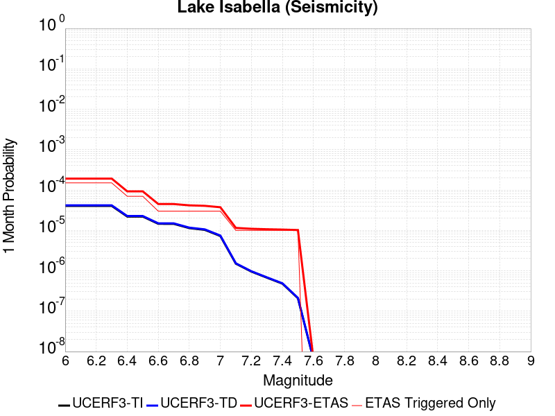 |  | 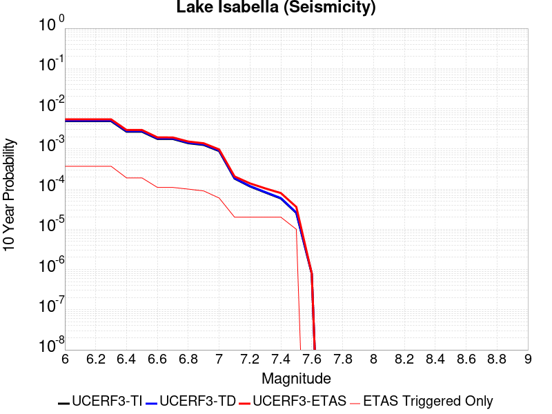 |

| Magnitude | 1 wk TI Prob | 1 wk TD Prob | 1 wk ETAS Prob | 1 wk ETAS/TD Gain | 1 wk ETAS Triggered Only | 1 mo TI Prob | 1 mo TD Prob | 1 mo ETAS Prob | 1 mo ETAS/TD Gain | 1 mo ETAS Triggered Only | 1 yr TI Prob | 1 yr TD Prob | 1 yr ETAS Prob | 1 yr ETAS/TD Gain | 1 yr ETAS Triggered Only | 10 yr TI Prob | 10 yr TD Prob | 10 yr ETAS Prob | 10 yr ETAS/TD Gain | 10 yr ETAS Triggered Only |
|-----|-----|-----|-----|-----|-----|-----|-----|-----|-----|-----|-----|-----|-----|-----|-----|-----|-----|-----|-----|-----|
| 6.0 | 9.431637E-6 | 9.741651E-6 | 1.0831627E-4 | 11.118882 | 9.857558E-5 | 4.0420677E-5 | 4.1749343E-5 | 1.4032082E-4 | 3.3610306 | 9.857558E-5 | 4.920106E-4 | 5.0819275E-4 | 6.0671824E-4 | 1.1938742 | 9.857558E-5 | 0.004909227 | 0.005071599 | 0.005316788 | 1.0483456 | 2.4643895E-4 |
| 6.1 | 9.431637E-6 | 9.741651E-6 | 1.0831627E-4 | 11.118882 | 9.857558E-5 | 4.0420677E-5 | 4.1749343E-5 | 1.4032082E-4 | 3.3610306 | 9.857558E-5 | 4.920106E-4 | 5.0819275E-4 | 6.0671824E-4 | 1.1938742 | 9.857558E-5 | 0.004909227 | 0.005071599 | 0.005316788 | 1.0483456 | 2.4643895E-4 |
| 6.2 | 9.431637E-6 | 9.741651E-6 | 1.0831627E-4 | 11.118882 | 9.857558E-5 | 4.0420677E-5 | 4.1749343E-5 | 1.4032082E-4 | 3.3610306 | 9.857558E-5 | 4.920106E-4 | 5.0819275E-4 | 6.0671824E-4 | 1.1938742 | 9.857558E-5 | 0.004909227 | 0.005071599 | 0.005316788 | 1.0483456 | 2.4643895E-4 |
| 6.3 | 9.431637E-6 | 9.741651E-6 | 1.0831627E-4 | 11.118882 | 9.857558E-5 | 4.0420677E-5 | 4.1749343E-5 | 1.4032082E-4 | 3.3610306 | 9.857558E-5 | 4.920106E-4 | 5.0819275E-4 | 6.0671824E-4 | 1.1938742 | 9.857558E-5 | 0.004909227 | 0.005071599 | 0.005316788 | 1.0483456 | 2.4643895E-4 |
| 6.4 | 5.144063E-6 | 5.3000763E-6 | 1.03875136E-4 | 19.5988 | 9.857558E-5 | 2.2045799E-5 | 2.2714434E-5 | 1.21287776E-4 | 5.339679 | 9.857558E-5 | 2.6837454E-4 | 2.765166E-4 | 3.750649E-4 | 1.3563921 | 9.857558E-5 | 0.0026805066 | 0.0027620657 | 0.0029095206 | 1.0533857 | 1.4786338E-4 |
| 6.5 | 5.144063E-6 | 5.3000763E-6 | 1.03875136E-4 | 19.5988 | 9.857558E-5 | 2.2045799E-5 | 2.2714434E-5 | 1.21287776E-4 | 5.339679 | 9.857558E-5 | 2.6837454E-4 | 2.765166E-4 | 3.750649E-4 | 1.3563921 | 9.857558E-5 | 0.0026805066 | 0.0027620657 | 0.0029095206 | 1.0533857 | 1.4786338E-4 |
| 6.6 | 3.4009804E-6 | 3.498786E-6 | 3.498786E-6 | 1.0 | 0.0 | 1.4575549E-5 | 1.4994721E-5 | 1.4994721E-5 | 1.0 | 0.0 | 1.7744285E-4 | 1.8254704E-4 | 1.8254704E-4 | 1.0 | 0.0 | 0.0017730123 | 0.0018241286 | 0.0018733265 | 1.0269706 | 4.928779E-5 |
| 6.7 | 3.3880428E-6 | 3.4856528E-6 | 3.4856528E-6 | 1.0 | 0.0 | 1.4520103E-5 | 1.4938435E-5 | 1.4938435E-5 | 1.0 | 0.0 | 1.767679E-4 | 1.8186188E-4 | 1.8186188E-4 | 1.0 | 0.0 | 0.0017662736 | 0.0018172882 | 0.0018664864 | 1.0270723 | 4.928779E-5 |
| 6.8 | 2.6582E-6 | 2.7337003E-6 | 2.7337003E-6 | 1.0 | 0.0 | 1.1392236E-5 | 1.1715813E-5 | 1.1715813E-5 | 1.0 | 0.0 | 1.3869164E-4 | 1.4263204E-4 | 1.4263204E-4 | 1.0 | 0.0 | 0.0013860512 | 0.0014255369 | 0.0014747544 | 1.0345256 | 4.928779E-5 |
| 6.9 | 2.406011E-6 | 2.4743288E-6 | 2.4743288E-6 | 1.0 | 0.0 | 1.0311434E-5 | 1.0604231E-5 | 1.0604231E-5 | 1.0 | 0.0 | 1.2553448E-4 | 1.2910018E-4 | 1.2910018E-4 | 1.0 | 0.0 | 0.0012546359 | 0.0012903814 | 0.0013396057 | 1.038147 | 4.928779E-5 |
| 7.0 | 1.6953097E-6 | 1.7429371E-6 | 1.7429371E-6 | 1.0 | 0.0 | 7.265593E-6 | 7.469715E-6 | 7.469715E-6 | 1.0 | 0.0 | 8.8455E-5 | 9.094104E-5 | 9.094104E-5 | 1.0 | 0.0 | 8.84198E-4 | 9.09141E-4 | 9.5838396E-4 | 1.0541643 | 4.928779E-5 |
| 7.1 | 3.5013824E-7 | 3.5714822E-7 | 3.5714822E-7 | 1.0 | 0.0 | 1.5005916E-6 | 1.5306344E-6 | 1.5306344E-6 | 1.0 | 0.0 | 1.826955E-5 | 1.8635317E-5 | 1.8635317E-5 | 1.0 | 0.0 | 1.8268047E-4 | 1.863378E-4 | 1.863378E-4 | 1.0 | 0.0 |
| 7.2 | 2.2321095E-7 | 2.2750574E-7 | 2.2750574E-7 | 1.0 | 0.0 | 9.56618E-7 | 9.750242E-7 | 9.750242E-7 | 1.0 | 0.0 | 1.1646762E-5 | 1.1870856E-5 | 1.1870856E-5 | 1.0 | 0.0 | 1.1646151E-4 | 1.1870232E-4 | 1.1870232E-4 | 1.0 | 0.0 |
| 7.3 | 1.5760406E-7 | 1.6060922E-7 | 1.6060922E-7 | 1.0 | 0.0 | 6.7544585E-7 | 6.8832503E-7 | 6.8832503E-7 | 1.0 | 0.0 | 8.223522E-6 | 8.380326E-6 | 8.380326E-6 | 1.0 | 0.0 | 8.2232174E-5 | 8.3800165E-5 | 8.3800165E-5 | 1.0 | 0.0 |
| 7.4 | 1.1216497E-7 | 1.1431706E-7 | 1.1431706E-7 | 1.0 | 0.0 | 4.8070694E-7 | 4.899302E-7 | 4.899302E-7 | 1.0 | 0.0 | 5.852591E-6 | 5.964884E-6 | 5.964884E-6 | 1.0 | 0.0 | 5.8524372E-5 | 5.9647282E-5 | 5.9647282E-5 | 1.0 | 0.0 |
| 7.5 | 4.885185E-8 | 4.9787737E-8 | 4.9787737E-8 | 1.0 | 0.0 | 2.0936506E-7 | 2.13376E-7 | 2.13376E-7 | 1.0 | 0.0 | 2.5490165E-6 | 2.59785E-6 | 2.59785E-6 | 1.0 | 0.0 | 2.5489873E-5 | 2.5978214E-5 | 2.5978214E-5 | 1.0 | 0.0 |
| 7.6 | 1.504641E-9 | 1.5317903E-9 | 1.5317903E-9 | 1.0 | 0.0 | 6.4484613E-9 | 6.5648154E-9 | 6.5648154E-9 | 1.0 | 0.0 | 7.851001E-8 | 7.992663E-8 | 7.992663E-8 | 1.0 | 0.0 | 7.8509987E-7 | 7.992663E-7 | 7.992663E-7 | 1.0 | 0.0 |

## Santa Cruz Island
*[(top)](#table-of-contents)*

| 1 Week | 1 Month | 1 Year | 10 Year |
|-----|-----|-----|-----|
|  | 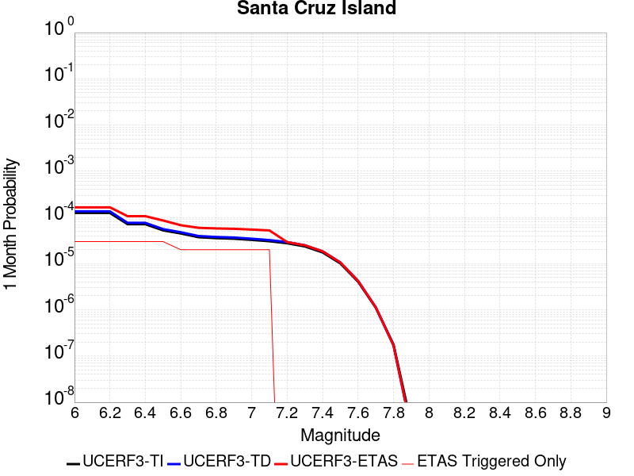 | 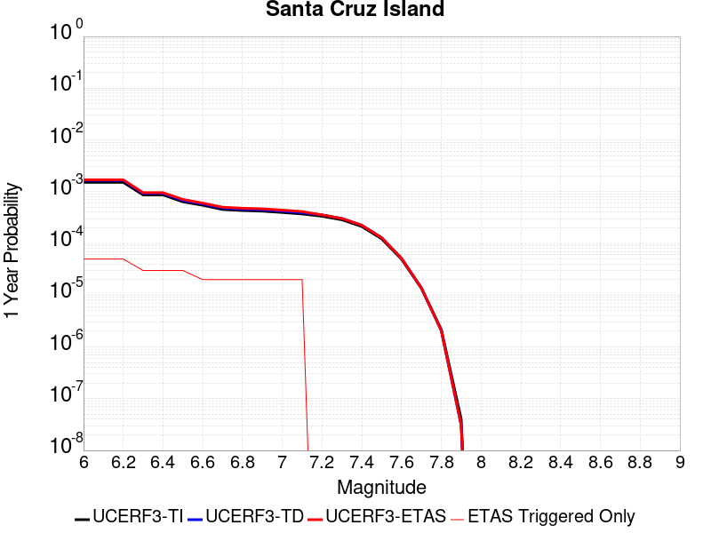 |  |

| Magnitude | 1 wk TI Prob | 1 wk TD Prob | 1 wk ETAS Prob | 1 wk ETAS/TD Gain | 1 wk ETAS Triggered Only | 1 mo TI Prob | 1 mo TD Prob | 1 mo ETAS Prob | 1 mo ETAS/TD Gain | 1 mo ETAS Triggered Only | 1 yr TI Prob | 1 yr TD Prob | 1 yr ETAS Prob | 1 yr ETAS/TD Gain | 1 yr ETAS Triggered Only | 10 yr TI Prob | 10 yr TD Prob | 10 yr ETAS Prob | 10 yr ETAS/TD Gain | 10 yr ETAS Triggered Only |
|-----|-----|-----|-----|-----|-----|-----|-----|-----|-----|-----|-----|-----|-----|-----|-----|-----|-----|-----|-----|-----|
| 6.0 | 2.9164563E-5 | 3.1599742E-5 | 8.088598E-5 | 2.5597036 | 4.928779E-5 | 1.2498499E-4 | 1.3542121E-4 | 1.8470232E-4 | 1.3639098 | 4.928779E-5 | 0.0015206301 | 0.0016476426 | 0.0017460557 | 1.0597297 | 9.857558E-5 | 0.015102667 | 0.016368 | 0.016464962 | 1.0059239 | 9.857558E-5 |
| 6.1 | 2.9164563E-5 | 3.1599742E-5 | 8.088598E-5 | 2.5597036 | 4.928779E-5 | 1.2498499E-4 | 1.3542121E-4 | 1.8470232E-4 | 1.3639098 | 4.928779E-5 | 0.0015206301 | 0.0016476426 | 0.0017460557 | 1.0597297 | 9.857558E-5 | 0.015102667 | 0.016368 | 0.016464962 | 1.0059239 | 9.857558E-5 |
| 6.2 | 2.9164563E-5 | 3.1599742E-5 | 8.088598E-5 | 2.5597036 | 4.928779E-5 | 1.2498499E-4 | 1.3542121E-4 | 1.8470232E-4 | 1.3639098 | 4.928779E-5 | 0.0015206301 | 0.0016476426 | 0.0017460557 | 1.0597297 | 9.857558E-5 | 0.015102667 | 0.016368 | 0.016464962 | 1.0059239 | 9.857558E-5 |
| 6.3 | 1.6635553E-5 | 1.780436E-5 | 6.709127E-5 | 3.7682498 | 4.928779E-5 | 7.1293274E-5 | 7.630227E-5 | 1.255863E-4 | 1.6459053 | 4.928779E-5 | 8.6765E-4 | 9.286024E-4 | 9.778445E-4 | 1.0530281 | 4.928779E-5 | 0.008642701 | 0.009249094 | 0.009346758 | 1.0105593 | 9.857558E-5 |
| 6.4 | 1.6635553E-5 | 1.780436E-5 | 6.709127E-5 | 3.7682498 | 4.928779E-5 | 7.1293274E-5 | 7.630227E-5 | 1.255863E-4 | 1.6459053 | 4.928779E-5 | 8.6765E-4 | 9.286024E-4 | 9.778445E-4 | 1.0530281 | 4.928779E-5 | 0.008642701 | 0.009249094 | 0.009346758 | 1.0105593 | 9.857558E-5 |
| 6.5 | 1.2238748E-5 | 1.3042996E-5 | 6.2330146E-5 | 4.778821 | 4.928779E-5 | 5.2450723E-5 | 5.5897377E-5 | 1.05182415E-4 | 1.8817058 | 4.928779E-5 | 6.3840044E-4 | 6.8034173E-4 | 7.29596E-4 | 1.0723964 | 4.928779E-5 | 0.0063656955 | 0.006782988 | 0.0068319417 | 1.007217 | 4.928779E-5 |
| 6.6 | 1.0489767E-5 | 1.1156636E-5 | 6.044388E-5 | 5.4177513 | 4.928779E-5 | 4.495537E-5 | 4.781329E-5 | 9.7098724E-5 | 2.0307894 | 4.928779E-5 | 5.4719415E-4 | 5.819736E-4 | 6.312327E-4 | 1.0846415 | 4.928779E-5 | 0.005458487 | 0.005804736 | 0.0058537377 | 1.0084417 | 4.928779E-5 |
| 6.7 | 8.699222E-6 | 9.236783E-6 | 5.8524118E-5 | 6.3359857 | 4.928779E-5 | 3.7281847E-5 | 3.958561E-5 | 8.887145E-5 | 2.2450442 | 4.928779E-5 | 4.5381195E-4 | 4.818488E-4 | 5.3111283E-4 | 1.1022396 | 4.928779E-5 | 0.0045288634 | 0.004808108 | 0.0048571588 | 1.0102017 | 4.928779E-5 |
| 6.8 | 8.307732E-6 | 8.8169045E-6 | 5.8104262E-5 | 6.5900974 | 4.928779E-5 | 3.560408E-5 | 3.7786187E-5 | 8.707212E-5 | 2.304337 | 4.928779E-5 | 4.3339343E-4 | 4.5995016E-4 | 5.092153E-4 | 1.1071097 | 4.928779E-5 | 0.004325492 | 0.0045900354 | 0.004639097 | 1.0106887 | 4.928779E-5 |
| 6.9 | 8.073121E-6 | 8.564939E-6 | 5.7852307E-5 | 6.75455 | 4.928779E-5 | 3.459863E-5 | 3.670637E-5 | 8.599235E-5 | 2.3427093 | 4.928779E-5 | 4.2115687E-4 | 4.4680882E-4 | 4.9607456E-4 | 1.1102614 | 4.928779E-5 | 0.004203596 | 0.004459156 | 0.0045082243 | 1.0110039 | 4.928779E-5 |
| 7.0 | 7.617019E-6 | 8.074665E-6 | 5.7362056E-5 | 7.1039557 | 4.928779E-5 | 3.264396E-5 | 3.4605247E-5 | 8.389133E-5 | 2.4242373 | 4.928779E-5 | 3.9736772E-4 | 4.2123784E-4 | 4.7050486E-4 | 1.1169578 | 4.928779E-5 | 0.003966579 | 0.0042044413 | 0.004253522 | 1.0116735 | 4.928779E-5 |
| 7.1 | 7.1224836E-6 | 7.5457883E-6 | 5.6833207E-5 | 7.531779 | 4.928779E-5 | 3.052457E-5 | 3.2338692E-5 | 8.1624894E-5 | 2.5240629 | 4.928779E-5 | 3.715733E-4 | 3.9365282E-4 | 4.429212E-4 | 1.125157 | 4.928779E-5 | 0.003709526 | 0.0039295983 | 0.003978692 | 1.0124934 | 4.928779E-5 |
| 7.2 | 6.441115E-6 | 6.8273835E-6 | 6.8273835E-6 | 1.0 | 0.0 | 2.7604487E-5 | 2.9259889E-5 | 2.9259889E-5 | 1.0 | 0.0 | 3.360328E-4 | 3.5618115E-4 | 3.5618115E-4 | 1.0 | 0.0 | 0.0033552512 | 0.0035561312 | 0.0035561312 | 1.0 | 0.0 |
| 7.3 | 5.494274E-6 | 5.8199944E-6 | 5.8199944E-6 | 1.0 | 0.0 | 2.3546674E-5 | 2.4942596E-5 | 2.4942596E-5 | 1.0 | 0.0 | 2.8664304E-4 | 3.03634E-4 | 3.03634E-4 | 1.0 | 0.0 | 0.002862736 | 0.0030322145 | 0.0030322145 | 1.0 | 0.0 |
| 7.4 | 4.0802624E-6 | 4.3122564E-6 | 4.3122564E-6 | 1.0 | 0.0 | 1.7486722E-5 | 1.8480969E-5 | 1.8480969E-5 | 1.0 | 0.0 | 2.1288003E-4 | 2.2498264E-4 | 2.2498264E-4 | 1.0 | 0.0 | 0.0021267622 | 0.0022475577 | 0.0022475577 | 1.0 | 0.0 |
| 7.5 | 2.3584746E-6 | 2.4753099E-6 | 2.4753099E-6 | 1.0 | 0.0 | 1.0107709E-5 | 1.0608428E-5 | 1.0608428E-5 | 1.0 | 0.0 | 1.2305441E-4 | 1.2915001E-4 | 1.2915001E-4 | 1.0 | 0.0 | 0.0012298629 | 0.0012907545 | 0.0012907545 | 1.0 | 0.0 |
| 7.6 | 9.4981914E-7 | 9.860934E-7 | 9.860934E-7 | 1.0 | 0.0 | 4.0706473E-6 | 4.2261076E-6 | 4.2261076E-6 | 1.0 | 0.0 | 4.9559E-5 | 5.1451658E-5 | 5.1451658E-5 | 1.0 | 0.0 | 4.954795E-4 | 5.1439874E-4 | 5.1439874E-4 | 1.0 | 0.0 |
| 7.7 | 2.6013532E-7 | 2.6416632E-7 | 2.6416632E-7 | 1.0 | 0.0 | 1.1148652E-6 | 1.1321408E-6 | 1.1321408E-6 | 1.0 | 0.0 | 1.3573399E-5 | 1.3783729E-5 | 1.3783729E-5 | 1.0 | 0.0 | 1.357257E-4 | 1.378288E-4 | 1.378288E-4 | 1.0 | 0.0 |
| 7.8 | 4.1522263E-8 | 3.965698E-8 | 3.965698E-8 | 1.0 | 0.0 | 1.7795254E-7 | 1.6995848E-7 | 1.6995848E-7 | 1.0 | 0.0 | 2.16657E-6 | 2.0692428E-6 | 2.0692428E-6 | 1.0 | 0.0 | 2.1665488E-5 | 2.0692256E-5 | 2.0692256E-5 | 1.0 | 0.0 |
| 7.9 | 7.7242046E-10 | 5.9475225E-10 | 5.9475225E-10 | 1.0 | 0.0 | 3.3103735E-9 | 2.5489382E-9 | 2.5489382E-9 | 1.0 | 0.0 | 4.0303796E-8 | 3.1033323E-8 | 3.1033323E-8 | 1.0 | 0.0 | 4.030379E-7 | 3.103332E-7 | 3.103332E-7 | 1.0 | 0.0 |

## Owens Valley
*[(top)](#table-of-contents)*

| 1 Week | 1 Month | 1 Year | 10 Year |
|-----|-----|-----|-----|
|  |  |  |  |

| Magnitude | 1 wk TI Prob | 1 wk TD Prob | 1 wk ETAS Prob | 1 wk ETAS/TD Gain | 1 wk ETAS Triggered Only | 1 mo TI Prob | 1 mo TD Prob | 1 mo ETAS Prob | 1 mo ETAS/TD Gain | 1 mo ETAS Triggered Only | 1 yr TI Prob | 1 yr TD Prob | 1 yr ETAS Prob | 1 yr ETAS/TD Gain | 1 yr ETAS Triggered Only | 10 yr TI Prob | 10 yr TD Prob | 10 yr ETAS Prob | 10 yr ETAS/TD Gain | 10 yr ETAS Triggered Only |
|-----|-----|-----|-----|-----|-----|-----|-----|-----|-----|-----|-----|-----|-----|-----|-----|-----|-----|-----|-----|-----|
| 6.0 | 4.83821E-5 | 3.6210524E-6 | 1.0219628E-4 | 28.22281 | 9.857558E-5 | 2.0733538E-4 | 1.551871E-5 | 1.633798E-4 | 10.527924 | 1.4786338E-4 | 0.002521386 | 1.889249E-4 | 3.8603882E-4 | 2.0433455 | 1.9715117E-4 | 0.024929691 | 0.0019297141 | 0.0021264849 | 1.1019689 | 1.9715117E-4 |
| 6.1 | 4.83821E-5 | 3.6210524E-6 | 1.0219628E-4 | 28.22281 | 9.857558E-5 | 2.0733538E-4 | 1.551871E-5 | 1.633798E-4 | 10.527924 | 1.4786338E-4 | 0.002521386 | 1.889249E-4 | 3.8603882E-4 | 2.0433455 | 1.9715117E-4 | 0.024929691 | 0.0019297141 | 0.0021264849 | 1.1019689 | 1.9715117E-4 |
| 6.2 | 4.83821E-5 | 3.6210524E-6 | 1.0219628E-4 | 28.22281 | 9.857558E-5 | 2.0733538E-4 | 1.551871E-5 | 1.633798E-4 | 10.527924 | 1.4786338E-4 | 0.002521386 | 1.889249E-4 | 3.8603882E-4 | 2.0433455 | 1.9715117E-4 | 0.024929691 | 0.0019297141 | 0.0021264849 | 1.1019689 | 1.9715117E-4 |
| 6.3 | 3.953008E-5 | 3.1530958E-6 | 1.01728365E-4 | 32.263012 | 9.857558E-5 | 1.6940363E-4 | 1.3513202E-5 | 1.6137458E-4 | 11.941994 | 1.4786338E-4 | 0.002060538 | 1.6451156E-4 | 3.123506E-4 | 1.8986546 | 1.4786338E-4 | 0.020415364 | 0.0016621627 | 0.0018097804 | 1.0888106 | 1.4786338E-4 |
| 6.4 | 3.953008E-5 | 3.1530958E-6 | 1.01728365E-4 | 32.263012 | 9.857558E-5 | 1.6940363E-4 | 1.3513202E-5 | 1.6137458E-4 | 11.941994 | 1.4786338E-4 | 0.002060538 | 1.6451156E-4 | 3.123506E-4 | 1.8986546 | 1.4786338E-4 | 0.020415364 | 0.0016621627 | 0.0018097804 | 1.0888106 | 1.4786338E-4 |
| 6.5 | 3.457342E-5 | 2.9707387E-6 | 1.0154603E-4 | 34.18208 | 9.857558E-5 | 1.4816338E-4 | 1.273168E-5 | 1.6059318E-4 | 12.6136675 | 1.4786338E-4 | 0.0018023965 | 1.5499788E-4 | 3.0283834E-4 | 1.9538225 | 1.4786338E-4 | 0.017878477 | 0.0015563119 | 0.0017039451 | 1.094861 | 1.4786338E-4 |
| 6.6 | 3.1127765E-5 | 2.8737306E-6 | 1.0144903E-4 | 35.302204 | 9.857558E-5 | 1.3339789E-4 | 1.2315934E-5 | 1.6017749E-4 | 13.005712 | 1.4786338E-4 | 0.0016229092 | 1.4993687E-4 | 2.9777808E-4 | 1.986023 | 1.4786338E-4 | 0.016111081 | 0.0015013438 | 0.0016489852 | 1.0983394 | 1.4786338E-4 |
| 6.7 | 2.806885E-5 | 2.8101606E-6 | 1.0138546E-4 | 36.07818 | 9.857558E-5 | 1.2028952E-4 | 1.2043493E-5 | 1.5990509E-4 | 13.277301 | 1.4786338E-4 | 0.001463541 | 1.4662035E-4 | 2.9446205E-4 | 2.0083299 | 1.4786338E-4 | 0.014539397 | 0.0014656087 | 0.0016132554 | 1.1007408 | 1.4786338E-4 |
| 6.8 | 2.524524E-5 | 2.2351392E-6 | 1.008105E-4 | 45.102562 | 9.857558E-5 | 1.0818939E-4 | 9.579134E-6 | 1.5744109E-4 | 16.435837 | 1.4786338E-4 | 0.0013164099 | 1.16620016E-4 | 2.6446616E-4 | 2.2677593 | 1.4786338E-4 | 0.01308639 | 0.001165827 | 0.001313518 | 1.1266835 | 1.4786338E-4 |
| 6.9 | 2.2704568E-5 | 1.6079711E-6 | 1.00183395E-4 | 62.30423 | 9.857558E-5 | 9.730166E-5 | 6.8912864E-6 | 1.5475364E-4 | 22.456423 | 1.4786338E-4 | 0.0011840039 | 8.38982E-5 | 2.3174917E-4 | 2.7622664 | 1.4786338E-4 | 0.011777153 | 8.38853E-4 | 9.865924E-4 | 1.1761206 | 1.4786338E-4 |
| 7.0 | 2.0871712E-5 | 1.5393621E-6 | 1.0011479E-4 | 65.036545 | 9.857558E-5 | 8.944713E-5 | 6.5972495E-6 | 1.5445965E-4 | 23.412733 | 1.4786338E-4 | 0.0010884746 | 8.031857E-5 | 2.2817007E-4 | 2.8408134 | 1.4786338E-4 | 0.010831586 | 8.030395E-4 | 9.507842E-4 | 1.1839818 | 1.4786338E-4 |
| 7.1 | 1.944928E-5 | 1.3862556E-6 | 9.9961704E-5 | 72.109146 | 9.857558E-5 | 8.335139E-5 | 5.941082E-6 | 1.5380357E-4 | 25.888144 | 1.4786338E-4 | 0.0010143308 | 7.233028E-5 | 2.2018296E-4 | 3.0441325 | 1.4786338E-4 | 0.010097133 | 7.2319806E-4 | 8.709545E-4 | 1.2043098 | 1.4786338E-4 |
| 7.2 | 1.7876306E-5 | 1.2487686E-6 | 9.9824225E-5 | 79.93813 | 9.857558E-5 | 7.6610486E-5 | 5.3518543E-6 | 1.5321444E-4 | 28.628288 | 1.4786338E-4 | 9.3233347E-4 | 6.515689E-5 | 2.1301063E-4 | 3.2691958 | 1.4786338E-4 | 0.009284316 | 6.5148395E-4 | 7.9925096E-4 | 1.226816 | 1.4786338E-4 |
| 7.3 | 1.2618672E-5 | 1.1113839E-6 | 9.9686855E-5 | 89.69615 | 9.857558E-5 | 5.40789E-5 | 4.763065E-6 | 1.5262574E-4 | 32.043594 | 1.4786338E-4 | 6.582117E-4 | 5.7988782E-5 | 2.0584358E-4 | 3.5497139 | 1.4786338E-4 | 0.0065626553 | 5.7983754E-4 | 7.276152E-4 | 1.2548604 | 1.4786338E-4 |
| 7.4 | 7.4874442E-6 | 8.547518E-7 | 9.943025E-5 | 116.32646 | 9.857558E-5 | 3.208865E-5 | 3.6632168E-6 | 1.5152605E-4 | 41.364204 | 1.4786338E-4 | 3.906093E-4 | 4.4598757E-5 | 1.9245554E-4 | 4.3152666 | 1.4786338E-4 | 0.003899234 | 4.459579E-4 | 5.9375534E-4 | 1.3314157 | 1.4786338E-4 |
| 7.5 | 2.4734156E-6 | 6.0679935E-7 | 4.989456E-5 | 82.22579 | 4.928779E-5 | 1.060031E-5 | 2.6005662E-6 | 1.01175894E-4 | 38.905334 | 9.857558E-5 | 1.2905113E-4 | 3.1661435E-5 | 1.302339E-4 | 4.113329 | 9.857558E-5 | 0.0012897621 | 3.1656958E-4 | 4.1511396E-4 | 1.3112882 | 9.857558E-5 |
| 7.6 | 1.1328841E-6 | 3.1961991E-7 | 3.1961991E-7 | 1.0 | 0.0 | 4.8552088E-6 | 1.369799E-6 | 1.369799E-6 | 1.0 | 0.0 | 5.9110564E-5 | 1.6677177E-5 | 1.6677177E-5 | 1.0 | 0.0 | 5.9094845E-4 | 1.6675945E-4 | 1.6675945E-4 | 1.0 | 0.0 |
| 7.7 | 4.8613185E-7 | 8.962742E-8 | 8.962742E-8 | 1.0 | 0.0 | 2.0834207E-6 | 3.8411747E-7 | 3.8411747E-7 | 1.0 | 0.0 | 2.536535E-5 | 4.676621E-6 | 4.676621E-6 | 1.0 | 0.0 | 2.5362454E-4 | 4.676529E-5 | 4.676529E-5 | 1.0 | 0.0 |

## Pleito
*[(top)](#table-of-contents)*

| 1 Week | 1 Month | 1 Year | 10 Year |
|-----|-----|-----|-----|
|  |  |  |  |

| Magnitude | 1 wk TI Prob | 1 wk TD Prob | 1 wk ETAS Prob | 1 wk ETAS/TD Gain | 1 wk ETAS Triggered Only | 1 mo TI Prob | 1 mo TD Prob | 1 mo ETAS Prob | 1 mo ETAS/TD Gain | 1 mo ETAS Triggered Only | 1 yr TI Prob | 1 yr TD Prob | 1 yr ETAS Prob | 1 yr ETAS/TD Gain | 1 yr ETAS Triggered Only | 10 yr TI Prob | 10 yr TD Prob | 10 yr ETAS Prob | 10 yr ETAS/TD Gain | 10 yr ETAS Triggered Only |
|-----|-----|-----|-----|-----|-----|-----|-----|-----|-----|-----|-----|-----|-----|-----|-----|-----|-----|-----|-----|-----|
| 6.0 | 1.6763008E-5 | 2.4764735E-5 | 1.2333787E-4 | 4.9803834 | 9.857558E-5 | 7.183948E-5 | 1.0613067E-4 | 2.046958E-4 | 1.9287148 | 9.857558E-5 | 8.742947E-4 | 0.001291447 | 0.0014391195 | 1.1143465 | 1.4786338E-4 | 0.00870863 | 0.012954412 | 0.013149009 | 1.0150217 | 1.9715117E-4 |
| 6.1 | 1.6763008E-5 | 2.4764735E-5 | 1.2333787E-4 | 4.9803834 | 9.857558E-5 | 7.183948E-5 | 1.0613067E-4 | 2.046958E-4 | 1.9287148 | 9.857558E-5 | 8.742947E-4 | 0.001291447 | 0.0014391195 | 1.1143465 | 1.4786338E-4 | 0.00870863 | 0.012954412 | 0.013149009 | 1.0150217 | 1.9715117E-4 |
| 6.2 | 1.6763008E-5 | 2.4764735E-5 | 1.2333787E-4 | 4.9803834 | 9.857558E-5 | 7.183948E-5 | 1.0613067E-4 | 2.046958E-4 | 1.9287148 | 9.857558E-5 | 8.742947E-4 | 0.001291447 | 0.0014391195 | 1.1143465 | 1.4786338E-4 | 0.00870863 | 0.012954412 | 0.013149009 | 1.0150217 | 1.9715117E-4 |
| 6.3 | 1.6763008E-5 | 2.4764735E-5 | 1.2333787E-4 | 4.9803834 | 9.857558E-5 | 7.183948E-5 | 1.0613067E-4 | 2.046958E-4 | 1.9287148 | 9.857558E-5 | 8.742947E-4 | 0.001291447 | 0.0014391195 | 1.1143465 | 1.4786338E-4 | 0.00870863 | 0.012954412 | 0.013149009 | 1.0150217 | 1.9715117E-4 |
| 6.4 | 1.6763008E-5 | 2.4764735E-5 | 1.2333787E-4 | 4.9803834 | 9.857558E-5 | 7.183948E-5 | 1.0613067E-4 | 2.046958E-4 | 1.9287148 | 9.857558E-5 | 8.742947E-4 | 0.001291447 | 0.0014391195 | 1.1143465 | 1.4786338E-4 | 0.00870863 | 0.012954412 | 0.013149009 | 1.0150217 | 1.9715117E-4 |
| 6.5 | 1.6763008E-5 | 2.4764735E-5 | 1.2333787E-4 | 4.9803834 | 9.857558E-5 | 7.183948E-5 | 1.0613067E-4 | 2.046958E-4 | 1.9287148 | 9.857558E-5 | 8.742947E-4 | 0.001291447 | 0.0014391195 | 1.1143465 | 1.4786338E-4 | 0.00870863 | 0.012954412 | 0.013149009 | 1.0150217 | 1.9715117E-4 |
| 6.6 | 9.910213E-6 | 1.721552E-5 | 1.721552E-5 | 1.0 | 0.0 | 4.247165E-5 | 7.3778734E-5 | 7.3778734E-5 | 1.0 | 0.0 | 5.169696E-4 | 8.9788967E-4 | 9.471332E-4 | 1.0548437 | 4.928779E-5 | 0.0051576863 | 0.009051226 | 0.009100067 | 1.0053961 | 4.928779E-5 |
| 6.7 | 9.910213E-6 | 1.721552E-5 | 1.721552E-5 | 1.0 | 0.0 | 4.247165E-5 | 7.3778734E-5 | 7.3778734E-5 | 1.0 | 0.0 | 5.169696E-4 | 8.9788967E-4 | 9.471332E-4 | 1.0548437 | 4.928779E-5 | 0.0051576863 | 0.009051226 | 0.009100067 | 1.0053961 | 4.928779E-5 |
| 6.8 | 8.300162E-6 | 1.5475129E-5 | 1.5475129E-5 | 1.0 | 0.0 | 3.557164E-5 | 6.63203E-5 | 6.63203E-5 | 1.0 | 0.0 | 4.3299864E-4 | 8.07152E-4 | 8.564E-4 | 1.0610145 | 4.928779E-5 | 0.004321559 | 0.008150663 | 0.008199549 | 1.0059978 | 4.928779E-5 |
| 6.9 | 8.183114E-6 | 1.5346344E-5 | 1.5346344E-5 | 1.0 | 0.0 | 3.5070017E-5 | 6.57684E-5 | 6.57684E-5 | 1.0 | 0.0 | 4.2689382E-4 | 8.0043747E-4 | 8.496858E-4 | 1.0615268 | 4.928779E-5 | 0.0042607468 | 0.008084008 | 0.008132897 | 1.0060476 | 4.928779E-5 |
| 7.0 | 7.1748823E-6 | 1.4133306E-5 | 1.4133306E-5 | 1.0 | 0.0 | 3.0749135E-5 | 6.0569906E-5 | 6.0569906E-5 | 1.0 | 0.0 | 3.743064E-4 | 7.3718966E-4 | 7.3718966E-4 | 1.0 | 0.0 | 0.0037367654 | 0.0074553755 | 0.0074553755 | 1.0 | 0.0 |
| 7.1 | 7.1671807E-6 | 1.4123676E-5 | 1.4123676E-5 | 1.0 | 0.0 | 3.0716128E-5 | 6.0528637E-5 | 6.0528637E-5 | 1.0 | 0.0 | 3.7390468E-4 | 7.366875E-4 | 7.366875E-4 | 1.0 | 0.0 | 0.0037327618 | 0.0074503883 | 0.0074503883 | 1.0 | 0.0 |
| 7.2 | 7.0649667E-6 | 1.3970962E-5 | 1.3970962E-5 | 1.0 | 0.0 | 3.0278077E-5 | 5.987418E-5 | 5.987418E-5 | 1.0 | 0.0 | 3.6857324E-4 | 7.287248E-4 | 7.287248E-4 | 1.0 | 0.0 | 0.0036796255 | 0.0073711374 | 0.0073711374 | 1.0 | 0.0 |
| 7.3 | 7.02082E-6 | 1.3914415E-5 | 1.3914415E-5 | 1.0 | 0.0 | 3.008888E-5 | 5.9631846E-5 | 5.9631846E-5 | 1.0 | 0.0 | 3.6627054E-4 | 7.257764E-4 | 7.257764E-4 | 1.0 | 0.0 | 0.0036566744 | 0.0073416373 | 0.0073416373 | 1.0 | 0.0 |
| 7.4 | 6.987146E-6 | 1.3873975E-5 | 1.3873975E-5 | 1.0 | 0.0 | 2.9944567E-5 | 5.9458544E-5 | 5.9458544E-5 | 1.0 | 0.0 | 3.6451413E-4 | 7.2366785E-4 | 7.2366785E-4 | 1.0 | 0.0 | 0.0036391679 | 0.007320571 | 0.007320571 | 1.0 | 0.0 |
| 7.5 | 6.9494554E-6 | 1.383088E-5 | 1.383088E-5 | 1.0 | 0.0 | 2.9783041E-5 | 5.9273858E-5 | 5.9273858E-5 | 1.0 | 0.0 | 3.625482E-4 | 7.2142074E-4 | 7.2142074E-4 | 1.0 | 0.0 | 0.0036195726 | 0.007298199 | 0.007298199 | 1.0 | 0.0 |
| 7.6 | 6.92694E-6 | 1.3789992E-5 | 1.3789992E-5 | 1.0 | 0.0 | 2.9686547E-5 | 5.909863E-5 | 5.909863E-5 | 1.0 | 0.0 | 3.6137376E-4 | 7.192888E-4 | 7.192888E-4 | 1.0 | 0.0 | 0.0036078666 | 0.007276951 | 0.007276951 | 1.0 | 0.0 |
| 7.7 | 6.395867E-6 | 1.26690065E-5 | 1.26690065E-5 | 1.0 | 0.0 | 2.741057E-5 | 5.4294615E-5 | 5.4294615E-5 | 1.0 | 0.0 | 3.336726E-4 | 6.6083675E-4 | 6.6083675E-4 | 1.0 | 0.0 | 0.0033317201 | 0.0066955453 | 0.0066955453 | 1.0 | 0.0 |
| 7.8 | 5.8664327E-6 | 1.1536581E-5 | 1.1536581E-5 | 1.0 | 0.0 | 2.5141611E-5 | 4.9441554E-5 | 4.9441554E-5 | 1.0 | 0.0 | 3.060561E-4 | 6.0178485E-4 | 6.0178485E-4 | 1.0 | 0.0 | 0.0030563495 | 0.0061010164 | 0.0061010164 | 1.0 | 0.0 |
| 7.9 | 3.7167474E-6 | 7.1145205E-6 | 7.1145205E-6 | 1.0 | 0.0 | 1.592882E-5 | 3.0490448E-5 | 3.0490448E-5 | 1.0 | 0.0 | 1.9391612E-4 | 3.7115812E-4 | 3.7115812E-4 | 1.0 | 0.0 | 0.0019374699 | 0.0037676243 | 0.0037676243 | 1.0 | 0.0 |
| 8.0 | 1.0903841E-6 | 1.2879104E-6 | 1.2879104E-6 | 1.0 | 0.0 | 4.6730665E-6 | 5.5196047E-6 | 5.5196047E-6 | 1.0 | 0.0 | 5.68931E-5 | 6.719913E-5 | 6.719913E-5 | 1.0 | 0.0 | 5.6878536E-4 | 6.942094E-4 | 6.942094E-4 | 1.0 | 0.0 |
| 8.1 | 2.6894583E-7 | 1.1056095E-7 | 1.1056095E-7 | 1.0 | 0.0 | 1.1526245E-6 | 4.7383253E-7 | 4.7383253E-7 | 1.0 | 0.0 | 1.4033113E-5 | 5.768896E-6 | 5.768896E-6 | 1.0 | 0.0 | 1.4032227E-4 | 6.454915E-5 | 6.454915E-5 | 1.0 | 0.0 |
| 8.2 | 5.2967013E-9 | 2.4567874E-9 | 2.4567874E-9 | 1.0 | 0.0 | 2.2700148E-8 | 1.0529089E-8 | 1.0529089E-8 | 1.0 | 0.0 | 2.7637427E-7 | 1.2819166E-7 | 1.2819166E-7 | 1.0 | 0.0 | 2.7637393E-6 | 1.4588004E-6 | 1.4588004E-6 | 1.0 | 0.0 |

## Whittier alt 1
*[(top)](#table-of-contents)*

| 1 Week | 1 Month | 1 Year | 10 Year |
|-----|-----|-----|-----|
|  |  |  | 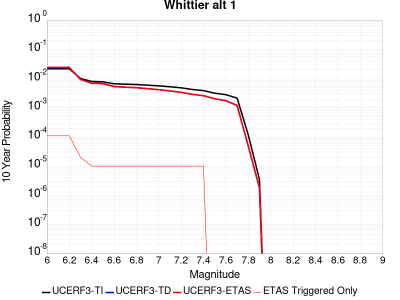 |

| Magnitude | 1 wk TI Prob | 1 wk TD Prob | 1 wk ETAS Prob | 1 wk ETAS/TD Gain | 1 wk ETAS Triggered Only | 1 mo TI Prob | 1 mo TD Prob | 1 mo ETAS Prob | 1 mo ETAS/TD Gain | 1 mo ETAS Triggered Only | 1 yr TI Prob | 1 yr TD Prob | 1 yr ETAS Prob | 1 yr ETAS/TD Gain | 1 yr ETAS Triggered Only | 10 yr TI Prob | 10 yr TD Prob | 10 yr ETAS Prob | 10 yr ETAS/TD Gain | 10 yr ETAS Triggered Only |
|-----|-----|-----|-----|-----|-----|-----|-----|-----|-----|-----|-----|-----|-----|-----|-----|-----|-----|-----|-----|-----|
| 6.0 | 4.2554693E-5 | 4.7252182E-5 | 9.6537646E-5 | 2.0430303 | 4.928779E-5 | 1.8236451E-4 | 2.0249544E-4 | 2.5177325E-4 | 1.2433527 | 4.928779E-5 | 0.002218027 | 0.0024629163 | 0.0026104157 | 1.059888 | 1.4786338E-4 | 0.02196019 | 0.024390263 | 0.024534522 | 1.0059146 | 1.4786338E-4 |
| 6.1 | 4.2554693E-5 | 4.7252182E-5 | 9.6537646E-5 | 2.0430303 | 4.928779E-5 | 1.8236451E-4 | 2.0249544E-4 | 2.5177325E-4 | 1.2433527 | 4.928779E-5 | 0.002218027 | 0.0024629163 | 0.0026104157 | 1.059888 | 1.4786338E-4 | 0.02196019 | 0.024390263 | 0.024534522 | 1.0059146 | 1.4786338E-4 |
| 6.2 | 4.2554693E-5 | 4.7252182E-5 | 9.6537646E-5 | 2.0430303 | 4.928779E-5 | 1.8236451E-4 | 2.0249544E-4 | 2.5177325E-4 | 1.2433527 | 4.928779E-5 | 0.002218027 | 0.0024629163 | 0.0026104157 | 1.059888 | 1.4786338E-4 | 0.02196019 | 0.024390263 | 0.024534522 | 1.0059146 | 1.4786338E-4 |
| 6.3 | 1.9617712E-5 | 1.826841E-5 | 1.826841E-5 | 1.0 | 0.0 | 8.40732E-5 | 7.829095E-5 | 7.829095E-5 | 1.0 | 0.0 | 0.0010231105 | 9.527944E-4 | 9.527944E-4 | 1.0 | 0.0 | 0.01018413 | 0.0094904 | 0.0094904 | 1.0 | 0.0 |
| 6.4 | 1.5611336E-5 | 1.3604089E-5 | 1.3604089E-5 | 1.0 | 0.0 | 6.690401E-5 | 5.8301972E-5 | 5.8301972E-5 | 1.0 | 0.0 | 8.142519E-4 | 7.096013E-4 | 7.096013E-4 | 1.0 | 0.0 | 0.008112748 | 0.0070753377 | 0.0070753377 | 1.0 | 0.0 |
| 6.5 | 1.5150166E-5 | 1.3100744E-5 | 1.3100744E-5 | 1.0 | 0.0 | 6.492767E-5 | 5.614487E-5 | 5.614487E-5 | 1.0 | 0.0 | 7.9020765E-4 | 6.8335526E-4 | 6.8335526E-4 | 1.0 | 0.0 | 0.007874036 | 0.006814508 | 0.006814508 | 1.0 | 0.0 |
| 6.6 | 1.295588E-5 | 1.0380544E-5 | 1.0380544E-5 | 1.0 | 0.0 | 5.552402E-5 | 4.44873E-5 | 4.44873E-5 | 1.0 | 0.0 | 6.7579525E-4 | 5.415002E-4 | 5.415002E-4 | 1.0 | 0.0 | 0.006737438 | 0.005403343 | 0.005403343 | 1.0 | 0.0 |
| 6.7 | 1.2542085E-5 | 9.899189E-6 | 9.899189E-6 | 1.0 | 0.0 | 5.3750682E-5 | 4.2424414E-5 | 4.2424414E-5 | 1.0 | 0.0 | 6.542181E-4 | 5.163967E-4 | 5.163967E-4 | 1.0 | 0.0 | 0.006522954 | 0.005153464 | 0.005153464 | 1.0 | 0.0 |
| 6.8 | 1.2195878E-5 | 9.49523E-6 | 9.49523E-6 | 1.0 | 0.0 | 5.2267E-5 | 4.069322E-5 | 4.069322E-5 | 1.0 | 0.0 | 6.36165E-4 | 4.9532915E-4 | 4.9532915E-4 | 1.0 | 0.0 | 0.0063434686 | 0.0049436963 | 0.0049436963 | 1.0 | 0.0 |
| 6.9 | 1.1580298E-5 | 8.772739E-6 | 8.772739E-6 | 1.0 | 0.0 | 4.9628903E-5 | 3.759692E-5 | 3.759692E-5 | 1.0 | 0.0 | 6.040644E-4 | 4.5764804E-4 | 4.5764804E-4 | 1.0 | 0.0 | 0.00602425 | 0.0045684646 | 0.0045684646 | 1.0 | 0.0 |
| 7.0 | 1.0964795E-5 | 8.083794E-6 | 8.083794E-6 | 1.0 | 0.0 | 4.6991136E-5 | 3.4644378E-5 | 3.4644378E-5 | 1.0 | 0.0 | 5.7196687E-4 | 4.217152E-4 | 4.217152E-4 | 1.0 | 0.0 | 0.0057049696 | 0.004210459 | 0.004210459 | 1.0 | 0.0 |
| 7.1 | 1.0230601E-5 | 7.32646E-6 | 7.32646E-6 | 1.0 | 0.0 | 4.3844695E-5 | 3.1398744E-5 | 3.1398744E-5 | 1.0 | 0.0 | 5.336784E-4 | 3.8221394E-4 | 3.8221394E-4 | 1.0 | 0.0 | 0.005323986 | 0.0038167592 | 0.0038167592 | 1.0 | 0.0 |
| 7.2 | 9.40865E-6 | 6.5430822E-6 | 6.5430822E-6 | 1.0 | 0.0 | 4.032216E-5 | 2.8041486E-5 | 2.8041486E-5 | 1.0 | 0.0 | 4.908117E-4 | 3.4135283E-4 | 3.4135283E-4 | 1.0 | 0.0 | 0.0048972913 | 0.0034094024 | 0.0034094024 | 1.0 | 0.0 |
| 7.3 | 8.237384E-6 | 5.5975433E-6 | 5.5975433E-6 | 1.0 | 0.0 | 3.5302593E-5 | 2.3989258E-5 | 2.3989258E-5 | 1.0 | 0.0 | 4.2972428E-4 | 2.920311E-4 | 2.920311E-4 | 1.0 | 0.0 | 0.0042889426 | 0.0029167992 | 0.0029167992 | 1.0 | 0.0 |
| 7.4 | 7.5316966E-6 | 5.0276153E-6 | 5.0276153E-6 | 1.0 | 0.0 | 3.2278298E-5 | 2.154675E-5 | 2.154675E-5 | 1.0 | 0.0 | 3.9291743E-4 | 2.623011E-4 | 2.623011E-4 | 1.0 | 0.0 | 0.0039222343 | 0.0026200267 | 0.0026200267 | 1.0 | 0.0 |
| 7.5 | 6.149649E-6 | 3.9336355E-6 | 3.9336355E-6 | 1.0 | 0.0 | 2.6355372E-5 | 1.6858336E-5 | 1.6858336E-5 | 1.0 | 0.0 | 3.208294E-4 | 2.052318E-4 | 2.052318E-4 | 1.0 | 0.0 | 0.003203666 | 0.0020505118 | 0.0020505118 | 1.0 | 0.0 |
| 7.6 | 5.457711E-6 | 3.3951796E-6 | 3.3951796E-6 | 1.0 | 0.0 | 2.338998E-5 | 1.4550694E-5 | 1.4550694E-5 | 1.0 | 0.0 | 2.8473578E-4 | 1.771411E-4 | 1.771411E-4 | 1.0 | 0.0 | 0.0028437122 | 0.0017700798 | 0.0017700798 | 1.0 | 0.0 |
| 7.7 | 4.1676276E-6 | 2.3329922E-6 | 2.3329922E-6 | 1.0 | 0.0 | 1.7861139E-5 | 9.998504E-6 | 9.998504E-6 | 1.0 | 0.0 | 2.1743766E-4 | 1.2172572E-4 | 1.2172572E-4 | 1.0 | 0.0 | 0.0021722503 | 0.0012166635 | 0.0012166635 | 1.0 | 0.0 |
| 7.8 | 2.2692414E-7 | 9.384417E-8 | 9.384417E-8 | 1.0 | 0.0 | 9.725317E-7 | 4.0218927E-7 | 4.0218927E-7 | 1.0 | 0.0 | 1.1840509E-5 | 4.8966467E-6 | 4.8966467E-6 | 1.0 | 0.0 | 1.1839878E-4 | 4.8965718E-5 | 4.8965718E-5 | 1.0 | 0.0 |
| 7.9 | 6.676829E-9 | 3.4397174E-9 | 3.4397174E-9 | 1.0 | 0.0 | 2.861498E-8 | 1.4741646E-8 | 1.4741646E-8 | 1.0 | 0.0 | 3.4838732E-7 | 1.7947953E-7 | 1.7947953E-7 | 1.0 | 0.0 | 3.4838679E-6 | 1.794794E-6 | 1.794794E-6 | 1.0 | 0.0 |

## Red Mountain
*[(top)](#table-of-contents)*

| 1 Week | 1 Month | 1 Year | 10 Year |
|-----|-----|-----|-----|
|  |  |  |  |

| Magnitude | 1 wk TI Prob | 1 wk TD Prob | 1 wk ETAS Prob | 1 wk ETAS/TD Gain | 1 wk ETAS Triggered Only | 1 mo TI Prob | 1 mo TD Prob | 1 mo ETAS Prob | 1 mo ETAS/TD Gain | 1 mo ETAS Triggered Only | 1 yr TI Prob | 1 yr TD Prob | 1 yr ETAS Prob | 1 yr ETAS/TD Gain | 1 yr ETAS Triggered Only | 10 yr TI Prob | 10 yr TD Prob | 10 yr ETAS Prob | 10 yr ETAS/TD Gain | 10 yr ETAS Triggered Only |
|-----|-----|-----|-----|-----|-----|-----|-----|-----|-----|-----|-----|-----|-----|-----|-----|-----|-----|-----|-----|-----|
| 6.0 | 4.1810763E-5 | 4.7590016E-5 | 9.687546E-5 | 2.0356257 | 4.928779E-5 | 1.7917668E-4 | 2.039422E-4 | 2.5321994E-4 | 1.241626 | 4.928779E-5 | 0.0021792934 | 0.0024803334 | 0.00262783 | 1.0594665 | 1.4786338E-4 | 0.021580452 | 0.02454411 | 0.024736423 | 1.0078354 | 1.9715117E-4 |
| 6.1 | 4.1810763E-5 | 4.7590016E-5 | 9.687546E-5 | 2.0356257 | 4.928779E-5 | 1.7917668E-4 | 2.039422E-4 | 2.5321994E-4 | 1.241626 | 4.928779E-5 | 0.0021792934 | 0.0024803334 | 0.00262783 | 1.0594665 | 1.4786338E-4 | 0.021580452 | 0.02454411 | 0.024736423 | 1.0078354 | 1.9715117E-4 |
| 6.2 | 4.1810763E-5 | 4.7590016E-5 | 9.687546E-5 | 2.0356257 | 4.928779E-5 | 1.7917668E-4 | 2.039422E-4 | 2.5321994E-4 | 1.241626 | 4.928779E-5 | 0.0021792934 | 0.0024803334 | 0.00262783 | 1.0594665 | 1.4786338E-4 | 0.021580452 | 0.02454411 | 0.024736423 | 1.0078354 | 1.9715117E-4 |
| 6.3 | 4.1810763E-5 | 4.7590016E-5 | 9.687546E-5 | 2.0356257 | 4.928779E-5 | 1.7917668E-4 | 2.039422E-4 | 2.5321994E-4 | 1.241626 | 4.928779E-5 | 0.0021792934 | 0.0024803334 | 0.00262783 | 1.0594665 | 1.4786338E-4 | 0.021580452 | 0.02454411 | 0.024736423 | 1.0078354 | 1.9715117E-4 |
| 6.4 | 4.1810763E-5 | 4.7590016E-5 | 9.687546E-5 | 2.0356257 | 4.928779E-5 | 1.7917668E-4 | 2.039422E-4 | 2.5321994E-4 | 1.241626 | 4.928779E-5 | 0.0021792934 | 0.0024803334 | 0.00262783 | 1.0594665 | 1.4786338E-4 | 0.021580452 | 0.02454411 | 0.024736423 | 1.0078354 | 1.9715117E-4 |
| 6.5 | 3.154503E-5 | 3.5359757E-5 | 8.4645806E-5 | 2.3938458 | 4.928779E-5 | 1.3518598E-4 | 1.5153353E-4 | 2.0081385E-4 | 1.3252107 | 4.928779E-5 | 0.0016446467 | 0.0018434518 | 0.0019418456 | 1.0533748 | 9.857558E-5 | 0.01632528 | 0.018291244 | 0.018388016 | 1.0052906 | 9.857558E-5 |
| 6.6 | 3.1535834E-5 | 3.5349138E-5 | 8.463519E-5 | 2.3942645 | 4.928779E-5 | 1.3514658E-4 | 1.5148803E-4 | 2.0076837E-4 | 1.3253083 | 4.928779E-5 | 0.0016441676 | 0.0018428987 | 0.0019412927 | 1.0533909 | 9.857558E-5 | 0.01632056 | 0.018285805 | 0.01838258 | 1.0052923 | 9.857558E-5 |
| 6.7 | 2.8267326E-5 | 3.1469353E-5 | 3.1469353E-5 | 1.0 | 0.0 | 1.2114006E-4 | 1.3486217E-4 | 1.3486217E-4 | 1.0 | 0.0 | 0.0014738824 | 0.0016407954 | 0.0016900023 | 1.0299897 | 4.928779E-5 | 0.014641452 | 0.01629557 | 0.016344056 | 1.0029753 | 4.928779E-5 |
| 6.8 | 2.8212884E-5 | 3.1407242E-5 | 3.1407242E-5 | 1.0 | 0.0 | 1.20906756E-4 | 1.3459599E-4 | 1.3459599E-4 | 1.0 | 0.0 | 0.0014710457 | 0.0016375595 | 0.0016867666 | 1.0300491 | 4.928779E-5 | 0.014613459 | 0.016263688 | 0.016312174 | 1.0029813 | 4.928779E-5 |
| 6.9 | 2.4227871E-5 | 2.6706994E-5 | 2.6706994E-5 | 1.0 | 0.0 | 1.03829596E-4 | 1.1445395E-4 | 1.1445395E-4 | 1.0 | 0.0 | 0.0012633923 | 0.0013926621 | 0.0014418812 | 1.0353417 | 4.928779E-5 | 0.012562336 | 0.0138470335 | 0.013895639 | 1.0035101 | 4.928779E-5 |
| 7.0 | 2.348524E-5 | 2.5835778E-5 | 2.5835778E-5 | 1.0 | 0.0 | 1.0064714E-4 | 1.10720495E-4 | 1.10720495E-4 | 1.0 | 0.0 | 0.0012246901 | 0.001347264 | 0.0013964854 | 1.0365343 | 4.928779E-5 | 0.012179627 | 0.013398598 | 0.013447225 | 1.0036293 | 4.928779E-5 |
| 7.1 | 2.2311642E-5 | 2.4462845E-5 | 2.4462845E-5 | 1.0 | 0.0 | 9.561782E-5 | 1.04836974E-4 | 1.04836974E-4 | 1.0 | 0.0 | 0.0011635252 | 0.0012757176 | 0.0013249425 | 1.038586 | 4.928779E-5 | 0.01157452 | 0.01269146 | 0.012740122 | 1.0038342 | 4.928779E-5 |
| 7.2 | 1.6533986E-5 | 1.7670362E-5 | 1.7670362E-5 | 1.0 | 0.0 | 7.085802E-5 | 7.572828E-5 | 7.572828E-5 | 1.0 | 0.0 | 8.623549E-4 | 9.2166534E-4 | 9.709077E-4 | 1.0534276 | 4.928779E-5 | 0.008590161 | 0.009184707 | 0.009233542 | 1.005317 | 4.928779E-5 |
| 7.3 | 1.4703092E-5 | 1.5559537E-5 | 1.5559537E-5 | 1.0 | 0.0 | 6.301173E-5 | 6.668237E-5 | 6.668237E-5 | 1.0 | 0.0 | 7.668978E-4 | 8.1161706E-4 | 8.608649E-4 | 1.0606786 | 4.928779E-5 | 0.0076425658 | 0.008092604 | 0.0081414925 | 1.0060412 | 4.928779E-5 |
| 7.4 | 6.1331984E-6 | 5.5288874E-6 | 5.5288874E-6 | 1.0 | 0.0 | 2.6284872E-5 | 2.3695018E-5 | 2.3695018E-5 | 1.0 | 0.0 | 3.199713E-4 | 2.884492E-4 | 2.884492E-4 | 1.0 | 0.0 | 0.0031951098 | 0.0028808024 | 0.0028808024 | 1.0 | 0.0 |
| 7.5 | 5.954766E-6 | 5.338517E-6 | 5.338517E-6 | 1.0 | 0.0 | 2.5520176E-5 | 2.2879161E-5 | 2.2879161E-5 | 1.0 | 0.0 | 3.1066386E-4 | 2.785187E-4 | 2.785187E-4 | 1.0 | 0.0 | 0.003102299 | 0.0027817504 | 0.0027817504 | 1.0 | 0.0 |
| 7.6 | 4.9726646E-6 | 4.315309E-6 | 4.315309E-6 | 1.0 | 0.0 | 2.1311245E-5 | 1.8494053E-5 | 1.8494053E-5 | 1.0 | 0.0 | 2.5943352E-4 | 2.2514217E-4 | 2.2514217E-4 | 1.0 | 0.0 | 0.0025913084 | 0.0022491754 | 0.0022491754 | 1.0 | 0.0 |
| 7.7 | 3.3613894E-6 | 2.8526886E-6 | 2.8526886E-6 | 1.0 | 0.0 | 1.4405875E-5 | 1.22257525E-5 | 1.22257525E-5 | 1.0 | 0.0 | 1.7537741E-4 | 1.4883863E-4 | 1.4883863E-4 | 1.0 | 0.0 | 0.0017523908 | 0.0014874157 | 0.0014874157 | 1.0 | 0.0 |
| 7.8 | 1.1828961E-6 | 1.0122935E-6 | 1.0122935E-6 | 1.0 | 0.0 | 5.069545E-6 | 4.338394E-6 | 4.338394E-6 | 1.0 | 0.0 | 6.171996E-5 | 5.281869E-5 | 5.281869E-5 | 1.0 | 0.0 | 6.170282E-4 | 5.280643E-4 | 5.280643E-4 | 1.0 | 0.0 |
| 7.9 | 2.2967266E-7 | 1.861919E-7 | 1.861919E-7 | 1.0 | 0.0 | 9.843111E-7 | 7.97965E-7 | 7.97965E-7 | 1.0 | 0.0 | 1.19839215E-5 | 9.715184E-6 | 9.715184E-6 | 1.0 | 0.0 | 1.1983275E-4 | 9.714788E-5 | 9.714788E-5 | 1.0 | 0.0 |

## Big Pine (Central)
*[(top)](#table-of-contents)*

| 1 Week | 1 Month | 1 Year | 10 Year |
|-----|-----|-----|-----|
|  |  |  |  |

| Magnitude | 1 wk TI Prob | 1 wk TD Prob | 1 wk ETAS Prob | 1 wk ETAS/TD Gain | 1 wk ETAS Triggered Only | 1 mo TI Prob | 1 mo TD Prob | 1 mo ETAS Prob | 1 mo ETAS/TD Gain | 1 mo ETAS Triggered Only | 1 yr TI Prob | 1 yr TD Prob | 1 yr ETAS Prob | 1 yr ETAS/TD Gain | 1 yr ETAS Triggered Only | 10 yr TI Prob | 10 yr TD Prob | 10 yr ETAS Prob | 10 yr ETAS/TD Gain | 10 yr ETAS Triggered Only |
|-----|-----|-----|-----|-----|-----|-----|-----|-----|-----|-----|-----|-----|-----|-----|-----|-----|-----|-----|-----|-----|
| 6.0 | 1.2706755E-5 | 1.4250602E-5 | 1.4250602E-5 | 1.0 | 0.0 | 5.4456385E-5 | 6.107279E-5 | 6.107279E-5 | 1.0 | 0.0 | 6.628048E-4 | 7.433441E-4 | 7.925952E-4 | 1.0662562 | 4.928779E-5 | 0.006608314 | 0.007413639 | 0.0076093287 | 1.0263959 | 1.9715117E-4 |
| 6.1 | 8.342579E-6 | 9.510835E-6 | 9.510835E-6 | 1.0 | 0.0 | 3.5753423E-5 | 4.076021E-5 | 4.076021E-5 | 1.0 | 0.0 | 4.3521097E-4 | 4.9616426E-4 | 4.9616426E-4 | 1.0 | 0.0 | 0.0043435963 | 0.004954155 | 0.0050522424 | 1.019799 | 9.857558E-5 |
| 6.2 | 6.923899E-6 | 7.967221E-6 | 7.967221E-6 | 1.0 | 0.0 | 2.9673516E-5 | 3.4144894E-5 | 3.4144894E-5 | 1.0 | 0.0 | 3.6121515E-4 | 4.1565404E-4 | 4.1565404E-4 | 1.0 | 0.0 | 0.003606286 | 0.0041521094 | 0.004250276 | 1.0236425 | 9.857558E-5 |
| 6.3 | 2.728396E-6 | 3.4243646E-6 | 3.4243646E-6 | 1.0 | 0.0 | 1.1693074E-5 | 1.4675771E-5 | 1.4675771E-5 | 1.0 | 0.0 | 1.4235388E-4 | 1.7866373E-4 | 1.7866373E-4 | 1.0 | 0.0 | 0.0014226272 | 0.0017867433 | 0.0017867433 | 1.0 | 0.0 |
| 6.4 | 2.7136944E-6 | 3.4086581E-6 | 3.4086581E-6 | 1.0 | 0.0 | 1.1630066E-5 | 1.4608458E-5 | 1.4608458E-5 | 1.0 | 0.0 | 1.4158686E-4 | 1.7784433E-4 | 1.7784433E-4 | 1.0 | 0.0 | 0.0014149669 | 0.0017785623 | 0.0017785623 | 1.0 | 0.0 |
| 6.5 | 2.6971882E-6 | 3.3910032E-6 | 3.3910032E-6 | 1.0 | 0.0 | 1.1559327E-5 | 1.4532795E-5 | 1.4532795E-5 | 1.0 | 0.0 | 1.4072572E-4 | 1.7692328E-4 | 1.7692328E-4 | 1.0 | 0.0 | 0.0014063664 | 0.0017693666 | 0.0017693666 | 1.0 | 0.0 |
| 6.6 | 2.669092E-6 | 3.3610236E-6 | 3.3610236E-6 | 1.0 | 0.0 | 1.1438916E-5 | 1.4404312E-5 | 1.4404312E-5 | 1.0 | 0.0 | 1.3925991E-4 | 1.7535927E-4 | 1.7535927E-4 | 1.0 | 0.0 | 0.0013917267 | 0.0017537511 | 0.0017537511 | 1.0 | 0.0 |
| 6.7 | 2.6408059E-6 | 3.3310494E-6 | 3.3310494E-6 | 1.0 | 0.0 | 1.1317691E-5 | 1.4275853E-5 | 1.4275853E-5 | 1.0 | 0.0 | 1.3778417E-4 | 1.737955E-4 | 1.737955E-4 | 1.0 | 0.0 | 0.0013769877 | 0.0017381381 | 0.0017381381 | 1.0 | 0.0 |
| 6.8 | 2.1786943E-6 | 2.8545066E-6 | 2.8545066E-6 | 1.0 | 0.0 | 9.337228E-6 | 1.2233547E-5 | 1.2233547E-5 | 1.0 | 0.0 | 1.1367482E-4 | 1.4893398E-4 | 1.4893398E-4 | 1.0 | 0.0 | 0.0011361669 | 0.0014898704 | 0.0014898704 | 1.0 | 0.0 |
| 6.9 | 1.4411696E-6 | 2.0685677E-6 | 2.0685677E-6 | 1.0 | 0.0 | 6.1764263E-6 | 8.865261E-6 | 8.865261E-6 | 1.0 | 0.0 | 7.51954E-5 | 1.0792949E-4 | 1.0792949E-4 | 1.0 | 0.0 | 7.5169955E-4 | 0.0010802548 | 0.0010802548 | 1.0 | 0.0 |
| 7.0 | 1.0073411E-6 | 1.5543274E-6 | 1.5543274E-6 | 1.0 | 0.0 | 4.317169E-6 | 6.661387E-6 | 6.661387E-6 | 1.0 | 0.0 | 5.2560266E-5 | 8.109952E-5 | 8.109952E-5 | 1.0 | 0.0 | 5.2547833E-4 | 8.1217213E-4 | 8.1217213E-4 | 1.0 | 0.0 |
| 7.1 | 8.947104E-7 | 1.430316E-6 | 1.430316E-6 | 1.0 | 0.0 | 3.834468E-6 | 6.1299124E-6 | 6.1299124E-6 | 1.0 | 0.0 | 4.6683643E-5 | 7.462928E-5 | 7.462928E-5 | 1.0 | 0.0 | 4.6673836E-4 | 7.4751483E-4 | 7.4751483E-4 | 1.0 | 0.0 |
| 7.2 | 5.215166E-7 | 1.0112277E-6 | 1.0112277E-6 | 1.0 | 0.0 | 2.2350691E-6 | 4.333826E-6 | 4.333826E-6 | 1.0 | 0.0 | 2.7211627E-5 | 5.27631E-5 | 5.27631E-5 | 1.0 | 0.0 | 2.7208295E-4 | 5.289683E-4 | 5.289683E-4 | 1.0 | 0.0 |
| 7.3 | 4.4024807E-7 | 9.220183E-7 | 9.220183E-7 | 1.0 | 0.0 | 1.8867761E-6 | 3.951501E-6 | 3.951501E-6 | 1.0 | 0.0 | 2.2971257E-5 | 4.8108504E-5 | 4.8108504E-5 | 1.0 | 0.0 | 2.2968883E-4 | 4.824433E-4 | 4.824433E-4 | 1.0 | 0.0 |
| 7.4 | 3.6130905E-7 | 8.359109E-7 | 8.359109E-7 | 1.0 | 0.0 | 1.5484665E-6 | 3.5824705E-6 | 3.5824705E-6 | 1.0 | 0.0 | 1.8852415E-5 | 4.3615746E-5 | 4.3615746E-5 | 1.0 | 0.0 | 1.8850817E-4 | 4.3752496E-4 | 4.3752496E-4 | 1.0 | 0.0 |
| 7.5 | 3.408184E-7 | 8.1087245E-7 | 8.1087245E-7 | 1.0 | 0.0 | 1.4606494E-6 | 3.475163E-6 | 3.475163E-6 | 1.0 | 0.0 | 1.7783263E-5 | 4.230933E-5 | 4.230933E-5 | 1.0 | 0.0 | 1.778184E-4 | 4.2444657E-4 | 4.2444657E-4 | 1.0 | 0.0 |
| 7.6 | 3.1428627E-7 | 7.732167E-7 | 7.732167E-7 | 1.0 | 0.0 | 1.3469405E-6 | 3.313782E-6 | 3.313782E-6 | 1.0 | 0.0 | 1.6398877E-5 | 4.0344585E-5 | 4.0344585E-5 | 1.0 | 0.0 | 1.6397667E-4 | 4.0477706E-4 | 4.0477706E-4 | 1.0 | 0.0 |
| 7.7 | 1.7972785E-7 | 5.0782415E-7 | 5.0782415E-7 | 1.0 | 0.0 | 7.70262E-7 | 2.1763874E-6 | 2.1763874E-6 | 1.0 | 0.0 | 9.377899E-6 | 2.6497206E-5 | 2.6497206E-5 | 1.0 | 0.0 | 9.377503E-5 | 2.6633305E-4 | 2.6633305E-4 | 1.0 | 0.0 |
| 7.8 | 4.9230927E-8 | 1.1981747E-7 | 1.1981747E-7 | 1.0 | 0.0 | 2.1098968E-7 | 5.135033E-7 | 5.135033E-7 | 1.0 | 0.0 | 2.5687964E-6 | 6.2518866E-6 | 6.2518866E-6 | 1.0 | 0.0 | 2.5687666E-5 | 6.2971965E-5 | 6.2971965E-5 | 1.0 | 0.0 |
| 7.9 | 3.6805972E-9 | 4.1051638E-9 | 4.1051638E-9 | 1.0 | 0.0 | 1.5773987E-8 | 1.7593557E-8 | 1.7593557E-8 | 1.0 | 0.0 | 1.9204828E-7 | 2.1420155E-7 | 2.1420155E-7 | 1.0 | 0.0 | 1.920481E-6 | 2.1898923E-6 | 2.1898923E-6 | 1.0 | 0.0 |

## San Andreas (San Gorgonio Pass-Garnet HIll)
*[(top)](#table-of-contents)*

| 1 Week | 1 Month | 1 Year | 10 Year |
|-----|-----|-----|-----|
|  |  |  |  |

| Magnitude | 1 wk TI Prob | 1 wk TD Prob | 1 wk ETAS Prob | 1 wk ETAS/TD Gain | 1 wk ETAS Triggered Only | 1 mo TI Prob | 1 mo TD Prob | 1 mo ETAS Prob | 1 mo ETAS/TD Gain | 1 mo ETAS Triggered Only | 1 yr TI Prob | 1 yr TD Prob | 1 yr ETAS Prob | 1 yr ETAS/TD Gain | 1 yr ETAS Triggered Only | 10 yr TI Prob | 10 yr TD Prob | 10 yr ETAS Prob | 10 yr ETAS/TD Gain | 10 yr ETAS Triggered Only |
|-----|-----|-----|-----|-----|-----|-----|-----|-----|-----|-----|-----|-----|-----|-----|-----|-----|-----|-----|-----|-----|
| 6.0 | 8.31567E-5 | 2.3384395E-4 | 2.8312023E-4 | 1.2107228 | 4.928779E-5 | 3.5633717E-4 | 0.0010018025 | 0.001051041 | 1.0491499 | 4.928779E-5 | 0.004329778 | 0.012128622 | 0.012177312 | 1.0040145 | 4.928779E-5 | 0.042463828 | 0.11258187 | 0.112756826 | 1.001554 | 1.9715117E-4 |
| 6.1 | 8.31567E-5 | 2.3384395E-4 | 2.8312023E-4 | 1.2107228 | 4.928779E-5 | 3.5633717E-4 | 0.0010018025 | 0.001051041 | 1.0491499 | 4.928779E-5 | 0.004329778 | 0.012128622 | 0.012177312 | 1.0040145 | 4.928779E-5 | 0.042463828 | 0.11258187 | 0.112756826 | 1.001554 | 1.9715117E-4 |
| 6.2 | 8.31567E-5 | 2.3384395E-4 | 2.8312023E-4 | 1.2107228 | 4.928779E-5 | 3.5633717E-4 | 0.0010018025 | 0.001051041 | 1.0491499 | 4.928779E-5 | 0.004329778 | 0.012128622 | 0.012177312 | 1.0040145 | 4.928779E-5 | 0.042463828 | 0.11258187 | 0.112756826 | 1.001554 | 1.9715117E-4 |
| 6.3 | 8.31567E-5 | 2.3384395E-4 | 2.8312023E-4 | 1.2107228 | 4.928779E-5 | 3.5633717E-4 | 0.0010018025 | 0.001051041 | 1.0491499 | 4.928779E-5 | 0.004329778 | 0.012128622 | 0.012177312 | 1.0040145 | 4.928779E-5 | 0.042463828 | 0.11258187 | 0.112756826 | 1.001554 | 1.9715117E-4 |
| 6.4 | 8.059055E-5 | 2.2941893E-4 | 2.786954E-4 | 1.2147882 | 4.928779E-5 | 3.4534236E-4 | 9.828559E-4 | 0.0010320953 | 1.0500982 | 4.928779E-5 | 0.0041964394 | 0.011900819 | 0.011949521 | 1.0040922 | 4.928779E-5 | 0.041180745 | 0.110562965 | 0.110738315 | 1.001586 | 1.9715117E-4 |
| 6.5 | 8.059055E-5 | 2.2941893E-4 | 2.786954E-4 | 1.2147882 | 4.928779E-5 | 3.4534236E-4 | 9.828559E-4 | 0.0010320953 | 1.0500982 | 4.928779E-5 | 0.0041964394 | 0.011900819 | 0.011949521 | 1.0040922 | 4.928779E-5 | 0.041180745 | 0.110562965 | 0.110738315 | 1.001586 | 1.9715117E-4 |
| 6.6 | 7.619237E-5 | 2.2186468E-4 | 2.7114153E-4 | 1.2221032 | 4.928779E-5 | 3.2649786E-4 | 9.5050444E-4 | 9.997453E-4 | 1.051805 | 4.928779E-5 | 0.0039678677 | 0.0115115335 | 0.011560254 | 1.0042323 | 4.928779E-5 | 0.03897764 | 0.10709954 | 0.107275575 | 1.0016437 | 1.9715117E-4 |
| 6.7 | 7.440636E-5 | 2.1862281E-4 | 2.6789983E-4 | 1.2253975 | 4.928779E-5 | 3.188454E-4 | 9.3662075E-4 | 9.858623E-4 | 1.0525737 | 4.928779E-5 | 0.0038750346 | 0.011344268 | 0.011392997 | 1.0042955 | 4.928779E-5 | 0.038081564 | 0.1056081 | 0.10578443 | 1.0016696 | 1.9715117E-4 |
| 6.8 | 7.3735864E-5 | 2.1709445E-4 | 2.6637153E-4 | 1.2269846 | 4.928779E-5 | 3.1597257E-4 | 9.300753E-4 | 9.793172E-4 | 1.0529441 | 4.928779E-5 | 0.0038401815 | 0.011265406 | 0.011314139 | 1.0043259 | 4.928779E-5 | 0.03774495 | 0.104909696 | 0.10508616 | 1.001682 | 1.9715117E-4 |
| 6.9 | 7.27575E-5 | 2.1478413E-4 | 2.6406135E-4 | 1.2294266 | 4.928779E-5 | 3.117806E-4 | 9.20181E-4 | 9.694234E-4 | 1.0535139 | 4.928779E-5 | 0.003789323 | 0.011146182 | 0.01119492 | 1.0043726 | 4.928779E-5 | 0.037253562 | 0.10385753 | 0.10403421 | 1.0017011 | 1.9715117E-4 |
| 7.0 | 7.102591E-5 | 2.1062451E-4 | 2.5990192E-4 | 1.2339586 | 4.928779E-5 | 3.0436125E-4 | 9.023664E-4 | 9.5160975E-4 | 1.0545713 | 4.928779E-5 | 0.003699303 | 0.010931484 | 0.010980234 | 1.0044595 | 4.928779E-5 | 0.03638325 | 0.101959534 | 0.10213658 | 1.0017365 | 1.9715117E-4 |
| 7.1 | 7.028513E-5 | 2.0898094E-4 | 2.5825843E-4 | 1.235799 | 4.928779E-5 | 3.0118722E-4 | 8.953274E-4 | 9.4457105E-4 | 1.0550008 | 4.928779E-5 | 0.0036607897 | 0.010846641 | 0.010895394 | 1.0044948 | 4.928779E-5 | 0.036010686 | 0.10120243 | 0.10137963 | 1.001751 | 1.9715117E-4 |
| 7.2 | 6.8498244E-5 | 2.050596E-4 | 2.543373E-4 | 1.2403091 | 4.928779E-5 | 2.9353087E-4 | 8.7853306E-4 | 9.2777755E-4 | 1.056053 | 4.928779E-5 | 0.003567883 | 0.0106441835 | 0.010692947 | 1.0045812 | 4.928779E-5 | 0.035111405 | 0.09939449 | 0.09957205 | 1.0017864 | 1.9715117E-4 |
| 7.3 | 6.622592E-5 | 1.9733235E-4 | 2.4661043E-4 | 1.2497212 | 4.928779E-5 | 2.8379448E-4 | 8.4543816E-4 | 8.946843E-4 | 1.0582492 | 4.928779E-5 | 0.0034497243 | 0.010245111 | 0.0102938935 | 1.0047616 | 4.928779E-5 | 0.033966612 | 0.095891245 | 0.09606949 | 1.0018588 | 1.9715117E-4 |
| 7.4 | 5.1050705E-5 | 1.4690042E-4 | 1.9618098E-4 | 1.3354691 | 4.928779E-5 | 2.1877038E-4 | 6.294222E-4 | 6.78679E-4 | 1.0782571 | 4.928779E-5 | 0.002660276 | 0.007636482 | 0.0076853936 | 1.006405 | 4.928779E-5 | 0.02628654 | 0.07286554 | 0.07304832 | 1.0025085 | 1.9715117E-4 |
| 7.5 | 3.9302922E-5 | 1.11307076E-4 | 1.6058938E-4 | 1.4427599 | 4.928779E-5 | 1.6843023E-4 | 4.7694342E-4 | 5.2620773E-4 | 1.1032916 | 4.928779E-5 | 0.0020487092 | 0.0057913954 | 0.0058403974 | 1.0084612 | 4.928779E-5 | 0.020299247 | 0.05601151 | 0.056197617 | 1.0033227 | 1.9715117E-4 |
| 7.6 | 2.9851626E-5 | 8.4956984E-5 | 1.3424059E-4 | 1.5801007 | 4.928779E-5 | 1.2792926E-4 | 3.6405068E-4 | 4.1332052E-4 | 1.1353378 | 4.928779E-5 | 0.0015564259 | 0.0044233347 | 0.0044724047 | 1.0110934 | 4.928779E-5 | 0.0154556995 | 0.043196145 | 0.043337625 | 1.0032752 | 1.4786338E-4 |
| 7.7 | 2.1135214E-5 | 6.353527E-5 | 1.1281993E-4 | 1.7757056 | 4.928779E-5 | 9.0576345E-5 | 2.722656E-4 | 3.2154E-4 | 1.180979 | 4.928779E-5 | 0.0011022091 | 0.0033098008 | 0.0033589255 | 1.0148422 | 4.928779E-5 | 0.010967582 | 0.03258456 | 0.032727607 | 1.00439 | 1.4786338E-4 |
| 7.8 | 1.883379E-5 | 5.564576E-5 | 1.0493081E-4 | 1.8856928 | 4.928779E-5 | 8.0713755E-5 | 2.3846005E-4 | 2.877361E-4 | 1.2066427 | 4.928779E-5 | 9.822468E-4 | 0.002899389 | 0.002948534 | 1.0169501 | 4.928779E-5 | 0.0097791655 | 0.028696978 | 0.0288406 | 1.0050048 | 1.4786338E-4 |
| 7.9 | 1.5156185E-5 | 4.1662403E-5 | 9.094814E-5 | 2.1829786 | 4.928779E-5 | 6.495346E-5 | 1.7854095E-4 | 2.2781994E-4 | 1.2760094 | 4.928779E-5 | 7.9052144E-4 | 0.0021715704 | 0.002220751 | 1.0226475 | 4.928779E-5 | 0.007877152 | 0.021760946 | 0.021905592 | 1.006647 | 1.4786338E-4 |
| 8.0 | 1.1405907E-5 | 2.9976925E-5 | 7.926324E-5 | 2.6441417 | 4.928779E-5 | 4.8881542E-5 | 1.2846621E-4 | 1.7774769E-4 | 1.3836142 | 4.928779E-5 | 5.9497025E-4 | 0.0015629551 | 0.0016121658 | 1.0314857 | 4.928779E-5 | 0.005933798 | 0.015774013 | 0.015919544 | 1.009226 | 1.4786338E-4 |
| 8.1 | 4.3511436E-6 | 7.369465E-6 | 7.369465E-6 | 1.0 | 0.0 | 1.8647626E-5 | 3.158304E-5 | 3.158304E-5 | 1.0 | 0.0 | 2.2701119E-4 | 3.844558E-4 | 3.844558E-4 | 1.0 | 0.0 | 0.0022677942 | 0.0041165445 | 0.0041165445 | 1.0 | 0.0 |
| 8.2 | 2.3042528E-6 | 2.7328301E-6 | 2.7328301E-6 | 1.0 | 0.0 | 9.875332E-6 | 1.1712076E-5 | 1.1712076E-5 | 1.0 | 0.0 | 1.2022553E-4 | 1.4258524E-4 | 1.4258524E-4 | 1.0 | 0.0 | 0.0012016051 | 0.0015979637 | 0.0015979637 | 1.0 | 0.0 |
| 8.3 | 5.202968E-7 | 3.1590292E-7 | 3.1590292E-7 | 1.0 | 0.0 | 2.2298414E-6 | 1.353869E-6 | 1.353869E-6 | 1.0 | 0.0 | 2.714798E-5 | 1.6483244E-5 | 1.6483244E-5 | 1.0 | 0.0 | 2.7144665E-4 | 1.955901E-4 | 1.955901E-4 | 1.0 | 0.0 |

## San Andreas (Coachella) rev
*[(top)](#table-of-contents)*

| 1 Week | 1 Month | 1 Year | 10 Year |
|-----|-----|-----|-----|
|  |  |  |  |

| Magnitude | 1 wk TI Prob | 1 wk TD Prob | 1 wk ETAS Prob | 1 wk ETAS/TD Gain | 1 wk ETAS Triggered Only | 1 mo TI Prob | 1 mo TD Prob | 1 mo ETAS Prob | 1 mo ETAS/TD Gain | 1 mo ETAS Triggered Only | 1 yr TI Prob | 1 yr TD Prob | 1 yr ETAS Prob | 1 yr ETAS/TD Gain | 1 yr ETAS Triggered Only | 10 yr TI Prob | 10 yr TD Prob | 10 yr ETAS Prob | 10 yr ETAS/TD Gain | 10 yr ETAS Triggered Only |
|-----|-----|-----|-----|-----|-----|-----|-----|-----|-----|-----|-----|-----|-----|-----|-----|-----|-----|-----|-----|-----|
| 6.0 | 1.1925945E-4 | 3.273077E-4 | 3.7657938E-4 | 1.1505362 | 4.928779E-5 | 5.110118E-4 | 0.001401998 | 0.0015004353 | 1.0702122 | 9.857558E-5 | 0.0062038354 | 0.016937068 | 0.017033974 | 1.0057216 | 9.857558E-5 | 0.060334753 | 0.15267672 | 0.15284376 | 1.0010941 | 1.9715117E-4 |
| 6.1 | 1.1925945E-4 | 3.273077E-4 | 3.7657938E-4 | 1.1505362 | 4.928779E-5 | 5.110118E-4 | 0.001401998 | 0.0015004353 | 1.0702122 | 9.857558E-5 | 0.0062038354 | 0.016937068 | 0.017033974 | 1.0057216 | 9.857558E-5 | 0.060334753 | 0.15267672 | 0.15284376 | 1.0010941 | 1.9715117E-4 |
| 6.2 | 1.07432395E-4 | 3.0231563E-4 | 3.515885E-4 | 1.162985 | 4.928779E-5 | 4.603433E-4 | 0.001294999 | 0.001344223 | 1.0380108 | 4.928779E-5 | 0.005590286 | 0.015653731 | 0.015702248 | 1.0030993 | 4.928779E-5 | 0.05451731 | 0.14182784 | 0.14195472 | 1.0008947 | 1.4786338E-4 |
| 6.3 | 1.0718766E-4 | 3.0176868E-4 | 3.5104158E-4 | 1.1632804 | 4.928779E-5 | 4.592948E-4 | 0.0012926573 | 0.0013418815 | 1.0380797 | 4.928779E-5 | 0.005577586 | 0.01562563 | 0.015674148 | 1.003105 | 4.928779E-5 | 0.054396555 | 0.14159605 | 0.14172298 | 1.0008965 | 1.4786338E-4 |
| 6.4 | 1.0355944E-4 | 2.9384956E-4 | 3.4312287E-4 | 1.167682 | 4.928779E-5 | 4.4375064E-4 | 0.0012587514 | 0.0013079771 | 1.0391068 | 4.928779E-5 | 0.0053892885 | 0.015218662 | 0.0152672 | 1.0031893 | 4.928779E-5 | 0.052604496 | 0.13815795 | 0.13828538 | 1.0009224 | 1.4786338E-4 |
| 6.5 | 1.0227914E-4 | 2.9104383E-4 | 3.403173E-4 | 1.169299 | 4.928779E-5 | 4.382655E-4 | 0.0012467385 | 0.0012959648 | 1.0394841 | 4.928779E-5 | 0.0053228354 | 0.015074439 | 0.015122984 | 1.0032203 | 4.928779E-5 | 0.051971316 | 0.13694239 | 0.13707 | 1.0009319 | 1.4786338E-4 |
| 6.6 | 1.0116757E-4 | 2.8870135E-4 | 3.379749E-4 | 1.1706731 | 4.928779E-5 | 4.3350324E-4 | 0.0012367087 | 0.0012859355 | 1.0398047 | 4.928779E-5 | 0.0052651367 | 0.014954008 | 0.015002559 | 1.0032467 | 4.928779E-5 | 0.051421247 | 0.13591973 | 0.13604751 | 1.00094 | 1.4786338E-4 |
| 6.7 | 1.0050676E-4 | 2.8728697E-4 | 3.365606E-4 | 1.1715137 | 4.928779E-5 | 4.3067214E-4 | 0.0012306528 | 0.00127988 | 1.0400008 | 4.928779E-5 | 0.005230834 | 0.014881288 | 0.014929842 | 1.0032628 | 4.928779E-5 | 0.051094085 | 0.13530464 | 0.13543251 | 1.000945 | 1.4786338E-4 |
| 6.8 | 9.976819E-5 | 2.8532353E-4 | 3.3459725E-4 | 1.1726942 | 4.928779E-5 | 4.2750788E-4 | 0.001222246 | 0.0012714735 | 1.0402763 | 4.928779E-5 | 0.0051924936 | 0.014780328 | 0.014828887 | 1.0032854 | 4.928779E-5 | 0.050728295 | 0.13445628 | 0.13458426 | 1.0009519 | 1.4786338E-4 |
| 6.9 | 9.77719E-5 | 2.802926E-4 | 3.2956657E-4 | 1.1757948 | 4.928779E-5 | 4.1895514E-4 | 0.0012007048 | 0.0012499334 | 1.0409998 | 4.928779E-5 | 0.0050888555 | 0.0145215895 | 0.014570162 | 1.0033448 | 4.928779E-5 | 0.049738888 | 0.13228476 | 0.13241306 | 1.0009699 | 1.4786338E-4 |
| 7.0 | 8.500761E-5 | 2.4763815E-4 | 2.9691373E-4 | 1.1989822 | 4.928779E-5 | 3.6426744E-4 | 0.0010608779 | 0.0011101133 | 1.0464102 | 4.928779E-5 | 0.0044259406 | 0.01284047 | 0.012889125 | 1.0037892 | 4.928779E-5 | 0.04338823 | 0.11813616 | 0.11826655 | 1.0011038 | 1.4786338E-4 |
| 7.1 | 8.319876E-5 | 2.4366553E-4 | 2.9294132E-4 | 1.2022271 | 4.928779E-5 | 3.5651738E-4 | 0.0010438662 | 0.0010931025 | 1.0471673 | 4.928779E-5 | 0.004331963 | 0.012635773 | 0.012684438 | 1.0038514 | 4.928779E-5 | 0.042484846 | 0.11635632 | 0.116486974 | 1.001123 | 1.4786338E-4 |
| 7.2 | 7.563917E-5 | 2.2414974E-4 | 2.734265E-4 | 1.2198385 | 4.928779E-5 | 3.2412758E-4 | 9.602912E-4 | 0.0010095317 | 1.0512766 | 4.928779E-5 | 0.0039391145 | 0.011629559 | 0.011678274 | 1.0041889 | 4.928779E-5 | 0.03870018 | 0.10776202 | 0.107893944 | 1.0012243 | 1.4786338E-4 |
| 7.3 | 7.082985E-5 | 2.07311E-4 | 2.5658857E-4 | 1.2376988 | 4.928779E-5 | 3.0352117E-4 | 8.881761E-4 | 9.3742006E-4 | 1.055444 | 4.928779E-5 | 0.0036891096 | 0.010760553 | 0.010809311 | 1.0045311 | 4.928779E-5 | 0.03628465 | 0.10028403 | 0.10041707 | 1.0013266 | 1.4786338E-4 |
| 7.4 | 5.146215E-5 | 1.4274761E-4 | 1.9202837E-4 | 1.34523 | 4.928779E-5 | 2.2053342E-4 | 6.1163295E-4 | 6.608906E-4 | 1.0805347 | 4.928779E-5 | 0.0026816884 | 0.0074213943 | 0.0074703163 | 1.006592 | 4.928779E-5 | 0.02649557 | 0.07085049 | 0.07098788 | 1.001939 | 1.4786338E-4 |
| 7.5 | 4.0285166E-5 | 1.0942422E-4 | 1.5870662E-4 | 1.4503793 | 4.928779E-5 | 1.7263928E-4 | 4.6887697E-4 | 5.1814166E-4 | 1.1050695 | 4.928779E-5 | 0.002099857 | 0.0056937044 | 0.0057427115 | 1.0086073 | 4.928779E-5 | 0.020801254 | 0.055013083 | 0.05515281 | 1.0025399 | 1.4786338E-4 |
| 7.6 | 3.1168736E-5 | 8.439599E-5 | 1.3367963E-4 | 1.583957 | 4.928779E-5 | 1.3357346E-4 | 3.616471E-4 | 4.1091707E-4 | 1.1362377 | 4.928779E-5 | 0.0016250437 | 0.004394191 | 0.0044432622 | 1.0111673 | 4.928779E-5 | 0.016132116 | 0.042812478 | 0.042906832 | 1.002204 | 9.857558E-5 |
| 7.7 | 2.2100989E-5 | 6.239345E-5 | 1.11678164E-4 | 1.7899021 | 4.928779E-5 | 9.4715084E-5 | 2.6737314E-4 | 3.1664773E-4 | 1.1842916 | 4.928779E-5 | 0.001152546 | 0.0032504152 | 0.0032995427 | 1.0151143 | 4.928779E-5 | 0.011465867 | 0.031902168 | 0.031997602 | 1.0029913 | 9.857558E-5 |
| 7.8 | 1.7484861E-5 | 5.180078E-5 | 1.0108602E-4 | 1.9514381 | 4.928779E-5 | 7.493296E-5 | 2.2198448E-4 | 2.7126132E-4 | 1.2219833 | 4.928779E-5 | 9.1192697E-4 | 0.0026993142 | 0.002748469 | 1.01821 | 4.928779E-5 | 0.009081938 | 0.026641788 | 0.026737737 | 1.0036014 | 9.857558E-5 |
| 7.9 | 1.3967285E-5 | 3.8226146E-5 | 8.751205E-5 | 2.2893245 | 4.928779E-5 | 5.985842E-5 | 1.6381606E-4 | 2.1309579E-4 | 1.3008235 | 4.928779E-5 | 7.2853256E-4 | 0.0019926373 | 0.002041827 | 1.0246856 | 4.928779E-5 | 0.0072614877 | 0.019911002 | 0.020007616 | 1.0048522 | 9.857558E-5 |
| 8.0 | 1.1887396E-5 | 3.106798E-5 | 8.035424E-5 | 2.5864005 | 4.928779E-5 | 5.094499E-5 | 1.331417E-4 | 1.8242293E-4 | 1.3701413 | 4.928779E-5 | 6.200787E-4 | 0.0016197958 | 0.0016690037 | 1.030379 | 4.928779E-5 | 0.006183513 | 0.016280567 | 0.016377537 | 1.0059562 | 9.857558E-5 |
| 8.1 | 5.100864E-6 | 8.973766E-6 | 8.973766E-6 | 1.0 | 0.0 | 2.1860664E-5 | 3.845843E-5 | 3.845843E-5 | 1.0 | 0.0 | 2.6612106E-4 | 4.6813092E-4 | 4.6813092E-4 | 1.0 | 0.0 | 0.002658026 | 0.004918092 | 0.004918092 | 1.0 | 0.0 |
| 8.2 | 2.3004484E-6 | 2.7863473E-6 | 2.7863473E-6 | 1.0 | 0.0 | 9.859027E-6 | 1.19414335E-5 | 1.19414335E-5 | 1.0 | 0.0 | 1.2002704E-4 | 1.4537729E-4 | 1.4537729E-4 | 1.0 | 0.0 | 0.0011996223 | 0.0015973782 | 0.0015973782 | 1.0 | 0.0 |
| 8.3 | 1.0424446E-7 | 5.814421E-8 | 5.814421E-8 | 1.0 | 0.0 | 4.4676187E-7 | 2.4918944E-7 | 2.4918944E-7 | 1.0 | 0.0 | 5.439312E-6 | 3.0338776E-6 | 3.0338776E-6 | 1.0 | 0.0 | 5.4391792E-5 | 3.189592E-5 | 3.189592E-5 | 1.0 | 0.0 |

## Palos Verdes
*[(top)](#table-of-contents)*

| 1 Week | 1 Month | 1 Year | 10 Year |
|-----|-----|-----|-----|
|  | 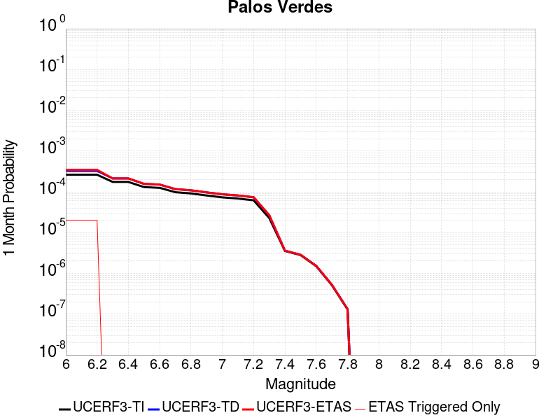 | 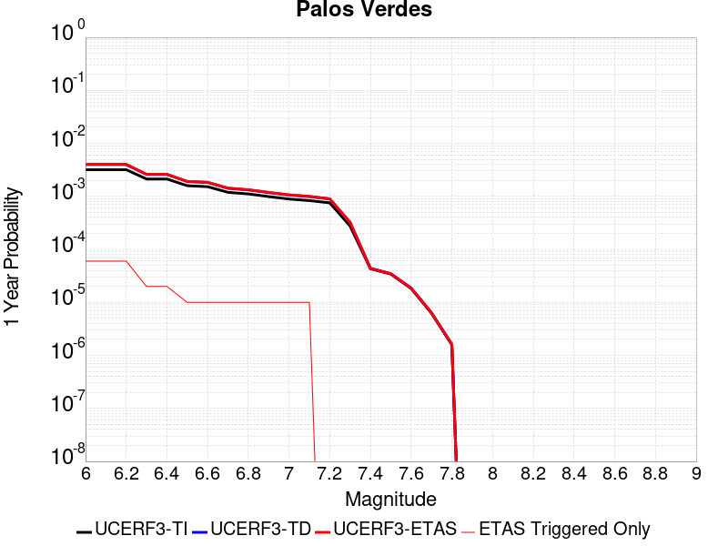 |  |

| Magnitude | 1 wk TI Prob | 1 wk TD Prob | 1 wk ETAS Prob | 1 wk ETAS/TD Gain | 1 wk ETAS Triggered Only | 1 mo TI Prob | 1 mo TD Prob | 1 mo ETAS Prob | 1 mo ETAS/TD Gain | 1 mo ETAS Triggered Only | 1 yr TI Prob | 1 yr TD Prob | 1 yr ETAS Prob | 1 yr ETAS/TD Gain | 1 yr ETAS Triggered Only | 10 yr TI Prob | 10 yr TD Prob | 10 yr ETAS Prob | 10 yr ETAS/TD Gain | 10 yr ETAS Triggered Only |
|-----|-----|-----|-----|-----|-----|-----|-----|-----|-----|-----|-----|-----|-----|-----|-----|-----|-----|-----|-----|-----|
| 6.0 | 6.126063E-5 | 7.622572E-5 | 1.2550976E-4 | 1.6465539 | 4.928779E-5 | 2.6251914E-4 | 3.266441E-4 | 3.759158E-4 | 1.1508421 | 4.928779E-5 | 0.0031914865 | 0.0039701737 | 0.004068358 | 1.0247304 | 9.857558E-5 | 0.031460393 | 0.03904909 | 0.03919118 | 1.0036387 | 1.4786338E-4 |
| 6.1 | 6.126063E-5 | 7.622572E-5 | 1.2550976E-4 | 1.6465539 | 4.928779E-5 | 2.6251914E-4 | 3.266441E-4 | 3.759158E-4 | 1.1508421 | 4.928779E-5 | 0.0031914865 | 0.0039701737 | 0.004068358 | 1.0247304 | 9.857558E-5 | 0.031460393 | 0.03904909 | 0.03919118 | 1.0036387 | 1.4786338E-4 |
| 6.2 | 6.126063E-5 | 7.622572E-5 | 1.2550976E-4 | 1.6465539 | 4.928779E-5 | 2.6251914E-4 | 3.266441E-4 | 3.759158E-4 | 1.1508421 | 4.928779E-5 | 0.0031914865 | 0.0039701737 | 0.004068358 | 1.0247304 | 9.857558E-5 | 0.031460393 | 0.03904909 | 0.03919118 | 1.0036387 | 1.4786338E-4 |
| 6.3 | 4.0838047E-5 | 4.9749007E-5 | 4.9749007E-5 | 1.0 | 0.0 | 1.7500846E-4 | 2.1319388E-4 | 2.1319388E-4 | 1.0 | 0.0 | 0.0021286458 | 0.002592754 | 0.0026419142 | 1.0189605 | 4.928779E-5 | 0.021083709 | 0.025646746 | 0.025742793 | 1.003745 | 9.857558E-5 |
| 6.4 | 4.0838047E-5 | 4.9749007E-5 | 4.9749007E-5 | 1.0 | 0.0 | 1.7500846E-4 | 2.1319388E-4 | 2.1319388E-4 | 1.0 | 0.0 | 0.0021286458 | 0.002592754 | 0.0026419142 | 1.0189605 | 4.928779E-5 | 0.021083709 | 0.025646746 | 0.025742793 | 1.003745 | 9.857558E-5 |
| 6.5 | 3.0512005E-5 | 3.6561592E-5 | 3.6561592E-5 | 1.0 | 0.0 | 1.3075917E-4 | 1.566838E-4 | 1.566838E-4 | 1.0 | 0.0 | 0.0015908304 | 0.001906072 | 0.001906072 | 1.0 | 0.0 | 0.015794903 | 0.018909173 | 0.01895753 | 1.0025573 | 4.928779E-5 |
| 6.6 | 2.9255087E-5 | 3.5154393E-5 | 3.5154393E-5 | 1.0 | 0.0 | 1.2537291E-4 | 1.5065364E-4 | 1.5065364E-4 | 1.0 | 0.0 | 0.0015253464 | 0.0018327782 | 0.0018327782 | 1.0 | 0.0 | 0.015149189 | 0.018188244 | 0.018236635 | 1.0026606 | 4.928779E-5 |
| 6.7 | 2.287198E-5 | 2.724828E-5 | 2.724828E-5 | 1.0 | 0.0 | 9.801909E-5 | 1.16773626E-4 | 1.16773626E-4 | 1.0 | 0.0 | 0.001192729 | 0.0014208833 | 0.0014208833 | 1.0 | 0.0 | 0.011863477 | 0.014127217 | 0.014175809 | 1.0034395 | 4.928779E-5 |
| 6.8 | 2.1325764E-5 | 2.5431878E-5 | 2.5431878E-5 | 1.0 | 0.0 | 9.139293E-5 | 1.0898972E-4 | 1.0898972E-4 | 1.0 | 0.0 | 0.001112141 | 0.0013262323 | 0.0013262323 | 1.0 | 0.0 | 0.011065915 | 0.013192211 | 0.013240849 | 1.0036868 | 4.928779E-5 |
| 6.9 | 1.9009392E-5 | 2.2613547E-5 | 2.2613547E-5 | 1.0 | 0.0 | 8.1466285E-5 | 9.6912096E-5 | 9.6912096E-5 | 1.0 | 0.0 | 9.914007E-4 | 0.0011793535 | 0.0011793535 | 1.0 | 0.0 | 0.009869894 | 0.011739633 | 0.011788342 | 1.0041491 | 4.928779E-5 |
| 7.0 | 1.7098473E-5 | 2.0319356E-5 | 2.0319356E-5 | 1.0 | 0.0 | 7.3277115E-5 | 8.708052E-5 | 8.708052E-5 | 1.0 | 0.0 | 8.917837E-4 | 0.001059775 | 0.001059775 | 1.0 | 0.0 | 0.008882134 | 0.010555646 | 0.010604414 | 1.0046201 | 4.928779E-5 |
| 7.1 | 1.5982785E-5 | 1.899476E-5 | 1.899476E-5 | 1.0 | 0.0 | 6.849585E-5 | 8.1404054E-5 | 8.1404054E-5 | 1.0 | 0.0 | 8.336179E-4 | 9.907284E-4 | 9.907284E-4 | 1.0 | 0.0 | 0.008304977 | 0.009871479 | 0.00992028 | 1.0049436 | 4.928779E-5 |
| 7.2 | 1.4468002E-5 | 1.7197237E-5 | 1.7197237E-5 | 1.0 | 0.0 | 6.200425E-5 | 7.370083E-5 | 7.370083E-5 | 1.0 | 0.0 | 7.546402E-4 | 8.970222E-4 | 8.970222E-4 | 1.0 | 0.0 | 0.007520827 | 0.008942284 | 0.008991131 | 1.0054625 | 4.928779E-5 |
| 7.3 | 5.288233E-6 | 6.2036747E-6 | 6.2036747E-6 | 1.0 | 0.0 | 2.2663658E-5 | 2.6587102E-5 | 2.6587102E-5 | 1.0 | 0.0 | 2.7589512E-4 | 3.236848E-4 | 3.236848E-4 | 1.0 | 0.0 | 0.0027555283 | 0.0032355562 | 0.0032355562 | 1.0 | 0.0 |
| 7.4 | 8.279556E-7 | 8.408347E-7 | 8.408347E-7 | 1.0 | 0.0 | 3.5483763E-6 | 3.6035726E-6 | 3.6035726E-6 | 1.0 | 0.0 | 4.3200624E-5 | 4.3872686E-5 | 4.3872686E-5 | 1.0 | 0.0 | 4.3192226E-4 | 4.3864746E-4 | 4.3864746E-4 | 1.0 | 0.0 |
| 7.5 | 6.559831E-7 | 6.667229E-7 | 6.667229E-7 | 1.0 | 0.0 | 2.8113532E-6 | 2.857381E-6 | 2.857381E-6 | 1.0 | 0.0 | 3.4227687E-5 | 3.4788125E-5 | 3.4788125E-5 | 1.0 | 0.0 | 3.4222414E-4 | 3.4783344E-4 | 3.4783344E-4 | 1.0 | 0.0 |
| 7.6 | 3.5018968E-7 | 3.5620027E-7 | 3.5620027E-7 | 1.0 | 0.0 | 1.500812E-6 | 1.526572E-6 | 1.526572E-6 | 1.0 | 0.0 | 1.8272232E-5 | 1.8585903E-5 | 1.8585903E-5 | 1.0 | 0.0 | 1.8270731E-4 | 1.8584808E-4 | 1.8584808E-4 | 1.0 | 0.0 |
| 7.7 | 1.1986104E-7 | 1.2198376E-7 | 1.2198376E-7 | 1.0 | 0.0 | 5.1369005E-7 | 5.2278745E-7 | 5.2278745E-7 | 1.0 | 0.0 | 6.2541585E-6 | 6.364919E-6 | 6.364919E-6 | 1.0 | 0.0 | 6.2539824E-5 | 6.364741E-5 | 6.364741E-5 | 1.0 | 0.0 |
| 7.8 | 3.0445005E-8 | 3.1027582E-8 | 3.1027582E-8 | 1.0 | 0.0 | 1.3047858E-7 | 1.3297536E-7 | 1.3297536E-7 | 1.0 | 0.0 | 1.5885756E-6 | 1.6189739E-6 | 1.6189739E-6 | 1.0 | 0.0 | 1.5885644E-5 | 1.6189642E-5 | 1.6189642E-5 | 1.0 | 0.0 |

## Cleghorn
*[(top)](#table-of-contents)*

| 1 Week | 1 Month | 1 Year | 10 Year |
|-----|-----|-----|-----|
|  |  |  |  |

| Magnitude | 1 wk TI Prob | 1 wk TD Prob | 1 wk ETAS Prob | 1 wk ETAS/TD Gain | 1 wk ETAS Triggered Only | 1 mo TI Prob | 1 mo TD Prob | 1 mo ETAS Prob | 1 mo ETAS/TD Gain | 1 mo ETAS Triggered Only | 1 yr TI Prob | 1 yr TD Prob | 1 yr ETAS Prob | 1 yr ETAS/TD Gain | 1 yr ETAS Triggered Only | 10 yr TI Prob | 10 yr TD Prob | 10 yr ETAS Prob | 10 yr ETAS/TD Gain | 10 yr ETAS Triggered Only |
|-----|-----|-----|-----|-----|-----|-----|-----|-----|-----|-----|-----|-----|-----|-----|-----|-----|-----|-----|-----|-----|
| 6.0 | 7.9267165E-6 | 9.831764E-6 | 9.831764E-6 | 1.0 | 0.0 | 3.39712E-5 | 4.2135514E-5 | 4.2135514E-5 | 1.0 | 0.0 | 4.1352084E-4 | 5.1288976E-4 | 6.114148E-4 | 1.1920979 | 9.857558E-5 | 0.004127522 | 0.005132214 | 0.005279319 | 1.0286629 | 1.4786338E-4 |
| 6.1 | 7.9267165E-6 | 9.831764E-6 | 9.831764E-6 | 1.0 | 0.0 | 3.39712E-5 | 4.2135514E-5 | 4.2135514E-5 | 1.0 | 0.0 | 4.1352084E-4 | 5.1288976E-4 | 6.114148E-4 | 1.1920979 | 9.857558E-5 | 0.004127522 | 0.005132214 | 0.005279319 | 1.0286629 | 1.4786338E-4 |
| 6.2 | 7.9267165E-6 | 9.831764E-6 | 9.831764E-6 | 1.0 | 0.0 | 3.39712E-5 | 4.2135514E-5 | 4.2135514E-5 | 1.0 | 0.0 | 4.1352084E-4 | 5.1288976E-4 | 6.114148E-4 | 1.1920979 | 9.857558E-5 | 0.004127522 | 0.005132214 | 0.005279319 | 1.0286629 | 1.4786338E-4 |
| 6.3 | 7.9267165E-6 | 9.831764E-6 | 9.831764E-6 | 1.0 | 0.0 | 3.39712E-5 | 4.2135514E-5 | 4.2135514E-5 | 1.0 | 0.0 | 4.1352084E-4 | 5.1288976E-4 | 6.114148E-4 | 1.1920979 | 9.857558E-5 | 0.004127522 | 0.005132214 | 0.005279319 | 1.0286629 | 1.4786338E-4 |
| 6.4 | 4.3445207E-6 | 6.0916254E-6 | 6.0916254E-6 | 1.0 | 0.0 | 1.8619241E-5 | 2.6106709E-5 | 2.6106709E-5 | 1.0 | 0.0 | 2.2666567E-4 | 3.1780385E-4 | 3.1780385E-4 | 1.0 | 0.0 | 0.0022643462 | 0.0031877246 | 0.0032368554 | 1.0154124 | 4.928779E-5 |
| 6.5 | 4.3445207E-6 | 6.0916254E-6 | 6.0916254E-6 | 1.0 | 0.0 | 1.8619241E-5 | 2.6106709E-5 | 2.6106709E-5 | 1.0 | 0.0 | 2.2666567E-4 | 3.1780385E-4 | 3.1780385E-4 | 1.0 | 0.0 | 0.0022643462 | 0.0031877246 | 0.0032368554 | 1.0154124 | 4.928779E-5 |
| 6.6 | 4.040109E-6 | 5.774033E-6 | 5.774033E-6 | 1.0 | 0.0 | 1.7314638E-5 | 2.4745626E-5 | 2.4745626E-5 | 1.0 | 0.0 | 2.1078532E-4 | 3.0123728E-4 | 3.0123728E-4 | 1.0 | 0.0 | 0.002105855 | 0.0030225143 | 0.0030716532 | 1.0162576 | 4.928779E-5 |
| 6.7 | 3.3632055E-6 | 5.06753E-6 | 5.06753E-6 | 1.0 | 0.0 | 1.4413658E-5 | 2.1717806E-5 | 2.1717806E-5 | 1.0 | 0.0 | 1.7547216E-4 | 2.643825E-4 | 2.643825E-4 | 1.0 | 0.0 | 0.0017533366 | 0.0026548486 | 0.0027040055 | 1.018516 | 4.928779E-5 |
| 6.8 | 3.2902772E-6 | 4.9894375E-6 | 4.9894375E-6 | 1.0 | 0.0 | 1.4101111E-5 | 2.138313E-5 | 2.138313E-5 | 1.0 | 0.0 | 1.716675E-4 | 2.6030882E-4 | 2.6030882E-4 | 1.0 | 0.0 | 0.0017153495 | 0.0026142076 | 0.0026633665 | 1.0188046 | 4.928779E-5 |
| 6.9 | 3.031547E-6 | 4.6911987E-6 | 4.6911987E-6 | 1.0 | 0.0 | 1.299228E-5 | 2.0104984E-5 | 2.0104984E-5 | 1.0 | 0.0 | 1.5816953E-4 | 2.4475096E-4 | 2.4475096E-4 | 1.0 | 0.0 | 0.00158057 | 0.0024589805 | 0.0025081472 | 1.0199947 | 4.928779E-5 |
| 7.0 | 2.8259715E-6 | 4.3707637E-6 | 4.3707637E-6 | 1.0 | 0.0 | 1.211125E-5 | 1.8731711E-5 | 1.8731711E-5 | 1.0 | 0.0 | 1.4744449E-4 | 2.2803496E-4 | 2.2803496E-4 | 1.0 | 0.0 | 0.001473467 | 0.0022921748 | 0.0023413496 | 1.0214534 | 4.928779E-5 |
| 7.1 | 2.5962665E-6 | 4.065983E-6 | 4.065983E-6 | 1.0 | 0.0 | 1.1126809E-5 | 1.7425526E-5 | 1.7425526E-5 | 1.0 | 0.0 | 1.3546048E-4 | 2.1213535E-4 | 2.1213535E-4 | 1.0 | 0.0 | 0.0013537793 | 0.0021334959 | 0.0021826786 | 1.0230526 | 4.928779E-5 |
| 7.2 | 2.3247253E-6 | 3.6765352E-6 | 3.6765352E-6 | 1.0 | 0.0 | 9.96307E-6 | 1.5756486E-5 | 1.5756486E-5 | 1.0 | 0.0 | 1.21293626E-4 | 1.9181852E-4 | 1.9181852E-4 | 1.0 | 0.0 | 0.0012122744 | 0.0019307166 | 0.0019799091 | 1.025479 | 4.928779E-5 |
| 7.3 | 2.056928E-6 | 3.235253E-6 | 3.235253E-6 | 1.0 | 0.0 | 8.815376E-6 | 1.3865297E-5 | 1.3865297E-5 | 1.0 | 0.0 | 1.0732192E-4 | 1.6879707E-4 | 1.6879707E-4 | 1.0 | 0.0 | 0.001072701 | 0.0017009423 | 0.0017501463 | 1.0289274 | 4.928779E-5 |
| 7.4 | 1.8055999E-6 | 2.8256538E-6 | 2.8256538E-6 | 1.0 | 0.0 | 7.738263E-6 | 1.210989E-5 | 1.210989E-5 | 1.0 | 0.0 | 9.4209274E-5 | 1.4742807E-4 | 1.4742807E-4 | 1.0 | 0.0 | 9.4169343E-4 | 0.0014876705 | 0.0015368849 | 1.0330815 | 4.928779E-5 |
| 7.5 | 1.4683443E-6 | 2.4248943E-6 | 2.4248943E-6 | 1.0 | 0.0 | 6.292889E-6 | 1.0392363E-5 | 1.0392363E-5 | 1.0 | 0.0 | 7.661323E-5 | 1.2651978E-4 | 1.2651978E-4 | 1.0 | 0.0 | 7.658682E-4 | 0.0012788812 | 0.001328106 | 1.0384905 | 4.928779E-5 |
| 7.6 | 9.804088E-7 | 1.9004091E-6 | 1.9004091E-6 | 1.0 | 0.0 | 4.201745E-6 | 8.144585E-6 | 8.144585E-6 | 1.0 | 0.0 | 5.1155046E-5 | 9.915586E-5 | 9.915586E-5 | 1.0 | 0.0 | 5.114327E-4 | 0.0010055583 | 0.0010055583 | 1.0 | 0.0 |
| 7.7 | 7.3434086E-7 | 1.6285549E-6 | 1.6285549E-6 | 1.0 | 0.0 | 3.1471714E-6 | 6.9795024E-6 | 6.9795024E-6 | 1.0 | 0.0 | 3.831614E-5 | 8.4972155E-5 | 8.4972155E-5 | 1.0 | 0.0 | 3.8309532E-4 | 8.6387293E-4 | 8.6387293E-4 | 1.0 | 0.0 |
| 7.8 | 6.434184E-7 | 1.5221389E-6 | 1.5221389E-6 | 1.0 | 0.0 | 2.7575045E-6 | 6.523436E-6 | 6.523436E-6 | 1.0 | 0.0 | 3.35721E-5 | 7.9419966E-5 | 7.9419966E-5 | 1.0 | 0.0 | 3.3567028E-4 | 8.080443E-4 | 8.080443E-4 | 1.0 | 0.0 |
| 7.9 | 3.4943926E-7 | 7.5750586E-7 | 7.5750586E-7 | 1.0 | 0.0 | 1.497596E-6 | 3.2464498E-6 | 3.2464498E-6 | 1.0 | 0.0 | 1.8233079E-5 | 3.9524817E-5 | 3.9524817E-5 | 1.0 | 0.0 | 1.8231584E-4 | 4.0401975E-4 | 4.0401975E-4 | 1.0 | 0.0 |
| 8.0 | 6.717524E-8 | 5.837515E-8 | 5.837515E-8 | 1.0 | 0.0 | 2.8789387E-7 | 2.501792E-7 | 2.501792E-7 | 1.0 | 0.0 | 3.505102E-6 | 3.0459275E-6 | 3.0459275E-6 | 1.0 | 0.0 | 3.5050467E-5 | 3.2751934E-5 | 3.2751934E-5 | 1.0 | 0.0 |
| 8.1 | 3.1984914E-8 | 1.2949885E-8 | 1.2949885E-8 | 1.0 | 0.0 | 1.370782E-7 | 5.549951E-8 | 5.549951E-8 | 1.0 | 0.0 | 1.6689258E-6 | 6.757063E-7 | 6.757063E-7 | 1.0 | 0.0 | 1.6689133E-5 | 7.741151E-6 | 7.741151E-6 | 1.0 | 0.0 |
| 8.2 | 1.21887656E-8 | 3.6471115E-9 | 3.6471115E-9 | 1.0 | 0.0 | 5.2237567E-8 | 1.563048E-8 | 1.563048E-8 | 1.0 | 0.0 | 6.359922E-7 | 1.9030107E-7 | 1.9030107E-7 | 1.0 | 0.0 | 6.3599036E-6 | 2.245849E-6 | 2.245849E-6 | 1.0 | 0.0 |

## San Jacinto (Stepovers Combined)
*[(top)](#table-of-contents)*

| 1 Week | 1 Month | 1 Year | 10 Year |
|-----|-----|-----|-----|
| 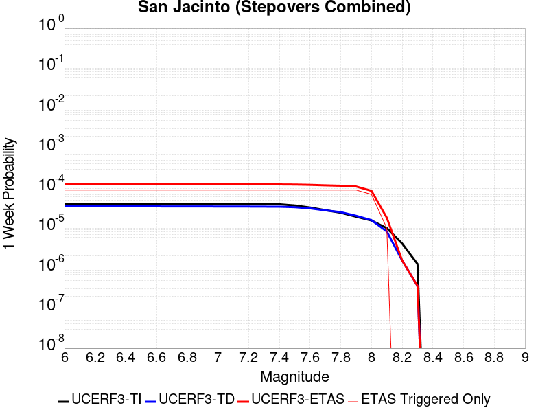 |  |  |  |

| Magnitude | 1 wk TI Prob | 1 wk TD Prob | 1 wk ETAS Prob | 1 wk ETAS/TD Gain | 1 wk ETAS Triggered Only | 1 mo TI Prob | 1 mo TD Prob | 1 mo ETAS Prob | 1 mo ETAS/TD Gain | 1 mo ETAS Triggered Only | 1 yr TI Prob | 1 yr TD Prob | 1 yr ETAS Prob | 1 yr ETAS/TD Gain | 1 yr ETAS Triggered Only | 10 yr TI Prob | 10 yr TD Prob | 10 yr ETAS Prob | 10 yr ETAS/TD Gain | 10 yr ETAS Triggered Only |
|-----|-----|-----|-----|-----|-----|-----|-----|-----|-----|-----|-----|-----|-----|-----|-----|-----|-----|-----|-----|-----|
| 6.0 | 4.0667746E-5 | 3.5271103E-5 | 8.4557156E-5 | 2.3973494 | 4.928779E-5 | 1.742787E-4 | 1.5115313E-4 | 2.497138E-4 | 1.6520585 | 9.857558E-5 | 0.0021197782 | 0.0018387372 | 0.0019371315 | 1.0535119 | 9.857558E-5 | 0.020996714 | 0.018986495 | 0.01913155 | 1.00764 | 1.4786338E-4 |
| 6.1 | 4.0667746E-5 | 3.5271103E-5 | 8.4557156E-5 | 2.3973494 | 4.928779E-5 | 1.742787E-4 | 1.5115313E-4 | 2.497138E-4 | 1.6520585 | 9.857558E-5 | 0.0021197782 | 0.0018387372 | 0.0019371315 | 1.0535119 | 9.857558E-5 | 0.020996714 | 0.018986495 | 0.01913155 | 1.00764 | 1.4786338E-4 |
| 6.2 | 4.0667746E-5 | 3.5271103E-5 | 8.4557156E-5 | 2.3973494 | 4.928779E-5 | 1.742787E-4 | 1.5115313E-4 | 2.497138E-4 | 1.6520585 | 9.857558E-5 | 0.0021197782 | 0.0018387372 | 0.0019371315 | 1.0535119 | 9.857558E-5 | 0.020996714 | 0.018986495 | 0.01913155 | 1.00764 | 1.4786338E-4 |
| 6.3 | 4.0667746E-5 | 3.5271103E-5 | 8.4557156E-5 | 2.3973494 | 4.928779E-5 | 1.742787E-4 | 1.5115313E-4 | 2.497138E-4 | 1.6520585 | 9.857558E-5 | 0.0021197782 | 0.0018387372 | 0.0019371315 | 1.0535119 | 9.857558E-5 | 0.020996714 | 0.018986495 | 0.01913155 | 1.00764 | 1.4786338E-4 |
| 6.4 | 4.0577226E-5 | 3.5143014E-5 | 8.442908E-5 | 2.4024425 | 4.928779E-5 | 1.738908E-4 | 1.5060425E-4 | 2.49165E-4 | 1.6544353 | 9.857558E-5 | 0.0021150648 | 0.0018320669 | 0.001930462 | 1.0537071 | 9.857558E-5 | 0.020950472 | 0.018921062 | 0.019066129 | 1.007667 | 1.4786338E-4 |
| 6.5 | 4.0577226E-5 | 3.5143014E-5 | 8.442908E-5 | 2.4024425 | 4.928779E-5 | 1.738908E-4 | 1.5060425E-4 | 2.49165E-4 | 1.6544353 | 9.857558E-5 | 0.0021150648 | 0.0018320669 | 0.001930462 | 1.0537071 | 9.857558E-5 | 0.020950472 | 0.018921062 | 0.019066129 | 1.007667 | 1.4786338E-4 |
| 6.6 | 4.053861E-5 | 3.5088357E-5 | 8.437442E-5 | 2.4046273 | 4.928779E-5 | 1.7372532E-4 | 1.5037002E-4 | 2.489308E-4 | 1.6554549 | 9.857558E-5 | 0.0021130538 | 0.0018292206 | 0.0019276158 | 1.0537908 | 9.857558E-5 | 0.020930743 | 0.01889314 | 0.01903821 | 1.0076784 | 1.4786338E-4 |
| 6.7 | 4.0516545E-5 | 3.505743E-5 | 8.43435E-5 | 2.4058664 | 4.928779E-5 | 1.7363077E-4 | 1.502375E-4 | 2.487983E-4 | 1.6560332 | 9.857558E-5 | 0.002111905 | 0.0018276101 | 0.0019260055 | 1.0538383 | 9.857558E-5 | 0.020919468 | 0.018877337 | 0.019022409 | 1.007685 | 1.4786338E-4 |
| 6.8 | 4.049434E-5 | 3.5028992E-5 | 8.4315056E-5 | 2.4070077 | 4.928779E-5 | 1.7353562E-4 | 1.5011564E-4 | 2.4867643E-4 | 1.6565658 | 9.857558E-5 | 0.0021107488 | 0.0018261289 | 0.0019245244 | 1.053882 | 9.857558E-5 | 0.020908125 | 0.018862749 | 0.019007822 | 1.007691 | 1.4786338E-4 |
| 6.9 | 4.046386E-5 | 3.4991554E-5 | 8.427762E-5 | 2.4085133 | 4.928779E-5 | 1.73405E-4 | 1.499552E-4 | 2.48516E-4 | 1.6572683 | 9.857558E-5 | 0.0021091616 | 0.0018241788 | 0.0019225746 | 1.0539397 | 9.857558E-5 | 0.020892553 | 0.018843522 | 0.0189886 | 1.007699 | 1.4786338E-4 |
| 7.0 | 4.036382E-5 | 3.4872126E-5 | 8.41582E-5 | 2.4133372 | 4.928779E-5 | 1.7297632E-4 | 1.4944343E-4 | 2.4800427E-4 | 1.6595196 | 9.857558E-5 | 0.0021039525 | 0.0018179584 | 0.0019163549 | 1.0541247 | 9.857558E-5 | 0.02084144 | 0.018782137 | 0.018927222 | 1.0077246 | 1.4786338E-4 |
| 7.1 | 4.0343282E-5 | 3.485059E-5 | 8.4136664E-5 | 2.4142108 | 4.928779E-5 | 1.7288832E-4 | 1.4935112E-4 | 2.47912E-4 | 1.6599271 | 9.857558E-5 | 0.002102883 | 0.0018168368 | 0.0019152332 | 1.0541581 | 9.857558E-5 | 0.020830948 | 0.018771008 | 0.018916095 | 1.0077294 | 1.4786338E-4 |
| 7.2 | 4.0257353E-5 | 3.475509E-5 | 8.404117E-5 | 2.4180968 | 4.928779E-5 | 1.725201E-4 | 1.489419E-4 | 2.475028E-4 | 1.6617407 | 9.857558E-5 | 0.0020984085 | 0.0018118626 | 0.0019102595 | 1.0543071 | 9.857558E-5 | 0.020787042 | 0.018721746 | 0.018866843 | 1.00775 | 1.4786338E-4 |
| 7.3 | 3.9940667E-5 | 3.458276E-5 | 8.386885E-5 | 2.4251635 | 4.928779E-5 | 1.7116306E-4 | 1.4820343E-4 | 2.467644E-4 | 1.6650385 | 9.857558E-5 | 0.0020819185 | 0.0018028866 | 0.0019012846 | 1.054578 | 9.857558E-5 | 0.020625217 | 0.018630387 | 0.018775497 | 1.0077888 | 1.4786338E-4 |
| 7.4 | 3.9721202E-5 | 3.4468165E-5 | 8.375426E-5 | 2.4299018 | 4.928779E-5 | 1.7022261E-4 | 1.4771236E-4 | 2.4627338E-4 | 1.6672497 | 9.857558E-5 | 0.0020704903 | 0.0017969179 | 0.0018953163 | 1.0547596 | 9.857558E-5 | 0.020513052 | 0.018569522 | 0.018714638 | 1.0078149 | 1.4786338E-4 |
| 7.5 | 3.7036873E-5 | 3.3535776E-5 | 8.282191E-5 | 2.4696586 | 4.928779E-5 | 1.5871979E-4 | 1.4371685E-4 | 2.4227827E-4 | 1.6858028 | 9.857558E-5 | 0.0019307006 | 0.0017483513 | 0.0018467546 | 1.0562835 | 9.857558E-5 | 0.019140124 | 0.018071128 | 0.01821632 | 1.0080345 | 1.4786338E-4 |
| 7.6 | 3.2940967E-5 | 3.13167E-5 | 8.060295E-5 | 2.5738008 | 4.928779E-5 | 1.4116794E-4 | 1.3420754E-4 | 2.3276989E-4 | 1.7344025 | 9.857558E-5 | 0.0017173645 | 0.0016327545 | 0.0017311691 | 1.0602752 | 9.857558E-5 | 0.01704153 | 0.016904091 | 0.017049454 | 1.0085993 | 1.4786338E-4 |
| 7.7 | 2.8236149E-5 | 2.7882697E-5 | 7.716911E-5 | 2.7676344 | 4.928779E-5 | 1.2100645E-4 | 1.1949181E-4 | 2.180556E-4 | 1.8248583 | 9.857558E-5 | 0.0014722579 | 0.0014538429 | 0.0015522751 | 1.0677049 | 9.857558E-5 | 0.014625421 | 0.015114912 | 0.01526054 | 1.0096347 | 1.4786338E-4 |
| 7.8 | 2.4329287E-5 | 2.5206451E-5 | 7.4493E-5 | 2.9553149 | 4.928779E-5 | 1.042642E-4 | 1.08023174E-4 | 2.0658811E-4 | 1.9124424 | 9.857558E-5 | 0.0012686774 | 0.0013143895 | 0.0014128356 | 1.0748986 | 9.857558E-5 | 0.012614589 | 0.013712341 | 0.013858177 | 1.0106354 | 1.4786338E-4 |
| 7.9 | 1.9370926E-5 | 2.0420413E-5 | 6.9707196E-5 | 3.4136038 | 4.928779E-5 | 8.301561E-5 | 8.751312E-5 | 1.8608008E-4 | 2.1263106 | 9.857558E-5 | 0.0010102465 | 0.0010649522 | 0.0011634228 | 1.0924648 | 9.857558E-5 | 0.0100566605 | 0.011199402 | 0.011345609 | 1.013055 | 1.4786338E-4 |
| 8.0 | 1.5583017E-5 | 1.5885415E-5 | 6.5172426E-5 | 4.102658 | 4.928779E-5 | 6.6782646E-5 | 6.807858E-5 | 1.17363015E-4 | 1.7239345 | 4.928779E-5 | 8.127754E-4 | 8.2854216E-4 | 8.777891E-4 | 1.0594381 | 4.928779E-5 | 0.008098091 | 0.008781636 | 0.008879346 | 1.0111266 | 9.857558E-5 |
| 8.1 | 1.0024873E-5 | 8.291399E-6 | 8.291399E-6 | 1.0 | 0.0 | 4.2963035E-5 | 3.553409E-5 | 3.553409E-5 | 1.0 | 0.0 | 5.229494E-4 | 4.3254215E-4 | 4.3254215E-4 | 1.0 | 0.0 | 0.0052172043 | 0.0046530655 | 0.0047021243 | 1.0105432 | 4.928779E-5 |
| 8.2 | 4.142796E-6 | 1.5602761E-6 | 1.5602761E-6 | 1.0 | 0.0 | 1.775472E-5 | 6.6868806E-6 | 6.6868806E-6 | 1.0 | 0.0 | 2.1614227E-4 | 8.140976E-5 | 8.140976E-5 | 1.0 | 0.0 | 0.0021593217 | 9.4514614E-4 | 9.4514614E-4 | 1.0 | 0.0 |
| 8.3 | 1.2750878E-6 | 3.609817E-7 | 3.609817E-7 | 1.0 | 0.0 | 5.4646503E-6 | 1.5470634E-6 | 1.5470634E-6 | 1.0 | 0.0 | 6.653009E-5 | 1.8835339E-5 | 1.8835339E-5 | 1.0 | 0.0 | 6.6510175E-4 | 2.272251E-4 | 2.272251E-4 | 1.0 | 0.0 |

## Calico-Hidalgo
*[(top)](#table-of-contents)*

| 1 Week | 1 Month | 1 Year | 10 Year |
|-----|-----|-----|-----|
|  |  |  |  |

| Magnitude | 1 wk TI Prob | 1 wk TD Prob | 1 wk ETAS Prob | 1 wk ETAS/TD Gain | 1 wk ETAS Triggered Only | 1 mo TI Prob | 1 mo TD Prob | 1 mo ETAS Prob | 1 mo ETAS/TD Gain | 1 mo ETAS Triggered Only | 1 yr TI Prob | 1 yr TD Prob | 1 yr ETAS Prob | 1 yr ETAS/TD Gain | 1 yr ETAS Triggered Only | 10 yr TI Prob | 10 yr TD Prob | 10 yr ETAS Prob | 10 yr ETAS/TD Gain | 10 yr ETAS Triggered Only |
|-----|-----|-----|-----|-----|-----|-----|-----|-----|-----|-----|-----|-----|-----|-----|-----|-----|-----|-----|-----|-----|
| 6.0 | 4.0906612E-5 | 5.0704355E-5 | 9.998965E-5 | 1.972013 | 4.928779E-5 | 1.7530227E-4 | 2.1728857E-4 | 3.1584274E-4 | 1.4535635 | 9.857558E-5 | 0.0021322158 | 0.002642678 | 0.0027409932 | 1.0372028 | 9.857558E-5 | 0.02111873 | 0.026152814 | 0.026296811 | 1.0055059 | 1.4786338E-4 |
| 6.1 | 4.0906612E-5 | 5.0704355E-5 | 9.998965E-5 | 1.972013 | 4.928779E-5 | 1.7530227E-4 | 2.1728857E-4 | 3.1584274E-4 | 1.4535635 | 9.857558E-5 | 0.0021322158 | 0.002642678 | 0.0027409932 | 1.0372028 | 9.857558E-5 | 0.02111873 | 0.026152814 | 0.026296811 | 1.0055059 | 1.4786338E-4 |
| 6.2 | 4.0906612E-5 | 5.0704355E-5 | 9.998965E-5 | 1.972013 | 4.928779E-5 | 1.7530227E-4 | 2.1728857E-4 | 3.1584274E-4 | 1.4535635 | 9.857558E-5 | 0.0021322158 | 0.002642678 | 0.0027409932 | 1.0372028 | 9.857558E-5 | 0.02111873 | 0.026152814 | 0.026296811 | 1.0055059 | 1.4786338E-4 |
| 6.3 | 2.4242801E-5 | 3.0090967E-5 | 3.0090967E-5 | 1.0 | 0.0 | 1.0389358E-4 | 1.289551E-4 | 1.7823654E-4 | 1.3821596 | 4.928779E-5 | 0.0012641704 | 0.0015689312 | 0.0016181417 | 1.0313656 | 4.928779E-5 | 0.01257003 | 0.015582229 | 0.015679268 | 1.0062276 | 9.857558E-5 |
| 6.4 | 2.4242801E-5 | 3.0090967E-5 | 3.0090967E-5 | 1.0 | 0.0 | 1.0389358E-4 | 1.289551E-4 | 1.7823654E-4 | 1.3821596 | 4.928779E-5 | 0.0012641704 | 0.0015689312 | 0.0016181417 | 1.0313656 | 4.928779E-5 | 0.01257003 | 0.015582229 | 0.015679268 | 1.0062276 | 9.857558E-5 |
| 6.5 | 2.0286952E-5 | 2.5316054E-5 | 2.5316054E-5 | 1.0 | 0.0 | 8.694118E-5 | 1.0849296E-4 | 1.0849296E-4 | 1.0 | 0.0 | 0.0010579949 | 0.0013201186 | 0.0013201186 | 1.0 | 0.0 | 0.010529719 | 0.013124701 | 0.013173342 | 1.0037061 | 4.928779E-5 |
| 6.6 | 2.0269223E-5 | 2.5297004E-5 | 2.5297004E-5 | 1.0 | 0.0 | 8.6865206E-5 | 1.08411325E-4 | 1.08411325E-4 | 1.0 | 0.0 | 0.0010570707 | 0.0013191258 | 0.0013191258 | 1.0 | 0.0 | 0.010520565 | 0.01311489 | 0.013163531 | 1.0037088 | 4.928779E-5 |
| 6.7 | 1.799852E-5 | 2.2540933E-5 | 2.2540933E-5 | 1.0 | 0.0 | 7.713423E-5 | 9.660051E-5 | 9.660051E-5 | 1.0 | 0.0 | 9.3870464E-4 | 0.0011754911 | 0.0011754911 | 1.0 | 0.0 | 0.009347493 | 0.011694346 | 0.011743057 | 1.0041654 | 4.928779E-5 |
| 6.8 | 1.7458793E-5 | 2.184258E-5 | 2.184258E-5 | 1.0 | 0.0 | 7.4821255E-5 | 9.360778E-5 | 9.360778E-5 | 1.0 | 0.0 | 9.10568E-4 | 0.0011390933 | 0.0011390933 | 1.0 | 0.0 | 0.009068459 | 0.011334131 | 0.01138286 | 1.0042993 | 4.928779E-5 |
| 6.9 | 1.542884E-5 | 1.9026285E-5 | 1.9026285E-5 | 1.0 | 0.0 | 6.612192E-5 | 8.153875E-5 | 8.153875E-5 | 1.0 | 0.0 | 8.04737E-4 | 9.922953E-4 | 9.922953E-4 | 1.0 | 0.0 | 0.008018291 | 0.009880043 | 0.009928844 | 1.0049393 | 4.928779E-5 |
| 7.0 | 1.468253E-5 | 1.803109E-5 | 1.803109E-5 | 1.0 | 0.0 | 6.292361E-5 | 7.727389E-5 | 7.727389E-5 | 1.0 | 0.0 | 7.658257E-4 | 9.4041653E-4 | 9.4041653E-4 | 1.0 | 0.0 | 0.0076319184 | 0.009365736 | 0.009414562 | 1.0052133 | 4.928779E-5 |
| 7.1 | 1.3139281E-5 | 1.620139E-5 | 1.620139E-5 | 1.0 | 0.0 | 5.6309986E-5 | 6.943275E-5 | 6.943275E-5 | 1.0 | 0.0 | 6.853584E-4 | 8.4502844E-4 | 8.4502844E-4 | 1.0 | 0.0 | 0.0068324856 | 0.008419449 | 0.008468322 | 1.0058048 | 4.928779E-5 |
| 7.2 | 1.1127404E-5 | 1.3867038E-5 | 1.3867038E-5 | 1.0 | 0.0 | 4.7688E-5 | 5.9428872E-5 | 5.9428872E-5 | 1.0 | 0.0 | 5.8044674E-4 | 7.233172E-4 | 7.233172E-4 | 1.0 | 0.0 | 0.0057893298 | 0.007210737 | 0.0072596697 | 1.006786 | 4.928779E-5 |
| 7.3 | 9.808154E-6 | 1.2176586E-5 | 1.2176586E-5 | 1.0 | 0.0 | 4.2034266E-5 | 5.2184383E-5 | 5.2184383E-5 | 1.0 | 0.0 | 5.11647E-4 | 6.351704E-4 | 6.351704E-4 | 1.0 | 0.0 | 0.0051047057 | 0.006334625 | 0.006383601 | 1.0077314 | 4.928779E-5 |
| 7.4 | 7.942452E-6 | 9.792348E-6 | 9.792348E-6 | 1.0 | 0.0 | 3.4038632E-5 | 4.1966585E-5 | 4.1966585E-5 | 1.0 | 0.0 | 4.1434157E-4 | 5.108328E-4 | 5.108328E-4 | 1.0 | 0.0 | 0.0041356985 | 0.005097527 | 0.005146564 | 1.0096197 | 4.928779E-5 |
| 7.5 | 4.7121216E-6 | 5.7729717E-6 | 5.7729717E-6 | 1.0 | 0.0 | 2.019465E-5 | 2.4741115E-5 | 2.4741115E-5 | 1.0 | 0.0 | 2.4584212E-4 | 3.011891E-4 | 3.011891E-4 | 1.0 | 0.0 | 0.0024557032 | 0.0030085614 | 0.003057701 | 1.0163332 | 4.928779E-5 |
| 7.6 | 2.21172E-7 | 2.6040198E-7 | 2.6040198E-7 | 1.0 | 0.0 | 9.478797E-7 | 1.1160082E-6 | 1.1160082E-6 | 1.0 | 0.0 | 1.1540374E-5 | 1.3587343E-5 | 1.3587343E-5 | 1.0 | 0.0 | 1.1539775E-4 | 1.3586794E-4 | 1.3586794E-4 | 1.0 | 0.0 |

## Brawley (Seismic Zone) alt 1
*[(top)](#table-of-contents)*

| 1 Week | 1 Month | 1 Year | 10 Year |
|-----|-----|-----|-----|
|  |  |  | 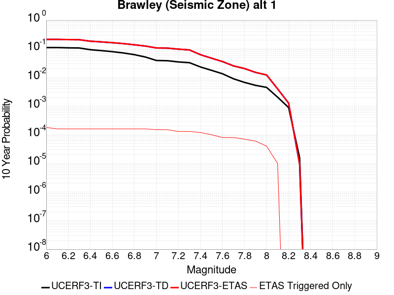 |

| Magnitude | 1 wk TI Prob | 1 wk TD Prob | 1 wk ETAS Prob | 1 wk ETAS/TD Gain | 1 wk ETAS Triggered Only | 1 mo TI Prob | 1 mo TD Prob | 1 mo ETAS Prob | 1 mo ETAS/TD Gain | 1 mo ETAS Triggered Only | 1 yr TI Prob | 1 yr TD Prob | 1 yr ETAS Prob | 1 yr ETAS/TD Gain | 1 yr ETAS Triggered Only | 10 yr TI Prob | 10 yr TD Prob | 10 yr ETAS Prob | 10 yr ETAS/TD Gain | 10 yr ETAS Triggered Only |
|-----|-----|-----|-----|-----|-----|-----|-----|-----|-----|-----|-----|-----|-----|-----|-----|-----|-----|-----|-----|-----|
| 6.0 | 2.2521618E-4 | 4.763429E-4 | 5.256072E-4 | 1.1034219 | 4.928779E-5 | 9.6485513E-4 | 0.0020399094 | 0.0020890967 | 1.0241125 | 4.928779E-5 | 0.011683988 | 0.024544531 | 0.02459261 | 1.0019588 | 4.928779E-5 | 0.11088423 | 0.21349923 | 0.21361552 | 1.0005447 | 1.4786338E-4 |
| 6.1 | 2.2521618E-4 | 4.763429E-4 | 4.763429E-4 | 1.0 | 0.0 | 9.6485513E-4 | 0.0020399094 | 0.0020399094 | 1.0 | 0.0 | 0.011683988 | 0.024544531 | 0.024544531 | 1.0 | 0.0 | 0.11088423 | 0.21349923 | 0.21357676 | 1.0003631 | 9.857558E-5 |
| 6.2 | 2.198148E-4 | 4.6718874E-4 | 4.6718874E-4 | 1.0 | 0.0 | 9.417233E-4 | 0.0020007377 | 0.0020007377 | 1.0 | 0.0 | 0.011405343 | 0.024078513 | 0.024078513 | 1.0 | 0.0 | 0.10837428 | 0.20993572 | 0.21001361 | 1.000371 | 9.857558E-5 |
| 6.3 | 2.1704129E-4 | 4.615455E-4 | 4.615455E-4 | 1.0 | 0.0 | 9.298453E-4 | 0.0019765892 | 0.0019765892 | 1.0 | 0.0 | 0.011262234 | 0.023792034 | 0.023792034 | 1.0 | 0.0 | 0.107082725 | 0.20782684 | 0.20790492 | 1.0003757 | 9.857558E-5 |
| 6.4 | 1.876142E-4 | 4.004663E-4 | 4.004663E-4 | 1.0 | 0.0 | 8.038131E-4 | 0.0017151695 | 0.0017151695 | 1.0 | 0.0 | 0.00974259 | 0.020678662 | 0.020678662 | 1.0 | 0.0 | 0.093263686 | 0.18457787 | 0.18465824 | 1.0004355 | 9.857558E-5 |
| 6.5 | 1.7390939E-4 | 3.7478763E-4 | 3.7478763E-4 | 1.0 | 0.0 | 7.45113E-4 | 0.0016052561 | 0.0016052561 | 1.0 | 0.0 | 0.009034078 | 0.019367293 | 0.019367293 | 1.0 | 0.0 | 0.086755216 | 0.17440015 | 0.17448154 | 1.0004667 | 9.857558E-5 |
| 6.6 | 1.591791E-4 | 3.4893592E-4 | 3.4893592E-4 | 1.0 | 0.0 | 6.8201777E-4 | 0.0014945926 | 0.0014945926 | 1.0 | 0.0 | 0.008271996 | 0.018045008 | 0.018045008 | 1.0 | 0.0 | 0.07970774 | 0.16380787 | 0.1638903 | 1.0005032 | 9.857558E-5 |
| 6.7 | 1.4268003E-4 | 3.2059717E-4 | 3.2059717E-4 | 1.0 | 0.0 | 6.1134255E-4 | 0.0013732726 | 0.0013732726 | 1.0 | 0.0 | 0.007417723 | 0.01659171 | 0.01659171 | 1.0 | 0.0 | 0.07174956 | 0.15193594 | 0.15201953 | 1.0005503 | 9.857558E-5 |
| 6.8 | 1.239713E-4 | 2.9055026E-4 | 2.9055026E-4 | 1.0 | 0.0 | 5.3119735E-4 | 0.0012446274 | 0.0012446274 | 1.0 | 0.0 | 0.0064481674 | 0.015049482 | 0.015049482 | 1.0 | 0.0 | 0.06264243 | 0.13838051 | 0.13846543 | 1.0006138 | 9.857558E-5 |
| 6.9 | 1.0180238E-4 | 2.6255674E-4 | 2.6255674E-4 | 1.0 | 0.0 | 4.3622297E-4 | 0.0011247622 | 0.0011247622 | 1.0 | 0.0 | 0.005298089 | 0.013608998 | 0.013608998 | 1.0 | 0.0 | 0.05173543 | 0.12496473 | 0.12505098 | 1.0006902 | 9.857558E-5 |
| 7.0 | 7.6619996E-5 | 2.2400476E-4 | 2.2400476E-4 | 1.0 | 0.0 | 3.283301E-4 | 9.596704E-4 | 9.596704E-4 | 1.0 | 0.0 | 0.0039900932 | 0.011622103 | 0.011622103 | 1.0 | 0.0 | 0.039192066 | 0.10726982 | 0.10735783 | 1.0008204 | 9.857558E-5 |
| 7.1 | 7.5127435E-5 | 2.2083633E-4 | 2.2083633E-4 | 1.0 | 0.0 | 3.2193496E-4 | 9.461013E-4 | 9.461013E-4 | 1.0 | 0.0 | 0.0039125155 | 0.011458648 | 0.011458648 | 1.0 | 0.0 | 0.038443442 | 0.10583378 | 0.105921924 | 1.0008328 | 9.857558E-5 |
| 7.2 | 6.788582E-5 | 2.0211334E-4 | 2.0211334E-4 | 1.0 | 0.0 | 2.9090676E-4 | 8.6591556E-4 | 8.6591556E-4 | 1.0 | 0.0 | 0.0035360386 | 0.0104922 | 0.0104922 | 1.0 | 0.0 | 0.034803 | 0.097503684 | 0.09759265 | 1.0009124 | 9.857558E-5 |
| 7.3 | 6.399602E-5 | 1.8842232E-4 | 1.8842232E-4 | 1.0 | 0.0 | 2.7423984E-4 | 8.0727716E-4 | 8.0727716E-4 | 1.0 | 0.0 | 0.0033337586 | 0.009784897 | 0.009784897 | 1.0 | 0.0 | 0.03284188 | 0.091397986 | 0.09148755 | 1.0009799 | 9.857558E-5 |
| 7.4 | 4.506759E-5 | 1.2530042E-4 | 1.2530042E-4 | 1.0 | 0.0 | 1.9313251E-4 | 5.3689216E-4 | 5.3689216E-4 | 1.0 | 0.0 | 0.0023488526 | 0.006517245 | 0.006517245 | 1.0 | 0.0 | 0.023241805 | 0.062364522 | 0.06245695 | 1.001482 | 9.857558E-5 |
| 7.5 | 3.43289E-5 | 9.336103E-5 | 9.336103E-5 | 1.0 | 0.0 | 1.4711556E-4 | 4.0005764E-4 | 4.0005764E-4 | 1.0 | 0.0 | 0.0017896603 | 0.004859886 | 0.004859886 | 1.0 | 0.0 | 0.01775316 | 0.047057066 | 0.047151003 | 1.0019963 | 9.857558E-5 |
| 7.6 | 2.5980507E-5 | 7.053672E-5 | 7.053672E-5 | 1.0 | 0.0 | 1.1134028E-4 | 3.0226534E-4 | 3.0226534E-4 | 1.0 | 0.0 | 0.001354725 | 0.0036738948 | 0.0036738948 | 1.0 | 0.0 | 0.013464959 | 0.03584298 | 0.0358905 | 1.0013258 | 4.928779E-5 |
| 7.7 | 1.7292105E-5 | 4.9412036E-5 | 4.9412036E-5 | 1.0 | 0.0 | 7.4106916E-5 | 2.1174872E-4 | 2.1174872E-4 | 1.0 | 0.0 | 9.018782E-4 | 0.0025749984 | 0.0025749984 | 1.0 | 0.0 | 0.008982267 | 0.025292097 | 0.025340138 | 1.0018995 | 4.928779E-5 |
| 7.8 | 1.2927471E-5 | 3.9697254E-5 | 3.9697254E-5 | 1.0 | 0.0 | 5.5402274E-5 | 1.7012001E-4 | 1.7012001E-4 | 1.0 | 0.0 | 6.743139E-4 | 0.0020692463 | 0.0020692463 | 1.0 | 0.0 | 0.0067227143 | 0.020433145 | 0.020481424 | 1.0023628 | 4.928779E-5 |
| 7.9 | 1.0200774E-5 | 2.8748475E-5 | 2.8748475E-5 | 1.0 | 0.0 | 4.371687E-5 | 1.2320194E-4 | 1.2320194E-4 | 1.0 | 0.0 | 5.321229E-4 | 0.0014989526 | 0.0014989526 | 1.0 | 0.0 | 0.005308505 | 0.014992895 | 0.0150414435 | 1.0032381 | 4.928779E-5 |
| 8.0 | 8.650396E-6 | 2.3279512E-5 | 2.3279512E-5 | 1.0 | 0.0 | 3.70726E-5 | 9.976552E-5 | 9.976552E-5 | 1.0 | 0.0 | 4.5126543E-4 | 0.0012139693 | 0.0012139693 | 1.0 | 0.0 | 0.0045035016 | 0.012212164 | 0.01226085 | 1.0039867 | 4.928779E-5 |
| 8.1 | 3.9368224E-6 | 7.3283345E-6 | 7.3283345E-6 | 1.0 | 0.0 | 1.6871985E-5 | 3.1406773E-5 | 3.1406773E-5 | 1.0 | 0.0 | 2.0539707E-4 | 3.8231048E-4 | 3.8231048E-4 | 1.0 | 0.0 | 0.0020520731 | 0.0040015313 | 0.0040015313 | 1.0 | 0.0 |
| 8.2 | 1.7101195E-6 | 2.2178374E-6 | 2.2178374E-6 | 1.0 | 0.0 | 7.329063E-6 | 9.504983E-6 | 9.504983E-6 | 1.0 | 0.0 | 8.922769E-5 | 1.15717055E-4 | 1.15717055E-4 | 1.0 | 0.0 | 8.9191867E-4 | 0.00126669 | 0.00126669 | 1.0 | 0.0 |
| 8.3 | 3.0346666E-8 | 1.721086E-8 | 1.721086E-8 | 1.0 | 0.0 | 1.3005713E-7 | 7.376083E-8 | 7.376083E-8 | 1.0 | 0.0 | 1.5834444E-6 | 8.98038E-7 | 8.98038E-7 | 1.0 | 0.0 | 1.5834332E-5 | 9.36379E-6 | 9.36379E-6 | 1.0 | 0.0 |

## Imperial
*[(top)](#table-of-contents)*

| 1 Week | 1 Month | 1 Year | 10 Year |
|-----|-----|-----|-----|
|  |  |  |  |

| Magnitude | 1 wk TI Prob | 1 wk TD Prob | 1 wk ETAS Prob | 1 wk ETAS/TD Gain | 1 wk ETAS Triggered Only | 1 mo TI Prob | 1 mo TD Prob | 1 mo ETAS Prob | 1 mo ETAS/TD Gain | 1 mo ETAS Triggered Only | 1 yr TI Prob | 1 yr TD Prob | 1 yr ETAS Prob | 1 yr ETAS/TD Gain | 1 yr ETAS Triggered Only | 10 yr TI Prob | 10 yr TD Prob | 10 yr ETAS Prob | 10 yr ETAS/TD Gain | 10 yr ETAS Triggered Only |
|-----|-----|-----|-----|-----|-----|-----|-----|-----|-----|-----|-----|-----|-----|-----|-----|-----|-----|-----|-----|-----|
| 6.0 | 2.7496446E-4 | 5.055345E-4 | 5.055345E-4 | 1.0 | 0.0 | 0.0011778869 | 0.002164817 | 0.002213998 | 1.0227183 | 4.928779E-5 | 0.0142467655 | 0.026048409 | 0.026096413 | 1.0018429 | 4.928779E-5 | 0.13367249 | 0.22807029 | 0.22818443 | 1.0005004 | 1.4786338E-4 |
| 6.1 | 2.5356023E-4 | 4.8657708E-4 | 4.8657708E-4 | 1.0 | 0.0 | 0.001086234 | 0.002083702 | 0.002083702 | 1.0 | 0.0 | 0.013144928 | 0.02507094 | 0.02507094 | 1.0 | 0.0 | 0.123940155 | 0.21949561 | 0.21957256 | 1.0003505 | 9.857558E-5 |
| 6.2 | 2.4820742E-4 | 4.775311E-4 | 4.775311E-4 | 1.0 | 0.0 | 0.0010633124 | 0.0020449946 | 0.0020449946 | 1.0 | 0.0 | 0.01286919 | 0.024610676 | 0.024610676 | 1.0 | 0.0 | 0.12148927 | 0.21600136 | 0.21607865 | 1.0003577 | 9.857558E-5 |
| 6.3 | 2.3205351E-4 | 4.5892023E-4 | 4.5892023E-4 | 1.0 | 0.0 | 9.94136E-4 | 0.0019653554 | 0.0019653554 | 1.0 | 0.0 | 0.012036599 | 0.023661187 | 0.023661187 | 1.0 | 0.0 | 0.11405133 | 0.20793827 | 0.20801635 | 1.0003755 | 9.857558E-5 |
| 6.4 | 2.0304754E-4 | 3.9878016E-4 | 3.9878016E-4 | 1.0 | 0.0 | 8.6991355E-4 | 0.0017079529 | 0.0017079529 | 1.0 | 0.0 | 0.010539869 | 0.020595418 | 0.020595418 | 1.0 | 0.0 | 0.100537635 | 0.18507113 | 0.18515146 | 1.000434 | 9.857558E-5 |
| 6.5 | 1.854992E-4 | 3.6990462E-4 | 3.6990462E-4 | 1.0 | 0.0 | 7.9475436E-4 | 0.0015843548 | 0.0015843548 | 1.0 | 0.0 | 0.009633281 | 0.01911443 | 0.01911443 | 1.0 | 0.0 | 0.0922623 | 0.1733039 | 0.17338538 | 1.0004703 | 9.857558E-5 |
| 6.6 | 1.6586106E-4 | 3.4036173E-4 | 3.4036173E-4 | 1.0 | 0.0 | 7.106394E-4 | 0.0014578878 | 0.0014578878 | 1.0 | 0.0 | 0.008617763 | 0.017607626 | 0.017607626 | 1.0 | 0.0 | 0.08291132 | 0.16078055 | 0.16086327 | 1.0005145 | 9.857558E-5 |
| 6.7 | 1.4224656E-4 | 3.076812E-4 | 3.076812E-4 | 1.0 | 0.0 | 6.094856E-4 | 0.0013179756 | 0.0013179756 | 1.0 | 0.0 | 0.0073952693 | 0.015928522 | 0.015928522 | 1.0 | 0.0 | 0.07153955 | 0.14648798 | 0.14657211 | 1.0005744 | 9.857558E-5 |
| 6.8 | 1.2317259E-4 | 2.779231E-4 | 2.779231E-4 | 1.0 | 0.0 | 5.2777573E-4 | 0.0011905615 | 0.0011905615 | 1.0 | 0.0 | 0.0064067547 | 0.014400131 | 0.014400131 | 1.0 | 0.0 | 0.06225166 | 0.13294089 | 0.13302635 | 1.0006429 | 9.857558E-5 |
| 6.9 | 9.859898E-5 | 2.5015484E-4 | 2.5015484E-4 | 1.0 | 0.0 | 4.2249862E-4 | 0.0010716559 | 0.0010716559 | 1.0 | 0.0 | 0.0051317946 | 0.012970319 | 0.012970319 | 1.0 | 0.0 | 0.05014893 | 0.119408876 | 0.119495675 | 1.0007269 | 9.857558E-5 |
| 7.0 | 7.3191884E-5 | 2.1267848E-4 | 2.1267848E-4 | 1.0 | 0.0 | 3.136418E-4 | 9.11164E-4 | 9.11164E-4 | 1.0 | 0.0 | 0.003811904 | 0.011037681 | 0.011037681 | 1.0 | 0.0 | 0.037471764 | 0.10206756 | 0.10215607 | 1.0008672 | 9.857558E-5 |
| 7.1 | 7.1760296E-5 | 2.0969207E-4 | 2.0969207E-4 | 1.0 | 0.0 | 3.0750787E-4 | 8.9837395E-4 | 8.9837395E-4 | 1.0 | 0.0 | 0.003737482 | 0.010883528 | 0.010883528 | 1.0 | 0.0 | 0.03675245 | 0.10070406 | 0.10079271 | 1.0008802 | 9.857558E-5 |
| 7.2 | 6.46614E-5 | 1.9137723E-4 | 1.9137723E-4 | 1.0 | 0.0 | 2.7709085E-4 | 8.199333E-4 | 8.199333E-4 | 1.0 | 0.0 | 0.0033683628 | 0.009937617 | 0.009937617 | 1.0 | 0.0 | 0.033177625 | 0.092511006 | 0.092600465 | 1.000967 | 9.857558E-5 |
| 7.3 | 6.088115E-5 | 1.780939E-4 | 1.780939E-4 | 1.0 | 0.0 | 2.6089314E-4 | 7.6303916E-4 | 7.6303916E-4 | 1.0 | 0.0 | 0.0031717476 | 0.009251006 | 0.009251006 | 1.0 | 0.0 | 0.031268585 | 0.08656135 | 0.0866514 | 1.0010402 | 9.857558E-5 |
| 7.4 | 4.199346E-5 | 1.1511097E-4 | 1.1511097E-4 | 1.0 | 0.0 | 1.7995955E-4 | 4.932403E-4 | 4.932403E-4 | 1.0 | 0.0 | 0.0021888057 | 0.005988835 | 0.005988835 | 1.0 | 0.0 | 0.02167372 | 0.05744024 | 0.057533152 | 1.0016176 | 9.857558E-5 |
| 7.5 | 3.130448E-5 | 8.333871E-5 | 8.333871E-5 | 1.0 | 0.0 | 1.3415517E-4 | 3.5711733E-4 | 3.5711733E-4 | 1.0 | 0.0 | 0.0016321153 | 0.0043392954 | 0.0043392954 | 1.0 | 0.0 | 0.016201803 | 0.042133506 | 0.042227928 | 1.002241 | 9.857558E-5 |
| 7.6 | 2.3074248E-5 | 6.0849357E-5 | 6.0849357E-5 | 1.0 | 0.0 | 9.888588E-5 | 2.6075702E-4 | 2.6075702E-4 | 1.0 | 0.0 | 0.0012032706 | 0.0031701182 | 0.0031701182 | 1.0 | 0.0 | 0.011967761 | 0.03102816 | 0.031075919 | 1.0015392 | 4.928779E-5 |
| 7.7 | 1.45864815E-5 | 4.0128452E-5 | 4.0128452E-5 | 1.0 | 0.0 | 6.2511994E-5 | 1.7196777E-4 | 1.7196777E-4 | 1.0 | 0.0 | 7.608177E-4 | 0.0020917025 | 0.0020917025 | 1.0 | 0.0 | 0.007582182 | 0.02062909 | 0.02067736 | 1.00234 | 4.928779E-5 |
| 7.8 | 1.0352979E-5 | 3.096395E-5 | 3.096395E-5 | 1.0 | 0.0 | 4.4369157E-5 | 1.326959E-4 | 1.326959E-4 | 1.0 | 0.0 | 5.400606E-4 | 0.0016143778 | 0.0016143778 | 1.0 | 0.0 | 0.0053875 | 0.016017893 | 0.016066391 | 1.0030278 | 4.928779E-5 |
| 7.9 | 8.137906E-6 | 2.2151205E-5 | 2.2151205E-5 | 1.0 | 0.0 | 3.4876273E-5 | 9.493029E-5 | 9.493029E-5 | 1.0 | 0.0 | 4.2453592E-4 | 0.0011551644 | 0.0011551644 | 1.0 | 0.0 | 0.004237258 | 0.011618842 | 0.011667558 | 1.0041927 | 4.928779E-5 |
| 8.0 | 6.93792E-6 | 1.8010365E-5 | 1.8010365E-5 | 1.0 | 0.0 | 2.9733603E-5 | 7.7185E-5 | 7.7185E-5 | 1.0 | 0.0 | 3.6194647E-4 | 9.3932304E-4 | 9.3932304E-4 | 1.0 | 0.0 | 0.0036135751 | 0.009502415 | 0.009551235 | 1.0051376 | 4.928779E-5 |
| 8.1 | 3.4286315E-6 | 6.380179E-6 | 6.380179E-6 | 1.0 | 0.0 | 1.4694053E-5 | 2.734334E-5 | 2.734334E-5 | 1.0 | 0.0 | 1.7888541E-4 | 3.3285443E-4 | 3.3285443E-4 | 1.0 | 0.0 | 0.0017874148 | 0.0034863674 | 0.0034863674 | 1.0 | 0.0 |
| 8.2 | 1.4906886E-6 | 1.936633E-6 | 1.936633E-6 | 1.0 | 0.0 | 6.3886496E-6 | 8.2998295E-6 | 8.2998295E-6 | 1.0 | 0.0 | 7.7779034E-5 | 1.0104576E-4 | 1.0104576E-4 | 1.0 | 0.0 | 7.775182E-4 | 0.0011075423 | 0.0011075423 | 1.0 | 0.0 |
| 8.3 | 2.5758007E-8 | 1.4495866E-8 | 1.4495866E-8 | 1.0 | 0.0 | 1.10391454E-7 | 6.212514E-8 | 6.212514E-8 | 1.0 | 0.0 | 1.3440151E-6 | 7.563736E-7 | 7.563736E-7 | 1.0 | 0.0 | 1.344007E-5 | 7.884359E-6 | 7.884359E-6 | 1.0 | 0.0 |

## San Jacinto (San Jacinto Valley) rev
*[(top)](#table-of-contents)*

| 1 Week | 1 Month | 1 Year | 10 Year |
|-----|-----|-----|-----|
|  |  |  |  |

| Magnitude | 1 wk TI Prob | 1 wk TD Prob | 1 wk ETAS Prob | 1 wk ETAS/TD Gain | 1 wk ETAS Triggered Only | 1 mo TI Prob | 1 mo TD Prob | 1 mo ETAS Prob | 1 mo ETAS/TD Gain | 1 mo ETAS Triggered Only | 1 yr TI Prob | 1 yr TD Prob | 1 yr ETAS Prob | 1 yr ETAS/TD Gain | 1 yr ETAS Triggered Only | 10 yr TI Prob | 10 yr TD Prob | 10 yr ETAS Prob | 10 yr ETAS/TD Gain | 10 yr ETAS Triggered Only |
|-----|-----|-----|-----|-----|-----|-----|-----|-----|-----|-----|-----|-----|-----|-----|-----|-----|-----|-----|-----|-----|
| 6.0 | 3.652694E-5 | 3.4401106E-5 | 8.36872E-5 | 2.4326892 | 4.928779E-5 | 1.5653463E-4 | 1.4742499E-4 | 2.4598604E-4 | 1.6685505 | 9.857558E-5 | 0.0019041431 | 0.0017934233 | 0.0018918222 | 1.0548664 | 9.857558E-5 | 0.018879099 | 0.018526303 | 0.018671425 | 1.0078334 | 1.4786338E-4 |
| 6.1 | 3.652694E-5 | 3.4401106E-5 | 8.36872E-5 | 2.4326892 | 4.928779E-5 | 1.5653463E-4 | 1.4742499E-4 | 2.4598604E-4 | 1.6685505 | 9.857558E-5 | 0.0019041431 | 0.0017934233 | 0.0018918222 | 1.0548664 | 9.857558E-5 | 0.018879099 | 0.018526303 | 0.018671425 | 1.0078334 | 1.4786338E-4 |
| 6.2 | 3.652694E-5 | 3.4401106E-5 | 8.36872E-5 | 2.4326892 | 4.928779E-5 | 1.5653463E-4 | 1.4742499E-4 | 2.4598604E-4 | 1.6685505 | 9.857558E-5 | 0.0019041431 | 0.0017934233 | 0.0018918222 | 1.0548664 | 9.857558E-5 | 0.018879099 | 0.018526303 | 0.018671425 | 1.0078334 | 1.4786338E-4 |
| 6.3 | 3.652694E-5 | 3.4401106E-5 | 8.36872E-5 | 2.4326892 | 4.928779E-5 | 1.5653463E-4 | 1.4742499E-4 | 2.4598604E-4 | 1.6685505 | 9.857558E-5 | 0.0019041431 | 0.0017934233 | 0.0018918222 | 1.0548664 | 9.857558E-5 | 0.018879099 | 0.018526303 | 0.018671425 | 1.0078334 | 1.4786338E-4 |
| 6.4 | 3.646941E-5 | 3.432268E-5 | 8.360878E-5 | 2.4359632 | 4.928779E-5 | 1.5628811E-4 | 1.4708891E-4 | 2.4565E-4 | 1.6700783 | 9.857558E-5 | 0.0019011468 | 0.0017893389 | 0.001887738 | 1.054992 | 9.857558E-5 | 0.018849645 | 0.018486181 | 0.018631311 | 1.0078508 | 1.4786338E-4 |
| 6.5 | 3.646941E-5 | 3.432268E-5 | 8.360878E-5 | 2.4359632 | 4.928779E-5 | 1.5628811E-4 | 1.4708891E-4 | 2.4565E-4 | 1.6700783 | 9.857558E-5 | 0.0019011468 | 0.0017893389 | 0.001887738 | 1.054992 | 9.857558E-5 | 0.018849645 | 0.018486181 | 0.018631311 | 1.0078508 | 1.4786338E-4 |
| 6.6 | 3.6442503E-5 | 3.4286066E-5 | 8.3572166E-5 | 2.4374964 | 4.928779E-5 | 1.561728E-4 | 1.4693203E-4 | 2.454931E-4 | 1.6707939 | 9.857558E-5 | 0.0018997455 | 0.001787432 | 0.0018858314 | 1.0550507 | 9.857558E-5 | 0.018835869 | 0.01846745 | 0.018612584 | 1.0078589 | 1.4786338E-4 |
| 6.7 | 3.6432113E-5 | 3.427164E-5 | 8.3557745E-5 | 2.4381015 | 4.928779E-5 | 1.5612828E-4 | 1.4687021E-4 | 2.4543132E-4 | 1.6710762 | 9.857558E-5 | 0.0018992044 | 0.0017866807 | 0.0018850801 | 1.0550739 | 9.857558E-5 | 0.018830549 | 0.018460074 | 0.018605208 | 1.0078621 | 1.4786338E-4 |
| 6.8 | 3.6409598E-5 | 3.4240697E-5 | 8.35268E-5 | 2.4394011 | 4.928779E-5 | 1.560318E-4 | 1.4673761E-4 | 2.4529872E-4 | 1.6716827 | 9.857558E-5 | 0.0018980318 | 0.0017850689 | 0.0018834686 | 1.0551237 | 9.857558E-5 | 0.018819023 | 0.018444229 | 0.018589364 | 1.0078689 | 1.4786338E-4 |
| 6.9 | 3.638078E-5 | 3.4201123E-5 | 8.3487226E-5 | 2.441067 | 4.928779E-5 | 1.5590832E-4 | 1.4656801E-4 | 2.4512914E-4 | 1.6724601 | 9.857558E-5 | 0.0018965311 | 0.0017830075 | 0.0018814073 | 1.0551876 | 9.857558E-5 | 0.018804269 | 0.018423963 | 0.018569103 | 1.0078777 | 1.4786338E-4 |
| 7.0 | 3.6294874E-5 | 3.408314E-5 | 8.3369254E-5 | 2.4460554 | 4.928779E-5 | 1.5554018E-4 | 1.4606243E-4 | 2.4462363E-4 | 1.674788 | 9.857558E-5 | 0.0018920569 | 0.0017768623 | 0.0018752627 | 1.0553788 | 9.857558E-5 | 0.018760284 | 0.018363545 | 0.018508693 | 1.0079042 | 1.4786338E-4 |
| 7.1 | 3.6260717E-5 | 3.403942E-5 | 8.332553E-5 | 2.4479127 | 4.928779E-5 | 1.5539382E-4 | 1.4587509E-4 | 2.444363E-4 | 1.6756548 | 9.857558E-5 | 0.001890278 | 0.0017745851 | 0.0018729857 | 1.05545 | 9.857558E-5 | 0.018742796 | 0.018341139 | 0.018486291 | 1.007914 | 1.4786338E-4 |
| 7.2 | 3.6210204E-5 | 3.397364E-5 | 8.325976E-5 | 2.4507163 | 4.928779E-5 | 1.5517735E-4 | 1.455932E-4 | 2.4415445E-4 | 1.6769631 | 9.857558E-5 | 0.001887647 | 0.0017711588 | 0.0018695598 | 1.0555574 | 9.857558E-5 | 0.01871693 | 0.018307408 | 0.018452564 | 1.0079288 | 1.4786338E-4 |
| 7.3 | 3.6119454E-5 | 3.386193E-5 | 8.314805E-5 | 2.4555025 | 4.928779E-5 | 1.5478847E-4 | 1.4511449E-4 | 2.4367576E-4 | 1.6791967 | 9.857558E-5 | 0.0018829206 | 0.0017653398 | 0.0018637413 | 1.0557408 | 9.857558E-5 | 0.018670462 | 0.01824996 | 0.018395126 | 1.0079542 | 1.4786338E-4 |
| 7.4 | 3.607848E-5 | 3.380943E-5 | 8.3095554E-5 | 2.4577627 | 4.928779E-5 | 1.5461289E-4 | 1.4488952E-4 | 2.4345082E-4 | 1.6802515 | 9.857558E-5 | 0.0018807866 | 0.0017626052 | 0.0018610071 | 1.0558275 | 9.857558E-5 | 0.018649481 | 0.018222956 | 0.018368125 | 1.0079663 | 1.4786338E-4 |
| 7.5 | 3.5856774E-5 | 3.3619202E-5 | 8.290534E-5 | 2.4660113 | 4.928779E-5 | 1.5366284E-4 | 1.4407437E-4 | 2.4263574E-4 | 1.6841007 | 9.857558E-5 | 0.0018692396 | 0.0017526967 | 0.0018510995 | 1.0561436 | 9.857558E-5 | 0.018535944 | 0.018124057 | 0.01826924 | 1.0080105 | 1.4786338E-4 |
| 7.6 | 3.286655E-5 | 3.2142278E-5 | 8.142849E-5 | 2.5333765 | 4.928779E-5 | 1.4084904E-4 | 1.3774536E-4 | 2.3630736E-4 | 1.7155378 | 9.857558E-5 | 0.001713488 | 0.0016757617 | 0.0017741721 | 1.0587257 | 9.857558E-5 | 0.017003361 | 0.017343804 | 0.017489102 | 1.0083776 | 1.4786338E-4 |
| 7.7 | 2.8882527E-5 | 2.9235205E-5 | 7.852155E-5 | 2.685856 | 4.928779E-5 | 1.237764E-4 | 1.2528773E-4 | 2.2385096E-4 | 1.786695 | 9.857558E-5 | 0.0015059357 | 0.0015243118 | 0.0016227372 | 1.0645703 | 9.857558E-5 | 0.014957713 | 0.015830338 | 0.01597586 | 1.0091926 | 1.4786338E-4 |
| 7.8 | 2.4950225E-5 | 2.6526219E-5 | 7.5812706E-5 | 2.858029 | 4.928779E-5 | 1.0692515E-4 | 1.1367885E-4 | 2.1224322E-4 | 1.8670423 | 9.857558E-5 | 0.0013010362 | 0.0013831621 | 0.0014816014 | 1.0711697 | 9.857558E-5 | 0.012934455 | 0.01441176 | 0.014557492 | 1.010112 | 1.4786338E-4 |
| 7.9 | 1.9881603E-5 | 2.150649E-5 | 7.079322E-5 | 3.2917142 | 4.928779E-5 | 8.520408E-5 | 9.216742E-5 | 1.9073392E-4 | 2.069429 | 9.857558E-5 | 0.001036866 | 0.0011215615 | 0.0012200265 | 1.0877928 | 9.857558E-5 | 0.010320415 | 0.011776998 | 0.011923119 | 1.0124074 | 1.4786338E-4 |
| 8.0 | 1.563292E-5 | 1.5936288E-5 | 6.522329E-5 | 4.0927534 | 4.928779E-5 | 6.6996516E-5 | 6.829659E-5 | 1.1758102E-4 | 1.7216235 | 4.928779E-5 | 8.153773E-4 | 8.3119445E-4 | 8.804413E-4 | 1.0592482 | 4.928779E-5 | 0.00812392 | 0.008810331 | 0.008908038 | 1.01109 | 9.857558E-5 |
| 8.1 | 1.0045313E-5 | 8.300794E-6 | 8.300794E-6 | 1.0 | 0.0 | 4.305063E-5 | 3.557435E-5 | 3.557435E-5 | 1.0 | 0.0 | 5.2401534E-4 | 4.3303217E-4 | 4.3303217E-4 | 1.0 | 0.0 | 0.0052278144 | 0.0046587666 | 0.004707825 | 1.0105302 | 4.928779E-5 |
| 8.2 | 4.1554413E-6 | 1.5648296E-6 | 1.5648296E-6 | 1.0 | 0.0 | 1.7808914E-5 | 6.7063957E-6 | 6.7063957E-6 | 1.0 | 0.0 | 2.1680194E-4 | 8.164734E-5 | 8.164734E-5 | 1.0 | 0.0 | 0.0021659054 | 9.479703E-4 | 9.479703E-4 | 1.0 | 0.0 |
| 8.3 | 1.2758221E-6 | 3.612677E-7 | 3.612677E-7 | 1.0 | 0.0 | 5.4677976E-6 | 1.5482892E-6 | 1.5482892E-6 | 1.0 | 0.0 | 6.65684E-5 | 1.8850264E-5 | 1.8850264E-5 | 1.0 | 0.0 | 6.6548464E-4 | 2.2739546E-4 | 2.2739546E-4 | 1.0 | 0.0 |

## Dry Mountain
*[(top)](#table-of-contents)*

| 1 Week | 1 Month | 1 Year | 10 Year |
|-----|-----|-----|-----|
|  |  |  |  |

| Magnitude | 1 wk TI Prob | 1 wk TD Prob | 1 wk ETAS Prob | 1 wk ETAS/TD Gain | 1 wk ETAS Triggered Only | 1 mo TI Prob | 1 mo TD Prob | 1 mo ETAS Prob | 1 mo ETAS/TD Gain | 1 mo ETAS Triggered Only | 1 yr TI Prob | 1 yr TD Prob | 1 yr ETAS Prob | 1 yr ETAS/TD Gain | 1 yr ETAS Triggered Only | 10 yr TI Prob | 10 yr TD Prob | 10 yr ETAS Prob | 10 yr ETAS/TD Gain | 10 yr ETAS Triggered Only |
|-----|-----|-----|-----|-----|-----|-----|-----|-----|-----|-----|-----|-----|-----|-----|-----|-----|-----|-----|-----|-----|
| 6.0 | 6.222801E-6 | 6.439381E-6 | 5.5726854E-5 | 8.65407 | 4.928779E-5 | 2.6668875E-5 | 2.7597147E-5 | 1.2617001E-4 | 4.57185 | 9.857558E-5 | 3.2464517E-4 | 3.3595937E-4 | 4.3450182E-4 | 1.2933166 | 9.857558E-5 | 0.0032417132 | 0.0033560768 | 0.003503444 | 1.0439105 | 1.4786338E-4 |
| 6.1 | 6.222801E-6 | 6.439381E-6 | 5.5726854E-5 | 8.65407 | 4.928779E-5 | 2.6668875E-5 | 2.7597147E-5 | 1.2617001E-4 | 4.57185 | 9.857558E-5 | 3.2464517E-4 | 3.3595937E-4 | 4.3450182E-4 | 1.2933166 | 9.857558E-5 | 0.0032417132 | 0.0033560768 | 0.003503444 | 1.0439105 | 1.4786338E-4 |
| 6.2 | 6.222801E-6 | 6.439381E-6 | 5.5726854E-5 | 8.65407 | 4.928779E-5 | 2.6668875E-5 | 2.7597147E-5 | 1.2617001E-4 | 4.57185 | 9.857558E-5 | 3.2464517E-4 | 3.3595937E-4 | 4.3450182E-4 | 1.2933166 | 9.857558E-5 | 0.0032417132 | 0.0033560768 | 0.003503444 | 1.0439105 | 1.4786338E-4 |
| 6.3 | 6.222801E-6 | 6.439381E-6 | 5.5726854E-5 | 8.65407 | 4.928779E-5 | 2.6668875E-5 | 2.7597147E-5 | 1.2617001E-4 | 4.57185 | 9.857558E-5 | 3.2464517E-4 | 3.3595937E-4 | 4.3450182E-4 | 1.2933166 | 9.857558E-5 | 0.0032417132 | 0.0033560768 | 0.003503444 | 1.0439105 | 1.4786338E-4 |
| 6.4 | 6.222801E-6 | 6.439381E-6 | 5.5726854E-5 | 8.65407 | 4.928779E-5 | 2.6668875E-5 | 2.7597147E-5 | 1.2617001E-4 | 4.57185 | 9.857558E-5 | 3.2464517E-4 | 3.3595937E-4 | 4.3450182E-4 | 1.2933166 | 9.857558E-5 | 0.0032417132 | 0.0033560768 | 0.003503444 | 1.0439105 | 1.4786338E-4 |
| 6.5 | 2.8528623E-6 | 2.9521684E-6 | 2.9521684E-6 | 1.0 | 0.0 | 1.22264955E-5 | 1.2652138E-5 | 6.19393E-5 | 4.8955603 | 4.928779E-5 | 1.4884741E-4 | 1.540376E-4 | 2.0331779E-4 | 1.3199232 | 4.928779E-5 | 0.0014874774 | 0.0015401616 | 0.0015893735 | 1.0319524 | 4.928779E-5 |
| 6.6 | 2.8528623E-6 | 2.9521684E-6 | 2.9521684E-6 | 1.0 | 0.0 | 1.22264955E-5 | 1.2652138E-5 | 6.19393E-5 | 4.8955603 | 4.928779E-5 | 1.4884741E-4 | 1.540376E-4 | 2.0331779E-4 | 1.3199232 | 4.928779E-5 | 0.0014874774 | 0.0015401616 | 0.0015893735 | 1.0319524 | 4.928779E-5 |
| 6.7 | 2.541E-6 | 2.6293578E-6 | 2.6293578E-6 | 1.0 | 0.0 | 1.0889954E-5 | 1.1268677E-5 | 6.0555914E-5 | 5.3738265 | 4.928779E-5 | 1.3257713E-4 | 1.3719614E-4 | 1.8647716E-4 | 1.3592013 | 4.928779E-5 | 0.0013249806 | 0.0013719613 | 0.0014211816 | 1.0358758 | 4.928779E-5 |

## Kern Canyon (North Kern) 2011
*[(top)](#table-of-contents)*

| 1 Week | 1 Month | 1 Year | 10 Year |
|-----|-----|-----|-----|
| 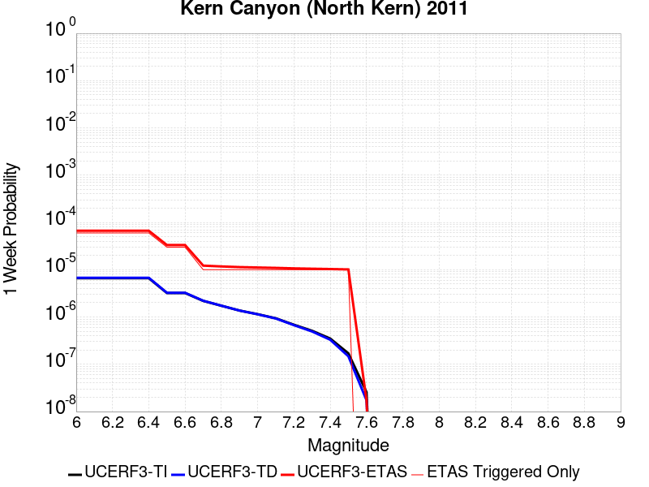 | 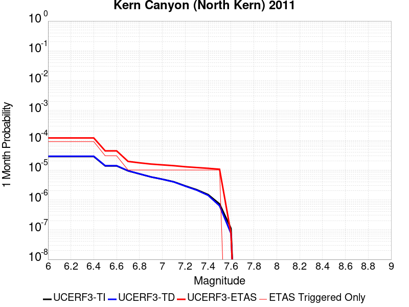 |  |  |

| Magnitude | 1 wk TI Prob | 1 wk TD Prob | 1 wk ETAS Prob | 1 wk ETAS/TD Gain | 1 wk ETAS Triggered Only | 1 mo TI Prob | 1 mo TD Prob | 1 mo ETAS Prob | 1 mo ETAS/TD Gain | 1 mo ETAS Triggered Only | 1 yr TI Prob | 1 yr TD Prob | 1 yr ETAS Prob | 1 yr ETAS/TD Gain | 1 yr ETAS Triggered Only | 10 yr TI Prob | 10 yr TD Prob | 10 yr ETAS Prob | 10 yr ETAS/TD Gain | 10 yr ETAS Triggered Only |
|-----|-----|-----|-----|-----|-----|-----|-----|-----|-----|-----|-----|-----|-----|-----|-----|-----|-----|-----|-----|-----|
| 6.0 | 6.6264497E-6 | 6.75733E-6 | 5.6044788E-5 | 8.293925 | 4.928779E-5 | 2.8398761E-5 | 2.895971E-5 | 1.2753243E-4 | 4.4037886 | 9.857558E-5 | 3.4570007E-4 | 3.5253543E-4 | 4.5107625E-4 | 1.2795204 | 9.857558E-5 | 0.0034516277 | 0.0035205502 | 0.0036678931 | 1.0418522 | 1.4786338E-4 |
| 6.1 | 6.6264497E-6 | 6.75733E-6 | 5.6044788E-5 | 8.293925 | 4.928779E-5 | 2.8398761E-5 | 2.895971E-5 | 1.2753243E-4 | 4.4037886 | 9.857558E-5 | 3.4570007E-4 | 3.5253543E-4 | 4.5107625E-4 | 1.2795204 | 9.857558E-5 | 0.0034516277 | 0.0035205502 | 0.0036678931 | 1.0418522 | 1.4786338E-4 |
| 6.2 | 6.6264497E-6 | 6.75733E-6 | 5.6044788E-5 | 8.293925 | 4.928779E-5 | 2.8398761E-5 | 2.895971E-5 | 1.2753243E-4 | 4.4037886 | 9.857558E-5 | 3.4570007E-4 | 3.5253543E-4 | 4.5107625E-4 | 1.2795204 | 9.857558E-5 | 0.0034516277 | 0.0035205502 | 0.0036678931 | 1.0418522 | 1.4786338E-4 |
| 6.3 | 6.6264497E-6 | 6.75733E-6 | 5.6044788E-5 | 8.293925 | 4.928779E-5 | 2.8398761E-5 | 2.895971E-5 | 1.2753243E-4 | 4.4037886 | 9.857558E-5 | 3.4570007E-4 | 3.5253543E-4 | 4.5107625E-4 | 1.2795204 | 9.857558E-5 | 0.0034516277 | 0.0035205502 | 0.0036678931 | 1.0418522 | 1.4786338E-4 |
| 6.4 | 6.6264497E-6 | 6.75733E-6 | 5.6044788E-5 | 8.293925 | 4.928779E-5 | 2.8398761E-5 | 2.895971E-5 | 1.2753243E-4 | 4.4037886 | 9.857558E-5 | 3.4570007E-4 | 3.5253543E-4 | 4.5107625E-4 | 1.2795204 | 9.857558E-5 | 0.0034516277 | 0.0035205502 | 0.0036678931 | 1.0418522 | 1.4786338E-4 |
| 6.5 | 3.2162225E-6 | 3.2570915E-6 | 5.254472E-5 | 16.132406 | 4.928779E-5 | 1.3783738E-5 | 1.3958894E-5 | 6.3246E-5 | 4.5308747 | 4.928779E-5 | 1.6780409E-4 | 1.6993708E-4 | 2.192165E-4 | 1.2899863 | 4.928779E-5 | 0.0016767744 | 0.001698151 | 0.0017473551 | 1.0289751 | 4.928779E-5 |
| 6.6 | 3.2162225E-6 | 3.2570915E-6 | 5.254472E-5 | 16.132406 | 4.928779E-5 | 1.3783738E-5 | 1.3958894E-5 | 6.3246E-5 | 4.5308747 | 4.928779E-5 | 1.6780409E-4 | 1.6993708E-4 | 2.192165E-4 | 1.2899863 | 4.928779E-5 | 0.0016767744 | 0.001698151 | 0.0017473551 | 1.0289751 | 4.928779E-5 |
| 6.7 | 2.1908265E-6 | 2.2071222E-6 | 2.2071222E-6 | 1.0 | 0.0 | 9.389223E-6 | 9.459062E-6 | 9.459062E-6 | 1.0 | 0.0 | 1.1430779E-4 | 1.1515819E-4 | 1.1515819E-4 | 1.0 | 0.0 | 0.0011424901 | 0.0011510046 | 0.0011510046 | 1.0 | 0.0 |
| 6.8 | 1.7303895E-6 | 1.736553E-6 | 1.736553E-6 | 1.0 | 0.0 | 7.415934E-6 | 7.442349E-6 | 7.442349E-6 | 1.0 | 0.0 | 9.028525E-5 | 9.060693E-5 | 9.060693E-5 | 1.0 | 0.0 | 9.024858E-4 | 9.0570963E-4 | 9.0570963E-4 | 1.0 | 0.0 |
| 6.9 | 1.3700314E-6 | 1.3688623E-6 | 1.3688623E-6 | 1.0 | 0.0 | 5.87155E-6 | 5.86654E-6 | 5.86654E-6 | 1.0 | 0.0 | 7.148377E-5 | 7.142283E-5 | 7.142283E-5 | 1.0 | 0.0 | 7.146078E-4 | 7.140033E-4 | 7.140033E-4 | 1.0 | 0.0 |
| 7.0 | 1.1467797E-6 | 1.1413805E-6 | 1.1413805E-6 | 1.0 | 0.0 | 4.9147607E-6 | 4.8916218E-6 | 4.8916218E-6 | 1.0 | 0.0 | 5.983557E-5 | 5.95539E-5 | 5.95539E-5 | 1.0 | 0.0 | 5.981946E-4 | 5.9538253E-4 | 5.9538253E-4 | 1.0 | 0.0 |
| 7.1 | 9.3952065E-7 | 9.3026915E-7 | 9.3026915E-7 | 1.0 | 0.0 | 4.026511E-6 | 3.986862E-6 | 3.986862E-6 | 1.0 | 0.0 | 4.9021666E-5 | 4.853898E-5 | 4.853898E-5 | 1.0 | 0.0 | 4.901085E-4 | 4.8528553E-4 | 4.8528553E-4 | 1.0 | 0.0 |
| 7.2 | 6.858055E-7 | 6.7193014E-7 | 6.7193014E-7 | 1.0 | 0.0 | 2.939163E-6 | 2.8796974E-6 | 2.8796974E-6 | 1.0 | 0.0 | 3.5783723E-5 | 3.5059762E-5 | 3.5059762E-5 | 1.0 | 0.0 | 3.5777962E-4 | 3.5054318E-4 | 3.5054318E-4 | 1.0 | 0.0 |
| 7.3 | 5.1101983E-7 | 4.939301E-7 | 4.939301E-7 | 1.0 | 0.0 | 2.1900833E-6 | 2.1168414E-6 | 2.1168414E-6 | 1.0 | 0.0 | 2.6663936E-5 | 2.5772246E-5 | 2.5772246E-5 | 1.0 | 0.0 | 2.6660739E-4 | 2.5769303E-4 | 2.5769303E-4 | 1.0 | 0.0 |
| 7.4 | 3.4999414E-7 | 3.2995916E-7 | 3.2995916E-7 | 1.0 | 0.0 | 1.499974E-6 | 1.4141099E-6 | 1.4141099E-6 | 1.0 | 0.0 | 1.8262032E-5 | 1.7216655E-5 | 1.7216655E-5 | 1.0 | 0.0 | 1.826053E-4 | 1.7215345E-4 | 1.7215345E-4 | 1.0 | 0.0 |
| 7.5 | 1.7021522E-7 | 1.4750053E-7 | 1.4750053E-7 | 1.0 | 0.0 | 7.2949354E-7 | 6.32145E-7 | 6.32145E-7 | 1.0 | 0.0 | 8.881548E-6 | 7.696339E-6 | 7.696339E-6 | 1.0 | 0.0 | 8.8811925E-5 | 7.696081E-5 | 7.696081E-5 | 1.0 | 0.0 |
| 7.6 | 2.572245E-8 | 1.735264E-8 | 1.735264E-8 | 1.0 | 0.0 | 1.10239064E-7 | 7.436845E-8 | 7.436845E-8 | 1.0 | 0.0 | 1.3421597E-6 | 9.0543557E-7 | 9.0543557E-7 | 1.0 | 0.0 | 1.3421517E-5 | 9.054324E-6 | 9.054324E-6 | 1.0 | 0.0 |

## San Jacinto (Lytle Creek connector)
*[(top)](#table-of-contents)*

| 1 Week | 1 Month | 1 Year | 10 Year |
|-----|-----|-----|-----|
|  |  |  |  |

| Magnitude | 1 wk TI Prob | 1 wk TD Prob | 1 wk ETAS Prob | 1 wk ETAS/TD Gain | 1 wk ETAS Triggered Only | 1 mo TI Prob | 1 mo TD Prob | 1 mo ETAS Prob | 1 mo ETAS/TD Gain | 1 mo ETAS Triggered Only | 1 yr TI Prob | 1 yr TD Prob | 1 yr ETAS Prob | 1 yr ETAS/TD Gain | 1 yr ETAS Triggered Only | 10 yr TI Prob | 10 yr TD Prob | 10 yr ETAS Prob | 10 yr ETAS/TD Gain | 10 yr ETAS Triggered Only |
|-----|-----|-----|-----|-----|-----|-----|-----|-----|-----|-----|-----|-----|-----|-----|-----|-----|-----|-----|-----|-----|
| 6.0 | 6.693995E-6 | 6.660123E-6 | 5.5947585E-5 | 8.400383 | 4.928779E-5 | 2.8688235E-5 | 2.8543072E-5 | 1.2711584E-4 | 4.4534745 | 9.857558E-5 | 3.492233E-4 | 3.4745657E-4 | 4.459979E-4 | 1.2836076 | 9.857558E-5 | 0.00348675 | 0.0035491167 | 0.0036964554 | 1.0415142 | 1.4786338E-4 |
| 6.1 | 6.693995E-6 | 6.660123E-6 | 5.5947585E-5 | 8.400383 | 4.928779E-5 | 2.8688235E-5 | 2.8543072E-5 | 1.2711584E-4 | 4.4534745 | 9.857558E-5 | 3.492233E-4 | 3.4745657E-4 | 4.459979E-4 | 1.2836076 | 9.857558E-5 | 0.00348675 | 0.0035491167 | 0.0036964554 | 1.0415142 | 1.4786338E-4 |
| 6.2 | 6.693995E-6 | 6.660123E-6 | 5.5947585E-5 | 8.400383 | 4.928779E-5 | 2.8688235E-5 | 2.8543072E-5 | 1.2711584E-4 | 4.4534745 | 9.857558E-5 | 3.492233E-4 | 3.4745657E-4 | 4.459979E-4 | 1.2836076 | 9.857558E-5 | 0.00348675 | 0.0035491167 | 0.0036964554 | 1.0415142 | 1.4786338E-4 |
| 6.3 | 6.693995E-6 | 6.660123E-6 | 5.5947585E-5 | 8.400383 | 4.928779E-5 | 2.8688235E-5 | 2.8543072E-5 | 1.2711584E-4 | 4.4534745 | 9.857558E-5 | 3.492233E-4 | 3.4745657E-4 | 4.459979E-4 | 1.2836076 | 9.857558E-5 | 0.00348675 | 0.0035491167 | 0.0036964554 | 1.0415142 | 1.4786338E-4 |
| 6.4 | 6.693995E-6 | 6.660123E-6 | 5.5947585E-5 | 8.400383 | 4.928779E-5 | 2.8688235E-5 | 2.8543072E-5 | 1.2711584E-4 | 4.4534745 | 9.857558E-5 | 3.492233E-4 | 3.4745657E-4 | 4.459979E-4 | 1.2836076 | 9.857558E-5 | 0.00348675 | 0.0035491167 | 0.0036964554 | 1.0415142 | 1.4786338E-4 |
| 6.5 | 6.6561875E-6 | 6.620341E-6 | 5.5907807E-5 | 8.444853 | 4.928779E-5 | 2.8526205E-5 | 2.8372582E-5 | 1.2694536E-4 | 4.474227 | 9.857558E-5 | 3.472512E-4 | 3.453815E-4 | 4.4392305E-4 | 1.2853122 | 9.857558E-5 | 0.0034670907 | 0.0035284322 | 0.003675774 | 1.0417584 | 1.4786338E-4 |
| 6.6 | 6.6561875E-6 | 6.620341E-6 | 5.5907807E-5 | 8.444853 | 4.928779E-5 | 2.8526205E-5 | 2.8372582E-5 | 1.2694536E-4 | 4.474227 | 9.857558E-5 | 3.472512E-4 | 3.453815E-4 | 4.4392305E-4 | 1.2853122 | 9.857558E-5 | 0.0034670907 | 0.0035284322 | 0.003675774 | 1.0417584 | 1.4786338E-4 |
| 6.7 | 6.5802237E-6 | 6.539518E-6 | 5.5826986E-5 | 8.536866 | 4.928779E-5 | 2.8200653E-5 | 2.8026205E-5 | 1.2659903E-4 | 4.517166 | 9.857558E-5 | 3.4328885E-4 | 3.4116567E-4 | 4.3970763E-4 | 1.288839 | 9.857558E-5 | 0.0034275902 | 0.0034864065 | 0.0036337546 | 1.0422635 | 1.4786338E-4 |
| 6.8 | 6.575632E-6 | 6.5340073E-6 | 5.5821478E-5 | 8.543222 | 4.928779E-5 | 2.8180975E-5 | 2.8002589E-5 | 1.2657541E-4 | 4.5201325 | 9.857558E-5 | 3.4304935E-4 | 3.4087826E-4 | 4.3942023E-4 | 1.2890826 | 9.857558E-5 | 0.0034252026 | 0.0034835413 | 0.0036308896 | 1.0422984 | 1.4786338E-4 |
| 6.9 | 6.570433E-6 | 6.525401E-6 | 5.581287E-5 | 8.55317 | 4.928779E-5 | 2.8158694E-5 | 2.7965707E-5 | 1.2653854E-4 | 4.524775 | 9.857558E-5 | 3.4277816E-4 | 3.4042934E-4 | 4.389714E-4 | 1.289464 | 9.857558E-5 | 0.0034224992 | 0.0034790665 | 0.0036264155 | 1.042353 | 1.4786338E-4 |
| 7.0 | 6.5643826E-6 | 6.5155223E-6 | 5.5802993E-5 | 8.564623 | 4.928779E-5 | 2.8132765E-5 | 2.7923368E-5 | 1.264962E-4 | 4.5301194 | 9.857558E-5 | 3.424626E-4 | 3.3991406E-4 | 4.3845613E-4 | 1.2899029 | 9.857558E-5 | 0.0034193532 | 0.0034739296 | 0.0036212793 | 1.0424159 | 1.4786338E-4 |
| 7.1 | 6.557402E-6 | 6.504234E-6 | 5.5791705E-5 | 8.577752 | 4.928779E-5 | 2.8102848E-5 | 2.7874992E-5 | 1.2644782E-4 | 4.5362463 | 9.857558E-5 | 3.4209844E-4 | 3.3932526E-4 | 4.3786736E-4 | 1.2904061 | 9.857558E-5 | 0.0034157229 | 0.0034680606 | 0.0036154112 | 1.0424879 | 1.4786338E-4 |
| 7.2 | 6.546394E-6 | 6.4862006E-6 | 5.577367E-5 | 8.598821 | 4.928779E-5 | 2.8055672E-5 | 2.7797707E-5 | 1.2637055E-4 | 4.546078 | 9.857558E-5 | 3.4152428E-4 | 3.383846E-4 | 4.369268E-4 | 1.2912138 | 9.857558E-5 | 0.0034099987 | 0.0034586883 | 0.00360604 | 1.0426034 | 1.4786338E-4 |
| 7.3 | 6.5364216E-6 | 6.4669857E-6 | 5.575446E-5 | 8.621398 | 4.928779E-5 | 2.8012933E-5 | 2.771536E-5 | 1.2628821E-4 | 4.5566144 | 9.857558E-5 | 3.4100408E-4 | 3.373823E-4 | 4.3592465E-4 | 1.2920791 | 9.857558E-5 | 0.003404813 | 0.0034487103 | 0.0035960637 | 1.0427271 | 1.4786338E-4 |
| 7.4 | 6.5269523E-6 | 6.4480723E-6 | 5.5735545E-5 | 8.643753 | 4.928779E-5 | 2.7972354E-5 | 2.7634303E-5 | 1.2620716E-4 | 4.567047 | 9.857558E-5 | 3.4051016E-4 | 3.3639578E-4 | 4.349382E-4 | 1.292936 | 9.857558E-5 | 0.0033998888 | 0.0034388923 | 0.003586247 | 1.0428495 | 1.4786338E-4 |
| 7.5 | 6.5111835E-6 | 6.424346E-6 | 5.5711822E-5 | 8.671984 | 4.928779E-5 | 2.7904773E-5 | 2.753262E-5 | 1.2610549E-4 | 4.580221 | 9.857558E-5 | 3.3968766E-4 | 3.3515817E-4 | 4.337007E-4 | 1.294018 | 9.857558E-5 | 0.0033916887 | 0.0034265644 | 0.003573921 | 1.0430043 | 1.4786338E-4 |
| 7.6 | 6.4768806E-6 | 6.383454E-6 | 5.567093E-5 | 8.721129 | 4.928779E-5 | 2.7757764E-5 | 2.7357375E-5 | 1.2593027E-4 | 4.603156 | 9.857558E-5 | 3.3789838E-4 | 3.330252E-4 | 4.3156795E-4 | 1.2959018 | 9.857558E-5 | 0.0033738504 | 0.0034052972 | 0.003552657 | 1.0432737 | 1.4786338E-4 |
| 7.7 | 6.1655364E-6 | 6.1759456E-6 | 5.546343E-5 | 8.980557 | 4.928779E-5 | 2.642346E-5 | 2.646807E-5 | 1.2504104E-4 | 4.724222 | 9.857558E-5 | 3.2165812E-4 | 3.2220117E-4 | 4.20745E-4 | 1.3058456 | 9.857558E-5 | 0.0032119295 | 0.0032969362 | 0.0034443121 | 1.0447009 | 1.4786338E-4 |
| 7.8 | 5.5043524E-6 | 5.7370175E-6 | 5.5024528E-5 | 9.591138 | 4.928779E-5 | 2.3589868E-5 | 2.4586987E-5 | 1.2316015E-4 | 5.0091596 | 9.857558E-5 | 2.871688E-4 | 2.993055E-4 | 3.9785157E-4 | 1.3292491 | 9.857558E-5 | 0.0028679797 | 0.0030670585 | 0.0032144685 | 1.0480623 | 1.4786338E-4 |
| 7.9 | 3.889249E-6 | 4.0766436E-6 | 5.3364234E-5 | 13.090238 | 4.928779E-5 | 1.6668104E-5 | 1.7471213E-5 | 1.1604508E-4 | 6.642073 | 9.857558E-5 | 2.0291525E-4 | 2.126913E-4 | 3.112459E-4 | 1.4633693 | 9.857558E-5 | 0.0020273007 | 0.0021941073 | 0.0023416462 | 1.0672432 | 1.4786338E-4 |
| 8.0 | 2.668535E-6 | 2.5313454E-6 | 5.1819014E-5 | 20.470938 | 4.928779E-5 | 1.1436528E-5 | 1.0848577E-5 | 6.0135833E-5 | 5.5432 | 4.928779E-5 | 1.3923083E-4 | 1.3207346E-4 | 1.8135474E-4 | 1.3731354 | 4.928779E-5 | 0.0013914363 | 0.0013755665 | 0.0014740065 | 1.0715632 | 9.857558E-5 |
| 8.1 | 1.5911459E-6 | 1.2185134E-6 | 1.2185134E-6 | 1.0 | 0.0 | 6.8191785E-6 | 5.2221894E-6 | 5.2221894E-6 | 1.0 | 0.0 | 8.3020335E-5 | 6.357832E-5 | 6.357832E-5 | 1.0 | 0.0 | 8.298933E-4 | 6.6911156E-4 | 7.1836635E-4 | 1.0736122 | 4.928779E-5 |
| 8.2 | 6.1294963E-7 | 2.1802066E-7 | 2.1802066E-7 | 1.0 | 0.0 | 2.6269242E-6 | 9.3437393E-7 | 9.3437393E-7 | 1.0 | 0.0 | 3.1982334E-5 | 1.1375943E-5 | 1.1375943E-5 | 1.0 | 0.0 | 3.1977732E-4 | 1.2778955E-4 | 1.2778955E-4 | 1.0 | 0.0 |
| 8.3 | 1.762871E-7 | 4.7516316E-8 | 4.7516316E-8 | 1.0 | 0.0 | 7.5551594E-7 | 2.0364133E-7 | 2.0364133E-7 | 1.0 | 0.0 | 9.1983675E-6 | 2.4793305E-6 | 2.4793305E-6 | 1.0 | 0.0 | 9.197987E-5 | 2.8671833E-5 | 2.8671833E-5 | 1.0 | 0.0 |

## Camp Rock 2011
*[(top)](#table-of-contents)*

| 1 Week | 1 Month | 1 Year | 10 Year |
|-----|-----|-----|-----|
|  |  |  |  |

| Magnitude | 1 wk TI Prob | 1 wk TD Prob | 1 wk ETAS Prob | 1 wk ETAS/TD Gain | 1 wk ETAS Triggered Only | 1 mo TI Prob | 1 mo TD Prob | 1 mo ETAS Prob | 1 mo ETAS/TD Gain | 1 mo ETAS Triggered Only | 1 yr TI Prob | 1 yr TD Prob | 1 yr ETAS Prob | 1 yr ETAS/TD Gain | 1 yr ETAS Triggered Only | 10 yr TI Prob | 10 yr TD Prob | 10 yr ETAS Prob | 10 yr ETAS/TD Gain | 10 yr ETAS Triggered Only |
|-----|-----|-----|-----|-----|-----|-----|-----|-----|-----|-----|-----|-----|-----|-----|-----|-----|-----|-----|-----|-----|
| 6.0 | 1.6710783E-5 | 4.249999E-6 | 1.02825165E-4 | 24.19416 | 9.857558E-5 | 7.161568E-5 | 1.8214158E-5 | 1.16787945E-4 | 6.411932 | 9.857558E-5 | 8.7157206E-4 | 2.2173533E-4 | 3.2028905E-4 | 1.4444656 | 9.857558E-5 | 0.008681616 | 0.0022151938 | 0.002313551 | 1.0444012 | 9.857558E-5 |
| 6.1 | 1.6710783E-5 | 4.249999E-6 | 1.02825165E-4 | 24.19416 | 9.857558E-5 | 7.161568E-5 | 1.8214158E-5 | 1.16787945E-4 | 6.411932 | 9.857558E-5 | 8.7157206E-4 | 2.2173533E-4 | 3.2028905E-4 | 1.4444656 | 9.857558E-5 | 0.008681616 | 0.0022151938 | 0.002313551 | 1.0444012 | 9.857558E-5 |
| 6.2 | 1.6710783E-5 | 4.249999E-6 | 1.02825165E-4 | 24.19416 | 9.857558E-5 | 7.161568E-5 | 1.8214158E-5 | 1.16787945E-4 | 6.411932 | 9.857558E-5 | 8.7157206E-4 | 2.2173533E-4 | 3.2028905E-4 | 1.4444656 | 9.857558E-5 | 0.008681616 | 0.0022151938 | 0.002313551 | 1.0444012 | 9.857558E-5 |
| 6.3 | 1.6710783E-5 | 4.249999E-6 | 1.02825165E-4 | 24.19416 | 9.857558E-5 | 7.161568E-5 | 1.8214158E-5 | 1.16787945E-4 | 6.411932 | 9.857558E-5 | 8.7157206E-4 | 2.2173533E-4 | 3.2028905E-4 | 1.4444656 | 9.857558E-5 | 0.008681616 | 0.0022151938 | 0.002313551 | 1.0444012 | 9.857558E-5 |
| 6.4 | 7.982846E-6 | 3.6820359E-6 | 1.02257254E-4 | 27.771935 | 9.857558E-5 | 3.421175E-5 | 1.578006E-5 | 1.1435409E-4 | 7.246746 | 9.857558E-5 | 4.1644843E-4 | 1.9210564E-4 | 2.9066228E-4 | 1.5130336 | 9.857558E-5 | 0.0041566887 | 0.0019194306 | 0.002017817 | 1.0512581 | 9.857558E-5 |
| 6.5 | 7.982846E-6 | 3.6820359E-6 | 1.02257254E-4 | 27.771935 | 9.857558E-5 | 3.421175E-5 | 1.578006E-5 | 1.1435409E-4 | 7.246746 | 9.857558E-5 | 4.1644843E-4 | 1.9210564E-4 | 2.9066228E-4 | 1.5130336 | 9.857558E-5 | 0.0041566887 | 0.0019194306 | 0.002017817 | 1.0512581 | 9.857558E-5 |
| 6.6 | 7.048869E-6 | 3.4242998E-6 | 1.0199955E-4 | 29.786978 | 9.857558E-5 | 3.0209088E-5 | 1.467549E-5 | 1.13249625E-4 | 7.7169228 | 9.857558E-5 | 3.677336E-4 | 1.7865976E-4 | 2.7721774E-4 | 1.5516517 | 9.857558E-5 | 0.0036712566 | 0.0017851929 | 0.0018835926 | 1.0551199 | 9.857558E-5 |
| 6.7 | 6.987307E-6 | 3.3622775E-6 | 1.0193753E-4 | 30.318 | 9.857558E-5 | 2.9945259E-5 | 1.4409683E-5 | 1.1298384E-4 | 7.840828 | 9.857558E-5 | 3.6452254E-4 | 1.7542407E-4 | 2.7398235E-4 | 1.5618287 | 9.857558E-5 | 0.0036392517 | 0.0017528872 | 0.0018512899 | 1.0561376 | 9.857558E-5 |
| 6.8 | 6.3737602E-6 | 3.1178672E-6 | 1.0169314E-4 | 32.616253 | 9.857558E-5 | 2.731583E-5 | 1.3362222E-5 | 1.1193649E-4 | 8.377087 | 9.857558E-5 | 3.3251947E-4 | 1.6267318E-4 | 2.6123272E-4 | 1.6058745 | 9.857558E-5 | 0.0033202237 | 0.0016255698 | 0.0017239851 | 1.0605421 | 9.857558E-5 |
| 6.9 | 6.112211E-6 | 2.933078E-6 | 1.0150837E-4 | 34.60814 | 9.857558E-5 | 2.6194928E-5 | 1.2570275E-5 | 1.1114462E-4 | 8.841861 | 9.857558E-5 | 3.1887658E-4 | 1.5303263E-4 | 2.5159313E-4 | 1.6440489 | 9.857558E-5 | 0.003184194 | 0.0015293002 | 0.0016277251 | 1.0643594 | 9.857558E-5 |
| 7.0 | 5.5140117E-6 | 2.64191E-6 | 1.0121723E-4 | 38.312145 | 9.857558E-5 | 2.3631264E-5 | 1.1322423E-5 | 1.0989689E-4 | 9.706128 | 9.857558E-5 | 2.8767265E-4 | 1.3784204E-4 | 2.3640403E-4 | 1.7150358 | 9.857558E-5 | 0.0028730053 | 0.0013775907 | 0.0014760304 | 1.071458 | 9.857558E-5 |
| 7.1 | 4.8151105E-6 | 2.1342612E-6 | 1.00709636E-4 | 47.18712 | 9.857558E-5 | 2.0636026E-5 | 9.146803E-6 | 1.07721484E-4 | 11.776956 | 9.857558E-5 | 2.5121463E-4 | 1.1135685E-4 | 2.0992146E-4 | 1.8851238 | 9.857558E-5 | 0.0025093083 | 0.0011130325 | 0.0012114983 | 1.0884663 | 9.857558E-5 |
| 7.2 | 3.818335E-6 | 1.2937372E-6 | 1.2937372E-6 | 1.0 | 0.0 | 1.6364189E-5 | 5.5445767E-6 | 5.5445767E-6 | 1.0 | 0.0 | 1.9921579E-4 | 6.750321E-5 | 6.750321E-5 | 1.0 | 0.0 | 0.0019903728 | 6.7483535E-4 | 6.7483535E-4 | 1.0 | 0.0 |
| 7.3 | 2.7166698E-6 | 7.383078E-7 | 7.383078E-7 | 1.0 | 0.0 | 1.1642818E-5 | 3.1641725E-6 | 3.1641725E-6 | 1.0 | 0.0 | 1.4174209E-4 | 3.852314E-5 | 3.852314E-5 | 1.0 | 0.0 | 0.0014165172 | 3.8516664E-4 | 3.8516664E-4 | 1.0 | 0.0 |
| 7.4 | 2.0893426E-6 | 5.4614605E-7 | 5.4614605E-7 | 1.0 | 0.0 | 8.954295E-6 | 2.340624E-6 | 2.340624E-6 | 1.0 | 0.0 | 1.0901308E-4 | 2.8496728E-5 | 2.8496728E-5 | 1.0 | 0.0 | 0.0010895962 | 2.849313E-4 | 2.849313E-4 | 1.0 | 0.0 |
| 7.5 | 1.1681728E-6 | 3.6028484E-7 | 3.6028484E-7 | 1.0 | 0.0 | 5.0064455E-6 | 1.544077E-6 | 1.544077E-6 | 1.0 | 0.0 | 6.0951766E-5 | 1.879898E-5 | 1.879898E-5 | 1.0 | 0.0 | 6.093505E-4 | 1.8797436E-4 | 1.8797436E-4 | 1.0 | 0.0 |
| 7.6 | 1.3154387E-7 | 7.1196716E-8 | 7.1196716E-8 | 1.0 | 0.0 | 5.6375933E-7 | 3.0512876E-7 | 3.0512876E-7 | 1.0 | 0.0 | 6.863748E-6 | 3.714938E-6 | 3.714938E-6 | 1.0 | 0.0 | 6.863536E-5 | 3.7148915E-5 | 3.7148915E-5 | 1.0 | 0.0 |

## Scodie Lineament
*[(top)](#table-of-contents)*

| 1 Week | 1 Month | 1 Year | 10 Year |
|-----|-----|-----|-----|
|  | 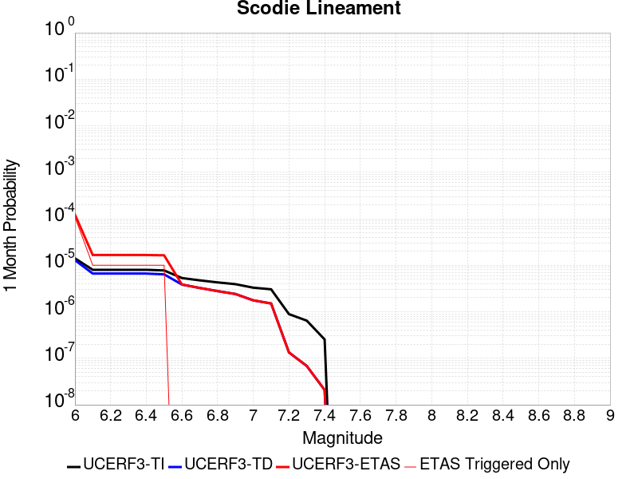 |  | 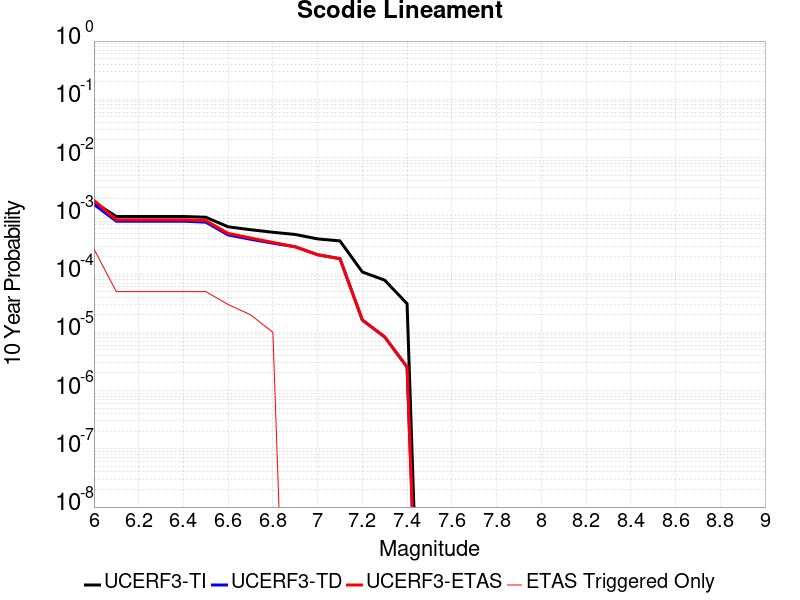 |

| Magnitude | 1 wk TI Prob | 1 wk TD Prob | 1 wk ETAS Prob | 1 wk ETAS/TD Gain | 1 wk ETAS Triggered Only | 1 mo TI Prob | 1 mo TD Prob | 1 mo ETAS Prob | 1 mo ETAS/TD Gain | 1 mo ETAS Triggered Only | 1 yr TI Prob | 1 yr TD Prob | 1 yr ETAS Prob | 1 yr ETAS/TD Gain | 1 yr ETAS Triggered Only | 10 yr TI Prob | 10 yr TD Prob | 10 yr ETAS Prob | 10 yr ETAS/TD Gain | 10 yr ETAS Triggered Only |
|-----|-----|-----|-----|-----|-----|-----|-----|-----|-----|-----|-----|-----|-----|-----|-----|-----|-----|-----|-----|-----|
| 6.0 | 3.2919327E-6 | 3.0133303E-6 | 3.0133303E-6 | 1.0 | 0.0 | 1.4108206E-5 | 1.2914227E-5 | 1.1148854E-4 | 8.633001 | 9.857558E-5 | 1.7175387E-4 | 1.5722254E-4 | 2.5578262E-4 | 1.6268827 | 9.857558E-5 | 0.0017162118 | 0.0015714248 | 0.0016698454 | 1.0626315 | 9.857558E-5 |
| 6.1 | 1.8663811E-6 | 1.5490382E-6 | 1.5490382E-6 | 1.0 | 0.0 | 7.998751E-6 | 6.6387206E-6 | 6.6387206E-6 | 1.0 | 0.0 | 9.738045E-5 | 8.082393E-5 | 8.082393E-5 | 1.0 | 0.0 | 9.7337784E-4 | 8.079941E-4 | 8.079941E-4 | 1.0 | 0.0 |
| 6.2 | 1.8663811E-6 | 1.5490382E-6 | 1.5490382E-6 | 1.0 | 0.0 | 7.998751E-6 | 6.6387206E-6 | 6.6387206E-6 | 1.0 | 0.0 | 9.738045E-5 | 8.082393E-5 | 8.082393E-5 | 1.0 | 0.0 | 9.7337784E-4 | 8.079941E-4 | 8.079941E-4 | 1.0 | 0.0 |
| 6.3 | 1.8663811E-6 | 1.5490382E-6 | 1.5490382E-6 | 1.0 | 0.0 | 7.998751E-6 | 6.6387206E-6 | 6.6387206E-6 | 1.0 | 0.0 | 9.738045E-5 | 8.082393E-5 | 8.082393E-5 | 1.0 | 0.0 | 9.7337784E-4 | 8.079941E-4 | 8.079941E-4 | 1.0 | 0.0 |
| 6.4 | 1.8663811E-6 | 1.5490382E-6 | 1.5490382E-6 | 1.0 | 0.0 | 7.998751E-6 | 6.6387206E-6 | 6.6387206E-6 | 1.0 | 0.0 | 9.738045E-5 | 8.082393E-5 | 8.082393E-5 | 1.0 | 0.0 | 9.7337784E-4 | 8.079941E-4 | 8.079941E-4 | 1.0 | 0.0 |
| 6.5 | 1.8106311E-6 | 1.4909722E-6 | 1.4909722E-6 | 1.0 | 0.0 | 7.759824E-6 | 6.389868E-6 | 6.389868E-6 | 1.0 | 0.0 | 9.447177E-5 | 7.779436E-5 | 7.779436E-5 | 1.0 | 0.0 | 9.4431615E-4 | 7.7771995E-4 | 7.7771995E-4 | 1.0 | 0.0 |
| 6.6 | 1.2414679E-6 | 8.9974395E-7 | 8.9974395E-7 | 1.0 | 0.0 | 5.320566E-6 | 3.85604E-6 | 3.85604E-6 | 1.0 | 0.0 | 6.477596E-5 | 4.6946367E-5 | 4.6946367E-5 | 1.0 | 0.0 | 6.475708E-4 | 4.6937316E-4 | 4.6937316E-4 | 1.0 | 0.0 |
| 6.7 | 1.1062215E-6 | 7.594193E-7 | 7.594193E-7 | 1.0 | 0.0 | 4.7409408E-6 | 3.2546504E-6 | 3.2546504E-6 | 1.0 | 0.0 | 5.7719422E-5 | 3.962472E-5 | 3.962472E-5 | 1.0 | 0.0 | 5.770443E-4 | 3.9618355E-4 | 3.9618355E-4 | 1.0 | 0.0 |
| 6.8 | 1.0006736E-6 | 6.5002786E-7 | 6.5002786E-7 | 1.0 | 0.0 | 4.288594E-6 | 2.7858312E-6 | 2.7858312E-6 | 1.0 | 0.0 | 5.221238E-5 | 3.391703E-5 | 3.391703E-5 | 1.0 | 0.0 | 5.220012E-4 | 3.3912458E-4 | 3.3912458E-4 | 1.0 | 0.0 |
| 6.9 | 9.167364E-7 | 5.6315065E-7 | 5.6315065E-7 | 1.0 | 0.0 | 3.9288643E-6 | 2.413501E-6 | 2.413501E-6 | 1.0 | 0.0 | 4.7832873E-5 | 2.9384037E-5 | 2.9384037E-5 | 1.0 | 0.0 | 4.782258E-4 | 2.9380718E-4 | 2.9380718E-4 | 1.0 | 0.0 |
| 7.0 | 7.6987664E-7 | 4.113265E-7 | 4.113265E-7 | 1.0 | 0.0 | 3.2994672E-6 | 1.7628269E-6 | 1.7628269E-6 | 1.0 | 0.0 | 4.0170275E-5 | 2.1462245E-5 | 2.1462245E-5 | 1.0 | 0.0 | 4.0163012E-4 | 2.1460558E-4 | 2.1460558E-4 | 1.0 | 0.0 |
| 7.1 | 7.1038727E-7 | 3.5210306E-7 | 3.5210306E-7 | 1.0 | 0.0 | 3.0445133E-6 | 1.5090123E-6 | 1.5090123E-6 | 1.0 | 0.0 | 3.706632E-5 | 1.8372106E-5 | 1.8372106E-5 | 1.0 | 0.0 | 3.7060137E-4 | 1.8370937E-4 | 1.8370937E-4 | 1.0 | 0.0 |
| 7.2 | 2.0799602E-7 | 3.1178534E-8 | 3.1178534E-8 | 1.0 | 0.0 | 8.914113E-7 | 1.3362228E-7 | 1.3362228E-7 | 1.0 | 0.0 | 1.0852878E-5 | 1.6268501E-6 | 1.6268501E-6 | 1.0 | 0.0 | 1.08523476E-4 | 1.626839E-5 | 1.626839E-5 | 1.0 | 0.0 |
| 7.3 | 1.5048182E-7 | 1.5939106E-8 | 1.5939106E-8 | 1.0 | 0.0 | 6.449219E-7 | 6.8310456E-8 | 6.8310456E-8 | 1.0 | 0.0 | 7.851896E-6 | 8.316795E-7 | 8.316795E-7 | 1.0 | 0.0 | 7.851618E-5 | 8.316767E-6 | 8.316767E-6 | 1.0 | 0.0 |
| 7.4 | 5.9334678E-8 | 4.8638475E-9 | 4.8638475E-9 | 1.0 | 0.0 | 2.5429145E-7 | 2.084506E-8 | 2.084506E-8 | 1.0 | 0.0 | 3.095994E-6 | 2.5378858E-7 | 2.5378858E-7 | 1.0 | 0.0 | 3.095951E-5 | 2.5378843E-6 | 2.5378843E-6 | 1.0 | 0.0 |

## Elysian Park (Upper)
*[(top)](#table-of-contents)*

| 1 Week | 1 Month | 1 Year | 10 Year |
|-----|-----|-----|-----|
| 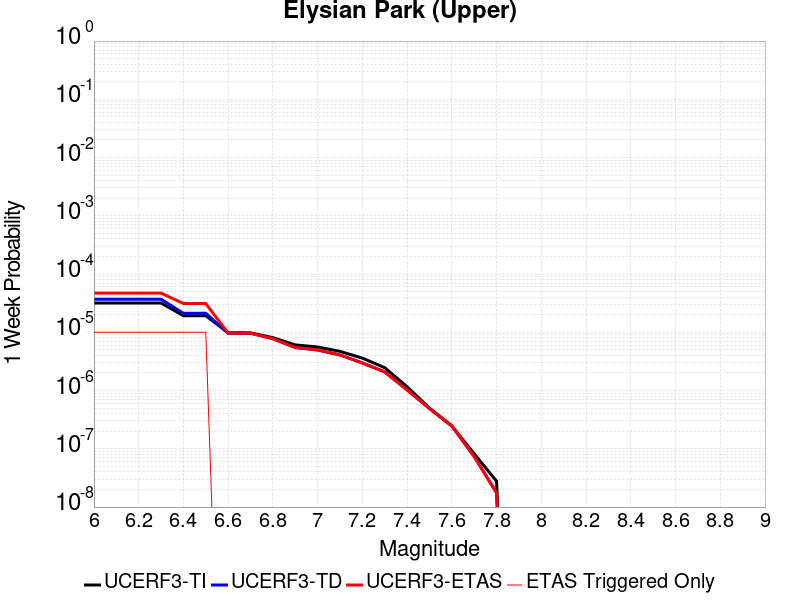 |  |  |  |

| Magnitude | 1 wk TI Prob | 1 wk TD Prob | 1 wk ETAS Prob | 1 wk ETAS/TD Gain | 1 wk ETAS Triggered Only | 1 mo TI Prob | 1 mo TD Prob | 1 mo ETAS Prob | 1 mo ETAS/TD Gain | 1 mo ETAS Triggered Only | 1 yr TI Prob | 1 yr TD Prob | 1 yr ETAS Prob | 1 yr ETAS/TD Gain | 1 yr ETAS Triggered Only | 10 yr TI Prob | 10 yr TD Prob | 10 yr ETAS Prob | 10 yr ETAS/TD Gain | 10 yr ETAS Triggered Only |
|-----|-----|-----|-----|-----|-----|-----|-----|-----|-----|-----|-----|-----|-----|-----|-----|-----|-----|-----|-----|-----|
| 6.0 | 3.1876025E-5 | 3.7035275E-5 | 3.7035275E-5 | 1.0 | 0.0 | 1.3660437E-4 | 1.5871569E-4 | 2.5727562E-4 | 1.6209842 | 9.857558E-5 | 0.0016618895 | 0.001931122 | 0.0020295072 | 1.0509472 | 9.857558E-5 | 0.016495159 | 0.019189863 | 0.019286545 | 1.0050383 | 9.857558E-5 |
| 6.1 | 3.1876025E-5 | 3.7035275E-5 | 3.7035275E-5 | 1.0 | 0.0 | 1.3660437E-4 | 1.5871569E-4 | 2.5727562E-4 | 1.6209842 | 9.857558E-5 | 0.0016618895 | 0.001931122 | 0.0020295072 | 1.0509472 | 9.857558E-5 | 0.016495159 | 0.019189863 | 0.019286545 | 1.0050383 | 9.857558E-5 |
| 6.2 | 3.1876025E-5 | 3.7035275E-5 | 3.7035275E-5 | 1.0 | 0.0 | 1.3660437E-4 | 1.5871569E-4 | 2.5727562E-4 | 1.6209842 | 9.857558E-5 | 0.0016618895 | 0.001931122 | 0.0020295072 | 1.0509472 | 9.857558E-5 | 0.016495159 | 0.019189863 | 0.019286545 | 1.0050383 | 9.857558E-5 |
| 6.3 | 3.1876025E-5 | 3.7035275E-5 | 3.7035275E-5 | 1.0 | 0.0 | 1.3660437E-4 | 1.5871569E-4 | 2.5727562E-4 | 1.6209842 | 9.857558E-5 | 0.0016618895 | 0.001931122 | 0.0020295072 | 1.0509472 | 9.857558E-5 | 0.016495159 | 0.019189863 | 0.019286545 | 1.0050383 | 9.857558E-5 |
| 6.4 | 1.9273462E-5 | 2.120244E-5 | 2.120244E-5 | 1.0 | 0.0 | 8.259794E-5 | 9.086542E-5 | 1.4014874E-4 | 1.542377 | 4.928779E-5 | 0.001005166 | 0.0011058967 | 0.00115513 | 1.0445188 | 4.928779E-5 | 0.010006315 | 0.011020744 | 0.011069489 | 1.004423 | 4.928779E-5 |
| 6.5 | 1.9273462E-5 | 2.120244E-5 | 2.120244E-5 | 1.0 | 0.0 | 8.259794E-5 | 9.086542E-5 | 1.4014874E-4 | 1.542377 | 4.928779E-5 | 0.001005166 | 0.0011058967 | 0.00115513 | 1.0445188 | 4.928779E-5 | 0.010006315 | 0.011020744 | 0.011069489 | 1.004423 | 4.928779E-5 |
| 6.6 | 9.813258E-6 | 9.665589E-6 | 9.665589E-6 | 1.0 | 0.0 | 4.205614E-5 | 4.1423333E-5 | 9.070908E-5 | 2.1898065 | 4.928779E-5 | 5.119132E-4 | 5.042196E-4 | 5.5348256E-4 | 1.0977013 | 4.928779E-5 | 0.005107356 | 0.0050314795 | 0.0050805192 | 1.0097466 | 4.928779E-5 |
| 6.7 | 9.801478E-6 | 9.653158E-6 | 9.653158E-6 | 1.0 | 0.0 | 4.2005657E-5 | 4.137006E-5 | 9.065581E-5 | 2.1913385 | 4.928779E-5 | 5.112989E-4 | 5.0357135E-4 | 5.528343E-4 | 1.0978272 | 4.928779E-5 | 0.0051012407 | 0.005025026 | 0.005074066 | 1.0097592 | 4.928779E-5 |
| 6.8 | 8.102489E-6 | 7.772994E-6 | 7.772994E-6 | 1.0 | 0.0 | 3.4724493E-5 | 3.3312434E-5 | 8.2598584E-5 | 2.4795122 | 4.928779E-5 | 4.2268867E-4 | 4.0550836E-4 | 4.5477616E-4 | 1.1214964 | 4.928779E-5 | 0.004218856 | 0.0040481784 | 0.0040972666 | 1.012126 | 4.928779E-5 |
| 6.9 | 6.08275E-6 | 5.481441E-6 | 5.481441E-6 | 1.0 | 0.0 | 2.6068668E-5 | 2.3491682E-5 | 2.3491682E-5 | 1.0 | 0.0 | 3.173398E-4 | 2.8597447E-4 | 2.8597447E-4 | 1.0 | 0.0 | 0.0031688702 | 0.0028561424 | 0.0028561424 | 1.0 | 0.0 |
| 7.0 | 5.5995934E-6 | 4.9827686E-6 | 4.9827686E-6 | 1.0 | 0.0 | 2.3998036E-5 | 2.1354552E-5 | 2.1354552E-5 | 1.0 | 0.0 | 2.9213692E-4 | 2.5996132E-4 | 2.5996132E-4 | 1.0 | 0.0 | 0.0029175316 | 0.0025966396 | 0.0025966396 | 1.0 | 0.0 |
| 7.1 | 4.709881E-6 | 4.0873906E-6 | 4.0873906E-6 | 1.0 | 0.0 | 2.0185047E-5 | 1.7517272E-5 | 1.7517272E-5 | 1.0 | 0.0 | 2.4572524E-4 | 2.1325232E-4 | 2.1325232E-4 | 1.0 | 0.0 | 0.002454537 | 0.0021305184 | 0.0021305184 | 1.0 | 0.0 |
| 7.2 | 3.6063436E-6 | 2.9779412E-6 | 2.9779412E-6 | 1.0 | 0.0 | 1.5455667E-5 | 1.27625435E-5 | 1.27625435E-5 | 1.0 | 0.0 | 1.881565E-4 | 1.55373E-4 | 1.55373E-4 | 1.0 | 0.0 | 0.0018799726 | 0.0015526549 | 0.0015526549 | 1.0 | 0.0 |
| 7.3 | 2.471135E-6 | 2.0954562E-6 | 2.0954562E-6 | 1.0 | 0.0 | 1.0590536E-5 | 8.980496E-6 | 8.980496E-6 | 1.0 | 0.0 | 1.2893214E-4 | 1.0933213E-4 | 1.0933213E-4 | 1.0 | 0.0 | 0.0012885736 | 0.0010927906 | 0.0010927906 | 1.0 | 0.0 |
| 7.4 | 1.163943E-6 | 1.0275061E-6 | 1.0275061E-6 | 1.0 | 0.0 | 4.988318E-6 | 4.40359E-6 | 4.40359E-6 | 1.0 | 0.0 | 6.0731076E-5 | 5.361242E-5 | 5.361242E-5 | 1.0 | 0.0 | 6.071448E-4 | 5.3599785E-4 | 5.3599785E-4 | 1.0 | 0.0 |
| 7.5 | 4.99459E-7 | 4.917601E-7 | 4.917601E-7 | 1.0 | 0.0 | 2.140537E-6 | 2.1075416E-6 | 2.1075416E-6 | 1.0 | 0.0 | 2.6060725E-5 | 2.5659032E-5 | 2.5659032E-5 | 1.0 | 0.0 | 2.605767E-4 | 2.5656226E-4 | 2.5656226E-4 | 1.0 | 0.0 |
| 7.6 | 2.4667852E-7 | 2.4778313E-7 | 2.4778313E-7 | 1.0 | 0.0 | 1.0571932E-6 | 1.0619274E-6 | 1.0619274E-6 | 1.0 | 0.0 | 1.2871251E-5 | 1.2928893E-5 | 1.2928893E-5 | 1.0 | 0.0 | 1.2870505E-4 | 1.2928178E-4 | 1.2928178E-4 | 1.0 | 0.0 |
| 7.7 | 8.2312795E-8 | 7.3864214E-8 | 7.3864214E-8 | 1.0 | 0.0 | 3.527691E-7 | 3.165609E-7 | 3.165609E-7 | 1.0 | 0.0 | 4.294955E-6 | 3.854123E-6 | 3.854123E-6 | 1.0 | 0.0 | 4.2948723E-5 | 3.854068E-5 | 3.854068E-5 | 1.0 | 0.0 |
| 7.8 | 2.7819295E-8 | 1.7565618E-8 | 1.7565618E-8 | 1.0 | 0.0 | 1.1922555E-7 | 7.528122E-8 | 7.528122E-8 | 1.0 | 0.0 | 1.45157E-6 | 9.1654863E-7 | 9.1654863E-7 | 1.0 | 0.0 | 1.45156055E-5 | 9.165463E-6 | 9.165463E-6 | 1.0 | 0.0 |

## San Gabriel
*[(top)](#table-of-contents)*

| 1 Week | 1 Month | 1 Year | 10 Year |
|-----|-----|-----|-----|
|  |  |  |  |

| Magnitude | 1 wk TI Prob | 1 wk TD Prob | 1 wk ETAS Prob | 1 wk ETAS/TD Gain | 1 wk ETAS Triggered Only | 1 mo TI Prob | 1 mo TD Prob | 1 mo ETAS Prob | 1 mo ETAS/TD Gain | 1 mo ETAS Triggered Only | 1 yr TI Prob | 1 yr TD Prob | 1 yr ETAS Prob | 1 yr ETAS/TD Gain | 1 yr ETAS Triggered Only | 10 yr TI Prob | 10 yr TD Prob | 10 yr ETAS Prob | 10 yr ETAS/TD Gain | 10 yr ETAS Triggered Only |
|-----|-----|-----|-----|-----|-----|-----|-----|-----|-----|-----|-----|-----|-----|-----|-----|-----|-----|-----|-----|-----|
| 6.0 | 1.083775E-5 | 1.198525E-5 | 6.127245E-5 | 5.1123214 | 4.928779E-5 | 4.6446676E-5 | 5.1364408E-5 | 1.0064967E-4 | 1.9595215 | 4.928779E-5 | 5.653415E-4 | 6.251936E-4 | 6.7445054E-4 | 1.0787867 | 4.928779E-5 | 0.0056390543 | 0.0062463325 | 0.0063442923 | 1.0156828 | 9.857558E-5 |
| 6.1 | 1.083775E-5 | 1.198525E-5 | 6.127245E-5 | 5.1123214 | 4.928779E-5 | 4.6446676E-5 | 5.1364408E-5 | 1.0064967E-4 | 1.9595215 | 4.928779E-5 | 5.653415E-4 | 6.251936E-4 | 6.7445054E-4 | 1.0787867 | 4.928779E-5 | 0.0056390543 | 0.0062463325 | 0.0063442923 | 1.0156828 | 9.857558E-5 |
| 6.2 | 1.083775E-5 | 1.198525E-5 | 6.127245E-5 | 5.1123214 | 4.928779E-5 | 4.6446676E-5 | 5.1364408E-5 | 1.0064967E-4 | 1.9595215 | 4.928779E-5 | 5.653415E-4 | 6.251936E-4 | 6.7445054E-4 | 1.0787867 | 4.928779E-5 | 0.0056390543 | 0.0062463325 | 0.0063442923 | 1.0156828 | 9.857558E-5 |
| 6.3 | 1.083775E-5 | 1.198525E-5 | 6.127245E-5 | 5.1123214 | 4.928779E-5 | 4.6446676E-5 | 5.1364408E-5 | 1.0064967E-4 | 1.9595215 | 4.928779E-5 | 5.653415E-4 | 6.251936E-4 | 6.7445054E-4 | 1.0787867 | 4.928779E-5 | 0.0056390543 | 0.0062463325 | 0.0063442923 | 1.0156828 | 9.857558E-5 |
| 6.4 | 1.083775E-5 | 1.198525E-5 | 6.127245E-5 | 5.1123214 | 4.928779E-5 | 4.6446676E-5 | 5.1364408E-5 | 1.0064967E-4 | 1.9595215 | 4.928779E-5 | 5.653415E-4 | 6.251936E-4 | 6.7445054E-4 | 1.0787867 | 4.928779E-5 | 0.0056390543 | 0.0062463325 | 0.0063442923 | 1.0156828 | 9.857558E-5 |
| 6.5 | 6.7317824E-6 | 7.717007E-6 | 5.7004418E-5 | 7.3868556 | 4.928779E-5 | 2.8850178E-5 | 3.3072472E-5 | 8.235864E-5 | 2.4902472 | 4.928779E-5 | 3.511943E-4 | 4.0258403E-4 | 4.5185199E-4 | 1.1223793 | 4.928779E-5 | 0.003506398 | 0.004029533 | 0.004078622 | 1.0121824 | 4.928779E-5 |
| 6.6 | 6.7317824E-6 | 7.717007E-6 | 5.7004418E-5 | 7.3868556 | 4.928779E-5 | 2.8850178E-5 | 3.3072472E-5 | 8.235864E-5 | 2.4902472 | 4.928779E-5 | 3.511943E-4 | 4.0258403E-4 | 4.5185199E-4 | 1.1223793 | 4.928779E-5 | 0.003506398 | 0.004029533 | 0.004078622 | 1.0121824 | 4.928779E-5 |
| 6.7 | 6.274881E-6 | 7.2459275E-6 | 5.653336E-5 | 7.802088 | 4.928779E-5 | 2.6892068E-5 | 3.105361E-5 | 8.033987E-5 | 2.5871346 | 4.928779E-5 | 3.2736175E-4 | 3.7801306E-4 | 4.2728224E-4 | 1.1303372 | 4.928779E-5 | 0.0032687993 | 0.0037846796 | 0.0038337808 | 1.0129737 | 4.928779E-5 |
| 6.8 | 5.996209E-6 | 6.958647E-6 | 5.6246095E-5 | 8.082907 | 4.928779E-5 | 2.5697784E-5 | 2.9822439E-5 | 7.910876E-5 | 2.652659 | 4.928779E-5 | 3.128256E-4 | 3.6302864E-4 | 4.1229854E-4 | 1.1357191 | 4.928779E-5 | 0.003123856 | 0.0036353325 | 0.003684441 | 1.0135087 | 4.928779E-5 |
| 6.9 | 5.686331E-6 | 6.6236917E-6 | 5.5911158E-5 | 8.441087 | 4.928779E-5 | 2.4369761E-5 | 2.8386947E-5 | 7.7673336E-5 | 2.7362344 | 4.928779E-5 | 2.9666146E-4 | 3.4555717E-4 | 3.9482792E-4 | 1.1425835 | 4.928779E-5 | 0.0029626573 | 0.0034611735 | 0.0035102908 | 1.0141909 | 4.928779E-5 |
| 7.0 | 5.2329838E-6 | 6.1475757E-6 | 5.5435063E-5 | 9.017386 | 4.928779E-5 | 2.242688E-5 | 2.6346492E-5 | 7.563298E-5 | 2.8707042 | 4.928779E-5 | 2.7301308E-4 | 3.207221E-4 | 3.6999406E-4 | 1.1536282 | 4.928779E-5 | 0.002726779 | 0.0032135549 | 0.0032626842 | 1.0152882 | 4.928779E-5 |
| 7.1 | 5.135671E-6 | 6.0377E-6 | 5.5325196E-5 | 9.163289 | 4.928779E-5 | 2.2009834E-5 | 2.5875606E-5 | 7.516212E-5 | 2.9047482 | 4.928779E-5 | 2.6793676E-4 | 3.1499073E-4 | 3.64263E-4 | 1.1564245 | 4.928779E-5 | 0.0026761394 | 0.0031564054 | 0.0032055376 | 1.0155659 | 4.928779E-5 |
| 7.2 | 4.989062E-6 | 5.8710784E-6 | 5.515858E-5 | 9.394965 | 4.928779E-5 | 2.1381518E-5 | 2.5161527E-5 | 7.444808E-5 | 2.958806 | 4.928779E-5 | 2.6028889E-4 | 3.0629928E-4 | 3.5557197E-4 | 1.1608646 | 4.928779E-5 | 0.0025998424 | 0.003069734 | 0.0031188703 | 1.0160067 | 4.928779E-5 |
| 7.3 | 4.8219395E-6 | 5.7026323E-6 | 5.499014E-5 | 9.6429405 | 4.928779E-5 | 2.0665291E-5 | 2.4439627E-5 | 7.3726216E-5 | 3.016667 | 4.928779E-5 | 2.5157086E-4 | 2.975126E-4 | 3.467857E-4 | 1.165617 | 4.928779E-5 | 0.0025128627 | 0.002982106 | 0.0030312468 | 1.0164785 | 4.928779E-5 |
| 7.4 | 4.7118383E-6 | 5.5911896E-6 | 5.4878707E-5 | 9.815211 | 4.928779E-5 | 2.0193436E-5 | 2.3962024E-5 | 7.324864E-5 | 3.0568633 | 4.928779E-5 | 2.4582737E-4 | 2.9169934E-4 | 3.4097277E-4 | 1.1689185 | 4.928779E-5 | 0.002455556 | 0.0029241266 | 0.0029732701 | 1.0168062 | 4.928779E-5 |
| 7.5 | 4.5506545E-6 | 5.4365555E-6 | 5.4724078E-5 | 10.065947 | 4.928779E-5 | 1.9502659E-5 | 2.329932E-5 | 7.2585965E-5 | 3.1153684 | 4.928779E-5 | 2.37419E-4 | 2.8363304E-4 | 3.3290684E-4 | 1.1737238 | 4.928779E-5 | 0.002371655 | 0.0028436715 | 0.002892819 | 1.0172832 | 4.928779E-5 |
| 7.6 | 4.343636E-6 | 5.2294336E-6 | 5.4516968E-5 | 10.425023 | 4.928779E-5 | 1.861545E-5 | 2.241167E-5 | 7.1698356E-5 | 3.1991527 | 4.928779E-5 | 2.2661954E-4 | 2.7282868E-4 | 3.22103E-4 | 1.1806054 | 4.928779E-5 | 0.0022638857 | 0.0027358893 | 0.0027850422 | 1.017966 | 4.928779E-5 |
| 7.7 | 2.936235E-6 | 2.743946E-6 | 2.743946E-6 | 1.0 | 0.0 | 1.2583803E-5 | 1.1759716E-5 | 1.1759716E-5 | 1.0 | 0.0 | 1.5319703E-4 | 1.4316518E-4 | 1.4316518E-4 | 1.0 | 0.0 | 0.0015309147 | 0.0014379849 | 0.0014379849 | 1.0 | 0.0 |
| 7.8 | 1.4541639E-6 | 9.122518E-7 | 9.122518E-7 | 1.0 | 0.0 | 6.232116E-6 | 3.9096444E-6 | 3.9096444E-6 | 1.0 | 0.0 | 7.587337E-5 | 4.7598885E-5 | 4.7598885E-5 | 1.0 | 0.0 | 7.584747E-4 | 4.8078224E-4 | 4.8078224E-4 | 1.0 | 0.0 |
| 7.9 | 8.098958E-7 | 2.4165956E-7 | 2.4165956E-7 | 1.0 | 0.0 | 3.4709774E-6 | 1.0356835E-6 | 1.0356835E-6 | 1.0 | 0.0 | 4.225833E-5 | 1.2609373E-5 | 1.2609373E-5 | 1.0 | 0.0 | 4.2250296E-4 | 1.2917137E-4 | 1.2917137E-4 | 1.0 | 0.0 |
| 8.0 | 5.2473234E-7 | 7.672734E-8 | 7.672734E-8 | 1.0 | 0.0 | 2.248851E-6 | 3.2883142E-7 | 3.2883142E-7 | 1.0 | 0.0 | 2.7379416E-5 | 4.003515E-6 | 4.003515E-6 | 1.0 | 0.0 | 2.7376044E-4 | 4.215796E-5 | 4.215796E-5 | 1.0 | 0.0 |
| 8.1 | 3.3162388E-7 | 4.1457096E-8 | 4.1457096E-8 | 1.0 | 0.0 | 1.4212444E-6 | 1.7767324E-7 | 1.7767324E-7 | 1.0 | 0.0 | 1.7303513E-5 | 2.1631695E-6 | 2.1631695E-6 | 1.0 | 0.0 | 1.7302166E-4 | 2.294416E-5 | 2.294416E-5 | 1.0 | 0.0 |
| 8.2 | 1.0235345E-7 | 1.4032201E-8 | 1.4032201E-8 | 1.0 | 0.0 | 4.3865757E-7 | 6.013801E-8 | 6.013801E-8 | 1.0 | 0.0 | 5.340643E-6 | 7.3217996E-7 | 7.3217996E-7 | 1.0 | 0.0 | 5.3405143E-5 | 7.921925E-6 | 7.921925E-6 | 1.0 | 0.0 |

## San Pedro Basin
*[(top)](#table-of-contents)*

| 1 Week | 1 Month | 1 Year | 10 Year |
|-----|-----|-----|-----|
|  |  |  |  |

| Magnitude | 1 wk TI Prob | 1 wk TD Prob | 1 wk ETAS Prob | 1 wk ETAS/TD Gain | 1 wk ETAS Triggered Only | 1 mo TI Prob | 1 mo TD Prob | 1 mo ETAS Prob | 1 mo ETAS/TD Gain | 1 mo ETAS Triggered Only | 1 yr TI Prob | 1 yr TD Prob | 1 yr ETAS Prob | 1 yr ETAS/TD Gain | 1 yr ETAS Triggered Only | 10 yr TI Prob | 10 yr TD Prob | 10 yr ETAS Prob | 10 yr ETAS/TD Gain | 10 yr ETAS Triggered Only |
|-----|-----|-----|-----|-----|-----|-----|-----|-----|-----|-----|-----|-----|-----|-----|-----|-----|-----|-----|-----|-----|
| 6.0 | 5.3449043E-5 | 6.337018E-5 | 1.1265485E-4 | 1.7777265 | 4.928779E-5 | 2.2904722E-4 | 2.7156167E-4 | 3.208361E-4 | 1.1814483 | 4.928779E-5 | 0.0027850836 | 0.0033018515 | 0.0034001016 | 1.0297561 | 9.857558E-5 | 0.027504366 | 0.03258948 | 0.032684844 | 1.0029262 | 9.857558E-5 |
| 6.1 | 5.3449043E-5 | 6.337018E-5 | 1.1265485E-4 | 1.7777265 | 4.928779E-5 | 2.2904722E-4 | 2.7156167E-4 | 3.208361E-4 | 1.1814483 | 4.928779E-5 | 0.0027850836 | 0.0033018515 | 0.0034001016 | 1.0297561 | 9.857558E-5 | 0.027504366 | 0.03258948 | 0.032684844 | 1.0029262 | 9.857558E-5 |
| 6.2 | 2.3189454E-5 | 2.6642829E-5 | 7.592931E-5 | 2.8498967 | 4.928779E-5 | 9.9379584E-5 | 1.1417881E-4 | 1.6346098E-4 | 1.4316226 | 4.928779E-5 | 0.0012092749 | 0.0013892875 | 0.0014385069 | 1.0354277 | 4.928779E-5 | 0.012027155 | 0.01381089 | 0.013859497 | 1.0035194 | 4.928779E-5 |
| 6.3 | 2.3189454E-5 | 2.6642829E-5 | 7.592931E-5 | 2.8498967 | 4.928779E-5 | 9.9379584E-5 | 1.1417881E-4 | 1.6346098E-4 | 1.4316226 | 4.928779E-5 | 0.0012092749 | 0.0013892875 | 0.0014385069 | 1.0354277 | 4.928779E-5 | 0.012027155 | 0.01381089 | 0.013859497 | 1.0035194 | 4.928779E-5 |
| 6.4 | 1.966056E-5 | 2.246342E-5 | 7.17501E-5 | 3.1940863 | 4.928779E-5 | 8.425682E-5 | 9.626848E-5 | 1.4555152E-4 | 1.5119333 | 4.928779E-5 | 0.001025344 | 0.0011714787 | 0.0012207087 | 1.0420239 | 4.928779E-5 | 0.010206259 | 0.011657119 | 0.011705833 | 1.0041789 | 4.928779E-5 |
| 6.5 | 1.7342953E-5 | 1.9745152E-5 | 6.903197E-5 | 3.4961479 | 4.928779E-5 | 7.4324824E-5 | 8.461954E-5 | 1.3390316E-4 | 1.5824142 | 4.928779E-5 | 9.04529E-4 | 0.0010297929 | 0.00107903 | 1.0478126 | 4.928779E-5 | 0.009008561 | 0.010253932 | 0.010302715 | 1.0047574 | 4.928779E-5 |
| 6.6 | 1.439804E-5 | 1.6322716E-5 | 6.56097E-5 | 4.019533 | 4.928779E-5 | 6.170443E-5 | 6.99528E-5 | 1.1923715E-4 | 1.704537 | 4.928779E-5 | 7.509924E-4 | 8.513747E-4 | 9.0062054E-4 | 1.0578427 | 4.928779E-5 | 0.0074845953 | 0.008484333 | 0.008533203 | 1.00576 | 4.928779E-5 |
| 6.7 | 1.2634884E-5 | 1.4285298E-5 | 6.3572385E-5 | 4.4501967 | 4.928779E-5 | 5.414838E-5 | 6.122144E-5 | 1.1050622E-4 | 1.8050247 | 4.928779E-5 | 6.590571E-4 | 7.451466E-4 | 7.9439767E-4 | 1.0660958 | 4.928779E-5 | 0.006571059 | 0.007429502 | 0.0074784234 | 1.0065848 | 4.928779E-5 |
| 6.8 | 1.146091E-5 | 1.2933193E-5 | 6.2220344E-5 | 4.810904 | 4.928779E-5 | 4.911726E-5 | 5.542696E-5 | 1.0471202E-4 | 1.8891894 | 4.928779E-5 | 5.9783855E-4 | 6.74644E-4 | 7.238986E-4 | 1.0730082 | 4.928779E-5 | 0.0059623276 | 0.0067288997 | 0.006777856 | 1.0072755 | 4.928779E-5 |
| 6.9 | 9.109035E-6 | 1.0235013E-5 | 5.95223E-5 | 5.815557 | 4.928779E-5 | 3.9038136E-5 | 4.386376E-5 | 9.314939E-5 | 2.123607 | 4.928779E-5 | 4.7518566E-4 | 5.339384E-4 | 5.831999E-4 | 1.0922606 | 4.928779E-5 | 0.0047417083 | 0.0053293095 | 0.005378335 | 1.0091991 | 4.928779E-5 |
| 7.0 | 5.9351028E-6 | 6.583965E-6 | 5.587143E-5 | 8.485986 | 4.928779E-5 | 2.5435906E-5 | 2.821682E-5 | 7.7503224E-5 | 2.746703 | 4.928779E-5 | 3.0963816E-4 | 3.4350925E-4 | 3.9278012E-4 | 1.1434338 | 4.928779E-5 | 0.0030920706 | 0.0034320997 | 0.0034812184 | 1.0143116 | 4.928779E-5 |
| 7.1 | 2.1557585E-6 | 2.2096492E-6 | 2.2096492E-6 | 1.0 | 0.0 | 9.238933E-6 | 9.469892E-6 | 9.469892E-6 | 1.0 | 0.0 | 1.1247819E-4 | 1.15289986E-4 | 1.15289986E-4 | 1.0 | 0.0 | 0.0011242128 | 0.0011523172 | 0.0011523172 | 1.0 | 0.0 |
| 7.2 | 2.1251979E-6 | 2.1779954E-6 | 2.1779954E-6 | 1.0 | 0.0 | 9.107958E-6 | 9.334234E-6 | 9.334234E-6 | 1.0 | 0.0 | 1.1088375E-4 | 1.13638525E-4 | 1.13638525E-4 | 1.0 | 0.0 | 0.0011082845 | 0.0011358195 | 0.0011358195 | 1.0 | 0.0 |
| 7.3 | 1.7145798E-6 | 1.7442885E-6 | 1.7442885E-6 | 1.0 | 0.0 | 7.3481783E-6 | 7.475501E-6 | 7.475501E-6 | 1.0 | 0.0 | 8.94604E-5 | 9.1010515E-5 | 9.1010515E-5 | 1.0 | 0.0 | 8.9424395E-4 | 9.0974156E-4 | 9.0974156E-4 | 1.0 | 0.0 |
| 7.4 | 1.4467993E-6 | 1.4641878E-6 | 1.4641878E-6 | 1.0 | 0.0 | 6.200554E-6 | 6.275076E-6 | 6.275076E-6 | 1.0 | 0.0 | 7.548913E-5 | 7.639644E-5 | 7.639644E-5 | 1.0 | 0.0 | 7.546349E-4 | 7.6370913E-4 | 7.6370913E-4 | 1.0 | 0.0 |
| 7.5 | 1.2803735E-6 | 1.2931506E-6 | 1.2931506E-6 | 1.0 | 0.0 | 5.487303E-6 | 5.5420624E-6 | 5.5420624E-6 | 1.0 | 0.0 | 6.680587E-5 | 6.747259E-5 | 6.747259E-5 | 1.0 | 0.0 | 6.678579E-4 | 6.745281E-4 | 6.745281E-4 | 1.0 | 0.0 |
| 7.6 | 6.755009E-7 | 6.76947E-7 | 6.76947E-7 | 1.0 | 0.0 | 2.8950008E-6 | 2.9011985E-6 | 2.9011985E-6 | 1.0 | 0.0 | 3.5246063E-5 | 3.532158E-5 | 3.532158E-5 | 1.0 | 0.0 | 3.5240475E-4 | 3.5316538E-4 | 3.5316538E-4 | 1.0 | 0.0 |
| 7.7 | 6.211885E-8 | 4.5699714E-8 | 4.5699714E-8 | 1.0 | 0.0 | 2.6622362E-7 | 1.9585592E-7 | 1.9585592E-7 | 1.0 | 0.0 | 3.2412677E-6 | 2.3845432E-6 | 2.3845432E-6 | 1.0 | 0.0 | 3.2412205E-5 | 2.3845198E-5 | 2.3845198E-5 | 1.0 | 0.0 |
| 7.8 | 2.6580573E-9 | 1.5138054E-9 | 1.5138054E-9 | 1.0 | 0.0 | 1.1391674E-8 | 6.4877375E-9 | 6.4877375E-9 | 1.0 | 0.0 | 1.3869362E-7 | 7.89882E-8 | 7.89882E-8 | 1.0 | 0.0 | 1.3869354E-6 | 7.89882E-7 | 7.89882E-7 | 1.0 | 0.0 |

## Hayward (So) 2011 CFM
*[(top)](#table-of-contents)*

| 1 Week | 1 Month | 1 Year | 10 Year |
|-----|-----|-----|-----|
|  | 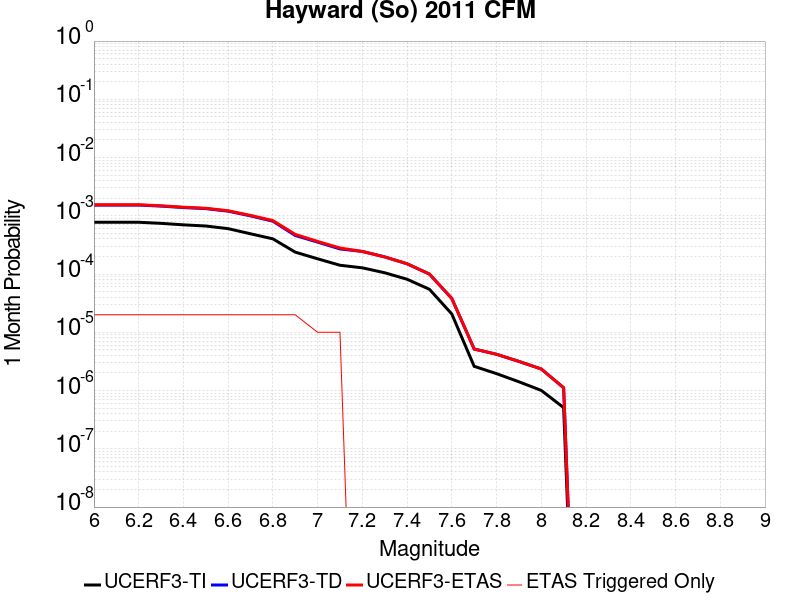 |  |  |

| Magnitude | 1 wk TI Prob | 1 wk TD Prob | 1 wk ETAS Prob | 1 wk ETAS/TD Gain | 1 wk ETAS Triggered Only | 1 mo TI Prob | 1 mo TD Prob | 1 mo ETAS Prob | 1 mo ETAS/TD Gain | 1 mo ETAS Triggered Only | 1 yr TI Prob | 1 yr TD Prob | 1 yr ETAS Prob | 1 yr ETAS/TD Gain | 1 yr ETAS Triggered Only | 10 yr TI Prob | 10 yr TD Prob | 10 yr ETAS Prob | 10 yr ETAS/TD Gain | 10 yr ETAS Triggered Only |
|-----|-----|-----|-----|-----|-----|-----|-----|-----|-----|-----|-----|-----|-----|-----|-----|-----|-----|-----|-----|-----|
| 6.0 | 1.8091932E-4 | 3.570673E-4 | 3.570673E-4 | 1.0 | 0.0 | 7.751381E-4 | 0.0015294008 | 0.0015294008 | 1.0 | 0.0 | 0.00939654 | 0.018463885 | 0.018512262 | 1.0026201 | 4.928779E-5 | 0.090090066 | 0.1667085 | 0.16679063 | 1.0004927 | 9.857558E-5 |
| 6.1 | 1.8091932E-4 | 3.570673E-4 | 3.570673E-4 | 1.0 | 0.0 | 7.751381E-4 | 0.0015294008 | 0.0015294008 | 1.0 | 0.0 | 0.00939654 | 0.018463885 | 0.018512262 | 1.0026201 | 4.928779E-5 | 0.090090066 | 0.1667085 | 0.16679063 | 1.0004927 | 9.857558E-5 |
| 6.2 | 1.8091932E-4 | 3.570673E-4 | 3.570673E-4 | 1.0 | 0.0 | 7.751381E-4 | 0.0015294008 | 0.0015294008 | 1.0 | 0.0 | 0.00939654 | 0.018463885 | 0.018512262 | 1.0026201 | 4.928779E-5 | 0.090090066 | 0.1667085 | 0.16679063 | 1.0004927 | 9.857558E-5 |
| 6.3 | 1.7322872E-4 | 3.4263515E-4 | 3.4263515E-4 | 1.0 | 0.0 | 7.4219756E-4 | 0.0014676197 | 0.0014676197 | 1.0 | 0.0 | 0.0089988755 | 0.017724147 | 0.017772561 | 1.0027316 | 4.928779E-5 | 0.08643075 | 0.16065954 | 0.16074227 | 1.000515 | 9.857558E-5 |
| 6.4 | 1.6334097E-4 | 3.2345165E-4 | 3.2345165E-4 | 1.0 | 0.0 | 6.998449E-4 | 0.0013854936 | 0.0013854936 | 1.0 | 0.0 | 0.008487372 | 0.016739927 | 0.01678839 | 1.002895 | 4.928779E-5 | 0.081704415 | 0.15256606 | 0.1526496 | 1.0005475 | 9.857558E-5 |
| 6.5 | 1.5600289E-4 | 3.101982E-4 | 3.101982E-4 | 1.0 | 0.0 | 6.684125E-4 | 0.0013287518 | 0.0013287518 | 1.0 | 0.0 | 0.008107598 | 0.016059443 | 0.016107941 | 1.0030198 | 4.928779E-5 | 0.078181036 | 0.14684291 | 0.14692701 | 1.0005727 | 9.857558E-5 |
| 6.6 | 1.4046066E-4 | 2.8034003E-4 | 2.8034003E-4 | 1.0 | 0.0 | 6.018354E-4 | 0.0012009109 | 0.0012009109 | 1.0 | 0.0 | 0.0073027555 | 0.014524571 | 0.014573143 | 1.0033442 | 4.928779E-5 | 0.07067384 | 0.13393044 | 0.13401583 | 1.0006374 | 9.857558E-5 |
| 6.7 | 1.14696966E-4 | 2.3272466E-4 | 2.3272466E-4 | 1.0 | 0.0 | 4.914658E-4 | 9.970153E-4 | 9.970153E-4 | 1.0 | 0.0 | 0.0059671924 | 0.012072163 | 0.012120856 | 1.0040334 | 4.928779E-5 | 0.058094822 | 0.11274141 | 0.112785146 | 1.0003879 | 4.928779E-5 |
| 6.8 | 9.3874296E-5 | 1.8862431E-4 | 1.8862431E-4 | 1.0 | 0.0 | 4.0225635E-4 | 8.081431E-4 | 8.081431E-4 | 1.0 | 0.0 | 0.0048864787 | 0.009795489 | 0.009844294 | 1.0049824 | 4.928779E-5 | 0.047804173 | 0.092592984 | 0.09263771 | 1.000483 | 4.928779E-5 |
| 6.9 | 5.551852E-5 | 1.0729875E-4 | 1.0729875E-4 | 1.0 | 0.0 | 2.3791482E-4 | 4.5977137E-4 | 4.5977137E-4 | 1.0 | 0.0 | 0.0028927654 | 0.005583468 | 0.005583468 | 1.0 | 0.0 | 0.028553981 | 0.054246075 | 0.054246075 | 1.0 | 0.0 |
| 7.0 | 4.2662363E-5 | 8.246792E-5 | 8.246792E-5 | 1.0 | 0.0 | 1.8282588E-4 | 3.5338648E-4 | 3.5338648E-4 | 1.0 | 0.0 | 0.0022236328 | 0.0042940658 | 0.0042940658 | 1.0 | 0.0 | 0.022015138 | 0.04206509 | 0.04206509 | 1.0 | 0.0 |
| 7.1 | 3.305886E-5 | 6.302183E-5 | 6.302183E-5 | 1.0 | 0.0 | 1.4167312E-4 | 2.7006568E-4 | 2.7006568E-4 | 1.0 | 0.0 | 0.0017235056 | 0.003283111 | 0.003283111 | 1.0 | 0.0 | 0.017101998 | 0.032453902 | 0.032453902 | 1.0 | 0.0 |
| 7.2 | 2.9856887E-5 | 5.701622E-5 | 5.701622E-5 | 1.0 | 0.0 | 1.2795182E-4 | 2.4433242E-4 | 2.4433242E-4 | 1.0 | 0.0 | 0.0015567001 | 0.0029707062 | 0.0029707062 | 1.0 | 0.0 | 0.015458403 | 0.029454801 | 0.029454801 | 1.0 | 0.0 |
| 7.3 | 2.4559737E-5 | 4.599286E-5 | 4.599286E-5 | 1.0 | 0.0 | 1.0525176E-4 | 1.9709744E-4 | 1.9709744E-4 | 1.0 | 0.0 | 0.0012806869 | 0.0023970334 | 0.0023970334 | 1.0 | 0.0 | 0.012733313 | 0.023858516 | 0.023858516 | 1.0 | 0.0 |
| 7.4 | 1.9002231E-5 | 3.505084E-5 | 3.505084E-5 | 1.0 | 0.0 | 8.143559E-5 | 1.502093E-4 | 1.502093E-4 | 1.0 | 0.0 | 9.910273E-4 | 0.001827274 | 0.001827274 | 1.0 | 0.0 | 0.009866194 | 0.018258808 | 0.018258808 | 1.0 | 0.0 |
| 7.5 | 1.2783333E-5 | 2.3331182E-5 | 2.3331182E-5 | 1.0 | 0.0 | 5.4784563E-5 | 9.998698E-5 | 9.998698E-5 | 1.0 | 0.0 | 6.667979E-4 | 0.0012166675 | 0.0012166675 | 1.0 | 0.0 | 0.006648007 | 0.012209443 | 0.012209443 | 1.0 | 0.0 |
| 7.6 | 4.8149627E-6 | 8.888056E-6 | 8.888056E-6 | 1.0 | 0.0 | 2.063539E-5 | 3.8091122E-5 | 3.8091122E-5 | 1.0 | 0.0 | 2.5120692E-4 | 4.6366194E-4 | 4.6366194E-4 | 1.0 | 0.0 | 0.0025092314 | 0.0046805087 | 0.0046805087 | 1.0 | 0.0 |
| 7.7 | 6.0838227E-7 | 1.205754E-6 | 1.205754E-6 | 1.0 | 0.0 | 2.6073499E-6 | 5.1675065E-6 | 5.1675065E-6 | 1.0 | 0.0 | 3.174402E-5 | 6.291258E-5 | 6.291258E-5 | 1.0 | 0.0 | 3.1739488E-4 | 6.5296254E-4 | 6.5296254E-4 | 1.0 | 0.0 |
| 7.8 | 4.5542808E-7 | 9.792941E-7 | 9.792941E-7 | 1.0 | 0.0 | 1.9518332E-6 | 4.196968E-6 | 4.196968E-6 | 1.0 | 0.0 | 2.376331E-5 | 5.109689E-5 | 5.109689E-5 | 1.0 | 0.0 | 2.3760769E-4 | 5.321693E-4 | 5.321693E-4 | 1.0 | 0.0 |
| 7.9 | 3.3016747E-7 | 7.3869535E-7 | 7.3869535E-7 | 1.0 | 0.0 | 1.4150027E-6 | 3.1658333E-6 | 3.1658333E-6 | 1.0 | 0.0 | 1.7227521E-5 | 3.854334E-5 | 3.854334E-5 | 1.0 | 0.0 | 1.7226185E-4 | 3.9932923E-4 | 3.9932923E-4 | 1.0 | 0.0 |
| 8.0 | 2.347038E-7 | 5.471963E-7 | 5.471963E-7 | 1.0 | 0.0 | 1.0058731E-6 | 2.3451248E-6 | 2.3451248E-6 | 1.0 | 0.0 | 1.2246436E-5 | 2.8551523E-5 | 2.8551523E-5 | 1.0 | 0.0 | 1.2245761E-4 | 2.9357258E-4 | 2.9357258E-4 | 1.0 | 0.0 |
| 8.1 | 1.18822804E-7 | 2.6060948E-7 | 2.6060948E-7 | 1.0 | 0.0 | 5.092405E-7 | 1.1168972E-6 | 1.1168972E-6 | 1.0 | 0.0 | 6.1999854E-6 | 1.359814E-5 | 1.359814E-5 | 1.0 | 0.0 | 6.199812E-5 | 1.3918082E-4 | 1.3918082E-4 | 1.0 | 0.0 |

## Independence rev 2011
*[(top)](#table-of-contents)*

| 1 Week | 1 Month | 1 Year | 10 Year |
|-----|-----|-----|-----|
|  |  |  |  |

| Magnitude | 1 wk TI Prob | 1 wk TD Prob | 1 wk ETAS Prob | 1 wk ETAS/TD Gain | 1 wk ETAS Triggered Only | 1 mo TI Prob | 1 mo TD Prob | 1 mo ETAS Prob | 1 mo ETAS/TD Gain | 1 mo ETAS Triggered Only | 1 yr TI Prob | 1 yr TD Prob | 1 yr ETAS Prob | 1 yr ETAS/TD Gain | 1 yr ETAS Triggered Only | 10 yr TI Prob | 10 yr TD Prob | 10 yr ETAS Prob | 10 yr ETAS/TD Gain | 10 yr ETAS Triggered Only |
|-----|-----|-----|-----|-----|-----|-----|-----|-----|-----|-----|-----|-----|-----|-----|-----|-----|-----|-----|-----|-----|
| 6.0 | 4.422171E-6 | 4.3262253E-6 | 1.0290138E-4 | 23.785488 | 9.857558E-5 | 1.8952025E-5 | 1.8540852E-5 | 1.1711461E-4 | 6.316571 | 9.857558E-5 | 2.3071647E-4 | 2.2571447E-4 | 3.242678E-4 | 1.4366283 | 9.857558E-5 | 0.0023047708 | 0.0022551457 | 0.002353499 | 1.0436128 | 9.857558E-5 |
| 6.1 | 4.422171E-6 | 4.3262253E-6 | 1.0290138E-4 | 23.785488 | 9.857558E-5 | 1.8952025E-5 | 1.8540852E-5 | 1.1711461E-4 | 6.316571 | 9.857558E-5 | 2.3071647E-4 | 2.2571447E-4 | 3.242678E-4 | 1.4366283 | 9.857558E-5 | 0.0023047708 | 0.0022551457 | 0.002353499 | 1.0436128 | 9.857558E-5 |
| 6.2 | 4.422171E-6 | 4.3262253E-6 | 1.0290138E-4 | 23.785488 | 9.857558E-5 | 1.8952025E-5 | 1.8540852E-5 | 1.1711461E-4 | 6.316571 | 9.857558E-5 | 2.3071647E-4 | 2.2571447E-4 | 3.242678E-4 | 1.4366283 | 9.857558E-5 | 0.0023047708 | 0.0022551457 | 0.002353499 | 1.0436128 | 9.857558E-5 |
| 6.3 | 4.422171E-6 | 4.3262253E-6 | 1.0290138E-4 | 23.785488 | 9.857558E-5 | 1.8952025E-5 | 1.8540852E-5 | 1.1711461E-4 | 6.316571 | 9.857558E-5 | 2.3071647E-4 | 2.2571447E-4 | 3.242678E-4 | 1.4366283 | 9.857558E-5 | 0.0023047708 | 0.0022551457 | 0.002353499 | 1.0436128 | 9.857558E-5 |
| 6.4 | 4.422171E-6 | 4.3262253E-6 | 1.0290138E-4 | 23.785488 | 9.857558E-5 | 1.8952025E-5 | 1.8540852E-5 | 1.1711461E-4 | 6.316571 | 9.857558E-5 | 2.3071647E-4 | 2.2571447E-4 | 3.242678E-4 | 1.4366283 | 9.857558E-5 | 0.0023047708 | 0.0022551457 | 0.002353499 | 1.0436128 | 9.857558E-5 |
| 6.5 | 4.422171E-6 | 4.3262253E-6 | 1.0290138E-4 | 23.785488 | 9.857558E-5 | 1.8952025E-5 | 1.8540852E-5 | 1.1711461E-4 | 6.316571 | 9.857558E-5 | 2.3071647E-4 | 2.2571447E-4 | 3.242678E-4 | 1.4366283 | 9.857558E-5 | 0.0023047708 | 0.0022551457 | 0.002353499 | 1.0436128 | 9.857558E-5 |
| 6.6 | 2.663744E-6 | 2.5319846E-6 | 2.5319846E-6 | 1.0 | 0.0 | 1.1415996E-5 | 1.08513195E-5 | 1.08513195E-5 | 1.0 | 0.0 | 1.3898089E-4 | 1.321073E-4 | 1.321073E-4 | 1.0 | 0.0 | 0.0013889399 | 0.0013203359 | 0.0013203359 | 1.0 | 0.0 |
| 6.7 | 2.663744E-6 | 2.5319846E-6 | 2.5319846E-6 | 1.0 | 0.0 | 1.1415996E-5 | 1.08513195E-5 | 1.08513195E-5 | 1.0 | 0.0 | 1.3898089E-4 | 1.321073E-4 | 1.321073E-4 | 1.0 | 0.0 | 0.0013889399 | 0.0013203359 | 0.0013203359 | 1.0 | 0.0 |
| 6.8 | 1.9716529E-6 | 1.8322567E-6 | 1.8322567E-6 | 1.0 | 0.0 | 8.449913E-6 | 7.852505E-6 | 7.852505E-6 | 1.0 | 0.0 | 1.0287284E-4 | 9.560019E-5 | 9.560019E-5 | 1.0 | 0.0 | 0.0010282523 | 9.5560355E-4 | 9.5560355E-4 | 1.0 | 0.0 |
| 6.9 | 1.8788617E-6 | 1.7429976E-6 | 1.7429976E-6 | 1.0 | 0.0 | 8.0522395E-6 | 7.4699688E-6 | 7.4699688E-6 | 1.0 | 0.0 | 9.80316E-5 | 9.09432E-5 | 9.09432E-5 | 1.0 | 0.0 | 9.798837E-4 | 9.090718E-4 | 9.090718E-4 | 1.0 | 0.0 |
| 7.0 | 1.5045488E-6 | 1.3849498E-6 | 1.3849498E-6 | 1.0 | 0.0 | 6.44805E-6 | 5.9354857E-6 | 5.9354857E-6 | 1.0 | 0.0 | 7.8502184E-5 | 7.226219E-5 | 7.226219E-5 | 1.0 | 0.0 | 7.8474457E-4 | 7.223921E-4 | 7.223921E-4 | 1.0 | 0.0 |
| 7.1 | 1.272341E-6 | 1.1625089E-6 | 1.1625089E-6 | 1.0 | 0.0 | 5.4528787E-6 | 4.9821715E-6 | 4.9821715E-6 | 1.0 | 0.0 | 6.6386776E-5 | 6.0656283E-5 | 6.0656283E-5 | 1.0 | 0.0 | 6.636695E-4 | 6.064005E-4 | 6.064005E-4 | 1.0 | 0.0 |
| 7.2 | 1.0416892E-6 | 9.409871E-7 | 9.409871E-7 | 1.0 | 0.0 | 4.464375E-6 | 4.032796E-6 | 4.032796E-6 | 1.0 | 0.0 | 5.4352407E-5 | 4.9098202E-5 | 4.9098202E-5 | 1.0 | 0.0 | 5.4339116E-4 | 4.908754E-4 | 4.908754E-4 | 1.0 | 0.0 |
| 7.3 | 7.9450155E-7 | 7.2350036E-7 | 7.2350036E-7 | 1.0 | 0.0 | 3.4050022E-6 | 3.1007123E-6 | 3.1007123E-6 | 1.0 | 0.0 | 4.1455114E-5 | 3.7750528E-5 | 3.7750528E-5 | 1.0 | 0.0 | 4.144738E-4 | 3.7744228E-4 | 3.7744228E-4 | 1.0 | 0.0 |
| 7.4 | 5.3893444E-7 | 5.0195166E-7 | 5.0195166E-7 | 1.0 | 0.0 | 2.309717E-6 | 2.1512196E-6 | 2.1512196E-6 | 1.0 | 0.0 | 2.8120441E-5 | 2.6190788E-5 | 2.6190788E-5 | 1.0 | 0.0 | 2.8116882E-4 | 2.6187746E-4 | 2.6187746E-4 | 1.0 | 0.0 |
| 7.5 | 3.8852085E-7 | 3.6825622E-7 | 3.6825622E-7 | 1.0 | 0.0 | 1.6650882E-6 | 1.57824E-6 | 1.57824E-6 | 1.0 | 0.0 | 2.027226E-5 | 1.9214905E-5 | 1.9214905E-5 | 1.0 | 0.0 | 2.0270412E-4 | 1.9213265E-4 | 1.9213265E-4 | 1.0 | 0.0 |
| 7.6 | 2.414929E-7 | 2.3457605E-7 | 2.3457605E-7 | 1.0 | 0.0 | 1.0349692E-6 | 1.0053255E-6 | 1.0053255E-6 | 1.0 | 0.0 | 1.2600677E-5 | 1.2239771E-5 | 1.2239771E-5 | 1.0 | 0.0 | 1.2599962E-4 | 1.223911E-4 | 1.223911E-4 | 1.0 | 0.0 |
| 7.7 | 6.8298014E-8 | 6.8589785E-8 | 6.8589785E-8 | 1.0 | 0.0 | 2.9270575E-7 | 2.939562E-7 | 2.939562E-7 | 1.0 | 0.0 | 3.5636867E-6 | 3.5789112E-6 | 3.5789112E-6 | 1.0 | 0.0 | 3.5636294E-5 | 3.5788584E-5 | 3.5788584E-5 | 1.0 | 0.0 |

## San Clemente
*[(top)](#table-of-contents)*

| 1 Week | 1 Month | 1 Year | 10 Year |
|-----|-----|-----|-----|
|  | 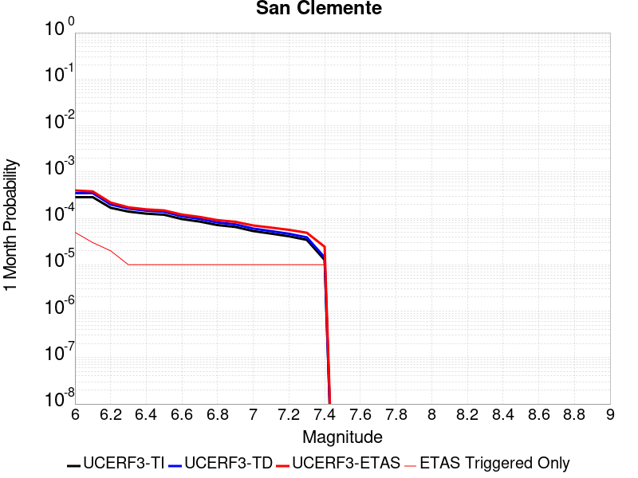 |  |  |

| Magnitude | 1 wk TI Prob | 1 wk TD Prob | 1 wk ETAS Prob | 1 wk ETAS/TD Gain | 1 wk ETAS Triggered Only | 1 mo TI Prob | 1 mo TD Prob | 1 mo ETAS Prob | 1 mo ETAS/TD Gain | 1 mo ETAS Triggered Only | 1 yr TI Prob | 1 yr TD Prob | 1 yr ETAS Prob | 1 yr ETAS/TD Gain | 1 yr ETAS Triggered Only | 10 yr TI Prob | 10 yr TD Prob | 10 yr ETAS Prob | 10 yr ETAS/TD Gain | 10 yr ETAS Triggered Only |
|-----|-----|-----|-----|-----|-----|-----|-----|-----|-----|-----|-----|-----|-----|-----|-----|-----|-----|-----|-----|-----|
| 6.0 | 6.681379E-5 | 8.163834E-5 | 1.3092211E-4 | 1.6036841 | 4.928779E-5 | 2.8631336E-4 | 3.4983488E-4 | 3.9910545E-4 | 1.1408395 | 4.928779E-5 | 0.003480294 | 0.00425141 | 0.004300488 | 1.011544 | 4.928779E-5 | 0.03426291 | 0.04175603 | 0.04185049 | 1.0022622 | 9.857558E-5 |
| 6.1 | 6.681379E-5 | 8.163834E-5 | 1.3092211E-4 | 1.6036841 | 4.928779E-5 | 2.8631336E-4 | 3.4983488E-4 | 3.9910545E-4 | 1.1408395 | 4.928779E-5 | 0.003480294 | 0.00425141 | 0.004300488 | 1.011544 | 4.928779E-5 | 0.03426291 | 0.04175603 | 0.04185049 | 1.0022622 | 9.857558E-5 |
| 6.2 | 3.9400576E-5 | 4.6452373E-5 | 9.573787E-5 | 2.06099 | 4.928779E-5 | 1.6884868E-4 | 1.9906677E-4 | 2.4834473E-4 | 1.247545 | 4.928779E-5 | 0.0020537945 | 0.0024209984 | 0.002470167 | 1.0203092 | 4.928779E-5 | 0.020349167 | 0.023952903 | 0.02400101 | 1.0020084 | 4.928779E-5 |
| 6.3 | 3.2590255E-5 | 3.792912E-5 | 3.792912E-5 | 1.0 | 0.0 | 1.3966505E-4 | 1.6254342E-4 | 1.6254342E-4 | 1.0 | 0.0 | 0.0016990956 | 0.0019772002 | 0.0019772002 | 1.0 | 0.0 | 0.01686163 | 0.019599883 | 0.019599883 | 1.0 | 0.0 |
| 6.4 | 2.9454652E-5 | 3.4097764E-5 | 3.4097764E-5 | 1.0 | 0.0 | 1.2622811E-4 | 1.4612524E-4 | 1.4612524E-4 | 1.0 | 0.0 | 0.0015357438 | 0.0017776493 | 0.0017776493 | 1.0 | 0.0 | 0.015251739 | 0.01763747 | 0.01763747 | 1.0 | 0.0 |
| 6.5 | 2.790836E-5 | 3.2247463E-5 | 3.2247463E-5 | 1.0 | 0.0 | 1.1960178E-4 | 1.3819624E-4 | 1.3819624E-4 | 1.0 | 0.0 | 0.001455179 | 0.0016812662 | 0.0016812662 | 1.0 | 0.0 | 0.014456868 | 0.016688485 | 0.016688485 | 1.0 | 0.0 |
| 6.6 | 2.2492153E-5 | 2.5762702E-5 | 2.5762702E-5 | 1.0 | 0.0 | 9.639138E-5 | 1.1040699E-4 | 1.1040699E-4 | 1.0 | 0.0 | 0.0011729331 | 0.0013433909 | 0.0013433909 | 1.0 | 0.0 | 0.011667615 | 0.013354417 | 0.013354417 | 1.0 | 0.0 |
| 6.7 | 1.9862755E-5 | 2.2666423E-5 | 2.2666423E-5 | 1.0 | 0.0 | 8.512331E-5 | 9.713826E-5 | 9.713826E-5 | 1.0 | 0.0 | 0.0010358836 | 0.0011820279 | 0.0011820279 | 1.0 | 0.0 | 0.010310682 | 0.011758701 | 0.011758701 | 1.0 | 0.0 |
| 6.8 | 1.6697575E-5 | 1.897771E-5 | 1.897771E-5 | 1.0 | 0.0 | 7.155907E-5 | 8.133056E-5 | 8.133056E-5 | 1.0 | 0.0 | 8.7088346E-4 | 9.897591E-4 | 9.897591E-4 | 1.0 | 0.0 | 0.008674784 | 0.0098545365 | 0.0098545365 | 1.0 | 0.0 |
| 6.9 | 1.5218415E-5 | 1.72694E-5 | 1.72694E-5 | 1.0 | 0.0 | 6.522015E-5 | 7.4009666E-5 | 7.4009666E-5 | 1.0 | 0.0 | 7.93766E-4 | 9.00704E-4 | 9.00704E-4 | 1.0 | 0.0 | 0.007909367 | 0.008971481 | 0.008971481 | 1.0 | 0.0 |
| 7.0 | 1.2392958E-5 | 1.4033016E-5 | 1.4033016E-5 | 1.0 | 0.0 | 5.3111595E-5 | 6.014015E-5 | 6.014015E-5 | 1.0 | 0.0 | 6.4644177E-4 | 7.319679E-4 | 7.319679E-4 | 1.0 | 0.0 | 0.0064456454 | 0.0072963564 | 0.0072963564 | 1.0 | 0.0 |
| 7.1 | 1.0934128E-5 | 1.2375138E-5 | 1.2375138E-5 | 1.0 | 0.0 | 4.6859706E-5 | 5.303527E-5 | 5.303527E-5 | 1.0 | 0.0 | 5.7036756E-4 | 6.455204E-4 | 6.455204E-4 | 1.0 | 0.0 | 0.0056890585 | 0.0064371997 | 0.0064371997 | 1.0 | 0.0 |
| 7.2 | 9.5798805E-6 | 1.0844935E-5 | 1.0844935E-5 | 1.0 | 0.0 | 4.1055984E-5 | 4.6477508E-5 | 4.6477508E-5 | 1.0 | 0.0 | 4.9974193E-4 | 5.657239E-4 | 5.657239E-4 | 1.0 | 0.0 | 0.0049861963 | 0.0056435615 | 0.0056435615 | 1.0 | 0.0 |
| 7.3 | 8.0167365E-6 | 9.083918E-6 | 9.083918E-6 | 1.0 | 0.0 | 3.4356988E-5 | 3.8930535E-5 | 3.8930535E-5 | 1.0 | 0.0 | 4.1821605E-4 | 4.7388324E-4 | 4.7388324E-4 | 1.0 | 0.0 | 0.0041742986 | 0.0047294297 | 0.0047294297 | 1.0 | 0.0 |
| 7.4 | 2.9581017E-6 | 3.3623792E-6 | 3.3623792E-6 | 1.0 | 0.0 | 1.2677518E-5 | 1.4410146E-5 | 1.4410146E-5 | 1.0 | 0.0 | 1.5433785E-4 | 1.7543444E-4 | 1.7543444E-4 | 1.0 | 0.0 | 0.001542307 | 0.0017534546 | 0.0017534546 | 1.0 | 0.0 |

## Mission Creek
*[(top)](#table-of-contents)*

| 1 Week | 1 Month | 1 Year | 10 Year |
|-----|-----|-----|-----|
|  | 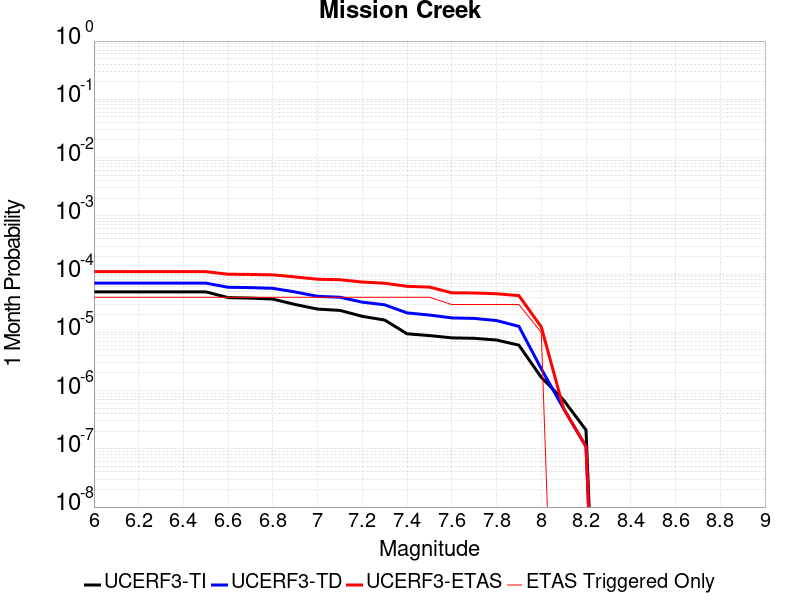 |  |  |

| Magnitude | 1 wk TI Prob | 1 wk TD Prob | 1 wk ETAS Prob | 1 wk ETAS/TD Gain | 1 wk ETAS Triggered Only | 1 mo TI Prob | 1 mo TD Prob | 1 mo ETAS Prob | 1 mo ETAS/TD Gain | 1 mo ETAS Triggered Only | 1 yr TI Prob | 1 yr TD Prob | 1 yr ETAS Prob | 1 yr ETAS/TD Gain | 1 yr ETAS Triggered Only | 10 yr TI Prob | 10 yr TD Prob | 10 yr ETAS Prob | 10 yr ETAS/TD Gain | 10 yr ETAS Triggered Only |
|-----|-----|-----|-----|-----|-----|-----|-----|-----|-----|-----|-----|-----|-----|-----|-----|-----|-----|-----|-----|-----|
| 6.0 | 1.1549387E-5 | 1.6322783E-5 | 6.560977E-5 | 4.019521 | 4.928779E-5 | 4.9496433E-5 | 6.995299E-5 | 1.1923733E-4 | 1.7045352 | 4.928779E-5 | 6.0245243E-4 | 8.5135986E-4 | 9.498515E-4 | 1.1156875 | 9.857558E-5 | 0.006008218 | 0.008510157 | 0.008607893 | 1.0114847 | 9.857558E-5 |
| 6.1 | 1.1549387E-5 | 1.6322783E-5 | 6.560977E-5 | 4.019521 | 4.928779E-5 | 4.9496433E-5 | 6.995299E-5 | 1.1923733E-4 | 1.7045352 | 4.928779E-5 | 6.0245243E-4 | 8.5135986E-4 | 9.498515E-4 | 1.1156875 | 9.857558E-5 | 0.006008218 | 0.008510157 | 0.008607893 | 1.0114847 | 9.857558E-5 |
| 6.2 | 1.1549387E-5 | 1.6322783E-5 | 6.560977E-5 | 4.019521 | 4.928779E-5 | 4.9496433E-5 | 6.995299E-5 | 1.1923733E-4 | 1.7045352 | 4.928779E-5 | 6.0245243E-4 | 8.5135986E-4 | 9.498515E-4 | 1.1156875 | 9.857558E-5 | 0.006008218 | 0.008510157 | 0.008607893 | 1.0114847 | 9.857558E-5 |
| 6.3 | 1.1549387E-5 | 1.6322783E-5 | 6.560977E-5 | 4.019521 | 4.928779E-5 | 4.9496433E-5 | 6.995299E-5 | 1.1923733E-4 | 1.7045352 | 4.928779E-5 | 6.0245243E-4 | 8.5135986E-4 | 9.498515E-4 | 1.1156875 | 9.857558E-5 | 0.006008218 | 0.008510157 | 0.008607893 | 1.0114847 | 9.857558E-5 |
| 6.4 | 1.1549387E-5 | 1.6322783E-5 | 6.560977E-5 | 4.019521 | 4.928779E-5 | 4.9496433E-5 | 6.995299E-5 | 1.1923733E-4 | 1.7045352 | 4.928779E-5 | 6.0245243E-4 | 8.5135986E-4 | 9.498515E-4 | 1.1156875 | 9.857558E-5 | 0.006008218 | 0.008510157 | 0.008607893 | 1.0114847 | 9.857558E-5 |
| 6.5 | 1.1549387E-5 | 1.6322783E-5 | 6.560977E-5 | 4.019521 | 4.928779E-5 | 4.9496433E-5 | 6.995299E-5 | 1.1923733E-4 | 1.7045352 | 4.928779E-5 | 6.0245243E-4 | 8.5135986E-4 | 9.498515E-4 | 1.1156875 | 9.857558E-5 | 0.006008218 | 0.008510157 | 0.008607893 | 1.0114847 | 9.857558E-5 |
| 6.6 | 9.202681E-6 | 1.3846059E-5 | 6.313317E-5 | 4.559649 | 4.928779E-5 | 3.9439463E-5 | 5.9338956E-5 | 1.0862382E-4 | 1.8305651 | 4.928779E-5 | 4.800697E-4 | 7.2222133E-4 | 8.207257E-4 | 1.1363908 | 9.857558E-5 | 0.004790339 | 0.0072273402 | 0.007325203 | 1.0135407 | 9.857558E-5 |
| 6.7 | 9.019164E-6 | 1.3651728E-5 | 6.2938845E-5 | 4.6103206 | 4.928779E-5 | 3.8652986E-5 | 5.8506146E-5 | 1.0779106E-4 | 1.8423885 | 4.928779E-5 | 4.7049852E-4 | 7.1208854E-4 | 8.1059395E-4 | 1.1383331 | 9.857558E-5 | 0.004695036 | 0.0071266647 | 0.0072245374 | 1.0137334 | 9.857558E-5 |
| 6.8 | 8.673558E-6 | 1.3273839E-5 | 6.2560975E-5 | 4.7131033 | 4.928779E-5 | 3.717186E-5 | 5.688669E-5 | 1.06171676E-4 | 1.8663712 | 4.928779E-5 | 4.524734E-4 | 6.923842E-4 | 7.908915E-4 | 1.1422726 | 9.857558E-5 | 0.0045155324 | 0.0069308523 | 0.007028745 | 1.0141242 | 9.857558E-5 |
| 6.9 | 7.002255E-6 | 1.1478069E-5 | 6.0765295E-5 | 5.294035 | 4.928779E-5 | 3.000932E-5 | 4.9190832E-5 | 9.84762E-5 | 2.001922 | 4.928779E-5 | 3.653022E-4 | 5.9874065E-4 | 6.9725723E-4 | 1.1645396 | 9.857558E-5 | 0.0036470229 | 0.005999676 | 0.00609766 | 1.0163316 | 9.857558E-5 |
| 7.0 | 5.84644E-6 | 9.675359E-6 | 5.8962672E-5 | 6.094107 | 4.928779E-5 | 2.5055931E-5 | 4.146519E-5 | 9.075094E-5 | 2.1886053 | 4.928779E-5 | 3.0501327E-4 | 5.047263E-4 | 6.0325215E-4 | 1.1952064 | 9.857558E-5 | 0.0030459496 | 0.005063994 | 0.0051620705 | 1.0193675 | 9.857558E-5 |
| 7.1 | 5.54703E-6 | 9.329834E-6 | 5.8617166E-5 | 6.2827663 | 4.928779E-5 | 2.377277E-5 | 3.9984414E-5 | 8.927024E-5 | 2.2326257 | 4.928779E-5 | 2.8939504E-4 | 4.8670598E-4 | 5.8523356E-4 | 1.2024376 | 9.857558E-5 | 0.0028901845 | 0.0048845876 | 0.0049826815 | 1.0200824 | 9.857558E-5 |
| 7.2 | 4.384709E-6 | 7.681918E-6 | 5.696933E-5 | 7.4160295 | 4.928779E-5 | 1.8791474E-5 | 3.292211E-5 | 8.220828E-5 | 2.4970539 | 4.928779E-5 | 2.2876218E-4 | 4.0075663E-4 | 4.992927E-4 | 1.2458751 | 9.857558E-5 | 0.0022852682 | 0.004028542 | 0.0041267206 | 1.0243707 | 9.857558E-5 |
| 7.3 | 3.7888456E-6 | 6.915788E-6 | 5.620324E-5 | 8.1268015 | 4.928779E-5 | 1.623781E-5 | 2.9638775E-5 | 7.8925106E-5 | 2.6629004 | 4.928779E-5 | 1.9767738E-4 | 3.6079568E-4 | 4.593357E-4 | 1.2731186 | 9.857558E-5 | 0.0019750162 | 0.00363027 | 0.0037284878 | 1.0270553 | 9.857558E-5 |
| 7.4 | 2.1982462E-6 | 5.0241033E-6 | 5.4311648E-5 | 10.810217 | 4.928779E-5 | 9.421021E-6 | 2.1531694E-5 | 7.081842E-5 | 3.2890317 | 4.928779E-5 | 1.1469489E-4 | 2.6211704E-4 | 3.6066677E-4 | 1.3759761 | 9.857558E-5 | 0.0011463572 | 0.0026460327 | 0.0027443476 | 1.0371555 | 9.857558E-5 |
| 7.5 | 2.051923E-6 | 4.6153277E-6 | 5.390289E-5 | 11.679104 | 4.928779E-5 | 8.793926E-6 | 1.9779825E-5 | 6.906664E-5 | 3.491772 | 4.928779E-5 | 1.0706078E-4 | 2.4079291E-4 | 3.3934476E-4 | 1.4092805 | 9.857558E-5 | 0.0010700922 | 0.0024335932 | 0.0025319287 | 1.0404077 | 9.857558E-5 |
| 7.6 | 1.8733427E-6 | 4.1236603E-6 | 5.3411248E-5 | 12.952388 | 4.928779E-5 | 8.028587E-6 | 1.7672712E-5 | 6.6959634E-5 | 3.7888715 | 4.928779E-5 | 9.774366E-5 | 2.151441E-4 | 3.136985E-4 | 1.4580854 | 9.857558E-5 | 9.770069E-4 | 0.0021782513 | 0.002276612 | 1.0451559 | 9.857558E-5 |
| 7.7 | 1.8411953E-6 | 4.0433315E-6 | 5.3330925E-5 | 13.189847 | 4.928779E-5 | 7.890813E-6 | 1.732845E-5 | 6.661539E-5 | 3.8442786 | 4.928779E-5 | 9.606641E-5 | 2.1095353E-4 | 3.0950832E-4 | 1.4671872 | 9.857558E-5 | 9.6024893E-4 | 0.0021365292 | 0.002234894 | 1.0460396 | 9.857558E-5 |
| 7.8 | 1.7194251E-6 | 3.71068E-6 | 5.299829E-5 | 14.282635 | 4.928779E-5 | 7.368944E-6 | 1.5902819E-5 | 6.518982E-5 | 4.0992627 | 4.928779E-5 | 8.97132E-5 | 1.9359968E-4 | 2.9215618E-4 | 1.5090736 | 9.857558E-5 | 8.967699E-4 | 0.0019624757 | 0.0020608578 | 1.0501317 | 9.857558E-5 |
| 7.9 | 1.4035052E-6 | 2.9502596E-6 | 5.2237905E-5 | 17.706205 | 4.928779E-5 | 6.0150082E-6 | 1.2643909E-5 | 6.1931074E-5 | 4.8980956 | 4.928779E-5 | 7.3230265E-5 | 1.5392878E-4 | 2.524892E-4 | 1.6402987 | 9.857558E-5 | 7.3206134E-4 | 0.0015631174 | 0.0016615388 | 1.0629649 | 9.857558E-5 |
| 8.0 | 3.9318823E-7 | 5.528477E-7 | 4.984061E-5 | 90.15251 | 4.928779E-5 | 1.6850913E-6 | 2.3693453E-6 | 5.165702E-5 | 21.802233 | 4.928779E-5 | 2.0515794E-5 | 2.8846403E-5 | 7.8132776E-5 | 2.7085793 | 4.928779E-5 | 2.0513899E-4 | 2.990952E-4 | 3.4836825E-4 | 1.1647403 | 4.928779E-5 |
| 8.1 | 1.596793E-7 | 1.13775044E-7 | 1.13775044E-7 | 1.0 | 0.0 | 6.8433974E-7 | 4.876072E-7 | 4.876072E-7 | 1.0 | 0.0 | 8.331805E-6 | 5.936602E-6 | 5.936602E-6 | 1.0 | 0.0 | 8.331492E-5 | 6.5494125E-5 | 6.5494125E-5 | 1.0 | 0.0 |
| 8.2 | 4.9003038E-8 | 2.5435753E-8 | 2.5435753E-8 | 1.0 | 0.0 | 2.10013E-7 | 1.09010365E-7 | 1.09010365E-7 | 1.0 | 0.0 | 2.5569052E-6 | 1.3272004E-6 | 1.3272004E-6 | 1.0 | 0.0 | 2.556876E-5 | 1.4952613E-5 | 1.4952613E-5 | 1.0 | 0.0 |

## Great Valley 05 Pittsburg - Kirby Hills alt1
*[(top)](#table-of-contents)*

| 1 Week | 1 Month | 1 Year | 10 Year |
|-----|-----|-----|-----|
|  |  |  | 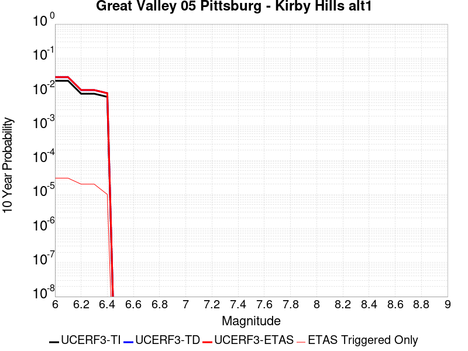 |

| Magnitude | 1 wk TI Prob | 1 wk TD Prob | 1 wk ETAS Prob | 1 wk ETAS/TD Gain | 1 wk ETAS Triggered Only | 1 mo TI Prob | 1 mo TD Prob | 1 mo ETAS Prob | 1 mo ETAS/TD Gain | 1 mo ETAS Triggered Only | 1 yr TI Prob | 1 yr TD Prob | 1 yr ETAS Prob | 1 yr ETAS/TD Gain | 1 yr ETAS Triggered Only | 10 yr TI Prob | 10 yr TD Prob | 10 yr ETAS Prob | 10 yr ETAS/TD Gain | 10 yr ETAS Triggered Only |
|-----|-----|-----|-----|-----|-----|-----|-----|-----|-----|-----|-----|-----|-----|-----|-----|-----|-----|-----|-----|-----|
| 6.0 | 4.187212E-5 | 5.344289E-5 | 5.344289E-5 | 1.0 | 0.0 | 1.794396E-4 | 2.2902661E-4 | 2.783031E-4 | 1.2151562 | 4.928779E-5 | 0.002182488 | 0.0027857998 | 0.00283495 | 1.0176432 | 4.928779E-5 | 0.021611776 | 0.027603218 | 0.027699072 | 1.0034726 | 9.857558E-5 |
| 6.1 | 4.187212E-5 | 5.344289E-5 | 5.344289E-5 | 1.0 | 0.0 | 1.794396E-4 | 2.2902661E-4 | 2.783031E-4 | 1.2151562 | 4.928779E-5 | 0.002182488 | 0.0027857998 | 0.00283495 | 1.0176432 | 4.928779E-5 | 0.021611776 | 0.027603218 | 0.027699072 | 1.0034726 | 9.857558E-5 |
| 6.2 | 1.7353306E-5 | 2.2154672E-5 | 2.2154672E-5 | 1.0 | 0.0 | 7.436919E-5 | 9.4947456E-5 | 1.4423057E-4 | 1.5190567 | 4.928779E-5 | 9.050688E-4 | 0.0011557573 | 0.0012049881 | 1.0425962 | 4.928779E-5 | 0.009013915 | 0.0115352 | 0.01158392 | 1.0042236 | 4.928779E-5 |
| 6.3 | 1.7353306E-5 | 2.2154672E-5 | 2.2154672E-5 | 1.0 | 0.0 | 7.436919E-5 | 9.4947456E-5 | 1.4423057E-4 | 1.5190567 | 4.928779E-5 | 9.050688E-4 | 0.0011557573 | 0.0012049881 | 1.0425962 | 4.928779E-5 | 0.009013915 | 0.0115352 | 0.01158392 | 1.0042236 | 4.928779E-5 |
| 6.4 | 1.4028824E-5 | 1.7901062E-5 | 1.7901062E-5 | 1.0 | 0.0 | 6.0122147E-5 | 7.671883E-5 | 7.671883E-5 | 1.0 | 0.0 | 7.3174125E-4 | 9.340303E-4 | 9.340303E-4 | 1.0 | 0.0 | 0.0072933645 | 0.009338211 | 0.009338211 | 1.0 | 0.0 |

## Santa Rosa Island
*[(top)](#table-of-contents)*

| 1 Week | 1 Month | 1 Year | 10 Year |
|-----|-----|-----|-----|
|  |  |  |  |

| Magnitude | 1 wk TI Prob | 1 wk TD Prob | 1 wk ETAS Prob | 1 wk ETAS/TD Gain | 1 wk ETAS Triggered Only | 1 mo TI Prob | 1 mo TD Prob | 1 mo ETAS Prob | 1 mo ETAS/TD Gain | 1 mo ETAS Triggered Only | 1 yr TI Prob | 1 yr TD Prob | 1 yr ETAS Prob | 1 yr ETAS/TD Gain | 1 yr ETAS Triggered Only | 10 yr TI Prob | 10 yr TD Prob | 10 yr ETAS Prob | 10 yr ETAS/TD Gain | 10 yr ETAS Triggered Only |
|-----|-----|-----|-----|-----|-----|-----|-----|-----|-----|-----|-----|-----|-----|-----|-----|-----|-----|-----|-----|-----|
| 6.0 | 4.1143165E-5 | 4.709113E-5 | 1.4566207E-4 | 3.0931957 | 9.857558E-5 | 1.7631594E-4 | 2.0180462E-4 | 3.0036032E-4 | 1.4883718 | 9.857558E-5 | 0.002144533 | 0.0024543991 | 0.0025527328 | 1.0400642 | 9.857558E-5 | 0.021239553 | 0.024293557 | 0.024389736 | 1.0039591 | 9.857558E-5 |
| 6.1 | 2.1061249E-5 | 2.3864959E-5 | 1.2243818E-4 | 5.130459 | 9.857558E-5 | 9.0259375E-5 | 1.0227455E-4 | 2.0084005E-4 | 1.9637344 | 9.857558E-5 | 0.0010983539 | 0.0012445103 | 0.0013429632 | 1.0791098 | 9.857558E-5 | 0.01092941 | 0.01237845 | 0.012475805 | 1.007865 | 9.857558E-5 |
| 6.2 | 2.1061249E-5 | 2.3864959E-5 | 1.2243818E-4 | 5.130459 | 9.857558E-5 | 9.0259375E-5 | 1.0227455E-4 | 2.0084005E-4 | 1.9637344 | 9.857558E-5 | 0.0010983539 | 0.0012445103 | 0.0013429632 | 1.0791098 | 9.857558E-5 | 0.01092941 | 0.01237845 | 0.012475805 | 1.007865 | 9.857558E-5 |
| 6.3 | 1.5158236E-5 | 1.7074419E-5 | 1.1564832E-4 | 6.7731924 | 9.857558E-5 | 6.496225E-5 | 7.3174095E-5 | 1.7174246E-4 | 2.3470392 | 9.857558E-5 | 7.906284E-4 | 8.9054246E-4 | 9.890302E-4 | 1.1105931 | 9.857558E-5 | 0.007878214 | 0.00887099 | 0.008968691 | 1.0110135 | 9.857558E-5 |
| 6.4 | 1.2341918E-5 | 1.3852917E-5 | 1.1242714E-4 | 8.115773 | 9.857558E-5 | 5.2892858E-5 | 5.9368336E-5 | 1.5793806E-4 | 2.6603081 | 9.857558E-5 | 6.437803E-4 | 7.225779E-4 | 8.2108227E-4 | 1.1363235 | 9.857558E-5 | 0.006419184 | 0.0072031217 | 0.0073009874 | 1.0135865 | 9.857558E-5 |
| 6.5 | 9.061158E-6 | 1.0117032E-5 | 5.9404323E-5 | 5.871715 | 4.928779E-5 | 3.883296E-5 | 4.3358017E-5 | 9.264367E-5 | 2.1367137 | 4.928779E-5 | 4.726887E-4 | 5.277613E-4 | 5.770231E-4 | 1.093341 | 4.928779E-5 | 0.004716845 | 0.0052656177 | 0.005314646 | 1.009311 | 4.928779E-5 |
| 6.6 | 7.5461685E-6 | 8.400734E-6 | 5.768811E-5 | 6.8670325 | 4.928779E-5 | 3.2340322E-5 | 3.600267E-5 | 8.528869E-5 | 2.3689544 | 4.928779E-5 | 3.936723E-4 | 4.3824868E-4 | 4.8751486E-4 | 1.112416 | 4.928779E-5 | 0.003929756 | 0.0043742736 | 0.004423346 | 1.0112183 | 4.928779E-5 |
| 6.7 | 5.5023775E-6 | 6.087381E-6 | 5.5374872E-5 | 9.096666 | 4.928779E-5 | 2.3581404E-5 | 2.6088532E-5 | 7.5375036E-5 | 2.8892019 | 4.928779E-5 | 2.8706578E-4 | 3.1758484E-4 | 3.6685698E-4 | 1.1551464 | 4.928779E-5 | 0.0028669522 | 0.0031716316 | 0.003220763 | 1.0154909 | 4.928779E-5 |
| 6.8 | 3.7351679E-6 | 4.0831405E-6 | 5.337073E-5 | 13.071 | 4.928779E-5 | 1.6007763E-5 | 1.7499071E-5 | 6.6786E-5 | 3.8165455 | 4.928779E-5 | 1.948771E-4 | 2.1303285E-4 | 2.6231015E-4 | 1.2313131 | 4.928779E-5 | 0.0019470629 | 0.0021285315 | 0.0021777144 | 1.0231065 | 4.928779E-5 |
| 6.9 | 2.456366E-6 | 2.6292707E-6 | 5.1916933E-5 | 19.745754 | 4.928779E-5 | 1.0527241E-5 | 1.1268255E-5 | 6.055549E-5 | 5.3739905 | 4.928779E-5 | 1.2816161E-4 | 1.3718239E-4 | 1.8646341E-4 | 1.3592373 | 4.928779E-5 | 0.0012808773 | 0.0013709799 | 0.0014202002 | 1.0359014 | 4.928779E-5 |
| 7.0 | 2.3245157E-6 | 2.4827784E-6 | 5.1770447E-5 | 20.85182 | 4.928779E-5 | 9.962172E-6 | 1.0640436E-5 | 5.99277E-5 | 5.6320724 | 4.928779E-5 | 1.2128269E-4 | 1.2953962E-4 | 1.7882104E-4 | 1.380435 | 4.928779E-5 | 0.0012121652 | 0.0012946434 | 0.0013438674 | 1.0380212 | 4.928779E-5 |
| 7.1 | 2.2248344E-6 | 2.37325E-6 | 5.1660925E-5 | 21.768007 | 4.928779E-5 | 9.53497E-6 | 1.0171032E-5 | 5.945832E-5 | 5.8458495 | 4.928779E-5 | 1.1608207E-4 | 1.238253E-4 | 1.73107E-4 | 1.3979937 | 4.928779E-5 | 0.0011602144 | 0.0012375651 | 0.0012867919 | 1.0397772 | 4.928779E-5 |
| 7.2 | 2.1350402E-6 | 2.2761542E-6 | 2.2761542E-6 | 1.0 | 0.0 | 9.150141E-6 | 9.75491E-6 | 9.75491E-6 | 1.0 | 0.0 | 1.1139726E-4 | 1.1875957E-4 | 1.1875957E-4 | 1.0 | 0.0 | 0.0011134144 | 0.0011869629 | 0.0011869629 | 1.0 | 0.0 |
| 7.3 | 1.9793572E-6 | 2.1087192E-6 | 2.1087192E-6 | 1.0 | 0.0 | 8.482932E-6 | 9.037337E-6 | 9.037337E-6 | 1.0 | 0.0 | 1.032748E-4 | 1.1002403E-4 | 1.1002403E-4 | 1.0 | 0.0 | 0.0010322682 | 0.0010996974 | 0.0010996974 | 1.0 | 0.0 |
| 7.4 | 1.6951194E-6 | 1.8045735E-6 | 1.8045735E-6 | 1.0 | 0.0 | 7.264777E-6 | 7.733864E-6 | 7.733864E-6 | 1.0 | 0.0 | 8.844508E-5 | 9.415574E-5 | 9.415574E-5 | 1.0 | 0.0 | 8.840988E-4 | 9.411601E-4 | 9.411601E-4 | 1.0 | 0.0 |
| 7.5 | 8.987207E-7 | 9.512216E-7 | 9.512216E-7 | 1.0 | 0.0 | 3.8516546E-6 | 4.0766577E-6 | 4.0766577E-6 | 1.0 | 0.0 | 4.6892885E-5 | 4.9632188E-5 | 4.9632188E-5 | 1.0 | 0.0 | 4.688299E-4 | 4.962122E-4 | 4.962122E-4 | 1.0 | 0.0 |
| 7.6 | 3.8783037E-7 | 4.0529335E-7 | 4.0529335E-7 | 1.0 | 0.0 | 1.6621291E-6 | 1.7369704E-6 | 1.7369704E-6 | 1.0 | 0.0 | 2.0236233E-5 | 2.1147416E-5 | 2.1147416E-5 | 1.0 | 0.0 | 2.023439E-4 | 2.114547E-4 | 2.114547E-4 | 1.0 | 0.0 |
| 7.7 | 6.181804E-8 | 6.339047E-8 | 6.339047E-8 | 1.0 | 0.0 | 2.6493444E-7 | 2.7167343E-7 | 2.7167343E-7 | 1.0 | 0.0 | 3.225572E-6 | 3.307619E-6 | 3.307619E-6 | 1.0 | 0.0 | 3.225525E-5 | 3.3075703E-5 | 3.3075703E-5 | 1.0 | 0.0 |
| 7.8 | 1.3704449E-9 | 1.3964153E-9 | 1.3964153E-9 | 1.0 | 0.0 | 5.873335E-9 | 5.984637E-9 | 5.984637E-9 | 1.0 | 0.0 | 7.1507856E-8 | 7.286295E-8 | 7.286295E-8 | 1.0 | 0.0 | 7.1507833E-7 | 7.286294E-7 | 7.286294E-7 | 1.0 | 0.0 |

## Blue Cut
*[(top)](#table-of-contents)*

| 1 Week | 1 Month | 1 Year | 10 Year |
|-----|-----|-----|-----|
|  |  | 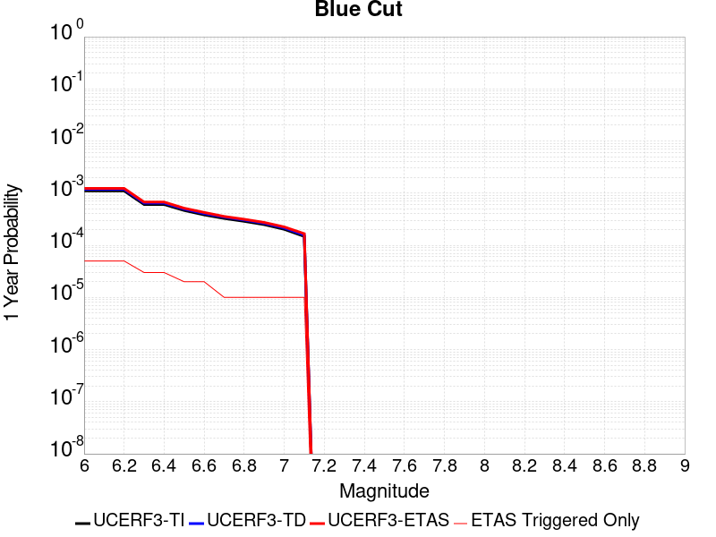 |  |

| Magnitude | 1 wk TI Prob | 1 wk TD Prob | 1 wk ETAS Prob | 1 wk ETAS/TD Gain | 1 wk ETAS Triggered Only | 1 mo TI Prob | 1 mo TD Prob | 1 mo ETAS Prob | 1 mo ETAS/TD Gain | 1 mo ETAS Triggered Only | 1 yr TI Prob | 1 yr TD Prob | 1 yr ETAS Prob | 1 yr ETAS/TD Gain | 1 yr ETAS Triggered Only | 10 yr TI Prob | 10 yr TD Prob | 10 yr ETAS Prob | 10 yr ETAS/TD Gain | 10 yr ETAS Triggered Only |
|-----|-----|-----|-----|-----|-----|-----|-----|-----|-----|-----|-----|-----|-----|-----|-----|-----|-----|-----|-----|-----|
| 6.0 | 2.1227985E-5 | 2.2719574E-5 | 2.2719574E-5 | 1.0 | 0.0 | 9.097391E-5 | 9.73663E-5 | 1.466493E-4 | 1.5061607 | 4.928779E-5 | 0.0011070445 | 0.0011848481 | 0.0012340775 | 1.0415491 | 4.928779E-5 | 0.011015458 | 0.011791152 | 0.011888565 | 1.0082616 | 9.857558E-5 |
| 6.1 | 2.1227985E-5 | 2.2719574E-5 | 2.2719574E-5 | 1.0 | 0.0 | 9.097391E-5 | 9.73663E-5 | 1.466493E-4 | 1.5061607 | 4.928779E-5 | 0.0011070445 | 0.0011848481 | 0.0012340775 | 1.0415491 | 4.928779E-5 | 0.011015458 | 0.011791152 | 0.011888565 | 1.0082616 | 9.857558E-5 |
| 6.2 | 2.1227985E-5 | 2.2719574E-5 | 2.2719574E-5 | 1.0 | 0.0 | 9.097391E-5 | 9.73663E-5 | 1.466493E-4 | 1.5061607 | 4.928779E-5 | 0.0011070445 | 0.0011848481 | 0.0012340775 | 1.0415491 | 4.928779E-5 | 0.011015458 | 0.011791152 | 0.011888565 | 1.0082616 | 9.857558E-5 |
| 6.3 | 1.1613981E-5 | 1.2353542E-5 | 1.2353542E-5 | 1.0 | 0.0 | 4.9773254E-5 | 5.2942745E-5 | 5.2942745E-5 | 1.0 | 0.0 | 6.0582085E-4 | 6.443998E-4 | 6.443998E-4 | 1.0 | 0.0 | 0.0060417196 | 0.0064265593 | 0.00647553 | 1.0076201 | 4.928779E-5 |
| 6.4 | 1.1613981E-5 | 1.2353542E-5 | 1.2353542E-5 | 1.0 | 0.0 | 4.9773254E-5 | 5.2942745E-5 | 5.2942745E-5 | 1.0 | 0.0 | 6.0582085E-4 | 6.443998E-4 | 6.443998E-4 | 1.0 | 0.0 | 0.0060417196 | 0.0064265593 | 0.00647553 | 1.0076201 | 4.928779E-5 |
| 6.5 | 8.931326E-6 | 9.4816E-6 | 9.4816E-6 | 1.0 | 0.0 | 3.8276554E-5 | 4.0634844E-5 | 4.0634844E-5 | 1.0 | 0.0 | 4.6591737E-4 | 4.946261E-4 | 4.946261E-4 | 1.0 | 0.0 | 0.0046494175 | 0.004936161 | 0.004936161 | 1.0 | 0.0 |
| 6.6 | 7.345353E-6 | 7.79028E-6 | 7.79028E-6 | 1.0 | 0.0 | 3.1479703E-5 | 3.338653E-5 | 3.338653E-5 | 1.0 | 0.0 | 3.83198E-4 | 4.064132E-4 | 4.064132E-4 | 1.0 | 0.0 | 0.0038253788 | 0.0040574907 | 0.0040574907 | 1.0 | 0.0 |
| 6.7 | 6.2775666E-6 | 6.655149E-6 | 6.655149E-6 | 1.0 | 0.0 | 2.690358E-5 | 2.8521798E-5 | 2.8521798E-5 | 1.0 | 0.0 | 3.2750185E-4 | 3.472051E-4 | 3.472051E-4 | 1.0 | 0.0 | 0.0032701963 | 0.003467367 | 0.003467367 | 1.0 | 0.0 |
| 6.8 | 5.5234095E-6 | 5.8551113E-6 | 5.8551113E-6 | 1.0 | 0.0 | 2.367154E-5 | 2.5093133E-5 | 2.5093133E-5 | 1.0 | 0.0 | 2.8816288E-4 | 3.0547334E-4 | 3.0547334E-4 | 1.0 | 0.0 | 0.002877895 | 0.0030512505 | 0.0030512505 | 1.0 | 0.0 |
| 6.9 | 4.7780054E-6 | 5.0654203E-6 | 5.0654203E-6 | 1.0 | 0.0 | 2.0477004E-5 | 2.1708804E-5 | 2.1708804E-5 | 1.0 | 0.0 | 2.4927902E-4 | 2.642797E-4 | 2.642797E-4 | 1.0 | 0.0 | 0.0024899957 | 0.002640346 | 0.002640346 | 1.0 | 0.0 |
| 7.0 | 3.883171E-6 | 4.118487E-6 | 4.118487E-6 | 1.0 | 0.0 | 1.6642054E-5 | 1.7650578E-5 | 1.7650578E-5 | 1.0 | 0.0 | 2.0259817E-4 | 2.1488148E-4 | 2.1488148E-4 | 1.0 | 0.0 | 0.0020241356 | 0.0021474129 | 0.0021474129 | 1.0 | 0.0 |
| 7.1 | 2.8358215E-6 | 3.0097158E-6 | 3.0097158E-6 | 1.0 | 0.0 | 1.2153464E-5 | 1.2898756E-5 | 1.2898756E-5 | 1.0 | 0.0 | 1.4795837E-4 | 1.5703762E-4 | 1.5703762E-4 | 1.0 | 0.0 | 0.001478599 | 0.0015699116 | 0.0015699116 | 1.0 | 0.0 |

## Mono Lake 2011 CFM
*[(top)](#table-of-contents)*

| 1 Week | 1 Month | 1 Year | 10 Year |
|-----|-----|-----|-----|
|  |  |  |  |

| Magnitude | 1 wk TI Prob | 1 wk TD Prob | 1 wk ETAS Prob | 1 wk ETAS/TD Gain | 1 wk ETAS Triggered Only | 1 mo TI Prob | 1 mo TD Prob | 1 mo ETAS Prob | 1 mo ETAS/TD Gain | 1 mo ETAS Triggered Only | 1 yr TI Prob | 1 yr TD Prob | 1 yr ETAS Prob | 1 yr ETAS/TD Gain | 1 yr ETAS Triggered Only | 10 yr TI Prob | 10 yr TD Prob | 10 yr ETAS Prob | 10 yr ETAS/TD Gain | 10 yr ETAS Triggered Only |
|-----|-----|-----|-----|-----|-----|-----|-----|-----|-----|-----|-----|-----|-----|-----|-----|-----|-----|-----|-----|-----|
| 6.0 | 2.0341662E-5 | 2.3828192E-5 | 7.311481E-5 | 3.068416 | 4.928779E-5 | 8.717564E-5 | 1.0211982E-4 | 1.5140258E-4 | 1.4825974 | 4.928779E-5 | 0.0010608466 | 0.0012431308 | 0.0013415838 | 1.0791976 | 9.857558E-5 | 0.010557966 | 0.012413842 | 0.012511193 | 1.0078422 | 9.857558E-5 |
| 6.1 | 2.0341662E-5 | 2.3828192E-5 | 7.311481E-5 | 3.068416 | 4.928779E-5 | 8.717564E-5 | 1.0211982E-4 | 1.5140258E-4 | 1.4825974 | 4.928779E-5 | 0.0010608466 | 0.0012431308 | 0.0013415838 | 1.0791976 | 9.857558E-5 | 0.010557966 | 0.012413842 | 0.012511193 | 1.0078422 | 9.857558E-5 |
| 6.2 | 2.0341662E-5 | 2.3828192E-5 | 7.311481E-5 | 3.068416 | 4.928779E-5 | 8.717564E-5 | 1.0211982E-4 | 1.5140258E-4 | 1.4825974 | 4.928779E-5 | 0.0010608466 | 0.0012431308 | 0.0013415838 | 1.0791976 | 9.857558E-5 | 0.010557966 | 0.012413842 | 0.012511193 | 1.0078422 | 9.857558E-5 |
| 6.3 | 2.0341662E-5 | 2.3828192E-5 | 7.311481E-5 | 3.068416 | 4.928779E-5 | 8.717564E-5 | 1.0211982E-4 | 1.5140258E-4 | 1.4825974 | 4.928779E-5 | 0.0010608466 | 0.0012431308 | 0.0013415838 | 1.0791976 | 9.857558E-5 | 0.010557966 | 0.012413842 | 0.012511193 | 1.0078422 | 9.857558E-5 |
| 6.4 | 1.749821E-5 | 2.049101E-5 | 6.9777794E-5 | 3.405288 | 4.928779E-5 | 7.499018E-5 | 8.781861E-5 | 1.3710208E-4 | 1.5611961 | 4.928779E-5 | 9.1262296E-4 | 0.0010691914 | 0.0011676616 | 1.0920978 | 9.857558E-5 | 0.009088841 | 0.01069187 | 0.010789392 | 1.0091211 | 9.857558E-5 |
| 6.5 | 1.749821E-5 | 2.049101E-5 | 6.9777794E-5 | 3.405288 | 4.928779E-5 | 7.499018E-5 | 8.781861E-5 | 1.3710208E-4 | 1.5611961 | 4.928779E-5 | 9.1262296E-4 | 0.0010691914 | 0.0011676616 | 1.0920978 | 9.857558E-5 | 0.009088841 | 0.01069187 | 0.010789392 | 1.0091211 | 9.857558E-5 |

## Maacama 2011 CFM
*[(top)](#table-of-contents)*

| 1 Week | 1 Month | 1 Year | 10 Year |
|-----|-----|-----|-----|
|  |  | 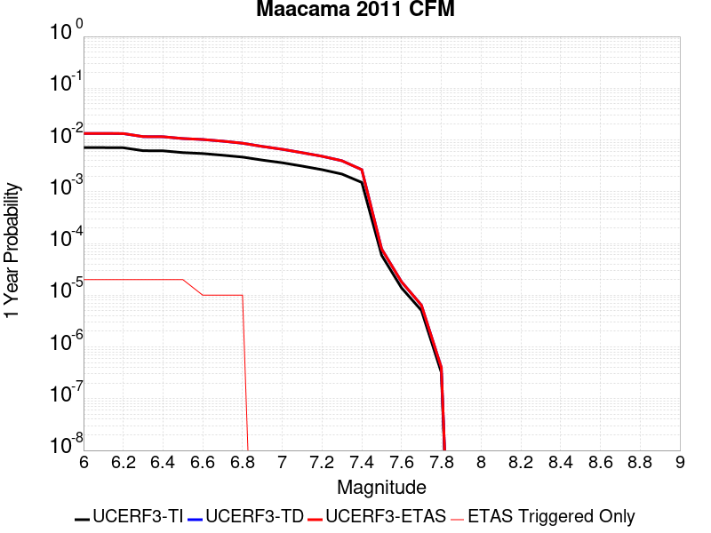 |  |

| Magnitude | 1 wk TI Prob | 1 wk TD Prob | 1 wk ETAS Prob | 1 wk ETAS/TD Gain | 1 wk ETAS Triggered Only | 1 mo TI Prob | 1 mo TD Prob | 1 mo ETAS Prob | 1 mo ETAS/TD Gain | 1 mo ETAS Triggered Only | 1 yr TI Prob | 1 yr TD Prob | 1 yr ETAS Prob | 1 yr ETAS/TD Gain | 1 yr ETAS Triggered Only | 10 yr TI Prob | 10 yr TD Prob | 10 yr ETAS Prob | 10 yr ETAS/TD Gain | 10 yr ETAS Triggered Only |
|-----|-----|-----|-----|-----|-----|-----|-----|-----|-----|-----|-----|-----|-----|-----|-----|-----|-----|-----|-----|-----|
| 6.0 | 1.368203E-4 | 2.579087E-4 | 3.0718377E-4 | 1.1910563 | 4.928779E-5 | 5.862409E-4 | 0.0011047592 | 0.0011539925 | 1.0445647 | 4.928779E-5 | 0.0071141496 | 0.013350345 | 0.013398975 | 1.0036426 | 4.928779E-5 | 0.06890667 | 0.1241916 | 0.124277934 | 1.0006951 | 9.857558E-5 |
| 6.1 | 1.368203E-4 | 2.579087E-4 | 3.0718377E-4 | 1.1910563 | 4.928779E-5 | 5.862409E-4 | 0.0011047592 | 0.0011539925 | 1.0445647 | 4.928779E-5 | 0.0071141496 | 0.013350345 | 0.013398975 | 1.0036426 | 4.928779E-5 | 0.06890667 | 0.1241916 | 0.124277934 | 1.0006951 | 9.857558E-5 |
| 6.2 | 1.360743E-4 | 2.566557E-4 | 3.0593085E-4 | 1.1919893 | 4.928779E-5 | 5.8304524E-4 | 0.001099394 | 0.0011486276 | 1.0447825 | 4.928779E-5 | 0.007075496 | 0.013285898 | 0.01333453 | 1.0036604 | 4.928779E-5 | 0.06854413 | 0.123625994 | 0.12371238 | 1.0006988 | 9.857558E-5 |
| 6.3 | 1.1917239E-4 | 2.236021E-4 | 2.7287888E-4 | 1.2203771 | 4.928779E-5 | 5.1063887E-4 | 9.578717E-4 | 0.0010071123 | 1.0514063 | 4.928779E-5 | 0.0061993203 | 0.0115873255 | 0.011636042 | 1.0042043 | 4.928779E-5 | 0.060292065 | 0.108845875 | 0.10893372 | 1.000807 | 9.857558E-5 |
| 6.4 | 1.1859289E-4 | 2.2263796E-4 | 2.719148E-4 | 1.2213316 | 4.928779E-5 | 5.0815626E-4 | 9.537432E-4 | 0.001002984 | 1.051629 | 4.928779E-5 | 0.006169266 | 0.011537647 | 0.011586366 | 1.0042226 | 4.928779E-5 | 0.06000784 | 0.10840272 | 0.108490616 | 1.0008107 | 9.857558E-5 |
| 6.5 | 1.09512424E-4 | 2.0517908E-4 | 2.5445677E-4 | 1.2401692 | 4.928779E-5 | 4.6925453E-4 | 8.7897904E-4 | 9.2822354E-4 | 1.0560247 | 4.928779E-5 | 0.005698218 | 0.010639169 | 0.010687932 | 1.0045834 | 4.928779E-5 | 0.055543028 | 0.1004949 | 0.10053923 | 1.0004412 | 4.928779E-5 |
| 6.6 | 1.0502928E-4 | 1.9675294E-4 | 2.4603104E-4 | 1.2504567 | 4.928779E-5 | 4.500478E-4 | 8.429031E-4 | 8.9214934E-4 | 1.0584246 | 4.928779E-5 | 0.0054655746 | 0.010205293 | 0.010254079 | 1.0047803 | 4.928779E-5 | 0.053330887 | 0.0966474 | 0.09669192 | 1.0004607 | 4.928779E-5 |
| 6.7 | 9.739358E-5 | 1.8259176E-4 | 2.3187055E-4 | 1.2698851 | 4.928779E-5 | 4.173343E-4 | 7.822563E-4 | 8.315055E-4 | 1.0629579 | 4.928779E-5 | 0.0050692135 | 0.009475343 | 0.009524163 | 1.0051523 | 4.928779E-5 | 0.049551267 | 0.09012011 | 0.09016495 | 1.0004976 | 4.928779E-5 |
| 6.8 | 8.969524E-5 | 1.6658378E-4 | 2.1586336E-4 | 1.2958246 | 4.928779E-5 | 3.8435153E-4 | 7.1369443E-4 | 7.629471E-4 | 1.0690107 | 4.928779E-5 | 0.0046694432 | 0.00864909 | 0.008697952 | 1.0056493 | 4.928779E-5 | 0.045725387 | 0.08265246 | 0.082697675 | 1.000547 | 4.928779E-5 |
| 6.9 | 7.838291E-5 | 1.4418772E-4 | 1.4418772E-4 | 1.0 | 0.0 | 3.358835E-4 | 6.1778206E-4 | 6.1778206E-4 | 1.0 | 0.0 | 0.0040817154 | 0.007491724 | 0.007491724 | 1.0 | 0.0 | 0.04007554 | 0.07205298 | 0.07205298 | 1.0 | 0.0 |
| 7.0 | 6.961957E-5 | 1.2708071E-4 | 1.2708071E-4 | 1.0 | 0.0 | 2.9833548E-4 | 5.445059E-4 | 5.445059E-4 | 1.0 | 0.0 | 0.0036261857 | 0.006606692 | 0.006606692 | 1.0 | 0.0 | 0.035675827 | 0.063871816 | 0.063871816 | 1.0 | 0.0 |
| 7.1 | 5.999398E-5 | 1.09053384E-4 | 1.09053384E-4 | 1.0 | 0.0 | 2.570917E-4 | 4.6728246E-4 | 4.6728246E-4 | 1.0 | 0.0 | 0.0031255994 | 0.00567284 | 0.00567284 | 1.0 | 0.0 | 0.030820016 | 0.055139277 | 0.055139277 | 1.0 | 0.0 |
| 7.2 | 5.116532E-5 | 9.305489E-5 | 9.305489E-5 | 1.0 | 0.0 | 2.1926152E-4 | 3.9874107E-4 | 3.9874107E-4 | 1.0 | 0.0 | 0.002666241 | 0.00484315 | 0.00484315 | 1.0 | 0.0 | 0.026344774 | 0.047303654 | 0.047303654 | 1.0 | 0.0 |
| 7.3 | 4.2087835E-5 | 7.617064E-5 | 7.617064E-5 | 1.0 | 0.0 | 1.8036396E-4 | 3.264016E-4 | 3.264016E-4 | 1.0 | 0.0 | 0.0021937196 | 0.0039662397 | 0.0039662397 | 1.0 | 0.0 | 0.0217219 | 0.038905017 | 0.038905017 | 1.0 | 0.0 |
| 7.4 | 2.8991652E-5 | 5.1163643E-5 | 5.1163643E-5 | 1.0 | 0.0 | 1.2424402E-4 | 2.1925455E-4 | 2.1925455E-4 | 1.0 | 0.0 | 0.0015116213 | 0.0026661097 | 0.0026661097 | 1.0 | 0.0 | 0.015013801 | 0.026332043 | 0.026332043 | 1.0 | 0.0 |
| 7.5 | 1.1292299E-6 | 1.4950216E-6 | 1.4950216E-6 | 1.0 | 0.0 | 4.8395473E-6 | 6.407227E-6 | 6.407227E-6 | 1.0 | 0.0 | 5.8919897E-5 | 7.8006444E-5 | 7.8006444E-5 | 1.0 | 0.0 | 5.890428E-4 | 7.805042E-4 | 7.805042E-4 | 1.0 | 0.0 |
| 7.6 | 2.6535366E-7 | 3.4720998E-7 | 3.4720998E-7 | 1.0 | 0.0 | 1.1372296E-6 | 1.4880419E-6 | 1.4880419E-6 | 1.0 | 0.0 | 1.3845682E-5 | 1.811676E-5 | 1.811676E-5 | 1.0 | 0.0 | 1.3844819E-4 | 1.8170691E-4 | 1.8170691E-4 | 1.0 | 0.0 |
| 7.7 | 9.727789E-8 | 1.2302418E-7 | 1.2302418E-7 | 1.0 | 0.0 | 4.1690518E-7 | 5.2724636E-7 | 5.2724636E-7 | 1.0 | 0.0 | 5.0758085E-6 | 6.419206E-6 | 6.419206E-6 | 1.0 | 0.0 | 5.0756928E-5 | 6.456404E-5 | 6.456404E-5 | 1.0 | 0.0 |
| 7.8 | 6.1939325E-9 | 7.711711E-9 | 7.711711E-9 | 1.0 | 0.0 | 2.6545425E-8 | 3.305019E-8 | 3.305019E-8 | 1.0 | 0.0 | 3.231905E-7 | 4.0238598E-7 | 4.0238598E-7 | 1.0 | 0.0 | 3.2319003E-6 | 4.0597915E-6 | 4.0597915E-6 | 1.0 | 0.0 |

## Pisgah-Bullion Mtn-Mesquite Lk
*[(top)](#table-of-contents)*

| 1 Week | 1 Month | 1 Year | 10 Year |
|-----|-----|-----|-----|
|  | 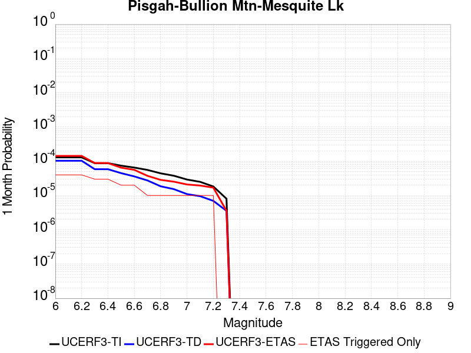 | 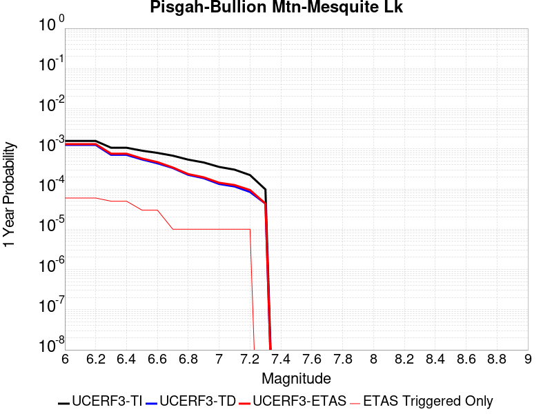 |  |

| Magnitude | 1 wk TI Prob | 1 wk TD Prob | 1 wk ETAS Prob | 1 wk ETAS/TD Gain | 1 wk ETAS Triggered Only | 1 mo TI Prob | 1 mo TD Prob | 1 mo ETAS Prob | 1 mo ETAS/TD Gain | 1 mo ETAS Triggered Only | 1 yr TI Prob | 1 yr TD Prob | 1 yr ETAS Prob | 1 yr ETAS/TD Gain | 1 yr ETAS Triggered Only | 10 yr TI Prob | 10 yr TD Prob | 10 yr ETAS Prob | 10 yr ETAS/TD Gain | 10 yr ETAS Triggered Only |
|-----|-----|-----|-----|-----|-----|-----|-----|-----|-----|-----|-----|-----|-----|-----|-----|-----|-----|-----|-----|-----|
| 6.0 | 3.0240792E-5 | 2.40909E-5 | 2.40909E-5 | 1.0 | 0.0 | 1.2959696E-4 | 1.032432E-4 | 1.032432E-4 | 1.0 | 0.0 | 0.0015767008 | 0.0012563618 | 0.0013055877 | 1.0391812 | 4.928779E-5 | 0.015655609 | 0.012502613 | 0.012599956 | 1.0077858 | 9.857558E-5 |
| 6.1 | 3.0240792E-5 | 2.40909E-5 | 2.40909E-5 | 1.0 | 0.0 | 1.2959696E-4 | 1.032432E-4 | 1.032432E-4 | 1.0 | 0.0 | 0.0015767008 | 0.0012563618 | 0.0013055877 | 1.0391812 | 4.928779E-5 | 0.015655609 | 0.012502613 | 0.012599956 | 1.0077858 | 9.857558E-5 |
| 6.2 | 3.0240792E-5 | 2.40909E-5 | 2.40909E-5 | 1.0 | 0.0 | 1.2959696E-4 | 1.032432E-4 | 1.032432E-4 | 1.0 | 0.0 | 0.0015767008 | 0.0012563618 | 0.0013055877 | 1.0391812 | 4.928779E-5 | 0.015655609 | 0.012502613 | 0.012599956 | 1.0077858 | 9.857558E-5 |
| 6.3 | 2.0498217E-5 | 1.3638054E-5 | 1.3638054E-5 | 1.0 | 0.0 | 8.784654E-5 | 5.8447586E-5 | 5.8447586E-5 | 1.0 | 0.0 | 0.0010690069 | 7.1138324E-4 | 7.60636E-4 | 1.0692352 | 4.928779E-5 | 0.01063879 | 0.0070926864 | 0.0071416246 | 1.0068998 | 4.928779E-5 |
| 6.4 | 2.0498217E-5 | 1.3638054E-5 | 1.3638054E-5 | 1.0 | 0.0 | 8.784654E-5 | 5.8447586E-5 | 5.8447586E-5 | 1.0 | 0.0 | 0.0010690069 | 7.1138324E-4 | 7.60636E-4 | 1.0692352 | 4.928779E-5 | 0.01063879 | 0.0070926864 | 0.0071416246 | 1.0068998 | 4.928779E-5 |
| 6.5 | 1.7316182E-5 | 1.04769715E-5 | 1.04769715E-5 | 1.0 | 0.0 | 7.42101E-5 | 4.490059E-5 | 4.490059E-5 | 1.0 | 0.0 | 9.0313336E-4 | 5.465376E-4 | 5.957984E-4 | 1.0901326 | 4.928779E-5 | 0.008994718 | 0.00545293 | 0.005501949 | 1.0089895 | 4.928779E-5 |
| 6.6 | 1.5251077E-5 | 8.414133E-6 | 8.414133E-6 | 1.0 | 0.0 | 6.536012E-5 | 3.606011E-5 | 3.606011E-5 | 1.0 | 0.0 | 7.9546886E-4 | 4.3895066E-4 | 4.882168E-4 | 1.1122363 | 4.928779E-5 | 0.007926274 | 0.0043815537 | 0.0044306256 | 1.0111996 | 4.928779E-5 |
| 6.7 | 1.2997425E-5 | 6.4112146E-6 | 6.4112146E-6 | 1.0 | 0.0 | 5.570206E-5 | 2.7476372E-5 | 2.7476372E-5 | 1.0 | 0.0 | 6.7796157E-4 | 3.3447813E-4 | 3.3447813E-4 | 1.0 | 0.0 | 0.0067589693 | 0.003340207 | 0.003340207 | 1.0 | 0.0 |
| 6.8 | 1.035386E-5 | 4.333145E-6 | 4.333145E-6 | 1.0 | 0.0 | 4.437293E-5 | 1.8570496E-5 | 1.8570496E-5 | 1.0 | 0.0 | 5.401065E-4 | 2.260732E-4 | 2.260732E-4 | 1.0 | 0.0 | 0.0053879567 | 0.002258519 | 0.002258519 | 1.0 | 0.0 |
| 6.9 | 8.816252E-6 | 3.5805879E-6 | 3.5805879E-6 | 1.0 | 0.0 | 3.778339E-5 | 1.534529E-5 | 1.534529E-5 | 1.0 | 0.0 | 4.5991567E-4 | 1.8681347E-4 | 1.8681347E-4 | 1.0 | 0.0 | 0.00458965 | 0.0018666228 | 0.0018666228 | 1.0 | 0.0 |
| 7.0 | 6.8232207E-6 | 2.5674399E-6 | 2.5674399E-6 | 1.0 | 0.0 | 2.9242048E-5 | 1.100327E-5 | 1.100327E-5 | 1.0 | 0.0 | 3.5596377E-4 | 1.3395688E-4 | 1.3395688E-4 | 1.0 | 0.0 | 0.0035539411 | 0.0013387925 | 0.0013387925 | 1.0 | 0.0 |
| 7.1 | 5.837013E-6 | 2.2273143E-6 | 2.2273143E-6 | 1.0 | 0.0 | 2.501553E-5 | 9.5456E-6 | 9.5456E-6 | 1.0 | 0.0 | 3.045215E-4 | 1.1621177E-4 | 1.1621177E-4 | 1.0 | 0.0 | 0.0030410455 | 0.001161539 | 0.001161539 | 1.0 | 0.0 |
| 7.2 | 4.278052E-6 | 1.6275065E-6 | 1.6275065E-6 | 1.0 | 0.0 | 1.833438E-5 | 6.975011E-6 | 6.975011E-6 | 1.0 | 0.0 | 2.231982E-4 | 8.491768E-5 | 8.491768E-5 | 1.0 | 0.0 | 0.0022297418 | 8.4887556E-4 | 8.4887556E-4 | 1.0 | 0.0 |
| 7.3 | 1.8803692E-6 | 8.344788E-7 | 8.344788E-7 | 1.0 | 0.0 | 8.0587E-6 | 3.5763337E-6 | 3.5763337E-6 | 1.0 | 0.0 | 9.811026E-5 | 4.354114E-5 | 4.354114E-5 | 1.0 | 0.0 | 9.806695E-4 | 4.3534054E-4 | 4.3534054E-4 | 1.0 | 0.0 |

## Deep Springs
*[(top)](#table-of-contents)*

| 1 Week | 1 Month | 1 Year | 10 Year |
|-----|-----|-----|-----|
|  |  | 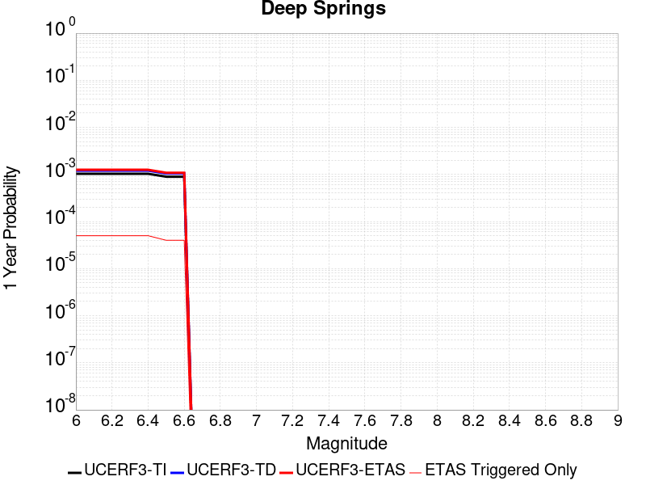 |  |

| Magnitude | 1 wk TI Prob | 1 wk TD Prob | 1 wk ETAS Prob | 1 wk ETAS/TD Gain | 1 wk ETAS Triggered Only | 1 mo TI Prob | 1 mo TD Prob | 1 mo ETAS Prob | 1 mo ETAS/TD Gain | 1 mo ETAS Triggered Only | 1 yr TI Prob | 1 yr TD Prob | 1 yr ETAS Prob | 1 yr ETAS/TD Gain | 1 yr ETAS Triggered Only | 10 yr TI Prob | 10 yr TD Prob | 10 yr ETAS Prob | 10 yr ETAS/TD Gain | 10 yr ETAS Triggered Only |
|-----|-----|-----|-----|-----|-----|-----|-----|-----|-----|-----|-----|-----|-----|-----|-----|-----|-----|-----|-----|-----|
| 6.0 | 1.9810619E-5 | 2.311252E-5 | 2.311252E-5 | 1.0 | 0.0 | 8.489989E-5 | 9.9052755E-5 | 9.9052755E-5 | 1.0 | 0.0 | 0.001033166 | 0.0012058078 | 0.0012058078 | 1.0 | 0.0 | 0.010283757 | 0.01204243 | 0.012139819 | 1.0080872 | 9.857558E-5 |
| 6.1 | 1.9810619E-5 | 2.311252E-5 | 2.311252E-5 | 1.0 | 0.0 | 8.489989E-5 | 9.9052755E-5 | 9.9052755E-5 | 1.0 | 0.0 | 0.001033166 | 0.0012058078 | 0.0012058078 | 1.0 | 0.0 | 0.010283757 | 0.01204243 | 0.012139819 | 1.0080872 | 9.857558E-5 |
| 6.2 | 1.9810619E-5 | 2.311252E-5 | 2.311252E-5 | 1.0 | 0.0 | 8.489989E-5 | 9.9052755E-5 | 9.9052755E-5 | 1.0 | 0.0 | 0.001033166 | 0.0012058078 | 0.0012058078 | 1.0 | 0.0 | 0.010283757 | 0.01204243 | 0.012139819 | 1.0080872 | 9.857558E-5 |
| 6.3 | 1.9810619E-5 | 2.311252E-5 | 2.311252E-5 | 1.0 | 0.0 | 8.489989E-5 | 9.9052755E-5 | 9.9052755E-5 | 1.0 | 0.0 | 0.001033166 | 0.0012058078 | 0.0012058078 | 1.0 | 0.0 | 0.010283757 | 0.01204243 | 0.012139819 | 1.0080872 | 9.857558E-5 |
| 6.4 | 1.9810619E-5 | 2.311252E-5 | 2.311252E-5 | 1.0 | 0.0 | 8.489989E-5 | 9.9052755E-5 | 9.9052755E-5 | 1.0 | 0.0 | 0.001033166 | 0.0012058078 | 0.0012058078 | 1.0 | 0.0 | 0.010283757 | 0.01204243 | 0.012139819 | 1.0080872 | 9.857558E-5 |
| 6.5 | 1.7190405E-5 | 2.0050558E-5 | 2.0050558E-5 | 1.0 | 0.0 | 7.367108E-5 | 8.593096E-5 | 8.593096E-5 | 1.0 | 0.0 | 8.9657627E-4 | 0.0010462092 | 0.0010462092 | 1.0 | 0.0 | 0.008929676 | 0.010462061 | 0.010559605 | 1.0093236 | 9.857558E-5 |
| 6.6 | 1.7190405E-5 | 2.0050558E-5 | 2.0050558E-5 | 1.0 | 0.0 | 7.367108E-5 | 8.593096E-5 | 8.593096E-5 | 1.0 | 0.0 | 8.9657627E-4 | 0.0010462092 | 0.0010462092 | 1.0 | 0.0 | 0.008929676 | 0.010462061 | 0.010559605 | 1.0093236 | 9.857558E-5 |

## Surprise Valley 2011 CFM
*[(top)](#table-of-contents)*

| 1 Week | 1 Month | 1 Year | 10 Year |
|-----|-----|-----|-----|
|  |  |  |  |

| Magnitude | 1 wk TI Prob | 1 wk TD Prob | 1 wk ETAS Prob | 1 wk ETAS/TD Gain | 1 wk ETAS Triggered Only | 1 mo TI Prob | 1 mo TD Prob | 1 mo ETAS Prob | 1 mo ETAS/TD Gain | 1 mo ETAS Triggered Only | 1 yr TI Prob | 1 yr TD Prob | 1 yr ETAS Prob | 1 yr ETAS/TD Gain | 1 yr ETAS Triggered Only | 10 yr TI Prob | 10 yr TD Prob | 10 yr ETAS Prob | 10 yr ETAS/TD Gain | 10 yr ETAS Triggered Only |
|-----|-----|-----|-----|-----|-----|-----|-----|-----|-----|-----|-----|-----|-----|-----|-----|-----|-----|-----|-----|-----|
| 6.0 | 4.0396248E-5 | 4.485131E-5 | 9.413689E-5 | 2.098866 | 4.928779E-5 | 1.7311527E-4 | 1.9220692E-4 | 2.4148524E-4 | 1.2563816 | 4.928779E-5 | 0.002105641 | 0.0023378176 | 0.0023869902 | 1.0210335 | 4.928779E-5 | 0.020858008 | 0.023153966 | 0.02325026 | 1.0041589 | 9.857558E-5 |
| 6.1 | 4.0396248E-5 | 4.485131E-5 | 9.413689E-5 | 2.098866 | 4.928779E-5 | 1.7311527E-4 | 1.9220692E-4 | 2.4148524E-4 | 1.2563816 | 4.928779E-5 | 0.002105641 | 0.0023378176 | 0.0023869902 | 1.0210335 | 4.928779E-5 | 0.020858008 | 0.023153966 | 0.02325026 | 1.0041589 | 9.857558E-5 |
| 6.2 | 2.2295266E-5 | 2.440125E-5 | 2.440125E-5 | 1.0 | 0.0 | 9.554764E-5 | 1.0457276E-4 | 1.0457276E-4 | 1.0 | 0.0 | 0.0011626717 | 0.0012724606 | 0.0012724606 | 1.0 | 0.0 | 0.011566074 | 0.012654981 | 0.012703645 | 1.0038455 | 4.928779E-5 |
| 6.3 | 1.572643E-5 | 1.7096807E-5 | 1.7096807E-5 | 1.0 | 0.0 | 6.7397246E-5 | 7.327003E-5 | 7.327003E-5 | 1.0 | 0.0 | 8.202525E-4 | 8.91708E-4 | 8.91708E-4 | 1.0 | 0.0 | 0.008172315 | 0.008882407 | 0.008882407 | 1.0 | 0.0 |
| 6.4 | 1.5714395E-5 | 1.7084629E-5 | 1.7084629E-5 | 1.0 | 0.0 | 6.734567E-5 | 7.3217845E-5 | 7.3217845E-5 | 1.0 | 0.0 | 8.1962504E-4 | 8.9107314E-4 | 8.9107314E-4 | 1.0 | 0.0 | 0.008166086 | 0.008876109 | 0.008876109 | 1.0 | 0.0 |
| 6.5 | 1.2733495E-5 | 1.38016E-5 | 1.38016E-5 | 1.0 | 0.0 | 5.457098E-5 | 5.9148413E-5 | 5.9148413E-5 | 1.0 | 0.0 | 6.641992E-4 | 7.1990065E-4 | 7.1990065E-4 | 1.0 | 0.0 | 0.0066221743 | 0.0071763797 | 0.0071763797 | 1.0 | 0.0 |
| 6.6 | 1.0983784E-5 | 1.1886554E-5 | 1.1886554E-5 | 1.0 | 0.0 | 4.7072506E-5 | 5.094141E-5 | 5.094141E-5 | 1.0 | 0.0 | 5.7295704E-4 | 6.200405E-4 | 6.200405E-4 | 1.0 | 0.0 | 0.0057148207 | 0.0061836545 | 0.0061836545 | 1.0 | 0.0 |
| 6.7 | 9.104806E-6 | 9.839491E-6 | 9.839491E-6 | 1.0 | 0.0 | 3.902001E-5 | 4.2168587E-5 | 4.2168587E-5 | 1.0 | 0.0 | 4.7496508E-4 | 5.132855E-4 | 5.132855E-4 | 1.0 | 0.0 | 0.004739512 | 0.005121397 | 0.005121397 | 1.0 | 0.0 |
| 6.8 | 6.2162403E-6 | 6.7041337E-6 | 6.7041337E-6 | 1.0 | 0.0 | 2.6640759E-5 | 2.8731698E-5 | 2.8731698E-5 | 1.0 | 0.0 | 3.2430296E-4 | 3.497545E-4 | 3.497545E-4 | 1.0 | 0.0 | 0.003238301 | 0.0034922638 | 0.0034922638 | 1.0 | 0.0 |
| 6.9 | 4.1792696E-6 | 4.50323E-6 | 4.50323E-6 | 1.0 | 0.0 | 1.7911032E-5 | 1.9299423E-5 | 1.9299423E-5 | 1.0 | 0.0 | 2.1804498E-4 | 2.3494668E-4 | 2.3494668E-4 | 1.0 | 0.0 | 0.0021783116 | 0.0023471361 | 0.0023471361 | 1.0 | 0.0 |
| 7.0 | 2.7478413E-6 | 2.9622424E-6 | 2.9622424E-6 | 1.0 | 0.0 | 1.177641E-5 | 1.269527E-5 | 1.269527E-5 | 1.0 | 0.0 | 1.4336836E-4 | 1.545552E-4 | 1.545552E-4 | 1.0 | 0.0 | 0.001432759 | 0.0015445995 | 0.0015445995 | 1.0 | 0.0 |
| 7.1 | 8.128648E-7 | 8.724922E-7 | 8.724922E-7 | 1.0 | 0.0 | 3.4837017E-6 | 3.7392501E-6 | 3.7392501E-6 | 1.0 | 0.0 | 4.2413245E-5 | 4.552502E-5 | 4.552502E-5 | 1.0 | 0.0 | 4.2405148E-4 | 4.5521575E-4 | 4.5521575E-4 | 1.0 | 0.0 |
| 7.2 | 4.8641045E-8 | 4.9402068E-8 | 4.9402068E-8 | 1.0 | 0.0 | 2.084616E-7 | 2.1172312E-7 | 2.1172312E-7 | 1.0 | 0.0 | 2.538017E-6 | 2.577726E-6 | 2.577726E-6 | 1.0 | 0.0 | 2.537988E-5 | 2.5776973E-5 | 2.5776973E-5 | 1.0 | 0.0 |
| 7.3 | 5.3911844E-9 | 5.4758145E-9 | 5.4758145E-9 | 1.0 | 0.0 | 2.3105075E-8 | 2.3467775E-8 | 2.3467775E-8 | 1.0 | 0.0 | 2.8130427E-7 | 2.8572015E-7 | 2.8572015E-7 | 1.0 | 0.0 | 2.8130391E-6 | 2.8571992E-6 | 2.8571992E-6 | 1.0 | 0.0 |

## Chino alt 1
*[(top)](#table-of-contents)*

| 1 Week | 1 Month | 1 Year | 10 Year |
|-----|-----|-----|-----|
|  |  |  |  |

| Magnitude | 1 wk TI Prob | 1 wk TD Prob | 1 wk ETAS Prob | 1 wk ETAS/TD Gain | 1 wk ETAS Triggered Only | 1 mo TI Prob | 1 mo TD Prob | 1 mo ETAS Prob | 1 mo ETAS/TD Gain | 1 mo ETAS Triggered Only | 1 yr TI Prob | 1 yr TD Prob | 1 yr ETAS Prob | 1 yr ETAS/TD Gain | 1 yr ETAS Triggered Only | 10 yr TI Prob | 10 yr TD Prob | 10 yr ETAS Prob | 10 yr ETAS/TD Gain | 10 yr ETAS Triggered Only |
|-----|-----|-----|-----|-----|-----|-----|-----|-----|-----|-----|-----|-----|-----|-----|-----|-----|-----|-----|-----|-----|
| 6.0 | 3.939946E-5 | 4.894798E-5 | 4.894798E-5 | 1.0 | 0.0 | 1.6884391E-4 | 2.0976314E-4 | 2.0976314E-4 | 1.0 | 0.0 | 0.0020537362 | 0.002551385 | 0.0026005472 | 1.0192688 | 4.928779E-5 | 0.020348595 | 0.025280168 | 0.025376251 | 1.0038007 | 9.857558E-5 |
| 6.1 | 2.1505624E-5 | 2.6878823E-5 | 2.6878823E-5 | 1.0 | 0.0 | 9.2163704E-5 | 1.15190494E-4 | 1.15190494E-4 | 1.0 | 0.0 | 0.0011215154 | 0.0014016517 | 0.0014508703 | 1.0351148 | 4.928779E-5 | 0.011158722 | 0.013947425 | 0.014044626 | 1.0069691 | 9.857558E-5 |
| 6.2 | 2.1505624E-5 | 2.6878823E-5 | 2.6878823E-5 | 1.0 | 0.0 | 9.2163704E-5 | 1.15190494E-4 | 1.15190494E-4 | 1.0 | 0.0 | 0.0011215154 | 0.0014016517 | 0.0014508703 | 1.0351148 | 4.928779E-5 | 0.011158722 | 0.013947425 | 0.014044626 | 1.0069691 | 9.857558E-5 |
| 6.3 | 1.4290785E-5 | 1.8164832E-5 | 1.8164832E-5 | 1.0 | 0.0 | 6.1244784E-5 | 7.784722E-5 | 7.784722E-5 | 1.0 | 0.0 | 7.454001E-4 | 9.4742293E-4 | 9.96664E-4 | 1.0519737 | 4.928779E-5 | 0.007429048 | 0.00944674 | 0.009495562 | 1.0051682 | 4.928779E-5 |
| 6.4 | 1.4290785E-5 | 1.8164832E-5 | 1.8164832E-5 | 1.0 | 0.0 | 6.1244784E-5 | 7.784722E-5 | 7.784722E-5 | 1.0 | 0.0 | 7.454001E-4 | 9.4742293E-4 | 9.96664E-4 | 1.0519737 | 4.928779E-5 | 0.007429048 | 0.00944674 | 0.009495562 | 1.0051682 | 4.928779E-5 |
| 6.5 | 1.3017944E-5 | 1.6651793E-5 | 1.6651793E-5 | 1.0 | 0.0 | 5.5789995E-5 | 7.1363116E-5 | 7.1363116E-5 | 1.0 | 0.0 | 6.790315E-4 | 8.6854334E-4 | 9.1778836E-4 | 1.0566983 | 4.928779E-5 | 0.0067696036 | 0.008664233 | 0.008713094 | 1.0056393 | 4.928779E-5 |
| 6.6 | 9.470016E-6 | 1.2039209E-5 | 1.2039209E-5 | 1.0 | 0.0 | 4.058515E-5 | 5.159578E-5 | 5.159578E-5 | 1.0 | 0.0 | 4.940122E-4 | 6.280315E-4 | 6.7728834E-4 | 1.0784305 | 4.928779E-5 | 0.004929154 | 0.006273248 | 0.0063222265 | 1.0078075 | 4.928779E-5 |
| 6.7 | 8.314155E-6 | 1.040749E-5 | 1.040749E-5 | 1.0 | 0.0 | 3.5631605E-5 | 4.4602948E-5 | 4.4602948E-5 | 1.0 | 0.0 | 4.3372845E-4 | 5.4293784E-4 | 5.4293784E-4 | 1.0 | 0.0 | 0.004328829 | 0.0054270807 | 0.0054270807 | 1.0 | 0.0 |
| 6.8 | 3.4856364E-6 | 3.8134033E-6 | 3.8134033E-6 | 1.0 | 0.0 | 1.4938357E-5 | 1.6343065E-5 | 1.6343065E-5 | 1.0 | 0.0 | 1.8185932E-4 | 1.9896074E-4 | 1.9896074E-4 | 1.0 | 0.0 | 0.0018171056 | 0.0019894529 | 0.0019894529 | 1.0 | 0.0 |
| 6.9 | 2.2645952E-6 | 2.152909E-6 | 2.152909E-6 | 1.0 | 0.0 | 9.705372E-6 | 9.226722E-6 | 9.226722E-6 | 1.0 | 0.0 | 1.18156495E-4 | 1.12329755E-4 | 1.12329755E-4 | 1.0 | 0.0 | 0.0011809369 | 0.0011233138 | 0.0011233138 | 1.0 | 0.0 |
| 7.0 | 1.7864003E-6 | 1.5430741E-6 | 1.5430741E-6 | 1.0 | 0.0 | 7.655979E-6 | 6.613158E-6 | 6.613158E-6 | 1.0 | 0.0 | 9.3207556E-5 | 8.051228E-5 | 8.051228E-5 | 1.0 | 0.0 | 9.316847E-4 | 8.052856E-4 | 8.052856E-4 | 1.0 | 0.0 |
| 7.1 | 1.7315456E-6 | 1.4733466E-6 | 1.4733466E-6 | 1.0 | 0.0 | 7.420889E-6 | 6.314328E-6 | 6.314328E-6 | 1.0 | 0.0 | 9.034557E-5 | 7.687428E-5 | 7.687428E-5 | 1.0 | 0.0 | 9.0308854E-4 | 7.68921E-4 | 7.68921E-4 | 1.0 | 0.0 |
| 7.2 | 1.6008337E-6 | 1.3574178E-6 | 1.3574178E-6 | 1.0 | 0.0 | 6.860698E-6 | 5.817492E-6 | 5.817492E-6 | 1.0 | 0.0 | 8.352579E-5 | 7.082572E-5 | 7.082572E-5 | 1.0 | 0.0 | 8.34944E-4 | 7.0846075E-4 | 7.0846075E-4 | 1.0 | 0.0 |
| 7.3 | 1.3320939E-6 | 1.1217794E-6 | 1.1217794E-6 | 1.0 | 0.0 | 5.7089615E-6 | 4.8076176E-6 | 4.8076176E-6 | 1.0 | 0.0 | 6.9504385E-5 | 5.853122E-5 | 5.853122E-5 | 1.0 | 0.0 | 6.9482654E-4 | 5.8530655E-4 | 5.8530655E-4 | 1.0 | 0.0 |
| 7.4 | 1.114294E-6 | 9.237087E-7 | 9.237087E-7 | 1.0 | 0.0 | 4.775537E-6 | 3.9587458E-6 | 3.9587458E-6 | 1.0 | 0.0 | 5.8140613E-5 | 4.81967E-5 | 4.81967E-5 | 1.0 | 0.0 | 5.81254E-4 | 4.8187698E-4 | 4.8187698E-4 | 1.0 | 0.0 |
| 7.5 | 9.354081E-7 | 7.6233886E-7 | 7.6233886E-7 | 1.0 | 0.0 | 4.0088858E-6 | 3.2671626E-6 | 3.2671626E-6 | 1.0 | 0.0 | 4.8807087E-5 | 3.9777013E-5 | 3.9777013E-5 | 1.0 | 0.0 | 4.879637E-4 | 3.9770233E-4 | 3.9770233E-4 | 1.0 | 0.0 |
| 7.6 | 8.521771E-7 | 6.880688E-7 | 6.880688E-7 | 1.0 | 0.0 | 3.6521824E-6 | 2.948863E-6 | 2.948863E-6 | 1.0 | 0.0 | 4.4464414E-5 | 3.590185E-5 | 3.590185E-5 | 1.0 | 0.0 | 4.4455516E-4 | 3.5896365E-4 | 3.5896365E-4 | 1.0 | 0.0 |
| 7.7 | 2.1803626E-7 | 1.4186368E-7 | 1.4186368E-7 | 1.0 | 0.0 | 9.344408E-7 | 6.0798715E-7 | 6.0798715E-7 | 1.0 | 0.0 | 1.1376757E-5 | 7.4022278E-6 | 7.4022278E-6 | 1.0 | 0.0 | 1.13761744E-4 | 7.402077E-5 | 7.402077E-5 | 1.0 | 0.0 |

## Rinconada 2011 CFM
*[(top)](#table-of-contents)*

| 1 Week | 1 Month | 1 Year | 10 Year |
|-----|-----|-----|-----|
|  | 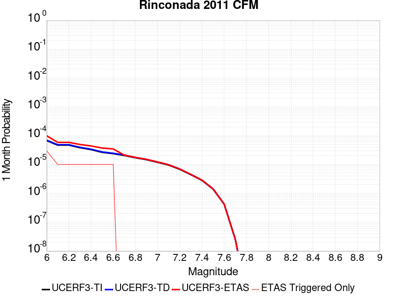 |  |  |

| Magnitude | 1 wk TI Prob | 1 wk TD Prob | 1 wk ETAS Prob | 1 wk ETAS/TD Gain | 1 wk ETAS Triggered Only | 1 mo TI Prob | 1 mo TD Prob | 1 mo ETAS Prob | 1 mo ETAS/TD Gain | 1 mo ETAS Triggered Only | 1 yr TI Prob | 1 yr TD Prob | 1 yr ETAS Prob | 1 yr ETAS/TD Gain | 1 yr ETAS Triggered Only | 10 yr TI Prob | 10 yr TD Prob | 10 yr ETAS Prob | 10 yr ETAS/TD Gain | 10 yr ETAS Triggered Only |
|-----|-----|-----|-----|-----|-----|-----|-----|-----|-----|-----|-----|-----|-----|-----|-----|-----|-----|-----|-----|-----|
| 6.0 | 1.5752368E-5 | 1.6274716E-5 | 6.5561704E-5 | 4.0284395 | 4.928779E-5 | 6.75084E-5 | 6.974694E-5 | 1.1903129E-4 | 1.7066168 | 4.928779E-5 | 8.2160486E-4 | 8.488413E-4 | 8.980872E-4 | 1.0580155 | 4.928779E-5 | 0.008185739 | 0.00845637 | 0.008505241 | 1.0057791 | 4.928779E-5 |
| 6.1 | 1.0966133E-5 | 1.1323029E-5 | 1.1323029E-5 | 1.0 | 0.0 | 4.6996865E-5 | 4.852637E-5 | 4.852637E-5 | 1.0 | 0.0 | 5.720366E-4 | 5.9064914E-4 | 5.9064914E-4 | 1.0 | 0.0 | 0.0057056635 | 0.005890889 | 0.005890889 | 1.0 | 0.0 |
| 6.2 | 1.0966133E-5 | 1.1323029E-5 | 1.1323029E-5 | 1.0 | 0.0 | 4.6996865E-5 | 4.852637E-5 | 4.852637E-5 | 1.0 | 0.0 | 5.720366E-4 | 5.9064914E-4 | 5.9064914E-4 | 1.0 | 0.0 | 0.0057056635 | 0.005890889 | 0.005890889 | 1.0 | 0.0 |
| 6.3 | 8.926149E-6 | 9.212772E-6 | 9.212772E-6 | 1.0 | 0.0 | 3.8254362E-5 | 3.948271E-5 | 3.948271E-5 | 1.0 | 0.0 | 4.6564735E-4 | 4.8059633E-4 | 4.8059633E-4 | 1.0 | 0.0 | 0.0046467283 | 0.0047956146 | 0.0047956146 | 1.0 | 0.0 |
| 6.4 | 7.676955E-6 | 7.920191E-6 | 7.920191E-6 | 1.0 | 0.0 | 3.290082E-5 | 3.3943234E-5 | 3.3943234E-5 | 1.0 | 0.0 | 4.0049385E-4 | 4.131807E-4 | 4.131807E-4 | 1.0 | 0.0 | 0.0039977287 | 0.004124151 | 0.004124151 | 1.0 | 0.0 |
| 6.5 | 6.1671026E-6 | 6.358955E-6 | 6.358955E-6 | 1.0 | 0.0 | 2.6430173E-5 | 2.725238E-5 | 2.725238E-5 | 1.0 | 0.0 | 3.2173982E-4 | 3.317473E-4 | 3.317473E-4 | 1.0 | 0.0 | 0.003212744 | 0.0033125326 | 0.0033125326 | 1.0 | 0.0 |
| 6.6 | 5.553456E-6 | 5.7248126E-6 | 5.7248126E-6 | 1.0 | 0.0 | 2.3800309E-5 | 2.4534682E-5 | 2.4534682E-5 | 1.0 | 0.0 | 2.897302E-4 | 2.9866886E-4 | 2.9866886E-4 | 1.0 | 0.0 | 0.0028935277 | 0.0029826832 | 0.0029826832 | 1.0 | 0.0 |
| 6.7 | 4.787857E-6 | 4.93331E-6 | 4.93331E-6 | 1.0 | 0.0 | 2.0519226E-5 | 2.1142585E-5 | 2.1142585E-5 | 1.0 | 0.0 | 2.4979294E-4 | 2.573806E-4 | 2.573806E-4 | 1.0 | 0.0 | 0.0024951235 | 0.002570831 | 0.002570831 | 1.0 | 0.0 |
| 6.8 | 3.9955166E-6 | 4.1134763E-6 | 4.1134763E-6 | 1.0 | 0.0 | 1.7123532E-5 | 1.7629065E-5 | 1.7629065E-5 | 1.0 | 0.0 | 2.0845905E-4 | 2.1461275E-4 | 2.1461275E-4 | 1.0 | 0.0 | 0.002082636 | 0.0021440587 | 0.0021440587 | 1.0 | 0.0 |
| 6.9 | 3.4250072E-6 | 3.5224466E-6 | 3.5224466E-6 | 1.0 | 0.0 | 1.46785205E-5 | 1.5096112E-5 | 1.5096112E-5 | 1.0 | 0.0 | 1.7869633E-4 | 1.8377969E-4 | 1.8377969E-4 | 1.0 | 0.0 | 0.001785527 | 0.0018362795 | 0.0018362795 | 1.0 | 0.0 |
| 7.0 | 2.7712713E-6 | 2.8467002E-6 | 2.8467002E-6 | 1.0 | 0.0 | 1.1876823E-5 | 1.22000865E-5 | 1.22000865E-5 | 1.0 | 0.0 | 1.4459073E-4 | 1.4852594E-4 | 1.4852594E-4 | 1.0 | 0.0 | 0.0014449668 | 0.0014842683 | 0.0014842683 | 1.0 | 0.0 |
| 7.1 | 2.227358E-6 | 2.2856987E-6 | 2.2856987E-6 | 1.0 | 0.0 | 9.545785E-6 | 9.795815E-6 | 9.795815E-6 | 1.0 | 0.0 | 1.16213734E-4 | 1.1925753E-4 | 1.1925753E-4 | 1.0 | 0.0 | 0.0011615298 | 0.0011919363 | 0.0011919363 | 1.0 | 0.0 |
| 7.2 | 1.581796E-6 | 1.6209015E-6 | 1.6209015E-6 | 1.0 | 0.0 | 6.779108E-6 | 6.946702E-6 | 6.946702E-6 | 1.0 | 0.0 | 8.253252E-5 | 8.4572814E-5 | 8.4572814E-5 | 1.0 | 0.0 | 8.250187E-4 | 8.4540684E-4 | 8.4540684E-4 | 1.0 | 0.0 |
| 7.3 | 1.0306567E-6 | 1.054648E-6 | 1.054648E-6 | 1.0 | 0.0 | 4.4170924E-6 | 4.519912E-6 | 4.519912E-6 | 1.0 | 0.0 | 5.3776774E-5 | 5.502854E-5 | 5.502854E-5 | 1.0 | 0.0 | 5.376376E-4 | 5.501494E-4 | 5.501494E-4 | 1.0 | 0.0 |
| 7.4 | 6.535541E-7 | 6.682744E-7 | 6.682744E-7 | 1.0 | 0.0 | 2.800943E-6 | 2.8640302E-6 | 2.8640302E-6 | 1.0 | 0.0 | 3.4100947E-5 | 3.4869012E-5 | 3.4869012E-5 | 1.0 | 0.0 | 3.4095717E-4 | 3.486355E-4 | 3.486355E-4 | 1.0 | 0.0 |
| 7.5 | 3.2656962E-7 | 3.3316712E-7 | 3.3316712E-7 | 1.0 | 0.0 | 1.3995833E-6 | 1.4278584E-6 | 1.4278584E-6 | 1.0 | 0.0 | 1.7039794E-5 | 1.7384036E-5 | 1.7384036E-5 | 1.0 | 0.0 | 1.7038487E-4 | 1.738268E-4 | 1.738268E-4 | 1.0 | 0.0 |
| 7.6 | 9.754343E-8 | 9.821017E-8 | 9.821017E-8 | 1.0 | 0.0 | 4.180432E-7 | 4.2090065E-7 | 4.2090065E-7 | 1.0 | 0.0 | 5.089664E-6 | 5.1244533E-6 | 5.1244533E-6 | 1.0 | 0.0 | 5.0895473E-5 | 5.124336E-5 | 5.124336E-5 | 1.0 | 0.0 |
| 7.7 | 6.0001453E-9 | 5.8491207E-9 | 5.8491207E-9 | 1.0 | 0.0 | 2.5714908E-8 | 2.506766E-8 | 2.506766E-8 | 1.0 | 0.0 | 3.1307894E-7 | 3.051987E-7 | 3.051987E-7 | 1.0 | 0.0 | 3.1307852E-6 | 3.0519832E-6 | 3.0519832E-6 | 1.0 | 0.0 |
| 7.8 | 7.400003E-11 | 7.4654505E-11 | 7.4654505E-11 | 1.0 | 0.0 | 3.171432E-10 | 3.1994773E-10 | 3.1994773E-10 | 1.0 | 0.0 | 3.861218E-9 | 3.895363E-9 | 3.895363E-9 | 1.0 | 0.0 | 3.861218E-8 | 3.895363E-8 | 3.895363E-8 | 1.0 | 0.0 |

## North Frontal  (West)
*[(top)](#table-of-contents)*

| 1 Week | 1 Month | 1 Year | 10 Year |
|-----|-----|-----|-----|
| 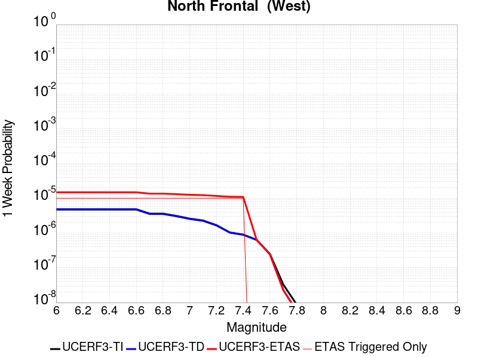 |  | 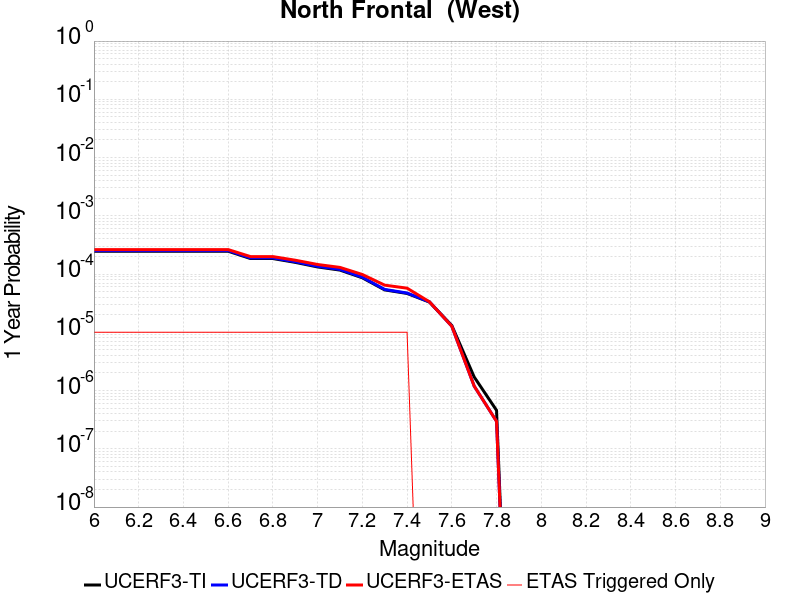 | 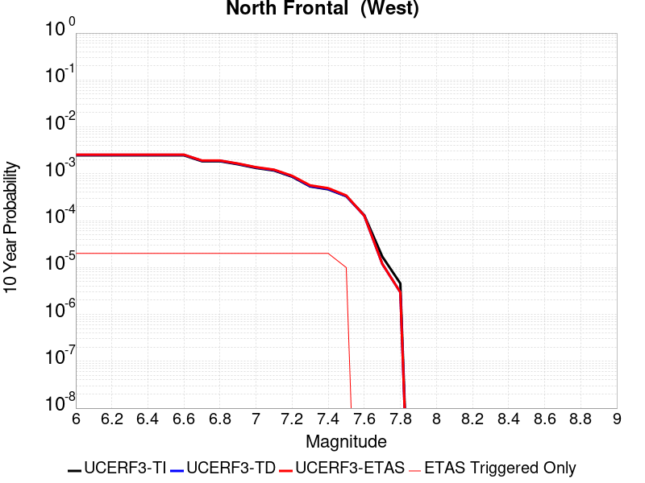 |

| Magnitude | 1 wk TI Prob | 1 wk TD Prob | 1 wk ETAS Prob | 1 wk ETAS/TD Gain | 1 wk ETAS Triggered Only | 1 mo TI Prob | 1 mo TD Prob | 1 mo ETAS Prob | 1 mo ETAS/TD Gain | 1 mo ETAS Triggered Only | 1 yr TI Prob | 1 yr TD Prob | 1 yr ETAS Prob | 1 yr ETAS/TD Gain | 1 yr ETAS Triggered Only | 10 yr TI Prob | 10 yr TD Prob | 10 yr ETAS Prob | 10 yr ETAS/TD Gain | 10 yr ETAS Triggered Only |
|-----|-----|-----|-----|-----|-----|-----|-----|-----|-----|-----|-----|-----|-----|-----|-----|-----|-----|-----|-----|-----|
| 6.0 | 4.7316266E-6 | 4.852674E-6 | 4.852674E-6 | 1.0 | 0.0 | 2.0278241E-5 | 2.0797017E-5 | 2.0797017E-5 | 1.0 | 0.0 | 2.4685962E-4 | 2.5317573E-4 | 2.5317573E-4 | 1.0 | 0.0 | 0.0024658558 | 0.002529019 | 0.0025781821 | 1.0194396 | 4.928779E-5 |
| 6.1 | 4.7316266E-6 | 4.852674E-6 | 4.852674E-6 | 1.0 | 0.0 | 2.0278241E-5 | 2.0797017E-5 | 2.0797017E-5 | 1.0 | 0.0 | 2.4685962E-4 | 2.5317573E-4 | 2.5317573E-4 | 1.0 | 0.0 | 0.0024658558 | 0.002529019 | 0.0025781821 | 1.0194396 | 4.928779E-5 |
| 6.2 | 4.7316266E-6 | 4.852674E-6 | 4.852674E-6 | 1.0 | 0.0 | 2.0278241E-5 | 2.0797017E-5 | 2.0797017E-5 | 1.0 | 0.0 | 2.4685962E-4 | 2.5317573E-4 | 2.5317573E-4 | 1.0 | 0.0 | 0.0024658558 | 0.002529019 | 0.0025781821 | 1.0194396 | 4.928779E-5 |
| 6.3 | 4.7316266E-6 | 4.852674E-6 | 4.852674E-6 | 1.0 | 0.0 | 2.0278241E-5 | 2.0797017E-5 | 2.0797017E-5 | 1.0 | 0.0 | 2.4685962E-4 | 2.5317573E-4 | 2.5317573E-4 | 1.0 | 0.0 | 0.0024658558 | 0.002529019 | 0.0025781821 | 1.0194396 | 4.928779E-5 |
| 6.4 | 4.7316266E-6 | 4.852674E-6 | 4.852674E-6 | 1.0 | 0.0 | 2.0278241E-5 | 2.0797017E-5 | 2.0797017E-5 | 1.0 | 0.0 | 2.4685962E-4 | 2.5317573E-4 | 2.5317573E-4 | 1.0 | 0.0 | 0.0024658558 | 0.002529019 | 0.0025781821 | 1.0194396 | 4.928779E-5 |
| 6.5 | 4.7316266E-6 | 4.852674E-6 | 4.852674E-6 | 1.0 | 0.0 | 2.0278241E-5 | 2.0797017E-5 | 2.0797017E-5 | 1.0 | 0.0 | 2.4685962E-4 | 2.5317573E-4 | 2.5317573E-4 | 1.0 | 0.0 | 0.0024658558 | 0.002529019 | 0.0025781821 | 1.0194396 | 4.928779E-5 |
| 6.6 | 4.7316266E-6 | 4.852674E-6 | 4.852674E-6 | 1.0 | 0.0 | 2.0278241E-5 | 2.0797017E-5 | 2.0797017E-5 | 1.0 | 0.0 | 2.4685962E-4 | 2.5317573E-4 | 2.5317573E-4 | 1.0 | 0.0 | 0.0024658558 | 0.002529019 | 0.0025781821 | 1.0194396 | 4.928779E-5 |
| 6.7 | 3.5382777E-6 | 3.6308872E-6 | 3.6308872E-6 | 1.0 | 0.0 | 1.516396E-5 | 1.5560858E-5 | 1.5560858E-5 | 1.0 | 0.0 | 1.8460557E-4 | 1.8943775E-4 | 1.8943775E-4 | 1.0 | 0.0 | 0.0018445229 | 0.0018928396 | 0.0019420341 | 1.0259898 | 4.928779E-5 |
| 6.8 | 3.5382777E-6 | 3.6308872E-6 | 3.6308872E-6 | 1.0 | 0.0 | 1.516396E-5 | 1.5560858E-5 | 1.5560858E-5 | 1.0 | 0.0 | 1.8460557E-4 | 1.8943775E-4 | 1.8943775E-4 | 1.0 | 0.0 | 0.0018445229 | 0.0018928396 | 0.0019420341 | 1.0259898 | 4.928779E-5 |
| 6.9 | 3.0428037E-6 | 3.1227619E-6 | 3.1227619E-6 | 1.0 | 0.0 | 1.30405215E-5 | 1.3383201E-5 | 1.3383201E-5 | 1.0 | 0.0 | 1.5875678E-4 | 1.6292896E-4 | 1.6292896E-4 | 1.0 | 0.0 | 0.0015864341 | 0.0016281622 | 0.0016773698 | 1.0302228 | 4.928779E-5 |
| 7.0 | 2.538778E-6 | 2.6060916E-6 | 2.6060916E-6 | 1.0 | 0.0 | 1.0880432E-5 | 1.116892E-5 | 1.116892E-5 | 1.0 | 0.0 | 1.324612E-4 | 1.3597358E-4 | 1.3597358E-4 | 1.0 | 0.0 | 0.0013238228 | 0.0013589506 | 0.0014081714 | 1.0362197 | 4.928779E-5 |
| 7.1 | 2.2418935E-6 | 2.3012087E-6 | 2.3012087E-6 | 1.0 | 0.0 | 9.60808E-6 | 9.862288E-6 | 9.862288E-6 | 1.0 | 0.0 | 1.1697209E-4 | 1.2006718E-4 | 1.2006718E-4 | 1.0 | 0.0 | 0.0011691054 | 0.0012000671 | 0.0012492958 | 1.0410216 | 4.928779E-5 |
| 7.2 | 1.6526745E-6 | 1.6924864E-6 | 1.6924864E-6 | 1.0 | 0.0 | 7.082872E-6 | 7.2534945E-6 | 7.2534945E-6 | 1.0 | 0.0 | 8.623055E-5 | 8.830797E-5 | 8.830797E-5 | 1.0 | 0.0 | 8.61971E-4 | 8.8275387E-4 | 9.3199813E-4 | 1.0557848 | 4.928779E-5 |
| 7.3 | 1.0246019E-6 | 1.0442274E-6 | 1.0442274E-6 | 1.0 | 0.0 | 4.391144E-6 | 4.4752533E-6 | 4.4752533E-6 | 1.0 | 0.0 | 5.3460866E-5 | 5.4484964E-5 | 5.4484964E-5 | 1.0 | 0.0 | 5.344801E-4 | 5.4472755E-4 | 5.9398846E-4 | 1.0904323 | 4.928779E-5 |
| 7.4 | 8.9045164E-7 | 9.056572E-7 | 9.056572E-7 | 1.0 | 0.0 | 3.8162157E-6 | 3.881383E-6 | 3.881383E-6 | 1.0 | 0.0 | 4.646144E-5 | 4.725492E-5 | 4.725492E-5 | 1.0 | 0.0 | 4.6451724E-4 | 4.7245962E-4 | 5.217241E-4 | 1.1042724 | 4.928779E-5 |
| 7.5 | 6.3357E-7 | 6.4027137E-7 | 6.4027137E-7 | 1.0 | 0.0 | 2.7152971E-6 | 2.7440176E-6 | 2.7440176E-6 | 1.0 | 0.0 | 3.305824E-5 | 3.340797E-5 | 3.340797E-5 | 1.0 | 0.0 | 3.3053322E-4 | 3.3403604E-4 | 3.8330737E-4 | 1.147503 | 4.928779E-5 |
| 7.6 | 2.5087024E-7 | 2.436123E-7 | 2.436123E-7 | 1.0 | 0.0 | 1.0751578E-6 | 1.0440525E-6 | 1.0440525E-6 | 1.0 | 0.0 | 1.3089967E-5 | 1.2711286E-5 | 1.2711286E-5 | 1.0 | 0.0 | 1.3089196E-4 | 1.2710765E-4 | 1.2710765E-4 | 1.0 | 0.0 |
| 7.7 | 3.282987E-8 | 2.2875435E-8 | 2.2875435E-8 | 1.0 | 0.0 | 1.4069944E-7 | 9.8037575E-8 | 9.8037575E-8 | 1.0 | 0.0 | 1.7130144E-6 | 1.193607E-6 | 1.193607E-6 | 1.0 | 0.0 | 1.7130013E-5 | 1.1936014E-5 | 1.1936014E-5 | 1.0 | 0.0 |
| 7.8 | 8.77499E-9 | 5.6817466E-9 | 5.6817466E-9 | 1.0 | 0.0 | 3.7607098E-8 | 2.4350342E-8 | 2.4350342E-8 | 1.0 | 0.0 | 4.578663E-7 | 2.964654E-7 | 2.964654E-7 | 1.0 | 0.0 | 4.5786537E-6 | 2.9646512E-6 | 2.9646512E-6 | 1.0 | 0.0 |

## Cleghorn Lake
*[(top)](#table-of-contents)*

| 1 Week | 1 Month | 1 Year | 10 Year |
|-----|-----|-----|-----|
|  |  |  | 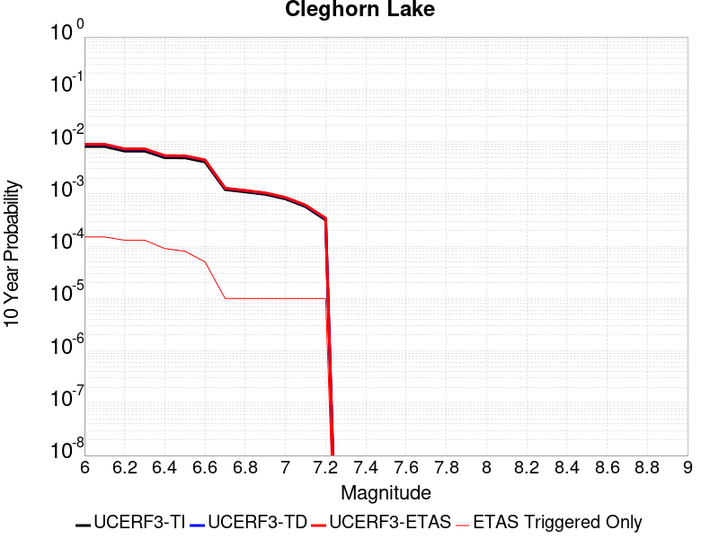 |

| Magnitude | 1 wk TI Prob | 1 wk TD Prob | 1 wk ETAS Prob | 1 wk ETAS/TD Gain | 1 wk ETAS Triggered Only | 1 mo TI Prob | 1 mo TD Prob | 1 mo ETAS Prob | 1 mo ETAS/TD Gain | 1 mo ETAS Triggered Only | 1 yr TI Prob | 1 yr TD Prob | 1 yr ETAS Prob | 1 yr ETAS/TD Gain | 1 yr ETAS Triggered Only | 10 yr TI Prob | 10 yr TD Prob | 10 yr ETAS Prob | 10 yr ETAS/TD Gain | 10 yr ETAS Triggered Only |
|-----|-----|-----|-----|-----|-----|-----|-----|-----|-----|-----|-----|-----|-----|-----|-----|-----|-----|-----|-----|-----|
| 6.0 | 1.5467183E-5 | 1.6794203E-5 | 1.6794203E-5 | 1.0 | 0.0 | 6.6286244E-5 | 7.197348E-5 | 7.197348E-5 | 1.0 | 0.0 | 8.067362E-4 | 8.759797E-4 | 9.2522433E-4 | 1.0562166 | 4.928779E-5 | 0.008038137 | 0.008730696 | 0.008779553 | 1.005596 | 4.928779E-5 |
| 6.1 | 1.5467183E-5 | 1.6794203E-5 | 1.6794203E-5 | 1.0 | 0.0 | 6.6286244E-5 | 7.197348E-5 | 7.197348E-5 | 1.0 | 0.0 | 8.067362E-4 | 8.759797E-4 | 9.2522433E-4 | 1.0562166 | 4.928779E-5 | 0.008038137 | 0.008730696 | 0.008779553 | 1.005596 | 4.928779E-5 |
| 6.2 | 1.2624631E-5 | 1.3681544E-5 | 1.3681544E-5 | 1.0 | 0.0 | 5.410444E-5 | 5.863415E-5 | 5.863415E-5 | 1.0 | 0.0 | 6.585225E-4 | 7.1368564E-4 | 7.6293823E-4 | 1.0690117 | 4.928779E-5 | 0.0065657445 | 0.0071187317 | 0.0071676685 | 1.0068744 | 4.928779E-5 |
| 6.3 | 1.2624631E-5 | 1.3681544E-5 | 1.3681544E-5 | 1.0 | 0.0 | 5.410444E-5 | 5.863415E-5 | 5.863415E-5 | 1.0 | 0.0 | 6.585225E-4 | 7.1368564E-4 | 7.6293823E-4 | 1.0690117 | 4.928779E-5 | 0.0065657445 | 0.0071187317 | 0.0071676685 | 1.0068744 | 4.928779E-5 |
| 6.4 | 9.417684E-6 | 1.0170118E-5 | 1.0170118E-5 | 1.0 | 0.0 | 4.036088E-5 | 4.3585722E-5 | 4.3585722E-5 | 1.0 | 0.0 | 4.912829E-4 | 5.3056807E-4 | 5.798297E-4 | 1.092847 | 4.928779E-5 | 0.004901982 | 0.005297049 | 0.0053460756 | 1.0092555 | 4.928779E-5 |
| 6.5 | 9.368219E-6 | 1.0117545E-5 | 1.0117545E-5 | 1.0 | 0.0 | 4.014889E-5 | 4.3360415E-5 | 4.3360415E-5 | 1.0 | 0.0 | 4.8870314E-4 | 5.2782625E-4 | 5.7708804E-4 | 1.0933295 | 4.928779E-5 | 0.004876298 | 0.0052697617 | 0.0053187897 | 1.0093037 | 4.928779E-5 |
| 6.6 | 7.803798E-6 | 8.441831E-6 | 8.441831E-6 | 1.0 | 0.0 | 3.3444423E-5 | 3.6179E-5 | 3.6179E-5 | 1.0 | 0.0 | 4.0710976E-4 | 4.4043022E-4 | 4.896963E-4 | 1.111859 | 4.928779E-5 | 0.0040636472 | 0.0043994905 | 0.0044485615 | 1.0111538 | 4.928779E-5 |
| 6.7 | 2.3108669E-6 | 2.4438336E-6 | 2.4438336E-6 | 1.0 | 0.0 | 9.903678E-6 | 1.0473532E-5 | 1.0473532E-5 | 1.0 | 0.0 | 1.205706E-4 | 1.2750797E-4 | 1.2750797E-4 | 1.0 | 0.0 | 0.001205052 | 0.0012743667 | 0.0012743667 | 1.0 | 0.0 |
| 6.8 | 2.0882828E-6 | 2.2062823E-6 | 2.2062823E-6 | 1.0 | 0.0 | 8.949753E-6 | 9.455462E-6 | 9.455462E-6 | 1.0 | 0.0 | 1.08957785E-4 | 1.1511434E-4 | 1.1511434E-4 | 1.0 | 0.0 | 0.0010890438 | 0.0011505639 | 0.0011505639 | 1.0 | 0.0 |
| 6.9 | 1.876935E-6 | 1.981051E-6 | 1.981051E-6 | 1.0 | 0.0 | 8.043982E-6 | 8.490192E-6 | 8.490192E-6 | 1.0 | 0.0 | 9.7931086E-5 | 1.03363345E-4 | 1.03363345E-4 | 1.0 | 0.0 | 9.788794E-4 | 0.0010331686 | 0.0010331686 | 1.0 | 0.0 |
| 7.0 | 1.5357559E-6 | 1.6202807E-6 | 1.6202807E-6 | 1.0 | 0.0 | 6.5817944E-6 | 6.9440425E-6 | 6.9440425E-6 | 1.0 | 0.0 | 8.01304E-5 | 8.454057E-5 | 8.454057E-5 | 1.0 | 0.0 | 8.010151E-4 | 8.450965E-4 | 8.450965E-4 | 1.0 | 0.0 |
| 7.1 | 1.0905424E-6 | 1.1497619E-6 | 1.1497619E-6 | 1.0 | 0.0 | 4.6737446E-6 | 4.9275427E-6 | 4.9275427E-6 | 1.0 | 0.0 | 5.6901354E-5 | 5.999128E-5 | 5.999128E-5 | 1.0 | 0.0 | 5.6886784E-4 | 5.997606E-4 | 5.997606E-4 | 1.0 | 0.0 |
| 7.2 | 6.06668E-7 | 6.387277E-7 | 6.387277E-7 | 1.0 | 0.0 | 2.600003E-6 | 2.7374022E-6 | 2.7374022E-6 | 1.0 | 0.0 | 3.1654577E-5 | 3.3327433E-5 | 3.3327433E-5 | 1.0 | 0.0 | 3.1650066E-4 | 3.3323118E-4 | 3.3323118E-4 | 1.0 | 0.0 |

## Kern Canyon (South Kern) 2011
*[(top)](#table-of-contents)*

| 1 Week | 1 Month | 1 Year | 10 Year |
|-----|-----|-----|-----|
| 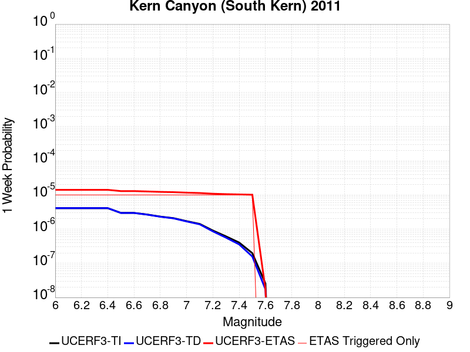 |  |  |  |

| Magnitude | 1 wk TI Prob | 1 wk TD Prob | 1 wk ETAS Prob | 1 wk ETAS/TD Gain | 1 wk ETAS Triggered Only | 1 mo TI Prob | 1 mo TD Prob | 1 mo ETAS Prob | 1 mo ETAS/TD Gain | 1 mo ETAS Triggered Only | 1 yr TI Prob | 1 yr TD Prob | 1 yr ETAS Prob | 1 yr ETAS/TD Gain | 1 yr ETAS Triggered Only | 10 yr TI Prob | 10 yr TD Prob | 10 yr ETAS Prob | 10 yr ETAS/TD Gain | 10 yr ETAS Triggered Only |
|-----|-----|-----|-----|-----|-----|-----|-----|-----|-----|-----|-----|-----|-----|-----|-----|-----|-----|-----|-----|-----|
| 6.0 | 4.105075E-6 | 4.113726E-6 | 4.113726E-6 | 1.0 | 0.0 | 1.7593058E-5 | 1.7630138E-5 | 6.691706E-5 | 3.7956061 | 4.928779E-5 | 2.1417443E-4 | 2.1462643E-4 | 2.6390364E-4 | 1.2295953 | 4.928779E-5 | 0.0021396813 | 0.0021442554 | 0.0021934374 | 1.0229367 | 4.928779E-5 |
| 6.1 | 4.105075E-6 | 4.113726E-6 | 4.113726E-6 | 1.0 | 0.0 | 1.7593058E-5 | 1.7630138E-5 | 6.691706E-5 | 3.7956061 | 4.928779E-5 | 2.1417443E-4 | 2.1462643E-4 | 2.6390364E-4 | 1.2295953 | 4.928779E-5 | 0.0021396813 | 0.0021442554 | 0.0021934374 | 1.0229367 | 4.928779E-5 |
| 6.2 | 4.105075E-6 | 4.113726E-6 | 4.113726E-6 | 1.0 | 0.0 | 1.7593058E-5 | 1.7630138E-5 | 6.691706E-5 | 3.7956061 | 4.928779E-5 | 2.1417443E-4 | 2.1462643E-4 | 2.6390364E-4 | 1.2295953 | 4.928779E-5 | 0.0021396813 | 0.0021442554 | 0.0021934374 | 1.0229367 | 4.928779E-5 |
| 6.3 | 4.105075E-6 | 4.113726E-6 | 4.113726E-6 | 1.0 | 0.0 | 1.7593058E-5 | 1.7630138E-5 | 6.691706E-5 | 3.7956061 | 4.928779E-5 | 2.1417443E-4 | 2.1462643E-4 | 2.6390364E-4 | 1.2295953 | 4.928779E-5 | 0.0021396813 | 0.0021442554 | 0.0021934374 | 1.0229367 | 4.928779E-5 |
| 6.4 | 4.105075E-6 | 4.113726E-6 | 4.113726E-6 | 1.0 | 0.0 | 1.7593058E-5 | 1.7630138E-5 | 6.691706E-5 | 3.7956061 | 4.928779E-5 | 2.1417443E-4 | 2.1462643E-4 | 2.6390364E-4 | 1.2295953 | 4.928779E-5 | 0.0021396813 | 0.0021442554 | 0.0021934374 | 1.0229367 | 4.928779E-5 |
| 6.5 | 2.9849807E-6 | 2.973154E-6 | 2.973154E-6 | 1.0 | 0.0 | 1.2792712E-5 | 1.2742028E-5 | 1.2742028E-5 | 1.0 | 0.0 | 1.5574014E-4 | 1.551233E-4 | 1.551233E-4 | 1.0 | 0.0 | 0.0015563103 | 0.0015501654 | 0.0015501654 | 1.0 | 0.0 |
| 6.6 | 2.9849807E-6 | 2.973154E-6 | 2.973154E-6 | 1.0 | 0.0 | 1.2792712E-5 | 1.2742028E-5 | 1.2742028E-5 | 1.0 | 0.0 | 1.5574014E-4 | 1.551233E-4 | 1.551233E-4 | 1.0 | 0.0 | 0.0015563103 | 0.0015501654 | 0.0015501654 | 1.0 | 0.0 |
| 6.7 | 2.6756725E-6 | 2.6582202E-6 | 2.6582202E-6 | 1.0 | 0.0 | 1.1467117E-5 | 1.1392323E-5 | 1.1392323E-5 | 1.0 | 0.0 | 1.396032E-4 | 1.386928E-4 | 1.386928E-4 | 1.0 | 0.0 | 0.0013951553 | 0.0013860734 | 0.0013860734 | 1.0 | 0.0 |
| 6.8 | 2.3283721E-6 | 2.3047783E-6 | 2.3047783E-6 | 1.0 | 0.0 | 9.9787E-6 | 9.877584E-6 | 9.877584E-6 | 1.0 | 0.0 | 1.214839E-4 | 1.2025302E-4 | 1.2025302E-4 | 1.0 | 0.0 | 0.001214175 | 0.001201887 | 0.001201887 | 1.0 | 0.0 |
| 6.9 | 2.0972677E-6 | 2.0696405E-6 | 2.0696405E-6 | 1.0 | 0.0 | 8.988259E-6 | 8.869858E-6 | 8.869858E-6 | 1.0 | 0.0 | 1.0942656E-4 | 1.0798523E-4 | 1.0798523E-4 | 1.0 | 0.0 | 0.0010937268 | 0.0010793334 | 0.0010793334 | 1.0 | 0.0 |
| 7.0 | 1.7132242E-6 | 1.6787029E-6 | 1.6787029E-6 | 1.0 | 0.0 | 7.3423685E-6 | 7.1944214E-6 | 7.1944214E-6 | 1.0 | 0.0 | 8.938967E-5 | 8.75886E-5 | 8.75886E-5 | 1.0 | 0.0 | 8.935372E-4 | 8.755446E-4 | 8.755446E-4 | 1.0 | 0.0 |
| 7.1 | 1.4215541E-6 | 1.3815746E-6 | 1.3815746E-6 | 1.0 | 0.0 | 6.0923603E-6 | 5.9210206E-6 | 5.9210206E-6 | 1.0 | 0.0 | 7.417196E-5 | 7.208607E-5 | 7.208607E-5 | 1.0 | 0.0 | 7.414721E-4 | 7.206296E-4 | 7.206296E-4 | 1.0 | 0.0 |
| 7.2 | 9.097853E-7 | 8.60377E-7 | 8.60377E-7 | 1.0 | 0.0 | 3.899074E-6 | 3.6873246E-6 | 3.6873246E-6 | 1.0 | 0.0 | 4.7470192E-5 | 4.4892266E-5 | 4.4892266E-5 | 1.0 | 0.0 | 4.7460053E-4 | 4.4883305E-4 | 4.4883305E-4 | 1.0 | 0.0 |
| 7.3 | 6.144169E-7 | 5.628199E-7 | 5.628199E-7 | 1.0 | 0.0 | 2.6332125E-6 | 2.4120832E-6 | 2.4120832E-6 | 1.0 | 0.0 | 3.205889E-5 | 2.9366722E-5 | 2.9366722E-5 | 1.0 | 0.0 | 3.2054266E-4 | 2.9362892E-4 | 2.9362892E-4 | 1.0 | 0.0 |
| 7.4 | 4.049844E-7 | 3.5728252E-7 | 3.5728252E-7 | 1.0 | 0.0 | 1.7356463E-6 | 1.5312098E-6 | 1.5312098E-6 | 1.0 | 0.0 | 2.1131287E-5 | 1.8642324E-5 | 1.8642324E-5 | 1.0 | 0.0 | 2.1129279E-4 | 1.8640784E-4 | 1.8640784E-4 | 1.0 | 0.0 |
| 7.5 | 1.9871162E-7 | 1.5830383E-7 | 1.5830383E-7 | 1.0 | 0.0 | 8.5162094E-7 | 6.784448E-7 | 6.784448E-7 | 1.0 | 0.0 | 1.0368436E-5 | 8.260035E-6 | 8.260035E-6 | 1.0 | 0.0 | 1.0367952E-4 | 8.259736E-5 | 8.259736E-5 | 1.0 | 0.0 |
| 7.6 | 2.572245E-8 | 1.735264E-8 | 1.735264E-8 | 1.0 | 0.0 | 1.10239064E-7 | 7.436845E-8 | 7.436845E-8 | 1.0 | 0.0 | 1.3421597E-6 | 9.0543557E-7 | 9.0543557E-7 | 1.0 | 0.0 | 1.3421517E-5 | 9.054324E-6 | 9.054324E-6 | 1.0 | 0.0 |

## San Jose
*[(top)](#table-of-contents)*

| 1 Week | 1 Month | 1 Year | 10 Year |
|-----|-----|-----|-----|
|  |  | 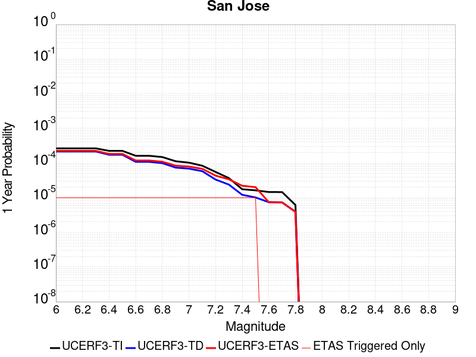 |  |

| Magnitude | 1 wk TI Prob | 1 wk TD Prob | 1 wk ETAS Prob | 1 wk ETAS/TD Gain | 1 wk ETAS Triggered Only | 1 mo TI Prob | 1 mo TD Prob | 1 mo ETAS Prob | 1 mo ETAS/TD Gain | 1 mo ETAS Triggered Only | 1 yr TI Prob | 1 yr TD Prob | 1 yr ETAS Prob | 1 yr ETAS/TD Gain | 1 yr ETAS Triggered Only | 10 yr TI Prob | 10 yr TD Prob | 10 yr ETAS Prob | 10 yr ETAS/TD Gain | 10 yr ETAS Triggered Only |
|-----|-----|-----|-----|-----|-----|-----|-----|-----|-----|-----|-----|-----|-----|-----|-----|-----|-----|-----|-----|-----|
| 6.0 | 5.0851277E-6 | 4.125642E-6 | 4.125642E-6 | 1.0 | 0.0 | 2.1793223E-5 | 1.768122E-5 | 1.768122E-5 | 1.0 | 0.0 | 2.653002E-4 | 2.152502E-4 | 2.152502E-4 | 1.0 | 0.0 | 0.0026498367 | 0.0021507454 | 0.0021999273 | 1.0228673 | 4.928779E-5 |
| 6.1 | 5.0851277E-6 | 4.125642E-6 | 4.125642E-6 | 1.0 | 0.0 | 2.1793223E-5 | 1.768122E-5 | 1.768122E-5 | 1.0 | 0.0 | 2.653002E-4 | 2.152502E-4 | 2.152502E-4 | 1.0 | 0.0 | 0.0026498367 | 0.0021507454 | 0.0021999273 | 1.0228673 | 4.928779E-5 |
| 6.2 | 5.0851277E-6 | 4.125642E-6 | 4.125642E-6 | 1.0 | 0.0 | 2.1793223E-5 | 1.768122E-5 | 1.768122E-5 | 1.0 | 0.0 | 2.653002E-4 | 2.152502E-4 | 2.152502E-4 | 1.0 | 0.0 | 0.0026498367 | 0.0021507454 | 0.0021999273 | 1.0228673 | 4.928779E-5 |
| 6.3 | 5.0851277E-6 | 4.125642E-6 | 4.125642E-6 | 1.0 | 0.0 | 2.1793223E-5 | 1.768122E-5 | 1.768122E-5 | 1.0 | 0.0 | 2.653002E-4 | 2.152502E-4 | 2.152502E-4 | 1.0 | 0.0 | 0.0026498367 | 0.0021507454 | 0.0021999273 | 1.0228673 | 4.928779E-5 |
| 6.4 | 4.3115124E-6 | 3.3237525E-6 | 3.3237525E-6 | 1.0 | 0.0 | 1.8477778E-5 | 1.4244589E-5 | 1.4244589E-5 | 1.0 | 0.0 | 2.2494372E-4 | 1.7341628E-4 | 1.7341628E-4 | 1.0 | 0.0 | 0.0022471617 | 0.0017330965 | 0.0017330965 | 1.0 | 0.0 |
| 6.5 | 4.3115124E-6 | 3.3237525E-6 | 3.3237525E-6 | 1.0 | 0.0 | 1.8477778E-5 | 1.4244589E-5 | 1.4244589E-5 | 1.0 | 0.0 | 2.2494372E-4 | 1.7341628E-4 | 1.7341628E-4 | 1.0 | 0.0 | 0.0022471617 | 0.0017330965 | 0.0017330965 | 1.0 | 0.0 |
| 6.6 | 3.110396E-6 | 2.0799562E-6 | 2.0799562E-6 | 1.0 | 0.0 | 1.33302E-5 | 8.9140685E-6 | 8.9140685E-6 | 1.0 | 0.0 | 1.622831E-4 | 1.0852366E-4 | 1.0852366E-4 | 1.0 | 0.0 | 0.0016216465 | 0.001084804 | 0.001084804 | 1.0 | 0.0 |
| 6.7 | 3.110396E-6 | 2.0799562E-6 | 2.0799562E-6 | 1.0 | 0.0 | 1.33302E-5 | 8.9140685E-6 | 8.9140685E-6 | 1.0 | 0.0 | 1.622831E-4 | 1.0852366E-4 | 1.0852366E-4 | 1.0 | 0.0 | 0.0016216465 | 0.001084804 | 0.001084804 | 1.0 | 0.0 |
| 6.8 | 2.856651E-6 | 1.9024077E-6 | 1.9024077E-6 | 1.0 | 0.0 | 1.2242733E-5 | 8.153152E-6 | 8.153152E-6 | 1.0 | 0.0 | 1.4904508E-4 | 9.926035E-5 | 9.926035E-5 | 1.0 | 0.0 | 0.0014894515 | 9.922545E-4 | 9.922545E-4 | 1.0 | 0.0 |
| 6.9 | 2.1618725E-6 | 1.4186406E-6 | 1.4186406E-6 | 1.0 | 0.0 | 9.265135E-6 | 6.0798748E-6 | 6.0798748E-6 | 1.0 | 0.0 | 1.12797185E-4 | 7.402005E-5 | 7.402005E-5 | 1.0 | 0.0 | 0.0011273995 | 7.4003247E-4 | 7.4003247E-4 | 1.0 | 0.0 |
| 7.0 | 1.9684312E-6 | 1.3256082E-6 | 1.3256082E-6 | 1.0 | 0.0 | 8.436106E-6 | 5.681166E-6 | 5.681166E-6 | 1.0 | 0.0 | 1.02704755E-4 | 6.916608E-5 | 6.916608E-5 | 1.0 | 0.0 | 0.001026573 | 6.9152354E-4 | 6.9152354E-4 | 1.0 | 0.0 |
| 7.1 | 1.6070337E-6 | 1.1154867E-6 | 1.1154867E-6 | 1.0 | 0.0 | 6.887269E-6 | 4.7806493E-6 | 4.7806493E-6 | 1.0 | 0.0 | 8.384928E-5 | 5.8202913E-5 | 5.8202913E-5 | 1.0 | 0.0 | 8.3817646E-4 | 5.819527E-4 | 5.819527E-4 | 1.0 | 0.0 |
| 7.2 | 1.0631658E-6 | 6.403567E-7 | 6.403567E-7 | 1.0 | 0.0 | 4.556417E-6 | 2.744383E-6 | 2.744383E-6 | 1.0 | 0.0 | 5.5472963E-5 | 3.3412365E-5 | 3.3412365E-5 | 1.0 | 0.0 | 5.545912E-4 | 3.3414463E-4 | 3.3414463E-4 | 1.0 | 0.0 |
| 7.3 | 7.060711E-7 | 4.5823228E-7 | 4.5823228E-7 | 1.0 | 0.0 | 3.0260155E-6 | 1.9638512E-6 | 1.9638512E-6 | 1.0 | 0.0 | 3.6841117E-5 | 2.3909635E-5 | 2.3909635E-5 | 1.0 | 0.0 | 3.6835007E-4 | 2.3914136E-4 | 2.3914136E-4 | 1.0 | 0.0 |
| 7.4 | 3.3677085E-7 | 2.3231999E-7 | 2.3231999E-7 | 1.0 | 0.0 | 1.4433028E-6 | 9.956567E-7 | 9.956567E-7 | 1.0 | 0.0 | 1.757207E-5 | 1.2122056E-5 | 1.2122056E-5 | 1.0 | 0.0 | 1.7570681E-4 | 1.2128407E-4 | 1.2128407E-4 | 1.0 | 0.0 |
| 7.5 | 3.129161E-7 | 1.9529637E-7 | 1.9529637E-7 | 1.0 | 0.0 | 1.3410682E-6 | 8.3698416E-7 | 8.3698416E-7 | 1.0 | 0.0 | 1.6327383E-5 | 1.0190237E-5 | 1.0190237E-5 | 1.0 | 0.0 | 1.6326184E-4 | 1.0196777E-4 | 1.0196777E-4 | 1.0 | 0.0 |
| 7.6 | 2.8008668E-7 | 1.4240818E-7 | 1.4240818E-7 | 1.0 | 0.0 | 1.2003709E-6 | 6.103206E-7 | 6.103206E-7 | 1.0 | 0.0 | 1.46144175E-5 | 7.43063E-6 | 7.43063E-6 | 1.0 | 0.0 | 1.4613457E-4 | 7.43735E-5 | 7.43735E-5 | 1.0 | 0.0 |
| 7.7 | 2.7852005E-7 | 1.4015403E-7 | 1.4015403E-7 | 1.0 | 0.0 | 1.1936568E-6 | 6.0066003E-7 | 6.0066003E-7 | 1.0 | 0.0 | 1.4532674E-5 | 7.3130127E-6 | 7.3130127E-6 | 1.0 | 0.0 | 1.4531724E-4 | 7.31974E-5 | 7.31974E-5 | 1.0 | 0.0 |
| 7.8 | 1.1810797E-7 | 7.5187074E-8 | 7.5187074E-8 | 1.0 | 0.0 | 5.0617695E-7 | 3.2223028E-7 | 3.2223028E-7 | 1.0 | 0.0 | 6.1626865E-6 | 3.9231472E-6 | 3.9231472E-6 | 1.0 | 0.0 | 6.162516E-5 | 3.9271265E-5 | 3.9271265E-5 | 1.0 | 0.0 |

## San Jacinto (Coyote Creek)
*[(top)](#table-of-contents)*

| 1 Week | 1 Month | 1 Year | 10 Year |
|-----|-----|-----|-----|
|  |  |  |  |

| Magnitude | 1 wk TI Prob | 1 wk TD Prob | 1 wk ETAS Prob | 1 wk ETAS/TD Gain | 1 wk ETAS Triggered Only | 1 mo TI Prob | 1 mo TD Prob | 1 mo ETAS Prob | 1 mo ETAS/TD Gain | 1 mo ETAS Triggered Only | 1 yr TI Prob | 1 yr TD Prob | 1 yr ETAS Prob | 1 yr ETAS/TD Gain | 1 yr ETAS Triggered Only | 10 yr TI Prob | 10 yr TD Prob | 10 yr ETAS Prob | 10 yr ETAS/TD Gain | 10 yr ETAS Triggered Only |
|-----|-----|-----|-----|-----|-----|-----|-----|-----|-----|-----|-----|-----|-----|-----|-----|-----|-----|-----|-----|-----|
| 6.0 | 2.7374346E-5 | 2.41444E-5 | 2.41444E-5 | 1.0 | 0.0 | 1.1731335E-4 | 1.034719E-4 | 1.034719E-4 | 1.0 | 0.0 | 0.0014273542 | 0.001259045 | 0.001259045 | 1.0 | 0.0 | 0.01418221 | 0.012928195 | 0.012976846 | 1.0037631 | 4.928779E-5 |
| 6.1 | 2.7374346E-5 | 2.41444E-5 | 2.41444E-5 | 1.0 | 0.0 | 1.1731335E-4 | 1.034719E-4 | 1.034719E-4 | 1.0 | 0.0 | 0.0014273542 | 0.001259045 | 0.001259045 | 1.0 | 0.0 | 0.01418221 | 0.012928195 | 0.012976846 | 1.0037631 | 4.928779E-5 |
| 6.2 | 2.7374346E-5 | 2.41444E-5 | 2.41444E-5 | 1.0 | 0.0 | 1.1731335E-4 | 1.034719E-4 | 1.034719E-4 | 1.0 | 0.0 | 0.0014273542 | 0.001259045 | 0.001259045 | 1.0 | 0.0 | 0.01418221 | 0.012928195 | 0.012976846 | 1.0037631 | 4.928779E-5 |
| 6.3 | 2.7374346E-5 | 2.41444E-5 | 2.41444E-5 | 1.0 | 0.0 | 1.1731335E-4 | 1.034719E-4 | 1.034719E-4 | 1.0 | 0.0 | 0.0014273542 | 0.001259045 | 0.001259045 | 1.0 | 0.0 | 0.01418221 | 0.012928195 | 0.012976846 | 1.0037631 | 4.928779E-5 |
| 6.4 | 2.7374346E-5 | 2.41444E-5 | 2.41444E-5 | 1.0 | 0.0 | 1.1731335E-4 | 1.034719E-4 | 1.034719E-4 | 1.0 | 0.0 | 0.0014273542 | 0.001259045 | 0.001259045 | 1.0 | 0.0 | 0.01418221 | 0.012928195 | 0.012976846 | 1.0037631 | 4.928779E-5 |
| 6.5 | 2.7282445E-5 | 2.4030476E-5 | 2.4030476E-5 | 1.0 | 0.0 | 1.16919524E-4 | 1.0298371E-4 | 1.0298371E-4 | 1.0 | 0.0 | 0.0014225657 | 0.001253108 | 0.001253108 | 1.0 | 0.0 | 0.014134934 | 0.012869522 | 0.012918176 | 1.0037805 | 4.928779E-5 |
| 6.6 | 2.7282445E-5 | 2.4030476E-5 | 2.4030476E-5 | 1.0 | 0.0 | 1.16919524E-4 | 1.0298371E-4 | 1.0298371E-4 | 1.0 | 0.0 | 0.0014225657 | 0.001253108 | 0.001253108 | 1.0 | 0.0 | 0.014134934 | 0.012869522 | 0.012918176 | 1.0037805 | 4.928779E-5 |
| 6.7 | 2.7216198E-5 | 2.3955597E-5 | 2.3955597E-5 | 1.0 | 0.0 | 1.1663563E-4 | 1.02662816E-4 | 1.02662816E-4 | 1.0 | 0.0 | 0.0014191137 | 0.0012492058 | 0.0012492058 | 1.0 | 0.0 | 0.014100855 | 0.012830934 | 0.01287959 | 1.003792 | 4.928779E-5 |
| 6.8 | 2.7078617E-5 | 2.3872815E-5 | 2.3872815E-5 | 1.0 | 0.0 | 1.1604605E-4 | 1.0230807E-4 | 1.0230807E-4 | 1.0 | 0.0 | 0.001411945 | 0.0012448917 | 0.0012448917 | 1.0 | 0.0 | 0.014030075 | 0.0127880825 | 0.012836739 | 1.0038049 | 4.928779E-5 |
| 6.9 | 2.6982952E-5 | 2.3792329E-5 | 2.3792329E-5 | 1.0 | 0.0 | 1.15636096E-4 | 1.0196315E-4 | 1.0196315E-4 | 1.0 | 0.0 | 0.0014069602 | 0.0012406971 | 0.0012406971 | 1.0 | 0.0 | 0.013980856 | 0.012746378 | 0.012795038 | 1.0038176 | 4.928779E-5 |
| 7.0 | 2.6449972E-5 | 2.3369357E-5 | 2.3369357E-5 | 1.0 | 0.0 | 1.1335209E-4 | 1.0015055E-4 | 1.0015055E-4 | 1.0 | 0.0 | 0.001379188 | 0.0012186535 | 0.0012186535 | 1.0 | 0.0 | 0.0137065975 | 0.012527733 | 0.012576403 | 1.003885 | 4.928779E-5 |
| 7.1 | 2.6257849E-5 | 2.3195396E-5 | 2.3195396E-5 | 1.0 | 0.0 | 1.1252879E-4 | 9.940507E-5 | 9.940507E-5 | 1.0 | 0.0 | 0.0013691769 | 0.0012095873 | 0.0012095873 | 1.0 | 0.0 | 0.013607717 | 0.012437661 | 0.012486336 | 1.0039135 | 4.928779E-5 |
| 7.2 | 2.5270041E-5 | 2.2390155E-5 | 2.2390155E-5 | 1.0 | 0.0 | 1.0829568E-4 | 9.5954296E-5 | 9.5954296E-5 | 1.0 | 0.0 | 0.0013177024 | 0.0011676198 | 0.0011676198 | 1.0 | 0.0 | 0.013099162 | 0.0120187905 | 0.012067486 | 1.0040516 | 4.928779E-5 |
| 7.3 | 2.339701E-5 | 2.1122027E-5 | 2.1122027E-5 | 1.0 | 0.0 | 1.0026905E-4 | 9.051985E-5 | 9.051985E-5 | 1.0 | 0.0 | 0.001220092 | 0.001101524 | 0.001101524 | 1.0 | 0.0 | 0.012134149 | 0.011357642 | 0.01140637 | 1.0042903 | 4.928779E-5 |
| 7.4 | 2.296333E-5 | 2.0852396E-5 | 2.0852396E-5 | 1.0 | 0.0 | 9.841056E-5 | 8.936436E-5 | 8.936436E-5 | 1.0 | 0.0 | 0.0011974899 | 0.0010874701 | 0.0010874701 | 1.0 | 0.0 | 0.011910575 | 0.011216754 | 0.011265488 | 1.0043448 | 4.928779E-5 |
| 7.5 | 2.2188895E-5 | 2.037534E-5 | 2.037534E-5 | 1.0 | 0.0 | 9.50918E-5 | 8.731998E-5 | 8.731998E-5 | 1.0 | 0.0 | 0.0011571277 | 0.0010626042 | 0.0010626042 | 1.0 | 0.0 | 0.011511209 | 0.010966369 | 0.011015116 | 1.0044452 | 4.928779E-5 |
| 7.6 | 2.0013189E-5 | 1.8961666E-5 | 1.8961666E-5 | 1.0 | 0.0 | 8.5767984E-5 | 8.126176E-5 | 8.126176E-5 | 1.0 | 0.0 | 0.001043725 | 9.889146E-4 | 9.889146E-4 | 1.0 | 0.0 | 0.010388365 | 0.010224371 | 0.010273155 | 1.0047714 | 4.928779E-5 |
| 7.7 | 1.7230794E-5 | 1.6743043E-5 | 1.6743043E-5 | 1.0 | 0.0 | 7.384417E-5 | 7.175393E-5 | 7.175393E-5 | 1.0 | 0.0 | 8.986819E-4 | 8.732547E-4 | 8.732547E-4 | 1.0 | 0.0 | 0.008950562 | 0.00906292 | 0.009111761 | 1.0053891 | 4.928779E-5 |
| 7.8 | 1.4478809E-5 | 1.499039E-5 | 1.499039E-5 | 1.0 | 0.0 | 6.205057E-5 | 6.424295E-5 | 6.424295E-5 | 1.0 | 0.0 | 7.552038E-4 | 7.8187784E-4 | 7.8187784E-4 | 1.0 | 0.0 | 0.0075264242 | 0.008141388 | 0.008190275 | 1.0060047 | 4.928779E-5 |
| 7.9 | 1.1114467E-5 | 1.1644517E-5 | 1.1644517E-5 | 1.0 | 0.0 | 4.7632562E-5 | 4.990412E-5 | 4.990412E-5 | 1.0 | 0.0 | 5.797721E-4 | 6.074139E-4 | 6.074139E-4 | 1.0 | 0.0 | 0.0057826187 | 0.0063803545 | 0.006429328 | 1.0076756 | 4.928779E-5 |
| 8.0 | 9.327402E-6 | 9.8986575E-6 | 9.8986575E-6 | 1.0 | 0.0 | 3.9973966E-5 | 4.2422133E-5 | 4.2422133E-5 | 1.0 | 0.0 | 4.8657437E-4 | 5.163676E-4 | 5.163676E-4 | 1.0 | 0.0 | 0.0048551033 | 0.00544994 | 0.005498959 | 1.0089945 | 4.928779E-5 |
| 8.1 | 7.0235833E-6 | 6.826985E-6 | 6.826985E-6 | 1.0 | 0.0 | 3.0100724E-5 | 2.9258183E-5 | 2.9258183E-5 | 1.0 | 0.0 | 3.664147E-4 | 3.5616063E-4 | 3.5616063E-4 | 1.0 | 0.0 | 0.003658111 | 0.0037874572 | 0.0038365584 | 1.0129641 | 4.928779E-5 |
| 8.2 | 2.0358202E-6 | 8.9912584E-7 | 8.9912584E-7 | 1.0 | 0.0 | 8.724915E-6 | 3.853391E-6 | 3.853391E-6 | 1.0 | 0.0 | 1.06220665E-4 | 4.6914047E-5 | 4.6914047E-5 | 1.0 | 0.0 | 0.001061699 | 5.3239096E-4 | 5.3239096E-4 | 1.0 | 0.0 |
| 8.3 | 2.0051264E-7 | 6.61379E-8 | 6.61379E-8 | 1.0 | 0.0 | 8.5933965E-7 | 2.8344812E-7 | 2.8344812E-7 | 1.0 | 0.0 | 1.046241E-5 | 3.450976E-6 | 3.450976E-6 | 1.0 | 0.0 | 1.0461917E-4 | 4.0120205E-5 | 4.0120205E-5 | 1.0 | 0.0 |

## Hat Creek-McArthur-Mayfield
*[(top)](#table-of-contents)*

| 1 Week | 1 Month | 1 Year | 10 Year |
|-----|-----|-----|-----|
|  |  |  |  |

| Magnitude | 1 wk TI Prob | 1 wk TD Prob | 1 wk ETAS Prob | 1 wk ETAS/TD Gain | 1 wk ETAS Triggered Only | 1 mo TI Prob | 1 mo TD Prob | 1 mo ETAS Prob | 1 mo ETAS/TD Gain | 1 mo ETAS Triggered Only | 1 yr TI Prob | 1 yr TD Prob | 1 yr ETAS Prob | 1 yr ETAS/TD Gain | 1 yr ETAS Triggered Only | 10 yr TI Prob | 10 yr TD Prob | 10 yr ETAS Prob | 10 yr ETAS/TD Gain | 10 yr ETAS Triggered Only |
|-----|-----|-----|-----|-----|-----|-----|-----|-----|-----|-----|-----|-----|-----|-----|-----|-----|-----|-----|-----|-----|
| 6.0 | 3.967457E-5 | 4.315831E-5 | 4.315831E-5 | 1.0 | 0.0 | 1.7002279E-4 | 1.8495171E-4 | 2.3423039E-4 | 1.2664407 | 4.928779E-5 | 0.002068062 | 0.002249576 | 0.0022987528 | 1.0218605 | 4.928779E-5 | 0.02048922 | 0.022280399 | 0.022328587 | 1.0021628 | 4.928779E-5 |
| 6.1 | 2.5044013E-5 | 2.7071164E-5 | 2.7071164E-5 | 1.0 | 0.0 | 1.0732707E-4 | 1.1601429E-4 | 1.6529637E-4 | 1.4247931 | 4.928779E-5 | 0.0013059238 | 0.0014115906 | 0.0014608088 | 1.0348672 | 4.928779E-5 | 0.01298276 | 0.01402966 | 0.014078257 | 1.0034639 | 4.928779E-5 |
| 6.2 | 2.5044013E-5 | 2.7071164E-5 | 2.7071164E-5 | 1.0 | 0.0 | 1.0732707E-4 | 1.1601429E-4 | 1.6529637E-4 | 1.4247931 | 4.928779E-5 | 0.0013059238 | 0.0014115906 | 0.0014608088 | 1.0348672 | 4.928779E-5 | 0.01298276 | 0.01402966 | 0.014078257 | 1.0034639 | 4.928779E-5 |
| 6.3 | 1.6624012E-5 | 1.7891072E-5 | 1.7891072E-5 | 1.0 | 0.0 | 7.124382E-5 | 7.6673816E-5 | 1.2595783E-4 | 1.642775 | 4.928779E-5 | 8.670483E-4 | 9.331125E-4 | 9.823543E-4 | 1.0527716 | 4.928779E-5 | 0.008636732 | 0.009292879 | 0.009341709 | 1.0052545 | 4.928779E-5 |
| 6.4 | 1.6624012E-5 | 1.7891072E-5 | 1.7891072E-5 | 1.0 | 0.0 | 7.124382E-5 | 7.6673816E-5 | 1.2595783E-4 | 1.642775 | 4.928779E-5 | 8.670483E-4 | 9.331125E-4 | 9.823543E-4 | 1.0527716 | 4.928779E-5 | 0.008636732 | 0.009292879 | 0.009341709 | 1.0052545 | 4.928779E-5 |
| 6.5 | 1.3394842E-5 | 1.4392137E-5 | 1.4392137E-5 | 1.0 | 0.0 | 5.7405203E-5 | 6.167916E-5 | 1.1096391E-4 | 1.7990503 | 4.928779E-5 | 6.986842E-4 | 7.506906E-4 | 7.9994136E-4 | 1.0656073 | 4.928779E-5 | 0.006964916 | 0.0074821403 | 0.0075310594 | 1.0065382 | 4.928779E-5 |
| 6.6 | 1.1137514E-5 | 1.1954546E-5 | 1.1954546E-5 | 1.0 | 0.0 | 4.7731326E-5 | 5.1232782E-5 | 1.0051805E-4 | 1.9619869 | 4.928779E-5 | 5.809739E-4 | 6.2358467E-4 | 6.7284174E-4 | 1.0789902 | 4.928779E-5 | 0.005794574 | 0.00621877 | 0.0062677516 | 1.0078764 | 4.928779E-5 |
| 6.7 | 7.0200663E-6 | 7.5242897E-6 | 7.5242897E-6 | 1.0 | 0.0 | 3.008565E-5 | 3.2246568E-5 | 8.1532766E-5 | 2.528417 | 4.928779E-5 | 3.6623122E-4 | 3.925328E-4 | 4.4180124E-4 | 1.1255141 | 4.928779E-5 | 0.0036562826 | 0.0039185574 | 0.003967652 | 1.0125288 | 4.928779E-5 |
| 6.8 | 5.940172E-6 | 6.3654766E-6 | 6.3654766E-6 | 1.0 | 0.0 | 2.545763E-5 | 2.7280335E-5 | 7.656678E-5 | 2.8066657 | 4.928779E-5 | 3.0990256E-4 | 3.3208873E-4 | 3.8136015E-4 | 1.1483682 | 4.928779E-5 | 0.0030947074 | 0.0033160534 | 0.003365178 | 1.0148141 | 4.928779E-5 |
| 6.9 | 4.129831E-6 | 4.423547E-6 | 4.423547E-6 | 1.0 | 0.0 | 1.7699154E-5 | 1.8957926E-5 | 6.8244786E-5 | 3.5998023 | 4.928779E-5 | 2.154659E-4 | 2.3078908E-4 | 2.800655E-4 | 1.2135128 | 4.928779E-5 | 0.002152571 | 0.0023055724 | 0.0023547467 | 1.0213284 | 4.928779E-5 |
| 7.0 | 2.6512955E-6 | 2.8374002E-6 | 2.8374002E-6 | 1.0 | 0.0 | 1.1362646E-5 | 1.2160232E-5 | 1.2160232E-5 | 1.0 | 0.0 | 1.3833142E-4 | 1.480412E-4 | 1.480412E-4 | 1.0 | 0.0 | 0.0013824535 | 0.0014794683 | 0.0014794683 | 1.0 | 0.0 |
| 7.1 | 1.2992575E-6 | 1.3909317E-6 | 1.3909317E-6 | 1.0 | 0.0 | 5.568235E-6 | 5.961124E-6 | 5.961124E-6 | 1.0 | 0.0 | 6.779115E-5 | 7.257448E-5 | 7.257448E-5 | 1.0 | 0.0 | 6.7770475E-4 | 7.2552945E-4 | 7.2552945E-4 | 1.0 | 0.0 |
| 7.2 | 4.968191E-7 | 5.3271475E-7 | 5.3271475E-7 | 1.0 | 0.0 | 2.1292228E-6 | 2.283062E-6 | 2.283062E-6 | 1.0 | 0.0 | 2.592298E-5 | 2.7796052E-5 | 2.7796052E-5 | 1.0 | 0.0 | 2.5919956E-4 | 2.7793812E-4 | 2.7793812E-4 | 1.0 | 0.0 |

## Lost Hills
*[(top)](#table-of-contents)*

| 1 Week | 1 Month | 1 Year | 10 Year |
|-----|-----|-----|-----|
|  |  |  |  |

| Magnitude | 1 wk TI Prob | 1 wk TD Prob | 1 wk ETAS Prob | 1 wk ETAS/TD Gain | 1 wk ETAS Triggered Only | 1 mo TI Prob | 1 mo TD Prob | 1 mo ETAS Prob | 1 mo ETAS/TD Gain | 1 mo ETAS Triggered Only | 1 yr TI Prob | 1 yr TD Prob | 1 yr ETAS Prob | 1 yr ETAS/TD Gain | 1 yr ETAS Triggered Only | 10 yr TI Prob | 10 yr TD Prob | 10 yr ETAS Prob | 10 yr ETAS/TD Gain | 10 yr ETAS Triggered Only |
|-----|-----|-----|-----|-----|-----|-----|-----|-----|-----|-----|-----|-----|-----|-----|-----|-----|-----|-----|-----|-----|
| 6.0 | 2.233523E-5 | 2.5106583E-5 | 7.439314E-5 | 2.9630928 | 4.928779E-5 | 9.571891E-5 | 1.0759615E-4 | 1.5687864E-4 | 1.4580321 | 4.928779E-5 | 0.0011647546 | 0.001309364 | 0.0013585873 | 1.0375932 | 4.928779E-5 | 0.011586686 | 0.013033091 | 0.013081736 | 1.0037324 | 4.928779E-5 |
| 6.1 | 2.233523E-5 | 2.5106583E-5 | 7.439314E-5 | 2.9630928 | 4.928779E-5 | 9.571891E-5 | 1.0759615E-4 | 1.5687864E-4 | 1.4580321 | 4.928779E-5 | 0.0011647546 | 0.001309364 | 0.0013585873 | 1.0375932 | 4.928779E-5 | 0.011586686 | 0.013033091 | 0.013081736 | 1.0037324 | 4.928779E-5 |
| 6.2 | 2.233523E-5 | 2.5106583E-5 | 7.439314E-5 | 2.9630928 | 4.928779E-5 | 9.571891E-5 | 1.0759615E-4 | 1.5687864E-4 | 1.4580321 | 4.928779E-5 | 0.0011647546 | 0.001309364 | 0.0013585873 | 1.0375932 | 4.928779E-5 | 0.011586686 | 0.013033091 | 0.013081736 | 1.0037324 | 4.928779E-5 |
| 6.3 | 2.233523E-5 | 2.5106583E-5 | 7.439314E-5 | 2.9630928 | 4.928779E-5 | 9.571891E-5 | 1.0759615E-4 | 1.5687864E-4 | 1.4580321 | 4.928779E-5 | 0.0011647546 | 0.001309364 | 0.0013585873 | 1.0375932 | 4.928779E-5 | 0.011586686 | 0.013033091 | 0.013081736 | 1.0037324 | 4.928779E-5 |
| 6.4 | 1.2288092E-5 | 1.3781108E-5 | 1.3781108E-5 | 1.0 | 0.0 | 5.2662188E-5 | 5.906108E-5 | 5.906108E-5 | 1.0 | 0.0 | 6.409735E-4 | 7.189252E-4 | 7.189252E-4 | 1.0 | 0.0 | 0.006391279 | 0.0071752006 | 0.0071752006 | 1.0 | 0.0 |
| 6.5 | 1.2288092E-5 | 1.3781108E-5 | 1.3781108E-5 | 1.0 | 0.0 | 5.2662188E-5 | 5.906108E-5 | 5.906108E-5 | 1.0 | 0.0 | 6.409735E-4 | 7.189252E-4 | 7.189252E-4 | 1.0 | 0.0 | 0.006391279 | 0.0071752006 | 0.0071752006 | 1.0 | 0.0 |
| 6.6 | 8.58281E-6 | 9.63377E-6 | 9.63377E-6 | 1.0 | 0.0 | 3.6782953E-5 | 4.12874E-5 | 4.12874E-5 | 1.0 | 0.0 | 4.4774043E-4 | 5.026414E-4 | 5.026414E-4 | 1.0 | 0.0 | 0.0044683935 | 0.005023205 | 0.005023205 | 1.0 | 0.0 |
| 6.7 | 7.205685E-6 | 8.088302E-6 | 8.088302E-6 | 1.0 | 0.0 | 3.088114E-5 | 3.466415E-5 | 3.466415E-5 | 1.0 | 0.0 | 3.7591302E-4 | 4.2203604E-4 | 4.2203604E-4 | 1.0 | 0.0 | 0.0037527776 | 0.0042203604 | 0.0042203604 | 1.0 | 0.0 |

## Hunting Creek - Bartlett Springs connector 2011
*[(top)](#table-of-contents)*

| 1 Week | 1 Month | 1 Year | 10 Year |
|-----|-----|-----|-----|
|  |  |  | 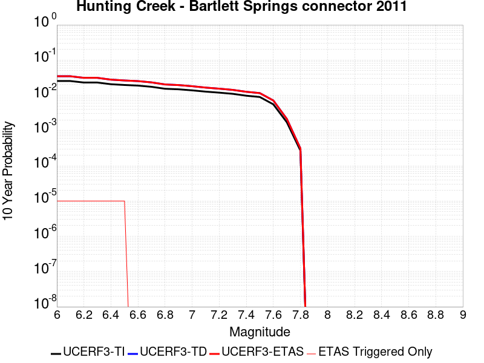 |

| Magnitude | 1 wk TI Prob | 1 wk TD Prob | 1 wk ETAS Prob | 1 wk ETAS/TD Gain | 1 wk ETAS Triggered Only | 1 mo TI Prob | 1 mo TD Prob | 1 mo ETAS Prob | 1 mo ETAS/TD Gain | 1 mo ETAS Triggered Only | 1 yr TI Prob | 1 yr TD Prob | 1 yr ETAS Prob | 1 yr ETAS/TD Gain | 1 yr ETAS Triggered Only | 10 yr TI Prob | 10 yr TD Prob | 10 yr ETAS Prob | 10 yr ETAS/TD Gain | 10 yr ETAS Triggered Only |
|-----|-----|-----|-----|-----|-----|-----|-----|-----|-----|-----|-----|-----|-----|-----|-----|-----|-----|-----|-----|-----|
| 6.0 | 4.940016E-5 | 6.7870766E-5 | 6.7870766E-5 | 1.0 | 0.0 | 2.1169778E-4 | 2.9084194E-4 | 2.9084194E-4 | 1.0 | 0.0 | 0.002574374 | 0.0035350819 | 0.0035841954 | 1.0138932 | 4.928779E-5 | 0.025447546 | 0.03477475 | 0.034822326 | 1.001368 | 4.928779E-5 |
| 6.1 | 4.940016E-5 | 6.7870766E-5 | 6.7870766E-5 | 1.0 | 0.0 | 2.1169778E-4 | 2.9084194E-4 | 2.9084194E-4 | 1.0 | 0.0 | 0.002574374 | 0.0035350819 | 0.0035841954 | 1.0138932 | 4.928779E-5 | 0.025447546 | 0.03477475 | 0.034822326 | 1.001368 | 4.928779E-5 |
| 6.2 | 4.472471E-5 | 6.100572E-5 | 6.100572E-5 | 1.0 | 0.0 | 1.9166325E-4 | 2.6142647E-4 | 2.6142647E-4 | 1.0 | 0.0 | 0.0023310026 | 0.0031781218 | 0.003227253 | 1.0154592 | 4.928779E-5 | 0.02306703 | 0.031317808 | 0.03136555 | 1.0015244 | 4.928779E-5 |
| 6.3 | 4.472471E-5 | 6.100572E-5 | 6.100572E-5 | 1.0 | 0.0 | 1.9166325E-4 | 2.6142647E-4 | 2.6142647E-4 | 1.0 | 0.0 | 0.0023310026 | 0.0031781218 | 0.003227253 | 1.0154592 | 4.928779E-5 | 0.02306703 | 0.031317808 | 0.03136555 | 1.0015244 | 4.928779E-5 |
| 6.4 | 4.0001003E-5 | 5.410516E-5 | 5.410516E-5 | 1.0 | 0.0 | 1.714216E-4 | 2.318579E-4 | 2.318579E-4 | 1.0 | 0.0 | 0.0020850603 | 0.0028191686 | 0.0028683173 | 1.0174338 | 4.928779E-5 | 0.02065605 | 0.027829198 | 0.027877115 | 1.0017217 | 4.928779E-5 |
| 6.5 | 3.8033053E-5 | 5.126649E-5 | 5.126649E-5 | 1.0 | 0.0 | 1.6298861E-4 | 2.1969521E-4 | 2.1969521E-4 | 1.0 | 0.0 | 0.0019825802 | 0.0026714848 | 0.002720641 | 1.0184003 | 4.928779E-5 | 0.019649856 | 0.026391273 | 0.02643926 | 1.0018183 | 4.928779E-5 |
| 6.6 | 3.653754E-5 | 4.912955E-5 | 4.912955E-5 | 1.0 | 0.0 | 1.5658008E-4 | 2.1053842E-4 | 2.1053842E-4 | 1.0 | 0.0 | 0.0019046954 | 0.0025602889 | 0.0025602889 | 1.0 | 0.0 | 0.018884527 | 0.025307199 | 0.025307199 | 1.0 | 0.0 |
| 6.7 | 3.372024E-5 | 4.5140216E-5 | 4.5140216E-5 | 1.0 | 0.0 | 1.4450731E-4 | 1.9344388E-4 | 1.9344388E-4 | 1.0 | 0.0 | 0.0017579567 | 0.0023526535 | 0.0023526535 | 1.0 | 0.0 | 0.017441148 | 0.023278862 | 0.023278862 | 1.0 | 0.0 |
| 6.8 | 2.9650024E-5 | 3.9411647E-5 | 3.9411647E-5 | 1.0 | 0.0 | 1.2706534E-4 | 1.6889606E-4 | 1.6889606E-4 | 1.0 | 0.0 | 0.0015459227 | 0.0020543607 | 0.0020543607 | 1.0 | 0.0 | 0.015352124 | 0.020351961 | 0.020351961 | 1.0 | 0.0 |
| 6.9 | 2.860775E-5 | 3.7812886E-5 | 3.7812886E-5 | 1.0 | 0.0 | 1.2259888E-4 | 1.620452E-4 | 1.620452E-4 | 1.0 | 0.0 | 0.0014916194 | 0.0019711219 | 0.0019711219 | 1.0 | 0.0 | 0.014816469 | 0.019536555 | 0.019536555 | 1.0 | 0.0 |
| 7.0 | 2.6696067E-5 | 3.5067544E-5 | 3.5067544E-5 | 1.0 | 0.0 | 1.144067E-4 | 1.5028086E-4 | 1.5028086E-4 | 1.0 | 0.0 | 0.0013920115 | 0.0018281427 | 0.0018281427 | 1.0 | 0.0 | 0.013833242 | 0.01813184 | 0.01813184 | 1.0 | 0.0 |
| 7.1 | 2.456087E-5 | 3.2013326E-5 | 3.2013326E-5 | 1.0 | 0.0 | 1.0525662E-4 | 1.3719281E-4 | 1.3719281E-4 | 1.0 | 0.0 | 0.001280746 | 0.0016690517 | 0.0016690517 | 1.0 | 0.0 | 0.012733897 | 0.016566671 | 0.016566671 | 1.0 | 0.0 |
| 7.2 | 2.295761E-5 | 2.9823148E-5 | 2.9823148E-5 | 1.0 | 0.0 | 9.8386045E-5 | 1.2780727E-4 | 1.2780727E-4 | 1.0 | 0.0 | 0.0011971919 | 0.0015549522 | 0.0015549522 | 1.0 | 0.0 | 0.011907627 | 0.015442378 | 0.015442378 | 1.0 | 0.0 |
| 7.3 | 2.1256936E-5 | 2.7542124E-5 | 2.7542124E-5 | 1.0 | 0.0 | 9.109797E-5 | 1.1803238E-4 | 1.1803238E-4 | 1.0 | 0.0 | 0.0011085535 | 0.0014361058 | 0.0014361058 | 1.0 | 0.0 | 0.011030397 | 0.014269741 | 0.014269741 | 1.0 | 0.0 |
| 7.4 | 1.8784336E-5 | 2.430697E-5 | 2.430697E-5 | 1.0 | 0.0 | 8.050181E-5 | 1.0416861E-4 | 1.0416861E-4 | 1.0 | 0.0 | 9.796688E-4 | 0.0012675226 | 0.0012675226 | 1.0 | 0.0 | 0.009753612 | 0.012604194 | 0.012604194 | 1.0 | 0.0 |
| 7.5 | 1.7248298E-5 | 2.2269056E-5 | 2.2269056E-5 | 1.0 | 0.0 | 7.391918E-5 | 9.543537E-5 | 9.543537E-5 | 1.0 | 0.0 | 8.9959445E-4 | 0.0011613137 | 0.0011613137 | 1.0 | 0.0 | 0.008959615 | 0.011553645 | 0.011553645 | 1.0 | 0.0 |
| 7.6 | 1.0653709E-5 | 1.3722259E-5 | 1.3722259E-5 | 1.0 | 0.0 | 4.5657955E-5 | 5.880837E-5 | 5.880837E-5 | 1.0 | 0.0 | 5.557438E-4 | 7.157594E-4 | 7.157594E-4 | 1.0 | 0.0 | 0.0055435603 | 0.0071350415 | 0.0071350415 | 1.0 | 0.0 |
| 7.7 | 3.286316E-6 | 4.0903997E-6 | 4.0903997E-6 | 1.0 | 0.0 | 1.4084137E-5 | 1.7530168E-5 | 1.7530168E-5 | 1.0 | 0.0 | 1.7146087E-4 | 2.1340905E-4 | 2.1340905E-4 | 1.0 | 0.0 | 0.0017132863 | 0.0021320845 | 0.0021320845 | 1.0 | 0.0 |
| 7.8 | 5.1855085E-7 | 5.972095E-7 | 5.972095E-7 | 1.0 | 0.0 | 2.222359E-6 | 2.5594668E-6 | 2.5594668E-6 | 1.0 | 0.0 | 2.7056883E-5 | 3.1161075E-5 | 3.1161075E-5 | 1.0 | 0.0 | 2.705359E-4 | 3.1156064E-4 | 3.1156064E-4 | 1.0 | 0.0 |

## San Jacinto (Anza) rev
*[(top)](#table-of-contents)*

| 1 Week | 1 Month | 1 Year | 10 Year |
|-----|-----|-----|-----|
|  |  |  | 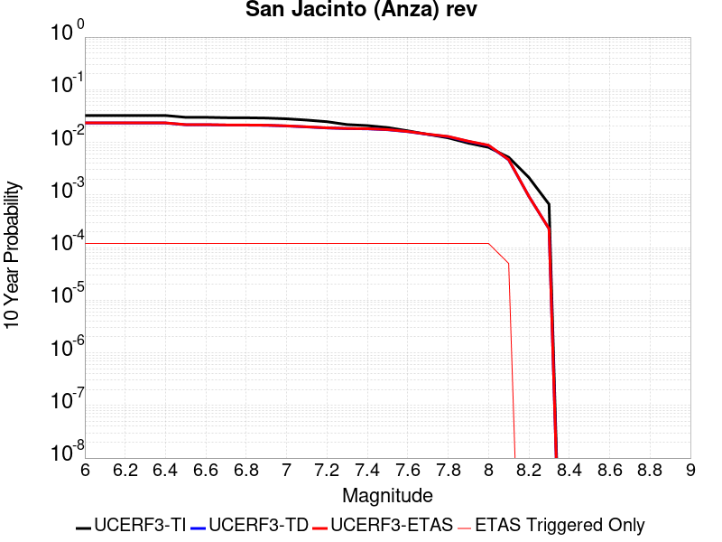 |

| Magnitude | 1 wk TI Prob | 1 wk TD Prob | 1 wk ETAS Prob | 1 wk ETAS/TD Gain | 1 wk ETAS Triggered Only | 1 mo TI Prob | 1 mo TD Prob | 1 mo ETAS Prob | 1 mo ETAS/TD Gain | 1 mo ETAS Triggered Only | 1 yr TI Prob | 1 yr TD Prob | 1 yr ETAS Prob | 1 yr ETAS/TD Gain | 1 yr ETAS Triggered Only | 10 yr TI Prob | 10 yr TD Prob | 10 yr ETAS Prob | 10 yr ETAS/TD Gain | 10 yr ETAS Triggered Only |
|-----|-----|-----|-----|-----|-----|-----|-----|-----|-----|-----|-----|-----|-----|-----|-----|-----|-----|-----|-----|-----|
| 6.0 | 6.3015636E-5 | 4.3298347E-5 | 4.3298347E-5 | 1.0 | 0.0 | 2.7003905E-4 | 1.8555121E-4 | 1.8555121E-4 | 1.0 | 0.0 | 0.0032827691 | 0.0022567573 | 0.0022567573 | 1.0 | 0.0 | 0.032346968 | 0.02329361 | 0.02334175 | 1.0020666 | 4.928779E-5 |
| 6.1 | 6.3015636E-5 | 4.3298347E-5 | 4.3298347E-5 | 1.0 | 0.0 | 2.7003905E-4 | 1.8555121E-4 | 1.8555121E-4 | 1.0 | 0.0 | 0.0032827691 | 0.0022567573 | 0.0022567573 | 1.0 | 0.0 | 0.032346968 | 0.02329361 | 0.02334175 | 1.0020666 | 4.928779E-5 |
| 6.2 | 6.3015636E-5 | 4.3298347E-5 | 4.3298347E-5 | 1.0 | 0.0 | 2.7003905E-4 | 1.8555121E-4 | 1.8555121E-4 | 1.0 | 0.0 | 0.0032827691 | 0.0022567573 | 0.0022567573 | 1.0 | 0.0 | 0.032346968 | 0.02329361 | 0.02334175 | 1.0020666 | 4.928779E-5 |
| 6.3 | 6.3015636E-5 | 4.3298347E-5 | 4.3298347E-5 | 1.0 | 0.0 | 2.7003905E-4 | 1.8555121E-4 | 1.8555121E-4 | 1.0 | 0.0 | 0.0032827691 | 0.0022567573 | 0.0022567573 | 1.0 | 0.0 | 0.032346968 | 0.02329361 | 0.02334175 | 1.0020666 | 4.928779E-5 |
| 6.4 | 6.3015636E-5 | 4.3298347E-5 | 4.3298347E-5 | 1.0 | 0.0 | 2.7003905E-4 | 1.8555121E-4 | 1.8555121E-4 | 1.0 | 0.0 | 0.0032827691 | 0.0022567573 | 0.0022567573 | 1.0 | 0.0 | 0.032346968 | 0.02329361 | 0.02334175 | 1.0020666 | 4.928779E-5 |
| 6.5 | 5.811017E-5 | 4.0080286E-5 | 4.0080286E-5 | 1.0 | 0.0 | 2.4901982E-4 | 1.7176138E-4 | 1.7176138E-4 | 1.0 | 0.0 | 0.0030276014 | 0.0020891947 | 0.0020891947 | 1.0 | 0.0 | 0.02986684 | 0.021590833 | 0.021639057 | 1.0022335 | 4.928779E-5 |
| 6.6 | 5.811017E-5 | 4.0080286E-5 | 4.0080286E-5 | 1.0 | 0.0 | 2.4901982E-4 | 1.7176138E-4 | 1.7176138E-4 | 1.0 | 0.0 | 0.0030276014 | 0.0020891947 | 0.0020891947 | 1.0 | 0.0 | 0.02986684 | 0.021590833 | 0.021639057 | 1.0022335 | 4.928779E-5 |
| 6.7 | 5.712442E-5 | 3.950301E-5 | 3.950301E-5 | 1.0 | 0.0 | 2.4479596E-4 | 1.6928767E-4 | 1.6928767E-4 | 1.0 | 0.0 | 0.0029763177 | 0.0020591344 | 0.0020591344 | 1.0 | 0.0 | 0.029367693 | 0.021282919 | 0.021331158 | 1.0022665 | 4.928779E-5 |
| 6.8 | 5.6967532E-5 | 3.93593E-5 | 3.93593E-5 | 1.0 | 0.0 | 2.4412372E-4 | 1.6867183E-4 | 1.6867183E-4 | 1.0 | 0.0 | 0.0029681553 | 0.0020516508 | 0.0020516508 | 1.0 | 0.0 | 0.029288229 | 0.02120852 | 0.021256762 | 1.0022746 | 4.928779E-5 |
| 6.9 | 5.6211324E-5 | 3.9064216E-5 | 3.9064216E-5 | 1.0 | 0.0 | 2.4088343E-4 | 1.6740736E-4 | 1.6740736E-4 | 1.0 | 0.0 | 0.0029288116 | 0.0020362847 | 0.0020362847 | 1.0 | 0.0 | 0.028905109 | 0.021047527 | 0.021095779 | 1.0022924 | 4.928779E-5 |
| 7.0 | 5.4383527E-5 | 3.7925012E-5 | 3.7925012E-5 | 1.0 | 0.0 | 2.3305144E-4 | 1.6252567E-4 | 1.6252567E-4 | 1.0 | 0.0 | 0.0028337094 | 0.001976959 | 0.001976959 | 1.0 | 0.0 | 0.027978465 | 0.02044095 | 0.02048923 | 1.0023619 | 4.928779E-5 |
| 7.1 | 5.1393665E-5 | 3.638787E-5 | 3.638787E-5 | 1.0 | 0.0 | 2.2023996E-4 | 1.5593872E-4 | 1.5593872E-4 | 1.0 | 0.0 | 0.0026781242 | 0.0018969048 | 0.0018969048 | 1.0 | 0.0 | 0.026460782 | 0.019616077 | 0.019664397 | 1.0024633 | 4.928779E-5 |
| 7.2 | 4.785222E-5 | 3.4738845E-5 | 3.4738845E-5 | 1.0 | 0.0 | 2.0506482E-4 | 1.4887229E-4 | 1.4887229E-4 | 1.0 | 0.0 | 0.0024938055 | 0.0018110167 | 0.0018110167 | 1.0 | 0.0 | 0.024660049 | 0.018728783 | 0.018777147 | 1.0025824 | 4.928779E-5 |
| 7.3 | 4.2143256E-5 | 3.3834414E-5 | 3.3834414E-5 | 1.0 | 0.0 | 1.8060145E-4 | 1.449966E-4 | 1.449966E-4 | 1.0 | 0.0 | 0.002196605 | 0.0017639075 | 0.0017639075 | 1.0 | 0.0 | 0.02175019 | 0.018236695 | 0.018285085 | 1.0026534 | 4.928779E-5 |
| 7.4 | 4.0264713E-5 | 3.3472694E-5 | 3.3472694E-5 | 1.0 | 0.0 | 1.7255165E-4 | 1.4344654E-4 | 1.4344654E-4 | 1.0 | 0.0 | 0.002098792 | 0.0017450659 | 0.0017450659 | 1.0 | 0.0 | 0.020790804 | 0.018041389 | 0.018089788 | 1.0026827 | 4.928779E-5 |
| 7.5 | 3.694492E-5 | 3.2186905E-5 | 3.2186905E-5 | 1.0 | 0.0 | 1.5832575E-4 | 1.379366E-4 | 1.379366E-4 | 1.0 | 0.0 | 0.0019259118 | 0.0016780876 | 0.0016780876 | 1.0 | 0.0 | 0.01909306 | 0.017357888 | 0.01740632 | 1.0027902 | 4.928779E-5 |
| 7.6 | 3.200565E-5 | 2.9502702E-5 | 2.9502702E-5 | 1.0 | 0.0 | 1.3715986E-4 | 1.2643404E-4 | 1.2643404E-4 | 1.0 | 0.0 | 0.001668642 | 0.0015382497 | 0.0015382497 | 1.0 | 0.0 | 0.01656168 | 0.015946016 | 0.015994519 | 1.0030416 | 4.928779E-5 |
| 7.7 | 2.731642E-5 | 2.6091477E-5 | 2.6091477E-5 | 1.0 | 0.0 | 1.1706512E-4 | 1.11815825E-4 | 1.11815825E-4 | 1.0 | 0.0 | 0.001424336 | 0.0013605085 | 0.0013605085 | 1.0 | 0.0 | 0.014152412 | 0.0141668 | 0.014215389 | 1.0034298 | 4.928779E-5 |
| 7.8 | 2.3466424E-5 | 2.3503619E-5 | 2.3503619E-5 | 1.0 | 0.0 | 1.0056651E-4 | 1.0072591E-4 | 1.0072591E-4 | 1.0 | 0.0 | 0.0012237094 | 0.0012256489 | 0.0012256489 | 1.0 | 0.0 | 0.012169928 | 0.012808796 | 0.012857453 | 1.0037987 | 4.928779E-5 |
| 7.9 | 1.8611925E-5 | 1.890698E-5 | 1.890698E-5 | 1.0 | 0.0 | 7.9762955E-5 | 8.10274E-5 | 8.10274E-5 | 1.0 | 0.0 | 9.7068126E-4 | 9.860628E-4 | 9.860628E-4 | 1.0 | 0.0 | 0.0096645225 | 0.010393705 | 0.010442481 | 1.0046928 | 4.928779E-5 |
| 8.0 | 1.5460775E-5 | 1.5739915E-5 | 1.5739915E-5 | 1.0 | 0.0 | 6.6258784E-5 | 6.745504E-5 | 6.745504E-5 | 1.0 | 0.0 | 8.0640207E-4 | 8.2095637E-4 | 8.2095637E-4 | 1.0 | 0.0 | 0.008034821 | 0.008702706 | 0.008751565 | 1.0056142 | 4.928779E-5 |
| 8.1 | 9.983884E-6 | 8.268954E-6 | 8.268954E-6 | 1.0 | 0.0 | 4.2787375E-5 | 3.5437897E-5 | 3.5437897E-5 | 1.0 | 0.0 | 5.2081177E-4 | 4.313715E-4 | 4.313715E-4 | 1.0 | 0.0 | 0.0051959283 | 0.00463968 | 0.0046887393 | 1.0105739 | 4.928779E-5 |
| 8.2 | 4.1226E-6 | 1.5522551E-6 | 1.5522551E-6 | 1.0 | 0.0 | 1.7668166E-5 | 6.6525045E-6 | 6.6525045E-6 | 1.0 | 0.0 | 2.1508869E-4 | 8.099126E-5 | 8.099126E-5 | 1.0 | 0.0 | 0.0021488064 | 9.401847E-4 | 9.401847E-4 | 1.0 | 0.0 |
| 8.3 | 1.2750878E-6 | 3.609817E-7 | 3.609817E-7 | 1.0 | 0.0 | 5.4646503E-6 | 1.5470634E-6 | 1.5470634E-6 | 1.0 | 0.0 | 6.653009E-5 | 1.8835339E-5 | 1.8835339E-5 | 1.0 | 0.0 | 6.6510175E-4 | 2.272251E-4 | 2.272251E-4 | 1.0 | 0.0 |

## Hartley Springs 2011 CFM
*[(top)](#table-of-contents)*

| 1 Week | 1 Month | 1 Year | 10 Year |
|-----|-----|-----|-----|
|  |  |  |  |

| Magnitude | 1 wk TI Prob | 1 wk TD Prob | 1 wk ETAS Prob | 1 wk ETAS/TD Gain | 1 wk ETAS Triggered Only | 1 mo TI Prob | 1 mo TD Prob | 1 mo ETAS Prob | 1 mo ETAS/TD Gain | 1 mo ETAS Triggered Only | 1 yr TI Prob | 1 yr TD Prob | 1 yr ETAS Prob | 1 yr ETAS/TD Gain | 1 yr ETAS Triggered Only | 10 yr TI Prob | 10 yr TD Prob | 10 yr ETAS Prob | 10 yr ETAS/TD Gain | 10 yr ETAS Triggered Only |
|-----|-----|-----|-----|-----|-----|-----|-----|-----|-----|-----|-----|-----|-----|-----|-----|-----|-----|-----|-----|-----|
| 6.0 | 1.4352418E-5 | 1.4434111E-5 | 1.4434111E-5 | 1.0 | 0.0 | 6.1508916E-5 | 6.185994E-5 | 1.11144676E-4 | 1.796715 | 4.928779E-5 | 7.486137E-4 | 7.5304887E-4 | 8.0229953E-4 | 1.0654017 | 4.928779E-5 | 0.007460968 | 0.007521092 | 0.007570009 | 1.0065039 | 4.928779E-5 |
| 6.1 | 1.4352418E-5 | 1.4434111E-5 | 1.4434111E-5 | 1.0 | 0.0 | 6.1508916E-5 | 6.185994E-5 | 1.11144676E-4 | 1.796715 | 4.928779E-5 | 7.486137E-4 | 7.5304887E-4 | 8.0229953E-4 | 1.0654017 | 4.928779E-5 | 0.007460968 | 0.007521092 | 0.007570009 | 1.0065039 | 4.928779E-5 |
| 6.2 | 1.4352418E-5 | 1.4434111E-5 | 1.4434111E-5 | 1.0 | 0.0 | 6.1508916E-5 | 6.185994E-5 | 1.11144676E-4 | 1.796715 | 4.928779E-5 | 7.486137E-4 | 7.5304887E-4 | 8.0229953E-4 | 1.0654017 | 4.928779E-5 | 0.007460968 | 0.007521092 | 0.007570009 | 1.0065039 | 4.928779E-5 |
| 6.3 | 1.4352418E-5 | 1.4434111E-5 | 1.4434111E-5 | 1.0 | 0.0 | 6.1508916E-5 | 6.185994E-5 | 1.11144676E-4 | 1.796715 | 4.928779E-5 | 7.486137E-4 | 7.5304887E-4 | 8.0229953E-4 | 1.0654017 | 4.928779E-5 | 0.007460968 | 0.007521092 | 0.007570009 | 1.0065039 | 4.928779E-5 |
| 6.4 | 1.4352418E-5 | 1.4434111E-5 | 1.4434111E-5 | 1.0 | 0.0 | 6.1508916E-5 | 6.185994E-5 | 1.11144676E-4 | 1.796715 | 4.928779E-5 | 7.486137E-4 | 7.5304887E-4 | 8.0229953E-4 | 1.0654017 | 4.928779E-5 | 0.007460968 | 0.007521092 | 0.007570009 | 1.0065039 | 4.928779E-5 |
| 6.5 | 1.2279858E-5 | 1.2133036E-5 | 1.2133036E-5 | 1.0 | 0.0 | 5.26269E-5 | 5.199858E-5 | 1.0128381E-4 | 1.9478188 | 4.928779E-5 | 6.4054417E-4 | 6.33057E-4 | 6.823136E-4 | 1.0778075 | 4.928779E-5 | 0.0063870098 | 0.006328048 | 0.006377024 | 1.0077395 | 4.928779E-5 |
| 6.6 | 1.2279858E-5 | 1.2133036E-5 | 1.2133036E-5 | 1.0 | 0.0 | 5.26269E-5 | 5.199858E-5 | 1.0128381E-4 | 1.9478188 | 4.928779E-5 | 6.4054417E-4 | 6.33057E-4 | 6.823136E-4 | 1.0778075 | 4.928779E-5 | 0.0063870098 | 0.006328048 | 0.006377024 | 1.0077395 | 4.928779E-5 |
| 6.7 | 2.1282601E-6 | 8.894127E-7 | 8.894127E-7 | 1.0 | 0.0 | 9.121083E-6 | 3.8117648E-6 | 3.8117648E-6 | 1.0 | 0.0 | 1.11043526E-4 | 4.6407506E-5 | 4.6407506E-5 | 1.0 | 0.0 | 0.0011098806 | 4.6400347E-4 | 4.6400347E-4 | 1.0 | 0.0 |
| 6.8 | 2.00516E-6 | 8.516916E-7 | 8.516916E-7 | 1.0 | 0.0 | 8.593515E-6 | 3.6501033E-6 | 3.6501033E-6 | 1.0 | 0.0 | 1.04621024E-4 | 4.443936E-5 | 4.443936E-5 | 1.0 | 0.0 | 0.0010457177 | 4.4432987E-4 | 4.4432987E-4 | 1.0 | 0.0 |
| 6.9 | 2.00516E-6 | 8.516916E-7 | 8.516916E-7 | 1.0 | 0.0 | 8.593515E-6 | 3.6501033E-6 | 3.6501033E-6 | 1.0 | 0.0 | 1.04621024E-4 | 4.443936E-5 | 4.443936E-5 | 1.0 | 0.0 | 0.0010457177 | 4.4432987E-4 | 4.4432987E-4 | 1.0 | 0.0 |
| 7.0 | 1.8366732E-6 | 8.2366813E-7 | 8.2366813E-7 | 1.0 | 0.0 | 7.871433E-6 | 3.5300031E-6 | 3.5300031E-6 | 1.0 | 0.0 | 9.583048E-5 | 4.2977194E-5 | 4.2977194E-5 | 1.0 | 0.0 | 9.5789164E-4 | 4.297139E-4 | 4.297139E-4 | 1.0 | 0.0 |
| 7.1 | 1.5097997E-6 | 7.1897E-7 | 7.1897E-7 | 1.0 | 0.0 | 6.470554E-6 | 3.0812978E-6 | 3.0812978E-6 | 1.0 | 0.0 | 7.877615E-5 | 3.7514397E-5 | 3.7514397E-5 | 1.0 | 0.0 | 7.874823E-4 | 3.7510434E-4 | 3.7510434E-4 | 1.0 | 0.0 |
| 7.2 | 1.3490993E-6 | 6.404769E-7 | 6.404769E-7 | 1.0 | 0.0 | 5.7818415E-6 | 2.7448996E-6 | 2.7448996E-6 | 1.0 | 0.0 | 7.0391645E-5 | 3.3418873E-5 | 3.3418873E-5 | 1.0 | 0.0 | 7.0369354E-4 | 3.3416142E-4 | 3.3416142E-4 | 1.0 | 0.0 |
| 7.3 | 7.900015E-7 | 4.0888176E-7 | 4.0888176E-7 | 1.0 | 0.0 | 3.3857161E-6 | 1.7523504E-6 | 1.7523504E-6 | 1.0 | 0.0 | 4.1220315E-5 | 2.1334865E-5 | 2.1334865E-5 | 1.0 | 0.0 | 4.121267E-4 | 2.1334866E-4 | 2.1334866E-4 | 1.0 | 0.0 |

## Earthquake Valley (So Extension)
*[(top)](#table-of-contents)*

| 1 Week | 1 Month | 1 Year | 10 Year |
|-----|-----|-----|-----|
|  |  |  |  |

| Magnitude | 1 wk TI Prob | 1 wk TD Prob | 1 wk ETAS Prob | 1 wk ETAS/TD Gain | 1 wk ETAS Triggered Only | 1 mo TI Prob | 1 mo TD Prob | 1 mo ETAS Prob | 1 mo ETAS/TD Gain | 1 mo ETAS Triggered Only | 1 yr TI Prob | 1 yr TD Prob | 1 yr ETAS Prob | 1 yr ETAS/TD Gain | 1 yr ETAS Triggered Only | 10 yr TI Prob | 10 yr TD Prob | 10 yr ETAS Prob | 10 yr ETAS/TD Gain | 10 yr ETAS Triggered Only |
|-----|-----|-----|-----|-----|-----|-----|-----|-----|-----|-----|-----|-----|-----|-----|-----|-----|-----|-----|-----|-----|
| 6.0 | 3.0194888E-5 | 3.707208E-5 | 8.635804E-5 | 2.329463 | 4.928779E-5 | 1.2940024E-4 | 1.5887374E-4 | 2.0815371E-4 | 1.3101832 | 4.928779E-5 | 0.0015743093 | 0.0019330877 | 0.0019822803 | 1.0254476 | 4.928779E-5 | 0.01563203 | 0.0192131 | 0.019261442 | 1.002516 | 4.928779E-5 |
| 6.1 | 3.0194888E-5 | 3.707208E-5 | 8.635804E-5 | 2.329463 | 4.928779E-5 | 1.2940024E-4 | 1.5887374E-4 | 2.0815371E-4 | 1.3101832 | 4.928779E-5 | 0.0015743093 | 0.0019330877 | 0.0019822803 | 1.0254476 | 4.928779E-5 | 0.01563203 | 0.0192131 | 0.019261442 | 1.002516 | 4.928779E-5 |
| 6.2 | 3.0194888E-5 | 3.707208E-5 | 8.635804E-5 | 2.329463 | 4.928779E-5 | 1.2940024E-4 | 1.5887374E-4 | 2.0815371E-4 | 1.3101832 | 4.928779E-5 | 0.0015743093 | 0.0019330877 | 0.0019822803 | 1.0254476 | 4.928779E-5 | 0.01563203 | 0.0192131 | 0.019261442 | 1.002516 | 4.928779E-5 |
| 6.3 | 1.5795305E-5 | 1.8446612E-5 | 6.77335E-5 | 3.6718662 | 4.928779E-5 | 6.769241E-5 | 7.905514E-5 | 1.2833903E-4 | 1.6234117 | 4.928779E-5 | 8.238434E-4 | 9.621823E-4 | 0.0010114227 | 1.0511757 | 4.928779E-5 | 0.008207959 | 0.0095910635 | 0.009639879 | 1.0050896 | 4.928779E-5 |
| 6.4 | 1.5795305E-5 | 1.8446612E-5 | 6.77335E-5 | 3.6718662 | 4.928779E-5 | 6.769241E-5 | 7.905514E-5 | 1.2833903E-4 | 1.6234117 | 4.928779E-5 | 8.238434E-4 | 9.621823E-4 | 0.0010114227 | 1.0511757 | 4.928779E-5 | 0.008207959 | 0.0095910635 | 0.009639879 | 1.0050896 | 4.928779E-5 |
| 6.5 | 1.5795305E-5 | 1.8446612E-5 | 6.77335E-5 | 3.6718662 | 4.928779E-5 | 6.769241E-5 | 7.905514E-5 | 1.2833903E-4 | 1.6234117 | 4.928779E-5 | 8.238434E-4 | 9.621823E-4 | 0.0010114227 | 1.0511757 | 4.928779E-5 | 0.008207959 | 0.0095910635 | 0.009639879 | 1.0050896 | 4.928779E-5 |
| 6.6 | 1.5795305E-5 | 1.8446612E-5 | 6.77335E-5 | 3.6718662 | 4.928779E-5 | 6.769241E-5 | 7.905514E-5 | 1.2833903E-4 | 1.6234117 | 4.928779E-5 | 8.238434E-4 | 9.621823E-4 | 0.0010114227 | 1.0511757 | 4.928779E-5 | 0.008207959 | 0.0095910635 | 0.009639879 | 1.0050896 | 4.928779E-5 |
| 6.7 | 1.1363076E-5 | 1.3138288E-5 | 6.242543E-5 | 4.751413 | 4.928779E-5 | 4.8697988E-5 | 5.6306162E-5 | 1.0559118E-4 | 1.8753041 | 4.928779E-5 | 5.927367E-4 | 6.8538805E-4 | 7.3464203E-4 | 1.0718629 | 4.928779E-5 | 0.0059115817 | 0.006840215 | 0.006889166 | 1.0071563 | 4.928779E-5 |
| 6.8 | 1.0049611E-5 | 1.1594328E-5 | 6.0881546E-5 | 5.250977 | 4.928779E-5 | 4.306905E-5 | 4.968944E-5 | 9.8974786E-5 | 1.9918675 | 4.928779E-5 | 5.242395E-4 | 6.0487416E-4 | 6.5413216E-4 | 1.0814351 | 4.928779E-5 | 0.0052300454 | 0.0060394546 | 0.006088445 | 1.0081117 | 4.928779E-5 |
| 6.9 | 1.0049611E-5 | 1.1594328E-5 | 6.0881546E-5 | 5.250977 | 4.928779E-5 | 4.306905E-5 | 4.968944E-5 | 9.8974786E-5 | 1.9918675 | 4.928779E-5 | 5.242395E-4 | 6.0487416E-4 | 6.5413216E-4 | 1.0814351 | 4.928779E-5 | 0.0052300454 | 0.0060394546 | 0.006088445 | 1.0081117 | 4.928779E-5 |
| 7.0 | 1.0049611E-5 | 1.1594328E-5 | 6.0881546E-5 | 5.250977 | 4.928779E-5 | 4.306905E-5 | 4.968944E-5 | 9.8974786E-5 | 1.9918675 | 4.928779E-5 | 5.242395E-4 | 6.0487416E-4 | 6.5413216E-4 | 1.0814351 | 4.928779E-5 | 0.0052300454 | 0.0060394546 | 0.006088445 | 1.0081117 | 4.928779E-5 |
| 7.1 | 8.140254E-6 | 9.3834515E-6 | 5.867078E-5 | 6.25258 | 4.928779E-5 | 3.4886336E-5 | 4.021455E-5 | 8.950036E-5 | 2.2255716 | 4.928779E-5 | 4.2465836E-4 | 4.895692E-4 | 5.3883286E-4 | 1.1006266 | 4.928779E-5 | 0.0042384774 | 0.004891483 | 0.00494053 | 1.0100269 | 4.928779E-5 |
| 7.2 | 1.673835E-7 | 1.4153493E-7 | 1.4153493E-7 | 1.0 | 0.0 | 7.173577E-7 | 6.065781E-7 | 6.065781E-7 | 1.0 | 0.0 | 8.733795E-6 | 7.3850674E-6 | 7.3850674E-6 | 1.0 | 0.0 | 8.733451E-5 | 7.3848576E-5 | 7.3848576E-5 | 1.0 | 0.0 |
| 7.3 | 1.6632116E-7 | 1.4051723E-7 | 1.4051723E-7 | 1.0 | 0.0 | 7.1280476E-7 | 6.022166E-7 | 6.022166E-7 | 1.0 | 0.0 | 8.678364E-6 | 7.331966E-6 | 7.331966E-6 | 1.0 | 0.0 | 8.6780245E-5 | 7.33176E-5 | 7.33176E-5 | 1.0 | 0.0 |
| 7.4 | 1.6569169E-7 | 1.3996352E-7 | 1.3996352E-7 | 1.0 | 0.0 | 7.1010703E-7 | 5.9984353E-7 | 5.9984353E-7 | 1.0 | 0.0 | 8.645519E-6 | 7.303074E-6 | 7.303074E-6 | 1.0 | 0.0 | 8.645182E-5 | 7.30287E-5 | 7.30287E-5 | 1.0 | 0.0 |
| 7.5 | 1.1764555E-7 | 1.0095245E-7 | 1.0095245E-7 | 1.0 | 0.0 | 5.041951E-7 | 4.3265328E-7 | 4.3265328E-7 | 1.0 | 0.0 | 6.138558E-6 | 5.267543E-6 | 5.267543E-6 | 1.0 | 0.0 | 6.1383886E-5 | 5.2674397E-5 | 5.2674397E-5 | 1.0 | 0.0 |
| 7.6 | 1.07927605E-7 | 9.2600665E-8 | 9.2600665E-8 | 1.0 | 0.0 | 4.6254678E-7 | 3.9685995E-7 | 3.9685995E-7 | 1.0 | 0.0 | 5.6314925E-6 | 4.8317615E-6 | 4.8317615E-6 | 1.0 | 0.0 | 5.63135E-5 | 4.831677E-5 | 4.831677E-5 | 1.0 | 0.0 |
| 7.7 | 2.1826905E-8 | 1.1179958E-8 | 1.1179958E-8 | 1.0 | 0.0 | 9.3543875E-8 | 4.791411E-8 | 4.791411E-8 | 1.0 | 0.0 | 1.1388961E-6 | 5.8335416E-7 | 5.8335416E-7 | 1.0 | 0.0 | 1.1388902E-5 | 5.8335318E-6 | 5.8335318E-6 | 1.0 | 0.0 |
| 7.8 | 2.6169649E-9 | 1.1968753E-9 | 1.1968753E-9 | 1.0 | 0.0 | 1.1215564E-8 | 5.1294657E-9 | 5.1294657E-9 | 1.0 | 0.0 | 1.3654947E-7 | 6.245124E-8 | 6.245124E-8 | 1.0 | 0.0 | 1.365494E-6 | 6.2451244E-7 | 6.2451244E-7 | 1.0 | 0.0 |

## Great Valley 04a Trout Creek
*[(top)](#table-of-contents)*

| 1 Week | 1 Month | 1 Year | 10 Year |
|-----|-----|-----|-----|
|  |  |  |  |

| Magnitude | 1 wk TI Prob | 1 wk TD Prob | 1 wk ETAS Prob | 1 wk ETAS/TD Gain | 1 wk ETAS Triggered Only | 1 mo TI Prob | 1 mo TD Prob | 1 mo ETAS Prob | 1 mo ETAS/TD Gain | 1 mo ETAS Triggered Only | 1 yr TI Prob | 1 yr TD Prob | 1 yr ETAS Prob | 1 yr ETAS/TD Gain | 1 yr ETAS Triggered Only | 10 yr TI Prob | 10 yr TD Prob | 10 yr ETAS Prob | 10 yr ETAS/TD Gain | 10 yr ETAS Triggered Only |
|-----|-----|-----|-----|-----|-----|-----|-----|-----|-----|-----|-----|-----|-----|-----|-----|-----|-----|-----|-----|-----|
| 6.0 | 1.4088538E-5 | 1.5719554E-5 | 6.500657E-5 | 4.1353955 | 4.928779E-5 | 6.037805E-5 | 6.7367844E-5 | 1.16652314E-4 | 1.7315726 | 4.928779E-5 | 7.3485484E-4 | 8.199074E-4 | 8.6915476E-4 | 1.0600646 | 4.928779E-5 | 0.007324295 | 0.008170108 | 0.008218993 | 1.0059834 | 4.928779E-5 |
| 6.1 | 1.4088538E-5 | 1.5719554E-5 | 6.500657E-5 | 4.1353955 | 4.928779E-5 | 6.037805E-5 | 6.7367844E-5 | 1.16652314E-4 | 1.7315726 | 4.928779E-5 | 7.3485484E-4 | 8.199074E-4 | 8.6915476E-4 | 1.0600646 | 4.928779E-5 | 0.007324295 | 0.008170108 | 0.008218993 | 1.0059834 | 4.928779E-5 |
| 6.2 | 1.4088538E-5 | 1.5719554E-5 | 6.500657E-5 | 4.1353955 | 4.928779E-5 | 6.037805E-5 | 6.7367844E-5 | 1.16652314E-4 | 1.7315726 | 4.928779E-5 | 7.3485484E-4 | 8.199074E-4 | 8.6915476E-4 | 1.0600646 | 4.928779E-5 | 0.007324295 | 0.008170108 | 0.008218993 | 1.0059834 | 4.928779E-5 |
| 6.3 | 1.2882862E-5 | 1.4378603E-5 | 6.3665684E-5 | 4.427808 | 4.928779E-5 | 5.5211098E-5 | 6.1621184E-5 | 1.1090594E-4 | 1.7998021 | 4.928779E-5 | 6.7198783E-4 | 7.4999005E-4 | 7.992409E-4 | 1.0656686 | 4.928779E-5 | 0.0066995937 | 0.0074756527 | 0.0075245723 | 1.0065439 | 4.928779E-5 |
| 6.4 | 1.2882862E-5 | 1.4378603E-5 | 6.3665684E-5 | 4.427808 | 4.928779E-5 | 5.5211098E-5 | 6.1621184E-5 | 1.1090594E-4 | 1.7998021 | 4.928779E-5 | 6.7198783E-4 | 7.4999005E-4 | 7.992409E-4 | 1.0656686 | 4.928779E-5 | 0.0066995937 | 0.0074756527 | 0.0075245723 | 1.0065439 | 4.928779E-5 |
| 6.5 | 1.2762329E-5 | 1.424516E-5 | 6.353225E-5 | 4.4599185 | 4.928779E-5 | 5.469455E-5 | 6.1049315E-5 | 1.103341E-4 | 1.8072946 | 4.928779E-5 | 6.657027E-4 | 7.430323E-4 | 7.9228345E-4 | 1.0662841 | 4.928779E-5 | 0.00663712 | 0.0074065393 | 0.0074554617 | 1.0066054 | 4.928779E-5 |
| 6.6 | 1.2762329E-5 | 1.424516E-5 | 6.353225E-5 | 4.4599185 | 4.928779E-5 | 5.469455E-5 | 6.1049315E-5 | 1.103341E-4 | 1.8072946 | 4.928779E-5 | 6.657027E-4 | 7.430323E-4 | 7.9228345E-4 | 1.0662841 | 4.928779E-5 | 0.00663712 | 0.0074065393 | 0.0074554617 | 1.0066054 | 4.928779E-5 |
| 6.7 | 1.2557959E-5 | 1.4019395E-5 | 6.330649E-5 | 4.515637 | 4.928779E-5 | 5.3818712E-5 | 6.0081795E-5 | 1.0936663E-4 | 1.8202956 | 4.928779E-5 | 6.5504585E-4 | 7.312607E-4 | 7.8051246E-4 | 1.0673518 | 4.928779E-5 | 0.006531183 | 0.007289598 | 0.0073385267 | 1.0067121 | 4.928779E-5 |
| 6.8 | 1.1871544E-5 | 1.3258823E-5 | 6.254596E-5 | 4.7173085 | 4.928779E-5 | 5.0877054E-5 | 5.6822348E-5 | 1.06107334E-4 | 1.8673522 | 4.928779E-5 | 6.1925204E-4 | 6.916025E-4 | 7.408562E-4 | 1.0712168 | 4.928779E-5 | 0.0061752927 | 0.0068955184 | 0.0069444664 | 1.0070986 | 4.928779E-5 |
| 6.9 | 1.0500373E-5 | 1.1731261E-5 | 6.1018476E-5 | 5.201357 | 4.928779E-5 | 4.5000823E-5 | 5.0275914E-5 | 9.956123E-5 | 1.9802967 | 4.928779E-5 | 5.4774724E-4 | 6.119459E-4 | 6.612035E-4 | 1.0804935 | 4.928779E-5 | 0.005463991 | 0.0061034737 | 0.006152461 | 1.0080261 | 4.928779E-5 |
| 7.0 | 8.524332E-6 | 9.5334835E-6 | 9.5334835E-6 | 1.0 | 0.0 | 3.653234E-5 | 4.0857187E-5 | 4.0857187E-5 | 1.0 | 0.0 | 4.4469046E-4 | 4.9733004E-4 | 4.9733004E-4 | 1.0 | 0.0 | 0.0044380166 | 0.004962902 | 0.004962902 | 1.0 | 0.0 |
| 7.1 | 6.006849E-6 | 6.711559E-6 | 6.711559E-6 | 1.0 | 0.0 | 2.5743384E-5 | 2.876354E-5 | 2.876354E-5 | 1.0 | 0.0 | 3.1338062E-4 | 3.501454E-4 | 3.501454E-4 | 1.0 | 0.0 | 0.0031293905 | 0.0034964874 | 0.0034964874 | 1.0 | 0.0 |
| 7.2 | 2.9122193E-6 | 3.2465305E-6 | 3.2465305E-6 | 1.0 | 0.0 | 1.248088E-5 | 1.3913637E-5 | 1.3913637E-5 | 1.0 | 0.0 | 1.5194413E-4 | 1.6938712E-4 | 1.6938712E-4 | 1.0 | 0.0 | 0.0015184027 | 0.0016927521 | 0.0016927521 | 1.0 | 0.0 |
| 7.3 | 7.2194007E-7 | 7.988761E-7 | 7.988761E-7 | 1.0 | 0.0 | 3.0940253E-6 | 3.4237528E-6 | 3.4237528E-6 | 1.0 | 0.0 | 3.7669106E-5 | 4.1683852E-5 | 4.1683852E-5 | 1.0 | 0.0 | 3.766272E-4 | 4.168053E-4 | 4.168053E-4 | 1.0 | 0.0 |
| 7.4 | 3.112171E-8 | 3.2068368E-8 | 3.2068368E-8 | 1.0 | 0.0 | 1.3337875E-7 | 1.3743585E-7 | 1.3743585E-7 | 1.0 | 0.0 | 1.6238852E-6 | 1.6732803E-6 | 1.6732803E-6 | 1.0 | 0.0 | 1.6238733E-5 | 1.6732685E-5 | 1.6732685E-5 | 1.0 | 0.0 |

## Cleghorn Pass
*[(top)](#table-of-contents)*

| 1 Week | 1 Month | 1 Year | 10 Year |
|-----|-----|-----|-----|
|  |  |  |  |

| Magnitude | 1 wk TI Prob | 1 wk TD Prob | 1 wk ETAS Prob | 1 wk ETAS/TD Gain | 1 wk ETAS Triggered Only | 1 mo TI Prob | 1 mo TD Prob | 1 mo ETAS Prob | 1 mo ETAS/TD Gain | 1 mo ETAS Triggered Only | 1 yr TI Prob | 1 yr TD Prob | 1 yr ETAS Prob | 1 yr ETAS/TD Gain | 1 yr ETAS Triggered Only | 10 yr TI Prob | 10 yr TD Prob | 10 yr ETAS Prob | 10 yr ETAS/TD Gain | 10 yr ETAS Triggered Only |
|-----|-----|-----|-----|-----|-----|-----|-----|-----|-----|-----|-----|-----|-----|-----|-----|-----|-----|-----|-----|-----|
| 6.0 | 1.0522846E-5 | 1.1040642E-5 | 1.1040642E-5 | 1.0 | 0.0 | 4.509713E-5 | 4.7316473E-5 | 4.7316473E-5 | 1.0 | 0.0 | 5.4891926E-4 | 5.759784E-4 | 5.759784E-4 | 1.0 | 0.0 | 0.0054756533 | 0.005750022 | 0.005799026 | 1.0085225 | 4.928779E-5 |
| 6.1 | 1.0522846E-5 | 1.1040642E-5 | 1.1040642E-5 | 1.0 | 0.0 | 4.509713E-5 | 4.7316473E-5 | 4.7316473E-5 | 1.0 | 0.0 | 5.4891926E-4 | 5.759784E-4 | 5.759784E-4 | 1.0 | 0.0 | 0.0054756533 | 0.005750022 | 0.005799026 | 1.0085225 | 4.928779E-5 |
| 6.2 | 2.1045846E-6 | 2.2082024E-6 | 2.2082024E-6 | 1.0 | 0.0 | 9.019617E-6 | 9.463714E-6 | 9.463714E-6 | 1.0 | 0.0 | 1.098083E-4 | 1.1521882E-4 | 1.1521882E-4 | 1.0 | 0.0 | 0.0010975406 | 0.0011520023 | 0.0011520023 | 1.0 | 0.0 |
| 6.3 | 2.1045846E-6 | 2.2082024E-6 | 2.2082024E-6 | 1.0 | 0.0 | 9.019617E-6 | 9.463714E-6 | 9.463714E-6 | 1.0 | 0.0 | 1.098083E-4 | 1.1521882E-4 | 1.1521882E-4 | 1.0 | 0.0 | 0.0010975406 | 0.0011520023 | 0.0011520023 | 1.0 | 0.0 |
| 6.4 | 1.7259927E-6 | 1.810877E-6 | 1.810877E-6 | 1.0 | 0.0 | 7.3970905E-6 | 7.760902E-6 | 7.760902E-6 | 1.0 | 0.0 | 9.005586E-5 | 9.4488976E-5 | 9.4488976E-5 | 1.0 | 0.0 | 9.001937E-4 | 9.448898E-4 | 9.448898E-4 | 1.0 | 0.0 |

## Pitas Point (Lower West)
*[(top)](#table-of-contents)*

| 1 Week | 1 Month | 1 Year | 10 Year |
|-----|-----|-----|-----|
|  |  |  | 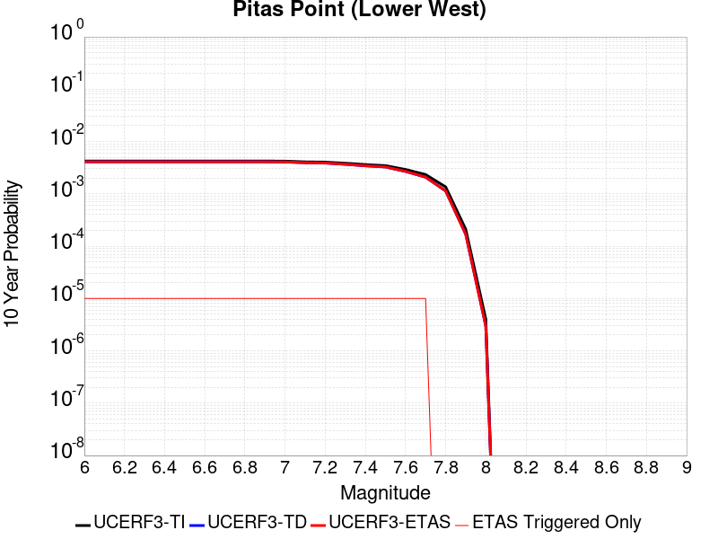 |

| Magnitude | 1 wk TI Prob | 1 wk TD Prob | 1 wk ETAS Prob | 1 wk ETAS/TD Gain | 1 wk ETAS Triggered Only | 1 mo TI Prob | 1 mo TD Prob | 1 mo ETAS Prob | 1 mo ETAS/TD Gain | 1 mo ETAS Triggered Only | 1 yr TI Prob | 1 yr TD Prob | 1 yr ETAS Prob | 1 yr ETAS/TD Gain | 1 yr ETAS Triggered Only | 10 yr TI Prob | 10 yr TD Prob | 10 yr ETAS Prob | 10 yr ETAS/TD Gain | 10 yr ETAS Triggered Only |
|-----|-----|-----|-----|-----|-----|-----|-----|-----|-----|-----|-----|-----|-----|-----|-----|-----|-----|-----|-----|-----|
| 6.0 | 8.151497E-6 | 7.855796E-6 | 7.855796E-6 | 1.0 | 0.0 | 3.493452E-5 | 3.3667267E-5 | 3.3667267E-5 | 1.0 | 0.0 | 4.252448E-4 | 4.0982262E-4 | 4.5909022E-4 | 1.1202168 | 4.928779E-5 | 0.0042443196 | 0.004090749 | 0.0041398355 | 1.0119994 | 4.928779E-5 |
| 6.1 | 8.151497E-6 | 7.855796E-6 | 7.855796E-6 | 1.0 | 0.0 | 3.493452E-5 | 3.3667267E-5 | 3.3667267E-5 | 1.0 | 0.0 | 4.252448E-4 | 4.0982262E-4 | 4.5909022E-4 | 1.1202168 | 4.928779E-5 | 0.0042443196 | 0.004090749 | 0.0041398355 | 1.0119994 | 4.928779E-5 |
| 6.2 | 8.151497E-6 | 7.855796E-6 | 7.855796E-6 | 1.0 | 0.0 | 3.493452E-5 | 3.3667267E-5 | 3.3667267E-5 | 1.0 | 0.0 | 4.252448E-4 | 4.0982262E-4 | 4.5909022E-4 | 1.1202168 | 4.928779E-5 | 0.0042443196 | 0.004090749 | 0.0041398355 | 1.0119994 | 4.928779E-5 |
| 6.3 | 8.151497E-6 | 7.855796E-6 | 7.855796E-6 | 1.0 | 0.0 | 3.493452E-5 | 3.3667267E-5 | 3.3667267E-5 | 1.0 | 0.0 | 4.252448E-4 | 4.0982262E-4 | 4.5909022E-4 | 1.1202168 | 4.928779E-5 | 0.0042443196 | 0.004090749 | 0.0041398355 | 1.0119994 | 4.928779E-5 |
| 6.4 | 8.151497E-6 | 7.855796E-6 | 7.855796E-6 | 1.0 | 0.0 | 3.493452E-5 | 3.3667267E-5 | 3.3667267E-5 | 1.0 | 0.0 | 4.252448E-4 | 4.0982262E-4 | 4.5909022E-4 | 1.1202168 | 4.928779E-5 | 0.0042443196 | 0.004090749 | 0.0041398355 | 1.0119994 | 4.928779E-5 |
| 6.5 | 8.151497E-6 | 7.855796E-6 | 7.855796E-6 | 1.0 | 0.0 | 3.493452E-5 | 3.3667267E-5 | 3.3667267E-5 | 1.0 | 0.0 | 4.252448E-4 | 4.0982262E-4 | 4.5909022E-4 | 1.1202168 | 4.928779E-5 | 0.0042443196 | 0.004090749 | 0.0041398355 | 1.0119994 | 4.928779E-5 |
| 6.6 | 8.151497E-6 | 7.855796E-6 | 7.855796E-6 | 1.0 | 0.0 | 3.493452E-5 | 3.3667267E-5 | 3.3667267E-5 | 1.0 | 0.0 | 4.252448E-4 | 4.0982262E-4 | 4.5909022E-4 | 1.1202168 | 4.928779E-5 | 0.0042443196 | 0.004090749 | 0.0041398355 | 1.0119994 | 4.928779E-5 |
| 6.7 | 8.151497E-6 | 7.855796E-6 | 7.855796E-6 | 1.0 | 0.0 | 3.493452E-5 | 3.3667267E-5 | 3.3667267E-5 | 1.0 | 0.0 | 4.252448E-4 | 4.0982262E-4 | 4.5909022E-4 | 1.1202168 | 4.928779E-5 | 0.0042443196 | 0.004090749 | 0.0041398355 | 1.0119994 | 4.928779E-5 |
| 6.8 | 8.151497E-6 | 7.855796E-6 | 7.855796E-6 | 1.0 | 0.0 | 3.493452E-5 | 3.3667267E-5 | 3.3667267E-5 | 1.0 | 0.0 | 4.252448E-4 | 4.0982262E-4 | 4.5909022E-4 | 1.1202168 | 4.928779E-5 | 0.0042443196 | 0.004090749 | 0.0041398355 | 1.0119994 | 4.928779E-5 |
| 6.9 | 8.151497E-6 | 7.855796E-6 | 7.855796E-6 | 1.0 | 0.0 | 3.493452E-5 | 3.3667267E-5 | 3.3667267E-5 | 1.0 | 0.0 | 4.252448E-4 | 4.0982262E-4 | 4.5909022E-4 | 1.1202168 | 4.928779E-5 | 0.0042443196 | 0.004090749 | 0.0041398355 | 1.0119994 | 4.928779E-5 |
| 7.0 | 8.103535E-6 | 7.805226E-6 | 7.805226E-6 | 1.0 | 0.0 | 3.4728975E-5 | 3.3450542E-5 | 3.3450542E-5 | 1.0 | 0.0 | 4.2274324E-4 | 4.07185E-4 | 4.5645272E-4 | 1.1209959 | 4.928779E-5 | 0.0042193993 | 0.0040644696 | 0.004113557 | 1.0120772 | 4.928779E-5 |
| 7.1 | 7.853298E-6 | 7.540917E-6 | 7.540917E-6 | 1.0 | 0.0 | 3.3656554E-5 | 3.2317817E-5 | 3.2317817E-5 | 1.0 | 0.0 | 4.096915E-4 | 3.9339912E-4 | 4.4266752E-4 | 1.1252377 | 4.928779E-5 | 0.00408937 | 0.0039271032 | 0.0039761974 | 1.0125014 | 4.928779E-5 |
| 7.2 | 7.771102E-6 | 7.453199E-6 | 7.453199E-6 | 1.0 | 0.0 | 3.33043E-5 | 3.1941894E-5 | 3.1941894E-5 | 1.0 | 0.0 | 4.0540437E-4 | 3.8882386E-4 | 4.3809248E-4 | 1.126712 | 4.928779E-5 | 0.0040466557 | 0.003881511 | 0.003930608 | 1.0126488 | 4.928779E-5 |
| 7.3 | 7.3945344E-6 | 7.0493033E-6 | 7.0493033E-6 | 1.0 | 0.0 | 3.1690477E-5 | 3.0210955E-5 | 3.0210955E-5 | 1.0 | 0.0 | 3.8576324E-4 | 3.677569E-4 | 4.1702657E-4 | 1.1339735 | 4.928779E-5 | 0.0038509427 | 0.003671551 | 0.003720658 | 1.0133749 | 4.928779E-5 |
| 7.4 | 6.964645E-6 | 6.5901527E-6 | 6.5901527E-6 | 1.0 | 0.0 | 2.9848137E-5 | 2.8243208E-5 | 2.8243208E-5 | 1.0 | 0.0 | 3.6334046E-4 | 3.438073E-4 | 3.9307814E-4 | 1.1433095 | 4.928779E-5 | 0.0036274698 | 0.0034328073 | 0.0034819257 | 1.0143086 | 4.928779E-5 |
| 7.5 | 6.6525035E-6 | 6.259191E-6 | 6.259191E-6 | 1.0 | 0.0 | 2.851042E-5 | 2.6824831E-5 | 2.6824831E-5 | 1.0 | 0.0 | 3.4705905E-4 | 3.2654387E-4 | 3.7581555E-4 | 1.1508884 | 4.928779E-5 | 0.0034651754 | 0.0032606919 | 0.003309819 | 1.0150665 | 4.928779E-5 |
| 7.6 | 5.613338E-6 | 5.15142E-6 | 5.15142E-6 | 1.0 | 0.0 | 2.405694E-5 | 2.2077327E-5 | 2.2077327E-5 | 1.0 | 0.0 | 2.928539E-4 | 2.6875862E-4 | 3.1803316E-4 | 1.1833413 | 4.928779E-5 | 0.0029246826 | 0.0026843674 | 0.002733523 | 1.0183117 | 4.928779E-5 |
| 7.7 | 4.494704E-6 | 3.996945E-6 | 3.996945E-6 | 1.0 | 0.0 | 1.9262876E-5 | 1.7129652E-5 | 1.7129652E-5 | 1.0 | 0.0 | 2.3450027E-4 | 2.0853379E-4 | 2.578113E-4 | 1.2363046 | 4.928779E-5 | 0.0023425296 | 0.0020834052 | 0.0021325902 | 1.0236081 | 4.928779E-5 |
| 7.8 | 2.6075882E-6 | 2.1836663E-6 | 2.1836663E-6 | 1.0 | 0.0 | 1.117533E-5 | 9.358537E-6 | 9.358537E-6 | 1.0 | 0.0 | 1.3605114E-4 | 1.1393427E-4 | 1.1393427E-4 | 1.0 | 0.0 | 0.0013596788 | 0.0011387634 | 0.0011387634 | 1.0 | 0.0 |
| 7.9 | 4.045984E-7 | 3.2424057E-7 | 3.2424057E-7 | 1.0 | 0.0 | 1.733992E-6 | 1.3896017E-6 | 1.3896017E-6 | 1.0 | 0.0 | 2.1111147E-5 | 1.6918271E-5 | 1.6918271E-5 | 1.0 | 0.0 | 2.1109142E-4 | 1.6917015E-4 | 1.6917015E-4 | 1.0 | 0.0 |
| 8.0 | 7.791402E-9 | 5.6836056E-9 | 5.6836056E-9 | 1.0 | 0.0 | 3.3391725E-8 | 2.4358311E-8 | 2.4358311E-8 | 1.0 | 0.0 | 4.0654416E-7 | 2.965624E-7 | 2.965624E-7 | 1.0 | 0.0 | 4.065434E-6 | 2.9656223E-6 | 2.9656223E-6 | 1.0 | 0.0 |

## Cucamonga
*[(top)](#table-of-contents)*

| 1 Week | 1 Month | 1 Year | 10 Year |
|-----|-----|-----|-----|
|  |  |  |  |

| Magnitude | 1 wk TI Prob | 1 wk TD Prob | 1 wk ETAS Prob | 1 wk ETAS/TD Gain | 1 wk ETAS Triggered Only | 1 mo TI Prob | 1 mo TD Prob | 1 mo ETAS Prob | 1 mo ETAS/TD Gain | 1 mo ETAS Triggered Only | 1 yr TI Prob | 1 yr TD Prob | 1 yr ETAS Prob | 1 yr ETAS/TD Gain | 1 yr ETAS Triggered Only | 10 yr TI Prob | 10 yr TD Prob | 10 yr ETAS Prob | 10 yr ETAS/TD Gain | 10 yr ETAS Triggered Only |
|-----|-----|-----|-----|-----|-----|-----|-----|-----|-----|-----|-----|-----|-----|-----|-----|-----|-----|-----|-----|-----|
| 6.0 | 1.1848348E-5 | 1.1737109E-5 | 1.1737109E-5 | 1.0 | 0.0 | 5.0777642E-5 | 5.0300943E-5 | 5.0300943E-5 | 1.0 | 0.0 | 6.180424E-4 | 6.122446E-4 | 6.122446E-4 | 1.0 | 0.0 | 0.0061632637 | 0.006106745 | 0.0061557316 | 1.0080217 | 4.928779E-5 |
| 6.1 | 1.1848348E-5 | 1.1737109E-5 | 1.1737109E-5 | 1.0 | 0.0 | 5.0777642E-5 | 5.0300943E-5 | 5.0300943E-5 | 1.0 | 0.0 | 6.180424E-4 | 6.122446E-4 | 6.122446E-4 | 1.0 | 0.0 | 0.0061632637 | 0.006106745 | 0.0061557316 | 1.0080217 | 4.928779E-5 |
| 6.2 | 1.1848348E-5 | 1.1737109E-5 | 1.1737109E-5 | 1.0 | 0.0 | 5.0777642E-5 | 5.0300943E-5 | 5.0300943E-5 | 1.0 | 0.0 | 6.180424E-4 | 6.122446E-4 | 6.122446E-4 | 1.0 | 0.0 | 0.0061632637 | 0.006106745 | 0.0061557316 | 1.0080217 | 4.928779E-5 |
| 6.3 | 1.1848348E-5 | 1.1737109E-5 | 1.1737109E-5 | 1.0 | 0.0 | 5.0777642E-5 | 5.0300943E-5 | 5.0300943E-5 | 1.0 | 0.0 | 6.180424E-4 | 6.122446E-4 | 6.122446E-4 | 1.0 | 0.0 | 0.0061632637 | 0.006106745 | 0.0061557316 | 1.0080217 | 4.928779E-5 |
| 6.4 | 1.1848348E-5 | 1.1737109E-5 | 1.1737109E-5 | 1.0 | 0.0 | 5.0777642E-5 | 5.0300943E-5 | 5.0300943E-5 | 1.0 | 0.0 | 6.180424E-4 | 6.122446E-4 | 6.122446E-4 | 1.0 | 0.0 | 0.0061632637 | 0.006106745 | 0.0061557316 | 1.0080217 | 4.928779E-5 |
| 6.5 | 1.16988695E-5 | 1.157614E-5 | 1.157614E-5 | 1.0 | 0.0 | 5.013705E-5 | 4.9611102E-5 | 4.9611102E-5 | 1.0 | 0.0 | 6.102476E-4 | 6.0385047E-4 | 6.0385047E-4 | 1.0 | 0.0 | 0.006085745 | 0.0060232594 | 0.00607225 | 1.0081336 | 4.928779E-5 |
| 6.6 | 1.16988695E-5 | 1.157614E-5 | 1.157614E-5 | 1.0 | 0.0 | 5.013705E-5 | 4.9611102E-5 | 4.9611102E-5 | 1.0 | 0.0 | 6.102476E-4 | 6.0385047E-4 | 6.0385047E-4 | 1.0 | 0.0 | 0.006085745 | 0.0060232594 | 0.00607225 | 1.0081336 | 4.928779E-5 |
| 6.7 | 1.1397107E-5 | 1.1115039E-5 | 1.1115039E-5 | 1.0 | 0.0 | 4.884383E-5 | 4.7635025E-5 | 4.7635025E-5 | 1.0 | 0.0 | 5.9451134E-4 | 5.798046E-4 | 5.798046E-4 | 1.0 | 0.0 | 0.005929234 | 0.005784061 | 0.0058330637 | 1.008472 | 4.928779E-5 |
| 6.8 | 1.058387E-5 | 9.785037E-6 | 9.785037E-6 | 1.0 | 0.0 | 4.5358654E-5 | 4.1935207E-5 | 4.1935207E-5 | 1.0 | 0.0 | 5.521017E-4 | 5.1044265E-4 | 5.1044265E-4 | 1.0 | 0.0 | 0.00550732 | 0.005093702 | 0.0051427386 | 1.009627 | 4.928779E-5 |
| 6.9 | 9.690046E-6 | 8.579504E-6 | 8.579504E-6 | 1.0 | 0.0 | 4.1528107E-5 | 3.6768783E-5 | 3.6768783E-5 | 1.0 | 0.0 | 5.054874E-4 | 4.475684E-4 | 4.475684E-4 | 1.0 | 0.0 | 0.005043391 | 0.0044675954 | 0.004516663 | 1.010983 | 4.928779E-5 |
| 7.0 | 9.381461E-6 | 8.18712E-6 | 8.18712E-6 | 1.0 | 0.0 | 4.020564E-5 | 3.508719E-5 | 3.508719E-5 | 1.0 | 0.0 | 4.893937E-4 | 4.2710314E-4 | 4.2710314E-4 | 1.0 | 0.0 | 0.0048831734 | 0.004263747 | 0.004312825 | 1.0115105 | 4.928779E-5 |
| 7.1 | 8.946492E-6 | 7.781904E-6 | 7.781904E-6 | 1.0 | 0.0 | 3.8341543E-5 | 3.3350592E-5 | 3.3350592E-5 | 1.0 | 0.0 | 4.667083E-4 | 4.0596814E-4 | 4.0596814E-4 | 1.0 | 0.0 | 0.0046572937 | 0.0040531927 | 0.0041022804 | 1.012111 | 4.928779E-5 |
| 7.2 | 8.251016E-6 | 6.9752878E-6 | 6.9752878E-6 | 1.0 | 0.0 | 3.5361016E-5 | 2.9893748E-5 | 2.9893748E-5 | 1.0 | 0.0 | 4.3043532E-4 | 3.6389584E-4 | 3.6389584E-4 | 1.0 | 0.0 | 0.0042960253 | 0.0036339252 | 0.0036830339 | 1.0135139 | 4.928779E-5 |
| 7.3 | 7.717881E-6 | 6.4863584E-6 | 6.4863584E-6 | 1.0 | 0.0 | 3.3076216E-5 | 2.7798384E-5 | 2.7798384E-5 | 1.0 | 0.0 | 4.026285E-4 | 3.38393E-4 | 3.38393E-4 | 1.0 | 0.0 | 0.004018998 | 0.0033797103 | 0.0034288315 | 1.0145341 | 4.928779E-5 |
| 7.4 | 7.275623E-6 | 6.032004E-6 | 6.032004E-6 | 1.0 | 0.0 | 3.118087E-5 | 2.5851192E-5 | 2.5851192E-5 | 1.0 | 0.0 | 3.7956095E-4 | 3.1469302E-4 | 3.1469302E-4 | 1.0 | 0.0 | 0.0037891332 | 0.0031434046 | 0.0031925375 | 1.0156305 | 4.928779E-5 |
| 7.5 | 6.5109502E-6 | 5.100593E-6 | 5.100593E-6 | 1.0 | 0.0 | 2.7903774E-5 | 2.1859503E-5 | 2.1859503E-5 | 1.0 | 0.0 | 3.3967546E-4 | 2.661071E-4 | 2.661071E-4 | 1.0 | 0.0 | 0.0033915674 | 0.0026588016 | 0.0027079585 | 1.0184883 | 4.928779E-5 |
| 7.6 | 5.4495326E-6 | 3.908547E-6 | 3.908547E-6 | 1.0 | 0.0 | 2.335493E-5 | 1.6750808E-5 | 1.6750808E-5 | 1.0 | 0.0 | 2.8430918E-4 | 2.0392207E-4 | 2.0392207E-4 | 1.0 | 0.0 | 0.0028394572 | 0.0020382616 | 0.0020382616 | 1.0 | 0.0 |
| 7.7 | 4.7997164E-6 | 3.2002263E-6 | 3.2002263E-6 | 1.0 | 0.0 | 2.057005E-5 | 1.3715184E-5 | 1.3715184E-5 | 1.0 | 0.0 | 2.504116E-4 | 1.6696959E-4 | 1.6696959E-4 | 1.0 | 0.0 | 0.002501296 | 0.0016693701 | 0.0016693701 | 1.0 | 0.0 |
| 7.8 | 3.3941733E-6 | 2.0641678E-6 | 2.0641678E-6 | 1.0 | 0.0 | 1.4546376E-5 | 8.846404E-6 | 8.846404E-6 | 1.0 | 0.0 | 1.7708774E-4 | 1.07699656E-4 | 1.07699656E-4 | 1.0 | 0.0 | 0.0017694668 | 0.0010766032 | 0.0010766032 | 1.0 | 0.0 |
| 7.9 | 9.750552E-7 | 5.155798E-7 | 5.155798E-7 | 1.0 | 0.0 | 4.178801E-6 | 2.2096258E-6 | 2.2096258E-6 | 1.0 | 0.0 | 5.0875715E-5 | 2.6901867E-5 | 2.6901867E-5 | 1.0 | 0.0 | 5.086407E-4 | 2.689865E-4 | 2.689865E-4 | 1.0 | 0.0 |
| 8.0 | 1.133857E-7 | 6.053372E-8 | 6.053372E-8 | 1.0 | 0.0 | 4.8593864E-7 | 2.594302E-7 | 2.594302E-7 | 1.0 | 0.0 | 5.9162867E-6 | 3.1585582E-6 | 3.1585582E-6 | 1.0 | 0.0 | 5.916129E-5 | 3.158515E-5 | 3.158515E-5 | 1.0 | 0.0 |

## Simi-Santa Rosa
*[(top)](#table-of-contents)*

| 1 Week | 1 Month | 1 Year | 10 Year |
|-----|-----|-----|-----|
|  |  |  |  |

| Magnitude | 1 wk TI Prob | 1 wk TD Prob | 1 wk ETAS Prob | 1 wk ETAS/TD Gain | 1 wk ETAS Triggered Only | 1 mo TI Prob | 1 mo TD Prob | 1 mo ETAS Prob | 1 mo ETAS/TD Gain | 1 mo ETAS Triggered Only | 1 yr TI Prob | 1 yr TD Prob | 1 yr ETAS Prob | 1 yr ETAS/TD Gain | 1 yr ETAS Triggered Only | 10 yr TI Prob | 10 yr TD Prob | 10 yr ETAS Prob | 10 yr ETAS/TD Gain | 10 yr ETAS Triggered Only |
|-----|-----|-----|-----|-----|-----|-----|-----|-----|-----|-----|-----|-----|-----|-----|-----|-----|-----|-----|-----|-----|
| 6.0 | 2.198912E-5 | 2.2275388E-5 | 2.2275388E-5 | 1.0 | 0.0 | 9.4235686E-5 | 9.54627E-5 | 9.54627E-5 | 1.0 | 0.0 | 0.0011467156 | 0.0011616825 | 0.0012109131 | 1.0423787 | 4.928779E-5 | 0.011408163 | 0.011560547 | 0.011609266 | 1.0042142 | 4.928779E-5 |
| 6.1 | 2.198912E-5 | 2.2275388E-5 | 2.2275388E-5 | 1.0 | 0.0 | 9.4235686E-5 | 9.54627E-5 | 9.54627E-5 | 1.0 | 0.0 | 0.0011467156 | 0.0011616825 | 0.0012109131 | 1.0423787 | 4.928779E-5 | 0.011408163 | 0.011560547 | 0.011609266 | 1.0042142 | 4.928779E-5 |
| 6.2 | 1.69983E-5 | 1.6668506E-5 | 1.6668506E-5 | 1.0 | 0.0 | 7.284782E-5 | 7.143466E-5 | 7.143466E-5 | 1.0 | 0.0 | 8.865613E-4 | 8.6939917E-4 | 9.186441E-4 | 1.0566425 | 4.928779E-5 | 0.008830327 | 0.0086629 | 0.008711761 | 1.0056403 | 4.928779E-5 |
| 6.3 | 1.69983E-5 | 1.6668506E-5 | 1.6668506E-5 | 1.0 | 0.0 | 7.284782E-5 | 7.143466E-5 | 7.143466E-5 | 1.0 | 0.0 | 8.865613E-4 | 8.6939917E-4 | 9.186441E-4 | 1.0566425 | 4.928779E-5 | 0.008830327 | 0.0086629 | 0.008711761 | 1.0056403 | 4.928779E-5 |
| 6.4 | 1.4666188E-5 | 1.4052489E-5 | 1.4052489E-5 | 1.0 | 0.0 | 6.285358E-5 | 6.0223705E-5 | 6.0223705E-5 | 1.0 | 0.0 | 7.6497364E-4 | 7.330018E-4 | 7.330018E-4 | 1.0 | 0.0 | 0.0076234564 | 0.0073083164 | 0.0073083164 | 1.0 | 0.0 |
| 6.5 | 1.4666188E-5 | 1.4052489E-5 | 1.4052489E-5 | 1.0 | 0.0 | 6.285358E-5 | 6.0223705E-5 | 6.0223705E-5 | 1.0 | 0.0 | 7.6497364E-4 | 7.330018E-4 | 7.330018E-4 | 1.0 | 0.0 | 0.0076234564 | 0.0073083164 | 0.0073083164 | 1.0 | 0.0 |
| 6.6 | 1.4377586E-5 | 1.3729529E-5 | 1.3729529E-5 | 1.0 | 0.0 | 6.1616774E-5 | 5.883965E-5 | 5.883965E-5 | 1.0 | 0.0 | 7.4992597E-4 | 7.1616215E-4 | 7.1616215E-4 | 1.0 | 0.0 | 0.007474003 | 0.0071410104 | 0.0071410104 | 1.0 | 0.0 |
| 6.7 | 1.3881404E-5 | 1.3207497E-5 | 1.3207497E-5 | 1.0 | 0.0 | 5.9490372E-5 | 5.6602472E-5 | 5.6602472E-5 | 1.0 | 0.0 | 7.240546E-4 | 6.889419E-4 | 6.889419E-4 | 1.0 | 0.0 | 0.007217 | 0.0068705105 | 0.0068705105 | 1.0 | 0.0 |
| 6.8 | 1.0176516E-5 | 9.1541E-6 | 9.1541E-6 | 1.0 | 0.0 | 4.3612912E-5 | 3.923136E-5 | 3.923136E-5 | 1.0 | 0.0 | 5.308578E-4 | 4.775537E-4 | 4.775537E-4 | 1.0 | 0.0 | 0.0052959146 | 0.004766908 | 0.004766908 | 1.0 | 0.0 |
| 6.9 | 9.699797E-6 | 8.774672E-6 | 8.774672E-6 | 1.0 | 0.0 | 4.15699E-5 | 3.760529E-5 | 3.760529E-5 | 1.0 | 0.0 | 5.05996E-4 | 4.5776463E-4 | 4.5776463E-4 | 1.0 | 0.0 | 0.005048454 | 0.0045698346 | 0.0045698346 | 1.0 | 0.0 |
| 7.0 | 7.4049476E-6 | 6.559291E-6 | 6.559291E-6 | 1.0 | 0.0 | 3.1735104E-5 | 2.8111013E-5 | 2.8111013E-5 | 1.0 | 0.0 | 3.8630638E-4 | 3.422105E-4 | 3.422105E-4 | 1.0 | 0.0 | 0.0038563553 | 0.0034180775 | 0.0034180775 | 1.0 | 0.0 |
| 7.1 | 3.873439E-6 | 2.759473E-6 | 2.759473E-6 | 1.0 | 0.0 | 1.6600346E-5 | 1.1826261E-5 | 1.1826261E-5 | 1.0 | 0.0 | 2.0209046E-4 | 1.4397544E-4 | 1.4397544E-4 | 1.0 | 0.0 | 0.0020190678 | 0.0014388453 | 0.0014388453 | 1.0 | 0.0 |
| 7.2 | 3.417706E-6 | 2.367616E-6 | 2.367616E-6 | 1.0 | 0.0 | 1.4647229E-5 | 1.0146887E-5 | 1.0146887E-5 | 1.0 | 0.0 | 1.7831543E-4 | 1.2353157E-4 | 1.2353157E-4 | 1.0 | 0.0 | 0.0017817242 | 0.0012346513 | 0.0012346513 | 1.0 | 0.0 |
| 7.3 | 1.90225E-6 | 1.4073756E-6 | 1.4073756E-6 | 1.0 | 0.0 | 8.152474E-6 | 6.031596E-6 | 6.031596E-6 | 1.0 | 0.0 | 9.9251854E-5 | 7.343223E-5 | 7.343223E-5 | 1.0 | 0.0 | 9.920754E-4 | 7.340819E-4 | 7.340819E-4 | 1.0 | 0.0 |
| 7.4 | 1.5170556E-6 | 1.1024792E-6 | 1.1024792E-6 | 1.0 | 0.0 | 6.5016507E-6 | 4.7249023E-6 | 4.7249023E-6 | 1.0 | 0.0 | 7.915472E-5 | 5.752418E-5 | 5.752418E-5 | 1.0 | 0.0 | 7.9126534E-4 | 5.75094E-4 | 5.75094E-4 | 1.0 | 0.0 |
| 7.5 | 1.178732E-6 | 8.5351127E-7 | 8.5351127E-7 | 1.0 | 0.0 | 5.0516987E-6 | 3.6579004E-6 | 3.6579004E-6 | 1.0 | 0.0 | 6.1502695E-5 | 4.4534037E-5 | 4.4534037E-5 | 1.0 | 0.0 | 6.148568E-4 | 4.4525208E-4 | 4.4525208E-4 | 1.0 | 0.0 |
| 7.6 | 6.8722386E-7 | 4.793211E-7 | 4.793211E-7 | 1.0 | 0.0 | 2.9452417E-6 | 2.0542318E-6 | 2.0542318E-6 | 1.0 | 0.0 | 3.5857727E-5 | 2.5009986E-5 | 2.5009986E-5 | 1.0 | 0.0 | 3.5851944E-4 | 2.5007184E-4 | 2.5007184E-4 | 1.0 | 0.0 |
| 7.7 | 5.5126515E-7 | 3.6731117E-7 | 3.6731117E-7 | 1.0 | 0.0 | 2.3625628E-6 | 1.5741898E-6 | 1.5741898E-6 | 1.0 | 0.0 | 2.8763823E-5 | 1.9165593E-5 | 1.9165593E-5 | 1.0 | 0.0 | 2.87601E-4 | 1.9163951E-4 | 1.9163951E-4 | 1.0 | 0.0 |
| 7.8 | 3.3860243E-7 | 2.0075514E-7 | 2.0075514E-7 | 1.0 | 0.0 | 1.4511525E-6 | 8.6037886E-7 | 8.6037886E-7 | 1.0 | 0.0 | 1.7667637E-5 | 1.0475063E-5 | 1.0475063E-5 | 1.0 | 0.0 | 1.7666233E-4 | 1.0474575E-4 | 1.0474575E-4 | 1.0 | 0.0 |
| 7.9 | 2.7955386E-7 | 1.4648724E-7 | 1.4648724E-7 | 1.0 | 0.0 | 1.1980875E-6 | 6.278023E-7 | 6.278023E-7 | 1.0 | 0.0 | 1.4586617E-5 | 7.643467E-6 | 7.643467E-6 | 1.0 | 0.0 | 1.458566E-4 | 7.643208E-5 | 7.643208E-5 | 1.0 | 0.0 |
| 8.0 | 5.6259015E-8 | 3.335318E-8 | 3.335318E-8 | 1.0 | 0.0 | 2.4111003E-7 | 1.429422E-7 | 1.429422E-7 | 1.0 | 0.0 | 2.9355108E-6 | 1.7403199E-6 | 1.7403199E-6 | 1.0 | 0.0 | 2.935472E-5 | 1.7403077E-5 | 1.7403077E-5 | 1.0 | 0.0 |

## Elsinore (Coyote Mountains)
*[(top)](#table-of-contents)*

| 1 Week | 1 Month | 1 Year | 10 Year |
|-----|-----|-----|-----|
|  |  |  |  |

| Magnitude | 1 wk TI Prob | 1 wk TD Prob | 1 wk ETAS Prob | 1 wk ETAS/TD Gain | 1 wk ETAS Triggered Only | 1 mo TI Prob | 1 mo TD Prob | 1 mo ETAS Prob | 1 mo ETAS/TD Gain | 1 mo ETAS Triggered Only | 1 yr TI Prob | 1 yr TD Prob | 1 yr ETAS Prob | 1 yr ETAS/TD Gain | 1 yr ETAS Triggered Only | 10 yr TI Prob | 10 yr TD Prob | 10 yr ETAS Prob | 10 yr ETAS/TD Gain | 10 yr ETAS Triggered Only |
|-----|-----|-----|-----|-----|-----|-----|-----|-----|-----|-----|-----|-----|-----|-----|-----|-----|-----|-----|-----|-----|
| 6.0 | 4.20513E-5 | 4.8630944E-5 | 9.791634E-5 | 2.0134575 | 4.928779E-5 | 1.8020741E-4 | 2.0840492E-4 | 2.5768243E-4 | 1.2364508 | 4.928779E-5 | 0.0021918174 | 0.0025349057 | 0.0025840686 | 1.0193944 | 4.928779E-5 | 0.021703249 | 0.025111204 | 0.025159253 | 1.0019135 | 4.928779E-5 |
| 6.1 | 4.20513E-5 | 4.8630944E-5 | 9.791634E-5 | 2.0134575 | 4.928779E-5 | 1.8020741E-4 | 2.0840492E-4 | 2.5768243E-4 | 1.2364508 | 4.928779E-5 | 0.0021918174 | 0.0025349057 | 0.0025840686 | 1.0193944 | 4.928779E-5 | 0.021703249 | 0.025111204 | 0.025159253 | 1.0019135 | 4.928779E-5 |
| 6.2 | 2.3413893E-5 | 2.4695422E-5 | 2.4695422E-5 | 1.0 | 0.0 | 1.0034139E-4 | 1.0583377E-4 | 1.0583377E-4 | 1.0 | 0.0 | 0.0012209718 | 0.0012878523 | 0.0012878523 | 1.0 | 0.0 | 0.012142851 | 0.012812569 | 0.012812569 | 1.0 | 0.0 |
| 6.3 | 2.3413893E-5 | 2.4695422E-5 | 2.4695422E-5 | 1.0 | 0.0 | 1.0034139E-4 | 1.0583377E-4 | 1.0583377E-4 | 1.0 | 0.0 | 0.0012209718 | 0.0012878523 | 0.0012878523 | 1.0 | 0.0 | 0.012142851 | 0.012812569 | 0.012812569 | 1.0 | 0.0 |
| 6.4 | 1.6894814E-5 | 1.6568214E-5 | 1.6568214E-5 | 1.0 | 0.0 | 7.240433E-5 | 7.100491E-5 | 7.100491E-5 | 1.0 | 0.0 | 8.811662E-4 | 8.641788E-4 | 8.641788E-4 | 1.0 | 0.0 | 0.0087768035 | 0.008611842 | 0.008611842 | 1.0 | 0.0 |
| 6.5 | 1.6894814E-5 | 1.6568214E-5 | 1.6568214E-5 | 1.0 | 0.0 | 7.240433E-5 | 7.100491E-5 | 7.100491E-5 | 1.0 | 0.0 | 8.811662E-4 | 8.641788E-4 | 8.641788E-4 | 1.0 | 0.0 | 0.0087768035 | 0.008611842 | 0.008611842 | 1.0 | 0.0 |
| 6.6 | 1.1910969E-5 | 1.0530538E-5 | 1.0530538E-5 | 1.0 | 0.0 | 5.1046012E-5 | 4.513017E-5 | 4.513017E-5 | 1.0 | 0.0 | 6.21308E-4 | 5.493346E-4 | 5.493346E-4 | 1.0 | 0.0 | 0.0061957375 | 0.0054810685 | 0.0054810685 | 1.0 | 0.0 |
| 6.7 | 9.1486E-6 | 7.2026473E-6 | 7.2026473E-6 | 1.0 | 0.0 | 3.9207694E-5 | 3.0868145E-5 | 3.0868145E-5 | 1.0 | 0.0 | 4.7724912E-4 | 3.7575865E-4 | 3.7575865E-4 | 1.0 | 0.0 | 0.0047622547 | 0.0037516125 | 0.0037516125 | 1.0 | 0.0 |
| 6.8 | 7.90441E-6 | 5.7288153E-6 | 5.7288153E-6 | 1.0 | 0.0 | 3.3875604E-5 | 2.4551842E-5 | 2.4551842E-5 | 1.0 | 0.0 | 4.1235742E-4 | 2.9887896E-4 | 2.9887896E-4 | 1.0 | 0.0 | 0.0041159308 | 0.0029848986 | 0.0029848986 | 1.0 | 0.0 |
| 6.9 | 7.77015E-6 | 5.5827695E-6 | 5.5827695E-6 | 1.0 | 0.0 | 3.3300217E-5 | 2.3925944E-5 | 2.3925944E-5 | 1.0 | 0.0 | 4.0535472E-4 | 2.912607E-4 | 2.912607E-4 | 1.0 | 0.0 | 0.004046161 | 0.0029089167 | 0.0029089167 | 1.0 | 0.0 |
| 7.0 | 7.675798E-6 | 5.4796283E-6 | 5.4796283E-6 | 1.0 | 0.0 | 3.289586E-5 | 2.3483917E-5 | 2.3483917E-5 | 1.0 | 0.0 | 4.004335E-4 | 2.8588044E-4 | 2.8588044E-4 | 1.0 | 0.0 | 0.003997127 | 0.0028552532 | 0.0028552532 | 1.0 | 0.0 |
| 7.1 | 7.447814E-6 | 5.2385003E-6 | 5.2385003E-6 | 1.0 | 0.0 | 3.191881E-5 | 2.245053E-5 | 2.245053E-5 | 1.0 | 0.0 | 3.8854225E-4 | 2.7330214E-4 | 2.7330214E-4 | 1.0 | 0.0 | 0.003878636 | 0.0027297847 | 0.0027297847 | 1.0 | 0.0 |
| 7.2 | 7.128185E-6 | 4.905146E-6 | 4.905146E-6 | 1.0 | 0.0 | 3.0549007E-5 | 2.1021891E-5 | 2.1021891E-5 | 1.0 | 0.0 | 3.7187067E-4 | 2.5591266E-4 | 2.5591266E-4 | 1.0 | 0.0 | 0.00371249 | 0.002556298 | 0.002556298 | 1.0 | 0.0 |
| 7.3 | 7.0913875E-6 | 4.873821E-6 | 4.873821E-6 | 1.0 | 0.0 | 3.0391306E-5 | 2.0887644E-5 | 2.0887644E-5 | 1.0 | 0.0 | 3.6995133E-4 | 2.542786E-4 | 2.542786E-4 | 1.0 | 0.0 | 0.0036933604 | 0.0025399947 | 0.0025399947 | 1.0 | 0.0 |
| 7.4 | 7.051521E-6 | 4.837673E-6 | 4.837673E-6 | 1.0 | 0.0 | 3.0220453E-5 | 2.0732725E-5 | 2.0732725E-5 | 1.0 | 0.0 | 3.6787192E-4 | 2.5239287E-4 | 2.5239287E-4 | 1.0 | 0.0 | 0.0036726352 | 0.0025211805 | 0.0025211805 | 1.0 | 0.0 |
| 7.5 | 6.910666E-6 | 4.7332255E-6 | 4.7332255E-6 | 1.0 | 0.0 | 2.9616802E-5 | 2.02851E-5 | 2.02851E-5 | 1.0 | 0.0 | 3.605249E-4 | 2.4694428E-4 | 2.4694428E-4 | 1.0 | 0.0 | 0.0035994058 | 0.002466817 | 0.002466817 | 1.0 | 0.0 |
| 7.6 | 6.341753E-6 | 4.306345E-6 | 4.306345E-6 | 1.0 | 0.0 | 2.7178658E-5 | 1.8455641E-5 | 1.8455641E-5 | 1.0 | 0.0 | 3.3084993E-4 | 2.2467543E-4 | 2.2467543E-4 | 1.0 | 0.0 | 0.0033035777 | 0.002244598 | 0.002244598 | 1.0 | 0.0 |
| 7.7 | 3.9205916E-6 | 2.2437468E-6 | 2.2437468E-6 | 1.0 | 0.0 | 1.6802427E-5 | 9.616027E-6 | 9.616027E-6 | 1.0 | 0.0 | 2.0455034E-4 | 1.17069576E-4 | 1.17069576E-4 | 1.0 | 0.0 | 0.0020436216 | 0.001170152 | 0.001170152 | 1.0 | 0.0 |
| 7.8 | 2.0846227E-7 | 8.4853966E-8 | 8.4853966E-8 | 1.0 | 0.0 | 8.9340944E-7 | 3.6365984E-7 | 3.6365984E-7 | 1.0 | 0.0 | 1.0877206E-5 | 4.427553E-6 | 4.427553E-6 | 1.0 | 0.0 | 1.0876673E-4 | 4.4274973E-5 | 4.4274973E-5 | 1.0 | 0.0 |
| 7.9 | 4.4969806E-9 | 2.269088E-9 | 2.269088E-9 | 1.0 | 0.0 | 1.9272775E-8 | 9.724664E-9 | 9.724664E-9 | 1.0 | 0.0 | 2.3464601E-7 | 1.1839777E-7 | 1.1839777E-7 | 1.0 | 0.0 | 2.3464577E-6 | 1.1839772E-6 | 1.1839772E-6 | 1.0 | 0.0 |

## San Andreas (Offshore) 2011 CFM
*[(top)](#table-of-contents)*

| 1 Week | 1 Month | 1 Year | 10 Year |
|-----|-----|-----|-----|
| 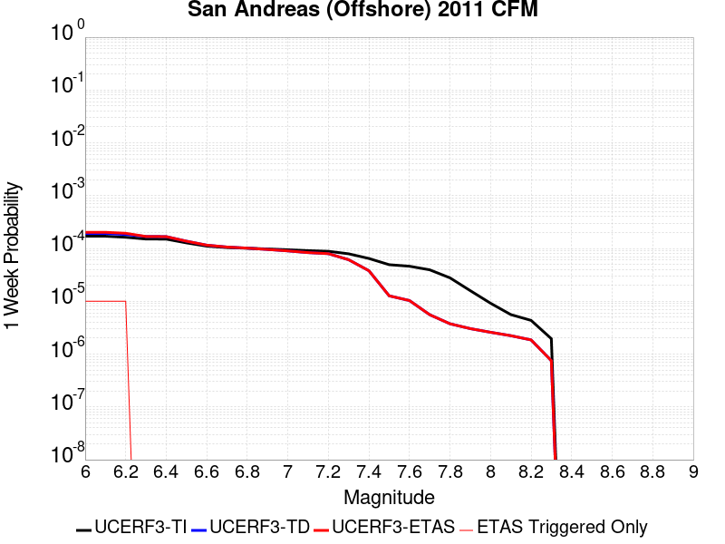 |  | 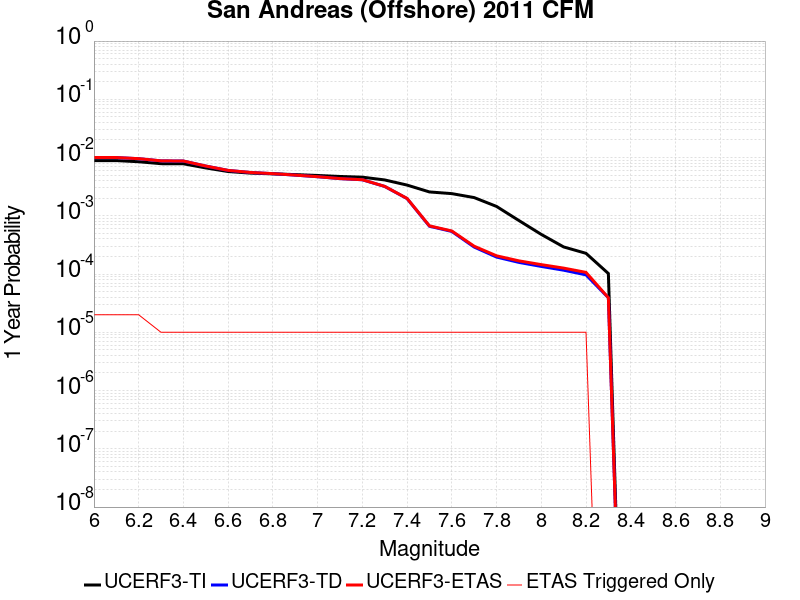 |  |

| Magnitude | 1 wk TI Prob | 1 wk TD Prob | 1 wk ETAS Prob | 1 wk ETAS/TD Gain | 1 wk ETAS Triggered Only | 1 mo TI Prob | 1 mo TD Prob | 1 mo ETAS Prob | 1 mo ETAS/TD Gain | 1 mo ETAS Triggered Only | 1 yr TI Prob | 1 yr TD Prob | 1 yr ETAS Prob | 1 yr ETAS/TD Gain | 1 yr ETAS Triggered Only | 10 yr TI Prob | 10 yr TD Prob | 10 yr ETAS Prob | 10 yr ETAS/TD Gain | 10 yr ETAS Triggered Only |
|-----|-----|-----|-----|-----|-----|-----|-----|-----|-----|-----|-----|-----|-----|-----|-----|-----|-----|-----|-----|-----|
| 6.0 | 1.7072787E-4 | 1.9226626E-4 | 2.4154458E-4 | 1.2563025 | 4.928779E-5 | 7.3148566E-4 | 8.237405E-4 | 8.729877E-4 | 1.0597849 | 4.928779E-5 | 0.008869528 | 0.009983436 | 0.010032232 | 1.0048877 | 4.928779E-5 | 0.085237645 | 0.09681613 | 0.09686065 | 1.0004598 | 4.928779E-5 |
| 6.1 | 1.7072787E-4 | 1.9226626E-4 | 2.4154458E-4 | 1.2563025 | 4.928779E-5 | 7.3148566E-4 | 8.237405E-4 | 8.729877E-4 | 1.0597849 | 4.928779E-5 | 0.008869528 | 0.009983436 | 0.010032232 | 1.0048877 | 4.928779E-5 | 0.085237645 | 0.09681613 | 0.09686065 | 1.0004598 | 4.928779E-5 |
| 6.2 | 1.6312556E-4 | 1.8408237E-4 | 2.3336108E-4 | 1.2676992 | 4.928779E-5 | 6.989222E-4 | 7.8868825E-4 | 8.379372E-4 | 1.0624441 | 4.928779E-5 | 0.008476226 | 0.0095605 | 0.009609317 | 1.0051061 | 4.928779E-5 | 0.08160117 | 0.092837214 | 0.092881925 | 1.0004816 | 4.928779E-5 |
| 6.3 | 1.5103363E-4 | 1.6881147E-4 | 1.6881147E-4 | 1.0 | 0.0 | 6.471264E-4 | 7.232793E-4 | 7.232793E-4 | 1.0 | 0.0 | 0.007850339 | 0.008770814 | 0.008770814 | 1.0 | 0.0 | 0.075787395 | 0.08546859 | 0.08546859 | 1.0 | 0.0 |
| 6.4 | 1.5047993E-4 | 1.6767075E-4 | 1.6767075E-4 | 1.0 | 0.0 | 6.4475456E-4 | 7.183932E-4 | 7.183932E-4 | 1.0 | 0.0 | 0.007821669 | 0.008711802 | 0.008711802 | 1.0 | 0.0 | 0.0755203 | 0.08494888 | 0.08494888 | 1.0 | 0.0 |
| 6.5 | 1.2760791E-4 | 1.3734949E-4 | 1.3734949E-4 | 1.0 | 0.0 | 5.467764E-4 | 5.8850925E-4 | 5.8850925E-4 | 1.0 | 0.0 | 0.0066367025 | 0.007141834 | 0.007141834 | 1.0 | 0.0 | 0.064419635 | 0.07024954 | 0.07024954 | 1.0 | 0.0 |
| 6.6 | 1.1063525E-4 | 1.15565475E-4 | 1.15565475E-4 | 1.0 | 0.0 | 4.740649E-4 | 4.9518765E-4 | 4.9518765E-4 | 1.0 | 0.0 | 0.0057564764 | 0.006012446 | 0.006012446 | 1.0 | 0.0 | 0.05609626 | 0.059496127 | 0.059496127 | 1.0 | 0.0 |
| 6.7 | 1.0391049E-4 | 1.0645875E-4 | 1.0645875E-4 | 1.0 | 0.0 | 4.4525467E-4 | 4.56173E-4 | 4.56173E-4 | 1.0 | 0.0 | 0.0054075094 | 0.0055399504 | 0.0055399504 | 1.0 | 0.0 | 0.052778035 | 0.05498844 | 0.05498844 | 1.0 | 0.0 |
| 6.8 | 1.0096706E-4 | 1.01582154E-4 | 1.01582154E-4 | 1.0 | 0.0 | 4.3264418E-4 | 4.3528038E-4 | 4.3528038E-4 | 1.0 | 0.0 | 0.0052547283 | 0.0052868384 | 0.0052868384 | 1.0 | 0.0 | 0.051321987 | 0.052686825 | 0.052686825 | 1.0 | 0.0 |
| 6.9 | 9.800265E-5 | 9.588697E-5 | 9.588697E-5 | 1.0 | 0.0 | 4.1994374E-4 | 4.1088034E-4 | 4.1088034E-4 | 1.0 | 0.0 | 0.0051008356 | 0.004991162 | 0.004991162 | 1.0 | 0.0 | 0.049853306 | 0.05001508 | 0.05001508 | 1.0 | 0.0 |
| 7.0 | 9.4642375E-5 | 9.002096E-5 | 9.002096E-5 | 1.0 | 0.0 | 4.0554712E-4 | 3.8574796E-4 | 3.8574796E-4 | 1.0 | 0.0 | 0.004926363 | 0.00468653 | 0.00468653 | 1.0 | 0.0 | 0.048185747 | 0.047194667 | 0.047194667 | 1.0 | 0.0 |
| 7.1 | 9.0996844E-5 | 8.354119E-5 | 8.354119E-5 | 1.0 | 0.0 | 3.8992817E-4 | 3.579854E-4 | 3.579854E-4 | 1.0 | 0.0 | 0.004737046 | 0.0043499186 | 0.0043499186 | 1.0 | 0.0 | 0.04637333 | 0.04404688 | 0.04404688 | 1.0 | 0.0 |
| 7.2 | 8.848287E-5 | 7.981761E-5 | 7.981761E-5 | 1.0 | 0.0 | 3.791572E-4 | 3.420315E-4 | 3.420315E-4 | 1.0 | 0.0 | 0.004606472 | 0.0041564363 | 0.0041564363 | 1.0 | 0.0 | 0.045121472 | 0.042189904 | 0.042189904 | 1.0 | 0.0 |
| 7.3 | 7.9280784E-5 | 6.1274885E-5 | 6.1274885E-5 | 1.0 | 0.0 | 3.3973053E-4 | 2.6258078E-4 | 2.6258078E-4 | 1.0 | 0.0 | 0.004128377 | 0.003192337 | 0.003192337 | 1.0 | 0.0 | 0.040525194 | 0.03290183 | 0.03290183 | 1.0 | 0.0 |
| 7.4 | 6.468038E-5 | 3.7930724E-5 | 3.7930724E-5 | 1.0 | 0.0 | 2.771722E-4 | 1.6255044E-4 | 1.6255044E-4 | 1.0 | 0.0 | 0.0033693502 | 0.0019773128 | 0.0019773128 | 1.0 | 0.0 | 0.0331872 | 0.02081734 | 0.02081734 | 1.0 | 0.0 |
| 7.5 | 4.930574E-5 | 1.2699263E-5 | 1.2699263E-5 | 1.0 | 0.0 | 2.1129321E-4 | 5.4424287E-5 | 5.4424287E-5 | 1.0 | 0.0 | 0.0025694598 | 6.6241587E-4 | 6.6241587E-4 | 1.0 | 0.0 | 0.02539953 | 0.0074798525 | 0.0074798525 | 1.0 | 0.0 |
| 7.6 | 4.612566E-5 | 1.0332297E-5 | 1.0332297E-5 | 1.0 | 0.0 | 1.9766642E-4 | 4.428053E-5 | 4.428053E-5 | 1.0 | 0.0 | 0.0024039324 | 5.3898344E-4 | 5.3898344E-4 | 1.0 | 0.0 | 0.023780935 | 0.006170428 | 0.006170428 | 1.0 | 0.0 |
| 7.7 | 3.9435414E-5 | 5.5710498E-6 | 5.5710498E-6 | 1.0 | 0.0 | 1.6899795E-4 | 2.3875711E-5 | 2.3875711E-5 | 1.0 | 0.0 | 0.0020556084 | 2.906482E-4 | 2.906482E-4 | 1.0 | 0.0 | 0.020366974 | 0.0035397834 | 0.0035397834 | 1.0 | 0.0 |
| 7.8 | 2.7787428E-5 | 3.7526645E-6 | 3.7526645E-6 | 1.0 | 0.0 | 1.1908354E-4 | 1.6082748E-5 | 1.6082748E-5 | 1.0 | 0.0 | 0.0014488777 | 1.9578991E-4 | 1.9578991E-4 | 1.0 | 0.0 | 0.014394675 | 0.0023862 | 0.0023862 | 1.0 | 0.0 |
| 7.9 | 1.590671E-5 | 3.0391298E-6 | 3.0391298E-6 | 1.0 | 0.0 | 6.816983E-5 | 1.3024777E-5 | 1.3024777E-5 | 1.0 | 0.0 | 8.2965166E-4 | 1.5856515E-4 | 1.5856515E-4 | 1.0 | 0.0 | 0.008265611 | 0.0019033558 | 0.0019033558 | 1.0 | 0.0 |
| 8.0 | 9.193638E-6 | 2.5908973E-6 | 2.5908973E-6 | 1.0 | 0.0 | 3.940071E-5 | 1.1103798E-5 | 1.1103798E-5 | 1.0 | 0.0 | 4.7959806E-4 | 1.3518038E-4 | 1.3518038E-4 | 1.0 | 0.0 | 0.0047856434 | 0.0016108477 | 0.0016108477 | 1.0 | 0.0 |
| 8.1 | 5.601576E-6 | 2.2333788E-6 | 2.2333788E-6 | 1.0 | 0.0 | 2.4006533E-5 | 9.571589E-6 | 9.571589E-6 | 1.0 | 0.0 | 2.9224035E-4 | 1.1652788E-4 | 1.1652788E-4 | 1.0 | 0.0 | 0.0029185633 | 0.0014015464 | 0.0014015464 | 1.0 | 0.0 |
| 8.2 | 4.3508785E-6 | 1.8568232E-6 | 1.8568232E-6 | 1.0 | 0.0 | 1.864649E-5 | 7.957789E-6 | 7.957789E-6 | 1.0 | 0.0 | 2.2699735E-4 | 9.6881806E-5 | 9.6881806E-5 | 1.0 | 0.0 | 0.0022676561 | 0.0011590312 | 0.0011590312 | 1.0 | 0.0 |
| 8.3 | 1.9573292E-6 | 7.511501E-7 | 7.511501E-7 | 1.0 | 0.0 | 8.388526E-6 | 3.2192108E-6 | 3.2192108E-6 | 1.0 | 0.0 | 1.0212552E-4 | 3.9193204E-5 | 3.9193204E-5 | 1.0 | 0.0 | 0.001020786 | 4.6391718E-4 | 4.6391718E-4 | 1.0 | 0.0 |

## Pinto Mtn
*[(top)](#table-of-contents)*

| 1 Week | 1 Month | 1 Year | 10 Year |
|-----|-----|-----|-----|
| 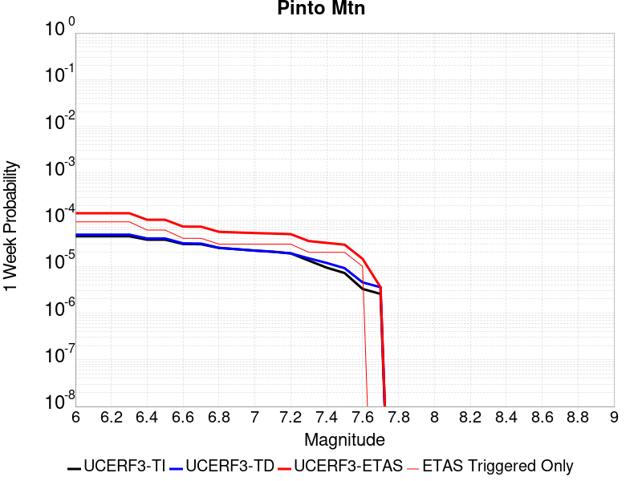 |  |  | 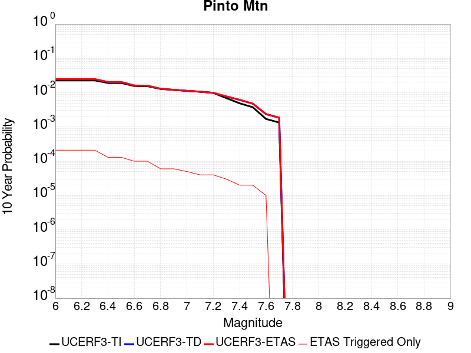 |

| Magnitude | 1 wk TI Prob | 1 wk TD Prob | 1 wk ETAS Prob | 1 wk ETAS/TD Gain | 1 wk ETAS Triggered Only | 1 mo TI Prob | 1 mo TD Prob | 1 mo ETAS Prob | 1 mo ETAS/TD Gain | 1 mo ETAS Triggered Only | 1 yr TI Prob | 1 yr TD Prob | 1 yr ETAS Prob | 1 yr ETAS/TD Gain | 1 yr ETAS Triggered Only | 10 yr TI Prob | 10 yr TD Prob | 10 yr ETAS Prob | 10 yr ETAS/TD Gain | 10 yr ETAS Triggered Only |
|-----|-----|-----|-----|-----|-----|-----|-----|-----|-----|-----|-----|-----|-----|-----|-----|-----|-----|-----|-----|-----|
| 6.0 | 4.4194956E-5 | 4.7853926E-5 | 4.7853926E-5 | 1.0 | 0.0 | 1.893932E-4 | 2.0507304E-4 | 2.0507304E-4 | 1.0 | 0.0 | 0.0023034236 | 0.0024940688 | 0.0025432336 | 1.0197127 | 4.928779E-5 | 0.022796938 | 0.024678305 | 0.024726376 | 1.0019479 | 4.928779E-5 |
| 6.1 | 4.4194956E-5 | 4.7853926E-5 | 4.7853926E-5 | 1.0 | 0.0 | 1.893932E-4 | 2.0507304E-4 | 2.0507304E-4 | 1.0 | 0.0 | 0.0023034236 | 0.0024940688 | 0.0025432336 | 1.0197127 | 4.928779E-5 | 0.022796938 | 0.024678305 | 0.024726376 | 1.0019479 | 4.928779E-5 |
| 6.2 | 4.4194956E-5 | 4.7853926E-5 | 4.7853926E-5 | 1.0 | 0.0 | 1.893932E-4 | 2.0507304E-4 | 2.0507304E-4 | 1.0 | 0.0 | 0.0023034236 | 0.0024940688 | 0.0025432336 | 1.0197127 | 4.928779E-5 | 0.022796938 | 0.024678305 | 0.024726376 | 1.0019479 | 4.928779E-5 |
| 6.3 | 4.4194956E-5 | 4.7853926E-5 | 4.7853926E-5 | 1.0 | 0.0 | 1.893932E-4 | 2.0507304E-4 | 2.0507304E-4 | 1.0 | 0.0 | 0.0023034236 | 0.0024940688 | 0.0025432336 | 1.0197127 | 4.928779E-5 | 0.022796938 | 0.024678305 | 0.024726376 | 1.0019479 | 4.928779E-5 |
| 6.4 | 3.729929E-5 | 3.960349E-5 | 3.960349E-5 | 1.0 | 0.0 | 1.5984432E-4 | 1.6971873E-4 | 1.6971873E-4 | 1.0 | 0.0 | 0.0019443673 | 0.0020644604 | 0.0020644604 | 1.0 | 0.0 | 0.019274427 | 0.020462848 | 0.020462848 | 1.0 | 0.0 |
| 6.5 | 3.729929E-5 | 3.960349E-5 | 3.960349E-5 | 1.0 | 0.0 | 1.5984432E-4 | 1.6971873E-4 | 1.6971873E-4 | 1.0 | 0.0 | 0.0019443673 | 0.0020644604 | 0.0020644604 | 1.0 | 0.0 | 0.019274427 | 0.020462848 | 0.020462848 | 1.0 | 0.0 |
| 6.6 | 3.0204548E-5 | 3.12056E-5 | 3.12056E-5 | 1.0 | 0.0 | 1.2944164E-4 | 1.3373162E-4 | 1.3373162E-4 | 1.0 | 0.0 | 0.0015748127 | 0.0016270012 | 0.0016270012 | 1.0 | 0.0 | 0.015636992 | 0.016154764 | 0.016154764 | 1.0 | 0.0 |
| 6.7 | 2.9857754E-5 | 3.0814987E-5 | 3.0814987E-5 | 1.0 | 0.0 | 1.2795553E-4 | 1.3205773E-4 | 1.3205773E-4 | 1.0 | 0.0 | 0.0015567453 | 0.0016066517 | 0.0016066517 | 1.0 | 0.0 | 0.015458848 | 0.015954204 | 0.015954204 | 1.0 | 0.0 |
| 6.8 | 2.4819734E-5 | 2.5009665E-5 | 2.5009665E-5 | 1.0 | 0.0 | 1.0636595E-4 | 1.0718E-4 | 1.0718E-4 | 1.0 | 0.0 | 0.0012942362 | 0.001304157 | 0.001304157 | 1.0 | 0.0 | 0.012867244 | 0.012967403 | 0.012967403 | 1.0 | 0.0 |
| 6.9 | 2.331124E-5 | 2.3337945E-5 | 2.3337945E-5 | 1.0 | 0.0 | 9.990149E-5 | 1.0001605E-4 | 1.0001605E-4 | 1.0 | 0.0 | 0.001215622 | 0.0012170355 | 0.0012170355 | 1.0 | 0.0 | 0.012089936 | 0.012105897 | 0.012105897 | 1.0 | 0.0 |
| 7.0 | 2.1818534E-5 | 2.1761074E-5 | 2.1761074E-5 | 1.0 | 0.0 | 9.3504656E-5 | 9.3258524E-5 | 9.3258524E-5 | 1.0 | 0.0 | 0.0011378246 | 0.0011348509 | 0.0011348509 | 1.0 | 0.0 | 0.011320163 | 0.01129266 | 0.01129266 | 1.0 | 0.0 |
| 7.1 | 2.066081E-5 | 2.0540718E-5 | 2.0540718E-5 | 1.0 | 0.0 | 8.854332E-5 | 8.8028784E-5 | 8.8028784E-5 | 1.0 | 0.0 | 0.0010774818 | 0.0010712431 | 0.0010712431 | 1.0 | 0.0 | 0.010722724 | 0.0106628435 | 0.0106628435 | 1.0 | 0.0 |
| 7.2 | 1.8990233E-5 | 1.9054001E-5 | 1.9054001E-5 | 1.0 | 0.0 | 8.138417E-5 | 8.165756E-5 | 8.165756E-5 | 1.0 | 0.0 | 9.904018E-4 | 9.937467E-4 | 9.937467E-4 | 1.0 | 0.0 | 0.009859995 | 0.009895029 | 0.009895029 | 1.0 | 0.0 |
| 7.3 | 1.3335872E-5 | 1.4906713E-5 | 1.4906713E-5 | 1.0 | 0.0 | 5.7152483E-5 | 6.388442E-5 | 6.388442E-5 | 1.0 | 0.0 | 6.956093E-4 | 7.77528E-4 | 7.77528E-4 | 1.0 | 0.0 | 0.006934359 | 0.007749376 | 0.007749376 | 1.0 | 0.0 |
| 7.4 | 9.414066E-6 | 1.186096E-5 | 1.186096E-5 | 1.0 | 0.0 | 4.0345374E-5 | 5.083175E-5 | 5.083175E-5 | 1.0 | 0.0 | 4.910942E-4 | 6.1871024E-4 | 6.1871024E-4 | 1.0 | 0.0 | 0.0049001034 | 0.0061708256 | 0.0061708256 | 1.0 | 0.0 |
| 7.5 | 7.2101157E-6 | 9.158192E-6 | 9.158192E-6 | 1.0 | 0.0 | 3.090013E-5 | 3.9248847E-5 | 3.9248847E-5 | 1.0 | 0.0 | 3.7614413E-4 | 4.7775774E-4 | 4.7775774E-4 | 1.0 | 0.0 | 0.0037550807 | 0.004768082 | 0.004768082 | 1.0 | 0.0 |
| 7.6 | 3.296375E-6 | 4.5455017E-6 | 4.5455017E-6 | 1.0 | 0.0 | 1.4127245E-5 | 1.9480583E-5 | 1.9480583E-5 | 1.0 | 0.0 | 1.7198564E-4 | 2.3715167E-4 | 2.3715167E-4 | 1.0 | 0.0 | 0.0017185259 | 0.0023691233 | 0.0023691233 | 1.0 | 0.0 |
| 7.7 | 2.5741092E-6 | 3.5844084E-6 | 3.5844084E-6 | 1.0 | 0.0 | 1.103185E-5 | 1.5361667E-5 | 1.5361667E-5 | 1.0 | 0.0 | 1.3430449E-4 | 1.8701357E-4 | 1.8701357E-4 | 1.0 | 0.0 | 0.0013422335 | 0.0018686918 | 0.0018686918 | 1.0 | 0.0 |

## Kern Canyon (Lake Isabella) 2011
*[(top)](#table-of-contents)*

| 1 Week | 1 Month | 1 Year | 10 Year |
|-----|-----|-----|-----|
|  |  |  |  |

| Magnitude | 1 wk TI Prob | 1 wk TD Prob | 1 wk ETAS Prob | 1 wk ETAS/TD Gain | 1 wk ETAS Triggered Only | 1 mo TI Prob | 1 mo TD Prob | 1 mo ETAS Prob | 1 mo ETAS/TD Gain | 1 mo ETAS Triggered Only | 1 yr TI Prob | 1 yr TD Prob | 1 yr ETAS Prob | 1 yr ETAS/TD Gain | 1 yr ETAS Triggered Only | 10 yr TI Prob | 10 yr TD Prob | 10 yr ETAS Prob | 10 yr ETAS/TD Gain | 10 yr ETAS Triggered Only |
|-----|-----|-----|-----|-----|-----|-----|-----|-----|-----|-----|-----|-----|-----|-----|-----|-----|-----|-----|-----|-----|
| 6.0 | 4.2387383E-6 | 4.0016344E-6 | 5.328923E-5 | 13.316867 | 4.928779E-5 | 1.8165894E-5 | 1.7149758E-5 | 6.64367E-5 | 3.873915 | 4.928779E-5 | 2.2114732E-4 | 2.0878017E-4 | 2.5805767E-4 | 1.2360258 | 4.928779E-5 | 0.0022092736 | 0.002086024 | 0.002135209 | 1.0235783 | 4.928779E-5 |
| 6.1 | 4.2387383E-6 | 4.0016344E-6 | 5.328923E-5 | 13.316867 | 4.928779E-5 | 1.8165894E-5 | 1.7149758E-5 | 6.64367E-5 | 3.873915 | 4.928779E-5 | 2.2114732E-4 | 2.0878017E-4 | 2.5805767E-4 | 1.2360258 | 4.928779E-5 | 0.0022092736 | 0.002086024 | 0.002135209 | 1.0235783 | 4.928779E-5 |
| 6.2 | 4.2387383E-6 | 4.0016344E-6 | 5.328923E-5 | 13.316867 | 4.928779E-5 | 1.8165894E-5 | 1.7149758E-5 | 6.64367E-5 | 3.873915 | 4.928779E-5 | 2.2114732E-4 | 2.0878017E-4 | 2.5805767E-4 | 1.2360258 | 4.928779E-5 | 0.0022092736 | 0.002086024 | 0.002135209 | 1.0235783 | 4.928779E-5 |
| 6.3 | 4.2387383E-6 | 4.0016344E-6 | 5.328923E-5 | 13.316867 | 4.928779E-5 | 1.8165894E-5 | 1.7149758E-5 | 6.64367E-5 | 3.873915 | 4.928779E-5 | 2.2114732E-4 | 2.0878017E-4 | 2.5805767E-4 | 1.2360258 | 4.928779E-5 | 0.0022092736 | 0.002086024 | 0.002135209 | 1.0235783 | 4.928779E-5 |
| 6.4 | 4.2387383E-6 | 4.0016344E-6 | 5.328923E-5 | 13.316867 | 4.928779E-5 | 1.8165894E-5 | 1.7149758E-5 | 6.64367E-5 | 3.873915 | 4.928779E-5 | 2.2114732E-4 | 2.0878017E-4 | 2.5805767E-4 | 1.2360258 | 4.928779E-5 | 0.0022092736 | 0.002086024 | 0.002135209 | 1.0235783 | 4.928779E-5 |
| 6.5 | 2.7857532E-6 | 2.5178624E-6 | 2.5178624E-6 | 1.0 | 0.0 | 1.1938888E-5 | 1.0790796E-5 | 1.0790796E-5 | 1.0 | 0.0 | 1.4534626E-4 | 1.3137035E-4 | 1.3137035E-4 | 1.0 | 0.0 | 0.0014525123 | 0.0013129596 | 0.0013129596 | 1.0 | 0.0 |
| 6.6 | 2.2233348E-6 | 1.944119E-6 | 1.944119E-6 | 1.0 | 0.0 | 9.528543E-6 | 8.331913E-6 | 8.331913E-6 | 1.0 | 0.0 | 1.1600384E-4 | 1.014364E-4 | 1.014364E-4 | 1.0 | 0.0 | 0.001159433 | 0.0010139096 | 0.0010139096 | 1.0 | 0.0 |
| 6.7 | 2.1635126E-6 | 1.8834991E-6 | 1.8834991E-6 | 1.0 | 0.0 | 9.272164E-6 | 8.072114E-6 | 8.072114E-6 | 1.0 | 0.0 | 1.1288274E-4 | 9.827364E-5 | 9.827364E-5 | 1.0 | 0.0 | 0.0011282542 | 9.8231E-4 | 9.8231E-4 | 1.0 | 0.0 |
| 6.8 | 1.8685711E-6 | 1.583138E-6 | 1.583138E-6 | 1.0 | 0.0 | 8.008137E-6 | 6.7848596E-6 | 6.7848596E-6 | 1.0 | 0.0 | 9.74947E-5 | 8.2602586E-5 | 8.2602586E-5 | 1.0 | 0.0 | 9.745194E-4 | 8.2572375E-4 | 8.2572375E-4 | 1.0 | 0.0 |
| 6.9 | 1.5815071E-6 | 1.3064887E-6 | 1.3064887E-6 | 1.0 | 0.0 | 6.77787E-6 | 5.5992255E-6 | 5.5992255E-6 | 1.0 | 0.0 | 8.251744E-5 | 6.816846E-5 | 6.816846E-5 | 1.0 | 0.0 | 8.248681E-4 | 6.8147824E-4 | 6.8147824E-4 | 1.0 | 0.0 |
| 7.0 | 1.3772564E-6 | 1.1210681E-6 | 1.1210681E-6 | 1.0 | 0.0 | 5.9025137E-6 | 4.8045686E-6 | 4.8045686E-6 | 1.0 | 0.0 | 7.186073E-5 | 5.8494075E-5 | 5.8494075E-5 | 1.0 | 0.0 | 7.18375E-4 | 5.8478885E-4 | 5.8478885E-4 | 1.0 | 0.0 |
| 7.1 | 1.0916998E-6 | 8.7637505E-7 | 8.7637505E-7 | 1.0 | 0.0 | 4.678705E-6 | 3.7558877E-6 | 3.7558877E-6 | 1.0 | 0.0 | 5.6961744E-5 | 4.5726985E-5 | 4.5726985E-5 | 1.0 | 0.0 | 5.6947145E-4 | 4.571771E-4 | 4.571771E-4 | 1.0 | 0.0 |
| 7.2 | 7.6277024E-7 | 5.901439E-7 | 5.901439E-7 | 1.0 | 0.0 | 3.2690114E-6 | 2.5291856E-6 | 2.5291856E-6 | 1.0 | 0.0 | 3.9799485E-5 | 3.0792406E-5 | 3.0792406E-5 | 1.0 | 0.0 | 3.9792358E-4 | 3.07882E-4 | 3.07882E-4 | 1.0 | 0.0 |
| 7.3 | 5.3265916E-7 | 4.3824264E-7 | 4.3824264E-7 | 1.0 | 0.0 | 2.282823E-6 | 1.8781814E-6 | 1.8781814E-6 | 1.0 | 0.0 | 2.7793016E-5 | 2.2866623E-5 | 2.2866623E-5 | 1.0 | 0.0 | 2.778954E-4 | 2.2864307E-4 | 2.2864307E-4 | 1.0 | 0.0 |
| 7.4 | 3.4946007E-7 | 3.0065647E-7 | 3.0065647E-7 | 1.0 | 0.0 | 1.497685E-6 | 1.2885271E-6 | 1.2885271E-6 | 1.0 | 0.0 | 1.8234163E-5 | 1.5687707E-5 | 1.5687707E-5 | 1.0 | 0.0 | 1.8232666E-4 | 1.5686621E-4 | 1.5686621E-4 | 1.0 | 0.0 |
| 7.5 | 1.8317026E-7 | 1.4244755E-7 | 1.4244755E-7 | 1.0 | 0.0 | 7.850152E-7 | 6.1048934E-7 | 6.1048934E-7 | 1.0 | 0.0 | 9.557518E-6 | 7.432683E-6 | 7.432683E-6 | 1.0 | 0.0 | 9.5571064E-5 | 7.432442E-5 | 7.432442E-5 | 1.0 | 0.0 |
| 7.6 | 2.572245E-8 | 1.735264E-8 | 1.735264E-8 | 1.0 | 0.0 | 1.10239064E-7 | 7.436845E-8 | 7.436845E-8 | 1.0 | 0.0 | 1.3421597E-6 | 9.0543557E-7 | 9.0543557E-7 | 1.0 | 0.0 | 1.3421517E-5 | 9.054324E-6 | 9.054324E-6 | 1.0 | 0.0 |

## Pitas Point (Lower)-Montalvo
*[(top)](#table-of-contents)*

| 1 Week | 1 Month | 1 Year | 10 Year |
|-----|-----|-----|-----|
|  |  |  |  |

| Magnitude | 1 wk TI Prob | 1 wk TD Prob | 1 wk ETAS Prob | 1 wk ETAS/TD Gain | 1 wk ETAS Triggered Only | 1 mo TI Prob | 1 mo TD Prob | 1 mo ETAS Prob | 1 mo ETAS/TD Gain | 1 mo ETAS Triggered Only | 1 yr TI Prob | 1 yr TD Prob | 1 yr ETAS Prob | 1 yr ETAS/TD Gain | 1 yr ETAS Triggered Only | 10 yr TI Prob | 10 yr TD Prob | 10 yr ETAS Prob | 10 yr ETAS/TD Gain | 10 yr ETAS Triggered Only |
|-----|-----|-----|-----|-----|-----|-----|-----|-----|-----|-----|-----|-----|-----|-----|-----|-----|-----|-----|-----|-----|
| 6.0 | 5.2543637E-6 | 4.8379025E-6 | 4.8379025E-6 | 1.0 | 0.0 | 2.2518509E-5 | 2.0733705E-5 | 2.0733705E-5 | 1.0 | 0.0 | 2.7412834E-4 | 2.5240393E-4 | 3.0167928E-4 | 1.1952242 | 4.928779E-5 | 0.0027379042 | 0.0025212052 | 0.0025703686 | 1.0195 | 4.928779E-5 |
| 6.1 | 5.2543637E-6 | 4.8379025E-6 | 4.8379025E-6 | 1.0 | 0.0 | 2.2518509E-5 | 2.0733705E-5 | 2.0733705E-5 | 1.0 | 0.0 | 2.7412834E-4 | 2.5240393E-4 | 3.0167928E-4 | 1.1952242 | 4.928779E-5 | 0.0027379042 | 0.0025212052 | 0.0025703686 | 1.0195 | 4.928779E-5 |
| 6.2 | 5.2543637E-6 | 4.8379025E-6 | 4.8379025E-6 | 1.0 | 0.0 | 2.2518509E-5 | 2.0733705E-5 | 2.0733705E-5 | 1.0 | 0.0 | 2.7412834E-4 | 2.5240393E-4 | 3.0167928E-4 | 1.1952242 | 4.928779E-5 | 0.0027379042 | 0.0025212052 | 0.0025703686 | 1.0195 | 4.928779E-5 |
| 6.3 | 5.2543637E-6 | 4.8379025E-6 | 4.8379025E-6 | 1.0 | 0.0 | 2.2518509E-5 | 2.0733705E-5 | 2.0733705E-5 | 1.0 | 0.0 | 2.7412834E-4 | 2.5240393E-4 | 3.0167928E-4 | 1.1952242 | 4.928779E-5 | 0.0027379042 | 0.0025212052 | 0.0025703686 | 1.0195 | 4.928779E-5 |
| 6.4 | 5.2543637E-6 | 4.8379025E-6 | 4.8379025E-6 | 1.0 | 0.0 | 2.2518509E-5 | 2.0733705E-5 | 2.0733705E-5 | 1.0 | 0.0 | 2.7412834E-4 | 2.5240393E-4 | 3.0167928E-4 | 1.1952242 | 4.928779E-5 | 0.0027379042 | 0.0025212052 | 0.0025703686 | 1.0195 | 4.928779E-5 |
| 6.5 | 5.2543637E-6 | 4.8379025E-6 | 4.8379025E-6 | 1.0 | 0.0 | 2.2518509E-5 | 2.0733705E-5 | 2.0733705E-5 | 1.0 | 0.0 | 2.7412834E-4 | 2.5240393E-4 | 3.0167928E-4 | 1.1952242 | 4.928779E-5 | 0.0027379042 | 0.0025212052 | 0.0025703686 | 1.0195 | 4.928779E-5 |
| 6.6 | 5.2543637E-6 | 4.8379025E-6 | 4.8379025E-6 | 1.0 | 0.0 | 2.2518509E-5 | 2.0733705E-5 | 2.0733705E-5 | 1.0 | 0.0 | 2.7412834E-4 | 2.5240393E-4 | 3.0167928E-4 | 1.1952242 | 4.928779E-5 | 0.0027379042 | 0.0025212052 | 0.0025703686 | 1.0195 | 4.928779E-5 |
| 6.7 | 5.2543637E-6 | 4.8379025E-6 | 4.8379025E-6 | 1.0 | 0.0 | 2.2518509E-5 | 2.0733705E-5 | 2.0733705E-5 | 1.0 | 0.0 | 2.7412834E-4 | 2.5240393E-4 | 3.0167928E-4 | 1.1952242 | 4.928779E-5 | 0.0027379042 | 0.0025212052 | 0.0025703686 | 1.0195 | 4.928779E-5 |
| 6.8 | 5.2543637E-6 | 4.8379025E-6 | 4.8379025E-6 | 1.0 | 0.0 | 2.2518509E-5 | 2.0733705E-5 | 2.0733705E-5 | 1.0 | 0.0 | 2.7412834E-4 | 2.5240393E-4 | 3.0167928E-4 | 1.1952242 | 4.928779E-5 | 0.0027379042 | 0.0025212052 | 0.0025703686 | 1.0195 | 4.928779E-5 |
| 6.9 | 5.2543637E-6 | 4.8379025E-6 | 4.8379025E-6 | 1.0 | 0.0 | 2.2518509E-5 | 2.0733705E-5 | 2.0733705E-5 | 1.0 | 0.0 | 2.7412834E-4 | 2.5240393E-4 | 3.0167928E-4 | 1.1952242 | 4.928779E-5 | 0.0027379042 | 0.0025212052 | 0.0025703686 | 1.0195 | 4.928779E-5 |
| 7.0 | 5.2543637E-6 | 4.8379025E-6 | 4.8379025E-6 | 1.0 | 0.0 | 2.2518509E-5 | 2.0733705E-5 | 2.0733705E-5 | 1.0 | 0.0 | 2.7412834E-4 | 2.5240393E-4 | 3.0167928E-4 | 1.1952242 | 4.928779E-5 | 0.0027379042 | 0.0025212052 | 0.0025703686 | 1.0195 | 4.928779E-5 |
| 7.1 | 5.2543637E-6 | 4.8379025E-6 | 4.8379025E-6 | 1.0 | 0.0 | 2.2518509E-5 | 2.0733705E-5 | 2.0733705E-5 | 1.0 | 0.0 | 2.7412834E-4 | 2.5240393E-4 | 3.0167928E-4 | 1.1952242 | 4.928779E-5 | 0.0027379042 | 0.0025212052 | 0.0025703686 | 1.0195 | 4.928779E-5 |
| 7.2 | 5.2458695E-6 | 4.8290563E-6 | 4.8290563E-6 | 1.0 | 0.0 | 2.2482105E-5 | 2.0695794E-5 | 2.0695794E-5 | 1.0 | 0.0 | 2.7368523E-4 | 2.5194246E-4 | 3.0121783E-4 | 1.1955818 | 4.928779E-5 | 0.0027334841 | 0.002516601 | 0.0025657646 | 1.0195358 | 4.928779E-5 |
| 7.3 | 5.22665E-6 | 4.8089737E-6 | 4.8089737E-6 | 1.0 | 0.0 | 2.2399736E-5 | 2.0609727E-5 | 2.0609727E-5 | 1.0 | 0.0 | 2.7268266E-4 | 2.5089484E-4 | 3.0017027E-4 | 1.1963987 | 4.928779E-5 | 0.002723483 | 0.0025061483 | 0.0025553126 | 1.0196174 | 4.928779E-5 |
| 7.4 | 5.210642E-6 | 4.7921862E-6 | 4.7921862E-6 | 1.0 | 0.0 | 2.233113E-5 | 2.053778E-5 | 2.053778E-5 | 1.0 | 0.0 | 2.718476E-4 | 2.500191E-4 | 2.9929457E-4 | 1.1970868 | 4.928779E-5 | 0.002715153 | 0.0024974106 | 0.0025465754 | 1.0196862 | 4.928779E-5 |
| 7.5 | 5.1226016E-6 | 4.7000726E-6 | 4.7000726E-6 | 1.0 | 0.0 | 2.1953823E-5 | 2.0143016E-5 | 2.0143016E-5 | 1.0 | 0.0 | 2.67255E-4 | 2.4521392E-4 | 2.944896E-4 | 1.2009499 | 4.928779E-5 | 0.0026693381 | 0.002449465 | 0.002498632 | 1.0200726 | 4.928779E-5 |
| 7.6 | 4.8796987E-6 | 4.4449725E-6 | 4.4449725E-6 | 1.0 | 0.0 | 2.0912828E-5 | 1.9049745E-5 | 1.9049745E-5 | 1.0 | 0.0 | 2.5458392E-4 | 2.3190626E-4 | 2.811826E-4 | 1.212484 | 4.928779E-5 | 0.0025429246 | 0.0023166733 | 0.002365847 | 1.0212259 | 4.928779E-5 |
| 7.7 | 4.0834398E-6 | 3.6091444E-6 | 3.6091444E-6 | 1.0 | 0.0 | 1.7500339E-5 | 1.546767E-5 | 1.546767E-5 | 1.0 | 0.0 | 2.1304579E-4 | 1.8830286E-4 | 2.3758136E-4 | 1.2616981 | 4.928779E-5 | 0.0021284167 | 0.0018814567 | 0.0019306518 | 1.0261474 | 4.928779E-5 |
| 7.8 | 2.5445438E-6 | 2.1212566E-6 | 2.1212566E-6 | 1.0 | 0.0 | 1.0905142E-5 | 9.091068E-6 | 9.091068E-6 | 1.0 | 0.0 | 1.3276201E-4 | 1.1067818E-4 | 1.1067818E-4 | 1.0 | 0.0 | 0.0013268272 | 0.0011062352 | 0.0011062352 | 1.0 | 0.0 |
| 7.9 | 4.1677114E-7 | 3.3294015E-7 | 3.3294015E-7 | 1.0 | 0.0 | 1.7861609E-6 | 1.4268857E-6 | 1.4268857E-6 | 1.0 | 0.0 | 2.1746291E-5 | 1.7372196E-5 | 1.7372196E-5 | 1.0 | 0.0 | 2.1744163E-4 | 1.737087E-4 | 1.737087E-4 | 1.0 | 0.0 |
| 8.0 | 7.791402E-9 | 5.6836056E-9 | 5.6836056E-9 | 1.0 | 0.0 | 3.3391725E-8 | 2.4358311E-8 | 2.4358311E-8 | 1.0 | 0.0 | 4.0654416E-7 | 2.965624E-7 | 2.965624E-7 | 1.0 | 0.0 | 4.065434E-6 | 2.9656223E-6 | 2.9656223E-6 | 1.0 | 0.0 |

## Cerro Prieto
*[(top)](#table-of-contents)*

| 1 Week | 1 Month | 1 Year | 10 Year |
|-----|-----|-----|-----|
|  |  |  |  |

| Magnitude | 1 wk TI Prob | 1 wk TD Prob | 1 wk ETAS Prob | 1 wk ETAS/TD Gain | 1 wk ETAS Triggered Only | 1 mo TI Prob | 1 mo TD Prob | 1 mo ETAS Prob | 1 mo ETAS/TD Gain | 1 mo ETAS Triggered Only | 1 yr TI Prob | 1 yr TD Prob | 1 yr ETAS Prob | 1 yr ETAS/TD Gain | 1 yr ETAS Triggered Only | 10 yr TI Prob | 10 yr TD Prob | 10 yr ETAS Prob | 10 yr ETAS/TD Gain | 10 yr ETAS Triggered Only |
|-----|-----|-----|-----|-----|-----|-----|-----|-----|-----|-----|-----|-----|-----|-----|-----|-----|-----|-----|-----|-----|
| 6.0 | 2.9101528E-4 | 5.9654453E-4 | 6.4580294E-4 | 1.0825728 | 4.928779E-5 | 0.0012466122 | 0.0025543566 | 0.0026035185 | 1.0192463 | 4.928779E-5 | 0.015072231 | 0.030802928 | 0.030850697 | 1.0015508 | 4.928779E-5 | 0.14089979 | 0.25386256 | 0.25389934 | 1.0001448 | 4.928779E-5 |
| 6.1 | 2.9101528E-4 | 5.9654453E-4 | 6.4580294E-4 | 1.0825728 | 4.928779E-5 | 0.0012466122 | 0.0025543566 | 0.0026035185 | 1.0192463 | 4.928779E-5 | 0.015072231 | 0.030802928 | 0.030850697 | 1.0015508 | 4.928779E-5 | 0.14089979 | 0.25386256 | 0.25389934 | 1.0001448 | 4.928779E-5 |
| 6.2 | 2.9101528E-4 | 5.9654453E-4 | 6.4580294E-4 | 1.0825728 | 4.928779E-5 | 0.0012466122 | 0.0025543566 | 0.0026035185 | 1.0192463 | 4.928779E-5 | 0.015072231 | 0.030802928 | 0.030850697 | 1.0015508 | 4.928779E-5 | 0.14089979 | 0.25386256 | 0.25389934 | 1.0001448 | 4.928779E-5 |
| 6.3 | 2.9101528E-4 | 5.9654453E-4 | 6.4580294E-4 | 1.0825728 | 4.928779E-5 | 0.0012466122 | 0.0025543566 | 0.0026035185 | 1.0192463 | 4.928779E-5 | 0.015072231 | 0.030802928 | 0.030850697 | 1.0015508 | 4.928779E-5 | 0.14089979 | 0.25386256 | 0.25389934 | 1.0001448 | 4.928779E-5 |
| 6.4 | 2.508648E-4 | 5.140412E-4 | 5.633037E-4 | 1.0958337 | 4.928779E-5 | 0.0010746918 | 0.0022013725 | 0.0022505517 | 1.0223403 | 4.928779E-5 | 0.013006088 | 0.026629416 | 0.02667739 | 1.0018016 | 4.928779E-5 | 0.12270685 | 0.2242222 | 0.22426043 | 1.0001706 | 4.928779E-5 |
| 6.5 | 2.508648E-4 | 5.140412E-4 | 5.633037E-4 | 1.0958337 | 4.928779E-5 | 0.0010746918 | 0.0022013725 | 0.0022505517 | 1.0223403 | 4.928779E-5 | 0.013006088 | 0.026629416 | 0.02667739 | 1.0018016 | 4.928779E-5 | 0.12270685 | 0.2242222 | 0.22426043 | 1.0001706 | 4.928779E-5 |
| 6.6 | 2.294914E-4 | 4.7123645E-4 | 5.20501E-4 | 1.1045432 | 4.928779E-5 | 9.831638E-4 | 0.0020182093 | 0.0020673976 | 1.0243722 | 4.928779E-5 | 0.011904482 | 0.024394194 | 0.02444228 | 1.0019711 | 4.928779E-5 | 0.11286586 | 0.20837563 | 0.20841464 | 1.0001873 | 4.928779E-5 |
| 6.7 | 1.9621674E-4 | 4.0426268E-4 | 4.5353055E-4 | 1.1218709 | 4.928779E-5 | 8.4065786E-4 | 0.0017315624 | 0.0017807648 | 1.0284151 | 4.928779E-5 | 0.010187071 | 0.020888962 | 0.020937221 | 1.0023103 | 4.928779E-5 | 0.09732539 | 0.18264732 | 0.1826876 | 1.0002205 | 4.928779E-5 |
| 6.8 | 1.5476145E-4 | 3.0572579E-4 | 3.0572579E-4 | 1.0 | 0.0 | 6.6309475E-4 | 0.0013096977 | 0.0013096977 | 1.0 | 0.0 | 0.008043335 | 0.015826825 | 0.015826825 | 1.0 | 0.0 | 0.07758363 | 0.14310057 | 0.14310057 | 1.0 | 0.0 |
| 6.9 | 1.20509176E-4 | 2.2588465E-4 | 2.2588465E-4 | 1.0 | 0.0 | 5.1636563E-4 | 9.6778123E-4 | 9.6778123E-4 | 1.0 | 0.0 | 0.006268645 | 0.011734025 | 0.011734025 | 1.0 | 0.0 | 0.060947374 | 0.10917958 | 0.10917958 | 1.0 | 0.0 |
| 7.0 | 9.3269155E-5 | 1.6721459E-4 | 1.6721459E-4 | 1.0 | 0.0 | 3.9966372E-4 | 7.1648025E-4 | 7.1648025E-4 | 1.0 | 0.0 | 0.0048550544 | 0.008695914 | 0.008695914 | 1.0 | 0.0 | 0.04750344 | 0.082943216 | 0.082943216 | 1.0 | 0.0 |
| 7.1 | 5.029709E-5 | 8.174011E-5 | 8.174011E-5 | 1.0 | 0.0 | 2.1554115E-4 | 3.50287E-4 | 3.50287E-4 | 1.0 | 0.0 | 0.0026210553 | 0.004259821 | 0.004259821 | 1.0 | 0.0 | 0.025903556 | 0.04226813 | 0.04226813 | 1.0 | 0.0 |
| 7.2 | 6.5445185E-8 | 6.824737E-8 | 6.824737E-8 | 1.0 | 0.0 | 2.8047933E-7 | 2.9248872E-7 | 2.9248872E-7 | 1.0 | 0.0 | 3.4148304E-6 | 3.56105E-6 | 3.56105E-6 | 1.0 | 0.0 | 3.414778E-5 | 3.56105E-5 | 3.56105E-5 | 1.0 | 0.0 |

## Sierra Madre
*[(top)](#table-of-contents)*

| 1 Week | 1 Month | 1 Year | 10 Year |
|-----|-----|-----|-----|
|  |  |  |  |

| Magnitude | 1 wk TI Prob | 1 wk TD Prob | 1 wk ETAS Prob | 1 wk ETAS/TD Gain | 1 wk ETAS Triggered Only | 1 mo TI Prob | 1 mo TD Prob | 1 mo ETAS Prob | 1 mo ETAS/TD Gain | 1 mo ETAS Triggered Only | 1 yr TI Prob | 1 yr TD Prob | 1 yr ETAS Prob | 1 yr ETAS/TD Gain | 1 yr ETAS Triggered Only | 10 yr TI Prob | 10 yr TD Prob | 10 yr ETAS Prob | 10 yr ETAS/TD Gain | 10 yr ETAS Triggered Only |
|-----|-----|-----|-----|-----|-----|-----|-----|-----|-----|-----|-----|-----|-----|-----|-----|-----|-----|-----|-----|-----|
| 6.0 | 1.3379373E-5 | 1.1000776E-5 | 1.1000776E-5 | 1.0 | 0.0 | 5.7338908E-5 | 4.714534E-5 | 4.714534E-5 | 1.0 | 0.0 | 6.978776E-4 | 5.738448E-4 | 5.738448E-4 | 1.0 | 0.0 | 0.0069569005 | 0.0057238447 | 0.0057728505 | 1.0085616 | 4.928779E-5 |
| 6.1 | 1.3379373E-5 | 1.1000776E-5 | 1.1000776E-5 | 1.0 | 0.0 | 5.7338908E-5 | 4.714534E-5 | 4.714534E-5 | 1.0 | 0.0 | 6.978776E-4 | 5.738448E-4 | 5.738448E-4 | 1.0 | 0.0 | 0.0069569005 | 0.0057238447 | 0.0057728505 | 1.0085616 | 4.928779E-5 |
| 6.2 | 1.3379373E-5 | 1.1000776E-5 | 1.1000776E-5 | 1.0 | 0.0 | 5.7338908E-5 | 4.714534E-5 | 4.714534E-5 | 1.0 | 0.0 | 6.978776E-4 | 5.738448E-4 | 5.738448E-4 | 1.0 | 0.0 | 0.0069569005 | 0.0057238447 | 0.0057728505 | 1.0085616 | 4.928779E-5 |
| 6.3 | 1.3379373E-5 | 1.1000776E-5 | 1.1000776E-5 | 1.0 | 0.0 | 5.7338908E-5 | 4.714534E-5 | 4.714534E-5 | 1.0 | 0.0 | 6.978776E-4 | 5.738448E-4 | 5.738448E-4 | 1.0 | 0.0 | 0.0069569005 | 0.0057238447 | 0.0057728505 | 1.0085616 | 4.928779E-5 |
| 6.4 | 1.3379373E-5 | 1.1000776E-5 | 1.1000776E-5 | 1.0 | 0.0 | 5.7338908E-5 | 4.714534E-5 | 4.714534E-5 | 1.0 | 0.0 | 6.978776E-4 | 5.738448E-4 | 5.738448E-4 | 1.0 | 0.0 | 0.0069569005 | 0.0057238447 | 0.0057728505 | 1.0085616 | 4.928779E-5 |
| 6.5 | 1.26563245E-5 | 1.0230232E-5 | 1.0230232E-5 | 1.0 | 0.0 | 5.4240263E-5 | 4.384312E-5 | 4.384312E-5 | 1.0 | 0.0 | 6.601751E-4 | 5.3366035E-4 | 5.3366035E-4 | 1.0 | 0.0 | 0.006582173 | 0.0053239604 | 0.0053729857 | 1.0092084 | 4.928779E-5 |
| 6.6 | 1.26563245E-5 | 1.0230232E-5 | 1.0230232E-5 | 1.0 | 0.0 | 5.4240263E-5 | 4.384312E-5 | 4.384312E-5 | 1.0 | 0.0 | 6.601751E-4 | 5.3366035E-4 | 5.3366035E-4 | 1.0 | 0.0 | 0.006582173 | 0.0053239604 | 0.0053729857 | 1.0092084 | 4.928779E-5 |
| 6.7 | 1.2502474E-5 | 1.00663765E-5 | 1.00663765E-5 | 1.0 | 0.0 | 5.3580934E-5 | 4.3140906E-5 | 4.3140906E-5 | 1.0 | 0.0 | 6.521526E-4 | 5.25115E-4 | 5.25115E-4 | 1.0 | 0.0 | 0.0065024206 | 0.0052389116 | 0.005287941 | 1.0093588 | 4.928779E-5 |
| 6.8 | 1.2454966E-5 | 1.0018662E-5 | 1.0018662E-5 | 1.0 | 0.0 | 5.3377335E-5 | 4.293642E-5 | 4.293642E-5 | 1.0 | 0.0 | 6.4967526E-4 | 5.226266E-4 | 5.226266E-4 | 1.0 | 0.0 | 0.006477792 | 0.0052141445 | 0.005263175 | 1.0094035 | 4.928779E-5 |
| 6.9 | 1.2225574E-5 | 9.792639E-6 | 9.792639E-6 | 1.0 | 0.0 | 5.2394265E-5 | 4.196778E-5 | 4.196778E-5 | 1.0 | 0.0 | 6.3771347E-4 | 5.10839E-4 | 5.10839E-4 | 1.0 | 0.0 | 0.006358865 | 0.0050968137 | 0.0051458506 | 1.009621 | 4.928779E-5 |
| 7.0 | 1.182946E-5 | 9.399179E-6 | 9.399179E-6 | 1.0 | 0.0 | 5.06967E-5 | 4.0281582E-5 | 4.0281582E-5 | 1.0 | 0.0 | 6.1705755E-4 | 4.903189E-4 | 4.903189E-4 | 1.0 | 0.0 | 0.006153469 | 0.004892533 | 0.00494158 | 1.0100248 | 4.928779E-5 |
| 7.1 | 1.14369095E-5 | 8.986194E-6 | 8.986194E-6 | 1.0 | 0.0 | 4.9014405E-5 | 3.85117E-5 | 3.85117E-5 | 1.0 | 0.0 | 5.9658696E-4 | 4.6878002E-4 | 4.6878002E-4 | 1.0 | 0.0 | 0.005949879 | 0.0046780678 | 0.004727125 | 1.0104866 | 4.928779E-5 |
| 7.2 | 1.0836419E-5 | 8.39959E-6 | 8.39959E-6 | 1.0 | 0.0 | 4.644097E-5 | 3.599775E-5 | 3.599775E-5 | 1.0 | 0.0 | 5.652721E-4 | 4.3818538E-4 | 4.3818538E-4 | 1.0 | 0.0 | 0.0056383642 | 0.0043733614 | 0.0044224337 | 1.0112207 | 4.928779E-5 |
| 7.3 | 1.0403439E-5 | 8.020854E-6 | 8.020854E-6 | 1.0 | 0.0 | 4.4585406E-5 | 3.437464E-5 | 3.437464E-5 | 1.0 | 0.0 | 5.426921E-4 | 4.184318E-4 | 4.184318E-4 | 1.0 | 0.0 | 0.005413687 | 0.004176585 | 0.0042256666 | 1.0117517 | 4.928779E-5 |
| 7.4 | 9.768864E-6 | 7.4144855E-6 | 7.4144855E-6 | 1.0 | 0.0 | 4.186589E-5 | 3.1775984E-5 | 3.1775984E-5 | 1.0 | 0.0 | 5.09598E-4 | 3.868048E-4 | 3.868048E-4 | 1.0 | 0.0 | 0.0050843097 | 0.0038614576 | 0.003910555 | 1.0127147 | 4.928779E-5 |
| 7.5 | 8.687089E-6 | 6.450183E-6 | 6.450183E-6 | 1.0 | 0.0 | 3.722985E-5 | 2.7643353E-5 | 2.7643353E-5 | 1.0 | 0.0 | 4.5317915E-4 | 3.3650672E-4 | 3.3650672E-4 | 1.0 | 0.0 | 0.004522561 | 0.003360109 | 0.003409231 | 1.0146192 | 4.928779E-5 |
| 7.6 | 6.3506063E-6 | 4.430329E-6 | 4.430329E-6 | 1.0 | 0.0 | 2.72166E-5 | 1.8986988E-5 | 1.8986988E-5 | 1.0 | 0.0 | 3.3131172E-4 | 2.3114232E-4 | 2.3114232E-4 | 1.0 | 0.0 | 0.003308182 | 0.0023090935 | 0.0023090935 | 1.0 | 0.0 |
| 7.7 | 4.62223E-6 | 2.9329542E-6 | 2.9329542E-6 | 1.0 | 0.0 | 1.9809406E-5 | 1.2569743E-5 | 1.2569743E-5 | 1.0 | 0.0 | 2.4115283E-4 | 1.5302589E-4 | 1.5302589E-4 | 1.0 | 0.0 | 0.0024089129 | 0.0015292577 | 0.0015292577 | 1.0 | 0.0 |
| 7.8 | 3.2145008E-6 | 1.949411E-6 | 1.949411E-6 | 1.0 | 0.0 | 1.3776359E-5 | 8.354592E-6 | 8.354592E-6 | 1.0 | 0.0 | 1.6771426E-4 | 1.01712416E-4 | 1.01712416E-4 | 1.0 | 0.0 | 0.0016758774 | 0.0010166786 | 0.0010166786 | 1.0 | 0.0 |
| 7.9 | 1.0391769E-6 | 5.602482E-7 | 5.602482E-7 | 1.0 | 0.0 | 4.4536077E-6 | 2.4010617E-6 | 2.4010617E-6 | 1.0 | 0.0 | 5.4221324E-5 | 2.9232539E-5 | 2.9232539E-5 | 1.0 | 0.0 | 5.4208096E-4 | 2.9228735E-4 | 2.9228735E-4 | 1.0 | 0.0 |
| 8.0 | 1.210983E-7 | 6.613497E-8 | 6.613497E-8 | 1.0 | 0.0 | 5.1899264E-7 | 2.8343558E-7 | 2.8343558E-7 | 1.0 | 0.0 | 6.3187167E-6 | 3.4508228E-6 | 3.4508228E-6 | 1.0 | 0.0 | 6.318537E-5 | 3.450771E-5 | 3.450771E-5 | 1.0 | 0.0 |

## Santa Ynez (East)
*[(top)](#table-of-contents)*

| 1 Week | 1 Month | 1 Year | 10 Year |
|-----|-----|-----|-----|
|  |  | 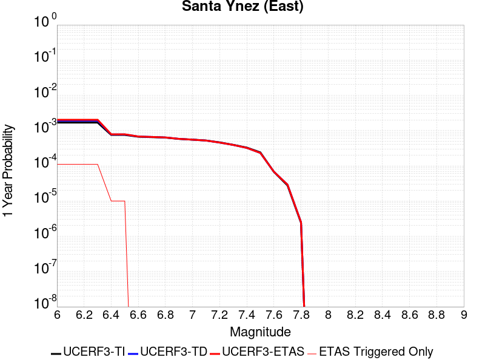 |  |

| Magnitude | 1 wk TI Prob | 1 wk TD Prob | 1 wk ETAS Prob | 1 wk ETAS/TD Gain | 1 wk ETAS Triggered Only | 1 mo TI Prob | 1 mo TD Prob | 1 mo ETAS Prob | 1 mo ETAS/TD Gain | 1 mo ETAS Triggered Only | 1 yr TI Prob | 1 yr TD Prob | 1 yr ETAS Prob | 1 yr ETAS/TD Gain | 1 yr ETAS Triggered Only | 10 yr TI Prob | 10 yr TD Prob | 10 yr ETAS Prob | 10 yr ETAS/TD Gain | 10 yr ETAS Triggered Only |
|-----|-----|-----|-----|-----|-----|-----|-----|-----|-----|-----|-----|-----|-----|-----|-----|-----|-----|-----|-----|-----|
| 6.0 | 3.2269712E-5 | 3.6750775E-5 | 8.603675E-5 | 2.3410869 | 4.928779E-5 | 1.3829143E-4 | 1.5749714E-4 | 2.0677716E-4 | 1.3128948 | 4.928779E-5 | 0.0016823979 | 0.0019164253 | 0.0019656187 | 1.0256693 | 4.928779E-5 | 0.016697178 | 0.019056438 | 0.019104786 | 1.0025371 | 4.928779E-5 |
| 6.1 | 3.2269712E-5 | 3.6750775E-5 | 8.603675E-5 | 2.3410869 | 4.928779E-5 | 1.3829143E-4 | 1.5749714E-4 | 2.0677716E-4 | 1.3128948 | 4.928779E-5 | 0.0016823979 | 0.0019164253 | 0.0019656187 | 1.0256693 | 4.928779E-5 | 0.016697178 | 0.019056438 | 0.019104786 | 1.0025371 | 4.928779E-5 |
| 6.2 | 3.2269712E-5 | 3.6750775E-5 | 8.603675E-5 | 2.3410869 | 4.928779E-5 | 1.3829143E-4 | 1.5749714E-4 | 2.0677716E-4 | 1.3128948 | 4.928779E-5 | 0.0016823979 | 0.0019164253 | 0.0019656187 | 1.0256693 | 4.928779E-5 | 0.016697178 | 0.019056438 | 0.019104786 | 1.0025371 | 4.928779E-5 |
| 6.3 | 3.2269712E-5 | 3.6750775E-5 | 8.603675E-5 | 2.3410869 | 4.928779E-5 | 1.3829143E-4 | 1.5749714E-4 | 2.0677716E-4 | 1.3128948 | 4.928779E-5 | 0.0016823979 | 0.0019164253 | 0.0019656187 | 1.0256693 | 4.928779E-5 | 0.016697178 | 0.019056438 | 0.019104786 | 1.0025371 | 4.928779E-5 |
| 6.4 | 1.4404779E-5 | 1.48492945E-5 | 1.48492945E-5 | 1.0 | 0.0 | 6.1733306E-5 | 6.363831E-5 | 6.363831E-5 | 1.0 | 0.0 | 7.513438E-4 | 7.7452604E-4 | 7.7452604E-4 | 1.0 | 0.0 | 0.0074880854 | 0.007718817 | 0.007718817 | 1.0 | 0.0 |
| 6.5 | 1.4404779E-5 | 1.48492945E-5 | 1.48492945E-5 | 1.0 | 0.0 | 6.1733306E-5 | 6.363831E-5 | 6.363831E-5 | 1.0 | 0.0 | 7.513438E-4 | 7.7452604E-4 | 7.7452604E-4 | 1.0 | 0.0 | 0.0074880854 | 0.007718817 | 0.007718817 | 1.0 | 0.0 |
| 6.6 | 1.280208E-5 | 1.301186E-5 | 1.301186E-5 | 1.0 | 0.0 | 5.4864904E-5 | 5.5763932E-5 | 5.5763932E-5 | 1.0 | 0.0 | 6.6777546E-4 | 6.7871617E-4 | 6.7871617E-4 | 1.0 | 0.0 | 0.006657724 | 0.0067666434 | 0.0067666434 | 1.0 | 0.0 |
| 6.7 | 1.2457027E-5 | 1.262838E-5 | 1.262838E-5 | 1.0 | 0.0 | 5.3386164E-5 | 5.4120515E-5 | 5.4120515E-5 | 1.0 | 0.0 | 6.497827E-4 | 6.5871974E-4 | 6.5871974E-4 | 1.0 | 0.0 | 0.00647886 | 0.00656787 | 0.00656787 | 1.0 | 0.0 |
| 6.8 | 1.2095134E-5 | 1.2230827E-5 | 1.2230827E-5 | 1.0 | 0.0 | 5.1835254E-5 | 5.2416784E-5 | 5.2416784E-5 | 1.0 | 0.0 | 6.309115E-4 | 6.3798914E-4 | 6.3798914E-4 | 1.0 | 0.0 | 0.0062912325 | 0.006361764 | 0.006361764 | 1.0 | 0.0 |
| 6.9 | 1.1104036E-5 | 1.115726E-5 | 1.115726E-5 | 1.0 | 0.0 | 4.758786E-5 | 4.781596E-5 | 4.781596E-5 | 1.0 | 0.0 | 5.7922816E-4 | 5.82005E-4 | 5.82005E-4 | 1.0 | 0.0 | 0.005777207 | 0.0058049536 | 0.0058049536 | 1.0 | 0.0 |
| 7.0 | 1.0577444E-5 | 1.05815925E-5 | 1.05815925E-5 | 1.0 | 0.0 | 4.5331115E-5 | 4.53489E-5 | 4.53489E-5 | 1.0 | 0.0 | 5.5176654E-4 | 5.5198424E-4 | 5.5198424E-4 | 1.0 | 0.0 | 0.0055039856 | 0.00550627 | 0.00550627 | 1.0 | 0.0 |
| 7.1 | 1.0021775E-5 | 9.9809E-6 | 9.9809E-6 | 1.0 | 0.0 | 4.294976E-5 | 4.277459E-5 | 4.277459E-5 | 1.0 | 0.0 | 5.2278786E-4 | 5.206574E-4 | 5.206574E-4 | 1.0 | 0.0 | 0.0052155964 | 0.005194508 | 0.005194508 | 1.0 | 0.0 |
| 7.2 | 8.874109E-6 | 8.748706E-6 | 8.748706E-6 | 1.0 | 0.0 | 3.8031343E-5 | 3.7493923E-5 | 3.7493923E-5 | 1.0 | 0.0 | 4.629332E-4 | 4.56394E-4 | 4.56394E-4 | 1.0 | 0.0 | 0.0046197 | 0.0045546847 | 0.0045546847 | 1.0 | 0.0 |
| 7.3 | 7.5504267E-6 | 7.5050243E-6 | 7.5050243E-6 | 1.0 | 0.0 | 3.235857E-5 | 3.2164E-5 | 3.2164E-5 | 1.0 | 0.0 | 3.9389438E-4 | 3.9152734E-4 | 3.9152734E-4 | 1.0 | 0.0 | 0.0039319694 | 0.0039084824 | 0.0039084824 | 1.0 | 0.0 |
| 7.4 | 6.309394E-6 | 6.183062E-6 | 6.183062E-6 | 1.0 | 0.0 | 2.703998E-5 | 2.6498574E-5 | 2.6498574E-5 | 1.0 | 0.0 | 3.2916202E-4 | 3.2257332E-4 | 3.2257332E-4 | 1.0 | 0.0 | 0.003286749 | 0.0032211484 | 0.0032211484 | 1.0 | 0.0 |
| 7.5 | 4.6103073E-6 | 4.4408016E-6 | 4.4408016E-6 | 1.0 | 0.0 | 1.975831E-5 | 1.9031871E-5 | 1.9031871E-5 | 1.0 | 0.0 | 2.4053088E-4 | 2.316891E-4 | 2.316891E-4 | 1.0 | 0.0 | 0.002402707 | 0.002314545 | 0.002314545 | 1.0 | 0.0 |
| 7.6 | 1.2858658E-6 | 1.3008196E-6 | 1.3008196E-6 | 1.0 | 0.0 | 5.5108417E-6 | 5.574929E-6 | 5.574929E-6 | 1.0 | 0.0 | 6.7092435E-5 | 6.787272E-5 | 6.787272E-5 | 1.0 | 0.0 | 6.707218E-4 | 6.7852676E-4 | 6.7852676E-4 | 1.0 | 0.0 |
| 7.7 | 5.3302307E-7 | 5.612138E-7 | 5.612138E-7 | 1.0 | 0.0 | 2.2843826E-6 | 2.4052001E-6 | 2.4052001E-6 | 1.0 | 0.0 | 2.7812002E-5 | 2.9282955E-5 | 2.9282955E-5 | 1.0 | 0.0 | 2.7808524E-4 | 2.9279455E-4 | 2.9279455E-4 | 1.0 | 0.0 |
| 7.8 | 4.613933E-8 | 4.80301E-8 | 4.80301E-8 | 1.0 | 0.0 | 1.9773998E-7 | 2.0584326E-7 | 2.0584326E-7 | 1.0 | 0.0 | 2.4074816E-6 | 2.5061388E-6 | 2.5061388E-6 | 1.0 | 0.0 | 2.4074554E-5 | 2.5061116E-5 | 2.5061116E-5 | 1.0 | 0.0 |

## Ortigalita (North)
*[(top)](#table-of-contents)*

| 1 Week | 1 Month | 1 Year | 10 Year |
|-----|-----|-----|-----|
| 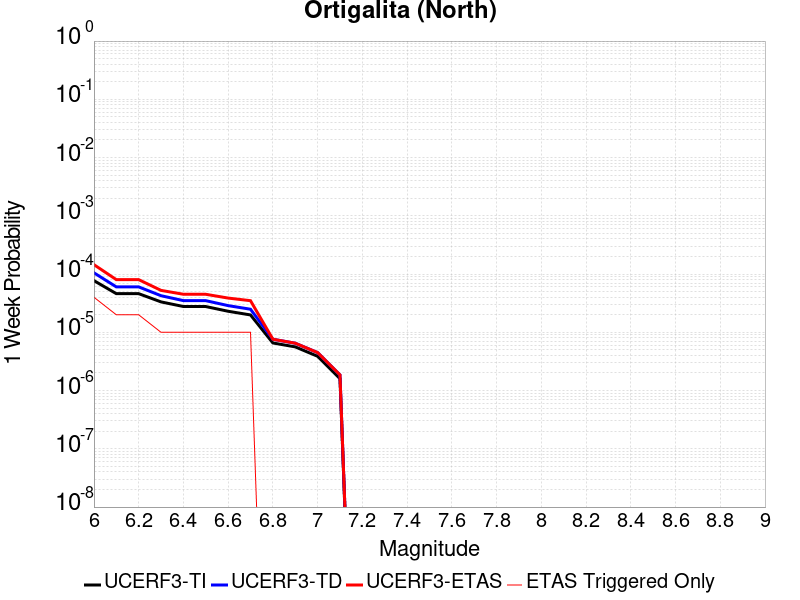 |  |  |  |

| Magnitude | 1 wk TI Prob | 1 wk TD Prob | 1 wk ETAS Prob | 1 wk ETAS/TD Gain | 1 wk ETAS Triggered Only | 1 mo TI Prob | 1 mo TD Prob | 1 mo ETAS Prob | 1 mo ETAS/TD Gain | 1 mo ETAS Triggered Only | 1 yr TI Prob | 1 yr TD Prob | 1 yr ETAS Prob | 1 yr ETAS/TD Gain | 1 yr ETAS Triggered Only | 10 yr TI Prob | 10 yr TD Prob | 10 yr ETAS Prob | 10 yr ETAS/TD Gain | 10 yr ETAS Triggered Only |
|-----|-----|-----|-----|-----|-----|-----|-----|-----|-----|-----|-----|-----|-----|-----|-----|-----|-----|-----|-----|-----|
| 6.0 | 7.711876E-5 | 1.0505308E-4 | 1.5433569E-4 | 1.4691211 | 4.928779E-5 | 3.3046713E-4 | 4.501601E-4 | 4.994257E-4 | 1.1094402 | 4.928779E-5 | 0.004016016 | 0.0054680547 | 0.005517073 | 1.0089645 | 4.928779E-5 | 0.039442103 | 0.053455614 | 0.053502265 | 1.0008727 | 4.928779E-5 |
| 6.1 | 4.607858E-5 | 6.0239887E-5 | 1.09524706E-4 | 1.8181427 | 4.928779E-5 | 1.9746469E-4 | 2.5814763E-4 | 3.074227E-4 | 1.1908795 | 4.928779E-5 | 0.0024014818 | 0.0031387366 | 0.0031878697 | 1.0156537 | 4.928779E-5 | 0.023756953 | 0.030975312 | 0.031023072 | 1.0015419 | 4.928779E-5 |
| 6.2 | 4.607858E-5 | 6.0239887E-5 | 1.09524706E-4 | 1.8181427 | 4.928779E-5 | 1.9746469E-4 | 2.5814763E-4 | 3.074227E-4 | 1.1908795 | 4.928779E-5 | 0.0024014818 | 0.0031387366 | 0.0031878697 | 1.0156537 | 4.928779E-5 | 0.023756953 | 0.030975312 | 0.031023072 | 1.0015419 | 4.928779E-5 |
| 6.3 | 3.327423E-5 | 4.2476124E-5 | 4.2476124E-5 | 1.0 | 0.0 | 1.4259605E-4 | 1.8202956E-4 | 1.8202956E-4 | 1.0 | 0.0 | 0.0017347244 | 0.002214206 | 0.002214206 | 1.0 | 0.0 | 0.017212452 | 0.02194574 | 0.02194574 | 1.0 | 0.0 |
| 6.4 | 2.7732503E-5 | 3.4999008E-5 | 3.4999008E-5 | 1.0 | 0.0 | 1.1884817E-4 | 1.499886E-4 | 1.499886E-4 | 1.0 | 0.0 | 0.001446016 | 0.0018248158 | 0.0018248158 | 1.0 | 0.0 | 0.014366428 | 0.018121297 | 0.018121297 | 1.0 | 0.0 |
| 6.5 | 2.7689714E-5 | 3.4948822E-5 | 3.4948822E-5 | 1.0 | 0.0 | 1.186648E-4 | 1.4977354E-4 | 1.4977354E-4 | 1.0 | 0.0 | 0.0014437864 | 0.0018222018 | 0.0018222018 | 1.0 | 0.0 | 0.014344421 | 0.018095585 | 0.018095585 | 1.0 | 0.0 |
| 6.6 | 2.2976905E-5 | 2.871829E-5 | 2.871829E-5 | 1.0 | 0.0 | 9.846873E-5 | 1.23074E-4 | 1.23074E-4 | 1.0 | 0.0 | 0.0011981975 | 0.0014976348 | 0.0014976348 | 1.0 | 0.0 | 0.011917574 | 0.014898733 | 0.014898733 | 1.0 | 0.0 |
| 6.7 | 1.9871539E-5 | 2.4904637E-5 | 2.4904637E-5 | 1.0 | 0.0 | 8.516096E-5 | 1.067312E-4 | 1.067312E-4 | 1.0 | 0.0 | 0.0010363415 | 0.0012989199 | 0.0012989199 | 1.0 | 0.0 | 0.010315218 | 0.012936938 | 0.012936938 | 1.0 | 0.0 |
| 6.8 | 6.5640475E-6 | 7.6054926E-6 | 7.6054926E-6 | 1.0 | 0.0 | 2.813133E-5 | 3.2594577E-5 | 3.2594577E-5 | 1.0 | 0.0 | 3.424451E-4 | 3.9676955E-4 | 3.9676955E-4 | 1.0 | 0.0 | 0.0034191788 | 0.003960899 | 0.003960899 | 1.0 | 0.0 |
| 6.9 | 5.6219683E-6 | 6.5018376E-6 | 6.5018376E-6 | 1.0 | 0.0 | 2.4093928E-5 | 2.7864735E-5 | 2.7864735E-5 | 1.0 | 0.0 | 2.933041E-4 | 3.3920293E-4 | 3.3920293E-4 | 1.0 | 0.0 | 0.0029291727 | 0.003387109 | 0.003387109 | 1.0 | 0.0 |
| 7.0 | 3.875591E-6 | 4.4847548E-6 | 4.4847548E-6 | 1.0 | 0.0 | 1.6609569E-5 | 1.9220248E-5 | 1.9220248E-5 | 1.0 | 0.0 | 2.0220275E-4 | 2.339835E-4 | 2.339835E-4 | 1.0 | 0.0 | 0.0020201886 | 0.0023375798 | 0.0023375798 | 1.0 | 0.0 |
| 7.1 | 1.6017933E-6 | 1.8570418E-6 | 1.8570418E-6 | 1.0 | 0.0 | 6.8648105E-6 | 7.958732E-6 | 7.958732E-6 | 1.0 | 0.0 | 8.357586E-5 | 9.689432E-5 | 9.689432E-5 | 1.0 | 0.0 | 8.3544437E-4 | 9.686254E-4 | 9.686254E-4 | 1.0 | 0.0 |

## Channel Islands Western Deep Ramp
*[(top)](#table-of-contents)*

| 1 Week | 1 Month | 1 Year | 10 Year |
|-----|-----|-----|-----|
|  |  |  |  |

| Magnitude | 1 wk TI Prob | 1 wk TD Prob | 1 wk ETAS Prob | 1 wk ETAS/TD Gain | 1 wk ETAS Triggered Only | 1 mo TI Prob | 1 mo TD Prob | 1 mo ETAS Prob | 1 mo ETAS/TD Gain | 1 mo ETAS Triggered Only | 1 yr TI Prob | 1 yr TD Prob | 1 yr ETAS Prob | 1 yr ETAS/TD Gain | 1 yr ETAS Triggered Only | 10 yr TI Prob | 10 yr TD Prob | 10 yr ETAS Prob | 10 yr ETAS/TD Gain | 10 yr ETAS Triggered Only |
|-----|-----|-----|-----|-----|-----|-----|-----|-----|-----|-----|-----|-----|-----|-----|-----|-----|-----|-----|-----|-----|
| 6.0 | 6.0213506E-6 | 6.2548684E-6 | 6.2548684E-6 | 1.0 | 0.0 | 2.5805533E-5 | 2.6806329E-5 | 2.6806329E-5 | 1.0 | 0.0 | 3.1413708E-4 | 3.2632265E-4 | 3.2632265E-4 | 1.0 | 0.0 | 0.0031369338 | 0.0032588763 | 0.0033080035 | 1.0150748 | 4.928779E-5 |
| 6.1 | 6.0213506E-6 | 6.2548684E-6 | 6.2548684E-6 | 1.0 | 0.0 | 2.5805533E-5 | 2.6806329E-5 | 2.6806329E-5 | 1.0 | 0.0 | 3.1413708E-4 | 3.2632265E-4 | 3.2632265E-4 | 1.0 | 0.0 | 0.0031369338 | 0.0032588763 | 0.0033080035 | 1.0150748 | 4.928779E-5 |
| 6.2 | 6.0213506E-6 | 6.2548684E-6 | 6.2548684E-6 | 1.0 | 0.0 | 2.5805533E-5 | 2.6806329E-5 | 2.6806329E-5 | 1.0 | 0.0 | 3.1413708E-4 | 3.2632265E-4 | 3.2632265E-4 | 1.0 | 0.0 | 0.0031369338 | 0.0032588763 | 0.0033080035 | 1.0150748 | 4.928779E-5 |
| 6.3 | 6.0213506E-6 | 6.2548684E-6 | 6.2548684E-6 | 1.0 | 0.0 | 2.5805533E-5 | 2.6806329E-5 | 2.6806329E-5 | 1.0 | 0.0 | 3.1413708E-4 | 3.2632265E-4 | 3.2632265E-4 | 1.0 | 0.0 | 0.0031369338 | 0.0032588763 | 0.0033080035 | 1.0150748 | 4.928779E-5 |
| 6.4 | 6.0213506E-6 | 6.2548684E-6 | 6.2548684E-6 | 1.0 | 0.0 | 2.5805533E-5 | 2.6806329E-5 | 2.6806329E-5 | 1.0 | 0.0 | 3.1413708E-4 | 3.2632265E-4 | 3.2632265E-4 | 1.0 | 0.0 | 0.0031369338 | 0.0032588763 | 0.0033080035 | 1.0150748 | 4.928779E-5 |
| 6.5 | 6.0213506E-6 | 6.2548684E-6 | 6.2548684E-6 | 1.0 | 0.0 | 2.5805533E-5 | 2.6806329E-5 | 2.6806329E-5 | 1.0 | 0.0 | 3.1413708E-4 | 3.2632265E-4 | 3.2632265E-4 | 1.0 | 0.0 | 0.0031369338 | 0.0032588763 | 0.0033080035 | 1.0150748 | 4.928779E-5 |
| 6.6 | 6.0213506E-6 | 6.2548684E-6 | 6.2548684E-6 | 1.0 | 0.0 | 2.5805533E-5 | 2.6806329E-5 | 2.6806329E-5 | 1.0 | 0.0 | 3.1413708E-4 | 3.2632265E-4 | 3.2632265E-4 | 1.0 | 0.0 | 0.0031369338 | 0.0032588763 | 0.0033080035 | 1.0150748 | 4.928779E-5 |
| 6.7 | 5.313309E-6 | 5.5252403E-6 | 5.5252403E-6 | 1.0 | 0.0 | 2.2771126E-5 | 2.367941E-5 | 2.367941E-5 | 1.0 | 0.0 | 2.772032E-4 | 2.8826276E-4 | 2.8826276E-4 | 1.0 | 0.0 | 0.0027685766 | 0.0028792918 | 0.0029284374 | 1.0170687 | 4.928779E-5 |
| 6.8 | 5.313309E-6 | 5.5252403E-6 | 5.5252403E-6 | 1.0 | 0.0 | 2.2771126E-5 | 2.367941E-5 | 2.367941E-5 | 1.0 | 0.0 | 2.772032E-4 | 2.8826276E-4 | 2.8826276E-4 | 1.0 | 0.0 | 0.0027685766 | 0.0028792918 | 0.0029284374 | 1.0170687 | 4.928779E-5 |
| 6.9 | 4.744377E-6 | 4.9394303E-6 | 4.9394303E-6 | 1.0 | 0.0 | 2.0332885E-5 | 2.1168837E-5 | 2.1168837E-5 | 1.0 | 0.0 | 2.4752476E-4 | 2.5770385E-4 | 2.5770385E-4 | 1.0 | 0.0 | 0.0024724922 | 0.0025744175 | 0.0025744175 | 1.0 | 0.0 |
| 7.0 | 4.722209E-6 | 4.9164732E-6 | 4.9164732E-6 | 1.0 | 0.0 | 2.0237881E-5 | 2.107045E-5 | 2.107045E-5 | 1.0 | 0.0 | 2.4636835E-4 | 2.5650626E-4 | 2.5650626E-4 | 1.0 | 0.0 | 0.002460954 | 0.0025624693 | 0.0025624693 | 1.0 | 0.0 |
| 7.1 | 4.611174E-6 | 4.801409E-6 | 4.801409E-6 | 1.0 | 0.0 | 1.9762025E-5 | 2.0577325E-5 | 2.0577325E-5 | 1.0 | 0.0 | 2.4057609E-4 | 2.5050386E-4 | 2.5050386E-4 | 1.0 | 0.0 | 0.002403158 | 0.002502582 | 0.002502582 | 1.0 | 0.0 |
| 7.2 | 4.043994E-6 | 4.2120264E-6 | 4.2120264E-6 | 1.0 | 0.0 | 1.7331287E-5 | 1.8051438E-5 | 1.8051438E-5 | 1.0 | 0.0 | 2.10988E-4 | 2.1975765E-4 | 2.1975765E-4 | 1.0 | 0.0 | 0.002107878 | 0.0021957543 | 0.0021957543 | 1.0 | 0.0 |
| 7.3 | 2.1233036E-6 | 2.2297875E-6 | 2.2297875E-6 | 1.0 | 0.0 | 9.099841E-6 | 9.556197E-6 | 9.556197E-6 | 1.0 | 0.0 | 1.1078493E-4 | 1.1634055E-4 | 1.1634055E-4 | 1.0 | 0.0 | 0.0011072971 | 0.001162802 | 0.001162802 | 1.0 | 0.0 |
| 7.4 | 1.9051884E-6 | 2.0014973E-6 | 2.0014973E-6 | 1.0 | 0.0 | 8.165067E-6 | 8.577817E-6 | 8.577817E-6 | 1.0 | 0.0 | 9.940516E-5 | 1.0442998E-4 | 1.0442998E-4 | 1.0 | 0.0 | 9.93607E-4 | 0.0010438144 | 0.0010438144 | 1.0 | 0.0 |
| 7.5 | 1.2408497E-6 | 1.3038839E-6 | 1.3038839E-6 | 1.0 | 0.0 | 5.317916E-6 | 5.588062E-6 | 5.588062E-6 | 1.0 | 0.0 | 6.4743705E-5 | 6.8032554E-5 | 6.8032554E-5 | 1.0 | 0.0 | 6.4724847E-4 | 6.8011944E-4 | 6.8011944E-4 | 1.0 | 0.0 |
| 7.6 | 6.5440025E-7 | 6.886718E-7 | 6.886718E-7 | 1.0 | 0.0 | 2.8045695E-6 | 2.9514472E-6 | 2.9514472E-6 | 1.0 | 0.0 | 3.4145098E-5 | 3.593329E-5 | 3.593329E-5 | 1.0 | 0.0 | 3.4139853E-4 | 3.5927625E-4 | 3.5927625E-4 | 1.0 | 0.0 |
| 7.7 | 3.985963E-7 | 4.1930787E-7 | 4.1930787E-7 | 1.0 | 0.0 | 1.7082689E-6 | 1.7970326E-6 | 1.7970326E-6 | 1.0 | 0.0 | 2.0797976E-5 | 2.1878664E-5 | 2.1878664E-5 | 1.0 | 0.0 | 2.0796029E-4 | 2.1876628E-4 | 2.1876628E-4 | 1.0 | 0.0 |
| 7.8 | 3.706329E-8 | 3.8591796E-8 | 3.8591796E-8 | 1.0 | 0.0 | 1.5884267E-7 | 1.653934E-7 | 1.653934E-7 | 1.0 | 0.0 | 1.9339077E-6 | 2.0136629E-6 | 2.0136629E-6 | 1.0 | 0.0 | 1.933891E-5 | 2.0136458E-5 | 2.0136458E-5 | 1.0 | 0.0 |

## Mission Ridge-Arroyo Parida-Santa Ana
*[(top)](#table-of-contents)*

| 1 Week | 1 Month | 1 Year | 10 Year |
|-----|-----|-----|-----|
|  |  |  | 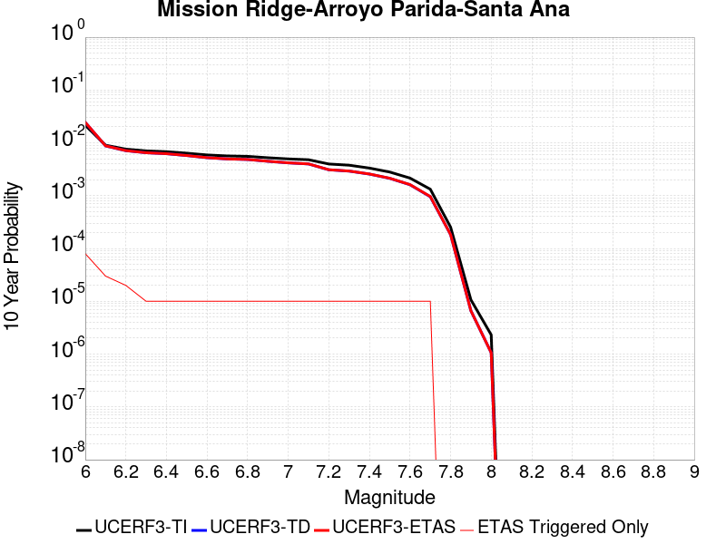 |

| Magnitude | 1 wk TI Prob | 1 wk TD Prob | 1 wk ETAS Prob | 1 wk ETAS/TD Gain | 1 wk ETAS Triggered Only | 1 mo TI Prob | 1 mo TD Prob | 1 mo ETAS Prob | 1 mo ETAS/TD Gain | 1 mo ETAS Triggered Only | 1 yr TI Prob | 1 yr TD Prob | 1 yr ETAS Prob | 1 yr ETAS/TD Gain | 1 yr ETAS Triggered Only | 10 yr TI Prob | 10 yr TD Prob | 10 yr ETAS Prob | 10 yr ETAS/TD Gain | 10 yr ETAS Triggered Only |
|-----|-----|-----|-----|-----|-----|-----|-----|-----|-----|-----|-----|-----|-----|-----|-----|-----|-----|-----|-----|-----|
| 6.0 | 4.169034E-5 | 4.7137048E-5 | 4.7137048E-5 | 1.0 | 0.0 | 1.7866064E-4 | 2.0200513E-4 | 2.0200513E-4 | 1.0 | 0.0 | 0.0021730233 | 0.0024574657 | 0.0025066324 | 1.020007 | 4.928779E-5 | 0.021518968 | 0.02438483 | 0.024432916 | 1.001972 | 4.928779E-5 |
| 6.1 | 1.73813E-5 | 1.6854203E-5 | 1.6854203E-5 | 1.0 | 0.0 | 7.4489166E-5 | 7.223036E-5 | 7.223036E-5 | 1.0 | 0.0 | 9.065282E-4 | 8.790605E-4 | 9.28305E-4 | 1.0560194 | 4.928779E-5 | 0.009028391 | 0.008757128 | 0.008805985 | 1.005579 | 4.928779E-5 |
| 6.2 | 1.4622182E-5 | 1.3673262E-5 | 1.3673262E-5 | 1.0 | 0.0 | 6.2664985E-5 | 5.85984E-5 | 5.85984E-5 | 1.0 | 0.0 | 7.6267915E-4 | 7.132059E-4 | 7.6245854E-4 | 1.0690581 | 4.928779E-5 | 0.007600669 | 0.007109767 | 0.0071587046 | 1.0068831 | 4.928779E-5 |
| 6.3 | 1.3552434E-5 | 1.2482174E-5 | 1.2482174E-5 | 1.0 | 0.0 | 5.8080568E-5 | 5.349395E-5 | 5.349395E-5 | 1.0 | 0.0 | 7.069015E-4 | 6.510974E-4 | 7.0035306E-4 | 1.0756503 | 4.928779E-5 | 0.00704657 | 0.006492415 | 0.0065413825 | 1.0075423 | 4.928779E-5 |
| 6.4 | 1.30977305E-5 | 1.1979128E-5 | 1.1979128E-5 | 1.0 | 0.0 | 5.613192E-5 | 5.133813E-5 | 5.133813E-5 | 1.0 | 0.0 | 6.831918E-4 | 6.2486547E-4 | 6.741225E-4 | 1.0788281 | 4.928779E-5 | 0.006810953 | 0.006231584 | 0.0062805647 | 1.0078601 | 4.928779E-5 |
| 6.5 | 1.225205E-5 | 1.1048776E-5 | 1.1048776E-5 | 1.0 | 0.0 | 5.2507727E-5 | 4.735105E-5 | 4.735105E-5 | 1.0 | 0.0 | 6.3909404E-4 | 5.7634927E-4 | 6.2560866E-4 | 1.0854679 | 4.928779E-5 | 0.006372592 | 0.005749009 | 0.0057980134 | 1.008524 | 4.928779E-5 |
| 6.6 | 1.1352241E-5 | 1.0063508E-5 | 1.0063508E-5 | 1.0 | 0.0 | 4.8651553E-5 | 4.3128617E-5 | 4.3128617E-5 | 1.0 | 0.0 | 5.921717E-4 | 5.249665E-4 | 5.7422847E-4 | 1.0938382 | 4.928779E-5 | 0.0059059616 | 0.0052376646 | 0.005286694 | 1.009361 | 4.928779E-5 |
| 6.7 | 1.0864116E-5 | 9.517E-6 | 9.517E-6 | 1.0 | 0.0 | 4.6559664E-5 | 4.0786515E-5 | 4.0786515E-5 | 1.0 | 0.0 | 5.667165E-4 | 4.964647E-4 | 5.45728E-4 | 1.0992283 | 4.928779E-5 | 0.005652734 | 0.0049539437 | 0.0050029876 | 1.0099 | 4.928779E-5 |
| 6.8 | 1.0666365E-5 | 9.299752E-6 | 9.299752E-6 | 1.0 | 0.0 | 4.571219E-5 | 3.985548E-5 | 3.985548E-5 | 1.0 | 0.0 | 5.564038E-4 | 4.8513446E-4 | 5.343983E-4 | 1.1015469 | 4.928779E-5 | 0.005550127 | 0.00484114 | 0.0048901895 | 1.0101317 | 4.928779E-5 |
| 6.9 | 1.0038665E-5 | 8.592018E-6 | 8.592018E-6 | 1.0 | 0.0 | 4.302214E-5 | 3.682243E-5 | 3.682243E-5 | 1.0 | 0.0 | 5.236687E-4 | 4.4822265E-4 | 4.9748836E-4 | 1.1099135 | 4.928779E-5 | 0.005224364 | 0.0044735507 | 0.0045226184 | 1.0109683 | 4.928779E-5 |
| 7.0 | 9.5379955E-6 | 8.025047E-6 | 8.025047E-6 | 1.0 | 0.0 | 4.0876483E-5 | 3.439261E-5 | 3.439261E-5 | 1.0 | 0.0 | 4.975576E-4 | 4.1865133E-4 | 4.6791846E-4 | 1.1176807 | 4.928779E-5 | 0.00496445 | 0.00417898 | 0.0042280615 | 1.011745 | 4.928779E-5 |
| 7.1 | 9.207389E-6 | 7.652347E-6 | 7.652347E-6 | 1.0 | 0.0 | 3.945964E-5 | 3.2795375E-5 | 3.2795375E-5 | 1.0 | 0.0 | 4.803152E-4 | 3.992122E-4 | 4.4848034E-4 | 1.1234133 | 4.928779E-5 | 0.004792784 | 0.003985301 | 0.0040343925 | 1.0123181 | 4.928779E-5 |
| 7.2 | 7.638091E-6 | 5.9310923E-6 | 5.9310923E-6 | 1.0 | 0.0 | 3.2734264E-5 | 2.5418722E-5 | 2.5418722E-5 | 1.0 | 0.0 | 3.984668E-4 | 3.094293E-4 | 3.5870183E-4 | 1.1592368 | 4.928779E-5 | 0.0039775306 | 0.0030901956 | 0.003139331 | 1.0159005 | 4.928779E-5 |
| 7.3 | 7.2500147E-6 | 5.596131E-6 | 5.596131E-6 | 1.0 | 0.0 | 3.1071122E-5 | 2.3983199E-5 | 2.3983199E-5 | 1.0 | 0.0 | 3.7822526E-4 | 2.9195662E-4 | 3.4123E-4 | 1.1687696 | 4.928779E-5 | 0.0037758215 | 0.0029159402 | 0.0029650843 | 1.0168536 | 4.928779E-5 |
| 7.4 | 6.3899715E-6 | 4.9184864E-6 | 4.9184864E-6 | 1.0 | 0.0 | 2.7385306E-5 | 2.1079059E-5 | 2.1079059E-5 | 1.0 | 0.0 | 3.3336508E-4 | 2.566075E-4 | 3.0588266E-4 | 1.1920253 | 4.928779E-5 | 0.0033286542 | 0.002563311 | 0.0026124723 | 1.0191789 | 4.928779E-5 |
| 7.5 | 5.379025E-6 | 4.0838477E-6 | 4.0838477E-6 | 1.0 | 0.0 | 2.305276E-5 | 1.7502087E-5 | 1.7502087E-5 | 1.0 | 0.0 | 2.806312E-4 | 2.1306718E-4 | 2.6234446E-4 | 1.2312758 | 4.928779E-5 | 0.0028027708 | 0.0021286402 | 0.002177823 | 1.0231053 | 4.928779E-5 |
| 7.6 | 4.1270696E-6 | 3.0883373E-6 | 3.0883373E-6 | 1.0 | 0.0 | 1.768732E-5 | 1.32356645E-5 | 1.32356645E-5 | 1.0 | 0.0 | 2.1532185E-4 | 1.6113237E-4 | 2.1041222E-4 | 1.3058345 | 4.928779E-5 | 0.0021511333 | 0.0016101635 | 0.0016593719 | 1.0305611 | 4.928779E-5 |
| 7.7 | 2.5406805E-6 | 1.8282044E-6 | 1.8282044E-6 | 1.0 | 0.0 | 1.0888585E-5 | 7.835139E-6 | 7.835139E-6 | 1.0 | 0.0 | 1.3256045E-4 | 9.53887E-5 | 1.4467178E-4 | 1.5166554 | 4.928779E-5 | 0.0013248142 | 9.534837E-4 | 0.0010027245 | 1.051643 | 4.928779E-5 |
| 7.8 | 4.8608285E-7 | 3.509864E-7 | 3.509864E-7 | 1.0 | 0.0 | 2.0832106E-6 | 1.5042266E-6 | 1.5042266E-6 | 1.0 | 0.0 | 2.5362791E-5 | 1.8313805E-5 | 1.8313805E-5 | 1.0 | 0.0 | 2.5359896E-4 | 1.8312308E-4 | 1.8312308E-4 | 1.0 | 0.0 |
| 7.9 | 2.0472514E-8 | 1.2688718E-8 | 1.2688718E-8 | 1.0 | 0.0 | 8.7739345E-8 | 5.438022E-8 | 5.438022E-8 | 1.0 | 0.0 | 1.068226E-6 | 6.6207895E-7 | 6.6207895E-7 | 1.0 | 0.0 | 1.0682209E-5 | 6.620771E-6 | 6.620771E-6 | 1.0 | 0.0 |
| 8.0 | 4.443582E-9 | 2.032067E-9 | 2.032067E-9 | 1.0 | 0.0 | 1.9043922E-8 | 8.7088585E-9 | 8.7088585E-9 | 1.0 | 0.0 | 2.3185973E-7 | 1.0603035E-7 | 1.0603035E-7 | 1.0 | 0.0 | 2.3185949E-6 | 1.0603031E-6 | 1.0603031E-6 | 1.0 | 0.0 |

## Hosgri
*[(top)](#table-of-contents)*

| 1 Week | 1 Month | 1 Year | 10 Year |
|-----|-----|-----|-----|
|  |  |  |  |

| Magnitude | 1 wk TI Prob | 1 wk TD Prob | 1 wk ETAS Prob | 1 wk ETAS/TD Gain | 1 wk ETAS Triggered Only | 1 mo TI Prob | 1 mo TD Prob | 1 mo ETAS Prob | 1 mo ETAS/TD Gain | 1 mo ETAS Triggered Only | 1 yr TI Prob | 1 yr TD Prob | 1 yr ETAS Prob | 1 yr ETAS/TD Gain | 1 yr ETAS Triggered Only | 10 yr TI Prob | 10 yr TD Prob | 10 yr ETAS Prob | 10 yr ETAS/TD Gain | 10 yr ETAS Triggered Only |
|-----|-----|-----|-----|-----|-----|-----|-----|-----|-----|-----|-----|-----|-----|-----|-----|-----|-----|-----|-----|-----|
| 6.0 | 2.883978E-5 | 2.9128403E-5 | 2.9128403E-5 | 1.0 | 0.0 | 1.235932E-4 | 1.248302E-4 | 1.7411183E-4 | 1.3947895 | 4.928779E-5 | 0.0015037085 | 0.0015187752 | 0.0015679882 | 1.032403 | 4.928779E-5 | 0.01493574 | 0.01508773 | 0.015136274 | 1.0032175 | 4.928779E-5 |
| 6.1 | 2.883978E-5 | 2.9128403E-5 | 2.9128403E-5 | 1.0 | 0.0 | 1.235932E-4 | 1.248302E-4 | 1.7411183E-4 | 1.3947895 | 4.928779E-5 | 0.0015037085 | 0.0015187752 | 0.0015679882 | 1.032403 | 4.928779E-5 | 0.01493574 | 0.01508773 | 0.015136274 | 1.0032175 | 4.928779E-5 |
| 6.2 | 2.883978E-5 | 2.9128403E-5 | 2.9128403E-5 | 1.0 | 0.0 | 1.235932E-4 | 1.248302E-4 | 1.7411183E-4 | 1.3947895 | 4.928779E-5 | 0.0015037085 | 0.0015187752 | 0.0015679882 | 1.032403 | 4.928779E-5 | 0.01493574 | 0.01508773 | 0.015136274 | 1.0032175 | 4.928779E-5 |
| 6.3 | 2.2914428E-5 | 2.2641956E-5 | 2.2641956E-5 | 1.0 | 0.0 | 9.8200995E-5 | 9.703337E-5 | 1.4631638E-4 | 1.5078975 | 4.928779E-5 | 0.0011949413 | 0.001180746 | 0.0012299756 | 1.0416937 | 4.928779E-5 | 0.011885363 | 0.011746123 | 0.011794832 | 1.0041468 | 4.928779E-5 |
| 6.4 | 2.0195741E-5 | 1.9696547E-5 | 1.9696547E-5 | 1.0 | 0.0 | 8.65503E-5 | 8.4411055E-5 | 1.3369469E-4 | 1.5838528 | 4.928779E-5 | 0.0010532405 | 0.001027222 | 0.0010764592 | 1.0479324 | 4.928779E-5 | 0.010482626 | 0.010225783 | 0.010274567 | 1.0047706 | 4.928779E-5 |
| 6.5 | 1.9924333E-5 | 1.9408968E-5 | 1.9408968E-5 | 1.0 | 0.0 | 8.53872E-5 | 8.317865E-5 | 1.3246234E-4 | 1.5925041 | 4.928779E-5 | 0.0010390934 | 0.0010122315 | 0.0010614694 | 1.0486429 | 4.928779E-5 | 0.010342481 | 0.010077244 | 0.010126035 | 1.0048417 | 4.928779E-5 |
| 6.6 | 1.809694E-5 | 1.7458287E-5 | 1.7458287E-5 | 1.0 | 0.0 | 7.7556004E-5 | 7.4819094E-5 | 1.241032E-4 | 1.6587102 | 4.928779E-5 | 9.438353E-4 | 9.105431E-4 | 9.5978595E-4 | 1.0540808 | 4.928779E-5 | 0.009398366 | 0.009069063 | 0.009117904 | 1.0053854 | 4.928779E-5 |
| 6.7 | 1.675989E-5 | 1.6042752E-5 | 1.6042752E-5 | 1.0 | 0.0 | 7.182612E-5 | 6.8752845E-5 | 1.1803725E-4 | 1.7168344 | 4.928779E-5 | 8.7413215E-4 | 8.3674554E-4 | 8.859921E-4 | 1.0588548 | 4.928779E-5 | 0.008707017 | 0.008336853 | 0.00838573 | 1.0058627 | 4.928779E-5 |
| 6.8 | 1.5401129E-5 | 1.4614069E-5 | 1.4614069E-5 | 1.0 | 0.0 | 6.6003166E-5 | 6.263023E-5 | 1.1191493E-4 | 1.7869157 | 4.928779E-5 | 8.032922E-4 | 7.6225714E-4 | 8.1150734E-4 | 1.0646111 | 4.928779E-5 | 0.008003947 | 0.0075972863 | 0.0076462 | 1.0064383 | 4.928779E-5 |
| 6.9 | 1.356559E-5 | 1.2689955E-5 | 1.2689955E-5 | 1.0 | 0.0 | 5.8136946E-5 | 5.438439E-5 | 1.036695E-4 | 1.9062364 | 4.928779E-5 | 7.0758746E-4 | 6.6192925E-4 | 7.111844E-4 | 1.0744115 | 4.928779E-5 | 0.007053386 | 0.006600378 | 0.0066493405 | 1.0074182 | 4.928779E-5 |
| 7.0 | 1.2030819E-5 | 1.1095949E-5 | 1.1095949E-5 | 1.0 | 0.0 | 5.155963E-5 | 4.75532E-5 | 9.683865E-5 | 2.0364275 | 4.928779E-5 | 6.275577E-4 | 5.788065E-4 | 6.280658E-4 | 1.085105 | 4.928779E-5 | 0.006257884 | 0.0057737473 | 0.0058227507 | 1.0084872 | 4.928779E-5 |
| 7.1 | 1.0972698E-5 | 1.0022167E-5 | 1.0022167E-5 | 1.0 | 0.0 | 4.7025E-5 | 4.2951437E-5 | 4.2951437E-5 | 1.0 | 0.0 | 5.72379E-4 | 5.2280835E-4 | 5.2280835E-4 | 1.0 | 0.0 | 0.0057090693 | 0.005216533 | 0.005216533 | 1.0 | 0.0 |
| 7.2 | 9.961926E-6 | 9.034732E-6 | 9.034732E-6 | 1.0 | 0.0 | 4.2693267E-5 | 3.8719707E-5 | 3.8719707E-5 | 1.0 | 0.0 | 5.1966653E-4 | 4.7131052E-4 | 4.7131052E-4 | 1.0 | 0.0 | 0.00518453 | 0.0047038523 | 0.0047038523 | 1.0 | 0.0 |
| 7.3 | 8.700929E-6 | 7.828089E-6 | 7.828089E-6 | 1.0 | 0.0 | 3.7289166E-5 | 3.354852E-5 | 3.354852E-5 | 1.0 | 0.0 | 4.53901E-4 | 4.083767E-4 | 4.083767E-4 | 1.0 | 0.0 | 0.00452975 | 0.004076999 | 0.004076999 | 1.0 | 0.0 |
| 7.4 | 7.866285E-6 | 6.9987263E-6 | 6.9987263E-6 | 1.0 | 0.0 | 3.3712215E-5 | 2.9994197E-5 | 2.9994197E-5 | 1.0 | 0.0 | 4.103689E-4 | 3.6511818E-4 | 3.6511818E-4 | 1.0 | 0.0 | 0.004096119 | 0.0036459167 | 0.0036459167 | 1.0 | 0.0 |
| 7.5 | 6.8381305E-6 | 5.9596814E-6 | 5.9596814E-6 | 1.0 | 0.0 | 2.9305946E-5 | 2.5541241E-5 | 2.5541241E-5 | 1.0 | 0.0 | 3.5674145E-4 | 3.1092027E-4 | 3.1092027E-4 | 1.0 | 0.0 | 0.0035616932 | 0.003105584 | 0.003105584 | 1.0 | 0.0 |
| 7.6 | 5.503376E-6 | 4.595227E-6 | 4.595227E-6 | 1.0 | 0.0 | 2.3585684E-5 | 1.9693682E-5 | 1.9693682E-5 | 1.0 | 0.0 | 2.8711787E-4 | 2.397442E-4 | 2.397442E-4 | 1.0 | 0.0 | 0.002867472 | 0.0023955852 | 0.0023955852 | 1.0 | 0.0 |
| 7.7 | 3.6144982E-6 | 2.6521896E-6 | 2.6521896E-6 | 1.0 | 0.0 | 1.5490614E-5 | 1.1366477E-5 | 1.1366477E-5 | 1.0 | 0.0 | 1.8858191E-4 | 1.3837808E-4 | 1.3837808E-4 | 1.0 | 0.0 | 0.0018842196 | 0.001383647 | 0.001383647 | 1.0 | 0.0 |
| 7.8 | 1.9853494E-6 | 1.1360784E-6 | 1.1360784E-6 | 1.0 | 0.0 | 8.508612E-6 | 4.8688985E-6 | 4.8688985E-6 | 1.0 | 0.0 | 1.0358743E-4 | 5.9277223E-5 | 5.9277223E-5 | 1.0 | 0.0 | 0.0010353916 | 5.933389E-4 | 5.933389E-4 | 1.0 | 0.0 |
| 7.9 | 1.1818757E-6 | 5.29477E-7 | 5.29477E-7 | 1.0 | 0.0 | 5.0651715E-6 | 2.269185E-6 | 2.269185E-6 | 1.0 | 0.0 | 6.1666724E-5 | 2.7626977E-5 | 2.7626977E-5 | 1.0 | 0.0 | 6.1649614E-4 | 2.7691363E-4 | 2.7691363E-4 | 1.0 | 0.0 |
| 8.0 | 6.962958E-7 | 2.71365E-7 | 2.71365E-7 | 1.0 | 0.0 | 2.9841215E-6 | 1.1629924E-6 | 1.1629924E-6 | 1.0 | 0.0 | 3.6331072E-5 | 1.415934E-5 | 1.415934E-5 | 1.0 | 0.0 | 3.6325134E-4 | 1.4215276E-4 | 1.4215276E-4 | 1.0 | 0.0 |
| 8.1 | 1.5033264E-7 | 6.52693E-8 | 6.52693E-8 | 1.0 | 0.0 | 6.442826E-7 | 2.7972553E-7 | 2.7972553E-7 | 1.0 | 0.0 | 7.844113E-6 | 3.4056532E-6 | 3.4056532E-6 | 1.0 | 0.0 | 7.843835E-5 | 3.4072833E-5 | 3.4072833E-5 | 1.0 | 0.0 |

## Santa Cruz Catalina Ridge alt1
*[(top)](#table-of-contents)*

| 1 Week | 1 Month | 1 Year | 10 Year |
|-----|-----|-----|-----|
|  |  |  |  |

| Magnitude | 1 wk TI Prob | 1 wk TD Prob | 1 wk ETAS Prob | 1 wk ETAS/TD Gain | 1 wk ETAS Triggered Only | 1 mo TI Prob | 1 mo TD Prob | 1 mo ETAS Prob | 1 mo ETAS/TD Gain | 1 mo ETAS Triggered Only | 1 yr TI Prob | 1 yr TD Prob | 1 yr ETAS Prob | 1 yr ETAS/TD Gain | 1 yr ETAS Triggered Only | 10 yr TI Prob | 10 yr TD Prob | 10 yr ETAS Prob | 10 yr ETAS/TD Gain | 10 yr ETAS Triggered Only |
|-----|-----|-----|-----|-----|-----|-----|-----|-----|-----|-----|-----|-----|-----|-----|-----|-----|-----|-----|-----|-----|
| 6.0 | 3.2833184E-5 | 3.6558402E-5 | 3.6558402E-5 | 1.0 | 0.0 | 1.4070606E-4 | 1.5667039E-4 | 1.5667039E-4 | 1.0 | 0.0 | 0.00171175 | 0.0019059594 | 0.0019551532 | 1.0258106 | 4.928779E-5 | 0.016986247 | 0.018913032 | 0.018961389 | 1.0025567 | 4.928779E-5 |
| 6.1 | 1.9835548E-5 | 2.1659505E-5 | 2.1659505E-5 | 1.0 | 0.0 | 8.500672E-5 | 9.282326E-5 | 9.282326E-5 | 1.0 | 0.0 | 0.0010344655 | 0.0011295575 | 0.0011787897 | 1.0435853 | 4.928779E-5 | 0.010296632 | 0.011240296 | 0.011289029 | 1.0043356 | 4.928779E-5 |
| 6.2 | 1.9835548E-5 | 2.1659505E-5 | 2.1659505E-5 | 1.0 | 0.0 | 8.500672E-5 | 9.282326E-5 | 9.282326E-5 | 1.0 | 0.0 | 0.0010344655 | 0.0011295575 | 0.0011787897 | 1.0435853 | 4.928779E-5 | 0.010296632 | 0.011240296 | 0.011289029 | 1.0043356 | 4.928779E-5 |
| 6.3 | 1.5728183E-5 | 1.703395E-5 | 1.703395E-5 | 1.0 | 0.0 | 6.7404755E-5 | 7.300063E-5 | 7.300063E-5 | 1.0 | 0.0 | 8.2034385E-4 | 8.884264E-4 | 9.376704E-4 | 1.0554284 | 4.928779E-5 | 0.008173222 | 0.008849427 | 0.008898279 | 1.0055203 | 4.928779E-5 |
| 6.4 | 1.5728183E-5 | 1.703395E-5 | 1.703395E-5 | 1.0 | 0.0 | 6.7404755E-5 | 7.300063E-5 | 7.300063E-5 | 1.0 | 0.0 | 8.2034385E-4 | 8.884264E-4 | 9.376704E-4 | 1.0554284 | 4.928779E-5 | 0.008173222 | 0.008849427 | 0.008898279 | 1.0055203 | 4.928779E-5 |
| 6.5 | 1.3707734E-5 | 1.4794522E-5 | 1.4794522E-5 | 1.0 | 0.0 | 5.8746107E-5 | 6.3403575E-5 | 6.3403575E-5 | 1.0 | 0.0 | 7.1499916E-4 | 7.716686E-4 | 8.2091836E-4 | 1.0638224 | 4.928779E-5 | 0.0071270303 | 0.0076902895 | 0.0077391984 | 1.0063598 | 4.928779E-5 |
| 6.6 | 1.2539813E-5 | 1.3510219E-5 | 1.3510219E-5 | 1.0 | 0.0 | 5.3740947E-5 | 5.789967E-5 | 5.789967E-5 | 1.0 | 0.0 | 6.540996E-4 | 7.0470315E-4 | 7.539562E-4 | 1.0698919 | 4.928779E-5 | 0.0065217763 | 0.0070249885 | 0.00707393 | 1.0069668 | 4.928779E-5 |
| 6.7 | 1.1504083E-5 | 1.2377375E-5 | 1.2377375E-5 | 1.0 | 0.0 | 4.930228E-5 | 5.3044827E-5 | 5.3044827E-5 | 1.0 | 0.0 | 6.0008996E-4 | 6.456314E-4 | 6.9488736E-4 | 1.0762912 | 4.928779E-5 | 0.005984721 | 0.006437786 | 0.0064867563 | 1.0076067 | 4.928779E-5 |
| 6.8 | 1.012739E-5 | 1.0877071E-5 | 1.0877071E-5 | 1.0 | 0.0 | 4.340238E-5 | 4.6615194E-5 | 4.6615194E-5 | 1.0 | 0.0 | 5.282958E-4 | 5.673937E-4 | 6.1665353E-4 | 1.0868177 | 4.928779E-5 | 0.0052704164 | 0.0056596193 | 0.0057086283 | 1.0086594 | 4.928779E-5 |
| 6.9 | 8.9607865E-6 | 9.609117E-6 | 9.609117E-6 | 1.0 | 0.0 | 3.8402806E-5 | 4.1181287E-5 | 4.1181287E-5 | 1.0 | 0.0 | 4.6745385E-4 | 5.012679E-4 | 5.5053097E-4 | 1.098277 | 4.928779E-5 | 0.0046647177 | 0.005001492 | 0.005050533 | 1.0098053 | 4.928779E-5 |
| 7.0 | 8.046829E-6 | 8.619746E-6 | 8.619746E-6 | 1.0 | 0.0 | 3.4485955E-5 | 3.694125E-5 | 3.694125E-5 | 1.0 | 0.0 | 4.1978562E-4 | 4.496677E-4 | 4.989333E-4 | 1.1095601 | 4.928779E-5 | 0.004189935 | 0.0044876686 | 0.0045367354 | 1.0109336 | 4.928779E-5 |
| 7.1 | 7.136131E-6 | 7.637656E-6 | 7.637656E-6 | 1.0 | 0.0 | 3.0583058E-5 | 3.2732405E-5 | 3.2732405E-5 | 1.0 | 0.0 | 3.7228514E-4 | 3.9844486E-4 | 4.47713E-4 | 1.1236511 | 4.928779E-5 | 0.0037166206 | 0.003977381 | 0.004026473 | 1.0123427 | 4.928779E-5 |
| 7.2 | 6.362014E-6 | 6.8049585E-6 | 6.8049585E-6 | 1.0 | 0.0 | 2.726549E-5 | 2.9163786E-5 | 2.9163786E-5 | 1.0 | 0.0 | 3.3190678E-4 | 3.550119E-4 | 4.0428218E-4 | 1.1387849 | 4.928779E-5 | 0.0033141149 | 0.003544516 | 0.0035936292 | 1.013856 | 4.928779E-5 |
| 7.3 | 5.004101E-6 | 5.351715E-6 | 5.351715E-6 | 1.0 | 0.0 | 2.1445969E-5 | 2.2935723E-5 | 2.2935723E-5 | 1.0 | 0.0 | 2.6107338E-4 | 2.792072E-4 | 2.792072E-4 | 1.0 | 0.0 | 0.002607669 | 0.0027886187 | 0.0027886187 | 1.0 | 0.0 |
| 7.4 | 3.4901443E-6 | 3.7320526E-6 | 3.7320526E-6 | 1.0 | 0.0 | 1.4957676E-5 | 1.5994416E-5 | 1.5994416E-5 | 1.0 | 0.0 | 1.8209449E-4 | 1.9471499E-4 | 1.9471499E-4 | 1.0 | 0.0 | 0.0018194534 | 0.0019454823 | 0.0019454823 | 1.0 | 0.0 |
| 7.5 | 1.1215045E-6 | 1.189387E-6 | 1.189387E-6 | 1.0 | 0.0 | 4.806439E-6 | 5.097363E-6 | 5.097363E-6 | 1.0 | 0.0 | 5.851682E-5 | 6.205866E-5 | 6.205866E-5 | 1.0 | 0.0 | 5.850142E-4 | 6.2041637E-4 | 6.2041637E-4 | 1.0 | 0.0 |
| 7.6 | 2.8599047E-7 | 2.9951994E-7 | 2.9951994E-7 | 1.0 | 0.0 | 1.2256729E-6 | 1.2836562E-6 | 1.2836562E-6 | 1.0 | 0.0 | 1.4922465E-5 | 1.5628404E-5 | 1.5628404E-5 | 1.0 | 0.0 | 1.4921463E-4 | 1.5627318E-4 | 1.5627318E-4 | 1.0 | 0.0 |
| 7.7 | 2.0781519E-7 | 2.1744323E-7 | 2.1744323E-7 | 1.0 | 0.0 | 8.906362E-7 | 9.3189925E-7 | 9.3189925E-7 | 1.0 | 0.0 | 1.08434415E-5 | 1.13458145E-5 | 1.13458145E-5 | 1.0 | 0.0 | 1.0842913E-4 | 1.1345245E-4 | 1.1345245E-4 | 1.0 | 0.0 |
| 7.8 | 3.614776E-8 | 3.764102E-8 | 3.764102E-8 | 1.0 | 0.0 | 1.5491896E-7 | 1.6131864E-7 | 1.6131864E-7 | 1.0 | 0.0 | 1.8861368E-6 | 1.9640527E-6 | 1.9640527E-6 | 1.0 | 0.0 | 1.8861208E-5 | 1.9640367E-5 | 1.9640367E-5 | 1.0 | 0.0 |

## Calaveras (So) - Paicines extension 2011 CFM
*[(top)](#table-of-contents)*

| 1 Week | 1 Month | 1 Year | 10 Year |
|-----|-----|-----|-----|
| 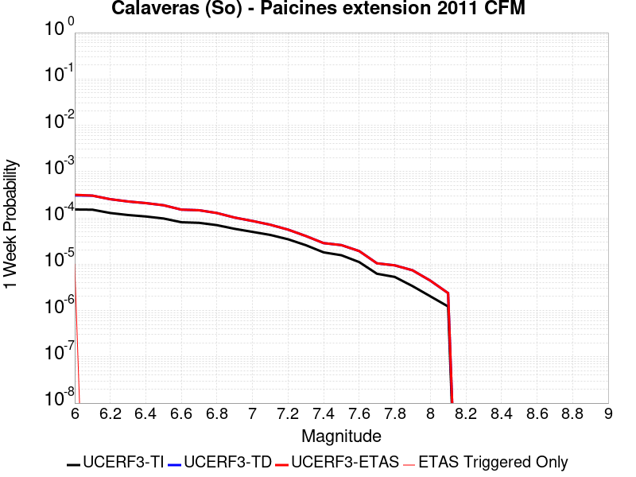 |  |  | 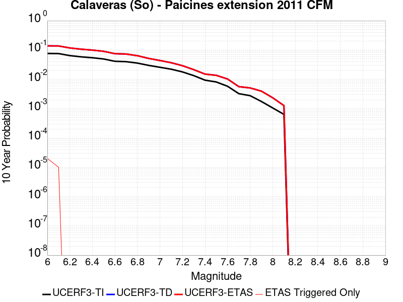 |

| Magnitude | 1 wk TI Prob | 1 wk TD Prob | 1 wk ETAS Prob | 1 wk ETAS/TD Gain | 1 wk ETAS Triggered Only | 1 mo TI Prob | 1 mo TD Prob | 1 mo ETAS Prob | 1 mo ETAS/TD Gain | 1 mo ETAS Triggered Only | 1 yr TI Prob | 1 yr TD Prob | 1 yr ETAS Prob | 1 yr ETAS/TD Gain | 1 yr ETAS Triggered Only | 10 yr TI Prob | 10 yr TD Prob | 10 yr ETAS Prob | 10 yr ETAS/TD Gain | 10 yr ETAS Triggered Only |
|-----|-----|-----|-----|-----|-----|-----|-----|-----|-----|-----|-----|-----|-----|-----|-----|-----|-----|-----|-----|-----|
| 6.0 | 1.5183659E-4 | 3.0520977E-4 | 3.5448253E-4 | 1.161439 | 4.928779E-5 | 6.5056595E-4 | 0.0013068188 | 0.0013560422 | 1.0376666 | 4.928779E-5 | 0.007891912 | 0.015696203 | 0.015744718 | 1.0030909 | 4.928779E-5 | 0.076174594 | 0.13848905 | 0.1385315 | 1.0003066 | 4.928779E-5 |
| 6.1 | 1.5024997E-4 | 3.021517E-4 | 3.021517E-4 | 1.0 | 0.0 | 6.437695E-4 | 0.0012937278 | 0.0012937278 | 1.0 | 0.0 | 0.0078097614 | 0.015539596 | 0.015539596 | 1.0 | 0.0 | 0.075409345 | 0.13715863 | 0.13715863 | 1.0 | 0.0 |
| 6.2 | 1.2743923E-4 | 2.5313982E-4 | 2.5313982E-4 | 1.0 | 0.0 | 5.460538E-4 | 0.0010839999 | 0.0010839999 | 1.0 | 0.0 | 0.0066279583 | 0.013046881 | 0.013046881 | 1.0 | 0.0 | 0.064337276 | 0.117256075 | 0.117256075 | 1.0 | 0.0 |
| 6.3 | 1.1525114E-4 | 2.2599236E-4 | 2.2599236E-4 | 1.0 | 0.0 | 4.9383997E-4 | 9.678718E-4 | 9.678718E-4 | 1.0 | 0.0 | 0.0059959386 | 0.011668079 | 0.011668079 | 1.0 | 0.0 | 0.058367174 | 0.106372125 | 0.106372125 | 1.0 | 0.0 |
| 6.4 | 1.07200925E-4 | 2.0840544E-4 | 2.0840544E-4 | 1.0 | 0.0 | 4.5935164E-4 | 8.926123E-4 | 8.926123E-4 | 1.0 | 0.0 | 0.0055782744 | 0.010772959 | 0.010772959 | 1.0 | 0.0 | 0.0544031 | 0.099194765 | 0.099194765 | 1.0 | 0.0 |
| 6.5 | 9.69631E-5 | 1.8734725E-4 | 1.8734725E-4 | 1.0 | 0.0 | 4.1548995E-4 | 8.024631E-4 | 8.024631E-4 | 1.0 | 0.0 | 0.0050468626 | 0.009694842 | 0.009694842 | 1.0 | 0.0 | 0.04933773 | 0.090086564 | 0.090086564 | 1.0 | 0.0 |
| 6.6 | 8.0552316E-5 | 1.507068E-4 | 1.507068E-4 | 1.0 | 0.0 | 3.4517853E-4 | 6.4569083E-4 | 6.4569083E-4 | 1.0 | 0.0 | 0.0041944524 | 0.007826508 | 0.007826508 | 1.0 | 0.0 | 0.04116161 | 0.0748563 | 0.0748563 | 1.0 | 0.0 |
| 6.7 | 7.815757E-5 | 1.4611272E-4 | 1.4611272E-4 | 1.0 | 0.0 | 3.34918E-4 | 6.26014E-4 | 6.26014E-4 | 1.0 | 0.0 | 0.004070005 | 0.007589312 | 0.007589312 | 1.0 | 0.0 | 0.039962657 | 0.07270582 | 0.07270582 | 1.0 | 0.0 |
| 6.8 | 6.965264E-5 | 1.2722758E-4 | 1.2722758E-4 | 1.0 | 0.0 | 2.9847719E-4 | 5.4513285E-4 | 5.4513285E-4 | 1.0 | 0.0 | 0.0036279052 | 0.0066135945 | 0.0066135945 | 1.0 | 0.0 | 0.03569247 | 0.063801065 | 0.063801065 | 1.0 | 0.0 |
| 6.9 | 5.8000453E-5 | 1.01439E-4 | 1.01439E-4 | 1.0 | 0.0 | 2.4854968E-4 | 4.346666E-4 | 4.346666E-4 | 1.0 | 0.0 | 0.0030218933 | 0.005279322 | 0.005279322 | 1.0 | 0.0 | 0.029811295 | 0.051502965 | 0.051502965 | 1.0 | 0.0 |
| 7.0 | 4.9865852E-5 | 8.568029E-5 | 8.568029E-5 | 1.0 | 0.0 | 2.1369329E-4 | 3.6715003E-4 | 3.6715003E-4 | 1.0 | 0.0 | 0.0025986114 | 0.004460979 | 0.004460979 | 1.0 | 0.0 | 0.025684336 | 0.043782018 | 0.043782018 | 1.0 | 0.0 |
| 7.1 | 4.283875E-5 | 7.1124625E-5 | 7.1124625E-5 | 1.0 | 0.0 | 1.8358172E-4 | 3.0478454E-4 | 3.0478454E-4 | 1.0 | 0.0 | 0.0022328163 | 0.003704494 | 0.003704494 | 1.0 | 0.0 | 0.022105146 | 0.03673582 | 0.03673582 | 1.0 | 0.0 |
| 7.2 | 3.450115E-5 | 5.5778568E-5 | 5.5778568E-5 | 1.0 | 0.0 | 1.478537E-4 | 2.3902925E-4 | 2.3902925E-4 | 1.0 | 0.0 | 0.0017986323 | 0.0029063264 | 0.0029063264 | 1.0 | 0.0 | 0.017841442 | 0.029079042 | 0.029079042 | 1.0 | 0.0 |
| 7.3 | 2.5709045E-5 | 4.059001E-5 | 4.059001E-5 | 1.0 | 0.0 | 1.1017697E-4 | 1.7394568E-4 | 1.7394568E-4 | 1.0 | 0.0 | 0.0013405791 | 0.0021157486 | 0.0021157486 | 1.0 | 0.0 | 0.013325208 | 0.02129686 | 0.02129686 | 1.0 | 0.0 |
| 7.4 | 1.8003093E-5 | 2.8511378E-5 | 2.8511378E-5 | 1.0 | 0.0 | 7.715383E-5 | 1.2218591E-4 | 1.2218591E-4 | 1.0 | 0.0 | 9.3894306E-4 | 0.0014866006 | 0.0014866006 | 1.0 | 0.0 | 0.009349857 | 0.015051589 | 0.015051589 | 1.0 | 0.0 |
| 7.5 | 1.5595824E-5 | 2.5823752E-5 | 2.5823752E-5 | 1.0 | 0.0 | 6.683753E-5 | 1.10668545E-4 | 1.10668545E-4 | 1.0 | 0.0 | 8.134431E-4 | 0.0013465589 | 0.0013465589 | 1.0 | 0.0 | 0.008104719 | 0.013651571 | 0.013651571 | 1.0 | 0.0 |
| 7.6 | 1.1110309E-5 | 1.9223195E-5 | 1.9223195E-5 | 1.0 | 0.0 | 4.761474E-5 | 8.2382525E-5 | 8.2382525E-5 | 1.0 | 0.0 | 5.795553E-4 | 0.0010025471 | 0.0010025471 | 1.0 | 0.0 | 0.0057804612 | 0.01020344 | 0.01020344 | 1.0 | 0.0 |
| 7.7 | 6.2140443E-6 | 1.04376995E-5 | 1.04376995E-5 | 1.0 | 0.0 | 2.6631347E-5 | 4.4732235E-5 | 4.4732235E-5 | 1.0 | 0.0 | 3.241884E-4 | 5.4447894E-4 | 5.4447894E-4 | 1.0 | 0.0 | 0.0032371588 | 0.005620102 | 0.005620102 | 1.0 | 0.0 |
| 7.8 | 5.305533E-6 | 9.433651E-6 | 9.433651E-6 | 1.0 | 0.0 | 2.27378E-5 | 4.0429306E-5 | 4.0429306E-5 | 1.0 | 0.0 | 2.7679754E-4 | 4.9211574E-4 | 4.9211574E-4 | 1.0 | 0.0 | 0.0027645302 | 0.005074622 | 0.005074622 | 1.0 | 0.0 |
| 7.9 | 3.363505E-6 | 7.3854467E-6 | 7.3854467E-6 | 1.0 | 0.0 | 1.4414942E-5 | 3.1651532E-5 | 3.1651532E-5 | 1.0 | 0.0 | 1.7548777E-4 | 3.8528934E-4 | 3.8528934E-4 | 1.0 | 0.0 | 0.0017534926 | 0.003948784 | 0.003948784 | 1.0 | 0.0 |
| 8.0 | 2.0271132E-6 | 4.4134235E-6 | 4.4134235E-6 | 1.0 | 0.0 | 8.687599E-6 | 1.8914534E-5 | 1.8914534E-5 | 1.0 | 0.0 | 1.05766376E-4 | 2.3026018E-4 | 2.3026018E-4 | 1.0 | 0.0 | 0.0010571606 | 0.002351194 | 0.002351194 | 1.0 | 0.0 |
| 8.1 | 1.2206116E-6 | 2.3752666E-6 | 2.3752666E-6 | 1.0 | 0.0 | 5.2311816E-6 | 1.0179674E-5 | 1.0179674E-5 | 1.0 | 0.0 | 6.3687774E-5 | 1.2393051E-4 | 1.2393051E-4 | 1.0 | 0.0 | 6.366953E-4 | 0.0012705618 | 0.0012705618 | 1.0 | 0.0 |

## San Jacinto (Borrego)
*[(top)](#table-of-contents)*

| 1 Week | 1 Month | 1 Year | 10 Year |
|-----|-----|-----|-----|
|  |  |  | 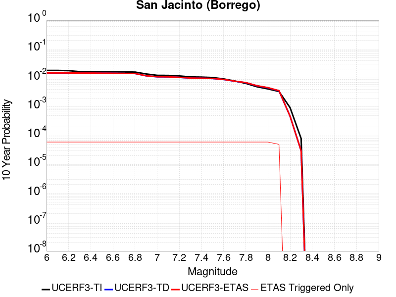 |

| Magnitude | 1 wk TI Prob | 1 wk TD Prob | 1 wk ETAS Prob | 1 wk ETAS/TD Gain | 1 wk ETAS Triggered Only | 1 mo TI Prob | 1 mo TD Prob | 1 mo ETAS Prob | 1 mo ETAS/TD Gain | 1 mo ETAS Triggered Only | 1 yr TI Prob | 1 yr TD Prob | 1 yr ETAS Prob | 1 yr ETAS/TD Gain | 1 yr ETAS Triggered Only | 10 yr TI Prob | 10 yr TD Prob | 10 yr ETAS Prob | 10 yr ETAS/TD Gain | 10 yr ETAS Triggered Only |
|-----|-----|-----|-----|-----|-----|-----|-----|-----|-----|-----|-----|-----|-----|-----|-----|-----|-----|-----|-----|-----|
| 6.0 | 3.543992E-5 | 2.7925962E-5 | 2.7925962E-5 | 1.0 | 0.0 | 1.5187653E-4 | 1.1967727E-4 | 1.1967727E-4 | 1.0 | 0.0 | 0.0018475284 | 0.0014561092 | 0.0014561092 | 1.0 | 0.0 | 0.018322436 | 0.01486815 | 0.014916706 | 1.0032657 | 4.928779E-5 |
| 6.1 | 3.542281E-5 | 2.7925962E-5 | 2.7925962E-5 | 1.0 | 0.0 | 1.5180321E-4 | 1.1967727E-4 | 1.1967727E-4 | 1.0 | 0.0 | 0.0018466372 | 0.0014561092 | 0.0014561092 | 1.0 | 0.0 | 0.018313672 | 0.01486815 | 0.014916706 | 1.0032657 | 4.928779E-5 |
| 6.2 | 3.4688688E-5 | 2.7925962E-5 | 2.7925962E-5 | 1.0 | 0.0 | 1.4865733E-4 | 1.1967727E-4 | 1.1967727E-4 | 1.0 | 0.0 | 0.0018084005 | 0.0014561091 | 0.0014561091 | 1.0 | 0.0 | 0.017937548 | 0.01486815 | 0.014916706 | 1.0032657 | 4.928779E-5 |
| 6.3 | 3.2087122E-5 | 2.7771312E-5 | 2.7771312E-5 | 1.0 | 0.0 | 1.3750899E-4 | 1.1901455E-4 | 1.1901455E-4 | 1.0 | 0.0 | 0.0016728862 | 0.0014480512 | 0.0014480512 | 1.0 | 0.0 | 0.016603488 | 0.014789308 | 0.014837867 | 1.0032834 | 4.928779E-5 |
| 6.4 | 3.1828724E-5 | 2.773829E-5 | 2.773829E-5 | 1.0 | 0.0 | 1.364017E-4 | 1.1887303E-4 | 1.1887303E-4 | 1.0 | 0.0 | 0.0016594254 | 0.0014463306 | 0.0014463306 | 1.0 | 0.0 | 0.016470885 | 0.014772502 | 0.014821061 | 1.0032872 | 4.928779E-5 |
| 6.5 | 3.1563577E-5 | 2.7477974E-5 | 2.7477974E-5 | 1.0 | 0.0 | 1.3526545E-4 | 1.17757496E-4 | 1.17757496E-4 | 1.0 | 0.0 | 0.0016456128 | 0.0014327668 | 0.0014327668 | 1.0 | 0.0 | 0.0163348 | 0.01463991 | 0.014688476 | 1.0033174 | 4.928779E-5 |
| 6.6 | 3.1467625E-5 | 2.7322194E-5 | 2.7322194E-5 | 1.0 | 0.0 | 1.3485427E-4 | 1.17089934E-4 | 1.17089934E-4 | 1.0 | 0.0 | 0.0016406142 | 0.0014246498 | 0.0014246498 | 1.0 | 0.0 | 0.016285548 | 0.014560228 | 0.014608798 | 1.0033358 | 4.928779E-5 |
| 6.7 | 3.1223695E-5 | 2.6940217E-5 | 2.6940217E-5 | 1.0 | 0.0 | 1.3380898E-4 | 1.1545303E-4 | 1.1545303E-4 | 1.0 | 0.0 | 0.0016279068 | 0.0014047464 | 0.0014047464 | 1.0 | 0.0 | 0.01616033 | 0.01436451 | 0.0144130895 | 1.003382 | 4.928779E-5 |
| 6.8 | 3.1015585E-5 | 2.6761221E-5 | 2.6761221E-5 | 1.0 | 0.0 | 1.3291716E-4 | 1.1468597E-4 | 1.1468597E-4 | 1.0 | 0.0 | 0.001617065 | 0.0013954195 | 0.0013954195 | 1.0 | 0.0 | 0.016053487 | 0.014271772 | 0.014320356 | 1.0034043 | 4.928779E-5 |
| 6.9 | 2.6641965E-5 | 2.2183434E-5 | 2.2183434E-5 | 1.0 | 0.0 | 1.1417485E-4 | 9.506842E-5 | 9.506842E-5 | 1.0 | 0.0 | 0.0013891924 | 0.0011568473 | 0.0011568473 | 1.0 | 0.0 | 0.0138054015 | 0.011882191 | 0.011930893 | 1.0040988 | 4.928779E-5 |
| 7.0 | 2.3854353E-5 | 2.047825E-5 | 2.047825E-5 | 1.0 | 0.0 | 1.02228936E-4 | 8.776099E-5 | 8.776099E-5 | 1.0 | 0.0 | 0.0012439266 | 0.0010679689 | 0.0010679689 | 1.0 | 0.0 | 0.012369866 | 0.0109826205 | 0.011031367 | 1.0044385 | 4.928779E-5 |
| 7.1 | 2.3672901E-5 | 2.0314741E-5 | 2.0314741E-5 | 1.0 | 0.0 | 1.0145135E-4 | 8.706028E-5 | 8.706028E-5 | 1.0 | 0.0 | 0.0012344702 | 0.0010594461 | 0.0010594461 | 1.0 | 0.0 | 0.0122763505 | 0.010897858 | 0.010946609 | 1.0044734 | 4.928779E-5 |
| 7.2 | 2.2717244E-5 | 1.9542116E-5 | 1.9542116E-5 | 1.0 | 0.0 | 9.735599E-5 | 8.3749255E-5 | 8.3749255E-5 | 1.0 | 0.0 | 0.0011846646 | 0.0010191725 | 0.0010191725 | 1.0 | 0.0 | 0.01178369 | 0.010495322 | 0.010544092 | 1.0046469 | 4.928779E-5 |
| 7.3 | 2.1016205E-5 | 1.8383771E-5 | 1.8383771E-5 | 1.0 | 0.0 | 9.006634E-5 | 7.878522E-5 | 7.878522E-5 | 1.0 | 0.0 | 0.001096006 | 9.5879E-4 | 9.5879E-4 | 1.0 | 0.0 | 0.010906163 | 0.009890901 | 0.009939701 | 1.0049338 | 4.928779E-5 |
| 7.4 | 2.0683625E-5 | 1.8186302E-5 | 1.8186302E-5 | 1.0 | 0.0 | 8.86411E-5 | 7.7938974E-5 | 7.7938974E-5 | 1.0 | 0.0 | 0.001078671 | 9.48496E-4 | 9.48496E-4 | 1.0 | 0.0 | 0.010734501 | 0.0097876275 | 0.009836433 | 1.0049864 | 4.928779E-5 |
| 7.5 | 1.9993966E-5 | 1.7781347E-5 | 1.7781347E-5 | 1.0 | 0.0 | 8.568561E-5 | 7.6203556E-5 | 7.6203556E-5 | 1.0 | 0.0 | 0.001042723 | 9.2738547E-4 | 9.2738547E-4 | 1.0 | 0.0 | 0.010378438 | 0.009574548 | 0.009623365 | 1.0050985 | 4.928779E-5 |
| 7.6 | 1.788966E-5 | 1.6434618E-5 | 1.6434618E-5 | 1.0 | 0.0 | 7.666772E-5 | 7.043219E-5 | 7.043219E-5 | 1.0 | 0.0 | 9.3302975E-4 | 8.5717626E-4 | 8.5717626E-4 | 1.0 | 0.0 | 0.00929122 | 0.008866415 | 0.008915266 | 1.0055096 | 4.928779E-5 |
| 7.7 | 1.5125781E-5 | 1.4236738E-5 | 1.4236738E-5 | 1.0 | 0.0 | 6.4823165E-5 | 6.101317E-5 | 6.101317E-5 | 1.0 | 0.0 | 7.889362E-4 | 7.4258295E-4 | 7.4258295E-4 | 1.0 | 0.0 | 0.007861412 | 0.007714161 | 0.0077630687 | 1.00634 | 4.928779E-5 |
| 7.8 | 1.250089E-5 | 1.262994E-5 | 1.262994E-5 | 1.0 | 0.0 | 5.3574146E-5 | 5.4127195E-5 | 5.4127195E-5 | 1.0 | 0.0 | 6.5207E-4 | 6.588E-4 | 6.588E-4 | 1.0 | 0.0 | 0.006501599 | 0.006867759 | 0.0069167083 | 1.0071274 | 4.928779E-5 |
| 7.9 | 9.561E-6 | 9.754065E-6 | 9.754065E-6 | 1.0 | 0.0 | 4.0975072E-5 | 4.180247E-5 | 4.180247E-5 | 1.0 | 0.0 | 4.987573E-4 | 5.0882675E-4 | 5.0882675E-4 | 1.0 | 0.0 | 0.0049763937 | 0.0053523607 | 0.0054013846 | 1.0091593 | 4.928779E-5 |
| 8.0 | 8.01699E-6 | 8.292994E-6 | 8.292994E-6 | 1.0 | 0.0 | 3.4358076E-5 | 3.554092E-5 | 3.554092E-5 | 1.0 | 0.0 | 4.1822926E-4 | 4.3262533E-4 | 4.3262533E-4 | 1.0 | 0.0 | 0.0041744304 | 0.0045733186 | 0.004622381 | 1.010728 | 4.928779E-5 |
| 8.1 | 6.541947E-6 | 6.461784E-6 | 6.461784E-6 | 1.0 | 0.0 | 2.8036617E-5 | 2.7693068E-5 | 2.7693068E-5 | 1.0 | 0.0 | 3.4129233E-4 | 3.3711144E-4 | 3.3711144E-4 | 1.0 | 0.0 | 0.0034076865 | 0.0035805756 | 0.0036296868 | 1.013716 | 4.928779E-5 |
| 8.2 | 1.7968189E-6 | 7.9684827E-7 | 7.9684827E-7 | 1.0 | 0.0 | 7.70063E-6 | 3.4150596E-6 | 3.4150596E-6 | 1.0 | 0.0 | 9.3751136E-5 | 4.157758E-5 | 4.157758E-5 | 1.0 | 0.0 | 9.371159E-4 | 4.7107413E-4 | 4.7107413E-4 | 1.0 | 0.0 |
| 8.3 | 1.5167889E-7 | 4.8951257E-8 | 4.8951257E-8 | 1.0 | 0.0 | 6.500522E-7 | 2.0979108E-7 | 2.0979108E-7 | 1.0 | 0.0 | 7.9143565E-6 | 2.5542038E-6 | 2.5542038E-6 | 1.0 | 0.0 | 7.914075E-5 | 2.9679897E-5 | 2.9679897E-5 | 1.0 | 0.0 |

## San Cayetano
*[(top)](#table-of-contents)*

| 1 Week | 1 Month | 1 Year | 10 Year |
|-----|-----|-----|-----|
|  |  |  |  |

| Magnitude | 1 wk TI Prob | 1 wk TD Prob | 1 wk ETAS Prob | 1 wk ETAS/TD Gain | 1 wk ETAS Triggered Only | 1 mo TI Prob | 1 mo TD Prob | 1 mo ETAS Prob | 1 mo ETAS/TD Gain | 1 mo ETAS Triggered Only | 1 yr TI Prob | 1 yr TD Prob | 1 yr ETAS Prob | 1 yr ETAS/TD Gain | 1 yr ETAS Triggered Only | 10 yr TI Prob | 10 yr TD Prob | 10 yr ETAS Prob | 10 yr ETAS/TD Gain | 10 yr ETAS Triggered Only |
|-----|-----|-----|-----|-----|-----|-----|-----|-----|-----|-----|-----|-----|-----|-----|-----|-----|-----|-----|-----|-----|
| 6.0 | 2.3476267E-5 | 1.8169216E-5 | 1.8169216E-5 | 1.0 | 0.0 | 1.0060869E-4 | 7.786576E-5 | 7.786576E-5 | 1.0 | 0.0 | 0.0012242225 | 9.4760704E-4 | 9.968481E-4 | 1.0519636 | 4.928779E-5 | 0.012175002 | 0.00943675 | 0.009485573 | 1.0051737 | 4.928779E-5 |
| 6.1 | 2.3476267E-5 | 1.8169216E-5 | 1.8169216E-5 | 1.0 | 0.0 | 1.0060869E-4 | 7.786576E-5 | 7.786576E-5 | 1.0 | 0.0 | 0.0012242225 | 9.4760704E-4 | 9.968481E-4 | 1.0519636 | 4.928779E-5 | 0.012175002 | 0.00943675 | 0.009485573 | 1.0051737 | 4.928779E-5 |
| 6.2 | 2.3476267E-5 | 1.8169216E-5 | 1.8169216E-5 | 1.0 | 0.0 | 1.0060869E-4 | 7.786576E-5 | 7.786576E-5 | 1.0 | 0.0 | 0.0012242225 | 9.4760704E-4 | 9.968481E-4 | 1.0519636 | 4.928779E-5 | 0.012175002 | 0.00943675 | 0.009485573 | 1.0051737 | 4.928779E-5 |
| 6.3 | 2.3476267E-5 | 1.8169216E-5 | 1.8169216E-5 | 1.0 | 0.0 | 1.0060869E-4 | 7.786576E-5 | 7.786576E-5 | 1.0 | 0.0 | 0.0012242225 | 9.4760704E-4 | 9.968481E-4 | 1.0519636 | 4.928779E-5 | 0.012175002 | 0.00943675 | 0.009485573 | 1.0051737 | 4.928779E-5 |
| 6.4 | 2.3476267E-5 | 1.8169216E-5 | 1.8169216E-5 | 1.0 | 0.0 | 1.0060869E-4 | 7.786576E-5 | 7.786576E-5 | 1.0 | 0.0 | 0.0012242225 | 9.4760704E-4 | 9.968481E-4 | 1.0519636 | 4.928779E-5 | 0.012175002 | 0.00943675 | 0.009485573 | 1.0051737 | 4.928779E-5 |
| 6.5 | 2.3476267E-5 | 1.8169216E-5 | 1.8169216E-5 | 1.0 | 0.0 | 1.0060869E-4 | 7.786576E-5 | 7.786576E-5 | 1.0 | 0.0 | 0.0012242225 | 9.4760704E-4 | 9.968481E-4 | 1.0519636 | 4.928779E-5 | 0.012175002 | 0.00943675 | 0.009485573 | 1.0051737 | 4.928779E-5 |
| 6.6 | 2.3476267E-5 | 1.8169216E-5 | 1.8169216E-5 | 1.0 | 0.0 | 1.0060869E-4 | 7.786576E-5 | 7.786576E-5 | 1.0 | 0.0 | 0.0012242225 | 9.4760704E-4 | 9.968481E-4 | 1.0519636 | 4.928779E-5 | 0.012175002 | 0.00943675 | 0.009485573 | 1.0051737 | 4.928779E-5 |
| 6.7 | 2.3476267E-5 | 1.8169216E-5 | 1.8169216E-5 | 1.0 | 0.0 | 1.0060869E-4 | 7.786576E-5 | 7.786576E-5 | 1.0 | 0.0 | 0.0012242225 | 9.4760704E-4 | 9.968481E-4 | 1.0519636 | 4.928779E-5 | 0.012175002 | 0.00943675 | 0.009485573 | 1.0051737 | 4.928779E-5 |
| 6.8 | 2.3241924E-5 | 1.7936945E-5 | 1.7936945E-5 | 1.0 | 0.0 | 9.960445E-5 | 7.687038E-5 | 7.687038E-5 | 1.0 | 0.0 | 0.0012120095 | 9.354987E-4 | 9.847403E-4 | 1.0526369 | 4.928779E-5 | 0.012054204 | 0.0093166195 | 0.009365448 | 1.005241 | 4.928779E-5 |
| 6.9 | 2.2761007E-5 | 1.7432383E-5 | 1.7432383E-5 | 1.0 | 0.0 | 9.7543525E-5 | 7.47081E-5 | 7.47081E-5 | 1.0 | 0.0 | 0.0011869454 | 9.09195E-4 | 9.58438E-4 | 1.0541611 | 4.928779E-5 | 0.011806256 | 0.009055741 | 0.0091045825 | 1.0053934 | 4.928779E-5 |
| 7.0 | 2.240283E-5 | 1.7066137E-5 | 1.7066137E-5 | 1.0 | 0.0 | 9.600859E-5 | 7.313856E-5 | 7.313856E-5 | 1.0 | 0.0 | 0.0011682777 | 8.9010154E-4 | 9.393455E-4 | 1.055324 | 4.928779E-5 | 0.011621549 | 0.008866336 | 0.008915187 | 1.0055097 | 4.928779E-5 |
| 7.1 | 2.1871154E-5 | 1.658602E-5 | 1.658602E-5 | 1.0 | 0.0 | 9.373015E-5 | 7.108103E-5 | 7.108103E-5 | 1.0 | 0.0 | 0.0011405671 | 8.6507126E-4 | 9.143164E-4 | 1.0569261 | 4.928779E-5 | 0.011347309 | 0.008617996 | 0.00866686 | 1.0056698 | 4.928779E-5 |
| 7.2 | 2.0714133E-5 | 1.5564563E-5 | 1.5564563E-5 | 1.0 | 0.0 | 8.8771834E-5 | 6.670358E-5 | 6.670358E-5 | 1.0 | 0.0 | 0.0010802611 | 8.118168E-4 | 8.6106453E-4 | 1.0606637 | 4.928779E-5 | 0.010750249 | 0.008089443 | 0.008138332 | 1.0060436 | 4.928779E-5 |
| 7.3 | 1.8408395E-5 | 1.3996829E-5 | 1.3996829E-5 | 1.0 | 0.0 | 7.8890735E-5 | 5.9985046E-5 | 5.9985046E-5 | 1.0 | 0.0 | 9.600714E-4 | 7.300762E-4 | 7.79328E-4 | 1.0674611 | 4.928779E-5 | 0.009559342 | 0.0072776447 | 0.0073265736 | 1.0067232 | 4.928779E-5 |
| 7.4 | 1.6856795E-5 | 1.285006E-5 | 1.285006E-5 | 1.0 | 0.0 | 7.2241404E-5 | 5.5070537E-5 | 5.5070537E-5 | 1.0 | 0.0 | 8.7918417E-4 | 6.7028037E-4 | 7.195351E-4 | 1.0734838 | 4.928779E-5 | 0.00875714 | 0.0066834087 | 0.006732367 | 1.0073254 | 4.928779E-5 |
| 7.5 | 1.2822778E-5 | 9.577415E-6 | 9.577415E-6 | 1.0 | 0.0 | 5.495361E-5 | 4.1045427E-5 | 4.1045427E-5 | 1.0 | 0.0 | 6.688548E-4 | 4.9961504E-4 | 5.488782E-4 | 1.0986023 | 4.928779E-5 | 0.006668452 | 0.0049851923 | 0.0050342344 | 1.0098375 | 4.928779E-5 |
| 7.6 | 5.6272684E-6 | 3.854899E-6 | 3.854899E-6 | 1.0 | 0.0 | 2.4116642E-5 | 1.6520893E-5 | 1.6520893E-5 | 1.0 | 0.0 | 2.9358055E-4 | 2.0112342E-4 | 2.504013E-4 | 1.2450131 | 4.928779E-5 | 0.0029319301 | 0.0020094248 | 0.0020586136 | 1.024479 | 4.928779E-5 |
| 7.7 | 3.5261346E-6 | 2.3407094E-6 | 2.3407094E-6 | 1.0 | 0.0 | 1.5111918E-5 | 1.0031574E-5 | 1.0031574E-5 | 1.0 | 0.0 | 1.8397206E-4 | 1.2212765E-4 | 1.7140941E-4 | 1.4035268 | 4.928779E-5 | 0.0018381984 | 0.0012206127 | 0.0012698403 | 1.0403303 | 4.928779E-5 |
| 7.8 | 1.4826929E-6 | 1.0564395E-6 | 1.0564395E-6 | 1.0 | 0.0 | 6.354383E-6 | 4.52759E-6 | 4.52759E-6 | 1.0 | 0.0 | 7.736187E-5 | 5.5122033E-5 | 5.5122033E-5 | 1.0 | 0.0 | 7.733494E-4 | 5.510856E-4 | 5.510856E-4 | 1.0 | 0.0 |
| 7.9 | 2.7568166E-7 | 1.6977887E-7 | 1.6977887E-7 | 1.0 | 0.0 | 1.1814923E-6 | 7.276235E-7 | 7.276235E-7 | 1.0 | 0.0 | 1.4384574E-5 | 8.85878E-6 | 8.85878E-6 | 1.0 | 0.0 | 1.4383643E-4 | 8.858431E-5 | 8.858431E-5 | 1.0 | 0.0 |
| 8.0 | 5.407832E-8 | 2.688677E-8 | 2.688677E-8 | 1.0 | 0.0 | 2.3176422E-7 | 1.15229014E-7 | 1.15229014E-7 | 1.0 | 0.0 | 2.8217257E-6 | 1.4029123E-6 | 1.4029123E-6 | 1.0 | 0.0 | 2.8216898E-5 | 1.40290385E-5 | 1.40290385E-5 | 1.0 | 0.0 |

## Almanor 2011 CFM
*[(top)](#table-of-contents)*

| 1 Week | 1 Month | 1 Year | 10 Year |
|-----|-----|-----|-----|
|  |  | 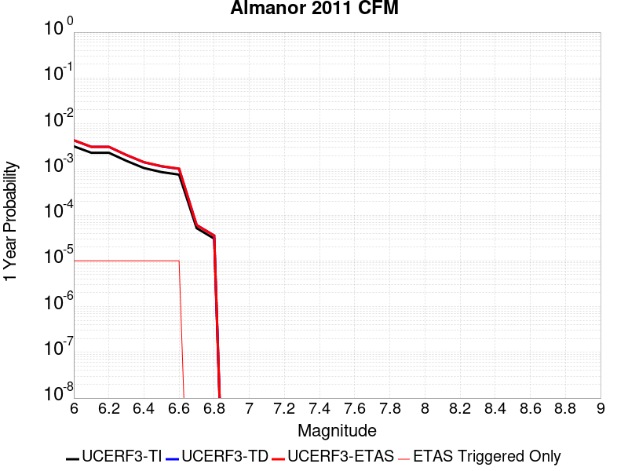 |  |

| Magnitude | 1 wk TI Prob | 1 wk TD Prob | 1 wk ETAS Prob | 1 wk ETAS/TD Gain | 1 wk ETAS Triggered Only | 1 mo TI Prob | 1 mo TD Prob | 1 mo ETAS Prob | 1 mo ETAS/TD Gain | 1 mo ETAS Triggered Only | 1 yr TI Prob | 1 yr TD Prob | 1 yr ETAS Prob | 1 yr ETAS/TD Gain | 1 yr ETAS Triggered Only | 10 yr TI Prob | 10 yr TD Prob | 10 yr ETAS Prob | 10 yr ETAS/TD Gain | 10 yr ETAS Triggered Only |
|-----|-----|-----|-----|-----|-----|-----|-----|-----|-----|-----|-----|-----|-----|-----|-----|-----|-----|-----|-----|-----|
| 6.0 | 6.1479834E-5 | 8.327245E-5 | 8.327245E-5 | 1.0 | 0.0 | 2.6345838E-4 | 3.5683523E-4 | 3.5683523E-4 | 1.0 | 0.0 | 0.0032028882 | 0.004336495 | 0.004385569 | 1.0113165 | 4.928779E-5 | 0.031571172 | 0.04258658 | 0.04263377 | 1.001108 | 4.928779E-5 |
| 6.1 | 4.4387216E-5 | 5.9767433E-5 | 5.9767433E-5 | 1.0 | 0.0 | 1.9021705E-4 | 2.561236E-4 | 2.561236E-4 | 1.0 | 0.0 | 0.0023134327 | 0.003114351 | 0.0031634853 | 1.0157768 | 4.928779E-5 | 0.022894967 | 0.030755581 | 0.030803354 | 1.0015533 | 4.928779E-5 |
| 6.2 | 4.4387216E-5 | 5.9767433E-5 | 5.9767433E-5 | 1.0 | 0.0 | 1.9021705E-4 | 2.561236E-4 | 2.561236E-4 | 1.0 | 0.0 | 0.0023134327 | 0.003114351 | 0.0031634853 | 1.0157768 | 4.928779E-5 | 0.022894967 | 0.030755581 | 0.030803354 | 1.0015533 | 4.928779E-5 |
| 6.3 | 2.9523822E-5 | 3.9546965E-5 | 3.9546965E-5 | 1.0 | 0.0 | 1.2652454E-4 | 1.6947731E-4 | 1.6947731E-4 | 1.0 | 0.0 | 0.0015393476 | 0.0020617929 | 0.002110979 | 1.023856 | 4.928779E-5 | 0.015287281 | 0.020461112 | 0.020509392 | 1.0023595 | 4.928779E-5 |
| 6.4 | 2.0512744E-5 | 2.7430639E-5 | 2.7430639E-5 | 1.0 | 0.0 | 8.79088E-5 | 1.17555675E-4 | 1.17555675E-4 | 1.0 | 0.0 | 0.001069764 | 0.0014306171 | 0.0014798343 | 1.0344028 | 4.928779E-5 | 0.010646289 | 0.01424458 | 0.014293165 | 1.0034108 | 4.928779E-5 |
| 6.5 | 1.6750226E-5 | 2.2390364E-5 | 2.2390364E-5 | 1.0 | 0.0 | 7.178471E-5 | 9.595619E-5 | 9.595619E-5 | 1.0 | 0.0 | 8.7362836E-4 | 0.0011679606 | 0.0012171908 | 1.0421506 | 4.928779E-5 | 0.008702018 | 0.011649196 | 0.01169791 | 1.0041817 | 4.928779E-5 |
| 6.6 | 1.4745303E-5 | 1.970686E-5 | 1.970686E-5 | 1.0 | 0.0 | 6.319262E-5 | 8.445639E-5 | 8.445639E-5 | 1.0 | 0.0 | 7.690986E-4 | 0.0010280984 | 0.0010773356 | 1.0478915 | 4.928779E-5 | 0.0076644225 | 0.01026513 | 0.010313911 | 1.0047522 | 4.928779E-5 |
| 6.7 | 9.951145E-7 | 1.1616347E-6 | 1.1616347E-6 | 1.0 | 0.0 | 4.26477E-6 | 4.9784257E-6 | 4.9784257E-6 | 1.0 | 0.0 | 5.1922336E-5 | 6.0610826E-5 | 6.0610826E-5 | 1.0 | 0.0 | 5.1910203E-4 | 6.059602E-4 | 6.059602E-4 | 1.0 | 0.0 |
| 6.8 | 5.866312E-7 | 6.849384E-7 | 6.849384E-7 | 1.0 | 0.0 | 2.5141312E-6 | 2.9354478E-6 | 2.9354478E-6 | 1.0 | 0.0 | 3.0609117E-5 | 3.5738623E-5 | 3.5738623E-5 | 1.0 | 0.0 | 3.06049E-4 | 3.5734157E-4 | 3.5734157E-4 | 1.0 | 0.0 |

## Garberville - Briceland 2011 CFM
*[(top)](#table-of-contents)*

| 1 Week | 1 Month | 1 Year | 10 Year |
|-----|-----|-----|-----|
|  | 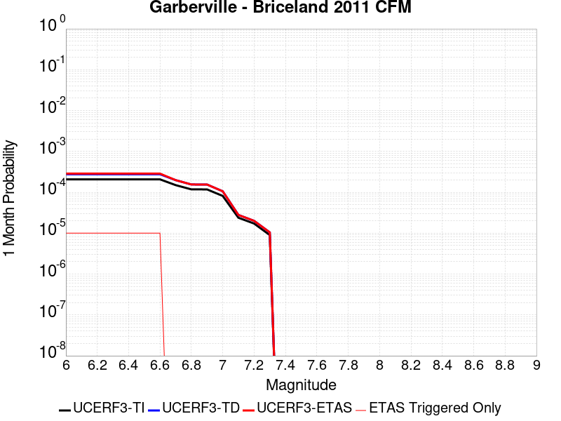 |  |  |

| Magnitude | 1 wk TI Prob | 1 wk TD Prob | 1 wk ETAS Prob | 1 wk ETAS/TD Gain | 1 wk ETAS Triggered Only | 1 mo TI Prob | 1 mo TD Prob | 1 mo ETAS Prob | 1 mo ETAS/TD Gain | 1 mo ETAS Triggered Only | 1 yr TI Prob | 1 yr TD Prob | 1 yr ETAS Prob | 1 yr ETAS/TD Gain | 1 yr ETAS Triggered Only | 10 yr TI Prob | 10 yr TD Prob | 10 yr ETAS Prob | 10 yr ETAS/TD Gain | 10 yr ETAS Triggered Only |
|-----|-----|-----|-----|-----|-----|-----|-----|-----|-----|-----|-----|-----|-----|-----|-----|-----|-----|-----|-----|-----|
| 6.0 | 4.8399295E-5 | 6.4527754E-5 | 1.1381236E-4 | 1.7637739 | 4.928779E-5 | 2.0740906E-4 | 2.765224E-4 | 3.2579654E-4 | 1.1781923 | 4.928779E-5 | 0.002522281 | 0.0033621131 | 0.0034112353 | 1.0146105 | 4.928779E-5 | 0.024938442 | 0.03317879 | 0.033226445 | 1.0014362 | 4.928779E-5 |
| 6.1 | 4.8399295E-5 | 6.4527754E-5 | 1.1381236E-4 | 1.7637739 | 4.928779E-5 | 2.0740906E-4 | 2.765224E-4 | 3.2579654E-4 | 1.1781923 | 4.928779E-5 | 0.002522281 | 0.0033621131 | 0.0034112353 | 1.0146105 | 4.928779E-5 | 0.024938442 | 0.03317879 | 0.033226445 | 1.0014362 | 4.928779E-5 |
| 6.2 | 4.8399295E-5 | 6.4527754E-5 | 1.1381236E-4 | 1.7637739 | 4.928779E-5 | 2.0740906E-4 | 2.765224E-4 | 3.2579654E-4 | 1.1781923 | 4.928779E-5 | 0.002522281 | 0.0033621131 | 0.0034112353 | 1.0146105 | 4.928779E-5 | 0.024938442 | 0.03317879 | 0.033226445 | 1.0014362 | 4.928779E-5 |
| 6.3 | 4.8399295E-5 | 6.4527754E-5 | 1.1381236E-4 | 1.7637739 | 4.928779E-5 | 2.0740906E-4 | 2.765224E-4 | 3.2579654E-4 | 1.1781923 | 4.928779E-5 | 0.002522281 | 0.0033621131 | 0.0034112353 | 1.0146105 | 4.928779E-5 | 0.024938442 | 0.03317879 | 0.033226445 | 1.0014362 | 4.928779E-5 |
| 6.4 | 4.8399295E-5 | 6.4527754E-5 | 1.1381236E-4 | 1.7637739 | 4.928779E-5 | 2.0740906E-4 | 2.765224E-4 | 3.2579654E-4 | 1.1781923 | 4.928779E-5 | 0.002522281 | 0.0033621131 | 0.0034112353 | 1.0146105 | 4.928779E-5 | 0.024938442 | 0.03317879 | 0.033226445 | 1.0014362 | 4.928779E-5 |
| 6.5 | 4.8399295E-5 | 6.4527754E-5 | 1.1381236E-4 | 1.7637739 | 4.928779E-5 | 2.0740906E-4 | 2.765224E-4 | 3.2579654E-4 | 1.1781923 | 4.928779E-5 | 0.002522281 | 0.0033621131 | 0.0034112353 | 1.0146105 | 4.928779E-5 | 0.024938442 | 0.03317879 | 0.033226445 | 1.0014362 | 4.928779E-5 |
| 6.6 | 4.8399295E-5 | 6.4527754E-5 | 1.1381236E-4 | 1.7637739 | 4.928779E-5 | 2.0740906E-4 | 2.765224E-4 | 3.2579654E-4 | 1.1781923 | 4.928779E-5 | 0.002522281 | 0.0033621131 | 0.0034112353 | 1.0146105 | 4.928779E-5 | 0.024938442 | 0.03317879 | 0.033226445 | 1.0014362 | 4.928779E-5 |
| 6.7 | 3.495179E-5 | 4.630908E-5 | 4.630908E-5 | 1.0 | 0.0 | 1.4978478E-4 | 1.9845538E-4 | 1.9845538E-4 | 1.0 | 0.0 | 0.0018221042 | 0.0024140473 | 0.0024140473 | 1.0 | 0.0 | 0.018072363 | 0.023930654 | 0.023930654 | 1.0 | 0.0 |
| 6.8 | 2.7517597E-5 | 3.62417E-5 | 3.62417E-5 | 1.0 | 0.0 | 1.1792722E-4 | 1.5531495E-4 | 1.5531495E-4 | 1.0 | 0.0 | 0.0014348183 | 0.0018897917 | 0.0018897917 | 1.0 | 0.0 | 0.014255894 | 0.01878354 | 0.01878354 | 1.0 | 0.0 |
| 6.9 | 2.74461E-5 | 3.6159425E-5 | 3.6159425E-5 | 1.0 | 0.0 | 1.1762084E-4 | 1.5496238E-4 | 1.5496238E-4 | 1.0 | 0.0 | 0.001431093 | 0.0018855067 | 0.0018855067 | 1.0 | 0.0 | 0.014219119 | 0.018741412 | 0.018741412 | 1.0 | 0.0 |
| 7.0 | 1.9023773E-5 | 2.4707771E-5 | 2.4707771E-5 | 1.0 | 0.0 | 8.152791E-5 | 1.0588833E-4 | 1.0588833E-4 | 1.0 | 0.0 | 9.921503E-4 | 0.0012888273 | 0.0012888273 | 1.0 | 0.0 | 0.009877323 | 0.012852578 | 0.012852578 | 1.0 | 0.0 |
| 7.1 | 5.566844E-6 | 6.512147E-6 | 6.512147E-6 | 1.0 | 0.0 | 2.3857683E-5 | 2.7908927E-5 | 2.7908927E-5 | 1.0 | 0.0 | 2.9042858E-4 | 3.3974246E-4 | 3.3974246E-4 | 1.0 | 0.0 | 0.002900493 | 0.0033926512 | 0.0033926512 | 1.0 | 0.0 |
| 7.2 | 4.011353E-6 | 4.6746213E-6 | 4.6746213E-6 | 1.0 | 0.0 | 1.7191402E-5 | 2.0033956E-5 | 2.0033956E-5 | 1.0 | 0.0 | 2.0928521E-4 | 2.4388955E-4 | 2.4388955E-4 | 1.0 | 0.0 | 0.0020908823 | 0.0024365564 | 0.0024365564 | 1.0 | 0.0 |
| 7.3 | 2.0974871E-6 | 2.4395908E-6 | 2.4395908E-6 | 1.0 | 0.0 | 8.989199E-6 | 1.0455362E-5 | 1.0455362E-5 | 1.0 | 0.0 | 1.09438006E-4 | 1.272891E-4 | 1.272891E-4 | 1.0 | 0.0 | 0.0010938413 | 0.0012724071 | 0.0012724071 | 1.0 | 0.0 |

## Great Valley 03 Mysterious Ridge
*[(top)](#table-of-contents)*

| 1 Week | 1 Month | 1 Year | 10 Year |
|-----|-----|-----|-----|
|  |  |  |  |

| Magnitude | 1 wk TI Prob | 1 wk TD Prob | 1 wk ETAS Prob | 1 wk ETAS/TD Gain | 1 wk ETAS Triggered Only | 1 mo TI Prob | 1 mo TD Prob | 1 mo ETAS Prob | 1 mo ETAS/TD Gain | 1 mo ETAS Triggered Only | 1 yr TI Prob | 1 yr TD Prob | 1 yr ETAS Prob | 1 yr ETAS/TD Gain | 1 yr ETAS Triggered Only | 10 yr TI Prob | 10 yr TD Prob | 10 yr ETAS Prob | 10 yr ETAS/TD Gain | 10 yr ETAS Triggered Only |
|-----|-----|-----|-----|-----|-----|-----|-----|-----|-----|-----|-----|-----|-----|-----|-----|-----|-----|-----|-----|-----|
| 6.0 | 3.1182444E-5 | 3.6034133E-5 | 8.532015E-5 | 2.3677592 | 4.928779E-5 | 1.336322E-4 | 1.5442389E-4 | 2.0370408E-4 | 1.3191228 | 4.928779E-5 | 0.0016257578 | 0.0018786751 | 0.0019278703 | 1.0261861 | 4.928779E-5 | 0.016139153 | 0.018646672 | 0.01869504 | 1.002594 | 4.928779E-5 |
| 6.1 | 3.1182444E-5 | 3.6034133E-5 | 8.532015E-5 | 2.3677592 | 4.928779E-5 | 1.336322E-4 | 1.5442389E-4 | 2.0370408E-4 | 1.3191228 | 4.928779E-5 | 0.0016257578 | 0.0018786751 | 0.0019278703 | 1.0261861 | 4.928779E-5 | 0.016139153 | 0.018646672 | 0.01869504 | 1.002594 | 4.928779E-5 |
| 6.2 | 3.1182444E-5 | 3.6034133E-5 | 8.532015E-5 | 2.3677592 | 4.928779E-5 | 1.336322E-4 | 1.5442389E-4 | 2.0370408E-4 | 1.3191228 | 4.928779E-5 | 0.0016257578 | 0.0018786751 | 0.0019278703 | 1.0261861 | 4.928779E-5 | 0.016139153 | 0.018646672 | 0.01869504 | 1.002594 | 4.928779E-5 |
| 6.3 | 2.106934E-5 | 2.3850303E-5 | 7.313692E-5 | 3.0664985 | 4.928779E-5 | 9.0294045E-5 | 1.0221176E-4 | 1.5149452E-4 | 1.4821633 | 4.928779E-5 | 0.0010987755 | 0.0012437488 | 0.0012929754 | 1.0395792 | 4.928779E-5 | 0.010933585 | 0.0123711275 | 0.012419806 | 1.0039349 | 4.928779E-5 |
| 6.4 | 2.106934E-5 | 2.3850303E-5 | 7.313692E-5 | 3.0664985 | 4.928779E-5 | 9.0294045E-5 | 1.0221176E-4 | 1.5149452E-4 | 1.4821633 | 4.928779E-5 | 0.0010987755 | 0.0012437488 | 0.0012929754 | 1.0395792 | 4.928779E-5 | 0.010933585 | 0.0123711275 | 0.012419806 | 1.0039349 | 4.928779E-5 |
| 6.5 | 1.9389783E-5 | 2.1884982E-5 | 7.117169E-5 | 3.2520792 | 4.928779E-5 | 8.309642E-5 | 9.378956E-5 | 1.4307273E-4 | 1.5254654 | 4.928779E-5 | 0.0010112294 | 0.0011413175 | 0.001190549 | 1.0431358 | 4.928779E-5 | 0.010066401 | 0.011357434 | 0.011406163 | 1.0042905 | 4.928779E-5 |
| 6.6 | 1.9370193E-5 | 2.1864902E-5 | 7.115162E-5 | 3.2541475 | 4.928779E-5 | 8.301247E-5 | 9.3703515E-5 | 1.4298668E-4 | 1.5259479 | 4.928779E-5 | 0.0010102082 | 0.001140271 | 0.0011895025 | 1.0431753 | 4.928779E-5 | 0.010056281 | 0.011347076 | 0.011395805 | 1.0042944 | 4.928779E-5 |
| 6.7 | 1.6723505E-5 | 1.8799281E-5 | 6.808615E-5 | 3.621742 | 4.928779E-5 | 7.16702E-5 | 8.056597E-5 | 1.298498E-4 | 1.6117201 | 4.928779E-5 | 8.722353E-4 | 9.804688E-4 | 0.0010297082 | 1.0502204 | 4.928779E-5 | 0.008688197 | 0.009763439 | 0.009812246 | 1.0049989 | 4.928779E-5 |
| 6.8 | 1.426937E-5 | 1.599721E-5 | 6.528421E-5 | 4.080975 | 4.928779E-5 | 6.115301E-5 | 6.855775E-5 | 1.1784216E-4 | 1.7188745 | 4.928779E-5 | 7.4428355E-4 | 8.343854E-4 | 8.836321E-4 | 1.0590215 | 4.928779E-5 | 0.007417957 | 0.008314005 | 0.008362883 | 1.005879 | 4.928779E-5 |
| 6.9 | 1.2469891E-5 | 1.3956928E-5 | 6.3244035E-5 | 4.531372 | 4.928779E-5 | 5.3441294E-5 | 5.9814105E-5 | 1.09098946E-4 | 1.823967 | 4.928779E-5 | 6.504535E-4 | 7.280055E-4 | 7.772574E-4 | 1.0676532 | 4.928779E-5 | 0.006485529 | 0.00725743 | 0.00730636 | 1.0067421 | 4.928779E-5 |
| 7.0 | 8.7746275E-6 | 9.791734E-6 | 9.791734E-6 | 1.0 | 0.0 | 3.7605005E-5 | 4.196394E-5 | 4.196394E-5 | 1.0 | 0.0 | 4.5774475E-4 | 5.1079853E-4 | 5.1079853E-4 | 1.0 | 0.0 | 0.00456803 | 0.005096977 | 0.005096977 | 1.0 | 0.0 |
| 7.1 | 6.1067153E-6 | 6.813725E-6 | 6.813725E-6 | 1.0 | 0.0 | 2.6171374E-5 | 2.9201385E-5 | 2.9201385E-5 | 1.0 | 0.0 | 3.1858988E-4 | 3.5547445E-4 | 3.5547445E-4 | 1.0 | 0.0 | 0.0031813353 | 0.003549609 | 0.003549609 | 1.0 | 0.0 |
| 7.2 | 2.939283E-6 | 3.2741057E-6 | 3.2741057E-6 | 1.0 | 0.0 | 1.2596866E-5 | 1.4031816E-5 | 1.4031816E-5 | 1.0 | 0.0 | 1.5335606E-4 | 1.7082572E-4 | 1.7082572E-4 | 1.0 | 0.0 | 0.0015325027 | 0.001707116 | 0.001707116 | 1.0 | 0.0 |
| 7.3 | 7.2387763E-7 | 8.008505E-7 | 8.008505E-7 | 1.0 | 0.0 | 3.102329E-6 | 3.4322145E-6 | 3.4322145E-6 | 1.0 | 0.0 | 3.77702E-5 | 4.178687E-5 | 4.178687E-5 | 1.0 | 0.0 | 3.7763783E-4 | 4.1783508E-4 | 4.1783508E-4 | 1.0 | 0.0 |
| 7.4 | 3.112171E-8 | 3.2068368E-8 | 3.2068368E-8 | 1.0 | 0.0 | 1.3337875E-7 | 1.3743585E-7 | 1.3743585E-7 | 1.0 | 0.0 | 1.6238852E-6 | 1.6732803E-6 | 1.6732803E-6 | 1.0 | 0.0 | 1.6238733E-5 | 1.6732685E-5 | 1.6732685E-5 | 1.0 | 0.0 |

## White Wolf
*[(top)](#table-of-contents)*

| 1 Week | 1 Month | 1 Year | 10 Year |
|-----|-----|-----|-----|
| 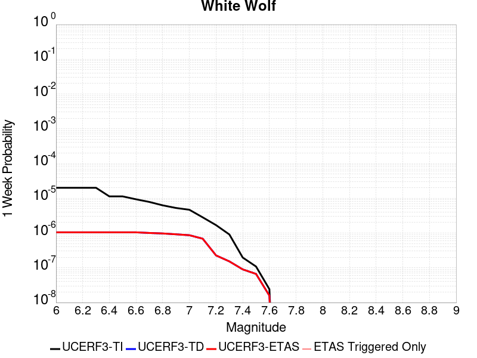 |  |  |  |

| Magnitude | 1 wk TI Prob | 1 wk TD Prob | 1 wk ETAS Prob | 1 wk ETAS/TD Gain | 1 wk ETAS Triggered Only | 1 mo TI Prob | 1 mo TD Prob | 1 mo ETAS Prob | 1 mo ETAS/TD Gain | 1 mo ETAS Triggered Only | 1 yr TI Prob | 1 yr TD Prob | 1 yr ETAS Prob | 1 yr ETAS/TD Gain | 1 yr ETAS Triggered Only | 10 yr TI Prob | 10 yr TD Prob | 10 yr ETAS Prob | 10 yr ETAS/TD Gain | 10 yr ETAS Triggered Only |
|-----|-----|-----|-----|-----|-----|-----|-----|-----|-----|-----|-----|-----|-----|-----|-----|-----|-----|-----|-----|-----|
| 6.0 | 2.0037822E-5 | 1.0468583E-6 | 1.0468583E-6 | 1.0 | 0.0 | 8.587355E-5 | 4.4865283E-6 | 4.4865283E-6 | 1.0 | 0.0 | 0.001045009 | 5.4622164E-5 | 1.0390726E-4 | 1.9022913 | 4.928779E-5 | 0.010401085 | 5.4609246E-4 | 5.953533E-4 | 1.0902061 | 4.928779E-5 |
| 6.1 | 2.0037822E-5 | 1.0468583E-6 | 1.0468583E-6 | 1.0 | 0.0 | 8.587355E-5 | 4.4865283E-6 | 4.4865283E-6 | 1.0 | 0.0 | 0.001045009 | 5.4622164E-5 | 1.0390726E-4 | 1.9022913 | 4.928779E-5 | 0.010401085 | 5.4609246E-4 | 5.953533E-4 | 1.0902061 | 4.928779E-5 |
| 6.2 | 2.0037822E-5 | 1.0468583E-6 | 1.0468583E-6 | 1.0 | 0.0 | 8.587355E-5 | 4.4865283E-6 | 4.4865283E-6 | 1.0 | 0.0 | 0.001045009 | 5.4622164E-5 | 1.0390726E-4 | 1.9022913 | 4.928779E-5 | 0.010401085 | 5.4609246E-4 | 5.953533E-4 | 1.0902061 | 4.928779E-5 |
| 6.3 | 2.0037822E-5 | 1.0468583E-6 | 1.0468583E-6 | 1.0 | 0.0 | 8.587355E-5 | 4.4865283E-6 | 4.4865283E-6 | 1.0 | 0.0 | 0.001045009 | 5.4622164E-5 | 1.0390726E-4 | 1.9022913 | 4.928779E-5 | 0.010401085 | 5.4609246E-4 | 5.953533E-4 | 1.0902061 | 4.928779E-5 |
| 6.4 | 1.132487E-5 | 1.0468583E-6 | 1.0468583E-6 | 1.0 | 0.0 | 4.8534253E-5 | 4.4865283E-6 | 4.4865283E-6 | 1.0 | 0.0 | 5.907443E-4 | 5.4622164E-5 | 1.0390726E-4 | 1.9022913 | 4.928779E-5 | 0.005891764 | 5.4609246E-4 | 5.953533E-4 | 1.0902061 | 4.928779E-5 |
| 6.5 | 1.132487E-5 | 1.0468583E-6 | 1.0468583E-6 | 1.0 | 0.0 | 4.8534253E-5 | 4.4865283E-6 | 4.4865283E-6 | 1.0 | 0.0 | 5.907443E-4 | 5.4622164E-5 | 1.0390726E-4 | 1.9022913 | 4.928779E-5 | 0.005891764 | 5.4609246E-4 | 5.953533E-4 | 1.0902061 | 4.928779E-5 |
| 6.6 | 9.347473E-6 | 1.0468583E-6 | 1.0468583E-6 | 1.0 | 0.0 | 4.0059982E-5 | 4.4865283E-6 | 4.4865283E-6 | 1.0 | 0.0 | 4.8762115E-4 | 5.4622164E-5 | 1.0390726E-4 | 1.9022913 | 4.928779E-5 | 0.0048655253 | 5.4609246E-4 | 5.953533E-4 | 1.0902061 | 4.928779E-5 |
| 6.7 | 7.842647E-6 | 1.0047773E-6 | 1.0047773E-6 | 1.0 | 0.0 | 3.361091E-5 | 4.306182E-6 | 4.306182E-6 | 1.0 | 0.0 | 4.0913603E-4 | 5.2426552E-5 | 1.0171176E-4 | 1.940081 | 4.928779E-5 | 0.004083836 | 5.241468E-4 | 5.7340873E-4 | 1.0939851 | 4.928779E-5 |
| 6.8 | 6.26597E-6 | 9.734289E-7 | 9.734289E-7 | 1.0 | 0.0 | 2.685388E-5 | 4.1718313E-6 | 4.1718313E-6 | 1.0 | 0.0 | 3.2689696E-4 | 5.0790914E-5 | 1.00076206E-4 | 1.9703563 | 4.928779E-5 | 0.003264165 | 5.07798E-4 | 5.570607E-4 | 1.0970125 | 4.928779E-5 |
| 6.9 | 5.258436E-6 | 9.1827343E-7 | 9.1827343E-7 | 1.0 | 0.0 | 2.2535958E-5 | 3.935452E-6 | 3.935452E-6 | 1.0 | 0.0 | 2.7434074E-4 | 4.7913123E-5 | 9.719855E-5 | 2.0286417 | 4.928779E-5 | 0.0027400232 | 4.7903272E-4 | 5.2829686E-4 | 1.1028409 | 4.928779E-5 |
| 7.0 | 4.675028E-6 | 8.660704E-7 | 8.660704E-7 | 1.0 | 0.0 | 2.003568E-5 | 3.7117254E-6 | 3.7117254E-6 | 1.0 | 0.0 | 2.4390711E-4 | 4.518937E-5 | 4.518937E-5 | 1.0 | 0.0 | 0.0024363957 | 4.518065E-4 | 4.518065E-4 | 1.0 | 0.0 |
| 7.1 | 2.8270078E-6 | 6.8737717E-7 | 6.8737717E-7 | 1.0 | 0.0 | 1.2115692E-5 | 2.945899E-6 | 2.945899E-6 | 1.0 | 0.0 | 1.4749856E-4 | 3.586577E-5 | 3.586577E-5 | 1.0 | 0.0 | 0.001474007 | 3.5860392E-4 | 3.5860392E-4 | 1.0 | 0.0 |
| 7.2 | 1.6881406E-6 | 2.2703432E-7 | 2.2703432E-7 | 1.0 | 0.0 | 7.2348685E-6 | 9.730038E-7 | 9.730038E-7 | 1.0 | 0.0 | 8.808096E-5 | 1.1846259E-5 | 1.1846259E-5 | 1.0 | 0.0 | 8.8046055E-4 | 1.1845643E-4 | 1.1845643E-4 | 1.0 | 0.0 |
| 7.3 | 9.086107E-7 | 1.5264496E-7 | 1.5264496E-7 | 1.0 | 0.0 | 3.8940398E-6 | 6.5419255E-7 | 6.5419255E-7 | 1.0 | 0.0 | 4.7408903E-5 | 7.964766E-6 | 7.964766E-6 | 1.0 | 0.0 | 4.739879E-4 | 7.964489E-5 | 7.964489E-5 | 1.0 | 0.0 |
| 7.4 | 1.9717383E-7 | 9.003399E-8 | 9.003399E-8 | 1.0 | 0.0 | 8.450304E-7 | 3.8585992E-7 | 3.8585992E-7 | 1.0 | 0.0 | 1.0288197E-5 | 4.697835E-6 | 4.697835E-6 | 1.0 | 0.0 | 1.028772E-4 | 4.6977384E-5 | 4.6977384E-5 | 1.0 | 0.0 |
| 7.5 | 1.086975E-7 | 6.659662E-8 | 6.659662E-8 | 1.0 | 0.0 | 4.6584634E-7 | 2.8541407E-7 | 2.8541407E-7 | 1.0 | 0.0 | 5.6716644E-6 | 3.474911E-6 | 3.474911E-6 | 1.0 | 0.0 | 5.6715195E-5 | 3.474859E-5 | 3.474859E-5 | 1.0 | 0.0 |
| 7.6 | 2.4217808E-8 | 1.5820849E-8 | 1.5820849E-8 | 1.0 | 0.0 | 1.03790605E-7 | 6.780364E-8 | 6.780364E-8 | 1.0 | 0.0 | 1.2636499E-6 | 8.25509E-7 | 8.25509E-7 | 1.0 | 0.0 | 1.2636427E-5 | 8.255064E-6 | 8.255064E-6 | 1.0 | 0.0 |

## Earthquake Valley (No  Extension)
*[(top)](#table-of-contents)*

| 1 Week | 1 Month | 1 Year | 10 Year |
|-----|-----|-----|-----|
|  |  |  |  |

| Magnitude | 1 wk TI Prob | 1 wk TD Prob | 1 wk ETAS Prob | 1 wk ETAS/TD Gain | 1 wk ETAS Triggered Only | 1 mo TI Prob | 1 mo TD Prob | 1 mo ETAS Prob | 1 mo ETAS/TD Gain | 1 mo ETAS Triggered Only | 1 yr TI Prob | 1 yr TD Prob | 1 yr ETAS Prob | 1 yr ETAS/TD Gain | 1 yr ETAS Triggered Only | 10 yr TI Prob | 10 yr TD Prob | 10 yr ETAS Prob | 10 yr ETAS/TD Gain | 10 yr ETAS Triggered Only |
|-----|-----|-----|-----|-----|-----|-----|-----|-----|-----|-----|-----|-----|-----|-----|-----|-----|-----|-----|-----|-----|
| 6.0 | 2.1859703E-5 | 2.5198351E-5 | 7.44849E-5 | 2.9559433 | 4.928779E-5 | 9.3681076E-5 | 1.0798928E-4 | 1.5727176E-4 | 1.4563644 | 4.928779E-5 | 0.0011399703 | 0.0013141216 | 0.0013633446 | 1.037457 | 4.928779E-5 | 0.011341401 | 0.013077869 | 0.013126512 | 1.0037194 | 4.928779E-5 |
| 6.1 | 2.1859703E-5 | 2.5198351E-5 | 7.44849E-5 | 2.9559433 | 4.928779E-5 | 9.3681076E-5 | 1.0798928E-4 | 1.5727176E-4 | 1.4563644 | 4.928779E-5 | 0.0011399703 | 0.0013141216 | 0.0013633446 | 1.037457 | 4.928779E-5 | 0.011341401 | 0.013077869 | 0.013126512 | 1.0037194 | 4.928779E-5 |
| 6.2 | 2.1859703E-5 | 2.5198351E-5 | 7.44849E-5 | 2.9559433 | 4.928779E-5 | 9.3681076E-5 | 1.0798928E-4 | 1.5727176E-4 | 1.4563644 | 4.928779E-5 | 0.0011399703 | 0.0013141216 | 0.0013633446 | 1.037457 | 4.928779E-5 | 0.011341401 | 0.013077869 | 0.013126512 | 1.0037194 | 4.928779E-5 |
| 6.3 | 2.1859703E-5 | 2.5198351E-5 | 7.44849E-5 | 2.9559433 | 4.928779E-5 | 9.3681076E-5 | 1.0798928E-4 | 1.5727176E-4 | 1.4563644 | 4.928779E-5 | 0.0011399703 | 0.0013141216 | 0.0013633446 | 1.037457 | 4.928779E-5 | 0.011341401 | 0.013077869 | 0.013126512 | 1.0037194 | 4.928779E-5 |
| 6.4 | 2.1859703E-5 | 2.5198351E-5 | 7.44849E-5 | 2.9559433 | 4.928779E-5 | 9.3681076E-5 | 1.0798928E-4 | 1.5727176E-4 | 1.4563644 | 4.928779E-5 | 0.0011399703 | 0.0013141216 | 0.0013633446 | 1.037457 | 4.928779E-5 | 0.011341401 | 0.013077869 | 0.013126512 | 1.0037194 | 4.928779E-5 |
| 6.5 | 2.1859703E-5 | 2.5198351E-5 | 7.44849E-5 | 2.9559433 | 4.928779E-5 | 9.3681076E-5 | 1.0798928E-4 | 1.5727176E-4 | 1.4563644 | 4.928779E-5 | 0.0011399703 | 0.0013141216 | 0.0013633446 | 1.037457 | 4.928779E-5 | 0.011341401 | 0.013077869 | 0.013126512 | 1.0037194 | 4.928779E-5 |
| 6.6 | 1.597E-5 | 1.835627E-5 | 6.764316E-5 | 3.6850166 | 4.928779E-5 | 6.8441055E-5 | 7.866784E-5 | 1.2795176E-4 | 1.626481 | 4.928779E-5 | 8.329513E-4 | 9.5744745E-4 | 0.001006688 | 1.051429 | 4.928779E-5 | 0.008298361 | 0.009541833 | 0.00959065 | 1.0051161 | 4.928779E-5 |
| 6.7 | 1.597E-5 | 1.835627E-5 | 6.764316E-5 | 3.6850166 | 4.928779E-5 | 6.8441055E-5 | 7.866784E-5 | 1.2795176E-4 | 1.626481 | 4.928779E-5 | 8.329513E-4 | 9.5744745E-4 | 0.001006688 | 1.051429 | 4.928779E-5 | 0.008298361 | 0.009541833 | 0.00959065 | 1.0051161 | 4.928779E-5 |
| 6.8 | 1.5315149E-5 | 1.7602086E-5 | 6.6889006E-5 | 3.8000617 | 4.928779E-5 | 6.5634704E-5 | 7.543582E-5 | 1.247199E-4 | 1.6533246 | 4.928779E-5 | 7.988095E-4 | 9.1813074E-4 | 9.673733E-4 | 1.0536335 | 4.928779E-5 | 0.007959441 | 0.009151915 | 0.009200752 | 1.0053363 | 4.928779E-5 |
| 6.9 | 1.3634728E-5 | 1.5675814E-5 | 6.4962835E-5 | 4.144144 | 4.928779E-5 | 5.8433237E-5 | 6.7180794E-5 | 1.1646528E-4 | 1.7336097 | 4.928779E-5 | 7.1119244E-4 | 8.1770134E-4 | 8.669488E-4 | 1.0602268 | 4.928779E-5 | 0.007089207 | 0.008154998 | 0.008203883 | 1.0059946 | 4.928779E-5 |
| 7.0 | 1.3496271E-5 | 1.5517848E-5 | 6.480487E-5 | 4.1761513 | 4.928779E-5 | 5.783988E-5 | 6.6503824E-5 | 1.1578834E-4 | 1.7410779 | 4.928779E-5 | 7.03973E-4 | 8.0946536E-4 | 8.5871323E-4 | 1.06084 | 4.928779E-5 | 0.007017471 | 0.008073238 | 0.0081221275 | 1.0060558 | 4.928779E-5 |
| 7.1 | 8.242798E-6 | 9.472594E-6 | 5.8759917E-5 | 6.20315 | 4.928779E-5 | 3.53258E-5 | 4.0596577E-5 | 8.9882364E-5 | 2.2140381 | 4.928779E-5 | 4.300067E-4 | 4.9421826E-4 | 5.434817E-4 | 1.0996795 | 4.928779E-5 | 0.004291756 | 0.0049377684 | 0.004986813 | 1.0099325 | 4.928779E-5 |
| 7.2 | 2.6506527E-7 | 2.2559628E-7 | 2.2559628E-7 | 1.0 | 0.0 | 1.1359936E-6 | 9.668408E-7 | 9.668408E-7 | 1.0 | 0.0 | 1.3830633E-5 | 1.1771229E-5 | 1.1771229E-5 | 1.0 | 0.0 | 1.3829772E-4 | 1.1770646E-4 | 1.1770646E-4 | 1.0 | 0.0 |
| 7.3 | 2.5810488E-7 | 2.1954757E-7 | 2.1954757E-7 | 1.0 | 0.0 | 1.1061633E-6 | 9.4091786E-7 | 9.4091786E-7 | 1.0 | 0.0 | 1.3467455E-5 | 1.1455619E-5 | 1.1455619E-5 | 1.0 | 0.0 | 1.3466639E-4 | 1.145507E-4 | 1.145507E-4 | 1.0 | 0.0 |
| 7.4 | 2.2676066E-7 | 1.9109943E-7 | 1.9109943E-7 | 1.0 | 0.0 | 9.71831E-7 | 8.189973E-7 | 8.189973E-7 | 1.0 | 0.0 | 1.1831979E-5 | 9.971251E-6 | 9.971251E-6 | 1.0 | 0.0 | 1.1831349E-4 | 9.970842E-5 | 9.970842E-5 | 1.0 | 0.0 |
| 7.5 | 1.5553917E-7 | 1.311138E-7 | 1.311138E-7 | 1.0 | 0.0 | 6.6659624E-7 | 5.619162E-7 | 5.619162E-7 | 1.0 | 0.0 | 8.115779E-6 | 6.84131E-6 | 6.84131E-6 | 1.0 | 0.0 | 8.115482E-5 | 6.841121E-5 | 6.841121E-5 | 1.0 | 0.0 |
| 7.6 | 1.3448629E-7 | 1.1287708E-7 | 1.1287708E-7 | 1.0 | 0.0 | 5.7636964E-7 | 4.8375887E-7 | 4.8375887E-7 | 1.0 | 0.0 | 7.017278E-6 | 5.8897504E-6 | 5.8897504E-6 | 1.0 | 0.0 | 7.0170565E-5 | 5.8896156E-5 | 5.8896156E-5 | 1.0 | 0.0 |
| 7.7 | 2.9719402E-8 | 1.4581234E-8 | 1.4581234E-8 | 1.0 | 0.0 | 1.2736886E-7 | 6.2491004E-8 | 6.2491004E-8 | 1.0 | 0.0 | 1.5507147E-6 | 7.6082773E-7 | 7.6082773E-7 | 1.0 | 0.0 | 1.550704E-5 | 7.608257E-6 | 7.608257E-6 | 1.0 | 0.0 |
| 7.8 | 7.4390196E-9 | 3.249962E-9 | 3.249962E-9 | 1.0 | 0.0 | 3.1881513E-8 | 1.39284095E-8 | 1.39284095E-8 | 1.0 | 0.0 | 3.8815733E-7 | 1.6957837E-7 | 1.6957837E-7 | 1.0 | 0.0 | 3.8815665E-6 | 1.6957828E-6 | 1.6957828E-6 | 1.0 | 0.0 |
| 7.9 | 1.5373532E-9 | 8.4400953E-10 | 8.4400953E-10 | 1.0 | 0.0 | 6.5886567E-9 | 3.6171839E-9 | 3.6171839E-9 | 1.0 | 0.0 | 8.021689E-8 | 4.403921E-8 | 4.403921E-8 | 1.0 | 0.0 | 8.0216864E-7 | 4.403921E-7 | 4.403921E-7 | 1.0 | 0.0 |

## Big Pine (East)
*[(top)](#table-of-contents)*

| 1 Week | 1 Month | 1 Year | 10 Year |
|-----|-----|-----|-----|
|  |  |  | 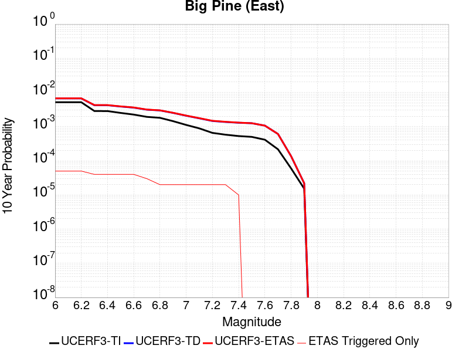 |

| Magnitude | 1 wk TI Prob | 1 wk TD Prob | 1 wk ETAS Prob | 1 wk ETAS/TD Gain | 1 wk ETAS Triggered Only | 1 mo TI Prob | 1 mo TD Prob | 1 mo ETAS Prob | 1 mo ETAS/TD Gain | 1 mo ETAS Triggered Only | 1 yr TI Prob | 1 yr TD Prob | 1 yr ETAS Prob | 1 yr ETAS/TD Gain | 1 yr ETAS Triggered Only | 10 yr TI Prob | 10 yr TD Prob | 10 yr ETAS Prob | 10 yr ETAS/TD Gain | 10 yr ETAS Triggered Only |
|-----|-----|-----|-----|-----|-----|-----|-----|-----|-----|-----|-----|-----|-----|-----|-----|-----|-----|-----|-----|-----|
| 6.0 | 9.916913E-6 | 1.28172705E-5 | 6.210443E-5 | 4.845371 | 4.928779E-5 | 4.250036E-5 | 5.493013E-5 | 1.04215214E-4 | 1.8972323 | 4.928779E-5 | 5.173191E-4 | 6.685912E-4 | 7.1784604E-4 | 1.0736696 | 4.928779E-5 | 0.0051611643 | 0.006670449 | 0.0067194076 | 1.0073397 | 4.928779E-5 |
| 6.1 | 9.916913E-6 | 1.28172705E-5 | 6.210443E-5 | 4.845371 | 4.928779E-5 | 4.250036E-5 | 5.493013E-5 | 1.04215214E-4 | 1.8972323 | 4.928779E-5 | 5.173191E-4 | 6.685912E-4 | 7.1784604E-4 | 1.0736696 | 4.928779E-5 | 0.0051611643 | 0.006670449 | 0.0067194076 | 1.0073397 | 4.928779E-5 |
| 6.2 | 9.916913E-6 | 1.28172705E-5 | 6.210443E-5 | 4.845371 | 4.928779E-5 | 4.250036E-5 | 5.493013E-5 | 1.04215214E-4 | 1.8972323 | 4.928779E-5 | 5.173191E-4 | 6.685912E-4 | 7.1784604E-4 | 1.0736696 | 4.928779E-5 | 0.0051611643 | 0.006670449 | 0.0067194076 | 1.0073397 | 4.928779E-5 |
| 6.3 | 5.479711E-6 | 8.1132375E-6 | 5.740063E-5 | 7.074935 | 4.928779E-5 | 2.3484265E-5 | 3.4770575E-5 | 8.405665E-5 | 2.4174652 | 4.928779E-5 | 2.858834E-4 | 4.232527E-4 | 4.7251963E-4 | 1.1164007 | 4.928779E-5 | 0.0028551589 | 0.0042272513 | 0.0042763306 | 1.0116103 | 4.928779E-5 |
| 6.4 | 5.465009E-6 | 8.0975315E-6 | 5.7384925E-5 | 7.0867186 | 4.928779E-5 | 2.3421257E-5 | 3.4703262E-5 | 8.398934E-5 | 2.4202147 | 4.928779E-5 | 2.851165E-4 | 4.2243348E-4 | 4.7170045E-4 | 1.1166266 | 4.928779E-5 | 0.0028475097 | 0.00421909 | 0.0042681703 | 1.0116328 | 4.928779E-5 |
| 6.5 | 4.826767E-6 | 7.4225877E-6 | 5.6710014E-5 | 7.6401944 | 4.928779E-5 | 2.068598E-5 | 3.1810716E-5 | 8.109694E-5 | 2.549359 | 4.928779E-5 | 2.518227E-4 | 3.8722943E-4 | 4.3649814E-4 | 1.1272339 | 4.928779E-5 | 0.0025153751 | 0.0038682907 | 0.0039173877 | 1.0126922 | 4.928779E-5 |
| 6.6 | 4.3146847E-6 | 6.8825234E-6 | 5.6169974E-5 | 8.161247 | 4.928779E-5 | 1.8491375E-5 | 2.949621E-5 | 7.878255E-5 | 2.670938 | 4.928779E-5 | 2.2510924E-4 | 3.5905963E-4 | 4.083297E-4 | 1.1372198 | 4.928779E-5 | 0.0022488134 | 0.0035875062 | 0.0036366172 | 1.0136894 | 4.928779E-5 |
| 6.7 | 3.6968106E-6 | 5.9957474E-6 | 5.9957474E-6 | 1.0 | 0.0 | 1.5843378E-5 | 2.5695816E-5 | 2.5695816E-5 | 1.0 | 0.0 | 1.9287605E-4 | 3.128032E-4 | 3.128032E-4 | 1.0 | 0.0 | 0.0019270873 | 0.0031262499 | 0.0031262499 | 1.0 | 0.0 |
| 6.8 | 3.4671132E-6 | 5.7024477E-6 | 5.7024477E-6 | 1.0 | 0.0 | 1.4858972E-5 | 2.4438841E-5 | 2.4438841E-5 | 1.0 | 0.0 | 1.8089297E-4 | 2.9750372E-4 | 2.9750372E-4 | 1.0 | 0.0 | 0.0018074579 | 0.0029736666 | 0.0029736666 | 1.0 | 0.0 |
| 6.9 | 2.7686972E-6 | 4.8254797E-6 | 4.8254797E-6 | 1.0 | 0.0 | 1.1865792E-5 | 2.0680467E-5 | 2.0680467E-5 | 1.0 | 0.0 | 1.4445644E-4 | 2.5175634E-4 | 2.5175634E-4 | 1.0 | 0.0 | 0.0014436257 | 0.002517256 | 0.002517256 | 1.0 | 0.0 |
| 7.0 | 2.1472624E-6 | 3.985277E-6 | 3.985277E-6 | 1.0 | 0.0 | 9.20252E-6 | 1.707965E-5 | 1.707965E-5 | 1.0 | 0.0 | 1.12034926E-4 | 2.0792543E-4 | 2.0792543E-4 | 1.0 | 0.0 | 0.0011197845 | 0.0020798238 | 0.0020798238 | 1.0 | 0.0 |
| 7.1 | 1.7018335E-6 | 3.3450835E-6 | 3.3450835E-6 | 1.0 | 0.0 | 7.293552E-6 | 1.4335996E-5 | 1.4335996E-5 | 1.0 | 0.0 | 8.879537E-5 | 1.7452713E-4 | 1.7452713E-4 | 1.0 | 0.0 | 8.87599E-4 | 0.0017463792 | 0.0017463792 | 1.0 | 0.0 |
| 7.2 | 1.25603E-6 | 2.794679E-6 | 2.794679E-6 | 1.0 | 0.0 | 5.3829745E-6 | 1.1977142E-5 | 1.1977142E-5 | 1.0 | 0.0 | 6.553574E-5 | 1.4581217E-4 | 1.4581217E-4 | 1.0 | 0.0 | 6.551642E-4 | 0.0014596173 | 0.0014596173 | 1.0 | 0.0 |
| 7.3 | 1.112297E-6 | 2.610519E-6 | 2.610519E-6 | 1.0 | 0.0 | 4.7669787E-6 | 1.1187892E-5 | 1.1187892E-5 | 1.0 | 0.0 | 5.803642E-5 | 1.3620428E-4 | 1.3620428E-4 | 1.0 | 0.0 | 5.802127E-4 | 0.001363502 | 0.001363502 | 1.0 | 0.0 |
| 7.4 | 1.0137181E-6 | 2.4836752E-6 | 2.4836752E-6 | 1.0 | 0.0 | 4.3444993E-6 | 1.064428E-5 | 1.064428E-5 | 1.0 | 0.0 | 5.2892992E-5 | 1.2958662E-4 | 1.2958662E-4 | 1.0 | 0.0 | 5.288041E-4 | 0.0012971918 | 0.0012971918 | 1.0 | 0.0 |
| 7.5 | 9.598608E-7 | 2.407328E-6 | 2.407328E-6 | 1.0 | 0.0 | 4.1136827E-6 | 1.03170805E-5 | 1.03170805E-5 | 1.0 | 0.0 | 5.0082934E-5 | 1.2560343E-4 | 1.2560343E-4 | 1.0 | 0.0 | 5.007165E-4 | 0.0012572132 | 0.0012572132 | 1.0 | 0.0 |
| 7.6 | 7.929459E-7 | 2.0450152E-6 | 2.0450152E-6 | 1.0 | 0.0 | 3.3983351E-6 | 8.764322E-6 | 8.764322E-6 | 1.0 | 0.0 | 4.1373947E-5 | 1.0670057E-4 | 1.0670057E-4 | 1.0 | 0.0 | 4.1366243E-4 | 0.0010685825 | 0.0010685825 | 1.0 | 0.0 |
| 7.7 | 4.155788E-7 | 1.1606729E-6 | 1.1606729E-6 | 1.0 | 0.0 | 1.7810507E-6 | 4.974303E-6 | 4.974303E-6 | 1.0 | 0.0 | 2.1684076E-5 | 6.05605E-5 | 6.05605E-5 | 1.0 | 0.0 | 2.1681961E-4 | 6.085995E-4 | 6.085995E-4 | 1.0 | 0.0 |
| 7.8 | 1.14666925E-7 | 2.592197E-7 | 2.592197E-7 | 1.0 | 0.0 | 4.914296E-7 | 1.1109411E-6 | 1.1109411E-6 | 1.0 | 0.0 | 5.9831386E-6 | 1.3525627E-5 | 1.3525627E-5 | 1.0 | 0.0 | 5.9829777E-5 | 1.3636416E-4 | 1.3636416E-4 | 1.0 | 0.0 |
| 7.9 | 2.9231824E-8 | 4.1462318E-8 | 4.1462318E-8 | 1.0 | 0.0 | 1.2527924E-7 | 1.7769564E-7 | 1.7769564E-7 | 1.0 | 0.0 | 1.5252737E-6 | 2.1634426E-6 | 2.1634426E-6 | 1.0 | 0.0 | 1.5252632E-5 | 2.197062E-5 | 2.197062E-5 | 1.0 | 0.0 |

## Hunting Creek - Berryessa 2011 CFM
*[(top)](#table-of-contents)*

| 1 Week | 1 Month | 1 Year | 10 Year |
|-----|-----|-----|-----|
|  |  | 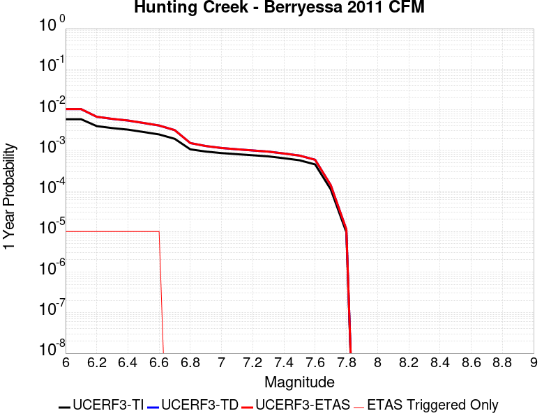 |  |

| Magnitude | 1 wk TI Prob | 1 wk TD Prob | 1 wk ETAS Prob | 1 wk ETAS/TD Gain | 1 wk ETAS Triggered Only | 1 mo TI Prob | 1 mo TD Prob | 1 mo ETAS Prob | 1 mo ETAS/TD Gain | 1 mo ETAS Triggered Only | 1 yr TI Prob | 1 yr TD Prob | 1 yr ETAS Prob | 1 yr ETAS/TD Gain | 1 yr ETAS Triggered Only | 10 yr TI Prob | 10 yr TD Prob | 10 yr ETAS Prob | 10 yr ETAS/TD Gain | 10 yr ETAS Triggered Only |
|-----|-----|-----|-----|-----|-----|-----|-----|-----|-----|-----|-----|-----|-----|-----|-----|-----|-----|-----|-----|-----|
| 6.0 | 1.1270982E-4 | 2.0028367E-4 | 2.0028367E-4 | 1.0 | 0.0 | 4.8295266E-4 | 8.579912E-4 | 8.579912E-4 | 1.0 | 0.0 | 0.0058641075 | 0.010386173 | 0.010386173 | 1.0 | 0.0 | 0.057117578 | 0.09804048 | 0.098084934 | 1.0004535 | 4.928779E-5 |
| 6.1 | 1.1239393E-4 | 1.9976508E-4 | 1.9976508E-4 | 1.0 | 0.0 | 4.8159933E-4 | 8.557703E-4 | 8.557703E-4 | 1.0 | 0.0 | 0.0058477195 | 0.010359417 | 0.010359417 | 1.0 | 0.0 | 0.056962132 | 0.09779895 | 0.09779895 | 1.0 | 0.0 |
| 6.2 | 7.596265E-5 | 1.2933646E-4 | 1.2933646E-4 | 1.0 | 0.0 | 3.2551357E-4 | 5.5415573E-4 | 5.5415573E-4 | 1.0 | 0.0 | 0.0039559277 | 0.0067213587 | 0.0067213587 | 1.0 | 0.0 | 0.038862433 | 0.06459229 | 0.06459229 | 1.0 | 0.0 |
| 6.3 | 6.78794E-5 | 1.1448377E-4 | 1.1448377E-4 | 1.0 | 0.0 | 2.9087928E-4 | 4.9052597E-4 | 4.9052597E-4 | 1.0 | 0.0 | 0.003535705 | 0.005952661 | 0.005952661 | 1.0 | 0.0 | 0.034799766 | 0.057466213 | 0.057466213 | 1.0 | 0.0 |
| 6.4 | 6.2165134E-5 | 1.0434825E-4 | 1.0434825E-4 | 1.0 | 0.0 | 2.6639478E-4 | 4.4711027E-4 | 4.4711027E-4 | 1.0 | 0.0 | 0.0032385332 | 0.0054274183 | 0.0054274183 | 1.0 | 0.0 | 0.03191742 | 0.05255138 | 0.05255138 | 1.0 | 0.0 |
| 6.5 | 5.4368087E-5 | 9.070258E-5 | 9.070258E-5 | 1.0 | 0.0 | 2.3298527E-4 | 3.886537E-4 | 3.886537E-4 | 1.0 | 0.0 | 0.0028329059 | 0.0047197016 | 0.0047197016 | 1.0 | 0.0 | 0.027970633 | 0.045881182 | 0.045881182 | 1.0 | 0.0 |
| 6.6 | 4.729947E-5 | 7.847101E-5 | 7.847101E-5 | 1.0 | 0.0 | 2.0269625E-4 | 3.3624718E-4 | 3.3624718E-4 | 1.0 | 0.0 | 0.002465034 | 0.004084746 | 0.004084746 | 1.0 | 0.0 | 0.02437869 | 0.03985269 | 0.03985269 | 1.0 | 0.0 |
| 6.7 | 3.6875328E-5 | 6.0443555E-5 | 6.0443555E-5 | 1.0 | 0.0 | 1.5802756E-4 | 2.5900968E-4 | 2.5900968E-4 | 1.0 | 0.0 | 0.0019222875 | 0.0031482724 | 0.0031482724 | 1.0 | 0.0 | 0.019057442 | 0.03089371 | 0.03089371 | 1.0 | 0.0 |
| 6.8 | 2.0292036E-5 | 2.8976721E-5 | 2.8976721E-5 | 1.0 | 0.0 | 8.6962966E-5 | 1.2417998E-4 | 1.2417998E-4 | 1.0 | 0.0 | 0.0010582599 | 0.0015108302 | 0.0015108302 | 1.0 | 0.0 | 0.010532344 | 0.0149790775 | 0.0149790775 | 1.0 | 0.0 |
| 6.9 | 1.7871042E-5 | 2.4472653E-5 | 2.4472653E-5 | 1.0 | 0.0 | 7.658793E-5 | 1.04878585E-4 | 1.04878585E-4 | 1.0 | 0.0 | 9.320591E-4 | 0.0012761486 | 0.0012761486 | 1.0 | 0.0 | 0.009281595 | 0.012680395 | 0.012680395 | 1.0 | 0.0 |
| 7.0 | 1.6415532E-5 | 2.1906566E-5 | 2.1906566E-5 | 1.0 | 0.0 | 7.035038E-5 | 9.388191E-5 | 9.388191E-5 | 1.0 | 0.0 | 8.561793E-4 | 0.0011424144 | 0.0011424144 | 1.0 | 0.0 | 0.008528882 | 0.011365017 | 0.011365017 | 1.0 | 0.0 |
| 7.1 | 1.5409885E-5 | 2.0346588E-5 | 2.0346588E-5 | 1.0 | 0.0 | 6.6040695E-5 | 8.719676E-5 | 8.719676E-5 | 1.0 | 0.0 | 8.0374884E-4 | 0.0010611062 | 0.0010611062 | 1.0 | 0.0 | 0.00800848 | 0.010560924 | 0.010560924 | 1.0 | 0.0 |
| 7.2 | 1.4497423E-5 | 1.905519E-5 | 1.905519E-5 | 1.0 | 0.0 | 6.213033E-5 | 8.166256E-5 | 8.166256E-5 | 1.0 | 0.0 | 7.5617427E-4 | 9.937913E-4 | 9.937913E-4 | 1.0 | 0.0 | 0.0075360634 | 0.00989425 | 0.00989425 | 1.0 | 0.0 |
| 7.3 | 1.3615175E-5 | 1.7826347E-5 | 1.7826347E-5 | 1.0 | 0.0 | 5.8349444E-5 | 7.6396405E-5 | 7.6396405E-5 | 1.0 | 0.0 | 7.101729E-4 | 9.297323E-4 | 9.297323E-4 | 1.0 | 0.0 | 0.0070790765 | 0.009259124 | 0.009259124 | 1.0 | 0.0 |
| 7.4 | 1.2252825E-5 | 1.6026455E-5 | 1.6026455E-5 | 1.0 | 0.0 | 5.251105E-5 | 6.868302E-5 | 6.868302E-5 | 1.0 | 0.0 | 6.391345E-4 | 8.3589775E-4 | 8.3589775E-4 | 1.0 | 0.0 | 0.0063729943 | 0.008328172 | 0.008328172 | 1.0 | 0.0 |
| 7.5 | 1.0913301E-5 | 1.4241286E-5 | 1.4241286E-5 | 1.0 | 0.0 | 4.6770452E-5 | 6.103267E-5 | 6.103267E-5 | 1.0 | 0.0 | 5.6928146E-4 | 7.428222E-4 | 7.428222E-4 | 1.0 | 0.0 | 0.0056782532 | 0.0074039865 | 0.0074039865 | 1.0 | 0.0 |
| 7.6 | 8.623192E-6 | 1.12347825E-5 | 1.12347825E-5 | 1.0 | 0.0 | 3.6956015E-5 | 4.8148195E-5 | 4.8148195E-5 | 1.0 | 0.0 | 4.4984656E-4 | 5.8604917E-4 | 5.8604917E-4 | 1.0 | 0.0 | 0.00448937 | 0.005845504 | 0.005845504 | 1.0 | 0.0 |
| 7.7 | 2.0993634E-6 | 2.66264E-6 | 2.66264E-6 | 1.0 | 0.0 | 8.997241E-6 | 1.1411265E-5 | 1.1411265E-5 | 1.0 | 0.0 | 1.09535904E-4 | 1.3892337E-4 | 1.3892337E-4 | 1.0 | 0.0 | 0.0010948193 | 0.0013883994 | 0.0013883994 | 1.0 | 0.0 |
| 7.8 | 1.8428308E-7 | 2.1674624E-7 | 2.1674624E-7 | 1.0 | 0.0 | 7.897844E-7 | 9.289122E-7 | 9.289122E-7 | 1.0 | 0.0 | 9.615583E-6 | 1.130945E-5 | 1.130945E-5 | 1.0 | 0.0 | 9.615166E-5 | 1.1308173E-4 | 1.1308173E-4 | 1.0 | 0.0 |

## Bullion Mountains
*[(top)](#table-of-contents)*

| 1 Week | 1 Month | 1 Year | 10 Year |
|-----|-----|-----|-----|
|  |  |  |  |

| Magnitude | 1 wk TI Prob | 1 wk TD Prob | 1 wk ETAS Prob | 1 wk ETAS/TD Gain | 1 wk ETAS Triggered Only | 1 mo TI Prob | 1 mo TD Prob | 1 mo ETAS Prob | 1 mo ETAS/TD Gain | 1 mo ETAS Triggered Only | 1 yr TI Prob | 1 yr TD Prob | 1 yr ETAS Prob | 1 yr ETAS/TD Gain | 1 yr ETAS Triggered Only | 10 yr TI Prob | 10 yr TD Prob | 10 yr ETAS Prob | 10 yr ETAS/TD Gain | 10 yr ETAS Triggered Only |
|-----|-----|-----|-----|-----|-----|-----|-----|-----|-----|-----|-----|-----|-----|-----|-----|-----|-----|-----|-----|-----|
| 6.0 | 1.6420427E-5 | 1.4692009E-5 | 6.3979074E-5 | 4.3546853 | 4.928779E-5 | 7.037136E-5 | 6.296445E-5 | 1.1224914E-4 | 1.7827383 | 4.928779E-5 | 8.5643446E-4 | 7.6636096E-4 | 8.15611E-4 | 1.0642648 | 4.928779E-5 | 0.008531413 | 0.0076409746 | 0.007689886 | 1.0064012 | 4.928779E-5 |
| 6.1 | 1.6420427E-5 | 1.4692009E-5 | 6.3979074E-5 | 4.3546853 | 4.928779E-5 | 7.037136E-5 | 6.296445E-5 | 1.1224914E-4 | 1.7827383 | 4.928779E-5 | 8.5643446E-4 | 7.6636096E-4 | 8.15611E-4 | 1.0642648 | 4.928779E-5 | 0.008531413 | 0.0076409746 | 0.007689886 | 1.0064012 | 4.928779E-5 |
| 6.2 | 1.6420427E-5 | 1.4692009E-5 | 6.3979074E-5 | 4.3546853 | 4.928779E-5 | 7.037136E-5 | 6.296445E-5 | 1.1224914E-4 | 1.7827383 | 4.928779E-5 | 8.5643446E-4 | 7.6636096E-4 | 8.15611E-4 | 1.0642648 | 4.928779E-5 | 0.008531413 | 0.0076409746 | 0.007689886 | 1.0064012 | 4.928779E-5 |
| 6.3 | 1.2046778E-5 | 9.862255E-6 | 9.862255E-6 | 1.0 | 0.0 | 5.1628023E-5 | 4.2266256E-5 | 4.2266256E-5 | 1.0 | 0.0 | 6.283899E-4 | 5.144933E-4 | 5.144933E-4 | 1.0 | 0.0 | 0.0062661595 | 0.0051353034 | 0.0051353034 | 1.0 | 0.0 |
| 6.4 | 1.2046778E-5 | 9.862255E-6 | 9.862255E-6 | 1.0 | 0.0 | 5.1628023E-5 | 4.2266256E-5 | 4.2266256E-5 | 1.0 | 0.0 | 6.283899E-4 | 5.144933E-4 | 5.144933E-4 | 1.0 | 0.0 | 0.0062661595 | 0.0051353034 | 0.0051353034 | 1.0 | 0.0 |
| 6.5 | 1.0244343E-5 | 7.879378E-6 | 7.879378E-6 | 1.0 | 0.0 | 4.390359E-5 | 3.3768443E-5 | 3.3768443E-5 | 1.0 | 0.0 | 5.343951E-4 | 4.1107394E-4 | 4.1107394E-4 | 1.0 | 0.0 | 0.005331118 | 0.0041051665 | 0.0041051665 | 1.0 | 0.0 |
| 6.6 | 9.605408E-6 | 7.1774166E-6 | 7.1774166E-6 | 1.0 | 0.0 | 4.1165385E-5 | 3.0760108E-5 | 3.0760108E-5 | 1.0 | 0.0 | 5.010733E-4 | 3.7446033E-4 | 3.7446033E-4 | 1.0 | 0.0 | 0.00499945 | 0.0037402906 | 0.0037402906 | 1.0 | 0.0 |
| 6.7 | 8.60418E-6 | 6.123926E-6 | 6.123926E-6 | 1.0 | 0.0 | 3.687454E-5 | 2.6245243E-5 | 2.6245243E-5 | 1.0 | 0.0 | 4.48855E-4 | 3.195085E-4 | 3.195085E-4 | 1.0 | 0.0 | 0.004479495 | 0.0031924031 | 0.0031924031 | 1.0 | 0.0 |
| 6.8 | 5.187994E-6 | 2.563117E-6 | 2.563117E-6 | 1.0 | 0.0 | 2.223407E-5 | 1.0984763E-5 | 1.0984763E-5 | 1.0 | 0.0 | 2.7066618E-4 | 1.3373529E-4 | 1.3373529E-4 | 1.0 | 0.0 | 0.0027033675 | 0.0013369396 | 0.0013369396 | 1.0 | 0.0 |
| 6.9 | 4.5302368E-6 | 2.3442778E-6 | 2.3442778E-6 | 1.0 | 0.0 | 1.9415156E-5 | 1.0046889E-5 | 1.0046889E-5 | 1.0 | 0.0 | 2.3635388E-4 | 1.2231797E-4 | 1.2231797E-4 | 1.0 | 0.0 | 0.0023610266 | 0.0012228956 | 0.0012228956 | 1.0 | 0.0 |
| 7.0 | 3.431668E-6 | 1.6882177E-6 | 1.6882177E-6 | 1.0 | 0.0 | 1.4707065E-5 | 7.2352186E-6 | 7.2352186E-6 | 1.0 | 0.0 | 1.7904381E-4 | 8.808879E-5 | 8.808879E-5 | 1.0 | 0.0 | 0.0017889962 | 8.8088785E-4 | 8.8088785E-4 | 1.0 | 0.0 |

## Great Valley 09 (Laguna Seca)
*[(top)](#table-of-contents)*

| 1 Week | 1 Month | 1 Year | 10 Year |
|-----|-----|-----|-----|
|  |  |  |  |

| Magnitude | 1 wk TI Prob | 1 wk TD Prob | 1 wk ETAS Prob | 1 wk ETAS/TD Gain | 1 wk ETAS Triggered Only | 1 mo TI Prob | 1 mo TD Prob | 1 mo ETAS Prob | 1 mo ETAS/TD Gain | 1 mo ETAS Triggered Only | 1 yr TI Prob | 1 yr TD Prob | 1 yr ETAS Prob | 1 yr ETAS/TD Gain | 1 yr ETAS Triggered Only | 10 yr TI Prob | 10 yr TD Prob | 10 yr ETAS Prob | 10 yr ETAS/TD Gain | 10 yr ETAS Triggered Only |
|-----|-----|-----|-----|-----|-----|-----|-----|-----|-----|-----|-----|-----|-----|-----|-----|-----|-----|-----|-----|-----|
| 6.0 | 5.4353277E-5 | 7.050019E-5 | 7.050019E-5 | 1.0 | 0.0 | 2.3292181E-4 | 3.0211007E-4 | 3.0211007E-4 | 1.0 | 0.0 | 0.0028321352 | 0.0036720056 | 0.0037211124 | 1.0133733 | 4.928779E-5 | 0.02796312 | 0.036115844 | 0.036163352 | 1.0013155 | 4.928779E-5 |
| 6.1 | 4.5578287E-5 | 5.822054E-5 | 5.822054E-5 | 1.0 | 0.0 | 1.953209E-4 | 2.4949352E-4 | 2.4949352E-4 | 1.0 | 0.0 | 0.0023754383 | 0.0030333549 | 0.0030824933 | 1.0161994 | 4.928779E-5 | 0.023502063 | 0.029919893 | 0.029967705 | 1.001598 | 4.928779E-5 |
| 6.2 | 2.8536782E-5 | 3.4736422E-5 | 3.4736422E-5 | 1.0 | 0.0 | 1.2229476E-4 | 1.4886161E-4 | 1.4886161E-4 | 1.0 | 0.0 | 0.0014879217 | 0.0018108576 | 0.0018108576 | 1.0 | 0.0 | 0.014779986 | 0.017958276 | 0.017958276 | 1.0 | 0.0 |
| 6.3 | 2.3698774E-5 | 2.8213344E-5 | 2.8213344E-5 | 1.0 | 0.0 | 1.01562226E-4 | 1.2090833E-4 | 1.2090833E-4 | 1.0 | 0.0 | 0.0012358186 | 0.001471051 | 0.001471051 | 1.0 | 0.0 | 0.012289686 | 0.014611455 | 0.014611455 | 1.0 | 0.0 |
| 6.4 | 1.9191197E-5 | 2.212289E-5 | 2.212289E-5 | 1.0 | 0.0 | 8.2245395E-5 | 9.4808805E-5 | 9.4808805E-5 | 1.0 | 0.0 | 0.0010008777 | 0.0011536906 | 0.0011536906 | 1.0 | 0.0 | 0.009963818 | 0.011477022 | 0.011477022 | 1.0 | 0.0 |
| 6.5 | 1.5203241E-5 | 1.6801298E-5 | 1.6801298E-5 | 1.0 | 0.0 | 6.5155116E-5 | 7.200338E-5 | 7.200338E-5 | 1.0 | 0.0 | 7.9297484E-4 | 8.76301E-4 | 8.76301E-4 | 1.0 | 0.0 | 0.007901512 | 0.008729581 | 0.008729581 | 1.0 | 0.0 |
| 6.6 | 1.0984925E-5 | 1.12425605E-5 | 1.12425605E-5 | 1.0 | 0.0 | 4.70774E-5 | 4.8181533E-5 | 4.8181533E-5 | 1.0 | 0.0 | 5.730166E-4 | 5.8645604E-4 | 5.8645604E-4 | 1.0 | 0.0 | 0.005715413 | 0.0058494755 | 0.0058494755 | 1.0 | 0.0 |
| 6.7 | 9.134616E-6 | 9.019868E-6 | 9.019868E-6 | 1.0 | 0.0 | 3.9147766E-5 | 3.865602E-5 | 3.865602E-5 | 1.0 | 0.0 | 4.7651984E-4 | 4.7053778E-4 | 4.7053778E-4 | 1.0 | 0.0 | 0.004754993 | 0.00469566 | 0.00469566 | 1.0 | 0.0 |
| 6.8 | 7.785589E-6 | 7.4519185E-6 | 7.4519185E-6 | 1.0 | 0.0 | 3.3366385E-5 | 3.1936415E-5 | 3.1936415E-5 | 1.0 | 0.0 | 4.0616E-4 | 3.887585E-4 | 3.887585E-4 | 1.0 | 0.0 | 0.0040541845 | 0.003880988 | 0.003880988 | 1.0 | 0.0 |
| 6.9 | 5.579095E-6 | 4.8984666E-6 | 4.8984666E-6 | 1.0 | 0.0 | 2.3910188E-5 | 2.0993268E-5 | 2.0993268E-5 | 1.0 | 0.0 | 2.9106764E-4 | 2.5556443E-4 | 2.5556443E-4 | 1.0 | 0.0 | 0.002906867 | 0.0025528427 | 0.0025528427 | 1.0 | 0.0 |
| 7.0 | 2.6816688E-6 | 1.521587E-6 | 1.521587E-6 | 1.0 | 0.0 | 1.1492816E-5 | 6.521071E-6 | 6.521071E-6 | 1.0 | 0.0 | 1.3991605E-4 | 7.939124E-5 | 7.939124E-5 | 1.0 | 0.0 | 0.0013982799 | 7.936375E-4 | 7.936375E-4 | 1.0 | 0.0 |
| 7.1 | 1.9951021E-6 | 7.45357E-7 | 7.45357E-7 | 1.0 | 0.0 | 8.55041E-6 | 3.1943835E-6 | 3.1943835E-6 | 1.0 | 0.0 | 1.0409627E-4 | 3.889097E-5 | 3.889097E-5 | 1.0 | 0.0 | 0.0010404752 | 3.8884574E-4 | 3.8884574E-4 | 1.0 | 0.0 |
| 7.2 | 1.9951021E-6 | 7.45357E-7 | 7.45357E-7 | 1.0 | 0.0 | 8.55041E-6 | 3.1943835E-6 | 3.1943835E-6 | 1.0 | 0.0 | 1.0409627E-4 | 3.889097E-5 | 3.889097E-5 | 1.0 | 0.0 | 0.0010404752 | 3.8884574E-4 | 3.8884574E-4 | 1.0 | 0.0 |
| 7.3 | 1.7087556E-6 | 6.578663E-7 | 6.578663E-7 | 1.0 | 0.0 | 7.3232177E-6 | 2.819424E-6 | 2.819424E-6 | 1.0 | 0.0 | 8.915652E-5 | 3.432599E-5 | 3.432599E-5 | 1.0 | 0.0 | 8.9120766E-4 | 3.432109E-4 | 3.432109E-4 | 1.0 | 0.0 |
| 7.4 | 1.3804846E-6 | 6.0737113E-7 | 6.0737113E-7 | 1.0 | 0.0 | 5.916349E-6 | 2.6030168E-6 | 2.6030168E-6 | 1.0 | 0.0 | 7.2029165E-5 | 3.169131E-5 | 3.169131E-5 | 1.0 | 0.0 | 7.200583E-4 | 3.168719E-4 | 3.168719E-4 | 1.0 | 0.0 |
| 7.5 | 1.3804846E-6 | 6.0737113E-7 | 6.0737113E-7 | 1.0 | 0.0 | 5.916349E-6 | 2.6030168E-6 | 2.6030168E-6 | 1.0 | 0.0 | 7.2029165E-5 | 3.169131E-5 | 3.169131E-5 | 1.0 | 0.0 | 7.200583E-4 | 3.168719E-4 | 3.168719E-4 | 1.0 | 0.0 |

## Channel Islands Thrust
*[(top)](#table-of-contents)*

| 1 Week | 1 Month | 1 Year | 10 Year |
|-----|-----|-----|-----|
|  |  |  |  |

| Magnitude | 1 wk TI Prob | 1 wk TD Prob | 1 wk ETAS Prob | 1 wk ETAS/TD Gain | 1 wk ETAS Triggered Only | 1 mo TI Prob | 1 mo TD Prob | 1 mo ETAS Prob | 1 mo ETAS/TD Gain | 1 mo ETAS Triggered Only | 1 yr TI Prob | 1 yr TD Prob | 1 yr ETAS Prob | 1 yr ETAS/TD Gain | 1 yr ETAS Triggered Only | 10 yr TI Prob | 10 yr TD Prob | 10 yr ETAS Prob | 10 yr ETAS/TD Gain | 10 yr ETAS Triggered Only |
|-----|-----|-----|-----|-----|-----|-----|-----|-----|-----|-----|-----|-----|-----|-----|-----|-----|-----|-----|-----|-----|
| 6.0 | 2.2156251E-5 | 2.4092022E-5 | 2.4092022E-5 | 1.0 | 0.0 | 9.495191E-5 | 1.03248036E-4 | 1.03248036E-4 | 1.0 | 0.0 | 0.0011554264 | 0.0012564266 | 0.0013056524 | 1.0391792 | 4.928779E-5 | 0.011494373 | 0.0125038205 | 0.012552492 | 1.0038925 | 4.928779E-5 |
| 6.1 | 2.2156251E-5 | 2.4092022E-5 | 2.4092022E-5 | 1.0 | 0.0 | 9.495191E-5 | 1.03248036E-4 | 1.03248036E-4 | 1.0 | 0.0 | 0.0011554264 | 0.0012564266 | 0.0013056524 | 1.0391792 | 4.928779E-5 | 0.011494373 | 0.0125038205 | 0.012552492 | 1.0038925 | 4.928779E-5 |
| 6.2 | 2.2156251E-5 | 2.4092022E-5 | 2.4092022E-5 | 1.0 | 0.0 | 9.495191E-5 | 1.03248036E-4 | 1.03248036E-4 | 1.0 | 0.0 | 0.0011554264 | 0.0012564266 | 0.0013056524 | 1.0391792 | 4.928779E-5 | 0.011494373 | 0.0125038205 | 0.012552492 | 1.0038925 | 4.928779E-5 |
| 6.3 | 2.2156251E-5 | 2.4092022E-5 | 2.4092022E-5 | 1.0 | 0.0 | 9.495191E-5 | 1.03248036E-4 | 1.03248036E-4 | 1.0 | 0.0 | 0.0011554264 | 0.0012564266 | 0.0013056524 | 1.0391792 | 4.928779E-5 | 0.011494373 | 0.0125038205 | 0.012552492 | 1.0038925 | 4.928779E-5 |
| 6.4 | 2.2156251E-5 | 2.4092022E-5 | 2.4092022E-5 | 1.0 | 0.0 | 9.495191E-5 | 1.03248036E-4 | 1.03248036E-4 | 1.0 | 0.0 | 0.0011554264 | 0.0012564266 | 0.0013056524 | 1.0391792 | 4.928779E-5 | 0.011494373 | 0.0125038205 | 0.012552492 | 1.0038925 | 4.928779E-5 |
| 6.5 | 2.2156251E-5 | 2.4092022E-5 | 2.4092022E-5 | 1.0 | 0.0 | 9.495191E-5 | 1.03248036E-4 | 1.03248036E-4 | 1.0 | 0.0 | 0.0011554264 | 0.0012564266 | 0.0013056524 | 1.0391792 | 4.928779E-5 | 0.011494373 | 0.0125038205 | 0.012552492 | 1.0038925 | 4.928779E-5 |
| 6.6 | 2.2156251E-5 | 2.4092022E-5 | 2.4092022E-5 | 1.0 | 0.0 | 9.495191E-5 | 1.03248036E-4 | 1.03248036E-4 | 1.0 | 0.0 | 0.0011554264 | 0.0012564266 | 0.0013056524 | 1.0391792 | 4.928779E-5 | 0.011494373 | 0.0125038205 | 0.012552492 | 1.0038925 | 4.928779E-5 |
| 6.7 | 1.0601296E-5 | 1.1379544E-5 | 1.1379544E-5 | 1.0 | 0.0 | 4.5433335E-5 | 4.876859E-5 | 4.876859E-5 | 1.0 | 0.0 | 5.5301044E-4 | 5.936007E-4 | 6.4285926E-4 | 1.0829827 | 4.928779E-5 | 0.005516363 | 0.005920653 | 0.005969649 | 1.0082754 | 4.928779E-5 |
| 6.8 | 1.0246747E-5 | 1.0996669E-5 | 1.0996669E-5 | 1.0 | 0.0 | 4.391389E-5 | 4.7127756E-5 | 4.7127756E-5 | 1.0 | 0.0 | 5.345204E-4 | 5.7363417E-4 | 6.228937E-4 | 1.0858727 | 4.928779E-5 | 0.0053323656 | 0.005722025 | 0.0057710307 | 1.0085644 | 4.928779E-5 |
| 6.9 | 9.049551E-6 | 9.699645E-6 | 9.699645E-6 | 1.0 | 0.0 | 3.878322E-5 | 4.1569267E-5 | 4.1569267E-5 | 1.0 | 0.0 | 4.7208337E-4 | 5.059924E-4 | 5.552552E-4 | 1.0973588 | 4.928779E-5 | 0.0047108172 | 0.0050488203 | 0.005097859 | 1.0097129 | 4.928779E-5 |
| 7.0 | 8.6542195E-6 | 9.274603E-6 | 9.274603E-6 | 1.0 | 0.0 | 3.7088983E-5 | 3.9747716E-5 | 3.9747716E-5 | 1.0 | 0.0 | 4.5146482E-4 | 4.8382508E-4 | 5.3308904E-4 | 1.1018218 | 4.928779E-5 | 0.004505487 | 0.0048281294 | 0.004877179 | 1.0101591 | 4.928779E-5 |
| 7.1 | 8.391028E-6 | 8.992925E-6 | 8.992925E-6 | 1.0 | 0.0 | 3.5961057E-5 | 3.8540562E-5 | 3.8540562E-5 | 1.0 | 0.0 | 4.3773788E-4 | 4.6913436E-4 | 5.1839906E-4 | 1.1050118 | 4.928779E-5 | 0.004368766 | 0.0046818503 | 0.0047309073 | 1.0104781 | 4.928779E-5 |
| 7.2 | 5.965188E-6 | 6.3716957E-6 | 6.3716957E-6 | 1.0 | 0.0 | 2.556484E-5 | 2.7306984E-5 | 2.7306984E-5 | 1.0 | 0.0 | 3.1120746E-4 | 3.3241237E-4 | 3.8168376E-4 | 1.1482238 | 4.928779E-5 | 0.00310772 | 0.0033192094 | 0.0033683337 | 1.0148 | 4.928779E-5 |
| 7.3 | 4.877518E-6 | 5.206007E-6 | 5.206007E-6 | 1.0 | 0.0 | 2.0903482E-5 | 2.231127E-5 | 2.231127E-5 | 1.0 | 0.0 | 2.5447016E-4 | 2.716063E-4 | 2.716063E-4 | 1.0 | 0.0 | 0.0025417898 | 0.0027127897 | 0.0027127897 | 1.0 | 0.0 |
| 7.4 | 3.8829853E-6 | 4.141863E-6 | 4.141863E-6 | 1.0 | 0.0 | 1.664126E-5 | 1.7750723E-5 | 1.7750723E-5 | 1.0 | 0.0 | 2.0258849E-4 | 2.1609403E-4 | 2.1609403E-4 | 1.0 | 0.0 | 0.002024039 | 0.002158881 | 0.002158881 | 1.0 | 0.0 |
| 7.5 | 1.3489616E-6 | 1.4277905E-6 | 1.4277905E-6 | 1.0 | 0.0 | 5.7812517E-6 | 6.119088E-6 | 6.119088E-6 | 1.0 | 0.0 | 7.038446E-5 | 7.449739E-5 | 7.449739E-5 | 1.0 | 0.0 | 7.036218E-4 | 7.4472814E-4 | 7.4472814E-4 | 1.0 | 0.0 |
| 7.6 | 6.058192E-7 | 6.35378E-7 | 6.35378E-7 | 1.0 | 0.0 | 2.5963652E-6 | 2.7230458E-6 | 2.7230458E-6 | 1.0 | 0.0 | 3.161029E-5 | 3.3152595E-5 | 3.3152595E-5 | 1.0 | 0.0 | 3.1605794E-4 | 3.314781E-4 | 3.314781E-4 | 1.0 | 0.0 |
| 7.7 | 2.2170494E-7 | 2.2607924E-7 | 2.2607924E-7 | 1.0 | 0.0 | 9.5016367E-7 | 9.689107E-7 | 9.689107E-7 | 1.0 | 0.0 | 1.1568181E-5 | 1.17964355E-5 | 1.17964355E-5 | 1.0 | 0.0 | 1.1567579E-4 | 1.179592E-4 | 1.179592E-4 | 1.0 | 0.0 |
| 7.8 | 2.1613102E-8 | 1.5466837E-8 | 1.5466837E-8 | 1.0 | 0.0 | 9.262757E-8 | 6.628645E-8 | 6.628645E-8 | 1.0 | 0.0 | 1.1277401E-6 | 8.070372E-7 | 8.070372E-7 | 1.0 | 0.0 | 1.1277344E-5 | 8.07035E-6 | 8.07035E-6 | 1.0 | 0.0 |

## Gillem - Big Crack 2011 CFM
*[(top)](#table-of-contents)*

| 1 Week | 1 Month | 1 Year | 10 Year |
|-----|-----|-----|-----|
|  |  |  |  |

| Magnitude | 1 wk TI Prob | 1 wk TD Prob | 1 wk ETAS Prob | 1 wk ETAS/TD Gain | 1 wk ETAS Triggered Only | 1 mo TI Prob | 1 mo TD Prob | 1 mo ETAS Prob | 1 mo ETAS/TD Gain | 1 mo ETAS Triggered Only | 1 yr TI Prob | 1 yr TD Prob | 1 yr ETAS Prob | 1 yr ETAS/TD Gain | 1 yr ETAS Triggered Only | 10 yr TI Prob | 10 yr TD Prob | 10 yr ETAS Prob | 10 yr ETAS/TD Gain | 10 yr ETAS Triggered Only |
|-----|-----|-----|-----|-----|-----|-----|-----|-----|-----|-----|-----|-----|-----|-----|-----|-----|-----|-----|-----|-----|
| 6.0 | 2.196852E-5 | 2.3604485E-5 | 2.3604485E-5 | 1.0 | 0.0 | 9.4147406E-5 | 1.01158665E-4 | 1.5044147E-4 | 1.4871832 | 4.928779E-5 | 0.0011456419 | 0.0012309998 | 0.0012802269 | 1.0399896 | 4.928779E-5 | 0.011397537 | 0.012250669 | 0.012299353 | 1.003974 | 4.928779E-5 |
| 6.1 | 9.992795E-6 | 1.071189E-5 | 1.071189E-5 | 1.0 | 0.0 | 4.2825563E-5 | 4.5907396E-5 | 9.5192925E-5 | 2.0735857 | 4.928779E-5 | 5.2127644E-4 | 5.587975E-4 | 6.080578E-4 | 1.0881541 | 4.928779E-5 | 0.0052005537 | 0.0055757347 | 0.0056247474 | 1.0087904 | 4.928779E-5 |
| 6.2 | 9.992795E-6 | 1.071189E-5 | 1.071189E-5 | 1.0 | 0.0 | 4.2825563E-5 | 4.5907396E-5 | 9.5192925E-5 | 2.0735857 | 4.928779E-5 | 5.2127644E-4 | 5.587975E-4 | 6.080578E-4 | 1.0881541 | 4.928779E-5 | 0.0052005537 | 0.0055757347 | 0.0056247474 | 1.0087904 | 4.928779E-5 |
| 6.3 | 4.6127884E-6 | 4.942657E-6 | 4.942657E-6 | 1.0 | 0.0 | 1.9768944E-5 | 2.1182668E-5 | 2.1182668E-5 | 1.0 | 0.0 | 2.406603E-4 | 2.5787292E-4 | 2.5787292E-4 | 1.0 | 0.0 | 0.0024039985 | 0.0025761751 | 0.0025761751 | 1.0 | 0.0 |
| 6.4 | 4.6127884E-6 | 4.942657E-6 | 4.942657E-6 | 1.0 | 0.0 | 1.9768944E-5 | 2.1182668E-5 | 2.1182668E-5 | 1.0 | 0.0 | 2.406603E-4 | 2.5787292E-4 | 2.5787292E-4 | 1.0 | 0.0 | 0.0024039985 | 0.0025761751 | 0.0025761751 | 1.0 | 0.0 |
| 6.5 | 2.716712E-6 | 2.9111113E-6 | 2.9111113E-6 | 1.0 | 0.0 | 1.1643E-5 | 1.24761455E-5 | 1.24761455E-5 | 1.0 | 0.0 | 1.417443E-4 | 1.5188892E-4 | 1.5188892E-4 | 1.0 | 0.0 | 0.0014165393 | 0.001518089 | 0.001518089 | 1.0 | 0.0 |
| 6.6 | 1.3818255E-6 | 1.4820689E-6 | 1.4820689E-6 | 1.0 | 0.0 | 5.922096E-6 | 6.3517155E-6 | 6.3517155E-6 | 1.0 | 0.0 | 7.209913E-5 | 7.7330624E-5 | 7.7330624E-5 | 1.0 | 0.0 | 7.2075747E-4 | 7.7315804E-4 | 7.7315804E-4 | 1.0 | 0.0 |

## Elmore Ranch
*[(top)](#table-of-contents)*

| 1 Week | 1 Month | 1 Year | 10 Year |
|-----|-----|-----|-----|
|  |  |  |  |

| Magnitude | 1 wk TI Prob | 1 wk TD Prob | 1 wk ETAS Prob | 1 wk ETAS/TD Gain | 1 wk ETAS Triggered Only | 1 mo TI Prob | 1 mo TD Prob | 1 mo ETAS Prob | 1 mo ETAS/TD Gain | 1 mo ETAS Triggered Only | 1 yr TI Prob | 1 yr TD Prob | 1 yr ETAS Prob | 1 yr ETAS/TD Gain | 1 yr ETAS Triggered Only | 10 yr TI Prob | 10 yr TD Prob | 10 yr ETAS Prob | 10 yr ETAS/TD Gain | 10 yr ETAS Triggered Only |
|-----|-----|-----|-----|-----|-----|-----|-----|-----|-----|-----|-----|-----|-----|-----|-----|-----|-----|-----|-----|-----|
| 6.0 | 9.102099E-5 | 8.953848E-5 | 8.953848E-5 | 1.0 | 0.0 | 3.9003167E-4 | 3.836898E-4 | 3.836898E-4 | 1.0 | 0.0 | 0.0047383 | 0.004662132 | 0.004662132 | 1.0 | 0.0 | 0.046385348 | 0.04583787 | 0.0458849 | 1.001026 | 4.928779E-5 |
| 6.1 | 3.8306698E-5 | 4.14921E-5 | 4.14921E-5 | 1.0 | 0.0 | 1.6416123E-4 | 1.7781362E-4 | 1.7781362E-4 | 1.0 | 0.0 | 0.0019968306 | 0.0021632186 | 0.0021632186 | 1.0 | 0.0 | 0.019789828 | 0.021595007 | 0.021595007 | 1.0 | 0.0 |
| 6.2 | 3.8306698E-5 | 4.14921E-5 | 4.14921E-5 | 1.0 | 0.0 | 1.6416123E-4 | 1.7781362E-4 | 1.7781362E-4 | 1.0 | 0.0 | 0.0019968306 | 0.0021632186 | 0.0021632186 | 1.0 | 0.0 | 0.019789828 | 0.021595007 | 0.021595007 | 1.0 | 0.0 |
| 6.3 | 3.3197924E-5 | 3.6550366E-5 | 3.6550366E-5 | 1.0 | 0.0 | 1.4226905E-4 | 1.56639E-4 | 1.56639E-4 | 1.0 | 0.0 | 0.0017307495 | 0.0019059771 | 0.0019059771 | 1.0 | 0.0 | 0.017173318 | 0.019057386 | 0.019057386 | 1.0 | 0.0 |
| 6.4 | 2.5148964E-5 | 2.7420736E-5 | 2.7420736E-5 | 1.0 | 0.0 | 1.0777682E-4 | 1.17515796E-4 | 1.17515796E-4 | 1.0 | 0.0 | 0.0013113929 | 0.0014304637 | 0.0014304637 | 1.0 | 0.0 | 0.01303681 | 0.014365338 | 0.014365338 | 1.0 | 0.0 |
| 6.5 | 2.5148964E-5 | 2.7420736E-5 | 2.7420736E-5 | 1.0 | 0.0 | 1.0777682E-4 | 1.17515796E-4 | 1.17515796E-4 | 1.0 | 0.0 | 0.0013113929 | 0.0014304637 | 0.0014304637 | 1.0 | 0.0 | 0.01303681 | 0.014365338 | 0.014365338 | 1.0 | 0.0 |

## Raymond
*[(top)](#table-of-contents)*

| 1 Week | 1 Month | 1 Year | 10 Year |
|-----|-----|-----|-----|
|  |  | 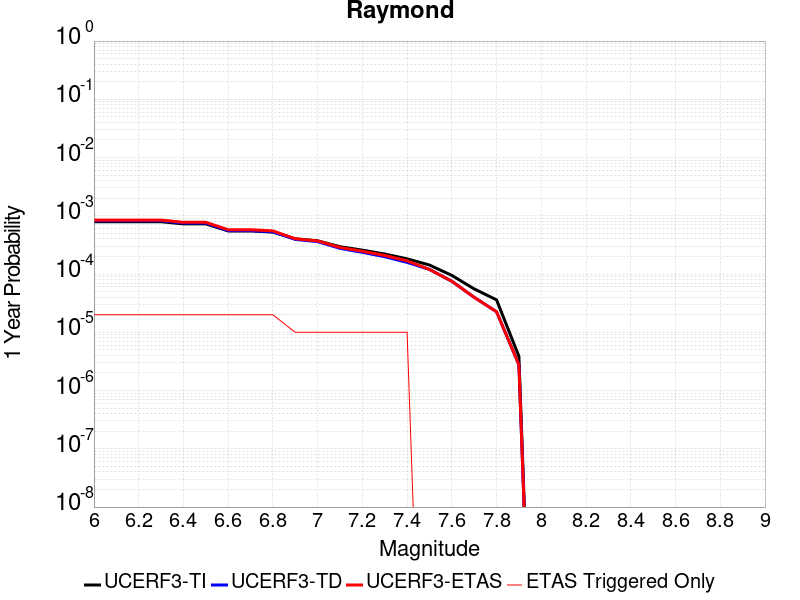 | 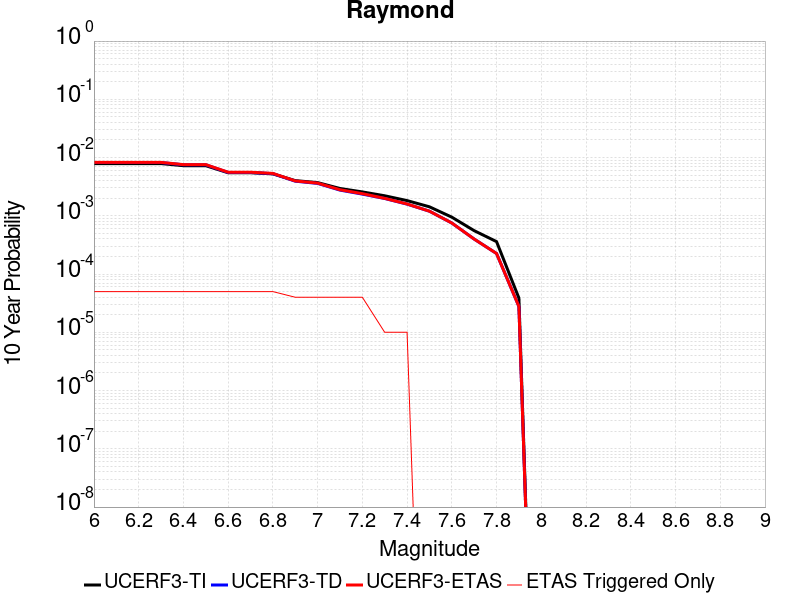 |

| Magnitude | 1 wk TI Prob | 1 wk TD Prob | 1 wk ETAS Prob | 1 wk ETAS/TD Gain | 1 wk ETAS Triggered Only | 1 mo TI Prob | 1 mo TD Prob | 1 mo ETAS Prob | 1 mo ETAS/TD Gain | 1 mo ETAS Triggered Only | 1 yr TI Prob | 1 yr TD Prob | 1 yr ETAS Prob | 1 yr ETAS/TD Gain | 1 yr ETAS Triggered Only | 10 yr TI Prob | 10 yr TD Prob | 10 yr ETAS Prob | 10 yr ETAS/TD Gain | 10 yr ETAS Triggered Only |
|-----|-----|-----|-----|-----|-----|-----|-----|-----|-----|-----|-----|-----|-----|-----|-----|-----|-----|-----|-----|-----|
| 6.0 | 1.5157413E-5 | 1.5810125E-5 | 1.5810125E-5 | 1.0 | 0.0 | 6.4958724E-5 | 6.775606E-5 | 1.17040516E-4 | 1.7273808 | 4.928779E-5 | 7.905855E-4 | 8.246429E-4 | 8.7389007E-4 | 1.0597193 | 4.928779E-5 | 0.007877788 | 0.008218355 | 0.008267237 | 1.005948 | 4.928779E-5 |
| 6.1 | 1.5157413E-5 | 1.5810125E-5 | 1.5810125E-5 | 1.0 | 0.0 | 6.4958724E-5 | 6.775606E-5 | 1.17040516E-4 | 1.7273808 | 4.928779E-5 | 7.905855E-4 | 8.246429E-4 | 8.7389007E-4 | 1.0597193 | 4.928779E-5 | 0.007877788 | 0.008218355 | 0.008267237 | 1.005948 | 4.928779E-5 |
| 6.2 | 1.5157413E-5 | 1.5810125E-5 | 1.5810125E-5 | 1.0 | 0.0 | 6.4958724E-5 | 6.775606E-5 | 1.17040516E-4 | 1.7273808 | 4.928779E-5 | 7.905855E-4 | 8.246429E-4 | 8.7389007E-4 | 1.0597193 | 4.928779E-5 | 0.007877788 | 0.008218355 | 0.008267237 | 1.005948 | 4.928779E-5 |
| 6.3 | 1.5157413E-5 | 1.5810125E-5 | 1.5810125E-5 | 1.0 | 0.0 | 6.4958724E-5 | 6.775606E-5 | 1.17040516E-4 | 1.7273808 | 4.928779E-5 | 7.905855E-4 | 8.246429E-4 | 8.7389007E-4 | 1.0597193 | 4.928779E-5 | 0.007877788 | 0.008218355 | 0.008267237 | 1.005948 | 4.928779E-5 |
| 6.4 | 1.3941944E-5 | 1.4454688E-5 | 1.4454688E-5 | 1.0 | 0.0 | 5.9749822E-5 | 6.194732E-5 | 1.1123206E-4 | 1.7955911 | 4.928779E-5 | 7.2721124E-4 | 7.53971E-4 | 8.0322166E-4 | 1.0653217 | 4.928779E-5 | 0.007248361 | 0.007516471 | 0.0075653885 | 1.006508 | 4.928779E-5 |
| 6.5 | 1.3941944E-5 | 1.4454688E-5 | 1.4454688E-5 | 1.0 | 0.0 | 5.9749822E-5 | 6.194732E-5 | 1.1123206E-4 | 1.7955911 | 4.928779E-5 | 7.2721124E-4 | 7.53971E-4 | 8.0322166E-4 | 1.0653217 | 4.928779E-5 | 0.007248361 | 0.007516471 | 0.0075653885 | 1.006508 | 4.928779E-5 |
| 6.6 | 1.0542609E-5 | 1.067111E-5 | 1.067111E-5 | 1.0 | 0.0 | 4.5181827E-5 | 4.573256E-5 | 9.50181E-5 | 2.0776904 | 4.928779E-5 | 5.499499E-4 | 5.566571E-4 | 6.059175E-4 | 1.0884932 | 4.928779E-5 | 0.005485909 | 0.0055531966 | 0.0056022108 | 1.0088263 | 4.928779E-5 |
| 6.7 | 1.0542609E-5 | 1.067111E-5 | 1.067111E-5 | 1.0 | 0.0 | 4.5181827E-5 | 4.573256E-5 | 9.50181E-5 | 2.0776904 | 4.928779E-5 | 5.499499E-4 | 5.566571E-4 | 6.059175E-4 | 1.0884932 | 4.928779E-5 | 0.005485909 | 0.0055531966 | 0.0056022108 | 1.0088263 | 4.928779E-5 |
| 6.8 | 1.0079132E-5 | 1.0176644E-5 | 1.0176644E-5 | 1.0 | 0.0 | 4.3195567E-5 | 4.3613487E-5 | 9.289913E-5 | 2.130055 | 4.928779E-5 | 5.257791E-4 | 5.308702E-4 | 5.8013183E-4 | 1.0927941 | 4.928779E-5 | 0.0052453685 | 0.0052965777 | 0.0053456044 | 1.0092564 | 4.928779E-5 |
| 6.9 | 7.721598E-6 | 7.548902E-6 | 7.548902E-6 | 1.0 | 0.0 | 3.3092143E-5 | 3.2352043E-5 | 3.2352043E-5 | 1.0 | 0.0 | 4.0282236E-4 | 3.9381615E-4 | 3.9381615E-4 | 1.0 | 0.0 | 0.0040209293 | 0.003931324 | 0.003931324 | 1.0 | 0.0 |
| 7.0 | 7.137566E-6 | 6.911303E-6 | 6.911303E-6 | 1.0 | 0.0 | 3.058921E-5 | 2.961954E-5 | 2.961954E-5 | 1.0 | 0.0 | 3.7236E-4 | 3.605593E-4 | 3.605593E-4 | 1.0 | 0.0 | 0.0037173668 | 0.003599869 | 0.003599869 | 1.0 | 0.0 |
| 7.1 | 5.654976E-6 | 5.299538E-6 | 5.299538E-6 | 1.0 | 0.0 | 2.4235387E-5 | 2.2712107E-5 | 2.2712107E-5 | 1.0 | 0.0 | 2.9502588E-4 | 2.7648505E-4 | 2.7648505E-4 | 1.0 | 0.0 | 0.0029463451 | 0.0027614492 | 0.0027614492 | 1.0 | 0.0 |
| 7.2 | 4.9358455E-6 | 4.526655E-6 | 4.526655E-6 | 1.0 | 0.0 | 2.1153453E-5 | 1.9399806E-5 | 1.9399806E-5 | 1.0 | 0.0 | 2.5751285E-4 | 2.3616718E-4 | 2.3616718E-4 | 1.0 | 0.0 | 0.0025721465 | 0.002359192 | 0.002359192 | 1.0 | 0.0 |
| 7.3 | 4.2368597E-6 | 3.8056128E-6 | 3.8056128E-6 | 1.0 | 0.0 | 1.8157843E-5 | 1.6309668E-5 | 1.6309668E-5 | 1.0 | 0.0 | 2.2104931E-4 | 1.9855222E-4 | 1.9855222E-4 | 1.0 | 0.0 | 0.0022082955 | 0.0019837746 | 0.0019837746 | 1.0 | 0.0 |
| 7.4 | 3.4999923E-6 | 3.0437407E-6 | 3.0437407E-6 | 1.0 | 0.0 | 1.49998805E-5 | 1.3044538E-5 | 1.3044538E-5 | 1.0 | 0.0 | 1.8260824E-4 | 1.5880575E-4 | 1.5880575E-4 | 1.0 | 0.0 | 0.0018245826 | 0.0015869461 | 0.0015869461 | 1.0 | 0.0 |
| 7.5 | 2.738017E-6 | 2.3020405E-6 | 2.3020405E-6 | 1.0 | 0.0 | 1.1734306E-5 | 9.865851E-6 | 9.865851E-6 | 1.0 | 0.0 | 1.428558E-4 | 1.20110184E-4 | 1.20110184E-4 | 1.0 | 0.0 | 0.0014276401 | 0.0012004747 | 0.0012004747 | 1.0 | 0.0 |
| 7.6 | 1.8186392E-6 | 1.442302E-6 | 1.442302E-6 | 1.0 | 0.0 | 7.794145E-6 | 6.1812802E-6 | 6.1812802E-6 | 1.0 | 0.0 | 9.488958E-5 | 7.5254524E-5 | 7.5254524E-5 | 1.0 | 0.0 | 9.4849075E-4 | 7.5230957E-4 | 7.5230957E-4 | 1.0 | 0.0 |
| 7.7 | 1.0660348E-6 | 7.6437E-7 | 7.6437E-7 | 1.0 | 0.0 | 4.5687125E-6 | 3.2758674E-6 | 3.2758674E-6 | 1.0 | 0.0 | 5.5622655E-5 | 3.988297E-5 | 3.988297E-5 | 1.0 | 0.0 | 5.5608735E-4 | 3.9877492E-4 | 3.9877492E-4 | 1.0 | 0.0 |
| 7.8 | 6.913602E-7 | 4.3202903E-7 | 4.3202903E-7 | 1.0 | 0.0 | 2.962969E-6 | 1.8515517E-6 | 1.8515517E-6 | 1.0 | 0.0 | 3.607355E-5 | 2.2542416E-5 | 2.2542416E-5 | 1.0 | 0.0 | 3.6067693E-4 | 2.2541684E-4 | 2.2541684E-4 | 1.0 | 0.0 |
| 7.9 | 7.425201E-8 | 5.322267E-8 | 5.322267E-8 | 1.0 | 0.0 | 3.1822285E-7 | 2.2809714E-7 | 2.2809714E-7 | 1.0 | 0.0 | 3.874356E-6 | 2.7770805E-6 | 2.7770805E-6 | 1.0 | 0.0 | 3.8742884E-5 | 2.7770588E-5 | 2.7770588E-5 | 1.0 | 0.0 |

## Elsinore (Stepovers Combined)
*[(top)](#table-of-contents)*

| 1 Week | 1 Month | 1 Year | 10 Year |
|-----|-----|-----|-----|
|  |  |  |  |

| Magnitude | 1 wk TI Prob | 1 wk TD Prob | 1 wk ETAS Prob | 1 wk ETAS/TD Gain | 1 wk ETAS Triggered Only | 1 mo TI Prob | 1 mo TD Prob | 1 mo ETAS Prob | 1 mo ETAS/TD Gain | 1 mo ETAS Triggered Only | 1 yr TI Prob | 1 yr TD Prob | 1 yr ETAS Prob | 1 yr ETAS/TD Gain | 1 yr ETAS Triggered Only | 10 yr TI Prob | 10 yr TD Prob | 10 yr ETAS Prob | 10 yr ETAS/TD Gain | 10 yr ETAS Triggered Only |
|-----|-----|-----|-----|-----|-----|-----|-----|-----|-----|-----|-----|-----|-----|-----|-----|-----|-----|-----|-----|-----|
| 6.0 | 2.144392E-5 | 1.976007E-5 | 1.976007E-5 | 1.0 | 0.0 | 9.189928E-5 | 8.468338E-5 | 8.468338E-5 | 1.0 | 0.0 | 0.0011182994 | 0.0010305515 | 0.0010797885 | 1.0477773 | 4.928779E-5 | 0.011126885 | 0.010264617 | 0.010313399 | 1.0047524 | 4.928779E-5 |
| 6.1 | 2.144392E-5 | 1.976007E-5 | 1.976007E-5 | 1.0 | 0.0 | 9.189928E-5 | 8.468338E-5 | 8.468338E-5 | 1.0 | 0.0 | 0.0011182994 | 0.0010305515 | 0.0010797885 | 1.0477773 | 4.928779E-5 | 0.011126885 | 0.010264617 | 0.010313399 | 1.0047524 | 4.928779E-5 |
| 6.2 | 2.144392E-5 | 1.976007E-5 | 1.976007E-5 | 1.0 | 0.0 | 9.189928E-5 | 8.468338E-5 | 8.468338E-5 | 1.0 | 0.0 | 0.0011182994 | 0.0010305515 | 0.0010797885 | 1.0477773 | 4.928779E-5 | 0.011126885 | 0.010264617 | 0.010313399 | 1.0047524 | 4.928779E-5 |
| 6.3 | 1.9751555E-5 | 1.7741326E-5 | 1.7741326E-5 | 1.0 | 0.0 | 8.4646774E-5 | 7.603211E-5 | 7.603211E-5 | 1.0 | 0.0 | 0.0010300872 | 9.25312E-4 | 9.7455416E-4 | 1.0532168 | 4.928779E-5 | 0.010253254 | 0.0092209745 | 0.009269808 | 1.0052959 | 4.928779E-5 |
| 6.4 | 1.9751555E-5 | 1.7741326E-5 | 1.7741326E-5 | 1.0 | 0.0 | 8.4646774E-5 | 7.603211E-5 | 7.603211E-5 | 1.0 | 0.0 | 0.0010300872 | 9.25312E-4 | 9.7455416E-4 | 1.0532168 | 4.928779E-5 | 0.010253254 | 0.0092209745 | 0.009269808 | 1.0052959 | 4.928779E-5 |
| 6.5 | 1.9751555E-5 | 1.7741326E-5 | 1.7741326E-5 | 1.0 | 0.0 | 8.4646774E-5 | 7.603211E-5 | 7.603211E-5 | 1.0 | 0.0 | 0.0010300872 | 9.25312E-4 | 9.7455416E-4 | 1.0532168 | 4.928779E-5 | 0.010253254 | 0.0092209745 | 0.009269808 | 1.0052959 | 4.928779E-5 |
| 6.6 | 1.9188685E-5 | 1.7003247E-5 | 1.7003247E-5 | 1.0 | 0.0 | 8.2234634E-5 | 7.2869116E-5 | 7.2869116E-5 | 1.0 | 0.0 | 0.0010007467 | 8.8683655E-4 | 9.3608064E-4 | 1.0555278 | 4.928779E-5 | 0.00996252 | 0.008839546 | 0.008888398 | 1.0055265 | 4.928779E-5 |
| 6.7 | 1.7608272E-5 | 1.4732402E-5 | 1.4732402E-5 | 1.0 | 0.0 | 7.546184E-5 | 6.313739E-5 | 6.313739E-5 | 1.0 | 0.0 | 9.183606E-4 | 7.684364E-4 | 7.684364E-4 | 1.0 | 0.0 | 0.009145746 | 0.007664441 | 0.007664441 | 1.0 | 0.0 |
| 6.8 | 1.697165E-5 | 1.3783126E-5 | 1.3783126E-5 | 1.0 | 0.0 | 7.273361E-5 | 5.906925E-5 | 5.906925E-5 | 1.0 | 0.0 | 8.8517193E-4 | 7.189395E-4 | 7.189395E-4 | 1.0 | 0.0 | 0.008816543 | 0.0071722106 | 0.0071722106 | 1.0 | 0.0 |
| 6.9 | 1.600365E-5 | 1.2846429E-5 | 1.2846429E-5 | 1.0 | 0.0 | 6.858527E-5 | 5.5055007E-5 | 5.5055007E-5 | 1.0 | 0.0 | 8.347058E-4 | 6.700963E-4 | 6.700963E-4 | 1.0 | 0.0 | 0.008315775 | 0.006686422 | 0.006686422 | 1.0 | 0.0 |
| 7.0 | 1.3314581E-5 | 1.044738E-5 | 1.044738E-5 | 1.0 | 0.0 | 5.7061243E-5 | 4.4773733E-5 | 4.4773733E-5 | 1.0 | 0.0 | 6.944992E-4 | 5.449866E-4 | 5.449866E-4 | 1.0 | 0.0 | 0.006923327 | 0.005440055 | 0.005440055 | 1.0 | 0.0 |
| 7.1 | 1.2865345E-5 | 9.937339E-6 | 9.937339E-6 | 1.0 | 0.0 | 5.5136024E-5 | 4.258792E-5 | 4.258792E-5 | 1.0 | 0.0 | 6.710743E-4 | 5.1838707E-4 | 5.1838707E-4 | 1.0 | 0.0 | 0.0066905143 | 0.005175021 | 0.005175021 | 1.0 | 0.0 |
| 7.2 | 1.1650051E-5 | 8.633585E-6 | 8.633585E-6 | 1.0 | 0.0 | 4.9927836E-5 | 3.7000562E-5 | 3.7000562E-5 | 1.0 | 0.0 | 6.0770183E-4 | 4.503905E-4 | 4.503905E-4 | 1.0 | 0.0 | 0.0060604266 | 0.00449624 | 0.00449624 | 1.0 | 0.0 |
| 7.3 | 1.0008533E-5 | 7.2008215E-6 | 7.2008215E-6 | 1.0 | 0.0 | 4.2893007E-5 | 3.0860305E-5 | 3.0860305E-5 | 1.0 | 0.0 | 5.220972E-4 | 3.756609E-4 | 3.756609E-4 | 1.0 | 0.0 | 0.005208723 | 0.0037506663 | 0.0037506663 | 1.0 | 0.0 |
| 7.4 | 9.116759E-6 | 6.409854E-6 | 6.409854E-6 | 1.0 | 0.0 | 3.907124E-5 | 2.7470522E-5 | 2.7470522E-5 | 1.0 | 0.0 | 4.7558855E-4 | 3.3440365E-4 | 3.3440365E-4 | 1.0 | 0.0 | 0.00474572 | 0.0033391542 | 0.0033391542 | 1.0 | 0.0 |
| 7.5 | 7.870524E-6 | 5.382316E-6 | 5.382316E-6 | 1.0 | 0.0 | 3.3730383E-5 | 2.306687E-5 | 2.306687E-5 | 1.0 | 0.0 | 4.1059E-4 | 2.8080423E-4 | 2.8080423E-4 | 1.0 | 0.0 | 0.0040983222 | 0.0028046207 | 0.0028046207 | 1.0 | 0.0 |
| 7.6 | 6.9774537E-6 | 4.677398E-6 | 4.677398E-6 | 1.0 | 0.0 | 2.990303E-5 | 2.0045845E-5 | 2.0045845E-5 | 1.0 | 0.0 | 3.640086E-4 | 2.44032E-4 | 2.44032E-4 | 1.0 | 0.0 | 0.003634129 | 0.0024377564 | 0.0024377564 | 1.0 | 0.0 |
| 7.7 | 4.1616954E-6 | 2.3281368E-6 | 2.3281368E-6 | 1.0 | 0.0 | 1.7835715E-5 | 9.977695E-6 | 9.977695E-6 | 1.0 | 0.0 | 2.171282E-4 | 1.2147242E-4 | 1.2147242E-4 | 1.0 | 0.0 | 0.0021691616 | 0.0012141332 | 0.0012141332 | 1.0 | 0.0 |
| 7.8 | 2.2692414E-7 | 9.384417E-8 | 9.384417E-8 | 1.0 | 0.0 | 9.725317E-7 | 4.0218927E-7 | 4.0218927E-7 | 1.0 | 0.0 | 1.1840509E-5 | 4.8966467E-6 | 4.8966467E-6 | 1.0 | 0.0 | 1.1839878E-4 | 4.8965718E-5 | 4.8965718E-5 | 1.0 | 0.0 |
| 7.9 | 6.676829E-9 | 3.4397174E-9 | 3.4397174E-9 | 1.0 | 0.0 | 2.861498E-8 | 1.4741646E-8 | 1.4741646E-8 | 1.0 | 0.0 | 3.4838732E-7 | 1.7947953E-7 | 1.7947953E-7 | 1.0 | 0.0 | 3.4838679E-6 | 1.794794E-6 | 1.794794E-6 | 1.0 | 0.0 |

## Los Osos 2011
*[(top)](#table-of-contents)*

| 1 Week | 1 Month | 1 Year | 10 Year |
|-----|-----|-----|-----|
|  |  | 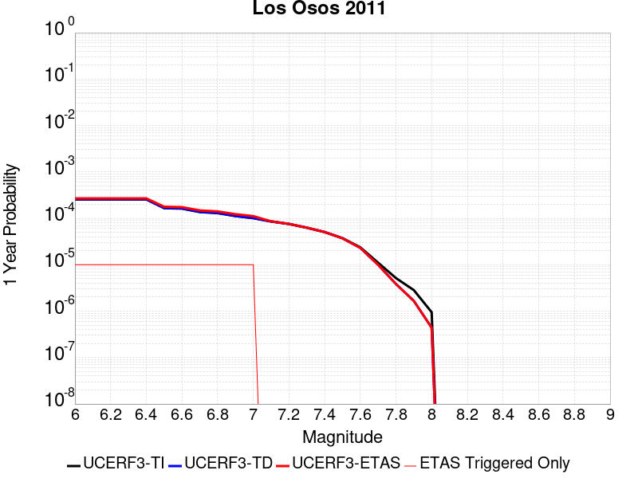 |  |

| Magnitude | 1 wk TI Prob | 1 wk TD Prob | 1 wk ETAS Prob | 1 wk ETAS/TD Gain | 1 wk ETAS Triggered Only | 1 mo TI Prob | 1 mo TD Prob | 1 mo ETAS Prob | 1 mo ETAS/TD Gain | 1 mo ETAS Triggered Only | 1 yr TI Prob | 1 yr TD Prob | 1 yr ETAS Prob | 1 yr ETAS/TD Gain | 1 yr ETAS Triggered Only | 10 yr TI Prob | 10 yr TD Prob | 10 yr ETAS Prob | 10 yr ETAS/TD Gain | 10 yr ETAS Triggered Only |
|-----|-----|-----|-----|-----|-----|-----|-----|-----|-----|-----|-----|-----|-----|-----|-----|-----|-----|-----|-----|-----|
| 6.0 | 4.8871775E-6 | 4.9814826E-6 | 4.9814826E-6 | 1.0 | 0.0 | 2.0944879E-5 | 2.1349053E-5 | 7.063579E-5 | 3.3086147 | 4.928779E-5 | 2.5497406E-4 | 2.598965E-4 | 3.0917148E-4 | 1.1895946 | 4.928779E-5 | 0.002546817 | 0.0025962 | 0.0026453598 | 1.0189353 | 4.928779E-5 |
| 6.1 | 4.8871775E-6 | 4.9814826E-6 | 4.9814826E-6 | 1.0 | 0.0 | 2.0944879E-5 | 2.1349053E-5 | 7.063579E-5 | 3.3086147 | 4.928779E-5 | 2.5497406E-4 | 2.598965E-4 | 3.0917148E-4 | 1.1895946 | 4.928779E-5 | 0.002546817 | 0.0025962 | 0.0026453598 | 1.0189353 | 4.928779E-5 |
| 6.2 | 4.8871775E-6 | 4.9814826E-6 | 4.9814826E-6 | 1.0 | 0.0 | 2.0944879E-5 | 2.1349053E-5 | 7.063579E-5 | 3.3086147 | 4.928779E-5 | 2.5497406E-4 | 2.598965E-4 | 3.0917148E-4 | 1.1895946 | 4.928779E-5 | 0.002546817 | 0.0025962 | 0.0026453598 | 1.0189353 | 4.928779E-5 |
| 6.3 | 4.8871775E-6 | 4.9814826E-6 | 4.9814826E-6 | 1.0 | 0.0 | 2.0944879E-5 | 2.1349053E-5 | 7.063579E-5 | 3.3086147 | 4.928779E-5 | 2.5497406E-4 | 2.598965E-4 | 3.0917148E-4 | 1.1895946 | 4.928779E-5 | 0.002546817 | 0.0025962 | 0.0026453598 | 1.0189353 | 4.928779E-5 |
| 6.4 | 4.8871775E-6 | 4.9814826E-6 | 4.9814826E-6 | 1.0 | 0.0 | 2.0944879E-5 | 2.1349053E-5 | 7.063579E-5 | 3.3086147 | 4.928779E-5 | 2.5497406E-4 | 2.598965E-4 | 3.0917148E-4 | 1.1895946 | 4.928779E-5 | 0.002546817 | 0.0025962 | 0.0026453598 | 1.0189353 | 4.928779E-5 |
| 6.5 | 3.1724062E-6 | 3.2233943E-6 | 3.2233943E-6 | 1.0 | 0.0 | 1.3595956E-5 | 1.3814474E-5 | 6.310159E-5 | 4.5677876 | 4.928779E-5 | 1.6551818E-4 | 1.6817838E-4 | 2.1745788E-4 | 1.2930193 | 4.928779E-5 | 0.0016539496 | 0.0016805246 | 0.0017297295 | 1.0292795 | 4.928779E-5 |
| 6.6 | 3.1022591E-6 | 3.1511038E-6 | 3.1511038E-6 | 1.0 | 0.0 | 1.3295328E-5 | 1.3504661E-5 | 6.279179E-5 | 4.649638 | 4.928779E-5 | 1.618586E-4 | 1.6440697E-4 | 2.1368665E-4 | 1.2997421 | 4.928779E-5 | 0.0016174077 | 0.0016428662 | 0.0016920731 | 1.0299518 | 4.928779E-5 |
| 6.7 | 2.611518E-6 | 2.6491825E-6 | 2.6491825E-6 | 1.0 | 0.0 | 1.1192172E-5 | 1.1353591E-5 | 6.064082E-5 | 5.341114 | 4.928779E-5 | 1.3625617E-4 | 1.3822124E-4 | 1.8750221E-4 | 1.356537 | 4.928779E-5 | 0.0013617266 | 0.0013813572 | 0.0014305769 | 1.0356314 | 4.928779E-5 |
| 6.8 | 2.4780884E-6 | 2.5121587E-6 | 2.5121587E-6 | 1.0 | 0.0 | 1.0620336E-5 | 1.076635E-5 | 6.005361E-5 | 5.577899 | 4.928779E-5 | 1.2929492E-4 | 1.3107246E-4 | 1.8035379E-4 | 1.3759854 | 4.928779E-5 | 0.0012921972 | 0.0013099556 | 0.0013591789 | 1.0375762 | 4.928779E-5 |
| 6.9 | 2.1376322E-6 | 2.1635049E-6 | 2.1635049E-6 | 1.0 | 0.0 | 9.161248E-6 | 9.272131E-6 | 5.8559464E-5 | 6.3156424 | 4.928779E-5 | 1.1153249E-4 | 1.1288237E-4 | 1.621646E-4 | 1.4365804 | 4.928779E-5 | 0.0011147653 | 0.0011282521 | 0.0011774844 | 1.0436358 | 4.928779E-5 |
| 7.0 | 1.9282882E-6 | 1.949458E-6 | 1.949458E-6 | 1.0 | 0.0 | 8.264066E-6 | 8.354793E-6 | 5.7642173E-5 | 6.899294 | 4.928779E-5 | 1.0061036E-4 | 1.0171487E-4 | 1.5099764E-4 | 1.4845189 | 4.928779E-5 | 0.0010056482 | 0.0010166845 | 0.0010659222 | 1.0484296 | 4.928779E-5 |
| 7.1 | 1.6353226E-6 | 1.6501111E-6 | 1.6501111E-6 | 1.0 | 0.0 | 7.0085066E-6 | 7.0718856E-6 | 7.0718856E-6 | 1.0 | 0.0 | 8.532523E-5 | 8.6096814E-5 | 8.6096814E-5 | 1.0 | 0.0 | 8.529247E-4 | 8.6063537E-4 | 8.6063537E-4 | 1.0 | 0.0 |
| 7.2 | 1.4446276E-6 | 1.4553335E-6 | 1.4553335E-6 | 1.0 | 0.0 | 6.191247E-6 | 6.2371287E-6 | 6.2371287E-6 | 1.0 | 0.0 | 7.537582E-5 | 7.59344E-5 | 7.59344E-5 | 1.0 | 0.0 | 7.535026E-4 | 7.590851E-4 | 7.590851E-4 | 1.0 | 0.0 |
| 7.3 | 1.2014582E-6 | 1.2069066E-6 | 1.2069066E-6 | 1.0 | 0.0 | 5.149096E-6 | 5.172447E-6 | 5.172447E-6 | 1.0 | 0.0 | 6.268844E-5 | 6.297272E-5 | 6.297272E-5 | 1.0 | 0.0 | 6.267076E-4 | 6.295492E-4 | 6.295492E-4 | 1.0 | 0.0 |
| 7.4 | 9.707733E-7 | 9.709767E-7 | 9.709767E-7 | 1.0 | 0.0 | 4.16045E-6 | 4.161322E-6 | 4.161322E-6 | 1.0 | 0.0 | 5.0652303E-5 | 5.066292E-5 | 5.066292E-5 | 1.0 | 0.0 | 5.064076E-4 | 5.065139E-4 | 5.065139E-4 | 1.0 | 0.0 |
| 7.5 | 7.174908E-7 | 7.114907E-7 | 7.114907E-7 | 1.0 | 0.0 | 3.074957E-6 | 3.0492424E-6 | 3.0492424E-6 | 1.0 | 0.0 | 3.743696E-5 | 3.7123897E-5 | 3.7123897E-5 | 1.0 | 0.0 | 3.7430652E-4 | 3.7117713E-4 | 3.7117713E-4 | 1.0 | 0.0 |
| 7.6 | 4.5535776E-7 | 4.4207857E-7 | 4.4207857E-7 | 1.0 | 0.0 | 1.9515319E-6 | 1.8946212E-6 | 1.8946212E-6 | 1.0 | 0.0 | 2.3759641E-5 | 2.3066768E-5 | 2.3066768E-5 | 1.0 | 0.0 | 2.37571E-4 | 2.3064384E-4 | 2.3064384E-4 | 1.0 | 0.0 |
| 7.7 | 2.1173553E-7 | 1.9060734E-7 | 1.9060734E-7 | 1.0 | 0.0 | 9.0743765E-7 | 8.1688836E-7 | 8.1688836E-7 | 1.0 | 0.0 | 1.1047998E-5 | 9.94557E-6 | 9.94557E-6 | 1.0 | 0.0 | 1.1047449E-4 | 9.945128E-5 | 9.945128E-5 | 1.0 | 0.0 |
| 7.8 | 9.873608E-8 | 7.367457E-8 | 7.367457E-8 | 1.0 | 0.0 | 4.2315455E-7 | 3.1574814E-7 | 3.1574814E-7 | 1.0 | 0.0 | 5.1518946E-6 | 3.8442267E-6 | 3.8442267E-6 | 1.0 | 0.0 | 5.1517753E-5 | 3.844161E-5 | 3.844161E-5 | 1.0 | 0.0 |
| 7.9 | 5.4399106E-8 | 3.187941E-8 | 3.187941E-8 | 1.0 | 0.0 | 2.33139E-7 | 1.3662603E-7 | 1.3662603E-7 | 1.0 | 0.0 | 2.8384638E-6 | 1.6634207E-6 | 1.6634207E-6 | 1.0 | 0.0 | 2.8384275E-5 | 1.6634083E-5 | 1.6634083E-5 | 1.0 | 0.0 |
| 8.0 | 1.817203E-8 | 8.420079E-9 | 8.420079E-9 | 1.0 | 0.0 | 7.7880124E-8 | 3.6086053E-8 | 3.6086053E-8 | 1.0 | 0.0 | 9.481901E-7 | 4.393476E-7 | 4.393476E-7 | 1.0 | 0.0 | 9.481861E-6 | 4.393468E-6 | 4.393468E-6 | 1.0 | 0.0 |

## La Panza 2011
*[(top)](#table-of-contents)*

| 1 Week | 1 Month | 1 Year | 10 Year |
|-----|-----|-----|-----|
|  |  |  |  |

| Magnitude | 1 wk TI Prob | 1 wk TD Prob | 1 wk ETAS Prob | 1 wk ETAS/TD Gain | 1 wk ETAS Triggered Only | 1 mo TI Prob | 1 mo TD Prob | 1 mo ETAS Prob | 1 mo ETAS/TD Gain | 1 mo ETAS Triggered Only | 1 yr TI Prob | 1 yr TD Prob | 1 yr ETAS Prob | 1 yr ETAS/TD Gain | 1 yr ETAS Triggered Only | 10 yr TI Prob | 10 yr TD Prob | 10 yr ETAS Prob | 10 yr ETAS/TD Gain | 10 yr ETAS Triggered Only |
|-----|-----|-----|-----|-----|-----|-----|-----|-----|-----|-----|-----|-----|-----|-----|-----|-----|-----|-----|-----|-----|
| 6.0 | 4.6754544E-6 | 4.7175886E-6 | 5.4005148E-5 | 11.447617 | 4.928779E-5 | 2.0037509E-5 | 2.021809E-5 | 6.950489E-5 | 3.437757 | 4.928779E-5 | 2.4392935E-4 | 2.4612944E-4 | 2.954051E-4 | 1.2002022 | 4.928779E-5 | 0.0024366176 | 0.0024587628 | 0.0025079295 | 1.0199965 | 4.928779E-5 |
| 6.1 | 4.6754544E-6 | 4.7175886E-6 | 5.4005148E-5 | 11.447617 | 4.928779E-5 | 2.0037509E-5 | 2.021809E-5 | 6.950489E-5 | 3.437757 | 4.928779E-5 | 2.4392935E-4 | 2.4612944E-4 | 2.954051E-4 | 1.2002022 | 4.928779E-5 | 0.0024366176 | 0.0024587628 | 0.0025079295 | 1.0199965 | 4.928779E-5 |
| 6.2 | 4.6754544E-6 | 4.7175886E-6 | 5.4005148E-5 | 11.447617 | 4.928779E-5 | 2.0037509E-5 | 2.021809E-5 | 6.950489E-5 | 3.437757 | 4.928779E-5 | 2.4392935E-4 | 2.4612944E-4 | 2.954051E-4 | 1.2002022 | 4.928779E-5 | 0.0024366176 | 0.0024587628 | 0.0025079295 | 1.0199965 | 4.928779E-5 |
| 6.3 | 4.6754544E-6 | 4.7175886E-6 | 5.4005148E-5 | 11.447617 | 4.928779E-5 | 2.0037509E-5 | 2.021809E-5 | 6.950489E-5 | 3.437757 | 4.928779E-5 | 2.4392935E-4 | 2.4612944E-4 | 2.954051E-4 | 1.2002022 | 4.928779E-5 | 0.0024366176 | 0.0024587628 | 0.0025079295 | 1.0199965 | 4.928779E-5 |
| 6.4 | 4.6754544E-6 | 4.7175886E-6 | 5.4005148E-5 | 11.447617 | 4.928779E-5 | 2.0037509E-5 | 2.021809E-5 | 6.950489E-5 | 3.437757 | 4.928779E-5 | 2.4392935E-4 | 2.4612944E-4 | 2.954051E-4 | 1.2002022 | 4.928779E-5 | 0.0024366176 | 0.0024587628 | 0.0025079295 | 1.0199965 | 4.928779E-5 |
| 6.5 | 2.485343E-6 | 2.5006007E-6 | 2.5006007E-6 | 1.0 | 0.0 | 1.0651426E-5 | 1.0716818E-5 | 1.0716818E-5 | 1.0 | 0.0 | 1.296734E-4 | 1.3046984E-4 | 1.3046984E-4 | 1.0 | 0.0 | 0.0012959775 | 0.0013039707 | 0.0013039707 | 1.0 | 0.0 |
| 6.6 | 2.485343E-6 | 2.5006007E-6 | 2.5006007E-6 | 1.0 | 0.0 | 1.0651426E-5 | 1.0716818E-5 | 1.0716818E-5 | 1.0 | 0.0 | 1.296734E-4 | 1.3046984E-4 | 1.3046984E-4 | 1.0 | 0.0 | 0.0012959775 | 0.0013039707 | 0.0013039707 | 1.0 | 0.0 |
| 6.7 | 1.5108508E-6 | 1.514639E-6 | 1.514639E-6 | 1.0 | 0.0 | 6.4750584E-6 | 6.4912947E-6 | 6.4912947E-6 | 1.0 | 0.0 | 7.8830984E-5 | 7.902876E-5 | 7.902876E-5 | 1.0 | 0.0 | 7.880303E-4 | 7.9001737E-4 | 7.9001737E-4 | 1.0 | 0.0 |
| 6.8 | 1.3865837E-6 | 1.3885118E-6 | 1.3885118E-6 | 1.0 | 0.0 | 5.942488E-6 | 5.950752E-6 | 5.950752E-6 | 1.0 | 0.0 | 7.234739E-5 | 7.244809E-5 | 7.244809E-5 | 1.0 | 0.0 | 7.232384E-4 | 7.242546E-4 | 7.242546E-4 | 1.0 | 0.0 |
| 6.9 | 9.826583E-7 | 9.796303E-7 | 9.796303E-7 | 1.0 | 0.0 | 4.2113857E-6 | 4.198409E-6 | 4.198409E-6 | 1.0 | 0.0 | 5.1272415E-5 | 5.1114486E-5 | 5.1114486E-5 | 1.0 | 0.0 | 5.126059E-4 | 5.1103265E-4 | 5.1103265E-4 | 1.0 | 0.0 |
| 7.0 | 6.7797646E-7 | 6.710231E-7 | 6.710231E-7 | 1.0 | 0.0 | 2.9056102E-6 | 2.8758104E-6 | 2.8758104E-6 | 1.0 | 0.0 | 3.537523E-5 | 3.501246E-5 | 3.501246E-5 | 1.0 | 0.0 | 3.5369597E-4 | 3.5007254E-4 | 3.5007254E-4 | 1.0 | 0.0 |
| 7.1 | 3.4979826E-7 | 3.3874045E-7 | 3.3874045E-7 | 1.0 | 0.0 | 1.4991346E-6 | 1.4517441E-6 | 1.4517441E-6 | 1.0 | 0.0 | 1.825181E-5 | 1.7674853E-5 | 1.7674853E-5 | 1.0 | 0.0 | 1.825031E-4 | 1.7673563E-4 | 1.7673563E-4 | 1.0 | 0.0 |
| 7.2 | 2.5088332E-7 | 2.3832064E-7 | 2.3832064E-7 | 1.0 | 0.0 | 1.0752137E-6 | 1.0213738E-6 | 1.0213738E-6 | 1.0 | 0.0 | 1.3090649E-5 | 1.2435164E-5 | 1.2435164E-5 | 1.0 | 0.0 | 1.3089878E-4 | 1.2434553E-4 | 1.2434553E-4 | 1.0 | 0.0 |
| 7.3 | 1.0159086E-7 | 8.644785E-8 | 8.644785E-8 | 1.0 | 0.0 | 4.3538932E-7 | 3.704907E-7 | 3.704907E-7 | 1.0 | 0.0 | 5.300852E-6 | 4.510716E-6 | 4.510716E-6 | 1.0 | 0.0 | 5.3007258E-5 | 4.510628E-5 | 4.510628E-5 | 1.0 | 0.0 |
| 7.4 | 3.5006252E-8 | 1.9403883E-8 | 1.9403883E-8 | 1.0 | 0.0 | 1.5002678E-7 | 8.315949E-8 | 8.315949E-8 | 1.0 | 0.0 | 1.8265745E-6 | 1.0124663E-6 | 1.0124663E-6 | 1.0 | 0.0 | 1.8265595E-5 | 1.012462E-5 | 1.012462E-5 | 1.0 | 0.0 |
| 7.5 | 2.592274E-8 | 1.0238468E-8 | 1.0238468E-8 | 1.0 | 0.0 | 1.1109746E-7 | 4.3879147E-8 | 4.3879147E-8 | 1.0 | 0.0 | 1.3526106E-6 | 5.342285E-7 | 5.342285E-7 | 1.0 | 0.0 | 1.3526024E-5 | 5.342273E-6 | 5.342273E-6 | 1.0 | 0.0 |
| 7.6 | 1.9016717E-8 | 5.2442264E-9 | 5.2442264E-9 | 1.0 | 0.0 | 8.150022E-8 | 2.2475257E-8 | 2.2475257E-8 | 1.0 | 0.0 | 9.922647E-7 | 2.736362E-7 | 2.736362E-7 | 1.0 | 0.0 | 9.922603E-6 | 2.736359E-6 | 2.736359E-6 | 1.0 | 0.0 |
| 7.7 | 1.17738495E-8 | 1.2393437E-9 | 1.2393437E-9 | 1.0 | 0.0 | 5.0459356E-8 | 5.3114735E-9 | 5.3114735E-9 | 1.0 | 0.0 | 6.1434247E-7 | 6.466719E-8 | 6.466719E-8 | 1.0 | 0.0 | 6.143408E-6 | 6.466717E-7 | 6.466717E-7 | 1.0 | 0.0 |
| 7.8 | 5.489079E-9 | 2.009185E-10 | 2.009185E-10 | 1.0 | 0.0 | 2.3524624E-8 | 8.61079E-10 | 8.61079E-10 | 1.0 | 0.0 | 2.8641225E-7 | 1.0483639E-8 | 1.0483639E-8 | 1.0 | 0.0 | 2.8641189E-6 | 1.0483638E-7 | 1.0483638E-7 | 1.0 | 0.0 |
| 7.9 | 2.5081048E-9 | 6.675449E-11 | 6.675449E-11 | 1.0 | 0.0 | 1.0749021E-8 | 2.8609015E-10 | 2.8609015E-10 | 1.0 | 0.0 | 1.3086932E-7 | 3.483148E-9 | 3.483148E-9 | 1.0 | 0.0 | 1.3086925E-6 | 3.483148E-8 | 3.483148E-8 | 1.0 | 0.0 |

## Earthquake Valley
*[(top)](#table-of-contents)*

| 1 Week | 1 Month | 1 Year | 10 Year |
|-----|-----|-----|-----|
|  |  |  | 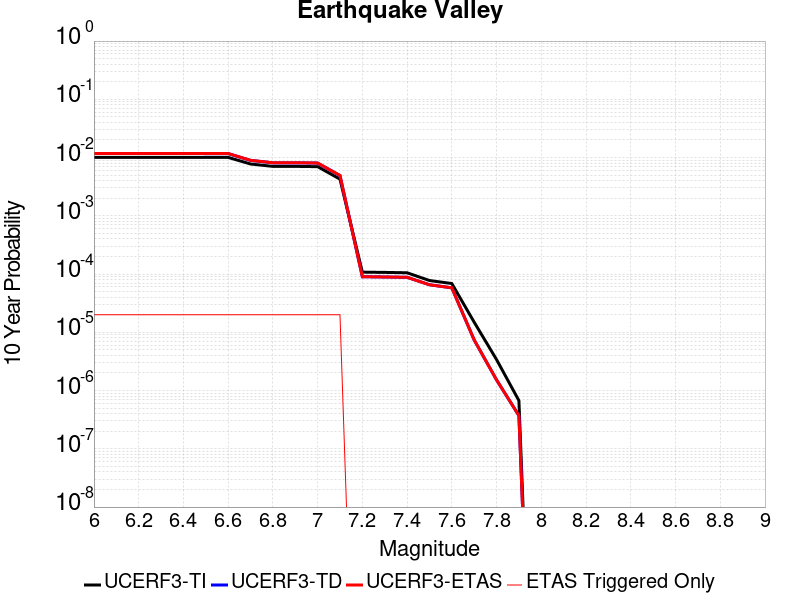 |

| Magnitude | 1 wk TI Prob | 1 wk TD Prob | 1 wk ETAS Prob | 1 wk ETAS/TD Gain | 1 wk ETAS Triggered Only | 1 mo TI Prob | 1 mo TD Prob | 1 mo ETAS Prob | 1 mo ETAS/TD Gain | 1 mo ETAS Triggered Only | 1 yr TI Prob | 1 yr TD Prob | 1 yr ETAS Prob | 1 yr ETAS/TD Gain | 1 yr ETAS Triggered Only | 10 yr TI Prob | 10 yr TD Prob | 10 yr ETAS Prob | 10 yr ETAS/TD Gain | 10 yr ETAS Triggered Only |
|-----|-----|-----|-----|-----|-----|-----|-----|-----|-----|-----|-----|-----|-----|-----|-----|-----|-----|-----|-----|-----|
| 6.0 | 1.9416384E-5 | 2.258411E-5 | 7.187079E-5 | 3.182361 | 4.928779E-5 | 8.321042E-5 | 9.6786134E-5 | 1.4606916E-4 | 1.5091951 | 4.928779E-5 | 0.001012616 | 0.001177854 | 0.0012270837 | 1.0417961 | 4.928779E-5 | 0.010080142 | 0.011727945 | 0.011776655 | 1.0041533 | 4.928779E-5 |
| 6.1 | 1.9416384E-5 | 2.258411E-5 | 7.187079E-5 | 3.182361 | 4.928779E-5 | 8.321042E-5 | 9.6786134E-5 | 1.4606916E-4 | 1.5091951 | 4.928779E-5 | 0.001012616 | 0.001177854 | 0.0012270837 | 1.0417961 | 4.928779E-5 | 0.010080142 | 0.011727945 | 0.011776655 | 1.0041533 | 4.928779E-5 |
| 6.2 | 1.9416384E-5 | 2.258411E-5 | 7.187079E-5 | 3.182361 | 4.928779E-5 | 8.321042E-5 | 9.6786134E-5 | 1.4606916E-4 | 1.5091951 | 4.928779E-5 | 0.001012616 | 0.001177854 | 0.0012270837 | 1.0417961 | 4.928779E-5 | 0.010080142 | 0.011727945 | 0.011776655 | 1.0041533 | 4.928779E-5 |
| 6.3 | 1.9416384E-5 | 2.258411E-5 | 7.187079E-5 | 3.182361 | 4.928779E-5 | 8.321042E-5 | 9.6786134E-5 | 1.4606916E-4 | 1.5091951 | 4.928779E-5 | 0.001012616 | 0.001177854 | 0.0012270837 | 1.0417961 | 4.928779E-5 | 0.010080142 | 0.011727945 | 0.011776655 | 1.0041533 | 4.928779E-5 |
| 6.4 | 1.9416384E-5 | 2.258411E-5 | 7.187079E-5 | 3.182361 | 4.928779E-5 | 8.321042E-5 | 9.6786134E-5 | 1.4606916E-4 | 1.5091951 | 4.928779E-5 | 0.001012616 | 0.001177854 | 0.0012270837 | 1.0417961 | 4.928779E-5 | 0.010080142 | 0.011727945 | 0.011776655 | 1.0041533 | 4.928779E-5 |
| 6.5 | 1.9389157E-5 | 2.25527E-5 | 7.183938E-5 | 3.1854005 | 4.928779E-5 | 8.309374E-5 | 9.665152E-5 | 1.4593455E-4 | 1.5099043 | 4.928779E-5 | 0.0010111968 | 0.001176217 | 0.0012254468 | 1.0418544 | 4.928779E-5 | 0.010066078 | 0.011711747 | 0.011760457 | 1.0041591 | 4.928779E-5 |
| 6.6 | 1.9389157E-5 | 2.25527E-5 | 7.183938E-5 | 3.1854005 | 4.928779E-5 | 8.309374E-5 | 9.665152E-5 | 1.4593455E-4 | 1.5099043 | 4.928779E-5 | 0.0010111968 | 0.001176217 | 0.0012254468 | 1.0418544 | 4.928779E-5 | 0.010066078 | 0.011711747 | 0.011760457 | 1.0041591 | 4.928779E-5 |
| 6.7 | 1.4925434E-5 | 1.720822E-5 | 6.6495166E-5 | 3.864151 | 4.928779E-5 | 6.396457E-5 | 7.374791E-5 | 1.2303206E-4 | 1.6682787 | 4.928779E-5 | 7.7849044E-4 | 8.97596E-4 | 9.468396E-4 | 1.0548615 | 4.928779E-5 | 0.007757689 | 0.008948081 | 0.008996928 | 1.005459 | 4.928779E-5 |
| 6.8 | 1.3570335E-5 | 1.5616837E-5 | 6.4903856E-5 | 4.1560183 | 4.928779E-5 | 5.8157282E-5 | 6.692804E-5 | 1.1621254E-4 | 1.7363803 | 4.928779E-5 | 7.0783484E-4 | 8.146264E-4 | 8.6387404E-4 | 1.0604542 | 4.928779E-5 | 0.0070558446 | 0.008124473 | 0.0081733605 | 1.0060173 | 4.928779E-5 |
| 6.9 | 1.3570335E-5 | 1.5616837E-5 | 6.4903856E-5 | 4.1560183 | 4.928779E-5 | 5.8157282E-5 | 6.692804E-5 | 1.1621254E-4 | 1.7363803 | 4.928779E-5 | 7.0783484E-4 | 8.146264E-4 | 8.6387404E-4 | 1.0604542 | 4.928779E-5 | 0.0070558446 | 0.008124473 | 0.0081733605 | 1.0060173 | 4.928779E-5 |
| 7.0 | 1.3433392E-5 | 1.546038E-5 | 6.474741E-5 | 4.1879573 | 4.928779E-5 | 5.757041E-5 | 6.6257555E-5 | 1.15542076E-4 | 1.7438326 | 4.928779E-5 | 7.0069433E-4 | 8.064692E-4 | 8.557172E-4 | 1.0610663 | 4.928779E-5 | 0.006984891 | 0.008043493 | 0.008092385 | 1.0060784 | 4.928779E-5 |
| 7.1 | 8.181609E-6 | 9.4168445E-6 | 5.8704172E-5 | 6.233954 | 4.928779E-5 | 3.5063567E-5 | 4.0357656E-5 | 8.964346E-5 | 2.2212255 | 4.928779E-5 | 4.268153E-4 | 4.913108E-4 | 5.405743E-4 | 1.1002697 | 4.928779E-5 | 0.0042599645 | 0.004908822 | 0.004957868 | 1.0099914 | 4.928779E-5 |
| 7.2 | 2.0663983E-7 | 1.7262263E-7 | 1.7262263E-7 | 1.0 | 0.0 | 8.855989E-7 | 7.398111E-7 | 7.398111E-7 | 1.0 | 0.0 | 1.0782113E-5 | 9.007167E-6 | 9.007167E-6 | 1.0 | 0.0 | 1.07815904E-4 | 9.006837E-5 | 9.006837E-5 | 1.0 | 0.0 |
| 7.3 | 2.0462376E-7 | 1.7077758E-7 | 1.7077758E-7 | 1.0 | 0.0 | 8.7695867E-7 | 7.319037E-7 | 7.319037E-7 | 1.0 | 0.0 | 1.0676919E-5 | 8.910895E-6 | 8.910895E-6 | 1.0 | 0.0 | 1.0676406E-4 | 8.9105735E-5 | 8.9105735E-5 | 1.0 | 0.0 |
| 7.4 | 2.0171088E-7 | 1.6860244E-7 | 1.6860244E-7 | 1.0 | 0.0 | 8.644749E-7 | 7.2258166E-7 | 7.2258166E-7 | 1.0 | 0.0 | 1.0524931E-5 | 8.7974E-6 | 8.7974E-6 | 1.0 | 0.0 | 1.05244326E-4 | 8.7970875E-5 | 8.7970875E-5 | 1.0 | 0.0 |
| 7.5 | 1.4847944E-7 | 1.2558573E-7 | 1.2558573E-7 | 1.0 | 0.0 | 6.363403E-7 | 5.382244E-7 | 5.382244E-7 | 1.0 | 0.0 | 7.747416E-6 | 6.5528648E-6 | 6.5528648E-6 | 1.0 | 0.0 | 7.747146E-5 | 6.552693E-5 | 6.552693E-5 | 1.0 | 0.0 |
| 7.6 | 1.3185847E-7 | 1.1122516E-7 | 1.1122516E-7 | 1.0 | 0.0 | 5.6510765E-7 | 4.766792E-7 | 4.766792E-7 | 1.0 | 0.0 | 6.8801637E-6 | 5.803556E-6 | 5.803556E-6 | 1.0 | 0.0 | 6.8799505E-5 | 5.8034257E-5 | 5.8034257E-5 | 1.0 | 0.0 |
| 7.7 | 2.8609954E-8 | 1.4170218E-8 | 1.4170218E-8 | 1.0 | 0.0 | 1.2261408E-7 | 6.0729505E-8 | 6.0729505E-8 | 1.0 | 0.0 | 1.4928254E-6 | 7.393815E-7 | 7.393815E-7 | 1.0 | 0.0 | 1.4928154E-5 | 7.393796E-6 | 7.393796E-6 | 1.0 | 0.0 |
| 7.8 | 6.527266E-9 | 2.9232412E-9 | 2.9232412E-9 | 1.0 | 0.0 | 2.7973995E-8 | 1.2528178E-8 | 1.2528178E-8 | 1.0 | 0.0 | 3.4058334E-7 | 1.5253055E-7 | 1.5253055E-7 | 1.0 | 0.0 | 3.4058282E-6 | 1.5253047E-6 | 1.5253047E-6 | 1.0 | 0.0 |
| 7.9 | 1.2898267E-9 | 7.127704E-10 | 7.127704E-10 | 1.0 | 0.0 | 5.527829E-9 | 3.0547302E-9 | 3.0547302E-9 | 1.0 | 0.0 | 6.7301315E-8 | 3.719134E-8 | 3.719134E-8 | 1.0 | 0.0 | 6.7301295E-7 | 3.7191342E-7 | 3.7191342E-7 | 1.0 | 0.0 |

