# Parent Section Magnitude-Probability Distributions

Only fault sections with at least one triggered aftershock are plotted. Sections are sorted by total supraseismogenic trigger rate (decreasing)

## Table Of Contents

* [Garlock (Central)](#garlock-central)
* [Tank Canyon](#tank-canyon)
* [Little Lake](#little-lake)
* [Airport Lake](#airport-lake)
* [Owl Lake](#owl-lake)
* [Panamint Valley](#panamint-valley)
* [Garlock (East)](#garlock-east)
* [Hunter Mountain-Saline Valley](#hunter-mountain-saline-valley)
* [Blackwater](#blackwater)
* [Ash Hill](#ash-hill)
* [Garlock (West)](#garlock-west)
* [Gravel Hills-Harper Lk](#gravel-hills-harper-lk)
* [McLean Lake](#mclean-lake)
* [Goldstone Lake](#goldstone-lake)
* [So Sierra Nevada](#so-sierra-nevada)
* [San Andreas (Mojave S)](#san-andreas-mojave-s)
* [Coyote Canyon](#coyote-canyon)
* [Lenwood-Lockhart-Old Woman Springs](#lenwood-lockhart-old-woman-springs)
* [Death Valley (So)](#death-valley-so)
* [San Andreas (Mojave N)](#san-andreas-mojave-n)
* [Nelson Lake](#nelson-lake)
* [Towne Pass](#towne-pass)
* [Bicycle Lake](#bicycle-lake)
* [Paradise](#paradise)
* [San Andreas (San Bernardino N)](#san-andreas-san-bernardino-n)
* [Garlic Springs](#garlic-springs)
* [Helendale-So Lockhart](#helendale-so-lockhart)
* [Death Valley (Black Mtns Frontal)](#death-valley-black-mtns-frontal)
* [San Andreas (San Bernardino S)](#san-andreas-san-bernardino-s)
* [Coyote Lake](#coyote-lake)
* [San Andreas (Big Bend)](#san-andreas-big-bend)
* [Death Valley (No)](#death-valley-no)
* [Death Valley (Fish Lake Valley)](#death-valley-fish-lake-valley)
* [San Andreas (Parkfield)](#san-andreas-parkfield)
* [Red Pass](#red-pass)
* [Elsinore (Glen Ivy) rev](#elsinore-glen-ivy-rev)
* [Sierra Nevada  (No Extension)](#sierra-nevada--no-extension)
* [Lake Isabella (Seismicity)](#lake-isabella-seismicity)
* [Cady](#cady)
* [San Andreas (San Gorgonio Pass-Garnet HIll)](#san-andreas-san-gorgonio-pass-garnet-hill)
* [San Andreas (Coachella) rev](#san-andreas-coachella-rev)
* [Ludlow](#ludlow)
* [Calico-Hidalgo](#calico-hidalgo)
* [San Andreas (Cholame) rev](#san-andreas-cholame-rev)
* [Manix-Afton Hills](#manix-afton-hills)
* [San Jacinto (San Bernardino)](#san-jacinto-san-bernardino)
* [San Andreas (Carrizo) rev](#san-andreas-carrizo-rev)
* [Scodie Lineament](#scodie-lineament)
* [White Wolf (Extension)](#white-wolf-extension)
* [San Andreas (Creeping Section) 2011 CFM](#san-andreas-creeping-section-2011-cfm)
* [Baker](#baker)
* [Pinto Mtn](#pinto-mtn)
* [San Jacinto (San Jacinto Valley) rev](#san-jacinto-san-jacinto-valley-rev)
* [San Jacinto (Stepovers Combined)](#san-jacinto-stepovers-combined)
* [Brawley (Seismic Zone) alt 1](#brawley-seismic-zone-alt-1)
* [Owens Valley](#owens-valley)
* [Kern Canyon (North Kern) 2011](#kern-canyon-north-kern-2011)
* [Santa Ynez (East)](#santa-ynez-east)
* [Cleghorn Lake](#cleghorn-lake)
* [San Andreas (North Branch Mill Creek)](#san-andreas-north-branch-mill-creek)
* [White Mountains](#white-mountains)
* [Imperial](#imperial)
* [Santa Ynez (West)](#santa-ynez-west)
* [Cleghorn Pass](#cleghorn-pass)
* [Santa Rosa Island](#santa-rosa-island)
* [Lost Hills](#lost-hills)
* [Rose Canyon](#rose-canyon)
* [Pisgah-Bullion Mtn-Mesquite Lk](#pisgah-bullion-mtn-mesquite-lk)
* [Dry Mountain](#dry-mountain)
* [Whittier alt 1](#whittier-alt-1)
* [Bullion Mountains](#bullion-mountains)
* [Ortigalita (North)](#ortigalita-north)
* [San Jacinto (Anza) rev](#san-jacinto-anza-rev)
* [Blue Cut](#blue-cut)
* [Big Pine (Central)](#big-pine-central)
* [San Clemente](#san-clemente)
* [Camp Rock 2011](#camp-rock-2011)
* [Santa Cruz Island](#santa-cruz-island)
* [San Jacinto (Lytle Creek connector)](#san-jacinto-lytle-creek-connector)
* [Independence rev 2011](#independence-rev-2011)
* [Oceanic - West Huasna](#oceanic---west-huasna)
* [Chino alt 1](#chino-alt-1)
* [Elysian Park (Upper)](#elysian-park-upper)
* [Mission Ridge-Arroyo Parida-Santa Ana](#mission-ridge-arroyo-parida-santa-ana)
* [Mission Creek](#mission-creek)
* [Palos Verdes](#palos-verdes)
* [Deep Springs](#deep-springs)
* [Coronado Bank alt1](#coronado-bank-alt1)
* [Pleito](#pleito)
* [Kern Canyon (South Kern) 2011](#kern-canyon-south-kern-2011)
* [Red Mountain](#red-mountain)
* [Cleghorn](#cleghorn)
* [Tin Mountain](#tin-mountain)
* [San Jacinto (Coyote Creek)](#san-jacinto-coyote-creek)
* [San Diego Trough north alt1](#san-diego-trough-north-alt1)
* [Pine Mtn](#pine-mtn)
* [Channel Islands Thrust](#channel-islands-thrust)
* [Rinconada 2011 CFM](#rinconada-2011-cfm)
* [San Jacinto (Borrego)](#san-jacinto-borrego)
* [Simi-Santa Rosa](#simi-santa-rosa)
* [San Luis Range 2011 CFM](#san-luis-range-2011-cfm)
* [Raymond](#raymond)
* [Green Valley 2011 CFM](#green-valley-2011-cfm)
* [Big Pine (East)](#big-pine-east)
* [San Pedro Basin](#san-pedro-basin)
* [Malibu Coast alt 1](#malibu-coast-alt-1)
* [Ventura-Pitas Point](#ventura-pitas-point)
* [San Cayetano](#san-cayetano)
* [Santa Cruz Catalina Ridge alt1](#santa-cruz-catalina-ridge-alt1)
* [San Gabriel](#san-gabriel)
* [Cerro Prieto](#cerro-prieto)
* [Kern Canyon (Lake Isabella) 2011](#kern-canyon-lake-isabella-2011)
* [Cucamonga](#cucamonga)
* [Mono Lake 2011 CFM](#mono-lake-2011-cfm)
* [Monterey Bay-Tularcitos](#monterey-bay-tularcitos)
* [Hayward (So) 2011 CFM](#hayward-so-2011-cfm)
* [Great Valley 03a Dunnigan Hills](#great-valley-03a-dunnigan-hills)
* [Great Valley 09 (Laguna Seca)](#great-valley-09-laguna-seca)
* [San Andreas (Santa Cruz Mts) 2011 CFM](#san-andreas-santa-cruz-mts-2011-cfm)
* [Maacama 2011 CFM](#maacama-2011-cfm)
* [Hunting Creek - Berryessa 2011 CFM](#hunting-creek---berryessa-2011-cfm)
* [Emerson-Copper Mtn 2011](#emerson-copper-mtn-2011)
* [South Cuyama](#south-cuyama)
* [Sierra Madre (San Fernando)](#sierra-madre-san-fernando)
* [Channel Islands Western Deep Ramp](#channel-islands-western-deep-ramp)
* [Santa Monica alt 1](#santa-monica-alt-1)
* [San Jacinto (Clark) rev](#san-jacinto-clark-rev)
* [Great Valley 05 Pittsburg - Kirby Hills alt1](#great-valley-05-pittsburg---kirby-hills-alt1)
* [Ortigalita (South)](#ortigalita-south)
* [Fontana (Seismicity)](#fontana-seismicity)
* [Hat Creek-McArthur-Mayfield](#hat-creek-mcarthur-mayfield)
* [Hector Mine](#hector-mine)
* [Newport-Inglewood (Offshore)](#newport-inglewood-offshore)
* [Santa Susana East (connector)](#santa-susana-east-connector)
* [Clamshell-Sawpit](#clamshell-sawpit)
* [San Andreas (Offshore) 2011 CFM](#san-andreas-offshore-2011-cfm)
* [Surprise Valley 2011 CFM](#surprise-valley-2011-cfm)
* [Sheephole](#sheephole)
* [Oak Ridge (Onshore)](#oak-ridge-onshore)
* [Great Valley 07 (Orestimba)](#great-valley-07-orestimba)
* [Hosgri](#hosgri)
* [Sierra Madre](#sierra-madre)
* [Hollywood](#hollywood)
* [East Huasna 2011 CFM](#east-huasna-2011-cfm)
* [Hayward (So) extension 2011 CFM](#hayward-so-extension-2011-cfm)
* [Shoreline](#shoreline)
* [San Andreas (Peninsula) 2011 CFM](#san-andreas-peninsula-2011-cfm)
* [Great Valley 04a Trout Creek](#great-valley-04a-trout-creek)
* [Owens Valley Keough Hot Springs](#owens-valley-keough-hot-springs)
* [Calaveras (So) - Paicines extension 2011 CFM](#calaveras-so---paicines-extension-2011-cfm)
* [Hartley Springs 2011 CFM](#hartley-springs-2011-cfm)
* [Anacapa-Dume alt 1](#anacapa-dume-alt-1)
* [San Diego Trough south](#san-diego-trough-south)
* [Santa Susana alt 1](#santa-susana-alt-1)
* [Elsinore (Stepovers Combined)](#elsinore-stepovers-combined)
* [Gillem - Big Crack 2011 CFM](#gillem---big-crack-2011-cfm)
* [Honey Lake 2011 CFM](#honey-lake-2011-cfm)
* [Earthquake Valley (No  Extension)](#earthquake-valley-no--extension)
* [San Luis Range - Pecho 2011 CFM](#san-luis-range---pecho-2011-cfm)
* [North Frontal  (West)](#north-frontal--west)
* [Fitzhugh Creek](#fitzhugh-creek)
* [Earthquake Valley (So Extension)](#earthquake-valley-so-extension)
* [Calaveras (Central) 2011 CFM](#calaveras-central-2011-cfm)
* [Concord 2011 CFM](#concord-2011-cfm)
* [Great Valley 03 Mysterious Ridge](#great-valley-03-mysterious-ridge)
* [Elsinore (Temecula) rev](#elsinore-temecula-rev)
* [Reliz 2011 CFM](#reliz-2011-cfm)
* [Elmore Ranch](#elmore-ranch)
* [San Andreas (North Coast) 2011 CFM](#san-andreas-north-coast-2011-cfm)
* [La Panza 2011](#la-panza-2011)
* [Earthquake Valley](#earthquake-valley)
* [San Jose](#san-jose)
* [Laguna Salada](#laguna-salada)
* [Trinidad (alt1)](#trinidad-alt1)
* [Robinson Creek](#robinson-creek)
* [Pilarcitos 2011 CFM](#pilarcitos-2011-cfm)
* [West Tahoe](#west-tahoe)
* [Jess Valley](#jess-valley)
* [Puente Hills](#puente-hills)
* [Likely 2011 CFM](#likely-2011-cfm)
* [Calaveras (So) 2011 CFM](#calaveras-so-2011-cfm)
* [San Juan](#san-juan)
* [Casmalia 2011 CFM](#casmalia-2011-cfm)
* [Great Valley 04b Gordon Valley](#great-valley-04b-gordon-valley)
* [Elsinore (Julian)](#elsinore-julian)
* [Santa Monica Bay](#santa-monica-bay)
* [Great Valley 14 (Kettleman Hills)](#great-valley-14-kettleman-hills)
* [Pittville 2011 CFM](#pittville-2011-cfm)
* [Los Alamos extension](#los-alamos-extension)
* [Monte Vista - Shannon 2011 CFM](#monte-vista---shannon-2011-cfm)
* [Great Valley 06 (Midland) 2011 CFM alt1](#great-valley-06-midland-2011-cfm-alt1)
* [Bennett Valley 2011 CFM](#bennett-valley-2011-cfm)
* [Pitas Point (Lower West)](#pitas-point-lower-west)
* [Rodgers Creek - Healdsburg 2011 CFM](#rodgers-creek---healdsburg-2011-cfm)
* [Hayward (No) 2011 CFM](#hayward-no-2011-cfm)
* [Elysian Park (Lower CFM)](#elysian-park-lower-cfm)
* [Eureka Peak](#eureka-peak)
* [Ozena](#ozena)
* [Hunting Creek - Bartlett Springs connector 2011](#hunting-creek---bartlett-springs-connector-2011)
* [Pitas Point (Lower)-Montalvo](#pitas-point-lower-montalvo)
* [San Vicente](#san-vicente)
* [Newport-Inglewood alt 1](#newport-inglewood-alt-1)
* [Santa Ynez River](#santa-ynez-river)
* [Mendocino](#mendocino)
* [White Wolf](#white-wolf)
* [Garberville - Briceland 2011 CFM](#garberville---briceland-2011-cfm)
* [Johnson Valley (No) 2011 rev](#johnson-valley-no-2011-rev)
* [Morales (East)](#morales-east)
* [North Frontal  (East)](#north-frontal--east)
* [Elsinore (Coyote Mountains)](#elsinore-coyote-mountains)
* [San Gregorio (North) 2011 CFM](#san-gregorio-north-2011-cfm)
* [Quien Sabe 2011 CFM](#quien-sabe-2011-cfm)
* [San Jacinto (Superstition Mtn)](#san-jacinto-superstition-mtn)
* [Northridge Hills](#northridge-hills)
* [Los Alamos 2011 CFM](#los-alamos-2011-cfm)
* [West Napa 2011 CFM](#west-napa-2011-cfm)
* [Almanor 2011 CFM](#almanor-2011-cfm)
* [Breckenridge 2011](#breckenridge-2011)
* [Compton](#compton)
* [Los Osos 2011](#los-osos-2011)

## Garlock (Central)
*[(top)](#table-of-contents)*

| 1 Week | 1 Month | 1 Year | 10 Year |
|-----|-----|-----|-----|
| 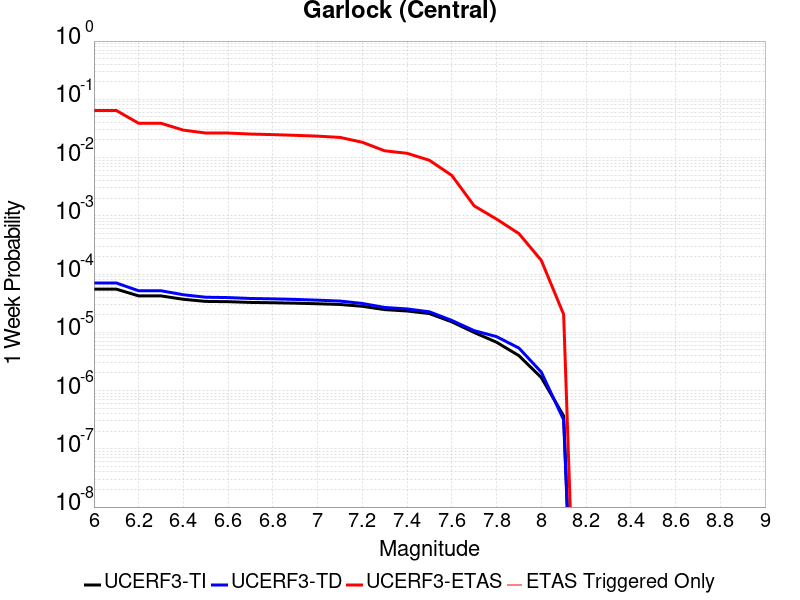 | 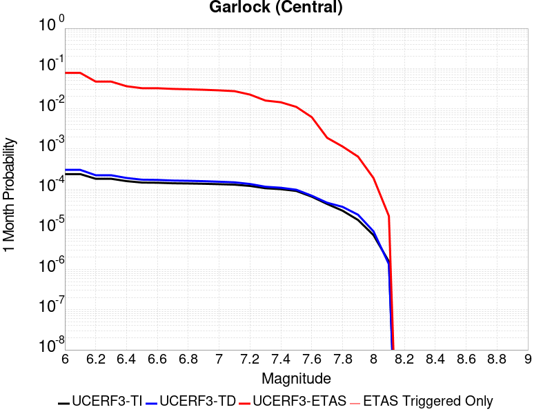 | 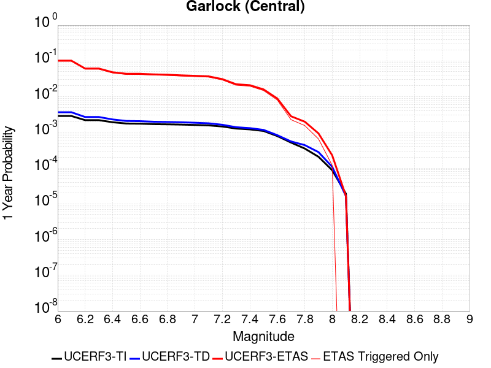 | 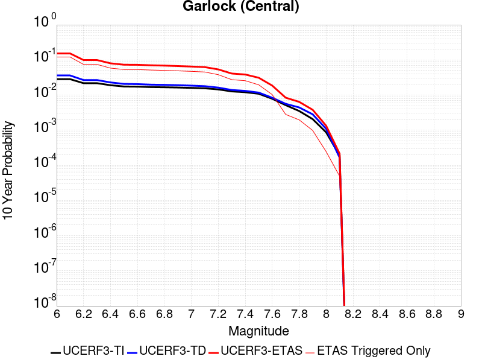 |

| Magnitude | 1 wk TI Prob | 1 wk TD Prob | 1 wk ETAS Prob | 1 wk ETAS/TD Gain | 1 wk ETAS Triggered Only | 1 mo TI Prob | 1 mo TD Prob | 1 mo ETAS Prob | 1 mo ETAS/TD Gain | 1 mo ETAS Triggered Only | 1 yr TI Prob | 1 yr TD Prob | 1 yr ETAS Prob | 1 yr ETAS/TD Gain | 1 yr ETAS Triggered Only | 10 yr TI Prob | 10 yr TD Prob | 10 yr ETAS Prob | 10 yr ETAS/TD Gain | 10 yr ETAS Triggered Only |
|-----|-----|-----|-----|-----|-----|-----|-----|-----|-----|-----|-----|-----|-----|-----|-----|-----|-----|-----|-----|-----|
| 6.0 | 5.5131142E-5 | 7.02476E-5 | 0.06428573 | 915.13074 | 0.06422 | 2.3625491E-4 | 3.0102677E-4 | 0.077837676 | 258.57394 | 0.07756 | 0.0028726095 | 0.003658906 | 0.10519603 | 28.750677 | 0.10191 | 0.028357591 | 0.036136657 | 0.15578102 | 4.3108864 | 0.12413 |
| 6.1 | 5.5131142E-5 | 7.02476E-5 | 0.06428573 | 915.13074 | 0.06422 | 2.3625491E-4 | 3.0102677E-4 | 0.077837676 | 258.57394 | 0.07756 | 0.0028726095 | 0.003658906 | 0.10519603 | 28.750677 | 0.10191 | 0.028357591 | 0.036136657 | 0.15578102 | 4.3108864 | 0.12413 |
| 6.2 | 4.216245E-5 | 5.1661802E-5 | 0.03877966 | 750.6448 | 0.03873 | 1.806837E-4 | 2.213891E-4 | 0.047300965 | 213.65533 | 0.04709 | 0.0021976046 | 0.002692112 | 0.06523329 | 24.23127 | 0.06271 | 0.021759989 | 0.026701318 | 0.102287695 | 3.8308108 | 0.07766 |
| 6.3 | 4.216245E-5 | 5.1661802E-5 | 0.03877966 | 750.6448 | 0.03873 | 1.806837E-4 | 2.213891E-4 | 0.047300965 | 213.65533 | 0.04709 | 0.0021976046 | 0.002692112 | 0.06523329 | 24.23127 | 0.06271 | 0.021759989 | 0.026701318 | 0.102287695 | 3.8308108 | 0.07766 |
| 6.4 | 3.6858168E-5 | 4.411026E-5 | 0.029562809 | 670.2025 | 0.02952 | 1.5795401E-4 | 1.8903041E-4 | 0.03626221 | 191.83267 | 0.03608 | 0.0019213937 | 0.0022990413 | 0.05084717 | 22.116684 | 0.04866 | 0.019048655 | 0.022866098 | 0.081953384 | 3.5840564 | 0.06047 |
| 6.5 | 3.39199E-5 | 4.0018425E-5 | 0.026388964 | 659.42035 | 0.02635 | 1.453629E-4 | 1.7149639E-4 | 0.03239597 | 188.90176 | 0.03223 | 0.0017683565 | 0.0020859907 | 0.04551521 | 21.819468 | 0.04352 | 0.017543508 | 0.020758783 | 0.07392179 | 3.5609884 | 0.05429 |
| 6.6 | 3.3571985E-5 | 3.947258E-5 | 0.026358433 | 667.7657 | 0.02632 | 1.4387199E-4 | 1.6915736E-4 | 0.03235371 | 191.264 | 0.03219 | 0.0017502342 | 0.0020575672 | 0.045418166 | 22.073723 | 0.04345 | 0.017365133 | 0.020480042 | 0.073540635 | 3.5908442 | 0.05417 |
| 6.7 | 3.2580007E-5 | 3.808902E-5 | 0.025327126 | 664.9456 | 0.02529 | 1.3962112E-4 | 1.6322857E-4 | 0.031098178 | 190.51921 | 0.03094 | 0.0016985617 | 0.0019855178 | 0.043632664 | 21.975456 | 0.04173 | 0.016856372 | 0.019770874 | 0.07089963 | 3.5860643 | 0.05216 |
| 6.8 | 3.2185937E-5 | 3.7516216E-5 | 0.024766589 | 660.1569 | 0.02473 | 1.3793244E-4 | 1.60774E-4 | 0.030435905 | 189.30864 | 0.03028 | 0.0016780337 | 0.0019556875 | 0.042765718 | 21.86736 | 0.04089 | 0.016654192 | 0.019477878 | 0.06958256 | 3.5723891 | 0.0511 |
| 6.9 | 3.165394E-5 | 3.672075E-5 | 0.024085838 | 655.919 | 0.02405 | 1.3565269E-4 | 1.5736527E-4 | 0.02961273 | 188.1783 | 0.02946 | 0.0016503202 | 0.00191426 | 0.04160813 | 21.735882 | 0.03977 | 0.01638118 | 0.019071518 | 0.067911945 | 3.5609093 | 0.04979 |
| 7.0 | 3.0903822E-5 | 3.562591E-5 | 0.023314796 | 654.4337 | 0.02328 | 1.3243823E-4 | 1.5267366E-4 | 0.028618326 | 187.44771 | 0.02847 | 0.0016112428 | 0.0018572382 | 0.040305696 | 21.701954 | 0.03852 | 0.015996104 | 0.018513493 | 0.06587022 | 3.5579574 | 0.04825 |
| 7.1 | 3.0069863E-5 | 3.4392175E-5 | 0.02218363 | 645.0197 | 0.02215 | 1.2886449E-4 | 1.4738683E-4 | 0.02732338 | 185.3855 | 0.02718 | 0.0015677959 | 0.0017929787 | 0.038596872 | 21.526676 | 0.03687 | 0.01556781 | 0.01788099 | 0.063402206 | 3.5457885 | 0.04635 |
| 7.2 | 2.7957109E-5 | 3.128141E-5 | 0.01830071 | 585.0346 | 0.01827 | 1.1981068E-4 | 1.3405642E-4 | 0.022461062 | 167.54933 | 0.02233 | 0.0014577188 | 0.0016309345 | 0.032101158 | 19.682678 | 0.03052 | 0.014481937 | 0.016284352 | 0.05406887 | 3.320296 | 0.03841 |
| 7.3 | 2.4519275E-5 | 2.6714602E-5 | 0.013056367 | 488.7352 | 0.01303 | 1.0507837E-4 | 1.1448621E-4 | 0.015962671 | 139.42877 | 0.01585 | 0.0012785783 | 0.001392993 | 0.023262486 | 16.699642 | 0.0219 | 0.012712469 | 0.01392861 | 0.041262507 | 2.9624283 | 0.02772 |
| 7.4 | 2.3225532E-5 | 2.5199166E-5 | 0.011834902 | 469.65448 | 0.01181 | 9.95342E-5 | 1.0799204E-4 | 0.014466441 | 133.9584 | 0.01436 | 0.0012111551 | 0.0013140244 | 0.021257784 | 16.177616 | 0.01997 | 0.012045753 | 0.013146196 | 0.038143203 | 2.901463 | 0.02533 |
| 7.5 | 2.097765E-5 | 2.2483406E-5 | 0.008982282 | 399.50717 | 0.00896 | 8.9901114E-5 | 9.6353964E-5 | 0.011095294 | 115.1514 | 0.011 | 0.0010939965 | 0.00117249 | 0.01669427 | 14.238304 | 0.01554 | 0.010886264 | 0.0117406575 | 0.031051245 | 2.644762 | 0.01954 |
| 7.6 | 1.511254E-5 | 1.5990969E-5 | 0.0049359123 | 308.66873 | 0.00492 | 6.476642E-5 | 6.8530964E-5 | 0.006168113 | 90.00475 | 0.0061 | 7.882459E-4 | 8.34053E-4 | 0.009406897 | 11.278537 | 0.00858 | 0.007854558 | 0.008383867 | 0.018954495 | 2.2608294 | 0.01066 |
| 7.7 | 9.934069E-6 | 1.0678523E-5 | 0.0014806628 | 138.65802 | 0.00147 | 4.2573887E-5 | 4.5764296E-5 | 0.0018856801 | 41.204174 | 0.00184 | 5.182138E-4 | 5.570383E-4 | 0.003205562 | 5.7546535 | 0.00265 | 0.00517007 | 0.005627419 | 0.00870003 | 1.5460072 | 0.00309 |
| 7.8 | 6.7562896E-6 | 8.42837E-6 | 8.7842107E-4 | 104.22194 | 8.7E-4 | 2.8955206E-5 | 3.6121084E-5 | 0.001146081 | 31.728863 | 0.00111 | 3.5247262E-4 | 4.3968562E-4 | 0.0020589733 | 4.682831 | 0.00162 | 0.0035191406 | 0.004446416 | 0.0063578794 | 1.4298884 | 0.00192 |
| 7.9 | 3.975453E-6 | 5.3710532E-6 | 4.9536844E-4 | 92.229294 | 4.9E-4 | 1.7037546E-5 | 2.3018596E-5 | 6.430043E-4 | 27.934124 | 6.2E-4 | 2.0741238E-4 | 2.8021546E-4 | 0.0011699661 | 4.175237 | 8.9E-4 | 0.002072189 | 0.0028335669 | 0.0039204783 | 1.3835841 | 0.00109 |
| 8.0 | 1.6729537E-6 | 2.0775192E-6 | 1.7207717E-4 | 82.82819 | 1.7E-4 | 7.169782E-6 | 8.903624E-6 | 1.8890202E-4 | 21.216309 | 1.8E-4 | 8.7288594E-5 | 1.0839626E-4 | 3.78367E-4 | 3.4905908 | 2.7E-4 | 8.7254314E-4 | 0.001096854 | 0.0014464702 | 1.3187444 | 3.5E-4 |
| 8.1 | 3.6733252E-7 | 3.1489736E-7 | 2.031489E-5 | 64.51273 | 2.0E-5 | 1.5742813E-6 | 1.3495595E-6 | 2.1349533E-5 | 15.81963 | 2.0E-5 | 1.9166706E-5 | 1.643078E-5 | 5.6430123E-5 | 3.4344153 | 4.0E-5 | 1.9165053E-4 | 1.662928E-4 | 2.1628448E-4 | 1.3006245 | 5.0E-5 |

## Tank Canyon
*[(top)](#table-of-contents)*

| 1 Week | 1 Month | 1 Year | 10 Year |
|-----|-----|-----|-----|
| 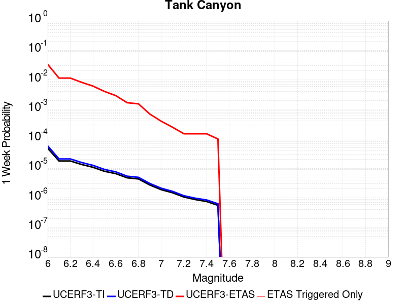 |  | 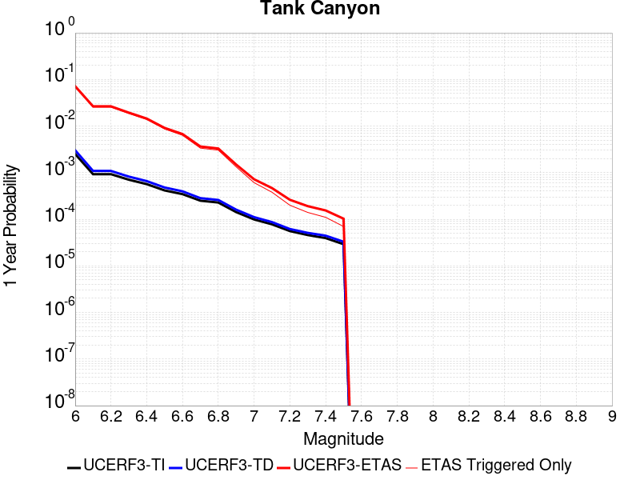 | 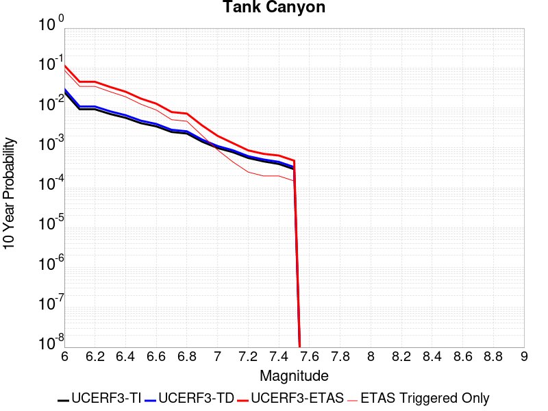 |

| Magnitude | 1 wk TI Prob | 1 wk TD Prob | 1 wk ETAS Prob | 1 wk ETAS/TD Gain | 1 wk ETAS Triggered Only | 1 mo TI Prob | 1 mo TD Prob | 1 mo ETAS Prob | 1 mo ETAS/TD Gain | 1 mo ETAS Triggered Only | 1 yr TI Prob | 1 yr TD Prob | 1 yr ETAS Prob | 1 yr ETAS/TD Gain | 1 yr ETAS Triggered Only | 10 yr TI Prob | 10 yr TD Prob | 10 yr ETAS Prob | 10 yr ETAS/TD Gain | 10 yr ETAS Triggered Only |
|-----|-----|-----|-----|-----|-----|-----|-----|-----|-----|-----|-----|-----|-----|-----|-----|-----|-----|-----|-----|-----|
| 6.0 | 4.8284557E-5 | 5.796445E-5 | 0.035605904 | 614.2714 | 0.03555 | 2.0691741E-4 | 2.4839927E-4 | 0.047106758 | 189.6413 | 0.04687 | 0.0025163088 | 0.0030207336 | 0.07163285 | 23.713726 | 0.06882 | 0.02488006 | 0.029863616 | 0.11931019 | 3.995169 | 0.0922 |
| 6.1 | 1.7796336E-5 | 2.0873378E-5 | 0.012330617 | 590.73413 | 0.01231 | 7.626778E-5 | 8.945448E-5 | 0.016837956 | 188.22932 | 0.01675 | 9.281647E-4 | 0.0010886024 | 0.026500909 | 24.343975 | 0.02544 | 0.009242975 | 0.010836642 | 0.045872808 | 4.23312 | 0.03542 |
| 6.2 | 1.7796336E-5 | 2.0873378E-5 | 0.012330617 | 590.73413 | 0.01231 | 7.626778E-5 | 8.945448E-5 | 0.016837956 | 188.22932 | 0.01675 | 9.281647E-4 | 0.0010886024 | 0.026500909 | 24.343975 | 0.02544 | 0.009242975 | 0.010836642 | 0.045872808 | 4.23312 | 0.03542 |
| 6.3 | 1.3515912E-5 | 1.5759651E-5 | 0.008695623 | 551.7649 | 0.00868 | 5.792405E-5 | 6.7539746E-5 | 0.012016732 | 177.9209 | 0.01195 | 7.049971E-4 | 8.2200987E-4 | 0.019386737 | 23.584555 | 0.01858 | 0.007027647 | 0.008192157 | 0.03408826 | 4.1610847 | 0.02611 |
| 6.4 | 1.0870146E-5 | 1.2618114E-5 | 0.006432537 | 509.78595 | 0.00642 | 4.658551E-5 | 5.4076605E-5 | 0.0089535955 | 165.57243 | 0.0089 | 5.67031E-4 | 6.582015E-4 | 0.014469105 | 21.982788 | 0.01382 | 0.005655863 | 0.006564382 | 0.02587677 | 3.9419966 | 0.01944 |
| 6.5 | 7.964826E-6 | 9.196184E-6 | 0.004069159 | 442.48343 | 0.00406 | 3.4134522E-5 | 3.941168E-5 | 0.00565919 | 143.5917 | 0.00562 | 4.1550855E-4 | 4.797421E-4 | 0.009125592 | 19.021872 | 0.00865 | 0.0041473247 | 0.004788209 | 0.01691984 | 3.533647 | 0.01219 |
| 6.6 | 6.6317E-6 | 7.612378E-6 | 0.0030875888 | 405.6011 | 0.00308 | 2.8421264E-5 | 3.262412E-5 | 0.00415249 | 127.28281 | 0.00412 | 3.4597394E-4 | 3.9713533E-4 | 0.0067346175 | 16.95799 | 0.00634 | 0.0034543579 | 0.0039652516 | 0.013029167 | 3.2858365 | 0.0091 |
| 6.7 | 4.793663E-6 | 5.4308593E-6 | 0.001625422 | 299.29373 | 0.00162 | 2.0544108E-5 | 2.3274928E-5 | 0.0021932244 | 94.2312 | 0.00217 | 2.500958E-4 | 2.833398E-4 | 0.0036423877 | 12.855194 | 0.00336 | 0.0024981452 | 0.0028303189 | 0.0076865354 | 2.715784 | 0.00487 |
| 6.8 | 4.382823E-6 | 4.969325E-6 | 0.0014949619 | 300.838 | 0.00149 | 1.8783392E-5 | 2.1296957E-5 | 0.0020112547 | 94.43859 | 0.00199 | 2.286638E-4 | 2.5926388E-4 | 0.0032984756 | 12.7224655 | 0.00304 | 0.0022842865 | 0.0025901233 | 0.006978727 | 2.6943607 | 0.0044 |
| 6.9 | 2.729601E-6 | 3.0735862E-6 | 6.5307156E-4 | 212.4787 | 6.5E-4 | 1.1698237E-5 | 1.3172453E-5 | 8.931609E-4 | 67.80521 | 8.8E-4 | 1.4241673E-4 | 1.6036403E-4 | 0.0014901507 | 9.2923 | 0.00133 | 0.001423255 | 0.0016024808 | 0.0036392116 | 2.270986 | 0.00204 |
| 7.0 | 1.8987357E-6 | 2.126971E-6 | 3.0212634E-4 | 142.04535 | 3.0E-4 | 8.137413E-6 | 9.115562E-6 | 4.091119E-4 | 44.880604 | 4.0E-4 | 9.90685E-5 | 1.1097702E-4 | 7.2090933E-4 | 6.4960237 | 6.1E-4 | 9.902435E-4 | 0.0011092846 | 0.002028264 | 1.8284434 | 9.2E-4 |
| 7.1 | 1.4928986E-6 | 1.6641525E-6 | 2.0166382E-4 | 121.18109 | 2.0E-4 | 6.398121E-6 | 7.132066E-6 | 2.5713028E-4 | 36.052708 | 2.5E-4 | 7.789434E-5 | 8.6830034E-5 | 4.6679704E-4 | 5.375986 | 3.8E-4 | 7.786704E-4 | 8.6801895E-4 | 0.0014275329 | 1.6445872 | 5.6E-4 |
| 7.2 | 1.069082E-6 | 1.1828765E-6 | 1.11182744E-4 | 93.99353 | 1.1E-4 | 4.581772E-6 | 5.0694644E-6 | 1.550687E-4 | 30.588776 | 1.5E-4 | 5.5781646E-5 | 6.171951E-5 | 2.6170717E-4 | 4.2402663 | 2.0E-4 | 5.576765E-4 | 6.1707594E-4 | 9.1689086E-4 | 1.4858638 | 3.0E-4 |
| 7.3 | 8.776551E-7 | 9.770151E-7 | 8.097693E-5 | 82.881966 | 8.0E-5 | 3.7613736E-6 | 4.187204E-6 | 1.1418675E-4 | 27.270405 | 1.1E-4 | 4.579376E-5 | 5.0978535E-5 | 1.909714E-4 | 3.7461138 | 1.4E-4 | 4.5784327E-4 | 5.097194E-4 | 6.9962256E-4 | 1.3725641 | 1.9E-4 |
| 7.4 | 7.55721E-7 | 8.5103835E-7 | 7.0850976E-5 | 83.25239 | 7.0E-5 | 3.2388E-6 | 3.6473052E-6 | 9.364698E-5 | 25.675663 | 9.0E-5 | 3.9431678E-5 | 4.4405555E-5 | 1.5440067E-4 | 3.4770577 | 1.1E-4 | 3.942468E-4 | 4.4401767E-4 | 5.9395103E-4 | 1.3376744 | 1.5E-4 |
| 7.5 | 5.587665E-7 | 6.305732E-7 | 4.0630548E-5 | 64.43431 | 4.0E-5 | 2.3947114E-6 | 2.7024564E-6 | 6.27023E-5 | 23.201963 | 6.0E-5 | 2.915522E-5 | 3.2902408E-5 | 1.0290011E-4 | 3.1274338 | 7.0E-5 | 2.9151395E-4 | 3.2902407E-4 | 4.289912E-4 | 1.3038291 | 1.0E-4 |

## Little Lake
*[(top)](#table-of-contents)*

| 1 Week | 1 Month | 1 Year | 10 Year |
|-----|-----|-----|-----|
| 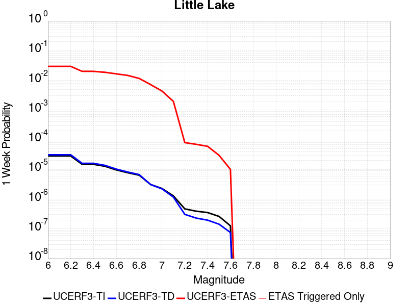 | 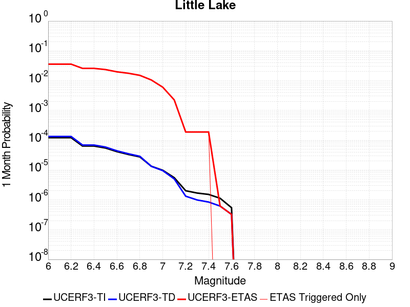 | 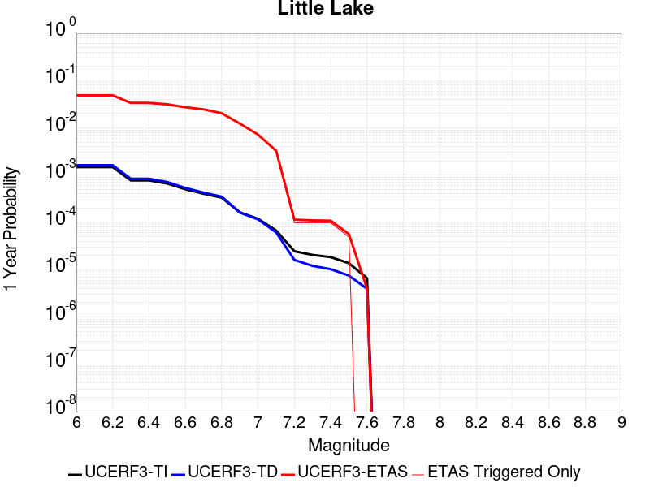 | 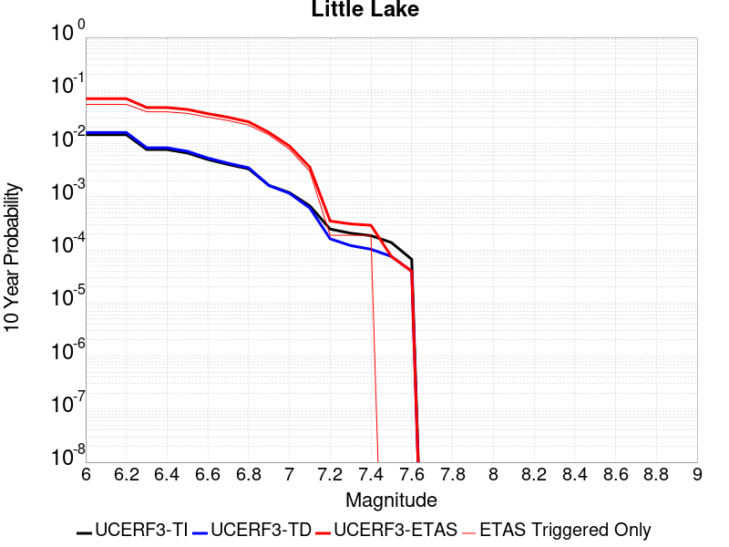 |

| Magnitude | 1 wk TI Prob | 1 wk TD Prob | 1 wk ETAS Prob | 1 wk ETAS/TD Gain | 1 wk ETAS Triggered Only | 1 mo TI Prob | 1 mo TD Prob | 1 mo ETAS Prob | 1 mo ETAS/TD Gain | 1 mo ETAS Triggered Only | 1 yr TI Prob | 1 yr TD Prob | 1 yr ETAS Prob | 1 yr ETAS/TD Gain | 1 yr ETAS Triggered Only | 10 yr TI Prob | 10 yr TD Prob | 10 yr ETAS Prob | 10 yr ETAS/TD Gain | 10 yr ETAS Triggered Only |
|-----|-----|-----|-----|-----|-----|-----|-----|-----|-----|-----|-----|-----|-----|-----|-----|-----|-----|-----|-----|-----|
| 6.0 | 2.8424427E-5 | 3.1205716E-5 | 0.029540285 | 946.6306 | 0.02951 | 1.2181328E-4 | 1.3373268E-4 | 0.036588855 | 273.597 | 0.03646 | 0.0014820677 | 0.0016271125 | 0.04981857 | 30.61778 | 0.04827 | 0.014722223 | 0.016165398 | 0.0742018 | 4.5901623 | 0.05899 |
| 6.1 | 2.8424427E-5 | 3.1205716E-5 | 0.029540285 | 946.6306 | 0.02951 | 1.2181328E-4 | 1.3373268E-4 | 0.036588855 | 273.597 | 0.03646 | 0.0014820677 | 0.0016271125 | 0.04981857 | 30.61778 | 0.04827 | 0.014722223 | 0.016165398 | 0.0742018 | 4.5901623 | 0.05899 |
| 6.2 | 2.8424427E-5 | 3.1205716E-5 | 0.029540285 | 946.6306 | 0.02951 | 1.2181328E-4 | 1.3373268E-4 | 0.036588855 | 273.597 | 0.03646 | 0.0014820677 | 0.0016271125 | 0.04981857 | 30.61778 | 0.04827 | 0.014722223 | 0.016165398 | 0.0742018 | 4.5901623 | 0.05899 |
| 6.3 | 1.48860645E-5 | 1.6081383E-5 | 0.020075759 | 1248.385 | 0.02006 | 6.379586E-5 | 6.8918554E-5 | 0.024917206 | 361.5457 | 0.02485 | 7.7643775E-4 | 8.387886E-4 | 0.03332152 | 39.725765 | 0.03251 | 0.007737305 | 0.008359045 | 0.047469363 | 5.6788025 | 0.03944 |
| 6.4 | 1.48860645E-5 | 1.6081383E-5 | 0.020075759 | 1248.385 | 0.02006 | 6.379586E-5 | 6.8918554E-5 | 0.024917206 | 361.5457 | 0.02485 | 7.7643775E-4 | 8.387886E-4 | 0.03332152 | 39.725765 | 0.03251 | 0.007737305 | 0.008359045 | 0.047469363 | 5.6788025 | 0.03944 |
| 6.5 | 1.2797581E-5 | 1.376556E-5 | 0.018663509 | 1355.8119 | 0.01865 | 5.4845623E-5 | 5.8994065E-5 | 0.023037639 | 390.50772 | 0.02298 | 6.675408E-4 | 7.1804173E-4 | 0.030816413 | 42.9173 | 0.03012 | 0.006655392 | 0.007159767 | 0.04336865 | 6.057271 | 0.03647 |
| 6.6 | 9.661896E-6 | 1.0289033E-5 | 0.01654012 | 1607.5486 | 0.01653 | 4.1407468E-5 | 4.40952E-5 | 0.0203532 | 461.57407 | 0.02031 | 5.040193E-4 | 5.36743E-4 | 0.026962552 | 50.23363 | 0.02644 | 0.005028777 | 0.0053560715 | 0.03717473 | 6.940671 | 0.03199 |
| 6.7 | 7.767871E-6 | 8.199681E-6 | 0.01464808 | 1786.4207 | 0.01464 | 3.329045E-5 | 3.5141096E-5 | 0.01799451 | 512.0646 | 0.01796 | 4.0523586E-4 | 4.2777258E-4 | 0.023687819 | 55.374794 | 0.02327 | 0.004044977 | 0.004270843 | 0.032380275 | 7.581706 | 0.02823 |
| 6.8 | 6.4235196E-6 | 6.735739E-6 | 0.011626657 | 1726.1145 | 0.01162 | 2.752908E-5 | 2.8867207E-5 | 0.014338454 | 496.7039 | 0.01431 | 3.35115E-4 | 3.5141438E-4 | 0.018954875 | 53.938812 | 0.01861 | 0.003346101 | 0.0035098472 | 0.025930876 | 7.3880353 | 0.0225 |
| 6.9 | 3.1283696E-6 | 3.1121751E-6 | 0.0072130896 | 2317.7004 | 0.00721 | 1.3407229E-5 | 1.33378335E-5 | 0.008943219 | 670.5151 | 0.00893 | 1.6322079E-4 | 1.6237753E-4 | 0.011570524 | 71.256935 | 0.01141 | 0.0016310095 | 0.0016227372 | 0.015520149 | 9.564178 | 0.01392 |
| 7.0 | 2.290603E-6 | 2.2286763E-6 | 0.004362219 | 1957.314 | 0.00436 | 9.816834E-6 | 9.551441E-6 | 0.0054894993 | 574.73 | 0.00548 | 1.19513395E-4 | 1.1628362E-4 | 0.007135467 | 61.362617 | 0.00702 | 0.0011944914 | 0.0011623299 | 0.009722369 | 8.364552 | 0.00857 |
| 7.1 | 1.293693E-6 | 1.1776774E-6 | 0.0019611754 | 1665.2908 | 0.00196 | 5.5443866E-6 | 5.047183E-6 | 0.002445035 | 484.43555 | 0.00244 | 6.750081E-5 | 6.1448416E-5 | 0.0032012556 | 52.09663 | 0.00314 | 6.7480316E-4 | 6.1438273E-4 | 0.004422042 | 7.197536 | 0.00381 |
| 7.2 | 4.715842E-7 | 3.091732E-7 | 8.0309146E-5 | 259.75455 | 8.0E-5 | 2.0210737E-6 | 1.3250274E-6 | 1.3132485E-4 | 99.11105 | 1.3E-4 | 2.4606294E-5 | 1.6132095E-5 | 1.5612984E-4 | 9.678212 | 1.4E-4 | 2.460357E-4 | 1.6130977E-4 | 3.3128235E-4 | 2.0537028 | 1.7E-4 |
| 7.3 | 3.9430947E-7 | 2.3096938E-7 | 7.0230955E-5 | 304.0704 | 7.0E-5 | 1.6898966E-6 | 9.898685E-7 | 1.0098977E-4 | 102.02343 | 1.0E-4 | 2.0574296E-5 | 1.2051582E-5 | 1.2205026E-4 | 10.127322 | 1.1E-4 | 2.0572392E-4 | 1.2050936E-4 | 2.504937E-4 | 2.0786245 | 1.3E-4 |
| 7.4 | 3.547123E-7 | 1.9678579E-7 | 6.0196773E-5 | 305.9 | 6.0E-5 | 1.5201948E-6 | 8.433674E-7 | 8.08433E-5 | 95.85775 | 8.0E-5 | 1.8508214E-5 | 1.02679505E-5 | 9.026713E-5 | 8.791154 | 8.0E-5 | 1.8506673E-4 | 1.0267482E-4 | 1.9266558E-4 | 1.8764638 | 9.0E-5 |
| 7.5 | 2.6354266E-7 | 1.4422719E-7 | 3.0144223E-5 | 209.00514 | 3.0E-5 | 1.129468E-6 | 6.1811636E-7 | 4.061809E-5 | 65.71269 | 4.0E-5 | 1.3751187E-5 | 7.525541E-6 | 4.7525242E-5 | 6.315192 | 4.0E-5 | 1.3750336E-4 | 7.5252916E-5 | 1.2524915E-4 | 1.664376 | 5.0E-5 |
| 7.6 | 1.269913E-7 | 7.572344E-8 | 1.00757225E-5 | 133.0595 | 1.0E-5 | 5.4424834E-7 | 3.24529E-7 | 1.0324526E-5 | 31.813877 | 1.0E-5 | 6.6262032E-6 | 3.9511337E-6 | 1.3951094E-5 | 3.530909 | 1.0E-5 | 6.626006E-5 | 3.9510673E-5 | 5.950988E-5 | 1.5061724 | 2.0E-5 |

## Airport Lake
*[(top)](#table-of-contents)*

| 1 Week | 1 Month | 1 Year | 10 Year |
|-----|-----|-----|-----|
| 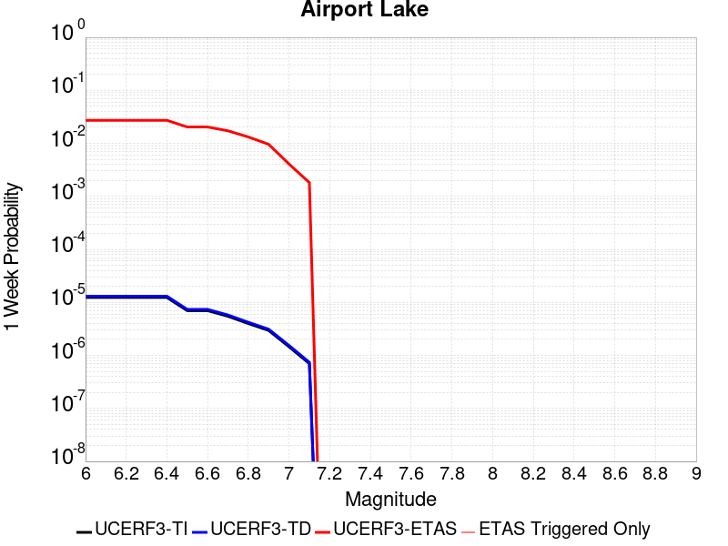 | 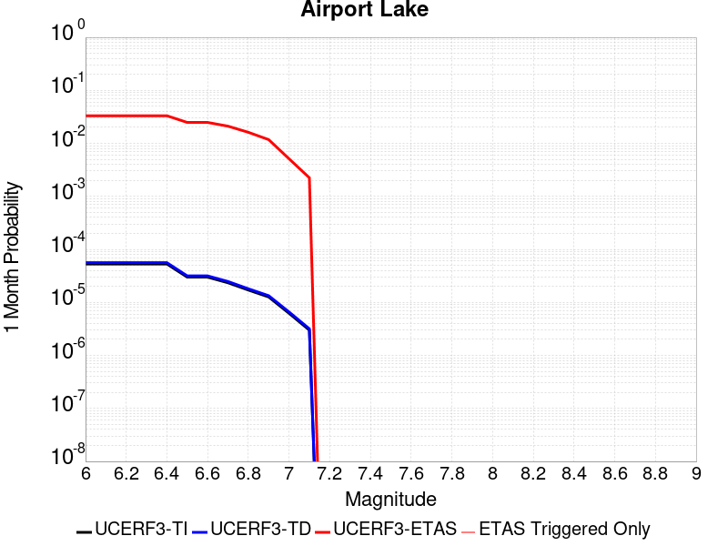 | 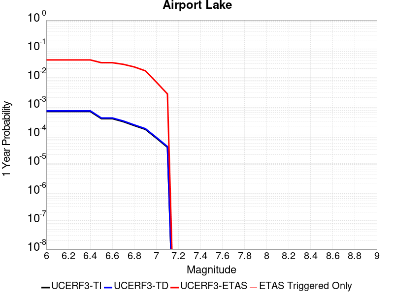 | 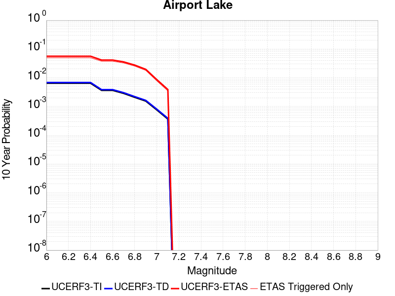 |

| Magnitude | 1 wk TI Prob | 1 wk TD Prob | 1 wk ETAS Prob | 1 wk ETAS/TD Gain | 1 wk ETAS Triggered Only | 1 mo TI Prob | 1 mo TD Prob | 1 mo ETAS Prob | 1 mo ETAS/TD Gain | 1 mo ETAS Triggered Only | 1 yr TI Prob | 1 yr TD Prob | 1 yr ETAS Prob | 1 yr ETAS/TD Gain | 1 yr ETAS Triggered Only | 10 yr TI Prob | 10 yr TD Prob | 10 yr ETAS Prob | 10 yr ETAS/TD Gain | 10 yr ETAS Triggered Only |
|-----|-----|-----|-----|-----|-----|-----|-----|-----|-----|-----|-----|-----|-----|-----|-----|-----|-----|-----|-----|-----|
| 6.0 | 1.2387061E-5 | 1.3103157E-5 | 0.027222747 | 2077.5715 | 0.02721 | 5.3086325E-5 | 5.615534E-5 | 0.033194296 | 591.1156 | 0.03314 | 6.461343E-4 | 6.8350515E-4 | 0.042924613 | 62.800716 | 0.04227 | 0.0064425888 | 0.0068168393 | 0.057489045 | 8.433387 | 0.05102 |
| 6.1 | 1.2387061E-5 | 1.3103157E-5 | 0.027222747 | 2077.5715 | 0.02721 | 5.3086325E-5 | 5.615534E-5 | 0.033194296 | 591.1156 | 0.03314 | 6.461343E-4 | 6.8350515E-4 | 0.042924613 | 62.800716 | 0.04227 | 0.0064425888 | 0.0068168393 | 0.057489045 | 8.433387 | 0.05102 |
| 6.2 | 1.2387061E-5 | 1.3103157E-5 | 0.027222747 | 2077.5715 | 0.02721 | 5.3086325E-5 | 5.615534E-5 | 0.033194296 | 591.1156 | 0.03314 | 6.461343E-4 | 6.8350515E-4 | 0.042924613 | 62.800716 | 0.04227 | 0.0064425888 | 0.0068168393 | 0.057489045 | 8.433387 | 0.05102 |
| 6.3 | 1.2387061E-5 | 1.3103157E-5 | 0.027222747 | 2077.5715 | 0.02721 | 5.3086325E-5 | 5.615534E-5 | 0.033194296 | 591.1156 | 0.03314 | 6.461343E-4 | 6.8350515E-4 | 0.042924613 | 62.800716 | 0.04227 | 0.0064425888 | 0.0068168393 | 0.057489045 | 8.433387 | 0.05102 |
| 6.4 | 1.2387061E-5 | 1.3103157E-5 | 0.027222747 | 2077.5715 | 0.02721 | 5.3086325E-5 | 5.615534E-5 | 0.033194296 | 591.1156 | 0.03314 | 6.461343E-4 | 6.8350515E-4 | 0.042924613 | 62.800716 | 0.04227 | 0.0064425888 | 0.0068168393 | 0.057489045 | 8.433387 | 0.05102 |
| 6.5 | 6.9922594E-6 | 7.384925E-6 | 0.020387234 | 2760.6555 | 0.02038 | 2.996648E-5 | 3.1649324E-5 | 0.024840863 | 784.8781 | 0.02481 | 3.6478083E-4 | 3.8526783E-4 | 0.032173015 | 83.50818 | 0.0318 | 0.003641826 | 0.0038465366 | 0.04209883 | 10.944607 | 0.0384 |
| 6.6 | 6.9922594E-6 | 7.384925E-6 | 0.020387234 | 2760.6555 | 0.02038 | 2.996648E-5 | 3.1649324E-5 | 0.024840863 | 784.8781 | 0.02481 | 3.6478083E-4 | 3.8526783E-4 | 0.032173015 | 83.50818 | 0.0318 | 0.003641826 | 0.0038465366 | 0.04209883 | 10.944607 | 0.0384 |
| 6.7 | 5.477277E-6 | 5.7860684E-6 | 0.017265687 | 2984.01 | 0.01726 | 2.3473833E-5 | 2.4797222E-5 | 0.021124274 | 851.8807 | 0.0211 | 2.8575645E-4 | 3.0186825E-4 | 0.027423678 | 90.84652 | 0.02713 | 0.0028538927 | 0.003014966 | 0.035716075 | 11.846262 | 0.0328 |
| 6.8 | 3.9950432E-6 | 4.2190873E-6 | 0.0132141635 | 3131.9958 | 0.01321 | 1.7121502E-5 | 1.8081691E-5 | 0.016187789 | 895.25854 | 0.01617 | 2.0843433E-4 | 2.2012512E-4 | 0.021015547 | 95.47092 | 0.0208 | 0.0020823893 | 0.0021993418 | 0.027204227 | 12.369258 | 0.02506 |
| 6.9 | 2.95695E-6 | 3.1230243E-6 | 0.009603093 | 3074.9338 | 0.0096 | 1.2672582E-5 | 1.3384334E-5 | 0.011773227 | 879.6274 | 0.01176 | 1.5427776E-4 | 1.6294434E-4 | 0.015210492 | 93.34777 | 0.01505 | 0.001541707 | 0.0016284712 | 0.019858735 | 12.194712 | 0.01826 |
| 7.0 | 1.456072E-6 | 1.540812E-6 | 0.0040815347 | 2648.9504 | 0.00408 | 6.2402937E-6 | 6.603469E-6 | 0.00512657 | 776.3449 | 0.00512 | 7.597293E-5 | 8.039528E-5 | 0.0066598663 | 82.83903 | 0.00658 | 7.594696E-4 | 8.0376083E-4 | 0.008827306 | 10.982504 | 0.00803 |
| 7.1 | 6.995192E-7 | 7.4089746E-7 | 0.0018207396 | 2457.4785 | 0.00182 | 2.997936E-6 | 3.1752747E-6 | 0.0022431682 | 706.44855 | 0.00224 | 3.649926E-5 | 3.865897E-5 | 0.0029285473 | 75.75337 | 0.00289 | 3.6493264E-4 | 3.865897E-4 | 0.0038952327 | 10.075884 | 0.00351 |

## Owl Lake
*[(top)](#table-of-contents)*

| 1 Week | 1 Month | 1 Year | 10 Year |
|-----|-----|-----|-----|
| 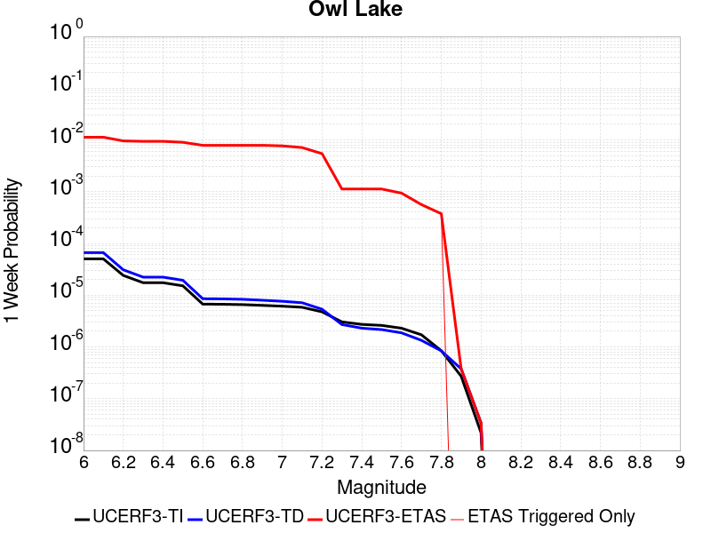 | 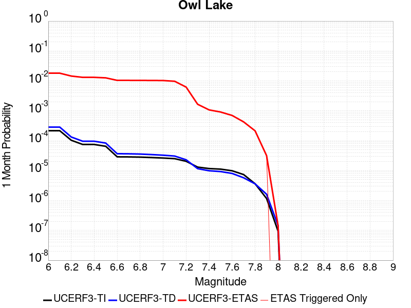 | 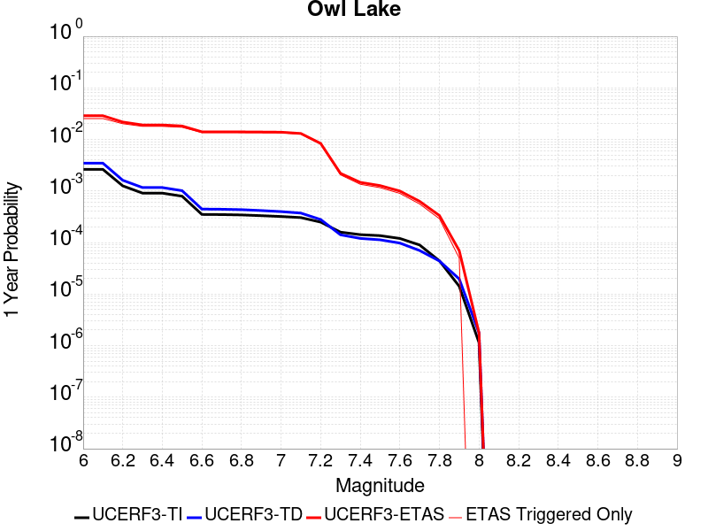 | 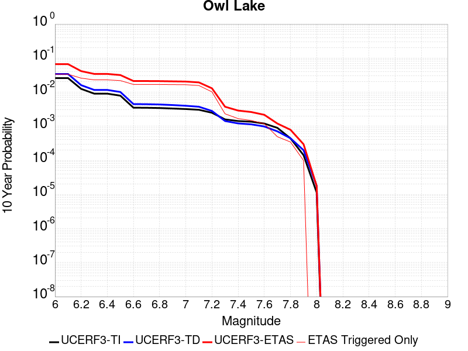 |

| Magnitude | 1 wk TI Prob | 1 wk TD Prob | 1 wk ETAS Prob | 1 wk ETAS/TD Gain | 1 wk ETAS Triggered Only | 1 mo TI Prob | 1 mo TD Prob | 1 mo ETAS Prob | 1 mo ETAS/TD Gain | 1 mo ETAS Triggered Only | 1 yr TI Prob | 1 yr TD Prob | 1 yr ETAS Prob | 1 yr ETAS/TD Gain | 1 yr ETAS Triggered Only | 10 yr TI Prob | 10 yr TD Prob | 10 yr ETAS Prob | 10 yr ETAS/TD Gain | 10 yr ETAS Triggered Only |
|-----|-----|-----|-----|-----|-----|-----|-----|-----|-----|-----|-----|-----|-----|-----|-----|-----|-----|-----|-----|-----|
| 6.0 | 5.0320643E-5 | 6.6358676E-5 | 0.013655457 | 205.78255 | 0.01359 | 2.1564208E-4 | 2.843643E-4 | 0.018099297 | 63.648273 | 0.01782 | 0.0026222812 | 0.003457547 | 0.028809587 | 8.332377 | 0.02544 | 0.02591553 | 0.034141295 | 0.06685493 | 1.9581838 | 0.03387 |
| 6.1 | 5.0320643E-5 | 6.6358676E-5 | 0.013655457 | 205.78255 | 0.01359 | 2.1564208E-4 | 2.843643E-4 | 0.018099297 | 63.648273 | 0.01782 | 0.0026222812 | 0.003457547 | 0.028809587 | 8.332377 | 0.02544 | 0.02591553 | 0.034141295 | 0.06685493 | 1.9581838 | 0.03387 |
| 6.2 | 2.4125871E-5 | 3.0980515E-5 | 0.011110637 | 358.63306 | 0.01108 | 1.0339249E-4 | 1.3276804E-4 | 0.01450086 | 109.21951 | 0.01437 | 0.0012580766 | 0.0016154252 | 0.02177281 | 13.478067 | 0.02019 | 0.012509781 | 0.016070755 | 0.04199729 | 2.6132743 | 0.02635 |
| 6.3 | 1.7433485E-5 | 2.2355545E-5 | 0.010192128 | 455.91052 | 0.01017 | 7.471279E-5 | 9.580685E-5 | 0.013134558 | 137.09415 | 0.01304 | 9.0924866E-4 | 0.001165962 | 0.019085044 | 16.368498 | 0.01794 | 0.009055373 | 0.0116291465 | 0.034529697 | 2.9692376 | 0.02317 |
| 6.4 | 1.7433485E-5 | 2.2355545E-5 | 0.010192128 | 455.91052 | 0.01017 | 7.471279E-5 | 9.580685E-5 | 0.013134558 | 137.09415 | 0.01304 | 9.0924866E-4 | 0.001165962 | 0.019085044 | 16.368498 | 0.01794 | 0.009055373 | 0.0116291465 | 0.034529697 | 2.9692376 | 0.02317 |
| 6.5 | 1.5182742E-5 | 1.9429277E-5 | 0.009829239 | 505.89835 | 0.00981 | 6.506727E-5 | 8.3266525E-5 | 0.012622222 | 151.5882 | 0.01254 | 7.919061E-4 | 0.0010134344 | 0.018215982 | 17.974506 | 0.01722 | 0.0078909 | 0.010118678 | 0.03211384 | 3.1737192 | 0.02222 |
| 6.6 | 6.7271576E-6 | 8.547518E-6 | 0.008308477 | 972.0338 | 0.0083 | 2.8830356E-5 | 3.6631736E-5 | 0.010406252 | 284.07748 | 0.01037 | 3.5095305E-4 | 4.4590578E-4 | 0.014049837 | 31.508533 | 0.01361 | 0.0035039932 | 0.0044680187 | 0.021362197 | 4.781134 | 0.01697 |
| 6.7 | 6.682835E-6 | 8.479961E-6 | 0.00830841 | 979.7698 | 0.0083 | 2.8640408E-5 | 3.6342215E-5 | 0.010405965 | 286.33273 | 0.01037 | 3.4864116E-4 | 4.423823E-4 | 0.014046362 | 31.751635 | 0.01361 | 0.003480947 | 0.0044329325 | 0.021327706 | 4.811196 | 0.01697 |
| 6.8 | 6.5774975E-6 | 8.326427E-6 | 0.008288258 | 995.41583 | 0.00828 | 2.8188972E-5 | 3.5684232E-5 | 0.010375315 | 290.7535 | 0.01034 | 3.4314668E-4 | 4.3437455E-4 | 0.0140084755 | 32.249763 | 0.01358 | 0.0034261728 | 0.0043531056 | 0.021199452 | 4.8699603 | 0.01692 |
| 6.9 | 6.363419E-6 | 7.999591E-6 | 0.0082679335 | 1033.5446 | 0.00826 | 2.727151E-5 | 3.428354E-5 | 0.01033393 | 301.4254 | 0.0103 | 3.3198006E-4 | 4.1732774E-4 | 0.013931685 | 33.38308 | 0.01352 | 0.0033148455 | 0.0041830647 | 0.020942664 | 5.006536 | 0.01683 |
| 7.0 | 6.1342453E-6 | 7.631779E-6 | 0.008217569 | 1076.7567 | 0.00821 | 2.6289357E-5 | 3.2707245E-5 | 0.0102723725 | 314.07022 | 0.01024 | 3.2002592E-4 | 3.9814346E-4 | 0.013832793 | 34.743237 | 0.01344 | 0.0031956544 | 0.003991739 | 0.020654958 | 5.1744256 | 0.01673 |
| 7.1 | 5.842926E-6 | 7.142312E-6 | 0.007727087 | 1081.8748 | 0.00772 | 2.504087E-5 | 3.060958E-5 | 0.009710313 | 317.23117 | 0.00968 | 3.0482994E-4 | 3.7261334E-4 | 0.013047889 | 35.017235 | 0.01268 | 0.0030441214 | 0.0037371595 | 0.019547852 | 5.2306705 | 0.01587 |
| 7.2 | 4.77173E-6 | 5.358478E-6 | 0.004935332 | 921.0324 | 0.00493 | 2.045011E-5 | 2.2964727E-5 | 0.006192823 | 269.66672 | 0.00617 | 2.4895166E-4 | 2.7956374E-4 | 0.0083773 | 29.965614 | 0.0081 | 0.0024867293 | 0.0028086212 | 0.012900198 | 4.5930715 | 0.01012 |
| 7.3 | 3.0494948E-6 | 2.710356E-6 | 0.0013127069 | 484.33002 | 0.00131 | 1.3069198E-5 | 1.1615762E-5 | 0.0016515967 | 142.18584 | 0.00164 | 1.5910587E-4 | 1.4141288E-4 | 0.0022011215 | 15.565213 | 0.00206 | 0.0015899199 | 0.0014231089 | 0.003959494 | 2.7822847 | 0.00254 |
| 7.4 | 2.7263884E-6 | 2.3055634E-6 | 8.423036E-4 | 365.3353 | 8.4E-4 | 1.1684469E-5 | 9.880949E-6 | 0.0010698704 | 108.276085 | 0.00106 | 1.4224913E-4 | 1.2029401E-4 | 0.0014701316 | 12.221153 | 0.00135 | 0.0014215811 | 0.0012110578 | 0.0028690475 | 2.3690426 | 0.00166 |
| 7.5 | 2.6090431E-6 | 2.1655019E-6 | 7.12164E-4 | 328.86786 | 7.1E-4 | 1.1181565E-5 | 9.2806895E-6 | 9.0927235E-4 | 97.974655 | 9.0E-4 | 1.3612706E-4 | 1.1298663E-4 | 0.0012728556 | 11.265541 | 0.00116 | 0.001360437 | 0.0011378126 | 0.0025561969 | 2.2465887 | 0.00142 |
| 7.6 | 2.3008756E-6 | 1.8726826E-6 | 5.4187165E-4 | 289.35587 | 5.4E-4 | 9.860858E-6 | 8.025758E-6 | 6.980202E-4 | 86.972496 | 6.9E-4 | 1.20049335E-4 | 9.770931E-5 | 9.976213E-4 | 10.210095 | 9.0E-4 | 0.001199845 | 9.848307E-4 | 0.002063767 | 2.0955553 | 0.00108 |
| 7.7 | 1.7184348E-6 | 1.341808E-6 | 3.5134132E-4 | 261.84174 | 3.5E-4 | 7.3646997E-6 | 5.750593E-6 | 4.2574818E-4 | 74.03552 | 4.2E-4 | 8.966153E-5 | 7.0011265E-5 | 6.299721E-4 | 8.998153 | 5.6E-4 | 8.962536E-4 | 7.0769014E-4 | 0.0013372443 | 1.8895901 | 6.3E-4 |
| 7.8 | 8.4612907E-7 | 8.4054994E-7 | 1.708404E-4 | 203.24837 | 1.7E-4 | 3.6262625E-6 | 3.602352E-6 | 2.136016E-4 | 59.295036 | 2.1E-4 | 4.4148852E-5 | 4.3857777E-5 | 3.3384506E-4 | 7.6119924 | 2.9E-4 | 4.414008E-4 | 4.4386165E-4 | 7.8371074E-4 | 1.7656645 | 3.4E-4 |
| 7.9 | 2.716738E-7 | 3.7681625E-7 | 3.0376805E-5 | 80.61437 | 3.0E-5 | 1.1643157E-6 | 1.6149258E-6 | 3.1614876E-5 | 19.576675 | 3.0E-5 | 1.4175452E-5 | 1.9661555E-5 | 6.966057E-5 | 3.5429838 | 5.0E-5 | 1.4174548E-4 | 1.9829652E-4 | 2.6828263E-4 | 1.3529367 | 7.0E-5 |
| 8.0 | 2.1995428E-8 | 3.3853325E-8 | 3.3853325E-8 | 1.0 | 0.0 | 9.426611E-8 | 1.4508568E-7 | 1.4508568E-7 | 1.0 | 0.0 | 1.1476893E-6 | 1.7664173E-6 | 1.7664173E-6 | 1.0 | 0.0 | 1.14768345E-5 | 1.7869768E-5 | 1.7869768E-5 | 1.0 | 0.0 |

## Panamint Valley
*[(top)](#table-of-contents)*

| 1 Week | 1 Month | 1 Year | 10 Year |
|-----|-----|-----|-----|
| 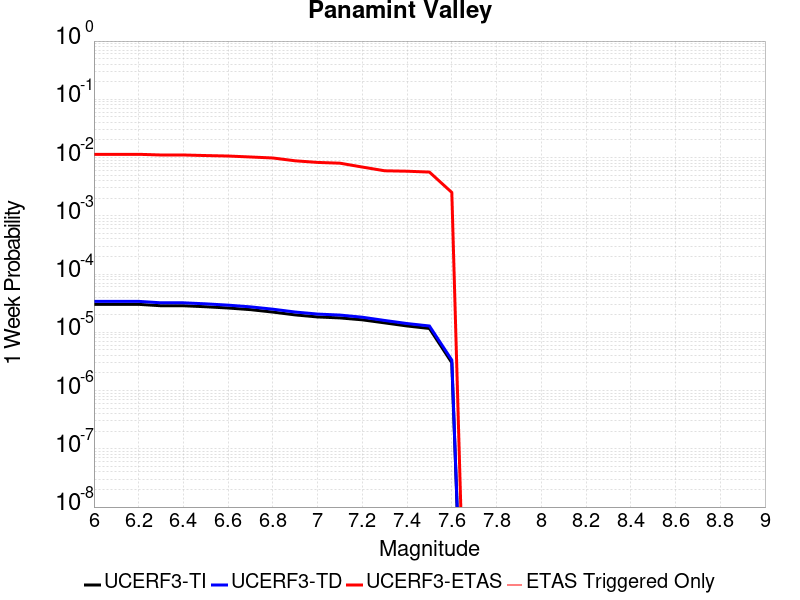 | 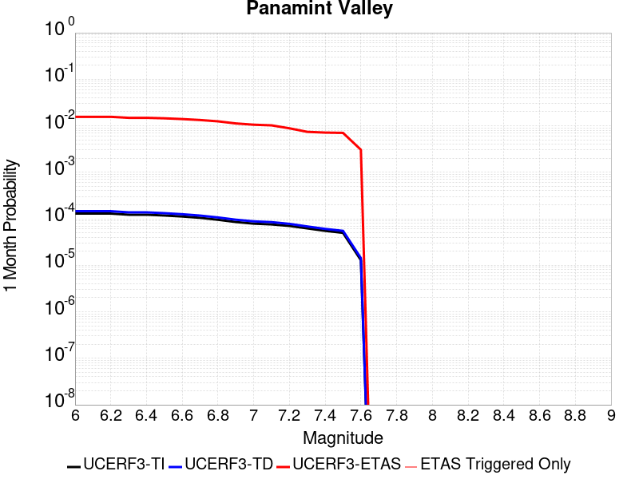 | 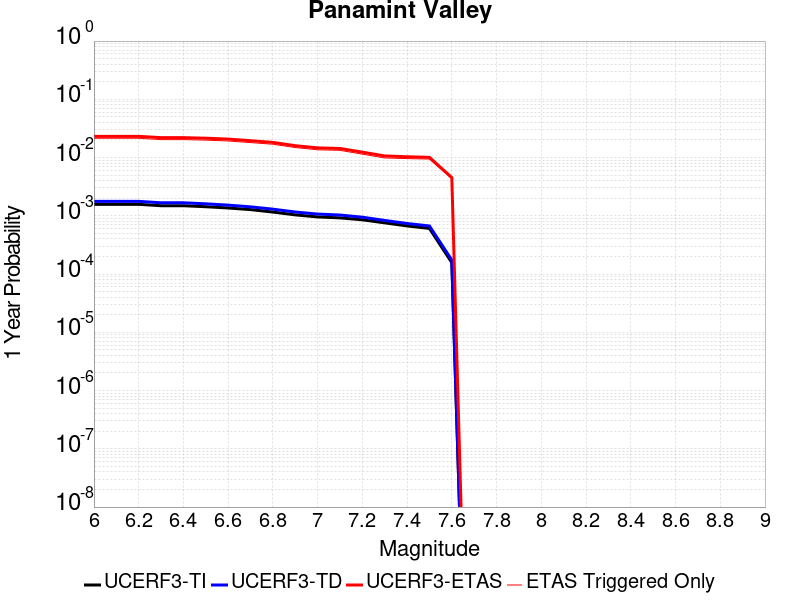 | 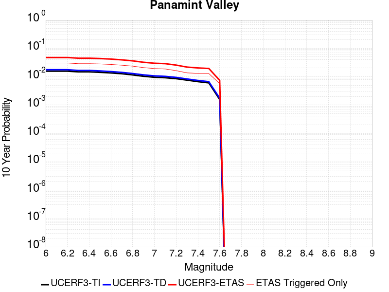 |

| Magnitude | 1 wk TI Prob | 1 wk TD Prob | 1 wk ETAS Prob | 1 wk ETAS/TD Gain | 1 wk ETAS Triggered Only | 1 mo TI Prob | 1 mo TD Prob | 1 mo ETAS Prob | 1 mo ETAS/TD Gain | 1 mo ETAS Triggered Only | 1 yr TI Prob | 1 yr TD Prob | 1 yr ETAS Prob | 1 yr ETAS/TD Gain | 1 yr ETAS Triggered Only | 10 yr TI Prob | 10 yr TD Prob | 10 yr ETAS Prob | 10 yr ETAS/TD Gain | 10 yr ETAS Triggered Only |
|-----|-----|-----|-----|-----|-----|-----|-----|-----|-----|-----|-----|-----|-----|-----|-----|-----|-----|-----|-----|-----|
| 6.0 | 3.0211835E-5 | 3.3984263E-5 | 0.011913581 | 350.5617 | 0.01188 | 1.2947287E-4 | 1.4563887E-4 | 0.015593389 | 107.06886 | 0.01545 | 0.0015751923 | 0.0017717406 | 0.02455131 | 13.857169 | 0.02282 | 0.015640736 | 0.017583003 | 0.047419008 | 2.6968663 | 0.03037 |
| 6.1 | 3.0211835E-5 | 3.3984263E-5 | 0.011913581 | 350.5617 | 0.01188 | 1.2947287E-4 | 1.4563887E-4 | 0.015593389 | 107.06886 | 0.01545 | 0.0015751923 | 0.0017717406 | 0.02455131 | 13.857169 | 0.02282 | 0.015640736 | 0.017583003 | 0.047419008 | 2.6968663 | 0.03037 |
| 6.2 | 3.0211835E-5 | 3.3984263E-5 | 0.011913581 | 350.5617 | 0.01188 | 1.2947287E-4 | 1.4563887E-4 | 0.015593389 | 107.06886 | 0.01545 | 0.0015751923 | 0.0017717406 | 0.02455131 | 13.857169 | 0.02282 | 0.015640736 | 0.017583003 | 0.047419008 | 2.6968663 | 0.03037 |
| 6.3 | 2.8573924E-5 | 3.2102445E-5 | 0.011451736 | 356.72473 | 0.01142 | 1.2245393E-4 | 1.375748E-4 | 0.014835552 | 107.83626 | 0.0147 | 0.001489857 | 0.0016737141 | 0.023267511 | 13.901724 | 0.02163 | 0.01479908 | 0.016618038 | 0.044909935 | 2.7024813 | 0.02877 |
| 6.4 | 2.8573924E-5 | 3.2102445E-5 | 0.011451736 | 356.72473 | 0.01142 | 1.2245393E-4 | 1.375748E-4 | 0.014835552 | 107.83626 | 0.0147 | 0.001489857 | 0.0016737141 | 0.023267511 | 13.901724 | 0.02163 | 0.01479908 | 0.016618038 | 0.044909935 | 2.7024813 | 0.02877 |
| 6.5 | 2.7468774E-5 | 3.0828138E-5 | 0.011190484 | 362.99576 | 0.01116 | 1.1771801E-4 | 1.3211406E-4 | 0.014480218 | 109.60391 | 0.01435 | 0.0014322745 | 0.0016073292 | 0.022703366 | 14.124901 | 0.02113 | 0.014230782 | 0.015963882 | 0.04364482 | 2.7339728 | 0.02813 |
| 6.6 | 2.6135967E-5 | 2.9252153E-5 | 0.010838936 | 370.53467 | 0.01081 | 1.1200648E-4 | 1.2536049E-4 | 0.013953627 | 111.308014 | 0.01383 | 0.0013628257 | 0.0015252219 | 0.021814229 | 14.302332 | 0.02032 | 0.013544982 | 0.015154343 | 0.041745175 | 2.7546675 | 0.027 |
| 6.7 | 2.4498746E-5 | 2.7341044E-5 | 0.010357059 | 378.8099 | 0.01033 | 1.04990395E-4 | 1.17170785E-4 | 0.013305625 | 113.55753 | 0.01319 | 0.0012775084 | 0.0014256459 | 0.020618245 | 14.462389 | 0.01922 | 0.012701893 | 0.014171593 | 0.039201777 | 2.7662222 | 0.02539 |
| 6.8 | 2.2244329E-5 | 2.4935374E-5 | 0.009764693 | 391.6 | 0.00974 | 9.532935E-5 | 1.0686163E-4 | 0.012465541 | 116.65123 | 0.01236 | 0.0011600169 | 0.0013002857 | 0.019186998 | 14.755986 | 0.01791 | 0.011539802 | 0.012932955 | 0.03614877 | 2.79509 | 0.02352 |
| 6.9 | 1.9902658E-5 | 2.2290182E-5 | 0.0088520935 | 397.1297 | 0.00883 | 8.529431E-5 | 9.552596E-5 | 0.011234462 | 117.60638 | 0.01114 | 0.0010379635 | 0.0011624265 | 0.01713384 | 14.739718 | 0.01599 | 0.010331288 | 0.011569021 | 0.032217346 | 2.7847943 | 0.02089 |
| 7.0 | 1.8353881E-5 | 2.056605E-5 | 0.008370394 | 407.00055 | 0.00835 | 7.865712E-5 | 8.813734E-5 | 0.010547215 | 119.66795 | 0.01046 | 9.5722964E-4 | 0.0010725616 | 0.015986549 | 14.905017 | 0.01493 | 0.009531168 | 0.01067939 | 0.029793063 | 2.789772 | 0.01932 |
| 7.1 | 1.7667631E-5 | 1.9772435E-5 | 0.008159611 | 412.67612 | 0.00814 | 7.571623E-5 | 8.4736355E-5 | 0.010213878 | 120.53714 | 0.01013 | 9.2145515E-4 | 0.0010311945 | 0.015456304 | 14.988739 | 0.01444 | 0.009176437 | 0.0102695925 | 0.028757757 | 2.800282 | 0.01868 |
| 7.2 | 1.6381597E-5 | 1.8158042E-5 | 0.0070480304 | 388.14926 | 0.00703 | 7.020495E-5 | 7.781795E-5 | 0.008827137 | 113.43317 | 0.00875 | 8.544101E-4 | 9.470391E-4 | 0.013505135 | 14.260377 | 0.01257 | 0.008511325 | 0.009435269 | 0.025591379 | 2.7123106 | 0.01631 |
| 7.3 | 1.4520491E-5 | 1.596657E-5 | 0.0059058727 | 369.88986 | 0.00589 | 6.222919E-5 | 6.842646E-5 | 0.007407924 | 108.26111 | 0.00734 | 7.57377E-4 | 8.327899E-4 | 0.011334037 | 13.60972 | 0.01051 | 0.0075480095 | 0.008300399 | 0.021797432 | 2.62607 | 0.01361 |
| 7.4 | 1.2852287E-5 | 1.41454875E-5 | 0.005704065 | 403.24274 | 0.00569 | 5.5080065E-5 | 6.06222E-5 | 0.007140193 | 117.78182 | 0.00708 | 6.7039346E-4 | 7.378411E-4 | 0.010860367 | 14.719112 | 0.01013 | 0.0066837464 | 0.007357429 | 0.02035112 | 2.7660642 | 0.01309 |
| 7.5 | 1.1637851E-5 | 1.2836868E-5 | 0.005602765 | 436.4589 | 0.00559 | 4.987555E-5 | 5.5014076E-5 | 0.00703463 | 127.86964 | 0.00698 | 6.070656E-4 | 6.696062E-4 | 0.01063293 | 15.879378 | 0.00997 | 0.006054099 | 0.0066793845 | 0.019473353 | 2.9154415 | 0.01288 |
| 7.6 | 3.0068115E-6 | 3.3330623E-6 | 0.0024733248 | 742.0578 | 0.00247 | 1.2886271E-5 | 1.4284516E-5 | 0.0030542412 | 213.81482 | 0.00304 | 1.5687906E-4 | 1.7390738E-4 | 0.0045531457 | 26.18144 | 0.00438 | 0.0015676835 | 0.0017397973 | 0.0074198977 | 4.264806 | 0.00569 |

## Garlock (East)
*[(top)](#table-of-contents)*

| 1 Week | 1 Month | 1 Year | 10 Year |
|-----|-----|-----|-----|
|  | 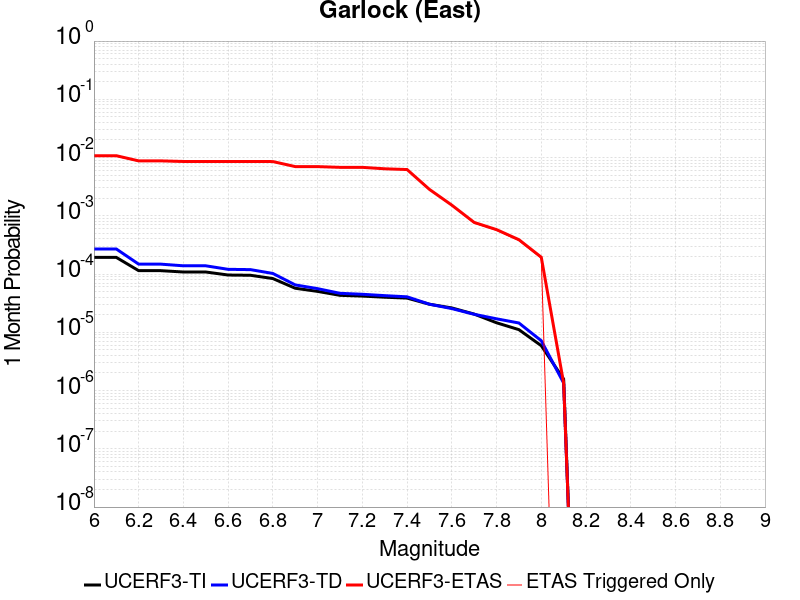 | 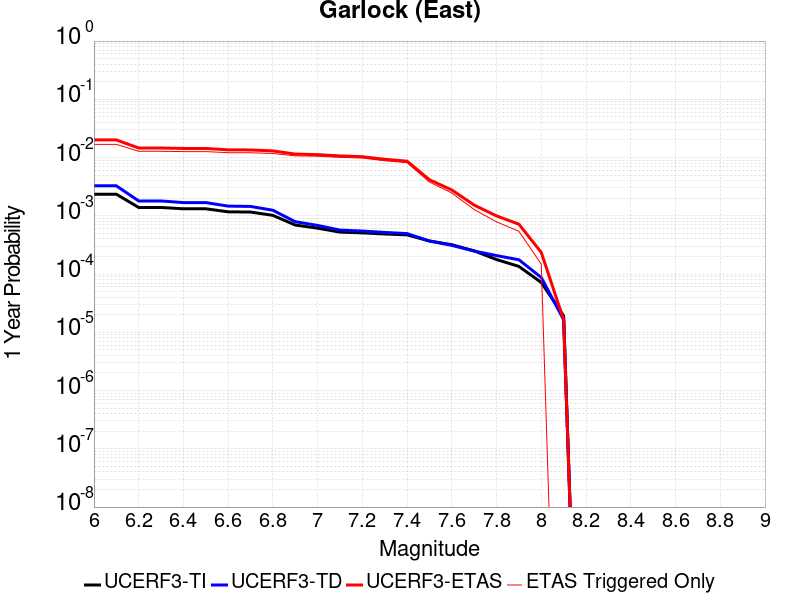 | 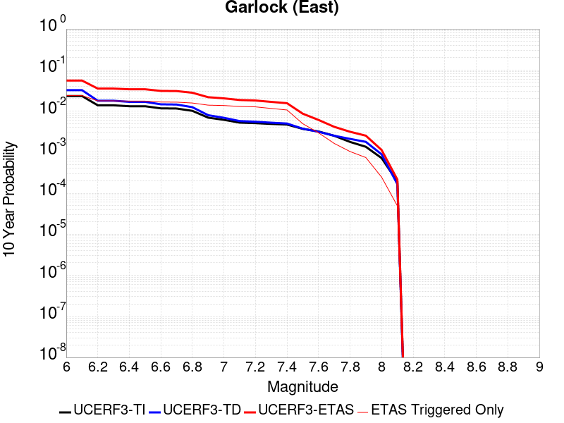 |

| Magnitude | 1 wk TI Prob | 1 wk TD Prob | 1 wk ETAS Prob | 1 wk ETAS/TD Gain | 1 wk ETAS Triggered Only | 1 mo TI Prob | 1 mo TD Prob | 1 mo ETAS Prob | 1 mo ETAS/TD Gain | 1 mo ETAS Triggered Only | 1 yr TI Prob | 1 yr TD Prob | 1 yr ETAS Prob | 1 yr ETAS/TD Gain | 1 yr ETAS Triggered Only | 10 yr TI Prob | 10 yr TD Prob | 10 yr ETAS Prob | 10 yr ETAS/TD Gain | 10 yr ETAS Triggered Only |
|-----|-----|-----|-----|-----|-----|-----|-----|-----|-----|-----|-----|-----|-----|-----|-----|-----|-----|-----|-----|-----|
| 6.0 | 4.5092507E-5 | 6.2904815E-5 | 0.009652302 | 153.44296 | 0.00959 | 1.9323928E-4 | 2.6956675E-4 | 0.012616238 | 46.801907 | 0.01235 | 0.0023501497 | 0.003277482 | 0.020969307 | 6.397993 | 0.01775 | 0.023254504 | 0.03235377 | 0.055393428 | 1.7121166 | 0.02381 |
| 6.1 | 4.5092507E-5 | 6.2904815E-5 | 0.009652302 | 153.44296 | 0.00959 | 1.9323928E-4 | 2.6956675E-4 | 0.012616238 | 46.801907 | 0.01235 | 0.0023501497 | 0.003277482 | 0.020969307 | 6.397993 | 0.01775 | 0.023254504 | 0.03235377 | 0.055393428 | 1.7121166 | 0.02381 |
| 6.2 | 2.6674514E-5 | 3.4511588E-5 | 0.007724246 | 223.81602 | 0.00769 | 1.1431433E-4 | 1.4789861E-4 | 0.009716483 | 65.69692 | 0.00957 | 0.0013908884 | 0.0017992114 | 0.015105228 | 8.395472 | 0.01333 | 0.01382215 | 0.017872788 | 0.03511894 | 1.9649392 | 0.01756 |
| 6.3 | 2.6674514E-5 | 3.4511588E-5 | 0.007724246 | 223.81602 | 0.00769 | 1.1431433E-4 | 1.4789861E-4 | 0.009716483 | 65.69692 | 0.00957 | 0.0013908884 | 0.0017992114 | 0.015105228 | 8.395472 | 0.01333 | 0.01382215 | 0.017872788 | 0.03511894 | 1.9649392 | 0.01756 |
| 6.4 | 2.5312667E-5 | 3.2340467E-5 | 0.0076620937 | 236.9197 | 0.00763 | 1.0847834E-4 | 1.3859481E-4 | 0.00962728 | 69.46349 | 0.00949 | 0.0013199237 | 0.0016861152 | 0.014843892 | 8.803605 | 0.01318 | 0.013121112 | 0.016772287 | 0.03379196 | 2.0147498 | 0.01731 |
| 6.5 | 2.5312667E-5 | 3.2340467E-5 | 0.0076620937 | 236.9197 | 0.00763 | 1.0847834E-4 | 1.3859481E-4 | 0.00962728 | 69.46349 | 0.00949 | 0.0013199237 | 0.0016861152 | 0.014843892 | 8.803605 | 0.01318 | 0.013121112 | 0.016772287 | 0.03379196 | 2.0147498 | 0.01731 |
| 6.6 | 2.246556E-5 | 2.8134691E-5 | 0.0073579284 | 261.52512 | 0.00733 | 9.627742E-5 | 1.2057181E-4 | 0.0092694685 | 76.879234 | 0.00915 | 0.0011715472 | 0.0014669969 | 0.014028542 | 9.562762 | 0.01258 | 0.011653901 | 0.014613169 | 0.030773513 | 2.1058755 | 0.0164 |
| 6.7 | 2.2241198E-5 | 2.7804432E-5 | 0.0073576006 | 264.61972 | 0.00733 | 9.531594E-5 | 1.1915654E-4 | 0.009258067 | 77.69668 | 0.00914 | 0.0011598538 | 0.0014497889 | 0.013971608 | 9.636995 | 0.01254 | 0.011538187 | 0.014442829 | 0.03055669 | 2.1156995 | 0.01635 |
| 6.8 | 1.9528685E-5 | 2.3898969E-5 | 0.007133729 | 298.49527 | 0.00711 | 8.369167E-5 | 1.0242024E-4 | 0.008901519 | 86.91172 | 0.0088 | 0.0010184698 | 0.0012462728 | 0.0132313175 | 10.616711 | 0.012 | 0.010138147 | 0.012436723 | 0.027694575 | 2.2268386 | 0.01545 |
| 6.9 | 1.3318621E-5 | 1.5198818E-5 | 0.0066950973 | 440.50116 | 0.00668 | 5.7078556E-5 | 6.51362E-5 | 0.008184607 | 125.65375 | 0.00812 | 6.9470983E-4 | 7.927504E-4 | 0.011714086 | 14.776512 | 0.01093 | 0.0069254204 | 0.007940721 | 0.021611298 | 2.7215788 | 0.01378 |
| 7.0 | 1.1760853E-5 | 1.3107653E-5 | 0.0065930216 | 502.99023 | 0.00658 | 5.0402683E-5 | 5.6174475E-5 | 0.007995728 | 142.3374 | 0.00794 | 6.134799E-4 | 6.8371464E-4 | 0.01131644 | 16.551409 | 0.01064 | 0.0061178906 | 0.006857401 | 0.020165512 | 2.940693 | 0.0134 |
| 7.1 | 1.0064758E-5 | 1.0902761E-5 | 0.0063608335 | 583.415 | 0.00635 | 4.3133965E-5 | 4.67253E-5 | 0.0076063722 | 162.78915 | 0.00756 | 5.2502943E-4 | 5.6873553E-4 | 0.010623014 | 18.6783 | 0.01006 | 0.005237907 | 0.0057133473 | 0.018291073 | 3.2014635 | 0.01265 |
| 7.2 | 9.768808E-6 | 1.0498628E-5 | 0.0062204334 | 592.49963 | 0.00621 | 4.186565E-5 | 4.499337E-5 | 0.007414662 | 164.79456 | 0.00737 | 5.095951E-4 | 5.4766005E-4 | 0.010362282 | 18.921011 | 0.00982 | 0.0050842804 | 0.005503584 | 0.017765725 | 3.2280283 | 0.01233 |
| 7.3 | 9.344516E-6 | 9.9442705E-6 | 0.005649888 | 568.1551 | 0.00564 | 4.004731E-5 | 4.2617627E-5 | 0.0067323325 | 157.97061 | 0.00669 | 4.8746695E-4 | 5.187495E-4 | 0.009544065 | 18.398214 | 0.00903 | 0.0048639905 | 0.005215269 | 0.016605554 | 3.1840262 | 0.01145 |
| 7.4 | 9.023491E-6 | 9.490441E-6 | 0.005119442 | 539.4314 | 0.00511 | 3.867153E-5 | 4.0672705E-5 | 0.006080427 | 149.4965 | 0.00604 | 4.7072413E-4 | 4.95081E-4 | 0.008661036 | 17.494179 | 0.00817 | 0.004697283 | 0.0049787266 | 0.015326948 | 3.0784876 | 0.0104 |
| 7.5 | 7.081253E-6 | 7.0873994E-6 | 0.00246707 | 348.0924 | 0.00246 | 3.0347876E-5 | 3.0374218E-5 | 0.0029502856 | 97.13124 | 0.00292 | 3.6942272E-4 | 3.697441E-4 | 0.004358269 | 11.787257 | 0.00399 | 0.003688092 | 0.0037244745 | 0.008636113 | 2.3187466 | 0.00493 |
| 7.6 | 6.116396E-6 | 5.9589424E-6 | 0.0015859496 | 266.14615 | 0.00158 | 2.6212863E-5 | 2.5538076E-5 | 0.0019254895 | 75.39681 | 0.0019 | 3.1909486E-4 | 3.1088197E-4 | 0.0028500922 | 9.167763 | 0.00254 | 0.0031863707 | 0.0031359126 | 0.0061663794 | 1.9663748 | 0.00304 |
| 7.7 | 4.797145E-6 | 4.7571157E-6 | 8.8475295E-4 | 185.98517 | 8.8E-4 | 2.055903E-5 | 2.0387479E-5 | 0.0010703661 | 52.50115 | 0.00105 | 2.5027743E-4 | 2.481894E-4 | 0.0016978296 | 6.840862 | 0.00145 | 0.0024999576 | 0.0025094065 | 0.00424504 | 1.691651 | 0.00174 |
| 7.8 | 3.4028885E-6 | 3.978375E-6 | 4.939764E-4 | 124.16538 | 4.9E-4 | 1.4583726E-5 | 1.7050066E-5 | 5.9704017E-4 | 35.016884 | 5.8E-4 | 1.775424E-4 | 2.0756487E-4 | 0.0010373925 | 4.99792 | 8.3E-4 | 0.0017740062 | 0.0021012141 | 0.00312905 | 1.4891628 | 0.00103 |
| 7.9 | 2.5928412E-6 | 3.372436E-6 | 3.8337117E-4 | 113.67782 | 3.8E-4 | 1.1112129E-5 | 1.4453217E-5 | 4.6444673E-4 | 32.134487 | 4.5E-4 | 1.3528178E-4 | 1.7595377E-4 | 8.058429E-4 | 4.579856 | 6.3E-4 | 0.0013519945 | 0.0017812426 | 0.0025698354 | 1.4427207 | 7.9E-4 |
| 8.0 | 1.3743648E-6 | 1.6734741E-6 | 1.716732E-4 | 102.584915 | 1.7E-4 | 5.8901214E-6 | 7.1720124E-6 | 1.8717072E-4 | 26.09738 | 1.8E-4 | 7.1709874E-5 | 8.731578E-5 | 3.272948E-4 | 3.748404 | 2.4E-4 | 7.1686733E-4 | 8.837377E-4 | 0.0011934638 | 1.3504728 | 3.1E-4 |
| 8.1 | 3.6733252E-7 | 3.1489736E-7 | 2.031489E-5 | 64.51273 | 2.0E-5 | 1.5742813E-6 | 1.3495595E-6 | 2.1349533E-5 | 15.81963 | 2.0E-5 | 1.9166706E-5 | 1.643078E-5 | 5.6430123E-5 | 3.4344153 | 4.0E-5 | 1.9165053E-4 | 1.662928E-4 | 2.1628448E-4 | 1.3006245 | 5.0E-5 |

## Hunter Mountain-Saline Valley
*[(top)](#table-of-contents)*

| 1 Week | 1 Month | 1 Year | 10 Year |
|-----|-----|-----|-----|
| 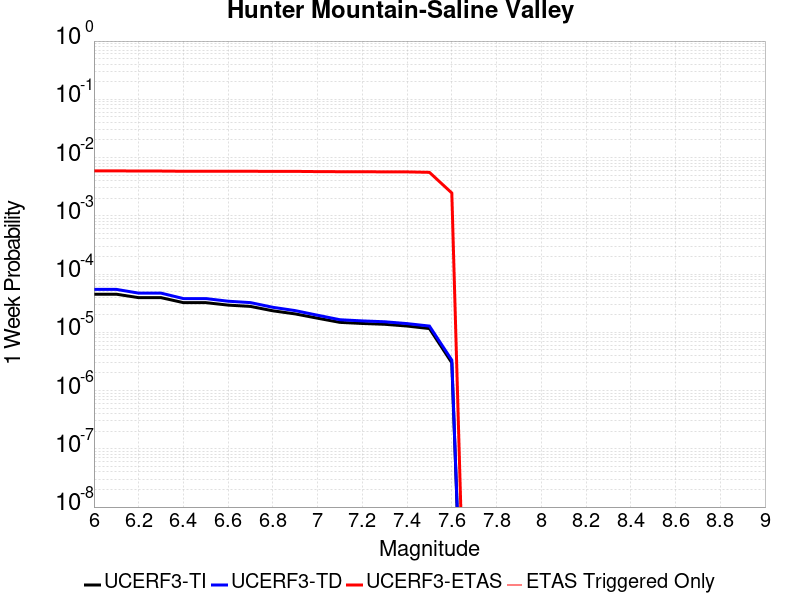 | 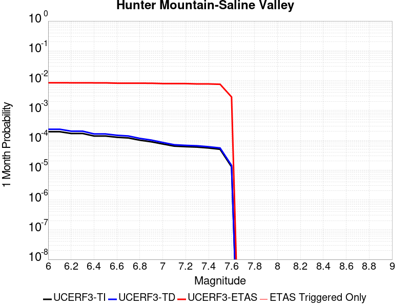 | 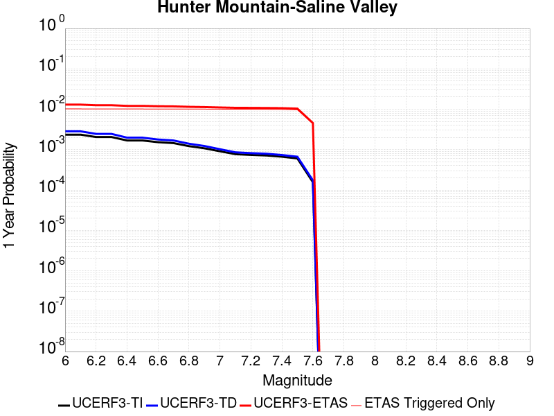 | 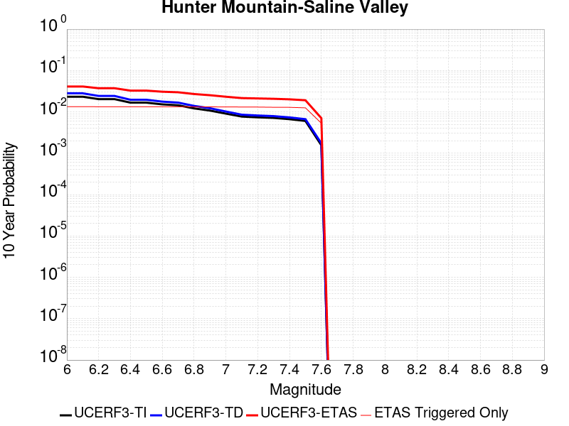 |

| Magnitude | 1 wk TI Prob | 1 wk TD Prob | 1 wk ETAS Prob | 1 wk ETAS/TD Gain | 1 wk ETAS Triggered Only | 1 mo TI Prob | 1 mo TD Prob | 1 mo ETAS Prob | 1 mo ETAS/TD Gain | 1 mo ETAS Triggered Only | 1 yr TI Prob | 1 yr TD Prob | 1 yr ETAS Prob | 1 yr ETAS/TD Gain | 1 yr ETAS Triggered Only | 10 yr TI Prob | 10 yr TD Prob | 10 yr ETAS Prob | 10 yr ETAS/TD Gain | 10 yr ETAS Triggered Only |
|-----|-----|-----|-----|-----|-----|-----|-----|-----|-----|-----|-----|-----|-----|-----|-----|-----|-----|-----|-----|-----|
| 6.0 | 4.5103672E-5 | 5.456906E-5 | 0.0059142495 | 108.381 | 0.00586 | 1.9328714E-4 | 2.3384714E-4 | 0.0075321402 | 32.209675 | 0.0073 | 0.002350731 | 0.0028435462 | 0.01332366 | 4.6855793 | 0.01051 | 0.023260195 | 0.028092625 | 0.04133972 | 1.4715507 | 0.01363 |
| 6.1 | 4.5103672E-5 | 5.456906E-5 | 0.0059142495 | 108.381 | 0.00586 | 1.9328714E-4 | 2.3384714E-4 | 0.0075321402 | 32.209675 | 0.0073 | 0.002350731 | 0.0028435462 | 0.01332366 | 4.6855793 | 0.01051 | 0.023260195 | 0.028092625 | 0.04133972 | 1.4715507 | 0.01363 |
| 6.2 | 3.9363465E-5 | 4.706271E-5 | 0.005866789 | 124.658966 | 0.00582 | 1.6868966E-4 | 2.016826E-4 | 0.00745022 | 36.940323 | 0.00725 | 0.002051862 | 0.0024528534 | 0.012877221 | 5.2498946 | 0.01045 | 0.020330196 | 0.024274187 | 0.03749527 | 1.5446562 | 0.01355 |
| 6.3 | 3.9363465E-5 | 4.706271E-5 | 0.005866789 | 124.658966 | 0.00582 | 1.6868966E-4 | 2.016826E-4 | 0.00745022 | 36.940323 | 0.00725 | 0.002051862 | 0.0024528534 | 0.012877221 | 5.2498946 | 0.01045 | 0.020330196 | 0.024274187 | 0.03749527 | 1.5446562 | 0.01355 |
| 6.4 | 3.2311684E-5 | 3.795112E-5 | 0.005817732 | 153.2954 | 0.00578 | 1.384713E-4 | 1.6263791E-4 | 0.007371465 | 45.324398 | 0.00721 | 0.0016845843 | 0.001978387 | 0.012367792 | 6.2514524 | 0.01041 | 0.016718714 | 0.019617118 | 0.03285229 | 1.6746745 | 0.0135 |
| 6.5 | 3.2311684E-5 | 3.795112E-5 | 0.005817732 | 153.2954 | 0.00578 | 1.384713E-4 | 1.6263791E-4 | 0.007371465 | 45.324398 | 0.00721 | 0.0016845843 | 0.001978387 | 0.012367792 | 6.2514524 | 0.01041 | 0.016718714 | 0.019617118 | 0.03285229 | 1.6746745 | 0.0135 |
| 6.6 | 2.9305844E-5 | 3.418196E-5 | 0.005813984 | 170.08925 | 0.00578 | 1.2559042E-4 | 1.4648624E-4 | 0.0073454315 | 50.144173 | 0.0072 | 0.0015279909 | 0.0017820727 | 0.012133593 | 6.8086967 | 0.01037 | 0.015175272 | 0.017686324 | 0.03088862 | 1.7464691 | 0.01344 |
| 6.7 | 2.7826512E-5 | 3.2344353E-5 | 0.0058121574 | 179.6962 | 0.00578 | 1.19251024E-4 | 1.3861163E-4 | 0.0073376135 | 52.936493 | 0.0072 | 0.0014509142 | 0.0016863506 | 0.012038863 | 7.1390038 | 0.01037 | 0.014414776 | 0.016743818 | 0.02995878 | 1.7892443 | 0.01344 |
| 6.8 | 2.3389874E-5 | 2.6866792E-5 | 0.005796712 | 215.7575 | 0.00577 | 1.0023846E-4 | 1.1513857E-4 | 0.007304311 | 63.4393 | 0.00719 | 0.00121972 | 0.001400958 | 0.011736458 | 8.377452 | 0.01035 | 0.01213047 | 0.013928067 | 0.027141431 | 1.9486861 | 0.0134 |
| 6.9 | 2.069209E-5 | 2.357011E-5 | 0.005793434 | 245.7958 | 0.00577 | 8.867737E-5 | 1.0101105E-4 | 0.007280286 | 72.07416 | 0.00718 | 0.0010791123 | 0.0012291519 | 0.011546454 | 9.393839 | 0.01033 | 0.010738871 | 0.012229158 | 0.02540602 | 2.0774956 | 0.01334 |
| 7.0 | 1.7462342E-5 | 1.9633622E-5 | 0.0057395212 | 292.33124 | 0.00572 | 7.483646E-5 | 8.414151E-5 | 0.007213542 | 85.731064 | 0.00713 | 9.1075303E-4 | 0.0010239641 | 0.011273459 | 11.009623 | 0.01026 | 0.009070295 | 0.010196688 | 0.02332148 | 2.2871623 | 0.01326 |
| 7.1 | 1.4807709E-5 | 1.6441827E-5 | 0.005716348 | 347.6711 | 0.0057 | 6.3460066E-5 | 7.046316E-5 | 0.007179962 | 101.89668 | 0.00711 | 7.723524E-4 | 8.575678E-4 | 0.01103883 | 12.872252 | 0.01019 | 0.007696735 | 0.008546168 | 0.021623444 | 2.530192 | 0.01319 |
| 7.2 | 1.4180048E-5 | 1.5698413E-5 | 0.005705609 | 363.45132 | 0.00569 | 6.077022E-5 | 6.727727E-5 | 0.0071568005 | 106.377686 | 0.00709 | 7.396263E-4 | 8.1880915E-4 | 0.010980482 | 13.410307 | 0.01017 | 0.0073716943 | 0.008161469 | 0.021204146 | 2.5980794 | 0.01315 |
| 7.3 | 1.3730402E-5 | 1.5172151E-5 | 0.005685086 | 374.70535 | 0.00567 | 5.8843252E-5 | 6.502197E-5 | 0.0071345624 | 109.7254 | 0.00707 | 7.161811E-4 | 7.9137104E-4 | 0.0109233465 | 13.803065 | 0.01014 | 0.007138774 | 0.007889058 | 0.020885712 | 2.6474278 | 0.0131 |
| 7.4 | 1.2810095E-5 | 1.4109353E-5 | 0.0056740297 | 402.14667 | 0.00566 | 5.489925E-5 | 6.0467344E-5 | 0.007110041 | 117.58481 | 0.00705 | 6.681934E-4 | 7.3595706E-4 | 0.010828524 | 14.713527 | 0.0101 | 0.006661878 | 0.0073386896 | 0.020302847 | 2.7665493 | 0.01306 |
| 7.5 | 1.1595659E-5 | 1.2800734E-5 | 0.0055727297 | 435.34454 | 0.00556 | 4.9694736E-5 | 5.485922E-5 | 0.007004478 | 127.680954 | 0.00695 | 6.0486543E-4 | 6.67722E-4 | 0.010601085 | 15.876494 | 0.00994 | 0.006032217 | 0.006660632 | 0.019425042 | 2.9163964 | 0.01285 |
| 7.6 | 2.997694E-6 | 3.3251877E-6 | 0.002463317 | 740.8054 | 0.00246 | 1.28471975E-5 | 1.4250767E-5 | 0.0030442076 | 213.6171 | 0.00303 | 1.564034E-4 | 1.7349655E-4 | 0.004542738 | 26.18345 | 0.00437 | 0.0015629337 | 0.0017356955 | 0.0074058366 | 4.266783 | 0.00568 |

## Blackwater
*[(top)](#table-of-contents)*

| 1 Week | 1 Month | 1 Year | 10 Year |
|-----|-----|-----|-----|
| 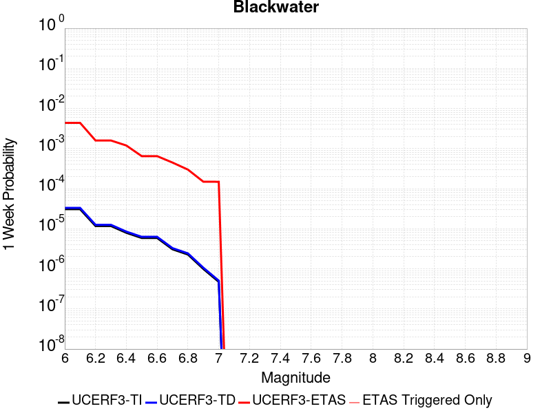 | 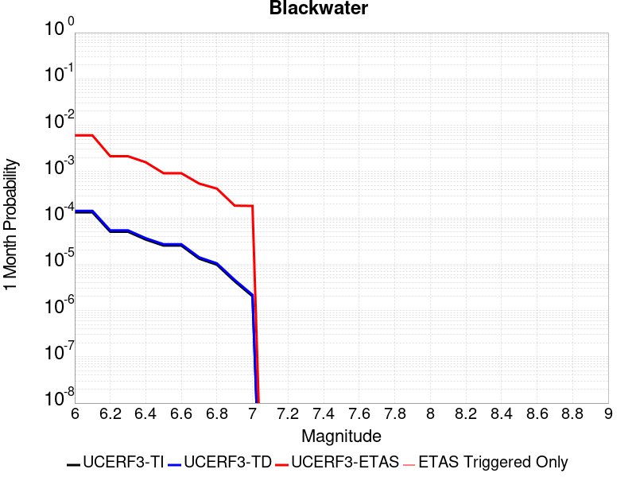 | 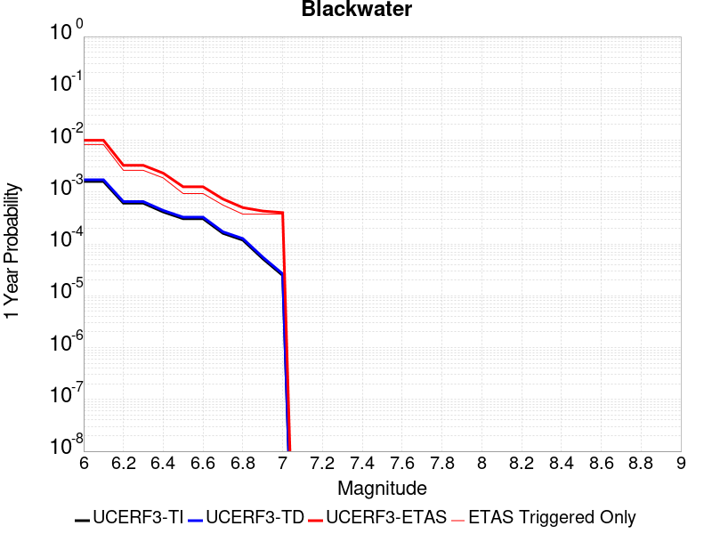 | 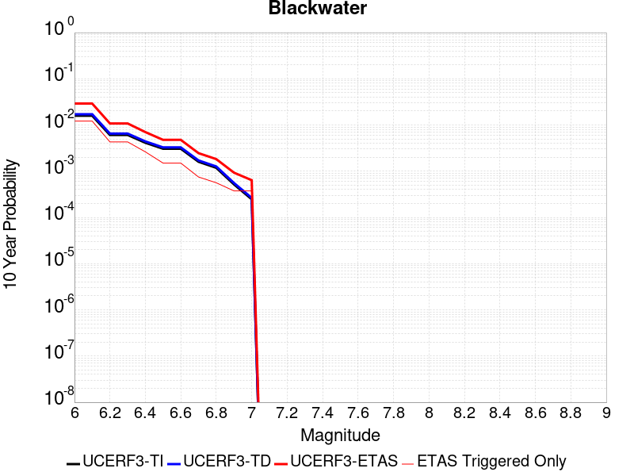 |

| Magnitude | 1 wk TI Prob | 1 wk TD Prob | 1 wk ETAS Prob | 1 wk ETAS/TD Gain | 1 wk ETAS Triggered Only | 1 mo TI Prob | 1 mo TD Prob | 1 mo ETAS Prob | 1 mo ETAS/TD Gain | 1 mo ETAS Triggered Only | 1 yr TI Prob | 1 yr TD Prob | 1 yr ETAS Prob | 1 yr ETAS/TD Gain | 1 yr ETAS Triggered Only | 10 yr TI Prob | 10 yr TD Prob | 10 yr ETAS Prob | 10 yr ETAS/TD Gain | 10 yr ETAS Triggered Only |
|-----|-----|-----|-----|-----|-----|-----|-----|-----|-----|-----|-----|-----|-----|-----|-----|-----|-----|-----|-----|-----|
| 6.0 | 3.0708583E-5 | 3.3095846E-5 | 0.004102961 | 123.972084 | 0.00407 | 1.3160157E-4 | 1.4183241E-4 | 0.005771034 | 40.689106 | 0.00563 | 0.0016010714 | 0.0017255784 | 0.0109696 | 6.357056 | 0.00926 | 0.015895851 | 0.017135633 | 0.029706469 | 1.7336079 | 0.01279 |
| 6.1 | 3.0708583E-5 | 3.3095846E-5 | 0.004102961 | 123.972084 | 0.00407 | 1.3160157E-4 | 1.4183241E-4 | 0.005771034 | 40.689106 | 0.00563 | 0.0016010714 | 0.0017255784 | 0.0109696 | 6.357056 | 0.00926 | 0.015895851 | 0.017135633 | 0.029706469 | 1.7336079 | 0.01279 |
| 6.2 | 1.1707779E-5 | 1.2545122E-5 | 0.0015025265 | 119.769775 | 0.00149 | 5.017523E-5 | 5.3763757E-5 | 0.0021936486 | 40.80163 | 0.00214 | 6.107122E-4 | 6.5438676E-4 | 0.0040821424 | 6.2381186 | 0.00343 | 0.006090366 | 0.0065255696 | 0.011294247 | 1.730768 | 0.0048 |
| 6.3 | 1.1707779E-5 | 1.2545122E-5 | 0.0015025265 | 119.769775 | 0.00149 | 5.017523E-5 | 5.3763757E-5 | 0.0021936486 | 40.80163 | 0.00214 | 6.107122E-4 | 6.5438676E-4 | 0.0040821424 | 6.2381186 | 0.00343 | 0.006090366 | 0.0065255696 | 0.011294247 | 1.730768 | 0.0048 |
| 6.4 | 7.929244E-6 | 8.480098E-6 | 0.0010084716 | 118.922165 | 0.001 | 3.3982033E-5 | 3.6342793E-5 | 0.0014862901 | 40.89642 | 0.00145 | 4.136527E-4 | 4.423877E-4 | 0.0027413701 | 6.196759 | 0.0023 | 0.0041288356 | 0.0044154758 | 0.0075814347 | 1.7170142 | 0.00318 |
| 6.5 | 5.8832115E-6 | 6.285991E-6 | 6.2628207E-4 | 99.6314 | 6.2E-4 | 2.521352E-5 | 2.6939697E-5 | 9.06916E-4 | 33.66467 | 8.8E-4 | 3.0693135E-4 | 3.27944E-4 | 0.0017974619 | 5.481003 | 0.00147 | 0.0030650778 | 0.0032748538 | 0.005387911 | 1.6452372 | 0.00212 |
| 6.6 | 5.8832115E-6 | 6.285991E-6 | 6.2628207E-4 | 99.6314 | 6.2E-4 | 2.521352E-5 | 2.6939697E-5 | 9.06916E-4 | 33.66467 | 8.8E-4 | 3.0693135E-4 | 3.27944E-4 | 0.0017974619 | 5.481003 | 0.00147 | 0.0030650778 | 0.0032748538 | 0.005387911 | 1.6452372 | 0.00212 |
| 6.7 | 3.0715053E-6 | 3.2814662E-6 | 3.0328048E-4 | 92.42225 | 3.0E-4 | 1.3163528E-5 | 1.4063357E-5 | 3.94058E-4 | 28.020195 | 3.8E-4 | 1.6025416E-4 | 1.7120909E-4 | 9.210807E-4 | 5.3798585 | 7.5E-4 | 0.0016013865 | 0.0017108864 | 0.0028189872 | 1.6476765 | 0.00111 |
| 6.8 | 2.2722281E-6 | 2.4287538E-6 | 2.1242825E-4 | 87.46389 | 2.1E-4 | 9.738084E-6 | 1.0408908E-5 | 2.90406E-4 | 27.899755 | 2.8E-4 | 1.1855473E-4 | 1.26722E-4 | 7.066485E-4 | 5.576368 | 5.8E-4 | 0.001184915 | 0.0012665876 | 0.0021354856 | 1.686015 | 8.7E-4 |
| 6.9 | 9.952399E-7 | 1.0653489E-6 | 7.1065275E-5 | 66.70611 | 7.0E-5 | 4.265307E-6 | 4.5657757E-6 | 8.4565414E-5 | 18.521587 | 8.0E-5 | 5.1928873E-5 | 5.5587418E-5 | 2.7557518E-4 | 4.95751 | 2.2E-4 | 5.191674E-4 | 5.557858E-4 | 8.456246E-4 | 1.5214938 | 2.9E-4 |
| 7.0 | 4.7385504E-7 | 5.0755597E-7 | 4.0507537E-5 | 79.809006 | 4.0E-5 | 2.0308057E-6 | 2.1752398E-6 | 4.2175154E-5 | 19.388737 | 4.0E-5 | 2.4724779E-5 | 2.6483543E-5 | 1.0648143E-4 | 4.0206637 | 8.0E-5 | 2.4722028E-4 | 2.6483546E-4 | 3.6480895E-4 | 1.377493 | 1.0E-4 |

## Ash Hill
*[(top)](#table-of-contents)*

| 1 Week | 1 Month | 1 Year | 10 Year |
|-----|-----|-----|-----|
| 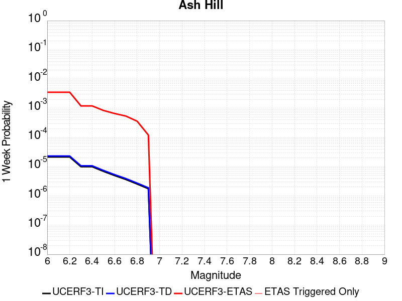 |  | 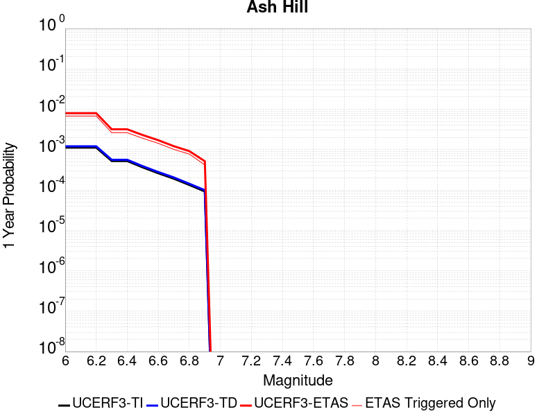 | 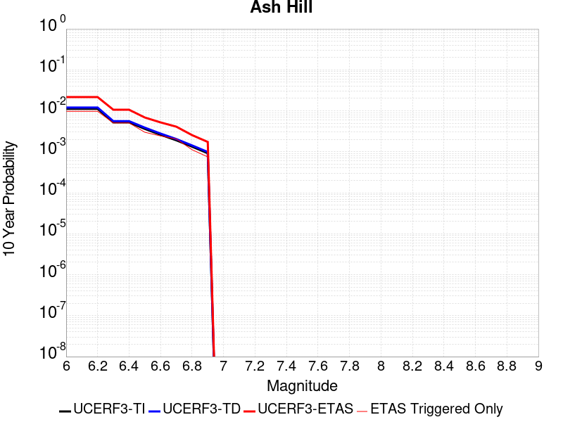 |

| Magnitude | 1 wk TI Prob | 1 wk TD Prob | 1 wk ETAS Prob | 1 wk ETAS/TD Gain | 1 wk ETAS Triggered Only | 1 mo TI Prob | 1 mo TD Prob | 1 mo ETAS Prob | 1 mo ETAS/TD Gain | 1 mo ETAS Triggered Only | 1 yr TI Prob | 1 yr TD Prob | 1 yr ETAS Prob | 1 yr ETAS/TD Gain | 1 yr ETAS Triggered Only | 10 yr TI Prob | 10 yr TD Prob | 10 yr ETAS Prob | 10 yr ETAS/TD Gain | 10 yr ETAS Triggered Only |
|-----|-----|-----|-----|-----|-----|-----|-----|-----|-----|-----|-----|-----|-----|-----|-----|-----|-----|-----|-----|-----|
| 6.0 | 2.1545662E-5 | 2.3194447E-5 | 0.0033631169 | 144.99664 | 0.00334 | 9.2335285E-5 | 9.940143E-5 | 0.004748939 | 47.77536 | 0.00465 | 0.0011236023 | 0.0012096206 | 0.0087405 | 7.2258196 | 0.00754 | 0.011179381 | 0.012038348 | 0.022471223 | 1.8666368 | 0.01056 |
| 6.1 | 2.1545662E-5 | 2.3194447E-5 | 0.0033631169 | 144.99664 | 0.00334 | 9.2335285E-5 | 9.940143E-5 | 0.004748939 | 47.77536 | 0.00465 | 0.0011236023 | 0.0012096206 | 0.0087405 | 7.2258196 | 0.00754 | 0.011179381 | 0.012038348 | 0.022471223 | 1.8666368 | 0.01056 |
| 6.2 | 2.1545662E-5 | 2.3194447E-5 | 0.0033631169 | 144.99664 | 0.00334 | 9.2335285E-5 | 9.940143E-5 | 0.004748939 | 47.77536 | 0.00465 | 0.0011236023 | 0.0012096206 | 0.0087405 | 7.2258196 | 0.00754 | 0.011179381 | 0.012038348 | 0.022471223 | 1.8666368 | 0.01056 |
| 6.3 | 1.0025529E-5 | 1.0746934E-5 | 0.0013407327 | 124.75489 | 0.00133 | 4.2965847E-5 | 4.605755E-5 | 0.001985968 | 43.119274 | 0.00194 | 5.229836E-4 | 5.6061964E-4 | 0.0036189042 | 6.4551864 | 0.00306 | 0.005217545 | 0.0055933665 | 0.010058252 | 1.7982466 | 0.00449 |
| 6.4 | 1.0025529E-5 | 1.0746934E-5 | 0.0013407327 | 124.75489 | 0.00133 | 4.2965847E-5 | 4.605755E-5 | 0.001985968 | 43.119274 | 0.00194 | 5.229836E-4 | 5.6061964E-4 | 0.0036189042 | 6.4551864 | 0.00306 | 0.005217545 | 0.0055933665 | 0.010058252 | 1.7982466 | 0.00449 |
| 6.5 | 6.9617327E-6 | 7.456634E-6 | 9.874493E-4 | 132.42561 | 9.8E-4 | 2.9835655E-5 | 3.195666E-5 | 0.0014119126 | 44.182106 | 0.00138 | 3.6318856E-4 | 3.8901155E-4 | 0.0025481712 | 6.5503745 | 0.00216 | 0.0036259557 | 0.0038841602 | 0.0070518088 | 1.8155298 | 0.00318 |
| 6.6 | 4.9919777E-6 | 5.3466883E-6 | 6.753431E-4 | 126.31055 | 6.7E-4 | 2.1394015E-5 | 2.2914215E-5 | 9.228936E-4 | 40.276028 | 9.0E-4 | 2.60441E-4 | 2.7895154E-4 | 0.0016285749 | 5.8382 | 0.00135 | 0.0026013597 | 0.0027866727 | 0.004940653 | 1.7729579 | 0.00216 |
| 6.7 | 3.6630722E-6 | 3.924624E-6 | 5.339225E-4 | 136.04427 | 5.3E-4 | 1.5698786E-5 | 1.681974E-5 | 7.1680796E-4 | 42.617065 | 7.0E-4 | 1.9111596E-4 | 2.0476682E-4 | 0.001234556 | 6.029082 | 0.00103 | 0.0019095168 | 0.0020463446 | 0.0035732137 | 1.7461447 | 0.00153 |
| 6.8 | 2.5599613E-6 | 2.744925E-6 | 4.2274376E-4 | 154.00922 | 4.2E-4 | 1.0971216E-5 | 1.1763939E-5 | 5.917571E-4 | 50.30263 | 5.8E-4 | 1.3356637E-4 | 1.4322149E-4 | 9.7310264E-4 | 6.7943892 | 8.3E-4 | 0.0013348613 | 0.0014317769 | 0.0026400445 | 1.8438938 | 0.00121 |
| 6.9 | 1.7684905E-6 | 1.8968707E-6 | 2.3189644E-4 | 122.252106 | 2.3E-4 | 7.579223E-6 | 8.129446E-6 | 3.1812693E-4 | 39.13267 | 3.1E-4 | 9.2273134E-5 | 9.8976E-5 | 5.989265E-4 | 6.0512295 | 5.0E-4 | 9.223483E-4 | 9.8976E-4 | 0.0017989583 | 1.8175702 | 8.1E-4 |

## Garlock (West)
*[(top)](#table-of-contents)*

| 1 Week | 1 Month | 1 Year | 10 Year |
|-----|-----|-----|-----|
| 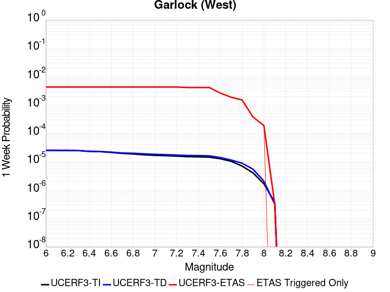 | 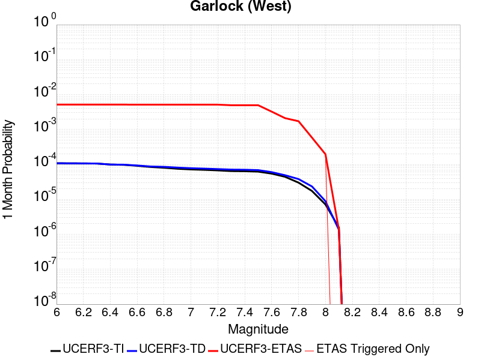 | 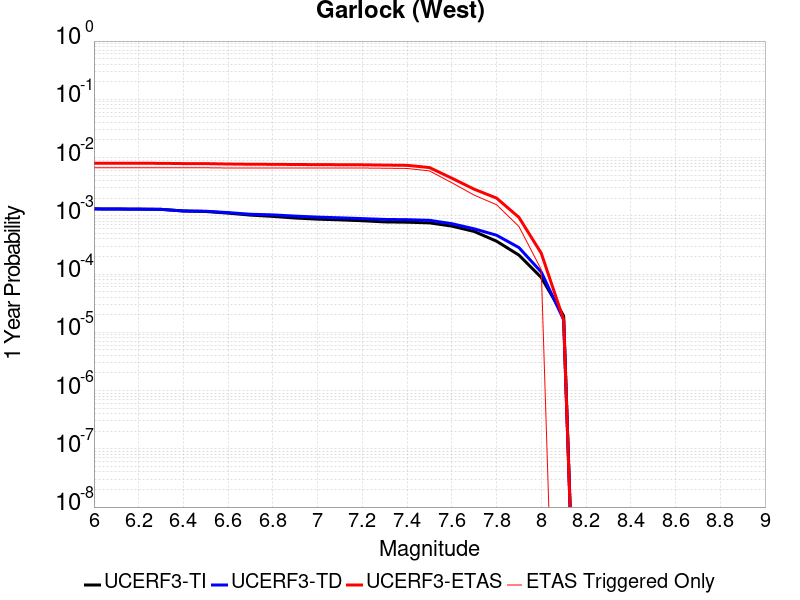 | 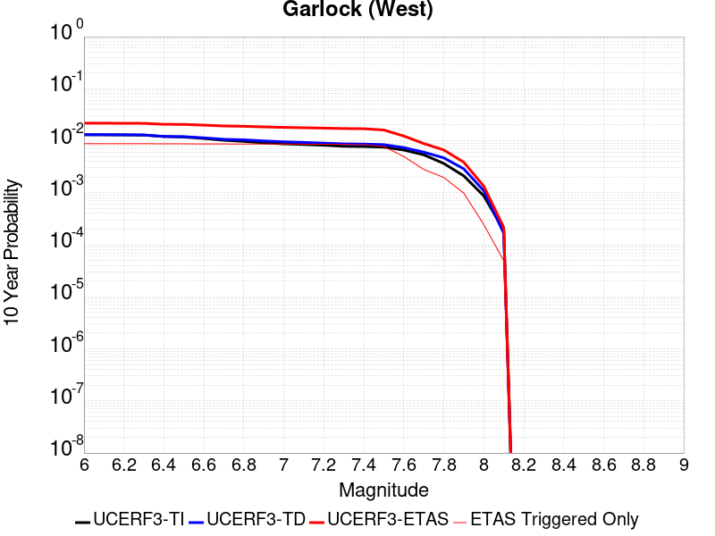 |

| Magnitude | 1 wk TI Prob | 1 wk TD Prob | 1 wk ETAS Prob | 1 wk ETAS/TD Gain | 1 wk ETAS Triggered Only | 1 mo TI Prob | 1 mo TD Prob | 1 mo ETAS Prob | 1 mo ETAS/TD Gain | 1 mo ETAS Triggered Only | 1 yr TI Prob | 1 yr TD Prob | 1 yr ETAS Prob | 1 yr ETAS/TD Gain | 1 yr ETAS Triggered Only | 10 yr TI Prob | 10 yr TD Prob | 10 yr ETAS Prob | 10 yr ETAS/TD Gain | 10 yr ETAS Triggered Only |
|-----|-----|-----|-----|-----|-----|-----|-----|-----|-----|-----|-----|-----|-----|-----|-----|-----|-----|-----|-----|-----|
| 6.0 | 2.5181727E-5 | 2.5197181E-5 | 0.0042950897 | 170.45912 | 0.00427 | 1.0791722E-4 | 1.0798347E-4 | 0.0052674264 | 48.77993 | 0.00516 | 0.0013131002 | 0.0013139093 | 0.008384607 | 6.3814197 | 0.00708 | 0.013053683 | 0.013141794 | 0.021766935 | 1.6563138 | 0.00874 |
| 6.1 | 2.5077732E-5 | 2.5098223E-5 | 0.0042849914 | 170.72887 | 0.00426 | 1.0747157E-4 | 1.075594E-4 | 0.0052570053 | 48.87537 | 0.00515 | 0.001307681 | 0.0013087525 | 0.0083695 | 6.395021 | 0.00707 | 0.013000126 | 0.013090835 | 0.021706551 | 1.6581488 | 0.00873 |
| 6.2 | 2.494612E-5 | 2.4979914E-5 | 0.0042848736 | 171.53275 | 0.00426 | 1.0690756E-4 | 1.070524E-4 | 0.005256501 | 49.10213 | 0.00515 | 0.0013008224 | 0.0013025872 | 0.008363378 | 6.42059 | 0.00707 | 0.012932341 | 0.013029906 | 0.021646155 | 1.6612672 | 0.00873 |
| 6.3 | 2.4733758E-5 | 2.4799276E-5 | 0.004274694 | 172.37172 | 0.00425 | 1.0599751E-4 | 1.06278305E-4 | 0.005245732 | 49.358448 | 0.00514 | 0.0012897556 | 0.0012931736 | 0.008344044 | 6.452377 | 0.00706 | 0.012822957 | 0.0129368715 | 0.021544062 | 1.6653224 | 0.00872 |
| 6.4 | 2.3237335E-5 | 2.3178607E-5 | 0.00426308 | 183.92305 | 0.00424 | 9.958477E-5 | 9.933313E-5 | 0.0052088257 | 52.43795 | 0.00511 | 0.0012117702 | 0.0012087126 | 0.00821024 | 6.7925487 | 0.00701 | 0.012051838 | 0.012101731 | 0.02064705 | 1.7061237 | 0.00865 |
| 6.5 | 2.2732203E-5 | 2.2992977E-5 | 0.0042628953 | 185.3999 | 0.00424 | 9.742009E-5 | 9.8537625E-5 | 0.005208034 | 52.853256 | 0.00511 | 0.0011854442 | 0.0011990381 | 0.008200632 | 6.839343 | 0.00701 | 0.011791403 | 0.012006035 | 0.020552183 | 1.711821 | 0.00865 |
| 6.6 | 2.1319436E-5 | 2.1773201E-5 | 0.0042516813 | 195.27129 | 0.00423 | 9.136581E-5 | 9.3310395E-5 | 0.0051928344 | 55.651188 | 0.0051 | 0.001111811 | 0.0011354643 | 0.008107538 | 7.140285 | 0.00698 | 0.011062649 | 0.011376952 | 0.01987911 | 1.7473142 | 0.0086 |
| 6.7 | 1.970802E-5 | 2.0393094E-5 | 0.0042503066 | 208.41891 | 0.00423 | 8.446021E-5 | 8.739606E-5 | 0.0051869503 | 59.349934 | 0.0051 | 0.001027818 | 0.0010635294 | 0.008036106 | 7.5560737 | 0.00698 | 0.010230771 | 0.0106646875 | 0.019163078 | 1.7968719 | 0.00859 |
| 6.8 | 1.8744462E-5 | 1.9900775E-5 | 0.0042498168 | 213.55031 | 0.00423 | 8.033094E-5 | 8.528626E-5 | 0.005184851 | 60.793514 | 0.0051 | 9.775903E-4 | 0.0010378672 | 0.008000634 | 7.7087255 | 0.00697 | 0.009733009 | 0.010410495 | 0.018891277 | 1.8146378 | 0.00857 |
| 6.9 | 1.7559682E-5 | 1.8953151E-5 | 0.004248873 | 224.17766 | 0.00423 | 7.5253614E-5 | 8.122527E-5 | 0.005180811 | 63.78324 | 0.0051 | 9.158276E-4 | 9.884704E-4 | 0.0079316 | 8.024115 | 0.00695 | 0.0091206245 | 0.009921073 | 0.018376347 | 1.852254 | 0.00854 |
| 7.0 | 1.6794445E-5 | 1.8215967E-5 | 0.00419814 | 230.46483 | 0.00418 | 7.197421E-5 | 7.806611E-5 | 0.0051276716 | 65.683716 | 0.00505 | 8.759337E-4 | 9.5004175E-4 | 0.007823505 | 8.234907 | 0.00688 | 0.008724891 | 0.009539958 | 0.01789944 | 1.8762599 | 0.00844 |
| 7.1 | 1.6337795E-5 | 1.771677E-5 | 0.004177643 | 235.80164 | 0.00416 | 7.0017246E-5 | 7.592681E-5 | 0.005105545 | 67.24298 | 0.00503 | 8.521265E-4 | 9.2401815E-4 | 0.0077776792 | 8.417236 | 0.00686 | 0.008488664 | 0.009281721 | 0.017623568 | 1.8987393 | 0.00842 |
| 7.2 | 1.5780008E-5 | 1.71654E-5 | 0.0041670944 | 242.76128 | 0.00415 | 6.762685E-5 | 7.3563926E-5 | 0.0050831954 | 69.09902 | 0.00501 | 8.2304585E-4 | 8.952741E-4 | 0.0077191596 | 8.622119 | 0.00683 | 0.008200042 | 0.008996559 | 0.017311078 | 1.9241887 | 0.00839 |
| 7.3 | 1.5058865E-5 | 1.6618484E-5 | 0.00414655 | 249.51434 | 0.00413 | 6.45364E-5 | 7.122013E-5 | 0.0050508655 | 70.91907 | 0.00498 | 7.854473E-4 | 8.667614E-4 | 0.007660867 | 8.838497 | 0.0068 | 0.00782677 | 0.008713263 | 0.016970681 | 1.9476838 | 0.00833 |
| 7.4 | 1.4887923E-5 | 1.6454453E-5 | 0.0040663877 | 247.12994 | 0.00405 | 6.380382E-5 | 7.0517184E-5 | 0.0049701715 | 70.48171 | 0.0049 | 7.7653467E-4 | 8.5820974E-4 | 0.0075224857 | 8.765323 | 0.00667 | 0.0077382675 | 0.008628101 | 0.01672761 | 1.9387358 | 0.00817 |
| 7.5 | 1.4509299E-5 | 1.6046468E-5 | 0.003715987 | 231.57663 | 0.0037 | 6.218123E-5 | 6.876877E-5 | 0.0045684595 | 66.432175 | 0.0045 | 7.567935E-4 | 8.369394E-4 | 0.0070217587 | 8.389806 | 0.00619 | 0.0075422134 | 0.008416411 | 0.015912782 | 1.8906852 | 0.00756 |
| 7.6 | 1.2756717E-5 | 1.4050529E-5 | 0.002474016 | 176.07993 | 0.00246 | 5.4670498E-5 | 6.0215163E-5 | 0.0031300304 | 51.980766 | 0.00307 | 6.6541E-4 | 7.328737E-4 | 0.0049397885 | 6.7402997 | 0.00421 | 0.006634211 | 0.007381374 | 0.012334541 | 1.6710359 | 0.00499 |
| 7.7 | 1.0328985E-5 | 1.146033E-5 | 0.0014814435 | 129.26709 | 0.00147 | 4.4266326E-5 | 4.9114777E-5 | 0.0018890244 | 38.461426 | 0.00184 | 5.388092E-4 | 5.9780874E-4 | 0.0032462245 | 5.430206 | 0.00265 | 0.0053750467 | 0.006038286 | 0.009109627 | 1.5086447 | 0.00309 |
| 7.8 | 7.0306583E-6 | 8.899537E-6 | 8.788918E-4 | 98.75703 | 8.7E-4 | 3.0131043E-5 | 3.8140315E-5 | 0.001148098 | 30.101954 | 0.00111 | 3.667837E-4 | 4.6425956E-4 | 0.0020835074 | 4.4878073 | 0.00162 | 0.003661789 | 0.0046950667 | 0.006606052 | 1.4070199 | 0.00192 |
| 7.9 | 4.060633E-6 | 5.465412E-6 | 4.9546274E-4 | 90.65423 | 4.9E-4 | 1.7402595E-5 | 2.3422985E-5 | 6.4340845E-4 | 27.469107 | 6.2E-4 | 2.11856E-4 | 2.8513762E-4 | 0.0011748838 | 4.12041 | 8.9E-4 | 0.0021165414 | 0.002884143 | 0.0039709993 | 1.3768386 | 0.00109 |
| 8.0 | 1.6729537E-6 | 2.0775192E-6 | 1.7207717E-4 | 82.82819 | 1.7E-4 | 7.169782E-6 | 8.903624E-6 | 1.8890202E-4 | 21.216309 | 1.8E-4 | 8.7288594E-5 | 1.0839626E-4 | 3.78367E-4 | 3.4905908 | 2.7E-4 | 8.7254314E-4 | 0.001096854 | 0.0014464702 | 1.3187444 | 3.5E-4 |
| 8.1 | 3.6733252E-7 | 3.1489736E-7 | 2.031489E-5 | 64.51273 | 2.0E-5 | 1.5742813E-6 | 1.3495595E-6 | 2.1349533E-5 | 15.81963 | 2.0E-5 | 1.9166706E-5 | 1.643078E-5 | 5.6430123E-5 | 3.4344153 | 4.0E-5 | 1.9165053E-4 | 1.662928E-4 | 2.1628448E-4 | 1.3006245 | 5.0E-5 |

## Gravel Hills-Harper Lk
*[(top)](#table-of-contents)*

| 1 Week | 1 Month | 1 Year | 10 Year |
|-----|-----|-----|-----|
|  | 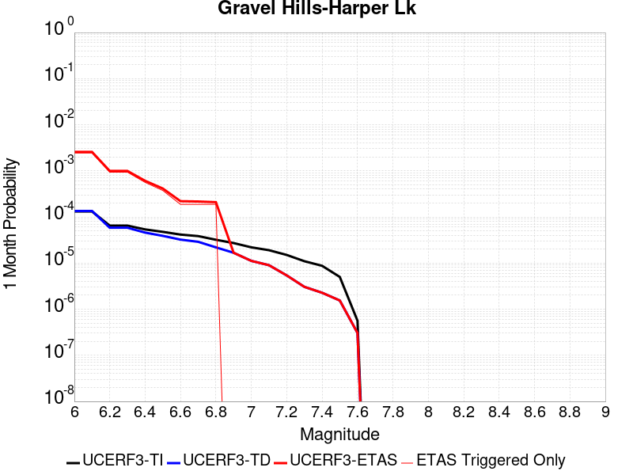 | 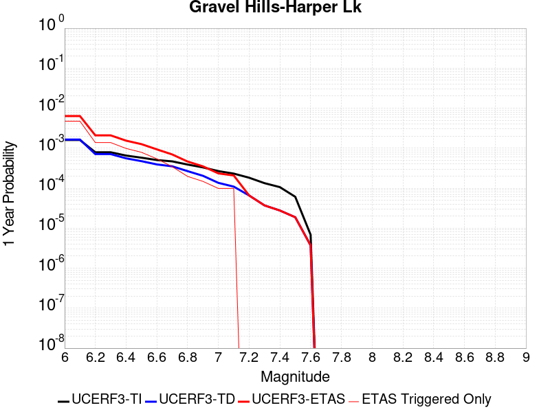 | 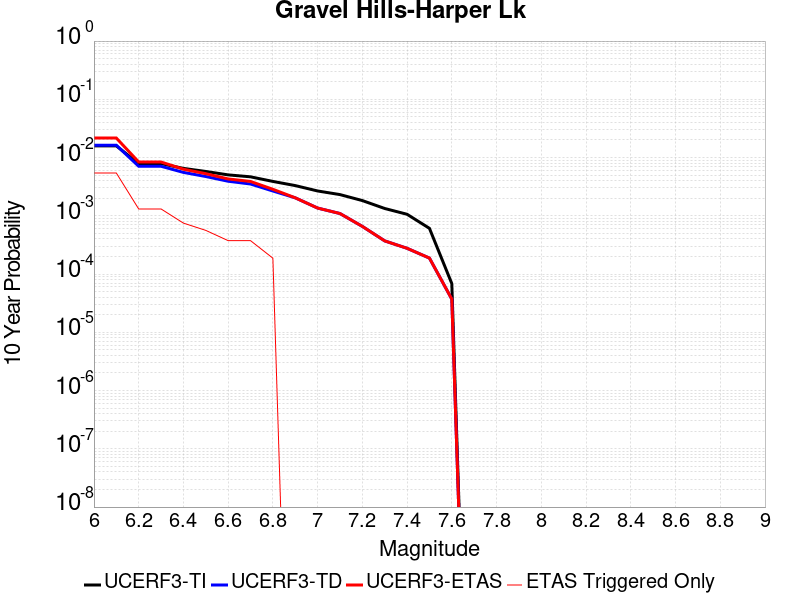 |

| Magnitude | 1 wk TI Prob | 1 wk TD Prob | 1 wk ETAS Prob | 1 wk ETAS/TD Gain | 1 wk ETAS Triggered Only | 1 mo TI Prob | 1 mo TD Prob | 1 mo ETAS Prob | 1 mo ETAS/TD Gain | 1 mo ETAS Triggered Only | 1 yr TI Prob | 1 yr TD Prob | 1 yr ETAS Prob | 1 yr ETAS/TD Gain | 1 yr ETAS Triggered Only | 10 yr TI Prob | 10 yr TD Prob | 10 yr ETAS Prob | 10 yr ETAS/TD Gain | 10 yr ETAS Triggered Only |
|-----|-----|-----|-----|-----|-----|-----|-----|-----|-----|-----|-----|-----|-----|-----|-----|-----|-----|-----|-----|-----|
| 6.0 | 3.0679566E-5 | 3.1464628E-5 | 0.002181397 | 69.32855 | 0.00215 | 1.3147724E-4 | 1.3484266E-4 | 0.0031044423 | 23.022701 | 0.00297 | 0.0015995599 | 0.00164069 | 0.0062431265 | 3.8051834 | 0.00461 | 0.015880952 | 0.016307337 | 0.022789873 | 1.3975226 | 0.00659 |
| 6.1 | 3.0679566E-5 | 3.1464628E-5 | 0.002181397 | 69.32855 | 0.00215 | 1.3147724E-4 | 1.3484266E-4 | 0.0031044423 | 23.022701 | 0.00297 | 0.0015995599 | 0.00164069 | 0.0062431265 | 3.8051834 | 0.00461 | 0.015880952 | 0.016307337 | 0.022789873 | 1.3975226 | 0.00659 |
| 6.2 | 1.514536E-5 | 1.36352E-5 | 6.3362677E-4 | 46.469925 | 6.2E-4 | 6.490707E-5 | 5.843533E-5 | 9.483833E-4 | 16.229622 | 8.9E-4 | 7.8995706E-4 | 7.112298E-4 | 0.00213022 | 2.9951217 | 0.00142 | 0.007871548 | 0.007090737 | 0.009036839 | 1.274457 | 0.00196 |
| 6.3 | 1.514536E-5 | 1.36352E-5 | 6.3362677E-4 | 46.469925 | 6.2E-4 | 6.490707E-5 | 5.843533E-5 | 9.483833E-4 | 16.229622 | 8.9E-4 | 7.8995706E-4 | 7.112298E-4 | 0.00213022 | 2.9951217 | 0.00142 | 0.007871548 | 0.007090737 | 0.009036839 | 1.274457 | 0.00196 |
| 6.4 | 1.2532521E-5 | 1.0689684E-5 | 4.4068508E-4 | 41.22527 | 4.3E-4 | 5.37097E-5 | 4.581216E-5 | 6.1578606E-4 | 13.441542 | 5.7E-4 | 6.537194E-4 | 5.5762613E-4 | 0.0014771131 | 2.648931 | 9.2E-4 | 0.0065179965 | 0.005562859 | 0.0068556275 | 1.2323928 | 0.0013 |
| 6.5 | 1.1094058E-5 | 9.083657E-6 | 2.9908103E-4 | 32.92518 | 2.9E-4 | 4.7545094E-5 | 3.89294E-5 | 4.289142E-4 | 11.017746 | 3.9E-4 | 5.787078E-4 | 4.7386638E-4 | 0.0011335537 | 2.3921378 | 6.6E-4 | 0.0057720304 | 0.004728967 | 0.005684427 | 1.2020441 | 9.6E-4 |
| 6.6 | 9.688328E-6 | 7.531688E-6 | 1.7753041E-4 | 23.57113 | 1.7E-4 | 4.1520743E-5 | 3.227828E-5 | 2.8227022E-4 | 8.744897 | 2.5E-4 | 5.053978E-4 | 3.9291973E-4 | 8.027586E-4 | 2.04306 | 4.1E-4 | 0.0050424994 | 0.0039225067 | 0.0045500356 | 1.1599816 | 6.3E-4 |
| 6.7 | 8.974824E-6 | 6.749406E-6 | 1.3674852E-4 | 20.260824 | 1.3E-4 | 3.8462964E-5 | 2.8925719E-5 | 2.1892022E-4 | 7.5683594 | 1.9E-4 | 4.6818596E-4 | 3.5211592E-4 | 6.620067E-4 | 1.8800819 | 3.1E-4 | 0.004672008 | 0.003515801 | 0.0039941133 | 1.1360465 | 4.8E-4 |
| 6.8 | 7.4780046E-6 | 5.1161865E-6 | 6.511588E-5 | 12.727426 | 6.0E-5 | 3.20482E-5 | 2.1926337E-5 | 1.0192458E-4 | 4.6485004 | 8.0E-5 | 3.9011694E-4 | 2.6692182E-4 | 4.0688447E-4 | 1.5243582 | 1.4E-4 | 0.0038943281 | 0.0026661505 | 0.002885564 | 1.082296 | 2.2E-4 |
| 6.9 | 6.3409307E-6 | 3.907489E-6 | 3.390737E-5 | 8.677535 | 3.0E-5 | 2.7175134E-5 | 1.674628E-5 | 5.6745608E-5 | 3.3885503 | 4.0E-5 | 3.3080703E-4 | 2.0386786E-4 | 2.8385155E-4 | 1.392331 | 8.0E-5 | 0.0033031502 | 0.0020369065 | 0.0021666419 | 1.0636922 | 1.3E-4 |
| 7.0 | 5.1239335E-6 | 2.6058492E-6 | 2.2605796E-5 | 8.675021 | 2.0E-5 | 2.195953E-5 | 1.1167879E-5 | 4.1167543E-5 | 3.6862454 | 3.0E-5 | 2.6732447E-4 | 1.359607E-4 | 1.859539E-4 | 1.3677033 | 5.0E-5 | 0.0026700313 | 0.0013588005 | 0.0014486781 | 1.066145 | 9.0E-5 |
| 7.1 | 4.438899E-6 | 2.0984692E-6 | 2.2098428E-5 | 10.530737 | 2.0E-5 | 1.9023713E-5 | 8.99341E-6 | 3.899314E-5 | 4.335746 | 3.0E-5 | 2.315891E-4 | 1.0948948E-4 | 1.5948401E-4 | 1.4566149 | 5.0E-5 | 0.002313479 | 0.0010943774 | 0.0011742897 | 1.0730209 | 8.0E-5 |
| 7.2 | 3.50367E-6 | 1.2615715E-6 | 1.2615715E-6 | 1.0 | 0.0 | 1.5015643E-5 | 5.406724E-6 | 5.406724E-6 | 1.0 | 0.0 | 1.8280011E-4 | 6.5824956E-5 | 7.5824304E-5 | 1.151908 | 1.0E-5 | 0.0018264982 | 6.580628E-4 | 6.6805625E-4 | 1.0151861 | 1.0E-5 |
| 7.3 | 2.561638E-6 | 7.118686E-7 | 7.118686E-7 | 1.0 | 0.0 | 1.0978401E-5 | 3.050862E-6 | 3.050862E-6 | 1.0 | 0.0 | 1.3365384E-4 | 3.7143633E-5 | 4.714326E-5 | 1.2692151 | 1.0E-5 | 0.0013357349 | 3.7137623E-4 | 3.8137252E-4 | 1.0269169 | 1.0E-5 |
| 7.4 | 2.0368864E-6 | 5.304471E-7 | 5.304471E-7 | 1.0 | 0.0 | 8.729483E-6 | 2.2733427E-6 | 2.2733427E-6 | 1.0 | 0.0 | 1.06276275E-4 | 2.76776E-5 | 2.76776E-5 | 1.0 | 0.0 | 0.0010622547 | 2.767421E-4 | 2.767421E-4 | 1.0 | 0.0 |
| 7.5 | 1.1681728E-6 | 3.6028484E-7 | 3.6028484E-7 | 1.0 | 0.0 | 5.0064455E-6 | 1.544077E-6 | 1.544077E-6 | 1.0 | 0.0 | 6.0951766E-5 | 1.879898E-5 | 1.879898E-5 | 1.0 | 0.0 | 6.093505E-4 | 1.8797436E-4 | 1.8797436E-4 | 1.0 | 0.0 |
| 7.6 | 1.3154387E-7 | 7.1196716E-8 | 7.1196716E-8 | 1.0 | 0.0 | 5.6375933E-7 | 3.0512876E-7 | 3.0512876E-7 | 1.0 | 0.0 | 6.863748E-6 | 3.714938E-6 | 3.714938E-6 | 1.0 | 0.0 | 6.863536E-5 | 3.7148915E-5 | 3.7148915E-5 | 1.0 | 0.0 |

## McLean Lake
*[(top)](#table-of-contents)*

| 1 Week | 1 Month | 1 Year | 10 Year |
|-----|-----|-----|-----|
| 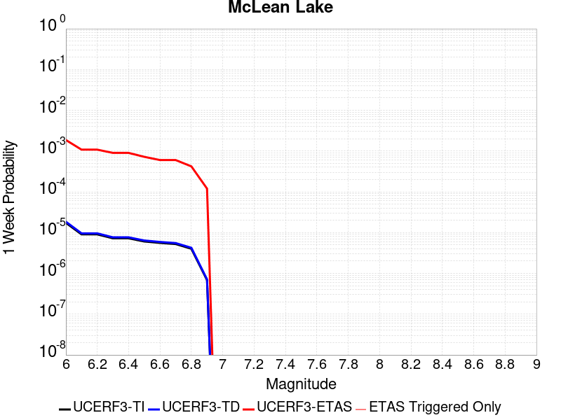 |  |  | 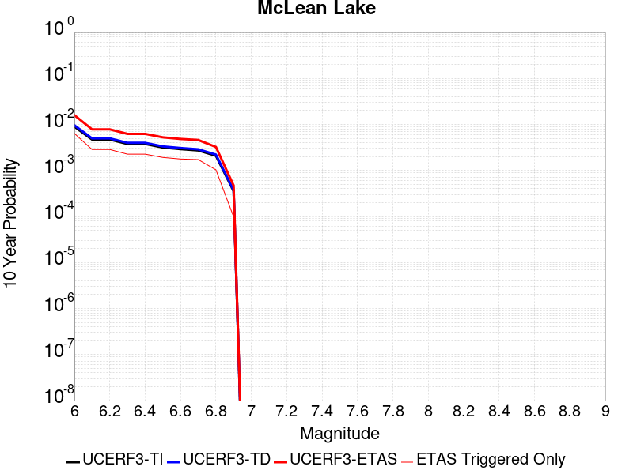 |

| Magnitude | 1 wk TI Prob | 1 wk TD Prob | 1 wk ETAS Prob | 1 wk ETAS/TD Gain | 1 wk ETAS Triggered Only | 1 mo TI Prob | 1 mo TD Prob | 1 mo ETAS Prob | 1 mo ETAS/TD Gain | 1 mo ETAS Triggered Only | 1 yr TI Prob | 1 yr TD Prob | 1 yr ETAS Prob | 1 yr ETAS/TD Gain | 1 yr ETAS Triggered Only | 10 yr TI Prob | 10 yr TD Prob | 10 yr ETAS Prob | 10 yr ETAS/TD Gain | 10 yr ETAS Triggered Only |
|-----|-----|-----|-----|-----|-----|-----|-----|-----|-----|-----|-----|-----|-----|-----|-----|-----|-----|-----|-----|-----|
| 6.0 | 1.7360222E-5 | 1.8501627E-5 | 0.0014984743 | 80.991486 | 0.00148 | 7.439883E-5 | 7.9290556E-5 | 0.002219121 | 27.987204 | 0.00214 | 9.0542925E-4 | 9.6498354E-4 | 0.005011075 | 5.1929126 | 0.00405 | 0.009017491 | 0.0096127745 | 0.015852215 | 1.6490779 | 0.0063 |
| 6.1 | 9.062689E-6 | 9.592193E-6 | 7.895847E-4 | 82.315346 | 7.8E-4 | 3.8839516E-5 | 4.1108804E-5 | 0.0011710624 | 28.4869 | 0.00113 | 4.727685E-4 | 5.003936E-4 | 0.0026293278 | 5.254519 | 0.00213 | 0.0047176396 | 0.004993552 | 0.008247223 | 1.6515745 | 0.00327 |
| 6.2 | 9.062689E-6 | 9.592193E-6 | 7.895847E-4 | 82.315346 | 7.8E-4 | 3.8839516E-5 | 4.1108804E-5 | 0.0011710624 | 28.4869 | 0.00113 | 4.727685E-4 | 5.003936E-4 | 0.0026293278 | 5.254519 | 0.00213 | 0.0047176396 | 0.004993552 | 0.008247223 | 1.6515745 | 0.00327 |
| 6.3 | 7.2575485E-6 | 7.66771E-6 | 6.5766275E-4 | 85.77043 | 6.5E-4 | 3.110341E-5 | 3.2861237E-5 | 9.22832E-4 | 28.082691 | 8.9E-4 | 3.786182E-4 | 4.0001926E-4 | 0.0020793471 | 5.1981177 | 0.00168 | 0.0037797375 | 0.0039936965 | 0.006563393 | 1.643438 | 0.00258 |
| 6.4 | 7.2575485E-6 | 7.66771E-6 | 6.5766275E-4 | 85.77043 | 6.5E-4 | 3.110341E-5 | 3.2861237E-5 | 9.22832E-4 | 28.082691 | 8.9E-4 | 3.786182E-4 | 4.0001926E-4 | 0.0020793471 | 5.1981177 | 0.00168 | 0.0037797375 | 0.0039936965 | 0.006563393 | 1.643438 | 0.00258 |
| 6.5 | 6.06582E-6 | 6.4038773E-6 | 5.4640044E-4 | 85.32338 | 5.4E-4 | 2.5996113E-5 | 2.7444936E-5 | 7.874241E-4 | 28.691051 | 7.6E-4 | 3.164567E-4 | 3.3409733E-4 | 0.0018235996 | 5.458288 | 0.00149 | 0.0031600643 | 0.0033365893 | 0.0055691153 | 1.6691042 | 0.00224 |
| 6.6 | 5.598744E-6 | 5.910262E-6 | 5.1590725E-4 | 87.29008 | 5.1E-4 | 2.3994397E-5 | 2.5329486E-5 | 7.55311E-4 | 29.819437 | 7.3E-4 | 2.9209262E-4 | 3.0834923E-4 | 0.0017179145 | 5.571327 | 0.00141 | 0.0029170897 | 0.003079843 | 0.0051833447 | 1.6829898 | 0.00211 |
| 6.7 | 5.246996E-6 | 5.539162E-6 | 4.855365E-4 | 87.65523 | 4.8E-4 | 2.2486933E-5 | 2.3739085E-5 | 7.137227E-4 | 30.065298 | 6.9E-4 | 2.73744E-4 | 2.8899137E-4 | 0.0016485984 | 5.704663 | 0.00136 | 0.0027340704 | 0.0028867796 | 0.0048909774 | 1.6942676 | 0.00201 |
| 6.8 | 4.02324E-6 | 4.2469046E-6 | 3.7424534E-4 | 88.12191 | 3.7E-4 | 1.7242342E-5 | 1.8200926E-5 | 5.3819147E-4 | 29.569456 | 5.2E-4 | 2.099053E-4 | 2.2157968E-4 | 0.001181367 | 5.331567 | 9.6E-4 | 0.0020970714 | 0.002214172 | 0.0035811386 | 1.6173714 | 0.00137 |
| 6.9 | 6.835972E-7 | 7.1399285E-7 | 8.071394E-5 | 113.04586 | 8.0E-5 | 2.9296991E-6 | 3.0599674E-6 | 9.3059694E-5 | 30.411987 | 9.0E-5 | 3.56685E-5 | 3.7254784E-5 | 1.6724995E-4 | 4.4893546 | 1.3E-4 | 3.5662777E-4 | 3.7251666E-4 | 5.524496E-4 | 1.4830198 | 1.8E-4 |

## Goldstone Lake
*[(top)](#table-of-contents)*

| 1 Week | 1 Month | 1 Year | 10 Year |
|-----|-----|-----|-----|
| 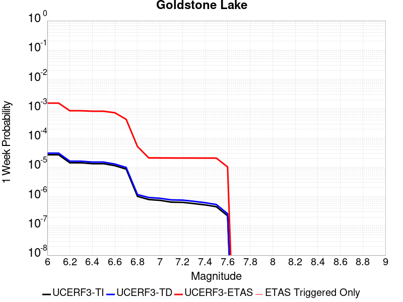 | 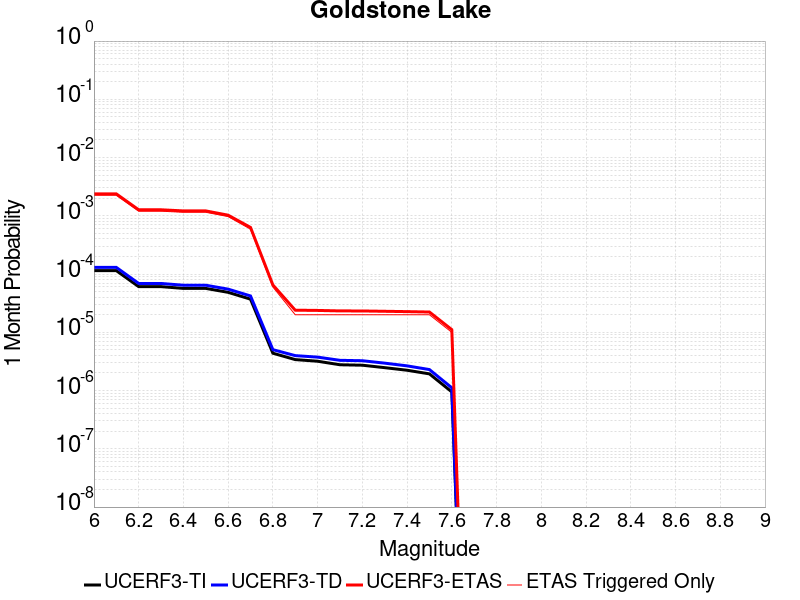 | 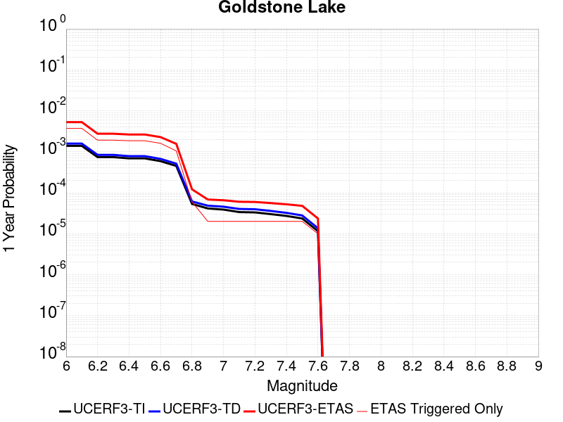 | 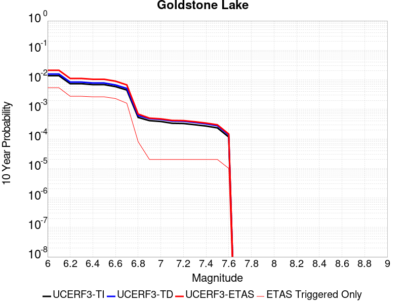 |

| Magnitude | 1 wk TI Prob | 1 wk TD Prob | 1 wk ETAS Prob | 1 wk ETAS/TD Gain | 1 wk ETAS Triggered Only | 1 mo TI Prob | 1 mo TD Prob | 1 mo ETAS Prob | 1 mo ETAS/TD Gain | 1 mo ETAS Triggered Only | 1 yr TI Prob | 1 yr TD Prob | 1 yr ETAS Prob | 1 yr ETAS/TD Gain | 1 yr ETAS Triggered Only | 10 yr TI Prob | 10 yr TD Prob | 10 yr ETAS Prob | 10 yr ETAS/TD Gain | 10 yr ETAS Triggered Only |
|-----|-----|-----|-----|-----|-----|-----|-----|-----|-----|-----|-----|-----|-----|-----|-----|-----|-----|-----|-----|-----|
| 6.0 | 2.671352E-5 | 3.0376103E-5 | 0.0015403302 | 50.70862 | 0.00151 | 1.1448149E-4 | 1.3017791E-4 | 0.002379885 | 18.281788 | 0.00225 | 0.001392921 | 0.0015839601 | 0.005298068 | 3.344824 | 0.00372 | 0.013842222 | 0.015746202 | 0.021071015 | 1.3381649 | 0.00541 |
| 6.1 | 2.671352E-5 | 3.0376103E-5 | 0.0015403302 | 50.70862 | 0.00151 | 1.1448149E-4 | 1.3017791E-4 | 0.002379885 | 18.281788 | 0.00225 | 0.001392921 | 0.0015839601 | 0.005298068 | 3.344824 | 0.00372 | 0.013842222 | 0.015746202 | 0.021071015 | 1.3381649 | 0.00541 |
| 6.2 | 1.4197047E-5 | 1.6096254E-5 | 8.4608287E-4 | 52.56396 | 8.3E-4 | 6.0843064E-5 | 6.898268E-5 | 0.0012688999 | 18.39447 | 0.0012 | 7.4051257E-4 | 8.3963916E-4 | 0.002758027 | 3.2847767 | 0.00192 | 0.007380498 | 0.008374364 | 0.011121167 | 1.3280014 | 0.00277 |
| 6.3 | 1.4197047E-5 | 1.6096254E-5 | 8.4608287E-4 | 52.56396 | 8.3E-4 | 6.0843064E-5 | 6.898268E-5 | 0.0012688999 | 18.39447 | 0.0012 | 7.4051257E-4 | 8.3963916E-4 | 0.002758027 | 3.2847767 | 0.00192 | 0.007380498 | 0.008374364 | 0.011121167 | 1.3280014 | 0.00277 |
| 6.4 | 1.3238931E-5 | 1.500847E-5 | 8.149965E-4 | 54.302437 | 8.0E-4 | 5.6737044E-5 | 6.432098E-5 | 0.001214247 | 18.877932 | 0.00115 | 6.9055456E-4 | 7.8292453E-4 | 0.0026414683 | 3.373848 | 0.00186 | 0.006884126 | 0.007811289 | 0.010440589 | 1.3366026 | 0.00265 |
| 6.5 | 1.3238931E-5 | 1.500847E-5 | 8.149965E-4 | 54.302437 | 8.0E-4 | 5.6737044E-5 | 6.432098E-5 | 0.001214247 | 18.877932 | 0.00115 | 6.9055456E-4 | 7.8292453E-4 | 0.0026414683 | 3.373848 | 0.00186 | 0.006884126 | 0.007811289 | 0.010440589 | 1.3366026 | 0.00265 |
| 6.6 | 1.1328278E-5 | 1.2855176E-5 | 7.228461E-4 | 56.229965 | 7.1E-4 | 4.8548856E-5 | 5.5092984E-5 | 0.0010250396 | 18.605627 | 9.7E-4 | 5.90922E-4 | 6.706464E-4 | 0.0022795666 | 3.399059 | 0.00161 | 0.0058935313 | 0.0066956137 | 0.00900008 | 1.3441755 | 0.00232 |
| 6.7 | 8.651175E-6 | 9.824575E-6 | 4.2982044E-4 | 43.749523 | 4.2E-4 | 3.707594E-5 | 4.2105148E-5 | 6.320803E-4 | 15.011948 | 5.9E-4 | 4.5130608E-4 | 5.126002E-4 | 0.001562062 | 3.0473301 | 0.00105 | 0.0045039062 | 0.0051230565 | 0.0067248084 | 1.3126556 | 0.00161 |
| 6.8 | 1.0215377E-6 | 1.1754802E-6 | 5.1175422E-5 | 43.53576 | 5.0E-5 | 4.378012E-6 | 5.037763E-6 | 6.5037464E-5 | 12.909988 | 6.0E-5 | 5.3300988E-5 | 6.133315E-5 | 1.21329474E-4 | 1.9782038 | 6.0E-5 | 5.3288206E-4 | 6.131735E-4 | 6.931245E-4 | 1.1303887 | 8.0E-5 |
| 6.9 | 7.9360774E-7 | 9.283496E-7 | 2.0928332E-5 | 22.543589 | 2.0E-5 | 3.4011714E-6 | 3.9786355E-6 | 2.3978555E-5 | 6.0268292 | 2.0E-5 | 4.1408475E-5 | 4.843888E-5 | 6.843791E-5 | 1.4128715 | 2.0E-5 | 4.140076E-4 | 4.842902E-4 | 5.0428056E-4 | 1.0412775 | 2.0E-5 |
| 7.0 | 7.4382757E-7 | 8.747428E-7 | 2.0874726E-5 | 23.863844 | 2.0E-5 | 3.1878285E-6 | 3.7488926E-6 | 2.3748818E-5 | 6.3348885 | 2.0E-5 | 3.8811122E-5 | 4.564188E-5 | 6.564097E-5 | 1.438174 | 2.0E-5 | 3.8804344E-4 | 4.563317E-4 | 4.7632257E-4 | 1.0438077 | 2.0E-5 |
| 7.1 | 6.4709513E-7 | 7.711399E-7 | 2.0771124E-5 | 26.93561 | 2.0E-5 | 2.773262E-6 | 3.3048816E-6 | 2.3304816E-5 | 7.0516343 | 2.0E-5 | 3.376394E-5 | 4.023625E-5 | 6.0235445E-5 | 1.4970442 | 2.0E-5 | 3.375881E-4 | 4.022956E-4 | 4.2228756E-4 | 1.0496947 | 2.0E-5 |
| 7.2 | 6.356704E-7 | 7.588459E-7 | 2.0758831E-5 | 27.355793 | 2.0E-5 | 2.7242988E-6 | 3.252193E-6 | 2.3252129E-5 | 7.149677 | 2.0E-5 | 3.3167835E-5 | 3.959479E-5 | 5.9594E-5 | 1.5050969 | 2.0E-5 | 3.3162883E-4 | 3.9588328E-4 | 4.1587537E-4 | 1.0504999 | 2.0E-5 |
| 7.3 | 5.7695723E-7 | 6.896648E-7 | 2.0689651E-5 | 29.999575 | 2.0E-5 | 2.4726714E-6 | 2.9557032E-6 | 2.2955644E-5 | 7.766559 | 2.0E-5 | 3.0104358E-5 | 3.598515E-5 | 5.598443E-5 | 1.5557648 | 2.0E-5 | 3.0100282E-4 | 3.5979896E-4 | 3.7979177E-4 | 1.0555665 | 2.0E-5 |
| 7.4 | 5.209647E-7 | 6.193583E-7 | 2.0619345E-5 | 33.291466 | 2.0E-5 | 2.232704E-6 | 2.6543903E-6 | 2.2654338E-5 | 8.534667 | 2.0E-5 | 2.718283E-5 | 3.2316777E-5 | 5.2316132E-5 | 1.6188536 | 2.0E-5 | 2.7179506E-4 | 3.2312635E-4 | 3.4311987E-4 | 1.0618753 | 2.0E-5 |
| 7.5 | 4.512955E-7 | 5.3489487E-7 | 2.0534884E-5 | 38.390503 | 2.0E-5 | 1.934122E-6 | 2.2924048E-6 | 2.2292359E-5 | 9.7244425 | 2.0E-5 | 2.3547682E-5 | 2.7909726E-5 | 4.790917E-5 | 1.7165761 | 2.0E-5 | 2.3545188E-4 | 2.7906752E-4 | 2.9906194E-4 | 1.0716473 | 2.0E-5 |
| 7.6 | 2.21172E-7 | 2.6040198E-7 | 1.0260399E-5 | 39.402157 | 1.0E-5 | 9.478797E-7 | 1.1160082E-6 | 1.1115997E-5 | 9.960498 | 1.0E-5 | 1.1540374E-5 | 1.3587343E-5 | 2.3587207E-5 | 1.7359691 | 1.0E-5 | 1.1539775E-4 | 1.3586794E-4 | 1.4586658E-4 | 1.0735909 | 1.0E-5 |

## So Sierra Nevada
*[(top)](#table-of-contents)*

| 1 Week | 1 Month | 1 Year | 10 Year |
|-----|-----|-----|-----|
| 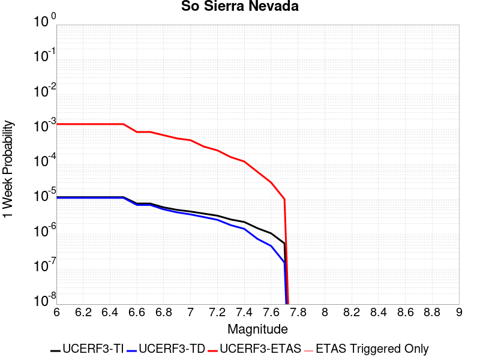 | 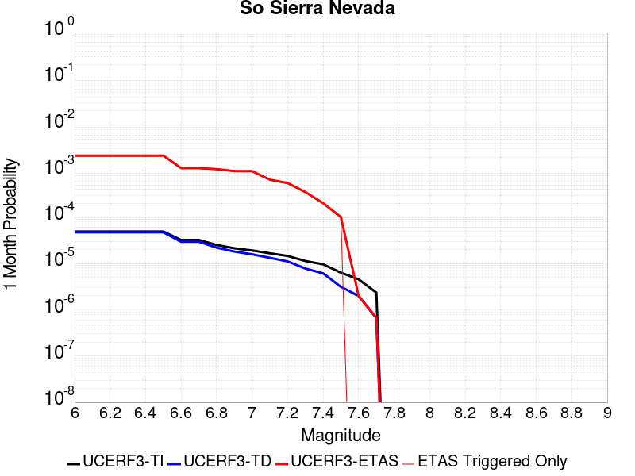 | 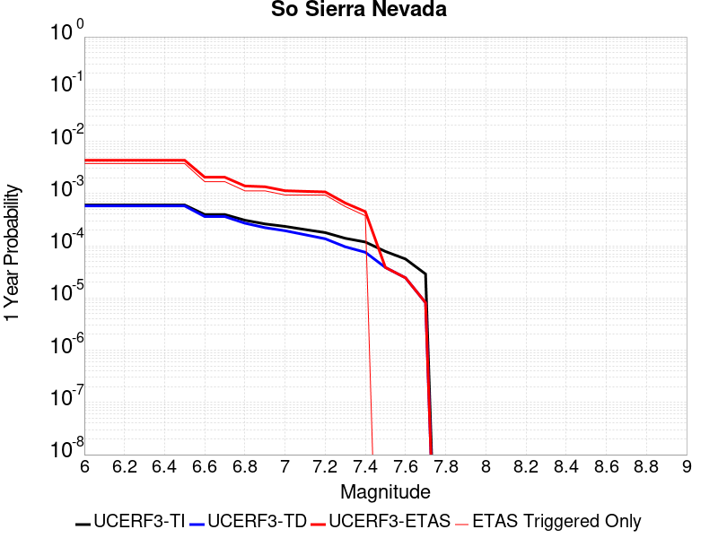 | 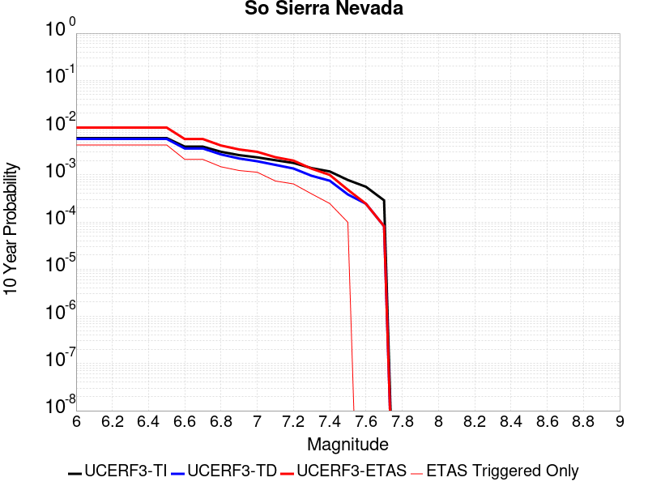 |

| Magnitude | 1 wk TI Prob | 1 wk TD Prob | 1 wk ETAS Prob | 1 wk ETAS/TD Gain | 1 wk ETAS Triggered Only | 1 mo TI Prob | 1 mo TD Prob | 1 mo ETAS Prob | 1 mo ETAS/TD Gain | 1 mo ETAS Triggered Only | 1 yr TI Prob | 1 yr TD Prob | 1 yr ETAS Prob | 1 yr ETAS/TD Gain | 1 yr ETAS Triggered Only | 10 yr TI Prob | 10 yr TD Prob | 10 yr ETAS Prob | 10 yr ETAS/TD Gain | 10 yr ETAS Triggered Only |
|-----|-----|-----|-----|-----|-----|-----|-----|-----|-----|-----|-----|-----|-----|-----|-----|-----|-----|-----|-----|-----|
| 6.0 | 1.15488665E-5 | 1.1079612E-5 | 0.001421064 | 128.25937 | 0.00141 | 4.9494203E-5 | 4.7483256E-5 | 0.0022773773 | 47.961693 | 0.00223 | 6.024253E-4 | 5.779681E-4 | 0.0038760607 | 6.706358 | 0.0033 | 0.006007948 | 0.005765918 | 0.010389106 | 1.8018131 | 0.00465 |
| 6.1 | 1.15488665E-5 | 1.1079612E-5 | 0.001421064 | 128.25937 | 0.00141 | 4.9494203E-5 | 4.7483256E-5 | 0.0022773773 | 47.961693 | 0.00223 | 6.024253E-4 | 5.779681E-4 | 0.0038760607 | 6.706358 | 0.0033 | 0.006007948 | 0.005765918 | 0.010389106 | 1.8018131 | 0.00465 |
| 6.2 | 1.15488665E-5 | 1.1079612E-5 | 0.001421064 | 128.25937 | 0.00141 | 4.9494203E-5 | 4.7483256E-5 | 0.0022773773 | 47.961693 | 0.00223 | 6.024253E-4 | 5.779681E-4 | 0.0038760607 | 6.706358 | 0.0033 | 0.006007948 | 0.005765918 | 0.010389106 | 1.8018131 | 0.00465 |
| 6.3 | 1.15488665E-5 | 1.1079612E-5 | 0.001421064 | 128.25937 | 0.00141 | 4.9494203E-5 | 4.7483256E-5 | 0.0022773773 | 47.961693 | 0.00223 | 6.024253E-4 | 5.779681E-4 | 0.0038760607 | 6.706358 | 0.0033 | 0.006007948 | 0.005765918 | 0.010389106 | 1.8018131 | 0.00465 |
| 6.4 | 1.15488665E-5 | 1.1079612E-5 | 0.001421064 | 128.25937 | 0.00141 | 4.9494203E-5 | 4.7483256E-5 | 0.0022773773 | 47.961693 | 0.00223 | 6.024253E-4 | 5.779681E-4 | 0.0038760607 | 6.706358 | 0.0033 | 0.006007948 | 0.005765918 | 0.010389106 | 1.8018131 | 0.00465 |
| 6.5 | 1.15488665E-5 | 1.1079612E-5 | 0.001421064 | 128.25937 | 0.00141 | 4.9494203E-5 | 4.7483256E-5 | 0.0022773773 | 47.961693 | 0.00223 | 6.024253E-4 | 5.779681E-4 | 0.0038760607 | 6.706358 | 0.0033 | 0.006007948 | 0.005765918 | 0.010389106 | 1.8018131 | 0.00465 |
| 6.6 | 7.587044E-6 | 6.9356042E-6 | 8.469298E-4 | 122.113335 | 8.4E-4 | 3.2515498E-5 | 2.9723697E-5 | 0.0012996859 | 43.725582 | 0.00127 | 3.9580427E-4 | 3.6182883E-4 | 0.0022611413 | 6.249202 | 0.0019 | 0.003951 | 0.0036126887 | 0.00616344 | 1.7060535 | 0.00256 |
| 6.7 | 7.587044E-6 | 6.9356042E-6 | 8.469298E-4 | 122.113335 | 8.4E-4 | 3.2515498E-5 | 2.9723697E-5 | 0.0012996859 | 43.725582 | 0.00127 | 3.9580427E-4 | 3.6182883E-4 | 0.0022611413 | 6.249202 | 0.0019 | 0.003951 | 0.0036126887 | 0.00616344 | 1.7060535 | 0.00256 |
| 6.8 | 5.9026956E-6 | 5.179362E-6 | 6.851758E-4 | 132.28963 | 6.8E-4 | 2.5297022E-5 | 2.2197082E-5 | 9.921755E-4 | 44.698467 | 9.7E-4 | 3.0794772E-4 | 2.7021713E-4 | 0.0015698659 | 5.8096457 | 0.0013 | 0.0030752132 | 0.002699002 | 0.0044642244 | 1.6540279 | 0.00177 |
| 6.9 | 5.0118915E-6 | 4.2523943E-6 | 5.5425003E-4 | 130.33835 | 5.5E-4 | 2.1479358E-5 | 1.8224424E-5 | 8.282097E-4 | 45.445038 | 8.1E-4 | 2.614798E-4 | 2.2186051E-4 | 0.0012816254 | 5.7767167 | 0.00106 | 0.0026117235 | 0.0022164627 | 0.0036233375 | 1.6347388 | 0.00141 |
| 7.0 | 4.4924795E-6 | 3.7138868E-6 | 4.937121E-4 | 132.93675 | 4.9E-4 | 1.925334E-5 | 1.5916565E-5 | 7.459049E-4 | 46.863438 | 7.3E-4 | 2.3438422E-4 | 1.9376757E-4 | 0.0011035913 | 5.6954384 | 9.1E-4 | 0.0023413717 | 0.0019360491 | 0.003153687 | 1.6289293 | 0.00122 |
| 7.1 | 3.9118436E-6 | 3.1119469E-6 | 3.2311096E-4 | 103.82919 | 3.2E-4 | 1.6764936E-5 | 1.333685E-5 | 5.1333016E-4 | 38.489613 | 5.0E-4 | 2.0409399E-4 | 1.6236462E-4 | 7.722656E-4 | 4.7563663 | 6.1E-4 | 0.0020390663 | 0.0016225161 | 0.0024411855 | 1.5045679 | 8.2E-4 |
| 7.2 | 3.4200818E-6 | 2.6054236E-6 | 2.5260478E-4 | 96.95344 | 2.5E-4 | 1.4657411E-5 | 1.11660565E-5 | 4.2116147E-4 | 37.718014 | 4.1E-4 | 1.7843937E-4 | 1.3593875E-4 | 6.0587487E-4 | 4.4569693 | 4.7E-4 | 0.0017829615 | 0.0013586058 | 0.0019977363 | 1.4704312 | 6.4E-4 |
| 7.3 | 2.6593618E-6 | 1.8283897E-6 | 1.618281E-4 | 88.50854 | 1.6E-4 | 1.13972155E-5 | 7.8359335E-6 | 2.5783398E-4 | 32.904053 | 2.5E-4 | 1.3875226E-4 | 9.539862E-5 | 3.6537286E-4 | 3.8299599 | 2.7E-4 | 0.0013866565 | 9.536055E-4 | 0.0013332432 | 1.3981076 | 3.8E-4 |
| 7.4 | 2.2577992E-6 | 1.4364078E-6 | 1.21436235E-4 | 84.54162 | 1.2E-4 | 9.676246E-6 | 6.1560204E-6 | 1.7615498E-4 | 28.615074 | 1.7E-4 | 1.1780193E-4 | 7.4947224E-5 | 2.5493372E-4 | 3.40151 | 1.8E-4 | 0.001177395 | 7.4924453E-4 | 9.990572E-4 | 1.3334194 | 2.5E-4 |
| 7.5 | 1.489319E-6 | 7.353661E-7 | 6.073532E-5 | 82.59196 | 6.0E-5 | 6.3827797E-6 | 3.1515651E-6 | 8.315131E-5 | 26.384132 | 8.0E-5 | 7.770758E-5 | 3.8369635E-5 | 1.18366566E-4 | 3.084902 | 8.0E-5 | 7.7680405E-4 | 3.8363054E-4 | 4.9358833E-4 | 1.2866242 | 1.1E-4 |
| 7.6 | 1.0680322E-6 | 4.65941E-7 | 3.0465928E-5 | 65.3858 | 3.0E-5 | 4.577273E-6 | 1.9968884E-6 | 3.1996828E-5 | 16.023342 | 3.0E-5 | 5.5726876E-5 | 2.4311848E-5 | 5.431112E-5 | 2.2339363 | 3.0E-5 | 5.5712904E-4 | 2.4309216E-4 | 3.0307757E-4 | 1.24676 | 6.0E-5 |
| 7.7 | 5.509146E-7 | 1.5578539E-7 | 1.01557835E-5 | 65.190865 | 1.0E-5 | 2.3610605E-6 | 6.676515E-7 | 1.0667645E-5 | 15.977864 | 1.0E-5 | 2.8745531E-5 | 8.128628E-6 | 1.8128547E-5 | 2.2302098 | 1.0E-5 | 2.8741814E-4 | 8.128342E-5 | 1.01281796E-4 | 1.2460326 | 2.0E-5 |

## San Andreas (Mojave S)
*[(top)](#table-of-contents)*

| 1 Week | 1 Month | 1 Year | 10 Year |
|-----|-----|-----|-----|
| 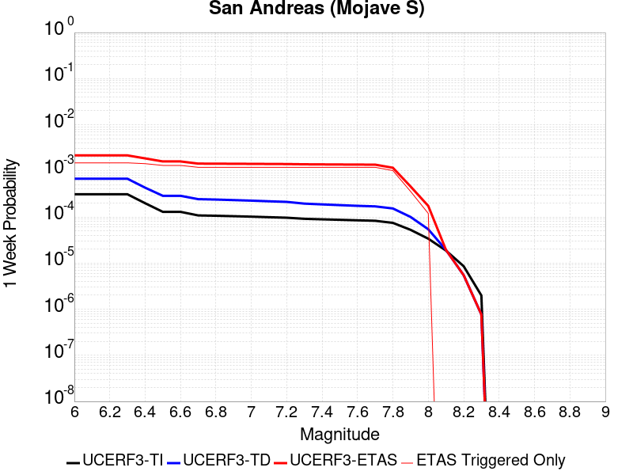 | 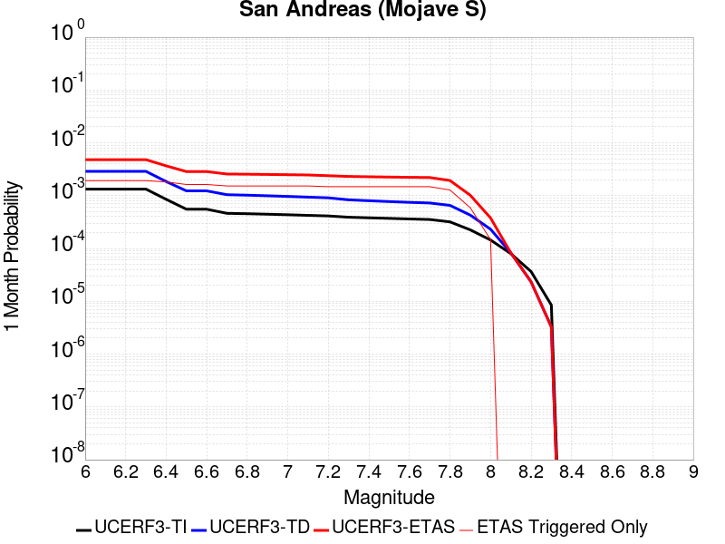 |  | 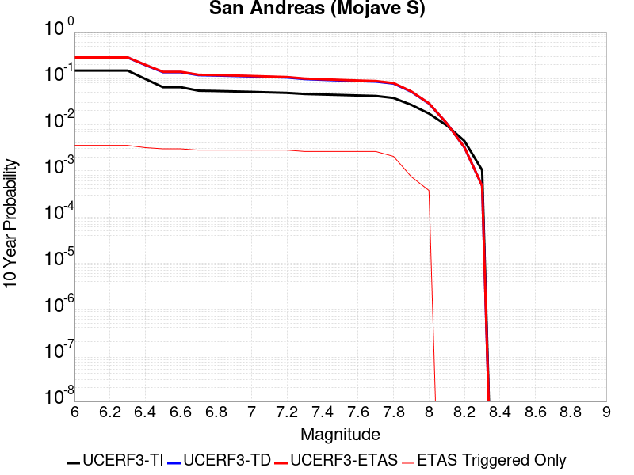 |

| Magnitude | 1 wk TI Prob | 1 wk TD Prob | 1 wk ETAS Prob | 1 wk ETAS/TD Gain | 1 wk ETAS Triggered Only | 1 mo TI Prob | 1 mo TD Prob | 1 mo ETAS Prob | 1 mo ETAS/TD Gain | 1 mo ETAS Triggered Only | 1 yr TI Prob | 1 yr TD Prob | 1 yr ETAS Prob | 1 yr ETAS/TD Gain | 1 yr ETAS Triggered Only | 10 yr TI Prob | 10 yr TD Prob | 10 yr ETAS Prob | 10 yr ETAS/TD Gain | 10 yr ETAS Triggered Only |
|-----|-----|-----|-----|-----|-----|-----|-----|-----|-----|-----|-----|-----|-----|-----|-----|-----|-----|-----|-----|-----|
| 6.0 | 3.1064058E-4 | 6.7462435E-4 | 0.0022335718 | 3.310838 | 0.00156 | 0.0013306376 | 0.002888172 | 0.0049322513 | 1.7077415 | 0.00205 | 0.016080605 | 0.034565594 | 0.03751017 | 1.085188 | 0.00305 | 0.1496549 | 0.28654557 | 0.28929237 | 1.0095859 | 0.00385 |
| 6.1 | 3.1064058E-4 | 6.7462435E-4 | 0.0022335718 | 3.310838 | 0.00156 | 0.0013306376 | 0.002888172 | 0.0049322513 | 1.7077415 | 0.00205 | 0.016080605 | 0.034565594 | 0.03751017 | 1.085188 | 0.00305 | 0.1496549 | 0.28654557 | 0.28929237 | 1.0095859 | 0.00385 |
| 6.2 | 3.1064058E-4 | 6.7462435E-4 | 0.0022335718 | 3.310838 | 0.00156 | 0.0013306376 | 0.002888172 | 0.0049322513 | 1.7077415 | 0.00205 | 0.016080605 | 0.034565594 | 0.03751017 | 1.085188 | 0.00305 | 0.1496549 | 0.28654557 | 0.28929237 | 1.0095859 | 0.00385 |
| 6.3 | 3.1064058E-4 | 6.7462435E-4 | 0.0022335718 | 3.310838 | 0.00156 | 0.0013306376 | 0.002888172 | 0.0049322513 | 1.7077415 | 0.00205 | 0.016080605 | 0.034565594 | 0.03751017 | 1.085188 | 0.00305 | 0.1496549 | 0.28654557 | 0.28929237 | 1.0095859 | 0.00385 |
| 6.4 | 1.9872203E-4 | 4.3181062E-4 | 0.0017612363 | 4.078724 | 0.00133 | 8.5138786E-4 | 0.0018493326 | 0.0035861148 | 1.93914 | 0.00174 | 0.010316478 | 0.02228931 | 0.024870466 | 1.1158024 | 0.00264 | 0.098504856 | 0.19686839 | 0.19952676 | 1.0135033 | 0.00331 |
| 6.5 | 1.291105E-4 | 2.8754136E-4 | 0.0015071905 | 5.2416477 | 0.00122 | 5.5321335E-4 | 0.0012317409 | 0.0027698441 | 2.2487228 | 0.00154 | 0.006714592 | 0.014894155 | 0.017248558 | 1.1580757 | 0.00239 | 0.065152965 | 0.13800792 | 0.1405508 | 1.0184256 | 0.00295 |
| 6.6 | 1.291105E-4 | 2.8754136E-4 | 0.0015071905 | 5.2416477 | 0.00122 | 5.5321335E-4 | 0.0012317409 | 0.0027698441 | 2.2487228 | 0.00154 | 0.006714592 | 0.014894155 | 0.017248558 | 1.1580757 | 0.00239 | 0.065152965 | 0.13800792 | 0.1405508 | 1.0184256 | 0.00295 |
| 6.7 | 1.08001186E-4 | 2.4335351E-4 | 0.0014330639 | 5.8888154 | 0.00119 | 4.6278012E-4 | 0.0010425274 | 0.002550953 | 2.4468932 | 0.00151 | 0.0056198016 | 0.0126192 | 0.014919797 | 1.1823093 | 0.00233 | 0.054797906 | 0.11918431 | 0.12166821 | 1.0208409 | 0.00282 |
| 6.8 | 1.0624356E-4 | 2.3853009E-4 | 0.0014282463 | 5.9876986 | 0.00119 | 4.5525006E-4 | 0.0010218718 | 0.0025303287 | 2.4761705 | 0.00151 | 0.0055285925 | 0.012370593 | 0.014671769 | 1.1860199 | 0.00233 | 0.053930566 | 0.11713308 | 0.11962277 | 1.0212551 | 0.00282 |
| 6.9 | 1.0393785E-4 | 2.3223337E-4 | 0.001421957 | 6.122966 | 0.00119 | 4.4537184E-4 | 9.949068E-4 | 0.0025034044 | 2.5162203 | 0.00151 | 0.0054089287 | 0.012045963 | 0.0143380165 | 1.1902757 | 0.00232 | 0.05279156 | 0.114433445 | 0.11692189 | 1.0217458 | 0.00281 |
| 7.0 | 1.0155622E-4 | 2.2592908E-4 | 0.0014056625 | 6.2216983 | 0.00118 | 4.3516833E-4 | 9.6790853E-4 | 0.0024664567 | 2.5482333 | 0.0015 | 0.005285311 | 0.011720838 | 0.01399388 | 1.1939317 | 0.0023 | 0.05161361 | 0.11169745 | 0.11416693 | 1.0221087 | 0.00278 |
| 7.1 | 9.885595E-5 | 2.188132E-4 | 0.001398555 | 6.3915477 | 0.00118 | 4.2359953E-4 | 9.374342E-4 | 0.002436028 | 2.5986123 | 0.0015 | 0.0051451353 | 0.011353733 | 0.0136276195 | 1.2002765 | 0.0023 | 0.05027629 | 0.10857607 | 0.11105423 | 1.0228242 | 0.00278 |
| 7.2 | 9.6411415E-5 | 2.1244297E-4 | 0.0013921923 | 6.5532517 | 0.00118 | 4.1312634E-4 | 9.101525E-4 | 0.0023987964 | 2.6355982 | 0.00149 | 0.005018219 | 0.011024987 | 0.01327985 | 1.204523 | 0.00228 | 0.049064007 | 0.1057697 | 0.10821989 | 1.0231653 | 0.00274 |
| 7.3 | 9.1180635E-5 | 1.9472656E-4 | 0.0013744967 | 7.0585995 | 0.00118 | 3.907156E-4 | 8.342756E-4 | 0.0023230326 | 2.7844906 | 0.00149 | 0.004746591 | 0.010110112 | 0.012357162 | 1.2222577 | 0.00227 | 0.046464786 | 0.09796176 | 0.10040628 | 1.0249538 | 0.00271 |
| 7.4 | 8.887388E-5 | 1.872126E-4 | 0.0013569936 | 7.2484093 | 0.00117 | 3.8083247E-4 | 8.020931E-4 | 0.002280906 | 2.8436923 | 0.00148 | 0.0046267817 | 0.009721855 | 0.011949981 | 1.2291874 | 0.00225 | 0.045316286 | 0.094593845 | 0.09702939 | 1.0257474 | 0.00269 |
| 7.5 | 8.6750515E-5 | 1.80528E-4 | 0.0013503168 | 7.479819 | 0.00117 | 3.7173493E-4 | 7.734621E-4 | 0.0022523173 | 2.9119945 | 0.00148 | 0.004516484 | 0.009376327 | 0.011595324 | 1.2366595 | 0.00224 | 0.04425787 | 0.09155606 | 0.09399068 | 1.0265917 | 0.00268 |
| 7.6 | 8.453092E-5 | 1.7440386E-4 | 0.0013242033 | 7.5927405 | 0.00115 | 3.6222505E-4 | 7.4723107E-4 | 0.0022061402 | 2.9524202 | 0.00146 | 0.0044011753 | 0.009059664 | 0.011249642 | 1.2417284 | 0.00221 | 0.04315024 | 0.08871447 | 0.09112027 | 1.0271184 | 0.00264 |
| 7.7 | 8.259102E-5 | 1.6962511E-4 | 0.0013194301 | 7.7785068 | 0.00115 | 3.539135E-4 | 7.267622E-4 | 0.0021857012 | 3.00745 | 0.00146 | 0.004300386 | 0.0088125 | 0.011003025 | 1.2485701 | 0.00221 | 0.042181134 | 0.086465426 | 0.088877164 | 1.0278925 | 0.00264 |
| 7.8 | 7.444844E-5 | 1.528469E-4 | 0.0010527093 | 6.887345 | 9.0E-4 | 3.1902574E-4 | 6.5489375E-4 | 0.0018141341 | 2.7701197 | 0.00116 | 0.0038772223 | 0.007944231 | 0.009670408 | 1.2172868 | 0.00174 | 0.03810269 | 0.078293875 | 0.08023868 | 1.0248398 | 0.00211 |
| 7.9 | 5.2586525E-5 | 1.0007023E-4 | 6.100192E-4 | 6.0959105 | 5.1E-4 | 2.2535135E-4 | 4.2880196E-4 | 0.0010885189 | 2.538512 | 6.6E-4 | 0.0027402006 | 0.005208178 | 0.006173126 | 1.1852756 | 9.7E-4 | 0.027066574 | 0.052201588 | 0.05337686 | 1.0225141 | 0.00124 |
| 8.0 | 3.379877E-5 | 5.4075565E-5 | 2.3406582E-4 | 4.3284955 | 1.8E-4 | 1.4484383E-4 | 2.3173184E-4 | 4.3168548E-4 | 1.8628665 | 2.0E-4 | 0.0017620471 | 0.0028176866 | 0.0031268133 | 1.1097094 | 3.1E-4 | 0.017481409 | 0.028835917 | 0.029243805 | 1.0141451 | 4.2E-4 |
| 8.1 | 1.8668277E-5 | 1.9308145E-5 | 4.9307564E-5 | 2.5537186 | 3.0E-5 | 8.000444E-5 | 8.274657E-5 | 1.12744085E-4 | 1.3625228 | 3.0E-5 | 9.736188E-4 | 0.0010069745 | 0.0010669141 | 1.0595244 | 6.0E-5 | 0.009693642 | 0.010798624 | 0.010877759 | 1.0073284 | 8.0E-5 |
| 8.2 | 8.541571E-6 | 5.4596358E-6 | 5.4596358E-6 | 1.0 | 0.0 | 3.660622E-5 | 2.339823E-5 | 2.339823E-5 | 1.0 | 0.0 | 4.455896E-4 | 2.848363E-4 | 2.9483344E-4 | 1.0350978 | 1.0E-5 | 0.0044469717 | 0.003240283 | 0.0032502508 | 1.0030762 | 1.0E-5 |
| 8.3 | 1.983087E-6 | 7.6564595E-7 | 7.6564595E-7 | 1.0 | 0.0 | 8.498917E-6 | 3.281336E-6 | 3.281336E-6 | 1.0 | 0.0 | 1.034694E-4 | 3.9949547E-5 | 3.9949547E-5 | 1.0 | 0.0 | 0.0010342124 | 4.717979E-4 | 4.717979E-4 | 1.0 | 0.0 |

## Coyote Canyon
*[(top)](#table-of-contents)*

| 1 Week | 1 Month | 1 Year | 10 Year |
|-----|-----|-----|-----|
| 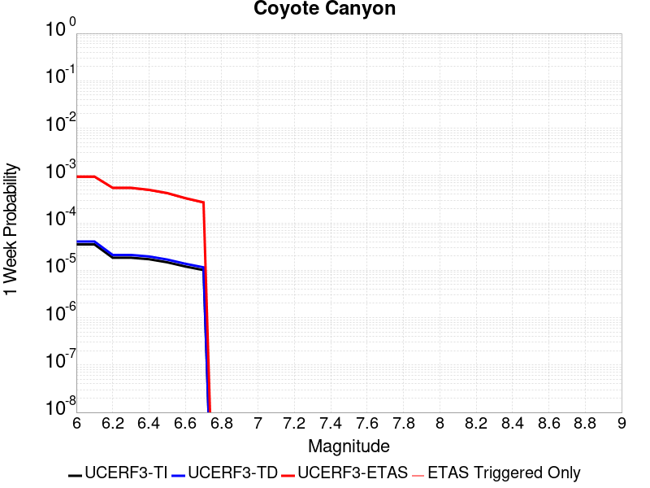 | 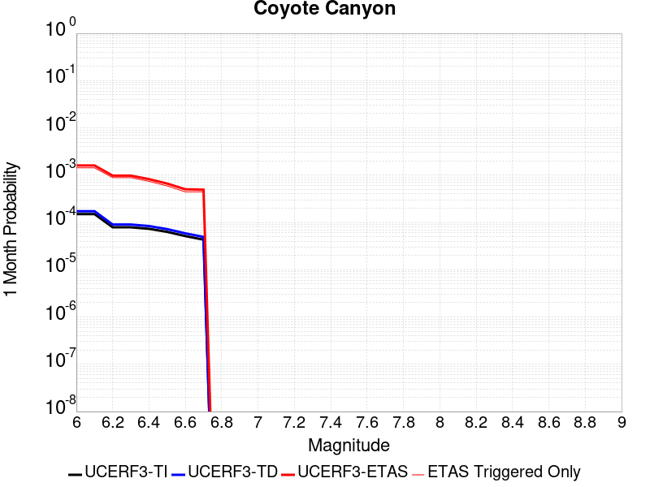 | 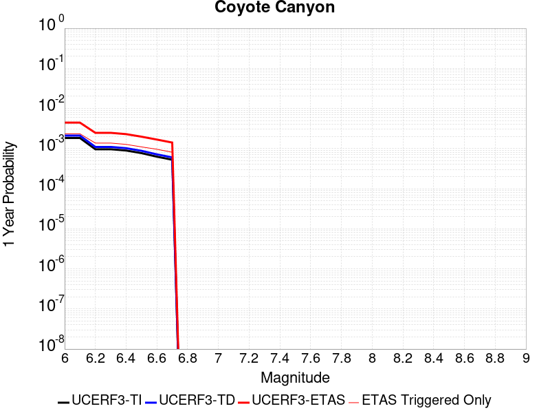 | 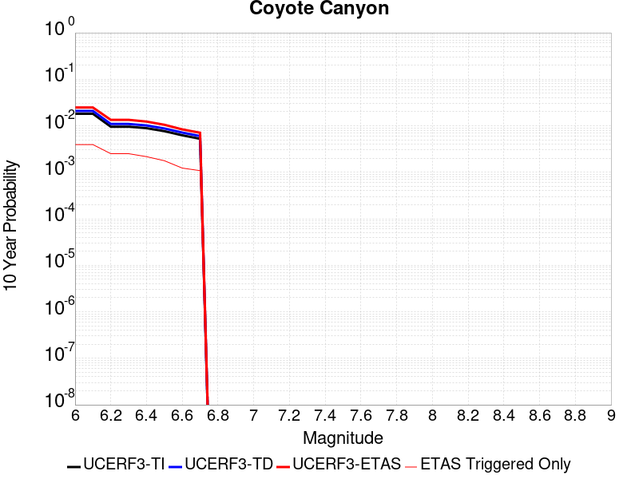 |

| Magnitude | 1 wk TI Prob | 1 wk TD Prob | 1 wk ETAS Prob | 1 wk ETAS/TD Gain | 1 wk ETAS Triggered Only | 1 mo TI Prob | 1 mo TD Prob | 1 mo ETAS Prob | 1 mo ETAS/TD Gain | 1 mo ETAS Triggered Only | 1 yr TI Prob | 1 yr TD Prob | 1 yr ETAS Prob | 1 yr ETAS/TD Gain | 1 yr ETAS Triggered Only | 10 yr TI Prob | 10 yr TD Prob | 10 yr ETAS Prob | 10 yr ETAS/TD Gain | 10 yr ETAS Triggered Only |
|-----|-----|-----|-----|-----|-----|-----|-----|-----|-----|-----|-----|-----|-----|-----|-----|-----|-----|-----|-----|-----|
| 6.0 | 3.5090034E-5 | 4.0364317E-5 | 9.503276E-4 | 23.543755 | 9.1E-4 | 1.503772E-4 | 1.7297991E-4 | 0.0015227464 | 8.803024 | 0.00135 | 0.0018293047 | 0.0021042533 | 0.0044293506 | 2.1049511 | 0.00233 | 0.018143194 | 0.020869205 | 0.024374492 | 1.1679646 | 0.00358 |
| 6.1 | 3.5090034E-5 | 4.0364317E-5 | 9.503276E-4 | 23.543755 | 9.1E-4 | 1.503772E-4 | 1.7297991E-4 | 0.0015227464 | 8.803024 | 0.00135 | 0.0018293047 | 0.0021042533 | 0.0044293506 | 2.1049511 | 0.00233 | 0.018143194 | 0.020869205 | 0.024374492 | 1.1679646 | 0.00358 |
| 6.2 | 1.841879E-5 | 2.1059794E-5 | 5.510486E-4 | 26.165909 | 5.3E-4 | 7.8935285E-5 | 9.025371E-5 | 8.901815E-4 | 9.863102 | 8.0E-4 | 9.606133E-4 | 0.0010983871 | 0.002466882 | 2.2459135 | 0.00137 | 0.0095647145 | 0.010939668 | 0.01310571 | 1.1979989 | 0.00219 |
| 6.3 | 1.841879E-5 | 2.1059794E-5 | 5.510486E-4 | 26.165909 | 5.3E-4 | 7.8935285E-5 | 9.025371E-5 | 8.901815E-4 | 9.863102 | 8.0E-4 | 9.606133E-4 | 0.0010983871 | 0.002466882 | 2.2459135 | 0.00137 | 0.0095647145 | 0.010939668 | 0.01310571 | 1.1979989 | 0.00219 |
| 6.4 | 1.712201E-5 | 1.9565212E-5 | 4.9955584E-4 | 25.53286 | 4.8E-4 | 7.337798E-5 | 8.3848776E-5 | 8.337859E-4 | 9.943924 | 7.5E-4 | 8.930107E-4 | 0.0010204813 | 0.0022891853 | 2.2432408 | 0.00127 | 0.008894307 | 0.010167871 | 0.012197027 | 1.1995654 | 0.00205 |
| 6.5 | 1.4744935E-5 | 1.6836972E-5 | 4.2683005E-4 | 25.350761 | 4.1E-4 | 6.3191044E-5 | 7.215698E-5 | 7.221101E-4 | 10.007487 | 6.5E-4 | 7.6907943E-4 | 8.782507E-4 | 0.0019772847 | 2.2513897 | 0.0011 | 0.007664232 | 0.008756994 | 0.010551144 | 1.2048819 | 0.00181 |
| 6.6 | 1.2017839E-5 | 1.3724089E-5 | 3.3371968E-4 | 24.316345 | 3.2E-4 | 5.150401E-5 | 5.88167E-5 | 5.9878494E-4 | 10.180527 | 5.4E-4 | 6.268809E-4 | 7.159466E-4 | 0.0016752593 | 2.3399222 | 9.6E-4 | 0.0062511545 | 0.0071450938 | 0.008654233 | 1.2112134 | 0.00152 |
| 6.7 | 1.00956095E-5 | 1.1533517E-5 | 2.7153053E-4 | 23.542734 | 2.6E-4 | 4.326618E-5 | 4.942891E-5 | 5.0940615E-4 | 10.305835 | 4.6E-4 | 5.266384E-4 | 6.017178E-4 | 0.0014112304 | 2.345336 | 8.1E-4 | 0.005253921 | 0.0060094125 | 0.0072817206 | 1.2117192 | 0.00128 |

## Lenwood-Lockhart-Old Woman Springs
*[(top)](#table-of-contents)*

| 1 Week | 1 Month | 1 Year | 10 Year |
|-----|-----|-----|-----|
| 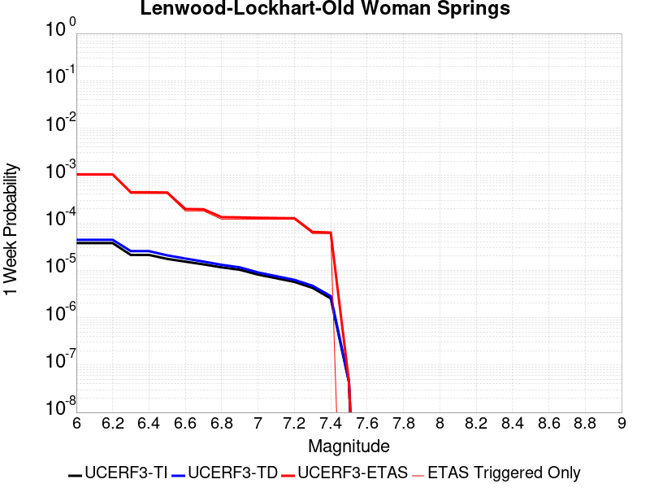 | 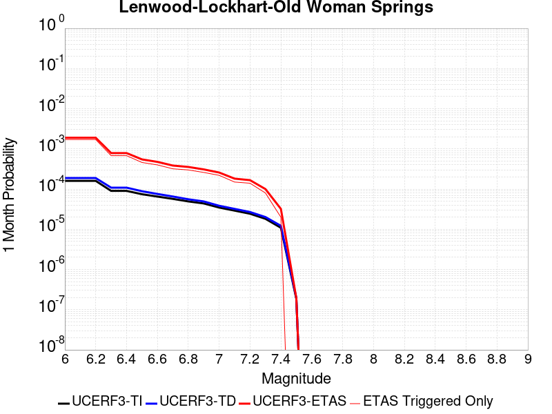 | 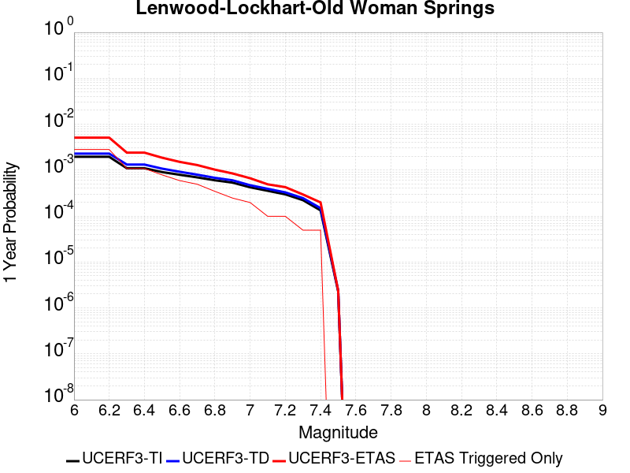 | 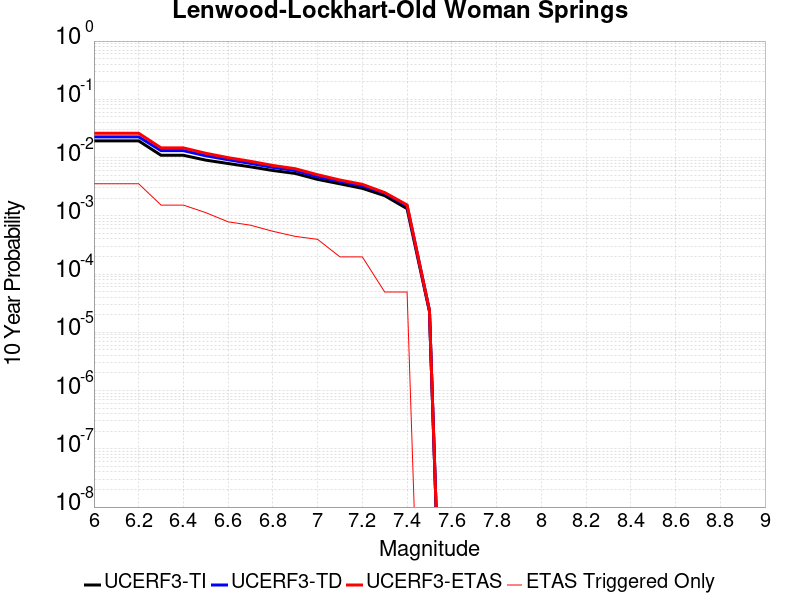 |

| Magnitude | 1 wk TI Prob | 1 wk TD Prob | 1 wk ETAS Prob | 1 wk ETAS/TD Gain | 1 wk ETAS Triggered Only | 1 mo TI Prob | 1 mo TD Prob | 1 mo ETAS Prob | 1 mo ETAS/TD Gain | 1 mo ETAS Triggered Only | 1 yr TI Prob | 1 yr TD Prob | 1 yr ETAS Prob | 1 yr ETAS/TD Gain | 1 yr ETAS Triggered Only | 10 yr TI Prob | 10 yr TD Prob | 10 yr ETAS Prob | 10 yr ETAS/TD Gain | 10 yr ETAS Triggered Only |
|-----|-----|-----|-----|-----|-----|-----|-----|-----|-----|-----|-----|-----|-----|-----|-----|-----|-----|-----|-----|-----|
| 6.0 | 3.744542E-5 | 4.396349E-5 | 0.001213912 | 27.611822 | 0.00117 | 1.604705E-4 | 1.8840231E-4 | 0.0018980801 | 10.074612 | 0.00171 | 0.0019519776 | 0.0022915571 | 0.004995347 | 2.179892 | 0.00271 | 0.019349206 | 0.022697281 | 0.026381712 | 1.1623292 | 0.00377 |
| 6.1 | 3.744542E-5 | 4.396349E-5 | 0.001213912 | 27.611822 | 0.00117 | 1.604705E-4 | 1.8840231E-4 | 0.0018980801 | 10.074612 | 0.00171 | 0.0019519776 | 0.0022915571 | 0.004995347 | 2.179892 | 0.00271 | 0.019349206 | 0.022697281 | 0.026381712 | 1.1623292 | 0.00377 |
| 6.2 | 3.744542E-5 | 4.396349E-5 | 0.001213912 | 27.611822 | 0.00117 | 1.604705E-4 | 1.8840231E-4 | 0.0018980801 | 10.074612 | 0.00171 | 0.0019519776 | 0.0022915571 | 0.004995347 | 2.179892 | 0.00271 | 0.019349206 | 0.022697281 | 0.026381712 | 1.1623292 | 0.00377 |
| 6.3 | 2.1079984E-5 | 2.5354384E-5 | 5.3534145E-4 | 21.114355 | 5.1E-4 | 9.0339665E-5 | 1.0865723E-4 | 7.8858336E-4 | 7.257532 | 6.8E-4 | 0.0010993304 | 0.0013221189 | 0.0024805854 | 1.8762194 | 0.00116 | 0.010939079 | 0.013144747 | 0.014832269 | 1.12838 | 0.00171 |
| 6.4 | 2.1079984E-5 | 2.5354384E-5 | 5.3534145E-4 | 21.114355 | 5.1E-4 | 9.0339665E-5 | 1.0865723E-4 | 7.8858336E-4 | 7.257532 | 6.8E-4 | 0.0010993304 | 0.0013221189 | 0.0024805854 | 1.8762194 | 0.00116 | 0.010939079 | 0.013144747 | 0.014832269 | 1.12838 | 0.00171 |
| 6.5 | 1.7397282E-5 | 2.0663285E-5 | 4.1065522E-4 | 19.873667 | 3.9E-4 | 7.455765E-5 | 8.8554E-5 | 5.4851326E-4 | 6.194111 | 4.6E-4 | 9.073613E-4 | 0.0010776235 | 0.0018967397 | 1.7601137 | 8.2E-4 | 0.009036654 | 0.010725273 | 0.011991545 | 1.1180643 | 0.00128 |
| 6.6 | 1.52050325E-5 | 1.7680086E-5 | 3.4767424E-4 | 19.664738 | 3.3E-4 | 6.51628E-5 | 7.576964E-5 | 4.7573933E-4 | 6.2787595 | 4.0E-4 | 7.9306826E-4 | 9.221128E-4 | 0.0016014858 | 1.7367569 | 6.8E-4 | 0.007902439 | 0.009183729 | 0.010243902 | 1.1154404 | 0.00107 |
| 6.7 | 1.332523E-5 | 1.5264379E-5 | 2.6526058E-4 | 17.377748 | 2.5E-4 | 5.7106878E-5 | 6.541716E-5 | 3.8539624E-4 | 5.8913627 | 3.2E-4 | 6.950544E-4 | 7.9616875E-4 | 0.0013457309 | 1.6902583 | 5.5E-4 | 0.006928845 | 0.0079337945 | 0.008816733 | 1.1112883 | 8.9E-4 |
| 6.8 | 1.1525329E-5 | 1.3031365E-5 | 2.4302836E-4 | 18.649494 | 2.3E-4 | 4.9393333E-5 | 5.5847537E-5 | 3.558308E-4 | 6.371468 | 3.0E-4 | 6.011979E-4 | 6.7973585E-4 | 0.0011694027 | 1.7203783 | 4.9E-4 | 0.00599574 | 0.0067770192 | 0.007521936 | 1.1099181 | 7.5E-4 |
| 6.9 | 1.0253909E-5 | 1.1514835E-5 | 2.1151252E-4 | 18.3687 | 2.0E-4 | 4.3944583E-5 | 4.934838E-5 | 3.0933553E-4 | 6.2684035 | 2.6E-4 | 5.3489394E-4 | 6.006545E-4 | 0.0010004143 | 1.6655402 | 4.0E-4 | 0.0053360825 | 0.0059906896 | 0.006597035 | 1.1012146 | 6.1E-4 |
| 7.0 | 8.104563E-6 | 8.99143E-6 | 1.8898981E-4 | 21.01888 | 1.8E-4 | 3.4733377E-5 | 3.853415E-5 | 2.5852566E-4 | 6.709002 | 2.2E-4 | 4.2279682E-4 | 4.6905465E-4 | 7.5891864E-4 | 1.6179749 | 2.9E-4 | 0.0042199334 | 0.0046808943 | 0.0051088817 | 1.0914328 | 4.3E-4 |
| 7.1 | 6.7986157E-6 | 7.5159796E-6 | 1.2751507E-4 | 16.965862 | 1.2E-4 | 2.91366E-5 | 3.2210955E-5 | 1.8220613E-4 | 5.6566505 | 1.5E-4 | 3.5468035E-4 | 3.9209996E-4 | 5.9202156E-4 | 1.509874 | 2.0E-4 | 0.003541148 | 0.003914298 | 0.004183241 | 1.068708 | 2.7E-4 |
| 7.2 | 5.6893327E-6 | 6.280132E-6 | 1.1627944E-4 | 18.515446 | 1.1E-4 | 2.4382627E-5 | 2.6914584E-5 | 1.6691082E-4 | 6.201501 | 1.4E-4 | 2.9681803E-4 | 3.276378E-4 | 5.0757884E-4 | 1.5492072 | 1.8E-4 | 0.002964219 | 0.003271746 | 0.0035109608 | 1.0731153 | 2.4E-4 |
| 7.3 | 4.253348E-6 | 4.707075E-6 | 6.470679E-5 | 13.746711 | 6.0E-5 | 1.8228506E-5 | 2.017303E-5 | 1.0017142E-4 | 4.9656105 | 8.0E-5 | 2.2190946E-4 | 2.455808E-4 | 3.6555133E-4 | 1.4885175 | 1.2E-4 | 0.00221688 | 0.0024532753 | 0.0026029071 | 1.0609927 | 1.5E-4 |
| 7.4 | 2.5448119E-6 | 2.8520594E-6 | 1.28520305E-5 | 4.5062284 | 1.0E-5 | 1.0906291E-5 | 1.2223064E-5 | 3.222282E-5 | 2.636231 | 2.0E-5 | 1.3277601E-4 | 1.4880729E-4 | 1.8880134E-4 | 1.268764 | 4.0E-5 | 0.001326967 | 0.0014872387 | 0.0015371643 | 1.0335693 | 5.0E-5 |
| 7.5 | 4.3706837E-8 | 4.562909E-8 | 4.562909E-8 | 1.0 | 0.0 | 1.8731501E-7 | 1.9555324E-7 | 1.9555324E-7 | 1.0 | 0.0 | 2.2805577E-6 | 2.3808586E-6 | 2.3808586E-6 | 1.0 | 0.0 | 2.2805343E-5 | 2.3808387E-5 | 2.3808387E-5 | 1.0 | 0.0 |

## Death Valley (So)
*[(top)](#table-of-contents)*

| 1 Week | 1 Month | 1 Year | 10 Year |
|-----|-----|-----|-----|
| 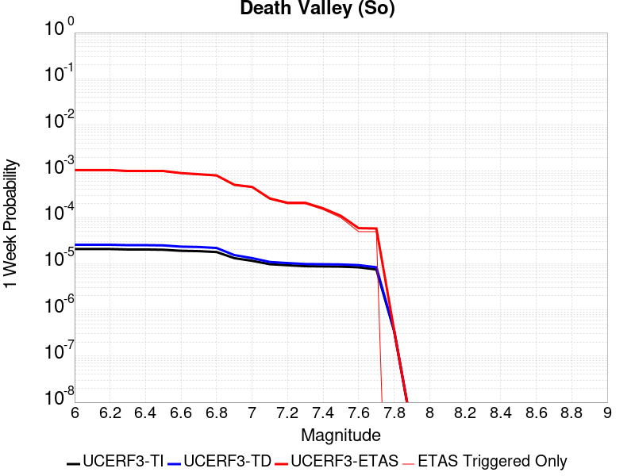 |  | 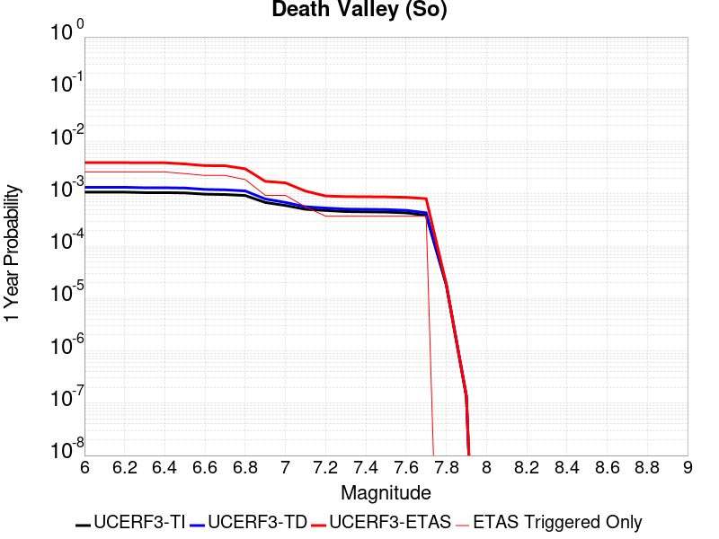 | 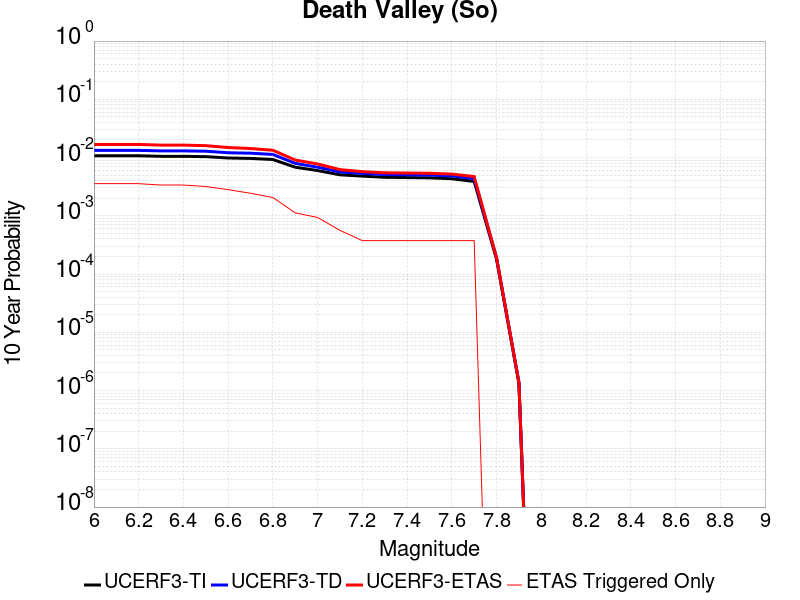 |

| Magnitude | 1 wk TI Prob | 1 wk TD Prob | 1 wk ETAS Prob | 1 wk ETAS/TD Gain | 1 wk ETAS Triggered Only | 1 mo TI Prob | 1 mo TD Prob | 1 mo ETAS Prob | 1 mo ETAS/TD Gain | 1 mo ETAS Triggered Only | 1 yr TI Prob | 1 yr TD Prob | 1 yr ETAS Prob | 1 yr ETAS/TD Gain | 1 yr ETAS Triggered Only | 10 yr TI Prob | 10 yr TD Prob | 10 yr ETAS Prob | 10 yr ETAS/TD Gain | 10 yr ETAS Triggered Only |
|-----|-----|-----|-----|-----|-----|-----|-----|-----|-----|-----|-----|-----|-----|-----|-----|-----|-----|-----|-----|-----|
| 6.0 | 2.0684236E-5 | 2.5618314E-5 | 0.0010355924 | 40.423912 | 0.00101 | 8.864371E-5 | 1.0978825E-4 | 0.0017896038 | 16.300505 | 0.00168 | 0.0010787029 | 0.0013358692 | 0.004012289 | 3.0035045 | 0.00268 | 0.010734817 | 0.013279985 | 0.01699005 | 1.2793728 | 0.00376 |
| 6.1 | 2.0684236E-5 | 2.5618314E-5 | 0.0010355924 | 40.423912 | 0.00101 | 8.864371E-5 | 1.0978825E-4 | 0.0017896038 | 16.300505 | 0.00168 | 0.0010787029 | 0.0013358692 | 0.004012289 | 3.0035045 | 0.00268 | 0.010734817 | 0.013279985 | 0.01699005 | 1.2793728 | 0.00376 |
| 6.2 | 2.0684236E-5 | 2.5618314E-5 | 0.0010355924 | 40.423912 | 0.00101 | 8.864371E-5 | 1.0978825E-4 | 0.0017896038 | 16.300505 | 0.00168 | 0.0010787029 | 0.0013358692 | 0.004012289 | 3.0035045 | 0.00268 | 0.010734817 | 0.013279985 | 0.01699005 | 1.2793728 | 0.00376 |
| 6.3 | 2.0240292E-5 | 2.51184E-5 | 0.0010050938 | 40.014248 | 9.8E-4 | 8.6741224E-5 | 1.0764593E-4 | 0.0017174726 | 15.954831 | 0.00161 | 0.0010555626 | 0.001309818 | 0.0038664648 | 2.95191 | 0.00256 | 0.010505628 | 0.013022543 | 0.016555922 | 1.2713279 | 0.00358 |
| 6.4 | 2.0240292E-5 | 2.51184E-5 | 0.0010050938 | 40.014248 | 9.8E-4 | 8.6741224E-5 | 1.0764593E-4 | 0.0017174726 | 15.954831 | 0.00161 | 0.0010555626 | 0.001309818 | 0.0038664648 | 2.95191 | 0.00256 | 0.010505628 | 0.013022543 | 0.016555922 | 1.2713279 | 0.00358 |
| 6.5 | 1.9962767E-5 | 2.4807652E-5 | 9.747841E-4 | 39.293686 | 9.5E-4 | 8.55519E-5 | 1.0631427E-4 | 0.0016661484 | 15.671917 | 0.00156 | 0.0010410968 | 0.0012936244 | 0.0037903902 | 2.930055 | 0.0025 | 0.010362327 | 0.01286249 | 0.016297728 | 1.2670741 | 0.00348 |
| 6.6 | 1.8937297E-5 | 2.3311462E-5 | 8.532921E-4 | 36.603973 | 8.3E-4 | 8.115732E-5 | 9.990252E-5 | 0.0015097617 | 15.112348 | 0.00141 | 9.876423E-4 | 0.0012156491 | 0.0035028653 | 2.8814774 | 0.00229 | 0.009832645 | 0.0120915035 | 0.015272569 | 1.2630827 | 0.00322 |
| 6.7 | 1.8621096E-5 | 2.2912098E-5 | 8.428933E-4 | 36.788136 | 8.2E-4 | 7.980225E-5 | 9.8191085E-5 | 0.0014680566 | 14.951016 | 0.00137 | 9.711593E-4 | 0.0011948354 | 0.0034221709 | 2.864136 | 0.00223 | 0.009669261 | 0.011885625 | 0.014958661 | 1.2585506 | 0.00311 |
| 6.8 | 1.7830353E-5 | 2.1806083E-5 | 7.6178997E-4 | 34.934742 | 7.4E-4 | 7.641356E-5 | 9.3451374E-5 | 0.0013733318 | 14.695683 | 0.00128 | 9.29938E-4 | 0.0011371907 | 0.0032048367 | 2.818205 | 0.00207 | 0.009260561 | 0.01131609 | 0.0141635 | 1.2516248 | 0.00288 |
| 6.9 | 1.3135183E-5 | 1.5304031E-5 | 5.3529604E-4 | 34.97746 | 5.2E-4 | 5.6292425E-5 | 6.558709E-5 | 9.455294E-4 | 14.416395 | 8.8E-4 | 6.8514474E-4 | 7.982367E-4 | 0.0021871272 | 2.739948 | 0.00139 | 0.006830362 | 0.007955158 | 0.009830123 | 1.2356917 | 0.00189 |
| 7.0 | 1.1507512E-5 | 1.3154237E-5 | 4.331487E-4 | 32.928455 | 4.2E-4 | 4.9316975E-5 | 5.637412E-5 | 7.5633463E-4 | 13.416346 | 7.0E-4 | 6.002687E-4 | 6.861445E-4 | 0.0017654035 | 2.5729325 | 0.00108 | 0.0059864987 | 0.0068414924 | 0.008291504 | 1.2119437 | 0.00146 |
| 7.1 | 9.715903E-6 | 1.0865287E-5 | 2.20863E-4 | 20.327398 | 2.1E-4 | 4.1638916E-5 | 4.6564706E-5 | 3.9654842E-4 | 8.516072 | 3.5E-4 | 5.068359E-4 | 5.667821E-4 | 0.0010864873 | 1.9169402 | 5.2E-4 | 0.0050568148 | 0.005653834 | 0.006349876 | 1.1231098 | 7.0E-4 |
| 7.2 | 9.233269E-6 | 1.0286314E-5 | 1.9028447E-4 | 18.4988 | 1.8E-4 | 3.9570554E-5 | 4.408348E-5 | 3.1407157E-4 | 7.124473 | 2.7E-4 | 4.81665E-4 | 5.365884E-4 | 9.4636844E-4 | 1.7636765 | 4.1E-4 | 0.0048062233 | 0.0053533595 | 0.005900415 | 1.1021892 | 5.5E-4 |
| 7.3 | 8.8041315E-6 | 9.808164E-6 | 1.6980659E-4 | 17.31278 | 1.6E-4 | 3.7731446E-5 | 4.2034335E-5 | 2.7202466E-4 | 6.4714875 | 2.3E-4 | 4.592835E-4 | 5.1165203E-4 | 8.7146787E-4 | 1.7032431 | 3.6E-4 | 0.0045833546 | 0.005105167 | 0.0056026145 | 1.09744 | 5.0E-4 |
| 7.4 | 8.708749E-6 | 9.707175E-6 | 1.5970571E-4 | 16.452337 | 1.5E-4 | 3.7322676E-5 | 4.160154E-5 | 2.615924E-4 | 6.288046 | 2.2E-4 | 4.5430884E-4 | 5.0638523E-4 | 8.262232E-4 | 1.6316099 | 3.2E-4 | 0.004533812 | 0.0050527398 | 0.0055104154 | 1.0905797 | 4.6E-4 |
| 7.5 | 8.612678E-6 | 9.604817E-6 | 1.4960347E-4 | 15.575879 | 1.4E-4 | 3.6910955E-5 | 4.1162875E-5 | 2.5115424E-4 | 6.1014743 | 2.1E-4 | 4.492982E-4 | 5.01047E-4 | 8.108917E-4 | 1.6183945 | 3.1E-4 | 0.004483909 | 0.0049995985 | 0.005427449 | 1.0855769 | 4.3E-4 |
| 7.6 | 8.319024E-6 | 9.283916E-6 | 1.0928299E-4 | 11.771216 | 1.0E-4 | 3.5652476E-5 | 3.978763E-5 | 2.0978086E-4 | 5.272515 | 1.7E-4 | 4.3398244E-4 | 4.8431093E-4 | 7.44185E-4 | 1.5365852 | 2.6E-4 | 0.0043313587 | 0.0048329784 | 0.005211142 | 1.0782465 | 3.8E-4 |
| 7.7 | 7.4718328E-6 | 8.34517E-6 | 9.834442E-5 | 11.784592 | 9.0E-5 | 3.2021748E-5 | 3.5764548E-5 | 1.9575882E-4 | 5.473544 | 1.6E-4 | 3.8979502E-4 | 4.353504E-4 | 6.5525464E-4 | 1.50512 | 2.2E-4 | 0.00389112 | 0.0043453807 | 0.0046540336 | 1.0710301 | 3.1E-4 |
| 7.8 | 3.4586725E-7 | 3.6482615E-7 | 1.0364823E-5 | 28.410307 | 1.0E-5 | 1.4822873E-6 | 1.5635396E-6 | 1.1563524E-5 | 7.3957343 | 1.0E-5 | 1.80467E-5 | 1.9035933E-5 | 2.9035744E-5 | 1.5253123 | 1.0E-5 | 1.8045233E-4 | 1.9034347E-4 | 2.0034157E-4 | 1.0525266 | 1.0E-5 |
| 7.9 | 2.5591178E-9 | 2.6696718E-9 | 2.6696718E-9 | 1.0 | 0.0 | 1.0967647E-8 | 1.14414505E-8 | 1.14414505E-8 | 1.0 | 0.0 | 1.335311E-7 | 1.3929966E-7 | 1.3929966E-7 | 1.0 | 0.0 | 1.3353102E-6 | 1.3929966E-6 | 1.3929966E-6 | 1.0 | 0.0 |

## San Andreas (Mojave N)
*[(top)](#table-of-contents)*

| 1 Week | 1 Month | 1 Year | 10 Year |
|-----|-----|-----|-----|
| 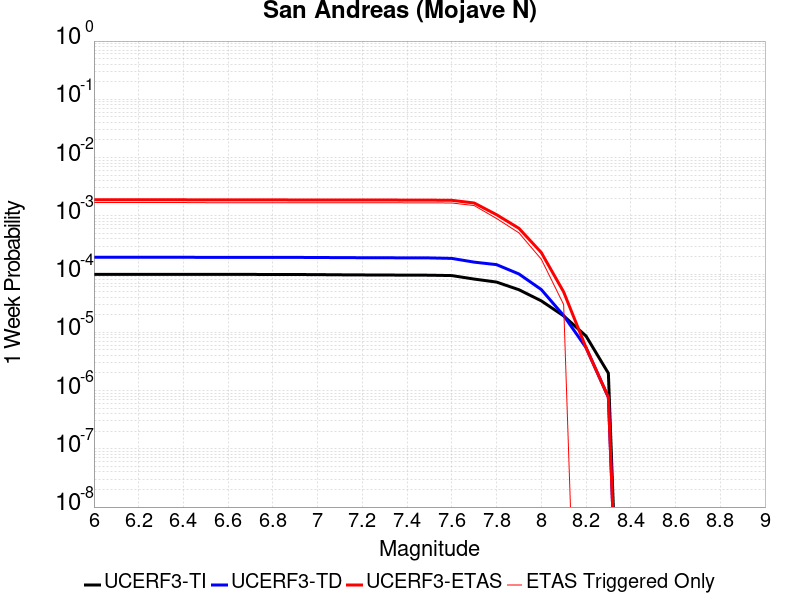 | 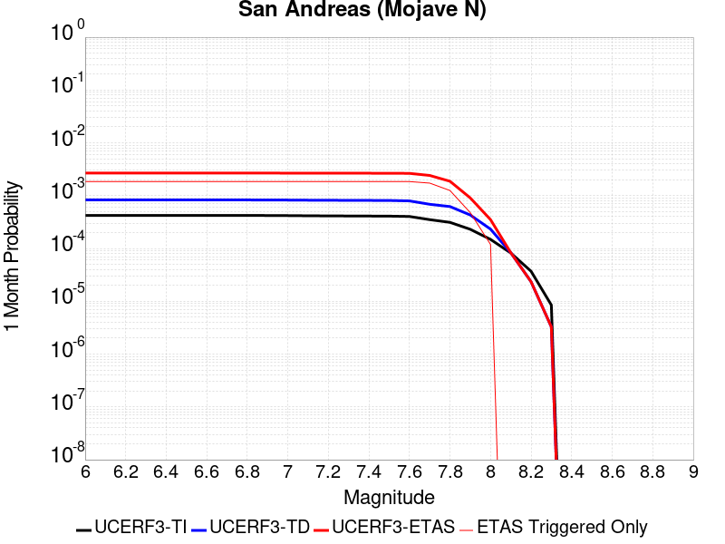 | 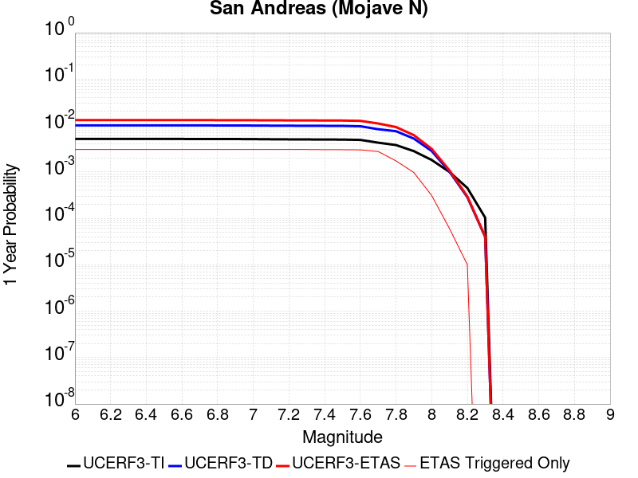 | 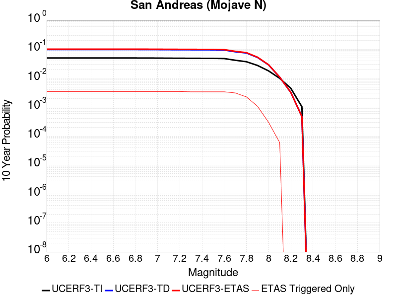 |

| Magnitude | 1 wk TI Prob | 1 wk TD Prob | 1 wk ETAS Prob | 1 wk ETAS/TD Gain | 1 wk ETAS Triggered Only | 1 mo TI Prob | 1 mo TD Prob | 1 mo ETAS Prob | 1 mo ETAS/TD Gain | 1 mo ETAS Triggered Only | 1 yr TI Prob | 1 yr TD Prob | 1 yr ETAS Prob | 1 yr ETAS/TD Gain | 1 yr ETAS Triggered Only | 10 yr TI Prob | 10 yr TD Prob | 10 yr ETAS Prob | 10 yr ETAS/TD Gain | 10 yr ETAS Triggered Only |
|-----|-----|-----|-----|-----|-----|-----|-----|-----|-----|-----|-----|-----|-----|-----|-----|-----|-----|-----|-----|-----|
| 6.0 | 9.877682E-5 | 1.9402112E-4 | 0.0018836933 | 9.708702 | 0.00169 | 4.2326056E-4 | 8.312543E-4 | 0.002949492 | 3.5482428 | 0.00212 | 0.0051410277 | 0.010073684 | 0.013092959 | 1.2997191 | 0.00305 | 0.05023708 | 0.09832245 | 0.10156849 | 1.0330142 | 0.0036 |
| 6.1 | 9.877682E-5 | 1.9402112E-4 | 0.0018836933 | 9.708702 | 0.00169 | 4.2326056E-4 | 8.312543E-4 | 0.002949492 | 3.5482428 | 0.00212 | 0.0051410277 | 0.010073684 | 0.013092959 | 1.2997191 | 0.00305 | 0.05023708 | 0.09832245 | 0.10156849 | 1.0330142 | 0.0036 |
| 6.2 | 9.877682E-5 | 1.9402112E-4 | 0.0018836933 | 9.708702 | 0.00169 | 4.2326056E-4 | 8.312543E-4 | 0.002949492 | 3.5482428 | 0.00212 | 0.0051410277 | 0.010073684 | 0.013092959 | 1.2997191 | 0.00305 | 0.05023708 | 0.09832245 | 0.10156849 | 1.0330142 | 0.0036 |
| 6.3 | 9.877682E-5 | 1.9402112E-4 | 0.0018836933 | 9.708702 | 0.00169 | 4.2326056E-4 | 8.312543E-4 | 0.002949492 | 3.5482428 | 0.00212 | 0.0051410277 | 0.010073684 | 0.013092959 | 1.2997191 | 0.00305 | 0.05023708 | 0.09832245 | 0.10156849 | 1.0330142 | 0.0036 |
| 6.4 | 9.877682E-5 | 1.9402112E-4 | 0.0018836933 | 9.708702 | 0.00169 | 4.2326056E-4 | 8.312543E-4 | 0.002949492 | 3.5482428 | 0.00212 | 0.0051410277 | 0.010073684 | 0.013092959 | 1.2997191 | 0.00305 | 0.05023708 | 0.09832245 | 0.10156849 | 1.0330142 | 0.0036 |
| 6.5 | 9.861474E-5 | 1.937588E-4 | 0.0018734332 | 9.668894 | 0.00168 | 4.2256617E-4 | 8.3013077E-4 | 0.0029383793 | 3.539658 | 0.00211 | 0.0051326132 | 0.0100601325 | 0.01306955 | 1.299143 | 0.00304 | 0.050156746 | 0.09820035 | 0.10143781 | 1.0329679 | 0.00359 |
| 6.6 | 9.861474E-5 | 1.937588E-4 | 0.0018734332 | 9.668894 | 0.00168 | 4.2256617E-4 | 8.3013077E-4 | 0.0029383793 | 3.539658 | 0.00211 | 0.0051326132 | 0.0100601325 | 0.01306955 | 1.299143 | 0.00304 | 0.050156746 | 0.09820035 | 0.10143781 | 1.0329679 | 0.00359 |
| 6.7 | 9.8552715E-5 | 1.9365833E-4 | 0.001873333 | 9.673392 | 0.00168 | 4.223004E-4 | 8.2970044E-4 | 0.0029379497 | 3.5409765 | 0.00211 | 0.0051293927 | 0.010054941 | 0.013064374 | 1.2992989 | 0.00304 | 0.050125998 | 0.09815356 | 0.10139119 | 1.0329853 | 0.00359 |
| 6.8 | 9.8464974E-5 | 1.9350994E-4 | 0.0018731848 | 9.680044 | 0.00168 | 4.219245E-4 | 8.290649E-4 | 0.0029373155 | 3.5429258 | 0.00211 | 0.0051248376 | 0.010047276 | 0.013056732 | 1.2995296 | 0.00304 | 0.05008251 | 0.09808378 | 0.10132166 | 1.0330113 | 0.00359 |
| 6.9 | 9.825824E-5 | 1.9319002E-4 | 0.0018728655 | 9.694422 | 0.00168 | 4.2103877E-4 | 8.276947E-4 | 0.0029359483 | 3.5471392 | 0.00211 | 0.0051141046 | 0.010030746 | 0.013040253 | 1.3000282 | 0.00304 | 0.049980022 | 0.097932965 | 0.10117138 | 1.0330677 | 0.00359 |
| 7.0 | 9.781462E-5 | 1.9250368E-4 | 0.0018721803 | 9.725426 | 0.00168 | 4.1913814E-4 | 8.247551E-4 | 0.0029330149 | 3.5562253 | 0.00211 | 0.005091073 | 0.009995285 | 0.0130049 | 1.3011034 | 0.00304 | 0.04976007 | 0.09760912 | 0.100848705 | 1.0331893 | 0.00359 |
| 7.1 | 9.7121134E-5 | 1.9152075E-4 | 0.001871199 | 9.770215 | 0.00168 | 4.1616702E-4 | 8.205452E-4 | 0.002928814 | 3.569351 | 0.00211 | 0.005055068 | 0.0099444995 | 0.012954268 | 1.3026567 | 0.00304 | 0.04941613 | 0.09714571 | 0.100386955 | 1.0333648 | 0.00359 |
| 7.2 | 9.663819E-5 | 1.9082859E-4 | 0.001870508 | 9.802032 | 0.00168 | 4.1409794E-4 | 8.175807E-4 | 0.0029258556 | 3.578675 | 0.00211 | 0.0050299936 | 0.009908735 | 0.012918613 | 1.30376 | 0.00304 | 0.049176537 | 0.09681883 | 0.100061245 | 1.0334896 | 0.00359 |
| 7.3 | 9.6277574E-5 | 1.9035369E-4 | 0.0018700339 | 9.823997 | 0.00168 | 4.125529E-4 | 8.1554666E-4 | 0.0029238258 | 3.5851119 | 0.00211 | 0.0050112694 | 0.009884195 | 0.012894148 | 1.3045217 | 0.00304 | 0.04899759 | 0.09659228 | 0.09982648 | 1.033483 | 0.00358 |
| 7.4 | 9.593308E-5 | 1.8975153E-4 | 0.0018594346 | 9.799313 | 0.00167 | 4.1107697E-4 | 8.129676E-4 | 0.0029112604 | 3.5810287 | 0.0021 | 0.0049933824 | 0.009853081 | 0.012843324 | 1.3034831 | 0.00302 | 0.04882661 | 0.09630986 | 0.099526994 | 1.033404 | 0.00356 |
| 7.5 | 9.561707E-5 | 1.8921228E-4 | 0.0018588963 | 9.824396 | 0.00167 | 4.0972308E-4 | 8.106579E-4 | 0.0029089556 | 3.5883884 | 0.0021 | 0.0049769743 | 0.009825215 | 0.012805641 | 1.3033446 | 0.00301 | 0.048669744 | 0.096056245 | 0.09926525 | 1.0334076 | 0.00355 |
| 7.6 | 9.418194E-5 | 1.8573487E-4 | 0.0018454265 | 9.935811 | 0.00166 | 4.0357444E-4 | 7.95764E-4 | 0.002884101 | 3.624317 | 0.00209 | 0.004902454 | 0.009645499 | 0.012606659 | 1.3069991 | 0.00299 | 0.047957025 | 0.094437465 | 0.09762505 | 1.0337534 | 0.00352 |
| 7.7 | 8.202141E-5 | 1.6022482E-4 | 0.0016599845 | 10.360346 | 0.0015 | 3.51473E-4 | 6.8649714E-4 | 0.0025751996 | 3.751217 | 0.00189 | 0.00427079 | 0.008326128 | 0.011053232 | 1.3275355 | 0.00275 | 0.04189639 | 0.082237914 | 0.08522982 | 1.0363811 | 0.00326 |
| 7.8 | 7.2859846E-5 | 1.4517571E-4 | 0.0010450451 | 7.1984844 | 9.0E-4 | 3.1221908E-4 | 6.2203326E-4 | 0.0017813117 | 2.863692 | 0.00116 | 0.003794643 | 0.0075469986 | 0.009263942 | 1.2275002 | 0.00173 | 0.037304975 | 0.07472766 | 0.076670736 | 1.026002 | 0.0021 |
| 7.9 | 5.3874453E-5 | 1.00462625E-4 | 6.104114E-4 | 6.0760045 | 5.1E-4 | 2.3087008E-4 | 4.3048308E-4 | 0.001090199 | 2.5325012 | 6.6E-4 | 0.0028072202 | 0.0052285474 | 0.006193476 | 1.1845499 | 9.7E-4 | 0.02772022 | 0.052425884 | 0.053600874 | 1.0224124 | 0.00124 |
| 8.0 | 3.468538E-5 | 5.4261534E-5 | 2.3425177E-4 | 4.317087 | 1.8E-4 | 1.4864317E-4 | 2.3252872E-4 | 4.3248222E-4 | 1.8599088 | 2.0E-4 | 0.0018082283 | 0.0028273636 | 0.0031364872 | 1.1093328 | 3.1E-4 | 0.017935853 | 0.028948462 | 0.029356303 | 1.0140885 | 4.2E-4 |
| 8.1 | 1.9152367E-5 | 1.9401303E-5 | 4.940072E-5 | 2.546258 | 3.0E-5 | 8.207899E-5 | 8.3145795E-5 | 1.13143295E-4 | 1.360782 | 3.0E-5 | 9.988535E-4 | 0.0010118305 | 0.0010717699 | 1.0592384 | 6.0E-5 | 0.009943757 | 0.01085595 | 0.010935082 | 1.0072892 | 8.0E-5 |
| 8.2 | 8.643924E-6 | 5.473668E-6 | 5.473668E-6 | 1.0 | 0.0 | 3.704486E-5 | 2.3458366E-5 | 2.3458366E-5 | 1.0 | 0.0 | 4.5092785E-4 | 2.8556827E-4 | 2.955654E-4 | 1.035008 | 1.0E-5 | 0.0045001395 | 0.0032481793 | 0.003258147 | 1.0030687 | 1.0E-5 |
| 8.3 | 1.983087E-6 | 7.6564595E-7 | 7.6564595E-7 | 1.0 | 0.0 | 8.498917E-6 | 3.281336E-6 | 3.281336E-6 | 1.0 | 0.0 | 1.034694E-4 | 3.9949547E-5 | 3.9949547E-5 | 1.0 | 0.0 | 0.0010342124 | 4.717979E-4 | 4.717979E-4 | 1.0 | 0.0 |

## Nelson Lake
*[(top)](#table-of-contents)*

| 1 Week | 1 Month | 1 Year | 10 Year |
|-----|-----|-----|-----|
| 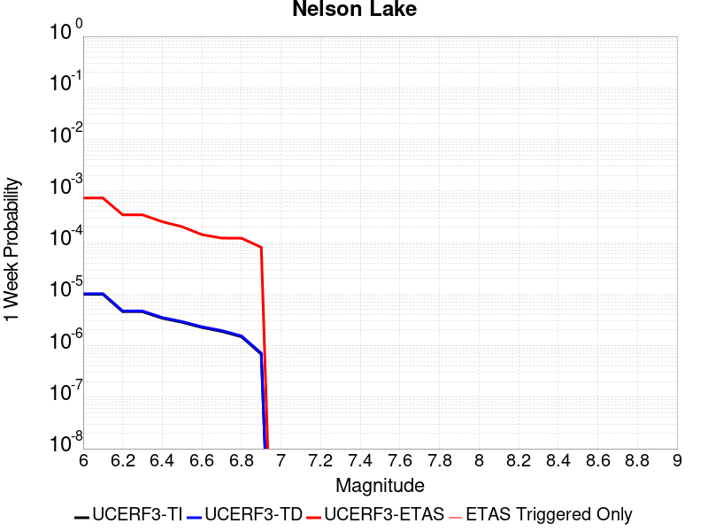 | 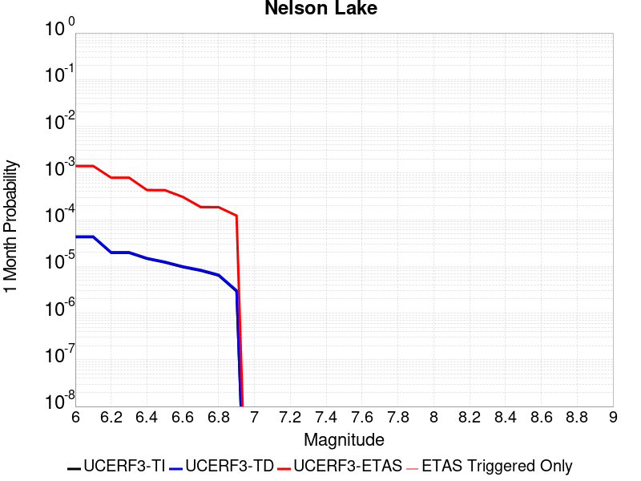 | 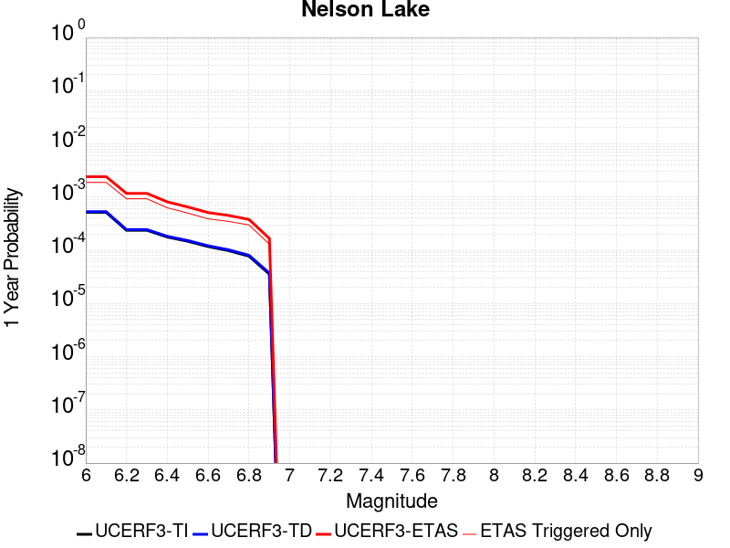 | 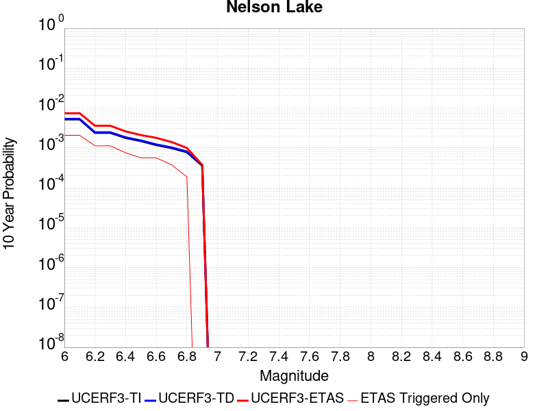 |

| Magnitude | 1 wk TI Prob | 1 wk TD Prob | 1 wk ETAS Prob | 1 wk ETAS/TD Gain | 1 wk ETAS Triggered Only | 1 mo TI Prob | 1 mo TD Prob | 1 mo ETAS Prob | 1 mo ETAS/TD Gain | 1 mo ETAS Triggered Only | 1 yr TI Prob | 1 yr TD Prob | 1 yr ETAS Prob | 1 yr ETAS/TD Gain | 1 yr ETAS Triggered Only | 10 yr TI Prob | 10 yr TD Prob | 10 yr ETAS Prob | 10 yr ETAS/TD Gain | 10 yr ETAS Triggered Only |
|-----|-----|-----|-----|-----|-----|-----|-----|-----|-----|-----|-----|-----|-----|-----|-----|-----|-----|-----|-----|-----|
| 6.0 | 9.913453E-6 | 1.0192255E-5 | 7.301849E-4 | 71.64115 | 7.2E-4 | 4.2485535E-5 | 4.3680422E-5 | 0.001083635 | 24.808254 | 0.00104 | 5.1713863E-4 | 5.316897E-4 | 0.0024206848 | 4.552815 | 0.00189 | 0.0051593683 | 0.005305204 | 0.008050562 | 1.517484 | 0.00276 |
| 6.1 | 9.913453E-6 | 1.0192255E-5 | 7.301849E-4 | 71.64115 | 7.2E-4 | 4.2485535E-5 | 4.3680422E-5 | 0.001083635 | 24.808254 | 0.00104 | 5.1713863E-4 | 5.316897E-4 | 0.0024206848 | 4.552815 | 0.00189 | 0.0051593683 | 0.005305204 | 0.008050562 | 1.517484 | 0.00276 |
| 6.2 | 4.5596407E-6 | 4.696313E-6 | 3.446947E-4 | 73.39688 | 3.4E-4 | 1.954117E-5 | 2.0126909E-5 | 5.4011645E-4 | 26.83554 | 5.2E-4 | 2.3788778E-4 | 2.4501883E-4 | 0.0011747909 | 4.794697 | 9.3E-4 | 0.0023763329 | 0.0024476128 | 0.0038142595 | 1.558359 | 0.00137 |
| 6.3 | 4.5596407E-6 | 4.696313E-6 | 3.446947E-4 | 73.39688 | 3.4E-4 | 1.954117E-5 | 2.0126909E-5 | 5.4011645E-4 | 26.83554 | 5.2E-4 | 2.3788778E-4 | 2.4501883E-4 | 0.0011747909 | 4.794697 | 9.3E-4 | 0.0023763329 | 0.0024476128 | 0.0038142595 | 1.558359 | 0.00137 |
| 6.4 | 3.4025713E-6 | 3.5098972E-6 | 2.5350903E-4 | 72.226906 | 2.5E-4 | 1.4582367E-5 | 1.5042335E-5 | 3.4503738E-4 | 22.937754 | 3.3E-4 | 1.7752586E-4 | 1.8312587E-4 | 8.130105E-4 | 4.4396267 | 6.3E-4 | 0.001773841 | 0.0018298327 | 0.0027980576 | 1.5291331 | 9.7E-4 |
| 6.5 | 2.8352947E-6 | 2.927856E-6 | 2.0292727E-4 | 69.309166 | 2.0E-4 | 1.2151207E-5 | 1.2547898E-5 | 2.925444E-4 | 23.314213 | 2.8E-4 | 1.479309E-4 | 1.5276071E-4 | 6.526843E-4 | 4.272593 | 5.0E-4 | 0.0014783246 | 0.0015266308 | 0.0022954554 | 1.5036087 | 7.7E-4 |
| 6.6 | 2.251518E-6 | 2.3290677E-6 | 1.4232875E-4 | 61.109753 | 1.4E-4 | 9.649328E-6 | 9.981683E-6 | 2.1997959E-4 | 22.038324 | 2.1E-4 | 1.1747423E-4 | 1.2152085E-4 | 5.1147345E-4 | 4.2089357 | 3.9E-4 | 0.0011741214 | 0.0012146058 | 0.0018438405 | 1.5180569 | 6.3E-4 |
| 6.7 | 1.8911853E-6 | 1.9591396E-6 | 1.219589E-4 | 62.251255 | 1.2E-4 | 8.105055E-6 | 8.39629E-6 | 1.8839478E-4 | 22.437862 | 1.8E-4 | 9.867457E-5 | 1.0222061E-4 | 4.5218485E-4 | 4.423617 | 3.5E-4 | 9.863076E-4 | 0.0010217935 | 0.001591211 | 1.5572727 | 5.7E-4 |
| 6.8 | 1.4874814E-6 | 1.5438305E-6 | 1.2154364E-4 | 78.72862 | 1.2E-4 | 6.374905E-6 | 6.6164025E-6 | 1.6661534E-4 | 25.182165 | 1.6E-4 | 7.76117E-5 | 8.055224E-5 | 3.8052807E-4 | 4.723991 | 3.0E-4 | 7.75846E-4 | 8.0528157E-4 | 0.0012249433 | 1.5211368 | 4.2E-4 |
| 6.9 | 6.835972E-7 | 7.1399285E-7 | 8.071394E-5 | 113.04586 | 8.0E-5 | 2.9296991E-6 | 3.0599674E-6 | 9.3059694E-5 | 30.411987 | 9.0E-5 | 3.56685E-5 | 3.7254784E-5 | 1.6724995E-4 | 4.4893546 | 1.3E-4 | 3.5662777E-4 | 3.7251666E-4 | 5.524496E-4 | 1.4830198 | 1.8E-4 |

## Towne Pass
*[(top)](#table-of-contents)*

| 1 Week | 1 Month | 1 Year | 10 Year |
|-----|-----|-----|-----|
| 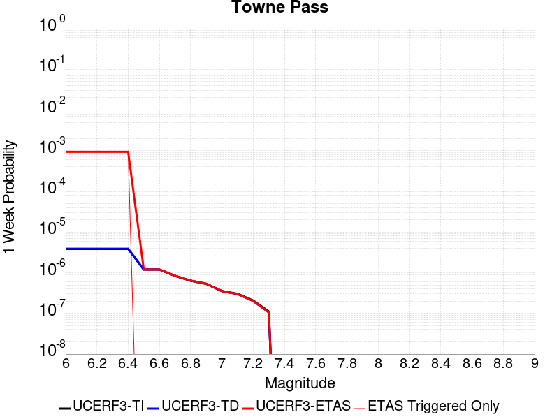 | 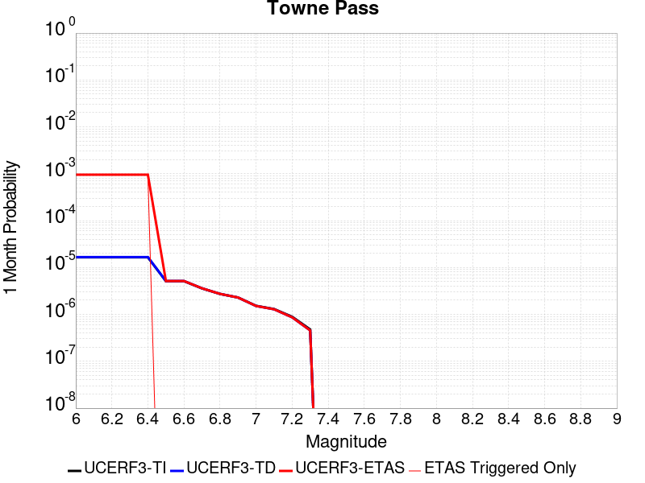 |  | 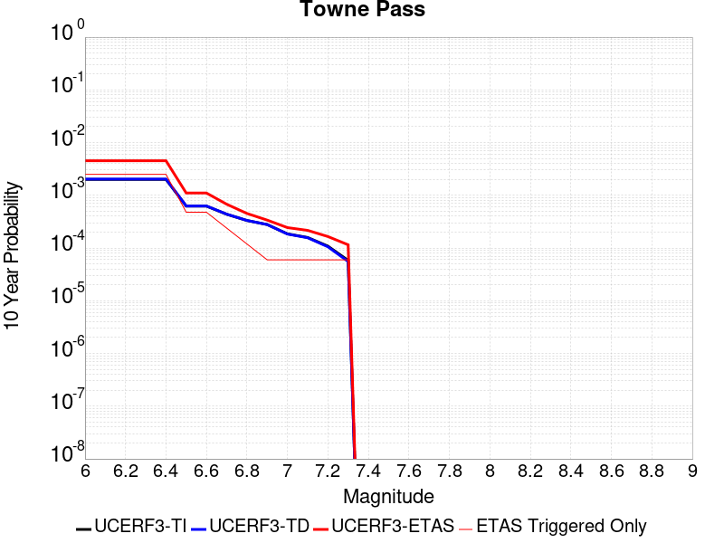 |

| Magnitude | 1 wk TI Prob | 1 wk TD Prob | 1 wk ETAS Prob | 1 wk ETAS/TD Gain | 1 wk ETAS Triggered Only | 1 mo TI Prob | 1 mo TD Prob | 1 mo ETAS Prob | 1 mo ETAS/TD Gain | 1 mo ETAS Triggered Only | 1 yr TI Prob | 1 yr TD Prob | 1 yr ETAS Prob | 1 yr ETAS/TD Gain | 1 yr ETAS Triggered Only | 10 yr TI Prob | 10 yr TD Prob | 10 yr ETAS Prob | 10 yr ETAS/TD Gain | 10 yr ETAS Triggered Only |
|-----|-----|-----|-----|-----|-----|-----|-----|-----|-----|-----|-----|-----|-----|-----|-----|-----|-----|-----|-----|-----|
| 6.0 | 3.849728E-6 | 3.894542E-6 | 5.9389224E-4 | 152.49348 | 5.9E-4 | 1.649873E-5 | 1.6690812E-5 | 9.6667494E-4 | 57.91659 | 9.5E-4 | 2.0085352E-4 | 2.0319606E-4 | 0.0018328648 | 9.020179 | 0.00163 | 0.0020067208 | 0.0020305319 | 0.0045354352 | 2.2336195 | 0.00251 |
| 6.1 | 3.849728E-6 | 3.894542E-6 | 5.9389224E-4 | 152.49348 | 5.9E-4 | 1.649873E-5 | 1.6690812E-5 | 9.6667494E-4 | 57.91659 | 9.5E-4 | 2.0085352E-4 | 2.0319606E-4 | 0.0018328648 | 9.020179 | 0.00163 | 0.0020067208 | 0.0020305319 | 0.0045354352 | 2.2336195 | 0.00251 |
| 6.2 | 3.849728E-6 | 3.894542E-6 | 5.9389224E-4 | 152.49348 | 5.9E-4 | 1.649873E-5 | 1.6690812E-5 | 9.6667494E-4 | 57.91659 | 9.5E-4 | 2.0085352E-4 | 2.0319606E-4 | 0.0018328648 | 9.020179 | 0.00163 | 0.0020067208 | 0.0020305319 | 0.0045354352 | 2.2336195 | 0.00251 |
| 6.3 | 3.849728E-6 | 3.894542E-6 | 5.9389224E-4 | 152.49348 | 5.9E-4 | 1.649873E-5 | 1.6690812E-5 | 9.6667494E-4 | 57.91659 | 9.5E-4 | 2.0085352E-4 | 2.0319606E-4 | 0.0018328648 | 9.020179 | 0.00163 | 0.0020067208 | 0.0020305319 | 0.0045354352 | 2.2336195 | 0.00251 |
| 6.4 | 3.849728E-6 | 3.894542E-6 | 5.9389224E-4 | 152.49348 | 5.9E-4 | 1.649873E-5 | 1.6690812E-5 | 9.6667494E-4 | 57.91659 | 9.5E-4 | 2.0085352E-4 | 2.0319606E-4 | 0.0018328648 | 9.020179 | 0.00163 | 0.0020067208 | 0.0020305319 | 0.0045354352 | 2.2336195 | 0.00251 |
| 6.5 | 1.1953545E-6 | 1.2030526E-6 | 7.1202965E-5 | 59.18525 | 7.0E-5 | 5.1229376E-6 | 5.15593E-6 | 1.2515532E-4 | 24.274052 | 1.2E-4 | 6.236998E-5 | 6.277176E-5 | 3.1275608E-4 | 4.9824324 | 2.5E-4 | 6.235248E-4 | 6.2755204E-4 | 0.0010772697 | 1.716622 | 4.5E-4 |
| 6.6 | 1.1953545E-6 | 1.2030526E-6 | 7.1202965E-5 | 59.18525 | 7.0E-5 | 5.1229376E-6 | 5.15593E-6 | 1.2515532E-4 | 24.274052 | 1.2E-4 | 6.236998E-5 | 6.277176E-5 | 3.1275608E-4 | 4.9824324 | 2.5E-4 | 6.235248E-4 | 6.2755204E-4 | 0.0010772697 | 1.716622 | 4.5E-4 |
| 6.7 | 8.375951E-7 | 8.410676E-7 | 4.0841034E-5 | 48.558563 | 4.0E-5 | 3.5896885E-6 | 3.6045708E-6 | 7.360432E-5 | 20.419718 | 7.0E-5 | 4.370358E-5 | 4.3884826E-5 | 1.9387824E-4 | 4.417888 | 1.5E-4 | 4.3694986E-4 | 4.3876728E-4 | 7.186444E-4 | 1.6378715 | 2.8E-4 |
| 6.8 | 6.38041E-7 | 6.3921624E-7 | 4.0639192E-5 | 63.576595 | 4.0E-5 | 2.7344586E-6 | 2.7394954E-6 | 6.273933E-5 | 22.901783 | 6.0E-5 | 3.3291526E-5 | 3.3352884E-5 | 1.3334955E-4 | 3.9981413 | 1.0E-4 | 3.3286537E-4 | 3.334826E-4 | 5.134226E-4 | 1.5395783 | 1.8E-4 |
| 6.9 | 5.3460053E-7 | 5.345339E-7 | 3.0534517E-5 | 57.123634 | 3.0E-5 | 2.2911431E-6 | 2.2908578E-6 | 5.2290743E-5 | 22.825836 | 5.0E-5 | 2.789431E-5 | 2.7890868E-5 | 1.07888634E-4 | 3.8682423 | 8.0E-5 | 2.789081E-4 | 2.78877E-4 | 4.1883797E-4 | 1.5018734 | 1.4E-4 |
| 7.0 | 3.557783E-7 | 3.5324283E-7 | 1.0353239E-5 | 29.309128 | 1.0E-5 | 1.5247632E-6 | 1.513897E-6 | 2.1513866E-5 | 14.210917 | 2.0E-5 | 1.8563835E-5 | 1.8431549E-5 | 5.843081E-5 | 3.170152 | 4.0E-5 | 1.8562283E-4 | 1.8430105E-4 | 2.7428445E-4 | 1.4882414 | 9.0E-5 |
| 7.1 | 3.037942E-7 | 3.0002275E-7 | 1.0300019E-5 | 34.330795 | 1.0E-5 | 1.3019744E-6 | 1.2858112E-6 | 2.1285785E-5 | 16.554363 | 2.0E-5 | 1.5851423E-5 | 1.5654647E-5 | 5.565402E-5 | 3.555112 | 4.0E-5 | 1.5850292E-4 | 1.5653619E-4 | 2.3652367E-4 | 1.510984 | 8.0E-5 |
| 7.2 | 2.0808248E-7 | 2.0217735E-7 | 1.0202175E-5 | 50.461517 | 1.0E-5 | 8.917818E-7 | 8.6647407E-7 | 2.0866457E-5 | 24.082033 | 2.0E-5 | 1.0857389E-5 | 1.0549275E-5 | 4.054896E-5 | 3.8437672 | 3.0E-5 | 1.0856859E-4 | 1.0548821E-4 | 1.6548188E-4 | 1.5687239 | 6.0E-5 |
| 7.3 | 1.1162073E-7 | 1.0636902E-7 | 1.0106368E-5 | 95.01232 | 1.0E-5 | 4.7837443E-7 | 4.5586717E-7 | 2.0455858E-5 | 44.87241 | 2.0E-5 | 5.8241935E-6 | 5.5501705E-6 | 3.5550005E-5 | 6.405209 | 3.0E-5 | 5.8240406E-5 | 5.550052E-5 | 1.1549719E-4 | 2.0810108 | 6.0E-5 |

## Bicycle Lake
*[(top)](#table-of-contents)*

| 1 Week | 1 Month | 1 Year | 10 Year |
|-----|-----|-----|-----|
| 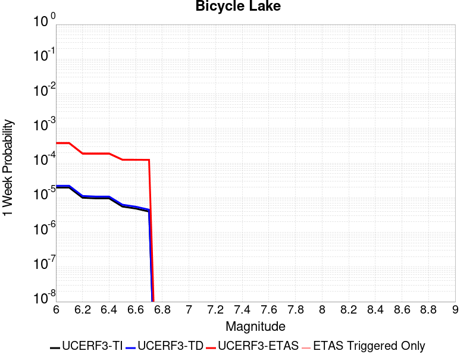 | 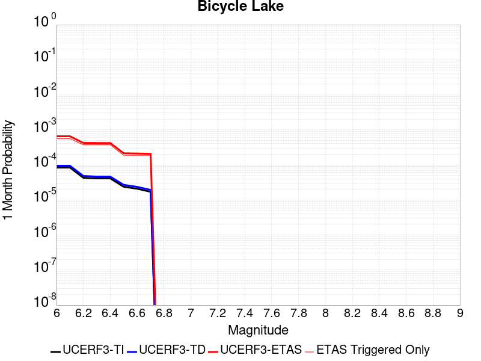 | 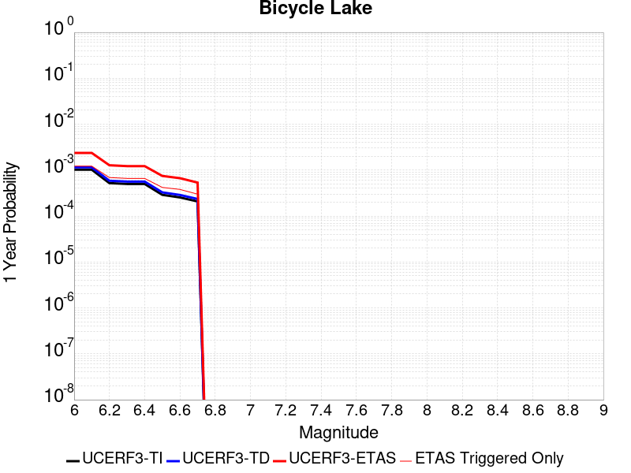 | 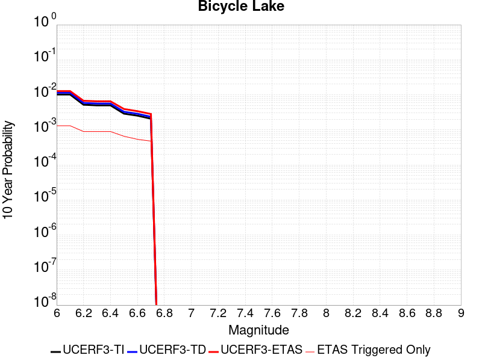 |

| Magnitude | 1 wk TI Prob | 1 wk TD Prob | 1 wk ETAS Prob | 1 wk ETAS/TD Gain | 1 wk ETAS Triggered Only | 1 mo TI Prob | 1 mo TD Prob | 1 mo ETAS Prob | 1 mo ETAS/TD Gain | 1 mo ETAS Triggered Only | 1 yr TI Prob | 1 yr TD Prob | 1 yr ETAS Prob | 1 yr ETAS/TD Gain | 1 yr ETAS Triggered Only | 10 yr TI Prob | 10 yr TD Prob | 10 yr ETAS Prob | 10 yr ETAS/TD Gain | 10 yr ETAS Triggered Only |
|-----|-----|-----|-----|-----|-----|-----|-----|-----|-----|-----|-----|-----|-----|-----|-----|-----|-----|-----|-----|-----|
| 6.0 | 1.9621975E-5 | 2.2097078E-5 | 5.820847E-4 | 26.342157 | 5.6E-4 | 8.4091465E-5 | 9.4699084E-5 | 8.546271E-4 | 9.024661 | 7.6E-4 | 0.0010233327 | 0.0011524865 | 0.0023710805 | 2.0573606 | 0.00122 | 0.01018633 | 0.011478408 | 0.013277518 | 1.1567385 | 0.00182 |
| 6.1 | 1.9621975E-5 | 2.2097078E-5 | 5.820847E-4 | 26.342157 | 5.6E-4 | 8.4091465E-5 | 9.4699084E-5 | 8.546271E-4 | 9.024661 | 7.6E-4 | 0.0010233327 | 0.0011524865 | 0.0023710805 | 2.0573606 | 0.00122 | 0.01018633 | 0.011478408 | 0.013277518 | 1.1567385 | 0.00182 |
| 6.2 | 9.9971285E-6 | 1.125564E-5 | 2.812526E-4 | 24.987705 | 2.7E-4 | 4.2844134E-5 | 4.8237856E-5 | 4.4821858E-4 | 9.291842 | 4.0E-4 | 5.2150246E-4 | 5.871897E-4 | 0.0012767845 | 2.174399 | 6.9E-4 | 0.0052028033 | 0.005861487 | 0.006895391 | 1.1763893 | 0.00104 |
| 6.3 | 9.589428E-6 | 1.0798346E-5 | 2.7079554E-4 | 25.077501 | 2.6E-4 | 4.10969E-5 | 4.62781E-5 | 4.2626052E-4 | 9.210848 | 3.8E-4 | 5.002399E-4 | 5.6334207E-4 | 0.0012229702 | 2.1709194 | 6.6E-4 | 0.0049911533 | 0.0056242296 | 0.0066086617 | 1.1750342 | 9.9E-4 |
| 6.4 | 9.589428E-6 | 1.0798346E-5 | 2.7079554E-4 | 25.077501 | 2.6E-4 | 4.10969E-5 | 4.62781E-5 | 4.2626052E-4 | 9.210848 | 3.8E-4 | 5.002399E-4 | 5.6334207E-4 | 0.0012229702 | 2.1709194 | 6.6E-4 | 0.0049911533 | 0.0056242296 | 0.0066086617 | 1.1750342 | 9.9E-4 |
| 6.5 | 5.557707E-6 | 6.2856016E-6 | 1.6628459E-4 | 26.454842 | 1.6E-4 | 2.3818526E-5 | 2.6938165E-5 | 2.5693196E-4 | 9.537842 | 2.3E-4 | 2.8995197E-4 | 3.279497E-4 | 7.478119E-4 | 2.2802641 | 4.2E-4 | 0.0028957394 | 0.0032772934 | 0.0038952616 | 1.1885605 | 6.2E-4 |
| 6.6 | 4.8742945E-6 | 5.5132896E-6 | 1.3551257E-4 | 24.579258 | 1.3E-4 | 2.0889667E-5 | 2.3628318E-5 | 2.1362383E-4 | 9.041009 | 1.9E-4 | 2.54302E-4 | 2.87663E-4 | 6.675537E-4 | 2.3206103 | 3.8E-4 | 0.002540112 | 0.0028754752 | 0.0034039512 | 1.1837873 | 5.3E-4 |
| 6.7 | 3.991108E-6 | 4.5159104E-6 | 9.4515504E-5 | 20.929447 | 9.0E-5 | 1.7104636E-5 | 1.9353902E-5 | 1.69351E-4 | 8.750225 | 1.5E-4 | 2.0822904E-4 | 2.3563375E-4 | 5.3556304E-4 | 2.2728622 | 3.0E-4 | 0.0020803404 | 0.0023563374 | 0.0027853244 | 1.1820565 | 4.3E-4 |

## Paradise
*[(top)](#table-of-contents)*

| 1 Week | 1 Month | 1 Year | 10 Year |
|-----|-----|-----|-----|
| 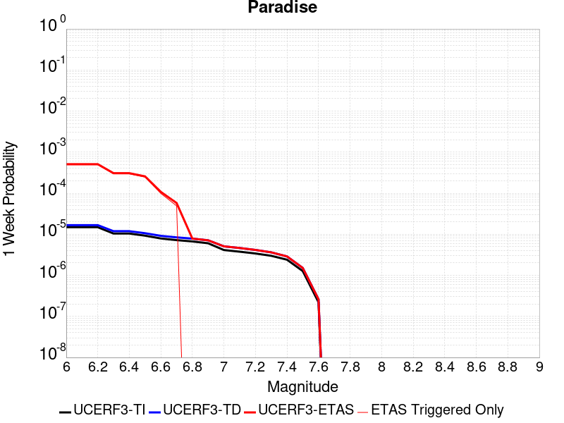 | 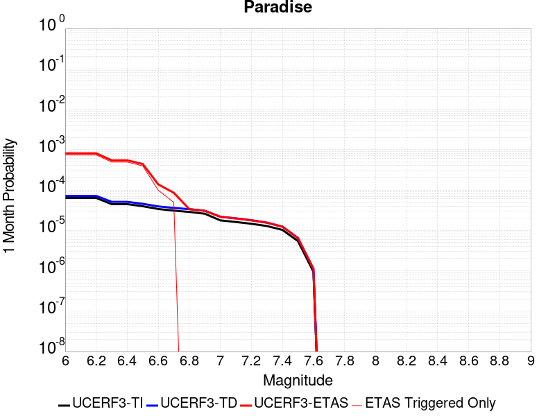 | 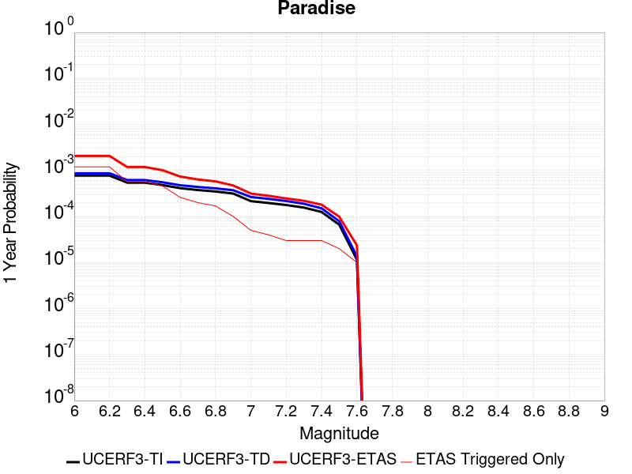 | 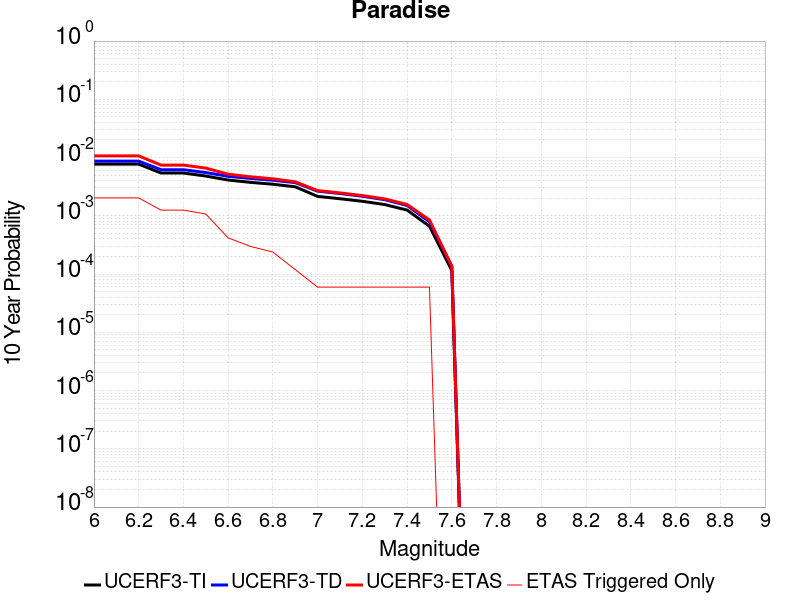 |

| Magnitude | 1 wk TI Prob | 1 wk TD Prob | 1 wk ETAS Prob | 1 wk ETAS/TD Gain | 1 wk ETAS Triggered Only | 1 mo TI Prob | 1 mo TD Prob | 1 mo ETAS Prob | 1 mo ETAS/TD Gain | 1 mo ETAS Triggered Only | 1 yr TI Prob | 1 yr TD Prob | 1 yr ETAS Prob | 1 yr ETAS/TD Gain | 1 yr ETAS Triggered Only | 10 yr TI Prob | 10 yr TD Prob | 10 yr ETAS Prob | 10 yr ETAS/TD Gain | 10 yr ETAS Triggered Only |
|-----|-----|-----|-----|-----|-----|-----|-----|-----|-----|-----|-----|-----|-----|-----|-----|-----|-----|-----|-----|-----|
| 6.0 | 1.4851273E-5 | 1.6694768E-5 | 4.766871E-4 | 28.553082 | 4.6E-4 | 6.364676E-5 | 7.154718E-5 | 7.4149924E-4 | 10.36378 | 6.7E-4 | 7.7462377E-4 | 8.707624E-4 | 0.0020697175 | 2.3769026 | 0.0012 | 0.0077192914 | 0.008675884 | 0.010579227 | 1.2193831 | 0.00192 |
| 6.1 | 1.4851273E-5 | 1.6694768E-5 | 4.766871E-4 | 28.553082 | 4.6E-4 | 6.364676E-5 | 7.154718E-5 | 7.4149924E-4 | 10.36378 | 6.7E-4 | 7.7462377E-4 | 8.707624E-4 | 0.0020697175 | 2.3769026 | 0.0012 | 0.0077192914 | 0.008675884 | 0.010579227 | 1.2193831 | 0.00192 |
| 6.2 | 1.4851273E-5 | 1.6694768E-5 | 4.766871E-4 | 28.553082 | 4.6E-4 | 6.364676E-5 | 7.154718E-5 | 7.4149924E-4 | 10.36378 | 6.7E-4 | 7.7462377E-4 | 8.707624E-4 | 0.0020697175 | 2.3769026 | 0.0012 | 0.0077192914 | 0.008675884 | 0.010579227 | 1.2193831 | 0.00192 |
| 6.3 | 1.0426831E-5 | 1.1888697E-5 | 2.4188597E-4 | 20.345875 | 2.3E-4 | 4.4685654E-5 | 5.09506E-5 | 4.1093226E-4 | 8.065308 | 3.6E-4 | 5.43912E-4 | 6.201529E-4 | 0.0011897994 | 1.9185581 | 5.7E-4 | 0.0054258266 | 0.0061848317 | 0.00710908 | 1.1494379 | 9.3E-4 |
| 6.4 | 1.0426831E-5 | 1.1888697E-5 | 2.4188597E-4 | 20.345875 | 2.3E-4 | 4.4685654E-5 | 5.09506E-5 | 4.1093226E-4 | 8.065308 | 3.6E-4 | 5.43912E-4 | 6.201529E-4 | 0.0011897994 | 1.9185581 | 5.7E-4 | 0.0054258266 | 0.0061848317 | 0.00710908 | 1.1494379 | 9.3E-4 |
| 6.5 | 9.25027E-6 | 1.0620037E-5 | 1.9061813E-4 | 17.948914 | 1.8E-4 | 3.964341E-5 | 4.551368E-5 | 3.355005E-4 | 7.371421 | 2.9E-4 | 4.8255164E-4 | 5.5399304E-4 | 0.0010137382 | 1.8298753 | 4.6E-4 | 0.0048150513 | 0.0055266195 | 0.006222751 | 1.1259598 | 7.0E-4 |
| 6.6 | 7.904275E-6 | 9.159602E-6 | 1.291585E-4 | 14.100885 | 1.2E-4 | 3.3875025E-5 | 3.925487E-5 | 1.9924859E-4 | 5.0757675 | 1.6E-4 | 4.1235037E-4 | 4.7782718E-4 | 7.3770294E-4 | 1.5438697 | 2.6E-4 | 0.0041158604 | 0.004768395 | 0.0051664873 | 1.0834857 | 4.0E-4 |
| 6.7 | 7.2061953E-6 | 8.407326E-6 | 1.08406486E-4 | 12.894288 | 1.0E-4 | 3.088333E-5 | 3.603092E-5 | 1.6602624E-4 | 4.6078825 | 1.3E-4 | 3.7593965E-4 | 4.3859181E-4 | 6.385041E-4 | 1.4558048 | 2.0E-4 | 0.003753043 | 0.004377631 | 0.0047061867 | 1.0750532 | 3.3E-4 |
| 6.8 | 6.6948724E-6 | 7.842242E-6 | 8.784162E-5 | 11.201084 | 8.0E-5 | 2.8691995E-5 | 3.3609194E-5 | 1.436055E-4 | 4.272804 | 1.1E-4 | 3.4926904E-4 | 4.091187E-4 | 5.7904917E-4 | 1.4153574 | 1.7E-4 | 0.003487206 | 0.0040840125 | 0.004372828 | 1.0707186 | 2.9E-4 |
| 6.9 | 6.0421025E-6 | 7.1306963E-6 | 4.7130412E-5 | 6.6095104 | 4.0E-5 | 2.5894467E-5 | 3.0559786E-5 | 8.055826E-5 | 2.636087 | 5.0E-5 | 3.1521954E-4 | 3.7200528E-4 | 4.719681E-4 | 1.2687134 | 1.0E-4 | 0.0031477278 | 0.0037141638 | 0.0038934953 | 1.0482831 | 1.8E-4 |
| 7.0 | 4.134091E-6 | 5.0803824E-6 | 3.508023E-5 | 6.905037 | 3.0E-5 | 1.7717413E-5 | 2.1772896E-5 | 5.177224E-5 | 2.37783 | 3.0E-5 | 2.1568815E-4 | 2.650543E-4 | 3.1504105E-4 | 1.1885906 | 5.0E-5 | 0.0021547892 | 0.0026475347 | 0.0027173494 | 1.0263697 | 7.0E-5 |
| 7.1 | 3.7674888E-6 | 4.631936E-6 | 2.4631843E-5 | 5.317829 | 2.0E-5 | 1.6146281E-5 | 1.9851012E-5 | 3.9850616E-5 | 2.0074854 | 2.0E-5 | 1.9656324E-4 | 2.4166079E-4 | 2.8165113E-4 | 1.1654812 | 4.0E-5 | 0.0019638946 | 0.0024141306 | 0.0024739858 | 1.0247936 | 6.0E-5 |
| 7.2 | 3.4065345E-6 | 4.156782E-6 | 2.41567E-5 | 5.811394 | 2.0E-5 | 1.4599351E-5 | 1.7814667E-5 | 3.7814312E-5 | 2.1226504 | 2.0E-5 | 1.777326E-4 | 2.168735E-4 | 2.4686698E-4 | 1.1382995 | 3.0E-5 | 0.0017759053 | 0.0021667667 | 0.00220668 | 1.0184207 | 4.0E-5 |
| 7.3 | 2.9934936E-6 | 3.6293673E-6 | 2.3629294E-5 | 6.5105824 | 2.0E-5 | 1.2829195E-5 | 1.5554348E-5 | 3.5554036E-5 | 2.2857943 | 2.0E-5 | 1.5618425E-4 | 1.8935918E-4 | 2.193535E-4 | 1.1583991 | 3.0E-5 | 0.0015607453 | 0.0018921237 | 0.001932048 | 1.0211003 | 4.0E-5 |
| 7.4 | 2.4049796E-6 | 2.8890186E-6 | 2.288896E-5 | 7.922746 | 2.0E-5 | 1.0307015E-5 | 1.2381457E-5 | 3.238121E-5 | 2.6152987 | 2.0E-5 | 1.2548068E-4 | 1.5073526E-4 | 1.8073073E-4 | 1.1989944 | 3.0E-5 | 0.0012540985 | 0.0015064715 | 0.0015464113 | 1.0265121 | 4.0E-5 |
| 7.5 | 1.2710091E-6 | 1.5134859E-6 | 2.1513455E-5 | 14.214507 | 2.0E-5 | 5.44717E-6 | 6.4863593E-6 | 2.648623E-5 | 4.083374 | 2.0E-5 | 6.631728E-5 | 7.896981E-5 | 9.896823E-5 | 1.2532413 | 2.0E-5 | 6.6297496E-4 | 7.895401E-4 | 8.195164E-4 | 1.0379668 | 3.0E-5 |
| 7.6 | 2.21172E-7 | 2.6040198E-7 | 1.0260399E-5 | 39.402157 | 1.0E-5 | 9.478797E-7 | 1.1160082E-6 | 1.1115997E-5 | 9.960498 | 1.0E-5 | 1.1540374E-5 | 1.3587343E-5 | 2.3587207E-5 | 1.7359691 | 1.0E-5 | 1.1539775E-4 | 1.3586794E-4 | 1.4586658E-4 | 1.0735909 | 1.0E-5 |

## San Andreas (San Bernardino N)
*[(top)](#table-of-contents)*

| 1 Week | 1 Month | 1 Year | 10 Year |
|-----|-----|-----|-----|
| 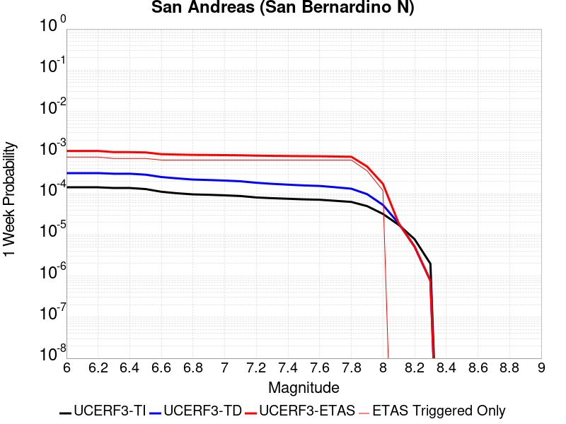 | 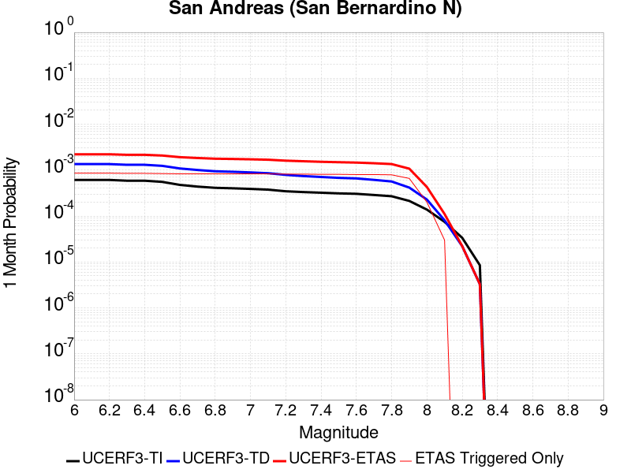 | 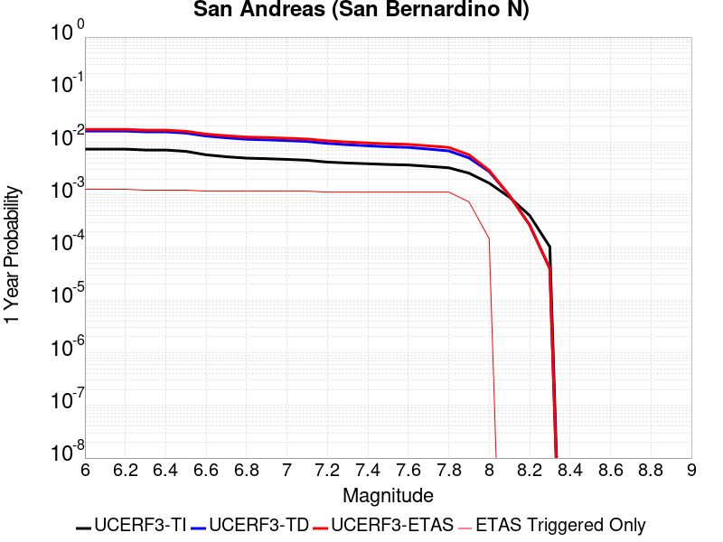 |  |

| Magnitude | 1 wk TI Prob | 1 wk TD Prob | 1 wk ETAS Prob | 1 wk ETAS/TD Gain | 1 wk ETAS Triggered Only | 1 mo TI Prob | 1 mo TD Prob | 1 mo ETAS Prob | 1 mo ETAS/TD Gain | 1 mo ETAS Triggered Only | 1 yr TI Prob | 1 yr TD Prob | 1 yr ETAS Prob | 1 yr ETAS/TD Gain | 1 yr ETAS Triggered Only | 10 yr TI Prob | 10 yr TD Prob | 10 yr ETAS Prob | 10 yr ETAS/TD Gain | 10 yr ETAS Triggered Only |
|-----|-----|-----|-----|-----|-----|-----|-----|-----|-----|-----|-----|-----|-----|-----|-----|-----|-----|-----|-----|-----|
| 6.0 | 1.4273766E-4 | 3.160784E-4 | 9.7586977E-4 | 3.0874295 | 6.6E-4 | 6.115894E-4 | 0.0013539245 | 0.00221276 | 1.6343305 | 8.6E-4 | 0.0074207084 | 0.016360939 | 0.017698688 | 1.0817648 | 0.00136 | 0.07177748 | 0.15021163 | 0.15171576 | 1.0100133 | 0.00177 |
| 6.1 | 1.4273766E-4 | 3.160784E-4 | 9.7586977E-4 | 3.0874295 | 6.6E-4 | 6.115894E-4 | 0.0013539245 | 0.00221276 | 1.6343305 | 8.6E-4 | 0.0074207084 | 0.016360939 | 0.017698688 | 1.0817648 | 0.00136 | 0.07177748 | 0.15021163 | 0.15171576 | 1.0100133 | 0.00177 |
| 6.2 | 1.4273766E-4 | 3.160784E-4 | 9.7586977E-4 | 3.0874295 | 6.6E-4 | 6.115894E-4 | 0.0013539245 | 0.00221276 | 1.6343305 | 8.6E-4 | 0.0074207084 | 0.016360939 | 0.017698688 | 1.0817648 | 0.00136 | 0.07177748 | 0.15021163 | 0.15171576 | 1.0100133 | 0.00177 |
| 6.3 | 1.3730655E-4 | 3.0512668E-4 | 9.5492834E-4 | 3.1296127 | 6.5E-4 | 5.883239E-4 | 0.001307036 | 0.0021559251 | 1.6494764 | 8.5E-4 | 0.0071393442 | 0.015798455 | 0.017127128 | 1.0841014 | 0.00135 | 0.06914291 | 0.1455135 | 0.1470174 | 1.0103351 | 0.00176 |
| 6.4 | 1.3730655E-4 | 3.0512668E-4 | 9.5492834E-4 | 3.1296127 | 6.5E-4 | 5.883239E-4 | 0.001307036 | 0.0021559251 | 1.6494764 | 8.5E-4 | 0.0071393442 | 0.015798455 | 0.017127128 | 1.0841014 | 0.00135 | 0.06914291 | 0.1455135 | 0.1470174 | 1.0103351 | 0.00176 |
| 6.5 | 1.2942807E-4 | 2.8927144E-4 | 9.290863E-4 | 3.2118149 | 6.4E-4 | 5.545738E-4 | 0.0012391509 | 0.0020781101 | 1.6770436 | 8.4E-4 | 0.0067310524 | 0.014983548 | 0.01628377 | 1.0867766 | 0.00132 | 0.06530788 | 0.13865088 | 0.1401324 | 1.0106852 | 0.00172 |
| 6.6 | 1.1125901E-4 | 2.5365927E-4 | 8.8349945E-4 | 3.4830167 | 6.3E-4 | 4.767372E-4 | 0.0010866605 | 0.0019157586 | 1.762978 | 8.3E-4 | 0.005788839 | 0.0131504685 | 0.014443241 | 1.0983062 | 0.00131 | 0.056403454 | 0.12300496 | 0.12446954 | 1.0119067 | 0.00167 |
| 6.7 | 1.02209575E-4 | 2.3500937E-4 | 8.648613E-4 | 3.680114 | 6.3E-4 | 4.3796748E-4 | 0.0010067957 | 0.0018359601 | 1.8235676 | 8.3E-4 | 0.0053192247 | 0.012189267 | 0.013463543 | 1.1045408 | 0.00129 | 0.051936906 | 0.114792764 | 0.11625336 | 1.0127237 | 0.00165 |
| 6.8 | 9.610582E-5 | 2.2026796E-4 | 8.501292E-4 | 3.8595228 | 6.3E-4 | 4.1181705E-4 | 9.436647E-4 | 0.0017728815 | 1.8787197 | 8.3E-4 | 0.0050023515 | 0.011428859 | 0.01269423 | 1.1107172 | 0.00128 | 0.048912346 | 0.10820469 | 0.109667234 | 1.0135164 | 0.00164 |
| 6.9 | 9.3877505E-5 | 2.1482339E-4 | 8.4468804E-4 | 3.9320114 | 6.3E-4 | 4.0227012E-4 | 9.203475E-4 | 0.0017495836 | 1.9010032 | 8.3E-4 | 0.0048866454 | 0.011147907 | 0.012413638 | 1.1135398 | 0.00128 | 0.04780577 | 0.105798274 | 0.107264765 | 1.0138612 | 0.00164 |
| 7.0 | 9.1019785E-5 | 2.0809306E-4 | 8.3796197E-4 | 4.0268617 | 6.3E-4 | 3.900265E-4 | 8.915232E-4 | 0.0017207832 | 1.9301609 | 8.3E-4 | 0.0047382377 | 0.0108004995 | 0.012066675 | 1.117233 | 0.00128 | 0.046384744 | 0.10276815 | 0.10422167 | 1.0141436 | 0.00162 |
| 7.1 | 8.771155E-5 | 1.9983841E-4 | 8.297125E-4 | 4.151917 | 6.3E-4 | 3.758525E-4 | 8.5616973E-4 | 0.0016854592 | 1.968604 | 8.3E-4 | 0.0045664064 | 0.010374243 | 0.011640964 | 1.1221025 | 0.00128 | 0.044737056 | 0.09907644 | 0.10053594 | 1.014731 | 0.00162 |
| 7.2 | 8.0830236E-5 | 1.8389444E-4 | 8.137786E-4 | 4.4252486 | 6.3E-4 | 3.4636928E-4 | 7.8788114E-4 | 0.001607235 | 2.039946 | 8.2E-4 | 0.0042088944 | 0.009550368 | 0.010798335 | 1.1306721 | 0.00126 | 0.041300658 | 0.09180518 | 0.09322197 | 1.0154325 | 0.00156 |
| 7.3 | 7.7668235E-5 | 1.7333007E-4 | 8.032209E-4 | 4.6340537 | 6.3E-4 | 3.328214E-4 | 7.426318E-4 | 0.0015620228 | 2.1033611 | 8.2E-4 | 0.0040445733 | 0.009004138 | 0.010242883 | 1.137575 | 0.00125 | 0.03971748 | 0.08706761 | 0.08848266 | 1.0162523 | 0.00155 |
| 7.4 | 7.520177E-5 | 1.655312E-4 | 7.8542856E-4 | 4.744898 | 6.2E-4 | 3.2225347E-4 | 7.092266E-4 | 0.0015186521 | 2.1412792 | 8.1E-4 | 0.0039163795 | 0.008600714 | 0.009830048 | 1.1429341 | 0.00124 | 0.038480744 | 0.08352157 | 0.08493294 | 1.0168984 | 0.00154 |
| 7.5 | 7.274697E-5 | 1.584075E-4 | 7.783093E-4 | 4.913336 | 6.2E-4 | 3.1173544E-4 | 6.7871273E-4 | 0.001488163 | 2.1926258 | 8.1E-4 | 0.003788775 | 0.008232076 | 0.009461869 | 1.1493903 | 0.00124 | 0.03724827 | 0.08023654 | 0.08165298 | 1.0176532 | 0.00154 |
| 7.6 | 7.1185845E-5 | 1.5410586E-4 | 7.640119E-4 | 4.957708 | 6.1E-4 | 3.0504653E-4 | 6.602866E-4 | 0.0014597584 | 2.2107952 | 8.0E-4 | 0.0037076178 | 0.0080094095 | 0.009229558 | 1.1523393 | 0.00123 | 0.036463667 | 0.07822661 | 0.079636924 | 1.0180286 | 0.00153 |
| 7.7 | 6.709961E-5 | 1.4319421E-4 | 7.5310684E-4 | 5.259339 | 6.1E-4 | 2.8753807E-4 | 6.135452E-4 | 0.0014130543 | 2.3030975 | 8.0E-4 | 0.003495157 | 0.0074443663 | 0.00866521 | 1.1639956 | 0.00123 | 0.034406938 | 0.07305558 | 0.074473806 | 1.019413 | 0.00153 |
| 7.8 | 6.300812E-5 | 1.320343E-4 | 7.319551E-4 | 5.5436735 | 6.0E-4 | 2.7000686E-4 | 5.657386E-4 | 0.0013552917 | 2.3956146 | 7.9E-4 | 0.0032823787 | 0.006866143 | 0.008077767 | 1.1764635 | 0.00122 | 0.032343175 | 0.06771385 | 0.06913092 | 1.0209274 | 0.00152 |
| 7.9 | 4.983037E-5 | 9.7241085E-5 | 6.0719147E-4 | 6.244187 | 5.1E-4 | 2.1354125E-4 | 4.1668097E-4 | 0.001076406 | 2.5832858 | 6.6E-4 | 0.0025967648 | 0.0050613005 | 0.006026391 | 1.1906804 | 9.7E-4 | 0.025666296 | 0.050650507 | 0.051827703 | 1.0232415 | 0.00124 |
| 8.0 | 3.2211527E-5 | 5.3306234E-5 | 2.3329664E-4 | 4.376536 | 1.8E-4 | 1.380421E-4 | 2.2843528E-4 | 4.2838958E-4 | 1.8753215 | 2.0E-4 | 0.0016793669 | 0.0027776542 | 0.0030867932 | 1.111295 | 3.1E-4 | 0.016667323 | 0.028362568 | 0.028770657 | 1.0143882 | 4.2E-4 |
| 8.1 | 1.743376E-5 | 1.8823403E-5 | 4.8822836E-5 | 2.5937307 | 3.0E-5 | 7.471398E-5 | 8.066923E-5 | 1.1066681E-4 | 1.371859 | 3.0E-5 | 9.0926304E-4 | 9.81706E-4 | 0.001041647 | 1.061058 | 6.0E-5 | 0.009055517 | 0.010483979 | 0.010563141 | 1.0075507 | 8.0E-5 |
| 8.2 | 7.831616E-6 | 5.1540533E-6 | 5.1540533E-6 | 1.0 | 0.0 | 3.3563636E-5 | 2.2088612E-5 | 2.2088612E-5 | 1.0 | 0.0 | 4.0856065E-4 | 2.6889573E-4 | 2.7889304E-4 | 1.0371791 | 1.0E-5 | 0.004078103 | 0.0030413668 | 0.0030513364 | 1.003278 | 1.0E-5 |
| 8.3 | 1.983087E-6 | 7.6564595E-7 | 7.6564595E-7 | 1.0 | 0.0 | 8.498917E-6 | 3.281336E-6 | 3.281336E-6 | 1.0 | 0.0 | 1.034694E-4 | 3.9949547E-5 | 3.9949547E-5 | 1.0 | 0.0 | 0.0010342124 | 4.717979E-4 | 4.717979E-4 | 1.0 | 0.0 |

## Garlic Springs
*[(top)](#table-of-contents)*

| 1 Week | 1 Month | 1 Year | 10 Year |
|-----|-----|-----|-----|
| 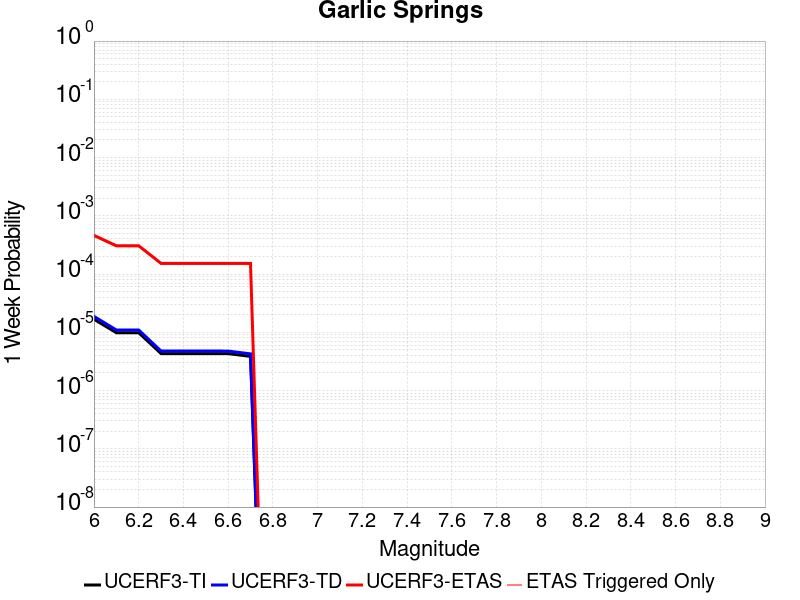 | 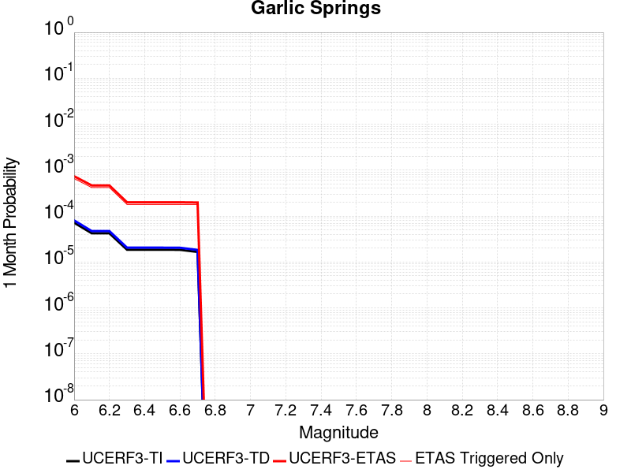 | 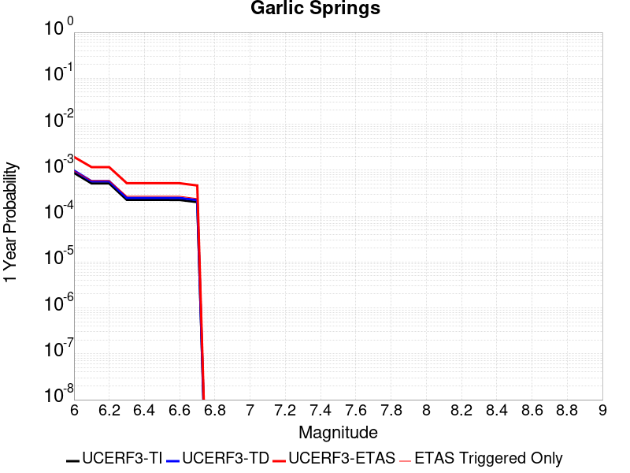 | 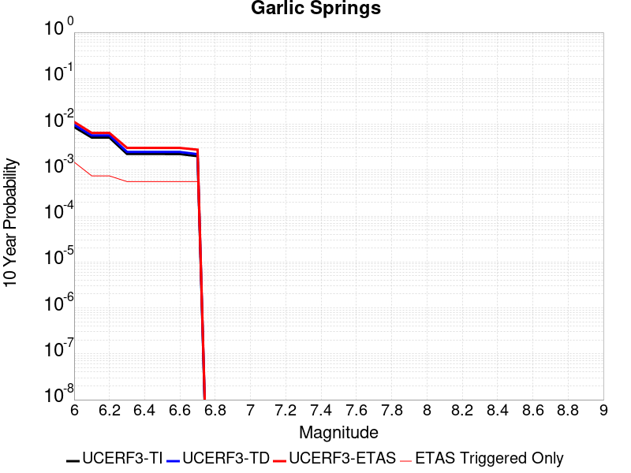 |

| Magnitude | 1 wk TI Prob | 1 wk TD Prob | 1 wk ETAS Prob | 1 wk ETAS/TD Gain | 1 wk ETAS Triggered Only | 1 mo TI Prob | 1 mo TD Prob | 1 mo ETAS Prob | 1 mo ETAS/TD Gain | 1 mo ETAS Triggered Only | 1 yr TI Prob | 1 yr TD Prob | 1 yr ETAS Prob | 1 yr ETAS/TD Gain | 1 yr ETAS Triggered Only | 10 yr TI Prob | 10 yr TD Prob | 10 yr ETAS Prob | 10 yr ETAS/TD Gain | 10 yr ETAS Triggered Only |
|-----|-----|-----|-----|-----|-----|-----|-----|-----|-----|-----|-----|-----|-----|-----|-----|-----|-----|-----|-----|-----|
| 6.0 | 1.6760017E-5 | 1.8776833E-5 | 4.3876894E-4 | 23.36757 | 4.2E-4 | 7.182667E-5 | 8.0470316E-5 | 6.8042206E-4 | 8.455565 | 6.0E-4 | 8.7413884E-4 | 9.794032E-4 | 0.001938463 | 1.9792287 | 9.6E-4 | 0.008707083 | 0.009762413 | 0.011138843 | 1.1409929 | 0.00139 |
| 6.1 | 9.852767E-6 | 1.0973587E-5 | 3.109703E-4 | 28.338072 | 3.0E-4 | 4.222546E-5 | 4.702921E-5 | 4.3701087E-4 | 9.292329 | 3.9E-4 | 5.139737E-4 | 5.7250116E-4 | 0.0011621634 | 2.0299757 | 5.9E-4 | 0.005127866 | 0.005717221 | 0.0065027047 | 1.1373891 | 7.9E-4 |
| 6.2 | 9.852767E-6 | 1.0973587E-5 | 3.109703E-4 | 28.338072 | 3.0E-4 | 4.222546E-5 | 4.702921E-5 | 4.3701087E-4 | 9.292329 | 3.9E-4 | 5.139737E-4 | 5.7250116E-4 | 0.0011621634 | 2.0299757 | 5.9E-4 | 0.005127866 | 0.005717221 | 0.0065027047 | 1.1373891 | 7.9E-4 |
| 6.3 | 4.3167724E-6 | 4.7780286E-6 | 1.2477745E-4 | 26.114841 | 1.2E-4 | 1.8500323E-5 | 2.0477235E-5 | 1.8047396E-4 | 8.8133955 | 1.6E-4 | 2.2521814E-4 | 2.4930484E-4 | 5.1923754E-4 | 2.0827415 | 2.7E-4 | 0.0022499003 | 0.00249251 | 0.0028715627 | 1.1520767 | 3.8E-4 |
| 6.4 | 4.3167724E-6 | 4.7780286E-6 | 1.2477745E-4 | 26.114841 | 1.2E-4 | 1.8500323E-5 | 2.0477235E-5 | 1.8047396E-4 | 8.8133955 | 1.6E-4 | 2.2521814E-4 | 2.4930484E-4 | 5.1923754E-4 | 2.0827415 | 2.7E-4 | 0.0022499003 | 0.00249251 | 0.0028715627 | 1.1520767 | 3.8E-4 |
| 6.5 | 4.3167724E-6 | 4.7780286E-6 | 1.2477745E-4 | 26.114841 | 1.2E-4 | 1.8500323E-5 | 2.0477235E-5 | 1.8047396E-4 | 8.8133955 | 1.6E-4 | 2.2521814E-4 | 2.4930484E-4 | 5.1923754E-4 | 2.0827415 | 2.7E-4 | 0.0022499003 | 0.00249251 | 0.0028715627 | 1.1520767 | 3.8E-4 |
| 6.6 | 4.301311E-6 | 4.760897E-6 | 1.2476032E-4 | 26.205214 | 1.2E-4 | 1.8434059E-5 | 2.0403815E-5 | 1.8040054E-4 | 8.841511 | 1.6E-4 | 2.2441156E-4 | 2.4841115E-4 | 5.183441E-4 | 2.0866377 | 2.7E-4 | 0.0022418506 | 0.002483593 | 0.0028626493 | 1.1526241 | 3.8E-4 |
| 6.7 | 3.8599724E-6 | 4.27106E-6 | 9.4270676E-5 | 22.071962 | 9.0E-5 | 1.6542634E-5 | 1.8304541E-5 | 1.4830216E-4 | 8.101933 | 1.3E-4 | 2.0138794E-4 | 2.228578E-4 | 4.628043E-4 | 2.07668 | 2.4E-4 | 0.0020120554 | 0.002228578 | 0.002577798 | 1.1567008 | 3.5E-4 |

## Helendale-So Lockhart
*[(top)](#table-of-contents)*

| 1 Week | 1 Month | 1 Year | 10 Year |
|-----|-----|-----|-----|
| 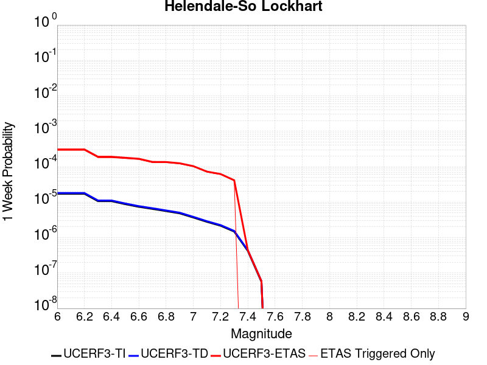 | 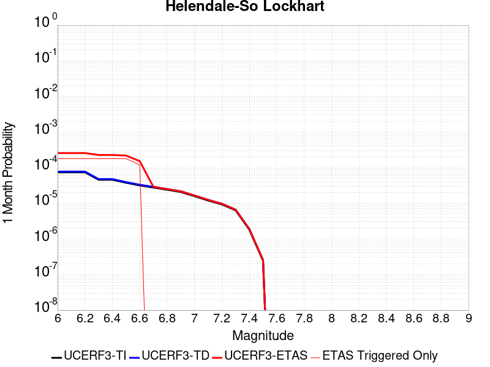 |  | 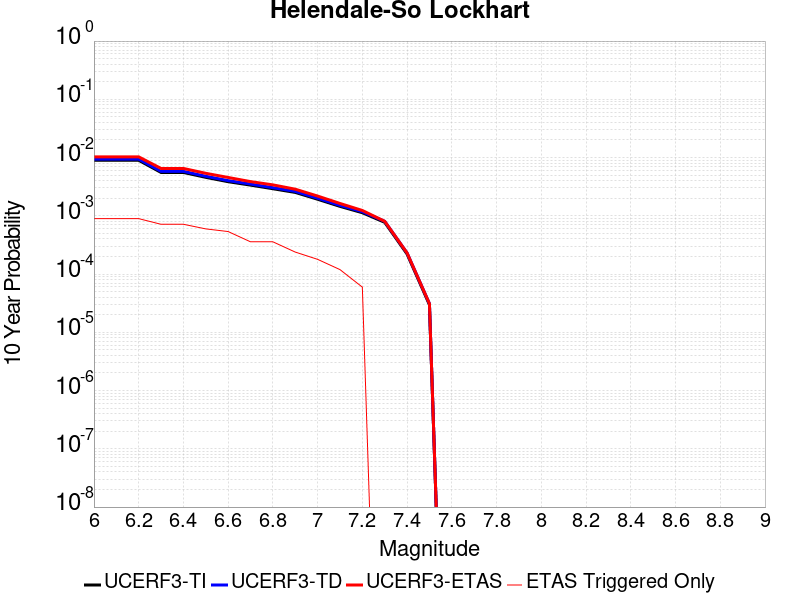 |

| Magnitude | 1 wk TI Prob | 1 wk TD Prob | 1 wk ETAS Prob | 1 wk ETAS/TD Gain | 1 wk ETAS Triggered Only | 1 mo TI Prob | 1 mo TD Prob | 1 mo ETAS Prob | 1 mo ETAS/TD Gain | 1 mo ETAS Triggered Only | 1 yr TI Prob | 1 yr TD Prob | 1 yr ETAS Prob | 1 yr ETAS/TD Gain | 1 yr ETAS Triggered Only | 10 yr TI Prob | 10 yr TD Prob | 10 yr ETAS Prob | 10 yr ETAS/TD Gain | 10 yr ETAS Triggered Only |
|-----|-----|-----|-----|-----|-----|-----|-----|-----|-----|-----|-----|-----|-----|-----|-----|-----|-----|-----|-----|-----|
| 6.0 | 1.7296055E-5 | 1.8103729E-5 | 3.0809848E-4 | 17.018509 | 2.9E-4 | 7.412385E-5 | 7.7585224E-5 | 4.375573E-4 | 5.639699 | 3.6E-4 | 9.0208417E-4 | 9.4421144E-4 | 0.0015935977 | 1.6877551 | 6.5E-4 | 0.008984311 | 0.009404116 | 0.010454148 | 1.1116565 | 0.00106 |
| 6.1 | 1.7296055E-5 | 1.8103729E-5 | 3.0809848E-4 | 17.018509 | 2.9E-4 | 7.412385E-5 | 7.7585224E-5 | 4.375573E-4 | 5.639699 | 3.6E-4 | 9.0208417E-4 | 9.4421144E-4 | 0.0015935977 | 1.6877551 | 6.5E-4 | 0.008984311 | 0.009404116 | 0.010454148 | 1.1116565 | 0.00106 |
| 6.2 | 1.7296055E-5 | 1.8103729E-5 | 3.0809848E-4 | 17.018509 | 2.9E-4 | 7.412385E-5 | 7.7585224E-5 | 4.375573E-4 | 5.639699 | 3.6E-4 | 9.0208417E-4 | 9.4421144E-4 | 0.0015935977 | 1.6877551 | 6.5E-4 | 0.008984311 | 0.009404116 | 0.010454148 | 1.1116565 | 0.00106 |
| 6.3 | 1.0669118E-5 | 1.1135425E-5 | 1.9113343E-4 | 17.164448 | 1.8E-4 | 4.5723988E-5 | 4.772239E-5 | 2.677119E-4 | 5.6097755 | 2.2E-4 | 5.5654737E-4 | 5.80868E-4 | 0.001000624 | 1.7226359 | 4.2E-4 | 0.0055515557 | 0.0057937936 | 0.006479796 | 1.118403 | 6.9E-4 |
| 6.4 | 1.0669118E-5 | 1.1135425E-5 | 1.9113343E-4 | 17.164448 | 1.8E-4 | 4.5723988E-5 | 4.772239E-5 | 2.677119E-4 | 5.6097755 | 2.2E-4 | 5.5654737E-4 | 5.80868E-4 | 0.001000624 | 1.7226359 | 4.2E-4 | 0.0055515557 | 0.0057937936 | 0.006479796 | 1.118403 | 6.9E-4 |
| 6.5 | 8.790038E-6 | 9.170197E-6 | 1.7916864E-4 | 19.538145 | 1.7E-4 | 3.767105E-5 | 3.930026E-5 | 2.292928E-4 | 5.8343835 | 1.9E-4 | 4.585485E-4 | 4.7837716E-4 | 8.382049E-4 | 1.7521843 | 3.6E-4 | 0.0045760344 | 0.004773638 | 0.0053707743 | 1.1250902 | 6.0E-4 |
| 6.6 | 7.396949E-6 | 7.715537E-6 | 1.677143E-4 | 21.737217 | 1.6E-4 | 3.1700827E-5 | 3.3066175E-5 | 2.1306022E-4 | 6.4434495 | 1.8E-4 | 3.858892E-4 | 4.025073E-4 | 7.223785E-4 | 1.7946966 | 3.2E-4 | 0.003852198 | 0.00401789 | 0.00456568 | 1.1363378 | 5.5E-4 |
| 6.7 | 6.4600285E-6 | 6.738031E-6 | 1.3673716E-4 | 20.29334 | 1.3E-4 | 2.7685543E-5 | 2.887696E-5 | 1.6887292E-4 | 5.848016 | 1.4E-4 | 3.3701936E-4 | 3.5152107E-4 | 6.0143316E-4 | 1.7109449 | 2.5E-4 | 0.0033650869 | 0.003509732 | 0.0039780824 | 1.1334434 | 4.7E-4 |
| 6.8 | 5.600104E-6 | 5.836009E-6 | 1.3583525E-4 | 23.275366 | 1.3E-4 | 2.4000226E-5 | 2.5011232E-5 | 1.6500773E-4 | 6.597345 | 1.4E-4 | 2.9216358E-4 | 3.044698E-4 | 5.3439976E-4 | 1.7551816 | 2.3E-4 | 0.0029177975 | 0.003040588 | 0.0034493415 | 1.1344323 | 4.1E-4 |
| 6.9 | 4.839122E-6 | 5.0395092E-6 | 1.250389E-4 | 24.811722 | 1.2E-4 | 2.0738931E-5 | 2.159772E-5 | 1.5159491E-4 | 7.019024 | 1.3E-4 | 2.5246723E-4 | 2.6292098E-4 | 4.4287366E-4 | 1.6844363 | 1.8E-4 | 0.002521806 | 0.002626147 | 0.0029552802 | 1.1253294 | 3.3E-4 |
| 7.0 | 3.6937633E-6 | 3.845208E-6 | 1.03844824E-4 | 27.006296 | 1.0E-4 | 1.5830317E-5 | 1.647936E-5 | 1.2647755E-4 | 7.6749063 | 1.1E-4 | 1.9271708E-4 | 2.0061806E-4 | 3.3059198E-4 | 1.6478676 | 1.3E-4 | 0.0019255003 | 0.002004401 | 0.0022638799 | 1.1294546 | 2.6E-4 |
| 7.1 | 2.7858857E-6 | 2.8978538E-6 | 7.289765E-5 | 25.155739 | 7.0E-5 | 1.1939455E-5 | 1.2419316E-5 | 9.241832E-5 | 7.4414988 | 8.0E-5 | 1.4535317E-4 | 1.511949E-4 | 2.5117976E-4 | 1.661298 | 1.0E-4 | 0.0014525814 | 0.0015109418 | 0.0016906698 | 1.118951 | 1.8E-4 |
| 7.2 | 2.1672065E-6 | 2.2540128E-6 | 6.225388E-5 | 27.619133 | 6.0E-5 | 9.2879945E-6 | 9.66002E-6 | 7.9659345E-5 | 8.246292 | 7.0E-5 | 1.1307546E-4 | 1.1760458E-4 | 2.07594E-4 | 1.7651863 | 9.0E-5 | 0.0011301794 | 0.0011754417 | 0.0013152771 | 1.1189642 | 1.4E-4 |
| 7.3 | 1.4823496E-6 | 1.5422102E-6 | 4.154215E-5 | 26.936762 | 4.0E-5 | 6.3529114E-6 | 6.6094562E-6 | 5.6609126E-5 | 8.564869 | 5.0E-5 | 7.734395E-5 | 8.046731E-5 | 1.4046249E-4 | 1.7455844 | 6.0E-5 | 7.731704E-4 | 8.0439687E-4 | 8.943245E-4 | 1.1117951 | 9.0E-5 |
| 7.4 | 4.2321457E-7 | 4.4108765E-7 | 4.4108765E-7 | 1.0 | 0.0 | 1.8137755E-6 | 1.8903745E-6 | 1.8903745E-6 | 1.0 | 0.0 | 2.2082493E-5 | 2.3015113E-5 | 2.3015113E-5 | 1.0 | 0.0 | 2.2080299E-4 | 2.3013182E-4 | 2.3013182E-4 | 1.0 | 0.0 |
| 7.5 | 5.6942316E-8 | 5.9415648E-8 | 5.9415648E-8 | 1.0 | 0.0 | 2.440385E-7 | 2.5463845E-7 | 2.5463845E-7 | 1.0 | 0.0 | 2.9711643E-6 | 3.1002196E-6 | 3.1002196E-6 | 1.0 | 0.0 | 2.9711247E-5 | 3.1001844E-5 | 3.1001844E-5 | 1.0 | 0.0 |

## Death Valley (Black Mtns Frontal)
*[(top)](#table-of-contents)*

| 1 Week | 1 Month | 1 Year | 10 Year |
|-----|-----|-----|-----|
| 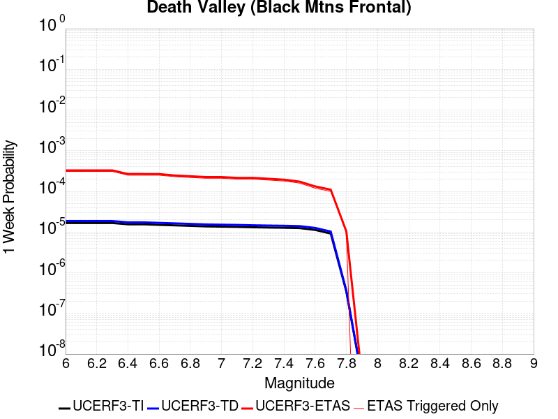 | 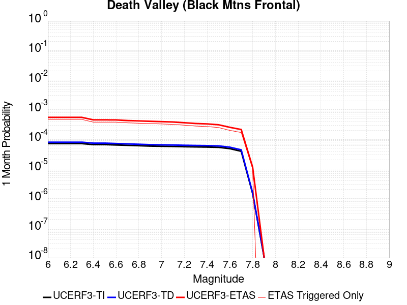 | 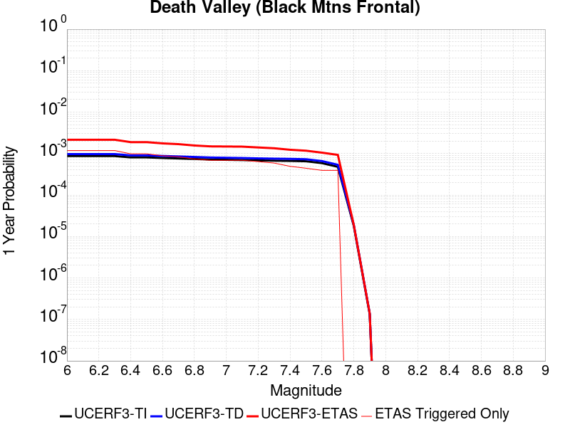 | 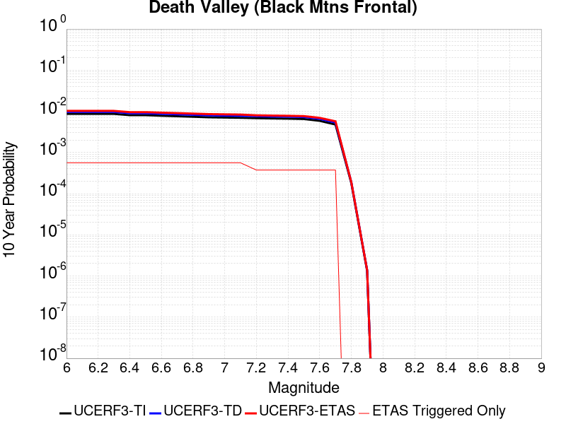 |

| Magnitude | 1 wk TI Prob | 1 wk TD Prob | 1 wk ETAS Prob | 1 wk ETAS/TD Gain | 1 wk ETAS Triggered Only | 1 mo TI Prob | 1 mo TD Prob | 1 mo ETAS Prob | 1 mo ETAS/TD Gain | 1 mo ETAS Triggered Only | 1 yr TI Prob | 1 yr TD Prob | 1 yr ETAS Prob | 1 yr ETAS/TD Gain | 1 yr ETAS Triggered Only | 10 yr TI Prob | 10 yr TD Prob | 10 yr ETAS Prob | 10 yr ETAS/TD Gain | 10 yr ETAS Triggered Only |
|-----|-----|-----|-----|-----|-----|-----|-----|-----|-----|-----|-----|-----|-----|-----|-----|-----|-----|-----|-----|-----|
| 6.0 | 1.6707214E-5 | 1.867027E-5 | 3.286645E-4 | 17.603628 | 3.1E-4 | 7.160038E-5 | 8.001303E-5 | 5.4997543E-4 | 6.873574 | 4.7E-4 | 8.71386E-4 | 9.737309E-4 | 0.0017629616 | 1.8105224 | 7.9E-4 | 0.00867977 | 0.009695496 | 0.010755123 | 1.1092905 | 0.00107 |
| 6.1 | 1.6707214E-5 | 1.867027E-5 | 3.286645E-4 | 17.603628 | 3.1E-4 | 7.160038E-5 | 8.001303E-5 | 5.4997543E-4 | 6.873574 | 4.7E-4 | 8.71386E-4 | 9.737309E-4 | 0.0017629616 | 1.8105224 | 7.9E-4 | 0.00867977 | 0.009695496 | 0.010755123 | 1.1092905 | 0.00107 |
| 6.2 | 1.6707214E-5 | 1.867027E-5 | 3.286645E-4 | 17.603628 | 3.1E-4 | 7.160038E-5 | 8.001303E-5 | 5.4997543E-4 | 6.873574 | 4.7E-4 | 8.71386E-4 | 9.737309E-4 | 0.0017629616 | 1.8105224 | 7.9E-4 | 0.00867977 | 0.009695496 | 0.010755123 | 1.1092905 | 0.00107 |
| 6.3 | 1.6707214E-5 | 1.867027E-5 | 3.286645E-4 | 17.603628 | 3.1E-4 | 7.160038E-5 | 8.001303E-5 | 5.4997543E-4 | 6.873574 | 4.7E-4 | 8.71386E-4 | 9.737309E-4 | 0.0017629616 | 1.8105224 | 7.9E-4 | 0.00867977 | 0.009695496 | 0.010755123 | 1.1092905 | 0.00107 |
| 6.4 | 1.5515609E-5 | 1.7338214E-5 | 2.6733387E-4 | 15.418768 | 2.5E-4 | 6.649377E-5 | 7.4304546E-5 | 4.542763E-4 | 6.113708 | 3.8E-4 | 8.0926094E-4 | 9.042885E-4 | 0.0015736826 | 1.740244 | 6.7E-4 | 0.008063202 | 0.009006773 | 0.009928397 | 1.1023257 | 9.3E-4 |
| 6.5 | 1.5515609E-5 | 1.7338214E-5 | 2.6733387E-4 | 15.418768 | 2.5E-4 | 6.649377E-5 | 7.4304546E-5 | 4.542763E-4 | 6.113708 | 3.8E-4 | 8.0926094E-4 | 9.042885E-4 | 0.0015736826 | 1.740244 | 6.7E-4 | 0.008063202 | 0.009006773 | 0.009928397 | 1.1023257 | 9.3E-4 |
| 6.6 | 1.5041828E-5 | 1.6809145E-5 | 2.6680494E-4 | 15.872606 | 2.5E-4 | 6.4463384E-5 | 7.203723E-5 | 4.5200987E-4 | 6.2746696 | 3.8E-4 | 7.8455906E-4 | 8.767063E-4 | 0.001506154 | 1.7179687 | 6.3E-4 | 0.00781795 | 0.008733132 | 0.009575709 | 1.0964805 | 8.5E-4 |
| 6.7 | 1.4634985E-5 | 1.6356016E-5 | 2.4635225E-4 | 15.061873 | 2.3E-4 | 6.271985E-5 | 7.009536E-5 | 4.3007013E-4 | 6.1355004 | 3.6E-4 | 7.6334673E-4 | 8.5308263E-4 | 0.0014625622 | 1.7144438 | 6.1E-4 | 0.007607299 | 0.008498715 | 0.009311747 | 1.0956652 | 8.2E-4 |
| 6.8 | 1.4209158E-5 | 1.5882048E-5 | 2.3587856E-4 | 14.851898 | 2.2E-4 | 6.089497E-5 | 6.8064175E-5 | 4.1804035E-4 | 6.1418557 | 3.5E-4 | 7.4114406E-4 | 8.2837185E-4 | 0.0014078914 | 1.6995887 | 5.8E-4 | 0.007386771 | 0.008253456 | 0.009027018 | 1.0937259 | 7.8E-4 |
| 6.9 | 1.3780098E-5 | 1.5404594E-5 | 2.2540135E-4 | 14.632088 | 2.1E-4 | 5.9056227E-5 | 6.6018045E-5 | 4.059956E-4 | 6.149767 | 3.4E-4 | 7.1877235E-4 | 8.0347876E-4 | 0.0013530368 | 1.6839734 | 5.5E-4 | 0.0071645193 | 0.008006332 | 0.008740408 | 1.0916868 | 7.4E-4 |
| 7.0 | 1.3585064E-5 | 1.5188155E-5 | 2.2518497E-4 | 14.826354 | 2.1E-4 | 5.8220405E-5 | 6.50905E-5 | 3.9506902E-4 | 6.0695343 | 3.3E-4 | 7.086029E-4 | 7.9219416E-4 | 0.0013217743 | 1.6684979 | 5.3E-4 | 0.007063476 | 0.007894293 | 0.00860861 | 1.0904851 | 7.2E-4 |
| 7.1 | 1.3398601E-5 | 1.49813395E-5 | 2.1497834E-4 | 14.349741 | 2.0E-4 | 5.742131E-5 | 6.420419E-5 | 3.8418366E-4 | 5.9837785 | 3.2E-4 | 6.9888023E-4 | 7.8141113E-4 | 0.0012910126 | 1.6521554 | 5.1E-4 | 0.0069668638 | 0.007787224 | 0.008452007 | 1.0853684 | 6.7E-4 |
| 7.2 | 1.3126312E-5 | 1.4679561E-5 | 2.1467662E-4 | 14.624186 | 2.0E-4 | 5.6254412E-5 | 6.291092E-5 | 3.6289205E-4 | 5.7683477 | 3.0E-4 | 6.846822E-4 | 7.6567667E-4 | 0.0012453091 | 1.6264164 | 4.8E-4 | 0.006825765 | 0.00763097 | 0.008246239 | 1.0806279 | 6.2E-4 |
| 7.3 | 1.2922429E-5 | 1.4453788E-5 | 2.0445105E-4 | 14.145153 | 1.9E-4 | 5.5380664E-5 | 6.194336E-5 | 3.4192603E-4 | 5.519978 | 2.8E-4 | 6.74051E-4 | 7.53905E-4 | 0.0012135581 | 1.6096965 | 4.6E-4 | 0.006720101 | 0.007514055 | 0.008109546 | 1.0792503 | 6.0E-4 |
| 7.4 | 1.2768878E-5 | 1.4283772E-5 | 1.942812E-4 | 13.601534 | 1.8E-4 | 5.4722615E-5 | 6.1214756E-5 | 3.3119824E-4 | 5.4104314 | 2.7E-4 | 6.660441E-4 | 7.4504025E-4 | 0.0011747199 | 1.57672 | 4.3E-4 | 0.0066405144 | 0.0074260035 | 0.00799177 | 1.0761873 | 5.7E-4 |
| 7.5 | 1.2521929E-5 | 1.40120155E-5 | 1.7400978E-4 | 12.418612 | 1.6E-4 | 5.366431E-5 | 6.005014E-5 | 3.1003513E-4 | 5.1629376 | 2.5E-4 | 6.531671E-4 | 7.3087064E-4 | 0.0011205856 | 1.5332202 | 3.9E-4 | 0.006512506 | 0.0072852457 | 0.0077915303 | 1.0694945 | 5.1E-4 |
| 7.6 | 1.1301089E-5 | 1.2648149E-5 | 1.3264663E-4 | 10.487434 | 1.2E-4 | 4.8432343E-5 | 5.4205255E-5 | 2.5419443E-4 | 4.689479 | 2.0E-4 | 5.895042E-4 | 6.5975444E-4 | 9.795433E-4 | 1.4847089 | 3.2E-4 | 0.0058794282 | 0.00657851 | 0.0070156157 | 1.0664444 | 4.4E-4 |
| 7.7 | 9.189108E-6 | 1.0283358E-5 | 1.1028233E-4 | 10.72435 | 1.0E-4 | 3.93813E-5 | 4.407082E-5 | 2.1406333E-4 | 4.857258 | 1.7E-4 | 4.7936183E-4 | 5.3643517E-4 | 7.8630104E-4 | 1.4657896 | 2.5E-4 | 0.004783291 | 0.005351914 | 0.005690094 | 1.0631887 | 3.4E-4 |
| 7.8 | 3.4586725E-7 | 3.6482615E-7 | 1.0364823E-5 | 28.410307 | 1.0E-5 | 1.4822873E-6 | 1.5635396E-6 | 1.1563524E-5 | 7.3957343 | 1.0E-5 | 1.80467E-5 | 1.9035933E-5 | 2.9035744E-5 | 1.5253123 | 1.0E-5 | 1.8045233E-4 | 1.9034347E-4 | 2.0034157E-4 | 1.0525266 | 1.0E-5 |
| 7.9 | 2.5591178E-9 | 2.6696718E-9 | 2.6696718E-9 | 1.0 | 0.0 | 1.0967647E-8 | 1.14414505E-8 | 1.14414505E-8 | 1.0 | 0.0 | 1.335311E-7 | 1.3929966E-7 | 1.3929966E-7 | 1.0 | 0.0 | 1.3353102E-6 | 1.3929966E-6 | 1.3929966E-6 | 1.0 | 0.0 |

## San Andreas (San Bernardino S)
*[(top)](#table-of-contents)*

| 1 Week | 1 Month | 1 Year | 10 Year |
|-----|-----|-----|-----|
| 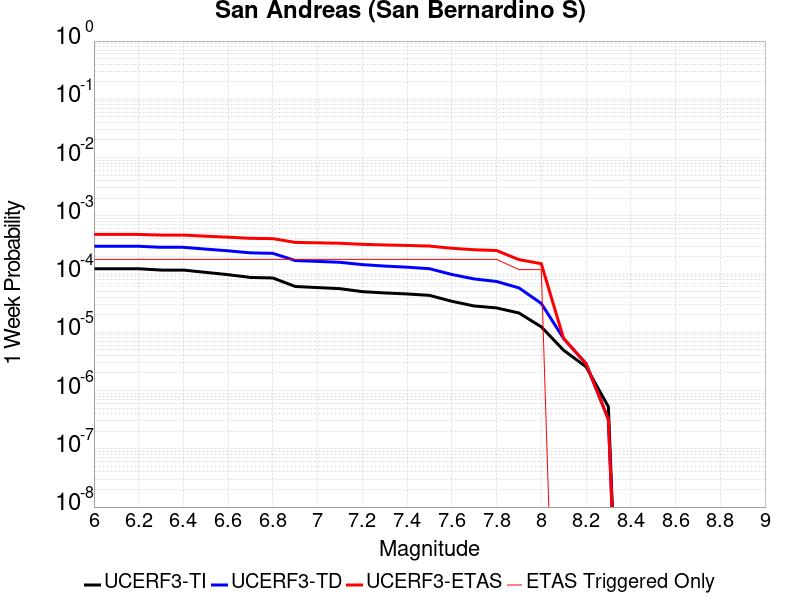 | 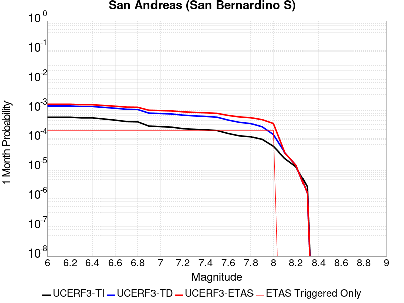 | 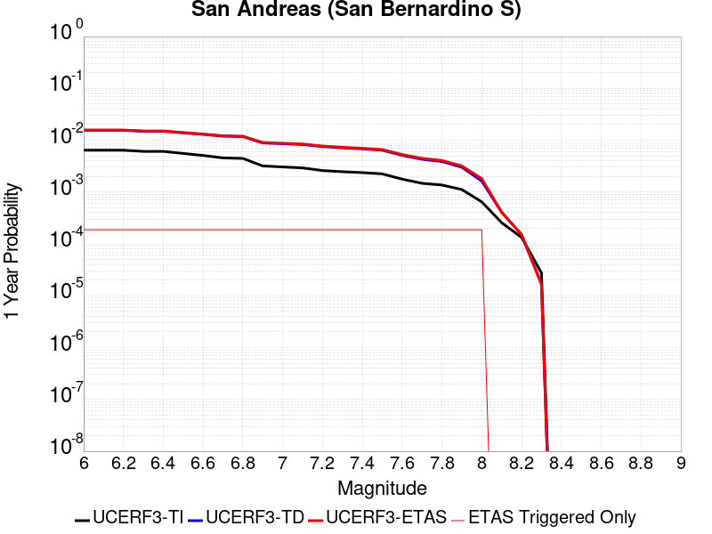 | 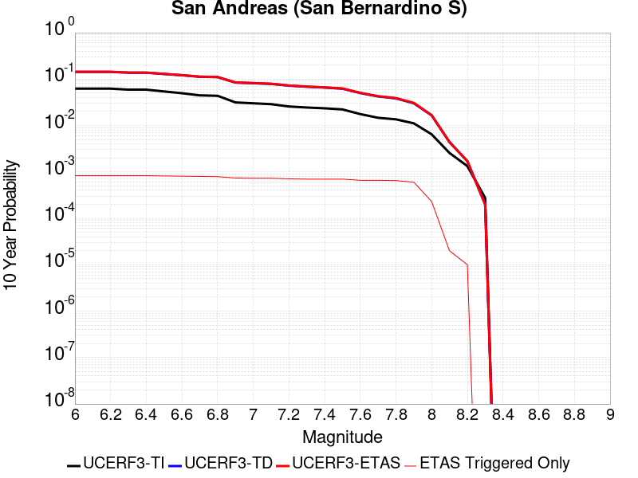 |

| Magnitude | 1 wk TI Prob | 1 wk TD Prob | 1 wk ETAS Prob | 1 wk ETAS/TD Gain | 1 wk ETAS Triggered Only | 1 mo TI Prob | 1 mo TD Prob | 1 mo ETAS Prob | 1 mo ETAS/TD Gain | 1 mo ETAS Triggered Only | 1 yr TI Prob | 1 yr TD Prob | 1 yr ETAS Prob | 1 yr ETAS/TD Gain | 1 yr ETAS Triggered Only | 10 yr TI Prob | 10 yr TD Prob | 10 yr ETAS Prob | 10 yr ETAS/TD Gain | 10 yr ETAS Triggered Only |
|-----|-----|-----|-----|-----|-----|-----|-----|-----|-----|-----|-----|-----|-----|-----|-----|-----|-----|-----|-----|-----|
| 6.0 | 1.2336002E-4 | 3.0005194E-4 | 5.699709E-4 | 1.8995743 | 2.7E-4 | 5.2857865E-4 | 0.0012853292 | 0.0016448664 | 1.2797239 | 3.6E-4 | 0.006416472 | 0.015541554 | 0.016102696 | 1.0361059 | 5.7E-4 | 0.06234337 | 0.14294699 | 0.14365835 | 1.0049764 | 8.3E-4 |
| 6.1 | 1.2336002E-4 | 3.0005194E-4 | 5.699709E-4 | 1.8995743 | 2.7E-4 | 5.2857865E-4 | 0.0012853292 | 0.0016448664 | 1.2797239 | 3.6E-4 | 0.006416472 | 0.015541554 | 0.016102696 | 1.0361059 | 5.7E-4 | 0.06234337 | 0.14294699 | 0.14365835 | 1.0049764 | 8.3E-4 |
| 6.2 | 1.2336002E-4 | 3.0005194E-4 | 5.699709E-4 | 1.8995743 | 2.7E-4 | 5.2857865E-4 | 0.0012853292 | 0.0016448664 | 1.2797239 | 3.6E-4 | 0.006416472 | 0.015541554 | 0.016102696 | 1.0361059 | 5.7E-4 | 0.06234337 | 0.14294699 | 0.14365835 | 1.0049764 | 8.3E-4 |
| 6.3 | 1.1712257E-4 | 2.8793467E-4 | 5.578569E-4 | 1.9374428 | 2.7E-4 | 5.018573E-4 | 0.0012334478 | 0.0015930037 | 1.2915049 | 3.6E-4 | 0.006093008 | 0.014918666 | 0.015480163 | 1.0376371 | 5.7E-4 | 0.059286322 | 0.13765779 | 0.13837352 | 1.0051994 | 8.3E-4 |
| 6.4 | 1.1712257E-4 | 2.8793467E-4 | 5.578569E-4 | 1.9374428 | 2.7E-4 | 5.018573E-4 | 0.0012334478 | 0.0015930037 | 1.2915049 | 3.6E-4 | 0.006093008 | 0.014918666 | 0.015480163 | 1.0376371 | 5.7E-4 | 0.059286322 | 0.13765779 | 0.13837352 | 1.0051994 | 8.3E-4 |
| 6.5 | 1.0689076E-4 | 2.6806415E-4 | 5.3799176E-4 | 2.0069516 | 2.7E-4 | 4.5802278E-4 | 0.0011483653 | 0.0015079519 | 1.3131291 | 3.6E-4 | 0.0055621783 | 0.013896335 | 0.014458414 | 1.040448 | 5.7E-4 | 0.05425003 | 0.1288989 | 0.1296132 | 1.0055416 | 8.2E-4 |
| 6.6 | 9.7648895E-5 | 2.505129E-4 | 5.204453E-4 | 2.0775187 | 2.7E-4 | 4.1842813E-4 | 0.0010732086 | 0.0014328223 | 1.3350827 | 3.6E-4 | 0.005082469 | 0.012992399 | 0.013554993 | 1.0433018 | 5.7E-4 | 0.049677886 | 0.121077746 | 0.12178967 | 1.0058799 | 8.1E-4 |
| 6.7 | 8.757013E-5 | 2.3122175E-4 | 4.9116166E-4 | 2.1242018 | 2.6E-4 | 3.7524657E-4 | 9.905964E-4 | 0.0013402497 | 1.3529725 | 3.5E-4 | 0.00455906 | 0.011997902 | 0.012551183 | 1.0461148 | 5.6E-4 | 0.04466656 | 0.112373024 | 0.113083124 | 1.0063192 | 8.0E-4 |
| 6.8 | 8.562978E-5 | 2.2682057E-4 | 4.7676387E-4 | 2.1019428 | 2.5E-4 | 3.6693315E-4 | 9.7174826E-4 | 0.0013114179 | 1.3495449 | 3.4E-4 | 0.004458263 | 0.011770921 | 0.012314447 | 1.0461754 | 5.5E-4 | 0.043698758 | 0.11037863 | 0.11108143 | 1.0063672 | 7.9E-4 |
| 6.9 | 6.124075E-5 | 1.7066885E-4 | 4.106279E-4 | 2.405992 | 2.4E-4 | 2.6243398E-4 | 7.312337E-4 | 0.0010509997 | 1.4372966 | 3.2E-4 | 0.0031904527 | 0.008866636 | 0.009391937 | 1.0592446 | 5.3E-4 | 0.031450346 | 0.08420262 | 0.08488031 | 1.0080483 | 7.4E-4 |
| 7.0 | 5.8598747E-5 | 1.6495936E-4 | 4.0491976E-4 | 2.4546638 | 2.4E-4 | 2.5111332E-4 | 7.067779E-4 | 0.0010265517 | 1.452439 | 3.2E-4 | 0.0030530186 | 0.008571265 | 0.009096723 | 1.0613046 | 5.3E-4 | 0.03011414 | 0.08151562 | 0.08218611 | 1.0082253 | 7.3E-4 |
| 7.1 | 5.613814E-5 | 1.5914452E-4 | 3.9910633E-4 | 2.5078232 | 2.4E-4 | 2.4056983E-4 | 6.818704E-4 | 0.0010016522 | 1.4689773 | 3.2E-4 | 0.0029250039 | 0.008270353 | 0.008795969 | 1.0635543 | 5.3E-4 | 0.028868021 | 0.07881268 | 0.07948515 | 1.0085325 | 7.3E-4 |
| 7.2 | 4.991222E-5 | 1.4520933E-4 | 3.8517447E-4 | 2.6525464 | 2.4E-4 | 2.1389198E-4 | 6.221777E-4 | 9.4197853E-4 | 1.5140026 | 3.2E-4 | 0.002601025 | 0.0075488063 | 0.008074805 | 1.0696797 | 5.3E-4 | 0.025707912 | 0.07226191 | 0.0729206 | 1.0091153 | 7.1E-4 |
| 7.3 | 4.7410045E-5 | 1.371513E-4 | 3.7711838E-4 | 2.7496521 | 2.4E-4 | 2.0317009E-4 | 5.8765925E-4 | 9.0747117E-4 | 1.5442133 | 3.2E-4 | 0.0024707897 | 0.0071313656 | 0.0076476573 | 1.0723974 | 5.2E-4 | 0.024434982 | 0.068541944 | 0.06919397 | 1.0095128 | 7.0E-4 |
| 7.4 | 4.5556746E-5 | 1.3123035E-4 | 3.7119884E-4 | 2.8286054 | 2.4E-4 | 1.952286E-4 | 5.6229485E-4 | 8.821149E-4 | 1.5687765 | 3.2E-4 | 0.002374317 | 0.0068245293 | 0.0073409807 | 1.0756757 | 5.2E-4 | 0.023491086 | 0.06579143 | 0.06644537 | 1.0099397 | 7.0E-4 |
| 7.5 | 4.3084514E-5 | 1.2358342E-4 | 3.6355376E-4 | 2.941768 | 2.4E-4 | 1.8463485E-4 | 5.2953605E-4 | 8.493666E-4 | 1.6039826 | 3.2E-4 | 0.0022456115 | 0.0064281146 | 0.006944772 | 1.0803746 | 5.2E-4 | 0.022230545 | 0.062190283 | 0.06284675 | 1.0105557 | 7.0E-4 |
| 7.6 | 3.408608E-5 | 9.836477E-5 | 3.2834214E-4 | 3.3380055 | 2.3E-4 | 1.4607502E-4 | 4.214953E-4 | 7.213688E-4 | 1.7114518 | 3.0E-4 | 0.0017770125 | 0.005119656 | 0.005617096 | 1.0971628 | 5.0E-4 | 0.017628696 | 0.05002244 | 0.050649423 | 1.012534 | 6.6E-4 |
| 7.7 | 2.8315713E-5 | 8.2495724E-5 | 3.1247674E-4 | 3.7877932 | 2.3E-4 | 1.2134742E-4 | 3.5350522E-4 | 6.5339915E-4 | 1.8483437 | 3.0E-4 | 0.0014764034 | 0.004295442 | 0.004793294 | 1.1159024 | 5.0E-4 | 0.01466633 | 0.042272415 | 0.042904515 | 1.014953 | 6.6E-4 |
| 7.8 | 2.6222975E-5 | 7.463898E-5 | 2.9462256E-4 | 3.9473016 | 2.2E-4 | 1.1237934E-4 | 3.1984213E-4 | 6.097494E-4 | 1.9064072 | 2.9E-4 | 0.0013673597 | 0.003887131 | 0.0043752263 | 1.125567 | 4.9E-4 | 0.013589768 | 0.038437475 | 0.03906249 | 1.0162606 | 6.5E-4 |
| 7.9 | 2.1469694E-5 | 5.7884805E-5 | 2.6787265E-4 | 4.627685 | 2.1E-4 | 9.200973E-5 | 2.4805416E-4 | 5.279847E-4 | 2.1285057 | 2.8E-4 | 0.0011196428 | 0.00301588 | 0.003464523 | 1.1487602 | 4.5E-4 | 0.011140184 | 0.030153265 | 0.030735174 | 1.0192983 | 6.0E-4 |
| 8.0 | 1.2420249E-5 | 3.1321662E-5 | 1.21318844E-4 | 3.8733206 | 9.0E-5 | 5.322855E-5 | 1.342288E-4 | 2.4421402E-4 | 1.8193862 | 1.1E-4 | 6.478649E-4 | 0.0016330116 | 0.0017927503 | 1.0978185 | 1.6E-4 | 0.0064597935 | 0.01652369 | 0.01674989 | 1.0136894 | 2.3E-4 |
| 8.1 | 4.9197724E-6 | 7.822525E-6 | 1.7822445E-5 | 2.2783496 | 1.0E-5 | 2.1084568E-5 | 3.3524673E-5 | 4.352434E-5 | 1.2982777 | 1.0E-5 | 2.566744E-4 | 4.080866E-4 | 4.2807843E-4 | 1.0489892 | 2.0E-5 | 0.002563781 | 0.004384557 | 0.004404469 | 1.0045415 | 2.0E-5 |
| 8.2 | 2.5634774E-6 | 2.9065757E-6 | 2.9065757E-6 | 1.0 | 0.0 | 1.0986286E-5 | 1.2456694E-5 | 1.2456694E-5 | 1.0 | 0.0 | 1.3374983E-4 | 1.5164974E-4 | 1.6164822E-4 | 1.0659314 | 1.0E-5 | 0.0013366934 | 0.001704941 | 0.001714924 | 1.0058553 | 1.0E-5 |
| 8.3 | 5.2850464E-7 | 3.2080476E-7 | 3.2080476E-7 | 1.0 | 0.0 | 2.2650179E-6 | 1.3748769E-6 | 1.3748769E-6 | 1.0 | 0.0 | 2.7576245E-5 | 1.673901E-5 | 1.673901E-5 | 1.0 | 0.0 | 2.7572823E-4 | 1.986671E-4 | 1.986671E-4 | 1.0 | 0.0 |

## Coyote Lake
*[(top)](#table-of-contents)*

| 1 Week | 1 Month | 1 Year | 10 Year |
|-----|-----|-----|-----|
| 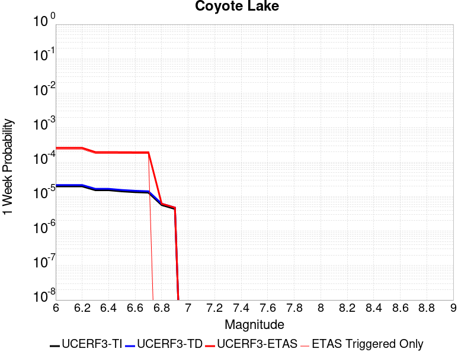 | 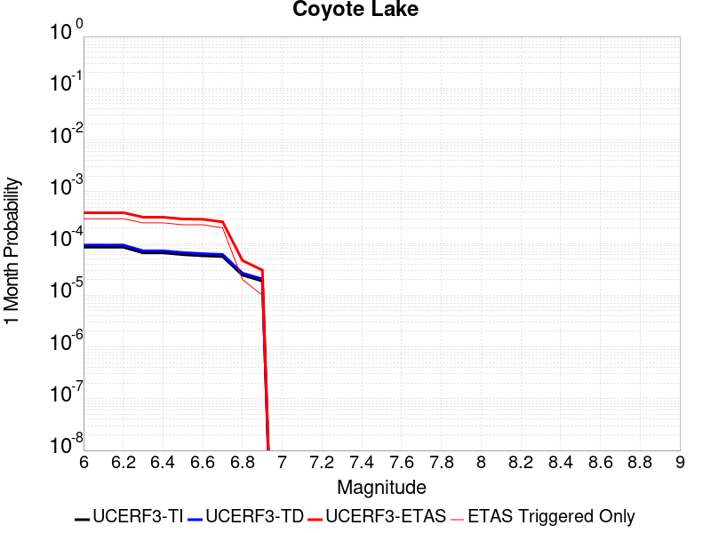 | 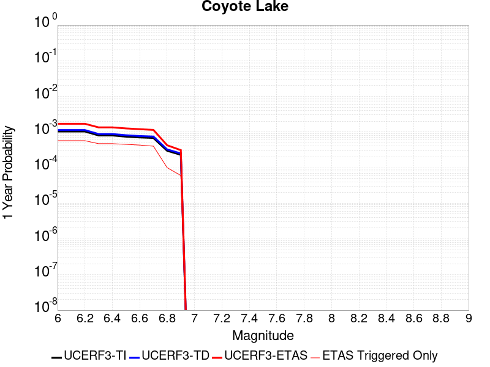 | 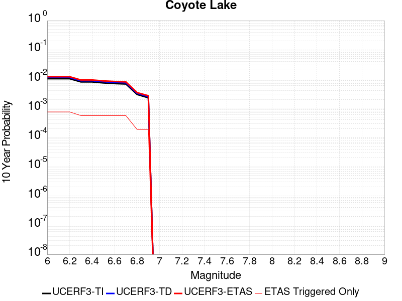 |

| Magnitude | 1 wk TI Prob | 1 wk TD Prob | 1 wk ETAS Prob | 1 wk ETAS/TD Gain | 1 wk ETAS Triggered Only | 1 mo TI Prob | 1 mo TD Prob | 1 mo ETAS Prob | 1 mo ETAS/TD Gain | 1 mo ETAS Triggered Only | 1 yr TI Prob | 1 yr TD Prob | 1 yr ETAS Prob | 1 yr ETAS/TD Gain | 1 yr ETAS Triggered Only | 10 yr TI Prob | 10 yr TD Prob | 10 yr ETAS Prob | 10 yr ETAS/TD Gain | 10 yr ETAS Triggered Only |
|-----|-----|-----|-----|-----|-----|-----|-----|-----|-----|-----|-----|-----|-----|-----|-----|-----|-----|-----|-----|-----|
| 6.0 | 1.980352E-5 | 2.1706745E-5 | 2.4170197E-4 | 11.134879 | 2.2E-4 | 8.486947E-5 | 9.302599E-5 | 3.9299807E-4 | 4.224605 | 3.0E-4 | 0.0010327959 | 0.0011320751 | 0.0017014297 | 1.5029302 | 5.7E-4 | 0.010280091 | 0.011270258 | 0.0120216925 | 1.0666741 | 7.6E-4 |
| 6.1 | 1.980352E-5 | 2.1706745E-5 | 2.4170197E-4 | 11.134879 | 2.2E-4 | 8.486947E-5 | 9.302599E-5 | 3.9299807E-4 | 4.224605 | 3.0E-4 | 0.0010327959 | 0.0011320751 | 0.0017014297 | 1.5029302 | 5.7E-4 | 0.010280091 | 0.011270258 | 0.0120216925 | 1.0666741 | 7.6E-4 |
| 6.2 | 1.980352E-5 | 2.1706745E-5 | 2.4170197E-4 | 11.134879 | 2.2E-4 | 8.486947E-5 | 9.302599E-5 | 3.9299807E-4 | 4.224605 | 3.0E-4 | 0.0010327959 | 0.0011320751 | 0.0017014297 | 1.5029302 | 5.7E-4 | 0.010280091 | 0.011270258 | 0.0120216925 | 1.0666741 | 7.6E-4 |
| 6.3 | 1.5344787E-5 | 1.682067E-5 | 1.9681764E-4 | 11.70094 | 1.8E-4 | 6.576172E-5 | 7.2086936E-5 | 3.2206893E-4 | 4.467785 | 2.5E-4 | 8.003548E-4 | 8.773662E-4 | 0.0013469539 | 1.5352242 | 4.7E-4 | 0.007974784 | 0.00874507 | 0.009379473 | 1.0725441 | 6.4E-4 |
| 6.4 | 1.5344787E-5 | 1.682067E-5 | 1.9681764E-4 | 11.70094 | 1.8E-4 | 6.576172E-5 | 7.2086936E-5 | 3.2206893E-4 | 4.467785 | 2.5E-4 | 8.003548E-4 | 8.773662E-4 | 0.0013469539 | 1.5352242 | 4.7E-4 | 0.007974784 | 0.00874507 | 0.009379473 | 1.0725441 | 6.4E-4 |
| 6.5 | 1.4189697E-5 | 1.5557987E-5 | 1.8555534E-4 | 11.926694 | 1.7E-4 | 6.081157E-5 | 6.6675726E-5 | 2.9666038E-4 | 4.4493012 | 2.3E-4 | 7.401293E-4 | 8.115349E-4 | 0.0012611697 | 1.5540549 | 4.5E-4 | 0.0073766913 | 0.008091656 | 0.00869672 | 1.0747763 | 6.1E-4 |
| 6.6 | 1.3469301E-5 | 1.4771577E-5 | 1.8476907E-4 | 12.508418 | 1.7E-4 | 5.7724297E-5 | 6.330556E-5 | 2.93291E-4 | 4.632942 | 2.3E-4 | 7.025667E-4 | 7.7053264E-4 | 0.0012002013 | 1.5576255 | 4.3E-4 | 0.0070034964 | 0.0076845144 | 0.008269981 | 1.0761877 | 5.9E-4 |
| 6.7 | 1.3027966E-5 | 1.4281745E-5 | 1.5427974E-4 | 10.802584 | 1.4E-4 | 5.5832945E-5 | 6.120638E-5 | 2.6119413E-4 | 4.267433 | 2.0E-4 | 6.7955407E-4 | 7.4499263E-4 | 0.0011446946 | 1.5365181 | 4.0E-4 | 0.006774798 | 0.0074308286 | 0.007986668 | 1.0748017 | 5.6E-4 |
| 6.8 | 5.695434E-6 | 6.2244176E-6 | 1.6224356E-5 | 2.606566 | 1.0E-5 | 2.4408775E-5 | 2.6675973E-5 | 4.667544E-5 | 1.7497183 | 2.0E-5 | 2.971363E-4 | 3.2476155E-4 | 4.2472908E-4 | 1.3078182 | 1.0E-4 | 0.0029673933 | 0.0032458105 | 0.003365421 | 1.0368507 | 1.2E-4 |
| 6.9 | 4.385688E-6 | 4.7930553E-6 | 1.4793008E-5 | 3.0863419 | 1.0E-5 | 1.879567E-5 | 2.0541665E-5 | 3.054146E-5 | 1.4868054 | 1.0E-5 | 2.2881327E-4 | 2.5009477E-4 | 3.1007978E-4 | 1.2398491 | 6.0E-5 | 0.002285778 | 0.0025009478 | 0.0025607978 | 1.0239309 | 6.0E-5 |

## San Andreas (Big Bend)
*[(top)](#table-of-contents)*

| 1 Week | 1 Month | 1 Year | 10 Year |
|-----|-----|-----|-----|
| 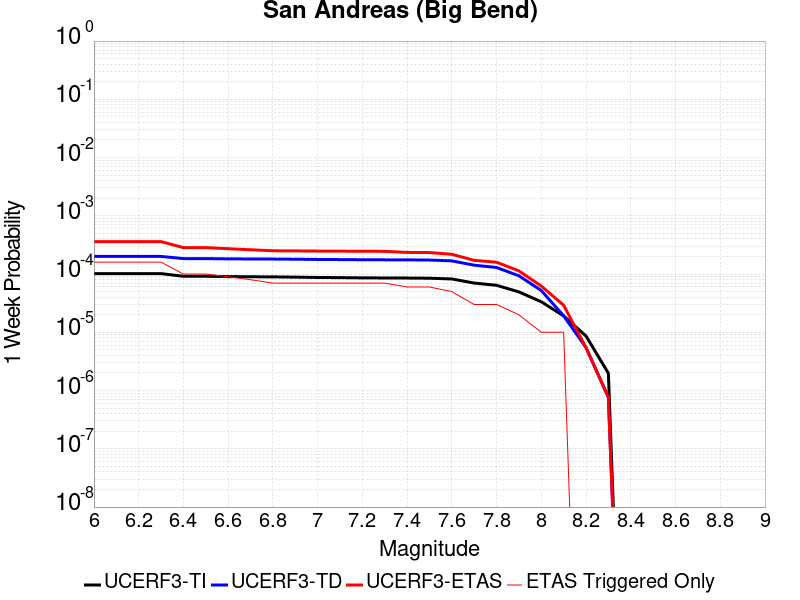 | 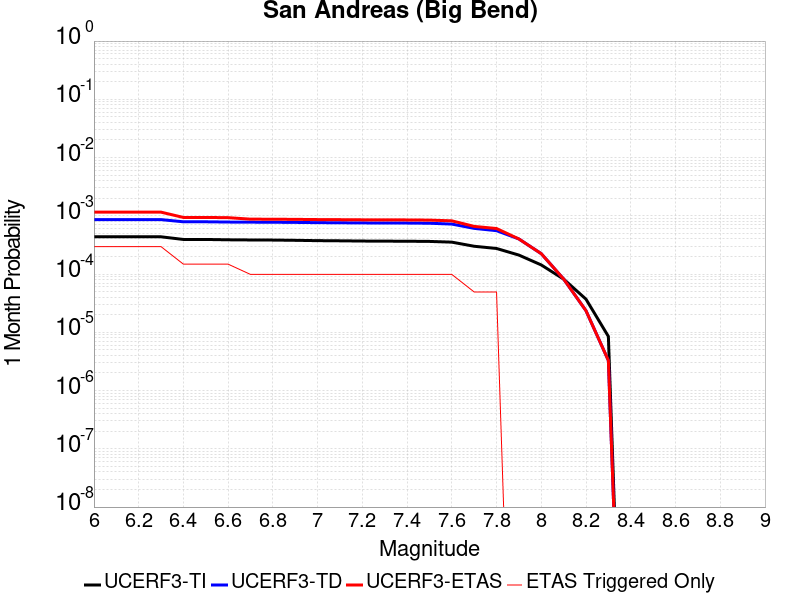 | 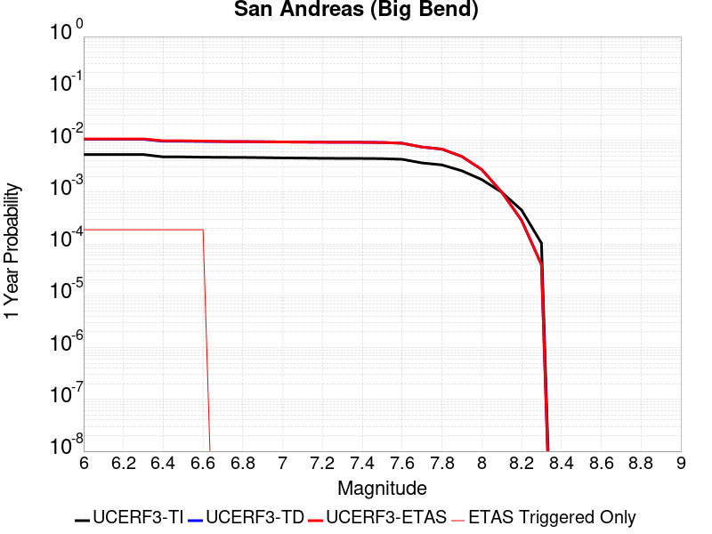 | 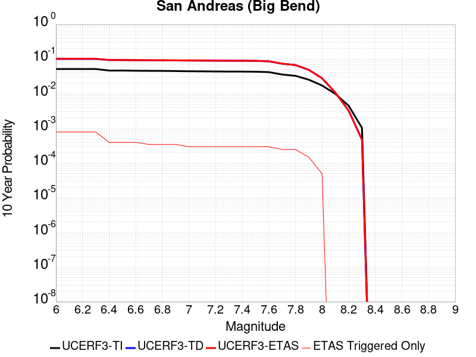 |

| Magnitude | 1 wk TI Prob | 1 wk TD Prob | 1 wk ETAS Prob | 1 wk ETAS/TD Gain | 1 wk ETAS Triggered Only | 1 mo TI Prob | 1 mo TD Prob | 1 mo ETAS Prob | 1 mo ETAS/TD Gain | 1 mo ETAS Triggered Only | 1 yr TI Prob | 1 yr TD Prob | 1 yr ETAS Prob | 1 yr ETAS/TD Gain | 1 yr ETAS Triggered Only | 10 yr TI Prob | 10 yr TD Prob | 10 yr ETAS Prob | 10 yr ETAS/TD Gain | 10 yr ETAS Triggered Only |
|-----|-----|-----|-----|-----|-----|-----|-----|-----|-----|-----|-----|-----|-----|-----|-----|-----|-----|-----|-----|-----|
| 6.0 | 1.0179969E-4 | 2.0073925E-4 | 3.6070714E-4 | 1.7968938 | 1.6E-4 | 4.362114E-4 | 8.6002843E-4 | 0.0010798392 | 1.2555854 | 2.2E-4 | 0.0052979486 | 0.010420859 | 0.01086617 | 1.0427326 | 4.5E-4 | 0.051734097 | 0.101455905 | 0.102057934 | 1.0059339 | 6.7E-4 |
| 6.1 | 1.0179969E-4 | 2.0073925E-4 | 3.6070714E-4 | 1.7968938 | 1.6E-4 | 4.362114E-4 | 8.6002843E-4 | 0.0010798392 | 1.2555854 | 2.2E-4 | 0.0052979486 | 0.010420859 | 0.01086617 | 1.0427326 | 4.5E-4 | 0.051734097 | 0.101455905 | 0.102057934 | 1.0059339 | 6.7E-4 |
| 6.2 | 1.0179969E-4 | 2.0073925E-4 | 3.6070714E-4 | 1.7968938 | 1.6E-4 | 4.362114E-4 | 8.6002843E-4 | 0.0010798392 | 1.2555854 | 2.2E-4 | 0.0052979486 | 0.010420859 | 0.01086617 | 1.0427326 | 4.5E-4 | 0.051734097 | 0.101455905 | 0.102057934 | 1.0059339 | 6.7E-4 |
| 6.3 | 1.0179969E-4 | 2.0073925E-4 | 3.6070714E-4 | 1.7968938 | 1.6E-4 | 4.362114E-4 | 8.6002843E-4 | 0.0010798392 | 1.2555854 | 2.2E-4 | 0.0052979486 | 0.010420859 | 0.01086617 | 1.0427326 | 4.5E-4 | 0.051734097 | 0.101455905 | 0.102057934 | 1.0059339 | 6.7E-4 |
| 6.4 | 9.1639464E-5 | 1.8430917E-4 | 2.8429073E-4 | 1.5424666 | 1.0E-4 | 3.9268145E-4 | 7.896575E-4 | 9.195549E-4 | 1.1644983 | 1.3E-4 | 0.0047704205 | 0.009571818 | 0.009839234 | 1.0279378 | 2.7E-4 | 0.046693064 | 0.09378695 | 0.094113186 | 1.0034785 | 3.6E-4 |
| 6.5 | 9.1639464E-5 | 1.8430917E-4 | 2.8429073E-4 | 1.5424666 | 1.0E-4 | 3.9268145E-4 | 7.896575E-4 | 9.195549E-4 | 1.1644983 | 1.3E-4 | 0.0047704205 | 0.009571818 | 0.009839234 | 1.0279378 | 2.7E-4 | 0.046693064 | 0.09378695 | 0.094113186 | 1.0034785 | 3.6E-4 |
| 6.6 | 9.042622E-5 | 1.8238011E-4 | 2.7236372E-4 | 1.4933848 | 9.0E-5 | 3.8748336E-4 | 7.813951E-4 | 9.013014E-4 | 1.1534514 | 1.2E-4 | 0.0047074095 | 0.0094721 | 0.009699921 | 1.0240518 | 2.3E-4 | 0.046089325 | 0.09287721 | 0.09316749 | 1.0031254 | 3.2E-4 |
| 6.7 | 8.9836685E-5 | 1.8152347E-4 | 2.6150895E-4 | 1.4406344 | 8.0E-5 | 3.8495753E-4 | 7.7772595E-4 | 8.876404E-4 | 1.141328 | 1.1E-4 | 0.00467679 | 0.009427815 | 0.0096457405 | 1.0231152 | 2.2E-4 | 0.045795817 | 0.09247148 | 0.092752814 | 1.0030423 | 3.1E-4 |
| 6.8 | 8.9471854E-5 | 1.8099119E-4 | 2.5097854E-4 | 1.3866892 | 7.0E-5 | 3.8339442E-4 | 7.754462E-4 | 8.753686E-4 | 1.128858 | 1.0E-4 | 0.004657841 | 0.009400298 | 0.009608324 | 1.0221298 | 2.1E-4 | 0.04561414 | 0.0922192 | 0.092491545 | 1.0029532 | 3.0E-4 |
| 6.9 | 8.858234E-5 | 1.7981093E-4 | 2.4979832E-4 | 1.3892279 | 7.0E-5 | 3.7958333E-4 | 7.7039085E-4 | 8.703138E-4 | 1.1297042 | 1.0E-4 | 0.004611638 | 0.009339278 | 0.0095473165 | 1.0222757 | 2.1E-4 | 0.04517103 | 0.09165911 | 0.091931604 | 1.002973 | 3.0E-4 |
| 7.0 | 8.7433385E-5 | 1.7819891E-4 | 2.4818644E-4 | 1.3927494 | 7.0E-5 | 3.746607E-4 | 7.6348626E-4 | 8.634099E-4 | 1.1308781 | 1.0E-4 | 0.004551957 | 0.009255932 | 0.009454081 | 1.0214077 | 2.0E-4 | 0.044598386 | 0.09089323 | 0.09114778 | 1.0028006 | 2.8E-4 |
| 7.1 | 8.684964E-5 | 1.7731842E-4 | 2.4730602E-4 | 1.3947 | 7.0E-5 | 3.7215967E-4 | 7.597149E-4 | 8.5963897E-4 | 1.1315284 | 1.0E-4 | 0.0045216335 | 0.009210405 | 0.009398655 | 1.0204388 | 1.9E-4 | 0.04430731 | 0.09047475 | 0.09072032 | 1.0027143 | 2.7E-4 |
| 7.2 | 8.606521E-5 | 1.7622454E-4 | 2.462122E-4 | 1.3971505 | 7.0E-5 | 3.6879873E-4 | 7.550296E-4 | 8.5495407E-4 | 1.1323452 | 1.0E-4 | 0.0044808835 | 0.009153842 | 0.009342102 | 1.0205663 | 1.9E-4 | 0.043916024 | 0.08995518 | 0.09020089 | 1.0027314 | 2.7E-4 |
| 7.3 | 8.568266E-5 | 1.7564454E-4 | 2.4563225E-4 | 1.3984622 | 7.0E-5 | 3.6715972E-4 | 7.5254537E-4 | 8.524701E-4 | 1.1327823 | 1.0E-4 | 0.0044610105 | 0.00912385 | 0.009312117 | 1.0206345 | 1.9E-4 | 0.043725148 | 0.08967623 | 0.08992202 | 1.0027409 | 2.7E-4 |
| 7.4 | 8.5432206E-5 | 1.752704E-4 | 2.3525988E-4 | 1.3422682 | 6.0E-5 | 3.6608664E-4 | 7.509428E-4 | 8.408752E-4 | 1.1197593 | 9.0E-5 | 0.004447999 | 0.009104501 | 0.009282863 | 1.0195905 | 1.8E-4 | 0.043600157 | 0.08949642 | 0.08973315 | 1.0026451 | 2.6E-4 |
| 7.5 | 8.4791965E-5 | 1.7396381E-4 | 2.3395337E-4 | 1.3448393 | 6.0E-5 | 3.633435E-4 | 7.4534636E-4 | 8.352793E-4 | 1.1206592 | 9.0E-5 | 0.0044147377 | 0.009036932 | 0.009205396 | 1.0186417 | 1.7E-4 | 0.043280575 | 0.08887209 | 0.08909987 | 1.002563 | 2.5E-4 |
| 7.6 | 8.241105E-5 | 1.6841735E-4 | 2.1840892E-4 | 1.2968315 | 5.0E-5 | 3.531424E-4 | 7.2158914E-4 | 7.915386E-4 | 1.0969381 | 7.0E-5 | 0.0042910352 | 0.008750047 | 0.008898734 | 1.0169928 | 1.5E-4 | 0.042091176 | 0.08625032 | 0.086451344 | 1.0023307 | 2.2E-4 |
| 7.7 | 7.00432E-5 | 1.4205615E-4 | 1.7205188E-4 | 1.2111541 | 3.0E-5 | 3.001506E-4 | 6.0867006E-4 | 6.586396E-4 | 1.0820963 | 5.0E-5 | 0.0036482112 | 0.0073854174 | 0.007494605 | 1.0147842 | 1.1E-4 | 0.035888977 | 0.07352299 | 0.07368976 | 1.0022682 | 1.8E-4 |
| 7.8 | 6.415362E-5 | 1.2969968E-4 | 1.5969579E-4 | 1.2312735 | 3.0E-5 | 2.749151E-4 | 5.557374E-4 | 6.057096E-4 | 1.0899205 | 5.0E-5 | 0.0033419547 | 0.0067451415 | 0.0068543996 | 1.016198 | 1.1E-4 | 0.03292141 | 0.06725514 | 0.06742303 | 1.0024964 | 1.8E-4 |
| 7.9 | 4.939911E-5 | 9.341721E-5 | 1.1341535E-4 | 1.2140733 | 2.0E-5 | 2.116933E-4 | 4.0029807E-4 | 4.4028208E-4 | 1.0998856 | 4.0E-5 | 0.0025743195 | 0.004862747 | 0.0049423585 | 1.0163716 | 8.0E-5 | 0.025447013 | 0.048915803 | 0.049058463 | 1.0029165 | 1.5E-4 |
| 8.0 | 3.344983E-5 | 5.2228E-5 | 6.2227475E-5 | 1.1914582 | 1.0E-5 | 1.4334853E-4 | 2.2381509E-4 | 2.4381062E-4 | 1.0893395 | 2.0E-5 | 0.0017438711 | 0.0027215453 | 0.0027614364 | 1.0146575 | 4.0E-5 | 0.017302496 | 0.027923161 | 0.027991207 | 1.0024369 | 7.0E-5 |
| 8.1 | 1.9104898E-5 | 1.9171663E-5 | 2.917147E-5 | 1.5215932 | 1.0E-5 | 8.1875565E-5 | 8.2161685E-5 | 9.216086E-5 | 1.1217012 | 1.0E-5 | 9.963791E-4 | 9.9986E-4 | 0.00101984 | 1.0199828 | 2.0E-5 | 0.009919235 | 0.010749552 | 0.01077923 | 1.0027608 | 3.0E-5 |
| 8.2 | 8.643924E-6 | 5.473668E-6 | 5.473668E-6 | 1.0 | 0.0 | 3.704486E-5 | 2.3458366E-5 | 2.3458366E-5 | 1.0 | 0.0 | 4.5092785E-4 | 2.8556827E-4 | 2.955654E-4 | 1.035008 | 1.0E-5 | 0.0045001395 | 0.0032481793 | 0.003258147 | 1.0030687 | 1.0E-5 |
| 8.3 | 1.983087E-6 | 7.6564595E-7 | 7.6564595E-7 | 1.0 | 0.0 | 8.498917E-6 | 3.281336E-6 | 3.281336E-6 | 1.0 | 0.0 | 1.034694E-4 | 3.9949547E-5 | 3.9949547E-5 | 1.0 | 0.0 | 0.0010342124 | 4.717979E-4 | 4.717979E-4 | 1.0 | 0.0 |

## Death Valley (No)
*[(top)](#table-of-contents)*

| 1 Week | 1 Month | 1 Year | 10 Year |
|-----|-----|-----|-----|
| 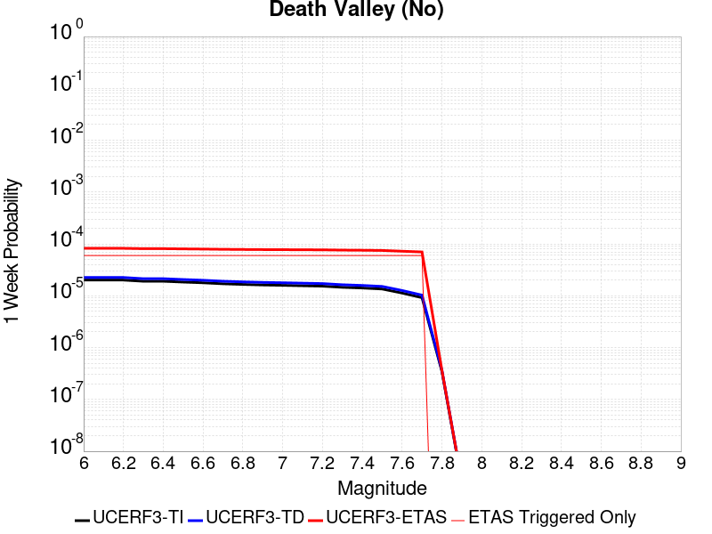 | 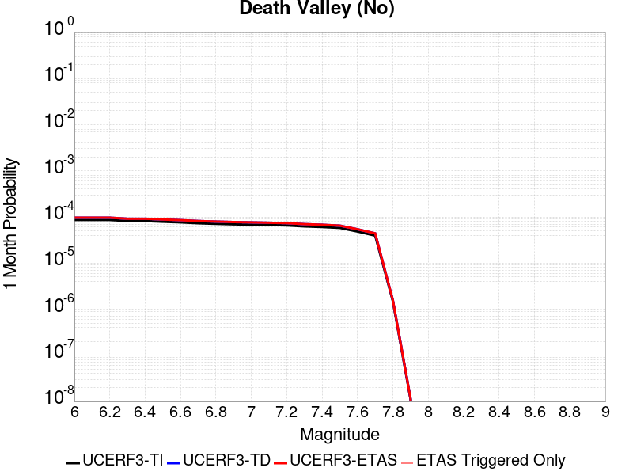 | 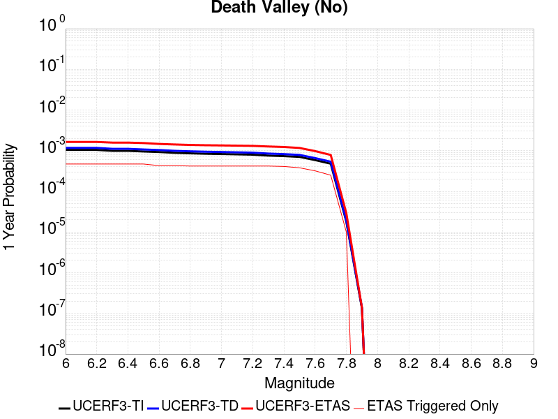 | 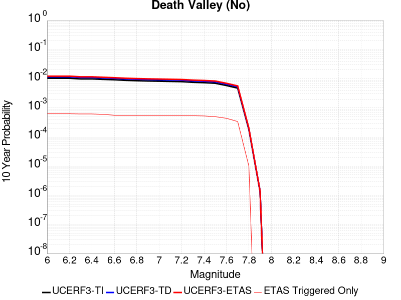 |

| Magnitude | 1 wk TI Prob | 1 wk TD Prob | 1 wk ETAS Prob | 1 wk ETAS/TD Gain | 1 wk ETAS Triggered Only | 1 mo TI Prob | 1 mo TD Prob | 1 mo ETAS Prob | 1 mo ETAS/TD Gain | 1 mo ETAS Triggered Only | 1 yr TI Prob | 1 yr TD Prob | 1 yr ETAS Prob | 1 yr ETAS/TD Gain | 1 yr ETAS Triggered Only | 10 yr TI Prob | 10 yr TD Prob | 10 yr ETAS Prob | 10 yr ETAS/TD Gain | 10 yr ETAS Triggered Only |
|-----|-----|-----|-----|-----|-----|-----|-----|-----|-----|-----|-----|-----|-----|-----|-----|-----|-----|-----|-----|-----|
| 6.0 | 2.0074807E-5 | 2.2500084E-5 | 2.2249558E-4 | 9.888656 | 2.0E-4 | 8.603206E-5 | 9.642541E-5 | 3.9639647E-4 | 4.1109133 | 3.0E-4 | 0.001046937 | 0.0011733545 | 0.001642803 | 1.4000909 | 4.7E-4 | 0.010420183 | 0.011672506 | 0.012295153 | 1.0533429 | 6.3E-4 |
| 6.1 | 2.0074807E-5 | 2.2500084E-5 | 2.2249558E-4 | 9.888656 | 2.0E-4 | 8.603206E-5 | 9.642541E-5 | 3.9639647E-4 | 4.1109133 | 3.0E-4 | 0.001046937 | 0.0011733545 | 0.001642803 | 1.4000909 | 4.7E-4 | 0.010420183 | 0.011672506 | 0.012295153 | 1.0533429 | 6.3E-4 |
| 6.2 | 2.0074807E-5 | 2.2500084E-5 | 2.2249558E-4 | 9.888656 | 2.0E-4 | 8.603206E-5 | 9.642541E-5 | 3.9639647E-4 | 4.1109133 | 3.0E-4 | 0.001046937 | 0.0011733545 | 0.001642803 | 1.4000909 | 4.7E-4 | 0.010420183 | 0.011672506 | 0.012295153 | 1.0533429 | 6.3E-4 |
| 6.3 | 1.9050609E-5 | 2.1336948E-5 | 2.2133268E-4 | 10.373212 | 2.0E-4 | 8.164292E-5 | 9.1440896E-5 | 3.9141346E-4 | 4.280508 | 3.0E-4 | 9.935491E-4 | 0.001112731 | 0.0015822081 | 1.4219142 | 4.7E-4 | 0.009891188 | 0.011072419 | 0.011685554 | 1.055375 | 6.2E-4 |
| 6.4 | 1.9050609E-5 | 2.1336948E-5 | 2.2133268E-4 | 10.373212 | 2.0E-4 | 8.164292E-5 | 9.1440896E-5 | 3.9141346E-4 | 4.280508 | 3.0E-4 | 9.935491E-4 | 0.001112731 | 0.0015822081 | 1.4219142 | 4.7E-4 | 0.009891188 | 0.011072419 | 0.011685554 | 1.055375 | 6.2E-4 |
| 6.5 | 1.8367004E-5 | 2.0561009E-5 | 2.2055689E-4 | 10.72695 | 2.0E-4 | 7.8713354E-5 | 8.811567E-5 | 3.8808925E-4 | 4.404316 | 3.0E-4 | 9.5791375E-4 | 0.0010722869 | 0.0015417829 | 1.4378456 | 4.7E-4 | 0.009537951 | 0.0106719155 | 0.011265513 | 1.0556223 | 6.0E-4 |
| 6.6 | 1.779439E-5 | 1.9910927E-5 | 1.9990734E-4 | 10.040082 | 1.8E-4 | 7.625944E-5 | 8.53298E-5 | 3.5530675E-4 | 4.1639237 | 2.7E-4 | 9.280632E-4 | 0.0010384015 | 0.001467955 | 1.413668 | 4.3E-4 | 0.009241969 | 0.010336253 | 0.010890464 | 1.0536182 | 5.6E-4 |
| 6.7 | 1.7025437E-5 | 1.9043426E-5 | 1.9903999E-4 | 10.451901 | 1.8E-4 | 7.296412E-5 | 8.161216E-5 | 3.5159013E-4 | 4.3080606 | 2.7E-4 | 8.87976E-4 | 9.931813E-4 | 0.0014227543 | 1.4325222 | 4.3E-4 | 0.008844362 | 0.009888145 | 0.010442608 | 1.0560734 | 5.6E-4 |
| 6.8 | 1.6545107E-5 | 1.8512545E-5 | 1.885094E-4 | 10.182792 | 1.7E-4 | 7.090568E-5 | 7.93371E-5 | 3.3931647E-4 | 4.276895 | 2.6E-4 | 8.629347E-4 | 9.655073E-4 | 0.0013851018 | 1.4345845 | 4.2E-4 | 0.008595915 | 0.009613829 | 0.010158542 | 1.0566592 | 5.5E-4 |
| 6.9 | 1.615478E-5 | 1.8087594E-5 | 1.8808452E-4 | 10.398538 | 1.7E-4 | 6.9232934E-5 | 7.751599E-5 | 3.3749585E-4 | 4.3538866 | 2.6E-4 | 8.4258494E-4 | 9.433546E-4 | 0.0013629585 | 1.4447997 | 4.2E-4 | 0.008393973 | 0.009394196 | 0.009939029 | 1.0579967 | 5.5E-4 |
| 7.0 | 1.5894311E-5 | 1.780555E-5 | 1.8780252E-4 | 10.547415 | 1.7E-4 | 6.81167E-5 | 7.6307304E-5 | 3.3628746E-4 | 4.4070153 | 2.6E-4 | 8.2900526E-4 | 9.286515E-4 | 0.0013482615 | 1.4518487 | 4.2E-4 | 0.008259195 | 0.009248397 | 0.00979331 | 1.0589198 | 5.5E-4 |
| 7.1 | 1.5602263E-5 | 1.7483504E-5 | 1.8748053E-4 | 10.723282 | 1.7E-4 | 6.6865134E-5 | 7.492718E-5 | 3.349077E-4 | 4.4697757 | 2.6E-4 | 8.137789E-4 | 9.118627E-4 | 0.0013314798 | 1.4601756 | 4.2E-4 | 0.008108052 | 0.009081894 | 0.009626899 | 1.0600101 | 5.5E-4 |
| 7.2 | 1.5323829E-5 | 1.717063E-5 | 1.8716771E-4 | 10.900456 | 1.7E-4 | 6.56719E-5 | 7.358637E-5 | 3.3356724E-4 | 4.533003 | 2.6E-4 | 7.99262E-4 | 8.9555193E-4 | 0.0013151758 | 1.4685645 | 4.2E-4 | 0.007963934 | 0.008920107 | 0.00945529 | 1.0599974 | 5.4E-4 |
| 7.3 | 1.4556212E-5 | 1.6302456E-5 | 1.8629969E-4 | 11.427707 | 1.7E-4 | 6.238227E-5 | 6.9865826E-5 | 3.2984765E-4 | 4.721159 | 2.6E-4 | 7.592395E-4 | 8.5029035E-4 | 0.0012699332 | 1.493529 | 4.2E-4 | 0.0075665074 | 0.008471014 | 0.00900644 | 1.0632068 | 5.4E-4 |
| 7.4 | 1.411725E-5 | 1.580796E-5 | 1.7580543E-4 | 11.121323 | 1.6E-4 | 6.0501097E-5 | 6.7746674E-5 | 3.1772975E-4 | 4.689968 | 2.5E-4 | 7.363519E-4 | 8.245094E-4 | 0.0012341714 | 1.4968554 | 4.1E-4 | 0.0073391674 | 0.008215138 | 0.008740785 | 1.063985 | 5.3E-4 |
| 7.5 | 1.3503312E-5 | 1.5126289E-5 | 1.6512402E-4 | 10.91636 | 1.5E-4 | 5.7870053E-5 | 6.482538E-5 | 3.0480983E-4 | 4.702014 | 2.4E-4 | 7.043401E-4 | 7.8896893E-4 | 0.0011686692 | 1.4812613 | 3.8E-4 | 0.007021119 | 0.007862304 | 0.008358373 | 1.0630946 | 5.0E-4 |
| 7.6 | 1.1279839E-5 | 1.2626327E-5 | 1.3262482E-4 | 10.503832 | 1.2E-4 | 4.834127E-5 | 5.4111737E-5 | 2.5410092E-4 | 4.6958556 | 2.0E-4 | 5.88396E-4 | 6.5861654E-4 | 9.784058E-4 | 1.485547 | 3.2E-4 | 0.005868405 | 0.006567199 | 0.007004309 | 1.0665597 | 4.4E-4 |
| 7.7 | 9.189108E-6 | 1.0283358E-5 | 1.1028233E-4 | 10.72435 | 1.0E-4 | 3.93813E-5 | 4.407082E-5 | 2.1406333E-4 | 4.857258 | 1.7E-4 | 4.7936183E-4 | 5.3643517E-4 | 7.8630104E-4 | 1.4657896 | 2.5E-4 | 0.004783291 | 0.005351914 | 0.005690094 | 1.0631887 | 3.4E-4 |
| 7.8 | 3.4586725E-7 | 3.6482615E-7 | 1.0364823E-5 | 28.410307 | 1.0E-5 | 1.4822873E-6 | 1.5635396E-6 | 1.1563524E-5 | 7.3957343 | 1.0E-5 | 1.80467E-5 | 1.9035933E-5 | 2.9035744E-5 | 1.5253123 | 1.0E-5 | 1.8045233E-4 | 1.9034347E-4 | 2.0034157E-4 | 1.0525266 | 1.0E-5 |
| 7.9 | 2.5591178E-9 | 2.6696718E-9 | 2.6696718E-9 | 1.0 | 0.0 | 1.0967647E-8 | 1.14414505E-8 | 1.14414505E-8 | 1.0 | 0.0 | 1.335311E-7 | 1.3929966E-7 | 1.3929966E-7 | 1.0 | 0.0 | 1.3353102E-6 | 1.3929966E-6 | 1.3929966E-6 | 1.0 | 0.0 |

## Death Valley (Fish Lake Valley)
*[(top)](#table-of-contents)*

| 1 Week | 1 Month | 1 Year | 10 Year |
|-----|-----|-----|-----|
| 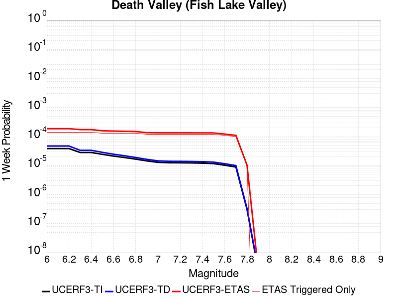 | 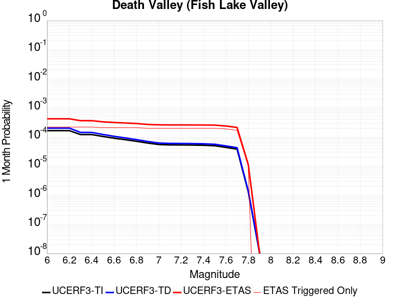 | 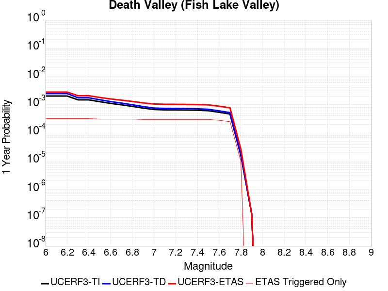 | 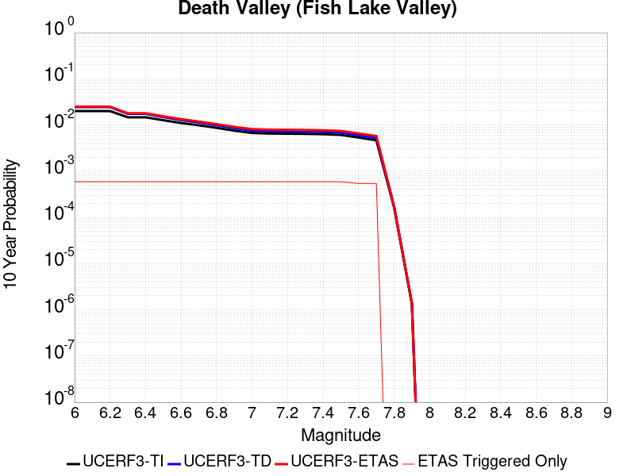 |

| Magnitude | 1 wk TI Prob | 1 wk TD Prob | 1 wk ETAS Prob | 1 wk ETAS/TD Gain | 1 wk ETAS Triggered Only | 1 mo TI Prob | 1 mo TD Prob | 1 mo ETAS Prob | 1 mo ETAS/TD Gain | 1 mo ETAS Triggered Only | 1 yr TI Prob | 1 yr TD Prob | 1 yr ETAS Prob | 1 yr ETAS/TD Gain | 1 yr ETAS Triggered Only | 10 yr TI Prob | 10 yr TD Prob | 10 yr ETAS Prob | 10 yr ETAS/TD Gain | 10 yr ETAS Triggered Only |
|-----|-----|-----|-----|-----|-----|-----|-----|-----|-----|-----|-----|-----|-----|-----|-----|-----|-----|-----|-----|-----|
| 6.0 | 3.872328E-5 | 4.7265705E-5 | 1.8725908E-4 | 3.9618385 | 1.4E-4 | 1.6594635E-4 | 2.0255324E-4 | 4.225087E-4 | 2.0859141 | 2.2E-4 | 0.0020185246 | 0.0024635606 | 0.0027827723 | 1.1295733 | 3.2E-4 | 0.02000288 | 0.024388338 | 0.02480785 | 1.0172014 | 4.3E-4 |
| 6.1 | 3.872328E-5 | 4.7265705E-5 | 1.8725908E-4 | 3.9618385 | 1.4E-4 | 1.6594635E-4 | 2.0255324E-4 | 4.225087E-4 | 2.0859141 | 2.2E-4 | 0.0020185246 | 0.0024635606 | 0.0027827723 | 1.1295733 | 3.2E-4 | 0.02000288 | 0.024388338 | 0.02480785 | 1.0172014 | 4.3E-4 |
| 6.2 | 3.872328E-5 | 4.7265705E-5 | 1.8725908E-4 | 3.9618385 | 1.4E-4 | 1.6594635E-4 | 2.0255324E-4 | 4.225087E-4 | 2.0859141 | 2.2E-4 | 0.0020185246 | 0.0024635606 | 0.0027827723 | 1.1295733 | 3.2E-4 | 0.02000288 | 0.024388338 | 0.02480785 | 1.0172014 | 4.3E-4 |
| 6.3 | 2.8356371E-5 | 3.360979E-5 | 1.7360509E-4 | 5.165313 | 1.4E-4 | 1.2152165E-4 | 1.4403443E-4 | 3.6400274E-4 | 2.5271926 | 2.2E-4 | 0.0014785219 | 0.0017522788 | 0.002071718 | 1.1822994 | 3.2E-4 | 0.014687235 | 0.017391816 | 0.017814338 | 1.0242943 | 4.3E-4 |
| 6.4 | 2.8356371E-5 | 3.360979E-5 | 1.7360509E-4 | 5.165313 | 1.4E-4 | 1.2152165E-4 | 1.4403443E-4 | 3.6400274E-4 | 2.5271926 | 2.2E-4 | 0.0014785219 | 0.0017522788 | 0.002071718 | 1.1822994 | 3.2E-4 | 0.014687235 | 0.017391816 | 0.017814338 | 1.0242943 | 4.3E-4 |
| 6.5 | 2.4448687E-5 | 2.8607585E-5 | 1.5860387E-4 | 5.5441194 | 1.3E-4 | 1.0477588E-4 | 1.2259845E-4 | 3.325727E-4 | 2.7126992 | 2.1E-4 | 0.0012748998 | 0.0014916616 | 0.0018011993 | 1.2075119 | 3.1E-4 | 0.012676105 | 0.014821392 | 0.015235166 | 1.0279174 | 4.2E-4 |
| 6.6 | 2.1298161E-5 | 2.4660083E-5 | 1.5465688E-4 | 6.2715473 | 1.3E-4 | 9.127464E-5 | 1.0568197E-4 | 3.1565977E-4 | 2.9868839 | 2.1E-4 | 0.0011107022 | 0.0012859512 | 0.0015955527 | 1.2407566 | 3.1E-4 | 0.011051672 | 0.01278853 | 0.013193287 | 1.03165 | 4.1E-4 |
| 6.7 | 1.8959729E-5 | 2.1781027E-5 | 1.517782E-4 | 6.9683676 | 1.3E-4 | 8.125345E-5 | 9.334406E-5 | 3.0332446E-4 | 3.2495315 | 2.1E-4 | 9.888117E-4 | 0.001135897 | 0.0014455449 | 1.2726021 | 3.1E-4 | 0.009844234 | 0.01130357 | 0.011708936 | 1.0358617 | 4.1E-4 |
| 6.8 | 1.6691629E-5 | 1.9018351E-5 | 1.4901588E-4 | 7.835373 | 1.3E-4 | 7.153359E-5 | 8.150477E-5 | 2.9148767E-4 | 3.5763264 | 2.1E-4 | 8.7057345E-4 | 9.918857E-4 | 0.0013015782 | 1.312226 | 3.1E-4 | 0.008671708 | 0.009876343 | 0.010282294 | 1.0411034 | 4.1E-4 |
| 6.9 | 1.450505E-5 | 1.638954E-5 | 1.3638758E-4 | 8.321623 | 1.2E-4 | 6.216302E-5 | 7.0239046E-5 | 2.70225E-4 | 3.8472192 | 2.0E-4 | 7.5657194E-4 | 8.5483363E-4 | 0.0011545771 | 1.3506455 | 3.0E-4 | 0.007540013 | 0.008516386 | 0.008912979 | 1.0465683 | 4.0E-4 |
| 7.0 | 1.2940855E-5 | 1.4537972E-5 | 1.3453623E-4 | 9.254127 | 1.2E-4 | 5.545963E-5 | 6.230414E-5 | 2.6229167E-4 | 4.20986 | 2.0E-4 | 6.750118E-4 | 7.5829466E-4 | 0.0010580672 | 1.3953246 | 3.0E-4 | 0.006729651 | 0.0075576897 | 0.007954666 | 1.0525262 | 4.0E-4 |
| 7.1 | 1.2544658E-5 | 1.4078208E-5 | 1.3407652E-4 | 9.523692 | 1.2E-4 | 5.3761712E-5 | 6.0333812E-5 | 2.6032174E-4 | 4.314691 | 2.0E-4 | 6.5435225E-4 | 7.343222E-4 | 0.0010341019 | 1.40824 | 3.0E-4 | 0.006524288 | 0.007319551 | 0.007716623 | 1.0542482 | 4.0E-4 |
| 7.2 | 1.2489416E-5 | 1.4015674E-5 | 1.3401399E-4 | 9.561723 | 1.2E-4 | 5.3524967E-5 | 6.0065824E-5 | 2.600538E-4 | 4.3294806 | 2.0E-4 | 6.514716E-4 | 7.310616E-4 | 0.0010308423 | 1.4100621 | 3.0E-4 | 0.006495651 | 0.0072871596 | 0.007684245 | 1.054491 | 4.0E-4 |
| 7.3 | 1.2368307E-5 | 1.3879812E-5 | 1.3387814E-4 | 9.64553 | 1.2E-4 | 5.3005948E-5 | 5.9483587E-5 | 2.5947168E-4 | 4.362072 | 2.0E-4 | 6.451563E-4 | 7.2397763E-4 | 0.0010237604 | 1.4140774 | 3.0E-4 | 0.0064328653 | 0.007216782 | 0.007613895 | 1.0550264 | 4.0E-4 |
| 7.4 | 1.2161707E-5 | 1.36478675E-5 | 1.3364623E-4 | 9.792462 | 1.2E-4 | 5.212056E-5 | 5.8489582E-5 | 2.5847787E-4 | 4.4192123 | 2.0E-4 | 6.3438306E-4 | 7.118836E-4 | 0.00101167 | 1.4211172 | 3.0E-4 | 0.006325751 | 0.0070966207 | 0.007493782 | 1.0559648 | 4.0E-4 |
| 7.5 | 1.1707948E-5 | 1.3145515E-5 | 1.3314394E-4 | 10.1284685 | 1.2E-4 | 5.0175953E-5 | 5.6336736E-5 | 2.5632547E-4 | 4.5498815 | 2.0E-4 | 6.10721E-4 | 6.856895E-4 | 9.854838E-4 | 1.4372158 | 3.0E-4 | 0.0060904534 | 0.006836321 | 0.0072335866 | 1.058111 | 4.0E-4 |
| 7.6 | 1.0319538E-5 | 1.1579622E-5 | 1.2157835E-4 | 10.499336 | 1.1E-4 | 4.4225842E-5 | 4.9626036E-5 | 2.3961661E-4 | 4.8284454 | 1.9E-4 | 5.383166E-4 | 6.040347E-4 | 8.838656E-4 | 1.4632696 | 2.8E-4 | 0.0053701443 | 0.0060244603 | 0.006402171 | 1.0626962 | 3.8E-4 |
| 7.7 | 8.937764E-6 | 1.0022779E-5 | 1.1002178E-4 | 10.977173 | 1.0E-4 | 3.830414E-5 | 4.295409E-5 | 2.1294679E-4 | 4.957544 | 1.7E-4 | 4.6625308E-4 | 5.228456E-4 | 7.7271485E-4 | 1.4779027 | 2.5E-4 | 0.0046527605 | 0.005216664 | 0.0055548907 | 1.0648358 | 3.4E-4 |
| 7.8 | 3.108007E-7 | 3.284654E-7 | 1.0328462E-5 | 31.444597 | 1.0E-5 | 1.3320023E-6 | 1.407708E-6 | 1.1407694E-5 | 8.103736 | 1.0E-5 | 1.6217007E-5 | 1.7138715E-5 | 2.7138543E-5 | 1.5834643 | 1.0E-5 | 1.6215823E-4 | 1.7137431E-4 | 1.813726E-4 | 1.0583419 | 1.0E-5 |
| 7.9 | 2.5591178E-9 | 2.6696718E-9 | 2.6696718E-9 | 1.0 | 0.0 | 1.0967647E-8 | 1.14414505E-8 | 1.14414505E-8 | 1.0 | 0.0 | 1.335311E-7 | 1.3929966E-7 | 1.3929966E-7 | 1.0 | 0.0 | 1.3353102E-6 | 1.3929966E-6 | 1.3929966E-6 | 1.0 | 0.0 |

## San Andreas (Parkfield)
*[(top)](#table-of-contents)*

| 1 Week | 1 Month | 1 Year | 10 Year |
|-----|-----|-----|-----|
| 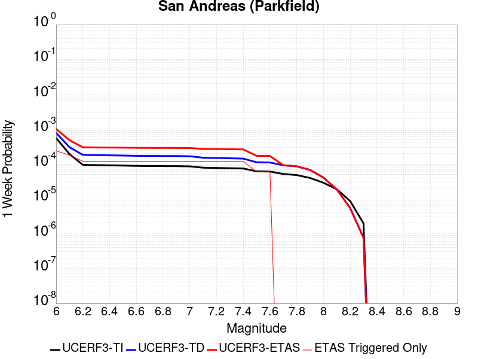 | 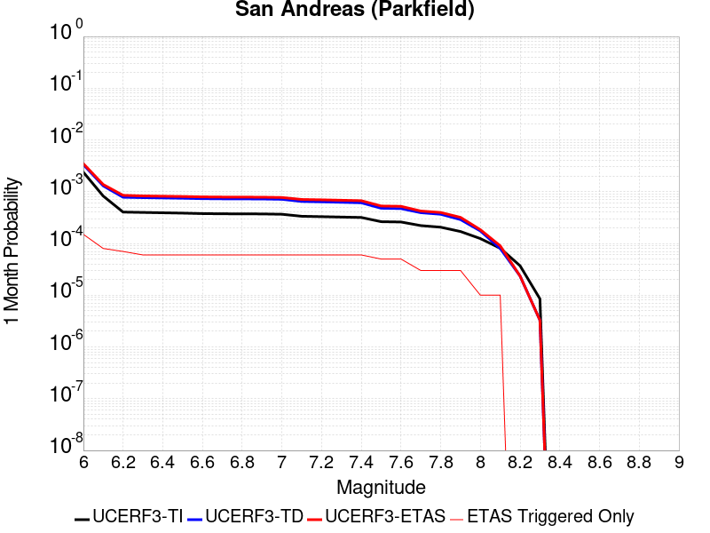 | 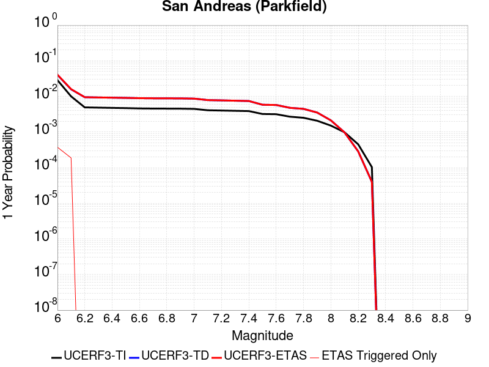 | 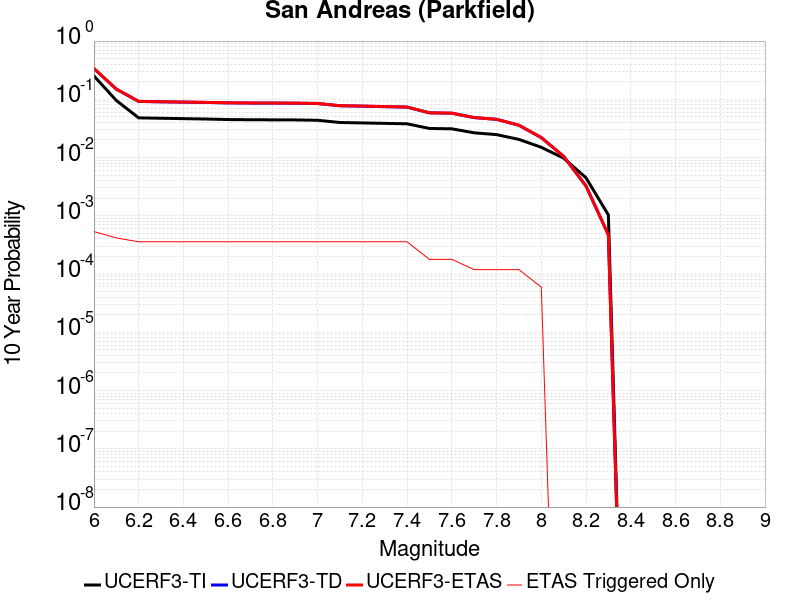 |

| Magnitude | 1 wk TI Prob | 1 wk TD Prob | 1 wk ETAS Prob | 1 wk ETAS/TD Gain | 1 wk ETAS Triggered Only | 1 mo TI Prob | 1 mo TD Prob | 1 mo ETAS Prob | 1 mo ETAS/TD Gain | 1 mo ETAS Triggered Only | 1 yr TI Prob | 1 yr TD Prob | 1 yr ETAS Prob | 1 yr ETAS/TD Gain | 1 yr ETAS Triggered Only | 10 yr TI Prob | 10 yr TD Prob | 10 yr ETAS Prob | 10 yr ETAS/TD Gain | 10 yr ETAS Triggered Only |
|-----|-----|-----|-----|-----|-----|-----|-----|-----|-----|-----|-----|-----|-----|-----|-----|-----|-----|-----|-----|-----|
| 6.0 | 5.556969E-4 | 7.778562E-4 | 8.877707E-4 | 1.1413043 | 1.1E-4 | 0.0023793848 | 0.0033299583 | 0.0034794586 | 1.0448956 | 1.5E-4 | 0.028586963 | 0.040235043 | 0.040513374 | 1.0069176 | 2.9E-4 | 0.25176284 | 0.3371973 | 0.3374823 | 1.0008452 | 4.3E-4 |
| 6.1 | 1.925858E-4 | 3.0278185E-4 | 3.6276368E-4 | 1.1981025 | 6.0E-5 | 8.2510663E-4 | 0.001297085 | 0.0013769811 | 1.0615968 | 8.0E-5 | 0.0099994885 | 0.01577393 | 0.015931405 | 1.0099833 | 1.6E-4 | 0.095613256 | 0.14975825 | 0.1499453 | 1.0012491 | 2.2E-4 |
| 6.2 | 9.4306815E-5 | 1.8243887E-4 | 2.3242975E-4 | 1.2740144 | 5.0E-5 | 4.0410945E-4 | 7.8164786E-4 | 8.515931E-4 | 1.0894845 | 7.0E-5 | 0.0049089384 | 0.009475246 | 0.009623826 | 1.0156807 | 1.5E-4 | 0.048019063 | 0.0918565 | 0.092047215 | 1.0020761 | 2.1E-4 |
| 6.3 | 9.283051E-5 | 1.794041E-4 | 2.2939514E-4 | 1.2786504 | 5.0E-5 | 3.9778434E-4 | 7.686494E-4 | 8.286033E-4 | 1.077999 | 6.0E-5 | 0.0048322747 | 0.009318355 | 0.00945705 | 1.0148841 | 1.4E-4 | 0.047285385 | 0.090509474 | 0.09069137 | 1.0020097 | 2.0E-4 |
| 6.4 | 9.138826E-5 | 1.7702584E-4 | 2.2701698E-4 | 1.2823946 | 5.0E-5 | 3.916052E-4 | 7.5846276E-4 | 8.1841723E-4 | 1.0790473 | 6.0E-5 | 0.0047573745 | 0.009195387 | 0.0093341 | 1.015085 | 1.4E-4 | 0.046568092 | 0.0894136 | 0.08959571 | 1.0020368 | 2.0E-4 |
| 6.5 | 9.000255E-5 | 1.746064E-4 | 2.2459766E-4 | 1.2863084 | 5.0E-5 | 3.8566816E-4 | 7.4809964E-4 | 8.0805476E-4 | 1.0801432 | 6.0E-5 | 0.0046854047 | 0.009070284 | 0.0092090145 | 1.015295 | 1.4E-4 | 0.045878403 | 0.08829608 | 0.088478416 | 1.0020651 | 2.0E-4 |
| 6.6 | 8.8109264E-5 | 1.7141816E-4 | 2.2140959E-4 | 1.2916344 | 5.0E-5 | 3.7755648E-4 | 7.3444354E-4 | 7.943995E-4 | 1.0816345 | 6.0E-5 | 0.0045870654 | 0.008905404 | 0.009044157 | 1.0155808 | 1.4E-4 | 0.04493529 | 0.08682707 | 0.087009706 | 1.0021034 | 2.0E-4 |
| 6.7 | 8.738073E-5 | 1.7008898E-4 | 2.2008049E-4 | 1.2939137 | 5.0E-5 | 3.7443507E-4 | 7.287503E-4 | 7.887066E-4 | 1.0822728 | 6.0E-5 | 0.0045492216 | 0.008836695 | 0.008975457 | 1.0157031 | 1.4E-4 | 0.04457213 | 0.0862268 | 0.086409554 | 1.0021194 | 2.0E-4 |
| 6.8 | 8.710195E-5 | 1.6954402E-4 | 2.1953553E-4 | 1.2948587 | 5.0E-5 | 3.7324068E-4 | 7.26416E-4 | 7.8637246E-4 | 1.0825373 | 6.0E-5 | 0.0045347405 | 0.008808513 | 0.00894728 | 1.0157537 | 1.4E-4 | 0.04443313 | 0.08597436 | 0.086157165 | 1.0021262 | 2.0E-4 |
| 6.9 | 8.6801556E-5 | 1.6895356E-4 | 2.189451E-4 | 1.2958893 | 5.0E-5 | 3.7195362E-4 | 7.238869E-4 | 7.8384345E-4 | 1.0828259 | 6.0E-5 | 0.0045191357 | 0.0087779695 | 0.00891674 | 1.015809 | 1.4E-4 | 0.044283327 | 0.08570042 | 0.08588328 | 1.0021337 | 2.0E-4 |
| 7.0 | 8.5571606E-5 | 1.664819E-4 | 2.1647358E-4 | 1.300283 | 5.0E-5 | 3.6668387E-4 | 7.132999E-4 | 7.732571E-4 | 1.0840561 | 6.0E-5 | 0.004455241 | 0.008650103 | 0.008788892 | 1.0160447 | 1.4E-4 | 0.043669727 | 0.08454836 | 0.08473145 | 1.0021656 | 2.0E-4 |
| 7.1 | 7.82589E-5 | 1.5128969E-4 | 2.0128212E-4 | 1.3304418 | 5.0E-5 | 3.3535215E-4 | 6.4822397E-4 | 7.081851E-4 | 1.0925006 | 6.0E-5 | 0.0040752706 | 0.007863738 | 0.007982794 | 1.0151399 | 1.2E-4 | 0.040013418 | 0.077460445 | 0.07761727 | 1.0020247 | 1.7E-4 |
| 7.2 | 7.690929E-5 | 1.4866212E-4 | 1.9865468E-4 | 1.3362832 | 5.0E-5 | 3.2956956E-4 | 6.369685E-4 | 6.969303E-4 | 1.0941362 | 6.0E-5 | 0.004005129 | 0.0077276826 | 0.007846755 | 1.0154086 | 1.2E-4 | 0.0393371 | 0.07623341 | 0.07639045 | 1.0020599 | 1.7E-4 |
| 7.3 | 7.5543794E-5 | 1.4562748E-4 | 1.9562019E-4 | 1.3432918 | 5.0E-5 | 3.2371894E-4 | 6.239692E-4 | 6.8393175E-4 | 1.0960985 | 6.0E-5 | 0.003934157 | 0.0075705256 | 0.0076896176 | 1.015731 | 1.2E-4 | 0.038652334 | 0.07479777 | 0.07495505 | 1.0021029 | 1.7E-4 |
| 7.4 | 7.4214564E-5 | 1.4263717E-4 | 1.9263005E-4 | 1.3504897 | 5.0E-5 | 3.1802364E-4 | 6.1115966E-4 | 6.71123E-4 | 1.098114 | 6.0E-5 | 0.003865065 | 0.0074156416 | 0.0075347517 | 1.016062 | 1.2E-4 | 0.03798529 | 0.07337152 | 0.07352905 | 1.002147 | 1.7E-4 |
| 7.5 | 6.149578E-5 | 1.1191443E-4 | 1.5190995E-4 | 1.357376 | 4.0E-5 | 2.6352672E-4 | 4.795452E-4 | 5.295212E-4 | 1.1042155 | 5.0E-5 | 0.0032037178 | 0.005822865 | 0.0059123407 | 1.0153663 | 9.0E-5 | 0.03157923 | 0.058559462 | 0.058691267 | 1.0022508 | 1.4E-4 |
| 7.6 | 6.0643448E-5 | 1.102009E-4 | 1.5019649E-4 | 1.3629334 | 4.0E-5 | 2.598746E-4 | 4.7220418E-4 | 5.221806E-4 | 1.1058364 | 5.0E-5 | 0.0031593828 | 0.005733962 | 0.005823446 | 1.0156059 | 9.0E-5 | 0.031148417 | 0.05772042 | 0.057852335 | 1.0022855 | 1.4E-4 |
| 7.7 | 5.1652263E-5 | 9.175265E-5 | 1.11750815E-4 | 1.2179574 | 2.0E-5 | 2.2134806E-4 | 3.9316638E-4 | 4.231546E-4 | 1.0762736 | 3.0E-5 | 0.002691582 | 0.0047763046 | 0.0048360177 | 1.012502 | 6.0E-5 | 0.026592141 | 0.04853641 | 0.048641067 | 1.0021564 | 1.1E-4 |
| 7.8 | 4.8090482E-5 | 8.560165E-5 | 1.0559994E-4 | 1.2336204 | 2.0E-5 | 2.060858E-4 | 3.6681266E-4 | 3.9680165E-4 | 1.0817556 | 3.0E-5 | 0.0025062072 | 0.004456807 | 0.0045165396 | 1.0134026 | 6.0E-5 | 0.024781305 | 0.045302264 | 0.045407284 | 1.0023181 | 1.1E-4 |
| 7.9 | 3.970278E-5 | 6.7507375E-5 | 8.750602E-5 | 1.2962439 | 2.0E-5 | 1.7014367E-4 | 2.8928524E-4 | 3.1927656E-4 | 1.1036738 | 3.0E-5 | 0.002069531 | 0.0035163634 | 0.0035761525 | 1.017003 | 6.0E-5 | 0.020503636 | 0.03588176 | 0.035987813 | 1.0029557 | 1.1E-4 |
| 8.0 | 2.8982335E-5 | 4.0698153E-5 | 5.069775E-5 | 1.2457014 | 1.0E-5 | 1.2420409E-4 | 1.7440901E-4 | 1.8440725E-4 | 1.0573264 | 1.0E-5 | 0.0015111357 | 0.0021213628 | 0.0021413204 | 1.0094079 | 2.0E-5 | 0.015009012 | 0.02201118 | 0.02206008 | 1.0022216 | 5.0E-5 |
| 8.1 | 1.8836186E-5 | 1.867974E-5 | 2.8679553E-5 | 1.5353293 | 1.0E-5 | 8.0724014E-5 | 8.005358E-5 | 9.0052774E-5 | 1.1249063 | 1.0E-5 | 9.823717E-4 | 9.742171E-4 | 9.941976E-4 | 1.0205094 | 2.0E-5 | 0.009780403 | 0.010487711 | 0.010517396 | 1.0028305 | 3.0E-5 |
| 8.2 | 8.643924E-6 | 5.473668E-6 | 5.473668E-6 | 1.0 | 0.0 | 3.704486E-5 | 2.3458366E-5 | 2.3458366E-5 | 1.0 | 0.0 | 4.5092785E-4 | 2.8556827E-4 | 2.955654E-4 | 1.035008 | 1.0E-5 | 0.0045001395 | 0.0032481793 | 0.003258147 | 1.0030687 | 1.0E-5 |
| 8.3 | 1.983087E-6 | 7.6564595E-7 | 7.6564595E-7 | 1.0 | 0.0 | 8.498917E-6 | 3.281336E-6 | 3.281336E-6 | 1.0 | 0.0 | 1.034694E-4 | 3.9949547E-5 | 3.9949547E-5 | 1.0 | 0.0 | 0.0010342124 | 4.717979E-4 | 4.717979E-4 | 1.0 | 0.0 |

## Red Pass
*[(top)](#table-of-contents)*

| 1 Week | 1 Month | 1 Year | 10 Year |
|-----|-----|-----|-----|
| 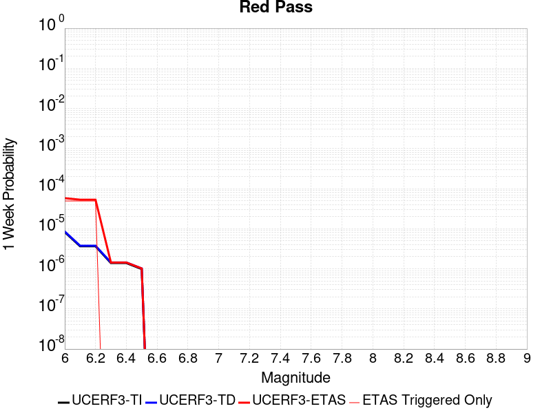 | 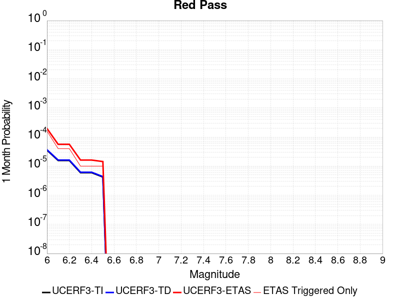 | 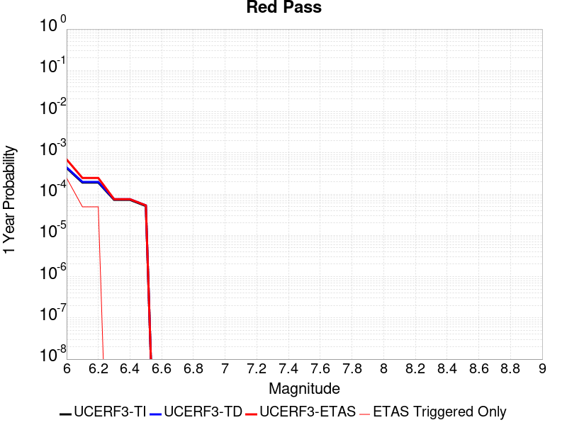 | 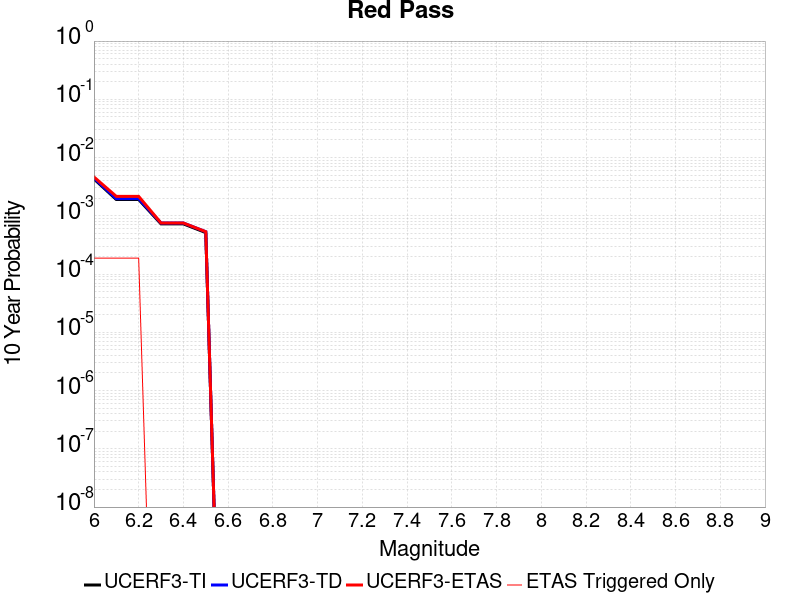 |

| Magnitude | 1 wk TI Prob | 1 wk TD Prob | 1 wk ETAS Prob | 1 wk ETAS/TD Gain | 1 wk ETAS Triggered Only | 1 mo TI Prob | 1 mo TD Prob | 1 mo ETAS Prob | 1 mo ETAS/TD Gain | 1 mo ETAS Triggered Only | 1 yr TI Prob | 1 yr TD Prob | 1 yr ETAS Prob | 1 yr ETAS/TD Gain | 1 yr ETAS Triggered Only | 10 yr TI Prob | 10 yr TD Prob | 10 yr ETAS Prob | 10 yr ETAS/TD Gain | 10 yr ETAS Triggered Only |
|-----|-----|-----|-----|-----|-----|-----|-----|-----|-----|-----|-----|-----|-----|-----|-----|-----|-----|-----|-----|-----|
| 6.0 | 8.258278E-6 | 8.551265E-6 | 8.855058E-5 | 10.355261 | 8.0E-5 | 3.539214E-5 | 3.6647863E-5 | 1.96642E-4 | 5.365715 | 1.6E-4 | 4.308141E-4 | 4.4611428E-4 | 7.159938E-4 | 1.6049562 | 2.7E-4 | 0.0042997985 | 0.004453945 | 0.004822297 | 1.0827024 | 3.7E-4 |
| 6.1 | 3.649988E-6 | 3.7753161E-6 | 1.3775279E-5 | 3.6487749 | 1.0E-5 | 1.5642712E-5 | 1.6179853E-5 | 5.6179204E-5 | 3.4721704 | 4.0E-5 | 1.9043336E-4 | 1.9697666E-4 | 2.769609E-4 | 1.4060595 | 8.0E-5 | 0.0019027026 | 0.001968488 | 0.0021082123 | 1.0709805 | 1.4E-4 |
| 6.2 | 3.649988E-6 | 3.7753161E-6 | 1.3775279E-5 | 3.6487749 | 1.0E-5 | 1.5642712E-5 | 1.6179853E-5 | 5.6179204E-5 | 3.4721704 | 4.0E-5 | 1.9043336E-4 | 1.9697666E-4 | 2.769609E-4 | 1.4060595 | 8.0E-5 | 0.0019027026 | 0.001968488 | 0.0021082123 | 1.0709805 | 1.4E-4 |
| 6.3 | 1.3924937E-6 | 1.4411166E-6 | 1.4411166E-6 | 1.0 | 0.0 | 5.9678164E-6 | 6.1762075E-6 | 1.6176145E-5 | 2.6191065 | 1.0E-5 | 7.265574E-5 | 7.519415E-5 | 1.1519114E-4 | 1.5319163 | 4.0E-5 | 7.263199E-4 | 7.518258E-4 | 7.917957E-4 | 1.0531638 | 4.0E-5 |
| 6.4 | 1.3924937E-6 | 1.4411166E-6 | 1.4411166E-6 | 1.0 | 0.0 | 5.9678164E-6 | 6.1762075E-6 | 1.6176145E-5 | 2.6191065 | 1.0E-5 | 7.265574E-5 | 7.519415E-5 | 1.1519114E-4 | 1.5319163 | 4.0E-5 | 7.263199E-4 | 7.518258E-4 | 7.917957E-4 | 1.0531638 | 4.0E-5 |
| 6.5 | 9.876812E-7 | 1.0221912E-6 | 1.0221912E-6 | 1.0 | 0.0 | 4.2329125E-6 | 4.3808195E-6 | 1.4380776E-5 | 3.2826679 | 1.0E-5 | 5.153449E-5 | 5.3336476E-5 | 9.333435E-5 | 1.7499158 | 4.0E-5 | 5.1522546E-4 | 5.333648E-4 | 5.733434E-4 | 1.0749556 | 4.0E-5 |

## Elsinore (Glen Ivy) rev
*[(top)](#table-of-contents)*

| 1 Week | 1 Month | 1 Year | 10 Year |
|-----|-----|-----|-----|
| 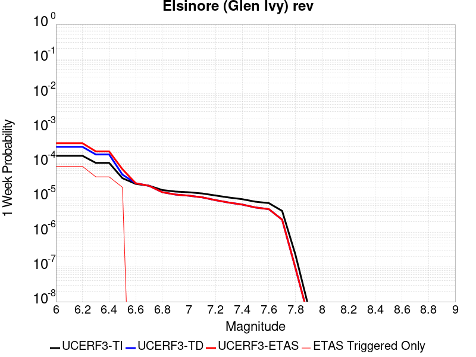 | 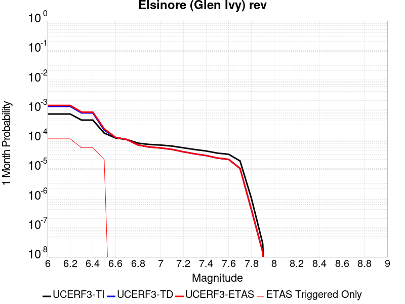 | 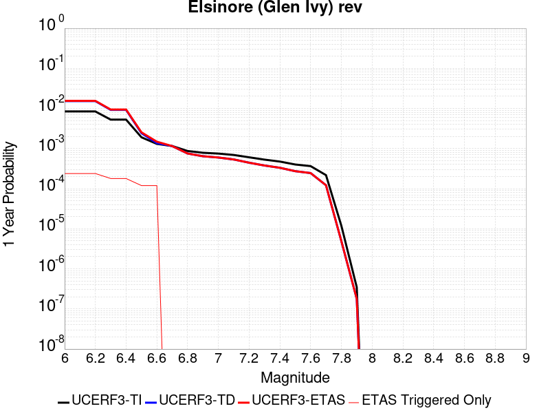 | 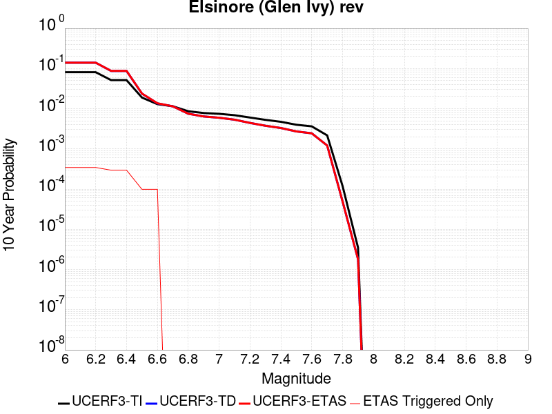 |

| Magnitude | 1 wk TI Prob | 1 wk TD Prob | 1 wk ETAS Prob | 1 wk ETAS/TD Gain | 1 wk ETAS Triggered Only | 1 mo TI Prob | 1 mo TD Prob | 1 mo ETAS Prob | 1 mo ETAS/TD Gain | 1 mo ETAS Triggered Only | 1 yr TI Prob | 1 yr TD Prob | 1 yr ETAS Prob | 1 yr ETAS/TD Gain | 1 yr ETAS Triggered Only | 10 yr TI Prob | 10 yr TD Prob | 10 yr ETAS Prob | 10 yr ETAS/TD Gain | 10 yr ETAS Triggered Only |
|-----|-----|-----|-----|-----|-----|-----|-----|-----|-----|-----|-----|-----|-----|-----|-----|-----|-----|-----|-----|-----|
| 6.0 | 1.6204086E-4 | 2.937271E-4 | 3.737036E-4 | 1.2722816 | 8.0E-5 | 6.94276E-4 | 0.0012583778 | 0.001358252 | 1.0793674 | 1.0E-4 | 0.008420097 | 0.0152346175 | 0.015431571 | 1.012928 | 2.0E-4 | 0.081081145 | 0.13962454 | 0.13988265 | 1.0018486 | 3.0E-4 |
| 6.1 | 1.6204086E-4 | 2.937271E-4 | 3.737036E-4 | 1.2722816 | 8.0E-5 | 6.94276E-4 | 0.0012583778 | 0.001358252 | 1.0793674 | 1.0E-4 | 0.008420097 | 0.0152346175 | 0.015431571 | 1.012928 | 2.0E-4 | 0.081081145 | 0.13962454 | 0.13988265 | 1.0018486 | 3.0E-4 |
| 6.2 | 1.6204086E-4 | 2.937271E-4 | 3.737036E-4 | 1.2722816 | 8.0E-5 | 6.94276E-4 | 0.0012583778 | 0.001358252 | 1.0793674 | 1.0E-4 | 0.008420097 | 0.0152346175 | 0.015431571 | 1.012928 | 2.0E-4 | 0.081081145 | 0.13962454 | 0.13988265 | 1.0018486 | 3.0E-4 |
| 6.3 | 1.0111737E-4 | 1.7703463E-4 | 2.1702754E-4 | 1.2259045 | 4.0E-5 | 4.332882E-4 | 7.5861585E-4 | 8.085779E-4 | 1.0658596 | 5.0E-5 | 0.005262531 | 0.0092177205 | 0.009336615 | 1.0128984 | 1.2E-4 | 0.0513964 | 0.08707393 | 0.087274775 | 1.0023066 | 2.2E-4 |
| 6.4 | 1.0111737E-4 | 1.7703463E-4 | 2.1702754E-4 | 1.2259045 | 4.0E-5 | 4.332882E-4 | 7.5861585E-4 | 8.085779E-4 | 1.0658596 | 5.0E-5 | 0.005262531 | 0.0092177205 | 0.009336615 | 1.0128984 | 1.2E-4 | 0.0513964 | 0.08707393 | 0.087274775 | 1.0023066 | 2.2E-4 |
| 6.5 | 3.6624708E-5 | 4.6391986E-5 | 6.6391054E-5 | 1.4310889 | 2.0E-5 | 1.569536E-4 | 1.9880968E-4 | 2.188057E-4 | 1.1005788 | 2.0E-5 | 0.001909235 | 0.0024181814 | 0.0024780363 | 1.024752 | 6.0E-5 | 0.01892915 | 0.023697061 | 0.023784928 | 1.0037079 | 9.0E-5 |
| 6.6 | 2.5051324E-5 | 2.6147465E-5 | 2.6147465E-5 | 1.0 | 0.0 | 1.073584E-4 | 1.12056E-4 | 1.12056E-4 | 1.0 | 0.0 | 0.0013063047 | 0.0013634725 | 0.0013834452 | 1.0146484 | 2.0E-5 | 0.012986525 | 0.013565759 | 0.013615081 | 1.0036358 | 5.0E-5 |
| 6.7 | 2.2189772E-5 | 2.2072489E-5 | 2.2072489E-5 | 1.0 | 0.0 | 9.509556E-5 | 9.459316E-5 | 9.459316E-5 | 1.0 | 0.0 | 0.0011571734 | 0.0011510996 | 0.0011510996 | 1.0 | 0.0 | 0.011511663 | 0.0114663225 | 0.011495979 | 1.0025864 | 3.0E-5 |
| 6.8 | 1.6654378E-5 | 1.44376E-5 | 1.44376E-5 | 1.0 | 0.0 | 7.137396E-5 | 6.187399E-5 | 6.187399E-5 | 1.0 | 0.0 | 8.686314E-4 | 7.5306057E-4 | 7.5306057E-4 | 1.0 | 0.0 | 0.008652439 | 0.0075100763 | 0.007529926 | 1.0026431 | 2.0E-5 |
| 6.9 | 1.5042909E-5 | 1.2331886E-5 | 1.2331886E-5 | 1.0 | 0.0 | 6.446802E-5 | 5.2849886E-5 | 5.2849886E-5 | 1.0 | 0.0 | 7.8461546E-4 | 6.4326054E-4 | 6.4326054E-4 | 1.0 | 0.0 | 0.007818509 | 0.006417925 | 0.0064377966 | 1.0030962 | 2.0E-5 |
| 7.0 | 1.4361385E-5 | 1.1451172E-5 | 1.1451172E-5 | 1.0 | 0.0 | 6.154734E-5 | 4.9075545E-5 | 4.9075545E-5 | 1.0 | 0.0 | 7.490812E-4 | 5.973339E-4 | 5.973339E-4 | 1.0 | 0.0 | 0.007465612 | 0.005960982 | 0.005980863 | 1.0033351 | 2.0E-5 |
| 7.1 | 1.3265571E-5 | 1.0244736E-5 | 1.0244736E-5 | 1.0 | 0.0 | 5.6851208E-5 | 4.3905282E-5 | 4.3905282E-5 | 1.0 | 0.0 | 6.919436E-4 | 5.344183E-4 | 5.344183E-4 | 1.0 | 0.0 | 0.006897931 | 0.0053346003 | 0.005354494 | 1.0037291 | 2.0E-5 |
| 7.2 | 1.1596403E-5 | 8.504847E-6 | 8.504847E-6 | 1.0 | 0.0 | 4.9697923E-5 | 3.6448844E-5 | 3.6448844E-5 | 1.0 | 0.0 | 6.049042E-4 | 4.4367602E-4 | 4.4367602E-4 | 1.0 | 0.0 | 0.006032603 | 0.004429357 | 0.0044492683 | 1.0044954 | 2.0E-5 |
| 7.3 | 1.0150827E-5 | 7.238537E-6 | 7.238537E-6 | 1.0 | 0.0 | 4.3502816E-5 | 3.102194E-5 | 3.102194E-5 | 1.0 | 0.0 | 5.2951806E-4 | 3.776281E-4 | 3.776281E-4 | 1.0 | 0.0 | 0.005282581 | 0.003770271 | 0.0037901958 | 1.0052847 | 2.0E-5 |
| 7.4 | 9.080705E-6 | 6.352307E-6 | 6.352307E-6 | 1.0 | 0.0 | 3.8916725E-5 | 2.7223898E-5 | 2.7223898E-5 | 1.0 | 0.0 | 4.7370812E-4 | 3.314019E-4 | 3.314019E-4 | 1.0 | 0.0 | 0.004726996 | 0.0033092257 | 0.0033191924 | 1.0030118 | 1.0E-5 |
| 7.5 | 7.671649E-6 | 5.225419E-6 | 5.225419E-6 | 1.0 | 0.0 | 3.287808E-5 | 2.2394468E-5 | 2.2394468E-5 | 1.0 | 0.0 | 4.0021708E-4 | 2.7261977E-4 | 2.7261977E-4 | 1.0 | 0.0 | 0.0039949706 | 0.0027229784 | 0.0027229784 | 1.0 | 0.0 |
| 7.6 | 6.990086E-6 | 4.687336E-6 | 4.687336E-6 | 1.0 | 0.0 | 2.9957167E-5 | 2.0088435E-5 | 2.0088435E-5 | 1.0 | 0.0 | 3.6466747E-4 | 2.445504E-4 | 2.445504E-4 | 1.0 | 0.0 | 0.0036406964 | 0.0024429292 | 0.0024429292 | 1.0 | 0.0 |
| 7.7 | 4.163505E-6 | 2.329331E-6 | 2.329331E-6 | 1.0 | 0.0 | 1.7843471E-5 | 9.982813E-6 | 9.982813E-6 | 1.0 | 0.0 | 2.172226E-4 | 1.2153471E-4 | 1.2153471E-4 | 1.0 | 0.0 | 0.0021701038 | 0.0012147555 | 0.0012147555 | 1.0 | 0.0 |
| 7.8 | 2.2692414E-7 | 9.384417E-8 | 9.384417E-8 | 1.0 | 0.0 | 9.725317E-7 | 4.0218927E-7 | 4.0218927E-7 | 1.0 | 0.0 | 1.1840509E-5 | 4.8966467E-6 | 4.8966467E-6 | 1.0 | 0.0 | 1.1839878E-4 | 4.8965718E-5 | 4.8965718E-5 | 1.0 | 0.0 |
| 7.9 | 6.676829E-9 | 3.4397174E-9 | 3.4397174E-9 | 1.0 | 0.0 | 2.861498E-8 | 1.4741646E-8 | 1.4741646E-8 | 1.0 | 0.0 | 3.4838732E-7 | 1.7947953E-7 | 1.7947953E-7 | 1.0 | 0.0 | 3.4838679E-6 | 1.794794E-6 | 1.794794E-6 | 1.0 | 0.0 |

## Sierra Nevada  (No Extension)
*[(top)](#table-of-contents)*

| 1 Week | 1 Month | 1 Year | 10 Year |
|-----|-----|-----|-----|
| 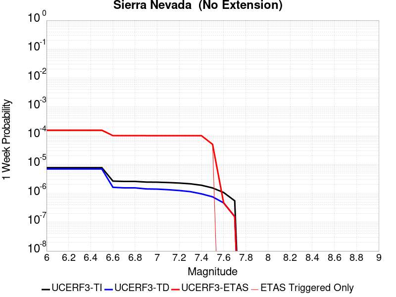 | 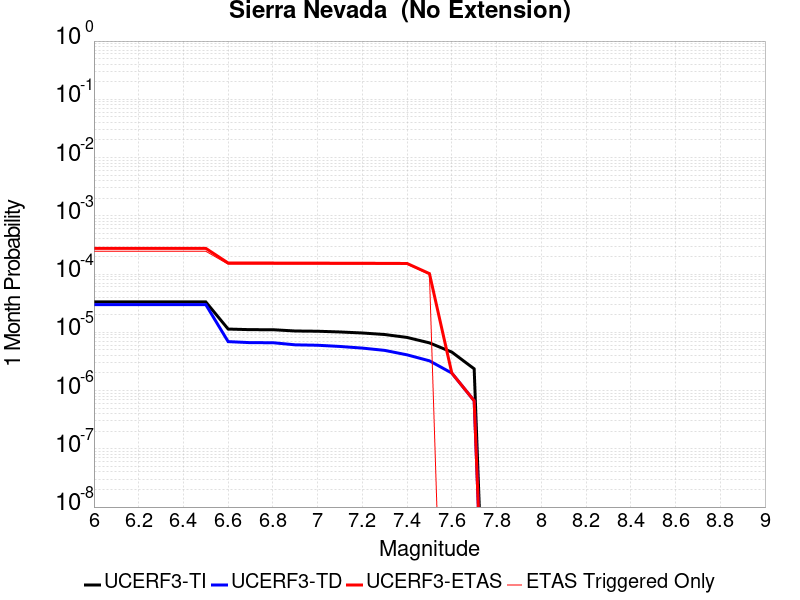 | 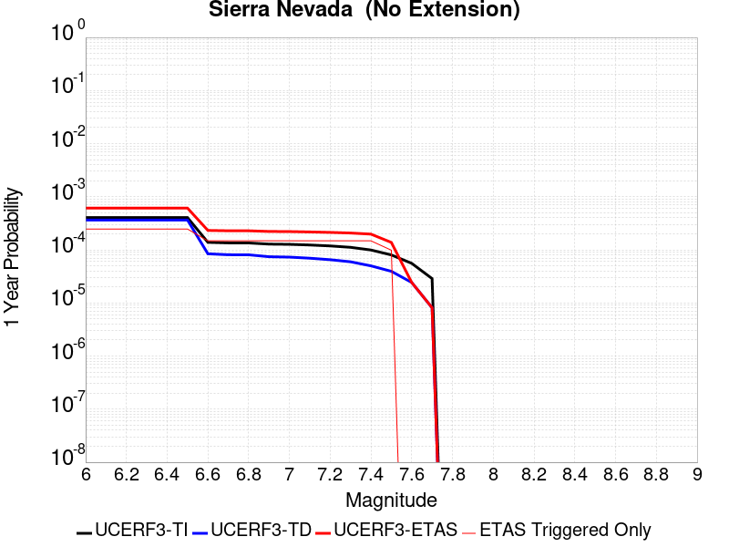 | 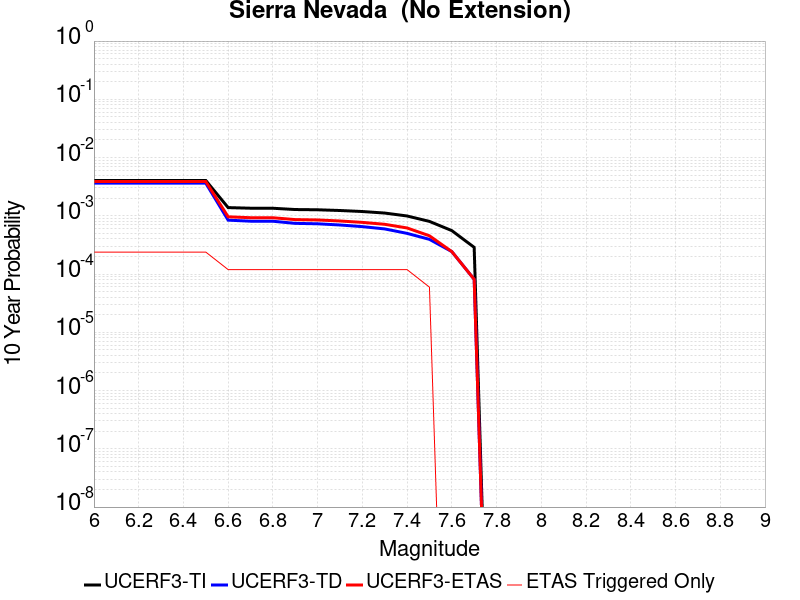 |

| Magnitude | 1 wk TI Prob | 1 wk TD Prob | 1 wk ETAS Prob | 1 wk ETAS/TD Gain | 1 wk ETAS Triggered Only | 1 mo TI Prob | 1 mo TD Prob | 1 mo ETAS Prob | 1 mo ETAS/TD Gain | 1 mo ETAS Triggered Only | 1 yr TI Prob | 1 yr TD Prob | 1 yr ETAS Prob | 1 yr ETAS/TD Gain | 1 yr ETAS Triggered Only | 10 yr TI Prob | 10 yr TD Prob | 10 yr ETAS Prob | 10 yr ETAS/TD Gain | 10 yr ETAS Triggered Only |
|-----|-----|-----|-----|-----|-----|-----|-----|-----|-----|-----|-----|-----|-----|-----|-----|-----|-----|-----|-----|-----|
| 6.0 | 7.7690465E-6 | 6.9762887E-6 | 1.6697517E-4 | 23.934671 | 1.6E-4 | 3.329549E-5 | 2.989824E-5 | 2.3989196E-4 | 8.023615 | 2.1E-4 | 4.0529718E-4 | 3.6398612E-4 | 6.438842E-4 | 1.7689801 | 2.8E-4 | 0.004045588 | 0.0036374154 | 0.0039861426 | 1.0958722 | 3.5E-4 |
| 6.1 | 7.7690465E-6 | 6.9762887E-6 | 1.6697517E-4 | 23.934671 | 1.6E-4 | 3.329549E-5 | 2.989824E-5 | 2.3989196E-4 | 8.023615 | 2.1E-4 | 4.0529718E-4 | 3.6398612E-4 | 6.438842E-4 | 1.7689801 | 2.8E-4 | 0.004045588 | 0.0036374154 | 0.0039861426 | 1.0958722 | 3.5E-4 |
| 6.2 | 7.7690465E-6 | 6.9762887E-6 | 1.6697517E-4 | 23.934671 | 1.6E-4 | 3.329549E-5 | 2.989824E-5 | 2.3989196E-4 | 8.023615 | 2.1E-4 | 4.0529718E-4 | 3.6398612E-4 | 6.438842E-4 | 1.7689801 | 2.8E-4 | 0.004045588 | 0.0036374154 | 0.0039861426 | 1.0958722 | 3.5E-4 |
| 6.3 | 7.7690465E-6 | 6.9762887E-6 | 1.6697517E-4 | 23.934671 | 1.6E-4 | 3.329549E-5 | 2.989824E-5 | 2.3989196E-4 | 8.023615 | 2.1E-4 | 4.0529718E-4 | 3.6398612E-4 | 6.438842E-4 | 1.7689801 | 2.8E-4 | 0.004045588 | 0.0036374154 | 0.0039861426 | 1.0958722 | 3.5E-4 |
| 6.4 | 7.7690465E-6 | 6.9762887E-6 | 1.6697517E-4 | 23.934671 | 1.6E-4 | 3.329549E-5 | 2.989824E-5 | 2.3989196E-4 | 8.023615 | 2.1E-4 | 4.0529718E-4 | 3.6398612E-4 | 6.438842E-4 | 1.7689801 | 2.8E-4 | 0.004045588 | 0.0036374154 | 0.0039861426 | 1.0958722 | 3.5E-4 |
| 6.5 | 7.7690465E-6 | 6.9762887E-6 | 1.6697517E-4 | 23.934671 | 1.6E-4 | 3.329549E-5 | 2.989824E-5 | 2.3989196E-4 | 8.023615 | 2.1E-4 | 4.0529718E-4 | 3.6398612E-4 | 6.438842E-4 | 1.7689801 | 2.8E-4 | 0.004045588 | 0.0036374154 | 0.0039861426 | 1.0958722 | 3.5E-4 |
| 6.6 | 2.653E-6 | 1.6148208E-6 | 1.01614656E-4 | 62.926273 | 1.0E-4 | 1.136995E-5 | 6.9206426E-6 | 1.4691967E-4 | 21.229195 | 1.4E-4 | 1.3842035E-4 | 8.42556E-5 | 2.5424128E-4 | 3.0175 | 1.7E-4 | 0.0013833415 | 8.4224E-4 | 0.0010620547 | 1.2609882 | 2.2E-4 |
| 6.7 | 2.5902466E-6 | 1.5501544E-6 | 1.0155E-4 | 65.509605 | 1.0E-4 | 1.11010095E-5 | 6.643502E-6 | 1.4664257E-4 | 22.073084 | 1.4E-4 | 1.351464E-4 | 8.088166E-5 | 2.4086873E-4 | 2.9780385 | 1.6E-4 | 0.0013506424 | 8.0852525E-4 | 0.0010183555 | 1.2595222 | 2.1E-4 |
| 6.8 | 2.5853892E-6 | 1.5469546E-6 | 1.015468E-4 | 65.643036 | 1.0E-4 | 1.1080193E-5 | 6.629789E-6 | 1.4662887E-4 | 22.11667 | 1.4E-4 | 1.34893E-4 | 8.071472E-5 | 2.407018E-4 | 2.9821303 | 1.6E-4 | 0.0013481114 | 8.06857E-4 | 0.0010166876 | 1.2600591 | 2.1E-4 |
| 6.9 | 2.458257E-6 | 1.422029E-6 | 1.0142189E-4 | 71.32196 | 1.0E-4 | 1.0535345E-5 | 6.0943958E-6 | 1.4609355E-4 | 23.971785 | 1.4E-4 | 1.2826028E-4 | 7.419676E-5 | 2.3418489E-4 | 3.1562684 | 1.6E-4 | 0.0012818627 | 7.4172183E-4 | 9.515661E-4 | 1.282915 | 2.1E-4 |
| 7.0 | 2.4341468E-6 | 1.3989927E-6 | 1.0139885E-4 | 72.4799 | 1.0E-4 | 1.0432016E-5 | 5.9956697E-6 | 1.4599483E-4 | 24.350046 | 1.4E-4 | 1.270024E-4 | 7.299485E-5 | 2.3298318E-4 | 3.1917753 | 1.6E-4 | 0.0012692984 | 7.297107E-4 | 9.3955745E-4 | 1.2875752 | 2.1E-4 |
| 7.1 | 2.3652476E-6 | 1.3339427E-6 | 1.0133381E-4 | 75.96564 | 1.0E-4 | 1.0136736E-5 | 5.716885E-6 | 1.4571608E-4 | 25.488722 | 1.4E-4 | 1.2340778E-4 | 6.9600865E-5 | 2.2958973E-4 | 3.298662 | 1.6E-4 | 0.0012333926 | 6.957924E-4 | 8.956532E-4 | 1.287242 | 2.0E-4 |
| 7.2 | 2.272158E-6 | 1.2502497E-6 | 1.0125012E-4 | 80.983925 | 1.0E-4 | 9.737784E-6 | 5.358202E-6 | 1.4535745E-4 | 27.128027 | 1.4E-4 | 1.1855107E-4 | 6.523417E-5 | 2.2522373E-4 | 3.4525423 | 1.6E-4 | 0.0011848784 | 6.5215176E-4 | 8.5202133E-4 | 1.3064771 | 2.0E-4 |
| 7.3 | 2.1382127E-6 | 1.1419382E-6 | 1.0114182E-4 | 88.57031 | 1.0E-4 | 9.163737E-6 | 4.894012E-6 | 1.4489333E-4 | 29.606247 | 1.4E-4 | 1.1156279E-4 | 5.9582977E-5 | 2.1957344E-4 | 3.6851707 | 1.6E-4 | 0.001115068 | 5.956712E-4 | 7.9555204E-4 | 1.3355557 | 2.0E-4 |
| 7.4 | 1.9048055E-6 | 9.574928E-7 | 9.095741E-5 | 94.99539 | 9.0E-5 | 8.163426E-6 | 4.103534E-6 | 1.2410304E-4 | 30.242964 | 1.2E-4 | 9.9385186E-5 | 4.995939E-5 | 1.799529E-4 | 3.6019833 | 1.3E-4 | 9.934074E-4 | 4.9948227E-4 | 6.594024E-4 | 1.3201717 | 1.6E-4 |
| 7.5 | 1.5373403E-6 | 7.559763E-7 | 6.075593E-5 | 80.36751 | 6.0E-5 | 6.5885843E-6 | 3.2398946E-6 | 8.323963E-5 | 25.692081 | 8.0E-5 | 8.021306E-5 | 3.9445007E-5 | 1.1944185E-4 | 3.0280602 | 8.0E-5 | 8.0184115E-4 | 3.9438053E-4 | 5.0433713E-4 | 1.2788085 | 1.1E-4 |
| 7.6 | 1.0680322E-6 | 4.65941E-7 | 3.0465928E-5 | 65.3858 | 3.0E-5 | 4.577273E-6 | 1.9968884E-6 | 3.1996828E-5 | 16.023342 | 3.0E-5 | 5.5726876E-5 | 2.4311848E-5 | 5.431112E-5 | 2.2339363 | 3.0E-5 | 5.5712904E-4 | 2.4309216E-4 | 3.0307757E-4 | 1.24676 | 6.0E-5 |
| 7.7 | 5.509146E-7 | 1.5578539E-7 | 1.01557835E-5 | 65.190865 | 1.0E-5 | 2.3610605E-6 | 6.676515E-7 | 1.0667645E-5 | 15.977864 | 1.0E-5 | 2.8745531E-5 | 8.128628E-6 | 1.8128547E-5 | 2.2302098 | 1.0E-5 | 2.8741814E-4 | 8.128342E-5 | 1.01281796E-4 | 1.2460326 | 2.0E-5 |

## Lake Isabella (Seismicity)
*[(top)](#table-of-contents)*

| 1 Week | 1 Month | 1 Year | 10 Year |
|-----|-----|-----|-----|
| 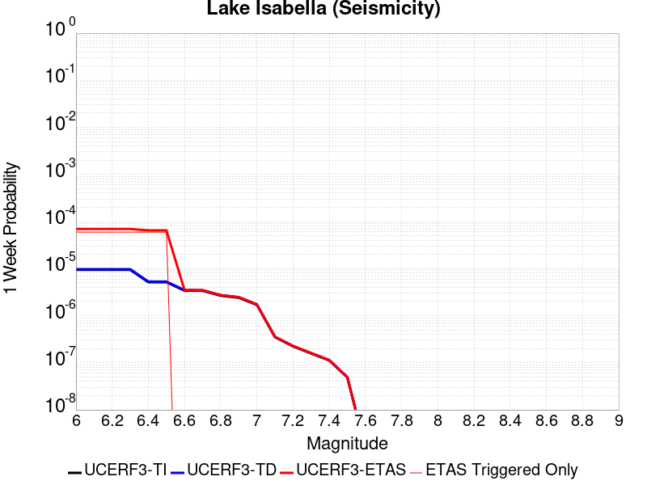 | 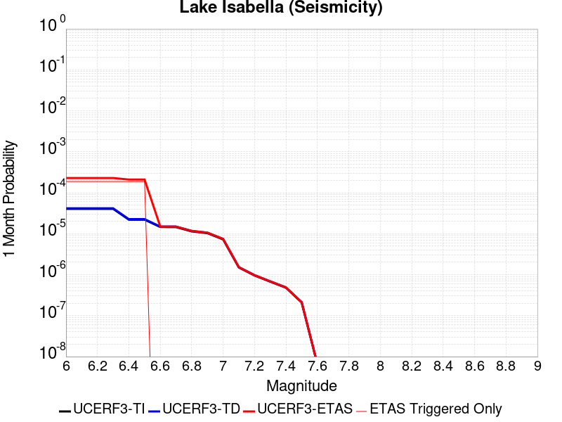 | 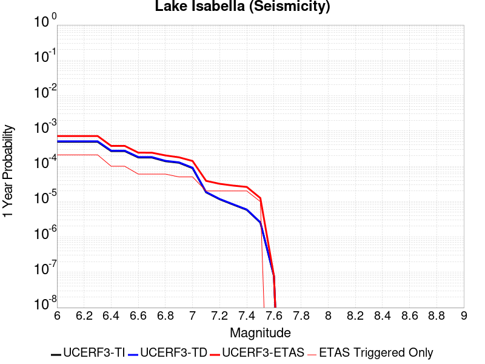 | 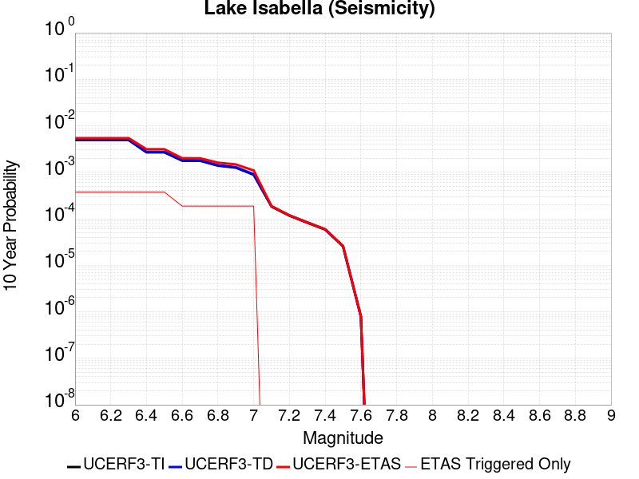 |

| Magnitude | 1 wk TI Prob | 1 wk TD Prob | 1 wk ETAS Prob | 1 wk ETAS/TD Gain | 1 wk ETAS Triggered Only | 1 mo TI Prob | 1 mo TD Prob | 1 mo ETAS Prob | 1 mo ETAS/TD Gain | 1 mo ETAS Triggered Only | 1 yr TI Prob | 1 yr TD Prob | 1 yr ETAS Prob | 1 yr ETAS/TD Gain | 1 yr ETAS Triggered Only | 10 yr TI Prob | 10 yr TD Prob | 10 yr ETAS Prob | 10 yr ETAS/TD Gain | 10 yr ETAS Triggered Only |
|-----|-----|-----|-----|-----|-----|-----|-----|-----|-----|-----|-----|-----|-----|-----|-----|-----|-----|-----|-----|-----|
| 6.0 | 9.431637E-6 | 9.741651E-6 | 9.974078E-5 | 10.238589 | 9.0E-5 | 4.0420677E-5 | 4.1749343E-5 | 1.9174308E-4 | 4.592721 | 1.5E-4 | 4.920106E-4 | 5.0819275E-4 | 7.18086E-4 | 1.4130191 | 2.1E-4 | 0.004909227 | 0.005071599 | 0.0054397224 | 1.0725853 | 3.7E-4 |
| 6.1 | 9.431637E-6 | 9.741651E-6 | 9.974078E-5 | 10.238589 | 9.0E-5 | 4.0420677E-5 | 4.1749343E-5 | 1.9174308E-4 | 4.592721 | 1.5E-4 | 4.920106E-4 | 5.0819275E-4 | 7.18086E-4 | 1.4130191 | 2.1E-4 | 0.004909227 | 0.005071599 | 0.0054397224 | 1.0725853 | 3.7E-4 |
| 6.2 | 9.431637E-6 | 9.741651E-6 | 9.974078E-5 | 10.238589 | 9.0E-5 | 4.0420677E-5 | 4.1749343E-5 | 1.9174308E-4 | 4.592721 | 1.5E-4 | 4.920106E-4 | 5.0819275E-4 | 7.18086E-4 | 1.4130191 | 2.1E-4 | 0.004909227 | 0.005071599 | 0.0054397224 | 1.0725853 | 3.7E-4 |
| 6.3 | 9.431637E-6 | 9.741651E-6 | 9.974078E-5 | 10.238589 | 9.0E-5 | 4.0420677E-5 | 4.1749343E-5 | 1.9174308E-4 | 4.592721 | 1.5E-4 | 4.920106E-4 | 5.0819275E-4 | 7.18086E-4 | 1.4130191 | 2.1E-4 | 0.004909227 | 0.005071599 | 0.0054397224 | 1.0725853 | 3.7E-4 |
| 6.4 | 5.144063E-6 | 5.3000763E-6 | 6.5299755E-5 | 12.320532 | 6.0E-5 | 2.2045799E-5 | 2.2714434E-5 | 9.271284E-5 | 4.0816708 | 7.0E-5 | 2.6837454E-4 | 2.765166E-4 | 3.7648893E-4 | 1.361542 | 1.0E-4 | 0.0026805066 | 0.0027620657 | 0.002951541 | 1.0685991 | 1.9E-4 |
| 6.5 | 5.144063E-6 | 5.3000763E-6 | 6.5299755E-5 | 12.320532 | 6.0E-5 | 2.2045799E-5 | 2.2714434E-5 | 9.271284E-5 | 4.0816708 | 7.0E-5 | 2.6837454E-4 | 2.765166E-4 | 3.7648893E-4 | 1.361542 | 1.0E-4 | 0.0026805066 | 0.0027620657 | 0.002951541 | 1.0685991 | 1.9E-4 |
| 6.6 | 3.4009804E-6 | 3.498786E-6 | 2.3498716E-5 | 6.716248 | 2.0E-5 | 1.4575549E-5 | 1.4994721E-5 | 4.499427E-5 | 3.0006742 | 3.0E-5 | 1.7744285E-4 | 1.8254704E-4 | 2.4253609E-4 | 1.3286225 | 6.0E-5 | 0.0017730123 | 0.0018241286 | 0.0019339279 | 1.0601928 | 1.1E-4 |
| 6.7 | 3.3880428E-6 | 3.4856528E-6 | 2.3485583E-5 | 6.7377863 | 2.0E-5 | 1.4520103E-5 | 1.4938435E-5 | 4.4937988E-5 | 3.0082123 | 3.0E-5 | 1.767679E-4 | 1.8186188E-4 | 2.4185097E-4 | 1.3298607 | 6.0E-5 | 0.0017662736 | 0.0018172882 | 0.0019270882 | 1.0604198 | 1.1E-4 |
| 6.8 | 2.6582E-6 | 2.7337003E-6 | 2.2733646E-5 | 8.3160715 | 2.0E-5 | 1.1392236E-5 | 1.1715813E-5 | 4.1715462E-5 | 3.5606117 | 3.0E-5 | 1.3869164E-4 | 1.4263204E-4 | 2.0262347E-4 | 1.4206029 | 6.0E-5 | 0.0013860512 | 0.0014255369 | 0.0015253944 | 1.070049 | 1.0E-4 |
| 6.9 | 2.406011E-6 | 2.4743288E-6 | 2.247428E-5 | 9.08298 | 2.0E-5 | 1.0311434E-5 | 1.0604231E-5 | 4.0603914E-5 | 3.8290296 | 3.0E-5 | 1.2553448E-4 | 1.2910018E-4 | 1.7909372E-4 | 1.3872461 | 5.0E-5 | 0.0012546359 | 0.0012903814 | 0.0013802653 | 1.0696568 | 9.0E-5 |
| 7.0 | 1.6953097E-6 | 1.7429371E-6 | 2.1742902E-5 | 12.474863 | 2.0E-5 | 7.265593E-6 | 7.469715E-6 | 3.746949E-5 | 5.016187 | 3.0E-5 | 8.8455E-5 | 9.094104E-5 | 1.4093649E-4 | 1.5497568 | 5.0E-5 | 8.84198E-4 | 9.09141E-4 | 9.690864E-4 | 1.0659363 | 6.0E-5 |
| 7.1 | 3.5013824E-7 | 3.5714822E-7 | 1.0357145E-5 | 28.999569 | 1.0E-5 | 1.5005916E-6 | 1.5306344E-6 | 1.1530619E-5 | 7.533229 | 1.0E-5 | 1.826955E-5 | 1.8635317E-5 | 3.8634946E-5 | 2.073211 | 2.0E-5 | 1.8268047E-4 | 1.863378E-4 | 2.0633407E-4 | 1.107312 | 2.0E-5 |
| 7.2 | 2.2321095E-7 | 2.2750574E-7 | 1.02275035E-5 | 44.954926 | 1.0E-5 | 9.56618E-7 | 9.750242E-7 | 1.0975014E-5 | 11.2561455 | 1.0E-5 | 1.1646762E-5 | 1.1870856E-5 | 3.187062E-5 | 2.6847785 | 2.0E-5 | 1.1646151E-4 | 1.1870232E-4 | 1.3869995E-4 | 1.1684687 | 2.0E-5 |
| 7.3 | 1.5760406E-7 | 1.6060922E-7 | 1.0160607E-5 | 63.262917 | 1.0E-5 | 6.7544585E-7 | 6.8832503E-7 | 1.0688318E-5 | 15.528009 | 1.0E-5 | 8.223522E-6 | 8.380326E-6 | 2.8380158E-5 | 3.386522 | 2.0E-5 | 8.2232174E-5 | 8.3800165E-5 | 1.03798484E-4 | 1.238643 | 2.0E-5 |
| 7.4 | 1.1216497E-7 | 1.1431706E-7 | 1.0114316E-5 | 88.476 | 1.0E-5 | 4.8070694E-7 | 4.899302E-7 | 1.0489925E-5 | 21.411062 | 1.0E-5 | 5.852591E-6 | 5.964884E-6 | 2.5964764E-5 | 4.352937 | 2.0E-5 | 5.8524372E-5 | 5.9647282E-5 | 7.964609E-5 | 1.3352845 | 2.0E-5 |
| 7.5 | 4.885185E-8 | 4.9787737E-8 | 1.0049787E-5 | 201.85266 | 1.0E-5 | 2.0936506E-7 | 2.13376E-7 | 1.0213374E-5 | 47.865616 | 1.0E-5 | 2.5490165E-6 | 2.59785E-6 | 1.2597824E-5 | 4.849327 | 1.0E-5 | 2.5489873E-5 | 2.5978214E-5 | 3.5977955E-5 | 1.384928 | 1.0E-5 |
| 7.6 | 1.504641E-9 | 1.5317903E-9 | 1.5317903E-9 | 1.0 | 0.0 | 6.4484613E-9 | 6.5648154E-9 | 6.5648154E-9 | 1.0 | 0.0 | 7.851001E-8 | 7.992663E-8 | 7.992663E-8 | 1.0 | 0.0 | 7.8509987E-7 | 7.992663E-7 | 7.992663E-7 | 1.0 | 0.0 |

## Cady
*[(top)](#table-of-contents)*

| 1 Week | 1 Month | 1 Year | 10 Year |
|-----|-----|-----|-----|
| 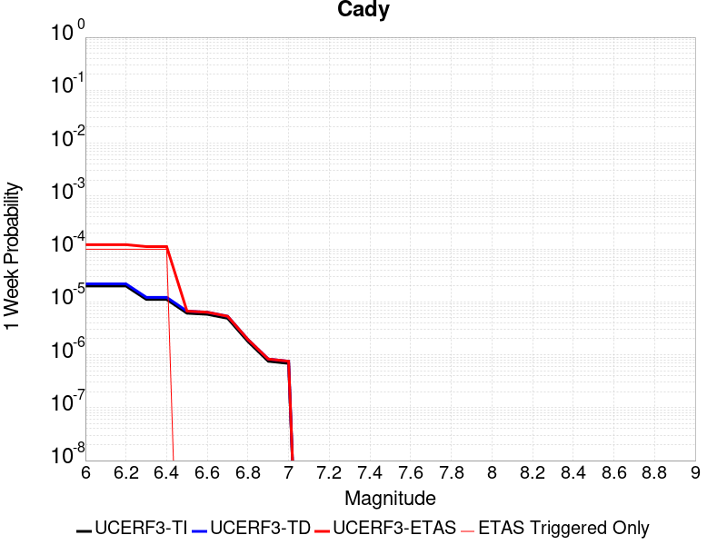 | 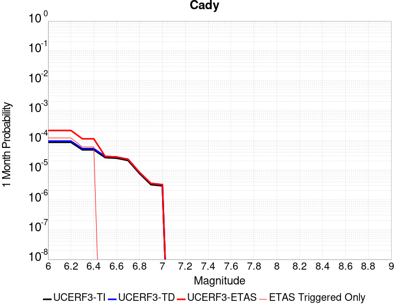 | 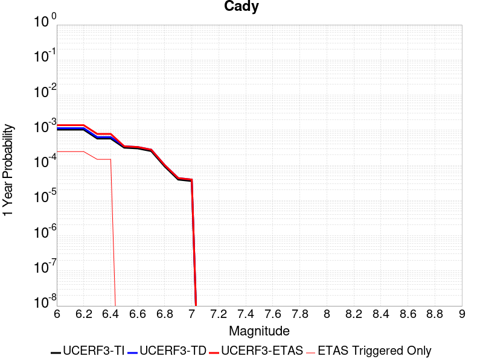 | 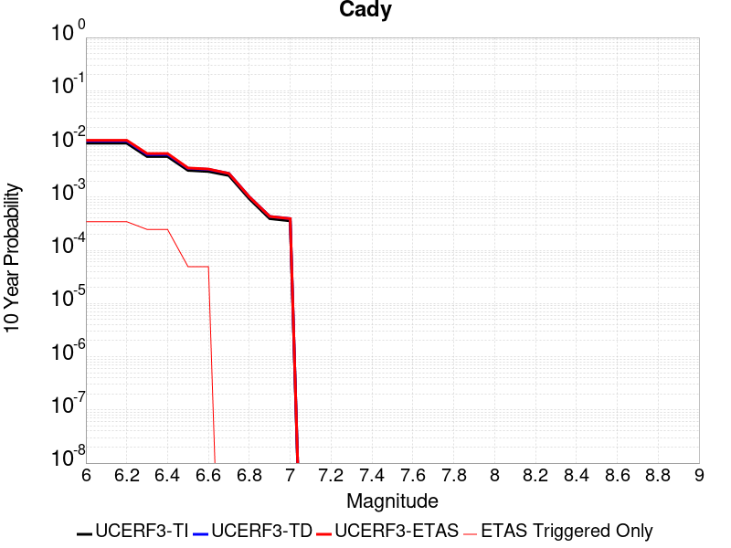 |

| Magnitude | 1 wk TI Prob | 1 wk TD Prob | 1 wk ETAS Prob | 1 wk ETAS/TD Gain | 1 wk ETAS Triggered Only | 1 mo TI Prob | 1 mo TD Prob | 1 mo ETAS Prob | 1 mo ETAS/TD Gain | 1 mo ETAS Triggered Only | 1 yr TI Prob | 1 yr TD Prob | 1 yr ETAS Prob | 1 yr ETAS/TD Gain | 1 yr ETAS Triggered Only | 10 yr TI Prob | 10 yr TD Prob | 10 yr ETAS Prob | 10 yr ETAS/TD Gain | 10 yr ETAS Triggered Only |
|-----|-----|-----|-----|-----|-----|-----|-----|-----|-----|-----|-----|-----|-----|-----|-----|-----|-----|-----|-----|-----|
| 6.0 | 1.9892565E-5 | 2.1858728E-5 | 1.3185633E-4 | 6.0322046 | 1.1E-4 | 8.525106E-5 | 9.3677416E-5 | 2.9365867E-4 | 3.1347864 | 2.0E-4 | 0.0010374374 | 0.0011400167 | 0.0013897317 | 1.219045 | 2.5E-4 | 0.010326075 | 0.011350701 | 0.011706614 | 1.0313561 | 3.6E-4 |
| 6.1 | 1.9892565E-5 | 2.1858728E-5 | 1.3185633E-4 | 6.0322046 | 1.1E-4 | 8.525106E-5 | 9.3677416E-5 | 2.9365867E-4 | 3.1347864 | 2.0E-4 | 0.0010374374 | 0.0011400167 | 0.0013897317 | 1.219045 | 2.5E-4 | 0.010326075 | 0.011350701 | 0.011706614 | 1.0313561 | 3.6E-4 |
| 6.2 | 1.9892565E-5 | 2.1858728E-5 | 1.3185633E-4 | 6.0322046 | 1.1E-4 | 8.525106E-5 | 9.3677416E-5 | 2.9365867E-4 | 3.1347864 | 2.0E-4 | 0.0010374374 | 0.0011400167 | 0.0013897317 | 1.219045 | 2.5E-4 | 0.010326075 | 0.011350701 | 0.011706614 | 1.0313561 | 3.6E-4 |
| 6.3 | 1.1117327E-5 | 1.2176583E-5 | 6.2175975E-5 | 5.106192 | 5.0E-5 | 4.764482E-5 | 5.2184492E-5 | 1.421798E-4 | 2.7245603 | 9.0E-5 | 5.7992124E-4 | 6.351925E-4 | 7.551163E-4 | 1.1887991 | 1.2E-4 | 0.0057841022 | 0.0063368753 | 0.006535608 | 1.0313613 | 2.0E-4 |
| 6.4 | 1.1117327E-5 | 1.2176583E-5 | 6.2175975E-5 | 5.106192 | 5.0E-5 | 4.764482E-5 | 5.2184492E-5 | 1.421798E-4 | 2.7245603 | 9.0E-5 | 5.7992124E-4 | 6.351925E-4 | 7.551163E-4 | 1.1887991 | 1.2E-4 | 0.0057841022 | 0.0063368753 | 0.006535608 | 1.0313613 | 2.0E-4 |
| 6.5 | 6.103093E-6 | 6.672021E-6 | 2.6671887E-5 | 3.9975727 | 2.0E-5 | 2.615585E-5 | 2.8594131E-5 | 6.8592984E-5 | 2.3988485 | 4.0E-5 | 3.1840094E-4 | 3.480905E-4 | 4.080696E-4 | 1.1723089 | 6.0E-5 | 0.0031794512 | 0.0034766865 | 0.0035962695 | 1.0343956 | 1.2E-4 |
| 6.6 | 5.817237E-6 | 6.3656585E-6 | 2.6365531E-5 | 4.1418386 | 2.0E-5 | 2.4930776E-5 | 2.728118E-5 | 6.728009E-5 | 2.4661722 | 4.0E-5 | 3.034899E-4 | 3.3211018E-4 | 3.9209024E-4 | 1.1806029 | 6.0E-5 | 0.0030307577 | 0.0033173605 | 0.0034269956 | 1.0330489 | 1.1E-4 |
| 6.7 | 4.8846314E-6 | 5.3405684E-6 | 2.5340461E-5 | 4.7448997 | 2.0E-5 | 2.0933967E-5 | 2.2888014E-5 | 5.2887328E-5 | 2.3106997 | 3.0E-5 | 2.5484123E-4 | 2.7863772E-4 | 3.286238E-4 | 1.1793945 | 5.0E-5 | 0.0025454918 | 0.0027840391 | 0.0028737886 | 1.0322372 | 9.0E-5 |
| 6.8 | 1.7788773E-6 | 1.9399079E-6 | 1.1939888E-5 | 6.154874 | 1.0E-5 | 7.6237375E-6 | 8.313874E-6 | 1.831379E-5 | 2.2027988 | 1.0E-5 | 9.281505E-5 | 1.01218284E-4 | 1.11217276E-4 | 1.0987864 | 1.0E-5 | 9.2776294E-4 | 0.0010118765 | 0.0010218663 | 1.0098727 | 1.0E-5 |
| 6.9 | 7.5455404E-7 | 8.297092E-7 | 8.297092E-7 | 1.0 | 0.0 | 3.233799E-6 | 3.5558937E-6 | 3.5558937E-6 | 1.0 | 0.0 | 3.937079E-5 | 4.3292483E-5 | 4.3292483E-5 | 1.0 | 0.0 | 3.9363815E-4 | 4.3287344E-4 | 4.3287344E-4 | 1.0 | 0.0 |
| 7.0 | 6.8578805E-7 | 7.541816E-7 | 7.541816E-7 | 1.0 | 0.0 | 2.9390883E-6 | 3.2322048E-6 | 3.2322048E-6 | 1.0 | 0.0 | 3.578281E-5 | 3.9351715E-5 | 3.9351715E-5 | 1.0 | 0.0 | 3.577705E-4 | 3.9347992E-4 | 3.9347992E-4 | 1.0 | 0.0 |

## San Andreas (San Gorgonio Pass-Garnet HIll)
*[(top)](#table-of-contents)*

| 1 Week | 1 Month | 1 Year | 10 Year |
|-----|-----|-----|-----|
| 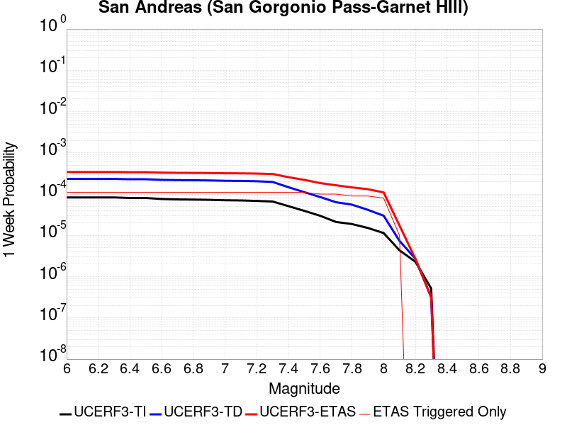 | 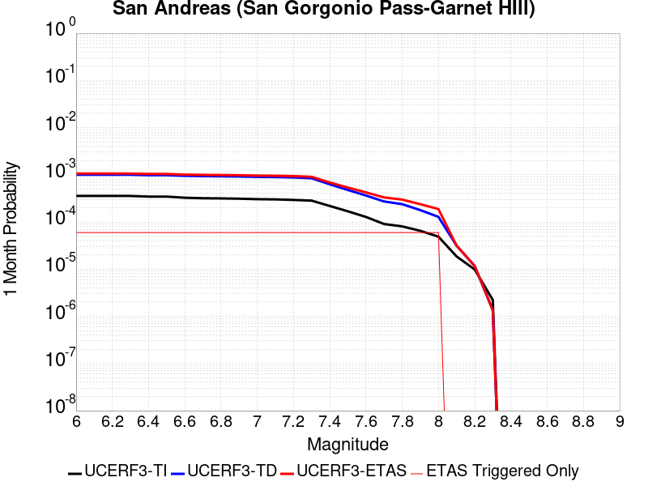 | 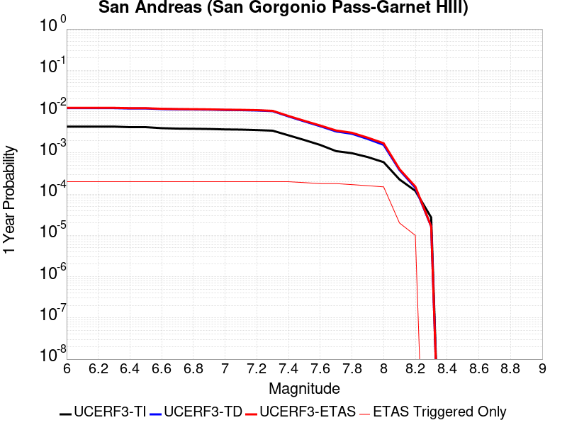 | 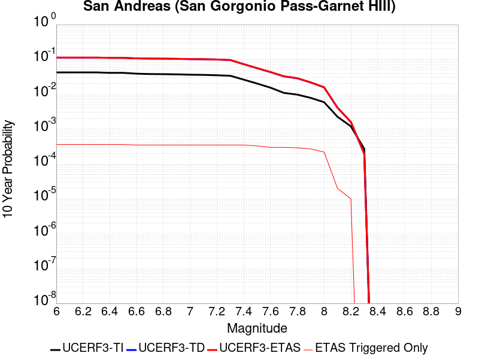 |

| Magnitude | 1 wk TI Prob | 1 wk TD Prob | 1 wk ETAS Prob | 1 wk ETAS/TD Gain | 1 wk ETAS Triggered Only | 1 mo TI Prob | 1 mo TD Prob | 1 mo ETAS Prob | 1 mo ETAS/TD Gain | 1 mo ETAS Triggered Only | 1 yr TI Prob | 1 yr TD Prob | 1 yr ETAS Prob | 1 yr ETAS/TD Gain | 1 yr ETAS Triggered Only | 10 yr TI Prob | 10 yr TD Prob | 10 yr ETAS Prob | 10 yr ETAS/TD Gain | 10 yr ETAS Triggered Only |
|-----|-----|-----|-----|-----|-----|-----|-----|-----|-----|-----|-----|-----|-----|-----|-----|-----|-----|-----|-----|-----|
| 6.0 | 8.31567E-5 | 2.3384395E-4 | 3.4381825E-4 | 1.4702891 | 1.1E-4 | 3.5633717E-4 | 0.0010018025 | 0.0011416622 | 1.1396081 | 1.4E-4 | 0.004329778 | 0.012128622 | 0.012326197 | 1.01629 | 2.0E-4 | 0.042463828 | 0.11258187 | 0.112901345 | 1.0028377 | 3.6E-4 |
| 6.1 | 8.31567E-5 | 2.3384395E-4 | 3.4381825E-4 | 1.4702891 | 1.1E-4 | 3.5633717E-4 | 0.0010018025 | 0.0011416622 | 1.1396081 | 1.4E-4 | 0.004329778 | 0.012128622 | 0.012326197 | 1.01629 | 2.0E-4 | 0.042463828 | 0.11258187 | 0.112901345 | 1.0028377 | 3.6E-4 |
| 6.2 | 8.31567E-5 | 2.3384395E-4 | 3.4381825E-4 | 1.4702891 | 1.1E-4 | 3.5633717E-4 | 0.0010018025 | 0.0011416622 | 1.1396081 | 1.4E-4 | 0.004329778 | 0.012128622 | 0.012326197 | 1.01629 | 2.0E-4 | 0.042463828 | 0.11258187 | 0.112901345 | 1.0028377 | 3.6E-4 |
| 6.3 | 8.31567E-5 | 2.3384395E-4 | 3.4381825E-4 | 1.4702891 | 1.1E-4 | 3.5633717E-4 | 0.0010018025 | 0.0011416622 | 1.1396081 | 1.4E-4 | 0.004329778 | 0.012128622 | 0.012326197 | 1.01629 | 2.0E-4 | 0.042463828 | 0.11258187 | 0.112901345 | 1.0028377 | 3.6E-4 |
| 6.4 | 8.059055E-5 | 2.2941893E-4 | 3.3939368E-4 | 1.4793622 | 1.1E-4 | 3.4534236E-4 | 9.828559E-4 | 0.0011227183 | 1.142302 | 1.4E-4 | 0.0041964394 | 0.011900819 | 0.012098439 | 1.0166056 | 2.0E-4 | 0.041180745 | 0.110562965 | 0.11088316 | 1.0028961 | 3.6E-4 |
| 6.5 | 8.059055E-5 | 2.2941893E-4 | 3.3939368E-4 | 1.4793622 | 1.1E-4 | 3.4534236E-4 | 9.828559E-4 | 0.0011227183 | 1.142302 | 1.4E-4 | 0.0041964394 | 0.011900819 | 0.012098439 | 1.0166056 | 2.0E-4 | 0.041180745 | 0.110562965 | 0.11088316 | 1.0028961 | 3.6E-4 |
| 6.6 | 7.619237E-5 | 2.2186468E-4 | 3.3184027E-4 | 1.4956877 | 1.1E-4 | 3.2649786E-4 | 9.5050444E-4 | 0.0010903714 | 1.1471502 | 1.4E-4 | 0.0039678677 | 0.0115115335 | 0.011709232 | 1.0171739 | 2.0E-4 | 0.03897764 | 0.10709954 | 0.107412055 | 1.002918 | 3.5E-4 |
| 6.7 | 7.440636E-5 | 2.1862281E-4 | 3.2859878E-4 | 1.5030397 | 1.1E-4 | 3.188454E-4 | 9.3662075E-4 | 0.0010764896 | 1.1493335 | 1.4E-4 | 0.0038750346 | 0.011344268 | 0.011541999 | 1.0174301 | 2.0E-4 | 0.038081564 | 0.1056081 | 0.10592114 | 1.0029641 | 3.5E-4 |
| 6.8 | 7.3735864E-5 | 2.1709445E-4 | 3.2707056E-4 | 1.5065819 | 1.1E-4 | 3.1597257E-4 | 9.300753E-4 | 0.001069945 | 1.1503855 | 1.4E-4 | 0.0038401815 | 0.011265406 | 0.011463153 | 1.0175534 | 2.0E-4 | 0.03774495 | 0.104909696 | 0.10522298 | 1.0029862 | 3.5E-4 |
| 6.9 | 7.27575E-5 | 2.1478413E-4 | 3.247605E-4 | 1.5120322 | 1.1E-4 | 3.117806E-4 | 9.20181E-4 | 0.0010600522 | 1.152004 | 1.4E-4 | 0.003789323 | 0.011146182 | 0.011343953 | 1.0177433 | 2.0E-4 | 0.037253562 | 0.10385753 | 0.10417118 | 1.00302 | 3.5E-4 |
| 7.0 | 7.102591E-5 | 2.1062451E-4 | 3.2060134E-4 | 1.5221465 | 1.1E-4 | 3.0436125E-4 | 9.023664E-4 | 0.0010422401 | 1.1550076 | 1.4E-4 | 0.003699303 | 0.010931484 | 0.011129298 | 1.0180957 | 2.0E-4 | 0.03638325 | 0.101959534 | 0.10227385 | 1.0030828 | 3.5E-4 |
| 7.1 | 7.028513E-5 | 2.0898094E-4 | 3.1895796E-4 | 1.5262538 | 1.1E-4 | 3.0118722E-4 | 8.953274E-4 | 0.0010352021 | 1.1562274 | 1.4E-4 | 0.0036607897 | 0.010846641 | 0.0110444715 | 1.0182389 | 2.0E-4 | 0.036010686 | 0.10120243 | 0.10151701 | 1.0031084 | 3.5E-4 |
| 7.2 | 6.8498244E-5 | 2.050596E-4 | 3.1503703E-4 | 1.5363194 | 1.1E-4 | 2.9353087E-4 | 8.7853306E-4 | 0.0010184101 | 1.1592165 | 1.4E-4 | 0.003567883 | 0.0106441835 | 0.010842054 | 1.0185896 | 2.0E-4 | 0.035111405 | 0.09939449 | 0.099709705 | 1.0031713 | 3.5E-4 |
| 7.3 | 6.622592E-5 | 1.9733235E-4 | 3.0731063E-4 | 1.5573252 | 1.1E-4 | 2.8379448E-4 | 8.4543816E-4 | 9.853198E-4 | 1.1654546 | 1.4E-4 | 0.0034497243 | 0.010245111 | 0.010443062 | 1.0193216 | 2.0E-4 | 0.033966612 | 0.095891245 | 0.096207686 | 1.0033 | 3.5E-4 |
| 7.4 | 5.1050705E-5 | 1.4690042E-4 | 2.5688426E-4 | 1.7486966 | 1.1E-4 | 2.1877038E-4 | 6.294222E-4 | 7.693341E-4 | 1.2222862 | 1.4E-4 | 0.002660276 | 0.007636482 | 0.007834955 | 1.0259901 | 2.0E-4 | 0.02628654 | 0.07286554 | 0.07319003 | 1.0044534 | 3.5E-4 |
| 7.5 | 3.9302922E-5 | 1.11307076E-4 | 2.2129483E-4 | 1.988147 | 1.1E-4 | 1.6843023E-4 | 4.7694342E-4 | 6.068814E-4 | 1.272439 | 1.3E-4 | 0.0020487092 | 0.0057913954 | 0.0059802947 | 1.0326173 | 1.9E-4 | 0.020299247 | 0.05601151 | 0.056323025 | 1.0055616 | 3.3E-4 |
| 7.6 | 2.9851626E-5 | 8.4956984E-5 | 1.849485E-4 | 2.1769662 | 1.0E-4 | 1.2792926E-4 | 3.6405068E-4 | 4.84007E-4 | 1.3295045 | 1.2E-4 | 0.0015564259 | 0.0044233347 | 0.0046025384 | 1.0405133 | 1.8E-4 | 0.0154556995 | 0.043196145 | 0.043483187 | 1.0066451 | 3.0E-4 |
| 7.7 | 2.1135214E-5 | 6.353527E-5 | 1.6352891E-4 | 2.573829 | 1.0E-4 | 9.0576345E-5 | 2.722656E-4 | 3.9223293E-4 | 1.440626 | 1.2E-4 | 0.0011022091 | 0.0033098008 | 0.003489205 | 1.054204 | 1.8E-4 | 0.010967582 | 0.03258456 | 0.032874785 | 1.0089068 | 3.0E-4 |
| 7.8 | 1.883379E-5 | 5.564576E-5 | 1.4564075E-4 | 2.6172838 | 9.0E-5 | 8.0713755E-5 | 2.3846005E-4 | 3.4843382E-4 | 1.4611832 | 1.1E-4 | 9.822468E-4 | 0.002899389 | 0.0030688962 | 1.0584631 | 1.7E-4 | 0.0097791655 | 0.028696978 | 0.028978657 | 1.0098156 | 2.9E-4 |
| 7.9 | 1.5156185E-5 | 4.1662403E-5 | 1.3165866E-4 | 3.160131 | 9.0E-5 | 6.495346E-5 | 1.7854095E-4 | 2.8852132E-4 | 1.6159952 | 1.1E-4 | 7.9052144E-4 | 0.0021715704 | 0.0023312229 | 1.0735193 | 1.6E-4 | 0.007877152 | 0.021760946 | 0.02202507 | 1.0121375 | 2.7E-4 |
| 8.0 | 1.1405907E-5 | 2.9976925E-5 | 1.0997453E-4 | 3.6686392 | 8.0E-5 | 4.8881542E-5 | 1.2846621E-4 | 2.2845337E-4 | 1.7783147 | 1.0E-4 | 5.9497025E-4 | 0.0015629551 | 0.0017127206 | 1.0958221 | 1.5E-4 | 0.005933798 | 0.015774013 | 0.015990542 | 1.013727 | 2.2E-4 |
| 8.1 | 4.3511436E-6 | 7.369465E-6 | 1.7369392E-5 | 2.3569405 | 1.0E-5 | 1.8647626E-5 | 3.158304E-5 | 4.1582723E-5 | 1.3166156 | 1.0E-5 | 2.2701119E-4 | 3.844558E-4 | 4.0444813E-4 | 1.0520016 | 2.0E-5 | 0.0022677942 | 0.0041165445 | 0.0041364618 | 1.0048385 | 2.0E-5 |
| 8.2 | 2.3042528E-6 | 2.7328301E-6 | 2.7328301E-6 | 1.0 | 0.0 | 9.875332E-6 | 1.1712076E-5 | 1.1712076E-5 | 1.0 | 0.0 | 1.2022553E-4 | 1.4258524E-4 | 1.5258382E-4 | 1.0701234 | 1.0E-5 | 0.0012016051 | 0.0015979637 | 0.0016079478 | 1.006248 | 1.0E-5 |
| 8.3 | 5.202968E-7 | 3.1590292E-7 | 3.1590292E-7 | 1.0 | 0.0 | 2.2298414E-6 | 1.353869E-6 | 1.353869E-6 | 1.0 | 0.0 | 2.714798E-5 | 1.6483244E-5 | 1.6483244E-5 | 1.0 | 0.0 | 2.7144665E-4 | 1.955901E-4 | 1.955901E-4 | 1.0 | 0.0 |

## San Andreas (Coachella) rev
*[(top)](#table-of-contents)*

| 1 Week | 1 Month | 1 Year | 10 Year |
|-----|-----|-----|-----|
| 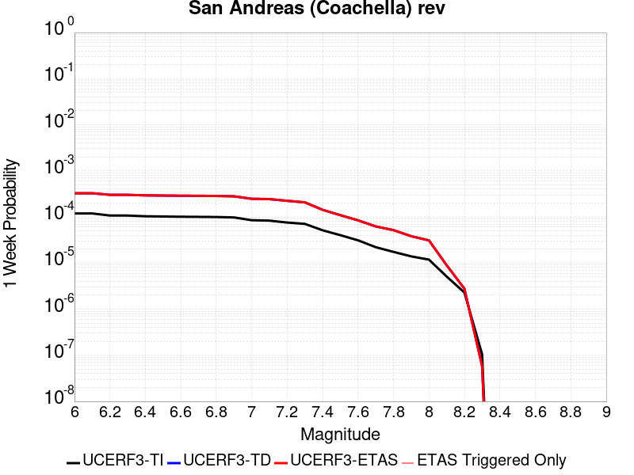 | 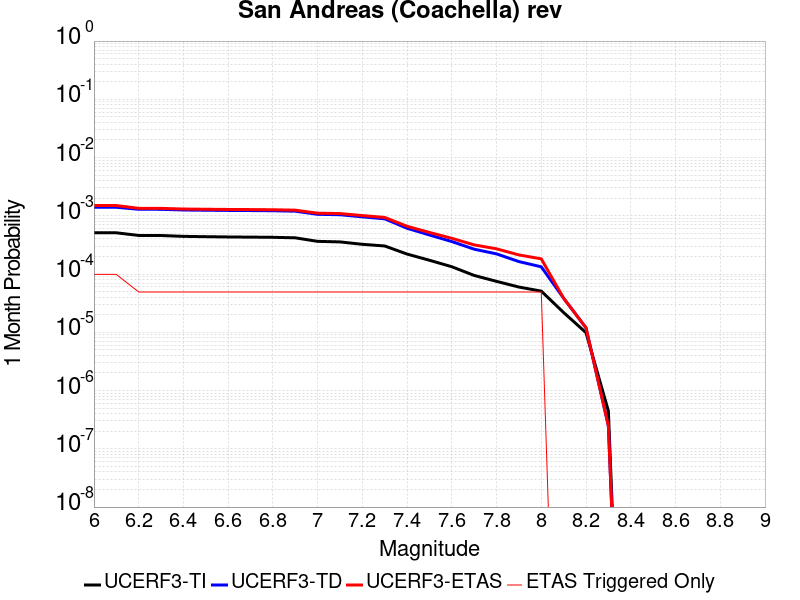 | 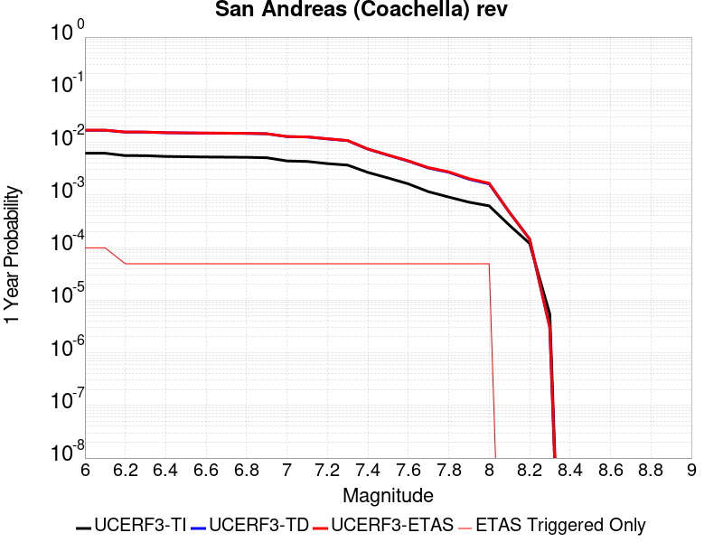 | 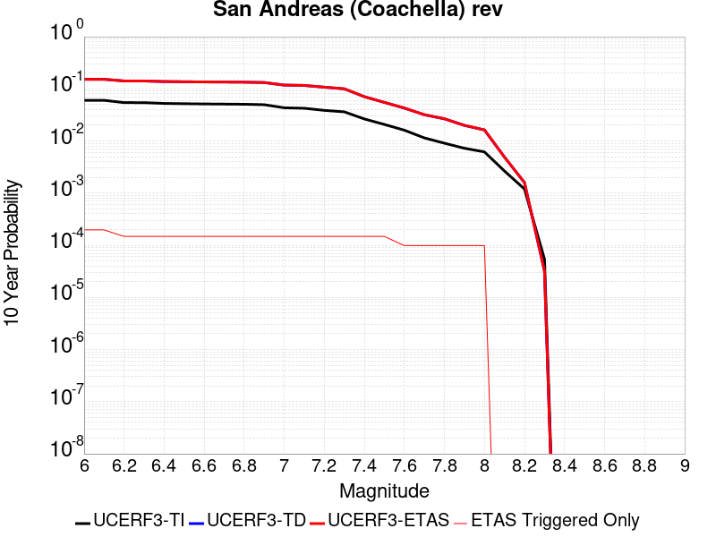 |

| Magnitude | 1 wk TI Prob | 1 wk TD Prob | 1 wk ETAS Prob | 1 wk ETAS/TD Gain | 1 wk ETAS Triggered Only | 1 mo TI Prob | 1 mo TD Prob | 1 mo ETAS Prob | 1 mo ETAS/TD Gain | 1 mo ETAS Triggered Only | 1 yr TI Prob | 1 yr TD Prob | 1 yr ETAS Prob | 1 yr ETAS/TD Gain | 1 yr ETAS Triggered Only | 10 yr TI Prob | 10 yr TD Prob | 10 yr ETAS Prob | 10 yr ETAS/TD Gain | 10 yr ETAS Triggered Only |
|-----|-----|-----|-----|-----|-----|-----|-----|-----|-----|-----|-----|-----|-----|-----|-----|-----|-----|-----|-----|-----|
| 6.0 | 1.1925945E-4 | 3.273077E-4 | 3.972848E-4 | 1.213796 | 7.0E-5 | 5.110118E-4 | 0.001401998 | 0.0015218297 | 1.0854721 | 1.2E-4 | 0.0062038354 | 0.016937068 | 0.017123848 | 1.011028 | 1.9E-4 | 0.060334753 | 0.15267672 | 0.15295634 | 1.0018314 | 3.3E-4 |
| 6.1 | 1.1925945E-4 | 3.273077E-4 | 3.972848E-4 | 1.213796 | 7.0E-5 | 5.110118E-4 | 0.001401998 | 0.0015218297 | 1.0854721 | 1.2E-4 | 0.0062038354 | 0.016937068 | 0.017123848 | 1.011028 | 1.9E-4 | 0.060334753 | 0.15267672 | 0.15295634 | 1.0018314 | 3.3E-4 |
| 6.2 | 1.07432395E-4 | 3.0231563E-4 | 3.7229445E-4 | 1.2314761 | 7.0E-5 | 4.603433E-4 | 0.001294999 | 0.0014048566 | 1.0848322 | 1.1E-4 | 0.005590286 | 0.015653731 | 0.01582107 | 1.01069 | 1.7E-4 | 0.05451731 | 0.14182784 | 0.14209387 | 1.0018758 | 3.1E-4 |
| 6.3 | 1.0718766E-4 | 3.0176868E-4 | 3.7174756E-4 | 1.2318958 | 7.0E-5 | 4.592948E-4 | 0.0012926573 | 0.0014025151 | 1.084986 | 1.1E-4 | 0.005577586 | 0.01562563 | 0.015792973 | 1.0107095 | 1.7E-4 | 0.054396555 | 0.14159605 | 0.14186215 | 1.0018793 | 3.1E-4 |
| 6.4 | 1.0355944E-4 | 2.9384956E-4 | 3.6382896E-4 | 1.2381471 | 7.0E-5 | 4.4375064E-4 | 0.0012587514 | 0.0013686129 | 1.0872782 | 1.1E-4 | 0.0053892885 | 0.015218662 | 0.015386075 | 1.0110005 | 1.7E-4 | 0.052604496 | 0.13815795 | 0.13842513 | 1.0019338 | 3.1E-4 |
| 6.5 | 1.0227914E-4 | 2.9104383E-4 | 3.6102347E-4 | 1.2404436 | 7.0E-5 | 4.382655E-4 | 0.0012467385 | 0.0013566014 | 1.0881202 | 1.1E-4 | 0.0053228354 | 0.015074439 | 0.015241876 | 1.0111073 | 1.7E-4 | 0.051971316 | 0.13694239 | 0.13720994 | 1.0019537 | 3.1E-4 |
| 6.6 | 1.0116757E-4 | 2.8870135E-4 | 3.5868114E-4 | 1.242395 | 7.0E-5 | 4.3350324E-4 | 0.0012367087 | 0.0013465727 | 1.0888357 | 1.1E-4 | 0.0052651367 | 0.014954008 | 0.0151214665 | 1.0111982 | 1.7E-4 | 0.051421247 | 0.13591973 | 0.13618761 | 1.0019708 | 3.1E-4 |
| 6.7 | 1.0050676E-4 | 2.8728697E-4 | 3.5726686E-4 | 1.2435888 | 7.0E-5 | 4.3067214E-4 | 0.0012306528 | 0.0013405174 | 1.0892735 | 1.1E-4 | 0.005230834 | 0.014881288 | 0.015048758 | 1.0112537 | 1.7E-4 | 0.051094085 | 0.13530464 | 0.1355727 | 1.0019811 | 3.1E-4 |
| 6.8 | 9.976819E-5 | 2.8532353E-4 | 3.5530355E-4 | 1.2452655 | 7.0E-5 | 4.2750788E-4 | 0.001222246 | 0.0013321115 | 1.0898882 | 1.1E-4 | 0.0051924936 | 0.014780328 | 0.014947815 | 1.0113318 | 1.7E-4 | 0.050728295 | 0.13445628 | 0.13472459 | 1.0019956 | 3.1E-4 |
| 6.9 | 9.77719E-5 | 2.802926E-4 | 3.5027295E-4 | 1.2496691 | 7.0E-5 | 4.1895514E-4 | 0.0012007048 | 0.0013105727 | 1.0915029 | 1.1E-4 | 0.0050888555 | 0.0145215895 | 0.014689121 | 1.0115367 | 1.7E-4 | 0.049738888 | 0.13228476 | 0.13255376 | 1.0020335 | 3.1E-4 |
| 7.0 | 8.500761E-5 | 2.4763815E-4 | 3.176208E-4 | 1.2826005 | 7.0E-5 | 3.6426744E-4 | 0.0010608779 | 0.0011707612 | 1.1035777 | 1.1E-4 | 0.0044259406 | 0.01284047 | 0.012998416 | 1.0123006 | 1.6E-4 | 0.04338823 | 0.11813616 | 0.118400715 | 1.0022395 | 3.0E-4 |
| 7.1 | 8.319876E-5 | 2.4366553E-4 | 3.1364846E-4 | 1.287209 | 7.0E-5 | 3.5651738E-4 | 0.0010438662 | 0.0011537513 | 1.1052675 | 1.1E-4 | 0.004331963 | 0.012635773 | 0.012793751 | 1.0125024 | 1.6E-4 | 0.042484846 | 0.11635632 | 0.11662141 | 1.0022783 | 3.0E-4 |
| 7.2 | 7.563917E-5 | 2.2414974E-4 | 2.9413405E-4 | 1.3122213 | 7.0E-5 | 3.2412758E-4 | 9.602912E-4 | 0.0010601952 | 1.1040351 | 1.0E-4 | 0.0039391145 | 0.011629559 | 0.011777815 | 1.0127481 | 1.5E-4 | 0.03870018 | 0.10776202 | 0.10801184 | 1.0023183 | 2.8E-4 |
| 7.3 | 7.082985E-5 | 2.07311E-4 | 2.772965E-4 | 1.337587 | 7.0E-5 | 3.0352117E-4 | 8.881761E-4 | 9.880873E-4 | 1.1124903 | 1.0E-4 | 0.0036891096 | 0.010760553 | 0.01090894 | 1.0137898 | 1.5E-4 | 0.03628465 | 0.10028403 | 0.10053595 | 1.0025121 | 2.8E-4 |
| 7.4 | 5.146215E-5 | 1.4274761E-4 | 2.0273904E-4 | 1.4202622 | 6.0E-5 | 2.2053342E-4 | 6.1163295E-4 | 7.0157787E-4 | 1.147057 | 9.0E-5 | 0.0026816884 | 0.0074213943 | 0.007560355 | 1.0187243 | 1.4E-4 | 0.02649557 | 0.07085049 | 0.07110136 | 1.0035409 | 2.7E-4 |
| 7.5 | 4.0285166E-5 | 1.0942422E-4 | 1.6941765E-4 | 1.5482647 | 6.0E-5 | 1.7263928E-4 | 4.6887697E-4 | 5.4883945E-4 | 1.1705405 | 8.0E-5 | 0.002099857 | 0.0056937044 | 0.0058229645 | 1.0227022 | 1.3E-4 | 0.020801254 | 0.055013083 | 0.05524933 | 1.0042944 | 2.5E-4 |
| 7.6 | 3.1168736E-5 | 8.439599E-5 | 1.4439093E-4 | 1.7108742 | 6.0E-5 | 1.3357346E-4 | 3.616471E-4 | 4.4161818E-4 | 1.2211301 | 8.0E-5 | 0.0016250437 | 0.004394191 | 0.0045236195 | 1.0294545 | 1.3E-4 | 0.016132116 | 0.042812478 | 0.04303263 | 1.0051422 | 2.3E-4 |
| 7.7 | 2.2100989E-5 | 6.239345E-5 | 1.2238971E-4 | 1.9615794 | 6.0E-5 | 9.4715084E-5 | 2.6737314E-4 | 3.4735174E-4 | 1.2991273 | 8.0E-5 | 0.001152546 | 0.0032504152 | 0.0033799927 | 1.0398649 | 1.3E-4 | 0.011465867 | 0.031902168 | 0.032124832 | 1.0069796 | 2.3E-4 |
| 7.8 | 1.7484861E-5 | 5.180078E-5 | 1.0179819E-4 | 1.9651864 | 5.0E-5 | 7.493296E-5 | 2.2198448E-4 | 2.9196893E-4 | 1.3152673 | 7.0E-5 | 9.1192697E-4 | 0.0026993142 | 0.0028189903 | 1.0443357 | 1.2E-4 | 0.009081938 | 0.026641788 | 0.026855927 | 1.0080377 | 2.2E-4 |
| 7.9 | 1.3967285E-5 | 3.8226146E-5 | 8.822424E-5 | 2.3079553 | 5.0E-5 | 5.985842E-5 | 1.6381606E-4 | 2.338046E-4 | 1.4272385 | 7.0E-5 | 7.2853256E-4 | 0.0019926373 | 0.002102418 | 1.0550932 | 1.1E-4 | 0.0072614877 | 0.019911002 | 0.020107022 | 1.0098447 | 2.0E-4 |
| 8.0 | 1.1887396E-5 | 3.106798E-5 | 8.106643E-5 | 2.609324 | 5.0E-5 | 5.094499E-5 | 1.331417E-4 | 2.0313238E-4 | 1.5256857 | 7.0E-5 | 6.200787E-4 | 0.0016197958 | 0.0017296177 | 1.0677998 | 1.1E-4 | 0.006183513 | 0.016280567 | 0.016457636 | 1.0108762 | 1.8E-4 |
| 8.1 | 5.100864E-6 | 8.973766E-6 | 2.8973585E-5 | 3.2286987 | 2.0E-5 | 2.1860664E-5 | 3.845843E-5 | 5.845766E-5 | 1.520022 | 2.0E-5 | 2.6612106E-4 | 4.6813092E-4 | 4.8812156E-4 | 1.042703 | 2.0E-5 | 0.002658026 | 0.004918092 | 0.0049379934 | 1.0040466 | 2.0E-5 |
| 8.2 | 2.3004484E-6 | 2.7863473E-6 | 2.7863473E-6 | 1.0 | 0.0 | 9.859027E-6 | 1.19414335E-5 | 1.19414335E-5 | 1.0 | 0.0 | 1.2002704E-4 | 1.4537729E-4 | 1.4537729E-4 | 1.0 | 0.0 | 0.0011996223 | 0.0015973782 | 0.0015973782 | 1.0 | 0.0 |
| 8.3 | 1.0424446E-7 | 5.814421E-8 | 5.814421E-8 | 1.0 | 0.0 | 4.4676187E-7 | 2.4918944E-7 | 2.4918944E-7 | 1.0 | 0.0 | 5.439312E-6 | 3.0338776E-6 | 3.0338776E-6 | 1.0 | 0.0 | 5.4391792E-5 | 3.189592E-5 | 3.189592E-5 | 1.0 | 0.0 |

## Ludlow
*[(top)](#table-of-contents)*

| 1 Week | 1 Month | 1 Year | 10 Year |
|-----|-----|-----|-----|
| 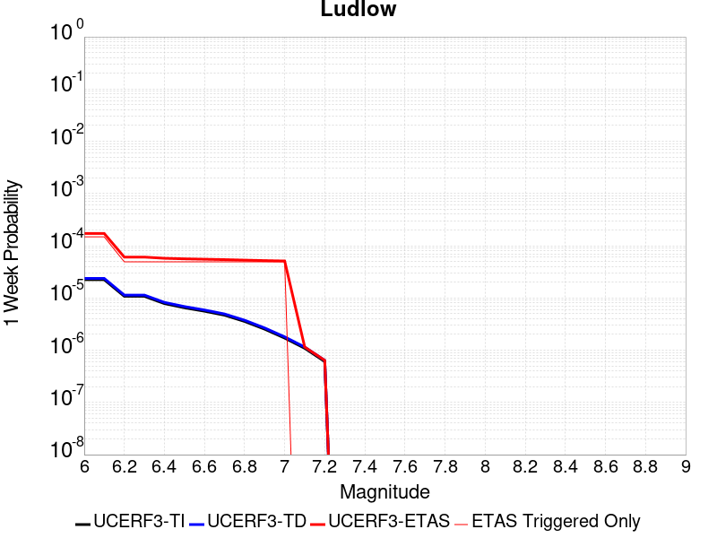 | 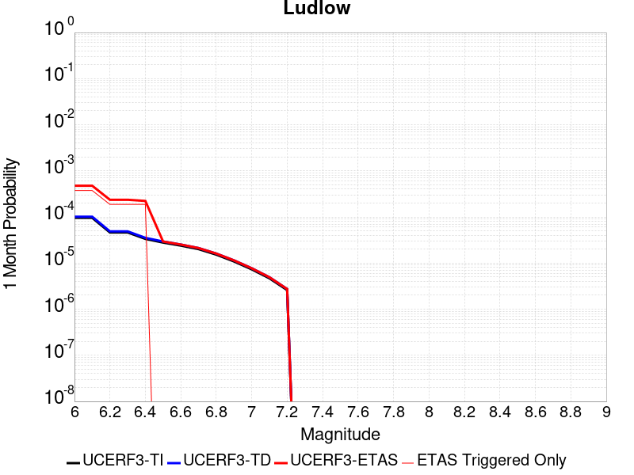 | 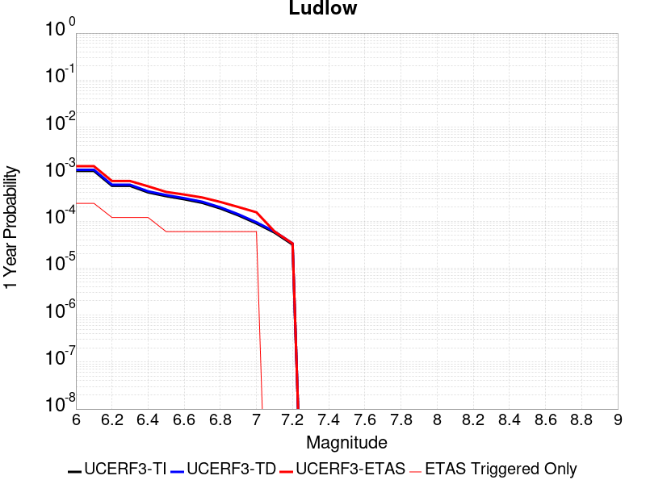 | 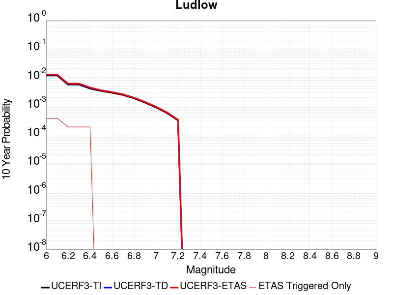 |

| Magnitude | 1 wk TI Prob | 1 wk TD Prob | 1 wk ETAS Prob | 1 wk ETAS/TD Gain | 1 wk ETAS Triggered Only | 1 mo TI Prob | 1 mo TD Prob | 1 mo ETAS Prob | 1 mo ETAS/TD Gain | 1 mo ETAS Triggered Only | 1 yr TI Prob | 1 yr TD Prob | 1 yr ETAS Prob | 1 yr ETAS/TD Gain | 1 yr ETAS Triggered Only | 10 yr TI Prob | 10 yr TD Prob | 10 yr ETAS Prob | 10 yr ETAS/TD Gain | 10 yr ETAS Triggered Only |
|-----|-----|-----|-----|-----|-----|-----|-----|-----|-----|-----|-----|-----|-----|-----|-----|-----|-----|-----|-----|-----|
| 6.0 | 2.2407607E-5 | 2.3657254E-5 | 1.3365466E-4 | 5.6496267 | 1.1E-4 | 9.602906E-5 | 1.0138454E-4 | 2.5136932E-4 | 2.4793656 | 1.5E-4 | 0.0011685267 | 0.001233702 | 0.0014534305 | 1.1781051 | 2.2E-4 | 0.011624013 | 0.012273042 | 0.012589115 | 1.0257534 | 3.2E-4 |
| 6.1 | 2.2407607E-5 | 2.3657254E-5 | 1.3365466E-4 | 5.6496267 | 1.1E-4 | 9.602906E-5 | 1.0138454E-4 | 2.5136932E-4 | 2.4793656 | 1.5E-4 | 0.0011685267 | 0.001233702 | 0.0014534305 | 1.1781051 | 2.2E-4 | 0.011624013 | 0.012273042 | 0.012589115 | 1.0257534 | 3.2E-4 |
| 6.2 | 1.0781252E-5 | 1.1365663E-5 | 8.1364866E-5 | 7.158831 | 7.0E-5 | 4.620455E-5 | 4.8709102E-5 | 1.5870374E-4 | 3.258195 | 1.1E-4 | 5.623952E-4 | 5.9287593E-4 | 7.4278703E-4 | 1.252854 | 1.5E-4 | 0.00560974 | 0.0059133614 | 0.006102238 | 1.0319406 | 1.9E-4 |
| 6.3 | 1.0781252E-5 | 1.1365663E-5 | 8.1364866E-5 | 7.158831 | 7.0E-5 | 4.620455E-5 | 4.8709102E-5 | 1.5870374E-4 | 3.258195 | 1.1E-4 | 5.623952E-4 | 5.9287593E-4 | 7.4278703E-4 | 1.252854 | 1.5E-4 | 0.00560974 | 0.0059133614 | 0.006102238 | 1.0319406 | 1.9E-4 |
| 6.4 | 7.814439E-6 | 8.237729E-6 | 5.8237318E-5 | 7.0695844 | 5.0E-5 | 3.3490025E-5 | 3.530408E-5 | 1.15301256E-4 | 3.2659469 | 8.0E-5 | 4.0766477E-4 | 4.2974384E-4 | 5.197052E-4 | 1.2093371 | 9.0E-5 | 0.0040691774 | 0.0042892746 | 0.0043788883 | 1.0208926 | 9.0E-5 |
| 6.5 | 6.4986366E-6 | 6.85092E-6 | 3.6850714E-5 | 5.3789444 | 3.0E-5 | 2.7851002E-5 | 2.9360759E-5 | 7.935929E-5 | 2.7029033 | 5.0E-5 | 3.390332E-4 | 3.5740953E-4 | 4.0739166E-4 | 1.1398455 | 5.0E-5 | 0.003385164 | 0.0035684432 | 0.0036182648 | 1.0139617 | 5.0E-5 |
| 6.6 | 5.582177E-6 | 5.8860055E-6 | 3.588583E-5 | 6.096805 | 3.0E-5 | 2.3923398E-5 | 2.5225498E-5 | 7.5224234E-5 | 2.9820714 | 5.0E-5 | 2.9122844E-4 | 3.0707786E-4 | 3.5706253E-4 | 1.1627752 | 5.0E-5 | 0.0029084706 | 0.003066609 | 0.0031164556 | 1.0162547 | 5.0E-5 |
| 6.7 | 4.6858763E-6 | 4.940427E-6 | 2.494033E-5 | 5.048213 | 2.0E-5 | 2.0082172E-5 | 2.1173091E-5 | 6.117224E-5 | 2.8891504 | 4.0E-5 | 2.4447302E-4 | 2.5775246E-4 | 2.9774214E-4 | 1.1551477 | 4.0E-5 | 0.0024420423 | 0.0025745912 | 0.0026144884 | 1.0154965 | 4.0E-5 |
| 6.8 | 3.5584908E-6 | 3.7520183E-6 | 2.3751943E-5 | 6.3304443 | 2.0E-5 | 1.5250586E-5 | 1.6079981E-5 | 4.6079498E-5 | 2.8656437 | 3.0E-5 | 1.8566006E-4 | 1.957566E-4 | 2.2575073E-4 | 1.1532215 | 3.0E-5 | 0.0018550502 | 0.0019558826 | 0.001985824 | 1.0153084 | 3.0E-5 |
| 6.9 | 2.532834E-6 | 2.6710034E-6 | 2.267095E-5 | 8.4878025 | 2.0E-5 | 1.0854958E-5 | 1.1447109E-5 | 3.144688E-5 | 2.7471461 | 2.0E-5 | 1.3215111E-4 | 1.3935992E-4 | 1.5935714E-4 | 1.1434933 | 2.0E-5 | 0.0013207254 | 0.0013927529 | 0.001412725 | 1.01434 | 2.0E-5 |
| 7.0 | 1.7083285E-6 | 1.8019439E-6 | 2.1801909E-5 | 12.099105 | 2.0E-5 | 7.3213873E-6 | 7.722595E-6 | 2.772244E-5 | 3.5897832 | 2.0E-5 | 8.913424E-5 | 9.40187E-5 | 1.1401682E-4 | 1.2127036 | 2.0E-5 | 8.9098496E-4 | 9.3980576E-4 | 9.5978694E-4 | 1.021261 | 2.0E-5 |
| 7.1 | 1.0905424E-6 | 1.1497619E-6 | 1.114975E-5 | 9.697442 | 1.0E-5 | 4.6737446E-6 | 4.9275427E-6 | 1.4927493E-5 | 3.0293992 | 1.0E-5 | 5.6901354E-5 | 5.999128E-5 | 6.999068E-5 | 1.1666809 | 1.0E-5 | 5.6886784E-4 | 5.997606E-4 | 6.0975464E-4 | 1.0166633 | 1.0E-5 |
| 7.2 | 6.06668E-7 | 6.387277E-7 | 1.06387215E-5 | 16.656113 | 1.0E-5 | 2.600003E-6 | 2.7374022E-6 | 1.2737375E-5 | 4.6530886 | 1.0E-5 | 3.1654577E-5 | 3.3327433E-5 | 4.3327098E-5 | 1.3000431 | 1.0E-5 | 3.1650066E-4 | 3.3323118E-4 | 3.4322785E-4 | 1.0299993 | 1.0E-5 |

## Calico-Hidalgo
*[(top)](#table-of-contents)*

| 1 Week | 1 Month | 1 Year | 10 Year |
|-----|-----|-----|-----|
| 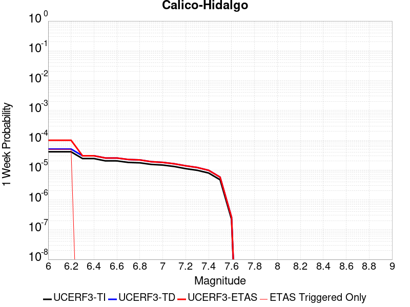 | 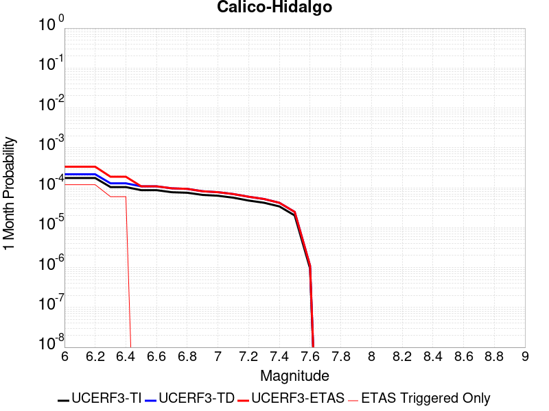 | 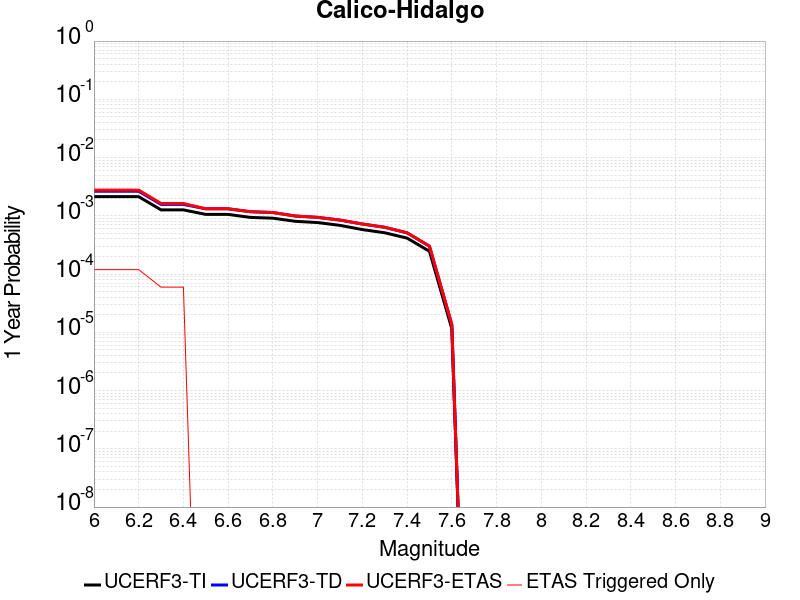 | 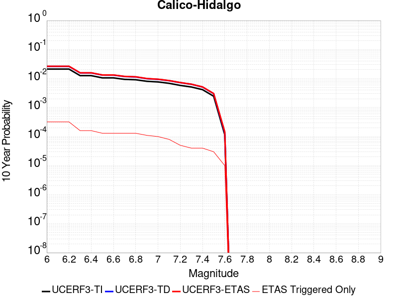 |

| Magnitude | 1 wk TI Prob | 1 wk TD Prob | 1 wk ETAS Prob | 1 wk ETAS/TD Gain | 1 wk ETAS Triggered Only | 1 mo TI Prob | 1 mo TD Prob | 1 mo ETAS Prob | 1 mo ETAS/TD Gain | 1 mo ETAS Triggered Only | 1 yr TI Prob | 1 yr TD Prob | 1 yr ETAS Prob | 1 yr ETAS/TD Gain | 1 yr ETAS Triggered Only | 10 yr TI Prob | 10 yr TD Prob | 10 yr ETAS Prob | 10 yr ETAS/TD Gain | 10 yr ETAS Triggered Only |
|-----|-----|-----|-----|-----|-----|-----|-----|-----|-----|-----|-----|-----|-----|-----|-----|-----|-----|-----|-----|-----|
| 6.0 | 4.0906612E-5 | 5.0704355E-5 | 1.6069878E-4 | 3.169329 | 1.1E-4 | 1.7530227E-4 | 2.1728857E-4 | 3.4726033E-4 | 1.5981528 | 1.3E-4 | 0.0021322158 | 0.002642678 | 0.0028620968 | 1.0830289 | 2.2E-4 | 0.02111873 | 0.026152814 | 0.026464446 | 1.0119158 | 3.2E-4 |
| 6.1 | 4.0906612E-5 | 5.0704355E-5 | 1.6069878E-4 | 3.169329 | 1.1E-4 | 1.7530227E-4 | 2.1728857E-4 | 3.4726033E-4 | 1.5981528 | 1.3E-4 | 0.0021322158 | 0.002642678 | 0.0028620968 | 1.0830289 | 2.2E-4 | 0.02111873 | 0.026152814 | 0.026464446 | 1.0119158 | 3.2E-4 |
| 6.2 | 4.0906612E-5 | 5.0704355E-5 | 1.6069878E-4 | 3.169329 | 1.1E-4 | 1.7530227E-4 | 2.1728857E-4 | 3.4726033E-4 | 1.5981528 | 1.3E-4 | 0.0021322158 | 0.002642678 | 0.0028620968 | 1.0830289 | 2.2E-4 | 0.02111873 | 0.026152814 | 0.026464446 | 1.0119158 | 3.2E-4 |
| 6.3 | 2.4242801E-5 | 3.0090967E-5 | 7.0089765E-5 | 2.3292625 | 4.0E-5 | 1.0389358E-4 | 1.289551E-4 | 1.7894866E-4 | 1.3876818 | 5.0E-5 | 0.0012641704 | 0.0015689312 | 0.0016687743 | 1.0636376 | 1.0E-4 | 0.01257003 | 0.015582229 | 0.015739735 | 1.0101081 | 1.6E-4 |
| 6.4 | 2.4242801E-5 | 3.0090967E-5 | 7.0089765E-5 | 2.3292625 | 4.0E-5 | 1.0389358E-4 | 1.289551E-4 | 1.7894866E-4 | 1.3876818 | 5.0E-5 | 0.0012641704 | 0.0015689312 | 0.0016687743 | 1.0636376 | 1.0E-4 | 0.01257003 | 0.015582229 | 0.015739735 | 1.0101081 | 1.6E-4 |
| 6.5 | 2.0286952E-5 | 2.5316054E-5 | 6.531504E-5 | 2.579985 | 4.0E-5 | 8.694118E-5 | 1.0849296E-4 | 1.4848862E-4 | 1.3686475 | 4.0E-5 | 0.0010579949 | 0.0013201186 | 0.0014000129 | 1.0605206 | 8.0E-5 | 0.010529719 | 0.013124701 | 0.013252994 | 1.009775 | 1.3E-4 |
| 6.6 | 2.0269223E-5 | 2.5297004E-5 | 6.529599E-5 | 2.5811749 | 4.0E-5 | 8.6865206E-5 | 1.08411325E-4 | 1.4840698E-4 | 1.3689251 | 4.0E-5 | 0.0010570707 | 0.0013191258 | 0.0013990202 | 1.0605662 | 8.0E-5 | 0.010520565 | 0.01311489 | 0.013243185 | 1.0097824 | 1.3E-4 |
| 6.7 | 1.799852E-5 | 2.2540933E-5 | 6.2540035E-5 | 2.7745094 | 4.0E-5 | 7.713423E-5 | 9.660051E-5 | 1.3659665E-4 | 1.4140365 | 4.0E-5 | 9.3870464E-4 | 0.0011754911 | 0.0012553971 | 1.0679767 | 8.0E-5 | 0.009347493 | 0.011694346 | 0.011822825 | 1.0109864 | 1.3E-4 |
| 6.8 | 1.7458793E-5 | 2.184258E-5 | 6.18417E-5 | 2.8312454 | 4.0E-5 | 7.4821255E-5 | 9.360778E-5 | 1.3360403E-4 | 1.427275 | 4.0E-5 | 9.10568E-4 | 0.0011390933 | 0.0012190022 | 1.0701513 | 8.0E-5 | 0.009068459 | 0.011334131 | 0.011462657 | 1.0113398 | 1.3E-4 |
| 6.9 | 1.542884E-5 | 1.9026285E-5 | 4.9025715E-5 | 2.576736 | 3.0E-5 | 6.612192E-5 | 8.153875E-5 | 1.11536305E-4 | 1.3678932 | 3.0E-5 | 8.04737E-4 | 9.922953E-4 | 0.0010622258 | 1.0704736 | 7.0E-5 | 0.008018291 | 0.009880043 | 0.009988956 | 1.0110235 | 1.1E-4 |
| 7.0 | 1.468253E-5 | 1.803109E-5 | 4.803055E-5 | 2.6637628 | 3.0E-5 | 6.292361E-5 | 7.727389E-5 | 1.07271575E-4 | 1.3881994 | 3.0E-5 | 7.658257E-4 | 9.4041653E-4 | 0.0010003601 | 1.0637416 | 6.0E-5 | 0.0076319184 | 0.009365736 | 0.009464799 | 1.0105772 | 1.0E-4 |
| 7.1 | 1.3139281E-5 | 1.620139E-5 | 3.6201065E-5 | 2.234442 | 2.0E-5 | 5.6309986E-5 | 6.943275E-5 | 8.9431356E-5 | 1.2880285 | 2.0E-5 | 6.853584E-4 | 8.4502844E-4 | 8.9498615E-4 | 1.0591196 | 5.0E-5 | 0.0068324856 | 0.008419449 | 0.008498776 | 1.0094218 | 8.0E-5 |
| 7.2 | 1.1127404E-5 | 1.3867038E-5 | 3.386676E-5 | 2.442249 | 2.0E-5 | 4.7688E-5 | 5.9428872E-5 | 7.9427686E-5 | 1.3365167 | 2.0E-5 | 5.8044674E-4 | 7.233172E-4 | 7.5329555E-4 | 1.0414456 | 3.0E-5 | 0.0057893298 | 0.007210737 | 0.0072603766 | 1.0068841 | 5.0E-5 |
| 7.3 | 9.808154E-6 | 1.2176586E-5 | 3.2176344E-5 | 2.6424766 | 2.0E-5 | 4.2034266E-5 | 5.2184383E-5 | 7.218334E-5 | 1.3832364 | 2.0E-5 | 5.11647E-4 | 6.351704E-4 | 6.6515134E-4 | 1.0472014 | 3.0E-5 | 0.0051047057 | 0.006334625 | 0.006374372 | 1.0062745 | 4.0E-5 |
| 7.4 | 7.942452E-6 | 9.792348E-6 | 2.9792152E-5 | 3.042391 | 2.0E-5 | 3.4038632E-5 | 4.1966585E-5 | 6.1965744E-5 | 1.4765496 | 2.0E-5 | 4.1434157E-4 | 5.108328E-4 | 5.408175E-4 | 1.0586976 | 3.0E-5 | 0.0041356985 | 0.005097527 | 0.0051373234 | 1.0078069 | 4.0E-5 |
| 7.5 | 4.7121216E-6 | 5.7729717E-6 | 2.5772857E-5 | 4.4644003 | 2.0E-5 | 2.019465E-5 | 2.4741115E-5 | 4.474062E-5 | 1.808351 | 2.0E-5 | 2.4584212E-4 | 3.011891E-4 | 3.211831E-4 | 1.0663835 | 2.0E-5 | 0.0024557032 | 0.0030085614 | 0.0030384713 | 1.0099416 | 3.0E-5 |
| 7.6 | 2.21172E-7 | 2.6040198E-7 | 1.0260399E-5 | 39.402157 | 1.0E-5 | 9.478797E-7 | 1.1160082E-6 | 1.1115997E-5 | 9.960498 | 1.0E-5 | 1.1540374E-5 | 1.3587343E-5 | 2.3587207E-5 | 1.7359691 | 1.0E-5 | 1.1539775E-4 | 1.3586794E-4 | 1.4586658E-4 | 1.0735909 | 1.0E-5 |

## San Andreas (Cholame) rev
*[(top)](#table-of-contents)*

| 1 Week | 1 Month | 1 Year | 10 Year |
|-----|-----|-----|-----|
| 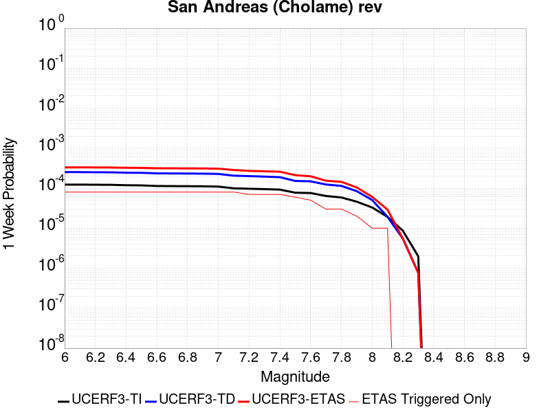 | 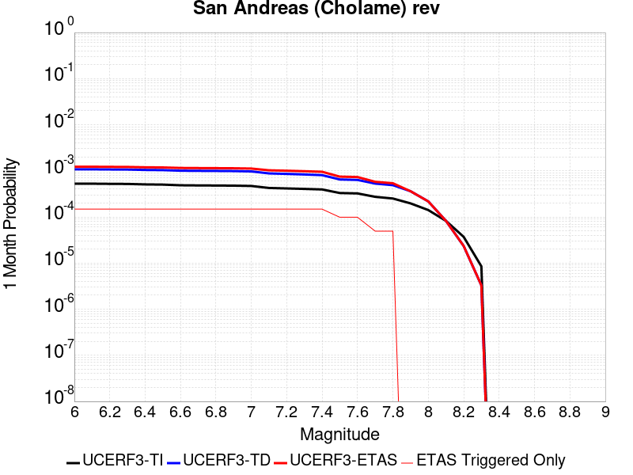 | 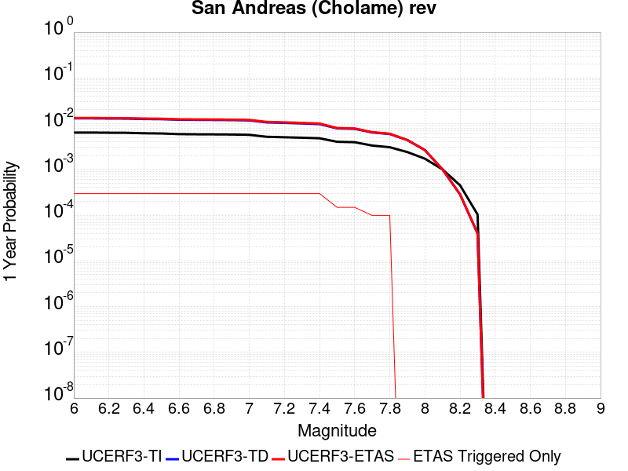 | 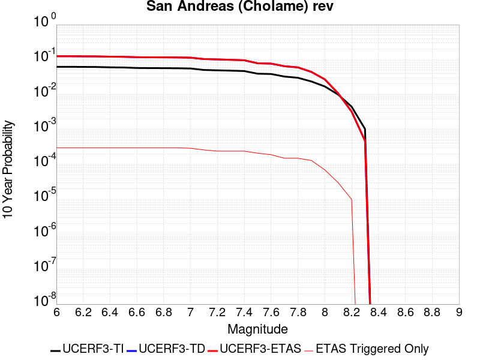 |

| Magnitude | 1 wk TI Prob | 1 wk TD Prob | 1 wk ETAS Prob | 1 wk ETAS/TD Gain | 1 wk ETAS Triggered Only | 1 mo TI Prob | 1 mo TD Prob | 1 mo ETAS Prob | 1 mo ETAS/TD Gain | 1 mo ETAS Triggered Only | 1 yr TI Prob | 1 yr TD Prob | 1 yr ETAS Prob | 1 yr ETAS/TD Gain | 1 yr ETAS Triggered Only | 10 yr TI Prob | 10 yr TD Prob | 10 yr ETAS Prob | 10 yr ETAS/TD Gain | 10 yr ETAS Triggered Only |
|-----|-----|-----|-----|-----|-----|-----|-----|-----|-----|-----|-----|-----|-----|-----|-----|-----|-----|-----|-----|-----|
| 6.0 | 1.2302514E-4 | 2.5205986E-4 | 3.320397E-4 | 1.317305 | 8.0E-5 | 5.27144E-4 | 0.0010798109 | 0.0011896922 | 1.1017597 | 1.1E-4 | 0.0063991086 | 0.013067958 | 0.013294952 | 1.0173703 | 2.3E-4 | 0.06217949 | 0.12438412 | 0.124646805 | 1.0021119 | 3.0E-4 |
| 6.1 | 1.2302514E-4 | 2.5205986E-4 | 3.320397E-4 | 1.317305 | 8.0E-5 | 5.27144E-4 | 0.0010798109 | 0.0011896922 | 1.1017597 | 1.1E-4 | 0.0063991086 | 0.013067958 | 0.013294952 | 1.0173703 | 2.3E-4 | 0.06217949 | 0.12438412 | 0.124646805 | 1.0021119 | 3.0E-4 |
| 6.2 | 1.2203569E-4 | 2.502277E-4 | 3.3020767E-4 | 1.3196288 | 8.0E-5 | 5.2290526E-4 | 0.0010719653 | 0.0011818474 | 1.1025052 | 1.1E-4 | 0.006347804 | 0.012973578 | 0.013200594 | 1.0174984 | 2.3E-4 | 0.061695136 | 0.123571314 | 0.12383424 | 1.0021278 | 3.0E-4 |
| 6.3 | 1.2142645E-4 | 2.4908737E-4 | 3.2906746E-4 | 1.3210925 | 8.0E-5 | 5.202953E-4 | 0.0010670823 | 0.0011769648 | 1.1029749 | 1.1E-4 | 0.006316212 | 0.012914834 | 0.013141863 | 1.017579 | 2.3E-4 | 0.06139677 | 0.12306532 | 0.1233284 | 1.0021378 | 3.0E-4 |
| 6.4 | 1.1865206E-4 | 2.4414246E-4 | 3.2412293E-4 | 1.3275975 | 8.0E-5 | 5.0840975E-4 | 0.0010459068 | 0.0011557918 | 1.1050619 | 1.1E-4 | 0.006172335 | 0.012660044 | 0.012887132 | 1.0179374 | 2.3E-4 | 0.060036868 | 0.12085904 | 0.121122785 | 1.0021822 | 3.0E-4 |
| 6.5 | 1.17443946E-4 | 2.4207575E-4 | 3.2205638E-4 | 1.3303951 | 8.0E-5 | 5.032341E-4 | 0.0010370566 | 0.0011469425 | 1.1059594 | 1.1E-4 | 0.006109677 | 0.012553536 | 0.012780649 | 1.0180916 | 2.3E-4 | 0.059444077 | 0.11993008 | 0.1201941 | 1.0022014 | 3.0E-4 |
| 6.6 | 1.13579066E-4 | 2.3516564E-4 | 3.151468E-4 | 1.3401058 | 8.0E-5 | 4.866766E-4 | 0.001007465 | 0.0011173541 | 1.109075 | 1.1E-4 | 0.0059092017 | 0.012197345 | 0.012424539 | 1.0186266 | 2.3E-4 | 0.057545185 | 0.1168492 | 0.11711414 | 1.0022674 | 3.0E-4 |
| 6.7 | 1.1271412E-4 | 2.336088E-4 | 3.135901E-4 | 1.3423729 | 8.0E-5 | 4.829711E-4 | 0.001000798 | 0.0011106879 | 1.1098022 | 1.1E-4 | 0.005864331 | 0.012117079 | 0.012344292 | 1.0187515 | 2.3E-4 | 0.057119697 | 0.11615275 | 0.11641791 | 1.0022829 | 3.0E-4 |
| 6.8 | 1.1217975E-4 | 2.3249313E-4 | 3.1247453E-4 | 1.3440162 | 8.0E-5 | 4.8068175E-4 | 9.960202E-4 | 0.0011059105 | 1.1103295 | 1.1E-4 | 0.005836608 | 0.012059555 | 0.012286781 | 1.018842 | 2.3E-4 | 0.056856725 | 0.11565061 | 0.11591592 | 1.0022941 | 3.0E-4 |
| 6.9 | 1.1146753E-4 | 2.3098059E-4 | 3.1096212E-4 | 1.3462695 | 8.0E-5 | 4.7763053E-4 | 9.895428E-4 | 0.0010994339 | 1.1110524 | 1.1E-4 | 0.0057996577 | 0.011981564 | 0.012208808 | 1.0189662 | 2.3E-4 | 0.056506127 | 0.11497027 | 0.115235776 | 1.0023093 | 3.0E-4 |
| 7.0 | 1.0965793E-4 | 2.2721413E-4 | 3.0719594E-4 | 1.3520108 | 8.0E-5 | 4.698779E-4 | 9.734129E-4 | 0.0010833058 | 1.1128944 | 1.1E-4 | 0.005705768 | 0.011787324 | 0.012014613 | 1.0192825 | 2.3E-4 | 0.055614736 | 0.11327011 | 0.11352727 | 1.0022702 | 2.9E-4 |
| 7.1 | 9.927982E-5 | 2.0540332E-4 | 2.853869E-4 | 1.3893976 | 8.0E-5 | 4.2541555E-4 | 8.8000396E-4 | 9.899072E-4 | 1.1248895 | 1.1E-4 | 0.0051671406 | 0.010661708 | 0.0108694695 | 1.0194867 | 2.1E-4 | 0.05048634 | 0.10336573 | 0.103598855 | 1.0022553 | 2.6E-4 |
| 7.2 | 9.696786E-5 | 2.0044584E-4 | 2.704318E-4 | 1.3491515 | 7.0E-5 | 4.1551032E-4 | 8.587718E-4 | 9.586859E-4 | 1.1163454 | 1.0E-4 | 0.00504711 | 0.010405703 | 0.010593726 | 1.0180693 | 1.9E-4 | 0.04934009 | 0.10110233 | 0.10131807 | 1.0021338 | 2.4E-4 |
| 7.3 | 9.4727984E-5 | 1.9473763E-4 | 2.64724E-4 | 1.359388 | 7.0E-5 | 4.0591392E-4 | 8.343239E-4 | 9.342404E-4 | 1.1197575 | 1.0E-4 | 0.0049308087 | 0.010110851 | 0.01029893 | 1.0186017 | 1.9E-4 | 0.048228268 | 0.09847412 | 0.09869049 | 1.0021971 | 2.4E-4 |
| 7.4 | 9.220358E-5 | 1.8844259E-4 | 2.5842938E-4 | 1.371396 | 7.0E-5 | 3.9509835E-4 | 8.07362E-4 | 9.072813E-4 | 1.1237602 | 1.0E-4 | 0.004799717 | 0.009785578 | 0.009973719 | 1.0192263 | 1.9E-4 | 0.046973653 | 0.09555831 | 0.09577537 | 1.0022715 | 2.4E-4 |
| 7.5 | 7.71631E-5 | 1.5179155E-4 | 2.1178245E-4 | 1.395219 | 6.0E-5 | 3.306571E-4 | 6.5037323E-4 | 7.4031466E-4 | 1.1382921 | 9.0E-5 | 0.0040183207 | 0.007889617 | 0.008048355 | 1.0201198 | 1.6E-4 | 0.03946433 | 0.078289196 | 0.078482755 | 1.0024724 | 2.1E-4 |
| 7.6 | 7.5634416E-5 | 1.4838556E-4 | 1.9837814E-4 | 1.33691 | 5.0E-5 | 3.241072E-4 | 6.357833E-4 | 7.057388E-4 | 1.1100304 | 7.0E-5 | 0.0039388672 | 0.007713256 | 0.007852176 | 1.0180106 | 1.4E-4 | 0.038697794 | 0.076654874 | 0.07683031 | 1.0022887 | 1.9E-4 |
| 7.7 | 6.3783E-5 | 1.2359623E-4 | 1.5359253E-4 | 1.2426958 | 3.0E-5 | 2.7332708E-4 | 5.2959064E-4 | 5.7956413E-4 | 1.0943625 | 5.0E-5 | 0.0033226798 | 0.0064287307 | 0.0065280874 | 1.0154551 | 1.0E-4 | 0.032734364 | 0.06454488 | 0.064685196 | 1.002174 | 1.5E-4 |
| 7.8 | 5.863422E-5 | 1.14169685E-4 | 1.4416626E-4 | 1.2627368 | 3.0E-5 | 2.512653E-4 | 4.892069E-4 | 5.3918245E-4 | 1.1021563 | 5.0E-5 | 0.003054864 | 0.0059398497 | 0.0060392558 | 1.0167354 | 1.0E-4 | 0.030132094 | 0.05966162 | 0.05980267 | 1.0023642 | 1.5E-4 |
| 7.9 | 4.595283E-5 | 8.426815E-5 | 1.04266466E-4 | 1.2373176 | 2.0E-5 | 1.9692584E-4 | 3.6109926E-4 | 4.010848E-4 | 1.1107329 | 4.0E-5 | 0.0023949358 | 0.0043875277 | 0.0044671767 | 1.0181535 | 8.0E-5 | 0.023692891 | 0.044363137 | 0.044487372 | 1.0028003 | 1.3E-4 |
| 8.0 | 3.2950178E-5 | 5.077396E-5 | 6.0773455E-5 | 1.1969414 | 1.0E-5 | 1.412074E-4 | 2.1758456E-4 | 2.375802E-4 | 1.0918983 | 2.0E-5 | 0.0017178444 | 0.0026458753 | 0.0026857695 | 1.0150778 | 4.0E-5 | 0.017046256 | 0.027181072 | 0.02724917 | 1.0025053 | 7.0E-5 |
| 8.1 | 1.9177472E-5 | 1.9183733E-5 | 2.9183542E-5 | 1.5212649 | 1.0E-5 | 8.218658E-5 | 8.221342E-5 | 9.221259E-5 | 1.1216247 | 1.0E-5 | 0.0010001622 | 0.0010004893 | 0.0010204694 | 1.0199702 | 2.0E-5 | 0.009956728 | 0.010757887 | 0.010787563 | 1.0027586 | 3.0E-5 |
| 8.2 | 8.643924E-6 | 5.473668E-6 | 5.473668E-6 | 1.0 | 0.0 | 3.704486E-5 | 2.3458366E-5 | 2.3458366E-5 | 1.0 | 0.0 | 4.5092785E-4 | 2.8556827E-4 | 2.955654E-4 | 1.035008 | 1.0E-5 | 0.0045001395 | 0.0032481793 | 0.003258147 | 1.0030687 | 1.0E-5 |
| 8.3 | 1.983087E-6 | 7.6564595E-7 | 7.6564595E-7 | 1.0 | 0.0 | 8.498917E-6 | 3.281336E-6 | 3.281336E-6 | 1.0 | 0.0 | 1.034694E-4 | 3.9949547E-5 | 3.9949547E-5 | 1.0 | 0.0 | 0.0010342124 | 4.717979E-4 | 4.717979E-4 | 1.0 | 0.0 |

## Manix-Afton Hills
*[(top)](#table-of-contents)*

| 1 Week | 1 Month | 1 Year | 10 Year |
|-----|-----|-----|-----|
| 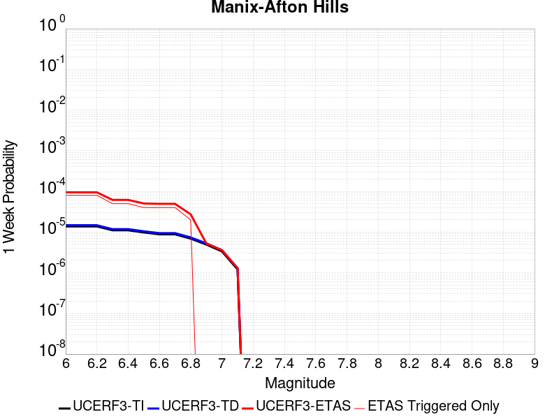 | 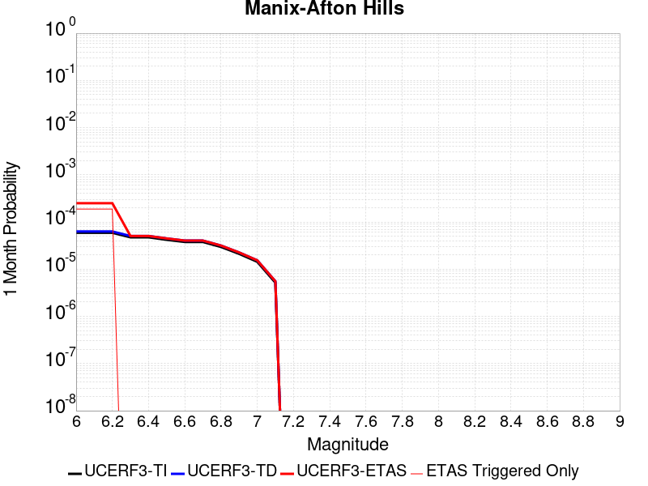 | 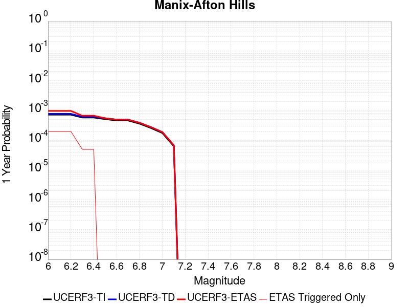 | 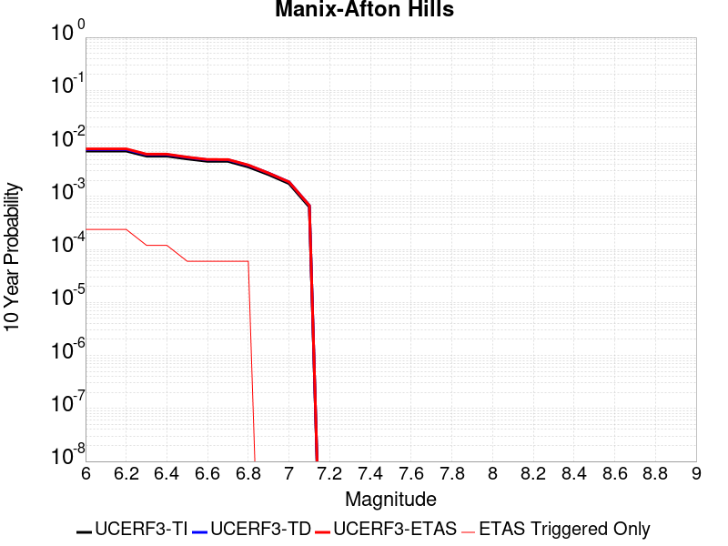 |

| Magnitude | 1 wk TI Prob | 1 wk TD Prob | 1 wk ETAS Prob | 1 wk ETAS/TD Gain | 1 wk ETAS Triggered Only | 1 mo TI Prob | 1 mo TD Prob | 1 mo ETAS Prob | 1 mo ETAS/TD Gain | 1 mo ETAS Triggered Only | 1 yr TI Prob | 1 yr TD Prob | 1 yr ETAS Prob | 1 yr ETAS/TD Gain | 1 yr ETAS Triggered Only | 10 yr TI Prob | 10 yr TD Prob | 10 yr ETAS Prob | 10 yr ETAS/TD Gain | 10 yr ETAS Triggered Only |
|-----|-----|-----|-----|-----|-----|-----|-----|-----|-----|-----|-----|-----|-----|-----|-----|-----|-----|-----|-----|-----|
| 6.0 | 1.3783202E-5 | 1.47110895E-5 | 9.470991E-5 | 6.4379945 | 8.0E-5 | 5.906953E-5 | 6.30461E-5 | 1.630398E-4 | 2.586041 | 1.0E-4 | 7.189342E-4 | 7.6733343E-4 | 9.4719534E-4 | 1.2343986 | 1.8E-4 | 0.0071661277 | 0.007648596 | 0.007936378 | 1.0376254 | 2.9E-4 |
| 6.1 | 1.3783202E-5 | 1.47110895E-5 | 9.470991E-5 | 6.4379945 | 8.0E-5 | 5.906953E-5 | 6.30461E-5 | 1.630398E-4 | 2.586041 | 1.0E-4 | 7.189342E-4 | 7.6733343E-4 | 9.4719534E-4 | 1.2343986 | 1.8E-4 | 0.0071661277 | 0.007648596 | 0.007936378 | 1.0376254 | 2.9E-4 |
| 6.2 | 1.3783202E-5 | 1.47110895E-5 | 9.470991E-5 | 6.4379945 | 8.0E-5 | 5.906953E-5 | 6.30461E-5 | 1.630398E-4 | 2.586041 | 1.0E-4 | 7.189342E-4 | 7.6733343E-4 | 9.4719534E-4 | 1.2343986 | 1.8E-4 | 0.0071661277 | 0.007648596 | 0.007936378 | 1.0376254 | 2.9E-4 |
| 6.3 | 1.10494875E-5 | 1.1793136E-5 | 6.179255E-5 | 5.2397046 | 5.0E-5 | 4.7354086E-5 | 5.054109E-5 | 1.2053755E-4 | 2.3849418 | 7.0E-5 | 5.763835E-4 | 6.151744E-4 | 7.351006E-4 | 1.1949466 | 1.2E-4 | 0.005748908 | 0.0061357557 | 0.006344467 | 1.0340157 | 2.1E-4 |
| 6.4 | 1.10494875E-5 | 1.1793136E-5 | 6.179255E-5 | 5.2397046 | 5.0E-5 | 4.7354086E-5 | 5.054109E-5 | 1.2053755E-4 | 2.3849418 | 7.0E-5 | 5.763835E-4 | 6.151744E-4 | 7.351006E-4 | 1.1949466 | 1.2E-4 | 0.005748908 | 0.0061357557 | 0.006344467 | 1.0340157 | 2.1E-4 |
| 6.5 | 9.788949E-6 | 1.045432E-5 | 5.0453902E-5 | 4.8261294 | 4.0E-5 | 4.1951964E-5 | 4.480351E-5 | 8.4801715E-5 | 1.8927472 | 4.0E-5 | 5.1064545E-4 | 5.453555E-4 | 6.2531186E-4 | 1.1466134 | 8.0E-5 | 0.0050947363 | 0.0054410985 | 0.0056101736 | 1.0310737 | 1.7E-4 |
| 6.6 | 8.810006E-6 | 9.4136285E-6 | 4.941325E-5 | 5.249119 | 4.0E-5 | 3.775662E-5 | 4.0343548E-5 | 8.034193E-5 | 1.9914445 | 4.0E-5 | 4.5958988E-4 | 4.9108086E-4 | 5.610465E-4 | 1.1424727 | 7.0E-5 | 0.0045864056 | 0.004900839 | 0.005030202 | 1.026396 | 1.3E-4 |
| 6.7 | 8.80128E-6 | 9.404108E-6 | 4.940373E-5 | 5.2534204 | 4.0E-5 | 3.7719226E-5 | 4.0302748E-5 | 8.0301135E-5 | 1.9924482 | 4.0E-5 | 4.591348E-4 | 4.9058435E-4 | 5.6055E-4 | 1.142617 | 7.0E-5 | 0.004581874 | 0.0048958957 | 0.005025259 | 1.0264229 | 1.3E-4 |
| 6.8 | 6.8994877E-6 | 7.380076E-6 | 2.7379929E-5 | 3.7099793 | 2.0E-5 | 2.9568899E-5 | 3.162856E-5 | 5.162793E-5 | 1.6323199 | 2.0E-5 | 3.5994186E-4 | 3.8501783E-4 | 4.349986E-4 | 1.1298141 | 5.0E-5 | 0.003593594 | 0.0038443129 | 0.003924005 | 1.02073 | 8.0E-5 |
| 6.9 | 4.9328037E-6 | 5.2709615E-6 | 5.2709615E-6 | 1.0 | 0.0 | 2.1140417E-5 | 2.2589675E-5 | 3.2589447E-5 | 1.4426701 | 1.0E-5 | 2.5735417E-4 | 2.7500073E-4 | 3.0499249E-4 | 1.1090606 | 3.0E-5 | 0.0025705635 | 0.0027472095 | 0.002797072 | 1.0181503 | 5.0E-5 |
| 7.0 | 3.347973E-6 | 3.59003E-6 | 3.59003E-6 | 1.0 | 0.0 | 1.4348378E-5 | 1.5385775E-5 | 2.5385621E-5 | 1.649941 | 1.0E-5 | 1.746775E-4 | 1.8730981E-4 | 2.173042E-4 | 1.1601324 | 3.0E-5 | 0.0017454025 | 0.0018719219 | 0.0019018658 | 1.0159963 | 3.0E-5 |
| 7.1 | 1.2073567E-6 | 1.293482E-6 | 1.293482E-6 | 1.0 | 0.0 | 5.1743755E-6 | 5.543492E-6 | 5.543492E-6 | 1.0 | 0.0 | 6.29962E-5 | 6.749156E-5 | 7.7490884E-5 | 1.1481566 | 1.0E-5 | 6.297835E-4 | 6.7487074E-4 | 6.84864E-4 | 1.0148077 | 1.0E-5 |

## San Jacinto (San Bernardino)
*[(top)](#table-of-contents)*

| 1 Week | 1 Month | 1 Year | 10 Year |
|-----|-----|-----|-----|
| 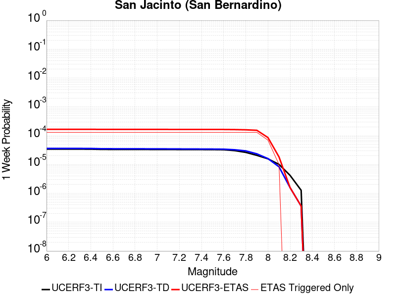 | 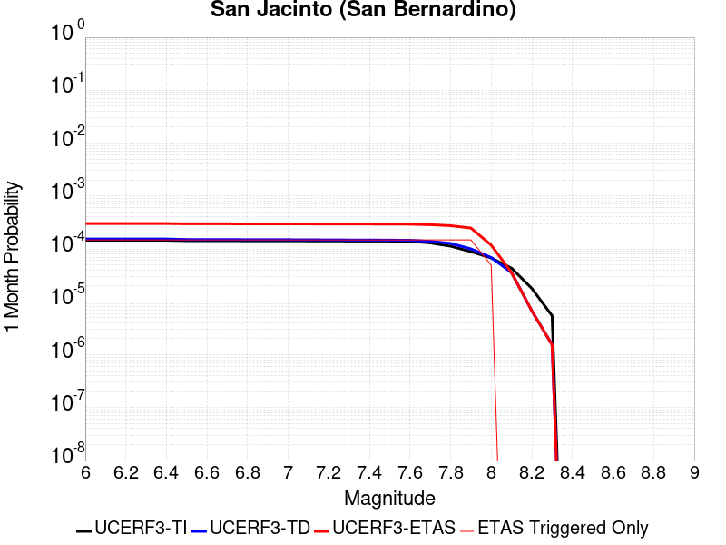 | 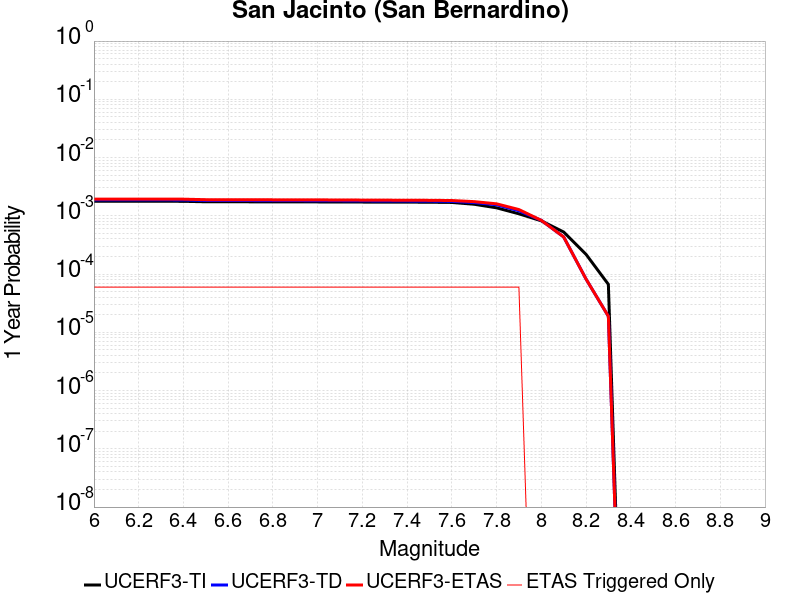 | 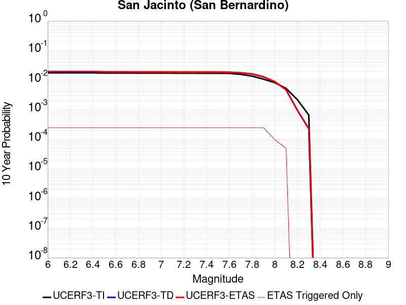 |

| Magnitude | 1 wk TI Prob | 1 wk TD Prob | 1 wk ETAS Prob | 1 wk ETAS/TD Gain | 1 wk ETAS Triggered Only | 1 mo TI Prob | 1 mo TD Prob | 1 mo ETAS Prob | 1 mo ETAS/TD Gain | 1 mo ETAS Triggered Only | 1 yr TI Prob | 1 yr TD Prob | 1 yr ETAS Prob | 1 yr ETAS/TD Gain | 1 yr ETAS Triggered Only | 10 yr TI Prob | 10 yr TD Prob | 10 yr ETAS Prob | 10 yr ETAS/TD Gain | 10 yr ETAS Triggered Only |
|-----|-----|-----|-----|-----|-----|-----|-----|-----|-----|-----|-----|-----|-----|-----|-----|-----|-----|-----|-----|-----|
| 6.0 | 3.409352E-5 | 3.598562E-5 | 1.6598093E-4 | 4.6124244 | 1.3E-4 | 1.461069E-4 | 1.5421498E-4 | 3.141903E-4 | 2.0373528 | 1.6E-4 | 0.0017774 | 0.0018759521 | 0.0021155018 | 1.1276951 | 2.4E-4 | 0.01763251 | 0.019349992 | 0.019624574 | 1.0141903 | 2.8E-4 |
| 6.1 | 3.409352E-5 | 3.598562E-5 | 1.6598093E-4 | 4.6124244 | 1.3E-4 | 1.461069E-4 | 1.5421498E-4 | 3.141903E-4 | 2.0373528 | 1.6E-4 | 0.0017774 | 0.0018759521 | 0.0021155018 | 1.1276951 | 2.4E-4 | 0.01763251 | 0.019349992 | 0.019624574 | 1.0141903 | 2.8E-4 |
| 6.2 | 3.409352E-5 | 3.598562E-5 | 1.6598093E-4 | 4.6124244 | 1.3E-4 | 1.461069E-4 | 1.5421498E-4 | 3.141903E-4 | 2.0373528 | 1.6E-4 | 0.0017774 | 0.0018759521 | 0.0021155018 | 1.1276951 | 2.4E-4 | 0.01763251 | 0.019349992 | 0.019624574 | 1.0141903 | 2.8E-4 |
| 6.3 | 3.409352E-5 | 3.598562E-5 | 1.6598093E-4 | 4.6124244 | 1.3E-4 | 1.461069E-4 | 1.5421498E-4 | 3.141903E-4 | 2.0373528 | 1.6E-4 | 0.0017774 | 0.0018759521 | 0.0021155018 | 1.1276951 | 2.4E-4 | 0.01763251 | 0.019349992 | 0.019624574 | 1.0141903 | 2.8E-4 |
| 6.4 | 3.400795E-5 | 3.5878285E-5 | 1.6587361E-4 | 4.623232 | 1.3E-4 | 1.4574021E-4 | 1.5375503E-4 | 3.1373042E-4 | 2.0404563 | 1.6E-4 | 0.0017729428 | 0.0018703619 | 0.002109913 | 1.1280774 | 2.4E-4 | 0.017588645 | 0.019295074 | 0.019569673 | 1.0142314 | 2.8E-4 |
| 6.5 | 3.341482E-5 | 3.5138914E-5 | 1.6513435E-4 | 4.699472 | 1.3E-4 | 1.4319851E-4 | 1.5058667E-4 | 3.1056258E-4 | 2.062351 | 1.6E-4 | 0.0017420477 | 0.0018318522 | 0.0020714125 | 1.130775 | 2.4E-4 | 0.017284546 | 0.018916616 | 0.01919132 | 1.0145218 | 2.8E-4 |
| 6.6 | 3.3364955E-5 | 3.5076133E-5 | 1.6507157E-4 | 4.706094 | 1.3E-4 | 1.4298483E-4 | 1.5031763E-4 | 3.1029357E-4 | 2.0642529 | 1.6E-4 | 0.0017394501 | 0.0018285823 | 0.0020581617 | 1.1255505 | 2.3E-4 | 0.017258976 | 0.01888448 | 0.019149382 | 1.0140275 | 2.7E-4 |
| 6.7 | 3.335922E-5 | 3.5065907E-5 | 1.6506134E-4 | 4.707175 | 1.3E-4 | 1.4296026E-4 | 1.5027382E-4 | 3.1024977E-4 | 2.064563 | 1.6E-4 | 0.0017391514 | 0.0018280497 | 0.0020576292 | 1.1255871 | 2.3E-4 | 0.017256035 | 0.018879272 | 0.019144174 | 1.0140314 | 2.7E-4 |
| 6.8 | 3.327683E-5 | 3.4959972E-5 | 1.6495543E-4 | 4.7184086 | 1.3E-4 | 1.4260718E-4 | 1.4981985E-4 | 3.097959E-4 | 2.0677893 | 1.6E-4 | 0.0017348597 | 0.001822532 | 0.002052113 | 1.1259681 | 2.3E-4 | 0.017213784 | 0.018825045 | 0.019089961 | 1.0140725 | 2.7E-4 |
| 6.9 | 3.3235785E-5 | 3.4900928E-5 | 1.648964E-4 | 4.7246995 | 1.3E-4 | 1.4243131E-4 | 1.4956683E-4 | 3.095429E-4 | 2.0695958 | 1.6E-4 | 0.0017327217 | 0.0018194567 | 0.0020490382 | 1.1261814 | 2.3E-4 | 0.017192734 | 0.018794911 | 0.019059837 | 1.0140955 | 2.7E-4 |
| 7.0 | 3.3197095E-5 | 3.4840854E-5 | 1.6483632E-4 | 4.7311215 | 1.3E-4 | 1.422655E-4 | 1.4930942E-4 | 3.0928553E-4 | 2.0714402 | 1.6E-4 | 0.0017307063 | 0.0018163278 | 0.00204591 | 1.1263992 | 2.3E-4 | 0.017172894 | 0.01876429 | 0.019029222 | 1.014119 | 2.7E-4 |
| 7.1 | 3.3129716E-5 | 3.4721066E-5 | 1.6471655E-4 | 4.7439947 | 1.3E-4 | 1.4197677E-4 | 1.4879608E-4 | 3.087723E-4 | 2.0751371 | 1.6E-4 | 0.0017271966 | 0.0018100884 | 0.002039672 | 1.1268356 | 2.3E-4 | 0.017138338 | 0.018703366 | 0.018968316 | 1.0141659 | 2.7E-4 |
| 7.2 | 3.3034008E-5 | 3.4588513E-5 | 1.6458401E-4 | 4.758343 | 1.3E-4 | 1.4156665E-4 | 1.4822806E-4 | 3.0820435E-4 | 2.0792577 | 1.6E-4 | 0.0017222111 | 0.0018031843 | 0.0020327696 | 1.1273221 | 2.3E-4 | 0.017089253 | 0.01863575 | 0.018900719 | 1.0142183 | 2.7E-4 |
| 7.3 | 3.2956614E-5 | 3.4456265E-5 | 1.6445179E-4 | 4.7727685 | 1.3E-4 | 1.4123498E-4 | 1.4766137E-4 | 3.0763773E-4 | 2.0834002 | 1.6E-4 | 0.0017181796 | 0.0017962961 | 0.002025883 | 1.1278112 | 2.3E-4 | 0.017049557 | 0.018568495 | 0.018833483 | 1.0142708 | 2.7E-4 |
| 7.4 | 3.2915937E-5 | 3.4377957E-5 | 1.6437349E-4 | 4.7813625 | 1.3E-4 | 1.4106068E-4 | 1.473258E-4 | 3.0730222E-4 | 2.0858684 | 1.6E-4 | 0.0017160608 | 0.0017922173 | 0.0020218052 | 1.1281027 | 2.3E-4 | 0.017028693 | 0.018528769 | 0.018793765 | 1.0143019 | 2.7E-4 |
| 7.5 | 3.281791E-5 | 3.424287E-5 | 1.6423842E-4 | 4.796281 | 1.3E-4 | 1.406406E-4 | 1.4674691E-4 | 3.0672344E-4 | 2.0901525 | 1.6E-4 | 0.0017109542 | 0.0017851809 | 0.0020147704 | 1.1286085 | 2.3E-4 | 0.016978411 | 0.018459652 | 0.018724669 | 1.0143565 | 2.7E-4 |
| 7.6 | 3.2521442E-5 | 3.396782E-5 | 1.639634E-4 | 4.8270216 | 1.3E-4 | 1.3937015E-4 | 1.4556825E-4 | 3.0554496E-4 | 2.0989807 | 1.6E-4 | 0.0016955109 | 0.0017708542 | 0.002000447 | 1.1296508 | 2.3E-4 | 0.016826328 | 0.018317295 | 0.01858235 | 1.0144702 | 2.7E-4 |
| 7.7 | 3.0287873E-5 | 3.245191E-5 | 1.6244769E-4 | 5.0057974 | 1.3E-4 | 1.297987E-4 | 1.3907222E-4 | 2.9904995E-4 | 2.1503215 | 1.6E-4 | 0.0015791537 | 0.0016918903 | 0.0019215011 | 1.1357126 | 2.3E-4 | 0.01567979 | 0.017528199 | 0.017793467 | 1.0151337 | 2.7E-4 |
| 7.8 | 2.6316151E-5 | 2.9662837E-5 | 1.5965899E-4 | 5.382458 | 1.3E-4 | 1.1277862E-4 | 1.2712025E-4 | 2.8709992E-4 | 2.2584908 | 1.6E-4 | 0.0013722149 | 0.0015465913 | 0.0017762355 | 1.1484841 | 2.3E-4 | 0.013637724 | 0.016069878 | 0.01633554 | 1.0165316 | 2.7E-4 |
| 7.9 | 2.0761147E-5 | 2.3417291E-5 | 1.5341425E-4 | 6.5513234 | 1.3E-4 | 8.897331E-5 | 1.0035596E-4 | 2.603399E-4 | 2.5941648 | 1.6E-4 | 0.0010827117 | 0.0012211498 | 0.0014408812 | 1.1799381 | 2.2E-4 | 0.010774517 | 0.012793272 | 0.013049945 | 1.0200632 | 2.6E-4 |
| 8.0 | 1.5738568E-5 | 1.6032505E-5 | 8.603138E-5 | 5.36606 | 7.0E-5 | 6.744926E-5 | 6.8708934E-5 | 1.3870413E-4 | 2.0187204 | 7.0E-5 | 8.2088535E-4 | 8.3621085E-4 | 9.5611054E-4 | 1.1433845 | 1.2E-4 | 0.008178596 | 0.008865741 | 0.009014411 | 1.016769 | 1.5E-4 |
| 8.1 | 1.0105832E-5 | 8.329479E-6 | 1.8329396E-5 | 2.2005453 | 1.0E-5 | 4.3309992E-5 | 3.569728E-5 | 4.569692E-5 | 1.2801234 | 1.0E-5 | 5.2717153E-4 | 4.3452822E-4 | 4.6451518E-4 | 1.0690104 | 3.0E-5 | 0.005259227 | 0.0046768794 | 0.0047266455 | 1.0106409 | 5.0E-5 |
| 8.2 | 4.189207E-6 | 1.577699E-6 | 1.577699E-6 | 1.0 | 0.0 | 1.7953622E-5 | 6.7615497E-6 | 6.7615497E-6 | 1.0 | 0.0 | 2.1856341E-4 | 8.231879E-5 | 8.231879E-5 | 1.0 | 0.0 | 0.0021834858 | 9.562628E-4 | 9.562628E-4 | 1.0 | 0.0 |
| 8.3 | 1.2758221E-6 | 3.612677E-7 | 3.612677E-7 | 1.0 | 0.0 | 5.4677976E-6 | 1.5482892E-6 | 1.5482892E-6 | 1.0 | 0.0 | 6.65684E-5 | 1.8850264E-5 | 1.8850264E-5 | 1.0 | 0.0 | 6.6548464E-4 | 2.2739546E-4 | 2.2739546E-4 | 1.0 | 0.0 |

## San Andreas (Carrizo) rev
*[(top)](#table-of-contents)*

| 1 Week | 1 Month | 1 Year | 10 Year |
|-----|-----|-----|-----|
| 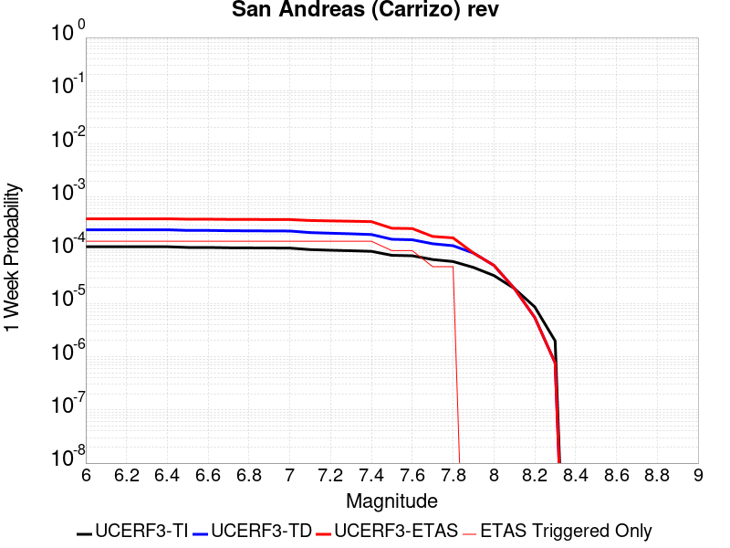 | 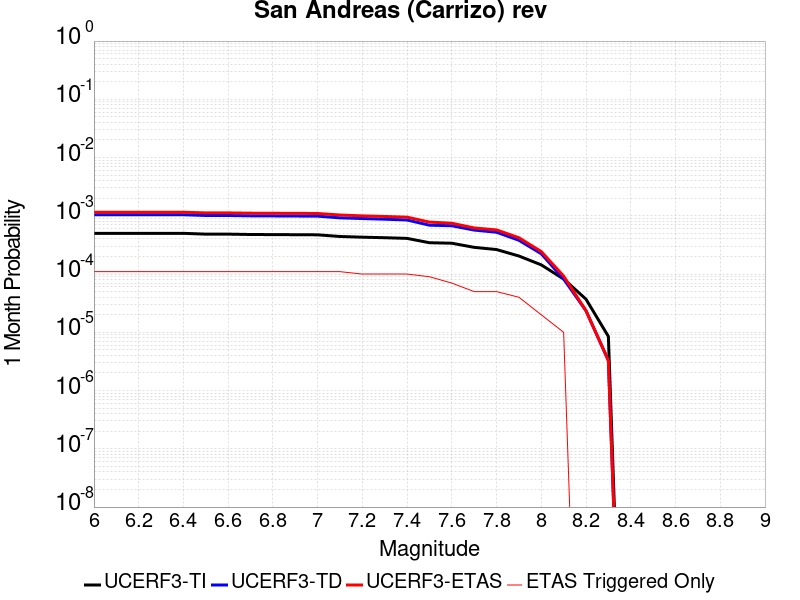 | 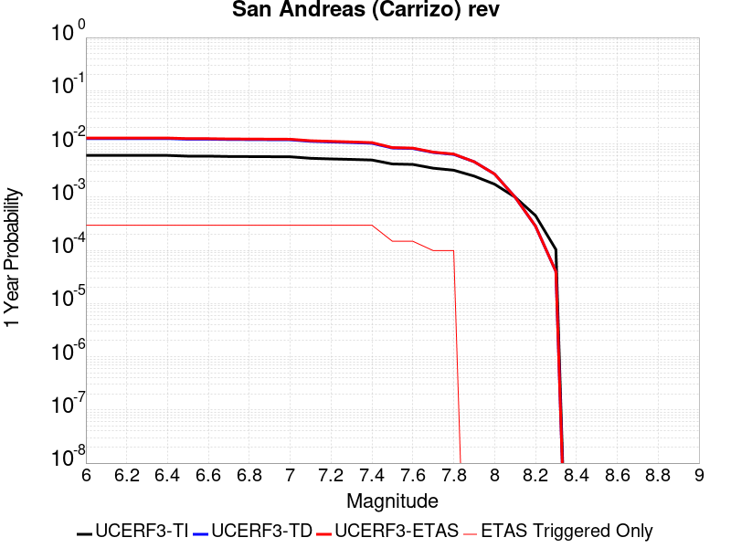 | 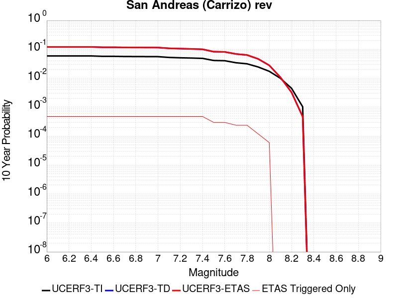 |

| Magnitude | 1 wk TI Prob | 1 wk TD Prob | 1 wk ETAS Prob | 1 wk ETAS/TD Gain | 1 wk ETAS Triggered Only | 1 mo TI Prob | 1 mo TD Prob | 1 mo ETAS Prob | 1 mo ETAS/TD Gain | 1 mo ETAS Triggered Only | 1 yr TI Prob | 1 yr TD Prob | 1 yr ETAS Prob | 1 yr ETAS/TD Gain | 1 yr ETAS Triggered Only | 10 yr TI Prob | 10 yr TD Prob | 10 yr ETAS Prob | 10 yr ETAS/TD Gain | 10 yr ETAS Triggered Only |
|-----|-----|-----|-----|-----|-----|-----|-----|-----|-----|-----|-----|-----|-----|-----|-----|-----|-----|-----|-----|-----|
| 6.0 | 1.1674632E-4 | 2.4324407E-4 | 3.232246E-4 | 1.3288078 | 8.0E-5 | 5.002454E-4 | 0.0010420597 | 0.0011519451 | 1.1054502 | 1.1E-4 | 0.006073493 | 0.012613757 | 0.012830982 | 1.0172213 | 2.2E-4 | 0.0591016 | 0.120640226 | 0.12089524 | 1.0021138 | 2.9E-4 |
| 6.1 | 1.1674632E-4 | 2.4324407E-4 | 3.232246E-4 | 1.3288078 | 8.0E-5 | 5.002454E-4 | 0.0010420597 | 0.0011519451 | 1.1054502 | 1.1E-4 | 0.006073493 | 0.012613757 | 0.012830982 | 1.0172213 | 2.2E-4 | 0.0591016 | 0.120640226 | 0.12089524 | 1.0021138 | 2.9E-4 |
| 6.2 | 1.1674632E-4 | 2.4324407E-4 | 3.232246E-4 | 1.3288078 | 8.0E-5 | 5.002454E-4 | 0.0010420597 | 0.0011519451 | 1.1054502 | 1.1E-4 | 0.006073493 | 0.012613757 | 0.012830982 | 1.0172213 | 2.2E-4 | 0.0591016 | 0.120640226 | 0.12089524 | 1.0021138 | 2.9E-4 |
| 6.3 | 1.1674632E-4 | 2.4324407E-4 | 3.232246E-4 | 1.3288078 | 8.0E-5 | 5.002454E-4 | 0.0010420597 | 0.0011519451 | 1.1054502 | 1.1E-4 | 0.006073493 | 0.012613757 | 0.012830982 | 1.0172213 | 2.2E-4 | 0.0591016 | 0.120640226 | 0.12089524 | 1.0021138 | 2.9E-4 |
| 6.4 | 1.1674632E-4 | 2.4324407E-4 | 3.232246E-4 | 1.3288078 | 8.0E-5 | 5.002454E-4 | 0.0010420597 | 0.0011519451 | 1.1054502 | 1.1E-4 | 0.006073493 | 0.012613757 | 0.012830982 | 1.0172213 | 2.2E-4 | 0.0591016 | 0.120640226 | 0.12089524 | 1.0021138 | 2.9E-4 |
| 6.5 | 1.13136164E-4 | 2.3644442E-4 | 3.164255E-4 | 1.3382659 | 8.0E-5 | 4.847792E-4 | 0.0010129412 | 0.0011228297 | 1.1084846 | 1.1E-4 | 0.0058862255 | 0.012263271 | 0.012480573 | 1.0177197 | 2.2E-4 | 0.057327334 | 0.11761008 | 0.11785715 | 1.0021007 | 2.8E-4 |
| 6.6 | 1.13136164E-4 | 2.3644442E-4 | 3.164255E-4 | 1.3382659 | 8.0E-5 | 4.847792E-4 | 0.0010129412 | 0.0011228297 | 1.1084846 | 1.1E-4 | 0.0058862255 | 0.012263271 | 0.012480573 | 1.0177197 | 2.2E-4 | 0.057327334 | 0.11761008 | 0.11785715 | 1.0021007 | 2.8E-4 |
| 6.7 | 1.1149675E-4 | 2.3335687E-4 | 3.133382E-4 | 1.3427426 | 8.0E-5 | 4.777557E-4 | 9.997191E-4 | 0.0011096091 | 1.1099209 | 1.1E-4 | 0.0058011734 | 0.012104088 | 0.012321426 | 1.0179557 | 2.2E-4 | 0.05652051 | 0.1162291 | 0.11647656 | 1.0021291 | 2.8E-4 |
| 6.8 | 1.1103589E-4 | 2.3237852E-4 | 3.1235992E-4 | 1.344186 | 8.0E-5 | 4.7578133E-4 | 9.955293E-4 | 0.0011054198 | 1.110384 | 1.1E-4 | 0.005777263 | 0.012053643 | 0.012270992 | 1.0180317 | 2.2E-4 | 0.056293584 | 0.11578894 | 0.11603652 | 1.0021381 | 2.8E-4 |
| 6.9 | 1.1053259E-4 | 2.3130233E-4 | 3.1128383E-4 | 1.3457876 | 8.0E-5 | 4.7362508E-4 | 9.909206E-4 | 0.0011008116 | 1.1108979 | 1.1E-4 | 0.0057511497 | 0.011998152 | 0.012215513 | 1.0181161 | 2.2E-4 | 0.05604569 | 0.11530445 | 0.115552165 | 1.0021484 | 2.8E-4 |
| 7.0 | 1.1005377E-4 | 2.3031076E-4 | 3.1029235E-4 | 1.3472768 | 8.0E-5 | 4.7157376E-4 | 9.866742E-4 | 0.0010965657 | 1.1113756 | 1.1E-4 | 0.0057263062 | 0.011947021 | 0.0121643925 | 1.0181947 | 2.2E-4 | 0.055809796 | 0.11485658 | 0.11510442 | 1.0021578 | 2.8E-4 |
| 7.1 | 1.0308142E-4 | 2.1540876E-4 | 2.9539154E-4 | 1.3713069 | 8.0E-5 | 4.417027E-4 | 9.228548E-4 | 0.0010327533 | 1.1190853 | 1.1E-4 | 0.0053644776 | 0.011178188 | 0.011395729 | 1.0194612 | 2.2E-4 | 0.052368138 | 0.10809042 | 0.10834016 | 1.0023104 | 2.8E-4 |
| 7.2 | 1.0027479E-4 | 2.094876E-4 | 2.7947294E-4 | 1.3340787 | 7.0E-5 | 4.296783E-4 | 8.9749607E-4 | 9.974063E-4 | 1.1113211 | 1.0E-4 | 0.0052187922 | 0.010872566 | 0.011070392 | 1.0181949 | 2.0E-4 | 0.050979212 | 0.10539086 | 0.10562346 | 1.002207 | 2.6E-4 |
| 7.3 | 9.816942E-5 | 2.0423878E-4 | 2.7422447E-4 | 1.342666 | 7.0E-5 | 4.2065824E-4 | 8.7501644E-4 | 9.749289E-4 | 1.1141835 | 1.0E-4 | 0.005109493 | 0.010601572 | 0.010799452 | 1.0186651 | 2.0E-4 | 0.049935985 | 0.10297546 | 0.10320868 | 1.0022649 | 2.6E-4 |
| 7.4 | 9.5634205E-5 | 1.9793298E-4 | 2.6791912E-4 | 1.353585 | 7.0E-5 | 4.0979648E-4 | 8.4800937E-4 | 9.4792456E-4 | 1.1178232 | 1.0E-4 | 0.0049778637 | 0.010275901 | 0.010473846 | 1.019263 | 2.0E-4 | 0.048678253 | 0.100067884 | 0.10030187 | 1.0023383 | 2.6E-4 |
| 7.5 | 8.052417E-5 | 1.6113915E-4 | 2.2112949E-4 | 1.372289 | 6.0E-5 | 3.4505792E-4 | 6.9041376E-4 | 7.8035163E-4 | 1.1302667 | 9.0E-5 | 0.0041929903 | 0.008373471 | 0.008542048 | 1.0201322 | 1.7E-4 | 0.04114753 | 0.082815245 | 0.0830262 | 1.0025473 | 2.3E-4 |
| 7.6 | 7.897024E-5 | 1.5767086E-4 | 2.0766298E-4 | 1.3170663 | 5.0E-5 | 3.384E-4 | 6.755574E-4 | 7.4551016E-4 | 1.1035482 | 7.0E-5 | 0.0041122385 | 0.00819397 | 0.008342741 | 1.0181562 | 1.5E-4 | 0.040369697 | 0.08115866 | 0.081351615 | 1.0023775 | 2.1E-4 |
| 7.7 | 6.707427E-5 | 1.3277122E-4 | 1.6276725E-4 | 1.2259226 | 3.0E-5 | 2.8742946E-4 | 5.688955E-4 | 6.1886705E-4 | 1.0878396 | 5.0E-5 | 0.003493839 | 0.0069043385 | 0.007013579 | 1.015822 | 1.1E-4 | 0.034394164 | 0.06905339 | 0.069211654 | 1.0022919 | 1.7E-4 |
| 7.8 | 6.147705E-5 | 1.2198445E-4 | 1.5198078E-4 | 1.245903 | 3.0E-5 | 2.6344648E-4 | 5.226858E-4 | 5.7265966E-4 | 1.0956098 | 5.0E-5 | 0.0032027436 | 0.006345156 | 0.0064544585 | 1.0172261 | 1.1E-4 | 0.031569764 | 0.0635172 | 0.0636764 | 1.0025065 | 1.7E-4 |
| 7.9 | 4.7636717E-5 | 8.8802946E-5 | 1.0880117E-4 | 1.2251978 | 2.0E-5 | 2.0414138E-4 | 3.8052857E-4 | 4.2051336E-4 | 1.1050769 | 4.0E-5 | 0.0024825884 | 0.004623101 | 0.0047027315 | 1.0172244 | 8.0E-5 | 0.024550365 | 0.046629366 | 0.046762835 | 1.0028625 | 1.4E-4 |
| 8.0 | 3.3554235E-5 | 5.2138024E-5 | 6.213751E-5 | 1.1917886 | 1.0E-5 | 1.4379594E-4 | 2.2342955E-4 | 2.4342508E-4 | 1.0894936 | 2.0E-5 | 0.0017493097 | 0.002716863 | 0.0027567544 | 1.0146829 | 4.0E-5 | 0.017356034 | 0.027881905 | 0.027949953 | 1.0024406 | 7.0E-5 |
| 8.1 | 1.9175432E-5 | 1.9183564E-5 | 2.9183373E-5 | 1.5212696 | 1.0E-5 | 8.217783E-5 | 8.221269E-5 | 9.221186E-5 | 1.1216258 | 1.0E-5 | 0.0010000558 | 0.0010004805 | 0.0010204605 | 1.0199704 | 2.0E-5 | 0.009955673 | 0.010757771 | 0.010787448 | 1.0027586 | 3.0E-5 |
| 8.2 | 8.643924E-6 | 5.473668E-6 | 5.473668E-6 | 1.0 | 0.0 | 3.704486E-5 | 2.3458366E-5 | 2.3458366E-5 | 1.0 | 0.0 | 4.5092785E-4 | 2.8556827E-4 | 2.955654E-4 | 1.035008 | 1.0E-5 | 0.0045001395 | 0.0032481793 | 0.003258147 | 1.0030687 | 1.0E-5 |
| 8.3 | 1.983087E-6 | 7.6564595E-7 | 7.6564595E-7 | 1.0 | 0.0 | 8.498917E-6 | 3.281336E-6 | 3.281336E-6 | 1.0 | 0.0 | 1.034694E-4 | 3.9949547E-5 | 3.9949547E-5 | 1.0 | 0.0 | 0.0010342124 | 4.717979E-4 | 4.717979E-4 | 1.0 | 0.0 |

## Scodie Lineament
*[(top)](#table-of-contents)*

| 1 Week | 1 Month | 1 Year | 10 Year |
|-----|-----|-----|-----|
| 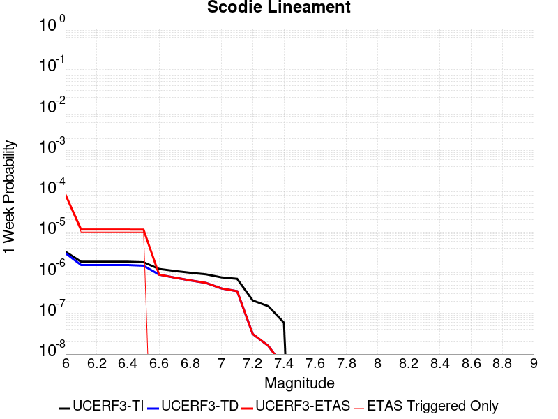 | 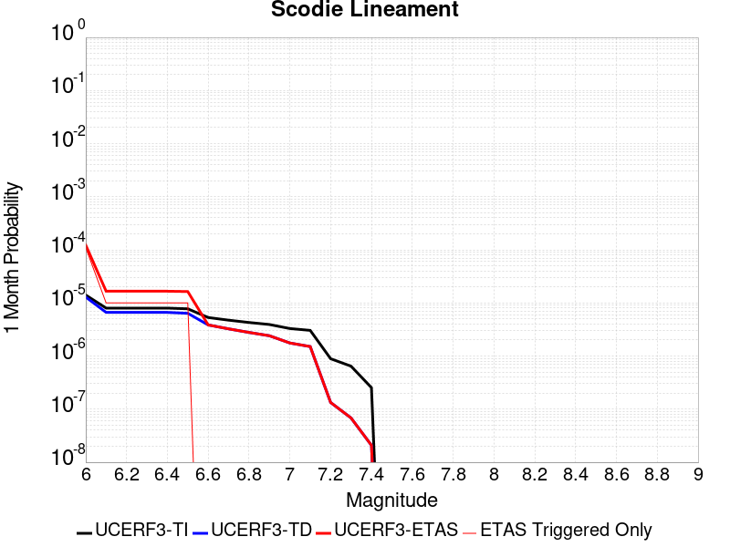 | 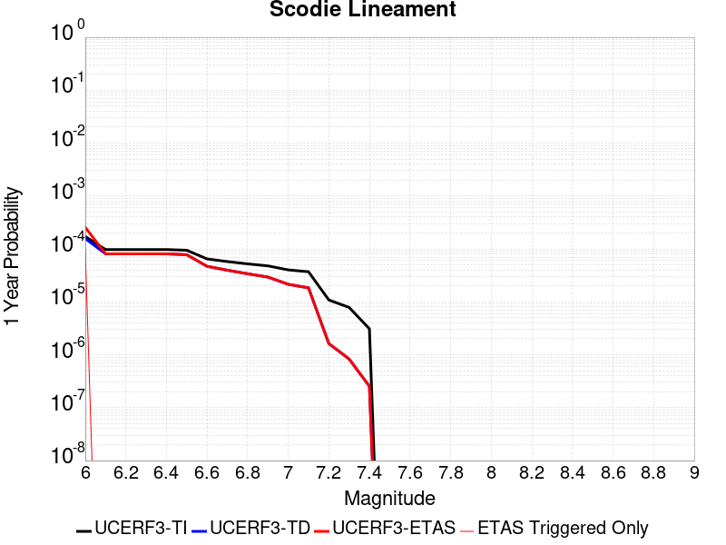 | 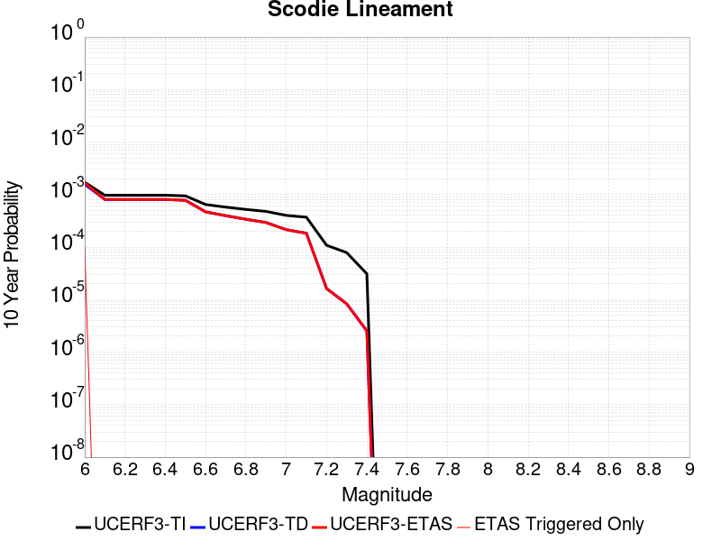 |

| Magnitude | 1 wk TI Prob | 1 wk TD Prob | 1 wk ETAS Prob | 1 wk ETAS/TD Gain | 1 wk ETAS Triggered Only | 1 mo TI Prob | 1 mo TD Prob | 1 mo ETAS Prob | 1 mo ETAS/TD Gain | 1 mo ETAS Triggered Only | 1 yr TI Prob | 1 yr TD Prob | 1 yr ETAS Prob | 1 yr ETAS/TD Gain | 1 yr ETAS Triggered Only | 10 yr TI Prob | 10 yr TD Prob | 10 yr ETAS Prob | 10 yr ETAS/TD Gain | 10 yr ETAS Triggered Only |
|-----|-----|-----|-----|-----|-----|-----|-----|-----|-----|-----|-----|-----|-----|-----|-----|-----|-----|-----|-----|-----|
| 6.0 | 3.2919327E-6 | 3.0133303E-6 | 8.301309E-5 | 27.548618 | 8.0E-5 | 1.4108206E-5 | 1.2914227E-5 | 1.2291281E-4 | 9.517628 | 1.1E-4 | 1.7175387E-4 | 1.5722254E-4 | 3.1719738E-4 | 2.0175056 | 1.6E-4 | 0.0017162118 | 0.0015714248 | 0.0018410005 | 1.1715486 | 2.7E-4 |
| 6.1 | 1.8663811E-6 | 1.5490382E-6 | 1.1549023E-5 | 7.455609 | 1.0E-5 | 7.998751E-6 | 6.6387206E-6 | 1.6638654E-5 | 2.5063043 | 1.0E-5 | 9.738045E-5 | 8.082393E-5 | 9.0823116E-5 | 1.1237158 | 1.0E-5 | 9.7337784E-4 | 8.079941E-4 | 8.579537E-4 | 1.0618316 | 5.0E-5 |
| 6.2 | 1.8663811E-6 | 1.5490382E-6 | 1.1549023E-5 | 7.455609 | 1.0E-5 | 7.998751E-6 | 6.6387206E-6 | 1.6638654E-5 | 2.5063043 | 1.0E-5 | 9.738045E-5 | 8.082393E-5 | 9.0823116E-5 | 1.1237158 | 1.0E-5 | 9.7337784E-4 | 8.079941E-4 | 8.579537E-4 | 1.0618316 | 5.0E-5 |
| 6.3 | 1.8663811E-6 | 1.5490382E-6 | 1.1549023E-5 | 7.455609 | 1.0E-5 | 7.998751E-6 | 6.6387206E-6 | 1.6638654E-5 | 2.5063043 | 1.0E-5 | 9.738045E-5 | 8.082393E-5 | 9.0823116E-5 | 1.1237158 | 1.0E-5 | 9.7337784E-4 | 8.079941E-4 | 8.579537E-4 | 1.0618316 | 5.0E-5 |
| 6.4 | 1.8663811E-6 | 1.5490382E-6 | 1.1549023E-5 | 7.455609 | 1.0E-5 | 7.998751E-6 | 6.6387206E-6 | 1.6638654E-5 | 2.5063043 | 1.0E-5 | 9.738045E-5 | 8.082393E-5 | 9.0823116E-5 | 1.1237158 | 1.0E-5 | 9.7337784E-4 | 8.079941E-4 | 8.579537E-4 | 1.0618316 | 5.0E-5 |
| 6.5 | 1.8106311E-6 | 1.4909722E-6 | 1.1490957E-5 | 7.7070236 | 1.0E-5 | 7.759824E-6 | 6.389868E-6 | 1.6389804E-5 | 2.5649676 | 1.0E-5 | 9.447177E-5 | 7.779436E-5 | 8.779358E-5 | 1.1285341 | 1.0E-5 | 9.4431615E-4 | 7.7771995E-4 | 8.2768104E-4 | 1.0642405 | 5.0E-5 |
| 6.6 | 1.2414679E-6 | 8.9974395E-7 | 8.9974395E-7 | 1.0 | 0.0 | 5.320566E-6 | 3.85604E-6 | 3.85604E-6 | 1.0 | 0.0 | 6.477596E-5 | 4.6946367E-5 | 4.6946367E-5 | 1.0 | 0.0 | 6.475708E-4 | 4.6937316E-4 | 4.993591E-4 | 1.063885 | 3.0E-5 |
| 6.7 | 1.1062215E-6 | 7.594193E-7 | 7.594193E-7 | 1.0 | 0.0 | 4.7409408E-6 | 3.2546504E-6 | 3.2546504E-6 | 1.0 | 0.0 | 5.7719422E-5 | 3.962472E-5 | 3.962472E-5 | 1.0 | 0.0 | 5.770443E-4 | 3.9618355E-4 | 4.161756E-4 | 1.0504616 | 2.0E-5 |
| 6.8 | 1.0006736E-6 | 6.5002786E-7 | 6.5002786E-7 | 1.0 | 0.0 | 4.288594E-6 | 2.7858312E-6 | 2.7858312E-6 | 1.0 | 0.0 | 5.221238E-5 | 3.391703E-5 | 3.391703E-5 | 1.0 | 0.0 | 5.220012E-4 | 3.3912458E-4 | 3.491212E-4 | 1.0294777 | 1.0E-5 |
| 6.9 | 9.167364E-7 | 5.6315065E-7 | 5.6315065E-7 | 1.0 | 0.0 | 3.9288643E-6 | 2.413501E-6 | 2.413501E-6 | 1.0 | 0.0 | 4.7832873E-5 | 2.9384037E-5 | 2.9384037E-5 | 1.0 | 0.0 | 4.782258E-4 | 2.9380718E-4 | 2.9380718E-4 | 1.0 | 0.0 |
| 7.0 | 7.6987664E-7 | 4.113265E-7 | 4.113265E-7 | 1.0 | 0.0 | 3.2994672E-6 | 1.7628269E-6 | 1.7628269E-6 | 1.0 | 0.0 | 4.0170275E-5 | 2.1462245E-5 | 2.1462245E-5 | 1.0 | 0.0 | 4.0163012E-4 | 2.1460558E-4 | 2.1460558E-4 | 1.0 | 0.0 |
| 7.1 | 7.1038727E-7 | 3.5210306E-7 | 3.5210306E-7 | 1.0 | 0.0 | 3.0445133E-6 | 1.5090123E-6 | 1.5090123E-6 | 1.0 | 0.0 | 3.706632E-5 | 1.8372106E-5 | 1.8372106E-5 | 1.0 | 0.0 | 3.7060137E-4 | 1.8370937E-4 | 1.8370937E-4 | 1.0 | 0.0 |
| 7.2 | 2.0799602E-7 | 3.1178534E-8 | 3.1178534E-8 | 1.0 | 0.0 | 8.914113E-7 | 1.3362228E-7 | 1.3362228E-7 | 1.0 | 0.0 | 1.0852878E-5 | 1.6268501E-6 | 1.6268501E-6 | 1.0 | 0.0 | 1.08523476E-4 | 1.626839E-5 | 1.626839E-5 | 1.0 | 0.0 |
| 7.3 | 1.5048182E-7 | 1.5939106E-8 | 1.5939106E-8 | 1.0 | 0.0 | 6.449219E-7 | 6.8310456E-8 | 6.8310456E-8 | 1.0 | 0.0 | 7.851896E-6 | 8.316795E-7 | 8.316795E-7 | 1.0 | 0.0 | 7.851618E-5 | 8.316767E-6 | 8.316767E-6 | 1.0 | 0.0 |
| 7.4 | 5.9334678E-8 | 4.8638475E-9 | 4.8638475E-9 | 1.0 | 0.0 | 2.5429145E-7 | 2.084506E-8 | 2.084506E-8 | 1.0 | 0.0 | 3.095994E-6 | 2.5378858E-7 | 2.5378858E-7 | 1.0 | 0.0 | 3.095951E-5 | 2.5378843E-6 | 2.5378843E-6 | 1.0 | 0.0 |

## White Wolf (Extension)
*[(top)](#table-of-contents)*

| 1 Week | 1 Month | 1 Year | 10 Year |
|-----|-----|-----|-----|
| 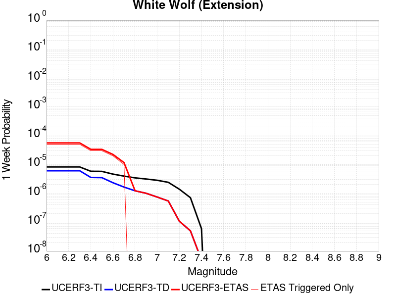 | 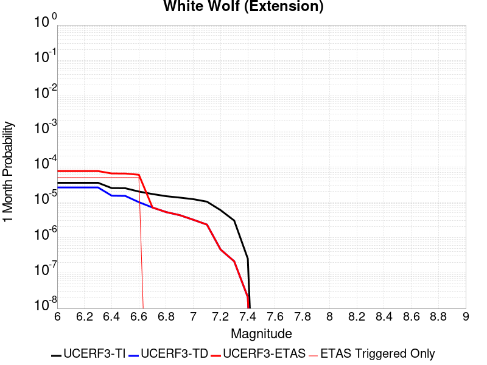 | 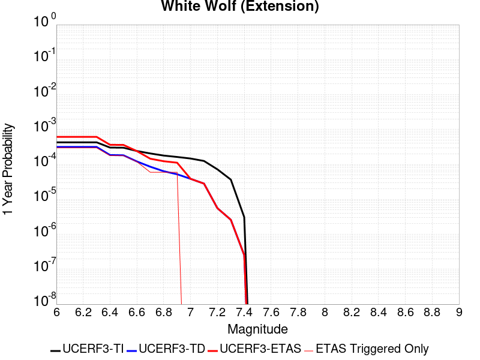 | 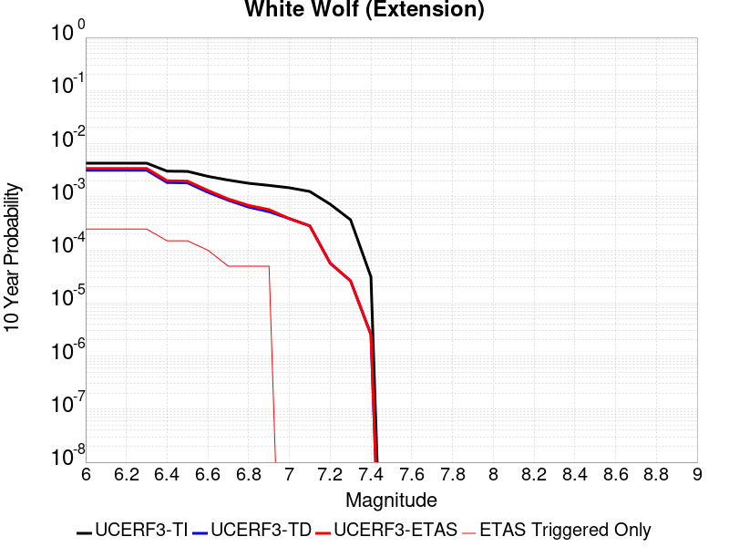 |

| Magnitude | 1 wk TI Prob | 1 wk TD Prob | 1 wk ETAS Prob | 1 wk ETAS/TD Gain | 1 wk ETAS Triggered Only | 1 mo TI Prob | 1 mo TD Prob | 1 mo ETAS Prob | 1 mo ETAS/TD Gain | 1 mo ETAS Triggered Only | 1 yr TI Prob | 1 yr TD Prob | 1 yr ETAS Prob | 1 yr ETAS/TD Gain | 1 yr ETAS Triggered Only | 10 yr TI Prob | 10 yr TD Prob | 10 yr ETAS Prob | 10 yr ETAS/TD Gain | 10 yr ETAS Triggered Only |
|-----|-----|-----|-----|-----|-----|-----|-----|-----|-----|-----|-----|-----|-----|-----|-----|-----|-----|-----|-----|-----|
| 6.0 | 8.222555E-6 | 6.066615E-6 | 5.606631E-5 | 9.241778 | 5.0E-5 | 3.5239045E-5 | 2.5999556E-5 | 1.05997475E-4 | 4.0768957 | 8.0E-5 | 4.289509E-4 | 3.1650523E-4 | 4.6645777E-4 | 1.4737757 | 1.5E-4 | 0.0042812387 | 0.0031611966 | 0.0034104062 | 1.0788339 | 2.5E-4 |
| 6.1 | 8.222555E-6 | 6.066615E-6 | 5.606631E-5 | 9.241778 | 5.0E-5 | 3.5239045E-5 | 2.5999556E-5 | 1.05997475E-4 | 4.0768957 | 8.0E-5 | 4.289509E-4 | 3.1650523E-4 | 4.6645777E-4 | 1.4737757 | 1.5E-4 | 0.0042812387 | 0.0031611966 | 0.0034104062 | 1.0788339 | 2.5E-4 |
| 6.2 | 8.222555E-6 | 6.066615E-6 | 5.606631E-5 | 9.241778 | 5.0E-5 | 3.5239045E-5 | 2.5999556E-5 | 1.05997475E-4 | 4.0768957 | 8.0E-5 | 4.289509E-4 | 3.1650523E-4 | 4.6645777E-4 | 1.4737757 | 1.5E-4 | 0.0042812387 | 0.0031611966 | 0.0034104062 | 1.0788339 | 2.5E-4 |
| 6.3 | 8.222555E-6 | 6.066615E-6 | 5.606631E-5 | 9.241778 | 5.0E-5 | 3.5239045E-5 | 2.5999556E-5 | 1.05997475E-4 | 4.0768957 | 8.0E-5 | 4.289509E-4 | 3.1650523E-4 | 4.6645777E-4 | 1.4737757 | 1.5E-4 | 0.0042812387 | 0.0031611966 | 0.0034104062 | 1.0788339 | 2.5E-4 |
| 6.4 | 5.821773E-6 | 3.5571256E-6 | 3.355702E-5 | 9.433745 | 3.0E-5 | 2.4950215E-5 | 1.5244741E-5 | 4.5244284E-5 | 2.9678617 | 3.0E-5 | 3.0372653E-4 | 1.8559002E-4 | 2.4557888E-4 | 1.3232332 | 6.0E-5 | 0.0030331176 | 0.0018544586 | 0.0019842174 | 1.0699713 | 1.3E-4 |
| 6.5 | 5.766023E-6 | 3.4990599E-6 | 3.3498956E-5 | 9.573702 | 3.0E-5 | 2.4711293E-5 | 1.49958905E-5 | 4.4995442E-5 | 3.000518 | 3.0E-5 | 3.0081844E-4 | 1.8256076E-4 | 2.4254981E-4 | 1.3285977 | 6.0E-5 | 0.0030041158 | 0.0018242161 | 0.001953979 | 1.0711335 | 1.3E-4 |
| 6.6 | 4.643576E-6 | 2.3325733E-6 | 2.2332526E-5 | 9.574202 | 2.0E-5 | 1.9900888E-5 | 9.9967065E-6 | 2.9996507E-5 | 3.000639 | 2.0E-5 | 2.4226638E-4 | 1.2170354E-4 | 1.5169989E-4 | 1.2464707 | 3.0E-5 | 0.0024200242 | 0.0012164112 | 0.0012863261 | 1.0574763 | 7.0E-5 |
| 6.7 | 3.9529173E-6 | 1.6482975E-6 | 1.1648281E-5 | 7.066856 | 1.0E-5 | 1.6940963E-5 | 7.064114E-6 | 1.7064043E-5 | 2.4155958 | 1.0E-5 | 2.0623671E-4 | 8.600239E-5 | 1.0600066E-4 | 1.2325317 | 2.0E-5 | 0.002060454 | 8.597095E-4 | 9.0966653E-4 | 1.0581092 | 5.0E-5 |
| 6.8 | 3.4377522E-6 | 1.2244764E-6 | 1.2244764E-6 | 1.0 | 0.0 | 1.473314E-5 | 5.247746E-6 | 5.247746E-6 | 1.0 | 0.0 | 1.7936122E-4 | 6.388952E-5 | 7.3888885E-5 | 1.1565102 | 1.0E-5 | 0.0017921652 | 6.3872064E-4 | 6.5870787E-4 | 1.0312926 | 2.0E-5 |
| 6.9 | 3.1367306E-6 | 1.0033316E-6 | 1.0033316E-6 | 1.0 | 0.0 | 1.3443062E-5 | 4.299986E-6 | 4.299986E-6 | 1.0 | 0.0 | 1.63657E-4 | 5.2351144E-5 | 6.235062E-5 | 1.1910077 | 1.0E-5 | 0.0016353652 | 5.233958E-4 | 5.3339056E-4 | 1.019096 | 1.0E-5 |
| 7.0 | 2.8298145E-6 | 7.4282326E-7 | 7.4282326E-7 | 1.0 | 0.0 | 1.2127721E-5 | 3.1835248E-6 | 3.1835248E-6 | 1.0 | 0.0 | 1.47645E-4 | 3.8758775E-5 | 3.8758775E-5 | 1.0 | 0.0 | 0.0014754693 | 3.8752513E-4 | 3.8752513E-4 | 1.0 | 0.0 |
| 7.1 | 2.4091064E-6 | 5.4223835E-7 | 5.4223835E-7 | 1.0 | 0.0 | 1.03247E-5 | 2.3238767E-6 | 2.3238767E-6 | 1.0 | 0.0 | 1.2569598E-4 | 2.8292874E-5 | 2.8292874E-5 | 1.0 | 0.0 | 0.001256249 | 2.8289677E-4 | 2.8289677E-4 | 1.0 | 0.0 |
| 7.2 | 1.3875518E-6 | 1.0740268E-7 | 1.0740268E-7 | 1.0 | 0.0 | 5.9466374E-6 | 4.6029712E-7 | 4.6029712E-7 | 1.0 | 0.0 | 7.23979E-5 | 5.604104E-6 | 5.604104E-6 | 1.0 | 0.0 | 7.2374323E-4 | 5.6039742E-5 | 5.6039742E-5 | 1.0 | 0.0 |
| 7.3 | 7.056077E-7 | 5.0002956E-8 | 5.0002956E-8 | 1.0 | 0.0 | 3.0240296E-6 | 2.1429837E-7 | 2.1429837E-7 | 1.0 | 0.0 | 3.681694E-5 | 2.60908E-6 | 2.60908E-6 | 1.0 | 0.0 | 3.681084E-4 | 2.609054E-5 | 2.609054E-5 | 1.0 | 0.0 |
| 7.4 | 5.9334678E-8 | 4.8638475E-9 | 4.8638475E-9 | 1.0 | 0.0 | 2.5429145E-7 | 2.084506E-8 | 2.084506E-8 | 1.0 | 0.0 | 3.095994E-6 | 2.5378858E-7 | 2.5378858E-7 | 1.0 | 0.0 | 3.095951E-5 | 2.5378843E-6 | 2.5378843E-6 | 1.0 | 0.0 |

## San Andreas (Creeping Section) 2011 CFM
*[(top)](#table-of-contents)*

| 1 Week | 1 Month | 1 Year | 10 Year |
|-----|-----|-----|-----|
| 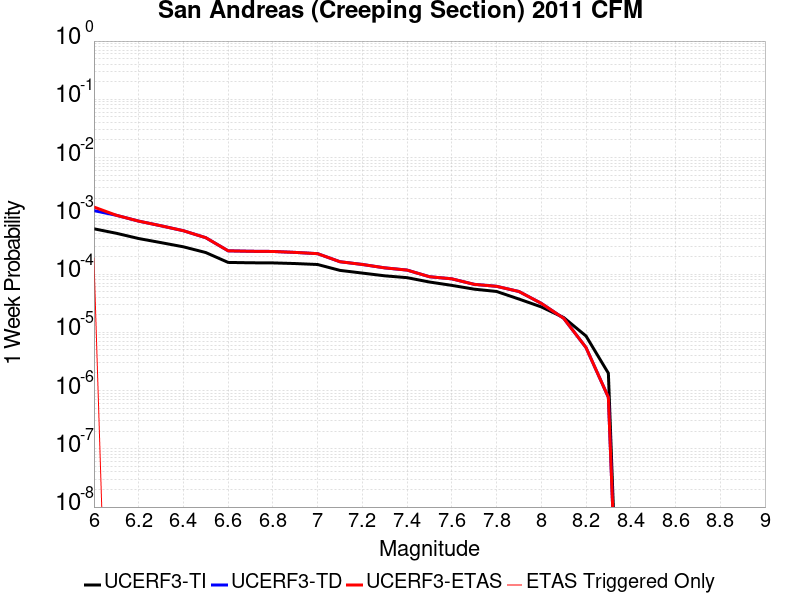 | 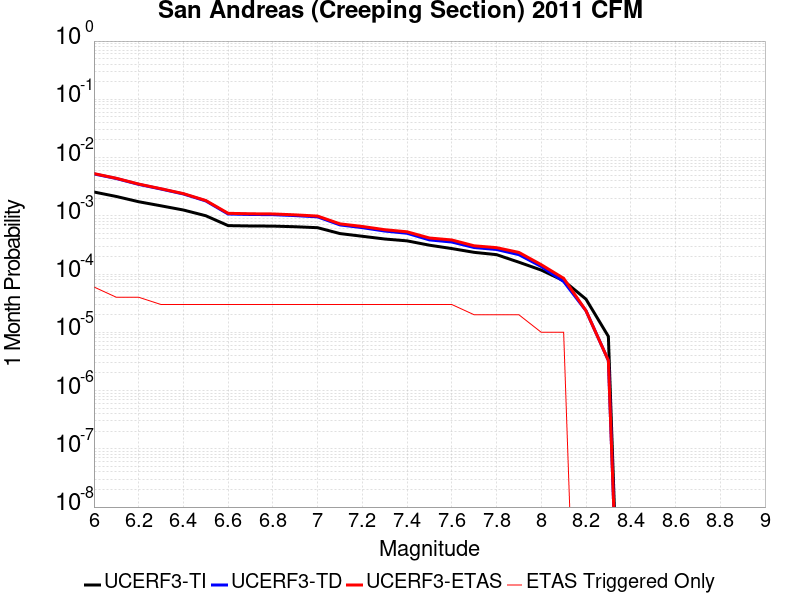 | 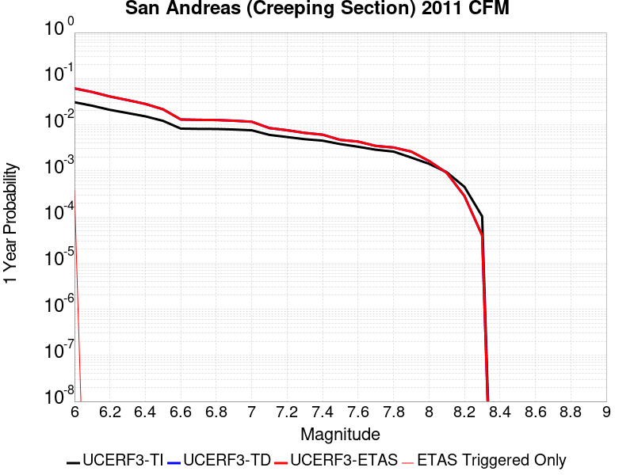 | 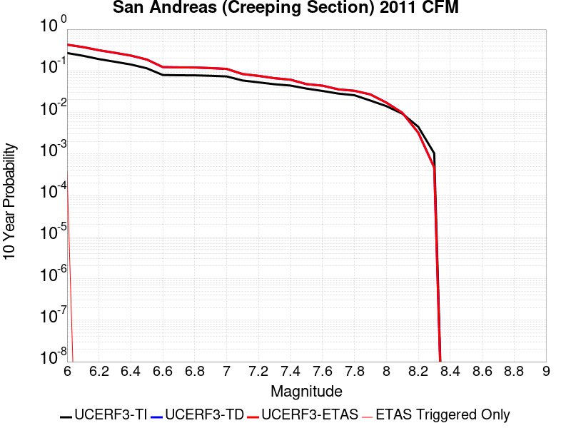 |

| Magnitude | 1 wk TI Prob | 1 wk TD Prob | 1 wk ETAS Prob | 1 wk ETAS/TD Gain | 1 wk ETAS Triggered Only | 1 mo TI Prob | 1 mo TD Prob | 1 mo ETAS Prob | 1 mo ETAS/TD Gain | 1 mo ETAS Triggered Only | 1 yr TI Prob | 1 yr TD Prob | 1 yr ETAS Prob | 1 yr ETAS/TD Gain | 1 yr ETAS Triggered Only | 10 yr TI Prob | 10 yr TD Prob | 10 yr ETAS Prob | 10 yr ETAS/TD Gain | 10 yr ETAS Triggered Only |
|-----|-----|-----|-----|-----|-----|-----|-----|-----|-----|-----|-----|-----|-----|-----|-----|-----|-----|-----|-----|-----|
| 6.0 | 5.986481E-4 | 0.0012275929 | 0.0012775315 | 1.0406802 | 5.0E-5 | 0.0025631124 | 0.005245547 | 0.005305232 | 1.0113783 | 6.0E-5 | 0.030762846 | 0.06120491 | 0.061326955 | 1.001994 | 1.3E-4 | 0.26835477 | 0.42593494 | 0.42606696 | 1.00031 | 2.3E-4 |
| 6.1 | 5.015945E-4 | 0.0010217986 | 0.0010517678 | 1.02933 | 3.0E-5 | 0.00214792 | 0.0043678596 | 0.004407685 | 1.0091178 | 4.0E-5 | 0.025839351 | 0.05124837 | 0.05133376 | 1.0016662 | 9.0E-5 | 0.23032776 | 0.37285668 | 0.37295702 | 1.0002692 | 1.6E-4 |
| 6.2 | 4.073338E-4 | 8.1073755E-4 | 8.407132E-4 | 1.0369734 | 3.0E-5 | 0.0017445484 | 0.0034671477 | 0.003507009 | 1.0114969 | 4.0E-5 | 0.021034058 | 0.04093317 | 0.04100989 | 1.0018744 | 8.0E-5 | 0.19150782 | 0.31303346 | 0.31313652 | 1.0003291 | 1.5E-4 |
| 6.3 | 3.464099E-4 | 6.7391695E-4 | 7.0389675E-4 | 1.0444859 | 3.0E-5 | 0.0014837692 | 0.0028829593 | 0.002912873 | 1.010376 | 3.0E-5 | 0.017915873 | 0.034189582 | 0.03424753 | 1.0016949 | 6.0E-5 | 0.16538359 | 0.2713166 | 0.27140403 | 1.0003223 | 1.2E-4 |
| 6.4 | 2.935057E-4 | 5.5442745E-4 | 5.844108E-4 | 1.0540799 | 3.0E-5 | 0.0012572751 | 0.0023725363 | 0.002402465 | 1.0126147 | 3.0E-5 | 0.015200248 | 0.02826451 | 0.028322814 | 1.0020628 | 6.0E-5 | 0.14201577 | 0.23298529 | 0.23307733 | 1.000395 | 1.2E-4 |
| 6.5 | 2.3409708E-4 | 4.2093755E-4 | 4.5092494E-4 | 1.0712395 | 3.0E-5 | 0.0010028875 | 0.0018019684 | 0.0018319144 | 1.0166185 | 3.0E-5 | 0.012141965 | 0.021587461 | 0.021646166 | 1.0027194 | 6.0E-5 | 0.11499573 | 0.18682368 | 0.18691313 | 1.0004787 | 1.1E-4 |
| 6.6 | 1.5842178E-4 | 2.506933E-4 | 2.8068578E-4 | 1.1196381 | 3.0E-5 | 6.7877385E-4 | 0.0010739497 | 0.0011039175 | 1.0279043 | 3.0E-5 | 0.0082328 | 0.012995575 | 0.013054795 | 1.004557 | 6.0E-5 | 0.07934396 | 0.12314638 | 0.12324283 | 1.0007832 | 1.1E-4 |
| 6.7 | 1.5616413E-4 | 2.4605883E-4 | 2.7605143E-4 | 1.1218921 | 3.0E-5 | 6.691031E-4 | 0.0010541069 | 0.0010840752 | 1.0284301 | 3.0E-5 | 0.0081159435 | 0.01275744 | 0.012816675 | 1.0046431 | 6.0E-5 | 0.0782586 | 0.12117351 | 0.12127018 | 1.0007977 | 1.1E-4 |
| 6.8 | 1.5538467E-4 | 2.4429744E-4 | 2.7429013E-4 | 1.1227711 | 3.0E-5 | 6.6576427E-4 | 0.0010465645 | 0.0010765331 | 1.0286353 | 3.0E-5 | 0.008075596 | 0.012666838 | 0.012726079 | 1.0046768 | 6.0E-5 | 0.07788358 | 0.120404355 | 0.12050111 | 1.0008036 | 1.1E-4 |
| 6.9 | 1.5153569E-4 | 2.3539034E-4 | 2.6538328E-4 | 1.1274179 | 3.0E-5 | 6.49277E-4 | 0.0010084276 | 0.0010383973 | 1.0297192 | 3.0E-5 | 0.007876333 | 0.01220901 | 0.012268278 | 1.0048544 | 6.0E-5 | 0.07602952 | 0.11647445 | 0.116571635 | 1.0008345 | 1.1E-4 |
| 7.0 | 1.4588932E-4 | 2.2396253E-4 | 2.539558E-4 | 1.133921 | 3.0E-5 | 6.250901E-4 | 9.5948833E-4 | 9.894596E-4 | 1.0312366 | 3.0E-5 | 0.0075839474 | 0.011619697 | 0.011678999 | 1.0051036 | 6.0E-5 | 0.073302895 | 0.11132046 | 0.11141821 | 1.0008781 | 1.1E-4 |
| 7.1 | 1.1565079E-4 | 1.6281738E-4 | 1.928125E-4 | 1.1842256 | 3.0E-5 | 4.955521E-4 | 6.9760304E-4 | 7.275821E-4 | 1.0429744 | 3.0E-5 | 0.006016669 | 0.0084604435 | 0.008519935 | 1.0070318 | 6.0E-5 | 0.058563538 | 0.08367046 | 0.083762094 | 1.0010952 | 1.0E-4 |
| 7.2 | 1.0393792E-4 | 1.4615769E-4 | 1.761533E-4 | 1.2052277 | 3.0E-5 | 4.4537216E-4 | 6.2624045E-4 | 6.562217E-4 | 1.0478749 | 3.0E-5 | 0.005408933 | 0.0075979927 | 0.007657537 | 1.0078368 | 6.0E-5 | 0.052791595 | 0.07561969 | 0.07571213 | 1.0012224 | 1.0E-4 |
| 7.3 | 9.332884E-5 | 1.2780898E-4 | 1.5780515E-4 | 1.2346953 | 3.0E-5 | 3.999194E-4 | 5.4763845E-4 | 5.77622E-4 | 1.0547507 | 3.0E-5 | 0.0048581534 | 0.006647249 | 0.00670685 | 1.0089663 | 6.0E-5 | 0.047533102 | 0.06648326 | 0.06657661 | 1.0014042 | 1.0E-4 |
| 7.4 | 8.670252E-5 | 1.17032345E-4 | 1.4702883E-4 | 1.2563094 | 3.0E-5 | 3.715293E-4 | 5.0147134E-4 | 5.314563E-4 | 1.059794 | 3.0E-5 | 0.004513991 | 0.006088443 | 0.0061480775 | 1.0097947 | 6.0E-5 | 0.044233937 | 0.061151642 | 0.061245527 | 1.0015353 | 1.0E-4 |
| 7.5 | 7.3036405E-5 | 9.005856E-5 | 1.2005586E-4 | 1.3330866 | 3.0E-5 | 3.129756E-4 | 3.8590826E-4 | 4.1589668E-4 | 1.0777087 | 3.0E-5 | 0.0038038217 | 0.0046883323 | 0.004728145 | 1.0084919 | 4.0E-5 | 0.03739367 | 0.047877792 | 0.047953963 | 1.001591 | 8.0E-5 |
| 7.6 | 6.3935775E-5 | 8.280385E-5 | 1.1280136E-4 | 1.362272 | 3.0E-5 | 2.7398168E-4 | 3.5482543E-4 | 3.848148E-4 | 1.0845187 | 3.0E-5 | 0.0033306254 | 0.004311461 | 0.0043512885 | 1.0092376 | 4.0E-5 | 0.032811474 | 0.04399201 | 0.04406849 | 1.0017385 | 8.0E-5 |
| 7.7 | 5.5050095E-5 | 6.6618326E-5 | 8.6616994E-5 | 1.3001977 | 2.0E-5 | 2.3590765E-4 | 2.854759E-4 | 3.054702E-4 | 1.0700384 | 2.0E-5 | 0.0028683927 | 0.003470134 | 0.00350003 | 1.0086153 | 3.0E-5 | 0.0283165 | 0.035796214 | 0.03586371 | 1.0018855 | 7.0E-5 |
| 7.8 | 5.027131E-5 | 6.162871E-5 | 8.162747E-5 | 1.3245041 | 2.0E-5 | 2.1543067E-4 | 2.640963E-4 | 2.8409102E-4 | 1.0757099 | 2.0E-5 | 0.0026197135 | 0.003210635 | 0.0032405388 | 1.009314 | 3.0E-5 | 0.025890453 | 0.03312666 | 0.03319434 | 1.0020431 | 7.0E-5 |
| 7.9 | 3.7271806E-5 | 5.022507E-5 | 7.0224065E-5 | 1.3981875 | 2.0E-5 | 1.5972654E-4 | 2.1523255E-4 | 2.3522823E-4 | 1.0929028 | 2.0E-5 | 0.0019429359 | 0.002617309 | 0.0026472306 | 1.0114322 | 3.0E-5 | 0.019260362 | 0.027067466 | 0.02713557 | 1.0025162 | 7.0E-5 |
| 8.0 | 2.7310243E-5 | 3.1427757E-5 | 4.1427444E-5 | 1.3181801 | 1.0E-5 | 1.17038646E-4 | 1.3468343E-4 | 1.446821E-4 | 1.0742382 | 1.0E-5 | 0.0014240141 | 0.0016385383 | 0.0016585055 | 1.012186 | 2.0E-5 | 0.014149235 | 0.01721386 | 0.017253172 | 1.0022837 | 4.0E-5 |
| 8.1 | 1.7940547E-5 | 1.7399378E-5 | 2.7399203E-5 | 1.5747232 | 1.0E-5 | 7.688579E-5 | 7.456663E-5 | 8.456589E-5 | 1.1340983 | 1.0E-5 | 9.3568244E-4 | 9.074711E-4 | 9.27453E-4 | 1.0220193 | 2.0E-5 | 0.009317525 | 0.009798636 | 0.009828341 | 1.0030316 | 3.0E-5 |
| 8.2 | 8.643924E-6 | 5.473668E-6 | 5.473668E-6 | 1.0 | 0.0 | 3.704486E-5 | 2.3458366E-5 | 2.3458366E-5 | 1.0 | 0.0 | 4.5092785E-4 | 2.8556827E-4 | 2.955654E-4 | 1.035008 | 1.0E-5 | 0.0045001395 | 0.0032481793 | 0.003258147 | 1.0030687 | 1.0E-5 |
| 8.3 | 1.983087E-6 | 7.6564595E-7 | 7.6564595E-7 | 1.0 | 0.0 | 8.498917E-6 | 3.281336E-6 | 3.281336E-6 | 1.0 | 0.0 | 1.034694E-4 | 3.9949547E-5 | 3.9949547E-5 | 1.0 | 0.0 | 0.0010342124 | 4.717979E-4 | 4.717979E-4 | 1.0 | 0.0 |

## Baker
*[(top)](#table-of-contents)*

| 1 Week | 1 Month | 1 Year | 10 Year |
|-----|-----|-----|-----|
| 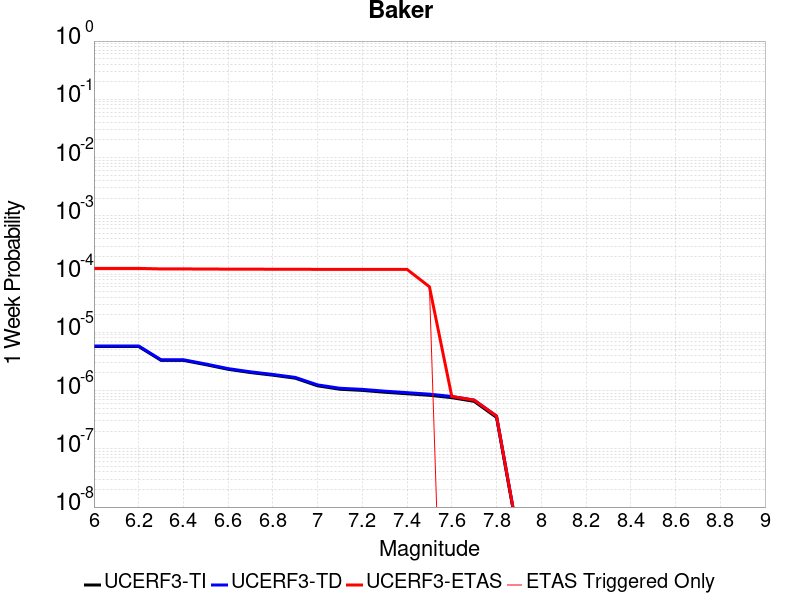 | 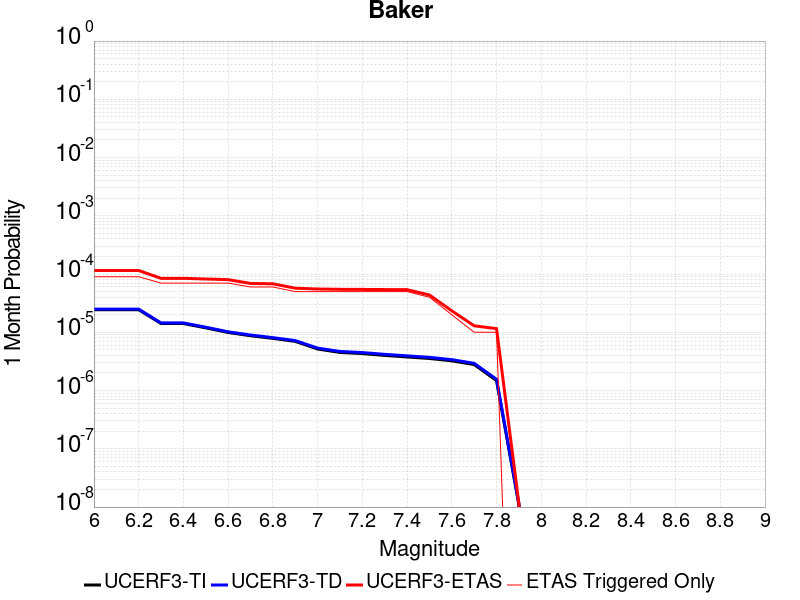 | 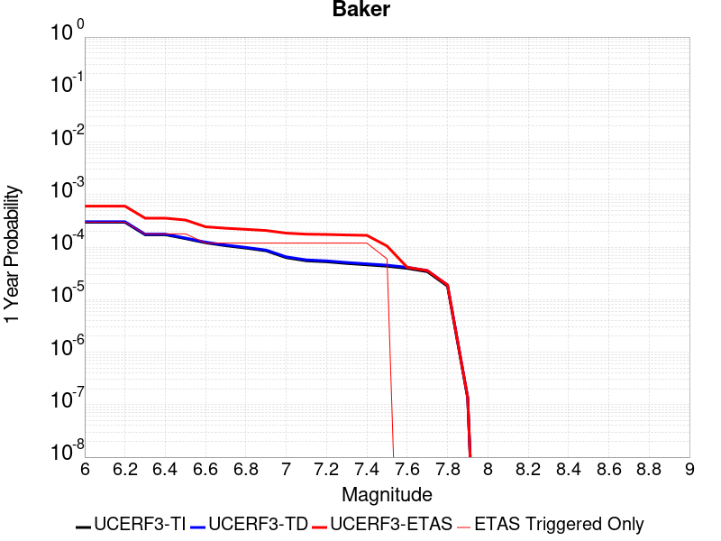 | 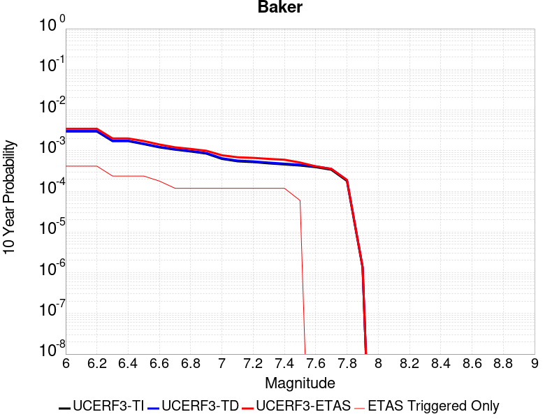 |

| Magnitude | 1 wk TI Prob | 1 wk TD Prob | 1 wk ETAS Prob | 1 wk ETAS/TD Gain | 1 wk ETAS Triggered Only | 1 mo TI Prob | 1 mo TD Prob | 1 mo ETAS Prob | 1 mo ETAS/TD Gain | 1 mo ETAS Triggered Only | 1 yr TI Prob | 1 yr TD Prob | 1 yr ETAS Prob | 1 yr ETAS/TD Gain | 1 yr ETAS Triggered Only | 10 yr TI Prob | 10 yr TD Prob | 10 yr ETAS Prob | 10 yr ETAS/TD Gain | 10 yr ETAS Triggered Only |
|-----|-----|-----|-----|-----|-----|-----|-----|-----|-----|-----|-----|-----|-----|-----|-----|-----|-----|-----|-----|-----|
| 6.0 | 5.695525E-6 | 5.8348373E-6 | 5.5834545E-5 | 9.569169 | 5.0E-5 | 2.4409164E-5 | 2.5006228E-5 | 1.15003975E-4 | 4.5990133 | 9.0E-5 | 2.9714106E-4 | 3.044123E-4 | 4.4436968E-4 | 1.4597626 | 1.4E-4 | 0.0029674405 | 0.0030403486 | 0.003279619 | 1.0786983 | 2.4E-4 |
| 6.1 | 5.695525E-6 | 5.8348373E-6 | 5.5834545E-5 | 9.569169 | 5.0E-5 | 2.4409164E-5 | 2.5006228E-5 | 1.15003975E-4 | 4.5990133 | 9.0E-5 | 2.9714106E-4 | 3.044123E-4 | 4.4436968E-4 | 1.4597626 | 1.4E-4 | 0.0029674405 | 0.0030403486 | 0.003279619 | 1.0786983 | 2.4E-4 |
| 6.2 | 5.695525E-6 | 5.8348373E-6 | 5.5834545E-5 | 9.569169 | 5.0E-5 | 2.4409164E-5 | 2.5006228E-5 | 1.15003975E-4 | 4.5990133 | 9.0E-5 | 2.9714106E-4 | 3.044123E-4 | 4.4436968E-4 | 1.4597626 | 1.4E-4 | 0.0029674405 | 0.0030403486 | 0.003279619 | 1.0786983 | 2.4E-4 |
| 6.3 | 3.2995713E-6 | 3.383667E-6 | 5.3383497E-5 | 15.776817 | 5.0E-5 | 1.4140943E-5 | 1.4501353E-5 | 8.450034E-5 | 5.827066 | 7.0E-5 | 1.7215237E-4 | 1.7654014E-4 | 2.8652072E-4 | 1.6229777 | 1.1E-4 | 0.0017201907 | 0.001764046 | 0.0019337462 | 1.0961994 | 1.7E-4 |
| 6.4 | 3.2995713E-6 | 3.383667E-6 | 5.3383497E-5 | 15.776817 | 5.0E-5 | 1.4140943E-5 | 1.4501353E-5 | 8.450034E-5 | 5.827066 | 7.0E-5 | 1.7215237E-4 | 1.7654014E-4 | 2.8652072E-4 | 1.6229777 | 1.1E-4 | 0.0017201907 | 0.001764046 | 0.0019337462 | 1.0961994 | 1.7E-4 |
| 6.5 | 2.782202E-6 | 2.8558404E-6 | 5.28557E-5 | 18.50793 | 5.0E-5 | 1.1923668E-5 | 1.223926E-5 | 8.22384E-5 | 6.7192297 | 7.0E-5 | 1.4516099E-4 | 1.4900314E-4 | 2.5898675E-4 | 1.7381295 | 1.1E-4 | 0.001450662 | 0.0014890651 | 0.0016588119 | 1.1139956 | 1.7E-4 |
| 6.6 | 2.3163404E-6 | 2.38092E-6 | 5.23808E-5 | 22.000237 | 5.0E-5 | 9.927136E-6 | 1.0203904E-5 | 8.020319E-5 | 7.8600492 | 7.0E-5 | 1.20856166E-4 | 1.2422565E-4 | 2.2421323E-4 | 1.8048867 | 1.0E-4 | 0.0012079047 | 0.0012415823 | 0.0014013837 | 1.1287078 | 1.6E-4 |
| 6.7 | 2.037056E-6 | 2.0965003E-6 | 5.2096395E-5 | 24.849218 | 5.0E-5 | 8.7302105E-6 | 8.984972E-6 | 6.898443E-5 | 7.6777573 | 6.0E-5 | 1.0628513E-4 | 1.093867E-4 | 1.9937685E-4 | 1.822679 | 9.0E-5 | 0.0010623431 | 0.0010933448 | 0.0012331917 | 1.1279074 | 1.4E-4 |
| 6.8 | 1.8356744E-6 | 1.8915287E-6 | 5.1891435E-5 | 27.433596 | 5.0E-5 | 7.867153E-6 | 8.106527E-6 | 6.810604E-5 | 8.401383 | 6.0E-5 | 9.577837E-5 | 9.869264E-5 | 1.8868376E-4 | 1.9118321 | 9.0E-5 | 9.57371E-4 | 9.86502E-4 | 0.001126364 | 1.1417756 | 1.4E-4 |
| 6.9 | 1.6310546E-6 | 1.6832072E-6 | 5.1683124E-5 | 30.705147 | 5.0E-5 | 6.9902153E-6 | 7.213726E-6 | 5.7213365E-5 | 7.931181 | 5.0E-5 | 8.510255E-5 | 8.782368E-5 | 1.6781666E-4 | 1.910836 | 8.0E-5 | 8.5069967E-4 | 8.7790104E-4 | 9.977957E-4 | 1.1365696 | 1.2E-4 |
| 7.0 | 1.2058036E-6 | 1.2508665E-6 | 5.1250805E-5 | 40.97224 | 5.0E-5 | 5.1677193E-6 | 5.3608455E-6 | 5.536058E-5 | 10.326837 | 5.0E-5 | 6.291517E-5 | 6.5266366E-5 | 1.4526115E-4 | 2.2256663 | 8.0E-5 | 6.289736E-4 | 6.524743E-4 | 7.5240905E-4 | 1.1531627 | 1.0E-4 |
| 7.1 | 1.052382E-6 | 1.0951609E-6 | 5.1095107E-5 | 46.655342 | 5.0E-5 | 4.5102006E-6 | 4.693538E-6 | 5.4693304E-5 | 11.652894 | 5.0E-5 | 5.491031E-5 | 5.7142337E-5 | 1.3713776E-4 | 2.3999329 | 8.0E-5 | 5.4896745E-4 | 5.7127734E-4 | 6.712202E-4 | 1.1749463 | 1.0E-4 |
| 7.2 | 1.0067454E-6 | 1.0487711E-6 | 5.104872E-5 | 48.674797 | 5.0E-5 | 4.3146156E-6 | 4.4947255E-6 | 5.44945E-5 | 12.1241 | 5.0E-5 | 5.252918E-5 | 5.4721917E-5 | 1.3471754E-4 | 2.461857 | 8.0E-5 | 5.251676E-4 | 5.470853E-4 | 6.470306E-4 | 1.1826868 | 1.0E-4 |
| 7.3 | 9.3596316E-7 | 9.767723E-7 | 5.0976723E-5 | 52.18895 | 5.0E-5 | 4.0112645E-6 | 4.1861604E-6 | 5.418595E-5 | 12.944069 | 5.0E-5 | 4.8836053E-5 | 5.096532E-5 | 1.3096124E-4 | 2.569615 | 8.0E-5 | 4.8825322E-4 | 5.095371E-4 | 6.0948613E-4 | 1.1961566 | 1.0E-4 |
| 7.4 | 8.8117395E-7 | 9.2076635E-7 | 5.092072E-5 | 55.302544 | 5.0E-5 | 3.7764542E-6 | 3.9461356E-6 | 5.394594E-5 | 13.670574 | 5.0E-5 | 4.5977362E-5 | 4.8043148E-5 | 1.08040265E-4 | 2.2488174 | 6.0E-5 | 4.596785E-4 | 4.8032837E-4 | 5.6028995E-4 | 1.1664727 | 8.0E-5 |
| 7.5 | 8.292386E-7 | 8.6745956E-7 | 4.0867424E-5 | 47.111618 | 4.0E-5 | 3.5538749E-6 | 3.7176785E-6 | 4.371753E-5 | 11.759362 | 4.0E-5 | 4.326757E-5 | 4.5261804E-5 | 9.5259544E-5 | 2.1046343 | 5.0E-5 | 4.3259145E-4 | 4.5252658E-4 | 5.124994E-4 | 1.1325289 | 6.0E-5 |
| 7.6 | 7.553842E-7 | 7.9144706E-7 | 2.079143E-5 | 26.270147 | 2.0E-5 | 3.2373566E-6 | 3.3919116E-6 | 2.3391844E-5 | 6.89636 | 2.0E-5 | 3.9414106E-5 | 4.129575E-5 | 6.129492E-5 | 1.4842913 | 2.0E-5 | 3.9407116E-4 | 4.1288146E-4 | 4.4286906E-4 | 1.07263 | 3.0E-5 |
| 7.7 | 6.5285366E-7 | 6.852797E-7 | 1.0685273E-5 | 15.592572 | 1.0E-5 | 2.797941E-6 | 2.9369096E-6 | 1.293688E-5 | 4.4049296 | 1.0E-5 | 3.40644E-5 | 3.5756293E-5 | 4.5755936E-5 | 1.279661 | 1.0E-5 | 3.405918E-4 | 3.5750607E-4 | 3.7749892E-4 | 1.0559231 | 2.0E-5 |
| 7.8 | 3.4586725E-7 | 3.6482615E-7 | 1.0364823E-5 | 28.410307 | 1.0E-5 | 1.4822873E-6 | 1.5635396E-6 | 1.1563524E-5 | 7.3957343 | 1.0E-5 | 1.80467E-5 | 1.9035933E-5 | 2.9035744E-5 | 1.5253123 | 1.0E-5 | 1.8045233E-4 | 1.9034347E-4 | 2.0034157E-4 | 1.0525266 | 1.0E-5 |
| 7.9 | 2.5591178E-9 | 2.6696718E-9 | 2.6696718E-9 | 1.0 | 0.0 | 1.0967647E-8 | 1.14414505E-8 | 1.14414505E-8 | 1.0 | 0.0 | 1.335311E-7 | 1.3929966E-7 | 1.3929966E-7 | 1.0 | 0.0 | 1.3353102E-6 | 1.3929966E-6 | 1.3929966E-6 | 1.0 | 0.0 |

## Pinto Mtn
*[(top)](#table-of-contents)*

| 1 Week | 1 Month | 1 Year | 10 Year |
|-----|-----|-----|-----|
| 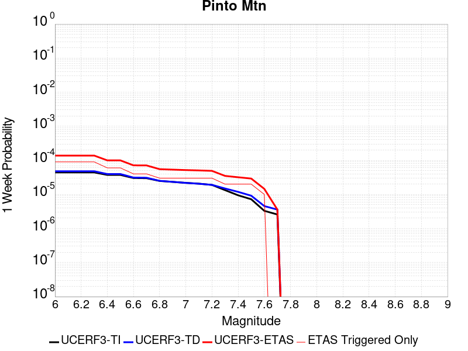 | 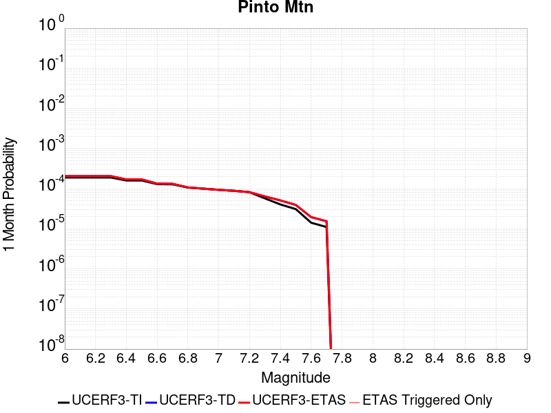 | 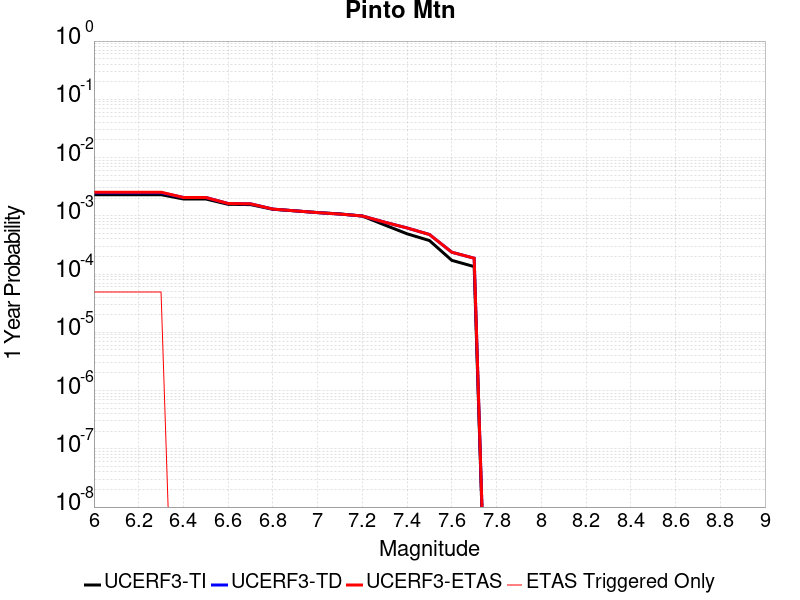 | 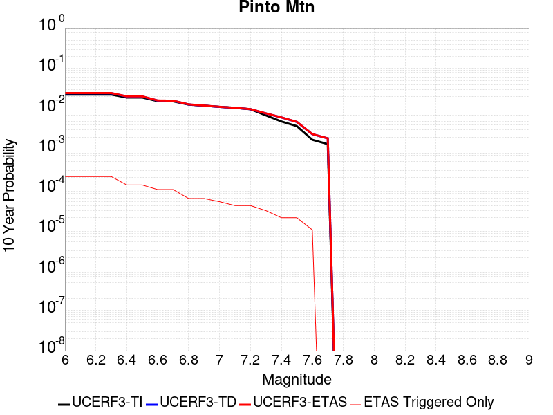 |

| Magnitude | 1 wk TI Prob | 1 wk TD Prob | 1 wk ETAS Prob | 1 wk ETAS/TD Gain | 1 wk ETAS Triggered Only | 1 mo TI Prob | 1 mo TD Prob | 1 mo ETAS Prob | 1 mo ETAS/TD Gain | 1 mo ETAS Triggered Only | 1 yr TI Prob | 1 yr TD Prob | 1 yr ETAS Prob | 1 yr ETAS/TD Gain | 1 yr ETAS Triggered Only | 10 yr TI Prob | 10 yr TD Prob | 10 yr ETAS Prob | 10 yr ETAS/TD Gain | 10 yr ETAS Triggered Only |
|-----|-----|-----|-----|-----|-----|-----|-----|-----|-----|-----|-----|-----|-----|-----|-----|-----|-----|-----|-----|-----|
| 6.0 | 4.4194956E-5 | 4.7853926E-5 | 1.3784962E-4 | 2.8806336 | 9.0E-5 | 1.893932E-4 | 2.0507304E-4 | 3.0505253E-4 | 1.4875312 | 1.0E-4 | 0.0023034236 | 0.0024940688 | 0.0026337195 | 1.0559932 | 1.4E-4 | 0.022796938 | 0.024678305 | 0.024883123 | 1.0082995 | 2.1E-4 |
| 6.1 | 4.4194956E-5 | 4.7853926E-5 | 1.3784962E-4 | 2.8806336 | 9.0E-5 | 1.893932E-4 | 2.0507304E-4 | 3.0505253E-4 | 1.4875312 | 1.0E-4 | 0.0023034236 | 0.0024940688 | 0.0026337195 | 1.0559932 | 1.4E-4 | 0.022796938 | 0.024678305 | 0.024883123 | 1.0082995 | 2.1E-4 |
| 6.2 | 4.4194956E-5 | 4.7853926E-5 | 1.3784962E-4 | 2.8806336 | 9.0E-5 | 1.893932E-4 | 2.0507304E-4 | 3.0505253E-4 | 1.4875312 | 1.0E-4 | 0.0023034236 | 0.0024940688 | 0.0026337195 | 1.0559932 | 1.4E-4 | 0.022796938 | 0.024678305 | 0.024883123 | 1.0082995 | 2.1E-4 |
| 6.3 | 4.4194956E-5 | 4.7853926E-5 | 1.3784962E-4 | 2.8806336 | 9.0E-5 | 1.893932E-4 | 2.0507304E-4 | 3.0505253E-4 | 1.4875312 | 1.0E-4 | 0.0023034236 | 0.0024940688 | 0.0026337195 | 1.0559932 | 1.4E-4 | 0.022796938 | 0.024678305 | 0.024883123 | 1.0082995 | 2.1E-4 |
| 6.4 | 3.729929E-5 | 3.960349E-5 | 9.9601115E-5 | 2.514958 | 6.0E-5 | 1.5984432E-4 | 1.6971873E-4 | 2.3970685E-4 | 1.4123771 | 7.0E-5 | 0.0019443673 | 0.0020644604 | 0.002164254 | 1.0483388 | 1.0E-4 | 0.019274427 | 0.020462848 | 0.020590188 | 1.006223 | 1.3E-4 |
| 6.5 | 3.729929E-5 | 3.960349E-5 | 9.9601115E-5 | 2.514958 | 6.0E-5 | 1.5984432E-4 | 1.6971873E-4 | 2.3970685E-4 | 1.4123771 | 7.0E-5 | 0.0019443673 | 0.0020644604 | 0.002164254 | 1.0483388 | 1.0E-4 | 0.019274427 | 0.020462848 | 0.020590188 | 1.006223 | 1.3E-4 |
| 6.6 | 3.0204548E-5 | 3.12056E-5 | 7.1204355E-5 | 2.2817812 | 4.0E-5 | 1.2944164E-4 | 1.3373162E-4 | 1.7372628E-4 | 1.2990665 | 4.0E-5 | 0.0015748127 | 0.0016270012 | 0.0016968873 | 1.042954 | 7.0E-5 | 0.015636992 | 0.016154764 | 0.01625315 | 1.0060902 | 1.0E-4 |
| 6.7 | 2.9857754E-5 | 3.0814987E-5 | 7.081375E-5 | 2.2980297 | 4.0E-5 | 1.2795553E-4 | 1.3205773E-4 | 1.7205245E-4 | 1.3028579 | 4.0E-5 | 0.0015567453 | 0.0016066517 | 0.0016765392 | 1.0434989 | 7.0E-5 | 0.015458848 | 0.015954204 | 0.01605261 | 1.0061679 | 1.0E-4 |
| 6.8 | 2.4819734E-5 | 2.5009665E-5 | 5.5008917E-5 | 2.1995063 | 3.0E-5 | 1.0636595E-4 | 1.0718E-4 | 1.3717679E-4 | 1.279873 | 3.0E-5 | 0.0012942362 | 0.001304157 | 0.0013441049 | 1.0306312 | 4.0E-5 | 0.012867244 | 0.012967403 | 0.013026625 | 1.004567 | 6.0E-5 |
| 6.9 | 2.331124E-5 | 2.3337945E-5 | 5.3337244E-5 | 2.2854302 | 3.0E-5 | 9.990149E-5 | 1.0001605E-4 | 1.3001304E-4 | 1.2999219 | 3.0E-5 | 0.001215622 | 0.0012170355 | 0.0012569868 | 1.0328268 | 4.0E-5 | 0.012089936 | 0.012105897 | 0.012165171 | 1.0048963 | 6.0E-5 |
| 7.0 | 2.1818534E-5 | 2.1761074E-5 | 5.176042E-5 | 2.3785784 | 3.0E-5 | 9.3504656E-5 | 9.3258524E-5 | 1.2325573E-4 | 1.3216565 | 3.0E-5 | 0.0011378246 | 0.0011348509 | 0.0011648169 | 1.0264052 | 3.0E-5 | 0.011320163 | 0.01129266 | 0.011342094 | 1.0043776 | 5.0E-5 |
| 7.1 | 2.066081E-5 | 2.0540718E-5 | 5.05401E-5 | 2.4604838 | 3.0E-5 | 8.854332E-5 | 8.8028784E-5 | 1.18026146E-4 | 1.3407676 | 3.0E-5 | 0.0010774818 | 0.0010712431 | 0.001101211 | 1.0279748 | 3.0E-5 | 0.010722724 | 0.0106628435 | 0.010702417 | 1.0037113 | 4.0E-5 |
| 7.2 | 1.8990233E-5 | 1.9054001E-5 | 4.905343E-5 | 2.5744424 | 3.0E-5 | 8.138417E-5 | 8.165756E-5 | 1.11655114E-4 | 1.3673579 | 3.0E-5 | 9.904018E-4 | 9.937467E-4 | 0.0010237169 | 1.0301588 | 3.0E-5 | 0.009859995 | 0.009895029 | 0.009934633 | 1.0040025 | 4.0E-5 |
| 7.3 | 1.3335872E-5 | 1.4906713E-5 | 3.4906414E-5 | 2.3416574 | 2.0E-5 | 5.7152483E-5 | 6.388442E-5 | 8.388314E-5 | 1.3130454 | 2.0E-5 | 6.956093E-4 | 7.77528E-4 | 7.975124E-4 | 1.0257026 | 2.0E-5 | 0.006934359 | 0.007749376 | 0.0077791433 | 1.0038413 | 3.0E-5 |
| 7.4 | 9.414066E-6 | 1.186096E-5 | 3.1860724E-5 | 2.6861842 | 2.0E-5 | 4.0345374E-5 | 5.083175E-5 | 7.0830734E-5 | 1.3934349 | 2.0E-5 | 4.910942E-4 | 6.1871024E-4 | 6.386979E-4 | 1.0323054 | 2.0E-5 | 0.0049001034 | 0.0061708256 | 0.006190702 | 1.003221 | 2.0E-5 |
| 7.5 | 7.2101157E-6 | 9.158192E-6 | 2.9158009E-5 | 3.1838171 | 2.0E-5 | 3.090013E-5 | 3.9248847E-5 | 5.9248065E-5 | 1.5095491 | 2.0E-5 | 3.7614413E-4 | 4.7775774E-4 | 4.977482E-4 | 1.0418422 | 2.0E-5 | 0.0037550807 | 0.004768082 | 0.0047879866 | 1.0041746 | 2.0E-5 |
| 7.6 | 3.296375E-6 | 4.5455017E-6 | 1.4545456E-5 | 3.1999671 | 1.0E-5 | 1.4127245E-5 | 1.9480583E-5 | 2.9480389E-5 | 1.5133216 | 1.0E-5 | 1.7198564E-4 | 2.3715167E-4 | 2.4714932E-4 | 1.042157 | 1.0E-5 | 0.0017185259 | 0.0023691233 | 0.0023790996 | 1.004211 | 1.0E-5 |
| 7.7 | 2.5741092E-6 | 3.5844084E-6 | 3.5844084E-6 | 1.0 | 0.0 | 1.103185E-5 | 1.5361667E-5 | 1.5361667E-5 | 1.0 | 0.0 | 1.3430449E-4 | 1.8701357E-4 | 1.8701357E-4 | 1.0 | 0.0 | 0.0013422335 | 0.0018686918 | 0.0018686918 | 1.0 | 0.0 |

## San Jacinto (San Jacinto Valley) rev
*[(top)](#table-of-contents)*

| 1 Week | 1 Month | 1 Year | 10 Year |
|-----|-----|-----|-----|
|  | 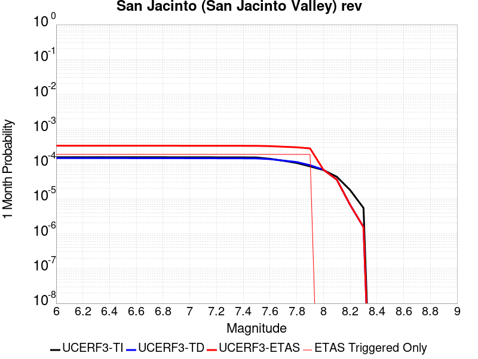 | 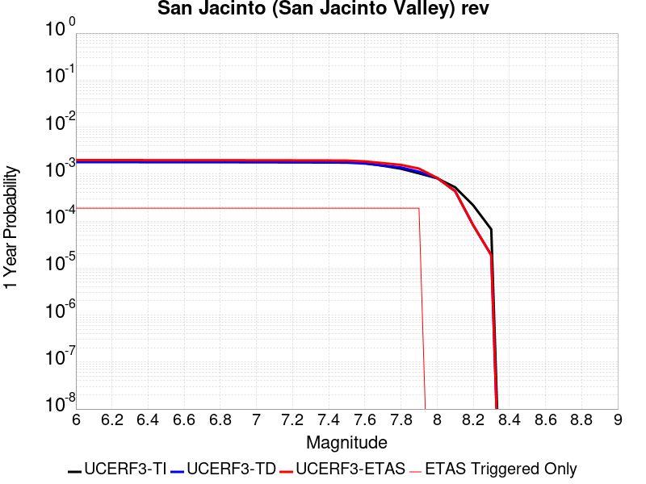 | 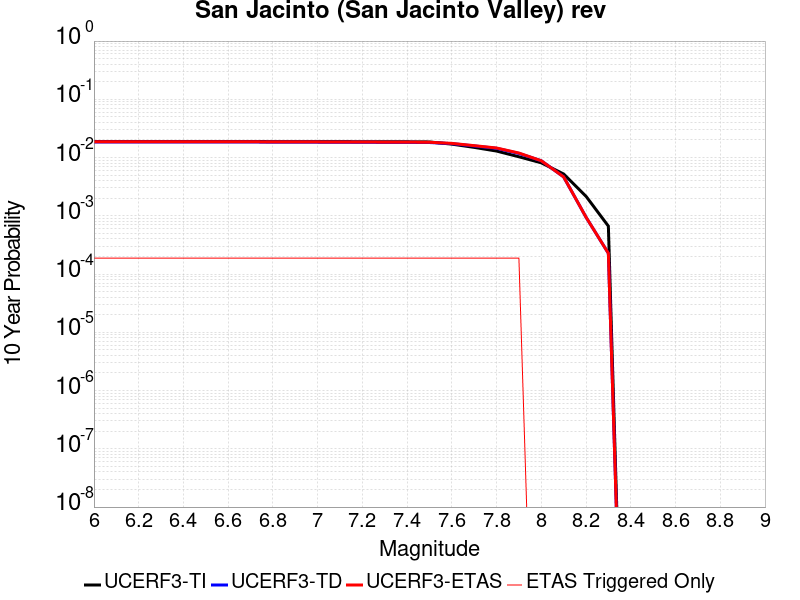 |

| Magnitude | 1 wk TI Prob | 1 wk TD Prob | 1 wk ETAS Prob | 1 wk ETAS/TD Gain | 1 wk ETAS Triggered Only | 1 mo TI Prob | 1 mo TD Prob | 1 mo ETAS Prob | 1 mo ETAS/TD Gain | 1 mo ETAS Triggered Only | 1 yr TI Prob | 1 yr TD Prob | 1 yr ETAS Prob | 1 yr ETAS/TD Gain | 1 yr ETAS Triggered Only | 10 yr TI Prob | 10 yr TD Prob | 10 yr ETAS Prob | 10 yr ETAS/TD Gain | 10 yr ETAS Triggered Only |
|-----|-----|-----|-----|-----|-----|-----|-----|-----|-----|-----|-----|-----|-----|-----|-----|-----|-----|-----|-----|-----|
| 6.0 | 3.652694E-5 | 3.4401106E-5 | 1.3439766E-4 | 3.9067833 | 1.0E-4 | 1.5653463E-4 | 1.4742499E-4 | 2.674073E-4 | 1.8138533 | 1.2E-4 | 0.0019041431 | 0.0017934233 | 0.0019731005 | 1.1001867 | 1.8E-4 | 0.018879099 | 0.018526303 | 0.018732412 | 1.0111252 | 2.1E-4 |
| 6.1 | 3.652694E-5 | 3.4401106E-5 | 1.3439766E-4 | 3.9067833 | 1.0E-4 | 1.5653463E-4 | 1.4742499E-4 | 2.674073E-4 | 1.8138533 | 1.2E-4 | 0.0019041431 | 0.0017934233 | 0.0019731005 | 1.1001867 | 1.8E-4 | 0.018879099 | 0.018526303 | 0.018732412 | 1.0111252 | 2.1E-4 |
| 6.2 | 3.652694E-5 | 3.4401106E-5 | 1.3439766E-4 | 3.9067833 | 1.0E-4 | 1.5653463E-4 | 1.4742499E-4 | 2.674073E-4 | 1.8138533 | 1.2E-4 | 0.0019041431 | 0.0017934233 | 0.0019731005 | 1.1001867 | 1.8E-4 | 0.018879099 | 0.018526303 | 0.018732412 | 1.0111252 | 2.1E-4 |
| 6.3 | 3.652694E-5 | 3.4401106E-5 | 1.3439766E-4 | 3.9067833 | 1.0E-4 | 1.5653463E-4 | 1.4742499E-4 | 2.674073E-4 | 1.8138533 | 1.2E-4 | 0.0019041431 | 0.0017934233 | 0.0019731005 | 1.1001867 | 1.8E-4 | 0.018879099 | 0.018526303 | 0.018732412 | 1.0111252 | 2.1E-4 |
| 6.4 | 3.646941E-5 | 3.432268E-5 | 1.3431924E-4 | 3.9134254 | 1.0E-4 | 1.5628811E-4 | 1.4708891E-4 | 2.6707127E-4 | 1.815713 | 1.2E-4 | 0.0019011468 | 0.0017893389 | 0.0019690169 | 1.1004158 | 1.8E-4 | 0.018849645 | 0.018486181 | 0.0186923 | 1.0111499 | 2.1E-4 |
| 6.5 | 3.646941E-5 | 3.432268E-5 | 1.3431924E-4 | 3.9134254 | 1.0E-4 | 1.5628811E-4 | 1.4708891E-4 | 2.6707127E-4 | 1.815713 | 1.2E-4 | 0.0019011468 | 0.0017893389 | 0.0019690169 | 1.1004158 | 1.8E-4 | 0.018849645 | 0.018486181 | 0.0186923 | 1.0111499 | 2.1E-4 |
| 6.6 | 3.6442503E-5 | 3.4286066E-5 | 1.3428264E-4 | 3.9165366 | 1.0E-4 | 1.561728E-4 | 1.4693203E-4 | 2.669144E-4 | 1.8165842 | 1.2E-4 | 0.0018997455 | 0.001787432 | 0.0019671102 | 1.1005231 | 1.8E-4 | 0.018835869 | 0.01846745 | 0.018673573 | 1.0111613 | 2.1E-4 |
| 6.7 | 3.6432113E-5 | 3.427164E-5 | 1.3426821E-4 | 3.9177642 | 1.0E-4 | 1.5612828E-4 | 1.4687021E-4 | 2.6685258E-4 | 1.8169279 | 1.2E-4 | 0.0018992044 | 0.0017866807 | 0.001966359 | 1.1005654 | 1.8E-4 | 0.018830549 | 0.018460074 | 0.018666198 | 1.0111659 | 2.1E-4 |
| 6.8 | 3.6409598E-5 | 3.4240697E-5 | 1.3423727E-4 | 3.9204013 | 1.0E-4 | 1.560318E-4 | 1.4673761E-4 | 2.6672E-4 | 1.8176663 | 1.2E-4 | 0.0018980318 | 0.0017850689 | 0.0019647477 | 1.1006564 | 1.8E-4 | 0.018819023 | 0.018444229 | 0.018650355 | 1.0111756 | 2.1E-4 |
| 6.9 | 3.638078E-5 | 3.4201123E-5 | 1.341977E-4 | 3.9237807 | 1.0E-4 | 1.5590832E-4 | 1.4656801E-4 | 2.6655043E-4 | 1.8186126 | 1.2E-4 | 0.0018965311 | 0.0017830075 | 0.0019626867 | 1.100773 | 1.8E-4 | 0.018804269 | 0.018423963 | 0.018630093 | 1.0111881 | 2.1E-4 |
| 7.0 | 3.6294874E-5 | 3.408314E-5 | 1.3407973E-4 | 3.933902 | 1.0E-4 | 1.5554018E-4 | 1.4606243E-4 | 2.660449E-4 | 1.8214465 | 1.2E-4 | 0.0018920569 | 0.0017768623 | 0.0019565425 | 1.1011221 | 1.8E-4 | 0.018760284 | 0.018363545 | 0.018569687 | 1.0112257 | 2.1E-4 |
| 7.1 | 3.6260717E-5 | 3.403942E-5 | 1.3403602E-4 | 3.9376702 | 1.0E-4 | 1.5539382E-4 | 1.4587509E-4 | 2.6585758E-4 | 1.8225015 | 1.2E-4 | 0.001890278 | 0.0017745851 | 0.0019542656 | 1.1012522 | 1.8E-4 | 0.018742796 | 0.018341139 | 0.018547287 | 1.0112396 | 2.1E-4 |
| 7.2 | 3.6210204E-5 | 3.397364E-5 | 1.3397024E-4 | 3.9433584 | 1.0E-4 | 1.5517735E-4 | 1.455932E-4 | 2.6557574E-4 | 1.8240943 | 1.2E-4 | 0.001887647 | 0.0017711588 | 0.00195084 | 1.1014484 | 1.8E-4 | 0.01871693 | 0.018307408 | 0.018513564 | 1.0112607 | 2.1E-4 |
| 7.3 | 3.6119454E-5 | 3.386193E-5 | 1.3385854E-4 | 3.9530692 | 1.0E-4 | 1.5478847E-4 | 1.4511449E-4 | 2.6509707E-4 | 1.8268133 | 1.2E-4 | 0.0018829206 | 0.0017653398 | 0.001945022 | 1.1017834 | 1.8E-4 | 0.018670462 | 0.01824996 | 0.018456127 | 1.0112969 | 2.1E-4 |
| 7.4 | 3.607848E-5 | 3.380943E-5 | 1.3380605E-4 | 3.957655 | 1.0E-4 | 1.5461289E-4 | 1.4488952E-4 | 2.6487213E-4 | 1.8280972 | 1.2E-4 | 0.0018807866 | 0.0017626052 | 0.0019422879 | 1.1019416 | 1.8E-4 | 0.018649481 | 0.018222956 | 0.018429128 | 1.0113139 | 2.1E-4 |
| 7.5 | 3.5856774E-5 | 3.3619202E-5 | 1.3361585E-4 | 3.9743905 | 1.0E-4 | 1.5366284E-4 | 1.4407437E-4 | 2.6405707E-4 | 1.8327832 | 1.2E-4 | 0.0018692396 | 0.0017526967 | 0.0019323812 | 1.1025189 | 1.8E-4 | 0.018535944 | 0.018124057 | 0.01833025 | 1.0113769 | 2.1E-4 |
| 7.6 | 3.286655E-5 | 3.2142278E-5 | 1.3213906E-4 | 4.1110673 | 1.0E-4 | 1.4084904E-4 | 1.3774536E-4 | 2.5772883E-4 | 1.8710527 | 1.2E-4 | 0.001713488 | 0.0016757617 | 0.00185546 | 1.1072339 | 1.8E-4 | 0.017003361 | 0.017343804 | 0.017550161 | 1.011898 | 2.1E-4 |
| 7.7 | 2.8882527E-5 | 2.9235205E-5 | 1.2923228E-4 | 4.4204335 | 1.0E-4 | 1.237764E-4 | 1.2528773E-4 | 2.4527268E-4 | 1.9576753 | 1.2E-4 | 0.0015059357 | 0.0015243118 | 0.0017040374 | 1.1179061 | 1.8E-4 | 0.014957713 | 0.015830338 | 0.016037013 | 1.0130557 | 2.1E-4 |
| 7.8 | 2.4950225E-5 | 2.6526219E-5 | 1.2652356E-4 | 4.769755 | 1.0E-4 | 1.0692515E-4 | 1.1367885E-4 | 2.3366521E-4 | 2.0554852 | 1.2E-4 | 0.0013010362 | 0.0013831621 | 0.0015629132 | 1.1299566 | 1.8E-4 | 0.012934455 | 0.01441176 | 0.014618733 | 1.0143614 | 2.1E-4 |
| 7.9 | 1.9881603E-5 | 2.150649E-5 | 1.2150434E-4 | 5.649659 | 1.0E-4 | 8.520408E-5 | 9.216742E-5 | 2.1215636E-4 | 2.3018584 | 1.2E-4 | 0.001036866 | 0.0011215615 | 0.0013013596 | 1.1603105 | 1.8E-4 | 0.010320415 | 0.011776998 | 0.011984524 | 1.0176214 | 2.1E-4 |
| 8.0 | 1.563292E-5 | 1.5936288E-5 | 8.593517E-5 | 5.392421 | 7.0E-5 | 6.6996516E-5 | 6.829659E-5 | 1.3829181E-4 | 2.0248713 | 7.0E-5 | 8.153773E-4 | 8.3119445E-4 | 9.510947E-4 | 1.1442505 | 1.2E-4 | 0.00812392 | 0.008810331 | 0.008959009 | 1.0168755 | 1.5E-4 |
| 8.1 | 1.0045313E-5 | 8.300794E-6 | 1.830071E-5 | 2.204694 | 1.0E-5 | 4.305063E-5 | 3.557435E-5 | 4.5573994E-5 | 1.2810915 | 1.0E-5 | 5.2401534E-4 | 4.3303217E-4 | 4.6301915E-4 | 1.0692489 | 3.0E-5 | 0.0052278144 | 0.0046587666 | 0.0047085336 | 1.0106825 | 5.0E-5 |
| 8.2 | 4.1554413E-6 | 1.5648296E-6 | 1.5648296E-6 | 1.0 | 0.0 | 1.7808914E-5 | 6.7063957E-6 | 6.7063957E-6 | 1.0 | 0.0 | 2.1680194E-4 | 8.164734E-5 | 8.164734E-5 | 1.0 | 0.0 | 0.0021659054 | 9.479703E-4 | 9.479703E-4 | 1.0 | 0.0 |
| 8.3 | 1.2758221E-6 | 3.612677E-7 | 3.612677E-7 | 1.0 | 0.0 | 5.4677976E-6 | 1.5482892E-6 | 1.5482892E-6 | 1.0 | 0.0 | 6.65684E-5 | 1.8850264E-5 | 1.8850264E-5 | 1.0 | 0.0 | 6.6548464E-4 | 2.2739546E-4 | 2.2739546E-4 | 1.0 | 0.0 |

## San Jacinto (Stepovers Combined)
*[(top)](#table-of-contents)*

| 1 Week | 1 Month | 1 Year | 10 Year |
|-----|-----|-----|-----|
| 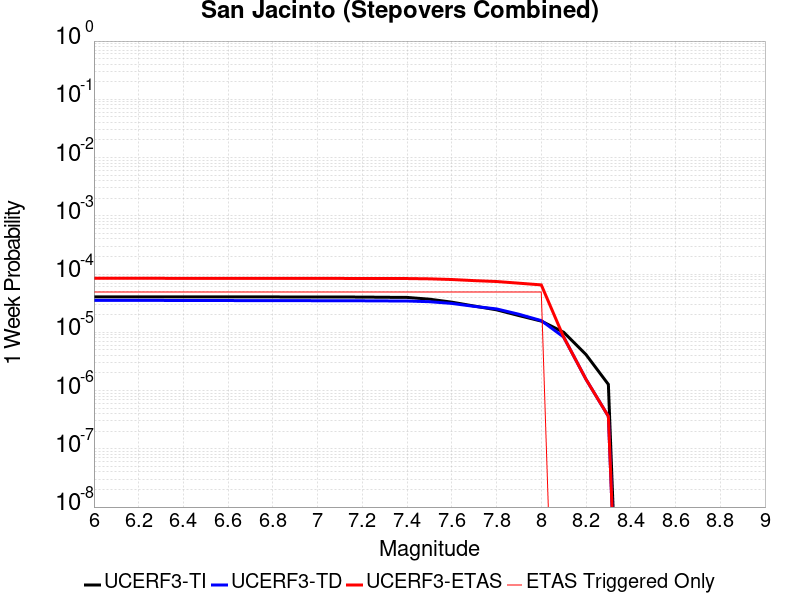 |  | 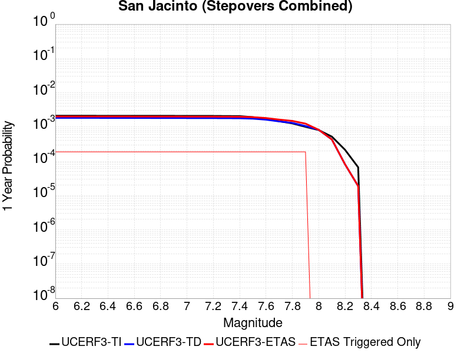 | 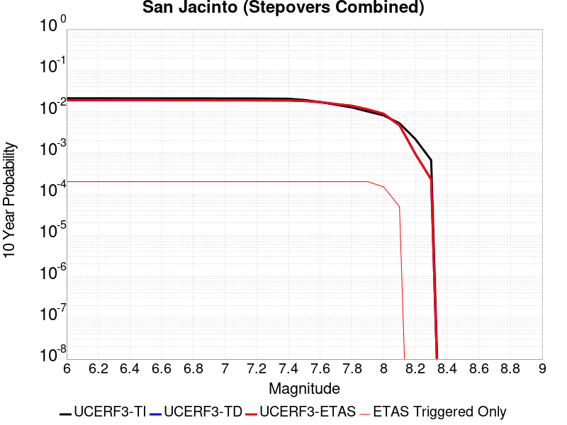 |

| Magnitude | 1 wk TI Prob | 1 wk TD Prob | 1 wk ETAS Prob | 1 wk ETAS/TD Gain | 1 wk ETAS Triggered Only | 1 mo TI Prob | 1 mo TD Prob | 1 mo ETAS Prob | 1 mo ETAS/TD Gain | 1 mo ETAS Triggered Only | 1 yr TI Prob | 1 yr TD Prob | 1 yr ETAS Prob | 1 yr ETAS/TD Gain | 1 yr ETAS Triggered Only | 10 yr TI Prob | 10 yr TD Prob | 10 yr ETAS Prob | 10 yr ETAS/TD Gain | 10 yr ETAS Triggered Only |
|-----|-----|-----|-----|-----|-----|-----|-----|-----|-----|-----|-----|-----|-----|-----|-----|-----|-----|-----|-----|-----|
| 6.0 | 4.0667746E-5 | 3.5271103E-5 | 1.2526794E-4 | 3.551574 | 9.0E-5 | 1.742787E-4 | 1.5115313E-4 | 2.611365E-4 | 1.7276288 | 1.1E-4 | 0.0021197782 | 0.0018387372 | 0.0020084246 | 1.0922848 | 1.7E-4 | 0.020996714 | 0.018986495 | 0.019182697 | 1.0103338 | 2.0E-4 |
| 6.1 | 4.0667746E-5 | 3.5271103E-5 | 1.2526794E-4 | 3.551574 | 9.0E-5 | 1.742787E-4 | 1.5115313E-4 | 2.611365E-4 | 1.7276288 | 1.1E-4 | 0.0021197782 | 0.0018387372 | 0.0020084246 | 1.0922848 | 1.7E-4 | 0.020996714 | 0.018986495 | 0.019182697 | 1.0103338 | 2.0E-4 |
| 6.2 | 4.0667746E-5 | 3.5271103E-5 | 1.2526794E-4 | 3.551574 | 9.0E-5 | 1.742787E-4 | 1.5115313E-4 | 2.611365E-4 | 1.7276288 | 1.1E-4 | 0.0021197782 | 0.0018387372 | 0.0020084246 | 1.0922848 | 1.7E-4 | 0.020996714 | 0.018986495 | 0.019182697 | 1.0103338 | 2.0E-4 |
| 6.3 | 4.0667746E-5 | 3.5271103E-5 | 1.2526794E-4 | 3.551574 | 9.0E-5 | 1.742787E-4 | 1.5115313E-4 | 2.611365E-4 | 1.7276288 | 1.1E-4 | 0.0021197782 | 0.0018387372 | 0.0020084246 | 1.0922848 | 1.7E-4 | 0.020996714 | 0.018986495 | 0.019182697 | 1.0103338 | 2.0E-4 |
| 6.4 | 4.0577226E-5 | 3.5143014E-5 | 1.2513985E-4 | 3.5608742 | 9.0E-5 | 1.738908E-4 | 1.5060425E-4 | 2.6058767E-4 | 1.7302811 | 1.1E-4 | 0.0021150648 | 0.0018320669 | 0.0020017554 | 1.0926213 | 1.7E-4 | 0.020950472 | 0.018921062 | 0.019117279 | 1.0103703 | 2.0E-4 |
| 6.5 | 4.0577226E-5 | 3.5143014E-5 | 1.2513985E-4 | 3.5608742 | 9.0E-5 | 1.738908E-4 | 1.5060425E-4 | 2.6058767E-4 | 1.7302811 | 1.1E-4 | 0.0021150648 | 0.0018320669 | 0.0020017554 | 1.0926213 | 1.7E-4 | 0.020950472 | 0.018921062 | 0.019117279 | 1.0103703 | 2.0E-4 |
| 6.6 | 4.053861E-5 | 3.5088357E-5 | 1.250852E-4 | 3.5648634 | 9.0E-5 | 1.7372532E-4 | 1.5037002E-4 | 2.603535E-4 | 1.7314187 | 1.1E-4 | 0.0021130538 | 0.0018292206 | 0.0019989097 | 1.0927658 | 1.7E-4 | 0.020930743 | 0.01889314 | 0.019089362 | 1.0103859 | 2.0E-4 |
| 6.7 | 4.0516545E-5 | 3.505743E-5 | 1.2505427E-4 | 3.567126 | 9.0E-5 | 1.7363077E-4 | 1.502375E-4 | 2.60221E-4 | 1.732064 | 1.1E-4 | 0.002111905 | 0.0018276101 | 0.0019972993 | 1.0928477 | 1.7E-4 | 0.020919468 | 0.018877337 | 0.01907356 | 1.0103947 | 2.0E-4 |
| 6.8 | 4.049434E-5 | 3.5028992E-5 | 1.2502584E-4 | 3.5692103 | 9.0E-5 | 1.7353562E-4 | 1.5011564E-4 | 2.6009913E-4 | 1.7326584 | 1.1E-4 | 0.0021107488 | 0.0018261289 | 0.0019958185 | 1.092923 | 1.7E-4 | 0.020908125 | 0.018862749 | 0.019058976 | 1.0104029 | 2.0E-4 |
| 6.9 | 4.046386E-5 | 3.4991554E-5 | 1.2498841E-4 | 3.5719593 | 9.0E-5 | 1.73405E-4 | 1.499552E-4 | 2.599387E-4 | 1.7334424 | 1.1E-4 | 0.0021091616 | 0.0018241788 | 0.0019938687 | 1.0930226 | 1.7E-4 | 0.020892553 | 0.018843522 | 0.019039754 | 1.0104138 | 2.0E-4 |
| 7.0 | 4.036382E-5 | 3.4872126E-5 | 1.2486898E-4 | 3.5807679 | 9.0E-5 | 1.7297632E-4 | 1.4944343E-4 | 2.5942698E-4 | 1.7359545 | 1.1E-4 | 0.0021039525 | 0.0018179584 | 0.0019876494 | 1.0933415 | 1.7E-4 | 0.02084144 | 0.018782137 | 0.01897838 | 1.0104485 | 2.0E-4 |
| 7.1 | 4.0343282E-5 | 3.485059E-5 | 1.2484746E-4 | 3.582363 | 9.0E-5 | 1.7288832E-4 | 1.4935112E-4 | 2.593347E-4 | 1.7364094 | 1.1E-4 | 0.002102883 | 0.0018168368 | 0.0019865278 | 1.0933992 | 1.7E-4 | 0.020830948 | 0.018771008 | 0.018967252 | 1.0104548 | 2.0E-4 |
| 7.2 | 4.0257353E-5 | 3.475509E-5 | 1.2475195E-4 | 3.589459 | 9.0E-5 | 1.725201E-4 | 1.489419E-4 | 2.5892552E-4 | 1.7384331 | 1.1E-4 | 0.0020984085 | 0.0018118626 | 0.0019815546 | 1.0936561 | 1.7E-4 | 0.020787042 | 0.018721746 | 0.018918002 | 1.0104828 | 2.0E-4 |
| 7.3 | 3.9940667E-5 | 3.458276E-5 | 1.2457964E-4 | 3.6023629 | 9.0E-5 | 1.7116306E-4 | 1.4820343E-4 | 2.5818712E-4 | 1.7421131 | 1.1E-4 | 0.0020819185 | 0.0018028866 | 0.00197258 | 1.0941232 | 1.7E-4 | 0.020625217 | 0.018630387 | 0.018826662 | 1.0105351 | 2.0E-4 |
| 7.4 | 3.9721202E-5 | 3.4468165E-5 | 1.2446506E-4 | 3.611015 | 9.0E-5 | 1.7022261E-4 | 1.4771236E-4 | 2.576961E-4 | 1.7445805 | 1.1E-4 | 0.0020704903 | 0.0017969179 | 0.0019666124 | 1.0944364 | 1.7E-4 | 0.020513052 | 0.018569522 | 0.018765807 | 1.0105703 | 2.0E-4 |
| 7.5 | 3.7036873E-5 | 3.3535776E-5 | 1.2353275E-4 | 3.6836112 | 9.0E-5 | 1.5871979E-4 | 1.4371685E-4 | 2.5370103E-4 | 1.765284 | 1.1E-4 | 0.0019307006 | 0.0017483513 | 0.0019180541 | 1.0970645 | 1.7E-4 | 0.019140124 | 0.018071128 | 0.018267514 | 1.0108674 | 2.0E-4 |
| 7.6 | 3.2940967E-5 | 3.13167E-5 | 1.2131388E-4 | 3.873776 | 9.0E-5 | 1.4116794E-4 | 1.3420754E-4 | 2.4419278E-4 | 1.8195161 | 1.1E-4 | 0.0017173645 | 0.0016327545 | 0.0018024768 | 1.1039486 | 1.7E-4 | 0.01704153 | 0.016904091 | 0.01710071 | 1.0116315 | 2.0E-4 |
| 7.7 | 2.8236149E-5 | 2.7882697E-5 | 1.1788019E-4 | 4.2277184 | 9.0E-5 | 1.2100645E-4 | 1.1949181E-4 | 2.2947865E-4 | 1.9204552 | 1.1E-4 | 0.0014722579 | 0.0014538429 | 0.0016235957 | 1.1167614 | 1.7E-4 | 0.014625421 | 0.015114912 | 0.015311888 | 1.013032 | 2.0E-4 |
| 7.8 | 2.4329287E-5 | 2.5206451E-5 | 1.1520418E-4 | 4.5704246 | 9.0E-5 | 1.042642E-4 | 1.08023174E-4 | 2.180113E-4 | 2.01819 | 1.1E-4 | 0.0012686774 | 0.0013143895 | 0.0014841661 | 1.1291676 | 1.7E-4 | 0.012614589 | 0.013712341 | 0.013909598 | 1.0143853 | 2.0E-4 |
| 7.9 | 1.9370926E-5 | 2.0420413E-5 | 1.1041857E-4 | 5.4072647 | 9.0E-5 | 8.301561E-5 | 8.751312E-5 | 1.975035E-4 | 2.2568443 | 1.1E-4 | 0.0010102465 | 0.0010649522 | 0.0012347712 | 1.1594616 | 1.7E-4 | 0.0100566605 | 0.011199402 | 0.0113971615 | 1.0176581 | 2.0E-4 |
| 8.0 | 1.5583017E-5 | 1.5885415E-5 | 8.5884305E-5 | 5.406488 | 7.0E-5 | 6.6782646E-5 | 6.807858E-5 | 1.3807381E-4 | 2.0281537 | 7.0E-5 | 8.127754E-4 | 8.2854216E-4 | 9.484427E-4 | 1.1447127 | 1.2E-4 | 0.008098091 | 0.008781636 | 0.008930319 | 1.016931 | 1.5E-4 |
| 8.1 | 1.0024873E-5 | 8.291399E-6 | 1.8291317E-5 | 2.206059 | 1.0E-5 | 4.2963035E-5 | 3.553409E-5 | 4.5533732E-5 | 1.2814099 | 1.0E-5 | 5.229494E-4 | 4.3254215E-4 | 4.6252916E-4 | 1.0693274 | 3.0E-5 | 0.0052172043 | 0.0046530655 | 0.004702833 | 1.0106956 | 5.0E-5 |
| 8.2 | 4.142796E-6 | 1.5602761E-6 | 1.5602761E-6 | 1.0 | 0.0 | 1.775472E-5 | 6.6868806E-6 | 6.6868806E-6 | 1.0 | 0.0 | 2.1614227E-4 | 8.140976E-5 | 8.140976E-5 | 1.0 | 0.0 | 0.0021593217 | 9.4514614E-4 | 9.4514614E-4 | 1.0 | 0.0 |
| 8.3 | 1.2750878E-6 | 3.609817E-7 | 3.609817E-7 | 1.0 | 0.0 | 5.4646503E-6 | 1.5470634E-6 | 1.5470634E-6 | 1.0 | 0.0 | 6.653009E-5 | 1.8835339E-5 | 1.8835339E-5 | 1.0 | 0.0 | 6.6510175E-4 | 2.272251E-4 | 2.272251E-4 | 1.0 | 0.0 |

## Brawley (Seismic Zone) alt 1
*[(top)](#table-of-contents)*

| 1 Week | 1 Month | 1 Year | 10 Year |
|-----|-----|-----|-----|
| 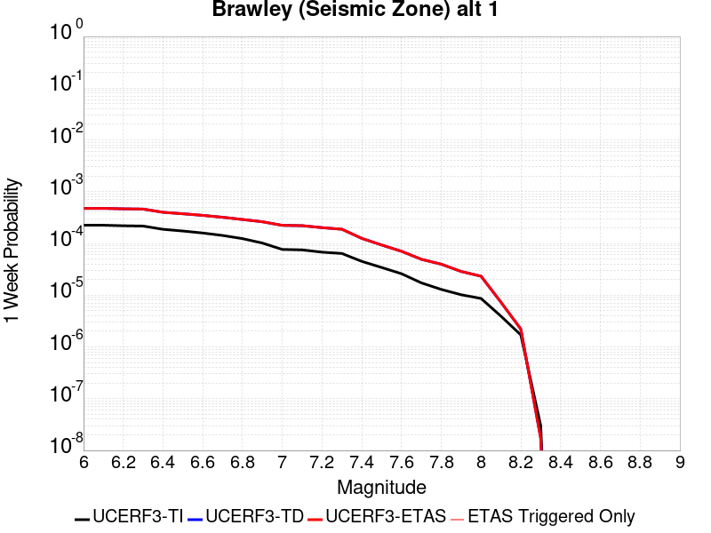 | 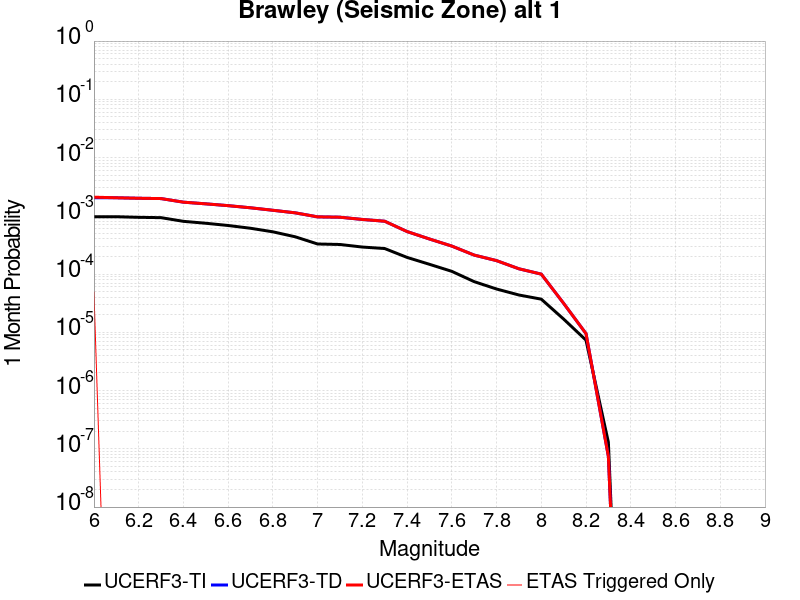 | 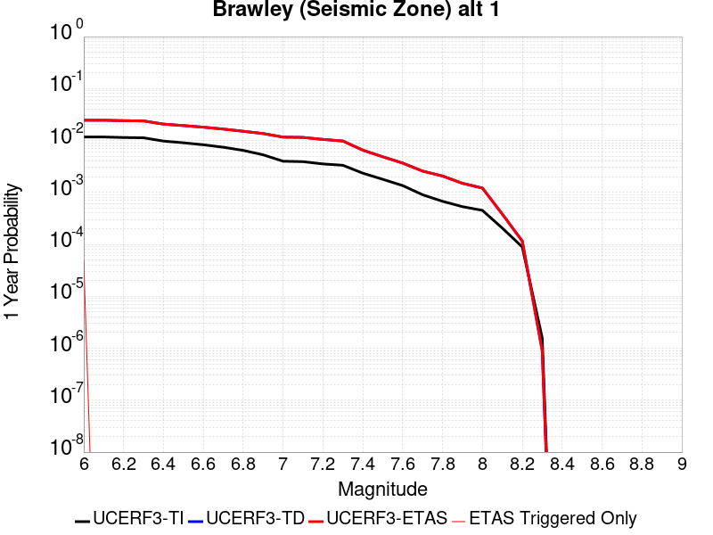 | 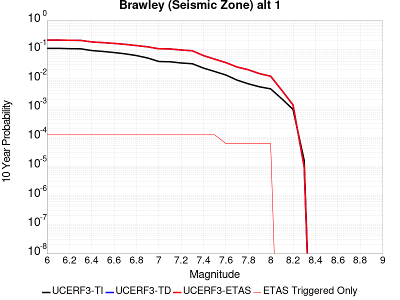 |

| Magnitude | 1 wk TI Prob | 1 wk TD Prob | 1 wk ETAS Prob | 1 wk ETAS/TD Gain | 1 wk ETAS Triggered Only | 1 mo TI Prob | 1 mo TD Prob | 1 mo ETAS Prob | 1 mo ETAS/TD Gain | 1 mo ETAS Triggered Only | 1 yr TI Prob | 1 yr TD Prob | 1 yr ETAS Prob | 1 yr ETAS/TD Gain | 1 yr ETAS Triggered Only | 10 yr TI Prob | 10 yr TD Prob | 10 yr ETAS Prob | 10 yr ETAS/TD Gain | 10 yr ETAS Triggered Only |
|-----|-----|-----|-----|-----|-----|-----|-----|-----|-----|-----|-----|-----|-----|-----|-----|-----|-----|-----|-----|-----|
| 6.0 | 2.2521618E-4 | 4.763429E-4 | 5.1632384E-4 | 1.0839331 | 4.0E-5 | 9.6485513E-4 | 0.0020399094 | 0.0021097667 | 1.0342453 | 7.0E-5 | 0.011683988 | 0.024544531 | 0.024632324 | 1.0035768 | 9.0E-5 | 0.11088423 | 0.21349923 | 0.2136408 | 1.000663 | 1.8E-4 |
| 6.1 | 2.2521618E-4 | 4.763429E-4 | 5.063286E-4 | 1.0629499 | 3.0E-5 | 9.6485513E-4 | 0.0020399094 | 0.0020997871 | 1.029353 | 6.0E-5 | 0.011683988 | 0.024544531 | 0.024622569 | 1.0031794 | 8.0E-5 | 0.11088423 | 0.21349923 | 0.21362507 | 1.0005894 | 1.6E-4 |
| 6.2 | 2.198148E-4 | 4.6718874E-4 | 4.9717474E-4 | 1.0641838 | 3.0E-5 | 9.417233E-4 | 0.0020007377 | 0.0020606178 | 1.0299289 | 6.0E-5 | 0.011405343 | 0.024078513 | 0.024156587 | 1.0032425 | 8.0E-5 | 0.10837428 | 0.20993572 | 0.21006213 | 1.0006021 | 1.6E-4 |
| 6.3 | 2.1704129E-4 | 4.615455E-4 | 4.915317E-4 | 1.0649691 | 3.0E-5 | 9.298453E-4 | 0.0019765892 | 0.0020364707 | 1.0302954 | 6.0E-5 | 0.011262234 | 0.023792034 | 0.023870131 | 1.0032824 | 8.0E-5 | 0.107082725 | 0.20782684 | 0.20795359 | 1.0006099 | 1.6E-4 |
| 6.4 | 1.876142E-4 | 4.004663E-4 | 4.3045427E-4 | 1.0748826 | 3.0E-5 | 8.038131E-4 | 0.0017151695 | 0.0017750666 | 1.034922 | 6.0E-5 | 0.00974259 | 0.020678662 | 0.020757006 | 1.0037887 | 8.0E-5 | 0.093263686 | 0.18457787 | 0.18470834 | 1.0007068 | 1.6E-4 |
| 6.5 | 1.7390939E-4 | 3.7478763E-4 | 4.047764E-4 | 1.0800153 | 3.0E-5 | 7.45113E-4 | 0.0016052561 | 0.0016651598 | 1.0373172 | 6.0E-5 | 0.009034078 | 0.019367293 | 0.019445743 | 1.0040507 | 8.0E-5 | 0.086755216 | 0.17440015 | 0.17453225 | 1.0007575 | 1.6E-4 |
| 6.6 | 1.591791E-4 | 3.4893592E-4 | 3.7892544E-4 | 1.0859457 | 3.0E-5 | 6.8201777E-4 | 0.0014945926 | 0.001554503 | 1.0400847 | 6.0E-5 | 0.008271996 | 0.018045008 | 0.018123565 | 1.0043534 | 8.0E-5 | 0.07970774 | 0.16380787 | 0.16394165 | 1.0008167 | 1.6E-4 |
| 6.7 | 1.4268003E-4 | 3.2059717E-4 | 3.5058756E-4 | 1.0935453 | 3.0E-5 | 6.1134255E-4 | 0.0013732726 | 0.0014331902 | 1.0436312 | 6.0E-5 | 0.007417723 | 0.01659171 | 0.016670382 | 1.0047417 | 8.0E-5 | 0.07174956 | 0.15193594 | 0.15207162 | 1.0008931 | 1.6E-4 |
| 6.8 | 1.239713E-4 | 2.9055026E-4 | 3.2054156E-4 | 1.1032224 | 3.0E-5 | 5.3119735E-4 | 0.0012446274 | 0.0013045527 | 1.0481472 | 6.0E-5 | 0.0064481674 | 0.015049482 | 0.015128278 | 1.0052358 | 8.0E-5 | 0.06264243 | 0.13838051 | 0.13851836 | 1.0009962 | 1.6E-4 |
| 6.9 | 1.0180238E-4 | 2.6255674E-4 | 2.9254888E-4 | 1.114231 | 3.0E-5 | 4.3622297E-4 | 0.0011247622 | 0.0011846948 | 1.0532846 | 6.0E-5 | 0.005298089 | 0.013608998 | 0.013687909 | 1.0057985 | 8.0E-5 | 0.05173543 | 0.12496473 | 0.12510473 | 1.0011203 | 1.6E-4 |
| 7.0 | 7.6619996E-5 | 2.2400476E-4 | 2.5399803E-4 | 1.1338958 | 3.0E-5 | 3.283301E-4 | 9.596704E-4 | 0.0010196128 | 1.0624615 | 6.0E-5 | 0.0039900932 | 0.011622103 | 0.011691289 | 1.005953 | 7.0E-5 | 0.039192066 | 0.10726982 | 0.10740373 | 1.0012484 | 1.5E-4 |
| 7.1 | 7.5127435E-5 | 2.2083633E-4 | 2.508297E-4 | 1.1358172 | 3.0E-5 | 3.2193496E-4 | 9.461013E-4 | 0.0010060446 | 1.0633582 | 6.0E-5 | 0.0039125155 | 0.011458648 | 0.011527846 | 1.0060389 | 7.0E-5 | 0.038443442 | 0.10583378 | 0.1059679 | 1.0012673 | 1.5E-4 |
| 7.2 | 6.788582E-5 | 2.0211334E-4 | 2.3210728E-4 | 1.1484016 | 3.0E-5 | 2.9090676E-4 | 8.6591556E-4 | 9.158722E-4 | 1.0576924 | 5.0E-5 | 0.0035360386 | 0.0104922 | 0.01055157 | 1.0056585 | 6.0E-5 | 0.034803 | 0.097503684 | 0.09762101 | 1.0012033 | 1.3E-4 |
| 7.3 | 6.399602E-5 | 1.8842232E-4 | 2.1841667E-4 | 1.1591868 | 3.0E-5 | 2.7423984E-4 | 8.0727716E-4 | 8.572368E-4 | 1.0618865 | 5.0E-5 | 0.0033337586 | 0.009784897 | 0.00984431 | 1.0060719 | 6.0E-5 | 0.03284188 | 0.091397986 | 0.09151611 | 1.0012923 | 1.3E-4 |
| 7.4 | 4.506759E-5 | 1.2530042E-4 | 1.452979E-4 | 1.1595964 | 2.0E-5 | 1.9313251E-4 | 5.3689216E-4 | 5.768707E-4 | 1.0744629 | 4.0E-5 | 0.0023488526 | 0.006517245 | 0.0065669194 | 1.007622 | 5.0E-5 | 0.023241805 | 0.062364522 | 0.062477037 | 1.0018041 | 1.2E-4 |
| 7.5 | 3.43289E-5 | 9.336103E-5 | 1.13359165E-4 | 1.2142022 | 2.0E-5 | 1.4711556E-4 | 4.0005764E-4 | 4.3004565E-4 | 1.0749592 | 3.0E-5 | 0.0017896603 | 0.004859886 | 0.004899692 | 1.0081906 | 4.0E-5 | 0.01775316 | 0.047057066 | 0.047152363 | 1.0020251 | 1.0E-4 |
| 7.6 | 2.5980507E-5 | 7.053672E-5 | 9.0535315E-5 | 1.2835202 | 2.0E-5 | 1.1134028E-4 | 3.0226534E-4 | 3.3225628E-4 | 1.0992205 | 3.0E-5 | 0.001354725 | 0.0036738948 | 0.003713748 | 1.0108476 | 4.0E-5 | 0.013464959 | 0.03584298 | 0.035920113 | 1.002152 | 8.0E-5 |
| 7.7 | 1.7292105E-5 | 4.9412036E-5 | 6.941105E-5 | 1.4047396 | 2.0E-5 | 7.4106916E-5 | 2.1174872E-4 | 2.4174237E-4 | 1.1416473 | 3.0E-5 | 9.018782E-4 | 0.0025749984 | 0.0026148953 | 1.015494 | 4.0E-5 | 0.008982267 | 0.025292097 | 0.025370073 | 1.003083 | 8.0E-5 |
| 7.8 | 1.2927471E-5 | 3.9697254E-5 | 4.9696857E-5 | 1.2518966 | 1.0E-5 | 5.5402274E-5 | 1.7012001E-4 | 1.9011661E-4 | 1.117544 | 2.0E-5 | 6.743139E-4 | 0.0020692463 | 0.002099184 | 1.0144681 | 3.0E-5 | 0.0067227143 | 0.020433145 | 0.020501714 | 1.0033559 | 7.0E-5 |
| 7.9 | 1.0200774E-5 | 2.8748475E-5 | 3.874819E-5 | 1.3478346 | 1.0E-5 | 4.371687E-5 | 1.2320194E-4 | 1.4319948E-4 | 1.1623151 | 2.0E-5 | 5.321229E-4 | 0.0014989526 | 0.0015189226 | 1.0133226 | 2.0E-5 | 0.005308505 | 0.014992895 | 0.0150519945 | 1.0039419 | 6.0E-5 |
| 8.0 | 8.650396E-6 | 2.3279512E-5 | 3.3279277E-5 | 1.4295523 | 1.0E-5 | 3.70726E-5 | 9.976552E-5 | 1.1976353E-4 | 1.2004501 | 2.0E-5 | 4.5126543E-4 | 0.0012139693 | 0.001233945 | 1.0164549 | 2.0E-5 | 0.0045035016 | 0.012212164 | 0.012251675 | 1.0032355 | 4.0E-5 |
| 8.1 | 3.9368224E-6 | 7.3283345E-6 | 1.732826E-5 | 2.3645566 | 1.0E-5 | 1.6871985E-5 | 3.1406773E-5 | 4.1406456E-5 | 1.3183926 | 1.0E-5 | 2.0539707E-4 | 3.8231048E-4 | 3.9230665E-4 | 1.0261468 | 1.0E-5 | 0.0020520731 | 0.0040015313 | 0.0040114913 | 1.0024891 | 1.0E-5 |
| 8.2 | 1.7101195E-6 | 2.2178374E-6 | 2.2178374E-6 | 1.0 | 0.0 | 7.329063E-6 | 9.504983E-6 | 9.504983E-6 | 1.0 | 0.0 | 8.922769E-5 | 1.15717055E-4 | 1.15717055E-4 | 1.0 | 0.0 | 8.9191867E-4 | 0.00126669 | 0.00126669 | 1.0 | 0.0 |
| 8.3 | 3.0346666E-8 | 1.721086E-8 | 1.721086E-8 | 1.0 | 0.0 | 1.3005713E-7 | 7.376083E-8 | 7.376083E-8 | 1.0 | 0.0 | 1.5834444E-6 | 8.98038E-7 | 8.98038E-7 | 1.0 | 0.0 | 1.5834332E-5 | 9.36379E-6 | 9.36379E-6 | 1.0 | 0.0 |

## Owens Valley
*[(top)](#table-of-contents)*

| 1 Week | 1 Month | 1 Year | 10 Year |
|-----|-----|-----|-----|
| 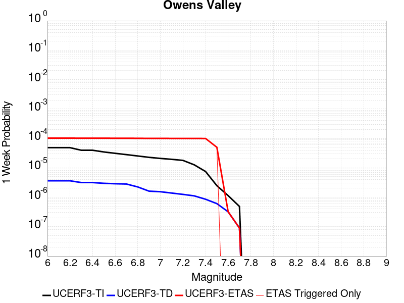 | 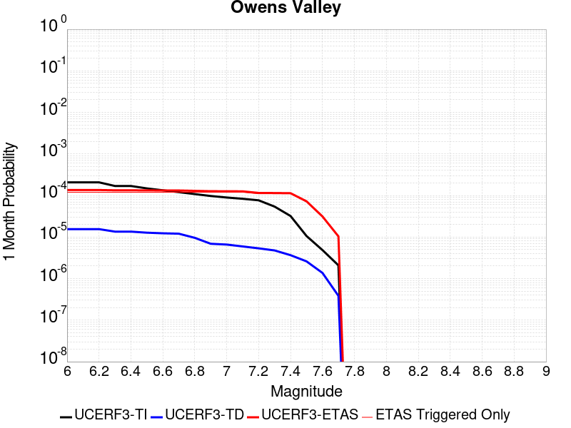 | 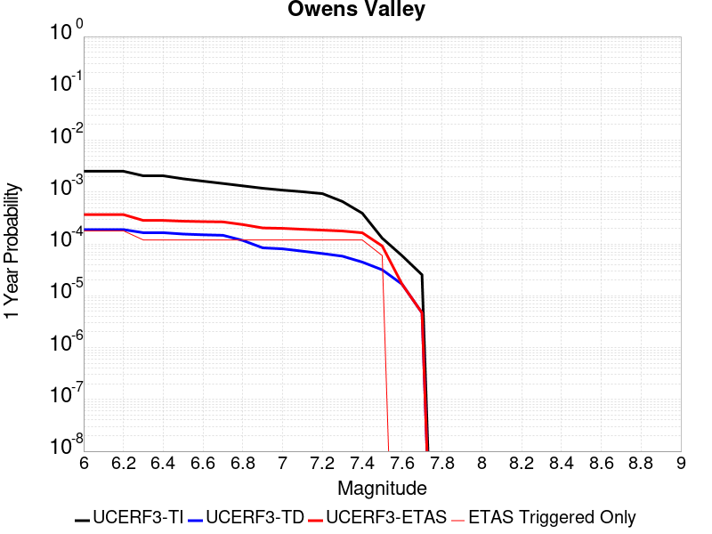 | 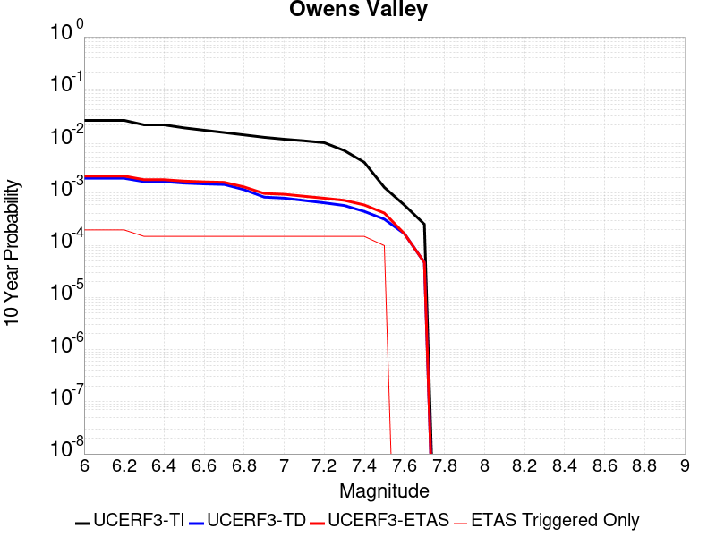 |

| Magnitude | 1 wk TI Prob | 1 wk TD Prob | 1 wk ETAS Prob | 1 wk ETAS/TD Gain | 1 wk ETAS Triggered Only | 1 mo TI Prob | 1 mo TD Prob | 1 mo ETAS Prob | 1 mo ETAS/TD Gain | 1 mo ETAS Triggered Only | 1 yr TI Prob | 1 yr TD Prob | 1 yr ETAS Prob | 1 yr ETAS/TD Gain | 1 yr ETAS Triggered Only | 10 yr TI Prob | 10 yr TD Prob | 10 yr ETAS Prob | 10 yr ETAS/TD Gain | 10 yr ETAS Triggered Only |
|-----|-----|-----|-----|-----|-----|-----|-----|-----|-----|-----|-----|-----|-----|-----|-----|-----|-----|-----|-----|-----|
| 6.0 | 4.83821E-5 | 3.6210524E-6 | 9.362073E-5 | 25.854563 | 9.0E-5 | 2.0733538E-4 | 1.551871E-5 | 1.3551685E-4 | 8.732482 | 1.2E-4 | 0.002521386 | 1.889249E-4 | 3.3889656E-4 | 1.7938163 | 1.5E-4 | 0.024929691 | 0.0019297141 | 0.0020993862 | 1.0879259 | 1.7E-4 |
| 6.1 | 4.83821E-5 | 3.6210524E-6 | 9.362073E-5 | 25.854563 | 9.0E-5 | 2.0733538E-4 | 1.551871E-5 | 1.3551685E-4 | 8.732482 | 1.2E-4 | 0.002521386 | 1.889249E-4 | 3.3889656E-4 | 1.7938163 | 1.5E-4 | 0.024929691 | 0.0019297141 | 0.0020993862 | 1.0879259 | 1.7E-4 |
| 6.2 | 4.83821E-5 | 3.6210524E-6 | 9.362073E-5 | 25.854563 | 9.0E-5 | 2.0733538E-4 | 1.551871E-5 | 1.3551685E-4 | 8.732482 | 1.2E-4 | 0.002521386 | 1.889249E-4 | 3.3889656E-4 | 1.7938163 | 1.5E-4 | 0.024929691 | 0.0019297141 | 0.0020993862 | 1.0879259 | 1.7E-4 |
| 6.3 | 3.953008E-5 | 3.1530958E-6 | 9.315281E-5 | 29.543285 | 9.0E-5 | 1.6940363E-4 | 1.3513202E-5 | 1.3351158E-4 | 9.880085 | 1.2E-4 | 0.002060538 | 1.6451156E-4 | 3.0448852E-4 | 1.850864 | 1.4E-4 | 0.020415364 | 0.0016621627 | 0.0018218968 | 1.0961001 | 1.6E-4 |
| 6.4 | 3.953008E-5 | 3.1530958E-6 | 9.315281E-5 | 29.543285 | 9.0E-5 | 1.6940363E-4 | 1.3513202E-5 | 1.3351158E-4 | 9.880085 | 1.2E-4 | 0.002060538 | 1.6451156E-4 | 3.0448852E-4 | 1.850864 | 1.4E-4 | 0.020415364 | 0.0016621627 | 0.0018218968 | 1.0961001 | 1.6E-4 |
| 6.5 | 3.457342E-5 | 2.9707387E-6 | 9.297047E-5 | 31.295404 | 9.0E-5 | 1.4816338E-4 | 1.273168E-5 | 1.3273016E-4 | 10.425188 | 1.2E-4 | 0.0018023965 | 1.5499788E-4 | 2.9497617E-4 | 1.9030982 | 1.4E-4 | 0.017878477 | 0.0015563119 | 0.0017160628 | 1.1026472 | 1.6E-4 |
| 6.6 | 3.1127765E-5 | 2.8737306E-6 | 9.287347E-5 | 32.318085 | 9.0E-5 | 1.3339789E-4 | 1.2315934E-5 | 1.3231445E-4 | 10.743355 | 1.2E-4 | 0.0016229092 | 1.4993687E-4 | 2.899159E-4 | 1.9335864 | 1.4E-4 | 0.016111081 | 0.0015013438 | 0.0016611036 | 1.1064112 | 1.6E-4 |
| 6.7 | 2.806885E-5 | 2.8101606E-6 | 9.280991E-5 | 33.02655 | 9.0E-5 | 1.2028952E-4 | 1.2043493E-5 | 1.3204204E-4 | 10.963766 | 1.2E-4 | 0.001463541 | 1.4662035E-4 | 2.8659982E-4 | 1.954707 | 1.4E-4 | 0.014539397 | 0.0014656087 | 0.0016253742 | 1.1090096 | 1.6E-4 |
| 6.8 | 2.524524E-5 | 2.2351392E-6 | 9.2234935E-5 | 41.26586 | 9.0E-5 | 1.0818939E-4 | 9.579134E-6 | 1.2957798E-4 | 13.527108 | 1.2E-4 | 0.0013164099 | 1.16620016E-4 | 2.566037E-4 | 2.20034 | 1.4E-4 | 0.01308639 | 0.001165827 | 0.0013256406 | 1.1370816 | 1.6E-4 |
| 6.9 | 2.2704568E-5 | 1.6079711E-6 | 9.160783E-5 | 56.971066 | 9.0E-5 | 9.730166E-5 | 6.8912864E-6 | 1.2689046E-4 | 18.413176 | 1.2E-4 | 0.0011840039 | 8.38982E-5 | 2.2388645E-4 | 2.668549 | 1.4E-4 | 0.011777153 | 8.38853E-4 | 9.987188E-4 | 1.1905767 | 1.6E-4 |
| 7.0 | 2.0871712E-5 | 1.5393621E-6 | 9.153922E-5 | 59.465687 | 9.0E-5 | 8.944713E-5 | 6.5972495E-6 | 1.2659645E-4 | 19.189278 | 1.2E-4 | 0.0010884746 | 8.031857E-5 | 2.2030732E-4 | 2.742919 | 1.4E-4 | 0.010831586 | 8.030395E-4 | 9.6291106E-4 | 1.199083 | 1.6E-4 |
| 7.1 | 1.944928E-5 | 1.3862556E-6 | 9.138613E-5 | 65.923004 | 9.0E-5 | 8.335139E-5 | 5.941082E-6 | 1.2594037E-4 | 21.198221 | 1.2E-4 | 0.0010143308 | 7.233028E-5 | 2.1232016E-4 | 2.9354255 | 1.4E-4 | 0.010097133 | 7.2319806E-4 | 8.8308234E-4 | 1.2210796 | 1.6E-4 |
| 7.2 | 1.7876306E-5 | 1.2487686E-6 | 9.124866E-5 | 73.07091 | 9.0E-5 | 7.6610486E-5 | 5.3518543E-6 | 1.15351264E-4 | 21.553513 | 1.1E-4 | 9.3233347E-4 | 6.515689E-5 | 1.9514842E-4 | 2.9950542 | 1.3E-4 | 0.009284316 | 6.5148395E-4 | 8.013862E-4 | 1.2300936 | 1.5E-4 |
| 7.3 | 1.2618672E-5 | 1.1113839E-6 | 9.111129E-5 | 81.98003 | 9.0E-5 | 5.40789E-5 | 4.763065E-6 | 1.14762544E-4 | 24.094261 | 1.1E-4 | 6.582117E-4 | 5.7988782E-5 | 1.7798183E-4 | 3.0692458 | 1.2E-4 | 0.0065626553 | 5.7983754E-4 | 7.197564E-4 | 1.2413069 | 1.4E-4 |
| 7.4 | 7.4874442E-6 | 8.547518E-7 | 9.085467E-5 | 106.29363 | 9.0E-5 | 3.208865E-5 | 3.6632168E-6 | 1.1366281E-4 | 31.028143 | 1.1E-4 | 3.906093E-4 | 4.4598757E-5 | 1.5459386E-4 | 3.4663265 | 1.1E-4 | 0.003899234 | 4.459579E-4 | 5.758999E-4 | 1.2913773 | 1.3E-4 |
| 7.5 | 2.4734156E-6 | 6.0679935E-7 | 6.0606762E-5 | 99.87941 | 6.0E-5 | 1.060031E-5 | 2.6005662E-6 | 7.2600385E-5 | 27.917145 | 7.0E-5 | 1.2905113E-4 | 3.1661435E-5 | 1.0165922E-4 | 3.2108214 | 7.0E-5 | 0.0012897621 | 3.1656958E-4 | 4.0654108E-4 | 1.2842077 | 9.0E-5 |
| 7.6 | 1.1328841E-6 | 3.1961991E-7 | 3.031961E-5 | 94.86145 | 3.0E-5 | 4.8552088E-6 | 1.369799E-6 | 3.1369756E-5 | 22.900993 | 3.0E-5 | 5.9110564E-5 | 1.6677177E-5 | 4.6676676E-5 | 2.7988355 | 3.0E-5 | 5.9094845E-4 | 1.6675945E-4 | 2.167511E-4 | 1.2997831 | 5.0E-5 |
| 7.7 | 4.8613185E-7 | 8.962742E-8 | 1.0089627E-5 | 112.57299 | 1.0E-5 | 2.0834207E-6 | 3.8411747E-7 | 1.0384114E-5 | 27.033693 | 1.0E-5 | 2.536535E-5 | 4.676621E-6 | 1.4676574E-5 | 3.138286 | 1.0E-5 | 2.5362454E-4 | 4.676529E-5 | 6.6764354E-5 | 1.4276476 | 2.0E-5 |

## Kern Canyon (North Kern) 2011
*[(top)](#table-of-contents)*

| 1 Week | 1 Month | 1 Year | 10 Year |
|-----|-----|-----|-----|
| 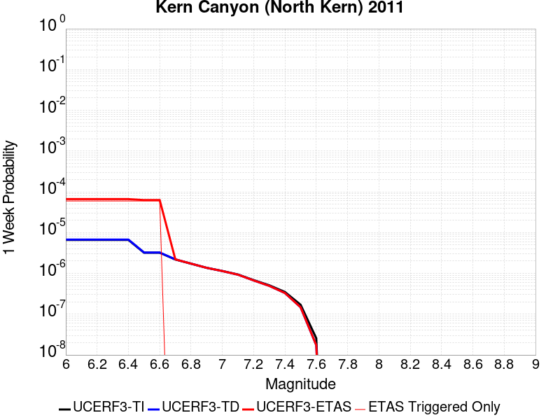 | 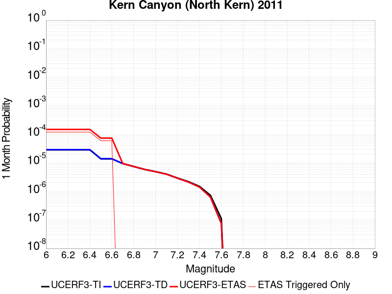 | 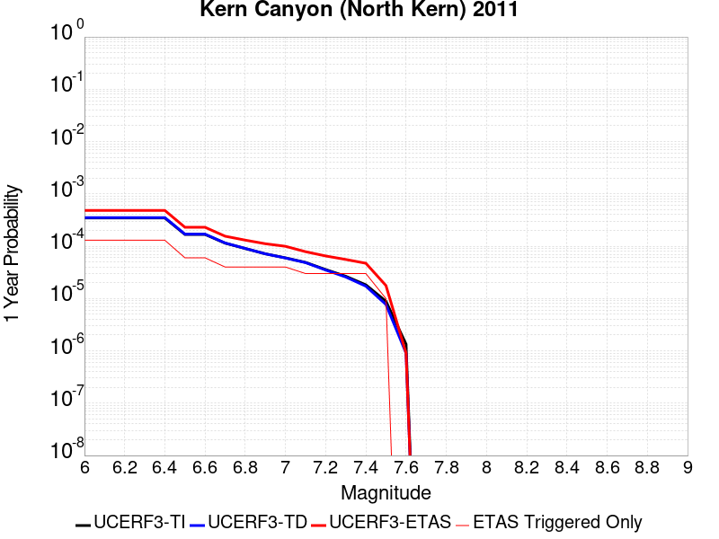 | 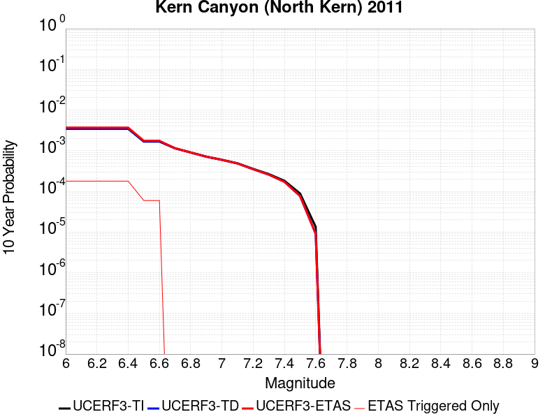 |

| Magnitude | 1 wk TI Prob | 1 wk TD Prob | 1 wk ETAS Prob | 1 wk ETAS/TD Gain | 1 wk ETAS Triggered Only | 1 mo TI Prob | 1 mo TD Prob | 1 mo ETAS Prob | 1 mo ETAS/TD Gain | 1 mo ETAS Triggered Only | 1 yr TI Prob | 1 yr TD Prob | 1 yr ETAS Prob | 1 yr ETAS/TD Gain | 1 yr ETAS Triggered Only | 10 yr TI Prob | 10 yr TD Prob | 10 yr ETAS Prob | 10 yr ETAS/TD Gain | 10 yr ETAS Triggered Only |
|-----|-----|-----|-----|-----|-----|-----|-----|-----|-----|-----|-----|-----|-----|-----|-----|-----|-----|-----|-----|-----|
| 6.0 | 6.6264497E-6 | 6.75733E-6 | 6.6756926E-5 | 9.879187 | 6.0E-5 | 2.8398761E-5 | 2.895971E-5 | 1.18957105E-4 | 4.107676 | 9.0E-5 | 3.4570007E-4 | 3.5253543E-4 | 4.824896E-4 | 1.3686273 | 1.3E-4 | 0.0034516277 | 0.0035205502 | 0.003679987 | 1.0452875 | 1.6E-4 |
| 6.1 | 6.6264497E-6 | 6.75733E-6 | 6.6756926E-5 | 9.879187 | 6.0E-5 | 2.8398761E-5 | 2.895971E-5 | 1.18957105E-4 | 4.107676 | 9.0E-5 | 3.4570007E-4 | 3.5253543E-4 | 4.824896E-4 | 1.3686273 | 1.3E-4 | 0.0034516277 | 0.0035205502 | 0.003679987 | 1.0452875 | 1.6E-4 |
| 6.2 | 6.6264497E-6 | 6.75733E-6 | 6.6756926E-5 | 9.879187 | 6.0E-5 | 2.8398761E-5 | 2.895971E-5 | 1.18957105E-4 | 4.107676 | 9.0E-5 | 3.4570007E-4 | 3.5253543E-4 | 4.824896E-4 | 1.3686273 | 1.3E-4 | 0.0034516277 | 0.0035205502 | 0.003679987 | 1.0452875 | 1.6E-4 |
| 6.3 | 6.6264497E-6 | 6.75733E-6 | 6.6756926E-5 | 9.879187 | 6.0E-5 | 2.8398761E-5 | 2.895971E-5 | 1.18957105E-4 | 4.107676 | 9.0E-5 | 3.4570007E-4 | 3.5253543E-4 | 4.824896E-4 | 1.3686273 | 1.3E-4 | 0.0034516277 | 0.0035205502 | 0.003679987 | 1.0452875 | 1.6E-4 |
| 6.4 | 6.6264497E-6 | 6.75733E-6 | 6.6756926E-5 | 9.879187 | 6.0E-5 | 2.8398761E-5 | 2.895971E-5 | 1.18957105E-4 | 4.107676 | 9.0E-5 | 3.4570007E-4 | 3.5253543E-4 | 4.824896E-4 | 1.3686273 | 1.3E-4 | 0.0034516277 | 0.0035205502 | 0.003679987 | 1.0452875 | 1.6E-4 |
| 6.5 | 3.2162225E-6 | 3.2570915E-6 | 3.3256994E-5 | 10.210642 | 3.0E-5 | 1.3783738E-5 | 1.3958894E-5 | 4.3958476E-5 | 3.1491375 | 3.0E-5 | 1.6780409E-4 | 1.6993708E-4 | 2.2992688E-4 | 1.3530118 | 6.0E-5 | 0.0016767744 | 0.001698151 | 0.0017680322 | 1.0411513 | 7.0E-5 |
| 6.6 | 3.2162225E-6 | 3.2570915E-6 | 3.3256994E-5 | 10.210642 | 3.0E-5 | 1.3783738E-5 | 1.3958894E-5 | 4.3958476E-5 | 3.1491375 | 3.0E-5 | 1.6780409E-4 | 1.6993708E-4 | 2.2992688E-4 | 1.3530118 | 6.0E-5 | 0.0016767744 | 0.001698151 | 0.0017680322 | 1.0411513 | 7.0E-5 |
| 6.7 | 2.1908265E-6 | 2.2071222E-6 | 1.2207101E-5 | 5.5307765 | 1.0E-5 | 9.389223E-6 | 9.459062E-6 | 1.9458968E-5 | 2.0571773 | 1.0E-5 | 1.1430779E-4 | 1.1515819E-4 | 1.5515358E-4 | 1.3473083 | 4.0E-5 | 0.0011424901 | 0.0011510046 | 0.001200947 | 1.0433903 | 5.0E-5 |
| 6.8 | 1.7303895E-6 | 1.736553E-6 | 1.1736535E-5 | 6.7585244 | 1.0E-5 | 7.415934E-6 | 7.442349E-6 | 1.7442275E-5 | 2.3436518 | 1.0E-5 | 9.028525E-5 | 9.060693E-5 | 1.3060331E-4 | 1.4414274 | 4.0E-5 | 9.024858E-4 | 9.0570963E-4 | 9.556644E-4 | 1.0551553 | 5.0E-5 |
| 6.9 | 1.3700314E-6 | 1.3688623E-6 | 1.1368848E-5 | 8.305326 | 1.0E-5 | 5.87155E-6 | 5.86654E-6 | 1.586648E-5 | 2.7045722 | 1.0E-5 | 7.148377E-5 | 7.142283E-5 | 1.1141997E-4 | 1.5600051 | 4.0E-5 | 7.146078E-4 | 7.140033E-4 | 7.539747E-4 | 1.0559821 | 4.0E-5 |
| 7.0 | 1.1467797E-6 | 1.1413805E-6 | 1.1141369E-5 | 9.76131 | 1.0E-5 | 4.9147607E-6 | 4.8916218E-6 | 1.4891573E-5 | 3.0443017 | 1.0E-5 | 5.983557E-5 | 5.95539E-5 | 9.9551515E-5 | 1.6716205 | 4.0E-5 | 5.981946E-4 | 5.9538253E-4 | 6.3535874E-4 | 1.0671437 | 4.0E-5 |
| 7.1 | 9.3952065E-7 | 9.3026915E-7 | 1.093026E-5 | 11.749567 | 1.0E-5 | 4.026511E-6 | 3.986862E-6 | 1.3986822E-5 | 3.5082285 | 1.0E-5 | 4.9021666E-5 | 4.853898E-5 | 7.853752E-5 | 1.61803 | 3.0E-5 | 4.901085E-4 | 4.8528553E-4 | 5.15271E-4 | 1.0617893 | 3.0E-5 |
| 7.2 | 6.858055E-7 | 6.7193014E-7 | 1.06719235E-5 | 15.882489 | 1.0E-5 | 2.939163E-6 | 2.8796974E-6 | 1.2879668E-5 | 4.472577 | 1.0E-5 | 3.5783723E-5 | 3.5059762E-5 | 6.505871E-5 | 1.8556519 | 3.0E-5 | 3.5777962E-4 | 3.5054318E-4 | 3.8053267E-4 | 1.0855515 | 3.0E-5 |
| 7.3 | 5.1101983E-7 | 4.939301E-7 | 1.0493925E-5 | 21.245771 | 1.0E-5 | 2.1900833E-6 | 2.1168414E-6 | 1.21168205E-5 | 5.7240095 | 1.0E-5 | 2.6663936E-5 | 2.5772246E-5 | 5.577147E-5 | 2.164013 | 3.0E-5 | 2.6660739E-4 | 2.5769303E-4 | 2.876853E-4 | 1.1163876 | 3.0E-5 |
| 7.4 | 3.4999414E-7 | 3.2995916E-7 | 1.0329956E-5 | 31.306772 | 1.0E-5 | 1.499974E-6 | 1.4141099E-6 | 1.1414096E-5 | 8.071576 | 1.0E-5 | 1.8262032E-5 | 1.7216655E-5 | 4.7216137E-5 | 2.7424688 | 3.0E-5 | 1.826053E-4 | 1.7215345E-4 | 2.0214828E-4 | 1.1742331 | 3.0E-5 |
| 7.5 | 1.7021522E-7 | 1.4750053E-7 | 1.0147499E-5 | 68.79636 | 1.0E-5 | 7.2949354E-7 | 6.32145E-7 | 1.0632139E-5 | 16.819145 | 1.0E-5 | 8.881548E-6 | 7.696339E-6 | 1.7696262E-5 | 2.299309 | 1.0E-5 | 8.8811925E-5 | 7.696081E-5 | 8.696003E-5 | 1.1299263 | 1.0E-5 |
| 7.6 | 2.572245E-8 | 1.735264E-8 | 1.735264E-8 | 1.0 | 0.0 | 1.10239064E-7 | 7.436845E-8 | 7.436845E-8 | 1.0 | 0.0 | 1.3421597E-6 | 9.0543557E-7 | 9.0543557E-7 | 1.0 | 0.0 | 1.3421517E-5 | 9.054324E-6 | 9.054324E-6 | 1.0 | 0.0 |

## Santa Ynez (East)
*[(top)](#table-of-contents)*

| 1 Week | 1 Month | 1 Year | 10 Year |
|-----|-----|-----|-----|
| 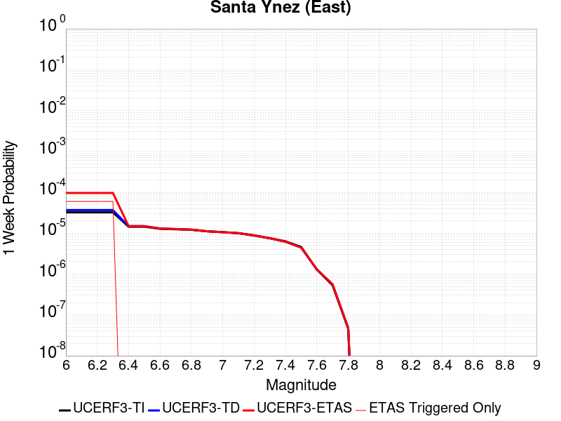 | 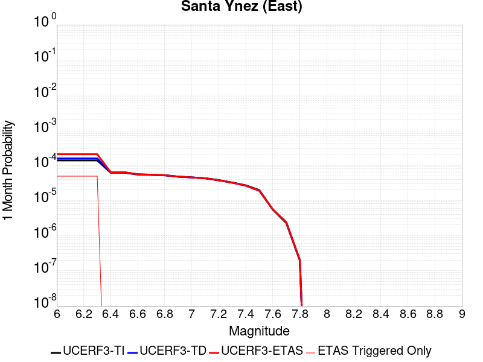 | 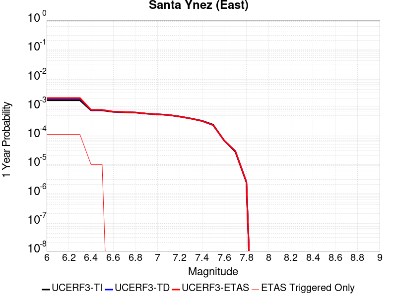 | 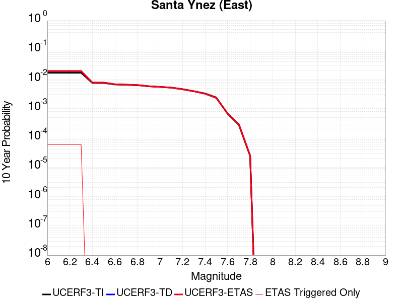 |

| Magnitude | 1 wk TI Prob | 1 wk TD Prob | 1 wk ETAS Prob | 1 wk ETAS/TD Gain | 1 wk ETAS Triggered Only | 1 mo TI Prob | 1 mo TD Prob | 1 mo ETAS Prob | 1 mo ETAS/TD Gain | 1 mo ETAS Triggered Only | 1 yr TI Prob | 1 yr TD Prob | 1 yr ETAS Prob | 1 yr ETAS/TD Gain | 1 yr ETAS Triggered Only | 10 yr TI Prob | 10 yr TD Prob | 10 yr ETAS Prob | 10 yr ETAS/TD Gain | 10 yr ETAS Triggered Only |
|-----|-----|-----|-----|-----|-----|-----|-----|-----|-----|-----|-----|-----|-----|-----|-----|-----|-----|-----|-----|-----|
| 6.0 | 3.2269712E-5 | 3.6750775E-5 | 9.674857E-5 | 2.6325586 | 6.0E-5 | 1.3829143E-4 | 1.5749714E-4 | 2.274861E-4 | 1.4443825 | 7.0E-5 | 0.0016823979 | 0.0019164253 | 0.0020262145 | 1.0572885 | 1.1E-4 | 0.016697178 | 0.019056438 | 0.01921339 | 1.0082362 | 1.6E-4 |
| 6.1 | 3.2269712E-5 | 3.6750775E-5 | 9.674857E-5 | 2.6325586 | 6.0E-5 | 1.3829143E-4 | 1.5749714E-4 | 2.274861E-4 | 1.4443825 | 7.0E-5 | 0.0016823979 | 0.0019164253 | 0.0020262145 | 1.0572885 | 1.1E-4 | 0.016697178 | 0.019056438 | 0.01921339 | 1.0082362 | 1.6E-4 |
| 6.2 | 3.2269712E-5 | 3.6750775E-5 | 9.674857E-5 | 2.6325586 | 6.0E-5 | 1.3829143E-4 | 1.5749714E-4 | 2.274861E-4 | 1.4443825 | 7.0E-5 | 0.0016823979 | 0.0019164253 | 0.0020262145 | 1.0572885 | 1.1E-4 | 0.016697178 | 0.019056438 | 0.01921339 | 1.0082362 | 1.6E-4 |
| 6.3 | 3.2269712E-5 | 3.6750775E-5 | 9.674857E-5 | 2.6325586 | 6.0E-5 | 1.3829143E-4 | 1.5749714E-4 | 2.274861E-4 | 1.4443825 | 7.0E-5 | 0.0016823979 | 0.0019164253 | 0.0020262145 | 1.0572885 | 1.1E-4 | 0.016697178 | 0.019056438 | 0.01921339 | 1.0082362 | 1.6E-4 |
| 6.4 | 1.4404779E-5 | 1.48492945E-5 | 2.4849145E-5 | 1.6734227 | 1.0E-5 | 6.1733306E-5 | 6.363831E-5 | 7.3637675E-5 | 1.1571281 | 1.0E-5 | 7.513438E-4 | 7.7452604E-4 | 7.845183E-4 | 1.0129011 | 1.0E-5 | 0.0074880854 | 0.007718817 | 0.0077386624 | 1.0025711 | 2.0E-5 |
| 6.5 | 1.4404779E-5 | 1.48492945E-5 | 2.4849145E-5 | 1.6734227 | 1.0E-5 | 6.1733306E-5 | 6.363831E-5 | 7.3637675E-5 | 1.1571281 | 1.0E-5 | 7.513438E-4 | 7.7452604E-4 | 7.845183E-4 | 1.0129011 | 1.0E-5 | 0.0074880854 | 0.007718817 | 0.0077386624 | 1.0025711 | 2.0E-5 |
| 6.6 | 1.280208E-5 | 1.301186E-5 | 1.301186E-5 | 1.0 | 0.0 | 5.4864904E-5 | 5.5763932E-5 | 5.5763932E-5 | 1.0 | 0.0 | 6.6777546E-4 | 6.7871617E-4 | 6.7871617E-4 | 1.0 | 0.0 | 0.006657724 | 0.0067666434 | 0.0067765755 | 1.0014678 | 1.0E-5 |
| 6.7 | 1.2457027E-5 | 1.262838E-5 | 1.262838E-5 | 1.0 | 0.0 | 5.3386164E-5 | 5.4120515E-5 | 5.4120515E-5 | 1.0 | 0.0 | 6.497827E-4 | 6.5871974E-4 | 6.5871974E-4 | 1.0 | 0.0 | 0.00647886 | 0.00656787 | 0.0065778038 | 1.0015125 | 1.0E-5 |
| 6.8 | 1.2095134E-5 | 1.2230827E-5 | 1.2230827E-5 | 1.0 | 0.0 | 5.1835254E-5 | 5.2416784E-5 | 5.2416784E-5 | 1.0 | 0.0 | 6.309115E-4 | 6.3798914E-4 | 6.3798914E-4 | 1.0 | 0.0 | 0.0062912325 | 0.006361764 | 0.0063717 | 1.0015619 | 1.0E-5 |
| 6.9 | 1.1104036E-5 | 1.115726E-5 | 1.115726E-5 | 1.0 | 0.0 | 4.758786E-5 | 4.781596E-5 | 4.781596E-5 | 1.0 | 0.0 | 5.7922816E-4 | 5.82005E-4 | 5.82005E-4 | 1.0 | 0.0 | 0.005777207 | 0.0058049536 | 0.0058148955 | 1.0017127 | 1.0E-5 |
| 7.0 | 1.0577444E-5 | 1.05815925E-5 | 1.05815925E-5 | 1.0 | 0.0 | 4.5331115E-5 | 4.53489E-5 | 4.53489E-5 | 1.0 | 0.0 | 5.5176654E-4 | 5.5198424E-4 | 5.5198424E-4 | 1.0 | 0.0 | 0.0055039856 | 0.00550627 | 0.005516215 | 1.0018061 | 1.0E-5 |
| 7.1 | 1.0021775E-5 | 9.9809E-6 | 9.9809E-6 | 1.0 | 0.0 | 4.294976E-5 | 4.277459E-5 | 4.277459E-5 | 1.0 | 0.0 | 5.2278786E-4 | 5.206574E-4 | 5.206574E-4 | 1.0 | 0.0 | 0.0052155964 | 0.005194508 | 0.0052044564 | 1.0019151 | 1.0E-5 |
| 7.2 | 8.874109E-6 | 8.748706E-6 | 8.748706E-6 | 1.0 | 0.0 | 3.8031343E-5 | 3.7493923E-5 | 3.7493923E-5 | 1.0 | 0.0 | 4.629332E-4 | 4.56394E-4 | 4.56394E-4 | 1.0 | 0.0 | 0.0046197 | 0.0045546847 | 0.004564639 | 1.0021856 | 1.0E-5 |
| 7.3 | 7.5504267E-6 | 7.5050243E-6 | 7.5050243E-6 | 1.0 | 0.0 | 3.235857E-5 | 3.2164E-5 | 3.2164E-5 | 1.0 | 0.0 | 3.9389438E-4 | 3.9152734E-4 | 3.9152734E-4 | 1.0 | 0.0 | 0.0039319694 | 0.0039084824 | 0.0039184433 | 1.0025486 | 1.0E-5 |
| 7.4 | 6.309394E-6 | 6.183062E-6 | 6.183062E-6 | 1.0 | 0.0 | 2.703998E-5 | 2.6498574E-5 | 2.6498574E-5 | 1.0 | 0.0 | 3.2916202E-4 | 3.2257332E-4 | 3.2257332E-4 | 1.0 | 0.0 | 0.003286749 | 0.0032211484 | 0.003231116 | 1.0030944 | 1.0E-5 |
| 7.5 | 4.6103073E-6 | 4.4408016E-6 | 4.4408016E-6 | 1.0 | 0.0 | 1.975831E-5 | 1.9031871E-5 | 1.9031871E-5 | 1.0 | 0.0 | 2.4053088E-4 | 2.316891E-4 | 2.316891E-4 | 1.0 | 0.0 | 0.002402707 | 0.002314545 | 0.0023245218 | 1.0043105 | 1.0E-5 |
| 7.6 | 1.2858658E-6 | 1.3008196E-6 | 1.3008196E-6 | 1.0 | 0.0 | 5.5108417E-6 | 5.574929E-6 | 5.574929E-6 | 1.0 | 0.0 | 6.7092435E-5 | 6.787272E-5 | 6.787272E-5 | 1.0 | 0.0 | 6.707218E-4 | 6.7852676E-4 | 6.7852676E-4 | 1.0 | 0.0 |
| 7.7 | 5.3302307E-7 | 5.612138E-7 | 5.612138E-7 | 1.0 | 0.0 | 2.2843826E-6 | 2.4052001E-6 | 2.4052001E-6 | 1.0 | 0.0 | 2.7812002E-5 | 2.9282955E-5 | 2.9282955E-5 | 1.0 | 0.0 | 2.7808524E-4 | 2.9279455E-4 | 2.9279455E-4 | 1.0 | 0.0 |
| 7.8 | 4.613933E-8 | 4.80301E-8 | 4.80301E-8 | 1.0 | 0.0 | 1.9773998E-7 | 2.0584326E-7 | 2.0584326E-7 | 1.0 | 0.0 | 2.4074816E-6 | 2.5061388E-6 | 2.5061388E-6 | 1.0 | 0.0 | 2.4074554E-5 | 2.5061116E-5 | 2.5061116E-5 | 1.0 | 0.0 |

## Cleghorn Lake
*[(top)](#table-of-contents)*

| 1 Week | 1 Month | 1 Year | 10 Year |
|-----|-----|-----|-----|
| 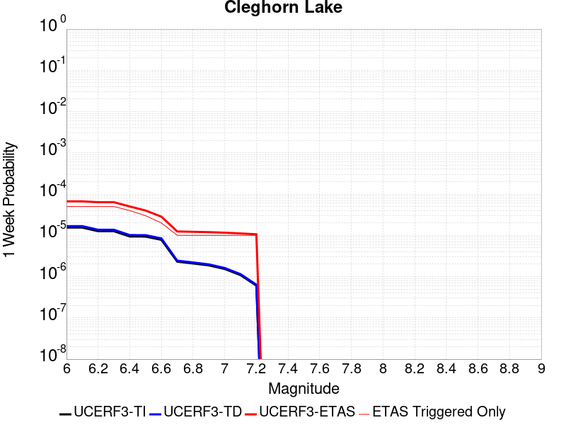 | 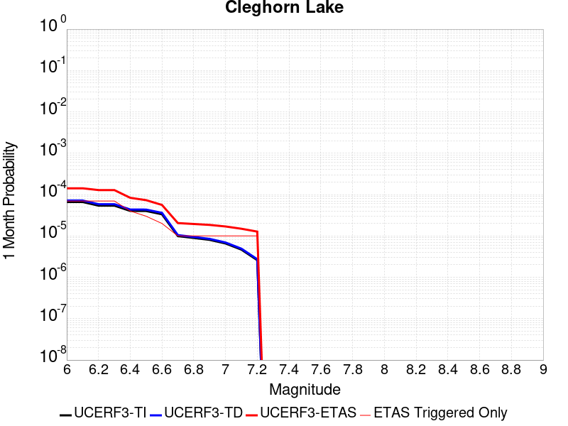 | 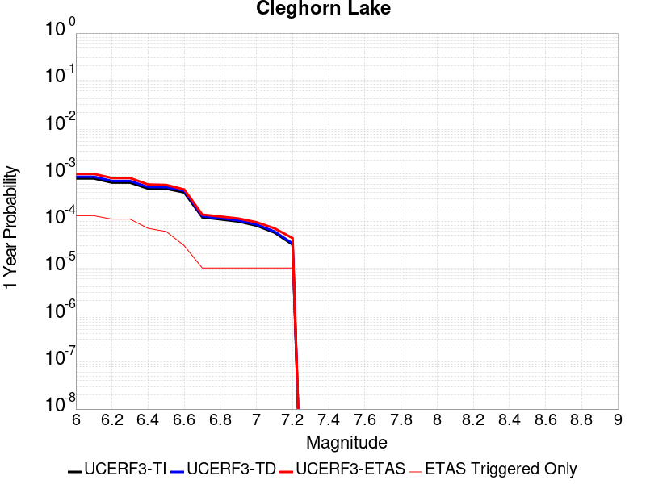 | 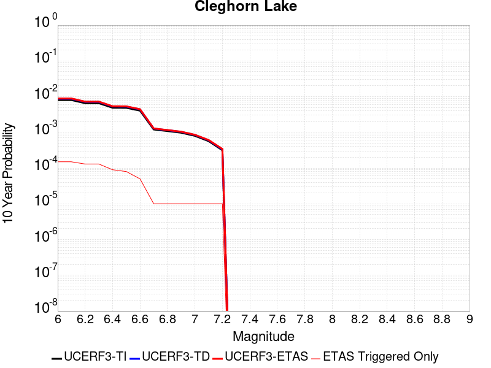 |

| Magnitude | 1 wk TI Prob | 1 wk TD Prob | 1 wk ETAS Prob | 1 wk ETAS/TD Gain | 1 wk ETAS Triggered Only | 1 mo TI Prob | 1 mo TD Prob | 1 mo ETAS Prob | 1 mo ETAS/TD Gain | 1 mo ETAS Triggered Only | 1 yr TI Prob | 1 yr TD Prob | 1 yr ETAS Prob | 1 yr ETAS/TD Gain | 1 yr ETAS Triggered Only | 10 yr TI Prob | 10 yr TD Prob | 10 yr ETAS Prob | 10 yr ETAS/TD Gain | 10 yr ETAS Triggered Only |
|-----|-----|-----|-----|-----|-----|-----|-----|-----|-----|-----|-----|-----|-----|-----|-----|-----|-----|-----|-----|-----|
| 6.0 | 1.5467183E-5 | 1.6794203E-5 | 6.6793364E-5 | 3.9771676 | 5.0E-5 | 6.6286244E-5 | 7.197348E-5 | 1.4196844E-4 | 1.9725105 | 7.0E-5 | 8.067362E-4 | 8.759797E-4 | 0.0010058659 | 1.1482753 | 1.3E-4 | 0.008038137 | 0.008730696 | 0.008879386 | 1.0170307 | 1.5E-4 |
| 6.1 | 1.5467183E-5 | 1.6794203E-5 | 6.6793364E-5 | 3.9771676 | 5.0E-5 | 6.6286244E-5 | 7.197348E-5 | 1.4196844E-4 | 1.9725105 | 7.0E-5 | 8.067362E-4 | 8.759797E-4 | 0.0010058659 | 1.1482753 | 1.3E-4 | 0.008038137 | 0.008730696 | 0.008879386 | 1.0170307 | 1.5E-4 |
| 6.2 | 1.2624631E-5 | 1.3681544E-5 | 6.368086E-5 | 4.654508 | 5.0E-5 | 5.410444E-5 | 5.863415E-5 | 1.2863004E-4 | 2.1937735 | 7.0E-5 | 6.585225E-4 | 7.1368564E-4 | 8.236071E-4 | 1.1540195 | 1.1E-4 | 0.0065657445 | 0.0071187317 | 0.0072478065 | 1.0181317 | 1.3E-4 |
| 6.3 | 1.2624631E-5 | 1.3681544E-5 | 6.368086E-5 | 4.654508 | 5.0E-5 | 5.410444E-5 | 5.863415E-5 | 1.2863004E-4 | 2.1937735 | 7.0E-5 | 6.585225E-4 | 7.1368564E-4 | 8.236071E-4 | 1.1540195 | 1.1E-4 | 0.0065657445 | 0.0071187317 | 0.0072478065 | 1.0181317 | 1.3E-4 |
| 6.4 | 9.417684E-6 | 1.0170118E-5 | 5.016971E-5 | 4.933051 | 4.0E-5 | 4.036088E-5 | 4.3585722E-5 | 8.3583975E-5 | 1.9176917 | 4.0E-5 | 4.912829E-4 | 5.3056807E-4 | 6.005309E-4 | 1.1318641 | 7.0E-5 | 0.004901982 | 0.005297049 | 0.0053865723 | 1.0169005 | 9.0E-5 |
| 6.5 | 9.368219E-6 | 1.0117545E-5 | 4.011724E-5 | 3.9651165 | 3.0E-5 | 4.014889E-5 | 4.3360415E-5 | 7.3359115E-5 | 1.6918453 | 3.0E-5 | 4.8870314E-4 | 5.2782625E-4 | 5.877946E-4 | 1.1136137 | 6.0E-5 | 0.004876298 | 0.0052697617 | 0.00534934 | 1.015101 | 8.0E-5 |
| 6.6 | 7.803798E-6 | 8.441831E-6 | 2.8441662E-5 | 3.3691342 | 2.0E-5 | 3.3444423E-5 | 3.6179E-5 | 5.6178276E-5 | 1.552787 | 2.0E-5 | 4.0710976E-4 | 4.4043022E-4 | 4.70417E-4 | 1.0680852 | 3.0E-5 | 0.0040636472 | 0.0043994905 | 0.00444927 | 1.011315 | 5.0E-5 |
| 6.7 | 2.3108669E-6 | 2.4438336E-6 | 1.2443809E-5 | 5.0919213 | 1.0E-5 | 9.903678E-6 | 1.0473532E-5 | 2.0473428E-5 | 1.9547777 | 1.0E-5 | 1.205706E-4 | 1.2750797E-4 | 1.375067E-4 | 1.0784165 | 1.0E-5 | 0.001205052 | 0.0012743667 | 0.001284354 | 1.007837 | 1.0E-5 |
| 6.8 | 2.0882828E-6 | 2.2062823E-6 | 1.220626E-5 | 5.5325017 | 1.0E-5 | 8.949753E-6 | 9.455462E-6 | 1.9455367E-5 | 2.0575798 | 1.0E-5 | 1.08957785E-4 | 1.1511434E-4 | 1.2511319E-4 | 1.0868602 | 1.0E-5 | 0.0010890438 | 0.0011505639 | 0.0011605524 | 1.0086814 | 1.0E-5 |
| 6.9 | 1.876935E-6 | 1.981051E-6 | 1.1981031E-5 | 6.047816 | 1.0E-5 | 8.043982E-6 | 8.490192E-6 | 1.8490107E-5 | 2.1778197 | 1.0E-5 | 9.7931086E-5 | 1.03363345E-4 | 1.1336231E-4 | 1.0967361 | 1.0E-5 | 9.788794E-4 | 0.0010331686 | 0.0010431584 | 1.009669 | 1.0E-5 |
| 7.0 | 1.5357559E-6 | 1.6202807E-6 | 1.1620265E-5 | 7.17176 | 1.0E-5 | 6.5817944E-6 | 6.9440425E-6 | 1.6943974E-5 | 2.4400733 | 1.0E-5 | 8.01304E-5 | 8.454057E-5 | 9.453972E-5 | 1.1182764 | 1.0E-5 | 8.010151E-4 | 8.450965E-4 | 8.55088E-4 | 1.0118229 | 1.0E-5 |
| 7.1 | 1.0905424E-6 | 1.1497619E-6 | 1.114975E-5 | 9.697442 | 1.0E-5 | 4.6737446E-6 | 4.9275427E-6 | 1.4927493E-5 | 3.0293992 | 1.0E-5 | 5.6901354E-5 | 5.999128E-5 | 6.999068E-5 | 1.1666809 | 1.0E-5 | 5.6886784E-4 | 5.997606E-4 | 6.0975464E-4 | 1.0166633 | 1.0E-5 |
| 7.2 | 6.06668E-7 | 6.387277E-7 | 1.06387215E-5 | 16.656113 | 1.0E-5 | 2.600003E-6 | 2.7374022E-6 | 1.2737375E-5 | 4.6530886 | 1.0E-5 | 3.1654577E-5 | 3.3327433E-5 | 4.3327098E-5 | 1.3000431 | 1.0E-5 | 3.1650066E-4 | 3.3323118E-4 | 3.4322785E-4 | 1.0299993 | 1.0E-5 |

## San Andreas (North Branch Mill Creek)
*[(top)](#table-of-contents)*

| 1 Week | 1 Month | 1 Year | 10 Year |
|-----|-----|-----|-----|
| 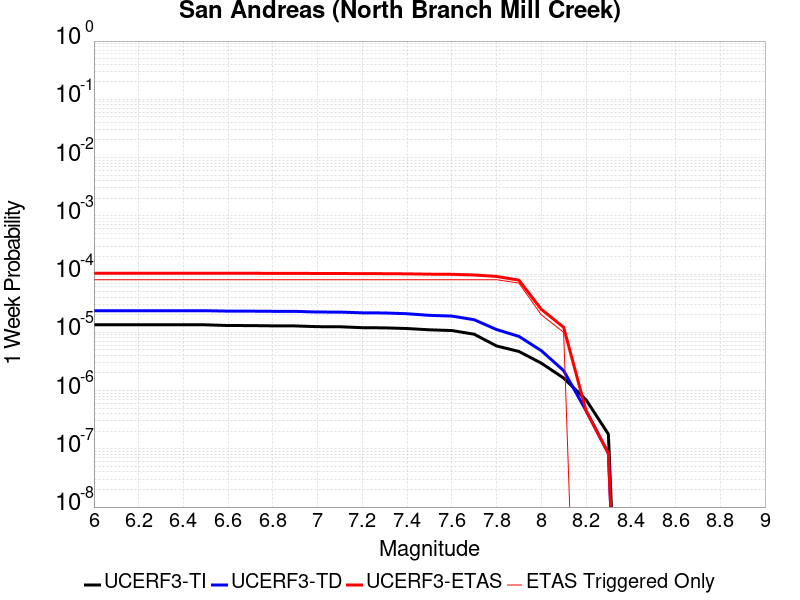 | 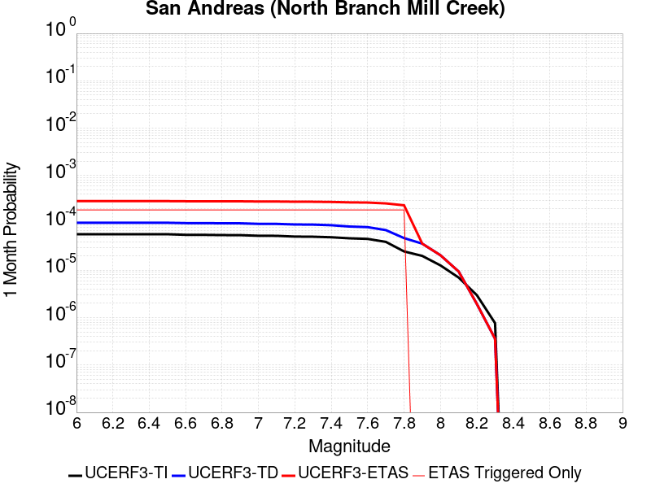 | 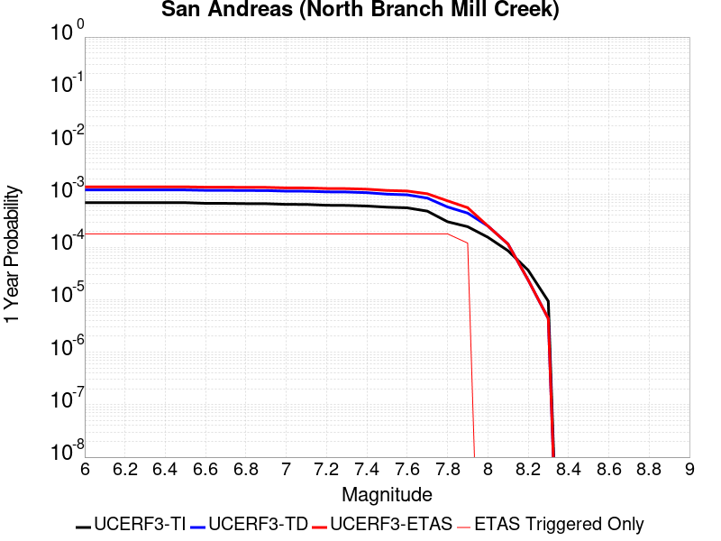 | 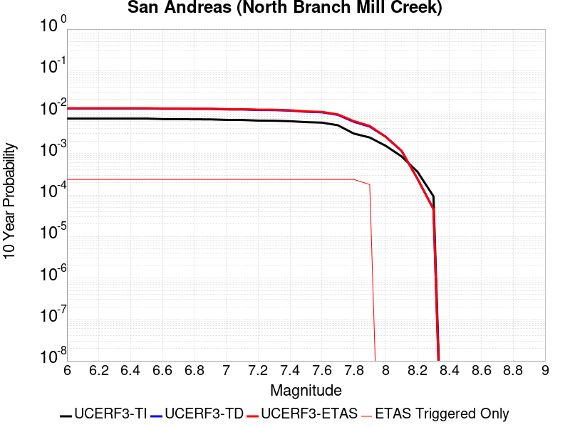 |

| Magnitude | 1 wk TI Prob | 1 wk TD Prob | 1 wk ETAS Prob | 1 wk ETAS/TD Gain | 1 wk ETAS Triggered Only | 1 mo TI Prob | 1 mo TD Prob | 1 mo ETAS Prob | 1 mo ETAS/TD Gain | 1 mo ETAS Triggered Only | 1 yr TI Prob | 1 yr TD Prob | 1 yr ETAS Prob | 1 yr ETAS/TD Gain | 1 yr ETAS Triggered Only | 10 yr TI Prob | 10 yr TD Prob | 10 yr ETAS Prob | 10 yr ETAS/TD Gain | 10 yr ETAS Triggered Only |
|-----|-----|-----|-----|-----|-----|-----|-----|-----|-----|-----|-----|-----|-----|-----|-----|-----|-----|-----|-----|-----|
| 6.0 | 1.3461156E-5 | 2.3500992E-5 | 1.03499115E-4 | 4.4040318 | 8.0E-5 | 5.7689394E-5 | 1.00714664E-4 | 1.907056E-4 | 1.8935237 | 9.0E-5 | 7.02142E-4 | 0.0012255146 | 0.0013553553 | 1.1059479 | 1.3E-4 | 0.0069992766 | 0.012228744 | 0.012386788 | 1.012924 | 1.6E-4 |
| 6.1 | 1.3461156E-5 | 2.3500992E-5 | 1.03499115E-4 | 4.4040318 | 8.0E-5 | 5.7689394E-5 | 1.00714664E-4 | 1.907056E-4 | 1.8935237 | 9.0E-5 | 7.02142E-4 | 0.0012255146 | 0.0013553553 | 1.1059479 | 1.3E-4 | 0.0069992766 | 0.012228744 | 0.012386788 | 1.012924 | 1.6E-4 |
| 6.2 | 1.3461156E-5 | 2.3500992E-5 | 1.03499115E-4 | 4.4040318 | 8.0E-5 | 5.7689394E-5 | 1.00714664E-4 | 1.907056E-4 | 1.8935237 | 9.0E-5 | 7.02142E-4 | 0.0012255146 | 0.0013553553 | 1.1059479 | 1.3E-4 | 0.0069992766 | 0.012228744 | 0.012386788 | 1.012924 | 1.6E-4 |
| 6.3 | 1.3461156E-5 | 2.3500992E-5 | 1.03499115E-4 | 4.4040318 | 8.0E-5 | 5.7689394E-5 | 1.00714664E-4 | 1.907056E-4 | 1.8935237 | 9.0E-5 | 7.02142E-4 | 0.0012255146 | 0.0013553553 | 1.1059479 | 1.3E-4 | 0.0069992766 | 0.012228744 | 0.012386788 | 1.012924 | 1.6E-4 |
| 6.4 | 1.3461156E-5 | 2.3500992E-5 | 1.03499115E-4 | 4.4040318 | 8.0E-5 | 5.7689394E-5 | 1.00714664E-4 | 1.907056E-4 | 1.8935237 | 9.0E-5 | 7.02142E-4 | 0.0012255146 | 0.0013553553 | 1.1059479 | 1.3E-4 | 0.0069992766 | 0.012228744 | 0.012386788 | 1.012924 | 1.6E-4 |
| 6.5 | 1.3450706E-5 | 2.348995E-5 | 1.0348807E-4 | 4.4056315 | 8.0E-5 | 5.764461E-5 | 1.00667356E-4 | 1.9065829E-4 | 1.8939437 | 9.0E-5 | 7.0159714E-4 | 0.0012249392 | 0.00135478 | 1.1059977 | 1.3E-4 | 0.006993862 | 0.012223054 | 0.012381098 | 1.01293 | 1.6E-4 |
| 6.6 | 1.3074523E-5 | 2.3104236E-5 | 1.03102386E-4 | 4.4624887 | 8.0E-5 | 5.6032466E-5 | 9.901441E-5 | 1.890055E-4 | 1.9088686 | 9.0E-5 | 6.8198174E-4 | 0.001204837 | 0.0013346804 | 1.1077684 | 1.3E-4 | 0.006798926 | 0.012024219 | 0.012182295 | 1.0131465 | 1.6E-4 |
| 6.7 | 1.3050216E-5 | 2.3079532E-5 | 1.03077684E-4 | 4.4661946 | 8.0E-5 | 5.59283E-5 | 9.890855E-5 | 1.8889965E-4 | 1.9098414 | 9.0E-5 | 6.8071426E-4 | 0.0012035496 | 0.0013333932 | 1.1078838 | 1.3E-4 | 0.0067863287 | 0.012011484 | 0.012169562 | 1.0131606 | 1.6E-4 |
| 6.8 | 1.29049395E-5 | 2.2927941E-5 | 1.02926104E-4 | 4.4891124 | 8.0E-5 | 5.530571E-5 | 9.825892E-5 | 1.8825008E-4 | 1.9158574 | 9.0E-5 | 6.73139E-4 | 0.001195649 | 0.0013254936 | 1.1085975 | 1.3E-4 | 0.0067110364 | 0.011933329 | 0.012091419 | 1.0132478 | 1.6E-4 |
| 6.9 | 1.2867369E-5 | 2.2887343E-5 | 1.0288551E-4 | 4.4953017 | 8.0E-5 | 5.51447E-5 | 9.808494E-5 | 1.8807611E-4 | 1.917482 | 9.0E-5 | 6.711799E-4 | 0.0011935332 | 0.0013233781 | 1.1087903 | 1.3E-4 | 0.006691564 | 0.011912397 | 0.012070492 | 1.0132713 | 1.6E-4 |
| 7.0 | 1.2495996E-5 | 2.2287419E-5 | 1.0228564E-4 | 4.589389 | 8.0E-5 | 5.3553173E-5 | 9.551403E-5 | 1.8550543E-4 | 1.9421799 | 9.0E-5 | 6.518148E-4 | 0.0011622658 | 0.0012921147 | 1.1117204 | 1.3E-4 | 0.0064990623 | 0.011603 | 0.011761144 | 1.0136296 | 1.6E-4 |
| 7.1 | 1.2452067E-5 | 2.2232492E-5 | 1.0223071E-4 | 4.598257 | 8.0E-5 | 5.3364907E-5 | 9.527864E-5 | 1.8527007E-4 | 1.9445078 | 9.0E-5 | 6.4952404E-4 | 0.001159403 | 0.0012892523 | 1.1119967 | 1.3E-4 | 0.0064762887 | 0.011574671 | 0.011732819 | 1.0136633 | 1.6E-4 |
| 7.2 | 1.2002777E-5 | 2.1611015E-5 | 1.0160929E-4 | 4.701736 | 8.0E-5 | 5.143946E-5 | 9.261536E-5 | 1.8260702E-4 | 1.9716711 | 9.0E-5 | 6.2609545E-4 | 0.0011270114 | 0.0012568649 | 1.1152194 | 1.3E-4 | 0.006243344 | 0.011254058 | 0.011412257 | 1.014057 | 1.6E-4 |
| 7.3 | 1.1923425E-5 | 2.1480853E-5 | 1.01479134E-4 | 4.724167 | 8.0E-5 | 5.109939E-5 | 9.205757E-5 | 1.8204929E-4 | 1.9775591 | 9.0E-5 | 6.219575E-4 | 0.0011202273 | 0.0012500817 | 1.1159179 | 1.3E-4 | 0.0062021962 | 0.011186945 | 0.011345155 | 1.0141424 | 1.6E-4 |
| 7.4 | 1.16105175E-5 | 2.0854808E-5 | 1.0085314E-4 | 4.835966 | 8.0E-5 | 4.975841E-5 | 8.93747E-5 | 1.7936666E-4 | 2.0069065 | 9.0E-5 | 6.0564023E-4 | 0.0010875963 | 0.0012174549 | 1.1193997 | 1.3E-4 | 0.006039923 | 0.010864409 | 0.011022671 | 1.014567 | 1.6E-4 |
| 7.5 | 1.1037265E-5 | 1.9554842E-5 | 9.9553276E-5 | 5.090978 | 8.0E-5 | 4.7301706E-5 | 8.380379E-5 | 1.7379624E-4 | 2.073847 | 9.0E-5 | 5.757461E-4 | 0.0010198357 | 0.0011497032 | 1.1273415 | 1.3E-4 | 0.005742567 | 0.010195527 | 0.010353897 | 1.0155332 | 1.6E-4 |
| 7.6 | 1.0720915E-5 | 1.8996727E-5 | 9.899521E-5 | 5.2111716 | 8.0E-5 | 4.5945973E-5 | 8.141202E-5 | 1.714047E-4 | 2.105398 | 9.0E-5 | 5.592486E-4 | 9.907428E-4 | 0.001120614 | 1.1310847 | 1.3E-4 | 0.005578433 | 0.009907238 | 0.010065653 | 1.0159898 | 1.6E-4 |
| 7.7 | 9.276279E-6 | 1.6442464E-5 | 9.644115E-5 | 5.8653708 | 8.0E-5 | 3.9754876E-5 | 7.046581E-5 | 1.6045947E-4 | 2.2771251 | 9.0E-5 | 4.839081E-4 | 8.5758517E-4 | 9.874738E-4 | 1.1514584 | 1.3E-4 | 0.0048285574 | 0.008586576 | 0.008745202 | 1.0184737 | 1.6E-4 |
| 7.8 | 5.8346777E-6 | 1.11555855E-5 | 9.1154696E-5 | 8.171216 | 8.0E-5 | 2.5005522E-5 | 4.7808775E-5 | 1.3780447E-4 | 2.8824096 | 9.0E-5 | 3.043997E-4 | 5.819165E-4 | 7.1184087E-4 | 1.2232697 | 1.3E-4 | 0.0030398308 | 0.0058473335 | 0.006006398 | 1.0272028 | 1.6E-4 |
| 7.9 | 4.690204E-6 | 8.509473E-6 | 7.850888E-5 | 9.226056 | 7.0E-5 | 2.0100719E-5 | 3.6468664E-5 | 1.16465744E-4 | 3.1935842 | 8.0E-5 | 2.4469878E-4 | 4.439156E-4 | 5.638623E-4 | 1.2702017 | 1.2E-4 | 0.002444295 | 0.004471165 | 0.004610539 | 1.0311718 | 1.4E-4 |
| 8.0 | 2.9570454E-6 | 4.8470656E-6 | 2.484697E-5 | 5.126188 | 2.0E-5 | 1.267299E-5 | 2.0772974E-5 | 4.0772557E-5 | 1.9627695 | 2.0E-5 | 1.5428272E-4 | 2.5288164E-4 | 2.8287404E-4 | 1.1186026 | 3.0E-5 | 0.0015417566 | 0.002549932 | 0.0025898302 | 1.0156467 | 4.0E-5 |
| 8.1 | 1.6376824E-6 | 2.1968672E-6 | 1.2196845E-5 | 5.5519266 | 1.0E-5 | 7.01862E-6 | 9.415111E-6 | 1.9415018E-5 | 2.0621123 | 1.0E-5 | 8.544835E-5 | 1.1462297E-4 | 1.2462182E-4 | 1.0872326 | 1.0E-5 | 8.54155E-4 | 0.0011607445 | 0.0011707328 | 1.0086051 | 1.0E-5 |
| 8.2 | 6.9631557E-7 | 4.535001E-7 | 4.535001E-7 | 1.0 | 0.0 | 2.984206E-6 | 1.9435704E-6 | 1.9435704E-6 | 1.0 | 0.0 | 3.63321E-5 | 2.3662713E-5 | 2.3662713E-5 | 1.0 | 0.0 | 3.6326164E-4 | 2.4510184E-4 | 2.4510184E-4 | 1.0 | 0.0 |
| 8.3 | 1.7876137E-7 | 8.357368E-8 | 8.357368E-8 | 1.0 | 0.0 | 7.661199E-7 | 3.5817288E-7 | 3.5817288E-7 | 1.0 | 0.0 | 9.32747E-6 | 4.3607465E-6 | 4.3607465E-6 | 1.0 | 0.0 | 9.3270784E-5 | 4.5800018E-5 | 4.5800018E-5 | 1.0 | 0.0 |

## White Mountains
*[(top)](#table-of-contents)*

| 1 Week | 1 Month | 1 Year | 10 Year |
|-----|-----|-----|-----|
| 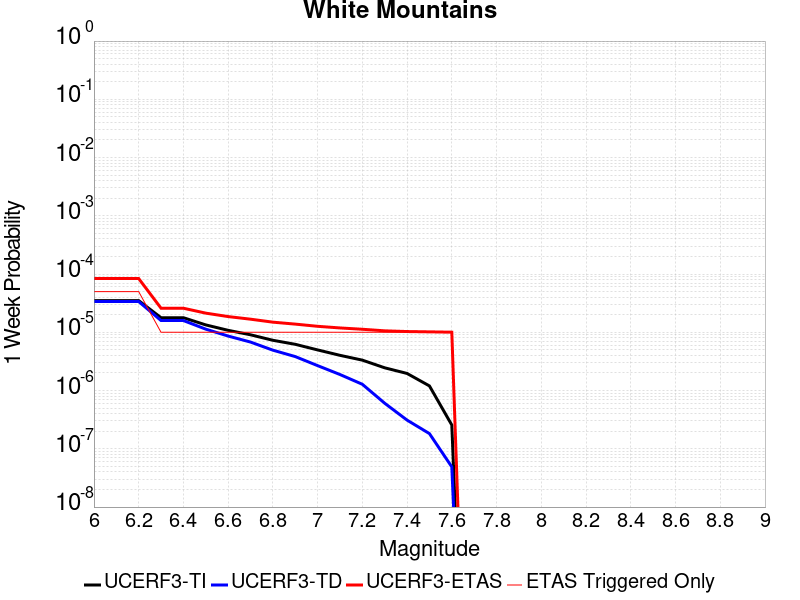 | 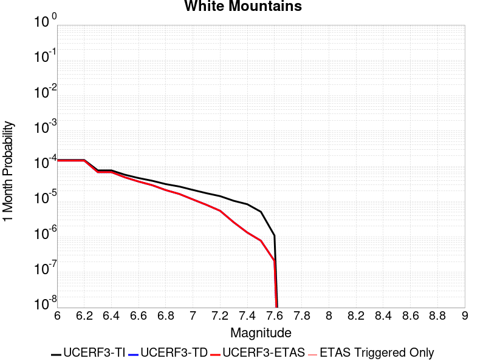 | 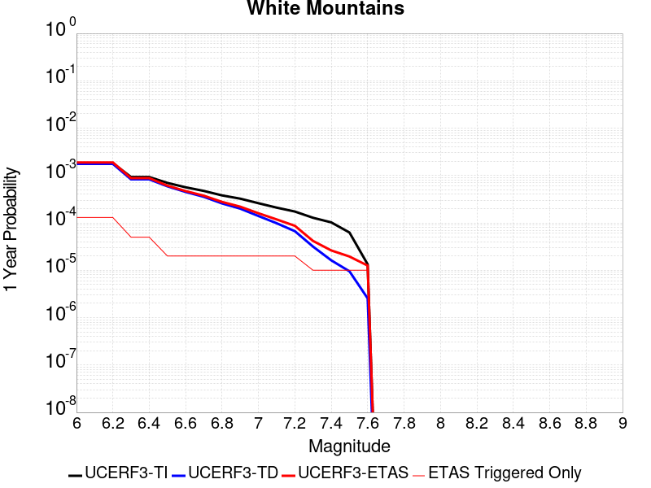 | 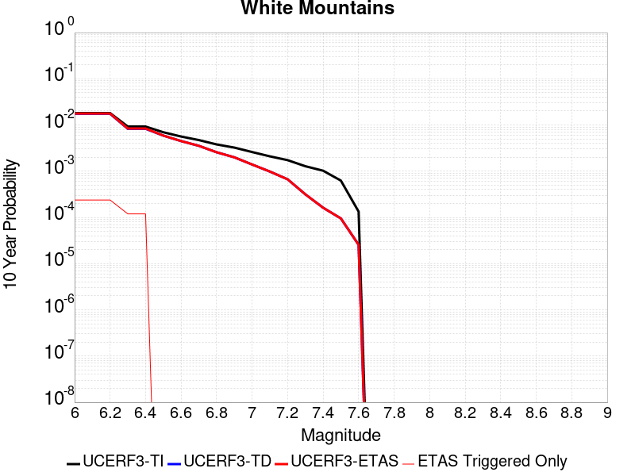 |

| Magnitude | 1 wk TI Prob | 1 wk TD Prob | 1 wk ETAS Prob | 1 wk ETAS/TD Gain | 1 wk ETAS Triggered Only | 1 mo TI Prob | 1 mo TD Prob | 1 mo ETAS Prob | 1 mo ETAS/TD Gain | 1 mo ETAS Triggered Only | 1 yr TI Prob | 1 yr TD Prob | 1 yr ETAS Prob | 1 yr ETAS/TD Gain | 1 yr ETAS Triggered Only | 10 yr TI Prob | 10 yr TD Prob | 10 yr ETAS Prob | 10 yr ETAS/TD Gain | 10 yr ETAS Triggered Only |
|-----|-----|-----|-----|-----|-----|-----|-----|-----|-----|-----|-----|-----|-----|-----|-----|-----|-----|-----|-----|-----|
| 6.0 | 3.503579E-5 | 3.3784127E-5 | 8.3782434E-5 | 2.4799352 | 5.0E-5 | 1.5014476E-4 | 1.4478175E-4 | 2.0477307E-4 | 1.4143568 | 6.0E-5 | 0.0018264796 | 0.0017614134 | 0.0018911845 | 1.0736743 | 1.3E-4 | 0.018115403 | 0.017486857 | 0.017644059 | 1.0089897 | 1.6E-4 |
| 6.1 | 3.503579E-5 | 3.3784127E-5 | 8.3782434E-5 | 2.4799352 | 5.0E-5 | 1.5014476E-4 | 1.4478175E-4 | 2.0477307E-4 | 1.4143568 | 6.0E-5 | 0.0018264796 | 0.0017614134 | 0.0018911845 | 1.0736743 | 1.3E-4 | 0.018115403 | 0.017486857 | 0.017644059 | 1.0089897 | 1.6E-4 |
| 6.2 | 3.503579E-5 | 3.3784127E-5 | 8.3782434E-5 | 2.4799352 | 5.0E-5 | 1.5014476E-4 | 1.4478175E-4 | 2.0477307E-4 | 1.4143568 | 6.0E-5 | 0.0018264796 | 0.0017614134 | 0.0018911845 | 1.0736743 | 1.3E-4 | 0.018115403 | 0.017486857 | 0.017644059 | 1.0089897 | 1.6E-4 |
| 6.3 | 1.7818425E-5 | 1.591616E-5 | 2.5916E-5 | 1.6282823 | 1.0E-5 | 7.636245E-5 | 6.821041E-5 | 7.820973E-5 | 1.1465952 | 1.0E-5 | 9.293162E-4 | 8.301596E-4 | 8.8011805E-4 | 1.0601794 | 5.0E-5 | 0.009254395 | 0.0082720425 | 0.008321629 | 1.0059944 | 5.0E-5 |
| 6.4 | 1.7818425E-5 | 1.591616E-5 | 2.5916E-5 | 1.6282823 | 1.0E-5 | 7.636245E-5 | 6.821041E-5 | 7.820973E-5 | 1.1465952 | 1.0E-5 | 9.293162E-4 | 8.301596E-4 | 8.8011805E-4 | 1.0601794 | 5.0E-5 | 0.009254395 | 0.0082720425 | 0.008321629 | 1.0059944 | 5.0E-5 |
| 6.5 | 1.3397557E-5 | 1.1336374E-5 | 2.133626E-5 | 1.8821063 | 1.0E-5 | 5.741684E-5 | 4.8583595E-5 | 5.8583108E-5 | 1.2058208 | 1.0E-5 | 6.988258E-4 | 5.913517E-4 | 6.1133987E-4 | 1.0338008 | 2.0E-5 | 0.006966323 | 0.005898487 | 0.0059183687 | 1.0033706 | 2.0E-5 |
| 6.6 | 1.0818695E-5 | 8.625434E-6 | 1.8625347E-5 | 2.1593518 | 1.0E-5 | 4.6365014E-5 | 3.6965648E-5 | 4.6965277E-5 | 1.2705114 | 1.0E-5 | 5.6434784E-4 | 4.4996818E-4 | 4.6995917E-4 | 1.0444276 | 2.0E-5 | 0.005629168 | 0.0044910074 | 0.0045109177 | 1.0044334 | 2.0E-5 |
| 6.7 | 9.067908E-6 | 6.802476E-6 | 1.6802407E-5 | 2.470043 | 1.0E-5 | 3.8861883E-5 | 2.915316E-5 | 3.915287E-5 | 1.343006 | 1.0E-5 | 4.7304068E-4 | 3.548851E-4 | 3.74878E-4 | 1.0563363 | 2.0E-5 | 0.00472035 | 0.003543501 | 0.0035634302 | 1.0056242 | 2.0E-5 |
| 6.8 | 7.295947E-6 | 4.9364285E-6 | 1.4936379E-5 | 3.025746 | 1.0E-5 | 3.126797E-5 | 2.1155956E-5 | 3.1155745E-5 | 1.4726701 | 1.0E-5 | 3.8062103E-4 | 2.5754445E-4 | 2.775393E-4 | 1.0776365 | 2.0E-5 | 0.0037996976 | 0.0025725728 | 0.0025925213 | 1.0077543 | 2.0E-5 |
| 6.9 | 6.2243444E-6 | 3.8322546E-6 | 1.3832216E-5 | 3.60942 | 1.0E-5 | 2.6675489E-5 | 1.6423846E-5 | 2.6423682E-5 | 1.6088607 | 1.0E-5 | 3.2472567E-4 | 1.9994251E-4 | 2.1993852E-4 | 1.1000087 | 2.0E-5 | 0.0032425157 | 0.001997679 | 0.002017639 | 1.0099916 | 2.0E-5 |
| 7.0 | 4.9878413E-6 | 2.679564E-6 | 1.2679538E-5 | 4.7319403 | 1.0E-5 | 2.1376287E-5 | 1.1483797E-5 | 2.1483682E-5 | 1.8707821 | 1.0E-5 | 2.602252E-4 | 1.3980652E-4 | 1.5980372E-4 | 1.1430348 | 2.0E-5 | 0.002599207 | 0.0013972119 | 0.0014171839 | 1.0142943 | 2.0E-5 |
| 7.1 | 4.0252844E-6 | 1.885702E-6 | 1.1885683E-5 | 6.303055 | 1.0E-5 | 1.7251105E-5 | 8.081555E-6 | 1.8081475E-5 | 2.2373755 | 1.0E-5 | 2.1001195E-4 | 9.838863E-5 | 1.18386655E-4 | 1.2032555 | 2.0E-5 | 0.0020981359 | 9.834635E-4 | 0.0010034437 | 1.0203162 | 2.0E-5 |
| 7.2 | 3.3284066E-6 | 1.2818929E-6 | 1.128188E-5 | 8.800954 | 1.0E-5 | 1.4264522E-5 | 5.4938155E-6 | 1.549376E-5 | 2.8202186 | 1.0E-5 | 1.736567E-4 | 6.688525E-5 | 8.688391E-5 | 1.2989995 | 2.0E-5 | 0.0017352107 | 6.6866126E-4 | 6.886479E-4 | 1.0298905 | 2.0E-5 |
| 7.3 | 2.458226E-6 | 6.056684E-7 | 1.0605662E-5 | 17.510675 | 1.0E-5 | 1.0535211E-5 | 2.5957193E-6 | 1.2595693E-5 | 4.8524866 | 1.0E-5 | 1.2825865E-4 | 3.160246E-5 | 4.1602147E-5 | 1.316421 | 1.0E-5 | 0.0012818464 | 3.1598343E-4 | 3.2598025E-4 | 1.0316372 | 1.0E-5 |
| 7.4 | 1.965953E-6 | 3.1084684E-7 | 1.0310844E-5 | 33.170174 | 1.0E-5 | 8.425486E-6 | 1.3322001E-6 | 1.1332187E-5 | 8.50637 | 1.0E-5 | 1.0257547E-4 | 1.6219417E-5 | 2.6219255E-5 | 1.616535 | 1.0E-5 | 0.0010252813 | 1.6218246E-4 | 1.7218084E-4 | 1.061649 | 1.0E-5 |
| 7.5 | 1.2014192E-6 | 1.8241002E-7 | 1.0182408E-5 | 55.82154 | 1.0E-5 | 5.148929E-6 | 7.8175697E-7 | 1.078175E-5 | 13.791689 | 1.0E-5 | 6.2686406E-5 | 9.51785E-6 | 1.9517756E-5 | 2.0506475 | 1.0E-5 | 6.266873E-4 | 9.517451E-5 | 1.0517356E-4 | 1.1050601 | 1.0E-5 |
| 7.6 | 2.5612175E-7 | 4.893784E-8 | 1.0048937E-5 | 205.34085 | 1.0E-5 | 1.0976642E-6 | 2.0973359E-7 | 1.0209731E-5 | 48.679527 | 1.0E-5 | 1.3363979E-5 | 2.5535037E-6 | 1.2553478E-5 | 4.9161777 | 1.0E-5 | 1.3363175E-4 | 2.553478E-5 | 3.5534526E-5 | 1.3916128 | 1.0E-5 |

## Imperial
*[(top)](#table-of-contents)*

| 1 Week | 1 Month | 1 Year | 10 Year |
|-----|-----|-----|-----|
| 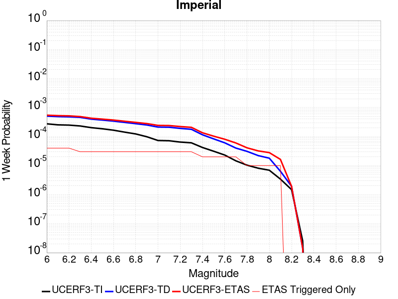 | 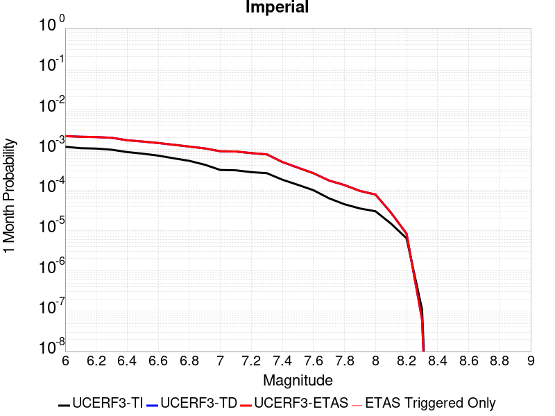 | 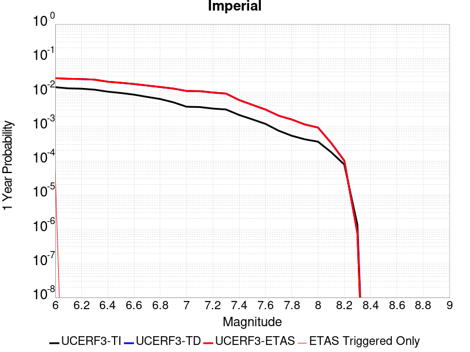 | 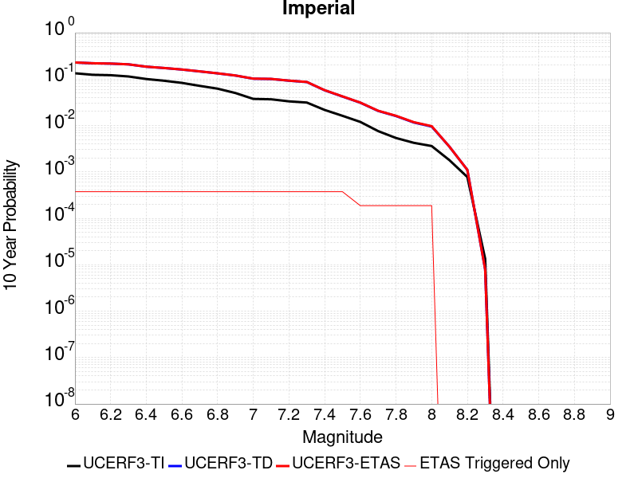 |

| Magnitude | 1 wk TI Prob | 1 wk TD Prob | 1 wk ETAS Prob | 1 wk ETAS/TD Gain | 1 wk ETAS Triggered Only | 1 mo TI Prob | 1 mo TD Prob | 1 mo ETAS Prob | 1 mo ETAS/TD Gain | 1 mo ETAS Triggered Only | 1 yr TI Prob | 1 yr TD Prob | 1 yr ETAS Prob | 1 yr ETAS/TD Gain | 1 yr ETAS Triggered Only | 10 yr TI Prob | 10 yr TD Prob | 10 yr ETAS Prob | 10 yr ETAS/TD Gain | 10 yr ETAS Triggered Only |
|-----|-----|-----|-----|-----|-----|-----|-----|-----|-----|-----|-----|-----|-----|-----|-----|-----|-----|-----|-----|-----|
| 6.0 | 2.7496446E-4 | 5.055345E-4 | 5.4551434E-4 | 1.0790842 | 4.0E-5 | 0.0011778869 | 0.002164817 | 0.0022346654 | 1.0322653 | 7.0E-5 | 0.0142467655 | 0.026048409 | 0.026136065 | 1.0033652 | 9.0E-5 | 0.13367249 | 0.22807029 | 0.22818609 | 1.0005077 | 1.5E-4 |
| 6.1 | 2.5356023E-4 | 4.8657708E-4 | 5.265576E-4 | 1.0821669 | 4.0E-5 | 0.001086234 | 0.002083702 | 0.002143577 | 1.0287349 | 6.0E-5 | 0.013144928 | 0.02507094 | 0.025148934 | 1.003111 | 8.0E-5 | 0.123940155 | 0.21949561 | 0.21960488 | 1.0004978 | 1.4E-4 |
| 6.2 | 2.4820742E-4 | 4.775311E-4 | 5.1751203E-4 | 1.0837241 | 4.0E-5 | 0.0010633124 | 0.0020449946 | 0.002104872 | 1.02928 | 6.0E-5 | 0.01286919 | 0.024610676 | 0.024688706 | 1.0031706 | 8.0E-5 | 0.12148927 | 0.21600136 | 0.21611112 | 1.0005082 | 1.4E-4 |
| 6.3 | 2.3205351E-4 | 4.5892023E-4 | 4.8890646E-4 | 1.0653409 | 3.0E-5 | 9.94136E-4 | 0.0019653554 | 0.002015257 | 1.0253907 | 5.0E-5 | 0.012036599 | 0.023661187 | 0.02372953 | 1.0028884 | 7.0E-5 | 0.11405133 | 0.20793827 | 0.20804124 | 1.0004952 | 1.3E-4 |
| 6.4 | 2.0304754E-4 | 3.9878016E-4 | 4.287682E-4 | 1.0751994 | 3.0E-5 | 8.6991355E-4 | 0.0017079529 | 0.0017578676 | 1.0292248 | 5.0E-5 | 0.010539869 | 0.020595418 | 0.020663977 | 1.0033288 | 7.0E-5 | 0.100537635 | 0.18507113 | 0.18517706 | 1.0005724 | 1.3E-4 |
| 6.5 | 1.854992E-4 | 3.6990462E-4 | 3.9989353E-4 | 1.081072 | 3.0E-5 | 7.9475436E-4 | 0.0015843548 | 0.0016342755 | 1.0315086 | 5.0E-5 | 0.009633281 | 0.01911443 | 0.01918309 | 1.0035921 | 7.0E-5 | 0.0922623 | 0.1733039 | 0.17341137 | 1.0006201 | 1.3E-4 |
| 6.6 | 1.6586106E-4 | 3.4036173E-4 | 3.7035154E-4 | 1.0881115 | 3.0E-5 | 7.106394E-4 | 0.0014578878 | 0.001507815 | 1.0342462 | 5.0E-5 | 0.008617763 | 0.017607626 | 0.017676393 | 1.0039055 | 7.0E-5 | 0.08291132 | 0.16078055 | 0.16088964 | 1.0006785 | 1.3E-4 |
| 6.7 | 1.4224656E-4 | 3.076812E-4 | 3.3767198E-4 | 1.0974735 | 3.0E-5 | 6.094856E-4 | 0.0013179756 | 0.0013679096 | 1.037887 | 5.0E-5 | 0.0073952693 | 0.015928522 | 0.015997406 | 1.0043247 | 7.0E-5 | 0.07153955 | 0.14648798 | 0.14659894 | 1.0007575 | 1.3E-4 |
| 6.8 | 1.2317259E-4 | 2.779231E-4 | 3.0791477E-4 | 1.1079135 | 3.0E-5 | 5.2777573E-4 | 0.0011905615 | 0.0012405019 | 1.041947 | 5.0E-5 | 0.0064067547 | 0.014400131 | 0.0144691225 | 1.004791 | 7.0E-5 | 0.06225166 | 0.13294089 | 0.1330536 | 1.0008479 | 1.3E-4 |
| 6.9 | 9.859898E-5 | 2.5015484E-4 | 2.8014733E-4 | 1.1198957 | 3.0E-5 | 4.2249862E-4 | 0.0010716559 | 0.0011216024 | 1.0466068 | 5.0E-5 | 0.0051317946 | 0.012970319 | 0.013039411 | 1.005327 | 7.0E-5 | 0.05014893 | 0.119408876 | 0.11952335 | 1.0009587 | 1.3E-4 |
| 7.0 | 7.3191884E-5 | 2.1267848E-4 | 2.426721E-4 | 1.141028 | 3.0E-5 | 3.136418E-4 | 9.11164E-4 | 9.6111844E-4 | 1.0548248 | 5.0E-5 | 0.003811904 | 0.011037681 | 0.011097019 | 1.005376 | 6.0E-5 | 0.037471764 | 0.10206756 | 0.10217531 | 1.0010557 | 1.2E-4 |
| 7.1 | 7.1760296E-5 | 2.0969207E-4 | 2.3968577E-4 | 1.143037 | 3.0E-5 | 3.0750787E-4 | 8.9837395E-4 | 9.4832905E-4 | 1.0556061 | 5.0E-5 | 0.003737482 | 0.010883528 | 0.010942875 | 1.0054529 | 6.0E-5 | 0.03675245 | 0.10070406 | 0.10081198 | 1.0010716 | 1.2E-4 |
| 7.2 | 6.46614E-5 | 1.9137723E-4 | 2.2137149E-4 | 1.1567285 | 3.0E-5 | 2.7709085E-4 | 8.199333E-4 | 8.5990055E-4 | 1.0487444 | 4.0E-5 | 0.0033683628 | 0.009937617 | 0.0099871205 | 1.0049814 | 5.0E-5 | 0.033177625 | 0.092511006 | 0.092601754 | 1.000981 | 1.0E-4 |
| 7.3 | 6.088115E-5 | 1.780939E-4 | 2.0808856E-4 | 1.1684204 | 3.0E-5 | 2.6089314E-4 | 7.6303916E-4 | 8.030087E-4 | 1.052382 | 4.0E-5 | 0.0031717476 | 0.009251006 | 0.009300543 | 1.0053548 | 5.0E-5 | 0.031268585 | 0.08656135 | 0.086652696 | 1.0010552 | 1.0E-4 |
| 7.4 | 4.199346E-5 | 1.1511097E-4 | 1.3510867E-4 | 1.1737254 | 2.0E-5 | 1.7995955E-4 | 4.932403E-4 | 5.232255E-4 | 1.0607923 | 3.0E-5 | 0.0021888057 | 0.005988835 | 0.0060285954 | 1.0066391 | 4.0E-5 | 0.02167372 | 0.05744024 | 0.05752507 | 1.0014769 | 9.0E-5 |
| 7.5 | 3.130448E-5 | 8.333871E-5 | 1.0333704E-4 | 1.2399645 | 2.0E-5 | 1.3415517E-4 | 3.5711733E-4 | 3.7711018E-4 | 1.055984 | 2.0E-5 | 0.0016321153 | 0.0043392954 | 0.004369165 | 1.0068836 | 3.0E-5 | 0.016201803 | 0.042133506 | 0.042200558 | 1.0015914 | 7.0E-5 |
| 7.6 | 2.3074248E-5 | 6.0849357E-5 | 8.084814E-5 | 1.3286606 | 2.0E-5 | 9.888588E-5 | 2.6075702E-4 | 2.8075182E-4 | 1.0766797 | 2.0E-5 | 0.0012032706 | 0.0031701182 | 0.0032000232 | 1.0094334 | 3.0E-5 | 0.011967761 | 0.03102816 | 0.03107661 | 1.0015614 | 5.0E-5 |
| 7.7 | 1.45864815E-5 | 4.0128452E-5 | 6.0127648E-5 | 1.4983795 | 2.0E-5 | 6.2511994E-5 | 1.7196777E-4 | 1.9196433E-4 | 1.1162809 | 2.0E-5 | 7.608177E-4 | 0.0020917025 | 0.00212164 | 1.0143124 | 3.0E-5 | 0.007582182 | 0.02062909 | 0.020678058 | 1.0023738 | 5.0E-5 |
| 7.8 | 1.0352979E-5 | 3.096395E-5 | 4.096364E-5 | 1.3229462 | 1.0E-5 | 4.4369157E-5 | 1.326959E-4 | 1.4269458E-4 | 1.0753503 | 1.0E-5 | 5.400606E-4 | 0.0016143778 | 0.0016343455 | 1.0123687 | 2.0E-5 | 0.0053875 | 0.016017893 | 0.016057253 | 1.0024573 | 4.0E-5 |
| 7.9 | 8.137906E-6 | 2.2151205E-5 | 3.2150983E-5 | 1.4514327 | 1.0E-5 | 3.4876273E-5 | 9.493029E-5 | 1.0492934E-4 | 1.1053305 | 1.0E-5 | 4.2453592E-4 | 0.0011551644 | 0.0011651529 | 1.0086467 | 1.0E-5 | 0.004237258 | 0.011618842 | 0.011648494 | 1.002552 | 3.0E-5 |
| 8.0 | 6.93792E-6 | 1.8010365E-5 | 2.8010185E-5 | 1.5552258 | 1.0E-5 | 2.9733603E-5 | 7.7185E-5 | 8.718423E-5 | 1.1295488 | 1.0E-5 | 3.6194647E-4 | 9.3932304E-4 | 9.4931363E-4 | 1.010636 | 1.0E-5 | 0.0036135751 | 0.009502415 | 0.009522225 | 1.0020847 | 2.0E-5 |
| 8.1 | 3.4286315E-6 | 6.380179E-6 | 1.6380116E-5 | 2.5673442 | 1.0E-5 | 1.4694053E-5 | 2.734334E-5 | 3.7343067E-5 | 1.3657098 | 1.0E-5 | 1.7888541E-4 | 3.3285443E-4 | 3.428511E-4 | 1.0300331 | 1.0E-5 | 0.0017874148 | 0.0034863674 | 0.0034963326 | 1.0028583 | 1.0E-5 |
| 8.2 | 1.4906886E-6 | 1.936633E-6 | 1.936633E-6 | 1.0 | 0.0 | 6.3886496E-6 | 8.2998295E-6 | 8.2998295E-6 | 1.0 | 0.0 | 7.7779034E-5 | 1.0104576E-4 | 1.0104576E-4 | 1.0 | 0.0 | 7.775182E-4 | 0.0011075423 | 0.0011075423 | 1.0 | 0.0 |
| 8.3 | 2.5758007E-8 | 1.4495866E-8 | 1.4495866E-8 | 1.0 | 0.0 | 1.10391454E-7 | 6.212514E-8 | 6.212514E-8 | 1.0 | 0.0 | 1.3440151E-6 | 7.563736E-7 | 7.563736E-7 | 1.0 | 0.0 | 1.344007E-5 | 7.884359E-6 | 7.884359E-6 | 1.0 | 0.0 |

## Santa Ynez (West)
*[(top)](#table-of-contents)*

| 1 Week | 1 Month | 1 Year | 10 Year |
|-----|-----|-----|-----|
| 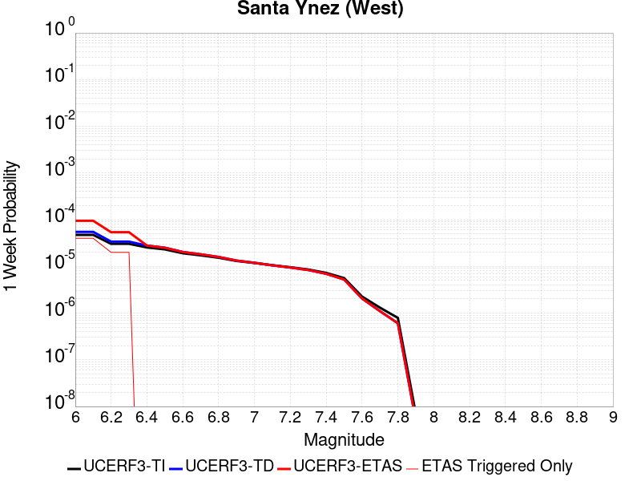 | 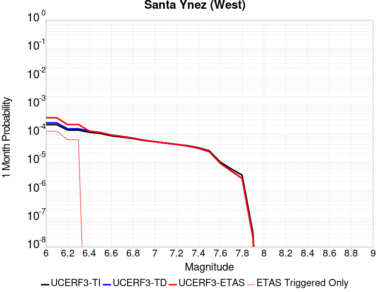 | 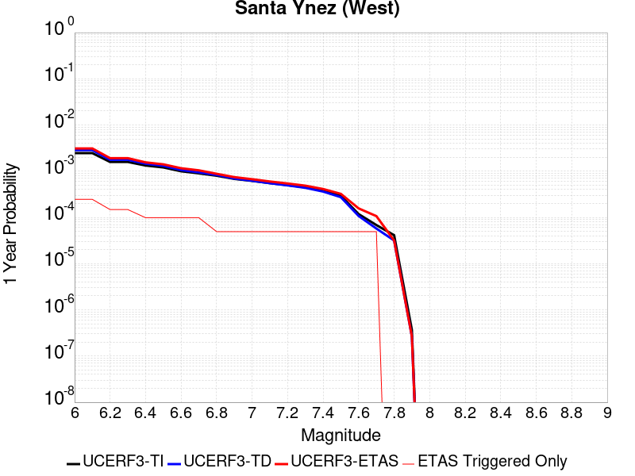 | 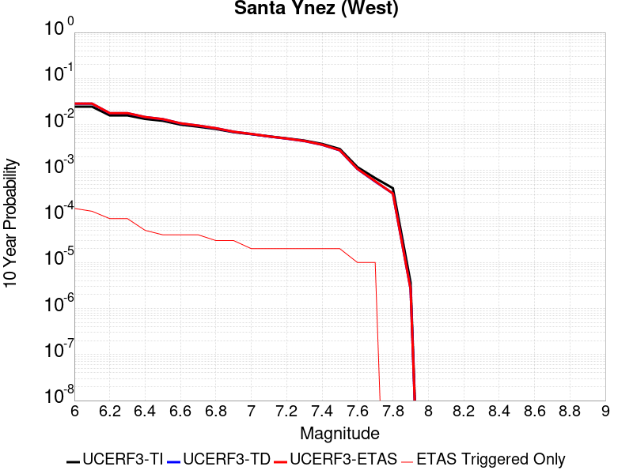 |

| Magnitude | 1 wk TI Prob | 1 wk TD Prob | 1 wk ETAS Prob | 1 wk ETAS/TD Gain | 1 wk ETAS Triggered Only | 1 mo TI Prob | 1 mo TD Prob | 1 mo ETAS Prob | 1 mo ETAS/TD Gain | 1 mo ETAS Triggered Only | 1 yr TI Prob | 1 yr TD Prob | 1 yr ETAS Prob | 1 yr ETAS/TD Gain | 1 yr ETAS Triggered Only | 10 yr TI Prob | 10 yr TD Prob | 10 yr ETAS Prob | 10 yr ETAS/TD Gain | 10 yr ETAS Triggered Only |
|-----|-----|-----|-----|-----|-----|-----|-----|-----|-----|-----|-----|-----|-----|-----|-----|-----|-----|-----|-----|-----|
| 6.0 | 4.7352758E-5 | 5.497084E-5 | 9.4968644E-5 | 1.7276186 | 4.0E-5 | 2.0292461E-4 | 2.3556968E-4 | 3.055532E-4 | 1.297082 | 7.0E-5 | 0.0024678076 | 0.002864558 | 0.002984214 | 1.0417713 | 1.2E-4 | 0.024405818 | 0.028304456 | 0.02845021 | 1.0051495 | 1.5E-4 |
| 6.1 | 4.7352758E-5 | 5.497084E-5 | 9.4968644E-5 | 1.7276186 | 4.0E-5 | 2.0292461E-4 | 2.3556968E-4 | 2.855579E-4 | 1.2122015 | 5.0E-5 | 0.0024678076 | 0.002864558 | 0.0029642715 | 1.0348094 | 1.0E-4 | 0.024405818 | 0.028304456 | 0.028430777 | 1.004463 | 1.3E-4 |
| 6.2 | 3.0415853E-5 | 3.3925004E-5 | 5.3924323E-5 | 1.5895157 | 2.0E-5 | 1.3034715E-4 | 1.4538495E-4 | 1.6538205E-4 | 1.1375458 | 2.0E-5 | 0.0015858212 | 0.0017686592 | 0.001828553 | 1.033864 | 6.0E-5 | 0.015745522 | 0.01754978 | 0.017638199 | 1.0050383 | 9.0E-5 |
| 6.3 | 3.0415853E-5 | 3.3925004E-5 | 5.3924323E-5 | 1.5895157 | 2.0E-5 | 1.3034715E-4 | 1.4538495E-4 | 1.6538205E-4 | 1.1375458 | 2.0E-5 | 0.0015858212 | 0.0017686592 | 0.001828553 | 1.033864 | 6.0E-5 | 0.015745522 | 0.01754978 | 0.017638199 | 1.0050383 | 9.0E-5 |
| 6.4 | 2.5452082E-5 | 2.7912318E-5 | 2.7912318E-5 | 1.0 | 0.0 | 1.09075794E-4 | 1.1961885E-4 | 1.1961885E-4 | 1.0 | 0.0 | 0.0013271887 | 0.0014554056 | 0.001485362 | 1.0205828 | 3.0E-5 | 0.013192902 | 0.01446091 | 0.014510187 | 1.0034076 | 5.0E-5 |
| 6.5 | 2.3143784E-5 | 2.5128133E-5 | 2.5128133E-5 | 1.0 | 0.0 | 9.9183875E-5 | 1.07687636E-4 | 1.07687636E-4 | 1.0 | 0.0 | 0.0012068948 | 0.001310323 | 0.0013302967 | 1.0152434 | 2.0E-5 | 0.012003611 | 0.013027638 | 0.013067117 | 1.0030304 | 4.0E-5 |
| 6.6 | 1.9118515E-5 | 2.0354244E-5 | 2.0354244E-5 | 1.0 | 0.0 | 8.193392E-5 | 8.722961E-5 | 8.722961E-5 | 1.0 | 0.0 | 9.97089E-4 | 0.001061511 | 0.0010814897 | 1.0188211 | 2.0E-5 | 0.00992627 | 0.010565317 | 0.010604895 | 1.0037459 | 4.0E-5 |
| 6.7 | 1.722807E-5 | 1.8146253E-5 | 1.8146253E-5 | 1.0 | 0.0 | 7.3832496E-5 | 7.776737E-5 | 7.776737E-5 | 1.0 | 0.0 | 8.985399E-4 | 9.4641204E-4 | 9.663931E-4 | 1.0211124 | 2.0E-5 | 0.008949154 | 0.009424461 | 0.009464084 | 1.0042043 | 4.0E-5 |
| 6.8 | 1.5317364E-5 | 1.5926391E-5 | 1.5926391E-5 | 1.0 | 0.0 | 6.56442E-5 | 6.82542E-5 | 6.82542E-5 | 1.0 | 0.0 | 7.98925E-4 | 8.3068234E-4 | 8.4067404E-4 | 1.0120283 | 1.0E-5 | 0.007960589 | 0.008276261 | 0.0083060125 | 1.0035949 | 3.0E-5 |
| 6.9 | 1.3071226E-5 | 1.332953E-5 | 1.332953E-5 | 1.0 | 0.0 | 5.6018336E-5 | 5.712532E-5 | 5.712532E-5 | 1.0 | 0.0 | 6.8180985E-4 | 6.952811E-4 | 7.052741E-4 | 1.0143727 | 1.0E-5 | 0.0067972173 | 0.0069313184 | 0.0069611105 | 1.0042982 | 3.0E-5 |
| 7.0 | 1.1836986E-5 | 1.1932688E-5 | 1.1932688E-5 | 1.0 | 0.0 | 5.0728955E-5 | 5.1139097E-5 | 5.1139097E-5 | 1.0 | 0.0 | 6.1745E-4 | 6.2244234E-4 | 6.324361E-4 | 1.0160557 | 1.0E-5 | 0.006157372 | 0.0062071825 | 0.0062270584 | 1.0032021 | 2.0E-5 |
| 7.1 | 1.0597169E-5 | 1.0542107E-5 | 1.0542107E-5 | 1.0 | 0.0 | 4.541565E-5 | 4.5179684E-5 | 4.5179684E-5 | 1.0 | 0.0 | 5.5279525E-4 | 5.4992497E-4 | 5.5991946E-4 | 1.0181743 | 1.0E-5 | 0.0055142213 | 0.005485772 | 0.0055056624 | 1.0036258 | 2.0E-5 |
| 7.2 | 9.59113E-6 | 9.45905E-6 | 9.45905E-6 | 1.0 | 0.0 | 4.11042E-5 | 4.053816E-5 | 4.053816E-5 | 1.0 | 0.0 | 5.0032866E-4 | 4.934414E-4 | 5.034365E-4 | 1.0202558 | 1.0E-5 | 0.004992037 | 0.0049235765 | 0.004943478 | 1.004042 | 2.0E-5 |
| 7.3 | 8.586084E-6 | 8.379489E-6 | 8.379489E-6 | 1.0 | 0.0 | 3.679698E-5 | 3.591161E-5 | 3.591161E-5 | 1.0 | 0.0 | 4.4791115E-4 | 4.3713715E-4 | 4.4713277E-4 | 1.0228661 | 1.0E-5 | 0.004470094 | 0.004362884 | 0.004382797 | 1.0045642 | 2.0E-5 |
| 7.4 | 7.2622997E-6 | 6.9514485E-6 | 6.9514485E-6 | 1.0 | 0.0 | 3.112377E-5 | 2.9791589E-5 | 2.9791589E-5 | 1.0 | 0.0 | 3.78866E-4 | 3.6265317E-4 | 3.7264955E-4 | 1.0275645 | 1.0E-5 | 0.0037822074 | 0.003620714 | 0.0036406417 | 1.0055038 | 2.0E-5 |
| 7.5 | 5.627296E-6 | 5.2514984E-6 | 5.2514984E-6 | 1.0 | 0.0 | 2.411676E-5 | 2.2506232E-5 | 2.2506232E-5 | 1.0 | 0.0 | 2.9358198E-4 | 2.7397962E-4 | 2.839769E-4 | 1.036489 | 1.0E-5 | 0.0029319443 | 0.0027364905 | 0.0027564357 | 1.0072886 | 2.0E-5 |
| 7.6 | 2.265244E-6 | 2.0608632E-6 | 2.0608632E-6 | 1.0 | 0.0 | 9.708152E-6 | 8.832241E-6 | 8.832241E-6 | 1.0 | 0.0 | 1.18190335E-4 | 1.0752732E-4 | 1.1752624E-4 | 1.0929897 | 1.0E-5 | 0.001181275 | 0.0010747615 | 0.0010847508 | 1.0092944 | 1.0E-5 |
| 7.7 | 1.3099874E-6 | 1.1016228E-6 | 1.1016228E-6 | 1.0 | 0.0 | 5.61422E-6 | 4.7212325E-6 | 4.7212325E-6 | 1.0 | 0.0 | 6.8350986E-5 | 5.7479516E-5 | 6.747894E-5 | 1.173965 | 1.0E-5 | 6.832996E-4 | 5.7464885E-4 | 5.846431E-4 | 1.0173919 | 1.0E-5 |
| 7.8 | 7.903951E-7 | 6.0710704E-7 | 6.0710704E-7 | 1.0 | 0.0 | 3.3874032E-6 | 2.601885E-6 | 2.601885E-6 | 1.0 | 0.0 | 4.1240855E-5 | 3.16775E-5 | 3.16775E-5 | 1.0 | 0.0 | 4.12332E-4 | 3.167312E-4 | 3.167312E-4 | 1.0 | 0.0 |
| 7.9 | 7.0753297E-9 | 5.090092E-9 | 5.090092E-9 | 1.0 | 0.0 | 3.032284E-8 | 2.181468E-8 | 2.181468E-8 | 1.0 | 0.0 | 3.6918053E-7 | 2.655937E-7 | 2.655937E-7 | 1.0 | 0.0 | 3.691799E-6 | 2.6559348E-6 | 2.6559348E-6 | 1.0 | 0.0 |

## Cleghorn Pass
*[(top)](#table-of-contents)*

| 1 Week | 1 Month | 1 Year | 10 Year |
|-----|-----|-----|-----|
| 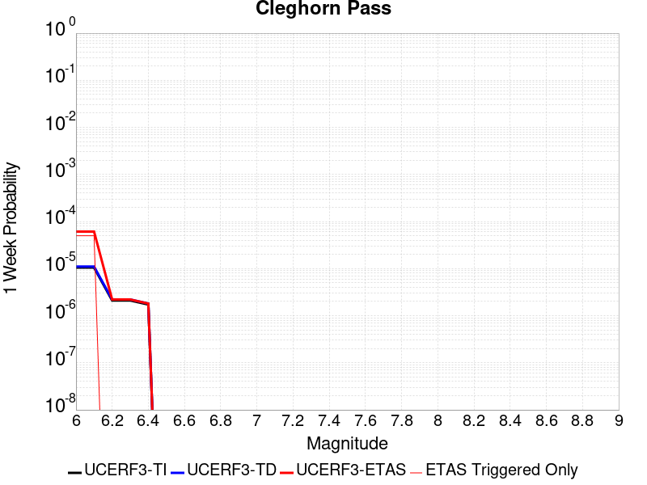 | 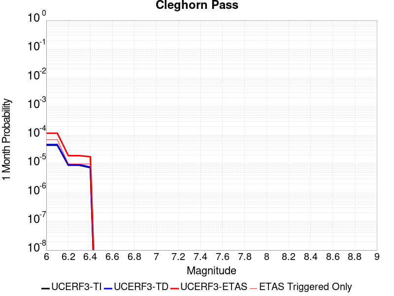 | 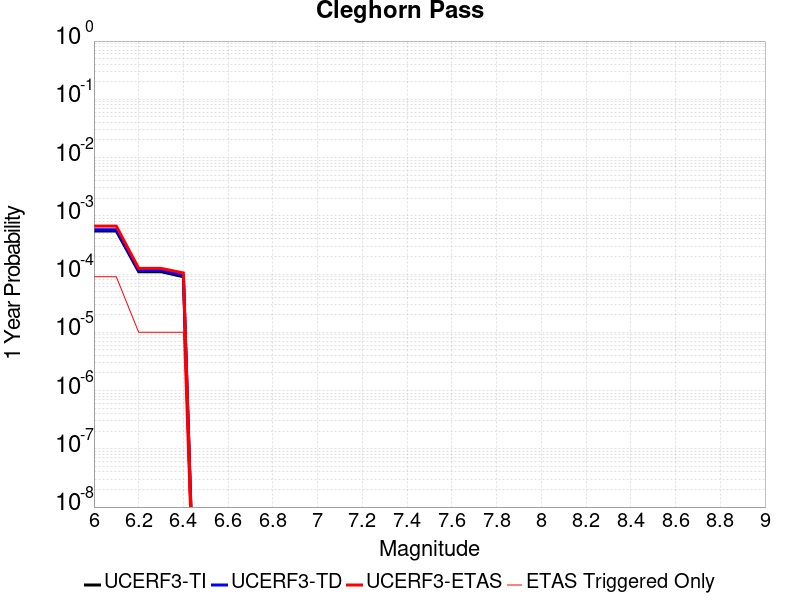 | 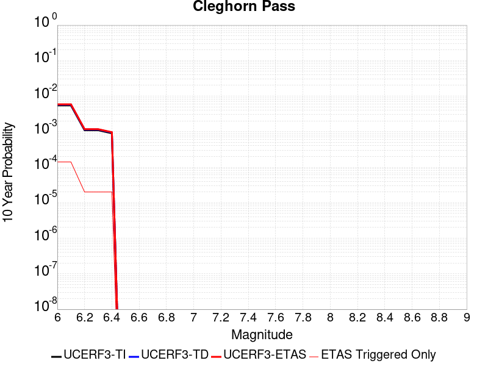 |

| Magnitude | 1 wk TI Prob | 1 wk TD Prob | 1 wk ETAS Prob | 1 wk ETAS/TD Gain | 1 wk ETAS Triggered Only | 1 mo TI Prob | 1 mo TD Prob | 1 mo ETAS Prob | 1 mo ETAS/TD Gain | 1 mo ETAS Triggered Only | 1 yr TI Prob | 1 yr TD Prob | 1 yr ETAS Prob | 1 yr ETAS/TD Gain | 1 yr ETAS Triggered Only | 10 yr TI Prob | 10 yr TD Prob | 10 yr ETAS Prob | 10 yr ETAS/TD Gain | 10 yr ETAS Triggered Only |
|-----|-----|-----|-----|-----|-----|-----|-----|-----|-----|-----|-----|-----|-----|-----|-----|-----|-----|-----|-----|-----|
| 6.0 | 1.0522846E-5 | 1.1040642E-5 | 6.104009E-5 | 5.528672 | 5.0E-5 | 4.509713E-5 | 4.7316473E-5 | 1.1731316E-4 | 2.47933 | 7.0E-5 | 5.4891926E-4 | 5.759784E-4 | 6.659266E-4 | 1.1561658 | 9.0E-5 | 0.0054756533 | 0.005750022 | 0.005889217 | 1.0242077 | 1.4E-4 |
| 6.1 | 1.0522846E-5 | 1.1040642E-5 | 6.104009E-5 | 5.528672 | 5.0E-5 | 4.509713E-5 | 4.7316473E-5 | 1.1731316E-4 | 2.47933 | 7.0E-5 | 5.4891926E-4 | 5.759784E-4 | 6.659266E-4 | 1.1561658 | 9.0E-5 | 0.0054756533 | 0.005750022 | 0.005889217 | 1.0242077 | 1.4E-4 |
| 6.2 | 2.1045846E-6 | 2.2082024E-6 | 2.2082024E-6 | 1.0 | 0.0 | 9.019617E-6 | 9.463714E-6 | 1.946362E-5 | 2.0566576 | 1.0E-5 | 1.098083E-4 | 1.1521882E-4 | 1.2521767E-4 | 1.0867814 | 1.0E-5 | 0.0010975406 | 0.0011520023 | 0.0011719792 | 1.017341 | 2.0E-5 |
| 6.3 | 2.1045846E-6 | 2.2082024E-6 | 2.2082024E-6 | 1.0 | 0.0 | 9.019617E-6 | 9.463714E-6 | 1.946362E-5 | 2.0566576 | 1.0E-5 | 1.098083E-4 | 1.1521882E-4 | 1.2521767E-4 | 1.0867814 | 1.0E-5 | 0.0010975406 | 0.0011520023 | 0.0011719792 | 1.017341 | 2.0E-5 |
| 6.4 | 1.7259927E-6 | 1.810877E-6 | 1.810877E-6 | 1.0 | 0.0 | 7.3970905E-6 | 7.760902E-6 | 1.7760824E-5 | 2.2885 | 1.0E-5 | 9.005586E-5 | 9.4488976E-5 | 1.04488034E-4 | 1.1058224 | 1.0E-5 | 9.001937E-4 | 9.448898E-4 | 9.648709E-4 | 1.0211465 | 2.0E-5 |

## Santa Rosa Island
*[(top)](#table-of-contents)*

| 1 Week | 1 Month | 1 Year | 10 Year |
|-----|-----|-----|-----|
| 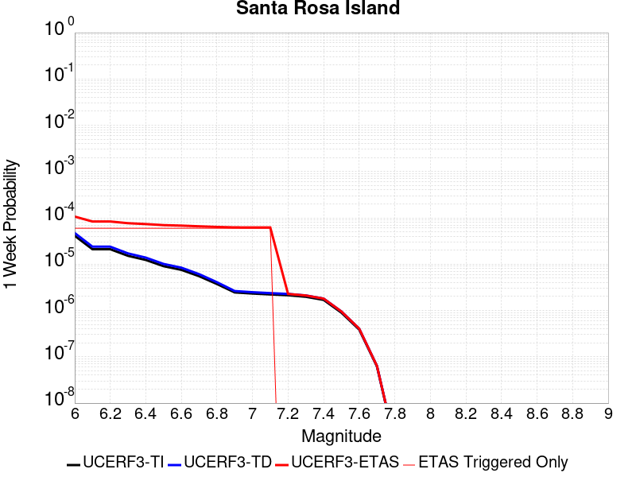 | 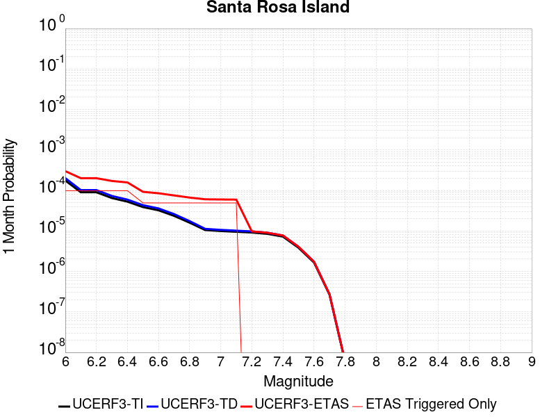 | 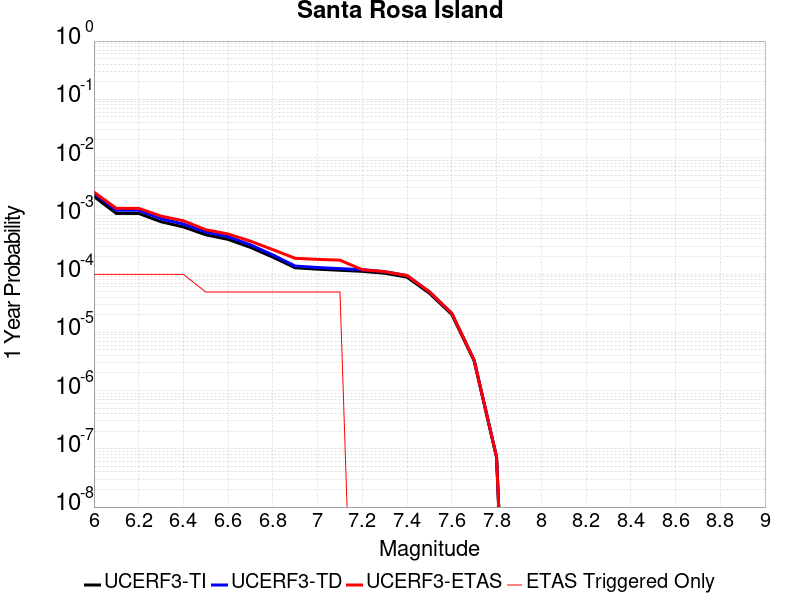 | 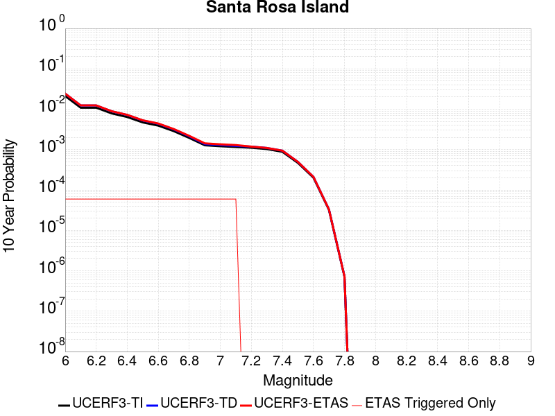 |

| Magnitude | 1 wk TI Prob | 1 wk TD Prob | 1 wk ETAS Prob | 1 wk ETAS/TD Gain | 1 wk ETAS Triggered Only | 1 mo TI Prob | 1 mo TD Prob | 1 mo ETAS Prob | 1 mo ETAS/TD Gain | 1 mo ETAS Triggered Only | 1 yr TI Prob | 1 yr TD Prob | 1 yr ETAS Prob | 1 yr ETAS/TD Gain | 1 yr ETAS Triggered Only | 10 yr TI Prob | 10 yr TD Prob | 10 yr ETAS Prob | 10 yr ETAS/TD Gain | 10 yr ETAS Triggered Only |
|-----|-----|-----|-----|-----|-----|-----|-----|-----|-----|-----|-----|-----|-----|-----|-----|-----|-----|-----|-----|-----|
| 6.0 | 4.1143165E-5 | 4.709113E-5 | 1.1708783E-4 | 2.4864097 | 7.0E-5 | 1.7631594E-4 | 2.0180462E-4 | 2.8178847E-4 | 1.396343 | 8.0E-5 | 0.002144533 | 0.0024543991 | 0.0025342028 | 1.0325146 | 8.0E-5 | 0.021239553 | 0.024293557 | 0.024400884 | 1.0044179 | 1.1E-4 |
| 6.1 | 2.1061249E-5 | 2.3864959E-5 | 6.3864005E-5 | 2.6760576 | 4.0E-5 | 9.0259375E-5 | 1.0227455E-4 | 1.5226944E-4 | 1.4888302 | 5.0E-5 | 0.0010983539 | 0.0012445103 | 0.0012944482 | 1.0401264 | 5.0E-5 | 0.01092941 | 0.01237845 | 0.012457459 | 1.0063828 | 8.0E-5 |
| 6.2 | 2.1061249E-5 | 2.3864959E-5 | 6.3864005E-5 | 2.6760576 | 4.0E-5 | 9.0259375E-5 | 1.0227455E-4 | 1.5226944E-4 | 1.4888302 | 5.0E-5 | 0.0010983539 | 0.0012445103 | 0.0012944482 | 1.0401264 | 5.0E-5 | 0.01092941 | 0.01237845 | 0.012457459 | 1.0063828 | 8.0E-5 |
| 6.3 | 1.5158236E-5 | 1.7074419E-5 | 5.7073736E-5 | 3.342646 | 4.0E-5 | 6.496225E-5 | 7.3174095E-5 | 1.1317117E-4 | 1.5466015 | 4.0E-5 | 7.906284E-4 | 8.9054246E-4 | 9.3050685E-4 | 1.0448765 | 4.0E-5 | 0.007878214 | 0.00887099 | 0.008940369 | 1.0078208 | 7.0E-5 |
| 6.4 | 1.2341918E-5 | 1.3852917E-5 | 4.3852502E-5 | 3.1655788 | 3.0E-5 | 5.2892858E-5 | 5.9368336E-5 | 8.936656E-5 | 1.5052899 | 3.0E-5 | 6.437803E-4 | 7.225779E-4 | 7.5255625E-4 | 1.041488 | 3.0E-5 | 0.006419184 | 0.0072031217 | 0.0072527616 | 1.0068915 | 5.0E-5 |
| 6.5 | 9.061158E-6 | 1.0117032E-5 | 3.011683E-5 | 2.9768445 | 2.0E-5 | 3.883296E-5 | 4.3358017E-5 | 6.335715E-5 | 1.4612557 | 2.0E-5 | 4.726887E-4 | 5.277613E-4 | 5.4775074E-4 | 1.0378759 | 2.0E-5 | 0.004716845 | 0.0052656177 | 0.005305407 | 1.0075564 | 4.0E-5 |
| 6.6 | 7.5461685E-6 | 8.400734E-6 | 2.8400565E-5 | 3.3807244 | 2.0E-5 | 3.2340322E-5 | 3.600267E-5 | 5.600195E-5 | 1.5554943 | 2.0E-5 | 3.936723E-4 | 4.3824868E-4 | 4.582399E-4 | 1.0456161 | 2.0E-5 | 0.003929756 | 0.0043742736 | 0.004394186 | 1.0045522 | 2.0E-5 |
| 6.7 | 5.5023775E-6 | 6.087381E-6 | 2.6087258E-5 | 4.2854652 | 2.0E-5 | 2.3581404E-5 | 2.6088532E-5 | 4.608801E-5 | 1.7666004 | 2.0E-5 | 2.8706578E-4 | 3.1758484E-4 | 3.3757847E-4 | 1.0629553 | 2.0E-5 | 0.0028669522 | 0.0031716316 | 0.0031915682 | 1.0062859 | 2.0E-5 |
| 6.8 | 3.7351679E-6 | 4.0831405E-6 | 1.40831E-5 | 3.4490852 | 1.0E-5 | 1.6007763E-5 | 1.7499071E-5 | 2.7498896E-5 | 1.5714489 | 1.0E-5 | 1.948771E-4 | 2.1303285E-4 | 2.2303071E-4 | 1.0469311 | 1.0E-5 | 0.0019470629 | 0.0021285315 | 0.00213851 | 1.004688 | 1.0E-5 |
| 6.9 | 2.456366E-6 | 2.6292707E-6 | 1.2629244E-5 | 4.803326 | 1.0E-5 | 1.0527241E-5 | 1.1268255E-5 | 2.1268143E-5 | 1.8874389 | 1.0E-5 | 1.2816161E-4 | 1.3718239E-4 | 1.4718101E-4 | 1.0728856 | 1.0E-5 | 0.0012808773 | 0.0013709799 | 0.0013809663 | 1.007284 | 1.0E-5 |
| 7.0 | 2.3245157E-6 | 2.4827784E-6 | 1.2482754E-5 | 5.0277357 | 1.0E-5 | 9.962172E-6 | 1.0640436E-5 | 2.064033E-5 | 1.9398011 | 1.0E-5 | 1.2128269E-4 | 1.2953962E-4 | 1.3953833E-4 | 1.0771865 | 1.0E-5 | 0.0012121652 | 0.0012946434 | 0.0013046304 | 1.0077142 | 1.0E-5 |
| 7.1 | 2.2248344E-6 | 2.37325E-6 | 1.2373226E-5 | 5.213621 | 1.0E-5 | 9.53497E-6 | 1.0171032E-5 | 2.017093E-5 | 1.9831743 | 1.0E-5 | 1.1608207E-4 | 1.238253E-4 | 1.3382405E-4 | 1.0807489 | 1.0E-5 | 0.0011602144 | 0.0012375651 | 0.0012475527 | 1.0080703 | 1.0E-5 |
| 7.2 | 2.1350402E-6 | 2.2761542E-6 | 2.2761542E-6 | 1.0 | 0.0 | 9.150141E-6 | 9.75491E-6 | 9.75491E-6 | 1.0 | 0.0 | 1.1139726E-4 | 1.1875957E-4 | 1.1875957E-4 | 1.0 | 0.0 | 0.0011134144 | 0.0011869629 | 0.0011869629 | 1.0 | 0.0 |
| 7.3 | 1.9793572E-6 | 2.1087192E-6 | 2.1087192E-6 | 1.0 | 0.0 | 8.482932E-6 | 9.037337E-6 | 9.037337E-6 | 1.0 | 0.0 | 1.032748E-4 | 1.1002403E-4 | 1.1002403E-4 | 1.0 | 0.0 | 0.0010322682 | 0.0010996974 | 0.0010996974 | 1.0 | 0.0 |
| 7.4 | 1.6951194E-6 | 1.8045735E-6 | 1.8045735E-6 | 1.0 | 0.0 | 7.264777E-6 | 7.733864E-6 | 7.733864E-6 | 1.0 | 0.0 | 8.844508E-5 | 9.415574E-5 | 9.415574E-5 | 1.0 | 0.0 | 8.840988E-4 | 9.411601E-4 | 9.411601E-4 | 1.0 | 0.0 |
| 7.5 | 8.987207E-7 | 9.512216E-7 | 9.512216E-7 | 1.0 | 0.0 | 3.8516546E-6 | 4.0766577E-6 | 4.0766577E-6 | 1.0 | 0.0 | 4.6892885E-5 | 4.9632188E-5 | 4.9632188E-5 | 1.0 | 0.0 | 4.688299E-4 | 4.962122E-4 | 4.962122E-4 | 1.0 | 0.0 |
| 7.6 | 3.8783037E-7 | 4.0529335E-7 | 4.0529335E-7 | 1.0 | 0.0 | 1.6621291E-6 | 1.7369704E-6 | 1.7369704E-6 | 1.0 | 0.0 | 2.0236233E-5 | 2.1147416E-5 | 2.1147416E-5 | 1.0 | 0.0 | 2.023439E-4 | 2.114547E-4 | 2.114547E-4 | 1.0 | 0.0 |
| 7.7 | 6.181804E-8 | 6.339047E-8 | 6.339047E-8 | 1.0 | 0.0 | 2.6493444E-7 | 2.7167343E-7 | 2.7167343E-7 | 1.0 | 0.0 | 3.225572E-6 | 3.307619E-6 | 3.307619E-6 | 1.0 | 0.0 | 3.225525E-5 | 3.3075703E-5 | 3.3075703E-5 | 1.0 | 0.0 |
| 7.8 | 1.3704449E-9 | 1.3964153E-9 | 1.3964153E-9 | 1.0 | 0.0 | 5.873335E-9 | 5.984637E-9 | 5.984637E-9 | 1.0 | 0.0 | 7.1507856E-8 | 7.286295E-8 | 7.286295E-8 | 1.0 | 0.0 | 7.1507833E-7 | 7.286294E-7 | 7.286294E-7 | 1.0 | 0.0 |

## Lost Hills
*[(top)](#table-of-contents)*

| 1 Week | 1 Month | 1 Year | 10 Year |
|-----|-----|-----|-----|
| 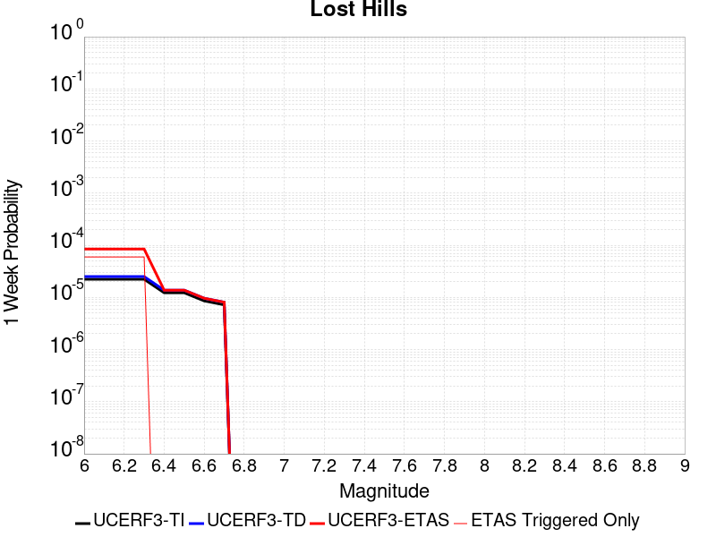 | 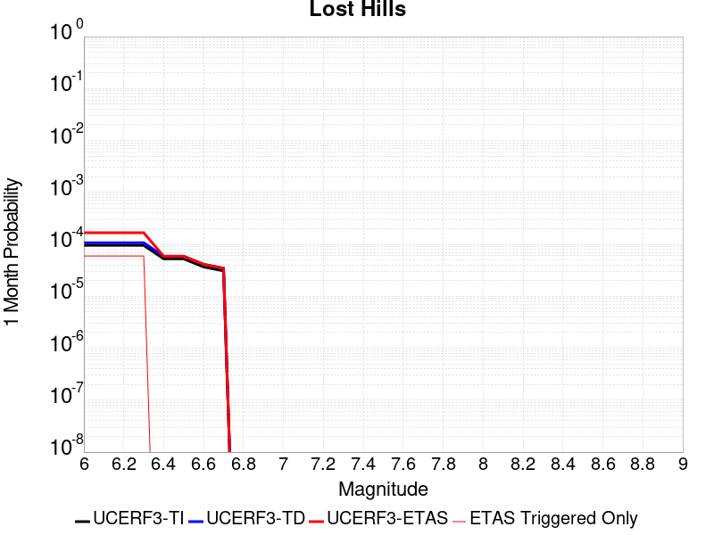 | 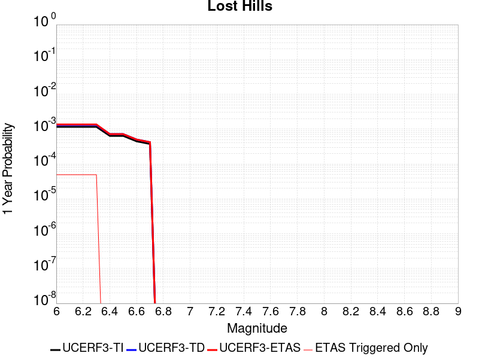 | 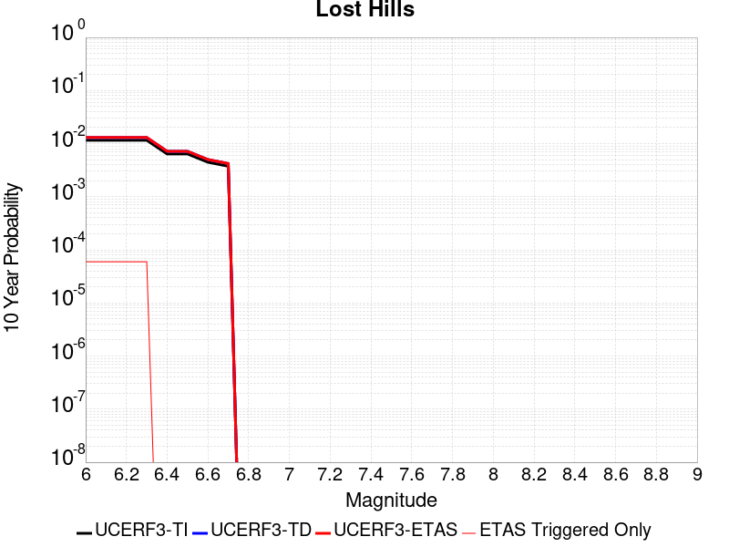 |

| Magnitude | 1 wk TI Prob | 1 wk TD Prob | 1 wk ETAS Prob | 1 wk ETAS/TD Gain | 1 wk ETAS Triggered Only | 1 mo TI Prob | 1 mo TD Prob | 1 mo ETAS Prob | 1 mo ETAS/TD Gain | 1 mo ETAS Triggered Only | 1 yr TI Prob | 1 yr TD Prob | 1 yr ETAS Prob | 1 yr ETAS/TD Gain | 1 yr ETAS Triggered Only | 10 yr TI Prob | 10 yr TD Prob | 10 yr ETAS Prob | 10 yr ETAS/TD Gain | 10 yr ETAS Triggered Only |
|-----|-----|-----|-----|-----|-----|-----|-----|-----|-----|-----|-----|-----|-----|-----|-----|-----|-----|-----|-----|-----|
| 6.0 | 2.233523E-5 | 2.5106583E-5 | 5.510583E-5 | 2.1948757 | 3.0E-5 | 9.571891E-5 | 1.0759615E-4 | 1.675897E-4 | 1.5575808 | 6.0E-5 | 0.0011647546 | 0.001309364 | 0.0014092331 | 1.076273 | 1.0E-4 | 0.011586686 | 0.013033091 | 0.013151527 | 1.0090873 | 1.2E-4 |
| 6.1 | 2.233523E-5 | 2.5106583E-5 | 5.510583E-5 | 2.1948757 | 3.0E-5 | 9.571891E-5 | 1.0759615E-4 | 1.675897E-4 | 1.5575808 | 6.0E-5 | 0.0011647546 | 0.001309364 | 0.0014092331 | 1.076273 | 1.0E-4 | 0.011586686 | 0.013033091 | 0.013151527 | 1.0090873 | 1.2E-4 |
| 6.2 | 2.233523E-5 | 2.5106583E-5 | 5.510583E-5 | 2.1948757 | 3.0E-5 | 9.571891E-5 | 1.0759615E-4 | 1.675897E-4 | 1.5575808 | 6.0E-5 | 0.0011647546 | 0.001309364 | 0.0014092331 | 1.076273 | 1.0E-4 | 0.011586686 | 0.013033091 | 0.013151527 | 1.0090873 | 1.2E-4 |
| 6.3 | 2.233523E-5 | 2.5106583E-5 | 5.510583E-5 | 2.1948757 | 3.0E-5 | 9.571891E-5 | 1.0759615E-4 | 1.675897E-4 | 1.5575808 | 6.0E-5 | 0.0011647546 | 0.001309364 | 0.0014092331 | 1.076273 | 1.0E-4 | 0.011586686 | 0.013033091 | 0.013151527 | 1.0090873 | 1.2E-4 |
| 6.4 | 1.2288092E-5 | 1.3781108E-5 | 2.3780969E-5 | 1.7256211 | 1.0E-5 | 5.2662188E-5 | 5.906108E-5 | 9.905872E-5 | 1.677225 | 4.0E-5 | 6.409735E-4 | 7.189252E-4 | 7.6888927E-4 | 1.0694983 | 5.0E-5 | 0.006391279 | 0.0071752006 | 0.0072446987 | 1.0096859 | 7.0E-5 |
| 6.5 | 1.2288092E-5 | 1.3781108E-5 | 2.3780969E-5 | 1.7256211 | 1.0E-5 | 5.2662188E-5 | 5.906108E-5 | 9.905872E-5 | 1.677225 | 4.0E-5 | 6.409735E-4 | 7.189252E-4 | 7.6888927E-4 | 1.0694983 | 5.0E-5 | 0.006391279 | 0.0071752006 | 0.0072446987 | 1.0096859 | 7.0E-5 |
| 6.6 | 8.58281E-6 | 9.63377E-6 | 1.9633673E-5 | 2.0380054 | 1.0E-5 | 3.6782953E-5 | 4.12874E-5 | 7.1286166E-5 | 1.726584 | 3.0E-5 | 4.4774043E-4 | 5.026414E-4 | 5.4262124E-4 | 1.0795397 | 4.0E-5 | 0.0044683935 | 0.005023205 | 0.005082904 | 1.0118846 | 6.0E-5 |
| 6.7 | 7.205685E-6 | 8.088302E-6 | 1.8088222E-5 | 2.2363434 | 1.0E-5 | 3.088114E-5 | 3.466415E-5 | 5.466346E-5 | 1.576945 | 2.0E-5 | 3.7591302E-4 | 4.2203604E-4 | 4.5202338E-4 | 1.071054 | 3.0E-5 | 0.0037527776 | 0.0042203604 | 0.0042601917 | 1.0094379 | 4.0E-5 |

## Rose Canyon
*[(top)](#table-of-contents)*

| 1 Week | 1 Month | 1 Year | 10 Year |
|-----|-----|-----|-----|
| 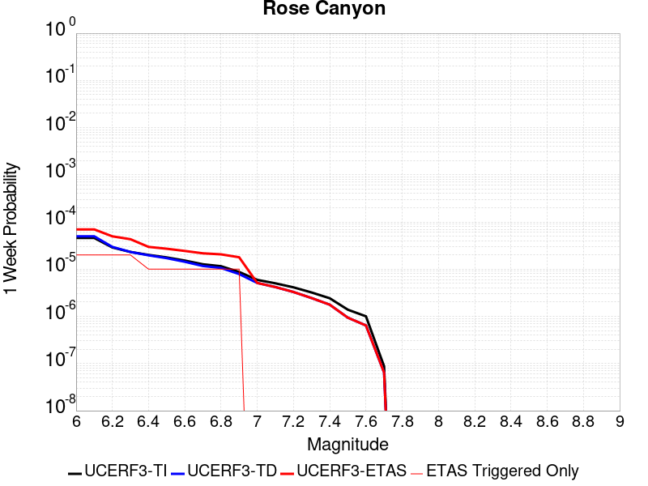 | 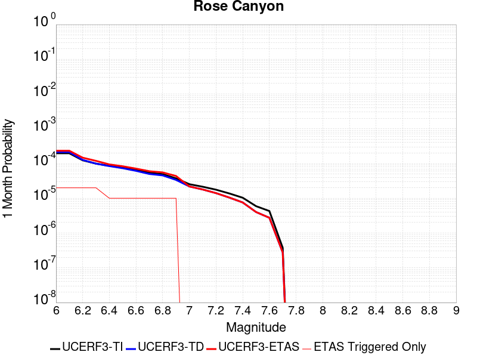 | 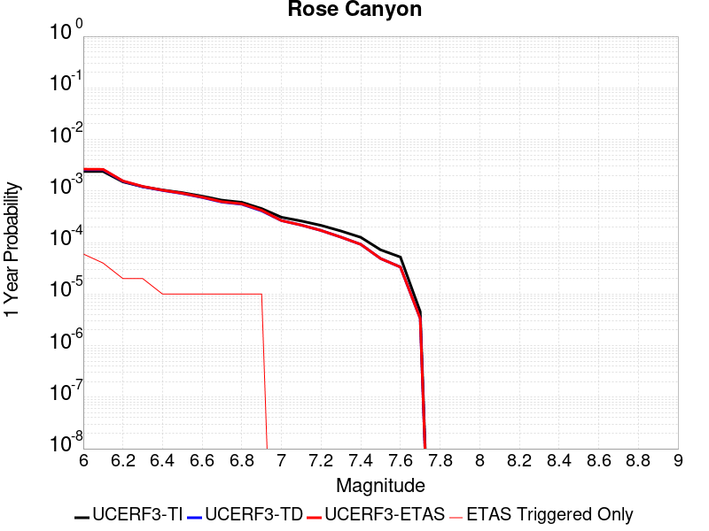 | 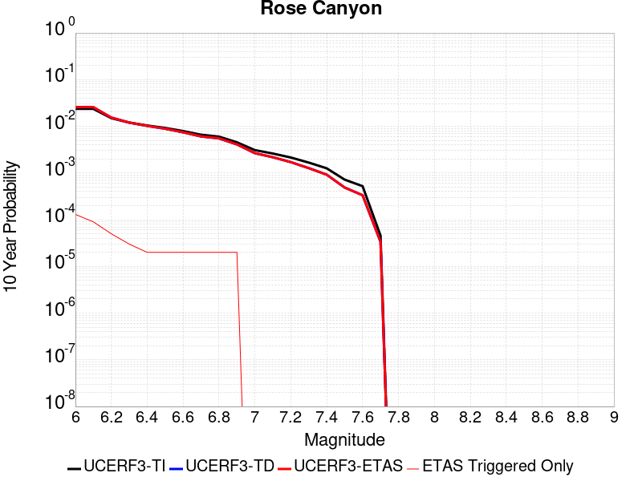 |

| Magnitude | 1 wk TI Prob | 1 wk TD Prob | 1 wk ETAS Prob | 1 wk ETAS/TD Gain | 1 wk ETAS Triggered Only | 1 mo TI Prob | 1 mo TD Prob | 1 mo ETAS Prob | 1 mo ETAS/TD Gain | 1 mo ETAS Triggered Only | 1 yr TI Prob | 1 yr TD Prob | 1 yr ETAS Prob | 1 yr ETAS/TD Gain | 1 yr ETAS Triggered Only | 10 yr TI Prob | 10 yr TD Prob | 10 yr ETAS Prob | 10 yr ETAS/TD Gain | 10 yr ETAS Triggered Only |
|-----|-----|-----|-----|-----|-----|-----|-----|-----|-----|-----|-----|-----|-----|-----|-----|-----|-----|-----|-----|-----|
| 6.0 | 4.5923203E-5 | 4.9714607E-5 | 6.971361E-5 | 1.4022763 | 2.0E-5 | 1.9679888E-4 | 2.1304654E-4 | 2.3304229E-4 | 1.0938562 | 2.0E-5 | 0.0023933933 | 0.0025909478 | 0.0026507925 | 1.0230975 | 6.0E-5 | 0.023677798 | 0.025618518 | 0.025745187 | 1.0049444 | 1.3E-4 |
| 6.1 | 4.5923203E-5 | 4.9714607E-5 | 6.971361E-5 | 1.4022763 | 2.0E-5 | 1.9679888E-4 | 2.1304654E-4 | 2.3304229E-4 | 1.0938562 | 2.0E-5 | 0.0023933933 | 0.0025909478 | 0.0026308442 | 1.0153984 | 4.0E-5 | 0.023677798 | 0.025618518 | 0.025706213 | 1.0034231 | 9.0E-5 |
| 6.2 | 2.8844734E-5 | 2.9669678E-5 | 4.9669085E-5 | 1.6740689 | 2.0E-5 | 1.2361443E-4 | 1.2714976E-4 | 1.4714722E-4 | 1.1572748 | 2.0E-5 | 0.0015039665 | 0.001546976 | 0.0015669451 | 1.0129085 | 2.0E-5 | 0.0149382865 | 0.015364873 | 0.015414105 | 1.0032042 | 5.0E-5 |
| 6.3 | 2.3171577E-5 | 2.3162425E-5 | 4.3161963E-5 | 1.8634474 | 2.0E-5 | 9.9302975E-5 | 9.926383E-5 | 1.19261844E-4 | 1.2014632 | 2.0E-5 | 0.0012083431 | 0.0012078804 | 0.0012278563 | 1.0165379 | 2.0E-5 | 0.012017938 | 0.012012152 | 0.012041792 | 1.0024675 | 3.0E-5 |
| 6.4 | 2.0066604E-5 | 1.9668067E-5 | 2.966787E-5 | 1.5084283 | 1.0E-5 | 8.599689E-5 | 8.428905E-5 | 9.42882E-5 | 1.1186293 | 1.0E-5 | 0.0010465092 | 0.001025746 | 0.0010357358 | 1.009739 | 1.0E-5 | 0.010415946 | 0.010211479 | 0.010231274 | 1.0019386 | 2.0E-5 |
| 6.5 | 1.776989E-5 | 1.7115402E-5 | 2.7115231E-5 | 1.584259 | 1.0E-5 | 7.615444E-5 | 7.33497E-5 | 8.334896E-5 | 1.1363232 | 1.0E-5 | 9.267859E-4 | 8.926737E-4 | 9.0266473E-4 | 1.0111923 | 1.0E-5 | 0.009229303 | 0.008874663 | 0.008894485 | 1.0022336 | 2.0E-5 |
| 6.6 | 1.5227364E-5 | 1.4340872E-5 | 2.4340728E-5 | 1.6972976 | 1.0E-5 | 6.52585E-5 | 6.145947E-5 | 7.145885E-5 | 1.1626989 | 1.0E-5 | 7.942326E-4 | 7.480173E-4 | 7.580098E-4 | 1.0133587 | 1.0E-5 | 0.007914 | 0.0074410336 | 0.0074608847 | 1.0026678 | 2.0E-5 |
| 6.7 | 1.2703898E-5 | 1.1674277E-5 | 2.1674161E-5 | 1.856574 | 1.0E-5 | 5.4444143E-5 | 5.0031682E-5 | 6.003118E-5 | 1.1998633 | 1.0E-5 | 6.626558E-4 | 6.089697E-4 | 6.189636E-4 | 1.0164112 | 1.0E-5 | 0.006606833 | 0.0060623093 | 0.006082188 | 1.0032791 | 2.0E-5 |
| 6.8 | 1.1554917E-5 | 1.0610384E-5 | 2.0610278E-5 | 1.9424629 | 1.0E-5 | 4.9520135E-5 | 4.547231E-5 | 5.5471854E-5 | 1.2199041 | 1.0E-5 | 6.0274085E-4 | 5.5348873E-4 | 5.634832E-4 | 1.0180572 | 1.0E-5 | 0.0060110865 | 0.005504414 | 0.0055243038 | 1.0036135 | 2.0E-5 |
| 6.9 | 8.732078E-6 | 7.882285E-6 | 1.7882207E-5 | 2.2686577 | 1.0E-5 | 3.7422655E-5 | 3.37808E-5 | 4.3780463E-5 | 1.2960161 | 1.0E-5 | 4.5552556E-4 | 4.112066E-4 | 4.2120248E-4 | 1.0243087 | 1.0E-5 | 0.0045459294 | 0.004089515 | 0.0041094334 | 1.0048705 | 2.0E-5 |
| 7.0 | 5.9337494E-6 | 5.107436E-6 | 5.107436E-6 | 1.0 | 0.0 | 2.5430107E-5 | 2.1888829E-5 | 2.1888829E-5 | 1.0 | 0.0 | 3.0956755E-4 | 2.6646405E-4 | 2.6646405E-4 | 1.0 | 0.0 | 0.0030913667 | 0.002661461 | 0.002661461 | 1.0 | 0.0 |
| 7.1 | 5.013409E-6 | 4.17734E-6 | 4.17734E-6 | 1.0 | 0.0 | 2.1485863E-5 | 1.7902763E-5 | 1.7902763E-5 | 1.0 | 0.0 | 2.6155898E-4 | 2.1794444E-4 | 2.1794444E-4 | 1.0 | 0.0 | 0.0026125133 | 0.0021773188 | 0.0021773188 | 1.0 | 0.0 |
| 7.2 | 4.120763E-6 | 3.2820917E-6 | 3.2820917E-6 | 1.0 | 0.0 | 1.7660293E-5 | 1.4066032E-5 | 1.4066032E-5 | 1.0 | 0.0 | 2.1499286E-4 | 1.7124058E-4 | 1.7124058E-4 | 1.0 | 0.0 | 0.0021478499 | 0.0017110958 | 0.0017110958 | 1.0 | 0.0 |
| 7.3 | 3.2081239E-6 | 2.4404965E-6 | 2.4404965E-6 | 1.0 | 0.0 | 1.374903E-5 | 1.0459229E-5 | 1.0459229E-5 | 1.0 | 0.0 | 1.6738157E-4 | 1.2733374E-4 | 1.2733374E-4 | 1.0 | 0.0 | 0.0016725556 | 0.0012726148 | 0.0012726148 | 1.0 | 0.0 |
| 7.4 | 2.4194755E-6 | 1.7680321E-6 | 1.7680321E-6 | 1.0 | 0.0 | 1.0369139E-5 | 7.5772587E-6 | 7.5772587E-6 | 1.0 | 0.0 | 1.2623696E-4 | 9.224927E-5 | 9.224927E-5 | 1.0 | 0.0 | 0.0012616527 | 9.221151E-4 | 9.221151E-4 | 1.0 | 0.0 |
| 7.5 | 1.3842889E-6 | 9.3782967E-7 | 9.3782967E-7 | 1.0 | 0.0 | 5.9326535E-6 | 4.019264E-6 | 4.019264E-6 | 1.0 | 0.0 | 7.222766E-5 | 4.8933474E-5 | 4.8933474E-5 | 1.0 | 0.0 | 7.220419E-4 | 4.8923056E-4 | 4.8923056E-4 | 1.0 | 0.0 |
| 7.6 | 1.0021575E-6 | 6.4113493E-7 | 6.4113493E-7 | 1.0 | 0.0 | 4.2949537E-6 | 2.7477186E-6 | 2.7477186E-6 | 1.0 | 0.0 | 5.2289808E-5 | 3.345298E-5 | 3.345298E-5 | 1.0 | 0.0 | 5.2277505E-4 | 3.344816E-4 | 3.344816E-4 | 1.0 | 0.0 |
| 7.7 | 8.7620116E-8 | 6.449304E-8 | 6.449304E-8 | 1.0 | 0.0 | 3.7551473E-7 | 2.763987E-7 | 2.763987E-7 | 1.0 | 0.0 | 4.5718825E-6 | 3.3651493E-6 | 3.3651493E-6 | 1.0 | 0.0 | 4.5717883E-5 | 3.3651013E-5 | 3.3651013E-5 | 1.0 | 0.0 |

## Pisgah-Bullion Mtn-Mesquite Lk
*[(top)](#table-of-contents)*

| 1 Week | 1 Month | 1 Year | 10 Year |
|-----|-----|-----|-----|
| 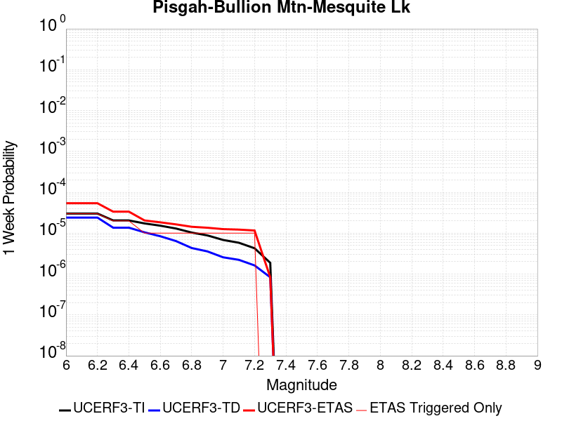 | 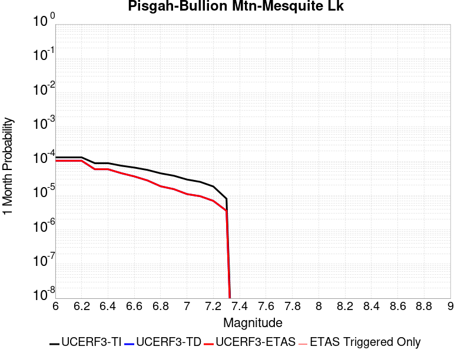 | 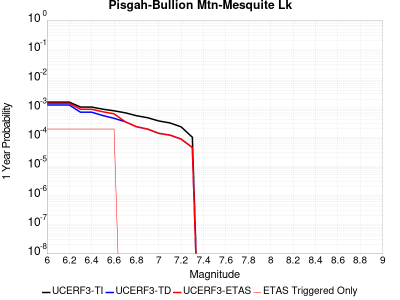 | 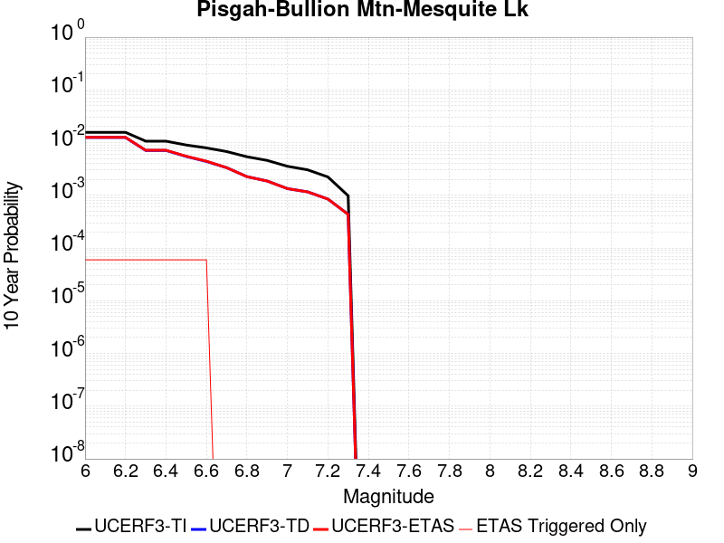 |

| Magnitude | 1 wk TI Prob | 1 wk TD Prob | 1 wk ETAS Prob | 1 wk ETAS/TD Gain | 1 wk ETAS Triggered Only | 1 mo TI Prob | 1 mo TD Prob | 1 mo ETAS Prob | 1 mo ETAS/TD Gain | 1 mo ETAS Triggered Only | 1 yr TI Prob | 1 yr TD Prob | 1 yr ETAS Prob | 1 yr ETAS/TD Gain | 1 yr ETAS Triggered Only | 10 yr TI Prob | 10 yr TD Prob | 10 yr ETAS Prob | 10 yr ETAS/TD Gain | 10 yr ETAS Triggered Only |
|-----|-----|-----|-----|-----|-----|-----|-----|-----|-----|-----|-----|-----|-----|-----|-----|-----|-----|-----|-----|-----|
| 6.0 | 3.0240792E-5 | 2.40909E-5 | 5.409018E-5 | 2.2452536 | 3.0E-5 | 1.2959696E-4 | 1.032432E-4 | 1.4323907E-4 | 1.3873948 | 4.0E-5 | 0.0015767008 | 0.0012563618 | 0.0013162864 | 1.047697 | 6.0E-5 | 0.015655609 | 0.012502613 | 0.012630988 | 1.0102679 | 1.3E-4 |
| 6.1 | 3.0240792E-5 | 2.40909E-5 | 5.409018E-5 | 2.2452536 | 3.0E-5 | 1.2959696E-4 | 1.032432E-4 | 1.4323907E-4 | 1.3873948 | 4.0E-5 | 0.0015767008 | 0.0012563618 | 0.0013162864 | 1.047697 | 6.0E-5 | 0.015655609 | 0.012502613 | 0.012630988 | 1.0102679 | 1.3E-4 |
| 6.2 | 3.0240792E-5 | 2.40909E-5 | 5.409018E-5 | 2.2452536 | 3.0E-5 | 1.2959696E-4 | 1.032432E-4 | 1.4323907E-4 | 1.3873948 | 4.0E-5 | 0.0015767008 | 0.0012563618 | 0.0013162864 | 1.047697 | 6.0E-5 | 0.015655609 | 0.012502613 | 0.012630988 | 1.0102679 | 1.3E-4 |
| 6.3 | 2.0498217E-5 | 1.3638054E-5 | 3.363778E-5 | 2.4664648 | 2.0E-5 | 8.784654E-5 | 5.8447586E-5 | 8.8445835E-5 | 1.5132504 | 3.0E-5 | 0.0010690069 | 7.1138324E-4 | 7.613477E-4 | 1.0702356 | 5.0E-5 | 0.01063879 | 0.0070926864 | 0.0071721193 | 1.0111992 | 8.0E-5 |
| 6.4 | 2.0498217E-5 | 1.3638054E-5 | 3.363778E-5 | 2.4664648 | 2.0E-5 | 8.784654E-5 | 5.8447586E-5 | 8.8445835E-5 | 1.5132504 | 3.0E-5 | 0.0010690069 | 7.1138324E-4 | 7.613477E-4 | 1.0702356 | 5.0E-5 | 0.01063879 | 0.0070926864 | 0.0071721193 | 1.0111992 | 8.0E-5 |
| 6.5 | 1.7316182E-5 | 1.04769715E-5 | 2.0476868E-5 | 1.9544643 | 1.0E-5 | 7.42101E-5 | 4.490059E-5 | 6.4899694E-5 | 1.4454085 | 2.0E-5 | 9.0313336E-4 | 5.465376E-4 | 5.7652115E-4 | 1.0548611 | 3.0E-5 | 0.008994718 | 0.00545293 | 0.005492712 | 1.0072955 | 4.0E-5 |
| 6.6 | 1.5251077E-5 | 8.414133E-6 | 1.8414048E-5 | 2.1884665 | 1.0E-5 | 6.536012E-5 | 3.606011E-5 | 5.605939E-5 | 1.5546094 | 2.0E-5 | 7.9546886E-4 | 4.3895066E-4 | 4.6893748E-4 | 1.0683148 | 3.0E-5 | 0.007926274 | 0.0043815537 | 0.0044213785 | 1.0090892 | 4.0E-5 |
| 6.7 | 1.2997425E-5 | 6.4112146E-6 | 1.641115E-5 | 2.5597568 | 1.0E-5 | 5.570206E-5 | 2.7476372E-5 | 3.7476097E-5 | 1.363939 | 1.0E-5 | 6.7796157E-4 | 3.3447813E-4 | 3.4447477E-4 | 1.0298873 | 1.0E-5 | 0.0067589693 | 0.003340207 | 0.0033601404 | 1.0059676 | 2.0E-5 |
| 6.8 | 1.035386E-5 | 4.333145E-6 | 1.4333102E-5 | 3.3077824 | 1.0E-5 | 4.437293E-5 | 1.8570496E-5 | 2.857031E-5 | 1.5384786 | 1.0E-5 | 5.401065E-4 | 2.260732E-4 | 2.3607093E-4 | 1.0442234 | 1.0E-5 | 0.0053879567 | 0.002258519 | 0.0022784737 | 1.0088353 | 2.0E-5 |
| 6.9 | 8.816252E-6 | 3.5805879E-6 | 1.3580552E-5 | 3.7928274 | 1.0E-5 | 3.778339E-5 | 1.534529E-5 | 2.5345136E-5 | 1.6516558 | 1.0E-5 | 4.5991567E-4 | 1.8681347E-4 | 1.9681161E-4 | 1.0535194 | 1.0E-5 | 0.00458965 | 0.0018666228 | 0.0018865855 | 1.0106945 | 2.0E-5 |
| 7.0 | 6.8232207E-6 | 2.5674399E-6 | 1.2567414E-5 | 4.8949203 | 1.0E-5 | 2.9242048E-5 | 1.100327E-5 | 2.100316E-5 | 1.9088107 | 1.0E-5 | 3.5596377E-4 | 1.3395688E-4 | 1.4395555E-4 | 1.0746409 | 1.0E-5 | 0.0035539411 | 0.0013387925 | 0.0013587656 | 1.0149188 | 2.0E-5 |
| 7.1 | 5.837013E-6 | 2.2273143E-6 | 1.2227292E-5 | 5.489702 | 1.0E-5 | 2.501553E-5 | 9.5456E-6 | 1.9545503E-5 | 2.047593 | 1.0E-5 | 3.045215E-4 | 1.1621177E-4 | 1.2621061E-4 | 1.0860398 | 1.0E-5 | 0.0030410455 | 0.001161539 | 0.0011815157 | 1.0171986 | 2.0E-5 |
| 7.2 | 4.278052E-6 | 1.6275065E-6 | 1.16274905E-5 | 7.1443586 | 1.0E-5 | 1.833438E-5 | 6.975011E-6 | 1.697494E-5 | 2.4336796 | 1.0E-5 | 2.231982E-4 | 8.491768E-5 | 9.491683E-5 | 1.1177511 | 1.0E-5 | 0.0022297418 | 8.4887556E-4 | 8.6885854E-4 | 1.0235406 | 2.0E-5 |
| 7.3 | 1.8803692E-6 | 8.344788E-7 | 8.344788E-7 | 1.0 | 0.0 | 8.0587E-6 | 3.5763337E-6 | 3.5763337E-6 | 1.0 | 0.0 | 9.811026E-5 | 4.354114E-5 | 4.354114E-5 | 1.0 | 0.0 | 9.806695E-4 | 4.3534054E-4 | 4.453362E-4 | 1.0229605 | 1.0E-5 |

## Dry Mountain
*[(top)](#table-of-contents)*

| 1 Week | 1 Month | 1 Year | 10 Year |
|-----|-----|-----|-----|
| 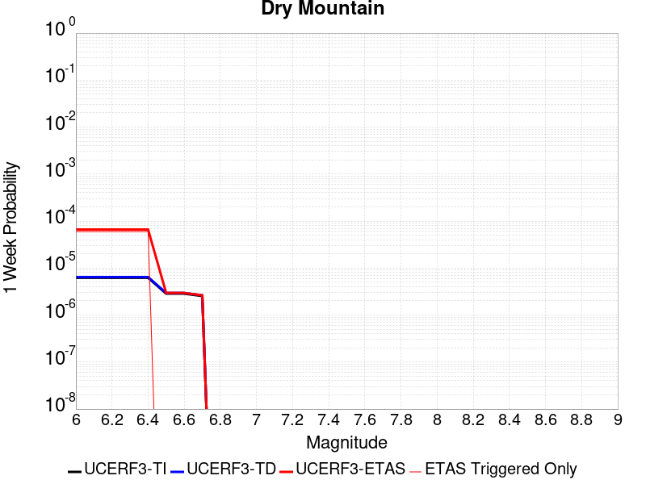 | 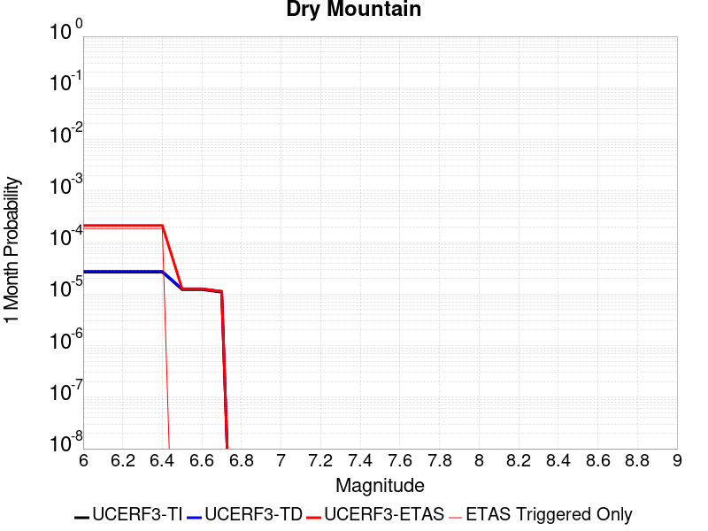 | 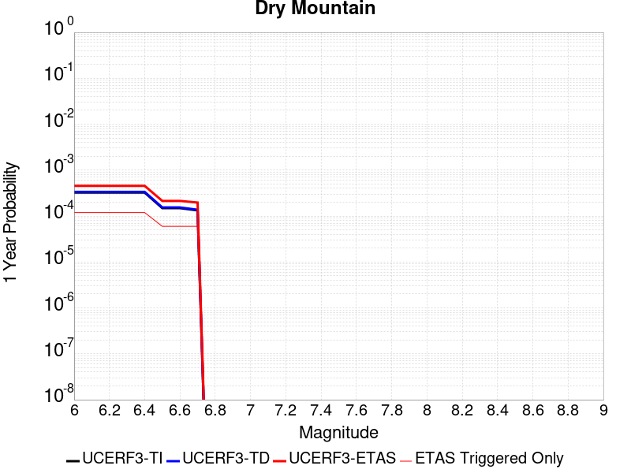 | 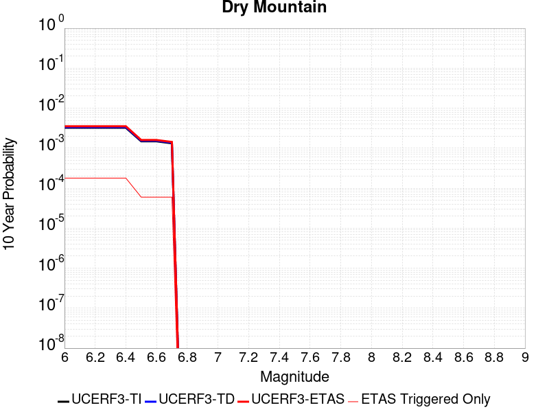 |

| Magnitude | 1 wk TI Prob | 1 wk TD Prob | 1 wk ETAS Prob | 1 wk ETAS/TD Gain | 1 wk ETAS Triggered Only | 1 mo TI Prob | 1 mo TD Prob | 1 mo ETAS Prob | 1 mo ETAS/TD Gain | 1 mo ETAS Triggered Only | 1 yr TI Prob | 1 yr TD Prob | 1 yr ETAS Prob | 1 yr ETAS/TD Gain | 1 yr ETAS Triggered Only | 10 yr TI Prob | 10 yr TD Prob | 10 yr ETAS Prob | 10 yr ETAS/TD Gain | 10 yr ETAS Triggered Only |
|-----|-----|-----|-----|-----|-----|-----|-----|-----|-----|-----|-----|-----|-----|-----|-----|-----|-----|-----|-----|-----|
| 6.0 | 6.222801E-6 | 6.439381E-6 | 4.6439123E-5 | 7.211737 | 4.0E-5 | 2.6668875E-5 | 2.7597147E-5 | 7.759577E-5 | 2.8117316 | 5.0E-5 | 3.2464517E-4 | 3.3595937E-4 | 4.159325E-4 | 1.238044 | 8.0E-5 | 0.0032417132 | 0.0033560768 | 0.0034856405 | 1.0386057 | 1.3E-4 |
| 6.1 | 6.222801E-6 | 6.439381E-6 | 4.6439123E-5 | 7.211737 | 4.0E-5 | 2.6668875E-5 | 2.7597147E-5 | 7.759577E-5 | 2.8117316 | 5.0E-5 | 3.2464517E-4 | 3.3595937E-4 | 4.159325E-4 | 1.238044 | 8.0E-5 | 0.0032417132 | 0.0033560768 | 0.0034856405 | 1.0386057 | 1.3E-4 |
| 6.2 | 6.222801E-6 | 6.439381E-6 | 4.6439123E-5 | 7.211737 | 4.0E-5 | 2.6668875E-5 | 2.7597147E-5 | 7.759577E-5 | 2.8117316 | 5.0E-5 | 3.2464517E-4 | 3.3595937E-4 | 4.159325E-4 | 1.238044 | 8.0E-5 | 0.0032417132 | 0.0033560768 | 0.0034856405 | 1.0386057 | 1.3E-4 |
| 6.3 | 6.222801E-6 | 6.439381E-6 | 4.6439123E-5 | 7.211737 | 4.0E-5 | 2.6668875E-5 | 2.7597147E-5 | 7.759577E-5 | 2.8117316 | 5.0E-5 | 3.2464517E-4 | 3.3595937E-4 | 4.159325E-4 | 1.238044 | 8.0E-5 | 0.0032417132 | 0.0033560768 | 0.0034856405 | 1.0386057 | 1.3E-4 |
| 6.4 | 6.222801E-6 | 6.439381E-6 | 4.6439123E-5 | 7.211737 | 4.0E-5 | 2.6668875E-5 | 2.7597147E-5 | 7.759577E-5 | 2.8117316 | 5.0E-5 | 3.2464517E-4 | 3.3595937E-4 | 4.159325E-4 | 1.238044 | 8.0E-5 | 0.0032417132 | 0.0033560768 | 0.0034856405 | 1.0386057 | 1.3E-4 |
| 6.5 | 2.8528623E-6 | 2.9521684E-6 | 2.9521684E-6 | 1.0 | 0.0 | 1.22264955E-5 | 1.2652138E-5 | 2.2652011E-5 | 1.7903702 | 1.0E-5 | 1.4884741E-4 | 1.540376E-4 | 1.7403452E-4 | 1.1298184 | 2.0E-5 | 0.0014874774 | 0.0015401616 | 0.0015701154 | 1.0194485 | 3.0E-5 |
| 6.6 | 2.8528623E-6 | 2.9521684E-6 | 2.9521684E-6 | 1.0 | 0.0 | 1.22264955E-5 | 1.2652138E-5 | 2.2652011E-5 | 1.7903702 | 1.0E-5 | 1.4884741E-4 | 1.540376E-4 | 1.7403452E-4 | 1.1298184 | 2.0E-5 | 0.0014874774 | 0.0015401616 | 0.0015701154 | 1.0194485 | 3.0E-5 |
| 6.7 | 2.541E-6 | 2.6293578E-6 | 2.6293578E-6 | 1.0 | 0.0 | 1.0889954E-5 | 1.1268677E-5 | 2.1268565E-5 | 1.8874056 | 1.0E-5 | 1.3257713E-4 | 1.3719614E-4 | 1.571934E-4 | 1.1457567 | 2.0E-5 | 0.0013249806 | 0.0013719613 | 0.0014019202 | 1.0218365 | 3.0E-5 |

## Whittier alt 1
*[(top)](#table-of-contents)*

| 1 Week | 1 Month | 1 Year | 10 Year |
|-----|-----|-----|-----|
| 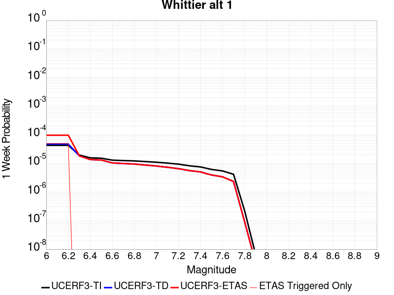 | 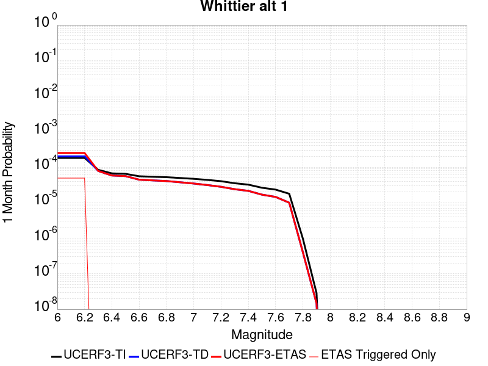 | 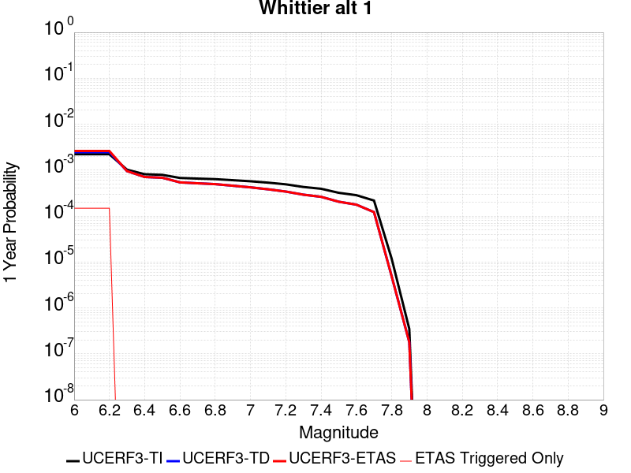 | 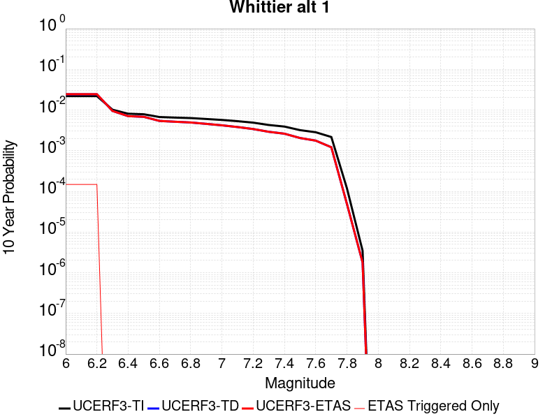 |

| Magnitude | 1 wk TI Prob | 1 wk TD Prob | 1 wk ETAS Prob | 1 wk ETAS/TD Gain | 1 wk ETAS Triggered Only | 1 mo TI Prob | 1 mo TD Prob | 1 mo ETAS Prob | 1 mo ETAS/TD Gain | 1 mo ETAS Triggered Only | 1 yr TI Prob | 1 yr TD Prob | 1 yr ETAS Prob | 1 yr ETAS/TD Gain | 1 yr ETAS Triggered Only | 10 yr TI Prob | 10 yr TD Prob | 10 yr ETAS Prob | 10 yr ETAS/TD Gain | 10 yr ETAS Triggered Only |
|-----|-----|-----|-----|-----|-----|-----|-----|-----|-----|-----|-----|-----|-----|-----|-----|-----|-----|-----|-----|-----|
| 6.0 | 4.2554693E-5 | 4.7252182E-5 | 7.725076E-5 | 1.6348614 | 3.0E-5 | 1.8236451E-4 | 2.0249544E-4 | 2.3248937E-4 | 1.1481215 | 3.0E-5 | 0.002218027 | 0.0024629163 | 0.002532744 | 1.0283515 | 7.0E-5 | 0.02196019 | 0.024390263 | 0.024497582 | 1.0044 | 1.1E-4 |
| 6.1 | 4.2554693E-5 | 4.7252182E-5 | 7.725076E-5 | 1.6348614 | 3.0E-5 | 1.8236451E-4 | 2.0249544E-4 | 2.3248937E-4 | 1.1481215 | 3.0E-5 | 0.002218027 | 0.0024629163 | 0.002532744 | 1.0283515 | 7.0E-5 | 0.02196019 | 0.024390263 | 0.024497582 | 1.0044 | 1.1E-4 |
| 6.2 | 4.2554693E-5 | 4.7252182E-5 | 7.725076E-5 | 1.6348614 | 3.0E-5 | 1.8236451E-4 | 2.0249544E-4 | 2.3248937E-4 | 1.1481215 | 3.0E-5 | 0.002218027 | 0.0024629163 | 0.002532744 | 1.0283515 | 7.0E-5 | 0.02196019 | 0.024390263 | 0.024497582 | 1.0044 | 1.1E-4 |
| 6.3 | 1.9617712E-5 | 1.826841E-5 | 2.8268229E-5 | 1.547383 | 1.0E-5 | 8.40732E-5 | 7.829095E-5 | 8.8290166E-5 | 1.1277187 | 1.0E-5 | 0.0010231105 | 9.527944E-4 | 9.6278486E-4 | 1.0104854 | 1.0E-5 | 0.01018413 | 0.0094904 | 0.00951021 | 1.0020874 | 2.0E-5 |
| 6.4 | 1.5611336E-5 | 1.3604089E-5 | 1.3604089E-5 | 1.0 | 0.0 | 6.690401E-5 | 5.8301972E-5 | 5.8301972E-5 | 1.0 | 0.0 | 8.142519E-4 | 7.096013E-4 | 7.096013E-4 | 1.0 | 0.0 | 0.008112748 | 0.0070753377 | 0.007085267 | 1.0014033 | 1.0E-5 |
| 6.5 | 1.5150166E-5 | 1.3100744E-5 | 1.3100744E-5 | 1.0 | 0.0 | 6.492767E-5 | 5.614487E-5 | 5.614487E-5 | 1.0 | 0.0 | 7.9020765E-4 | 6.8335526E-4 | 6.8335526E-4 | 1.0 | 0.0 | 0.007874036 | 0.006814508 | 0.0068244394 | 1.0014575 | 1.0E-5 |
| 6.6 | 1.295588E-5 | 1.0380544E-5 | 1.0380544E-5 | 1.0 | 0.0 | 5.552402E-5 | 4.44873E-5 | 4.44873E-5 | 1.0 | 0.0 | 6.7579525E-4 | 5.415002E-4 | 5.415002E-4 | 1.0 | 0.0 | 0.006737438 | 0.005403343 | 0.005413289 | 1.0018407 | 1.0E-5 |
| 6.7 | 1.2542085E-5 | 9.899189E-6 | 9.899189E-6 | 1.0 | 0.0 | 5.3750682E-5 | 4.2424414E-5 | 4.2424414E-5 | 1.0 | 0.0 | 6.542181E-4 | 5.163967E-4 | 5.163967E-4 | 1.0 | 0.0 | 0.006522954 | 0.005153464 | 0.0051634125 | 1.0019305 | 1.0E-5 |
| 6.8 | 1.2195878E-5 | 9.49523E-6 | 9.49523E-6 | 1.0 | 0.0 | 5.2267E-5 | 4.069322E-5 | 4.069322E-5 | 1.0 | 0.0 | 6.36165E-4 | 4.9532915E-4 | 4.9532915E-4 | 1.0 | 0.0 | 0.0063434686 | 0.0049436963 | 0.004953647 | 1.0020127 | 1.0E-5 |
| 6.9 | 1.1580298E-5 | 8.772739E-6 | 8.772739E-6 | 1.0 | 0.0 | 4.9628903E-5 | 3.759692E-5 | 3.759692E-5 | 1.0 | 0.0 | 6.040644E-4 | 4.5764804E-4 | 4.5764804E-4 | 1.0 | 0.0 | 0.00602425 | 0.0045684646 | 0.0045784186 | 1.0021789 | 1.0E-5 |
| 7.0 | 1.0964795E-5 | 8.083794E-6 | 8.083794E-6 | 1.0 | 0.0 | 4.6991136E-5 | 3.4644378E-5 | 3.4644378E-5 | 1.0 | 0.0 | 5.7196687E-4 | 4.217152E-4 | 4.217152E-4 | 1.0 | 0.0 | 0.0057049696 | 0.004210459 | 0.004220417 | 1.002365 | 1.0E-5 |
| 7.1 | 1.0230601E-5 | 7.32646E-6 | 7.32646E-6 | 1.0 | 0.0 | 4.3844695E-5 | 3.1398744E-5 | 3.1398744E-5 | 1.0 | 0.0 | 5.336784E-4 | 3.8221394E-4 | 3.8221394E-4 | 1.0 | 0.0 | 0.005323986 | 0.0038167592 | 0.003826721 | 1.00261 | 1.0E-5 |
| 7.2 | 9.40865E-6 | 6.5430822E-6 | 6.5430822E-6 | 1.0 | 0.0 | 4.032216E-5 | 2.8041486E-5 | 2.8041486E-5 | 1.0 | 0.0 | 4.908117E-4 | 3.4135283E-4 | 3.4135283E-4 | 1.0 | 0.0 | 0.0048972913 | 0.0034094024 | 0.0034193683 | 1.002923 | 1.0E-5 |
| 7.3 | 8.237384E-6 | 5.5975433E-6 | 5.5975433E-6 | 1.0 | 0.0 | 3.5302593E-5 | 2.3989258E-5 | 2.3989258E-5 | 1.0 | 0.0 | 4.2972428E-4 | 2.920311E-4 | 2.920311E-4 | 1.0 | 0.0 | 0.0042889426 | 0.0029167992 | 0.0029267701 | 1.0034184 | 1.0E-5 |
| 7.4 | 7.5316966E-6 | 5.0276153E-6 | 5.0276153E-6 | 1.0 | 0.0 | 3.2278298E-5 | 2.154675E-5 | 2.154675E-5 | 1.0 | 0.0 | 3.9291743E-4 | 2.623011E-4 | 2.623011E-4 | 1.0 | 0.0 | 0.0039222343 | 0.0026200267 | 0.0026300005 | 1.0038067 | 1.0E-5 |
| 7.5 | 6.149649E-6 | 3.9336355E-6 | 3.9336355E-6 | 1.0 | 0.0 | 2.6355372E-5 | 1.6858336E-5 | 1.6858336E-5 | 1.0 | 0.0 | 3.208294E-4 | 2.052318E-4 | 2.052318E-4 | 1.0 | 0.0 | 0.003203666 | 0.0020505118 | 0.0020505118 | 1.0 | 0.0 |
| 7.6 | 5.457711E-6 | 3.3951796E-6 | 3.3951796E-6 | 1.0 | 0.0 | 2.338998E-5 | 1.4550694E-5 | 1.4550694E-5 | 1.0 | 0.0 | 2.8473578E-4 | 1.771411E-4 | 1.771411E-4 | 1.0 | 0.0 | 0.0028437122 | 0.0017700798 | 0.0017700798 | 1.0 | 0.0 |
| 7.7 | 4.1676276E-6 | 2.3329922E-6 | 2.3329922E-6 | 1.0 | 0.0 | 1.7861139E-5 | 9.998504E-6 | 9.998504E-6 | 1.0 | 0.0 | 2.1743766E-4 | 1.2172572E-4 | 1.2172572E-4 | 1.0 | 0.0 | 0.0021722503 | 0.0012166635 | 0.0012166635 | 1.0 | 0.0 |
| 7.8 | 2.2692414E-7 | 9.384417E-8 | 9.384417E-8 | 1.0 | 0.0 | 9.725317E-7 | 4.0218927E-7 | 4.0218927E-7 | 1.0 | 0.0 | 1.1840509E-5 | 4.8966467E-6 | 4.8966467E-6 | 1.0 | 0.0 | 1.1839878E-4 | 4.8965718E-5 | 4.8965718E-5 | 1.0 | 0.0 |
| 7.9 | 6.676829E-9 | 3.4397174E-9 | 3.4397174E-9 | 1.0 | 0.0 | 2.861498E-8 | 1.4741646E-8 | 1.4741646E-8 | 1.0 | 0.0 | 3.4838732E-7 | 1.7947953E-7 | 1.7947953E-7 | 1.0 | 0.0 | 3.4838679E-6 | 1.794794E-6 | 1.794794E-6 | 1.0 | 0.0 |

## Bullion Mountains
*[(top)](#table-of-contents)*

| 1 Week | 1 Month | 1 Year | 10 Year |
|-----|-----|-----|-----|
| 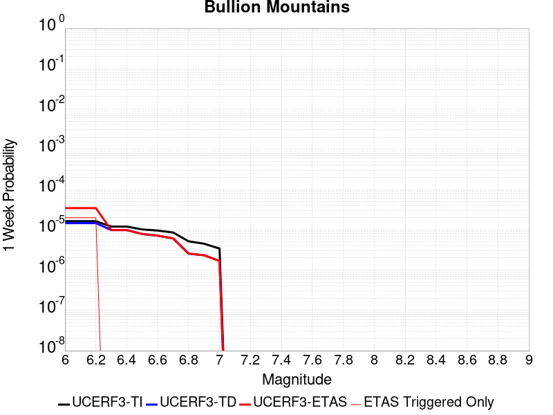 | 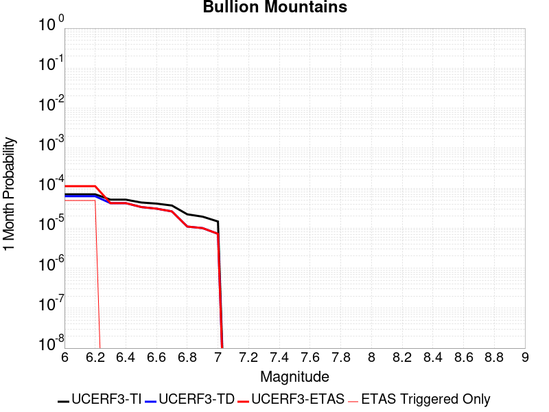 | 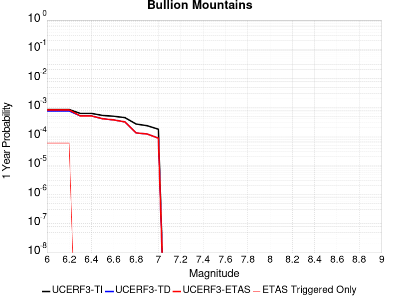 |  |

| Magnitude | 1 wk TI Prob | 1 wk TD Prob | 1 wk ETAS Prob | 1 wk ETAS/TD Gain | 1 wk ETAS Triggered Only | 1 mo TI Prob | 1 mo TD Prob | 1 mo ETAS Prob | 1 mo ETAS/TD Gain | 1 mo ETAS Triggered Only | 1 yr TI Prob | 1 yr TD Prob | 1 yr ETAS Prob | 1 yr ETAS/TD Gain | 1 yr ETAS Triggered Only | 10 yr TI Prob | 10 yr TD Prob | 10 yr ETAS Prob | 10 yr ETAS/TD Gain | 10 yr ETAS Triggered Only |
|-----|-----|-----|-----|-----|-----|-----|-----|-----|-----|-----|-----|-----|-----|-----|-----|-----|-----|-----|-----|-----|
| 6.0 | 1.6420427E-5 | 1.4692009E-5 | 3.4691715E-5 | 2.3612642 | 2.0E-5 | 7.037136E-5 | 6.296445E-5 | 1.129613E-4 | 1.7940489 | 5.0E-5 | 8.5643446E-4 | 7.6636096E-4 | 8.662843E-4 | 1.1303868 | 1.0E-4 | 0.008531413 | 0.0076409746 | 0.0077600577 | 1.0155848 | 1.2E-4 |
| 6.1 | 1.6420427E-5 | 1.4692009E-5 | 3.4691715E-5 | 2.3612642 | 2.0E-5 | 7.037136E-5 | 6.296445E-5 | 1.129613E-4 | 1.7940489 | 5.0E-5 | 8.5643446E-4 | 7.6636096E-4 | 8.662843E-4 | 1.1303868 | 1.0E-4 | 0.008531413 | 0.0076409746 | 0.0077600577 | 1.0155848 | 1.2E-4 |
| 6.2 | 1.6420427E-5 | 1.4692009E-5 | 3.4691715E-5 | 2.3612642 | 2.0E-5 | 7.037136E-5 | 6.296445E-5 | 1.129613E-4 | 1.7940489 | 5.0E-5 | 8.5643446E-4 | 7.6636096E-4 | 8.662843E-4 | 1.1303868 | 1.0E-4 | 0.008531413 | 0.0076409746 | 0.0077600577 | 1.0155848 | 1.2E-4 |
| 6.3 | 1.2046778E-5 | 9.862255E-6 | 9.862255E-6 | 1.0 | 0.0 | 5.1628023E-5 | 4.2266256E-5 | 7.2264986E-5 | 1.7097561 | 3.0E-5 | 6.283899E-4 | 5.144933E-4 | 5.7446247E-4 | 1.1165596 | 6.0E-5 | 0.0062661595 | 0.0051353034 | 0.005204944 | 1.0135611 | 7.0E-5 |
| 6.4 | 1.2046778E-5 | 9.862255E-6 | 9.862255E-6 | 1.0 | 0.0 | 5.1628023E-5 | 4.2266256E-5 | 7.2264986E-5 | 1.7097561 | 3.0E-5 | 6.283899E-4 | 5.144933E-4 | 5.7446247E-4 | 1.1165596 | 6.0E-5 | 0.0062661595 | 0.0051353034 | 0.005204944 | 1.0135611 | 7.0E-5 |
| 6.5 | 1.0244343E-5 | 7.879378E-6 | 7.879378E-6 | 1.0 | 0.0 | 4.390359E-5 | 3.3768443E-5 | 6.376743E-5 | 1.8883734 | 3.0E-5 | 5.343951E-4 | 4.1107394E-4 | 4.610534E-4 | 1.1215826 | 5.0E-5 | 0.005331118 | 0.0041051665 | 0.00416492 | 1.0145557 | 6.0E-5 |
| 6.6 | 9.605408E-6 | 7.1774166E-6 | 7.1774166E-6 | 1.0 | 0.0 | 4.1165385E-5 | 3.0760108E-5 | 6.0759186E-5 | 1.9752591 | 3.0E-5 | 5.010733E-4 | 3.7446033E-4 | 4.244416E-4 | 1.1334755 | 5.0E-5 | 0.00499945 | 0.0037402906 | 0.0037901036 | 1.013318 | 5.0E-5 |
| 6.7 | 8.60418E-6 | 6.123926E-6 | 6.123926E-6 | 1.0 | 0.0 | 3.687454E-5 | 2.6245243E-5 | 5.6244455E-5 | 2.1430342 | 3.0E-5 | 4.48855E-4 | 3.195085E-4 | 3.594957E-4 | 1.1251523 | 4.0E-5 | 0.004479495 | 0.0031924031 | 0.0032322754 | 1.0124898 | 4.0E-5 |
| 6.8 | 5.187994E-6 | 2.563117E-6 | 2.563117E-6 | 1.0 | 0.0 | 2.223407E-5 | 1.0984763E-5 | 2.0984653E-5 | 1.9103419 | 1.0E-5 | 2.7066618E-4 | 1.3373529E-4 | 1.537326E-4 | 1.1495292 | 2.0E-5 | 0.0027033675 | 0.0013369396 | 0.0013569129 | 1.0149395 | 2.0E-5 |
| 6.9 | 4.5302368E-6 | 2.3442778E-6 | 2.3442778E-6 | 1.0 | 0.0 | 1.9415156E-5 | 1.0046889E-5 | 2.004679E-5 | 1.995323 | 1.0E-5 | 2.3635388E-4 | 1.2231797E-4 | 1.4231553E-4 | 1.1634883 | 2.0E-5 | 0.0023610266 | 0.0012228956 | 0.0012428712 | 1.0163347 | 2.0E-5 |
| 7.0 | 3.431668E-6 | 1.6882177E-6 | 1.6882177E-6 | 1.0 | 0.0 | 1.4707065E-5 | 7.2352186E-6 | 1.7235147E-5 | 2.3821182 | 1.0E-5 | 1.7904381E-4 | 8.808879E-5 | 1.0808703E-4 | 1.2270236 | 2.0E-5 | 0.0017889962 | 8.8088785E-4 | 9.0087025E-4 | 1.0226843 | 2.0E-5 |

## Ortigalita (North)
*[(top)](#table-of-contents)*

| 1 Week | 1 Month | 1 Year | 10 Year |
|-----|-----|-----|-----|
| 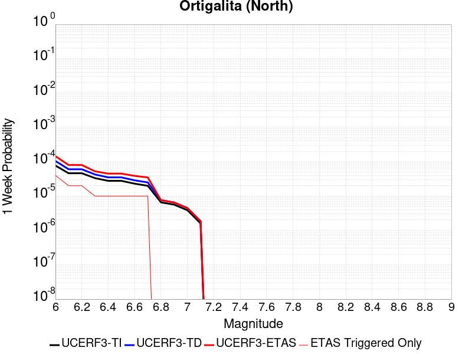 | 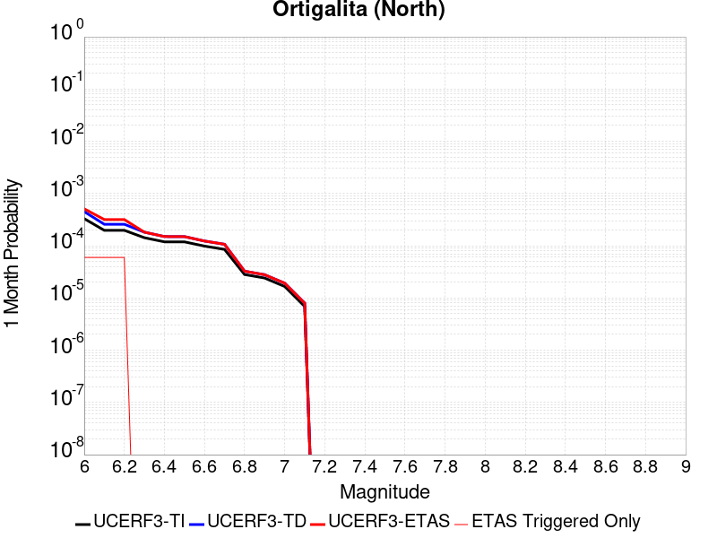 | 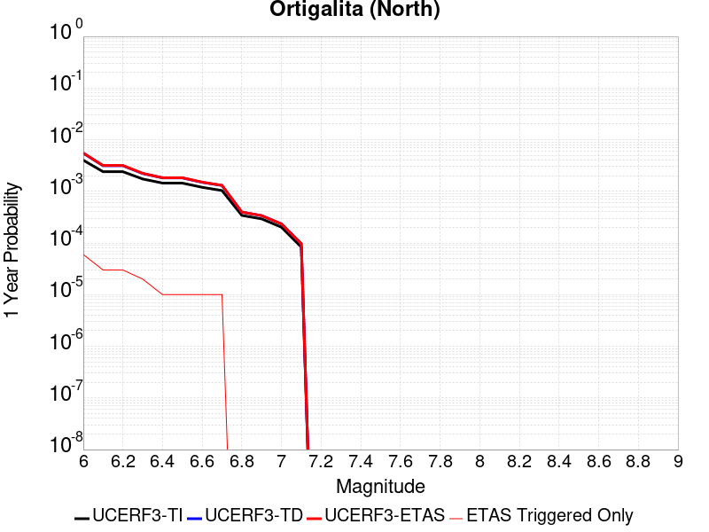 | 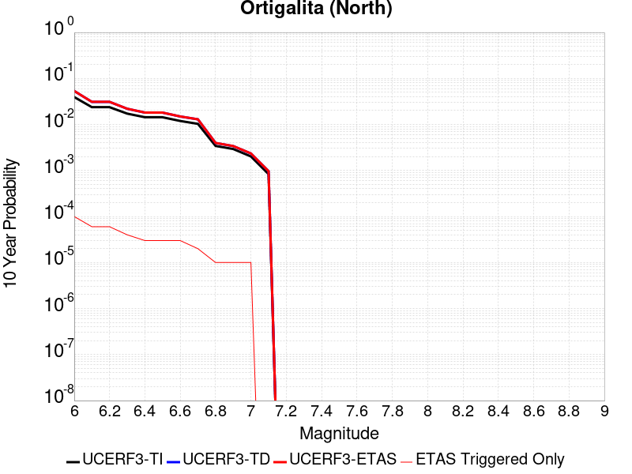 |

| Magnitude | 1 wk TI Prob | 1 wk TD Prob | 1 wk ETAS Prob | 1 wk ETAS/TD Gain | 1 wk ETAS Triggered Only | 1 mo TI Prob | 1 mo TD Prob | 1 mo ETAS Prob | 1 mo ETAS/TD Gain | 1 mo ETAS Triggered Only | 1 yr TI Prob | 1 yr TD Prob | 1 yr ETAS Prob | 1 yr ETAS/TD Gain | 1 yr ETAS Triggered Only | 10 yr TI Prob | 10 yr TD Prob | 10 yr ETAS Prob | 10 yr ETAS/TD Gain | 10 yr ETAS Triggered Only |
|-----|-----|-----|-----|-----|-----|-----|-----|-----|-----|-----|-----|-----|-----|-----|-----|-----|-----|-----|-----|-----|
| 6.0 | 7.711876E-5 | 1.0505308E-4 | 1.4504888E-4 | 1.3807199 | 4.0E-5 | 3.3046713E-4 | 4.501601E-4 | 5.0013757E-4 | 1.1110216 | 5.0E-5 | 0.004016016 | 0.0054680547 | 0.005527727 | 1.0109128 | 6.0E-5 | 0.039442103 | 0.053455614 | 0.053550266 | 1.0017707 | 1.0E-4 |
| 6.1 | 4.607858E-5 | 6.0239887E-5 | 8.0238686E-5 | 1.331986 | 2.0E-5 | 1.9746469E-4 | 2.5814763E-4 | 2.7814248E-4 | 1.077455 | 2.0E-5 | 0.0024014818 | 0.0031387366 | 0.0031686425 | 1.009528 | 3.0E-5 | 0.023756953 | 0.030975312 | 0.031033453 | 1.0018771 | 6.0E-5 |
| 6.2 | 4.607858E-5 | 6.0239887E-5 | 8.0238686E-5 | 1.331986 | 2.0E-5 | 1.9746469E-4 | 2.5814763E-4 | 2.7814248E-4 | 1.077455 | 2.0E-5 | 0.0024014818 | 0.0031387366 | 0.0031686425 | 1.009528 | 3.0E-5 | 0.023756953 | 0.030975312 | 0.031033453 | 1.0018771 | 6.0E-5 |
| 6.3 | 3.327423E-5 | 4.2476124E-5 | 5.2475698E-5 | 1.2354164 | 1.0E-5 | 1.4259605E-4 | 1.8202956E-4 | 1.9202773E-4 | 1.0549262 | 1.0E-5 | 0.0017347244 | 0.002214206 | 0.0022341616 | 1.0090126 | 2.0E-5 | 0.017212452 | 0.02194574 | 0.021984862 | 1.0017827 | 4.0E-5 |
| 6.4 | 2.7732503E-5 | 3.4999008E-5 | 4.4998655E-5 | 1.2857124 | 1.0E-5 | 1.1884817E-4 | 1.499886E-4 | 1.599871E-4 | 1.0666617 | 1.0E-5 | 0.001446016 | 0.0018248158 | 0.0018347976 | 1.00547 | 1.0E-5 | 0.014366428 | 0.018121297 | 0.018150754 | 1.0016255 | 3.0E-5 |
| 6.5 | 2.7689714E-5 | 3.4948822E-5 | 4.4948472E-5 | 1.2861227 | 1.0E-5 | 1.186648E-4 | 1.4977354E-4 | 1.5977204E-4 | 1.0667574 | 1.0E-5 | 0.0014437864 | 0.0018222018 | 0.0018321836 | 1.0054779 | 1.0E-5 | 0.014344421 | 0.018095585 | 0.01812504 | 1.0016279 | 3.0E-5 |
| 6.6 | 2.2976905E-5 | 2.871829E-5 | 3.8718004E-5 | 1.3482001 | 1.0E-5 | 9.846873E-5 | 1.23074E-4 | 1.3307277E-4 | 1.081242 | 1.0E-5 | 0.0011981975 | 0.0014976348 | 0.0015076199 | 1.0066671 | 1.0E-5 | 0.011917574 | 0.014898733 | 0.014928287 | 1.0019836 | 3.0E-5 |
| 6.7 | 1.9871539E-5 | 2.4904637E-5 | 3.4904388E-5 | 1.4015217 | 1.0E-5 | 8.516096E-5 | 1.067312E-4 | 1.1673012E-4 | 1.0936834 | 1.0E-5 | 0.0010363415 | 0.0012989199 | 0.0013089069 | 1.0076888 | 1.0E-5 | 0.010315218 | 0.012936938 | 0.012956679 | 1.001526 | 2.0E-5 |
| 6.8 | 6.5640475E-6 | 7.6054926E-6 | 7.6054926E-6 | 1.0 | 0.0 | 2.813133E-5 | 3.2594577E-5 | 3.2594577E-5 | 1.0 | 0.0 | 3.424451E-4 | 3.9676955E-4 | 3.9676955E-4 | 1.0 | 0.0 | 0.0034191788 | 0.003960899 | 0.003970859 | 1.0025147 | 1.0E-5 |
| 6.9 | 5.6219683E-6 | 6.5018376E-6 | 6.5018376E-6 | 1.0 | 0.0 | 2.4093928E-5 | 2.7864735E-5 | 2.7864735E-5 | 1.0 | 0.0 | 2.933041E-4 | 3.3920293E-4 | 3.3920293E-4 | 1.0 | 0.0 | 0.0029291727 | 0.003387109 | 0.003397075 | 1.0029423 | 1.0E-5 |
| 7.0 | 3.875591E-6 | 4.4847548E-6 | 4.4847548E-6 | 1.0 | 0.0 | 1.6609569E-5 | 1.9220248E-5 | 1.9220248E-5 | 1.0 | 0.0 | 2.0220275E-4 | 2.339835E-4 | 2.339835E-4 | 1.0 | 0.0 | 0.0020201886 | 0.0023375798 | 0.0023475564 | 1.0042679 | 1.0E-5 |
| 7.1 | 1.6017933E-6 | 1.8570418E-6 | 1.8570418E-6 | 1.0 | 0.0 | 6.8648105E-6 | 7.958732E-6 | 7.958732E-6 | 1.0 | 0.0 | 8.357586E-5 | 9.689432E-5 | 9.689432E-5 | 1.0 | 0.0 | 8.3544437E-4 | 9.686254E-4 | 9.686254E-4 | 1.0 | 0.0 |

## San Jacinto (Anza) rev
*[(top)](#table-of-contents)*

| 1 Week | 1 Month | 1 Year | 10 Year |
|-----|-----|-----|-----|
| 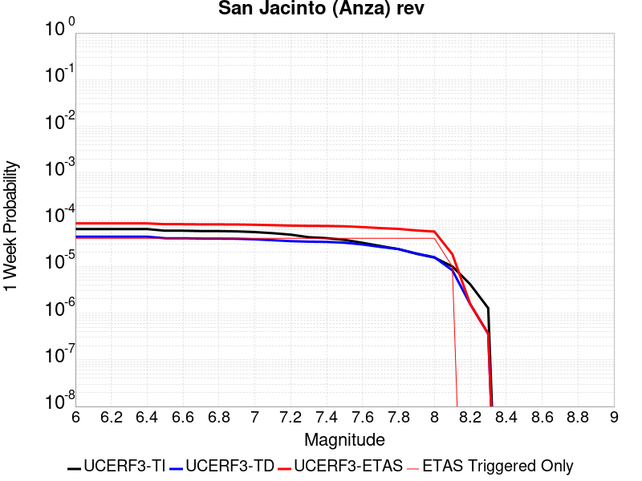 | 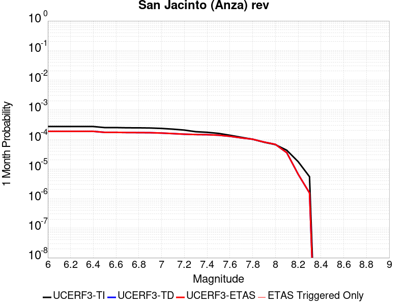 | 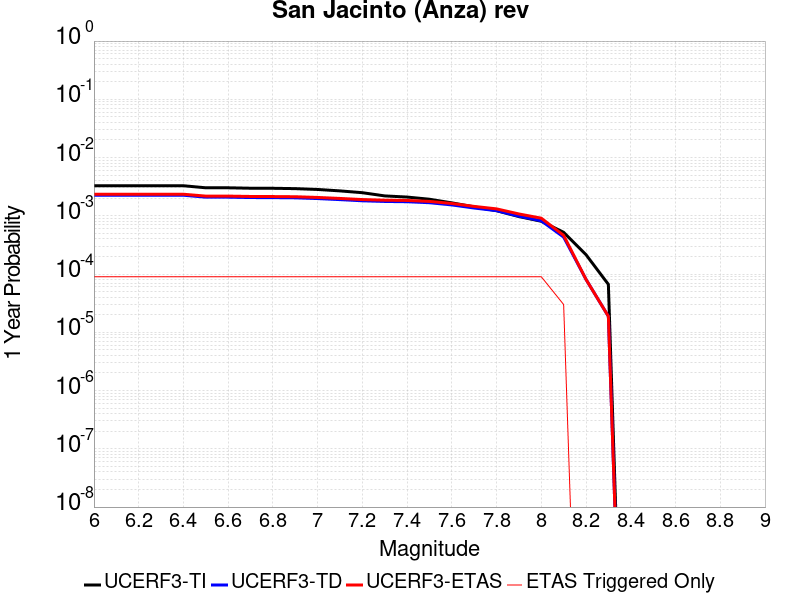 | 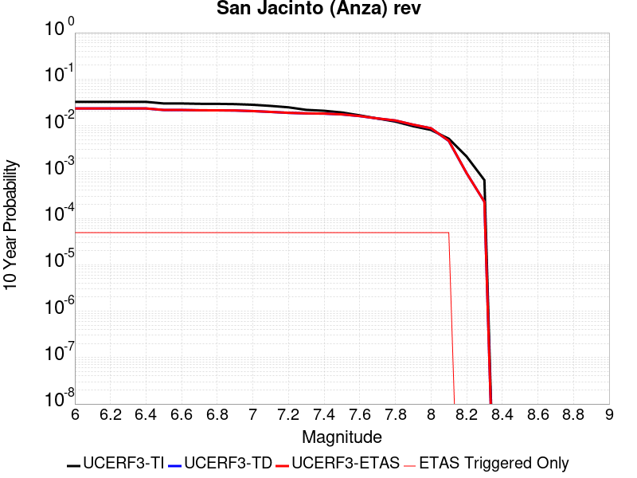 |

| Magnitude | 1 wk TI Prob | 1 wk TD Prob | 1 wk ETAS Prob | 1 wk ETAS/TD Gain | 1 wk ETAS Triggered Only | 1 mo TI Prob | 1 mo TD Prob | 1 mo ETAS Prob | 1 mo ETAS/TD Gain | 1 mo ETAS Triggered Only | 1 yr TI Prob | 1 yr TD Prob | 1 yr ETAS Prob | 1 yr ETAS/TD Gain | 1 yr ETAS Triggered Only | 10 yr TI Prob | 10 yr TD Prob | 10 yr ETAS Prob | 10 yr ETAS/TD Gain | 10 yr ETAS Triggered Only |
|-----|-----|-----|-----|-----|-----|-----|-----|-----|-----|-----|-----|-----|-----|-----|-----|-----|-----|-----|-----|-----|
| 6.0 | 6.3015636E-5 | 4.3298347E-5 | 8.329662E-5 | 1.9237828 | 4.0E-5 | 2.7003905E-4 | 1.8555121E-4 | 2.2554379E-4 | 1.2155339 | 4.0E-5 | 0.0032827691 | 0.0022567573 | 0.0023465543 | 1.0397903 | 9.0E-5 | 0.032346968 | 0.02329361 | 0.023410816 | 1.0050316 | 1.2E-4 |
| 6.1 | 6.3015636E-5 | 4.3298347E-5 | 8.329662E-5 | 1.9237828 | 4.0E-5 | 2.7003905E-4 | 1.8555121E-4 | 2.2554379E-4 | 1.2155339 | 4.0E-5 | 0.0032827691 | 0.0022567573 | 0.0023465543 | 1.0397903 | 9.0E-5 | 0.032346968 | 0.02329361 | 0.023410816 | 1.0050316 | 1.2E-4 |
| 6.2 | 6.3015636E-5 | 4.3298347E-5 | 8.329662E-5 | 1.9237828 | 4.0E-5 | 2.7003905E-4 | 1.8555121E-4 | 2.2554379E-4 | 1.2155339 | 4.0E-5 | 0.0032827691 | 0.0022567573 | 0.0023465543 | 1.0397903 | 9.0E-5 | 0.032346968 | 0.02329361 | 0.023410816 | 1.0050316 | 1.2E-4 |
| 6.3 | 6.3015636E-5 | 4.3298347E-5 | 8.329662E-5 | 1.9237828 | 4.0E-5 | 2.7003905E-4 | 1.8555121E-4 | 2.2554379E-4 | 1.2155339 | 4.0E-5 | 0.0032827691 | 0.0022567573 | 0.0023465543 | 1.0397903 | 9.0E-5 | 0.032346968 | 0.02329361 | 0.023410816 | 1.0050316 | 1.2E-4 |
| 6.4 | 6.3015636E-5 | 4.3298347E-5 | 8.329662E-5 | 1.9237828 | 4.0E-5 | 2.7003905E-4 | 1.8555121E-4 | 2.2554379E-4 | 1.2155339 | 4.0E-5 | 0.0032827691 | 0.0022567573 | 0.0023465543 | 1.0397903 | 9.0E-5 | 0.032346968 | 0.02329361 | 0.023410816 | 1.0050316 | 1.2E-4 |
| 6.5 | 5.811017E-5 | 4.0080286E-5 | 8.007868E-5 | 1.9979569 | 4.0E-5 | 2.4901982E-4 | 1.7176138E-4 | 2.1175451E-4 | 1.2328413 | 4.0E-5 | 0.0030276014 | 0.0020891947 | 0.0021790066 | 1.0429888 | 9.0E-5 | 0.02986684 | 0.021590833 | 0.021708243 | 1.005438 | 1.2E-4 |
| 6.6 | 5.811017E-5 | 4.0080286E-5 | 8.007868E-5 | 1.9979569 | 4.0E-5 | 2.4901982E-4 | 1.7176138E-4 | 2.1175451E-4 | 1.2328413 | 4.0E-5 | 0.0030276014 | 0.0020891947 | 0.0021790066 | 1.0429888 | 9.0E-5 | 0.02986684 | 0.021590833 | 0.021708243 | 1.005438 | 1.2E-4 |
| 6.7 | 5.712442E-5 | 3.950301E-5 | 7.9501435E-5 | 2.012541 | 4.0E-5 | 2.4479596E-4 | 1.6928767E-4 | 2.092809E-4 | 1.2362442 | 4.0E-5 | 0.0029763177 | 0.0020591344 | 0.0021489493 | 1.0436177 | 9.0E-5 | 0.029367693 | 0.021282919 | 0.021400364 | 1.0055183 | 1.2E-4 |
| 6.8 | 5.6967532E-5 | 3.93593E-5 | 7.935773E-5 | 2.0162382 | 4.0E-5 | 2.4412372E-4 | 1.6867183E-4 | 2.086651E-4 | 1.2371069 | 4.0E-5 | 0.0029681553 | 0.0020516508 | 0.0021414661 | 1.0437771 | 9.0E-5 | 0.029288229 | 0.02120852 | 0.021325974 | 1.0055381 | 1.2E-4 |
| 6.9 | 5.6211324E-5 | 3.9064216E-5 | 7.906265E-5 | 2.023915 | 4.0E-5 | 2.4088343E-4 | 1.6740736E-4 | 2.0740066E-4 | 1.2388982 | 4.0E-5 | 0.0029288116 | 0.0020362847 | 0.0021261014 | 1.0441082 | 9.0E-5 | 0.028905109 | 0.021047527 | 0.021165002 | 1.0055814 | 1.2E-4 |
| 7.0 | 5.4383527E-5 | 3.7925012E-5 | 7.792349E-5 | 2.054673 | 4.0E-5 | 2.3305144E-4 | 1.6252567E-4 | 2.0251916E-4 | 1.246075 | 4.0E-5 | 0.0028337094 | 0.001976959 | 0.002066781 | 1.0454345 | 9.0E-5 | 0.027978465 | 0.02044095 | 0.020558497 | 1.0057505 | 1.2E-4 |
| 7.1 | 5.1393665E-5 | 3.638787E-5 | 7.6386415E-5 | 2.0992274 | 4.0E-5 | 2.2023996E-4 | 1.5593872E-4 | 1.9593247E-4 | 1.256471 | 4.0E-5 | 0.0026781242 | 0.0018969048 | 0.001986734 | 1.0473558 | 9.0E-5 | 0.026460782 | 0.019616077 | 0.019733723 | 1.0059974 | 1.2E-4 |
| 7.2 | 4.785222E-5 | 3.4738845E-5 | 7.473746E-5 | 2.1514087 | 4.0E-5 | 2.0506482E-4 | 1.4887229E-4 | 1.8886632E-4 | 1.2686467 | 4.0E-5 | 0.0024938055 | 0.0018110167 | 0.0019008537 | 1.0496058 | 9.0E-5 | 0.024660049 | 0.018728783 | 0.018846536 | 1.0062872 | 1.2E-4 |
| 7.3 | 4.2143256E-5 | 3.3834414E-5 | 7.383306E-5 | 2.1821883 | 4.0E-5 | 1.8060145E-4 | 1.449966E-4 | 1.8499079E-4 | 1.2758286 | 4.0E-5 | 0.002196605 | 0.0017639075 | 0.0018537487 | 1.0509331 | 9.0E-5 | 0.02175019 | 0.018236695 | 0.018354507 | 1.0064602 | 1.2E-4 |
| 7.4 | 4.0264713E-5 | 3.3472694E-5 | 7.3471354E-5 | 2.194964 | 4.0E-5 | 1.7255165E-4 | 1.4344654E-4 | 1.8344079E-4 | 1.2788095 | 4.0E-5 | 0.002098792 | 0.0017450659 | 0.0018349088 | 1.051484 | 9.0E-5 | 0.020790804 | 0.018041389 | 0.018159224 | 1.0065314 | 1.2E-4 |
| 7.5 | 3.694492E-5 | 3.2186905E-5 | 7.218562E-5 | 2.2427013 | 4.0E-5 | 1.5832575E-4 | 1.379366E-4 | 1.7793108E-4 | 1.2899483 | 4.0E-5 | 0.0019259118 | 0.0016780876 | 0.0017679366 | 1.0535425 | 9.0E-5 | 0.01909306 | 0.017357888 | 0.017475804 | 1.0067933 | 1.2E-4 |
| 7.6 | 3.200565E-5 | 2.9502702E-5 | 6.9501526E-5 | 2.355768 | 4.0E-5 | 1.3715986E-4 | 1.2643404E-4 | 1.6642899E-4 | 1.3163306 | 4.0E-5 | 0.001668642 | 0.0015382497 | 0.0016281112 | 1.058418 | 9.0E-5 | 0.01656168 | 0.015946016 | 0.016064104 | 1.0074054 | 1.2E-4 |
| 7.7 | 2.731642E-5 | 2.6091477E-5 | 6.609043E-5 | 2.5330276 | 4.0E-5 | 1.1706512E-4 | 1.11815825E-4 | 1.5181136E-4 | 1.3576912 | 4.0E-5 | 0.001424336 | 0.0013605085 | 0.001450386 | 1.0660617 | 9.0E-5 | 0.014152412 | 0.0141668 | 0.0142851 | 1.0083505 | 1.2E-4 |
| 7.8 | 2.3466424E-5 | 2.3503619E-5 | 6.350268E-5 | 2.7018256 | 4.0E-5 | 1.0056651E-4 | 1.0072591E-4 | 1.4072188E-4 | 1.3970773 | 4.0E-5 | 0.0012237094 | 0.0012256489 | 0.0013155385 | 1.0733405 | 9.0E-5 | 0.012169928 | 0.012808796 | 0.012927259 | 1.0092486 | 1.2E-4 |
| 7.9 | 1.8611925E-5 | 1.890698E-5 | 5.8906222E-5 | 3.1155808 | 4.0E-5 | 7.9762955E-5 | 8.10274E-5 | 1.2102416E-4 | 1.4936202 | 4.0E-5 | 9.7068126E-4 | 9.860628E-4 | 0.0010759741 | 1.0911821 | 9.0E-5 | 0.0096645225 | 0.010393705 | 0.010512458 | 1.0114255 | 1.2E-4 |
| 8.0 | 1.5460775E-5 | 1.5739915E-5 | 5.5739285E-5 | 3.5412698 | 4.0E-5 | 6.6258784E-5 | 6.745504E-5 | 1.0745234E-4 | 1.5929476 | 4.0E-5 | 8.0640207E-4 | 8.2095637E-4 | 9.108825E-4 | 1.1095382 | 9.0E-5 | 0.008034821 | 0.008702706 | 0.008821662 | 1.0136688 | 1.2E-4 |
| 8.1 | 9.983884E-6 | 8.268954E-6 | 1.8268871E-5 | 2.2093327 | 1.0E-5 | 4.2787375E-5 | 3.5437897E-5 | 4.5437544E-5 | 1.2821738 | 1.0E-5 | 5.2081177E-4 | 4.313715E-4 | 4.6135855E-4 | 1.0695156 | 3.0E-5 | 0.0051959283 | 0.00463968 | 0.004689448 | 1.0107266 | 5.0E-5 |
| 8.2 | 4.1226E-6 | 1.5522551E-6 | 1.5522551E-6 | 1.0 | 0.0 | 1.7668166E-5 | 6.6525045E-6 | 6.6525045E-6 | 1.0 | 0.0 | 2.1508869E-4 | 8.099126E-5 | 8.099126E-5 | 1.0 | 0.0 | 0.0021488064 | 9.401847E-4 | 9.401847E-4 | 1.0 | 0.0 |
| 8.3 | 1.2750878E-6 | 3.609817E-7 | 3.609817E-7 | 1.0 | 0.0 | 5.4646503E-6 | 1.5470634E-6 | 1.5470634E-6 | 1.0 | 0.0 | 6.653009E-5 | 1.8835339E-5 | 1.8835339E-5 | 1.0 | 0.0 | 6.6510175E-4 | 2.272251E-4 | 2.272251E-4 | 1.0 | 0.0 |

## Blue Cut
*[(top)](#table-of-contents)*

| 1 Week | 1 Month | 1 Year | 10 Year |
|-----|-----|-----|-----|
| 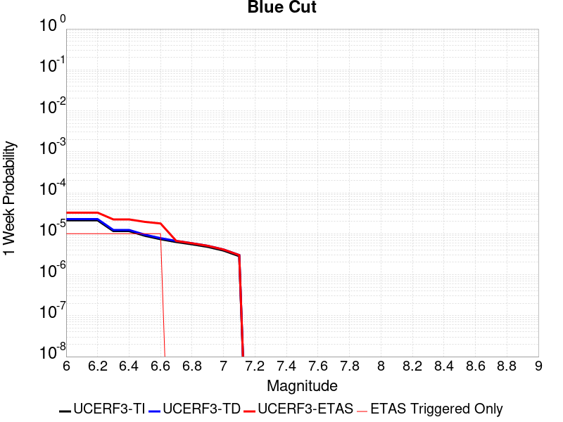 | 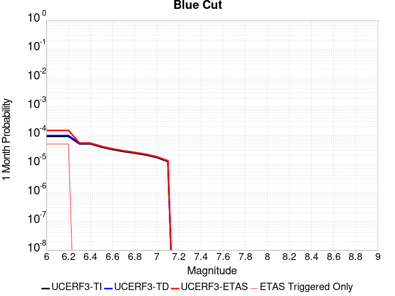 | 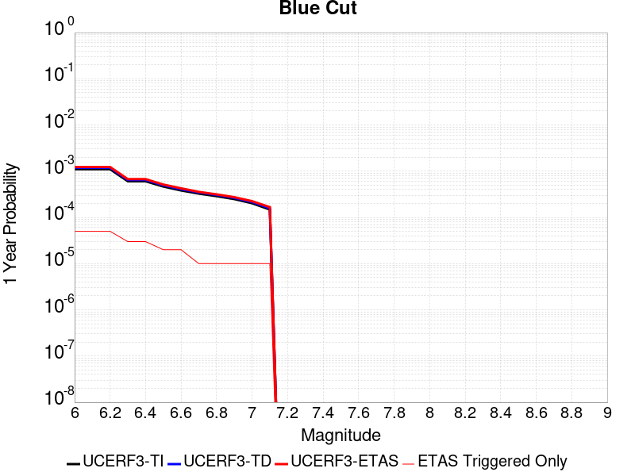 | 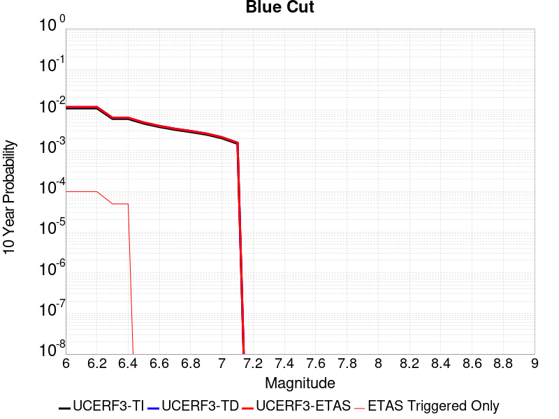 |

| Magnitude | 1 wk TI Prob | 1 wk TD Prob | 1 wk ETAS Prob | 1 wk ETAS/TD Gain | 1 wk ETAS Triggered Only | 1 mo TI Prob | 1 mo TD Prob | 1 mo ETAS Prob | 1 mo ETAS/TD Gain | 1 mo ETAS Triggered Only | 1 yr TI Prob | 1 yr TD Prob | 1 yr ETAS Prob | 1 yr ETAS/TD Gain | 1 yr ETAS Triggered Only | 10 yr TI Prob | 10 yr TD Prob | 10 yr ETAS Prob | 10 yr ETAS/TD Gain | 10 yr ETAS Triggered Only |
|-----|-----|-----|-----|-----|-----|-----|-----|-----|-----|-----|-----|-----|-----|-----|-----|-----|-----|-----|-----|-----|
| 6.0 | 2.1227985E-5 | 2.2719574E-5 | 3.271935E-5 | 1.440139 | 1.0E-5 | 9.097391E-5 | 9.73663E-5 | 1.3736241E-4 | 1.4107797 | 4.0E-5 | 0.0011070445 | 0.0011848481 | 0.0012347889 | 1.0421495 | 5.0E-5 | 0.011015458 | 0.011791152 | 0.011899855 | 1.009219 | 1.1E-4 |
| 6.1 | 2.1227985E-5 | 2.2719574E-5 | 3.271935E-5 | 1.440139 | 1.0E-5 | 9.097391E-5 | 9.73663E-5 | 1.3736241E-4 | 1.4107797 | 4.0E-5 | 0.0011070445 | 0.0011848481 | 0.0012347889 | 1.0421495 | 5.0E-5 | 0.011015458 | 0.011791152 | 0.011899855 | 1.009219 | 1.1E-4 |
| 6.2 | 2.1227985E-5 | 2.2719574E-5 | 3.271935E-5 | 1.440139 | 1.0E-5 | 9.097391E-5 | 9.73663E-5 | 1.3736241E-4 | 1.4107797 | 4.0E-5 | 0.0011070445 | 0.0011848481 | 0.0012347889 | 1.0421495 | 5.0E-5 | 0.011015458 | 0.011791152 | 0.011899855 | 1.009219 | 1.1E-4 |
| 6.3 | 1.1613981E-5 | 1.2353542E-5 | 2.2353419E-5 | 1.8094745 | 1.0E-5 | 4.9773254E-5 | 5.2942745E-5 | 8.294116E-5 | 1.5666199 | 3.0E-5 | 6.0582085E-4 | 6.443998E-4 | 6.7438046E-4 | 1.046525 | 3.0E-5 | 0.0060417196 | 0.0064265593 | 0.006476238 | 1.0077302 | 5.0E-5 |
| 6.4 | 1.1613981E-5 | 1.2353542E-5 | 2.2353419E-5 | 1.8094745 | 1.0E-5 | 4.9773254E-5 | 5.2942745E-5 | 8.294116E-5 | 1.5666199 | 3.0E-5 | 6.0582085E-4 | 6.443998E-4 | 6.7438046E-4 | 1.046525 | 3.0E-5 | 0.0060417196 | 0.0064265593 | 0.006476238 | 1.0077302 | 5.0E-5 |
| 6.5 | 8.931326E-6 | 9.4816E-6 | 1.9481506E-5 | 2.0546644 | 1.0E-5 | 3.8276554E-5 | 4.0634844E-5 | 6.0634033E-5 | 1.4921684 | 2.0E-5 | 4.6591737E-4 | 4.946261E-4 | 5.146162E-4 | 1.0404146 | 2.0E-5 | 0.0046494175 | 0.004936161 | 0.004966013 | 1.0060476 | 3.0E-5 |
| 6.6 | 7.345353E-6 | 7.79028E-6 | 1.7790202E-5 | 2.283641 | 1.0E-5 | 3.1479703E-5 | 3.338653E-5 | 5.3385862E-5 | 1.599024 | 2.0E-5 | 3.83198E-4 | 4.064132E-4 | 4.2640505E-4 | 1.049191 | 2.0E-5 | 0.0038253788 | 0.0040574907 | 0.004087369 | 1.0073637 | 3.0E-5 |
| 6.7 | 6.2775666E-6 | 6.655149E-6 | 6.655149E-6 | 1.0 | 0.0 | 2.690358E-5 | 2.8521798E-5 | 3.8521513E-5 | 1.350599 | 1.0E-5 | 3.2750185E-4 | 3.472051E-4 | 3.572016E-4 | 1.0287914 | 1.0E-5 | 0.0032701963 | 0.003467367 | 0.0034872978 | 1.005748 | 2.0E-5 |
| 6.8 | 5.5234095E-6 | 5.8551113E-6 | 5.8551113E-6 | 1.0 | 0.0 | 2.367154E-5 | 2.5093133E-5 | 3.5092882E-5 | 1.3985054 | 1.0E-5 | 2.8816288E-4 | 3.0547334E-4 | 3.154703E-4 | 1.032726 | 1.0E-5 | 0.002877895 | 0.0030512505 | 0.0030711896 | 1.0065347 | 2.0E-5 |
| 6.9 | 4.7780054E-6 | 5.0654203E-6 | 5.0654203E-6 | 1.0 | 0.0 | 2.0477004E-5 | 2.1708804E-5 | 3.1708587E-5 | 1.4606326 | 1.0E-5 | 2.4927902E-4 | 2.642797E-4 | 2.7427703E-4 | 1.0378287 | 1.0E-5 | 0.0024899957 | 0.002640346 | 0.0026602934 | 1.0075548 | 2.0E-5 |
| 7.0 | 3.883171E-6 | 4.118487E-6 | 4.118487E-6 | 1.0 | 0.0 | 1.6642054E-5 | 1.7650578E-5 | 2.7650402E-5 | 1.5665437 | 1.0E-5 | 2.0259817E-4 | 2.1488148E-4 | 2.2487935E-4 | 1.0465273 | 1.0E-5 | 0.0020241356 | 0.0021474129 | 0.00216737 | 1.0092936 | 2.0E-5 |
| 7.1 | 2.8358215E-6 | 3.0097158E-6 | 3.0097158E-6 | 1.0 | 0.0 | 1.2153464E-5 | 1.2898756E-5 | 2.2898626E-5 | 1.7752585 | 1.0E-5 | 1.4795837E-4 | 1.5703762E-4 | 1.6703604E-4 | 1.063669 | 1.0E-5 | 0.001478599 | 0.0015699116 | 0.0015898802 | 1.0127195 | 2.0E-5 |

## Big Pine (Central)
*[(top)](#table-of-contents)*

| 1 Week | 1 Month | 1 Year | 10 Year |
|-----|-----|-----|-----|
| 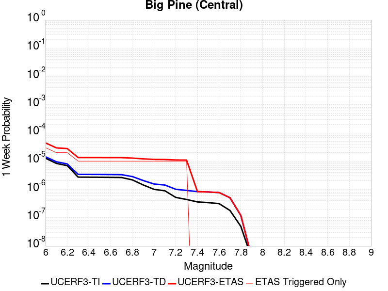 | 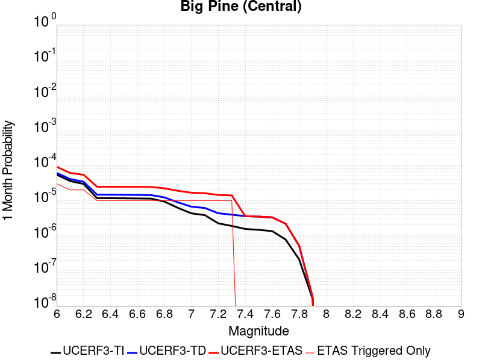 | 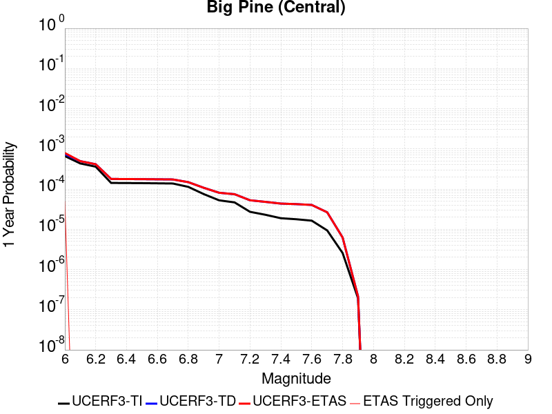 | 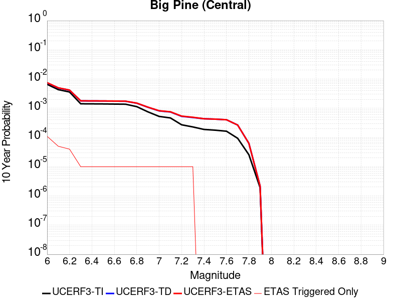 |

| Magnitude | 1 wk TI Prob | 1 wk TD Prob | 1 wk ETAS Prob | 1 wk ETAS/TD Gain | 1 wk ETAS Triggered Only | 1 mo TI Prob | 1 mo TD Prob | 1 mo ETAS Prob | 1 mo ETAS/TD Gain | 1 mo ETAS Triggered Only | 1 yr TI Prob | 1 yr TD Prob | 1 yr ETAS Prob | 1 yr ETAS/TD Gain | 1 yr ETAS Triggered Only | 10 yr TI Prob | 10 yr TD Prob | 10 yr ETAS Prob | 10 yr ETAS/TD Gain | 10 yr ETAS Triggered Only |
|-----|-----|-----|-----|-----|-----|-----|-----|-----|-----|-----|-----|-----|-----|-----|-----|-----|-----|-----|-----|-----|
| 6.0 | 1.2706755E-5 | 1.4250602E-5 | 4.4250173E-5 | 3.1051443 | 3.0E-5 | 5.4456385E-5 | 6.107279E-5 | 9.107096E-5 | 1.4911871 | 3.0E-5 | 6.628048E-4 | 7.433441E-4 | 7.933069E-4 | 1.0672137 | 5.0E-5 | 0.006608314 | 0.007413639 | 0.0075228238 | 1.0147275 | 1.1E-4 |
| 6.1 | 8.342579E-6 | 9.510835E-6 | 2.9510646E-5 | 3.1028447 | 2.0E-5 | 3.5753423E-5 | 4.076021E-5 | 6.0759394E-5 | 1.4906546 | 2.0E-5 | 4.3521097E-4 | 4.9616426E-4 | 5.261494E-4 | 1.0604339 | 3.0E-5 | 0.0043435963 | 0.004954155 | 0.0050039073 | 1.0100425 | 5.0E-5 |
| 6.2 | 6.923899E-6 | 7.967221E-6 | 2.7967062E-5 | 3.5102656 | 2.0E-5 | 2.9673516E-5 | 3.4144894E-5 | 5.4144213E-5 | 1.5857191 | 2.0E-5 | 3.6121515E-4 | 4.1565404E-4 | 4.3564572E-4 | 1.0480969 | 2.0E-5 | 0.003606286 | 0.0041521094 | 0.0041919434 | 1.0095936 | 4.0E-5 |
| 6.3 | 2.728396E-6 | 3.4243646E-6 | 1.342433E-5 | 3.9202397 | 1.0E-5 | 1.1693074E-5 | 1.4675771E-5 | 2.4675624E-5 | 1.6813852 | 1.0E-5 | 1.4235388E-4 | 1.7866373E-4 | 1.8866194E-4 | 1.055961 | 1.0E-5 | 0.0014226272 | 0.0017867433 | 0.0017967254 | 1.0055867 | 1.0E-5 |
| 6.4 | 2.7136944E-6 | 3.4086581E-6 | 1.3408624E-5 | 3.9336958 | 1.0E-5 | 1.1630066E-5 | 1.4608458E-5 | 2.4608311E-5 | 1.6845249 | 1.0E-5 | 1.4158686E-4 | 1.7784433E-4 | 1.8784255E-4 | 1.056219 | 1.0E-5 | 0.0014149669 | 0.0017785623 | 0.0017885446 | 1.0056125 | 1.0E-5 |
| 6.5 | 2.6971882E-6 | 3.3910032E-6 | 1.3390969E-5 | 3.9489698 | 1.0E-5 | 1.1559327E-5 | 1.4532795E-5 | 2.453265E-5 | 1.6880889 | 1.0E-5 | 1.4072572E-4 | 1.7692328E-4 | 1.869215E-4 | 1.0565116 | 1.0E-5 | 0.0014063664 | 0.0017693666 | 0.0017793488 | 1.0056417 | 1.0E-5 |
| 6.6 | 2.669092E-6 | 3.3610236E-6 | 1.336099E-5 | 3.975274 | 1.0E-5 | 1.1438916E-5 | 1.4404312E-5 | 2.4404168E-5 | 1.6942265 | 1.0E-5 | 1.3925991E-4 | 1.7535927E-4 | 1.8535751E-4 | 1.0570158 | 1.0E-5 | 0.0013917267 | 0.0017537511 | 0.0017637336 | 1.005692 | 1.0E-5 |
| 6.7 | 2.6408059E-6 | 3.3310494E-6 | 1.3331016E-5 | 4.002047 | 1.0E-5 | 1.1317691E-5 | 1.4275853E-5 | 2.4275709E-5 | 1.7004735 | 1.0E-5 | 1.3778417E-4 | 1.737955E-4 | 1.8379377E-4 | 1.0575289 | 1.0E-5 | 0.0013769877 | 0.0017381381 | 0.0017481208 | 1.0057433 | 1.0E-5 |
| 6.8 | 2.1786943E-6 | 2.8545066E-6 | 1.2854478E-5 | 4.5032225 | 1.0E-5 | 9.337228E-6 | 1.2233547E-5 | 2.2233424E-5 | 1.8174144 | 1.0E-5 | 1.1367482E-4 | 1.4893398E-4 | 1.5893248E-4 | 1.0671339 | 1.0E-5 | 0.0011361669 | 0.0014898704 | 0.0014998555 | 1.006702 | 1.0E-5 |
| 6.9 | 1.4411696E-6 | 2.0685677E-6 | 1.2068547E-5 | 5.834253 | 1.0E-5 | 6.1764263E-6 | 8.865261E-6 | 1.8865174E-5 | 2.1279883 | 1.0E-5 | 7.51954E-5 | 1.0792949E-4 | 1.1792841E-4 | 1.0926431 | 1.0E-5 | 7.5169955E-4 | 0.0010802548 | 0.001090244 | 1.0092471 | 1.0E-5 |
| 7.0 | 1.0073411E-6 | 1.5543274E-6 | 1.1554312E-5 | 7.433641 | 1.0E-5 | 4.317169E-6 | 6.661387E-6 | 1.666132E-5 | 2.501179 | 1.0E-5 | 5.2560266E-5 | 8.109952E-5 | 9.109871E-5 | 1.1232953 | 1.0E-5 | 5.2547833E-4 | 8.1217213E-4 | 8.2216406E-4 | 1.0123026 | 1.0E-5 |
| 7.1 | 8.947104E-7 | 1.430316E-6 | 1.1430302E-5 | 7.9914517 | 1.0E-5 | 3.834468E-6 | 6.1299124E-6 | 1.612985E-5 | 2.6313348 | 1.0E-5 | 4.6683643E-5 | 7.462928E-5 | 8.462853E-5 | 1.1339856 | 1.0E-5 | 4.6673836E-4 | 7.4751483E-4 | 7.5750734E-4 | 1.0133677 | 1.0E-5 |
| 7.2 | 5.215166E-7 | 1.0112277E-6 | 1.1011218E-5 | 10.88896 | 1.0E-5 | 2.2350691E-6 | 4.333826E-6 | 1.4333783E-5 | 3.30742 | 1.0E-5 | 2.7211627E-5 | 5.27631E-5 | 6.276257E-5 | 1.1895164 | 1.0E-5 | 2.7208295E-4 | 5.289683E-4 | 5.3896295E-4 | 1.0188947 | 1.0E-5 |
| 7.3 | 4.4024807E-7 | 9.220183E-7 | 1.0922009E-5 | 11.845762 | 1.0E-5 | 1.8867761E-6 | 3.951501E-6 | 1.3951461E-5 | 3.530674 | 1.0E-5 | 2.2971257E-5 | 4.8108504E-5 | 5.8108024E-5 | 1.2078534 | 1.0E-5 | 2.2968883E-4 | 4.824433E-4 | 4.924385E-4 | 1.0207179 | 1.0E-5 |
| 7.4 | 3.6130905E-7 | 8.359109E-7 | 8.359109E-7 | 1.0 | 0.0 | 1.5484665E-6 | 3.5824705E-6 | 3.5824705E-6 | 1.0 | 0.0 | 1.8852415E-5 | 4.3615746E-5 | 4.3615746E-5 | 1.0 | 0.0 | 1.8850817E-4 | 4.3752496E-4 | 4.3752496E-4 | 1.0 | 0.0 |
| 7.5 | 3.408184E-7 | 8.1087245E-7 | 8.1087245E-7 | 1.0 | 0.0 | 1.4606494E-6 | 3.475163E-6 | 3.475163E-6 | 1.0 | 0.0 | 1.7783263E-5 | 4.230933E-5 | 4.230933E-5 | 1.0 | 0.0 | 1.778184E-4 | 4.2444657E-4 | 4.2444657E-4 | 1.0 | 0.0 |
| 7.6 | 3.1428627E-7 | 7.732167E-7 | 7.732167E-7 | 1.0 | 0.0 | 1.3469405E-6 | 3.313782E-6 | 3.313782E-6 | 1.0 | 0.0 | 1.6398877E-5 | 4.0344585E-5 | 4.0344585E-5 | 1.0 | 0.0 | 1.6397667E-4 | 4.0477706E-4 | 4.0477706E-4 | 1.0 | 0.0 |
| 7.7 | 1.7972785E-7 | 5.0782415E-7 | 5.0782415E-7 | 1.0 | 0.0 | 7.70262E-7 | 2.1763874E-6 | 2.1763874E-6 | 1.0 | 0.0 | 9.377899E-6 | 2.6497206E-5 | 2.6497206E-5 | 1.0 | 0.0 | 9.377503E-5 | 2.6633305E-4 | 2.6633305E-4 | 1.0 | 0.0 |
| 7.8 | 4.9230927E-8 | 1.1981747E-7 | 1.1981747E-7 | 1.0 | 0.0 | 2.1098968E-7 | 5.135033E-7 | 5.135033E-7 | 1.0 | 0.0 | 2.5687964E-6 | 6.2518866E-6 | 6.2518866E-6 | 1.0 | 0.0 | 2.5687666E-5 | 6.2971965E-5 | 6.2971965E-5 | 1.0 | 0.0 |
| 7.9 | 3.6805972E-9 | 4.1051638E-9 | 4.1051638E-9 | 1.0 | 0.0 | 1.5773987E-8 | 1.7593557E-8 | 1.7593557E-8 | 1.0 | 0.0 | 1.9204828E-7 | 2.1420155E-7 | 2.1420155E-7 | 1.0 | 0.0 | 1.920481E-6 | 2.1898923E-6 | 2.1898923E-6 | 1.0 | 0.0 |

## San Clemente
*[(top)](#table-of-contents)*

| 1 Week | 1 Month | 1 Year | 10 Year |
|-----|-----|-----|-----|
| 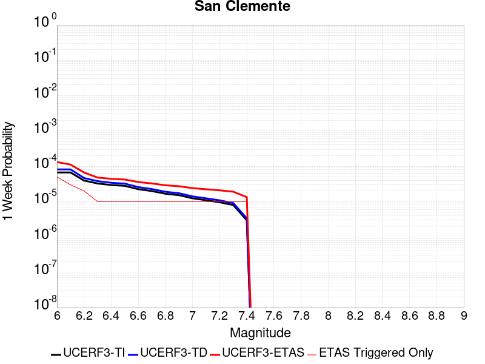 | 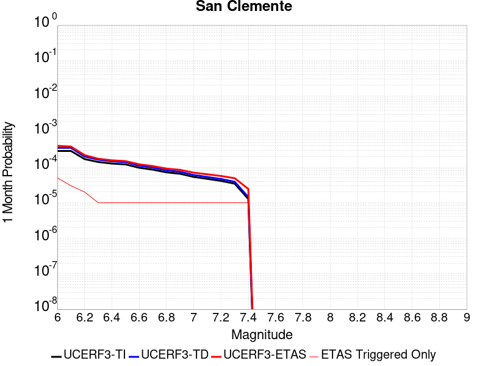 | 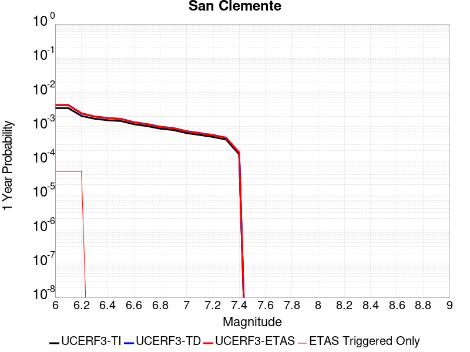 | 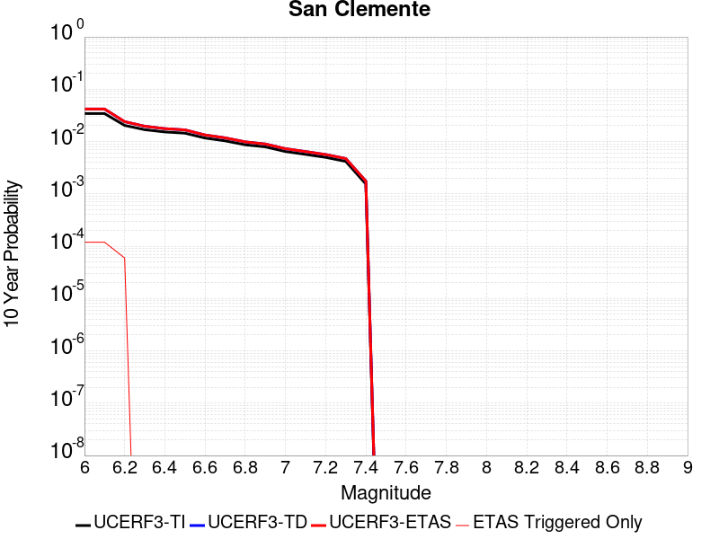 |

| Magnitude | 1 wk TI Prob | 1 wk TD Prob | 1 wk ETAS Prob | 1 wk ETAS/TD Gain | 1 wk ETAS Triggered Only | 1 mo TI Prob | 1 mo TD Prob | 1 mo ETAS Prob | 1 mo ETAS/TD Gain | 1 mo ETAS Triggered Only | 1 yr TI Prob | 1 yr TD Prob | 1 yr ETAS Prob | 1 yr ETAS/TD Gain | 1 yr ETAS Triggered Only | 10 yr TI Prob | 10 yr TD Prob | 10 yr ETAS Prob | 10 yr ETAS/TD Gain | 10 yr ETAS Triggered Only |
|-----|-----|-----|-----|-----|-----|-----|-----|-----|-----|-----|-----|-----|-----|-----|-----|-----|-----|-----|-----|-----|
| 6.0 | 6.681379E-5 | 8.163834E-5 | 1.3163425E-4 | 1.6124073 | 5.0E-5 | 2.8631336E-4 | 3.4983488E-4 | 3.998174E-4 | 1.1428746 | 5.0E-5 | 0.003480294 | 0.00425141 | 0.0043211123 | 1.0163951 | 7.0E-5 | 0.03426291 | 0.04175603 | 0.041861437 | 1.0025244 | 1.1E-4 |
| 6.1 | 6.681379E-5 | 8.163834E-5 | 1.1163589E-4 | 1.3674444 | 3.0E-5 | 2.8631336E-4 | 3.4983488E-4 | 3.798244E-4 | 1.0857247 | 3.0E-5 | 0.003480294 | 0.00425141 | 0.0043011974 | 1.0117108 | 5.0E-5 | 0.03426291 | 0.04175603 | 0.04184227 | 1.0020654 | 9.0E-5 |
| 6.2 | 3.9400576E-5 | 4.6452373E-5 | 6.6451445E-5 | 1.4305285 | 2.0E-5 | 1.6884868E-4 | 1.9906677E-4 | 2.1906279E-4 | 1.1004488 | 2.0E-5 | 0.0020537945 | 0.0024209984 | 0.002450926 | 1.0123615 | 3.0E-5 | 0.020349167 | 0.023952903 | 0.023991946 | 1.00163 | 4.0E-5 |
| 6.3 | 3.2590255E-5 | 3.792912E-5 | 4.7928737E-5 | 1.2636397 | 1.0E-5 | 1.3966505E-4 | 1.6254342E-4 | 1.725418E-4 | 1.061512 | 1.0E-5 | 0.0016990956 | 0.0019772002 | 0.0019971605 | 1.0100954 | 2.0E-5 | 0.01686163 | 0.019599883 | 0.019629294 | 1.0015006 | 3.0E-5 |
| 6.4 | 2.9454652E-5 | 3.4097764E-5 | 4.409742E-5 | 1.2932644 | 1.0E-5 | 1.2622811E-4 | 1.4612524E-4 | 1.5612377E-4 | 1.0684245 | 1.0E-5 | 0.0015357438 | 0.0017776493 | 0.0017876315 | 1.0056154 | 1.0E-5 | 0.015251739 | 0.01763747 | 0.017657118 | 1.0011139 | 2.0E-5 |
| 6.5 | 2.790836E-5 | 3.2247463E-5 | 4.224714E-5 | 1.310092 | 1.0E-5 | 1.1960178E-4 | 1.3819624E-4 | 1.4819486E-4 | 1.0723509 | 1.0E-5 | 0.001455179 | 0.0016812662 | 0.0016912494 | 1.0059379 | 1.0E-5 | 0.014456868 | 0.016688485 | 0.01670815 | 1.0011784 | 2.0E-5 |
| 6.6 | 2.2492153E-5 | 2.5762702E-5 | 3.5762445E-5 | 1.3881481 | 1.0E-5 | 9.639138E-5 | 1.1040699E-4 | 1.20405886E-4 | 1.090564 | 1.0E-5 | 0.0011729331 | 0.0013433909 | 0.0013533775 | 1.0074339 | 1.0E-5 | 0.011667615 | 0.013354417 | 0.01337415 | 1.0014776 | 2.0E-5 |
| 6.7 | 1.9862755E-5 | 2.2666423E-5 | 3.2666198E-5 | 1.4411712 | 1.0E-5 | 8.512331E-5 | 9.713826E-5 | 1.0713729E-4 | 1.102936 | 1.0E-5 | 0.0010358836 | 0.0011820279 | 0.0011920161 | 1.00845 | 1.0E-5 | 0.010310682 | 0.011758701 | 0.0117784655 | 1.0016809 | 2.0E-5 |
| 6.8 | 1.6697575E-5 | 1.897771E-5 | 2.897752E-5 | 1.526924 | 1.0E-5 | 7.155907E-5 | 8.133056E-5 | 9.132974E-5 | 1.1229451 | 1.0E-5 | 8.7088346E-4 | 9.897591E-4 | 9.997492E-4 | 1.0100935 | 1.0E-5 | 0.008674784 | 0.0098545365 | 0.00987434 | 1.0020095 | 2.0E-5 |
| 6.9 | 1.5218415E-5 | 1.72694E-5 | 2.7269229E-5 | 1.5790489 | 1.0E-5 | 6.522015E-5 | 7.4009666E-5 | 8.400893E-5 | 1.1351075 | 1.0E-5 | 7.93766E-4 | 9.00704E-4 | 9.10695E-4 | 1.0110924 | 1.0E-5 | 0.007909367 | 0.008971481 | 0.008981391 | 1.0011046 | 1.0E-5 |
| 7.0 | 1.2392958E-5 | 1.4033016E-5 | 2.4032875E-5 | 1.7125952 | 1.0E-5 | 5.3111595E-5 | 6.014015E-5 | 7.013955E-5 | 1.1662682 | 1.0E-5 | 6.4644177E-4 | 7.319679E-4 | 7.419606E-4 | 1.0136518 | 1.0E-5 | 0.0064456454 | 0.0072963564 | 0.007306284 | 1.0013605 | 1.0E-5 |
| 7.1 | 1.0934128E-5 | 1.2375138E-5 | 2.2375014E-5 | 1.8080618 | 1.0E-5 | 4.6859706E-5 | 5.303527E-5 | 6.3034735E-5 | 1.1885438 | 1.0E-5 | 5.7036756E-4 | 6.455204E-4 | 6.5551396E-4 | 1.0154814 | 1.0E-5 | 0.0056890585 | 0.0064371997 | 0.0064471355 | 1.0015435 | 1.0E-5 |
| 7.2 | 9.5798805E-6 | 1.0844935E-5 | 2.0844827E-5 | 1.9220794 | 1.0E-5 | 4.1055984E-5 | 4.6477508E-5 | 5.647704E-5 | 1.2151479 | 1.0E-5 | 4.9974193E-4 | 5.657239E-4 | 5.7571824E-4 | 1.0176665 | 1.0E-5 | 0.0049861963 | 0.0056435615 | 0.005653505 | 1.0017619 | 1.0E-5 |
| 7.3 | 8.0167365E-6 | 9.083918E-6 | 1.9083827E-5 | 2.1008368 | 1.0E-5 | 3.4356988E-5 | 3.8930535E-5 | 4.8930146E-5 | 1.2568578 | 1.0E-5 | 4.1821605E-4 | 4.7388324E-4 | 4.8387848E-4 | 1.0210923 | 1.0E-5 | 0.0041742986 | 0.0047294297 | 0.004739383 | 1.0021044 | 1.0E-5 |
| 7.4 | 2.9581017E-6 | 3.3623792E-6 | 1.3362345E-5 | 3.9740746 | 1.0E-5 | 1.2677518E-5 | 1.4410146E-5 | 2.4410001E-5 | 1.6939455 | 1.0E-5 | 1.5433785E-4 | 1.7543444E-4 | 1.8543268E-4 | 1.0569913 | 1.0E-5 | 0.001542307 | 0.0017534546 | 0.0017634371 | 1.0056931 | 1.0E-5 |

## Camp Rock 2011
*[(top)](#table-of-contents)*

| 1 Week | 1 Month | 1 Year | 10 Year |
|-----|-----|-----|-----|
| 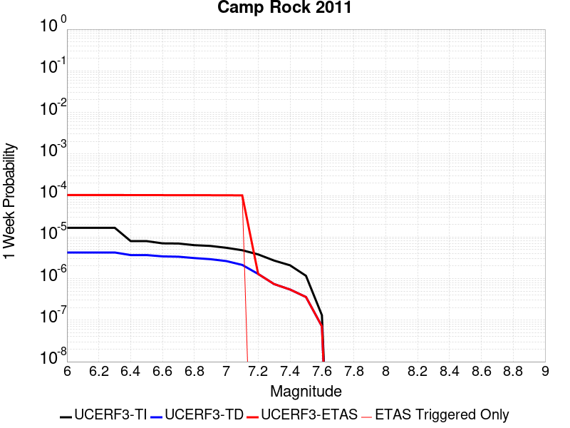 | 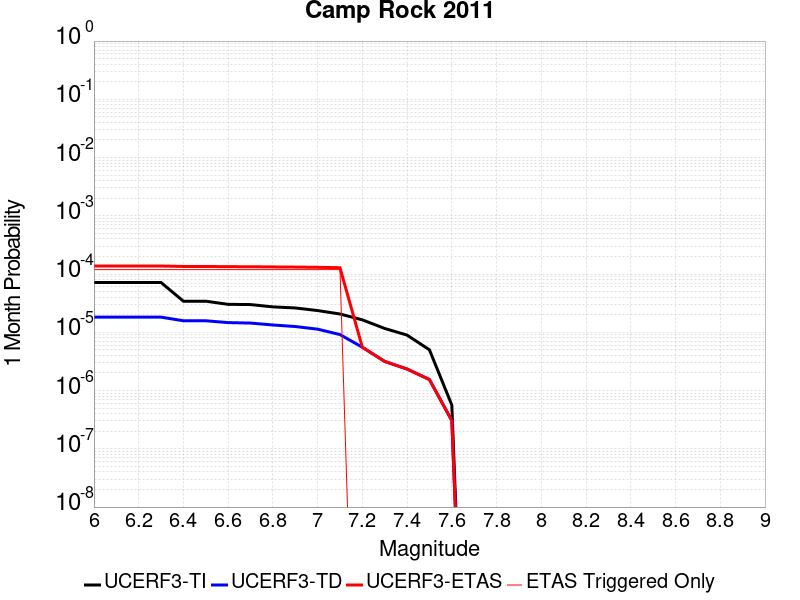 | 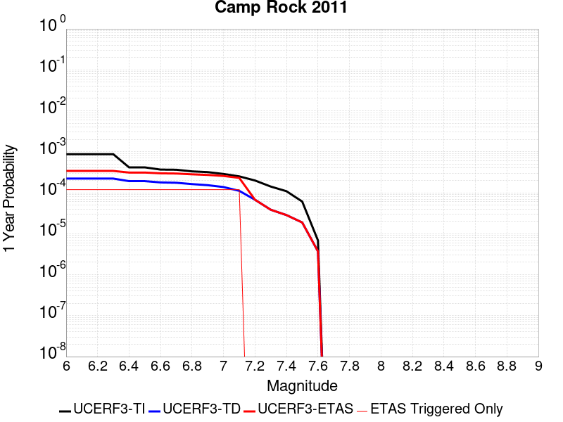 | 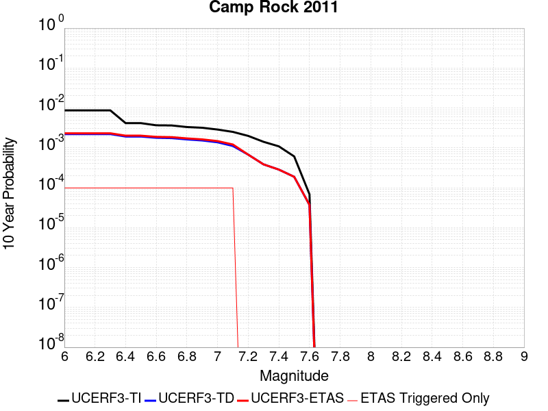 |

| Magnitude | 1 wk TI Prob | 1 wk TD Prob | 1 wk ETAS Prob | 1 wk ETAS/TD Gain | 1 wk ETAS Triggered Only | 1 mo TI Prob | 1 mo TD Prob | 1 mo ETAS Prob | 1 mo ETAS/TD Gain | 1 mo ETAS Triggered Only | 1 yr TI Prob | 1 yr TD Prob | 1 yr ETAS Prob | 1 yr ETAS/TD Gain | 1 yr ETAS Triggered Only | 10 yr TI Prob | 10 yr TD Prob | 10 yr ETAS Prob | 10 yr ETAS/TD Gain | 10 yr ETAS Triggered Only |
|-----|-----|-----|-----|-----|-----|-----|-----|-----|-----|-----|-----|-----|-----|-----|-----|-----|-----|-----|-----|-----|
| 6.0 | 1.6710783E-5 | 4.249999E-6 | 3.424987E-5 | 8.058795 | 3.0E-5 | 7.161568E-5 | 1.8214158E-5 | 5.821343E-5 | 3.1960537 | 4.0E-5 | 8.7157206E-4 | 2.2173533E-4 | 2.8172202E-4 | 1.2705328 | 6.0E-5 | 0.008681616 | 0.0022151938 | 0.0023249502 | 1.0495471 | 1.1E-4 |
| 6.1 | 1.6710783E-5 | 4.249999E-6 | 3.424987E-5 | 8.058795 | 3.0E-5 | 7.161568E-5 | 1.8214158E-5 | 5.821343E-5 | 3.1960537 | 4.0E-5 | 8.7157206E-4 | 2.2173533E-4 | 2.8172202E-4 | 1.2705328 | 6.0E-5 | 0.008681616 | 0.0022151938 | 0.0023249502 | 1.0495471 | 1.1E-4 |
| 6.2 | 1.6710783E-5 | 4.249999E-6 | 3.424987E-5 | 8.058795 | 3.0E-5 | 7.161568E-5 | 1.8214158E-5 | 5.821343E-5 | 3.1960537 | 4.0E-5 | 8.7157206E-4 | 2.2173533E-4 | 2.8172202E-4 | 1.2705328 | 6.0E-5 | 0.008681616 | 0.0022151938 | 0.0023249502 | 1.0495471 | 1.1E-4 |
| 6.3 | 1.6710783E-5 | 4.249999E-6 | 3.424987E-5 | 8.058795 | 3.0E-5 | 7.161568E-5 | 1.8214158E-5 | 5.821343E-5 | 3.1960537 | 4.0E-5 | 8.7157206E-4 | 2.2173533E-4 | 2.8172202E-4 | 1.2705328 | 6.0E-5 | 0.008681616 | 0.0022151938 | 0.0023249502 | 1.0495471 | 1.1E-4 |
| 6.4 | 7.982846E-6 | 3.6820359E-6 | 3.3681925E-5 | 9.147636 | 3.0E-5 | 3.421175E-5 | 1.578006E-5 | 5.577943E-5 | 3.5348046 | 4.0E-5 | 4.1644843E-4 | 1.9210564E-4 | 2.5209412E-4 | 1.3122681 | 6.0E-5 | 0.0041566887 | 0.0019194306 | 0.0020192387 | 1.0519987 | 1.0E-4 |
| 6.5 | 7.982846E-6 | 3.6820359E-6 | 3.3681925E-5 | 9.147636 | 3.0E-5 | 3.421175E-5 | 1.578006E-5 | 5.577943E-5 | 3.5348046 | 4.0E-5 | 4.1644843E-4 | 1.9210564E-4 | 2.5209412E-4 | 1.3122681 | 6.0E-5 | 0.0041566887 | 0.0019194306 | 0.0020192387 | 1.0519987 | 1.0E-4 |
| 6.6 | 7.048869E-6 | 3.4242998E-6 | 3.3424196E-5 | 9.760885 | 3.0E-5 | 3.0209088E-5 | 1.467549E-5 | 5.4674903E-5 | 3.725593 | 4.0E-5 | 3.677336E-4 | 1.7865976E-4 | 2.3864904E-4 | 1.3357738 | 6.0E-5 | 0.0036712566 | 0.0017851929 | 0.0018850144 | 1.0559163 | 1.0E-4 |
| 6.7 | 6.987307E-6 | 3.3622775E-6 | 3.3362176E-5 | 9.922494 | 3.0E-5 | 2.9945259E-5 | 1.4409683E-5 | 5.4409105E-5 | 3.7758713 | 4.0E-5 | 3.6452254E-4 | 1.7542407E-4 | 2.3541355E-4 | 1.3419683 | 6.0E-5 | 0.0036392517 | 0.0017528872 | 0.0018527118 | 1.0569488 | 1.0E-4 |
| 6.8 | 6.3737602E-6 | 3.1178672E-6 | 3.3117773E-5 | 10.621932 | 3.0E-5 | 2.731583E-5 | 1.3362222E-5 | 5.3361688E-5 | 3.9934742 | 4.0E-5 | 3.3251947E-4 | 1.6267318E-4 | 2.2266342E-4 | 1.3687776 | 6.0E-5 | 0.0033202237 | 0.0016255698 | 0.0017254072 | 1.0614169 | 1.0E-4 |
| 6.9 | 6.112211E-6 | 2.933078E-6 | 2.293302E-5 | 7.818755 | 2.0E-5 | 2.6194928E-5 | 1.2570275E-5 | 4.25699E-5 | 3.3865526 | 3.0E-5 | 3.1887658E-4 | 1.5303263E-4 | 2.0302497E-4 | 1.3266777 | 5.0E-5 | 0.003184194 | 0.0015293002 | 0.0016191626 | 1.0587604 | 9.0E-5 |
| 7.0 | 5.5140117E-6 | 2.64191E-6 | 2.2641858E-5 | 8.570261 | 2.0E-5 | 2.3631264E-5 | 1.1322423E-5 | 4.1322084E-5 | 3.6495795 | 3.0E-5 | 2.8767265E-4 | 1.3784204E-4 | 1.8783515E-4 | 1.362684 | 5.0E-5 | 0.0028730053 | 0.0013775907 | 0.0014674667 | 1.0652415 | 9.0E-5 |
| 7.1 | 4.8151105E-6 | 2.1342612E-6 | 2.2134218E-5 | 10.370905 | 2.0E-5 | 2.0636026E-5 | 9.146803E-6 | 3.914653E-5 | 4.2798047 | 3.0E-5 | 2.5121463E-4 | 1.1135685E-4 | 1.6135129E-4 | 1.448957 | 5.0E-5 | 0.0025093083 | 0.0011130325 | 0.0011929434 | 1.0717957 | 8.0E-5 |
| 7.2 | 3.818335E-6 | 1.2937372E-6 | 1.2937372E-6 | 1.0 | 0.0 | 1.6364189E-5 | 5.5445767E-6 | 5.5445767E-6 | 1.0 | 0.0 | 1.9921579E-4 | 6.750321E-5 | 7.750254E-5 | 1.1481311 | 1.0E-5 | 0.0019903728 | 6.7483535E-4 | 6.848286E-4 | 1.0148084 | 1.0E-5 |
| 7.3 | 2.7166698E-6 | 7.383078E-7 | 7.383078E-7 | 1.0 | 0.0 | 1.1642818E-5 | 3.1641725E-6 | 3.1641725E-6 | 1.0 | 0.0 | 1.4174209E-4 | 3.852314E-5 | 4.8522754E-5 | 1.2595743 | 1.0E-5 | 0.0014165172 | 3.8516664E-4 | 3.951628E-4 | 1.0259528 | 1.0E-5 |
| 7.4 | 2.0893426E-6 | 5.4614605E-7 | 5.4614605E-7 | 1.0 | 0.0 | 8.954295E-6 | 2.340624E-6 | 2.340624E-6 | 1.0 | 0.0 | 1.0901308E-4 | 2.8496728E-5 | 2.8496728E-5 | 1.0 | 0.0 | 0.0010895962 | 2.849313E-4 | 2.849313E-4 | 1.0 | 0.0 |
| 7.5 | 1.1681728E-6 | 3.6028484E-7 | 3.6028484E-7 | 1.0 | 0.0 | 5.0064455E-6 | 1.544077E-6 | 1.544077E-6 | 1.0 | 0.0 | 6.0951766E-5 | 1.879898E-5 | 1.879898E-5 | 1.0 | 0.0 | 6.093505E-4 | 1.8797436E-4 | 1.8797436E-4 | 1.0 | 0.0 |
| 7.6 | 1.3154387E-7 | 7.1196716E-8 | 7.1196716E-8 | 1.0 | 0.0 | 5.6375933E-7 | 3.0512876E-7 | 3.0512876E-7 | 1.0 | 0.0 | 6.863748E-6 | 3.714938E-6 | 3.714938E-6 | 1.0 | 0.0 | 6.863536E-5 | 3.7148915E-5 | 3.7148915E-5 | 1.0 | 0.0 |

## Santa Cruz Island
*[(top)](#table-of-contents)*

| 1 Week | 1 Month | 1 Year | 10 Year |
|-----|-----|-----|-----|
| 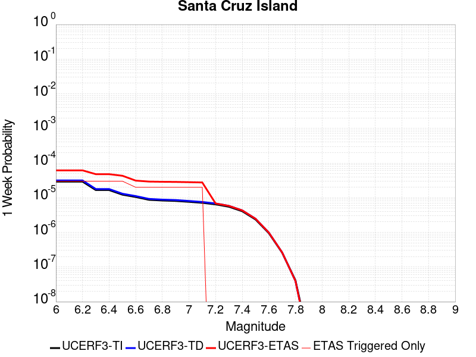 | 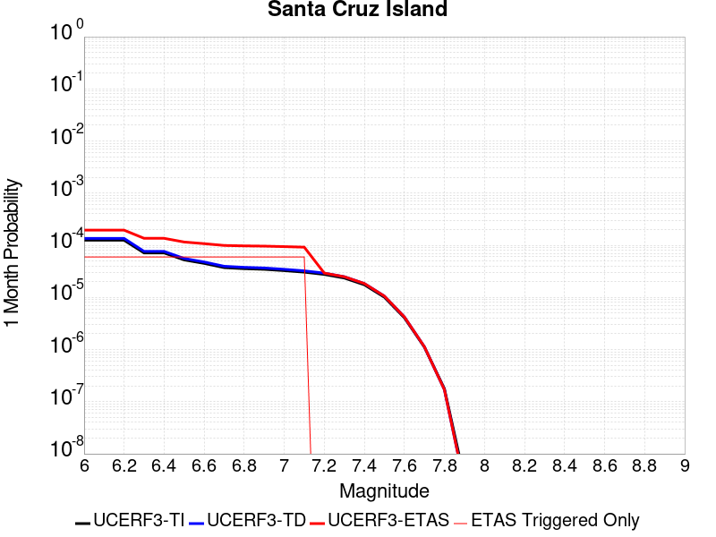 | 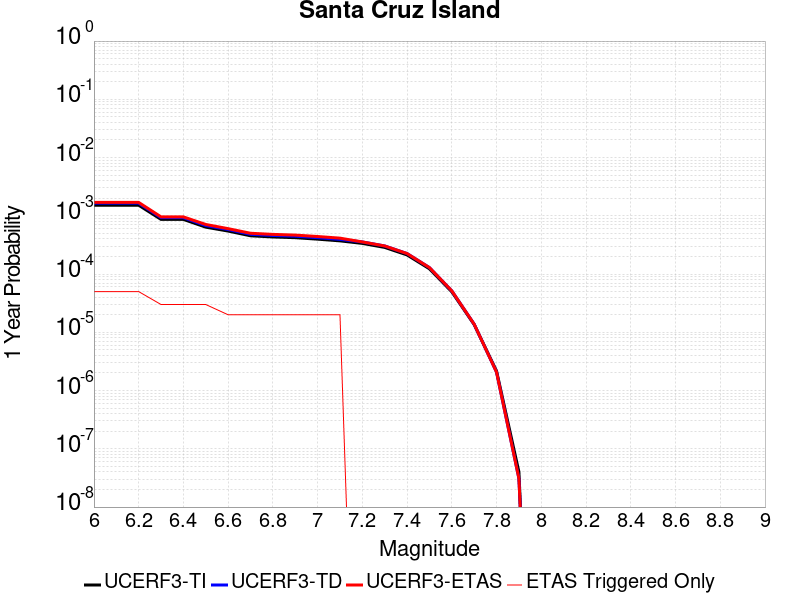 | 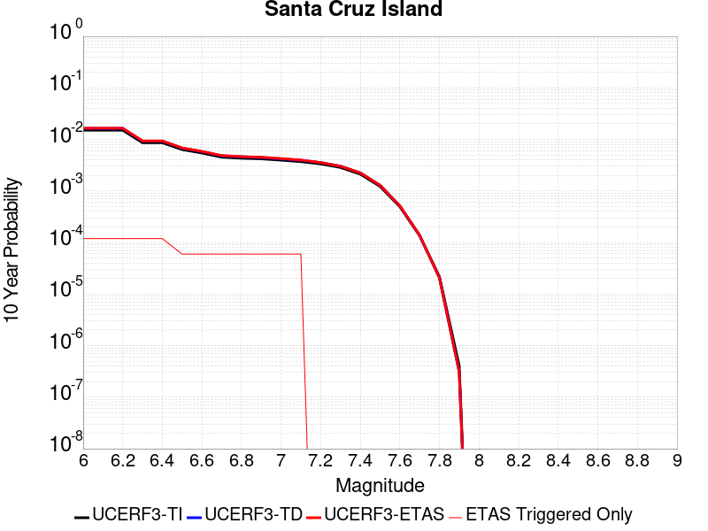 |

| Magnitude | 1 wk TI Prob | 1 wk TD Prob | 1 wk ETAS Prob | 1 wk ETAS/TD Gain | 1 wk ETAS Triggered Only | 1 mo TI Prob | 1 mo TD Prob | 1 mo ETAS Prob | 1 mo ETAS/TD Gain | 1 mo ETAS Triggered Only | 1 yr TI Prob | 1 yr TD Prob | 1 yr ETAS Prob | 1 yr ETAS/TD Gain | 1 yr ETAS Triggered Only | 10 yr TI Prob | 10 yr TD Prob | 10 yr ETAS Prob | 10 yr ETAS/TD Gain | 10 yr ETAS Triggered Only |
|-----|-----|-----|-----|-----|-----|-----|-----|-----|-----|-----|-----|-----|-----|-----|-----|-----|-----|-----|-----|-----|
| 6.0 | 2.9164563E-5 | 3.1599742E-5 | 6.1598796E-5 | 1.9493448 | 3.0E-5 | 1.2498499E-4 | 1.3542121E-4 | 1.6541715E-4 | 1.221501 | 3.0E-5 | 0.0015206301 | 0.0016476426 | 0.0016975602 | 1.0302964 | 5.0E-5 | 0.015102667 | 0.016368 | 0.01644669 | 1.0048076 | 8.0E-5 |
| 6.1 | 2.9164563E-5 | 3.1599742E-5 | 6.1598796E-5 | 1.9493448 | 3.0E-5 | 1.2498499E-4 | 1.3542121E-4 | 1.6541715E-4 | 1.221501 | 3.0E-5 | 0.0015206301 | 0.0016476426 | 0.0016975602 | 1.0302964 | 5.0E-5 | 0.015102667 | 0.016368 | 0.01644669 | 1.0048076 | 8.0E-5 |
| 6.2 | 2.9164563E-5 | 3.1599742E-5 | 6.1598796E-5 | 1.9493448 | 3.0E-5 | 1.2498499E-4 | 1.3542121E-4 | 1.6541715E-4 | 1.221501 | 3.0E-5 | 0.0015206301 | 0.0016476426 | 0.0016975602 | 1.0302964 | 5.0E-5 | 0.015102667 | 0.016368 | 0.01644669 | 1.0048076 | 8.0E-5 |
| 6.3 | 1.6635553E-5 | 1.780436E-5 | 4.7803824E-5 | 2.6849506 | 3.0E-5 | 7.1293274E-5 | 7.630227E-5 | 1.0629998E-4 | 1.3931432 | 3.0E-5 | 8.6765E-4 | 9.286024E-4 | 9.585745E-4 | 1.0322766 | 3.0E-5 | 0.008642701 | 0.009249094 | 0.009308538 | 1.0064272 | 6.0E-5 |
| 6.4 | 1.6635553E-5 | 1.780436E-5 | 4.7803824E-5 | 2.6849506 | 3.0E-5 | 7.1293274E-5 | 7.630227E-5 | 1.0629998E-4 | 1.3931432 | 3.0E-5 | 8.6765E-4 | 9.286024E-4 | 9.585745E-4 | 1.0322766 | 3.0E-5 | 0.008642701 | 0.009249094 | 0.009308538 | 1.0064272 | 6.0E-5 |
| 6.5 | 1.2238748E-5 | 1.3042996E-5 | 4.3042604E-5 | 3.300055 | 3.0E-5 | 5.2450723E-5 | 5.5897377E-5 | 8.58957E-5 | 1.5366678 | 3.0E-5 | 6.3840044E-4 | 6.8034173E-4 | 7.1032136E-4 | 1.0440655 | 3.0E-5 | 0.0063656955 | 0.006782988 | 0.0068227164 | 1.0058571 | 4.0E-5 |
| 6.6 | 1.0489767E-5 | 1.1156636E-5 | 3.1156414E-5 | 2.792635 | 2.0E-5 | 4.495537E-5 | 4.781329E-5 | 6.781233E-5 | 1.4182737 | 2.0E-5 | 5.4719415E-4 | 5.819736E-4 | 6.019619E-4 | 1.0343459 | 2.0E-5 | 0.005458487 | 0.005804736 | 0.00582462 | 1.0034255 | 2.0E-5 |
| 6.7 | 8.699222E-6 | 9.236783E-6 | 2.9236597E-5 | 3.1652362 | 2.0E-5 | 3.7281847E-5 | 3.958561E-5 | 5.958482E-5 | 1.5052141 | 2.0E-5 | 4.5381195E-4 | 4.818488E-4 | 5.0183915E-4 | 1.0414867 | 2.0E-5 | 0.0045288634 | 0.004808108 | 0.004828012 | 1.0041397 | 2.0E-5 |
| 6.8 | 8.307732E-6 | 8.8169045E-6 | 2.8816728E-5 | 3.26835 | 2.0E-5 | 3.560408E-5 | 3.7786187E-5 | 5.7785433E-5 | 1.5292739 | 2.0E-5 | 4.3339343E-4 | 4.5995016E-4 | 4.7994097E-4 | 1.043463 | 2.0E-5 | 0.004325492 | 0.0045900354 | 0.004609944 | 1.0043373 | 2.0E-5 |
| 6.9 | 8.073121E-6 | 8.564939E-6 | 2.8564767E-5 | 3.335081 | 2.0E-5 | 3.459863E-5 | 3.670637E-5 | 5.6705634E-5 | 1.5448446 | 2.0E-5 | 4.2115687E-4 | 4.4680882E-4 | 4.667999E-4 | 1.0447419 | 2.0E-5 | 0.004203596 | 0.004459156 | 0.004479067 | 1.0044651 | 2.0E-5 |
| 7.0 | 7.617019E-6 | 8.074665E-6 | 2.8074503E-5 | 3.4768631 | 2.0E-5 | 3.264396E-5 | 3.4605247E-5 | 5.4604556E-5 | 1.577927 | 2.0E-5 | 3.9736772E-4 | 4.2123784E-4 | 4.412294E-4 | 1.0474591 | 2.0E-5 | 0.003966579 | 0.0042044413 | 0.004224357 | 1.0047369 | 2.0E-5 |
| 7.1 | 7.1224836E-6 | 7.5457883E-6 | 2.7545637E-5 | 3.6504653 | 2.0E-5 | 3.052457E-5 | 3.2338692E-5 | 5.2338048E-5 | 1.6184342 | 2.0E-5 | 3.715733E-4 | 3.9365282E-4 | 4.1364494E-4 | 1.0507861 | 2.0E-5 | 0.003709526 | 0.0039295983 | 0.0039495192 | 1.0050696 | 2.0E-5 |
| 7.2 | 6.441115E-6 | 6.8273835E-6 | 6.8273835E-6 | 1.0 | 0.0 | 2.7604487E-5 | 2.9259889E-5 | 2.9259889E-5 | 1.0 | 0.0 | 3.360328E-4 | 3.5618115E-4 | 3.5618115E-4 | 1.0 | 0.0 | 0.0033552512 | 0.0035561312 | 0.0035561312 | 1.0 | 0.0 |
| 7.3 | 5.494274E-6 | 5.8199944E-6 | 5.8199944E-6 | 1.0 | 0.0 | 2.3546674E-5 | 2.4942596E-5 | 2.4942596E-5 | 1.0 | 0.0 | 2.8664304E-4 | 3.03634E-4 | 3.03634E-4 | 1.0 | 0.0 | 0.002862736 | 0.0030322145 | 0.0030322145 | 1.0 | 0.0 |
| 7.4 | 4.0802624E-6 | 4.3122564E-6 | 4.3122564E-6 | 1.0 | 0.0 | 1.7486722E-5 | 1.8480969E-5 | 1.8480969E-5 | 1.0 | 0.0 | 2.1288003E-4 | 2.2498264E-4 | 2.2498264E-4 | 1.0 | 0.0 | 0.0021267622 | 0.0022475577 | 0.0022475577 | 1.0 | 0.0 |
| 7.5 | 2.3584746E-6 | 2.4753099E-6 | 2.4753099E-6 | 1.0 | 0.0 | 1.0107709E-5 | 1.0608428E-5 | 1.0608428E-5 | 1.0 | 0.0 | 1.2305441E-4 | 1.2915001E-4 | 1.2915001E-4 | 1.0 | 0.0 | 0.0012298629 | 0.0012907545 | 0.0012907545 | 1.0 | 0.0 |
| 7.6 | 9.4981914E-7 | 9.860934E-7 | 9.860934E-7 | 1.0 | 0.0 | 4.0706473E-6 | 4.2261076E-6 | 4.2261076E-6 | 1.0 | 0.0 | 4.9559E-5 | 5.1451658E-5 | 5.1451658E-5 | 1.0 | 0.0 | 4.954795E-4 | 5.1439874E-4 | 5.1439874E-4 | 1.0 | 0.0 |
| 7.7 | 2.6013532E-7 | 2.6416632E-7 | 2.6416632E-7 | 1.0 | 0.0 | 1.1148652E-6 | 1.1321408E-6 | 1.1321408E-6 | 1.0 | 0.0 | 1.3573399E-5 | 1.3783729E-5 | 1.3783729E-5 | 1.0 | 0.0 | 1.357257E-4 | 1.378288E-4 | 1.378288E-4 | 1.0 | 0.0 |
| 7.8 | 4.1522263E-8 | 3.965698E-8 | 3.965698E-8 | 1.0 | 0.0 | 1.7795254E-7 | 1.6995848E-7 | 1.6995848E-7 | 1.0 | 0.0 | 2.16657E-6 | 2.0692428E-6 | 2.0692428E-6 | 1.0 | 0.0 | 2.1665488E-5 | 2.0692256E-5 | 2.0692256E-5 | 1.0 | 0.0 |
| 7.9 | 7.7242046E-10 | 5.9475225E-10 | 5.9475225E-10 | 1.0 | 0.0 | 3.3103735E-9 | 2.5489382E-9 | 2.5489382E-9 | 1.0 | 0.0 | 4.0303796E-8 | 3.1033323E-8 | 3.1033323E-8 | 1.0 | 0.0 | 4.030379E-7 | 3.103332E-7 | 3.103332E-7 | 1.0 | 0.0 |

## San Jacinto (Lytle Creek connector)
*[(top)](#table-of-contents)*

| 1 Week | 1 Month | 1 Year | 10 Year |
|-----|-----|-----|-----|
| 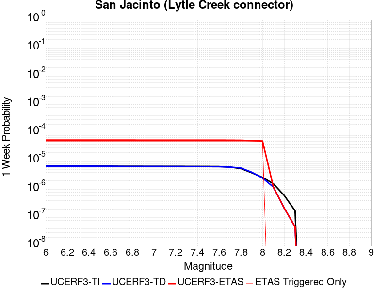 | 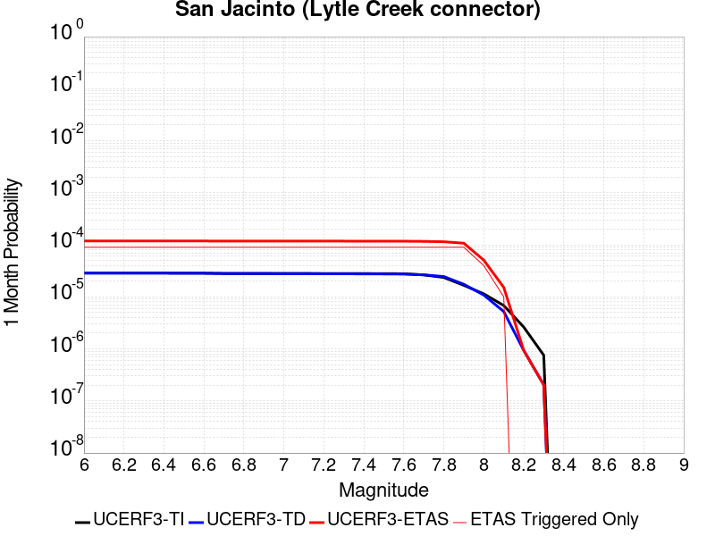 |  | 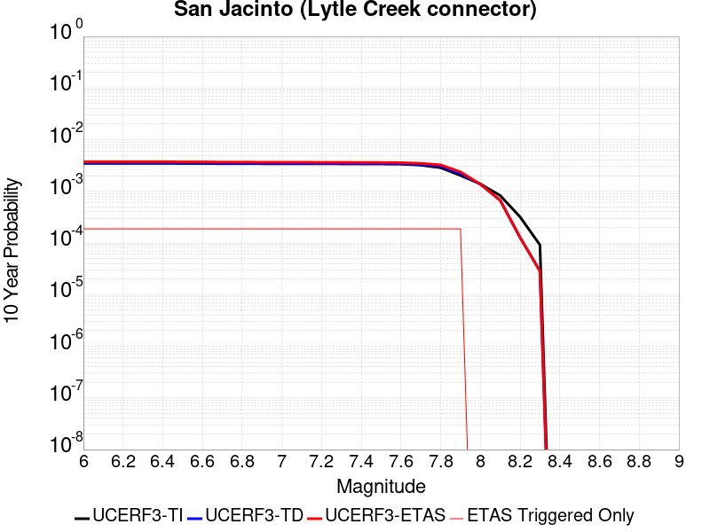 |

| Magnitude | 1 wk TI Prob | 1 wk TD Prob | 1 wk ETAS Prob | 1 wk ETAS/TD Gain | 1 wk ETAS Triggered Only | 1 mo TI Prob | 1 mo TD Prob | 1 mo ETAS Prob | 1 mo ETAS/TD Gain | 1 mo ETAS Triggered Only | 1 yr TI Prob | 1 yr TD Prob | 1 yr ETAS Prob | 1 yr ETAS/TD Gain | 1 yr ETAS Triggered Only | 10 yr TI Prob | 10 yr TD Prob | 10 yr ETAS Prob | 10 yr ETAS/TD Gain | 10 yr ETAS Triggered Only |
|-----|-----|-----|-----|-----|-----|-----|-----|-----|-----|-----|-----|-----|-----|-----|-----|-----|-----|-----|-----|-----|
| 6.0 | 6.693995E-6 | 6.660123E-6 | 7.665966E-5 | 11.510246 | 7.0E-5 | 2.8688235E-5 | 2.8543072E-5 | 1.18540505E-4 | 4.1530395 | 9.0E-5 | 3.492233E-4 | 3.4745657E-4 | 4.4742183E-4 | 1.2877058 | 1.0E-4 | 0.00348675 | 0.0035491167 | 0.0036587263 | 1.0308837 | 1.1E-4 |
| 6.1 | 6.693995E-6 | 6.660123E-6 | 7.665966E-5 | 11.510246 | 7.0E-5 | 2.8688235E-5 | 2.8543072E-5 | 1.18540505E-4 | 4.1530395 | 9.0E-5 | 3.492233E-4 | 3.4745657E-4 | 4.4742183E-4 | 1.2877058 | 1.0E-4 | 0.00348675 | 0.0035491167 | 0.0036587263 | 1.0308837 | 1.1E-4 |
| 6.2 | 6.693995E-6 | 6.660123E-6 | 7.665966E-5 | 11.510246 | 7.0E-5 | 2.8688235E-5 | 2.8543072E-5 | 1.18540505E-4 | 4.1530395 | 9.0E-5 | 3.492233E-4 | 3.4745657E-4 | 4.4742183E-4 | 1.2877058 | 1.0E-4 | 0.00348675 | 0.0035491167 | 0.0036587263 | 1.0308837 | 1.1E-4 |
| 6.3 | 6.693995E-6 | 6.660123E-6 | 7.665966E-5 | 11.510246 | 7.0E-5 | 2.8688235E-5 | 2.8543072E-5 | 1.18540505E-4 | 4.1530395 | 9.0E-5 | 3.492233E-4 | 3.4745657E-4 | 4.4742183E-4 | 1.2877058 | 1.0E-4 | 0.00348675 | 0.0035491167 | 0.0036587263 | 1.0308837 | 1.1E-4 |
| 6.4 | 6.693995E-6 | 6.660123E-6 | 7.665966E-5 | 11.510246 | 7.0E-5 | 2.8688235E-5 | 2.8543072E-5 | 1.18540505E-4 | 4.1530395 | 9.0E-5 | 3.492233E-4 | 3.4745657E-4 | 4.4742183E-4 | 1.2877058 | 1.0E-4 | 0.00348675 | 0.0035491167 | 0.0036587263 | 1.0308837 | 1.1E-4 |
| 6.5 | 6.6561875E-6 | 6.620341E-6 | 7.661988E-5 | 11.573403 | 7.0E-5 | 2.8526205E-5 | 2.8372582E-5 | 1.1837003E-4 | 4.1719866 | 9.0E-5 | 3.472512E-4 | 3.453815E-4 | 4.4534696E-4 | 1.2894349 | 1.0E-4 | 0.0034670907 | 0.0035284322 | 0.003638044 | 1.0310653 | 1.1E-4 |
| 6.6 | 6.6561875E-6 | 6.620341E-6 | 7.661988E-5 | 11.573403 | 7.0E-5 | 2.8526205E-5 | 2.8372582E-5 | 1.1837003E-4 | 4.1719866 | 9.0E-5 | 3.472512E-4 | 3.453815E-4 | 4.4534696E-4 | 1.2894349 | 1.0E-4 | 0.0034670907 | 0.0035284322 | 0.003638044 | 1.0310653 | 1.1E-4 |
| 6.7 | 6.5802237E-6 | 6.539518E-6 | 7.653906E-5 | 11.704083 | 7.0E-5 | 2.8200653E-5 | 2.8026205E-5 | 1.1802368E-4 | 4.21119 | 9.0E-5 | 3.4328885E-4 | 3.4116567E-4 | 4.4113156E-4 | 1.2930127 | 1.0E-4 | 0.0034275902 | 0.0034864065 | 0.0035960232 | 1.0314411 | 1.1E-4 |
| 6.8 | 6.575632E-6 | 6.5340073E-6 | 7.653355E-5 | 11.71311 | 7.0E-5 | 2.8180975E-5 | 2.8002589E-5 | 1.1800007E-4 | 4.2138987 | 9.0E-5 | 3.4304935E-4 | 3.4087826E-4 | 4.4084416E-4 | 1.2932599 | 1.0E-4 | 0.0034252026 | 0.0034835413 | 0.0035931582 | 1.0314671 | 1.1E-4 |
| 6.9 | 6.570433E-6 | 6.525401E-6 | 7.652494E-5 | 11.72724 | 7.0E-5 | 2.8158694E-5 | 2.7965707E-5 | 1.1796319E-4 | 4.2181373 | 9.0E-5 | 3.4277816E-4 | 3.4042934E-4 | 4.4039532E-4 | 1.2936467 | 1.0E-4 | 0.0034224992 | 0.0034790665 | 0.003588684 | 1.0315077 | 1.1E-4 |
| 7.0 | 6.5643826E-6 | 6.5155223E-6 | 7.651507E-5 | 11.743505 | 7.0E-5 | 2.8132765E-5 | 2.7923368E-5 | 1.17920856E-4 | 4.2230167 | 9.0E-5 | 3.424626E-4 | 3.3991406E-4 | 4.3988007E-4 | 1.294092 | 1.0E-4 | 0.0034193532 | 0.0034739296 | 0.0035835474 | 1.0315545 | 1.1E-4 |
| 7.1 | 6.557402E-6 | 6.504234E-6 | 7.650378E-5 | 11.762151 | 7.0E-5 | 2.8102848E-5 | 2.7874992E-5 | 1.17872485E-4 | 4.2286105 | 9.0E-5 | 3.4209844E-4 | 3.3932526E-4 | 4.392913E-4 | 1.2946025 | 1.0E-4 | 0.0034157229 | 0.0034680606 | 0.0035776792 | 1.031608 | 1.1E-4 |
| 7.2 | 6.546394E-6 | 6.4862006E-6 | 7.648575E-5 | 11.792072 | 7.0E-5 | 2.8055672E-5 | 2.7797707E-5 | 1.1779521E-4 | 4.237587 | 9.0E-5 | 3.4152428E-4 | 3.383846E-4 | 4.3835075E-4 | 1.2954217 | 1.0E-4 | 0.0034099987 | 0.0034586883 | 0.0035683077 | 1.0316939 | 1.1E-4 |
| 7.3 | 6.5364216E-6 | 6.4669857E-6 | 7.646653E-5 | 11.824139 | 7.0E-5 | 2.8012933E-5 | 2.771536E-5 | 1.17712865E-4 | 4.247207 | 9.0E-5 | 3.4100408E-4 | 3.373823E-4 | 4.373486E-4 | 1.2962997 | 1.0E-4 | 0.003404813 | 0.0034487103 | 0.003558331 | 1.031786 | 1.1E-4 |
| 7.4 | 6.5269523E-6 | 6.4480723E-6 | 7.644762E-5 | 11.855887 | 7.0E-5 | 2.7972354E-5 | 2.7634303E-5 | 1.1763182E-4 | 4.256732 | 9.0E-5 | 3.4051016E-4 | 3.3639578E-4 | 4.3636214E-4 | 1.2971689 | 1.0E-4 | 0.0033998888 | 0.0034388923 | 0.0035485139 | 1.031877 | 1.1E-4 |
| 7.5 | 6.5111835E-6 | 6.424346E-6 | 7.6423894E-5 | 11.895981 | 7.0E-5 | 2.7904773E-5 | 2.753262E-5 | 1.17530144E-4 | 4.2687597 | 9.0E-5 | 3.3968766E-4 | 3.3515817E-4 | 4.3512465E-4 | 1.2982666 | 1.0E-4 | 0.0033916887 | 0.0034265644 | 0.0035361873 | 1.0319921 | 1.1E-4 |
| 7.6 | 6.4768806E-6 | 6.383454E-6 | 7.638301E-5 | 11.965779 | 7.0E-5 | 2.7757764E-5 | 2.7357375E-5 | 1.1735491E-4 | 4.2896996 | 9.0E-5 | 3.3789838E-4 | 3.330252E-4 | 4.329919E-4 | 1.3001776 | 1.0E-4 | 0.0033738504 | 0.0034052972 | 0.0035149225 | 1.0321926 | 1.1E-4 |
| 7.7 | 6.1655364E-6 | 6.1759456E-6 | 7.6175515E-5 | 12.334227 | 7.0E-5 | 2.642346E-5 | 2.646807E-5 | 1.16465686E-4 | 4.4002333 | 9.0E-5 | 3.2165812E-4 | 3.2220117E-4 | 4.2216893E-4 | 1.3102651 | 1.0E-4 | 0.0032119295 | 0.0032969362 | 0.0034065736 | 1.0332543 | 1.1E-4 |
| 7.8 | 5.5043524E-6 | 5.7370175E-6 | 7.5736614E-5 | 13.201391 | 7.0E-5 | 2.3589868E-5 | 2.4586987E-5 | 1.1458477E-4 | 4.6603827 | 9.0E-5 | 2.871688E-4 | 2.993055E-4 | 3.9927557E-4 | 1.3340068 | 1.0E-4 | 0.0028679797 | 0.0030670585 | 0.0031767213 | 1.035755 | 1.1E-4 |
| 7.9 | 3.889249E-6 | 4.0766436E-6 | 7.407636E-5 | 18.170918 | 7.0E-5 | 1.6668104E-5 | 1.7471213E-5 | 1.0746964E-4 | 6.151241 | 9.0E-5 | 2.0291525E-4 | 2.126913E-4 | 3.1267002E-4 | 1.470065 | 1.0E-4 | 0.0020273007 | 0.0021941073 | 0.002303866 | 1.0500243 | 1.1E-4 |
| 8.0 | 2.668535E-6 | 2.5313454E-6 | 4.2531243E-5 | 16.801834 | 4.0E-5 | 1.1436528E-5 | 1.0848577E-5 | 5.0848143E-5 | 4.6870794 | 4.0E-5 | 1.3923083E-4 | 1.3207346E-4 | 1.8206685E-4 | 1.3785272 | 5.0E-5 | 0.0013914363 | 0.0013755665 | 0.0014354839 | 1.0435584 | 6.0E-5 |
| 8.1 | 1.5911459E-6 | 1.2185134E-6 | 1.1218501E-5 | 9.206712 | 1.0E-5 | 6.8191785E-6 | 5.2221894E-6 | 1.5222137E-5 | 2.9148955 | 1.0E-5 | 8.3020335E-5 | 6.357832E-5 | 7.357769E-5 | 1.1572763 | 1.0E-5 | 8.298933E-4 | 6.6911156E-4 | 6.8909815E-4 | 1.0298704 | 2.0E-5 |
| 8.2 | 6.1294963E-7 | 2.1802066E-7 | 2.1802066E-7 | 1.0 | 0.0 | 2.6269242E-6 | 9.3437393E-7 | 9.3437393E-7 | 1.0 | 0.0 | 3.1982334E-5 | 1.1375943E-5 | 1.1375943E-5 | 1.0 | 0.0 | 3.1977732E-4 | 1.2778955E-4 | 1.2778955E-4 | 1.0 | 0.0 |
| 8.3 | 1.762871E-7 | 4.7516316E-8 | 4.7516316E-8 | 1.0 | 0.0 | 7.5551594E-7 | 2.0364133E-7 | 2.0364133E-7 | 1.0 | 0.0 | 9.1983675E-6 | 2.4793305E-6 | 2.4793305E-6 | 1.0 | 0.0 | 9.197987E-5 | 2.8671833E-5 | 2.8671833E-5 | 1.0 | 0.0 |

## Independence rev 2011
*[(top)](#table-of-contents)*

| 1 Week | 1 Month | 1 Year | 10 Year |
|-----|-----|-----|-----|
| 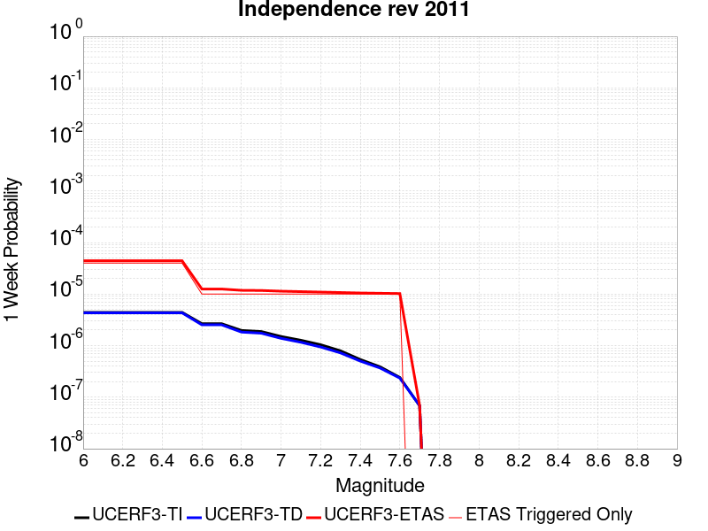 | 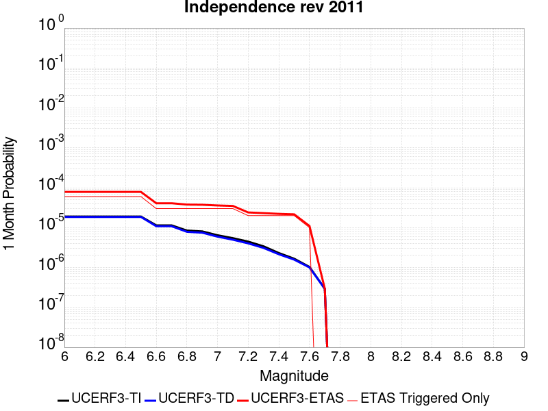 | 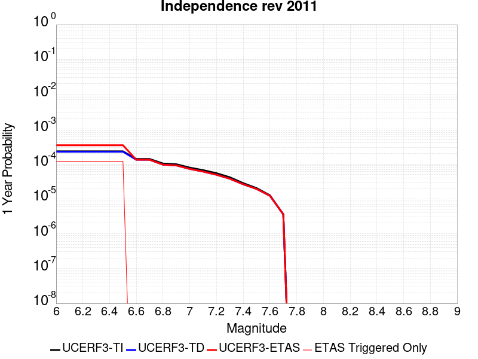 | 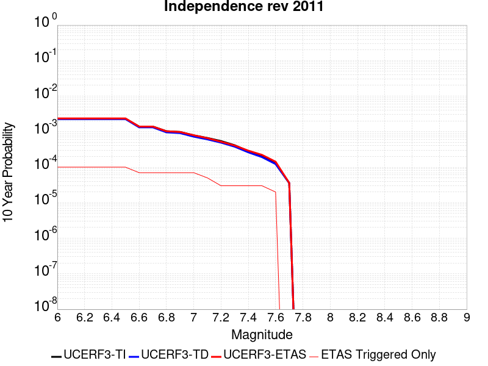 |

| Magnitude | 1 wk TI Prob | 1 wk TD Prob | 1 wk ETAS Prob | 1 wk ETAS/TD Gain | 1 wk ETAS Triggered Only | 1 mo TI Prob | 1 mo TD Prob | 1 mo ETAS Prob | 1 mo ETAS/TD Gain | 1 mo ETAS Triggered Only | 1 yr TI Prob | 1 yr TD Prob | 1 yr ETAS Prob | 1 yr ETAS/TD Gain | 1 yr ETAS Triggered Only | 10 yr TI Prob | 10 yr TD Prob | 10 yr ETAS Prob | 10 yr ETAS/TD Gain | 10 yr ETAS Triggered Only |
|-----|-----|-----|-----|-----|-----|-----|-----|-----|-----|-----|-----|-----|-----|-----|-----|-----|-----|-----|-----|-----|
| 6.0 | 4.422171E-6 | 4.3262253E-6 | 4.432605E-5 | 10.245895 | 4.0E-5 | 1.8952025E-5 | 1.8540852E-5 | 7.8539735E-5 | 4.2360373 | 6.0E-5 | 2.3071647E-4 | 2.2571447E-4 | 2.8570092E-4 | 1.2657626 | 6.0E-5 | 0.0023047708 | 0.0022551457 | 0.0023549201 | 1.044243 | 1.0E-4 |
| 6.1 | 4.422171E-6 | 4.3262253E-6 | 4.432605E-5 | 10.245895 | 4.0E-5 | 1.8952025E-5 | 1.8540852E-5 | 7.8539735E-5 | 4.2360373 | 6.0E-5 | 2.3071647E-4 | 2.2571447E-4 | 2.8570092E-4 | 1.2657626 | 6.0E-5 | 0.0023047708 | 0.0022551457 | 0.0023549201 | 1.044243 | 1.0E-4 |
| 6.2 | 4.422171E-6 | 4.3262253E-6 | 4.432605E-5 | 10.245895 | 4.0E-5 | 1.8952025E-5 | 1.8540852E-5 | 7.8539735E-5 | 4.2360373 | 6.0E-5 | 2.3071647E-4 | 2.2571447E-4 | 2.8570092E-4 | 1.2657626 | 6.0E-5 | 0.0023047708 | 0.0022551457 | 0.0023549201 | 1.044243 | 1.0E-4 |
| 6.3 | 4.422171E-6 | 4.3262253E-6 | 4.432605E-5 | 10.245895 | 4.0E-5 | 1.8952025E-5 | 1.8540852E-5 | 7.8539735E-5 | 4.2360373 | 6.0E-5 | 2.3071647E-4 | 2.2571447E-4 | 2.8570092E-4 | 1.2657626 | 6.0E-5 | 0.0023047708 | 0.0022551457 | 0.0023549201 | 1.044243 | 1.0E-4 |
| 6.4 | 4.422171E-6 | 4.3262253E-6 | 4.432605E-5 | 10.245895 | 4.0E-5 | 1.8952025E-5 | 1.8540852E-5 | 7.8539735E-5 | 4.2360373 | 6.0E-5 | 2.3071647E-4 | 2.2571447E-4 | 2.8570092E-4 | 1.2657626 | 6.0E-5 | 0.0023047708 | 0.0022551457 | 0.0023549201 | 1.044243 | 1.0E-4 |
| 6.5 | 4.422171E-6 | 4.3262253E-6 | 4.432605E-5 | 10.245895 | 4.0E-5 | 1.8952025E-5 | 1.8540852E-5 | 7.8539735E-5 | 4.2360373 | 6.0E-5 | 2.3071647E-4 | 2.2571447E-4 | 2.8570092E-4 | 1.2657626 | 6.0E-5 | 0.0023047708 | 0.0022551457 | 0.0023549201 | 1.044243 | 1.0E-4 |
| 6.6 | 2.663744E-6 | 2.5319846E-6 | 1.2531959E-5 | 4.949461 | 1.0E-5 | 1.1415996E-5 | 1.08513195E-5 | 4.0850995E-5 | 3.7646105 | 3.0E-5 | 1.3898089E-4 | 1.321073E-4 | 1.6210333E-4 | 1.2270582 | 3.0E-5 | 0.0013889399 | 0.0013203359 | 0.0013902435 | 1.0529468 | 7.0E-5 |
| 6.7 | 2.663744E-6 | 2.5319846E-6 | 1.2531959E-5 | 4.949461 | 1.0E-5 | 1.1415996E-5 | 1.08513195E-5 | 4.0850995E-5 | 3.7646105 | 3.0E-5 | 1.3898089E-4 | 1.321073E-4 | 1.6210333E-4 | 1.2270582 | 3.0E-5 | 0.0013889399 | 0.0013203359 | 0.0013902435 | 1.0529468 | 7.0E-5 |
| 6.8 | 1.9716529E-6 | 1.8322567E-6 | 1.1832239E-5 | 6.457741 | 1.0E-5 | 8.449913E-6 | 7.852505E-6 | 3.785227E-5 | 4.820407 | 3.0E-5 | 1.0287284E-4 | 9.560019E-5 | 1.2559732E-4 | 1.3137769 | 3.0E-5 | 0.0010282523 | 9.5560355E-4 | 0.0010255367 | 1.0731821 | 7.0E-5 |
| 6.9 | 1.8788617E-6 | 1.7429976E-6 | 1.174298E-5 | 6.7372327 | 1.0E-5 | 8.0522395E-6 | 7.4699688E-6 | 3.7469745E-5 | 5.016051 | 3.0E-5 | 9.80316E-5 | 9.09432E-5 | 1.20940465E-4 | 1.3298463 | 3.0E-5 | 9.798837E-4 | 9.090718E-4 | 9.790082E-4 | 1.0769316 | 7.0E-5 |
| 7.0 | 1.5045488E-6 | 1.3849498E-6 | 1.13849355E-5 | 8.2204685 | 1.0E-5 | 6.44805E-6 | 5.9354857E-6 | 3.5935307E-5 | 6.0543165 | 3.0E-5 | 7.8502184E-5 | 7.226219E-5 | 1.02260026E-4 | 1.4151249 | 3.0E-5 | 7.8474457E-4 | 7.223921E-4 | 7.9234154E-4 | 1.0968302 | 7.0E-5 |
| 7.1 | 1.272341E-6 | 1.1625089E-6 | 1.1162498E-5 | 9.602075 | 1.0E-5 | 5.4528787E-6 | 4.9821715E-6 | 3.4982022E-5 | 7.0214405 | 3.0E-5 | 6.6386776E-5 | 6.0656283E-5 | 9.065446E-5 | 1.4945601 | 3.0E-5 | 6.636695E-4 | 6.064005E-4 | 6.5637013E-4 | 1.0824038 | 5.0E-5 |
| 7.2 | 1.0416892E-6 | 9.409871E-7 | 1.09409775E-5 | 11.627129 | 1.0E-5 | 4.464375E-6 | 4.032796E-6 | 2.4032715E-5 | 5.9593186 | 2.0E-5 | 5.4352407E-5 | 4.9098202E-5 | 6.9097216E-5 | 1.4073269 | 2.0E-5 | 5.4339116E-4 | 4.908754E-4 | 5.2086066E-4 | 1.0610853 | 3.0E-5 |
| 7.3 | 7.9450155E-7 | 7.2350036E-7 | 1.0723493E-5 | 14.821683 | 1.0E-5 | 3.4050022E-6 | 3.1007123E-6 | 2.310065E-5 | 7.450111 | 2.0E-5 | 4.1455114E-5 | 3.7750528E-5 | 5.7749774E-5 | 1.529774 | 2.0E-5 | 4.144738E-4 | 3.7744228E-4 | 4.0743095E-4 | 1.0794524 | 3.0E-5 |
| 7.4 | 5.3893444E-7 | 5.0195166E-7 | 1.0501946E-5 | 20.922228 | 1.0E-5 | 2.309717E-6 | 2.1512196E-6 | 2.2151176E-5 | 10.297031 | 2.0E-5 | 2.8120441E-5 | 2.6190788E-5 | 4.6190264E-5 | 1.7636073 | 2.0E-5 | 2.8116882E-4 | 2.6187746E-4 | 2.9186963E-4 | 1.1145273 | 3.0E-5 |
| 7.5 | 3.8852085E-7 | 3.6825622E-7 | 1.0368252E-5 | 28.154995 | 1.0E-5 | 1.6650882E-6 | 1.57824E-6 | 2.157821E-5 | 13.672323 | 2.0E-5 | 2.027226E-5 | 1.9214905E-5 | 3.921452E-5 | 2.0408387 | 2.0E-5 | 2.0270412E-4 | 1.9213265E-4 | 2.221269E-4 | 1.1561121 | 3.0E-5 |
| 7.6 | 2.414929E-7 | 2.3457605E-7 | 1.0234574E-5 | 43.63009 | 1.0E-5 | 1.0349692E-6 | 1.0053255E-6 | 1.1005315E-5 | 10.947017 | 1.0E-5 | 1.2600677E-5 | 1.2239771E-5 | 2.2239648E-5 | 1.8169987 | 1.0E-5 | 1.2599962E-4 | 1.223911E-4 | 1.4238864E-4 | 1.1633906 | 2.0E-5 |
| 7.7 | 6.8298014E-8 | 6.8589785E-8 | 6.8589785E-8 | 1.0 | 0.0 | 2.9270575E-7 | 2.939562E-7 | 2.939562E-7 | 1.0 | 0.0 | 3.5636867E-6 | 3.5789112E-6 | 3.5789112E-6 | 1.0 | 0.0 | 3.5636294E-5 | 3.5788584E-5 | 3.5788584E-5 | 1.0 | 0.0 |

## Oceanic - West Huasna
*[(top)](#table-of-contents)*

| 1 Week | 1 Month | 1 Year | 10 Year |
|-----|-----|-----|-----|
| 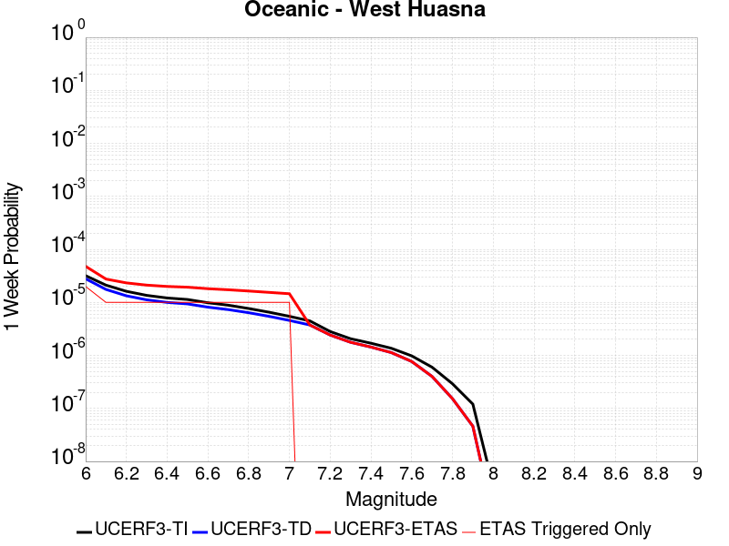 | 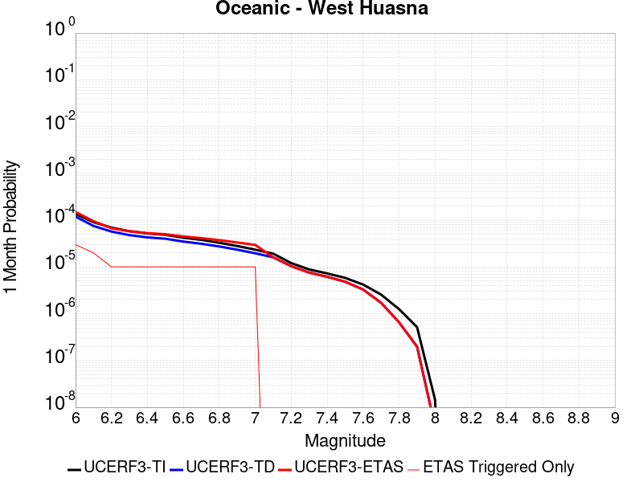 | 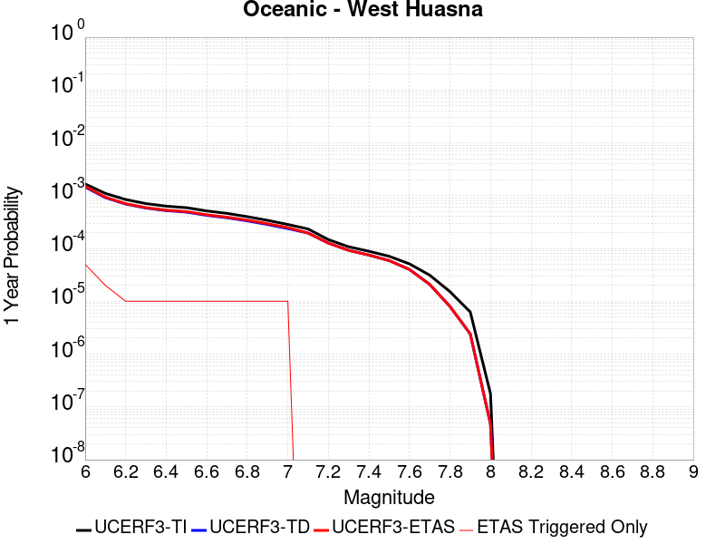 | 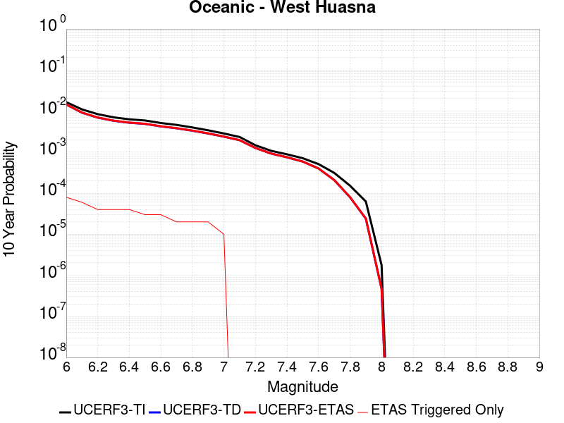 |

| Magnitude | 1 wk TI Prob | 1 wk TD Prob | 1 wk ETAS Prob | 1 wk ETAS/TD Gain | 1 wk ETAS Triggered Only | 1 mo TI Prob | 1 mo TD Prob | 1 mo ETAS Prob | 1 mo ETAS/TD Gain | 1 mo ETAS Triggered Only | 1 yr TI Prob | 1 yr TD Prob | 1 yr ETAS Prob | 1 yr ETAS/TD Gain | 1 yr ETAS Triggered Only | 10 yr TI Prob | 10 yr TD Prob | 10 yr ETAS Prob | 10 yr ETAS/TD Gain | 10 yr ETAS Triggered Only |
|-----|-----|-----|-----|-----|-----|-----|-----|-----|-----|-----|-----|-----|-----|-----|-----|-----|-----|-----|-----|-----|
| 6.0 | 3.195567E-5 | 2.7926368E-5 | 4.792581E-5 | 1.7161491 | 2.0E-5 | 1.3694567E-4 | 1.19679185E-4 | 1.496756E-4 | 1.2506402 | 3.0E-5 | 0.0016660384 | 0.0014561634 | 0.0015060905 | 1.0342869 | 5.0E-5 | 0.016536033 | 0.01447077 | 0.014549613 | 1.0054483 | 8.0E-5 |
| 6.1 | 2.1156782E-5 | 1.7573117E-5 | 2.7572942E-5 | 1.569041 | 1.0E-5 | 9.066878E-5 | 7.531123E-5 | 9.530973E-5 | 1.2655447 | 2.0E-5 | 0.0011033333 | 9.1653795E-4 | 9.3651965E-4 | 1.0218012 | 2.0E-5 | 0.010978713 | 0.009128587 | 0.009188039 | 1.0065128 | 6.0E-5 |
| 6.2 | 1.6195117E-5 | 1.3327227E-5 | 2.3327093E-5 | 1.7503337 | 1.0E-5 | 6.9405796E-5 | 5.7115452E-5 | 6.711488E-5 | 1.175074 | 1.0E-5 | 8.44688E-4 | 6.9516135E-4 | 7.051544E-4 | 1.0143751 | 1.0E-5 | 0.008414844 | 0.0069301617 | 0.0069698845 | 1.0057318 | 4.0E-5 |
| 6.3 | 1.3559345E-5 | 1.1179013E-5 | 2.1178901E-5 | 1.8945234 | 1.0E-5 | 5.811018E-5 | 4.7909183E-5 | 5.7908703E-5 | 1.2087183 | 1.0E-5 | 7.072618E-4 | 5.8313913E-4 | 5.931333E-4 | 1.0171386 | 1.0E-5 | 0.0070501505 | 0.005816208 | 0.005855975 | 1.0068374 | 4.0E-5 |
| 6.4 | 1.2120619E-5 | 1.0000874E-5 | 2.0000774E-5 | 1.9999026 | 1.0E-5 | 5.1944477E-5 | 4.2860185E-5 | 5.285976E-5 | 1.2333068 | 1.0E-5 | 6.322405E-4 | 5.216983E-4 | 5.316931E-4 | 1.0191581 | 1.0E-5 | 0.006304447 | 0.005204804 | 0.0052445955 | 1.0076452 | 4.0E-5 |
| 6.5 | 1.13511915E-5 | 9.367378E-6 | 1.9367284E-5 | 2.0675244 | 1.0E-5 | 4.8647056E-5 | 4.0145293E-5 | 5.0144892E-5 | 1.2490852 | 1.0E-5 | 5.9211696E-4 | 4.886598E-4 | 4.9865484E-4 | 1.0204542 | 1.0E-5 | 0.0059054173 | 0.0048759114 | 0.004905765 | 1.0061227 | 3.0E-5 |
| 6.6 | 9.850605E-6 | 8.1353155E-6 | 1.8135233E-5 | 2.2291987 | 1.0E-5 | 4.2216197E-5 | 3.4865174E-5 | 4.4864824E-5 | 1.2868092 | 1.0E-5 | 5.1386096E-4 | 4.2440102E-4 | 4.343968E-4 | 1.0235527 | 1.0E-5 | 0.0051267436 | 0.0042359377 | 0.004265811 | 1.0070523 | 3.0E-5 |
| 6.7 | 8.8558645E-6 | 7.318341E-6 | 1.7318267E-5 | 2.36642 | 1.0E-5 | 3.7953152E-5 | 3.1363943E-5 | 4.136363E-5 | 1.3188275 | 1.0E-5 | 4.6198163E-4 | 3.8178926E-4 | 3.9178543E-4 | 1.0261824 | 1.0E-5 | 0.004610224 | 0.0038113592 | 0.003831283 | 1.0052274 | 2.0E-5 |
| 6.8 | 7.67136E-6 | 6.39169E-6 | 1.6391627E-5 | 2.5645216 | 1.0E-5 | 3.2876844E-5 | 2.739267E-5 | 3.7392398E-5 | 1.3650512 | 1.0E-5 | 4.0020206E-4 | 3.3345487E-4 | 3.4345154E-4 | 1.0299791 | 1.0E-5 | 0.003994821 | 0.0033295664 | 0.0033494998 | 1.0059868 | 2.0E-5 |
| 6.9 | 6.534529E-6 | 5.458261E-6 | 1.5458207E-5 | 2.8320754 | 1.0E-5 | 2.8004823E-5 | 2.3392338E-5 | 3.3392105E-5 | 1.4274805 | 1.0E-5 | 3.4090536E-4 | 2.8476462E-4 | 2.9476176E-4 | 1.0351068 | 1.0E-5 | 0.0034038287 | 0.002844014 | 0.002863957 | 1.0070124 | 2.0E-5 |
| 7.0 | 5.460525E-6 | 4.5699203E-6 | 1.4569874E-5 | 3.1882122 | 1.0E-5 | 2.3402039E-5 | 1.9585226E-5 | 2.958503E-5 | 1.510579 | 1.0E-5 | 2.8488258E-4 | 2.3842414E-4 | 2.4842177E-4 | 1.0419321 | 1.0E-5 | 0.0028451765 | 0.0023816973 | 0.0023916736 | 1.0041887 | 1.0E-5 |
| 7.1 | 4.4825083E-6 | 3.7524153E-6 | 3.7524153E-6 | 1.0 | 0.0 | 1.9210609E-5 | 1.6081682E-5 | 1.6081682E-5 | 1.0 | 0.0 | 2.3386406E-4 | 1.9577699E-4 | 1.9577699E-4 | 1.0 | 0.0 | 0.002336181 | 0.001956057 | 0.001956057 | 1.0 | 0.0 |
| 7.2 | 2.821708E-6 | 2.424941E-6 | 2.424941E-6 | 1.0 | 0.0 | 1.2092979E-5 | 1.0392562E-5 | 1.0392562E-5 | 1.0 | 0.0 | 1.4722206E-4 | 1.265221E-4 | 1.265221E-4 | 1.0 | 0.0 | 0.0014712457 | 0.0012645032 | 0.0012645032 | 1.0 | 0.0 |
| 7.3 | 2.0644757E-6 | 1.7687502E-6 | 1.7687502E-6 | 1.0 | 0.0 | 8.847723E-6 | 7.580336E-6 | 7.580336E-6 | 1.0 | 0.0 | 1.0771569E-4 | 9.228668E-5 | 9.228668E-5 | 1.0 | 0.0 | 0.001076635 | 9.224854E-4 | 9.224854E-4 | 1.0 | 0.0 |
| 7.4 | 1.6980367E-6 | 1.4379966E-6 | 1.4379966E-6 | 1.0 | 0.0 | 7.27728E-6 | 6.1628284E-6 | 6.1628284E-6 | 1.0 | 0.0 | 8.8597284E-5 | 7.502986E-5 | 7.502986E-5 | 1.0 | 0.0 | 8.8561967E-4 | 7.5004686E-4 | 7.5004686E-4 | 1.0 | 0.0 |
| 7.5 | 1.3637683E-6 | 1.1302697E-6 | 1.1302697E-6 | 1.0 | 0.0 | 5.844708E-6 | 4.844004E-6 | 4.844004E-6 | 1.0 | 0.0 | 7.1156996E-5 | 5.897415E-5 | 5.897415E-5 | 1.0 | 0.0 | 7.1134215E-4 | 5.8958656E-4 | 5.8958656E-4 | 1.0 | 0.0 |
| 7.6 | 9.802994E-7 | 7.6772847E-7 | 7.6772847E-7 | 1.0 | 0.0 | 4.2012766E-6 | 3.2902608E-6 | 3.2902608E-6 | 1.0 | 0.0 | 5.1149345E-5 | 4.005819E-5 | 4.005819E-5 | 1.0 | 0.0 | 5.113757E-4 | 4.0051117E-4 | 4.0051117E-4 | 1.0 | 0.0 |
| 7.7 | 5.986191E-7 | 4.0050708E-7 | 4.0050708E-7 | 1.0 | 0.0 | 2.5655079E-6 | 1.7164577E-6 | 1.7164577E-6 | 1.0 | 0.0 | 3.1234613E-5 | 2.0897673E-5 | 2.0897673E-5 | 1.0 | 0.0 | 3.123022E-4 | 2.0895849E-4 | 2.0895849E-4 | 1.0 | 0.0 |
| 7.8 | 2.9189815E-7 | 1.5285202E-7 | 1.5285202E-7 | 1.0 | 0.0 | 1.2509914E-6 | 6.5507993E-7 | 6.5507993E-7 | 1.0 | 0.0 | 1.5230714E-5 | 7.975569E-6 | 7.975569E-6 | 1.0 | 0.0 | 1.522967E-4 | 7.97542E-5 | 7.97542E-5 | 1.0 | 0.0 |
| 7.9 | 1.2057845E-7 | 4.6208047E-8 | 4.6208047E-8 | 1.0 | 0.0 | 5.1676466E-7 | 1.9803447E-7 | 1.9803447E-7 | 1.0 | 0.0 | 6.2915915E-6 | 2.411067E-6 | 2.411067E-6 | 1.0 | 0.0 | 6.2914136E-5 | 2.4111772E-5 | 2.4111772E-5 | 1.0 | 0.0 |
| 8.0 | 3.3806387E-9 | 9.0093144E-10 | 9.0093144E-10 | 1.0 | 0.0 | 1.4488451E-8 | 3.8611354E-9 | 3.8611354E-9 | 1.0 | 0.0 | 1.7639688E-7 | 4.7009323E-8 | 4.7009323E-8 | 1.0 | 0.0 | 1.7639674E-6 | 4.712806E-7 | 4.712806E-7 | 1.0 | 0.0 |

## Chino alt 1
*[(top)](#table-of-contents)*

| 1 Week | 1 Month | 1 Year | 10 Year |
|-----|-----|-----|-----|
|  | 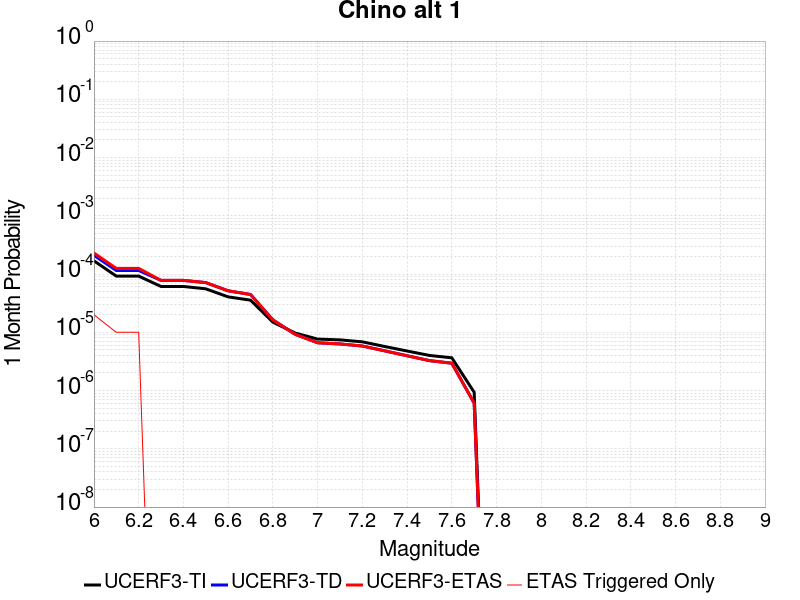 | 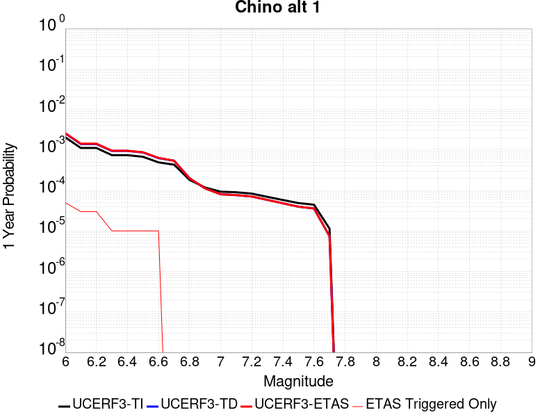 |  |

| Magnitude | 1 wk TI Prob | 1 wk TD Prob | 1 wk ETAS Prob | 1 wk ETAS/TD Gain | 1 wk ETAS Triggered Only | 1 mo TI Prob | 1 mo TD Prob | 1 mo ETAS Prob | 1 mo ETAS/TD Gain | 1 mo ETAS Triggered Only | 1 yr TI Prob | 1 yr TD Prob | 1 yr ETAS Prob | 1 yr ETAS/TD Gain | 1 yr ETAS Triggered Only | 10 yr TI Prob | 10 yr TD Prob | 10 yr ETAS Prob | 10 yr ETAS/TD Gain | 10 yr ETAS Triggered Only |
|-----|-----|-----|-----|-----|-----|-----|-----|-----|-----|-----|-----|-----|-----|-----|-----|-----|-----|-----|-----|-----|
| 6.0 | 3.939946E-5 | 4.894798E-5 | 4.894798E-5 | 1.0 | 0.0 | 1.6884391E-4 | 2.0976314E-4 | 2.2975894E-4 | 1.0953256 | 2.0E-5 | 0.0020537362 | 0.002551385 | 0.0026012575 | 1.0195472 | 5.0E-5 | 0.020348595 | 0.025280168 | 0.025367893 | 1.0034701 | 9.0E-5 |
| 6.1 | 2.1505624E-5 | 2.6878823E-5 | 2.6878823E-5 | 1.0 | 0.0 | 9.2163704E-5 | 1.15190494E-4 | 1.2518934E-4 | 1.0868027 | 1.0E-5 | 0.0011215154 | 0.0014016517 | 0.0014316096 | 1.0213733 | 3.0E-5 | 0.011158722 | 0.013947425 | 0.014006589 | 1.0042418 | 6.0E-5 |
| 6.2 | 2.1505624E-5 | 2.6878823E-5 | 2.6878823E-5 | 1.0 | 0.0 | 9.2163704E-5 | 1.15190494E-4 | 1.2518934E-4 | 1.0868027 | 1.0E-5 | 0.0011215154 | 0.0014016517 | 0.0014316096 | 1.0213733 | 3.0E-5 | 0.011158722 | 0.013947425 | 0.014006589 | 1.0042418 | 6.0E-5 |
| 6.3 | 1.4290785E-5 | 1.8164832E-5 | 1.8164832E-5 | 1.0 | 0.0 | 6.1244784E-5 | 7.784722E-5 | 7.784722E-5 | 1.0 | 0.0 | 7.454001E-4 | 9.4742293E-4 | 9.5741346E-4 | 1.0105449 | 1.0E-5 | 0.007429048 | 0.00944674 | 0.009466551 | 1.0020971 | 2.0E-5 |
| 6.4 | 1.4290785E-5 | 1.8164832E-5 | 1.8164832E-5 | 1.0 | 0.0 | 6.1244784E-5 | 7.784722E-5 | 7.784722E-5 | 1.0 | 0.0 | 7.454001E-4 | 9.4742293E-4 | 9.5741346E-4 | 1.0105449 | 1.0E-5 | 0.007429048 | 0.00944674 | 0.009466551 | 1.0020971 | 2.0E-5 |
| 6.5 | 1.3017944E-5 | 1.6651793E-5 | 1.6651793E-5 | 1.0 | 0.0 | 5.5789995E-5 | 7.1363116E-5 | 7.1363116E-5 | 1.0 | 0.0 | 6.790315E-4 | 8.6854334E-4 | 8.785347E-4 | 1.0115036 | 1.0E-5 | 0.0067696036 | 0.008664233 | 0.00868406 | 1.0022883 | 2.0E-5 |
| 6.6 | 9.470016E-6 | 1.2039209E-5 | 1.2039209E-5 | 1.0 | 0.0 | 4.058515E-5 | 5.159578E-5 | 5.159578E-5 | 1.0 | 0.0 | 4.940122E-4 | 6.280315E-4 | 6.3802523E-4 | 1.0159128 | 1.0E-5 | 0.004929154 | 0.006273248 | 0.006293122 | 1.0031681 | 2.0E-5 |
| 6.7 | 8.314155E-6 | 1.040749E-5 | 1.040749E-5 | 1.0 | 0.0 | 3.5631605E-5 | 4.4602948E-5 | 4.4602948E-5 | 1.0 | 0.0 | 4.3372845E-4 | 5.4293784E-4 | 5.4293784E-4 | 1.0 | 0.0 | 0.004328829 | 0.0054270807 | 0.0054370263 | 1.0018326 | 1.0E-5 |
| 6.8 | 3.4856364E-6 | 3.8134033E-6 | 3.8134033E-6 | 1.0 | 0.0 | 1.4938357E-5 | 1.6343065E-5 | 1.6343065E-5 | 1.0 | 0.0 | 1.8185932E-4 | 1.9896074E-4 | 1.9896074E-4 | 1.0 | 0.0 | 0.0018171056 | 0.0019894529 | 0.0019894529 | 1.0 | 0.0 |
| 6.9 | 2.2645952E-6 | 2.152909E-6 | 2.152909E-6 | 1.0 | 0.0 | 9.705372E-6 | 9.226722E-6 | 9.226722E-6 | 1.0 | 0.0 | 1.18156495E-4 | 1.12329755E-4 | 1.12329755E-4 | 1.0 | 0.0 | 0.0011809369 | 0.0011233138 | 0.0011233138 | 1.0 | 0.0 |
| 7.0 | 1.7864003E-6 | 1.5430741E-6 | 1.5430741E-6 | 1.0 | 0.0 | 7.655979E-6 | 6.613158E-6 | 6.613158E-6 | 1.0 | 0.0 | 9.3207556E-5 | 8.051228E-5 | 8.051228E-5 | 1.0 | 0.0 | 9.316847E-4 | 8.052856E-4 | 8.052856E-4 | 1.0 | 0.0 |
| 7.1 | 1.7315456E-6 | 1.4733466E-6 | 1.4733466E-6 | 1.0 | 0.0 | 7.420889E-6 | 6.314328E-6 | 6.314328E-6 | 1.0 | 0.0 | 9.034557E-5 | 7.687428E-5 | 7.687428E-5 | 1.0 | 0.0 | 9.0308854E-4 | 7.68921E-4 | 7.68921E-4 | 1.0 | 0.0 |
| 7.2 | 1.6008337E-6 | 1.3574178E-6 | 1.3574178E-6 | 1.0 | 0.0 | 6.860698E-6 | 5.817492E-6 | 5.817492E-6 | 1.0 | 0.0 | 8.352579E-5 | 7.082572E-5 | 7.082572E-5 | 1.0 | 0.0 | 8.34944E-4 | 7.0846075E-4 | 7.0846075E-4 | 1.0 | 0.0 |
| 7.3 | 1.3320939E-6 | 1.1217794E-6 | 1.1217794E-6 | 1.0 | 0.0 | 5.7089615E-6 | 4.8076176E-6 | 4.8076176E-6 | 1.0 | 0.0 | 6.9504385E-5 | 5.853122E-5 | 5.853122E-5 | 1.0 | 0.0 | 6.9482654E-4 | 5.8530655E-4 | 5.8530655E-4 | 1.0 | 0.0 |
| 7.4 | 1.114294E-6 | 9.237087E-7 | 9.237087E-7 | 1.0 | 0.0 | 4.775537E-6 | 3.9587458E-6 | 3.9587458E-6 | 1.0 | 0.0 | 5.8140613E-5 | 4.81967E-5 | 4.81967E-5 | 1.0 | 0.0 | 5.81254E-4 | 4.8187698E-4 | 4.8187698E-4 | 1.0 | 0.0 |
| 7.5 | 9.354081E-7 | 7.6233886E-7 | 7.6233886E-7 | 1.0 | 0.0 | 4.0088858E-6 | 3.2671626E-6 | 3.2671626E-6 | 1.0 | 0.0 | 4.8807087E-5 | 3.9777013E-5 | 3.9777013E-5 | 1.0 | 0.0 | 4.879637E-4 | 3.9770233E-4 | 3.9770233E-4 | 1.0 | 0.0 |
| 7.6 | 8.521771E-7 | 6.880688E-7 | 6.880688E-7 | 1.0 | 0.0 | 3.6521824E-6 | 2.948863E-6 | 2.948863E-6 | 1.0 | 0.0 | 4.4464414E-5 | 3.590185E-5 | 3.590185E-5 | 1.0 | 0.0 | 4.4455516E-4 | 3.5896365E-4 | 3.5896365E-4 | 1.0 | 0.0 |
| 7.7 | 2.1803626E-7 | 1.4186368E-7 | 1.4186368E-7 | 1.0 | 0.0 | 9.344408E-7 | 6.0798715E-7 | 6.0798715E-7 | 1.0 | 0.0 | 1.1376757E-5 | 7.4022278E-6 | 7.4022278E-6 | 1.0 | 0.0 | 1.13761744E-4 | 7.402077E-5 | 7.402077E-5 | 1.0 | 0.0 |

## Elysian Park (Upper)
*[(top)](#table-of-contents)*

| 1 Week | 1 Month | 1 Year | 10 Year |
|-----|-----|-----|-----|
| 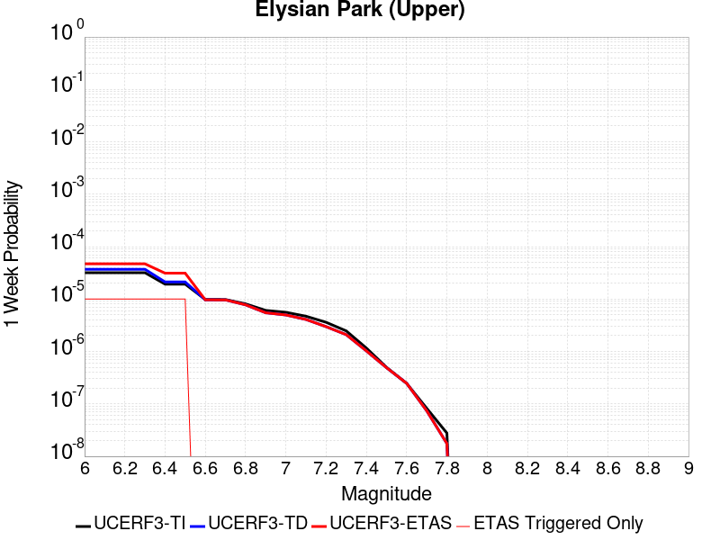 | 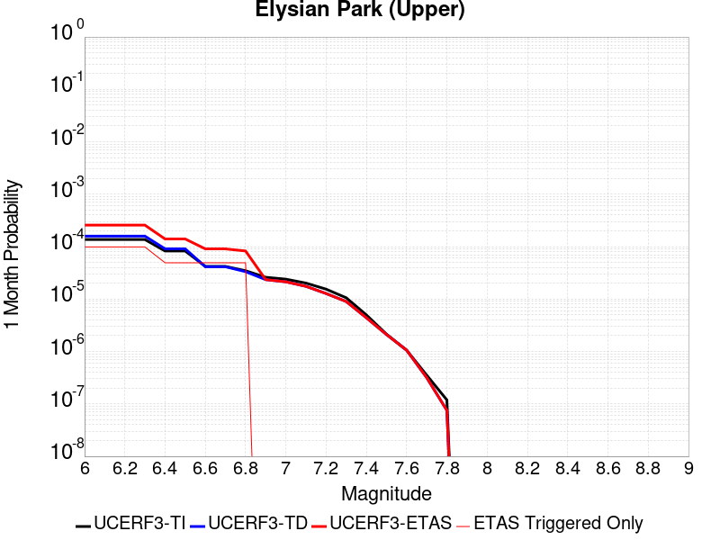 | 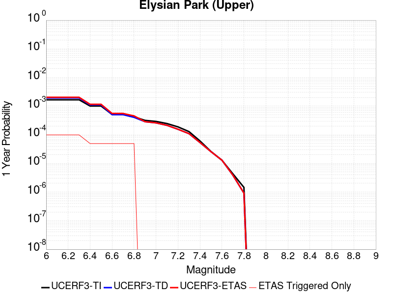 |  |

| Magnitude | 1 wk TI Prob | 1 wk TD Prob | 1 wk ETAS Prob | 1 wk ETAS/TD Gain | 1 wk ETAS Triggered Only | 1 mo TI Prob | 1 mo TD Prob | 1 mo ETAS Prob | 1 mo ETAS/TD Gain | 1 mo ETAS Triggered Only | 1 yr TI Prob | 1 yr TD Prob | 1 yr ETAS Prob | 1 yr ETAS/TD Gain | 1 yr ETAS Triggered Only | 10 yr TI Prob | 10 yr TD Prob | 10 yr ETAS Prob | 10 yr ETAS/TD Gain | 10 yr ETAS Triggered Only |
|-----|-----|-----|-----|-----|-----|-----|-----|-----|-----|-----|-----|-----|-----|-----|-----|-----|-----|-----|-----|-----|
| 6.0 | 3.1876025E-5 | 3.7035275E-5 | 4.7034904E-5 | 1.2700028 | 1.0E-5 | 1.3660437E-4 | 1.5871569E-4 | 1.8871092E-4 | 1.1889873 | 3.0E-5 | 0.0016618895 | 0.001931122 | 0.0019710448 | 1.0206734 | 4.0E-5 | 0.016495159 | 0.019189863 | 0.019268326 | 1.0040889 | 8.0E-5 |
| 6.1 | 3.1876025E-5 | 3.7035275E-5 | 4.7034904E-5 | 1.2700028 | 1.0E-5 | 1.3660437E-4 | 1.5871569E-4 | 1.8871092E-4 | 1.1889873 | 3.0E-5 | 0.0016618895 | 0.001931122 | 0.0019710448 | 1.0206734 | 4.0E-5 | 0.016495159 | 0.019189863 | 0.019268326 | 1.0040889 | 8.0E-5 |
| 6.2 | 3.1876025E-5 | 3.7035275E-5 | 4.7034904E-5 | 1.2700028 | 1.0E-5 | 1.3660437E-4 | 1.5871569E-4 | 1.8871092E-4 | 1.1889873 | 3.0E-5 | 0.0016618895 | 0.001931122 | 0.0019710448 | 1.0206734 | 4.0E-5 | 0.016495159 | 0.019189863 | 0.019268326 | 1.0040889 | 8.0E-5 |
| 6.3 | 3.1876025E-5 | 3.7035275E-5 | 4.7034904E-5 | 1.2700028 | 1.0E-5 | 1.3660437E-4 | 1.5871569E-4 | 1.8871092E-4 | 1.1889873 | 3.0E-5 | 0.0016618895 | 0.001931122 | 0.0019710448 | 1.0206734 | 4.0E-5 | 0.016495159 | 0.019189863 | 0.019268326 | 1.0040889 | 8.0E-5 |
| 6.4 | 1.9273462E-5 | 2.120244E-5 | 3.1202228E-5 | 1.4716338 | 1.0E-5 | 8.259794E-5 | 9.086542E-5 | 1.108636E-4 | 1.2200857 | 2.0E-5 | 0.001005166 | 0.0011058967 | 0.0011258746 | 1.0180649 | 2.0E-5 | 0.010006315 | 0.011020744 | 0.0110800825 | 1.0053843 | 6.0E-5 |
| 6.5 | 1.9273462E-5 | 2.120244E-5 | 3.1202228E-5 | 1.4716338 | 1.0E-5 | 8.259794E-5 | 9.086542E-5 | 1.108636E-4 | 1.2200857 | 2.0E-5 | 0.001005166 | 0.0011058967 | 0.0011258746 | 1.0180649 | 2.0E-5 | 0.010006315 | 0.011020744 | 0.0110800825 | 1.0053843 | 6.0E-5 |
| 6.6 | 9.813258E-6 | 9.665589E-6 | 9.665589E-6 | 1.0 | 0.0 | 4.205614E-5 | 4.1423333E-5 | 5.1422918E-5 | 1.2413999 | 1.0E-5 | 5.119132E-4 | 5.042196E-4 | 5.1421457E-4 | 1.0198226 | 1.0E-5 | 0.005107356 | 0.0050314795 | 0.0050613284 | 1.0059325 | 3.0E-5 |
| 6.7 | 9.801478E-6 | 9.653158E-6 | 9.653158E-6 | 1.0 | 0.0 | 4.2005657E-5 | 4.137006E-5 | 5.1369647E-5 | 1.2417107 | 1.0E-5 | 5.112989E-4 | 5.0357135E-4 | 5.135663E-4 | 1.0198481 | 1.0E-5 | 0.0051012407 | 0.005025026 | 0.0050548753 | 1.0059401 | 3.0E-5 |
| 6.8 | 8.102489E-6 | 7.772994E-6 | 7.772994E-6 | 1.0 | 0.0 | 3.4724493E-5 | 3.3312434E-5 | 4.3312102E-5 | 1.3001782 | 1.0E-5 | 4.2268867E-4 | 4.0550836E-4 | 4.1550433E-4 | 1.0246505 | 1.0E-5 | 0.004218856 | 0.0040481784 | 0.0040780567 | 1.0073807 | 3.0E-5 |
| 6.9 | 6.08275E-6 | 5.481441E-6 | 5.481441E-6 | 1.0 | 0.0 | 2.6068668E-5 | 2.3491682E-5 | 2.3491682E-5 | 1.0 | 0.0 | 3.173398E-4 | 2.8597447E-4 | 2.8597447E-4 | 1.0 | 0.0 | 0.0031688702 | 0.0028561424 | 0.0028760852 | 1.0069824 | 2.0E-5 |
| 7.0 | 5.5995934E-6 | 4.9827686E-6 | 4.9827686E-6 | 1.0 | 0.0 | 2.3998036E-5 | 2.1354552E-5 | 2.1354552E-5 | 1.0 | 0.0 | 2.9213692E-4 | 2.5996132E-4 | 2.5996132E-4 | 1.0 | 0.0 | 0.0029175316 | 0.0025966396 | 0.0026165876 | 1.0076822 | 2.0E-5 |
| 7.1 | 4.709881E-6 | 4.0873906E-6 | 4.0873906E-6 | 1.0 | 0.0 | 2.0185047E-5 | 1.7517272E-5 | 1.7517272E-5 | 1.0 | 0.0 | 2.4572524E-4 | 2.1325232E-4 | 2.1325232E-4 | 1.0 | 0.0 | 0.002454537 | 0.0021305184 | 0.0021504757 | 1.0093673 | 2.0E-5 |
| 7.2 | 3.6063436E-6 | 2.9779412E-6 | 2.9779412E-6 | 1.0 | 0.0 | 1.5455667E-5 | 1.27625435E-5 | 1.27625435E-5 | 1.0 | 0.0 | 1.881565E-4 | 1.55373E-4 | 1.55373E-4 | 1.0 | 0.0 | 0.0018799726 | 0.0015526549 | 0.0015726238 | 1.0128611 | 2.0E-5 |
| 7.3 | 2.471135E-6 | 2.0954562E-6 | 2.0954562E-6 | 1.0 | 0.0 | 1.0590536E-5 | 8.980496E-6 | 8.980496E-6 | 1.0 | 0.0 | 1.2893214E-4 | 1.0933213E-4 | 1.0933213E-4 | 1.0 | 0.0 | 0.0012885736 | 0.0010927906 | 0.0011027798 | 1.0091408 | 1.0E-5 |
| 7.4 | 1.163943E-6 | 1.0275061E-6 | 1.0275061E-6 | 1.0 | 0.0 | 4.988318E-6 | 4.40359E-6 | 4.40359E-6 | 1.0 | 0.0 | 6.0731076E-5 | 5.361242E-5 | 5.361242E-5 | 1.0 | 0.0 | 6.071448E-4 | 5.3599785E-4 | 5.459925E-4 | 1.0186468 | 1.0E-5 |
| 7.5 | 4.99459E-7 | 4.917601E-7 | 4.917601E-7 | 1.0 | 0.0 | 2.140537E-6 | 2.1075416E-6 | 2.1075416E-6 | 1.0 | 0.0 | 2.6060725E-5 | 2.5659032E-5 | 2.5659032E-5 | 1.0 | 0.0 | 2.605767E-4 | 2.5656226E-4 | 2.5656226E-4 | 1.0 | 0.0 |
| 7.6 | 2.4667852E-7 | 2.4778313E-7 | 2.4778313E-7 | 1.0 | 0.0 | 1.0571932E-6 | 1.0619274E-6 | 1.0619274E-6 | 1.0 | 0.0 | 1.2871251E-5 | 1.2928893E-5 | 1.2928893E-5 | 1.0 | 0.0 | 1.2870505E-4 | 1.2928178E-4 | 1.2928178E-4 | 1.0 | 0.0 |
| 7.7 | 8.2312795E-8 | 7.3864214E-8 | 7.3864214E-8 | 1.0 | 0.0 | 3.527691E-7 | 3.165609E-7 | 3.165609E-7 | 1.0 | 0.0 | 4.294955E-6 | 3.854123E-6 | 3.854123E-6 | 1.0 | 0.0 | 4.2948723E-5 | 3.854068E-5 | 3.854068E-5 | 1.0 | 0.0 |
| 7.8 | 2.7819295E-8 | 1.7565618E-8 | 1.7565618E-8 | 1.0 | 0.0 | 1.1922555E-7 | 7.528122E-8 | 7.528122E-8 | 1.0 | 0.0 | 1.45157E-6 | 9.1654863E-7 | 9.1654863E-7 | 1.0 | 0.0 | 1.45156055E-5 | 9.165463E-6 | 9.165463E-6 | 1.0 | 0.0 |

## Mission Ridge-Arroyo Parida-Santa Ana
*[(top)](#table-of-contents)*

| 1 Week | 1 Month | 1 Year | 10 Year |
|-----|-----|-----|-----|
| 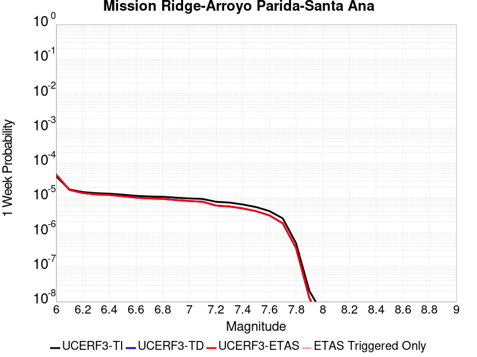 | 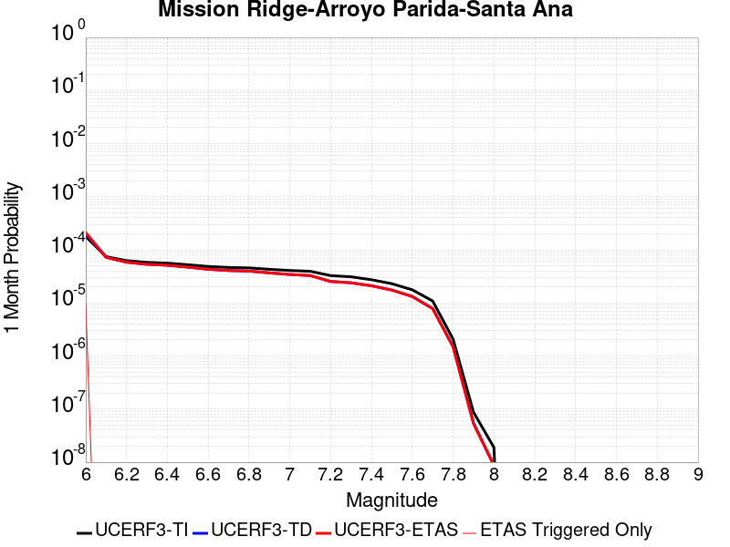 | 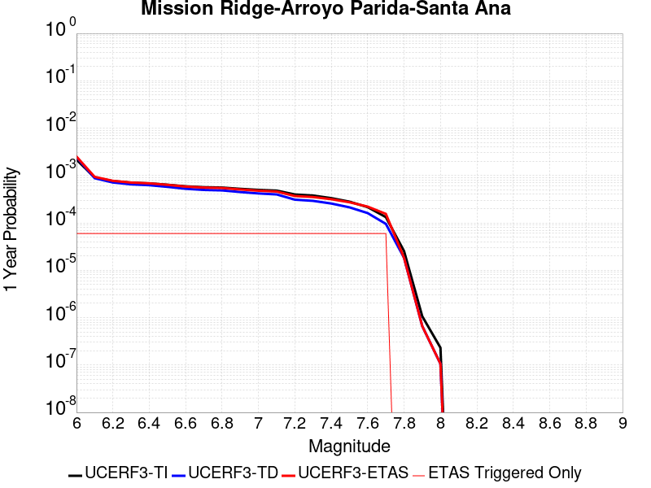 | 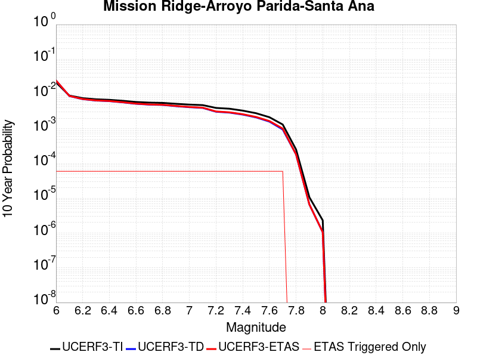 |

| Magnitude | 1 wk TI Prob | 1 wk TD Prob | 1 wk ETAS Prob | 1 wk ETAS/TD Gain | 1 wk ETAS Triggered Only | 1 mo TI Prob | 1 mo TD Prob | 1 mo ETAS Prob | 1 mo ETAS/TD Gain | 1 mo ETAS Triggered Only | 1 yr TI Prob | 1 yr TD Prob | 1 yr ETAS Prob | 1 yr ETAS/TD Gain | 1 yr ETAS Triggered Only | 10 yr TI Prob | 10 yr TD Prob | 10 yr ETAS Prob | 10 yr ETAS/TD Gain | 10 yr ETAS Triggered Only |
|-----|-----|-----|-----|-----|-----|-----|-----|-----|-----|-----|-----|-----|-----|-----|-----|-----|-----|-----|-----|-----|
| 6.0 | 4.169034E-5 | 4.7137048E-5 | 4.7137048E-5 | 1.0 | 0.0 | 1.7866064E-4 | 2.0200513E-4 | 2.1200311E-4 | 1.0494937 | 1.0E-5 | 0.0021730233 | 0.0024574657 | 0.002507343 | 1.0202962 | 5.0E-5 | 0.021518968 | 0.02438483 | 0.024462879 | 1.0032008 | 8.0E-5 |
| 6.1 | 1.73813E-5 | 1.6854203E-5 | 1.6854203E-5 | 1.0 | 0.0 | 7.4489166E-5 | 7.223036E-5 | 7.223036E-5 | 1.0 | 0.0 | 9.065282E-4 | 8.790605E-4 | 8.9904293E-4 | 1.0227315 | 2.0E-5 | 0.009028391 | 0.008757128 | 0.008786866 | 1.0033958 | 3.0E-5 |
| 6.2 | 1.4622182E-5 | 1.3673262E-5 | 1.3673262E-5 | 1.0 | 0.0 | 6.2664985E-5 | 5.85984E-5 | 5.85984E-5 | 1.0 | 0.0 | 7.6267915E-4 | 7.132059E-4 | 7.331916E-4 | 1.0280224 | 2.0E-5 | 0.007600669 | 0.007109767 | 0.007129625 | 1.0027931 | 2.0E-5 |
| 6.3 | 1.3552434E-5 | 1.2482174E-5 | 1.2482174E-5 | 1.0 | 0.0 | 5.8080568E-5 | 5.349395E-5 | 5.349395E-5 | 1.0 | 0.0 | 7.069015E-4 | 6.510974E-4 | 6.610909E-4 | 1.0153487 | 1.0E-5 | 0.00704657 | 0.006492415 | 0.00650235 | 1.0015303 | 1.0E-5 |
| 6.4 | 1.30977305E-5 | 1.1979128E-5 | 1.1979128E-5 | 1.0 | 0.0 | 5.613192E-5 | 5.133813E-5 | 5.133813E-5 | 1.0 | 0.0 | 6.831918E-4 | 6.2486547E-4 | 6.3485926E-4 | 1.0159935 | 1.0E-5 | 0.006810953 | 0.006231584 | 0.006241522 | 1.0015948 | 1.0E-5 |
| 6.5 | 1.225205E-5 | 1.1048776E-5 | 1.1048776E-5 | 1.0 | 0.0 | 5.2507727E-5 | 4.735105E-5 | 4.735105E-5 | 1.0 | 0.0 | 6.3909404E-4 | 5.7634927E-4 | 5.863435E-4 | 1.0173405 | 1.0E-5 | 0.006372592 | 0.005749009 | 0.0057589514 | 1.0017295 | 1.0E-5 |
| 6.6 | 1.1352241E-5 | 1.0063508E-5 | 1.0063508E-5 | 1.0 | 0.0 | 4.8651553E-5 | 4.3128617E-5 | 4.3128617E-5 | 1.0 | 0.0 | 5.921717E-4 | 5.249665E-4 | 5.349613E-4 | 1.0190388 | 1.0E-5 | 0.0059059616 | 0.0052376646 | 0.005247612 | 1.0018992 | 1.0E-5 |
| 6.7 | 1.0864116E-5 | 9.517E-6 | 9.517E-6 | 1.0 | 0.0 | 4.6559664E-5 | 4.0786515E-5 | 4.0786515E-5 | 1.0 | 0.0 | 5.667165E-4 | 4.964647E-4 | 5.0645974E-4 | 1.0201324 | 1.0E-5 | 0.005652734 | 0.0049539437 | 0.0049638944 | 1.0020086 | 1.0E-5 |
| 6.8 | 1.0666365E-5 | 9.299752E-6 | 9.299752E-6 | 1.0 | 0.0 | 4.571219E-5 | 3.985548E-5 | 3.985548E-5 | 1.0 | 0.0 | 5.564038E-4 | 4.8513446E-4 | 4.951296E-4 | 1.0206028 | 1.0E-5 | 0.005550127 | 0.00484114 | 0.0048510917 | 1.0020556 | 1.0E-5 |
| 6.9 | 1.0038665E-5 | 8.592018E-6 | 8.592018E-6 | 1.0 | 0.0 | 4.302214E-5 | 3.682243E-5 | 3.682243E-5 | 1.0 | 0.0 | 5.236687E-4 | 4.4822265E-4 | 4.5821816E-4 | 1.0223004 | 1.0E-5 | 0.005224364 | 0.0044735507 | 0.004483506 | 1.0022254 | 1.0E-5 |
| 7.0 | 9.5379955E-6 | 8.025047E-6 | 8.025047E-6 | 1.0 | 0.0 | 4.0876483E-5 | 3.439261E-5 | 3.439261E-5 | 1.0 | 0.0 | 4.975576E-4 | 4.1865133E-4 | 4.2864712E-4 | 1.0238762 | 1.0E-5 | 0.00496445 | 0.00417898 | 0.004188938 | 1.0023829 | 1.0E-5 |
| 7.1 | 9.207389E-6 | 7.652347E-6 | 7.652347E-6 | 1.0 | 0.0 | 3.945964E-5 | 3.2795375E-5 | 3.2795375E-5 | 1.0 | 0.0 | 4.803152E-4 | 3.992122E-4 | 4.092082E-4 | 1.0250393 | 1.0E-5 | 0.004792784 | 0.003985301 | 0.003995261 | 1.0024992 | 1.0E-5 |
| 7.2 | 7.638091E-6 | 5.9310923E-6 | 5.9310923E-6 | 1.0 | 0.0 | 3.2734264E-5 | 2.5418722E-5 | 2.5418722E-5 | 1.0 | 0.0 | 3.984668E-4 | 3.094293E-4 | 3.194262E-4 | 1.0323075 | 1.0E-5 | 0.0039775306 | 0.0030901956 | 0.0031001647 | 1.003226 | 1.0E-5 |
| 7.3 | 7.2500147E-6 | 5.596131E-6 | 5.596131E-6 | 1.0 | 0.0 | 3.1071122E-5 | 2.3983199E-5 | 2.3983199E-5 | 1.0 | 0.0 | 3.7822526E-4 | 2.9195662E-4 | 3.019537E-4 | 1.0342417 | 1.0E-5 | 0.0037758215 | 0.0029159402 | 0.0029259112 | 1.0034194 | 1.0E-5 |
| 7.4 | 6.3899715E-6 | 4.9184864E-6 | 4.9184864E-6 | 1.0 | 0.0 | 2.7385306E-5 | 2.1079059E-5 | 2.1079059E-5 | 1.0 | 0.0 | 3.3336508E-4 | 2.566075E-4 | 2.6660494E-4 | 1.03896 | 1.0E-5 | 0.0033286542 | 0.002563311 | 0.0025732853 | 1.0038912 | 1.0E-5 |
| 7.5 | 5.379025E-6 | 4.0838477E-6 | 4.0838477E-6 | 1.0 | 0.0 | 2.305276E-5 | 1.7502087E-5 | 1.7502087E-5 | 1.0 | 0.0 | 2.806312E-4 | 2.1306718E-4 | 2.2306504E-4 | 1.0469235 | 1.0E-5 | 0.0028027708 | 0.0021286402 | 0.0021386188 | 1.0046878 | 1.0E-5 |
| 7.6 | 4.1270696E-6 | 3.0883373E-6 | 3.0883373E-6 | 1.0 | 0.0 | 1.768732E-5 | 1.32356645E-5 | 1.32356645E-5 | 1.0 | 0.0 | 2.1532185E-4 | 1.6113237E-4 | 1.7113076E-4 | 1.0620508 | 1.0E-5 | 0.0021511333 | 0.0016101635 | 0.0016201474 | 1.0062006 | 1.0E-5 |
| 7.7 | 2.5406805E-6 | 1.8282044E-6 | 1.8282044E-6 | 1.0 | 0.0 | 1.0888585E-5 | 7.835139E-6 | 7.835139E-6 | 1.0 | 0.0 | 1.3256045E-4 | 9.53887E-5 | 1.0538774E-4 | 1.1048242 | 1.0E-5 | 0.0013248142 | 9.534837E-4 | 9.6347416E-4 | 1.0104779 | 1.0E-5 |
| 7.8 | 4.8608285E-7 | 3.509864E-7 | 3.509864E-7 | 1.0 | 0.0 | 2.0832106E-6 | 1.5042266E-6 | 1.5042266E-6 | 1.0 | 0.0 | 2.5362791E-5 | 1.8313805E-5 | 1.8313805E-5 | 1.0 | 0.0 | 2.5359896E-4 | 1.8312308E-4 | 1.8312308E-4 | 1.0 | 0.0 |
| 7.9 | 2.0472514E-8 | 1.2688718E-8 | 1.2688718E-8 | 1.0 | 0.0 | 8.7739345E-8 | 5.438022E-8 | 5.438022E-8 | 1.0 | 0.0 | 1.068226E-6 | 6.6207895E-7 | 6.6207895E-7 | 1.0 | 0.0 | 1.0682209E-5 | 6.620771E-6 | 6.620771E-6 | 1.0 | 0.0 |
| 8.0 | 4.443582E-9 | 2.032067E-9 | 2.032067E-9 | 1.0 | 0.0 | 1.9043922E-8 | 8.7088585E-9 | 8.7088585E-9 | 1.0 | 0.0 | 2.3185973E-7 | 1.0603035E-7 | 1.0603035E-7 | 1.0 | 0.0 | 2.3185949E-6 | 1.0603031E-6 | 1.0603031E-6 | 1.0 | 0.0 |

## Mission Creek
*[(top)](#table-of-contents)*

| 1 Week | 1 Month | 1 Year | 10 Year |
|-----|-----|-----|-----|
| 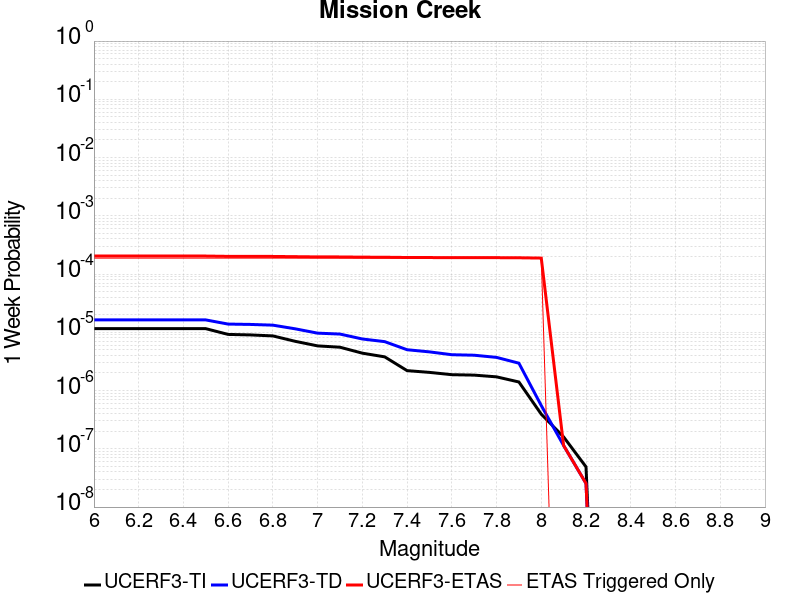 | 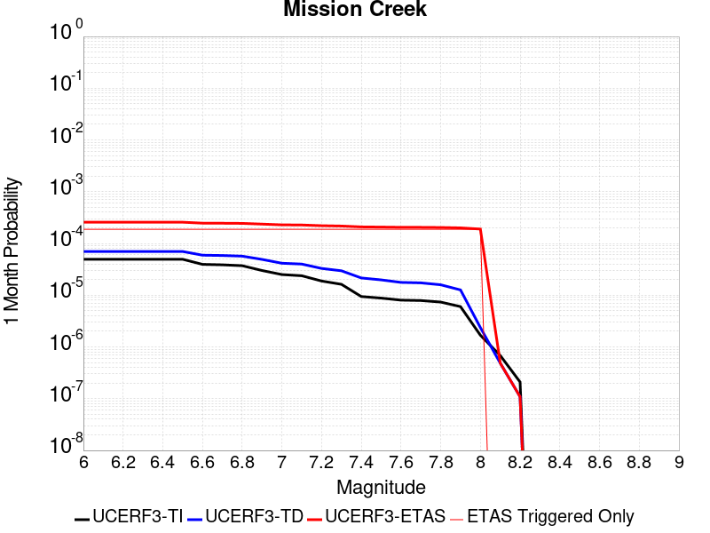 | 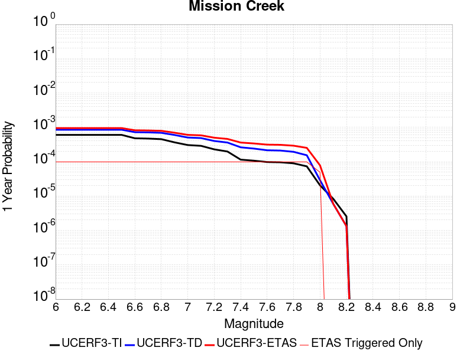 | 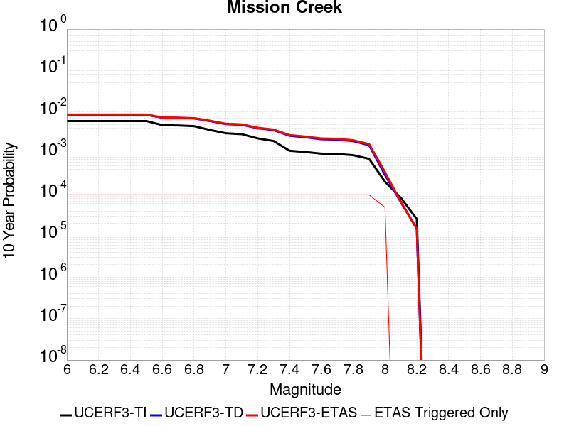 |

| Magnitude | 1 wk TI Prob | 1 wk TD Prob | 1 wk ETAS Prob | 1 wk ETAS/TD Gain | 1 wk ETAS Triggered Only | 1 mo TI Prob | 1 mo TD Prob | 1 mo ETAS Prob | 1 mo ETAS/TD Gain | 1 mo ETAS Triggered Only | 1 yr TI Prob | 1 yr TD Prob | 1 yr ETAS Prob | 1 yr ETAS/TD Gain | 1 yr ETAS Triggered Only | 10 yr TI Prob | 10 yr TD Prob | 10 yr ETAS Prob | 10 yr ETAS/TD Gain | 10 yr ETAS Triggered Only |
|-----|-----|-----|-----|-----|-----|-----|-----|-----|-----|-----|-----|-----|-----|-----|-----|-----|-----|-----|-----|-----|
| 6.0 | 1.1549387E-5 | 1.6322783E-5 | 4.6322293E-5 | 2.837892 | 3.0E-5 | 4.9496433E-5 | 6.995299E-5 | 1.0995019E-4 | 1.5717726 | 4.0E-5 | 6.0245243E-4 | 8.5135986E-4 | 9.312918E-4 | 1.0938873 | 8.0E-5 | 0.006008218 | 0.008510157 | 0.00859939 | 1.0104856 | 9.0E-5 |
| 6.1 | 1.1549387E-5 | 1.6322783E-5 | 4.6322293E-5 | 2.837892 | 3.0E-5 | 4.9496433E-5 | 6.995299E-5 | 1.0995019E-4 | 1.5717726 | 4.0E-5 | 6.0245243E-4 | 8.5135986E-4 | 9.312918E-4 | 1.0938873 | 8.0E-5 | 0.006008218 | 0.008510157 | 0.00859939 | 1.0104856 | 9.0E-5 |
| 6.2 | 1.1549387E-5 | 1.6322783E-5 | 4.6322293E-5 | 2.837892 | 3.0E-5 | 4.9496433E-5 | 6.995299E-5 | 1.0995019E-4 | 1.5717726 | 4.0E-5 | 6.0245243E-4 | 8.5135986E-4 | 9.312918E-4 | 1.0938873 | 8.0E-5 | 0.006008218 | 0.008510157 | 0.00859939 | 1.0104856 | 9.0E-5 |
| 6.3 | 1.1549387E-5 | 1.6322783E-5 | 4.6322293E-5 | 2.837892 | 3.0E-5 | 4.9496433E-5 | 6.995299E-5 | 1.0995019E-4 | 1.5717726 | 4.0E-5 | 6.0245243E-4 | 8.5135986E-4 | 9.312918E-4 | 1.0938873 | 8.0E-5 | 0.006008218 | 0.008510157 | 0.00859939 | 1.0104856 | 9.0E-5 |
| 6.4 | 1.1549387E-5 | 1.6322783E-5 | 4.6322293E-5 | 2.837892 | 3.0E-5 | 4.9496433E-5 | 6.995299E-5 | 1.0995019E-4 | 1.5717726 | 4.0E-5 | 6.0245243E-4 | 8.5135986E-4 | 9.312918E-4 | 1.0938873 | 8.0E-5 | 0.006008218 | 0.008510157 | 0.00859939 | 1.0104856 | 9.0E-5 |
| 6.5 | 1.1549387E-5 | 1.6322783E-5 | 4.6322293E-5 | 2.837892 | 3.0E-5 | 4.9496433E-5 | 6.995299E-5 | 1.0995019E-4 | 1.5717726 | 4.0E-5 | 6.0245243E-4 | 8.5135986E-4 | 9.312918E-4 | 1.0938873 | 8.0E-5 | 0.006008218 | 0.008510157 | 0.00859939 | 1.0104856 | 9.0E-5 |
| 6.6 | 9.202681E-6 | 1.3846059E-5 | 4.3845645E-5 | 3.1666515 | 3.0E-5 | 3.9439463E-5 | 5.9338956E-5 | 9.933658E-5 | 1.6740534 | 4.0E-5 | 4.800697E-4 | 7.2222133E-4 | 8.0216356E-4 | 1.1106894 | 8.0E-5 | 0.004790339 | 0.0072273402 | 0.00731669 | 1.0123627 | 9.0E-5 |
| 6.7 | 9.019164E-6 | 1.3651728E-5 | 4.365132E-5 | 3.197494 | 3.0E-5 | 3.8652986E-5 | 5.8506146E-5 | 9.8503806E-5 | 1.6836488 | 4.0E-5 | 4.7049852E-4 | 7.1208854E-4 | 7.920316E-4 | 1.1122656 | 8.0E-5 | 0.004695036 | 0.0071266647 | 0.0072160233 | 1.0125387 | 9.0E-5 |
| 6.8 | 8.673558E-6 | 1.3273839E-5 | 4.327344E-5 | 3.2600546 | 3.0E-5 | 3.717186E-5 | 5.688669E-5 | 9.688442E-5 | 1.7031121 | 4.0E-5 | 4.524734E-4 | 6.923842E-4 | 7.723288E-4 | 1.1154628 | 8.0E-5 | 0.0045155324 | 0.0069308523 | 0.0070202285 | 1.0128955 | 9.0E-5 |
| 6.9 | 7.002255E-6 | 1.1478069E-5 | 4.1477724E-5 | 3.6136503 | 3.0E-5 | 3.000932E-5 | 4.9190832E-5 | 8.918886E-5 | 1.8131196 | 4.0E-5 | 3.653022E-4 | 5.9874065E-4 | 6.7869277E-4 | 1.1335338 | 8.0E-5 | 0.0036470229 | 0.005999676 | 0.0060891355 | 1.0149108 | 9.0E-5 |
| 7.0 | 5.84644E-6 | 9.675359E-6 | 3.967507E-5 | 4.1006303 | 3.0E-5 | 2.5055931E-5 | 4.146519E-5 | 8.1463535E-5 | 1.9646245 | 4.0E-5 | 3.0501327E-4 | 5.047263E-4 | 5.8468594E-4 | 1.1584218 | 8.0E-5 | 0.0030459496 | 0.005063994 | 0.005153538 | 1.0176826 | 9.0E-5 |
| 7.1 | 5.54703E-6 | 9.329834E-6 | 3.9329556E-5 | 4.2154613 | 3.0E-5 | 2.377277E-5 | 3.9984414E-5 | 7.998282E-5 | 2.0003498 | 4.0E-5 | 2.8939504E-4 | 4.8670598E-4 | 5.6666706E-4 | 1.1642903 | 8.0E-5 | 0.0028901845 | 0.0048845876 | 0.004974148 | 1.0183353 | 9.0E-5 |
| 7.2 | 4.384709E-6 | 7.681918E-6 | 3.7681686E-5 | 4.905245 | 3.0E-5 | 1.8791474E-5 | 3.292211E-5 | 7.29208E-5 | 2.214949 | 4.0E-5 | 2.2876218E-4 | 4.0075663E-4 | 4.8072456E-4 | 1.1995424 | 8.0E-5 | 0.0022852682 | 0.004028542 | 0.0041181794 | 1.0222505 | 9.0E-5 |
| 7.3 | 3.7888456E-6 | 6.915788E-6 | 3.6915582E-5 | 5.33787 | 3.0E-5 | 1.623781E-5 | 2.9638775E-5 | 6.963759E-5 | 2.3495436 | 4.0E-5 | 1.9767738E-4 | 3.6079568E-4 | 4.4076683E-4 | 1.2216522 | 8.0E-5 | 0.0019750162 | 0.00363027 | 0.0037199433 | 1.0247016 | 9.0E-5 |
| 7.4 | 2.1982462E-6 | 5.0241033E-6 | 3.5023953E-5 | 6.9711847 | 3.0E-5 | 9.421021E-6 | 2.1531694E-5 | 6.153083E-5 | 2.8576865 | 4.0E-5 | 1.1469489E-4 | 2.6211704E-4 | 3.4209606E-4 | 1.3051271 | 8.0E-5 | 0.0011463572 | 0.0026460327 | 0.0027357945 | 1.0339231 | 9.0E-5 |
| 7.5 | 2.051923E-6 | 4.6153277E-6 | 3.461519E-5 | 7.5000505 | 3.0E-5 | 8.793926E-6 | 1.9779825E-5 | 5.9779035E-5 | 3.0222225 | 4.0E-5 | 1.0706078E-4 | 2.4079291E-4 | 3.2077366E-4 | 1.3321557 | 8.0E-5 | 0.0010700922 | 0.0024335932 | 0.002523374 | 1.0368923 | 9.0E-5 |
| 7.6 | 1.8733427E-6 | 4.1236603E-6 | 3.4123535E-5 | 8.27506 | 3.0E-5 | 8.028587E-6 | 1.7672712E-5 | 4.767218E-5 | 2.6975024 | 3.0E-5 | 9.774366E-5 | 2.151441E-4 | 2.8512903E-4 | 1.3252933 | 7.0E-5 | 9.770069E-4 | 0.0021782513 | 0.002258077 | 1.0366467 | 8.0E-5 |
| 7.7 | 1.8411953E-6 | 4.0433315E-6 | 3.404321E-5 | 8.419594 | 3.0E-5 | 7.890813E-6 | 1.732845E-5 | 4.732793E-5 | 2.731227 | 3.0E-5 | 9.606641E-5 | 2.1095353E-4 | 2.8093875E-4 | 1.3317566 | 7.0E-5 | 9.6024893E-4 | 0.0021365292 | 0.0022163582 | 1.0373639 | 8.0E-5 |
| 7.8 | 1.7194251E-6 | 3.71068E-6 | 3.371057E-5 | 9.084742 | 3.0E-5 | 7.368944E-6 | 1.5902819E-5 | 4.590234E-5 | 2.886428 | 3.0E-5 | 8.97132E-5 | 1.9359968E-4 | 2.6358612E-4 | 1.3615009 | 7.0E-5 | 8.967699E-4 | 0.0019624757 | 0.0020423187 | 1.0406848 | 8.0E-5 |
| 7.9 | 1.4035052E-6 | 2.9502596E-6 | 3.295017E-5 | 11.168567 | 3.0E-5 | 6.0150082E-6 | 1.2643909E-5 | 4.264353E-5 | 3.372654 | 3.0E-5 | 7.3230265E-5 | 1.5392878E-4 | 2.23918E-4 | 1.4546858 | 7.0E-5 | 7.3206134E-4 | 0.0015631174 | 0.0016429923 | 1.0510998 | 8.0E-5 |
| 8.0 | 3.9318823E-7 | 5.528477E-7 | 1.05528425E-5 | 19.088152 | 1.0E-5 | 1.6850913E-6 | 2.3693453E-6 | 1.2369322E-5 | 5.220565 | 1.0E-5 | 2.0515794E-5 | 2.8846403E-5 | 3.8846116E-5 | 1.3466537 | 1.0E-5 | 2.0513899E-4 | 2.990952E-4 | 3.0909223E-4 | 1.0334241 | 1.0E-5 |
| 8.1 | 1.596793E-7 | 1.13775044E-7 | 1.13775044E-7 | 1.0 | 0.0 | 6.8433974E-7 | 4.876072E-7 | 4.876072E-7 | 1.0 | 0.0 | 8.331805E-6 | 5.936602E-6 | 5.936602E-6 | 1.0 | 0.0 | 8.331492E-5 | 6.5494125E-5 | 6.5494125E-5 | 1.0 | 0.0 |
| 8.2 | 4.9003038E-8 | 2.5435753E-8 | 2.5435753E-8 | 1.0 | 0.0 | 2.10013E-7 | 1.09010365E-7 | 1.09010365E-7 | 1.0 | 0.0 | 2.5569052E-6 | 1.3272004E-6 | 1.3272004E-6 | 1.0 | 0.0 | 2.556876E-5 | 1.4952613E-5 | 1.4952613E-5 | 1.0 | 0.0 |

## Palos Verdes
*[(top)](#table-of-contents)*

| 1 Week | 1 Month | 1 Year | 10 Year |
|-----|-----|-----|-----|
| 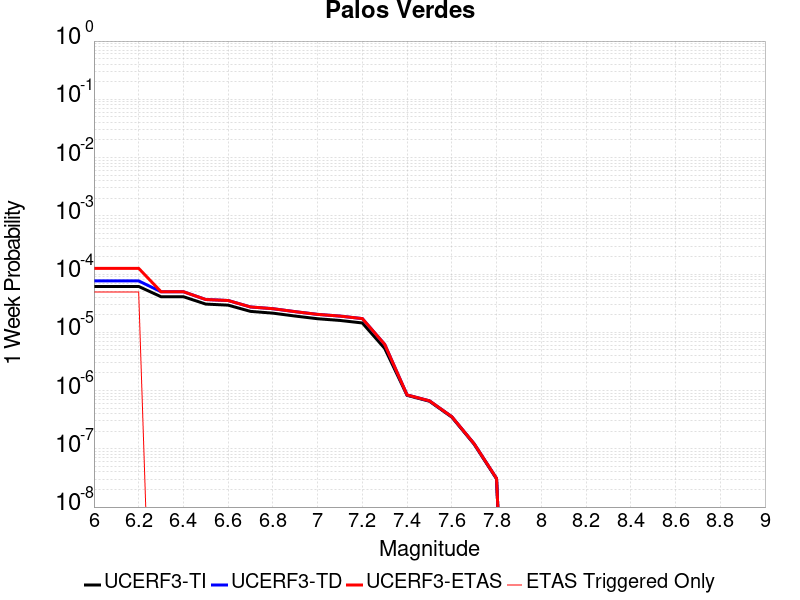 | 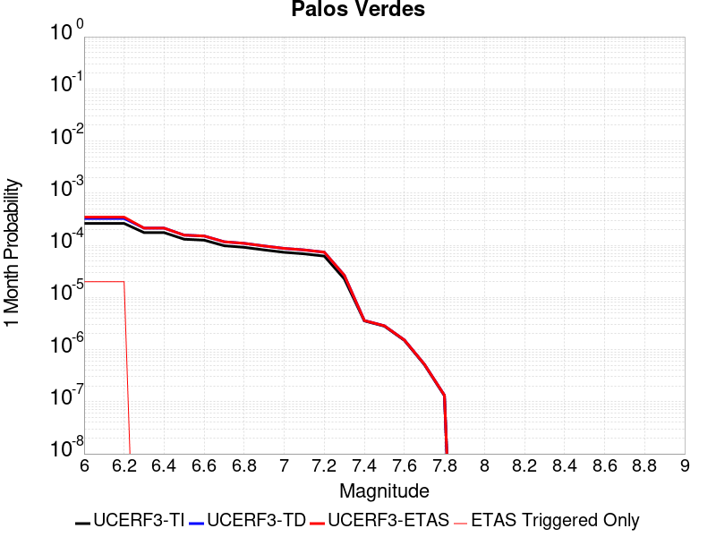 | 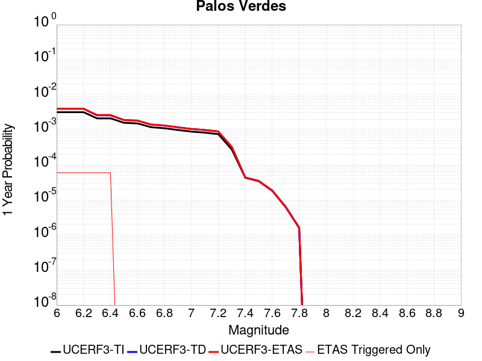 | 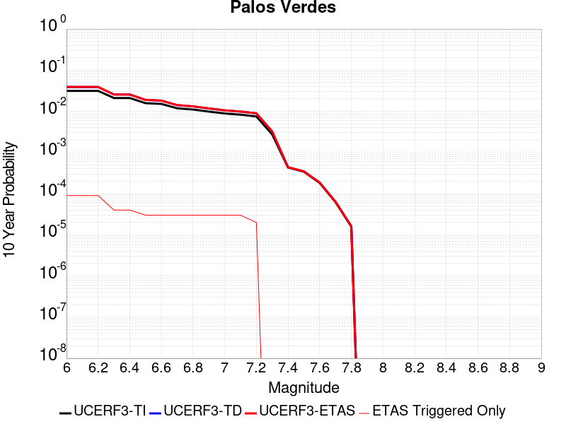 |

| Magnitude | 1 wk TI Prob | 1 wk TD Prob | 1 wk ETAS Prob | 1 wk ETAS/TD Gain | 1 wk ETAS Triggered Only | 1 mo TI Prob | 1 mo TD Prob | 1 mo ETAS Prob | 1 mo ETAS/TD Gain | 1 mo ETAS Triggered Only | 1 yr TI Prob | 1 yr TD Prob | 1 yr ETAS Prob | 1 yr ETAS/TD Gain | 1 yr ETAS Triggered Only | 10 yr TI Prob | 10 yr TD Prob | 10 yr ETAS Prob | 10 yr ETAS/TD Gain | 10 yr ETAS Triggered Only |
|-----|-----|-----|-----|-----|-----|-----|-----|-----|-----|-----|-----|-----|-----|-----|-----|-----|-----|-----|-----|-----|
| 6.0 | 6.126063E-5 | 7.622572E-5 | 9.62242E-5 | 1.2623587 | 2.0E-5 | 2.6251914E-4 | 3.266441E-4 | 3.466376E-4 | 1.0612087 | 2.0E-5 | 0.0031914865 | 0.0039701737 | 0.0040299357 | 1.0150527 | 6.0E-5 | 0.031460393 | 0.03904909 | 0.039135575 | 1.0022148 | 9.0E-5 |
| 6.1 | 6.126063E-5 | 7.622572E-5 | 9.62242E-5 | 1.2623587 | 2.0E-5 | 2.6251914E-4 | 3.266441E-4 | 3.466376E-4 | 1.0612087 | 2.0E-5 | 0.0031914865 | 0.0039701737 | 0.0040299357 | 1.0150527 | 6.0E-5 | 0.031460393 | 0.03904909 | 0.039135575 | 1.0022148 | 9.0E-5 |
| 6.2 | 6.126063E-5 | 7.622572E-5 | 9.62242E-5 | 1.2623587 | 2.0E-5 | 2.6251914E-4 | 3.266441E-4 | 3.466376E-4 | 1.0612087 | 2.0E-5 | 0.0031914865 | 0.0039701737 | 0.0040299357 | 1.0150527 | 6.0E-5 | 0.031460393 | 0.03904909 | 0.039135575 | 1.0022148 | 9.0E-5 |
| 6.3 | 4.0838047E-5 | 4.9749007E-5 | 4.9749007E-5 | 1.0 | 0.0 | 1.7500846E-4 | 2.1319388E-4 | 2.1319388E-4 | 1.0 | 0.0 | 0.0021286458 | 0.002592754 | 0.0026127023 | 1.0076938 | 2.0E-5 | 0.021083709 | 0.025646746 | 0.02568572 | 1.0015197 | 4.0E-5 |
| 6.4 | 4.0838047E-5 | 4.9749007E-5 | 4.9749007E-5 | 1.0 | 0.0 | 1.7500846E-4 | 2.1319388E-4 | 2.1319388E-4 | 1.0 | 0.0 | 0.0021286458 | 0.002592754 | 0.0026127023 | 1.0076938 | 2.0E-5 | 0.021083709 | 0.025646746 | 0.02568572 | 1.0015197 | 4.0E-5 |
| 6.5 | 3.0512005E-5 | 3.6561592E-5 | 3.6561592E-5 | 1.0 | 0.0 | 1.3075917E-4 | 1.566838E-4 | 1.566838E-4 | 1.0 | 0.0 | 0.0015908304 | 0.001906072 | 0.001916053 | 1.0052364 | 1.0E-5 | 0.015794903 | 0.018909173 | 0.018938605 | 1.0015565 | 3.0E-5 |
| 6.6 | 2.9255087E-5 | 3.5154393E-5 | 3.5154393E-5 | 1.0 | 0.0 | 1.2537291E-4 | 1.5065364E-4 | 1.5065364E-4 | 1.0 | 0.0 | 0.0015253464 | 0.0018327782 | 0.0018427599 | 1.0054462 | 1.0E-5 | 0.015149189 | 0.018188244 | 0.018217698 | 1.0016195 | 3.0E-5 |
| 6.7 | 2.287198E-5 | 2.724828E-5 | 2.724828E-5 | 1.0 | 0.0 | 9.801909E-5 | 1.16773626E-4 | 1.16773626E-4 | 1.0 | 0.0 | 0.001192729 | 0.0014208833 | 0.0014308692 | 1.0070279 | 1.0E-5 | 0.011863477 | 0.014127217 | 0.014156793 | 1.0020936 | 3.0E-5 |
| 6.8 | 2.1325764E-5 | 2.5431878E-5 | 2.5431878E-5 | 1.0 | 0.0 | 9.139293E-5 | 1.0898972E-4 | 1.0898972E-4 | 1.0 | 0.0 | 0.001112141 | 0.0013262323 | 0.001336219 | 1.0075302 | 1.0E-5 | 0.011065915 | 0.013192211 | 0.013221815 | 1.0022441 | 3.0E-5 |
| 6.9 | 1.9009392E-5 | 2.2613547E-5 | 2.2613547E-5 | 1.0 | 0.0 | 8.1466285E-5 | 9.6912096E-5 | 9.6912096E-5 | 1.0 | 0.0 | 9.914007E-4 | 0.0011793535 | 0.0011893417 | 1.0084692 | 1.0E-5 | 0.009869894 | 0.011739633 | 0.011769281 | 1.0025254 | 3.0E-5 |
| 7.0 | 1.7098473E-5 | 2.0319356E-5 | 2.0319356E-5 | 1.0 | 0.0 | 7.3277115E-5 | 8.708052E-5 | 8.708052E-5 | 1.0 | 0.0 | 8.917837E-4 | 0.001059775 | 0.0010697644 | 1.009426 | 1.0E-5 | 0.008882134 | 0.010555646 | 0.0105853295 | 1.002812 | 3.0E-5 |
| 7.1 | 1.5982785E-5 | 1.899476E-5 | 1.899476E-5 | 1.0 | 0.0 | 6.849585E-5 | 8.1404054E-5 | 8.1404054E-5 | 1.0 | 0.0 | 8.336179E-4 | 9.907284E-4 | 0.0010007184 | 1.0100836 | 1.0E-5 | 0.008304977 | 0.009871479 | 0.009901184 | 1.0030091 | 3.0E-5 |
| 7.2 | 1.4468002E-5 | 1.7197237E-5 | 1.7197237E-5 | 1.0 | 0.0 | 6.200425E-5 | 7.370083E-5 | 7.370083E-5 | 1.0 | 0.0 | 7.546402E-4 | 8.970222E-4 | 8.970222E-4 | 1.0 | 0.0 | 0.007520827 | 0.008942284 | 0.008962105 | 1.0022166 | 2.0E-5 |
| 7.3 | 5.288233E-6 | 6.2036747E-6 | 6.2036747E-6 | 1.0 | 0.0 | 2.2663658E-5 | 2.6587102E-5 | 2.6587102E-5 | 1.0 | 0.0 | 2.7589512E-4 | 3.236848E-4 | 3.236848E-4 | 1.0 | 0.0 | 0.0027555283 | 0.0032355562 | 0.0032355562 | 1.0 | 0.0 |
| 7.4 | 8.279556E-7 | 8.408347E-7 | 8.408347E-7 | 1.0 | 0.0 | 3.5483763E-6 | 3.6035726E-6 | 3.6035726E-6 | 1.0 | 0.0 | 4.3200624E-5 | 4.3872686E-5 | 4.3872686E-5 | 1.0 | 0.0 | 4.3192226E-4 | 4.3864746E-4 | 4.3864746E-4 | 1.0 | 0.0 |
| 7.5 | 6.559831E-7 | 6.667229E-7 | 6.667229E-7 | 1.0 | 0.0 | 2.8113532E-6 | 2.857381E-6 | 2.857381E-6 | 1.0 | 0.0 | 3.4227687E-5 | 3.4788125E-5 | 3.4788125E-5 | 1.0 | 0.0 | 3.4222414E-4 | 3.4783344E-4 | 3.4783344E-4 | 1.0 | 0.0 |
| 7.6 | 3.5018968E-7 | 3.5620027E-7 | 3.5620027E-7 | 1.0 | 0.0 | 1.500812E-6 | 1.526572E-6 | 1.526572E-6 | 1.0 | 0.0 | 1.8272232E-5 | 1.8585903E-5 | 1.8585903E-5 | 1.0 | 0.0 | 1.8270731E-4 | 1.8584808E-4 | 1.8584808E-4 | 1.0 | 0.0 |
| 7.7 | 1.1986104E-7 | 1.2198376E-7 | 1.2198376E-7 | 1.0 | 0.0 | 5.1369005E-7 | 5.2278745E-7 | 5.2278745E-7 | 1.0 | 0.0 | 6.2541585E-6 | 6.364919E-6 | 6.364919E-6 | 1.0 | 0.0 | 6.2539824E-5 | 6.364741E-5 | 6.364741E-5 | 1.0 | 0.0 |
| 7.8 | 3.0445005E-8 | 3.1027582E-8 | 3.1027582E-8 | 1.0 | 0.0 | 1.3047858E-7 | 1.3297536E-7 | 1.3297536E-7 | 1.0 | 0.0 | 1.5885756E-6 | 1.6189739E-6 | 1.6189739E-6 | 1.0 | 0.0 | 1.5885644E-5 | 1.6189642E-5 | 1.6189642E-5 | 1.0 | 0.0 |

## Deep Springs
*[(top)](#table-of-contents)*

| 1 Week | 1 Month | 1 Year | 10 Year |
|-----|-----|-----|-----|
| 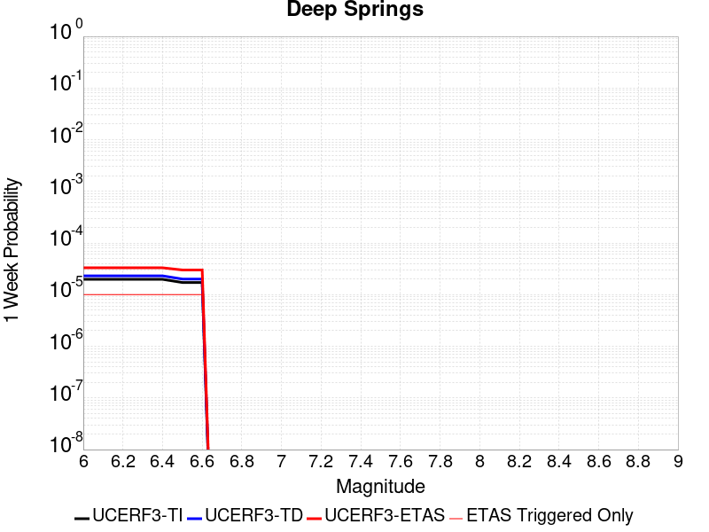 | 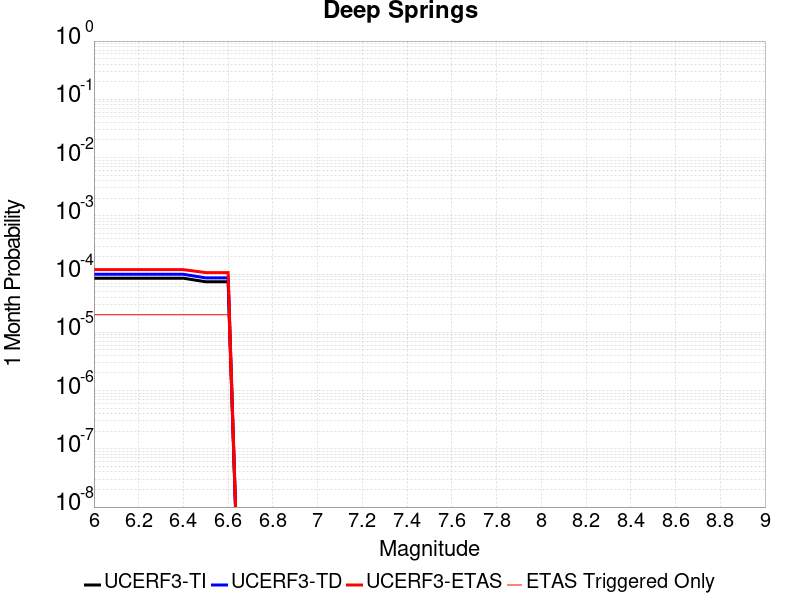 | 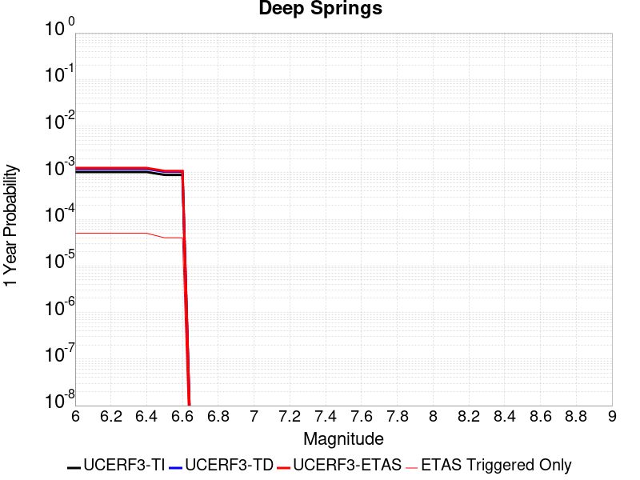 | 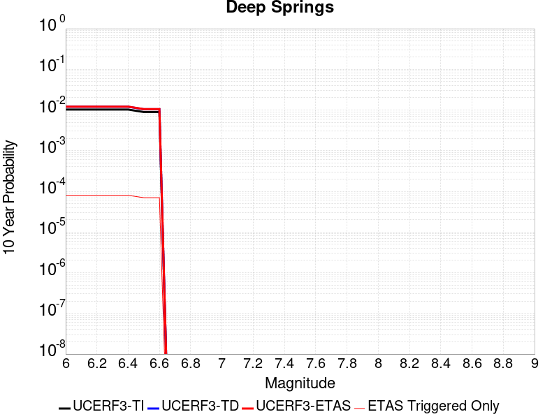 |

| Magnitude | 1 wk TI Prob | 1 wk TD Prob | 1 wk ETAS Prob | 1 wk ETAS/TD Gain | 1 wk ETAS Triggered Only | 1 mo TI Prob | 1 mo TD Prob | 1 mo ETAS Prob | 1 mo ETAS/TD Gain | 1 mo ETAS Triggered Only | 1 yr TI Prob | 1 yr TD Prob | 1 yr ETAS Prob | 1 yr ETAS/TD Gain | 1 yr ETAS Triggered Only | 10 yr TI Prob | 10 yr TD Prob | 10 yr ETAS Prob | 10 yr ETAS/TD Gain | 10 yr ETAS Triggered Only |
|-----|-----|-----|-----|-----|-----|-----|-----|-----|-----|-----|-----|-----|-----|-----|-----|-----|-----|-----|-----|-----|
| 6.0 | 1.9810619E-5 | 2.311252E-5 | 3.311229E-5 | 1.4326559 | 1.0E-5 | 8.489989E-5 | 9.9052755E-5 | 1.19050776E-4 | 1.2018926 | 2.0E-5 | 0.001033166 | 0.0012058078 | 0.0012557475 | 1.0414159 | 5.0E-5 | 0.010283757 | 0.01204243 | 0.012121467 | 1.0065632 | 8.0E-5 |
| 6.1 | 1.9810619E-5 | 2.311252E-5 | 3.311229E-5 | 1.4326559 | 1.0E-5 | 8.489989E-5 | 9.9052755E-5 | 1.19050776E-4 | 1.2018926 | 2.0E-5 | 0.001033166 | 0.0012058078 | 0.0012557475 | 1.0414159 | 5.0E-5 | 0.010283757 | 0.01204243 | 0.012121467 | 1.0065632 | 8.0E-5 |
| 6.2 | 1.9810619E-5 | 2.311252E-5 | 3.311229E-5 | 1.4326559 | 1.0E-5 | 8.489989E-5 | 9.9052755E-5 | 1.19050776E-4 | 1.2018926 | 2.0E-5 | 0.001033166 | 0.0012058078 | 0.0012557475 | 1.0414159 | 5.0E-5 | 0.010283757 | 0.01204243 | 0.012121467 | 1.0065632 | 8.0E-5 |
| 6.3 | 1.9810619E-5 | 2.311252E-5 | 3.311229E-5 | 1.4326559 | 1.0E-5 | 8.489989E-5 | 9.9052755E-5 | 1.19050776E-4 | 1.2018926 | 2.0E-5 | 0.001033166 | 0.0012058078 | 0.0012557475 | 1.0414159 | 5.0E-5 | 0.010283757 | 0.01204243 | 0.012121467 | 1.0065632 | 8.0E-5 |
| 6.4 | 1.9810619E-5 | 2.311252E-5 | 3.311229E-5 | 1.4326559 | 1.0E-5 | 8.489989E-5 | 9.9052755E-5 | 1.19050776E-4 | 1.2018926 | 2.0E-5 | 0.001033166 | 0.0012058078 | 0.0012557475 | 1.0414159 | 5.0E-5 | 0.010283757 | 0.01204243 | 0.012121467 | 1.0065632 | 8.0E-5 |
| 6.5 | 1.7190405E-5 | 2.0050558E-5 | 3.0050356E-5 | 1.4987292 | 1.0E-5 | 7.367108E-5 | 8.593096E-5 | 1.0592924E-4 | 1.232725 | 2.0E-5 | 8.9657627E-4 | 0.0010462092 | 0.0010861674 | 1.0381932 | 4.0E-5 | 0.008929676 | 0.010462061 | 0.010531329 | 1.0066209 | 7.0E-5 |
| 6.6 | 1.7190405E-5 | 2.0050558E-5 | 3.0050356E-5 | 1.4987292 | 1.0E-5 | 7.367108E-5 | 8.593096E-5 | 1.0592924E-4 | 1.232725 | 2.0E-5 | 8.9657627E-4 | 0.0010462092 | 0.0010861674 | 1.0381932 | 4.0E-5 | 0.008929676 | 0.010462061 | 0.010531329 | 1.0066209 | 7.0E-5 |

## Coronado Bank alt1
*[(top)](#table-of-contents)*

| 1 Week | 1 Month | 1 Year | 10 Year |
|-----|-----|-----|-----|
| 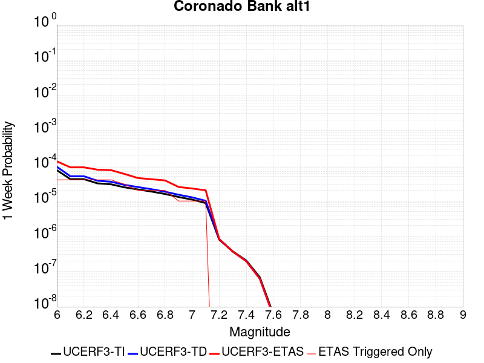 | 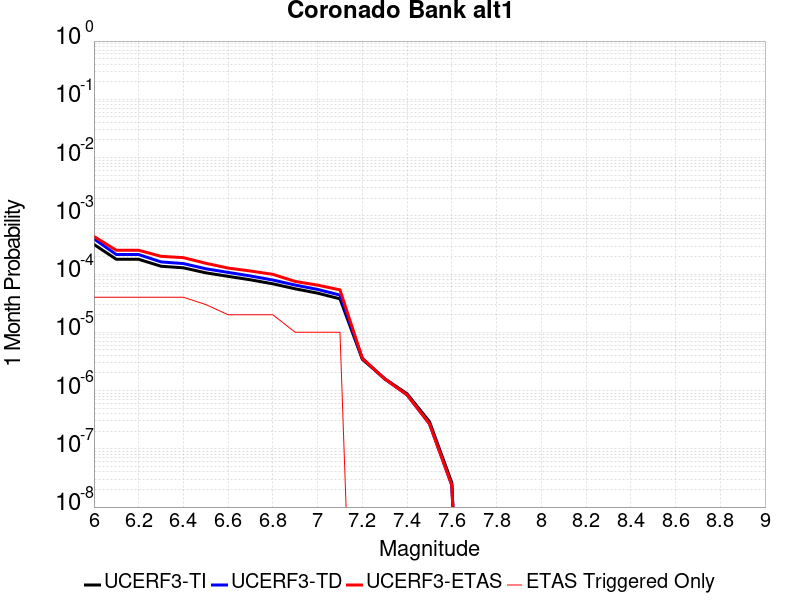 | 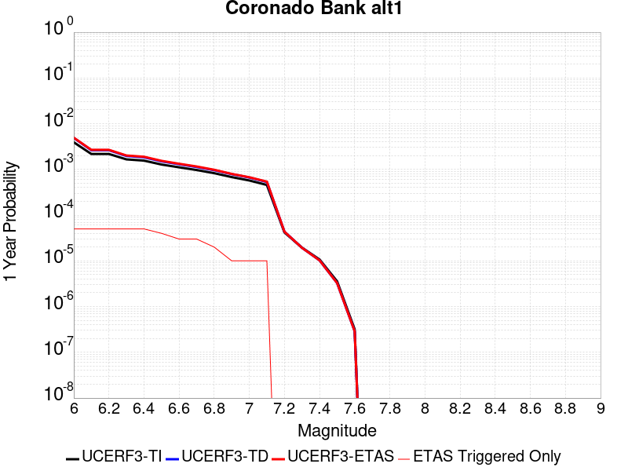 | 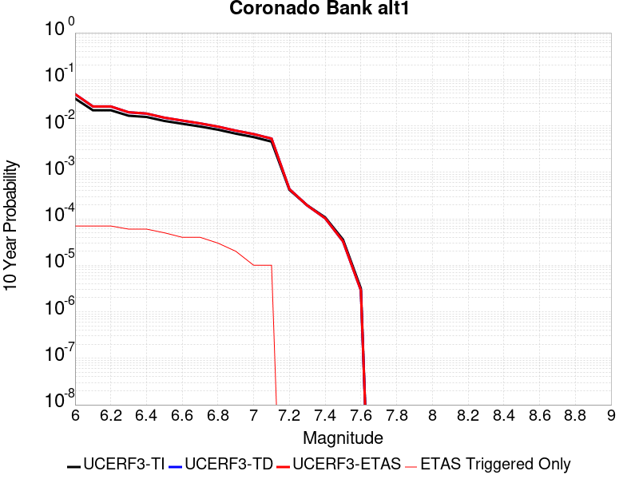 |

| Magnitude | 1 wk TI Prob | 1 wk TD Prob | 1 wk ETAS Prob | 1 wk ETAS/TD Gain | 1 wk ETAS Triggered Only | 1 mo TI Prob | 1 mo TD Prob | 1 mo ETAS Prob | 1 mo ETAS/TD Gain | 1 mo ETAS Triggered Only | 1 yr TI Prob | 1 yr TD Prob | 1 yr ETAS Prob | 1 yr ETAS/TD Gain | 1 yr ETAS Triggered Only | 10 yr TI Prob | 10 yr TD Prob | 10 yr ETAS Prob | 10 yr ETAS/TD Gain | 10 yr ETAS Triggered Only |
|-----|-----|-----|-----|-----|-----|-----|-----|-----|-----|-----|-----|-----|-----|-----|-----|-----|-----|-----|-----|-----|
| 6.0 | 7.533492E-5 | 9.3951705E-5 | 1.3394795E-4 | 1.4257107 | 4.0E-5 | 3.22824E-4 | 4.025903E-4 | 4.4257418E-4 | 1.0993166 | 4.0E-5 | 0.0039233007 | 0.004891121 | 0.0049408763 | 1.0101726 | 5.0E-5 | 0.03854755 | 0.047904 | 0.04797065 | 1.0013913 | 7.0E-5 |
| 6.1 | 4.1807285E-5 | 5.0493105E-5 | 9.0491085E-5 | 1.7921474 | 4.0E-5 | 1.7916178E-4 | 2.1638138E-4 | 2.5637273E-4 | 1.1848187 | 4.0E-5 | 0.0021791123 | 0.0026313365 | 0.002681205 | 1.0189518 | 5.0E-5 | 0.021578677 | 0.026011124 | 0.026079303 | 1.0026212 | 7.0E-5 |
| 6.2 | 4.1807285E-5 | 5.0493105E-5 | 9.0491085E-5 | 1.7921474 | 4.0E-5 | 1.7916178E-4 | 2.1638138E-4 | 2.5637273E-4 | 1.1848187 | 4.0E-5 | 0.0021791123 | 0.0026313365 | 0.002681205 | 1.0189518 | 5.0E-5 | 0.021578677 | 0.026011124 | 0.026079303 | 1.0026212 | 7.0E-5 |
| 6.3 | 3.1793104E-5 | 3.7711125E-5 | 7.770962E-5 | 2.0606549 | 4.0E-5 | 1.3624904E-4 | 1.6160926E-4 | 2.016028E-4 | 1.2474706 | 4.0E-5 | 0.0016575698 | 0.001965849 | 0.0020157506 | 1.0253843 | 5.0E-5 | 0.016452603 | 0.019488495 | 0.019547326 | 1.0030187 | 6.0E-5 |
| 6.4 | 2.9878007E-5 | 3.5335797E-5 | 7.5334385E-5 | 2.1319566 | 4.0E-5 | 1.2804232E-4 | 1.5143053E-4 | 1.9142448E-4 | 1.2641075 | 4.0E-5 | 0.0015578003 | 0.0018421395 | 0.0018920474 | 1.0270923 | 5.0E-5 | 0.015469253 | 0.018272463 | 0.018331368 | 1.0032237 | 6.0E-5 |
| 6.5 | 2.4512565E-5 | 2.8764101E-5 | 5.876324E-5 | 2.0429368 | 3.0E-5 | 1.0504962E-4 | 1.2326906E-4 | 1.5326536E-4 | 1.2433401 | 3.0E-5 | 0.0012782287 | 0.0014997943 | 0.0015397343 | 1.0266303 | 4.0E-5 | 0.012709012 | 0.0148996925 | 0.014948947 | 1.0033058 | 5.0E-5 |
| 6.6 | 2.1317413E-5 | 2.490667E-5 | 4.490617E-5 | 1.8029778 | 2.0E-5 | 9.135714E-5 | 1.0673863E-4 | 1.267365E-4 | 1.1873536 | 2.0E-5 | 0.0011117056 | 0.0012987903 | 0.0013287513 | 1.0230684 | 3.0E-5 | 0.011061605 | 0.012914407 | 0.0129538905 | 1.0030574 | 4.0E-5 |
| 6.7 | 1.8585655E-5 | 2.1634882E-5 | 4.163445E-5 | 1.9244131 | 2.0E-5 | 7.9650374E-5 | 9.271774E-5 | 1.1271588E-4 | 1.2156885 | 2.0E-5 | 9.6931186E-4 | 0.0011282744 | 0.0011582405 | 1.0265592 | 3.0E-5 | 0.0096509475 | 0.011227623 | 0.011267174 | 1.0035226 | 4.0E-5 |
| 6.8 | 1.5862879E-5 | 1.8419476E-5 | 3.8419108E-5 | 2.0857873 | 2.0E-5 | 6.798199E-5 | 7.8938334E-5 | 9.8936755E-5 | 1.2533424 | 2.0E-5 | 8.273665E-4 | 9.606697E-4 | 9.806505E-4 | 1.0207988 | 2.0E-5 | 0.008242928 | 0.009567151 | 0.009596864 | 1.0031058 | 3.0E-5 |
| 6.9 | 1.3021509E-5 | 1.5095266E-5 | 2.5095114E-5 | 1.6624494 | 1.0E-5 | 5.5805274E-5 | 6.46925E-5 | 7.4691845E-5 | 1.1545675 | 1.0E-5 | 6.792174E-4 | 7.873646E-4 | 7.973567E-4 | 1.0126905 | 1.0E-5 | 0.006771452 | 0.007847573 | 0.007867416 | 1.0025285 | 2.0E-5 |
| 7.0 | 1.0974371E-5 | 1.2720105E-5 | 2.2719978E-5 | 1.786147 | 1.0E-5 | 4.7032172E-5 | 5.4513697E-5 | 6.451315E-5 | 1.1834302 | 1.0E-5 | 5.7246623E-4 | 6.635197E-4 | 6.7351304E-4 | 1.0150611 | 1.0E-5 | 0.0057099373 | 0.0066171354 | 0.0066270693 | 1.0015012 | 1.0E-5 |
| 7.1 | 8.766221E-6 | 1.0163833E-5 | 2.0163732E-5 | 1.9838707 | 1.0E-5 | 3.7568978E-5 | 4.3558655E-5 | 5.355822E-5 | 1.2295655 | 1.0E-5 | 4.573063E-4 | 5.302148E-4 | 5.4020947E-4 | 1.0188503 | 1.0E-5 | 0.0045636636 | 0.005291197 | 0.0053011444 | 1.0018799 | 1.0E-5 |
| 7.2 | 8.026024E-7 | 8.331776E-7 | 8.331776E-7 | 1.0 | 0.0 | 3.43972E-6 | 3.5707562E-6 | 3.5707562E-6 | 1.0 | 0.0 | 4.1877785E-5 | 4.34731E-5 | 4.34731E-5 | 1.0 | 0.0 | 4.1869894E-4 | 4.3464705E-4 | 4.3464705E-4 | 1.0 | 0.0 |
| 7.3 | 3.7293114E-7 | 3.700106E-7 | 3.700106E-7 | 1.0 | 0.0 | 1.5982754E-6 | 1.5857588E-6 | 1.5857588E-6 | 1.0 | 0.0 | 1.9458828E-5 | 1.9306442E-5 | 1.9306442E-5 | 1.0 | 0.0 | 1.9457124E-4 | 1.9304773E-4 | 1.9304773E-4 | 1.0 | 0.0 |
| 7.4 | 2.0557036E-7 | 1.9674441E-7 | 1.9674441E-7 | 1.0 | 0.0 | 8.810155E-7 | 8.4319004E-7 | 8.4319004E-7 | 1.0 | 0.0 | 1.0726311E-5 | 1.02657905E-5 | 1.02657905E-5 | 1.0 | 0.0 | 1.0725793E-4 | 1.026532E-4 | 1.026532E-4 | 1.0 | 0.0 |
| 7.5 | 6.845446E-8 | 6.2794086E-8 | 6.2794086E-8 | 1.0 | 0.0 | 2.9337625E-7 | 2.6911746E-7 | 2.6911746E-7 | 1.0 | 0.0 | 3.5718497E-6 | 3.2765004E-6 | 3.2765004E-6 | 1.0 | 0.0 | 3.5717923E-5 | 3.276453E-5 | 3.276453E-5 | 1.0 | 0.0 |
| 7.6 | 6.0975145E-9 | 5.531901E-9 | 5.531901E-9 | 1.0 | 0.0 | 2.6132206E-8 | 2.3708148E-8 | 2.3708148E-8 | 1.0 | 0.0 | 3.1815955E-7 | 2.8864667E-7 | 2.8864667E-7 | 1.0 | 0.0 | 3.181591E-6 | 2.886464E-6 | 2.886464E-6 | 1.0 | 0.0 |

## Pleito
*[(top)](#table-of-contents)*

| 1 Week | 1 Month | 1 Year | 10 Year |
|-----|-----|-----|-----|
| 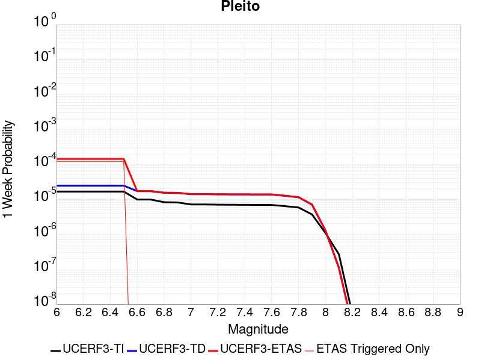 | 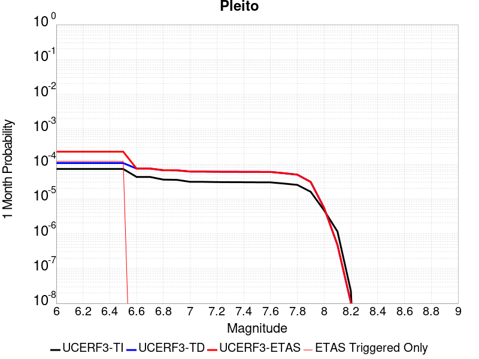 | 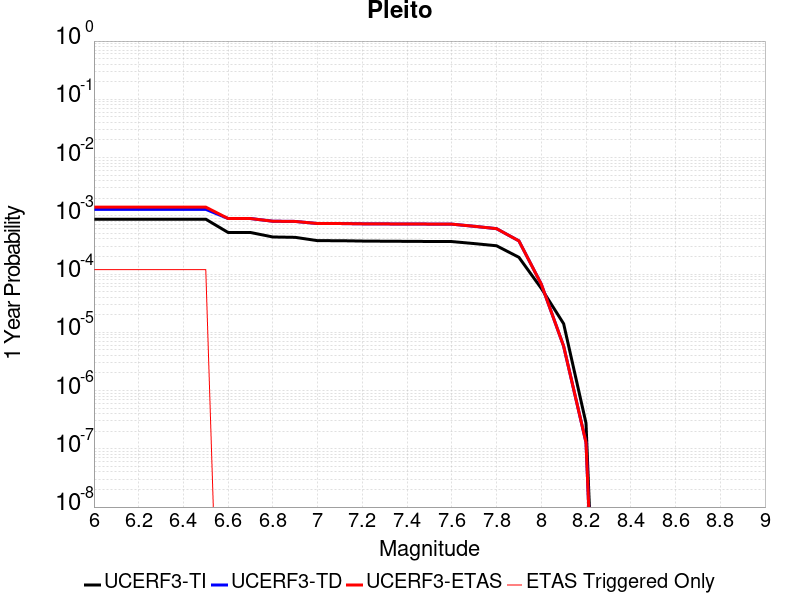 | 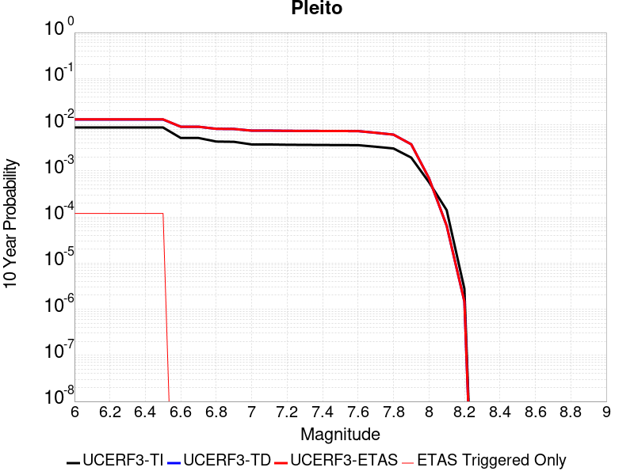 |

| Magnitude | 1 wk TI Prob | 1 wk TD Prob | 1 wk ETAS Prob | 1 wk ETAS/TD Gain | 1 wk ETAS Triggered Only | 1 mo TI Prob | 1 mo TD Prob | 1 mo ETAS Prob | 1 mo ETAS/TD Gain | 1 mo ETAS Triggered Only | 1 yr TI Prob | 1 yr TD Prob | 1 yr ETAS Prob | 1 yr ETAS/TD Gain | 1 yr ETAS Triggered Only | 10 yr TI Prob | 10 yr TD Prob | 10 yr ETAS Prob | 10 yr ETAS/TD Gain | 10 yr ETAS Triggered Only |
|-----|-----|-----|-----|-----|-----|-----|-----|-----|-----|-----|-----|-----|-----|-----|-----|-----|-----|-----|-----|-----|
| 6.0 | 1.6763008E-5 | 2.4764735E-5 | 5.4763994E-5 | 2.21137 | 3.0E-5 | 7.183948E-5 | 1.0613067E-4 | 1.3612749E-4 | 1.2826405 | 3.0E-5 | 8.742947E-4 | 0.001291447 | 0.0013513695 | 1.0463995 | 6.0E-5 | 0.00870863 | 0.012954412 | 0.013033375 | 1.0060955 | 8.0E-5 |
| 6.1 | 1.6763008E-5 | 2.4764735E-5 | 5.4763994E-5 | 2.21137 | 3.0E-5 | 7.183948E-5 | 1.0613067E-4 | 1.3612749E-4 | 1.2826405 | 3.0E-5 | 8.742947E-4 | 0.001291447 | 0.0013513695 | 1.0463995 | 6.0E-5 | 0.00870863 | 0.012954412 | 0.013033375 | 1.0060955 | 8.0E-5 |
| 6.2 | 1.6763008E-5 | 2.4764735E-5 | 5.4763994E-5 | 2.21137 | 3.0E-5 | 7.183948E-5 | 1.0613067E-4 | 1.3612749E-4 | 1.2826405 | 3.0E-5 | 8.742947E-4 | 0.001291447 | 0.0013513695 | 1.0463995 | 6.0E-5 | 0.00870863 | 0.012954412 | 0.013033375 | 1.0060955 | 8.0E-5 |
| 6.3 | 1.6763008E-5 | 2.4764735E-5 | 5.4763994E-5 | 2.21137 | 3.0E-5 | 7.183948E-5 | 1.0613067E-4 | 1.3612749E-4 | 1.2826405 | 3.0E-5 | 8.742947E-4 | 0.001291447 | 0.0013513695 | 1.0463995 | 6.0E-5 | 0.00870863 | 0.012954412 | 0.013033375 | 1.0060955 | 8.0E-5 |
| 6.4 | 1.6763008E-5 | 2.4764735E-5 | 5.4763994E-5 | 2.21137 | 3.0E-5 | 7.183948E-5 | 1.0613067E-4 | 1.3612749E-4 | 1.2826405 | 3.0E-5 | 8.742947E-4 | 0.001291447 | 0.0013513695 | 1.0463995 | 6.0E-5 | 0.00870863 | 0.012954412 | 0.013033375 | 1.0060955 | 8.0E-5 |
| 6.5 | 1.6763008E-5 | 2.4764735E-5 | 5.4763994E-5 | 2.21137 | 3.0E-5 | 7.183948E-5 | 1.0613067E-4 | 1.3612749E-4 | 1.2826405 | 3.0E-5 | 8.742947E-4 | 0.001291447 | 0.0013513695 | 1.0463995 | 6.0E-5 | 0.00870863 | 0.012954412 | 0.013033375 | 1.0060955 | 8.0E-5 |
| 6.6 | 9.910213E-6 | 1.721552E-5 | 2.7215348E-5 | 1.5808612 | 1.0E-5 | 4.247165E-5 | 7.3778734E-5 | 8.3777995E-5 | 1.1355304 | 1.0E-5 | 5.169696E-4 | 8.9788967E-4 | 9.1787166E-4 | 1.0222545 | 2.0E-5 | 0.0051576863 | 0.009051226 | 0.009080954 | 1.0032845 | 3.0E-5 |
| 6.7 | 9.910213E-6 | 1.721552E-5 | 2.7215348E-5 | 1.5808612 | 1.0E-5 | 4.247165E-5 | 7.3778734E-5 | 8.3777995E-5 | 1.1355304 | 1.0E-5 | 5.169696E-4 | 8.9788967E-4 | 9.1787166E-4 | 1.0222545 | 2.0E-5 | 0.0051576863 | 0.009051226 | 0.009080954 | 1.0032845 | 3.0E-5 |
| 6.8 | 8.300162E-6 | 1.5475129E-5 | 2.5474974E-5 | 1.6461881 | 1.0E-5 | 3.557164E-5 | 6.63203E-5 | 7.6319644E-5 | 1.1507734 | 1.0E-5 | 4.3299864E-4 | 8.07152E-4 | 8.2713587E-4 | 1.0247585 | 2.0E-5 | 0.004321559 | 0.008150663 | 0.008180419 | 1.0036507 | 3.0E-5 |
| 6.9 | 8.183114E-6 | 1.5346344E-5 | 2.5346191E-5 | 1.651611 | 1.0E-5 | 3.5070017E-5 | 6.57684E-5 | 7.576774E-5 | 1.1520387 | 1.0E-5 | 4.2689382E-4 | 8.0043747E-4 | 8.204215E-4 | 1.0249664 | 2.0E-5 | 0.0042607468 | 0.008084008 | 0.008113765 | 1.0036811 | 3.0E-5 |
| 7.0 | 7.1748823E-6 | 1.4133306E-5 | 2.4133164E-5 | 1.7075386 | 1.0E-5 | 3.0749135E-5 | 6.0569906E-5 | 7.05693E-5 | 1.1650885 | 1.0E-5 | 3.743064E-4 | 7.3718966E-4 | 7.471823E-4 | 1.013555 | 1.0E-5 | 0.0037367654 | 0.0074553755 | 0.007465301 | 1.0013313 | 1.0E-5 |
| 7.1 | 7.1671807E-6 | 1.4123676E-5 | 2.4123534E-5 | 1.708021 | 1.0E-5 | 3.0716128E-5 | 6.0528637E-5 | 7.052803E-5 | 1.1652011 | 1.0E-5 | 3.7390468E-4 | 7.366875E-4 | 7.4668013E-4 | 1.0135642 | 1.0E-5 | 0.0037327618 | 0.0074503883 | 0.0074603134 | 1.0013322 | 1.0E-5 |
| 7.2 | 7.0649667E-6 | 1.3970962E-5 | 2.3970822E-5 | 1.7157604 | 1.0E-5 | 3.0278077E-5 | 5.987418E-5 | 6.987358E-5 | 1.1670069 | 1.0E-5 | 3.6857324E-4 | 7.287248E-4 | 7.3871756E-4 | 1.0137126 | 1.0E-5 | 0.0036796255 | 0.0073711374 | 0.007381064 | 1.0013466 | 1.0E-5 |
| 7.3 | 7.02082E-6 | 1.3914415E-5 | 2.3914276E-5 | 1.7186692 | 1.0E-5 | 3.008888E-5 | 5.9631846E-5 | 6.963125E-5 | 1.1676856 | 1.0E-5 | 3.6627054E-4 | 7.257764E-4 | 7.3576916E-4 | 1.0137683 | 1.0E-5 | 0.0036566744 | 0.0073416373 | 0.0073515642 | 1.0013521 | 1.0E-5 |
| 7.4 | 6.987146E-6 | 1.3873975E-5 | 2.3873838E-5 | 1.7207639 | 1.0E-5 | 2.9944567E-5 | 5.9458544E-5 | 6.945795E-5 | 1.1681744 | 1.0E-5 | 3.6451413E-4 | 7.2366785E-4 | 7.336606E-4 | 1.0138085 | 1.0E-5 | 0.0036391679 | 0.007320571 | 0.007330498 | 1.001356 | 1.0E-5 |
| 7.5 | 6.9494554E-6 | 1.383088E-5 | 2.3830742E-5 | 1.7230098 | 1.0E-5 | 2.9783041E-5 | 5.9273858E-5 | 6.9273265E-5 | 1.1686984 | 1.0E-5 | 3.625482E-4 | 7.2142074E-4 | 7.3141354E-4 | 1.0138515 | 1.0E-5 | 0.0036195726 | 0.007298199 | 0.007308126 | 1.0013602 | 1.0E-5 |
| 7.6 | 6.92694E-6 | 1.3789992E-5 | 2.3789855E-5 | 1.7251536 | 1.0E-5 | 2.9686547E-5 | 5.909863E-5 | 6.909804E-5 | 1.1691986 | 1.0E-5 | 3.6137376E-4 | 7.192888E-4 | 7.292816E-4 | 1.0138927 | 1.0E-5 | 0.0036078666 | 0.007276951 | 0.0072868783 | 1.0013642 | 1.0E-5 |
| 7.7 | 6.395867E-6 | 1.26690065E-5 | 2.266888E-5 | 1.7893178 | 1.0E-5 | 2.741057E-5 | 5.4294615E-5 | 6.429407E-5 | 1.1841704 | 1.0E-5 | 3.336726E-4 | 6.6083675E-4 | 6.7083014E-4 | 1.0151223 | 1.0E-5 | 0.0033317201 | 0.0066955453 | 0.0067054783 | 1.0014836 | 1.0E-5 |
| 7.8 | 5.8664327E-6 | 1.1536581E-5 | 2.1536465E-5 | 1.8667979 | 1.0E-5 | 2.5141611E-5 | 4.9441554E-5 | 5.944106E-5 | 1.202249 | 1.0E-5 | 3.060561E-4 | 6.0178485E-4 | 6.117789E-4 | 1.0166073 | 1.0E-5 | 0.0030563495 | 0.0061010164 | 0.0061109555 | 1.0016291 | 1.0E-5 |
| 7.9 | 3.7167474E-6 | 7.1145205E-6 | 1.711445E-5 | 2.405566 | 1.0E-5 | 1.592882E-5 | 3.0490448E-5 | 4.0490144E-5 | 1.3279616 | 1.0E-5 | 1.9391612E-4 | 3.7115812E-4 | 3.8115442E-4 | 1.0269327 | 1.0E-5 | 0.0019374699 | 0.0037676243 | 0.0037775866 | 1.0026442 | 1.0E-5 |
| 8.0 | 1.0903841E-6 | 1.2879104E-6 | 1.2879104E-6 | 1.0 | 0.0 | 4.6730665E-6 | 5.5196047E-6 | 5.5196047E-6 | 1.0 | 0.0 | 5.68931E-5 | 6.719913E-5 | 6.719913E-5 | 1.0 | 0.0 | 5.6878536E-4 | 6.942094E-4 | 6.942094E-4 | 1.0 | 0.0 |
| 8.1 | 2.6894583E-7 | 1.1056095E-7 | 1.1056095E-7 | 1.0 | 0.0 | 1.1526245E-6 | 4.7383253E-7 | 4.7383253E-7 | 1.0 | 0.0 | 1.4033113E-5 | 5.768896E-6 | 5.768896E-6 | 1.0 | 0.0 | 1.4032227E-4 | 6.454915E-5 | 6.454915E-5 | 1.0 | 0.0 |
| 8.2 | 5.2967013E-9 | 2.4567874E-9 | 2.4567874E-9 | 1.0 | 0.0 | 2.2700148E-8 | 1.0529089E-8 | 1.0529089E-8 | 1.0 | 0.0 | 2.7637427E-7 | 1.2819166E-7 | 1.2819166E-7 | 1.0 | 0.0 | 2.7637393E-6 | 1.4588004E-6 | 1.4588004E-6 | 1.0 | 0.0 |

## Kern Canyon (South Kern) 2011
*[(top)](#table-of-contents)*

| 1 Week | 1 Month | 1 Year | 10 Year |
|-----|-----|-----|-----|
| 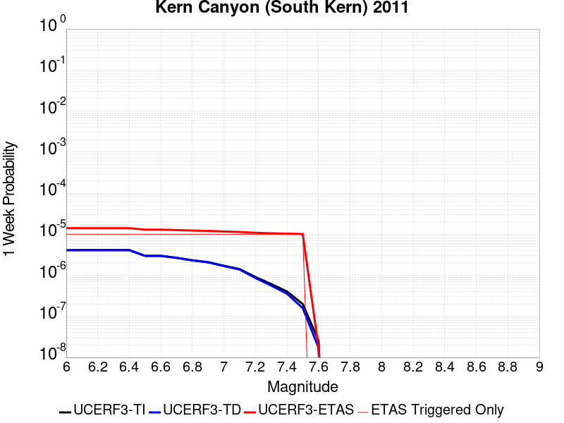 | 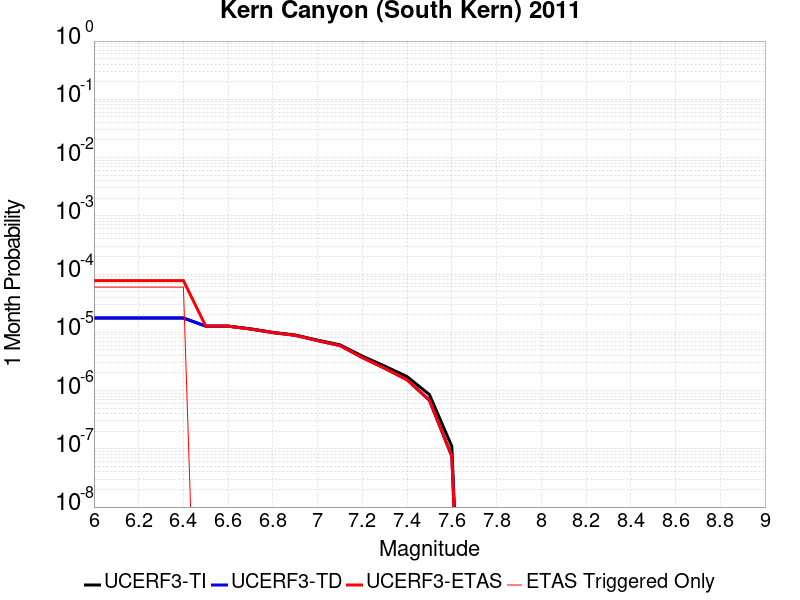 | 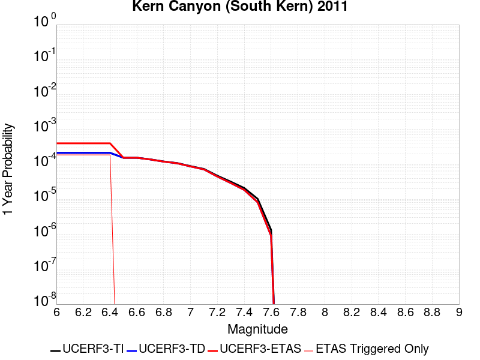 | 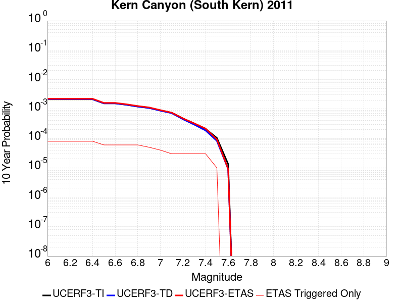 |

| Magnitude | 1 wk TI Prob | 1 wk TD Prob | 1 wk ETAS Prob | 1 wk ETAS/TD Gain | 1 wk ETAS Triggered Only | 1 mo TI Prob | 1 mo TD Prob | 1 mo ETAS Prob | 1 mo ETAS/TD Gain | 1 mo ETAS Triggered Only | 1 yr TI Prob | 1 yr TD Prob | 1 yr ETAS Prob | 1 yr ETAS/TD Gain | 1 yr ETAS Triggered Only | 10 yr TI Prob | 10 yr TD Prob | 10 yr ETAS Prob | 10 yr ETAS/TD Gain | 10 yr ETAS Triggered Only |
|-----|-----|-----|-----|-----|-----|-----|-----|-----|-----|-----|-----|-----|-----|-----|-----|-----|-----|-----|-----|-----|
| 6.0 | 4.105075E-6 | 4.113726E-6 | 1.4113684E-5 | 3.4308763 | 1.0E-5 | 1.7593058E-5 | 1.7630138E-5 | 3.7629787E-5 | 2.134401 | 2.0E-5 | 2.1417443E-4 | 2.1462643E-4 | 2.7461356E-4 | 1.2794955 | 6.0E-5 | 0.0021396813 | 0.0021442554 | 0.0022240838 | 1.037229 | 8.0E-5 |
| 6.1 | 4.105075E-6 | 4.113726E-6 | 1.4113684E-5 | 3.4308763 | 1.0E-5 | 1.7593058E-5 | 1.7630138E-5 | 3.7629787E-5 | 2.134401 | 2.0E-5 | 2.1417443E-4 | 2.1462643E-4 | 2.7461356E-4 | 1.2794955 | 6.0E-5 | 0.0021396813 | 0.0021442554 | 0.0022240838 | 1.037229 | 8.0E-5 |
| 6.2 | 4.105075E-6 | 4.113726E-6 | 1.4113684E-5 | 3.4308763 | 1.0E-5 | 1.7593058E-5 | 1.7630138E-5 | 3.7629787E-5 | 2.134401 | 2.0E-5 | 2.1417443E-4 | 2.1462643E-4 | 2.7461356E-4 | 1.2794955 | 6.0E-5 | 0.0021396813 | 0.0021442554 | 0.0022240838 | 1.037229 | 8.0E-5 |
| 6.3 | 4.105075E-6 | 4.113726E-6 | 1.4113684E-5 | 3.4308763 | 1.0E-5 | 1.7593058E-5 | 1.7630138E-5 | 3.7629787E-5 | 2.134401 | 2.0E-5 | 2.1417443E-4 | 2.1462643E-4 | 2.7461356E-4 | 1.2794955 | 6.0E-5 | 0.0021396813 | 0.0021442554 | 0.0022240838 | 1.037229 | 8.0E-5 |
| 6.4 | 4.105075E-6 | 4.113726E-6 | 1.4113684E-5 | 3.4308763 | 1.0E-5 | 1.7593058E-5 | 1.7630138E-5 | 3.7629787E-5 | 2.134401 | 2.0E-5 | 2.1417443E-4 | 2.1462643E-4 | 2.7461356E-4 | 1.2794955 | 6.0E-5 | 0.0021396813 | 0.0021442554 | 0.0022240838 | 1.037229 | 8.0E-5 |
| 6.5 | 2.9849807E-6 | 2.973154E-6 | 1.2973124E-5 | 4.3634214 | 1.0E-5 | 1.2792712E-5 | 1.2742028E-5 | 2.27419E-5 | 1.7847944 | 1.0E-5 | 1.5574014E-4 | 1.551233E-4 | 2.0511553E-4 | 1.3222742 | 5.0E-5 | 0.0015563103 | 0.0015501654 | 0.0016100723 | 1.0386455 | 6.0E-5 |
| 6.6 | 2.9849807E-6 | 2.973154E-6 | 1.2973124E-5 | 4.3634214 | 1.0E-5 | 1.2792712E-5 | 1.2742028E-5 | 2.27419E-5 | 1.7847944 | 1.0E-5 | 1.5574014E-4 | 1.551233E-4 | 2.0511553E-4 | 1.3222742 | 5.0E-5 | 0.0015563103 | 0.0015501654 | 0.0016100723 | 1.0386455 | 6.0E-5 |
| 6.7 | 2.6756725E-6 | 2.6582202E-6 | 1.2658194E-5 | 4.7619057 | 1.0E-5 | 1.1467117E-5 | 1.1392323E-5 | 2.1392209E-5 | 1.8777741 | 1.0E-5 | 1.396032E-4 | 1.386928E-4 | 1.8868588E-4 | 1.360459 | 5.0E-5 | 0.0013951553 | 0.0013860734 | 0.0014459903 | 1.0432278 | 6.0E-5 |
| 6.8 | 2.3283721E-6 | 2.3047783E-6 | 1.2304755E-5 | 5.3388023 | 1.0E-5 | 9.9787E-6 | 9.877584E-6 | 1.9877485E-5 | 2.0123832 | 1.0E-5 | 1.214839E-4 | 1.2025302E-4 | 1.70247E-4 | 1.41574 | 5.0E-5 | 0.001214175 | 0.001201887 | 0.0012618148 | 1.0498616 | 6.0E-5 |
| 6.9 | 2.0972677E-6 | 2.0696405E-6 | 1.20696195E-5 | 5.831747 | 1.0E-5 | 8.988259E-6 | 8.869858E-6 | 1.8869769E-5 | 2.1274037 | 1.0E-5 | 1.0942656E-4 | 1.0798523E-4 | 1.4798091E-4 | 1.370381 | 4.0E-5 | 0.0010937268 | 0.0010793334 | 0.0011292794 | 1.0462749 | 5.0E-5 |
| 7.0 | 1.7132242E-6 | 1.6787029E-6 | 1.1678686E-5 | 6.95697 | 1.0E-5 | 7.3423685E-6 | 7.1944214E-6 | 1.719435E-5 | 2.3899558 | 1.0E-5 | 8.938967E-5 | 8.75886E-5 | 1.275851E-4 | 1.4566405 | 4.0E-5 | 8.935372E-4 | 8.755446E-4 | 9.155096E-4 | 1.0456458 | 4.0E-5 |
| 7.1 | 1.4215541E-6 | 1.3815746E-6 | 1.138156E-5 | 8.238108 | 1.0E-5 | 6.0923603E-6 | 5.9210206E-6 | 1.5920961E-5 | 2.688888 | 1.0E-5 | 7.417196E-5 | 7.208607E-5 | 1.02083904E-4 | 1.4161391 | 3.0E-5 | 7.414721E-4 | 7.206296E-4 | 7.506079E-4 | 1.0416002 | 3.0E-5 |
| 7.2 | 9.097853E-7 | 8.60377E-7 | 1.0860368E-5 | 12.622803 | 1.0E-5 | 3.899074E-6 | 3.6873246E-6 | 1.3687288E-5 | 3.7119834 | 1.0E-5 | 4.7470192E-5 | 4.4892266E-5 | 7.4890915E-5 | 1.6682366 | 3.0E-5 | 4.7460053E-4 | 4.4883305E-4 | 4.7881957E-4 | 1.06681 | 3.0E-5 |
| 7.3 | 6.144169E-7 | 5.628199E-7 | 1.0562814E-5 | 18.767664 | 1.0E-5 | 2.6332125E-6 | 2.4120832E-6 | 1.2412059E-5 | 5.1457844 | 1.0E-5 | 3.205889E-5 | 2.9366722E-5 | 5.936584E-5 | 2.0215344 | 3.0E-5 | 3.2054266E-4 | 2.9362892E-4 | 3.236201E-4 | 1.1021398 | 3.0E-5 |
| 7.4 | 4.049844E-7 | 3.5728252E-7 | 1.0357279E-5 | 28.989046 | 1.0E-5 | 1.7356463E-6 | 1.5312098E-6 | 1.1531194E-5 | 7.5307736 | 1.0E-5 | 2.1131287E-5 | 1.8642324E-5 | 4.8641763E-5 | 2.6092114 | 3.0E-5 | 2.1129279E-4 | 1.8640784E-4 | 2.1640224E-4 | 1.1609074 | 3.0E-5 |
| 7.5 | 1.9871162E-7 | 1.5830383E-7 | 1.0158302E-5 | 64.169655 | 1.0E-5 | 8.5162094E-7 | 6.784448E-7 | 1.0678438E-5 | 15.739583 | 1.0E-5 | 1.0368436E-5 | 8.260035E-6 | 1.8259952E-5 | 2.2106385 | 1.0E-5 | 1.0367952E-4 | 8.259736E-5 | 9.2596536E-5 | 1.1210592 | 1.0E-5 |
| 7.6 | 2.572245E-8 | 1.735264E-8 | 1.735264E-8 | 1.0 | 0.0 | 1.10239064E-7 | 7.436845E-8 | 7.436845E-8 | 1.0 | 0.0 | 1.3421597E-6 | 9.0543557E-7 | 9.0543557E-7 | 1.0 | 0.0 | 1.3421517E-5 | 9.054324E-6 | 9.054324E-6 | 1.0 | 0.0 |

## Red Mountain
*[(top)](#table-of-contents)*

| 1 Week | 1 Month | 1 Year | 10 Year |
|-----|-----|-----|-----|
| 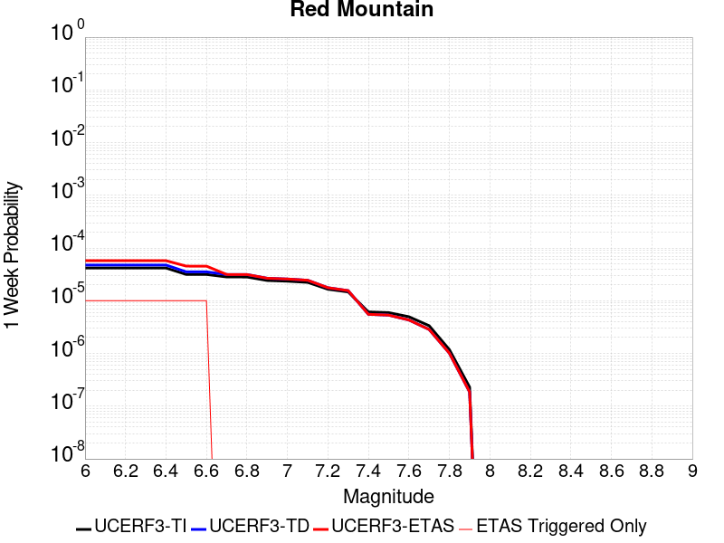 | 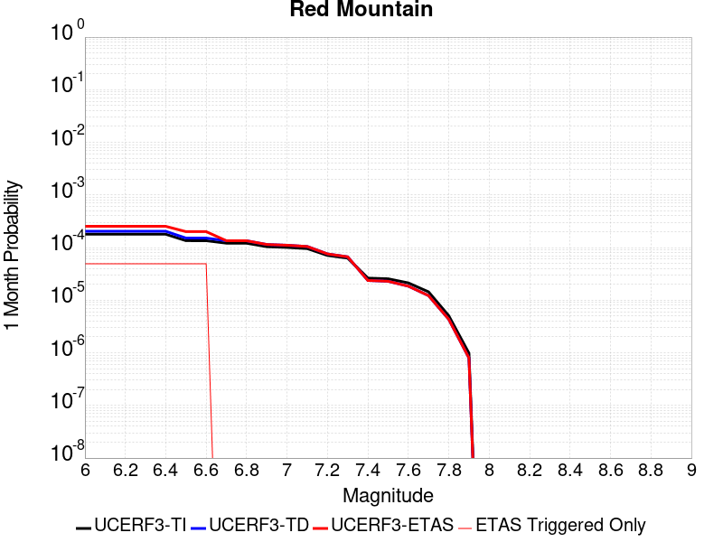 | 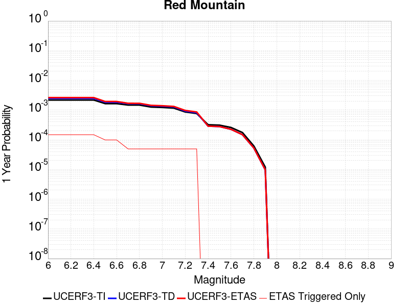 | 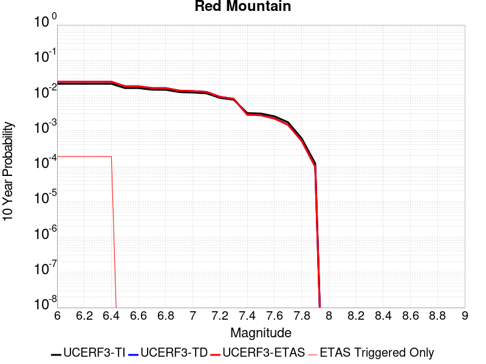 |

| Magnitude | 1 wk TI Prob | 1 wk TD Prob | 1 wk ETAS Prob | 1 wk ETAS/TD Gain | 1 wk ETAS Triggered Only | 1 mo TI Prob | 1 mo TD Prob | 1 mo ETAS Prob | 1 mo ETAS/TD Gain | 1 mo ETAS Triggered Only | 1 yr TI Prob | 1 yr TD Prob | 1 yr ETAS Prob | 1 yr ETAS/TD Gain | 1 yr ETAS Triggered Only | 10 yr TI Prob | 10 yr TD Prob | 10 yr ETAS Prob | 10 yr ETAS/TD Gain | 10 yr ETAS Triggered Only |
|-----|-----|-----|-----|-----|-----|-----|-----|-----|-----|-----|-----|-----|-----|-----|-----|-----|-----|-----|-----|-----|
| 6.0 | 4.1810763E-5 | 4.7590016E-5 | 5.758954E-5 | 1.210118 | 1.0E-5 | 1.7917668E-4 | 2.039422E-4 | 2.2393811E-4 | 1.098047 | 2.0E-5 | 0.0021792934 | 0.0024803334 | 0.0025302093 | 1.0201086 | 5.0E-5 | 0.021580452 | 0.02454411 | 0.024622148 | 1.0031794 | 8.0E-5 |
| 6.1 | 4.1810763E-5 | 4.7590016E-5 | 5.758954E-5 | 1.210118 | 1.0E-5 | 1.7917668E-4 | 2.039422E-4 | 2.2393811E-4 | 1.098047 | 2.0E-5 | 0.0021792934 | 0.0024803334 | 0.0025302093 | 1.0201086 | 5.0E-5 | 0.021580452 | 0.02454411 | 0.024622148 | 1.0031794 | 8.0E-5 |
| 6.2 | 4.1810763E-5 | 4.7590016E-5 | 5.758954E-5 | 1.210118 | 1.0E-5 | 1.7917668E-4 | 2.039422E-4 | 2.2393811E-4 | 1.098047 | 2.0E-5 | 0.0021792934 | 0.0024803334 | 0.0025302093 | 1.0201086 | 5.0E-5 | 0.021580452 | 0.02454411 | 0.024622148 | 1.0031794 | 8.0E-5 |
| 6.3 | 4.1810763E-5 | 4.7590016E-5 | 5.758954E-5 | 1.210118 | 1.0E-5 | 1.7917668E-4 | 2.039422E-4 | 2.2393811E-4 | 1.098047 | 2.0E-5 | 0.0021792934 | 0.0024803334 | 0.0025302093 | 1.0201086 | 5.0E-5 | 0.021580452 | 0.02454411 | 0.024622148 | 1.0031794 | 8.0E-5 |
| 6.4 | 4.1810763E-5 | 4.7590016E-5 | 5.758954E-5 | 1.210118 | 1.0E-5 | 1.7917668E-4 | 2.039422E-4 | 2.2393811E-4 | 1.098047 | 2.0E-5 | 0.0021792934 | 0.0024803334 | 0.0025302093 | 1.0201086 | 5.0E-5 | 0.021580452 | 0.02454411 | 0.024622148 | 1.0031794 | 8.0E-5 |
| 6.5 | 3.154503E-5 | 3.5359757E-5 | 4.5359404E-5 | 1.2827973 | 1.0E-5 | 1.3518598E-4 | 1.5153353E-4 | 1.715305E-4 | 1.131964 | 2.0E-5 | 0.0016446467 | 0.0018434518 | 0.001883378 | 1.0216584 | 4.0E-5 | 0.01632528 | 0.018291244 | 0.018350147 | 1.0032202 | 6.0E-5 |
| 6.6 | 3.1535834E-5 | 3.5349138E-5 | 4.5348785E-5 | 1.2828823 | 1.0E-5 | 1.3514658E-4 | 1.5148803E-4 | 1.7148501E-4 | 1.1320037 | 2.0E-5 | 0.0016441676 | 0.0018428987 | 0.0018828249 | 1.021665 | 4.0E-5 | 0.01632056 | 0.018285805 | 0.018344708 | 1.0032213 | 6.0E-5 |
| 6.7 | 2.8267326E-5 | 3.1469353E-5 | 3.1469353E-5 | 1.0 | 0.0 | 1.2114006E-4 | 1.3486217E-4 | 1.4486082E-4 | 1.0741398 | 1.0E-5 | 0.0014738824 | 0.0016407954 | 0.0016707461 | 1.0182538 | 3.0E-5 | 0.014641452 | 0.01629557 | 0.016344756 | 1.0030183 | 5.0E-5 |
| 6.8 | 2.8212884E-5 | 3.1407242E-5 | 3.1407242E-5 | 1.0 | 0.0 | 1.20906756E-4 | 1.3459599E-4 | 1.4459465E-4 | 1.0742865 | 1.0E-5 | 0.0014710457 | 0.0016375595 | 0.0016675104 | 1.0182899 | 3.0E-5 | 0.014613459 | 0.016263688 | 0.016312875 | 1.0030243 | 5.0E-5 |
| 6.9 | 2.4227871E-5 | 2.6706994E-5 | 2.6706994E-5 | 1.0 | 0.0 | 1.03829596E-4 | 1.1445395E-4 | 1.2445281E-4 | 1.0873613 | 1.0E-5 | 0.0012633923 | 0.0013926621 | 0.0014226203 | 1.0215114 | 3.0E-5 | 0.012562336 | 0.0138470335 | 0.01388648 | 1.0028487 | 4.0E-5 |
| 7.0 | 2.348524E-5 | 2.5835778E-5 | 2.5835778E-5 | 1.0 | 0.0 | 1.0064714E-4 | 1.10720495E-4 | 1.20719385E-4 | 1.0903075 | 1.0E-5 | 0.0012246901 | 0.001347264 | 0.0013772236 | 1.0222373 | 3.0E-5 | 0.012179627 | 0.013398598 | 0.013438062 | 1.0029454 | 4.0E-5 |
| 7.1 | 2.2311642E-5 | 2.4462845E-5 | 2.4462845E-5 | 1.0 | 0.0 | 9.561782E-5 | 1.04836974E-4 | 1.1483592E-4 | 1.0953763 | 1.0E-5 | 0.0011635252 | 0.0012757176 | 0.0013056793 | 1.0234861 | 3.0E-5 | 0.01157452 | 0.01269146 | 0.012730951 | 1.0031117 | 4.0E-5 |
| 7.2 | 1.6533986E-5 | 1.7670362E-5 | 1.7670362E-5 | 1.0 | 0.0 | 7.085802E-5 | 7.572828E-5 | 8.572753E-5 | 1.1320411 | 1.0E-5 | 8.623549E-4 | 9.2166534E-4 | 9.4164687E-4 | 1.0216799 | 2.0E-5 | 0.008590161 | 0.009184707 | 0.009214431 | 1.0032363 | 3.0E-5 |
| 7.3 | 1.4703092E-5 | 1.5559537E-5 | 1.5559537E-5 | 1.0 | 0.0 | 6.301173E-5 | 6.668237E-5 | 7.66817E-5 | 1.1499547 | 1.0E-5 | 7.668978E-4 | 8.1161706E-4 | 8.3160086E-4 | 1.0246222 | 2.0E-5 | 0.0076425658 | 0.008092604 | 0.008122361 | 1.0036771 | 3.0E-5 |
| 7.4 | 6.1331984E-6 | 5.5288874E-6 | 5.5288874E-6 | 1.0 | 0.0 | 2.6284872E-5 | 2.3695018E-5 | 2.3695018E-5 | 1.0 | 0.0 | 3.199713E-4 | 2.884492E-4 | 2.884492E-4 | 1.0 | 0.0 | 0.0031951098 | 0.0028808024 | 0.0028808024 | 1.0 | 0.0 |
| 7.5 | 5.954766E-6 | 5.338517E-6 | 5.338517E-6 | 1.0 | 0.0 | 2.5520176E-5 | 2.2879161E-5 | 2.2879161E-5 | 1.0 | 0.0 | 3.1066386E-4 | 2.785187E-4 | 2.785187E-4 | 1.0 | 0.0 | 0.003102299 | 0.0027817504 | 0.0027817504 | 1.0 | 0.0 |
| 7.6 | 4.9726646E-6 | 4.315309E-6 | 4.315309E-6 | 1.0 | 0.0 | 2.1311245E-5 | 1.8494053E-5 | 1.8494053E-5 | 1.0 | 0.0 | 2.5943352E-4 | 2.2514217E-4 | 2.2514217E-4 | 1.0 | 0.0 | 0.0025913084 | 0.0022491754 | 0.0022491754 | 1.0 | 0.0 |
| 7.7 | 3.3613894E-6 | 2.8526886E-6 | 2.8526886E-6 | 1.0 | 0.0 | 1.4405875E-5 | 1.22257525E-5 | 1.22257525E-5 | 1.0 | 0.0 | 1.7537741E-4 | 1.4883863E-4 | 1.4883863E-4 | 1.0 | 0.0 | 0.0017523908 | 0.0014874157 | 0.0014874157 | 1.0 | 0.0 |
| 7.8 | 1.1828961E-6 | 1.0122935E-6 | 1.0122935E-6 | 1.0 | 0.0 | 5.069545E-6 | 4.338394E-6 | 4.338394E-6 | 1.0 | 0.0 | 6.171996E-5 | 5.281869E-5 | 5.281869E-5 | 1.0 | 0.0 | 6.170282E-4 | 5.280643E-4 | 5.280643E-4 | 1.0 | 0.0 |
| 7.9 | 2.2967266E-7 | 1.861919E-7 | 1.861919E-7 | 1.0 | 0.0 | 9.843111E-7 | 7.97965E-7 | 7.97965E-7 | 1.0 | 0.0 | 1.19839215E-5 | 9.715184E-6 | 9.715184E-6 | 1.0 | 0.0 | 1.1983275E-4 | 9.714788E-5 | 9.714788E-5 | 1.0 | 0.0 |

## Cleghorn
*[(top)](#table-of-contents)*

| 1 Week | 1 Month | 1 Year | 10 Year |
|-----|-----|-----|-----|
| 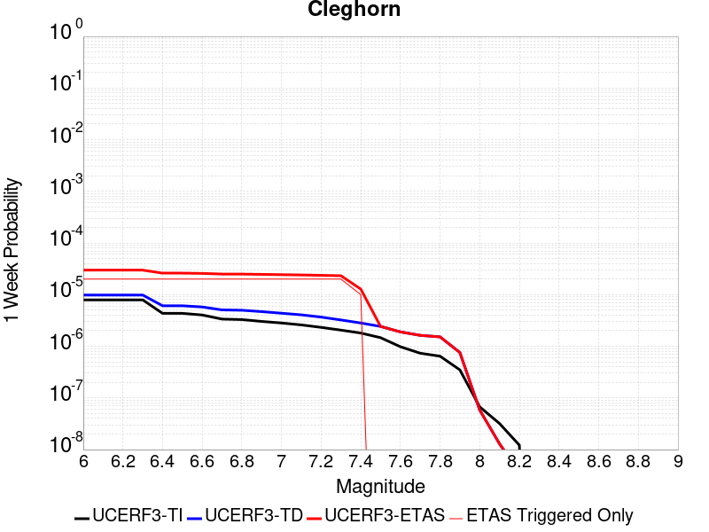 | 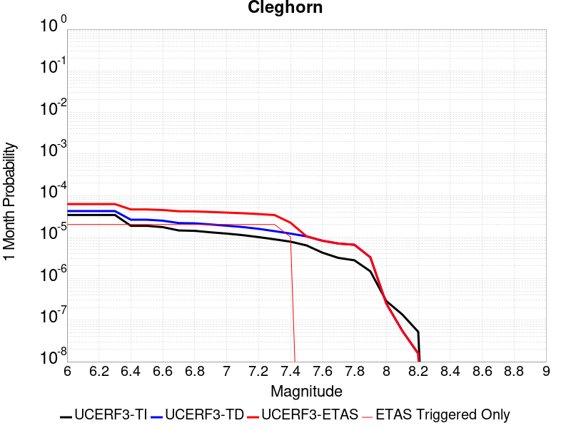 | 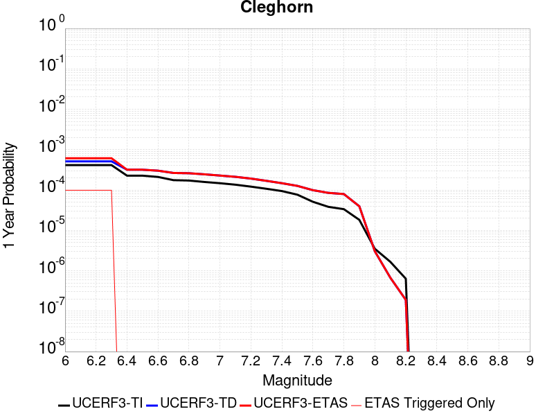 | 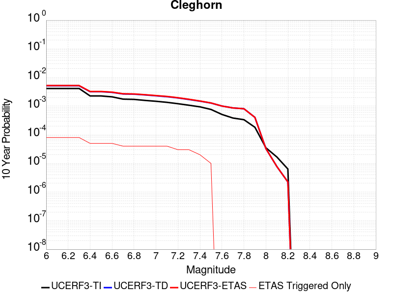 |

| Magnitude | 1 wk TI Prob | 1 wk TD Prob | 1 wk ETAS Prob | 1 wk ETAS/TD Gain | 1 wk ETAS Triggered Only | 1 mo TI Prob | 1 mo TD Prob | 1 mo ETAS Prob | 1 mo ETAS/TD Gain | 1 mo ETAS Triggered Only | 1 yr TI Prob | 1 yr TD Prob | 1 yr ETAS Prob | 1 yr ETAS/TD Gain | 1 yr ETAS Triggered Only | 10 yr TI Prob | 10 yr TD Prob | 10 yr ETAS Prob | 10 yr ETAS/TD Gain | 10 yr ETAS Triggered Only |
|-----|-----|-----|-----|-----|-----|-----|-----|-----|-----|-----|-----|-----|-----|-----|-----|-----|-----|-----|-----|-----|
| 6.0 | 7.9267165E-6 | 9.831764E-6 | 2.9831568E-5 | 3.0342028 | 2.0E-5 | 3.39712E-5 | 4.2135514E-5 | 6.213467E-5 | 1.4746389 | 2.0E-5 | 4.1352084E-4 | 5.1288976E-4 | 5.528692E-4 | 1.0779495 | 4.0E-5 | 0.004127522 | 0.005132214 | 0.0052118036 | 1.0155078 | 8.0E-5 |
| 6.1 | 7.9267165E-6 | 9.831764E-6 | 2.9831568E-5 | 3.0342028 | 2.0E-5 | 3.39712E-5 | 4.2135514E-5 | 6.213467E-5 | 1.4746389 | 2.0E-5 | 4.1352084E-4 | 5.1288976E-4 | 5.528692E-4 | 1.0779495 | 4.0E-5 | 0.004127522 | 0.005132214 | 0.0052118036 | 1.0155078 | 8.0E-5 |
| 6.2 | 7.9267165E-6 | 9.831764E-6 | 2.9831568E-5 | 3.0342028 | 2.0E-5 | 3.39712E-5 | 4.2135514E-5 | 6.213467E-5 | 1.4746389 | 2.0E-5 | 4.1352084E-4 | 5.1288976E-4 | 5.528692E-4 | 1.0779495 | 4.0E-5 | 0.004127522 | 0.005132214 | 0.0052118036 | 1.0155078 | 8.0E-5 |
| 6.3 | 7.9267165E-6 | 9.831764E-6 | 2.9831568E-5 | 3.0342028 | 2.0E-5 | 3.39712E-5 | 4.2135514E-5 | 6.213467E-5 | 1.4746389 | 2.0E-5 | 4.1352084E-4 | 5.1288976E-4 | 5.528692E-4 | 1.0779495 | 4.0E-5 | 0.004127522 | 0.005132214 | 0.0052118036 | 1.0155078 | 8.0E-5 |
| 6.4 | 4.3445207E-6 | 6.0916254E-6 | 2.6091504E-5 | 4.283176 | 2.0E-5 | 1.8619241E-5 | 2.6106709E-5 | 4.6106186E-5 | 1.7660666 | 2.0E-5 | 2.2666567E-4 | 3.1780385E-4 | 3.3779748E-4 | 1.0629119 | 2.0E-5 | 0.0022643462 | 0.0031877246 | 0.0032375653 | 1.0156351 | 5.0E-5 |
| 6.5 | 4.3445207E-6 | 6.0916254E-6 | 2.6091504E-5 | 4.283176 | 2.0E-5 | 1.8619241E-5 | 2.6106709E-5 | 4.6106186E-5 | 1.7660666 | 2.0E-5 | 2.2666567E-4 | 3.1780385E-4 | 3.3779748E-4 | 1.0629119 | 2.0E-5 | 0.0022643462 | 0.0031877246 | 0.0032375653 | 1.0156351 | 5.0E-5 |
| 6.6 | 4.040109E-6 | 5.774033E-6 | 2.5773918E-5 | 4.463763 | 2.0E-5 | 1.7314638E-5 | 2.4745626E-5 | 4.474513E-5 | 1.8082036 | 2.0E-5 | 2.1078532E-4 | 3.0123728E-4 | 3.2123126E-4 | 1.0663729 | 2.0E-5 | 0.002105855 | 0.0030225143 | 0.0030723633 | 1.0164925 | 5.0E-5 |
| 6.7 | 3.3632055E-6 | 5.06753E-6 | 2.506743E-5 | 4.9466763 | 2.0E-5 | 1.4413658E-5 | 2.1717806E-5 | 4.1717372E-5 | 1.9208833 | 2.0E-5 | 1.7547216E-4 | 2.643825E-4 | 2.8437722E-4 | 1.0756279 | 2.0E-5 | 0.0017533366 | 0.0026548486 | 0.0026947423 | 1.0150268 | 4.0E-5 |
| 6.8 | 3.2902772E-6 | 4.9894375E-6 | 2.4989338E-5 | 5.008448 | 2.0E-5 | 1.4101111E-5 | 2.138313E-5 | 4.1382704E-5 | 1.9352968 | 2.0E-5 | 1.716675E-4 | 2.6030882E-4 | 2.8030362E-4 | 1.0768118 | 2.0E-5 | 0.0017153495 | 0.0026142076 | 0.0026541029 | 1.015261 | 4.0E-5 |
| 6.9 | 3.031547E-6 | 4.6911987E-6 | 2.4691104E-5 | 5.263283 | 2.0E-5 | 1.299228E-5 | 2.0104984E-5 | 4.0104584E-5 | 1.9947582 | 2.0E-5 | 1.5816953E-4 | 2.4475096E-4 | 2.6474605E-4 | 1.0816957 | 2.0E-5 | 0.00158057 | 0.0024589805 | 0.0024988821 | 1.0162269 | 4.0E-5 |
| 7.0 | 2.8259715E-6 | 4.3707637E-6 | 2.4370676E-5 | 5.575839 | 2.0E-5 | 1.211125E-5 | 1.8731711E-5 | 3.8731338E-5 | 2.067688 | 2.0E-5 | 1.4744449E-4 | 2.2803496E-4 | 2.480304E-4 | 1.0876858 | 2.0E-5 | 0.001473467 | 0.0022921748 | 0.0023320832 | 1.0174106 | 4.0E-5 |
| 7.1 | 2.5962665E-6 | 4.065983E-6 | 2.4065901E-5 | 5.91884 | 2.0E-5 | 1.1126809E-5 | 1.7425526E-5 | 3.7425176E-5 | 2.1477215 | 2.0E-5 | 1.3546048E-4 | 2.1213535E-4 | 2.321311E-4 | 1.0942594 | 2.0E-5 | 0.0013537793 | 0.0021334959 | 0.0021734105 | 1.0187086 | 4.0E-5 |
| 7.2 | 2.3247253E-6 | 3.6765352E-6 | 2.3676463E-5 | 6.439884 | 2.0E-5 | 9.96307E-6 | 1.5756486E-5 | 3.575617E-5 | 2.2692986 | 2.0E-5 | 1.21293626E-4 | 1.9181852E-4 | 2.1181468E-4 | 1.1042452 | 2.0E-5 | 0.0012122744 | 0.0019307166 | 0.0019606587 | 1.0155083 | 3.0E-5 |
| 7.3 | 2.056928E-6 | 3.235253E-6 | 2.3235189E-5 | 7.181877 | 2.0E-5 | 8.815376E-6 | 1.3865297E-5 | 3.386502E-5 | 2.4424303 | 2.0E-5 | 1.0732192E-4 | 1.6879707E-4 | 1.887937E-4 | 1.1184654 | 2.0E-5 | 0.001072701 | 0.0017009423 | 0.0017308913 | 1.0176073 | 3.0E-5 |
| 7.4 | 1.8055999E-6 | 2.8256538E-6 | 1.2825625E-5 | 4.538994 | 1.0E-5 | 7.738263E-6 | 1.210989E-5 | 2.2109769E-5 | 1.8257613 | 1.0E-5 | 9.4209274E-5 | 1.4742807E-4 | 1.5742659E-4 | 1.0678197 | 1.0E-5 | 9.4169343E-4 | 0.0014876705 | 0.0015076407 | 1.0134238 | 2.0E-5 |
| 7.5 | 1.4683443E-6 | 2.4248943E-6 | 2.4248943E-6 | 1.0 | 0.0 | 6.292889E-6 | 1.0392363E-5 | 1.0392363E-5 | 1.0 | 0.0 | 7.661323E-5 | 1.2651978E-4 | 1.2651978E-4 | 1.0 | 0.0 | 7.658682E-4 | 0.0012788812 | 0.0012888685 | 1.0078093 | 1.0E-5 |
| 7.6 | 9.804088E-7 | 1.9004091E-6 | 1.9004091E-6 | 1.0 | 0.0 | 4.201745E-6 | 8.144585E-6 | 8.144585E-6 | 1.0 | 0.0 | 5.1155046E-5 | 9.915586E-5 | 9.915586E-5 | 1.0 | 0.0 | 5.114327E-4 | 0.0010055583 | 0.0010055583 | 1.0 | 0.0 |
| 7.7 | 7.3434086E-7 | 1.6285549E-6 | 1.6285549E-6 | 1.0 | 0.0 | 3.1471714E-6 | 6.9795024E-6 | 6.9795024E-6 | 1.0 | 0.0 | 3.831614E-5 | 8.4972155E-5 | 8.4972155E-5 | 1.0 | 0.0 | 3.8309532E-4 | 8.6387293E-4 | 8.6387293E-4 | 1.0 | 0.0 |
| 7.8 | 6.434184E-7 | 1.5221389E-6 | 1.5221389E-6 | 1.0 | 0.0 | 2.7575045E-6 | 6.523436E-6 | 6.523436E-6 | 1.0 | 0.0 | 3.35721E-5 | 7.9419966E-5 | 7.9419966E-5 | 1.0 | 0.0 | 3.3567028E-4 | 8.080443E-4 | 8.080443E-4 | 1.0 | 0.0 |
| 7.9 | 3.4943926E-7 | 7.5750586E-7 | 7.5750586E-7 | 1.0 | 0.0 | 1.497596E-6 | 3.2464498E-6 | 3.2464498E-6 | 1.0 | 0.0 | 1.8233079E-5 | 3.9524817E-5 | 3.9524817E-5 | 1.0 | 0.0 | 1.8231584E-4 | 4.0401975E-4 | 4.0401975E-4 | 1.0 | 0.0 |
| 8.0 | 6.717524E-8 | 5.837515E-8 | 5.837515E-8 | 1.0 | 0.0 | 2.8789387E-7 | 2.501792E-7 | 2.501792E-7 | 1.0 | 0.0 | 3.505102E-6 | 3.0459275E-6 | 3.0459275E-6 | 1.0 | 0.0 | 3.5050467E-5 | 3.2751934E-5 | 3.2751934E-5 | 1.0 | 0.0 |
| 8.1 | 3.1984914E-8 | 1.2949885E-8 | 1.2949885E-8 | 1.0 | 0.0 | 1.370782E-7 | 5.549951E-8 | 5.549951E-8 | 1.0 | 0.0 | 1.6689258E-6 | 6.757063E-7 | 6.757063E-7 | 1.0 | 0.0 | 1.6689133E-5 | 7.741151E-6 | 7.741151E-6 | 1.0 | 0.0 |
| 8.2 | 1.21887656E-8 | 3.6471115E-9 | 3.6471115E-9 | 1.0 | 0.0 | 5.2237567E-8 | 1.563048E-8 | 1.563048E-8 | 1.0 | 0.0 | 6.359922E-7 | 1.9030107E-7 | 1.9030107E-7 | 1.0 | 0.0 | 6.3599036E-6 | 2.245849E-6 | 2.245849E-6 | 1.0 | 0.0 |

## Tin Mountain
*[(top)](#table-of-contents)*

| 1 Week | 1 Month | 1 Year | 10 Year |
|-----|-----|-----|-----|
| 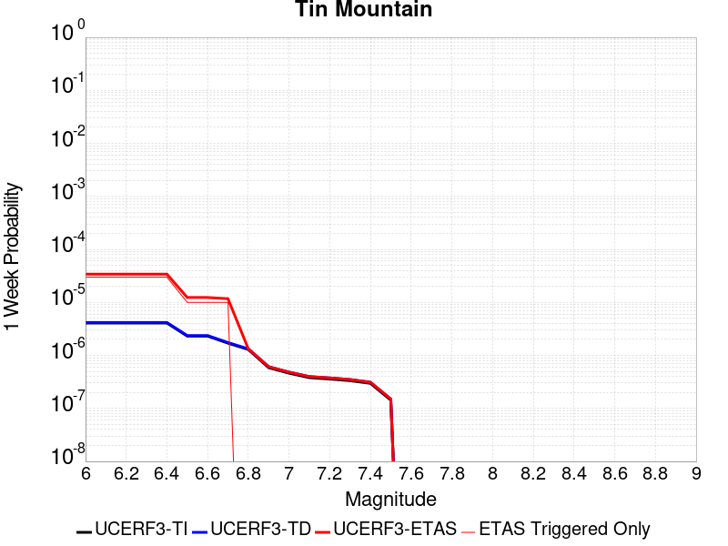 | 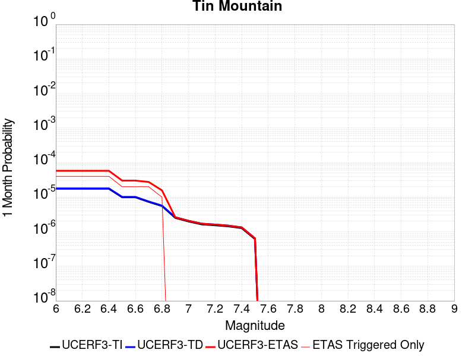 | 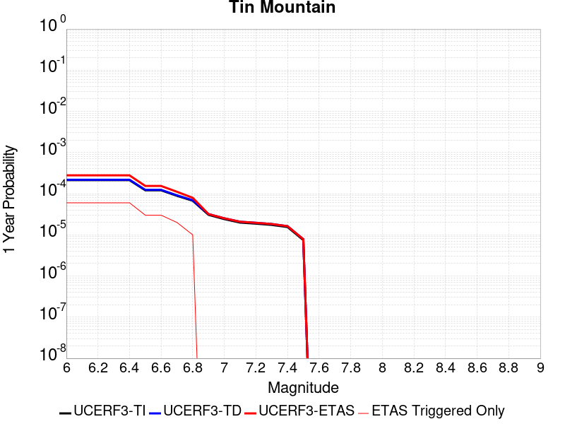 | 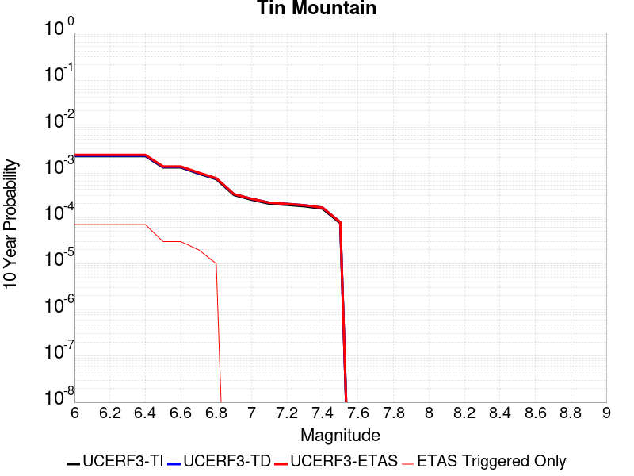 |

| Magnitude | 1 wk TI Prob | 1 wk TD Prob | 1 wk ETAS Prob | 1 wk ETAS/TD Gain | 1 wk ETAS Triggered Only | 1 mo TI Prob | 1 mo TD Prob | 1 mo ETAS Prob | 1 mo ETAS/TD Gain | 1 mo ETAS Triggered Only | 1 yr TI Prob | 1 yr TD Prob | 1 yr ETAS Prob | 1 yr ETAS/TD Gain | 1 yr ETAS Triggered Only | 10 yr TI Prob | 10 yr TD Prob | 10 yr ETAS Prob | 10 yr ETAS/TD Gain | 10 yr ETAS Triggered Only |
|-----|-----|-----|-----|-----|-----|-----|-----|-----|-----|-----|-----|-----|-----|-----|-----|-----|-----|-----|-----|-----|
| 6.0 | 4.083776E-6 | 4.1815365E-6 | 3.4181412E-5 | 8.174366 | 3.0E-5 | 1.750178E-5 | 1.792077E-5 | 5.7920053E-5 | 3.232007 | 4.0E-5 | 2.1306332E-4 | 2.1816725E-4 | 2.7815416E-4 | 1.2749584 | 6.0E-5 | 0.0021285915 | 0.0021798965 | 0.0022497438 | 1.0320417 | 7.0E-5 |
| 6.1 | 4.083776E-6 | 4.1815365E-6 | 3.4181412E-5 | 8.174366 | 3.0E-5 | 1.750178E-5 | 1.792077E-5 | 5.7920053E-5 | 3.232007 | 4.0E-5 | 2.1306332E-4 | 2.1816725E-4 | 2.7815416E-4 | 1.2749584 | 6.0E-5 | 0.0021285915 | 0.0021798965 | 0.0022497438 | 1.0320417 | 7.0E-5 |
| 6.2 | 4.083776E-6 | 4.1815365E-6 | 3.4181412E-5 | 8.174366 | 3.0E-5 | 1.750178E-5 | 1.792077E-5 | 5.7920053E-5 | 3.232007 | 4.0E-5 | 2.1306332E-4 | 2.1816725E-4 | 2.7815416E-4 | 1.2749584 | 6.0E-5 | 0.0021285915 | 0.0021798965 | 0.0022497438 | 1.0320417 | 7.0E-5 |
| 6.3 | 4.083776E-6 | 4.1815365E-6 | 3.4181412E-5 | 8.174366 | 3.0E-5 | 1.750178E-5 | 1.792077E-5 | 5.7920053E-5 | 3.232007 | 4.0E-5 | 2.1306332E-4 | 2.1816725E-4 | 2.7815416E-4 | 1.2749584 | 6.0E-5 | 0.0021285915 | 0.0021798965 | 0.0022497438 | 1.0320417 | 7.0E-5 |
| 6.4 | 4.083776E-6 | 4.1815365E-6 | 3.4181412E-5 | 8.174366 | 3.0E-5 | 1.750178E-5 | 1.792077E-5 | 5.7920053E-5 | 3.232007 | 4.0E-5 | 2.1306332E-4 | 2.1816725E-4 | 2.7815416E-4 | 1.2749584 | 6.0E-5 | 0.0021285915 | 0.0021798965 | 0.0022497438 | 1.0320417 | 7.0E-5 |
| 6.5 | 2.3143427E-6 | 2.3731573E-6 | 1.2373133E-5 | 5.213786 | 1.0E-5 | 9.9185745E-6 | 1.0170638E-5 | 3.0170435E-5 | 2.966425 | 2.0E-5 | 1.2075195E-4 | 1.2382126E-4 | 1.5381754E-4 | 1.2422547 | 3.0E-5 | 0.0012068636 | 0.0012375986 | 0.0012675615 | 1.0242105 | 3.0E-5 |
| 6.6 | 2.3143427E-6 | 2.3731573E-6 | 1.2373133E-5 | 5.213786 | 1.0E-5 | 9.9185745E-6 | 1.0170638E-5 | 3.0170435E-5 | 2.966425 | 2.0E-5 | 1.2075195E-4 | 1.2382126E-4 | 1.5381754E-4 | 1.2422547 | 3.0E-5 | 0.0012068636 | 0.0012375986 | 0.0012675615 | 1.0242105 | 3.0E-5 |
| 6.7 | 1.7029532E-6 | 1.7497915E-6 | 1.1749774E-5 | 6.7149568 | 1.0E-5 | 7.2983503E-6 | 7.499088E-6 | 2.7498938E-5 | 3.666971 | 2.0E-5 | 8.885379E-5 | 9.1298105E-5 | 1.1129628E-4 | 1.2190425 | 2.0E-5 | 8.881827E-4 | 9.1265864E-4 | 9.3264034E-4 | 1.021894 | 2.0E-5 |
| 6.8 | 1.2914646E-6 | 1.3299378E-6 | 1.3299378E-6 | 1.0 | 0.0 | 5.534837E-6 | 5.6997237E-6 | 1.5699667E-5 | 2.754461 | 1.0E-5 | 6.738455E-5 | 6.939237E-5 | 7.939168E-5 | 1.144098 | 1.0E-5 | 6.736412E-4 | 6.9375033E-4 | 7.037434E-4 | 1.0144044 | 1.0E-5 |
| 6.9 | 5.8708974E-7 | 6.1169936E-7 | 6.1169936E-7 | 1.0 | 0.0 | 2.5160964E-6 | 2.6215664E-6 | 2.6215664E-6 | 1.0 | 0.0 | 3.0633044E-5 | 3.1917145E-5 | 3.1917145E-5 | 1.0 | 0.0 | 3.0628822E-4 | 3.191297E-4 | 3.191297E-4 | 1.0 | 0.0 |
| 7.0 | 4.6248786E-7 | 4.832015E-7 | 4.832015E-7 | 1.0 | 0.0 | 1.9820893E-6 | 2.0708624E-6 | 2.0708624E-6 | 1.0 | 0.0 | 2.413167E-5 | 2.5212494E-5 | 2.5212494E-5 | 1.0 | 0.0 | 2.412905E-4 | 2.5210003E-4 | 2.5210003E-4 | 1.0 | 0.0 |
| 7.1 | 3.804606E-7 | 3.987147E-7 | 3.987147E-7 | 1.0 | 0.0 | 1.6305444E-6 | 1.7087764E-6 | 1.7087764E-6 | 1.0 | 0.0 | 1.9851697E-5 | 2.0804187E-5 | 2.0804187E-5 | 1.0 | 0.0 | 1.9849923E-4 | 2.0802575E-4 | 2.0802575E-4 | 1.0 | 0.0 |
| 7.2 | 3.5864858E-7 | 3.7616863E-7 | 3.7616863E-7 | 1.0 | 0.0 | 1.5370645E-6 | 1.6121504E-6 | 1.6121504E-6 | 1.0 | 0.0 | 1.87136E-5 | 1.9627789E-5 | 1.9627789E-5 | 1.0 | 0.0 | 1.8712023E-4 | 1.9626386E-4 | 1.9626386E-4 | 1.0 | 0.0 |
| 7.3 | 3.342063E-7 | 3.506347E-7 | 3.506347E-7 | 1.0 | 0.0 | 1.4323119E-6 | 1.5027196E-6 | 1.5027196E-6 | 1.0 | 0.0 | 1.7438259E-5 | 1.829549E-5 | 1.829549E-5 | 1.0 | 0.0 | 1.743689E-4 | 1.8294314E-4 | 1.8294314E-4 | 1.0 | 0.0 |
| 7.4 | 2.971242E-7 | 3.1165817E-7 | 3.1165817E-7 | 1.0 | 0.0 | 1.2733886E-6 | 1.3356774E-6 | 1.3356774E-6 | 1.0 | 0.0 | 1.5503398E-5 | 1.6261785E-5 | 1.6261785E-5 | 1.0 | 0.0 | 1.5502315E-4 | 1.6260923E-4 | 1.6260923E-4 | 1.0 | 0.0 |
| 7.5 | 1.4326713E-7 | 1.5012525E-7 | 1.5012525E-7 | 1.0 | 0.0 | 6.140018E-7 | 6.433939E-7 | 6.433939E-7 | 1.0 | 0.0 | 7.4754466E-6 | 7.8333205E-6 | 7.8333205E-6 | 1.0 | 0.0 | 7.475195E-5 | 7.833321E-5 | 7.833321E-5 | 1.0 | 0.0 |

## San Jacinto (Coyote Creek)
*[(top)](#table-of-contents)*

| 1 Week | 1 Month | 1 Year | 10 Year |
|-----|-----|-----|-----|
| 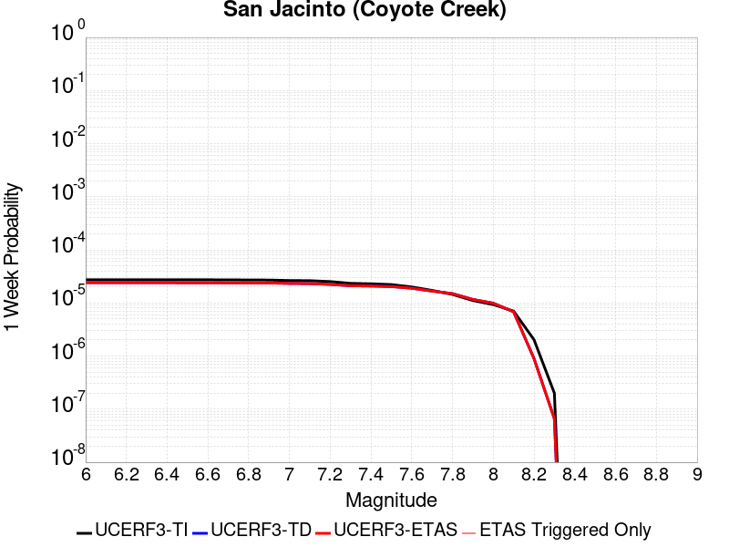 | 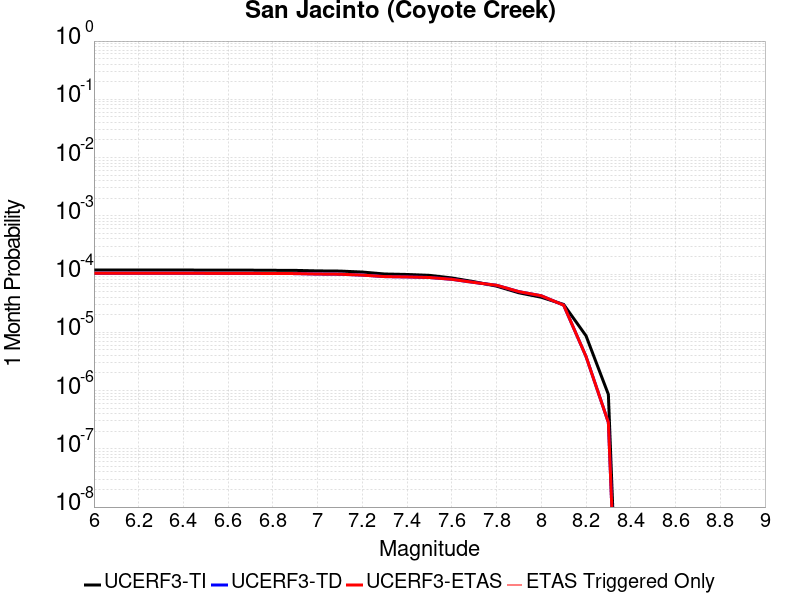 | 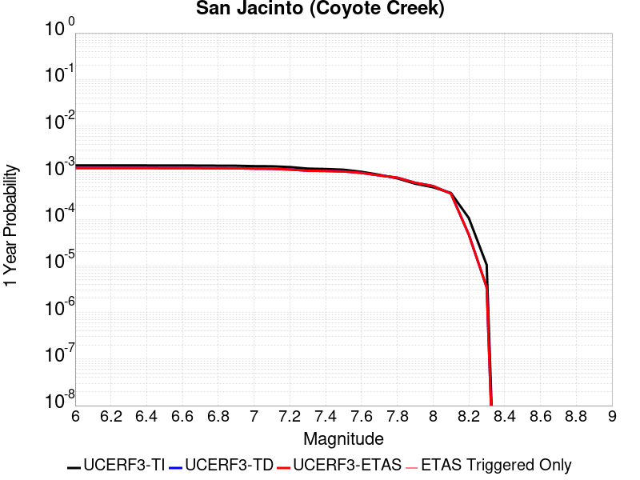 | 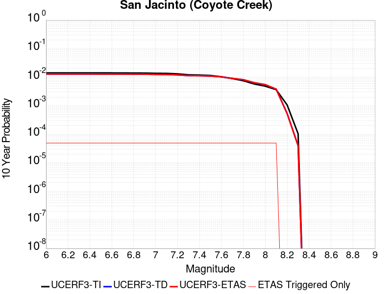 |

| Magnitude | 1 wk TI Prob | 1 wk TD Prob | 1 wk ETAS Prob | 1 wk ETAS/TD Gain | 1 wk ETAS Triggered Only | 1 mo TI Prob | 1 mo TD Prob | 1 mo ETAS Prob | 1 mo ETAS/TD Gain | 1 mo ETAS Triggered Only | 1 yr TI Prob | 1 yr TD Prob | 1 yr ETAS Prob | 1 yr ETAS/TD Gain | 1 yr ETAS Triggered Only | 10 yr TI Prob | 10 yr TD Prob | 10 yr ETAS Prob | 10 yr ETAS/TD Gain | 10 yr ETAS Triggered Only |
|-----|-----|-----|-----|-----|-----|-----|-----|-----|-----|-----|-----|-----|-----|-----|-----|-----|-----|-----|-----|-----|
| 6.0 | 2.7374346E-5 | 2.41444E-5 | 4.4143915E-5 | 1.8283294 | 2.0E-5 | 1.1731335E-4 | 1.034719E-4 | 1.2346983E-4 | 1.1932691 | 2.0E-5 | 0.0014273542 | 0.001259045 | 0.001308982 | 1.0396626 | 5.0E-5 | 0.01418221 | 0.012928195 | 0.01299729 | 1.0053445 | 7.0E-5 |
| 6.1 | 2.7374346E-5 | 2.41444E-5 | 4.4143915E-5 | 1.8283294 | 2.0E-5 | 1.1731335E-4 | 1.034719E-4 | 1.2346983E-4 | 1.1932691 | 2.0E-5 | 0.0014273542 | 0.001259045 | 0.001308982 | 1.0396626 | 5.0E-5 | 0.01418221 | 0.012928195 | 0.01299729 | 1.0053445 | 7.0E-5 |
| 6.2 | 2.7374346E-5 | 2.41444E-5 | 4.4143915E-5 | 1.8283294 | 2.0E-5 | 1.1731335E-4 | 1.034719E-4 | 1.2346983E-4 | 1.1932691 | 2.0E-5 | 0.0014273542 | 0.001259045 | 0.001308982 | 1.0396626 | 5.0E-5 | 0.01418221 | 0.012928195 | 0.01299729 | 1.0053445 | 7.0E-5 |
| 6.3 | 2.7374346E-5 | 2.41444E-5 | 4.4143915E-5 | 1.8283294 | 2.0E-5 | 1.1731335E-4 | 1.034719E-4 | 1.2346983E-4 | 1.1932691 | 2.0E-5 | 0.0014273542 | 0.001259045 | 0.001308982 | 1.0396626 | 5.0E-5 | 0.01418221 | 0.012928195 | 0.01299729 | 1.0053445 | 7.0E-5 |
| 6.4 | 2.7374346E-5 | 2.41444E-5 | 4.4143915E-5 | 1.8283294 | 2.0E-5 | 1.1731335E-4 | 1.034719E-4 | 1.2346983E-4 | 1.1932691 | 2.0E-5 | 0.0014273542 | 0.001259045 | 0.001308982 | 1.0396626 | 5.0E-5 | 0.01418221 | 0.012928195 | 0.01299729 | 1.0053445 | 7.0E-5 |
| 6.5 | 2.7282445E-5 | 2.4030476E-5 | 4.4029995E-5 | 1.8322564 | 2.0E-5 | 1.16919524E-4 | 1.0298371E-4 | 1.2298164E-4 | 1.1941855 | 2.0E-5 | 0.0014225657 | 0.001253108 | 0.0013030454 | 1.0398508 | 5.0E-5 | 0.014134934 | 0.012869522 | 0.012938621 | 1.0053692 | 7.0E-5 |
| 6.6 | 2.7282445E-5 | 2.4030476E-5 | 4.4029995E-5 | 1.8322564 | 2.0E-5 | 1.16919524E-4 | 1.0298371E-4 | 1.2298164E-4 | 1.1941855 | 2.0E-5 | 0.0014225657 | 0.001253108 | 0.0013030454 | 1.0398508 | 5.0E-5 | 0.014134934 | 0.012869522 | 0.012938621 | 1.0053692 | 7.0E-5 |
| 6.7 | 2.7216198E-5 | 2.3955597E-5 | 4.395512E-5 | 1.834858 | 2.0E-5 | 1.1663563E-4 | 1.02662816E-4 | 1.2266077E-4 | 1.1947925 | 2.0E-5 | 0.0014191137 | 0.0012492058 | 0.0012991433 | 1.0399754 | 5.0E-5 | 0.014100855 | 0.012830934 | 0.012900036 | 1.0053855 | 7.0E-5 |
| 6.8 | 2.7078617E-5 | 2.3872815E-5 | 4.387234E-5 | 1.8377529 | 2.0E-5 | 1.1604605E-4 | 1.0230807E-4 | 1.2230602E-4 | 1.195468 | 2.0E-5 | 0.001411945 | 0.0012448917 | 0.0012948294 | 1.0401142 | 5.0E-5 | 0.014030075 | 0.0127880825 | 0.012857188 | 1.0054039 | 7.0E-5 |
| 6.9 | 2.6982952E-5 | 2.3792329E-5 | 4.3791853E-5 | 1.840587 | 2.0E-5 | 1.15636096E-4 | 1.0196315E-4 | 1.21961115E-4 | 1.1961293 | 2.0E-5 | 0.0014069602 | 0.0012406971 | 0.0012906351 | 1.04025 | 5.0E-5 | 0.013980856 | 0.012746378 | 0.012815486 | 1.0054218 | 7.0E-5 |
| 7.0 | 2.6449972E-5 | 2.3369357E-5 | 4.3368887E-5 | 1.8558016 | 2.0E-5 | 1.1335209E-4 | 1.0015055E-4 | 1.2014855E-4 | 1.1996794 | 2.0E-5 | 0.001379188 | 0.0012186535 | 0.0012685927 | 1.0409789 | 5.0E-5 | 0.0137065975 | 0.012527733 | 0.012596856 | 1.0055176 | 7.0E-5 |
| 7.1 | 2.6257849E-5 | 2.3195396E-5 | 4.3194934E-5 | 1.86222 | 2.0E-5 | 1.1252879E-4 | 9.940507E-5 | 1.1940308E-4 | 1.201177 | 2.0E-5 | 0.0013691769 | 0.0012095873 | 0.0012595269 | 1.0412865 | 5.0E-5 | 0.013607717 | 0.012437661 | 0.01250679 | 1.005558 | 7.0E-5 |
| 7.2 | 2.5270041E-5 | 2.2390155E-5 | 4.2389707E-5 | 1.8932297 | 2.0E-5 | 1.0829568E-4 | 9.5954296E-5 | 1.15952374E-4 | 1.2084125 | 2.0E-5 | 0.0013177024 | 0.0011676198 | 0.0012175614 | 1.0427722 | 5.0E-5 | 0.013099162 | 0.0120187905 | 0.012087949 | 1.0057542 | 7.0E-5 |
| 7.3 | 2.339701E-5 | 2.1122027E-5 | 4.1121606E-5 | 1.9468588 | 2.0E-5 | 1.0026905E-4 | 9.051985E-5 | 1.10518034E-4 | 1.220926 | 2.0E-5 | 0.001220092 | 0.001101524 | 0.001151469 | 1.0453416 | 5.0E-5 | 0.012134149 | 0.011357642 | 0.0114268465 | 1.0060933 | 7.0E-5 |
| 7.4 | 2.296333E-5 | 2.0852396E-5 | 4.0851977E-5 | 1.9591024 | 2.0E-5 | 9.841056E-5 | 8.936436E-5 | 1.0936257E-4 | 1.2237829 | 2.0E-5 | 0.0011974899 | 0.0010874701 | 0.0011374156 | 1.0459282 | 5.0E-5 | 0.011910575 | 0.011216754 | 0.011285969 | 1.0061706 | 7.0E-5 |
| 7.5 | 2.2188895E-5 | 2.037534E-5 | 4.0374933E-5 | 1.9815587 | 2.0E-5 | 9.50918E-5 | 8.731998E-5 | 1.07318236E-4 | 1.2290226 | 2.0E-5 | 0.0011571277 | 0.0010626042 | 0.0011125512 | 1.0470042 | 5.0E-5 | 0.011511209 | 0.010966369 | 0.011035602 | 1.0063132 | 7.0E-5 |
| 7.6 | 2.0013189E-5 | 1.8961666E-5 | 3.8961287E-5 | 2.0547397 | 2.0E-5 | 8.5767984E-5 | 8.126176E-5 | 1.01260135E-4 | 1.2460983 | 2.0E-5 | 0.001043725 | 9.889146E-4 | 0.0010388652 | 1.0505105 | 5.0E-5 | 0.010388365 | 0.010224371 | 0.010293656 | 1.0067763 | 7.0E-5 |
| 7.7 | 1.7230794E-5 | 1.6743043E-5 | 3.674271E-5 | 2.194506 | 2.0E-5 | 7.384417E-5 | 7.175393E-5 | 9.1752496E-5 | 1.2787104 | 2.0E-5 | 8.986819E-4 | 8.732547E-4 | 9.232111E-4 | 1.0572071 | 5.0E-5 | 0.008950562 | 0.00906292 | 0.009132286 | 1.0076538 | 7.0E-5 |
| 7.8 | 1.4478809E-5 | 1.499039E-5 | 3.499009E-5 | 2.3341682 | 2.0E-5 | 6.205057E-5 | 6.424295E-5 | 8.424166E-5 | 1.3112983 | 2.0E-5 | 7.552038E-4 | 7.8187784E-4 | 8.3183876E-4 | 1.0638986 | 5.0E-5 | 0.0075264242 | 0.008141388 | 0.008210818 | 1.008528 | 7.0E-5 |
| 7.9 | 1.1114467E-5 | 1.1644517E-5 | 3.1644286E-5 | 2.7175267 | 2.0E-5 | 4.7632562E-5 | 4.990412E-5 | 6.990312E-5 | 1.4007485 | 2.0E-5 | 5.797721E-4 | 6.074139E-4 | 6.5738347E-4 | 1.0822662 | 5.0E-5 | 0.0057826187 | 0.0063803545 | 0.006449908 | 1.0109012 | 7.0E-5 |
| 8.0 | 9.327402E-6 | 9.8986575E-6 | 2.989846E-5 | 3.020456 | 2.0E-5 | 3.9973966E-5 | 4.2422133E-5 | 6.2421284E-5 | 1.471432 | 2.0E-5 | 4.8657437E-4 | 5.163676E-4 | 5.663418E-4 | 1.0967803 | 5.0E-5 | 0.0048551033 | 0.00544994 | 0.0055195587 | 1.0127742 | 7.0E-5 |
| 8.1 | 7.0235833E-6 | 6.826985E-6 | 1.6826916E-5 | 2.4647655 | 1.0E-5 | 3.0100724E-5 | 2.9258183E-5 | 3.9257888E-5 | 1.3417747 | 1.0E-5 | 3.664147E-4 | 3.5616063E-4 | 3.8614997E-4 | 1.0842017 | 3.0E-5 | 0.003658111 | 0.0037874572 | 0.0038372679 | 1.0131515 | 5.0E-5 |
| 8.2 | 2.0358202E-6 | 8.9912584E-7 | 8.9912584E-7 | 1.0 | 0.0 | 8.724915E-6 | 3.853391E-6 | 3.853391E-6 | 1.0 | 0.0 | 1.06220665E-4 | 4.6914047E-5 | 4.6914047E-5 | 1.0 | 0.0 | 0.001061699 | 5.3239096E-4 | 5.3239096E-4 | 1.0 | 0.0 |
| 8.3 | 2.0051264E-7 | 6.61379E-8 | 6.61379E-8 | 1.0 | 0.0 | 8.5933965E-7 | 2.8344812E-7 | 2.8344812E-7 | 1.0 | 0.0 | 1.046241E-5 | 3.450976E-6 | 3.450976E-6 | 1.0 | 0.0 | 1.0461917E-4 | 4.0120205E-5 | 4.0120205E-5 | 1.0 | 0.0 |

## San Diego Trough north alt1
*[(top)](#table-of-contents)*

| 1 Week | 1 Month | 1 Year | 10 Year |
|-----|-----|-----|-----|
| 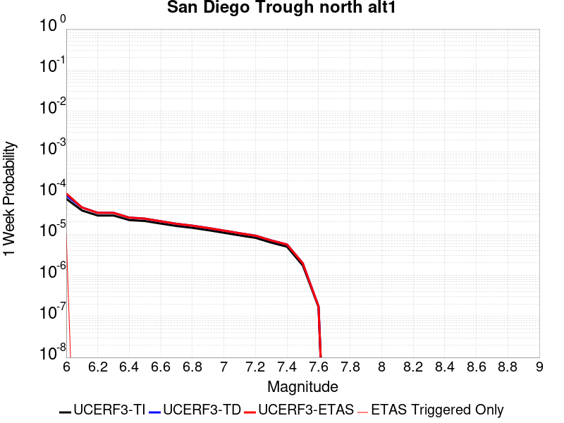 | 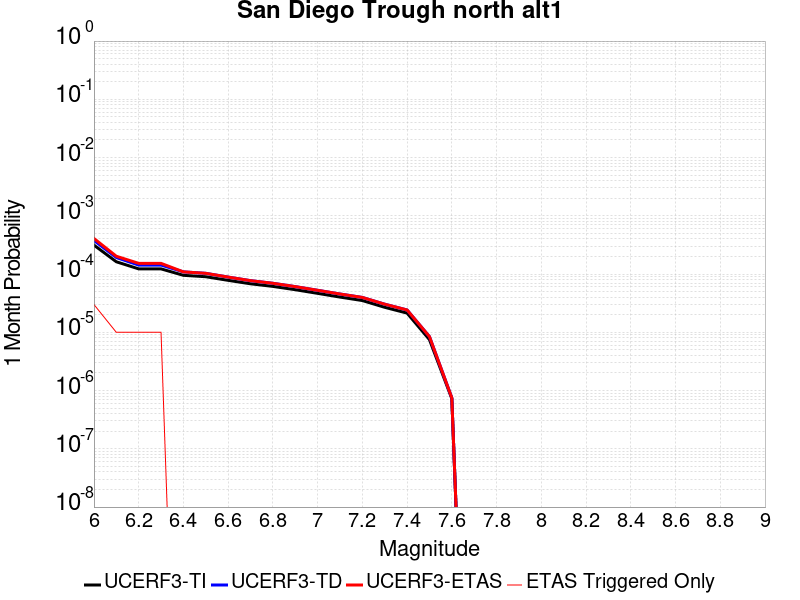 | 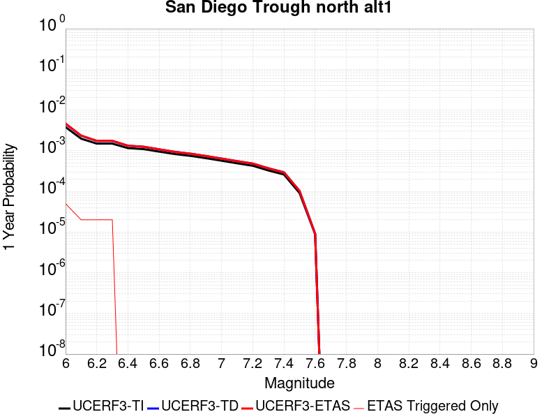 | 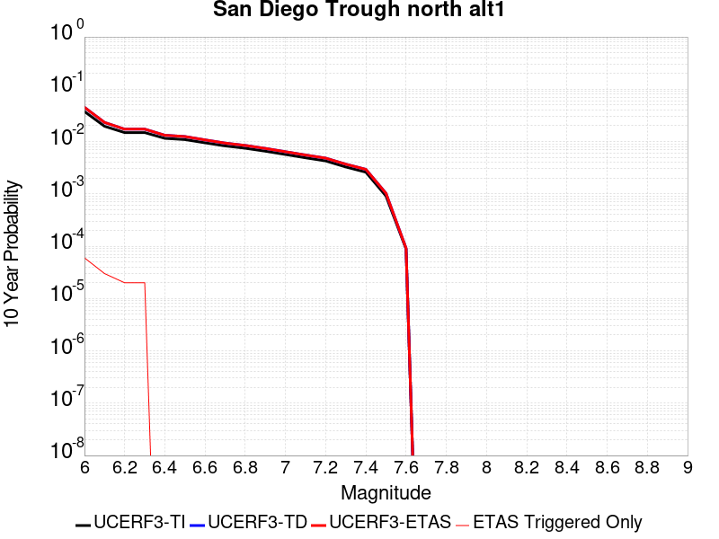 |

| Magnitude | 1 wk TI Prob | 1 wk TD Prob | 1 wk ETAS Prob | 1 wk ETAS/TD Gain | 1 wk ETAS Triggered Only | 1 mo TI Prob | 1 mo TD Prob | 1 mo ETAS Prob | 1 mo ETAS/TD Gain | 1 mo ETAS Triggered Only | 1 yr TI Prob | 1 yr TD Prob | 1 yr ETAS Prob | 1 yr ETAS/TD Gain | 1 yr ETAS Triggered Only | 10 yr TI Prob | 10 yr TD Prob | 10 yr ETAS Prob | 10 yr ETAS/TD Gain | 10 yr ETAS Triggered Only |
|-----|-----|-----|-----|-----|-----|-----|-----|-----|-----|-----|-----|-----|-----|-----|-----|-----|-----|-----|-----|-----|
| 6.0 | 7.329252E-5 | 8.821269E-5 | 9.8211814E-5 | 1.1133524 | 1.0E-5 | 3.14073E-4 | 3.7800326E-4 | 4.0799193E-4 | 1.0793344 | 3.0E-5 | 0.0038171355 | 0.0045930487 | 0.004642819 | 1.010836 | 5.0E-5 | 0.03752231 | 0.045045137 | 0.045102432 | 1.001272 | 6.0E-5 |
| 6.1 | 3.7940346E-5 | 4.4884906E-5 | 4.4884906E-5 | 1.0 | 0.0 | 1.6259136E-4 | 1.9235026E-4 | 2.0234832E-4 | 1.0519785 | 1.0E-5 | 0.0019777524 | 0.002339431 | 0.0023593842 | 1.0085291 | 2.0E-5 | 0.019602431 | 0.023156732 | 0.023186037 | 1.0012655 | 3.0E-5 |
| 6.2 | 2.8645263E-5 | 3.329672E-5 | 3.329672E-5 | 1.0 | 0.0 | 1.2275964E-4 | 1.4269259E-4 | 1.5269115E-4 | 1.0700707 | 1.0E-5 | 0.0014935739 | 0.0017359206 | 0.0017558859 | 1.0115013 | 2.0E-5 | 0.0148357535 | 0.017226268 | 0.017245922 | 1.0011411 | 2.0E-5 |
| 6.3 | 2.8645263E-5 | 3.329672E-5 | 3.329672E-5 | 1.0 | 0.0 | 1.2275964E-4 | 1.4269259E-4 | 1.5269115E-4 | 1.0700707 | 1.0E-5 | 0.0014935739 | 0.0017359206 | 0.0017558859 | 1.0115013 | 2.0E-5 | 0.0148357535 | 0.017226268 | 0.017245922 | 1.0011411 | 2.0E-5 |
| 6.4 | 2.2204576E-5 | 2.544832E-5 | 2.544832E-5 | 1.0 | 0.0 | 9.5159E-5 | 1.0905972E-4 | 1.0905972E-4 | 1.0 | 0.0 | 0.001157945 | 0.0013270028 | 0.0013270028 | 1.0 | 0.0 | 0.011519298 | 0.013191959 | 0.013191959 | 1.0 | 0.0 |
| 6.5 | 2.1004838E-5 | 2.4024695E-5 | 2.4024695E-5 | 1.0 | 0.0 | 9.0017624E-5 | 1.0295897E-4 | 1.0295897E-4 | 1.0 | 0.0 | 0.0010954136 | 0.0012528135 | 0.0012528135 | 1.0 | 0.0 | 0.010900296 | 0.012458592 | 0.012458592 | 1.0 | 0.0 |
| 6.6 | 1.820557E-5 | 2.070479E-5 | 2.070479E-5 | 1.0 | 0.0 | 7.802154E-5 | 8.8731824E-5 | 8.8731824E-5 | 1.0 | 0.0 | 9.4949827E-4 | 0.0010797799 | 0.0010797799 | 1.0 | 0.0 | 0.009454516 | 0.010746005 | 0.010746005 | 1.0 | 0.0 |
| 6.7 | 1.5884485E-5 | 1.7983646E-5 | 1.7983646E-5 | 1.0 | 0.0 | 6.807459E-5 | 7.707051E-5 | 7.707051E-5 | 1.0 | 0.0 | 8.284929E-4 | 9.3793223E-4 | 9.3793223E-4 | 1.0 | 0.0 | 0.008254109 | 0.009340104 | 0.009340104 | 1.0 | 0.0 |
| 6.8 | 1.4331171E-5 | 1.6201066E-5 | 1.6201066E-5 | 1.0 | 0.0 | 6.141786E-5 | 6.94313E-5 | 6.94313E-5 | 1.0 | 0.0 | 7.4750587E-4 | 8.450002E-4 | 8.450002E-4 | 1.0 | 0.0 | 0.0074499645 | 0.008418139 | 0.008418139 | 1.0 | 0.0 |
| 6.9 | 1.2574203E-5 | 1.4205835E-5 | 1.4205835E-5 | 1.0 | 0.0 | 5.3888325E-5 | 6.0880735E-5 | 6.0880735E-5 | 1.0 | 0.0 | 6.558929E-4 | 7.409723E-4 | 7.409723E-4 | 1.0 | 0.0 | 0.0065396037 | 0.007385203 | 0.007385203 | 1.0 | 0.0 |
| 7.0 | 1.0883844E-5 | 1.2289262E-5 | 1.2289262E-5 | 1.0 | 0.0 | 4.664421E-5 | 5.2667205E-5 | 5.2667205E-5 | 1.0 | 0.0 | 5.677453E-4 | 6.4103556E-4 | 6.4103556E-4 | 1.0 | 0.0 | 0.00566297 | 0.006391993 | 0.006391993 | 1.0 | 0.0 |
| 7.1 | 9.393088E-6 | 1.060702E-5 | 1.060702E-5 | 1.0 | 0.0 | 4.025547E-5 | 4.545787E-5 | 4.545787E-5 | 1.0 | 0.0 | 4.900001E-4 | 5.533098E-4 | 5.533098E-4 | 1.0 | 0.0 | 0.0048892107 | 0.005519418 | 0.005519418 | 1.0 | 0.0 |
| 7.2 | 8.190791E-6 | 9.258625E-6 | 9.258625E-6 | 1.0 | 0.0 | 3.510292E-5 | 3.9679224E-5 | 3.9679224E-5 | 1.0 | 0.0 | 4.2729423E-4 | 4.8298817E-4 | 4.8298817E-4 | 1.0 | 0.0 | 0.0042647356 | 0.004819465 | 0.004819465 | 1.0 | 0.0 |
| 7.3 | 6.268162E-6 | 7.089716E-6 | 7.089716E-6 | 1.0 | 0.0 | 2.6863276E-5 | 3.0384144E-5 | 3.0384144E-5 | 1.0 | 0.0 | 3.2701128E-4 | 3.6986457E-4 | 3.6986457E-4 | 1.0 | 0.0 | 0.003265305 | 0.003692536 | 0.003692536 | 1.0 | 0.0 |
| 7.4 | 4.985186E-6 | 5.6426816E-6 | 5.6426816E-6 | 1.0 | 0.0 | 2.1364907E-5 | 2.4182698E-5 | 2.4182698E-5 | 1.0 | 0.0 | 2.600867E-4 | 2.9438498E-4 | 2.9438498E-4 | 1.0 | 0.0 | 0.002597825 | 0.0029399914 | 0.0029399914 | 1.0 | 0.0 |
| 7.5 | 1.7489613E-6 | 1.969678E-6 | 1.969678E-6 | 1.0 | 0.0 | 7.495527E-6 | 8.4414505E-6 | 8.4414505E-6 | 1.0 | 0.0 | 9.125422E-5 | 1.02770035E-4 | 1.02770035E-4 | 1.0 | 0.0 | 9.1216754E-4 | 0.0010272472 | 0.0010272472 | 1.0 | 0.0 |
| 7.6 | 1.6988751E-7 | 1.7533823E-7 | 1.7533823E-7 | 1.0 | 0.0 | 7.2808916E-7 | 7.5144936E-7 | 7.5144936E-7 | 1.0 | 0.0 | 8.864449E-6 | 9.14886E-6 | 9.14886E-6 | 1.0 | 0.0 | 8.8640954E-5 | 9.1485024E-5 | 9.1485024E-5 | 1.0 | 0.0 |

## Pine Mtn
*[(top)](#table-of-contents)*

| 1 Week | 1 Month | 1 Year | 10 Year |
|-----|-----|-----|-----|
| 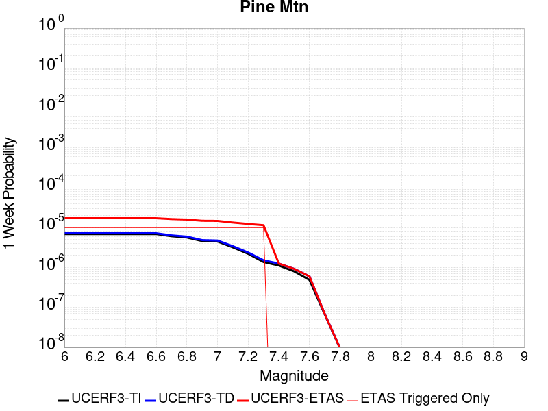 | 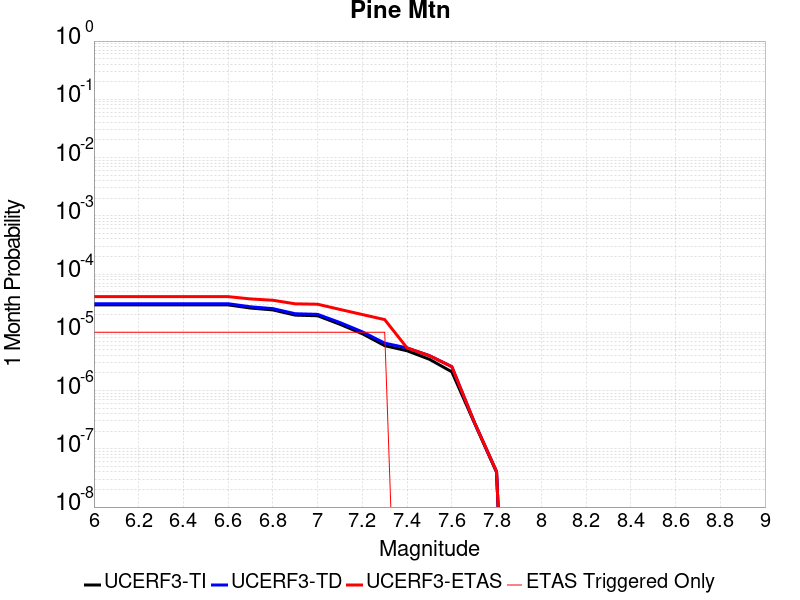 | 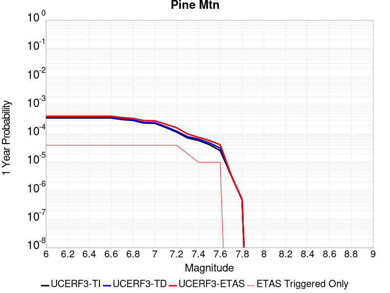 | 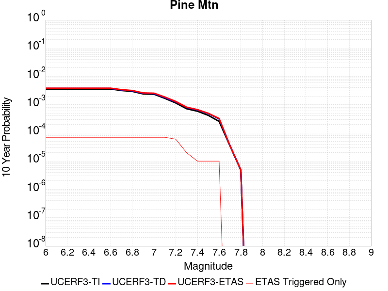 |

| Magnitude | 1 wk TI Prob | 1 wk TD Prob | 1 wk ETAS Prob | 1 wk ETAS/TD Gain | 1 wk ETAS Triggered Only | 1 mo TI Prob | 1 mo TD Prob | 1 mo ETAS Prob | 1 mo ETAS/TD Gain | 1 mo ETAS Triggered Only | 1 yr TI Prob | 1 yr TD Prob | 1 yr ETAS Prob | 1 yr ETAS/TD Gain | 1 yr ETAS Triggered Only | 10 yr TI Prob | 10 yr TD Prob | 10 yr ETAS Prob | 10 yr ETAS/TD Gain | 10 yr ETAS Triggered Only |
|-----|-----|-----|-----|-----|-----|-----|-----|-----|-----|-----|-----|-----|-----|-----|-----|-----|-----|-----|-----|-----|
| 6.0 | 6.894797E-6 | 7.2254716E-6 | 1.72254E-5 | 2.3839827 | 1.0E-5 | 2.9548795E-5 | 3.0965955E-5 | 4.0965646E-5 | 1.3229253 | 1.0E-5 | 3.596972E-4 | 3.7694827E-4 | 4.169332E-4 | 1.1060754 | 4.0E-5 | 0.0035911554 | 0.0037633865 | 0.003833123 | 1.0185302 | 7.0E-5 |
| 6.1 | 6.894797E-6 | 7.2254716E-6 | 1.72254E-5 | 2.3839827 | 1.0E-5 | 2.9548795E-5 | 3.0965955E-5 | 4.0965646E-5 | 1.3229253 | 1.0E-5 | 3.596972E-4 | 3.7694827E-4 | 4.169332E-4 | 1.1060754 | 4.0E-5 | 0.0035911554 | 0.0037633865 | 0.003833123 | 1.0185302 | 7.0E-5 |
| 6.2 | 6.894797E-6 | 7.2254716E-6 | 1.72254E-5 | 2.3839827 | 1.0E-5 | 2.9548795E-5 | 3.0965955E-5 | 4.0965646E-5 | 1.3229253 | 1.0E-5 | 3.596972E-4 | 3.7694827E-4 | 4.169332E-4 | 1.1060754 | 4.0E-5 | 0.0035911554 | 0.0037633865 | 0.003833123 | 1.0185302 | 7.0E-5 |
| 6.3 | 6.894797E-6 | 7.2254716E-6 | 1.72254E-5 | 2.3839827 | 1.0E-5 | 2.9548795E-5 | 3.0965955E-5 | 4.0965646E-5 | 1.3229253 | 1.0E-5 | 3.596972E-4 | 3.7694827E-4 | 4.169332E-4 | 1.1060754 | 4.0E-5 | 0.0035911554 | 0.0037633865 | 0.003833123 | 1.0185302 | 7.0E-5 |
| 6.4 | 6.894797E-6 | 7.2254716E-6 | 1.72254E-5 | 2.3839827 | 1.0E-5 | 2.9548795E-5 | 3.0965955E-5 | 4.0965646E-5 | 1.3229253 | 1.0E-5 | 3.596972E-4 | 3.7694827E-4 | 4.169332E-4 | 1.1060754 | 4.0E-5 | 0.0035911554 | 0.0037633865 | 0.003833123 | 1.0185302 | 7.0E-5 |
| 6.5 | 6.894797E-6 | 7.2254716E-6 | 1.72254E-5 | 2.3839827 | 1.0E-5 | 2.9548795E-5 | 3.0965955E-5 | 4.0965646E-5 | 1.3229253 | 1.0E-5 | 3.596972E-4 | 3.7694827E-4 | 4.169332E-4 | 1.1060754 | 4.0E-5 | 0.0035911554 | 0.0037633865 | 0.003833123 | 1.0185302 | 7.0E-5 |
| 6.6 | 6.894797E-6 | 7.2254716E-6 | 1.72254E-5 | 2.3839827 | 1.0E-5 | 2.9548795E-5 | 3.0965955E-5 | 4.0965646E-5 | 1.3229253 | 1.0E-5 | 3.596972E-4 | 3.7694827E-4 | 4.169332E-4 | 1.1060754 | 4.0E-5 | 0.0035911554 | 0.0037633865 | 0.003833123 | 1.0185302 | 7.0E-5 |
| 6.7 | 6.0867933E-6 | 6.397124E-6 | 1.639706E-5 | 2.5631926 | 1.0E-5 | 2.6085996E-5 | 2.7415968E-5 | 3.7415695E-5 | 1.364741 | 1.0E-5 | 3.1755073E-4 | 3.337405E-4 | 3.7372715E-4 | 1.1198136 | 4.0E-5 | 0.0031709734 | 0.0033326119 | 0.0034023786 | 1.0209346 | 7.0E-5 |
| 6.8 | 5.6530425E-6 | 5.950606E-6 | 1.5950547E-5 | 2.6804912 | 1.0E-5 | 2.42271E-5 | 2.5502359E-5 | 3.5502104E-5 | 1.3921106 | 1.0E-5 | 2.94925E-4 | 3.1044905E-4 | 3.5043663E-4 | 1.1288056 | 4.0E-5 | 0.002945339 | 0.0031003582 | 0.0031701413 | 1.022508 | 7.0E-5 |
| 6.9 | 4.6015225E-6 | 4.8638444E-6 | 1.48637955E-5 | 3.0559769 | 1.0E-5 | 1.9720663E-5 | 2.084489E-5 | 3.084468E-5 | 1.4797239 | 1.0E-5 | 2.4007261E-4 | 2.5375842E-4 | 2.9374828E-4 | 1.1575903 | 4.0E-5 | 0.0023981342 | 0.002534831 | 0.0026046534 | 1.0275452 | 7.0E-5 |
| 7.0 | 4.4875965E-6 | 4.7474837E-6 | 1.4747436E-5 | 3.106369 | 1.0E-5 | 1.9232413E-5 | 2.0346208E-5 | 3.0346004E-5 | 1.4914821 | 1.0E-5 | 2.3412947E-4 | 2.4768838E-4 | 2.8767847E-4 | 1.1614532 | 4.0E-5 | 0.0023388295 | 0.0024742668 | 0.0025440936 | 1.0282212 | 7.0E-5 |
| 7.1 | 3.203907E-6 | 3.42942E-6 | 1.3429386E-5 | 3.915935 | 1.0E-5 | 1.3730958E-5 | 1.4697435E-5 | 2.4697289E-5 | 1.6803808 | 1.0E-5 | 1.6716159E-4 | 1.7892725E-4 | 2.1892009E-4 | 1.2235146 | 4.0E-5 | 0.0016703589 | 0.001787898 | 0.0018577728 | 1.0390822 | 7.0E-5 |
| 7.2 | 2.2060601E-6 | 2.3784874E-6 | 1.2378464E-5 | 5.204343 | 1.0E-5 | 9.4545085E-6 | 1.019348E-5 | 2.0193378E-5 | 1.9810092 | 1.0E-5 | 1.15102564E-4 | 1.2409901E-4 | 1.6409405E-4 | 1.3222833 | 4.0E-5 | 0.0011504296 | 0.0012403419 | 0.0013002675 | 1.0483137 | 6.0E-5 |
| 7.3 | 1.3765207E-6 | 1.5216535E-6 | 1.1521638E-5 | 7.5717883 | 1.0E-5 | 5.899361E-6 | 6.5213567E-6 | 1.6521291E-5 | 2.5334132 | 1.0E-5 | 7.182235E-5 | 7.939472E-5 | 9.939313E-5 | 1.2518859 | 2.0E-5 | 7.1799144E-4 | 7.9367263E-4 | 8.136567E-4 | 1.0251793 | 2.0E-5 |
| 7.4 | 1.1245983E-6 | 1.2587126E-6 | 1.2587126E-6 | 1.0 | 0.0 | 4.819698E-6 | 5.394472E-6 | 5.394472E-6 | 1.0 | 0.0 | 5.8678244E-5 | 6.56758E-5 | 7.567515E-5 | 1.152253 | 1.0E-5 | 5.866275E-4 | 6.565722E-4 | 6.6656567E-4 | 1.0152206 | 1.0E-5 |
| 7.5 | 8.031682E-7 | 9.276999E-7 | 9.276999E-7 | 1.0 | 0.0 | 3.4421448E-6 | 3.975851E-6 | 3.975851E-6 | 1.0 | 0.0 | 4.1907308E-5 | 4.840498E-5 | 5.8404497E-5 | 1.2065803 | 1.0E-5 | 4.1899405E-4 | 4.8395112E-4 | 4.939463E-4 | 1.0206532 | 1.0E-5 |
| 7.6 | 4.8953444E-7 | 6.0030544E-7 | 6.0030544E-7 | 1.0 | 0.0 | 2.098003E-6 | 2.5727354E-6 | 2.5727354E-6 | 1.0 | 0.0 | 2.5542888E-5 | 3.1322652E-5 | 4.132234E-5 | 1.3192477 | 1.0E-5 | 2.5539953E-4 | 3.1318725E-4 | 3.231841E-4 | 1.0319198 | 1.0E-5 |
| 7.7 | 6.634529E-8 | 6.788826E-8 | 6.788826E-8 | 1.0 | 0.0 | 2.843369E-7 | 2.9094966E-7 | 2.9094966E-7 | 1.0 | 0.0 | 3.4617963E-6 | 3.5423066E-6 | 3.5423066E-6 | 1.0 | 0.0 | 3.4617424E-5 | 3.542255E-5 | 3.542255E-5 | 1.0 | 0.0 |
| 7.8 | 9.235578E-9 | 9.488566E-9 | 9.488566E-9 | 1.0 | 0.0 | 3.9581046E-8 | 4.0665284E-8 | 4.0665284E-8 | 1.0 | 0.0 | 4.818991E-7 | 4.950997E-7 | 4.950997E-7 | 1.0 | 0.0 | 4.8189804E-6 | 4.950988E-6 | 4.950988E-6 | 1.0 | 0.0 |

## Channel Islands Thrust
*[(top)](#table-of-contents)*

| 1 Week | 1 Month | 1 Year | 10 Year |
|-----|-----|-----|-----|
| 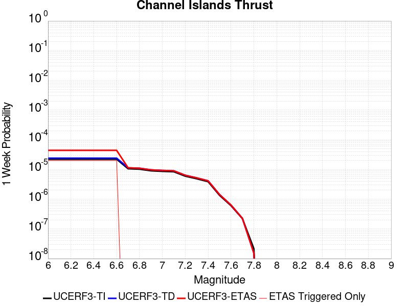 |  | 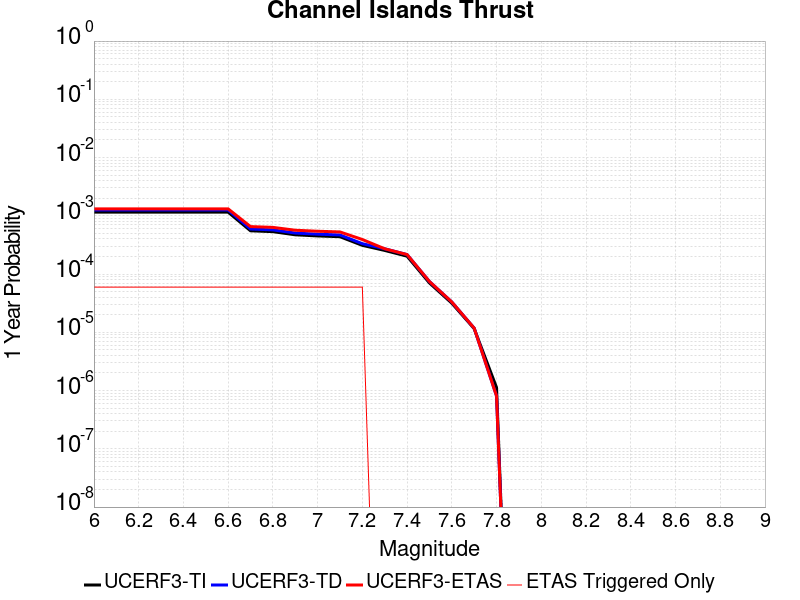 | 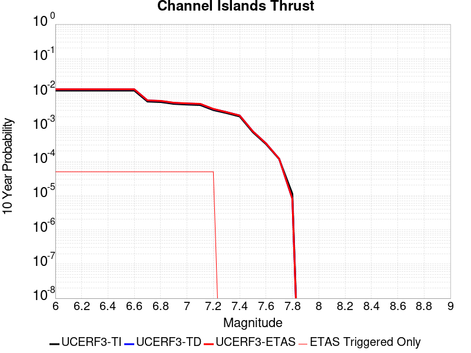 |

| Magnitude | 1 wk TI Prob | 1 wk TD Prob | 1 wk ETAS Prob | 1 wk ETAS/TD Gain | 1 wk ETAS Triggered Only | 1 mo TI Prob | 1 mo TD Prob | 1 mo ETAS Prob | 1 mo ETAS/TD Gain | 1 mo ETAS Triggered Only | 1 yr TI Prob | 1 yr TD Prob | 1 yr ETAS Prob | 1 yr ETAS/TD Gain | 1 yr ETAS Triggered Only | 10 yr TI Prob | 10 yr TD Prob | 10 yr ETAS Prob | 10 yr ETAS/TD Gain | 10 yr ETAS Triggered Only |
|-----|-----|-----|-----|-----|-----|-----|-----|-----|-----|-----|-----|-----|-----|-----|-----|-----|-----|-----|-----|-----|
| 6.0 | 2.2156251E-5 | 2.4092022E-5 | 4.409154E-5 | 1.8301303 | 2.0E-5 | 9.495191E-5 | 1.03248036E-4 | 1.2324598E-4 | 1.1936883 | 2.0E-5 | 0.0011554264 | 0.0012564266 | 0.0013063637 | 1.0397455 | 5.0E-5 | 0.011494373 | 0.0125038205 | 0.01256307 | 1.0047386 | 6.0E-5 |
| 6.1 | 2.2156251E-5 | 2.4092022E-5 | 4.409154E-5 | 1.8301303 | 2.0E-5 | 9.495191E-5 | 1.03248036E-4 | 1.2324598E-4 | 1.1936883 | 2.0E-5 | 0.0011554264 | 0.0012564266 | 0.0013063637 | 1.0397455 | 5.0E-5 | 0.011494373 | 0.0125038205 | 0.01256307 | 1.0047386 | 6.0E-5 |
| 6.2 | 2.2156251E-5 | 2.4092022E-5 | 4.409154E-5 | 1.8301303 | 2.0E-5 | 9.495191E-5 | 1.03248036E-4 | 1.2324598E-4 | 1.1936883 | 2.0E-5 | 0.0011554264 | 0.0012564266 | 0.0013063637 | 1.0397455 | 5.0E-5 | 0.011494373 | 0.0125038205 | 0.01256307 | 1.0047386 | 6.0E-5 |
| 6.3 | 2.2156251E-5 | 2.4092022E-5 | 4.409154E-5 | 1.8301303 | 2.0E-5 | 9.495191E-5 | 1.03248036E-4 | 1.2324598E-4 | 1.1936883 | 2.0E-5 | 0.0011554264 | 0.0012564266 | 0.0013063637 | 1.0397455 | 5.0E-5 | 0.011494373 | 0.0125038205 | 0.01256307 | 1.0047386 | 6.0E-5 |
| 6.4 | 2.2156251E-5 | 2.4092022E-5 | 4.409154E-5 | 1.8301303 | 2.0E-5 | 9.495191E-5 | 1.03248036E-4 | 1.2324598E-4 | 1.1936883 | 2.0E-5 | 0.0011554264 | 0.0012564266 | 0.0013063637 | 1.0397455 | 5.0E-5 | 0.011494373 | 0.0125038205 | 0.01256307 | 1.0047386 | 6.0E-5 |
| 6.5 | 2.2156251E-5 | 2.4092022E-5 | 4.409154E-5 | 1.8301303 | 2.0E-5 | 9.495191E-5 | 1.03248036E-4 | 1.2324598E-4 | 1.1936883 | 2.0E-5 | 0.0011554264 | 0.0012564266 | 0.0013063637 | 1.0397455 | 5.0E-5 | 0.011494373 | 0.0125038205 | 0.01256307 | 1.0047386 | 6.0E-5 |
| 6.6 | 2.2156251E-5 | 2.4092022E-5 | 4.409154E-5 | 1.8301303 | 2.0E-5 | 9.495191E-5 | 1.03248036E-4 | 1.2324598E-4 | 1.1936883 | 2.0E-5 | 0.0011554264 | 0.0012564266 | 0.0013063637 | 1.0397455 | 5.0E-5 | 0.011494373 | 0.0125038205 | 0.01256307 | 1.0047386 | 6.0E-5 |
| 6.7 | 1.0601296E-5 | 1.1379544E-5 | 1.1379544E-5 | 1.0 | 0.0 | 4.5433335E-5 | 4.876859E-5 | 4.876859E-5 | 1.0 | 0.0 | 5.5301044E-4 | 5.936007E-4 | 6.0359476E-4 | 1.0168363 | 1.0E-5 | 0.005516363 | 0.005920653 | 0.005930594 | 1.001679 | 1.0E-5 |
| 6.8 | 1.0246747E-5 | 1.0996669E-5 | 1.0996669E-5 | 1.0 | 0.0 | 4.391389E-5 | 4.7127756E-5 | 4.7127756E-5 | 1.0 | 0.0 | 5.345204E-4 | 5.7363417E-4 | 5.836284E-4 | 1.0174227 | 1.0E-5 | 0.0053323656 | 0.005722025 | 0.0057319677 | 1.0017376 | 1.0E-5 |
| 6.9 | 9.049551E-6 | 9.699645E-6 | 9.699645E-6 | 1.0 | 0.0 | 3.878322E-5 | 4.1569267E-5 | 4.1569267E-5 | 1.0 | 0.0 | 4.7208337E-4 | 5.059924E-4 | 5.1598734E-4 | 1.0197531 | 1.0E-5 | 0.0047108172 | 0.0050488203 | 0.00505877 | 1.0019706 | 1.0E-5 |
| 7.0 | 8.6542195E-6 | 9.274603E-6 | 9.274603E-6 | 1.0 | 0.0 | 3.7088983E-5 | 3.9747716E-5 | 3.9747716E-5 | 1.0 | 0.0 | 4.5146482E-4 | 4.8382508E-4 | 4.9382023E-4 | 1.0206586 | 1.0E-5 | 0.004505487 | 0.0048281294 | 0.004838081 | 1.0020612 | 1.0E-5 |
| 7.1 | 8.391028E-6 | 8.992925E-6 | 8.992925E-6 | 1.0 | 0.0 | 3.5961057E-5 | 3.8540562E-5 | 3.8540562E-5 | 1.0 | 0.0 | 4.3773788E-4 | 4.6913436E-4 | 4.791297E-4 | 1.0213058 | 1.0E-5 | 0.004368766 | 0.0046818503 | 0.0046918034 | 1.0021259 | 1.0E-5 |
| 7.2 | 5.965188E-6 | 6.3716957E-6 | 6.3716957E-6 | 1.0 | 0.0 | 2.556484E-5 | 2.7306984E-5 | 2.7306984E-5 | 1.0 | 0.0 | 3.1120746E-4 | 3.3241237E-4 | 3.4240904E-4 | 1.0300732 | 1.0E-5 | 0.00310772 | 0.0033192094 | 0.0033291762 | 1.0030028 | 1.0E-5 |
| 7.3 | 4.877518E-6 | 5.206007E-6 | 5.206007E-6 | 1.0 | 0.0 | 2.0903482E-5 | 2.231127E-5 | 2.231127E-5 | 1.0 | 0.0 | 2.5447016E-4 | 2.716063E-4 | 2.716063E-4 | 1.0 | 0.0 | 0.0025417898 | 0.0027127897 | 0.0027127897 | 1.0 | 0.0 |
| 7.4 | 3.8829853E-6 | 4.141863E-6 | 4.141863E-6 | 1.0 | 0.0 | 1.664126E-5 | 1.7750723E-5 | 1.7750723E-5 | 1.0 | 0.0 | 2.0258849E-4 | 2.1609403E-4 | 2.1609403E-4 | 1.0 | 0.0 | 0.002024039 | 0.002158881 | 0.002158881 | 1.0 | 0.0 |
| 7.5 | 1.3489616E-6 | 1.4277905E-6 | 1.4277905E-6 | 1.0 | 0.0 | 5.7812517E-6 | 6.119088E-6 | 6.119088E-6 | 1.0 | 0.0 | 7.038446E-5 | 7.449739E-5 | 7.449739E-5 | 1.0 | 0.0 | 7.036218E-4 | 7.4472814E-4 | 7.4472814E-4 | 1.0 | 0.0 |
| 7.6 | 6.058192E-7 | 6.35378E-7 | 6.35378E-7 | 1.0 | 0.0 | 2.5963652E-6 | 2.7230458E-6 | 2.7230458E-6 | 1.0 | 0.0 | 3.161029E-5 | 3.3152595E-5 | 3.3152595E-5 | 1.0 | 0.0 | 3.1605794E-4 | 3.314781E-4 | 3.314781E-4 | 1.0 | 0.0 |
| 7.7 | 2.2170494E-7 | 2.2607924E-7 | 2.2607924E-7 | 1.0 | 0.0 | 9.5016367E-7 | 9.689107E-7 | 9.689107E-7 | 1.0 | 0.0 | 1.1568181E-5 | 1.17964355E-5 | 1.17964355E-5 | 1.0 | 0.0 | 1.1567579E-4 | 1.179592E-4 | 1.179592E-4 | 1.0 | 0.0 |
| 7.8 | 2.1613102E-8 | 1.5466837E-8 | 1.5466837E-8 | 1.0 | 0.0 | 9.262757E-8 | 6.628645E-8 | 6.628645E-8 | 1.0 | 0.0 | 1.1277401E-6 | 8.070372E-7 | 8.070372E-7 | 1.0 | 0.0 | 1.1277344E-5 | 8.07035E-6 | 8.07035E-6 | 1.0 | 0.0 |

## Rinconada 2011 CFM
*[(top)](#table-of-contents)*

| 1 Week | 1 Month | 1 Year | 10 Year |
|-----|-----|-----|-----|
| 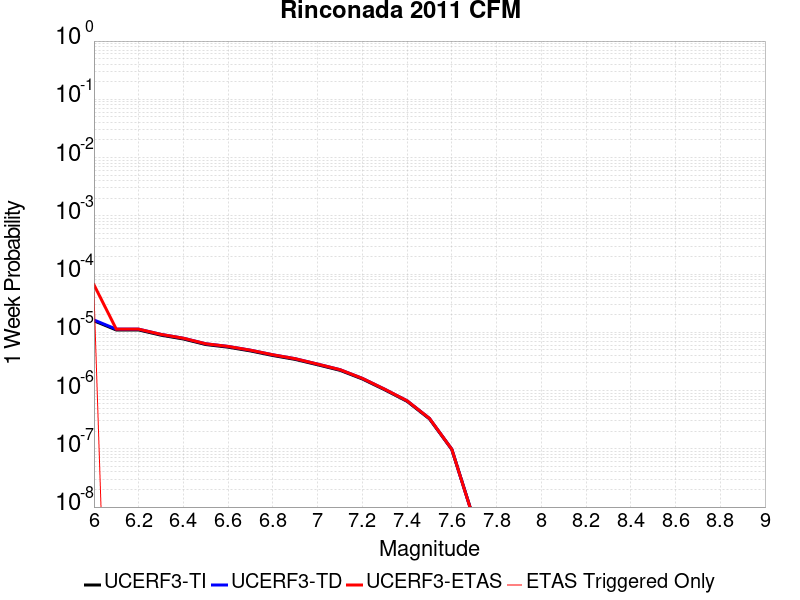 | 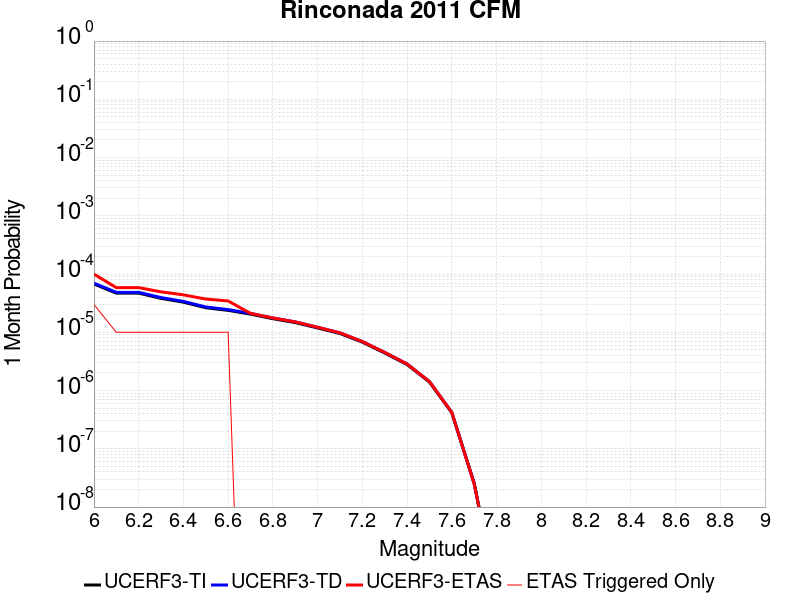 | 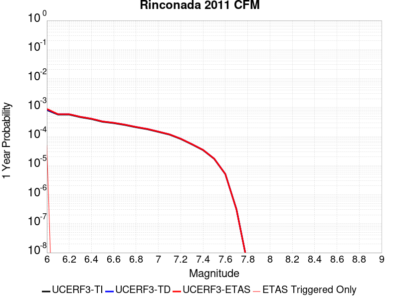 | 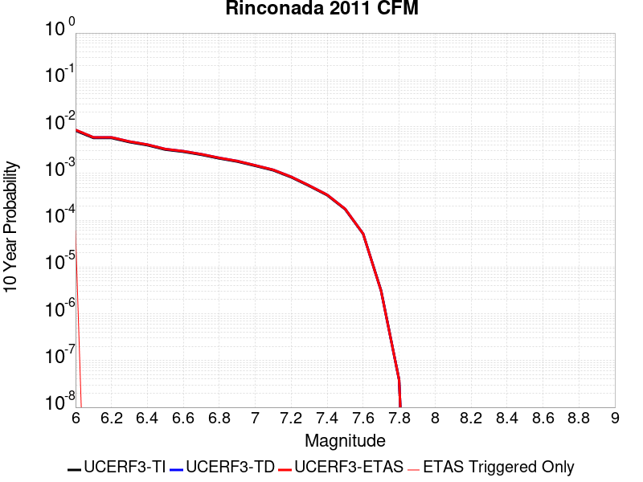 |

| Magnitude | 1 wk TI Prob | 1 wk TD Prob | 1 wk ETAS Prob | 1 wk ETAS/TD Gain | 1 wk ETAS Triggered Only | 1 mo TI Prob | 1 mo TD Prob | 1 mo ETAS Prob | 1 mo ETAS/TD Gain | 1 mo ETAS Triggered Only | 1 yr TI Prob | 1 yr TD Prob | 1 yr ETAS Prob | 1 yr ETAS/TD Gain | 1 yr ETAS Triggered Only | 10 yr TI Prob | 10 yr TD Prob | 10 yr ETAS Prob | 10 yr ETAS/TD Gain | 10 yr ETAS Triggered Only |
|-----|-----|-----|-----|-----|-----|-----|-----|-----|-----|-----|-----|-----|-----|-----|-----|-----|-----|-----|-----|-----|
| 6.0 | 1.5752368E-5 | 1.6274716E-5 | 2.6274553E-5 | 1.6144401 | 1.0E-5 | 6.75084E-5 | 6.974694E-5 | 9.9744844E-5 | 1.4300964 | 3.0E-5 | 8.2160486E-4 | 8.488413E-4 | 8.888073E-4 | 1.047083 | 4.0E-5 | 0.008185739 | 0.00845637 | 0.008515863 | 1.0070353 | 6.0E-5 |
| 6.1 | 1.0966133E-5 | 1.1323029E-5 | 1.1323029E-5 | 1.0 | 0.0 | 4.6996865E-5 | 4.852637E-5 | 5.8525886E-5 | 1.2060635 | 1.0E-5 | 5.720366E-4 | 5.9064914E-4 | 6.106373E-4 | 1.033841 | 2.0E-5 | 0.0057056635 | 0.005890889 | 0.0059207124 | 1.0050626 | 3.0E-5 |
| 6.2 | 1.0966133E-5 | 1.1323029E-5 | 1.1323029E-5 | 1.0 | 0.0 | 4.6996865E-5 | 4.852637E-5 | 5.8525886E-5 | 1.2060635 | 1.0E-5 | 5.720366E-4 | 5.9064914E-4 | 6.106373E-4 | 1.033841 | 2.0E-5 | 0.0057056635 | 0.005890889 | 0.0059207124 | 1.0050626 | 3.0E-5 |
| 6.3 | 8.926149E-6 | 9.212772E-6 | 9.212772E-6 | 1.0 | 0.0 | 3.8254362E-5 | 3.948271E-5 | 4.9482318E-5 | 1.2532654 | 1.0E-5 | 4.6564735E-4 | 4.8059633E-4 | 5.005867E-4 | 1.041595 | 2.0E-5 | 0.0046467283 | 0.0047956146 | 0.0048254705 | 1.0062257 | 3.0E-5 |
| 6.4 | 7.676955E-6 | 7.920191E-6 | 7.920191E-6 | 1.0 | 0.0 | 3.290082E-5 | 3.3943234E-5 | 4.3942895E-5 | 1.2945995 | 1.0E-5 | 4.0049385E-4 | 4.131807E-4 | 4.3317245E-4 | 1.048385 | 2.0E-5 | 0.0039977287 | 0.004124151 | 0.0041540274 | 1.0072442 | 3.0E-5 |
| 6.5 | 6.1671026E-6 | 6.358955E-6 | 6.358955E-6 | 1.0 | 0.0 | 2.6430173E-5 | 2.725238E-5 | 3.7252106E-5 | 1.3669305 | 1.0E-5 | 3.2173982E-4 | 3.317473E-4 | 3.5174066E-4 | 1.0602669 | 2.0E-5 | 0.003212744 | 0.0033125326 | 0.0033424331 | 1.0090265 | 3.0E-5 |
| 6.6 | 5.553456E-6 | 5.7248126E-6 | 5.7248126E-6 | 1.0 | 0.0 | 2.3800309E-5 | 2.4534682E-5 | 3.4534438E-5 | 1.4075763 | 1.0E-5 | 2.897302E-4 | 2.9866886E-4 | 3.1866287E-4 | 1.0669438 | 2.0E-5 | 0.0028935277 | 0.0029826832 | 0.0030125938 | 1.010028 | 3.0E-5 |
| 6.7 | 4.787857E-6 | 4.93331E-6 | 4.93331E-6 | 1.0 | 0.0 | 2.0519226E-5 | 2.1142585E-5 | 2.1142585E-5 | 1.0 | 0.0 | 2.4979294E-4 | 2.573806E-4 | 2.6737803E-4 | 1.0388429 | 1.0E-5 | 0.0024951235 | 0.002570831 | 0.0025808052 | 1.0038798 | 1.0E-5 |
| 6.8 | 3.9955166E-6 | 4.1134763E-6 | 4.1134763E-6 | 1.0 | 0.0 | 1.7123532E-5 | 1.7629065E-5 | 1.7629065E-5 | 1.0 | 0.0 | 2.0845905E-4 | 2.1461275E-4 | 2.2461062E-4 | 1.0465856 | 1.0E-5 | 0.002082636 | 0.0021440587 | 0.0021540371 | 1.004654 | 1.0E-5 |
| 6.9 | 3.4250072E-6 | 3.5224466E-6 | 3.5224466E-6 | 1.0 | 0.0 | 1.46785205E-5 | 1.5096112E-5 | 1.5096112E-5 | 1.0 | 0.0 | 1.7869633E-4 | 1.8377969E-4 | 1.9377784E-4 | 1.054403 | 1.0E-5 | 0.001785527 | 0.0018362795 | 0.0018462611 | 1.0054358 | 1.0E-5 |
| 7.0 | 2.7712713E-6 | 2.8467002E-6 | 2.8467002E-6 | 1.0 | 0.0 | 1.1876823E-5 | 1.22000865E-5 | 1.22000865E-5 | 1.0 | 0.0 | 1.4459073E-4 | 1.4852594E-4 | 1.4852594E-4 | 1.0 | 0.0 | 0.0014449668 | 0.0014842683 | 0.0014842683 | 1.0 | 0.0 |
| 7.1 | 2.227358E-6 | 2.2856987E-6 | 2.2856987E-6 | 1.0 | 0.0 | 9.545785E-6 | 9.795815E-6 | 9.795815E-6 | 1.0 | 0.0 | 1.16213734E-4 | 1.1925753E-4 | 1.1925753E-4 | 1.0 | 0.0 | 0.0011615298 | 0.0011919363 | 0.0011919363 | 1.0 | 0.0 |
| 7.2 | 1.581796E-6 | 1.6209015E-6 | 1.6209015E-6 | 1.0 | 0.0 | 6.779108E-6 | 6.946702E-6 | 6.946702E-6 | 1.0 | 0.0 | 8.253252E-5 | 8.4572814E-5 | 8.4572814E-5 | 1.0 | 0.0 | 8.250187E-4 | 8.4540684E-4 | 8.4540684E-4 | 1.0 | 0.0 |
| 7.3 | 1.0306567E-6 | 1.054648E-6 | 1.054648E-6 | 1.0 | 0.0 | 4.4170924E-6 | 4.519912E-6 | 4.519912E-6 | 1.0 | 0.0 | 5.3776774E-5 | 5.502854E-5 | 5.502854E-5 | 1.0 | 0.0 | 5.376376E-4 | 5.501494E-4 | 5.501494E-4 | 1.0 | 0.0 |
| 7.4 | 6.535541E-7 | 6.682744E-7 | 6.682744E-7 | 1.0 | 0.0 | 2.800943E-6 | 2.8640302E-6 | 2.8640302E-6 | 1.0 | 0.0 | 3.4100947E-5 | 3.4869012E-5 | 3.4869012E-5 | 1.0 | 0.0 | 3.4095717E-4 | 3.486355E-4 | 3.486355E-4 | 1.0 | 0.0 |
| 7.5 | 3.2656962E-7 | 3.3316712E-7 | 3.3316712E-7 | 1.0 | 0.0 | 1.3995833E-6 | 1.4278584E-6 | 1.4278584E-6 | 1.0 | 0.0 | 1.7039794E-5 | 1.7384036E-5 | 1.7384036E-5 | 1.0 | 0.0 | 1.7038487E-4 | 1.738268E-4 | 1.738268E-4 | 1.0 | 0.0 |
| 7.6 | 9.754343E-8 | 9.821017E-8 | 9.821017E-8 | 1.0 | 0.0 | 4.180432E-7 | 4.2090065E-7 | 4.2090065E-7 | 1.0 | 0.0 | 5.089664E-6 | 5.1244533E-6 | 5.1244533E-6 | 1.0 | 0.0 | 5.0895473E-5 | 5.124336E-5 | 5.124336E-5 | 1.0 | 0.0 |
| 7.7 | 6.0001453E-9 | 5.8491207E-9 | 5.8491207E-9 | 1.0 | 0.0 | 2.5714908E-8 | 2.506766E-8 | 2.506766E-8 | 1.0 | 0.0 | 3.1307894E-7 | 3.051987E-7 | 3.051987E-7 | 1.0 | 0.0 | 3.1307852E-6 | 3.0519832E-6 | 3.0519832E-6 | 1.0 | 0.0 |
| 7.8 | 7.400003E-11 | 7.4654505E-11 | 7.4654505E-11 | 1.0 | 0.0 | 3.171432E-10 | 3.1994773E-10 | 3.1994773E-10 | 1.0 | 0.0 | 3.861218E-9 | 3.895363E-9 | 3.895363E-9 | 1.0 | 0.0 | 3.861218E-8 | 3.895363E-8 | 3.895363E-8 | 1.0 | 0.0 |

## San Jacinto (Borrego)
*[(top)](#table-of-contents)*

| 1 Week | 1 Month | 1 Year | 10 Year |
|-----|-----|-----|-----|
| 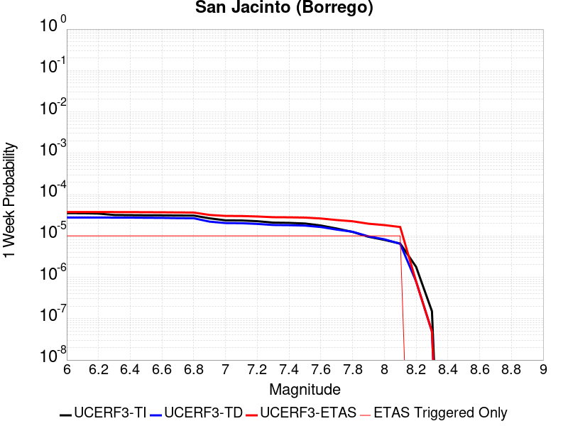 | 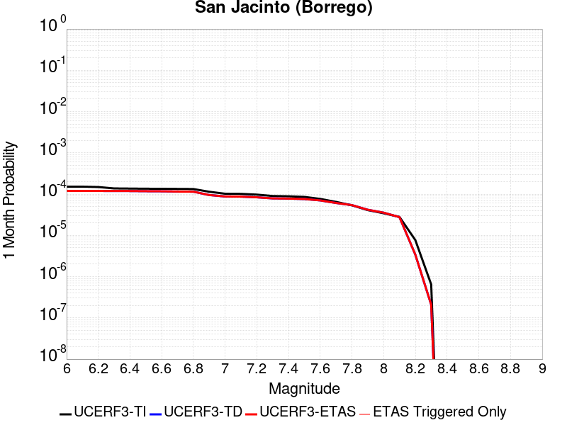 | 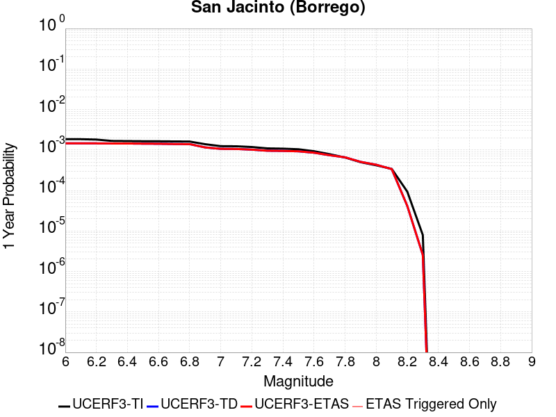 | 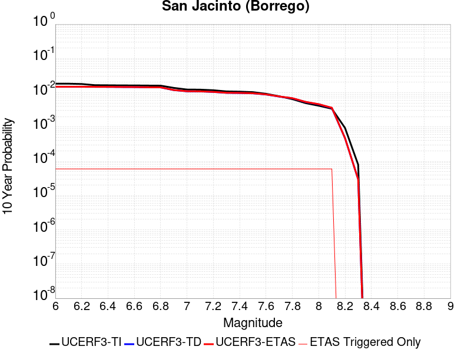 |

| Magnitude | 1 wk TI Prob | 1 wk TD Prob | 1 wk ETAS Prob | 1 wk ETAS/TD Gain | 1 wk ETAS Triggered Only | 1 mo TI Prob | 1 mo TD Prob | 1 mo ETAS Prob | 1 mo ETAS/TD Gain | 1 mo ETAS Triggered Only | 1 yr TI Prob | 1 yr TD Prob | 1 yr ETAS Prob | 1 yr ETAS/TD Gain | 1 yr ETAS Triggered Only | 10 yr TI Prob | 10 yr TD Prob | 10 yr ETAS Prob | 10 yr ETAS/TD Gain | 10 yr ETAS Triggered Only |
|-----|-----|-----|-----|-----|-----|-----|-----|-----|-----|-----|-----|-----|-----|-----|-----|-----|-----|-----|-----|-----|
| 6.0 | 3.543992E-5 | 2.7925962E-5 | 3.792568E-5 | 1.3580797 | 1.0E-5 | 1.5187653E-4 | 1.1967727E-4 | 1.2967607E-4 | 1.0835481 | 1.0E-5 | 0.0018475284 | 0.0014561092 | 0.001496051 | 1.0274304 | 4.0E-5 | 0.018322436 | 0.01486815 | 0.014927259 | 1.0039755 | 6.0E-5 |
| 6.1 | 3.542281E-5 | 2.7925962E-5 | 3.792568E-5 | 1.3580797 | 1.0E-5 | 1.5180321E-4 | 1.1967727E-4 | 1.2967607E-4 | 1.0835481 | 1.0E-5 | 0.0018466372 | 0.0014561092 | 0.001496051 | 1.0274304 | 4.0E-5 | 0.018313672 | 0.01486815 | 0.014927259 | 1.0039755 | 6.0E-5 |
| 6.2 | 3.4688688E-5 | 2.7925962E-5 | 3.792568E-5 | 1.3580797 | 1.0E-5 | 1.4865733E-4 | 1.1967727E-4 | 1.2967607E-4 | 1.0835481 | 1.0E-5 | 0.0018084005 | 0.0014561091 | 0.0014960509 | 1.0274304 | 4.0E-5 | 0.017937548 | 0.01486815 | 0.014927259 | 1.0039755 | 6.0E-5 |
| 6.3 | 3.2087122E-5 | 2.7771312E-5 | 3.7771035E-5 | 1.3600738 | 1.0E-5 | 1.3750899E-4 | 1.1901455E-4 | 1.2901335E-4 | 1.0840133 | 1.0E-5 | 0.0016728862 | 0.0014480512 | 0.0014879933 | 1.0275834 | 4.0E-5 | 0.016603488 | 0.014789308 | 0.01484842 | 1.003997 | 6.0E-5 |
| 6.4 | 3.1828724E-5 | 2.773829E-5 | 3.7738013E-5 | 1.3605025 | 1.0E-5 | 1.364017E-4 | 1.1887303E-4 | 1.2887185E-4 | 1.0841134 | 1.0E-5 | 0.0016594254 | 0.0014463306 | 0.0014862727 | 1.0276161 | 4.0E-5 | 0.016470885 | 0.014772502 | 0.014831615 | 1.0040016 | 6.0E-5 |
| 6.5 | 3.1563577E-5 | 2.7477974E-5 | 3.7477697E-5 | 1.3639178 | 1.0E-5 | 1.3526545E-4 | 1.17757496E-4 | 1.2775631E-4 | 1.0849103 | 1.0E-5 | 0.0016456128 | 0.0014327668 | 0.0014727095 | 1.027878 | 4.0E-5 | 0.0163348 | 0.01463991 | 0.014699032 | 1.0040383 | 6.0E-5 |
| 6.6 | 3.1467625E-5 | 2.7322194E-5 | 3.7321923E-5 | 1.3659928 | 1.0E-5 | 1.3485427E-4 | 1.17089934E-4 | 1.2708876E-4 | 1.0853944 | 1.0E-5 | 0.0016406142 | 0.0014246498 | 0.0014645929 | 1.0280371 | 4.0E-5 | 0.016285548 | 0.014560228 | 0.014619354 | 1.0040609 | 6.0E-5 |
| 6.7 | 3.1223695E-5 | 2.6940217E-5 | 3.693995E-5 | 1.3711822 | 1.0E-5 | 1.3380898E-4 | 1.1545303E-4 | 1.2545189E-4 | 1.0866053 | 1.0E-5 | 0.0016279068 | 0.0014047464 | 0.0014446903 | 1.0284349 | 4.0E-5 | 0.01616033 | 0.01436451 | 0.014423648 | 1.004117 | 6.0E-5 |
| 6.8 | 3.1015585E-5 | 2.6761221E-5 | 3.6760954E-5 | 1.373665 | 1.0E-5 | 1.3291716E-4 | 1.1468597E-4 | 1.2468483E-4 | 1.0871847 | 1.0E-5 | 0.001617065 | 0.0013954195 | 0.0014353637 | 1.0286252 | 4.0E-5 | 0.016053487 | 0.014271772 | 0.014330915 | 1.0041441 | 6.0E-5 |
| 6.9 | 2.6641965E-5 | 2.2183434E-5 | 3.2183212E-5 | 1.4507768 | 1.0E-5 | 1.1417485E-4 | 9.506842E-5 | 1.0506747E-4 | 1.1051774 | 1.0E-5 | 0.0013891924 | 0.0011568473 | 0.0011968011 | 1.0345367 | 4.0E-5 | 0.0138054015 | 0.011882191 | 0.011941478 | 1.0049896 | 6.0E-5 |
| 7.0 | 2.3854353E-5 | 2.047825E-5 | 3.0478046E-5 | 1.488313 | 1.0E-5 | 1.02228936E-4 | 8.776099E-5 | 9.7760116E-5 | 1.1139358 | 1.0E-5 | 0.0012439266 | 0.0010679689 | 0.0011079261 | 1.0374143 | 4.0E-5 | 0.012369866 | 0.0109826205 | 0.011041962 | 1.0054032 | 6.0E-5 |
| 7.1 | 2.3672901E-5 | 2.0314741E-5 | 3.0314537E-5 | 1.4922434 | 1.0E-5 | 1.0145135E-4 | 8.706028E-5 | 9.705941E-5 | 1.1148529 | 1.0E-5 | 0.0012344702 | 0.0010594461 | 0.0010994037 | 1.0377156 | 4.0E-5 | 0.0122763505 | 0.010897858 | 0.010957205 | 1.0054457 | 6.0E-5 |
| 7.2 | 2.2717244E-5 | 1.9542116E-5 | 2.9541921E-5 | 1.5117053 | 1.0E-5 | 9.735599E-5 | 8.3749255E-5 | 9.3748415E-5 | 1.1193941 | 1.0E-5 | 0.0011846646 | 0.0010191725 | 0.0010591317 | 1.0392076 | 4.0E-5 | 0.01178369 | 0.010495322 | 0.010554692 | 1.0056568 | 6.0E-5 |
| 7.3 | 2.1016205E-5 | 1.8383771E-5 | 2.8383587E-5 | 1.543948 | 1.0E-5 | 9.006634E-5 | 7.878522E-5 | 8.8784436E-5 | 1.1269174 | 1.0E-5 | 0.001096006 | 9.5879E-4 | 9.987517E-4 | 1.0416793 | 4.0E-5 | 0.010906163 | 0.009890901 | 0.009950307 | 1.0060062 | 6.0E-5 |
| 7.4 | 2.0683625E-5 | 1.8186302E-5 | 2.818612E-5 | 1.5498544 | 1.0E-5 | 8.86411E-5 | 7.7938974E-5 | 8.79382E-5 | 1.1282955 | 1.0E-5 | 0.001078671 | 9.48496E-4 | 9.88458E-4 | 1.042132 | 4.0E-5 | 0.010734501 | 0.0097876275 | 0.00984704 | 1.0060701 | 6.0E-5 |
| 7.5 | 1.9993966E-5 | 1.7781347E-5 | 2.7781169E-5 | 1.5623771 | 1.0E-5 | 8.568561E-5 | 7.6203556E-5 | 8.6202796E-5 | 1.1312175 | 1.0E-5 | 0.001042723 | 9.2738547E-4 | 9.6734834E-4 | 1.043092 | 4.0E-5 | 0.010378438 | 0.009574548 | 0.009633974 | 1.0062066 | 6.0E-5 |
| 7.6 | 1.788966E-5 | 1.6434618E-5 | 2.6434454E-5 | 1.6084617 | 1.0E-5 | 7.666772E-5 | 7.043219E-5 | 8.0431484E-5 | 1.1419705 | 1.0E-5 | 9.3302975E-4 | 8.5717626E-4 | 8.97142E-4 | 1.0466249 | 4.0E-5 | 0.00929122 | 0.008866415 | 0.008925883 | 1.0067071 | 6.0E-5 |
| 7.7 | 1.5125781E-5 | 1.4236738E-5 | 2.4236595E-5 | 1.7023981 | 1.0E-5 | 6.4823165E-5 | 6.101317E-5 | 7.101256E-5 | 1.163889 | 1.0E-5 | 7.889362E-4 | 7.4258295E-4 | 7.825533E-4 | 1.0538261 | 4.0E-5 | 0.007861412 | 0.007714161 | 0.0077736983 | 1.0077178 | 6.0E-5 |
| 7.8 | 1.250089E-5 | 1.262994E-5 | 2.2629814E-5 | 1.7917594 | 1.0E-5 | 5.3574146E-5 | 5.4127195E-5 | 6.412665E-5 | 1.1847401 | 1.0E-5 | 6.5207E-4 | 6.588E-4 | 6.9877366E-4 | 1.0606765 | 4.0E-5 | 0.006501599 | 0.006867759 | 0.006927347 | 1.0086765 | 6.0E-5 |
| 7.9 | 9.561E-6 | 9.754065E-6 | 1.9753967E-5 | 2.0252037 | 1.0E-5 | 4.0975072E-5 | 4.180247E-5 | 5.180205E-5 | 1.2392104 | 1.0E-5 | 4.987573E-4 | 5.0882675E-4 | 5.488064E-4 | 1.0785723 | 4.0E-5 | 0.0049763937 | 0.0053523607 | 0.0054120393 | 1.01115 | 6.0E-5 |
| 8.0 | 8.01699E-6 | 8.292994E-6 | 1.829291E-5 | 2.2058272 | 1.0E-5 | 3.4358076E-5 | 3.554092E-5 | 4.5540564E-5 | 1.2813559 | 1.0E-5 | 4.1822926E-4 | 4.3262533E-4 | 4.7260802E-4 | 1.0924188 | 4.0E-5 | 0.0041744304 | 0.0045733186 | 0.0046330444 | 1.0130596 | 6.0E-5 |
| 8.1 | 6.541947E-6 | 6.461784E-6 | 1.646172E-5 | 2.5475502 | 1.0E-5 | 2.8036617E-5 | 2.7693068E-5 | 3.7692793E-5 | 1.3610911 | 1.0E-5 | 3.4129233E-4 | 3.3711144E-4 | 3.6710134E-4 | 1.0889614 | 3.0E-5 | 0.0034076865 | 0.0035805756 | 0.0036303964 | 1.0139142 | 5.0E-5 |
| 8.2 | 1.7968189E-6 | 7.9684827E-7 | 7.9684827E-7 | 1.0 | 0.0 | 7.70063E-6 | 3.4150596E-6 | 3.4150596E-6 | 1.0 | 0.0 | 9.3751136E-5 | 4.157758E-5 | 4.157758E-5 | 1.0 | 0.0 | 9.371159E-4 | 4.7107413E-4 | 4.7107413E-4 | 1.0 | 0.0 |
| 8.3 | 1.5167889E-7 | 4.8951257E-8 | 4.8951257E-8 | 1.0 | 0.0 | 6.500522E-7 | 2.0979108E-7 | 2.0979108E-7 | 1.0 | 0.0 | 7.9143565E-6 | 2.5542038E-6 | 2.5542038E-6 | 1.0 | 0.0 | 7.914075E-5 | 2.9679897E-5 | 2.9679897E-5 | 1.0 | 0.0 |

## Simi-Santa Rosa
*[(top)](#table-of-contents)*

| 1 Week | 1 Month | 1 Year | 10 Year |
|-----|-----|-----|-----|
| 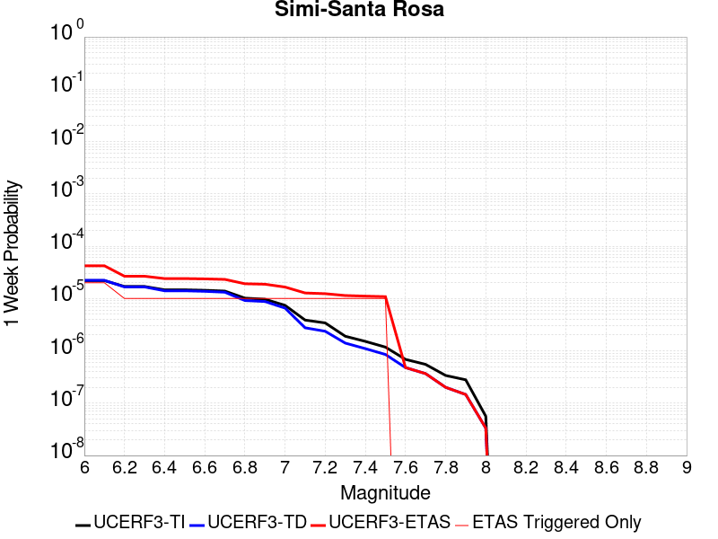 | 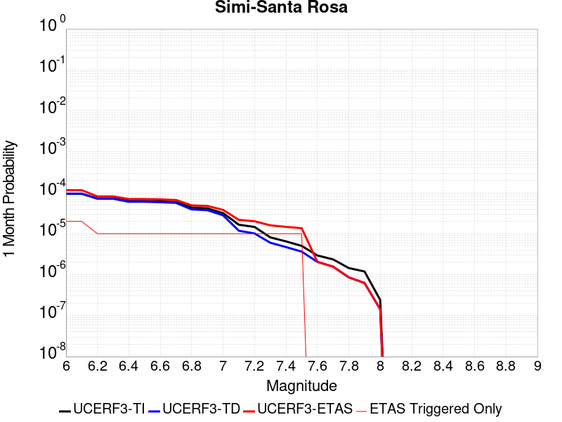 | 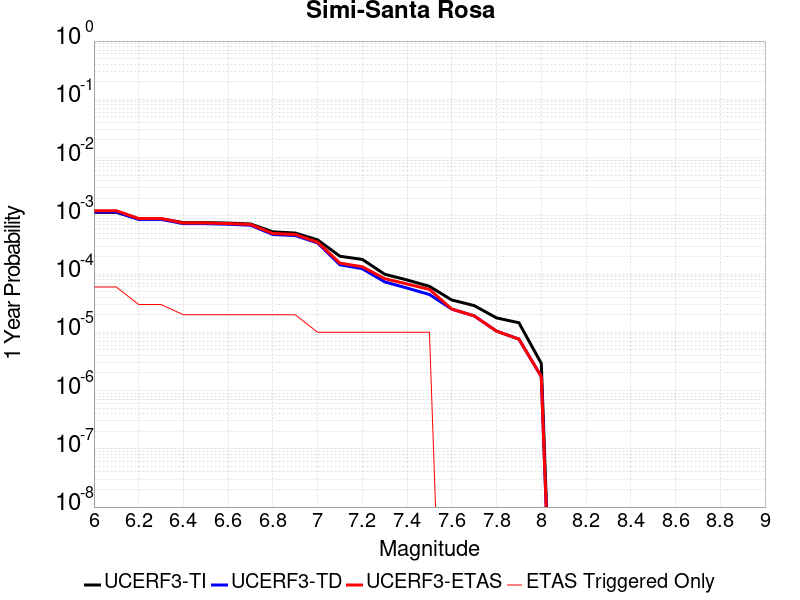 | 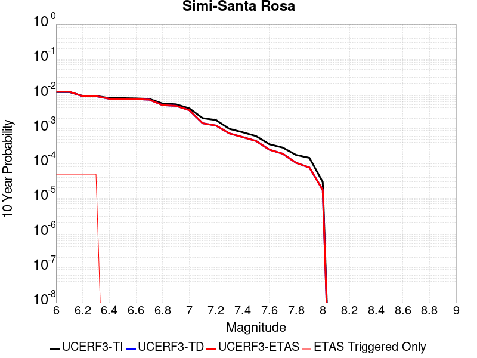 |

| Magnitude | 1 wk TI Prob | 1 wk TD Prob | 1 wk ETAS Prob | 1 wk ETAS/TD Gain | 1 wk ETAS Triggered Only | 1 mo TI Prob | 1 mo TD Prob | 1 mo ETAS Prob | 1 mo ETAS/TD Gain | 1 mo ETAS Triggered Only | 1 yr TI Prob | 1 yr TD Prob | 1 yr ETAS Prob | 1 yr ETAS/TD Gain | 1 yr ETAS Triggered Only | 10 yr TI Prob | 10 yr TD Prob | 10 yr ETAS Prob | 10 yr ETAS/TD Gain | 10 yr ETAS Triggered Only |
|-----|-----|-----|-----|-----|-----|-----|-----|-----|-----|-----|-----|-----|-----|-----|-----|-----|-----|-----|-----|-----|
| 6.0 | 2.198912E-5 | 2.2275388E-5 | 4.2274944E-5 | 1.8978319 | 2.0E-5 | 9.4235686E-5 | 9.54627E-5 | 1.15460796E-4 | 1.2094859 | 2.0E-5 | 0.0011467156 | 0.0011616825 | 0.0012216129 | 1.0515893 | 6.0E-5 | 0.011408163 | 0.011560547 | 0.011619854 | 1.00513 | 6.0E-5 |
| 6.1 | 2.198912E-5 | 2.2275388E-5 | 4.2274944E-5 | 1.8978319 | 2.0E-5 | 9.4235686E-5 | 9.54627E-5 | 1.15460796E-4 | 1.2094859 | 2.0E-5 | 0.0011467156 | 0.0011616825 | 0.0012216129 | 1.0515893 | 6.0E-5 | 0.011408163 | 0.011560547 | 0.011619854 | 1.00513 | 6.0E-5 |
| 6.2 | 1.69983E-5 | 1.6668506E-5 | 2.6668338E-5 | 1.5999238 | 1.0E-5 | 7.284782E-5 | 7.143466E-5 | 8.1433944E-5 | 1.139978 | 1.0E-5 | 8.865613E-4 | 8.6939917E-4 | 8.993731E-4 | 1.0344766 | 3.0E-5 | 0.008830327 | 0.0086629 | 0.00869264 | 1.003433 | 3.0E-5 |
| 6.3 | 1.69983E-5 | 1.6668506E-5 | 2.6668338E-5 | 1.5999238 | 1.0E-5 | 7.284782E-5 | 7.143466E-5 | 8.1433944E-5 | 1.139978 | 1.0E-5 | 8.865613E-4 | 8.6939917E-4 | 8.993731E-4 | 1.0344766 | 3.0E-5 | 0.008830327 | 0.0086629 | 0.00869264 | 1.003433 | 3.0E-5 |
| 6.4 | 1.4666188E-5 | 1.4052489E-5 | 2.4052348E-5 | 1.7116077 | 1.0E-5 | 6.285358E-5 | 6.0223705E-5 | 7.0223105E-5 | 1.1660376 | 1.0E-5 | 7.6497364E-4 | 7.330018E-4 | 7.5298717E-4 | 1.0272651 | 2.0E-5 | 0.0076234564 | 0.0073083164 | 0.00732817 | 1.0027167 | 2.0E-5 |
| 6.5 | 1.4666188E-5 | 1.4052489E-5 | 2.4052348E-5 | 1.7116077 | 1.0E-5 | 6.285358E-5 | 6.0223705E-5 | 7.0223105E-5 | 1.1660376 | 1.0E-5 | 7.6497364E-4 | 7.330018E-4 | 7.5298717E-4 | 1.0272651 | 2.0E-5 | 0.0076234564 | 0.0073083164 | 0.00732817 | 1.0027167 | 2.0E-5 |
| 6.6 | 1.4377586E-5 | 1.3729529E-5 | 2.3729392E-5 | 1.7283471 | 1.0E-5 | 6.1616774E-5 | 5.883965E-5 | 6.8839065E-5 | 1.1699435 | 1.0E-5 | 7.4992597E-4 | 7.1616215E-4 | 7.361478E-4 | 1.0279067 | 2.0E-5 | 0.007474003 | 0.0071410104 | 0.0071608676 | 1.0027807 | 2.0E-5 |
| 6.7 | 1.3881404E-5 | 1.3207497E-5 | 2.3207365E-5 | 1.7571357 | 1.0E-5 | 5.9490372E-5 | 5.6602472E-5 | 6.6601904E-5 | 1.1766608 | 1.0E-5 | 7.240546E-4 | 6.889419E-4 | 7.0892816E-4 | 1.02901 | 2.0E-5 | 0.007217 | 0.0068705105 | 0.0068903733 | 1.002891 | 2.0E-5 |
| 6.8 | 1.0176516E-5 | 9.1541E-6 | 1.9154008E-5 | 2.0923967 | 1.0E-5 | 4.3612912E-5 | 3.923136E-5 | 4.9230966E-5 | 1.2548882 | 1.0E-5 | 5.308578E-4 | 4.775537E-4 | 4.975441E-4 | 1.0418601 | 2.0E-5 | 0.0052959146 | 0.004766908 | 0.0047868127 | 1.0041755 | 2.0E-5 |
| 6.9 | 9.699797E-6 | 8.774672E-6 | 1.8774585E-5 | 2.1396337 | 1.0E-5 | 4.15699E-5 | 3.760529E-5 | 4.760491E-5 | 1.26591 | 1.0E-5 | 5.05996E-4 | 4.5776463E-4 | 4.7775547E-4 | 1.0436705 | 2.0E-5 | 0.005048454 | 0.0045698346 | 0.0045897434 | 1.0043565 | 2.0E-5 |
| 7.0 | 7.4049476E-6 | 6.559291E-6 | 1.6559225E-5 | 2.5245452 | 1.0E-5 | 3.1735104E-5 | 2.8111013E-5 | 3.811073E-5 | 1.3557224 | 1.0E-5 | 3.8630638E-4 | 3.422105E-4 | 3.5220708E-4 | 1.0292118 | 1.0E-5 | 0.0038563553 | 0.0034180775 | 0.0034280433 | 1.0029156 | 1.0E-5 |
| 7.1 | 3.873439E-6 | 2.759473E-6 | 1.2759446E-5 | 4.6238704 | 1.0E-5 | 1.6600346E-5 | 1.1826261E-5 | 2.1826143E-5 | 1.8455658 | 1.0E-5 | 2.0209046E-4 | 1.4397544E-4 | 1.53974E-4 | 1.0694463 | 1.0E-5 | 0.0020190678 | 0.0014388453 | 0.0014488308 | 1.00694 | 1.0E-5 |
| 7.2 | 3.417706E-6 | 2.367616E-6 | 1.2367592E-5 | 5.223648 | 1.0E-5 | 1.4647229E-5 | 1.0146887E-5 | 2.0146785E-5 | 1.9855139 | 1.0E-5 | 1.7831543E-4 | 1.2353157E-4 | 1.3353034E-4 | 1.080941 | 1.0E-5 | 0.0017817242 | 0.0012346513 | 0.0012446389 | 1.0080894 | 1.0E-5 |
| 7.3 | 1.90225E-6 | 1.4073756E-6 | 1.1407362E-5 | 8.105413 | 1.0E-5 | 8.152474E-6 | 6.031596E-6 | 1.6031536E-5 | 2.657926 | 1.0E-5 | 9.9251854E-5 | 7.343223E-5 | 8.343149E-5 | 1.13617 | 1.0E-5 | 9.920754E-4 | 7.340819E-4 | 7.440745E-4 | 1.0136125 | 1.0E-5 |
| 7.4 | 1.5170556E-6 | 1.1024792E-6 | 1.1102468E-5 | 10.070456 | 1.0E-5 | 6.5016507E-6 | 4.7249023E-6 | 1.4724855E-5 | 3.1164358 | 1.0E-5 | 7.915472E-5 | 5.752418E-5 | 6.75236E-5 | 1.1738299 | 1.0E-5 | 7.9126534E-4 | 5.75094E-4 | 5.850883E-4 | 1.0173784 | 1.0E-5 |
| 7.5 | 1.178732E-6 | 8.5351127E-7 | 1.0853502E-5 | 12.716297 | 1.0E-5 | 5.0516987E-6 | 3.6579004E-6 | 1.3657864E-5 | 3.7337987 | 1.0E-5 | 6.1502695E-5 | 4.4534037E-5 | 5.4533593E-5 | 1.2245374 | 1.0E-5 | 6.148568E-4 | 4.4525208E-4 | 4.5524762E-4 | 1.0224491 | 1.0E-5 |
| 7.6 | 6.8722386E-7 | 4.793211E-7 | 4.793211E-7 | 1.0 | 0.0 | 2.9452417E-6 | 2.0542318E-6 | 2.0542318E-6 | 1.0 | 0.0 | 3.5857727E-5 | 2.5009986E-5 | 2.5009986E-5 | 1.0 | 0.0 | 3.5851944E-4 | 2.5007184E-4 | 2.5007184E-4 | 1.0 | 0.0 |
| 7.7 | 5.5126515E-7 | 3.6731117E-7 | 3.6731117E-7 | 1.0 | 0.0 | 2.3625628E-6 | 1.5741898E-6 | 1.5741898E-6 | 1.0 | 0.0 | 2.8763823E-5 | 1.9165593E-5 | 1.9165593E-5 | 1.0 | 0.0 | 2.87601E-4 | 1.9163951E-4 | 1.9163951E-4 | 1.0 | 0.0 |
| 7.8 | 3.3860243E-7 | 2.0075514E-7 | 2.0075514E-7 | 1.0 | 0.0 | 1.4511525E-6 | 8.6037886E-7 | 8.6037886E-7 | 1.0 | 0.0 | 1.7667637E-5 | 1.0475063E-5 | 1.0475063E-5 | 1.0 | 0.0 | 1.7666233E-4 | 1.0474575E-4 | 1.0474575E-4 | 1.0 | 0.0 |
| 7.9 | 2.7955386E-7 | 1.4648724E-7 | 1.4648724E-7 | 1.0 | 0.0 | 1.1980875E-6 | 6.278023E-7 | 6.278023E-7 | 1.0 | 0.0 | 1.4586617E-5 | 7.643467E-6 | 7.643467E-6 | 1.0 | 0.0 | 1.458566E-4 | 7.643208E-5 | 7.643208E-5 | 1.0 | 0.0 |
| 8.0 | 5.6259015E-8 | 3.335318E-8 | 3.335318E-8 | 1.0 | 0.0 | 2.4111003E-7 | 1.429422E-7 | 1.429422E-7 | 1.0 | 0.0 | 2.9355108E-6 | 1.7403199E-6 | 1.7403199E-6 | 1.0 | 0.0 | 2.935472E-5 | 1.7403077E-5 | 1.7403077E-5 | 1.0 | 0.0 |

## San Luis Range 2011 CFM
*[(top)](#table-of-contents)*

| 1 Week | 1 Month | 1 Year | 10 Year |
|-----|-----|-----|-----|
|  | 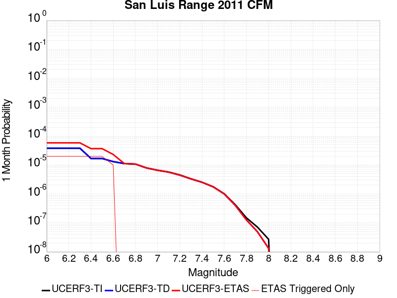 | 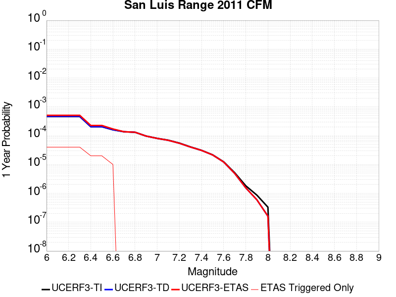 | 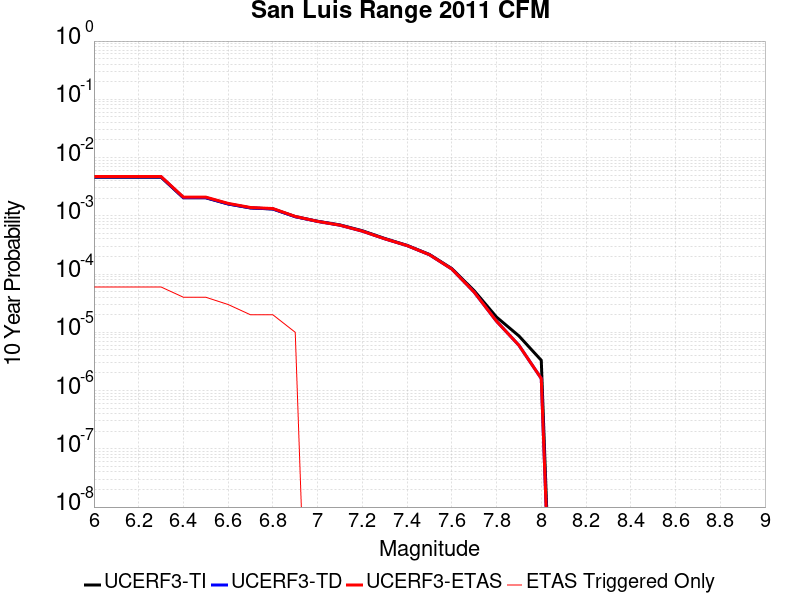 |

| Magnitude | 1 wk TI Prob | 1 wk TD Prob | 1 wk ETAS Prob | 1 wk ETAS/TD Gain | 1 wk ETAS Triggered Only | 1 mo TI Prob | 1 mo TD Prob | 1 mo ETAS Prob | 1 mo ETAS/TD Gain | 1 mo ETAS Triggered Only | 1 yr TI Prob | 1 yr TD Prob | 1 yr ETAS Prob | 1 yr ETAS/TD Gain | 1 yr ETAS Triggered Only | 10 yr TI Prob | 10 yr TD Prob | 10 yr ETAS Prob | 10 yr ETAS/TD Gain | 10 yr ETAS Triggered Only |
|-----|-----|-----|-----|-----|-----|-----|-----|-----|-----|-----|-----|-----|-----|-----|-----|-----|-----|-----|-----|-----|
| 6.0 | 8.8368415E-6 | 8.965455E-6 | 8.965455E-6 | 1.0 | 0.0 | 3.787163E-5 | 3.8422855E-5 | 5.8422087E-5 | 1.5205035 | 2.0E-5 | 4.609895E-4 | 4.6770574E-4 | 5.0768704E-4 | 1.0854839 | 4.0E-5 | 0.0046003438 | 0.004667997 | 0.0047277166 | 1.0127934 | 6.0E-5 |
| 6.1 | 8.8368415E-6 | 8.965455E-6 | 8.965455E-6 | 1.0 | 0.0 | 3.787163E-5 | 3.8422855E-5 | 5.8422087E-5 | 1.5205035 | 2.0E-5 | 4.609895E-4 | 4.6770574E-4 | 5.0768704E-4 | 1.0854839 | 4.0E-5 | 0.0046003438 | 0.004667997 | 0.0047277166 | 1.0127934 | 6.0E-5 |
| 6.2 | 8.8368415E-6 | 8.965455E-6 | 8.965455E-6 | 1.0 | 0.0 | 3.787163E-5 | 3.8422855E-5 | 5.8422087E-5 | 1.5205035 | 2.0E-5 | 4.609895E-4 | 4.6770574E-4 | 5.0768704E-4 | 1.0854839 | 4.0E-5 | 0.0046003438 | 0.004667997 | 0.0047277166 | 1.0127934 | 6.0E-5 |
| 6.3 | 8.8368415E-6 | 8.965455E-6 | 8.965455E-6 | 1.0 | 0.0 | 3.787163E-5 | 3.8422855E-5 | 5.8422087E-5 | 1.5205035 | 2.0E-5 | 4.609895E-4 | 4.6770574E-4 | 5.0768704E-4 | 1.0854839 | 4.0E-5 | 0.0046003438 | 0.004667997 | 0.0047277166 | 1.0127934 | 6.0E-5 |
| 6.4 | 3.9094193E-6 | 3.941204E-6 | 3.941204E-6 | 1.0 | 0.0 | 1.6754546E-5 | 1.6890766E-5 | 3.689043E-5 | 2.184059 | 2.0E-5 | 2.039675E-4 | 2.0562594E-4 | 2.2562183E-4 | 1.097244 | 2.0E-5 | 0.0020378039 | 0.0020543856 | 0.0020943035 | 1.0194305 | 4.0E-5 |
| 6.5 | 3.9094193E-6 | 3.941204E-6 | 3.941204E-6 | 1.0 | 0.0 | 1.6754546E-5 | 1.6890766E-5 | 3.689043E-5 | 2.184059 | 2.0E-5 | 2.039675E-4 | 2.0562594E-4 | 2.2562183E-4 | 1.097244 | 2.0E-5 | 0.0020378039 | 0.0020543856 | 0.0020943035 | 1.0194305 | 4.0E-5 |
| 6.6 | 3.0587726E-6 | 3.0753893E-6 | 3.0753893E-6 | 1.0 | 0.0 | 1.3108959E-5 | 1.3180174E-5 | 2.3180042E-5 | 1.7587054 | 1.0E-5 | 1.595899E-4 | 1.6045693E-4 | 1.7045531E-4 | 1.062312 | 1.0E-5 | 0.0015947534 | 0.0016034227 | 0.0016333745 | 1.01868 | 3.0E-5 |
| 6.7 | 2.6160574E-6 | 2.6251284E-6 | 2.6251284E-6 | 1.0 | 0.0 | 1.1211626E-5 | 1.1250502E-5 | 1.1250502E-5 | 1.0 | 0.0 | 1.3649299E-4 | 1.3696631E-4 | 1.3696631E-4 | 1.0 | 0.0 | 0.0013640919 | 0.0013688251 | 0.0013887978 | 1.0145911 | 2.0E-5 |
| 6.8 | 2.5110312E-6 | 2.5181412E-6 | 2.5181412E-6 | 1.0 | 0.0 | 1.0761518E-5 | 1.079199E-5 | 1.079199E-5 | 1.0 | 0.0 | 1.310136E-4 | 1.313846E-4 | 1.313846E-4 | 1.0 | 0.0 | 0.0013093639 | 0.0013130752 | 0.0013330489 | 1.0152115 | 2.0E-5 |
| 6.9 | 1.8564405E-6 | 1.852488E-6 | 1.852488E-6 | 1.0 | 0.0 | 7.95615E-6 | 7.93921E-6 | 7.93921E-6 | 1.0 | 0.0 | 9.686181E-5 | 9.665562E-5 | 9.665562E-5 | 1.0 | 0.0 | 9.68196E-4 | 9.6613786E-4 | 9.7612815E-4 | 1.0103405 | 1.0E-5 |
| 7.0 | 1.546127E-6 | 1.5369549E-6 | 1.5369549E-6 | 1.0 | 0.0 | 6.626242E-6 | 6.5869326E-6 | 6.5869326E-6 | 1.0 | 0.0 | 8.06715E-5 | 8.019296E-5 | 8.019296E-5 | 1.0 | 0.0 | 8.0642226E-4 | 8.016409E-4 | 8.016409E-4 | 1.0 | 0.0 |
| 7.1 | 1.3368208E-6 | 1.3235336E-6 | 1.3235336E-6 | 1.0 | 0.0 | 5.7292195E-6 | 5.6722747E-6 | 5.6722747E-6 | 1.0 | 0.0 | 6.975101E-5 | 6.905776E-5 | 6.905776E-5 | 1.0 | 0.0 | 6.972912E-4 | 6.903635E-4 | 6.903635E-4 | 1.0 | 0.0 |
| 7.2 | 1.0623363E-6 | 1.0454378E-6 | 1.0454378E-6 | 1.0 | 0.0 | 4.5528623E-6 | 4.4804397E-6 | 4.4804397E-6 | 1.0 | 0.0 | 5.5429686E-5 | 5.4547992E-5 | 5.4547992E-5 | 1.0 | 0.0 | 5.5415864E-4 | 5.453463E-4 | 5.453463E-4 | 1.0 | 0.0 |
| 7.3 | 7.831679E-7 | 7.727399E-7 | 7.727399E-7 | 1.0 | 0.0 | 3.3564295E-6 | 3.3117383E-6 | 3.3117383E-6 | 1.0 | 0.0 | 4.086376E-5 | 4.031967E-5 | 4.031967E-5 | 1.0 | 0.0 | 4.0856248E-4 | 4.0312367E-4 | 4.0312367E-4 | 1.0 | 0.0 |
| 7.4 | 5.9558846E-7 | 5.910646E-7 | 5.910646E-7 | 1.0 | 0.0 | 2.5525194E-6 | 2.5331315E-6 | 2.5331315E-6 | 1.0 | 0.0 | 3.107648E-5 | 3.084044E-5 | 3.084044E-5 | 1.0 | 0.0 | 3.1072134E-4 | 3.083617E-4 | 3.083617E-4 | 1.0 | 0.0 |
| 7.5 | 4.1616502E-7 | 4.1196404E-7 | 4.1196404E-7 | 1.0 | 0.0 | 1.7835631E-6 | 1.765559E-6 | 1.765559E-6 | 1.0 | 0.0 | 2.1714664E-5 | 2.1495469E-5 | 2.1495469E-5 | 1.0 | 0.0 | 2.1712543E-4 | 2.1493394E-4 | 2.1493394E-4 | 1.0 | 0.0 |
| 7.6 | 2.3816014E-7 | 2.3376614E-7 | 2.3376614E-7 | 1.0 | 0.0 | 1.0206859E-6 | 1.0018545E-6 | 1.0018545E-6 | 1.0 | 0.0 | 1.242678E-5 | 1.219751E-5 | 1.219751E-5 | 1.0 | 0.0 | 1.2426086E-4 | 1.2196843E-4 | 1.2196843E-4 | 1.0 | 0.0 |
| 7.7 | 9.918777E-8 | 9.3868096E-8 | 9.3868096E-8 | 1.0 | 0.0 | 4.2509038E-7 | 4.022918E-7 | 4.022918E-7 | 1.0 | 0.0 | 5.1754632E-6 | 4.8978914E-6 | 4.8978914E-6 | 1.0 | 0.0 | 5.1753424E-5 | 4.897784E-5 | 4.897784E-5 | 1.0 | 0.0 |
| 7.8 | 3.4982556E-8 | 2.968672E-8 | 2.968672E-8 | 1.0 | 0.0 | 1.4992524E-7 | 1.272288E-7 | 1.272288E-7 | 1.0 | 0.0 | 1.8253382E-6 | 1.5490094E-6 | 1.5490094E-6 | 1.0 | 0.0 | 1.8253233E-5 | 1.5489988E-5 | 1.5489988E-5 | 1.0 | 0.0 |
| 7.9 | 1.6624908E-8 | 1.1476994E-8 | 1.1476994E-8 | 1.0 | 0.0 | 7.12496E-8 | 4.9187115E-8 | 4.9187115E-8 | 1.0 | 0.0 | 8.6746354E-7 | 5.988529E-7 | 5.988529E-7 | 1.0 | 0.0 | 8.674601E-6 | 5.9885133E-6 | 5.9885133E-6 | 1.0 | 0.0 |
| 8.0 | 6.3352315E-9 | 3.0886564E-9 | 3.0886564E-9 | 1.0 | 0.0 | 2.715099E-8 | 1.32370985E-8 | 1.32370985E-8 | 1.0 | 0.0 | 3.3056327E-7 | 1.6116167E-7 | 1.6116167E-7 | 1.0 | 0.0 | 3.3056278E-6 | 1.6116155E-6 | 1.6116155E-6 | 1.0 | 0.0 |

## Raymond
*[(top)](#table-of-contents)*

| 1 Week | 1 Month | 1 Year | 10 Year |
|-----|-----|-----|-----|
|  | 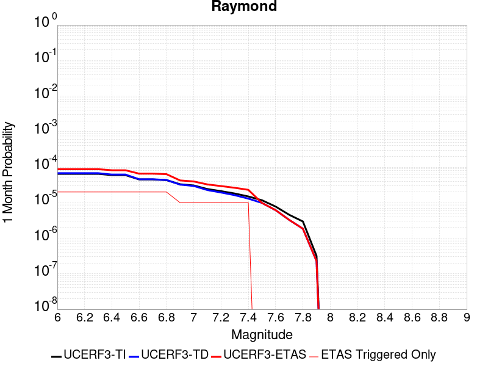 | 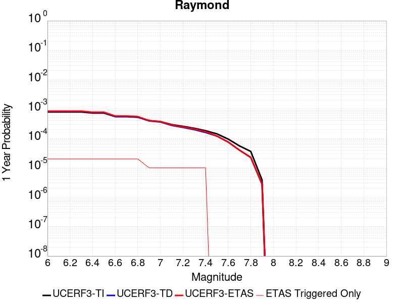 | 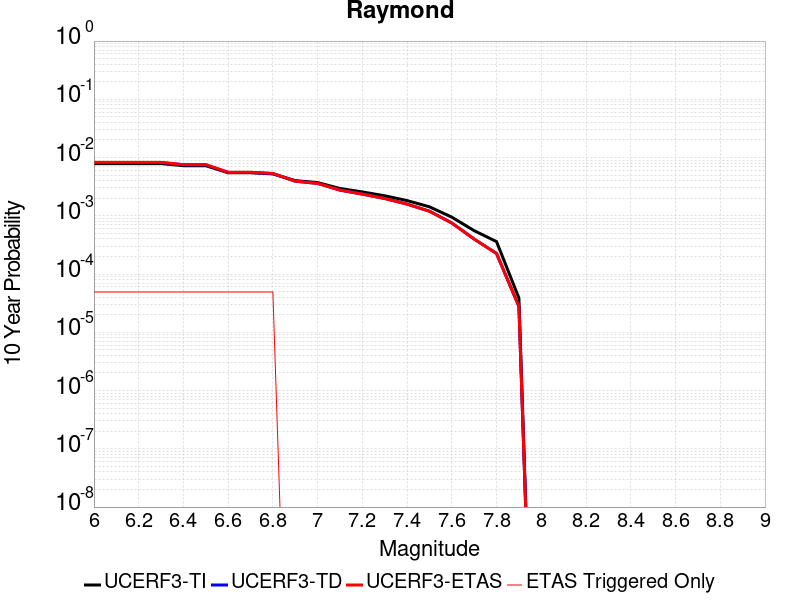 |

| Magnitude | 1 wk TI Prob | 1 wk TD Prob | 1 wk ETAS Prob | 1 wk ETAS/TD Gain | 1 wk ETAS Triggered Only | 1 mo TI Prob | 1 mo TD Prob | 1 mo ETAS Prob | 1 mo ETAS/TD Gain | 1 mo ETAS Triggered Only | 1 yr TI Prob | 1 yr TD Prob | 1 yr ETAS Prob | 1 yr ETAS/TD Gain | 1 yr ETAS Triggered Only | 10 yr TI Prob | 10 yr TD Prob | 10 yr ETAS Prob | 10 yr ETAS/TD Gain | 10 yr ETAS Triggered Only |
|-----|-----|-----|-----|-----|-----|-----|-----|-----|-----|-----|-----|-----|-----|-----|-----|-----|-----|-----|-----|-----|
| 6.0 | 1.5157413E-5 | 1.5810125E-5 | 2.5809968E-5 | 1.632496 | 1.0E-5 | 6.4958724E-5 | 6.775606E-5 | 8.7754706E-5 | 1.2951566 | 2.0E-5 | 7.905855E-4 | 8.246429E-4 | 8.446264E-4 | 1.0242329 | 2.0E-5 | 0.007877788 | 0.008218355 | 0.008267944 | 1.0060339 | 5.0E-5 |
| 6.1 | 1.5157413E-5 | 1.5810125E-5 | 2.5809968E-5 | 1.632496 | 1.0E-5 | 6.4958724E-5 | 6.775606E-5 | 8.7754706E-5 | 1.2951566 | 2.0E-5 | 7.905855E-4 | 8.246429E-4 | 8.446264E-4 | 1.0242329 | 2.0E-5 | 0.007877788 | 0.008218355 | 0.008267944 | 1.0060339 | 5.0E-5 |
| 6.2 | 1.5157413E-5 | 1.5810125E-5 | 2.5809968E-5 | 1.632496 | 1.0E-5 | 6.4958724E-5 | 6.775606E-5 | 8.7754706E-5 | 1.2951566 | 2.0E-5 | 7.905855E-4 | 8.246429E-4 | 8.446264E-4 | 1.0242329 | 2.0E-5 | 0.007877788 | 0.008218355 | 0.008267944 | 1.0060339 | 5.0E-5 |
| 6.3 | 1.5157413E-5 | 1.5810125E-5 | 2.5809968E-5 | 1.632496 | 1.0E-5 | 6.4958724E-5 | 6.775606E-5 | 8.7754706E-5 | 1.2951566 | 2.0E-5 | 7.905855E-4 | 8.246429E-4 | 8.446264E-4 | 1.0242329 | 2.0E-5 | 0.007877788 | 0.008218355 | 0.008267944 | 1.0060339 | 5.0E-5 |
| 6.4 | 1.3941944E-5 | 1.4454688E-5 | 2.4454543E-5 | 1.691807 | 1.0E-5 | 5.9749822E-5 | 6.194732E-5 | 8.1946084E-5 | 1.322835 | 2.0E-5 | 7.2721124E-4 | 7.53971E-4 | 7.7395595E-4 | 1.0265062 | 2.0E-5 | 0.007248361 | 0.007516471 | 0.0075660953 | 1.006602 | 5.0E-5 |
| 6.5 | 1.3941944E-5 | 1.4454688E-5 | 2.4454543E-5 | 1.691807 | 1.0E-5 | 5.9749822E-5 | 6.194732E-5 | 8.1946084E-5 | 1.322835 | 2.0E-5 | 7.2721124E-4 | 7.53971E-4 | 7.7395595E-4 | 1.0265062 | 2.0E-5 | 0.007248361 | 0.007516471 | 0.0075660953 | 1.006602 | 5.0E-5 |
| 6.6 | 1.0542609E-5 | 1.067111E-5 | 2.0671003E-5 | 1.9370996 | 1.0E-5 | 4.5181827E-5 | 4.573256E-5 | 6.573164E-5 | 1.4373052 | 2.0E-5 | 5.499499E-4 | 5.566571E-4 | 5.76646E-4 | 1.0359088 | 2.0E-5 | 0.005485909 | 0.0055531966 | 0.005602919 | 1.0089538 | 5.0E-5 |
| 6.7 | 1.0542609E-5 | 1.067111E-5 | 2.0671003E-5 | 1.9370996 | 1.0E-5 | 4.5181827E-5 | 4.573256E-5 | 6.573164E-5 | 1.4373052 | 2.0E-5 | 5.499499E-4 | 5.566571E-4 | 5.76646E-4 | 1.0359088 | 2.0E-5 | 0.005485909 | 0.0055531966 | 0.005602919 | 1.0089538 | 5.0E-5 |
| 6.8 | 1.0079132E-5 | 1.0176644E-5 | 2.0176542E-5 | 1.9826323 | 1.0E-5 | 4.3195567E-5 | 4.3613487E-5 | 6.361261E-5 | 1.4585538 | 2.0E-5 | 5.257791E-4 | 5.308702E-4 | 5.508596E-4 | 1.037654 | 2.0E-5 | 0.0052453685 | 0.0052965777 | 0.0053463127 | 1.0093901 | 5.0E-5 |
| 6.9 | 7.721598E-6 | 7.548902E-6 | 1.7548826E-5 | 2.324686 | 1.0E-5 | 3.3092143E-5 | 3.2352043E-5 | 4.235172E-5 | 1.3090895 | 1.0E-5 | 4.0282236E-4 | 3.9381615E-4 | 4.038122E-4 | 1.0253825 | 1.0E-5 | 0.0040209293 | 0.003931324 | 0.0039711664 | 1.0101347 | 4.0E-5 |
| 7.0 | 7.137566E-6 | 6.911303E-6 | 1.6911234E-5 | 2.4468951 | 1.0E-5 | 3.058921E-5 | 2.961954E-5 | 3.9619244E-5 | 1.337605 | 1.0E-5 | 3.7236E-4 | 3.605593E-4 | 3.705557E-4 | 1.0277247 | 1.0E-5 | 0.0037173668 | 0.003599869 | 0.003639725 | 1.0110716 | 4.0E-5 |
| 7.1 | 5.654976E-6 | 5.299538E-6 | 1.5299485E-5 | 2.8869472 | 1.0E-5 | 2.4235387E-5 | 2.2712107E-5 | 3.271188E-5 | 1.4402838 | 1.0E-5 | 2.9502588E-4 | 2.7648505E-4 | 2.8648227E-4 | 1.0361583 | 1.0E-5 | 0.0029463451 | 0.0027614492 | 0.0028013387 | 1.0144452 | 4.0E-5 |
| 7.2 | 4.9358455E-6 | 4.526655E-6 | 1.4526609E-5 | 3.2091267 | 1.0E-5 | 2.1153453E-5 | 1.9399806E-5 | 2.9399613E-5 | 1.5154591 | 1.0E-5 | 2.5751285E-4 | 2.3616718E-4 | 2.4616483E-4 | 1.0423329 | 1.0E-5 | 0.0025721465 | 0.002359192 | 0.0023990974 | 1.016915 | 4.0E-5 |
| 7.3 | 4.2368597E-6 | 3.8056128E-6 | 1.3805575E-5 | 3.6276877 | 1.0E-5 | 1.8157843E-5 | 1.6309668E-5 | 2.6309504E-5 | 1.6131233 | 1.0E-5 | 2.2104931E-4 | 1.9855222E-4 | 2.0855023E-4 | 1.0503546 | 1.0E-5 | 0.0022082955 | 0.0019837746 | 0.0019937549 | 1.0050309 | 1.0E-5 |
| 7.4 | 3.4999923E-6 | 3.0437407E-6 | 1.304371E-5 | 4.285421 | 1.0E-5 | 1.49998805E-5 | 1.3044538E-5 | 2.3044407E-5 | 1.7665944 | 1.0E-5 | 1.8260824E-4 | 1.5880575E-4 | 1.6880417E-4 | 1.06296 | 1.0E-5 | 0.0018245826 | 0.0015869461 | 0.0015969302 | 1.0062914 | 1.0E-5 |
| 7.5 | 2.738017E-6 | 2.3020405E-6 | 2.3020405E-6 | 1.0 | 0.0 | 1.1734306E-5 | 9.865851E-6 | 9.865851E-6 | 1.0 | 0.0 | 1.428558E-4 | 1.20110184E-4 | 1.20110184E-4 | 1.0 | 0.0 | 0.0014276401 | 0.0012004747 | 0.0012004747 | 1.0 | 0.0 |
| 7.6 | 1.8186392E-6 | 1.442302E-6 | 1.442302E-6 | 1.0 | 0.0 | 7.794145E-6 | 6.1812802E-6 | 6.1812802E-6 | 1.0 | 0.0 | 9.488958E-5 | 7.5254524E-5 | 7.5254524E-5 | 1.0 | 0.0 | 9.4849075E-4 | 7.5230957E-4 | 7.5230957E-4 | 1.0 | 0.0 |
| 7.7 | 1.0660348E-6 | 7.6437E-7 | 7.6437E-7 | 1.0 | 0.0 | 4.5687125E-6 | 3.2758674E-6 | 3.2758674E-6 | 1.0 | 0.0 | 5.5622655E-5 | 3.988297E-5 | 3.988297E-5 | 1.0 | 0.0 | 5.5608735E-4 | 3.9877492E-4 | 3.9877492E-4 | 1.0 | 0.0 |
| 7.8 | 6.913602E-7 | 4.3202903E-7 | 4.3202903E-7 | 1.0 | 0.0 | 2.962969E-6 | 1.8515517E-6 | 1.8515517E-6 | 1.0 | 0.0 | 3.607355E-5 | 2.2542416E-5 | 2.2542416E-5 | 1.0 | 0.0 | 3.6067693E-4 | 2.2541684E-4 | 2.2541684E-4 | 1.0 | 0.0 |
| 7.9 | 7.425201E-8 | 5.322267E-8 | 5.322267E-8 | 1.0 | 0.0 | 3.1822285E-7 | 2.2809714E-7 | 2.2809714E-7 | 1.0 | 0.0 | 3.874356E-6 | 2.7770805E-6 | 2.7770805E-6 | 1.0 | 0.0 | 3.8742884E-5 | 2.7770588E-5 | 2.7770588E-5 | 1.0 | 0.0 |

## Green Valley 2011 CFM
*[(top)](#table-of-contents)*

| 1 Week | 1 Month | 1 Year | 10 Year |
|-----|-----|-----|-----|
| 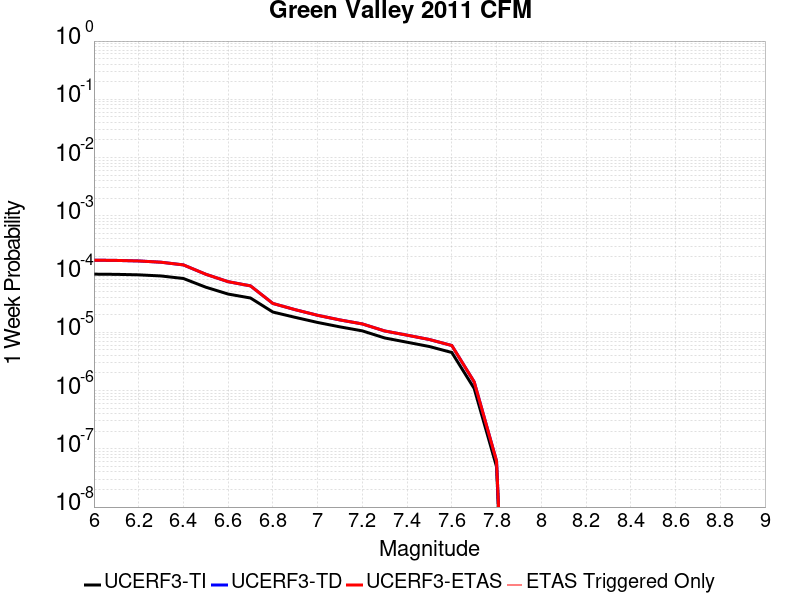 | 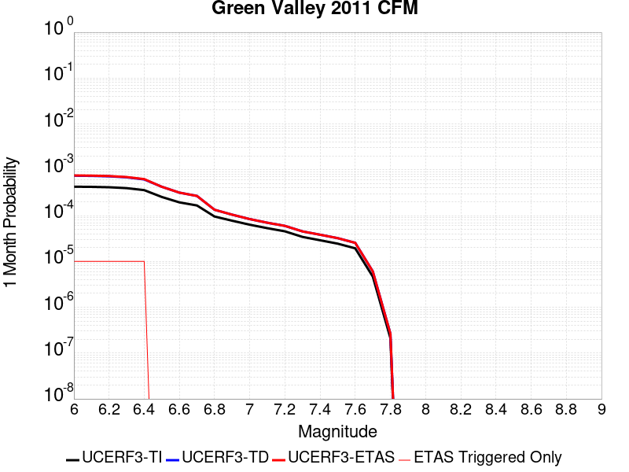 | 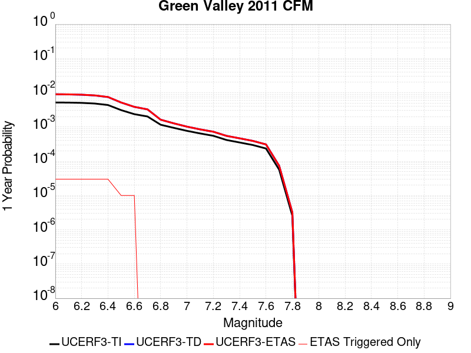 | 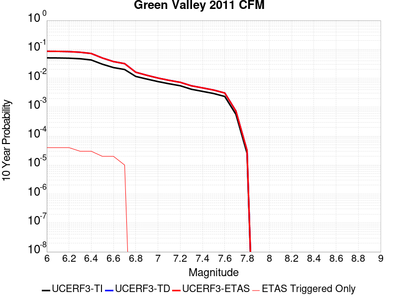 |

| Magnitude | 1 wk TI Prob | 1 wk TD Prob | 1 wk ETAS Prob | 1 wk ETAS/TD Gain | 1 wk ETAS Triggered Only | 1 mo TI Prob | 1 mo TD Prob | 1 mo ETAS Prob | 1 mo ETAS/TD Gain | 1 mo ETAS Triggered Only | 1 yr TI Prob | 1 yr TD Prob | 1 yr ETAS Prob | 1 yr ETAS/TD Gain | 1 yr ETAS Triggered Only | 10 yr TI Prob | 10 yr TD Prob | 10 yr ETAS Prob | 10 yr ETAS/TD Gain | 10 yr ETAS Triggered Only |
|-----|-----|-----|-----|-----|-----|-----|-----|-----|-----|-----|-----|-----|-----|-----|-----|-----|-----|-----|-----|-----|
| 6.0 | 9.9629346E-5 | 1.7302863E-4 | 1.7302863E-4 | 1.0 | 0.0 | 4.2691303E-4 | 7.41326E-4 | 7.513186E-4 | 1.0134794 | 1.0E-5 | 0.0051852856 | 0.00898692 | 0.00901665 | 1.0033082 | 3.0E-5 | 0.050659515 | 0.08553951 | 0.08557609 | 1.0004276 | 4.0E-5 |
| 6.1 | 9.88615E-5 | 1.7150163E-4 | 1.7150163E-4 | 1.0 | 0.0 | 4.2362334E-4 | 7.347854E-4 | 7.447781E-4 | 1.0135994 | 1.0E-5 | 0.0051454236 | 0.008907947 | 0.00893768 | 1.0033377 | 3.0E-5 | 0.050279044 | 0.08482712 | 0.08486372 | 1.0004315 | 4.0E-5 |
| 6.2 | 9.696895E-5 | 1.6789208E-4 | 1.6789208E-4 | 1.0 | 0.0 | 4.15515E-4 | 7.1932544E-4 | 7.2931824E-4 | 1.0138919 | 1.0E-5 | 0.0050471667 | 0.00872133 | 0.008751068 | 1.0034099 | 3.0E-5 | 0.04934063 | 0.08313578 | 0.08317246 | 1.0004412 | 4.0E-5 |
| 6.3 | 9.275224E-5 | 1.5968543E-4 | 1.5968543E-4 | 1.0 | 0.0 | 3.9744904E-4 | 6.841728E-4 | 6.9416594E-4 | 1.0146062 | 1.0E-5 | 0.0048282105 | 0.008296652 | 0.008326403 | 1.0035859 | 3.0E-5 | 0.047246475 | 0.07927481 | 0.07930243 | 1.0003484 | 3.0E-5 |
| 6.4 | 8.391499E-5 | 1.4365884E-4 | 1.4365884E-4 | 1.0 | 0.0 | 3.595861E-4 | 6.155238E-4 | 6.255176E-4 | 1.0162363 | 1.0E-5 | 0.004369175 | 0.007467181 | 0.0074969567 | 1.0039876 | 3.0E-5 | 0.04284265 | 0.07164672 | 0.07167457 | 1.0003887 | 3.0E-5 |
| 6.5 | 5.9519385E-5 | 9.932622E-5 | 9.932622E-5 | 1.0 | 0.0 | 2.5505814E-4 | 4.2560388E-4 | 4.2560388E-4 | 1.0 | 0.0 | 0.0031009112 | 0.005168341 | 0.0051782895 | 1.0019249 | 1.0E-5 | 0.030579966 | 0.05014692 | 0.050165918 | 1.0003788 | 2.0E-5 |
| 6.6 | 4.5361558E-5 | 7.4019794E-5 | 7.4019794E-5 | 1.0 | 0.0 | 1.9439218E-4 | 3.1717744E-4 | 3.1717744E-4 | 1.0 | 0.0 | 0.0023641558 | 0.0038538678 | 0.0038638292 | 1.0025848 | 1.0E-5 | 0.023391623 | 0.03766727 | 0.037686516 | 1.0005109 | 2.0E-5 |
| 6.7 | 3.8808106E-5 | 6.264382E-5 | 6.264382E-5 | 1.0 | 0.0 | 1.6630985E-4 | 2.6843755E-4 | 2.6843755E-4 | 1.0 | 0.0 | 0.0020229418 | 0.0032627317 | 0.0032627317 | 1.0 | 0.0 | 0.020046256 | 0.032007415 | 0.032017097 | 1.0003024 | 1.0E-5 |
| 6.8 | 2.2284667E-5 | 3.128574E-5 | 3.128574E-5 | 1.0 | 0.0 | 9.550222E-5 | 1.3407487E-4 | 1.3407487E-4 | 1.0 | 0.0 | 0.0011621192 | 0.0016311383 | 0.0016311383 | 1.0 | 0.0 | 0.011560607 | 0.01616672 | 0.01616672 | 1.0 | 0.0 |
| 6.9 | 1.8050168E-5 | 2.4448536E-5 | 2.4448536E-5 | 1.0 | 0.0 | 7.735557E-5 | 1.0477527E-4 | 1.0477527E-4 | 1.0 | 0.0 | 9.4139716E-4 | 0.0012748954 | 0.0012748954 | 1.0 | 0.0 | 0.009374191 | 0.012669067 | 0.012669067 | 1.0 | 0.0 |
| 7.0 | 1.4763166E-5 | 1.9583236E-5 | 1.9583236E-5 | 1.0 | 0.0 | 6.326917E-5 | 8.3925464E-5 | 8.3925464E-5 | 1.0 | 0.0 | 7.7002996E-4 | 0.001021315 | 0.001021315 | 1.0 | 0.0 | 0.007673672 | 0.01016625 | 0.01016625 | 1.0 | 0.0 |
| 7.1 | 1.2399713E-5 | 1.6304042E-5 | 1.6304042E-5 | 1.0 | 0.0 | 5.3140546E-5 | 6.987261E-5 | 6.987261E-5 | 1.0 | 0.0 | 6.467941E-4 | 8.5036893E-4 | 8.5036893E-4 | 1.0 | 0.0 | 0.006449148 | 0.008471781 | 0.008471781 | 1.0 | 0.0 |
| 7.2 | 1.0584195E-5 | 1.39220465E-5 | 1.39220465E-5 | 1.0 | 0.0 | 4.5360044E-5 | 5.966456E-5 | 5.966456E-5 | 1.0 | 0.0 | 5.521186E-4 | 7.2617555E-4 | 7.2617555E-4 | 1.0 | 0.0 | 0.0055074887 | 0.0072386027 | 0.0072386027 | 1.0 | 0.0 |
| 7.3 | 7.998173E-6 | 1.0544255E-5 | 1.0544255E-5 | 1.0 | 0.0 | 3.4277433E-5 | 4.5188888E-5 | 4.5188888E-5 | 1.0 | 0.0 | 4.1724785E-4 | 5.500369E-4 | 5.500369E-4 | 1.0 | 0.0 | 0.004164653 | 0.005487135 | 0.005487135 | 1.0 | 0.0 |
| 7.4 | 6.7571127E-6 | 8.932903E-6 | 8.932903E-6 | 1.0 | 0.0 | 2.8958733E-5 | 3.8283313E-5 | 3.8283313E-5 | 1.0 | 0.0 | 3.5251552E-4 | 4.660006E-4 | 4.660006E-4 | 1.0 | 0.0 | 0.0035195686 | 0.004650633 | 0.004650633 | 1.0 | 0.0 |
| 7.5 | 5.69878E-6 | 7.516483E-6 | 7.516483E-6 | 1.0 | 0.0 | 2.4423114E-5 | 3.2213105E-5 | 3.2213105E-5 | 1.0 | 0.0 | 2.9731085E-4 | 3.9212484E-4 | 3.9212484E-4 | 1.0 | 0.0 | 0.002969134 | 0.0039147018 | 0.0039147018 | 1.0 | 0.0 |
| 7.6 | 4.503664E-6 | 5.9358217E-6 | 5.9358217E-6 | 1.0 | 0.0 | 1.9301275E-5 | 2.5438992E-5 | 2.5438992E-5 | 1.0 | 0.0 | 2.3496768E-4 | 3.0967654E-4 | 3.0967654E-4 | 1.0 | 0.0 | 0.002347194 | 0.0030927279 | 0.0030927279 | 1.0 | 0.0 |
| 7.7 | 1.0873546E-6 | 1.410754E-6 | 1.410754E-6 | 1.0 | 0.0 | 4.6600826E-6 | 6.0460743E-6 | 6.0460743E-6 | 1.0 | 0.0 | 5.6735033E-5 | 7.36085E-5 | 7.36085E-5 | 1.0 | 0.0 | 5.672055E-4 | 7.3587085E-4 | 7.3587085E-4 | 1.0 | 0.0 |
| 7.8 | 4.9373917E-8 | 6.177967E-8 | 6.177967E-8 | 1.0 | 0.0 | 2.1160248E-7 | 2.6477002E-7 | 2.6477002E-7 | 1.0 | 0.0 | 2.5762572E-6 | 3.2235714E-6 | 3.2235714E-6 | 1.0 | 0.0 | 2.5762274E-5 | 3.2228E-5 | 3.2228E-5 | 1.0 | 0.0 |

## Big Pine (East)
*[(top)](#table-of-contents)*

| 1 Week | 1 Month | 1 Year | 10 Year |
|-----|-----|-----|-----|
|  | 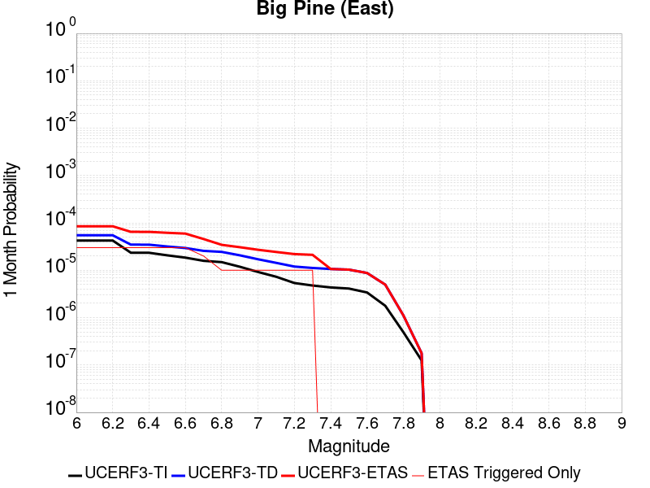 | 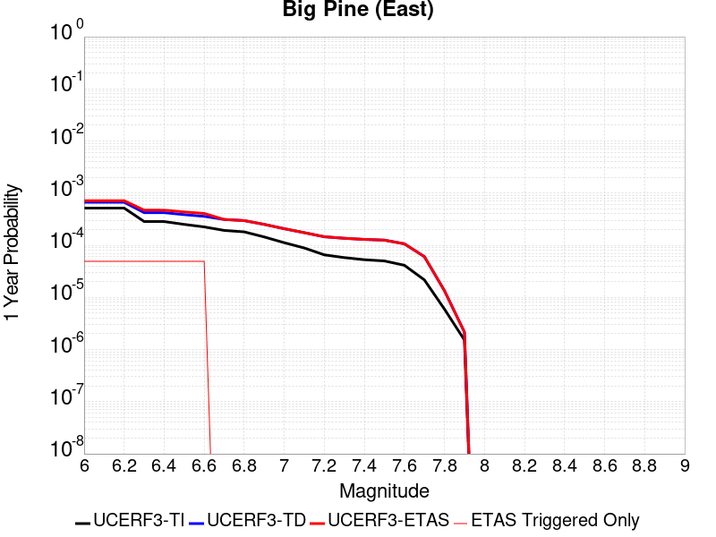 | 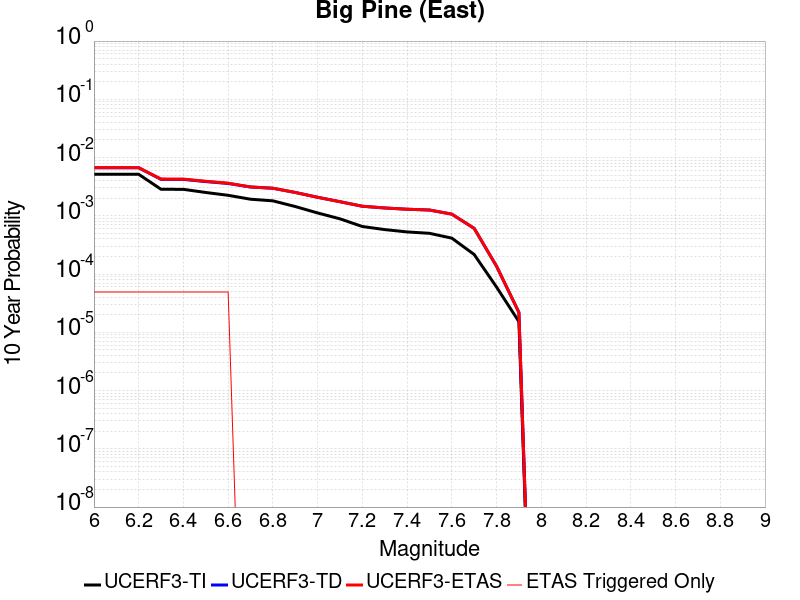 |

| Magnitude | 1 wk TI Prob | 1 wk TD Prob | 1 wk ETAS Prob | 1 wk ETAS/TD Gain | 1 wk ETAS Triggered Only | 1 mo TI Prob | 1 mo TD Prob | 1 mo ETAS Prob | 1 mo ETAS/TD Gain | 1 mo ETAS Triggered Only | 1 yr TI Prob | 1 yr TD Prob | 1 yr ETAS Prob | 1 yr ETAS/TD Gain | 1 yr ETAS Triggered Only | 10 yr TI Prob | 10 yr TD Prob | 10 yr ETAS Prob | 10 yr ETAS/TD Gain | 10 yr ETAS Triggered Only |
|-----|-----|-----|-----|-----|-----|-----|-----|-----|-----|-----|-----|-----|-----|-----|-----|-----|-----|-----|-----|-----|
| 6.0 | 9.916913E-6 | 1.28172705E-5 | 4.2816886E-5 | 3.3405619 | 3.0E-5 | 4.250036E-5 | 5.493013E-5 | 8.492848E-5 | 1.5461184 | 3.0E-5 | 5.173191E-4 | 6.685912E-4 | 7.185578E-4 | 1.0747341 | 5.0E-5 | 0.0051611643 | 0.006670449 | 0.0067201154 | 1.0074457 | 5.0E-5 |
| 6.1 | 9.916913E-6 | 1.28172705E-5 | 4.2816886E-5 | 3.3405619 | 3.0E-5 | 4.250036E-5 | 5.493013E-5 | 8.492848E-5 | 1.5461184 | 3.0E-5 | 5.173191E-4 | 6.685912E-4 | 7.185578E-4 | 1.0747341 | 5.0E-5 | 0.0051611643 | 0.006670449 | 0.0067201154 | 1.0074457 | 5.0E-5 |
| 6.2 | 9.916913E-6 | 1.28172705E-5 | 4.2816886E-5 | 3.3405619 | 3.0E-5 | 4.250036E-5 | 5.493013E-5 | 8.492848E-5 | 1.5461184 | 3.0E-5 | 5.173191E-4 | 6.685912E-4 | 7.185578E-4 | 1.0747341 | 5.0E-5 | 0.0051611643 | 0.006670449 | 0.0067201154 | 1.0074457 | 5.0E-5 |
| 6.3 | 5.479711E-6 | 8.1132375E-6 | 3.8112994E-5 | 4.6976304 | 3.0E-5 | 2.3484265E-5 | 3.4770575E-5 | 6.4769534E-5 | 1.8627685 | 3.0E-5 | 2.858834E-4 | 4.232527E-4 | 4.6323577E-4 | 1.0944662 | 4.0E-5 | 0.0028551589 | 0.0042272513 | 0.004267082 | 1.0094224 | 4.0E-5 |
| 6.4 | 5.465009E-6 | 8.0975315E-6 | 3.809729E-5 | 4.704803 | 3.0E-5 | 2.3421257E-5 | 3.4703262E-5 | 6.470222E-5 | 1.8644421 | 3.0E-5 | 2.851165E-4 | 4.2243348E-4 | 4.624166E-4 | 1.0946494 | 4.0E-5 | 0.0028475097 | 0.00421909 | 0.0042589214 | 1.0094407 | 4.0E-5 |
| 6.5 | 4.826767E-6 | 7.4225877E-6 | 3.7422364E-5 | 5.041687 | 3.0E-5 | 2.068598E-5 | 3.1810716E-5 | 6.180976E-5 | 1.9430484 | 3.0E-5 | 2.518227E-4 | 3.8722943E-4 | 4.2721393E-4 | 1.1032579 | 4.0E-5 | 0.0025153751 | 0.0038682907 | 0.003908136 | 1.0103005 | 4.0E-5 |
| 6.6 | 4.3146847E-6 | 6.8825234E-6 | 3.6882317E-5 | 5.358836 | 3.0E-5 | 1.8491375E-5 | 2.949621E-5 | 5.9495324E-5 | 2.0170498 | 3.0E-5 | 2.2510924E-4 | 3.5905963E-4 | 3.9904527E-4 | 1.1113621 | 4.0E-5 | 0.0022488134 | 0.0035875062 | 0.0036273627 | 1.0111098 | 4.0E-5 |
| 6.7 | 3.6968106E-6 | 5.9957474E-6 | 2.5995627E-5 | 4.3356776 | 2.0E-5 | 1.5843378E-5 | 2.5695816E-5 | 4.5695302E-5 | 1.7783169 | 2.0E-5 | 1.9287605E-4 | 3.128032E-4 | 3.427938E-4 | 1.0958769 | 3.0E-5 | 0.0019270873 | 0.0031262499 | 0.003156156 | 1.0095662 | 3.0E-5 |
| 6.8 | 3.4671132E-6 | 5.7024477E-6 | 1.5702391E-5 | 2.753623 | 1.0E-5 | 1.4858972E-5 | 2.4438841E-5 | 3.4438595E-5 | 1.4091747 | 1.0E-5 | 1.8089297E-4 | 2.9750372E-4 | 3.1749776E-4 | 1.067206 | 2.0E-5 | 0.0018074579 | 0.0029736666 | 0.0029936072 | 1.0067058 | 2.0E-5 |
| 6.9 | 2.7686972E-6 | 4.8254797E-6 | 1.4825431E-5 | 3.0723228 | 1.0E-5 | 1.1865792E-5 | 2.0680467E-5 | 3.068026E-5 | 1.483538 | 1.0E-5 | 1.4445644E-4 | 2.5175634E-4 | 2.717513E-4 | 1.0794219 | 2.0E-5 | 0.0014436257 | 0.002517256 | 0.0025372056 | 1.0079252 | 2.0E-5 |
| 7.0 | 2.1472624E-6 | 3.985277E-6 | 1.3985237E-5 | 3.5092258 | 1.0E-5 | 9.20252E-6 | 1.707965E-5 | 2.7079479E-5 | 1.5854821 | 1.0E-5 | 1.12034926E-4 | 2.0792543E-4 | 2.2792126E-4 | 1.0961683 | 2.0E-5 | 0.0011197845 | 0.0020798238 | 0.0020997822 | 1.0095962 | 2.0E-5 |
| 7.1 | 1.7018335E-6 | 3.3450835E-6 | 1.334505E-5 | 3.989452 | 1.0E-5 | 7.293552E-6 | 1.4335996E-5 | 2.4335852E-5 | 1.6975348 | 1.0E-5 | 8.879537E-5 | 1.7452713E-4 | 1.9452363E-4 | 1.1145754 | 2.0E-5 | 8.87599E-4 | 0.0017463792 | 0.0017663443 | 1.0114323 | 2.0E-5 |
| 7.2 | 1.25603E-6 | 2.794679E-6 | 1.2794651E-5 | 4.5782185 | 1.0E-5 | 5.3829745E-6 | 1.1977142E-5 | 2.1977023E-5 | 1.8349137 | 1.0E-5 | 6.553574E-5 | 1.4581217E-4 | 1.6580925E-4 | 1.1371428 | 2.0E-5 | 6.551642E-4 | 0.0014596173 | 0.0014795881 | 1.0136822 | 2.0E-5 |
| 7.3 | 1.112297E-6 | 2.610519E-6 | 1.2610492E-5 | 4.830646 | 1.0E-5 | 4.7669787E-6 | 1.1187892E-5 | 2.118778E-5 | 1.8938135 | 1.0E-5 | 5.803642E-5 | 1.3620428E-4 | 1.5620155E-4 | 1.1468183 | 2.0E-5 | 5.802127E-4 | 0.001363502 | 0.0013834747 | 1.0146481 | 2.0E-5 |
| 7.4 | 1.0137181E-6 | 2.4836752E-6 | 2.4836752E-6 | 1.0 | 0.0 | 4.3444993E-6 | 1.064428E-5 | 1.064428E-5 | 1.0 | 0.0 | 5.2892992E-5 | 1.2958662E-4 | 1.3958532E-4 | 1.0771585 | 1.0E-5 | 5.288041E-4 | 0.0012971918 | 0.0013071789 | 1.007699 | 1.0E-5 |
| 7.5 | 9.598608E-7 | 2.407328E-6 | 2.407328E-6 | 1.0 | 0.0 | 4.1136827E-6 | 1.03170805E-5 | 1.03170805E-5 | 1.0 | 0.0 | 5.0082934E-5 | 1.2560343E-4 | 1.2560343E-4 | 1.0 | 0.0 | 5.007165E-4 | 0.0012572132 | 0.0012572132 | 1.0 | 0.0 |
| 7.6 | 7.929459E-7 | 2.0450152E-6 | 2.0450152E-6 | 1.0 | 0.0 | 3.3983351E-6 | 8.764322E-6 | 8.764322E-6 | 1.0 | 0.0 | 4.1373947E-5 | 1.0670057E-4 | 1.0670057E-4 | 1.0 | 0.0 | 4.1366243E-4 | 0.0010685825 | 0.0010685825 | 1.0 | 0.0 |
| 7.7 | 4.155788E-7 | 1.1606729E-6 | 1.1606729E-6 | 1.0 | 0.0 | 1.7810507E-6 | 4.974303E-6 | 4.974303E-6 | 1.0 | 0.0 | 2.1684076E-5 | 6.05605E-5 | 6.05605E-5 | 1.0 | 0.0 | 2.1681961E-4 | 6.085995E-4 | 6.085995E-4 | 1.0 | 0.0 |
| 7.8 | 1.14666925E-7 | 2.592197E-7 | 2.592197E-7 | 1.0 | 0.0 | 4.914296E-7 | 1.1109411E-6 | 1.1109411E-6 | 1.0 | 0.0 | 5.9831386E-6 | 1.3525627E-5 | 1.3525627E-5 | 1.0 | 0.0 | 5.9829777E-5 | 1.3636416E-4 | 1.3636416E-4 | 1.0 | 0.0 |
| 7.9 | 2.9231824E-8 | 4.1462318E-8 | 4.1462318E-8 | 1.0 | 0.0 | 1.2527924E-7 | 1.7769564E-7 | 1.7769564E-7 | 1.0 | 0.0 | 1.5252737E-6 | 2.1634426E-6 | 2.1634426E-6 | 1.0 | 0.0 | 1.5252632E-5 | 2.197062E-5 | 2.197062E-5 | 1.0 | 0.0 |

## San Pedro Basin
*[(top)](#table-of-contents)*

| 1 Week | 1 Month | 1 Year | 10 Year |
|-----|-----|-----|-----|
| 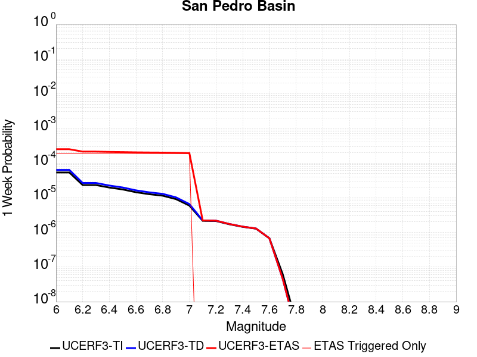 | 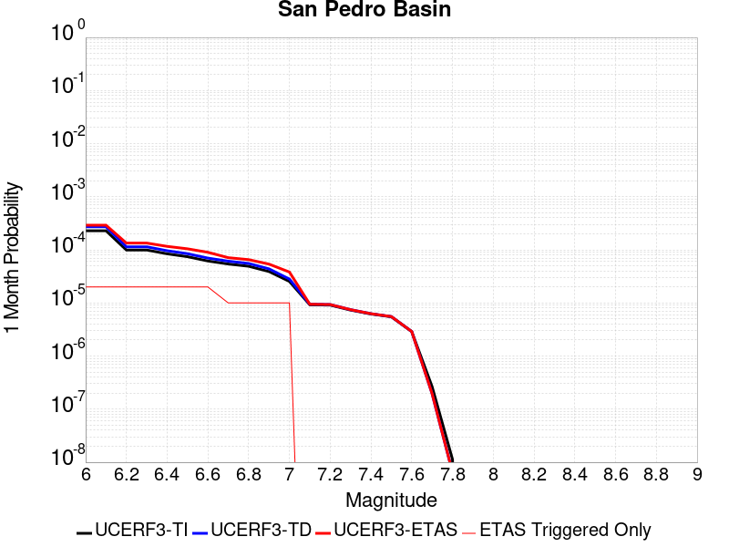 | 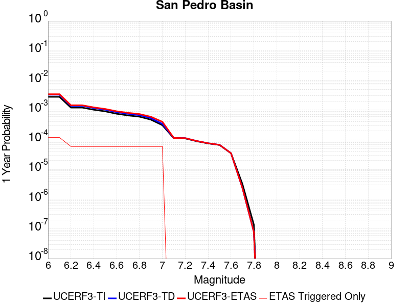 | 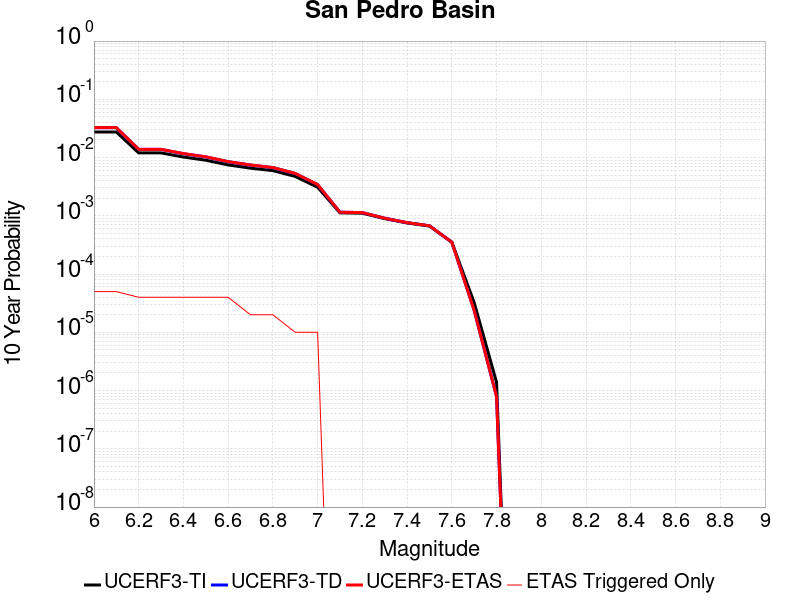 |

| Magnitude | 1 wk TI Prob | 1 wk TD Prob | 1 wk ETAS Prob | 1 wk ETAS/TD Gain | 1 wk ETAS Triggered Only | 1 mo TI Prob | 1 mo TD Prob | 1 mo ETAS Prob | 1 mo ETAS/TD Gain | 1 mo ETAS Triggered Only | 1 yr TI Prob | 1 yr TD Prob | 1 yr ETAS Prob | 1 yr ETAS/TD Gain | 1 yr ETAS Triggered Only | 10 yr TI Prob | 10 yr TD Prob | 10 yr ETAS Prob | 10 yr ETAS/TD Gain | 10 yr ETAS Triggered Only |
|-----|-----|-----|-----|-----|-----|-----|-----|-----|-----|-----|-----|-----|-----|-----|-----|-----|-----|-----|-----|-----|
| 6.0 | 5.3449043E-5 | 6.337018E-5 | 8.336891E-5 | 1.3155859 | 2.0E-5 | 2.2904722E-4 | 2.7156167E-4 | 2.9155624E-4 | 1.0736281 | 2.0E-5 | 0.0027850836 | 0.0033018515 | 0.0033516863 | 1.015093 | 5.0E-5 | 0.027504366 | 0.03258948 | 0.032637853 | 1.0014843 | 5.0E-5 |
| 6.1 | 5.3449043E-5 | 6.337018E-5 | 8.336891E-5 | 1.3155859 | 2.0E-5 | 2.2904722E-4 | 2.7156167E-4 | 2.9155624E-4 | 1.0736281 | 2.0E-5 | 0.0027850836 | 0.0033018515 | 0.0033516863 | 1.015093 | 5.0E-5 | 0.027504366 | 0.03258948 | 0.032637853 | 1.0014843 | 5.0E-5 |
| 6.2 | 2.3189454E-5 | 2.6642829E-5 | 4.6642297E-5 | 1.750651 | 2.0E-5 | 9.9379584E-5 | 1.1417881E-4 | 1.3417653E-4 | 1.1751438 | 2.0E-5 | 0.0012092749 | 0.0013892875 | 0.001429232 | 1.0287517 | 4.0E-5 | 0.012027155 | 0.01381089 | 0.013850338 | 1.0028563 | 4.0E-5 |
| 6.3 | 2.3189454E-5 | 2.6642829E-5 | 4.6642297E-5 | 1.750651 | 2.0E-5 | 9.9379584E-5 | 1.1417881E-4 | 1.3417653E-4 | 1.1751438 | 2.0E-5 | 0.0012092749 | 0.0013892875 | 0.001429232 | 1.0287517 | 4.0E-5 | 0.012027155 | 0.01381089 | 0.013850338 | 1.0028563 | 4.0E-5 |
| 6.4 | 1.966056E-5 | 2.246342E-5 | 4.2462972E-5 | 1.8903164 | 2.0E-5 | 8.425682E-5 | 9.626848E-5 | 1.1626655E-4 | 1.2077323 | 2.0E-5 | 0.001025344 | 0.0011714787 | 0.0012114318 | 1.0341048 | 4.0E-5 | 0.010206259 | 0.011657119 | 0.0116966525 | 1.0033914 | 4.0E-5 |
| 6.5 | 1.7342953E-5 | 1.9745152E-5 | 3.974476E-5 | 2.0128868 | 2.0E-5 | 7.4324824E-5 | 8.461954E-5 | 1.0461785E-4 | 1.236332 | 2.0E-5 | 9.04529E-4 | 0.0010297929 | 0.0010697518 | 1.0388027 | 4.0E-5 | 0.009008561 | 0.010253932 | 0.010293523 | 1.003861 | 4.0E-5 |
| 6.6 | 1.439804E-5 | 1.6322716E-5 | 3.632239E-5 | 2.2252662 | 2.0E-5 | 6.170443E-5 | 6.99528E-5 | 8.9951405E-5 | 1.285887 | 2.0E-5 | 7.509924E-4 | 8.513747E-4 | 8.9134066E-4 | 1.0469428 | 4.0E-5 | 0.0074845953 | 0.008484333 | 0.008523993 | 1.0046746 | 4.0E-5 |
| 6.7 | 1.2634884E-5 | 1.4285298E-5 | 2.4285155E-5 | 1.7000104 | 1.0E-5 | 5.414838E-5 | 6.122144E-5 | 7.122083E-5 | 1.1633315 | 1.0E-5 | 6.590571E-4 | 7.451466E-4 | 7.651317E-4 | 1.0268203 | 2.0E-5 | 0.006571059 | 0.007429502 | 0.007449353 | 1.002672 | 2.0E-5 |
| 6.8 | 1.146091E-5 | 1.2933193E-5 | 2.2933064E-5 | 1.7731943 | 1.0E-5 | 4.911726E-5 | 5.542696E-5 | 6.542641E-5 | 1.1804076 | 1.0E-5 | 5.9783855E-4 | 6.74644E-4 | 6.9463055E-4 | 1.0296253 | 2.0E-5 | 0.0059623276 | 0.0067288997 | 0.0067487652 | 1.0029522 | 2.0E-5 |
| 6.9 | 9.109035E-6 | 1.0235013E-5 | 2.0234911E-5 | 1.9770284 | 1.0E-5 | 3.9038136E-5 | 4.386376E-5 | 5.386332E-5 | 1.2279686 | 1.0E-5 | 4.7518566E-4 | 5.339384E-4 | 5.4393307E-4 | 1.0187187 | 1.0E-5 | 0.0047417083 | 0.0053293095 | 0.005339256 | 1.0018665 | 1.0E-5 |
| 7.0 | 5.9351028E-6 | 6.583965E-6 | 1.65839E-5 | 2.5188315 | 1.0E-5 | 2.5435906E-5 | 2.821682E-5 | 3.8216538E-5 | 1.3543885 | 1.0E-5 | 3.0963816E-4 | 3.4350925E-4 | 3.5350583E-4 | 1.0291013 | 1.0E-5 | 0.0030920706 | 0.0034320997 | 0.0034420653 | 1.0029037 | 1.0E-5 |
| 7.1 | 2.1557585E-6 | 2.2096492E-6 | 2.2096492E-6 | 1.0 | 0.0 | 9.238933E-6 | 9.469892E-6 | 9.469892E-6 | 1.0 | 0.0 | 1.1247819E-4 | 1.15289986E-4 | 1.15289986E-4 | 1.0 | 0.0 | 0.0011242128 | 0.0011523172 | 0.0011523172 | 1.0 | 0.0 |
| 7.2 | 2.1251979E-6 | 2.1779954E-6 | 2.1779954E-6 | 1.0 | 0.0 | 9.107958E-6 | 9.334234E-6 | 9.334234E-6 | 1.0 | 0.0 | 1.1088375E-4 | 1.13638525E-4 | 1.13638525E-4 | 1.0 | 0.0 | 0.0011082845 | 0.0011358195 | 0.0011358195 | 1.0 | 0.0 |
| 7.3 | 1.7145798E-6 | 1.7442885E-6 | 1.7442885E-6 | 1.0 | 0.0 | 7.3481783E-6 | 7.475501E-6 | 7.475501E-6 | 1.0 | 0.0 | 8.94604E-5 | 9.1010515E-5 | 9.1010515E-5 | 1.0 | 0.0 | 8.9424395E-4 | 9.0974156E-4 | 9.0974156E-4 | 1.0 | 0.0 |
| 7.4 | 1.4467993E-6 | 1.4641878E-6 | 1.4641878E-6 | 1.0 | 0.0 | 6.200554E-6 | 6.275076E-6 | 6.275076E-6 | 1.0 | 0.0 | 7.548913E-5 | 7.639644E-5 | 7.639644E-5 | 1.0 | 0.0 | 7.546349E-4 | 7.6370913E-4 | 7.6370913E-4 | 1.0 | 0.0 |
| 7.5 | 1.2803735E-6 | 1.2931506E-6 | 1.2931506E-6 | 1.0 | 0.0 | 5.487303E-6 | 5.5420624E-6 | 5.5420624E-6 | 1.0 | 0.0 | 6.680587E-5 | 6.747259E-5 | 6.747259E-5 | 1.0 | 0.0 | 6.678579E-4 | 6.745281E-4 | 6.745281E-4 | 1.0 | 0.0 |
| 7.6 | 6.755009E-7 | 6.76947E-7 | 6.76947E-7 | 1.0 | 0.0 | 2.8950008E-6 | 2.9011985E-6 | 2.9011985E-6 | 1.0 | 0.0 | 3.5246063E-5 | 3.532158E-5 | 3.532158E-5 | 1.0 | 0.0 | 3.5240475E-4 | 3.5316538E-4 | 3.5316538E-4 | 1.0 | 0.0 |
| 7.7 | 6.211885E-8 | 4.5699714E-8 | 4.5699714E-8 | 1.0 | 0.0 | 2.6622362E-7 | 1.9585592E-7 | 1.9585592E-7 | 1.0 | 0.0 | 3.2412677E-6 | 2.3845432E-6 | 2.3845432E-6 | 1.0 | 0.0 | 3.2412205E-5 | 2.3845198E-5 | 2.3845198E-5 | 1.0 | 0.0 |
| 7.8 | 2.6580573E-9 | 1.5138054E-9 | 1.5138054E-9 | 1.0 | 0.0 | 1.1391674E-8 | 6.4877375E-9 | 6.4877375E-9 | 1.0 | 0.0 | 1.3869362E-7 | 7.89882E-8 | 7.89882E-8 | 1.0 | 0.0 | 1.3869354E-6 | 7.89882E-7 | 7.89882E-7 | 1.0 | 0.0 |

## Malibu Coast alt 1
*[(top)](#table-of-contents)*

| 1 Week | 1 Month | 1 Year | 10 Year |
|-----|-----|-----|-----|
| 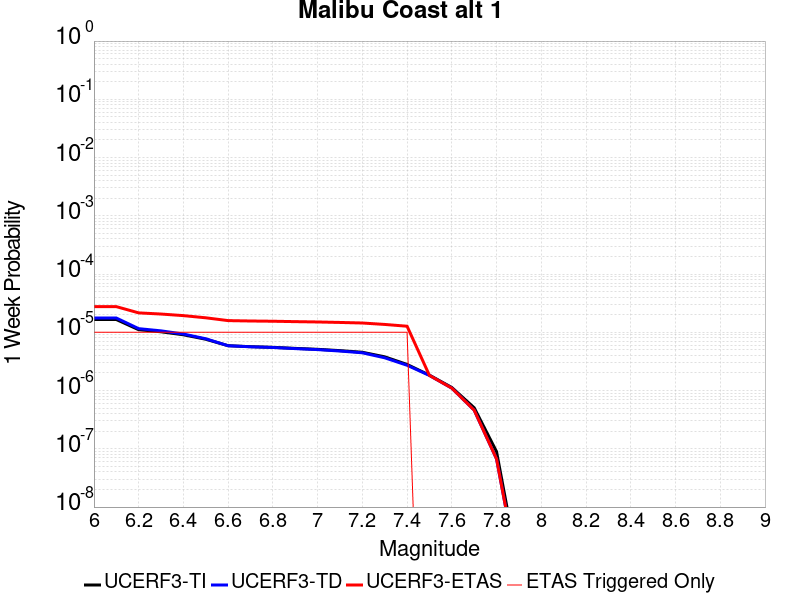 | 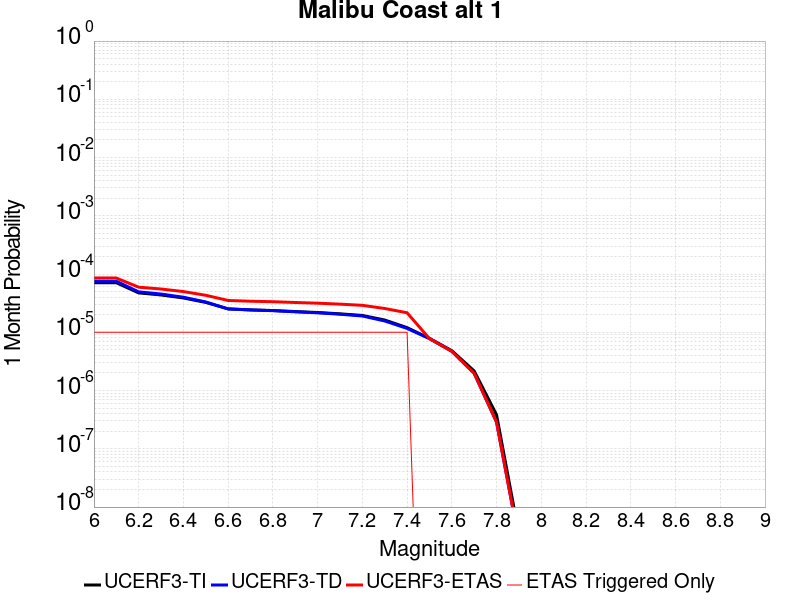 | 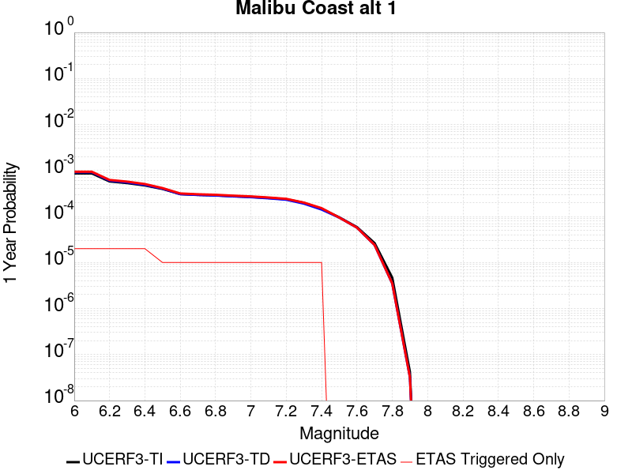 | 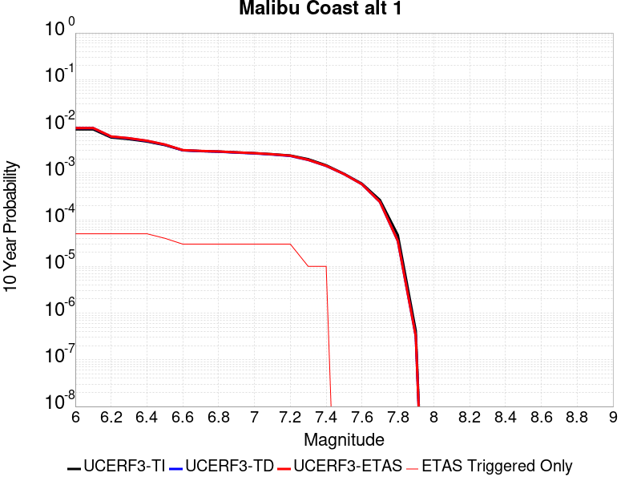 |

| Magnitude | 1 wk TI Prob | 1 wk TD Prob | 1 wk ETAS Prob | 1 wk ETAS/TD Gain | 1 wk ETAS Triggered Only | 1 mo TI Prob | 1 mo TD Prob | 1 mo ETAS Prob | 1 mo ETAS/TD Gain | 1 mo ETAS Triggered Only | 1 yr TI Prob | 1 yr TD Prob | 1 yr ETAS Prob | 1 yr ETAS/TD Gain | 1 yr ETAS Triggered Only | 10 yr TI Prob | 10 yr TD Prob | 10 yr ETAS Prob | 10 yr ETAS/TD Gain | 10 yr ETAS Triggered Only |
|-----|-----|-----|-----|-----|-----|-----|-----|-----|-----|-----|-----|-----|-----|-----|-----|-----|-----|-----|-----|-----|
| 6.0 | 1.6572556E-5 | 1.759807E-5 | 2.7597893E-5 | 1.5682342 | 1.0E-5 | 7.102331E-5 | 7.5418226E-5 | 8.5417465E-5 | 1.132584 | 1.0E-5 | 8.6436566E-4 | 9.1784896E-4 | 9.378306E-4 | 1.0217701 | 2.0E-5 | 0.0086101135 | 0.009142514 | 0.009192057 | 1.0054189 | 5.0E-5 |
| 6.1 | 1.6572556E-5 | 1.759807E-5 | 2.7597893E-5 | 1.5682342 | 1.0E-5 | 7.102331E-5 | 7.5418226E-5 | 8.5417465E-5 | 1.132584 | 1.0E-5 | 8.6436566E-4 | 9.1784896E-4 | 9.378306E-4 | 1.0217701 | 2.0E-5 | 0.0086101135 | 0.009142514 | 0.009192057 | 1.0054189 | 5.0E-5 |
| 6.2 | 1.1085717E-5 | 1.155715E-5 | 2.1557034E-5 | 1.8652552 | 1.0E-5 | 4.750935E-5 | 4.9529724E-5 | 5.9529226E-5 | 1.2018889 | 1.0E-5 | 5.782728E-4 | 6.0286105E-4 | 6.22849E-4 | 1.0331551 | 2.0E-5 | 0.0057677035 | 0.0060126274 | 0.0060623265 | 1.0082659 | 5.0E-5 |
| 6.3 | 1.0208568E-5 | 1.0592241E-5 | 2.0592135E-5 | 1.9440774 | 1.0E-5 | 4.375027E-5 | 4.5394543E-5 | 5.5394088E-5 | 1.2202808 | 1.0E-5 | 5.325294E-4 | 5.5254134E-4 | 5.725303E-4 | 1.0361764 | 2.0E-5 | 0.0053125503 | 0.0055119833 | 0.0055617075 | 1.0090212 | 5.0E-5 |
| 6.4 | 9.0682315E-6 | 9.342641E-6 | 1.9342548E-5 | 2.0703511 | 1.0E-5 | 3.8863272E-5 | 4.0039286E-5 | 5.0038885E-5 | 1.2497448 | 1.0E-5 | 4.730576E-4 | 4.873713E-4 | 5.0736155E-4 | 1.0410165 | 2.0E-5 | 0.0047205184 | 0.004863238 | 0.004912995 | 1.0102313 | 5.0E-5 |
| 6.5 | 7.605796E-6 | 7.74859E-6 | 1.7748513E-5 | 2.2905474 | 1.0E-5 | 3.259586E-5 | 3.320783E-5 | 4.3207496E-5 | 1.3011239 | 1.0E-5 | 3.9678233E-4 | 4.0423166E-4 | 4.142276E-4 | 1.0247283 | 1.0E-5 | 0.0039607463 | 0.0040351013 | 0.00407494 | 1.009873 | 4.0E-5 |
| 6.6 | 5.889873E-6 | 5.8795417E-6 | 1.5879483E-5 | 2.7008028 | 1.0E-5 | 2.5242069E-5 | 2.5197793E-5 | 3.519754E-5 | 1.3968501 | 1.0E-5 | 3.0727885E-4 | 3.0674002E-4 | 3.1673696E-4 | 1.0325909 | 1.0E-5 | 0.003068543 | 0.0030631793 | 0.0030930873 | 1.0097637 | 3.0E-5 |
| 6.7 | 5.66586E-6 | 5.6416443E-6 | 1.5641588E-5 | 2.772523 | 1.0E-5 | 2.428203E-5 | 2.4178253E-5 | 3.417801E-5 | 1.4135848 | 1.0E-5 | 2.955936E-4 | 2.9433056E-4 | 3.043276E-4 | 1.0339653 | 1.0E-5 | 0.0029520073 | 0.0029394194 | 0.002969331 | 1.0101761 | 3.0E-5 |
| 6.8 | 5.521556E-6 | 5.48943E-6 | 1.5489375E-5 | 2.8216727 | 1.0E-5 | 2.3663597E-5 | 2.3525918E-5 | 3.352568E-5 | 1.4250531 | 1.0E-5 | 2.880662E-4 | 2.8639048E-4 | 2.9638762E-4 | 1.0349073 | 1.0E-5 | 0.0028769306 | 0.0028602257 | 0.0028901398 | 1.0104587 | 3.0E-5 |
| 6.9 | 5.29752E-6 | 5.2499345E-6 | 1.5249882E-5 | 2.9047756 | 1.0E-5 | 2.270346E-5 | 2.2499526E-5 | 3.24993E-5 | 1.4444438 | 1.0E-5 | 2.7637955E-4 | 2.7389737E-4 | 2.8389462E-4 | 1.0365 | 1.0E-5 | 0.0027603607 | 0.0027356083 | 0.0027655263 | 1.0109365 | 3.0E-5 |
| 7.0 | 5.106743E-6 | 5.0476815E-6 | 1.5047631E-5 | 2.9810975 | 1.0E-5 | 2.1885859E-5 | 2.1632743E-5 | 3.1632528E-5 | 1.4622523 | 1.0E-5 | 2.6642776E-4 | 2.6334688E-4 | 2.7334425E-4 | 1.0379627 | 1.0E-5 | 0.0026610855 | 0.0026303576 | 0.002660279 | 1.0113753 | 3.0E-5 |
| 7.1 | 4.8469647E-6 | 4.770376E-6 | 1.4770329E-5 | 3.0962608 | 1.0E-5 | 2.0772539E-5 | 2.044431E-5 | 3.0444104E-5 | 1.4891237 | 1.0E-5 | 2.528763E-4 | 2.488811E-4 | 2.588786E-4 | 1.0401698 | 1.0E-5 | 0.0025258875 | 0.0024860317 | 0.0025159572 | 1.0120374 | 3.0E-5 |
| 7.2 | 4.545514E-6 | 4.4481967E-6 | 1.4448152E-5 | 3.2480922 | 1.0E-5 | 1.9480629E-5 | 1.906356E-5 | 2.906337E-5 | 1.524551 | 1.0E-5 | 2.3715083E-4 | 2.3207419E-4 | 2.4207187E-4 | 1.0430796 | 1.0E-5 | 0.0023689792 | 0.002318326 | 0.0023482563 | 1.0129104 | 3.0E-5 |
| 7.3 | 3.794097E-6 | 3.6519373E-6 | 1.3651901E-5 | 3.7382627 | 1.0E-5 | 1.6260314E-5 | 1.5651065E-5 | 2.565091E-5 | 1.6389241 | 1.0E-5 | 1.9795135E-4 | 1.9053511E-4 | 2.0053319E-4 | 1.0524738 | 1.0E-5 | 0.001977751 | 0.0019037221 | 0.001913703 | 1.0052428 | 1.0E-5 |
| 7.4 | 2.808217E-6 | 2.7190777E-6 | 1.2719051E-5 | 4.6777077 | 1.0E-5 | 1.203516E-5 | 1.1653137E-5 | 2.165302E-5 | 1.858128 | 1.0E-5 | 1.4651821E-4 | 1.4186774E-4 | 1.5186632E-4 | 1.0704782 | 1.0E-5 | 0.0014642165 | 0.0014177744 | 0.0014277602 | 1.0070434 | 1.0E-5 |
| 7.5 | 1.83809E-6 | 1.8190703E-6 | 1.8190703E-6 | 1.0 | 0.0 | 7.877505E-6 | 7.795992E-6 | 7.795992E-6 | 1.0 | 0.0 | 9.59044E-5 | 9.4912095E-5 | 9.4912095E-5 | 1.0 | 0.0 | 9.5863023E-4 | 9.487176E-4 | 9.487176E-4 | 1.0 | 0.0 |
| 7.6 | 1.1292672E-6 | 1.1001456E-6 | 1.1001456E-6 | 1.0 | 0.0 | 4.839708E-6 | 4.7149015E-6 | 4.7149015E-6 | 1.0 | 0.0 | 5.8921847E-5 | 5.7402427E-5 | 5.7402427E-5 | 1.0 | 0.0 | 5.890623E-4 | 5.7387765E-4 | 5.7387765E-4 | 1.0 | 0.0 |
| 7.7 | 5.065272E-7 | 4.6091537E-7 | 4.6091537E-7 | 1.0 | 0.0 | 2.170829E-6 | 1.9753502E-6 | 1.9753502E-6 | 1.0 | 0.0 | 2.6429525E-5 | 2.4049634E-5 | 2.4049634E-5 | 1.0 | 0.0 | 2.642638E-4 | 2.4047145E-4 | 2.4047145E-4 | 1.0 | 0.0 |
| 7.8 | 8.952991E-8 | 6.707853E-8 | 6.707853E-8 | 1.0 | 0.0 | 3.8369956E-7 | 2.874794E-7 | 2.874794E-7 | 1.0 | 0.0 | 4.671532E-6 | 3.5000562E-6 | 3.5000562E-6 | 1.0 | 0.0 | 4.671434E-5 | 3.500003E-5 | 3.500003E-5 | 1.0 | 0.0 |
| 7.9 | 8.007447E-10 | 6.161581E-10 | 6.161581E-10 | 1.0 | 0.0 | 3.4317629E-9 | 2.640678E-9 | 2.640678E-9 | 1.0 | 0.0 | 4.1781714E-8 | 3.2150254E-8 | 3.2150254E-8 | 1.0 | 0.0 | 4.1781706E-7 | 3.2150248E-7 | 3.2150248E-7 | 1.0 | 0.0 |

## Ventura-Pitas Point
*[(top)](#table-of-contents)*

| 1 Week | 1 Month | 1 Year | 10 Year |
|-----|-----|-----|-----|
| 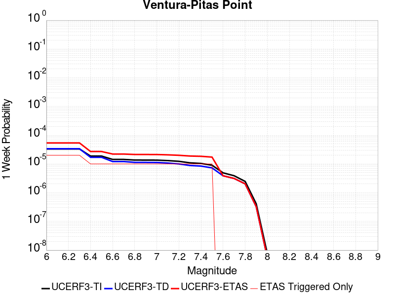 | 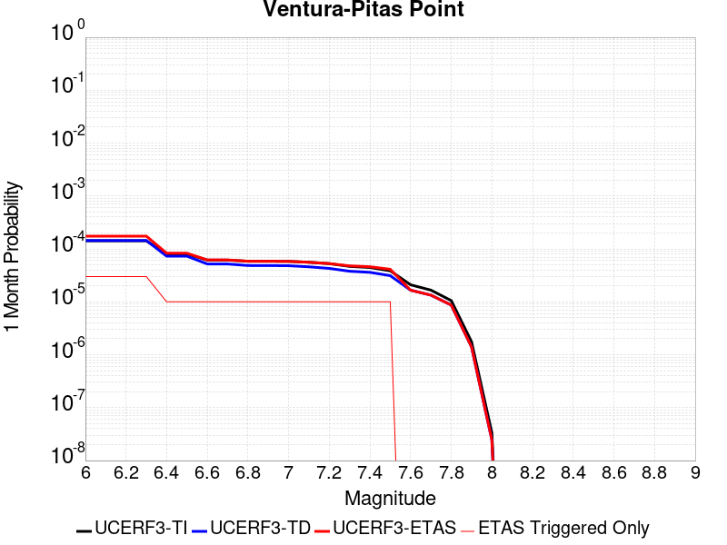 | 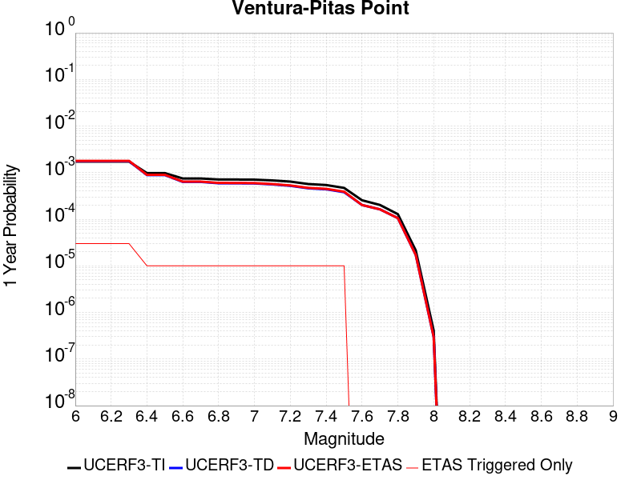 | 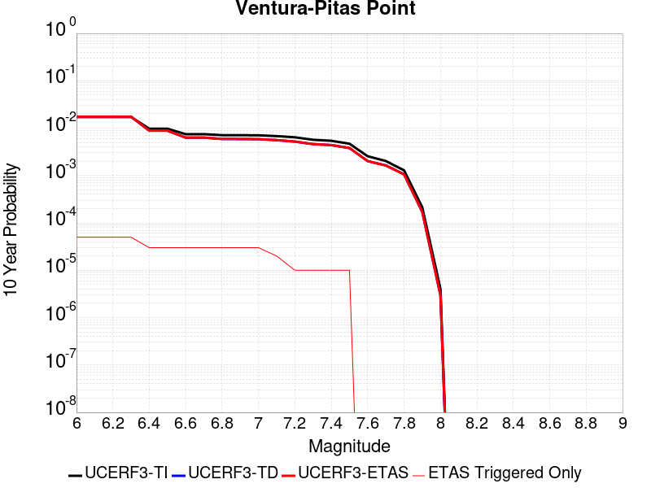 |

| Magnitude | 1 wk TI Prob | 1 wk TD Prob | 1 wk ETAS Prob | 1 wk ETAS/TD Gain | 1 wk ETAS Triggered Only | 1 mo TI Prob | 1 mo TD Prob | 1 mo ETAS Prob | 1 mo ETAS/TD Gain | 1 mo ETAS Triggered Only | 1 yr TI Prob | 1 yr TD Prob | 1 yr ETAS Prob | 1 yr ETAS/TD Gain | 1 yr ETAS Triggered Only | 10 yr TI Prob | 10 yr TD Prob | 10 yr ETAS Prob | 10 yr ETAS/TD Gain | 10 yr ETAS Triggered Only |
|-----|-----|-----|-----|-----|-----|-----|-----|-----|-----|-----|-----|-----|-----|-----|-----|-----|-----|-----|-----|-----|
| 6.0 | 3.3179622E-5 | 3.373519E-5 | 5.373451E-5 | 1.5928328 | 2.0E-5 | 1.4219063E-4 | 1.4457281E-4 | 1.7456847E-4 | 1.2074779 | 3.0E-5 | 0.0017297962 | 0.0017590097 | 0.0017889569 | 1.017025 | 3.0E-5 | 0.017163932 | 0.017476497 | 0.017525623 | 1.002811 | 5.0E-5 |
| 6.1 | 3.3179622E-5 | 3.373519E-5 | 5.373451E-5 | 1.5928328 | 2.0E-5 | 1.4219063E-4 | 1.4457281E-4 | 1.7456847E-4 | 1.2074779 | 3.0E-5 | 0.0017297962 | 0.0017590097 | 0.0017889569 | 1.017025 | 3.0E-5 | 0.017163932 | 0.017476497 | 0.017525623 | 1.002811 | 5.0E-5 |
| 6.2 | 3.3179622E-5 | 3.373519E-5 | 5.373451E-5 | 1.5928328 | 2.0E-5 | 1.4219063E-4 | 1.4457281E-4 | 1.7456847E-4 | 1.2074779 | 3.0E-5 | 0.0017297962 | 0.0017590097 | 0.0017889569 | 1.017025 | 3.0E-5 | 0.017163932 | 0.017476497 | 0.017525623 | 1.002811 | 5.0E-5 |
| 6.3 | 3.3179622E-5 | 3.373519E-5 | 5.373451E-5 | 1.5928328 | 2.0E-5 | 1.4219063E-4 | 1.4457281E-4 | 1.7456847E-4 | 1.2074779 | 3.0E-5 | 0.0017297962 | 0.0017590097 | 0.0017889569 | 1.017025 | 3.0E-5 | 0.017163932 | 0.017476497 | 0.017525623 | 1.002811 | 5.0E-5 |
| 6.4 | 1.8754668E-5 | 1.7019594E-5 | 2.7019423E-5 | 1.5875481 | 1.0E-5 | 8.037467E-5 | 7.2939205E-5 | 8.293848E-5 | 1.1370904 | 1.0E-5 | 9.781223E-4 | 8.8769617E-4 | 8.976873E-4 | 1.0112551 | 1.0E-5 | 0.009738282 | 0.008843943 | 0.008873677 | 1.0033622 | 3.0E-5 |
| 6.5 | 1.8754668E-5 | 1.7019594E-5 | 2.7019423E-5 | 1.5875481 | 1.0E-5 | 8.037467E-5 | 7.2939205E-5 | 8.293848E-5 | 1.1370904 | 1.0E-5 | 9.781223E-4 | 8.8769617E-4 | 8.976873E-4 | 1.0112551 | 1.0E-5 | 0.009738282 | 0.008843943 | 0.008873677 | 1.0033622 | 3.0E-5 |
| 6.6 | 1.4361558E-5 | 1.2122258E-5 | 2.2122136E-5 | 1.8249189 | 1.0E-5 | 6.154808E-5 | 5.1951512E-5 | 6.1950996E-5 | 1.1924772 | 1.0E-5 | 7.490902E-4 | 6.323284E-4 | 6.4232206E-4 | 1.0158045 | 1.0E-5 | 0.0074657016 | 0.006305652 | 0.006335463 | 1.0047276 | 3.0E-5 |
| 6.7 | 1.4361558E-5 | 1.2122258E-5 | 2.2122136E-5 | 1.8249189 | 1.0E-5 | 6.154808E-5 | 5.1951512E-5 | 6.1950996E-5 | 1.1924772 | 1.0E-5 | 7.490902E-4 | 6.323284E-4 | 6.4232206E-4 | 1.0158045 | 1.0E-5 | 0.0074657016 | 0.006305652 | 0.006335463 | 1.0047276 | 3.0E-5 |
| 6.8 | 1.3663846E-5 | 1.1344401E-5 | 2.1344287E-5 | 1.8814821 | 1.0E-5 | 5.8558027E-5 | 4.8617967E-5 | 5.861748E-5 | 1.2056752 | 1.0E-5 | 7.127108E-4 | 5.917649E-4 | 6.01759E-4 | 1.0168886 | 1.0E-5 | 0.007104293 | 0.0059022107 | 0.005932034 | 1.0050528 | 3.0E-5 |
| 6.9 | 1.3644157E-5 | 1.1322501E-5 | 2.1322388E-5 | 1.883187 | 1.0E-5 | 5.8473648E-5 | 4.8524114E-5 | 5.852363E-5 | 1.206073 | 1.0E-5 | 7.116841E-4 | 5.906229E-4 | 6.00617E-4 | 1.0169213 | 1.0E-5 | 0.007094092 | 0.0058908514 | 0.0059206747 | 1.0050627 | 3.0E-5 |
| 7.0 | 1.3568845E-5 | 1.12420685E-5 | 2.1241956E-5 | 1.889506 | 1.0E-5 | 5.8150898E-5 | 4.8179416E-5 | 5.817893E-5 | 1.2075475 | 1.0E-5 | 7.077572E-4 | 5.8642845E-4 | 5.964226E-4 | 1.0170424 | 1.0E-5 | 0.007055073 | 0.005849128 | 0.005878953 | 1.0050989 | 3.0E-5 |
| 7.1 | 1.306572E-5 | 1.0720521E-5 | 2.0720414E-5 | 1.9327805 | 1.0E-5 | 5.599474E-5 | 4.594429E-5 | 5.594383E-5 | 1.2176449 | 1.0E-5 | 6.815227E-4 | 5.5923004E-4 | 5.692244E-4 | 1.0178717 | 1.0E-5 | 0.0067943637 | 0.005578536 | 0.0055984245 | 1.0035652 | 2.0E-5 |
| 7.2 | 1.232604E-5 | 9.995121E-6 | 1.9995021E-5 | 2.000478 | 1.0E-5 | 5.2824813E-5 | 4.283554E-5 | 5.2835112E-5 | 1.233441 | 1.0E-5 | 6.429523E-4 | 5.2139966E-4 | 5.3139444E-4 | 1.0191691 | 1.0E-5 | 0.0064109527 | 0.005202059 | 0.005212007 | 1.0019124 | 1.0E-5 |
| 7.3 | 1.0917261E-5 | 8.843812E-6 | 1.8843724E-5 | 2.1307242 | 1.0E-5 | 4.678742E-5 | 3.7901507E-5 | 4.790113E-5 | 1.2638317 | 1.0E-5 | 5.69488E-4 | 4.6135474E-4 | 4.713501E-4 | 1.0216653 | 1.0E-5 | 0.0056803077 | 0.004604239 | 0.004614193 | 1.0021619 | 1.0E-5 |
| 7.4 | 1.039959E-5 | 8.42354E-6 | 1.8423456E-5 | 2.1871393 | 1.0E-5 | 4.456891E-5 | 3.6100395E-5 | 4.6100035E-5 | 1.2769953 | 1.0E-5 | 5.424914E-4 | 4.394352E-4 | 4.494308E-4 | 1.0227464 | 1.0E-5 | 0.0054116896 | 0.0043859277 | 0.004395884 | 1.00227 | 1.0E-5 |
| 7.5 | 9.015877E-6 | 7.29752E-6 | 1.7297447E-5 | 2.3703187 | 1.0E-5 | 3.86389E-5 | 3.1274718E-5 | 4.1274405E-5 | 1.3197371 | 1.0E-5 | 4.7032707E-4 | 3.8070456E-4 | 3.9070076E-4 | 1.026257 | 1.0E-5 | 0.004693329 | 0.003800772 | 0.003810734 | 1.002621 | 1.0E-5 |
| 7.6 | 4.900162E-6 | 3.874119E-6 | 3.874119E-6 | 1.0 | 0.0 | 2.1000526E-5 | 1.6603262E-5 | 1.6603262E-5 | 1.0 | 0.0 | 2.556514E-4 | 2.0212609E-4 | 2.0212609E-4 | 1.0 | 0.0 | 0.0025535747 | 0.002019436 | 0.002019436 | 1.0 | 0.0 |
| 7.7 | 3.8850626E-6 | 3.12676E-6 | 3.12676E-6 | 1.0 | 0.0 | 1.6650163E-5 | 1.3400332E-5 | 1.3400332E-5 | 1.0 | 0.0 | 2.0269687E-4 | 1.6313691E-4 | 1.6313691E-4 | 1.0 | 0.0 | 0.002025121 | 0.0016301809 | 0.0016301809 | 1.0 | 0.0 |
| 7.8 | 2.4654719E-6 | 2.029902E-6 | 2.029902E-6 | 1.0 | 0.0 | 1.0566265E-5 | 8.699551E-6 | 8.699551E-6 | 1.0 | 0.0 | 1.2863669E-4 | 1.0591193E-4 | 1.0591193E-4 | 1.0 | 0.0 | 0.0012856225 | 0.0010586192 | 0.0010586192 | 1.0 | 0.0 |
| 7.9 | 4.095894E-7 | 3.2765078E-7 | 3.2765078E-7 | 1.0 | 0.0 | 1.7553821E-6 | 1.4042168E-6 | 1.4042168E-6 | 1.0 | 0.0 | 2.1371567E-5 | 1.709621E-5 | 1.709621E-5 | 1.0 | 0.0 | 2.1369511E-4 | 1.7094925E-4 | 1.7094925E-4 | 1.0 | 0.0 |
| 8.0 | 7.791402E-9 | 5.6836056E-9 | 5.6836056E-9 | 1.0 | 0.0 | 3.3391725E-8 | 2.4358311E-8 | 2.4358311E-8 | 1.0 | 0.0 | 4.0654416E-7 | 2.965624E-7 | 2.965624E-7 | 1.0 | 0.0 | 4.065434E-6 | 2.9656223E-6 | 2.9656223E-6 | 1.0 | 0.0 |

## San Cayetano
*[(top)](#table-of-contents)*

| 1 Week | 1 Month | 1 Year | 10 Year |
|-----|-----|-----|-----|
| 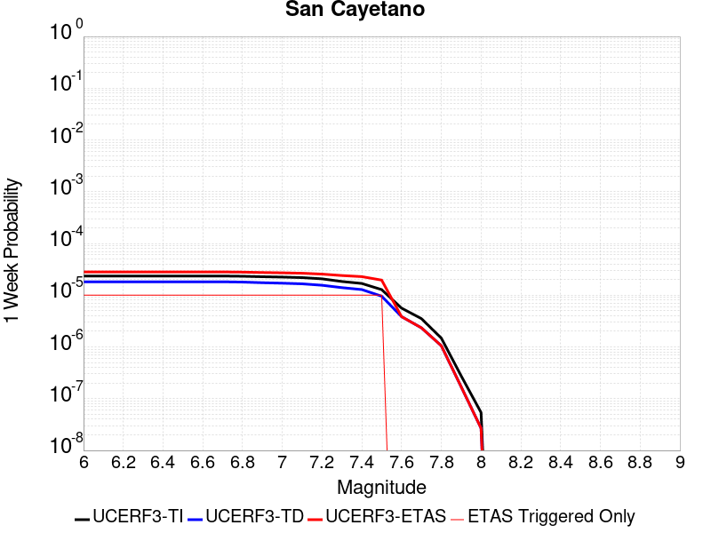 | 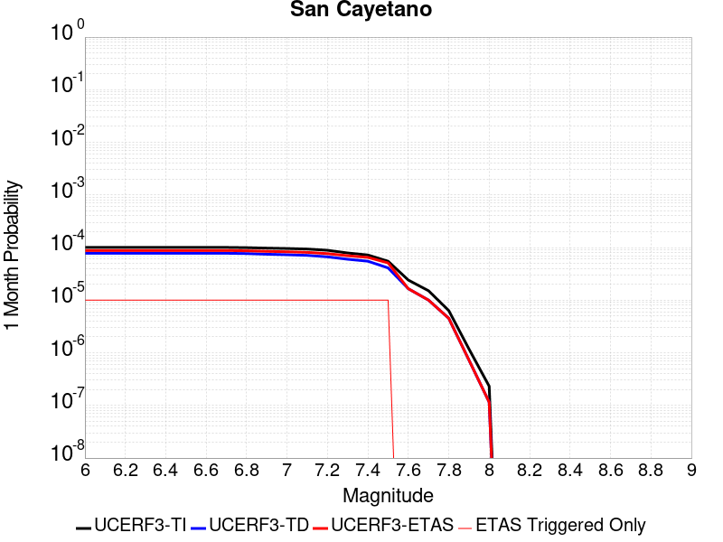 | 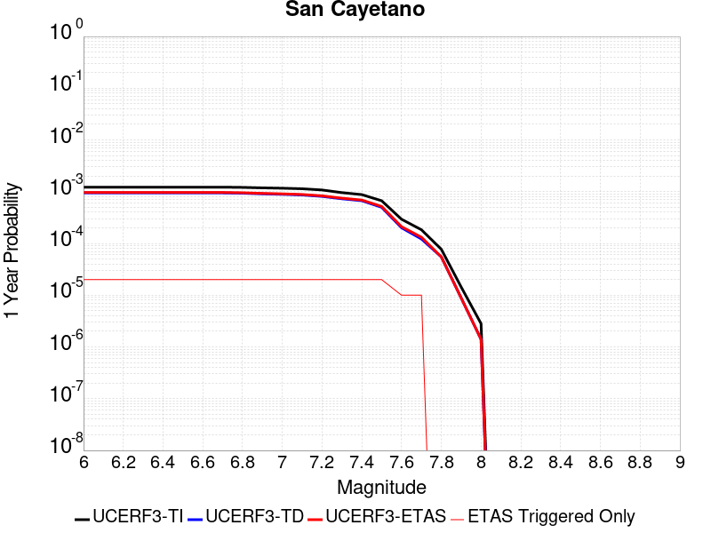 | 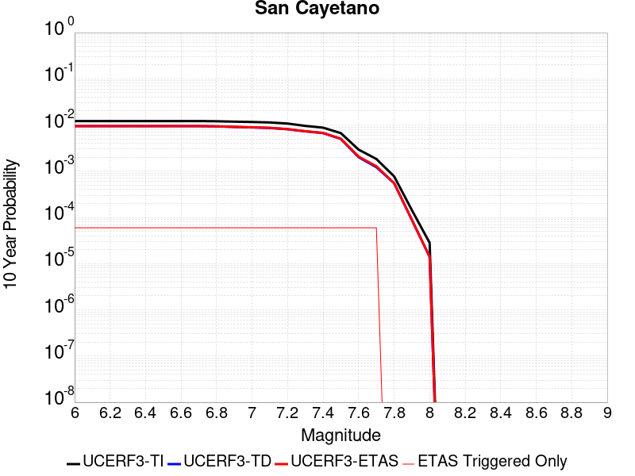 |

| Magnitude | 1 wk TI Prob | 1 wk TD Prob | 1 wk ETAS Prob | 1 wk ETAS/TD Gain | 1 wk ETAS Triggered Only | 1 mo TI Prob | 1 mo TD Prob | 1 mo ETAS Prob | 1 mo ETAS/TD Gain | 1 mo ETAS Triggered Only | 1 yr TI Prob | 1 yr TD Prob | 1 yr ETAS Prob | 1 yr ETAS/TD Gain | 1 yr ETAS Triggered Only | 10 yr TI Prob | 10 yr TD Prob | 10 yr ETAS Prob | 10 yr ETAS/TD Gain | 10 yr ETAS Triggered Only |
|-----|-----|-----|-----|-----|-----|-----|-----|-----|-----|-----|-----|-----|-----|-----|-----|-----|-----|-----|-----|-----|
| 6.0 | 2.3476267E-5 | 1.8169216E-5 | 2.8169034E-5 | 1.5503715 | 1.0E-5 | 1.0060869E-4 | 7.786576E-5 | 8.786499E-5 | 1.1284162 | 1.0E-5 | 0.0012242225 | 9.4760704E-4 | 9.6758804E-4 | 1.0210857 | 2.0E-5 | 0.012175002 | 0.00943675 | 0.009486278 | 1.0052484 | 5.0E-5 |
| 6.1 | 2.3476267E-5 | 1.8169216E-5 | 2.8169034E-5 | 1.5503715 | 1.0E-5 | 1.0060869E-4 | 7.786576E-5 | 8.786499E-5 | 1.1284162 | 1.0E-5 | 0.0012242225 | 9.4760704E-4 | 9.6758804E-4 | 1.0210857 | 2.0E-5 | 0.012175002 | 0.00943675 | 0.009486278 | 1.0052484 | 5.0E-5 |
| 6.2 | 2.3476267E-5 | 1.8169216E-5 | 2.8169034E-5 | 1.5503715 | 1.0E-5 | 1.0060869E-4 | 7.786576E-5 | 8.786499E-5 | 1.1284162 | 1.0E-5 | 0.0012242225 | 9.4760704E-4 | 9.6758804E-4 | 1.0210857 | 2.0E-5 | 0.012175002 | 0.00943675 | 0.009486278 | 1.0052484 | 5.0E-5 |
| 6.3 | 2.3476267E-5 | 1.8169216E-5 | 2.8169034E-5 | 1.5503715 | 1.0E-5 | 1.0060869E-4 | 7.786576E-5 | 8.786499E-5 | 1.1284162 | 1.0E-5 | 0.0012242225 | 9.4760704E-4 | 9.6758804E-4 | 1.0210857 | 2.0E-5 | 0.012175002 | 0.00943675 | 0.009486278 | 1.0052484 | 5.0E-5 |
| 6.4 | 2.3476267E-5 | 1.8169216E-5 | 2.8169034E-5 | 1.5503715 | 1.0E-5 | 1.0060869E-4 | 7.786576E-5 | 8.786499E-5 | 1.1284162 | 1.0E-5 | 0.0012242225 | 9.4760704E-4 | 9.6758804E-4 | 1.0210857 | 2.0E-5 | 0.012175002 | 0.00943675 | 0.009486278 | 1.0052484 | 5.0E-5 |
| 6.5 | 2.3476267E-5 | 1.8169216E-5 | 2.8169034E-5 | 1.5503715 | 1.0E-5 | 1.0060869E-4 | 7.786576E-5 | 8.786499E-5 | 1.1284162 | 1.0E-5 | 0.0012242225 | 9.4760704E-4 | 9.6758804E-4 | 1.0210857 | 2.0E-5 | 0.012175002 | 0.00943675 | 0.009486278 | 1.0052484 | 5.0E-5 |
| 6.6 | 2.3476267E-5 | 1.8169216E-5 | 2.8169034E-5 | 1.5503715 | 1.0E-5 | 1.0060869E-4 | 7.786576E-5 | 8.786499E-5 | 1.1284162 | 1.0E-5 | 0.0012242225 | 9.4760704E-4 | 9.6758804E-4 | 1.0210857 | 2.0E-5 | 0.012175002 | 0.00943675 | 0.009486278 | 1.0052484 | 5.0E-5 |
| 6.7 | 2.3476267E-5 | 1.8169216E-5 | 2.8169034E-5 | 1.5503715 | 1.0E-5 | 1.0060869E-4 | 7.786576E-5 | 8.786499E-5 | 1.1284162 | 1.0E-5 | 0.0012242225 | 9.4760704E-4 | 9.6758804E-4 | 1.0210857 | 2.0E-5 | 0.012175002 | 0.00943675 | 0.009486278 | 1.0052484 | 5.0E-5 |
| 6.8 | 2.3241924E-5 | 1.7936945E-5 | 2.7936767E-5 | 1.5574985 | 1.0E-5 | 9.960445E-5 | 7.687038E-5 | 8.6869615E-5 | 1.1300792 | 1.0E-5 | 0.0012120095 | 9.354987E-4 | 9.5548E-4 | 1.021359 | 2.0E-5 | 0.012054204 | 0.0093166195 | 0.009366154 | 1.0053167 | 5.0E-5 |
| 6.9 | 2.2761007E-5 | 1.7432383E-5 | 2.743221E-5 | 1.573635 | 1.0E-5 | 9.7543525E-5 | 7.47081E-5 | 8.470735E-5 | 1.1338443 | 1.0E-5 | 0.0011869454 | 9.09195E-4 | 9.291768E-4 | 1.0219774 | 2.0E-5 | 0.011806256 | 0.009055741 | 0.009105288 | 1.0054713 | 5.0E-5 |
| 7.0 | 2.240283E-5 | 1.7066137E-5 | 2.7065966E-5 | 1.5859457 | 1.0E-5 | 9.600859E-5 | 7.313856E-5 | 8.313783E-5 | 1.1367168 | 1.0E-5 | 0.0011682777 | 8.9010154E-4 | 9.1008376E-4 | 1.0224494 | 2.0E-5 | 0.011621549 | 0.008866336 | 0.008915893 | 1.0055894 | 5.0E-5 |
| 7.1 | 2.1871154E-5 | 1.658602E-5 | 2.6585854E-5 | 1.6029074 | 1.0E-5 | 9.373015E-5 | 7.108103E-5 | 8.108031E-5 | 1.1406745 | 1.0E-5 | 0.0011405671 | 8.6507126E-4 | 8.8505395E-4 | 1.0230995 | 2.0E-5 | 0.011347309 | 0.008617996 | 0.008657652 | 1.0046015 | 4.0E-5 |
| 7.2 | 2.0714133E-5 | 1.5564563E-5 | 2.5564406E-5 | 1.6424751 | 1.0E-5 | 8.8771834E-5 | 6.670358E-5 | 7.670291E-5 | 1.149907 | 1.0E-5 | 0.0010802611 | 8.118168E-4 | 8.318005E-4 | 1.0246161 | 2.0E-5 | 0.010750249 | 0.008089443 | 0.0081192 | 1.0036786 | 3.0E-5 |
| 7.3 | 1.8408395E-5 | 1.3996829E-5 | 2.3996688E-5 | 1.7144376 | 1.0E-5 | 7.8890735E-5 | 5.9985046E-5 | 6.9984446E-5 | 1.1666982 | 1.0E-5 | 9.600714E-4 | 7.300762E-4 | 7.500616E-4 | 1.0273744 | 2.0E-5 | 0.009559342 | 0.0072776447 | 0.007307426 | 1.0040922 | 3.0E-5 |
| 7.4 | 1.6856795E-5 | 1.285006E-5 | 2.284993E-5 | 1.7781966 | 1.0E-5 | 7.2241404E-5 | 5.5070537E-5 | 6.506999E-5 | 1.1815753 | 1.0E-5 | 8.7918417E-4 | 6.7028037E-4 | 6.9026696E-4 | 1.0298183 | 2.0E-5 | 0.00875714 | 0.0066834087 | 0.0067132083 | 1.0044588 | 3.0E-5 |
| 7.5 | 1.2822778E-5 | 9.577415E-6 | 1.957732E-5 | 2.0441132 | 1.0E-5 | 5.495361E-5 | 4.1045427E-5 | 5.1045015E-5 | 1.2436225 | 1.0E-5 | 6.688548E-4 | 4.9961504E-4 | 5.1960506E-4 | 1.0400108 | 2.0E-5 | 0.006668452 | 0.0049851923 | 0.0050150426 | 1.0059878 | 3.0E-5 |
| 7.6 | 5.6272684E-6 | 3.854899E-6 | 3.854899E-6 | 1.0 | 0.0 | 2.4116642E-5 | 1.6520893E-5 | 1.6520893E-5 | 1.0 | 0.0 | 2.9358055E-4 | 2.0112342E-4 | 2.111214E-4 | 1.0497108 | 1.0E-5 | 0.0029319301 | 0.0020094248 | 0.0020194047 | 1.0049665 | 1.0E-5 |
| 7.7 | 3.5261346E-6 | 2.3407094E-6 | 2.3407094E-6 | 1.0 | 0.0 | 1.5111918E-5 | 1.0031574E-5 | 1.0031574E-5 | 1.0 | 0.0 | 1.8397206E-4 | 1.2212765E-4 | 1.3212643E-4 | 1.0818715 | 1.0E-5 | 0.0018381984 | 0.0012206127 | 0.0012306004 | 1.0081826 | 1.0E-5 |
| 7.8 | 1.4826929E-6 | 1.0564395E-6 | 1.0564395E-6 | 1.0 | 0.0 | 6.354383E-6 | 4.52759E-6 | 4.52759E-6 | 1.0 | 0.0 | 7.736187E-5 | 5.5122033E-5 | 5.5122033E-5 | 1.0 | 0.0 | 7.733494E-4 | 5.510856E-4 | 5.510856E-4 | 1.0 | 0.0 |
| 7.9 | 2.7568166E-7 | 1.6977887E-7 | 1.6977887E-7 | 1.0 | 0.0 | 1.1814923E-6 | 7.276235E-7 | 7.276235E-7 | 1.0 | 0.0 | 1.4384574E-5 | 8.85878E-6 | 8.85878E-6 | 1.0 | 0.0 | 1.4383643E-4 | 8.858431E-5 | 8.858431E-5 | 1.0 | 0.0 |
| 8.0 | 5.407832E-8 | 2.688677E-8 | 2.688677E-8 | 1.0 | 0.0 | 2.3176422E-7 | 1.15229014E-7 | 1.15229014E-7 | 1.0 | 0.0 | 2.8217257E-6 | 1.4029123E-6 | 1.4029123E-6 | 1.0 | 0.0 | 2.8216898E-5 | 1.40290385E-5 | 1.40290385E-5 | 1.0 | 0.0 |

## Santa Cruz Catalina Ridge alt1
*[(top)](#table-of-contents)*

| 1 Week | 1 Month | 1 Year | 10 Year |
|-----|-----|-----|-----|
| 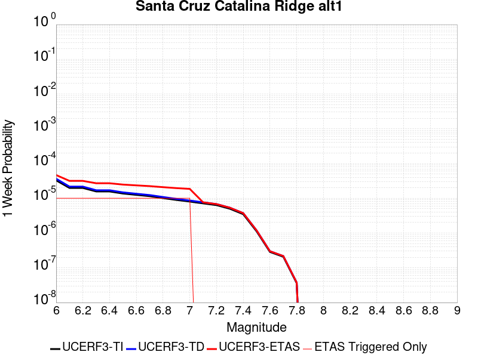 | 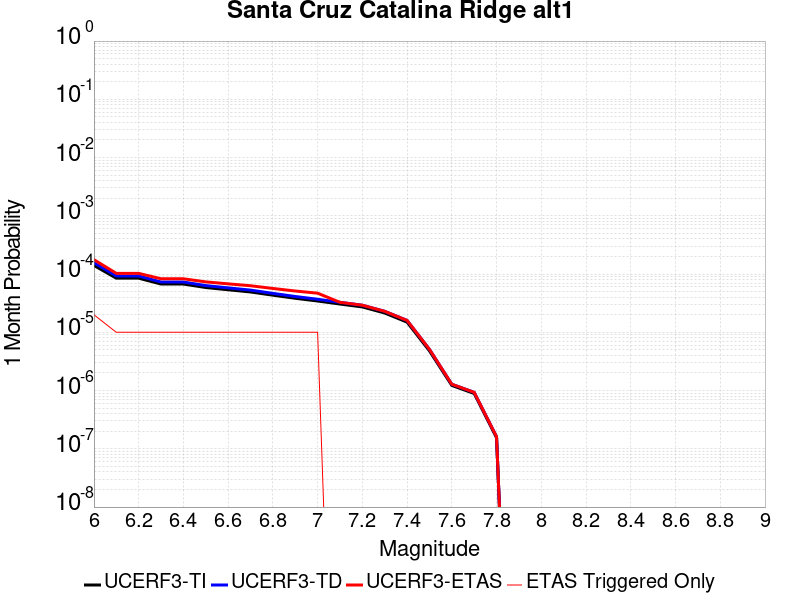 | 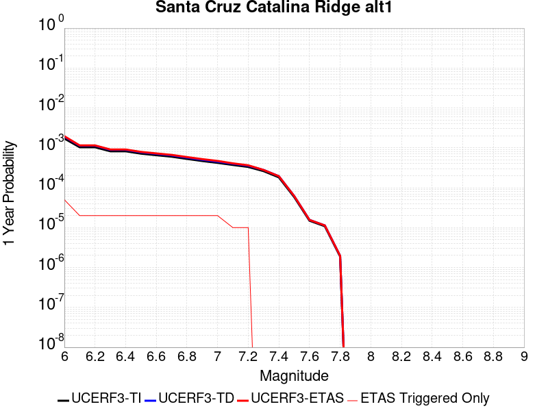 | 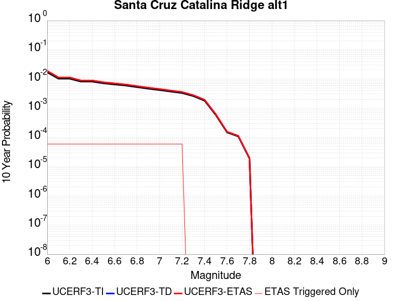 |

| Magnitude | 1 wk TI Prob | 1 wk TD Prob | 1 wk ETAS Prob | 1 wk ETAS/TD Gain | 1 wk ETAS Triggered Only | 1 mo TI Prob | 1 mo TD Prob | 1 mo ETAS Prob | 1 mo ETAS/TD Gain | 1 mo ETAS Triggered Only | 1 yr TI Prob | 1 yr TD Prob | 1 yr ETAS Prob | 1 yr ETAS/TD Gain | 1 yr ETAS Triggered Only | 10 yr TI Prob | 10 yr TD Prob | 10 yr ETAS Prob | 10 yr ETAS/TD Gain | 10 yr ETAS Triggered Only |
|-----|-----|-----|-----|-----|-----|-----|-----|-----|-----|-----|-----|-----|-----|-----|-----|-----|-----|-----|-----|-----|
| 6.0 | 3.2833184E-5 | 3.6558402E-5 | 4.6558034E-5 | 1.273525 | 1.0E-5 | 1.4070606E-4 | 1.5667039E-4 | 1.7666725E-4 | 1.1276366 | 2.0E-5 | 0.00171175 | 0.0019059594 | 0.001955864 | 1.0261835 | 5.0E-5 | 0.016986247 | 0.018913032 | 0.018962087 | 1.0025936 | 5.0E-5 |
| 6.1 | 1.9835548E-5 | 2.1659505E-5 | 3.165929E-5 | 1.461681 | 1.0E-5 | 8.500672E-5 | 9.282326E-5 | 1.02822334E-4 | 1.1077216 | 1.0E-5 | 0.0010344655 | 0.0011295575 | 0.001149535 | 1.017686 | 2.0E-5 | 0.010296632 | 0.011240296 | 0.011260071 | 1.0017593 | 2.0E-5 |
| 6.2 | 1.9835548E-5 | 2.1659505E-5 | 3.165929E-5 | 1.461681 | 1.0E-5 | 8.500672E-5 | 9.282326E-5 | 1.02822334E-4 | 1.1077216 | 1.0E-5 | 0.0010344655 | 0.0011295575 | 0.001149535 | 1.017686 | 2.0E-5 | 0.010296632 | 0.011240296 | 0.011260071 | 1.0017593 | 2.0E-5 |
| 6.3 | 1.5728183E-5 | 1.703395E-5 | 2.7033779E-5 | 1.587053 | 1.0E-5 | 6.7404755E-5 | 7.300063E-5 | 8.29999E-5 | 1.1369752 | 1.0E-5 | 8.2034385E-4 | 8.884264E-4 | 9.084086E-4 | 1.0224917 | 2.0E-5 | 0.008173222 | 0.008849427 | 0.00886925 | 1.0022401 | 2.0E-5 |
| 6.4 | 1.5728183E-5 | 1.703395E-5 | 2.7033779E-5 | 1.587053 | 1.0E-5 | 6.7404755E-5 | 7.300063E-5 | 8.29999E-5 | 1.1369752 | 1.0E-5 | 8.2034385E-4 | 8.884264E-4 | 9.084086E-4 | 1.0224917 | 2.0E-5 | 0.008173222 | 0.008849427 | 0.00886925 | 1.0022401 | 2.0E-5 |
| 6.5 | 1.3707734E-5 | 1.4794522E-5 | 2.4794374E-5 | 1.6759158 | 1.0E-5 | 5.8746107E-5 | 6.3403575E-5 | 7.340294E-5 | 1.1577098 | 1.0E-5 | 7.1499916E-4 | 7.716686E-4 | 7.916532E-4 | 1.0258979 | 2.0E-5 | 0.0071270303 | 0.0076902895 | 0.007710136 | 1.0025806 | 2.0E-5 |
| 6.6 | 1.2539813E-5 | 1.3510219E-5 | 2.3510085E-5 | 1.7401705 | 1.0E-5 | 5.3740947E-5 | 5.789967E-5 | 6.789909E-5 | 1.1727026 | 1.0E-5 | 6.540996E-4 | 7.0470315E-4 | 7.2468905E-4 | 1.0283607 | 2.0E-5 | 0.0065217763 | 0.0070249885 | 0.007044848 | 1.0028269 | 2.0E-5 |
| 6.7 | 1.1504083E-5 | 1.2377375E-5 | 2.2377251E-5 | 1.8079158 | 1.0E-5 | 4.930228E-5 | 5.3044827E-5 | 6.3044296E-5 | 1.1885098 | 1.0E-5 | 6.0008996E-4 | 6.456314E-4 | 6.6561846E-4 | 1.0309575 | 2.0E-5 | 0.005984721 | 0.006437786 | 0.006457657 | 1.0030867 | 2.0E-5 |
| 6.8 | 1.012739E-5 | 1.0877071E-5 | 2.0876963E-5 | 1.9193552 | 1.0E-5 | 4.340238E-5 | 4.6615194E-5 | 5.661473E-5 | 1.2145123 | 1.0E-5 | 5.282958E-4 | 5.673937E-4 | 5.8738235E-4 | 1.0352288 | 2.0E-5 | 0.0052704164 | 0.0056596193 | 0.0056795063 | 1.0035138 | 2.0E-5 |
| 6.9 | 8.9607865E-6 | 9.609117E-6 | 1.960902E-5 | 2.0406682 | 1.0E-5 | 3.8402806E-5 | 4.1181287E-5 | 5.1180876E-5 | 1.2428187 | 1.0E-5 | 4.6745385E-4 | 5.012679E-4 | 5.2125787E-4 | 1.0398788 | 2.0E-5 | 0.0046647177 | 0.005001492 | 0.005021392 | 1.0039788 | 2.0E-5 |
| 7.0 | 8.046829E-6 | 8.619746E-6 | 1.861966E-5 | 2.160117 | 1.0E-5 | 3.4485955E-5 | 3.694125E-5 | 4.694088E-5 | 1.2706901 | 1.0E-5 | 4.1978562E-4 | 4.496677E-4 | 4.6965873E-4 | 1.0444573 | 2.0E-5 | 0.004189935 | 0.0044876686 | 0.004507579 | 1.0044366 | 2.0E-5 |
| 7.1 | 7.136131E-6 | 7.637656E-6 | 7.637656E-6 | 1.0 | 0.0 | 3.0583058E-5 | 3.2732405E-5 | 3.2732405E-5 | 1.0 | 0.0 | 3.7228514E-4 | 3.9844486E-4 | 4.084409E-4 | 1.0250876 | 1.0E-5 | 0.0037166206 | 0.003977381 | 0.0039873417 | 1.0025042 | 1.0E-5 |
| 7.2 | 6.362014E-6 | 6.8049585E-6 | 6.8049585E-6 | 1.0 | 0.0 | 2.726549E-5 | 2.9163786E-5 | 2.9163786E-5 | 1.0 | 0.0 | 3.3190678E-4 | 3.550119E-4 | 3.6500834E-4 | 1.0281581 | 1.0E-5 | 0.0033141149 | 0.003544516 | 0.0035544806 | 1.0028113 | 1.0E-5 |
| 7.3 | 5.004101E-6 | 5.351715E-6 | 5.351715E-6 | 1.0 | 0.0 | 2.1445969E-5 | 2.2935723E-5 | 2.2935723E-5 | 1.0 | 0.0 | 2.6107338E-4 | 2.792072E-4 | 2.792072E-4 | 1.0 | 0.0 | 0.002607669 | 0.0027886187 | 0.0027886187 | 1.0 | 0.0 |
| 7.4 | 3.4901443E-6 | 3.7320526E-6 | 3.7320526E-6 | 1.0 | 0.0 | 1.4957676E-5 | 1.5994416E-5 | 1.5994416E-5 | 1.0 | 0.0 | 1.8209449E-4 | 1.9471499E-4 | 1.9471499E-4 | 1.0 | 0.0 | 0.0018194534 | 0.0019454823 | 0.0019454823 | 1.0 | 0.0 |
| 7.5 | 1.1215045E-6 | 1.189387E-6 | 1.189387E-6 | 1.0 | 0.0 | 4.806439E-6 | 5.097363E-6 | 5.097363E-6 | 1.0 | 0.0 | 5.851682E-5 | 6.205866E-5 | 6.205866E-5 | 1.0 | 0.0 | 5.850142E-4 | 6.2041637E-4 | 6.2041637E-4 | 1.0 | 0.0 |
| 7.6 | 2.8599047E-7 | 2.9951994E-7 | 2.9951994E-7 | 1.0 | 0.0 | 1.2256729E-6 | 1.2836562E-6 | 1.2836562E-6 | 1.0 | 0.0 | 1.4922465E-5 | 1.5628404E-5 | 1.5628404E-5 | 1.0 | 0.0 | 1.4921463E-4 | 1.5627318E-4 | 1.5627318E-4 | 1.0 | 0.0 |
| 7.7 | 2.0781519E-7 | 2.1744323E-7 | 2.1744323E-7 | 1.0 | 0.0 | 8.906362E-7 | 9.3189925E-7 | 9.3189925E-7 | 1.0 | 0.0 | 1.08434415E-5 | 1.13458145E-5 | 1.13458145E-5 | 1.0 | 0.0 | 1.0842913E-4 | 1.1345245E-4 | 1.1345245E-4 | 1.0 | 0.0 |
| 7.8 | 3.614776E-8 | 3.764102E-8 | 3.764102E-8 | 1.0 | 0.0 | 1.5491896E-7 | 1.6131864E-7 | 1.6131864E-7 | 1.0 | 0.0 | 1.8861368E-6 | 1.9640527E-6 | 1.9640527E-6 | 1.0 | 0.0 | 1.8861208E-5 | 1.9640367E-5 | 1.9640367E-5 | 1.0 | 0.0 |

## San Gabriel
*[(top)](#table-of-contents)*

| 1 Week | 1 Month | 1 Year | 10 Year |
|-----|-----|-----|-----|
| 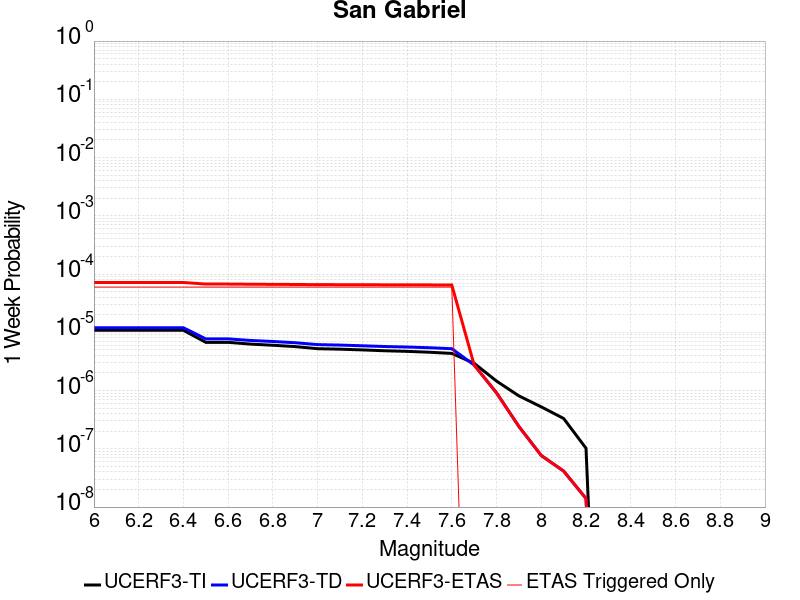 | 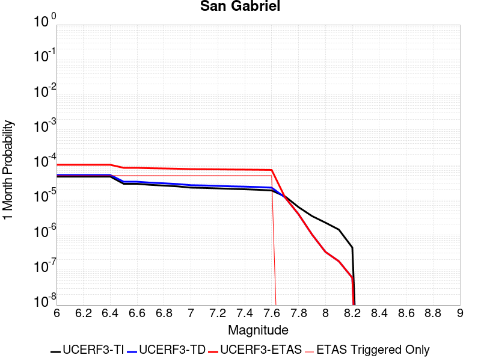 | 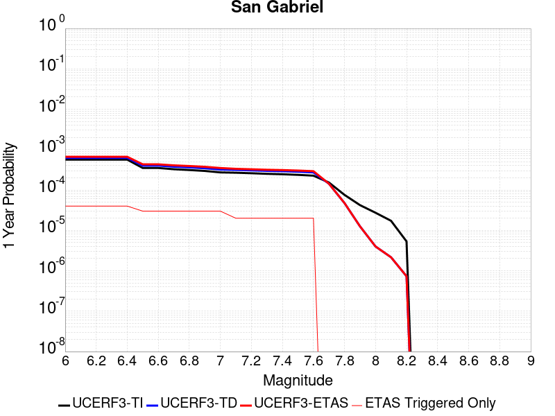 |  |

| Magnitude | 1 wk TI Prob | 1 wk TD Prob | 1 wk ETAS Prob | 1 wk ETAS/TD Gain | 1 wk ETAS Triggered Only | 1 mo TI Prob | 1 mo TD Prob | 1 mo ETAS Prob | 1 mo ETAS/TD Gain | 1 mo ETAS Triggered Only | 1 yr TI Prob | 1 yr TD Prob | 1 yr ETAS Prob | 1 yr ETAS/TD Gain | 1 yr ETAS Triggered Only | 10 yr TI Prob | 10 yr TD Prob | 10 yr ETAS Prob | 10 yr ETAS/TD Gain | 10 yr ETAS Triggered Only |
|-----|-----|-----|-----|-----|-----|-----|-----|-----|-----|-----|-----|-----|-----|-----|-----|-----|-----|-----|-----|-----|
| 6.0 | 1.083775E-5 | 1.198525E-5 | 2.198513E-5 | 1.8343489 | 1.0E-5 | 4.6446676E-5 | 5.1364408E-5 | 6.13639E-5 | 1.1946774 | 1.0E-5 | 5.653415E-4 | 6.251936E-4 | 6.6516857E-4 | 1.0639402 | 4.0E-5 | 0.0056390543 | 0.0062463325 | 0.00629602 | 1.0079547 | 5.0E-5 |
| 6.1 | 1.083775E-5 | 1.198525E-5 | 2.198513E-5 | 1.8343489 | 1.0E-5 | 4.6446676E-5 | 5.1364408E-5 | 6.13639E-5 | 1.1946774 | 1.0E-5 | 5.653415E-4 | 6.251936E-4 | 6.6516857E-4 | 1.0639402 | 4.0E-5 | 0.0056390543 | 0.0062463325 | 0.00629602 | 1.0079547 | 5.0E-5 |
| 6.2 | 1.083775E-5 | 1.198525E-5 | 2.198513E-5 | 1.8343489 | 1.0E-5 | 4.6446676E-5 | 5.1364408E-5 | 6.13639E-5 | 1.1946774 | 1.0E-5 | 5.653415E-4 | 6.251936E-4 | 6.6516857E-4 | 1.0639402 | 4.0E-5 | 0.0056390543 | 0.0062463325 | 0.00629602 | 1.0079547 | 5.0E-5 |
| 6.3 | 1.083775E-5 | 1.198525E-5 | 2.198513E-5 | 1.8343489 | 1.0E-5 | 4.6446676E-5 | 5.1364408E-5 | 6.13639E-5 | 1.1946774 | 1.0E-5 | 5.653415E-4 | 6.251936E-4 | 6.6516857E-4 | 1.0639402 | 4.0E-5 | 0.0056390543 | 0.0062463325 | 0.00629602 | 1.0079547 | 5.0E-5 |
| 6.4 | 1.083775E-5 | 1.198525E-5 | 2.198513E-5 | 1.8343489 | 1.0E-5 | 4.6446676E-5 | 5.1364408E-5 | 6.13639E-5 | 1.1946774 | 1.0E-5 | 5.653415E-4 | 6.251936E-4 | 6.6516857E-4 | 1.0639402 | 4.0E-5 | 0.0056390543 | 0.0062463325 | 0.00629602 | 1.0079547 | 5.0E-5 |
| 6.5 | 6.7317824E-6 | 7.717007E-6 | 1.771693E-5 | 2.295829 | 1.0E-5 | 2.8850178E-5 | 3.3072472E-5 | 4.3072145E-5 | 1.3023562 | 1.0E-5 | 3.511943E-4 | 4.0258403E-4 | 4.3257195E-4 | 1.0744886 | 3.0E-5 | 0.003506398 | 0.004029533 | 0.004059412 | 1.007415 | 3.0E-5 |
| 6.6 | 6.7317824E-6 | 7.717007E-6 | 1.771693E-5 | 2.295829 | 1.0E-5 | 2.8850178E-5 | 3.3072472E-5 | 4.3072145E-5 | 1.3023562 | 1.0E-5 | 3.511943E-4 | 4.0258403E-4 | 4.3257195E-4 | 1.0744886 | 3.0E-5 | 0.003506398 | 0.004029533 | 0.004059412 | 1.007415 | 3.0E-5 |
| 6.7 | 6.274881E-6 | 7.2459275E-6 | 1.7245855E-5 | 2.3800757 | 1.0E-5 | 2.6892068E-5 | 3.105361E-5 | 4.10533E-5 | 1.3220137 | 1.0E-5 | 3.2736175E-4 | 3.7801306E-4 | 4.0800174E-4 | 1.0793324 | 3.0E-5 | 0.0032687993 | 0.0037846796 | 0.0038145662 | 1.0078967 | 3.0E-5 |
| 6.8 | 5.996209E-6 | 6.958647E-6 | 1.6958578E-5 | 2.4370508 | 1.0E-5 | 2.5697784E-5 | 2.9822439E-5 | 3.9822142E-5 | 1.335308 | 1.0E-5 | 3.128256E-4 | 3.6302864E-4 | 3.9301775E-4 | 1.0826081 | 3.0E-5 | 0.003123856 | 0.0036353325 | 0.0036652235 | 1.0082223 | 3.0E-5 |
| 6.9 | 5.686331E-6 | 6.6236917E-6 | 1.6623626E-5 | 2.509722 | 1.0E-5 | 2.4369761E-5 | 2.8386947E-5 | 3.8386665E-5 | 1.3522646 | 1.0E-5 | 2.9666146E-4 | 3.4555717E-4 | 3.755468E-4 | 1.0867863 | 3.0E-5 | 0.0029626573 | 0.0034611735 | 0.0034910697 | 1.0086375 | 3.0E-5 |
| 7.0 | 5.2329838E-6 | 6.1475757E-6 | 1.6147515E-5 | 2.6266475 | 1.0E-5 | 2.242688E-5 | 2.6346492E-5 | 3.6346228E-5 | 1.3795471 | 1.0E-5 | 2.7301308E-4 | 3.207221E-4 | 3.5071245E-4 | 1.093509 | 3.0E-5 | 0.002726779 | 0.0032135549 | 0.0032434585 | 1.0093055 | 3.0E-5 |
| 7.1 | 5.135671E-6 | 6.0377E-6 | 1.603764E-5 | 2.6562498 | 1.0E-5 | 2.2009834E-5 | 2.5875606E-5 | 3.5875346E-5 | 1.3864543 | 1.0E-5 | 2.6793676E-4 | 3.1499073E-4 | 3.3498442E-4 | 1.0634739 | 2.0E-5 | 0.0026761394 | 0.0031564054 | 0.0031763422 | 1.0063163 | 2.0E-5 |
| 7.2 | 4.989062E-6 | 5.8710784E-6 | 1.5871019E-5 | 2.7032545 | 1.0E-5 | 2.1381518E-5 | 2.5161527E-5 | 3.5161276E-5 | 1.3974222 | 1.0E-5 | 2.6028889E-4 | 3.0629928E-4 | 3.2629314E-4 | 1.0652757 | 2.0E-5 | 0.0025998424 | 0.003069734 | 0.0030896724 | 1.0064952 | 2.0E-5 |
| 7.3 | 4.8219395E-6 | 5.7026323E-6 | 1.5702575E-5 | 2.7535663 | 1.0E-5 | 2.0665291E-5 | 2.4439627E-5 | 3.4439385E-5 | 1.4091616 | 1.0E-5 | 2.5157086E-4 | 2.975126E-4 | 3.1750664E-4 | 1.067204 | 2.0E-5 | 0.0025128627 | 0.002982106 | 0.0030020464 | 1.0066867 | 2.0E-5 |
| 7.4 | 4.7118383E-6 | 5.5911896E-6 | 1.5591133E-5 | 2.7885182 | 1.0E-5 | 2.0193436E-5 | 2.3962024E-5 | 3.3961784E-5 | 1.417317 | 1.0E-5 | 2.4582737E-4 | 2.9169934E-4 | 3.116935E-4 | 1.0685438 | 2.0E-5 | 0.002455556 | 0.0029241266 | 0.002944068 | 1.0068196 | 2.0E-5 |
| 7.5 | 4.5506545E-6 | 5.4365555E-6 | 1.54365E-5 | 2.83939 | 1.0E-5 | 1.9502659E-5 | 2.329932E-5 | 3.3299086E-5 | 1.429187 | 1.0E-5 | 2.37419E-4 | 2.8363304E-4 | 3.0362737E-4 | 1.0704937 | 2.0E-5 | 0.002371655 | 0.0028436715 | 0.0028636146 | 1.0070132 | 2.0E-5 |
| 7.6 | 4.343636E-6 | 5.2294336E-6 | 1.52293815E-5 | 2.912243 | 1.0E-5 | 1.861545E-5 | 2.241167E-5 | 3.2411444E-5 | 1.4461861 | 1.0E-5 | 2.2661954E-4 | 2.7282868E-4 | 2.928232E-4 | 1.073286 | 2.0E-5 | 0.0022638857 | 0.0027358893 | 0.0027558345 | 1.0072902 | 2.0E-5 |
| 7.7 | 2.936235E-6 | 2.743946E-6 | 2.743946E-6 | 1.0 | 0.0 | 1.2583803E-5 | 1.1759716E-5 | 1.1759716E-5 | 1.0 | 0.0 | 1.5319703E-4 | 1.4316518E-4 | 1.4316518E-4 | 1.0 | 0.0 | 0.0015309147 | 0.0014379849 | 0.0014379849 | 1.0 | 0.0 |
| 7.8 | 1.4541639E-6 | 9.122518E-7 | 9.122518E-7 | 1.0 | 0.0 | 6.232116E-6 | 3.9096444E-6 | 3.9096444E-6 | 1.0 | 0.0 | 7.587337E-5 | 4.7598885E-5 | 4.7598885E-5 | 1.0 | 0.0 | 7.584747E-4 | 4.8078224E-4 | 4.8078224E-4 | 1.0 | 0.0 |
| 7.9 | 8.098958E-7 | 2.4165956E-7 | 2.4165956E-7 | 1.0 | 0.0 | 3.4709774E-6 | 1.0356835E-6 | 1.0356835E-6 | 1.0 | 0.0 | 4.225833E-5 | 1.2609373E-5 | 1.2609373E-5 | 1.0 | 0.0 | 4.2250296E-4 | 1.2917137E-4 | 1.2917137E-4 | 1.0 | 0.0 |
| 8.0 | 5.2473234E-7 | 7.672734E-8 | 7.672734E-8 | 1.0 | 0.0 | 2.248851E-6 | 3.2883142E-7 | 3.2883142E-7 | 1.0 | 0.0 | 2.7379416E-5 | 4.003515E-6 | 4.003515E-6 | 1.0 | 0.0 | 2.7376044E-4 | 4.215796E-5 | 4.215796E-5 | 1.0 | 0.0 |
| 8.1 | 3.3162388E-7 | 4.1457096E-8 | 4.1457096E-8 | 1.0 | 0.0 | 1.4212444E-6 | 1.7767324E-7 | 1.7767324E-7 | 1.0 | 0.0 | 1.7303513E-5 | 2.1631695E-6 | 2.1631695E-6 | 1.0 | 0.0 | 1.7302166E-4 | 2.294416E-5 | 2.294416E-5 | 1.0 | 0.0 |
| 8.2 | 1.0235345E-7 | 1.4032201E-8 | 1.4032201E-8 | 1.0 | 0.0 | 4.3865757E-7 | 6.013801E-8 | 6.013801E-8 | 1.0 | 0.0 | 5.340643E-6 | 7.3217996E-7 | 7.3217996E-7 | 1.0 | 0.0 | 5.3405143E-5 | 7.921925E-6 | 7.921925E-6 | 1.0 | 0.0 |

## Cerro Prieto
*[(top)](#table-of-contents)*

| 1 Week | 1 Month | 1 Year | 10 Year |
|-----|-----|-----|-----|
| 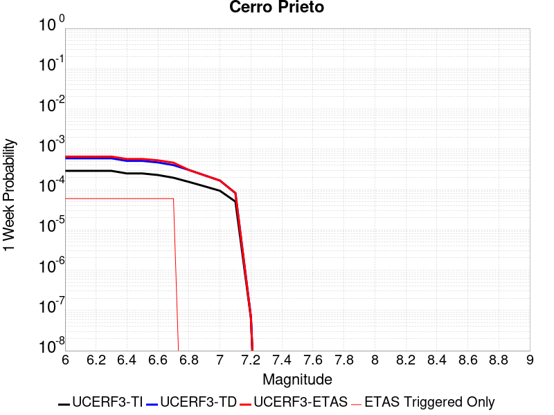 | 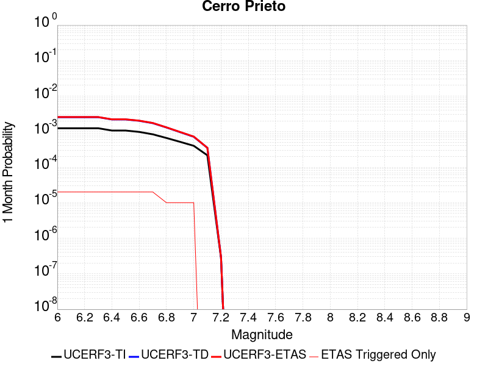 | 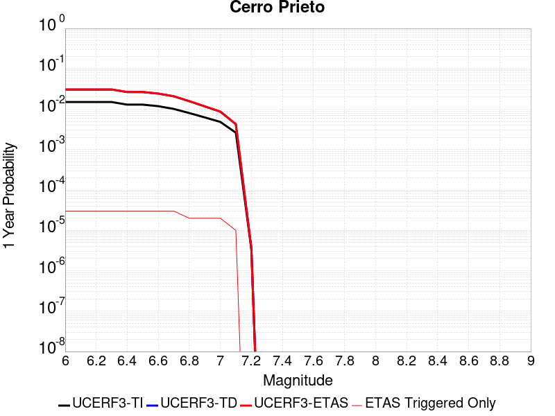 | 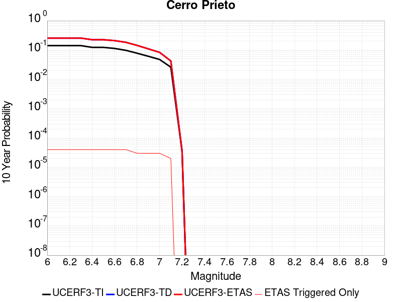 |

| Magnitude | 1 wk TI Prob | 1 wk TD Prob | 1 wk ETAS Prob | 1 wk ETAS/TD Gain | 1 wk ETAS Triggered Only | 1 mo TI Prob | 1 mo TD Prob | 1 mo ETAS Prob | 1 mo ETAS/TD Gain | 1 mo ETAS Triggered Only | 1 yr TI Prob | 1 yr TD Prob | 1 yr ETAS Prob | 1 yr ETAS/TD Gain | 1 yr ETAS Triggered Only | 10 yr TI Prob | 10 yr TD Prob | 10 yr ETAS Prob | 10 yr ETAS/TD Gain | 10 yr ETAS Triggered Only |
|-----|-----|-----|-----|-----|-----|-----|-----|-----|-----|-----|-----|-----|-----|-----|-----|-----|-----|-----|-----|-----|
| 6.0 | 2.9101528E-4 | 5.9654453E-4 | 6.1653263E-4 | 1.0335064 | 2.0E-5 | 0.0012466122 | 0.0025543566 | 0.0025743055 | 1.0078098 | 2.0E-5 | 0.015072231 | 0.030802928 | 0.030832004 | 1.0009439 | 3.0E-5 | 0.14089979 | 0.25386256 | 0.25389242 | 1.0001175 | 4.0E-5 |
| 6.1 | 2.9101528E-4 | 5.9654453E-4 | 6.1653263E-4 | 1.0335064 | 2.0E-5 | 0.0012466122 | 0.0025543566 | 0.0025743055 | 1.0078098 | 2.0E-5 | 0.015072231 | 0.030802928 | 0.030832004 | 1.0009439 | 3.0E-5 | 0.14089979 | 0.25386256 | 0.25389242 | 1.0001175 | 4.0E-5 |
| 6.2 | 2.9101528E-4 | 5.9654453E-4 | 6.1653263E-4 | 1.0335064 | 2.0E-5 | 0.0012466122 | 0.0025543566 | 0.0025743055 | 1.0078098 | 2.0E-5 | 0.015072231 | 0.030802928 | 0.030832004 | 1.0009439 | 3.0E-5 | 0.14089979 | 0.25386256 | 0.25389242 | 1.0001175 | 4.0E-5 |
| 6.3 | 2.9101528E-4 | 5.9654453E-4 | 6.1653263E-4 | 1.0335064 | 2.0E-5 | 0.0012466122 | 0.0025543566 | 0.0025743055 | 1.0078098 | 2.0E-5 | 0.015072231 | 0.030802928 | 0.030832004 | 1.0009439 | 3.0E-5 | 0.14089979 | 0.25386256 | 0.25389242 | 1.0001175 | 4.0E-5 |
| 6.4 | 2.508648E-4 | 5.140412E-4 | 5.3403096E-4 | 1.0388874 | 2.0E-5 | 0.0010746918 | 0.0022013725 | 0.0022213284 | 1.0090653 | 2.0E-5 | 0.013006088 | 0.026629416 | 0.026658617 | 1.0010966 | 3.0E-5 | 0.12270685 | 0.2242222 | 0.22425322 | 1.0001384 | 4.0E-5 |
| 6.5 | 2.508648E-4 | 5.140412E-4 | 5.3403096E-4 | 1.0388874 | 2.0E-5 | 0.0010746918 | 0.0022013725 | 0.0022213284 | 1.0090653 | 2.0E-5 | 0.013006088 | 0.026629416 | 0.026658617 | 1.0010966 | 3.0E-5 | 0.12270685 | 0.2242222 | 0.22425322 | 1.0001384 | 4.0E-5 |
| 6.6 | 2.294914E-4 | 4.7123645E-4 | 4.91227E-4 | 1.0424216 | 2.0E-5 | 9.831638E-4 | 0.0020182093 | 0.002038169 | 1.0098897 | 2.0E-5 | 0.011904482 | 0.024394194 | 0.024423461 | 1.0011998 | 3.0E-5 | 0.11286586 | 0.20837563 | 0.2084073 | 1.000152 | 4.0E-5 |
| 6.7 | 1.9621674E-4 | 4.0426268E-4 | 4.242546E-4 | 1.0494528 | 2.0E-5 | 8.4065786E-4 | 0.0017315624 | 0.0017515278 | 1.0115303 | 2.0E-5 | 0.010187071 | 0.020888962 | 0.020918336 | 1.0014062 | 3.0E-5 | 0.09732539 | 0.18264732 | 0.18268001 | 1.000179 | 4.0E-5 |
| 6.8 | 1.5476145E-4 | 3.0572579E-4 | 3.1572272E-4 | 1.0326991 | 1.0E-5 | 6.6309475E-4 | 0.0013096977 | 0.0013196847 | 1.0076253 | 1.0E-5 | 0.008043335 | 0.015826825 | 0.01584651 | 1.0012437 | 2.0E-5 | 0.07758363 | 0.14310057 | 0.1431263 | 1.0001796 | 3.0E-5 |
| 6.9 | 1.20509176E-4 | 2.2588465E-4 | 2.358824E-4 | 1.0442604 | 1.0E-5 | 5.1636563E-4 | 9.6778123E-4 | 9.777716E-4 | 1.0103229 | 1.0E-5 | 0.006268645 | 0.011734025 | 0.01175379 | 1.0016844 | 2.0E-5 | 0.060947374 | 0.10917958 | 0.109206304 | 1.0002447 | 3.0E-5 |
| 7.0 | 9.3269155E-5 | 1.6721459E-4 | 1.7721292E-4 | 1.0597934 | 1.0E-5 | 3.9966372E-4 | 7.1648025E-4 | 7.264731E-4 | 1.0139471 | 1.0E-5 | 0.0048550544 | 0.008695914 | 0.00871574 | 1.0022799 | 2.0E-5 | 0.04750344 | 0.082943216 | 0.08297073 | 1.0003316 | 3.0E-5 |
| 7.1 | 5.029709E-5 | 8.174011E-5 | 8.174011E-5 | 1.0 | 0.0 | 2.1554115E-4 | 3.50287E-4 | 3.50287E-4 | 1.0 | 0.0 | 0.0026210553 | 0.004259821 | 0.0042697787 | 1.0023376 | 1.0E-5 | 0.025903556 | 0.04226813 | 0.042287286 | 1.0004531 | 2.0E-5 |
| 7.2 | 6.5445185E-8 | 6.824737E-8 | 6.824737E-8 | 1.0 | 0.0 | 2.8047933E-7 | 2.9248872E-7 | 2.9248872E-7 | 1.0 | 0.0 | 3.4148304E-6 | 3.56105E-6 | 3.56105E-6 | 1.0 | 0.0 | 3.414778E-5 | 3.56105E-5 | 3.56105E-5 | 1.0 | 0.0 |

## Kern Canyon (Lake Isabella) 2011
*[(top)](#table-of-contents)*

| 1 Week | 1 Month | 1 Year | 10 Year |
|-----|-----|-----|-----|
| 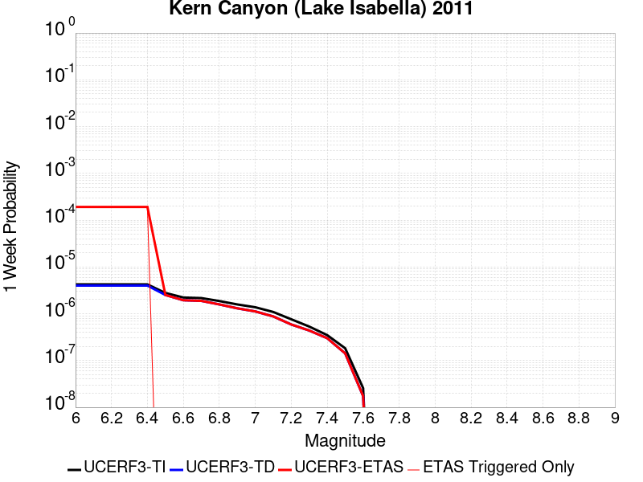 | 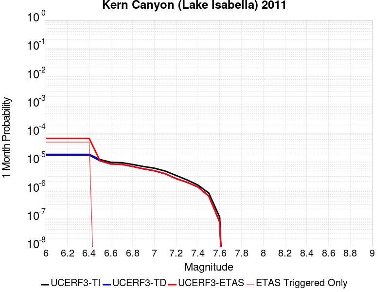 | 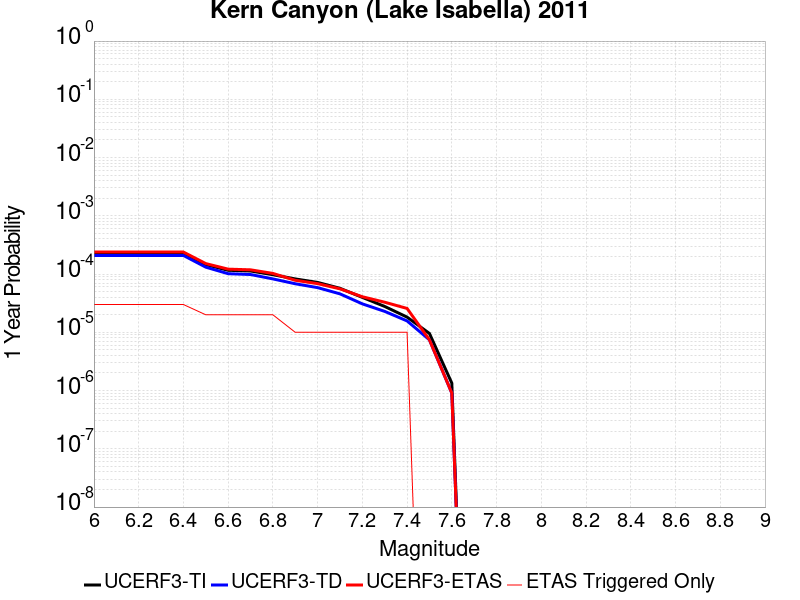 | 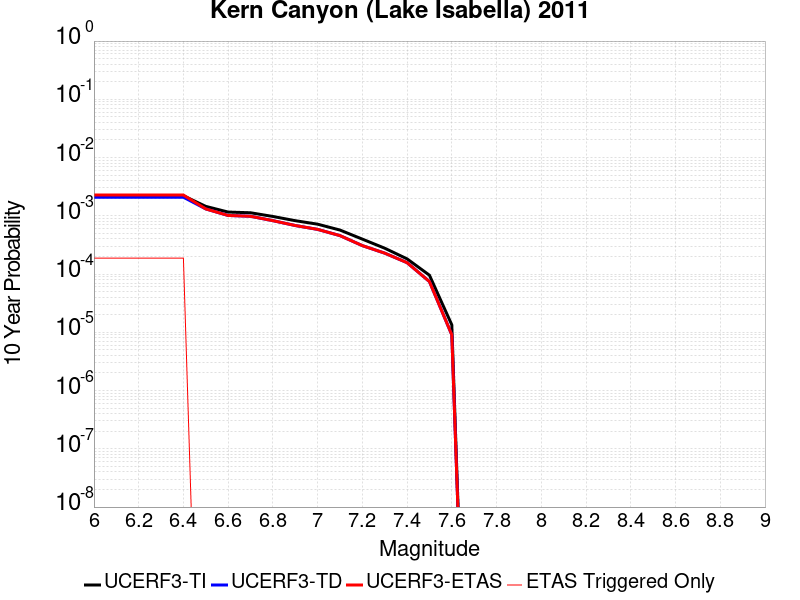 |

| Magnitude | 1 wk TI Prob | 1 wk TD Prob | 1 wk ETAS Prob | 1 wk ETAS/TD Gain | 1 wk ETAS Triggered Only | 1 mo TI Prob | 1 mo TD Prob | 1 mo ETAS Prob | 1 mo ETAS/TD Gain | 1 mo ETAS Triggered Only | 1 yr TI Prob | 1 yr TD Prob | 1 yr ETAS Prob | 1 yr ETAS/TD Gain | 1 yr ETAS Triggered Only | 10 yr TI Prob | 10 yr TD Prob | 10 yr ETAS Prob | 10 yr ETAS/TD Gain | 10 yr ETAS Triggered Only |
|-----|-----|-----|-----|-----|-----|-----|-----|-----|-----|-----|-----|-----|-----|-----|-----|-----|-----|-----|-----|-----|
| 6.0 | 4.2387383E-6 | 4.0016344E-6 | 1.40015945E-5 | 3.498969 | 1.0E-5 | 1.8165894E-5 | 1.7149758E-5 | 2.7149586E-5 | 1.5830886 | 1.0E-5 | 2.2114732E-4 | 2.0878017E-4 | 2.3877391E-4 | 1.1436619 | 3.0E-5 | 0.0022092736 | 0.002086024 | 0.0021259408 | 1.0191352 | 4.0E-5 |
| 6.1 | 4.2387383E-6 | 4.0016344E-6 | 1.40015945E-5 | 3.498969 | 1.0E-5 | 1.8165894E-5 | 1.7149758E-5 | 2.7149586E-5 | 1.5830886 | 1.0E-5 | 2.2114732E-4 | 2.0878017E-4 | 2.3877391E-4 | 1.1436619 | 3.0E-5 | 0.0022092736 | 0.002086024 | 0.0021259408 | 1.0191352 | 4.0E-5 |
| 6.2 | 4.2387383E-6 | 4.0016344E-6 | 1.40015945E-5 | 3.498969 | 1.0E-5 | 1.8165894E-5 | 1.7149758E-5 | 2.7149586E-5 | 1.5830886 | 1.0E-5 | 2.2114732E-4 | 2.0878017E-4 | 2.3877391E-4 | 1.1436619 | 3.0E-5 | 0.0022092736 | 0.002086024 | 0.0021259408 | 1.0191352 | 4.0E-5 |
| 6.3 | 4.2387383E-6 | 4.0016344E-6 | 1.40015945E-5 | 3.498969 | 1.0E-5 | 1.8165894E-5 | 1.7149758E-5 | 2.7149586E-5 | 1.5830886 | 1.0E-5 | 2.2114732E-4 | 2.0878017E-4 | 2.3877391E-4 | 1.1436619 | 3.0E-5 | 0.0022092736 | 0.002086024 | 0.0021259408 | 1.0191352 | 4.0E-5 |
| 6.4 | 4.2387383E-6 | 4.0016344E-6 | 1.40015945E-5 | 3.498969 | 1.0E-5 | 1.8165894E-5 | 1.7149758E-5 | 2.7149586E-5 | 1.5830886 | 1.0E-5 | 2.2114732E-4 | 2.0878017E-4 | 2.3877391E-4 | 1.1436619 | 3.0E-5 | 0.0022092736 | 0.002086024 | 0.0021259408 | 1.0191352 | 4.0E-5 |
| 6.5 | 2.7857532E-6 | 2.5178624E-6 | 2.5178624E-6 | 1.0 | 0.0 | 1.1938888E-5 | 1.0790796E-5 | 1.0790796E-5 | 1.0 | 0.0 | 1.4534626E-4 | 1.3137035E-4 | 1.5136773E-4 | 1.1522213 | 2.0E-5 | 0.0014525123 | 0.0013129596 | 0.0013429202 | 1.0228192 | 3.0E-5 |
| 6.6 | 2.2233348E-6 | 1.944119E-6 | 1.944119E-6 | 1.0 | 0.0 | 9.528543E-6 | 8.331913E-6 | 8.331913E-6 | 1.0 | 0.0 | 1.1600384E-4 | 1.014364E-4 | 1.2143437E-4 | 1.1971478 | 2.0E-5 | 0.001159433 | 0.0010139096 | 0.0010438792 | 1.0295584 | 3.0E-5 |
| 6.7 | 2.1635126E-6 | 1.8834991E-6 | 1.8834991E-6 | 1.0 | 0.0 | 9.272164E-6 | 8.072114E-6 | 8.072114E-6 | 1.0 | 0.0 | 1.1288274E-4 | 9.827364E-5 | 1.1827167E-4 | 1.2034934 | 2.0E-5 | 0.0011282542 | 9.8231E-4 | 0.0010122805 | 1.0305103 | 3.0E-5 |
| 6.8 | 1.8685711E-6 | 1.583138E-6 | 1.583138E-6 | 1.0 | 0.0 | 8.008137E-6 | 6.7848596E-6 | 6.7848596E-6 | 1.0 | 0.0 | 9.74947E-5 | 8.2602586E-5 | 1.02600934E-4 | 1.2421032 | 2.0E-5 | 9.745194E-4 | 8.2572375E-4 | 8.5569895E-4 | 1.0363017 | 3.0E-5 |
| 6.9 | 1.5815071E-6 | 1.3064887E-6 | 1.3064887E-6 | 1.0 | 0.0 | 6.77787E-6 | 5.5992255E-6 | 5.5992255E-6 | 1.0 | 0.0 | 8.251744E-5 | 6.816846E-5 | 7.816778E-5 | 1.1466854 | 1.0E-5 | 8.248681E-4 | 6.8147824E-4 | 7.014646E-4 | 1.029328 | 2.0E-5 |
| 7.0 | 1.3772564E-6 | 1.1210681E-6 | 1.1210681E-6 | 1.0 | 0.0 | 5.9025137E-6 | 4.8045686E-6 | 4.8045686E-6 | 1.0 | 0.0 | 7.186073E-5 | 5.8494075E-5 | 6.849349E-5 | 1.1709474 | 1.0E-5 | 7.18375E-4 | 5.8478885E-4 | 5.94783E-4 | 1.0170902 | 1.0E-5 |
| 7.1 | 1.0916998E-6 | 8.7637505E-7 | 8.7637505E-7 | 1.0 | 0.0 | 4.678705E-6 | 3.7558877E-6 | 3.7558877E-6 | 1.0 | 0.0 | 5.6961744E-5 | 4.5726985E-5 | 5.572653E-5 | 1.2186792 | 1.0E-5 | 5.6947145E-4 | 4.571771E-4 | 4.6717256E-4 | 1.0218633 | 1.0E-5 |
| 7.2 | 7.6277024E-7 | 5.901439E-7 | 5.901439E-7 | 1.0 | 0.0 | 3.2690114E-6 | 2.5291856E-6 | 2.5291856E-6 | 1.0 | 0.0 | 3.9799485E-5 | 3.0792406E-5 | 4.07921E-5 | 1.3247454 | 1.0E-5 | 3.9792358E-4 | 3.07882E-4 | 3.1787893E-4 | 1.03247 | 1.0E-5 |
| 7.3 | 5.3265916E-7 | 4.3824264E-7 | 4.3824264E-7 | 1.0 | 0.0 | 2.282823E-6 | 1.8781814E-6 | 1.8781814E-6 | 1.0 | 0.0 | 2.7793016E-5 | 2.2866623E-5 | 3.2866392E-5 | 1.4373087 | 1.0E-5 | 2.778954E-4 | 2.2864307E-4 | 2.3864079E-4 | 1.0437263 | 1.0E-5 |
| 7.4 | 3.4946007E-7 | 3.0065647E-7 | 3.0065647E-7 | 1.0 | 0.0 | 1.497685E-6 | 1.2885271E-6 | 1.2885271E-6 | 1.0 | 0.0 | 1.8234163E-5 | 1.5687707E-5 | 2.568755E-5 | 1.6374319 | 1.0E-5 | 1.8232666E-4 | 1.5686621E-4 | 1.6686464E-4 | 1.0637386 | 1.0E-5 |
| 7.5 | 1.8317026E-7 | 1.4244755E-7 | 1.4244755E-7 | 1.0 | 0.0 | 7.850152E-7 | 6.1048934E-7 | 6.1048934E-7 | 1.0 | 0.0 | 9.557518E-6 | 7.432683E-6 | 7.432683E-6 | 1.0 | 0.0 | 9.5571064E-5 | 7.432442E-5 | 7.432442E-5 | 1.0 | 0.0 |
| 7.6 | 2.572245E-8 | 1.735264E-8 | 1.735264E-8 | 1.0 | 0.0 | 1.10239064E-7 | 7.436845E-8 | 7.436845E-8 | 1.0 | 0.0 | 1.3421597E-6 | 9.0543557E-7 | 9.0543557E-7 | 1.0 | 0.0 | 1.3421517E-5 | 9.054324E-6 | 9.054324E-6 | 1.0 | 0.0 |

## Cucamonga
*[(top)](#table-of-contents)*

| 1 Week | 1 Month | 1 Year | 10 Year |
|-----|-----|-----|-----|
| 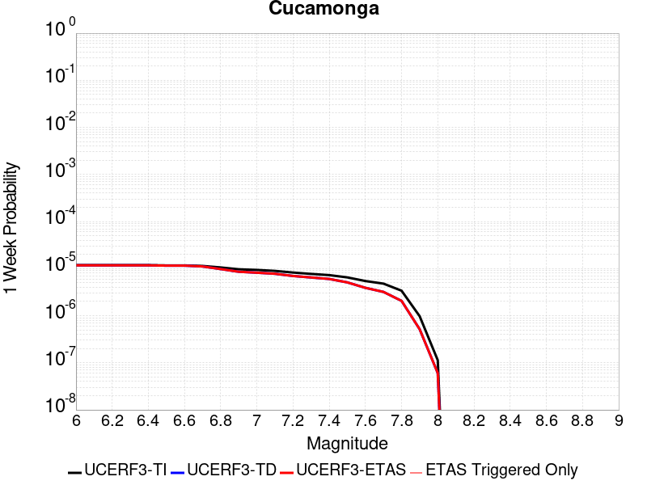 |  | 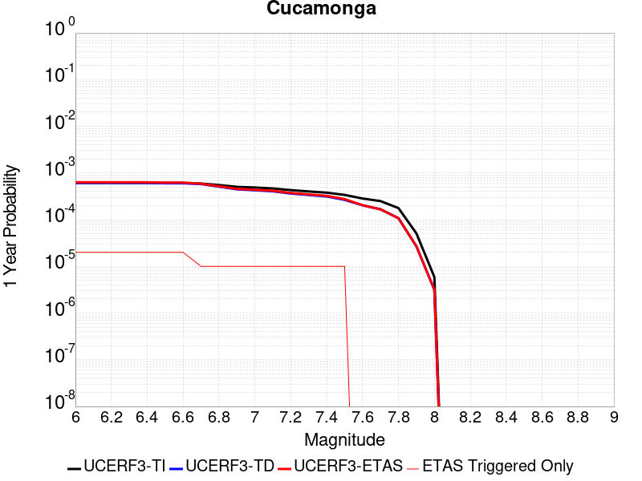 | 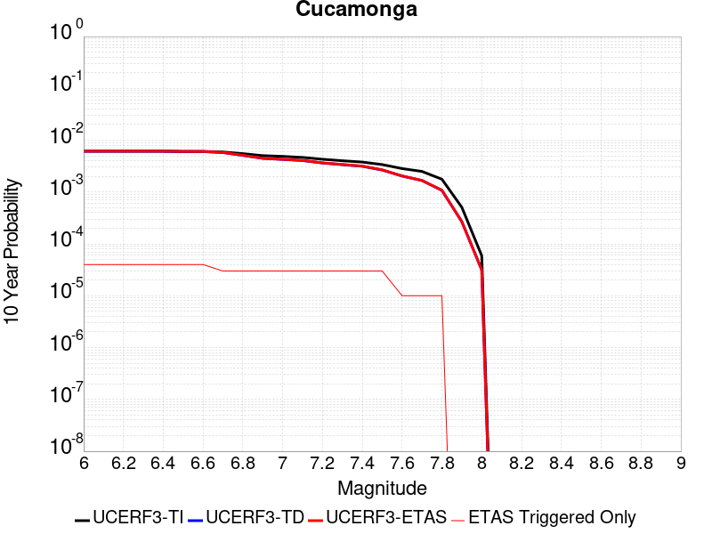 |

| Magnitude | 1 wk TI Prob | 1 wk TD Prob | 1 wk ETAS Prob | 1 wk ETAS/TD Gain | 1 wk ETAS Triggered Only | 1 mo TI Prob | 1 mo TD Prob | 1 mo ETAS Prob | 1 mo ETAS/TD Gain | 1 mo ETAS Triggered Only | 1 yr TI Prob | 1 yr TD Prob | 1 yr ETAS Prob | 1 yr ETAS/TD Gain | 1 yr ETAS Triggered Only | 10 yr TI Prob | 10 yr TD Prob | 10 yr ETAS Prob | 10 yr ETAS/TD Gain | 10 yr ETAS Triggered Only |
|-----|-----|-----|-----|-----|-----|-----|-----|-----|-----|-----|-----|-----|-----|-----|-----|-----|-----|-----|-----|-----|
| 6.0 | 1.1848348E-5 | 1.1737109E-5 | 1.1737109E-5 | 1.0 | 0.0 | 5.0777642E-5 | 5.0300943E-5 | 6.030044E-5 | 1.1987934 | 1.0E-5 | 6.180424E-4 | 6.122446E-4 | 6.3223235E-4 | 1.0326467 | 2.0E-5 | 0.0061632637 | 0.006106745 | 0.006146501 | 1.0065101 | 4.0E-5 |
| 6.1 | 1.1848348E-5 | 1.1737109E-5 | 1.1737109E-5 | 1.0 | 0.0 | 5.0777642E-5 | 5.0300943E-5 | 6.030044E-5 | 1.1987934 | 1.0E-5 | 6.180424E-4 | 6.122446E-4 | 6.3223235E-4 | 1.0326467 | 2.0E-5 | 0.0061632637 | 0.006106745 | 0.006146501 | 1.0065101 | 4.0E-5 |
| 6.2 | 1.1848348E-5 | 1.1737109E-5 | 1.1737109E-5 | 1.0 | 0.0 | 5.0777642E-5 | 5.0300943E-5 | 6.030044E-5 | 1.1987934 | 1.0E-5 | 6.180424E-4 | 6.122446E-4 | 6.3223235E-4 | 1.0326467 | 2.0E-5 | 0.0061632637 | 0.006106745 | 0.006146501 | 1.0065101 | 4.0E-5 |
| 6.3 | 1.1848348E-5 | 1.1737109E-5 | 1.1737109E-5 | 1.0 | 0.0 | 5.0777642E-5 | 5.0300943E-5 | 6.030044E-5 | 1.1987934 | 1.0E-5 | 6.180424E-4 | 6.122446E-4 | 6.3223235E-4 | 1.0326467 | 2.0E-5 | 0.0061632637 | 0.006106745 | 0.006146501 | 1.0065101 | 4.0E-5 |
| 6.4 | 1.1848348E-5 | 1.1737109E-5 | 1.1737109E-5 | 1.0 | 0.0 | 5.0777642E-5 | 5.0300943E-5 | 6.030044E-5 | 1.1987934 | 1.0E-5 | 6.180424E-4 | 6.122446E-4 | 6.3223235E-4 | 1.0326467 | 2.0E-5 | 0.0061632637 | 0.006106745 | 0.006146501 | 1.0065101 | 4.0E-5 |
| 6.5 | 1.16988695E-5 | 1.157614E-5 | 1.157614E-5 | 1.0 | 0.0 | 5.013705E-5 | 4.9611102E-5 | 5.9610604E-5 | 1.2015578 | 1.0E-5 | 6.102476E-4 | 6.0385047E-4 | 6.2383834E-4 | 1.0331008 | 2.0E-5 | 0.006085745 | 0.0060232594 | 0.0060630185 | 1.006601 | 4.0E-5 |
| 6.6 | 1.16988695E-5 | 1.157614E-5 | 1.157614E-5 | 1.0 | 0.0 | 5.013705E-5 | 4.9611102E-5 | 5.9610604E-5 | 1.2015578 | 1.0E-5 | 6.102476E-4 | 6.0385047E-4 | 6.2383834E-4 | 1.0331008 | 2.0E-5 | 0.006085745 | 0.0060232594 | 0.0060630185 | 1.006601 | 4.0E-5 |
| 6.7 | 1.1397107E-5 | 1.1115039E-5 | 1.1115039E-5 | 1.0 | 0.0 | 4.884383E-5 | 4.7635025E-5 | 5.763455E-5 | 1.2099196 | 1.0E-5 | 5.9451134E-4 | 5.798046E-4 | 5.897988E-4 | 1.0172372 | 1.0E-5 | 0.005929234 | 0.005784061 | 0.0058138873 | 1.0051566 | 3.0E-5 |
| 6.8 | 1.058387E-5 | 9.785037E-6 | 9.785037E-6 | 1.0 | 0.0 | 4.5358654E-5 | 4.1935207E-5 | 5.1934785E-5 | 1.2384531 | 1.0E-5 | 5.521017E-4 | 5.1044265E-4 | 5.2043755E-4 | 1.0195808 | 1.0E-5 | 0.00550732 | 0.005093702 | 0.005123549 | 1.0058596 | 3.0E-5 |
| 6.9 | 9.690046E-6 | 8.579504E-6 | 8.579504E-6 | 1.0 | 0.0 | 4.1528107E-5 | 3.6768783E-5 | 4.6768415E-5 | 1.2719598 | 1.0E-5 | 5.054874E-4 | 4.475684E-4 | 4.5756393E-4 | 1.0223329 | 1.0E-5 | 0.005043391 | 0.0044675954 | 0.0044974615 | 1.006685 | 3.0E-5 |
| 7.0 | 9.381461E-6 | 8.18712E-6 | 8.18712E-6 | 1.0 | 0.0 | 4.020564E-5 | 3.508719E-5 | 4.5086836E-5 | 1.2849944 | 1.0E-5 | 4.893937E-4 | 4.2710314E-4 | 4.3709888E-4 | 1.0234035 | 1.0E-5 | 0.0048831734 | 0.004263747 | 0.004293619 | 1.007006 | 3.0E-5 |
| 7.1 | 8.946492E-6 | 7.781904E-6 | 7.781904E-6 | 1.0 | 0.0 | 3.8341543E-5 | 3.3350592E-5 | 4.335026E-5 | 1.2998347 | 1.0E-5 | 4.667083E-4 | 4.0596814E-4 | 4.1596408E-4 | 1.0246224 | 1.0E-5 | 0.0046572937 | 0.0040531927 | 0.004083071 | 1.0073715 | 3.0E-5 |
| 7.2 | 8.251016E-6 | 6.9752878E-6 | 6.9752878E-6 | 1.0 | 0.0 | 3.5361016E-5 | 2.9893748E-5 | 3.989345E-5 | 1.3345081 | 1.0E-5 | 4.3043532E-4 | 3.6389584E-4 | 3.7389222E-4 | 1.0274704 | 1.0E-5 | 0.0042960253 | 0.0036339252 | 0.003663816 | 1.0082256 | 3.0E-5 |
| 7.3 | 7.717881E-6 | 6.4863584E-6 | 6.4863584E-6 | 1.0 | 0.0 | 3.3076216E-5 | 2.7798384E-5 | 3.7798105E-5 | 1.3597231 | 1.0E-5 | 4.026285E-4 | 3.38393E-4 | 3.483896E-4 | 1.0295415 | 1.0E-5 | 0.004018998 | 0.0033797103 | 0.003409609 | 1.0088465 | 3.0E-5 |
| 7.4 | 7.275623E-6 | 6.032004E-6 | 6.032004E-6 | 1.0 | 0.0 | 3.118087E-5 | 2.5851192E-5 | 3.585093E-5 | 1.3868194 | 1.0E-5 | 3.7956095E-4 | 3.1469302E-4 | 3.2468987E-4 | 1.031767 | 1.0E-5 | 0.0037891332 | 0.0031434046 | 0.0031733103 | 1.0095137 | 3.0E-5 |
| 7.5 | 6.5109502E-6 | 5.100593E-6 | 5.100593E-6 | 1.0 | 0.0 | 2.7903774E-5 | 2.1859503E-5 | 3.1859283E-5 | 1.457457 | 1.0E-5 | 3.3967546E-4 | 2.661071E-4 | 2.7610443E-4 | 1.0375688 | 1.0E-5 | 0.0033915674 | 0.0026588016 | 0.002688722 | 1.0112532 | 3.0E-5 |
| 7.6 | 5.4495326E-6 | 3.908547E-6 | 3.908547E-6 | 1.0 | 0.0 | 2.335493E-5 | 1.6750808E-5 | 1.6750808E-5 | 1.0 | 0.0 | 2.8430918E-4 | 2.0392207E-4 | 2.0392207E-4 | 1.0 | 0.0 | 0.0028394572 | 0.0020382616 | 0.0020482412 | 1.0048962 | 1.0E-5 |
| 7.7 | 4.7997164E-6 | 3.2002263E-6 | 3.2002263E-6 | 1.0 | 0.0 | 2.057005E-5 | 1.3715184E-5 | 1.3715184E-5 | 1.0 | 0.0 | 2.504116E-4 | 1.6696959E-4 | 1.6696959E-4 | 1.0 | 0.0 | 0.002501296 | 0.0016693701 | 0.0016793534 | 1.0059803 | 1.0E-5 |
| 7.8 | 3.3941733E-6 | 2.0641678E-6 | 2.0641678E-6 | 1.0 | 0.0 | 1.4546376E-5 | 8.846404E-6 | 8.846404E-6 | 1.0 | 0.0 | 1.7708774E-4 | 1.07699656E-4 | 1.07699656E-4 | 1.0 | 0.0 | 0.0017694668 | 0.0010766032 | 0.0010865924 | 1.0092784 | 1.0E-5 |
| 7.9 | 9.750552E-7 | 5.155798E-7 | 5.155798E-7 | 1.0 | 0.0 | 4.178801E-6 | 2.2096258E-6 | 2.2096258E-6 | 1.0 | 0.0 | 5.0875715E-5 | 2.6901867E-5 | 2.6901867E-5 | 1.0 | 0.0 | 5.086407E-4 | 2.689865E-4 | 2.689865E-4 | 1.0 | 0.0 |
| 8.0 | 1.133857E-7 | 6.053372E-8 | 6.053372E-8 | 1.0 | 0.0 | 4.8593864E-7 | 2.594302E-7 | 2.594302E-7 | 1.0 | 0.0 | 5.9162867E-6 | 3.1585582E-6 | 3.1585582E-6 | 1.0 | 0.0 | 5.916129E-5 | 3.158515E-5 | 3.158515E-5 | 1.0 | 0.0 |

## Mono Lake 2011 CFM
*[(top)](#table-of-contents)*

| 1 Week | 1 Month | 1 Year | 10 Year |
|-----|-----|-----|-----|
| 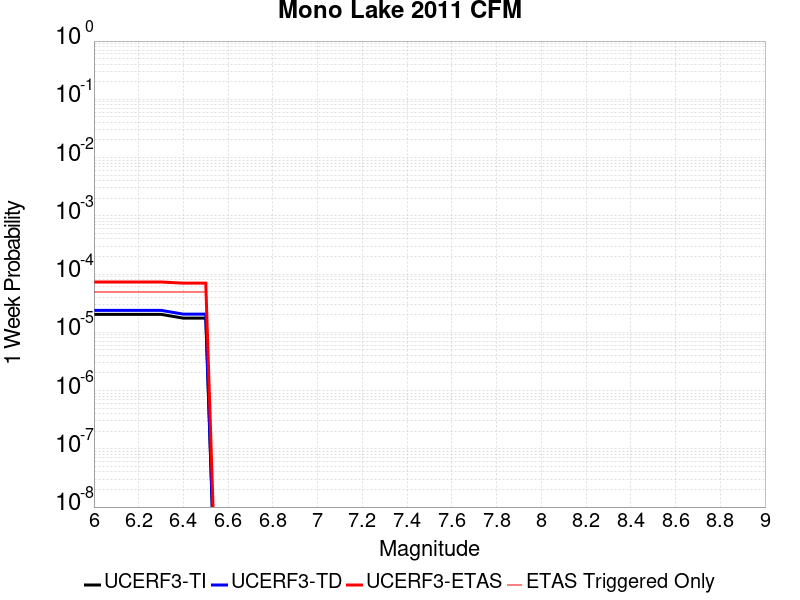 | 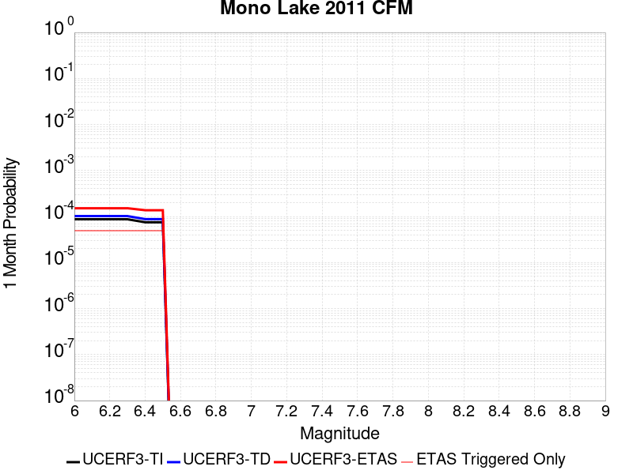 | 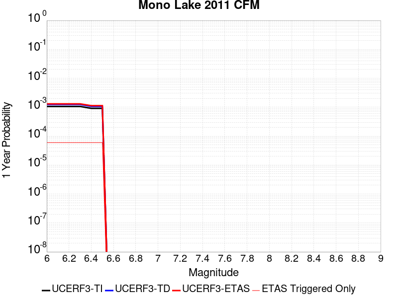 | 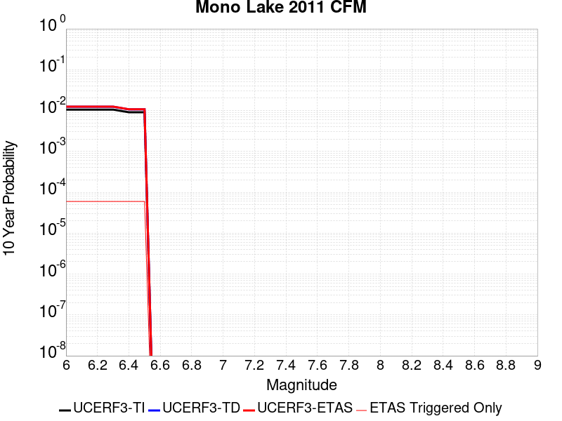 |

| Magnitude | 1 wk TI Prob | 1 wk TD Prob | 1 wk ETAS Prob | 1 wk ETAS/TD Gain | 1 wk ETAS Triggered Only | 1 mo TI Prob | 1 mo TD Prob | 1 mo ETAS Prob | 1 mo ETAS/TD Gain | 1 mo ETAS Triggered Only | 1 yr TI Prob | 1 yr TD Prob | 1 yr ETAS Prob | 1 yr ETAS/TD Gain | 1 yr ETAS Triggered Only | 10 yr TI Prob | 10 yr TD Prob | 10 yr ETAS Prob | 10 yr ETAS/TD Gain | 10 yr ETAS Triggered Only |
|-----|-----|-----|-----|-----|-----|-----|-----|-----|-----|-----|-----|-----|-----|-----|-----|-----|-----|-----|-----|-----|
| 6.0 | 2.0341662E-5 | 2.3828192E-5 | 4.3827713E-5 | 1.839322 | 2.0E-5 | 8.717564E-5 | 1.0211982E-4 | 1.2211778E-4 | 1.1958283 | 2.0E-5 | 0.0010608466 | 0.0012431308 | 0.0012730935 | 1.0241026 | 3.0E-5 | 0.010557966 | 0.012413842 | 0.012453345 | 1.0031822 | 4.0E-5 |
| 6.1 | 2.0341662E-5 | 2.3828192E-5 | 4.3827713E-5 | 1.839322 | 2.0E-5 | 8.717564E-5 | 1.0211982E-4 | 1.2211778E-4 | 1.1958283 | 2.0E-5 | 0.0010608466 | 0.0012431308 | 0.0012730935 | 1.0241026 | 3.0E-5 | 0.010557966 | 0.012413842 | 0.012453345 | 1.0031822 | 4.0E-5 |
| 6.2 | 2.0341662E-5 | 2.3828192E-5 | 4.3827713E-5 | 1.839322 | 2.0E-5 | 8.717564E-5 | 1.0211982E-4 | 1.2211778E-4 | 1.1958283 | 2.0E-5 | 0.0010608466 | 0.0012431308 | 0.0012730935 | 1.0241026 | 3.0E-5 | 0.010557966 | 0.012413842 | 0.012453345 | 1.0031822 | 4.0E-5 |
| 6.3 | 2.0341662E-5 | 2.3828192E-5 | 4.3827713E-5 | 1.839322 | 2.0E-5 | 8.717564E-5 | 1.0211982E-4 | 1.2211778E-4 | 1.1958283 | 2.0E-5 | 0.0010608466 | 0.0012431308 | 0.0012730935 | 1.0241026 | 3.0E-5 | 0.010557966 | 0.012413842 | 0.012453345 | 1.0031822 | 4.0E-5 |
| 6.4 | 1.749821E-5 | 2.049101E-5 | 4.04906E-5 | 1.9760178 | 2.0E-5 | 7.499018E-5 | 8.781861E-5 | 1.0781686E-4 | 1.2277222 | 2.0E-5 | 9.1262296E-4 | 0.0010691914 | 0.0010991594 | 1.0280286 | 3.0E-5 | 0.009088841 | 0.01069187 | 0.010731443 | 1.0037012 | 4.0E-5 |
| 6.5 | 1.749821E-5 | 2.049101E-5 | 4.04906E-5 | 1.9760178 | 2.0E-5 | 7.499018E-5 | 8.781861E-5 | 1.0781686E-4 | 1.2277222 | 2.0E-5 | 9.1262296E-4 | 0.0010691914 | 0.0010991594 | 1.0280286 | 3.0E-5 | 0.009088841 | 0.01069187 | 0.010731443 | 1.0037012 | 4.0E-5 |

## Monterey Bay-Tularcitos
*[(top)](#table-of-contents)*

| 1 Week | 1 Month | 1 Year | 10 Year |
|-----|-----|-----|-----|
| 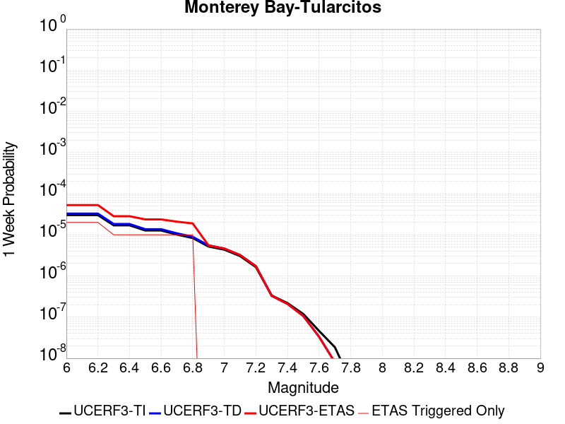 | 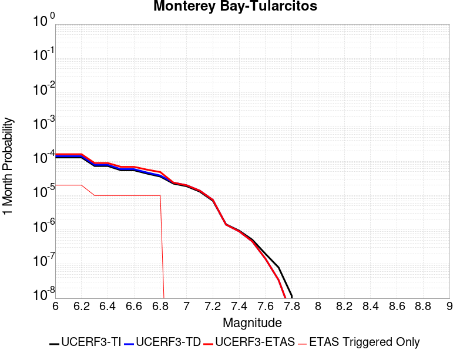 | 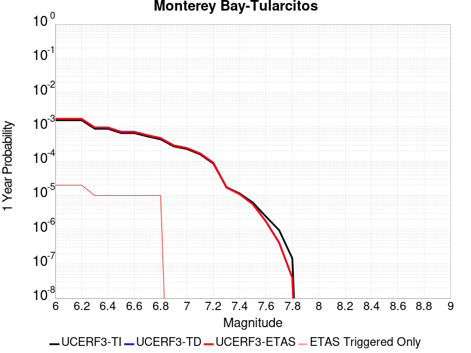 | 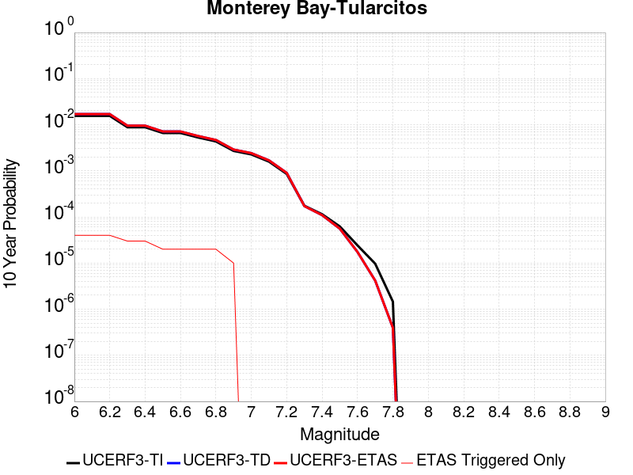 |

| Magnitude | 1 wk TI Prob | 1 wk TD Prob | 1 wk ETAS Prob | 1 wk ETAS/TD Gain | 1 wk ETAS Triggered Only | 1 mo TI Prob | 1 mo TD Prob | 1 mo ETAS Prob | 1 mo ETAS/TD Gain | 1 mo ETAS Triggered Only | 1 yr TI Prob | 1 yr TD Prob | 1 yr ETAS Prob | 1 yr ETAS/TD Gain | 1 yr ETAS Triggered Only | 10 yr TI Prob | 10 yr TD Prob | 10 yr ETAS Prob | 10 yr ETAS/TD Gain | 10 yr ETAS Triggered Only |
|-----|-----|-----|-----|-----|-----|-----|-----|-----|-----|-----|-----|-----|-----|-----|-----|-----|-----|-----|-----|-----|
| 6.0 | 3.0131365E-5 | 3.279877E-5 | 5.2798114E-5 | 1.609759 | 2.0E-5 | 1.2912804E-4 | 1.4055918E-4 | 1.6055637E-4 | 1.1422688 | 2.0E-5 | 0.001571 | 0.0017100703 | 0.001730036 | 1.0116755 | 2.0E-5 | 0.015599402 | 0.016979916 | 0.017019238 | 1.0023158 | 4.0E-5 |
| 6.1 | 3.0131365E-5 | 3.279877E-5 | 5.2798114E-5 | 1.609759 | 2.0E-5 | 1.2912804E-4 | 1.4055918E-4 | 1.6055637E-4 | 1.1422688 | 2.0E-5 | 0.001571 | 0.0017100703 | 0.001730036 | 1.0116755 | 2.0E-5 | 0.015599402 | 0.016979916 | 0.017019238 | 1.0023158 | 4.0E-5 |
| 6.2 | 3.0131365E-5 | 3.279877E-5 | 5.2798114E-5 | 1.609759 | 2.0E-5 | 1.2912804E-4 | 1.4055918E-4 | 1.6055637E-4 | 1.1422688 | 2.0E-5 | 0.001571 | 0.0017100703 | 0.001730036 | 1.0116755 | 2.0E-5 | 0.015599402 | 0.016979916 | 0.017019238 | 1.0023158 | 4.0E-5 |
| 6.3 | 1.6998249E-5 | 1.8330798E-5 | 2.8330614E-5 | 1.54552 | 1.0E-5 | 7.28476E-5 | 7.85583E-5 | 8.8557514E-5 | 1.127284 | 1.0E-5 | 8.865586E-4 | 9.5604634E-4 | 9.6603675E-4 | 1.0104498 | 1.0E-5 | 0.0088303005 | 0.009521258 | 0.009550973 | 1.0031209 | 3.0E-5 |
| 6.4 | 1.6998249E-5 | 1.8330798E-5 | 2.8330614E-5 | 1.54552 | 1.0E-5 | 7.28476E-5 | 7.85583E-5 | 8.8557514E-5 | 1.127284 | 1.0E-5 | 8.865586E-4 | 9.5604634E-4 | 9.6603675E-4 | 1.0104498 | 1.0E-5 | 0.0088303005 | 0.009521258 | 0.009550973 | 1.0031209 | 3.0E-5 |
| 6.5 | 1.27470785E-5 | 1.3693312E-5 | 2.3693176E-5 | 1.7302735 | 1.0E-5 | 5.4629192E-5 | 5.8684363E-5 | 6.8683774E-5 | 1.1703931 | 1.0E-5 | 6.649074E-4 | 7.1425823E-4 | 7.242511E-4 | 1.0139905 | 1.0E-5 | 0.0066292146 | 0.007120678 | 0.007140536 | 1.0027887 | 2.0E-5 |
| 6.6 | 1.2739422E-5 | 1.36854E-5 | 2.3685263E-5 | 1.7306957 | 1.0E-5 | 5.4596385E-5 | 5.8650454E-5 | 6.864987E-5 | 1.1704917 | 1.0E-5 | 6.645082E-4 | 7.1384566E-4 | 7.238385E-4 | 1.0139986 | 1.0E-5 | 0.0066252467 | 0.007116579 | 0.0071364366 | 1.0027903 | 2.0E-5 |
| 6.7 | 1.0160109E-5 | 1.0885755E-5 | 2.0885645E-5 | 1.9186218 | 1.0E-5 | 4.35426E-5 | 4.665244E-5 | 5.6651974E-5 | 1.214341 | 1.0E-5 | 5.300022E-4 | 5.6785246E-4 | 5.778468E-4 | 1.0176002 | 1.0E-5 | 0.005287399 | 0.0056647263 | 0.005684613 | 1.0035106 | 2.0E-5 |
| 6.8 | 8.349859E-6 | 8.932587E-6 | 1.8932498E-5 | 2.1194866 | 1.0E-5 | 3.578462E-5 | 3.8281985E-5 | 4.8281603E-5 | 1.2612095 | 1.0E-5 | 4.3559066E-4 | 4.6598914E-4 | 4.759845E-4 | 1.0214497 | 1.0E-5 | 0.004347378 | 0.004650685 | 0.004670592 | 1.0042804 | 2.0E-5 |
| 6.9 | 5.193639E-6 | 5.53643E-6 | 5.53643E-6 | 1.0 | 0.0 | 2.2258262E-5 | 2.372736E-5 | 2.372736E-5 | 1.0 | 0.0 | 2.7096065E-4 | 2.8884556E-4 | 2.8884556E-4 | 1.0 | 0.0 | 0.0027063051 | 0.0028850224 | 0.0028949934 | 1.0034562 | 1.0E-5 |
| 7.0 | 4.359381E-6 | 4.643366E-6 | 4.643366E-6 | 1.0 | 0.0 | 1.8682927E-5 | 1.9900004E-5 | 1.9900004E-5 | 1.0 | 0.0 | 2.274409E-4 | 2.422586E-4 | 2.422586E-4 | 1.0 | 0.0 | 0.0022720827 | 0.002420238 | 0.002420238 | 1.0 | 0.0 |
| 7.1 | 3.0398533E-6 | 3.2310427E-6 | 3.2310427E-6 | 1.0 | 0.0 | 1.3027877E-5 | 1.3847267E-5 | 1.3847267E-5 | 1.0 | 0.0 | 1.5860285E-4 | 1.6858005E-4 | 1.6858005E-4 | 1.0 | 0.0 | 0.001584897 | 0.0016847793 | 0.0016847793 | 1.0 | 0.0 |
| 7.2 | 1.642335E-6 | 1.7333153E-6 | 1.7333153E-6 | 1.0 | 0.0 | 7.0385595E-6 | 7.428485E-6 | 7.428485E-6 | 1.0 | 0.0 | 8.569109E-5 | 9.044012E-5 | 9.044012E-5 | 1.0 | 0.0 | 8.5658056E-4 | 9.042358E-4 | 9.042358E-4 | 1.0 | 0.0 |
| 7.3 | 3.356842E-7 | 3.2952389E-7 | 3.2952389E-7 | 1.0 | 0.0 | 1.4386458E-6 | 1.4122445E-6 | 1.4122445E-6 | 1.0 | 0.0 | 1.7515373E-5 | 1.7193941E-5 | 1.7193941E-5 | 1.0 | 0.0 | 1.7513991E-4 | 1.719262E-4 | 1.719262E-4 | 1.0 | 0.0 |
| 7.4 | 2.1973483E-7 | 2.1006414E-7 | 2.1006414E-7 | 1.0 | 0.0 | 9.417204E-7 | 9.002746E-7 | 9.002746E-7 | 1.0 | 0.0 | 1.1465385E-5 | 1.0960788E-5 | 1.0960788E-5 | 1.0 | 0.0 | 1.1464794E-4 | 1.0960251E-4 | 1.0960251E-4 | 1.0 | 0.0 |
| 7.5 | 1.1944135E-7 | 1.0696035E-7 | 1.0696035E-7 | 1.0 | 0.0 | 5.118914E-7 | 4.5840142E-7 | 4.5840142E-7 | 1.0 | 0.0 | 6.23226E-6 | 5.581023E-6 | 5.581023E-6 | 1.0 | 0.0 | 6.2320854E-5 | 5.5808843E-5 | 5.5808843E-5 | 1.0 | 0.0 |
| 7.6 | 4.636058E-8 | 3.3364433E-8 | 3.3364433E-8 | 1.0 | 0.0 | 1.9868818E-7 | 1.4299042E-7 | 1.4299042E-7 | 1.0 | 0.0 | 2.419026E-6 | 1.740907E-6 | 1.740907E-6 | 1.0 | 0.0 | 2.4189996E-5 | 1.7408936E-5 | 1.7408936E-5 | 1.0 | 0.0 |
| 7.7 | 1.8588572E-8 | 8.003168E-9 | 8.003168E-9 | 1.0 | 0.0 | 7.9665305E-8 | 3.429929E-8 | 3.429929E-8 | 1.0 | 0.0 | 9.699246E-7 | 4.1759378E-7 | 4.1759378E-7 | 1.0 | 0.0 | 9.699204E-6 | 4.1759304E-6 | 4.1759304E-6 | 1.0 | 0.0 |
| 7.8 | 2.7960154E-9 | 7.608624E-10 | 7.608624E-10 | 1.0 | 0.0 | 1.1982923E-8 | 3.2608392E-9 | 3.2608392E-9 | 1.0 | 0.0 | 1.4589209E-7 | 3.9700716E-8 | 3.9700716E-8 | 1.0 | 0.0 | 1.4589199E-6 | 3.970071E-7 | 3.970071E-7 | 1.0 | 0.0 |

## Hayward (So) 2011 CFM
*[(top)](#table-of-contents)*

| 1 Week | 1 Month | 1 Year | 10 Year |
|-----|-----|-----|-----|
| 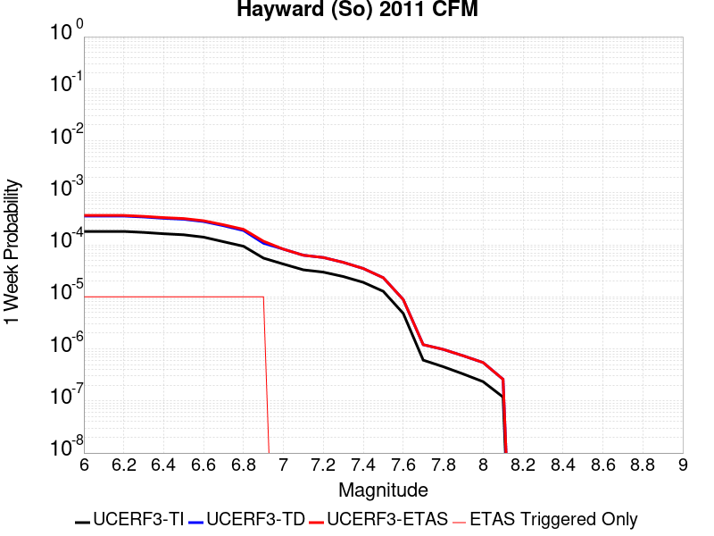 | 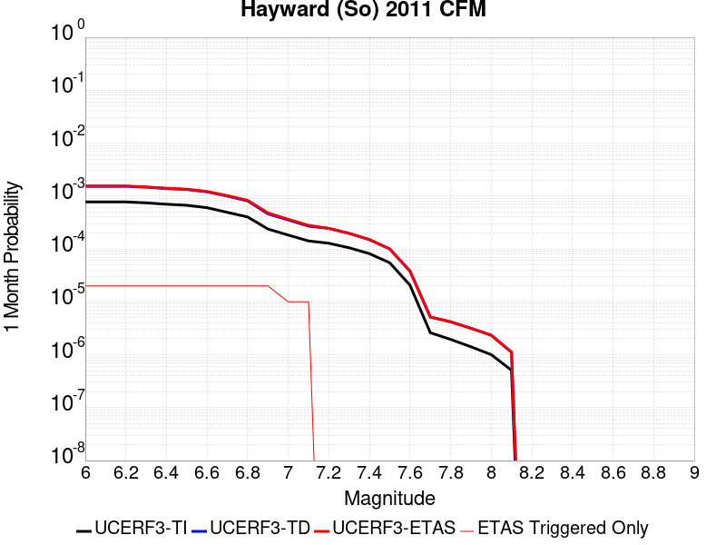 | 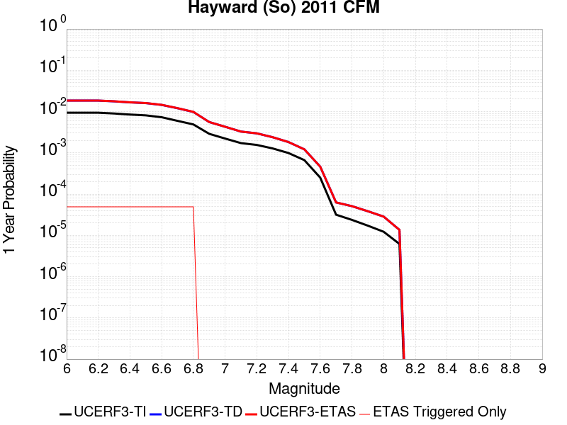 | 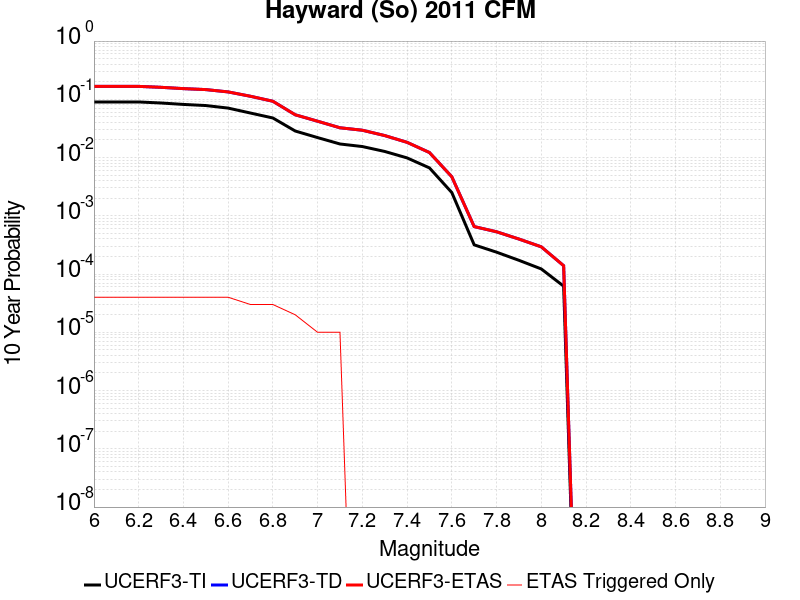 |

| Magnitude | 1 wk TI Prob | 1 wk TD Prob | 1 wk ETAS Prob | 1 wk ETAS/TD Gain | 1 wk ETAS Triggered Only | 1 mo TI Prob | 1 mo TD Prob | 1 mo ETAS Prob | 1 mo ETAS/TD Gain | 1 mo ETAS Triggered Only | 1 yr TI Prob | 1 yr TD Prob | 1 yr ETAS Prob | 1 yr ETAS/TD Gain | 1 yr ETAS Triggered Only | 10 yr TI Prob | 10 yr TD Prob | 10 yr ETAS Prob | 10 yr ETAS/TD Gain | 10 yr ETAS Triggered Only |
|-----|-----|-----|-----|-----|-----|-----|-----|-----|-----|-----|-----|-----|-----|-----|-----|-----|-----|-----|-----|-----|
| 6.0 | 1.8091932E-4 | 3.570673E-4 | 3.670637E-4 | 1.027996 | 1.0E-5 | 7.751381E-4 | 0.0015294008 | 0.0015493702 | 1.013057 | 2.0E-5 | 0.00939654 | 0.018463885 | 0.01849333 | 1.0015948 | 3.0E-5 | 0.090090066 | 0.1667085 | 0.16674182 | 1.0001999 | 4.0E-5 |
| 6.1 | 1.8091932E-4 | 3.570673E-4 | 3.670637E-4 | 1.027996 | 1.0E-5 | 7.751381E-4 | 0.0015294008 | 0.0015493702 | 1.013057 | 2.0E-5 | 0.00939654 | 0.018463885 | 0.01849333 | 1.0015948 | 3.0E-5 | 0.090090066 | 0.1667085 | 0.16674182 | 1.0001999 | 4.0E-5 |
| 6.2 | 1.8091932E-4 | 3.570673E-4 | 3.670637E-4 | 1.027996 | 1.0E-5 | 7.751381E-4 | 0.0015294008 | 0.0015493702 | 1.013057 | 2.0E-5 | 0.00939654 | 0.018463885 | 0.01849333 | 1.0015948 | 3.0E-5 | 0.090090066 | 0.1667085 | 0.16674182 | 1.0001999 | 4.0E-5 |
| 6.3 | 1.7322872E-4 | 3.4263515E-4 | 3.5263173E-4 | 1.0291755 | 1.0E-5 | 7.4219756E-4 | 0.0014676197 | 0.0014875903 | 1.0136075 | 2.0E-5 | 0.0089988755 | 0.017724147 | 0.017753616 | 1.0016626 | 3.0E-5 | 0.08643075 | 0.16065954 | 0.16069311 | 1.000209 | 4.0E-5 |
| 6.4 | 1.6334097E-4 | 3.2345165E-4 | 3.334484E-4 | 1.0309066 | 1.0E-5 | 6.998449E-4 | 0.0013854936 | 0.0014054659 | 1.0144153 | 2.0E-5 | 0.008487372 | 0.016739927 | 0.016769424 | 1.0017622 | 3.0E-5 | 0.081704415 | 0.15256606 | 0.15259995 | 1.0002222 | 4.0E-5 |
| 6.5 | 1.5600289E-4 | 3.101982E-4 | 3.2019507E-4 | 1.0322274 | 1.0E-5 | 6.684125E-4 | 0.0013287518 | 0.0013487253 | 1.0150317 | 2.0E-5 | 0.008107598 | 0.016059443 | 0.016088963 | 1.0018381 | 3.0E-5 | 0.078181036 | 0.14684291 | 0.14687704 | 1.0002325 | 4.0E-5 |
| 6.6 | 1.4046066E-4 | 2.8034003E-4 | 2.9033722E-4 | 1.035661 | 1.0E-5 | 6.018354E-4 | 0.0012009109 | 0.0012208868 | 1.016634 | 2.0E-5 | 0.0073027555 | 0.014524571 | 0.014554135 | 1.0020355 | 3.0E-5 | 0.07067384 | 0.13393044 | 0.13396509 | 1.0002587 | 4.0E-5 |
| 6.7 | 1.14696966E-4 | 2.3272466E-4 | 2.4272234E-4 | 1.0429592 | 1.0E-5 | 4.914658E-4 | 9.970153E-4 | 0.0010169953 | 1.0200399 | 2.0E-5 | 0.0059671924 | 0.012072163 | 0.012101801 | 1.0024551 | 3.0E-5 | 0.058094822 | 0.11274141 | 0.11276803 | 1.0002362 | 3.0E-5 |
| 6.8 | 9.3874296E-5 | 1.8862431E-4 | 1.9862242E-4 | 1.0530055 | 1.0E-5 | 4.0225635E-4 | 8.081431E-4 | 8.2812697E-4 | 1.0247281 | 2.0E-5 | 0.0048864787 | 0.009795489 | 0.009825195 | 1.0030327 | 3.0E-5 | 0.047804173 | 0.092592984 | 0.09262021 | 1.000294 | 3.0E-5 |
| 6.9 | 5.551852E-5 | 1.0729875E-4 | 1.1729768E-4 | 1.0931877 | 1.0E-5 | 2.3791482E-4 | 4.5977137E-4 | 4.7976218E-4 | 1.0434799 | 2.0E-5 | 0.0028927654 | 0.005583468 | 0.005603356 | 1.003562 | 2.0E-5 | 0.028553981 | 0.054246075 | 0.05426499 | 1.0003487 | 2.0E-5 |
| 7.0 | 4.2662363E-5 | 8.246792E-5 | 8.246792E-5 | 1.0 | 0.0 | 1.8282588E-4 | 3.5338648E-4 | 3.6338295E-4 | 1.0282876 | 1.0E-5 | 0.0022236328 | 0.0042940658 | 0.004304023 | 1.0023187 | 1.0E-5 | 0.022015138 | 0.04206509 | 0.04207467 | 1.0002277 | 1.0E-5 |
| 7.1 | 3.305886E-5 | 6.302183E-5 | 6.302183E-5 | 1.0 | 0.0 | 1.4167312E-4 | 2.7006568E-4 | 2.80063E-4 | 1.0370181 | 1.0E-5 | 0.0017235056 | 0.003283111 | 0.0032930782 | 1.0030359 | 1.0E-5 | 0.017101998 | 0.032453902 | 0.03246358 | 1.0002981 | 1.0E-5 |
| 7.2 | 2.9856887E-5 | 5.701622E-5 | 5.701622E-5 | 1.0 | 0.0 | 1.2795182E-4 | 2.4433242E-4 | 2.4433242E-4 | 1.0 | 0.0 | 0.0015567001 | 0.0029707062 | 0.0029707062 | 1.0 | 0.0 | 0.015458403 | 0.029454801 | 0.029454801 | 1.0 | 0.0 |
| 7.3 | 2.4559737E-5 | 4.599286E-5 | 4.599286E-5 | 1.0 | 0.0 | 1.0525176E-4 | 1.9709744E-4 | 1.9709744E-4 | 1.0 | 0.0 | 0.0012806869 | 0.0023970334 | 0.0023970334 | 1.0 | 0.0 | 0.012733313 | 0.023858516 | 0.023858516 | 1.0 | 0.0 |
| 7.4 | 1.9002231E-5 | 3.505084E-5 | 3.505084E-5 | 1.0 | 0.0 | 8.143559E-5 | 1.502093E-4 | 1.502093E-4 | 1.0 | 0.0 | 9.910273E-4 | 0.001827274 | 0.001827274 | 1.0 | 0.0 | 0.009866194 | 0.018258808 | 0.018258808 | 1.0 | 0.0 |
| 7.5 | 1.2783333E-5 | 2.3331182E-5 | 2.3331182E-5 | 1.0 | 0.0 | 5.4784563E-5 | 9.998698E-5 | 9.998698E-5 | 1.0 | 0.0 | 6.667979E-4 | 0.0012166675 | 0.0012166675 | 1.0 | 0.0 | 0.006648007 | 0.012209443 | 0.012209443 | 1.0 | 0.0 |
| 7.6 | 4.8149627E-6 | 8.888056E-6 | 8.888056E-6 | 1.0 | 0.0 | 2.063539E-5 | 3.8091122E-5 | 3.8091122E-5 | 1.0 | 0.0 | 2.5120692E-4 | 4.6366194E-4 | 4.6366194E-4 | 1.0 | 0.0 | 0.0025092314 | 0.0046805087 | 0.0046805087 | 1.0 | 0.0 |
| 7.7 | 6.0838227E-7 | 1.205754E-6 | 1.205754E-6 | 1.0 | 0.0 | 2.6073499E-6 | 5.1675065E-6 | 5.1675065E-6 | 1.0 | 0.0 | 3.174402E-5 | 6.291258E-5 | 6.291258E-5 | 1.0 | 0.0 | 3.1739488E-4 | 6.5296254E-4 | 6.5296254E-4 | 1.0 | 0.0 |
| 7.8 | 4.5542808E-7 | 9.792941E-7 | 9.792941E-7 | 1.0 | 0.0 | 1.9518332E-6 | 4.196968E-6 | 4.196968E-6 | 1.0 | 0.0 | 2.376331E-5 | 5.109689E-5 | 5.109689E-5 | 1.0 | 0.0 | 2.3760769E-4 | 5.321693E-4 | 5.321693E-4 | 1.0 | 0.0 |
| 7.9 | 3.3016747E-7 | 7.3869535E-7 | 7.3869535E-7 | 1.0 | 0.0 | 1.4150027E-6 | 3.1658333E-6 | 3.1658333E-6 | 1.0 | 0.0 | 1.7227521E-5 | 3.854334E-5 | 3.854334E-5 | 1.0 | 0.0 | 1.7226185E-4 | 3.9932923E-4 | 3.9932923E-4 | 1.0 | 0.0 |
| 8.0 | 2.347038E-7 | 5.471963E-7 | 5.471963E-7 | 1.0 | 0.0 | 1.0058731E-6 | 2.3451248E-6 | 2.3451248E-6 | 1.0 | 0.0 | 1.2246436E-5 | 2.8551523E-5 | 2.8551523E-5 | 1.0 | 0.0 | 1.2245761E-4 | 2.9357258E-4 | 2.9357258E-4 | 1.0 | 0.0 |
| 8.1 | 1.18822804E-7 | 2.6060948E-7 | 2.6060948E-7 | 1.0 | 0.0 | 5.092405E-7 | 1.1168972E-6 | 1.1168972E-6 | 1.0 | 0.0 | 6.1999854E-6 | 1.359814E-5 | 1.359814E-5 | 1.0 | 0.0 | 6.199812E-5 | 1.3918082E-4 | 1.3918082E-4 | 1.0 | 0.0 |

## Great Valley 03a Dunnigan Hills
*[(top)](#table-of-contents)*

| 1 Week | 1 Month | 1 Year | 10 Year |
|-----|-----|-----|-----|
|  | 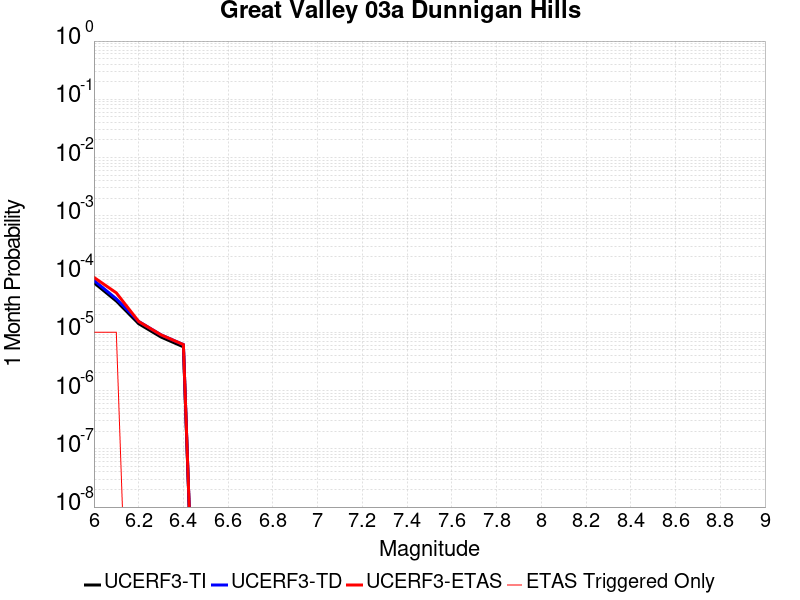 |  | 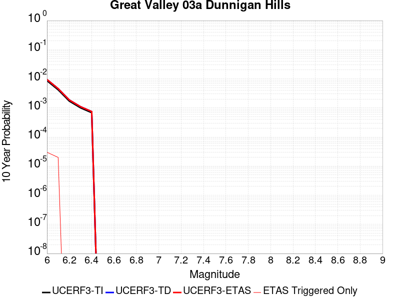 |

| Magnitude | 1 wk TI Prob | 1 wk TD Prob | 1 wk ETAS Prob | 1 wk ETAS/TD Gain | 1 wk ETAS Triggered Only | 1 mo TI Prob | 1 mo TD Prob | 1 mo ETAS Prob | 1 mo ETAS/TD Gain | 1 mo ETAS Triggered Only | 1 yr TI Prob | 1 yr TD Prob | 1 yr ETAS Prob | 1 yr ETAS/TD Gain | 1 yr ETAS Triggered Only | 10 yr TI Prob | 10 yr TD Prob | 10 yr ETAS Prob | 10 yr ETAS/TD Gain | 10 yr ETAS Triggered Only |
|-----|-----|-----|-----|-----|-----|-----|-----|-----|-----|-----|-----|-----|-----|-----|-----|-----|-----|-----|-----|-----|
| 6.0 | 1.6591328E-5 | 1.8107954E-5 | 1.8107954E-5 | 1.0 | 0.0 | 7.110376E-5 | 7.7603596E-5 | 8.760282E-5 | 1.12885 | 1.0E-5 | 8.6534437E-4 | 9.444834E-4 | 9.54474E-4 | 1.0105778 | 1.0E-5 | 0.008619824 | 0.009411525 | 0.009441243 | 1.0031576 | 3.0E-5 |
| 6.1 | 8.041125E-6 | 8.769726E-6 | 8.769726E-6 | 1.0 | 0.0 | 3.4461507E-5 | 3.7584115E-5 | 4.758374E-5 | 1.2660599 | 1.0E-5 | 4.194881E-4 | 4.5751085E-4 | 4.6750627E-4 | 1.0218474 | 1.0E-5 | 0.004186971 | 0.004567687 | 0.004587596 | 1.0043585 | 2.0E-5 |
| 6.2 | 3.2807004E-6 | 3.5795688E-6 | 3.5795688E-6 | 1.0 | 0.0 | 1.4060069E-5 | 1.5340942E-5 | 1.5340942E-5 | 1.0 | 0.0 | 1.7116789E-4 | 1.8676413E-4 | 1.8676413E-4 | 1.0 | 0.0 | 0.0017103611 | 0.0018664796 | 0.0018664796 | 1.0 | 0.0 |
| 6.3 | 1.9339366E-6 | 2.1103806E-6 | 2.1103806E-6 | 1.0 | 0.0 | 8.288273E-6 | 9.044474E-6 | 9.044474E-6 | 1.0 | 0.0 | 1.00905054E-4 | 1.1011375E-4 | 1.1011375E-4 | 1.0 | 0.0 | 0.0010085925 | 0.0011008718 | 0.0011008718 | 1.0 | 0.0 |
| 6.4 | 1.3142635E-6 | 1.4339867E-6 | 1.4339867E-6 | 1.0 | 0.0 | 5.6325457E-6 | 6.145657E-6 | 6.145657E-6 | 1.0 | 0.0 | 6.857408E-5 | 7.482337E-5 | 7.482337E-5 | 1.0 | 0.0 | 6.8552926E-4 | 7.4823375E-4 | 7.4823375E-4 | 1.0 | 0.0 |

## Great Valley 09 (Laguna Seca)
*[(top)](#table-of-contents)*

| 1 Week | 1 Month | 1 Year | 10 Year |
|-----|-----|-----|-----|
| 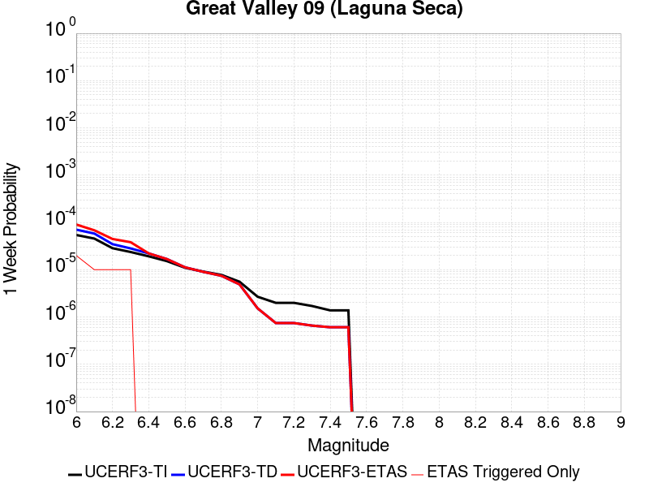 | 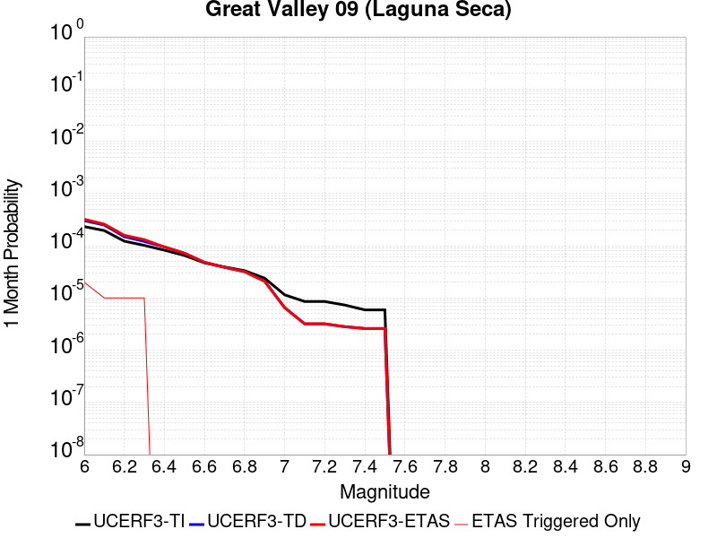 | 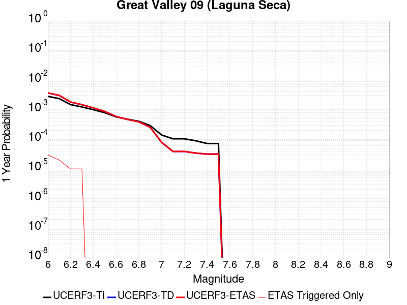 | 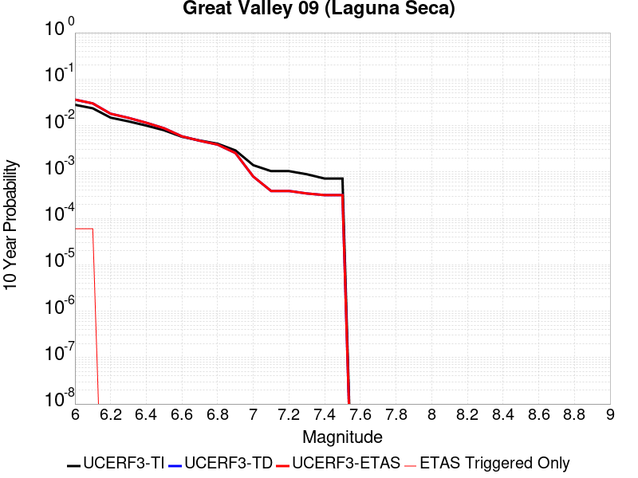 |

| Magnitude | 1 wk TI Prob | 1 wk TD Prob | 1 wk ETAS Prob | 1 wk ETAS/TD Gain | 1 wk ETAS Triggered Only | 1 mo TI Prob | 1 mo TD Prob | 1 mo ETAS Prob | 1 mo ETAS/TD Gain | 1 mo ETAS Triggered Only | 1 yr TI Prob | 1 yr TD Prob | 1 yr ETAS Prob | 1 yr ETAS/TD Gain | 1 yr ETAS Triggered Only | 10 yr TI Prob | 10 yr TD Prob | 10 yr ETAS Prob | 10 yr ETAS/TD Gain | 10 yr ETAS Triggered Only |
|-----|-----|-----|-----|-----|-----|-----|-----|-----|-----|-----|-----|-----|-----|-----|-----|-----|-----|-----|-----|-----|
| 6.0 | 5.4353277E-5 | 7.050019E-5 | 9.0498776E-5 | 1.2836672 | 2.0E-5 | 2.3292181E-4 | 3.0211007E-4 | 3.2210402E-4 | 1.0661811 | 2.0E-5 | 0.0028321352 | 0.0036720056 | 0.0037018955 | 1.00814 | 3.0E-5 | 0.02796312 | 0.036115844 | 0.0361544 | 1.0010675 | 4.0E-5 |
| 6.1 | 4.5578287E-5 | 5.822054E-5 | 6.821996E-5 | 1.1717507 | 1.0E-5 | 1.953209E-4 | 2.4949352E-4 | 2.5949103E-4 | 1.0400712 | 1.0E-5 | 0.0023754383 | 0.0030333549 | 0.0030532943 | 1.0065733 | 2.0E-5 | 0.023502063 | 0.029919893 | 0.029948995 | 1.0009726 | 3.0E-5 |
| 6.2 | 2.8536782E-5 | 3.4736422E-5 | 4.4736073E-5 | 1.2878723 | 1.0E-5 | 1.2229476E-4 | 1.4886161E-4 | 1.5886012E-4 | 1.0671664 | 1.0E-5 | 0.0014879217 | 0.0018108576 | 0.0018208395 | 1.0055122 | 1.0E-5 | 0.014779986 | 0.017958276 | 0.017977918 | 1.0010937 | 2.0E-5 |
| 6.3 | 2.3698774E-5 | 2.8213344E-5 | 3.8213064E-5 | 1.3544322 | 1.0E-5 | 1.01562226E-4 | 1.2090833E-4 | 1.3090711E-4 | 1.0826973 | 1.0E-5 | 0.0012358186 | 0.001471051 | 0.0014810363 | 1.0067879 | 1.0E-5 | 0.012289686 | 0.014611455 | 0.014631162 | 1.0013487 | 2.0E-5 |
| 6.4 | 1.9191197E-5 | 2.212289E-5 | 2.212289E-5 | 1.0 | 0.0 | 8.2245395E-5 | 9.4808805E-5 | 9.4808805E-5 | 1.0 | 0.0 | 0.0010008777 | 0.0011536906 | 0.0011536906 | 1.0 | 0.0 | 0.009963818 | 0.011477022 | 0.011477022 | 1.0 | 0.0 |
| 6.5 | 1.5203241E-5 | 1.6801298E-5 | 1.6801298E-5 | 1.0 | 0.0 | 6.5155116E-5 | 7.200338E-5 | 7.200338E-5 | 1.0 | 0.0 | 7.9297484E-4 | 8.76301E-4 | 8.76301E-4 | 1.0 | 0.0 | 0.007901512 | 0.008729581 | 0.008729581 | 1.0 | 0.0 |
| 6.6 | 1.0984925E-5 | 1.12425605E-5 | 1.12425605E-5 | 1.0 | 0.0 | 4.70774E-5 | 4.8181533E-5 | 4.8181533E-5 | 1.0 | 0.0 | 5.730166E-4 | 5.8645604E-4 | 5.8645604E-4 | 1.0 | 0.0 | 0.005715413 | 0.0058494755 | 0.0058494755 | 1.0 | 0.0 |
| 6.7 | 9.134616E-6 | 9.019868E-6 | 9.019868E-6 | 1.0 | 0.0 | 3.9147766E-5 | 3.865602E-5 | 3.865602E-5 | 1.0 | 0.0 | 4.7651984E-4 | 4.7053778E-4 | 4.7053778E-4 | 1.0 | 0.0 | 0.004754993 | 0.00469566 | 0.00469566 | 1.0 | 0.0 |
| 6.8 | 7.785589E-6 | 7.4519185E-6 | 7.4519185E-6 | 1.0 | 0.0 | 3.3366385E-5 | 3.1936415E-5 | 3.1936415E-5 | 1.0 | 0.0 | 4.0616E-4 | 3.887585E-4 | 3.887585E-4 | 1.0 | 0.0 | 0.0040541845 | 0.003880988 | 0.003880988 | 1.0 | 0.0 |
| 6.9 | 5.579095E-6 | 4.8984666E-6 | 4.8984666E-6 | 1.0 | 0.0 | 2.3910188E-5 | 2.0993268E-5 | 2.0993268E-5 | 1.0 | 0.0 | 2.9106764E-4 | 2.5556443E-4 | 2.5556443E-4 | 1.0 | 0.0 | 0.002906867 | 0.0025528427 | 0.0025528427 | 1.0 | 0.0 |
| 7.0 | 2.6816688E-6 | 1.521587E-6 | 1.521587E-6 | 1.0 | 0.0 | 1.1492816E-5 | 6.521071E-6 | 6.521071E-6 | 1.0 | 0.0 | 1.3991605E-4 | 7.939124E-5 | 7.939124E-5 | 1.0 | 0.0 | 0.0013982799 | 7.936375E-4 | 7.936375E-4 | 1.0 | 0.0 |
| 7.1 | 1.9951021E-6 | 7.45357E-7 | 7.45357E-7 | 1.0 | 0.0 | 8.55041E-6 | 3.1943835E-6 | 3.1943835E-6 | 1.0 | 0.0 | 1.0409627E-4 | 3.889097E-5 | 3.889097E-5 | 1.0 | 0.0 | 0.0010404752 | 3.8884574E-4 | 3.8884574E-4 | 1.0 | 0.0 |
| 7.2 | 1.9951021E-6 | 7.45357E-7 | 7.45357E-7 | 1.0 | 0.0 | 8.55041E-6 | 3.1943835E-6 | 3.1943835E-6 | 1.0 | 0.0 | 1.0409627E-4 | 3.889097E-5 | 3.889097E-5 | 1.0 | 0.0 | 0.0010404752 | 3.8884574E-4 | 3.8884574E-4 | 1.0 | 0.0 |
| 7.3 | 1.7087556E-6 | 6.578663E-7 | 6.578663E-7 | 1.0 | 0.0 | 7.3232177E-6 | 2.819424E-6 | 2.819424E-6 | 1.0 | 0.0 | 8.915652E-5 | 3.432599E-5 | 3.432599E-5 | 1.0 | 0.0 | 8.9120766E-4 | 3.432109E-4 | 3.432109E-4 | 1.0 | 0.0 |
| 7.4 | 1.3804846E-6 | 6.0737113E-7 | 6.0737113E-7 | 1.0 | 0.0 | 5.916349E-6 | 2.6030168E-6 | 2.6030168E-6 | 1.0 | 0.0 | 7.2029165E-5 | 3.169131E-5 | 3.169131E-5 | 1.0 | 0.0 | 7.200583E-4 | 3.168719E-4 | 3.168719E-4 | 1.0 | 0.0 |
| 7.5 | 1.3804846E-6 | 6.0737113E-7 | 6.0737113E-7 | 1.0 | 0.0 | 5.916349E-6 | 2.6030168E-6 | 2.6030168E-6 | 1.0 | 0.0 | 7.2029165E-5 | 3.169131E-5 | 3.169131E-5 | 1.0 | 0.0 | 7.200583E-4 | 3.168719E-4 | 3.168719E-4 | 1.0 | 0.0 |

## San Andreas (Santa Cruz Mts) 2011 CFM
*[(top)](#table-of-contents)*

| 1 Week | 1 Month | 1 Year | 10 Year |
|-----|-----|-----|-----|
| 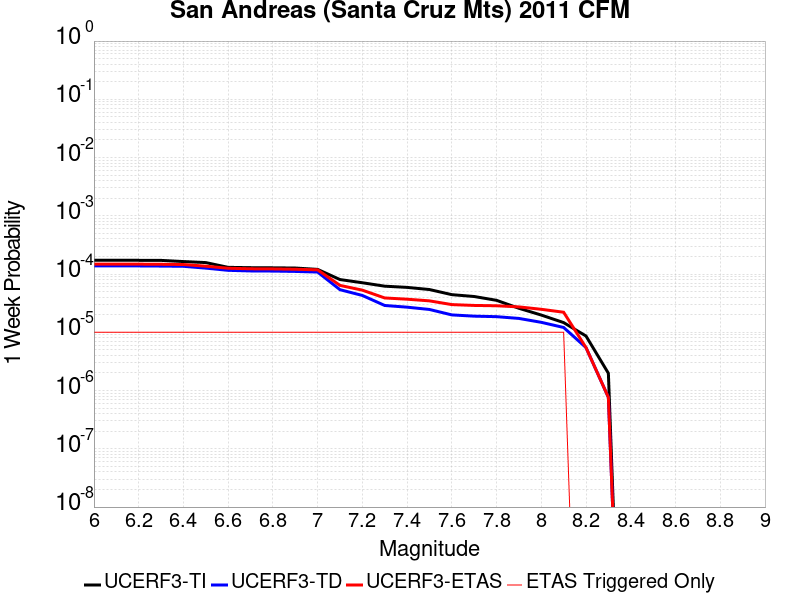 | 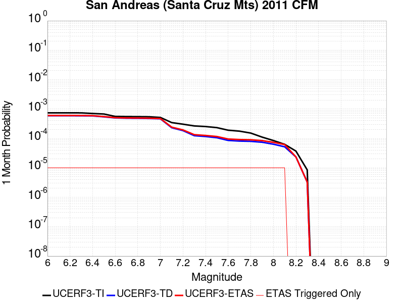 | 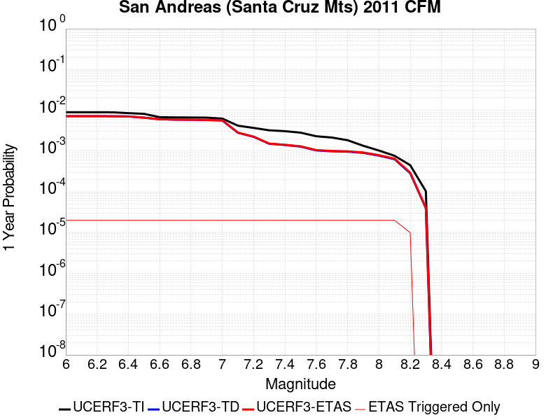 | 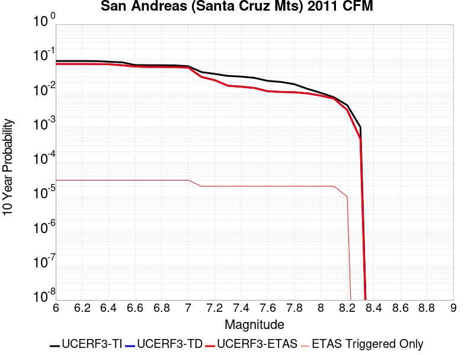 |

| Magnitude | 1 wk TI Prob | 1 wk TD Prob | 1 wk ETAS Prob | 1 wk ETAS/TD Gain | 1 wk ETAS Triggered Only | 1 mo TI Prob | 1 mo TD Prob | 1 mo ETAS Prob | 1 mo ETAS/TD Gain | 1 mo ETAS Triggered Only | 1 yr TI Prob | 1 yr TD Prob | 1 yr ETAS Prob | 1 yr ETAS/TD Gain | 1 yr ETAS Triggered Only | 10 yr TI Prob | 10 yr TD Prob | 10 yr ETAS Prob | 10 yr ETAS/TD Gain | 10 yr ETAS Triggered Only |
|-----|-----|-----|-----|-----|-----|-----|-----|-----|-----|-----|-----|-----|-----|-----|-----|-----|-----|-----|-----|-----|
| 6.0 | 1.7221631E-4 | 1.3792426E-4 | 1.4792288E-4 | 1.0724936 | 1.0E-5 | 7.378611E-4 | 5.9097214E-4 | 6.009662E-4 | 1.0169113 | 1.0E-5 | 0.008946515 | 0.0071717235 | 0.0071915803 | 1.0027688 | 2.0E-5 | 0.08594794 | 0.07054796 | 0.07057585 | 1.0003953 | 3.0E-5 |
| 6.1 | 1.7221631E-4 | 1.3792426E-4 | 1.4792288E-4 | 1.0724936 | 1.0E-5 | 7.378611E-4 | 5.9097214E-4 | 6.009662E-4 | 1.0169113 | 1.0E-5 | 0.008946515 | 0.0071717235 | 0.0071915803 | 1.0027688 | 2.0E-5 | 0.08594794 | 0.07054796 | 0.07057585 | 1.0003953 | 3.0E-5 |
| 6.2 | 1.7221631E-4 | 1.3792426E-4 | 1.4792288E-4 | 1.0724936 | 1.0E-5 | 7.378611E-4 | 5.9097214E-4 | 6.009662E-4 | 1.0169113 | 1.0E-5 | 0.008946515 | 0.0071717235 | 0.0071915803 | 1.0027688 | 2.0E-5 | 0.08594794 | 0.07054796 | 0.07057585 | 1.0003953 | 3.0E-5 |
| 6.3 | 1.716926E-4 | 1.3711878E-4 | 1.4711742E-4 | 1.0729195 | 1.0E-5 | 7.3561794E-4 | 5.8752164E-4 | 5.975158E-4 | 1.0170107 | 1.0E-5 | 0.008919428 | 0.007129989 | 0.0071498468 | 1.0027851 | 2.0E-5 | 0.08569809 | 0.07015993 | 0.07018782 | 1.0003976 | 3.0E-5 |
| 6.4 | 1.6392978E-4 | 1.3587909E-4 | 1.4587774E-4 | 1.0735848 | 1.0E-5 | 7.02367E-4 | 5.82211E-4 | 5.922052E-4 | 1.0171659 | 1.0E-5 | 0.008517839 | 0.0070657525 | 0.007085611 | 1.0028106 | 2.0E-5 | 0.08198654 | 0.069394976 | 0.06942289 | 1.0004023 | 3.0E-5 |
| 6.5 | 1.5742714E-4 | 1.2647794E-4 | 1.3647668E-4 | 1.0790552 | 1.0E-5 | 6.745133E-4 | 5.419374E-4 | 5.51932E-4 | 1.0184423 | 1.0E-5 | 0.00818132 | 0.0065784375 | 0.006598306 | 1.0030203 | 2.0E-5 | 0.078865945 | 0.06486093 | 0.064888984 | 1.0004325 | 3.0E-5 |
| 6.6 | 1.3038084E-4 | 1.1587992E-4 | 1.2587877E-4 | 1.0862862 | 1.0E-5 | 5.5865536E-4 | 4.96535E-4 | 5.0653005E-4 | 1.0201296 | 1.0E-5 | 0.006780438 | 0.006028784 | 0.0060486635 | 1.0032974 | 2.0E-5 | 0.0657725 | 0.059330538 | 0.059358757 | 1.0004756 | 3.0E-5 |
| 6.7 | 1.2867592E-4 | 1.1314491E-4 | 1.2314378E-4 | 1.0883722 | 1.0E-5 | 5.5135164E-4 | 4.8481792E-4 | 4.948131E-4 | 1.0206163 | 1.0E-5 | 0.0066920654 | 0.005886907 | 0.0059067896 | 1.0033773 | 2.0E-5 | 0.06494093 | 0.058041416 | 0.058069672 | 1.0004869 | 3.0E-5 |
| 6.8 | 1.2801298E-4 | 1.12520516E-4 | 1.2251938E-4 | 1.0888627 | 1.0E-5 | 5.485117E-4 | 4.8214293E-4 | 4.921381E-4 | 1.0207307 | 1.0E-5 | 0.0066577005 | 0.0058545293 | 0.0058744126 | 1.0033962 | 2.0E-5 | 0.06461738 | 0.05775524 | 0.057783507 | 1.0004895 | 3.0E-5 |
| 6.9 | 1.269149E-4 | 1.1094256E-4 | 1.2094145E-4 | 1.0901268 | 1.0E-5 | 5.4380763E-4 | 4.7538272E-4 | 4.8537797E-4 | 1.0210257 | 1.0E-5 | 0.006600777 | 0.005772663 | 0.0057925475 | 1.0034446 | 2.0E-5 | 0.06408122 | 0.057027116 | 0.057055406 | 1.000496 | 3.0E-5 |
| 7.0 | 1.2030331E-4 | 1.0824356E-4 | 1.1824248E-4 | 1.0923742 | 1.0E-5 | 5.154837E-4 | 4.638198E-4 | 4.7381516E-4 | 1.02155 | 1.0E-5 | 0.006257969 | 0.0056326203 | 0.0056525073 | 1.0035307 | 2.0E-5 | 0.06084648 | 0.055699922 | 0.055728253 | 1.0005085 | 3.0E-5 |
| 7.1 | 8.049617E-5 | 5.392429E-5 | 6.392375E-5 | 1.1854352 | 1.0E-5 | 3.4493793E-4 | 2.3108382E-4 | 2.410815E-4 | 1.0432644 | 1.0E-5 | 0.0041915346 | 0.0028098505 | 0.0028297943 | 1.0070978 | 2.0E-5 | 0.041133516 | 0.029618833 | 0.02963824 | 1.0006553 | 2.0E-5 |
| 7.2 | 7.093979E-5 | 4.2935415E-5 | 5.2934985E-5 | 1.232898 | 1.0E-5 | 3.0399222E-4 | 1.8399608E-4 | 1.9399423E-4 | 1.0543389 | 1.0E-5 | 0.0036948253 | 0.0022378736 | 0.0022578288 | 1.0089171 | 2.0E-5 | 0.03633994 | 0.023941126 | 0.023960648 | 1.0008154 | 2.0E-5 |
| 7.3 | 6.193693E-5 | 2.8891074E-5 | 3.8890787E-5 | 1.3461176 | 1.0E-5 | 2.6541698E-4 | 1.2381302E-4 | 1.3381179E-4 | 1.0807569 | 1.0E-5 | 0.0032266637 | 0.001506383 | 0.0015263528 | 1.0132568 | 2.0E-5 | 0.031802133 | 0.016497677 | 0.016517347 | 1.0011923 | 2.0E-5 |
| 7.4 | 5.906492E-5 | 2.7020369E-5 | 3.7020098E-5 | 1.3700812 | 1.0E-5 | 2.5311083E-4 | 1.1579645E-4 | 1.2579528E-4 | 1.0863484 | 1.0E-5 | 0.0030772698 | 0.0014089114 | 0.0014288833 | 1.0141754 | 2.0E-5 | 0.030350044 | 0.0154695045 | 0.0154891955 | 1.0012729 | 2.0E-5 |
| 7.5 | 5.424296E-5 | 2.4675093E-5 | 3.4674846E-5 | 1.405257 | 1.0E-5 | 2.324491E-4 | 1.0574612E-4 | 1.1574506E-4 | 1.0945561 | 1.0E-5 | 0.002826395 | 0.0012866998 | 0.0013066741 | 1.0155237 | 2.0E-5 | 0.027907165 | 0.014161854 | 0.014181571 | 1.0013922 | 2.0E-5 |
| 7.6 | 4.43084E-5 | 1.990151E-5 | 2.9901312E-5 | 1.5024644 | 1.0E-5 | 1.8987931E-4 | 8.528939E-5 | 9.5288546E-5 | 1.1172379 | 1.0E-5 | 0.0023093296 | 0.001037904 | 0.0010578833 | 1.0192496 | 2.0E-5 | 0.022854783 | 0.011411123 | 0.011430895 | 1.0017327 | 2.0E-5 |
| 7.7 | 4.118098E-5 | 1.8933848E-5 | 2.8933659E-5 | 1.5281447 | 1.0E-5 | 1.7647797E-4 | 8.1142534E-5 | 9.114172E-5 | 1.12323 | 1.0E-5 | 0.002146502 | 9.874629E-4 | 0.0010074432 | 1.0202339 | 2.0E-5 | 0.021258866 | 0.010868995 | 0.010888778 | 1.0018201 | 2.0E-5 |
| 7.8 | 3.5408906E-5 | 1.856201E-5 | 2.8561824E-5 | 1.5387248 | 1.0E-5 | 1.5174363E-4 | 7.954905E-5 | 8.954825E-5 | 1.1256986 | 1.0E-5 | 0.0018459131 | 9.6807955E-4 | 9.880601E-4 | 1.0206394 | 2.0E-5 | 0.018306552 | 0.0106506655 | 0.010670452 | 1.0018578 | 2.0E-5 |
| 7.9 | 2.5860836E-5 | 1.7313954E-5 | 2.7313781E-5 | 1.5775588 | 1.0E-5 | 1.10827445E-4 | 7.420055E-5 | 8.419981E-5 | 1.1347599 | 1.0E-5 | 0.001348489 | 9.030175E-4 | 9.2299946E-4 | 1.022128 | 2.0E-5 | 0.013403354 | 0.009906601 | 0.009926403 | 1.0019989 | 2.0E-5 |
| 8.0 | 1.9777332E-5 | 1.4837888E-5 | 2.4837738E-5 | 1.6739404 | 1.0E-5 | 8.4757245E-5 | 6.3589396E-5 | 7.358876E-5 | 1.157249 | 1.0E-5 | 0.0010314309 | 7.739261E-4 | 7.939106E-4 | 1.0258223 | 2.0E-5 | 0.010266567 | 0.008508087 | 0.008527917 | 1.0023307 | 2.0E-5 |
| 8.1 | 1.468494E-5 | 1.2105831E-5 | 2.210571E-5 | 1.8260382 | 1.0E-5 | 6.293394E-5 | 5.1881103E-5 | 6.1880586E-5 | 1.1927384 | 1.0E-5 | 7.6595135E-4 | 6.3146953E-4 | 6.5145694E-4 | 1.0316522 | 2.0E-5 | 0.0076331664 | 0.0069684954 | 0.0069883564 | 1.00285 | 2.0E-5 |
| 8.2 | 8.63836E-6 | 5.4678667E-6 | 5.4678667E-6 | 1.0 | 0.0 | 3.7021015E-5 | 2.3433504E-5 | 2.3433504E-5 | 1.0 | 0.0 | 4.5063766E-4 | 2.8526565E-4 | 2.9526278E-4 | 1.035045 | 1.0E-5 | 0.004497249 | 0.003245162 | 0.0032551298 | 1.0030715 | 1.0E-5 |
| 8.3 | 1.983087E-6 | 7.6564595E-7 | 7.6564595E-7 | 1.0 | 0.0 | 8.498917E-6 | 3.281336E-6 | 3.281336E-6 | 1.0 | 0.0 | 1.034694E-4 | 3.9949547E-5 | 3.9949547E-5 | 1.0 | 0.0 | 0.0010342124 | 4.717979E-4 | 4.717979E-4 | 1.0 | 0.0 |

## Maacama 2011 CFM
*[(top)](#table-of-contents)*

| 1 Week | 1 Month | 1 Year | 10 Year |
|-----|-----|-----|-----|
| 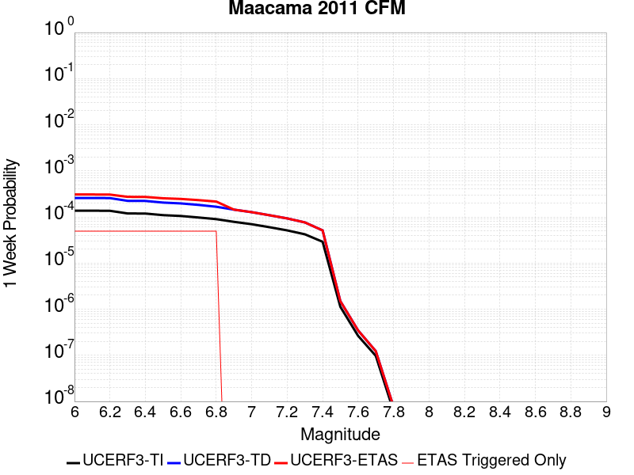 | 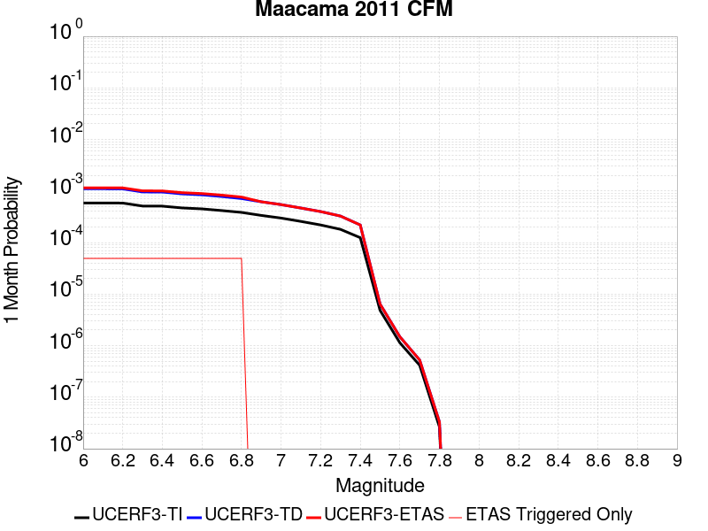 | 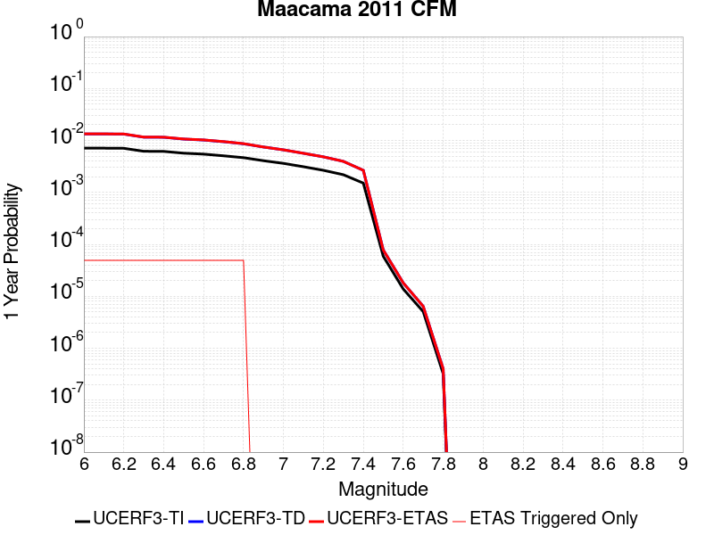 | 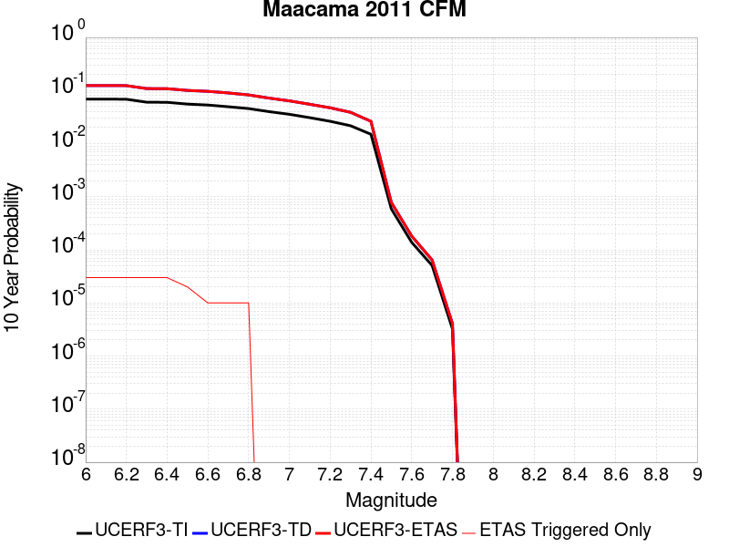 |

| Magnitude | 1 wk TI Prob | 1 wk TD Prob | 1 wk ETAS Prob | 1 wk ETAS/TD Gain | 1 wk ETAS Triggered Only | 1 mo TI Prob | 1 mo TD Prob | 1 mo ETAS Prob | 1 mo ETAS/TD Gain | 1 mo ETAS Triggered Only | 1 yr TI Prob | 1 yr TD Prob | 1 yr ETAS Prob | 1 yr ETAS/TD Gain | 1 yr ETAS Triggered Only | 10 yr TI Prob | 10 yr TD Prob | 10 yr ETAS Prob | 10 yr ETAS/TD Gain | 10 yr ETAS Triggered Only |
|-----|-----|-----|-----|-----|-----|-----|-----|-----|-----|-----|-----|-----|-----|-----|-----|-----|-----|-----|-----|-----|
| 6.0 | 1.368203E-4 | 2.579087E-4 | 2.7790354E-4 | 1.0775268 | 2.0E-5 | 5.862409E-4 | 0.0011047592 | 0.0011247371 | 1.0180835 | 2.0E-5 | 0.0071141496 | 0.013350345 | 0.013370078 | 1.0014781 | 2.0E-5 | 0.06890667 | 0.1241916 | 0.124217875 | 1.0002116 | 3.0E-5 |
| 6.1 | 1.368203E-4 | 2.579087E-4 | 2.7790354E-4 | 1.0775268 | 2.0E-5 | 5.862409E-4 | 0.0011047592 | 0.0011247371 | 1.0180835 | 2.0E-5 | 0.0071141496 | 0.013350345 | 0.013370078 | 1.0014781 | 2.0E-5 | 0.06890667 | 0.1241916 | 0.124217875 | 1.0002116 | 3.0E-5 |
| 6.2 | 1.360743E-4 | 2.566557E-4 | 2.766506E-4 | 1.0779054 | 2.0E-5 | 5.8304524E-4 | 0.001099394 | 0.0011193721 | 1.0181718 | 2.0E-5 | 0.007075496 | 0.013285898 | 0.0133056315 | 1.0014853 | 2.0E-5 | 0.06854413 | 0.123625994 | 0.12365229 | 1.0002127 | 3.0E-5 |
| 6.3 | 1.1917239E-4 | 2.236021E-4 | 2.4359763E-4 | 1.0894246 | 2.0E-5 | 5.1063887E-4 | 9.578717E-4 | 9.778526E-4 | 1.0208596 | 2.0E-5 | 0.0061993203 | 0.0115873255 | 0.011607094 | 1.001706 | 2.0E-5 | 0.060292065 | 0.108845875 | 0.10887261 | 1.0002456 | 3.0E-5 |
| 6.4 | 1.1859289E-4 | 2.2263796E-4 | 2.4263351E-4 | 1.0898119 | 2.0E-5 | 5.0815626E-4 | 9.537432E-4 | 9.737241E-4 | 1.02095 | 2.0E-5 | 0.006169266 | 0.011537647 | 0.011557416 | 1.0017135 | 2.0E-5 | 0.06000784 | 0.10840272 | 0.10842947 | 1.0002468 | 3.0E-5 |
| 6.5 | 1.09512424E-4 | 2.0517908E-4 | 2.2517498E-4 | 1.0974559 | 2.0E-5 | 4.6925453E-4 | 8.7897904E-4 | 8.9896144E-4 | 1.0227337 | 2.0E-5 | 0.005698218 | 0.010639169 | 0.010658956 | 1.0018599 | 2.0E-5 | 0.055543028 | 0.1004949 | 0.100512885 | 1.000179 | 2.0E-5 |
| 6.6 | 1.0502928E-4 | 1.9675294E-4 | 2.0675096E-4 | 1.0508151 | 1.0E-5 | 4.500478E-4 | 8.429031E-4 | 8.528946E-4 | 1.0118538 | 1.0E-5 | 0.0054655746 | 0.010205293 | 0.010215191 | 1.0009699 | 1.0E-5 | 0.053330887 | 0.0966474 | 0.096656434 | 1.0000935 | 1.0E-5 |
| 6.7 | 9.739358E-5 | 1.8259176E-4 | 1.9258993E-4 | 1.054757 | 1.0E-5 | 4.173343E-4 | 7.822563E-4 | 7.9224847E-4 | 1.0127735 | 1.0E-5 | 0.0050692135 | 0.009475343 | 0.009485248 | 1.0010453 | 1.0E-5 | 0.049551267 | 0.09012011 | 0.090129204 | 1.000101 | 1.0E-5 |
| 6.8 | 8.969524E-5 | 1.6658378E-4 | 1.765821E-4 | 1.0600199 | 1.0E-5 | 3.8435153E-4 | 7.1369443E-4 | 7.236873E-4 | 1.0140016 | 1.0E-5 | 0.0046694432 | 0.00864909 | 0.008659003 | 1.0011462 | 1.0E-5 | 0.045725387 | 0.08265246 | 0.082661636 | 1.000111 | 1.0E-5 |
| 6.9 | 7.838291E-5 | 1.4418772E-4 | 1.4418772E-4 | 1.0 | 0.0 | 3.358835E-4 | 6.1778206E-4 | 6.1778206E-4 | 1.0 | 0.0 | 0.0040817154 | 0.007491724 | 0.007491724 | 1.0 | 0.0 | 0.04007554 | 0.07205298 | 0.07205298 | 1.0 | 0.0 |
| 7.0 | 6.961957E-5 | 1.2708071E-4 | 1.2708071E-4 | 1.0 | 0.0 | 2.9833548E-4 | 5.445059E-4 | 5.445059E-4 | 1.0 | 0.0 | 0.0036261857 | 0.006606692 | 0.006606692 | 1.0 | 0.0 | 0.035675827 | 0.063871816 | 0.063871816 | 1.0 | 0.0 |
| 7.1 | 5.999398E-5 | 1.09053384E-4 | 1.09053384E-4 | 1.0 | 0.0 | 2.570917E-4 | 4.6728246E-4 | 4.6728246E-4 | 1.0 | 0.0 | 0.0031255994 | 0.00567284 | 0.00567284 | 1.0 | 0.0 | 0.030820016 | 0.055139277 | 0.055139277 | 1.0 | 0.0 |
| 7.2 | 5.116532E-5 | 9.305489E-5 | 9.305489E-5 | 1.0 | 0.0 | 2.1926152E-4 | 3.9874107E-4 | 3.9874107E-4 | 1.0 | 0.0 | 0.002666241 | 0.00484315 | 0.00484315 | 1.0 | 0.0 | 0.026344774 | 0.047303654 | 0.047303654 | 1.0 | 0.0 |
| 7.3 | 4.2087835E-5 | 7.617064E-5 | 7.617064E-5 | 1.0 | 0.0 | 1.8036396E-4 | 3.264016E-4 | 3.264016E-4 | 1.0 | 0.0 | 0.0021937196 | 0.0039662397 | 0.0039662397 | 1.0 | 0.0 | 0.0217219 | 0.038905017 | 0.038905017 | 1.0 | 0.0 |
| 7.4 | 2.8991652E-5 | 5.1163643E-5 | 5.1163643E-5 | 1.0 | 0.0 | 1.2424402E-4 | 2.1925455E-4 | 2.1925455E-4 | 1.0 | 0.0 | 0.0015116213 | 0.0026661097 | 0.0026661097 | 1.0 | 0.0 | 0.015013801 | 0.026332043 | 0.026332043 | 1.0 | 0.0 |
| 7.5 | 1.1292299E-6 | 1.4950216E-6 | 1.4950216E-6 | 1.0 | 0.0 | 4.8395473E-6 | 6.407227E-6 | 6.407227E-6 | 1.0 | 0.0 | 5.8919897E-5 | 7.8006444E-5 | 7.8006444E-5 | 1.0 | 0.0 | 5.890428E-4 | 7.805042E-4 | 7.805042E-4 | 1.0 | 0.0 |
| 7.6 | 2.6535366E-7 | 3.4720998E-7 | 3.4720998E-7 | 1.0 | 0.0 | 1.1372296E-6 | 1.4880419E-6 | 1.4880419E-6 | 1.0 | 0.0 | 1.3845682E-5 | 1.811676E-5 | 1.811676E-5 | 1.0 | 0.0 | 1.3844819E-4 | 1.8170691E-4 | 1.8170691E-4 | 1.0 | 0.0 |
| 7.7 | 9.727789E-8 | 1.2302418E-7 | 1.2302418E-7 | 1.0 | 0.0 | 4.1690518E-7 | 5.2724636E-7 | 5.2724636E-7 | 1.0 | 0.0 | 5.0758085E-6 | 6.419206E-6 | 6.419206E-6 | 1.0 | 0.0 | 5.0756928E-5 | 6.456404E-5 | 6.456404E-5 | 1.0 | 0.0 |
| 7.8 | 6.1939325E-9 | 7.711711E-9 | 7.711711E-9 | 1.0 | 0.0 | 2.6545425E-8 | 3.305019E-8 | 3.305019E-8 | 1.0 | 0.0 | 3.231905E-7 | 4.0238598E-7 | 4.0238598E-7 | 1.0 | 0.0 | 3.2319003E-6 | 4.0597915E-6 | 4.0597915E-6 | 1.0 | 0.0 |

## Hunting Creek - Berryessa 2011 CFM
*[(top)](#table-of-contents)*

| 1 Week | 1 Month | 1 Year | 10 Year |
|-----|-----|-----|-----|
| 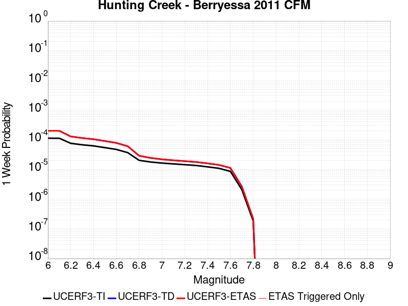 | 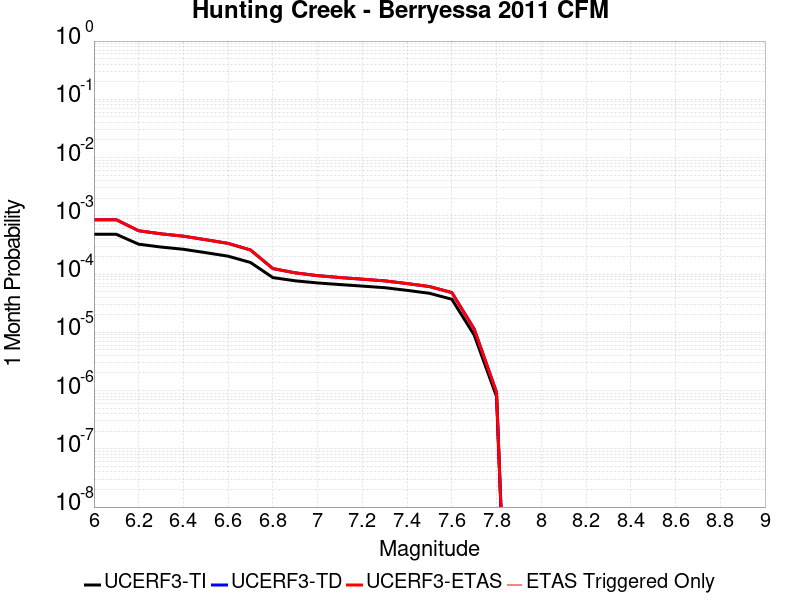 | 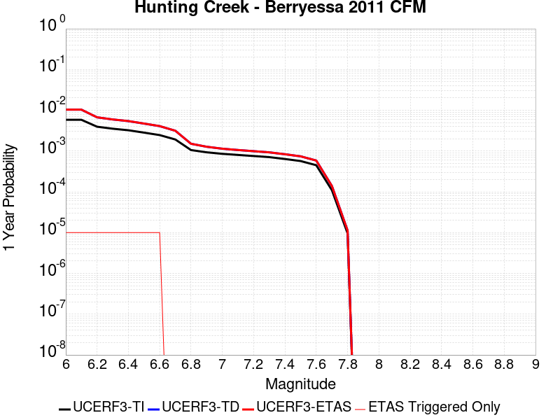 | 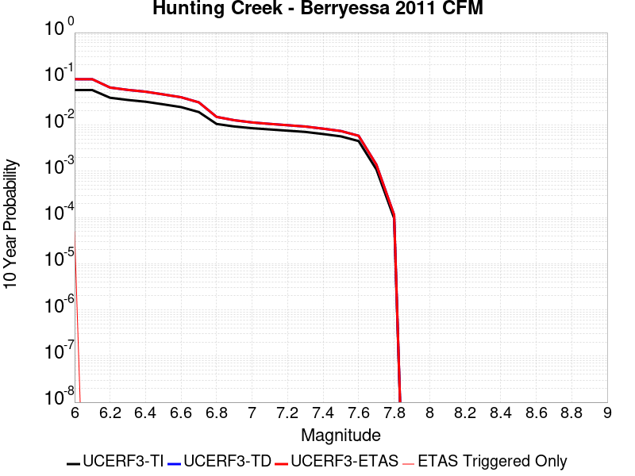 |

| Magnitude | 1 wk TI Prob | 1 wk TD Prob | 1 wk ETAS Prob | 1 wk ETAS/TD Gain | 1 wk ETAS Triggered Only | 1 mo TI Prob | 1 mo TD Prob | 1 mo ETAS Prob | 1 mo ETAS/TD Gain | 1 mo ETAS Triggered Only | 1 yr TI Prob | 1 yr TD Prob | 1 yr ETAS Prob | 1 yr ETAS/TD Gain | 1 yr ETAS Triggered Only | 10 yr TI Prob | 10 yr TD Prob | 10 yr ETAS Prob | 10 yr ETAS/TD Gain | 10 yr ETAS Triggered Only |
|-----|-----|-----|-----|-----|-----|-----|-----|-----|-----|-----|-----|-----|-----|-----|-----|-----|-----|-----|-----|-----|
| 6.0 | 1.1270982E-4 | 2.0028367E-4 | 2.0028367E-4 | 1.0 | 0.0 | 4.8295266E-4 | 8.579912E-4 | 8.579912E-4 | 1.0 | 0.0 | 0.0058641075 | 0.010386173 | 0.010396069 | 1.0009528 | 1.0E-5 | 0.057117578 | 0.09804048 | 0.09806754 | 1.000276 | 3.0E-5 |
| 6.1 | 1.1239393E-4 | 1.9976508E-4 | 1.9976508E-4 | 1.0 | 0.0 | 4.8159933E-4 | 8.557703E-4 | 8.557703E-4 | 1.0 | 0.0 | 0.0058477195 | 0.010359417 | 0.010369313 | 1.0009553 | 1.0E-5 | 0.056962132 | 0.09779895 | 0.097817 | 1.0001845 | 2.0E-5 |
| 6.2 | 7.596265E-5 | 1.2933646E-4 | 1.2933646E-4 | 1.0 | 0.0 | 3.2551357E-4 | 5.5415573E-4 | 5.5415573E-4 | 1.0 | 0.0 | 0.0039559277 | 0.0067213587 | 0.006731292 | 1.0014778 | 1.0E-5 | 0.038862433 | 0.06459229 | 0.064610995 | 1.0002897 | 2.0E-5 |
| 6.3 | 6.78794E-5 | 1.1448377E-4 | 1.1448377E-4 | 1.0 | 0.0 | 2.9087928E-4 | 4.9052597E-4 | 4.9052597E-4 | 1.0 | 0.0 | 0.003535705 | 0.005952661 | 0.0059626014 | 1.0016699 | 1.0E-5 | 0.034799766 | 0.057466213 | 0.057485063 | 1.0003281 | 2.0E-5 |
| 6.4 | 6.2165134E-5 | 1.0434825E-4 | 1.0434825E-4 | 1.0 | 0.0 | 2.6639478E-4 | 4.4711027E-4 | 4.4711027E-4 | 1.0 | 0.0 | 0.0032385332 | 0.0054274183 | 0.005437364 | 1.0018325 | 1.0E-5 | 0.03191742 | 0.05255138 | 0.052570328 | 1.0003606 | 2.0E-5 |
| 6.5 | 5.4368087E-5 | 9.070258E-5 | 9.070258E-5 | 1.0 | 0.0 | 2.3298527E-4 | 3.886537E-4 | 3.886537E-4 | 1.0 | 0.0 | 0.0028329059 | 0.0047197016 | 0.0047296546 | 1.0021088 | 1.0E-5 | 0.027970633 | 0.045881182 | 0.045900263 | 1.0004159 | 2.0E-5 |
| 6.6 | 4.729947E-5 | 7.847101E-5 | 7.847101E-5 | 1.0 | 0.0 | 2.0269625E-4 | 3.3624718E-4 | 3.3624718E-4 | 1.0 | 0.0 | 0.002465034 | 0.004084746 | 0.004094705 | 1.0024382 | 1.0E-5 | 0.02437869 | 0.03985269 | 0.03987189 | 1.0004818 | 2.0E-5 |
| 6.7 | 3.6875328E-5 | 6.0443555E-5 | 6.0443555E-5 | 1.0 | 0.0 | 1.5802756E-4 | 2.5900968E-4 | 2.5900968E-4 | 1.0 | 0.0 | 0.0019222875 | 0.0031482724 | 0.0031482724 | 1.0 | 0.0 | 0.019057442 | 0.03089371 | 0.0309034 | 1.0003136 | 1.0E-5 |
| 6.8 | 2.0292036E-5 | 2.8976721E-5 | 2.8976721E-5 | 1.0 | 0.0 | 8.6962966E-5 | 1.2417998E-4 | 1.2417998E-4 | 1.0 | 0.0 | 0.0010582599 | 0.0015108302 | 0.0015108302 | 1.0 | 0.0 | 0.010532344 | 0.0149790775 | 0.0149790775 | 1.0 | 0.0 |
| 6.9 | 1.7871042E-5 | 2.4472653E-5 | 2.4472653E-5 | 1.0 | 0.0 | 7.658793E-5 | 1.04878585E-4 | 1.04878585E-4 | 1.0 | 0.0 | 9.320591E-4 | 0.0012761486 | 0.0012761486 | 1.0 | 0.0 | 0.009281595 | 0.012680395 | 0.012680395 | 1.0 | 0.0 |
| 7.0 | 1.6415532E-5 | 2.1906566E-5 | 2.1906566E-5 | 1.0 | 0.0 | 7.035038E-5 | 9.388191E-5 | 9.388191E-5 | 1.0 | 0.0 | 8.561793E-4 | 0.0011424144 | 0.0011424144 | 1.0 | 0.0 | 0.008528882 | 0.011365017 | 0.011365017 | 1.0 | 0.0 |
| 7.1 | 1.5409885E-5 | 2.0346588E-5 | 2.0346588E-5 | 1.0 | 0.0 | 6.6040695E-5 | 8.719676E-5 | 8.719676E-5 | 1.0 | 0.0 | 8.0374884E-4 | 0.0010611062 | 0.0010611062 | 1.0 | 0.0 | 0.00800848 | 0.010560924 | 0.010560924 | 1.0 | 0.0 |
| 7.2 | 1.4497423E-5 | 1.905519E-5 | 1.905519E-5 | 1.0 | 0.0 | 6.213033E-5 | 8.166256E-5 | 8.166256E-5 | 1.0 | 0.0 | 7.5617427E-4 | 9.937913E-4 | 9.937913E-4 | 1.0 | 0.0 | 0.0075360634 | 0.00989425 | 0.00989425 | 1.0 | 0.0 |
| 7.3 | 1.3615175E-5 | 1.7826347E-5 | 1.7826347E-5 | 1.0 | 0.0 | 5.8349444E-5 | 7.6396405E-5 | 7.6396405E-5 | 1.0 | 0.0 | 7.101729E-4 | 9.297323E-4 | 9.297323E-4 | 1.0 | 0.0 | 0.0070790765 | 0.009259124 | 0.009259124 | 1.0 | 0.0 |
| 7.4 | 1.2252825E-5 | 1.6026455E-5 | 1.6026455E-5 | 1.0 | 0.0 | 5.251105E-5 | 6.868302E-5 | 6.868302E-5 | 1.0 | 0.0 | 6.391345E-4 | 8.3589775E-4 | 8.3589775E-4 | 1.0 | 0.0 | 0.0063729943 | 0.008328172 | 0.008328172 | 1.0 | 0.0 |
| 7.5 | 1.0913301E-5 | 1.4241286E-5 | 1.4241286E-5 | 1.0 | 0.0 | 4.6770452E-5 | 6.103267E-5 | 6.103267E-5 | 1.0 | 0.0 | 5.6928146E-4 | 7.428222E-4 | 7.428222E-4 | 1.0 | 0.0 | 0.0056782532 | 0.0074039865 | 0.0074039865 | 1.0 | 0.0 |
| 7.6 | 8.623192E-6 | 1.12347825E-5 | 1.12347825E-5 | 1.0 | 0.0 | 3.6956015E-5 | 4.8148195E-5 | 4.8148195E-5 | 1.0 | 0.0 | 4.4984656E-4 | 5.8604917E-4 | 5.8604917E-4 | 1.0 | 0.0 | 0.00448937 | 0.005845504 | 0.005845504 | 1.0 | 0.0 |
| 7.7 | 2.0993634E-6 | 2.66264E-6 | 2.66264E-6 | 1.0 | 0.0 | 8.997241E-6 | 1.1411265E-5 | 1.1411265E-5 | 1.0 | 0.0 | 1.09535904E-4 | 1.3892337E-4 | 1.3892337E-4 | 1.0 | 0.0 | 0.0010948193 | 0.0013883994 | 0.0013883994 | 1.0 | 0.0 |
| 7.8 | 1.8428308E-7 | 2.1674624E-7 | 2.1674624E-7 | 1.0 | 0.0 | 7.897844E-7 | 9.289122E-7 | 9.289122E-7 | 1.0 | 0.0 | 9.615583E-6 | 1.130945E-5 | 1.130945E-5 | 1.0 | 0.0 | 9.615166E-5 | 1.1308173E-4 | 1.1308173E-4 | 1.0 | 0.0 |

## Emerson-Copper Mtn 2011
*[(top)](#table-of-contents)*

| 1 Week | 1 Month | 1 Year | 10 Year |
|-----|-----|-----|-----|
| 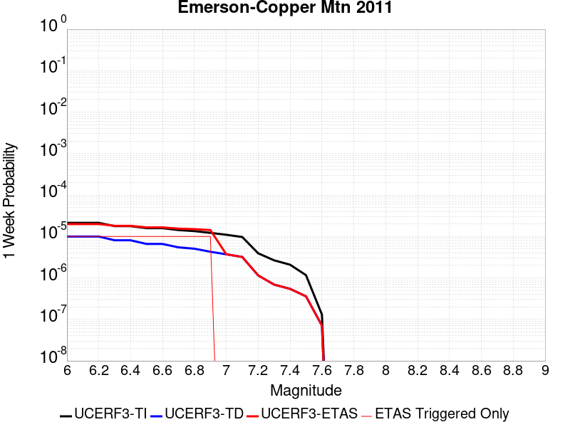 | 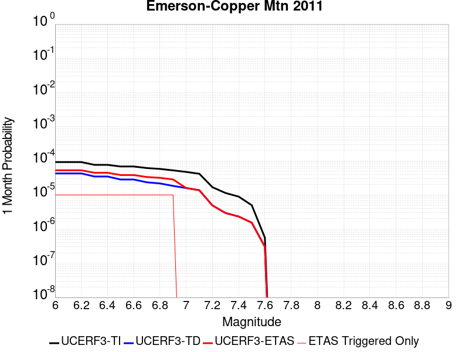 | 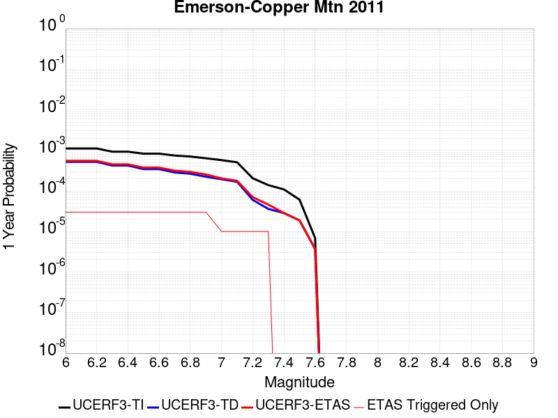 | 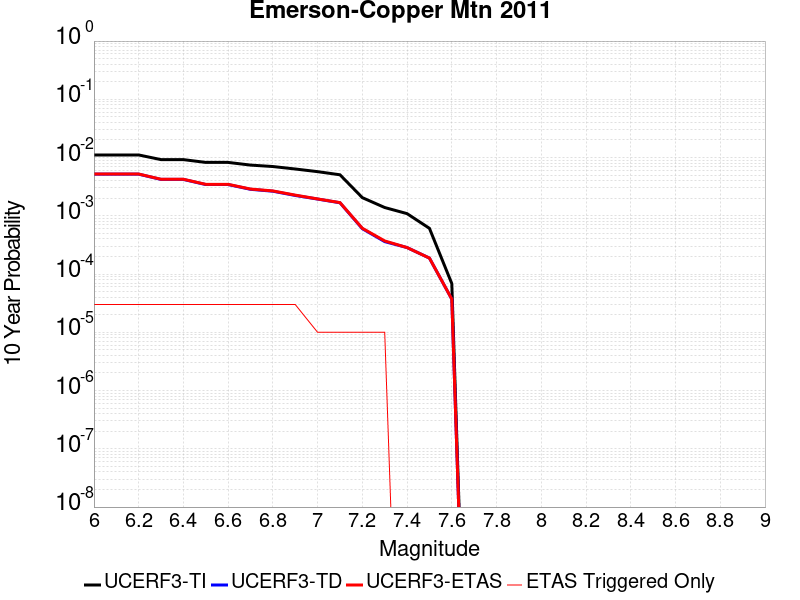 |

| Magnitude | 1 wk TI Prob | 1 wk TD Prob | 1 wk ETAS Prob | 1 wk ETAS/TD Gain | 1 wk ETAS Triggered Only | 1 mo TI Prob | 1 mo TD Prob | 1 mo ETAS Prob | 1 mo ETAS/TD Gain | 1 mo ETAS Triggered Only | 1 yr TI Prob | 1 yr TD Prob | 1 yr ETAS Prob | 1 yr ETAS/TD Gain | 1 yr ETAS Triggered Only | 10 yr TI Prob | 10 yr TD Prob | 10 yr ETAS Prob | 10 yr ETAS/TD Gain | 10 yr ETAS Triggered Only |
|-----|-----|-----|-----|-----|-----|-----|-----|-----|-----|-----|-----|-----|-----|-----|-----|-----|-----|-----|-----|-----|
| 6.0 | 2.1364202E-5 | 9.967999E-6 | 1.99679E-5 | 2.0032003 | 1.0E-5 | 9.1557646E-5 | 4.2719344E-5 | 5.271892E-5 | 1.234076 | 1.0E-5 | 0.0011141442 | 5.1999267E-4 | 5.4997706E-4 | 1.0576631 | 3.0E-5 | 0.011085749 | 0.0051886286 | 0.005218473 | 1.0057518 | 3.0E-5 |
| 6.1 | 2.1364202E-5 | 9.967999E-6 | 1.99679E-5 | 2.0032003 | 1.0E-5 | 9.1557646E-5 | 4.2719344E-5 | 5.271892E-5 | 1.234076 | 1.0E-5 | 0.0011141442 | 5.1999267E-4 | 5.4997706E-4 | 1.0576631 | 3.0E-5 | 0.011085749 | 0.0051886286 | 0.005218473 | 1.0057518 | 3.0E-5 |
| 6.2 | 2.1364202E-5 | 9.967999E-6 | 1.99679E-5 | 2.0032003 | 1.0E-5 | 9.1557646E-5 | 4.2719344E-5 | 5.271892E-5 | 1.234076 | 1.0E-5 | 0.0011141442 | 5.1999267E-4 | 5.4997706E-4 | 1.0576631 | 3.0E-5 | 0.011085749 | 0.0051886286 | 0.005218473 | 1.0057518 | 3.0E-5 |
| 6.3 | 1.7751237E-5 | 8.089109E-6 | 1.8089027E-5 | 2.2362201 | 1.0E-5 | 7.607452E-5 | 3.4667184E-5 | 4.4666835E-5 | 1.2884473 | 1.0E-5 | 9.258136E-4 | 4.2199748E-4 | 4.5198482E-4 | 1.0710604 | 3.0E-5 | 0.00921966 | 0.004212584 | 0.0042424574 | 1.0070915 | 3.0E-5 |
| 6.4 | 1.7751237E-5 | 8.089109E-6 | 1.8089027E-5 | 2.2362201 | 1.0E-5 | 7.607452E-5 | 3.4667184E-5 | 4.4666835E-5 | 1.2884473 | 1.0E-5 | 9.258136E-4 | 4.2199748E-4 | 4.5198482E-4 | 1.0710604 | 3.0E-5 | 0.00921966 | 0.004212584 | 0.0042424574 | 1.0070915 | 3.0E-5 |
| 6.5 | 1.5886664E-5 | 6.6037437E-6 | 1.6603677E-5 | 2.5142825 | 1.0E-5 | 6.808392E-5 | 2.830148E-5 | 3.8301197E-5 | 1.3533285 | 1.0E-5 | 8.286065E-4 | 3.4452073E-4 | 3.745104E-4 | 1.0870475 | 3.0E-5 | 0.008255237 | 0.0034403303 | 0.0034702271 | 1.0086901 | 3.0E-5 |
| 6.6 | 1.5886664E-5 | 6.6037437E-6 | 1.6603677E-5 | 2.5142825 | 1.0E-5 | 6.808392E-5 | 2.830148E-5 | 3.8301197E-5 | 1.3533285 | 1.0E-5 | 8.286065E-4 | 3.4452073E-4 | 3.745104E-4 | 1.0870475 | 3.0E-5 | 0.008255237 | 0.0034403303 | 0.0034702271 | 1.0086901 | 3.0E-5 |
| 6.7 | 1.428471E-5 | 5.4703055E-6 | 1.547025E-5 | 2.8280416 | 1.0E-5 | 6.121875E-5 | 2.3443978E-5 | 3.3443743E-5 | 1.4265388 | 1.0E-5 | 7.450834E-4 | 2.8539696E-4 | 3.153884E-4 | 1.1050867 | 3.0E-5 | 0.007425902 | 0.0028506925 | 0.002880607 | 1.0104938 | 3.0E-5 |
| 6.8 | 1.3490684E-5 | 5.0735894E-6 | 1.5073539E-5 | 2.9709811 | 1.0E-5 | 5.7815934E-5 | 2.1743796E-5 | 3.1743577E-5 | 1.4598913 | 1.0E-5 | 7.0368167E-4 | 2.6470242E-4 | 2.9469447E-4 | 1.1133049 | 3.0E-5 | 0.007014576 | 0.002644252 | 0.0026741726 | 1.0113153 | 3.0E-5 |
| 6.9 | 1.2235421E-5 | 4.289545E-6 | 1.4289501E-5 | 3.3312397 | 1.0E-5 | 5.2436466E-5 | 1.8383655E-5 | 2.838347E-5 | 1.5439515 | 1.0E-5 | 6.38227E-4 | 2.238016E-4 | 2.537949E-4 | 1.1340173 | 3.0E-5 | 0.0063639707 | 0.0022361164 | 0.0022660494 | 1.0133861 | 3.0E-5 |
| 7.0 | 1.1009851E-5 | 3.7188345E-6 | 3.7188345E-6 | 1.0 | 0.0 | 4.7184225E-5 | 1.5937783E-5 | 1.5937783E-5 | 1.0 | 0.0 | 5.743165E-4 | 1.9402867E-4 | 2.0402674E-4 | 1.0515288 | 1.0E-5 | 0.005728345 | 0.0019389305 | 0.0019489111 | 1.0051475 | 1.0E-5 |
| 7.1 | 9.726373E-6 | 3.2115693E-6 | 3.2115693E-6 | 1.0 | 0.0 | 4.168379E-5 | 1.3763814E-5 | 1.3763814E-5 | 1.0 | 0.0 | 5.07382E-4 | 1.6756494E-4 | 1.7756326E-4 | 1.0596683 | 1.0E-5 | 0.0050622504 | 0.0016747171 | 0.0016847003 | 1.0059612 | 1.0E-5 |
| 7.2 | 3.9335127E-6 | 1.1524114E-6 | 1.1524114E-6 | 1.0 | 0.0 | 1.6857803E-5 | 4.9388973E-6 | 4.9388973E-6 | 1.0 | 0.0 | 2.0522442E-4 | 6.0129474E-5 | 7.012887E-5 | 1.1662978 | 1.0E-5 | 0.00205035 | 6.01138E-4 | 6.11132E-4 | 1.0166252 | 1.0E-5 |
| 7.3 | 2.661632E-6 | 6.91098E-7 | 6.91098E-7 | 1.0 | 0.0 | 1.14069435E-5 | 2.9618452E-6 | 2.9618452E-6 | 1.0 | 0.0 | 1.3887069E-4 | 3.605988E-5 | 4.605952E-5 | 1.2773066 | 1.0E-5 | 0.0013878393 | 3.6054134E-4 | 3.7053772E-4 | 1.027726 | 1.0E-5 |
| 7.4 | 2.0893426E-6 | 5.4614605E-7 | 5.4614605E-7 | 1.0 | 0.0 | 8.954295E-6 | 2.340624E-6 | 2.340624E-6 | 1.0 | 0.0 | 1.0901308E-4 | 2.8496728E-5 | 2.8496728E-5 | 1.0 | 0.0 | 0.0010895962 | 2.849313E-4 | 2.849313E-4 | 1.0 | 0.0 |
| 7.5 | 1.1681728E-6 | 3.6028484E-7 | 3.6028484E-7 | 1.0 | 0.0 | 5.0064455E-6 | 1.544077E-6 | 1.544077E-6 | 1.0 | 0.0 | 6.0951766E-5 | 1.879898E-5 | 1.879898E-5 | 1.0 | 0.0 | 6.093505E-4 | 1.8797436E-4 | 1.8797436E-4 | 1.0 | 0.0 |
| 7.6 | 1.3154387E-7 | 7.1196716E-8 | 7.1196716E-8 | 1.0 | 0.0 | 5.6375933E-7 | 3.0512876E-7 | 3.0512876E-7 | 1.0 | 0.0 | 6.863748E-6 | 3.714938E-6 | 3.714938E-6 | 1.0 | 0.0 | 6.863536E-5 | 3.7148915E-5 | 3.7148915E-5 | 1.0 | 0.0 |

## South Cuyama
*[(top)](#table-of-contents)*

| 1 Week | 1 Month | 1 Year | 10 Year |
|-----|-----|-----|-----|
|  |  | 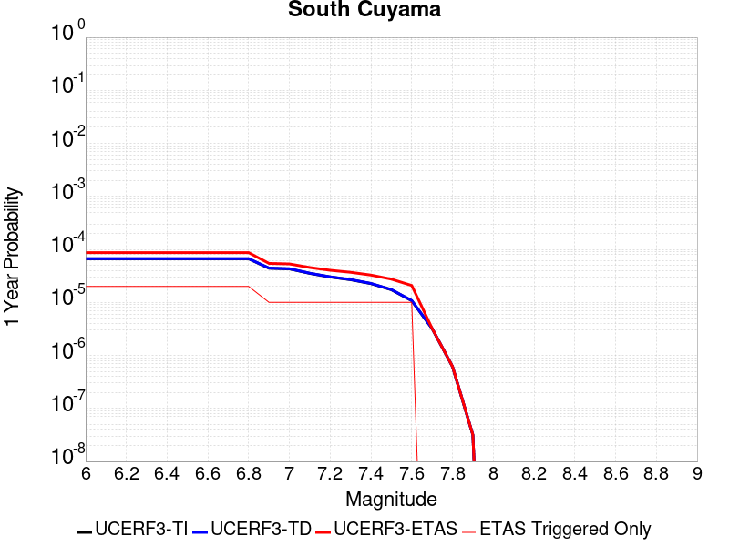 | 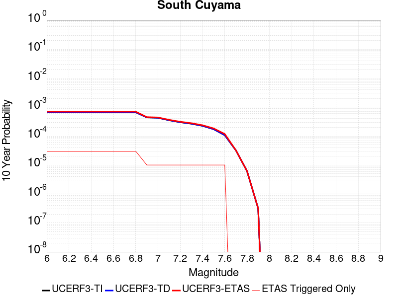 |

| Magnitude | 1 wk TI Prob | 1 wk TD Prob | 1 wk ETAS Prob | 1 wk ETAS/TD Gain | 1 wk ETAS Triggered Only | 1 mo TI Prob | 1 mo TD Prob | 1 mo ETAS Prob | 1 mo ETAS/TD Gain | 1 mo ETAS Triggered Only | 1 yr TI Prob | 1 yr TD Prob | 1 yr ETAS Prob | 1 yr ETAS/TD Gain | 1 yr ETAS Triggered Only | 10 yr TI Prob | 10 yr TD Prob | 10 yr ETAS Prob | 10 yr ETAS/TD Gain | 10 yr ETAS Triggered Only |
|-----|-----|-----|-----|-----|-----|-----|-----|-----|-----|-----|-----|-----|-----|-----|-----|-----|-----|-----|-----|-----|
| 6.0 | 1.2747308E-6 | 1.2818697E-6 | 1.2818697E-6 | 1.0 | 0.0 | 5.4631205E-6 | 5.4937163E-6 | 5.4937163E-6 | 1.0 | 0.0 | 6.6511464E-5 | 6.6884015E-5 | 8.6882676E-5 | 1.2990052 | 2.0E-5 | 6.649156E-4 | 6.686458E-4 | 6.9862575E-4 | 1.0448368 | 3.0E-5 |
| 6.1 | 1.2747308E-6 | 1.2818697E-6 | 1.2818697E-6 | 1.0 | 0.0 | 5.4631205E-6 | 5.4937163E-6 | 5.4937163E-6 | 1.0 | 0.0 | 6.6511464E-5 | 6.6884015E-5 | 8.6882676E-5 | 1.2990052 | 2.0E-5 | 6.649156E-4 | 6.686458E-4 | 6.9862575E-4 | 1.0448368 | 3.0E-5 |
| 6.2 | 1.2747308E-6 | 1.2818697E-6 | 1.2818697E-6 | 1.0 | 0.0 | 5.4631205E-6 | 5.4937163E-6 | 5.4937163E-6 | 1.0 | 0.0 | 6.6511464E-5 | 6.6884015E-5 | 8.6882676E-5 | 1.2990052 | 2.0E-5 | 6.649156E-4 | 6.686458E-4 | 6.9862575E-4 | 1.0448368 | 3.0E-5 |
| 6.3 | 1.2747308E-6 | 1.2818697E-6 | 1.2818697E-6 | 1.0 | 0.0 | 5.4631205E-6 | 5.4937163E-6 | 5.4937163E-6 | 1.0 | 0.0 | 6.6511464E-5 | 6.6884015E-5 | 8.6882676E-5 | 1.2990052 | 2.0E-5 | 6.649156E-4 | 6.686458E-4 | 6.9862575E-4 | 1.0448368 | 3.0E-5 |
| 6.4 | 1.2747308E-6 | 1.2818697E-6 | 1.2818697E-6 | 1.0 | 0.0 | 5.4631205E-6 | 5.4937163E-6 | 5.4937163E-6 | 1.0 | 0.0 | 6.6511464E-5 | 6.6884015E-5 | 8.6882676E-5 | 1.2990052 | 2.0E-5 | 6.649156E-4 | 6.686458E-4 | 6.9862575E-4 | 1.0448368 | 3.0E-5 |
| 6.5 | 1.2747308E-6 | 1.2818697E-6 | 1.2818697E-6 | 1.0 | 0.0 | 5.4631205E-6 | 5.4937163E-6 | 5.4937163E-6 | 1.0 | 0.0 | 6.6511464E-5 | 6.6884015E-5 | 8.6882676E-5 | 1.2990052 | 2.0E-5 | 6.649156E-4 | 6.686458E-4 | 6.9862575E-4 | 1.0448368 | 3.0E-5 |
| 6.6 | 1.2747308E-6 | 1.2818697E-6 | 1.2818697E-6 | 1.0 | 0.0 | 5.4631205E-6 | 5.4937163E-6 | 5.4937163E-6 | 1.0 | 0.0 | 6.6511464E-5 | 6.6884015E-5 | 8.6882676E-5 | 1.2990052 | 2.0E-5 | 6.649156E-4 | 6.686458E-4 | 6.9862575E-4 | 1.0448368 | 3.0E-5 |
| 6.7 | 1.2747308E-6 | 1.2818697E-6 | 1.2818697E-6 | 1.0 | 0.0 | 5.4631205E-6 | 5.4937163E-6 | 5.4937163E-6 | 1.0 | 0.0 | 6.6511464E-5 | 6.6884015E-5 | 8.6882676E-5 | 1.2990052 | 2.0E-5 | 6.649156E-4 | 6.686458E-4 | 6.9862575E-4 | 1.0448368 | 3.0E-5 |
| 6.8 | 1.2747308E-6 | 1.2818697E-6 | 1.2818697E-6 | 1.0 | 0.0 | 5.4631205E-6 | 5.4937163E-6 | 5.4937163E-6 | 1.0 | 0.0 | 6.6511464E-5 | 6.6884015E-5 | 8.6882676E-5 | 1.2990052 | 2.0E-5 | 6.649156E-4 | 6.686458E-4 | 6.9862575E-4 | 1.0448368 | 3.0E-5 |
| 6.9 | 8.4566324E-7 | 8.507883E-7 | 8.507883E-7 | 1.0 | 0.0 | 3.624266E-6 | 3.6462304E-6 | 3.6462304E-6 | 1.0 | 0.0 | 4.4124543E-5 | 4.439196E-5 | 5.4391516E-5 | 1.225256 | 1.0E-5 | 4.4115784E-4 | 4.4383196E-4 | 4.5382752E-4 | 1.022521 | 1.0E-5 |
| 7.0 | 8.2277904E-7 | 8.27782E-7 | 8.27782E-7 | 1.0 | 0.0 | 3.526191E-6 | 3.5476323E-6 | 3.5476323E-6 | 1.0 | 0.0 | 4.293053E-5 | 4.3191576E-5 | 5.3191146E-5 | 1.2315166 | 1.0E-5 | 4.292224E-4 | 4.3183283E-4 | 4.418285E-4 | 1.0231471 | 1.0E-5 |
| 7.1 | 6.7661887E-7 | 6.80913E-7 | 6.80913E-7 | 1.0 | 0.0 | 2.899792E-6 | 2.9181954E-6 | 2.9181954E-6 | 1.0 | 0.0 | 3.5304394E-5 | 3.5528454E-5 | 4.5528097E-5 | 1.2814546 | 1.0E-5 | 3.5298787E-4 | 3.552281E-4 | 3.6522458E-4 | 1.0281409 | 1.0E-5 |
| 7.2 | 5.783336E-7 | 5.8211907E-7 | 5.8211907E-7 | 1.0 | 0.0 | 2.4785702E-6 | 2.4947938E-6 | 2.4947938E-6 | 1.0 | 0.0 | 3.0176174E-5 | 3.0373692E-5 | 4.0373387E-5 | 1.3292223 | 1.0E-5 | 3.0172078E-4 | 3.0369565E-4 | 3.136926E-4 | 1.0329177 | 1.0E-5 |
| 7.3 | 5.136759E-7 | 5.170938E-7 | 5.170938E-7 | 1.0 | 0.0 | 2.2014663E-6 | 2.2161144E-6 | 2.2161144E-6 | 1.0 | 0.0 | 2.6802521E-5 | 2.698086E-5 | 3.698059E-5 | 1.3706231 | 1.0E-5 | 2.679929E-4 | 2.6977606E-4 | 2.7977335E-4 | 1.0370578 | 1.0E-5 |
| 7.4 | 4.3370295E-7 | 4.3665364E-7 | 4.3665364E-7 | 1.0 | 0.0 | 1.8587256E-6 | 1.8713713E-6 | 1.8713713E-6 | 1.0 | 0.0 | 2.2629749E-5 | 2.278371E-5 | 3.2783482E-5 | 1.4389001 | 1.0E-5 | 2.2627445E-4 | 2.278139E-4 | 2.3781162E-4 | 1.0438855 | 1.0E-5 |
| 7.5 | 3.3242574E-7 | 3.3476465E-7 | 3.3476465E-7 | 1.0 | 0.0 | 1.4246809E-6 | 1.4347048E-6 | 1.4347048E-6 | 1.0 | 0.0 | 1.7345352E-5 | 1.7467393E-5 | 2.7467218E-5 | 1.5724853 | 1.0E-5 | 1.7343998E-4 | 1.7466032E-4 | 1.8465858E-4 | 1.057244 | 1.0E-5 |
| 7.6 | 2.0627535E-7 | 2.07789E-7 | 2.07789E-7 | 1.0 | 0.0 | 8.840369E-7 | 8.90524E-7 | 8.90524E-7 | 1.0 | 0.0 | 1.0763096E-5 | 1.0842076E-5 | 2.0841968E-5 | 1.9223225 | 1.0E-5 | 1.0762575E-4 | 1.0841556E-4 | 1.1841447E-4 | 1.0922277 | 1.0E-5 |
| 7.7 | 6.15236E-8 | 6.1983044E-8 | 6.1983044E-8 | 1.0 | 0.0 | 2.6367252E-7 | 2.656416E-7 | 2.656416E-7 | 1.0 | 0.0 | 3.2102084E-6 | 3.2341818E-6 | 3.2341818E-6 | 1.0 | 0.0 | 3.210162E-5 | 3.234136E-5 | 3.234136E-5 | 1.0 | 0.0 |
| 7.8 | 1.1765573E-8 | 1.1873414E-8 | 1.1873414E-8 | 1.0 | 0.0 | 5.0423886E-8 | 5.0886058E-8 | 5.0886058E-8 | 1.0 | 0.0 | 6.1391063E-7 | 6.195376E-7 | 6.195376E-7 | 1.0 | 0.0 | 6.1390897E-6 | 6.19536E-6 | 6.19536E-6 | 1.0 | 0.0 |
| 7.9 | 6.0381755E-10 | 6.10058E-10 | 6.10058E-10 | 1.0 | 0.0 | 2.5877895E-9 | 2.614534E-9 | 2.614534E-9 | 1.0 | 0.0 | 3.1506335E-8 | 3.1831952E-8 | 3.1831952E-8 | 1.0 | 0.0 | 3.1506332E-7 | 3.183195E-7 | 3.183195E-7 | 1.0 | 0.0 |

## Sierra Madre (San Fernando)
*[(top)](#table-of-contents)*

| 1 Week | 1 Month | 1 Year | 10 Year |
|-----|-----|-----|-----|
| 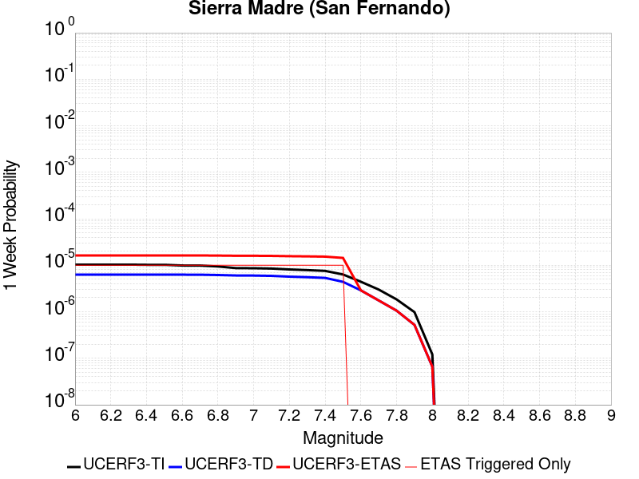 | 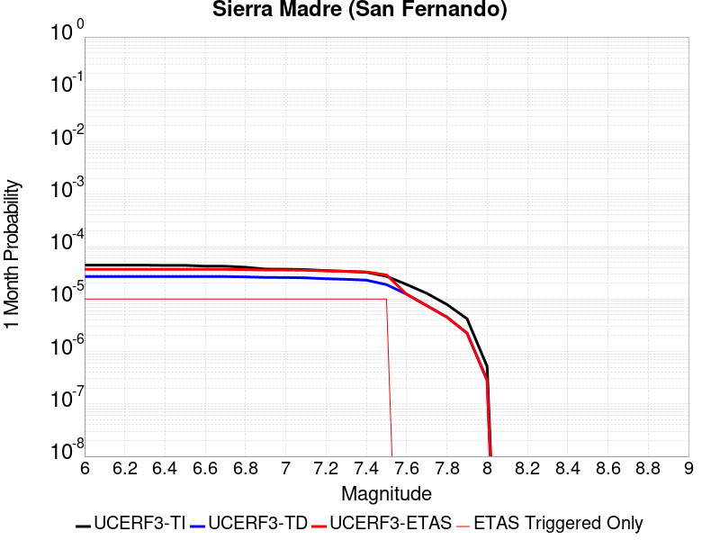 | 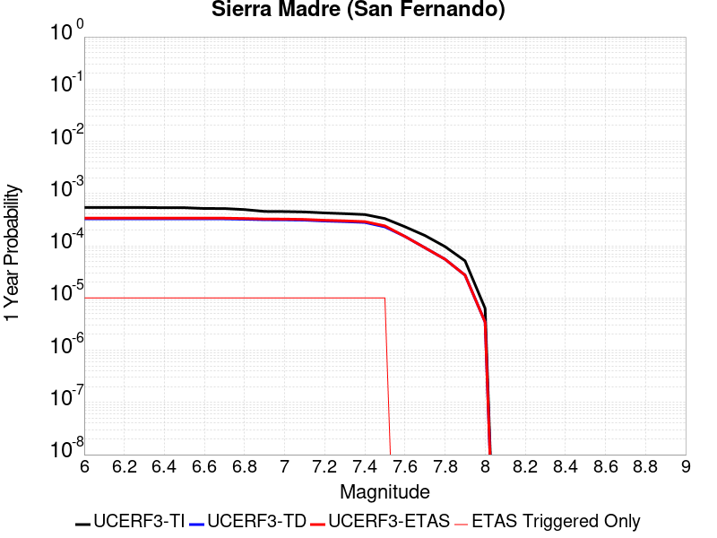 | 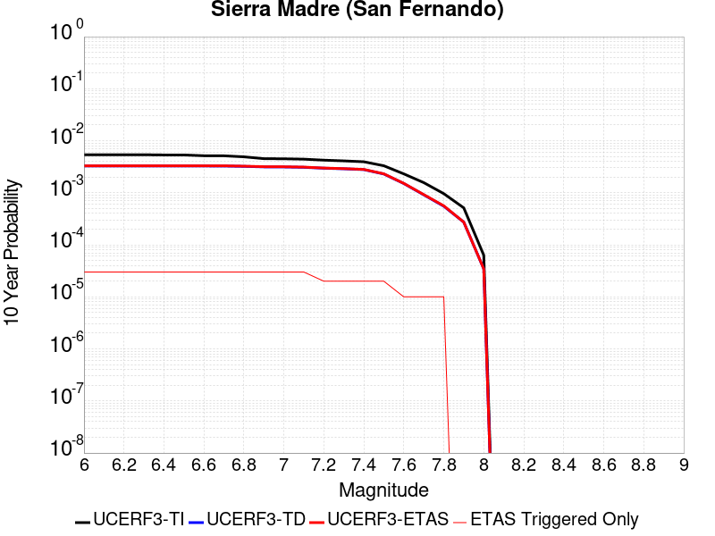 |

| Magnitude | 1 wk TI Prob | 1 wk TD Prob | 1 wk ETAS Prob | 1 wk ETAS/TD Gain | 1 wk ETAS Triggered Only | 1 mo TI Prob | 1 mo TD Prob | 1 mo ETAS Prob | 1 mo ETAS/TD Gain | 1 mo ETAS Triggered Only | 1 yr TI Prob | 1 yr TD Prob | 1 yr ETAS Prob | 1 yr ETAS/TD Gain | 1 yr ETAS Triggered Only | 10 yr TI Prob | 10 yr TD Prob | 10 yr ETAS Prob | 10 yr ETAS/TD Gain | 10 yr ETAS Triggered Only |
|-----|-----|-----|-----|-----|-----|-----|-----|-----|-----|-----|-----|-----|-----|-----|-----|-----|-----|-----|-----|-----|
| 6.0 | 1.0346413E-5 | 6.2872386E-6 | 1.6287177E-5 | 2.5905135 | 1.0E-5 | 4.4341014E-5 | 2.6945036E-5 | 3.6944766E-5 | 1.3711159 | 1.0E-5 | 5.3971814E-4 | 3.2800753E-4 | 3.3800426E-4 | 1.030477 | 1.0E-5 | 0.0053840918 | 0.0032753467 | 0.0033052485 | 1.0091293 | 3.0E-5 |
| 6.1 | 1.0346413E-5 | 6.2872386E-6 | 1.6287177E-5 | 2.5905135 | 1.0E-5 | 4.4341014E-5 | 2.6945036E-5 | 3.6944766E-5 | 1.3711159 | 1.0E-5 | 5.3971814E-4 | 3.2800753E-4 | 3.3800426E-4 | 1.030477 | 1.0E-5 | 0.0053840918 | 0.0032753467 | 0.0033052485 | 1.0091293 | 3.0E-5 |
| 6.2 | 1.0346413E-5 | 6.2872386E-6 | 1.6287177E-5 | 2.5905135 | 1.0E-5 | 4.4341014E-5 | 2.6945036E-5 | 3.6944766E-5 | 1.3711159 | 1.0E-5 | 5.3971814E-4 | 3.2800753E-4 | 3.3800426E-4 | 1.030477 | 1.0E-5 | 0.0053840918 | 0.0032753467 | 0.0033052485 | 1.0091293 | 3.0E-5 |
| 6.3 | 1.0346413E-5 | 6.2872386E-6 | 1.6287177E-5 | 2.5905135 | 1.0E-5 | 4.4341014E-5 | 2.6945036E-5 | 3.6944766E-5 | 1.3711159 | 1.0E-5 | 5.3971814E-4 | 3.2800753E-4 | 3.3800426E-4 | 1.030477 | 1.0E-5 | 0.0053840918 | 0.0032753467 | 0.0033052485 | 1.0091293 | 3.0E-5 |
| 6.4 | 1.0249558E-5 | 6.2872386E-6 | 1.6287177E-5 | 2.5905135 | 1.0E-5 | 4.392594E-5 | 2.6945036E-5 | 3.6944766E-5 | 1.3711159 | 1.0E-5 | 5.3466705E-4 | 3.2800753E-4 | 3.3800426E-4 | 1.030477 | 1.0E-5 | 0.0053338245 | 0.0032753467 | 0.0033052485 | 1.0091293 | 3.0E-5 |
| 6.5 | 1.0249558E-5 | 6.2872386E-6 | 1.6287177E-5 | 2.5905135 | 1.0E-5 | 4.392594E-5 | 2.6945036E-5 | 3.6944766E-5 | 1.3711159 | 1.0E-5 | 5.3466705E-4 | 3.2800753E-4 | 3.3800426E-4 | 1.030477 | 1.0E-5 | 0.0053338245 | 0.0032753467 | 0.0033052485 | 1.0091293 | 3.0E-5 |
| 6.6 | 9.9035515E-6 | 6.2872386E-6 | 1.6287177E-5 | 2.5905135 | 1.0E-5 | 4.2443102E-5 | 2.6945036E-5 | 3.6944766E-5 | 1.3711159 | 1.0E-5 | 5.166222E-4 | 3.2800753E-4 | 3.3800426E-4 | 1.030477 | 1.0E-5 | 0.0051542283 | 0.0032753467 | 0.0033052485 | 1.0091293 | 3.0E-5 |
| 6.7 | 9.87217E-6 | 6.274661E-6 | 1.6274598E-5 | 2.5937016 | 1.0E-5 | 4.2308613E-5 | 2.6891132E-5 | 3.6890862E-5 | 1.3718598 | 1.0E-5 | 5.149856E-4 | 3.2735144E-4 | 3.3734817E-4 | 1.0305382 | 1.0E-5 | 0.005137938 | 0.003268805 | 0.003298707 | 1.0091476 | 3.0E-5 |
| 6.8 | 9.4359175E-6 | 6.1786473E-6 | 1.6178585E-5 | 2.6184673 | 1.0E-5 | 4.043902E-5 | 2.6479653E-5 | 3.647939E-5 | 1.3776385 | 1.0E-5 | 4.9223384E-4 | 3.223432E-4 | 3.3233996E-4 | 1.0310129 | 1.0E-5 | 0.0049114493 | 0.0032188678 | 0.0032487714 | 1.0092901 | 3.0E-5 |
| 6.9 | 8.700447E-6 | 6.0399334E-6 | 1.6039872E-5 | 2.6556375 | 1.0E-5 | 3.72871E-5 | 2.5885178E-5 | 3.5884917E-5 | 1.3863115 | 1.0E-5 | 4.5387587E-4 | 3.1510755E-4 | 3.251044E-4 | 1.0317252 | 1.0E-5 | 0.0045295 | 0.0031467169 | 0.0031766223 | 1.0095037 | 3.0E-5 |
| 7.0 | 8.648878E-6 | 6.014848E-6 | 1.6014788E-5 | 2.6625423 | 1.0E-5 | 3.7066096E-5 | 2.5777672E-5 | 3.5777415E-5 | 1.3879226 | 1.0E-5 | 4.5118626E-4 | 3.1379904E-4 | 3.2379592E-4 | 1.0318575 | 1.0E-5 | 0.004502713 | 0.0031336688 | 0.003163575 | 1.0095434 | 3.0E-5 |
| 7.1 | 8.505786E-6 | 5.9244794E-6 | 1.592442E-5 | 2.687902 | 1.0E-5 | 3.645286E-5 | 2.5390384E-5 | 3.539013E-5 | 1.3938398 | 1.0E-5 | 4.437232E-4 | 3.0908515E-4 | 3.1908206E-4 | 1.0323435 | 1.0E-5 | 0.0044283825 | 0.0030866617 | 0.003116569 | 1.0096892 | 3.0E-5 |
| 7.2 | 8.139752E-6 | 5.698777E-6 | 1.569872E-5 | 2.7547524 | 1.0E-5 | 3.4884186E-5 | 2.4423107E-5 | 3.4422865E-5 | 1.4094383 | 1.0E-5 | 4.246322E-4 | 2.973118E-4 | 3.0730883E-4 | 1.0336248 | 1.0E-5 | 0.004238217 | 0.0029692466 | 0.0029891871 | 1.0067158 | 2.0E-5 |
| 7.3 | 7.8816E-6 | 5.5520936E-6 | 1.5552037E-5 | 2.8011124 | 1.0E-5 | 3.3777847E-5 | 2.3794475E-5 | 3.3794237E-5 | 1.4202557 | 1.0E-5 | 4.111677E-4 | 2.8966027E-4 | 2.9965737E-4 | 1.0345132 | 1.0E-5 | 0.004104078 | 0.0028929329 | 0.002912875 | 1.0068934 | 2.0E-5 |
| 7.4 | 7.5810603E-6 | 5.356333E-6 | 1.535628E-5 | 2.8669388 | 1.0E-5 | 3.2489854E-5 | 2.2955517E-5 | 3.295529E-5 | 1.4356151 | 1.0E-5 | 3.9549218E-4 | 2.7944864E-4 | 2.8944583E-4 | 1.0357747 | 1.0E-5 | 0.0039478904 | 0.0027910774 | 0.0028110216 | 1.0071456 | 2.0E-5 |
| 7.5 | 6.349153E-6 | 4.4075887E-6 | 1.4407545E-5 | 3.2688043 | 1.0E-5 | 2.7210372E-5 | 1.8889532E-5 | 2.8889344E-5 | 1.5293837 | 1.0E-5 | 3.312359E-4 | 2.2995661E-4 | 2.3995432E-4 | 1.0434765 | 1.0E-5 | 0.0033074263 | 0.0022972687 | 0.0023172228 | 1.008686 | 2.0E-5 |
| 7.6 | 4.430576E-6 | 2.8905786E-6 | 2.8905786E-6 | 1.0 | 0.0 | 1.8988047E-5 | 1.23881355E-5 | 1.23881355E-5 | 1.0 | 0.0 | 2.3115493E-4 | 1.5081534E-4 | 1.5081534E-4 | 1.0 | 0.0 | 0.0023091463 | 0.0015071525 | 0.0015171374 | 1.006625 | 1.0E-5 |
| 7.7 | 3.005066E-6 | 1.7509823E-6 | 1.7509823E-6 | 1.0 | 0.0 | 1.2878791E-5 | 7.504188E-6 | 7.504188E-6 | 1.0 | 0.0 | 1.56788E-4 | 9.135967E-5 | 9.135967E-5 | 1.0 | 0.0 | 0.0015667742 | 9.1322226E-4 | 9.2321314E-4 | 1.0109402 | 1.0E-5 |
| 7.8 | 1.8459098E-6 | 1.0581826E-6 | 1.0581826E-6 | 1.0 | 0.0 | 7.911018E-6 | 4.5350607E-6 | 4.5350607E-6 | 1.0 | 0.0 | 9.631238E-5 | 5.5212968E-5 | 5.5212968E-5 | 1.0 | 0.0 | 9.627065E-4 | 5.5199297E-4 | 5.6198746E-4 | 1.0181062 | 1.0E-5 |
| 7.9 | 9.839262E-7 | 5.2340516E-7 | 5.2340516E-7 | 1.0 | 0.0 | 4.2168194E-6 | 2.243163E-6 | 2.243163E-6 | 1.0 | 0.0 | 5.1338568E-5 | 2.731017E-5 | 2.731017E-5 | 1.0 | 0.0 | 5.132671E-4 | 2.7306844E-4 | 2.7306844E-4 | 1.0 | 0.0 |
| 8.0 | 1.210983E-7 | 6.613497E-8 | 6.613497E-8 | 1.0 | 0.0 | 5.1899264E-7 | 2.8343558E-7 | 2.8343558E-7 | 1.0 | 0.0 | 6.3187167E-6 | 3.4508228E-6 | 3.4508228E-6 | 1.0 | 0.0 | 6.318537E-5 | 3.450771E-5 | 3.450771E-5 | 1.0 | 0.0 |

## Channel Islands Western Deep Ramp
*[(top)](#table-of-contents)*

| 1 Week | 1 Month | 1 Year | 10 Year |
|-----|-----|-----|-----|
| 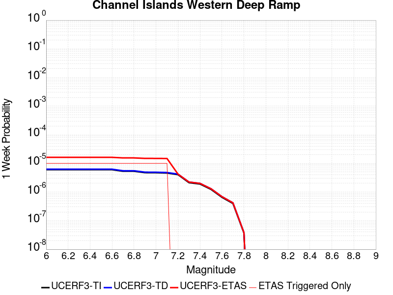 | 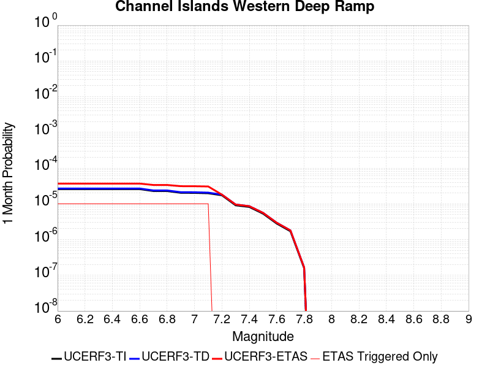 | 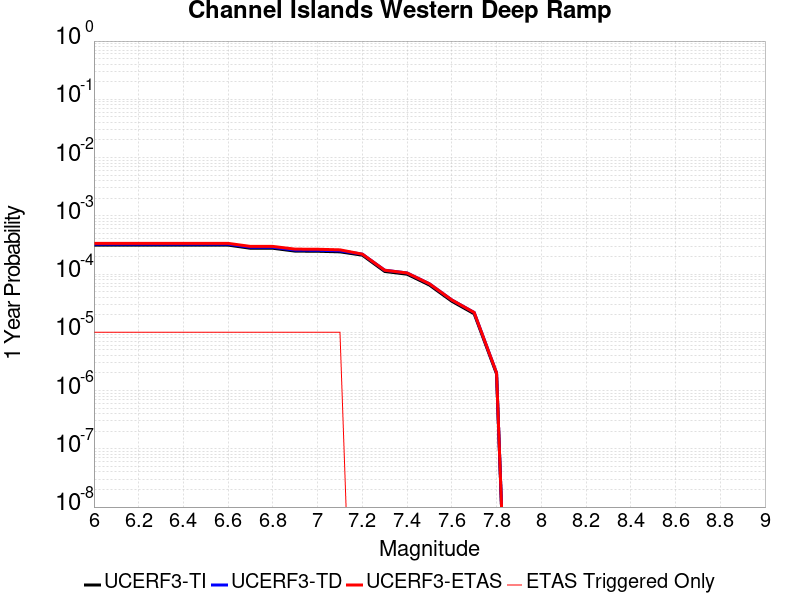 |  |

| Magnitude | 1 wk TI Prob | 1 wk TD Prob | 1 wk ETAS Prob | 1 wk ETAS/TD Gain | 1 wk ETAS Triggered Only | 1 mo TI Prob | 1 mo TD Prob | 1 mo ETAS Prob | 1 mo ETAS/TD Gain | 1 mo ETAS Triggered Only | 1 yr TI Prob | 1 yr TD Prob | 1 yr ETAS Prob | 1 yr ETAS/TD Gain | 1 yr ETAS Triggered Only | 10 yr TI Prob | 10 yr TD Prob | 10 yr ETAS Prob | 10 yr ETAS/TD Gain | 10 yr ETAS Triggered Only |
|-----|-----|-----|-----|-----|-----|-----|-----|-----|-----|-----|-----|-----|-----|-----|-----|-----|-----|-----|-----|-----|
| 6.0 | 6.0213506E-6 | 6.2548684E-6 | 1.6254806E-5 | 2.5987446 | 1.0E-5 | 2.5805533E-5 | 2.6806329E-5 | 3.680606E-5 | 1.3730363 | 1.0E-5 | 3.1413708E-4 | 3.2632265E-4 | 3.3631938E-4 | 1.0306345 | 1.0E-5 | 0.0031369338 | 0.0032588763 | 0.0032887785 | 1.0091757 | 3.0E-5 |
| 6.1 | 6.0213506E-6 | 6.2548684E-6 | 1.6254806E-5 | 2.5987446 | 1.0E-5 | 2.5805533E-5 | 2.6806329E-5 | 3.680606E-5 | 1.3730363 | 1.0E-5 | 3.1413708E-4 | 3.2632265E-4 | 3.3631938E-4 | 1.0306345 | 1.0E-5 | 0.0031369338 | 0.0032588763 | 0.0032887785 | 1.0091757 | 3.0E-5 |
| 6.2 | 6.0213506E-6 | 6.2548684E-6 | 1.6254806E-5 | 2.5987446 | 1.0E-5 | 2.5805533E-5 | 2.6806329E-5 | 3.680606E-5 | 1.3730363 | 1.0E-5 | 3.1413708E-4 | 3.2632265E-4 | 3.3631938E-4 | 1.0306345 | 1.0E-5 | 0.0031369338 | 0.0032588763 | 0.0032887785 | 1.0091757 | 3.0E-5 |
| 6.3 | 6.0213506E-6 | 6.2548684E-6 | 1.6254806E-5 | 2.5987446 | 1.0E-5 | 2.5805533E-5 | 2.6806329E-5 | 3.680606E-5 | 1.3730363 | 1.0E-5 | 3.1413708E-4 | 3.2632265E-4 | 3.3631938E-4 | 1.0306345 | 1.0E-5 | 0.0031369338 | 0.0032588763 | 0.0032887785 | 1.0091757 | 3.0E-5 |
| 6.4 | 6.0213506E-6 | 6.2548684E-6 | 1.6254806E-5 | 2.5987446 | 1.0E-5 | 2.5805533E-5 | 2.6806329E-5 | 3.680606E-5 | 1.3730363 | 1.0E-5 | 3.1413708E-4 | 3.2632265E-4 | 3.3631938E-4 | 1.0306345 | 1.0E-5 | 0.0031369338 | 0.0032588763 | 0.0032887785 | 1.0091757 | 3.0E-5 |
| 6.5 | 6.0213506E-6 | 6.2548684E-6 | 1.6254806E-5 | 2.5987446 | 1.0E-5 | 2.5805533E-5 | 2.6806329E-5 | 3.680606E-5 | 1.3730363 | 1.0E-5 | 3.1413708E-4 | 3.2632265E-4 | 3.3631938E-4 | 1.0306345 | 1.0E-5 | 0.0031369338 | 0.0032588763 | 0.0032887785 | 1.0091757 | 3.0E-5 |
| 6.6 | 6.0213506E-6 | 6.2548684E-6 | 1.6254806E-5 | 2.5987446 | 1.0E-5 | 2.5805533E-5 | 2.6806329E-5 | 3.680606E-5 | 1.3730363 | 1.0E-5 | 3.1413708E-4 | 3.2632265E-4 | 3.3631938E-4 | 1.0306345 | 1.0E-5 | 0.0031369338 | 0.0032588763 | 0.0032887785 | 1.0091757 | 3.0E-5 |
| 6.7 | 5.313309E-6 | 5.5252403E-6 | 1.5525186E-5 | 2.809866 | 1.0E-5 | 2.2771126E-5 | 2.367941E-5 | 3.3679175E-5 | 1.4222978 | 1.0E-5 | 2.772032E-4 | 2.8826276E-4 | 2.982599E-4 | 1.0346806 | 1.0E-5 | 0.0027685766 | 0.0028792918 | 0.0029092054 | 1.0103892 | 3.0E-5 |
| 6.8 | 5.313309E-6 | 5.5252403E-6 | 1.5525186E-5 | 2.809866 | 1.0E-5 | 2.2771126E-5 | 2.367941E-5 | 3.3679175E-5 | 1.4222978 | 1.0E-5 | 2.772032E-4 | 2.8826276E-4 | 2.982599E-4 | 1.0346806 | 1.0E-5 | 0.0027685766 | 0.0028792918 | 0.0029092054 | 1.0103892 | 3.0E-5 |
| 6.9 | 4.744377E-6 | 4.9394303E-6 | 1.4939381E-5 | 3.024515 | 1.0E-5 | 2.0332885E-5 | 2.1168837E-5 | 3.1168624E-5 | 1.4723825 | 1.0E-5 | 2.4752476E-4 | 2.5770385E-4 | 2.6770125E-4 | 1.0387943 | 1.0E-5 | 0.0024724922 | 0.0025744175 | 0.002594366 | 1.0077487 | 2.0E-5 |
| 7.0 | 4.722209E-6 | 4.9164732E-6 | 1.4916424E-5 | 3.0339684 | 1.0E-5 | 2.0237881E-5 | 2.107045E-5 | 3.1070238E-5 | 1.4745883 | 1.0E-5 | 2.4636835E-4 | 2.5650626E-4 | 2.665037E-4 | 1.0389754 | 1.0E-5 | 0.002460954 | 0.0025624693 | 0.002582418 | 1.007785 | 2.0E-5 |
| 7.1 | 4.611174E-6 | 4.801409E-6 | 1.48013605E-5 | 3.082712 | 1.0E-5 | 1.9762025E-5 | 2.0577325E-5 | 3.057712E-5 | 1.4859618 | 1.0E-5 | 2.4057609E-4 | 2.5050386E-4 | 2.6050137E-4 | 1.0399096 | 1.0E-5 | 0.002403158 | 0.002502582 | 0.002522532 | 1.0079718 | 2.0E-5 |
| 7.2 | 4.043994E-6 | 4.2120264E-6 | 4.2120264E-6 | 1.0 | 0.0 | 1.7331287E-5 | 1.8051438E-5 | 1.8051438E-5 | 1.0 | 0.0 | 2.10988E-4 | 2.1975765E-4 | 2.1975765E-4 | 1.0 | 0.0 | 0.002107878 | 0.0021957543 | 0.0022057323 | 1.0045443 | 1.0E-5 |
| 7.3 | 2.1233036E-6 | 2.2297875E-6 | 2.2297875E-6 | 1.0 | 0.0 | 9.099841E-6 | 9.556197E-6 | 9.556197E-6 | 1.0 | 0.0 | 1.1078493E-4 | 1.1634055E-4 | 1.1634055E-4 | 1.0 | 0.0 | 0.0011072971 | 0.001162802 | 0.001162802 | 1.0 | 0.0 |
| 7.4 | 1.9051884E-6 | 2.0014973E-6 | 2.0014973E-6 | 1.0 | 0.0 | 8.165067E-6 | 8.577817E-6 | 8.577817E-6 | 1.0 | 0.0 | 9.940516E-5 | 1.0442998E-4 | 1.0442998E-4 | 1.0 | 0.0 | 9.93607E-4 | 0.0010438144 | 0.0010438144 | 1.0 | 0.0 |
| 7.5 | 1.2408497E-6 | 1.3038839E-6 | 1.3038839E-6 | 1.0 | 0.0 | 5.317916E-6 | 5.588062E-6 | 5.588062E-6 | 1.0 | 0.0 | 6.4743705E-5 | 6.8032554E-5 | 6.8032554E-5 | 1.0 | 0.0 | 6.4724847E-4 | 6.8011944E-4 | 6.8011944E-4 | 1.0 | 0.0 |
| 7.6 | 6.5440025E-7 | 6.886718E-7 | 6.886718E-7 | 1.0 | 0.0 | 2.8045695E-6 | 2.9514472E-6 | 2.9514472E-6 | 1.0 | 0.0 | 3.4145098E-5 | 3.593329E-5 | 3.593329E-5 | 1.0 | 0.0 | 3.4139853E-4 | 3.5927625E-4 | 3.5927625E-4 | 1.0 | 0.0 |
| 7.7 | 3.985963E-7 | 4.1930787E-7 | 4.1930787E-7 | 1.0 | 0.0 | 1.7082689E-6 | 1.7970326E-6 | 1.7970326E-6 | 1.0 | 0.0 | 2.0797976E-5 | 2.1878664E-5 | 2.1878664E-5 | 1.0 | 0.0 | 2.0796029E-4 | 2.1876628E-4 | 2.1876628E-4 | 1.0 | 0.0 |
| 7.8 | 3.706329E-8 | 3.8591796E-8 | 3.8591796E-8 | 1.0 | 0.0 | 1.5884267E-7 | 1.653934E-7 | 1.653934E-7 | 1.0 | 0.0 | 1.9339077E-6 | 2.0136629E-6 | 2.0136629E-6 | 1.0 | 0.0 | 1.933891E-5 | 2.0136458E-5 | 2.0136458E-5 | 1.0 | 0.0 |

## Santa Monica alt 1
*[(top)](#table-of-contents)*

| 1 Week | 1 Month | 1 Year | 10 Year |
|-----|-----|-----|-----|
| 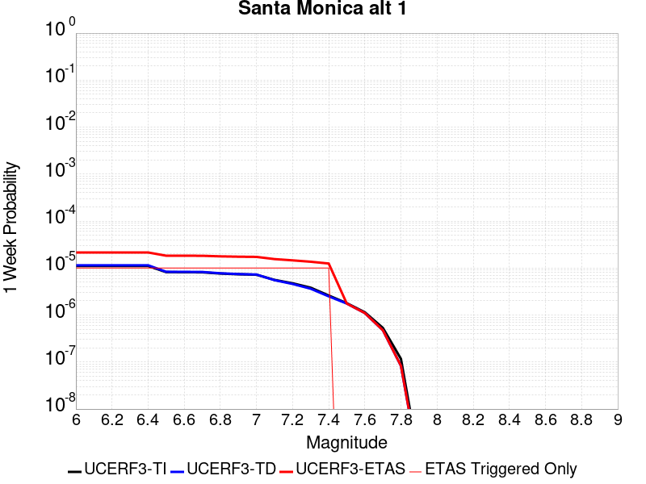 | 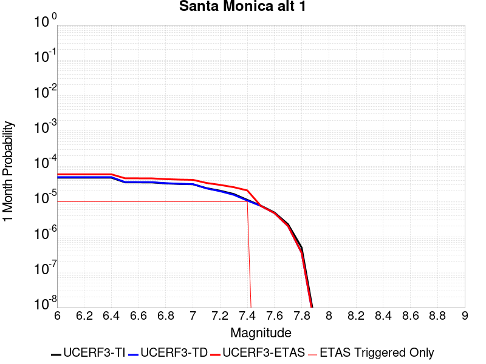 | 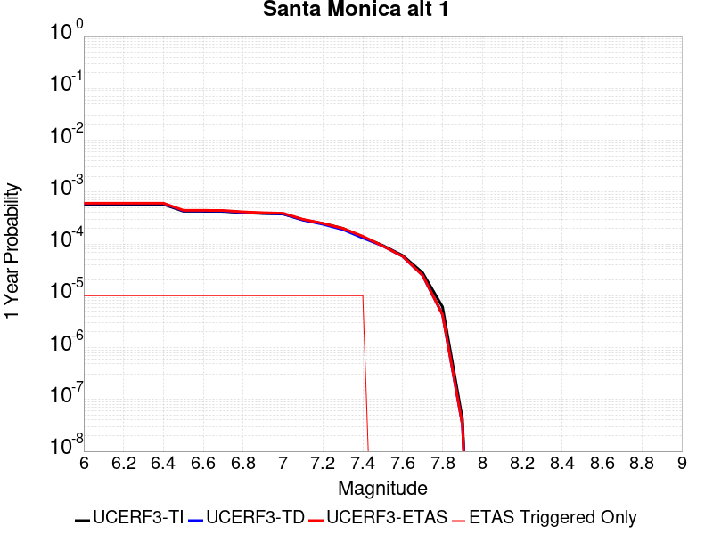 | 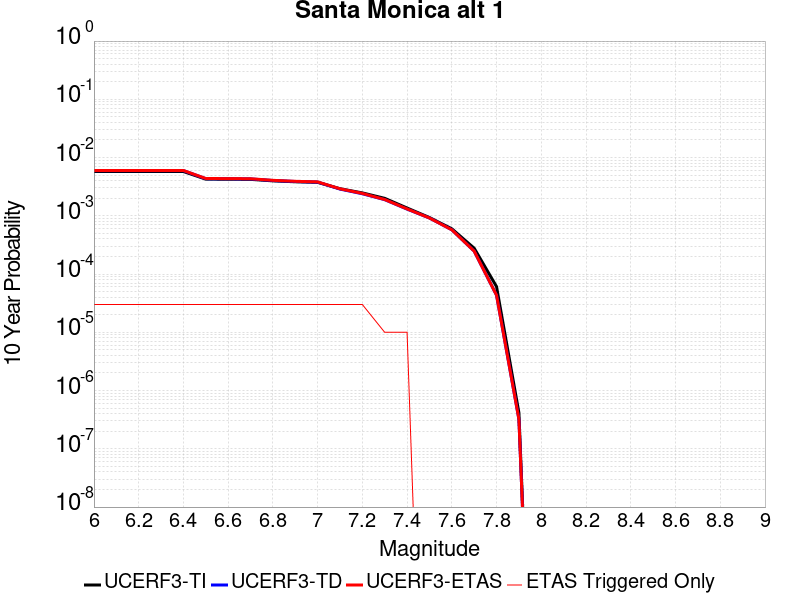 |

| Magnitude | 1 wk TI Prob | 1 wk TD Prob | 1 wk ETAS Prob | 1 wk ETAS/TD Gain | 1 wk ETAS Triggered Only | 1 mo TI Prob | 1 mo TD Prob | 1 mo ETAS Prob | 1 mo ETAS/TD Gain | 1 mo ETAS Triggered Only | 1 yr TI Prob | 1 yr TD Prob | 1 yr ETAS Prob | 1 yr ETAS/TD Gain | 1 yr ETAS Triggered Only | 10 yr TI Prob | 10 yr TD Prob | 10 yr ETAS Prob | 10 yr ETAS/TD Gain | 10 yr ETAS Triggered Only |
|-----|-----|-----|-----|-----|-----|-----|-----|-----|-----|-----|-----|-----|-----|-----|-----|-----|-----|-----|-----|-----|
| 6.0 | 1.1066008E-5 | 1.1480312E-5 | 2.1480198E-5 | 1.8710464 | 1.0E-5 | 4.742488E-5 | 4.920049E-5 | 5.92E-5 | 1.20324 | 1.0E-5 | 5.7724497E-4 | 5.9886527E-4 | 6.088593E-4 | 1.0166882 | 1.0E-5 | 0.005757478 | 0.0059739016 | 0.006003722 | 1.0049919 | 3.0E-5 |
| 6.1 | 1.1066008E-5 | 1.1480312E-5 | 2.1480198E-5 | 1.8710464 | 1.0E-5 | 4.742488E-5 | 4.920049E-5 | 5.92E-5 | 1.20324 | 1.0E-5 | 5.7724497E-4 | 5.9886527E-4 | 6.088593E-4 | 1.0166882 | 1.0E-5 | 0.005757478 | 0.0059739016 | 0.006003722 | 1.0049919 | 3.0E-5 |
| 6.2 | 1.1066008E-5 | 1.1480312E-5 | 2.1480198E-5 | 1.8710464 | 1.0E-5 | 4.742488E-5 | 4.920049E-5 | 5.92E-5 | 1.20324 | 1.0E-5 | 5.7724497E-4 | 5.9886527E-4 | 6.088593E-4 | 1.0166882 | 1.0E-5 | 0.005757478 | 0.0059739016 | 0.006003722 | 1.0049919 | 3.0E-5 |
| 6.3 | 1.1066008E-5 | 1.1480312E-5 | 2.1480198E-5 | 1.8710464 | 1.0E-5 | 4.742488E-5 | 4.920049E-5 | 5.92E-5 | 1.20324 | 1.0E-5 | 5.7724497E-4 | 5.9886527E-4 | 6.088593E-4 | 1.0166882 | 1.0E-5 | 0.005757478 | 0.0059739016 | 0.006003722 | 1.0049919 | 3.0E-5 |
| 6.4 | 1.1066008E-5 | 1.1480312E-5 | 2.1480198E-5 | 1.8710464 | 1.0E-5 | 4.742488E-5 | 4.920049E-5 | 5.92E-5 | 1.20324 | 1.0E-5 | 5.7724497E-4 | 5.9886527E-4 | 6.088593E-4 | 1.0166882 | 1.0E-5 | 0.005757478 | 0.0059739016 | 0.006003722 | 1.0049919 | 3.0E-5 |
| 6.5 | 8.183544E-6 | 8.335434E-6 | 1.8335351E-5 | 2.1996875 | 1.0E-5 | 3.5071862E-5 | 3.572281E-5 | 4.5722452E-5 | 1.2799232 | 1.0E-5 | 4.2691626E-4 | 4.3483998E-4 | 4.4483563E-4 | 1.022987 | 1.0E-5 | 0.0042609703 | 0.004340057 | 0.0043699266 | 1.0068823 | 3.0E-5 |
| 6.6 | 8.1543285E-6 | 8.303648E-6 | 1.8303565E-5 | 2.20428 | 1.0E-5 | 3.4946657E-5 | 3.558659E-5 | 4.5586232E-5 | 1.2809948 | 1.0E-5 | 4.2539247E-4 | 4.3318217E-4 | 4.4317782E-4 | 1.023075 | 1.0E-5 | 0.0042457907 | 0.004323543 | 0.0043534134 | 1.0069088 | 3.0E-5 |
| 6.7 | 8.110878E-6 | 8.257045E-6 | 1.8256962E-5 | 2.211077 | 1.0E-5 | 3.4760444E-5 | 3.5386864E-5 | 4.538651E-5 | 1.2825807 | 1.0E-5 | 4.231262E-4 | 4.3075148E-4 | 4.407472E-4 | 1.0232053 | 1.0E-5 | 0.0042232145 | 0.004299331 | 0.0043292018 | 1.0069479 | 3.0E-5 |
| 6.8 | 7.644036E-6 | 7.751063E-6 | 1.7750985E-5 | 2.2901356 | 1.0E-5 | 3.275974E-5 | 3.3218425E-5 | 4.3218093E-5 | 1.3010278 | 1.0E-5 | 3.9877684E-4 | 4.043607E-4 | 4.1435665E-4 | 1.0247204 | 1.0E-5 | 0.00398062 | 0.004036396 | 0.0040662745 | 1.0074024 | 3.0E-5 |
| 6.9 | 7.3698293E-6 | 7.4557215E-6 | 1.7455646E-5 | 2.3412418 | 1.0E-5 | 3.15846E-5 | 3.195271E-5 | 4.195239E-5 | 1.3129525 | 1.0E-5 | 3.8447464E-4 | 3.889562E-4 | 3.9895228E-4 | 1.0256999 | 1.0E-5 | 0.0038381014 | 0.0038828978 | 0.0039127814 | 1.0076962 | 3.0E-5 |
| 7.0 | 7.209872E-6 | 7.2856283E-6 | 1.7285556E-5 | 2.3725553 | 1.0E-5 | 3.0899086E-5 | 3.1223753E-5 | 4.1223444E-5 | 1.320259 | 1.0E-5 | 3.7613141E-4 | 3.800843E-4 | 3.900805E-4 | 1.0263 | 1.0E-5 | 0.0037549543 | 0.003794485 | 0.0038243711 | 1.0078762 | 3.0E-5 |
| 7.1 | 5.603456E-6 | 5.5238947E-6 | 1.552384E-5 | 2.8103068 | 1.0E-5 | 2.4014591E-5 | 2.3673623E-5 | 3.3673386E-5 | 1.4224011 | 1.0E-5 | 2.923384E-4 | 2.8818863E-4 | 2.9818574E-4 | 1.0346895 | 1.0E-5 | 0.0029195412 | 0.002878191 | 0.0029081046 | 1.0103933 | 3.0E-5 |
| 7.2 | 4.7483613E-6 | 4.591135E-6 | 1.4591089E-5 | 3.1781006 | 1.0E-5 | 2.0349962E-5 | 1.9676147E-5 | 2.967595E-5 | 1.5082196 | 1.0E-5 | 2.4773262E-4 | 2.3953087E-4 | 2.4952847E-4 | 1.0417383 | 1.0E-5 | 0.0024745662 | 0.0023927412 | 0.0024226692 | 1.0125079 | 3.0E-5 |
| 7.3 | 3.829015E-6 | 3.6342271E-6 | 1.36341905E-5 | 3.7516067 | 1.0E-5 | 1.6409962E-5 | 1.5575166E-5 | 2.5575011E-5 | 1.6420377 | 1.0E-5 | 1.9977297E-4 | 1.8961124E-4 | 1.9960933E-4 | 1.0527295 | 1.0E-5 | 0.0019959346 | 0.0018945034 | 0.0019044845 | 1.0052685 | 1.0E-5 |
| 7.4 | 2.610755E-6 | 2.4995722E-6 | 1.2499547E-5 | 5.0006747 | 1.0E-5 | 1.1188902E-5 | 1.0712408E-5 | 2.0712301E-5 | 1.9334869 | 1.0E-5 | 1.3621636E-4 | 1.304158E-4 | 1.404145E-4 | 1.0766678 | 1.0E-5 | 0.001361329 | 0.0013033971 | 0.0013133842 | 1.0076623 | 1.0E-5 |
| 7.5 | 1.792146E-6 | 1.7584194E-6 | 1.7584194E-6 | 1.0 | 0.0 | 7.680603E-6 | 7.5360617E-6 | 7.5360617E-6 | 1.0 | 0.0 | 9.3507326E-5 | 9.174772E-5 | 9.174772E-5 | 1.0 | 0.0 | 9.3467993E-4 | 9.1710157E-4 | 9.1710157E-4 | 1.0 | 0.0 |
| 7.6 | 1.1473018E-6 | 1.102916E-6 | 1.102916E-6 | 1.0 | 0.0 | 4.9169985E-6 | 4.7267745E-6 | 4.7267745E-6 | 1.0 | 0.0 | 5.986281E-5 | 5.7546975E-5 | 5.7546975E-5 | 1.0 | 0.0 | 5.984669E-4 | 5.753224E-4 | 5.753224E-4 | 1.0 | 0.0 |
| 7.7 | 5.330919E-7 | 4.7452562E-7 | 4.7452562E-7 | 1.0 | 0.0 | 2.2846775E-6 | 2.0336797E-6 | 2.0336797E-6 | 1.0 | 0.0 | 2.7815593E-5 | 2.4759782E-5 | 2.4759782E-5 | 1.0 | 0.0 | 2.7812112E-4 | 2.4757136E-4 | 2.4757136E-4 | 1.0 | 0.0 |
| 7.8 | 1.1668574E-7 | 8.296564E-8 | 8.296564E-8 | 1.0 | 0.0 | 5.000816E-7 | 3.5556698E-7 | 3.5556698E-7 | 1.0 | 0.0 | 6.0884768E-6 | 4.3290197E-6 | 4.3290197E-6 | 1.0 | 0.0 | 6.08831E-5 | 4.3289383E-5 | 4.3289383E-5 | 1.0 | 0.0 |
| 7.9 | 8.007447E-10 | 6.161581E-10 | 6.161581E-10 | 1.0 | 0.0 | 3.4317629E-9 | 2.640678E-9 | 2.640678E-9 | 1.0 | 0.0 | 4.1781714E-8 | 3.2150254E-8 | 3.2150254E-8 | 1.0 | 0.0 | 4.1781706E-7 | 3.2150248E-7 | 3.2150248E-7 | 1.0 | 0.0 |

## San Jacinto (Clark) rev
*[(top)](#table-of-contents)*

| 1 Week | 1 Month | 1 Year | 10 Year |
|-----|-----|-----|-----|
| 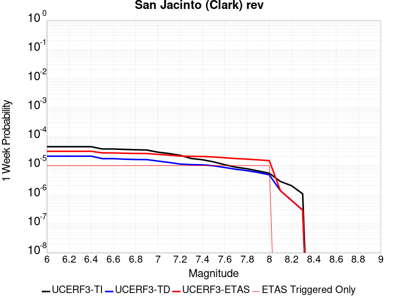 | 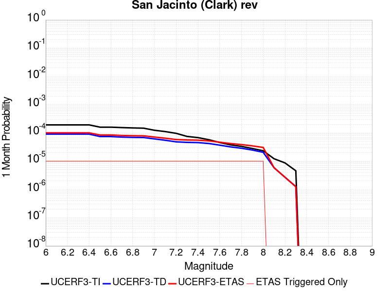 | 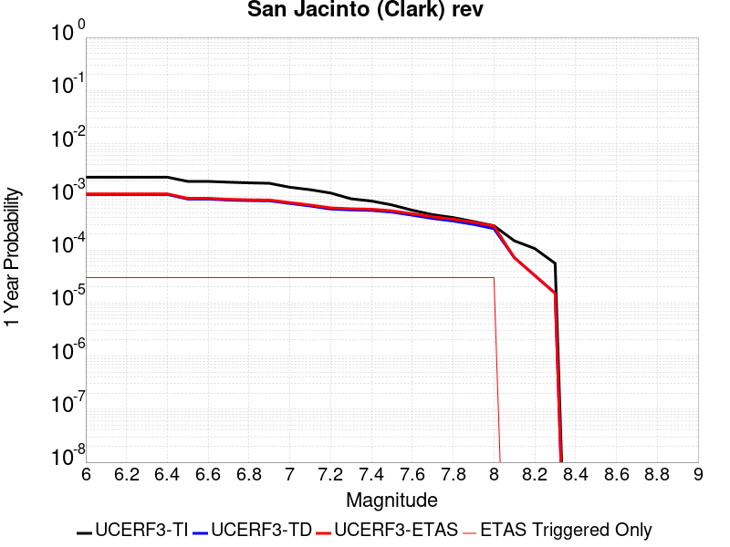 |  |

| Magnitude | 1 wk TI Prob | 1 wk TD Prob | 1 wk ETAS Prob | 1 wk ETAS/TD Gain | 1 wk ETAS Triggered Only | 1 mo TI Prob | 1 mo TD Prob | 1 mo ETAS Prob | 1 mo ETAS/TD Gain | 1 mo ETAS Triggered Only | 1 yr TI Prob | 1 yr TD Prob | 1 yr ETAS Prob | 1 yr ETAS/TD Gain | 1 yr ETAS Triggered Only | 10 yr TI Prob | 10 yr TD Prob | 10 yr ETAS Prob | 10 yr ETAS/TD Gain | 10 yr ETAS Triggered Only |
|-----|-----|-----|-----|-----|-----|-----|-----|-----|-----|-----|-----|-----|-----|-----|-----|-----|-----|-----|-----|-----|
| 6.0 | 4.482615E-5 | 2.1153059E-5 | 3.115285E-5 | 1.4727348 | 1.0E-5 | 1.9209793E-4 | 9.065287E-5 | 1.0065197E-4 | 1.1103009 | 1.0E-5 | 0.0023362834 | 0.0011031491 | 0.001133116 | 1.0271648 | 3.0E-5 | 0.02311874 | 0.011485709 | 0.011515364 | 1.002582 | 3.0E-5 |
| 6.1 | 4.482615E-5 | 2.1153059E-5 | 3.115285E-5 | 1.4727348 | 1.0E-5 | 1.9209793E-4 | 9.065287E-5 | 1.0065197E-4 | 1.1103009 | 1.0E-5 | 0.0023362834 | 0.0011031491 | 0.001133116 | 1.0271648 | 3.0E-5 | 0.02311874 | 0.011485709 | 0.011515364 | 1.002582 | 3.0E-5 |
| 6.2 | 4.482615E-5 | 2.1153059E-5 | 3.115285E-5 | 1.4727348 | 1.0E-5 | 1.9209793E-4 | 9.065287E-5 | 1.0065197E-4 | 1.1103009 | 1.0E-5 | 0.0023362834 | 0.0011031491 | 0.001133116 | 1.0271648 | 3.0E-5 | 0.02311874 | 0.011485709 | 0.011515364 | 1.002582 | 3.0E-5 |
| 6.3 | 4.482615E-5 | 2.1153059E-5 | 3.115285E-5 | 1.4727348 | 1.0E-5 | 1.9209793E-4 | 9.065287E-5 | 1.0065197E-4 | 1.1103009 | 1.0E-5 | 0.0023362834 | 0.0011031491 | 0.001133116 | 1.0271648 | 3.0E-5 | 0.02311874 | 0.011485709 | 0.011515364 | 1.002582 | 3.0E-5 |
| 6.4 | 4.482615E-5 | 2.1153059E-5 | 3.115285E-5 | 1.4727348 | 1.0E-5 | 1.9209793E-4 | 9.065287E-5 | 1.0065197E-4 | 1.1103009 | 1.0E-5 | 0.0023362834 | 0.0011031491 | 0.001133116 | 1.0271648 | 3.0E-5 | 0.02311874 | 0.011485709 | 0.011515364 | 1.002582 | 3.0E-5 |
| 6.5 | 3.7294863E-5 | 1.7354667E-5 | 2.7354492E-5 | 1.576204 | 1.0E-5 | 1.5982533E-4 | 7.437504E-5 | 8.4374304E-5 | 1.1344436 | 1.0E-5 | 0.0019441366 | 9.051445E-4 | 9.351173E-4 | 1.0331138 | 3.0E-5 | 0.01927216 | 0.009485902 | 0.009515618 | 1.0031326 | 3.0E-5 |
| 6.6 | 3.7294863E-5 | 1.7354667E-5 | 2.7354492E-5 | 1.576204 | 1.0E-5 | 1.5982533E-4 | 7.437504E-5 | 8.4374304E-5 | 1.1344436 | 1.0E-5 | 0.0019441366 | 9.051445E-4 | 9.351173E-4 | 1.0331138 | 3.0E-5 | 0.01927216 | 0.009485902 | 0.009515618 | 1.0031326 | 3.0E-5 |
| 6.7 | 3.6039248E-5 | 1.6602684E-5 | 2.6602518E-5 | 1.6023023 | 1.0E-5 | 1.5444479E-4 | 7.115244E-5 | 8.115173E-5 | 1.1405333 | 1.0E-5 | 0.0018787434 | 8.659408E-4 | 8.9591485E-4 | 1.0346144 | 3.0E-5 | 0.01862939 | 0.009088189 | 0.009117916 | 1.003271 | 3.0E-5 |
| 6.8 | 3.5031844E-5 | 1.6231123E-5 | 2.623096E-5 | 1.6160903 | 1.0E-5 | 1.5012783E-4 | 6.956012E-5 | 7.9559424E-5 | 1.1437505 | 1.0E-5 | 0.0018262739 | 8.4656954E-4 | 8.765441E-4 | 1.0354072 | 3.0E-5 | 0.01811338 | 0.008888788 | 0.008918521 | 1.003345 | 3.0E-5 |
| 6.9 | 3.435112E-5 | 1.6061658E-5 | 2.6061498E-5 | 1.6225907 | 1.0E-5 | 1.4721078E-4 | 6.8833884E-5 | 7.8833196E-5 | 1.1452672 | 1.0E-5 | 0.0017908178 | 8.377344E-4 | 8.677093E-4 | 1.0357809 | 3.0E-5 | 0.017764548 | 0.008796512 | 0.008826248 | 1.0033804 | 3.0E-5 |
| 7.0 | 2.8959772E-5 | 1.43355255E-5 | 2.4335382E-5 | 1.6975578 | 1.0E-5 | 1.241074E-4 | 6.1436534E-5 | 7.143592E-5 | 1.1627595 | 1.0E-5 | 0.0015099603 | 7.477359E-4 | 7.7771343E-4 | 1.0400912 | 3.0E-5 | 0.014997416 | 0.007868331 | 0.007898095 | 1.0037827 | 3.0E-5 |
| 7.1 | 2.6002877E-5 | 1.2827699E-5 | 2.2827571E-5 | 1.779553 | 1.0E-5 | 1.11436144E-4 | 5.4974706E-5 | 6.4974156E-5 | 1.1818918 | 1.0E-5 | 0.0013558907 | 6.6911365E-4 | 6.9909357E-4 | 1.0448054 | 3.0E-5 | 0.013476475 | 0.0070483433 | 0.007078132 | 1.0042263 | 3.0E-5 |
| 7.2 | 2.2544838E-5 | 1.1260331E-5 | 2.1260219E-5 | 1.8880633 | 1.0E-5 | 9.661716E-5 | 4.825768E-5 | 5.8257196E-5 | 1.2072109 | 1.0E-5 | 0.001175679 | 5.873803E-4 | 6.173627E-4 | 1.0510442 | 3.0E-5 | 0.011694785 | 0.00619256 | 0.0062223743 | 1.0048145 | 3.0E-5 |
| 7.3 | 1.75334E-5 | 1.0810585E-5 | 2.0810478E-5 | 1.9250094 | 1.0E-5 | 7.514098E-5 | 4.6330264E-5 | 5.63298E-5 | 1.2158316 | 1.0E-5 | 9.144575E-4 | 5.6392635E-4 | 5.9390947E-4 | 1.0531684 | 3.0E-5 | 0.009107036 | 0.0059332196 | 0.0059630414 | 1.0050262 | 3.0E-5 |
| 7.4 | 1.5924552E-5 | 1.0610475E-5 | 2.0610369E-5 | 1.9424548 | 1.0E-5 | 6.82463E-5 | 4.547268E-5 | 5.5472225E-5 | 1.2199023 | 1.0E-5 | 8.305819E-4 | 5.534906E-4 | 5.83474E-4 | 1.0541714 | 3.0E-5 | 0.008274844 | 0.0058205863 | 0.0058504115 | 1.0051241 | 3.0E-5 |
| 7.5 | 1.3428931E-5 | 9.851045E-6 | 1.9850946E-5 | 2.0151107 | 1.0E-5 | 5.7551293E-5 | 4.221809E-5 | 5.2217667E-5 | 1.2368553 | 1.0E-5 | 7.004617E-4 | 5.1388505E-4 | 5.438697E-4 | 1.0583488 | 3.0E-5 | 0.006982579 | 0.005406209 | 0.0054360465 | 1.0055192 | 3.0E-5 |
| 7.6 | 1.0688787E-5 | 8.614091E-6 | 1.8614004E-5 | 2.1608787 | 1.0E-5 | 4.5808283E-5 | 3.6917012E-5 | 4.691664E-5 | 1.2708678 | 1.0E-5 | 5.5757316E-4 | 4.4937237E-4 | 4.793589E-4 | 1.0667298 | 3.0E-5 | 0.005561762 | 0.0047413614 | 0.004771219 | 1.0062973 | 3.0E-5 |
| 7.7 | 8.81236E-6 | 7.4673385E-6 | 1.7467264E-5 | 2.3391552 | 1.0E-5 | 3.776671E-5 | 3.200249E-5 | 4.2002168E-5 | 1.3124657 | 1.0E-5 | 4.597127E-4 | 3.8956082E-4 | 4.1954915E-4 | 1.0769798 | 3.0E-5 | 0.0045876284 | 0.0041344194 | 0.0041642953 | 1.0072261 | 3.0E-5 |
| 7.8 | 7.780431E-6 | 6.695928E-6 | 1.669586E-5 | 2.4934351 | 1.0E-5 | 3.3344273E-5 | 2.8696519E-5 | 3.869623E-5 | 1.3484644 | 1.0E-5 | 4.0589093E-4 | 3.4932428E-4 | 3.793138E-4 | 1.0858501 | 3.0E-5 | 0.0040515037 | 0.0037226272 | 0.0037525154 | 1.0080289 | 3.0E-5 |
| 7.9 | 6.5437994E-6 | 5.7797783E-6 | 1.577972E-5 | 2.7301602 | 1.0E-5 | 2.8044553E-5 | 2.4770245E-5 | 3.4769997E-5 | 1.4037002 | 1.0E-5 | 3.4138895E-4 | 3.0153614E-4 | 3.3152712E-4 | 1.0994606 | 3.0E-5 | 0.0034086495 | 0.0032343294 | 0.0032642323 | 1.0092455 | 3.0E-5 |
| 8.0 | 5.4488164E-6 | 4.812793E-6 | 1.4812745E-5 | 3.0777855 | 1.0E-5 | 2.3351862E-5 | 2.0626094E-5 | 3.0625888E-5 | 1.4848127 | 1.0E-5 | 2.8427184E-4 | 2.510939E-4 | 2.8108637E-4 | 1.1194472 | 3.0E-5 | 0.0028390845 | 0.0027107038 | 0.0027406223 | 1.0110372 | 3.0E-5 |
| 8.1 | 2.8397242E-6 | 1.3665673E-6 | 1.3665673E-6 | 1.0 | 0.0 | 1.217019E-5 | 5.856704E-6 | 5.856704E-6 | 1.0 | 0.0 | 1.4816198E-4 | 7.1303046E-5 | 7.1303046E-5 | 1.0 | 0.0 | 0.0014806325 | 8.113543E-4 | 8.113543E-4 | 1.0 | 0.0 |
| 8.2 | 2.030244E-6 | 6.3151083E-7 | 6.3151083E-7 | 1.0 | 0.0 | 8.701017E-6 | 2.7064723E-6 | 2.7064723E-6 | 1.0 | 0.0 | 1.05929736E-4 | 3.2950808E-5 | 3.2950808E-5 | 1.0 | 0.0 | 0.0010587925 | 3.9470522E-4 | 3.9470522E-4 | 1.0 | 0.0 |
| 8.3 | 1.0659804E-6 | 2.9230563E-7 | 2.9230563E-7 | 1.0 | 0.0 | 4.568479E-6 | 1.2527379E-6 | 1.2527379E-6 | 1.0 | 0.0 | 5.5619817E-5 | 1.5251981E-5 | 1.5251981E-5 | 1.0 | 0.0 | 5.5605895E-4 | 1.8556409E-4 | 1.8556409E-4 | 1.0 | 0.0 |

## Great Valley 05 Pittsburg - Kirby Hills alt1
*[(top)](#table-of-contents)*

| 1 Week | 1 Month | 1 Year | 10 Year |
|-----|-----|-----|-----|
| 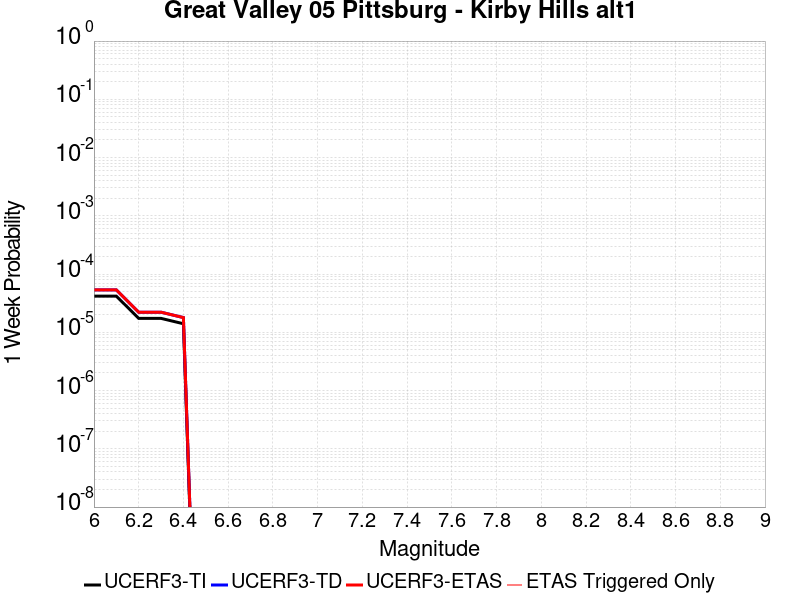 | 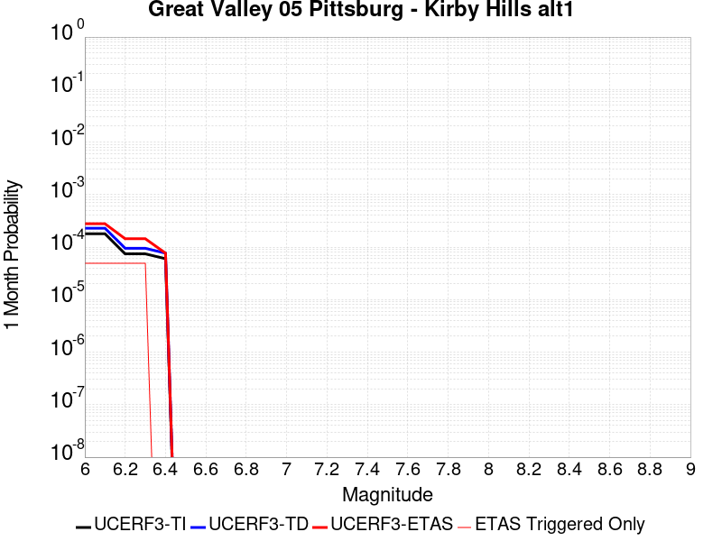 | 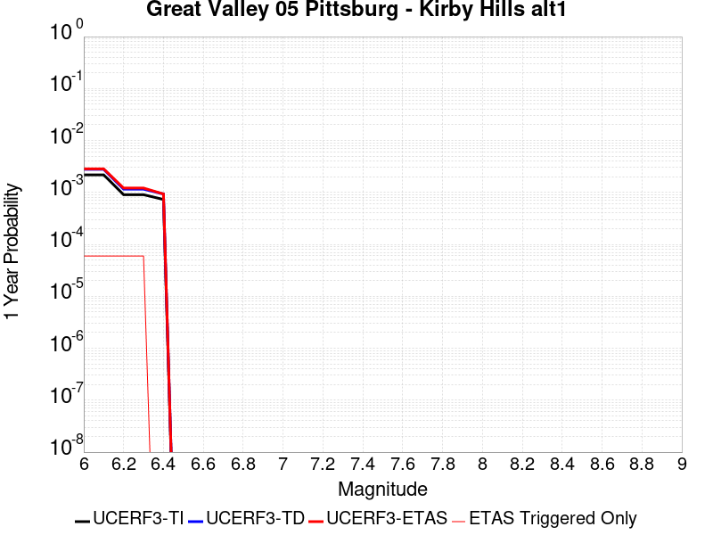 | 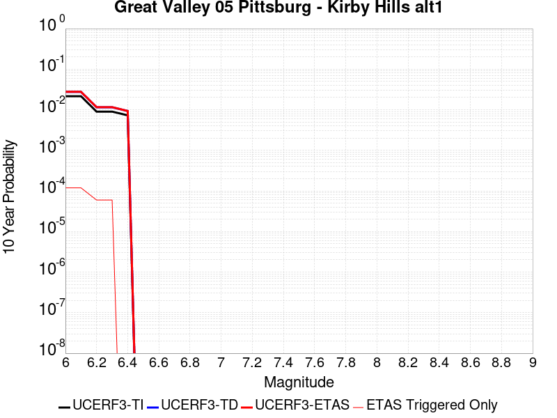 |

| Magnitude | 1 wk TI Prob | 1 wk TD Prob | 1 wk ETAS Prob | 1 wk ETAS/TD Gain | 1 wk ETAS Triggered Only | 1 mo TI Prob | 1 mo TD Prob | 1 mo ETAS Prob | 1 mo ETAS/TD Gain | 1 mo ETAS Triggered Only | 1 yr TI Prob | 1 yr TD Prob | 1 yr ETAS Prob | 1 yr ETAS/TD Gain | 1 yr ETAS Triggered Only | 10 yr TI Prob | 10 yr TD Prob | 10 yr ETAS Prob | 10 yr ETAS/TD Gain | 10 yr ETAS Triggered Only |
|-----|-----|-----|-----|-----|-----|-----|-----|-----|-----|-----|-----|-----|-----|-----|-----|-----|-----|-----|-----|-----|
| 6.0 | 4.187212E-5 | 5.344289E-5 | 5.344289E-5 | 1.0 | 0.0 | 1.794396E-4 | 2.2902661E-4 | 2.3902432E-4 | 1.043653 | 1.0E-5 | 0.002182488 | 0.0027857998 | 0.002795772 | 1.0035796 | 1.0E-5 | 0.021611776 | 0.027603218 | 0.02763239 | 1.0010568 | 3.0E-5 |
| 6.1 | 4.187212E-5 | 5.344289E-5 | 5.344289E-5 | 1.0 | 0.0 | 1.794396E-4 | 2.2902661E-4 | 2.3902432E-4 | 1.043653 | 1.0E-5 | 0.002182488 | 0.0027857998 | 0.002795772 | 1.0035796 | 1.0E-5 | 0.021611776 | 0.027603218 | 0.02763239 | 1.0010568 | 3.0E-5 |
| 6.2 | 1.7353306E-5 | 2.2154672E-5 | 2.2154672E-5 | 1.0 | 0.0 | 7.436919E-5 | 9.4947456E-5 | 1.04946506E-4 | 1.1053114 | 1.0E-5 | 9.050688E-4 | 0.0011557573 | 0.0011657458 | 1.0086423 | 1.0E-5 | 0.009013915 | 0.0115352 | 0.0115549695 | 1.0017139 | 2.0E-5 |
| 6.3 | 1.7353306E-5 | 2.2154672E-5 | 2.2154672E-5 | 1.0 | 0.0 | 7.436919E-5 | 9.4947456E-5 | 1.04946506E-4 | 1.1053114 | 1.0E-5 | 9.050688E-4 | 0.0011557573 | 0.0011657458 | 1.0086423 | 1.0E-5 | 0.009013915 | 0.0115352 | 0.0115549695 | 1.0017139 | 2.0E-5 |
| 6.4 | 1.4028824E-5 | 1.7901062E-5 | 1.7901062E-5 | 1.0 | 0.0 | 6.0122147E-5 | 7.671883E-5 | 7.671883E-5 | 1.0 | 0.0 | 7.3174125E-4 | 9.340303E-4 | 9.340303E-4 | 1.0 | 0.0 | 0.0072933645 | 0.009338211 | 0.009348118 | 1.0010608 | 1.0E-5 |

## Ortigalita (South)
*[(top)](#table-of-contents)*

| 1 Week | 1 Month | 1 Year | 10 Year |
|-----|-----|-----|-----|
|  |  | 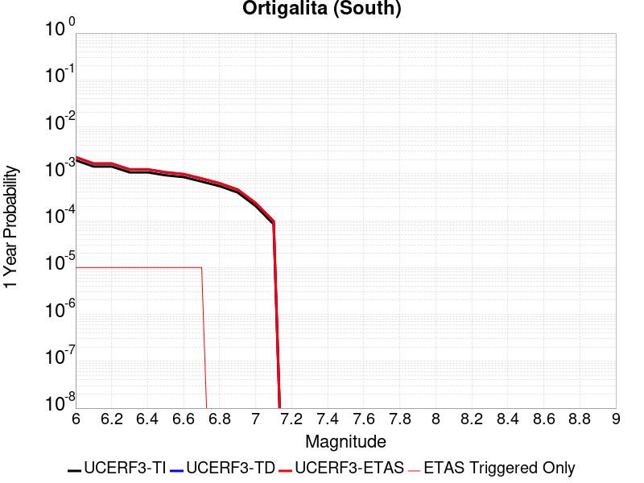 | 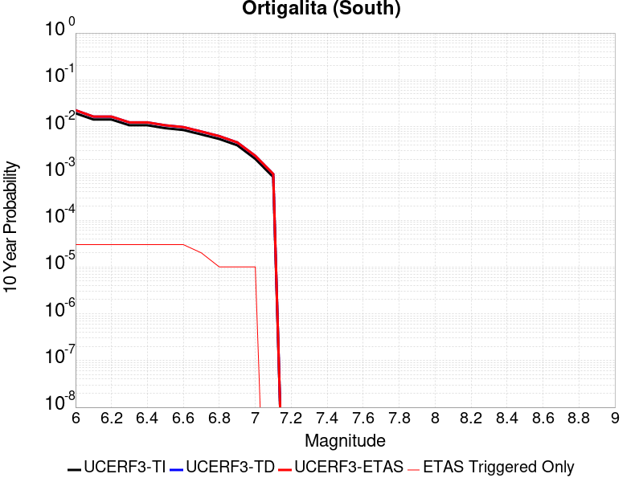 |

| Magnitude | 1 wk TI Prob | 1 wk TD Prob | 1 wk ETAS Prob | 1 wk ETAS/TD Gain | 1 wk ETAS Triggered Only | 1 mo TI Prob | 1 mo TD Prob | 1 mo ETAS Prob | 1 mo ETAS/TD Gain | 1 mo ETAS Triggered Only | 1 yr TI Prob | 1 yr TD Prob | 1 yr ETAS Prob | 1 yr ETAS/TD Gain | 1 yr ETAS Triggered Only | 10 yr TI Prob | 10 yr TD Prob | 10 yr ETAS Prob | 10 yr ETAS/TD Gain | 10 yr ETAS Triggered Only |
|-----|-----|-----|-----|-----|-----|-----|-----|-----|-----|-----|-----|-----|-----|-----|-----|-----|-----|-----|-----|-----|
| 6.0 | 3.72394E-5 | 4.32556E-5 | 4.32556E-5 | 1.0 | 0.0 | 1.5958765E-4 | 1.8536886E-4 | 1.8536886E-4 | 1.0 | 0.0 | 0.0019412481 | 0.0022546863 | 0.0022646638 | 1.0044252 | 1.0E-5 | 0.019243775 | 0.022334501 | 0.022363832 | 1.0013132 | 3.0E-5 |
| 6.1 | 2.7299884E-5 | 3.1492036E-5 | 3.1492036E-5 | 1.0 | 0.0 | 1.16994255E-4 | 1.349592E-4 | 1.349592E-4 | 1.0 | 0.0 | 0.0014234743 | 0.0016419457 | 0.0016519293 | 1.0060804 | 1.0E-5 | 0.014143906 | 0.016304072 | 0.016333584 | 1.0018101 | 3.0E-5 |
| 6.2 | 2.7299884E-5 | 3.1492036E-5 | 3.1492036E-5 | 1.0 | 0.0 | 1.16994255E-4 | 1.349592E-4 | 1.349592E-4 | 1.0 | 0.0 | 0.0014234743 | 0.0016419457 | 0.0016519293 | 1.0060804 | 1.0E-5 | 0.014143906 | 0.016304072 | 0.016333584 | 1.0018101 | 3.0E-5 |
| 6.3 | 2.0546433E-5 | 2.3631454E-5 | 2.3631454E-5 | 1.0 | 0.0 | 8.805317E-5 | 1.0127383E-4 | 1.0127383E-4 | 1.0 | 0.0 | 0.00107152 | 0.0012323305 | 0.0012423181 | 1.0081047 | 1.0E-5 | 0.010663681 | 0.012257031 | 0.012286663 | 1.0024176 | 3.0E-5 |
| 6.4 | 2.0546433E-5 | 2.3631454E-5 | 2.3631454E-5 | 1.0 | 0.0 | 8.805317E-5 | 1.0127383E-4 | 1.0127383E-4 | 1.0 | 0.0 | 0.00107152 | 0.0012323305 | 0.0012423181 | 1.0081047 | 1.0E-5 | 0.010663681 | 0.012257031 | 0.012286663 | 1.0024176 | 3.0E-5 |
| 6.5 | 1.7779594E-5 | 2.0446974E-5 | 2.0446974E-5 | 1.0 | 0.0 | 7.619603E-5 | 8.762703E-5 | 8.762703E-5 | 1.0 | 0.0 | 9.272918E-4 | 0.0010663505 | 0.0010763399 | 1.0093678 | 1.0E-5 | 0.009234319 | 0.010613804 | 0.010643485 | 1.0027965 | 3.0E-5 |
| 6.6 | 1.6272212E-5 | 1.8714967E-5 | 1.8714967E-5 | 1.0 | 0.0 | 6.973618E-5 | 8.0204605E-5 | 8.0204605E-5 | 1.0 | 0.0 | 8.487073E-4 | 9.760659E-4 | 9.86056E-4 | 1.0102352 | 1.0E-5 | 0.008454733 | 0.009719091 | 0.009748799 | 1.0030568 | 3.0E-5 |
| 6.7 | 1.3051484E-5 | 1.5038758E-5 | 1.5038758E-5 | 1.0 | 0.0 | 5.593373E-5 | 6.445028E-5 | 6.445028E-5 | 1.0 | 0.0 | 6.807804E-4 | 7.844092E-4 | 7.9440133E-4 | 1.0127385 | 1.0E-5 | 0.006786986 | 0.007817388 | 0.007837231 | 1.0025384 | 2.0E-5 |
| 6.8 | 1.04277415E-5 | 1.1987235E-5 | 1.1987235E-5 | 1.0 | 0.0 | 4.4689557E-5 | 5.1372896E-5 | 5.1372896E-5 | 1.0 | 0.0 | 5.439595E-4 | 6.2529295E-4 | 6.2529295E-4 | 1.0 | 0.0 | 0.0054262993 | 0.00623609 | 0.0062460275 | 1.0015936 | 1.0E-5 |
| 6.9 | 7.639968E-6 | 8.791503E-6 | 8.791503E-6 | 1.0 | 0.0 | 3.274231E-5 | 3.767736E-5 | 3.767736E-5 | 1.0 | 0.0 | 3.9856473E-4 | 4.586312E-4 | 4.586312E-4 | 1.0 | 0.0 | 0.003978506 | 0.004577433 | 0.004587387 | 1.0021746 | 1.0E-5 |
| 7.0 | 3.919831E-6 | 4.5334014E-6 | 4.5334014E-6 | 1.0 | 0.0 | 1.679917E-5 | 1.942873E-5 | 1.942873E-5 | 1.0 | 0.0 | 2.045107E-4 | 2.3652123E-4 | 2.3652123E-4 | 1.0 | 0.0 | 0.0020432258 | 0.0023629034 | 0.0023728798 | 1.004222 | 1.0E-5 |
| 7.1 | 1.6017933E-6 | 1.8570418E-6 | 1.8570418E-6 | 1.0 | 0.0 | 6.8648105E-6 | 7.958732E-6 | 7.958732E-6 | 1.0 | 0.0 | 8.357586E-5 | 9.689432E-5 | 9.689432E-5 | 1.0 | 0.0 | 8.3544437E-4 | 9.686254E-4 | 9.686254E-4 | 1.0 | 0.0 |

## Fontana (Seismicity)
*[(top)](#table-of-contents)*

| 1 Week | 1 Month | 1 Year | 10 Year |
|-----|-----|-----|-----|
| 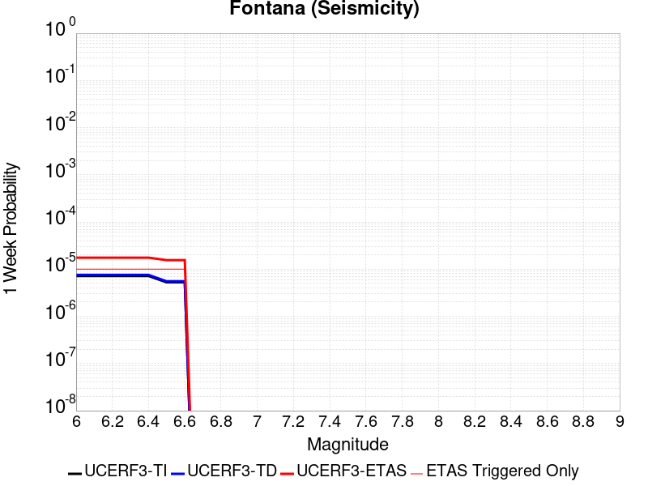 | 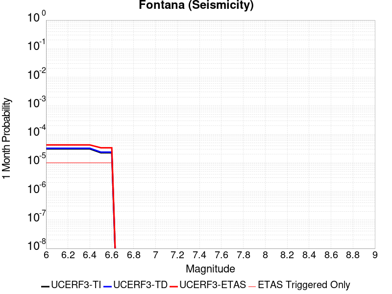 |  | 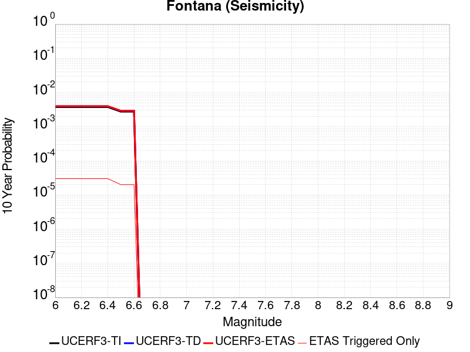 |

| Magnitude | 1 wk TI Prob | 1 wk TD Prob | 1 wk ETAS Prob | 1 wk ETAS/TD Gain | 1 wk ETAS Triggered Only | 1 mo TI Prob | 1 mo TD Prob | 1 mo ETAS Prob | 1 mo ETAS/TD Gain | 1 mo ETAS Triggered Only | 1 yr TI Prob | 1 yr TD Prob | 1 yr ETAS Prob | 1 yr ETAS/TD Gain | 1 yr ETAS Triggered Only | 10 yr TI Prob | 10 yr TD Prob | 10 yr ETAS Prob | 10 yr ETAS/TD Gain | 10 yr ETAS Triggered Only |
|-----|-----|-----|-----|-----|-----|-----|-----|-----|-----|-----|-----|-----|-----|-----|-----|-----|-----|-----|-----|-----|
| 6.0 | 7.1789214E-6 | 7.5520006E-6 | 1.7551925E-5 | 2.3241425 | 1.0E-5 | 3.076644E-5 | 3.2365548E-5 | 4.2365224E-5 | 1.3089606 | 1.0E-5 | 3.7451705E-4 | 3.9402005E-4 | 4.0401611E-4 | 1.0253694 | 1.0E-5 | 0.003738865 | 0.003937214 | 0.003967096 | 1.0075896 | 3.0E-5 |
| 6.1 | 7.1789214E-6 | 7.5520006E-6 | 1.7551925E-5 | 2.3241425 | 1.0E-5 | 3.076644E-5 | 3.2365548E-5 | 4.2365224E-5 | 1.3089606 | 1.0E-5 | 3.7451705E-4 | 3.9402005E-4 | 4.0401611E-4 | 1.0253694 | 1.0E-5 | 0.003738865 | 0.003937214 | 0.003967096 | 1.0075896 | 3.0E-5 |
| 6.2 | 7.1789214E-6 | 7.5520006E-6 | 1.7551925E-5 | 2.3241425 | 1.0E-5 | 3.076644E-5 | 3.2365548E-5 | 4.2365224E-5 | 1.3089606 | 1.0E-5 | 3.7451705E-4 | 3.9402005E-4 | 4.0401611E-4 | 1.0253694 | 1.0E-5 | 0.003738865 | 0.003937214 | 0.003967096 | 1.0075896 | 3.0E-5 |
| 6.3 | 7.1789214E-6 | 7.5520006E-6 | 1.7551925E-5 | 2.3241425 | 1.0E-5 | 3.076644E-5 | 3.2365548E-5 | 4.2365224E-5 | 1.3089606 | 1.0E-5 | 3.7451705E-4 | 3.9402005E-4 | 4.0401611E-4 | 1.0253694 | 1.0E-5 | 0.003738865 | 0.003937214 | 0.003967096 | 1.0075896 | 3.0E-5 |
| 6.4 | 7.1789214E-6 | 7.5520006E-6 | 1.7551925E-5 | 2.3241425 | 1.0E-5 | 3.076644E-5 | 3.2365548E-5 | 4.2365224E-5 | 1.3089606 | 1.0E-5 | 3.7451705E-4 | 3.9402005E-4 | 4.0401611E-4 | 1.0253694 | 1.0E-5 | 0.003738865 | 0.003937214 | 0.003967096 | 1.0075896 | 3.0E-5 |
| 6.5 | 5.2611317E-6 | 5.532726E-6 | 1.553267E-5 | 2.8074174 | 1.0E-5 | 2.2547512E-5 | 2.3711682E-5 | 3.3711443E-5 | 1.421723 | 1.0E-5 | 2.744814E-4 | 2.8868974E-4 | 2.9868685E-4 | 1.0346292 | 1.0E-5 | 0.002741426 | 0.0028868972 | 0.0029068396 | 1.0069078 | 2.0E-5 |
| 6.6 | 5.2611317E-6 | 5.532726E-6 | 1.553267E-5 | 2.8074174 | 1.0E-5 | 2.2547512E-5 | 2.3711682E-5 | 3.3711443E-5 | 1.421723 | 1.0E-5 | 2.744814E-4 | 2.8868974E-4 | 2.9868685E-4 | 1.0346292 | 1.0E-5 | 0.002741426 | 0.0028868972 | 0.0029068396 | 1.0069078 | 2.0E-5 |

## Hat Creek-McArthur-Mayfield
*[(top)](#table-of-contents)*

| 1 Week | 1 Month | 1 Year | 10 Year |
|-----|-----|-----|-----|
| 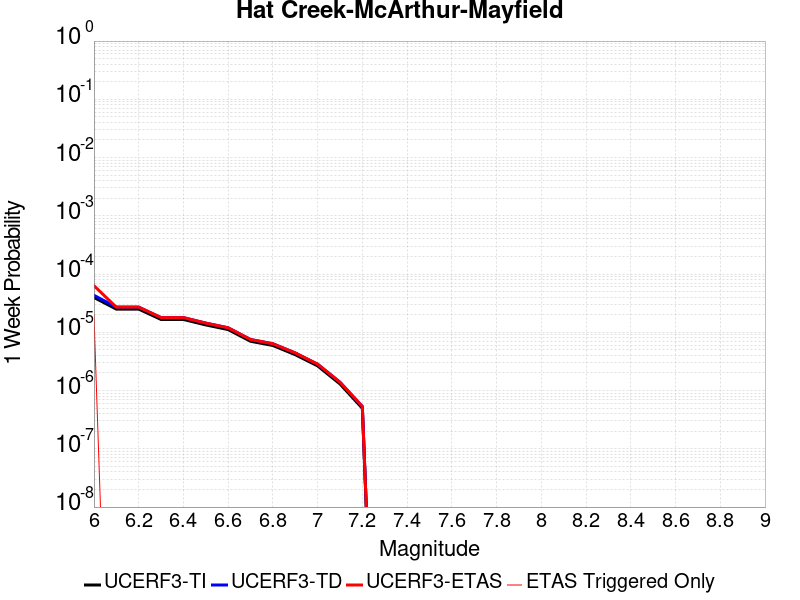 |  | 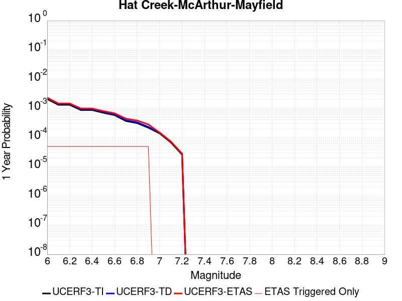 | 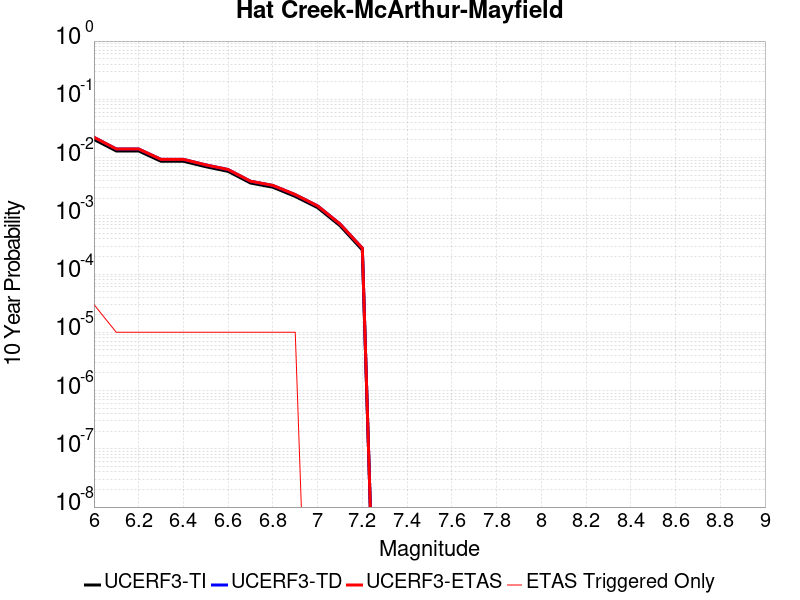 |

| Magnitude | 1 wk TI Prob | 1 wk TD Prob | 1 wk ETAS Prob | 1 wk ETAS/TD Gain | 1 wk ETAS Triggered Only | 1 mo TI Prob | 1 mo TD Prob | 1 mo ETAS Prob | 1 mo ETAS/TD Gain | 1 mo ETAS Triggered Only | 1 yr TI Prob | 1 yr TD Prob | 1 yr ETAS Prob | 1 yr ETAS/TD Gain | 1 yr ETAS Triggered Only | 10 yr TI Prob | 10 yr TD Prob | 10 yr ETAS Prob | 10 yr ETAS/TD Gain | 10 yr ETAS Triggered Only |
|-----|-----|-----|-----|-----|-----|-----|-----|-----|-----|-----|-----|-----|-----|-----|-----|-----|-----|-----|-----|-----|
| 6.0 | 3.967457E-5 | 4.315831E-5 | 6.3157444E-5 | 1.4633901 | 2.0E-5 | 1.7002279E-4 | 1.8495171E-4 | 2.1494617E-4 | 1.1621745 | 3.0E-5 | 0.002068062 | 0.002249576 | 0.0022795084 | 1.0133059 | 3.0E-5 | 0.02048922 | 0.022280399 | 0.02230973 | 1.0013164 | 3.0E-5 |
| 6.1 | 2.5044013E-5 | 2.7071164E-5 | 2.7071164E-5 | 1.0 | 0.0 | 1.0732707E-4 | 1.1601429E-4 | 1.2601314E-4 | 1.0861863 | 1.0E-5 | 0.0013059238 | 0.0014115906 | 0.0014215765 | 1.0070742 | 1.0E-5 | 0.01298276 | 0.01402966 | 0.01403952 | 1.0007027 | 1.0E-5 |
| 6.2 | 2.5044013E-5 | 2.7071164E-5 | 2.7071164E-5 | 1.0 | 0.0 | 1.0732707E-4 | 1.1601429E-4 | 1.2601314E-4 | 1.0861863 | 1.0E-5 | 0.0013059238 | 0.0014115906 | 0.0014215765 | 1.0070742 | 1.0E-5 | 0.01298276 | 0.01402966 | 0.01403952 | 1.0007027 | 1.0E-5 |
| 6.3 | 1.6624012E-5 | 1.7891072E-5 | 1.7891072E-5 | 1.0 | 0.0 | 7.124382E-5 | 7.6673816E-5 | 8.667305E-5 | 1.1304126 | 1.0E-5 | 8.670483E-4 | 9.331125E-4 | 9.4310316E-4 | 1.0107068 | 1.0E-5 | 0.008636732 | 0.009292879 | 0.009302787 | 1.0010661 | 1.0E-5 |
| 6.4 | 1.6624012E-5 | 1.7891072E-5 | 1.7891072E-5 | 1.0 | 0.0 | 7.124382E-5 | 7.6673816E-5 | 8.667305E-5 | 1.1304126 | 1.0E-5 | 8.670483E-4 | 9.331125E-4 | 9.4310316E-4 | 1.0107068 | 1.0E-5 | 0.008636732 | 0.009292879 | 0.009302787 | 1.0010661 | 1.0E-5 |
| 6.5 | 1.3394842E-5 | 1.4392137E-5 | 1.4392137E-5 | 1.0 | 0.0 | 5.7405203E-5 | 6.167916E-5 | 7.167854E-5 | 1.1621193 | 1.0E-5 | 6.986842E-4 | 7.506906E-4 | 7.606831E-4 | 1.013311 | 1.0E-5 | 0.006964916 | 0.0074821403 | 0.007492066 | 1.0013266 | 1.0E-5 |
| 6.6 | 1.1137514E-5 | 1.1954546E-5 | 1.1954546E-5 | 1.0 | 0.0 | 4.7731326E-5 | 5.1232782E-5 | 6.123227E-5 | 1.1951776 | 1.0E-5 | 5.809739E-4 | 6.2358467E-4 | 6.335784E-4 | 1.0160263 | 1.0E-5 | 0.005794574 | 0.00621877 | 0.0062287077 | 1.001598 | 1.0E-5 |
| 6.7 | 7.0200663E-6 | 7.5242897E-6 | 7.5242897E-6 | 1.0 | 0.0 | 3.008565E-5 | 3.2246568E-5 | 4.2246244E-5 | 1.3101006 | 1.0E-5 | 3.6623122E-4 | 3.925328E-4 | 4.0252888E-4 | 1.0254656 | 1.0E-5 | 0.0036562826 | 0.0039185574 | 0.003928518 | 1.002542 | 1.0E-5 |
| 6.8 | 5.940172E-6 | 6.3654766E-6 | 6.3654766E-6 | 1.0 | 0.0 | 2.545763E-5 | 2.7280335E-5 | 3.7280064E-5 | 1.3665544 | 1.0E-5 | 3.0990256E-4 | 3.3208873E-4 | 3.420854E-4 | 1.0301025 | 1.0E-5 | 0.0030947074 | 0.0033160534 | 0.0033260202 | 1.0030056 | 1.0E-5 |
| 6.9 | 4.129831E-6 | 4.423547E-6 | 4.423547E-6 | 1.0 | 0.0 | 1.7699154E-5 | 1.8957926E-5 | 2.8957737E-5 | 1.5274738 | 1.0E-5 | 2.154659E-4 | 2.3078908E-4 | 2.4078677E-4 | 1.0433196 | 1.0E-5 | 0.002152571 | 0.0023055724 | 0.0023155494 | 1.0043273 | 1.0E-5 |
| 7.0 | 2.6512955E-6 | 2.8374002E-6 | 2.8374002E-6 | 1.0 | 0.0 | 1.1362646E-5 | 1.2160232E-5 | 1.2160232E-5 | 1.0 | 0.0 | 1.3833142E-4 | 1.480412E-4 | 1.480412E-4 | 1.0 | 0.0 | 0.0013824535 | 0.0014794683 | 0.0014794683 | 1.0 | 0.0 |
| 7.1 | 1.2992575E-6 | 1.3909317E-6 | 1.3909317E-6 | 1.0 | 0.0 | 5.568235E-6 | 5.961124E-6 | 5.961124E-6 | 1.0 | 0.0 | 6.779115E-5 | 7.257448E-5 | 7.257448E-5 | 1.0 | 0.0 | 6.7770475E-4 | 7.2552945E-4 | 7.2552945E-4 | 1.0 | 0.0 |
| 7.2 | 4.968191E-7 | 5.3271475E-7 | 5.3271475E-7 | 1.0 | 0.0 | 2.1292228E-6 | 2.283062E-6 | 2.283062E-6 | 1.0 | 0.0 | 2.592298E-5 | 2.7796052E-5 | 2.7796052E-5 | 1.0 | 0.0 | 2.5919956E-4 | 2.7793812E-4 | 2.7793812E-4 | 1.0 | 0.0 |

## Hector Mine
*[(top)](#table-of-contents)*

| 1 Week | 1 Month | 1 Year | 10 Year |
|-----|-----|-----|-----|
|  | 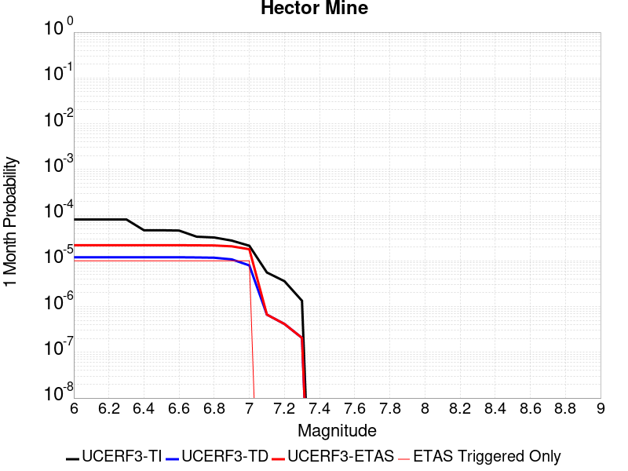 | 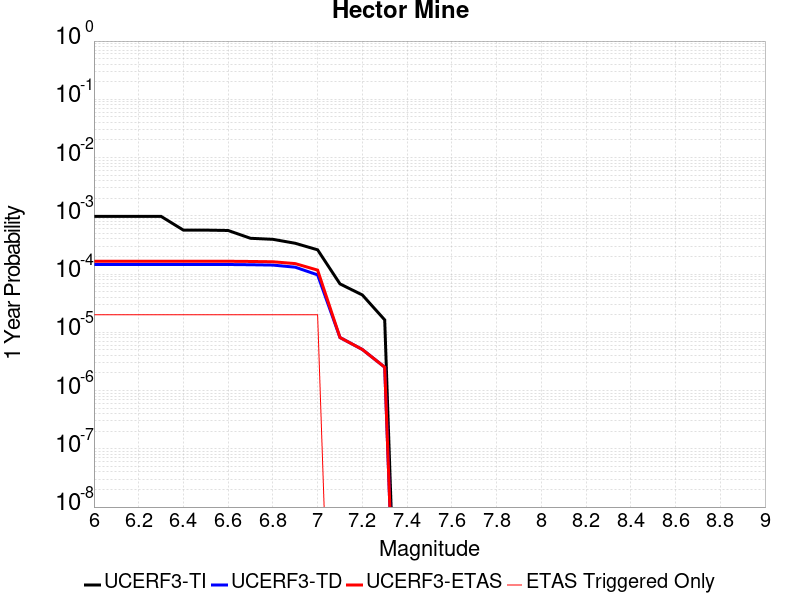 | 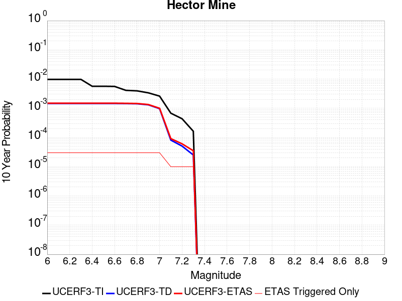 |

| Magnitude | 1 wk TI Prob | 1 wk TD Prob | 1 wk ETAS Prob | 1 wk ETAS/TD Gain | 1 wk ETAS Triggered Only | 1 mo TI Prob | 1 mo TD Prob | 1 mo ETAS Prob | 1 mo ETAS/TD Gain | 1 mo ETAS Triggered Only | 1 yr TI Prob | 1 yr TD Prob | 1 yr ETAS Prob | 1 yr ETAS/TD Gain | 1 yr ETAS Triggered Only | 10 yr TI Prob | 10 yr TD Prob | 10 yr ETAS Prob | 10 yr ETAS/TD Gain | 10 yr ETAS Triggered Only |
|-----|-----|-----|-----|-----|-----|-----|-----|-----|-----|-----|-----|-----|-----|-----|-----|-----|-----|-----|-----|-----|
| 6.0 | 1.8760093E-5 | 2.7962699E-6 | 2.7962699E-6 | 1.0 | 0.0 | 8.039792E-5 | 1.19839815E-5 | 2.1983862E-5 | 1.8344373 | 1.0E-5 | 9.78405E-4 | 1.458992E-4 | 1.6589629E-4 | 1.1370609 | 2.0E-5 | 0.009741086 | 0.0014584264 | 0.0014883826 | 1.0205401 | 3.0E-5 |
| 6.1 | 1.8760093E-5 | 2.7962699E-6 | 2.7962699E-6 | 1.0 | 0.0 | 8.039792E-5 | 1.19839815E-5 | 2.1983862E-5 | 1.8344373 | 1.0E-5 | 9.78405E-4 | 1.458992E-4 | 1.6589629E-4 | 1.1370609 | 2.0E-5 | 0.009741086 | 0.0014584264 | 0.0014883826 | 1.0205401 | 3.0E-5 |
| 6.2 | 1.8760093E-5 | 2.7962699E-6 | 2.7962699E-6 | 1.0 | 0.0 | 8.039792E-5 | 1.19839815E-5 | 2.1983862E-5 | 1.8344373 | 1.0E-5 | 9.78405E-4 | 1.458992E-4 | 1.6589629E-4 | 1.1370609 | 2.0E-5 | 0.009741086 | 0.0014584264 | 0.0014883826 | 1.0205401 | 3.0E-5 |
| 6.3 | 1.8760093E-5 | 2.7962699E-6 | 2.7962699E-6 | 1.0 | 0.0 | 8.039792E-5 | 1.19839815E-5 | 2.1983862E-5 | 1.8344373 | 1.0E-5 | 9.78405E-4 | 1.458992E-4 | 1.6589629E-4 | 1.1370609 | 2.0E-5 | 0.009741086 | 0.0014584264 | 0.0014883826 | 1.0205401 | 3.0E-5 |
| 6.4 | 1.0888055E-5 | 2.7962699E-6 | 2.7962699E-6 | 1.0 | 0.0 | 4.666226E-5 | 1.19839815E-5 | 2.1983862E-5 | 1.8344373 | 1.0E-5 | 5.679649E-4 | 1.458992E-4 | 1.6589629E-4 | 1.1370609 | 2.0E-5 | 0.0056651547 | 0.0014584264 | 0.0014883826 | 1.0205401 | 3.0E-5 |
| 6.5 | 1.0888055E-5 | 2.7962699E-6 | 2.7962699E-6 | 1.0 | 0.0 | 4.666226E-5 | 1.19839815E-5 | 2.1983862E-5 | 1.8344373 | 1.0E-5 | 5.679649E-4 | 1.458992E-4 | 1.6589629E-4 | 1.1370609 | 2.0E-5 | 0.0056651547 | 0.0014584264 | 0.0014883826 | 1.0205401 | 3.0E-5 |
| 6.6 | 1.0730738E-5 | 2.7962699E-6 | 2.7962699E-6 | 1.0 | 0.0 | 4.5988065E-5 | 1.19839815E-5 | 2.1983862E-5 | 1.8344373 | 1.0E-5 | 5.5976084E-4 | 1.458992E-4 | 1.6589629E-4 | 1.1370609 | 2.0E-5 | 0.0055835294 | 0.0014584264 | 0.0014883826 | 1.0205401 | 3.0E-5 |
| 6.7 | 7.881326E-6 | 2.770952E-6 | 2.770952E-6 | 1.0 | 0.0 | 3.3776672E-5 | 1.1875478E-5 | 2.187536E-5 | 1.8420614 | 1.0E-5 | 4.111534E-4 | 1.4457834E-4 | 1.6457545E-4 | 1.1383133 | 2.0E-5 | 0.0041039353 | 0.001445235 | 0.0014751916 | 1.0207279 | 3.0E-5 |
| 6.8 | 7.5683483E-6 | 2.7327321E-6 | 2.7327321E-6 | 1.0 | 0.0 | 3.2435375E-5 | 1.1711679E-5 | 2.1711561E-5 | 1.8538386 | 1.0E-5 | 3.9482914E-4 | 1.4258435E-4 | 1.625815E-4 | 1.1402478 | 2.0E-5 | 0.0039412836 | 0.0014253207 | 0.001455278 | 1.0210179 | 3.0E-5 |
| 6.9 | 6.473048E-6 | 2.513824E-6 | 2.513824E-6 | 1.0 | 0.0 | 2.7741338E-5 | 1.07735095E-5 | 2.0773401E-5 | 1.9281926 | 1.0E-5 | 3.3769844E-4 | 1.3116356E-4 | 1.5116093E-4 | 1.1524614 | 2.0E-5 | 0.0033718573 | 0.001311251 | 0.0013412116 | 1.022849 | 3.0E-5 |
| 7.0 | 4.9959954E-6 | 1.8564588E-6 | 1.8564588E-6 | 1.0 | 0.0 | 2.1411232E-5 | 7.956248E-6 | 1.7956168E-5 | 2.2568638 | 1.0E-5 | 2.6065056E-4 | 9.686658E-5 | 1.1686464E-4 | 1.2064495 | 2.0E-5 | 0.0026034506 | 9.685931E-4 | 9.985641E-4 | 1.0309428 | 3.0E-5 |
| 7.1 | 1.2997541E-6 | 1.5599346E-7 | 1.5599346E-7 | 1.0 | 0.0 | 5.5703626E-6 | 6.685433E-7 | 6.685433E-7 | 1.0 | 0.0 | 6.7817055E-5 | 8.139488E-6 | 8.139488E-6 | 1.0 | 0.0 | 6.779636E-4 | 8.1392296E-5 | 9.139148E-5 | 1.1228517 | 1.0E-5 |
| 7.2 | 8.392699E-7 | 9.725453E-8 | 9.725453E-8 | 1.0 | 0.0 | 3.596866E-6 | 4.1680505E-7 | 4.1680505E-7 | 1.0 | 0.0 | 4.3790962E-5 | 5.0745916E-6 | 5.0745916E-6 | 1.0 | 0.0 | 4.3782333E-4 | 5.074495E-5 | 6.0744445E-5 | 1.1970539 | 1.0E-5 |
| 7.3 | 3.13015E-7 | 4.8283802E-8 | 4.8283802E-8 | 1.0 | 0.0 | 1.3414921E-6 | 2.0693057E-7 | 2.0693057E-7 | 1.0 | 0.0 | 1.6332544E-5 | 2.5193776E-6 | 2.5193776E-6 | 1.0 | 0.0 | 1.6331344E-4 | 2.5193574E-5 | 3.5193323E-5 | 1.3969166 | 1.0E-5 |

## Newport-Inglewood (Offshore)
*[(top)](#table-of-contents)*

| 1 Week | 1 Month | 1 Year | 10 Year |
|-----|-----|-----|-----|
| 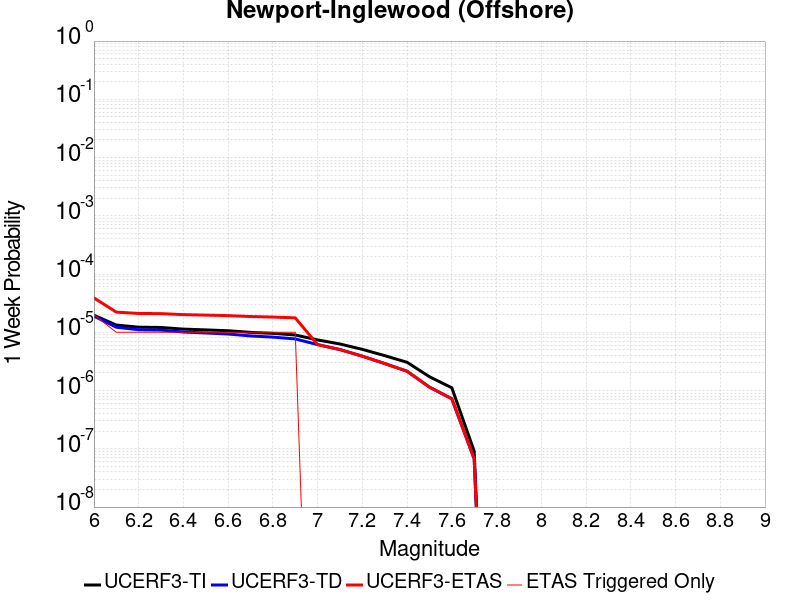 | 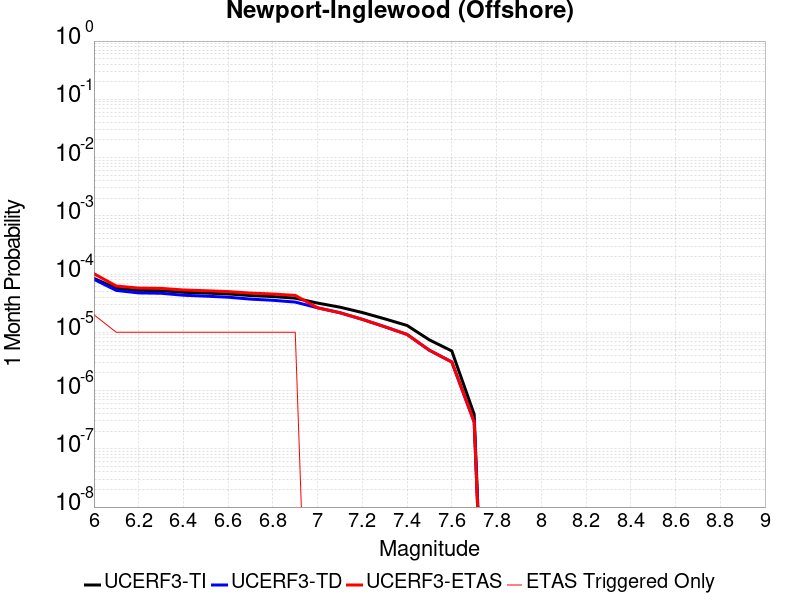 | 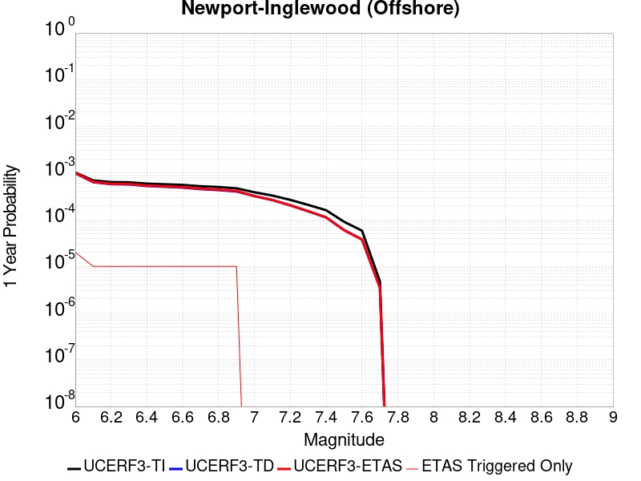 | 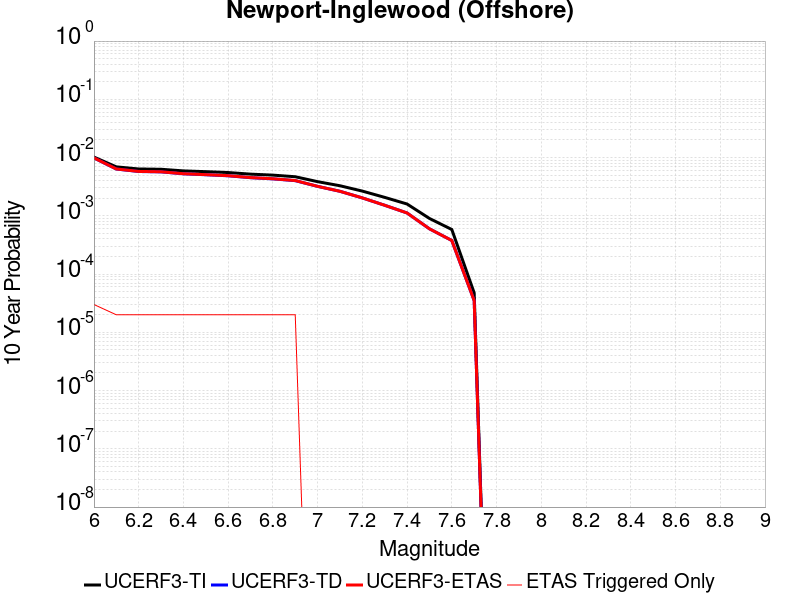 |

| Magnitude | 1 wk TI Prob | 1 wk TD Prob | 1 wk ETAS Prob | 1 wk ETAS/TD Gain | 1 wk ETAS Triggered Only | 1 mo TI Prob | 1 mo TD Prob | 1 mo ETAS Prob | 1 mo ETAS/TD Gain | 1 mo ETAS Triggered Only | 1 yr TI Prob | 1 yr TD Prob | 1 yr ETAS Prob | 1 yr ETAS/TD Gain | 1 yr ETAS Triggered Only | 10 yr TI Prob | 10 yr TD Prob | 10 yr ETAS Prob | 10 yr ETAS/TD Gain | 10 yr ETAS Triggered Only |
|-----|-----|-----|-----|-----|-----|-----|-----|-----|-----|-----|-----|-----|-----|-----|-----|-----|-----|-----|-----|-----|
| 6.0 | 1.9626508E-5 | 1.8965342E-5 | 3.8964965E-5 | 2.0545352 | 2.0E-5 | 8.411089E-5 | 8.1277576E-5 | 1.0127595E-4 | 1.2460504 | 2.0E-5 | 0.001023569 | 9.891179E-4 | 0.0010090981 | 1.0202 | 2.0E-5 | 0.010188672 | 0.009848497 | 0.009878201 | 1.0030161 | 3.0E-5 |
| 6.1 | 1.331886E-5 | 1.2218078E-5 | 2.2217957E-5 | 1.8184493 | 1.0E-5 | 5.707958E-5 | 5.2362153E-5 | 6.236163E-5 | 1.1909677 | 1.0E-5 | 6.947222E-4 | 6.3732424E-4 | 6.4731785E-4 | 1.0156806 | 1.0E-5 | 0.006925544 | 0.006355142 | 0.006375015 | 1.0031271 | 2.0E-5 |
| 6.2 | 1.2250852E-5 | 1.1076016E-5 | 2.1075904E-5 | 1.9028417 | 1.0E-5 | 5.2502597E-5 | 4.746778E-5 | 5.7467307E-5 | 1.2106593 | 1.0E-5 | 6.3903164E-4 | 5.7776796E-4 | 5.877622E-4 | 1.017298 | 1.0E-5 | 0.006371971 | 0.0057627796 | 0.0057826643 | 1.0034505 | 2.0E-5 |
| 6.3 | 1.2106258E-5 | 1.0918878E-5 | 2.091877E-5 | 1.915835 | 1.0E-5 | 5.1882926E-5 | 4.6794354E-5 | 5.6793888E-5 | 1.213691 | 1.0E-5 | 6.3149154E-4 | 5.695733E-4 | 5.795676E-4 | 1.017547 | 1.0E-5 | 0.0062970007 | 0.005681252 | 0.0057011386 | 1.0035003 | 2.0E-5 |
| 6.4 | 1.1348758E-5 | 1.0109348E-5 | 2.0109248E-5 | 1.9891734 | 1.0E-5 | 4.8636626E-5 | 4.3325064E-5 | 5.332463E-5 | 1.2308033 | 1.0E-5 | 5.919901E-4 | 5.2735576E-4 | 5.3735054E-4 | 1.0189525 | 1.0E-5 | 0.005904155 | 0.0052611395 | 0.0052810344 | 1.0037814 | 2.0E-5 |
| 6.5 | 1.100837E-5 | 9.743376E-6 | 1.9743278E-5 | 2.0263283 | 1.0E-5 | 4.7177873E-5 | 4.175666E-5 | 5.1756244E-5 | 1.2394727 | 1.0E-5 | 5.7423924E-4 | 5.082695E-4 | 5.182644E-4 | 1.0196646 | 1.0E-5 | 0.005727576 | 0.005071162 | 0.0050910604 | 1.0039239 | 2.0E-5 |
| 6.6 | 1.0634696E-5 | 9.34553E-6 | 1.9345436E-5 | 2.0700202 | 1.0E-5 | 4.557647E-5 | 4.0051662E-5 | 5.005126E-5 | 1.2496675 | 1.0E-5 | 5.5475225E-4 | 4.875206E-4 | 4.975157E-4 | 1.020502 | 1.0E-5 | 0.0055336943 | 0.0048645977 | 0.0048845005 | 1.0040914 | 2.0E-5 |
| 6.7 | 9.9780855E-6 | 8.667898E-6 | 1.8667812E-5 | 2.1536722 | 1.0E-5 | 4.276252E-5 | 3.7147613E-5 | 4.714724E-5 | 1.2691863 | 1.0E-5 | 5.205093E-4 | 4.5217903E-4 | 4.621745E-4 | 1.0221051 | 1.0E-5 | 0.0051929182 | 0.0045126686 | 0.0045325784 | 1.0044119 | 2.0E-5 |
| 6.8 | 9.59546E-6 | 8.272933E-6 | 1.827285E-5 | 2.2087512 | 1.0E-5 | 4.1122752E-5 | 3.545495E-5 | 4.545459E-5 | 1.2820381 | 1.0E-5 | 5.0055445E-4 | 4.3157916E-4 | 4.4157484E-4 | 1.0231607 | 1.0E-5 | 0.004994285 | 0.004307486 | 0.0043273997 | 1.004623 | 2.0E-5 |
| 6.9 | 9.000614E-6 | 7.706823E-6 | 1.7706747E-5 | 2.2975414 | 1.0E-5 | 3.857349E-5 | 3.3028828E-5 | 4.30285E-5 | 1.3027558 | 1.0E-5 | 4.6953102E-4 | 4.0205245E-4 | 4.1204842E-4 | 1.0248624 | 1.0E-5 | 0.004685402 | 0.0040133223 | 0.004033242 | 1.0049634 | 2.0E-5 |
| 7.0 | 7.4070194E-6 | 6.148865E-6 | 6.148865E-6 | 1.0 | 0.0 | 3.1743984E-5 | 2.6352012E-5 | 2.6352012E-5 | 1.0 | 0.0 | 3.8641447E-4 | 3.2078868E-4 | 3.2078868E-4 | 1.0 | 0.0 | 0.0038574322 | 0.0032032758 | 0.0032032758 | 1.0 | 0.0 |
| 7.1 | 6.299615E-6 | 5.0565613E-6 | 5.0565613E-6 | 1.0 | 0.0 | 2.699807E-5 | 2.1670798E-5 | 2.1670798E-5 | 1.0 | 0.0 | 3.2865192E-4 | 2.6381016E-4 | 2.6381016E-4 | 1.0 | 0.0 | 0.003281663 | 0.0026349847 | 0.0026349847 | 1.0 | 0.0 |
| 7.2 | 5.096653E-6 | 3.892733E-6 | 3.892733E-6 | 1.0 | 0.0 | 2.1842614E-5 | 1.6683034E-5 | 1.6683034E-5 | 1.0 | 0.0 | 2.6590136E-4 | 2.0309711E-4 | 2.0309711E-4 | 1.0 | 0.0 | 0.0026558342 | 0.0020291263 | 0.0020291263 | 1.0 | 0.0 |
| 7.3 | 3.9753018E-6 | 2.9098787E-6 | 2.9098787E-6 | 1.0 | 0.0 | 1.7036897E-5 | 1.24708495E-5 | 1.24708495E-5 | 1.0 | 0.0 | 2.0740448E-4 | 1.518221E-4 | 1.518221E-4 | 1.0 | 0.0 | 0.00207211 | 0.0015171919 | 0.0015171919 | 1.0 | 0.0 |
| 7.4 | 3.0568392E-6 | 2.1449732E-6 | 2.1449732E-6 | 1.0 | 0.0 | 1.3100675E-5 | 9.19271E-6 | 9.19271E-6 | 1.0 | 0.0 | 1.5948903E-4 | 1.11915564E-4 | 1.11915564E-4 | 1.0 | 0.0 | 0.0015937461 | 0.0011185983 | 0.0011185983 | 1.0 | 0.0 |
| 7.5 | 1.7279019E-6 | 1.1469651E-6 | 1.1469651E-6 | 1.0 | 0.0 | 7.405273E-6 | 4.9155556E-6 | 4.9155556E-6 | 1.0 | 0.0 | 9.015547E-5 | 5.9845286E-5 | 5.9845286E-5 | 1.0 | 0.0 | 9.01189E-4 | 5.982956E-4 | 5.982956E-4 | 1.0 | 0.0 |
| 7.6 | 1.1156416E-6 | 7.222962E-7 | 7.222962E-7 | 1.0 | 0.0 | 4.7813123E-6 | 3.0955514E-6 | 3.0955514E-6 | 1.0 | 0.0 | 5.821092E-5 | 3.768771E-5 | 3.768771E-5 | 1.0 | 0.0 | 5.8195676E-4 | 3.7681553E-4 | 3.7681553E-4 | 1.0 | 0.0 |
| 7.7 | 9.117973E-8 | 6.7342256E-8 | 6.7342256E-8 | 1.0 | 0.0 | 3.907702E-7 | 2.8860964E-7 | 2.8860964E-7 | 1.0 | 0.0 | 4.757617E-6 | 3.5138169E-6 | 3.5138169E-6 | 1.0 | 0.0 | 4.7575148E-5 | 3.5137644E-5 | 3.5137644E-5 | 1.0 | 0.0 |

## Santa Susana East (connector)
*[(top)](#table-of-contents)*

| 1 Week | 1 Month | 1 Year | 10 Year |
|-----|-----|-----|-----|
| 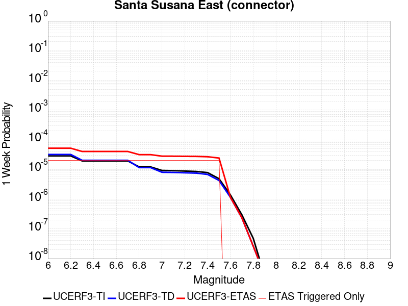 | 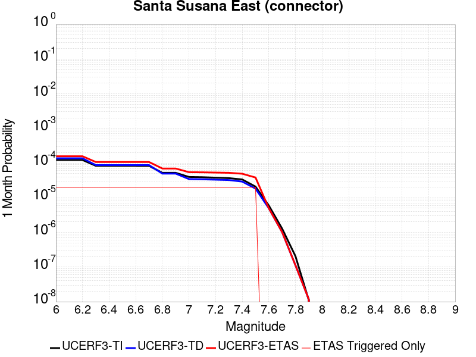 | 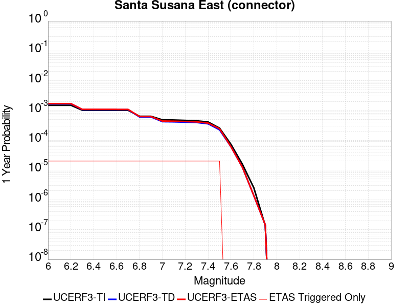 | 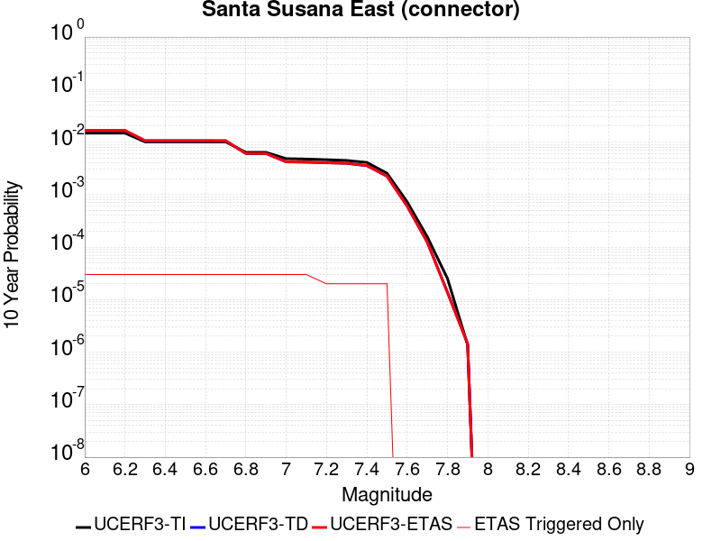 |

| Magnitude | 1 wk TI Prob | 1 wk TD Prob | 1 wk ETAS Prob | 1 wk ETAS/TD Gain | 1 wk ETAS Triggered Only | 1 mo TI Prob | 1 mo TD Prob | 1 mo ETAS Prob | 1 mo ETAS/TD Gain | 1 mo ETAS Triggered Only | 1 yr TI Prob | 1 yr TD Prob | 1 yr ETAS Prob | 1 yr ETAS/TD Gain | 1 yr ETAS Triggered Only | 10 yr TI Prob | 10 yr TD Prob | 10 yr ETAS Prob | 10 yr ETAS/TD Gain | 10 yr ETAS Triggered Only |
|-----|-----|-----|-----|-----|-----|-----|-----|-----|-----|-----|-----|-----|-----|-----|-----|-----|-----|-----|-----|-----|
| 6.0 | 2.858397E-5 | 3.2021693E-5 | 5.2021052E-5 | 1.6245567 | 2.0E-5 | 1.2249697E-4 | 1.3723019E-4 | 1.5722745E-4 | 1.1457205 | 2.0E-5 | 0.0014903803 | 0.00166977 | 0.0016897366 | 1.0119576 | 2.0E-5 | 0.014804244 | 0.016599316 | 0.016628819 | 1.0017773 | 3.0E-5 |
| 6.1 | 2.858397E-5 | 3.2021693E-5 | 5.2021052E-5 | 1.6245567 | 2.0E-5 | 1.2249697E-4 | 1.3723019E-4 | 1.5722745E-4 | 1.1457205 | 2.0E-5 | 0.0014903803 | 0.00166977 | 0.0016897366 | 1.0119576 | 2.0E-5 | 0.014804244 | 0.016599316 | 0.016628819 | 1.0017773 | 3.0E-5 |
| 6.2 | 2.858397E-5 | 3.2021693E-5 | 5.2021052E-5 | 1.6245567 | 2.0E-5 | 1.2249697E-4 | 1.3723019E-4 | 1.5722745E-4 | 1.1457205 | 2.0E-5 | 0.0014903803 | 0.00166977 | 0.0016897366 | 1.0119576 | 2.0E-5 | 0.014804244 | 0.016599316 | 0.016628819 | 1.0017773 | 3.0E-5 |
| 6.3 | 1.943582E-5 | 2.0367343E-5 | 4.0366936E-5 | 1.9819441 | 2.0E-5 | 8.329371E-5 | 8.7286324E-5 | 1.0728458E-4 | 1.229111 | 2.0E-5 | 0.001013629 | 0.001062305 | 0.0010822837 | 1.0188069 | 2.0E-5 | 0.010090181 | 0.010583852 | 0.010613535 | 1.0028045 | 3.0E-5 |
| 6.4 | 1.943582E-5 | 2.0367343E-5 | 4.0366936E-5 | 1.9819441 | 2.0E-5 | 8.329371E-5 | 8.7286324E-5 | 1.0728458E-4 | 1.229111 | 2.0E-5 | 0.001013629 | 0.001062305 | 0.0010822837 | 1.0188069 | 2.0E-5 | 0.010090181 | 0.010583852 | 0.010613535 | 1.0028045 | 3.0E-5 |
| 6.5 | 1.943582E-5 | 2.0367343E-5 | 4.0366936E-5 | 1.9819441 | 2.0E-5 | 8.329371E-5 | 8.7286324E-5 | 1.0728458E-4 | 1.229111 | 2.0E-5 | 0.001013629 | 0.001062305 | 0.0010822837 | 1.0188069 | 2.0E-5 | 0.010090181 | 0.010583852 | 0.010613535 | 1.0028045 | 3.0E-5 |
| 6.6 | 1.943582E-5 | 2.0367343E-5 | 4.0366936E-5 | 1.9819441 | 2.0E-5 | 8.329371E-5 | 8.7286324E-5 | 1.0728458E-4 | 1.229111 | 2.0E-5 | 0.001013629 | 0.001062305 | 0.0010822837 | 1.0188069 | 2.0E-5 | 0.010090181 | 0.010583852 | 0.010613535 | 1.0028045 | 3.0E-5 |
| 6.7 | 1.9404439E-5 | 2.0354766E-5 | 4.035436E-5 | 1.9825509 | 2.0E-5 | 8.3159226E-5 | 8.723242E-5 | 1.0723068E-4 | 1.2292526 | 2.0E-5 | 0.0010119933 | 0.0010616493 | 0.0010816281 | 1.0188186 | 2.0E-5 | 0.010073971 | 0.010577358 | 0.010607041 | 1.0028063 | 3.0E-5 |
| 6.8 | 1.2217526E-5 | 1.1593157E-5 | 3.1592925E-5 | 2.7251356 | 2.0E-5 | 5.2359774E-5 | 4.9684106E-5 | 6.968311E-5 | 1.4025232 | 2.0E-5 | 6.372938E-4 | 6.047529E-4 | 6.2474085E-4 | 1.0330514 | 2.0E-5 | 0.0063546924 | 0.006033274 | 0.006063093 | 1.0049424 | 3.0E-5 |
| 6.9 | 1.2217526E-5 | 1.1593157E-5 | 3.1592925E-5 | 2.7251356 | 2.0E-5 | 5.2359774E-5 | 4.9684106E-5 | 6.968311E-5 | 1.4025232 | 2.0E-5 | 6.372938E-4 | 6.047529E-4 | 6.2474085E-4 | 1.0330514 | 2.0E-5 | 0.0063546924 | 0.006033274 | 0.006063093 | 1.0049424 | 3.0E-5 |
| 7.0 | 9.276017E-6 | 8.059273E-6 | 2.8059112E-5 | 3.4815934 | 2.0E-5 | 3.9753755E-5 | 3.4539302E-5 | 5.4538614E-5 | 1.5790305 | 2.0E-5 | 4.8389446E-4 | 4.2043833E-4 | 4.4042993E-4 | 1.0475494 | 2.0E-5 | 0.0048284214 | 0.0041973097 | 0.004227184 | 1.0071174 | 3.0E-5 |
| 7.1 | 9.130355E-6 | 7.942446E-6 | 2.7942287E-5 | 3.5180957 | 2.0E-5 | 3.9129503E-5 | 3.4038632E-5 | 5.403795E-5 | 1.5875477 | 2.0E-5 | 4.7629757E-4 | 4.1434498E-4 | 4.343367E-4 | 1.048249 | 2.0E-5 | 0.00475278 | 0.0041366047 | 0.0041664806 | 1.0072223 | 3.0E-5 |
| 7.2 | 8.851015E-6 | 7.741608E-6 | 2.7741453E-5 | 3.5834227 | 2.0E-5 | 3.7932372E-5 | 3.317792E-5 | 5.3177253E-5 | 1.6027906 | 2.0E-5 | 4.6172875E-4 | 4.038697E-4 | 4.2386164E-4 | 1.049501 | 2.0E-5 | 0.0046077054 | 0.0040322347 | 0.0040521543 | 1.00494 | 2.0E-5 |
| 7.3 | 8.573006E-6 | 7.5503312E-6 | 2.755018E-5 | 3.6488702 | 2.0E-5 | 3.6740938E-5 | 3.235818E-5 | 5.2357533E-5 | 1.6180617 | 2.0E-5 | 4.472291E-4 | 3.9389305E-4 | 4.1388517E-4 | 1.0507553 | 2.0E-5 | 0.004463301 | 0.003932817 | 0.0039527384 | 1.0050654 | 2.0E-5 |
| 7.4 | 7.852282E-6 | 6.8178556E-6 | 2.681772E-5 | 3.9334536 | 2.0E-5 | 3.36522E-5 | 2.921907E-5 | 4.9218488E-5 | 1.6844645 | 2.0E-5 | 4.096385E-4 | 3.5568717E-4 | 3.7568004E-4 | 1.0562092 | 2.0E-5 | 0.0040888423 | 0.0035519868 | 0.003571916 | 1.0056107 | 2.0E-5 |
| 7.5 | 4.8869324E-6 | 4.2790975E-6 | 2.4279012E-5 | 5.673863 | 2.0E-5 | 2.0943828E-5 | 1.833887E-5 | 3.83385E-5 | 2.0905597 | 2.0E-5 | 2.5496128E-4 | 2.2325452E-4 | 2.4325006E-4 | 1.0895638 | 2.0E-5 | 0.0025466895 | 0.00223057 | 0.0022505252 | 1.0089463 | 2.0E-5 |
| 7.6 | 1.3894544E-6 | 1.1568394E-6 | 1.1568394E-6 | 1.0 | 0.0 | 5.954791E-6 | 4.957875E-6 | 4.957875E-6 | 1.0 | 0.0 | 7.249717E-5 | 6.036068E-5 | 6.036068E-5 | 1.0 | 0.0 | 7.247352E-4 | 6.0346466E-4 | 6.0346466E-4 | 1.0 | 0.0 |
| 7.7 | 2.9924632E-7 | 2.3719332E-7 | 2.3719332E-7 | 1.0 | 0.0 | 1.2824837E-6 | 1.0165425E-6 | 1.0165425E-6 | 1.0 | 0.0 | 1.5614127E-5 | 1.2376341E-5 | 1.2376341E-5 | 1.0 | 0.0 | 1.5613029E-4 | 1.2375724E-4 | 1.2375724E-4 | 1.0 | 0.0 |
| 7.8 | 4.8188564E-8 | 2.6321862E-8 | 2.6321862E-8 | 1.0 | 0.0 | 2.065224E-7 | 1.12807975E-7 | 1.12807975E-7 | 1.0 | 0.0 | 2.5144072E-6 | 1.3734362E-6 | 1.3734362E-6 | 1.0 | 0.0 | 2.5143789E-5 | 1.3734286E-5 | 1.3734286E-5 | 1.0 | 0.0 |
| 7.9 | 2.6127251E-9 | 2.7681102E-9 | 2.7681102E-9 | 1.0 | 0.0 | 1.1197393E-8 | 1.186333E-8 | 1.186333E-8 | 1.0 | 0.0 | 1.3632825E-7 | 1.4443603E-7 | 1.4443603E-7 | 1.0 | 0.0 | 1.3632817E-6 | 1.4443604E-6 | 1.4443604E-6 | 1.0 | 0.0 |

## Clamshell-Sawpit
*[(top)](#table-of-contents)*

| 1 Week | 1 Month | 1 Year | 10 Year |
|-----|-----|-----|-----|
| 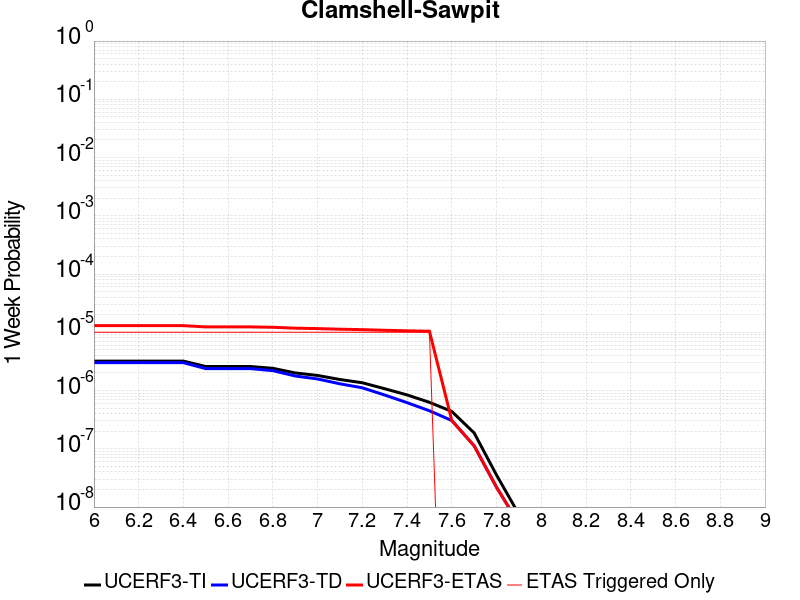 | 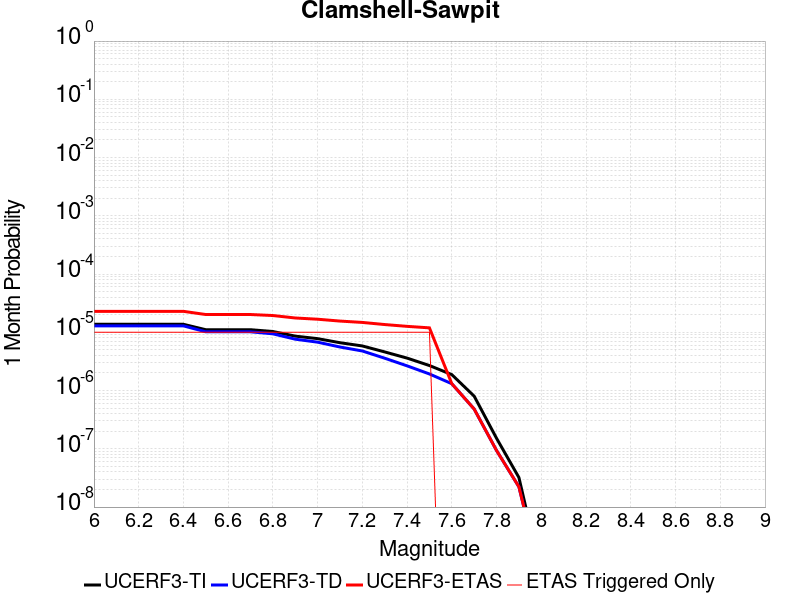 | 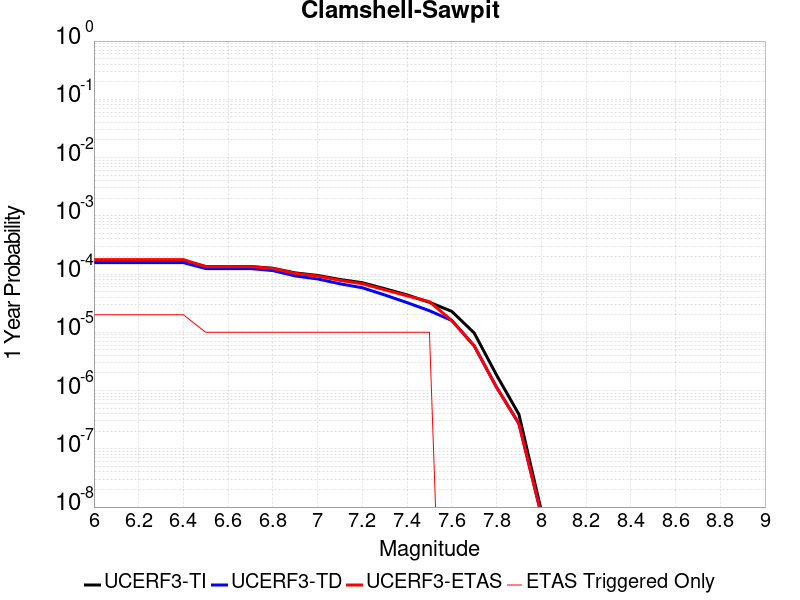 | 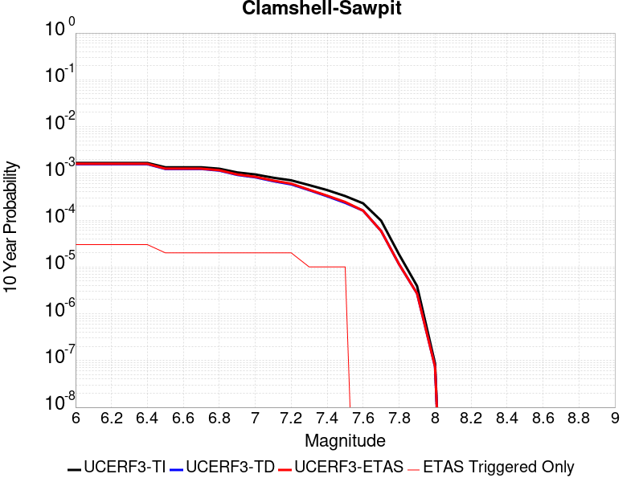 |

| Magnitude | 1 wk TI Prob | 1 wk TD Prob | 1 wk ETAS Prob | 1 wk ETAS/TD Gain | 1 wk ETAS Triggered Only | 1 mo TI Prob | 1 mo TD Prob | 1 mo ETAS Prob | 1 mo ETAS/TD Gain | 1 mo ETAS Triggered Only | 1 yr TI Prob | 1 yr TD Prob | 1 yr ETAS Prob | 1 yr ETAS/TD Gain | 1 yr ETAS Triggered Only | 10 yr TI Prob | 10 yr TD Prob | 10 yr ETAS Prob | 10 yr ETAS/TD Gain | 10 yr ETAS Triggered Only |
|-----|-----|-----|-----|-----|-----|-----|-----|-----|-----|-----|-----|-----|-----|-----|-----|-----|-----|-----|-----|-----|
| 6.0 | 3.202998E-6 | 3.0127642E-6 | 1.3012734E-5 | 4.319201 | 1.0E-5 | 1.3727062E-5 | 1.2911787E-5 | 2.2911658E-5 | 1.7744762 | 1.0E-5 | 1.6711417E-4 | 1.5719047E-4 | 1.7718734E-4 | 1.1272142 | 2.0E-5 | 0.0016698855 | 0.0015708723 | 0.0016008251 | 1.0190676 | 3.0E-5 |
| 6.1 | 3.202998E-6 | 3.0127642E-6 | 1.3012734E-5 | 4.319201 | 1.0E-5 | 1.3727062E-5 | 1.2911787E-5 | 2.2911658E-5 | 1.7744762 | 1.0E-5 | 1.6711417E-4 | 1.5719047E-4 | 1.7718734E-4 | 1.1272142 | 2.0E-5 | 0.0016698855 | 0.0015708723 | 0.0016008251 | 1.0190676 | 3.0E-5 |
| 6.2 | 3.202998E-6 | 3.0127642E-6 | 1.3012734E-5 | 4.319201 | 1.0E-5 | 1.3727062E-5 | 1.2911787E-5 | 2.2911658E-5 | 1.7744762 | 1.0E-5 | 1.6711417E-4 | 1.5719047E-4 | 1.7718734E-4 | 1.1272142 | 2.0E-5 | 0.0016698855 | 0.0015708723 | 0.0016008251 | 1.0190676 | 3.0E-5 |
| 6.3 | 3.202998E-6 | 3.0127642E-6 | 1.3012734E-5 | 4.319201 | 1.0E-5 | 1.3727062E-5 | 1.2911787E-5 | 2.2911658E-5 | 1.7744762 | 1.0E-5 | 1.6711417E-4 | 1.5719047E-4 | 1.7718734E-4 | 1.1272142 | 2.0E-5 | 0.0016698855 | 0.0015708723 | 0.0016008251 | 1.0190676 | 3.0E-5 |
| 6.4 | 3.202998E-6 | 3.0127642E-6 | 1.3012734E-5 | 4.319201 | 1.0E-5 | 1.3727062E-5 | 1.2911787E-5 | 2.2911658E-5 | 1.7744762 | 1.0E-5 | 1.6711417E-4 | 1.5719047E-4 | 1.7718734E-4 | 1.1272142 | 2.0E-5 | 0.0016698855 | 0.0015708723 | 0.0016008251 | 1.0190676 | 3.0E-5 |
| 6.5 | 2.5862723E-6 | 2.3807747E-6 | 1.2380751E-5 | 5.200303 | 1.0E-5 | 1.1083977E-5 | 1.0203283E-5 | 2.020318E-5 | 1.9800668 | 1.0E-5 | 1.3493907E-4 | 1.2421819E-4 | 1.3421694E-4 | 1.0804935 | 1.0E-5 | 0.0013485716 | 0.0012415178 | 0.001261493 | 1.0160893 | 2.0E-5 |
| 6.6 | 2.5862723E-6 | 2.3807747E-6 | 1.2380751E-5 | 5.200303 | 1.0E-5 | 1.1083977E-5 | 1.0203283E-5 | 2.020318E-5 | 1.9800668 | 1.0E-5 | 1.3493907E-4 | 1.2421819E-4 | 1.3421694E-4 | 1.0804935 | 1.0E-5 | 0.0013485716 | 0.0012415178 | 0.001261493 | 1.0160893 | 2.0E-5 |
| 6.7 | 2.5862723E-6 | 2.3807747E-6 | 1.2380751E-5 | 5.200303 | 1.0E-5 | 1.1083977E-5 | 1.0203283E-5 | 2.020318E-5 | 1.9800668 | 1.0E-5 | 1.3493907E-4 | 1.2421819E-4 | 1.3421694E-4 | 1.0804935 | 1.0E-5 | 0.0013485716 | 0.0012415178 | 0.001261493 | 1.0160893 | 2.0E-5 |
| 6.8 | 2.4098806E-6 | 2.1977307E-6 | 1.2197709E-5 | 5.550138 | 1.0E-5 | 1.0328019E-5 | 9.4188135E-6 | 1.941872E-5 | 2.0616949 | 1.0E-5 | 1.2573638E-4 | 1.14668284E-4 | 1.2466715E-4 | 1.087198 | 1.0E-5 | 0.0012566525 | 0.0011461178 | 0.0011660949 | 1.0174302 | 2.0E-5 |
| 6.9 | 2.0073985E-6 | 1.7784247E-6 | 1.1778407E-5 | 6.622944 | 1.0E-5 | 8.603109E-6 | 7.6217984E-6 | 1.7621722E-5 | 2.3120162 | 1.0E-5 | 1.0473781E-4 | 9.279157E-5 | 1.0279064E-4 | 1.1077584 | 1.0E-5 | 0.0010468846 | 9.2754007E-4 | 9.4752153E-4 | 1.0215424 | 2.0E-5 |
| 7.0 | 1.8166766E-6 | 1.5807094E-6 | 1.1580693E-5 | 7.3262634 | 1.0E-5 | 7.785734E-6 | 6.774452E-6 | 1.6774384E-5 | 2.476124 | 1.0E-5 | 9.478718E-5 | 8.247593E-5 | 9.247511E-5 | 1.1212375 | 1.0E-5 | 9.4746763E-4 | 8.244633E-4 | 8.444468E-4 | 1.0242382 | 2.0E-5 |
| 7.1 | 1.5471421E-6 | 1.3052961E-6 | 1.1305283E-5 | 8.661087 | 1.0E-5 | 6.6305925E-6 | 5.5941146E-6 | 1.5594058E-5 | 2.787583 | 1.0E-5 | 8.072447E-5 | 6.810627E-5 | 7.8105586E-5 | 1.1468194 | 1.0E-5 | 8.0695155E-4 | 6.8085943E-4 | 7.008458E-4 | 1.0293547 | 2.0E-5 |
| 7.2 | 1.3608037E-6 | 1.1153442E-6 | 1.1115333E-5 | 9.965832 | 1.0E-5 | 5.8320024E-6 | 4.780038E-6 | 1.477999E-5 | 3.0920236 | 1.0E-5 | 7.1002316E-5 | 5.8195455E-5 | 6.819487E-5 | 1.1718247 | 1.0E-5 | 7.097964E-4 | 5.818068E-4 | 6.0179515E-4 | 1.0343556 | 2.0E-5 |
| 7.3 | 1.0749634E-6 | 8.384255E-7 | 1.0838417E-5 | 12.927109 | 1.0E-5 | 4.6069777E-6 | 3.5932474E-6 | 1.3593211E-5 | 3.782988 | 1.0E-5 | 5.608851E-5 | 4.3746935E-5 | 5.37465E-5 | 1.2285775 | 1.0E-5 | 5.6074356E-4 | 4.3738607E-4 | 4.473817E-4 | 1.0228531 | 1.0E-5 |
| 7.4 | 8.416856E-7 | 6.2000527E-7 | 1.0619999E-5 | 17.128885 | 1.0E-5 | 3.607219E-6 | 2.657163E-6 | 1.2657136E-5 | 4.7634025 | 1.0E-5 | 4.3917007E-5 | 3.2350497E-5 | 4.2350173E-5 | 1.3091042 | 1.0E-5 | 4.390833E-4 | 3.2345986E-4 | 3.334566E-4 | 1.0309057 | 1.0E-5 |
| 7.5 | 6.2779594E-7 | 4.4968908E-7 | 1.0449685E-5 | 23.237577 | 1.0E-5 | 2.6905511E-6 | 1.9272377E-6 | 1.1927218E-5 | 6.1887636 | 1.0E-5 | 3.275697E-5 | 2.3463885E-5 | 3.346365E-5 | 1.4261769 | 1.0E-5 | 3.275214E-4 | 2.3461595E-4 | 2.446136E-4 | 1.0426128 | 1.0E-5 |
| 7.6 | 4.3822078E-7 | 3.059551E-7 | 3.059551E-7 | 1.0 | 0.0 | 1.8780877E-6 | 1.3112356E-6 | 1.3112356E-6 | 1.0 | 0.0 | 2.2865479E-5 | 1.5964191E-5 | 1.5964191E-5 | 1.0 | 0.0 | 2.2863125E-4 | 1.5963199E-4 | 1.5963199E-4 | 1.0 | 0.0 |
| 7.7 | 1.8704569E-7 | 1.12379E-7 | 1.12379E-7 | 1.0 | 0.0 | 8.0162414E-7 | 4.8162417E-7 | 4.8162417E-7 | 1.0 | 0.0 | 9.75973E-6 | 5.8637593E-6 | 5.8637593E-6 | 1.0 | 0.0 | 9.7593016E-5 | 5.863611E-5 | 5.863611E-5 | 1.0 | 0.0 |
| 7.8 | 3.5378733E-8 | 2.1838002E-8 | 2.1838002E-8 | 1.0 | 0.0 | 1.5162313E-7 | 9.359143E-8 | 9.359143E-8 | 1.0 | 0.0 | 1.84601E-6 | 1.1394751E-6 | 1.1394751E-6 | 1.0 | 0.0 | 1.8459947E-5 | 1.1394695E-5 | 1.1394695E-5 | 1.0 | 0.0 |
| 7.9 | 7.504945E-9 | 5.1921663E-9 | 5.1921663E-9 | 1.0 | 0.0 | 3.2164053E-8 | 2.2252141E-8 | 2.2252141E-8 | 1.0 | 0.0 | 3.9159727E-7 | 2.709198E-7 | 2.709198E-7 | 1.0 | 0.0 | 3.915966E-6 | 2.7091953E-6 | 2.7091953E-6 | 1.0 | 0.0 |
| 8.0 | 1.6554036E-10 | 1.418149E-10 | 1.418149E-10 | 1.0 | 0.0 | 7.0945894E-10 | 6.0777794E-10 | 6.0777794E-10 | 1.0 | 0.0 | 8.637662E-9 | 7.3996964E-9 | 7.3996964E-9 | 1.0 | 0.0 | 8.6376616E-8 | 7.3996965E-8 | 7.3996965E-8 | 1.0 | 0.0 |

## San Andreas (Offshore) 2011 CFM
*[(top)](#table-of-contents)*

| 1 Week | 1 Month | 1 Year | 10 Year |
|-----|-----|-----|-----|
| 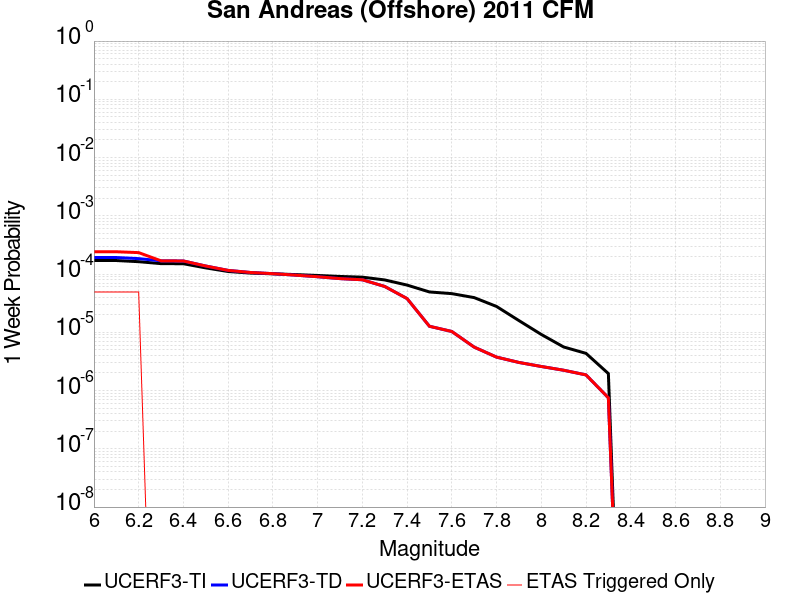 | 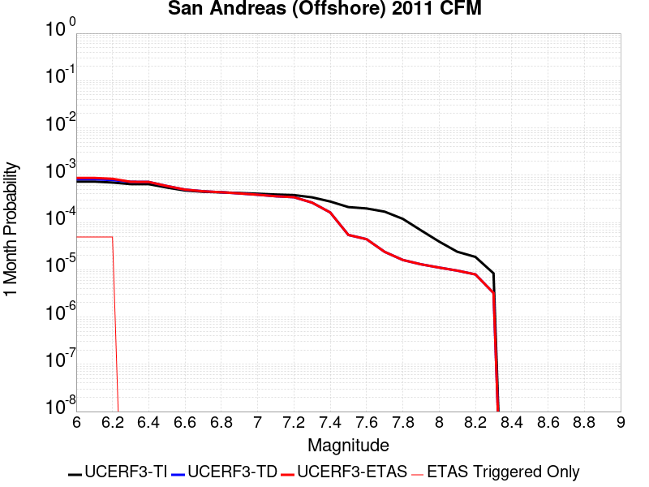 | 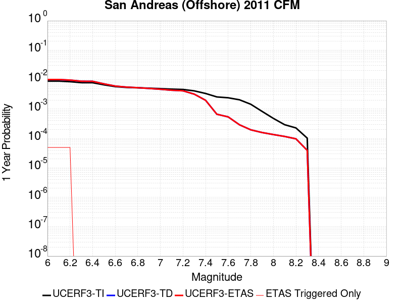 | 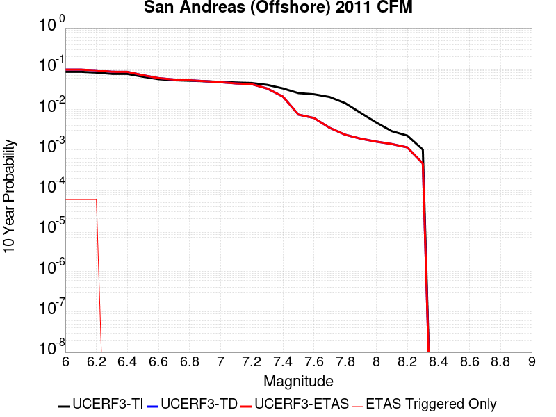 |

| Magnitude | 1 wk TI Prob | 1 wk TD Prob | 1 wk ETAS Prob | 1 wk ETAS/TD Gain | 1 wk ETAS Triggered Only | 1 mo TI Prob | 1 mo TD Prob | 1 mo ETAS Prob | 1 mo ETAS/TD Gain | 1 mo ETAS Triggered Only | 1 yr TI Prob | 1 yr TD Prob | 1 yr ETAS Prob | 1 yr ETAS/TD Gain | 1 yr ETAS Triggered Only | 10 yr TI Prob | 10 yr TD Prob | 10 yr ETAS Prob | 10 yr ETAS/TD Gain | 10 yr ETAS Triggered Only |
|-----|-----|-----|-----|-----|-----|-----|-----|-----|-----|-----|-----|-----|-----|-----|-----|-----|-----|-----|-----|-----|
| 6.0 | 1.7072787E-4 | 1.9226626E-4 | 2.0226435E-4 | 1.0520012 | 1.0E-5 | 7.3148566E-4 | 8.237405E-4 | 8.3373225E-4 | 1.0121298 | 1.0E-5 | 0.008869528 | 0.009983436 | 0.010003237 | 1.0019833 | 2.0E-5 | 0.085237645 | 0.09681613 | 0.09684323 | 1.0002799 | 3.0E-5 |
| 6.1 | 1.7072787E-4 | 1.9226626E-4 | 2.0226435E-4 | 1.0520012 | 1.0E-5 | 7.3148566E-4 | 8.237405E-4 | 8.3373225E-4 | 1.0121298 | 1.0E-5 | 0.008869528 | 0.009983436 | 0.010003237 | 1.0019833 | 2.0E-5 | 0.085237645 | 0.09681613 | 0.09684323 | 1.0002799 | 3.0E-5 |
| 6.2 | 1.6312556E-4 | 1.8408237E-4 | 1.9408052E-4 | 1.0543135 | 1.0E-5 | 6.989222E-4 | 7.8868825E-4 | 7.9868035E-4 | 1.0126693 | 1.0E-5 | 0.008476226 | 0.0095605 | 0.0095803095 | 1.002072 | 2.0E-5 | 0.08160117 | 0.092837214 | 0.09286443 | 1.0002931 | 3.0E-5 |
| 6.3 | 1.5103363E-4 | 1.6881147E-4 | 1.6881147E-4 | 1.0 | 0.0 | 6.471264E-4 | 7.232793E-4 | 7.232793E-4 | 1.0 | 0.0 | 0.007850339 | 0.008770814 | 0.008780727 | 1.0011301 | 1.0E-5 | 0.075787395 | 0.08546859 | 0.08548688 | 1.000214 | 2.0E-5 |
| 6.4 | 1.5047993E-4 | 1.6767075E-4 | 1.6767075E-4 | 1.0 | 0.0 | 6.4475456E-4 | 7.183932E-4 | 7.183932E-4 | 1.0 | 0.0 | 0.007821669 | 0.008711802 | 0.008721715 | 1.0011379 | 1.0E-5 | 0.0755203 | 0.08494888 | 0.08496718 | 1.0002154 | 2.0E-5 |
| 6.5 | 1.2760791E-4 | 1.3734949E-4 | 1.3734949E-4 | 1.0 | 0.0 | 5.467764E-4 | 5.8850925E-4 | 5.8850925E-4 | 1.0 | 0.0 | 0.0066367025 | 0.007141834 | 0.007151763 | 1.0013902 | 1.0E-5 | 0.064419635 | 0.07024954 | 0.07026814 | 1.0002646 | 2.0E-5 |
| 6.6 | 1.1063525E-4 | 1.15565475E-4 | 1.15565475E-4 | 1.0 | 0.0 | 4.740649E-4 | 4.9518765E-4 | 4.9518765E-4 | 1.0 | 0.0 | 0.0057564764 | 0.006012446 | 0.0060223853 | 1.0016532 | 1.0E-5 | 0.05609626 | 0.059496127 | 0.059505533 | 1.0001581 | 1.0E-5 |
| 6.7 | 1.0391049E-4 | 1.0645875E-4 | 1.0645875E-4 | 1.0 | 0.0 | 4.4525467E-4 | 4.56173E-4 | 4.56173E-4 | 1.0 | 0.0 | 0.0054075094 | 0.0055399504 | 0.005549895 | 1.001795 | 1.0E-5 | 0.052778035 | 0.05498844 | 0.05499789 | 1.0001719 | 1.0E-5 |
| 6.8 | 1.0096706E-4 | 1.01582154E-4 | 1.01582154E-4 | 1.0 | 0.0 | 4.3264418E-4 | 4.3528038E-4 | 4.3528038E-4 | 1.0 | 0.0 | 0.0052547283 | 0.0052868384 | 0.0052967854 | 1.0018815 | 1.0E-5 | 0.051321987 | 0.052686825 | 0.0526963 | 1.0001798 | 1.0E-5 |
| 6.9 | 9.800265E-5 | 9.588697E-5 | 9.588697E-5 | 1.0 | 0.0 | 4.1994374E-4 | 4.1088034E-4 | 4.1088034E-4 | 1.0 | 0.0 | 0.0051008356 | 0.004991162 | 0.0050011124 | 1.0019935 | 1.0E-5 | 0.049853306 | 0.05001508 | 0.05002458 | 1.0001899 | 1.0E-5 |
| 7.0 | 9.4642375E-5 | 9.002096E-5 | 9.002096E-5 | 1.0 | 0.0 | 4.0554712E-4 | 3.8574796E-4 | 3.8574796E-4 | 1.0 | 0.0 | 0.004926363 | 0.00468653 | 0.0046964833 | 1.0021238 | 1.0E-5 | 0.048185747 | 0.047194667 | 0.047204193 | 1.000202 | 1.0E-5 |
| 7.1 | 9.0996844E-5 | 8.354119E-5 | 8.354119E-5 | 1.0 | 0.0 | 3.8992817E-4 | 3.579854E-4 | 3.579854E-4 | 1.0 | 0.0 | 0.004737046 | 0.0043499186 | 0.004359875 | 1.0022889 | 1.0E-5 | 0.04637333 | 0.04404688 | 0.044056438 | 1.0002171 | 1.0E-5 |
| 7.2 | 8.848287E-5 | 7.981761E-5 | 7.981761E-5 | 1.0 | 0.0 | 3.791572E-4 | 3.420315E-4 | 3.420315E-4 | 1.0 | 0.0 | 0.004606472 | 0.0041564363 | 0.0041663945 | 1.0023959 | 1.0E-5 | 0.045121472 | 0.042189904 | 0.04219948 | 1.000227 | 1.0E-5 |
| 7.3 | 7.9280784E-5 | 6.1274885E-5 | 6.1274885E-5 | 1.0 | 0.0 | 3.3973053E-4 | 2.6258078E-4 | 2.6258078E-4 | 1.0 | 0.0 | 0.004128377 | 0.003192337 | 0.003202305 | 1.0031224 | 1.0E-5 | 0.040525194 | 0.03290183 | 0.0329115 | 1.000294 | 1.0E-5 |
| 7.4 | 6.468038E-5 | 3.7930724E-5 | 3.7930724E-5 | 1.0 | 0.0 | 2.771722E-4 | 1.6255044E-4 | 1.6255044E-4 | 1.0 | 0.0 | 0.0033693502 | 0.0019773128 | 0.0019872931 | 1.0050473 | 1.0E-5 | 0.0331872 | 0.02081734 | 0.020827131 | 1.0004704 | 1.0E-5 |
| 7.5 | 4.930574E-5 | 1.2699263E-5 | 1.2699263E-5 | 1.0 | 0.0 | 2.1129321E-4 | 5.4424287E-5 | 5.4424287E-5 | 1.0 | 0.0 | 0.0025694598 | 6.6241587E-4 | 6.724092E-4 | 1.0150863 | 1.0E-5 | 0.02539953 | 0.0074798525 | 0.0074897776 | 1.0013269 | 1.0E-5 |
| 7.6 | 4.612566E-5 | 1.0332297E-5 | 1.0332297E-5 | 1.0 | 0.0 | 1.9766642E-4 | 4.428053E-5 | 4.428053E-5 | 1.0 | 0.0 | 0.0024039324 | 5.3898344E-4 | 5.4897805E-4 | 1.0185435 | 1.0E-5 | 0.023780935 | 0.006170428 | 0.006180366 | 1.0016106 | 1.0E-5 |
| 7.7 | 3.9435414E-5 | 5.5710498E-6 | 5.5710498E-6 | 1.0 | 0.0 | 1.6899795E-4 | 2.3875711E-5 | 2.3875711E-5 | 1.0 | 0.0 | 0.0020556084 | 2.906482E-4 | 3.0064528E-4 | 1.0343958 | 1.0E-5 | 0.020366974 | 0.0035397834 | 0.003549748 | 1.002815 | 1.0E-5 |
| 7.8 | 2.7787428E-5 | 3.7526645E-6 | 3.7526645E-6 | 1.0 | 0.0 | 1.1908354E-4 | 1.6082748E-5 | 1.6082748E-5 | 1.0 | 0.0 | 0.0014488777 | 1.9578991E-4 | 2.0578795E-4 | 1.0510652 | 1.0E-5 | 0.014394675 | 0.0023862 | 0.002396176 | 1.0041808 | 1.0E-5 |
| 7.9 | 1.590671E-5 | 3.0391298E-6 | 3.0391298E-6 | 1.0 | 0.0 | 6.816983E-5 | 1.3024777E-5 | 1.3024777E-5 | 1.0 | 0.0 | 8.2965166E-4 | 1.5856515E-4 | 1.6856357E-4 | 1.0630555 | 1.0E-5 | 0.008265611 | 0.0019033558 | 0.0019133368 | 1.0052439 | 1.0E-5 |
| 8.0 | 9.193638E-6 | 2.5908973E-6 | 2.5908973E-6 | 1.0 | 0.0 | 3.940071E-5 | 1.1103798E-5 | 1.1103798E-5 | 1.0 | 0.0 | 4.7959806E-4 | 1.3518038E-4 | 1.4517903E-4 | 1.0739652 | 1.0E-5 | 0.0047856434 | 0.0016108477 | 0.0016208316 | 1.0061979 | 1.0E-5 |
| 8.1 | 5.601576E-6 | 2.2333788E-6 | 2.2333788E-6 | 1.0 | 0.0 | 2.4006533E-5 | 9.571589E-6 | 9.571589E-6 | 1.0 | 0.0 | 2.9224035E-4 | 1.1652788E-4 | 1.2652672E-4 | 1.0858064 | 1.0E-5 | 0.0029185633 | 0.0014015464 | 0.0014115324 | 1.007125 | 1.0E-5 |
| 8.2 | 4.3508785E-6 | 1.8568232E-6 | 1.8568232E-6 | 1.0 | 0.0 | 1.864649E-5 | 7.957789E-6 | 7.957789E-6 | 1.0 | 0.0 | 2.2699735E-4 | 9.6881806E-5 | 1.0688084E-4 | 1.1032085 | 1.0E-5 | 0.0022676561 | 0.0011590312 | 0.0011690195 | 1.0086179 | 1.0E-5 |
| 8.3 | 1.9573292E-6 | 7.511501E-7 | 7.511501E-7 | 1.0 | 0.0 | 8.388526E-6 | 3.2192108E-6 | 3.2192108E-6 | 1.0 | 0.0 | 1.0212552E-4 | 3.9193204E-5 | 3.9193204E-5 | 1.0 | 0.0 | 0.001020786 | 4.6391718E-4 | 4.6391718E-4 | 1.0 | 0.0 |

## Surprise Valley 2011 CFM
*[(top)](#table-of-contents)*

| 1 Week | 1 Month | 1 Year | 10 Year |
|-----|-----|-----|-----|
| 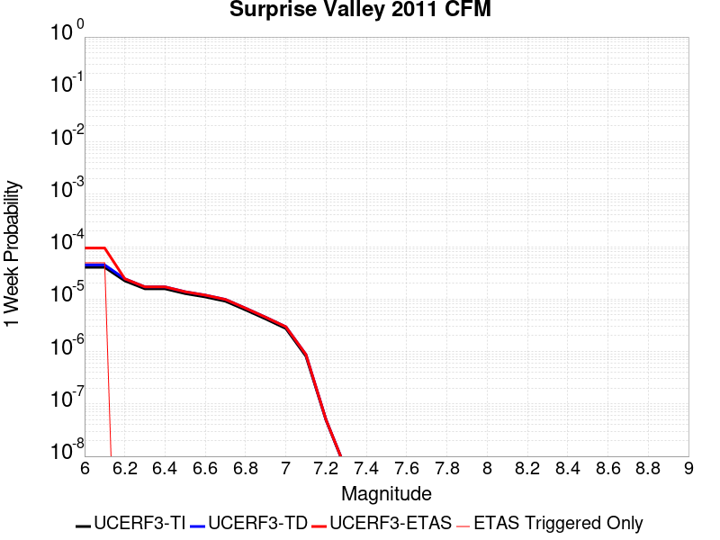 | 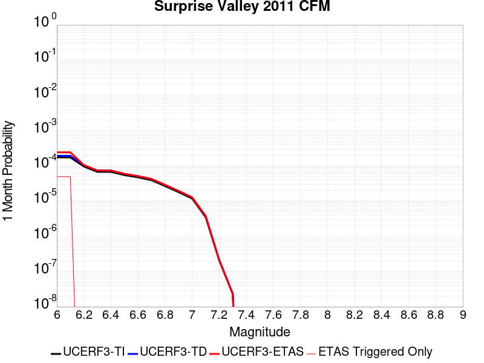 | 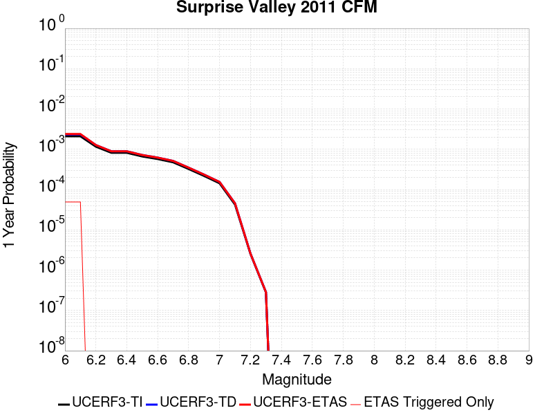 | 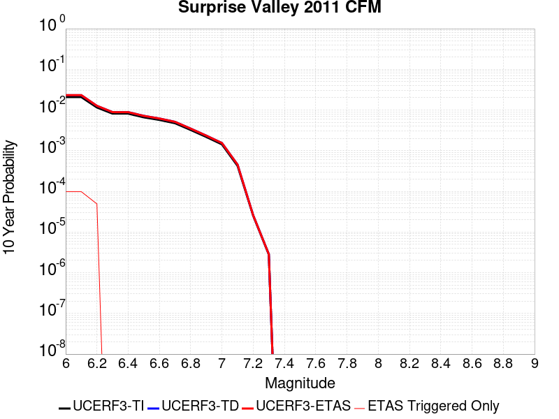 |

| Magnitude | 1 wk TI Prob | 1 wk TD Prob | 1 wk ETAS Prob | 1 wk ETAS/TD Gain | 1 wk ETAS Triggered Only | 1 mo TI Prob | 1 mo TD Prob | 1 mo ETAS Prob | 1 mo ETAS/TD Gain | 1 mo ETAS Triggered Only | 1 yr TI Prob | 1 yr TD Prob | 1 yr ETAS Prob | 1 yr ETAS/TD Gain | 1 yr ETAS Triggered Only | 10 yr TI Prob | 10 yr TD Prob | 10 yr ETAS Prob | 10 yr ETAS/TD Gain | 10 yr ETAS Triggered Only |
|-----|-----|-----|-----|-----|-----|-----|-----|-----|-----|-----|-----|-----|-----|-----|-----|-----|-----|-----|-----|-----|
| 6.0 | 4.0396248E-5 | 4.485131E-5 | 5.485086E-5 | 1.2229489 | 1.0E-5 | 1.7311527E-4 | 1.9220692E-4 | 2.02205E-4 | 1.0520172 | 1.0E-5 | 0.002105641 | 0.0023378176 | 0.002357771 | 1.008535 | 2.0E-5 | 0.020858008 | 0.023153966 | 0.023183271 | 1.0012656 | 3.0E-5 |
| 6.1 | 4.0396248E-5 | 4.485131E-5 | 5.485086E-5 | 1.2229489 | 1.0E-5 | 1.7311527E-4 | 1.9220692E-4 | 2.02205E-4 | 1.0520172 | 1.0E-5 | 0.002105641 | 0.0023378176 | 0.002357771 | 1.008535 | 2.0E-5 | 0.020858008 | 0.023153966 | 0.023183271 | 1.0012656 | 3.0E-5 |
| 6.2 | 2.2295266E-5 | 2.440125E-5 | 2.440125E-5 | 1.0 | 0.0 | 9.554764E-5 | 1.0457276E-4 | 1.0457276E-4 | 1.0 | 0.0 | 0.0011626717 | 0.0012724606 | 0.0012724606 | 1.0 | 0.0 | 0.011566074 | 0.012654981 | 0.0126648545 | 1.0007802 | 1.0E-5 |
| 6.3 | 1.572643E-5 | 1.7096807E-5 | 1.7096807E-5 | 1.0 | 0.0 | 6.7397246E-5 | 7.327003E-5 | 7.327003E-5 | 1.0 | 0.0 | 8.202525E-4 | 8.91708E-4 | 8.91708E-4 | 1.0 | 0.0 | 0.008172315 | 0.008882407 | 0.008882407 | 1.0 | 0.0 |
| 6.4 | 1.5714395E-5 | 1.7084629E-5 | 1.7084629E-5 | 1.0 | 0.0 | 6.734567E-5 | 7.3217845E-5 | 7.3217845E-5 | 1.0 | 0.0 | 8.1962504E-4 | 8.9107314E-4 | 8.9107314E-4 | 1.0 | 0.0 | 0.008166086 | 0.008876109 | 0.008876109 | 1.0 | 0.0 |
| 6.5 | 1.2733495E-5 | 1.38016E-5 | 1.38016E-5 | 1.0 | 0.0 | 5.457098E-5 | 5.9148413E-5 | 5.9148413E-5 | 1.0 | 0.0 | 6.641992E-4 | 7.1990065E-4 | 7.1990065E-4 | 1.0 | 0.0 | 0.0066221743 | 0.0071763797 | 0.0071763797 | 1.0 | 0.0 |
| 6.6 | 1.0983784E-5 | 1.1886554E-5 | 1.1886554E-5 | 1.0 | 0.0 | 4.7072506E-5 | 5.094141E-5 | 5.094141E-5 | 1.0 | 0.0 | 5.7295704E-4 | 6.200405E-4 | 6.200405E-4 | 1.0 | 0.0 | 0.0057148207 | 0.0061836545 | 0.0061836545 | 1.0 | 0.0 |
| 6.7 | 9.104806E-6 | 9.839491E-6 | 9.839491E-6 | 1.0 | 0.0 | 3.902001E-5 | 4.2168587E-5 | 4.2168587E-5 | 1.0 | 0.0 | 4.7496508E-4 | 5.132855E-4 | 5.132855E-4 | 1.0 | 0.0 | 0.004739512 | 0.005121397 | 0.005121397 | 1.0 | 0.0 |
| 6.8 | 6.2162403E-6 | 6.7041337E-6 | 6.7041337E-6 | 1.0 | 0.0 | 2.6640759E-5 | 2.8731698E-5 | 2.8731698E-5 | 1.0 | 0.0 | 3.2430296E-4 | 3.497545E-4 | 3.497545E-4 | 1.0 | 0.0 | 0.003238301 | 0.0034922638 | 0.0034922638 | 1.0 | 0.0 |
| 6.9 | 4.1792696E-6 | 4.50323E-6 | 4.50323E-6 | 1.0 | 0.0 | 1.7911032E-5 | 1.9299423E-5 | 1.9299423E-5 | 1.0 | 0.0 | 2.1804498E-4 | 2.3494668E-4 | 2.3494668E-4 | 1.0 | 0.0 | 0.0021783116 | 0.0023471361 | 0.0023471361 | 1.0 | 0.0 |
| 7.0 | 2.7478413E-6 | 2.9622424E-6 | 2.9622424E-6 | 1.0 | 0.0 | 1.177641E-5 | 1.269527E-5 | 1.269527E-5 | 1.0 | 0.0 | 1.4336836E-4 | 1.545552E-4 | 1.545552E-4 | 1.0 | 0.0 | 0.001432759 | 0.0015445995 | 0.0015445995 | 1.0 | 0.0 |
| 7.1 | 8.128648E-7 | 8.724922E-7 | 8.724922E-7 | 1.0 | 0.0 | 3.4837017E-6 | 3.7392501E-6 | 3.7392501E-6 | 1.0 | 0.0 | 4.2413245E-5 | 4.552502E-5 | 4.552502E-5 | 1.0 | 0.0 | 4.2405148E-4 | 4.5521575E-4 | 4.5521575E-4 | 1.0 | 0.0 |
| 7.2 | 4.8641045E-8 | 4.9402068E-8 | 4.9402068E-8 | 1.0 | 0.0 | 2.084616E-7 | 2.1172312E-7 | 2.1172312E-7 | 1.0 | 0.0 | 2.538017E-6 | 2.577726E-6 | 2.577726E-6 | 1.0 | 0.0 | 2.537988E-5 | 2.5776973E-5 | 2.5776973E-5 | 1.0 | 0.0 |
| 7.3 | 5.3911844E-9 | 5.4758145E-9 | 5.4758145E-9 | 1.0 | 0.0 | 2.3105075E-8 | 2.3467775E-8 | 2.3467775E-8 | 1.0 | 0.0 | 2.8130427E-7 | 2.8572015E-7 | 2.8572015E-7 | 1.0 | 0.0 | 2.8130391E-6 | 2.8571992E-6 | 2.8571992E-6 | 1.0 | 0.0 |

## Sheephole
*[(top)](#table-of-contents)*

| 1 Week | 1 Month | 1 Year | 10 Year |
|-----|-----|-----|-----|
| 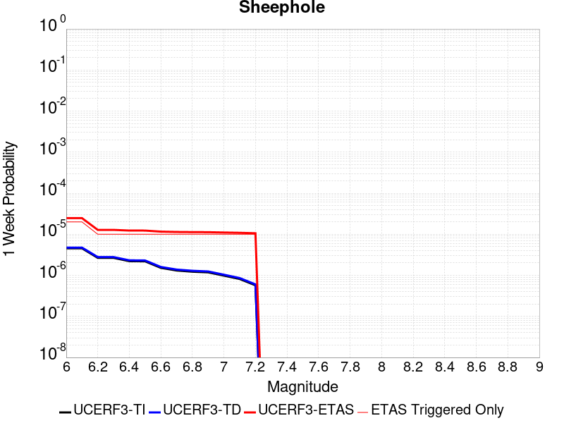 | 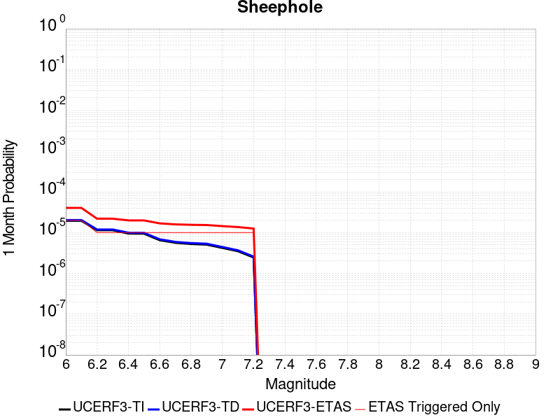 | 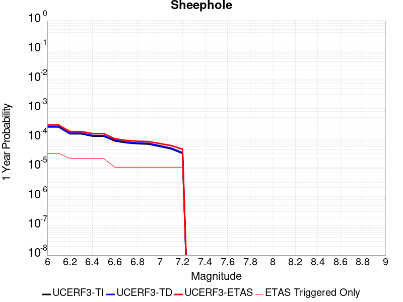 | 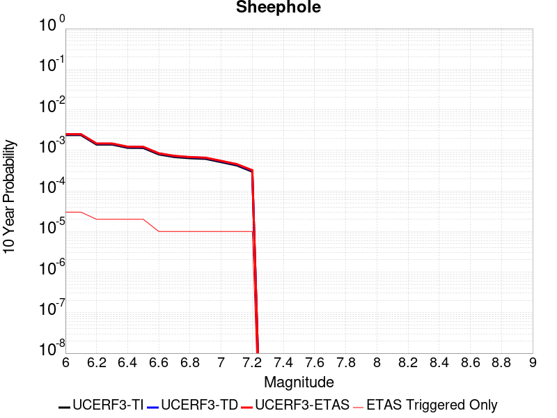 |

| Magnitude | 1 wk TI Prob | 1 wk TD Prob | 1 wk ETAS Prob | 1 wk ETAS/TD Gain | 1 wk ETAS Triggered Only | 1 mo TI Prob | 1 mo TD Prob | 1 mo ETAS Prob | 1 mo ETAS/TD Gain | 1 mo ETAS Triggered Only | 1 yr TI Prob | 1 yr TD Prob | 1 yr ETAS Prob | 1 yr ETAS/TD Gain | 1 yr ETAS Triggered Only | 10 yr TI Prob | 10 yr TD Prob | 10 yr ETAS Prob | 10 yr ETAS/TD Gain | 10 yr ETAS Triggered Only |
|-----|-----|-----|-----|-----|-----|-----|-----|-----|-----|-----|-----|-----|-----|-----|-----|-----|-----|-----|-----|-----|
| 6.0 | 4.5579695E-6 | 4.7412627E-6 | 2.4741168E-5 | 5.2182655 | 2.0E-5 | 1.9534009E-5 | 2.031957E-5 | 4.0319163E-5 | 1.9842528 | 2.0E-5 | 2.3780059E-4 | 2.473682E-4 | 2.7736078E-4 | 1.1212467 | 3.0E-5 | 0.0023754628 | 0.002471473 | 0.002501399 | 1.0121086 | 3.0E-5 |
| 6.1 | 4.5579695E-6 | 4.7412627E-6 | 2.4741168E-5 | 5.2182655 | 2.0E-5 | 1.9534009E-5 | 2.031957E-5 | 4.0319163E-5 | 1.9842528 | 2.0E-5 | 2.3780059E-4 | 2.473682E-4 | 2.7736078E-4 | 1.1212467 | 3.0E-5 | 0.0023754628 | 0.002471473 | 0.002501399 | 1.0121086 | 3.0E-5 |
| 6.2 | 2.6677674E-6 | 2.7873941E-6 | 1.2787366E-5 | 4.58757 | 1.0E-5 | 1.1433239E-5 | 1.1945926E-5 | 2.1945807E-5 | 1.8370954 | 1.0E-5 | 1.3919079E-4 | 1.4543302E-4 | 1.6543012E-4 | 1.1375003 | 2.0E-5 | 0.0013910364 | 0.0014534844 | 0.0014734553 | 1.0137401 | 2.0E-5 |
| 6.3 | 2.6677674E-6 | 2.7873941E-6 | 1.2787366E-5 | 4.58757 | 1.0E-5 | 1.1433239E-5 | 1.1945926E-5 | 2.1945807E-5 | 1.8370954 | 1.0E-5 | 1.3919079E-4 | 1.4543302E-4 | 1.6543012E-4 | 1.1375003 | 2.0E-5 | 0.0013910364 | 0.0014534844 | 0.0014734553 | 1.0137401 | 2.0E-5 |
| 6.4 | 2.2159759E-6 | 2.3228788E-6 | 1.2322856E-5 | 5.304993 | 1.0E-5 | 9.497005E-6 | 9.955161E-6 | 1.9955061E-5 | 2.0044942 | 1.0E-5 | 1.156199E-4 | 1.2119815E-4 | 1.4119573E-4 | 1.164999 | 2.0E-5 | 0.0011555976 | 0.0012113999 | 0.0012313756 | 1.0164899 | 2.0E-5 |
| 6.5 | 2.1986082E-6 | 2.304759E-6 | 1.2304736E-5 | 5.3388386 | 1.0E-5 | 9.4225725E-6 | 9.877506E-6 | 1.9877407E-5 | 2.0123913 | 1.0E-5 | 1.1471378E-4 | 1.2025281E-4 | 1.402504E-4 | 1.1662962 | 2.0E-5 | 0.0011465458 | 0.0012019566 | 0.0012219326 | 1.0166196 | 2.0E-5 |
| 6.6 | 1.5232331E-6 | 1.6018919E-6 | 1.16018755E-5 | 7.2426085 | 1.0E-5 | 6.5281256E-6 | 6.865234E-6 | 1.6865166E-5 | 2.4566047 | 1.0E-5 | 7.947703E-5 | 8.35812E-5 | 9.358037E-5 | 1.1196342 | 1.0E-5 | 7.9448614E-4 | 8.3551643E-4 | 8.4550807E-4 | 1.0119586 | 1.0E-5 |
| 6.7 | 1.3137362E-6 | 1.382819E-6 | 1.13828055E-5 | 8.231594 | 1.0E-5 | 5.6302856E-6 | 5.926355E-6 | 1.5926295E-5 | 2.687368 | 1.0E-5 | 6.854657E-5 | 7.215112E-5 | 8.21504E-5 | 1.138588 | 1.0E-5 | 6.8525434E-4 | 7.212908E-4 | 7.312836E-4 | 1.013854 | 1.0E-5 |
| 6.8 | 1.2275751E-6 | 1.2922847E-6 | 1.1292272E-5 | 8.738223 | 1.0E-5 | 5.2610258E-6 | 5.5383516E-6 | 1.5538297E-5 | 2.8055813 | 1.0E-5 | 6.4051106E-5 | 6.7427485E-5 | 7.7426805E-5 | 1.1482974 | 1.0E-5 | 6.4032647E-4 | 6.740836E-4 | 6.8407686E-4 | 1.014825 | 1.0E-5 |
| 6.9 | 1.1837088E-6 | 1.246102E-6 | 1.1246089E-5 | 9.025015 | 1.0E-5 | 5.0730278E-6 | 5.340427E-6 | 1.5340374E-5 | 2.8724995 | 1.0E-5 | 6.176237E-5 | 6.501789E-5 | 7.501724E-5 | 1.1537938 | 1.0E-5 | 6.17452E-4 | 6.5000186E-4 | 6.5999536E-4 | 1.0153745 | 1.0E-5 |
| 7.0 | 9.849371E-7 | 1.0366288E-6 | 1.1036618E-5 | 10.646645 | 1.0E-5 | 4.2211523E-6 | 4.442688E-6 | 1.4442643E-5 | 3.2508795 | 1.0E-5 | 5.1391315E-5 | 5.4088487E-5 | 6.4087944E-5 | 1.1848723 | 1.0E-5 | 5.137943E-4 | 5.407633E-4 | 5.5075786E-4 | 1.0184823 | 1.0E-5 |
| 7.1 | 8.1643645E-7 | 8.591669E-7 | 1.08591585E-5 | 12.639173 | 1.0E-5 | 3.4990085E-6 | 3.682139E-6 | 1.3682103E-5 | 3.7158027 | 1.0E-5 | 4.2599597E-5 | 4.482921E-5 | 5.482876E-5 | 1.2230588 | 1.0E-5 | 4.259143E-4 | 4.4821028E-4 | 4.5820582E-4 | 1.022301 | 1.0E-5 |
| 7.2 | 5.7295756E-7 | 6.029502E-7 | 1.0602944E-5 | 17.585108 | 1.0E-5 | 2.45553E-6 | 2.58407E-6 | 1.2584044E-5 | 4.869854 | 1.0E-5 | 2.9895667E-5 | 3.1460666E-5 | 4.1460353E-5 | 1.3178473 | 1.0E-5 | 2.9891645E-4 | 3.145688E-4 | 3.2456568E-4 | 1.0317795 | 1.0E-5 |

## Oak Ridge (Onshore)
*[(top)](#table-of-contents)*

| 1 Week | 1 Month | 1 Year | 10 Year |
|-----|-----|-----|-----|
| 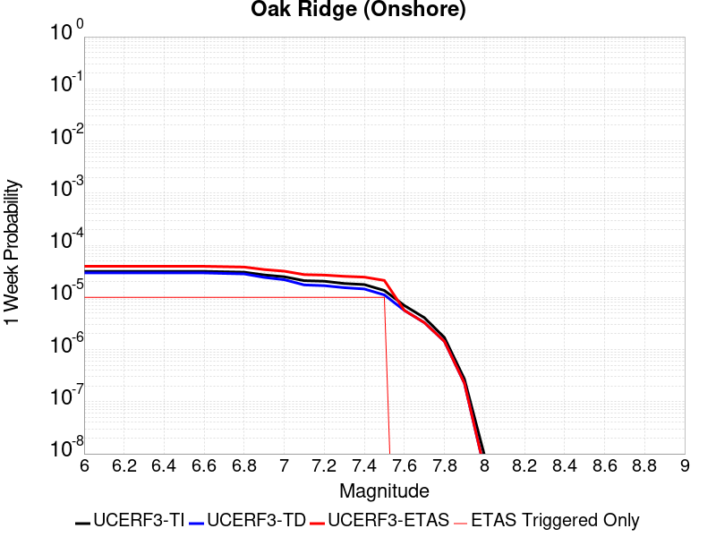 | 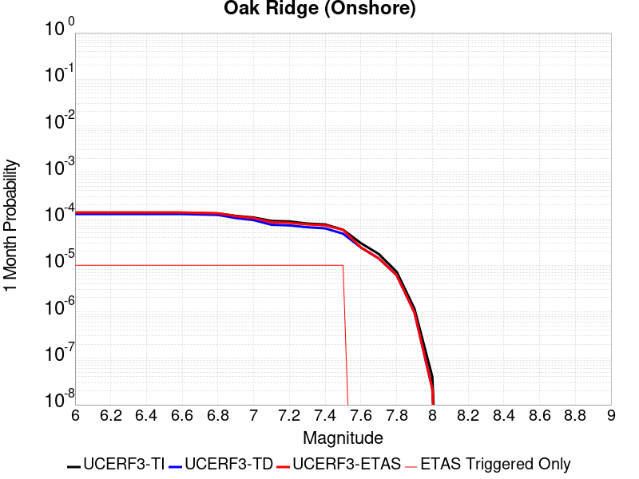 | 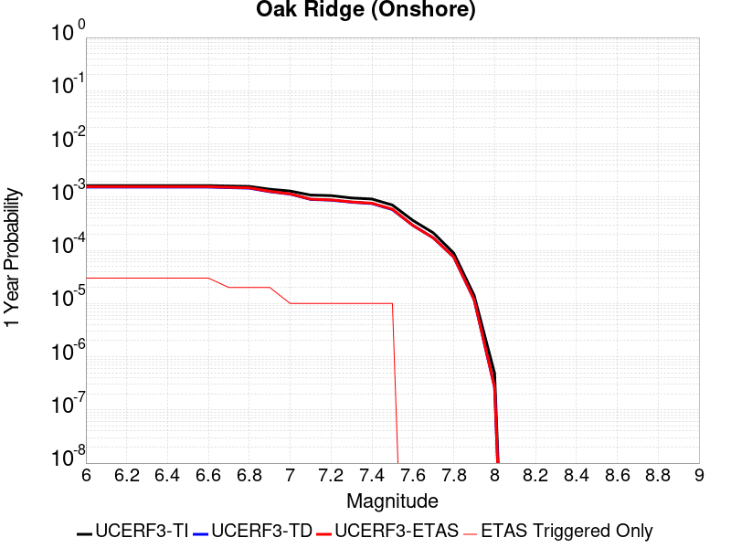 | 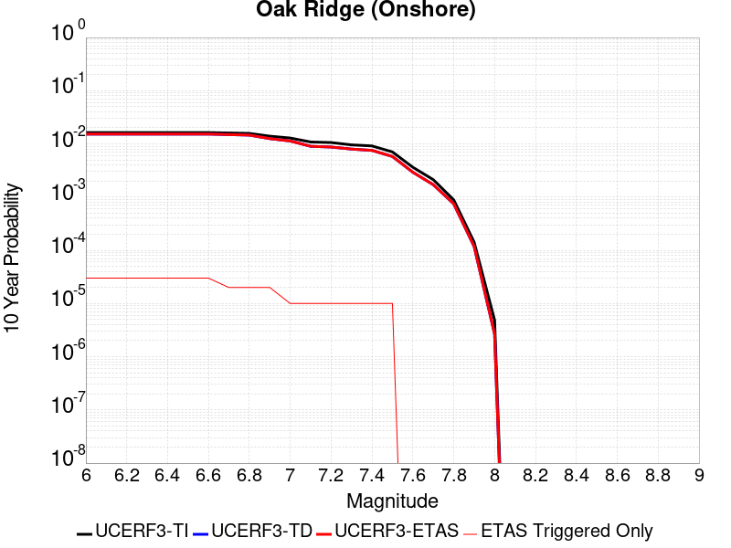 |

| Magnitude | 1 wk TI Prob | 1 wk TD Prob | 1 wk ETAS Prob | 1 wk ETAS/TD Gain | 1 wk ETAS Triggered Only | 1 mo TI Prob | 1 mo TD Prob | 1 mo ETAS Prob | 1 mo ETAS/TD Gain | 1 mo ETAS Triggered Only | 1 yr TI Prob | 1 yr TD Prob | 1 yr ETAS Prob | 1 yr ETAS/TD Gain | 1 yr ETAS Triggered Only | 10 yr TI Prob | 10 yr TD Prob | 10 yr ETAS Prob | 10 yr ETAS/TD Gain | 10 yr ETAS Triggered Only |
|-----|-----|-----|-----|-----|-----|-----|-----|-----|-----|-----|-----|-----|-----|-----|-----|-----|-----|-----|-----|-----|
| 6.0 | 3.155064E-5 | 2.9526076E-5 | 3.952578E-5 | 1.3386737 | 1.0E-5 | 1.3521002E-4 | 1.265344E-4 | 1.3653314E-4 | 1.0790199 | 1.0E-5 | 0.001644939 | 0.0015395058 | 0.0015694596 | 1.0194567 | 3.0E-5 | 0.01632816 | 0.015293054 | 0.015322596 | 1.0019317 | 3.0E-5 |
| 6.1 | 3.155064E-5 | 2.9526076E-5 | 3.952578E-5 | 1.3386737 | 1.0E-5 | 1.3521002E-4 | 1.265344E-4 | 1.3653314E-4 | 1.0790199 | 1.0E-5 | 0.001644939 | 0.0015395058 | 0.0015694596 | 1.0194567 | 3.0E-5 | 0.01632816 | 0.015293054 | 0.015322596 | 1.0019317 | 3.0E-5 |
| 6.2 | 3.155064E-5 | 2.9526076E-5 | 3.952578E-5 | 1.3386737 | 1.0E-5 | 1.3521002E-4 | 1.265344E-4 | 1.3653314E-4 | 1.0790199 | 1.0E-5 | 0.001644939 | 0.0015395058 | 0.0015694596 | 1.0194567 | 3.0E-5 | 0.01632816 | 0.015293054 | 0.015322596 | 1.0019317 | 3.0E-5 |
| 6.3 | 3.155064E-5 | 2.9526076E-5 | 3.952578E-5 | 1.3386737 | 1.0E-5 | 1.3521002E-4 | 1.265344E-4 | 1.3653314E-4 | 1.0790199 | 1.0E-5 | 0.001644939 | 0.0015395058 | 0.0015694596 | 1.0194567 | 3.0E-5 | 0.01632816 | 0.015293054 | 0.015322596 | 1.0019317 | 3.0E-5 |
| 6.4 | 3.155064E-5 | 2.9526076E-5 | 3.952578E-5 | 1.3386737 | 1.0E-5 | 1.3521002E-4 | 1.265344E-4 | 1.3653314E-4 | 1.0790199 | 1.0E-5 | 0.001644939 | 0.0015395058 | 0.0015694596 | 1.0194567 | 3.0E-5 | 0.01632816 | 0.015293054 | 0.015322596 | 1.0019317 | 3.0E-5 |
| 6.5 | 3.155064E-5 | 2.9526076E-5 | 3.952578E-5 | 1.3386737 | 1.0E-5 | 1.3521002E-4 | 1.265344E-4 | 1.3653314E-4 | 1.0790199 | 1.0E-5 | 0.001644939 | 0.0015395058 | 0.0015694596 | 1.0194567 | 3.0E-5 | 0.01632816 | 0.015293054 | 0.015322596 | 1.0019317 | 3.0E-5 |
| 6.6 | 3.155064E-5 | 2.9526076E-5 | 3.952578E-5 | 1.3386737 | 1.0E-5 | 1.3521002E-4 | 1.265344E-4 | 1.3653314E-4 | 1.0790199 | 1.0E-5 | 0.001644939 | 0.0015395058 | 0.0015694596 | 1.0194567 | 3.0E-5 | 0.01632816 | 0.015293054 | 0.015322596 | 1.0019317 | 3.0E-5 |
| 6.7 | 3.098897E-5 | 2.8864279E-5 | 3.886399E-5 | 1.346439 | 1.0E-5 | 1.328031E-4 | 1.236984E-4 | 1.3369716E-4 | 1.0808318 | 1.0E-5 | 0.0016156785 | 0.0015050253 | 0.0015249952 | 1.0132688 | 2.0E-5 | 0.016039822 | 0.014952909 | 0.01497261 | 1.0013175 | 2.0E-5 |
| 6.8 | 3.0449872E-5 | 2.8239476E-5 | 3.8239195E-5 | 1.3541042 | 1.0E-5 | 1.3049292E-4 | 1.2102092E-4 | 1.3101971E-4 | 1.0826204 | 1.0E-5 | 0.0015875935 | 0.001472471 | 0.0014924416 | 1.0135626 | 2.0E-5 | 0.015762992 | 0.014631658 | 0.014651365 | 1.001347 | 2.0E-5 |
| 6.9 | 2.697928E-5 | 2.4219877E-5 | 3.4219636E-5 | 1.412874 | 1.0E-5 | 1.15620365E-4 | 1.03795464E-4 | 1.1379443E-4 | 1.0963333 | 1.0E-5 | 0.0014067689 | 0.0012629988 | 0.0012829734 | 1.0158154 | 2.0E-5 | 0.0139789665 | 0.012561066 | 0.012580815 | 1.0015723 | 2.0E-5 |
| 7.0 | 2.4893961E-5 | 2.1862146E-5 | 3.1861928E-5 | 1.4574016 | 1.0E-5 | 1.0668404E-4 | 9.369165E-5 | 1.0369071E-4 | 1.1067231 | 1.0E-5 | 0.0012981043 | 0.0011401166 | 0.0011501053 | 1.008761 | 1.0E-5 | 0.012905477 | 0.011345102 | 0.011354988 | 1.0008714 | 1.0E-5 |
| 7.1 | 2.0945363E-5 | 1.7354592E-5 | 2.735442E-5 | 1.5762063 | 1.0E-5 | 8.976275E-5 | 7.437473E-5 | 8.437399E-5 | 1.1344442 | 1.0E-5 | 0.0010923136 | 9.0514094E-4 | 9.151319E-4 | 1.011038 | 1.0E-5 | 0.0108696 | 0.009015621 | 0.00902553 | 1.0010992 | 1.0E-5 |
| 7.2 | 2.0439404E-5 | 1.680953E-5 | 2.680936E-5 | 1.5948906 | 1.0E-5 | 8.7594504E-5 | 7.203888E-5 | 8.203816E-5 | 1.138804 | 1.0E-5 | 0.0010659413 | 8.767251E-4 | 8.8671636E-4 | 1.011396 | 1.0E-5 | 0.010608427 | 0.008733723 | 0.008743636 | 1.001135 | 1.0E-5 |
| 7.3 | 1.8463334E-5 | 1.5381947E-5 | 2.5381793E-5 | 1.6501027 | 1.0E-5 | 7.912617E-5 | 6.592098E-5 | 7.5920325E-5 | 1.1516868 | 1.0E-5 | 9.6293533E-4 | 8.0229685E-4 | 8.1228884E-4 | 1.0124543 | 1.0E-5 | 0.009587734 | 0.0079950085 | 0.008004929 | 1.0012407 | 1.0E-5 |
| 7.4 | 1.763139E-5 | 1.4516977E-5 | 2.4516832E-5 | 1.6888386 | 1.0E-5 | 7.556091E-5 | 6.221415E-5 | 7.221353E-5 | 1.1607251 | 1.0E-5 | 9.1956573E-4 | 7.57198E-4 | 7.671905E-4 | 1.0131966 | 1.0E-5 | 0.009157699 | 0.007547126 | 0.0075570503 | 1.001315 | 1.0E-5 |
| 7.5 | 1.3594944E-5 | 1.1163363E-5 | 2.116325E-5 | 1.8957775 | 1.0E-5 | 5.8262744E-5 | 4.7842117E-5 | 5.784164E-5 | 1.2090108 | 1.0E-5 | 7.0911803E-4 | 5.8232463E-4 | 5.9231883E-4 | 1.0171626 | 1.0E-5 | 0.007068595 | 0.005808362 | 0.0058183037 | 1.0017116 | 1.0E-5 |
| 7.6 | 6.9889534E-6 | 5.6367194E-6 | 5.6367194E-6 | 1.0 | 0.0 | 2.9952313E-5 | 2.4157147E-5 | 2.4157147E-5 | 1.0 | 0.0 | 3.646084E-4 | 2.94074E-4 | 2.94074E-4 | 1.0 | 0.0 | 0.0036401073 | 0.0029368924 | 0.0029368924 | 1.0 | 0.0 |
| 7.7 | 4.0824193E-6 | 3.2832731E-6 | 3.2832731E-6 | 1.0 | 0.0 | 1.7495966E-5 | 1.4071096E-5 | 1.4071096E-5 | 1.0 | 0.0 | 2.1299256E-4 | 1.7130225E-4 | 1.7130225E-4 | 1.0 | 0.0 | 0.0021278851 | 0.0017117155 | 0.0017117155 | 1.0 | 0.0 |
| 7.8 | 1.7023609E-6 | 1.43706E-6 | 1.43706E-6 | 1.0 | 0.0 | 7.295812E-6 | 6.158814E-6 | 6.158814E-6 | 1.0 | 0.0 | 8.882289E-5 | 7.4981006E-5 | 7.4981006E-5 | 1.0 | 0.0 | 8.8787393E-4 | 7.4955984E-4 | 7.4955984E-4 | 1.0 | 0.0 |
| 7.9 | 2.721225E-7 | 2.261692E-7 | 2.261692E-7 | 1.0 | 0.0 | 1.1662388E-6 | 9.692963E-7 | 9.692963E-7 | 1.0 | 0.0 | 1.4198865E-5 | 1.1801121E-5 | 1.1801121E-5 | 1.0 | 0.0 | 1.4197957E-4 | 1.1800523E-4 | 1.1800523E-4 | 1.0 | 0.0 |
| 8.0 | 9.364255E-9 | 5.1204916E-9 | 5.1204916E-9 | 1.0 | 0.0 | 4.0132523E-8 | 2.1944963E-8 | 2.1944963E-8 | 1.0 | 0.0 | 4.8861335E-7 | 2.671799E-7 | 2.671799E-7 | 1.0 | 0.0 | 4.8861225E-6 | 2.6717962E-6 | 2.6717962E-6 | 1.0 | 0.0 |

## Great Valley 07 (Orestimba)
*[(top)](#table-of-contents)*

| 1 Week | 1 Month | 1 Year | 10 Year |
|-----|-----|-----|-----|
| 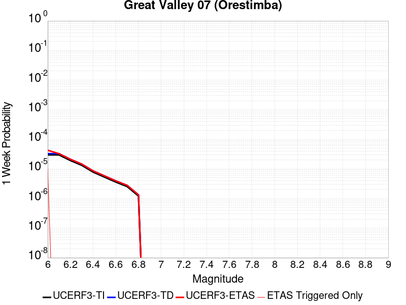 | 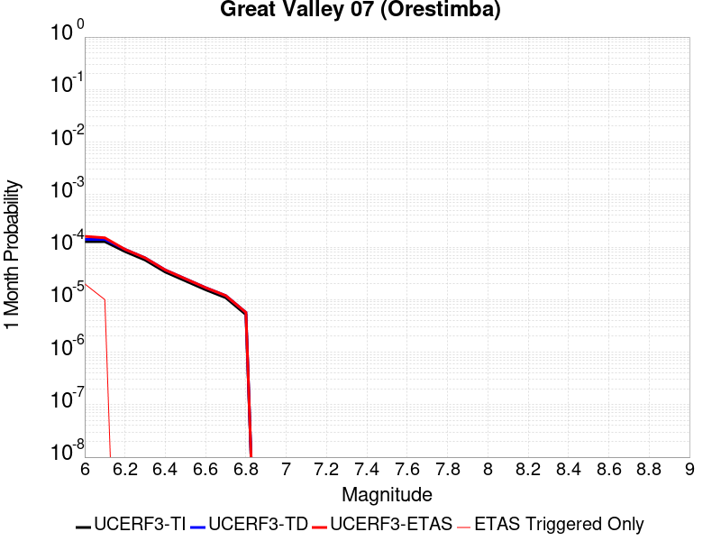 | 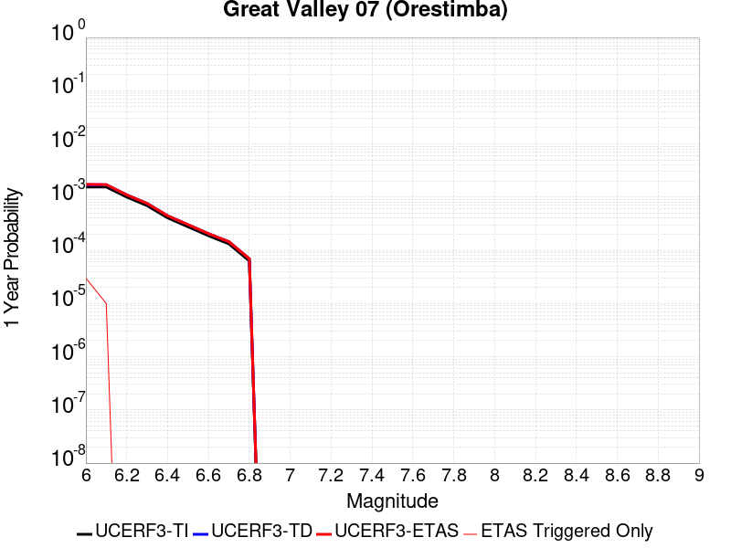 | 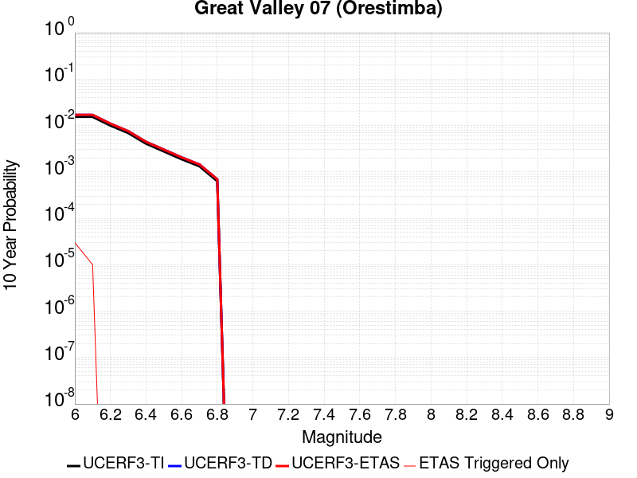 |

| Magnitude | 1 wk TI Prob | 1 wk TD Prob | 1 wk ETAS Prob | 1 wk ETAS/TD Gain | 1 wk ETAS Triggered Only | 1 mo TI Prob | 1 mo TD Prob | 1 mo ETAS Prob | 1 mo ETAS/TD Gain | 1 mo ETAS Triggered Only | 1 yr TI Prob | 1 yr TD Prob | 1 yr ETAS Prob | 1 yr ETAS/TD Gain | 1 yr ETAS Triggered Only | 10 yr TI Prob | 10 yr TD Prob | 10 yr ETAS Prob | 10 yr ETAS/TD Gain | 10 yr ETAS Triggered Only |
|-----|-----|-----|-----|-----|-----|-----|-----|-----|-----|-----|-----|-----|-----|-----|-----|-----|-----|-----|-----|-----|
| 6.0 | 2.9687902E-5 | 3.27575E-5 | 4.2757172E-5 | 1.3052636 | 1.0E-5 | 1.2722766E-4 | 1.4038214E-4 | 1.6037932E-4 | 1.1424483 | 2.0E-5 | 0.0015478961 | 0.0017078844 | 0.0017378331 | 1.0175356 | 3.0E-5 | 0.015371585 | 0.016955135 | 0.016984627 | 1.0017394 | 3.0E-5 |
| 6.1 | 2.9687902E-5 | 3.27575E-5 | 3.27575E-5 | 1.0 | 0.0 | 1.2722766E-4 | 1.4038214E-4 | 1.5038073E-4 | 1.0712241 | 1.0E-5 | 0.0015478961 | 0.0017078844 | 0.0017178673 | 1.0058452 | 1.0E-5 | 0.015371585 | 0.016955135 | 0.016964966 | 1.0005798 | 1.0E-5 |
| 6.2 | 1.9231524E-5 | 2.1159167E-5 | 2.1159167E-5 | 1.0 | 0.0 | 8.2418206E-5 | 9.067912E-5 | 9.067912E-5 | 1.0 | 0.0 | 0.0010029797 | 0.0011034822 | 0.0011034822 | 1.0 | 0.0 | 0.00998465 | 0.010982441 | 0.010982441 | 1.0 | 0.0 |
| 6.3 | 1.324766E-5 | 1.4548534E-5 | 1.4548534E-5 | 1.0 | 0.0 | 5.6774446E-5 | 6.234942E-5 | 6.234942E-5 | 1.0 | 0.0 | 6.910097E-4 | 7.5884897E-4 | 7.5884897E-4 | 1.0 | 0.0 | 0.006888649 | 0.0075635235 | 0.0075635235 | 1.0 | 0.0 |
| 6.4 | 7.818645E-6 | 8.57284E-6 | 8.57284E-6 | 1.0 | 0.0 | 3.3508048E-5 | 3.6740246E-5 | 3.6740246E-5 | 1.0 | 0.0 | 4.078841E-4 | 4.4722404E-4 | 4.4722404E-4 | 1.0 | 0.0 | 0.004071363 | 0.0044635804 | 0.0044635804 | 1.0 | 0.0 |
| 6.5 | 5.3076565E-6 | 5.8178007E-6 | 5.8178007E-6 | 1.0 | 0.0 | 2.27469E-5 | 2.4933206E-5 | 2.4933206E-5 | 1.0 | 0.0 | 2.7690834E-4 | 3.035216E-4 | 3.035216E-4 | 1.0 | 0.0 | 0.0027656353 | 0.00303128 | 0.00303128 | 1.0 | 0.0 |
| 6.6 | 3.6003578E-6 | 3.9484953E-6 | 3.9484953E-6 | 1.0 | 0.0 | 1.5430012E-5 | 1.6922022E-5 | 1.6922022E-5 | 1.0 | 0.0 | 1.8784421E-4 | 2.0600771E-4 | 2.0600771E-4 | 1.0 | 0.0 | 0.0018768552 | 0.0020583214 | 0.0020583214 | 1.0 | 0.0 |
| 6.7 | 2.5361826E-6 | 2.7834678E-6 | 2.7834678E-6 | 1.0 | 0.0 | 1.0869308E-5 | 1.1929101E-5 | 1.1929101E-5 | 1.0 | 0.0 | 1.3232579E-4 | 1.4522845E-4 | 1.4522845E-4 | 1.0 | 0.0 | 0.0013224703 | 0.0014514653 | 0.0014514653 | 1.0 | 0.0 |
| 6.8 | 1.2115831E-6 | 1.3313797E-6 | 1.3313797E-6 | 1.0 | 0.0 | 5.1924885E-6 | 5.7059065E-6 | 5.7059065E-6 | 1.0 | 0.0 | 6.3216714E-5 | 6.9468166E-5 | 6.9468166E-5 | 1.0 | 0.0 | 6.3198735E-4 | 6.945596E-4 | 6.945596E-4 | 1.0 | 0.0 |

## Hosgri
*[(top)](#table-of-contents)*

| 1 Week | 1 Month | 1 Year | 10 Year |
|-----|-----|-----|-----|
|  | 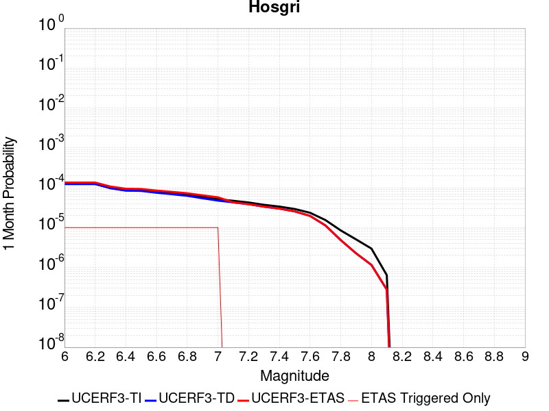 | 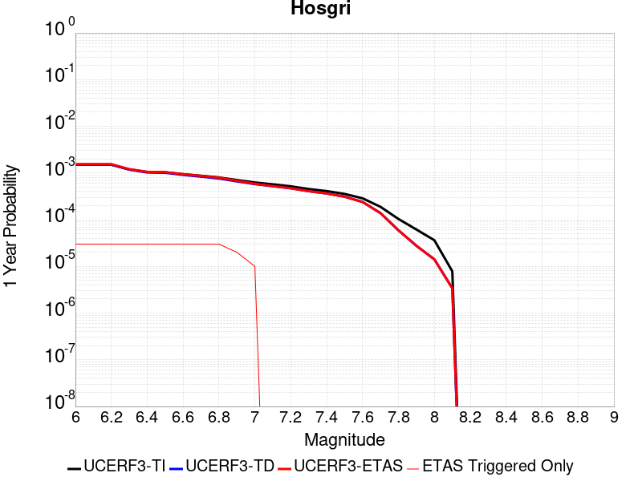 | 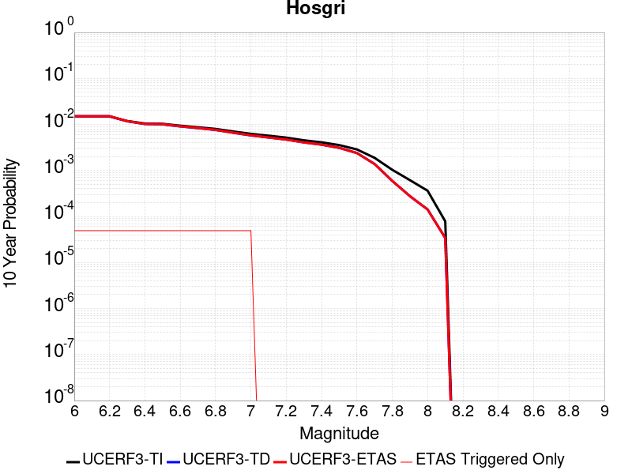 |

| Magnitude | 1 wk TI Prob | 1 wk TD Prob | 1 wk ETAS Prob | 1 wk ETAS/TD Gain | 1 wk ETAS Triggered Only | 1 mo TI Prob | 1 mo TD Prob | 1 mo ETAS Prob | 1 mo ETAS/TD Gain | 1 mo ETAS Triggered Only | 1 yr TI Prob | 1 yr TD Prob | 1 yr ETAS Prob | 1 yr ETAS/TD Gain | 1 yr ETAS Triggered Only | 10 yr TI Prob | 10 yr TD Prob | 10 yr ETAS Prob | 10 yr ETAS/TD Gain | 10 yr ETAS Triggered Only |
|-----|-----|-----|-----|-----|-----|-----|-----|-----|-----|-----|-----|-----|-----|-----|-----|-----|-----|-----|-----|-----|
| 6.0 | 2.883978E-5 | 2.9128403E-5 | 2.9128403E-5 | 1.0 | 0.0 | 1.235932E-4 | 1.248302E-4 | 1.3482895E-4 | 1.0800989 | 1.0E-5 | 0.0015037085 | 0.0015187752 | 0.0015487297 | 1.0197227 | 3.0E-5 | 0.01493574 | 0.01508773 | 0.015117277 | 1.0019584 | 3.0E-5 |
| 6.1 | 2.883978E-5 | 2.9128403E-5 | 2.9128403E-5 | 1.0 | 0.0 | 1.235932E-4 | 1.248302E-4 | 1.3482895E-4 | 1.0800989 | 1.0E-5 | 0.0015037085 | 0.0015187752 | 0.0015487297 | 1.0197227 | 3.0E-5 | 0.01493574 | 0.01508773 | 0.015117277 | 1.0019584 | 3.0E-5 |
| 6.2 | 2.883978E-5 | 2.9128403E-5 | 2.9128403E-5 | 1.0 | 0.0 | 1.235932E-4 | 1.248302E-4 | 1.3482895E-4 | 1.0800989 | 1.0E-5 | 0.0015037085 | 0.0015187752 | 0.0015487297 | 1.0197227 | 3.0E-5 | 0.01493574 | 0.01508773 | 0.015117277 | 1.0019584 | 3.0E-5 |
| 6.3 | 2.2914428E-5 | 2.2641956E-5 | 2.2641956E-5 | 1.0 | 0.0 | 9.8200995E-5 | 9.703337E-5 | 1.0703241E-4 | 1.1030474 | 1.0E-5 | 0.0011949413 | 0.001180746 | 0.0012107106 | 1.0253776 | 3.0E-5 | 0.011885363 | 0.011746123 | 0.01177577 | 1.002524 | 3.0E-5 |
| 6.4 | 2.0195741E-5 | 1.9696547E-5 | 1.9696547E-5 | 1.0 | 0.0 | 8.65503E-5 | 8.4411055E-5 | 9.441021E-5 | 1.1184579 | 1.0E-5 | 0.0010532405 | 0.001027222 | 0.0010571912 | 1.0291749 | 3.0E-5 | 0.010482626 | 0.010225783 | 0.010255476 | 1.0029038 | 3.0E-5 |
| 6.5 | 1.9924333E-5 | 1.9408968E-5 | 1.9408968E-5 | 1.0 | 0.0 | 8.53872E-5 | 8.317865E-5 | 9.317782E-5 | 1.1202132 | 1.0E-5 | 0.0010390934 | 0.0010122315 | 0.0010422012 | 1.0296075 | 3.0E-5 | 0.010342481 | 0.010077244 | 0.010106941 | 1.002947 | 3.0E-5 |
| 6.6 | 1.809694E-5 | 1.7458287E-5 | 1.7458287E-5 | 1.0 | 0.0 | 7.7556004E-5 | 7.4819094E-5 | 8.481834E-5 | 1.1336458 | 1.0E-5 | 9.438353E-4 | 9.105431E-4 | 9.405157E-4 | 1.0329174 | 3.0E-5 | 0.009398366 | 0.009069063 | 0.009098791 | 1.0032779 | 3.0E-5 |
| 6.7 | 1.675989E-5 | 1.6042752E-5 | 1.6042752E-5 | 1.0 | 0.0 | 7.182612E-5 | 6.8752845E-5 | 7.875216E-5 | 1.1454386 | 1.0E-5 | 8.7413215E-4 | 8.3674554E-4 | 8.6672045E-4 | 1.0358232 | 3.0E-5 | 0.008707017 | 0.008336853 | 0.008366603 | 1.0035685 | 3.0E-5 |
| 6.8 | 1.5401129E-5 | 1.4614069E-5 | 1.4614069E-5 | 1.0 | 0.0 | 6.6003166E-5 | 6.263023E-5 | 7.26296E-5 | 1.1596574 | 1.0E-5 | 8.032922E-4 | 7.6225714E-4 | 7.9223426E-4 | 1.0393268 | 3.0E-5 | 0.008003947 | 0.0075972863 | 0.0076270583 | 1.0039188 | 3.0E-5 |
| 6.9 | 1.356559E-5 | 1.2689955E-5 | 1.2689955E-5 | 1.0 | 0.0 | 5.8136946E-5 | 5.438439E-5 | 6.438384E-5 | 1.1838663 | 1.0E-5 | 7.0758746E-4 | 6.6192925E-4 | 6.8191596E-4 | 1.0301948 | 2.0E-5 | 0.007053386 | 0.006600378 | 0.006620246 | 1.0030102 | 2.0E-5 |
| 7.0 | 1.2030819E-5 | 1.1095949E-5 | 1.1095949E-5 | 1.0 | 0.0 | 5.155963E-5 | 4.75532E-5 | 5.7552727E-5 | 1.2102808 | 1.0E-5 | 6.275577E-4 | 5.788065E-4 | 5.8880076E-4 | 1.017267 | 1.0E-5 | 0.006257884 | 0.0057737473 | 0.0057836897 | 1.001722 | 1.0E-5 |
| 7.1 | 1.0972698E-5 | 1.0022167E-5 | 1.0022167E-5 | 1.0 | 0.0 | 4.7025E-5 | 4.2951437E-5 | 4.2951437E-5 | 1.0 | 0.0 | 5.72379E-4 | 5.2280835E-4 | 5.2280835E-4 | 1.0 | 0.0 | 0.0057090693 | 0.005216533 | 0.005216533 | 1.0 | 0.0 |
| 7.2 | 9.961926E-6 | 9.034732E-6 | 9.034732E-6 | 1.0 | 0.0 | 4.2693267E-5 | 3.8719707E-5 | 3.8719707E-5 | 1.0 | 0.0 | 5.1966653E-4 | 4.7131052E-4 | 4.7131052E-4 | 1.0 | 0.0 | 0.00518453 | 0.0047038523 | 0.0047038523 | 1.0 | 0.0 |
| 7.3 | 8.700929E-6 | 7.828089E-6 | 7.828089E-6 | 1.0 | 0.0 | 3.7289166E-5 | 3.354852E-5 | 3.354852E-5 | 1.0 | 0.0 | 4.53901E-4 | 4.083767E-4 | 4.083767E-4 | 1.0 | 0.0 | 0.00452975 | 0.004076999 | 0.004076999 | 1.0 | 0.0 |
| 7.4 | 7.866285E-6 | 6.9987263E-6 | 6.9987263E-6 | 1.0 | 0.0 | 3.3712215E-5 | 2.9994197E-5 | 2.9994197E-5 | 1.0 | 0.0 | 4.103689E-4 | 3.6511818E-4 | 3.6511818E-4 | 1.0 | 0.0 | 0.004096119 | 0.0036459167 | 0.0036459167 | 1.0 | 0.0 |
| 7.5 | 6.8381305E-6 | 5.9596814E-6 | 5.9596814E-6 | 1.0 | 0.0 | 2.9305946E-5 | 2.5541241E-5 | 2.5541241E-5 | 1.0 | 0.0 | 3.5674145E-4 | 3.1092027E-4 | 3.1092027E-4 | 1.0 | 0.0 | 0.0035616932 | 0.003105584 | 0.003105584 | 1.0 | 0.0 |
| 7.6 | 5.503376E-6 | 4.595227E-6 | 4.595227E-6 | 1.0 | 0.0 | 2.3585684E-5 | 1.9693682E-5 | 1.9693682E-5 | 1.0 | 0.0 | 2.8711787E-4 | 2.397442E-4 | 2.397442E-4 | 1.0 | 0.0 | 0.002867472 | 0.0023955852 | 0.0023955852 | 1.0 | 0.0 |
| 7.7 | 3.6144982E-6 | 2.6521896E-6 | 2.6521896E-6 | 1.0 | 0.0 | 1.5490614E-5 | 1.1366477E-5 | 1.1366477E-5 | 1.0 | 0.0 | 1.8858191E-4 | 1.3837808E-4 | 1.3837808E-4 | 1.0 | 0.0 | 0.0018842196 | 0.001383647 | 0.001383647 | 1.0 | 0.0 |
| 7.8 | 1.9853494E-6 | 1.1360784E-6 | 1.1360784E-6 | 1.0 | 0.0 | 8.508612E-6 | 4.8688985E-6 | 4.8688985E-6 | 1.0 | 0.0 | 1.0358743E-4 | 5.9277223E-5 | 5.9277223E-5 | 1.0 | 0.0 | 0.0010353916 | 5.933389E-4 | 5.933389E-4 | 1.0 | 0.0 |
| 7.9 | 1.1818757E-6 | 5.29477E-7 | 5.29477E-7 | 1.0 | 0.0 | 5.0651715E-6 | 2.269185E-6 | 2.269185E-6 | 1.0 | 0.0 | 6.1666724E-5 | 2.7626977E-5 | 2.7626977E-5 | 1.0 | 0.0 | 6.1649614E-4 | 2.7691363E-4 | 2.7691363E-4 | 1.0 | 0.0 |
| 8.0 | 6.962958E-7 | 2.71365E-7 | 2.71365E-7 | 1.0 | 0.0 | 2.9841215E-6 | 1.1629924E-6 | 1.1629924E-6 | 1.0 | 0.0 | 3.6331072E-5 | 1.415934E-5 | 1.415934E-5 | 1.0 | 0.0 | 3.6325134E-4 | 1.4215276E-4 | 1.4215276E-4 | 1.0 | 0.0 |
| 8.1 | 1.5033264E-7 | 6.52693E-8 | 6.52693E-8 | 1.0 | 0.0 | 6.442826E-7 | 2.7972553E-7 | 2.7972553E-7 | 1.0 | 0.0 | 7.844113E-6 | 3.4056532E-6 | 3.4056532E-6 | 1.0 | 0.0 | 7.843835E-5 | 3.4072833E-5 | 3.4072833E-5 | 1.0 | 0.0 |

## Sierra Madre
*[(top)](#table-of-contents)*

| 1 Week | 1 Month | 1 Year | 10 Year |
|-----|-----|-----|-----|
| 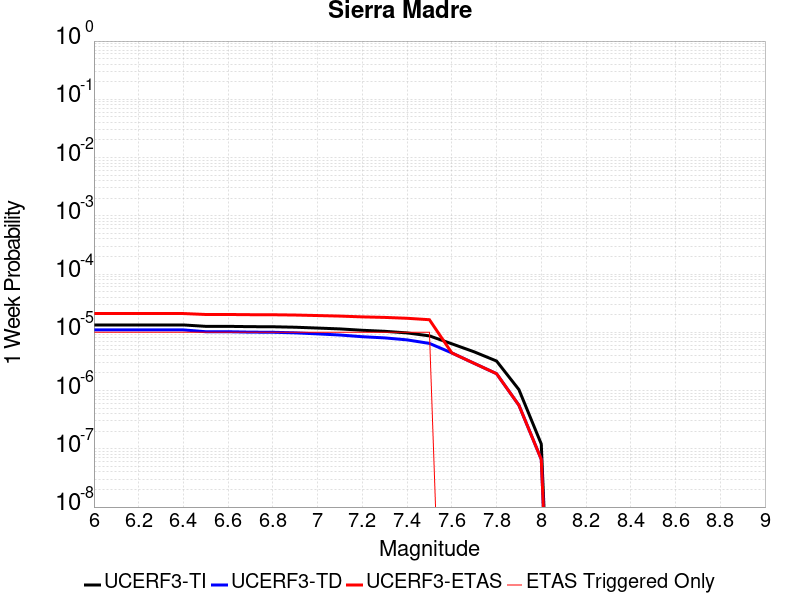 | 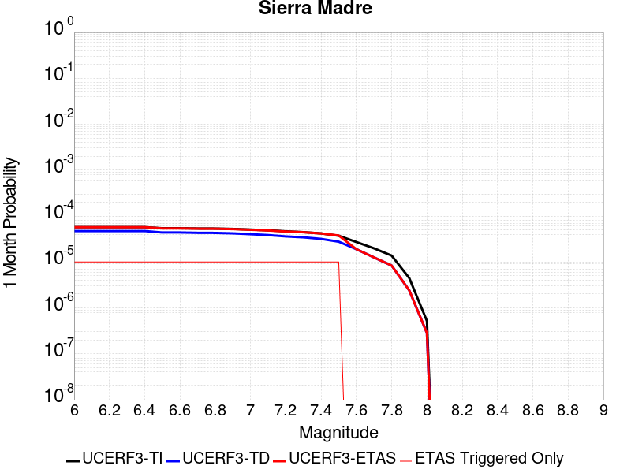 | 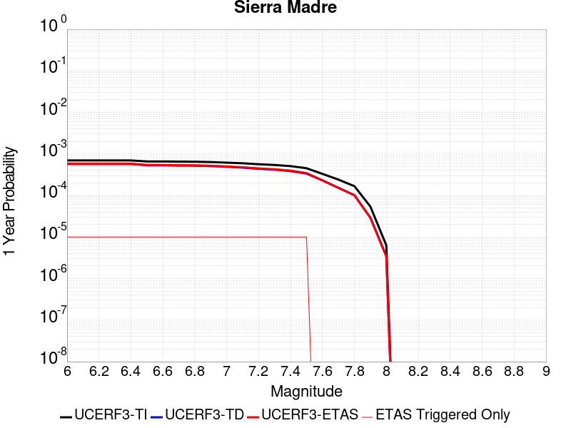 | 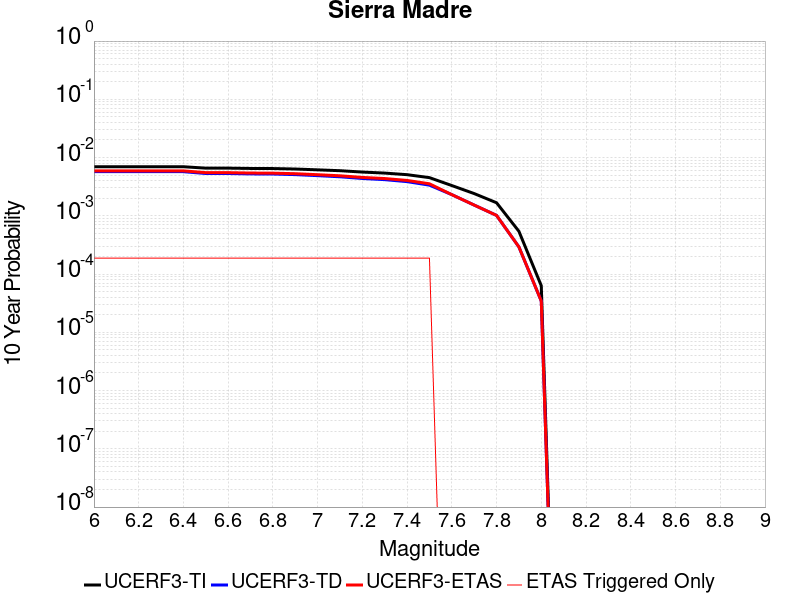 |

| Magnitude | 1 wk TI Prob | 1 wk TD Prob | 1 wk ETAS Prob | 1 wk ETAS/TD Gain | 1 wk ETAS Triggered Only | 1 mo TI Prob | 1 mo TD Prob | 1 mo ETAS Prob | 1 mo ETAS/TD Gain | 1 mo ETAS Triggered Only | 1 yr TI Prob | 1 yr TD Prob | 1 yr ETAS Prob | 1 yr ETAS/TD Gain | 1 yr ETAS Triggered Only | 10 yr TI Prob | 10 yr TD Prob | 10 yr ETAS Prob | 10 yr ETAS/TD Gain | 10 yr ETAS Triggered Only |
|-----|-----|-----|-----|-----|-----|-----|-----|-----|-----|-----|-----|-----|-----|-----|-----|-----|-----|-----|-----|-----|
| 6.0 | 1.3379373E-5 | 1.1000776E-5 | 2.1000666E-5 | 1.9090167 | 1.0E-5 | 5.7338908E-5 | 4.714534E-5 | 5.714487E-5 | 1.2121 | 1.0E-5 | 6.978776E-4 | 5.738448E-4 | 5.838391E-4 | 1.0174164 | 1.0E-5 | 0.0069569005 | 0.0057238447 | 0.005753673 | 1.0052112 | 3.0E-5 |
| 6.1 | 1.3379373E-5 | 1.1000776E-5 | 2.1000666E-5 | 1.9090167 | 1.0E-5 | 5.7338908E-5 | 4.714534E-5 | 5.714487E-5 | 1.2121 | 1.0E-5 | 6.978776E-4 | 5.738448E-4 | 5.838391E-4 | 1.0174164 | 1.0E-5 | 0.0069569005 | 0.0057238447 | 0.005753673 | 1.0052112 | 3.0E-5 |
| 6.2 | 1.3379373E-5 | 1.1000776E-5 | 2.1000666E-5 | 1.9090167 | 1.0E-5 | 5.7338908E-5 | 4.714534E-5 | 5.714487E-5 | 1.2121 | 1.0E-5 | 6.978776E-4 | 5.738448E-4 | 5.838391E-4 | 1.0174164 | 1.0E-5 | 0.0069569005 | 0.0057238447 | 0.005753673 | 1.0052112 | 3.0E-5 |
| 6.3 | 1.3379373E-5 | 1.1000776E-5 | 2.1000666E-5 | 1.9090167 | 1.0E-5 | 5.7338908E-5 | 4.714534E-5 | 5.714487E-5 | 1.2121 | 1.0E-5 | 6.978776E-4 | 5.738448E-4 | 5.838391E-4 | 1.0174164 | 1.0E-5 | 0.0069569005 | 0.0057238447 | 0.005753673 | 1.0052112 | 3.0E-5 |
| 6.4 | 1.3379373E-5 | 1.1000776E-5 | 2.1000666E-5 | 1.9090167 | 1.0E-5 | 5.7338908E-5 | 4.714534E-5 | 5.714487E-5 | 1.2121 | 1.0E-5 | 6.978776E-4 | 5.738448E-4 | 5.838391E-4 | 1.0174164 | 1.0E-5 | 0.0069569005 | 0.0057238447 | 0.005753673 | 1.0052112 | 3.0E-5 |
| 6.5 | 1.26563245E-5 | 1.0230232E-5 | 2.0230129E-5 | 1.977485 | 1.0E-5 | 5.4240263E-5 | 4.384312E-5 | 5.3842683E-5 | 1.228076 | 1.0E-5 | 6.601751E-4 | 5.3366035E-4 | 5.43655E-4 | 1.0187285 | 1.0E-5 | 0.006582173 | 0.0053239604 | 0.0053538005 | 1.0056049 | 3.0E-5 |
| 6.6 | 1.26563245E-5 | 1.0230232E-5 | 2.0230129E-5 | 1.977485 | 1.0E-5 | 5.4240263E-5 | 4.384312E-5 | 5.3842683E-5 | 1.228076 | 1.0E-5 | 6.601751E-4 | 5.3366035E-4 | 5.43655E-4 | 1.0187285 | 1.0E-5 | 0.006582173 | 0.0053239604 | 0.0053538005 | 1.0056049 | 3.0E-5 |
| 6.7 | 1.2502474E-5 | 1.00663765E-5 | 2.0066276E-5 | 1.9933962 | 1.0E-5 | 5.3580934E-5 | 4.3140906E-5 | 5.3140473E-5 | 1.2317885 | 1.0E-5 | 6.521526E-4 | 5.25115E-4 | 5.351097E-4 | 1.0190334 | 1.0E-5 | 0.0065024206 | 0.0052389116 | 0.0052687544 | 1.0056964 | 3.0E-5 |
| 6.8 | 1.2454966E-5 | 1.0018662E-5 | 2.001856E-5 | 1.9981273 | 1.0E-5 | 5.3377335E-5 | 4.293642E-5 | 5.293599E-5 | 1.2328925 | 1.0E-5 | 6.4967526E-4 | 5.226266E-4 | 5.3262134E-4 | 1.0191242 | 1.0E-5 | 0.006477792 | 0.0052141445 | 0.005243988 | 1.0057236 | 3.0E-5 |
| 6.9 | 1.2225574E-5 | 9.792639E-6 | 1.979254E-5 | 2.0211651 | 1.0E-5 | 5.2394265E-5 | 4.196778E-5 | 5.1967363E-5 | 1.238268 | 1.0E-5 | 6.3771347E-4 | 5.10839E-4 | 5.208339E-4 | 1.0195656 | 1.0E-5 | 0.006358865 | 0.0050968137 | 0.0051266607 | 1.005856 | 3.0E-5 |
| 7.0 | 1.182946E-5 | 9.399179E-6 | 1.9399085E-5 | 2.0639126 | 1.0E-5 | 5.06967E-5 | 4.0281582E-5 | 5.0281178E-5 | 1.2482424 | 1.0E-5 | 6.1705755E-4 | 4.903189E-4 | 5.00314E-4 | 1.0203849 | 1.0E-5 | 0.006153469 | 0.004892533 | 0.0049223863 | 1.0061018 | 3.0E-5 |
| 7.1 | 1.14369095E-5 | 8.986194E-6 | 1.8986104E-5 | 2.1128082 | 1.0E-5 | 4.9014405E-5 | 3.85117E-5 | 4.8511312E-5 | 1.2596513 | 1.0E-5 | 5.9658696E-4 | 4.6878002E-4 | 4.7877536E-4 | 1.021322 | 1.0E-5 | 0.005949879 | 0.0046780678 | 0.0047079273 | 1.006383 | 3.0E-5 |
| 7.2 | 1.0836419E-5 | 8.39959E-6 | 1.8399505E-5 | 2.1905243 | 1.0E-5 | 4.644097E-5 | 3.599775E-5 | 4.599739E-5 | 1.2777852 | 1.0E-5 | 5.652721E-4 | 4.3818538E-4 | 4.48181E-4 | 1.0228114 | 1.0E-5 | 0.0056383642 | 0.0043733614 | 0.0044032303 | 1.0068297 | 3.0E-5 |
| 7.3 | 1.0403439E-5 | 8.020854E-6 | 1.8020773E-5 | 2.24674 | 1.0E-5 | 4.4585406E-5 | 3.437464E-5 | 4.4374297E-5 | 1.2909021 | 1.0E-5 | 5.426921E-4 | 4.184318E-4 | 4.284276E-4 | 1.0238887 | 1.0E-5 | 0.005413687 | 0.004176585 | 0.0042064595 | 1.0071529 | 3.0E-5 |
| 7.4 | 9.768864E-6 | 7.4144855E-6 | 1.7414412E-5 | 2.3487012 | 1.0E-5 | 4.186589E-5 | 3.1775984E-5 | 4.1775667E-5 | 1.3146931 | 1.0E-5 | 5.09598E-4 | 3.868048E-4 | 3.9680096E-4 | 1.0258428 | 1.0E-5 | 0.0050843097 | 0.0038614576 | 0.0038913419 | 1.0077391 | 3.0E-5 |
| 7.5 | 8.687089E-6 | 6.450183E-6 | 1.6450118E-5 | 2.5503337 | 1.0E-5 | 3.722985E-5 | 2.7643353E-5 | 3.7643076E-5 | 1.3617406 | 1.0E-5 | 4.5317915E-4 | 3.3650672E-4 | 3.4650334E-4 | 1.0297071 | 1.0E-5 | 0.004522561 | 0.003360109 | 0.0033900081 | 1.0088983 | 3.0E-5 |
| 7.6 | 6.3506063E-6 | 4.430329E-6 | 4.430329E-6 | 1.0 | 0.0 | 2.72166E-5 | 1.8986988E-5 | 1.8986988E-5 | 1.0 | 0.0 | 3.3131172E-4 | 2.3114232E-4 | 2.3114232E-4 | 1.0 | 0.0 | 0.003308182 | 0.0023090935 | 0.0023190705 | 1.0043207 | 1.0E-5 |
| 7.7 | 4.62223E-6 | 2.9329542E-6 | 2.9329542E-6 | 1.0 | 0.0 | 1.9809406E-5 | 1.2569743E-5 | 1.2569743E-5 | 1.0 | 0.0 | 2.4115283E-4 | 1.5302589E-4 | 1.5302589E-4 | 1.0 | 0.0 | 0.0024089129 | 0.0015292577 | 0.0015392425 | 1.0065291 | 1.0E-5 |
| 7.8 | 3.2145008E-6 | 1.949411E-6 | 1.949411E-6 | 1.0 | 0.0 | 1.3776359E-5 | 8.354592E-6 | 8.354592E-6 | 1.0 | 0.0 | 1.6771426E-4 | 1.01712416E-4 | 1.01712416E-4 | 1.0 | 0.0 | 0.0016758774 | 0.0010166786 | 0.0010266685 | 1.009826 | 1.0E-5 |
| 7.9 | 1.0391769E-6 | 5.602482E-7 | 5.602482E-7 | 1.0 | 0.0 | 4.4536077E-6 | 2.4010617E-6 | 2.4010617E-6 | 1.0 | 0.0 | 5.4221324E-5 | 2.9232539E-5 | 2.9232539E-5 | 1.0 | 0.0 | 5.4208096E-4 | 2.9228735E-4 | 2.9228735E-4 | 1.0 | 0.0 |
| 8.0 | 1.210983E-7 | 6.613497E-8 | 6.613497E-8 | 1.0 | 0.0 | 5.1899264E-7 | 2.8343558E-7 | 2.8343558E-7 | 1.0 | 0.0 | 6.3187167E-6 | 3.4508228E-6 | 3.4508228E-6 | 1.0 | 0.0 | 6.318537E-5 | 3.450771E-5 | 3.450771E-5 | 1.0 | 0.0 |

## Hollywood
*[(top)](#table-of-contents)*

| 1 Week | 1 Month | 1 Year | 10 Year |
|-----|-----|-----|-----|
|  | 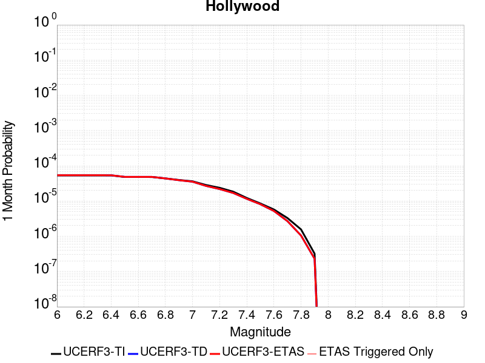 |  | 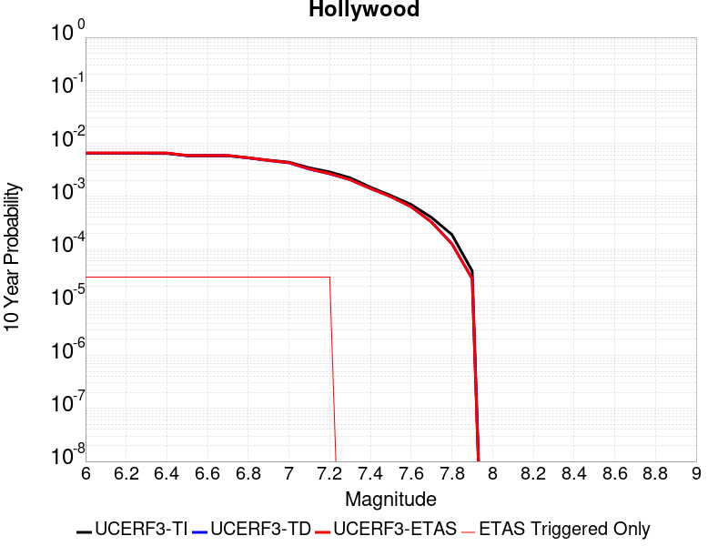 |

| Magnitude | 1 wk TI Prob | 1 wk TD Prob | 1 wk ETAS Prob | 1 wk ETAS/TD Gain | 1 wk ETAS Triggered Only | 1 mo TI Prob | 1 mo TD Prob | 1 mo ETAS Prob | 1 mo ETAS/TD Gain | 1 mo ETAS Triggered Only | 1 yr TI Prob | 1 yr TD Prob | 1 yr ETAS Prob | 1 yr ETAS/TD Gain | 1 yr ETAS Triggered Only | 10 yr TI Prob | 10 yr TD Prob | 10 yr ETAS Prob | 10 yr ETAS/TD Gain | 10 yr ETAS Triggered Only |
|-----|-----|-----|-----|-----|-----|-----|-----|-----|-----|-----|-----|-----|-----|-----|-----|-----|-----|-----|-----|-----|
| 6.0 | 1.24487615E-5 | 1.2593229E-5 | 1.2593229E-5 | 1.0 | 0.0 | 5.3350745E-5 | 5.3969892E-5 | 5.3969892E-5 | 1.0 | 0.0 | 6.4935174E-4 | 6.5689E-4 | 6.5689E-4 | 1.0 | 0.0 | 0.0064745755 | 0.0065499707 | 0.0065797744 | 1.0045502 | 3.0E-5 |
| 6.1 | 1.24487615E-5 | 1.2593229E-5 | 1.2593229E-5 | 1.0 | 0.0 | 5.3350745E-5 | 5.3969892E-5 | 5.3969892E-5 | 1.0 | 0.0 | 6.4935174E-4 | 6.5689E-4 | 6.5689E-4 | 1.0 | 0.0 | 0.0064745755 | 0.0065499707 | 0.0065797744 | 1.0045502 | 3.0E-5 |
| 6.2 | 1.24487615E-5 | 1.2593229E-5 | 1.2593229E-5 | 1.0 | 0.0 | 5.3350745E-5 | 5.3969892E-5 | 5.3969892E-5 | 1.0 | 0.0 | 6.4935174E-4 | 6.5689E-4 | 6.5689E-4 | 1.0 | 0.0 | 0.0064745755 | 0.0065499707 | 0.0065797744 | 1.0045502 | 3.0E-5 |
| 6.3 | 1.24487615E-5 | 1.2593229E-5 | 1.2593229E-5 | 1.0 | 0.0 | 5.3350745E-5 | 5.3969892E-5 | 5.3969892E-5 | 1.0 | 0.0 | 6.4935174E-4 | 6.5689E-4 | 6.5689E-4 | 1.0 | 0.0 | 0.0064745755 | 0.0065499707 | 0.0065797744 | 1.0045502 | 3.0E-5 |
| 6.4 | 1.2431024E-5 | 1.25738425E-5 | 1.25738425E-5 | 1.0 | 0.0 | 5.327473E-5 | 5.388681E-5 | 5.388681E-5 | 1.0 | 0.0 | 6.4842677E-4 | 6.558791E-4 | 6.558791E-4 | 1.0 | 0.0 | 0.0064653796 | 0.0065399213 | 0.006569725 | 1.0045573 | 3.0E-5 |
| 6.5 | 1.1242222E-5 | 1.1317804E-5 | 1.1317804E-5 | 1.0 | 0.0 | 4.8180063E-5 | 4.8503985E-5 | 4.8503985E-5 | 1.0 | 0.0 | 5.864344E-4 | 5.903787E-4 | 5.903787E-4 | 1.0 | 0.0 | 0.0058488925 | 0.00588839 | 0.005918213 | 1.0050647 | 3.0E-5 |
| 6.6 | 1.1234066E-5 | 1.1308918E-5 | 1.1308918E-5 | 1.0 | 0.0 | 4.8145106E-5 | 4.8465907E-5 | 4.8465907E-5 | 1.0 | 0.0 | 5.86009E-4 | 5.899153E-4 | 5.899153E-4 | 1.0 | 0.0 | 0.005844661 | 0.0058837803 | 0.005913604 | 1.0050688 | 3.0E-5 |
| 6.7 | 1.12294E-5 | 1.1303661E-5 | 1.1303661E-5 | 1.0 | 0.0 | 4.812511E-5 | 4.8443377E-5 | 4.8443377E-5 | 1.0 | 0.0 | 5.857657E-4 | 5.896412E-4 | 5.896412E-4 | 1.0 | 0.0 | 0.0058422405 | 0.005881054 | 0.005910877 | 1.0050712 | 3.0E-5 |
| 6.8 | 1.0252819E-5 | 1.0218449E-5 | 1.0218449E-5 | 1.0 | 0.0 | 4.3939912E-5 | 4.3792625E-5 | 4.3792625E-5 | 1.0 | 0.0 | 5.3483713E-4 | 5.330469E-4 | 5.330469E-4 | 1.0 | 0.0 | 0.005335517 | 0.0053179096 | 0.0053477497 | 1.0056113 | 3.0E-5 |
| 6.9 | 9.252289E-6 | 9.110309E-6 | 9.110309E-6 | 1.0 | 0.0 | 3.9652066E-5 | 3.9043607E-5 | 3.9043607E-5 | 1.0 | 0.0 | 4.8265693E-4 | 4.752539E-4 | 4.752539E-4 | 1.0 | 0.0 | 0.0048161 | 0.004742549 | 0.0047724065 | 1.0062957 | 3.0E-5 |
| 7.0 | 8.474604E-6 | 8.25826E-6 | 8.25826E-6 | 1.0 | 0.0 | 3.6319227E-5 | 3.5392073E-5 | 3.5392073E-5 | 1.0 | 0.0 | 4.4209688E-4 | 4.3081472E-4 | 4.3081472E-4 | 1.0 | 0.0 | 0.004412184 | 0.0042999457 | 0.004329817 | 1.0069468 | 3.0E-5 |
| 7.1 | 6.643643E-6 | 6.2683707E-6 | 6.2683707E-6 | 1.0 | 0.0 | 2.8472443E-5 | 2.686417E-5 | 2.686417E-5 | 1.0 | 0.0 | 3.4659685E-4 | 3.2702263E-4 | 3.2702263E-4 | 1.0 | 0.0 | 0.0034605677 | 0.0032654598 | 0.003295362 | 1.0091571 | 3.0E-5 |
| 7.2 | 5.549002E-6 | 5.1087086E-6 | 5.1087086E-6 | 1.0 | 0.0 | 2.378122E-5 | 2.1894282E-5 | 2.1894282E-5 | 1.0 | 0.0 | 2.8949787E-4 | 2.665304E-4 | 2.665304E-4 | 1.0 | 0.0 | 0.0028912104 | 0.002662124 | 0.0026920442 | 1.0112392 | 3.0E-5 |
| 7.3 | 4.3059727E-6 | 3.9598913E-6 | 3.9598913E-6 | 1.0 | 0.0 | 1.8454039E-5 | 1.6970853E-5 | 1.6970853E-5 | 1.0 | 0.0 | 2.2465475E-4 | 2.0660064E-4 | 2.0660064E-4 | 1.0 | 0.0 | 0.0022442779 | 0.0020640958 | 0.0020640958 | 1.0 | 0.0 |
| 7.4 | 2.8550733E-6 | 2.7013002E-6 | 2.7013002E-6 | 1.0 | 0.0 | 1.2235971E-5 | 1.1576949E-5 | 1.1576949E-5 | 1.0 | 0.0 | 1.4896276E-4 | 1.4094029E-4 | 1.4094029E-4 | 1.0 | 0.0 | 0.0014886294 | 0.0014085141 | 0.0014085141 | 1.0 | 0.0 |
| 7.5 | 1.9927045E-6 | 1.8976393E-6 | 1.8976393E-6 | 1.0 | 0.0 | 8.540134E-6 | 8.132714E-6 | 8.132714E-6 | 1.0 | 0.0 | 1.0397117E-4 | 9.901134E-5 | 9.901134E-5 | 1.0 | 0.0 | 0.0010392254 | 9.896759E-4 | 9.896759E-4 | 1.0 | 0.0 |
| 7.6 | 1.345084E-6 | 1.2216018E-6 | 1.2216018E-6 | 1.0 | 0.0 | 5.764633E-6 | 5.2354258E-6 | 5.2354258E-6 | 1.0 | 0.0 | 7.018215E-5 | 6.373946E-5 | 6.373946E-5 | 1.0 | 0.0 | 7.0159987E-4 | 6.372138E-4 | 6.372138E-4 | 1.0 | 0.0 |
| 7.7 | 7.6835164E-7 | 6.2777013E-7 | 6.2777013E-7 | 1.0 | 0.0 | 3.2929315E-6 | 2.6904406E-6 | 2.6904406E-6 | 1.0 | 0.0 | 4.00907E-5 | 3.2755637E-5 | 3.2755637E-5 | 1.0 | 0.0 | 4.0083472E-4 | 3.2750957E-4 | 3.2750957E-4 | 1.0 | 0.0 |
| 7.8 | 3.6562128E-7 | 2.4534745E-7 | 2.4534745E-7 | 1.0 | 0.0 | 1.5669474E-6 | 1.0514887E-6 | 1.0514887E-6 | 1.0 | 0.0 | 1.9077417E-5 | 1.2801803E-5 | 1.2801803E-5 | 1.0 | 0.0 | 1.907578E-4 | 1.2801103E-4 | 1.2801103E-4 | 1.0 | 0.0 |
| 7.9 | 7.5024424E-8 | 5.381742E-8 | 5.381742E-8 | 1.0 | 0.0 | 3.215332E-7 | 2.3064608E-7 | 2.3064608E-7 | 1.0 | 0.0 | 3.91466E-6 | 2.8081138E-6 | 2.8081138E-6 | 1.0 | 0.0 | 3.9145907E-5 | 2.8080913E-5 | 2.8080913E-5 | 1.0 | 0.0 |

## East Huasna 2011 CFM
*[(top)](#table-of-contents)*

| 1 Week | 1 Month | 1 Year | 10 Year |
|-----|-----|-----|-----|
|  |  | 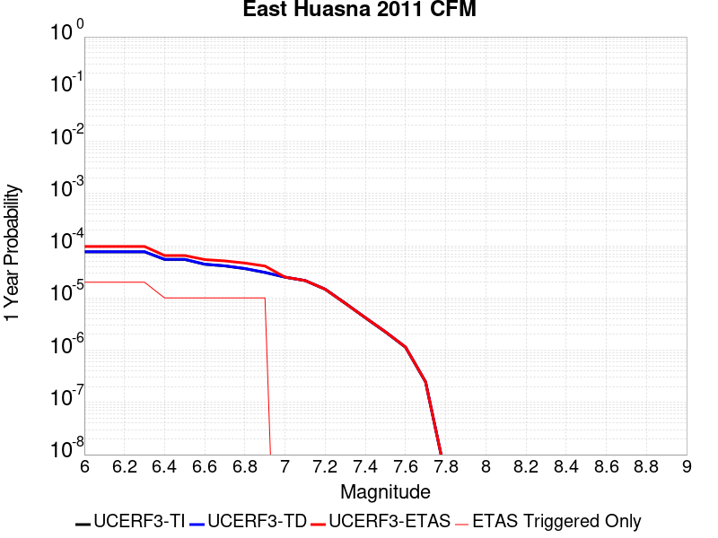 | 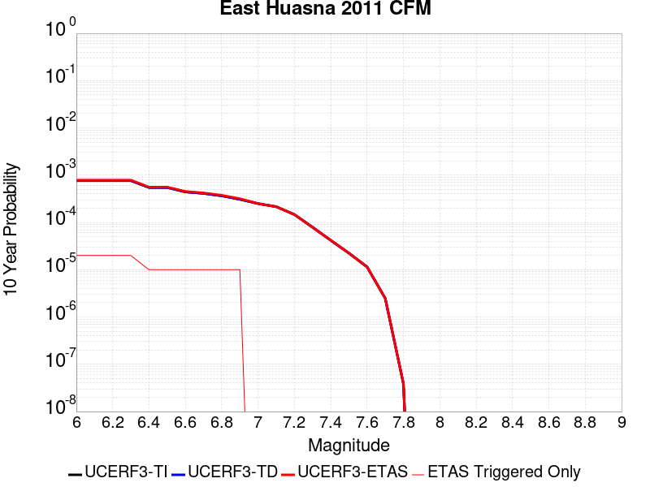 |

| Magnitude | 1 wk TI Prob | 1 wk TD Prob | 1 wk ETAS Prob | 1 wk ETAS/TD Gain | 1 wk ETAS Triggered Only | 1 mo TI Prob | 1 mo TD Prob | 1 mo ETAS Prob | 1 mo ETAS/TD Gain | 1 mo ETAS Triggered Only | 1 yr TI Prob | 1 yr TD Prob | 1 yr ETAS Prob | 1 yr ETAS/TD Gain | 1 yr ETAS Triggered Only | 10 yr TI Prob | 10 yr TD Prob | 10 yr ETAS Prob | 10 yr ETAS/TD Gain | 10 yr ETAS Triggered Only |
|-----|-----|-----|-----|-----|-----|-----|-----|-----|-----|-----|-----|-----|-----|-----|-----|-----|-----|-----|-----|-----|
| 6.0 | 1.4658423E-6 | 1.471566E-6 | 1.471566E-6 | 1.0 | 0.0 | 6.282166E-6 | 6.3066964E-6 | 6.3066964E-6 | 1.0 | 0.0 | 7.6482684E-5 | 7.67814E-5 | 9.677986E-5 | 1.2604598 | 2.0E-5 | 7.645637E-4 | 7.6755567E-4 | 7.8754034E-4 | 1.0260367 | 2.0E-5 |
| 6.1 | 1.4658423E-6 | 1.471566E-6 | 1.471566E-6 | 1.0 | 0.0 | 6.282166E-6 | 6.3066964E-6 | 6.3066964E-6 | 1.0 | 0.0 | 7.6482684E-5 | 7.67814E-5 | 9.677986E-5 | 1.2604598 | 2.0E-5 | 7.645637E-4 | 7.6755567E-4 | 7.8754034E-4 | 1.0260367 | 2.0E-5 |
| 6.2 | 1.4658423E-6 | 1.471566E-6 | 1.471566E-6 | 1.0 | 0.0 | 6.282166E-6 | 6.3066964E-6 | 6.3066964E-6 | 1.0 | 0.0 | 7.6482684E-5 | 7.67814E-5 | 9.677986E-5 | 1.2604598 | 2.0E-5 | 7.645637E-4 | 7.6755567E-4 | 7.8754034E-4 | 1.0260367 | 2.0E-5 |
| 6.3 | 1.4658423E-6 | 1.471566E-6 | 1.471566E-6 | 1.0 | 0.0 | 6.282166E-6 | 6.3066964E-6 | 6.3066964E-6 | 1.0 | 0.0 | 7.6482684E-5 | 7.67814E-5 | 9.677986E-5 | 1.2604598 | 2.0E-5 | 7.645637E-4 | 7.6755567E-4 | 7.8754034E-4 | 1.0260367 | 2.0E-5 |
| 6.4 | 1.0488257E-6 | 1.0527515E-6 | 1.0527515E-6 | 1.0 | 0.0 | 4.4949593E-6 | 4.5117845E-6 | 4.5117845E-6 | 1.0 | 0.0 | 5.472476E-5 | 5.492961E-5 | 6.492906E-5 | 1.1820412 | 1.0E-5 | 5.4711284E-4 | 5.491622E-4 | 5.591567E-4 | 1.0181996 | 1.0E-5 |
| 6.5 | 1.0488257E-6 | 1.0527515E-6 | 1.0527515E-6 | 1.0 | 0.0 | 4.4949593E-6 | 4.5117845E-6 | 4.5117845E-6 | 1.0 | 0.0 | 5.472476E-5 | 5.492961E-5 | 6.492906E-5 | 1.1820412 | 1.0E-5 | 5.4711284E-4 | 5.491622E-4 | 5.591567E-4 | 1.0181996 | 1.0E-5 |
| 6.6 | 8.463064E-7 | 8.4936323E-7 | 8.4936323E-7 | 1.0 | 0.0 | 3.6270226E-6 | 3.6401232E-6 | 3.6401232E-6 | 1.0 | 0.0 | 4.4158103E-5 | 4.4317607E-5 | 5.4317163E-5 | 1.225634 | 1.0E-5 | 4.414933E-4 | 4.4308856E-4 | 4.5308413E-4 | 1.0225588 | 1.0E-5 |
| 6.7 | 7.876149E-7 | 7.902533E-7 | 7.902533E-7 | 1.0 | 0.0 | 3.375488E-6 | 3.3867955E-6 | 3.3867955E-6 | 1.0 | 0.0 | 4.109579E-5 | 4.1233463E-5 | 5.1233048E-5 | 1.2425115 | 1.0E-5 | 4.108819E-4 | 4.1225873E-4 | 4.222546E-4 | 1.0242466 | 1.0E-5 |
| 6.8 | 6.9940785E-7 | 7.0165777E-7 | 7.0165777E-7 | 1.0 | 0.0 | 2.9974588E-6 | 3.0071012E-6 | 3.0071012E-6 | 1.0 | 0.0 | 3.649345E-5 | 3.6610847E-5 | 4.661048E-5 | 1.273133 | 1.0E-5 | 3.6487455E-4 | 3.6604863E-4 | 3.7604498E-4 | 1.0273088 | 1.0E-5 |
| 6.9 | 5.899658E-7 | 5.9155997E-7 | 5.9155997E-7 | 1.0 | 0.0 | 2.5284223E-6 | 2.5352545E-6 | 2.5352545E-6 | 1.0 | 0.0 | 3.0783107E-5 | 3.086629E-5 | 4.086598E-5 | 1.323968 | 1.0E-5 | 3.0778843E-4 | 3.086203E-4 | 3.186172E-4 | 1.0323923 | 1.0E-5 |
| 7.0 | 4.793814E-7 | 4.803273E-7 | 4.803273E-7 | 1.0 | 0.0 | 2.05449E-6 | 2.058544E-6 | 2.058544E-6 | 1.0 | 0.0 | 2.501313E-5 | 2.5062485E-5 | 2.5062485E-5 | 1.0 | 0.0 | 2.5010316E-4 | 2.505968E-4 | 2.505968E-4 | 1.0 | 0.0 |
| 7.1 | 4.1256908E-7 | 4.129941E-7 | 4.129941E-7 | 1.0 | 0.0 | 1.768152E-6 | 1.7699736E-6 | 1.7699736E-6 | 1.0 | 0.0 | 2.1527037E-5 | 2.1549216E-5 | 2.1549216E-5 | 1.0 | 0.0 | 2.1524953E-4 | 2.1547142E-4 | 2.1547142E-4 | 1.0 | 0.0 |
| 7.2 | 2.822599E-7 | 2.8161418E-7 | 2.8161418E-7 | 1.0 | 0.0 | 1.2096847E-6 | 1.2069174E-6 | 1.2069174E-6 | 1.0 | 0.0 | 1.47278115E-5 | 1.4694121E-5 | 1.4694121E-5 | 1.0 | 0.0 | 1.4726835E-4 | 1.4693156E-4 | 1.4693156E-4 | 1.0 | 0.0 |
| 7.3 | 1.5261652E-7 | 1.5075021E-7 | 1.5075021E-7 | 1.0 | 0.0 | 6.540707E-7 | 6.460722E-7 | 6.460722E-7 | 1.0 | 0.0 | 7.963281E-6 | 7.8659E-6 | 7.8659E-6 | 1.0 | 0.0 | 7.962996E-5 | 7.865624E-5 | 7.865624E-5 | 1.0 | 0.0 |
| 7.4 | 7.976414E-8 | 8.057865E-8 | 8.057865E-8 | 1.0 | 0.0 | 3.418463E-7 | 3.45337E-7 | 3.45337E-7 | 1.0 | 0.0 | 4.1619705E-6 | 4.2044703E-6 | 4.2044703E-6 | 1.0 | 0.0 | 4.161893E-5 | 4.2043914E-5 | 4.2043914E-5 | 1.0 | 0.0 |
| 7.5 | 4.2715055E-8 | 4.3202512E-8 | 4.3202512E-8 | 1.0 | 0.0 | 1.830645E-7 | 1.8515361E-7 | 1.8515361E-7 | 1.0 | 0.0 | 2.228808E-6 | 2.2542429E-6 | 2.2542429E-6 | 1.0 | 0.0 | 2.2287857E-5 | 2.2542203E-5 | 2.2542203E-5 | 1.0 | 0.0 |
| 7.6 | 2.1807532E-8 | 2.2057476E-8 | 2.2057476E-8 | 1.0 | 0.0 | 9.346085E-8 | 9.4532034E-8 | 9.4532034E-8 | 1.0 | 0.0 | 1.1378852E-6 | 1.1509269E-6 | 1.1509269E-6 | 1.0 | 0.0 | 1.1378794E-5 | 1.1509211E-5 | 1.1509211E-5 | 1.0 | 0.0 |
| 7.7 | 4.7196043E-9 | 4.767283E-9 | 4.767283E-9 | 1.0 | 0.0 | 2.0226874E-8 | 2.0431212E-8 | 2.0431212E-8 | 1.0 | 0.0 | 2.4626218E-7 | 2.4874998E-7 | 2.4874998E-7 | 1.0 | 0.0 | 2.462619E-6 | 2.487497E-6 | 2.487497E-6 | 1.0 | 0.0 |
| 7.8 | 7.400003E-11 | 7.4654505E-11 | 7.4654505E-11 | 1.0 | 0.0 | 3.171432E-10 | 3.1994773E-10 | 3.1994773E-10 | 1.0 | 0.0 | 3.861218E-9 | 3.895363E-9 | 3.895363E-9 | 1.0 | 0.0 | 3.861218E-8 | 3.895363E-8 | 3.895363E-8 | 1.0 | 0.0 |

## Hayward (So) extension 2011 CFM
*[(top)](#table-of-contents)*

| 1 Week | 1 Month | 1 Year | 10 Year |
|-----|-----|-----|-----|
|  | 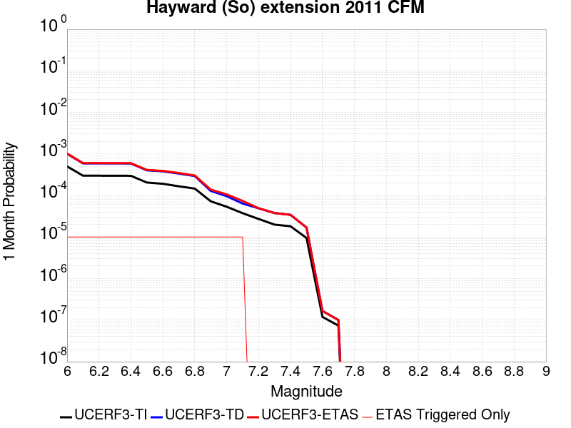 | 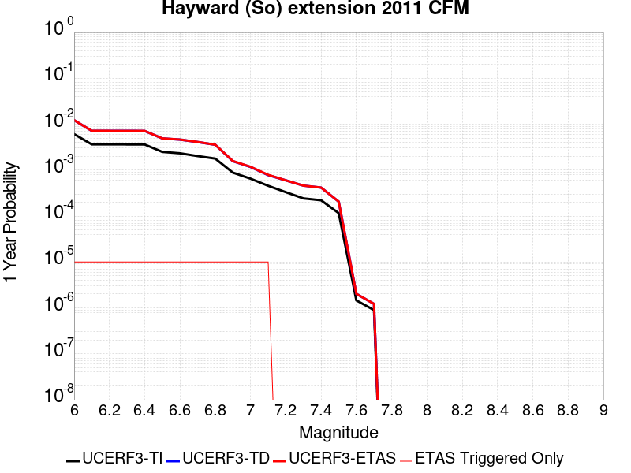 | 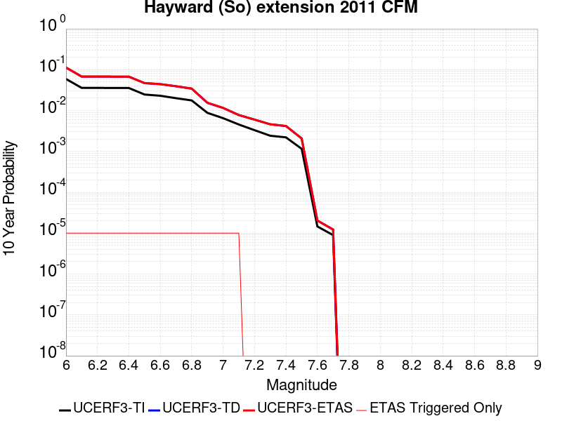 |

| Magnitude | 1 wk TI Prob | 1 wk TD Prob | 1 wk ETAS Prob | 1 wk ETAS/TD Gain | 1 wk ETAS Triggered Only | 1 mo TI Prob | 1 mo TD Prob | 1 mo ETAS Prob | 1 mo ETAS/TD Gain | 1 mo ETAS Triggered Only | 1 yr TI Prob | 1 yr TD Prob | 1 yr ETAS Prob | 1 yr ETAS/TD Gain | 1 yr ETAS Triggered Only | 10 yr TI Prob | 10 yr TD Prob | 10 yr ETAS Prob | 10 yr ETAS/TD Gain | 10 yr ETAS Triggered Only |
|-----|-----|-----|-----|-----|-----|-----|-----|-----|-----|-----|-----|-----|-----|-----|-----|-----|-----|-----|-----|-----|
| 6.0 | 1.1721256E-4 | 2.3671088E-4 | 2.3671088E-4 | 1.0 | 0.0 | 5.022428E-4 | 0.0010138806 | 0.0010238704 | 1.0098531 | 1.0E-5 | 0.0060976758 | 0.012250609 | 0.012260486 | 1.0008063 | 1.0E-5 | 0.0593305 | 0.11284437 | 0.112853244 | 1.0000786 | 1.0E-5 |
| 6.1 | 6.99169E-5 | 1.3808164E-4 | 1.3808164E-4 | 1.0 | 0.0 | 2.9960944E-4 | 5.9155683E-4 | 6.015509E-4 | 1.0168946 | 1.0E-5 | 0.0036416445 | 0.0071723475 | 0.007182276 | 1.0013843 | 1.0E-5 | 0.035825435 | 0.067804344 | 0.067813665 | 1.0001374 | 1.0E-5 |
| 6.2 | 6.99169E-5 | 1.3808164E-4 | 1.3808164E-4 | 1.0 | 0.0 | 2.9960944E-4 | 5.9155683E-4 | 6.015509E-4 | 1.0168946 | 1.0E-5 | 0.0036416445 | 0.0071723475 | 0.007182276 | 1.0013843 | 1.0E-5 | 0.035825435 | 0.067804344 | 0.067813665 | 1.0001374 | 1.0E-5 |
| 6.3 | 6.970908E-5 | 1.3776305E-4 | 1.3776305E-4 | 1.0 | 0.0 | 2.9871898E-4 | 5.9019245E-4 | 6.001865E-4 | 1.0169337 | 1.0E-5 | 0.0036308395 | 0.007155884 | 0.007165813 | 1.0013875 | 1.0E-5 | 0.035720866 | 0.0676533 | 0.06766263 | 1.0001378 | 1.0E-5 |
| 6.4 | 6.9517155E-5 | 1.3743227E-4 | 1.3743227E-4 | 1.0 | 0.0 | 2.9789665E-4 | 5.8877567E-4 | 5.987698E-4 | 1.0169744 | 1.0E-5 | 0.0036208609 | 0.0071387975 | 0.0071487264 | 1.0013908 | 1.0E-5 | 0.03562429 | 0.06749734 | 0.06750666 | 1.0001382 | 1.0E-5 |
| 6.5 | 4.786248E-5 | 9.415232E-5 | 9.415232E-5 | 1.0 | 0.0 | 2.0510878E-4 | 4.0344993E-4 | 4.1344587E-4 | 1.0247762 | 1.0E-5 | 0.0024943394 | 0.0049013784 | 0.0049113296 | 1.0020303 | 1.0E-5 | 0.02466527 | 0.046900697 | 0.046910226 | 1.0002033 | 1.0E-5 |
| 6.6 | 4.4662214E-5 | 8.8819244E-5 | 8.8819244E-5 | 1.0 | 0.0 | 1.9139545E-4 | 3.80601E-4 | 3.9059718E-4 | 1.0262642 | 1.0E-5 | 0.0023277493 | 0.0046244357 | 0.004634389 | 1.0021524 | 1.0E-5 | 0.02303517 | 0.04429206 | 0.044301614 | 1.0002158 | 1.0E-5 |
| 6.7 | 3.884542E-5 | 7.8650686E-5 | 7.8650686E-5 | 1.0 | 0.0 | 1.6646975E-4 | 3.3703333E-4 | 3.4702994E-4 | 1.0296607 | 1.0E-5 | 0.002024885 | 0.0040961048 | 0.004106064 | 1.0024314 | 1.0E-5 | 0.020065336 | 0.039332055 | 0.03934166 | 1.0002443 | 1.0E-5 |
| 6.8 | 3.4221863E-5 | 6.855886E-5 | 6.855886E-5 | 1.0 | 0.0 | 1.4665688E-4 | 2.9379298E-4 | 3.0379003E-4 | 1.0340276 | 1.0E-5 | 0.0017840851 | 0.0035714838 | 0.003581448 | 1.00279 | 1.0E-5 | 0.017698295 | 0.034419462 | 0.034429118 | 1.0002805 | 1.0E-5 |
| 6.9 | 1.6927712E-5 | 3.006262E-5 | 3.006262E-5 | 1.0 | 0.0 | 7.2545314E-5 | 1.2883375E-4 | 1.3883247E-4 | 1.0776094 | 1.0E-5 | 8.828813E-4 | 0.0015674793 | 0.0015774637 | 1.0063697 | 1.0E-5 | 0.008793819 | 0.015463544 | 0.015473389 | 1.0006367 | 1.0E-5 |
| 7.0 | 1.2509653E-5 | 2.246337E-5 | 2.246337E-5 | 1.0 | 0.0 | 5.3611697E-5 | 9.626828E-5 | 1.0626732E-4 | 1.1038663 | 1.0E-5 | 6.525269E-4 | 0.0011714802 | 0.0011814684 | 1.0085262 | 1.0E-5 | 0.0065061417 | 0.011583166 | 0.01159305 | 1.0008533 | 1.0E-5 |
| 7.1 | 8.751583E-6 | 1.4926157E-5 | 1.4926157E-5 | 1.0 | 0.0 | 3.750624E-5 | 6.396771E-5 | 7.3967065E-5 | 1.1563189 | 1.0E-5 | 4.5654282E-4 | 7.785344E-4 | 7.885266E-4 | 1.0128347 | 1.0E-5 | 0.0045560603 | 0.007764457 | 0.007774379 | 1.0012779 | 1.0E-5 |
| 7.2 | 6.354379E-6 | 1.1499087E-5 | 1.1499087E-5 | 1.0 | 0.0 | 2.7232769E-5 | 4.9280898E-5 | 4.9280898E-5 | 1.0 | 0.0 | 3.3150852E-4 | 5.9983454E-4 | 5.9983454E-4 | 1.0 | 0.0 | 0.0033101442 | 0.006001243 | 0.006001243 | 1.0 | 0.0 |
| 7.3 | 4.645554E-6 | 8.818441E-6 | 8.818441E-6 | 1.0 | 0.0 | 1.9909365E-5 | 3.7792794E-5 | 3.7792794E-5 | 1.0 | 0.0 | 2.4236954E-4 | 4.6003403E-4 | 4.6003403E-4 | 1.0 | 0.0 | 0.0024210536 | 0.004611421 | 0.004611421 | 1.0 | 0.0 |
| 7.4 | 4.23437E-6 | 7.992759E-6 | 7.992759E-6 | 1.0 | 0.0 | 1.8147173E-5 | 3.425425E-5 | 3.425425E-5 | 1.0 | 0.0 | 2.2091944E-4 | 4.1696956E-4 | 4.1696956E-4 | 1.0 | 0.0 | 0.0022069993 | 0.0041826614 | 0.0041826614 | 1.0 | 0.0 |
| 7.5 | 2.2187417E-6 | 3.952336E-6 | 3.952336E-6 | 1.0 | 0.0 | 9.508858E-6 | 1.6938488E-5 | 1.6938488E-5 | 1.0 | 0.0 | 1.157642E-4 | 2.0620918E-4 | 2.0620918E-4 | 1.0 | 0.0 | 0.0011570391 | 0.0020739497 | 0.0020739497 | 1.0 | 0.0 |
| 7.6 | 2.7952495E-8 | 3.8785874E-8 | 3.8785874E-8 | 1.0 | 0.0 | 1.1979641E-7 | 1.6622516E-7 | 1.6622516E-7 | 1.0 | 0.0 | 1.4585203E-6 | 2.0237894E-6 | 2.0237894E-6 | 1.0 | 0.0 | 1.4585107E-5 | 2.0317146E-5 | 2.0317146E-5 | 1.0 | 0.0 |
| 7.7 | 1.7192724E-8 | 2.3436652E-8 | 2.3436652E-8 | 1.0 | 0.0 | 7.36831E-8 | 1.0044278E-7 | 1.0044278E-7 | 1.0 | 0.0 | 8.9709135E-7 | 1.2228902E-6 | 1.2228902E-6 | 1.0 | 0.0 | 8.970877E-6 | 1.2285953E-5 | 1.2285953E-5 | 1.0 | 0.0 |

## Shoreline
*[(top)](#table-of-contents)*

| 1 Week | 1 Month | 1 Year | 10 Year |
|-----|-----|-----|-----|
| 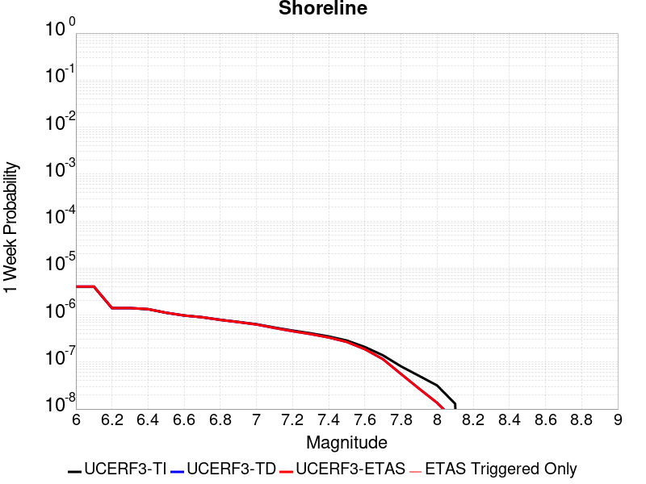 | 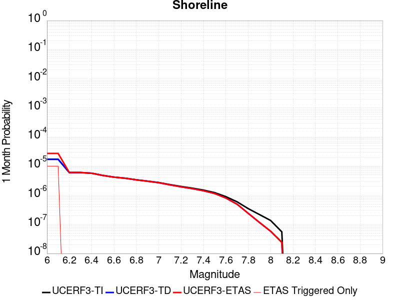 | 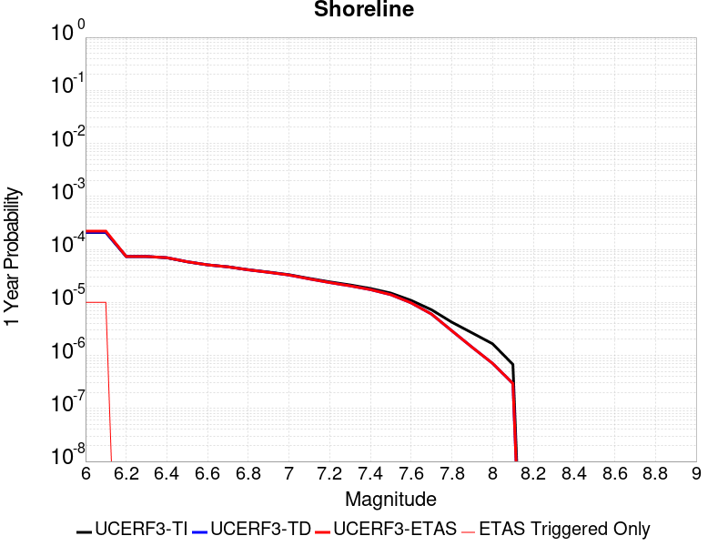 | 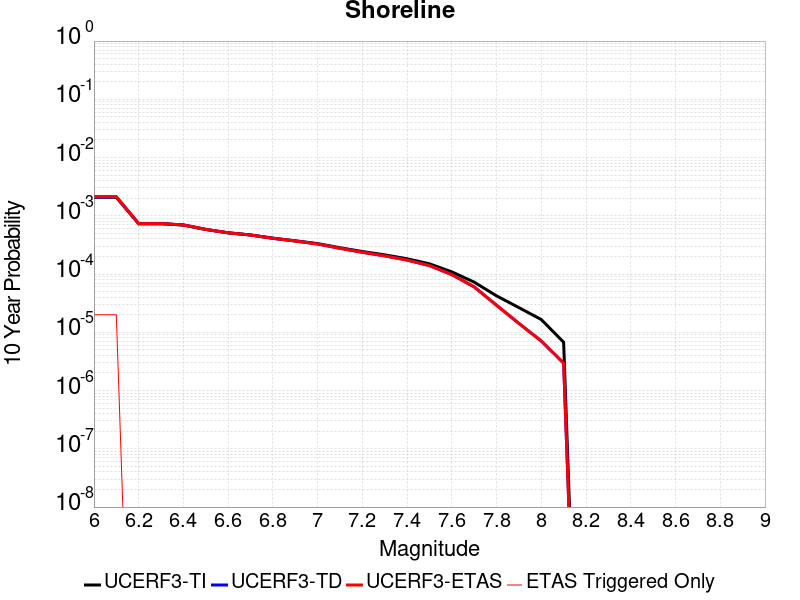 |

| Magnitude | 1 wk TI Prob | 1 wk TD Prob | 1 wk ETAS Prob | 1 wk ETAS/TD Gain | 1 wk ETAS Triggered Only | 1 mo TI Prob | 1 mo TD Prob | 1 mo ETAS Prob | 1 mo ETAS/TD Gain | 1 mo ETAS Triggered Only | 1 yr TI Prob | 1 yr TD Prob | 1 yr ETAS Prob | 1 yr ETAS/TD Gain | 1 yr ETAS Triggered Only | 10 yr TI Prob | 10 yr TD Prob | 10 yr ETAS Prob | 10 yr ETAS/TD Gain | 10 yr ETAS Triggered Only |
|-----|-----|-----|-----|-----|-----|-----|-----|-----|-----|-----|-----|-----|-----|-----|-----|-----|-----|-----|-----|-----|
| 6.0 | 3.9888673E-6 | 4.0479285E-6 | 4.0479285E-6 | 1.0 | 0.0 | 1.7095033E-5 | 1.7348182E-5 | 2.7348007E-5 | 1.5764194 | 1.0E-5 | 2.0811215E-4 | 2.1119922E-4 | 2.2119712E-4 | 1.0473386 | 1.0E-5 | 0.0020791737 | 0.0021105339 | 0.0021304917 | 1.0094563 | 2.0E-5 |
| 6.1 | 3.9888673E-6 | 4.0479285E-6 | 4.0479285E-6 | 1.0 | 0.0 | 1.7095033E-5 | 1.7348182E-5 | 2.7348007E-5 | 1.5764194 | 1.0E-5 | 2.0811215E-4 | 2.1119922E-4 | 2.2119712E-4 | 1.0473386 | 1.0E-5 | 0.0020791737 | 0.0021105339 | 0.0021304917 | 1.0094563 | 2.0E-5 |
| 6.2 | 1.4039653E-6 | 1.4100885E-6 | 1.4100885E-6 | 1.0 | 0.0 | 6.0169805E-6 | 6.043223E-6 | 6.043223E-6 | 1.0 | 0.0 | 7.325427E-5 | 7.357382E-5 | 7.357382E-5 | 1.0 | 0.0 | 7.3230127E-4 | 7.355006E-4 | 7.355006E-4 | 1.0 | 0.0 |
| 6.3 | 1.4039653E-6 | 1.4100885E-6 | 1.4100885E-6 | 1.0 | 0.0 | 6.0169805E-6 | 6.043223E-6 | 6.043223E-6 | 1.0 | 0.0 | 7.325427E-5 | 7.357382E-5 | 7.357382E-5 | 1.0 | 0.0 | 7.3230127E-4 | 7.355006E-4 | 7.355006E-4 | 1.0 | 0.0 |
| 6.4 | 1.3314152E-6 | 1.33616E-6 | 1.33616E-6 | 1.0 | 0.0 | 5.7060524E-6 | 5.726388E-6 | 5.726388E-6 | 1.0 | 0.0 | 6.946897E-5 | 6.9716596E-5 | 6.9716596E-5 | 1.0 | 0.0 | 6.9447263E-4 | 6.9695263E-4 | 6.9695263E-4 | 1.0 | 0.0 |
| 6.5 | 1.1187026E-6 | 1.1203634E-6 | 1.1203634E-6 | 1.0 | 0.0 | 4.794431E-6 | 4.801549E-6 | 4.801549E-6 | 1.0 | 0.0 | 5.8370628E-5 | 5.8457317E-5 | 5.8457317E-5 | 1.0 | 0.0 | 5.83553E-4 | 5.844219E-4 | 5.844219E-4 | 1.0 | 0.0 |
| 6.6 | 9.793089E-7 | 9.784915E-7 | 9.784915E-7 | 1.0 | 0.0 | 4.1970316E-6 | 4.193528E-6 | 4.193528E-6 | 1.0 | 0.0 | 5.1097657E-5 | 5.1055024E-5 | 5.1055024E-5 | 1.0 | 0.0 | 5.108591E-4 | 5.104342E-4 | 5.104342E-4 | 1.0 | 0.0 |
| 6.7 | 8.995986E-7 | 8.972795E-7 | 8.972795E-7 | 1.0 | 0.0 | 3.8554167E-6 | 3.8454777E-6 | 3.8454777E-6 | 1.0 | 0.0 | 4.693869E-5 | 4.68177E-5 | 4.68177E-5 | 1.0 | 0.0 | 4.6928777E-4 | 4.680793E-4 | 4.680793E-4 | 1.0 | 0.0 |
| 6.8 | 7.931612E-7 | 7.8803976E-7 | 7.8803976E-7 | 1.0 | 0.0 | 3.3992578E-6 | 3.377309E-6 | 3.377309E-6 | 1.0 | 0.0 | 4.1385178E-5 | 4.1117964E-5 | 4.1117964E-5 | 1.0 | 0.0 | 4.1377472E-4 | 4.1110412E-4 | 4.1110412E-4 | 1.0 | 0.0 |
| 6.9 | 7.1465956E-7 | 7.078001E-7 | 7.078001E-7 | 1.0 | 0.0 | 3.062823E-6 | 3.0334254E-6 | 3.0334254E-6 | 1.0 | 0.0 | 3.7289232E-5 | 3.693133E-5 | 3.693133E-5 | 1.0 | 0.0 | 3.7282976E-4 | 3.6925232E-4 | 3.6925232E-4 | 1.0 | 0.0 |
| 7.0 | 6.389046E-7 | 6.299453E-7 | 6.299453E-7 | 1.0 | 0.0 | 2.7381598E-6 | 2.699763E-6 | 2.699763E-6 | 1.0 | 0.0 | 3.3336586E-5 | 3.286912E-5 | 3.286912E-5 | 1.0 | 0.0 | 3.3331584E-4 | 3.286428E-4 | 3.286428E-4 | 1.0 | 0.0 |
| 7.1 | 5.4300875E-7 | 5.311126E-7 | 5.311126E-7 | 1.0 | 0.0 | 2.3271782E-6 | 2.276195E-6 | 2.276195E-6 | 1.0 | 0.0 | 2.8333026E-5 | 2.7712322E-5 | 2.7712322E-5 | 1.0 | 0.0 | 2.8329415E-4 | 2.7708875E-4 | 2.7708875E-4 | 1.0 | 0.0 |
| 7.2 | 4.6768855E-7 | 4.5348904E-7 | 4.5348904E-7 | 1.0 | 0.0 | 2.0043778E-6 | 1.9435229E-6 | 1.9435229E-6 | 1.0 | 0.0 | 2.4403027E-5 | 2.3662134E-5 | 2.3662134E-5 | 1.0 | 0.0 | 2.4400349E-4 | 2.3659621E-4 | 2.3659621E-4 | 1.0 | 0.0 |
| 7.3 | 4.0966103E-7 | 3.9385614E-7 | 3.9385614E-7 | 1.0 | 0.0 | 1.7556889E-6 | 1.6879537E-6 | 1.6879537E-6 | 1.0 | 0.0 | 2.1375303E-5 | 2.0550642E-5 | 2.0550642E-5 | 1.0 | 0.0 | 2.1373246E-4 | 2.0548746E-4 | 2.0548746E-4 | 1.0 | 0.0 |
| 7.4 | 3.5105785E-7 | 3.3363924E-7 | 3.3363924E-7 | 1.0 | 0.0 | 1.5045327E-6 | 1.4298816E-6 | 1.4298816E-6 | 1.0 | 0.0 | 1.8317533E-5 | 1.7408669E-5 | 1.7408669E-5 | 1.0 | 0.0 | 1.8316023E-4 | 1.740731E-4 | 1.740731E-4 | 1.0 | 0.0 |
| 7.5 | 2.8737534E-7 | 2.681999E-7 | 2.681999E-7 | 1.0 | 0.0 | 1.2316079E-6 | 1.1494276E-6 | 1.1494276E-6 | 1.0 | 0.0 | 1.4994724E-5 | 1.399419E-5 | 1.399419E-5 | 1.0 | 0.0 | 1.4993713E-4 | 1.3993312E-4 | 1.3993312E-4 | 1.0 | 0.0 |
| 7.6 | 2.0924051E-7 | 1.8778938E-7 | 1.8778938E-7 | 1.0 | 0.0 | 8.967448E-7 | 8.0481135E-7 | 8.0481135E-7 | 1.0 | 0.0 | 1.0917813E-5 | 9.798534E-6 | 9.798534E-6 | 1.0 | 0.0 | 1.0917276E-4 | 9.798103E-5 | 9.798103E-5 | 1.0 | 0.0 |
| 7.7 | 1.392265E-7 | 1.1543341E-7 | 1.1543341E-7 | 1.0 | 0.0 | 5.9668486E-7 | 4.9471447E-7 | 4.9471447E-7 | 1.0 | 0.0 | 7.2646135E-6 | 6.0231323E-6 | 6.0231323E-6 | 1.0 | 0.0 | 7.2643765E-5 | 6.0229693E-5 | 6.0229693E-5 | 1.0 | 0.0 |
| 7.8 | 8.1080074E-8 | 5.5866355E-8 | 5.5866355E-8 | 1.0 | 0.0 | 3.4748598E-7 | 2.394272E-7 | 2.394272E-7 | 1.0 | 0.0 | 4.2306337E-6 | 2.9150222E-6 | 2.9150222E-6 | 1.0 | 0.0 | 4.230553E-5 | 2.9149842E-5 | 2.9149842E-5 | 1.0 | 0.0 |
| 7.9 | 5.0859036E-8 | 2.7243395E-8 | 2.7243395E-8 | 1.0 | 0.0 | 2.1796728E-7 | 1.16757406E-7 | 1.16757406E-7 | 1.0 | 0.0 | 2.6537484E-6 | 1.4215204E-6 | 1.4215204E-6 | 1.0 | 0.0 | 2.6537167E-5 | 1.4215115E-5 | 1.4215115E-5 | 1.0 | 0.0 |
| 8.0 | 3.1760536E-8 | 1.3575991E-8 | 1.3575991E-8 | 1.0 | 0.0 | 1.3611657E-7 | 5.8182817E-8 | 5.8182817E-8 | 1.0 | 0.0 | 1.6572179E-6 | 7.083755E-7 | 7.083755E-7 | 1.0 | 0.0 | 1.6572056E-5 | 7.083733E-6 | 7.083733E-6 | 1.0 | 0.0 |
| 8.1 | 1.2947896E-8 | 5.6625185E-9 | 5.6625185E-9 | 1.0 | 0.0 | 5.5490982E-8 | 2.4267937E-8 | 2.4267937E-8 | 1.0 | 0.0 | 6.756025E-7 | 2.954621E-7 | 2.954621E-7 | 1.0 | 0.0 | 6.7560045E-6 | 2.9546172E-6 | 2.9546172E-6 | 1.0 | 0.0 |

## San Andreas (Peninsula) 2011 CFM
*[(top)](#table-of-contents)*

| 1 Week | 1 Month | 1 Year | 10 Year |
|-----|-----|-----|-----|
|  | 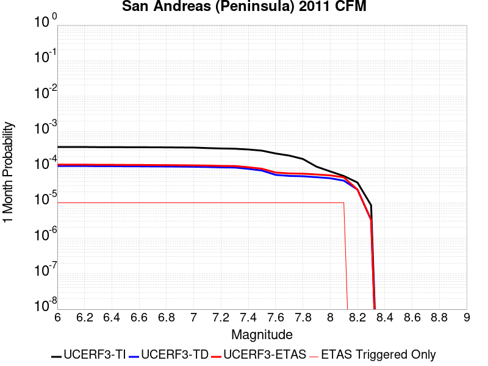 | 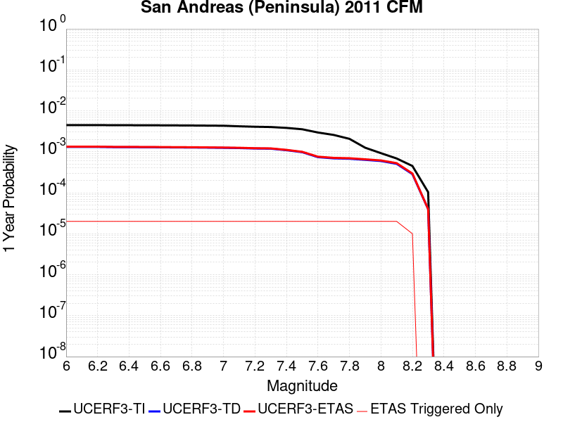 | 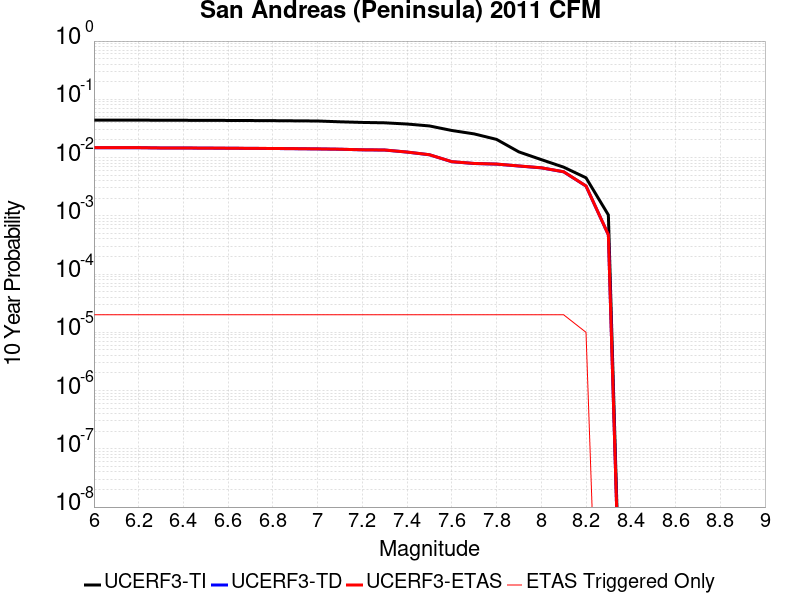 |

| Magnitude | 1 wk TI Prob | 1 wk TD Prob | 1 wk ETAS Prob | 1 wk ETAS/TD Gain | 1 wk ETAS Triggered Only | 1 mo TI Prob | 1 mo TD Prob | 1 mo ETAS Prob | 1 mo ETAS/TD Gain | 1 mo ETAS Triggered Only | 1 yr TI Prob | 1 yr TD Prob | 1 yr ETAS Prob | 1 yr ETAS/TD Gain | 1 yr ETAS Triggered Only | 10 yr TI Prob | 10 yr TD Prob | 10 yr ETAS Prob | 10 yr ETAS/TD Gain | 10 yr ETAS Triggered Only |
|-----|-----|-----|-----|-----|-----|-----|-----|-----|-----|-----|-----|-----|-----|-----|-----|-----|-----|-----|-----|-----|
| 6.0 | 8.6200685E-5 | 2.5207937E-5 | 3.5207686E-5 | 1.3966905 | 1.0E-5 | 3.6937918E-4 | 1.0802955E-4 | 1.1802847E-4 | 1.0925573 | 1.0E-5 | 0.0044879215 | 0.0013144679 | 0.0013344416 | 1.0151953 | 2.0E-5 | 0.043983612 | 0.01477218 | 0.0147918835 | 1.001334 | 2.0E-5 |
| 6.1 | 8.6200685E-5 | 2.5207937E-5 | 3.5207686E-5 | 1.3966905 | 1.0E-5 | 3.6937918E-4 | 1.0802955E-4 | 1.1802847E-4 | 1.0925573 | 1.0E-5 | 0.0044879215 | 0.0013144679 | 0.0013344416 | 1.0151953 | 2.0E-5 | 0.043983612 | 0.01477218 | 0.0147918835 | 1.001334 | 2.0E-5 |
| 6.2 | 8.6200685E-5 | 2.5207937E-5 | 3.5207686E-5 | 1.3966905 | 1.0E-5 | 3.6937918E-4 | 1.0802955E-4 | 1.1802847E-4 | 1.0925573 | 1.0E-5 | 0.0044879215 | 0.0013144679 | 0.0013344416 | 1.0151953 | 2.0E-5 | 0.043983612 | 0.01477218 | 0.0147918835 | 1.001334 | 2.0E-5 |
| 6.3 | 8.551163E-5 | 2.4899866E-5 | 3.4899615E-5 | 1.4015986 | 1.0E-5 | 3.6642692E-4 | 1.06709354E-4 | 1.1670828E-4 | 1.0937026 | 1.0E-5 | 0.004452125 | 0.0012984137 | 0.0013183877 | 1.0153834 | 2.0E-5 | 0.043639794 | 0.01459892 | 0.014618629 | 1.0013499 | 2.0E-5 |
| 6.4 | 8.551163E-5 | 2.4899866E-5 | 3.4899615E-5 | 1.4015986 | 1.0E-5 | 3.6642692E-4 | 1.06709354E-4 | 1.1670828E-4 | 1.0937026 | 1.0E-5 | 0.004452125 | 0.0012984137 | 0.0013183877 | 1.0153834 | 2.0E-5 | 0.043639794 | 0.01459892 | 0.014618629 | 1.0013499 | 2.0E-5 |
| 6.5 | 8.511146E-5 | 2.4721267E-5 | 3.472102E-5 | 1.4045 | 1.0E-5 | 3.647124E-4 | 1.0594399E-4 | 1.1594293E-4 | 1.0943795 | 1.0E-5 | 0.004431336 | 0.0012891064 | 0.0013090806 | 1.0154946 | 2.0E-5 | 0.04344007 | 0.014498963 | 0.0145186735 | 1.0013595 | 2.0E-5 |
| 6.6 | 8.4985084E-5 | 2.4651948E-5 | 3.46517E-5 | 1.4056375 | 1.0E-5 | 3.6417096E-4 | 1.0564694E-4 | 1.1564588E-4 | 1.0946449 | 1.0E-5 | 0.0044247704 | 0.0012854942 | 0.0013054684 | 1.0155382 | 2.0E-5 | 0.043376986 | 0.0144609315 | 0.014480643 | 1.001363 | 2.0E-5 |
| 6.7 | 8.462618E-5 | 2.4480485E-5 | 3.448024E-5 | 1.4084786 | 1.0E-5 | 3.6263323E-4 | 1.0491216E-4 | 1.14911105E-4 | 1.0953078 | 1.0E-5 | 0.004406125 | 0.0012765586 | 0.0012965332 | 1.0156472 | 2.0E-5 | 0.043197807 | 0.014365727 | 0.014385439 | 1.0013722 | 2.0E-5 |
| 6.8 | 8.42337E-5 | 2.4376272E-5 | 3.437603E-5 | 1.410225 | 1.0E-5 | 3.6095164E-4 | 1.04465566E-4 | 1.14464514E-4 | 1.0957153 | 1.0E-5 | 0.004385734 | 0.0012711277 | 0.0012911024 | 1.015714 | 2.0E-5 | 0.043001823 | 0.014306363 | 0.014326077 | 1.0013779 | 2.0E-5 |
| 6.9 | 8.365989E-5 | 2.4180892E-5 | 3.418065E-5 | 1.4135396 | 1.0E-5 | 3.5849313E-4 | 1.0362829E-4 | 1.13627255E-4 | 1.0964887 | 1.0E-5 | 0.004355922 | 0.0012609458 | 0.0012809206 | 1.0158411 | 2.0E-5 | 0.04271523 | 0.014198911 | 0.014218627 | 1.0013885 | 2.0E-5 |
| 7.0 | 8.30936E-5 | 2.3942457E-5 | 3.394222E-5 | 1.4176581 | 1.0E-5 | 3.560668E-4 | 1.026065E-4 | 1.1260548E-4 | 1.0974497 | 1.0E-5 | 0.004326499 | 0.0012485199 | 0.0012684949 | 1.015999 | 2.0E-5 | 0.042432297 | 0.014069902 | 0.014089621 | 1.0014014 | 2.0E-5 |
| 7.1 | 8.041264E-5 | 2.3628894E-5 | 3.3628658E-5 | 1.4232006 | 1.0E-5 | 3.4458007E-4 | 1.0126277E-4 | 1.1126176E-4 | 1.098743 | 1.0E-5 | 0.0041871946 | 0.0012321785 | 0.0012521539 | 1.0162114 | 2.0E-5 | 0.041091725 | 0.013892905 | 0.0139126275 | 1.0014195 | 2.0E-5 |
| 7.2 | 7.8427016E-5 | 2.3052688E-5 | 3.3052456E-5 | 1.4337789 | 1.0E-5 | 3.3607247E-4 | 9.87935E-5 | 1.08792505E-4 | 1.1012112 | 1.0E-5 | 0.004084008 | 0.0012021487 | 0.0012221247 | 1.0166168 | 2.0E-5 | 0.040097635 | 0.013576745 | 0.013596474 | 1.0014532 | 2.0E-5 |
| 7.3 | 7.721087E-5 | 2.2837554E-5 | 3.2837324E-5 | 1.4378653 | 1.0E-5 | 3.3086175E-4 | 9.787157E-5 | 1.0787059E-4 | 1.1021647 | 1.0E-5 | 0.004020803 | 0.0011909365 | 0.0012109127 | 1.0167735 | 2.0E-5 | 0.03948827 | 0.013460464 | 0.013480195 | 1.0014658 | 2.0E-5 |
| 7.4 | 7.3536525E-5 | 2.095521E-5 | 3.0955E-5 | 1.4771982 | 1.0E-5 | 3.1511846E-4 | 8.980496E-5 | 9.980406E-5 | 1.1113424 | 1.0E-5 | 0.0038298194 | 0.0010928282 | 0.0011128064 | 1.0182811 | 2.0E-5 | 0.037644852 | 0.0124172745 | 0.012437026 | 1.0015906 | 2.0E-5 |
| 7.5 | 6.806207E-5 | 1.876151E-5 | 2.8761322E-5 | 1.5329962 | 1.0E-5 | 2.9166197E-4 | 8.0404E-5 | 9.04032E-5 | 1.1243619 | 1.0E-5 | 0.0035452035 | 9.784801E-4 | 9.984606E-4 | 1.0204198 | 2.0E-5 | 0.034891766 | 0.011170478 | 0.011190254 | 1.0017704 | 2.0E-5 |
| 7.6 | 5.6731416E-5 | 1.4173155E-5 | 2.4173014E-5 | 1.7055492 | 1.0E-5 | 2.43112E-4 | 6.074068E-5 | 7.0740076E-5 | 1.1646243 | 1.0E-5 | 0.0029558712 | 7.3926704E-4 | 7.5925223E-4 | 1.0270338 | 2.0E-5 | 0.02916862 | 0.00848332 | 0.008503149 | 1.0023376 | 2.0E-5 |
| 7.7 | 4.946994E-5 | 1.3242368E-5 | 2.3242235E-5 | 1.755142 | 1.0E-5 | 2.1199681E-4 | 5.675177E-5 | 6.675121E-5 | 1.176196 | 1.0E-5 | 0.002578006 | 6.907339E-4 | 7.107201E-4 | 1.0289347 | 2.0E-5 | 0.02548303 | 0.007905742 | 0.007925584 | 1.0025098 | 2.0E-5 |
| 7.8 | 3.9718198E-5 | 1.2979126E-5 | 2.2978997E-5 | 1.7704579 | 1.0E-5 | 1.7020974E-4 | 5.562364E-5 | 6.5623084E-5 | 1.1797696 | 1.0E-5 | 0.0020703338 | 6.7700754E-4 | 6.96994E-4 | 1.0295218 | 2.0E-5 | 0.020511515 | 0.007716547 | 0.007736393 | 1.0025718 | 2.0E-5 |
| 7.9 | 2.4115114E-5 | 1.2183215E-5 | 2.2183094E-5 | 1.8207914 | 1.0E-5 | 1.0334639E-4 | 5.2212738E-5 | 6.221222E-5 | 1.1915141 | 1.0E-5 | 0.001257516 | 6.355048E-4 | 6.5549207E-4 | 1.031451 | 2.0E-5 | 0.012504238 | 0.0071578487 | 0.0071777054 | 1.0027741 | 2.0E-5 |
| 8.0 | 1.7756569E-5 | 1.1408184E-5 | 2.140807E-5 | 1.8765537 | 1.0E-5 | 7.6097356E-5 | 4.8891303E-5 | 5.8890815E-5 | 1.2045254 | 1.0E-5 | 9.260915E-4 | 5.9508916E-4 | 6.1507727E-4 | 1.0335884 | 2.0E-5 | 0.009222416 | 0.006658535 | 0.0066784015 | 1.0029837 | 2.0E-5 |
| 8.1 | 1.3159258E-5 | 9.744603E-6 | 1.9744506E-5 | 2.026199 | 1.0E-5 | 5.6395602E-5 | 4.1761916E-5 | 5.1761497E-5 | 1.2394426 | 1.0E-5 | 6.864001E-4 | 5.083328E-4 | 5.2832265E-4 | 1.0393243 | 2.0E-5 | 0.0068428386 | 0.005688865 | 0.0057087517 | 1.0034957 | 2.0E-5 |
| 8.2 | 8.635426E-6 | 5.465718E-6 | 5.465718E-6 | 1.0 | 0.0 | 3.700844E-5 | 2.3424296E-5 | 2.3424296E-5 | 1.0 | 0.0 | 4.5048463E-4 | 2.8515357E-4 | 2.951507E-4 | 1.0350589 | 1.0E-5 | 0.004495725 | 0.0032439749 | 0.0032539424 | 1.0030726 | 1.0E-5 |
| 8.3 | 1.983087E-6 | 7.6564595E-7 | 7.6564595E-7 | 1.0 | 0.0 | 8.498917E-6 | 3.281336E-6 | 3.281336E-6 | 1.0 | 0.0 | 1.034694E-4 | 3.9949547E-5 | 3.9949547E-5 | 1.0 | 0.0 | 0.0010342124 | 4.717979E-4 | 4.717979E-4 | 1.0 | 0.0 |

## Great Valley 04a Trout Creek
*[(top)](#table-of-contents)*

| 1 Week | 1 Month | 1 Year | 10 Year |
|-----|-----|-----|-----|
| 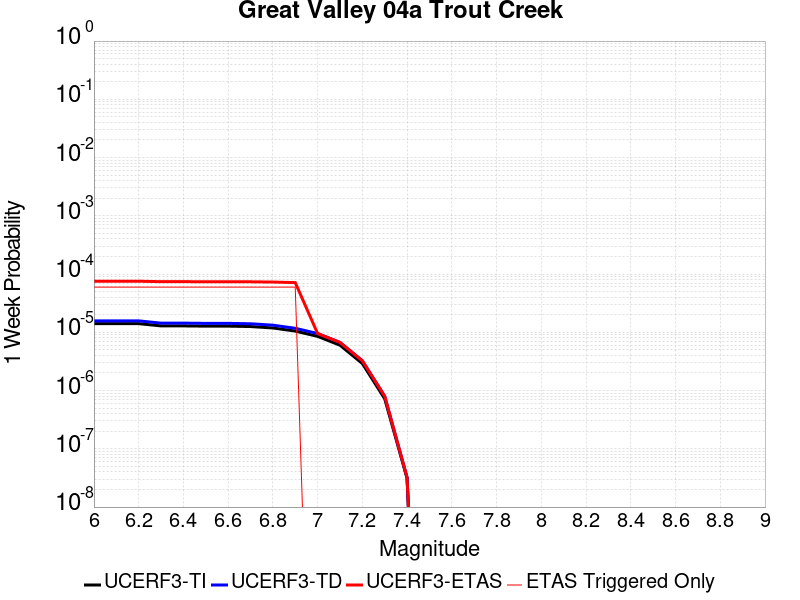 | 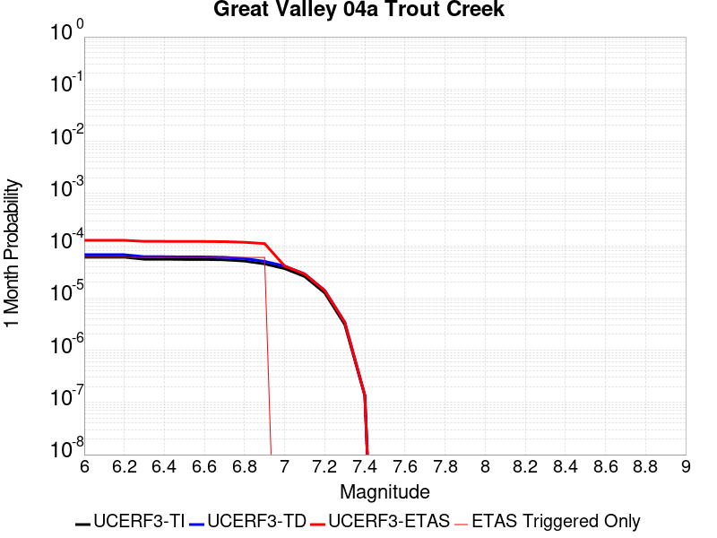 | 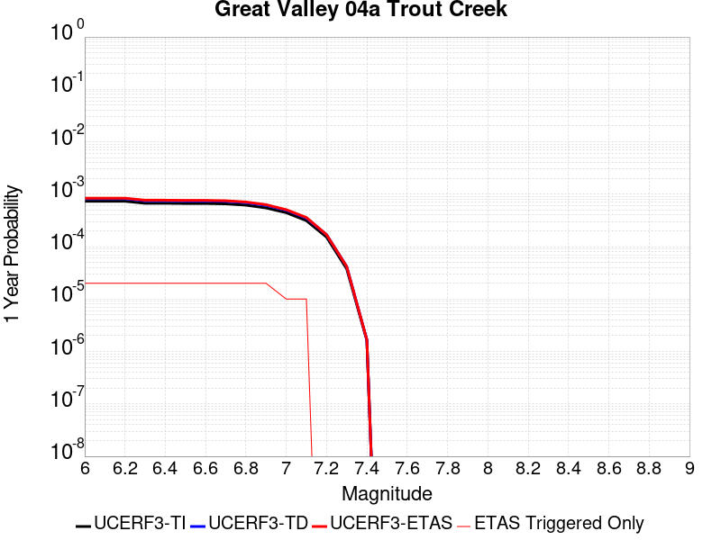 | 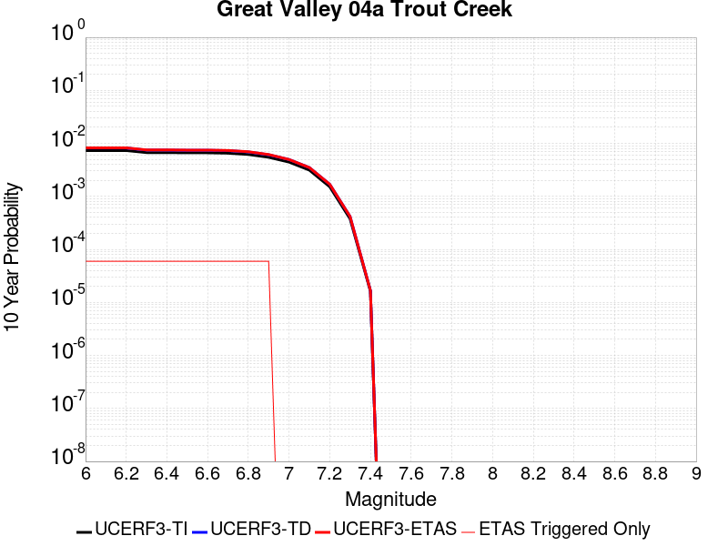 |

| Magnitude | 1 wk TI Prob | 1 wk TD Prob | 1 wk ETAS Prob | 1 wk ETAS/TD Gain | 1 wk ETAS Triggered Only | 1 mo TI Prob | 1 mo TD Prob | 1 mo ETAS Prob | 1 mo ETAS/TD Gain | 1 mo ETAS Triggered Only | 1 yr TI Prob | 1 yr TD Prob | 1 yr ETAS Prob | 1 yr ETAS/TD Gain | 1 yr ETAS Triggered Only | 10 yr TI Prob | 10 yr TD Prob | 10 yr ETAS Prob | 10 yr ETAS/TD Gain | 10 yr ETAS Triggered Only |
|-----|-----|-----|-----|-----|-----|-----|-----|-----|-----|-----|-----|-----|-----|-----|-----|-----|-----|-----|-----|-----|
| 6.0 | 1.4088538E-5 | 1.5719554E-5 | 2.5719397E-5 | 1.6361403 | 1.0E-5 | 6.037805E-5 | 6.7367844E-5 | 7.736717E-5 | 1.1484288 | 1.0E-5 | 7.3485484E-4 | 8.199074E-4 | 8.3989097E-4 | 1.024373 | 2.0E-5 | 0.007324295 | 0.008170108 | 0.008189945 | 1.0024279 | 2.0E-5 |
| 6.1 | 1.4088538E-5 | 1.5719554E-5 | 2.5719397E-5 | 1.6361403 | 1.0E-5 | 6.037805E-5 | 6.7367844E-5 | 7.736717E-5 | 1.1484288 | 1.0E-5 | 7.3485484E-4 | 8.199074E-4 | 8.3989097E-4 | 1.024373 | 2.0E-5 | 0.007324295 | 0.008170108 | 0.008189945 | 1.0024279 | 2.0E-5 |
| 6.2 | 1.4088538E-5 | 1.5719554E-5 | 2.5719397E-5 | 1.6361403 | 1.0E-5 | 6.037805E-5 | 6.7367844E-5 | 7.736717E-5 | 1.1484288 | 1.0E-5 | 7.3485484E-4 | 8.199074E-4 | 8.3989097E-4 | 1.024373 | 2.0E-5 | 0.007324295 | 0.008170108 | 0.008189945 | 1.0024279 | 2.0E-5 |
| 6.3 | 1.2882862E-5 | 1.4378603E-5 | 2.4378458E-5 | 1.6954678 | 1.0E-5 | 5.5211098E-5 | 6.1621184E-5 | 7.162057E-5 | 1.1622719 | 1.0E-5 | 6.7198783E-4 | 7.4999005E-4 | 7.699751E-4 | 1.026647 | 2.0E-5 | 0.0066995937 | 0.0074756527 | 0.0074955034 | 1.0026554 | 2.0E-5 |
| 6.4 | 1.2882862E-5 | 1.4378603E-5 | 2.4378458E-5 | 1.6954678 | 1.0E-5 | 5.5211098E-5 | 6.1621184E-5 | 7.162057E-5 | 1.1622719 | 1.0E-5 | 6.7198783E-4 | 7.4999005E-4 | 7.699751E-4 | 1.026647 | 2.0E-5 | 0.0066995937 | 0.0074756527 | 0.0074955034 | 1.0026554 | 2.0E-5 |
| 6.5 | 1.2762329E-5 | 1.424516E-5 | 2.4245017E-5 | 1.7019829 | 1.0E-5 | 5.469455E-5 | 6.1049315E-5 | 7.10487E-5 | 1.163792 | 1.0E-5 | 6.657027E-4 | 7.430323E-4 | 7.6301745E-4 | 1.0268967 | 2.0E-5 | 0.00663712 | 0.0074065393 | 0.007426391 | 1.0026803 | 2.0E-5 |
| 6.6 | 1.2762329E-5 | 1.424516E-5 | 2.4245017E-5 | 1.7019829 | 1.0E-5 | 5.469455E-5 | 6.1049315E-5 | 7.10487E-5 | 1.163792 | 1.0E-5 | 6.657027E-4 | 7.430323E-4 | 7.6301745E-4 | 1.0268967 | 2.0E-5 | 0.00663712 | 0.0074065393 | 0.007426391 | 1.0026803 | 2.0E-5 |
| 6.7 | 1.2557959E-5 | 1.4019395E-5 | 2.4019255E-5 | 1.7132876 | 1.0E-5 | 5.3818712E-5 | 6.0081795E-5 | 7.0081194E-5 | 1.1664298 | 1.0E-5 | 6.5504585E-4 | 7.312607E-4 | 7.5124606E-4 | 1.02733 | 2.0E-5 | 0.006531183 | 0.007289598 | 0.0073094526 | 1.0027237 | 2.0E-5 |
| 6.8 | 1.1871544E-5 | 1.3258823E-5 | 2.325869E-5 | 1.7542048 | 1.0E-5 | 5.0877054E-5 | 5.6822348E-5 | 6.6821776E-5 | 1.1759771 | 1.0E-5 | 6.1925204E-4 | 6.916025E-4 | 7.1158865E-4 | 1.0288984 | 2.0E-5 | 0.0061752927 | 0.0068955184 | 0.0069153807 | 1.0028805 | 2.0E-5 |
| 6.9 | 1.0500373E-5 | 1.1731261E-5 | 2.1731144E-5 | 1.8524133 | 1.0E-5 | 4.5000823E-5 | 5.0275914E-5 | 6.027541E-5 | 1.1988924 | 1.0E-5 | 5.4774724E-4 | 6.119459E-4 | 6.319337E-4 | 1.0326626 | 2.0E-5 | 0.005463991 | 0.0061034737 | 0.006123352 | 1.0032568 | 2.0E-5 |
| 7.0 | 8.524332E-6 | 9.5334835E-6 | 9.5334835E-6 | 1.0 | 0.0 | 3.653234E-5 | 4.0857187E-5 | 4.0857187E-5 | 1.0 | 0.0 | 4.4469046E-4 | 4.9733004E-4 | 5.073251E-4 | 1.0200974 | 1.0E-5 | 0.0044380166 | 0.004962902 | 0.0049728523 | 1.002005 | 1.0E-5 |
| 7.1 | 6.006849E-6 | 6.711559E-6 | 6.711559E-6 | 1.0 | 0.0 | 2.5743384E-5 | 2.876354E-5 | 2.876354E-5 | 1.0 | 0.0 | 3.1338062E-4 | 3.501454E-4 | 3.601419E-4 | 1.0285496 | 1.0E-5 | 0.0031293905 | 0.0034964874 | 0.0035064525 | 1.00285 | 1.0E-5 |
| 7.2 | 2.9122193E-6 | 3.2465305E-6 | 3.2465305E-6 | 1.0 | 0.0 | 1.248088E-5 | 1.3913637E-5 | 1.3913637E-5 | 1.0 | 0.0 | 1.5194413E-4 | 1.6938712E-4 | 1.6938712E-4 | 1.0 | 0.0 | 0.0015184027 | 0.0016927521 | 0.0016927521 | 1.0 | 0.0 |
| 7.3 | 7.2194007E-7 | 7.988761E-7 | 7.988761E-7 | 1.0 | 0.0 | 3.0940253E-6 | 3.4237528E-6 | 3.4237528E-6 | 1.0 | 0.0 | 3.7669106E-5 | 4.1683852E-5 | 4.1683852E-5 | 1.0 | 0.0 | 3.766272E-4 | 4.168053E-4 | 4.168053E-4 | 1.0 | 0.0 |
| 7.4 | 3.112171E-8 | 3.2068368E-8 | 3.2068368E-8 | 1.0 | 0.0 | 1.3337875E-7 | 1.3743585E-7 | 1.3743585E-7 | 1.0 | 0.0 | 1.6238852E-6 | 1.6732803E-6 | 1.6732803E-6 | 1.0 | 0.0 | 1.6238733E-5 | 1.6732685E-5 | 1.6732685E-5 | 1.0 | 0.0 |

## Owens Valley Keough Hot Springs
*[(top)](#table-of-contents)*

| 1 Week | 1 Month | 1 Year | 10 Year |
|-----|-----|-----|-----|
| 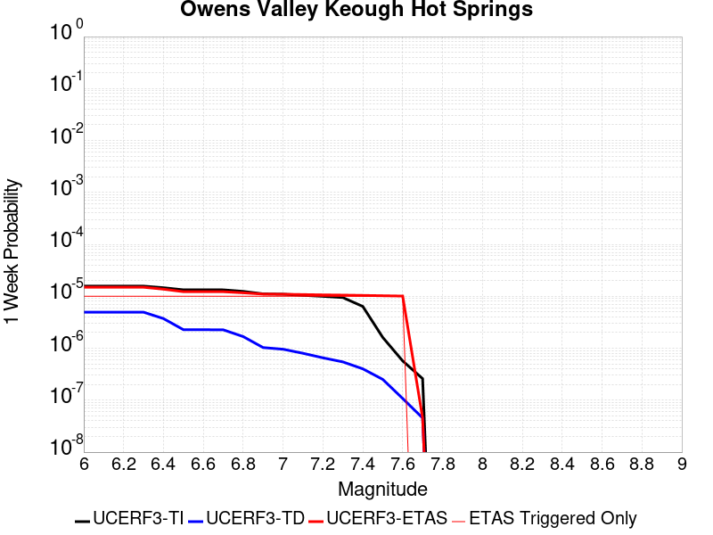 | 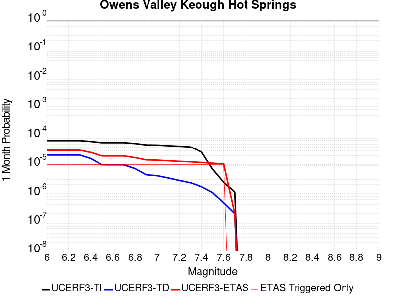 | 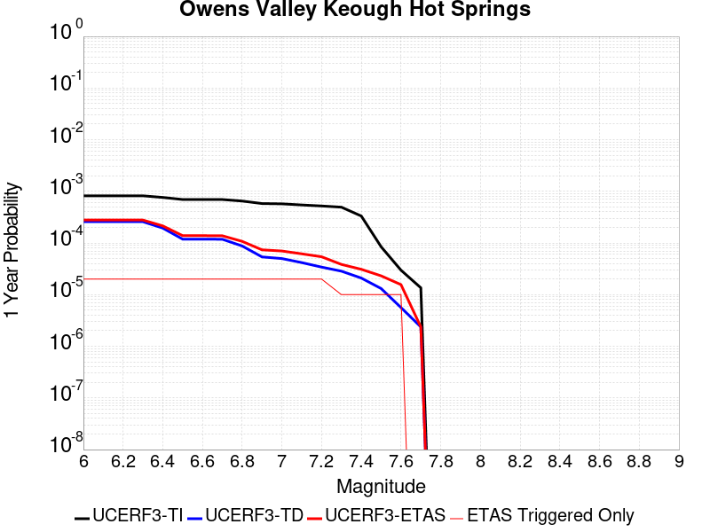 | 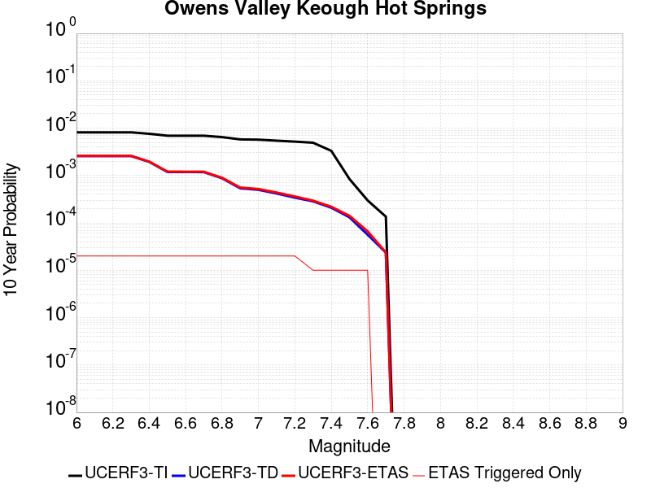 |

| Magnitude | 1 wk TI Prob | 1 wk TD Prob | 1 wk ETAS Prob | 1 wk ETAS/TD Gain | 1 wk ETAS Triggered Only | 1 mo TI Prob | 1 mo TD Prob | 1 mo ETAS Prob | 1 mo ETAS/TD Gain | 1 mo ETAS Triggered Only | 1 yr TI Prob | 1 yr TD Prob | 1 yr ETAS Prob | 1 yr ETAS/TD Gain | 1 yr ETAS Triggered Only | 10 yr TI Prob | 10 yr TD Prob | 10 yr ETAS Prob | 10 yr ETAS/TD Gain | 10 yr ETAS Triggered Only |
|-----|-----|-----|-----|-----|-----|-----|-----|-----|-----|-----|-----|-----|-----|-----|-----|-----|-----|-----|-----|-----|
| 6.0 | 1.5708529E-5 | 4.950463E-6 | 1.4950414E-5 | 3.020003 | 1.0E-5 | 6.7320536E-5 | 2.1216127E-5 | 3.1215914E-5 | 1.4713296 | 1.0E-5 | 8.193192E-4 | 2.5828084E-4 | 2.782757E-4 | 1.0774151 | 2.0E-5 | 0.008163051 | 0.0025804387 | 0.0026003872 | 1.0077306 | 2.0E-5 |
| 6.1 | 1.5708529E-5 | 4.950463E-6 | 1.4950414E-5 | 3.020003 | 1.0E-5 | 6.7320536E-5 | 2.1216127E-5 | 3.1215914E-5 | 1.4713296 | 1.0E-5 | 8.193192E-4 | 2.5828084E-4 | 2.782757E-4 | 1.0774151 | 2.0E-5 | 0.008163051 | 0.0025804387 | 0.0026003872 | 1.0077306 | 2.0E-5 |
| 6.2 | 1.5708529E-5 | 4.950463E-6 | 1.4950414E-5 | 3.020003 | 1.0E-5 | 6.7320536E-5 | 2.1216127E-5 | 3.1215914E-5 | 1.4713296 | 1.0E-5 | 8.193192E-4 | 2.5828084E-4 | 2.782757E-4 | 1.0774151 | 2.0E-5 | 0.008163051 | 0.0025804387 | 0.0026003872 | 1.0077306 | 2.0E-5 |
| 6.3 | 1.5708529E-5 | 4.950463E-6 | 1.4950414E-5 | 3.020003 | 1.0E-5 | 6.7320536E-5 | 2.1216127E-5 | 3.1215914E-5 | 1.4713296 | 1.0E-5 | 8.193192E-4 | 2.5828084E-4 | 2.782757E-4 | 1.0774151 | 2.0E-5 | 0.008163051 | 0.0025804387 | 0.0026003872 | 1.0077306 | 2.0E-5 |
| 6.4 | 1.4622509E-5 | 3.7263276E-6 | 1.37262905E-5 | 3.6835973 | 1.0E-5 | 6.266639E-5 | 1.5969896E-5 | 2.5969737E-5 | 1.6261681 | 1.0E-5 | 7.626962E-4 | 1.9441944E-4 | 2.1441556E-4 | 1.1028503 | 2.0E-5 | 0.007600839 | 0.0019429466 | 0.0019629078 | 1.0102737 | 2.0E-5 |
| 6.5 | 1.3335527E-5 | 2.2775241E-6 | 1.2277502E-5 | 5.3907228 | 1.0E-5 | 5.7151006E-5 | 9.760785E-6 | 1.9760688E-5 | 2.0244977 | 1.0E-5 | 6.955913E-4 | 1.1883176E-4 | 1.3882939E-4 | 1.1682851 | 2.0E-5 | 0.0069341804 | 0.001187878 | 0.0012078542 | 1.0168167 | 2.0E-5 |
| 6.6 | 1.3332855E-5 | 2.2746733E-6 | 1.22746505E-5 | 5.3962255 | 1.0E-5 | 5.7139558E-5 | 9.748568E-6 | 1.974847E-5 | 2.0257816 | 1.0E-5 | 6.9545204E-4 | 1.1868303E-4 | 1.3868065E-4 | 1.1684961 | 2.0E-5 | 0.0069327964 | 0.0011863923 | 0.0012063686 | 1.0168378 | 2.0E-5 |
| 6.7 | 1.3318214E-5 | 2.2639038E-6 | 1.2263881E-5 | 5.4171386 | 1.0E-5 | 5.707681E-5 | 9.702413E-6 | 1.9702316E-5 | 2.0306613 | 1.0E-5 | 6.946886E-4 | 1.18121156E-4 | 1.3811879E-4 | 1.1692977 | 2.0E-5 | 0.0069252094 | 0.0011807795 | 0.0012007558 | 1.016918 | 2.0E-5 |
| 6.8 | 1.2441338E-5 | 1.677594E-6 | 1.1677577E-5 | 6.960908 | 1.0E-5 | 5.331893E-5 | 7.1896707E-6 | 1.7189599E-5 | 2.3908744 | 1.0E-5 | 6.489646E-4 | 8.753102E-5 | 1.07529275E-4 | 1.2284704 | 2.0E-5 | 0.0064707273 | 8.751236E-4 | 8.951061E-4 | 1.022834 | 2.0E-5 |
| 6.9 | 1.1130476E-5 | 1.0302234E-6 | 1.10302135E-5 | 10.706622 | 1.0E-5 | 4.7701167E-5 | 4.4152357E-6 | 1.4415192E-5 | 3.2648747 | 1.0E-5 | 5.806069E-4 | 5.3754186E-5 | 7.375311E-5 | 1.3720441 | 2.0E-5 | 0.0057909233 | 5.375404E-4 | 5.575297E-4 | 1.0371865 | 2.0E-5 |
| 7.0 | 1.0986073E-5 | 9.577824E-7 | 1.0957773E-5 | 11.440775 | 1.0E-5 | 4.7082318E-5 | 4.1047756E-6 | 1.4104734E-5 | 3.4361768 | 1.0E-5 | 5.730765E-4 | 4.9974507E-5 | 6.997351E-5 | 1.400184 | 2.0E-5 | 0.0057160086 | 4.997603E-4 | 5.1975035E-4 | 1.0399991 | 2.0E-5 |
| 7.1 | 1.0451338E-5 | 7.9988575E-7 | 1.0799878E-5 | 13.501776 | 1.0E-5 | 4.4790682E-5 | 3.4280772E-6 | 1.3428043E-5 | 3.917077 | 1.0E-5 | 5.451901E-4 | 4.1736046E-5 | 6.173521E-5 | 1.4791821 | 2.0E-5 | 0.005438545 | 4.1740583E-4 | 4.3739748E-4 | 1.047895 | 2.0E-5 |
| 7.2 | 9.989061E-6 | 6.543693E-7 | 1.0654363E-5 | 16.281881 | 1.0E-5 | 4.280956E-5 | 2.8044367E-6 | 1.28044085E-5 | 4.5657687 | 1.0E-5 | 5.2108173E-4 | 3.4143486E-5 | 5.41428E-5 | 1.5857433 | 2.0E-5 | 0.0051986156 | 3.41488E-4 | 3.6148116E-4 | 1.0585473 | 2.0E-5 |
| 7.3 | 9.465365E-6 | 5.458855E-7 | 1.054588E-5 | 19.31885 | 1.0E-5 | 4.056522E-5 | 2.3395073E-6 | 1.2339484E-5 | 5.2743945 | 1.0E-5 | 4.937696E-4 | 2.8483131E-5 | 3.8482845E-5 | 1.351075 | 1.0E-5 | 0.0049267393 | 2.8489542E-4 | 2.9489255E-4 | 1.0350906 | 1.0E-5 |
| 7.4 | 6.3824805E-6 | 4.0153776E-7 | 1.04015335E-5 | 25.904247 | 1.0E-5 | 2.73532E-5 | 1.7208749E-6 | 1.1720857E-5 | 6.8109875 | 1.0E-5 | 3.3297433E-4 | 2.0951453E-5 | 3.0951243E-5 | 1.4772838 | 1.0E-5 | 0.0033247585 | 2.0955436E-4 | 2.1955227E-4 | 1.0477103 | 1.0E-5 |
| 7.5 | 1.6192645E-6 | 2.5156373E-7 | 1.0251561E-5 | 40.751347 | 1.0E-5 | 6.9396865E-6 | 1.0781299E-6 | 1.1078119E-5 | 10.2753105 | 1.0E-5 | 8.448741E-5 | 1.3126153E-5 | 2.3126022E-5 | 1.7618278 | 1.0E-5 | 8.4455294E-4 | 1.3125391E-4 | 1.412526E-4 | 1.0761782 | 1.0E-5 |
| 7.6 | 5.7062545E-7 | 1.0790214E-7 | 1.0107901E-5 | 93.67656 | 1.0E-5 | 2.4455355E-6 | 4.6243767E-7 | 1.0462433E-5 | 22.624525 | 1.0E-5 | 2.9773988E-5 | 5.630165E-6 | 1.5630108E-5 | 2.7761369 | 1.0E-5 | 2.977E-4 | 5.6300305E-5 | 6.629974E-5 | 1.177609 | 1.0E-5 |
| 7.7 | 2.5988817E-7 | 4.5445965E-8 | 4.5445965E-8 | 1.0 | 0.0 | 1.113806E-6 | 1.9476842E-7 | 1.9476842E-7 | 1.0 | 0.0 | 1.3560503E-5 | 2.3713033E-6 | 2.3713033E-6 | 1.0 | 0.0 | 1.3559677E-4 | 2.3712824E-5 | 2.3712824E-5 | 1.0 | 0.0 |

## Calaveras (So) - Paicines extension 2011 CFM
*[(top)](#table-of-contents)*

| 1 Week | 1 Month | 1 Year | 10 Year |
|-----|-----|-----|-----|
| 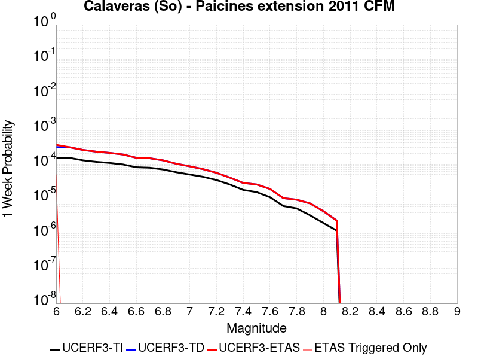 |  | 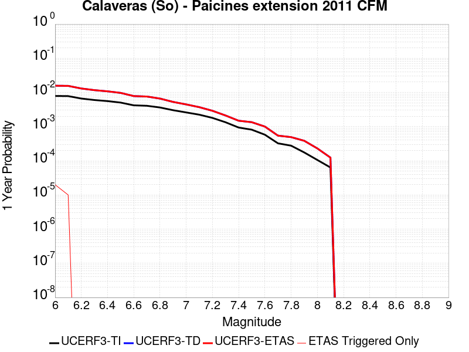 | 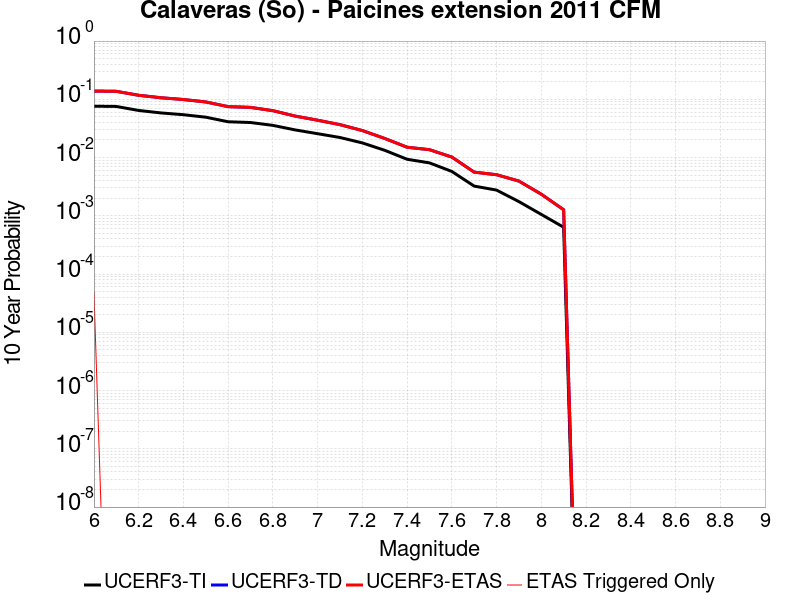 |

| Magnitude | 1 wk TI Prob | 1 wk TD Prob | 1 wk ETAS Prob | 1 wk ETAS/TD Gain | 1 wk ETAS Triggered Only | 1 mo TI Prob | 1 mo TD Prob | 1 mo ETAS Prob | 1 mo ETAS/TD Gain | 1 mo ETAS Triggered Only | 1 yr TI Prob | 1 yr TD Prob | 1 yr ETAS Prob | 1 yr ETAS/TD Gain | 1 yr ETAS Triggered Only | 10 yr TI Prob | 10 yr TD Prob | 10 yr ETAS Prob | 10 yr ETAS/TD Gain | 10 yr ETAS Triggered Only |
|-----|-----|-----|-----|-----|-----|-----|-----|-----|-----|-----|-----|-----|-----|-----|-----|-----|-----|-----|-----|-----|
| 6.0 | 1.5183659E-4 | 3.0520977E-4 | 3.1520674E-4 | 1.0327543 | 1.0E-5 | 6.5056595E-4 | 0.0013068188 | 0.0013168057 | 1.0076421 | 1.0E-5 | 0.007891912 | 0.015696203 | 0.01571589 | 1.0012542 | 2.0E-5 | 0.076174594 | 0.13848905 | 0.13850628 | 1.0001245 | 2.0E-5 |
| 6.1 | 1.5024997E-4 | 3.021517E-4 | 3.021517E-4 | 1.0 | 0.0 | 6.437695E-4 | 0.0012937278 | 0.0012937278 | 1.0 | 0.0 | 0.0078097614 | 0.015539596 | 0.015549441 | 1.0006335 | 1.0E-5 | 0.075409345 | 0.13715863 | 0.13716726 | 1.000063 | 1.0E-5 |
| 6.2 | 1.2743923E-4 | 2.5313982E-4 | 2.5313982E-4 | 1.0 | 0.0 | 5.460538E-4 | 0.0010839999 | 0.0010839999 | 1.0 | 0.0 | 0.0066279583 | 0.013046881 | 0.013046881 | 1.0 | 0.0 | 0.064337276 | 0.117256075 | 0.117256075 | 1.0 | 0.0 |
| 6.3 | 1.1525114E-4 | 2.2599236E-4 | 2.2599236E-4 | 1.0 | 0.0 | 4.9383997E-4 | 9.678718E-4 | 9.678718E-4 | 1.0 | 0.0 | 0.0059959386 | 0.011668079 | 0.011668079 | 1.0 | 0.0 | 0.058367174 | 0.106372125 | 0.106372125 | 1.0 | 0.0 |
| 6.4 | 1.07200925E-4 | 2.0840544E-4 | 2.0840544E-4 | 1.0 | 0.0 | 4.5935164E-4 | 8.926123E-4 | 8.926123E-4 | 1.0 | 0.0 | 0.0055782744 | 0.010772959 | 0.010772959 | 1.0 | 0.0 | 0.0544031 | 0.099194765 | 0.099194765 | 1.0 | 0.0 |
| 6.5 | 9.69631E-5 | 1.8734725E-4 | 1.8734725E-4 | 1.0 | 0.0 | 4.1548995E-4 | 8.024631E-4 | 8.024631E-4 | 1.0 | 0.0 | 0.0050468626 | 0.009694842 | 0.009694842 | 1.0 | 0.0 | 0.04933773 | 0.090086564 | 0.090086564 | 1.0 | 0.0 |
| 6.6 | 8.0552316E-5 | 1.507068E-4 | 1.507068E-4 | 1.0 | 0.0 | 3.4517853E-4 | 6.4569083E-4 | 6.4569083E-4 | 1.0 | 0.0 | 0.0041944524 | 0.007826508 | 0.007826508 | 1.0 | 0.0 | 0.04116161 | 0.0748563 | 0.0748563 | 1.0 | 0.0 |
| 6.7 | 7.815757E-5 | 1.4611272E-4 | 1.4611272E-4 | 1.0 | 0.0 | 3.34918E-4 | 6.26014E-4 | 6.26014E-4 | 1.0 | 0.0 | 0.004070005 | 0.007589312 | 0.007589312 | 1.0 | 0.0 | 0.039962657 | 0.07270582 | 0.07270582 | 1.0 | 0.0 |
| 6.8 | 6.965264E-5 | 1.2722758E-4 | 1.2722758E-4 | 1.0 | 0.0 | 2.9847719E-4 | 5.4513285E-4 | 5.4513285E-4 | 1.0 | 0.0 | 0.0036279052 | 0.0066135945 | 0.0066135945 | 1.0 | 0.0 | 0.03569247 | 0.063801065 | 0.063801065 | 1.0 | 0.0 |
| 6.9 | 5.8000453E-5 | 1.01439E-4 | 1.01439E-4 | 1.0 | 0.0 | 2.4854968E-4 | 4.346666E-4 | 4.346666E-4 | 1.0 | 0.0 | 0.0030218933 | 0.005279322 | 0.005279322 | 1.0 | 0.0 | 0.029811295 | 0.051502965 | 0.051502965 | 1.0 | 0.0 |
| 7.0 | 4.9865852E-5 | 8.568029E-5 | 8.568029E-5 | 1.0 | 0.0 | 2.1369329E-4 | 3.6715003E-4 | 3.6715003E-4 | 1.0 | 0.0 | 0.0025986114 | 0.004460979 | 0.004460979 | 1.0 | 0.0 | 0.025684336 | 0.043782018 | 0.043782018 | 1.0 | 0.0 |
| 7.1 | 4.283875E-5 | 7.1124625E-5 | 7.1124625E-5 | 1.0 | 0.0 | 1.8358172E-4 | 3.0478454E-4 | 3.0478454E-4 | 1.0 | 0.0 | 0.0022328163 | 0.003704494 | 0.003704494 | 1.0 | 0.0 | 0.022105146 | 0.03673582 | 0.03673582 | 1.0 | 0.0 |
| 7.2 | 3.450115E-5 | 5.5778568E-5 | 5.5778568E-5 | 1.0 | 0.0 | 1.478537E-4 | 2.3902925E-4 | 2.3902925E-4 | 1.0 | 0.0 | 0.0017986323 | 0.0029063264 | 0.0029063264 | 1.0 | 0.0 | 0.017841442 | 0.029079042 | 0.029079042 | 1.0 | 0.0 |
| 7.3 | 2.5709045E-5 | 4.059001E-5 | 4.059001E-5 | 1.0 | 0.0 | 1.1017697E-4 | 1.7394568E-4 | 1.7394568E-4 | 1.0 | 0.0 | 0.0013405791 | 0.0021157486 | 0.0021157486 | 1.0 | 0.0 | 0.013325208 | 0.02129686 | 0.02129686 | 1.0 | 0.0 |
| 7.4 | 1.8003093E-5 | 2.8511378E-5 | 2.8511378E-5 | 1.0 | 0.0 | 7.715383E-5 | 1.2218591E-4 | 1.2218591E-4 | 1.0 | 0.0 | 9.3894306E-4 | 0.0014866006 | 0.0014866006 | 1.0 | 0.0 | 0.009349857 | 0.015051589 | 0.015051589 | 1.0 | 0.0 |
| 7.5 | 1.5595824E-5 | 2.5823752E-5 | 2.5823752E-5 | 1.0 | 0.0 | 6.683753E-5 | 1.10668545E-4 | 1.10668545E-4 | 1.0 | 0.0 | 8.134431E-4 | 0.0013465589 | 0.0013465589 | 1.0 | 0.0 | 0.008104719 | 0.013651571 | 0.013651571 | 1.0 | 0.0 |
| 7.6 | 1.1110309E-5 | 1.9223195E-5 | 1.9223195E-5 | 1.0 | 0.0 | 4.761474E-5 | 8.2382525E-5 | 8.2382525E-5 | 1.0 | 0.0 | 5.795553E-4 | 0.0010025471 | 0.0010025471 | 1.0 | 0.0 | 0.0057804612 | 0.01020344 | 0.01020344 | 1.0 | 0.0 |
| 7.7 | 6.2140443E-6 | 1.04376995E-5 | 1.04376995E-5 | 1.0 | 0.0 | 2.6631347E-5 | 4.4732235E-5 | 4.4732235E-5 | 1.0 | 0.0 | 3.241884E-4 | 5.4447894E-4 | 5.4447894E-4 | 1.0 | 0.0 | 0.0032371588 | 0.005620102 | 0.005620102 | 1.0 | 0.0 |
| 7.8 | 5.305533E-6 | 9.433651E-6 | 9.433651E-6 | 1.0 | 0.0 | 2.27378E-5 | 4.0429306E-5 | 4.0429306E-5 | 1.0 | 0.0 | 2.7679754E-4 | 4.9211574E-4 | 4.9211574E-4 | 1.0 | 0.0 | 0.0027645302 | 0.005074622 | 0.005074622 | 1.0 | 0.0 |
| 7.9 | 3.363505E-6 | 7.3854467E-6 | 7.3854467E-6 | 1.0 | 0.0 | 1.4414942E-5 | 3.1651532E-5 | 3.1651532E-5 | 1.0 | 0.0 | 1.7548777E-4 | 3.8528934E-4 | 3.8528934E-4 | 1.0 | 0.0 | 0.0017534926 | 0.003948784 | 0.003948784 | 1.0 | 0.0 |
| 8.0 | 2.0271132E-6 | 4.4134235E-6 | 4.4134235E-6 | 1.0 | 0.0 | 8.687599E-6 | 1.8914534E-5 | 1.8914534E-5 | 1.0 | 0.0 | 1.05766376E-4 | 2.3026018E-4 | 2.3026018E-4 | 1.0 | 0.0 | 0.0010571606 | 0.002351194 | 0.002351194 | 1.0 | 0.0 |
| 8.1 | 1.2206116E-6 | 2.3752666E-6 | 2.3752666E-6 | 1.0 | 0.0 | 5.2311816E-6 | 1.0179674E-5 | 1.0179674E-5 | 1.0 | 0.0 | 6.3687774E-5 | 1.2393051E-4 | 1.2393051E-4 | 1.0 | 0.0 | 6.366953E-4 | 0.0012705618 | 0.0012705618 | 1.0 | 0.0 |

## Hartley Springs 2011 CFM
*[(top)](#table-of-contents)*

| 1 Week | 1 Month | 1 Year | 10 Year |
|-----|-----|-----|-----|
| 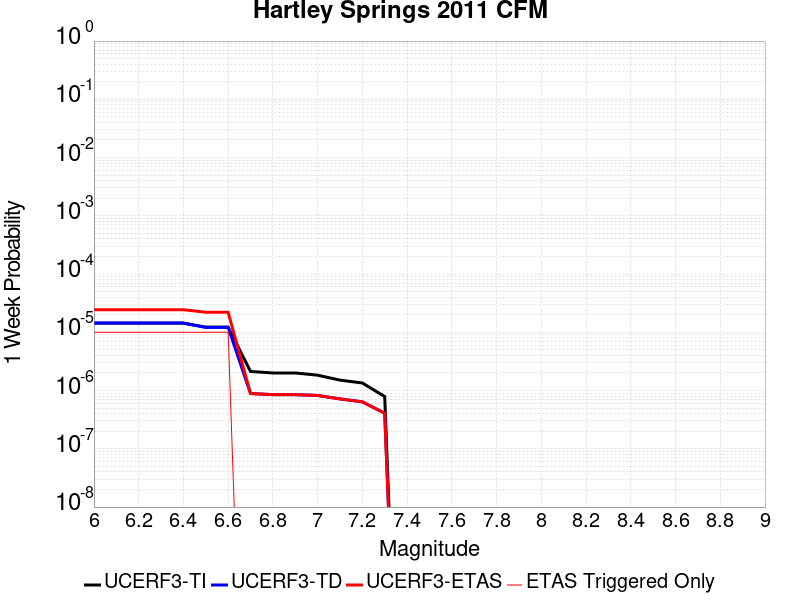 | 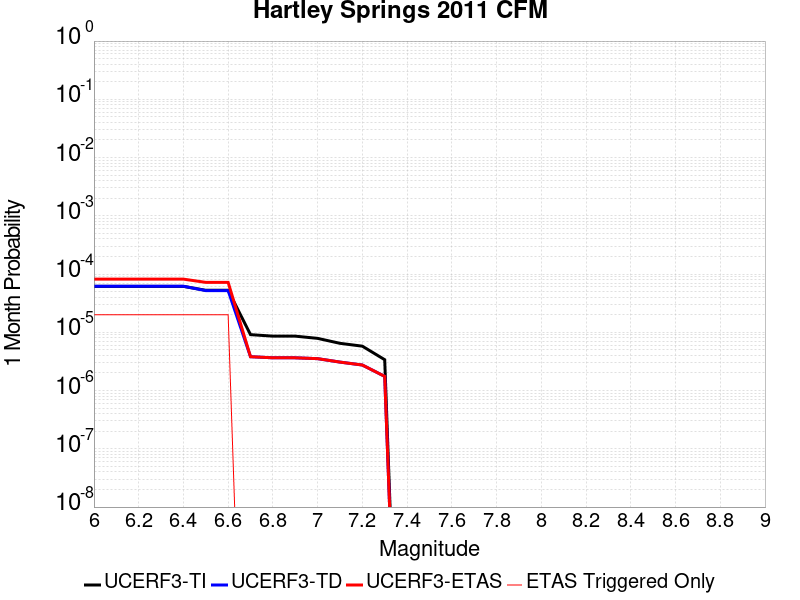 | 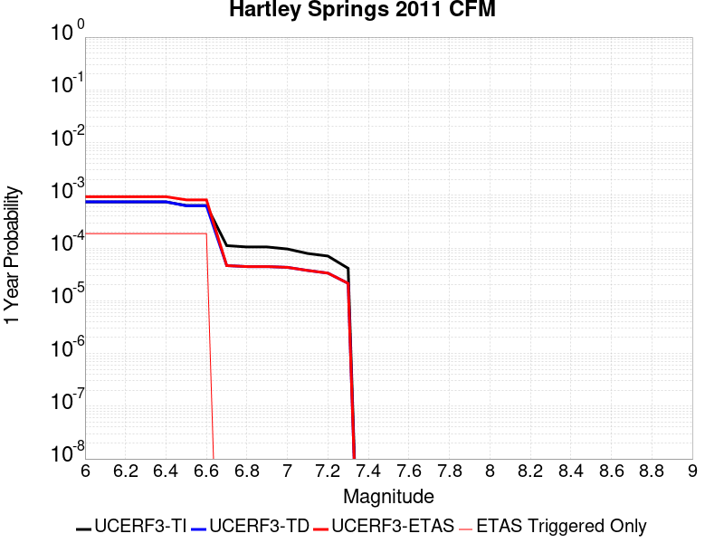 | 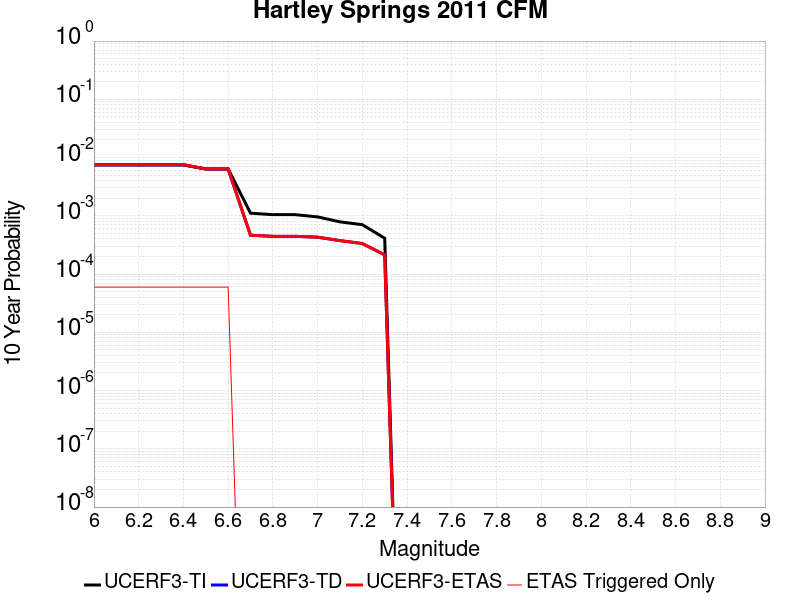 |

| Magnitude | 1 wk TI Prob | 1 wk TD Prob | 1 wk ETAS Prob | 1 wk ETAS/TD Gain | 1 wk ETAS Triggered Only | 1 mo TI Prob | 1 mo TD Prob | 1 mo ETAS Prob | 1 mo ETAS/TD Gain | 1 mo ETAS Triggered Only | 1 yr TI Prob | 1 yr TD Prob | 1 yr ETAS Prob | 1 yr ETAS/TD Gain | 1 yr ETAS Triggered Only | 10 yr TI Prob | 10 yr TD Prob | 10 yr ETAS Prob | 10 yr ETAS/TD Gain | 10 yr ETAS Triggered Only |
|-----|-----|-----|-----|-----|-----|-----|-----|-----|-----|-----|-----|-----|-----|-----|-----|-----|-----|-----|-----|-----|
| 6.0 | 1.4352418E-5 | 1.4434111E-5 | 2.4433966E-5 | 1.6927933 | 1.0E-5 | 6.1508916E-5 | 6.185994E-5 | 8.18587E-5 | 1.3232911 | 2.0E-5 | 7.486137E-4 | 7.5304887E-4 | 7.730338E-4 | 1.0265387 | 2.0E-5 | 0.007460968 | 0.007521092 | 0.0075409417 | 1.0026392 | 2.0E-5 |
| 6.1 | 1.4352418E-5 | 1.4434111E-5 | 2.4433966E-5 | 1.6927933 | 1.0E-5 | 6.1508916E-5 | 6.185994E-5 | 8.18587E-5 | 1.3232911 | 2.0E-5 | 7.486137E-4 | 7.5304887E-4 | 7.730338E-4 | 1.0265387 | 2.0E-5 | 0.007460968 | 0.007521092 | 0.0075409417 | 1.0026392 | 2.0E-5 |
| 6.2 | 1.4352418E-5 | 1.4434111E-5 | 2.4433966E-5 | 1.6927933 | 1.0E-5 | 6.1508916E-5 | 6.185994E-5 | 8.18587E-5 | 1.3232911 | 2.0E-5 | 7.486137E-4 | 7.5304887E-4 | 7.730338E-4 | 1.0265387 | 2.0E-5 | 0.007460968 | 0.007521092 | 0.0075409417 | 1.0026392 | 2.0E-5 |
| 6.3 | 1.4352418E-5 | 1.4434111E-5 | 2.4433966E-5 | 1.6927933 | 1.0E-5 | 6.1508916E-5 | 6.185994E-5 | 8.18587E-5 | 1.3232911 | 2.0E-5 | 7.486137E-4 | 7.5304887E-4 | 7.730338E-4 | 1.0265387 | 2.0E-5 | 0.007460968 | 0.007521092 | 0.0075409417 | 1.0026392 | 2.0E-5 |
| 6.4 | 1.4352418E-5 | 1.4434111E-5 | 2.4433966E-5 | 1.6927933 | 1.0E-5 | 6.1508916E-5 | 6.185994E-5 | 8.18587E-5 | 1.3232911 | 2.0E-5 | 7.486137E-4 | 7.5304887E-4 | 7.730338E-4 | 1.0265387 | 2.0E-5 | 0.007460968 | 0.007521092 | 0.0075409417 | 1.0026392 | 2.0E-5 |
| 6.5 | 1.2279858E-5 | 1.2133036E-5 | 2.2132914E-5 | 1.8241861 | 1.0E-5 | 5.26269E-5 | 5.199858E-5 | 7.199754E-5 | 1.3846059 | 2.0E-5 | 6.4054417E-4 | 6.33057E-4 | 6.530443E-4 | 1.0315727 | 2.0E-5 | 0.0063870098 | 0.006328048 | 0.0063479217 | 1.0031406 | 2.0E-5 |
| 6.6 | 1.2279858E-5 | 1.2133036E-5 | 2.2132914E-5 | 1.8241861 | 1.0E-5 | 5.26269E-5 | 5.199858E-5 | 7.199754E-5 | 1.3846059 | 2.0E-5 | 6.4054417E-4 | 6.33057E-4 | 6.530443E-4 | 1.0315727 | 2.0E-5 | 0.0063870098 | 0.006328048 | 0.0063479217 | 1.0031406 | 2.0E-5 |
| 6.7 | 2.1282601E-6 | 8.894127E-7 | 8.894127E-7 | 1.0 | 0.0 | 9.121083E-6 | 3.8117648E-6 | 3.8117648E-6 | 1.0 | 0.0 | 1.11043526E-4 | 4.6407506E-5 | 4.6407506E-5 | 1.0 | 0.0 | 0.0011098806 | 4.6400347E-4 | 4.6400347E-4 | 1.0 | 0.0 |
| 6.8 | 2.00516E-6 | 8.516916E-7 | 8.516916E-7 | 1.0 | 0.0 | 8.593515E-6 | 3.6501033E-6 | 3.6501033E-6 | 1.0 | 0.0 | 1.04621024E-4 | 4.443936E-5 | 4.443936E-5 | 1.0 | 0.0 | 0.0010457177 | 4.4432987E-4 | 4.4432987E-4 | 1.0 | 0.0 |
| 6.9 | 2.00516E-6 | 8.516916E-7 | 8.516916E-7 | 1.0 | 0.0 | 8.593515E-6 | 3.6501033E-6 | 3.6501033E-6 | 1.0 | 0.0 | 1.04621024E-4 | 4.443936E-5 | 4.443936E-5 | 1.0 | 0.0 | 0.0010457177 | 4.4432987E-4 | 4.4432987E-4 | 1.0 | 0.0 |
| 7.0 | 1.8366732E-6 | 8.2366813E-7 | 8.2366813E-7 | 1.0 | 0.0 | 7.871433E-6 | 3.5300031E-6 | 3.5300031E-6 | 1.0 | 0.0 | 9.583048E-5 | 4.2977194E-5 | 4.2977194E-5 | 1.0 | 0.0 | 9.5789164E-4 | 4.297139E-4 | 4.297139E-4 | 1.0 | 0.0 |
| 7.1 | 1.5097997E-6 | 7.1897E-7 | 7.1897E-7 | 1.0 | 0.0 | 6.470554E-6 | 3.0812978E-6 | 3.0812978E-6 | 1.0 | 0.0 | 7.877615E-5 | 3.7514397E-5 | 3.7514397E-5 | 1.0 | 0.0 | 7.874823E-4 | 3.7510434E-4 | 3.7510434E-4 | 1.0 | 0.0 |
| 7.2 | 1.3490993E-6 | 6.404769E-7 | 6.404769E-7 | 1.0 | 0.0 | 5.7818415E-6 | 2.7448996E-6 | 2.7448996E-6 | 1.0 | 0.0 | 7.0391645E-5 | 3.3418873E-5 | 3.3418873E-5 | 1.0 | 0.0 | 7.0369354E-4 | 3.3416142E-4 | 3.3416142E-4 | 1.0 | 0.0 |
| 7.3 | 7.900015E-7 | 4.0888176E-7 | 4.0888176E-7 | 1.0 | 0.0 | 3.3857161E-6 | 1.7523504E-6 | 1.7523504E-6 | 1.0 | 0.0 | 4.1220315E-5 | 2.1334865E-5 | 2.1334865E-5 | 1.0 | 0.0 | 4.121267E-4 | 2.1334866E-4 | 2.1334866E-4 | 1.0 | 0.0 |

## Anacapa-Dume alt 1
*[(top)](#table-of-contents)*

| 1 Week | 1 Month | 1 Year | 10 Year |
|-----|-----|-----|-----|
| 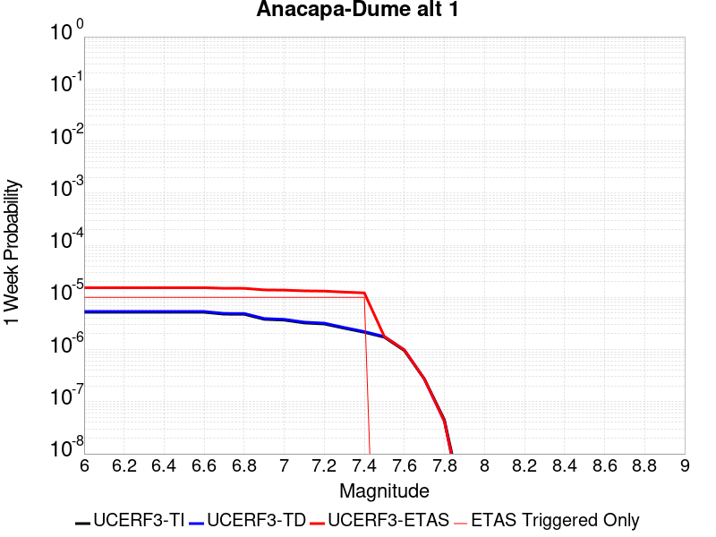 | 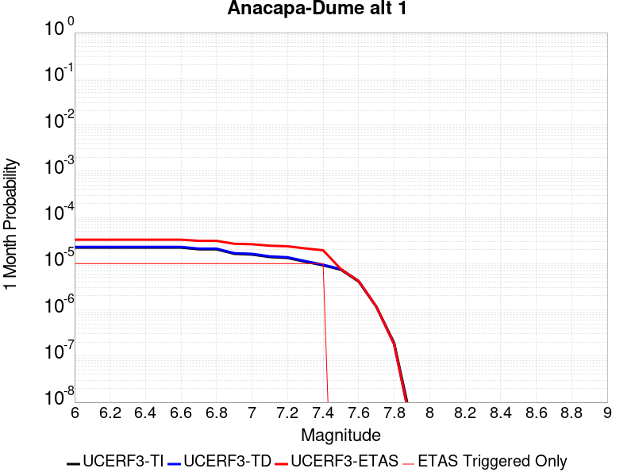 | 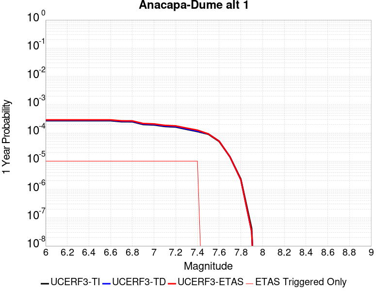 | 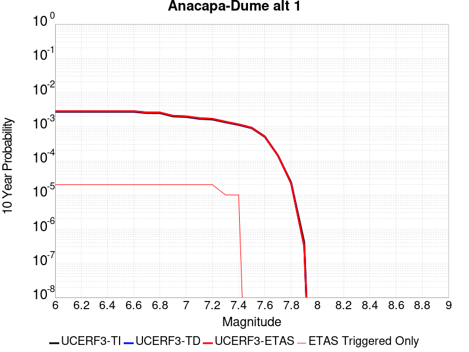 |

| Magnitude | 1 wk TI Prob | 1 wk TD Prob | 1 wk ETAS Prob | 1 wk ETAS/TD Gain | 1 wk ETAS Triggered Only | 1 mo TI Prob | 1 mo TD Prob | 1 mo ETAS Prob | 1 mo ETAS/TD Gain | 1 mo ETAS Triggered Only | 1 yr TI Prob | 1 yr TD Prob | 1 yr ETAS Prob | 1 yr ETAS/TD Gain | 1 yr ETAS Triggered Only | 10 yr TI Prob | 10 yr TD Prob | 10 yr ETAS Prob | 10 yr ETAS/TD Gain | 10 yr ETAS Triggered Only |
|-----|-----|-----|-----|-----|-----|-----|-----|-----|-----|-----|-----|-----|-----|-----|-----|-----|-----|-----|-----|-----|
| 6.0 | 5.1871802E-6 | 5.3673916E-6 | 1.5367337E-5 | 2.8630924 | 1.0E-5 | 2.2230583E-5 | 2.3002909E-5 | 3.3002678E-5 | 1.4347177 | 1.0E-5 | 2.7062374E-4 | 2.8002527E-4 | 2.9002246E-4 | 1.035701 | 1.0E-5 | 0.002702944 | 0.0027968097 | 0.0028167537 | 1.007131 | 2.0E-5 |
| 6.1 | 5.1871802E-6 | 5.3673916E-6 | 1.5367337E-5 | 2.8630924 | 1.0E-5 | 2.2230583E-5 | 2.3002909E-5 | 3.3002678E-5 | 1.4347177 | 1.0E-5 | 2.7062374E-4 | 2.8002527E-4 | 2.9002246E-4 | 1.035701 | 1.0E-5 | 0.002702944 | 0.0027968097 | 0.0028167537 | 1.007131 | 2.0E-5 |
| 6.2 | 5.1871802E-6 | 5.3673916E-6 | 1.5367337E-5 | 2.8630924 | 1.0E-5 | 2.2230583E-5 | 2.3002909E-5 | 3.3002678E-5 | 1.4347177 | 1.0E-5 | 2.7062374E-4 | 2.8002527E-4 | 2.9002246E-4 | 1.035701 | 1.0E-5 | 0.002702944 | 0.0027968097 | 0.0028167537 | 1.007131 | 2.0E-5 |
| 6.3 | 5.1871802E-6 | 5.3673916E-6 | 1.5367337E-5 | 2.8630924 | 1.0E-5 | 2.2230583E-5 | 2.3002909E-5 | 3.3002678E-5 | 1.4347177 | 1.0E-5 | 2.7062374E-4 | 2.8002527E-4 | 2.9002246E-4 | 1.035701 | 1.0E-5 | 0.002702944 | 0.0027968097 | 0.0028167537 | 1.007131 | 2.0E-5 |
| 6.4 | 5.1871802E-6 | 5.3673916E-6 | 1.5367337E-5 | 2.8630924 | 1.0E-5 | 2.2230583E-5 | 2.3002909E-5 | 3.3002678E-5 | 1.4347177 | 1.0E-5 | 2.7062374E-4 | 2.8002527E-4 | 2.9002246E-4 | 1.035701 | 1.0E-5 | 0.002702944 | 0.0027968097 | 0.0028167537 | 1.007131 | 2.0E-5 |
| 6.5 | 5.1871802E-6 | 5.3673916E-6 | 1.5367337E-5 | 2.8630924 | 1.0E-5 | 2.2230583E-5 | 2.3002909E-5 | 3.3002678E-5 | 1.4347177 | 1.0E-5 | 2.7062374E-4 | 2.8002527E-4 | 2.9002246E-4 | 1.035701 | 1.0E-5 | 0.002702944 | 0.0027968097 | 0.0028167537 | 1.007131 | 2.0E-5 |
| 6.6 | 5.1871802E-6 | 5.3673916E-6 | 1.5367337E-5 | 2.8630924 | 1.0E-5 | 2.2230583E-5 | 2.3002909E-5 | 3.3002678E-5 | 1.4347177 | 1.0E-5 | 2.7062374E-4 | 2.8002527E-4 | 2.9002246E-4 | 1.035701 | 1.0E-5 | 0.002702944 | 0.0027968097 | 0.0028167537 | 1.007131 | 2.0E-5 |
| 6.7 | 4.7693475E-6 | 4.9366927E-6 | 1.4936643E-5 | 3.0256376 | 1.0E-5 | 2.04399E-5 | 2.1157086E-5 | 3.1156873E-5 | 1.4726449 | 1.0E-5 | 2.4882736E-4 | 2.5755784E-4 | 2.6755527E-4 | 1.0388162 | 1.0E-5 | 0.0024854892 | 0.0025726694 | 0.0025926179 | 1.007754 | 2.0E-5 |
| 6.8 | 4.753408E-6 | 4.920241E-6 | 1.49201915E-5 | 3.0324109 | 1.0E-5 | 2.037159E-5 | 2.108658E-5 | 3.108637E-5 | 1.4742253 | 1.0E-5 | 2.4799586E-4 | 2.5669963E-4 | 2.6669705E-4 | 1.038946 | 1.0E-5 | 0.002477193 | 0.002564107 | 0.0025840558 | 1.00778 | 2.0E-5 |
| 6.9 | 3.800069E-6 | 3.937127E-6 | 1.3937088E-5 | 3.5399132 | 1.0E-5 | 1.6285909E-5 | 1.6873293E-5 | 2.6873124E-5 | 1.5926425 | 1.0E-5 | 1.9826289E-4 | 2.054132E-4 | 2.1541116E-4 | 1.0486723 | 1.0E-5 | 0.001980861 | 0.0020522573 | 0.0020722162 | 1.0097253 | 2.0E-5 |
| 7.0 | 3.6671938E-6 | 3.799919E-6 | 1.3799881E-5 | 3.631625 | 1.0E-5 | 1.571645E-5 | 1.6285267E-5 | 2.6285104E-5 | 1.6140419 | 1.0E-5 | 1.9133097E-4 | 1.9825532E-4 | 2.0825333E-4 | 1.05043 | 1.0E-5 | 0.0019116632 | 0.0019808079 | 0.0020007682 | 1.0100769 | 2.0E-5 |
| 7.1 | 3.2394885E-6 | 3.3587942E-6 | 1.335876E-5 | 3.9772491 | 1.0E-5 | 1.3883448E-5 | 1.4394753E-5 | 2.4394609E-5 | 1.6946876 | 1.0E-5 | 1.6901788E-4 | 1.7524212E-4 | 1.8524038E-4 | 1.0570539 | 1.0E-5 | 0.0016888938 | 0.0017510506 | 0.0017710156 | 1.0114018 | 2.0E-5 |
| 7.2 | 3.0935948E-6 | 3.2079267E-6 | 1.3207895E-5 | 4.117268 | 1.0E-5 | 1.3258196E-5 | 1.3748186E-5 | 2.3748049E-5 | 1.7273587 | 1.0E-5 | 1.6140658E-4 | 1.6737141E-4 | 1.7736973E-4 | 1.0597373 | 1.0E-5 | 0.001612894 | 0.0016724645 | 0.0016924312 | 1.0119385 | 2.0E-5 |
| 7.3 | 2.5604163E-6 | 2.6470739E-6 | 1.2647048E-5 | 4.777746 | 1.0E-5 | 1.0973167E-5 | 1.1344553E-5 | 2.134444E-5 | 1.8814703 | 1.0E-5 | 1.3359012E-4 | 1.3811122E-4 | 1.4810984E-4 | 1.0723954 | 1.0E-5 | 0.0013350984 | 0.0013802585 | 0.0013902447 | 1.007235 | 1.0E-5 |
| 7.4 | 2.1429005E-6 | 2.2106035E-6 | 1.2210581E-5 | 5.5236416 | 1.0E-5 | 9.1838265E-6 | 9.473981E-6 | 1.9473886E-5 | 2.0555124 | 1.0E-5 | 1.11807356E-4 | 1.1533964E-4 | 1.2533848E-4 | 1.0866904 | 1.0E-5 | 0.0011175112 | 0.0011528004 | 0.0011627888 | 1.0086645 | 1.0E-5 |
| 7.5 | 1.7237151E-6 | 1.7761457E-6 | 1.7761457E-6 | 1.0 | 0.0 | 7.3873293E-6 | 7.6120314E-6 | 7.6120314E-6 | 1.0 | 0.0 | 8.993702E-5 | 9.267256E-5 | 9.267256E-5 | 1.0 | 0.0 | 8.990063E-4 | 9.263415E-4 | 9.263415E-4 | 1.0 | 0.0 |
| 7.6 | 9.541696E-7 | 9.823211E-7 | 9.823211E-7 | 1.0 | 0.0 | 4.089292E-6 | 4.2099414E-6 | 4.2099414E-6 | 1.0 | 0.0 | 4.9785995E-5 | 5.125484E-5 | 5.125484E-5 | 1.0 | 0.0 | 4.9774844E-4 | 5.124315E-4 | 5.124315E-4 | 1.0 | 0.0 |
| 7.7 | 2.7226676E-7 | 2.7172473E-7 | 2.7172473E-7 | 1.0 | 0.0 | 1.166857E-6 | 1.1645341E-6 | 1.1645341E-6 | 1.0 | 0.0 | 1.4206392E-5 | 1.4178111E-5 | 1.4178111E-5 | 1.0 | 0.0 | 1.4205484E-4 | 1.4177214E-4 | 1.4177214E-4 | 1.0 | 0.0 |
| 7.8 | 4.5017995E-8 | 4.215797E-8 | 4.215797E-8 | 1.0 | 0.0 | 1.9293425E-7 | 1.80677E-7 | 1.80677E-7 | 1.0 | 0.0 | 2.348972E-6 | 2.1997405E-6 | 2.1997405E-6 | 1.0 | 0.0 | 2.348947E-5 | 2.1997208E-5 | 2.1997208E-5 | 1.0 | 0.0 |
| 7.9 | 8.007447E-10 | 6.161581E-10 | 6.161581E-10 | 1.0 | 0.0 | 3.4317629E-9 | 2.640678E-9 | 2.640678E-9 | 1.0 | 0.0 | 4.1781714E-8 | 3.2150254E-8 | 3.2150254E-8 | 1.0 | 0.0 | 4.1781706E-7 | 3.2150248E-7 | 3.2150248E-7 | 1.0 | 0.0 |

## San Diego Trough south
*[(top)](#table-of-contents)*

| 1 Week | 1 Month | 1 Year | 10 Year |
|-----|-----|-----|-----|
| 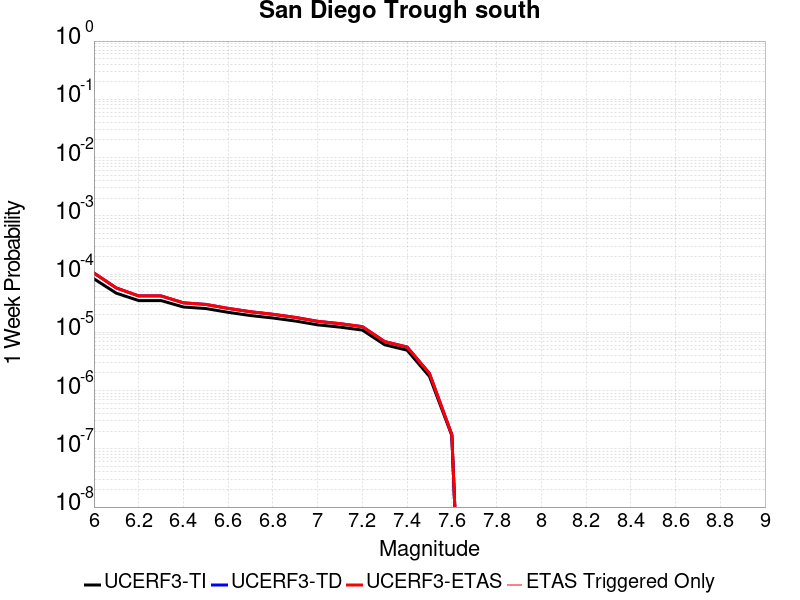 | 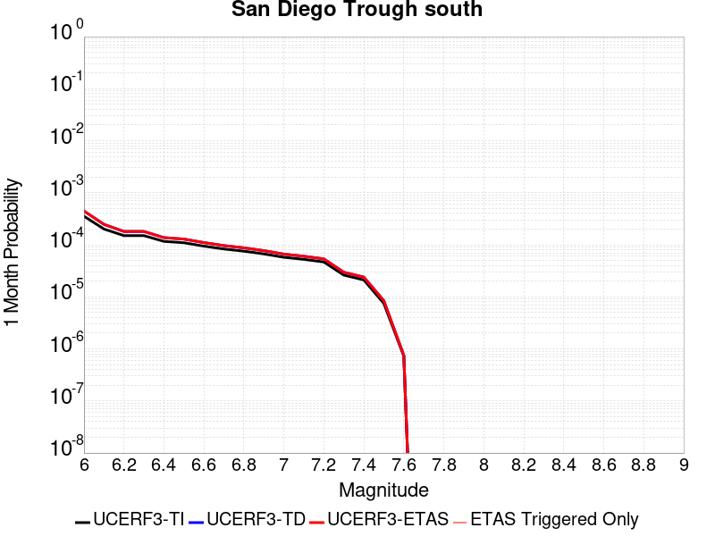 | 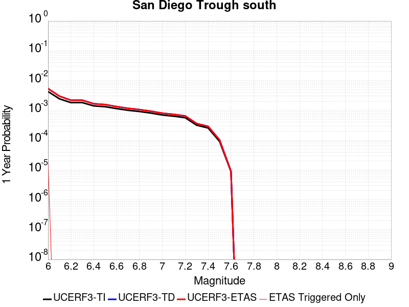 | 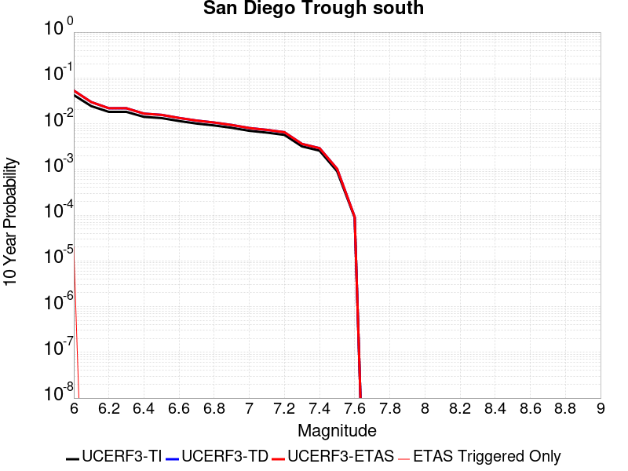 |

| Magnitude | 1 wk TI Prob | 1 wk TD Prob | 1 wk ETAS Prob | 1 wk ETAS/TD Gain | 1 wk ETAS Triggered Only | 1 mo TI Prob | 1 mo TD Prob | 1 mo ETAS Prob | 1 mo ETAS/TD Gain | 1 mo ETAS Triggered Only | 1 yr TI Prob | 1 yr TD Prob | 1 yr ETAS Prob | 1 yr ETAS/TD Gain | 1 yr ETAS Triggered Only | 10 yr TI Prob | 10 yr TD Prob | 10 yr ETAS Prob | 10 yr ETAS/TD Gain | 10 yr ETAS Triggered Only |
|-----|-----|-----|-----|-----|-----|-----|-----|-----|-----|-----|-----|-----|-----|-----|-----|-----|-----|-----|-----|-----|
| 6.0 | 8.279495E-5 | 1.0425541E-4 | 1.0425541E-4 | 1.0 | 0.0 | 3.5478722E-4 | 4.4673498E-4 | 4.4673498E-4 | 1.0 | 0.0 | 0.004310982 | 0.0054259133 | 0.005445805 | 1.003666 | 2.0E-5 | 0.042283054 | 0.05299303 | 0.05301197 | 1.0003574 | 2.0E-5 |
| 6.1 | 4.6961468E-5 | 5.773024E-5 | 5.773024E-5 | 1.0 | 0.0 | 2.0124791E-4 | 2.473905E-4 | 2.473905E-4 | 1.0 | 0.0 | 0.00244744 | 0.003007886 | 0.003007886 | 1.0 | 0.0 | 0.024206603 | 0.029679636 | 0.029679636 | 1.0 | 0.0 |
| 6.2 | 3.5079658E-5 | 4.214258E-5 | 4.214258E-5 | 1.0 | 0.0 | 1.5033272E-4 | 1.8059829E-4 | 1.8059829E-4 | 1.0 | 0.0 | 0.0018287642 | 0.002196587 | 0.002196587 | 1.0 | 0.0 | 0.018137876 | 0.021751188 | 0.021751188 | 1.0 | 0.0 |
| 6.3 | 3.5079658E-5 | 4.214258E-5 | 4.214258E-5 | 1.0 | 0.0 | 1.5033272E-4 | 1.8059829E-4 | 1.8059829E-4 | 1.0 | 0.0 | 0.0018287642 | 0.002196587 | 0.002196587 | 1.0 | 0.0 | 0.018137876 | 0.021751188 | 0.021751188 | 1.0 | 0.0 |
| 6.4 | 2.7196904E-5 | 3.208715E-5 | 3.208715E-5 | 1.0 | 0.0 | 1.16552954E-4 | 1.3750911E-4 | 1.3750911E-4 | 1.0 | 0.0 | 0.0014181085 | 0.0016728995 | 0.0016728995 | 1.0 | 0.0 | 0.014090929 | 0.016604666 | 0.016604666 | 1.0 | 0.0 |
| 6.5 | 2.5584688E-5 | 3.0101632E-5 | 3.0101632E-5 | 1.0 | 0.0 | 1.0964406E-4 | 1.2900059E-4 | 1.2900059E-4 | 1.0 | 0.0 | 0.0013340989 | 0.0015694627 | 0.0015694627 | 1.0 | 0.0 | 0.013261181 | 0.015585332 | 0.015585332 | 1.0 | 0.0 |
| 6.6 | 2.2034688E-5 | 2.574271E-5 | 2.574271E-5 | 1.0 | 0.0 | 9.443096E-5 | 1.1032127E-4 | 1.1032127E-4 | 1.0 | 0.0 | 0.0011490905 | 0.0013423412 | 0.0013423412 | 1.0 | 0.0 | 0.011431668 | 0.013343325 | 0.013343325 | 1.0 | 0.0 |
| 6.7 | 1.9394853E-5 | 2.254176E-5 | 2.254176E-5 | 1.0 | 0.0 | 8.311815E-5 | 9.6604E-5 | 9.6604E-5 | 1.0 | 0.0 | 0.0010114936 | 0.0011755243 | 0.0011755243 | 1.0 | 0.0 | 0.01006902 | 0.011693766 | 0.011693766 | 1.0 | 0.0 |
| 6.8 | 1.7615313E-5 | 2.0403182E-5 | 2.0403182E-5 | 1.0 | 0.0 | 7.549201E-5 | 8.743931E-5 | 8.743931E-5 | 1.0 | 0.0 | 9.1872766E-4 | 0.0010640579 | 0.0010640579 | 1.0 | 0.0 | 0.009149387 | 0.010590198 | 0.010590198 | 1.0 | 0.0 |
| 6.9 | 1.5621423E-5 | 1.8026114E-5 | 1.8026114E-5 | 1.0 | 0.0 | 6.6947236E-5 | 7.725251E-5 | 7.725251E-5 | 1.0 | 0.0 | 8.147778E-4 | 9.40147E-4 | 9.40147E-4 | 1.0 | 0.0 | 0.008117969 | 0.009362142 | 0.009362142 | 1.0 | 0.0 |
| 7.0 | 1.3444376E-5 | 1.544809E-5 | 1.544809E-5 | 1.0 | 0.0 | 5.7617483E-5 | 6.620443E-5 | 6.620443E-5 | 1.0 | 0.0 | 7.0126704E-4 | 8.057436E-4 | 8.057436E-4 | 1.0 | 0.0 | 0.006990582 | 0.008028555 | 0.008028555 | 1.0 | 0.0 |
| 7.1 | 1.2268361E-5 | 1.407303E-5 | 1.407303E-5 | 1.0 | 0.0 | 5.2577634E-5 | 6.0311606E-5 | 6.0311606E-5 | 1.0 | 0.0 | 6.399447E-4 | 7.3404907E-4 | 7.3404907E-4 | 1.0 | 0.0 | 0.0063810493 | 0.0073165493 | 0.0073165493 | 1.0 | 0.0 |
| 7.2 | 1.0922655E-5 | 1.2513563E-5 | 1.2513563E-5 | 1.0 | 0.0 | 4.681054E-5 | 5.3628468E-5 | 5.3628468E-5 | 1.0 | 0.0 | 5.697693E-4 | 6.5273355E-4 | 6.5273355E-4 | 1.0 | 0.0 | 0.0056831064 | 0.0065084435 | 0.0065084435 | 1.0 | 0.0 |
| 7.3 | 6.1106753E-6 | 6.928925E-6 | 6.928925E-6 | 1.0 | 0.0 | 2.6188345E-5 | 2.9695057E-5 | 2.9695057E-5 | 1.0 | 0.0 | 3.1879646E-4 | 3.6147775E-4 | 3.6147775E-4 | 1.0 | 0.0 | 0.0031833951 | 0.003608943 | 0.003608943 | 1.0 | 0.0 |
| 7.4 | 4.933187E-6 | 5.5895525E-6 | 5.5895525E-6 | 1.0 | 0.0 | 2.114206E-5 | 2.3955008E-5 | 2.3955008E-5 | 1.0 | 0.0 | 2.5737417E-4 | 2.9161357E-4 | 2.9161357E-4 | 1.0 | 0.0 | 0.002570763 | 0.0029123505 | 0.0029123505 | 1.0 | 0.0 |
| 7.5 | 1.7489613E-6 | 1.969678E-6 | 1.969678E-6 | 1.0 | 0.0 | 7.495527E-6 | 8.4414505E-6 | 8.4414505E-6 | 1.0 | 0.0 | 9.125422E-5 | 1.02770035E-4 | 1.02770035E-4 | 1.0 | 0.0 | 9.1216754E-4 | 0.0010272472 | 0.0010272472 | 1.0 | 0.0 |
| 7.6 | 1.6988751E-7 | 1.7533823E-7 | 1.7533823E-7 | 1.0 | 0.0 | 7.2808916E-7 | 7.5144936E-7 | 7.5144936E-7 | 1.0 | 0.0 | 8.864449E-6 | 9.14886E-6 | 9.14886E-6 | 1.0 | 0.0 | 8.8640954E-5 | 9.1485024E-5 | 9.1485024E-5 | 1.0 | 0.0 |

## Santa Susana alt 1
*[(top)](#table-of-contents)*

| 1 Week | 1 Month | 1 Year | 10 Year |
|-----|-----|-----|-----|
| 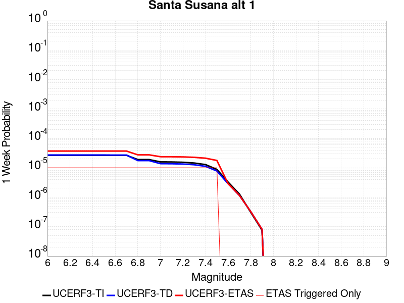 | 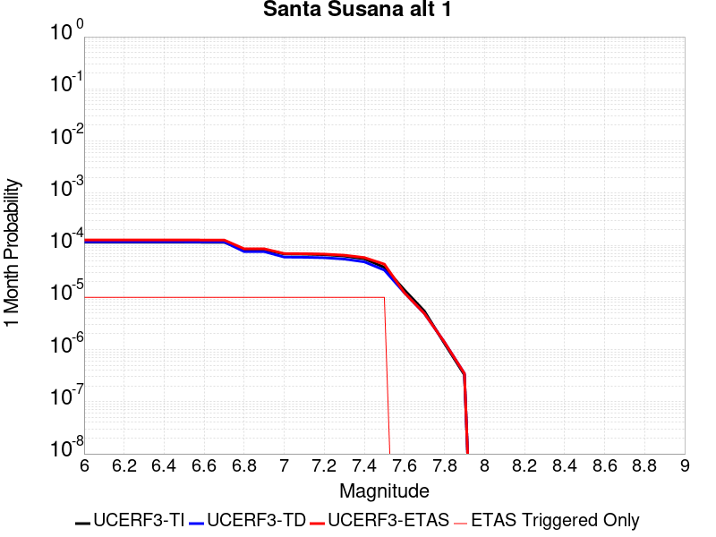 | 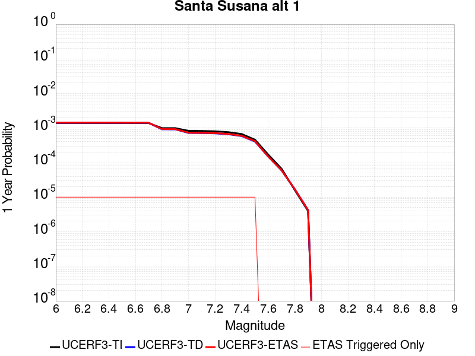 | 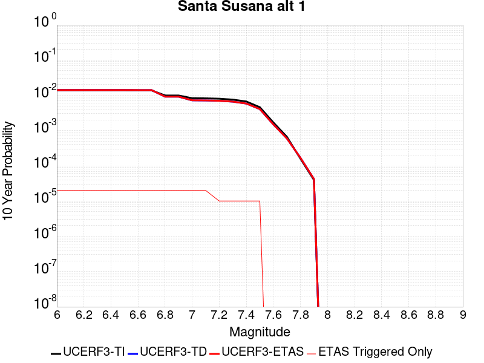 |

| Magnitude | 1 wk TI Prob | 1 wk TD Prob | 1 wk ETAS Prob | 1 wk ETAS/TD Gain | 1 wk ETAS Triggered Only | 1 mo TI Prob | 1 mo TD Prob | 1 mo ETAS Prob | 1 mo ETAS/TD Gain | 1 mo ETAS Triggered Only | 1 yr TI Prob | 1 yr TD Prob | 1 yr ETAS Prob | 1 yr ETAS/TD Gain | 1 yr ETAS Triggered Only | 10 yr TI Prob | 10 yr TD Prob | 10 yr ETAS Prob | 10 yr ETAS/TD Gain | 10 yr ETAS Triggered Only |
|-----|-----|-----|-----|-----|-----|-----|-----|-----|-----|-----|-----|-----|-----|-----|-----|-----|-----|-----|-----|-----|
| 6.0 | 2.674877E-5 | 2.7198214E-5 | 3.719794E-5 | 1.3676612 | 1.0E-5 | 1.1463255E-4 | 1.16559204E-4 | 1.2655804E-4 | 1.0857834 | 1.0E-5 | 0.0013947578 | 0.0014182981 | 0.001428284 | 1.0070407 | 1.0E-5 | 0.013860362 | 0.014104388 | 0.014124106 | 1.001398 | 2.0E-5 |
| 6.1 | 2.674877E-5 | 2.7198214E-5 | 3.719794E-5 | 1.3676612 | 1.0E-5 | 1.1463255E-4 | 1.16559204E-4 | 1.2655804E-4 | 1.0857834 | 1.0E-5 | 0.0013947578 | 0.0014182981 | 0.001428284 | 1.0070407 | 1.0E-5 | 0.013860362 | 0.014104388 | 0.014124106 | 1.001398 | 2.0E-5 |
| 6.2 | 2.674877E-5 | 2.7198214E-5 | 3.719794E-5 | 1.3676612 | 1.0E-5 | 1.1463255E-4 | 1.16559204E-4 | 1.2655804E-4 | 1.0857834 | 1.0E-5 | 0.0013947578 | 0.0014182981 | 0.001428284 | 1.0070407 | 1.0E-5 | 0.013860362 | 0.014104388 | 0.014124106 | 1.001398 | 2.0E-5 |
| 6.3 | 2.674877E-5 | 2.7198214E-5 | 3.719794E-5 | 1.3676612 | 1.0E-5 | 1.1463255E-4 | 1.16559204E-4 | 1.2655804E-4 | 1.0857834 | 1.0E-5 | 0.0013947578 | 0.0014182981 | 0.001428284 | 1.0070407 | 1.0E-5 | 0.013860362 | 0.014104388 | 0.014124106 | 1.001398 | 2.0E-5 |
| 6.4 | 2.674877E-5 | 2.7198214E-5 | 3.719794E-5 | 1.3676612 | 1.0E-5 | 1.1463255E-4 | 1.16559204E-4 | 1.2655804E-4 | 1.0857834 | 1.0E-5 | 0.0013947578 | 0.0014182981 | 0.001428284 | 1.0070407 | 1.0E-5 | 0.013860362 | 0.014104388 | 0.014124106 | 1.001398 | 2.0E-5 |
| 6.5 | 2.674877E-5 | 2.7198214E-5 | 3.719794E-5 | 1.3676612 | 1.0E-5 | 1.1463255E-4 | 1.16559204E-4 | 1.2655804E-4 | 1.0857834 | 1.0E-5 | 0.0013947578 | 0.0014182981 | 0.001428284 | 1.0070407 | 1.0E-5 | 0.013860362 | 0.014104388 | 0.014124106 | 1.001398 | 2.0E-5 |
| 6.6 | 2.6647976E-5 | 2.7074553E-5 | 3.7074282E-5 | 1.3693405 | 1.0E-5 | 1.14200615E-4 | 1.16029274E-4 | 1.2602811E-4 | 1.0861752 | 1.0E-5 | 0.0013895056 | 0.0014118546 | 0.0014218405 | 1.0070729 | 1.0E-5 | 0.013808494 | 0.014040773 | 0.014060492 | 1.0014044 | 2.0E-5 |
| 6.7 | 2.6647976E-5 | 2.7074553E-5 | 3.7074282E-5 | 1.3693405 | 1.0E-5 | 1.14200615E-4 | 1.16029274E-4 | 1.2602811E-4 | 1.0861752 | 1.0E-5 | 0.0013895056 | 0.0014118546 | 0.0014218405 | 1.0070729 | 1.0E-5 | 0.013808494 | 0.014040773 | 0.014060492 | 1.0014044 | 2.0E-5 |
| 6.8 | 1.9073179E-5 | 1.7637467E-5 | 2.763729E-5 | 1.5669649 | 1.0E-5 | 8.1739636E-5 | 7.558706E-5 | 8.5586296E-5 | 1.1322877 | 1.0E-5 | 9.947256E-4 | 9.19902E-4 | 9.2989276E-4 | 1.0108607 | 1.0E-5 | 0.009902848 | 0.009163361 | 0.009183178 | 1.0021626 | 2.0E-5 |
| 6.9 | 1.9041876E-5 | 1.7619597E-5 | 2.7619422E-5 | 1.5675398 | 1.0E-5 | 8.160549E-5 | 7.551048E-5 | 8.5509724E-5 | 1.132422 | 1.0E-5 | 9.930939E-4 | 9.189705E-4 | 9.2896126E-4 | 1.0108718 | 1.0E-5 | 0.0098866755 | 0.009154123 | 0.00917394 | 1.0021648 | 2.0E-5 |
| 7.0 | 1.5917482E-5 | 1.3864049E-5 | 2.386391E-5 | 1.72128 | 1.0E-5 | 6.8215995E-5 | 5.9416023E-5 | 6.941543E-5 | 1.1682948 | 1.0E-5 | 8.302132E-4 | 7.2315463E-4 | 7.3314743E-4 | 1.0138183 | 1.0E-5 | 0.008271185 | 0.0072090672 | 0.007228923 | 1.0027543 | 2.0E-5 |
| 7.1 | 1.577788E-5 | 1.3744056E-5 | 2.3743918E-5 | 1.7275773 | 1.0E-5 | 6.761774E-5 | 5.890179E-5 | 6.89012E-5 | 1.1697642 | 1.0E-5 | 8.2293496E-4 | 7.16898E-4 | 7.2689087E-4 | 1.013939 | 1.0E-5 | 0.008198941 | 0.0071469042 | 0.0071667614 | 1.0027784 | 2.0E-5 |
| 7.2 | 1.5416446E-5 | 1.34701295E-5 | 2.3469995E-5 | 1.7423733 | 1.0E-5 | 6.606882E-5 | 5.7727877E-5 | 6.77273E-5 | 1.1732166 | 1.0E-5 | 8.0409093E-4 | 7.026149E-4 | 7.1260787E-4 | 1.0142225 | 1.0E-5 | 0.008011877 | 0.0070049763 | 0.0070149065 | 1.0014175 | 1.0E-5 |
| 7.3 | 1.4534083E-5 | 1.2718032E-5 | 2.2717904E-5 | 1.7862751 | 1.0E-5 | 6.228744E-5 | 5.4504737E-5 | 6.450419E-5 | 1.1834604 | 1.0E-5 | 7.580857E-4 | 6.633976E-4 | 6.733909E-4 | 1.0150639 | 1.0E-5 | 0.007555048 | 0.0066151717 | 0.0066251056 | 1.0015017 | 1.0E-5 |
| 7.4 | 1.2858995E-5 | 1.1229814E-5 | 2.1229702E-5 | 1.8904767 | 1.0E-5 | 5.5108816E-5 | 4.812691E-5 | 5.812643E-5 | 1.2077739 | 1.0E-5 | 6.7074323E-4 | 5.8579154E-4 | 5.957857E-4 | 1.0170609 | 1.0E-5 | 0.0066872234 | 0.0058433902 | 0.005853332 | 1.0017014 | 1.0E-5 |
| 7.5 | 8.827668E-6 | 7.805494E-6 | 1.7805416E-5 | 2.281139 | 1.0E-5 | 3.7832317E-5 | 3.3451703E-5 | 4.3451368E-5 | 1.2989285 | 1.0E-5 | 4.605111E-4 | 4.072008E-4 | 4.1719674E-4 | 1.0245479 | 1.0E-5 | 0.0045955796 | 0.0040648985 | 0.004074858 | 1.0024501 | 1.0E-5 |
| 7.6 | 3.2533426E-6 | 2.8720106E-6 | 2.8720106E-6 | 1.0 | 0.0 | 1.3942822E-5 | 1.230856E-5 | 1.230856E-5 | 1.0 | 0.0 | 1.6974064E-4 | 1.4984679E-4 | 1.4984679E-4 | 1.0 | 0.0 | 0.0016961104 | 0.0014974943 | 0.0014974943 | 1.0 | 0.0 |
| 7.7 | 1.2751709E-6 | 1.1491339E-6 | 1.1491339E-6 | 1.0 | 0.0 | 5.4650063E-6 | 4.9248506E-6 | 4.9248506E-6 | 1.0 | 0.0 | 6.653442E-5 | 5.99585E-5 | 5.99585E-5 | 1.0 | 0.0 | 6.6514505E-4 | 5.9943215E-4 | 5.9943215E-4 | 1.0 | 0.0 |
| 7.8 | 3.067544E-7 | 3.240052E-7 | 3.240052E-7 | 1.0 | 0.0 | 1.3146611E-6 | 1.3885931E-6 | 1.3885931E-6 | 1.0 | 0.0 | 1.600588E-5 | 1.6906E-5 | 1.6906E-5 | 1.0 | 0.0 | 1.6004729E-4 | 1.6904817E-4 | 1.6904817E-4 | 1.0 | 0.0 |
| 7.9 | 7.622999E-8 | 8.0879715E-8 | 8.0879715E-8 | 1.0 | 0.0 | 3.2669993E-7 | 3.4662733E-7 | 3.4662733E-7 | 1.0 | 0.0 | 3.977564E-6 | 4.220182E-6 | 4.220182E-6 | 1.0 | 0.0 | 3.977493E-5 | 4.2201224E-5 | 4.2201224E-5 | 1.0 | 0.0 |

## Elsinore (Stepovers Combined)
*[(top)](#table-of-contents)*

| 1 Week | 1 Month | 1 Year | 10 Year |
|-----|-----|-----|-----|
| 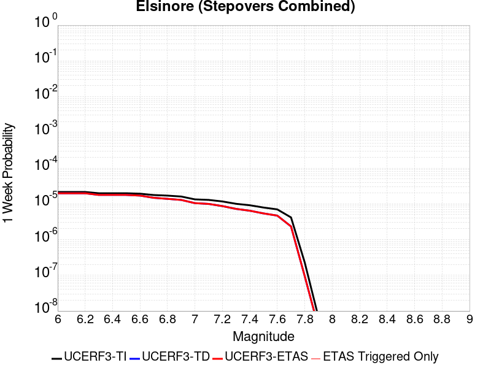 |  | 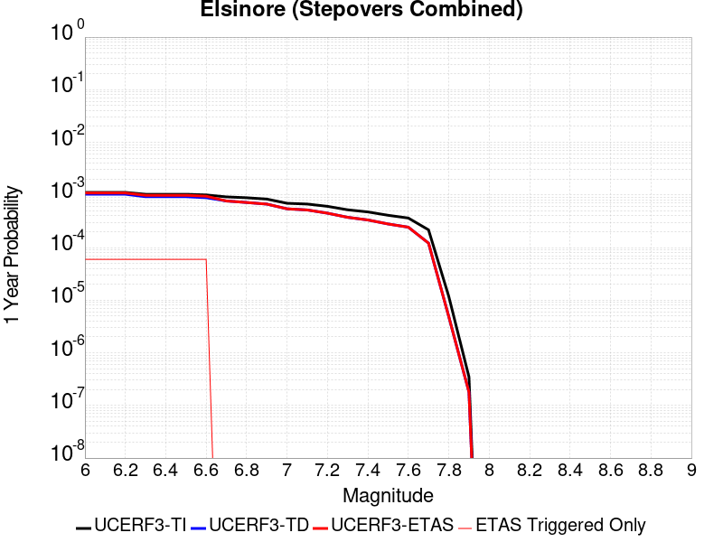 | 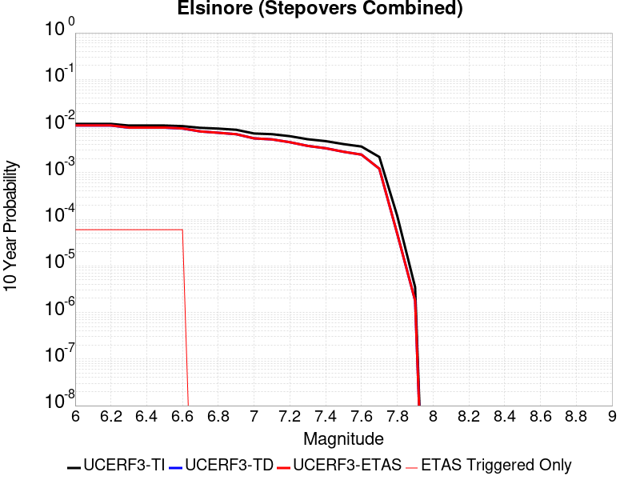 |

| Magnitude | 1 wk TI Prob | 1 wk TD Prob | 1 wk ETAS Prob | 1 wk ETAS/TD Gain | 1 wk ETAS Triggered Only | 1 mo TI Prob | 1 mo TD Prob | 1 mo ETAS Prob | 1 mo ETAS/TD Gain | 1 mo ETAS Triggered Only | 1 yr TI Prob | 1 yr TD Prob | 1 yr ETAS Prob | 1 yr ETAS/TD Gain | 1 yr ETAS Triggered Only | 10 yr TI Prob | 10 yr TD Prob | 10 yr ETAS Prob | 10 yr ETAS/TD Gain | 10 yr ETAS Triggered Only |
|-----|-----|-----|-----|-----|-----|-----|-----|-----|-----|-----|-----|-----|-----|-----|-----|-----|-----|-----|-----|-----|
| 6.0 | 2.144392E-5 | 1.976007E-5 | 1.976007E-5 | 1.0 | 0.0 | 9.189928E-5 | 8.468338E-5 | 8.468338E-5 | 1.0 | 0.0 | 0.0011182994 | 0.0010305515 | 0.0010405412 | 1.0096935 | 1.0E-5 | 0.011126885 | 0.010264617 | 0.010284412 | 1.0019284 | 2.0E-5 |
| 6.1 | 2.144392E-5 | 1.976007E-5 | 1.976007E-5 | 1.0 | 0.0 | 9.189928E-5 | 8.468338E-5 | 8.468338E-5 | 1.0 | 0.0 | 0.0011182994 | 0.0010305515 | 0.0010405412 | 1.0096935 | 1.0E-5 | 0.011126885 | 0.010264617 | 0.010284412 | 1.0019284 | 2.0E-5 |
| 6.2 | 2.144392E-5 | 1.976007E-5 | 1.976007E-5 | 1.0 | 0.0 | 9.189928E-5 | 8.468338E-5 | 8.468338E-5 | 1.0 | 0.0 | 0.0011182994 | 0.0010305515 | 0.0010405412 | 1.0096935 | 1.0E-5 | 0.011126885 | 0.010264617 | 0.010284412 | 1.0019284 | 2.0E-5 |
| 6.3 | 1.9751555E-5 | 1.7741326E-5 | 1.7741326E-5 | 1.0 | 0.0 | 8.4646774E-5 | 7.603211E-5 | 7.603211E-5 | 1.0 | 0.0 | 0.0010300872 | 9.25312E-4 | 9.353027E-4 | 1.0107971 | 1.0E-5 | 0.010253254 | 0.0092209745 | 0.00924079 | 1.002149 | 2.0E-5 |
| 6.4 | 1.9751555E-5 | 1.7741326E-5 | 1.7741326E-5 | 1.0 | 0.0 | 8.4646774E-5 | 7.603211E-5 | 7.603211E-5 | 1.0 | 0.0 | 0.0010300872 | 9.25312E-4 | 9.353027E-4 | 1.0107971 | 1.0E-5 | 0.010253254 | 0.0092209745 | 0.00924079 | 1.002149 | 2.0E-5 |
| 6.5 | 1.9751555E-5 | 1.7741326E-5 | 1.7741326E-5 | 1.0 | 0.0 | 8.4646774E-5 | 7.603211E-5 | 7.603211E-5 | 1.0 | 0.0 | 0.0010300872 | 9.25312E-4 | 9.353027E-4 | 1.0107971 | 1.0E-5 | 0.010253254 | 0.0092209745 | 0.00924079 | 1.002149 | 2.0E-5 |
| 6.6 | 1.9188685E-5 | 1.7003247E-5 | 1.7003247E-5 | 1.0 | 0.0 | 8.2234634E-5 | 7.2869116E-5 | 7.2869116E-5 | 1.0 | 0.0 | 0.0010007467 | 8.8683655E-4 | 8.9682767E-4 | 1.011266 | 1.0E-5 | 0.00996252 | 0.008839546 | 0.008859369 | 1.0022426 | 2.0E-5 |
| 6.7 | 1.7608272E-5 | 1.4732402E-5 | 1.4732402E-5 | 1.0 | 0.0 | 7.546184E-5 | 6.313739E-5 | 6.313739E-5 | 1.0 | 0.0 | 9.183606E-4 | 7.684364E-4 | 7.684364E-4 | 1.0 | 0.0 | 0.009145746 | 0.007664441 | 0.0076743644 | 1.0012947 | 1.0E-5 |
| 6.8 | 1.697165E-5 | 1.3783126E-5 | 1.3783126E-5 | 1.0 | 0.0 | 7.273361E-5 | 5.906925E-5 | 5.906925E-5 | 1.0 | 0.0 | 8.8517193E-4 | 7.189395E-4 | 7.189395E-4 | 1.0 | 0.0 | 0.008816543 | 0.0071722106 | 0.007182139 | 1.0013843 | 1.0E-5 |
| 6.9 | 1.600365E-5 | 1.2846429E-5 | 1.2846429E-5 | 1.0 | 0.0 | 6.858527E-5 | 5.5055007E-5 | 5.5055007E-5 | 1.0 | 0.0 | 8.347058E-4 | 6.700963E-4 | 6.700963E-4 | 1.0 | 0.0 | 0.008315775 | 0.006686422 | 0.006696355 | 1.0014856 | 1.0E-5 |
| 7.0 | 1.3314581E-5 | 1.044738E-5 | 1.044738E-5 | 1.0 | 0.0 | 5.7061243E-5 | 4.4773733E-5 | 4.4773733E-5 | 1.0 | 0.0 | 6.944992E-4 | 5.449866E-4 | 5.449866E-4 | 1.0 | 0.0 | 0.006923327 | 0.005440055 | 0.005450001 | 1.0018282 | 1.0E-5 |
| 7.1 | 1.2865345E-5 | 9.937339E-6 | 9.937339E-6 | 1.0 | 0.0 | 5.5136024E-5 | 4.258792E-5 | 4.258792E-5 | 1.0 | 0.0 | 6.710743E-4 | 5.1838707E-4 | 5.1838707E-4 | 1.0 | 0.0 | 0.0066905143 | 0.005175021 | 0.0051849694 | 1.0019224 | 1.0E-5 |
| 7.2 | 1.1650051E-5 | 8.633585E-6 | 8.633585E-6 | 1.0 | 0.0 | 4.9927836E-5 | 3.7000562E-5 | 3.7000562E-5 | 1.0 | 0.0 | 6.0770183E-4 | 4.503905E-4 | 4.503905E-4 | 1.0 | 0.0 | 0.0060604266 | 0.00449624 | 0.0045061954 | 1.0022141 | 1.0E-5 |
| 7.3 | 1.0008533E-5 | 7.2008215E-6 | 7.2008215E-6 | 1.0 | 0.0 | 4.2893007E-5 | 3.0860305E-5 | 3.0860305E-5 | 1.0 | 0.0 | 5.220972E-4 | 3.756609E-4 | 3.756609E-4 | 1.0 | 0.0 | 0.005208723 | 0.0037506663 | 0.0037606286 | 1.0026562 | 1.0E-5 |
| 7.4 | 9.116759E-6 | 6.409854E-6 | 6.409854E-6 | 1.0 | 0.0 | 3.907124E-5 | 2.7470522E-5 | 2.7470522E-5 | 1.0 | 0.0 | 4.7558855E-4 | 3.3440365E-4 | 3.3440365E-4 | 1.0 | 0.0 | 0.00474572 | 0.0033391542 | 0.0033391542 | 1.0 | 0.0 |
| 7.5 | 7.870524E-6 | 5.382316E-6 | 5.382316E-6 | 1.0 | 0.0 | 3.3730383E-5 | 2.306687E-5 | 2.306687E-5 | 1.0 | 0.0 | 4.1059E-4 | 2.8080423E-4 | 2.8080423E-4 | 1.0 | 0.0 | 0.0040983222 | 0.0028046207 | 0.0028046207 | 1.0 | 0.0 |
| 7.6 | 6.9774537E-6 | 4.677398E-6 | 4.677398E-6 | 1.0 | 0.0 | 2.990303E-5 | 2.0045845E-5 | 2.0045845E-5 | 1.0 | 0.0 | 3.640086E-4 | 2.44032E-4 | 2.44032E-4 | 1.0 | 0.0 | 0.003634129 | 0.0024377564 | 0.0024377564 | 1.0 | 0.0 |
| 7.7 | 4.1616954E-6 | 2.3281368E-6 | 2.3281368E-6 | 1.0 | 0.0 | 1.7835715E-5 | 9.977695E-6 | 9.977695E-6 | 1.0 | 0.0 | 2.171282E-4 | 1.2147242E-4 | 1.2147242E-4 | 1.0 | 0.0 | 0.0021691616 | 0.0012141332 | 0.0012141332 | 1.0 | 0.0 |
| 7.8 | 2.2692414E-7 | 9.384417E-8 | 9.384417E-8 | 1.0 | 0.0 | 9.725317E-7 | 4.0218927E-7 | 4.0218927E-7 | 1.0 | 0.0 | 1.1840509E-5 | 4.8966467E-6 | 4.8966467E-6 | 1.0 | 0.0 | 1.1839878E-4 | 4.8965718E-5 | 4.8965718E-5 | 1.0 | 0.0 |
| 7.9 | 6.676829E-9 | 3.4397174E-9 | 3.4397174E-9 | 1.0 | 0.0 | 2.861498E-8 | 1.4741646E-8 | 1.4741646E-8 | 1.0 | 0.0 | 3.4838732E-7 | 1.7947953E-7 | 1.7947953E-7 | 1.0 | 0.0 | 3.4838679E-6 | 1.794794E-6 | 1.794794E-6 | 1.0 | 0.0 |

## Gillem - Big Crack 2011 CFM
*[(top)](#table-of-contents)*

| 1 Week | 1 Month | 1 Year | 10 Year |
|-----|-----|-----|-----|
|  | 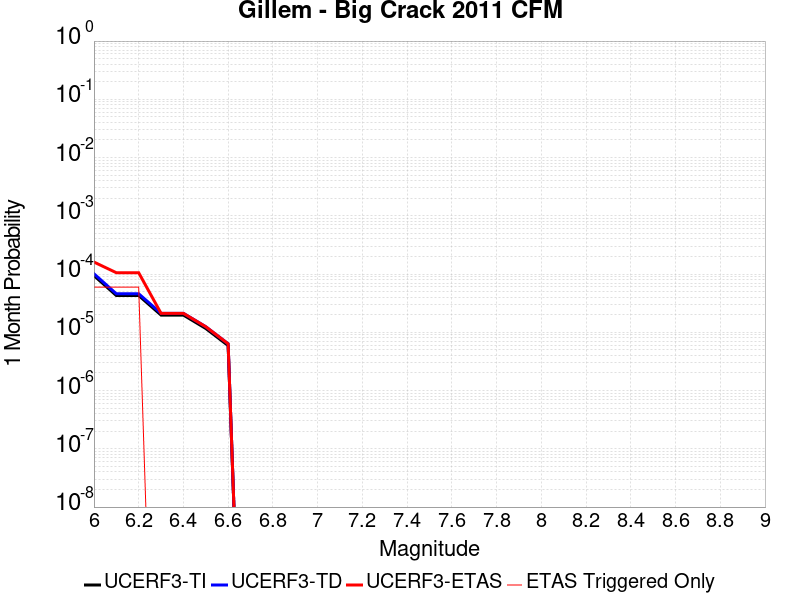 | 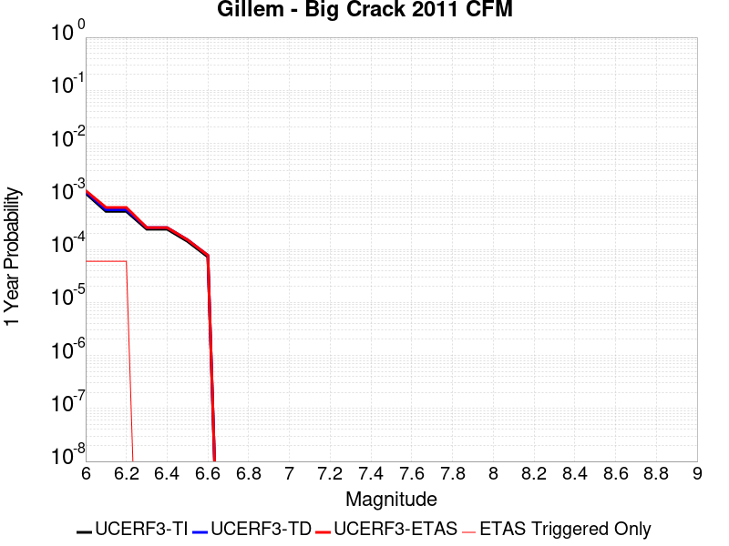 | 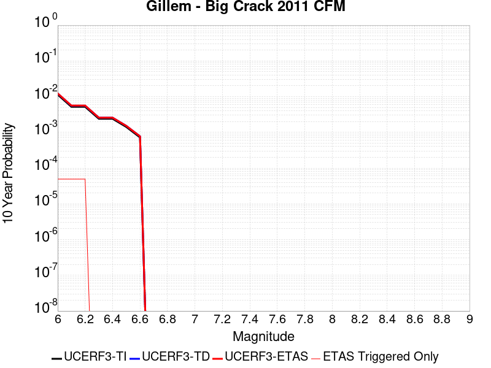 |

| Magnitude | 1 wk TI Prob | 1 wk TD Prob | 1 wk ETAS Prob | 1 wk ETAS/TD Gain | 1 wk ETAS Triggered Only | 1 mo TI Prob | 1 mo TD Prob | 1 mo ETAS Prob | 1 mo ETAS/TD Gain | 1 mo ETAS Triggered Only | 1 yr TI Prob | 1 yr TD Prob | 1 yr ETAS Prob | 1 yr ETAS/TD Gain | 1 yr ETAS Triggered Only | 10 yr TI Prob | 10 yr TD Prob | 10 yr ETAS Prob | 10 yr ETAS/TD Gain | 10 yr ETAS Triggered Only |
|-----|-----|-----|-----|-----|-----|-----|-----|-----|-----|-----|-----|-----|-----|-----|-----|-----|-----|-----|-----|-----|
| 6.0 | 2.196852E-5 | 2.3604485E-5 | 2.3604485E-5 | 1.0 | 0.0 | 9.4147406E-5 | 1.01158665E-4 | 1.1115765E-4 | 1.0988446 | 1.0E-5 | 0.0011456419 | 0.0012309998 | 0.0012509752 | 1.016227 | 2.0E-5 | 0.011397537 | 0.012250669 | 0.0122704245 | 1.0016125 | 2.0E-5 |
| 6.1 | 9.992795E-6 | 1.071189E-5 | 1.071189E-5 | 1.0 | 0.0 | 4.2825563E-5 | 4.5907396E-5 | 5.5906938E-5 | 1.2178198 | 1.0E-5 | 5.2127644E-4 | 5.587975E-4 | 5.6879193E-4 | 1.0178856 | 1.0E-5 | 0.0052005537 | 0.0055757347 | 0.005585679 | 1.0017835 | 1.0E-5 |
| 6.2 | 9.992795E-6 | 1.071189E-5 | 1.071189E-5 | 1.0 | 0.0 | 4.2825563E-5 | 4.5907396E-5 | 5.5906938E-5 | 1.2178198 | 1.0E-5 | 5.2127644E-4 | 5.587975E-4 | 5.6879193E-4 | 1.0178856 | 1.0E-5 | 0.0052005537 | 0.0055757347 | 0.005585679 | 1.0017835 | 1.0E-5 |
| 6.3 | 4.6127884E-6 | 4.942657E-6 | 4.942657E-6 | 1.0 | 0.0 | 1.9768944E-5 | 2.1182668E-5 | 2.1182668E-5 | 1.0 | 0.0 | 2.406603E-4 | 2.5787292E-4 | 2.5787292E-4 | 1.0 | 0.0 | 0.0024039985 | 0.0025761751 | 0.0025761751 | 1.0 | 0.0 |
| 6.4 | 4.6127884E-6 | 4.942657E-6 | 4.942657E-6 | 1.0 | 0.0 | 1.9768944E-5 | 2.1182668E-5 | 2.1182668E-5 | 1.0 | 0.0 | 2.406603E-4 | 2.5787292E-4 | 2.5787292E-4 | 1.0 | 0.0 | 0.0024039985 | 0.0025761751 | 0.0025761751 | 1.0 | 0.0 |
| 6.5 | 2.716712E-6 | 2.9111113E-6 | 2.9111113E-6 | 1.0 | 0.0 | 1.1643E-5 | 1.24761455E-5 | 1.24761455E-5 | 1.0 | 0.0 | 1.417443E-4 | 1.5188892E-4 | 1.5188892E-4 | 1.0 | 0.0 | 0.0014165393 | 0.001518089 | 0.001518089 | 1.0 | 0.0 |
| 6.6 | 1.3818255E-6 | 1.4820689E-6 | 1.4820689E-6 | 1.0 | 0.0 | 5.922096E-6 | 6.3517155E-6 | 6.3517155E-6 | 1.0 | 0.0 | 7.209913E-5 | 7.7330624E-5 | 7.7330624E-5 | 1.0 | 0.0 | 7.2075747E-4 | 7.7315804E-4 | 7.7315804E-4 | 1.0 | 0.0 |

## Honey Lake 2011 CFM
*[(top)](#table-of-contents)*

| 1 Week | 1 Month | 1 Year | 10 Year |
|-----|-----|-----|-----|
| 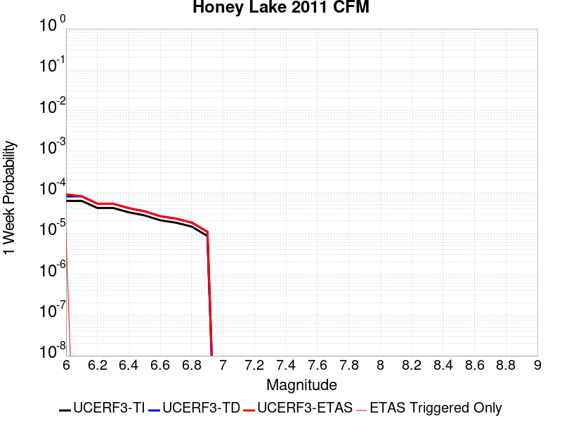 | 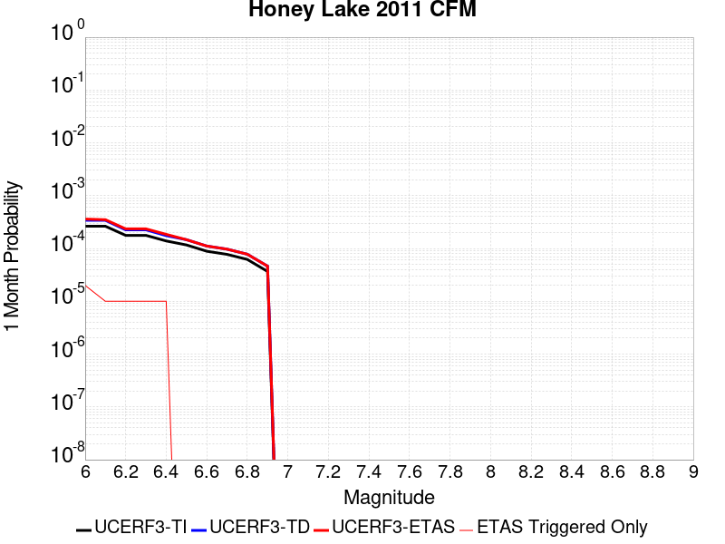 | 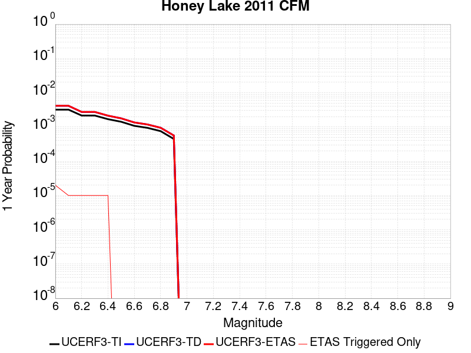 | 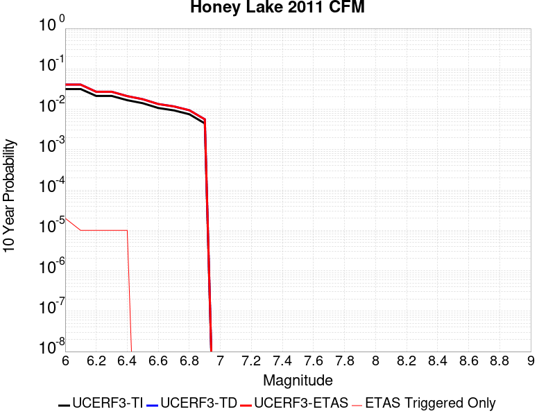 |

| Magnitude | 1 wk TI Prob | 1 wk TD Prob | 1 wk ETAS Prob | 1 wk ETAS/TD Gain | 1 wk ETAS Triggered Only | 1 mo TI Prob | 1 mo TD Prob | 1 mo ETAS Prob | 1 mo ETAS/TD Gain | 1 mo ETAS Triggered Only | 1 yr TI Prob | 1 yr TD Prob | 1 yr ETAS Prob | 1 yr ETAS/TD Gain | 1 yr ETAS Triggered Only | 10 yr TI Prob | 10 yr TD Prob | 10 yr ETAS Prob | 10 yr ETAS/TD Gain | 10 yr ETAS Triggered Only |
|-----|-----|-----|-----|-----|-----|-----|-----|-----|-----|-----|-----|-----|-----|-----|-----|-----|-----|-----|-----|-----|
| 6.0 | 6.155506E-5 | 7.954708E-5 | 8.954628E-5 | 1.1257017 | 1.0E-5 | 2.6378073E-4 | 3.4087323E-4 | 3.6086643E-4 | 1.0586529 | 2.0E-5 | 0.0032068014 | 0.0041426765 | 0.0041625937 | 1.0048078 | 2.0E-5 | 0.03160919 | 0.040703055 | 0.04072224 | 1.0004714 | 2.0E-5 |
| 6.1 | 6.155506E-5 | 7.954708E-5 | 7.954708E-5 | 1.0 | 0.0 | 2.6378073E-4 | 3.4087323E-4 | 3.508698E-4 | 1.0293264 | 1.0E-5 | 0.0032068014 | 0.0041426765 | 0.004152635 | 1.0024039 | 1.0E-5 | 0.03160919 | 0.040703055 | 0.040712647 | 1.0002357 | 1.0E-5 |
| 6.2 | 4.1335024E-5 | 5.257652E-5 | 5.257652E-5 | 1.0 | 0.0 | 1.7713808E-4 | 2.2530954E-4 | 2.3530729E-4 | 1.0443734 | 1.0E-5 | 0.0021545228 | 0.0027398444 | 0.002749817 | 1.0036398 | 1.0E-5 | 0.021337535 | 0.027076809 | 0.027086537 | 1.0003593 | 1.0E-5 |
| 6.3 | 4.1335024E-5 | 5.257652E-5 | 5.257652E-5 | 1.0 | 0.0 | 1.7713808E-4 | 2.2530954E-4 | 2.3530729E-4 | 1.0443734 | 1.0E-5 | 0.0021545228 | 0.0027398444 | 0.002749817 | 1.0036398 | 1.0E-5 | 0.021337535 | 0.027076809 | 0.027086537 | 1.0003593 | 1.0E-5 |
| 6.4 | 3.2393702E-5 | 4.0887273E-5 | 4.0887273E-5 | 1.0 | 0.0 | 1.3882275E-4 | 1.7522006E-4 | 1.852183E-4 | 1.0570611 | 1.0E-5 | 0.0016888566 | 0.0021313233 | 0.002141302 | 1.004682 | 1.0E-5 | 0.016760793 | 0.021119867 | 0.021129655 | 1.0004635 | 1.0E-5 |
| 6.5 | 2.7205504E-5 | 3.4211767E-5 | 3.4211767E-5 | 1.0 | 0.0 | 1.1658981E-4 | 1.4661417E-4 | 1.4661417E-4 | 1.0 | 0.0 | 0.0014185566 | 0.0017836596 | 0.0017836596 | 1.0 | 0.0 | 0.014095354 | 0.017702963 | 0.017702963 | 1.0 | 0.0 |
| 6.6 | 2.069265E-5 | 2.5955416E-5 | 2.5955416E-5 | 1.0 | 0.0 | 8.867977E-5 | 1.1123324E-4 | 1.1123324E-4 | 1.0 | 0.0 | 0.0010791414 | 0.0013535074 | 0.0013535074 | 1.0 | 0.0 | 0.010739161 | 0.0134610105 | 0.0134610105 | 1.0 | 0.0 |
| 6.7 | 1.8060919E-5 | 2.265683E-5 | 2.265683E-5 | 1.0 | 0.0 | 7.7401644E-5 | 9.7097545E-5 | 9.7097545E-5 | 1.0 | 0.0 | 9.419576E-4 | 0.0011816025 | 0.0011816025 | 1.0 | 0.0 | 0.009379748 | 0.0117612425 | 0.0117612425 | 1.0 | 0.0 |
| 6.8 | 1.4474663E-5 | 1.8181274E-5 | 1.8181274E-5 | 1.0 | 0.0 | 6.203279E-5 | 7.791785E-5 | 7.791785E-5 | 1.0 | 0.0 | 7.5498753E-4 | 9.4831345E-4 | 9.4831345E-4 | 1.0 | 0.0 | 0.007524277 | 0.009450195 | 0.009450195 | 1.0 | 0.0 |
| 6.9 | 8.564552E-6 | 1.0802311E-5 | 1.0802311E-5 | 1.0 | 0.0 | 3.6704707E-5 | 4.6295176E-5 | 4.6295176E-5 | 1.0 | 0.0 | 4.4678818E-4 | 5.635644E-4 | 5.635644E-4 | 1.0 | 0.0 | 0.0044589094 | 0.0056278505 | 0.0056278505 | 1.0 | 0.0 |

## Earthquake Valley (No  Extension)
*[(top)](#table-of-contents)*

| 1 Week | 1 Month | 1 Year | 10 Year |
|-----|-----|-----|-----|
| 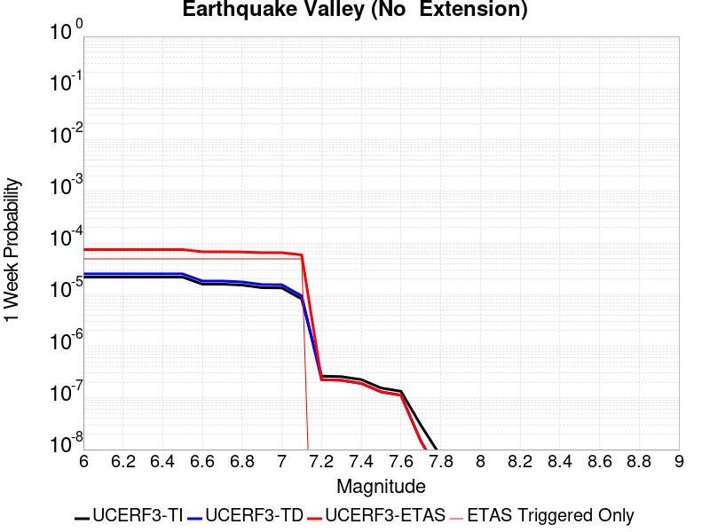 | 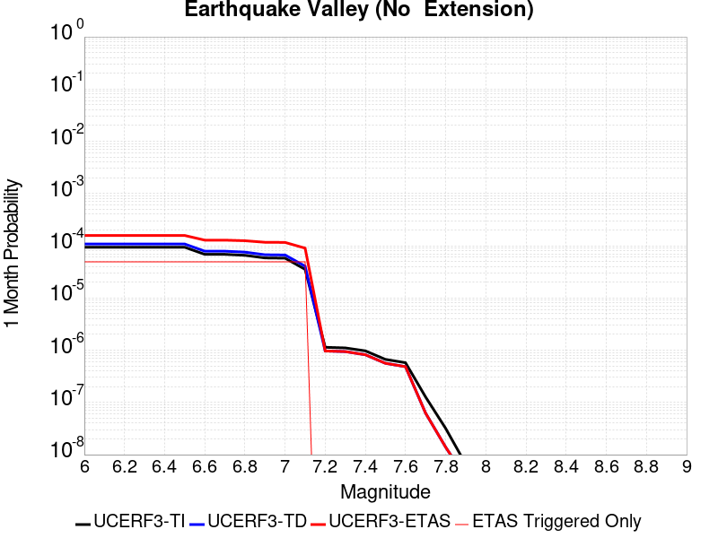 | 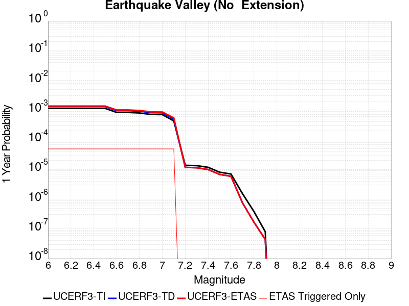 | 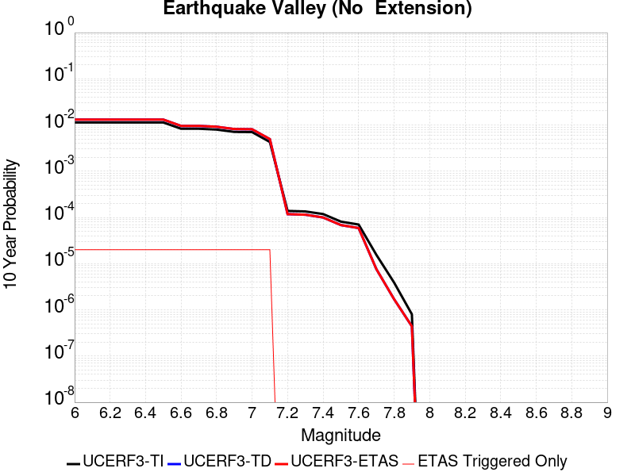 |

| Magnitude | 1 wk TI Prob | 1 wk TD Prob | 1 wk ETAS Prob | 1 wk ETAS/TD Gain | 1 wk ETAS Triggered Only | 1 mo TI Prob | 1 mo TD Prob | 1 mo ETAS Prob | 1 mo ETAS/TD Gain | 1 mo ETAS Triggered Only | 1 yr TI Prob | 1 yr TD Prob | 1 yr ETAS Prob | 1 yr ETAS/TD Gain | 1 yr ETAS Triggered Only | 10 yr TI Prob | 10 yr TD Prob | 10 yr ETAS Prob | 10 yr ETAS/TD Gain | 10 yr ETAS Triggered Only |
|-----|-----|-----|-----|-----|-----|-----|-----|-----|-----|-----|-----|-----|-----|-----|-----|-----|-----|-----|-----|-----|
| 6.0 | 2.1859703E-5 | 2.5198351E-5 | 3.51981E-5 | 1.3968414 | 1.0E-5 | 9.3681076E-5 | 1.0798928E-4 | 1.179882E-4 | 1.0925918 | 1.0E-5 | 0.0011399703 | 0.0013141216 | 0.0013241085 | 1.0075996 | 1.0E-5 | 0.011341401 | 0.013077869 | 0.0130976075 | 1.0015093 | 2.0E-5 |
| 6.1 | 2.1859703E-5 | 2.5198351E-5 | 3.51981E-5 | 1.3968414 | 1.0E-5 | 9.3681076E-5 | 1.0798928E-4 | 1.179882E-4 | 1.0925918 | 1.0E-5 | 0.0011399703 | 0.0013141216 | 0.0013241085 | 1.0075996 | 1.0E-5 | 0.011341401 | 0.013077869 | 0.0130976075 | 1.0015093 | 2.0E-5 |
| 6.2 | 2.1859703E-5 | 2.5198351E-5 | 3.51981E-5 | 1.3968414 | 1.0E-5 | 9.3681076E-5 | 1.0798928E-4 | 1.179882E-4 | 1.0925918 | 1.0E-5 | 0.0011399703 | 0.0013141216 | 0.0013241085 | 1.0075996 | 1.0E-5 | 0.011341401 | 0.013077869 | 0.0130976075 | 1.0015093 | 2.0E-5 |
| 6.3 | 2.1859703E-5 | 2.5198351E-5 | 3.51981E-5 | 1.3968414 | 1.0E-5 | 9.3681076E-5 | 1.0798928E-4 | 1.179882E-4 | 1.0925918 | 1.0E-5 | 0.0011399703 | 0.0013141216 | 0.0013241085 | 1.0075996 | 1.0E-5 | 0.011341401 | 0.013077869 | 0.0130976075 | 1.0015093 | 2.0E-5 |
| 6.4 | 2.1859703E-5 | 2.5198351E-5 | 3.51981E-5 | 1.3968414 | 1.0E-5 | 9.3681076E-5 | 1.0798928E-4 | 1.179882E-4 | 1.0925918 | 1.0E-5 | 0.0011399703 | 0.0013141216 | 0.0013241085 | 1.0075996 | 1.0E-5 | 0.011341401 | 0.013077869 | 0.0130976075 | 1.0015093 | 2.0E-5 |
| 6.5 | 2.1859703E-5 | 2.5198351E-5 | 3.51981E-5 | 1.3968414 | 1.0E-5 | 9.3681076E-5 | 1.0798928E-4 | 1.179882E-4 | 1.0925918 | 1.0E-5 | 0.0011399703 | 0.0013141216 | 0.0013241085 | 1.0075996 | 1.0E-5 | 0.011341401 | 0.013077869 | 0.0130976075 | 1.0015093 | 2.0E-5 |
| 6.6 | 1.597E-5 | 1.835627E-5 | 2.8356086E-5 | 1.544763 | 1.0E-5 | 6.8441055E-5 | 7.866784E-5 | 8.866706E-5 | 1.1271068 | 1.0E-5 | 8.329513E-4 | 9.5744745E-4 | 9.6743787E-4 | 1.0104344 | 1.0E-5 | 0.008298361 | 0.009541833 | 0.009561641 | 1.002076 | 2.0E-5 |
| 6.7 | 1.597E-5 | 1.835627E-5 | 2.8356086E-5 | 1.544763 | 1.0E-5 | 6.8441055E-5 | 7.866784E-5 | 8.866706E-5 | 1.1271068 | 1.0E-5 | 8.329513E-4 | 9.5744745E-4 | 9.6743787E-4 | 1.0104344 | 1.0E-5 | 0.008298361 | 0.009541833 | 0.009561641 | 1.002076 | 2.0E-5 |
| 6.8 | 1.5315149E-5 | 1.7602086E-5 | 2.760191E-5 | 1.5681045 | 1.0E-5 | 6.5634704E-5 | 7.543582E-5 | 8.543506E-5 | 1.132553 | 1.0E-5 | 7.988095E-4 | 9.1813074E-4 | 9.2812156E-4 | 1.0108817 | 1.0E-5 | 0.007959441 | 0.009151915 | 0.009171733 | 1.0021653 | 2.0E-5 |
| 6.9 | 1.3634728E-5 | 1.5675814E-5 | 2.5675658E-5 | 1.6379154 | 1.0E-5 | 5.8433237E-5 | 6.7180794E-5 | 7.718013E-5 | 1.1488421 | 1.0E-5 | 7.1119244E-4 | 8.1770134E-4 | 8.2769315E-4 | 1.0122194 | 1.0E-5 | 0.007089207 | 0.008154998 | 0.008174834 | 1.0024325 | 2.0E-5 |
| 7.0 | 1.3496271E-5 | 1.5517848E-5 | 2.5517691E-5 | 1.6444093 | 1.0E-5 | 5.783988E-5 | 6.6503824E-5 | 7.650316E-5 | 1.1503572 | 1.0E-5 | 7.03973E-4 | 8.0946536E-4 | 8.194573E-4 | 1.0123439 | 1.0E-5 | 0.007017471 | 0.008073238 | 0.008093076 | 1.0024574 | 2.0E-5 |
| 7.1 | 8.242798E-6 | 9.472594E-6 | 1.9472498E-5 | 2.0556672 | 1.0E-5 | 3.53258E-5 | 4.0596577E-5 | 5.059617E-5 | 1.2463162 | 1.0E-5 | 4.300067E-4 | 4.9421826E-4 | 5.042133E-4 | 1.020224 | 1.0E-5 | 0.004291756 | 0.0049377684 | 0.0049576694 | 1.0040305 | 2.0E-5 |
| 7.2 | 2.6506527E-7 | 2.2559628E-7 | 2.2559628E-7 | 1.0 | 0.0 | 1.1359936E-6 | 9.668408E-7 | 9.668408E-7 | 1.0 | 0.0 | 1.3830633E-5 | 1.1771229E-5 | 1.1771229E-5 | 1.0 | 0.0 | 1.3829772E-4 | 1.1770646E-4 | 1.1770646E-4 | 1.0 | 0.0 |
| 7.3 | 2.5810488E-7 | 2.1954757E-7 | 2.1954757E-7 | 1.0 | 0.0 | 1.1061633E-6 | 9.4091786E-7 | 9.4091786E-7 | 1.0 | 0.0 | 1.3467455E-5 | 1.1455619E-5 | 1.1455619E-5 | 1.0 | 0.0 | 1.3466639E-4 | 1.145507E-4 | 1.145507E-4 | 1.0 | 0.0 |
| 7.4 | 2.2676066E-7 | 1.9109943E-7 | 1.9109943E-7 | 1.0 | 0.0 | 9.71831E-7 | 8.189973E-7 | 8.189973E-7 | 1.0 | 0.0 | 1.1831979E-5 | 9.971251E-6 | 9.971251E-6 | 1.0 | 0.0 | 1.1831349E-4 | 9.970842E-5 | 9.970842E-5 | 1.0 | 0.0 |
| 7.5 | 1.5553917E-7 | 1.311138E-7 | 1.311138E-7 | 1.0 | 0.0 | 6.6659624E-7 | 5.619162E-7 | 5.619162E-7 | 1.0 | 0.0 | 8.115779E-6 | 6.84131E-6 | 6.84131E-6 | 1.0 | 0.0 | 8.115482E-5 | 6.841121E-5 | 6.841121E-5 | 1.0 | 0.0 |
| 7.6 | 1.3448629E-7 | 1.1287708E-7 | 1.1287708E-7 | 1.0 | 0.0 | 5.7636964E-7 | 4.8375887E-7 | 4.8375887E-7 | 1.0 | 0.0 | 7.017278E-6 | 5.8897504E-6 | 5.8897504E-6 | 1.0 | 0.0 | 7.0170565E-5 | 5.8896156E-5 | 5.8896156E-5 | 1.0 | 0.0 |
| 7.7 | 2.9719402E-8 | 1.4581234E-8 | 1.4581234E-8 | 1.0 | 0.0 | 1.2736886E-7 | 6.2491004E-8 | 6.2491004E-8 | 1.0 | 0.0 | 1.5507147E-6 | 7.6082773E-7 | 7.6082773E-7 | 1.0 | 0.0 | 1.550704E-5 | 7.608257E-6 | 7.608257E-6 | 1.0 | 0.0 |
| 7.8 | 7.4390196E-9 | 3.249962E-9 | 3.249962E-9 | 1.0 | 0.0 | 3.1881513E-8 | 1.39284095E-8 | 1.39284095E-8 | 1.0 | 0.0 | 3.8815733E-7 | 1.6957837E-7 | 1.6957837E-7 | 1.0 | 0.0 | 3.8815665E-6 | 1.6957828E-6 | 1.6957828E-6 | 1.0 | 0.0 |
| 7.9 | 1.5373532E-9 | 8.4400953E-10 | 8.4400953E-10 | 1.0 | 0.0 | 6.5886567E-9 | 3.6171839E-9 | 3.6171839E-9 | 1.0 | 0.0 | 8.021689E-8 | 4.403921E-8 | 4.403921E-8 | 1.0 | 0.0 | 8.0216864E-7 | 4.403921E-7 | 4.403921E-7 | 1.0 | 0.0 |

## San Luis Range - Pecho 2011 CFM
*[(top)](#table-of-contents)*

| 1 Week | 1 Month | 1 Year | 10 Year |
|-----|-----|-----|-----|
|  | 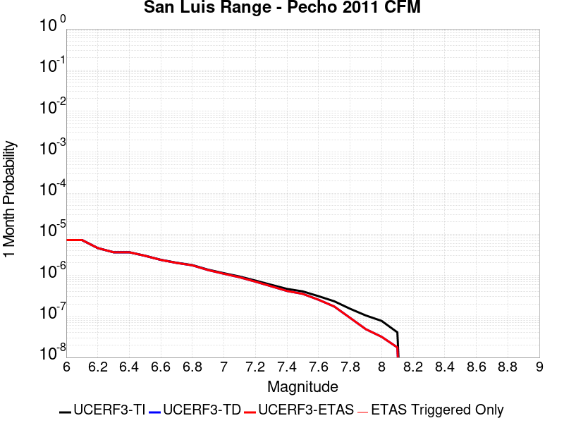 | 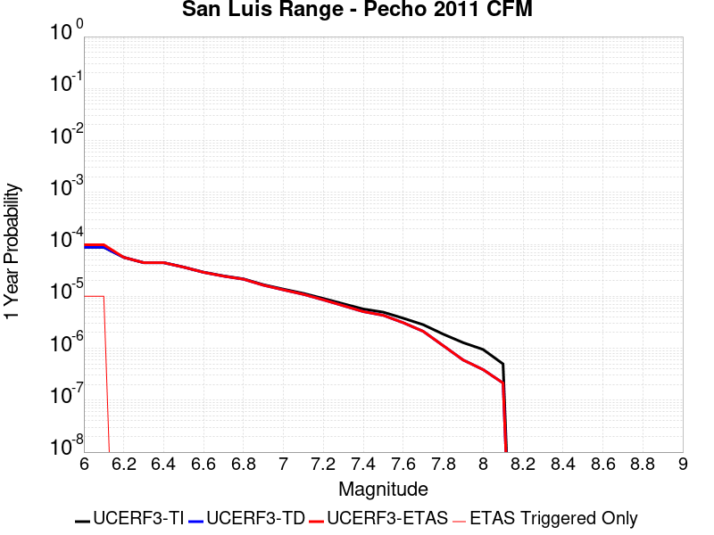 | 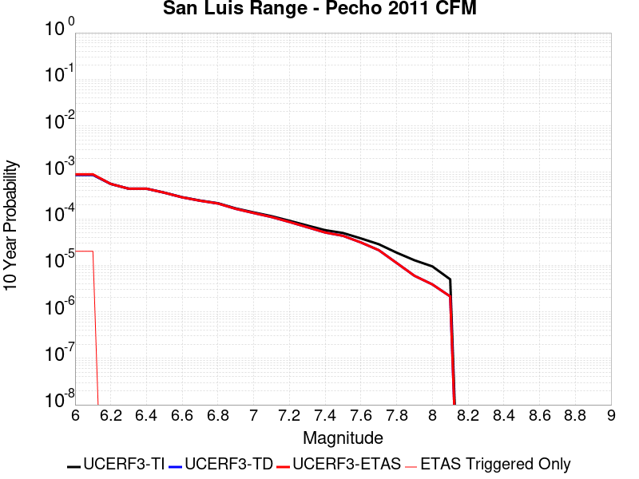 |

| Magnitude | 1 wk TI Prob | 1 wk TD Prob | 1 wk ETAS Prob | 1 wk ETAS/TD Gain | 1 wk ETAS Triggered Only | 1 mo TI Prob | 1 mo TD Prob | 1 mo ETAS Prob | 1 mo ETAS/TD Gain | 1 mo ETAS Triggered Only | 1 yr TI Prob | 1 yr TD Prob | 1 yr ETAS Prob | 1 yr ETAS/TD Gain | 1 yr ETAS Triggered Only | 10 yr TI Prob | 10 yr TD Prob | 10 yr ETAS Prob | 10 yr ETAS/TD Gain | 10 yr ETAS Triggered Only |
|-----|-----|-----|-----|-----|-----|-----|-----|-----|-----|-----|-----|-----|-----|-----|-----|-----|-----|-----|-----|-----|
| 6.0 | 1.687423E-6 | 1.6921944E-6 | 1.6921944E-6 | 1.0 | 0.0 | 7.231793E-6 | 7.252243E-6 | 7.252243E-6 | 1.0 | 0.0 | 8.804352E-5 | 8.829272E-5 | 9.8291835E-5 | 1.1132497 | 1.0E-5 | 8.8008645E-4 | 8.826003E-4 | 9.025827E-4 | 1.0226403 | 2.0E-5 |
| 6.1 | 1.687423E-6 | 1.6921944E-6 | 1.6921944E-6 | 1.0 | 0.0 | 7.231793E-6 | 7.252243E-6 | 7.252243E-6 | 1.0 | 0.0 | 8.804352E-5 | 8.829272E-5 | 9.8291835E-5 | 1.1132497 | 1.0E-5 | 8.8008645E-4 | 8.826003E-4 | 9.025827E-4 | 1.0226403 | 2.0E-5 |
| 6.2 | 1.0765672E-6 | 1.0770541E-6 | 1.0770541E-6 | 1.0 | 0.0 | 4.613851E-6 | 4.615938E-6 | 4.615938E-6 | 1.0 | 0.0 | 5.617219E-5 | 5.6197663E-5 | 5.6197663E-5 | 1.0 | 0.0 | 5.6157995E-4 | 5.618408E-4 | 5.618408E-4 | 1.0 | 0.0 |
| 6.3 | 8.523104E-7 | 8.5130216E-7 | 8.5130216E-7 | 1.0 | 0.0 | 3.6527538E-6 | 3.648433E-6 | 3.648433E-6 | 1.0 | 0.0 | 4.447137E-5 | 4.4418797E-5 | 4.4418797E-5 | 1.0 | 0.0 | 4.4462472E-4 | 4.441024E-4 | 4.441024E-4 | 1.0 | 0.0 |
| 6.4 | 8.523104E-7 | 8.5130216E-7 | 8.5130216E-7 | 1.0 | 0.0 | 3.6527538E-6 | 3.648433E-6 | 3.648433E-6 | 1.0 | 0.0 | 4.447137E-5 | 4.4418797E-5 | 4.4418797E-5 | 1.0 | 0.0 | 4.4462472E-4 | 4.441024E-4 | 4.441024E-4 | 1.0 | 0.0 |
| 6.5 | 7.0029404E-7 | 6.976438E-7 | 6.976438E-7 | 1.0 | 0.0 | 3.0012568E-6 | 2.9898988E-6 | 2.9898988E-6 | 1.0 | 0.0 | 3.6539688E-5 | 3.6401427E-5 | 3.6401427E-5 | 1.0 | 0.0 | 3.653368E-4 | 3.6395632E-4 | 3.6395632E-4 | 1.0 | 0.0 |
| 6.6 | 5.583906E-7 | 5.5428296E-7 | 5.5428296E-7 | 1.0 | 0.0 | 2.3931002E-6 | 2.3754963E-6 | 2.3754963E-6 | 1.0 | 0.0 | 2.9135606E-5 | 2.892129E-5 | 2.892129E-5 | 1.0 | 0.0 | 2.9131788E-4 | 2.89176E-4 | 2.89176E-4 | 1.0 | 0.0 |
| 6.7 | 4.73441E-7 | 4.6830658E-7 | 4.6830658E-7 | 1.0 | 0.0 | 2.0290313E-6 | 2.0070268E-6 | 2.0070268E-6 | 1.0 | 0.0 | 2.4703175E-5 | 2.4435281E-5 | 2.4435281E-5 | 1.0 | 0.0 | 2.470043E-4 | 2.443264E-4 | 2.443264E-4 | 1.0 | 0.0 |
| 6.8 | 4.1466086E-7 | 4.087795E-7 | 4.087795E-7 | 1.0 | 0.0 | 1.7771167E-6 | 1.751911E-6 | 1.751911E-6 | 1.0 | 0.0 | 2.1636182E-5 | 2.132931E-5 | 2.132931E-5 | 1.0 | 0.0 | 2.1634075E-4 | 2.1327297E-4 | 2.1327297E-4 | 1.0 | 0.0 |
| 6.9 | 3.2056641E-7 | 3.13293E-7 | 3.13293E-7 | 1.0 | 0.0 | 1.3738553E-6 | 1.3426836E-6 | 1.3426836E-6 | 1.0 | 0.0 | 1.6726559E-5 | 1.6347052E-5 | 1.6347052E-5 | 1.0 | 0.0 | 1.67253E-4 | 1.6345865E-4 | 1.6345865E-4 | 1.0 | 0.0 |
| 7.0 | 2.6315942E-7 | 2.5489675E-7 | 2.5489675E-7 | 1.0 | 0.0 | 1.1278256E-6 | 1.0924141E-6 | 1.0924141E-6 | 1.0 | 0.0 | 1.3731191E-5 | 1.3300061E-5 | 1.3300061E-5 | 1.0 | 0.0 | 1.3730342E-4 | 1.3299273E-4 | 1.3299273E-4 | 1.0 | 0.0 |
| 7.1 | 2.1832436E-7 | 2.0917312E-7 | 2.0917312E-7 | 1.0 | 0.0 | 9.356755E-7 | 8.9645596E-7 | 8.9645596E-7 | 1.0 | 0.0 | 1.13917895E-5 | 1.0914297E-5 | 1.0914297E-5 | 1.0 | 0.0 | 1.1391206E-4 | 1.0913766E-4 | 1.0913766E-4 | 1.0 | 0.0 |
| 7.2 | 1.7393015E-7 | 1.6376592E-7 | 1.6376592E-7 | 1.0 | 0.0 | 7.454147E-7 | 7.018537E-7 | 7.018537E-7 | 1.0 | 0.0 | 9.075386E-6 | 8.545036E-6 | 8.545036E-6 | 1.0 | 0.0 | 9.075015E-5 | 8.54471E-5 | 8.54471E-5 | 1.0 | 0.0 |
| 7.3 | 1.3744894E-7 | 1.263862E-7 | 1.263862E-7 | 1.0 | 0.0 | 5.890667E-7 | 5.4165497E-7 | 5.4165497E-7 | 1.0 | 0.0 | 7.1718637E-6 | 6.5946297E-6 | 6.5946297E-6 | 1.0 | 0.0 | 7.171632E-5 | 6.5944354E-5 | 6.5944354E-5 | 1.0 | 0.0 |
| 7.4 | 1.0915278E-7 | 9.727534E-8 | 9.727534E-8 | 1.0 | 0.0 | 4.6779755E-7 | 4.1689424E-7 | 4.1689424E-7 | 1.0 | 0.0 | 5.6954204E-6 | 5.0756753E-6 | 5.0756753E-6 | 1.0 | 0.0 | 5.6952744E-5 | 5.0755603E-5 | 5.0755603E-5 | 1.0 | 0.0 |
| 7.5 | 9.490291E-8 | 8.257131E-8 | 8.257131E-8 | 1.0 | 0.0 | 4.0672668E-7 | 3.53877E-7 | 3.53877E-7 | 1.0 | 0.0 | 4.9518862E-6 | 4.308444E-6 | 4.308444E-6 | 1.0 | 0.0 | 4.951776E-5 | 4.308361E-5 | 4.308361E-5 | 1.0 | 0.0 |
| 7.6 | 7.256678E-8 | 5.942529E-8 | 5.942529E-8 | 1.0 | 0.0 | 3.1100043E-7 | 2.546798E-7 | 2.546798E-7 | 1.0 | 0.0 | 3.7864236E-6 | 3.100722E-6 | 3.100722E-6 | 1.0 | 0.0 | 3.7863592E-5 | 3.100679E-5 | 3.100679E-5 | 1.0 | 0.0 |
| 7.7 | 5.446273E-8 | 4.057937E-8 | 4.057937E-8 | 1.0 | 0.0 | 2.3341168E-7 | 1.7391157E-7 | 1.7391157E-7 | 1.0 | 0.0 | 2.8417835E-6 | 2.1173712E-6 | 2.1173712E-6 | 1.0 | 0.0 | 2.8417471E-5 | 2.1173511E-5 | 2.1173511E-5 | 1.0 | 0.0 |
| 7.8 | 3.5850867E-8 | 2.1520364E-8 | 2.1520364E-8 | 1.0 | 0.0 | 1.5364655E-7 | 9.2230124E-8 | 9.2230124E-8 | 1.0 | 0.0 | 1.8706452E-6 | 1.1229012E-6 | 1.1229012E-6 | 1.0 | 0.0 | 1.8706294E-5 | 1.1228955E-5 | 1.1228955E-5 | 1.0 | 0.0 |
| 7.9 | 2.45879E-8 | 1.1394102E-8 | 1.1394102E-8 | 1.0 | 0.0 | 1.0537671E-7 | 4.883186E-8 | 4.883186E-8 | 1.0 | 0.0 | 1.2829606E-6 | 5.9452776E-7 | 5.9452776E-7 | 1.0 | 0.0 | 1.2829532E-5 | 5.945262E-6 | 5.945262E-6 | 1.0 | 0.0 |
| 8.0 | 1.8151761E-8 | 7.4404523E-9 | 7.4404523E-9 | 1.0 | 0.0 | 7.779326E-8 | 3.188765E-8 | 3.188765E-8 | 1.0 | 0.0 | 9.4713255E-7 | 3.8823208E-7 | 3.8823208E-7 | 1.0 | 0.0 | 9.471285E-6 | 3.882314E-6 | 3.882314E-6 | 1.0 | 0.0 |
| 8.1 | 9.559205E-9 | 4.100115E-9 | 4.100115E-9 | 1.0 | 0.0 | 4.096802E-8 | 1.7571923E-8 | 1.7571923E-8 | 1.0 | 0.0 | 4.9878554E-7 | 2.1393814E-7 | 2.1393814E-7 | 1.0 | 0.0 | 4.987844E-6 | 2.1393794E-6 | 2.1393794E-6 | 1.0 | 0.0 |

## North Frontal  (West)
*[(top)](#table-of-contents)*

| 1 Week | 1 Month | 1 Year | 10 Year |
|-----|-----|-----|-----|
| 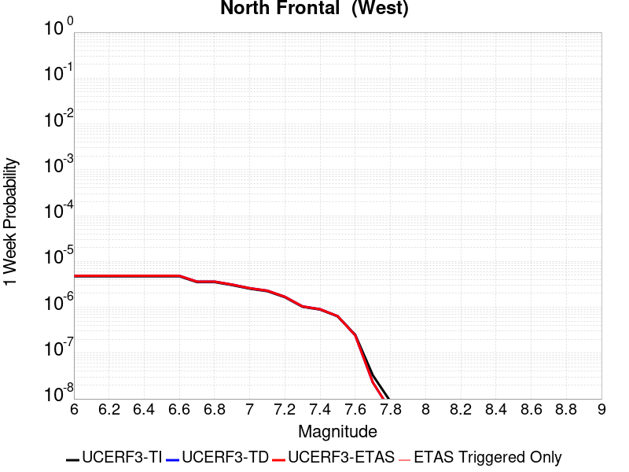 | 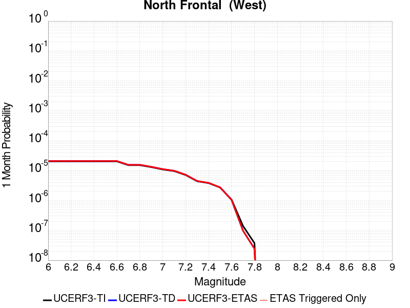 | 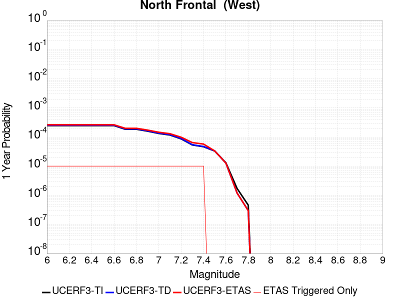 | 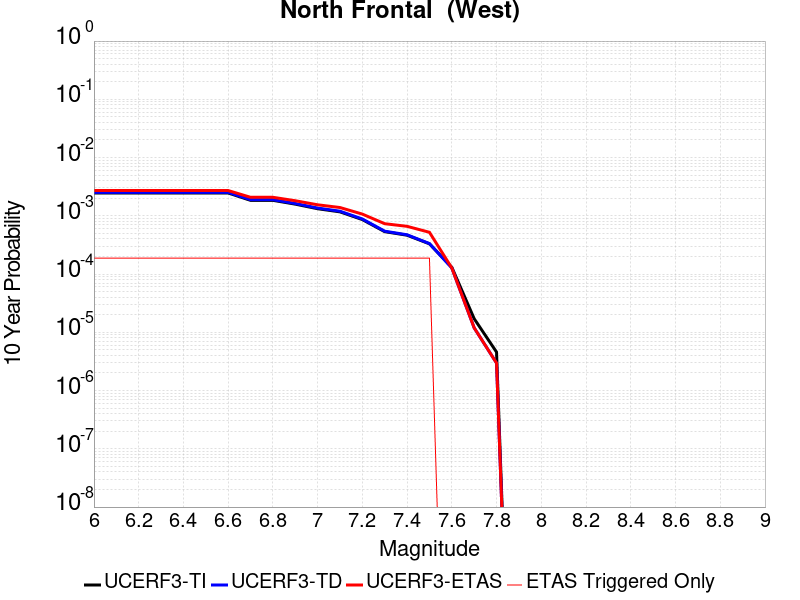 |

| Magnitude | 1 wk TI Prob | 1 wk TD Prob | 1 wk ETAS Prob | 1 wk ETAS/TD Gain | 1 wk ETAS Triggered Only | 1 mo TI Prob | 1 mo TD Prob | 1 mo ETAS Prob | 1 mo ETAS/TD Gain | 1 mo ETAS Triggered Only | 1 yr TI Prob | 1 yr TD Prob | 1 yr ETAS Prob | 1 yr ETAS/TD Gain | 1 yr ETAS Triggered Only | 10 yr TI Prob | 10 yr TD Prob | 10 yr ETAS Prob | 10 yr ETAS/TD Gain | 10 yr ETAS Triggered Only |
|-----|-----|-----|-----|-----|-----|-----|-----|-----|-----|-----|-----|-----|-----|-----|-----|-----|-----|-----|-----|-----|
| 6.0 | 4.7316266E-6 | 4.852674E-6 | 1.4852625E-5 | 3.0607095 | 1.0E-5 | 2.0278241E-5 | 2.0797017E-5 | 3.0796808E-5 | 1.4808282 | 1.0E-5 | 2.4685962E-4 | 2.5317573E-4 | 2.631732E-4 | 1.0394883 | 1.0E-5 | 0.0024658558 | 0.002529019 | 0.0025489687 | 1.0078882 | 2.0E-5 |
| 6.1 | 4.7316266E-6 | 4.852674E-6 | 1.4852625E-5 | 3.0607095 | 1.0E-5 | 2.0278241E-5 | 2.0797017E-5 | 3.0796808E-5 | 1.4808282 | 1.0E-5 | 2.4685962E-4 | 2.5317573E-4 | 2.631732E-4 | 1.0394883 | 1.0E-5 | 0.0024658558 | 0.002529019 | 0.0025489687 | 1.0078882 | 2.0E-5 |
| 6.2 | 4.7316266E-6 | 4.852674E-6 | 1.4852625E-5 | 3.0607095 | 1.0E-5 | 2.0278241E-5 | 2.0797017E-5 | 3.0796808E-5 | 1.4808282 | 1.0E-5 | 2.4685962E-4 | 2.5317573E-4 | 2.631732E-4 | 1.0394883 | 1.0E-5 | 0.0024658558 | 0.002529019 | 0.0025489687 | 1.0078882 | 2.0E-5 |
| 6.3 | 4.7316266E-6 | 4.852674E-6 | 1.4852625E-5 | 3.0607095 | 1.0E-5 | 2.0278241E-5 | 2.0797017E-5 | 3.0796808E-5 | 1.4808282 | 1.0E-5 | 2.4685962E-4 | 2.5317573E-4 | 2.631732E-4 | 1.0394883 | 1.0E-5 | 0.0024658558 | 0.002529019 | 0.0025489687 | 1.0078882 | 2.0E-5 |
| 6.4 | 4.7316266E-6 | 4.852674E-6 | 1.4852625E-5 | 3.0607095 | 1.0E-5 | 2.0278241E-5 | 2.0797017E-5 | 3.0796808E-5 | 1.4808282 | 1.0E-5 | 2.4685962E-4 | 2.5317573E-4 | 2.631732E-4 | 1.0394883 | 1.0E-5 | 0.0024658558 | 0.002529019 | 0.0025489687 | 1.0078882 | 2.0E-5 |
| 6.5 | 4.7316266E-6 | 4.852674E-6 | 1.4852625E-5 | 3.0607095 | 1.0E-5 | 2.0278241E-5 | 2.0797017E-5 | 3.0796808E-5 | 1.4808282 | 1.0E-5 | 2.4685962E-4 | 2.5317573E-4 | 2.631732E-4 | 1.0394883 | 1.0E-5 | 0.0024658558 | 0.002529019 | 0.0025489687 | 1.0078882 | 2.0E-5 |
| 6.6 | 4.7316266E-6 | 4.852674E-6 | 1.4852625E-5 | 3.0607095 | 1.0E-5 | 2.0278241E-5 | 2.0797017E-5 | 3.0796808E-5 | 1.4808282 | 1.0E-5 | 2.4685962E-4 | 2.5317573E-4 | 2.631732E-4 | 1.0394883 | 1.0E-5 | 0.0024658558 | 0.002529019 | 0.0025489687 | 1.0078882 | 2.0E-5 |
| 6.7 | 3.5382777E-6 | 3.6308872E-6 | 1.3630851E-5 | 3.7541378 | 1.0E-5 | 1.516396E-5 | 1.5560858E-5 | 2.5560701E-5 | 1.6426281 | 1.0E-5 | 1.8460557E-4 | 1.8943775E-4 | 1.9943585E-4 | 1.0527778 | 1.0E-5 | 0.0018445229 | 0.0018928396 | 0.0019128018 | 1.0105461 | 2.0E-5 |
| 6.8 | 3.5382777E-6 | 3.6308872E-6 | 1.3630851E-5 | 3.7541378 | 1.0E-5 | 1.516396E-5 | 1.5560858E-5 | 2.5560701E-5 | 1.6426281 | 1.0E-5 | 1.8460557E-4 | 1.8943775E-4 | 1.9943585E-4 | 1.0527778 | 1.0E-5 | 0.0018445229 | 0.0018928396 | 0.0019128018 | 1.0105461 | 2.0E-5 |
| 6.9 | 3.0428037E-6 | 3.1227619E-6 | 1.3122731E-5 | 4.2022834 | 1.0E-5 | 1.30405215E-5 | 1.3383201E-5 | 2.3383067E-5 | 1.7471954 | 1.0E-5 | 1.5875678E-4 | 1.6292896E-4 | 1.7292734E-4 | 1.0613664 | 1.0E-5 | 0.0015864341 | 0.0016281622 | 0.0016481297 | 1.0122638 | 2.0E-5 |
| 7.0 | 2.538778E-6 | 2.6060916E-6 | 1.2606066E-5 | 4.8371534 | 1.0E-5 | 1.0880432E-5 | 1.116892E-5 | 2.1168808E-5 | 1.8953317 | 1.0E-5 | 1.324612E-4 | 1.3597358E-4 | 1.4597223E-4 | 1.0735337 | 1.0E-5 | 0.0013238228 | 0.0013589506 | 0.0013789234 | 1.0146972 | 2.0E-5 |
| 7.1 | 2.2418935E-6 | 2.3012087E-6 | 1.2301186E-5 | 5.3455324 | 1.0E-5 | 9.60808E-6 | 9.862288E-6 | 1.986219E-5 | 2.0139534 | 1.0E-5 | 1.1697209E-4 | 1.2006718E-4 | 1.3006598E-4 | 1.0832767 | 1.0E-5 | 0.0011691054 | 0.0012000671 | 0.001220043 | 1.0166458 | 2.0E-5 |
| 7.2 | 1.6526745E-6 | 1.6924864E-6 | 1.1692469E-5 | 6.908457 | 1.0E-5 | 7.082872E-6 | 7.2534945E-6 | 1.7253422E-5 | 2.378636 | 1.0E-5 | 8.623055E-5 | 8.830797E-5 | 9.830709E-5 | 1.1132301 | 1.0E-5 | 8.61971E-4 | 8.8275387E-4 | 9.027362E-4 | 1.0226364 | 2.0E-5 |
| 7.3 | 1.0246019E-6 | 1.0442274E-6 | 1.1044217E-5 | 10.576448 | 1.0E-5 | 4.391144E-6 | 4.4752533E-6 | 1.4475208E-5 | 3.2345004 | 1.0E-5 | 5.3460866E-5 | 5.4484964E-5 | 6.448442E-5 | 1.1835269 | 1.0E-5 | 5.344801E-4 | 5.4472755E-4 | 5.6471664E-4 | 1.0366956 | 2.0E-5 |
| 7.4 | 8.9045164E-7 | 9.056572E-7 | 1.0905648E-5 | 12.041696 | 1.0E-5 | 3.8162157E-6 | 3.881383E-6 | 1.3881344E-5 | 3.5763915 | 1.0E-5 | 4.646144E-5 | 4.725492E-5 | 5.725445E-5 | 1.2116082 | 1.0E-5 | 4.6451724E-4 | 4.7245962E-4 | 4.9245014E-4 | 1.0423117 | 2.0E-5 |
| 7.5 | 6.3357E-7 | 6.4027137E-7 | 6.4027137E-7 | 1.0 | 0.0 | 2.7152971E-6 | 2.7440176E-6 | 2.7440176E-6 | 1.0 | 0.0 | 3.305824E-5 | 3.340797E-5 | 3.340797E-5 | 1.0 | 0.0 | 3.3053322E-4 | 3.3403604E-4 | 3.440327E-4 | 1.0299269 | 1.0E-5 |
| 7.6 | 2.5087024E-7 | 2.436123E-7 | 2.436123E-7 | 1.0 | 0.0 | 1.0751578E-6 | 1.0440525E-6 | 1.0440525E-6 | 1.0 | 0.0 | 1.3089967E-5 | 1.2711286E-5 | 1.2711286E-5 | 1.0 | 0.0 | 1.3089196E-4 | 1.2710765E-4 | 1.2710765E-4 | 1.0 | 0.0 |
| 7.7 | 3.282987E-8 | 2.2875435E-8 | 2.2875435E-8 | 1.0 | 0.0 | 1.4069944E-7 | 9.8037575E-8 | 9.8037575E-8 | 1.0 | 0.0 | 1.7130144E-6 | 1.193607E-6 | 1.193607E-6 | 1.0 | 0.0 | 1.7130013E-5 | 1.1936014E-5 | 1.1936014E-5 | 1.0 | 0.0 |
| 7.8 | 8.77499E-9 | 5.6817466E-9 | 5.6817466E-9 | 1.0 | 0.0 | 3.7607098E-8 | 2.4350342E-8 | 2.4350342E-8 | 1.0 | 0.0 | 4.578663E-7 | 2.964654E-7 | 2.964654E-7 | 1.0 | 0.0 | 4.5786537E-6 | 2.9646512E-6 | 2.9646512E-6 | 1.0 | 0.0 |

## Fitzhugh Creek
*[(top)](#table-of-contents)*

| 1 Week | 1 Month | 1 Year | 10 Year |
|-----|-----|-----|-----|
|  |  |  | 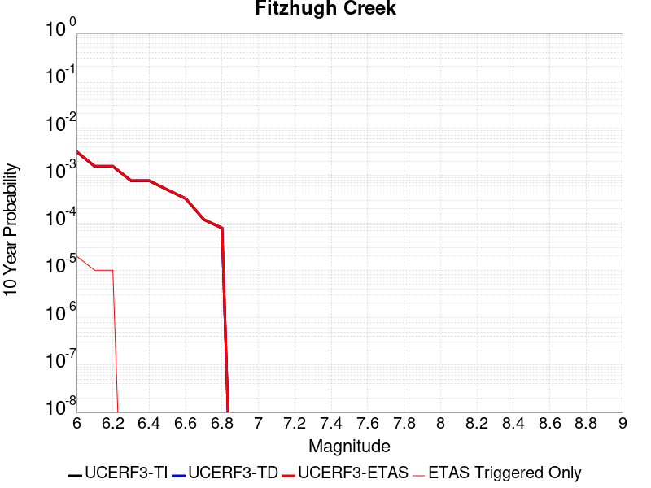 |

| Magnitude | 1 wk TI Prob | 1 wk TD Prob | 1 wk ETAS Prob | 1 wk ETAS/TD Gain | 1 wk ETAS Triggered Only | 1 mo TI Prob | 1 mo TD Prob | 1 mo ETAS Prob | 1 mo ETAS/TD Gain | 1 mo ETAS Triggered Only | 1 yr TI Prob | 1 yr TD Prob | 1 yr ETAS Prob | 1 yr ETAS/TD Gain | 1 yr ETAS Triggered Only | 10 yr TI Prob | 10 yr TD Prob | 10 yr ETAS Prob | 10 yr ETAS/TD Gain | 10 yr ETAS Triggered Only |
|-----|-----|-----|-----|-----|-----|-----|-----|-----|-----|-----|-----|-----|-----|-----|-----|-----|-----|-----|-----|-----|
| 6.0 | 6.1090436E-6 | 6.2101562E-6 | 6.2101562E-6 | 1.0 | 0.0 | 2.6181353E-5 | 2.6614709E-5 | 2.6614709E-5 | 1.0 | 0.0 | 3.1871133E-4 | 3.239904E-4 | 3.3398715E-4 | 1.0308551 | 1.0E-5 | 0.0031825465 | 0.0032356246 | 0.0032555598 | 1.0061612 | 2.0E-5 |
| 6.1 | 2.9741811E-6 | 3.021581E-6 | 3.021581E-6 | 1.0 | 0.0 | 1.2746428E-5 | 1.2949574E-5 | 1.2949574E-5 | 1.0 | 0.0 | 1.5517672E-4 | 1.576506E-4 | 1.576506E-4 | 1.0 | 0.0 | 0.001550684 | 0.0015754806 | 0.0015854648 | 1.0063373 | 1.0E-5 |
| 6.2 | 2.9741811E-6 | 3.021581E-6 | 3.021581E-6 | 1.0 | 0.0 | 1.2746428E-5 | 1.2949574E-5 | 1.2949574E-5 | 1.0 | 0.0 | 1.5517672E-4 | 1.576506E-4 | 1.576506E-4 | 1.0 | 0.0 | 0.001550684 | 0.0015754806 | 0.0015854648 | 1.0063373 | 1.0E-5 |
| 6.3 | 1.4781198E-6 | 1.5012708E-6 | 1.5012708E-6 | 1.0 | 0.0 | 6.3347834E-6 | 6.4340034E-6 | 6.4340034E-6 | 1.0 | 0.0 | 7.712326E-5 | 7.833137E-5 | 7.833137E-5 | 1.0 | 0.0 | 7.70965E-4 | 7.830576E-4 | 7.830576E-4 | 1.0 | 0.0 |
| 6.4 | 1.4781198E-6 | 1.5012708E-6 | 1.5012708E-6 | 1.0 | 0.0 | 6.3347834E-6 | 6.4340034E-6 | 6.4340034E-6 | 1.0 | 0.0 | 7.712326E-5 | 7.833137E-5 | 7.833137E-5 | 1.0 | 0.0 | 7.70965E-4 | 7.830576E-4 | 7.830576E-4 | 1.0 | 0.0 |
| 6.5 | 9.5176676E-7 | 9.66606E-7 | 9.66606E-7 | 1.0 | 0.0 | 4.078994E-6 | 4.142591E-6 | 4.142591E-6 | 1.0 | 0.0 | 4.9660623E-5 | 5.0434985E-5 | 5.0434985E-5 | 1.0 | 0.0 | 4.964952E-4 | 5.042458E-4 | 5.042458E-4 | 1.0 | 0.0 |
| 6.6 | 6.21145E-7 | 6.3085855E-7 | 6.3085855E-7 | 1.0 | 0.0 | 2.662047E-6 | 2.7036772E-6 | 2.7036772E-6 | 1.0 | 0.0 | 3.2409942E-5 | 3.291684E-5 | 3.291684E-5 | 1.0 | 0.0 | 3.2405215E-4 | 3.2912623E-4 | 3.2912623E-4 | 1.0 | 0.0 |
| 6.7 | 2.2377962E-7 | 2.2734636E-7 | 2.2734636E-7 | 1.0 | 0.0 | 9.590551E-7 | 9.743413E-7 | 9.743413E-7 | 1.0 | 0.0 | 1.1676434E-5 | 1.1862574E-5 | 1.1862574E-5 | 1.0 | 0.0 | 1.1675821E-4 | 1.1862254E-4 | 1.1862254E-4 | 1.0 | 0.0 |
| 6.8 | 1.4785022E-7 | 1.5021492E-7 | 1.5021492E-7 | 1.0 | 0.0 | 6.3364365E-7 | 6.4377826E-7 | 6.4377826E-7 | 1.0 | 0.0 | 7.714584E-6 | 7.838E-6 | 7.838E-6 | 1.0 | 0.0 | 7.714316E-5 | 7.838E-5 | 7.838E-5 | 1.0 | 0.0 |

## Earthquake Valley (So Extension)
*[(top)](#table-of-contents)*

| 1 Week | 1 Month | 1 Year | 10 Year |
|-----|-----|-----|-----|
| 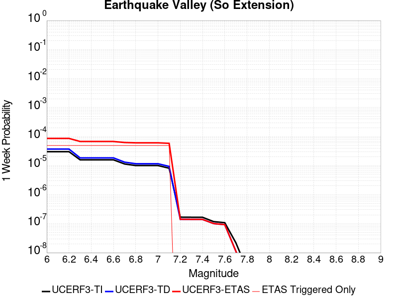 | 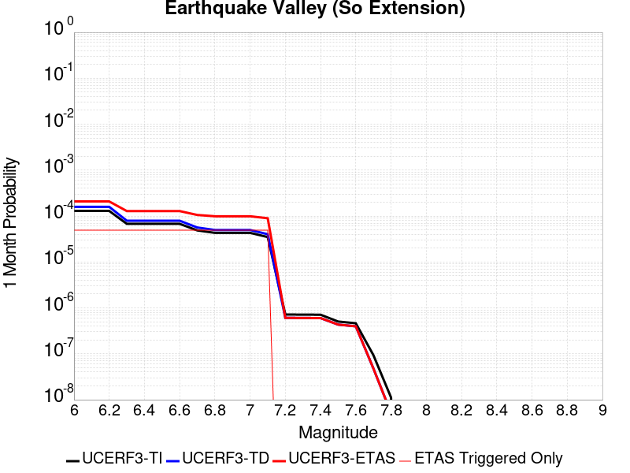 | 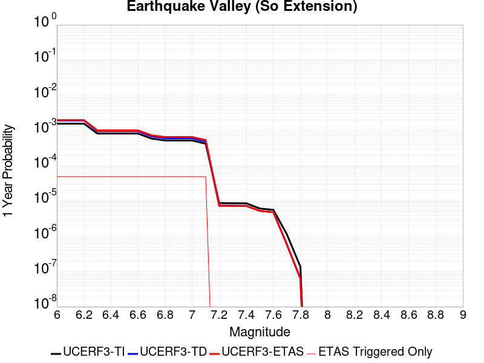 | 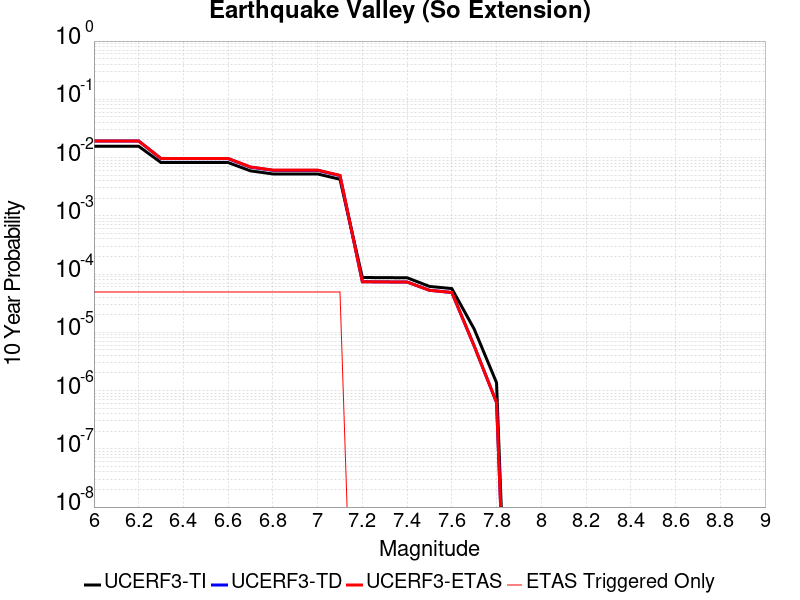 |

| Magnitude | 1 wk TI Prob | 1 wk TD Prob | 1 wk ETAS Prob | 1 wk ETAS/TD Gain | 1 wk ETAS Triggered Only | 1 mo TI Prob | 1 mo TD Prob | 1 mo ETAS Prob | 1 mo ETAS/TD Gain | 1 mo ETAS Triggered Only | 1 yr TI Prob | 1 yr TD Prob | 1 yr ETAS Prob | 1 yr ETAS/TD Gain | 1 yr ETAS Triggered Only | 10 yr TI Prob | 10 yr TD Prob | 10 yr ETAS Prob | 10 yr ETAS/TD Gain | 10 yr ETAS Triggered Only |
|-----|-----|-----|-----|-----|-----|-----|-----|-----|-----|-----|-----|-----|-----|-----|-----|-----|-----|-----|-----|-----|
| 6.0 | 3.0194888E-5 | 3.707208E-5 | 4.707171E-5 | 1.2697347 | 1.0E-5 | 1.2940024E-4 | 1.5887374E-4 | 1.6887215E-4 | 1.0629331 | 1.0E-5 | 0.0015743093 | 0.0019330877 | 0.0019430685 | 1.0051631 | 1.0E-5 | 0.01563203 | 0.0192131 | 0.019232718 | 1.0010209 | 2.0E-5 |
| 6.1 | 3.0194888E-5 | 3.707208E-5 | 4.707171E-5 | 1.2697347 | 1.0E-5 | 1.2940024E-4 | 1.5887374E-4 | 1.6887215E-4 | 1.0629331 | 1.0E-5 | 0.0015743093 | 0.0019330877 | 0.0019430685 | 1.0051631 | 1.0E-5 | 0.01563203 | 0.0192131 | 0.019232718 | 1.0010209 | 2.0E-5 |
| 6.2 | 3.0194888E-5 | 3.707208E-5 | 4.707171E-5 | 1.2697347 | 1.0E-5 | 1.2940024E-4 | 1.5887374E-4 | 1.6887215E-4 | 1.0629331 | 1.0E-5 | 0.0015743093 | 0.0019330877 | 0.0019430685 | 1.0051631 | 1.0E-5 | 0.01563203 | 0.0192131 | 0.019232718 | 1.0010209 | 2.0E-5 |
| 6.3 | 1.5795305E-5 | 1.8446612E-5 | 2.8446428E-5 | 1.542095 | 1.0E-5 | 6.769241E-5 | 7.905514E-5 | 8.905435E-5 | 1.126484 | 1.0E-5 | 8.238434E-4 | 9.621823E-4 | 9.721727E-4 | 1.010383 | 1.0E-5 | 0.008207959 | 0.0095910635 | 0.009610872 | 1.0020653 | 2.0E-5 |
| 6.4 | 1.5795305E-5 | 1.8446612E-5 | 2.8446428E-5 | 1.542095 | 1.0E-5 | 6.769241E-5 | 7.905514E-5 | 8.905435E-5 | 1.126484 | 1.0E-5 | 8.238434E-4 | 9.621823E-4 | 9.721727E-4 | 1.010383 | 1.0E-5 | 0.008207959 | 0.0095910635 | 0.009610872 | 1.0020653 | 2.0E-5 |
| 6.5 | 1.5795305E-5 | 1.8446612E-5 | 2.8446428E-5 | 1.542095 | 1.0E-5 | 6.769241E-5 | 7.905514E-5 | 8.905435E-5 | 1.126484 | 1.0E-5 | 8.238434E-4 | 9.621823E-4 | 9.721727E-4 | 1.010383 | 1.0E-5 | 0.008207959 | 0.0095910635 | 0.009610872 | 1.0020653 | 2.0E-5 |
| 6.6 | 1.5795305E-5 | 1.8446612E-5 | 2.8446428E-5 | 1.542095 | 1.0E-5 | 6.769241E-5 | 7.905514E-5 | 8.905435E-5 | 1.126484 | 1.0E-5 | 8.238434E-4 | 9.621823E-4 | 9.721727E-4 | 1.010383 | 1.0E-5 | 0.008207959 | 0.0095910635 | 0.009610872 | 1.0020653 | 2.0E-5 |
| 6.7 | 1.1363076E-5 | 1.3138288E-5 | 2.3138156E-5 | 1.7611241 | 1.0E-5 | 4.8697988E-5 | 5.6306162E-5 | 6.63056E-5 | 1.1775905 | 1.0E-5 | 5.927367E-4 | 6.8538805E-4 | 6.953812E-4 | 1.0145802 | 1.0E-5 | 0.0059115817 | 0.006840215 | 0.0068600783 | 1.0029039 | 2.0E-5 |
| 6.8 | 1.0049611E-5 | 1.1594328E-5 | 2.1594211E-5 | 1.8624808 | 1.0E-5 | 4.306905E-5 | 4.968944E-5 | 5.9688944E-5 | 1.20124 | 1.0E-5 | 5.242395E-4 | 6.0487416E-4 | 6.148681E-4 | 1.0165224 | 1.0E-5 | 0.0052300454 | 0.0060394546 | 0.006059334 | 1.0032916 | 2.0E-5 |
| 6.9 | 1.0049611E-5 | 1.1594328E-5 | 2.1594211E-5 | 1.8624808 | 1.0E-5 | 4.306905E-5 | 4.968944E-5 | 5.9688944E-5 | 1.20124 | 1.0E-5 | 5.242395E-4 | 6.0487416E-4 | 6.148681E-4 | 1.0165224 | 1.0E-5 | 0.0052300454 | 0.0060394546 | 0.006059334 | 1.0032916 | 2.0E-5 |
| 7.0 | 1.0049611E-5 | 1.1594328E-5 | 2.1594211E-5 | 1.8624808 | 1.0E-5 | 4.306905E-5 | 4.968944E-5 | 5.9688944E-5 | 1.20124 | 1.0E-5 | 5.242395E-4 | 6.0487416E-4 | 6.148681E-4 | 1.0165224 | 1.0E-5 | 0.0052300454 | 0.0060394546 | 0.006059334 | 1.0032916 | 2.0E-5 |
| 7.1 | 8.140254E-6 | 9.3834515E-6 | 1.9383357E-5 | 2.065696 | 1.0E-5 | 3.4886336E-5 | 4.021455E-5 | 5.021415E-5 | 1.2486563 | 1.0E-5 | 4.2465836E-4 | 4.895692E-4 | 4.9956434E-4 | 1.0204161 | 1.0E-5 | 0.0042384774 | 0.004891483 | 0.0049113855 | 1.0040687 | 2.0E-5 |
| 7.2 | 1.673835E-7 | 1.4153493E-7 | 1.4153493E-7 | 1.0 | 0.0 | 7.173577E-7 | 6.065781E-7 | 6.065781E-7 | 1.0 | 0.0 | 8.733795E-6 | 7.3850674E-6 | 7.3850674E-6 | 1.0 | 0.0 | 8.733451E-5 | 7.3848576E-5 | 7.3848576E-5 | 1.0 | 0.0 |
| 7.3 | 1.6632116E-7 | 1.4051723E-7 | 1.4051723E-7 | 1.0 | 0.0 | 7.1280476E-7 | 6.022166E-7 | 6.022166E-7 | 1.0 | 0.0 | 8.678364E-6 | 7.331966E-6 | 7.331966E-6 | 1.0 | 0.0 | 8.6780245E-5 | 7.33176E-5 | 7.33176E-5 | 1.0 | 0.0 |
| 7.4 | 1.6569169E-7 | 1.3996352E-7 | 1.3996352E-7 | 1.0 | 0.0 | 7.1010703E-7 | 5.9984353E-7 | 5.9984353E-7 | 1.0 | 0.0 | 8.645519E-6 | 7.303074E-6 | 7.303074E-6 | 1.0 | 0.0 | 8.645182E-5 | 7.30287E-5 | 7.30287E-5 | 1.0 | 0.0 |
| 7.5 | 1.1764555E-7 | 1.0095245E-7 | 1.0095245E-7 | 1.0 | 0.0 | 5.041951E-7 | 4.3265328E-7 | 4.3265328E-7 | 1.0 | 0.0 | 6.138558E-6 | 5.267543E-6 | 5.267543E-6 | 1.0 | 0.0 | 6.1383886E-5 | 5.2674397E-5 | 5.2674397E-5 | 1.0 | 0.0 |
| 7.6 | 1.07927605E-7 | 9.2600665E-8 | 9.2600665E-8 | 1.0 | 0.0 | 4.6254678E-7 | 3.9685995E-7 | 3.9685995E-7 | 1.0 | 0.0 | 5.6314925E-6 | 4.8317615E-6 | 4.8317615E-6 | 1.0 | 0.0 | 5.63135E-5 | 4.831677E-5 | 4.831677E-5 | 1.0 | 0.0 |
| 7.7 | 2.1826905E-8 | 1.1179958E-8 | 1.1179958E-8 | 1.0 | 0.0 | 9.3543875E-8 | 4.791411E-8 | 4.791411E-8 | 1.0 | 0.0 | 1.1388961E-6 | 5.8335416E-7 | 5.8335416E-7 | 1.0 | 0.0 | 1.1388902E-5 | 5.8335318E-6 | 5.8335318E-6 | 1.0 | 0.0 |
| 7.8 | 2.6169649E-9 | 1.1968753E-9 | 1.1968753E-9 | 1.0 | 0.0 | 1.1215564E-8 | 5.1294657E-9 | 5.1294657E-9 | 1.0 | 0.0 | 1.3654947E-7 | 6.245124E-8 | 6.245124E-8 | 1.0 | 0.0 | 1.365494E-6 | 6.2451244E-7 | 6.2451244E-7 | 1.0 | 0.0 |

## Calaveras (Central) 2011 CFM
*[(top)](#table-of-contents)*

| 1 Week | 1 Month | 1 Year | 10 Year |
|-----|-----|-----|-----|
| 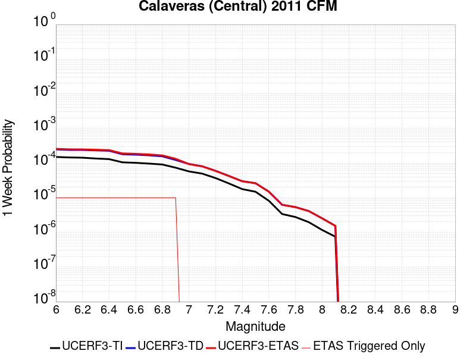 | 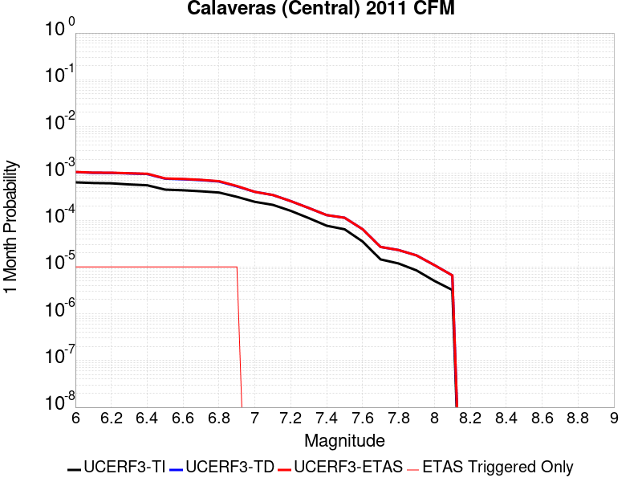 | 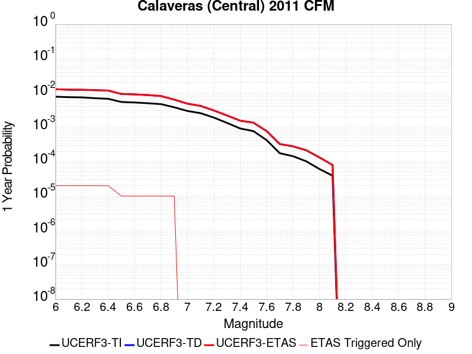 | 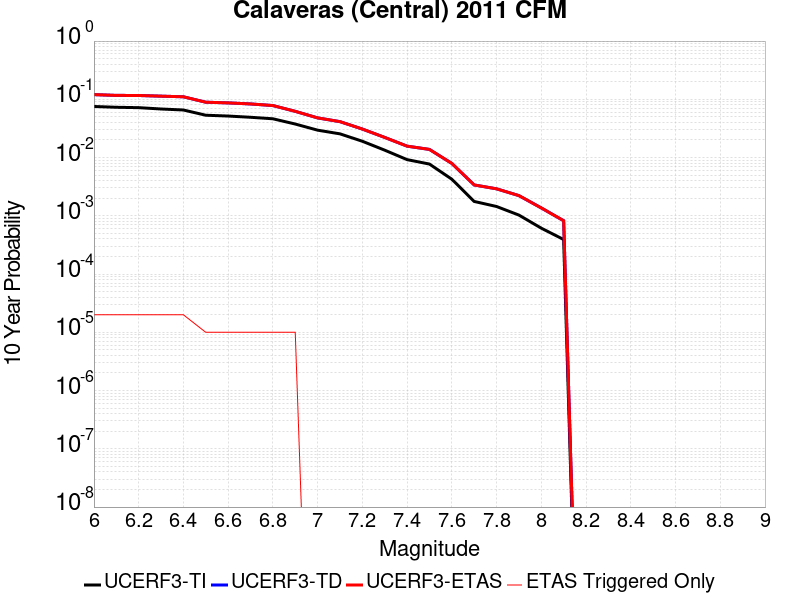 |

| Magnitude | 1 wk TI Prob | 1 wk TD Prob | 1 wk ETAS Prob | 1 wk ETAS/TD Gain | 1 wk ETAS Triggered Only | 1 mo TI Prob | 1 mo TD Prob | 1 mo ETAS Prob | 1 mo ETAS/TD Gain | 1 mo ETAS Triggered Only | 1 yr TI Prob | 1 yr TD Prob | 1 yr ETAS Prob | 1 yr ETAS/TD Gain | 1 yr ETAS Triggered Only | 10 yr TI Prob | 10 yr TD Prob | 10 yr ETAS Prob | 10 yr ETAS/TD Gain | 10 yr ETAS Triggered Only |
|-----|-----|-----|-----|-----|-----|-----|-----|-----|-----|-----|-----|-----|-----|-----|-----|-----|-----|-----|-----|-----|
| 6.0 | 1.5010907E-4 | 2.4804124E-4 | 2.5803875E-4 | 1.0403059 | 1.0E-5 | 6.4316596E-4 | 0.001062498 | 0.0010724873 | 1.0094018 | 1.0E-5 | 0.0078024664 | 0.012850443 | 0.012870186 | 1.0015364 | 2.0E-5 | 0.07534136 | 0.120411225 | 0.120428815 | 1.0001462 | 2.0E-5 |
| 6.1 | 1.4521465E-4 | 2.3965565E-4 | 2.4965324E-4 | 1.0417166 | 1.0E-5 | 6.222001E-4 | 0.0010265942 | 0.0010365839 | 1.0097309 | 1.0E-5 | 0.0075490056 | 0.012419763 | 0.0124395145 | 1.0015904 | 2.0E-5 | 0.07297657 | 0.11668273 | 0.116700396 | 1.0001514 | 2.0E-5 |
| 6.2 | 1.429998E-4 | 2.3896809E-4 | 2.489657E-4 | 1.0418366 | 1.0E-5 | 6.127123E-4 | 0.0010236499 | 0.0010336398 | 1.009759 | 1.0E-5 | 0.007434286 | 0.012384372 | 0.012404124 | 1.0015949 | 2.0E-5 | 0.07190444 | 0.11633677 | 0.11635444 | 1.0001519 | 2.0E-5 |
| 6.3 | 1.3536277E-4 | 2.3227946E-4 | 2.4227714E-4 | 1.0430416 | 1.0E-5 | 5.799972E-4 | 9.950127E-4 | 0.0010050028 | 1.0100402 | 1.0E-5 | 0.0070386264 | 0.012040534 | 0.012060293 | 1.001641 | 2.0E-5 | 0.0681982 | 0.113249525 | 0.11326726 | 1.0001566 | 2.0E-5 |
| 6.4 | 1.2993296E-4 | 2.2651516E-4 | 2.3651289E-4 | 1.0441371 | 1.0E-5 | 5.5673666E-4 | 9.703276E-4 | 9.803178E-4 | 1.0102957 | 1.0E-5 | 0.006757223 | 0.011743338 | 0.011763102 | 1.0016831 | 2.0E-5 | 0.06555412 | 0.11052752 | 0.110545315 | 1.0001609 | 2.0E-5 |
| 6.5 | 1.0498927E-4 | 1.7981966E-4 | 1.8981787E-4 | 1.0556012 | 1.0E-5 | 4.498764E-4 | 7.7042676E-4 | 7.8041904E-4 | 1.0129699 | 1.0E-5 | 0.005463498 | 0.00933952 | 0.009349426 | 1.0010607 | 1.0E-5 | 0.053311124 | 0.08920739 | 0.08921649 | 1.000102 | 1.0E-5 |
| 6.6 | 1.0157505E-4 | 1.7469494E-4 | 1.8469318E-4 | 1.0572326 | 1.0E-5 | 4.35249E-4 | 7.4847665E-4 | 7.5846916E-4 | 1.0133505 | 1.0E-5 | 0.0052862884 | 0.009074567 | 0.009084476 | 1.001092 | 1.0E-5 | 0.05162293 | 0.08678487 | 0.086794004 | 1.0001053 | 1.0E-5 |
| 6.7 | 9.660386E-5 | 1.6728783E-4 | 1.7728616E-4 | 1.0597672 | 1.0E-5 | 4.1395082E-4 | 7.167497E-4 | 7.267425E-4 | 1.0139419 | 1.0E-5 | 0.0050282106 | 0.008691474 | 0.008701387 | 1.0011406 | 1.0E-5 | 0.049159497 | 0.08327401 | 0.08328317 | 1.00011 | 1.0E-5 |
| 6.8 | 9.089927E-5 | 1.5643238E-4 | 1.6643082E-4 | 1.0639154 | 1.0E-5 | 3.8951015E-4 | 6.702511E-4 | 6.802444E-4 | 1.0149097 | 1.0E-5 | 0.0047319788 | 0.008129742 | 0.008139661 | 1.0012201 | 1.0E-5 | 0.046324775 | 0.078163 | 0.07817222 | 1.0001179 | 1.0E-5 |
| 6.9 | 7.353187E-5 | 1.2295779E-4 | 1.3295656E-4 | 1.0813187 | 1.0E-5 | 3.150985E-4 | 5.2685605E-4 | 5.368508E-4 | 1.0189705 | 1.0E-5 | 0.0038295772 | 0.006395728 | 0.0064056637 | 1.0015535 | 1.0E-5 | 0.037642512 | 0.06218928 | 0.062198658 | 1.0001508 | 1.0E-5 |
| 7.0 | 5.746064E-5 | 9.3890936E-5 | 9.3890936E-5 | 1.0 | 0.0 | 2.4623662E-4 | 4.0232803E-4 | 4.0232803E-4 | 1.0 | 0.0 | 0.0029938098 | 0.0048874132 | 0.0048874132 | 1.0 | 0.0 | 0.02953797 | 0.04798713 | 0.04798713 | 1.0 | 0.0 |
| 7.1 | 4.9557195E-5 | 8.052768E-5 | 8.052768E-5 | 1.0 | 0.0 | 2.123707E-4 | 3.4507332E-4 | 3.4507332E-4 | 1.0 | 0.0 | 0.0025825473 | 0.004193237 | 0.004193237 | 1.0 | 0.0 | 0.0255274 | 0.041373473 | 0.041373473 | 1.0 | 0.0 |
| 7.2 | 3.687595E-5 | 5.952694E-5 | 5.952694E-5 | 1.0 | 0.0 | 1.5803022E-4 | 2.5509068E-4 | 2.5509068E-4 | 1.0 | 0.0 | 0.0019223199 | 0.003101335 | 0.003101335 | 1.0 | 0.0 | 0.01905776 | 0.030883823 | 0.030883823 | 1.0 | 0.0 |
| 7.3 | 2.5846984E-5 | 4.2473923E-5 | 4.2473923E-5 | 1.0 | 0.0 | 1.1076809E-4 | 1.820185E-4 | 1.820185E-4 | 1.0 | 0.0 | 0.0013477671 | 0.0022138404 | 0.0022138404 | 1.0 | 0.0 | 0.013396223 | 0.022175217 | 0.022175217 | 1.0 | 0.0 |
| 7.4 | 1.7747854E-5 | 2.993759E-5 | 2.993759E-5 | 1.0 | 0.0 | 7.6060016E-5 | 1.2829766E-4 | 1.2829766E-4 | 1.0 | 0.0 | 9.2563726E-4 | 0.0015609078 | 0.0015609078 | 1.0 | 0.0 | 0.009217911 | 0.015708687 | 0.015708687 | 1.0 | 0.0 |
| 7.5 | 1.4883479E-5 | 2.6244672E-5 | 2.6244672E-5 | 1.0 | 0.0 | 6.378478E-5 | 1.12472335E-4 | 1.12472335E-4 | 1.0 | 0.0 | 7.76303E-4 | 0.0013684932 | 0.0013684932 | 1.0 | 0.0 | 0.0077359667 | 0.013801667 | 0.013801667 | 1.0 | 0.0 |
| 7.6 | 8.166975E-6 | 1.4964299E-5 | 1.4964299E-5 | 1.0 | 0.0 | 3.5000852E-5 | 6.413114E-5 | 6.413114E-5 | 1.0 | 0.0 | 4.2605202E-4 | 7.805183E-4 | 7.805183E-4 | 1.0 | 0.0 | 0.004252361 | 0.007939203 | 0.007939203 | 1.0 | 0.0 |
| 7.7 | 3.3858064E-6 | 6.254251E-6 | 6.254251E-6 | 1.0 | 0.0 | 1.4510518E-5 | 2.6803657E-5 | 2.6803657E-5 | 1.0 | 0.0 | 1.7665124E-4 | 3.2628572E-4 | 3.2628572E-4 | 1.0 | 0.0 | 0.0017651088 | 0.003388363 | 0.003388363 | 1.0 | 0.0 |
| 7.8 | 2.7721615E-6 | 5.366695E-6 | 5.366695E-6 | 1.0 | 0.0 | 1.1880637E-5 | 2.2999919E-5 | 2.2999919E-5 | 1.0 | 0.0 | 1.4463716E-4 | 2.7998807E-4 | 2.7998807E-4 | 1.0 | 0.0 | 0.0014454306 | 0.002907615 | 0.002907615 | 1.0 | 0.0 |
| 7.9 | 1.9736292E-6 | 4.128705E-6 | 4.128705E-6 | 1.0 | 0.0 | 8.4583835E-6 | 1.769433E-5 | 1.769433E-5 | 1.0 | 0.0 | 1.0297595E-4 | 2.1540721E-4 | 2.1540721E-4 | 1.0 | 0.0 | 0.0010292825 | 0.0022237299 | 0.0022237299 | 1.0 | 0.0 |
| 8.0 | 1.1767289E-6 | 2.5546633E-6 | 2.5546633E-6 | 1.0 | 0.0 | 5.0431145E-6 | 1.0948511E-5 | 1.0948511E-5 | 1.0 | 0.0 | 6.139818E-5 | 1.3329E-4 | 1.3329E-4 | 1.0 | 0.0 | 6.1381224E-4 | 0.001366126 | 0.001366126 | 1.0 | 0.0 |
| 8.1 | 7.5112825E-7 | 1.541076E-6 | 1.541076E-6 | 1.0 | 0.0 | 3.2191172E-6 | 6.604595E-6 | 6.604595E-6 | 1.0 | 0.0 | 3.9192048E-5 | 8.0408E-5 | 8.0408E-5 | 1.0 | 0.0 | 3.9185135E-4 | 8.2356273E-4 | 8.2356273E-4 | 1.0 | 0.0 |

## Concord 2011 CFM
*[(top)](#table-of-contents)*

| 1 Week | 1 Month | 1 Year | 10 Year |
|-----|-----|-----|-----|
|  | 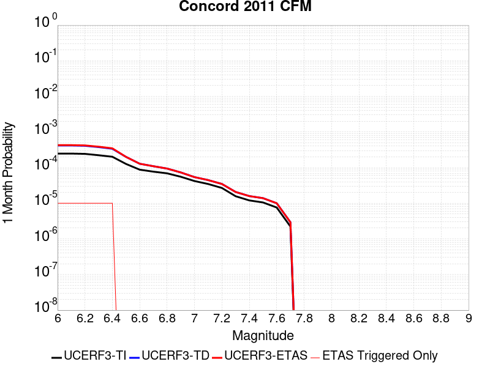 | 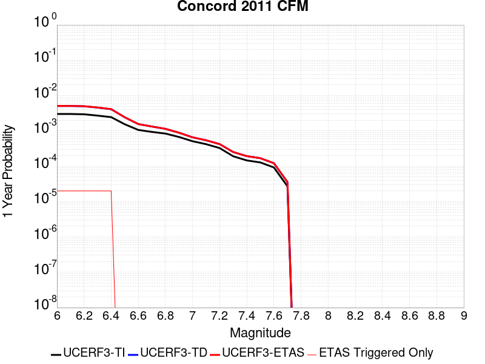 | 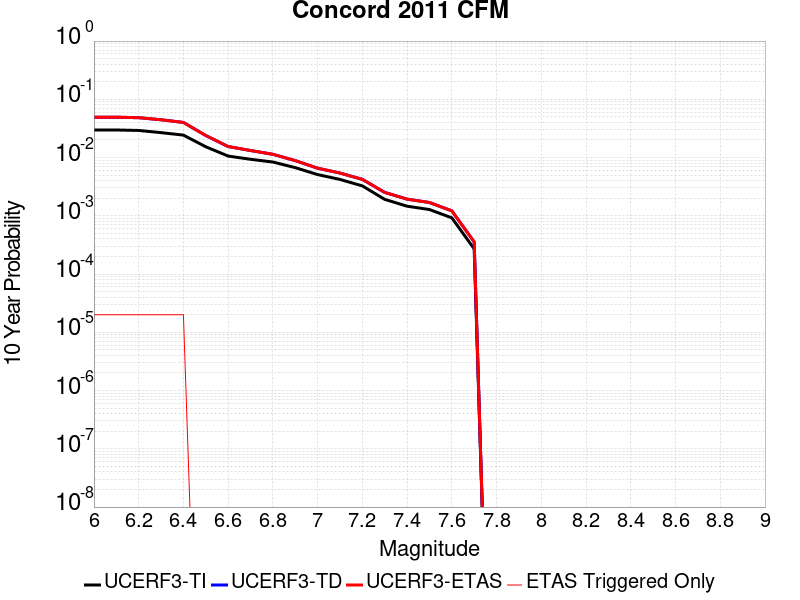 |

| Magnitude | 1 wk TI Prob | 1 wk TD Prob | 1 wk ETAS Prob | 1 wk ETAS/TD Gain | 1 wk ETAS Triggered Only | 1 mo TI Prob | 1 mo TD Prob | 1 mo ETAS Prob | 1 mo ETAS/TD Gain | 1 mo ETAS Triggered Only | 1 yr TI Prob | 1 yr TD Prob | 1 yr ETAS Prob | 1 yr ETAS/TD Gain | 1 yr ETAS Triggered Only | 10 yr TI Prob | 10 yr TD Prob | 10 yr ETAS Prob | 10 yr ETAS/TD Gain | 10 yr ETAS Triggered Only |
|-----|-----|-----|-----|-----|-----|-----|-----|-----|-----|-----|-----|-----|-----|-----|-----|-----|-----|-----|-----|-----|
| 6.0 | 5.7865112E-5 | 9.7585355E-5 | 9.7585355E-5 | 1.0 | 0.0 | 2.4796976E-4 | 4.181607E-4 | 4.281565E-4 | 1.0239042 | 1.0E-5 | 0.0030148525 | 0.005079743 | 0.0050996416 | 1.0039172 | 2.0E-5 | 0.029742775 | 0.049266078 | 0.04928509 | 1.000386 | 2.0E-5 |
| 6.1 | 5.7865112E-5 | 9.7585355E-5 | 9.7585355E-5 | 1.0 | 0.0 | 2.4796976E-4 | 4.181607E-4 | 4.281565E-4 | 1.0239042 | 1.0E-5 | 0.0030148525 | 0.005079743 | 0.0050996416 | 1.0039172 | 2.0E-5 | 0.029742775 | 0.049266078 | 0.04928509 | 1.000386 | 2.0E-5 |
| 6.2 | 5.6789337E-5 | 9.578793E-5 | 9.578793E-5 | 1.0 | 0.0 | 2.4336016E-4 | 4.1045985E-4 | 4.2045576E-4 | 1.0243529 | 1.0E-5 | 0.0029588845 | 0.0049864696 | 0.0050063697 | 1.0039909 | 2.0E-5 | 0.029197963 | 0.04838257 | 0.0484016 | 1.0003934 | 2.0E-5 |
| 6.3 | 5.203322E-5 | 8.803241E-5 | 8.803241E-5 | 1.0 | 0.0 | 2.2298045E-4 | 3.772316E-4 | 3.872278E-4 | 1.0264989 | 1.0E-5 | 0.0027114071 | 0.0045839064 | 0.004603815 | 1.004343 | 2.0E-5 | 0.026785625 | 0.04455397 | 0.044573076 | 1.0004289 | 2.0E-5 |
| 6.4 | 4.7120942E-5 | 7.897583E-5 | 7.897583E-5 | 1.0 | 0.0 | 2.0193127E-4 | 3.3842813E-4 | 3.4842474E-4 | 1.0295384 | 1.0E-5 | 0.0024557412 | 0.004113323 | 0.004133241 | 1.0048423 | 2.0E-5 | 0.024287801 | 0.040080756 | 0.040099956 | 1.000479 | 2.0E-5 |
| 6.5 | 2.9598437E-5 | 4.6675777E-5 | 4.6675777E-5 | 1.0 | 0.0 | 1.2684427E-4 | 2.000249E-4 | 2.000249E-4 | 1.0 | 0.0 | 0.001543235 | 0.0024327936 | 0.0024327936 | 1.0 | 0.0 | 0.015325619 | 0.023909668 | 0.023909668 | 1.0 | 0.0 |
| 6.6 | 2.0443718E-5 | 2.9984873E-5 | 2.9984873E-5 | 1.0 | 0.0 | 8.7613E-5 | 1.2850047E-4 | 1.2850047E-4 | 1.0 | 0.0 | 0.0010661662 | 0.0015634067 | 0.0015634067 | 1.0 | 0.0 | 0.010610655 | 0.0154669015 | 0.0154669015 | 1.0 | 0.0 |
| 6.7 | 1.798539E-5 | 2.5557883E-5 | 2.5557883E-5 | 1.0 | 0.0 | 7.7077966E-5 | 1.0952931E-4 | 1.0952931E-4 | 1.0 | 0.0 | 9.380202E-4 | 0.0013327252 | 0.0013327252 | 1.0 | 0.0 | 0.009340706 | 0.013217516 | 0.013217516 | 1.0 | 0.0 |
| 6.8 | 1.613555E-5 | 2.1959608E-5 | 2.1959608E-5 | 1.0 | 0.0 | 6.915052E-5 | 9.4109295E-5 | 9.4109295E-5 | 1.0 | 0.0 | 8.4158237E-4 | 0.0011451923 | 0.0011451923 | 1.0 | 0.0 | 0.008384023 | 0.011378321 | 0.011378321 | 1.0 | 0.0 |
| 6.9 | 1.2916435E-5 | 1.708134E-5 | 1.708134E-5 | 1.0 | 0.0 | 5.5354973E-5 | 7.320372E-5 | 7.320372E-5 | 1.0 | 0.0 | 6.7373837E-4 | 8.908967E-4 | 8.908967E-4 | 1.0 | 0.0 | 0.006716994 | 0.008867833 | 0.008867833 | 1.0 | 0.0 |
| 7.0 | 9.81129E-6 | 1.2631038E-5 | 1.2631038E-5 | 1.0 | 0.0 | 4.2047708E-5 | 5.4131906E-5 | 5.4131906E-5 | 1.0 | 0.0 | 5.118106E-4 | 6.588583E-4 | 6.588583E-4 | 1.0 | 0.0 | 0.005106334 | 0.0065697595 | 0.0065697595 | 1.0 | 0.0 |
| 7.1 | 8.0889195E-6 | 1.04184555E-5 | 1.04184555E-5 | 1.0 | 0.0 | 3.4666336E-5 | 4.4649765E-5 | 4.4649765E-5 | 1.0 | 0.0 | 4.219809E-4 | 5.434764E-4 | 5.434764E-4 | 1.0 | 0.0 | 0.004211805 | 0.0054219896 | 0.0054219896 | 1.0 | 0.0 |
| 7.2 | 6.267438E-6 | 8.115879E-6 | 8.115879E-6 | 1.0 | 0.0 | 2.6860173E-5 | 3.478188E-5 | 3.478188E-5 | 1.0 | 0.0 | 3.2697353E-4 | 4.2338783E-4 | 4.2338783E-4 | 1.0 | 0.0 | 0.0032649285 | 0.004226169 | 0.004226169 | 1.0 | 0.0 |
| 7.3 | 3.6761196E-6 | 4.840281E-6 | 4.840281E-6 | 1.0 | 0.0 | 1.5754704E-5 | 2.0743897E-5 | 2.0743897E-5 | 1.0 | 0.0 | 1.9179663E-4 | 2.5252788E-4 | 2.5252788E-4 | 1.0 | 0.0 | 0.0019163118 | 0.0025226264 | 0.0025226264 | 1.0 | 0.0 |
| 7.4 | 2.8044356E-6 | 3.7096993E-6 | 3.7096993E-6 | 1.0 | 0.0 | 1.2018954E-5 | 1.5898615E-5 | 1.5898615E-5 | 1.0 | 0.0 | 1.4632095E-4 | 1.9354856E-4 | 1.9354856E-4 | 1.0 | 0.0 | 0.0014622464 | 0.0019340349 | 0.0019340349 | 1.0 | 0.0 |
| 7.5 | 2.4578699E-6 | 3.2448306E-6 | 3.2448306E-6 | 1.0 | 0.0 | 1.0533685E-5 | 1.3906343E-5 | 1.3906343E-5 | 1.0 | 0.0 | 1.2824008E-4 | 1.6929668E-4 | 1.6929668E-4 | 1.0 | 0.0 | 0.0012816609 | 0.0016918926 | 0.0016918926 | 1.0 | 0.0 |
| 7.6 | 1.7713267E-6 | 2.335189E-6 | 2.335189E-6 | 1.0 | 0.0 | 7.591378E-6 | 1.0007916E-5 | 1.0007916E-5 | 1.0 | 0.0 | 9.2421105E-5 | 1.2183965E-4 | 1.2183965E-4 | 1.0 | 0.0 | 9.2382677E-4 | 0.0012178655 | 0.0012178655 | 1.0 | 0.0 |
| 7.7 | 5.1912366E-7 | 6.829346E-7 | 6.829346E-7 | 1.0 | 0.0 | 2.2248137E-6 | 2.9268595E-6 | 2.9268595E-6 | 1.0 | 0.0 | 2.708677E-5 | 3.5633944E-5 | 3.5633944E-5 | 1.0 | 0.0 | 2.708347E-4 | 3.5630353E-4 | 3.5630353E-4 | 1.0 | 0.0 |

## Great Valley 03 Mysterious Ridge
*[(top)](#table-of-contents)*

| 1 Week | 1 Month | 1 Year | 10 Year |
|-----|-----|-----|-----|
| 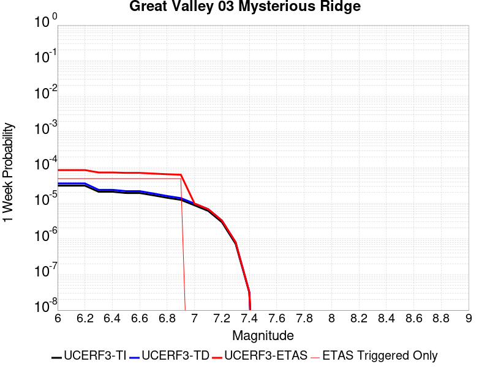 | 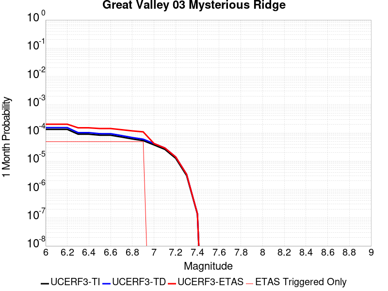 | 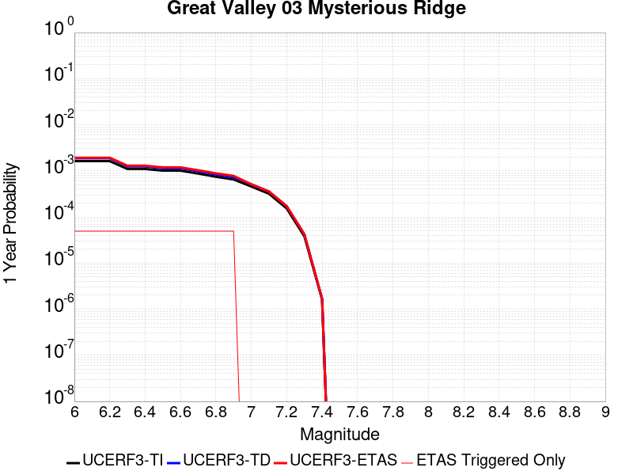 | 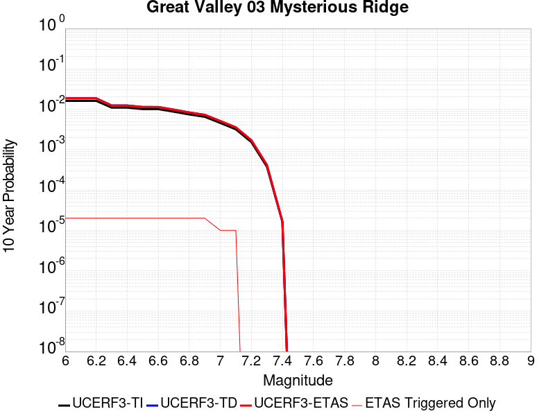 |

| Magnitude | 1 wk TI Prob | 1 wk TD Prob | 1 wk ETAS Prob | 1 wk ETAS/TD Gain | 1 wk ETAS Triggered Only | 1 mo TI Prob | 1 mo TD Prob | 1 mo ETAS Prob | 1 mo ETAS/TD Gain | 1 mo ETAS Triggered Only | 1 yr TI Prob | 1 yr TD Prob | 1 yr ETAS Prob | 1 yr ETAS/TD Gain | 1 yr ETAS Triggered Only | 10 yr TI Prob | 10 yr TD Prob | 10 yr ETAS Prob | 10 yr ETAS/TD Gain | 10 yr ETAS Triggered Only |
|-----|-----|-----|-----|-----|-----|-----|-----|-----|-----|-----|-----|-----|-----|-----|-----|-----|-----|-----|-----|-----|
| 6.0 | 3.1182444E-5 | 3.6034133E-5 | 4.6033772E-5 | 1.2775047 | 1.0E-5 | 1.336322E-4 | 1.5442389E-4 | 1.6442235E-4 | 1.0647469 | 1.0E-5 | 0.0016257578 | 0.0018786751 | 0.0018986375 | 1.0106258 | 2.0E-5 | 0.016139153 | 0.018646672 | 0.018666299 | 1.0010526 | 2.0E-5 |
| 6.1 | 3.1182444E-5 | 3.6034133E-5 | 4.6033772E-5 | 1.2775047 | 1.0E-5 | 1.336322E-4 | 1.5442389E-4 | 1.6442235E-4 | 1.0647469 | 1.0E-5 | 0.0016257578 | 0.0018786751 | 0.0018986375 | 1.0106258 | 2.0E-5 | 0.016139153 | 0.018646672 | 0.018666299 | 1.0010526 | 2.0E-5 |
| 6.2 | 3.1182444E-5 | 3.6034133E-5 | 4.6033772E-5 | 1.2775047 | 1.0E-5 | 1.336322E-4 | 1.5442389E-4 | 1.6442235E-4 | 1.0647469 | 1.0E-5 | 0.0016257578 | 0.0018786751 | 0.0018986375 | 1.0106258 | 2.0E-5 | 0.016139153 | 0.018646672 | 0.018666299 | 1.0010526 | 2.0E-5 |
| 6.3 | 2.106934E-5 | 2.3850303E-5 | 3.3850065E-5 | 1.4192718 | 1.0E-5 | 9.0294045E-5 | 1.0221176E-4 | 1.12210735E-4 | 1.0978261 | 1.0E-5 | 0.0010987755 | 0.0012437488 | 0.0012637239 | 1.0160605 | 2.0E-5 | 0.010933585 | 0.0123711275 | 0.01239088 | 1.0015967 | 2.0E-5 |
| 6.4 | 2.106934E-5 | 2.3850303E-5 | 3.3850065E-5 | 1.4192718 | 1.0E-5 | 9.0294045E-5 | 1.0221176E-4 | 1.12210735E-4 | 1.0978261 | 1.0E-5 | 0.0010987755 | 0.0012437488 | 0.0012637239 | 1.0160605 | 2.0E-5 | 0.010933585 | 0.0123711275 | 0.01239088 | 1.0015967 | 2.0E-5 |
| 6.5 | 1.9389783E-5 | 2.1884982E-5 | 3.1884763E-5 | 1.4569243 | 1.0E-5 | 8.309642E-5 | 9.378956E-5 | 1.03788625E-4 | 1.1066117 | 1.0E-5 | 0.0010112294 | 0.0011413175 | 0.0011612946 | 1.0175036 | 2.0E-5 | 0.010066401 | 0.011357434 | 0.011377207 | 1.0017409 | 2.0E-5 |
| 6.6 | 1.9370193E-5 | 2.1864902E-5 | 3.1864685E-5 | 1.4573439 | 1.0E-5 | 8.301247E-5 | 9.3703515E-5 | 1.0370258E-4 | 1.1067096 | 1.0E-5 | 0.0010102082 | 0.001140271 | 0.0011602482 | 1.0175197 | 2.0E-5 | 0.010056281 | 0.011347076 | 0.011366849 | 1.0017426 | 2.0E-5 |
| 6.7 | 1.6723505E-5 | 1.8799281E-5 | 2.8799093E-5 | 1.5319252 | 1.0E-5 | 7.16702E-5 | 8.056597E-5 | 9.056517E-5 | 1.1241119 | 1.0E-5 | 8.722353E-4 | 9.804688E-4 | 0.0010004492 | 1.0203784 | 2.0E-5 | 0.008688197 | 0.009763439 | 0.009783244 | 1.0020285 | 2.0E-5 |
| 6.8 | 1.426937E-5 | 1.599721E-5 | 2.599705E-5 | 1.6250991 | 1.0E-5 | 6.115301E-5 | 6.855775E-5 | 7.855707E-5 | 1.1458524 | 1.0E-5 | 7.4428355E-4 | 8.343854E-4 | 8.543687E-4 | 1.0239497 | 2.0E-5 | 0.007417957 | 0.008314005 | 0.008333839 | 1.0023856 | 2.0E-5 |
| 6.9 | 1.2469891E-5 | 1.3956928E-5 | 2.3956789E-5 | 1.71648 | 1.0E-5 | 5.3441294E-5 | 5.9814105E-5 | 6.9813505E-5 | 1.1671747 | 1.0E-5 | 6.504535E-4 | 7.280055E-4 | 7.479909E-4 | 1.0274523 | 2.0E-5 | 0.006485529 | 0.00725743 | 0.0072772847 | 1.0027359 | 2.0E-5 |
| 7.0 | 8.7746275E-6 | 9.791734E-6 | 9.791734E-6 | 1.0 | 0.0 | 3.7605005E-5 | 4.196394E-5 | 4.196394E-5 | 1.0 | 0.0 | 4.5774475E-4 | 5.1079853E-4 | 5.2079343E-4 | 1.0195671 | 1.0E-5 | 0.00456803 | 0.005096977 | 0.0051069264 | 1.0019519 | 1.0E-5 |
| 7.1 | 6.1067153E-6 | 6.813725E-6 | 6.813725E-6 | 1.0 | 0.0 | 2.6171374E-5 | 2.9201385E-5 | 2.9201385E-5 | 1.0 | 0.0 | 3.1858988E-4 | 3.5547445E-4 | 3.6547089E-4 | 1.0281215 | 1.0E-5 | 0.0031813353 | 0.003549609 | 0.0035595736 | 1.0028073 | 1.0E-5 |
| 7.2 | 2.939283E-6 | 3.2741057E-6 | 3.2741057E-6 | 1.0 | 0.0 | 1.2596866E-5 | 1.4031816E-5 | 1.4031816E-5 | 1.0 | 0.0 | 1.5335606E-4 | 1.7082572E-4 | 1.7082572E-4 | 1.0 | 0.0 | 0.0015325027 | 0.001707116 | 0.001707116 | 1.0 | 0.0 |
| 7.3 | 7.2387763E-7 | 8.008505E-7 | 8.008505E-7 | 1.0 | 0.0 | 3.102329E-6 | 3.4322145E-6 | 3.4322145E-6 | 1.0 | 0.0 | 3.77702E-5 | 4.178687E-5 | 4.178687E-5 | 1.0 | 0.0 | 3.7763783E-4 | 4.1783508E-4 | 4.1783508E-4 | 1.0 | 0.0 |
| 7.4 | 3.112171E-8 | 3.2068368E-8 | 3.2068368E-8 | 1.0 | 0.0 | 1.3337875E-7 | 1.3743585E-7 | 1.3743585E-7 | 1.0 | 0.0 | 1.6238852E-6 | 1.6732803E-6 | 1.6732803E-6 | 1.0 | 0.0 | 1.6238733E-5 | 1.6732685E-5 | 1.6732685E-5 | 1.0 | 0.0 |

## Elsinore (Temecula) rev
*[(top)](#table-of-contents)*

| 1 Week | 1 Month | 1 Year | 10 Year |
|-----|-----|-----|-----|
| 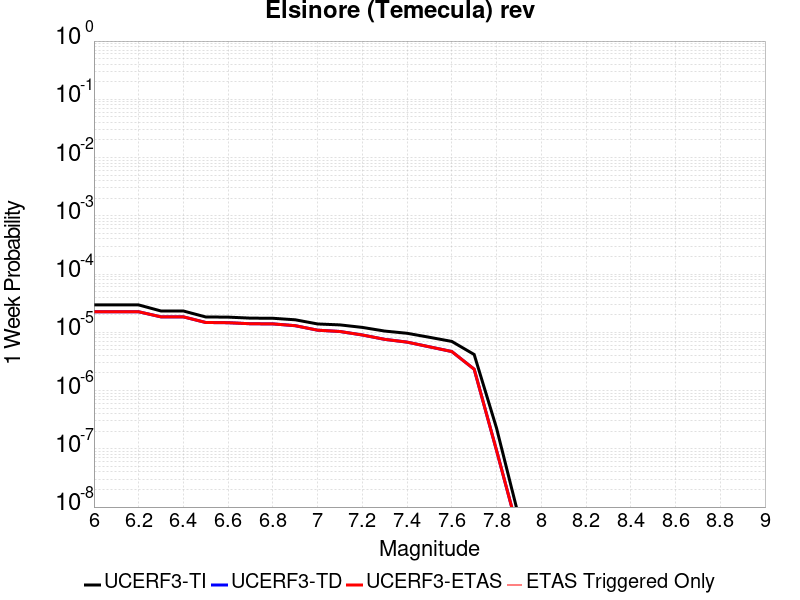 | 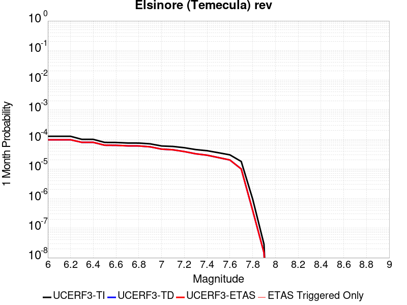 | 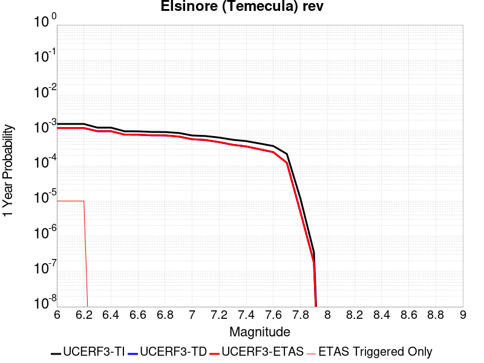 | 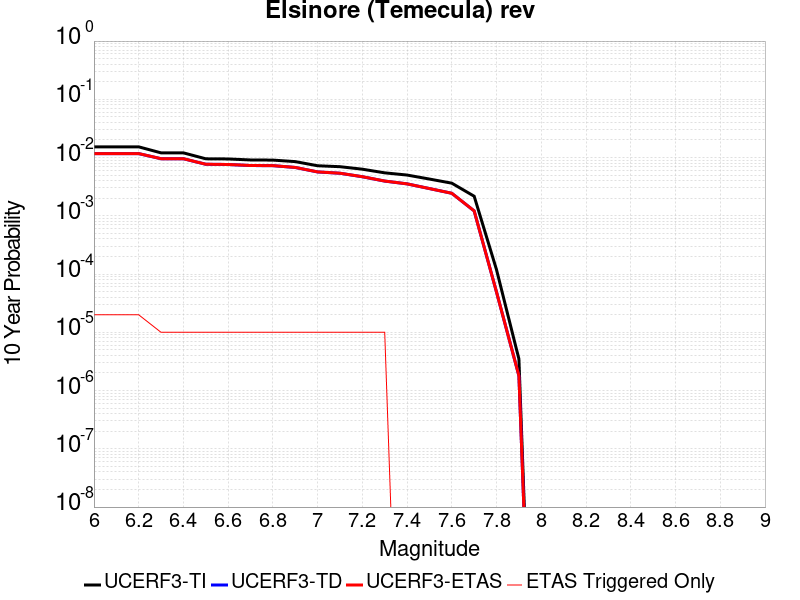 |

| Magnitude | 1 wk TI Prob | 1 wk TD Prob | 1 wk ETAS Prob | 1 wk ETAS/TD Gain | 1 wk ETAS Triggered Only | 1 mo TI Prob | 1 mo TD Prob | 1 mo ETAS Prob | 1 mo ETAS/TD Gain | 1 mo ETAS Triggered Only | 1 yr TI Prob | 1 yr TD Prob | 1 yr ETAS Prob | 1 yr ETAS/TD Gain | 1 yr ETAS Triggered Only | 10 yr TI Prob | 10 yr TD Prob | 10 yr ETAS Prob | 10 yr ETAS/TD Gain | 10 yr ETAS Triggered Only |
|-----|-----|-----|-----|-----|-----|-----|-----|-----|-----|-----|-----|-----|-----|-----|-----|-----|-----|-----|-----|-----|
| 6.0 | 2.9514995E-5 | 2.251887E-5 | 2.251887E-5 | 1.0 | 0.0 | 1.264867E-4 | 9.6505995E-5 | 9.6505995E-5 | 1.0 | 0.0 | 0.0015388876 | 0.0011743492 | 0.0011843374 | 1.0085053 | 1.0E-5 | 0.015282745 | 0.011688135 | 0.011707901 | 1.0016911 | 2.0E-5 |
| 6.1 | 2.9514995E-5 | 2.251887E-5 | 2.251887E-5 | 1.0 | 0.0 | 1.264867E-4 | 9.6505995E-5 | 9.6505995E-5 | 1.0 | 0.0 | 0.0015388876 | 0.0011743492 | 0.0011843374 | 1.0085053 | 1.0E-5 | 0.015282745 | 0.011688135 | 0.011707901 | 1.0016911 | 2.0E-5 |
| 6.2 | 2.9514995E-5 | 2.251887E-5 | 2.251887E-5 | 1.0 | 0.0 | 1.264867E-4 | 9.6505995E-5 | 9.6505995E-5 | 1.0 | 0.0 | 0.0015388876 | 0.0011743492 | 0.0011843374 | 1.0085053 | 1.0E-5 | 0.015282745 | 0.011688135 | 0.011707901 | 1.0016911 | 2.0E-5 |
| 6.3 | 2.3223649E-5 | 1.840822E-5 | 1.840822E-5 | 1.0 | 0.0 | 9.952613E-5 | 7.889008E-5 | 7.889008E-5 | 1.0 | 0.0 | 0.001211057 | 9.600807E-4 | 9.600807E-4 | 1.0 | 0.0 | 0.012044783 | 0.009551284 | 0.0095611885 | 1.001037 | 1.0E-5 |
| 6.4 | 2.3223649E-5 | 1.840822E-5 | 1.840822E-5 | 1.0 | 0.0 | 9.952613E-5 | 7.889008E-5 | 7.889008E-5 | 1.0 | 0.0 | 0.001211057 | 9.600807E-4 | 9.600807E-4 | 1.0 | 0.0 | 0.012044783 | 0.009551284 | 0.0095611885 | 1.001037 | 1.0E-5 |
| 6.5 | 1.8338875E-5 | 1.4750074E-5 | 1.4750074E-5 | 1.0 | 0.0 | 7.8592806E-5 | 6.321312E-5 | 6.321312E-5 | 1.0 | 0.0 | 9.5644733E-4 | 7.6935673E-4 | 7.6935673E-4 | 1.0 | 0.0 | 0.009523412 | 0.0076699676 | 0.007679891 | 1.0012938 | 1.0E-5 |
| 6.6 | 1.8223333E-5 | 1.461263E-5 | 1.461263E-5 | 1.0 | 0.0 | 7.809766E-5 | 6.26241E-5 | 6.26241E-5 | 1.0 | 0.0 | 9.504242E-4 | 7.621905E-4 | 7.621905E-4 | 1.0 | 0.0 | 0.009463696 | 0.007598796 | 0.00760872 | 1.001306 | 1.0E-5 |
| 6.7 | 1.7512752E-5 | 1.4026963E-5 | 1.4026963E-5 | 1.0 | 0.0 | 7.505249E-5 | 6.0114216E-5 | 6.0114216E-5 | 1.0 | 0.0 | 9.13381E-4 | 7.316534E-4 | 7.316534E-4 | 1.0 | 0.0 | 0.00909636 | 0.0072983317 | 0.0073082587 | 1.0013602 | 1.0E-5 |
| 6.8 | 1.7417142E-5 | 1.395093E-5 | 1.395093E-5 | 1.0 | 0.0 | 7.4642754E-5 | 5.978838E-5 | 5.978838E-5 | 1.0 | 0.0 | 9.083966E-4 | 7.27689E-4 | 7.27689E-4 | 1.0 | 0.0 | 0.009046922 | 0.007259359 | 0.0072692866 | 1.0013676 | 1.0E-5 |
| 6.9 | 1.6402591E-5 | 1.29883665E-5 | 1.29883665E-5 | 1.0 | 0.0 | 7.0294926E-5 | 5.5663284E-5 | 5.5663284E-5 | 1.0 | 0.0 | 8.5550465E-4 | 6.774974E-4 | 6.774974E-4 | 1.0 | 0.0 | 0.008522186 | 0.0067598647 | 0.006769797 | 1.0014694 | 1.0E-5 |
| 7.0 | 1.3912486E-5 | 1.0878067E-5 | 1.0878067E-5 | 1.0 | 0.0 | 5.9623577E-5 | 4.661947E-5 | 4.661947E-5 | 1.0 | 0.0 | 7.2567526E-4 | 5.674469E-4 | 5.674469E-4 | 1.0 | 0.0 | 0.0072331014 | 0.0056635314 | 0.005673475 | 1.0017557 | 1.0E-5 |
| 7.1 | 1.3405147E-5 | 1.0327192E-5 | 1.0327192E-5 | 1.0 | 0.0 | 5.7449364E-5 | 4.4258657E-5 | 4.4258657E-5 | 1.0 | 0.0 | 6.9922156E-4 | 5.3871854E-4 | 5.3871854E-4 | 1.0 | 0.0 | 0.0069702556 | 0.005377366 | 0.0053873123 | 1.0018497 | 1.0E-5 |
| 7.2 | 1.21402E-5 | 8.996479E-6 | 8.996479E-6 | 1.0 | 0.0 | 5.202839E-5 | 3.8555776E-5 | 3.8555776E-5 | 1.0 | 0.0 | 6.332616E-4 | 4.6931725E-4 | 4.6931725E-4 | 1.0 | 0.0 | 0.0063146 | 0.0046847262 | 0.0046946793 | 1.0021245 | 1.0E-5 |
| 7.3 | 1.05047775E-5 | 7.571515E-6 | 7.571515E-6 | 1.0 | 0.0 | 4.5019697E-5 | 3.2448956E-5 | 3.2448956E-5 | 1.0 | 0.0 | 5.4797693E-4 | 3.9499588E-4 | 3.9499588E-4 | 1.0 | 0.0 | 0.005466277 | 0.003943348 | 0.0039533083 | 1.0025259 | 1.0E-5 |
| 7.4 | 9.624483E-6 | 6.786621E-6 | 6.786621E-6 | 1.0 | 0.0 | 4.124713E-5 | 2.90852E-5 | 2.90852E-5 | 1.0 | 0.0 | 5.0206814E-4 | 3.5405616E-4 | 3.5405616E-4 | 1.0 | 0.0 | 0.005009353 | 0.0035350726 | 0.0035350726 | 1.0 | 0.0 |
| 7.5 | 8.215151E-6 | 5.6353133E-6 | 5.6353133E-6 | 1.0 | 0.0 | 3.5207315E-5 | 2.4151126E-5 | 2.4151126E-5 | 1.0 | 0.0 | 4.2856473E-4 | 2.9400157E-4 | 2.9400157E-4 | 1.0 | 0.0 | 0.004277392 | 0.002936254 | 0.002936254 | 1.0 | 0.0 |
| 7.6 | 6.975058E-6 | 4.675836E-6 | 4.675836E-6 | 1.0 | 0.0 | 2.9892764E-5 | 2.003915E-5 | 2.003915E-5 | 1.0 | 0.0 | 3.6388362E-4 | 2.439505E-4 | 2.439505E-4 | 1.0 | 0.0 | 0.0036328835 | 0.0024369434 | 0.0024369434 | 1.0 | 0.0 |
| 7.7 | 4.159604E-6 | 2.326789E-6 | 2.326789E-6 | 1.0 | 0.0 | 1.7826753E-5 | 9.971919E-6 | 9.971919E-6 | 1.0 | 0.0 | 2.1701909E-4 | 1.2140209E-4 | 1.2140209E-4 | 1.0 | 0.0 | 0.0021680726 | 0.0012134308 | 0.0012134308 | 1.0 | 0.0 |
| 7.8 | 2.2692414E-7 | 9.384417E-8 | 9.384417E-8 | 1.0 | 0.0 | 9.725317E-7 | 4.0218927E-7 | 4.0218927E-7 | 1.0 | 0.0 | 1.1840509E-5 | 4.8966467E-6 | 4.8966467E-6 | 1.0 | 0.0 | 1.1839878E-4 | 4.8965718E-5 | 4.8965718E-5 | 1.0 | 0.0 |
| 7.9 | 6.676829E-9 | 3.4397174E-9 | 3.4397174E-9 | 1.0 | 0.0 | 2.861498E-8 | 1.4741646E-8 | 1.4741646E-8 | 1.0 | 0.0 | 3.4838732E-7 | 1.7947953E-7 | 1.7947953E-7 | 1.0 | 0.0 | 3.4838679E-6 | 1.794794E-6 | 1.794794E-6 | 1.0 | 0.0 |

## Reliz 2011 CFM
*[(top)](#table-of-contents)*

| 1 Week | 1 Month | 1 Year | 10 Year |
|-----|-----|-----|-----|
| 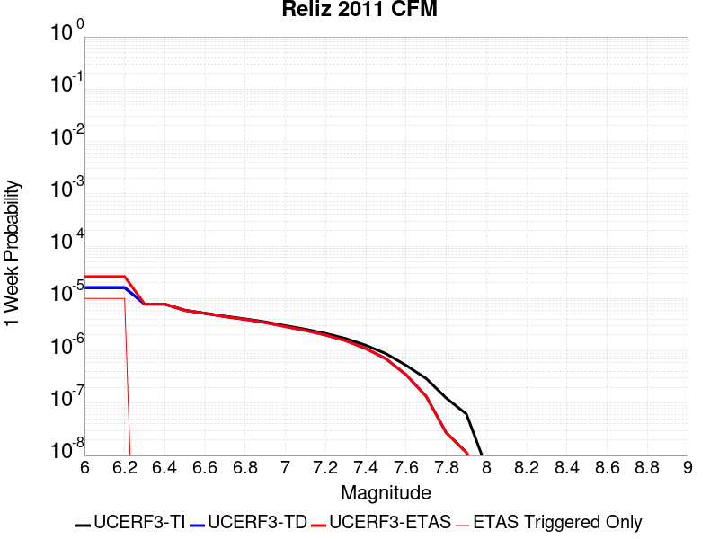 |  | 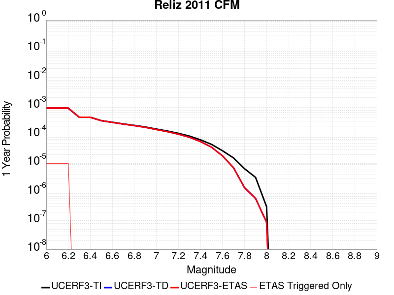 | 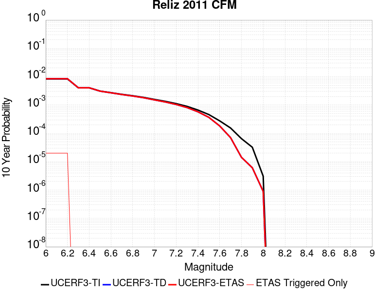 |

| Magnitude | 1 wk TI Prob | 1 wk TD Prob | 1 wk ETAS Prob | 1 wk ETAS/TD Gain | 1 wk ETAS Triggered Only | 1 mo TI Prob | 1 mo TD Prob | 1 mo ETAS Prob | 1 mo ETAS/TD Gain | 1 mo ETAS Triggered Only | 1 yr TI Prob | 1 yr TD Prob | 1 yr ETAS Prob | 1 yr ETAS/TD Gain | 1 yr ETAS Triggered Only | 10 yr TI Prob | 10 yr TD Prob | 10 yr ETAS Prob | 10 yr ETAS/TD Gain | 10 yr ETAS Triggered Only |
|-----|-----|-----|-----|-----|-----|-----|-----|-----|-----|-----|-----|-----|-----|-----|-----|-----|-----|-----|-----|-----|
| 6.0 | 1.6002472E-5 | 1.6282795E-5 | 2.628263E-5 | 1.6141351 | 1.0E-5 | 6.8580215E-5 | 6.978165E-5 | 7.978095E-5 | 1.1432941 | 1.0E-5 | 8.3464425E-4 | 8.492802E-4 | 8.5927173E-4 | 1.0117646 | 1.0E-5 | 0.008315164 | 0.008462543 | 0.008482373 | 1.0023433 | 2.0E-5 |
| 6.1 | 1.6002472E-5 | 1.6282795E-5 | 2.628263E-5 | 1.6141351 | 1.0E-5 | 6.8580215E-5 | 6.978165E-5 | 7.978095E-5 | 1.1432941 | 1.0E-5 | 8.3464425E-4 | 8.492802E-4 | 8.5927173E-4 | 1.0117646 | 1.0E-5 | 0.008315164 | 0.008462543 | 0.008482373 | 1.0023433 | 2.0E-5 |
| 6.2 | 1.6002472E-5 | 1.6282795E-5 | 2.628263E-5 | 1.6141351 | 1.0E-5 | 6.8580215E-5 | 6.978165E-5 | 7.978095E-5 | 1.1432941 | 1.0E-5 | 8.3464425E-4 | 8.492802E-4 | 8.5927173E-4 | 1.0117646 | 1.0E-5 | 0.008315164 | 0.008462543 | 0.008482373 | 1.0023433 | 2.0E-5 |
| 6.3 | 7.792404E-6 | 7.803792E-6 | 7.803792E-6 | 1.0 | 0.0 | 3.339559E-5 | 3.3444398E-5 | 3.3444398E-5 | 1.0 | 0.0 | 4.0651546E-4 | 4.0711026E-4 | 4.0711026E-4 | 1.0 | 0.0 | 0.0040577264 | 0.0040639215 | 0.0040639215 | 1.0 | 0.0 |
| 6.4 | 7.792404E-6 | 7.803792E-6 | 7.803792E-6 | 1.0 | 0.0 | 3.339559E-5 | 3.3444398E-5 | 3.3444398E-5 | 1.0 | 0.0 | 4.0651546E-4 | 4.0711026E-4 | 4.0711026E-4 | 1.0 | 0.0 | 0.0040577264 | 0.0040639215 | 0.0040639215 | 1.0 | 0.0 |
| 6.5 | 5.9659374E-6 | 5.928728E-6 | 5.928728E-6 | 1.0 | 0.0 | 2.5568053E-5 | 2.5408588E-5 | 2.5408588E-5 | 1.0 | 0.0 | 3.1124658E-4 | 3.0930588E-4 | 3.0930588E-4 | 1.0 | 0.0 | 0.00310811 | 0.003088972 | 0.003088972 | 1.0 | 0.0 |
| 6.6 | 5.2350692E-6 | 5.178976E-6 | 5.178976E-6 | 1.0 | 0.0 | 2.2435817E-5 | 2.2195423E-5 | 2.2195423E-5 | 1.0 | 0.0 | 2.7312184E-4 | 2.7019592E-4 | 2.7019592E-4 | 1.0 | 0.0 | 0.002727864 | 0.0026988846 | 0.0026988846 | 1.0 | 0.0 |
| 6.7 | 4.580206E-6 | 4.50611E-6 | 4.50611E-6 | 1.0 | 0.0 | 1.9629308E-5 | 1.931176E-5 | 1.931176E-5 | 1.0 | 0.0 | 2.389606E-4 | 2.3509537E-4 | 2.3509537E-4 | 1.0 | 0.0 | 0.002387038 | 0.002348669 | 0.002348669 | 1.0 | 0.0 |
| 6.8 | 4.0765017E-6 | 3.988228E-6 | 3.988228E-6 | 1.0 | 0.0 | 1.7470604E-5 | 1.7092294E-5 | 1.7092294E-5 | 1.0 | 0.0 | 2.1268385E-4 | 2.0807884E-4 | 2.0807884E-4 | 1.0 | 0.0 | 0.002124804 | 0.0020790389 | 0.0020790389 | 1.0 | 0.0 |
| 6.9 | 3.5752896E-6 | 3.4725074E-6 | 3.4725074E-6 | 1.0 | 0.0 | 1.532258E-5 | 1.488209E-5 | 1.488209E-5 | 1.0 | 0.0 | 1.8653645E-4 | 1.811744E-4 | 1.811744E-4 | 1.0 | 0.0 | 0.0018637994 | 0.001810464 | 0.001810464 | 1.0 | 0.0 |
| 7.0 | 3.0259848E-6 | 2.9079317E-6 | 2.9079317E-6 | 1.0 | 0.0 | 1.2968442E-5 | 1.2462505E-5 | 1.2462505E-5 | 1.0 | 0.0 | 1.5787935E-4 | 1.5172044E-4 | 1.5172044E-4 | 1.0 | 0.0 | 0.0015776722 | 0.0015163644 | 0.0015163644 | 1.0 | 0.0 |
| 7.1 | 2.5861116E-6 | 2.455157E-6 | 2.455157E-6 | 1.0 | 0.0 | 1.1083288E-5 | 1.0522059E-5 | 1.0522059E-5 | 1.0 | 0.0 | 1.3493067E-4 | 1.2809855E-4 | 1.2809855E-4 | 1.0 | 0.0 | 0.0013484878 | 0.0012804423 | 0.0012804423 | 1.0 | 0.0 |
| 7.2 | 2.1482588E-6 | 2.0032267E-6 | 2.0032267E-6 | 1.0 | 0.0 | 9.20679E-6 | 8.585229E-6 | 8.585229E-6 | 1.0 | 0.0 | 1.12086906E-4 | 1.0452016E-4 | 1.0452016E-4 | 1.0 | 0.0 | 0.0011203039 | 0.0010449048 | 0.0010449048 | 1.0 | 0.0 |
| 7.3 | 1.7194744E-6 | 1.561114E-6 | 1.561114E-6 | 1.0 | 0.0 | 7.3691554E-6 | 6.6904713E-6 | 6.6904713E-6 | 1.0 | 0.0 | 8.971577E-5 | 8.145344E-5 | 8.145344E-5 | 1.0 | 0.0 | 8.967956E-4 | 8.144305E-4 | 8.144305E-4 | 1.0 | 0.0 |
| 7.4 | 1.2755178E-6 | 1.1056196E-6 | 1.1056196E-6 | 1.0 | 0.0 | 5.4664933E-6 | 4.738361E-6 | 4.738361E-6 | 1.0 | 0.0 | 6.655252E-5 | 5.768802E-5 | 5.768802E-5 | 1.0 | 0.0 | 6.6532596E-4 | 5.769249E-4 | 5.769249E-4 | 1.0 | 0.0 |
| 7.5 | 8.8463224E-7 | 7.0579193E-7 | 7.0579193E-7 | 1.0 | 0.0 | 3.7912755E-6 | 3.0248189E-6 | 3.0248189E-6 | 1.0 | 0.0 | 4.6157802E-5 | 3.682655E-5 | 3.682655E-5 | 1.0 | 0.0 | 4.6148215E-4 | 3.683988E-4 | 3.683988E-4 | 1.0 | 0.0 |
| 7.6 | 5.291355E-7 | 3.5006548E-7 | 3.5006548E-7 | 1.0 | 0.0 | 2.2677216E-6 | 1.5002796E-6 | 1.5002796E-6 | 1.0 | 0.0 | 2.760916E-5 | 1.8265751E-5 | 1.8265751E-5 | 1.0 | 0.0 | 2.760573E-4 | 1.8283579E-4 | 1.8283579E-4 | 1.0 | 0.0 |
| 7.7 | 2.9663357E-7 | 1.3509886E-7 | 1.3509886E-7 | 1.0 | 0.0 | 1.2712861E-6 | 5.7899496E-7 | 5.7899496E-7 | 1.0 | 0.0 | 1.5477797E-5 | 7.0492406E-6 | 7.0492406E-6 | 1.0 | 0.0 | 1.547672E-4 | 7.0675895E-5 | 7.0675895E-5 | 1.0 | 0.0 |
| 7.8 | 1.2509386E-7 | 2.7148959E-8 | 2.7148959E-8 | 1.0 | 0.0 | 5.3611643E-7 | 1.1635268E-7 | 1.1635268E-7 | 1.0 | 0.0 | 6.527198E-6 | 1.4165929E-6 | 1.4165929E-6 | 1.0 | 0.0 | 6.527006E-5 | 1.4322827E-5 | 1.4322827E-5 | 1.0 | 0.0 |
| 7.9 | 6.213493E-8 | 1.1477568E-8 | 1.1477568E-8 | 1.0 | 0.0 | 2.6629255E-7 | 4.9189577E-8 | 4.9189577E-8 | 1.0 | 0.0 | 3.242107E-6 | 5.9888293E-7 | 5.9888293E-7 | 1.0 | 0.0 | 3.2420594E-5 | 6.1203536E-6 | 6.1203536E-6 | 1.0 | 0.0 |
| 8.0 | 5.92383E-9 | 1.6775827E-9 | 1.6775827E-9 | 1.0 | 0.0 | 2.5387841E-8 | 7.18964E-9 | 7.18964E-9 | 1.0 | 0.0 | 3.0909692E-7 | 8.753386E-8 | 8.753386E-8 | 1.0 | 0.0 | 3.090965E-6 | 8.992677E-7 | 8.992677E-7 | 1.0 | 0.0 |

## Elmore Ranch
*[(top)](#table-of-contents)*

| 1 Week | 1 Month | 1 Year | 10 Year |
|-----|-----|-----|-----|
|  |  | 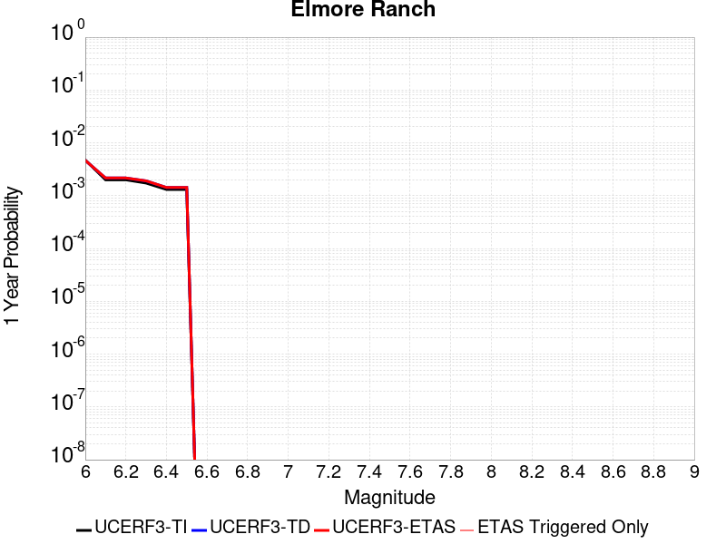 | 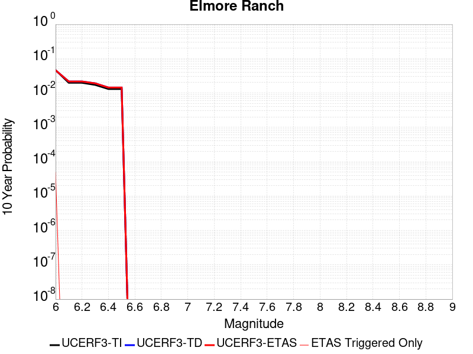 |

| Magnitude | 1 wk TI Prob | 1 wk TD Prob | 1 wk ETAS Prob | 1 wk ETAS/TD Gain | 1 wk ETAS Triggered Only | 1 mo TI Prob | 1 mo TD Prob | 1 mo ETAS Prob | 1 mo ETAS/TD Gain | 1 mo ETAS Triggered Only | 1 yr TI Prob | 1 yr TD Prob | 1 yr ETAS Prob | 1 yr ETAS/TD Gain | 1 yr ETAS Triggered Only | 10 yr TI Prob | 10 yr TD Prob | 10 yr ETAS Prob | 10 yr ETAS/TD Gain | 10 yr ETAS Triggered Only |
|-----|-----|-----|-----|-----|-----|-----|-----|-----|-----|-----|-----|-----|-----|-----|-----|-----|-----|-----|-----|-----|
| 6.0 | 9.102099E-5 | 8.953848E-5 | 8.953848E-5 | 1.0 | 0.0 | 3.9003167E-4 | 3.836898E-4 | 3.836898E-4 | 1.0 | 0.0 | 0.0047383 | 0.004662132 | 0.0046720854 | 1.0021349 | 1.0E-5 | 0.046385348 | 0.04583787 | 0.045856956 | 1.0004163 | 2.0E-5 |
| 6.1 | 3.8306698E-5 | 4.14921E-5 | 4.14921E-5 | 1.0 | 0.0 | 1.6416123E-4 | 1.7781362E-4 | 1.7781362E-4 | 1.0 | 0.0 | 0.0019968306 | 0.0021632186 | 0.002173197 | 1.0046127 | 1.0E-5 | 0.019789828 | 0.021595007 | 0.021604791 | 1.0004531 | 1.0E-5 |
| 6.2 | 3.8306698E-5 | 4.14921E-5 | 4.14921E-5 | 1.0 | 0.0 | 1.6416123E-4 | 1.7781362E-4 | 1.7781362E-4 | 1.0 | 0.0 | 0.0019968306 | 0.0021632186 | 0.002173197 | 1.0046127 | 1.0E-5 | 0.019789828 | 0.021595007 | 0.021604791 | 1.0004531 | 1.0E-5 |
| 6.3 | 3.3197924E-5 | 3.6550366E-5 | 3.6550366E-5 | 1.0 | 0.0 | 1.4226905E-4 | 1.56639E-4 | 1.56639E-4 | 1.0 | 0.0 | 0.0017307495 | 0.0019059771 | 0.0019159581 | 1.0052366 | 1.0E-5 | 0.017173318 | 0.019057386 | 0.019067194 | 1.0005147 | 1.0E-5 |
| 6.4 | 2.5148964E-5 | 2.7420736E-5 | 2.7420736E-5 | 1.0 | 0.0 | 1.0777682E-4 | 1.17515796E-4 | 1.17515796E-4 | 1.0 | 0.0 | 0.0013113929 | 0.0014304637 | 0.0014304637 | 1.0 | 0.0 | 0.01303681 | 0.014365338 | 0.014365338 | 1.0 | 0.0 |
| 6.5 | 2.5148964E-5 | 2.7420736E-5 | 2.7420736E-5 | 1.0 | 0.0 | 1.0777682E-4 | 1.17515796E-4 | 1.17515796E-4 | 1.0 | 0.0 | 0.0013113929 | 0.0014304637 | 0.0014304637 | 1.0 | 0.0 | 0.01303681 | 0.014365338 | 0.014365338 | 1.0 | 0.0 |

## San Andreas (North Coast) 2011 CFM
*[(top)](#table-of-contents)*

| 1 Week | 1 Month | 1 Year | 10 Year |
|-----|-----|-----|-----|
| 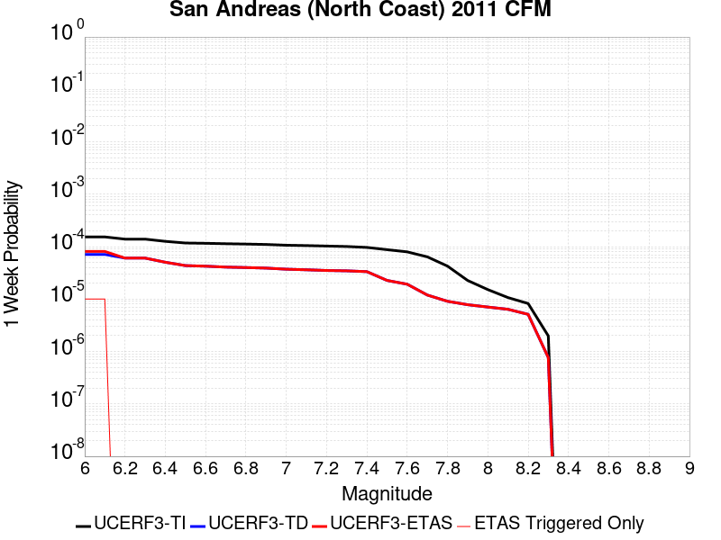 |  | 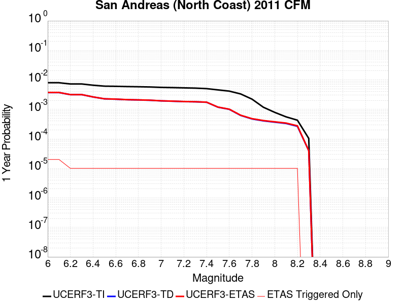 | 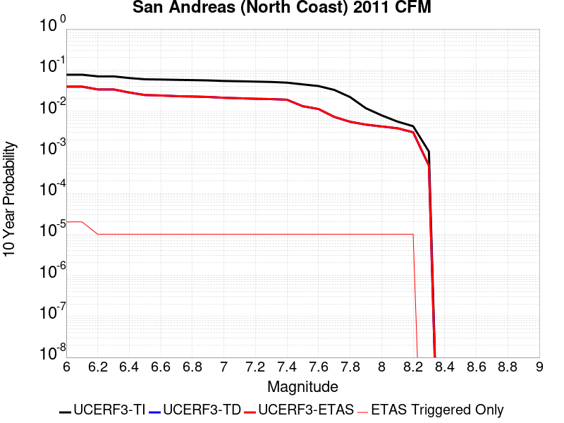 |

| Magnitude | 1 wk TI Prob | 1 wk TD Prob | 1 wk ETAS Prob | 1 wk ETAS/TD Gain | 1 wk ETAS Triggered Only | 1 mo TI Prob | 1 mo TD Prob | 1 mo ETAS Prob | 1 mo ETAS/TD Gain | 1 mo ETAS Triggered Only | 1 yr TI Prob | 1 yr TD Prob | 1 yr ETAS Prob | 1 yr ETAS/TD Gain | 1 yr ETAS Triggered Only | 10 yr TI Prob | 10 yr TD Prob | 10 yr ETAS Prob | 10 yr ETAS/TD Gain | 10 yr ETAS Triggered Only |
|-----|-----|-----|-----|-----|-----|-----|-----|-----|-----|-----|-----|-----|-----|-----|-----|-----|-----|-----|-----|-----|
| 6.0 | 1.5333705E-4 | 7.109695E-5 | 8.109623E-5 | 1.140643 | 1.0E-5 | 6.5699324E-4 | 3.046658E-4 | 3.1466273E-4 | 1.0328128 | 1.0E-5 | 0.007969595 | 0.0037030308 | 0.0037229569 | 1.005381 | 2.0E-5 | 0.0768977 | 0.039364267 | 0.039383482 | 1.000488 | 2.0E-5 |
| 6.1 | 1.5333705E-4 | 7.109695E-5 | 8.109623E-5 | 1.140643 | 1.0E-5 | 6.5699324E-4 | 3.046658E-4 | 3.1466273E-4 | 1.0328128 | 1.0E-5 | 0.007969595 | 0.0037030308 | 0.0037229569 | 1.005381 | 2.0E-5 | 0.0768977 | 0.039364267 | 0.039383482 | 1.000488 | 2.0E-5 |
| 6.2 | 1.3912938E-4 | 6.049243E-5 | 6.049243E-5 | 1.0 | 0.0 | 5.961325E-4 | 2.5922767E-4 | 2.5922767E-4 | 1.0 | 0.0 | 0.007233787 | 0.0031515562 | 0.0031615247 | 1.003163 | 1.0E-5 | 0.07002798 | 0.03369792 | 0.033707585 | 1.0002867 | 1.0E-5 |
| 6.3 | 1.3912938E-4 | 6.049243E-5 | 6.049243E-5 | 1.0 | 0.0 | 5.961325E-4 | 2.5922767E-4 | 2.5922767E-4 | 1.0 | 0.0 | 0.007233787 | 0.0031515562 | 0.0031615247 | 1.003163 | 1.0E-5 | 0.07002798 | 0.03369792 | 0.033707585 | 1.0002867 | 1.0E-5 |
| 6.4 | 1.2623647E-4 | 5.0433562E-5 | 5.0433562E-5 | 1.0 | 0.0 | 5.4090127E-4 | 2.1612605E-4 | 2.1612605E-4 | 1.0 | 0.0 | 0.0065656058 | 0.0026281793 | 0.002638153 | 1.0037949 | 1.0E-5 | 0.06374981 | 0.02830552 | 0.028315235 | 1.0003433 | 1.0E-5 |
| 6.5 | 1.1736096E-4 | 4.3516375E-5 | 4.3516375E-5 | 1.0 | 0.0 | 5.028786E-4 | 1.8648551E-4 | 1.8648551E-4 | 1.0 | 0.0 | 0.006105373 | 0.0022681132 | 0.0022780905 | 1.004399 | 1.0E-5 | 0.05940335 | 0.024576947 | 0.024586702 | 1.0003968 | 1.0E-5 |
| 6.6 | 1.1586959E-4 | 4.2416294E-5 | 4.2416294E-5 | 1.0 | 0.0 | 4.964894E-4 | 1.8177154E-4 | 1.8177154E-4 | 1.0 | 0.0 | 0.006028018 | 0.0022108385 | 0.0022208162 | 1.0045131 | 1.0E-5 | 0.058671024 | 0.023982164 | 0.023991924 | 1.000407 | 1.0E-5 |
| 6.7 | 1.13693764E-4 | 4.0728228E-5 | 4.0728228E-5 | 1.0 | 0.0 | 4.87168E-4 | 1.7453796E-4 | 1.7453796E-4 | 1.0 | 0.0 | 0.005915152 | 0.0021229447 | 0.0021329233 | 1.0047004 | 1.0E-5 | 0.057601593 | 0.023075242 | 0.023085011 | 1.0004233 | 1.0E-5 |
| 6.8 | 1.1204889E-4 | 3.9945848E-5 | 3.9945848E-5 | 1.0 | 0.0 | 4.8012115E-4 | 1.7118535E-4 | 1.7118535E-4 | 1.0 | 0.0 | 0.005829819 | 0.0020822054 | 0.0020921845 | 1.0047926 | 1.0E-5 | 0.05679232 | 0.022635331 | 0.022645107 | 1.0004318 | 1.0E-5 |
| 6.9 | 1.1005794E-4 | 3.9001738E-5 | 3.9001738E-5 | 1.0 | 0.0 | 4.7159163E-4 | 1.6713967E-4 | 1.6713967E-4 | 1.0 | 0.0 | 0.0057265228 | 0.0020330423 | 0.0020430218 | 1.0049087 | 1.0E-5 | 0.055811852 | 0.02210134 | 0.02211112 | 1.0004425 | 1.0E-5 |
| 7.0 | 1.0647948E-4 | 3.7159174E-5 | 3.7159174E-5 | 1.0 | 0.0 | 4.562608E-4 | 1.5924397E-4 | 1.5924397E-4 | 1.0 | 0.0 | 0.0055408357 | 0.0019370868 | 0.0019470674 | 1.0051523 | 1.0E-5 | 0.054047033 | 0.02105931 | 0.0210691 | 1.0004648 | 1.0E-5 |
| 7.1 | 1.04795035E-4 | 3.620866E-5 | 3.620866E-5 | 1.0 | 0.0 | 4.4904428E-4 | 1.5517084E-4 | 1.5517084E-4 | 1.0 | 0.0 | 0.0054534175 | 0.0018875834 | 0.0018975645 | 1.0052878 | 1.0E-5 | 0.053215165 | 0.02052821 | 0.020538004 | 1.0004771 | 1.0E-5 |
| 7.2 | 1.02724036E-4 | 3.5117457E-5 | 3.5117457E-5 | 1.0 | 0.0 | 4.401716E-4 | 1.5049479E-4 | 1.5049479E-4 | 1.0 | 0.0 | 0.0053459285 | 0.0018307496 | 0.0018407312 | 1.0054523 | 1.0E-5 | 0.052191395 | 0.01991573 | 0.019925531 | 1.0004921 | 1.0E-5 |
| 7.3 | 1.00650694E-4 | 3.45853E-5 | 3.45853E-5 | 1.0 | 0.0 | 4.312888E-4 | 1.4821437E-4 | 1.4821437E-4 | 1.0 | 0.0 | 0.005238306 | 0.0018030318 | 0.0018130138 | 1.0055362 | 1.0E-5 | 0.051165357 | 0.01959264 | 0.019602444 | 1.0005004 | 1.0E-5 |
| 7.4 | 9.672919E-5 | 3.3374814E-5 | 3.3374814E-5 | 1.0 | 0.0 | 4.144878E-4 | 1.4302715E-4 | 1.4302715E-4 | 1.0 | 0.0 | 0.005034718 | 0.00173998 | 0.0017499626 | 1.0057372 | 1.0E-5 | 0.049221683 | 0.01886682 | 0.01887663 | 1.00052 | 1.0E-5 |
| 7.5 | 8.7600405E-5 | 2.2694192E-5 | 2.2694192E-5 | 1.0 | 0.0 | 3.753763E-4 | 9.725721E-5 | 9.725721E-5 | 1.0 | 0.0 | 0.0045606326 | 0.0011834651 | 0.0011934533 | 1.0084398 | 1.0E-5 | 0.04468165 | 0.013127938 | 0.013137806 | 1.0007517 | 1.0E-5 |
| 7.6 | 7.9562284E-5 | 1.922004E-5 | 1.922004E-5 | 1.0 | 0.0 | 3.4093665E-4 | 8.236901E-5 | 8.236901E-5 | 1.0 | 0.0 | 0.0041430052 | 0.0010023828 | 0.0010123728 | 1.0099663 | 1.0E-5 | 0.040666126 | 0.0112194 | 0.011229288 | 1.0008813 | 1.0E-5 |
| 7.7 | 6.3866544E-5 | 1.1936281E-5 | 1.1936281E-5 | 1.0 | 0.0 | 2.7368503E-4 | 5.115449E-5 | 5.115449E-5 | 1.0 | 0.0 | 0.0033270244 | 6.226282E-4 | 6.3262193E-4 | 1.0160509 | 1.0E-5 | 0.032776527 | 0.0072073294 | 0.0072172573 | 1.0013775 | 1.0E-5 |
| 7.8 | 4.2543215E-5 | 9.0726735E-6 | 9.0726735E-6 | 1.0 | 0.0 | 1.8231533E-4 | 3.888231E-5 | 3.888231E-5 | 1.0 | 0.0 | 0.0022174292 | 4.7328937E-4 | 4.8328465E-4 | 1.0211188 | 1.0E-5 | 0.021954332 | 0.0054884683 | 0.0054984135 | 1.001812 | 1.0E-5 |
| 7.9 | 2.2636612E-5 | 7.811842E-6 | 7.811842E-6 | 1.0 | 0.0 | 9.7010445E-5 | 3.3478893E-5 | 3.3478893E-5 | 1.0 | 0.0 | 0.0011804621 | 4.0752938E-4 | 4.1752533E-4 | 1.0245281 | 1.0E-5 | 0.011742111 | 0.0046821116 | 0.004692065 | 1.0021257 | 1.0E-5 |
| 8.0 | 1.5167874E-5 | 7.0475517E-6 | 7.0475517E-6 | 1.0 | 0.0 | 6.500356E-5 | 3.0203442E-5 | 3.0203442E-5 | 1.0 | 0.0 | 7.9113094E-4 | 3.6766496E-4 | 3.776613E-4 | 1.0271887 | 1.0E-5 | 0.007883203 | 0.004214701 | 0.004224659 | 1.0023626 | 1.0E-5 |
| 8.1 | 1.0681047E-5 | 6.3854363E-6 | 6.3854363E-6 | 1.0 | 0.0 | 4.5775112E-5 | 2.7365868E-5 | 2.7365868E-5 | 1.0 | 0.0 | 5.5716943E-4 | 3.331286E-4 | 3.4312526E-4 | 1.0300084 | 1.0E-5 | 0.0055577457 | 0.003816698 | 0.0038266599 | 1.0026101 | 1.0E-5 |
| 8.2 | 8.226114E-6 | 5.1139064E-6 | 5.1139064E-6 | 1.0 | 0.0 | 3.52543E-5 | 2.1916558E-5 | 2.1916558E-5 | 1.0 | 0.0 | 4.2913653E-4 | 2.6680148E-4 | 2.7679882E-4 | 1.037471 | 1.0E-5 | 0.004283088 | 0.0030445685 | 0.003054538 | 1.0032746 | 1.0E-5 |
| 8.3 | 1.983087E-6 | 7.6564595E-7 | 7.6564595E-7 | 1.0 | 0.0 | 8.498917E-6 | 3.281336E-6 | 3.281336E-6 | 1.0 | 0.0 | 1.034694E-4 | 3.9949547E-5 | 3.9949547E-5 | 1.0 | 0.0 | 0.0010342124 | 4.717979E-4 | 4.717979E-4 | 1.0 | 0.0 |

## La Panza 2011
*[(top)](#table-of-contents)*

| 1 Week | 1 Month | 1 Year | 10 Year |
|-----|-----|-----|-----|
| 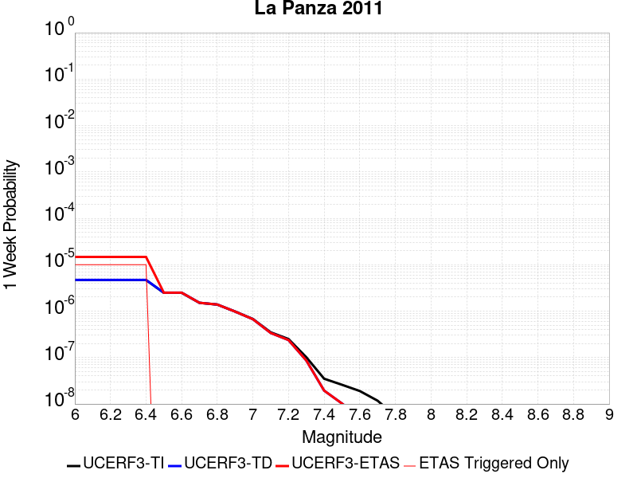 | 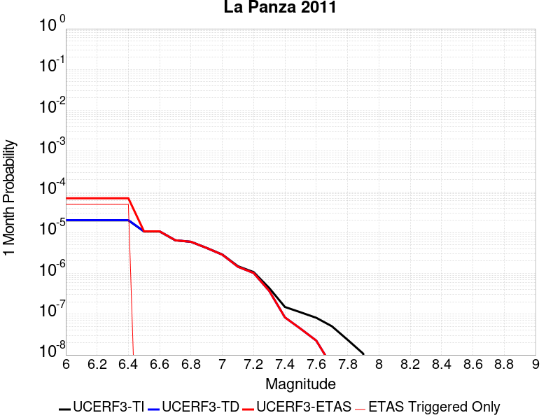 | 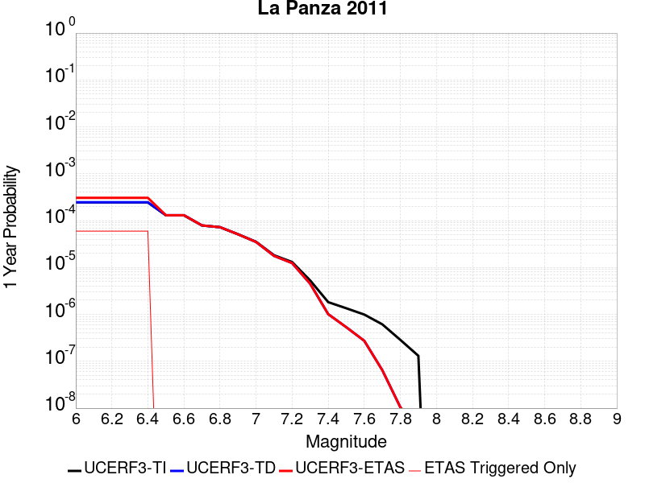 |  |

| Magnitude | 1 wk TI Prob | 1 wk TD Prob | 1 wk ETAS Prob | 1 wk ETAS/TD Gain | 1 wk ETAS Triggered Only | 1 mo TI Prob | 1 mo TD Prob | 1 mo ETAS Prob | 1 mo ETAS/TD Gain | 1 mo ETAS Triggered Only | 1 yr TI Prob | 1 yr TD Prob | 1 yr ETAS Prob | 1 yr ETAS/TD Gain | 1 yr ETAS Triggered Only | 10 yr TI Prob | 10 yr TD Prob | 10 yr ETAS Prob | 10 yr ETAS/TD Gain | 10 yr ETAS Triggered Only |
|-----|-----|-----|-----|-----|-----|-----|-----|-----|-----|-----|-----|-----|-----|-----|-----|-----|-----|-----|-----|-----|
| 6.0 | 4.6754544E-6 | 4.7175886E-6 | 1.47175415E-5 | 3.119717 | 1.0E-5 | 2.0037509E-5 | 2.021809E-5 | 3.0217889E-5 | 1.4945965 | 1.0E-5 | 2.4392935E-4 | 2.4612944E-4 | 2.5612698E-4 | 1.040619 | 1.0E-5 | 0.0024366176 | 0.0024587628 | 0.0024787136 | 1.0081142 | 2.0E-5 |
| 6.1 | 4.6754544E-6 | 4.7175886E-6 | 1.47175415E-5 | 3.119717 | 1.0E-5 | 2.0037509E-5 | 2.021809E-5 | 3.0217889E-5 | 1.4945965 | 1.0E-5 | 2.4392935E-4 | 2.4612944E-4 | 2.5612698E-4 | 1.040619 | 1.0E-5 | 0.0024366176 | 0.0024587628 | 0.0024787136 | 1.0081142 | 2.0E-5 |
| 6.2 | 4.6754544E-6 | 4.7175886E-6 | 1.47175415E-5 | 3.119717 | 1.0E-5 | 2.0037509E-5 | 2.021809E-5 | 3.0217889E-5 | 1.4945965 | 1.0E-5 | 2.4392935E-4 | 2.4612944E-4 | 2.5612698E-4 | 1.040619 | 1.0E-5 | 0.0024366176 | 0.0024587628 | 0.0024787136 | 1.0081142 | 2.0E-5 |
| 6.3 | 4.6754544E-6 | 4.7175886E-6 | 1.47175415E-5 | 3.119717 | 1.0E-5 | 2.0037509E-5 | 2.021809E-5 | 3.0217889E-5 | 1.4945965 | 1.0E-5 | 2.4392935E-4 | 2.4612944E-4 | 2.5612698E-4 | 1.040619 | 1.0E-5 | 0.0024366176 | 0.0024587628 | 0.0024787136 | 1.0081142 | 2.0E-5 |
| 6.4 | 4.6754544E-6 | 4.7175886E-6 | 1.47175415E-5 | 3.119717 | 1.0E-5 | 2.0037509E-5 | 2.021809E-5 | 3.0217889E-5 | 1.4945965 | 1.0E-5 | 2.4392935E-4 | 2.4612944E-4 | 2.5612698E-4 | 1.040619 | 1.0E-5 | 0.0024366176 | 0.0024587628 | 0.0024787136 | 1.0081142 | 2.0E-5 |
| 6.5 | 2.485343E-6 | 2.5006007E-6 | 2.5006007E-6 | 1.0 | 0.0 | 1.0651426E-5 | 1.0716818E-5 | 1.0716818E-5 | 1.0 | 0.0 | 1.296734E-4 | 1.3046984E-4 | 1.3046984E-4 | 1.0 | 0.0 | 0.0012959775 | 0.0013039707 | 0.0013139577 | 1.0076588 | 1.0E-5 |
| 6.6 | 2.485343E-6 | 2.5006007E-6 | 2.5006007E-6 | 1.0 | 0.0 | 1.0651426E-5 | 1.0716818E-5 | 1.0716818E-5 | 1.0 | 0.0 | 1.296734E-4 | 1.3046984E-4 | 1.3046984E-4 | 1.0 | 0.0 | 0.0012959775 | 0.0013039707 | 0.0013139577 | 1.0076588 | 1.0E-5 |
| 6.7 | 1.5108508E-6 | 1.514639E-6 | 1.514639E-6 | 1.0 | 0.0 | 6.4750584E-6 | 6.4912947E-6 | 6.4912947E-6 | 1.0 | 0.0 | 7.8830984E-5 | 7.902876E-5 | 7.902876E-5 | 1.0 | 0.0 | 7.880303E-4 | 7.9001737E-4 | 8.0000947E-4 | 1.012648 | 1.0E-5 |
| 6.8 | 1.3865837E-6 | 1.3885118E-6 | 1.3885118E-6 | 1.0 | 0.0 | 5.942488E-6 | 5.950752E-6 | 5.950752E-6 | 1.0 | 0.0 | 7.234739E-5 | 7.244809E-5 | 7.244809E-5 | 1.0 | 0.0 | 7.232384E-4 | 7.242546E-4 | 7.342473E-4 | 1.0137973 | 1.0E-5 |
| 6.9 | 9.826583E-7 | 9.796303E-7 | 9.796303E-7 | 1.0 | 0.0 | 4.2113857E-6 | 4.198409E-6 | 4.198409E-6 | 1.0 | 0.0 | 5.1272415E-5 | 5.1114486E-5 | 5.1114486E-5 | 1.0 | 0.0 | 5.126059E-4 | 5.1103265E-4 | 5.2102754E-4 | 1.0195582 | 1.0E-5 |
| 7.0 | 6.7797646E-7 | 6.710231E-7 | 6.710231E-7 | 1.0 | 0.0 | 2.9056102E-6 | 2.8758104E-6 | 2.8758104E-6 | 1.0 | 0.0 | 3.537523E-5 | 3.501246E-5 | 3.501246E-5 | 1.0 | 0.0 | 3.5369597E-4 | 3.5007254E-4 | 3.6006904E-4 | 1.0285555 | 1.0E-5 |
| 7.1 | 3.4979826E-7 | 3.3874045E-7 | 3.3874045E-7 | 1.0 | 0.0 | 1.4991346E-6 | 1.4517441E-6 | 1.4517441E-6 | 1.0 | 0.0 | 1.825181E-5 | 1.7674853E-5 | 1.7674853E-5 | 1.0 | 0.0 | 1.825031E-4 | 1.7673563E-4 | 1.7673563E-4 | 1.0 | 0.0 |
| 7.2 | 2.5088332E-7 | 2.3832064E-7 | 2.3832064E-7 | 1.0 | 0.0 | 1.0752137E-6 | 1.0213738E-6 | 1.0213738E-6 | 1.0 | 0.0 | 1.3090649E-5 | 1.2435164E-5 | 1.2435164E-5 | 1.0 | 0.0 | 1.3089878E-4 | 1.2434553E-4 | 1.2434553E-4 | 1.0 | 0.0 |
| 7.3 | 1.0159086E-7 | 8.644785E-8 | 8.644785E-8 | 1.0 | 0.0 | 4.3538932E-7 | 3.704907E-7 | 3.704907E-7 | 1.0 | 0.0 | 5.300852E-6 | 4.510716E-6 | 4.510716E-6 | 1.0 | 0.0 | 5.3007258E-5 | 4.510628E-5 | 4.510628E-5 | 1.0 | 0.0 |
| 7.4 | 3.5006252E-8 | 1.9403883E-8 | 1.9403883E-8 | 1.0 | 0.0 | 1.5002678E-7 | 8.315949E-8 | 8.315949E-8 | 1.0 | 0.0 | 1.8265745E-6 | 1.0124663E-6 | 1.0124663E-6 | 1.0 | 0.0 | 1.8265595E-5 | 1.012462E-5 | 1.012462E-5 | 1.0 | 0.0 |
| 7.5 | 2.592274E-8 | 1.0238468E-8 | 1.0238468E-8 | 1.0 | 0.0 | 1.1109746E-7 | 4.3879147E-8 | 4.3879147E-8 | 1.0 | 0.0 | 1.3526106E-6 | 5.342285E-7 | 5.342285E-7 | 1.0 | 0.0 | 1.3526024E-5 | 5.342273E-6 | 5.342273E-6 | 1.0 | 0.0 |
| 7.6 | 1.9016717E-8 | 5.2442264E-9 | 5.2442264E-9 | 1.0 | 0.0 | 8.150022E-8 | 2.2475257E-8 | 2.2475257E-8 | 1.0 | 0.0 | 9.922647E-7 | 2.736362E-7 | 2.736362E-7 | 1.0 | 0.0 | 9.922603E-6 | 2.736359E-6 | 2.736359E-6 | 1.0 | 0.0 |
| 7.7 | 1.17738495E-8 | 1.2393437E-9 | 1.2393437E-9 | 1.0 | 0.0 | 5.0459356E-8 | 5.3114735E-9 | 5.3114735E-9 | 1.0 | 0.0 | 6.1434247E-7 | 6.466719E-8 | 6.466719E-8 | 1.0 | 0.0 | 6.143408E-6 | 6.466717E-7 | 6.466717E-7 | 1.0 | 0.0 |
| 7.8 | 5.489079E-9 | 2.009185E-10 | 2.009185E-10 | 1.0 | 0.0 | 2.3524624E-8 | 8.61079E-10 | 8.61079E-10 | 1.0 | 0.0 | 2.8641225E-7 | 1.0483639E-8 | 1.0483639E-8 | 1.0 | 0.0 | 2.8641189E-6 | 1.0483638E-7 | 1.0483638E-7 | 1.0 | 0.0 |
| 7.9 | 2.5081048E-9 | 6.675449E-11 | 6.675449E-11 | 1.0 | 0.0 | 1.0749021E-8 | 2.8609015E-10 | 2.8609015E-10 | 1.0 | 0.0 | 1.3086932E-7 | 3.483148E-9 | 3.483148E-9 | 1.0 | 0.0 | 1.3086925E-6 | 3.483148E-8 | 3.483148E-8 | 1.0 | 0.0 |

## Earthquake Valley
*[(top)](#table-of-contents)*

| 1 Week | 1 Month | 1 Year | 10 Year |
|-----|-----|-----|-----|
| 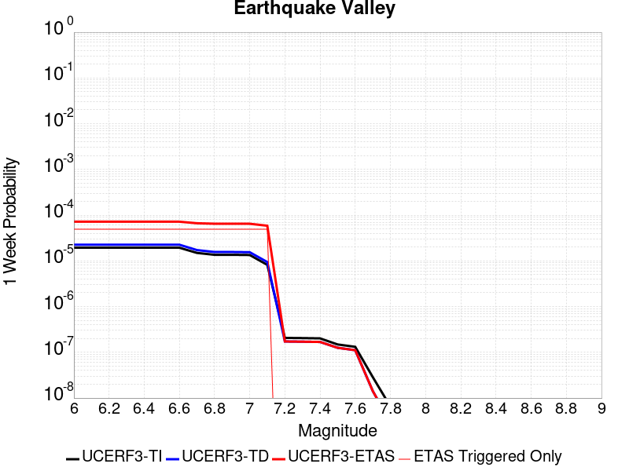 | 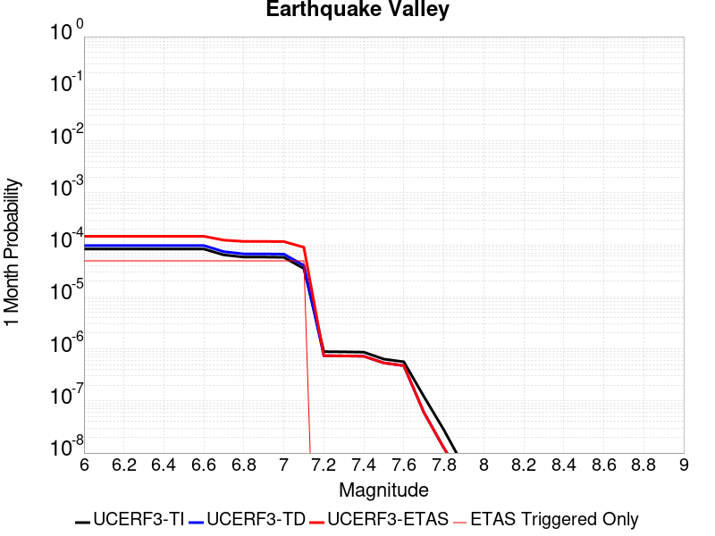 | 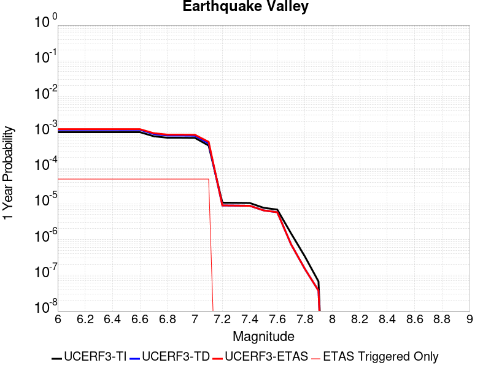 | 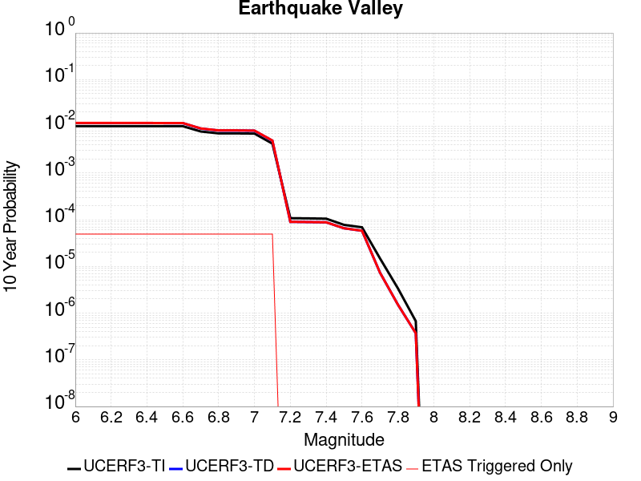 |

| Magnitude | 1 wk TI Prob | 1 wk TD Prob | 1 wk ETAS Prob | 1 wk ETAS/TD Gain | 1 wk ETAS Triggered Only | 1 mo TI Prob | 1 mo TD Prob | 1 mo ETAS Prob | 1 mo ETAS/TD Gain | 1 mo ETAS Triggered Only | 1 yr TI Prob | 1 yr TD Prob | 1 yr ETAS Prob | 1 yr ETAS/TD Gain | 1 yr ETAS Triggered Only | 10 yr TI Prob | 10 yr TD Prob | 10 yr ETAS Prob | 10 yr ETAS/TD Gain | 10 yr ETAS Triggered Only |
|-----|-----|-----|-----|-----|-----|-----|-----|-----|-----|-----|-----|-----|-----|-----|-----|-----|-----|-----|-----|-----|
| 6.0 | 1.9416384E-5 | 2.258411E-5 | 3.2583885E-5 | 1.4427792 | 1.0E-5 | 8.321042E-5 | 9.6786134E-5 | 1.0678516E-4 | 1.1033106 | 1.0E-5 | 0.001012616 | 0.001177854 | 0.0011878422 | 1.0084801 | 1.0E-5 | 0.010080142 | 0.011727945 | 0.01174771 | 1.0016854 | 2.0E-5 |
| 6.1 | 1.9416384E-5 | 2.258411E-5 | 3.2583885E-5 | 1.4427792 | 1.0E-5 | 8.321042E-5 | 9.6786134E-5 | 1.0678516E-4 | 1.1033106 | 1.0E-5 | 0.001012616 | 0.001177854 | 0.0011878422 | 1.0084801 | 1.0E-5 | 0.010080142 | 0.011727945 | 0.01174771 | 1.0016854 | 2.0E-5 |
| 6.2 | 1.9416384E-5 | 2.258411E-5 | 3.2583885E-5 | 1.4427792 | 1.0E-5 | 8.321042E-5 | 9.6786134E-5 | 1.0678516E-4 | 1.1033106 | 1.0E-5 | 0.001012616 | 0.001177854 | 0.0011878422 | 1.0084801 | 1.0E-5 | 0.010080142 | 0.011727945 | 0.01174771 | 1.0016854 | 2.0E-5 |
| 6.3 | 1.9416384E-5 | 2.258411E-5 | 3.2583885E-5 | 1.4427792 | 1.0E-5 | 8.321042E-5 | 9.6786134E-5 | 1.0678516E-4 | 1.1033106 | 1.0E-5 | 0.001012616 | 0.001177854 | 0.0011878422 | 1.0084801 | 1.0E-5 | 0.010080142 | 0.011727945 | 0.01174771 | 1.0016854 | 2.0E-5 |
| 6.4 | 1.9416384E-5 | 2.258411E-5 | 3.2583885E-5 | 1.4427792 | 1.0E-5 | 8.321042E-5 | 9.6786134E-5 | 1.0678516E-4 | 1.1033106 | 1.0E-5 | 0.001012616 | 0.001177854 | 0.0011878422 | 1.0084801 | 1.0E-5 | 0.010080142 | 0.011727945 | 0.01174771 | 1.0016854 | 2.0E-5 |
| 6.5 | 1.9389157E-5 | 2.25527E-5 | 3.2552474E-5 | 1.4433959 | 1.0E-5 | 8.309374E-5 | 9.665152E-5 | 1.0665056E-4 | 1.1034545 | 1.0E-5 | 0.0010111968 | 0.001176217 | 0.0011862052 | 1.0084919 | 1.0E-5 | 0.010066078 | 0.011711747 | 0.011731513 | 1.0016876 | 2.0E-5 |
| 6.6 | 1.9389157E-5 | 2.25527E-5 | 3.2552474E-5 | 1.4433959 | 1.0E-5 | 8.309374E-5 | 9.665152E-5 | 1.0665056E-4 | 1.1034545 | 1.0E-5 | 0.0010111968 | 0.001176217 | 0.0011862052 | 1.0084919 | 1.0E-5 | 0.010066078 | 0.011711747 | 0.011731513 | 1.0016876 | 2.0E-5 |
| 6.7 | 1.4925434E-5 | 1.720822E-5 | 2.7208049E-5 | 1.5811076 | 1.0E-5 | 6.396457E-5 | 7.374791E-5 | 8.3747174E-5 | 1.1355871 | 1.0E-5 | 7.7849044E-4 | 8.97596E-4 | 9.07587E-4 | 1.0111309 | 1.0E-5 | 0.007757689 | 0.008948081 | 0.0089679025 | 1.0022151 | 2.0E-5 |
| 6.8 | 1.3570335E-5 | 1.5616837E-5 | 2.561668E-5 | 1.6403246 | 1.0E-5 | 5.8157282E-5 | 6.692804E-5 | 7.6927376E-5 | 1.1494042 | 1.0E-5 | 7.0783484E-4 | 8.146264E-4 | 8.2461827E-4 | 1.0122656 | 1.0E-5 | 0.0070558446 | 0.008124473 | 0.008144311 | 1.0024416 | 2.0E-5 |
| 6.9 | 1.3570335E-5 | 1.5616837E-5 | 2.561668E-5 | 1.6403246 | 1.0E-5 | 5.8157282E-5 | 6.692804E-5 | 7.6927376E-5 | 1.1494042 | 1.0E-5 | 7.0783484E-4 | 8.146264E-4 | 8.2461827E-4 | 1.0122656 | 1.0E-5 | 0.0070558446 | 0.008124473 | 0.008144311 | 1.0024416 | 2.0E-5 |
| 7.0 | 1.3433392E-5 | 1.546038E-5 | 2.5460226E-5 | 1.6468046 | 1.0E-5 | 5.757041E-5 | 6.6257555E-5 | 7.625689E-5 | 1.1509162 | 1.0E-5 | 7.0069433E-4 | 8.064692E-4 | 8.164611E-4 | 1.0123898 | 1.0E-5 | 0.006984891 | 0.008043493 | 0.008063332 | 1.0024664 | 2.0E-5 |
| 7.1 | 8.181609E-6 | 9.4168445E-6 | 1.941675E-5 | 2.0619168 | 1.0E-5 | 3.5063567E-5 | 4.0357656E-5 | 5.0357252E-5 | 1.2477745 | 1.0E-5 | 4.268153E-4 | 4.913108E-4 | 5.0130585E-4 | 1.0203437 | 1.0E-5 | 0.0042599645 | 0.004908822 | 0.004928724 | 1.0040543 | 2.0E-5 |
| 7.2 | 2.0663983E-7 | 1.7262263E-7 | 1.7262263E-7 | 1.0 | 0.0 | 8.855989E-7 | 7.398111E-7 | 7.398111E-7 | 1.0 | 0.0 | 1.0782113E-5 | 9.007167E-6 | 9.007167E-6 | 1.0 | 0.0 | 1.07815904E-4 | 9.006837E-5 | 9.006837E-5 | 1.0 | 0.0 |
| 7.3 | 2.0462376E-7 | 1.7077758E-7 | 1.7077758E-7 | 1.0 | 0.0 | 8.7695867E-7 | 7.319037E-7 | 7.319037E-7 | 1.0 | 0.0 | 1.0676919E-5 | 8.910895E-6 | 8.910895E-6 | 1.0 | 0.0 | 1.0676406E-4 | 8.9105735E-5 | 8.9105735E-5 | 1.0 | 0.0 |
| 7.4 | 2.0171088E-7 | 1.6860244E-7 | 1.6860244E-7 | 1.0 | 0.0 | 8.644749E-7 | 7.2258166E-7 | 7.2258166E-7 | 1.0 | 0.0 | 1.0524931E-5 | 8.7974E-6 | 8.7974E-6 | 1.0 | 0.0 | 1.05244326E-4 | 8.7970875E-5 | 8.7970875E-5 | 1.0 | 0.0 |
| 7.5 | 1.4847944E-7 | 1.2558573E-7 | 1.2558573E-7 | 1.0 | 0.0 | 6.363403E-7 | 5.382244E-7 | 5.382244E-7 | 1.0 | 0.0 | 7.747416E-6 | 6.5528648E-6 | 6.5528648E-6 | 1.0 | 0.0 | 7.747146E-5 | 6.552693E-5 | 6.552693E-5 | 1.0 | 0.0 |
| 7.6 | 1.3185847E-7 | 1.1122516E-7 | 1.1122516E-7 | 1.0 | 0.0 | 5.6510765E-7 | 4.766792E-7 | 4.766792E-7 | 1.0 | 0.0 | 6.8801637E-6 | 5.803556E-6 | 5.803556E-6 | 1.0 | 0.0 | 6.8799505E-5 | 5.8034257E-5 | 5.8034257E-5 | 1.0 | 0.0 |
| 7.7 | 2.8609954E-8 | 1.4170218E-8 | 1.4170218E-8 | 1.0 | 0.0 | 1.2261408E-7 | 6.0729505E-8 | 6.0729505E-8 | 1.0 | 0.0 | 1.4928254E-6 | 7.393815E-7 | 7.393815E-7 | 1.0 | 0.0 | 1.4928154E-5 | 7.393796E-6 | 7.393796E-6 | 1.0 | 0.0 |
| 7.8 | 6.527266E-9 | 2.9232412E-9 | 2.9232412E-9 | 1.0 | 0.0 | 2.7973995E-8 | 1.2528178E-8 | 1.2528178E-8 | 1.0 | 0.0 | 3.4058334E-7 | 1.5253055E-7 | 1.5253055E-7 | 1.0 | 0.0 | 3.4058282E-6 | 1.5253047E-6 | 1.5253047E-6 | 1.0 | 0.0 |
| 7.9 | 1.2898267E-9 | 7.127704E-10 | 7.127704E-10 | 1.0 | 0.0 | 5.527829E-9 | 3.0547302E-9 | 3.0547302E-9 | 1.0 | 0.0 | 6.7301315E-8 | 3.719134E-8 | 3.719134E-8 | 1.0 | 0.0 | 6.7301295E-7 | 3.7191342E-7 | 3.7191342E-7 | 1.0 | 0.0 |

## San Jose
*[(top)](#table-of-contents)*

| 1 Week | 1 Month | 1 Year | 10 Year |
|-----|-----|-----|-----|
|  | 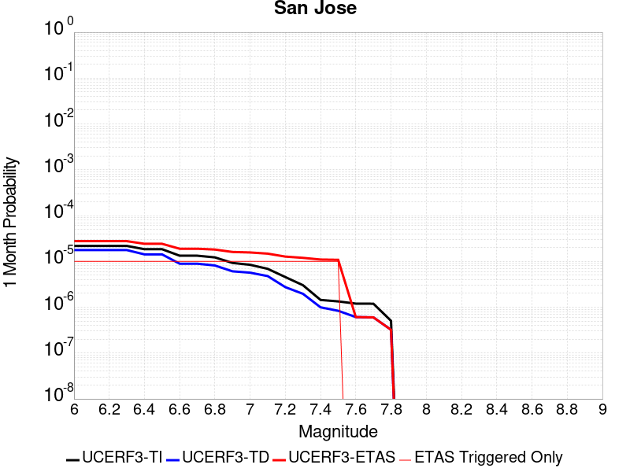 | 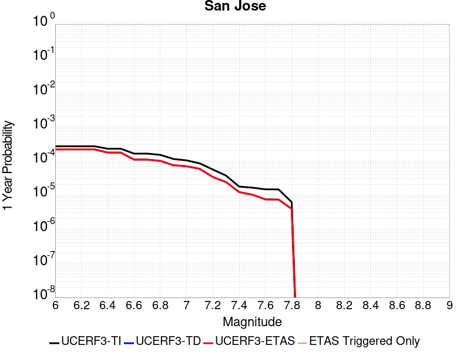 | 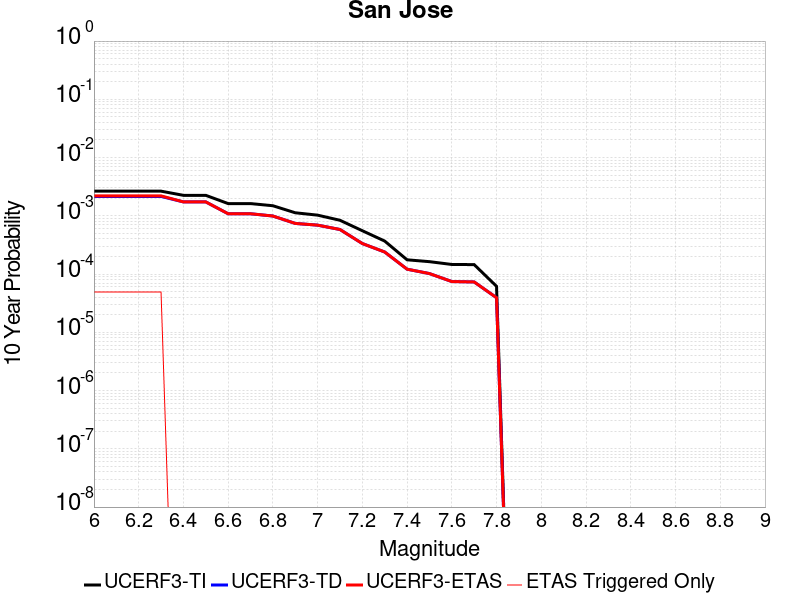 |

| Magnitude | 1 wk TI Prob | 1 wk TD Prob | 1 wk ETAS Prob | 1 wk ETAS/TD Gain | 1 wk ETAS Triggered Only | 1 mo TI Prob | 1 mo TD Prob | 1 mo ETAS Prob | 1 mo ETAS/TD Gain | 1 mo ETAS Triggered Only | 1 yr TI Prob | 1 yr TD Prob | 1 yr ETAS Prob | 1 yr ETAS/TD Gain | 1 yr ETAS Triggered Only | 10 yr TI Prob | 10 yr TD Prob | 10 yr ETAS Prob | 10 yr ETAS/TD Gain | 10 yr ETAS Triggered Only |
|-----|-----|-----|-----|-----|-----|-----|-----|-----|-----|-----|-----|-----|-----|-----|-----|-----|-----|-----|-----|-----|
| 6.0 | 5.0851277E-6 | 4.125642E-6 | 4.125642E-6 | 1.0 | 0.0 | 2.1793223E-5 | 1.768122E-5 | 2.7681042E-5 | 1.5655619 | 1.0E-5 | 2.653002E-4 | 2.152502E-4 | 2.2524805E-4 | 1.0464475 | 1.0E-5 | 0.0026498367 | 0.0021507454 | 0.0021707024 | 1.0092791 | 2.0E-5 |
| 6.1 | 5.0851277E-6 | 4.125642E-6 | 4.125642E-6 | 1.0 | 0.0 | 2.1793223E-5 | 1.768122E-5 | 2.7681042E-5 | 1.5655619 | 1.0E-5 | 2.653002E-4 | 2.152502E-4 | 2.2524805E-4 | 1.0464475 | 1.0E-5 | 0.0026498367 | 0.0021507454 | 0.0021707024 | 1.0092791 | 2.0E-5 |
| 6.2 | 5.0851277E-6 | 4.125642E-6 | 4.125642E-6 | 1.0 | 0.0 | 2.1793223E-5 | 1.768122E-5 | 2.7681042E-5 | 1.5655619 | 1.0E-5 | 2.653002E-4 | 2.152502E-4 | 2.2524805E-4 | 1.0464475 | 1.0E-5 | 0.0026498367 | 0.0021507454 | 0.0021707024 | 1.0092791 | 2.0E-5 |
| 6.3 | 5.0851277E-6 | 4.125642E-6 | 4.125642E-6 | 1.0 | 0.0 | 2.1793223E-5 | 1.768122E-5 | 2.7681042E-5 | 1.5655619 | 1.0E-5 | 2.653002E-4 | 2.152502E-4 | 2.2524805E-4 | 1.0464475 | 1.0E-5 | 0.0026498367 | 0.0021507454 | 0.0021707024 | 1.0092791 | 2.0E-5 |
| 6.4 | 4.3115124E-6 | 3.3237525E-6 | 3.3237525E-6 | 1.0 | 0.0 | 1.8477778E-5 | 1.4244589E-5 | 2.4244446E-5 | 1.702011 | 1.0E-5 | 2.2494372E-4 | 1.7341628E-4 | 1.8341454E-4 | 1.0576547 | 1.0E-5 | 0.0022471617 | 0.0017330965 | 0.0017430792 | 1.0057601 | 1.0E-5 |
| 6.5 | 4.3115124E-6 | 3.3237525E-6 | 3.3237525E-6 | 1.0 | 0.0 | 1.8477778E-5 | 1.4244589E-5 | 2.4244446E-5 | 1.702011 | 1.0E-5 | 2.2494372E-4 | 1.7341628E-4 | 1.8341454E-4 | 1.0576547 | 1.0E-5 | 0.0022471617 | 0.0017330965 | 0.0017430792 | 1.0057601 | 1.0E-5 |
| 6.6 | 3.110396E-6 | 2.0799562E-6 | 2.0799562E-6 | 1.0 | 0.0 | 1.33302E-5 | 8.9140685E-6 | 1.891398E-5 | 2.121812 | 1.0E-5 | 1.622831E-4 | 1.0852366E-4 | 1.1852258E-4 | 1.0921358 | 1.0E-5 | 0.0016216465 | 0.001084804 | 0.0010947931 | 1.0092082 | 1.0E-5 |
| 6.7 | 3.110396E-6 | 2.0799562E-6 | 2.0799562E-6 | 1.0 | 0.0 | 1.33302E-5 | 8.9140685E-6 | 1.891398E-5 | 2.121812 | 1.0E-5 | 1.622831E-4 | 1.0852366E-4 | 1.1852258E-4 | 1.0921358 | 1.0E-5 | 0.0016216465 | 0.001084804 | 0.0010947931 | 1.0092082 | 1.0E-5 |
| 6.8 | 2.856651E-6 | 1.9024077E-6 | 1.9024077E-6 | 1.0 | 0.0 | 1.2242733E-5 | 8.153152E-6 | 1.815307E-5 | 2.2265096 | 1.0E-5 | 1.4904508E-4 | 9.926035E-5 | 1.0925936E-4 | 1.1007352 | 1.0E-5 | 0.0014894515 | 9.922545E-4 | 0.0010022445 | 1.010068 | 1.0E-5 |
| 6.9 | 2.1618725E-6 | 1.4186406E-6 | 1.4186406E-6 | 1.0 | 0.0 | 9.265135E-6 | 6.0798748E-6 | 1.6079814E-5 | 2.6447608 | 1.0E-5 | 1.12797185E-4 | 7.402005E-5 | 8.401931E-5 | 1.1350886 | 1.0E-5 | 0.0011273995 | 7.4003247E-4 | 7.5002504E-4 | 1.013503 | 1.0E-5 |
| 7.0 | 1.9684312E-6 | 1.3256082E-6 | 1.3256082E-6 | 1.0 | 0.0 | 8.436106E-6 | 5.681166E-6 | 1.568111E-5 | 2.7601922 | 1.0E-5 | 1.02704755E-4 | 6.916608E-5 | 7.9165395E-5 | 1.1445695 | 1.0E-5 | 0.001026573 | 6.9152354E-4 | 7.0151663E-4 | 1.0144508 | 1.0E-5 |
| 7.1 | 1.6070337E-6 | 1.1154867E-6 | 1.1154867E-6 | 1.0 | 0.0 | 6.887269E-6 | 4.7806493E-6 | 1.4780601E-5 | 3.091756 | 1.0E-5 | 8.384928E-5 | 5.8202913E-5 | 6.820233E-5 | 1.1718028 | 1.0E-5 | 8.3817646E-4 | 5.819527E-4 | 5.919469E-4 | 1.0171735 | 1.0E-5 |
| 7.2 | 1.0631658E-6 | 6.403567E-7 | 6.403567E-7 | 1.0 | 0.0 | 4.556417E-6 | 2.744383E-6 | 1.2744355E-5 | 4.6437964 | 1.0E-5 | 5.5472963E-5 | 3.3412365E-5 | 4.341203E-5 | 1.2992804 | 1.0E-5 | 5.545912E-4 | 3.3414463E-4 | 3.4414127E-4 | 1.0299171 | 1.0E-5 |
| 7.3 | 7.060711E-7 | 4.5823228E-7 | 4.5823228E-7 | 1.0 | 0.0 | 3.0260155E-6 | 1.9638512E-6 | 1.1963832E-5 | 6.0920258 | 1.0E-5 | 3.6841117E-5 | 2.3909635E-5 | 3.3909397E-5 | 1.4182315 | 1.0E-5 | 3.6835007E-4 | 2.3914136E-4 | 2.4913898E-4 | 1.0418062 | 1.0E-5 |
| 7.4 | 3.3677085E-7 | 2.3231999E-7 | 2.3231999E-7 | 1.0 | 0.0 | 1.4433028E-6 | 9.956567E-7 | 1.0995646E-5 | 11.0436125 | 1.0E-5 | 1.757207E-5 | 1.2122056E-5 | 2.2121934E-5 | 1.8249326 | 1.0E-5 | 1.7570681E-4 | 1.2128407E-4 | 1.3128287E-4 | 1.0824411 | 1.0E-5 |
| 7.5 | 3.129161E-7 | 1.9529637E-7 | 1.9529637E-7 | 1.0 | 0.0 | 1.3410682E-6 | 8.3698416E-7 | 1.0836976E-5 | 12.947648 | 1.0E-5 | 1.6327383E-5 | 1.0190237E-5 | 2.0190135E-5 | 1.9813215 | 1.0E-5 | 1.6326184E-4 | 1.0196777E-4 | 1.1196676E-4 | 1.0980603 | 1.0E-5 |
| 7.6 | 2.8008668E-7 | 1.4240818E-7 | 1.4240818E-7 | 1.0 | 0.0 | 1.2003709E-6 | 6.103206E-7 | 6.103206E-7 | 1.0 | 0.0 | 1.46144175E-5 | 7.43063E-6 | 7.43063E-6 | 1.0 | 0.0 | 1.4613457E-4 | 7.43735E-5 | 7.43735E-5 | 1.0 | 0.0 |
| 7.7 | 2.7852005E-7 | 1.4015403E-7 | 1.4015403E-7 | 1.0 | 0.0 | 1.1936568E-6 | 6.0066003E-7 | 6.0066003E-7 | 1.0 | 0.0 | 1.4532674E-5 | 7.3130127E-6 | 7.3130127E-6 | 1.0 | 0.0 | 1.4531724E-4 | 7.31974E-5 | 7.31974E-5 | 1.0 | 0.0 |
| 7.8 | 1.1810797E-7 | 7.5187074E-8 | 7.5187074E-8 | 1.0 | 0.0 | 5.0617695E-7 | 3.2223028E-7 | 3.2223028E-7 | 1.0 | 0.0 | 6.1626865E-6 | 3.9231472E-6 | 3.9231472E-6 | 1.0 | 0.0 | 6.162516E-5 | 3.9271265E-5 | 3.9271265E-5 | 1.0 | 0.0 |

## Laguna Salada
*[(top)](#table-of-contents)*

| 1 Week | 1 Month | 1 Year | 10 Year |
|-----|-----|-----|-----|
| 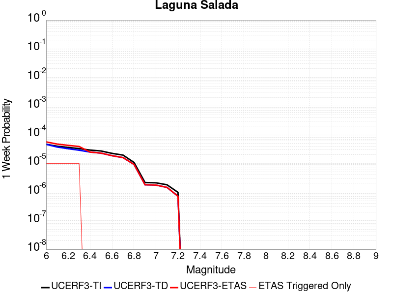 | 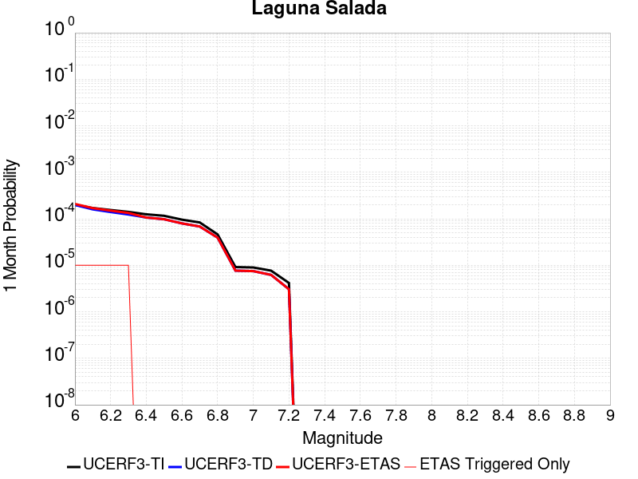 | 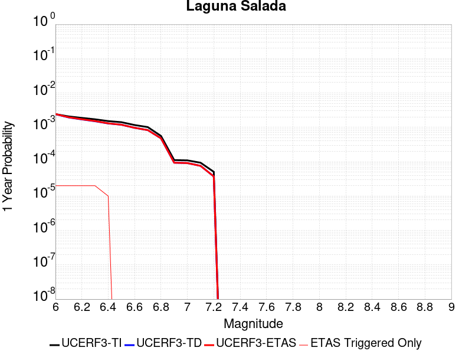 | 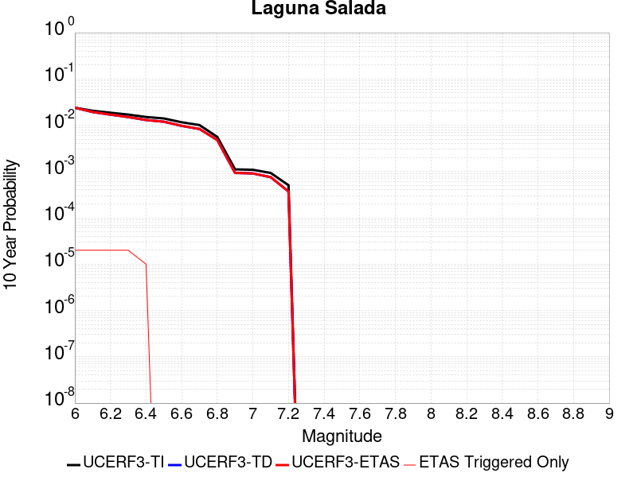 |

| Magnitude | 1 wk TI Prob | 1 wk TD Prob | 1 wk ETAS Prob | 1 wk ETAS/TD Gain | 1 wk ETAS Triggered Only | 1 mo TI Prob | 1 mo TD Prob | 1 mo ETAS Prob | 1 mo ETAS/TD Gain | 1 mo ETAS Triggered Only | 1 yr TI Prob | 1 yr TD Prob | 1 yr ETAS Prob | 1 yr ETAS/TD Gain | 1 yr ETAS Triggered Only | 10 yr TI Prob | 10 yr TD Prob | 10 yr ETAS Prob | 10 yr ETAS/TD Gain | 10 yr ETAS Triggered Only |
|-----|-----|-----|-----|-----|-----|-----|-----|-----|-----|-----|-----|-----|-----|-----|-----|-----|-----|-----|-----|-----|
| 6.0 | 4.6465593E-5 | 4.634507E-5 | 5.634461E-5 | 1.2157627 | 1.0E-5 | 1.9912305E-4 | 1.9860751E-4 | 2.0860552E-4 | 1.0503405 | 1.0E-5 | 0.0024216278 | 0.0024154421 | 0.0024353939 | 1.00826 | 2.0E-5 | 0.02395408 | 0.023965387 | 0.023984907 | 1.0008146 | 2.0E-5 |
| 6.1 | 3.982297E-5 | 3.7244878E-5 | 4.7244506E-5 | 1.2684833 | 1.0E-5 | 1.706587E-4 | 1.5961178E-4 | 1.6961018E-4 | 1.062642 | 1.0E-5 | 0.0020757897 | 0.0019416384 | 0.0019615996 | 1.0102806 | 2.0E-5 | 0.020565065 | 0.019322045 | 0.019341659 | 1.0010151 | 2.0E-5 |
| 6.2 | 3.6067784E-5 | 3.2600165E-5 | 4.2599837E-5 | 1.306737 | 1.0E-5 | 1.5456705E-4 | 1.3970808E-4 | 1.4970668E-4 | 1.0715678 | 1.0E-5 | 0.0018802295 | 0.0016997134 | 0.0017196795 | 1.0117466 | 2.0E-5 | 0.018644003 | 0.016963193 | 0.016982853 | 1.0011591 | 2.0E-5 |
| 6.3 | 3.2859112E-5 | 2.8847233E-5 | 3.8846945E-5 | 1.3466437 | 1.0E-5 | 1.4081717E-4 | 1.2362566E-4 | 1.3362443E-4 | 1.0808793 | 1.0E-5 | 0.0017131006 | 0.0015041964 | 0.0015241663 | 1.0132761 | 2.0E-5 | 0.016999546 | 0.015031838 | 0.015051537 | 1.0013105 | 2.0E-5 |
| 6.4 | 2.9132116E-5 | 2.4851877E-5 | 2.4851877E-5 | 1.0 | 0.0 | 1.2484594E-4 | 1.0650421E-4 | 1.0650421E-4 | 1.0 | 0.0 | 0.0015189396 | 0.001296006 | 0.0013059931 | 1.007706 | 1.0E-5 | 0.015085992 | 0.012965128 | 0.012974999 | 1.0007613 | 1.0E-5 |
| 6.5 | 2.7075037E-5 | 2.2824677E-5 | 2.2824677E-5 | 1.0 | 0.0 | 1.1603071E-4 | 9.7816875E-5 | 9.7816875E-5 | 1.0 | 0.0 | 0.0014117584 | 0.0011903581 | 0.0011903581 | 1.0 | 0.0 | 0.014028233 | 0.011916272 | 0.011916272 | 1.0 | 0.0 |
| 6.6 | 2.2367465E-5 | 1.8572848E-5 | 1.8572848E-5 | 1.0 | 0.0 | 9.5857045E-5 | 7.959595E-5 | 7.959595E-5 | 1.0 | 0.0 | 0.0011664346 | 9.687322E-4 | 9.687322E-4 | 1.0 | 0.0 | 0.011603311 | 0.009708806 | 0.009708806 | 1.0 | 0.0 |
| 6.7 | 1.9458053E-5 | 1.5913607E-5 | 1.5913607E-5 | 1.0 | 0.0 | 8.338899E-5 | 6.819984E-5 | 6.819984E-5 | 1.0 | 0.0 | 0.001014788 | 8.300971E-4 | 8.300971E-4 | 1.0 | 0.0 | 0.010101665 | 0.008315945 | 0.008315945 | 1.0 | 0.0 |
| 6.8 | 1.0767866E-5 | 9.183346E-6 | 9.183346E-6 | 1.0 | 0.0 | 4.614718E-5 | 3.9356994E-5 | 3.9356994E-5 | 1.0 | 0.0 | 5.6169706E-4 | 4.7913467E-4 | 4.7913467E-4 | 1.0 | 0.0 | 0.0056027942 | 0.0048085325 | 0.0048085325 | 1.0 | 0.0 |
| 6.9 | 2.1384765E-6 | 1.7913964E-6 | 1.7913964E-6 | 1.0 | 0.0 | 9.164866E-6 | 7.677392E-6 | 7.677392E-6 | 1.0 | 0.0 | 1.1157654E-4 | 9.346863E-5 | 9.346863E-5 | 1.0 | 0.0 | 0.0011152053 | 9.343315E-4 | 9.343315E-4 | 1.0 | 0.0 |
| 7.0 | 2.0952946E-6 | 1.7493335E-6 | 1.7493335E-6 | 1.0 | 0.0 | 8.979802E-6 | 7.497124E-6 | 7.497124E-6 | 1.0 | 0.0 | 1.0932361E-4 | 9.127405E-5 | 9.127405E-5 | 1.0 | 0.0 | 0.0010926984 | 9.124038E-4 | 9.124038E-4 | 1.0 | 0.0 |
| 7.1 | 1.7887576E-6 | 1.4500541E-6 | 1.4500541E-6 | 1.0 | 0.0 | 7.666081E-6 | 6.2145045E-6 | 6.2145045E-6 | 1.0 | 0.0 | 9.333054E-5 | 7.565928E-5 | 7.565928E-5 | 1.0 | 0.0 | 9.329135E-4 | 7.5636554E-4 | 7.5636554E-4 | 1.0 | 0.0 |
| 7.2 | 9.723109E-7 | 7.135829E-7 | 7.135829E-7 | 1.0 | 0.0 | 4.16704E-6 | 3.0582096E-6 | 3.0582096E-6 | 1.0 | 0.0 | 5.073253E-5 | 3.7233232E-5 | 3.7233232E-5 | 1.0 | 0.0 | 5.072095E-4 | 3.722862E-4 | 3.722862E-4 | 1.0 | 0.0 |

## Trinidad (alt1)
*[(top)](#table-of-contents)*

| 1 Week | 1 Month | 1 Year | 10 Year |
|-----|-----|-----|-----|
|  | 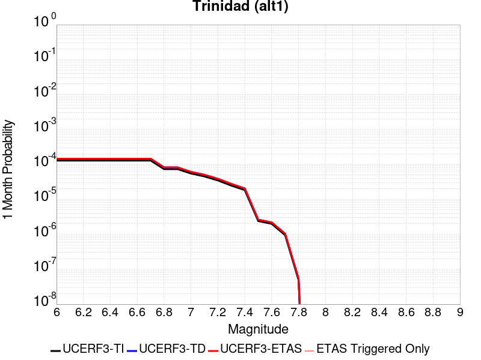 | 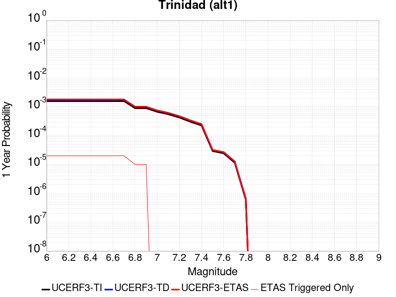 | 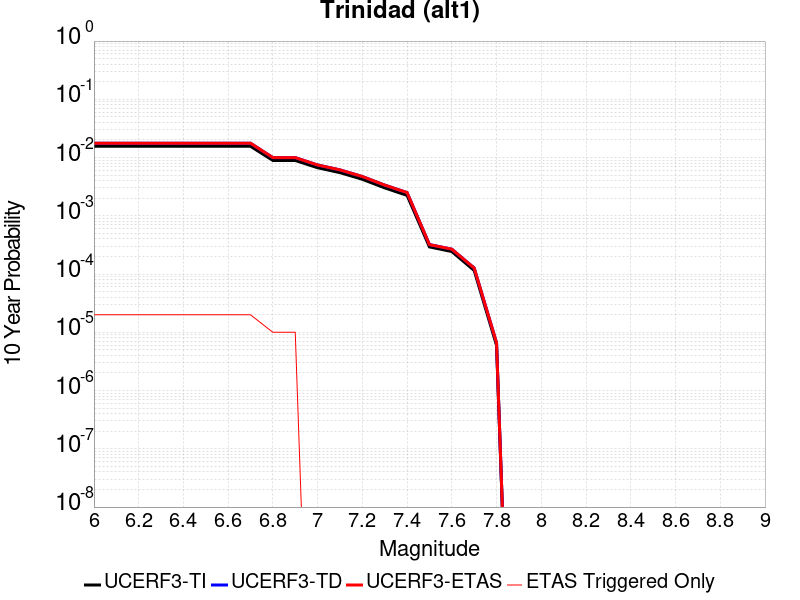 |

| Magnitude | 1 wk TI Prob | 1 wk TD Prob | 1 wk ETAS Prob | 1 wk ETAS/TD Gain | 1 wk ETAS Triggered Only | 1 mo TI Prob | 1 mo TD Prob | 1 mo ETAS Prob | 1 mo ETAS/TD Gain | 1 mo ETAS Triggered Only | 1 yr TI Prob | 1 yr TD Prob | 1 yr ETAS Prob | 1 yr ETAS/TD Gain | 1 yr ETAS Triggered Only | 10 yr TI Prob | 10 yr TD Prob | 10 yr ETAS Prob | 10 yr ETAS/TD Gain | 10 yr ETAS Triggered Only |
|-----|-----|-----|-----|-----|-----|-----|-----|-----|-----|-----|-----|-----|-----|-----|-----|-----|-----|-----|-----|-----|
| 6.0 | 3.0167168E-5 | 3.4033183E-5 | 3.4033183E-5 | 1.0 | 0.0 | 1.2928146E-4 | 1.4584929E-4 | 1.4584929E-4 | 1.0 | 0.0 | 0.0015728653 | 0.0017744373 | 0.0017944018 | 1.0112512 | 2.0E-5 | 0.0156177925 | 0.017619645 | 0.017639292 | 1.0011151 | 2.0E-5 |
| 6.1 | 3.0167168E-5 | 3.4033183E-5 | 3.4033183E-5 | 1.0 | 0.0 | 1.2928146E-4 | 1.4584929E-4 | 1.4584929E-4 | 1.0 | 0.0 | 0.0015728653 | 0.0017744373 | 0.0017944018 | 1.0112512 | 2.0E-5 | 0.0156177925 | 0.017619645 | 0.017639292 | 1.0011151 | 2.0E-5 |
| 6.2 | 3.0167168E-5 | 3.4033183E-5 | 3.4033183E-5 | 1.0 | 0.0 | 1.2928146E-4 | 1.4584929E-4 | 1.4584929E-4 | 1.0 | 0.0 | 0.0015728653 | 0.0017744373 | 0.0017944018 | 1.0112512 | 2.0E-5 | 0.0156177925 | 0.017619645 | 0.017639292 | 1.0011151 | 2.0E-5 |
| 6.3 | 3.0167168E-5 | 3.4033183E-5 | 3.4033183E-5 | 1.0 | 0.0 | 1.2928146E-4 | 1.4584929E-4 | 1.4584929E-4 | 1.0 | 0.0 | 0.0015728653 | 0.0017744373 | 0.0017944018 | 1.0112512 | 2.0E-5 | 0.0156177925 | 0.017619645 | 0.017639292 | 1.0011151 | 2.0E-5 |
| 6.4 | 3.0167168E-5 | 3.4033183E-5 | 3.4033183E-5 | 1.0 | 0.0 | 1.2928146E-4 | 1.4584929E-4 | 1.4584929E-4 | 1.0 | 0.0 | 0.0015728653 | 0.0017744373 | 0.0017944018 | 1.0112512 | 2.0E-5 | 0.0156177925 | 0.017619645 | 0.017639292 | 1.0011151 | 2.0E-5 |
| 6.5 | 3.0167168E-5 | 3.4033183E-5 | 3.4033183E-5 | 1.0 | 0.0 | 1.2928146E-4 | 1.4584929E-4 | 1.4584929E-4 | 1.0 | 0.0 | 0.0015728653 | 0.0017744373 | 0.0017944018 | 1.0112512 | 2.0E-5 | 0.0156177925 | 0.017619645 | 0.017639292 | 1.0011151 | 2.0E-5 |
| 6.6 | 3.0167168E-5 | 3.4033183E-5 | 3.4033183E-5 | 1.0 | 0.0 | 1.2928146E-4 | 1.4584929E-4 | 1.4584929E-4 | 1.0 | 0.0 | 0.0015728653 | 0.0017744373 | 0.0017944018 | 1.0112512 | 2.0E-5 | 0.0156177925 | 0.017619645 | 0.017639292 | 1.0011151 | 2.0E-5 |
| 6.7 | 3.0167168E-5 | 3.4033183E-5 | 3.4033183E-5 | 1.0 | 0.0 | 1.2928146E-4 | 1.4584929E-4 | 1.4584929E-4 | 1.0 | 0.0 | 0.0015728653 | 0.0017744373 | 0.0017944018 | 1.0112512 | 2.0E-5 | 0.0156177925 | 0.017619645 | 0.017639292 | 1.0011151 | 2.0E-5 |
| 6.8 | 1.717077E-5 | 1.9195684E-5 | 1.9195684E-5 | 1.0 | 0.0 | 7.358694E-5 | 8.226487E-5 | 8.226487E-5 | 1.0 | 0.0 | 8.9555274E-4 | 0.0010011591 | 0.0010111491 | 1.0099784 | 1.0E-5 | 0.008919522 | 0.009970939 | 0.009980839 | 1.0009929 | 1.0E-5 |
| 6.9 | 1.717077E-5 | 1.9195684E-5 | 1.9195684E-5 | 1.0 | 0.0 | 7.358694E-5 | 8.226487E-5 | 8.226487E-5 | 1.0 | 0.0 | 8.9555274E-4 | 0.0010011591 | 0.0010111491 | 1.0099784 | 1.0E-5 | 0.008919522 | 0.009970939 | 0.009980839 | 1.0009929 | 1.0E-5 |
| 7.0 | 1.2858572E-5 | 1.433737E-5 | 1.433737E-5 | 1.0 | 0.0 | 5.5107E-5 | 6.14446E-5 | 6.14446E-5 | 1.0 | 0.0 | 6.707212E-4 | 7.478634E-4 | 7.478634E-4 | 1.0 | 0.0 | 0.006687004 | 0.0074566454 | 0.0074566454 | 1.0 | 0.0 |
| 7.1 | 1.0588431E-5 | 1.1801269E-5 | 1.1801269E-5 | 1.0 | 0.0 | 4.53782E-5 | 5.057605E-5 | 5.057605E-5 | 1.0 | 0.0 | 5.5233954E-4 | 6.156183E-4 | 6.156183E-4 | 1.0 | 0.0 | 0.005509687 | 0.006141979 | 0.006141979 | 1.0 | 0.0 |
| 7.2 | 8.138061E-6 | 9.067213E-6 | 9.067213E-6 | 1.0 | 0.0 | 3.487694E-5 | 3.8859045E-5 | 3.8859045E-5 | 1.0 | 0.0 | 4.2454398E-4 | 4.7303102E-4 | 4.7303102E-4 | 1.0 | 0.0 | 0.0042373384 | 0.0047226823 | 0.0047226823 | 1.0 | 0.0 |
| 7.3 | 5.787542E-6 | 6.46032E-6 | 6.46032E-6 | 1.0 | 0.0 | 2.4803514E-5 | 2.7686914E-5 | 2.7686914E-5 | 1.0 | 0.0 | 3.0194095E-4 | 3.3705754E-4 | 3.3705754E-4 | 1.0 | 0.0 | 0.00301531 | 0.0033675742 | 0.0033675742 | 1.0 | 0.0 |
| 7.4 | 4.303563E-6 | 4.800851E-6 | 4.800851E-6 | 1.0 | 0.0 | 1.844371E-5 | 2.0575026E-5 | 2.0575026E-5 | 1.0 | 0.0 | 2.2452902E-4 | 2.504919E-4 | 2.504919E-4 | 1.0 | 0.0 | 0.0022430231 | 0.0025040337 | 0.0025040337 | 1.0 | 0.0 |
| 7.5 | 5.6063425E-7 | 6.142982E-7 | 6.142982E-7 | 1.0 | 0.0 | 2.402716E-6 | 2.632704E-6 | 2.632704E-6 | 1.0 | 0.0 | 2.9252675E-5 | 3.2052718E-5 | 3.2052718E-5 | 1.0 | 0.0 | 2.9248823E-4 | 3.2048248E-4 | 3.2048248E-4 | 1.0 | 0.0 |
| 7.6 | 4.6699128E-7 | 5.1257996E-7 | 5.1257996E-7 | 1.0 | 0.0 | 2.0013897E-6 | 2.1967694E-6 | 2.1967694E-6 | 1.0 | 0.0 | 2.4366647E-5 | 2.6745354E-5 | 2.6745354E-5 | 1.0 | 0.0 | 2.4363975E-4 | 2.6742276E-4 | 2.6742276E-4 | 1.0 | 0.0 |
| 7.7 | 2.2080937E-7 | 2.4346897E-7 | 2.4346897E-7 | 1.0 | 0.0 | 9.4632554E-7 | 1.043438E-6 | 1.043438E-6 | 1.0 | 0.0 | 1.15214525E-5 | 1.270379E-5 | 1.270379E-5 | 1.0 | 0.0 | 1.1520855E-4 | 1.2703124E-4 | 1.2703124E-4 | 1.0 | 0.0 |
| 7.8 | 1.1438307E-8 | 1.2682963E-8 | 1.2682963E-8 | 1.0 | 0.0 | 4.9021317E-8 | 5.4355557E-8 | 5.4355557E-8 | 1.0 | 0.0 | 5.9683435E-7 | 6.6177887E-7 | 6.6177887E-7 | 1.0 | 0.0 | 5.9683275E-6 | 6.617789E-6 | 6.617789E-6 | 1.0 | 0.0 |

## Robinson Creek
*[(top)](#table-of-contents)*

| 1 Week | 1 Month | 1 Year | 10 Year |
|-----|-----|-----|-----|
|  |  |  | 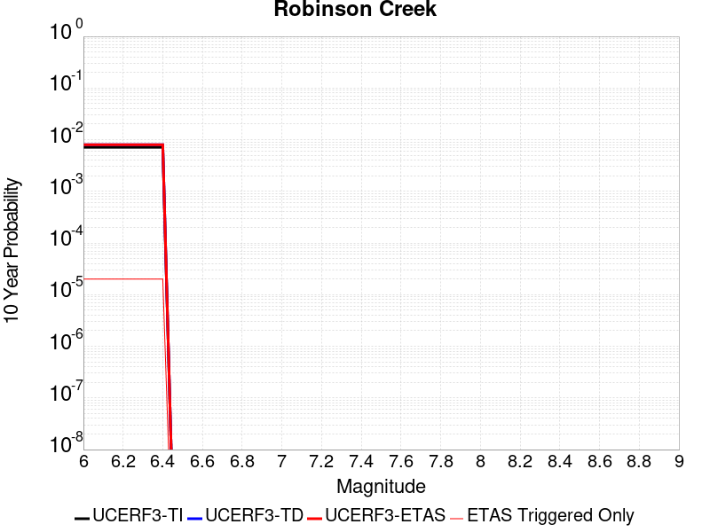 |

| Magnitude | 1 wk TI Prob | 1 wk TD Prob | 1 wk ETAS Prob | 1 wk ETAS/TD Gain | 1 wk ETAS Triggered Only | 1 mo TI Prob | 1 mo TD Prob | 1 mo ETAS Prob | 1 mo ETAS/TD Gain | 1 mo ETAS Triggered Only | 1 yr TI Prob | 1 yr TD Prob | 1 yr ETAS Prob | 1 yr ETAS/TD Gain | 1 yr ETAS Triggered Only | 10 yr TI Prob | 10 yr TD Prob | 10 yr ETAS Prob | 10 yr ETAS/TD Gain | 10 yr ETAS Triggered Only |
|-----|-----|-----|-----|-----|-----|-----|-----|-----|-----|-----|-----|-----|-----|-----|-----|-----|-----|-----|-----|-----|
| 6.0 | 1.3705327E-5 | 1.5285013E-5 | 1.5285013E-5 | 1.0 | 0.0 | 5.8735794E-5 | 6.55072E-5 | 7.550655E-5 | 1.152645 | 1.0E-5 | 7.1487366E-4 | 7.9755014E-4 | 8.175342E-4 | 1.0250568 | 2.0E-5 | 0.0071257832 | 0.007975501 | 0.007995342 | 1.0024877 | 2.0E-5 |
| 6.1 | 1.3705327E-5 | 1.5285013E-5 | 1.5285013E-5 | 1.0 | 0.0 | 5.8735794E-5 | 6.55072E-5 | 7.550655E-5 | 1.152645 | 1.0E-5 | 7.1487366E-4 | 7.9755014E-4 | 8.175342E-4 | 1.0250568 | 2.0E-5 | 0.0071257832 | 0.007975501 | 0.007995342 | 1.0024877 | 2.0E-5 |
| 6.2 | 1.3705327E-5 | 1.5285013E-5 | 1.5285013E-5 | 1.0 | 0.0 | 5.8735794E-5 | 6.55072E-5 | 7.550655E-5 | 1.152645 | 1.0E-5 | 7.1487366E-4 | 7.9755014E-4 | 8.175342E-4 | 1.0250568 | 2.0E-5 | 0.0071257832 | 0.007975501 | 0.007995342 | 1.0024877 | 2.0E-5 |
| 6.3 | 1.3705327E-5 | 1.5285013E-5 | 1.5285013E-5 | 1.0 | 0.0 | 5.8735794E-5 | 6.55072E-5 | 7.550655E-5 | 1.152645 | 1.0E-5 | 7.1487366E-4 | 7.9755014E-4 | 8.175342E-4 | 1.0250568 | 2.0E-5 | 0.0071257832 | 0.007975501 | 0.007995342 | 1.0024877 | 2.0E-5 |
| 6.4 | 1.3705327E-5 | 1.5285013E-5 | 1.5285013E-5 | 1.0 | 0.0 | 5.8735794E-5 | 6.55072E-5 | 7.550655E-5 | 1.152645 | 1.0E-5 | 7.1487366E-4 | 7.9755014E-4 | 8.175342E-4 | 1.0250568 | 2.0E-5 | 0.0071257832 | 0.007975501 | 0.007995342 | 1.0024877 | 2.0E-5 |

## Pilarcitos 2011 CFM
*[(top)](#table-of-contents)*

| 1 Week | 1 Month | 1 Year | 10 Year |
|-----|-----|-----|-----|
| 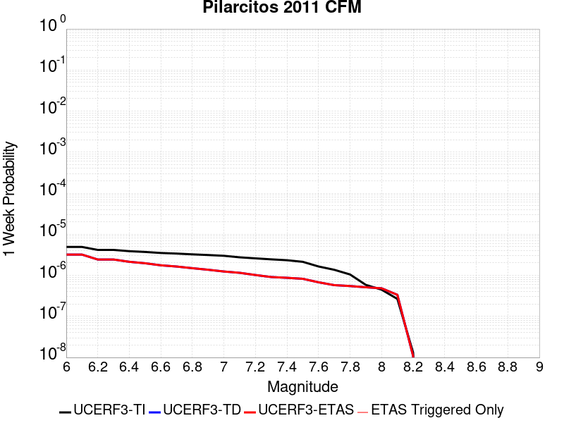 | 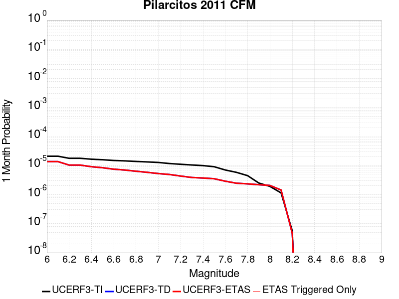 | 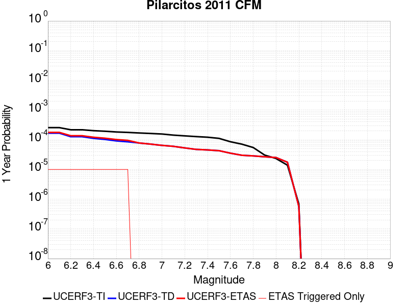 | 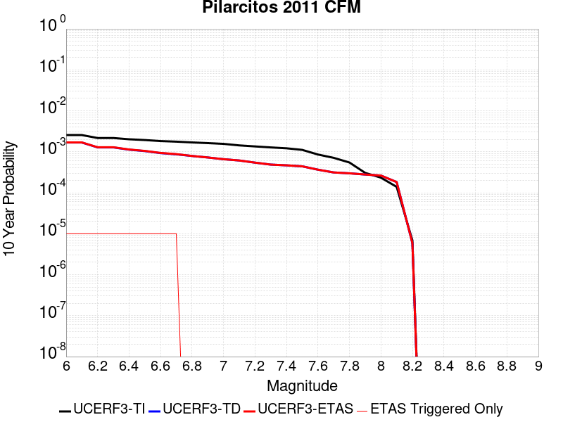 |

| Magnitude | 1 wk TI Prob | 1 wk TD Prob | 1 wk ETAS Prob | 1 wk ETAS/TD Gain | 1 wk ETAS Triggered Only | 1 mo TI Prob | 1 mo TD Prob | 1 mo ETAS Prob | 1 mo ETAS/TD Gain | 1 mo ETAS Triggered Only | 1 yr TI Prob | 1 yr TD Prob | 1 yr ETAS Prob | 1 yr ETAS/TD Gain | 1 yr ETAS Triggered Only | 10 yr TI Prob | 10 yr TD Prob | 10 yr ETAS Prob | 10 yr ETAS/TD Gain | 10 yr ETAS Triggered Only |
|-----|-----|-----|-----|-----|-----|-----|-----|-----|-----|-----|-----|-----|-----|-----|-----|-----|-----|-----|-----|-----|
| 6.0 | 4.9150476E-6 | 3.2016114E-6 | 3.2016114E-6 | 1.0 | 0.0 | 2.1064321E-5 | 1.3721121E-5 | 1.3721121E-5 | 1.0 | 0.0 | 2.564279E-4 | 1.6704215E-4 | 1.7704048E-4 | 1.0598551 | 1.0E-5 | 0.0025613222 | 0.0016816513 | 0.0016916345 | 1.0059365 | 1.0E-5 |
| 6.1 | 4.9150476E-6 | 3.2016114E-6 | 3.2016114E-6 | 1.0 | 0.0 | 2.1064321E-5 | 1.3721121E-5 | 1.3721121E-5 | 1.0 | 0.0 | 2.564279E-4 | 1.6704215E-4 | 1.7704048E-4 | 1.0598551 | 1.0E-5 | 0.0025613222 | 0.0016816513 | 0.0016916345 | 1.0059365 | 1.0E-5 |
| 6.2 | 4.162343E-6 | 2.4300016E-6 | 2.4300016E-6 | 1.0 | 0.0 | 1.783849E-5 | 1.0414251E-5 | 1.0414251E-5 | 1.0 | 0.0 | 2.1716199E-4 | 1.2678621E-4 | 1.3678493E-4 | 1.0788629 | 1.0E-5 | 0.002169499 | 0.001279606 | 0.0012895933 | 1.0078049 | 1.0E-5 |
| 6.3 | 4.162343E-6 | 2.4300016E-6 | 2.4300016E-6 | 1.0 | 0.0 | 1.783849E-5 | 1.0414251E-5 | 1.0414251E-5 | 1.0 | 0.0 | 2.1716199E-4 | 1.2678621E-4 | 1.3678493E-4 | 1.0788629 | 1.0E-5 | 0.002169499 | 0.001279606 | 0.0012895933 | 1.0078049 | 1.0E-5 |
| 6.4 | 3.8768926E-6 | 2.137421E-6 | 2.137421E-6 | 1.0 | 0.0 | 1.6615148E-5 | 9.160343E-6 | 9.160343E-6 | 1.0 | 0.0 | 2.0227065E-4 | 1.1152151E-4 | 1.21520396E-4 | 1.0896589 | 1.0E-5 | 0.0020208664 | 0.001127121 | 0.0011371098 | 1.0088621 | 1.0E-5 |
| 6.5 | 3.7137002E-6 | 1.9707802E-6 | 1.9707802E-6 | 1.0 | 0.0 | 1.591576E-5 | 8.4461735E-6 | 8.4461735E-6 | 1.0 | 0.0 | 1.9375715E-4 | 1.0282734E-4 | 1.1282631E-4 | 1.0972404 | 1.0E-5 | 0.001935883 | 0.0010402631 | 0.0010502527 | 1.0096029 | 1.0E-5 |
| 6.6 | 3.5048733E-6 | 1.7557347E-6 | 1.7557347E-6 | 1.0 | 0.0 | 1.5020799E-5 | 7.5245557E-6 | 7.5245557E-6 | 1.0 | 0.0 | 1.8286289E-4 | 9.160764E-5 | 1.01606725E-4 | 1.1091512 | 1.0E-5 | 0.0018271249 | 9.2816487E-4 | 9.381556E-4 | 1.010764 | 1.0E-5 |
| 6.7 | 3.3908584E-6 | 1.6394266E-6 | 1.6394266E-6 | 1.0 | 0.0 | 1.453217E-5 | 7.0260953E-6 | 7.0260953E-6 | 1.0 | 0.0 | 1.7691481E-4 | 8.553937E-5 | 9.553851E-5 | 1.1168952 | 1.0E-5 | 0.0017677402 | 8.675308E-4 | 8.775221E-4 | 1.0115169 | 1.0E-5 |
| 6.8 | 3.2451449E-6 | 1.492648E-6 | 1.492648E-6 | 1.0 | 0.0 | 1.3907689E-5 | 6.3970474E-6 | 6.3970474E-6 | 1.0 | 0.0 | 1.6931296E-4 | 7.7881276E-5 | 7.7881276E-5 | 1.0 | 0.0 | 0.0016918402 | 7.9100643E-4 | 7.9100643E-4 | 1.0 | 0.0 |
| 6.9 | 3.1239128E-6 | 1.3691754E-6 | 1.3691754E-6 | 1.0 | 0.0 | 1.3388129E-5 | 5.867881E-6 | 5.867881E-6 | 1.0 | 0.0 | 1.6298829E-4 | 7.143912E-5 | 7.143912E-5 | 1.0 | 0.0 | 0.001628688 | 7.2662864E-4 | 7.2662864E-4 | 1.0 | 0.0 |
| 7.0 | 2.9940109E-6 | 1.2404895E-6 | 1.2404895E-6 | 1.0 | 0.0 | 1.2831412E-5 | 5.3163726E-6 | 5.3163726E-6 | 1.0 | 0.0 | 1.5621124E-4 | 6.472491E-5 | 6.472491E-5 | 1.0 | 0.0 | 0.0015610148 | 6.5952796E-4 | 6.5952796E-4 | 1.0 | 0.0 |
| 7.1 | 2.7471217E-6 | 1.1522303E-6 | 1.1522303E-6 | 1.0 | 0.0 | 1.1773326E-5 | 4.9381206E-6 | 4.9381206E-6 | 1.0 | 0.0 | 1.4333082E-4 | 6.011996E-5 | 6.011996E-5 | 1.0 | 0.0 | 0.001432384 | 6.134525E-4 | 6.134525E-4 | 1.0 | 0.0 |
| 7.2 | 2.592675E-6 | 1.0182824E-6 | 1.0182824E-6 | 1.0 | 0.0 | 1.1111417E-5 | 4.36406E-6 | 4.36406E-6 | 1.0 | 0.0 | 1.3527309E-4 | 5.3131134E-5 | 5.3131134E-5 | 1.0 | 0.0 | 0.0013519078 | 5.436006E-4 | 5.436006E-4 | 1.0 | 0.0 |
| 7.3 | 2.4518663E-6 | 9.0924055E-7 | 9.0924055E-7 | 1.0 | 0.0 | 1.0507956E-5 | 3.8967396E-6 | 3.8967396E-6 | 1.0 | 0.0 | 1.2792686E-4 | 4.744177E-5 | 4.744177E-5 | 1.0 | 0.0 | 0.0012785323 | 4.8673138E-4 | 4.8673138E-4 | 1.0 | 0.0 |
| 7.4 | 2.3349535E-6 | 8.714187E-7 | 8.714187E-7 | 1.0 | 0.0 | 1.0006905E-5 | 3.7346463E-6 | 3.7346463E-6 | 1.0 | 0.0 | 1.2182725E-4 | 4.546837E-5 | 4.546837E-5 | 1.0 | 0.0 | 0.0012176048 | 4.6698053E-4 | 4.6698053E-4 | 1.0 | 0.0 |
| 7.5 | 2.1358665E-6 | 8.234828E-7 | 8.234828E-7 | 1.0 | 0.0 | 9.15368E-6 | 3.529207E-6 | 3.529207E-6 | 1.0 | 0.0 | 1.11440364E-4 | 4.296725E-5 | 4.296725E-5 | 1.0 | 0.0 | 0.0011138449 | 4.4188576E-4 | 4.4188576E-4 | 1.0 | 0.0 |
| 7.6 | 1.6445446E-6 | 6.777282E-7 | 6.777282E-7 | 1.0 | 0.0 | 7.048029E-6 | 2.9045461E-6 | 2.9045461E-6 | 1.0 | 0.0 | 8.580638E-5 | 3.5362275E-5 | 3.5362275E-5 | 1.0 | 0.0 | 8.5773255E-4 | 3.657945E-4 | 3.657945E-4 | 1.0 | 0.0 |
| 7.7 | 1.3650961E-6 | 5.7706814E-7 | 5.7706814E-7 | 1.0 | 0.0 | 5.850399E-6 | 2.4731469E-6 | 2.4731469E-6 | 1.0 | 0.0 | 7.122628E-5 | 3.0110148E-5 | 3.0110148E-5 | 1.0 | 0.0 | 7.120345E-4 | 3.1317066E-4 | 3.1317066E-4 | 1.0 | 0.0 |
| 7.8 | 1.0500993E-6 | 5.4866143E-7 | 5.4866143E-7 | 1.0 | 0.0 | 4.5004176E-6 | 2.351404E-6 | 2.351404E-6 | 1.0 | 0.0 | 5.4791206E-5 | 2.8627966E-5 | 2.8627966E-5 | 1.0 | 0.0 | 5.47777E-4 | 2.9822122E-4 | 2.9822122E-4 | 1.0 | 0.0 |
| 7.9 | 5.856431E-7 | 5.128745E-7 | 5.128745E-7 | 1.0 | 0.0 | 2.5098966E-6 | 2.1980318E-6 | 2.1980318E-6 | 1.0 | 0.0 | 3.0557563E-5 | 2.676071E-5 | 2.676071E-5 | 1.0 | 0.0 | 3.055336E-4 | 2.7880984E-4 | 2.7880984E-4 | 1.0 | 0.0 |
| 8.0 | 4.4768265E-7 | 4.835379E-7 | 4.835379E-7 | 1.0 | 0.0 | 1.9186384E-6 | 2.0723037E-6 | 2.0723037E-6 | 1.0 | 0.0 | 2.3359173E-5 | 2.5230007E-5 | 2.5230007E-5 | 1.0 | 0.0 | 2.3356717E-4 | 2.629721E-4 | 2.629721E-4 | 1.0 | 0.0 |
| 8.1 | 2.6692538E-7 | 3.3572303E-7 | 3.3572303E-7 | 1.0 | 0.0 | 1.1439654E-6 | 1.4388122E-6 | 1.4388122E-6 | 1.0 | 0.0 | 1.392769E-5 | 1.75174E-5 | 1.75174E-5 | 1.0 | 0.0 | 1.3926817E-4 | 1.8253841E-4 | 1.8253841E-4 | 1.0 | 0.0 |
| 8.2 | 1.3198862E-8 | 1.0823697E-8 | 1.0823697E-8 | 1.0 | 0.0 | 5.656655E-8 | 4.6387267E-8 | 4.6387267E-8 | 1.0 | 0.0 | 6.886975E-7 | 5.647649E-7 | 5.647649E-7 | 1.0 | 0.0 | 6.8869535E-6 | 5.880692E-6 | 5.880692E-6 | 1.0 | 0.0 |

## West Tahoe
*[(top)](#table-of-contents)*

| 1 Week | 1 Month | 1 Year | 10 Year |
|-----|-----|-----|-----|
| 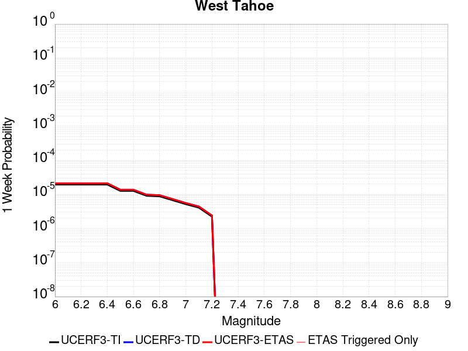 |  | 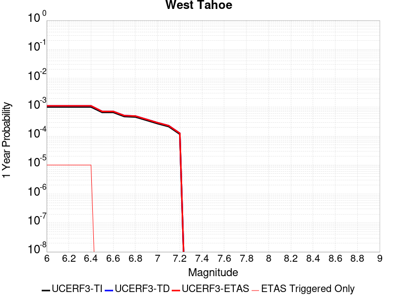 | 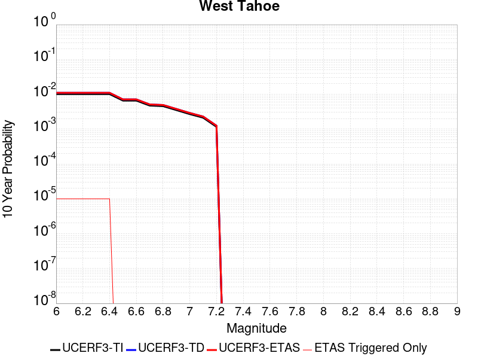 |

| Magnitude | 1 wk TI Prob | 1 wk TD Prob | 1 wk ETAS Prob | 1 wk ETAS/TD Gain | 1 wk ETAS Triggered Only | 1 mo TI Prob | 1 mo TD Prob | 1 mo ETAS Prob | 1 mo ETAS/TD Gain | 1 mo ETAS Triggered Only | 1 yr TI Prob | 1 yr TD Prob | 1 yr ETAS Prob | 1 yr ETAS/TD Gain | 1 yr ETAS Triggered Only | 10 yr TI Prob | 10 yr TD Prob | 10 yr ETAS Prob | 10 yr ETAS/TD Gain | 10 yr ETAS Triggered Only |
|-----|-----|-----|-----|-----|-----|-----|-----|-----|-----|-----|-----|-----|-----|-----|-----|-----|-----|-----|-----|-----|
| 6.0 | 1.952444E-5 | 2.118317E-5 | 2.118317E-5 | 1.0 | 0.0 | 8.367348E-5 | 9.078217E-5 | 9.078217E-5 | 1.0 | 0.0 | 0.0010182485 | 0.0011047672 | 0.0011147561 | 1.0090417 | 1.0E-5 | 0.010135954 | 0.010998235 | 0.011008126 | 1.0008992 | 1.0E-5 |
| 6.1 | 1.952444E-5 | 2.118317E-5 | 2.118317E-5 | 1.0 | 0.0 | 8.367348E-5 | 9.078217E-5 | 9.078217E-5 | 1.0 | 0.0 | 0.0010182485 | 0.0011047672 | 0.0011147561 | 1.0090417 | 1.0E-5 | 0.010135954 | 0.010998235 | 0.011008126 | 1.0008992 | 1.0E-5 |
| 6.2 | 1.952444E-5 | 2.118317E-5 | 2.118317E-5 | 1.0 | 0.0 | 8.367348E-5 | 9.078217E-5 | 9.078217E-5 | 1.0 | 0.0 | 0.0010182485 | 0.0011047672 | 0.0011147561 | 1.0090417 | 1.0E-5 | 0.010135954 | 0.010998235 | 0.011008126 | 1.0008992 | 1.0E-5 |
| 6.3 | 1.952444E-5 | 2.118317E-5 | 2.118317E-5 | 1.0 | 0.0 | 8.367348E-5 | 9.078217E-5 | 9.078217E-5 | 1.0 | 0.0 | 0.0010182485 | 0.0011047672 | 0.0011147561 | 1.0090417 | 1.0E-5 | 0.010135954 | 0.010998235 | 0.011008126 | 1.0008992 | 1.0E-5 |
| 6.4 | 1.952444E-5 | 2.118317E-5 | 2.118317E-5 | 1.0 | 0.0 | 8.367348E-5 | 9.078217E-5 | 9.078217E-5 | 1.0 | 0.0 | 0.0010182485 | 0.0011047672 | 0.0011147561 | 1.0090417 | 1.0E-5 | 0.010135954 | 0.010998235 | 0.011008126 | 1.0008992 | 1.0E-5 |
| 6.5 | 1.2685271E-5 | 1.3690627E-5 | 1.3690627E-5 | 1.0 | 0.0 | 5.4364315E-5 | 5.8672893E-5 | 5.8672893E-5 | 1.0 | 0.0 | 6.616845E-4 | 7.141248E-4 | 7.141248E-4 | 1.0 | 0.0 | 0.0065971776 | 0.00711995 | 0.00711995 | 1.0 | 0.0 |
| 6.6 | 1.2685271E-5 | 1.3690627E-5 | 1.3690627E-5 | 1.0 | 0.0 | 5.4364315E-5 | 5.8672893E-5 | 5.8672893E-5 | 1.0 | 0.0 | 6.616845E-4 | 7.141248E-4 | 7.141248E-4 | 1.0 | 0.0 | 0.0065971776 | 0.00711995 | 0.00711995 | 1.0 | 0.0 |
| 6.7 | 9.117886E-6 | 9.809846E-6 | 9.809846E-6 | 1.0 | 0.0 | 3.9076072E-5 | 4.2041564E-5 | 4.2041564E-5 | 1.0 | 0.0 | 4.756473E-4 | 5.11743E-4 | 5.11743E-4 | 1.0 | 0.0 | 0.0047463053 | 0.0051063634 | 0.0051063634 | 1.0 | 0.0 |
| 6.8 | 8.786828E-6 | 9.457863E-6 | 9.457863E-6 | 1.0 | 0.0 | 3.7657293E-5 | 4.053311E-5 | 4.053311E-5 | 1.0 | 0.0 | 4.5838108E-4 | 4.933859E-4 | 4.933859E-4 | 1.0 | 0.0 | 0.0045743673 | 0.0049236063 | 0.0049236063 | 1.0 | 0.0 |
| 6.9 | 6.7562123E-6 | 7.2638086E-6 | 7.2638086E-6 | 1.0 | 0.0 | 2.8954875E-5 | 3.1130265E-5 | 3.1130265E-5 | 1.0 | 0.0 | 3.5246857E-4 | 3.789498E-4 | 3.789498E-4 | 1.0 | 0.0 | 0.0035191004 | 0.0037835082 | 0.0037835082 | 1.0 | 0.0 |
| 7.0 | 5.1792854E-6 | 5.567338E-6 | 5.567338E-6 | 1.0 | 0.0 | 2.2196748E-5 | 2.3859824E-5 | 2.3859824E-5 | 1.0 | 0.0 | 2.702119E-4 | 2.9045844E-4 | 2.9045844E-4 | 1.0 | 0.0 | 0.0026988357 | 0.0029011632 | 0.0029011632 | 1.0 | 0.0 |
| 7.1 | 4.090765E-6 | 4.3974223E-6 | 4.3974223E-6 | 1.0 | 0.0 | 1.7531731E-5 | 1.884598E-5 | 1.884598E-5 | 1.0 | 0.0 | 2.134279E-4 | 2.2942905E-4 | 2.2942905E-4 | 1.0 | 0.0 | 0.0021322304 | 0.0022922563 | 0.0022922563 | 1.0 | 0.0 |
| 7.2 | 2.2356758E-6 | 2.4023684E-6 | 2.4023684E-6 | 1.0 | 0.0 | 9.581432E-6 | 1.0295834E-5 | 1.0295834E-5 | 1.0 | 0.0 | 1.1664769E-4 | 1.2534647E-4 | 1.2534647E-4 | 1.0 | 0.0 | 0.0011658648 | 0.0012529434 | 0.0012529434 | 1.0 | 0.0 |

## Jess Valley
*[(top)](#table-of-contents)*

| 1 Week | 1 Month | 1 Year | 10 Year |
|-----|-----|-----|-----|
| 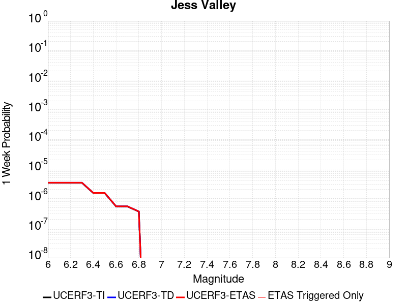 | 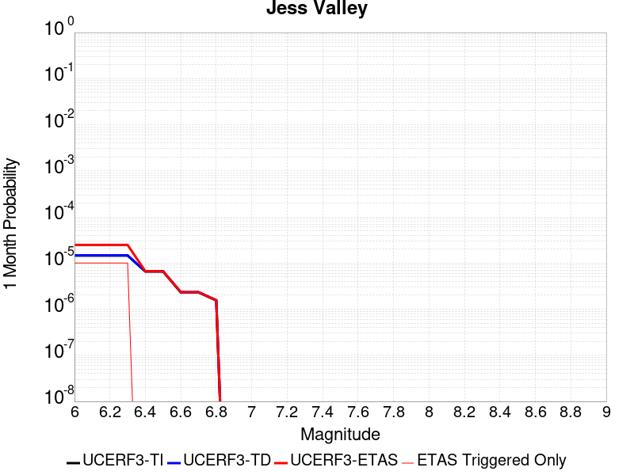 | 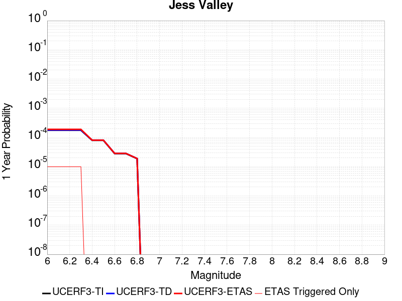 | 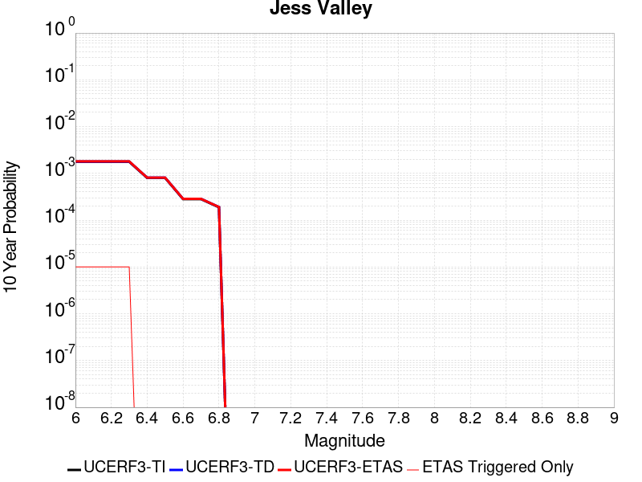 |

| Magnitude | 1 wk TI Prob | 1 wk TD Prob | 1 wk ETAS Prob | 1 wk ETAS/TD Gain | 1 wk ETAS Triggered Only | 1 mo TI Prob | 1 mo TD Prob | 1 mo ETAS Prob | 1 mo ETAS/TD Gain | 1 mo ETAS Triggered Only | 1 yr TI Prob | 1 yr TD Prob | 1 yr ETAS Prob | 1 yr ETAS/TD Gain | 1 yr ETAS Triggered Only | 10 yr TI Prob | 10 yr TD Prob | 10 yr ETAS Prob | 10 yr ETAS/TD Gain | 10 yr ETAS Triggered Only |
|-----|-----|-----|-----|-----|-----|-----|-----|-----|-----|-----|-----|-----|-----|-----|-----|-----|-----|-----|-----|-----|
| 6.0 | 3.3861274E-6 | 3.4340592E-6 | 3.4340592E-6 | 1.0 | 0.0 | 1.4511894E-5 | 1.471733E-5 | 2.4717183E-5 | 1.6794611 | 1.0E-5 | 1.7666799E-4 | 1.7917156E-4 | 1.8916978E-4 | 1.0558025 | 1.0E-5 | 0.001765276 | 0.0017905476 | 0.0018005297 | 1.005575 | 1.0E-5 |
| 6.1 | 3.3861274E-6 | 3.4340592E-6 | 3.4340592E-6 | 1.0 | 0.0 | 1.4511894E-5 | 1.471733E-5 | 2.4717183E-5 | 1.6794611 | 1.0E-5 | 1.7666799E-4 | 1.7917156E-4 | 1.8916978E-4 | 1.0558025 | 1.0E-5 | 0.001765276 | 0.0017905476 | 0.0018005297 | 1.005575 | 1.0E-5 |
| 6.2 | 3.3861274E-6 | 3.4340592E-6 | 3.4340592E-6 | 1.0 | 0.0 | 1.4511894E-5 | 1.471733E-5 | 2.4717183E-5 | 1.6794611 | 1.0E-5 | 1.7666799E-4 | 1.7917156E-4 | 1.8916978E-4 | 1.0558025 | 1.0E-5 | 0.001765276 | 0.0017905476 | 0.0018005297 | 1.005575 | 1.0E-5 |
| 6.3 | 3.3861274E-6 | 3.4340592E-6 | 3.4340592E-6 | 1.0 | 0.0 | 1.4511894E-5 | 1.471733E-5 | 2.4717183E-5 | 1.6794611 | 1.0E-5 | 1.7666799E-4 | 1.7917156E-4 | 1.8916978E-4 | 1.0558025 | 1.0E-5 | 0.001765276 | 0.0017905476 | 0.0018005297 | 1.005575 | 1.0E-5 |
| 6.4 | 1.5291708E-6 | 1.5502784E-6 | 1.5502784E-6 | 1.0 | 0.0 | 6.553573E-6 | 6.644038E-6 | 6.644038E-6 | 1.0 | 0.0 | 7.978683E-5 | 8.088895E-5 | 8.088895E-5 | 1.0 | 0.0 | 7.975819E-4 | 8.086733E-4 | 8.086733E-4 | 1.0 | 0.0 |
| 6.5 | 1.5291708E-6 | 1.5502784E-6 | 1.5502784E-6 | 1.0 | 0.0 | 6.553573E-6 | 6.644038E-6 | 6.644038E-6 | 1.0 | 0.0 | 7.978683E-5 | 8.088895E-5 | 8.088895E-5 | 1.0 | 0.0 | 7.975819E-4 | 8.086733E-4 | 8.086733E-4 | 1.0 | 0.0 |
| 6.6 | 5.396423E-7 | 5.4719953E-7 | 5.4719953E-7 | 1.0 | 0.0 | 2.312751E-6 | 2.3451398E-6 | 2.3451398E-6 | 1.0 | 0.0 | 2.8157378E-5 | 2.855189E-5 | 2.855189E-5 | 1.0 | 0.0 | 2.8153812E-4 | 2.8550063E-4 | 2.8550063E-4 | 1.0 | 0.0 |
| 6.7 | 5.396423E-7 | 5.4719953E-7 | 5.4719953E-7 | 1.0 | 0.0 | 2.312751E-6 | 2.3451398E-6 | 2.3451398E-6 | 1.0 | 0.0 | 2.8157378E-5 | 2.855189E-5 | 2.855189E-5 | 1.0 | 0.0 | 2.8153812E-4 | 2.8550063E-4 | 2.8550063E-4 | 1.0 | 0.0 |
| 6.8 | 3.6058395E-7 | 3.6563068E-7 | 3.6563068E-7 | 1.0 | 0.0 | 1.5453588E-6 | 1.5669885E-6 | 1.5669885E-6 | 1.0 | 0.0 | 1.8814582E-5 | 1.9078087E-5 | 1.9078087E-5 | 1.0 | 0.0 | 1.8812988E-4 | 1.9078086E-4 | 1.9078086E-4 | 1.0 | 0.0 |

## Puente Hills
*[(top)](#table-of-contents)*

| 1 Week | 1 Month | 1 Year | 10 Year |
|-----|-----|-----|-----|
|  | 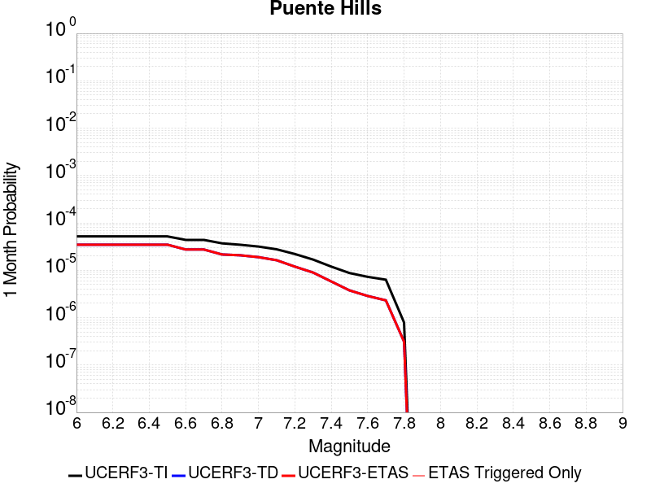 | 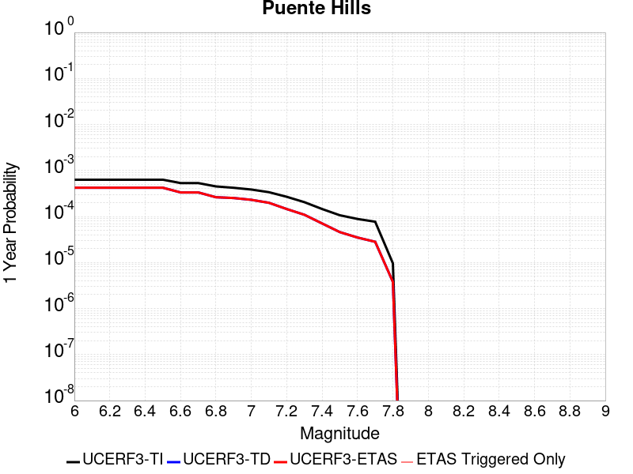 | 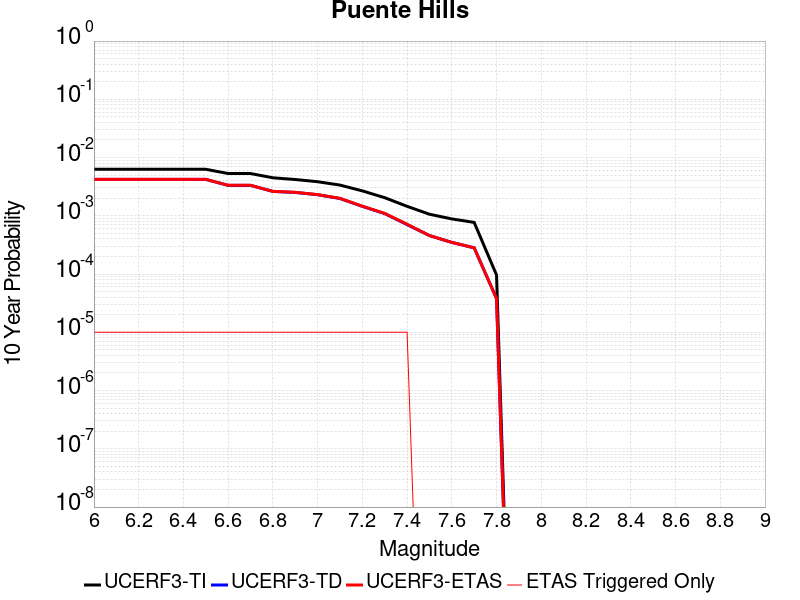 |

| Magnitude | 1 wk TI Prob | 1 wk TD Prob | 1 wk ETAS Prob | 1 wk ETAS/TD Gain | 1 wk ETAS Triggered Only | 1 mo TI Prob | 1 mo TD Prob | 1 mo ETAS Prob | 1 mo ETAS/TD Gain | 1 mo ETAS Triggered Only | 1 yr TI Prob | 1 yr TD Prob | 1 yr ETAS Prob | 1 yr ETAS/TD Gain | 1 yr ETAS Triggered Only | 10 yr TI Prob | 10 yr TD Prob | 10 yr ETAS Prob | 10 yr ETAS/TD Gain | 10 yr ETAS Triggered Only |
|-----|-----|-----|-----|-----|-----|-----|-----|-----|-----|-----|-----|-----|-----|-----|-----|-----|-----|-----|-----|-----|
| 6.0 | 1.2101656E-5 | 8.098448E-6 | 8.098448E-6 | 1.0 | 0.0 | 5.1863204E-5 | 3.4707205E-5 | 3.4707205E-5 | 1.0 | 0.0 | 6.312516E-4 | 4.2248392E-4 | 4.2248392E-4 | 1.0 | 0.0 | 0.0062946146 | 0.0042173676 | 0.0042273253 | 1.0023612 | 1.0E-5 |
| 6.1 | 1.2101656E-5 | 8.098448E-6 | 8.098448E-6 | 1.0 | 0.0 | 5.1863204E-5 | 3.4707205E-5 | 3.4707205E-5 | 1.0 | 0.0 | 6.312516E-4 | 4.2248392E-4 | 4.2248392E-4 | 1.0 | 0.0 | 0.0062946146 | 0.0042173676 | 0.0042273253 | 1.0023612 | 1.0E-5 |
| 6.2 | 1.2101656E-5 | 8.098448E-6 | 8.098448E-6 | 1.0 | 0.0 | 5.1863204E-5 | 3.4707205E-5 | 3.4707205E-5 | 1.0 | 0.0 | 6.312516E-4 | 4.2248392E-4 | 4.2248392E-4 | 1.0 | 0.0 | 0.0062946146 | 0.0042173676 | 0.0042273253 | 1.0023612 | 1.0E-5 |
| 6.3 | 1.2101656E-5 | 8.098448E-6 | 8.098448E-6 | 1.0 | 0.0 | 5.1863204E-5 | 3.4707205E-5 | 3.4707205E-5 | 1.0 | 0.0 | 6.312516E-4 | 4.2248392E-4 | 4.2248392E-4 | 1.0 | 0.0 | 0.0062946146 | 0.0042173676 | 0.0042273253 | 1.0023612 | 1.0E-5 |
| 6.4 | 1.2101656E-5 | 8.098448E-6 | 8.098448E-6 | 1.0 | 0.0 | 5.1863204E-5 | 3.4707205E-5 | 3.4707205E-5 | 1.0 | 0.0 | 6.312516E-4 | 4.2248392E-4 | 4.2248392E-4 | 1.0 | 0.0 | 0.0062946146 | 0.0042173676 | 0.0042273253 | 1.0023612 | 1.0E-5 |
| 6.5 | 1.2101656E-5 | 8.098448E-6 | 8.098448E-6 | 1.0 | 0.0 | 5.1863204E-5 | 3.4707205E-5 | 3.4707205E-5 | 1.0 | 0.0 | 6.312516E-4 | 4.2248392E-4 | 4.2248392E-4 | 1.0 | 0.0 | 0.0062946146 | 0.0042173676 | 0.0042273253 | 1.0023612 | 1.0E-5 |
| 6.6 | 1.0222488E-5 | 6.399079E-6 | 6.399079E-6 | 1.0 | 0.0 | 4.3809923E-5 | 2.742435E-5 | 2.742435E-5 | 1.0 | 0.0 | 5.332553E-4 | 3.3384276E-4 | 3.3384276E-4 | 1.0 | 0.0 | 0.0053197746 | 0.0033336577 | 0.0033436243 | 1.0029896 | 1.0E-5 |
| 6.7 | 1.0222488E-5 | 6.399079E-6 | 6.399079E-6 | 1.0 | 0.0 | 4.3809923E-5 | 2.742435E-5 | 2.742435E-5 | 1.0 | 0.0 | 5.332553E-4 | 3.3384276E-4 | 3.3384276E-4 | 1.0 | 0.0 | 0.0053197746 | 0.0033336577 | 0.0033436243 | 1.0029896 | 1.0E-5 |
| 6.8 | 8.6367845E-6 | 5.028129E-6 | 5.028129E-6 | 1.0 | 0.0 | 3.7014266E-5 | 2.1548949E-5 | 2.1548949E-5 | 1.0 | 0.0 | 4.505555E-4 | 2.6232743E-4 | 2.6232743E-4 | 1.0 | 0.0 | 0.004496431 | 0.002620234 | 0.0026302077 | 1.0038065 | 1.0E-5 |
| 6.9 | 8.066481E-6 | 4.8360116E-6 | 4.8360116E-6 | 1.0 | 0.0 | 3.4570177E-5 | 2.0725602E-5 | 2.0725602E-5 | 1.0 | 0.0 | 4.2081063E-4 | 2.523055E-4 | 2.523055E-4 | 1.0 | 0.0 | 0.0042001465 | 0.0025202443 | 0.0025302193 | 1.0039579 | 1.0E-5 |
| 7.0 | 7.393828E-6 | 4.4172275E-6 | 4.4172275E-6 | 1.0 | 0.0 | 3.168745E-5 | 1.8930841E-5 | 1.8930841E-5 | 1.0 | 0.0 | 3.857264E-4 | 2.3045906E-4 | 2.3045906E-4 | 1.0 | 0.0 | 0.0038505755 | 0.0023022462 | 0.0023122232 | 1.0043336 | 1.0E-5 |
| 7.1 | 6.4660953E-6 | 3.8043859E-6 | 3.8043859E-6 | 1.0 | 0.0 | 2.7711543E-5 | 1.630441E-5 | 1.630441E-5 | 1.0 | 0.0 | 3.373358E-4 | 1.9848847E-4 | 1.9848847E-4 | 1.0 | 0.0 | 0.0033682417 | 0.0019831478 | 0.0019931279 | 1.0050325 | 1.0E-5 |
| 7.2 | 5.143232E-6 | 2.7864896E-6 | 2.7864896E-6 | 1.0 | 0.0 | 2.2042237E-5 | 1.1942045E-5 | 1.1942045E-5 | 1.0 | 0.0 | 2.6833118E-4 | 1.453848E-4 | 1.453848E-4 | 1.0 | 0.0 | 0.002680074 | 0.0014529065 | 0.001462892 | 1.0068728 | 1.0E-5 |
| 7.3 | 3.928255E-6 | 2.091338E-6 | 2.091338E-6 | 1.0 | 0.0 | 1.683527E-5 | 8.962847E-6 | 8.962847E-6 | 1.0 | 0.0 | 2.0495013E-4 | 1.0911726E-4 | 1.0911726E-4 | 1.0 | 0.0 | 0.002047612 | 0.0010906435 | 0.0011006326 | 1.0091588 | 1.0E-5 |
| 7.4 | 2.7894434E-6 | 1.3546429E-6 | 1.3546429E-6 | 1.0 | 0.0 | 1.1954703E-5 | 5.8056E-6 | 5.8056E-6 | 1.0 | 0.0 | 1.4553878E-4 | 7.068093E-5 | 7.068093E-5 | 1.0 | 0.0 | 0.001454435 | 7.0658885E-4 | 7.1658177E-4 | 1.0141425 | 1.0E-5 |
| 7.5 | 2.041735E-6 | 8.786996E-7 | 8.786996E-7 | 1.0 | 0.0 | 8.750263E-6 | 3.7658504E-6 | 3.7658504E-6 | 1.0 | 0.0 | 1.06529245E-4 | 4.5848297E-5 | 4.5848297E-5 | 1.0 | 0.0 | 0.0010647819 | 4.5839173E-4 | 4.5839173E-4 | 1.0 | 0.0 |
| 7.6 | 1.6959062E-6 | 6.698339E-7 | 6.698339E-7 | 1.0 | 0.0 | 7.268149E-6 | 2.8707138E-6 | 2.8707138E-6 | 1.0 | 0.0 | 8.848612E-5 | 3.4950408E-5 | 3.4950408E-5 | 1.0 | 0.0 | 8.84509E-4 | 3.4945202E-4 | 3.4945202E-4 | 1.0 | 0.0 |
| 7.7 | 1.4767965E-6 | 5.407146E-7 | 5.407146E-7 | 1.0 | 0.0 | 6.3291122E-6 | 2.3173466E-6 | 2.3173466E-6 | 1.0 | 0.0 | 7.705422E-5 | 2.8213353E-5 | 2.8213353E-5 | 1.0 | 0.0 | 7.702751E-4 | 2.8210029E-4 | 2.8210029E-4 | 1.0 | 0.0 |
| 7.8 | 1.8432911E-7 | 7.2811105E-8 | 7.2811105E-8 | 1.0 | 0.0 | 7.8998164E-7 | 3.1204758E-7 | 3.1204758E-7 | 1.0 | 0.0 | 9.617985E-6 | 3.799176E-6 | 3.799176E-6 | 1.0 | 0.0 | 9.617568E-5 | 3.7991435E-5 | 3.7991435E-5 | 1.0 | 0.0 |

## Likely 2011 CFM
*[(top)](#table-of-contents)*

| 1 Week | 1 Month | 1 Year | 10 Year |
|-----|-----|-----|-----|
| 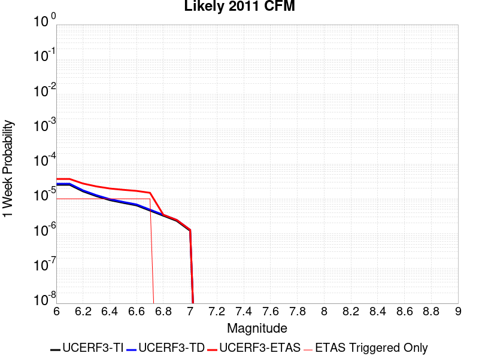 | 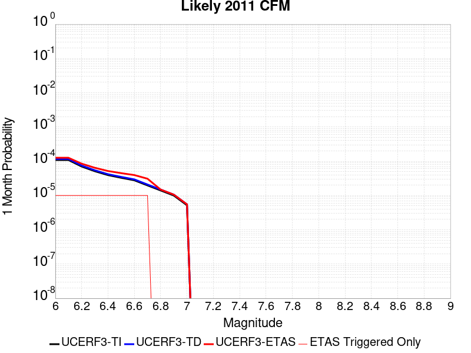 | 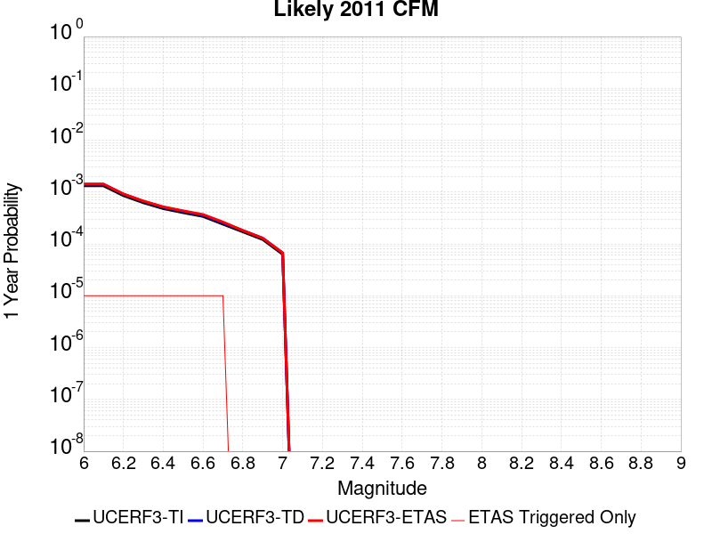 | 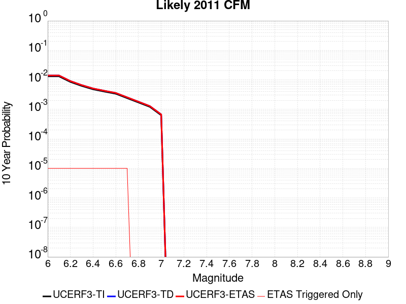 |

| Magnitude | 1 wk TI Prob | 1 wk TD Prob | 1 wk ETAS Prob | 1 wk ETAS/TD Gain | 1 wk ETAS Triggered Only | 1 mo TI Prob | 1 mo TD Prob | 1 mo ETAS Prob | 1 mo ETAS/TD Gain | 1 mo ETAS Triggered Only | 1 yr TI Prob | 1 yr TD Prob | 1 yr ETAS Prob | 1 yr ETAS/TD Gain | 1 yr ETAS Triggered Only | 10 yr TI Prob | 10 yr TD Prob | 10 yr ETAS Prob | 10 yr ETAS/TD Gain | 10 yr ETAS Triggered Only |
|-----|-----|-----|-----|-----|-----|-----|-----|-----|-----|-----|-----|-----|-----|-----|-----|-----|-----|-----|-----|-----|
| 6.0 | 2.5315949E-5 | 2.7104748E-5 | 3.7104477E-5 | 1.368929 | 1.0E-5 | 1.0849241E-4 | 1.16158284E-4 | 1.2615713E-4 | 1.0860795 | 1.0E-5 | 0.0013200947 | 0.0014133542 | 0.00142334 | 1.0070654 | 1.0E-5 | 0.013122803 | 0.01404831 | 0.01405817 | 1.0007018 | 1.0E-5 |
| 6.1 | 2.5315949E-5 | 2.7104748E-5 | 3.7104477E-5 | 1.368929 | 1.0E-5 | 1.0849241E-4 | 1.16158284E-4 | 1.2615713E-4 | 1.0860795 | 1.0E-5 | 0.0013200947 | 0.0014133542 | 0.00142334 | 1.0070654 | 1.0E-5 | 0.013122803 | 0.01404831 | 0.01405817 | 1.0007018 | 1.0E-5 |
| 6.2 | 1.6375941E-5 | 1.7465842E-5 | 2.7465667E-5 | 1.5725361 | 1.0E-5 | 7.0180715E-5 | 7.485153E-5 | 8.4850784E-5 | 1.1335878 | 1.0E-5 | 8.5411523E-4 | 9.109487E-4 | 9.2093955E-4 | 1.0109676 | 1.0E-5 | 0.008508399 | 0.009073433 | 0.009083342 | 1.0010921 | 1.0E-5 |
| 6.3 | 1.1945543E-5 | 1.2712587E-5 | 2.271246E-5 | 1.7866119 | 1.0E-5 | 5.119418E-5 | 5.4481407E-5 | 6.448086E-5 | 1.1835389 | 1.0E-5 | 6.2311086E-4 | 6.631146E-4 | 6.73108E-4 | 1.0150703 | 1.0E-5 | 0.0062136655 | 0.0066119144 | 0.0066218483 | 1.0015024 | 1.0E-5 |
| 6.4 | 9.192729E-6 | 9.768488E-6 | 1.976839E-5 | 2.02369 | 1.0E-5 | 3.939681E-5 | 4.1864292E-5 | 5.1863874E-5 | 1.238857 | 1.0E-5 | 4.7955062E-4 | 5.0958124E-4 | 5.195762E-4 | 1.019614 | 1.0E-5 | 0.004785171 | 0.0050844094 | 0.005094358 | 1.0019568 | 1.0E-5 |
| 6.5 | 7.67906E-6 | 8.152622E-6 | 1.8152541E-5 | 2.2265892 | 1.0E-5 | 3.2909844E-5 | 3.4939352E-5 | 4.4939003E-5 | 1.2862003 | 1.0E-5 | 4.006037E-4 | 4.2530545E-4 | 4.3530122E-4 | 1.0235025 | 1.0E-5 | 0.0039988225 | 0.004245108 | 0.0042550657 | 1.0023457 | 1.0E-5 |
| 6.6 | 6.4884057E-6 | 6.8847507E-6 | 1.6884682E-5 | 2.4524755 | 1.0E-5 | 2.7807157E-5 | 2.9505749E-5 | 3.9505452E-5 | 1.338907 | 1.0E-5 | 3.3849955E-4 | 3.591747E-4 | 3.6917112E-4 | 1.0278316 | 1.0E-5 | 0.003379844 | 0.0035860867 | 0.003596051 | 1.0027785 | 1.0E-5 |
| 6.7 | 4.6060636E-6 | 4.884041E-6 | 1.4883993E-5 | 3.0474749 | 1.0E-5 | 1.9740122E-5 | 2.0931442E-5 | 3.0931235E-5 | 1.4777402 | 1.0E-5 | 2.403095E-4 | 2.5481134E-4 | 2.648088E-4 | 1.0392348 | 1.0E-5 | 0.002400498 | 0.0025452746 | 0.0025552493 | 1.0039189 | 1.0E-5 |
| 6.8 | 3.2795615E-6 | 3.4773732E-6 | 3.4773732E-6 | 1.0 | 0.0 | 1.4055187E-5 | 1.4902946E-5 | 1.4902946E-5 | 1.0 | 0.0 | 1.7110848E-4 | 1.8142881E-4 | 1.8142881E-4 | 1.0 | 0.0 | 0.0017097679 | 0.0018128622 | 0.0018128622 | 1.0 | 0.0 |
| 6.9 | 2.3289967E-6 | 2.4705569E-6 | 2.4705569E-6 | 1.0 | 0.0 | 9.981376E-6 | 1.058806E-5 | 1.058806E-5 | 1.0 | 0.0 | 1.2151648E-4 | 1.2890245E-4 | 1.2890245E-4 | 1.0 | 0.0 | 0.0012145005 | 0.0012883197 | 0.0012883197 | 1.0 | 0.0 |
| 7.0 | 1.211292E-6 | 1.2863958E-6 | 1.2863958E-6 | 1.0 | 0.0 | 5.1912407E-6 | 5.5131145E-6 | 5.5131145E-6 | 1.0 | 0.0 | 6.320152E-5 | 6.712041E-5 | 6.712041E-5 | 1.0 | 0.0 | 6.3183554E-4 | 6.710312E-4 | 6.710312E-4 | 1.0 | 0.0 |

## Calaveras (So) 2011 CFM
*[(top)](#table-of-contents)*

| 1 Week | 1 Month | 1 Year | 10 Year |
|-----|-----|-----|-----|
| 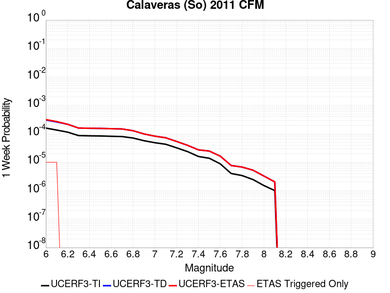 | 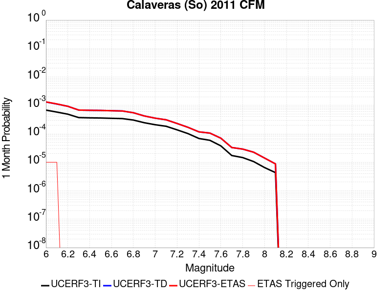 | 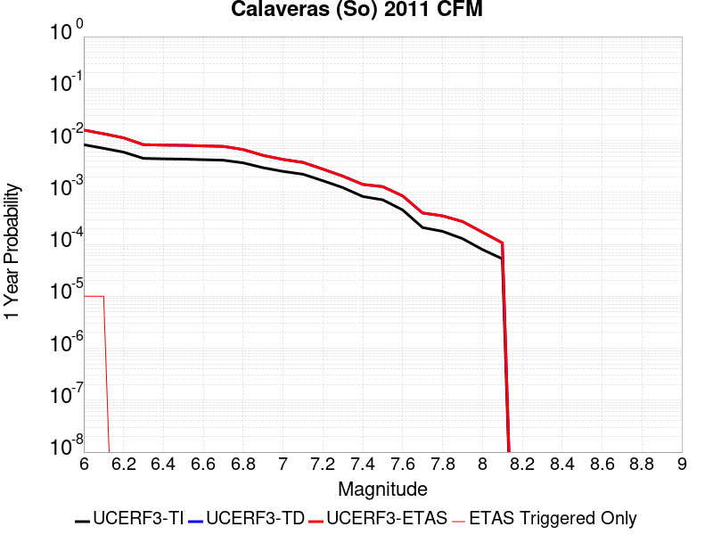 | 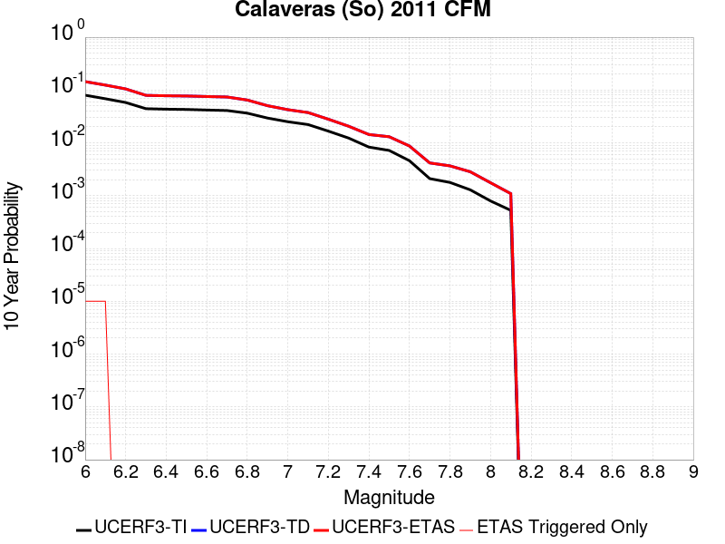 |

| Magnitude | 1 wk TI Prob | 1 wk TD Prob | 1 wk ETAS Prob | 1 wk ETAS/TD Gain | 1 wk ETAS Triggered Only | 1 mo TI Prob | 1 mo TD Prob | 1 mo ETAS Prob | 1 mo ETAS/TD Gain | 1 mo ETAS Triggered Only | 1 yr TI Prob | 1 yr TD Prob | 1 yr ETAS Prob | 1 yr ETAS/TD Gain | 1 yr ETAS Triggered Only | 10 yr TI Prob | 10 yr TD Prob | 10 yr ETAS Prob | 10 yr ETAS/TD Gain | 10 yr ETAS Triggered Only |
|-----|-----|-----|-----|-----|-----|-----|-----|-----|-----|-----|-----|-----|-----|-----|-----|-----|-----|-----|-----|-----|
| 6.0 | 1.5950744E-4 | 3.0713255E-4 | 3.1712948E-4 | 1.0325493 | 1.0E-5 | 6.834242E-4 | 0.001315409 | 0.0013253958 | 1.0075922 | 1.0E-5 | 0.00828899 | 0.015858326 | 0.015868168 | 1.0006206 | 1.0E-5 | 0.079865426 | 0.14440185 | 0.1444104 | 1.0000592 | 1.0E-5 |
| 6.1 | 1.3584697E-4 | 2.603514E-4 | 2.7034877E-4 | 1.0383996 | 1.0E-5 | 5.8207137E-4 | 0.0011151754 | 0.0011251643 | 1.0089571 | 1.0E-5 | 0.007063716 | 0.013461385 | 0.01347125 | 1.0007329 | 1.0E-5 | 0.06843361 | 0.124029994 | 0.124038756 | 1.0000706 | 1.0E-5 |
| 6.2 | 1.14676266E-4 | 2.1714384E-4 | 2.1714384E-4 | 1.0 | 0.0 | 4.9137714E-4 | 9.30223E-4 | 9.30223E-4 | 1.0 | 0.0 | 0.0059661185 | 0.011245058 | 0.011245058 | 1.0 | 0.0 | 0.058084648 | 0.10502057 | 0.10502057 | 1.0 | 0.0 |
| 6.3 | 8.691518E-5 | 1.5987935E-4 | 1.5987935E-4 | 1.0 | 0.0 | 3.7244044E-4 | 6.849807E-4 | 6.849807E-4 | 1.0 | 0.0 | 0.004525038 | 0.008301122 | 0.008301122 | 1.0 | 0.0 | 0.044339992 | 0.0793365 | 0.0793365 | 1.0 | 0.0 |
| 6.4 | 8.50982E-5 | 1.5694331E-4 | 1.5694331E-4 | 1.0 | 0.0 | 3.646556E-4 | 6.724042E-4 | 6.724042E-4 | 1.0 | 0.0 | 0.0044306475 | 0.008149155 | 0.008149155 | 1.0 | 0.0 | 0.04343345 | 0.07794268 | 0.07794268 | 1.0 | 0.0 |
| 6.5 | 8.4062965E-5 | 1.5518743E-4 | 1.5518743E-4 | 1.0 | 0.0 | 3.602201E-4 | 6.6488347E-4 | 6.6488347E-4 | 1.0 | 0.0 | 0.004376863 | 0.008058365 | 0.008058365 | 1.0 | 0.0 | 0.042916555 | 0.07711388 | 0.07711388 | 1.0 | 0.0 |
| 6.6 | 8.194716E-5 | 1.5154552E-4 | 1.5154552E-4 | 1.0 | 0.0 | 3.5115483E-4 | 6.492843E-4 | 6.492843E-4 | 1.0 | 0.0 | 0.0042669317 | 0.007870209 | 0.007870209 | 1.0 | 0.0 | 0.04185927 | 0.07539919 | 0.07539919 | 1.0 | 0.0 |
| 6.7 | 8.012326E-5 | 1.4822475E-4 | 1.4822475E-4 | 1.0 | 0.0 | 3.433402E-4 | 6.350612E-4 | 6.350612E-4 | 1.0 | 0.0 | 0.004172157 | 0.007698701 | 0.007698701 | 1.0 | 0.0 | 0.040946912 | 0.07384132 | 0.07384132 | 1.0 | 0.0 |
| 6.8 | 7.119773E-5 | 1.2881879E-4 | 1.2881879E-4 | 1.0 | 0.0 | 3.0509746E-4 | 5.519494E-4 | 5.519494E-4 | 1.0 | 0.0 | 0.0037082357 | 0.006696066 | 0.006696066 | 1.0 | 0.0 | 0.036469642 | 0.06468575 | 0.06468575 | 1.0 | 0.0 |
| 6.9 | 5.7343088E-5 | 9.919277E-5 | 9.919277E-5 | 1.0 | 0.0 | 2.4573295E-4 | 4.25043E-4 | 4.25043E-4 | 1.0 | 0.0 | 0.0029876942 | 0.005162694 | 0.005162694 | 1.0 | 0.0 | 0.02947844 | 0.05051036 | 0.05051036 | 1.0 | 0.0 |
| 7.0 | 4.8746577E-5 | 8.2850725E-5 | 8.2850725E-5 | 1.0 | 0.0 | 2.0889717E-4 | 3.5502657E-4 | 3.5502657E-4 | 1.0 | 0.0 | 0.0025403565 | 0.004313948 | 0.004313948 | 1.0 | 0.0 | 0.025115121 | 0.042485245 | 0.042485245 | 1.0 | 0.0 |
| 7.1 | 4.2998014E-5 | 7.265203E-5 | 7.265203E-5 | 1.0 | 0.0 | 1.8426418E-4 | 3.1132903E-4 | 3.1132903E-4 | 1.0 | 0.0 | 0.002241108 | 0.003783903 | 0.003783903 | 1.0 | 0.0 | 0.022186412 | 0.037423562 | 0.037423562 | 1.0 | 0.0 |
| 7.2 | 3.221292E-5 | 5.390791E-5 | 5.390791E-5 | 1.0 | 0.0 | 1.3804805E-4 | 2.3101359E-4 | 2.3101359E-4 | 1.0 | 0.0 | 0.0016794393 | 0.0028089907 | 0.0028089907 | 1.0 | 0.0 | 0.016668037 | 0.02803602 | 0.02803602 | 1.0 | 0.0 |
| 7.3 | 2.3756531E-5 | 3.9473416E-5 | 3.9473416E-5 | 1.0 | 0.0 | 1.0180973E-4 | 1.6916092E-4 | 1.6916092E-4 | 1.0 | 0.0 | 0.0012388286 | 0.0020576057 | 0.0020576057 | 1.0 | 0.0 | 0.012319452 | 0.020643145 | 0.020643145 | 1.0 | 0.0 |
| 7.4 | 1.5997684E-5 | 2.7342163E-5 | 2.7342163E-5 | 1.0 | 0.0 | 6.8559704E-5 | 1.1717545E-4 | 1.1717545E-4 | 1.0 | 0.0 | 8.343947E-4 | 0.00142568 | 0.00142568 | 1.0 | 0.0 | 0.008312687 | 0.014376011 | 0.014376011 | 1.0 | 0.0 |
| 7.5 | 1.3814293E-5 | 2.4783874E-5 | 2.4783874E-5 | 1.0 | 0.0 | 5.9202768E-5 | 1.062123E-4 | 1.062123E-4 | 1.0 | 0.0 | 7.205553E-4 | 0.00129237 | 0.00129237 | 1.0 | 0.0 | 0.007182234 | 0.013055085 | 0.013055085 | 1.0 | 0.0 |
| 7.6 | 8.817309E-6 | 1.6430757E-5 | 1.6430757E-5 | 1.0 | 0.0 | 3.7787922E-5 | 7.0415634E-5 | 7.0415634E-5 | 1.0 | 0.0 | 4.5997082E-4 | 8.569745E-4 | 8.569745E-4 | 1.0 | 0.0 | 0.004590199 | 0.008719284 | 0.008719284 | 1.0 | 0.0 |
| 7.7 | 4.0352206E-6 | 7.707318E-6 | 7.707318E-6 | 1.0 | 0.0 | 1.7293689E-5 | 3.3030945E-5 | 3.3030945E-5 | 1.0 | 0.0 | 2.1053031E-4 | 4.0207763E-4 | 4.0207763E-4 | 1.0 | 0.0 | 0.0021033096 | 0.004165172 | 0.004165172 | 1.0 | 0.0 |
| 7.8 | 3.413169E-6 | 6.787282E-6 | 6.787282E-6 | 1.0 | 0.0 | 1.4627784E-5 | 2.9088029E-5 | 2.9088029E-5 | 1.0 | 0.0 | 1.7807873E-4 | 3.5408925E-4 | 3.5408925E-4 | 1.0 | 0.0 | 0.0017793609 | 0.0036665166 | 0.0036665166 | 1.0 | 0.0 |
| 7.9 | 2.4740732E-6 | 5.2791843E-6 | 5.2791843E-6 | 1.0 | 0.0 | 1.06031275E-5 | 2.262488E-5 | 2.262488E-5 | 1.0 | 0.0 | 1.2908543E-4 | 2.7542314E-4 | 2.7542314E-4 | 1.0 | 0.0 | 0.0012901047 | 0.0028347955 | 0.0028347955 | 1.0 | 0.0 |
| 8.0 | 1.5231818E-6 | 3.2889548E-6 | 3.2889548E-6 | 1.0 | 0.0 | 6.527906E-6 | 1.40954435E-5 | 1.40954435E-5 | 1.0 | 0.0 | 7.9474354E-5 | 1.7159856E-4 | 1.7159856E-4 | 1.0 | 0.0 | 7.944594E-4 | 0.0017564303 | 0.0017564303 | 1.0 | 0.0 |
| 8.1 | 1.0104524E-6 | 2.045782E-6 | 2.045782E-6 | 1.0 | 0.0 | 4.330503E-6 | 8.767608E-6 | 8.767608E-6 | 1.0 | 0.0 | 5.2722597E-5 | 1.0674043E-4 | 1.0674043E-4 | 1.0 | 0.0 | 5.271009E-4 | 0.001092934 | 0.001092934 | 1.0 | 0.0 |

## San Juan
*[(top)](#table-of-contents)*

| 1 Week | 1 Month | 1 Year | 10 Year |
|-----|-----|-----|-----|
|  | 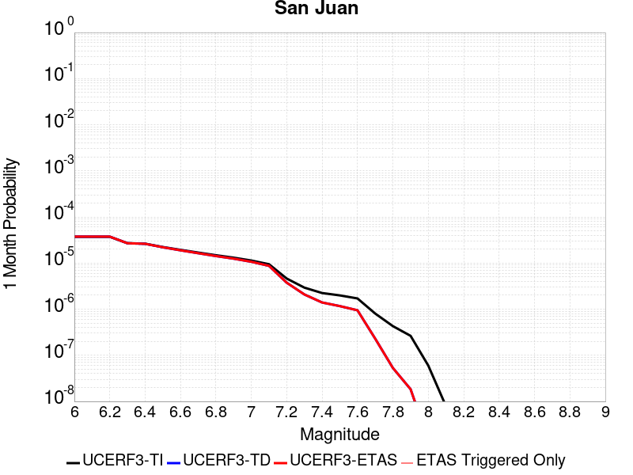 | 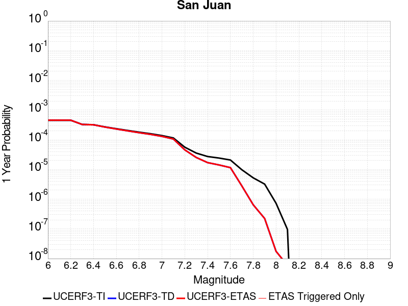 | 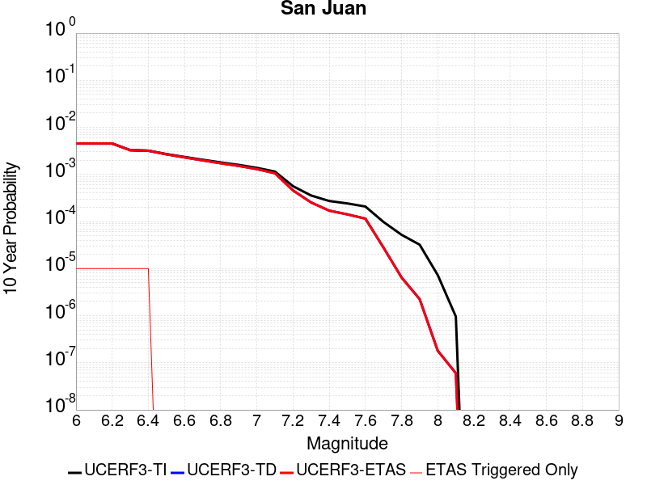 |

| Magnitude | 1 wk TI Prob | 1 wk TD Prob | 1 wk ETAS Prob | 1 wk ETAS/TD Gain | 1 wk ETAS Triggered Only | 1 mo TI Prob | 1 mo TD Prob | 1 mo ETAS Prob | 1 mo ETAS/TD Gain | 1 mo ETAS Triggered Only | 1 yr TI Prob | 1 yr TD Prob | 1 yr ETAS Prob | 1 yr ETAS/TD Gain | 1 yr ETAS Triggered Only | 10 yr TI Prob | 10 yr TD Prob | 10 yr ETAS Prob | 10 yr ETAS/TD Gain | 10 yr ETAS Triggered Only |
|-----|-----|-----|-----|-----|-----|-----|-----|-----|-----|-----|-----|-----|-----|-----|-----|-----|-----|-----|-----|-----|
| 6.0 | 8.682808E-6 | 8.74917E-6 | 8.74917E-6 | 1.0 | 0.0 | 3.72115E-5 | 3.749593E-5 | 3.749593E-5 | 1.0 | 0.0 | 4.5295584E-4 | 4.5642213E-4 | 4.5642213E-4 | 1.0 | 0.0 | 0.004520337 | 0.004555389 | 0.0045653433 | 1.0021852 | 1.0E-5 |
| 6.1 | 8.682808E-6 | 8.74917E-6 | 8.74917E-6 | 1.0 | 0.0 | 3.72115E-5 | 3.749593E-5 | 3.749593E-5 | 1.0 | 0.0 | 4.5295584E-4 | 4.5642213E-4 | 4.5642213E-4 | 1.0 | 0.0 | 0.004520337 | 0.004555389 | 0.0045653433 | 1.0021852 | 1.0E-5 |
| 6.2 | 8.682808E-6 | 8.74917E-6 | 8.74917E-6 | 1.0 | 0.0 | 3.72115E-5 | 3.749593E-5 | 3.749593E-5 | 1.0 | 0.0 | 4.5295584E-4 | 4.5642213E-4 | 4.5642213E-4 | 1.0 | 0.0 | 0.004520337 | 0.004555389 | 0.0045653433 | 1.0021852 | 1.0E-5 |
| 6.3 | 6.3054235E-6 | 6.282591E-6 | 6.282591E-6 | 1.0 | 0.0 | 2.7022963E-5 | 2.692512E-5 | 2.692512E-5 | 1.0 | 0.0 | 3.2895492E-4 | 3.2776545E-4 | 3.2776545E-4 | 1.0 | 0.0 | 0.003284684 | 0.0032730205 | 0.0032829877 | 1.0030453 | 1.0E-5 |
| 6.4 | 6.1490473E-6 | 6.1144706E-6 | 6.1144706E-6 | 1.0 | 0.0 | 2.6352795E-5 | 2.6204618E-5 | 2.6204618E-5 | 1.0 | 0.0 | 3.2079802E-4 | 3.189959E-4 | 3.189959E-4 | 1.0 | 0.0 | 0.0032033534 | 0.0031855768 | 0.003195545 | 1.0031291 | 1.0E-5 |
| 6.5 | 5.204848E-6 | 5.137238E-6 | 5.137238E-6 | 1.0 | 0.0 | 2.23063E-5 | 2.2016555E-5 | 2.2016555E-5 | 1.0 | 0.0 | 2.7154534E-4 | 2.6801953E-4 | 2.6801953E-4 | 1.0 | 0.0 | 0.0027121378 | 0.0026771172 | 0.0026771172 | 1.0 | 0.0 |
| 6.6 | 4.5179986E-6 | 4.415036E-6 | 4.415036E-6 | 1.0 | 0.0 | 1.9362706E-5 | 1.892145E-5 | 1.892145E-5 | 1.0 | 0.0 | 2.3571544E-4 | 2.303451E-4 | 2.303451E-4 | 1.0 | 0.0 | 0.0023546559 | 0.0023012008 | 0.0023012008 | 1.0 | 0.0 |
| 6.7 | 3.9442616E-6 | 3.8198336E-6 | 3.8198336E-6 | 1.0 | 0.0 | 1.6903869E-5 | 1.6370615E-5 | 1.6370615E-5 | 1.0 | 0.0 | 2.0578515E-4 | 1.9929469E-4 | 1.9929469E-4 | 1.0 | 0.0 | 0.002055947 | 0.001991285 | 0.001991285 | 1.0 | 0.0 |
| 6.8 | 3.4536245E-6 | 3.3163408E-6 | 3.3163408E-6 | 1.0 | 0.0 | 1.4801163E-5 | 1.4212815E-5 | 1.4212815E-5 | 1.0 | 0.0 | 1.8018926E-4 | 1.7302789E-4 | 1.7302789E-4 | 1.0 | 0.0 | 0.0018004322 | 0.001729051 | 0.001729051 | 1.0 | 0.0 |
| 6.9 | 3.059865E-6 | 2.9120363E-6 | 2.9120363E-6 | 1.0 | 0.0 | 1.3113641E-5 | 1.2480099E-5 | 1.2480099E-5 | 1.0 | 0.0 | 1.596469E-4 | 1.5193518E-4 | 1.5193518E-4 | 1.0 | 0.0 | 0.0015953224 | 0.0015184281 | 0.0015184281 | 1.0 | 0.0 |
| 7.0 | 2.6504351E-6 | 2.492005E-6 | 2.492005E-6 | 1.0 | 0.0 | 1.1358958E-5 | 1.0679981E-5 | 1.0679981E-5 | 1.0 | 0.0 | 1.3828653E-4 | 1.3002155E-4 | 1.3002155E-4 | 1.0 | 0.0 | 0.0013820052 | 0.001299567 | 0.001299567 | 1.0 | 0.0 |
| 7.1 | 2.2039317E-6 | 2.0338366E-6 | 2.0338366E-6 | 1.0 | 0.0 | 9.445387E-6 | 8.716416E-6 | 8.716416E-6 | 1.0 | 0.0 | 1.1499152E-4 | 1.0611773E-4 | 1.0611773E-4 | 1.0 | 0.0 | 0.0011493203 | 0.0010607811 | 0.0010607811 | 1.0 | 0.0 |
| 7.2 | 1.0786707E-6 | 8.770239E-7 | 8.770239E-7 | 1.0 | 0.0 | 4.622866E-6 | 3.7586685E-6 | 3.7586685E-6 | 1.0 | 0.0 | 5.628194E-5 | 4.576084E-5 | 4.576084E-5 | 1.0 | 0.0 | 5.6267687E-4 | 4.5757365E-4 | 4.5757365E-4 | 1.0 | 0.0 |
| 7.3 | 6.846433E-7 | 4.868812E-7 | 4.868812E-7 | 1.0 | 0.0 | 2.9341822E-6 | 2.086632E-6 | 2.086632E-6 | 1.0 | 0.0 | 3.5723086E-5 | 2.5404452E-5 | 2.5404452E-5 | 1.0 | 0.0 | 3.571734E-4 | 2.5405022E-4 | 2.5405022E-4 | 1.0 | 0.0 |
| 7.4 | 5.23043E-7 | 3.2627884E-7 | 3.2627884E-7 | 1.0 | 0.0 | 2.2416111E-6 | 1.3983371E-6 | 1.3983371E-6 | 1.0 | 0.0 | 2.7291273E-5 | 1.7024622E-5 | 1.7024622E-5 | 1.0 | 0.0 | 2.7287923E-4 | 1.7026608E-4 | 1.7026608E-4 | 1.0 | 0.0 |
| 7.5 | 4.648444E-7 | 2.723464E-7 | 2.723464E-7 | 1.0 | 0.0 | 1.9921886E-6 | 1.1671983E-6 | 1.1671983E-6 | 1.0 | 0.0 | 2.4254627E-5 | 1.4210547E-5 | 1.4210547E-5 | 1.0 | 0.0 | 2.425198E-4 | 1.4212691E-4 | 1.4212691E-4 | 1.0 | 0.0 |
| 7.6 | 3.9906567E-7 | 2.2083036E-7 | 2.2083036E-7 | 1.0 | 0.0 | 1.7102802E-6 | 9.4641547E-7 | 9.4641547E-7 | 1.0 | 0.0 | 2.0822463E-5 | 1.1522548E-5 | 1.1522548E-5 | 1.0 | 0.0 | 2.0820512E-4 | 1.15244526E-4 | 1.15244526E-4 | 1.0 | 0.0 |
| 7.7 | 1.8784601E-7 | 5.366277E-8 | 5.366277E-8 | 1.0 | 0.0 | 8.0505407E-7 | 2.2998329E-7 | 2.2998329E-7 | 1.0 | 0.0 | 9.80149E-6 | 2.800043E-6 | 2.800043E-6 | 1.0 | 0.0 | 9.801057E-5 | 2.8008939E-5 | 2.8008939E-5 | 1.0 | 0.0 |
| 7.8 | 1.00154914E-7 | 1.2412917E-8 | 1.2412917E-8 | 1.0 | 0.0 | 4.2923529E-7 | 5.3198217E-8 | 5.3198217E-8 | 1.0 | 0.0 | 5.225927E-6 | 6.476881E-7 | 6.476881E-7 | 1.0 | 0.0 | 5.225804E-5 | 6.4827886E-6 | 6.4827886E-6 | 1.0 | 0.0 |
| 7.9 | 6.171429E-8 | 4.2946513E-9 | 4.2946513E-9 | 1.0 | 0.0 | 2.6448978E-7 | 1.8405647E-8 | 1.8405647E-8 | 1.0 | 0.0 | 3.2201583E-6 | 2.2408874E-7 | 2.2408874E-7 | 1.0 | 0.0 | 3.2201115E-5 | 2.2462114E-6 | 2.2462114E-6 | 1.0 | 0.0 |
| 8.0 | 1.3974572E-8 | 3.3737857E-10 | 3.3737857E-10 | 1.0 | 0.0 | 5.989102E-8 | 1.4459075E-9 | 1.4459075E-9 | 1.0 | 0.0 | 7.2917294E-7 | 1.760392E-8 | 1.760392E-8 | 1.0 | 0.0 | 7.2917055E-6 | 1.8038004E-7 | 1.8038004E-7 | 1.0 | 0.0 |
| 8.1 | 1.8403477E-9 | 1.1291601E-10 | 1.1291601E-10 | 1.0 | 0.0 | 7.887204E-9 | 4.839261E-10 | 4.839261E-10 | 1.0 | 0.0 | 9.602671E-8 | 5.8917977E-9 | 5.8917977E-9 | 1.0 | 0.0 | 9.602667E-7 | 6.0206084E-8 | 6.0206084E-8 | 1.0 | 0.0 |

## Casmalia 2011 CFM
*[(top)](#table-of-contents)*

| 1 Week | 1 Month | 1 Year | 10 Year |
|-----|-----|-----|-----|
|  | 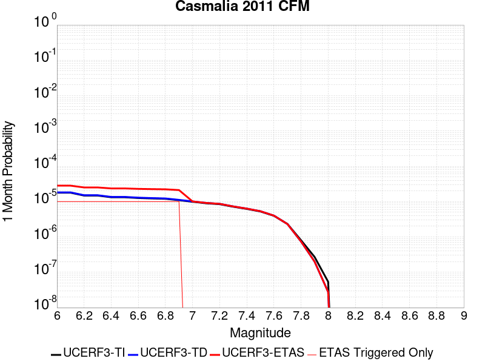 | 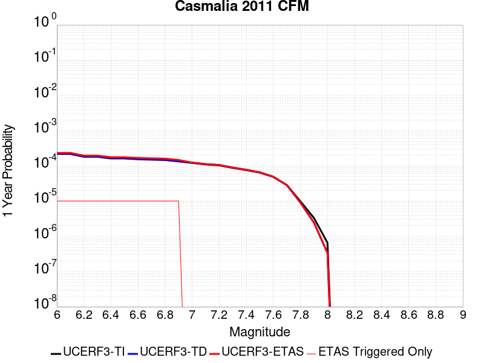 | 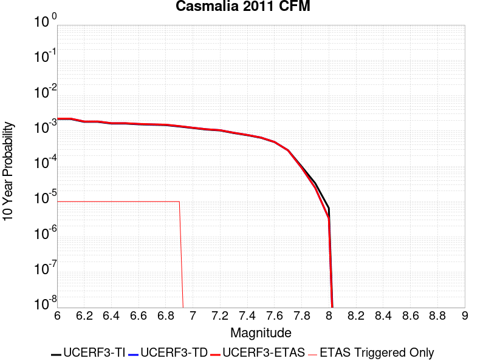 |

| Magnitude | 1 wk TI Prob | 1 wk TD Prob | 1 wk ETAS Prob | 1 wk ETAS/TD Gain | 1 wk ETAS Triggered Only | 1 mo TI Prob | 1 mo TD Prob | 1 mo ETAS Prob | 1 mo ETAS/TD Gain | 1 mo ETAS Triggered Only | 1 yr TI Prob | 1 yr TD Prob | 1 yr ETAS Prob | 1 yr ETAS/TD Gain | 1 yr ETAS Triggered Only | 10 yr TI Prob | 10 yr TD Prob | 10 yr ETAS Prob | 10 yr ETAS/TD Gain | 10 yr ETAS Triggered Only |
|-----|-----|-----|-----|-----|-----|-----|-----|-----|-----|-----|-----|-----|-----|-----|-----|-----|-----|-----|-----|-----|
| 6.0 | 4.1704893E-6 | 4.2624843E-6 | 4.2624843E-6 | 1.0 | 0.0 | 1.7873403E-5 | 1.8267663E-5 | 2.826748E-5 | 1.5474054 | 1.0E-5 | 2.1758694E-4 | 2.223863E-4 | 2.3238407E-4 | 1.0449568 | 1.0E-5 | 0.0021737402 | 0.0022216584 | 0.0022316363 | 1.0044911 | 1.0E-5 |
| 6.1 | 4.1704893E-6 | 4.2624843E-6 | 4.2624843E-6 | 1.0 | 0.0 | 1.7873403E-5 | 1.8267663E-5 | 2.826748E-5 | 1.5474054 | 1.0E-5 | 2.1758694E-4 | 2.223863E-4 | 2.3238407E-4 | 1.0449568 | 1.0E-5 | 0.0021737402 | 0.0022216584 | 0.0022316363 | 1.0044911 | 1.0E-5 |
| 6.2 | 3.457312E-6 | 3.537023E-6 | 3.537023E-6 | 1.0 | 0.0 | 1.4816967E-5 | 1.5158583E-5 | 2.5158432E-5 | 1.6596823 | 1.0E-5 | 1.8038164E-4 | 1.845402E-4 | 1.9453836E-4 | 1.0541787 | 1.0E-5 | 0.001802353 | 0.0018438791 | 0.0018538607 | 1.0054133 | 1.0E-5 |
| 6.3 | 3.457312E-6 | 3.537023E-6 | 3.537023E-6 | 1.0 | 0.0 | 1.4816967E-5 | 1.5158583E-5 | 2.5158432E-5 | 1.6596823 | 1.0E-5 | 1.8038164E-4 | 1.845402E-4 | 1.9453836E-4 | 1.0541787 | 1.0E-5 | 0.001802353 | 0.0018438791 | 0.0018538607 | 1.0054133 | 1.0E-5 |
| 6.4 | 3.0957337E-6 | 3.169227E-6 | 3.169227E-6 | 1.0 | 0.0 | 1.3267363E-5 | 1.3582331E-5 | 2.3582195E-5 | 1.7362406 | 1.0E-5 | 1.6151817E-4 | 1.653524E-4 | 1.7535074E-4 | 1.0604669 | 1.0E-5 | 0.0016140083 | 0.0016522998 | 0.0016622832 | 1.0060421 | 1.0E-5 |
| 6.5 | 3.0957337E-6 | 3.169227E-6 | 3.169227E-6 | 1.0 | 0.0 | 1.3267363E-5 | 1.3582331E-5 | 2.3582195E-5 | 1.7362406 | 1.0E-5 | 1.6151817E-4 | 1.653524E-4 | 1.7535074E-4 | 1.0604669 | 1.0E-5 | 0.0016140083 | 0.0016522998 | 0.0016622832 | 1.0060421 | 1.0E-5 |
| 6.6 | 2.9459152E-6 | 3.0165766E-6 | 3.0165766E-6 | 1.0 | 0.0 | 1.262529E-5 | 1.2928121E-5 | 2.2927992E-5 | 1.7734976 | 1.0E-5 | 1.5370206E-4 | 1.5738855E-4 | 1.6738698E-4 | 1.063527 | 1.0E-5 | 0.0015359579 | 0.0015727765 | 0.0015827608 | 1.0063481 | 1.0E-5 |
| 6.7 | 2.8634809E-6 | 2.932474E-6 | 2.932474E-6 | 1.0 | 0.0 | 1.2272003E-5 | 1.2567685E-5 | 2.256756E-5 | 1.7956815 | 1.0E-5 | 1.4940138E-4 | 1.5300087E-4 | 1.6299935E-4 | 1.0653491 | 1.0E-5 | 0.0014930099 | 0.0015289608 | 0.0015389455 | 1.0065304 | 1.0E-5 |
| 6.8 | 2.7999822E-6 | 2.867598E-6 | 2.867598E-6 | 1.0 | 0.0 | 1.1999869E-5 | 1.2289648E-5 | 2.2289525E-5 | 1.8136829 | 1.0E-5 | 1.460886E-4 | 1.4961624E-4 | 1.5961475E-4 | 1.0668277 | 1.0E-5 | 0.001459926 | 0.0014951604 | 0.0015051455 | 1.0066782 | 1.0E-5 |
| 6.9 | 2.551052E-6 | 2.6119662E-6 | 2.6119662E-6 | 1.0 | 0.0 | 1.0933034E-5 | 1.1194093E-5 | 2.119398E-5 | 1.8933183 | 1.0E-5 | 1.3310155E-4 | 1.3627959E-4 | 1.4627824E-4 | 1.0733685 | 1.0E-5 | 0.0013302186 | 0.0013619643 | 0.0013719506 | 1.0073323 | 1.0E-5 |
| 7.0 | 2.3081875E-6 | 2.3624102E-6 | 2.3624102E-6 | 1.0 | 0.0 | 9.892195E-6 | 1.0124576E-5 | 1.0124576E-5 | 1.0 | 0.0 | 1.20430814E-4 | 1.2325977E-4 | 1.2325977E-4 | 1.0 | 0.0 | 0.0012036557 | 0.0012319168 | 0.0012319168 | 1.0 | 0.0 |
| 7.1 | 2.093245E-6 | 2.1417256E-6 | 2.1417256E-6 | 1.0 | 0.0 | 8.971019E-6 | 9.1787915E-6 | 9.1787915E-6 | 1.0 | 0.0 | 1.09216686E-4 | 1.1174608E-4 | 1.1174608E-4 | 1.0 | 0.0 | 0.0010916302 | 0.0011169009 | 0.0011169009 | 1.0 | 0.0 |
| 7.2 | 1.9714576E-6 | 2.0165105E-6 | 2.0165105E-6 | 1.0 | 0.0 | 8.449076E-6 | 8.642159E-6 | 8.642159E-6 | 1.0 | 0.0 | 1.0286264E-4 | 1.0521322E-4 | 1.0521322E-4 | 1.0 | 0.0 | 0.0010281504 | 0.001051636 | 0.001051636 | 1.0 | 0.0 |
| 7.3 | 1.6689512E-6 | 1.7047145E-6 | 1.7047145E-6 | 1.0 | 0.0 | 7.1526288E-6 | 7.3058986E-6 | 7.3058986E-6 | 1.0 | 0.0 | 8.7079774E-5 | 8.894569E-5 | 8.894569E-5 | 1.0 | 0.0 | 8.7045657E-4 | 8.891017E-4 | 8.891017E-4 | 1.0 | 0.0 |
| 7.4 | 1.4490954E-6 | 1.4778922E-6 | 1.4778922E-6 | 1.0 | 0.0 | 6.210394E-6 | 6.333808E-6 | 6.333808E-6 | 1.0 | 0.0 | 7.560892E-5 | 7.711139E-5 | 7.711139E-5 | 1.0 | 0.0 | 7.55832E-4 | 7.7084696E-4 | 7.7084696E-4 | 1.0 | 0.0 |
| 7.5 | 1.226873E-6 | 1.2481714E-6 | 1.2481714E-6 | 1.0 | 0.0 | 5.2580162E-6 | 5.3492954E-6 | 5.3492954E-6 | 1.0 | 0.0 | 6.401447E-5 | 6.512573E-5 | 6.512573E-5 | 1.0 | 0.0 | 6.399603E-4 | 6.5106695E-4 | 6.5106695E-4 | 1.0 | 0.0 |
| 7.6 | 9.2561345E-7 | 9.3619366E-7 | 9.3619366E-7 | 1.0 | 0.0 | 3.966909E-6 | 4.0122522E-6 | 4.0122522E-6 | 1.0 | 0.0 | 4.8296046E-5 | 4.884808E-5 | 4.884808E-5 | 1.0 | 0.0 | 4.828555E-4 | 4.8837386E-4 | 4.8837386E-4 | 1.0 | 0.0 |
| 7.7 | 5.4367933E-7 | 5.3929017E-7 | 5.3929017E-7 | 1.0 | 0.0 | 2.3300522E-6 | 2.3112416E-6 | 2.3112416E-6 | 1.0 | 0.0 | 2.8368017E-5 | 2.8139004E-5 | 2.8139004E-5 | 1.0 | 0.0 | 2.8364395E-4 | 2.8135453E-4 | 2.8135453E-4 | 1.0 | 0.0 |
| 7.8 | 1.8825742E-7 | 1.7342425E-7 | 1.7342425E-7 | 1.0 | 0.0 | 8.068173E-7 | 7.432466E-7 | 7.432466E-7 | 1.0 | 0.0 | 9.822956E-6 | 9.048989E-6 | 9.048989E-6 | 1.0 | 0.0 | 9.822522E-5 | 9.048623E-5 | 9.048623E-5 | 1.0 | 0.0 |
| 7.9 | 6.342771E-8 | 4.679002E-8 | 4.679002E-8 | 1.0 | 0.0 | 2.7183304E-7 | 2.0052863E-7 | 2.0052863E-7 | 1.0 | 0.0 | 3.3095623E-6 | 2.4414335E-6 | 2.4414335E-6 | 1.0 | 0.0 | 3.309513E-5 | 2.441407E-5 | 2.441407E-5 | 1.0 | 0.0 |
| 8.0 | 1.2574819E-8 | 6.4727095E-9 | 6.4727095E-9 | 1.0 | 0.0 | 5.3892084E-8 | 2.7740182E-8 | 2.7740182E-8 | 1.0 | 0.0 | 6.561359E-7 | 3.3773665E-7 | 3.3773665E-7 | 1.0 | 0.0 | 6.56134E-6 | 3.3773617E-6 | 3.3773617E-6 | 1.0 | 0.0 |

## Great Valley 04b Gordon Valley
*[(top)](#table-of-contents)*

| 1 Week | 1 Month | 1 Year | 10 Year |
|-----|-----|-----|-----|
|  | 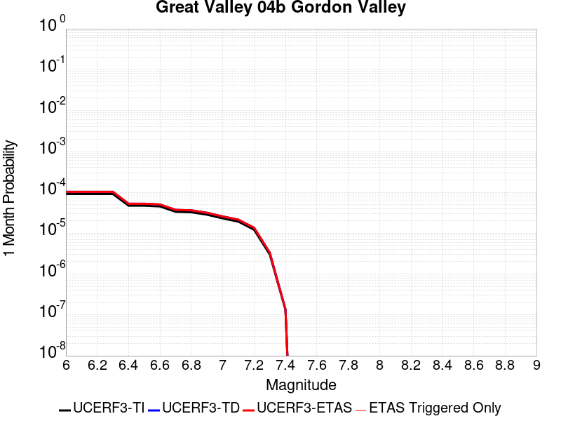 |  |  |

| Magnitude | 1 wk TI Prob | 1 wk TD Prob | 1 wk ETAS Prob | 1 wk ETAS/TD Gain | 1 wk ETAS Triggered Only | 1 mo TI Prob | 1 mo TD Prob | 1 mo ETAS Prob | 1 mo ETAS/TD Gain | 1 mo ETAS Triggered Only | 1 yr TI Prob | 1 yr TD Prob | 1 yr ETAS Prob | 1 yr ETAS/TD Gain | 1 yr ETAS Triggered Only | 10 yr TI Prob | 10 yr TD Prob | 10 yr ETAS Prob | 10 yr ETAS/TD Gain | 10 yr ETAS Triggered Only |
|-----|-----|-----|-----|-----|-----|-----|-----|-----|-----|-----|-----|-----|-----|-----|-----|-----|-----|-----|-----|-----|
| 6.0 | 2.1181217E-5 | 2.3981951E-5 | 2.3981951E-5 | 1.0 | 0.0 | 9.077348E-5 | 1.02776685E-4 | 1.02776685E-4 | 1.0 | 0.0 | 0.0011046068 | 0.0012507545 | 0.0012507545 | 1.0 | 0.0 | 0.010991322 | 0.0124536 | 0.012463476 | 1.000793 | 1.0E-5 |
| 6.1 | 2.1181217E-5 | 2.3981951E-5 | 2.3981951E-5 | 1.0 | 0.0 | 9.077348E-5 | 1.02776685E-4 | 1.02776685E-4 | 1.0 | 0.0 | 0.0011046068 | 0.0012507545 | 0.0012507545 | 1.0 | 0.0 | 0.010991322 | 0.0124536 | 0.012463476 | 1.000793 | 1.0E-5 |
| 6.2 | 2.1181217E-5 | 2.3981951E-5 | 2.3981951E-5 | 1.0 | 0.0 | 9.077348E-5 | 1.02776685E-4 | 1.02776685E-4 | 1.0 | 0.0 | 0.0011046068 | 0.0012507545 | 0.0012507545 | 1.0 | 0.0 | 0.010991322 | 0.0124536 | 0.012463476 | 1.000793 | 1.0E-5 |
| 6.3 | 2.1181217E-5 | 2.3981951E-5 | 2.3981951E-5 | 1.0 | 0.0 | 9.077348E-5 | 1.02776685E-4 | 1.02776685E-4 | 1.0 | 0.0 | 0.0011046068 | 0.0012507545 | 0.0012507545 | 1.0 | 0.0 | 0.010991322 | 0.0124536 | 0.012463476 | 1.000793 | 1.0E-5 |
| 6.4 | 1.0988268E-5 | 1.2254499E-5 | 1.2254499E-5 | 1.0 | 0.0 | 4.7091726E-5 | 5.2518313E-5 | 5.2518313E-5 | 1.0 | 0.0 | 5.731909E-4 | 6.392388E-4 | 6.392388E-4 | 1.0 | 0.0 | 0.005717147 | 0.0063755875 | 0.0063755875 | 1.0 | 0.0 |
| 6.5 | 1.0988268E-5 | 1.2254499E-5 | 1.2254499E-5 | 1.0 | 0.0 | 4.7091726E-5 | 5.2518313E-5 | 5.2518313E-5 | 1.0 | 0.0 | 5.731909E-4 | 6.392388E-4 | 6.392388E-4 | 1.0 | 0.0 | 0.005717147 | 0.0063755875 | 0.0063755875 | 1.0 | 0.0 |
| 6.6 | 1.0517822E-5 | 1.1724062E-5 | 1.1724062E-5 | 1.0 | 0.0 | 4.5075605E-5 | 5.02451E-5 | 5.02451E-5 | 1.0 | 0.0 | 5.4865726E-4 | 6.11578E-4 | 6.11578E-4 | 1.0 | 0.0 | 0.0054730466 | 0.0061005033 | 0.0061005033 | 1.0 | 0.0 |
| 6.7 | 7.789219E-6 | 8.6776445E-6 | 8.6776445E-6 | 1.0 | 0.0 | 3.3381937E-5 | 3.7189402E-5 | 3.7189402E-5 | 1.0 | 0.0 | 4.063493E-4 | 4.526921E-4 | 4.526921E-4 | 1.0 | 0.0 | 0.004056071 | 0.0045182165 | 0.0045182165 | 1.0 | 0.0 |
| 6.8 | 7.5850853E-6 | 8.452389E-6 | 8.452389E-6 | 1.0 | 0.0 | 3.2507105E-5 | 3.622405E-5 | 3.622405E-5 | 1.0 | 0.0 | 3.957021E-4 | 4.409437E-4 | 4.409437E-4 | 1.0 | 0.0 | 0.0039499826 | 0.0044012 | 0.0044012 | 1.0 | 0.0 |
| 6.9 | 6.604105E-6 | 7.3585493E-6 | 7.3585493E-6 | 1.0 | 0.0 | 2.8303E-5 | 3.153628E-5 | 3.153628E-5 | 1.0 | 0.0 | 3.4453452E-4 | 3.8389044E-4 | 3.8389044E-4 | 1.0 | 0.0 | 0.0034400085 | 0.0038326595 | 0.0038326595 | 1.0 | 0.0 |
| 7.0 | 5.3701115E-6 | 5.9884183E-6 | 5.9884183E-6 | 1.0 | 0.0 | 2.301456E-5 | 2.5664414E-5 | 2.5664414E-5 | 1.0 | 0.0 | 2.8016625E-4 | 3.1242234E-4 | 3.1242234E-4 | 1.0 | 0.0 | 0.0027981328 | 0.00312012 | 0.00312012 | 1.0 | 0.0 |
| 7.1 | 4.4685607E-6 | 4.986478E-6 | 4.986478E-6 | 1.0 | 0.0 | 1.9150835E-5 | 2.1370459E-5 | 2.1370459E-5 | 1.0 | 0.0 | 2.3313647E-4 | 2.6015675E-4 | 2.6015675E-4 | 1.0 | 0.0 | 0.0023289204 | 0.0025987667 | 0.0025987667 | 1.0 | 0.0 |
| 7.2 | 2.833378E-6 | 3.164419E-6 | 3.164419E-6 | 1.0 | 0.0 | 1.2142991E-5 | 1.3561736E-5 | 1.3561736E-5 | 1.0 | 0.0 | 1.4783088E-4 | 1.6510337E-4 | 1.6510337E-4 | 1.0 | 0.0 | 0.0014773258 | 0.0016499789 | 0.0016499789 | 1.0 | 0.0 |
| 7.3 | 7.0087293E-7 | 7.7728157E-7 | 7.7728157E-7 | 1.0 | 0.0 | 3.0037377E-6 | 3.3312049E-6 | 3.3312049E-6 | 1.0 | 0.0 | 3.656989E-5 | 4.0557123E-5 | 4.0557123E-5 | 1.0 | 0.0 | 3.6563876E-4 | 4.055422E-4 | 4.055422E-4 | 1.0 | 0.0 |
| 7.4 | 3.112171E-8 | 3.2068368E-8 | 3.2068368E-8 | 1.0 | 0.0 | 1.3337875E-7 | 1.3743585E-7 | 1.3743585E-7 | 1.0 | 0.0 | 1.6238852E-6 | 1.6732803E-6 | 1.6732803E-6 | 1.0 | 0.0 | 1.6238733E-5 | 1.6732685E-5 | 1.6732685E-5 | 1.0 | 0.0 |

## Elsinore (Julian)
*[(top)](#table-of-contents)*

| 1 Week | 1 Month | 1 Year | 10 Year |
|-----|-----|-----|-----|
| 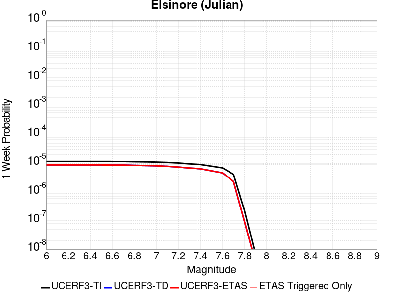 |  | 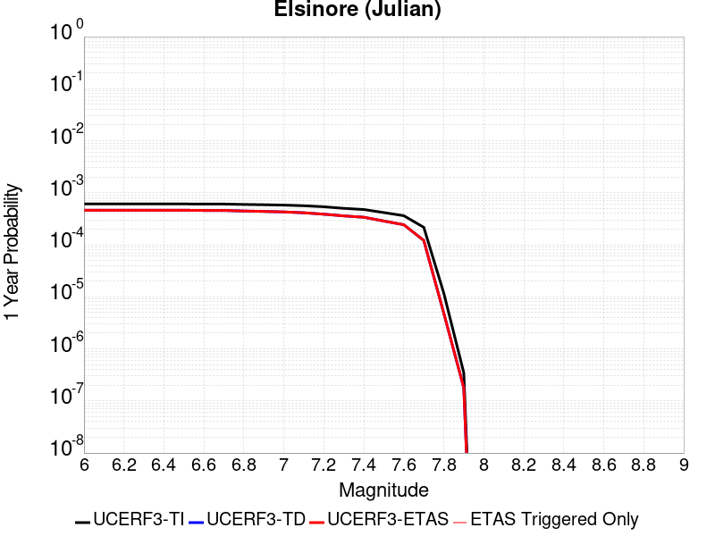 | 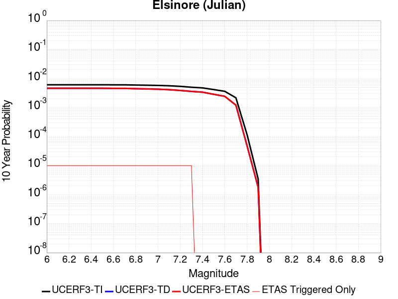 |

| Magnitude | 1 wk TI Prob | 1 wk TD Prob | 1 wk ETAS Prob | 1 wk ETAS/TD Gain | 1 wk ETAS Triggered Only | 1 mo TI Prob | 1 mo TD Prob | 1 mo ETAS Prob | 1 mo ETAS/TD Gain | 1 mo ETAS Triggered Only | 1 yr TI Prob | 1 yr TD Prob | 1 yr ETAS Prob | 1 yr ETAS/TD Gain | 1 yr ETAS Triggered Only | 10 yr TI Prob | 10 yr TD Prob | 10 yr ETAS Prob | 10 yr ETAS/TD Gain | 10 yr ETAS Triggered Only |
|-----|-----|-----|-----|-----|-----|-----|-----|-----|-----|-----|-----|-----|-----|-----|-----|-----|-----|-----|-----|-----|
| 6.0 | 1.1710231E-5 | 8.845315E-6 | 8.845315E-6 | 1.0 | 0.0 | 5.0185736E-5 | 3.7907954E-5 | 3.7907954E-5 | 1.0 | 0.0 | 6.1084004E-4 | 4.614333E-4 | 4.614333E-4 | 1.0 | 0.0 | 0.006091637 | 0.0046049724 | 0.0046149264 | 1.0021616 | 1.0E-5 |
| 6.1 | 1.1710231E-5 | 8.845315E-6 | 8.845315E-6 | 1.0 | 0.0 | 5.0185736E-5 | 3.7907954E-5 | 3.7907954E-5 | 1.0 | 0.0 | 6.1084004E-4 | 4.614333E-4 | 4.614333E-4 | 1.0 | 0.0 | 0.006091637 | 0.0046049724 | 0.0046149264 | 1.0021616 | 1.0E-5 |
| 6.2 | 1.1710231E-5 | 8.845315E-6 | 8.845315E-6 | 1.0 | 0.0 | 5.0185736E-5 | 3.7907954E-5 | 3.7907954E-5 | 1.0 | 0.0 | 6.1084004E-4 | 4.614333E-4 | 4.614333E-4 | 1.0 | 0.0 | 0.006091637 | 0.0046049724 | 0.0046149264 | 1.0021616 | 1.0E-5 |
| 6.3 | 1.1710231E-5 | 8.845315E-6 | 8.845315E-6 | 1.0 | 0.0 | 5.0185736E-5 | 3.7907954E-5 | 3.7907954E-5 | 1.0 | 0.0 | 6.1084004E-4 | 4.614333E-4 | 4.614333E-4 | 1.0 | 0.0 | 0.006091637 | 0.0046049724 | 0.0046149264 | 1.0021616 | 1.0E-5 |
| 6.4 | 1.1710231E-5 | 8.845315E-6 | 8.845315E-6 | 1.0 | 0.0 | 5.0185736E-5 | 3.7907954E-5 | 3.7907954E-5 | 1.0 | 0.0 | 6.1084004E-4 | 4.614333E-4 | 4.614333E-4 | 1.0 | 0.0 | 0.006091637 | 0.0046049724 | 0.0046149264 | 1.0021616 | 1.0E-5 |
| 6.5 | 1.1710231E-5 | 8.845315E-6 | 8.845315E-6 | 1.0 | 0.0 | 5.0185736E-5 | 3.7907954E-5 | 3.7907954E-5 | 1.0 | 0.0 | 6.1084004E-4 | 4.614333E-4 | 4.614333E-4 | 1.0 | 0.0 | 0.006091637 | 0.0046049724 | 0.0046149264 | 1.0021616 | 1.0E-5 |
| 6.6 | 1.1650619E-5 | 8.777691E-6 | 8.777691E-6 | 1.0 | 0.0 | 4.993027E-5 | 3.761814E-5 | 3.761814E-5 | 1.0 | 0.0 | 6.0773146E-4 | 4.5790634E-4 | 4.5790634E-4 | 1.0 | 0.0 | 0.0060607214 | 0.004569848 | 0.0045798025 | 1.0021783 | 1.0E-5 |
| 6.7 | 1.1650619E-5 | 8.777691E-6 | 8.777691E-6 | 1.0 | 0.0 | 4.993027E-5 | 3.761814E-5 | 3.761814E-5 | 1.0 | 0.0 | 6.0773146E-4 | 4.5790634E-4 | 4.5790634E-4 | 1.0 | 0.0 | 0.0060607214 | 0.004569848 | 0.0045798025 | 1.0021783 | 1.0E-5 |
| 6.8 | 1.1442698E-5 | 8.560841E-6 | 8.560841E-6 | 1.0 | 0.0 | 4.9039216E-5 | 3.6688813E-5 | 3.6688813E-5 | 1.0 | 0.0 | 5.968889E-4 | 4.4659642E-4 | 4.4659642E-4 | 1.0 | 0.0 | 0.0059528816 | 0.004457207 | 0.004467163 | 1.0022335 | 1.0E-5 |
| 6.9 | 1.1300589E-5 | 8.408708E-6 | 8.408708E-6 | 1.0 | 0.0 | 4.8430196E-5 | 3.603683E-5 | 3.603683E-5 | 1.0 | 0.0 | 5.894781E-4 | 4.3866172E-4 | 4.3866172E-4 | 1.0 | 0.0 | 0.005879169 | 0.0043781744 | 0.0043881307 | 1.002274 | 1.0E-5 |
| 7.0 | 1.1117729E-5 | 8.225868E-6 | 8.225868E-6 | 1.0 | 0.0 | 4.764654E-5 | 3.5253255E-5 | 3.5253255E-5 | 1.0 | 0.0 | 5.799422E-4 | 4.291255E-4 | 4.291255E-4 | 1.0 | 0.0 | 0.0057843104 | 0.0042831833 | 0.0042931405 | 1.0023247 | 1.0E-5 |
| 7.1 | 1.08053955E-5 | 7.911498E-6 | 7.911498E-6 | 1.0 | 0.0 | 4.6308014E-5 | 3.3905988E-5 | 3.3905988E-5 | 1.0 | 0.0 | 5.6365423E-4 | 4.1272887E-4 | 4.1272887E-4 | 1.0 | 0.0 | 0.005622267 | 0.004119835 | 0.004129794 | 1.0024173 | 1.0E-5 |
| 7.2 | 1.032804E-5 | 7.432751E-6 | 7.432751E-6 | 1.0 | 0.0 | 4.4262277E-5 | 3.1854266E-5 | 3.1854266E-5 | 1.0 | 0.0 | 5.387599E-4 | 3.8775822E-4 | 3.8775822E-4 | 1.0 | 0.0 | 0.0053745564 | 0.00387102 | 0.0038809814 | 1.0025733 | 1.0E-5 |
| 7.3 | 9.622426E-6 | 6.897587E-6 | 6.897587E-6 | 1.0 | 0.0 | 4.1238312E-5 | 2.956076E-5 | 2.956076E-5 | 1.0 | 0.0 | 5.019608E-4 | 3.5984424E-4 | 3.5984424E-4 | 1.0 | 0.0 | 0.005008285 | 0.0035928036 | 0.0036027676 | 1.0027733 | 1.0E-5 |
| 7.4 | 9.144434E-6 | 6.496142E-6 | 6.496142E-6 | 1.0 | 0.0 | 3.9189843E-5 | 2.7840319E-5 | 2.7840319E-5 | 1.0 | 0.0 | 4.7703186E-4 | 3.3890453E-4 | 3.3890453E-4 | 1.0 | 0.0 | 0.0047600917 | 0.0033840172 | 0.0033840172 | 1.0 | 0.0 |
| 7.5 | 7.988981E-6 | 5.498105E-6 | 5.498105E-6 | 1.0 | 0.0 | 3.4238044E-5 | 2.3563101E-5 | 2.3563101E-5 | 1.0 | 0.0 | 4.1676845E-4 | 2.8684427E-4 | 2.8684427E-4 | 1.0 | 0.0 | 0.0041598766 | 0.0028648674 | 0.0028648674 | 1.0 | 0.0 |
| 7.6 | 6.9554876E-6 | 4.6623254E-6 | 4.6623254E-6 | 1.0 | 0.0 | 2.9808893E-5 | 1.998125E-5 | 1.998125E-5 | 1.0 | 0.0 | 3.6286283E-4 | 2.4324573E-4 | 2.4324573E-4 | 1.0 | 0.0 | 0.0036227088 | 0.002429911 | 0.002429911 | 1.0 | 0.0 |
| 7.7 | 4.1557314E-6 | 2.3244427E-6 | 2.3244427E-6 | 1.0 | 0.0 | 1.7810156E-5 | 9.961864E-6 | 9.961864E-6 | 1.0 | 0.0 | 2.1681708E-4 | 1.2127968E-4 | 1.2127968E-4 | 1.0 | 0.0 | 0.0021660565 | 0.001212208 | 0.001212208 | 1.0 | 0.0 |
| 7.8 | 2.2597293E-7 | 9.331864E-8 | 9.331864E-8 | 1.0 | 0.0 | 9.684551E-7 | 3.99937E-7 | 3.99937E-7 | 1.0 | 0.0 | 1.1790877E-5 | 4.8692254E-6 | 4.8692254E-6 | 1.0 | 0.0 | 1.17902506E-4 | 4.8691512E-5 | 4.8691512E-5 | 1.0 | 0.0 |
| 7.9 | 6.676829E-9 | 3.4397174E-9 | 3.4397174E-9 | 1.0 | 0.0 | 2.861498E-8 | 1.4741646E-8 | 1.4741646E-8 | 1.0 | 0.0 | 3.4838732E-7 | 1.7947953E-7 | 1.7947953E-7 | 1.0 | 0.0 | 3.4838679E-6 | 1.794794E-6 | 1.794794E-6 | 1.0 | 0.0 |

## Santa Monica Bay
*[(top)](#table-of-contents)*

| 1 Week | 1 Month | 1 Year | 10 Year |
|-----|-----|-----|-----|
| 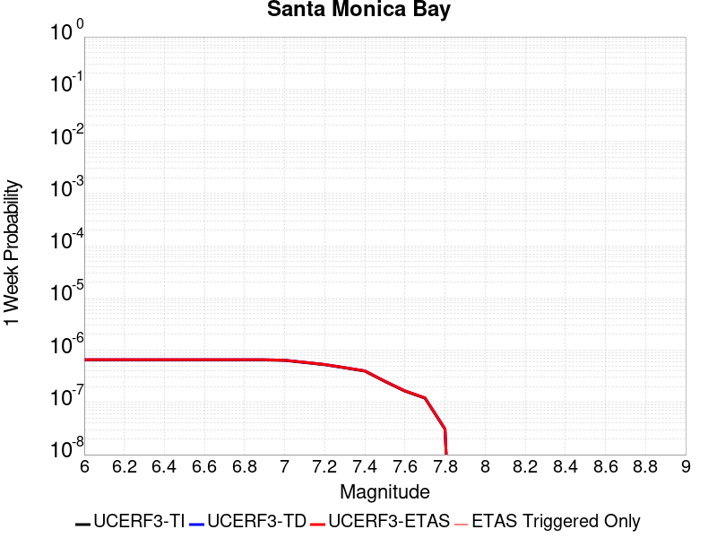 | 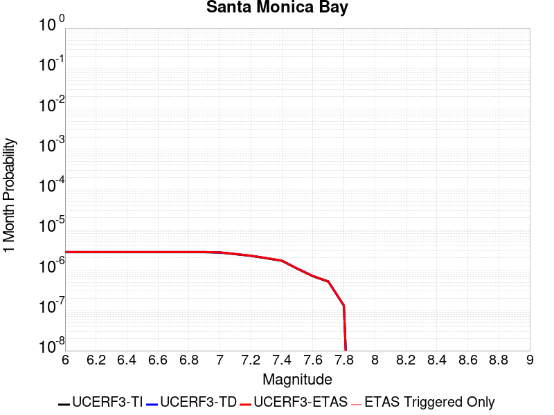 | 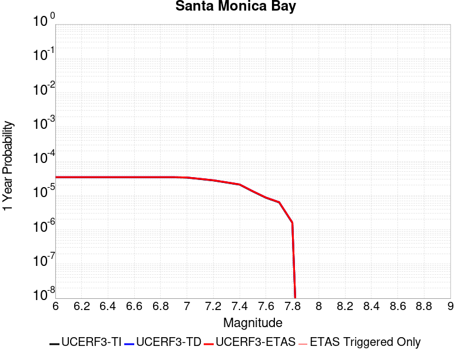 | 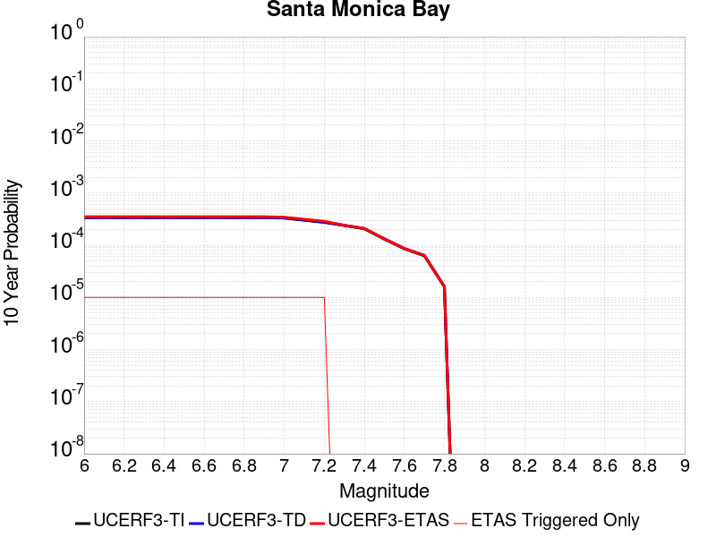 |

| Magnitude | 1 wk TI Prob | 1 wk TD Prob | 1 wk ETAS Prob | 1 wk ETAS/TD Gain | 1 wk ETAS Triggered Only | 1 mo TI Prob | 1 mo TD Prob | 1 mo ETAS Prob | 1 mo ETAS/TD Gain | 1 mo ETAS Triggered Only | 1 yr TI Prob | 1 yr TD Prob | 1 yr ETAS Prob | 1 yr ETAS/TD Gain | 1 yr ETAS Triggered Only | 10 yr TI Prob | 10 yr TD Prob | 10 yr ETAS Prob | 10 yr ETAS/TD Gain | 10 yr ETAS Triggered Only |
|-----|-----|-----|-----|-----|-----|-----|-----|-----|-----|-----|-----|-----|-----|-----|-----|-----|-----|-----|-----|-----|
| 6.0 | 6.493459E-7 | 6.570905E-7 | 6.570905E-7 | 1.0 | 0.0 | 2.782908E-6 | 2.8160991E-6 | 2.8160991E-6 | 1.0 | 0.0 | 3.388138E-5 | 3.4285487E-5 | 3.4285487E-5 | 1.0 | 0.0 | 3.3876215E-4 | 3.4280377E-4 | 3.5280033E-4 | 1.0291612 | 1.0E-5 |
| 6.1 | 6.493459E-7 | 6.570905E-7 | 6.570905E-7 | 1.0 | 0.0 | 2.782908E-6 | 2.8160991E-6 | 2.8160991E-6 | 1.0 | 0.0 | 3.388138E-5 | 3.4285487E-5 | 3.4285487E-5 | 1.0 | 0.0 | 3.3876215E-4 | 3.4280377E-4 | 3.5280033E-4 | 1.0291612 | 1.0E-5 |
| 6.2 | 6.493459E-7 | 6.570905E-7 | 6.570905E-7 | 1.0 | 0.0 | 2.782908E-6 | 2.8160991E-6 | 2.8160991E-6 | 1.0 | 0.0 | 3.388138E-5 | 3.4285487E-5 | 3.4285487E-5 | 1.0 | 0.0 | 3.3876215E-4 | 3.4280377E-4 | 3.5280033E-4 | 1.0291612 | 1.0E-5 |
| 6.3 | 6.493459E-7 | 6.570905E-7 | 6.570905E-7 | 1.0 | 0.0 | 2.782908E-6 | 2.8160991E-6 | 2.8160991E-6 | 1.0 | 0.0 | 3.388138E-5 | 3.4285487E-5 | 3.4285487E-5 | 1.0 | 0.0 | 3.3876215E-4 | 3.4280377E-4 | 3.5280033E-4 | 1.0291612 | 1.0E-5 |
| 6.4 | 6.493459E-7 | 6.570905E-7 | 6.570905E-7 | 1.0 | 0.0 | 2.782908E-6 | 2.8160991E-6 | 2.8160991E-6 | 1.0 | 0.0 | 3.388138E-5 | 3.4285487E-5 | 3.4285487E-5 | 1.0 | 0.0 | 3.3876215E-4 | 3.4280377E-4 | 3.5280033E-4 | 1.0291612 | 1.0E-5 |
| 6.5 | 6.493459E-7 | 6.570905E-7 | 6.570905E-7 | 1.0 | 0.0 | 2.782908E-6 | 2.8160991E-6 | 2.8160991E-6 | 1.0 | 0.0 | 3.388138E-5 | 3.4285487E-5 | 3.4285487E-5 | 1.0 | 0.0 | 3.3876215E-4 | 3.4280377E-4 | 3.5280033E-4 | 1.0291612 | 1.0E-5 |
| 6.6 | 6.493459E-7 | 6.570905E-7 | 6.570905E-7 | 1.0 | 0.0 | 2.782908E-6 | 2.8160991E-6 | 2.8160991E-6 | 1.0 | 0.0 | 3.388138E-5 | 3.4285487E-5 | 3.4285487E-5 | 1.0 | 0.0 | 3.3876215E-4 | 3.4280377E-4 | 3.5280033E-4 | 1.0291612 | 1.0E-5 |
| 6.7 | 6.493459E-7 | 6.570905E-7 | 6.570905E-7 | 1.0 | 0.0 | 2.782908E-6 | 2.8160991E-6 | 2.8160991E-6 | 1.0 | 0.0 | 3.388138E-5 | 3.4285487E-5 | 3.4285487E-5 | 1.0 | 0.0 | 3.3876215E-4 | 3.4280377E-4 | 3.5280033E-4 | 1.0291612 | 1.0E-5 |
| 6.8 | 6.493459E-7 | 6.570905E-7 | 6.570905E-7 | 1.0 | 0.0 | 2.782908E-6 | 2.8160991E-6 | 2.8160991E-6 | 1.0 | 0.0 | 3.388138E-5 | 3.4285487E-5 | 3.4285487E-5 | 1.0 | 0.0 | 3.3876215E-4 | 3.4280377E-4 | 3.5280033E-4 | 1.0291612 | 1.0E-5 |
| 6.9 | 6.493459E-7 | 6.570905E-7 | 6.570905E-7 | 1.0 | 0.0 | 2.782908E-6 | 2.8160991E-6 | 2.8160991E-6 | 1.0 | 0.0 | 3.388138E-5 | 3.4285487E-5 | 3.4285487E-5 | 1.0 | 0.0 | 3.3876215E-4 | 3.4280377E-4 | 3.5280033E-4 | 1.0291612 | 1.0E-5 |
| 7.0 | 6.3621707E-7 | 6.4389707E-7 | 6.4389707E-7 | 1.0 | 0.0 | 2.726642E-6 | 2.759556E-6 | 2.759556E-6 | 1.0 | 0.0 | 3.319636E-5 | 3.3597094E-5 | 3.3597094E-5 | 1.0 | 0.0 | 3.31914E-4 | 3.3592194E-4 | 3.4591858E-4 | 1.0297588 | 1.0E-5 |
| 7.1 | 5.796316E-7 | 5.8694985E-7 | 5.8694985E-7 | 1.0 | 0.0 | 2.4841331E-6 | 2.515497E-6 | 2.515497E-6 | 1.0 | 0.0 | 3.0243902E-5 | 3.062576E-5 | 3.062576E-5 | 1.0 | 0.0 | 3.0239785E-4 | 3.0621697E-4 | 3.162139E-4 | 1.0326465 | 1.0E-5 |
| 7.2 | 5.2654514E-7 | 5.3347253E-7 | 5.3347253E-7 | 1.0 | 0.0 | 2.25662E-6 | 2.286309E-6 | 2.286309E-6 | 1.0 | 0.0 | 2.7474003E-5 | 2.7835471E-5 | 2.7835471E-5 | 1.0 | 0.0 | 2.7470608E-4 | 2.7832124E-4 | 2.8831846E-4 | 1.0359197 | 1.0E-5 |
| 7.3 | 4.582996E-7 | 4.6463197E-7 | 4.6463197E-7 | 1.0 | 0.0 | 1.9641398E-6 | 1.9912784E-6 | 1.9912784E-6 | 1.0 | 0.0 | 2.3913139E-5 | 2.4243556E-5 | 2.4243556E-5 | 1.0 | 0.0 | 2.3910566E-4 | 2.4241036E-4 | 2.4241036E-4 | 1.0 | 0.0 |
| 7.4 | 3.9690556E-7 | 4.026118E-7 | 4.026118E-7 | 1.0 | 0.0 | 1.7010227E-6 | 1.725478E-6 | 1.725478E-6 | 1.0 | 0.0 | 2.0709755E-5 | 2.1007503E-5 | 2.1007503E-5 | 1.0 | 0.0 | 2.0707825E-4 | 2.1005633E-4 | 2.1005633E-4 | 1.0 | 0.0 |
| 7.5 | 2.514765E-7 | 2.5540857E-7 | 2.5540857E-7 | 1.0 | 0.0 | 1.077756E-6 | 1.0946077E-6 | 1.0946077E-6 | 1.0 | 0.0 | 1.31216E-5 | 1.3326773E-5 | 1.3326773E-5 | 1.0 | 0.0 | 1.3120825E-4 | 1.3326031E-4 | 1.3326031E-4 | 1.0 | 0.0 |
| 7.6 | 1.6412821E-7 | 1.6690133E-7 | 1.6690133E-7 | 1.0 | 0.0 | 7.0340644E-7 | 7.152912E-7 | 7.152912E-7 | 1.0 | 0.0 | 8.563939E-6 | 8.708636E-6 | 8.708636E-6 | 1.0 | 0.0 | 8.56361E-5 | 8.7083E-5 | 8.7083E-5 | 1.0 | 0.0 |
| 7.7 | 1.2030355E-7 | 1.224329E-7 | 1.224329E-7 | 1.0 | 0.0 | 5.155865E-7 | 5.247123E-7 | 5.247123E-7 | 1.0 | 0.0 | 6.277248E-6 | 6.388354E-6 | 6.388354E-6 | 1.0 | 0.0 | 6.2770705E-5 | 6.3881744E-5 | 6.3881744E-5 | 1.0 | 0.0 |
| 7.8 | 3.0539674E-8 | 3.1123864E-8 | 3.1123864E-8 | 1.0 | 0.0 | 1.308843E-7 | 1.3338799E-7 | 1.3338799E-7 | 1.0 | 0.0 | 1.5935152E-6 | 1.6239977E-6 | 1.6239977E-6 | 1.0 | 0.0 | 1.5935038E-5 | 1.623988E-5 | 1.623988E-5 | 1.0 | 0.0 |

## Great Valley 14 (Kettleman Hills)
*[(top)](#table-of-contents)*

| 1 Week | 1 Month | 1 Year | 10 Year |
|-----|-----|-----|-----|
| 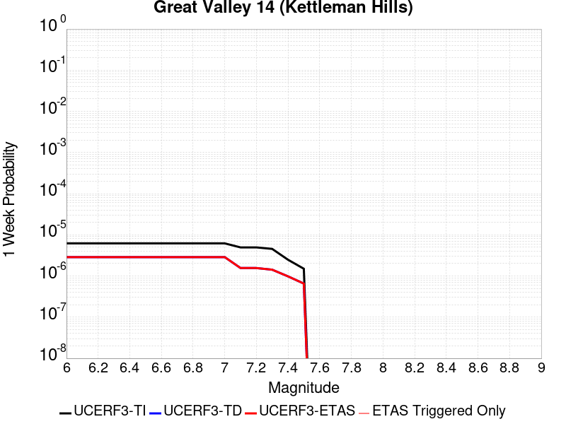 | 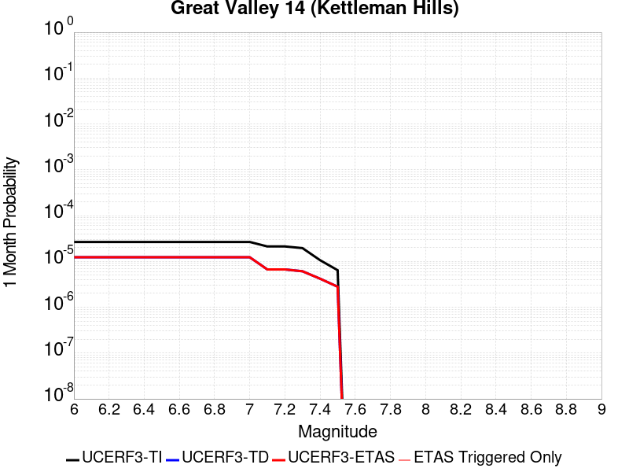 | 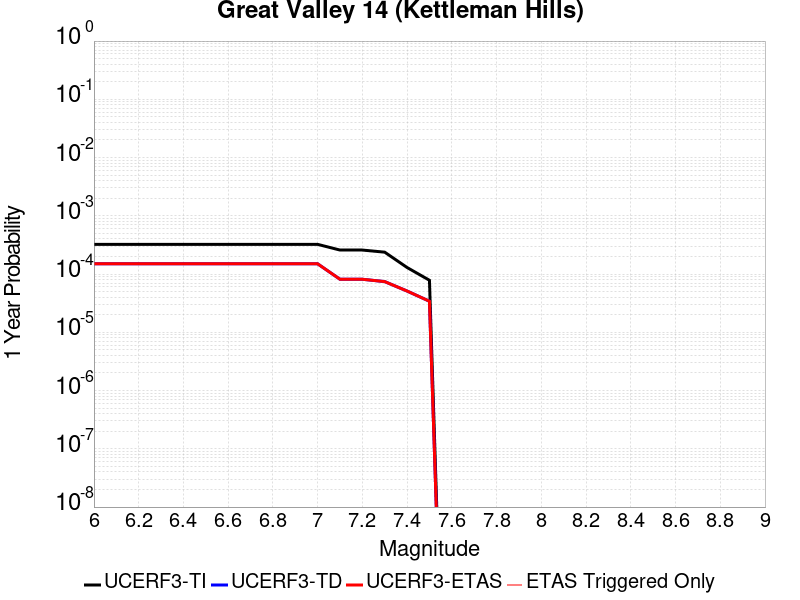 | 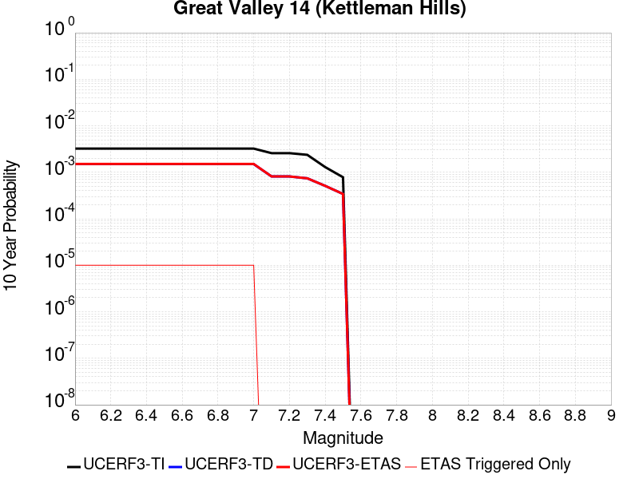 |

| Magnitude | 1 wk TI Prob | 1 wk TD Prob | 1 wk ETAS Prob | 1 wk ETAS/TD Gain | 1 wk ETAS Triggered Only | 1 mo TI Prob | 1 mo TD Prob | 1 mo ETAS Prob | 1 mo ETAS/TD Gain | 1 mo ETAS Triggered Only | 1 yr TI Prob | 1 yr TD Prob | 1 yr ETAS Prob | 1 yr ETAS/TD Gain | 1 yr ETAS Triggered Only | 10 yr TI Prob | 10 yr TD Prob | 10 yr ETAS Prob | 10 yr ETAS/TD Gain | 10 yr ETAS Triggered Only |
|-----|-----|-----|-----|-----|-----|-----|-----|-----|-----|-----|-----|-----|-----|-----|-----|-----|-----|-----|-----|-----|
| 6.0 | 6.2057843E-6 | 2.8768522E-6 | 2.8768522E-6 | 1.0 | 0.0 | 2.6595946E-5 | 1.2329322E-5 | 1.2329322E-5 | 1.0 | 0.0 | 3.2375753E-4 | 1.501015E-4 | 1.501015E-4 | 1.0 | 0.0 | 0.0032328626 | 0.0015002326 | 0.0015102176 | 1.0066556 | 1.0E-5 |
| 6.1 | 6.2057843E-6 | 2.8768522E-6 | 2.8768522E-6 | 1.0 | 0.0 | 2.6595946E-5 | 1.2329322E-5 | 1.2329322E-5 | 1.0 | 0.0 | 3.2375753E-4 | 1.501015E-4 | 1.501015E-4 | 1.0 | 0.0 | 0.0032328626 | 0.0015002326 | 0.0015102176 | 1.0066556 | 1.0E-5 |
| 6.2 | 6.2057843E-6 | 2.8768522E-6 | 2.8768522E-6 | 1.0 | 0.0 | 2.6595946E-5 | 1.2329322E-5 | 1.2329322E-5 | 1.0 | 0.0 | 3.2375753E-4 | 1.501015E-4 | 1.501015E-4 | 1.0 | 0.0 | 0.0032328626 | 0.0015002326 | 0.0015102176 | 1.0066556 | 1.0E-5 |
| 6.3 | 6.2057843E-6 | 2.8768522E-6 | 2.8768522E-6 | 1.0 | 0.0 | 2.6595946E-5 | 1.2329322E-5 | 1.2329322E-5 | 1.0 | 0.0 | 3.2375753E-4 | 1.501015E-4 | 1.501015E-4 | 1.0 | 0.0 | 0.0032328626 | 0.0015002326 | 0.0015102176 | 1.0066556 | 1.0E-5 |
| 6.4 | 6.2057843E-6 | 2.8768522E-6 | 2.8768522E-6 | 1.0 | 0.0 | 2.6595946E-5 | 1.2329322E-5 | 1.2329322E-5 | 1.0 | 0.0 | 3.2375753E-4 | 1.501015E-4 | 1.501015E-4 | 1.0 | 0.0 | 0.0032328626 | 0.0015002326 | 0.0015102176 | 1.0066556 | 1.0E-5 |
| 6.5 | 6.2057843E-6 | 2.8768522E-6 | 2.8768522E-6 | 1.0 | 0.0 | 2.6595946E-5 | 1.2329322E-5 | 1.2329322E-5 | 1.0 | 0.0 | 3.2375753E-4 | 1.501015E-4 | 1.501015E-4 | 1.0 | 0.0 | 0.0032328626 | 0.0015002326 | 0.0015102176 | 1.0066556 | 1.0E-5 |
| 6.6 | 6.2057843E-6 | 2.8768522E-6 | 2.8768522E-6 | 1.0 | 0.0 | 2.6595946E-5 | 1.2329322E-5 | 1.2329322E-5 | 1.0 | 0.0 | 3.2375753E-4 | 1.501015E-4 | 1.501015E-4 | 1.0 | 0.0 | 0.0032328626 | 0.0015002326 | 0.0015102176 | 1.0066556 | 1.0E-5 |
| 6.7 | 6.2057843E-6 | 2.8768522E-6 | 2.8768522E-6 | 1.0 | 0.0 | 2.6595946E-5 | 1.2329322E-5 | 1.2329322E-5 | 1.0 | 0.0 | 3.2375753E-4 | 1.501015E-4 | 1.501015E-4 | 1.0 | 0.0 | 0.0032328626 | 0.0015002326 | 0.0015102176 | 1.0066556 | 1.0E-5 |
| 6.8 | 6.2057843E-6 | 2.8768522E-6 | 2.8768522E-6 | 1.0 | 0.0 | 2.6595946E-5 | 1.2329322E-5 | 1.2329322E-5 | 1.0 | 0.0 | 3.2375753E-4 | 1.501015E-4 | 1.501015E-4 | 1.0 | 0.0 | 0.0032328626 | 0.0015002326 | 0.0015102176 | 1.0066556 | 1.0E-5 |
| 6.9 | 6.2057843E-6 | 2.8768522E-6 | 2.8768522E-6 | 1.0 | 0.0 | 2.6595946E-5 | 1.2329322E-5 | 1.2329322E-5 | 1.0 | 0.0 | 3.2375753E-4 | 1.501015E-4 | 1.501015E-4 | 1.0 | 0.0 | 0.0032328626 | 0.0015002326 | 0.0015102176 | 1.0066556 | 1.0E-5 |
| 7.0 | 6.2057843E-6 | 2.8768522E-6 | 2.8768522E-6 | 1.0 | 0.0 | 2.6595946E-5 | 1.2329322E-5 | 1.2329322E-5 | 1.0 | 0.0 | 3.2375753E-4 | 1.501015E-4 | 1.501015E-4 | 1.0 | 0.0 | 0.0032328626 | 0.0015002326 | 0.0015102176 | 1.0066556 | 1.0E-5 |
| 7.1 | 4.95113E-6 | 1.560601E-6 | 1.560601E-6 | 1.0 | 0.0 | 2.1218955E-5 | 6.6882744E-6 | 6.6882744E-6 | 1.0 | 0.0 | 2.5831014E-4 | 8.1426886E-5 | 8.1426886E-5 | 1.0 | 0.0 | 0.0025801011 | 8.139895E-4 | 8.139895E-4 | 1.0 | 0.0 |
| 7.2 | 4.95113E-6 | 1.560601E-6 | 1.560601E-6 | 1.0 | 0.0 | 2.1218955E-5 | 6.6882744E-6 | 6.6882744E-6 | 1.0 | 0.0 | 2.5831014E-4 | 8.1426886E-5 | 8.1426886E-5 | 1.0 | 0.0 | 0.0025801011 | 8.139895E-4 | 8.139895E-4 | 1.0 | 0.0 |
| 7.3 | 4.5549086E-6 | 1.4225644E-6 | 1.4225644E-6 | 1.0 | 0.0 | 1.9520892E-5 | 6.0966913E-6 | 6.0966913E-6 | 1.0 | 0.0 | 2.3764092E-4 | 7.422486E-5 | 7.422486E-5 | 1.0 | 0.0 | 0.0023738695 | 7.420173E-4 | 7.420173E-4 | 1.0 | 0.0 |
| 7.4 | 2.4837766E-6 | 9.80032E-7 | 9.80032E-7 | 1.0 | 0.0 | 1.0644713E-5 | 4.2001307E-6 | 4.2001307E-6 | 1.0 | 0.0 | 1.2959167E-4 | 5.113546E-5 | 5.113546E-5 | 1.0 | 0.0 | 0.0012951613 | 5.1124353E-4 | 5.1124353E-4 | 1.0 | 0.0 |
| 7.5 | 1.5002679E-6 | 6.545985E-7 | 6.545985E-7 | 1.0 | 0.0 | 6.4297037E-6 | 2.8054194E-6 | 2.8054194E-6 | 1.0 | 0.0 | 7.827883E-5 | 3.4155488E-5 | 3.4155488E-5 | 1.0 | 0.0 | 7.825126E-4 | 3.4150656E-4 | 3.4150656E-4 | 1.0 | 0.0 |

## Pittville 2011 CFM
*[(top)](#table-of-contents)*

| 1 Week | 1 Month | 1 Year | 10 Year |
|-----|-----|-----|-----|
|  |  |  | 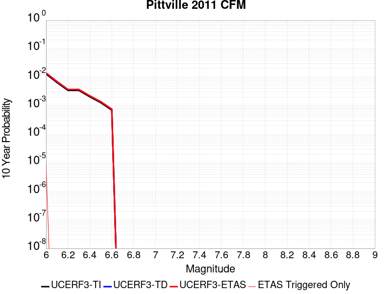 |

| Magnitude | 1 wk TI Prob | 1 wk TD Prob | 1 wk ETAS Prob | 1 wk ETAS/TD Gain | 1 wk ETAS Triggered Only | 1 mo TI Prob | 1 mo TD Prob | 1 mo ETAS Prob | 1 mo ETAS/TD Gain | 1 mo ETAS Triggered Only | 1 yr TI Prob | 1 yr TD Prob | 1 yr ETAS Prob | 1 yr ETAS/TD Gain | 1 yr ETAS Triggered Only | 10 yr TI Prob | 10 yr TD Prob | 10 yr ETAS Prob | 10 yr ETAS/TD Gain | 10 yr ETAS Triggered Only |
|-----|-----|-----|-----|-----|-----|-----|-----|-----|-----|-----|-----|-----|-----|-----|-----|-----|-----|-----|-----|-----|
| 6.0 | 2.5031832E-5 | 2.7056969E-5 | 2.7056969E-5 | 1.0 | 0.0 | 1.0727487E-4 | 1.1595384E-4 | 1.2595268E-4 | 1.0862312 | 1.0E-5 | 0.001305289 | 0.0014109211 | 0.001420907 | 1.0070776 | 1.0E-5 | 0.012976485 | 0.014029415 | 0.014039275 | 1.0007027 | 1.0E-5 |
| 6.1 | 1.2540113E-5 | 1.3513067E-5 | 1.3513067E-5 | 1.0 | 0.0 | 5.3742235E-5 | 5.7911984E-5 | 5.7911984E-5 | 1.0 | 0.0 | 6.541153E-4 | 7.048728E-4 | 7.048728E-4 | 1.0 | 0.0 | 0.0065219323 | 0.0070286044 | 0.0070286044 | 1.0 | 0.0 |
| 6.2 | 6.603218E-6 | 7.107189E-6 | 7.107189E-6 | 1.0 | 0.0 | 2.8299199E-5 | 3.0459063E-5 | 3.0459063E-5 | 1.0 | 0.0 | 3.4448825E-4 | 3.7078248E-4 | 3.7078248E-4 | 1.0 | 0.0 | 0.0034395473 | 0.0037022792 | 0.0037022792 | 1.0 | 0.0 |
| 6.3 | 6.603218E-6 | 7.107189E-6 | 7.107189E-6 | 1.0 | 0.0 | 2.8299199E-5 | 3.0459063E-5 | 3.0459063E-5 | 1.0 | 0.0 | 3.4448825E-4 | 3.7078248E-4 | 3.7078248E-4 | 1.0 | 0.0 | 0.0034395473 | 0.0037022792 | 0.0037022792 | 1.0 | 0.0 |
| 6.4 | 3.9389015E-6 | 4.239175E-6 | 4.239175E-6 | 1.0 | 0.0 | 1.6880897E-5 | 1.8167784E-5 | 1.8167784E-5 | 1.0 | 0.0 | 2.0550552E-4 | 2.2117342E-4 | 2.2117342E-4 | 1.0 | 0.0 | 0.0020531558 | 0.002209838 | 0.002209838 | 1.0 | 0.0 |
| 6.5 | 2.4533072E-6 | 2.6412686E-6 | 2.6412686E-6 | 1.0 | 0.0 | 1.0514132E-5 | 1.1319685E-5 | 1.1319685E-5 | 1.0 | 0.0 | 1.2800204E-4 | 1.3781038E-4 | 1.3781038E-4 | 1.0 | 0.0 | 0.0012792832 | 0.0013774394 | 0.0013774394 | 1.0 | 0.0 |
| 6.6 | 1.3482367E-6 | 1.452993E-6 | 1.452993E-6 | 1.0 | 0.0 | 5.778144E-6 | 6.2271047E-6 | 6.2271047E-6 | 1.0 | 0.0 | 7.0346636E-5 | 7.58135E-5 | 7.58135E-5 | 1.0 | 0.0 | 7.032437E-4 | 7.5798744E-4 | 7.5798744E-4 | 1.0 | 0.0 |

## Los Alamos extension
*[(top)](#table-of-contents)*

| 1 Week | 1 Month | 1 Year | 10 Year |
|-----|-----|-----|-----|
| 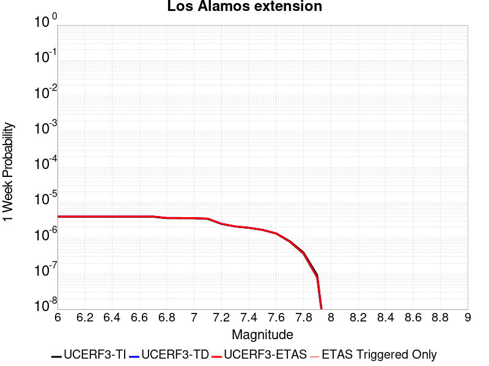 |  | 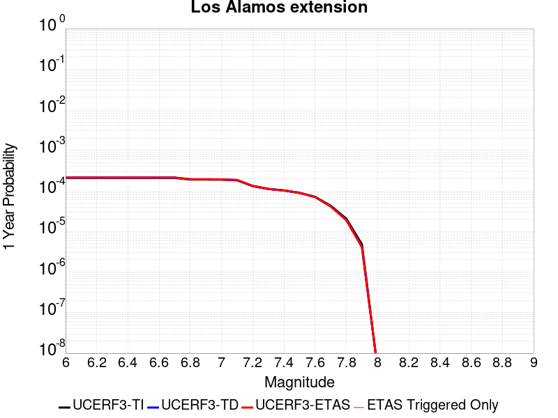 | 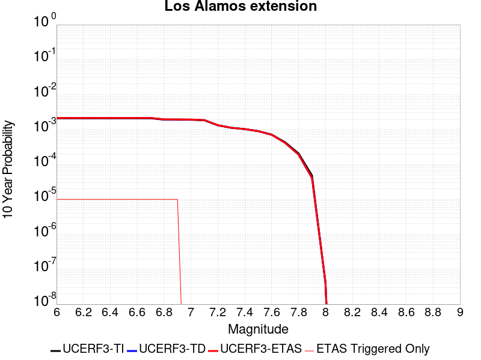 |

| Magnitude | 1 wk TI Prob | 1 wk TD Prob | 1 wk ETAS Prob | 1 wk ETAS/TD Gain | 1 wk ETAS Triggered Only | 1 mo TI Prob | 1 mo TD Prob | 1 mo ETAS Prob | 1 mo ETAS/TD Gain | 1 mo ETAS Triggered Only | 1 yr TI Prob | 1 yr TD Prob | 1 yr ETAS Prob | 1 yr ETAS/TD Gain | 1 yr ETAS Triggered Only | 10 yr TI Prob | 10 yr TD Prob | 10 yr ETAS Prob | 10 yr ETAS/TD Gain | 10 yr ETAS Triggered Only |
|-----|-----|-----|-----|-----|-----|-----|-----|-----|-----|-----|-----|-----|-----|-----|-----|-----|-----|-----|-----|-----|
| 6.0 | 4.0146506E-6 | 4.086164E-6 | 4.086164E-6 | 1.0 | 0.0 | 1.7205533E-5 | 1.7512022E-5 | 1.7512022E-5 | 1.0 | 0.0 | 2.0945723E-4 | 2.1318911E-4 | 2.1318911E-4 | 1.0 | 0.0 | 0.0020925992 | 0.002129955 | 0.0021399339 | 1.0046849 | 1.0E-5 |
| 6.1 | 4.0146506E-6 | 4.086164E-6 | 4.086164E-6 | 1.0 | 0.0 | 1.7205533E-5 | 1.7512022E-5 | 1.7512022E-5 | 1.0 | 0.0 | 2.0945723E-4 | 2.1318911E-4 | 2.1318911E-4 | 1.0 | 0.0 | 0.0020925992 | 0.002129955 | 0.0021399339 | 1.0046849 | 1.0E-5 |
| 6.2 | 4.0146506E-6 | 4.086164E-6 | 4.086164E-6 | 1.0 | 0.0 | 1.7205533E-5 | 1.7512022E-5 | 1.7512022E-5 | 1.0 | 0.0 | 2.0945723E-4 | 2.1318911E-4 | 2.1318911E-4 | 1.0 | 0.0 | 0.0020925992 | 0.002129955 | 0.0021399339 | 1.0046849 | 1.0E-5 |
| 6.3 | 4.0146506E-6 | 4.086164E-6 | 4.086164E-6 | 1.0 | 0.0 | 1.7205533E-5 | 1.7512022E-5 | 1.7512022E-5 | 1.0 | 0.0 | 2.0945723E-4 | 2.1318911E-4 | 2.1318911E-4 | 1.0 | 0.0 | 0.0020925992 | 0.002129955 | 0.0021399339 | 1.0046849 | 1.0E-5 |
| 6.4 | 4.0146506E-6 | 4.086164E-6 | 4.086164E-6 | 1.0 | 0.0 | 1.7205533E-5 | 1.7512022E-5 | 1.7512022E-5 | 1.0 | 0.0 | 2.0945723E-4 | 2.1318911E-4 | 2.1318911E-4 | 1.0 | 0.0 | 0.0020925992 | 0.002129955 | 0.0021399339 | 1.0046849 | 1.0E-5 |
| 6.5 | 4.0146506E-6 | 4.086164E-6 | 4.086164E-6 | 1.0 | 0.0 | 1.7205533E-5 | 1.7512022E-5 | 1.7512022E-5 | 1.0 | 0.0 | 2.0945723E-4 | 2.1318911E-4 | 2.1318911E-4 | 1.0 | 0.0 | 0.0020925992 | 0.002129955 | 0.0021399339 | 1.0046849 | 1.0E-5 |
| 6.6 | 4.0146506E-6 | 4.086164E-6 | 4.086164E-6 | 1.0 | 0.0 | 1.7205533E-5 | 1.7512022E-5 | 1.7512022E-5 | 1.0 | 0.0 | 2.0945723E-4 | 2.1318911E-4 | 2.1318911E-4 | 1.0 | 0.0 | 0.0020925992 | 0.002129955 | 0.0021399339 | 1.0046849 | 1.0E-5 |
| 6.7 | 4.0146506E-6 | 4.086164E-6 | 4.086164E-6 | 1.0 | 0.0 | 1.7205533E-5 | 1.7512022E-5 | 1.7512022E-5 | 1.0 | 0.0 | 2.0945723E-4 | 2.1318911E-4 | 2.1318911E-4 | 1.0 | 0.0 | 0.0020925992 | 0.002129955 | 0.0021399339 | 1.0046849 | 1.0E-5 |
| 6.8 | 3.6584688E-6 | 3.7188636E-6 | 3.7188636E-6 | 1.0 | 0.0 | 1.5679057E-5 | 1.5937894E-5 | 1.5937894E-5 | 1.0 | 0.0 | 1.9087581E-4 | 1.9402753E-4 | 1.9402753E-4 | 1.0 | 0.0 | 0.0019071194 | 0.0019386737 | 0.0019486542 | 1.0051482 | 1.0E-5 |
| 6.9 | 3.644631E-6 | 3.7045736E-6 | 3.7045736E-6 | 1.0 | 0.0 | 1.5619753E-5 | 1.5876652E-5 | 1.5876652E-5 | 1.0 | 0.0 | 1.901539E-4 | 1.9328203E-4 | 1.9328203E-4 | 1.0 | 0.0 | 0.0018999127 | 0.0019312317 | 0.0019412123 | 1.0051681 | 1.0E-5 |
| 7.0 | 3.6318522E-6 | 3.691334E-6 | 3.691334E-6 | 1.0 | 0.0 | 1.5564989E-5 | 1.5819913E-5 | 1.5819913E-5 | 1.0 | 0.0 | 1.8948725E-4 | 1.9259135E-4 | 1.9259135E-4 | 1.0 | 0.0 | 0.0018932576 | 0.0019243368 | 0.0019243368 | 1.0 | 0.0 |
| 7.1 | 3.5001724E-6 | 3.5554046E-6 | 3.5554046E-6 | 1.0 | 0.0 | 1.5000653E-5 | 1.5237365E-5 | 1.5237365E-5 | 1.0 | 0.0 | 1.8261763E-4 | 1.8550004E-4 | 1.8550004E-4 | 1.0 | 0.0 | 0.0018246764 | 0.0018535426 | 0.0018535426 | 1.0 | 0.0 |
| 7.2 | 2.5204702E-6 | 2.5436989E-6 | 2.5436989E-6 | 1.0 | 0.0 | 1.080197E-5 | 1.0901522E-5 | 1.0901522E-5 | 1.0 | 0.0 | 1.3150605E-4 | 1.3271799E-4 | 1.3271799E-4 | 1.0 | 0.0 | 0.0013142825 | 0.001326393 | 0.001326393 | 1.0 | 0.0 |
| 7.3 | 2.1399692E-6 | 2.1501362E-6 | 2.1501362E-6 | 1.0 | 0.0 | 9.1712645E-6 | 9.2148375E-6 | 9.2148375E-6 | 1.0 | 0.0 | 1.1165442E-4 | 1.121849E-4 | 1.121849E-4 | 1.0 | 0.0 | 0.0011159834 | 0.001121286 | 0.001121286 | 1.0 | 0.0 |
| 7.4 | 1.9660122E-6 | 1.970241E-6 | 1.970241E-6 | 1.0 | 0.0 | 8.42574E-6 | 8.4438625E-6 | 8.4438625E-6 | 1.0 | 0.0 | 1.0257855E-4 | 1.0279921E-4 | 1.0279921E-4 | 1.0 | 0.0 | 0.0010253121 | 0.0010275197 | 0.0010275197 | 1.0 | 0.0 |
| 7.5 | 1.7204633E-6 | 1.7151029E-6 | 1.7151029E-6 | 1.0 | 0.0 | 7.373393E-6 | 7.3504207E-6 | 7.3504207E-6 | 1.0 | 0.0 | 8.976737E-5 | 8.948772E-5 | 8.948772E-5 | 1.0 | 0.0 | 8.9731114E-4 | 8.945199E-4 | 8.945199E-4 | 1.0 | 0.0 |
| 7.6 | 1.3717638E-6 | 1.3535872E-6 | 1.3535872E-6 | 1.0 | 0.0 | 5.878974E-6 | 5.801075E-6 | 5.801075E-6 | 1.0 | 0.0 | 7.157416E-5 | 7.062583E-5 | 7.062583E-5 | 1.0 | 0.0 | 7.1551115E-4 | 7.0603646E-4 | 7.0603646E-4 | 1.0 | 0.0 |
| 7.7 | 8.272564E-7 | 7.9576733E-7 | 7.9576733E-7 | 1.0 | 0.0 | 3.5453797E-6 | 3.4104269E-6 | 3.4104269E-6 | 1.0 | 0.0 | 4.3164142E-5 | 4.1521158E-5 | 4.1521158E-5 | 1.0 | 0.0 | 4.315576E-4 | 4.151342E-4 | 4.151342E-4 | 1.0 | 0.0 |
| 7.8 | 3.9708277E-7 | 3.671937E-7 | 3.671937E-7 | 1.0 | 0.0 | 1.7017821E-6 | 1.5736864E-6 | 1.5736864E-6 | 1.0 | 0.0 | 2.0719E-5 | 1.9159465E-5 | 1.9159465E-5 | 1.0 | 0.0 | 2.071707E-4 | 1.9157819E-4 | 1.9157819E-4 | 1.0 | 0.0 |
| 7.9 | 9.292528E-8 | 7.889168E-8 | 7.889168E-8 | 1.0 | 0.0 | 3.9825116E-7 | 3.3810713E-7 | 3.3810713E-7 | 1.0 | 0.0 | 4.848697E-6 | 4.1164467E-6 | 4.1164467E-6 | 1.0 | 0.0 | 4.8485912E-5 | 4.1163716E-5 | 4.1163716E-5 | 1.0 | 0.0 |
| 8.0 | 7.880441E-11 | 8.2353124E-11 | 8.2353124E-11 | 1.0 | 0.0 | 3.3773329E-10 | 3.52942E-10 | 3.52942E-10 | 1.0 | 0.0 | 4.1119033E-9 | 4.2970694E-9 | 4.2970694E-9 | 1.0 | 0.0 | 4.1119034E-8 | 4.2970694E-8 | 4.2970694E-8 | 1.0 | 0.0 |

## Monte Vista - Shannon 2011 CFM
*[(top)](#table-of-contents)*

| 1 Week | 1 Month | 1 Year | 10 Year |
|-----|-----|-----|-----|
|  |  | 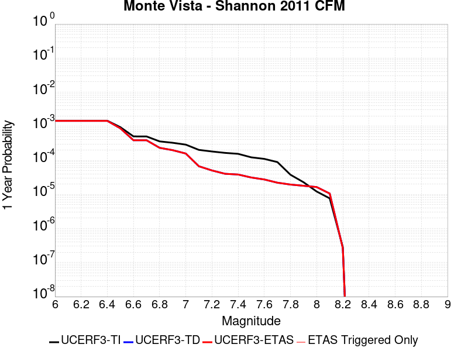 | 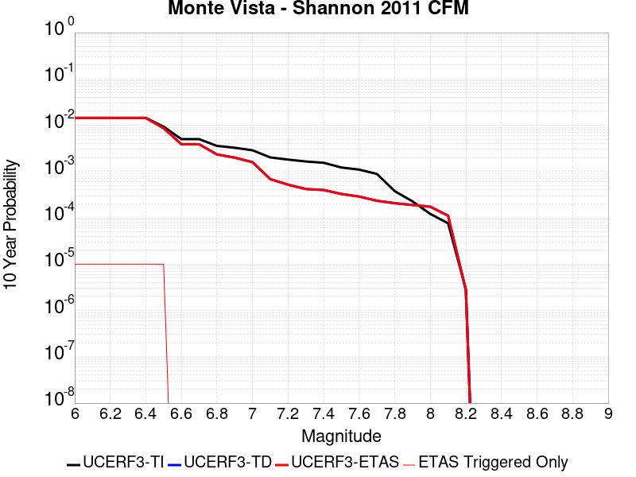 |

| Magnitude | 1 wk TI Prob | 1 wk TD Prob | 1 wk ETAS Prob | 1 wk ETAS/TD Gain | 1 wk ETAS Triggered Only | 1 mo TI Prob | 1 mo TD Prob | 1 mo ETAS Prob | 1 mo ETAS/TD Gain | 1 mo ETAS Triggered Only | 1 yr TI Prob | 1 yr TD Prob | 1 yr ETAS Prob | 1 yr ETAS/TD Gain | 1 yr ETAS Triggered Only | 10 yr TI Prob | 10 yr TD Prob | 10 yr ETAS Prob | 10 yr ETAS/TD Gain | 10 yr ETAS Triggered Only |
|-----|-----|-----|-----|-----|-----|-----|-----|-----|-----|-----|-----|-----|-----|-----|-----|-----|-----|-----|-----|-----|
| 6.0 | 2.7907707E-5 | 2.7584067E-5 | 2.7584067E-5 | 1.0 | 0.0 | 1.19598975E-4 | 1.1821277E-4 | 1.1821277E-4 | 1.0 | 0.0 | 0.0014551448 | 0.001438414 | 0.001438414 | 1.0 | 0.0 | 0.014456532 | 0.014320111 | 0.014329968 | 1.0006883 | 1.0E-5 |
| 6.1 | 2.7907707E-5 | 2.7584067E-5 | 2.7584067E-5 | 1.0 | 0.0 | 1.19598975E-4 | 1.1821277E-4 | 1.1821277E-4 | 1.0 | 0.0 | 0.0014551448 | 0.001438414 | 0.001438414 | 1.0 | 0.0 | 0.014456532 | 0.014320111 | 0.014329968 | 1.0006883 | 1.0E-5 |
| 6.2 | 2.7907707E-5 | 2.7584067E-5 | 2.7584067E-5 | 1.0 | 0.0 | 1.19598975E-4 | 1.1821277E-4 | 1.1821277E-4 | 1.0 | 0.0 | 0.0014551448 | 0.001438414 | 0.001438414 | 1.0 | 0.0 | 0.014456532 | 0.014320111 | 0.014329968 | 1.0006883 | 1.0E-5 |
| 6.3 | 2.7907707E-5 | 2.7584067E-5 | 2.7584067E-5 | 1.0 | 0.0 | 1.19598975E-4 | 1.1821277E-4 | 1.1821277E-4 | 1.0 | 0.0 | 0.0014551448 | 0.001438414 | 0.001438414 | 1.0 | 0.0 | 0.014456532 | 0.014320111 | 0.014329968 | 1.0006883 | 1.0E-5 |
| 6.4 | 2.7907707E-5 | 2.7584067E-5 | 2.7584067E-5 | 1.0 | 0.0 | 1.19598975E-4 | 1.1821277E-4 | 1.1821277E-4 | 1.0 | 0.0 | 0.0014551448 | 0.001438414 | 0.001438414 | 1.0 | 0.0 | 0.014456532 | 0.014320111 | 0.014329968 | 1.0006883 | 1.0E-5 |
| 6.5 | 1.7990213E-5 | 1.6639742E-5 | 1.6639742E-5 | 1.0 | 0.0 | 7.709863E-5 | 7.13116E-5 | 7.13116E-5 | 1.0 | 0.0 | 9.382716E-4 | 8.679393E-4 | 8.679393E-4 | 1.0 | 0.0 | 0.0093431985 | 0.008668857 | 0.008678771 | 1.0011436 | 1.0E-5 |
| 6.6 | 9.650407E-6 | 7.457001E-6 | 7.457001E-6 | 1.0 | 0.0 | 4.135823E-5 | 3.195823E-5 | 3.195823E-5 | 1.0 | 0.0 | 5.0342013E-4 | 3.890298E-4 | 3.890298E-4 | 1.0 | 0.0 | 0.005022812 | 0.0039011573 | 0.0039011573 | 1.0 | 0.0 |
| 6.7 | 9.62828E-6 | 7.434916E-6 | 7.434916E-6 | 1.0 | 0.0 | 4.1263404E-5 | 3.186358E-5 | 3.186358E-5 | 1.0 | 0.0 | 5.022661E-4 | 3.8787787E-4 | 3.8787787E-4 | 1.0 | 0.0 | 0.0050113243 | 0.003889678 | 0.003889678 | 1.0 | 0.0 |
| 6.8 | 6.887523E-6 | 4.461425E-6 | 4.461425E-6 | 1.0 | 0.0 | 2.9517621E-5 | 1.9120265E-5 | 1.9120265E-5 | 1.0 | 0.0 | 3.5931775E-4 | 2.3276659E-4 | 2.3276659E-4 | 1.0 | 0.0 | 0.0035873733 | 0.0023423703 | 0.0023423703 | 1.0 | 0.0 |
| 6.9 | 6.2722347E-6 | 3.8032956E-6 | 3.8032956E-6 | 1.0 | 0.0 | 2.6880729E-5 | 1.6299748E-5 | 1.6299748E-5 | 1.0 | 0.0 | 3.2722374E-4 | 1.9843338E-4 | 1.9843338E-4 | 1.0 | 0.0 | 0.003267423 | 0.0019996904 | 0.0019996904 | 1.0 | 0.0 |
| 7.0 | 5.5320347E-6 | 3.0304461E-6 | 3.0304461E-6 | 1.0 | 0.0 | 2.3708504E-5 | 1.2987572E-5 | 1.2987572E-5 | 1.0 | 0.0 | 2.8861282E-4 | 1.5811404E-4 | 1.5811404E-4 | 1.0 | 0.0 | 0.0028823826 | 0.0015971304 | 0.0015971304 | 1.0 | 0.0 |
| 7.1 | 3.8794055E-6 | 1.283645E-6 | 1.283645E-6 | 1.0 | 0.0 | 1.6625918E-5 | 5.5013243E-6 | 5.5013243E-6 | 1.0 | 0.0 | 2.0240174E-4 | 6.697658E-5 | 6.697658E-5 | 1.0 | 0.0 | 0.002022175 | 6.86504E-4 | 6.86504E-4 | 1.0 | 0.0 |
| 7.2 | 3.4813652E-6 | 9.669686E-7 | 9.669686E-7 | 1.0 | 0.0 | 1.49200505E-5 | 4.144145E-6 | 4.144145E-6 | 1.0 | 0.0 | 1.8163648E-4 | 5.0453804E-5 | 5.0453804E-5 | 1.0 | 0.0 | 0.0018148809 | 5.213506E-4 | 5.213506E-4 | 1.0 | 0.0 |
| 7.3 | 3.1682148E-6 | 7.7177793E-7 | 7.7177793E-7 | 1.0 | 0.0 | 1.3577992E-5 | 3.3076153E-6 | 3.3076153E-6 | 1.0 | 0.0 | 1.6529951E-4 | 4.0269475E-5 | 4.0269475E-5 | 1.0 | 0.0 | 0.0016517661 | 4.195245E-4 | 4.195245E-4 | 1.0 | 0.0 |
| 7.4 | 2.9707667E-6 | 7.344474E-7 | 7.344474E-7 | 1.0 | 0.0 | 1.2731795E-5 | 3.147628E-6 | 3.147628E-6 | 1.0 | 0.0 | 1.5499859E-4 | 3.8321698E-5 | 3.8321698E-5 | 1.0 | 0.0 | 0.0015489052 | 3.998471E-4 | 3.998471E-4 | 1.0 | 0.0 |
| 7.5 | 2.3462758E-6 | 6.0069135E-7 | 6.0069135E-7 | 1.0 | 0.0 | 1.0055429E-5 | 2.5743889E-6 | 2.5743889E-6 | 1.0 | 0.0 | 1.2241797E-4 | 3.1342737E-5 | 3.1342737E-5 | 1.0 | 0.0 | 0.0012235056 | 3.2833643E-4 | 3.2833643E-4 | 1.0 | 0.0 |
| 7.6 | 2.112783E-6 | 5.250731E-7 | 5.250731E-7 | 1.0 | 0.0 | 9.054753E-6 | 2.2503114E-6 | 2.2503114E-6 | 1.0 | 0.0 | 1.1023604E-4 | 2.7397198E-5 | 2.7397198E-5 | 1.0 | 0.0 | 0.0011018137 | 2.8845918E-4 | 2.8845918E-4 | 1.0 | 0.0 |
| 7.7 | 1.7022471E-6 | 4.23102E-7 | 4.23102E-7 | 1.0 | 0.0 | 7.2953244E-6 | 1.8132929E-6 | 1.8132929E-6 | 1.0 | 0.0 | 8.881695E-5 | 2.207662E-5 | 2.207662E-5 | 1.0 | 0.0 | 8.878146E-4 | 2.3394964E-4 | 2.3394964E-4 | 1.0 | 0.0 |
| 7.8 | 7.230914E-7 | 3.728293E-7 | 3.728293E-7 | 1.0 | 0.0 | 3.0989595E-6 | 1.597839E-6 | 1.597839E-6 | 1.0 | 0.0 | 3.772918E-5 | 1.9453517E-5 | 1.9453517E-5 | 1.0 | 0.0 | 3.7722773E-4 | 2.072548E-4 | 2.072548E-4 | 1.0 | 0.0 |
| 7.9 | 4.3588446E-7 | 3.4304335E-7 | 3.4304335E-7 | 1.0 | 0.0 | 1.868075E-6 | 1.4701849E-6 | 1.4701849E-6 | 1.0 | 0.0 | 2.2743576E-5 | 1.7899356E-5 | 1.7899356E-5 | 1.0 | 0.0 | 2.2741247E-4 | 1.899464E-4 | 1.899464E-4 | 1.0 | 0.0 |
| 8.0 | 2.3317523E-7 | 3.1513432E-7 | 3.1513432E-7 | 1.0 | 0.0 | 9.99322E-7 | 1.350575E-6 | 1.350575E-6 | 1.0 | 0.0 | 1.2166677E-5 | 1.6443128E-5 | 1.6443128E-5 | 1.0 | 0.0 | 1.21660116E-4 | 1.7399403E-4 | 1.7399403E-4 | 1.0 | 0.0 |
| 8.1 | 1.4662456E-7 | 2.03077E-7 | 2.03077E-7 | 1.0 | 0.0 | 6.283908E-7 | 8.703297E-7 | 8.703297E-7 | 1.0 | 0.0 | 7.650631E-6 | 1.05962135E-5 | 1.05962135E-5 | 1.0 | 0.0 | 7.650368E-5 | 1.1132272E-4 | 1.1132272E-4 | 1.0 | 0.0 |
| 8.2 | 5.4931775E-9 | 5.0752176E-9 | 5.0752176E-9 | 1.0 | 0.0 | 2.3542189E-8 | 2.1750932E-8 | 2.1750932E-8 | 1.0 | 0.0 | 2.8662612E-7 | 2.6481757E-7 | 2.6481757E-7 | 1.0 | 0.0 | 2.8662573E-6 | 2.754138E-6 | 2.754138E-6 | 1.0 | 0.0 |

## Great Valley 06 (Midland) 2011 CFM alt1
*[(top)](#table-of-contents)*

| 1 Week | 1 Month | 1 Year | 10 Year |
|-----|-----|-----|-----|
|  |  | 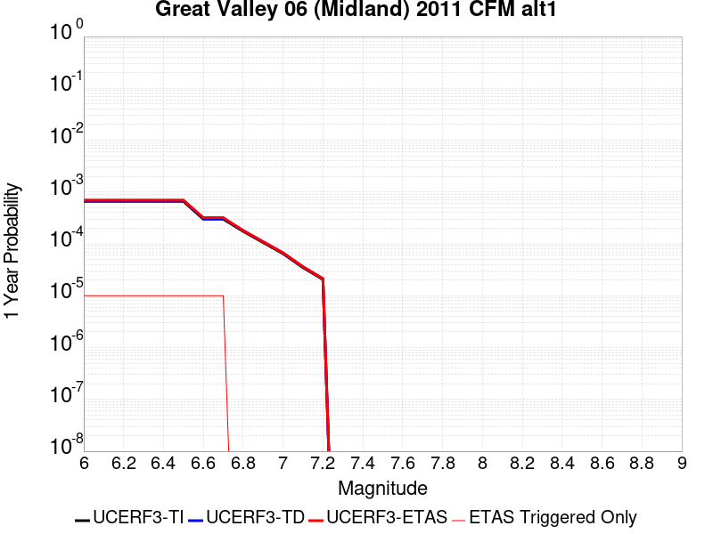 |  |

| Magnitude | 1 wk TI Prob | 1 wk TD Prob | 1 wk ETAS Prob | 1 wk ETAS/TD Gain | 1 wk ETAS Triggered Only | 1 mo TI Prob | 1 mo TD Prob | 1 mo ETAS Prob | 1 mo ETAS/TD Gain | 1 mo ETAS Triggered Only | 1 yr TI Prob | 1 yr TD Prob | 1 yr ETAS Prob | 1 yr ETAS/TD Gain | 1 yr ETAS Triggered Only | 10 yr TI Prob | 10 yr TD Prob | 10 yr ETAS Prob | 10 yr ETAS/TD Gain | 10 yr ETAS Triggered Only |
|-----|-----|-----|-----|-----|-----|-----|-----|-----|-----|-----|-----|-----|-----|-----|-----|-----|-----|-----|-----|-----|
| 6.0 | 1.2712525E-5 | 1.3210576E-5 | 1.3210576E-5 | 1.0 | 0.0 | 5.4481112E-5 | 5.6615667E-5 | 5.6615667E-5 | 1.0 | 0.0 | 6.6310563E-4 | 6.8910315E-4 | 6.9909624E-4 | 1.0145016 | 1.0E-5 | 0.0066113044 | 0.006872179 | 0.00688211 | 1.0014452 | 1.0E-5 |
| 6.1 | 1.2712525E-5 | 1.3210576E-5 | 1.3210576E-5 | 1.0 | 0.0 | 5.4481112E-5 | 5.6615667E-5 | 5.6615667E-5 | 1.0 | 0.0 | 6.6310563E-4 | 6.8910315E-4 | 6.9909624E-4 | 1.0145016 | 1.0E-5 | 0.0066113044 | 0.006872179 | 0.00688211 | 1.0014452 | 1.0E-5 |
| 6.2 | 1.2712525E-5 | 1.3210576E-5 | 1.3210576E-5 | 1.0 | 0.0 | 5.4481112E-5 | 5.6615667E-5 | 5.6615667E-5 | 1.0 | 0.0 | 6.6310563E-4 | 6.8910315E-4 | 6.9909624E-4 | 1.0145016 | 1.0E-5 | 0.0066113044 | 0.006872179 | 0.00688211 | 1.0014452 | 1.0E-5 |
| 6.3 | 1.2712525E-5 | 1.3210576E-5 | 1.3210576E-5 | 1.0 | 0.0 | 5.4481112E-5 | 5.6615667E-5 | 5.6615667E-5 | 1.0 | 0.0 | 6.6310563E-4 | 6.8910315E-4 | 6.9909624E-4 | 1.0145016 | 1.0E-5 | 0.0066113044 | 0.006872179 | 0.00688211 | 1.0014452 | 1.0E-5 |
| 6.4 | 1.2712525E-5 | 1.3210576E-5 | 1.3210576E-5 | 1.0 | 0.0 | 5.4481112E-5 | 5.6615667E-5 | 5.6615667E-5 | 1.0 | 0.0 | 6.6310563E-4 | 6.8910315E-4 | 6.9909624E-4 | 1.0145016 | 1.0E-5 | 0.0066113044 | 0.006872179 | 0.00688211 | 1.0014452 | 1.0E-5 |
| 6.5 | 1.2712525E-5 | 1.3210576E-5 | 1.3210576E-5 | 1.0 | 0.0 | 5.4481112E-5 | 5.6615667E-5 | 5.6615667E-5 | 1.0 | 0.0 | 6.6310563E-4 | 6.8910315E-4 | 6.9909624E-4 | 1.0145016 | 1.0E-5 | 0.0066113044 | 0.006872179 | 0.00688211 | 1.0014452 | 1.0E-5 |
| 6.6 | 5.7574384E-6 | 5.9706463E-6 | 5.9706463E-6 | 1.0 | 0.0 | 2.4674504E-5 | 2.5588255E-5 | 2.5588255E-5 | 1.0 | 0.0 | 3.0037065E-4 | 3.1149638E-4 | 3.2149328E-4 | 1.032093 | 1.0E-5 | 0.0029996498 | 0.0031109843 | 0.0031209532 | 1.0032045 | 1.0E-5 |
| 6.7 | 5.7574384E-6 | 5.9706463E-6 | 5.9706463E-6 | 1.0 | 0.0 | 2.4674504E-5 | 2.5588255E-5 | 2.5588255E-5 | 1.0 | 0.0 | 3.0037065E-4 | 3.1149638E-4 | 3.2149328E-4 | 1.032093 | 1.0E-5 | 0.0029996498 | 0.0031109843 | 0.0031209532 | 1.0032045 | 1.0E-5 |
| 6.8 | 3.3474828E-6 | 3.4693849E-6 | 3.4693849E-6 | 1.0 | 0.0 | 1.4346277E-5 | 1.4868716E-5 | 1.4868716E-5 | 1.0 | 0.0 | 1.7465191E-4 | 1.8101306E-4 | 1.8101306E-4 | 1.0 | 0.0 | 0.0017451472 | 0.0018088033 | 0.0018088033 | 1.0 | 0.0 |
| 6.9 | 2.035106E-6 | 2.1090357E-6 | 2.1090357E-6 | 1.0 | 0.0 | 8.721853E-6 | 9.038697E-6 | 9.038697E-6 | 1.0 | 0.0 | 1.0618339E-4 | 1.10041314E-4 | 1.10041314E-4 | 1.0 | 0.0 | 0.0010613267 | 0.0010999405 | 0.0010999405 | 1.0 | 0.0 |
| 7.0 | 1.2424716E-6 | 1.2878762E-6 | 1.2878762E-6 | 1.0 | 0.0 | 5.3248673E-6 | 5.51946E-6 | 5.51946E-6 | 1.0 | 0.0 | 6.482833E-5 | 6.7197805E-5 | 6.7197805E-5 | 1.0 | 0.0 | 6.480942E-4 | 6.718192E-4 | 6.718192E-4 | 1.0 | 0.0 |
| 7.1 | 6.6904556E-7 | 6.939035E-7 | 6.939035E-7 | 1.0 | 0.0 | 2.867335E-6 | 2.97387E-6 | 2.97387E-6 | 1.0 | 0.0 | 3.4909244E-5 | 3.6206526E-5 | 3.6206526E-5 | 1.0 | 0.0 | 3.490376E-4 | 3.6203177E-4 | 3.6203177E-4 | 1.0 | 0.0 |
| 7.2 | 3.948168E-7 | 4.095705E-7 | 4.095705E-7 | 1.0 | 0.0 | 1.6920709E-6 | 1.7553022E-6 | 1.7553022E-6 | 1.0 | 0.0 | 2.0600768E-5 | 2.1370803E-5 | 2.1370803E-5 | 1.0 | 0.0 | 2.0598859E-4 | 2.1370803E-4 | 2.1370803E-4 | 1.0 | 0.0 |

## Bennett Valley 2011 CFM
*[(top)](#table-of-contents)*

| 1 Week | 1 Month | 1 Year | 10 Year |
|-----|-----|-----|-----|
| 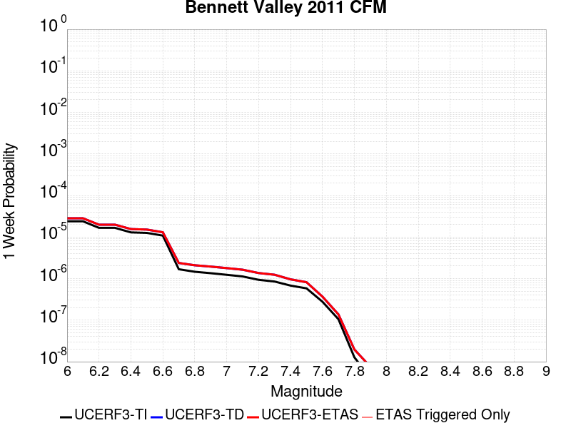 |  | 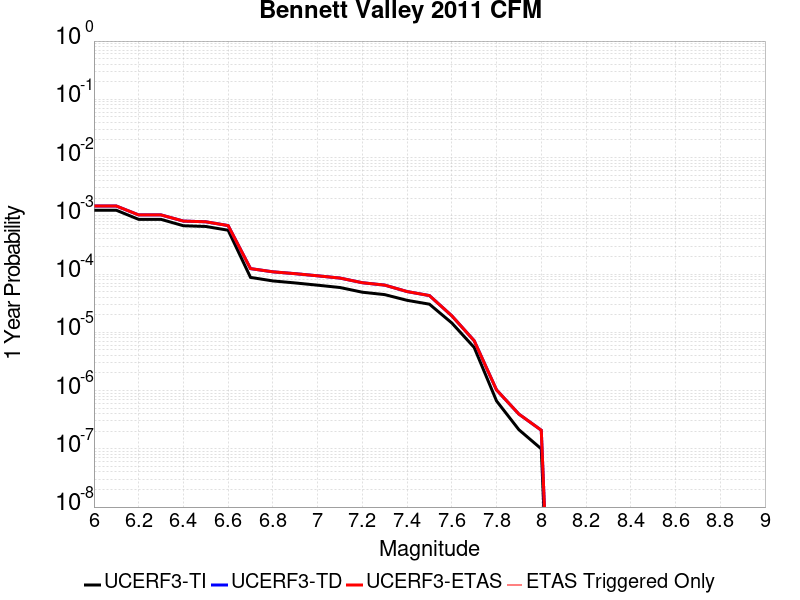 | 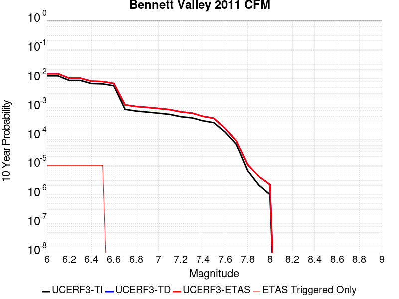 |

| Magnitude | 1 wk TI Prob | 1 wk TD Prob | 1 wk ETAS Prob | 1 wk ETAS/TD Gain | 1 wk ETAS Triggered Only | 1 mo TI Prob | 1 mo TD Prob | 1 mo ETAS Prob | 1 mo ETAS/TD Gain | 1 mo ETAS Triggered Only | 1 yr TI Prob | 1 yr TD Prob | 1 yr ETAS Prob | 1 yr ETAS/TD Gain | 1 yr ETAS Triggered Only | 10 yr TI Prob | 10 yr TD Prob | 10 yr ETAS Prob | 10 yr ETAS/TD Gain | 10 yr ETAS Triggered Only |
|-----|-----|-----|-----|-----|-----|-----|-----|-----|-----|-----|-----|-----|-----|-----|-----|-----|-----|-----|-----|-----|
| 6.0 | 2.3893934E-5 | 2.823899E-5 | 2.823899E-5 | 1.0 | 0.0 | 1.0239855E-4 | 1.2101967E-4 | 1.2101967E-4 | 1.0 | 0.0 | 0.0012459893 | 0.0014726035 | 0.0014726035 | 1.0 | 0.0 | 0.012390262 | 0.01465108 | 0.014660933 | 1.0006726 | 1.0E-5 |
| 6.1 | 2.3893934E-5 | 2.823899E-5 | 2.823899E-5 | 1.0 | 0.0 | 1.0239855E-4 | 1.2101967E-4 | 1.2101967E-4 | 1.0 | 0.0 | 0.0012459893 | 0.0014726035 | 0.0014726035 | 1.0 | 0.0 | 0.012390262 | 0.01465108 | 0.014660933 | 1.0006726 | 1.0E-5 |
| 6.2 | 1.6657146E-5 | 1.9853873E-5 | 1.9853873E-5 | 1.0 | 0.0 | 7.138582E-5 | 8.508605E-5 | 8.508605E-5 | 1.0 | 0.0 | 8.6877577E-4 | 0.0010355718 | 0.0010355718 | 1.0 | 0.0 | 0.008653872 | 0.010325706 | 0.010335602 | 1.0009584 | 1.0E-5 |
| 6.3 | 1.6657146E-5 | 1.9853873E-5 | 1.9853873E-5 | 1.0 | 0.0 | 7.138582E-5 | 8.508605E-5 | 8.508605E-5 | 1.0 | 0.0 | 8.6877577E-4 | 0.0010355718 | 0.0010355718 | 1.0 | 0.0 | 0.008653872 | 0.010325706 | 0.010335602 | 1.0009584 | 1.0E-5 |
| 6.4 | 1.29418495E-5 | 1.5567592E-5 | 1.5567592E-5 | 1.0 | 0.0 | 5.546389E-5 | 6.671728E-5 | 6.671728E-5 | 1.0 | 0.0 | 6.7506364E-4 | 8.1211043E-4 | 8.1211043E-4 | 1.0 | 0.0 | 0.0067301663 | 0.008108544 | 0.008118464 | 1.0012233 | 1.0E-5 |
| 6.5 | 1.2582504E-5 | 1.5134623E-5 | 1.5134623E-5 | 1.0 | 0.0 | 5.39239E-5 | 6.486179E-5 | 6.486179E-5 | 1.0 | 0.0 | 6.563257E-4 | 7.8953634E-4 | 7.8953634E-4 | 1.0 | 0.0 | 0.006543907 | 0.007884451 | 0.007894373 | 1.0012584 | 1.0E-5 |
| 6.6 | 1.0846706E-5 | 1.3036858E-5 | 1.3036858E-5 | 1.0 | 0.0 | 4.6485053E-5 | 5.5871777E-5 | 5.5871777E-5 | 1.0 | 0.0 | 5.6580856E-4 | 6.801549E-4 | 6.801549E-4 | 1.0 | 0.0 | 0.005643701 | 0.0067976816 | 0.0067976816 | 1.0 | 0.0 |
| 6.7 | 1.6803231E-6 | 2.377902E-6 | 2.377902E-6 | 1.0 | 0.0 | 7.2013645E-6 | 1.019097E-5 | 1.019097E-5 | 1.0 | 0.0 | 8.7673085E-5 | 1.2406812E-4 | 1.2406812E-4 | 1.0 | 0.0 | 8.76385E-4 | 0.0012444188 | 0.0012444188 | 1.0 | 0.0 |
| 6.8 | 1.4609833E-6 | 2.0939708E-6 | 2.0939708E-6 | 1.0 | 0.0 | 6.261342E-6 | 8.974131E-6 | 8.974131E-6 | 1.0 | 0.0 | 7.6229175E-5 | 1.0925463E-4 | 1.0925463E-4 | 1.0 | 0.0 | 7.620303E-4 | 0.0010963798 | 0.0010963798 | 1.0 | 0.0 |
| 6.9 | 1.3492396E-6 | 1.9459103E-6 | 1.9459103E-6 | 1.0 | 0.0 | 5.7824427E-6 | 8.339589E-6 | 8.339589E-6 | 1.0 | 0.0 | 7.0398964E-5 | 1.01529826E-4 | 1.01529826E-4 | 1.0 | 0.0 | 7.037667E-4 | 0.001019178 | 0.001019178 | 1.0 | 0.0 |
| 7.0 | 1.2347921E-6 | 1.7888974E-6 | 1.7888974E-6 | 1.0 | 0.0 | 5.291955E-6 | 7.666681E-6 | 7.666681E-6 | 1.0 | 0.0 | 6.442765E-5 | 9.33379E-5 | 9.33379E-5 | 1.0 | 0.0 | 6.440897E-4 | 9.373068E-4 | 9.373068E-4 | 1.0 | 0.0 |
| 7.1 | 1.1262973E-6 | 1.6359154E-6 | 1.6359154E-6 | 1.0 | 0.0 | 4.8269794E-6 | 7.0110473E-6 | 7.0110473E-6 | 1.0 | 0.0 | 5.876689E-5 | 8.535621E-5 | 8.535621E-5 | 1.0 | 0.0 | 5.875135E-4 | 8.5754244E-4 | 8.5754244E-4 | 1.0 | 0.0 |
| 7.2 | 9.351744E-7 | 1.3611758E-6 | 1.3611758E-6 | 1.0 | 0.0 | 4.007884E-6 | 5.8335977E-6 | 5.8335977E-6 | 1.0 | 0.0 | 4.8794896E-5 | 7.1021765E-5 | 7.1021765E-5 | 1.0 | 0.0 | 4.878418E-4 | 7.142461E-4 | 7.142461E-4 | 1.0 | 0.0 |
| 7.3 | 8.5039534E-7 | 1.2386733E-6 | 1.2386733E-6 | 1.0 | 0.0 | 3.6445463E-6 | 5.308589E-6 | 5.308589E-6 | 1.0 | 0.0 | 4.437145E-5 | 6.463018E-5 | 6.463018E-5 | 1.0 | 0.0 | 4.436259E-4 | 6.50103E-4 | 6.50103E-4 | 1.0 | 0.0 |
| 7.4 | 6.7875015E-7 | 9.600642E-7 | 9.600642E-7 | 1.0 | 0.0 | 2.908926E-6 | 4.1145545E-6 | 4.1145545E-6 | 1.0 | 0.0 | 3.54156E-5 | 5.009356E-5 | 5.009356E-5 | 1.0 | 0.0 | 3.5409955E-4 | 5.0413073E-4 | 5.0413073E-4 | 1.0 | 0.0 |
| 7.5 | 5.826867E-7 | 8.1883735E-7 | 8.1883735E-7 | 1.0 | 0.0 | 2.4972264E-6 | 3.5092983E-6 | 3.5092983E-6 | 1.0 | 0.0 | 3.0403306E-5 | 4.2724878E-5 | 4.2724878E-5 | 1.0 | 0.0 | 3.0399146E-4 | 4.300558E-4 | 4.300558E-4 | 1.0 | 0.0 |
| 7.6 | 2.7734902E-7 | 3.6822587E-7 | 3.6822587E-7 | 1.0 | 0.0 | 1.1886381E-6 | 1.57811E-6 | 1.57811E-6 | 1.0 | 0.0 | 1.4471572E-5 | 1.9213321E-5 | 1.9213321E-5 | 1.0 | 0.0 | 1.447063E-4 | 1.9315645E-4 | 1.9315645E-4 | 1.0 | 0.0 |
| 7.7 | 1.0530888E-7 | 1.3749101E-7 | 1.3749101E-7 | 1.0 | 0.0 | 4.513237E-7 | 5.8924707E-7 | 5.8924707E-7 | 1.0 | 0.0 | 5.4948523E-6 | 7.174059E-6 | 7.174059E-6 | 1.0 | 0.0 | 5.4947162E-5 | 7.255585E-5 | 7.255585E-5 | 1.0 | 0.0 |
| 7.8 | 1.2714258E-8 | 1.9633259E-8 | 1.9633259E-8 | 1.0 | 0.0 | 5.448968E-8 | 8.4142535E-8 | 8.4142535E-8 | 1.0 | 0.0 | 6.6341164E-7 | 1.0244348E-6 | 1.0244348E-6 | 1.0 | 0.0 | 6.6340967E-6 | 1.0658595E-5 | 1.0658595E-5 | 1.0 | 0.0 |
| 7.9 | 4.075888E-9 | 7.559928E-9 | 7.559928E-9 | 1.0 | 0.0 | 1.7468091E-8 | 3.239969E-8 | 3.239969E-8 | 1.0 | 0.0 | 2.12674E-7 | 3.9446616E-7 | 3.9446616E-7 | 1.0 | 0.0 | 2.1267379E-6 | 4.1952467E-6 | 4.1952467E-6 | 1.0 | 0.0 |
| 8.0 | 1.9126138E-9 | 3.9956882E-9 | 3.9956882E-9 | 1.0 | 0.0 | 8.196917E-9 | 1.7124377E-8 | 1.7124377E-8 | 1.0 | 0.0 | 9.9797454E-8 | 2.0848927E-7 | 2.0848927E-7 | 1.0 | 0.0 | 9.979741E-7 | 2.1982228E-6 | 2.1982228E-6 | 1.0 | 0.0 |

## Pitas Point (Lower West)
*[(top)](#table-of-contents)*

| 1 Week | 1 Month | 1 Year | 10 Year |
|-----|-----|-----|-----|
| 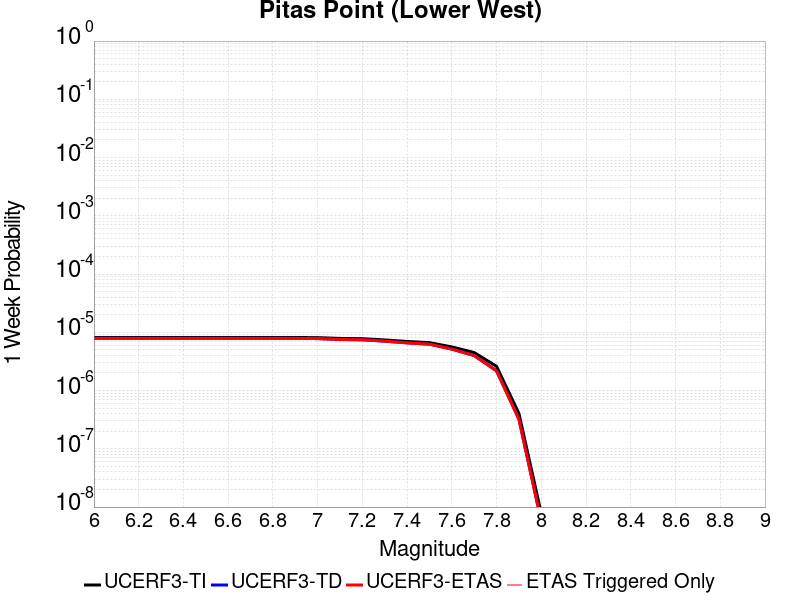 | 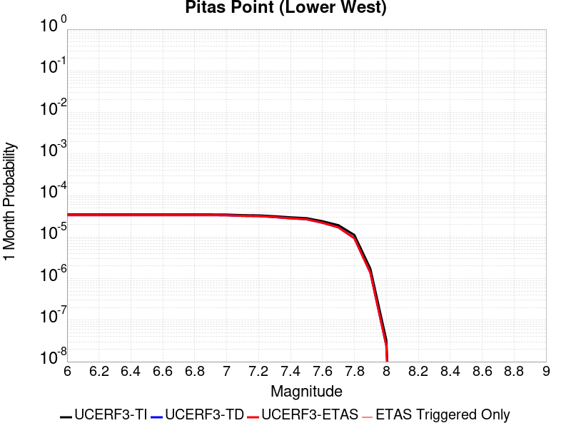 | 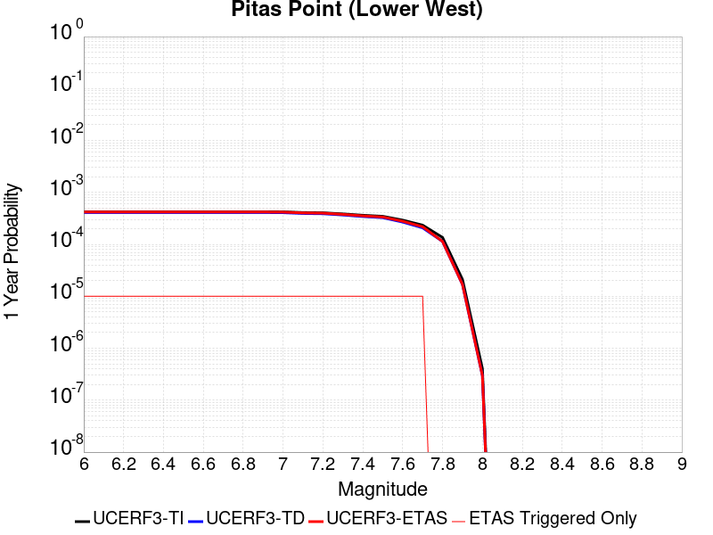 | 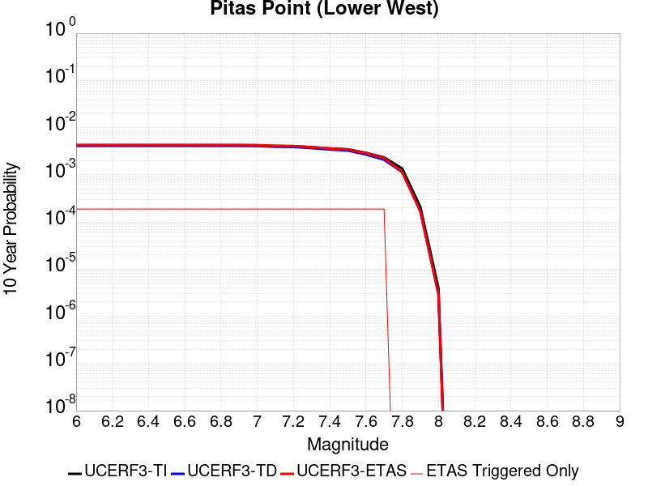 |

| Magnitude | 1 wk TI Prob | 1 wk TD Prob | 1 wk ETAS Prob | 1 wk ETAS/TD Gain | 1 wk ETAS Triggered Only | 1 mo TI Prob | 1 mo TD Prob | 1 mo ETAS Prob | 1 mo ETAS/TD Gain | 1 mo ETAS Triggered Only | 1 yr TI Prob | 1 yr TD Prob | 1 yr ETAS Prob | 1 yr ETAS/TD Gain | 1 yr ETAS Triggered Only | 10 yr TI Prob | 10 yr TD Prob | 10 yr ETAS Prob | 10 yr ETAS/TD Gain | 10 yr ETAS Triggered Only |
|-----|-----|-----|-----|-----|-----|-----|-----|-----|-----|-----|-----|-----|-----|-----|-----|-----|-----|-----|-----|-----|
| 6.0 | 8.151497E-6 | 7.855796E-6 | 7.855796E-6 | 1.0 | 0.0 | 3.493452E-5 | 3.3667267E-5 | 3.3667267E-5 | 1.0 | 0.0 | 4.252448E-4 | 4.0982262E-4 | 4.1981853E-4 | 1.0243908 | 1.0E-5 | 0.0042443196 | 0.004090749 | 0.0041007083 | 1.0024345 | 1.0E-5 |
| 6.1 | 8.151497E-6 | 7.855796E-6 | 7.855796E-6 | 1.0 | 0.0 | 3.493452E-5 | 3.3667267E-5 | 3.3667267E-5 | 1.0 | 0.0 | 4.252448E-4 | 4.0982262E-4 | 4.1981853E-4 | 1.0243908 | 1.0E-5 | 0.0042443196 | 0.004090749 | 0.0041007083 | 1.0024345 | 1.0E-5 |
| 6.2 | 8.151497E-6 | 7.855796E-6 | 7.855796E-6 | 1.0 | 0.0 | 3.493452E-5 | 3.3667267E-5 | 3.3667267E-5 | 1.0 | 0.0 | 4.252448E-4 | 4.0982262E-4 | 4.1981853E-4 | 1.0243908 | 1.0E-5 | 0.0042443196 | 0.004090749 | 0.0041007083 | 1.0024345 | 1.0E-5 |
| 6.3 | 8.151497E-6 | 7.855796E-6 | 7.855796E-6 | 1.0 | 0.0 | 3.493452E-5 | 3.3667267E-5 | 3.3667267E-5 | 1.0 | 0.0 | 4.252448E-4 | 4.0982262E-4 | 4.1981853E-4 | 1.0243908 | 1.0E-5 | 0.0042443196 | 0.004090749 | 0.0041007083 | 1.0024345 | 1.0E-5 |
| 6.4 | 8.151497E-6 | 7.855796E-6 | 7.855796E-6 | 1.0 | 0.0 | 3.493452E-5 | 3.3667267E-5 | 3.3667267E-5 | 1.0 | 0.0 | 4.252448E-4 | 4.0982262E-4 | 4.1981853E-4 | 1.0243908 | 1.0E-5 | 0.0042443196 | 0.004090749 | 0.0041007083 | 1.0024345 | 1.0E-5 |
| 6.5 | 8.151497E-6 | 7.855796E-6 | 7.855796E-6 | 1.0 | 0.0 | 3.493452E-5 | 3.3667267E-5 | 3.3667267E-5 | 1.0 | 0.0 | 4.252448E-4 | 4.0982262E-4 | 4.1981853E-4 | 1.0243908 | 1.0E-5 | 0.0042443196 | 0.004090749 | 0.0041007083 | 1.0024345 | 1.0E-5 |
| 6.6 | 8.151497E-6 | 7.855796E-6 | 7.855796E-6 | 1.0 | 0.0 | 3.493452E-5 | 3.3667267E-5 | 3.3667267E-5 | 1.0 | 0.0 | 4.252448E-4 | 4.0982262E-4 | 4.1981853E-4 | 1.0243908 | 1.0E-5 | 0.0042443196 | 0.004090749 | 0.0041007083 | 1.0024345 | 1.0E-5 |
| 6.7 | 8.151497E-6 | 7.855796E-6 | 7.855796E-6 | 1.0 | 0.0 | 3.493452E-5 | 3.3667267E-5 | 3.3667267E-5 | 1.0 | 0.0 | 4.252448E-4 | 4.0982262E-4 | 4.1981853E-4 | 1.0243908 | 1.0E-5 | 0.0042443196 | 0.004090749 | 0.0041007083 | 1.0024345 | 1.0E-5 |
| 6.8 | 8.151497E-6 | 7.855796E-6 | 7.855796E-6 | 1.0 | 0.0 | 3.493452E-5 | 3.3667267E-5 | 3.3667267E-5 | 1.0 | 0.0 | 4.252448E-4 | 4.0982262E-4 | 4.1981853E-4 | 1.0243908 | 1.0E-5 | 0.0042443196 | 0.004090749 | 0.0041007083 | 1.0024345 | 1.0E-5 |
| 6.9 | 8.151497E-6 | 7.855796E-6 | 7.855796E-6 | 1.0 | 0.0 | 3.493452E-5 | 3.3667267E-5 | 3.3667267E-5 | 1.0 | 0.0 | 4.252448E-4 | 4.0982262E-4 | 4.1981853E-4 | 1.0243908 | 1.0E-5 | 0.0042443196 | 0.004090749 | 0.0041007083 | 1.0024345 | 1.0E-5 |
| 7.0 | 8.103535E-6 | 7.805226E-6 | 7.805226E-6 | 1.0 | 0.0 | 3.4728975E-5 | 3.3450542E-5 | 3.3450542E-5 | 1.0 | 0.0 | 4.2274324E-4 | 4.07185E-4 | 4.171809E-4 | 1.0245489 | 1.0E-5 | 0.0042193993 | 0.0040644696 | 0.0040744287 | 1.0024503 | 1.0E-5 |
| 7.1 | 7.853298E-6 | 7.540917E-6 | 7.540917E-6 | 1.0 | 0.0 | 3.3656554E-5 | 3.2317817E-5 | 3.2317817E-5 | 1.0 | 0.0 | 4.096915E-4 | 3.9339912E-4 | 4.0339518E-4 | 1.0254095 | 1.0E-5 | 0.00408937 | 0.0039271032 | 0.0039370637 | 1.0025364 | 1.0E-5 |
| 7.2 | 7.771102E-6 | 7.453199E-6 | 7.453199E-6 | 1.0 | 0.0 | 3.33043E-5 | 3.1941894E-5 | 3.1941894E-5 | 1.0 | 0.0 | 4.0540437E-4 | 3.8882386E-4 | 3.9881998E-4 | 1.0257086 | 1.0E-5 | 0.0040466557 | 0.003881511 | 0.0038914722 | 1.0025663 | 1.0E-5 |
| 7.3 | 7.3945344E-6 | 7.0493033E-6 | 7.0493033E-6 | 1.0 | 0.0 | 3.1690477E-5 | 3.0210955E-5 | 3.0210955E-5 | 1.0 | 0.0 | 3.8576324E-4 | 3.677569E-4 | 3.7775323E-4 | 1.0271819 | 1.0E-5 | 0.0038509427 | 0.003671551 | 0.0036815142 | 1.0027137 | 1.0E-5 |
| 7.4 | 6.964645E-6 | 6.5901527E-6 | 6.5901527E-6 | 1.0 | 0.0 | 2.9848137E-5 | 2.8243208E-5 | 2.8243208E-5 | 1.0 | 0.0 | 3.6334046E-4 | 3.438073E-4 | 3.5380386E-4 | 1.0290761 | 1.0E-5 | 0.0036274698 | 0.0034328073 | 0.003442773 | 1.0029031 | 1.0E-5 |
| 7.5 | 6.6525035E-6 | 6.259191E-6 | 6.259191E-6 | 1.0 | 0.0 | 2.851042E-5 | 2.6824831E-5 | 2.6824831E-5 | 1.0 | 0.0 | 3.4705905E-4 | 3.2654387E-4 | 3.365406E-4 | 1.0306138 | 1.0E-5 | 0.0034651754 | 0.0032606919 | 0.0032706594 | 1.0030569 | 1.0E-5 |
| 7.6 | 5.613338E-6 | 5.15142E-6 | 5.15142E-6 | 1.0 | 0.0 | 2.405694E-5 | 2.2077327E-5 | 2.2077327E-5 | 1.0 | 0.0 | 2.928539E-4 | 2.6875862E-4 | 2.7875594E-4 | 1.0371981 | 1.0E-5 | 0.0029246826 | 0.0026843674 | 0.0026943407 | 1.0037153 | 1.0E-5 |
| 7.7 | 4.494704E-6 | 3.996945E-6 | 3.996945E-6 | 1.0 | 0.0 | 1.9262876E-5 | 1.7129652E-5 | 1.7129652E-5 | 1.0 | 0.0 | 2.3450027E-4 | 2.0853379E-4 | 2.185317E-4 | 1.0479438 | 1.0E-5 | 0.0023425296 | 0.0020834052 | 0.0020933843 | 1.0047898 | 1.0E-5 |
| 7.8 | 2.6075882E-6 | 2.1836663E-6 | 2.1836663E-6 | 1.0 | 0.0 | 1.117533E-5 | 9.358537E-6 | 9.358537E-6 | 1.0 | 0.0 | 1.3605114E-4 | 1.1393427E-4 | 1.1393427E-4 | 1.0 | 0.0 | 0.0013596788 | 0.0011387634 | 0.0011387634 | 1.0 | 0.0 |
| 7.9 | 4.045984E-7 | 3.2424057E-7 | 3.2424057E-7 | 1.0 | 0.0 | 1.733992E-6 | 1.3896017E-6 | 1.3896017E-6 | 1.0 | 0.0 | 2.1111147E-5 | 1.6918271E-5 | 1.6918271E-5 | 1.0 | 0.0 | 2.1109142E-4 | 1.6917015E-4 | 1.6917015E-4 | 1.0 | 0.0 |
| 8.0 | 7.791402E-9 | 5.6836056E-9 | 5.6836056E-9 | 1.0 | 0.0 | 3.3391725E-8 | 2.4358311E-8 | 2.4358311E-8 | 1.0 | 0.0 | 4.0654416E-7 | 2.965624E-7 | 2.965624E-7 | 1.0 | 0.0 | 4.065434E-6 | 2.9656223E-6 | 2.9656223E-6 | 1.0 | 0.0 |

## Rodgers Creek - Healdsburg 2011 CFM
*[(top)](#table-of-contents)*

| 1 Week | 1 Month | 1 Year | 10 Year |
|-----|-----|-----|-----|
| 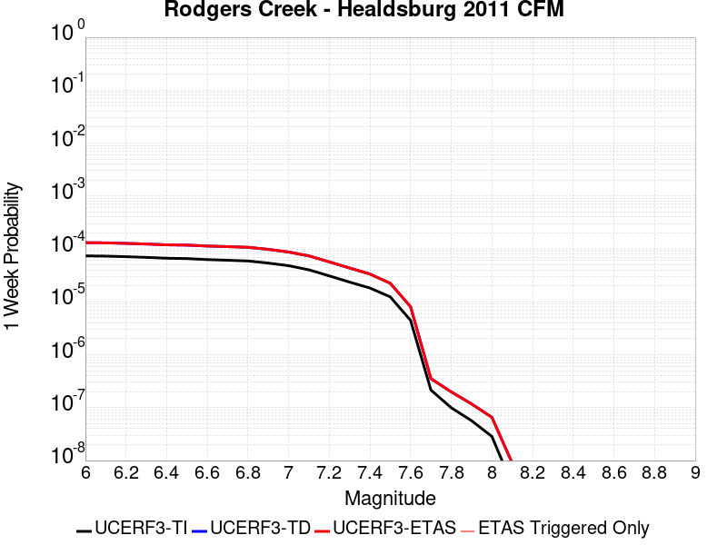 |  | 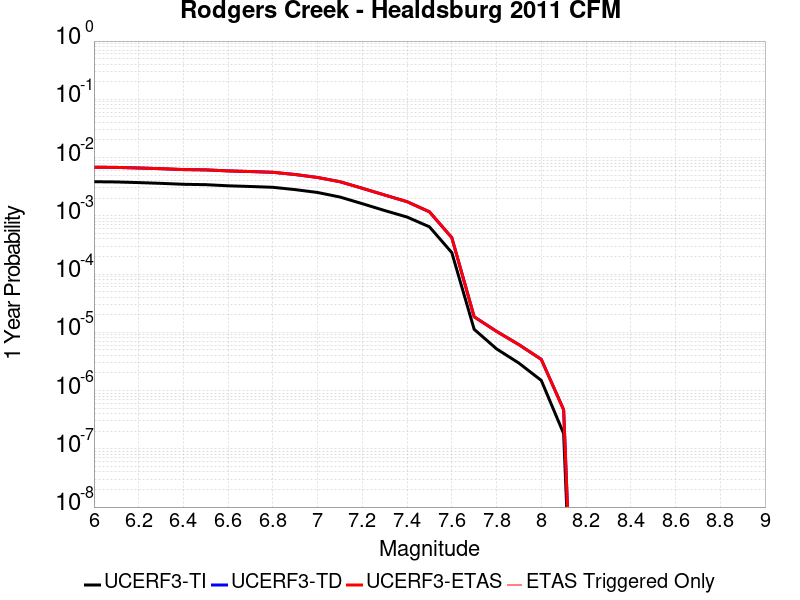 | 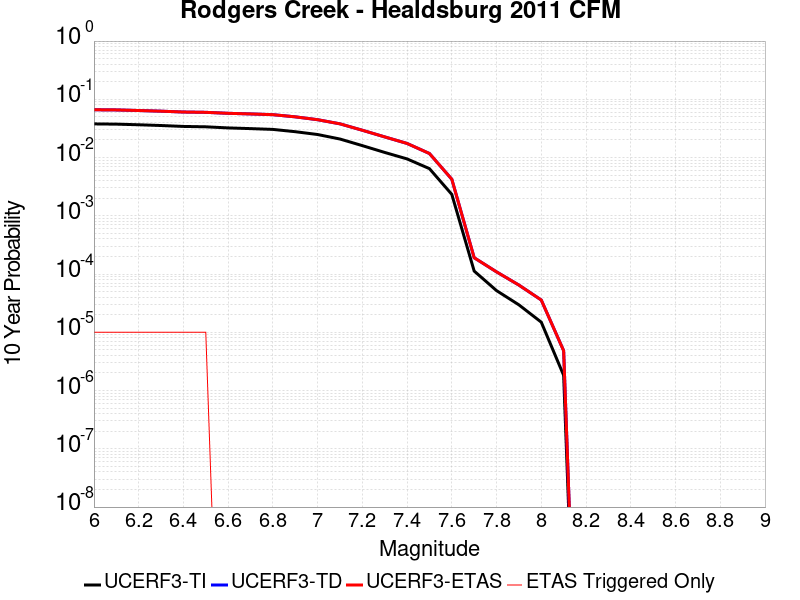 |

| Magnitude | 1 wk TI Prob | 1 wk TD Prob | 1 wk ETAS Prob | 1 wk ETAS/TD Gain | 1 wk ETAS Triggered Only | 1 mo TI Prob | 1 mo TD Prob | 1 mo ETAS Prob | 1 mo ETAS/TD Gain | 1 mo ETAS Triggered Only | 1 yr TI Prob | 1 yr TD Prob | 1 yr ETAS Prob | 1 yr ETAS/TD Gain | 1 yr ETAS Triggered Only | 10 yr TI Prob | 10 yr TD Prob | 10 yr ETAS Prob | 10 yr ETAS/TD Gain | 10 yr ETAS Triggered Only |
|-----|-----|-----|-----|-----|-----|-----|-----|-----|-----|-----|-----|-----|-----|-----|-----|-----|-----|-----|-----|-----|
| 6.0 | 7.390182E-5 | 1.3137296E-4 | 1.3137296E-4 | 1.0 | 0.0 | 3.1668364E-4 | 5.629057E-4 | 5.629057E-4 | 1.0 | 0.0 | 0.0038488081 | 0.0068318076 | 0.0068318076 | 1.0 | 0.0 | 0.037828278 | 0.06618395 | 0.06619328 | 1.0001411 | 1.0E-5 |
| 6.1 | 7.318768E-5 | 1.303531E-4 | 1.303531E-4 | 1.0 | 0.0 | 3.1362378E-4 | 5.585369E-4 | 5.585369E-4 | 1.0 | 0.0 | 0.0038116854 | 0.006778966 | 0.006778966 | 1.0 | 0.0 | 0.037469655 | 0.06568854 | 0.065697886 | 1.0001422 | 1.0E-5 |
| 6.2 | 7.1379836E-5 | 1.2728151E-4 | 1.2728151E-4 | 1.0 | 0.0 | 3.058777E-4 | 5.453785E-4 | 5.453785E-4 | 1.0 | 0.0 | 0.003717703 | 0.0066197454 | 0.0066197454 | 1.0 | 0.0 | 0.0365612 | 0.06421061 | 0.06421997 | 1.0001458 | 1.0E-5 |
| 6.3 | 6.9255926E-5 | 1.2382482E-4 | 1.2382482E-4 | 1.0 | 0.0 | 2.9677735E-4 | 5.305703E-4 | 5.305703E-4 | 1.0 | 0.0 | 0.0036072785 | 0.0064406106 | 0.0064406106 | 1.0 | 0.0 | 0.035492823 | 0.062541805 | 0.062551185 | 1.0001498 | 1.0E-5 |
| 6.4 | 6.6757144E-5 | 1.195919E-4 | 1.195919E-4 | 1.0 | 0.0 | 2.8607066E-4 | 5.1243644E-4 | 5.1243644E-4 | 1.0 | 0.0 | 0.0034773487 | 0.00622114 | 0.00622114 | 1.0 | 0.0 | 0.034234364 | 0.060491614 | 0.06050101 | 1.0001553 | 1.0E-5 |
| 6.5 | 6.5735134E-5 | 1.180849E-4 | 1.180849E-4 | 1.0 | 0.0 | 2.8169158E-4 | 5.059804E-4 | 5.059804E-4 | 1.0 | 0.0 | 0.003424202 | 0.0061429944 | 0.0061429944 | 1.0 | 0.0 | 0.03371918 | 0.059755705 | 0.059765108 | 1.0001574 | 1.0E-5 |
| 6.6 | 6.289601E-5 | 1.13442366E-4 | 1.13442366E-4 | 1.0 | 0.0 | 2.6952647E-4 | 4.8609133E-4 | 4.8609133E-4 | 1.0 | 0.0 | 0.0032765474 | 0.005902183 | 0.005902183 | 1.0 | 0.0 | 0.032286562 | 0.057495043 | 0.057495043 | 1.0 | 0.0 |
| 6.7 | 6.115274E-5 | 1.106132E-4 | 1.106132E-4 | 1.0 | 0.0 | 2.6205686E-4 | 4.739708E-4 | 4.739708E-4 | 1.0 | 0.0 | 0.0031858748 | 0.0057554054 | 0.0057554054 | 1.0 | 0.0 | 0.031405866 | 0.05611361 | 0.05611361 | 1.0 | 0.0 |
| 6.8 | 5.9232367E-5 | 1.0728657E-4 | 1.0728657E-4 | 1.0 | 0.0 | 2.538283E-4 | 4.5971893E-4 | 4.5971893E-4 | 1.0 | 0.0 | 0.0030859804 | 0.005582791 | 0.005582791 | 1.0 | 0.0 | 0.030434765 | 0.05448041 | 0.05448041 | 1.0 | 0.0 |
| 6.9 | 5.4030377E-5 | 9.8228295E-5 | 9.8228295E-5 | 1.0 | 0.0 | 2.315382E-4 | 4.209108E-4 | 4.209108E-4 | 1.0 | 0.0 | 0.0028153337 | 0.0051126136 | 0.0051126136 | 1.0 | 0.0 | 0.027799325 | 0.05001572 | 0.05001572 | 1.0 | 0.0 |
| 7.0 | 4.8260714E-5 | 8.7408924E-5 | 8.7408924E-5 | 1.0 | 0.0 | 2.0681522E-4 | 3.7455617E-4 | 3.7455617E-4 | 1.0 | 0.0 | 0.0025150678 | 0.0045507406 | 0.0045507406 | 1.0 | 0.0 | 0.024867928 | 0.044667073 | 0.044667073 | 1.0 | 0.0 |
| 7.1 | 4.0294493E-5 | 7.389363E-5 | 7.389363E-5 | 1.0 | 0.0 | 1.7267925E-4 | 3.1664874E-4 | 3.1664874E-4 | 1.0 | 0.0 | 0.0021003427 | 0.0038484214 | 0.0038484214 | 1.0 | 0.0 | 0.02080602 | 0.037923187 | 0.037923187 | 1.0 | 0.0 |
| 7.2 | 3.096388E-5 | 5.698023E-5 | 5.698023E-5 | 1.0 | 0.0 | 1.326956E-4 | 2.4417826E-4 | 2.4417826E-4 | 1.0 | 0.0 | 0.0016143717 | 0.0029688394 | 0.0029688394 | 1.0 | 0.0 | 0.01602694 | 0.029437006 | 0.029437006 | 1.0 | 0.0 |
| 7.3 | 2.3615226E-5 | 4.3629818E-5 | 4.3629818E-5 | 1.0 | 0.0 | 1.0120418E-4 | 1.869716E-4 | 1.869716E-4 | 1.0 | 0.0 | 0.0012314644 | 0.0022740164 | 0.0022740164 | 1.0 | 0.0 | 0.0122466255 | 0.022637889 | 0.022637889 | 1.0 | 0.0 |
| 7.4 | 1.8251132E-5 | 3.3542477E-5 | 3.3542477E-5 | 1.0 | 0.0 | 7.821679E-5 | 1.4374561E-4 | 1.4374561E-4 | 1.0 | 0.0 | 9.518733E-4 | 0.0017487077 | 0.0017487077 | 1.0 | 0.0 | 0.009478063 | 0.017466031 | 0.017466031 | 1.0 | 0.0 |
| 7.5 | 1.2411432E-5 | 2.2461069E-5 | 2.2461069E-5 | 1.0 | 0.0 | 5.3190768E-5 | 9.6258205E-5 | 9.6258205E-5 | 1.0 | 0.0 | 6.4740516E-4 | 0.0011713194 | 0.0011713194 | 1.0 | 0.0 | 0.006455223 | 0.011743137 | 0.011743137 | 1.0 | 0.0 |
| 7.6 | 4.4771446E-6 | 8.08443E-6 | 8.08443E-6 | 1.0 | 0.0 | 1.918762E-5 | 3.4647102E-5 | 3.4647102E-5 | 1.0 | 0.0 | 2.3358424E-4 | 4.2174806E-4 | 4.2174806E-4 | 1.0 | 0.0 | 0.0023333887 | 0.0042453306 | 0.0042453306 | 1.0 | 0.0 |
| 7.7 | 2.157941E-7 | 3.5350925E-7 | 3.5350925E-7 | 1.0 | 0.0 | 9.248315E-7 | 1.5150388E-6 | 1.5150388E-6 | 1.0 | 0.0 | 1.1259765E-5 | 1.844544E-5 | 1.844544E-5 | 1.0 | 0.0 | 1.1259195E-4 | 1.9069649E-4 | 1.9069649E-4 | 1.0 | 0.0 |
| 7.8 | 9.9623286E-8 | 1.9900986E-7 | 1.9900986E-7 | 1.0 | 0.0 | 4.269569E-7 | 8.528991E-7 | 8.528991E-7 | 1.0 | 0.0 | 5.1981874E-6 | 1.03839975E-5 | 1.03839975E-5 | 1.0 | 0.0 | 5.198066E-5 | 1.0902916E-4 | 1.0902916E-4 | 1.0 | 0.0 |
| 7.9 | 5.6745257E-8 | 1.1774714E-7 | 1.1774714E-7 | 1.0 | 0.0 | 2.4319394E-7 | 5.046305E-7 | 5.046305E-7 | 1.0 | 0.0 | 2.960882E-6 | 6.143859E-6 | 6.143859E-6 | 1.0 | 0.0 | 2.9608427E-5 | 6.471445E-5 | 6.471445E-5 | 1.0 | 0.0 |
| 8.0 | 2.8614323E-8 | 6.5789635E-8 | 6.5789635E-8 | 1.0 | 0.0 | 1.2263281E-7 | 2.8195555E-7 | 2.8195555E-7 | 1.0 | 0.0 | 1.4930534E-6 | 3.4328034E-6 | 3.4328034E-6 | 1.0 | 0.0 | 1.4930434E-5 | 3.5830046E-5 | 3.5830046E-5 | 1.0 | 0.0 |
| 8.1 | 3.5045191E-9 | 8.966459E-9 | 8.966459E-9 | 1.0 | 0.0 | 1.5019367E-8 | 3.8427682E-8 | 3.8427682E-8 | 1.0 | 0.0 | 1.8286079E-7 | 4.6785692E-7 | 4.6785692E-7 | 1.0 | 0.0 | 1.8286064E-6 | 4.834128E-6 | 4.834128E-6 | 1.0 | 0.0 |

## Hayward (No) 2011 CFM
*[(top)](#table-of-contents)*

| 1 Week | 1 Month | 1 Year | 10 Year |
|-----|-----|-----|-----|
|  | 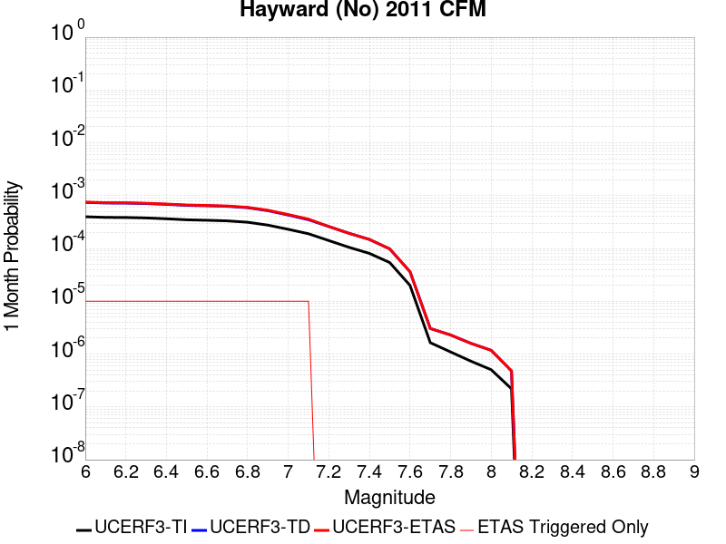 | 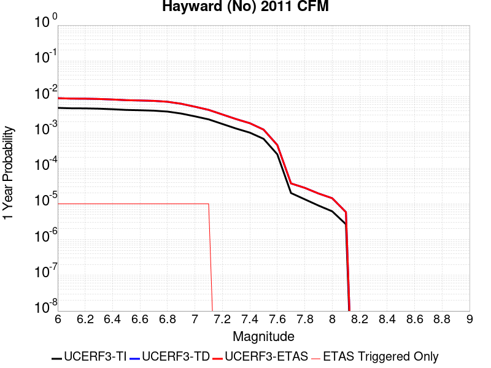 | 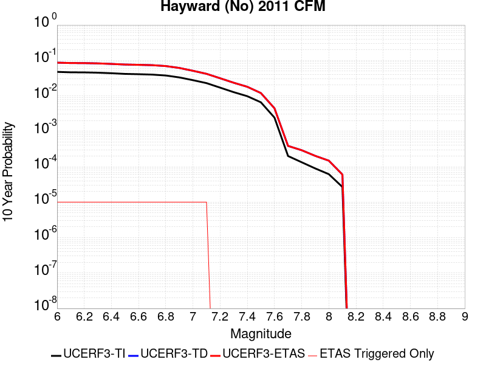 |

| Magnitude | 1 wk TI Prob | 1 wk TD Prob | 1 wk ETAS Prob | 1 wk ETAS/TD Gain | 1 wk ETAS Triggered Only | 1 mo TI Prob | 1 mo TD Prob | 1 mo ETAS Prob | 1 mo ETAS/TD Gain | 1 mo ETAS Triggered Only | 1 yr TI Prob | 1 yr TD Prob | 1 yr ETAS Prob | 1 yr ETAS/TD Gain | 1 yr ETAS Triggered Only | 10 yr TI Prob | 10 yr TD Prob | 10 yr ETAS Prob | 10 yr ETAS/TD Gain | 10 yr ETAS Triggered Only |
|-----|-----|-----|-----|-----|-----|-----|-----|-----|-----|-----|-----|-----|-----|-----|-----|-----|-----|-----|-----|-----|
| 6.0 | 9.3068506E-5 | 1.739643E-4 | 1.739643E-4 | 1.0 | 0.0 | 3.9880406E-4 | 7.453474E-4 | 7.5534E-4 | 1.0134065 | 1.0E-5 | 0.0048446343 | 0.009036727 | 0.0090466365 | 1.0010966 | 1.0E-5 | 0.047403704 | 0.086396605 | 0.08640575 | 1.0001057 | 1.0E-5 |
| 6.1 | 9.055486E-5 | 1.6947639E-4 | 1.6947639E-4 | 1.0 | 0.0 | 3.880345E-4 | 7.2612526E-4 | 7.36118E-4 | 1.0137618 | 1.0E-5 | 0.0047140904 | 0.008804814 | 0.008814726 | 1.0011257 | 1.0E-5 | 0.046153355 | 0.08428568 | 0.08429483 | 1.0001086 | 1.0E-5 |
| 6.2 | 9.006742E-5 | 1.6868232E-4 | 1.6868232E-4 | 1.0 | 0.0 | 3.859461E-4 | 7.227246E-4 | 7.327174E-4 | 1.0138265 | 1.0E-5 | 0.0046887742 | 0.00876378 | 0.008773692 | 1.001131 | 1.0E-5 | 0.0459107 | 0.08390991 | 0.08391907 | 1.0001092 | 1.0E-5 |
| 6.3 | 8.8336754E-5 | 1.6547782E-4 | 1.6547782E-4 | 1.0 | 0.0 | 3.7853114E-4 | 7.0899865E-4 | 7.1899156E-4 | 1.0140944 | 1.0E-5 | 0.004598882 | 0.008598051 | 0.008607965 | 1.0011531 | 1.0E-5 | 0.04504866 | 0.08240195 | 0.082411125 | 1.0001113 | 1.0E-5 |
| 6.4 | 8.526157E-5 | 1.5974796E-4 | 1.5974796E-4 | 1.0 | 0.0 | 3.6535555E-4 | 6.844552E-4 | 6.9444836E-4 | 1.0146002 | 1.0E-5 | 0.0044391346 | 0.00830156 | 0.008311477 | 1.0011946 | 1.0E-5 | 0.043514993 | 0.07968467 | 0.07969387 | 1.0001155 | 1.0E-5 |
| 6.5 | 8.152396E-5 | 1.5307199E-4 | 1.5307199E-4 | 1.0 | 0.0 | 3.493416E-4 | 6.558586E-4 | 6.6585204E-4 | 1.0152372 | 1.0E-5 | 0.0042449418 | 0.007955993 | 0.007965913 | 1.0012469 | 1.0E-5 | 0.04164765 | 0.07651448 | 0.07652372 | 1.0001206 | 1.0E-5 |
| 6.6 | 7.987405E-5 | 1.5011412E-4 | 1.5011412E-4 | 1.0 | 0.0 | 3.4227243E-4 | 6.431883E-4 | 6.5318187E-4 | 1.0155375 | 1.0E-5 | 0.0041592065 | 0.007802858 | 0.00781278 | 1.0012716 | 1.0E-5 | 0.04082218 | 0.075105876 | 0.07511512 | 1.0001231 | 1.0E-5 |
| 6.7 | 7.777665E-5 | 1.4650672E-4 | 1.4650672E-4 | 1.0 | 0.0 | 3.332859E-4 | 6.277355E-4 | 6.3772924E-4 | 1.0159203 | 1.0E-5 | 0.004050208 | 0.007616053 | 0.0076259766 | 1.001303 | 1.0E-5 | 0.039771806 | 0.0733825 | 0.073391765 | 1.0001262 | 1.0E-5 |
| 6.8 | 7.3284005E-5 | 1.3801287E-4 | 1.3801287E-4 | 1.0 | 0.0 | 3.140365E-4 | 5.9135025E-4 | 6.0134433E-4 | 1.0169004 | 1.0E-5 | 0.0038166929 | 0.007176059 | 0.007185987 | 1.0013835 | 1.0E-5 | 0.037518036 | 0.06929624 | 0.069305554 | 1.0001343 | 1.0E-5 |
| 6.9 | 6.458263E-5 | 1.21319164E-4 | 1.21319164E-4 | 1.0 | 0.0 | 2.7675333E-4 | 5.1983615E-4 | 5.298309E-4 | 1.0192268 | 1.0E-5 | 0.0033642664 | 0.0063107396 | 0.0063206763 | 1.0015746 | 1.0E-5 | 0.033137884 | 0.061224625 | 0.061234012 | 1.0001533 | 1.0E-5 |
| 7.0 | 5.3853604E-5 | 1.00254634E-4 | 1.00254634E-4 | 1.0 | 0.0 | 2.3078074E-4 | 4.295923E-4 | 4.39588E-4 | 1.0232679 | 1.0E-5 | 0.0028061352 | 0.0052178074 | 0.0052277553 | 1.0019065 | 1.0E-5 | 0.027709642 | 0.050957024 | 0.050966512 | 1.0001862 | 1.0E-5 |
| 7.1 | 4.4308683E-5 | 8.17098E-5 | 8.17098E-5 | 1.0 | 0.0 | 1.8988053E-4 | 3.5013806E-4 | 3.6013455E-4 | 1.0285501 | 1.0E-5 | 0.0023093442 | 0.0042546396 | 0.0042645973 | 1.0023403 | 1.0E-5 | 0.022854926 | 0.041824497 | 0.04183408 | 1.0002291 | 1.0E-5 |
| 7.2 | 3.295973E-5 | 6.0774026E-5 | 6.0774026E-5 | 1.0 | 0.0 | 1.4124835E-4 | 2.6043423E-4 | 2.6043423E-4 | 1.0 | 0.0 | 0.0017183421 | 0.0031661994 | 0.0031661994 | 1.0 | 0.0 | 0.017051157 | 0.031370014 | 0.031370014 | 1.0 | 0.0 |
| 7.3 | 2.452256E-5 | 4.518223E-5 | 4.518223E-5 | 1.0 | 0.0 | 1.05092455E-4 | 1.9362383E-4 | 1.9362383E-4 | 1.0 | 0.0 | 0.0012787496 | 0.0023548352 | 0.0023548352 | 1.0 | 0.0 | 0.0127141625 | 0.023442036 | 0.023442036 | 1.0 | 0.0 |
| 7.4 | 1.8829967E-5 | 3.4604043E-5 | 3.4604043E-5 | 1.0 | 0.0 | 8.069736E-5 | 1.4829468E-4 | 1.4829468E-4 | 1.0 | 0.0 | 9.820475E-4 | 0.0018040023 | 0.0018040023 | 1.0 | 0.0 | 0.009777189 | 0.01802003 | 0.01802003 | 1.0 | 0.0 |
| 7.5 | 1.26374125E-5 | 2.292219E-5 | 2.292219E-5 | 1.0 | 0.0 | 5.4159216E-5 | 9.823428E-5 | 9.823428E-5 | 1.0 | 0.0 | 6.5918895E-4 | 0.0011953521 | 0.0011953521 | 1.0 | 0.0 | 0.00657237 | 0.011988704 | 0.011988704 | 1.0 | 0.0 |
| 7.6 | 4.666429E-6 | 8.479636E-6 | 8.479636E-6 | 1.0 | 0.0 | 1.9998828E-5 | 3.6340796E-5 | 3.6340796E-5 | 1.0 | 0.0 | 2.4345852E-4 | 4.423606E-4 | 4.423606E-4 | 1.0 | 0.0 | 0.0024319198 | 0.004458377 | 0.004458377 | 1.0 | 0.0 |
| 7.7 | 3.8399318E-7 | 7.1343146E-7 | 7.1343146E-7 | 1.0 | 0.0 | 1.6456839E-6 | 3.0575598E-6 | 3.0575598E-6 | 1.0 | 0.0 | 2.003602E-5 | 3.7225156E-5 | 3.7225156E-5 | 1.0 | 0.0 | 2.0034213E-4 | 3.86166E-4 | 3.86166E-4 | 1.0 | 0.0 |
| 7.8 | 2.5637698E-7 | 5.3666145E-7 | 5.3666145E-7 | 1.0 | 0.0 | 1.098758E-6 | 2.2999754E-6 | 2.2999754E-6 | 1.0 | 0.0 | 1.3377297E-5 | 2.8001843E-5 | 2.8001843E-5 | 1.0 | 0.0 | 1.3376492E-4 | 2.9246495E-4 | 2.9246495E-4 | 1.0 | 0.0 |
| 7.9 | 1.7141245E-7 | 3.7293606E-7 | 3.7293606E-7 | 1.0 | 0.0 | 7.3462456E-7 | 1.5982963E-6 | 1.5982963E-6 | 1.0 | 0.0 | 8.944017E-6 | 1.9459085E-5 | 1.9459085E-5 | 1.0 | 0.0 | 8.943657E-5 | 2.0246378E-4 | 2.0246378E-4 | 1.0 | 0.0 |
| 8.0 | 1.1808895E-7 | 2.7512246E-7 | 2.7512246E-7 | 1.0 | 0.0 | 5.060954E-7 | 1.1790958E-6 | 1.1790958E-6 | 1.0 | 0.0 | 6.161694E-6 | 1.4355397E-5 | 1.4355397E-5 | 1.0 | 0.0 | 6.161523E-5 | 1.4817173E-4 | 1.4817173E-4 | 1.0 | 0.0 |
| 8.1 | 5.138535E-8 | 1.12307575E-7 | 1.12307575E-7 | 1.0 | 0.0 | 2.2022292E-7 | 4.8131807E-7 | 4.8131807E-7 | 1.0 | 0.0 | 2.6812106E-6 | 5.860032E-6 | 5.860032E-6 | 1.0 | 0.0 | 2.6811784E-5 | 6.0156468E-5 | 6.0156468E-5 | 1.0 | 0.0 |

## Elysian Park (Lower CFM)
*[(top)](#table-of-contents)*

| 1 Week | 1 Month | 1 Year | 10 Year |
|-----|-----|-----|-----|
| 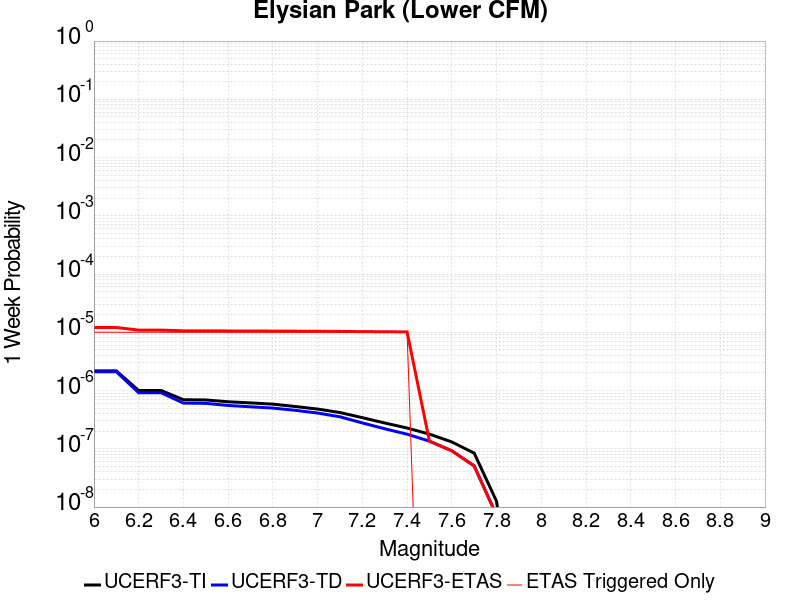 | 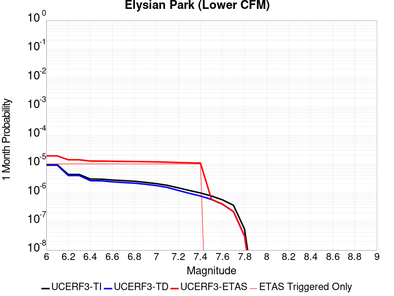 | 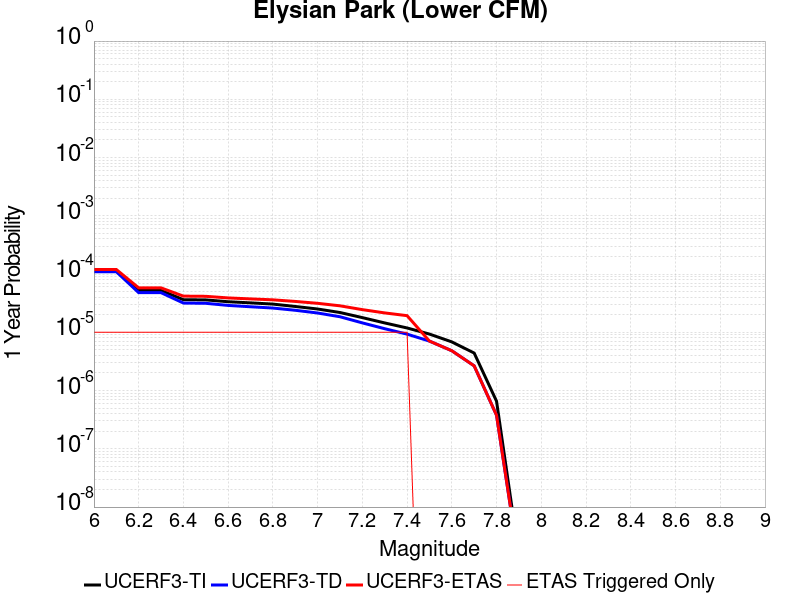 | 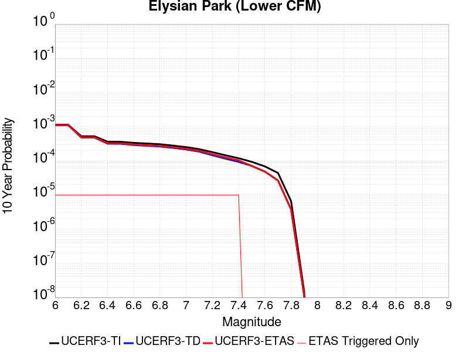 |

| Magnitude | 1 wk TI Prob | 1 wk TD Prob | 1 wk ETAS Prob | 1 wk ETAS/TD Gain | 1 wk ETAS Triggered Only | 1 mo TI Prob | 1 mo TD Prob | 1 mo ETAS Prob | 1 mo ETAS/TD Gain | 1 mo ETAS Triggered Only | 1 yr TI Prob | 1 yr TD Prob | 1 yr ETAS Prob | 1 yr ETAS/TD Gain | 1 yr ETAS Triggered Only | 10 yr TI Prob | 10 yr TD Prob | 10 yr ETAS Prob | 10 yr ETAS/TD Gain | 10 yr ETAS Triggered Only |
|-----|-----|-----|-----|-----|-----|-----|-----|-----|-----|-----|-----|-----|-----|-----|-----|-----|-----|-----|-----|-----|
| 6.0 | 2.1766498E-6 | 2.1037895E-6 | 1.2103768E-5 | 5.7533174 | 1.0E-5 | 9.328466E-6 | 9.0162175E-6 | 1.9016126E-5 | 2.1091025 | 1.0E-5 | 1.1356815E-4 | 1.0976836E-4 | 1.1976726E-4 | 1.0910909 | 1.0E-5 | 0.0011351013 | 0.0010972833 | 0.0011072723 | 1.0091034 | 1.0E-5 |
| 6.1 | 2.1766498E-6 | 2.1037895E-6 | 1.2103768E-5 | 5.7533174 | 1.0E-5 | 9.328466E-6 | 9.0162175E-6 | 1.9016126E-5 | 2.1091025 | 1.0E-5 | 1.1356815E-4 | 1.0976836E-4 | 1.1976726E-4 | 1.0910909 | 1.0E-5 | 0.0011351013 | 0.0010972833 | 0.0011072723 | 1.0091034 | 1.0E-5 |
| 6.2 | 1.0031182E-6 | 9.186213E-7 | 1.0918612E-5 | 11.885868 | 1.0E-5 | 4.299071E-6 | 3.936943E-6 | 1.3936904E-5 | 3.540032 | 1.0E-5 | 5.2339932E-5 | 4.7931328E-5 | 5.7930847E-5 | 1.2086219 | 1.0E-5 | 5.2327604E-4 | 4.7921969E-4 | 4.892149E-4 | 1.0208572 | 1.0E-5 |
| 6.3 | 1.0031182E-6 | 9.186213E-7 | 1.0918612E-5 | 11.885868 | 1.0E-5 | 4.299071E-6 | 3.936943E-6 | 1.3936904E-5 | 3.540032 | 1.0E-5 | 5.2339932E-5 | 4.7931328E-5 | 5.7930847E-5 | 1.2086219 | 1.0E-5 | 5.2327604E-4 | 4.7921969E-4 | 4.892149E-4 | 1.0208572 | 1.0E-5 |
| 6.4 | 6.9606244E-7 | 6.091942E-7 | 1.0609188E-5 | 17.415117 | 1.0E-5 | 2.9831212E-6 | 2.6108296E-6 | 1.2610803E-5 | 4.83019 | 1.0E-5 | 3.6318896E-5 | 3.178639E-5 | 4.1786072E-5 | 1.3145901 | 1.0E-5 | 3.6312963E-4 | 3.1781866E-4 | 3.2781548E-4 | 1.0314544 | 1.0E-5 |
| 6.5 | 6.901879E-7 | 6.0326255E-7 | 1.0603257E-5 | 17.57652 | 1.0E-5 | 2.9579448E-6 | 2.5854083E-6 | 1.2585382E-5 | 4.867851 | 1.0E-5 | 3.6012385E-5 | 3.1476895E-5 | 4.147658E-5 | 1.3176833 | 1.0E-5 | 3.600655E-4 | 3.147246E-4 | 3.2472145E-4 | 1.0317638 | 1.0E-5 |
| 6.6 | 6.4198554E-7 | 5.5466086E-7 | 1.0554655E-5 | 19.029026 | 1.0E-5 | 2.7513638E-6 | 2.3771156E-6 | 1.23770915E-5 | 5.206769 | 1.0E-5 | 3.3497337E-5 | 2.8941E-5 | 3.894071E-5 | 1.3455206 | 1.0E-5 | 3.349229E-4 | 2.8937246E-4 | 2.9936957E-4 | 1.0345476 | 1.0E-5 |
| 6.7 | 6.138733E-7 | 5.263416E-7 | 1.0526336E-5 | 19.99906 | 1.0E-5 | 2.6308828E-6 | 2.2557474E-6 | 1.2255725E-5 | 5.43311 | 1.0E-5 | 3.203053E-5 | 2.746338E-5 | 3.7463105E-5 | 1.3641112 | 1.0E-5 | 3.2025913E-4 | 2.746E-4 | 2.8459725E-4 | 1.0364066 | 1.0E-5 |
| 6.8 | 5.84778E-7 | 5.0029365E-7 | 1.0500288E-5 | 20.98825 | 1.0E-5 | 2.506189E-6 | 2.1441138E-6 | 1.2144093E-5 | 5.663922 | 1.0E-5 | 3.0512423E-5 | 2.6104273E-5 | 3.610401E-5 | 1.383069 | 1.0E-5 | 3.0508233E-4 | 2.6101217E-4 | 2.7100957E-4 | 1.0383024 | 1.0E-5 |
| 6.9 | 5.322785E-7 | 4.5800792E-7 | 1.0458003E-5 | 22.833673 | 1.0E-5 | 2.2811914E-6 | 1.9628894E-6 | 1.196287E-5 | 6.09452 | 1.0E-5 | 2.7773152E-5 | 2.389792E-5 | 3.389768E-5 | 1.4184365 | 1.0E-5 | 2.7769682E-4 | 2.3895358E-4 | 2.489512E-4 | 1.0418391 | 1.0E-5 |
| 7.0 | 4.8147206E-7 | 4.1124093E-7 | 1.0411237E-5 | 25.316637 | 1.0E-5 | 2.06345E-6 | 1.7624599E-6 | 1.1762442E-5 | 6.673878 | 1.0E-5 | 2.5122214E-5 | 2.1457738E-5 | 3.1457523E-5 | 1.4660224 | 1.0E-5 | 2.5119373E-4 | 2.1455674E-4 | 2.245546E-4 | 1.0465977 | 1.0E-5 |
| 7.1 | 4.1932955E-7 | 3.5455687E-7 | 1.03545535E-5 | 29.20421 | 1.0E-5 | 1.7971255E-6 | 1.5195285E-6 | 1.15195135E-5 | 7.580979 | 1.0E-5 | 2.1879783E-5 | 1.8500103E-5 | 2.8499917E-5 | 1.5405276 | 1.0E-5 | 2.1877629E-4 | 1.8498568E-4 | 1.9498383E-4 | 1.0540482 | 1.0E-5 |
| 7.2 | 3.426051E-7 | 2.7810242E-7 | 1.02781E-5 | 36.957966 | 1.0E-5 | 1.4683067E-6 | 1.1918669E-6 | 1.1191855E-5 | 9.390189 | 1.0E-5 | 1.7876488E-5 | 1.45108825E-5 | 2.4510737E-5 | 1.6891279 | 1.0E-5 | 1.787505E-4 | 1.4509937E-4 | 1.5509792E-4 | 1.0689083 | 1.0E-5 |
| 7.3 | 2.7771645E-7 | 2.2096455E-7 | 1.0220962E-5 | 46.25612 | 1.0E-5 | 1.1902127E-6 | 9.4699055E-7 | 1.0946981E-5 | 11.559757 | 1.0E-5 | 1.4490744E-5 | 1.1529549E-5 | 2.1529433E-5 | 1.8673266 | 1.0E-5 | 1.4489799E-4 | 1.1528953E-4 | 1.2528838E-4 | 1.0867281 | 1.0E-5 |
| 7.4 | 2.2756493E-7 | 1.7839739E-7 | 1.0178395E-5 | 57.054623 | 1.0E-5 | 9.752779E-7 | 7.6455996E-7 | 1.0764552E-5 | 14.079409 | 1.0E-5 | 1.1873944E-5 | 9.308478E-6 | 1.9308385E-5 | 2.0742795 | 1.0E-5 | 1.18733085E-4 | 9.30809E-5 | 1.0307997E-4 | 1.1074234 | 1.0E-5 |
| 7.5 | 1.7874558E-7 | 1.354262E-7 | 1.354262E-7 | 1.0 | 0.0 | 7.660522E-7 | 5.803979E-7 | 5.803979E-7 | 1.0 | 0.0 | 9.326646E-6 | 7.0663214E-6 | 7.0663214E-6 | 1.0 | 0.0 | 9.326255E-5 | 7.0660986E-5 | 7.0660986E-5 | 1.0 | 0.0 |
| 7.6 | 1.3124549E-7 | 9.250717E-8 | 9.250717E-8 | 1.0 | 0.0 | 5.624805E-7 | 3.9645926E-7 | 3.9645926E-7 | 1.0 | 0.0 | 6.8481786E-6 | 4.8268807E-6 | 4.8268807E-6 | 1.0 | 0.0 | 6.8479676E-5 | 4.8267775E-5 | 4.8267775E-5 | 1.0 | 0.0 |
| 7.7 | 8.439993E-8 | 5.0898713E-8 | 5.0898713E-8 | 1.0 | 0.0 | 3.6171392E-7 | 2.1813733E-7 | 2.1813733E-7 | 1.0 | 0.0 | 4.403858E-6 | 2.655819E-6 | 2.655819E-6 | 1.0 | 0.0 | 4.4037708E-5 | 2.6557884E-5 | 2.6557884E-5 | 1.0 | 0.0 |
| 7.8 | 1.2591407E-8 | 7.2273507E-9 | 7.2273507E-9 | 1.0 | 0.0 | 5.3963173E-8 | 3.0974363E-8 | 3.0974363E-8 | 1.0 | 0.0 | 6.570014E-7 | 3.7711277E-7 | 3.7711277E-7 | 1.0 | 0.0 | 6.5699946E-6 | 3.7711216E-6 | 3.7711216E-6 | 1.0 | 0.0 |
| 7.9 | 2.8324232E-11 | 2.1405877E-11 | 2.1405877E-11 | 1.0 | 0.0 | 1.2138957E-10 | 9.1739616E-11 | 9.1739616E-11 | 1.0 | 0.0 | 1.4779177E-9 | 1.1169302E-9 | 1.1169302E-9 | 1.0 | 0.0 | 1.4779177E-8 | 1.1169303E-8 | 1.1169303E-8 | 1.0 | 0.0 |

## Eureka Peak
*[(top)](#table-of-contents)*

| 1 Week | 1 Month | 1 Year | 10 Year |
|-----|-----|-----|-----|
| 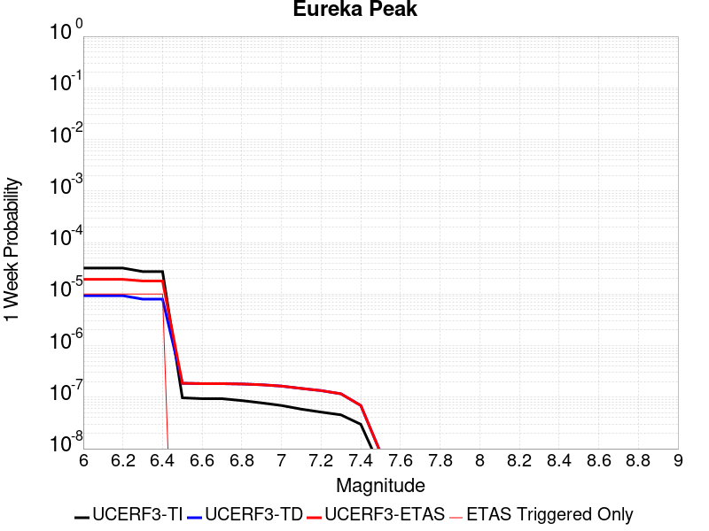 | 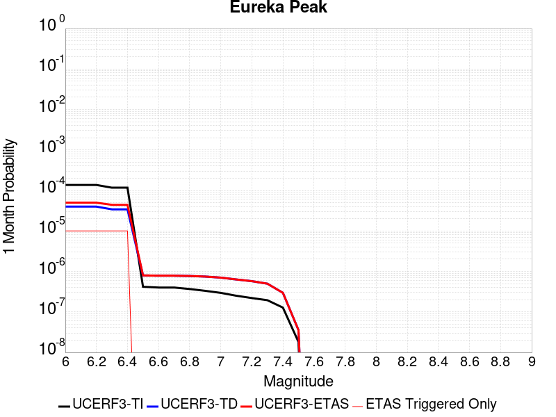 | 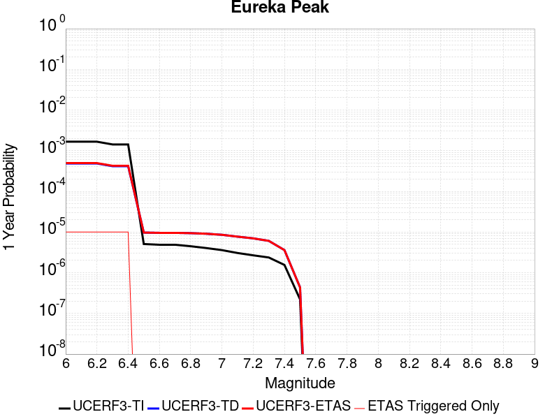 |  |

| Magnitude | 1 wk TI Prob | 1 wk TD Prob | 1 wk ETAS Prob | 1 wk ETAS/TD Gain | 1 wk ETAS Triggered Only | 1 mo TI Prob | 1 mo TD Prob | 1 mo ETAS Prob | 1 mo ETAS/TD Gain | 1 mo ETAS Triggered Only | 1 yr TI Prob | 1 yr TD Prob | 1 yr ETAS Prob | 1 yr ETAS/TD Gain | 1 yr ETAS Triggered Only | 10 yr TI Prob | 10 yr TD Prob | 10 yr ETAS Prob | 10 yr ETAS/TD Gain | 10 yr ETAS Triggered Only |
|-----|-----|-----|-----|-----|-----|-----|-----|-----|-----|-----|-----|-----|-----|-----|-----|-----|-----|-----|-----|-----|
| 6.0 | 3.1949054E-5 | 9.310979E-6 | 1.9310886E-5 | 2.0739908 | 1.0E-5 | 1.3691733E-4 | 3.9904025E-5 | 4.9903625E-5 | 1.2505913 | 1.0E-5 | 0.0016656938 | 4.858013E-4 | 4.9579644E-4 | 1.0205746 | 1.0E-5 | 0.016532637 | 0.004921293 | 0.0049312436 | 1.002022 | 1.0E-5 |
| 6.1 | 3.1949054E-5 | 9.310979E-6 | 1.9310886E-5 | 2.0739908 | 1.0E-5 | 1.3691733E-4 | 3.9904025E-5 | 4.9903625E-5 | 1.2505913 | 1.0E-5 | 0.0016656938 | 4.858013E-4 | 4.9579644E-4 | 1.0205746 | 1.0E-5 | 0.016532637 | 0.004921293 | 0.0049312436 | 1.002022 | 1.0E-5 |
| 6.2 | 3.1949054E-5 | 9.310979E-6 | 1.9310886E-5 | 2.0739908 | 1.0E-5 | 1.3691733E-4 | 3.9904025E-5 | 4.9903625E-5 | 1.2505913 | 1.0E-5 | 0.0016656938 | 4.858013E-4 | 4.9579644E-4 | 1.0205746 | 1.0E-5 | 0.016532637 | 0.004921293 | 0.0049312436 | 1.002022 | 1.0E-5 |
| 6.3 | 2.7339745E-5 | 7.980821E-6 | 1.7980741E-5 | 2.252994 | 1.0E-5 | 1.1716507E-4 | 3.4203495E-5 | 4.4203152E-5 | 1.2923578 | 1.0E-5 | 0.0014255513 | 4.164239E-4 | 4.2641972E-4 | 1.024004 | 1.0E-5 | 0.0141644105 | 0.0042259954 | 0.004235953 | 1.0023563 | 1.0E-5 |
| 6.4 | 2.7339745E-5 | 7.980821E-6 | 1.7980741E-5 | 2.252994 | 1.0E-5 | 1.1716507E-4 | 3.4203495E-5 | 4.4203152E-5 | 1.2923578 | 1.0E-5 | 0.0014255513 | 4.164239E-4 | 4.2641972E-4 | 1.024004 | 1.0E-5 | 0.0141644105 | 0.0042259954 | 0.004235953 | 1.0023563 | 1.0E-5 |
| 6.5 | 9.738388E-8 | 1.8620014E-7 | 1.8620014E-7 | 1.0 | 0.0 | 4.1735944E-7 | 7.980003E-7 | 7.980003E-7 | 1.0 | 0.0 | 5.081339E-6 | 9.715612E-6 | 9.715612E-6 | 1.0 | 0.0 | 5.0812232E-5 | 9.715195E-5 | 9.715195E-5 | 1.0 | 0.0 |
| 6.6 | 9.3495956E-8 | 1.8328839E-7 | 1.8328839E-7 | 1.0 | 0.0 | 4.0069688E-7 | 7.855215E-7 | 7.855215E-7 | 1.0 | 0.0 | 4.8784736E-6 | 9.563682E-6 | 9.563682E-6 | 1.0 | 0.0 | 4.8783666E-5 | 9.563279E-5 | 9.563279E-5 | 1.0 | 0.0 |
| 6.7 | 9.3495956E-8 | 1.8328839E-7 | 1.8328839E-7 | 1.0 | 0.0 | 4.0069688E-7 | 7.855215E-7 | 7.855215E-7 | 1.0 | 0.0 | 4.8784736E-6 | 9.563682E-6 | 9.563682E-6 | 1.0 | 0.0 | 4.8783666E-5 | 9.563279E-5 | 9.563279E-5 | 1.0 | 0.0 |
| 6.8 | 8.591428E-8 | 1.8021817E-7 | 1.8021817E-7 | 1.0 | 0.0 | 3.68204E-7 | 7.7236336E-7 | 7.7236336E-7 | 1.0 | 0.0 | 4.4828744E-6 | 9.403484E-6 | 9.403484E-6 | 1.0 | 0.0 | 4.482784E-5 | 9.403094E-5 | 9.403094E-5 | 1.0 | 0.0 |
| 6.9 | 7.749723E-8 | 1.7439834E-7 | 1.7439834E-7 | 1.0 | 0.0 | 3.3213098E-7 | 7.4742127E-7 | 7.4742127E-7 | 1.0 | 0.0 | 4.043687E-6 | 9.099816E-6 | 9.099816E-6 | 1.0 | 0.0 | 4.0436134E-5 | 9.0994516E-5 | 9.0994516E-5 | 1.0 | 0.0 |
| 7.0 | 6.897872E-8 | 1.6416043E-7 | 1.6416043E-7 | 1.0 | 0.0 | 2.9562307E-7 | 7.035445E-7 | 7.035445E-7 | 1.0 | 0.0 | 3.5992048E-6 | 8.565621E-6 | 8.565621E-6 | 1.0 | 0.0 | 3.5991467E-5 | 8.565299E-5 | 8.565299E-5 | 1.0 | 0.0 |
| 7.1 | 5.859318E-8 | 1.4787899E-7 | 1.4787899E-7 | 1.0 | 0.0 | 2.5111362E-7 | 6.33767E-7 | 6.33767E-7 | 1.0 | 0.0 | 3.057304E-6 | 7.716087E-6 | 7.716087E-6 | 1.0 | 0.0 | 3.0572617E-5 | 7.715825E-5 | 7.715825E-5 | 1.0 | 0.0 |
| 7.2 | 5.1375338E-8 | 1.3421746E-7 | 1.3421746E-7 | 1.0 | 0.0 | 2.2018E-7 | 5.7521754E-7 | 5.7521754E-7 | 1.0 | 0.0 | 2.680688E-6 | 7.003252E-6 | 7.003252E-6 | 1.0 | 0.0 | 2.6806558E-5 | 7.003037E-5 | 7.003037E-5 | 1.0 | 0.0 |
| 7.3 | 4.5441396E-8 | 1.1636931E-7 | 1.1636931E-7 | 1.0 | 0.0 | 1.9474882E-7 | 4.987255E-7 | 4.987255E-7 | 1.0 | 0.0 | 2.3710643E-6 | 6.0719667E-6 | 6.0719667E-6 | 1.0 | 0.0 | 2.371039E-5 | 6.0718063E-5 | 6.0718063E-5 | 1.0 | 0.0 |
| 7.4 | 2.981918E-8 | 6.911723E-8 | 6.911723E-8 | 1.0 | 0.0 | 1.2779647E-7 | 2.9621668E-7 | 2.9621668E-7 | 1.0 | 0.0 | 1.5559209E-6 | 3.6064325E-6 | 3.6064325E-6 | 1.0 | 0.0 | 1.55591E-5 | 3.6063782E-5 | 3.6063782E-5 | 1.0 | 0.0 |
| 7.5 | 4.24214E-9 | 8.34289E-9 | 8.34289E-9 | 1.0 | 0.0 | 1.81806E-8 | 3.5755242E-8 | 3.5755242E-8 | 1.0 | 0.0 | 2.213488E-7 | 4.3532006E-7 | 4.3532006E-7 | 1.0 | 0.0 | 2.2134857E-6 | 4.3531986E-6 | 4.3531986E-6 | 1.0 | 0.0 |

## Ozena
*[(top)](#table-of-contents)*

| 1 Week | 1 Month | 1 Year | 10 Year |
|-----|-----|-----|-----|
|  |  | 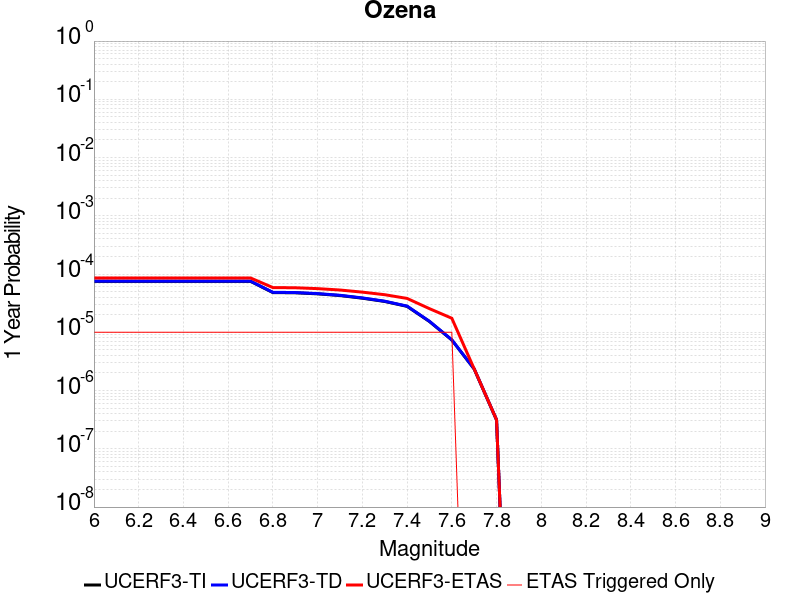 | 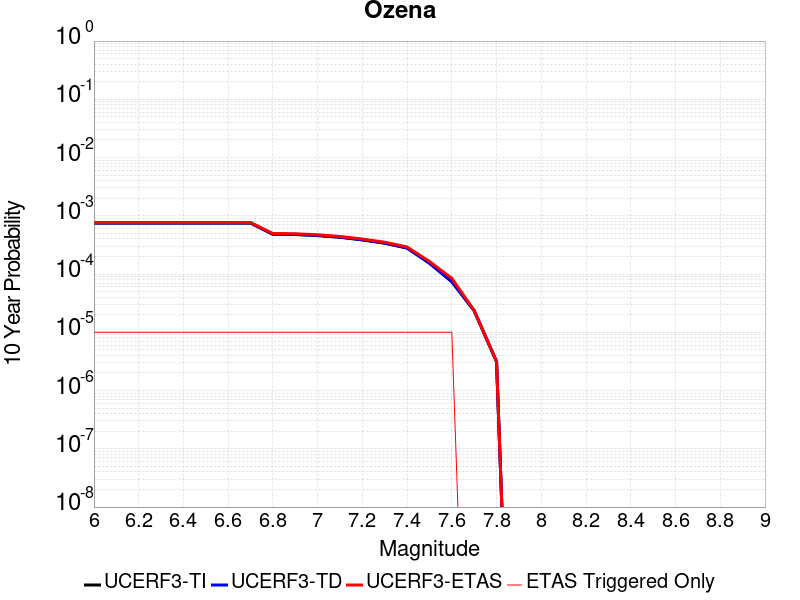 |

| Magnitude | 1 wk TI Prob | 1 wk TD Prob | 1 wk ETAS Prob | 1 wk ETAS/TD Gain | 1 wk ETAS Triggered Only | 1 mo TI Prob | 1 mo TD Prob | 1 mo ETAS Prob | 1 mo ETAS/TD Gain | 1 mo ETAS Triggered Only | 1 yr TI Prob | 1 yr TD Prob | 1 yr ETAS Prob | 1 yr ETAS/TD Gain | 1 yr ETAS Triggered Only | 10 yr TI Prob | 10 yr TD Prob | 10 yr ETAS Prob | 10 yr ETAS/TD Gain | 10 yr ETAS Triggered Only |
|-----|-----|-----|-----|-----|-----|-----|-----|-----|-----|-----|-----|-----|-----|-----|-----|-----|-----|-----|-----|-----|
| 6.0 | 1.4377547E-6 | 1.4513782E-6 | 1.4513782E-6 | 1.0 | 0.0 | 6.161791E-6 | 6.2201793E-6 | 6.2201793E-6 | 1.0 | 0.0 | 7.5017226E-5 | 7.572832E-5 | 8.5727566E-5 | 1.132041 | 1.0E-5 | 7.4991904E-4 | 7.570518E-4 | 7.670442E-4 | 1.0131991 | 1.0E-5 |
| 6.1 | 1.4377547E-6 | 1.4513782E-6 | 1.4513782E-6 | 1.0 | 0.0 | 6.161791E-6 | 6.2201793E-6 | 6.2201793E-6 | 1.0 | 0.0 | 7.5017226E-5 | 7.572832E-5 | 8.5727566E-5 | 1.132041 | 1.0E-5 | 7.4991904E-4 | 7.570518E-4 | 7.670442E-4 | 1.0131991 | 1.0E-5 |
| 6.2 | 1.4377547E-6 | 1.4513782E-6 | 1.4513782E-6 | 1.0 | 0.0 | 6.161791E-6 | 6.2201793E-6 | 6.2201793E-6 | 1.0 | 0.0 | 7.5017226E-5 | 7.572832E-5 | 8.5727566E-5 | 1.132041 | 1.0E-5 | 7.4991904E-4 | 7.570518E-4 | 7.670442E-4 | 1.0131991 | 1.0E-5 |
| 6.3 | 1.4377547E-6 | 1.4513782E-6 | 1.4513782E-6 | 1.0 | 0.0 | 6.161791E-6 | 6.2201793E-6 | 6.2201793E-6 | 1.0 | 0.0 | 7.5017226E-5 | 7.572832E-5 | 8.5727566E-5 | 1.132041 | 1.0E-5 | 7.4991904E-4 | 7.570518E-4 | 7.670442E-4 | 1.0131991 | 1.0E-5 |
| 6.4 | 1.4377547E-6 | 1.4513782E-6 | 1.4513782E-6 | 1.0 | 0.0 | 6.161791E-6 | 6.2201793E-6 | 6.2201793E-6 | 1.0 | 0.0 | 7.5017226E-5 | 7.572832E-5 | 8.5727566E-5 | 1.132041 | 1.0E-5 | 7.4991904E-4 | 7.570518E-4 | 7.670442E-4 | 1.0131991 | 1.0E-5 |
| 6.5 | 1.4377547E-6 | 1.4513782E-6 | 1.4513782E-6 | 1.0 | 0.0 | 6.161791E-6 | 6.2201793E-6 | 6.2201793E-6 | 1.0 | 0.0 | 7.5017226E-5 | 7.572832E-5 | 8.5727566E-5 | 1.132041 | 1.0E-5 | 7.4991904E-4 | 7.570518E-4 | 7.670442E-4 | 1.0131991 | 1.0E-5 |
| 6.6 | 1.4377547E-6 | 1.4513782E-6 | 1.4513782E-6 | 1.0 | 0.0 | 6.161791E-6 | 6.2201793E-6 | 6.2201793E-6 | 1.0 | 0.0 | 7.5017226E-5 | 7.572832E-5 | 8.5727566E-5 | 1.132041 | 1.0E-5 | 7.4991904E-4 | 7.570518E-4 | 7.670442E-4 | 1.0131991 | 1.0E-5 |
| 6.7 | 1.4377547E-6 | 1.4513782E-6 | 1.4513782E-6 | 1.0 | 0.0 | 6.161791E-6 | 6.2201793E-6 | 6.2201793E-6 | 1.0 | 0.0 | 7.5017226E-5 | 7.572832E-5 | 8.5727566E-5 | 1.132041 | 1.0E-5 | 7.4991904E-4 | 7.570518E-4 | 7.670442E-4 | 1.0131991 | 1.0E-5 |
| 6.8 | 9.223257E-7 | 9.317624E-7 | 9.317624E-7 | 1.0 | 0.0 | 3.9528186E-6 | 3.9932615E-6 | 3.9932615E-6 | 1.0 | 0.0 | 4.81245E-5 | 4.8616912E-5 | 5.8616428E-5 | 1.2056798 | 1.0E-5 | 4.811408E-4 | 4.860668E-4 | 4.960619E-4 | 1.0205632 | 1.0E-5 |
| 6.9 | 9.141515E-7 | 9.235371E-7 | 9.235371E-7 | 1.0 | 0.0 | 3.917786E-6 | 3.9580104E-6 | 3.9580104E-6 | 1.0 | 0.0 | 4.7698002E-5 | 4.818775E-5 | 5.818727E-5 | 1.2075117 | 1.0E-5 | 4.7687767E-4 | 4.8177704E-4 | 4.917722E-4 | 1.0207465 | 1.0E-5 |
| 7.0 | 8.767648E-7 | 8.8585773E-7 | 8.8585773E-7 | 1.0 | 0.0 | 3.757558E-6 | 3.7965276E-6 | 3.7965276E-6 | 1.0 | 0.0 | 4.5747307E-5 | 4.6221783E-5 | 5.622132E-5 | 1.2163382 | 1.0E-5 | 4.5737892E-4 | 4.6212564E-4 | 4.7212103E-4 | 1.0216291 | 1.0E-5 |
| 7.1 | 8.199402E-7 | 8.2853984E-7 | 8.2853984E-7 | 1.0 | 0.0 | 3.5140247E-6 | 3.5508804E-6 | 3.5508804E-6 | 1.0 | 0.0 | 4.2782412E-5 | 4.323115E-5 | 5.3230717E-5 | 1.2313046 | 1.0E-5 | 4.2774176E-4 | 4.322311E-4 | 4.422268E-4 | 1.0231258 | 1.0E-5 |
| 7.2 | 7.38705E-7 | 7.464262E-7 | 7.464262E-7 | 1.0 | 0.0 | 3.1658747E-6 | 3.198966E-6 | 3.198966E-6 | 1.0 | 0.0 | 3.8543843E-5 | 3.894675E-5 | 4.894636E-5 | 1.2567508 | 1.0E-5 | 3.853716E-4 | 3.8940276E-4 | 3.9939885E-4 | 1.0256704 | 1.0E-5 |
| 7.3 | 6.490017E-7 | 6.557802E-7 | 6.557802E-7 | 1.0 | 0.0 | 2.7814328E-6 | 2.8104837E-6 | 2.8104837E-6 | 1.0 | 0.0 | 3.386342E-5 | 3.4217133E-5 | 4.421679E-5 | 1.2922412 | 1.0E-5 | 3.3858258E-4 | 3.4212202E-4 | 3.521186E-4 | 1.0292194 | 1.0E-5 |
| 7.4 | 5.346736E-7 | 5.4022604E-7 | 5.4022604E-7 | 1.0 | 0.0 | 2.291456E-6 | 2.3152527E-6 | 2.3152527E-6 | 1.0 | 0.0 | 2.789812E-5 | 2.8187867E-5 | 3.8187587E-5 | 1.3547525 | 1.0E-5 | 2.789462E-4 | 2.8184598E-4 | 2.9184314E-4 | 1.0354704 | 1.0E-5 |
| 7.5 | 2.939325E-7 | 2.9666057E-7 | 2.9666057E-7 | 1.0 | 0.0 | 1.25971E-6 | 1.271402E-6 | 1.271402E-6 | 1.0 | 0.0 | 1.5336862E-5 | 1.5479225E-5 | 2.547907E-5 | 1.6460172 | 1.0E-5 | 1.5335804E-4 | 1.5478309E-4 | 1.6478154E-4 | 1.0645965 | 1.0E-5 |
| 7.6 | 1.4151905E-7 | 1.4253266E-7 | 1.4253266E-7 | 1.0 | 0.0 | 6.065101E-7 | 6.108541E-7 | 6.108541E-7 | 1.0 | 0.0 | 7.3842357E-6 | 7.4371237E-6 | 1.7437049E-5 | 2.344596 | 1.0E-5 | 7.38399E-5 | 7.436883E-5 | 8.436808E-5 | 1.134455 | 1.0E-5 |
| 7.7 | 4.4957577E-8 | 4.5252243E-8 | 4.5252243E-8 | 1.0 | 0.0 | 1.9267533E-7 | 1.9393818E-7 | 1.9393818E-7 | 1.0 | 0.0 | 2.3458194E-6 | 2.3611947E-6 | 2.3611947E-6 | 1.0 | 0.0 | 2.3457947E-5 | 2.3611707E-5 | 2.3611707E-5 | 1.0 | 0.0 |
| 7.8 | 5.9993255E-9 | 6.0412972E-9 | 6.0412972E-9 | 1.0 | 0.0 | 2.5711394E-8 | 2.5891273E-8 | 2.5891273E-8 | 1.0 | 0.0 | 3.1303617E-7 | 3.1522623E-7 | 3.1522623E-7 | 1.0 | 0.0 | 3.1303573E-6 | 3.1522588E-6 | 3.1522588E-6 | 1.0 | 0.0 |

## Hunting Creek - Bartlett Springs connector 2011
*[(top)](#table-of-contents)*

| 1 Week | 1 Month | 1 Year | 10 Year |
|-----|-----|-----|-----|
| 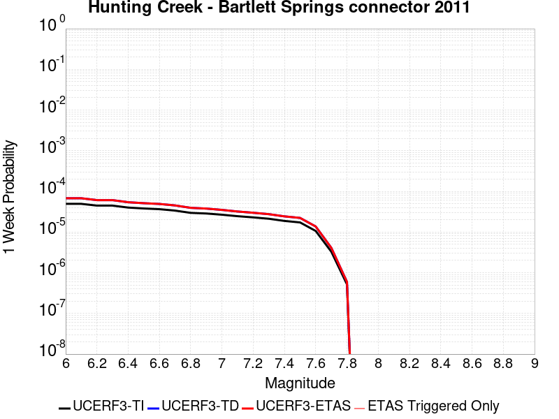 |  | 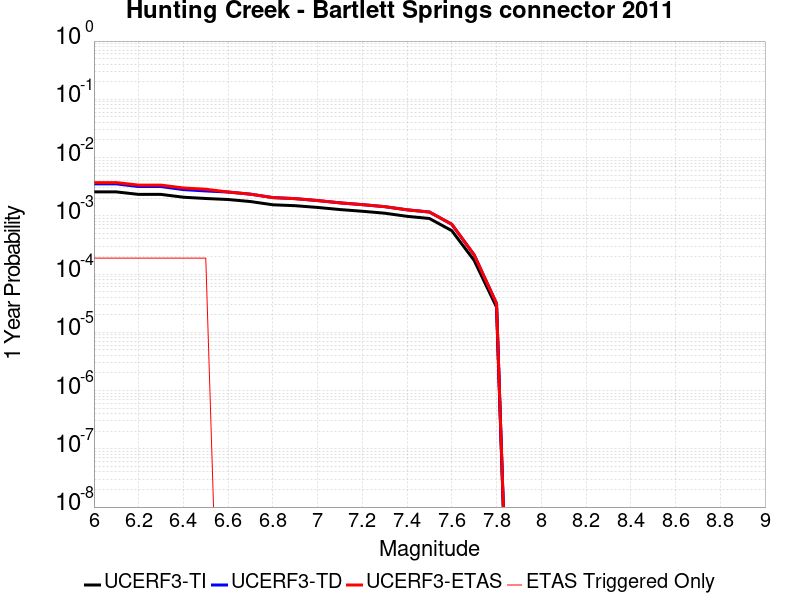 | 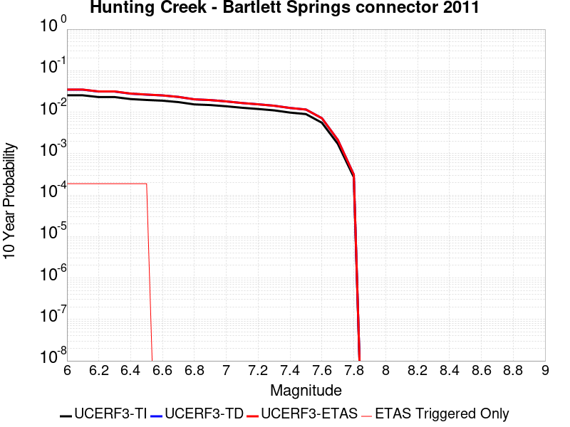 |

| Magnitude | 1 wk TI Prob | 1 wk TD Prob | 1 wk ETAS Prob | 1 wk ETAS/TD Gain | 1 wk ETAS Triggered Only | 1 mo TI Prob | 1 mo TD Prob | 1 mo ETAS Prob | 1 mo ETAS/TD Gain | 1 mo ETAS Triggered Only | 1 yr TI Prob | 1 yr TD Prob | 1 yr ETAS Prob | 1 yr ETAS/TD Gain | 1 yr ETAS Triggered Only | 10 yr TI Prob | 10 yr TD Prob | 10 yr ETAS Prob | 10 yr ETAS/TD Gain | 10 yr ETAS Triggered Only |
|-----|-----|-----|-----|-----|-----|-----|-----|-----|-----|-----|-----|-----|-----|-----|-----|-----|-----|-----|-----|-----|
| 6.0 | 4.940016E-5 | 6.7870766E-5 | 6.7870766E-5 | 1.0 | 0.0 | 2.1169778E-4 | 2.9084194E-4 | 2.9084194E-4 | 1.0 | 0.0 | 0.002574374 | 0.0035350819 | 0.0035450463 | 1.0028188 | 1.0E-5 | 0.025447546 | 0.03477475 | 0.034784403 | 1.0002775 | 1.0E-5 |
| 6.1 | 4.940016E-5 | 6.7870766E-5 | 6.7870766E-5 | 1.0 | 0.0 | 2.1169778E-4 | 2.9084194E-4 | 2.9084194E-4 | 1.0 | 0.0 | 0.002574374 | 0.0035350819 | 0.0035450463 | 1.0028188 | 1.0E-5 | 0.025447546 | 0.03477475 | 0.034784403 | 1.0002775 | 1.0E-5 |
| 6.2 | 4.472471E-5 | 6.100572E-5 | 6.100572E-5 | 1.0 | 0.0 | 1.9166325E-4 | 2.6142647E-4 | 2.6142647E-4 | 1.0 | 0.0 | 0.0023310026 | 0.0031781218 | 0.0031880902 | 1.0031365 | 1.0E-5 | 0.02306703 | 0.031317808 | 0.031327493 | 1.0003093 | 1.0E-5 |
| 6.3 | 4.472471E-5 | 6.100572E-5 | 6.100572E-5 | 1.0 | 0.0 | 1.9166325E-4 | 2.6142647E-4 | 2.6142647E-4 | 1.0 | 0.0 | 0.0023310026 | 0.0031781218 | 0.0031880902 | 1.0031365 | 1.0E-5 | 0.02306703 | 0.031317808 | 0.031327493 | 1.0003093 | 1.0E-5 |
| 6.4 | 4.0001003E-5 | 5.410516E-5 | 5.410516E-5 | 1.0 | 0.0 | 1.714216E-4 | 2.318579E-4 | 2.318579E-4 | 1.0 | 0.0 | 0.0020850603 | 0.0028191686 | 0.0028291403 | 1.0035372 | 1.0E-5 | 0.02065605 | 0.027829198 | 0.027838921 | 1.0003493 | 1.0E-5 |
| 6.5 | 3.8033053E-5 | 5.126649E-5 | 5.126649E-5 | 1.0 | 0.0 | 1.6298861E-4 | 2.1969521E-4 | 2.1969521E-4 | 1.0 | 0.0 | 0.0019825802 | 0.0026714848 | 0.0026814581 | 1.0037333 | 1.0E-5 | 0.019649856 | 0.026391273 | 0.02640101 | 1.000369 | 1.0E-5 |
| 6.6 | 3.653754E-5 | 4.912955E-5 | 4.912955E-5 | 1.0 | 0.0 | 1.5658008E-4 | 2.1053842E-4 | 2.1053842E-4 | 1.0 | 0.0 | 0.0019046954 | 0.0025602889 | 0.0025602889 | 1.0 | 0.0 | 0.018884527 | 0.025307199 | 0.025307199 | 1.0 | 0.0 |
| 6.7 | 3.372024E-5 | 4.5140216E-5 | 4.5140216E-5 | 1.0 | 0.0 | 1.4450731E-4 | 1.9344388E-4 | 1.9344388E-4 | 1.0 | 0.0 | 0.0017579567 | 0.0023526535 | 0.0023526535 | 1.0 | 0.0 | 0.017441148 | 0.023278862 | 0.023278862 | 1.0 | 0.0 |
| 6.8 | 2.9650024E-5 | 3.9411647E-5 | 3.9411647E-5 | 1.0 | 0.0 | 1.2706534E-4 | 1.6889606E-4 | 1.6889606E-4 | 1.0 | 0.0 | 0.0015459227 | 0.0020543607 | 0.0020543607 | 1.0 | 0.0 | 0.015352124 | 0.020351961 | 0.020351961 | 1.0 | 0.0 |
| 6.9 | 2.860775E-5 | 3.7812886E-5 | 3.7812886E-5 | 1.0 | 0.0 | 1.2259888E-4 | 1.620452E-4 | 1.620452E-4 | 1.0 | 0.0 | 0.0014916194 | 0.0019711219 | 0.0019711219 | 1.0 | 0.0 | 0.014816469 | 0.019536555 | 0.019536555 | 1.0 | 0.0 |
| 7.0 | 2.6696067E-5 | 3.5067544E-5 | 3.5067544E-5 | 1.0 | 0.0 | 1.144067E-4 | 1.5028086E-4 | 1.5028086E-4 | 1.0 | 0.0 | 0.0013920115 | 0.0018281427 | 0.0018281427 | 1.0 | 0.0 | 0.013833242 | 0.01813184 | 0.01813184 | 1.0 | 0.0 |
| 7.1 | 2.456087E-5 | 3.2013326E-5 | 3.2013326E-5 | 1.0 | 0.0 | 1.0525662E-4 | 1.3719281E-4 | 1.3719281E-4 | 1.0 | 0.0 | 0.001280746 | 0.0016690517 | 0.0016690517 | 1.0 | 0.0 | 0.012733897 | 0.016566671 | 0.016566671 | 1.0 | 0.0 |
| 7.2 | 2.295761E-5 | 2.9823148E-5 | 2.9823148E-5 | 1.0 | 0.0 | 9.8386045E-5 | 1.2780727E-4 | 1.2780727E-4 | 1.0 | 0.0 | 0.0011971919 | 0.0015549522 | 0.0015549522 | 1.0 | 0.0 | 0.011907627 | 0.015442378 | 0.015442378 | 1.0 | 0.0 |
| 7.3 | 2.1256936E-5 | 2.7542124E-5 | 2.7542124E-5 | 1.0 | 0.0 | 9.109797E-5 | 1.1803238E-4 | 1.1803238E-4 | 1.0 | 0.0 | 0.0011085535 | 0.0014361058 | 0.0014361058 | 1.0 | 0.0 | 0.011030397 | 0.014269741 | 0.014269741 | 1.0 | 0.0 |
| 7.4 | 1.8784336E-5 | 2.430697E-5 | 2.430697E-5 | 1.0 | 0.0 | 8.050181E-5 | 1.0416861E-4 | 1.0416861E-4 | 1.0 | 0.0 | 9.796688E-4 | 0.0012675226 | 0.0012675226 | 1.0 | 0.0 | 0.009753612 | 0.012604194 | 0.012604194 | 1.0 | 0.0 |
| 7.5 | 1.7248298E-5 | 2.2269056E-5 | 2.2269056E-5 | 1.0 | 0.0 | 7.391918E-5 | 9.543537E-5 | 9.543537E-5 | 1.0 | 0.0 | 8.9959445E-4 | 0.0011613137 | 0.0011613137 | 1.0 | 0.0 | 0.008959615 | 0.011553645 | 0.011553645 | 1.0 | 0.0 |
| 7.6 | 1.0653709E-5 | 1.3722259E-5 | 1.3722259E-5 | 1.0 | 0.0 | 4.5657955E-5 | 5.880837E-5 | 5.880837E-5 | 1.0 | 0.0 | 5.557438E-4 | 7.157594E-4 | 7.157594E-4 | 1.0 | 0.0 | 0.0055435603 | 0.0071350415 | 0.0071350415 | 1.0 | 0.0 |
| 7.7 | 3.286316E-6 | 4.0903997E-6 | 4.0903997E-6 | 1.0 | 0.0 | 1.4084137E-5 | 1.7530168E-5 | 1.7530168E-5 | 1.0 | 0.0 | 1.7146087E-4 | 2.1340905E-4 | 2.1340905E-4 | 1.0 | 0.0 | 0.0017132863 | 0.0021320845 | 0.0021320845 | 1.0 | 0.0 |
| 7.8 | 5.1855085E-7 | 5.972095E-7 | 5.972095E-7 | 1.0 | 0.0 | 2.222359E-6 | 2.5594668E-6 | 2.5594668E-6 | 1.0 | 0.0 | 2.7056883E-5 | 3.1161075E-5 | 3.1161075E-5 | 1.0 | 0.0 | 2.705359E-4 | 3.1156064E-4 | 3.1156064E-4 | 1.0 | 0.0 |

## Pitas Point (Lower)-Montalvo
*[(top)](#table-of-contents)*

| 1 Week | 1 Month | 1 Year | 10 Year |
|-----|-----|-----|-----|
| 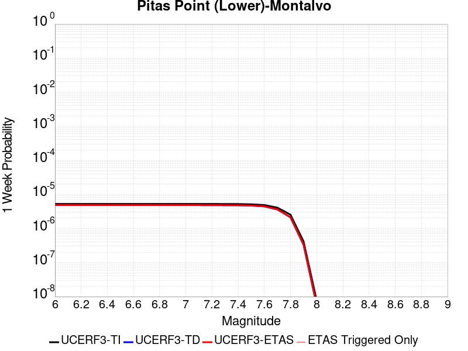 |  | 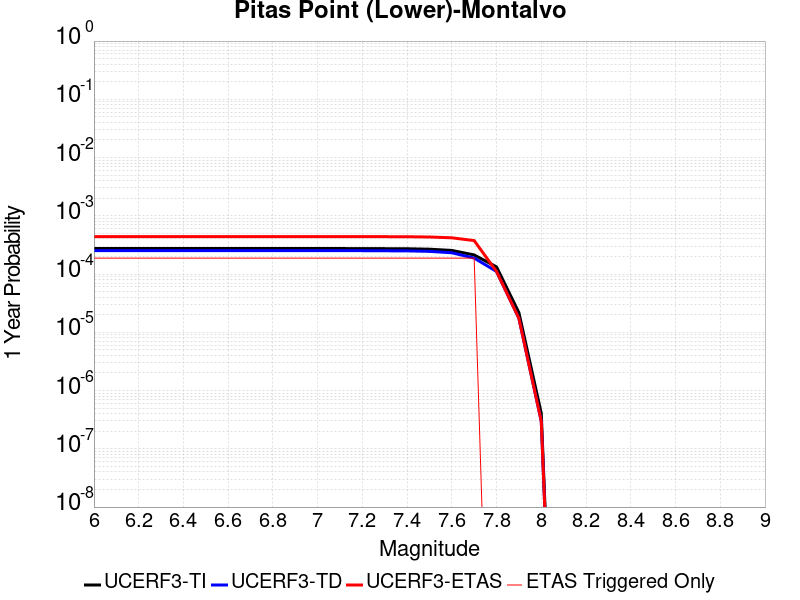 | 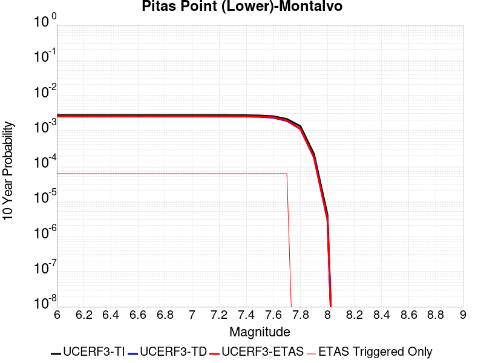 |

| Magnitude | 1 wk TI Prob | 1 wk TD Prob | 1 wk ETAS Prob | 1 wk ETAS/TD Gain | 1 wk ETAS Triggered Only | 1 mo TI Prob | 1 mo TD Prob | 1 mo ETAS Prob | 1 mo ETAS/TD Gain | 1 mo ETAS Triggered Only | 1 yr TI Prob | 1 yr TD Prob | 1 yr ETAS Prob | 1 yr ETAS/TD Gain | 1 yr ETAS Triggered Only | 10 yr TI Prob | 10 yr TD Prob | 10 yr ETAS Prob | 10 yr ETAS/TD Gain | 10 yr ETAS Triggered Only |
|-----|-----|-----|-----|-----|-----|-----|-----|-----|-----|-----|-----|-----|-----|-----|-----|-----|-----|-----|-----|-----|
| 6.0 | 5.2543637E-6 | 4.8379025E-6 | 4.8379025E-6 | 1.0 | 0.0 | 2.2518509E-5 | 2.0733705E-5 | 2.0733705E-5 | 1.0 | 0.0 | 2.7412834E-4 | 2.5240393E-4 | 2.6240142E-4 | 1.0396091 | 1.0E-5 | 0.0027379042 | 0.0025212052 | 0.00253118 | 1.0039563 | 1.0E-5 |
| 6.1 | 5.2543637E-6 | 4.8379025E-6 | 4.8379025E-6 | 1.0 | 0.0 | 2.2518509E-5 | 2.0733705E-5 | 2.0733705E-5 | 1.0 | 0.0 | 2.7412834E-4 | 2.5240393E-4 | 2.6240142E-4 | 1.0396091 | 1.0E-5 | 0.0027379042 | 0.0025212052 | 0.00253118 | 1.0039563 | 1.0E-5 |
| 6.2 | 5.2543637E-6 | 4.8379025E-6 | 4.8379025E-6 | 1.0 | 0.0 | 2.2518509E-5 | 2.0733705E-5 | 2.0733705E-5 | 1.0 | 0.0 | 2.7412834E-4 | 2.5240393E-4 | 2.6240142E-4 | 1.0396091 | 1.0E-5 | 0.0027379042 | 0.0025212052 | 0.00253118 | 1.0039563 | 1.0E-5 |
| 6.3 | 5.2543637E-6 | 4.8379025E-6 | 4.8379025E-6 | 1.0 | 0.0 | 2.2518509E-5 | 2.0733705E-5 | 2.0733705E-5 | 1.0 | 0.0 | 2.7412834E-4 | 2.5240393E-4 | 2.6240142E-4 | 1.0396091 | 1.0E-5 | 0.0027379042 | 0.0025212052 | 0.00253118 | 1.0039563 | 1.0E-5 |
| 6.4 | 5.2543637E-6 | 4.8379025E-6 | 4.8379025E-6 | 1.0 | 0.0 | 2.2518509E-5 | 2.0733705E-5 | 2.0733705E-5 | 1.0 | 0.0 | 2.7412834E-4 | 2.5240393E-4 | 2.6240142E-4 | 1.0396091 | 1.0E-5 | 0.0027379042 | 0.0025212052 | 0.00253118 | 1.0039563 | 1.0E-5 |
| 6.5 | 5.2543637E-6 | 4.8379025E-6 | 4.8379025E-6 | 1.0 | 0.0 | 2.2518509E-5 | 2.0733705E-5 | 2.0733705E-5 | 1.0 | 0.0 | 2.7412834E-4 | 2.5240393E-4 | 2.6240142E-4 | 1.0396091 | 1.0E-5 | 0.0027379042 | 0.0025212052 | 0.00253118 | 1.0039563 | 1.0E-5 |
| 6.6 | 5.2543637E-6 | 4.8379025E-6 | 4.8379025E-6 | 1.0 | 0.0 | 2.2518509E-5 | 2.0733705E-5 | 2.0733705E-5 | 1.0 | 0.0 | 2.7412834E-4 | 2.5240393E-4 | 2.6240142E-4 | 1.0396091 | 1.0E-5 | 0.0027379042 | 0.0025212052 | 0.00253118 | 1.0039563 | 1.0E-5 |
| 6.7 | 5.2543637E-6 | 4.8379025E-6 | 4.8379025E-6 | 1.0 | 0.0 | 2.2518509E-5 | 2.0733705E-5 | 2.0733705E-5 | 1.0 | 0.0 | 2.7412834E-4 | 2.5240393E-4 | 2.6240142E-4 | 1.0396091 | 1.0E-5 | 0.0027379042 | 0.0025212052 | 0.00253118 | 1.0039563 | 1.0E-5 |
| 6.8 | 5.2543637E-6 | 4.8379025E-6 | 4.8379025E-6 | 1.0 | 0.0 | 2.2518509E-5 | 2.0733705E-5 | 2.0733705E-5 | 1.0 | 0.0 | 2.7412834E-4 | 2.5240393E-4 | 2.6240142E-4 | 1.0396091 | 1.0E-5 | 0.0027379042 | 0.0025212052 | 0.00253118 | 1.0039563 | 1.0E-5 |
| 6.9 | 5.2543637E-6 | 4.8379025E-6 | 4.8379025E-6 | 1.0 | 0.0 | 2.2518509E-5 | 2.0733705E-5 | 2.0733705E-5 | 1.0 | 0.0 | 2.7412834E-4 | 2.5240393E-4 | 2.6240142E-4 | 1.0396091 | 1.0E-5 | 0.0027379042 | 0.0025212052 | 0.00253118 | 1.0039563 | 1.0E-5 |
| 7.0 | 5.2543637E-6 | 4.8379025E-6 | 4.8379025E-6 | 1.0 | 0.0 | 2.2518509E-5 | 2.0733705E-5 | 2.0733705E-5 | 1.0 | 0.0 | 2.7412834E-4 | 2.5240393E-4 | 2.6240142E-4 | 1.0396091 | 1.0E-5 | 0.0027379042 | 0.0025212052 | 0.00253118 | 1.0039563 | 1.0E-5 |
| 7.1 | 5.2543637E-6 | 4.8379025E-6 | 4.8379025E-6 | 1.0 | 0.0 | 2.2518509E-5 | 2.0733705E-5 | 2.0733705E-5 | 1.0 | 0.0 | 2.7412834E-4 | 2.5240393E-4 | 2.6240142E-4 | 1.0396091 | 1.0E-5 | 0.0027379042 | 0.0025212052 | 0.00253118 | 1.0039563 | 1.0E-5 |
| 7.2 | 5.2458695E-6 | 4.8290563E-6 | 4.8290563E-6 | 1.0 | 0.0 | 2.2482105E-5 | 2.0695794E-5 | 2.0695794E-5 | 1.0 | 0.0 | 2.7368523E-4 | 2.5194246E-4 | 2.6193995E-4 | 1.0396816 | 1.0E-5 | 0.0027334841 | 0.002516601 | 0.0025265757 | 1.0039636 | 1.0E-5 |
| 7.3 | 5.22665E-6 | 4.8089737E-6 | 4.8089737E-6 | 1.0 | 0.0 | 2.2399736E-5 | 2.0609727E-5 | 2.0609727E-5 | 1.0 | 0.0 | 2.7268266E-4 | 2.5089484E-4 | 2.6089232E-4 | 1.0398474 | 1.0E-5 | 0.002723483 | 0.0025061483 | 0.0025161232 | 1.0039802 | 1.0E-5 |
| 7.4 | 5.210642E-6 | 4.7921862E-6 | 4.7921862E-6 | 1.0 | 0.0 | 2.233113E-5 | 2.053778E-5 | 2.053778E-5 | 1.0 | 0.0 | 2.718476E-4 | 2.500191E-4 | 2.600166E-4 | 1.039987 | 1.0E-5 | 0.002715153 | 0.0024974106 | 0.0025073856 | 1.0039941 | 1.0E-5 |
| 7.5 | 5.1226016E-6 | 4.7000726E-6 | 4.7000726E-6 | 1.0 | 0.0 | 2.1953823E-5 | 2.0143016E-5 | 2.0143016E-5 | 1.0 | 0.0 | 2.67255E-4 | 2.4521392E-4 | 2.5521146E-4 | 1.0407708 | 1.0E-5 | 0.0026693381 | 0.002449465 | 0.0024594406 | 1.0040725 | 1.0E-5 |
| 7.6 | 4.8796987E-6 | 4.4449725E-6 | 4.4449725E-6 | 1.0 | 0.0 | 2.0912828E-5 | 1.9049745E-5 | 1.9049745E-5 | 1.0 | 0.0 | 2.5458392E-4 | 2.3190626E-4 | 2.4190394E-4 | 1.0431108 | 1.0E-5 | 0.0025429246 | 0.0023166733 | 0.00232665 | 1.0043066 | 1.0E-5 |
| 7.7 | 4.0834398E-6 | 3.6091444E-6 | 3.6091444E-6 | 1.0 | 0.0 | 1.7500339E-5 | 1.546767E-5 | 1.546767E-5 | 1.0 | 0.0 | 2.1304579E-4 | 1.8830286E-4 | 1.9830097E-4 | 1.0530959 | 1.0E-5 | 0.0021284167 | 0.0018814567 | 0.0018914379 | 1.005305 | 1.0E-5 |
| 7.8 | 2.5445438E-6 | 2.1212566E-6 | 2.1212566E-6 | 1.0 | 0.0 | 1.0905142E-5 | 9.091068E-6 | 9.091068E-6 | 1.0 | 0.0 | 1.3276201E-4 | 1.1067818E-4 | 1.1067818E-4 | 1.0 | 0.0 | 0.0013268272 | 0.0011062352 | 0.0011062352 | 1.0 | 0.0 |
| 7.9 | 4.1677114E-7 | 3.3294015E-7 | 3.3294015E-7 | 1.0 | 0.0 | 1.7861609E-6 | 1.4268857E-6 | 1.4268857E-6 | 1.0 | 0.0 | 2.1746291E-5 | 1.7372196E-5 | 1.7372196E-5 | 1.0 | 0.0 | 2.1744163E-4 | 1.737087E-4 | 1.737087E-4 | 1.0 | 0.0 |
| 8.0 | 7.791402E-9 | 5.6836056E-9 | 5.6836056E-9 | 1.0 | 0.0 | 3.3391725E-8 | 2.4358311E-8 | 2.4358311E-8 | 1.0 | 0.0 | 4.0654416E-7 | 2.965624E-7 | 2.965624E-7 | 1.0 | 0.0 | 4.065434E-6 | 2.9656223E-6 | 2.9656223E-6 | 1.0 | 0.0 |

## San Vicente
*[(top)](#table-of-contents)*

| 1 Week | 1 Month | 1 Year | 10 Year |
|-----|-----|-----|-----|
| 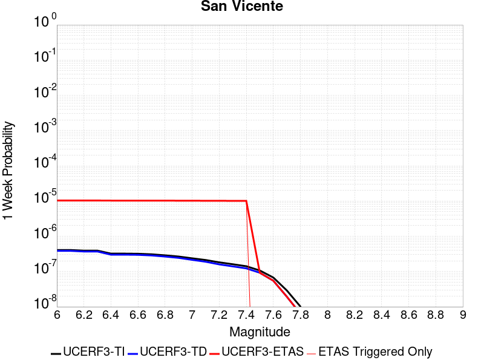 | 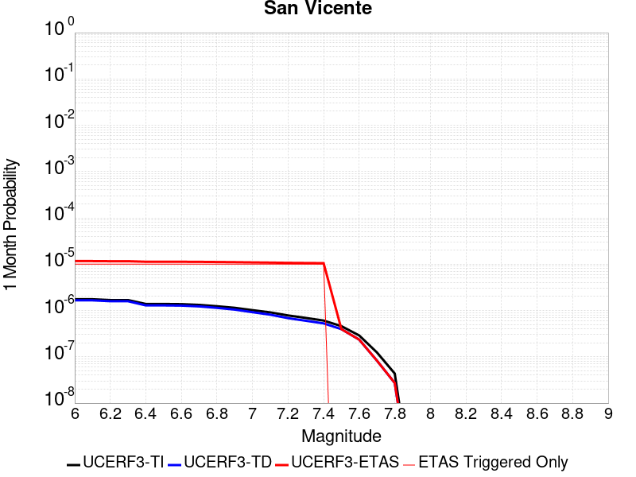 | 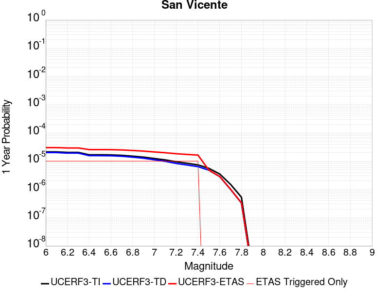 | 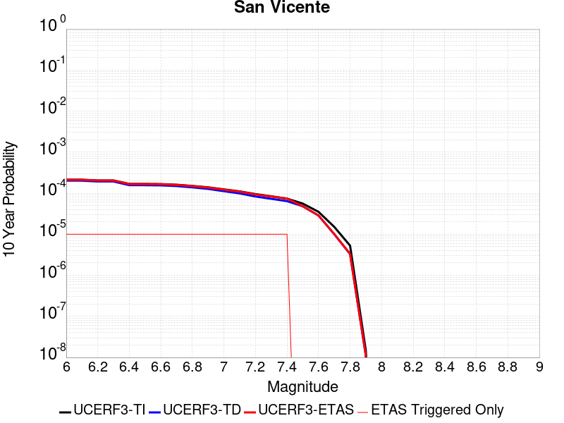 |

| Magnitude | 1 wk TI Prob | 1 wk TD Prob | 1 wk ETAS Prob | 1 wk ETAS/TD Gain | 1 wk ETAS Triggered Only | 1 mo TI Prob | 1 mo TD Prob | 1 mo ETAS Prob | 1 mo ETAS/TD Gain | 1 mo ETAS Triggered Only | 1 yr TI Prob | 1 yr TD Prob | 1 yr ETAS Prob | 1 yr ETAS/TD Gain | 1 yr ETAS Triggered Only | 10 yr TI Prob | 10 yr TD Prob | 10 yr ETAS Prob | 10 yr ETAS/TD Gain | 10 yr ETAS Triggered Only |
|-----|-----|-----|-----|-----|-----|-----|-----|-----|-----|-----|-----|-----|-----|-----|-----|-----|-----|-----|-----|-----|
| 6.0 | 4.0851268E-7 | 3.8665297E-7 | 1.0386649E-5 | 26.862974 | 1.0E-5 | 1.7507675E-6 | 1.6570831E-6 | 1.1657066E-5 | 7.0346904 | 1.0E-5 | 2.1315385E-5 | 2.0174806E-5 | 3.0174606E-5 | 1.4956577 | 1.0E-5 | 2.1313342E-4 | 2.0173044E-4 | 2.1172842E-4 | 1.0495611 | 1.0E-5 |
| 6.1 | 4.0851268E-7 | 3.8665297E-7 | 1.0386649E-5 | 26.862974 | 1.0E-5 | 1.7507675E-6 | 1.6570831E-6 | 1.1657066E-5 | 7.0346904 | 1.0E-5 | 2.1315385E-5 | 2.0174806E-5 | 3.0174606E-5 | 1.4956577 | 1.0E-5 | 2.1313342E-4 | 2.0173044E-4 | 2.1172842E-4 | 1.0495611 | 1.0E-5 |
| 6.2 | 3.9200887E-7 | 3.7009818E-7 | 1.0370094E-5 | 28.019848 | 1.0E-5 | 1.680037E-6 | 1.5861341E-6 | 1.15861185E-5 | 7.3046274 | 1.0E-5 | 2.0454258E-5 | 1.9311017E-5 | 2.9310824E-5 | 1.5178291 | 1.0E-5 | 2.0452376E-4 | 1.9309403E-4 | 2.030921E-4 | 1.0517782 | 1.0E-5 |
| 6.3 | 3.9200887E-7 | 3.7009818E-7 | 1.0370094E-5 | 28.019848 | 1.0E-5 | 1.680037E-6 | 1.5861341E-6 | 1.15861185E-5 | 7.3046274 | 1.0E-5 | 2.0454258E-5 | 1.9311017E-5 | 2.9310824E-5 | 1.5178291 | 1.0E-5 | 2.0452376E-4 | 1.9309403E-4 | 2.030921E-4 | 1.0517782 | 1.0E-5 |
| 6.4 | 3.2280067E-7 | 3.005979E-7 | 1.0300595E-5 | 34.267025 | 1.0E-5 | 1.3834307E-6 | 1.2882759E-6 | 1.1288263E-5 | 8.762302 | 1.0E-5 | 1.684314E-5 | 1.5684647E-5 | 2.568449E-5 | 1.6375562 | 1.0E-5 | 1.6841863E-4 | 1.5683546E-4 | 1.668339E-4 | 1.0637511 | 1.0E-5 |
| 6.5 | 3.2280067E-7 | 3.005979E-7 | 1.0300595E-5 | 34.267025 | 1.0E-5 | 1.3834307E-6 | 1.2882759E-6 | 1.1288263E-5 | 8.762302 | 1.0E-5 | 1.684314E-5 | 1.5684647E-5 | 2.568449E-5 | 1.6375562 | 1.0E-5 | 1.6841863E-4 | 1.5683546E-4 | 1.668339E-4 | 1.0637511 | 1.0E-5 |
| 6.6 | 3.1973437E-7 | 2.9752144E-7 | 1.0297518E-5 | 34.61101 | 1.0E-5 | 1.3702895E-6 | 1.2750912E-6 | 1.1275079E-5 | 8.842566 | 1.0E-5 | 1.6683147E-5 | 1.5524125E-5 | 2.552397E-5 | 1.6441487 | 1.0E-5 | 1.6681894E-4 | 1.5523047E-4 | 1.6522892E-4 | 1.0644103 | 1.0E-5 |
| 6.7 | 3.0841164E-7 | 2.8612172E-7 | 1.0286119E-5 | 35.950153 | 1.0E-5 | 1.3217634E-6 | 1.2262353E-6 | 1.1226223E-5 | 9.155032 | 1.0E-5 | 1.6092352E-5 | 1.4929313E-5 | 2.4929162E-5 | 1.6698132 | 1.0E-5 | 1.6091186E-4 | 1.4928314E-4 | 1.5928164E-4 | 1.0669768 | 1.0E-5 |
| 6.8 | 2.883202E-7 | 2.658495E-7 | 1.0265847E-5 | 38.615253 | 1.0E-5 | 1.2356575E-6 | 1.1393546E-6 | 1.1139343E-5 | 9.776889 | 1.0E-5 | 1.50440255E-5 | 1.3871553E-5 | 2.3871415E-5 | 1.7208898 | 1.0E-5 | 1.5043007E-4 | 1.387069E-4 | 1.4870553E-4 | 1.0720844 | 1.0E-5 |
| 6.9 | 2.66663E-7 | 2.439735E-7 | 1.0243971E-5 | 41.988052 | 1.0E-5 | 1.1428409E-6 | 1.0456002E-6 | 1.1045589E-5 | 10.563875 | 1.0E-5 | 1.3914E-5 | 1.2730108E-5 | 2.272998E-5 | 1.7855293 | 1.0E-5 | 1.3913128E-4 | 1.2729381E-4 | 1.3729253E-4 | 1.0785484 | 1.0E-5 |
| 7.0 | 2.3733546E-7 | 2.1451226E-7 | 1.021451E-5 | 47.617374 | 1.0E-5 | 1.0171515E-6 | 9.193379E-7 | 1.0919329E-5 | 11.877383 | 1.0E-5 | 1.238375E-5 | 1.1192881E-5 | 2.1192769E-5 | 1.893415 | 1.0E-5 | 1.238306E-4 | 1.1192319E-4 | 1.21922065E-4 | 1.089337 | 1.0E-5 |
| 7.1 | 2.123689E-7 | 1.8946507E-7 | 1.0189463E-5 | 53.780167 | 1.0E-5 | 9.1015215E-7 | 8.119929E-7 | 1.0811985E-5 | 13.315369 | 1.0E-5 | 1.1081046E-5 | 9.885968E-6 | 1.9885869E-5 | 2.0115247 | 1.0E-5 | 1.1080493E-4 | 9.885529E-5 | 1.0885431E-4 | 1.101148 | 1.0E-5 |
| 7.2 | 1.8244859E-7 | 1.594932E-7 | 1.01594915E-5 | 63.698586 | 1.0E-5 | 7.8192227E-7 | 6.835421E-7 | 1.0683535E-5 | 15.629667 | 1.0E-5 | 9.519862E-6 | 8.322093E-6 | 1.8322009E-5 | 2.2016108 | 1.0E-5 | 9.519454E-5 | 8.321782E-5 | 9.3216986E-5 | 1.1201565 | 1.0E-5 |
| 7.3 | 1.611936E-7 | 1.4005612E-7 | 1.0140055E-5 | 72.39994 | 1.0E-5 | 6.9082955E-7 | 6.0024036E-7 | 1.0600234E-5 | 17.659983 | 1.0E-5 | 8.410817E-6 | 7.3079013E-6 | 1.7307828E-5 | 2.368372 | 1.0E-5 | 8.410499E-5 | 7.307662E-5 | 8.307589E-5 | 1.1368327 | 1.0E-5 |
| 7.4 | 1.414892E-7 | 1.2290288E-7 | 1.0122902E-5 | 82.36505 | 1.0E-5 | 6.063821E-7 | 5.2672647E-7 | 1.0526721E-5 | 19.985176 | 1.0E-5 | 7.3826773E-6 | 6.412876E-6 | 1.6412812E-5 | 2.5593529 | 1.0E-5 | 7.382432E-5 | 6.4126914E-5 | 7.412627E-5 | 1.1559308 | 1.0E-5 |
| 7.5 | 1.0709291E-7 | 9.229651E-8 | 9.229651E-8 | 1.0 | 0.0 | 4.5896954E-7 | 3.955564E-7 | 3.955564E-7 | 1.0 | 0.0 | 5.5879395E-6 | 4.8158886E-6 | 4.8158886E-6 | 1.0 | 0.0 | 5.5877994E-5 | 4.8157843E-5 | 4.8157843E-5 | 1.0 | 0.0 |
| 7.6 | 6.746737E-8 | 5.4863424E-8 | 5.4863424E-8 | 1.0 | 0.0 | 2.8914585E-7 | 2.3512895E-7 | 2.3512895E-7 | 1.0 | 0.0 | 3.5203448E-6 | 2.8626912E-6 | 2.8626912E-6 | 1.0 | 0.0 | 3.520289E-5 | 2.8626544E-5 | 2.8626544E-5 | 1.0 | 0.0 |
| 7.7 | 2.8940264E-8 | 1.9261737E-8 | 1.9261737E-8 | 1.0 | 0.0 | 1.240297E-7 | 8.25503E-8 | 8.25503E-8 | 1.0 | 0.0 | 1.5100605E-6 | 1.0050494E-6 | 1.0050494E-6 | 1.0 | 0.0 | 1.5100502E-5 | 1.0050449E-5 | 1.0050449E-5 | 1.0 | 0.0 |
| 7.8 | 1.0151455E-8 | 6.3538255E-9 | 6.3538255E-9 | 1.0 | 0.0 | 4.3506233E-8 | 2.7230682E-8 | 2.7230682E-8 | 1.0 | 0.0 | 5.296883E-7 | 3.315335E-7 | 3.315335E-7 | 1.0 | 0.0 | 5.2968703E-6 | 3.31533E-6 | 3.31533E-6 | 1.0 | 0.0 |
| 7.9 | 2.8324232E-11 | 2.1405877E-11 | 2.1405877E-11 | 1.0 | 0.0 | 1.2138957E-10 | 9.1739616E-11 | 9.1739616E-11 | 1.0 | 0.0 | 1.4779177E-9 | 1.1169302E-9 | 1.1169302E-9 | 1.0 | 0.0 | 1.4779177E-8 | 1.1169303E-8 | 1.1169303E-8 | 1.0 | 0.0 |

## Newport-Inglewood alt 1
*[(top)](#table-of-contents)*

| 1 Week | 1 Month | 1 Year | 10 Year |
|-----|-----|-----|-----|
|  | 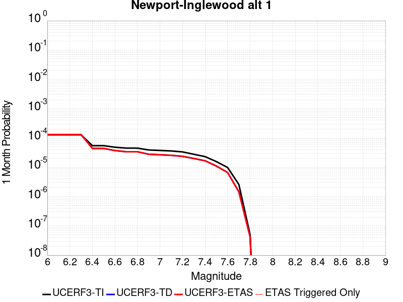 | 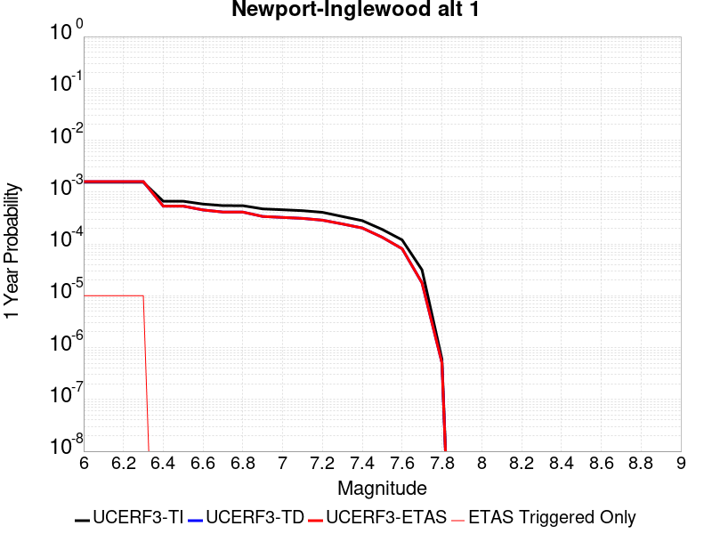 |  |

| Magnitude | 1 wk TI Prob | 1 wk TD Prob | 1 wk ETAS Prob | 1 wk ETAS/TD Gain | 1 wk ETAS Triggered Only | 1 mo TI Prob | 1 mo TD Prob | 1 mo ETAS Prob | 1 mo ETAS/TD Gain | 1 mo ETAS Triggered Only | 1 yr TI Prob | 1 yr TD Prob | 1 yr ETAS Prob | 1 yr ETAS/TD Gain | 1 yr ETAS Triggered Only | 10 yr TI Prob | 10 yr TD Prob | 10 yr ETAS Prob | 10 yr ETAS/TD Gain | 10 yr ETAS Triggered Only |
|-----|-----|-----|-----|-----|-----|-----|-----|-----|-----|-----|-----|-----|-----|-----|-----|-----|-----|-----|-----|-----|
| 6.0 | 2.9668912E-5 | 3.0404828E-5 | 3.0404828E-5 | 1.0 | 0.0 | 1.2714628E-4 | 1.3030265E-4 | 1.3030265E-4 | 1.0 | 0.0 | 0.0015469068 | 0.0015857654 | 0.0015957495 | 1.0062962 | 1.0E-5 | 0.015361829 | 0.01579211 | 0.015801951 | 1.0006232 | 1.0E-5 |
| 6.1 | 2.9668912E-5 | 3.0404828E-5 | 3.0404828E-5 | 1.0 | 0.0 | 1.2714628E-4 | 1.3030265E-4 | 1.3030265E-4 | 1.0 | 0.0 | 0.0015469068 | 0.0015857654 | 0.0015957495 | 1.0062962 | 1.0E-5 | 0.015361829 | 0.01579211 | 0.015801951 | 1.0006232 | 1.0E-5 |
| 6.2 | 2.9668912E-5 | 3.0404828E-5 | 3.0404828E-5 | 1.0 | 0.0 | 1.2714628E-4 | 1.3030265E-4 | 1.3030265E-4 | 1.0 | 0.0 | 0.0015469068 | 0.0015857654 | 0.0015957495 | 1.0062962 | 1.0E-5 | 0.015361829 | 0.01579211 | 0.015801951 | 1.0006232 | 1.0E-5 |
| 6.3 | 2.9668912E-5 | 3.0404828E-5 | 3.0404828E-5 | 1.0 | 0.0 | 1.2714628E-4 | 1.3030265E-4 | 1.3030265E-4 | 1.0 | 0.0 | 0.0015469068 | 0.0015857654 | 0.0015957495 | 1.0062962 | 1.0E-5 | 0.015361829 | 0.01579211 | 0.015801951 | 1.0006232 | 1.0E-5 |
| 6.4 | 1.275942E-5 | 1.02725335E-5 | 1.02725335E-5 | 1.0 | 0.0 | 5.4682085E-5 | 4.4024422E-5 | 4.4024422E-5 | 1.0 | 0.0 | 6.65551E-4 | 5.358697E-4 | 5.358697E-4 | 1.0 | 0.0 | 0.0066356123 | 0.0053462 | 0.0053462 | 1.0 | 0.0 |
| 6.5 | 1.275942E-5 | 1.02725335E-5 | 1.02725335E-5 | 1.0 | 0.0 | 5.4682085E-5 | 4.4024422E-5 | 4.4024422E-5 | 1.0 | 0.0 | 6.65551E-4 | 5.358697E-4 | 5.358697E-4 | 1.0 | 0.0 | 0.0066356123 | 0.0053462 | 0.0053462 | 1.0 | 0.0 |
| 6.6 | 1.1255358E-5 | 8.661911E-6 | 8.661911E-6 | 1.0 | 0.0 | 4.8236358E-5 | 3.7121958E-5 | 3.7121958E-5 | 1.0 | 0.0 | 5.871194E-4 | 4.5186782E-4 | 4.5186782E-4 | 1.0 | 0.0 | 0.005855706 | 0.0045096674 | 0.0045096674 | 1.0 | 0.0 |
| 6.7 | 1.0504745E-5 | 7.8998455E-6 | 7.8998455E-6 | 1.0 | 0.0 | 4.5019555E-5 | 3.385605E-5 | 3.385605E-5 | 1.0 | 0.0 | 5.4797524E-4 | 4.121207E-4 | 4.121207E-4 | 1.0 | 0.0 | 0.0054662596 | 0.004113694 | 0.004113694 | 1.0 | 0.0 |
| 6.8 | 1.0476007E-5 | 7.881227E-6 | 7.881227E-6 | 1.0 | 0.0 | 4.4896402E-5 | 3.3776258E-5 | 3.3776258E-5 | 1.0 | 0.0 | 5.464766E-4 | 4.1114958E-4 | 4.1114958E-4 | 1.0 | 0.0 | 0.005451347 | 0.004104019 | 0.004104019 | 1.0 | 0.0 |
| 6.9 | 9.076797E-6 | 6.4896567E-6 | 6.4896567E-6 | 1.0 | 0.0 | 3.889998E-5 | 2.7812519E-5 | 2.7812519E-5 | 1.0 | 0.0 | 4.7350433E-4 | 3.3856515E-4 | 3.3856515E-4 | 1.0 | 0.0 | 0.004724967 | 0.003380531 | 0.003380531 | 1.0 | 0.0 |
| 7.0 | 8.73795E-6 | 6.2120503E-6 | 6.2120503E-6 | 1.0 | 0.0 | 3.7447822E-5 | 2.6622802E-5 | 2.6622802E-5 | 1.0 | 0.0 | 4.5583185E-4 | 3.2408469E-4 | 3.2408469E-4 | 1.0 | 0.0 | 0.0045489795 | 0.0032361522 | 0.0032361522 | 1.0 | 0.0 |
| 7.1 | 8.391299E-6 | 5.9557533E-6 | 5.9557533E-6 | 1.0 | 0.0 | 3.5962214E-5 | 2.5524409E-5 | 2.5524409E-5 | 1.0 | 0.0 | 4.37752E-4 | 3.1071564E-4 | 3.1071564E-4 | 1.0 | 0.0 | 0.004368907 | 0.0031028416 | 0.0031028416 | 1.0 | 0.0 |
| 7.2 | 7.796882E-6 | 5.4964826E-6 | 5.4964826E-6 | 1.0 | 0.0 | 3.341478E-5 | 2.3556144E-5 | 2.3556144E-5 | 1.0 | 0.0 | 4.06749E-4 | 2.867585E-4 | 2.867585E-4 | 1.0 | 0.0 | 0.0040600533 | 0.002863909 | 0.002863909 | 1.0 | 0.0 |
| 7.3 | 6.4738833E-6 | 4.6477753E-6 | 4.6477753E-6 | 1.0 | 0.0 | 2.774492E-5 | 1.9918885E-5 | 1.9918885E-5 | 1.0 | 0.0 | 3.3774204E-4 | 2.424856E-4 | 2.424856E-4 | 1.0 | 0.0 | 0.0033722918 | 0.0024222268 | 0.0024222268 | 1.0 | 0.0 |
| 7.4 | 5.382145E-6 | 3.8857215E-6 | 3.8857215E-6 | 1.0 | 0.0 | 2.3066134E-5 | 1.6652988E-5 | 1.6652988E-5 | 1.0 | 0.0 | 2.8079396E-4 | 2.0273139E-4 | 2.0273139E-4 | 1.0 | 0.0 | 0.0028043943 | 0.002025479 | 0.002025479 | 1.0 | 0.0 |
| 7.5 | 3.648244E-6 | 2.5737634E-6 | 2.5737634E-6 | 1.0 | 0.0 | 1.5635238E-5 | 1.1030369E-5 | 1.1030369E-5 | 1.0 | 0.0 | 1.9034238E-4 | 1.3428657E-4 | 1.3428657E-4 | 1.0 | 0.0 | 0.0019017943 | 0.0013420646 | 0.0013420646 | 1.0 | 0.0 |
| 7.6 | 2.2906888E-6 | 1.547986E-6 | 1.547986E-6 | 1.0 | 0.0 | 9.817201E-6 | 6.634209E-6 | 6.634209E-6 | 1.0 | 0.0 | 1.1951787E-4 | 8.076857E-5 | 8.076857E-5 | 1.0 | 0.0 | 0.0011945361 | 8.073989E-4 | 8.073989E-4 | 1.0 | 0.0 |
| 7.7 | 6.0479874E-7 | 3.397468E-7 | 3.397468E-7 | 1.0 | 0.0 | 2.5919921E-6 | 1.456057E-6 | 1.456057E-6 | 1.0 | 0.0 | 3.1557047E-5 | 1.7727363E-5 | 1.7727363E-5 | 1.0 | 0.0 | 3.1552566E-4 | 1.7726087E-4 | 1.7726087E-4 | 1.0 | 0.0 |
| 7.8 | 1.16056995E-8 | 9.782997E-9 | 9.782997E-9 | 1.0 | 0.0 | 4.9738713E-8 | 4.1927127E-8 | 4.1927127E-8 | 1.0 | 0.0 | 6.0556863E-7 | 5.1046277E-7 | 5.1046277E-7 | 1.0 | 0.0 | 6.05567E-6 | 5.1046277E-6 | 5.1046277E-6 | 1.0 | 0.0 |

## Santa Ynez River
*[(top)](#table-of-contents)*

| 1 Week | 1 Month | 1 Year | 10 Year |
|-----|-----|-----|-----|
| 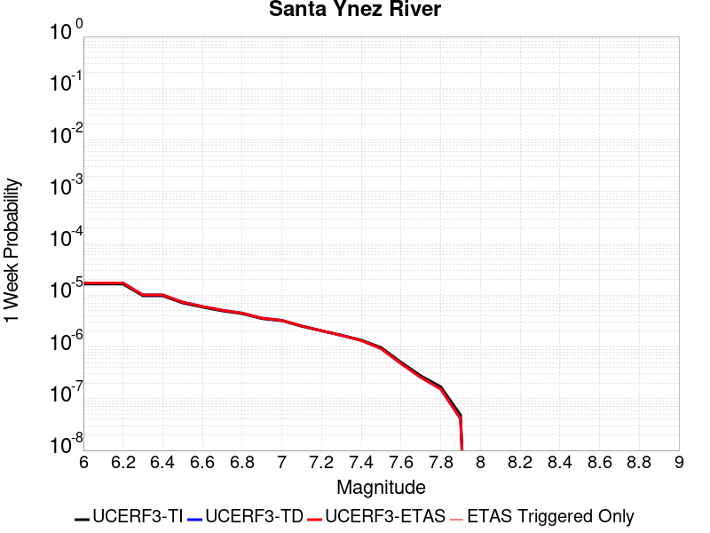 | 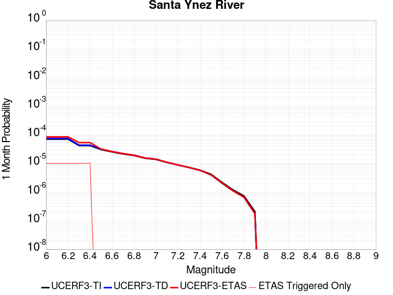 | 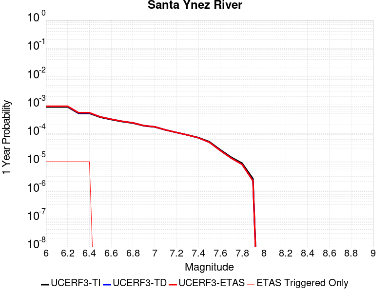 | 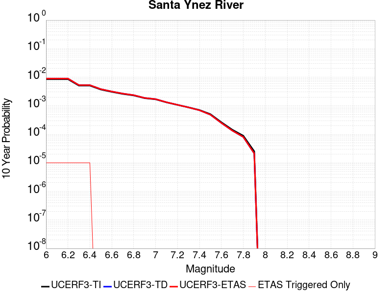 |

| Magnitude | 1 wk TI Prob | 1 wk TD Prob | 1 wk ETAS Prob | 1 wk ETAS/TD Gain | 1 wk ETAS Triggered Only | 1 mo TI Prob | 1 mo TD Prob | 1 mo ETAS Prob | 1 mo ETAS/TD Gain | 1 mo ETAS Triggered Only | 1 yr TI Prob | 1 yr TD Prob | 1 yr ETAS Prob | 1 yr ETAS/TD Gain | 1 yr ETAS Triggered Only | 10 yr TI Prob | 10 yr TD Prob | 10 yr ETAS Prob | 10 yr ETAS/TD Gain | 10 yr ETAS Triggered Only |
|-----|-----|-----|-----|-----|-----|-----|-----|-----|-----|-----|-----|-----|-----|-----|-----|-----|-----|-----|-----|-----|
| 6.0 | 1.6396456E-5 | 1.7209444E-5 | 1.7209444E-5 | 1.0 | 0.0 | 7.026863E-5 | 7.3752875E-5 | 8.375214E-5 | 1.1355779 | 1.0E-5 | 8.551848E-4 | 8.976069E-4 | 9.0759795E-4 | 1.0111307 | 1.0E-5 | 0.0085190125 | 0.008943363 | 0.008953273 | 1.0011082 | 1.0E-5 |
| 6.1 | 1.6396456E-5 | 1.7209444E-5 | 1.7209444E-5 | 1.0 | 0.0 | 7.026863E-5 | 7.3752875E-5 | 8.375214E-5 | 1.1355779 | 1.0E-5 | 8.551848E-4 | 8.976069E-4 | 9.0759795E-4 | 1.0111307 | 1.0E-5 | 0.0085190125 | 0.008943363 | 0.008953273 | 1.0011082 | 1.0E-5 |
| 6.2 | 1.6396456E-5 | 1.7209444E-5 | 1.7209444E-5 | 1.0 | 0.0 | 7.026863E-5 | 7.3752875E-5 | 8.375214E-5 | 1.1355779 | 1.0E-5 | 8.551848E-4 | 8.976069E-4 | 9.0759795E-4 | 1.0111307 | 1.0E-5 | 0.0085190125 | 0.008943363 | 0.008953273 | 1.0011082 | 1.0E-5 |
| 6.3 | 9.736976E-6 | 1.01223395E-5 | 1.01223395E-5 | 1.0 | 0.0 | 4.172923E-5 | 4.338076E-5 | 5.3380325E-5 | 1.2305069 | 1.0E-5 | 5.0793495E-4 | 5.280378E-4 | 5.380325E-4 | 1.018928 | 1.0E-5 | 0.005067755 | 0.0052683367 | 0.005278284 | 1.0018882 | 1.0E-5 |
| 6.4 | 9.736976E-6 | 1.01223395E-5 | 1.01223395E-5 | 1.0 | 0.0 | 4.172923E-5 | 4.338076E-5 | 5.3380325E-5 | 1.2305069 | 1.0E-5 | 5.0793495E-4 | 5.280378E-4 | 5.380325E-4 | 1.018928 | 1.0E-5 | 0.005067755 | 0.0052683367 | 0.005278284 | 1.0018882 | 1.0E-5 |
| 6.5 | 7.081964E-6 | 7.329905E-6 | 7.329905E-6 | 1.0 | 0.0 | 3.035092E-5 | 3.141351E-5 | 3.141351E-5 | 1.0 | 0.0 | 3.694598E-4 | 3.8239395E-4 | 3.8239395E-4 | 1.0 | 0.0 | 0.0036884616 | 0.0038175215 | 0.0038175215 | 1.0 | 0.0 |
| 6.6 | 5.873247E-6 | 6.0597517E-6 | 6.0597517E-6 | 1.0 | 0.0 | 2.5170815E-5 | 2.5970112E-5 | 2.5970112E-5 | 1.0 | 0.0 | 3.064116E-4 | 3.161411E-4 | 3.161411E-4 | 1.0 | 0.0 | 0.0030598943 | 0.003157001 | 0.003157001 | 1.0 | 0.0 |
| 6.7 | 4.973277E-6 | 5.11591E-6 | 5.11591E-6 | 1.0 | 0.0 | 2.1313872E-5 | 2.1925147E-5 | 2.1925147E-5 | 1.0 | 0.0 | 2.5946548E-4 | 2.6690646E-4 | 2.6690646E-4 | 1.0 | 0.0 | 0.0025916274 | 0.0026659078 | 0.0026659078 | 1.0 | 0.0 |
| 6.8 | 4.396492E-6 | 4.510987E-6 | 4.510987E-6 | 1.0 | 0.0 | 1.884197E-5 | 1.933266E-5 | 1.933266E-5 | 1.0 | 0.0 | 2.2937685E-4 | 2.3535005E-4 | 2.3535005E-4 | 1.0 | 0.0 | 0.0022914023 | 0.0023510433 | 0.0023510433 | 1.0 | 0.0 |
| 6.9 | 3.5255632E-6 | 3.6013423E-6 | 3.6013423E-6 | 1.0 | 0.0 | 1.5109469E-5 | 1.5434234E-5 | 1.5434234E-5 | 1.0 | 0.0 | 1.8394225E-4 | 1.8789574E-4 | 1.8789574E-4 | 1.0 | 0.0 | 0.0018379007 | 0.001877385 | 0.001877385 | 1.0 | 0.0 |
| 7.0 | 3.211603E-6 | 3.273663E-6 | 3.273663E-6 | 1.0 | 0.0 | 1.376394E-5 | 1.402991E-5 | 1.402991E-5 | 1.0 | 0.0 | 1.6756308E-4 | 1.708009E-4 | 1.708009E-4 | 1.0 | 0.0 | 0.0016743679 | 0.0017067104 | 0.0017067104 | 1.0 | 0.0 |
| 7.1 | 2.5094619E-6 | 2.5409295E-6 | 2.5409295E-6 | 1.0 | 0.0 | 1.0754793E-5 | 1.0889652E-5 | 1.0889652E-5 | 1.0 | 0.0 | 1.3093173E-4 | 1.325735E-4 | 1.325735E-4 | 1.0 | 0.0 | 0.0013085462 | 0.0013249503 | 0.0013249503 | 1.0 | 0.0 |
| 7.2 | 2.0515774E-6 | 2.0619466E-6 | 2.0619466E-6 | 1.0 | 0.0 | 8.792445E-6 | 8.836884E-6 | 8.836884E-6 | 1.0 | 0.0 | 1.0704277E-4 | 1.0758379E-4 | 1.0758379E-4 | 1.0 | 0.0 | 0.0010699122 | 0.0010753215 | 0.0010753215 | 1.0 | 0.0 |
| 7.3 | 1.6845745E-6 | 1.6773996E-6 | 1.6773996E-6 | 1.0 | 0.0 | 7.219585E-6 | 7.1888358E-6 | 7.1888358E-6 | 1.0 | 0.0 | 8.78949E-5 | 8.752059E-5 | 8.752059E-5 | 1.0 | 0.0 | 8.7860145E-4 | 8.7486405E-4 | 8.7486405E-4 | 1.0 | 0.0 |
| 7.4 | 1.3600285E-6 | 1.3333447E-6 | 1.3333447E-6 | 1.0 | 0.0 | 5.82868E-6 | 5.714322E-6 | 5.714322E-6 | 1.0 | 0.0 | 7.096187E-5 | 6.956967E-5 | 6.956967E-5 | 1.0 | 0.0 | 7.0939213E-4 | 6.9548114E-4 | 6.9548114E-4 | 1.0 | 0.0 |
| 7.5 | 9.735342E-7 | 9.2901894E-7 | 9.2901894E-7 | 1.0 | 0.0 | 4.172283E-6 | 3.9815036E-6 | 3.9815036E-6 | 1.0 | 0.0 | 5.079636E-5 | 4.8473747E-5 | 4.8473747E-5 | 1.0 | 0.0 | 5.0784746E-4 | 4.8463346E-4 | 4.8463346E-4 | 1.0 | 0.0 |
| 7.6 | 5.067187E-7 | 4.778609E-7 | 4.778609E-7 | 1.0 | 0.0 | 2.1716498E-6 | 2.0479738E-6 | 2.0479738E-6 | 1.0 | 0.0 | 2.6439517E-5 | 2.4933803E-5 | 2.4933803E-5 | 1.0 | 0.0 | 2.643637E-4 | 2.493108E-4 | 2.493108E-4 | 1.0 | 0.0 |
| 7.7 | 2.769089E-7 | 2.5759346E-7 | 2.5759346E-7 | 1.0 | 0.0 | 1.1867519E-6 | 1.1039714E-6 | 1.1039714E-6 | 1.0 | 0.0 | 1.4448608E-5 | 1.344077E-5 | 1.344077E-5 | 1.0 | 0.0 | 1.444767E-4 | 1.343996E-4 | 1.343996E-4 | 1.0 | 0.0 |
| 7.8 | 1.7044663E-7 | 1.5449208E-7 | 1.5449208E-7 | 1.0 | 0.0 | 7.3048534E-7 | 6.6210873E-7 | 6.6210873E-7 | 1.0 | 0.0 | 8.893623E-6 | 8.061144E-6 | 8.061144E-6 | 1.0 | 0.0 | 8.893267E-5 | 8.060854E-5 | 8.060854E-5 | 1.0 | 0.0 |
| 7.9 | 4.8344287E-8 | 4.0911143E-8 | 4.0911143E-8 | 1.0 | 0.0 | 2.0718979E-7 | 1.7533345E-7 | 1.7533345E-7 | 1.0 | 0.0 | 2.5225327E-6 | 2.1346827E-6 | 2.1346827E-6 | 1.0 | 0.0 | 2.5225041E-5 | 2.1346626E-5 | 2.1346626E-5 | 1.0 | 0.0 |

## Mendocino
*[(top)](#table-of-contents)*

| 1 Week | 1 Month | 1 Year | 10 Year |
|-----|-----|-----|-----|
| 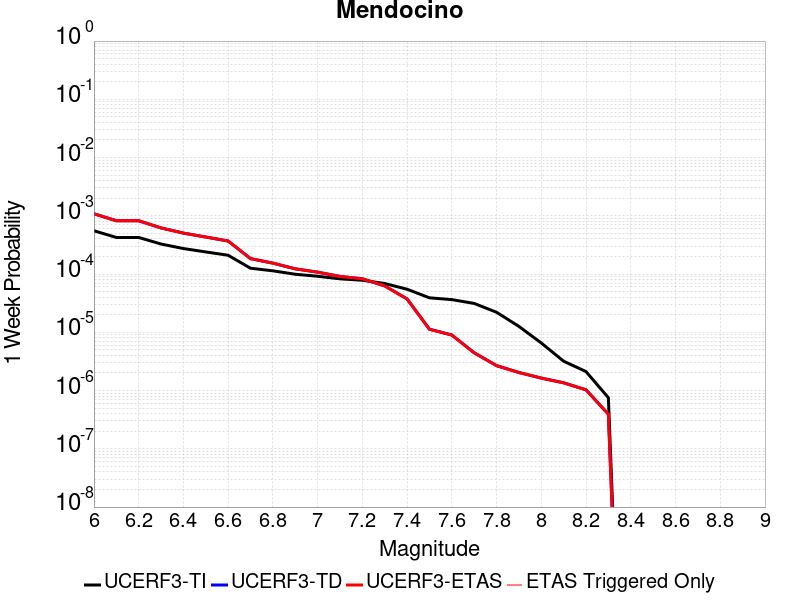 | 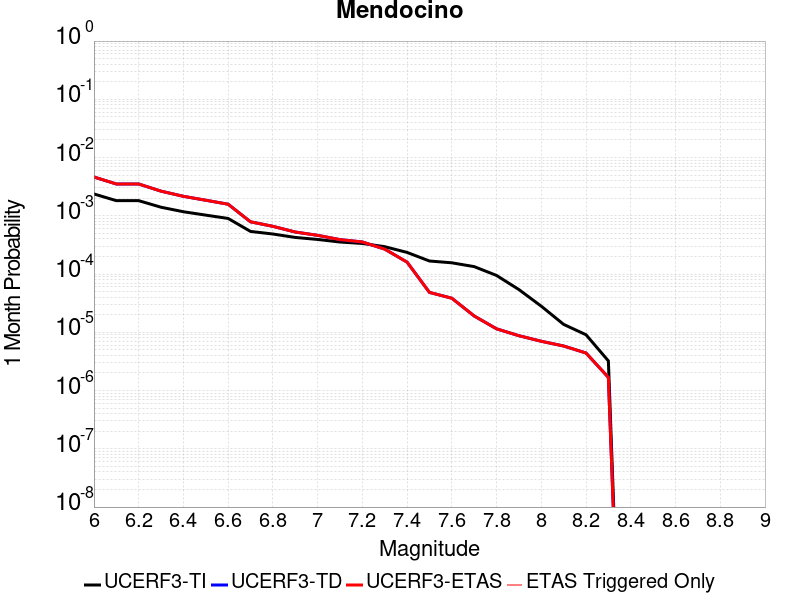 | 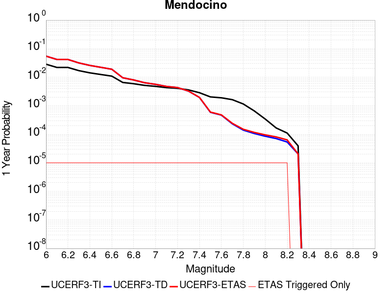 | 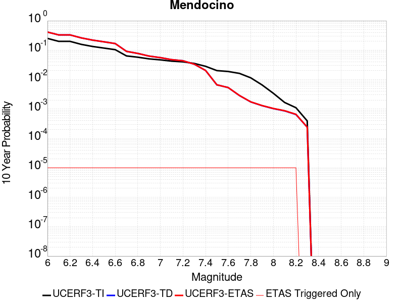 |

| Magnitude | 1 wk TI Prob | 1 wk TD Prob | 1 wk ETAS Prob | 1 wk ETAS/TD Gain | 1 wk ETAS Triggered Only | 1 mo TI Prob | 1 mo TD Prob | 1 mo ETAS Prob | 1 mo ETAS/TD Gain | 1 mo ETAS Triggered Only | 1 yr TI Prob | 1 yr TD Prob | 1 yr ETAS Prob | 1 yr ETAS/TD Gain | 1 yr ETAS Triggered Only | 10 yr TI Prob | 10 yr TD Prob | 10 yr ETAS Prob | 10 yr ETAS/TD Gain | 10 yr ETAS Triggered Only |
|-----|-----|-----|-----|-----|-----|-----|-----|-----|-----|-----|-----|-----|-----|-----|-----|-----|-----|-----|-----|-----|
| 6.0 | 5.5409013E-4 | 0.0010840978 | 0.0010840978 | 1.0 | 0.0 | 0.0023725112 | 0.0046357135 | 0.0046357135 | 1.0 | 0.0 | 0.028505474 | 0.054677837 | 0.054687288 | 1.0001729 | 1.0E-5 | 0.25113493 | 0.41188422 | 0.4118901 | 1.0000143 | 1.0E-5 |
| 6.1 | 4.2515888E-4 | 8.229105E-4 | 8.229105E-4 | 1.0 | 0.0 | 0.0018208373 | 0.003520157 | 0.003520157 | 1.0 | 0.0 | 0.021944538 | 0.041751582 | 0.041761164 | 1.0002295 | 1.0E-5 | 0.19899574 | 0.32995522 | 0.3299619 | 1.0000203 | 1.0E-5 |
| 6.2 | 4.2515888E-4 | 8.229105E-4 | 8.229105E-4 | 1.0 | 0.0 | 0.0018208373 | 0.003520157 | 0.003520157 | 1.0 | 0.0 | 0.021944538 | 0.041751582 | 0.041761164 | 1.0002295 | 1.0E-5 | 0.19899574 | 0.32995522 | 0.3299619 | 1.0000203 | 1.0E-5 |
| 6.3 | 3.2773745E-4 | 6.193633E-4 | 6.193633E-4 | 1.0 | 0.0 | 0.0014038329 | 0.0026503794 | 0.0026503794 | 1.0 | 0.0 | 0.016958237 | 0.031593565 | 0.03160325 | 1.0003065 | 1.0E-5 | 0.1572094 | 0.26077798 | 0.26078537 | 1.0000284 | 1.0E-5 |
| 6.4 | 2.7417165E-4 | 5.04789E-4 | 5.04789E-4 | 1.0 | 0.0 | 0.0011744922 | 0.002160561 | 0.002160561 | 1.0 | 0.0 | 0.014205975 | 0.02583886 | 0.025848601 | 1.000377 | 1.0E-5 | 0.13331394 | 0.21948014 | 0.21948795 | 1.0000355 | 1.0E-5 |
| 6.5 | 2.3984899E-4 | 4.323638E-4 | 4.323638E-4 | 1.0 | 0.0 | 0.0010275192 | 0.0018508366 | 0.0018508366 | 1.0 | 0.0 | 0.012438473 | 0.02218166 | 0.022191437 | 1.0004408 | 1.0E-5 | 0.11764851 | 0.19203737 | 0.19204545 | 1.0000421 | 1.0E-5 |
| 6.6 | 2.1023539E-4 | 3.6936256E-4 | 3.6936256E-4 | 1.0 | 0.0 | 9.0069766E-4 | 0.0015813457 | 0.0015813457 | 1.0 | 0.0 | 0.010910975 | 0.018990727 | 0.019000536 | 1.0005165 | 1.0E-5 | 0.10390546 | 0.16749373 | 0.16750205 | 1.0000497 | 1.0E-5 |
| 6.7 | 1.2592976E-4 | 1.8425964E-4 | 1.8425964E-4 | 1.0 | 0.0 | 5.395873E-4 | 7.8937394E-4 | 7.8937394E-4 | 1.0 | 0.0 | 0.006549705 | 0.009556835 | 0.009566738 | 1.0010364 | 1.0E-5 | 0.063599944 | 0.09096922 | 0.09097831 | 1.0000999 | 1.0E-5 |
| 6.8 | 1.13663555E-4 | 1.5401552E-4 | 1.5401552E-4 | 1.0 | 0.0 | 4.8703855E-4 | 6.5987057E-4 | 6.5987057E-4 | 1.0 | 0.0 | 0.0059135845 | 0.008000202 | 0.008010122 | 1.00124 | 1.0E-5 | 0.057586733 | 0.07739247 | 0.0774017 | 1.0001192 | 1.0E-5 |
| 6.9 | 9.926894E-5 | 1.2300287E-4 | 1.2300287E-4 | 1.0 | 0.0 | 4.2536893E-4 | 5.2704377E-4 | 5.2704377E-4 | 1.0 | 0.0 | 0.0051665753 | 0.006396927 | 0.0064068628 | 1.0015533 | 1.0E-5 | 0.050480947 | 0.06285957 | 0.062868945 | 1.0001491 | 1.0E-5 |
| 7.0 | 9.168125E-5 | 1.0784103E-4 | 1.0784103E-4 | 1.0 | 0.0 | 3.9286047E-4 | 4.6208999E-4 | 4.6208999E-4 | 1.0 | 0.0 | 0.004772591 | 0.005611076 | 0.00562102 | 1.0017722 | 1.0E-5 | 0.04671385 | 0.0556208 | 0.055630244 | 1.0001698 | 1.0E-5 |
| 7.1 | 8.2854116E-5 | 9.1051006E-5 | 9.1051006E-5 | 1.0 | 0.0 | 3.5504074E-4 | 3.9016042E-4 | 3.9016042E-4 | 1.0 | 0.0 | 0.004314056 | 0.0047399225 | 0.004749875 | 1.0020998 | 1.0E-5 | 0.042312626 | 0.047480468 | 0.047489993 | 1.0002006 | 1.0E-5 |
| 7.2 | 7.8255274E-5 | 8.300352E-5 | 8.300352E-5 | 1.0 | 0.0 | 3.3533663E-4 | 3.556817E-4 | 3.556817E-4 | 1.0 | 0.0 | 0.0040750825 | 0.004321974 | 0.0043319305 | 1.0023037 | 1.0E-5 | 0.040011603 | 0.043524873 | 0.04353444 | 1.0002197 | 1.0E-5 |
| 7.3 | 6.887904E-5 | 6.258733E-5 | 6.258733E-5 | 1.0 | 0.0 | 2.9516246E-4 | 2.6820437E-4 | 2.6820437E-4 | 1.0 | 0.0 | 0.0035876823 | 0.0032605957 | 0.0032705632 | 1.0030569 | 1.0E-5 | 0.035303112 | 0.03335046 | 0.033360127 | 1.0002898 | 1.0E-5 |
| 7.4 | 5.4898497E-5 | 3.7397505E-5 | 3.7397505E-5 | 1.0 | 0.0 | 2.3525805E-4 | 1.6026547E-4 | 1.6026547E-4 | 1.0 | 0.0 | 0.0028605047 | 0.0019495422 | 0.0019595227 | 1.0051194 | 1.0E-5 | 0.02823963 | 0.020406872 | 0.020416668 | 1.00048 | 1.0E-5 |
| 7.5 | 3.9103943E-5 | 1.1304096E-5 | 1.1304096E-5 | 1.0 | 0.0 | 1.6757756E-4 | 4.8445232E-5 | 4.8445232E-5 | 1.0 | 0.0 | 0.0020383475 | 5.896627E-4 | 5.996568E-4 | 1.0169488 | 1.0E-5 | 0.020197518 | 0.0066229533 | 0.006632887 | 1.0014999 | 1.0E-5 |
| 7.6 | 3.641042E-5 | 8.981182E-6 | 8.981182E-6 | 1.0 | 0.0 | 1.5603533E-4 | 3.849022E-5 | 3.849022E-5 | 1.0 | 0.0 | 0.0018980748 | 4.6851902E-4 | 4.7851432E-4 | 1.0213338 | 1.0E-5 | 0.018819444 | 0.0053467555 | 0.005356702 | 1.0018603 | 1.0E-5 |
| 7.7 | 3.1318774E-5 | 4.452091E-6 | 4.452091E-6 | 1.0 | 0.0 | 1.342164E-4 | 1.9080253E-5 | 1.9080253E-5 | 1.0 | 0.0 | 0.0016328598 | 2.322775E-4 | 2.4227517E-4 | 1.043042 | 1.0E-5 | 0.016209139 | 0.0028640495 | 0.002874021 | 1.0034815 | 1.0E-5 |
| 7.8 | 2.209241E-5 | 2.679371E-6 | 2.679371E-6 | 1.0 | 0.0 | 9.467832E-5 | 1.1482968E-5 | 1.1482968E-5 | 1.0 | 0.0 | 0.001152099 | 1.397962E-4 | 1.497948E-4 | 1.0715227 | 1.0E-5 | 0.011461443 | 0.001736627 | 0.0017466096 | 1.0057483 | 1.0E-5 |
| 7.9 | 1.2640477E-5 | 2.041037E-6 | 2.041037E-6 | 1.0 | 0.0 | 5.4172346E-5 | 8.747273E-6 | 8.747273E-6 | 1.0 | 0.0 | 6.593487E-4 | 1.06492866E-4 | 1.164918E-4 | 1.093893 | 1.0E-5 | 0.006573958 | 0.0012974226 | 0.0013074096 | 1.0076976 | 1.0E-5 |
| 8.0 | 6.5548907E-6 | 1.6379622E-6 | 1.6379622E-6 | 1.0 | 0.0 | 2.8092087E-5 | 7.019819E-6 | 7.019819E-6 | 1.0 | 0.0 | 3.4196748E-4 | 8.546297E-5 | 9.5462114E-5 | 1.1169997 | 1.0E-5 | 0.0034144172 | 0.0010306032 | 0.0010405929 | 1.009693 | 1.0E-5 |
| 8.1 | 3.1916707E-6 | 1.357735E-6 | 1.357735E-6 | 1.0 | 0.0 | 1.3678517E-5 | 5.818851E-6 | 5.818851E-6 | 1.0 | 0.0 | 1.6652321E-4 | 7.084223E-5 | 8.084153E-5 | 1.1411487 | 1.0E-5 | 0.0016639848 | 8.624329E-4 | 8.724242E-4 | 1.0115851 | 1.0E-5 |
| 8.2 | 2.1193785E-6 | 1.0297509E-6 | 1.0297509E-6 | 1.0 | 0.0 | 9.083019E-6 | 4.413211E-6 | 4.413211E-6 | 1.0 | 0.0 | 1.1058014E-4 | 5.372954E-5 | 6.3729E-5 | 1.1861074 | 1.0E-5 | 0.0011052513 | 6.500931E-4 | 6.600866E-4 | 1.0153724 | 1.0E-5 |
| 8.3 | 7.536878E-7 | 3.9261332E-7 | 3.9261332E-7 | 1.0 | 0.0 | 3.2300866E-6 | 1.6826275E-6 | 1.6826275E-6 | 1.0 | 0.0 | 3.9325594E-5 | 2.048581E-5 | 2.048581E-5 | 1.0 | 0.0 | 3.9318635E-4 | 2.4124846E-4 | 2.4124846E-4 | 1.0 | 0.0 |

## White Wolf
*[(top)](#table-of-contents)*

| 1 Week | 1 Month | 1 Year | 10 Year |
|-----|-----|-----|-----|
|  | 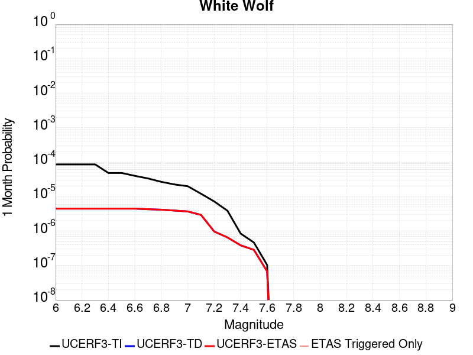 | 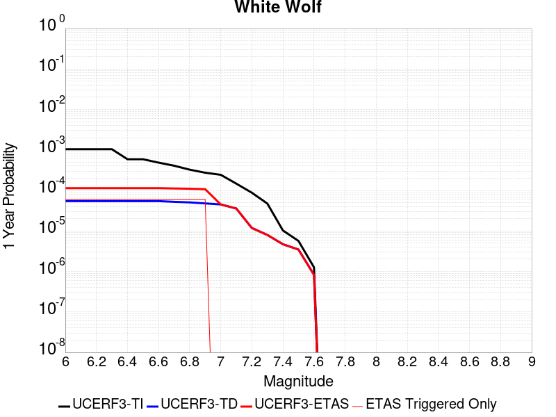 | 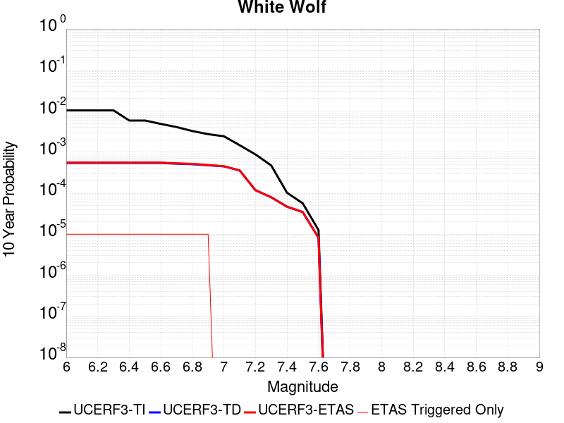 |

| Magnitude | 1 wk TI Prob | 1 wk TD Prob | 1 wk ETAS Prob | 1 wk ETAS/TD Gain | 1 wk ETAS Triggered Only | 1 mo TI Prob | 1 mo TD Prob | 1 mo ETAS Prob | 1 mo ETAS/TD Gain | 1 mo ETAS Triggered Only | 1 yr TI Prob | 1 yr TD Prob | 1 yr ETAS Prob | 1 yr ETAS/TD Gain | 1 yr ETAS Triggered Only | 10 yr TI Prob | 10 yr TD Prob | 10 yr ETAS Prob | 10 yr ETAS/TD Gain | 10 yr ETAS Triggered Only |
|-----|-----|-----|-----|-----|-----|-----|-----|-----|-----|-----|-----|-----|-----|-----|-----|-----|-----|-----|-----|-----|
| 6.0 | 2.0037822E-5 | 1.0468583E-6 | 1.0468583E-6 | 1.0 | 0.0 | 8.587355E-5 | 4.4865283E-6 | 4.4865283E-6 | 1.0 | 0.0 | 0.001045009 | 5.4622164E-5 | 6.4621614E-5 | 1.1830659 | 1.0E-5 | 0.010401085 | 5.4609246E-4 | 5.56087E-4 | 1.018302 | 1.0E-5 |
| 6.1 | 2.0037822E-5 | 1.0468583E-6 | 1.0468583E-6 | 1.0 | 0.0 | 8.587355E-5 | 4.4865283E-6 | 4.4865283E-6 | 1.0 | 0.0 | 0.001045009 | 5.4622164E-5 | 6.4621614E-5 | 1.1830659 | 1.0E-5 | 0.010401085 | 5.4609246E-4 | 5.56087E-4 | 1.018302 | 1.0E-5 |
| 6.2 | 2.0037822E-5 | 1.0468583E-6 | 1.0468583E-6 | 1.0 | 0.0 | 8.587355E-5 | 4.4865283E-6 | 4.4865283E-6 | 1.0 | 0.0 | 0.001045009 | 5.4622164E-5 | 6.4621614E-5 | 1.1830659 | 1.0E-5 | 0.010401085 | 5.4609246E-4 | 5.56087E-4 | 1.018302 | 1.0E-5 |
| 6.3 | 2.0037822E-5 | 1.0468583E-6 | 1.0468583E-6 | 1.0 | 0.0 | 8.587355E-5 | 4.4865283E-6 | 4.4865283E-6 | 1.0 | 0.0 | 0.001045009 | 5.4622164E-5 | 6.4621614E-5 | 1.1830659 | 1.0E-5 | 0.010401085 | 5.4609246E-4 | 5.56087E-4 | 1.018302 | 1.0E-5 |
| 6.4 | 1.132487E-5 | 1.0468583E-6 | 1.0468583E-6 | 1.0 | 0.0 | 4.8534253E-5 | 4.4865283E-6 | 4.4865283E-6 | 1.0 | 0.0 | 5.907443E-4 | 5.4622164E-5 | 6.4621614E-5 | 1.1830659 | 1.0E-5 | 0.005891764 | 5.4609246E-4 | 5.56087E-4 | 1.018302 | 1.0E-5 |
| 6.5 | 1.132487E-5 | 1.0468583E-6 | 1.0468583E-6 | 1.0 | 0.0 | 4.8534253E-5 | 4.4865283E-6 | 4.4865283E-6 | 1.0 | 0.0 | 5.907443E-4 | 5.4622164E-5 | 6.4621614E-5 | 1.1830659 | 1.0E-5 | 0.005891764 | 5.4609246E-4 | 5.56087E-4 | 1.018302 | 1.0E-5 |
| 6.6 | 9.347473E-6 | 1.0468583E-6 | 1.0468583E-6 | 1.0 | 0.0 | 4.0059982E-5 | 4.4865283E-6 | 4.4865283E-6 | 1.0 | 0.0 | 4.8762115E-4 | 5.4622164E-5 | 6.4621614E-5 | 1.1830659 | 1.0E-5 | 0.0048655253 | 5.4609246E-4 | 5.56087E-4 | 1.018302 | 1.0E-5 |
| 6.7 | 7.842647E-6 | 1.0047773E-6 | 1.0047773E-6 | 1.0 | 0.0 | 3.361091E-5 | 4.306182E-6 | 4.306182E-6 | 1.0 | 0.0 | 4.0913603E-4 | 5.2426552E-5 | 6.242603E-5 | 1.1907331 | 1.0E-5 | 0.004083836 | 5.241468E-4 | 5.3414155E-4 | 1.0190686 | 1.0E-5 |
| 6.8 | 6.26597E-6 | 9.734289E-7 | 9.734289E-7 | 1.0 | 0.0 | 2.685388E-5 | 4.1718313E-6 | 4.1718313E-6 | 1.0 | 0.0 | 3.2689696E-4 | 5.0790914E-5 | 6.0790408E-5 | 1.1968756 | 1.0E-5 | 0.003264165 | 5.07798E-4 | 5.177929E-4 | 1.0196829 | 1.0E-5 |
| 6.9 | 5.258436E-6 | 9.1827343E-7 | 9.1827343E-7 | 1.0 | 0.0 | 2.2535958E-5 | 3.935452E-6 | 3.935452E-6 | 1.0 | 0.0 | 2.7434074E-4 | 4.7913123E-5 | 5.7912643E-5 | 1.2087011 | 1.0E-5 | 0.0027400232 | 4.7903272E-4 | 4.8902794E-4 | 1.0208654 | 1.0E-5 |
| 7.0 | 4.675028E-6 | 8.660704E-7 | 8.660704E-7 | 1.0 | 0.0 | 2.003568E-5 | 3.7117254E-6 | 3.7117254E-6 | 1.0 | 0.0 | 2.4390711E-4 | 4.518937E-5 | 4.518937E-5 | 1.0 | 0.0 | 0.0024363957 | 4.518065E-4 | 4.518065E-4 | 1.0 | 0.0 |
| 7.1 | 2.8270078E-6 | 6.8737717E-7 | 6.8737717E-7 | 1.0 | 0.0 | 1.2115692E-5 | 2.945899E-6 | 2.945899E-6 | 1.0 | 0.0 | 1.4749856E-4 | 3.586577E-5 | 3.586577E-5 | 1.0 | 0.0 | 0.001474007 | 3.5860392E-4 | 3.5860392E-4 | 1.0 | 0.0 |
| 7.2 | 1.6881406E-6 | 2.2703432E-7 | 2.2703432E-7 | 1.0 | 0.0 | 7.2348685E-6 | 9.730038E-7 | 9.730038E-7 | 1.0 | 0.0 | 8.808096E-5 | 1.1846259E-5 | 1.1846259E-5 | 1.0 | 0.0 | 8.8046055E-4 | 1.1845643E-4 | 1.1845643E-4 | 1.0 | 0.0 |
| 7.3 | 9.086107E-7 | 1.5264496E-7 | 1.5264496E-7 | 1.0 | 0.0 | 3.8940398E-6 | 6.5419255E-7 | 6.5419255E-7 | 1.0 | 0.0 | 4.7408903E-5 | 7.964766E-6 | 7.964766E-6 | 1.0 | 0.0 | 4.739879E-4 | 7.964489E-5 | 7.964489E-5 | 1.0 | 0.0 |
| 7.4 | 1.9717383E-7 | 9.003399E-8 | 9.003399E-8 | 1.0 | 0.0 | 8.450304E-7 | 3.8585992E-7 | 3.8585992E-7 | 1.0 | 0.0 | 1.0288197E-5 | 4.697835E-6 | 4.697835E-6 | 1.0 | 0.0 | 1.028772E-4 | 4.6977384E-5 | 4.6977384E-5 | 1.0 | 0.0 |
| 7.5 | 1.086975E-7 | 6.659662E-8 | 6.659662E-8 | 1.0 | 0.0 | 4.6584634E-7 | 2.8541407E-7 | 2.8541407E-7 | 1.0 | 0.0 | 5.6716644E-6 | 3.474911E-6 | 3.474911E-6 | 1.0 | 0.0 | 5.6715195E-5 | 3.474859E-5 | 3.474859E-5 | 1.0 | 0.0 |
| 7.6 | 2.4217808E-8 | 1.5820849E-8 | 1.5820849E-8 | 1.0 | 0.0 | 1.03790605E-7 | 6.780364E-8 | 6.780364E-8 | 1.0 | 0.0 | 1.2636499E-6 | 8.25509E-7 | 8.25509E-7 | 1.0 | 0.0 | 1.2636427E-5 | 8.255064E-6 | 8.255064E-6 | 1.0 | 0.0 |

## Garberville - Briceland 2011 CFM
*[(top)](#table-of-contents)*

| 1 Week | 1 Month | 1 Year | 10 Year |
|-----|-----|-----|-----|
|  | 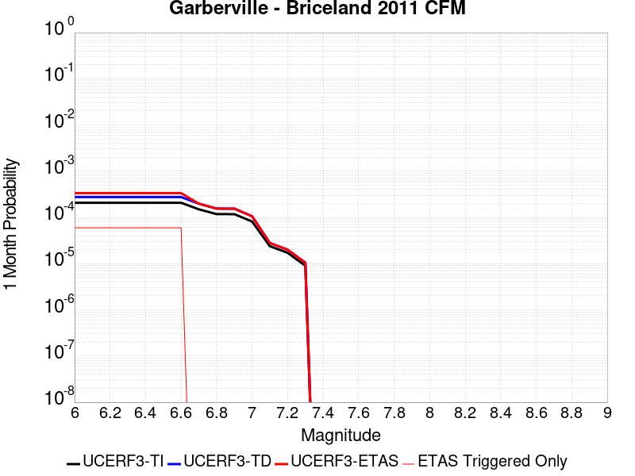 | 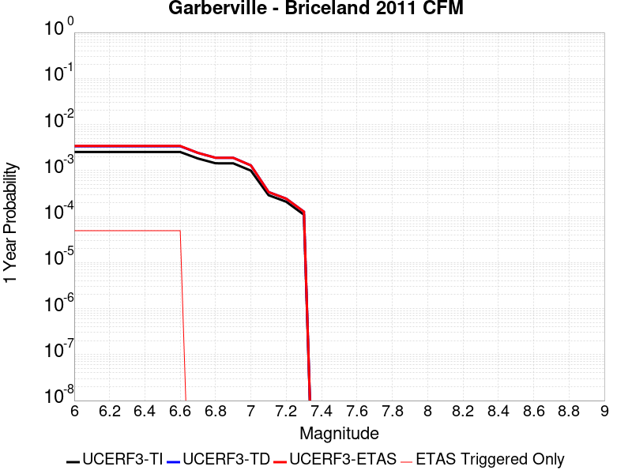 | 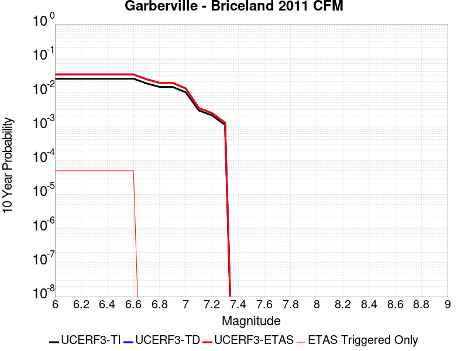 |

| Magnitude | 1 wk TI Prob | 1 wk TD Prob | 1 wk ETAS Prob | 1 wk ETAS/TD Gain | 1 wk ETAS Triggered Only | 1 mo TI Prob | 1 mo TD Prob | 1 mo ETAS Prob | 1 mo ETAS/TD Gain | 1 mo ETAS Triggered Only | 1 yr TI Prob | 1 yr TD Prob | 1 yr ETAS Prob | 1 yr ETAS/TD Gain | 1 yr ETAS Triggered Only | 10 yr TI Prob | 10 yr TD Prob | 10 yr ETAS Prob | 10 yr ETAS/TD Gain | 10 yr ETAS Triggered Only |
|-----|-----|-----|-----|-----|-----|-----|-----|-----|-----|-----|-----|-----|-----|-----|-----|-----|-----|-----|-----|-----|
| 6.0 | 4.8399295E-5 | 6.4527754E-5 | 7.452711E-5 | 1.1549621 | 1.0E-5 | 2.0740906E-4 | 2.765224E-4 | 2.8651961E-4 | 1.0361534 | 1.0E-5 | 0.002522281 | 0.0033621131 | 0.0033720795 | 1.0029644 | 1.0E-5 | 0.024938442 | 0.03317879 | 0.03318846 | 1.0002913 | 1.0E-5 |
| 6.1 | 4.8399295E-5 | 6.4527754E-5 | 7.452711E-5 | 1.1549621 | 1.0E-5 | 2.0740906E-4 | 2.765224E-4 | 2.8651961E-4 | 1.0361534 | 1.0E-5 | 0.002522281 | 0.0033621131 | 0.0033720795 | 1.0029644 | 1.0E-5 | 0.024938442 | 0.03317879 | 0.03318846 | 1.0002913 | 1.0E-5 |
| 6.2 | 4.8399295E-5 | 6.4527754E-5 | 7.452711E-5 | 1.1549621 | 1.0E-5 | 2.0740906E-4 | 2.765224E-4 | 2.8651961E-4 | 1.0361534 | 1.0E-5 | 0.002522281 | 0.0033621131 | 0.0033720795 | 1.0029644 | 1.0E-5 | 0.024938442 | 0.03317879 | 0.03318846 | 1.0002913 | 1.0E-5 |
| 6.3 | 4.8399295E-5 | 6.4527754E-5 | 7.452711E-5 | 1.1549621 | 1.0E-5 | 2.0740906E-4 | 2.765224E-4 | 2.8651961E-4 | 1.0361534 | 1.0E-5 | 0.002522281 | 0.0033621131 | 0.0033720795 | 1.0029644 | 1.0E-5 | 0.024938442 | 0.03317879 | 0.03318846 | 1.0002913 | 1.0E-5 |
| 6.4 | 4.8399295E-5 | 6.4527754E-5 | 7.452711E-5 | 1.1549621 | 1.0E-5 | 2.0740906E-4 | 2.765224E-4 | 2.8651961E-4 | 1.0361534 | 1.0E-5 | 0.002522281 | 0.0033621131 | 0.0033720795 | 1.0029644 | 1.0E-5 | 0.024938442 | 0.03317879 | 0.03318846 | 1.0002913 | 1.0E-5 |
| 6.5 | 4.8399295E-5 | 6.4527754E-5 | 7.452711E-5 | 1.1549621 | 1.0E-5 | 2.0740906E-4 | 2.765224E-4 | 2.8651961E-4 | 1.0361534 | 1.0E-5 | 0.002522281 | 0.0033621131 | 0.0033720795 | 1.0029644 | 1.0E-5 | 0.024938442 | 0.03317879 | 0.03318846 | 1.0002913 | 1.0E-5 |
| 6.6 | 4.8399295E-5 | 6.4527754E-5 | 7.452711E-5 | 1.1549621 | 1.0E-5 | 2.0740906E-4 | 2.765224E-4 | 2.8651961E-4 | 1.0361534 | 1.0E-5 | 0.002522281 | 0.0033621131 | 0.0033720795 | 1.0029644 | 1.0E-5 | 0.024938442 | 0.03317879 | 0.03318846 | 1.0002913 | 1.0E-5 |
| 6.7 | 3.495179E-5 | 4.630908E-5 | 4.630908E-5 | 1.0 | 0.0 | 1.4978478E-4 | 1.9845538E-4 | 1.9845538E-4 | 1.0 | 0.0 | 0.0018221042 | 0.0024140473 | 0.0024140473 | 1.0 | 0.0 | 0.018072363 | 0.023930654 | 0.023930654 | 1.0 | 0.0 |
| 6.8 | 2.7517597E-5 | 3.62417E-5 | 3.62417E-5 | 1.0 | 0.0 | 1.1792722E-4 | 1.5531495E-4 | 1.5531495E-4 | 1.0 | 0.0 | 0.0014348183 | 0.0018897917 | 0.0018897917 | 1.0 | 0.0 | 0.014255894 | 0.01878354 | 0.01878354 | 1.0 | 0.0 |
| 6.9 | 2.74461E-5 | 3.6159425E-5 | 3.6159425E-5 | 1.0 | 0.0 | 1.1762084E-4 | 1.5496238E-4 | 1.5496238E-4 | 1.0 | 0.0 | 0.001431093 | 0.0018855067 | 0.0018855067 | 1.0 | 0.0 | 0.014219119 | 0.018741412 | 0.018741412 | 1.0 | 0.0 |
| 7.0 | 1.9023773E-5 | 2.4707771E-5 | 2.4707771E-5 | 1.0 | 0.0 | 8.152791E-5 | 1.0588833E-4 | 1.0588833E-4 | 1.0 | 0.0 | 9.921503E-4 | 0.0012888273 | 0.0012888273 | 1.0 | 0.0 | 0.009877323 | 0.012852578 | 0.012852578 | 1.0 | 0.0 |
| 7.1 | 5.566844E-6 | 6.512147E-6 | 6.512147E-6 | 1.0 | 0.0 | 2.3857683E-5 | 2.7908927E-5 | 2.7908927E-5 | 1.0 | 0.0 | 2.9042858E-4 | 3.3974246E-4 | 3.3974246E-4 | 1.0 | 0.0 | 0.002900493 | 0.0033926512 | 0.0033926512 | 1.0 | 0.0 |
| 7.2 | 4.011353E-6 | 4.6746213E-6 | 4.6746213E-6 | 1.0 | 0.0 | 1.7191402E-5 | 2.0033956E-5 | 2.0033956E-5 | 1.0 | 0.0 | 2.0928521E-4 | 2.4388955E-4 | 2.4388955E-4 | 1.0 | 0.0 | 0.0020908823 | 0.0024365564 | 0.0024365564 | 1.0 | 0.0 |
| 7.3 | 2.0974871E-6 | 2.4395908E-6 | 2.4395908E-6 | 1.0 | 0.0 | 8.989199E-6 | 1.0455362E-5 | 1.0455362E-5 | 1.0 | 0.0 | 1.09438006E-4 | 1.272891E-4 | 1.272891E-4 | 1.0 | 0.0 | 0.0010938413 | 0.0012724071 | 0.0012724071 | 1.0 | 0.0 |

## Johnson Valley (No) 2011 rev
*[(top)](#table-of-contents)*

| 1 Week | 1 Month | 1 Year | 10 Year |
|-----|-----|-----|-----|
|  | 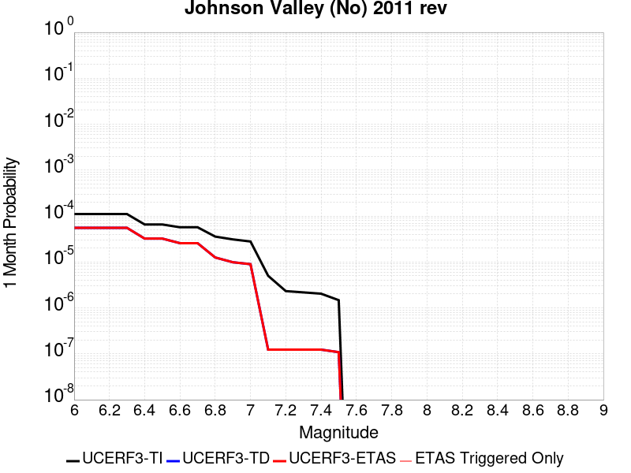 |  | 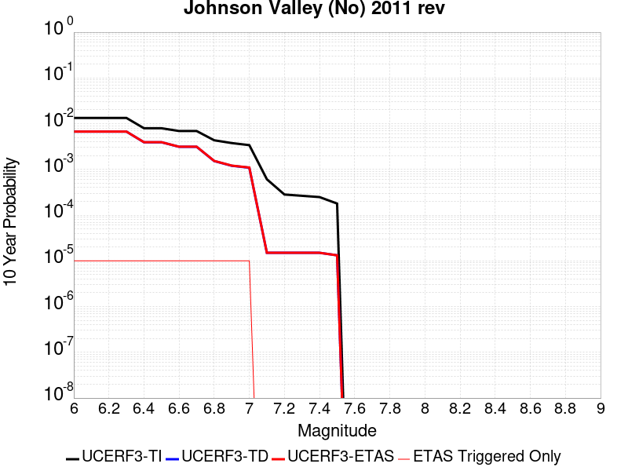 |

| Magnitude | 1 wk TI Prob | 1 wk TD Prob | 1 wk ETAS Prob | 1 wk ETAS/TD Gain | 1 wk ETAS Triggered Only | 1 mo TI Prob | 1 mo TD Prob | 1 mo ETAS Prob | 1 mo ETAS/TD Gain | 1 mo ETAS Triggered Only | 1 yr TI Prob | 1 yr TD Prob | 1 yr ETAS Prob | 1 yr ETAS/TD Gain | 1 yr ETAS Triggered Only | 10 yr TI Prob | 10 yr TD Prob | 10 yr ETAS Prob | 10 yr ETAS/TD Gain | 10 yr ETAS Triggered Only |
|-----|-----|-----|-----|-----|-----|-----|-----|-----|-----|-----|-----|-----|-----|-----|-----|-----|-----|-----|-----|-----|
| 6.0 | 2.577707E-5 | 1.2901208E-5 | 1.2901208E-5 | 1.0 | 0.0 | 1.1046848E-4 | 5.528994E-5 | 5.528994E-5 | 1.0 | 0.0 | 0.0013441239 | 6.729868E-4 | 6.729868E-4 | 1.0 | 0.0 | 0.013360229 | 0.006713397 | 0.00672333 | 1.0014795 | 1.0E-5 |
| 6.1 | 2.577707E-5 | 1.2901208E-5 | 1.2901208E-5 | 1.0 | 0.0 | 1.1046848E-4 | 5.528994E-5 | 5.528994E-5 | 1.0 | 0.0 | 0.0013441239 | 6.729868E-4 | 6.729868E-4 | 1.0 | 0.0 | 0.013360229 | 0.006713397 | 0.00672333 | 1.0014795 | 1.0E-5 |
| 6.2 | 2.577707E-5 | 1.2901208E-5 | 1.2901208E-5 | 1.0 | 0.0 | 1.1046848E-4 | 5.528994E-5 | 5.528994E-5 | 1.0 | 0.0 | 0.0013441239 | 6.729868E-4 | 6.729868E-4 | 1.0 | 0.0 | 0.013360229 | 0.006713397 | 0.00672333 | 1.0014795 | 1.0E-5 |
| 6.3 | 2.577707E-5 | 1.2901208E-5 | 1.2901208E-5 | 1.0 | 0.0 | 1.1046848E-4 | 5.528994E-5 | 5.528994E-5 | 1.0 | 0.0 | 0.0013441239 | 6.729868E-4 | 6.729868E-4 | 1.0 | 0.0 | 0.013360229 | 0.006713397 | 0.00672333 | 1.0014795 | 1.0E-5 |
| 6.4 | 1.5296591E-5 | 7.5369735E-6 | 7.5369735E-6 | 1.0 | 0.0 | 6.555518E-5 | 3.230102E-5 | 3.230102E-5 | 1.0 | 0.0 | 7.97842E-4 | 3.9321271E-4 | 3.9321271E-4 | 1.0 | 0.0 | 0.007949836 | 0.003927011 | 0.003936972 | 1.0025364 | 1.0E-5 |
| 6.5 | 1.5296591E-5 | 7.5369735E-6 | 7.5369735E-6 | 1.0 | 0.0 | 6.555518E-5 | 3.230102E-5 | 3.230102E-5 | 1.0 | 0.0 | 7.97842E-4 | 3.9321271E-4 | 3.9321271E-4 | 1.0 | 0.0 | 0.007949836 | 0.003927011 | 0.003936972 | 1.0025364 | 1.0E-5 |
| 6.6 | 1.3289383E-5 | 5.9919316E-6 | 5.9919316E-6 | 1.0 | 0.0 | 5.6953253E-5 | 2.567955E-5 | 2.567955E-5 | 1.0 | 0.0 | 6.9318525E-4 | 3.1262063E-4 | 3.1262063E-4 | 1.0 | 0.0 | 0.0069102696 | 0.0031234731 | 0.0031334418 | 1.0031916 | 1.0E-5 |
| 6.7 | 1.3289383E-5 | 5.9919316E-6 | 5.9919316E-6 | 1.0 | 0.0 | 5.6953253E-5 | 2.567955E-5 | 2.567955E-5 | 1.0 | 0.0 | 6.9318525E-4 | 3.1262063E-4 | 3.1262063E-4 | 1.0 | 0.0 | 0.0069102696 | 0.0031234731 | 0.0031334418 | 1.0031916 | 1.0E-5 |
| 6.8 | 8.330789E-6 | 2.9214577E-6 | 2.9214577E-6 | 1.0 | 0.0 | 3.570289E-5 | 1.2520505E-5 | 1.2520505E-5 | 1.0 | 0.0 | 4.34596E-4 | 1.524322E-4 | 1.524322E-4 | 1.0 | 0.0 | 0.0043374705 | 0.0015238364 | 0.0015338212 | 1.0065523 | 1.0E-5 |
| 6.9 | 7.2359003E-6 | 2.3014702E-6 | 2.3014702E-6 | 1.0 | 0.0 | 3.1010633E-5 | 9.863436E-6 | 9.863436E-6 | 1.0 | 0.0 | 3.7748902E-4 | 1.2008605E-4 | 1.2008605E-4 | 1.0 | 0.0 | 0.0037684843 | 0.0012007345 | 0.0012107225 | 1.0083182 | 1.0E-5 |
| 7.0 | 6.5149957E-6 | 2.0886398E-6 | 2.0886398E-6 | 1.0 | 0.0 | 2.792111E-5 | 8.951313E-6 | 8.951313E-6 | 1.0 | 0.0 | 3.398865E-4 | 1.0898209E-4 | 1.0898209E-4 | 1.0 | 0.0 | 0.003393671 | 0.0010898062 | 0.0010997953 | 1.009166 | 1.0E-5 |
| 7.1 | 1.1662233E-6 | 2.8793124E-8 | 2.8793124E-8 | 1.0 | 0.0 | 4.9980904E-6 | 1.2339909E-7 | 1.2339909E-7 | 1.0 | 0.0 | 6.0850052E-5 | 1.5023832E-6 | 1.5023832E-6 | 1.0 | 0.0 | 6.083339E-4 | 1.5023746E-5 | 1.5023746E-5 | 1.0 | 0.0 |
| 7.2 | 5.413881E-7 | 2.8793124E-8 | 2.8793124E-8 | 1.0 | 0.0 | 2.3202326E-6 | 1.2339909E-7 | 1.2339909E-7 | 1.0 | 0.0 | 2.8248465E-5 | 1.5023832E-6 | 1.5023832E-6 | 1.0 | 0.0 | 2.8244875E-4 | 1.5023746E-5 | 1.5023746E-5 | 1.0 | 0.0 |
| 7.3 | 5.076821E-7 | 2.8793124E-8 | 2.8793124E-8 | 1.0 | 0.0 | 2.1757785E-6 | 1.2339909E-7 | 1.2339909E-7 | 1.0 | 0.0 | 2.648978E-5 | 1.5023832E-6 | 1.5023832E-6 | 1.0 | 0.0 | 2.6486625E-4 | 1.5023746E-5 | 1.5023746E-5 | 1.0 | 0.0 |
| 7.4 | 4.7568687E-7 | 2.8775073E-8 | 2.8775073E-8 | 1.0 | 0.0 | 2.0386565E-6 | 1.2332174E-7 | 1.2332174E-7 | 1.0 | 0.0 | 2.482036E-5 | 1.5014413E-6 | 1.5014413E-6 | 1.0 | 0.0 | 2.4817587E-4 | 1.5014328E-5 | 1.5014328E-5 | 1.0 | 0.0 |
| 7.5 | 3.435626E-7 | 2.5350424E-8 | 2.5350424E-8 | 1.0 | 0.0 | 1.4724103E-6 | 1.0864467E-7 | 1.0864467E-7 | 1.0 | 0.0 | 1.7926448E-5 | 1.3227482E-6 | 1.3227482E-6 | 1.0 | 0.0 | 1.7925001E-4 | 1.3227419E-5 | 1.3227419E-5 | 1.0 | 0.0 |

## Morales (East)
*[(top)](#table-of-contents)*

| 1 Week | 1 Month | 1 Year | 10 Year |
|-----|-----|-----|-----|
|  |  | 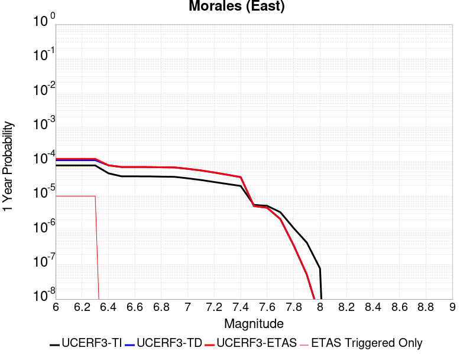 | 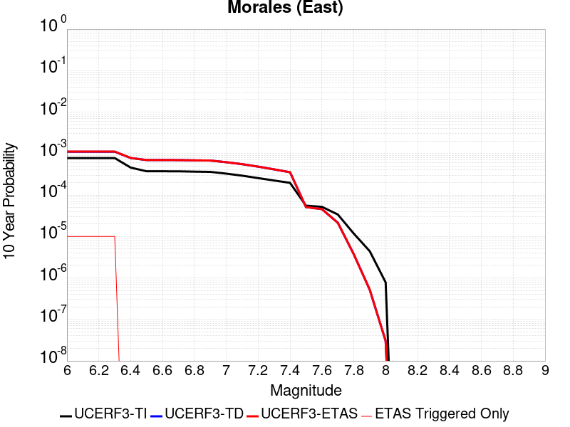 |

| Magnitude | 1 wk TI Prob | 1 wk TD Prob | 1 wk ETAS Prob | 1 wk ETAS/TD Gain | 1 wk ETAS Triggered Only | 1 mo TI Prob | 1 mo TD Prob | 1 mo ETAS Prob | 1 mo ETAS/TD Gain | 1 mo ETAS Triggered Only | 1 yr TI Prob | 1 yr TD Prob | 1 yr ETAS Prob | 1 yr ETAS/TD Gain | 1 yr ETAS Triggered Only | 10 yr TI Prob | 10 yr TD Prob | 10 yr ETAS Prob | 10 yr ETAS/TD Gain | 10 yr ETAS Triggered Only |
|-----|-----|-----|-----|-----|-----|-----|-----|-----|-----|-----|-----|-----|-----|-----|-----|-----|-----|-----|-----|-----|
| 6.0 | 1.4942771E-6 | 2.123544E-6 | 2.123544E-6 | 1.0 | 0.0 | 6.404029E-6 | 9.100874E-6 | 9.100874E-6 | 1.0 | 0.0 | 7.7966266E-5 | 1.1079809E-4 | 1.2079698E-4 | 1.0902443 | 1.0E-5 | 7.793892E-4 | 0.0011074883 | 0.0011174772 | 1.0090195 | 1.0E-5 |
| 6.1 | 1.4942771E-6 | 2.123544E-6 | 2.123544E-6 | 1.0 | 0.0 | 6.404029E-6 | 9.100874E-6 | 9.100874E-6 | 1.0 | 0.0 | 7.7966266E-5 | 1.1079809E-4 | 1.2079698E-4 | 1.0902443 | 1.0E-5 | 7.793892E-4 | 0.0011074883 | 0.0011174772 | 1.0090195 | 1.0E-5 |
| 6.2 | 1.4942771E-6 | 2.123544E-6 | 2.123544E-6 | 1.0 | 0.0 | 6.404029E-6 | 9.100874E-6 | 9.100874E-6 | 1.0 | 0.0 | 7.7966266E-5 | 1.1079809E-4 | 1.2079698E-4 | 1.0902443 | 1.0E-5 | 7.793892E-4 | 0.0011074883 | 0.0011174772 | 1.0090195 | 1.0E-5 |
| 6.3 | 1.4942771E-6 | 2.123544E-6 | 2.123544E-6 | 1.0 | 0.0 | 6.404029E-6 | 9.100874E-6 | 9.100874E-6 | 1.0 | 0.0 | 7.7966266E-5 | 1.1079809E-4 | 1.2079698E-4 | 1.0902443 | 1.0E-5 | 7.793892E-4 | 0.0011074883 | 0.0011174772 | 1.0090195 | 1.0E-5 |
| 6.4 | 8.798845E-7 | 1.5023381E-6 | 1.5023381E-6 | 1.0 | 0.0 | 3.7709283E-6 | 6.4385767E-6 | 6.4385767E-6 | 1.0 | 0.0 | 4.5910085E-5 | 7.838696E-5 | 7.838696E-5 | 1.0 | 0.0 | 4.59006E-4 | 7.836066E-4 | 7.836066E-4 | 1.0 | 0.0 |
| 6.5 | 7.1751725E-7 | 1.3384879E-6 | 1.3384879E-6 | 1.0 | 0.0 | 3.0750705E-6 | 5.7363645E-6 | 5.7363645E-6 | 1.0 | 0.0 | 3.7438338E-5 | 6.9838075E-5 | 6.9838075E-5 | 1.0 | 0.0 | 3.743203E-4 | 6.981715E-4 | 6.981715E-4 | 1.0 | 0.0 |
| 6.6 | 7.1751725E-7 | 1.3384879E-6 | 1.3384879E-6 | 1.0 | 0.0 | 3.0750705E-6 | 5.7363645E-6 | 5.7363645E-6 | 1.0 | 0.0 | 3.7438338E-5 | 6.9838075E-5 | 6.9838075E-5 | 1.0 | 0.0 | 3.743203E-4 | 6.981715E-4 | 6.981715E-4 | 1.0 | 0.0 |
| 6.7 | 7.159057E-7 | 1.3359539E-6 | 1.3359539E-6 | 1.0 | 0.0 | 3.0681638E-6 | 5.7255043E-6 | 5.7255043E-6 | 1.0 | 0.0 | 3.7354253E-5 | 6.9705864E-5 | 6.9705864E-5 | 1.0 | 0.0 | 3.7347974E-4 | 6.968502E-4 | 6.968502E-4 | 1.0 | 0.0 |
| 6.8 | 7.032203E-7 | 1.3175089E-6 | 1.3175089E-6 | 1.0 | 0.0 | 3.0137978E-6 | 5.646455E-6 | 5.646455E-6 | 1.0 | 0.0 | 3.669237E-5 | 6.87435E-5 | 6.87435E-5 | 1.0 | 0.0 | 3.6686313E-4 | 6.872325E-4 | 6.872325E-4 | 1.0 | 0.0 |
| 6.9 | 6.941549E-7 | 1.3025701E-6 | 1.3025701E-6 | 1.0 | 0.0 | 2.974946E-6 | 5.5824316E-6 | 5.5824316E-6 | 1.0 | 0.0 | 3.6219368E-5 | 6.7964065E-5 | 6.7964065E-5 | 1.0 | 0.0 | 3.6213463E-4 | 6.794429E-4 | 6.794429E-4 | 1.0 | 0.0 |
| 7.0 | 6.2932247E-7 | 1.1877994E-6 | 1.1877994E-6 | 1.0 | 0.0 | 2.6970936E-6 | 5.090559E-6 | 5.090559E-6 | 1.0 | 0.0 | 3.283662E-5 | 6.197586E-5 | 6.197586E-5 | 1.0 | 0.0 | 3.283177E-4 | 6.1959465E-4 | 6.1959465E-4 | 1.0 | 0.0 |
| 7.1 | 5.6200963E-7 | 1.064093E-6 | 1.064093E-6 | 1.0 | 0.0 | 2.4086105E-6 | 4.560391E-6 | 4.560391E-6 | 1.0 | 0.0 | 2.9324437E-5 | 5.5521392E-5 | 5.5521392E-5 | 1.0 | 0.0 | 2.9320567E-4 | 5.5508246E-4 | 5.5508246E-4 | 1.0 | 0.0 |
| 7.2 | 4.91044E-7 | 9.2862194E-7 | 9.2862194E-7 | 1.0 | 0.0 | 2.1044725E-6 | 3.9798024E-6 | 3.9798024E-6 | 1.0 | 0.0 | 2.5621652E-5 | 4.8453054E-5 | 4.8453054E-5 | 1.0 | 0.0 | 2.56187E-4 | 4.8443122E-4 | 4.8443122E-4 | 1.0 | 0.0 |
| 7.3 | 4.2978448E-7 | 7.974413E-7 | 7.974413E-7 | 1.0 | 0.0 | 1.8419321E-6 | 3.4176012E-6 | 3.4176012E-6 | 1.0 | 0.0 | 2.2425293E-5 | 4.160853E-5 | 4.160853E-5 | 1.0 | 0.0 | 2.242303E-4 | 4.1601306E-4 | 4.1601306E-4 | 1.0 | 0.0 |
| 7.4 | 3.774317E-7 | 6.807105E-7 | 6.807105E-7 | 1.0 | 0.0 | 1.6175634E-6 | 2.9173275E-6 | 2.9173275E-6 | 1.0 | 0.0 | 1.9693656E-5 | 3.551791E-5 | 3.551791E-5 | 1.0 | 0.0 | 1.969191E-4 | 3.5512767E-4 | 3.5512767E-4 | 1.0 | 0.0 |
| 7.5 | 1.0603232E-7 | 9.8406424E-8 | 9.8406424E-8 | 1.0 | 0.0 | 4.5442414E-7 | 4.2174173E-7 | 4.2174173E-7 | 1.0 | 0.0 | 5.5326E-6 | 5.1346938E-6 | 5.1346938E-6 | 1.0 | 0.0 | 5.532462E-5 | 5.1348336E-5 | 5.1348336E-5 | 1.0 | 0.0 |
| 7.6 | 9.960384E-8 | 8.755028E-8 | 8.755028E-8 | 1.0 | 0.0 | 4.2687353E-7 | 3.7521542E-7 | 3.7521542E-7 | 1.0 | 0.0 | 5.197173E-6 | 4.568238E-6 | 4.568238E-6 | 1.0 | 0.0 | 5.1970514E-5 | 4.5684028E-5 | 4.5684028E-5 | 1.0 | 0.0 |
| 7.7 | 6.499468E-8 | 4.103351E-8 | 4.103351E-8 | 1.0 | 0.0 | 2.785486E-7 | 1.7585788E-7 | 1.7585788E-7 | 1.0 | 0.0 | 3.3913238E-6 | 2.1410676E-6 | 2.1410676E-6 | 1.0 | 0.0 | 3.3912722E-5 | 2.1413045E-5 | 2.1413045E-5 | 1.0 | 0.0 |
| 7.8 | 2.2517119E-8 | 7.1293824E-9 | 7.1293824E-9 | 1.0 | 0.0 | 9.6501935E-8 | 3.0554492E-8 | 3.0554492E-8 | 1.0 | 0.0 | 1.1749105E-6 | 3.720009E-7 | 3.720009E-7 | 1.0 | 0.0 | 1.1749043E-5 | 3.7225666E-6 | 3.7225666E-6 | 1.0 | 0.0 |
| 7.9 | 8.493023E-9 | 9.962774E-10 | 9.962774E-10 | 1.0 | 0.0 | 3.639867E-8 | 4.2697574E-9 | 4.2697574E-9 | 1.0 | 0.0 | 4.4315374E-7 | 5.19843E-8 | 5.19843E-8 | 1.0 | 0.0 | 4.4315284E-6 | 5.2196486E-7 | 5.2196486E-7 | 1.0 | 0.0 |
| 8.0 | 1.4971842E-9 | 5.5340177E-11 | 5.5340177E-11 | 1.0 | 0.0 | 6.4165038E-9 | 2.3717173E-10 | 2.3717173E-10 | 1.0 | 0.0 | 7.812093E-8 | 2.887568E-9 | 2.887568E-9 | 1.0 | 0.0 | 7.81209E-7 | 3.0142694E-8 | 3.0142694E-8 | 1.0 | 0.0 |

## North Frontal  (East)
*[(top)](#table-of-contents)*

| 1 Week | 1 Month | 1 Year | 10 Year |
|-----|-----|-----|-----|
| 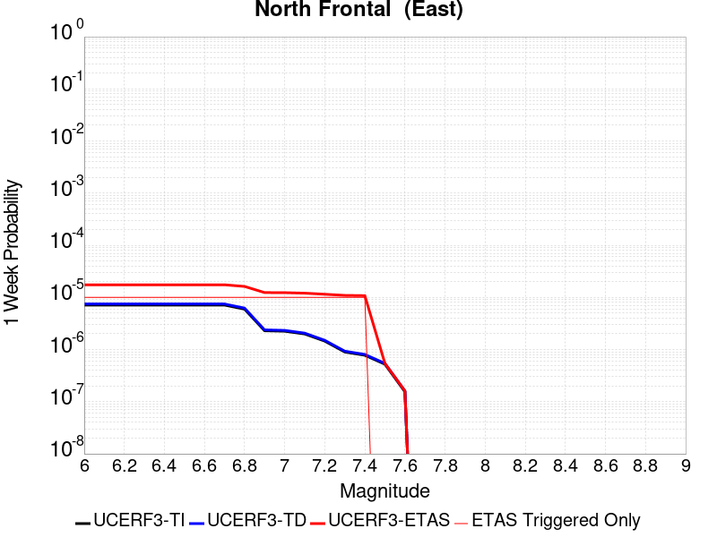 | 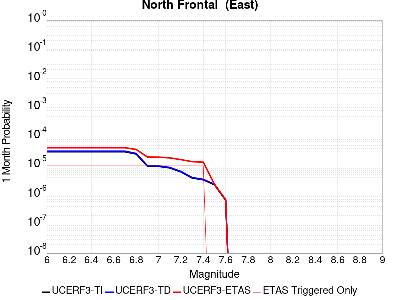 | 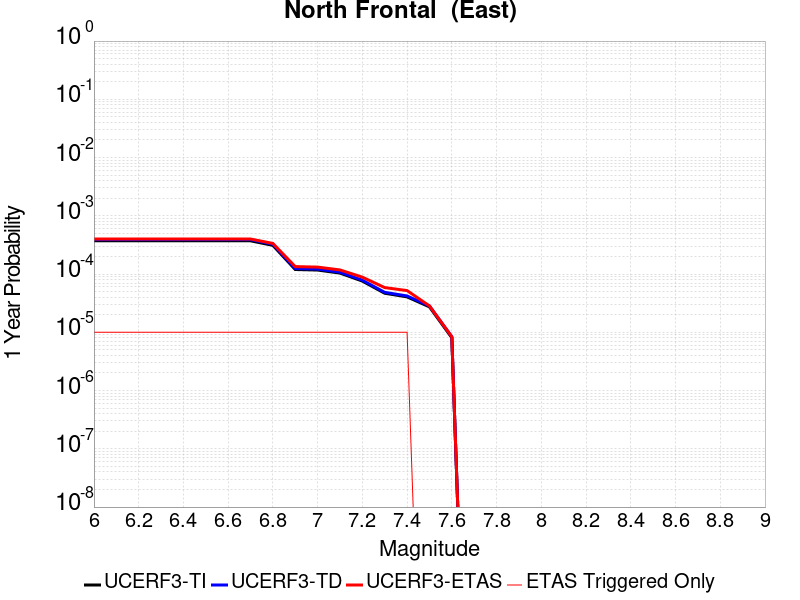 | 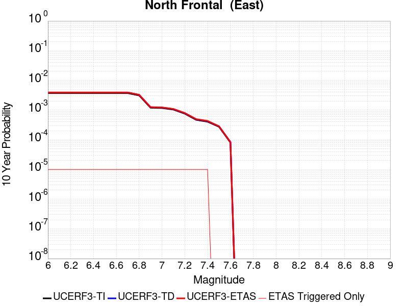 |

| Magnitude | 1 wk TI Prob | 1 wk TD Prob | 1 wk ETAS Prob | 1 wk ETAS/TD Gain | 1 wk ETAS Triggered Only | 1 mo TI Prob | 1 mo TD Prob | 1 mo ETAS Prob | 1 mo ETAS/TD Gain | 1 mo ETAS Triggered Only | 1 yr TI Prob | 1 yr TD Prob | 1 yr ETAS Prob | 1 yr ETAS/TD Gain | 1 yr ETAS Triggered Only | 10 yr TI Prob | 10 yr TD Prob | 10 yr ETAS Prob | 10 yr ETAS/TD Gain | 10 yr ETAS Triggered Only |
|-----|-----|-----|-----|-----|-----|-----|-----|-----|-----|-----|-----|-----|-----|-----|-----|-----|-----|-----|-----|-----|
| 6.0 | 7.135738E-6 | 7.4771765E-6 | 1.7477101E-5 | 2.3373933 | 1.0E-5 | 3.0581377E-5 | 3.204476E-5 | 4.204444E-5 | 1.3120534 | 1.0E-5 | 3.7226462E-4 | 3.9009505E-4 | 4.0009117E-4 | 1.0256248 | 1.0E-5 | 0.0037164164 | 0.0038960609 | 0.0039060218 | 1.0025567 | 1.0E-5 |
| 6.1 | 7.135738E-6 | 7.4771765E-6 | 1.7477101E-5 | 2.3373933 | 1.0E-5 | 3.0581377E-5 | 3.204476E-5 | 4.204444E-5 | 1.3120534 | 1.0E-5 | 3.7226462E-4 | 3.9009505E-4 | 4.0009117E-4 | 1.0256248 | 1.0E-5 | 0.0037164164 | 0.0038960609 | 0.0039060218 | 1.0025567 | 1.0E-5 |
| 6.2 | 7.135738E-6 | 7.4771765E-6 | 1.7477101E-5 | 2.3373933 | 1.0E-5 | 3.0581377E-5 | 3.204476E-5 | 4.204444E-5 | 1.3120534 | 1.0E-5 | 3.7226462E-4 | 3.9009505E-4 | 4.0009117E-4 | 1.0256248 | 1.0E-5 | 0.0037164164 | 0.0038960609 | 0.0039060218 | 1.0025567 | 1.0E-5 |
| 6.3 | 7.135738E-6 | 7.4771765E-6 | 1.7477101E-5 | 2.3373933 | 1.0E-5 | 3.0581377E-5 | 3.204476E-5 | 4.204444E-5 | 1.3120534 | 1.0E-5 | 3.7226462E-4 | 3.9009505E-4 | 4.0009117E-4 | 1.0256248 | 1.0E-5 | 0.0037164164 | 0.0038960609 | 0.0039060218 | 1.0025567 | 1.0E-5 |
| 6.4 | 7.135738E-6 | 7.4771765E-6 | 1.7477101E-5 | 2.3373933 | 1.0E-5 | 3.0581377E-5 | 3.204476E-5 | 4.204444E-5 | 1.3120534 | 1.0E-5 | 3.7226462E-4 | 3.9009505E-4 | 4.0009117E-4 | 1.0256248 | 1.0E-5 | 0.0037164164 | 0.0038960609 | 0.0039060218 | 1.0025567 | 1.0E-5 |
| 6.5 | 7.135738E-6 | 7.4771765E-6 | 1.7477101E-5 | 2.3373933 | 1.0E-5 | 3.0581377E-5 | 3.204476E-5 | 4.204444E-5 | 1.3120534 | 1.0E-5 | 3.7226462E-4 | 3.9009505E-4 | 4.0009117E-4 | 1.0256248 | 1.0E-5 | 0.0037164164 | 0.0038960609 | 0.0039060218 | 1.0025567 | 1.0E-5 |
| 6.6 | 7.135738E-6 | 7.4771765E-6 | 1.7477101E-5 | 2.3373933 | 1.0E-5 | 3.0581377E-5 | 3.204476E-5 | 4.204444E-5 | 1.3120534 | 1.0E-5 | 3.7226462E-4 | 3.9009505E-4 | 4.0009117E-4 | 1.0256248 | 1.0E-5 | 0.0037164164 | 0.0038960609 | 0.0039060218 | 1.0025567 | 1.0E-5 |
| 6.7 | 7.135738E-6 | 7.4771765E-6 | 1.7477101E-5 | 2.3373933 | 1.0E-5 | 3.0581377E-5 | 3.204476E-5 | 4.204444E-5 | 1.3120534 | 1.0E-5 | 3.7226462E-4 | 3.9009505E-4 | 4.0009117E-4 | 1.0256248 | 1.0E-5 | 0.0037164164 | 0.0038960609 | 0.0039060218 | 1.0025567 | 1.0E-5 |
| 6.8 | 5.959142E-6 | 6.236683E-6 | 1.623662E-5 | 2.6034064 | 1.0E-5 | 2.553893E-5 | 2.6728469E-5 | 3.67282E-5 | 1.374123 | 1.0E-5 | 3.108921E-4 | 3.253886E-4 | 3.3538532E-4 | 1.0307225 | 1.0E-5 | 0.0031045752 | 0.0032508948 | 0.0032608623 | 1.0030661 | 1.0E-5 |
| 6.9 | 2.2946929E-6 | 2.3824605E-6 | 1.2382437E-5 | 5.1973314 | 1.0E-5 | 9.834361E-6 | 1.0210508E-5 | 2.0210406E-5 | 1.9793732 | 1.0E-5 | 1.1972676E-4 | 1.2430632E-4 | 1.3430507E-4 | 1.0804365 | 1.0E-5 | 0.0011966228 | 0.0012424142 | 0.0012524019 | 1.0080389 | 1.0E-5 |
| 7.0 | 2.2468673E-6 | 2.3321538E-6 | 1.2332131E-5 | 5.287872 | 1.0E-5 | 9.629396E-6 | 9.994909E-6 | 1.999481E-5 | 2.0004992 | 1.0E-5 | 1.1723159E-4 | 1.21681696E-4 | 1.3168047E-4 | 1.0821717 | 1.0E-5 | 0.0011716976 | 0.0012161969 | 0.0012261848 | 1.0082123 | 1.0E-5 |
| 7.1 | 1.9921076E-6 | 2.0646032E-6 | 1.2064583E-5 | 5.843536 | 1.0E-5 | 8.537577E-6 | 8.848272E-6 | 1.8848183E-5 | 2.1301541 | 1.0E-5 | 1.0394004E-4 | 1.0772282E-4 | 1.1772174E-4 | 1.0928209 | 1.0E-5 | 0.0010389143 | 0.0010767487 | 0.001086738 | 1.0092772 | 1.0E-5 |
| 7.2 | 1.4524545E-6 | 1.5045148E-6 | 1.15044995E-5 | 7.6466513 | 1.0E-5 | 6.2247905E-6 | 6.447906E-6 | 1.6447842E-5 | 2.5508811 | 1.0E-5 | 7.5784184E-5 | 7.850068E-5 | 8.849989E-5 | 1.1273774 | 1.0E-5 | 7.575835E-4 | 7.8475394E-4 | 7.947461E-4 | 1.0127329 | 1.0E-5 |
| 7.3 | 8.9802575E-7 | 9.3087283E-7 | 1.0930864E-5 | 11.742597 | 1.0E-5 | 3.848676E-6 | 3.9894494E-6 | 1.3989409E-5 | 3.5066016 | 1.0E-5 | 4.685662E-5 | 4.857058E-5 | 5.8570095E-5 | 1.205876 | 1.0E-5 | 4.6846745E-4 | 4.8561094E-4 | 4.956061E-4 | 1.0205827 | 1.0E-5 |
| 7.4 | 7.776139E-7 | 8.0604747E-7 | 1.0806039E-5 | 13.406207 | 1.0E-5 | 3.3326266E-6 | 3.4544853E-6 | 1.3454451E-5 | 3.8947773 | 1.0E-5 | 4.0573974E-5 | 4.2057654E-5 | 5.2057236E-5 | 1.2377589 | 1.0E-5 | 4.0566566E-4 | 4.205077E-4 | 4.305035E-4 | 1.0237708 | 1.0E-5 |
| 7.5 | 5.244417E-7 | 5.441219E-7 | 5.441219E-7 | 1.0 | 0.0 | 2.2476054E-6 | 2.3319494E-6 | 2.3319494E-6 | 1.0 | 0.0 | 2.7364253E-5 | 2.839118E-5 | 2.839118E-5 | 1.0 | 0.0 | 2.7360884E-4 | 2.8388205E-4 | 2.8388205E-4 | 1.0 | 0.0 |
| 7.6 | 1.5489647E-7 | 1.6089504E-7 | 1.6089504E-7 | 1.0 | 0.0 | 6.6384183E-7 | 6.895501E-7 | 6.895501E-7 | 1.0 | 0.0 | 8.082245E-6 | 8.395261E-6 | 8.395261E-6 | 1.0 | 0.0 | 8.08195E-5 | 8.395143E-5 | 8.395143E-5 | 1.0 | 0.0 |

## Elsinore (Coyote Mountains)
*[(top)](#table-of-contents)*

| 1 Week | 1 Month | 1 Year | 10 Year |
|-----|-----|-----|-----|
| 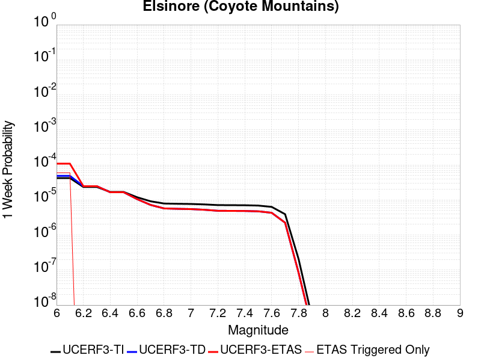 | 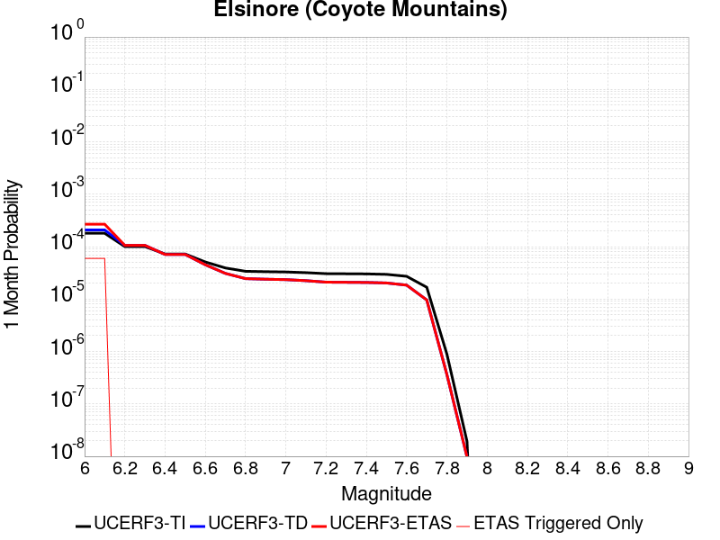 | 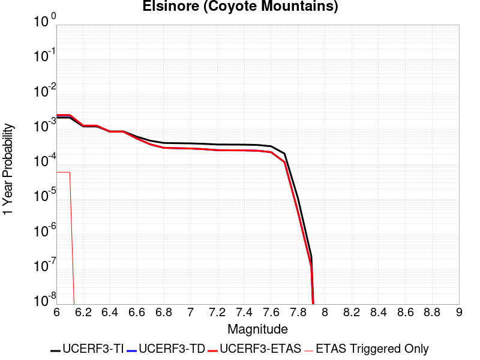 | 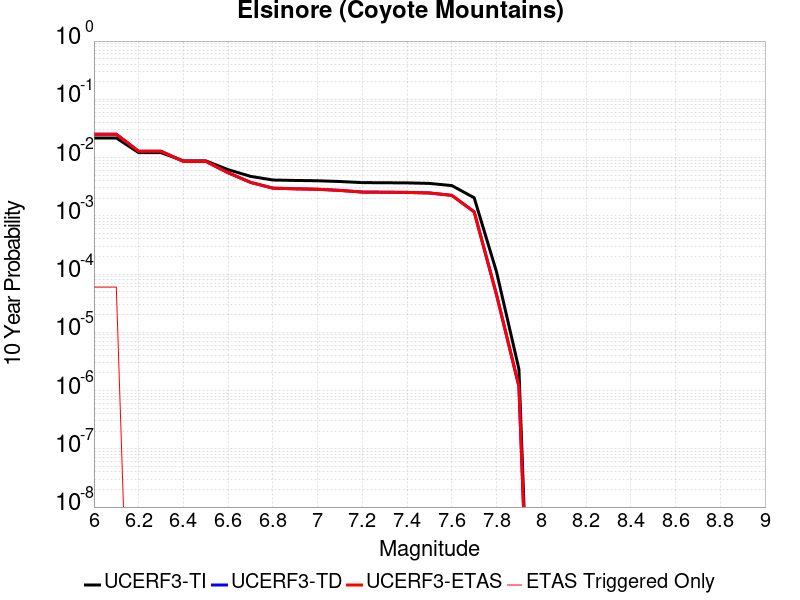 |

| Magnitude | 1 wk TI Prob | 1 wk TD Prob | 1 wk ETAS Prob | 1 wk ETAS/TD Gain | 1 wk ETAS Triggered Only | 1 mo TI Prob | 1 mo TD Prob | 1 mo ETAS Prob | 1 mo ETAS/TD Gain | 1 mo ETAS Triggered Only | 1 yr TI Prob | 1 yr TD Prob | 1 yr ETAS Prob | 1 yr ETAS/TD Gain | 1 yr ETAS Triggered Only | 10 yr TI Prob | 10 yr TD Prob | 10 yr ETAS Prob | 10 yr ETAS/TD Gain | 10 yr ETAS Triggered Only |
|-----|-----|-----|-----|-----|-----|-----|-----|-----|-----|-----|-----|-----|-----|-----|-----|-----|-----|-----|-----|-----|
| 6.0 | 4.20513E-5 | 4.8630944E-5 | 5.8630456E-5 | 1.2056204 | 1.0E-5 | 1.8020741E-4 | 2.0840492E-4 | 2.1840284E-4 | 1.0479735 | 1.0E-5 | 0.0021918174 | 0.0025349057 | 0.0025448804 | 1.0039349 | 1.0E-5 | 0.021703249 | 0.025111204 | 0.025120951 | 1.0003883 | 1.0E-5 |
| 6.1 | 4.20513E-5 | 4.8630944E-5 | 5.8630456E-5 | 1.2056204 | 1.0E-5 | 1.8020741E-4 | 2.0840492E-4 | 2.1840284E-4 | 1.0479735 | 1.0E-5 | 0.0021918174 | 0.0025349057 | 0.0025448804 | 1.0039349 | 1.0E-5 | 0.021703249 | 0.025111204 | 0.025120951 | 1.0003883 | 1.0E-5 |
| 6.2 | 2.3413893E-5 | 2.4695422E-5 | 2.4695422E-5 | 1.0 | 0.0 | 1.0034139E-4 | 1.0583377E-4 | 1.0583377E-4 | 1.0 | 0.0 | 0.0012209718 | 0.0012878523 | 0.0012878523 | 1.0 | 0.0 | 0.012142851 | 0.012812569 | 0.012812569 | 1.0 | 0.0 |
| 6.3 | 2.3413893E-5 | 2.4695422E-5 | 2.4695422E-5 | 1.0 | 0.0 | 1.0034139E-4 | 1.0583377E-4 | 1.0583377E-4 | 1.0 | 0.0 | 0.0012209718 | 0.0012878523 | 0.0012878523 | 1.0 | 0.0 | 0.012142851 | 0.012812569 | 0.012812569 | 1.0 | 0.0 |
| 6.4 | 1.6894814E-5 | 1.6568214E-5 | 1.6568214E-5 | 1.0 | 0.0 | 7.240433E-5 | 7.100491E-5 | 7.100491E-5 | 1.0 | 0.0 | 8.811662E-4 | 8.641788E-4 | 8.641788E-4 | 1.0 | 0.0 | 0.0087768035 | 0.008611842 | 0.008611842 | 1.0 | 0.0 |
| 6.5 | 1.6894814E-5 | 1.6568214E-5 | 1.6568214E-5 | 1.0 | 0.0 | 7.240433E-5 | 7.100491E-5 | 7.100491E-5 | 1.0 | 0.0 | 8.811662E-4 | 8.641788E-4 | 8.641788E-4 | 1.0 | 0.0 | 0.0087768035 | 0.008611842 | 0.008611842 | 1.0 | 0.0 |
| 6.6 | 1.1910969E-5 | 1.0530538E-5 | 1.0530538E-5 | 1.0 | 0.0 | 5.1046012E-5 | 4.513017E-5 | 4.513017E-5 | 1.0 | 0.0 | 6.21308E-4 | 5.493346E-4 | 5.493346E-4 | 1.0 | 0.0 | 0.0061957375 | 0.0054810685 | 0.0054810685 | 1.0 | 0.0 |
| 6.7 | 9.1486E-6 | 7.2026473E-6 | 7.2026473E-6 | 1.0 | 0.0 | 3.9207694E-5 | 3.0868145E-5 | 3.0868145E-5 | 1.0 | 0.0 | 4.7724912E-4 | 3.7575865E-4 | 3.7575865E-4 | 1.0 | 0.0 | 0.0047622547 | 0.0037516125 | 0.0037516125 | 1.0 | 0.0 |
| 6.8 | 7.90441E-6 | 5.7288153E-6 | 5.7288153E-6 | 1.0 | 0.0 | 3.3875604E-5 | 2.4551842E-5 | 2.4551842E-5 | 1.0 | 0.0 | 4.1235742E-4 | 2.9887896E-4 | 2.9887896E-4 | 1.0 | 0.0 | 0.0041159308 | 0.0029848986 | 0.0029848986 | 1.0 | 0.0 |
| 6.9 | 7.77015E-6 | 5.5827695E-6 | 5.5827695E-6 | 1.0 | 0.0 | 3.3300217E-5 | 2.3925944E-5 | 2.3925944E-5 | 1.0 | 0.0 | 4.0535472E-4 | 2.912607E-4 | 2.912607E-4 | 1.0 | 0.0 | 0.004046161 | 0.0029089167 | 0.0029089167 | 1.0 | 0.0 |
| 7.0 | 7.675798E-6 | 5.4796283E-6 | 5.4796283E-6 | 1.0 | 0.0 | 3.289586E-5 | 2.3483917E-5 | 2.3483917E-5 | 1.0 | 0.0 | 4.004335E-4 | 2.8588044E-4 | 2.8588044E-4 | 1.0 | 0.0 | 0.003997127 | 0.0028552532 | 0.0028552532 | 1.0 | 0.0 |
| 7.1 | 7.447814E-6 | 5.2385003E-6 | 5.2385003E-6 | 1.0 | 0.0 | 3.191881E-5 | 2.245053E-5 | 2.245053E-5 | 1.0 | 0.0 | 3.8854225E-4 | 2.7330214E-4 | 2.7330214E-4 | 1.0 | 0.0 | 0.003878636 | 0.0027297847 | 0.0027297847 | 1.0 | 0.0 |
| 7.2 | 7.128185E-6 | 4.905146E-6 | 4.905146E-6 | 1.0 | 0.0 | 3.0549007E-5 | 2.1021891E-5 | 2.1021891E-5 | 1.0 | 0.0 | 3.7187067E-4 | 2.5591266E-4 | 2.5591266E-4 | 1.0 | 0.0 | 0.00371249 | 0.002556298 | 0.002556298 | 1.0 | 0.0 |
| 7.3 | 7.0913875E-6 | 4.873821E-6 | 4.873821E-6 | 1.0 | 0.0 | 3.0391306E-5 | 2.0887644E-5 | 2.0887644E-5 | 1.0 | 0.0 | 3.6995133E-4 | 2.542786E-4 | 2.542786E-4 | 1.0 | 0.0 | 0.0036933604 | 0.0025399947 | 0.0025399947 | 1.0 | 0.0 |
| 7.4 | 7.051521E-6 | 4.837673E-6 | 4.837673E-6 | 1.0 | 0.0 | 3.0220453E-5 | 2.0732725E-5 | 2.0732725E-5 | 1.0 | 0.0 | 3.6787192E-4 | 2.5239287E-4 | 2.5239287E-4 | 1.0 | 0.0 | 0.0036726352 | 0.0025211805 | 0.0025211805 | 1.0 | 0.0 |
| 7.5 | 6.910666E-6 | 4.7332255E-6 | 4.7332255E-6 | 1.0 | 0.0 | 2.9616802E-5 | 2.02851E-5 | 2.02851E-5 | 1.0 | 0.0 | 3.605249E-4 | 2.4694428E-4 | 2.4694428E-4 | 1.0 | 0.0 | 0.0035994058 | 0.002466817 | 0.002466817 | 1.0 | 0.0 |
| 7.6 | 6.341753E-6 | 4.306345E-6 | 4.306345E-6 | 1.0 | 0.0 | 2.7178658E-5 | 1.8455641E-5 | 1.8455641E-5 | 1.0 | 0.0 | 3.3084993E-4 | 2.2467543E-4 | 2.2467543E-4 | 1.0 | 0.0 | 0.0033035777 | 0.002244598 | 0.002244598 | 1.0 | 0.0 |
| 7.7 | 3.9205916E-6 | 2.2437468E-6 | 2.2437468E-6 | 1.0 | 0.0 | 1.6802427E-5 | 9.616027E-6 | 9.616027E-6 | 1.0 | 0.0 | 2.0455034E-4 | 1.17069576E-4 | 1.17069576E-4 | 1.0 | 0.0 | 0.0020436216 | 0.001170152 | 0.001170152 | 1.0 | 0.0 |
| 7.8 | 2.0846227E-7 | 8.4853966E-8 | 8.4853966E-8 | 1.0 | 0.0 | 8.9340944E-7 | 3.6365984E-7 | 3.6365984E-7 | 1.0 | 0.0 | 1.0877206E-5 | 4.427553E-6 | 4.427553E-6 | 1.0 | 0.0 | 1.0876673E-4 | 4.4274973E-5 | 4.4274973E-5 | 1.0 | 0.0 |
| 7.9 | 4.4969806E-9 | 2.269088E-9 | 2.269088E-9 | 1.0 | 0.0 | 1.9272775E-8 | 9.724664E-9 | 9.724664E-9 | 1.0 | 0.0 | 2.3464601E-7 | 1.1839777E-7 | 1.1839777E-7 | 1.0 | 0.0 | 2.3464577E-6 | 1.1839772E-6 | 1.1839772E-6 | 1.0 | 0.0 |

## San Gregorio (North) 2011 CFM
*[(top)](#table-of-contents)*

| 1 Week | 1 Month | 1 Year | 10 Year |
|-----|-----|-----|-----|
| 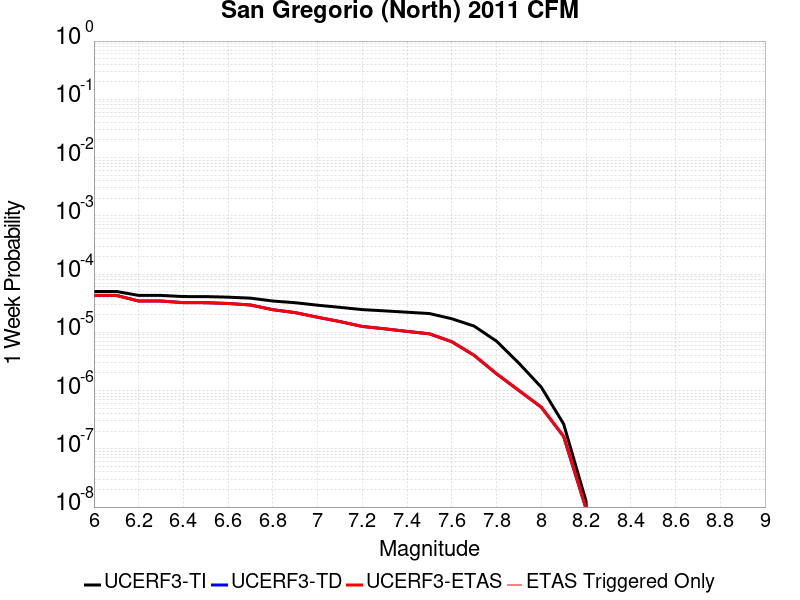 |  | 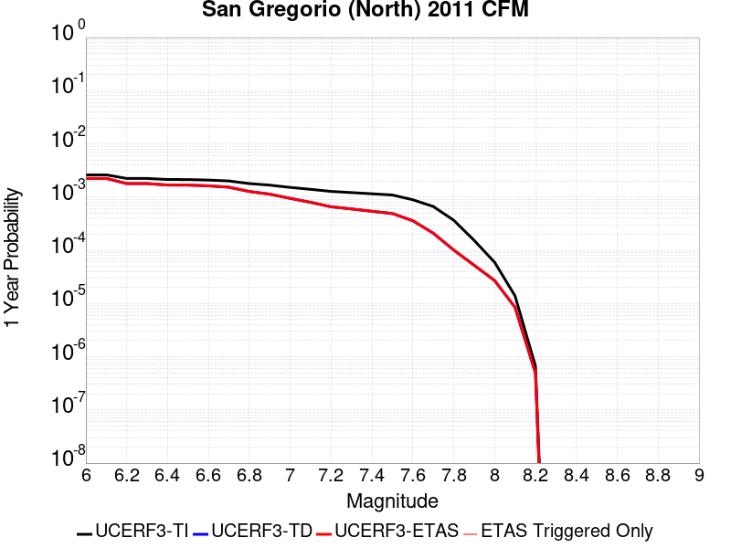 | 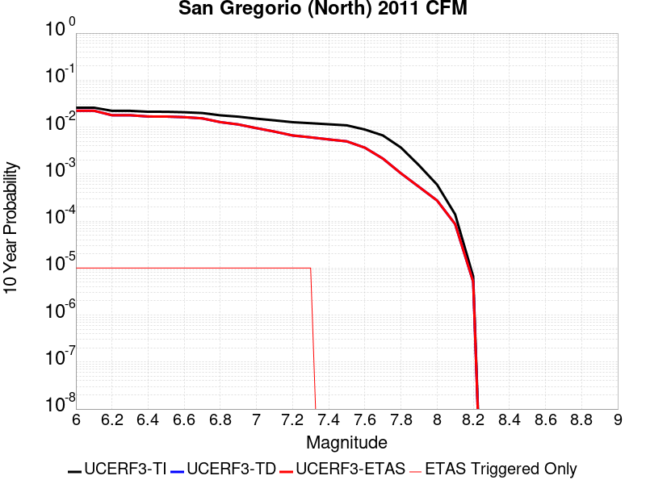 |

| Magnitude | 1 wk TI Prob | 1 wk TD Prob | 1 wk ETAS Prob | 1 wk ETAS/TD Gain | 1 wk ETAS Triggered Only | 1 mo TI Prob | 1 mo TD Prob | 1 mo ETAS Prob | 1 mo ETAS/TD Gain | 1 mo ETAS Triggered Only | 1 yr TI Prob | 1 yr TD Prob | 1 yr ETAS Prob | 1 yr ETAS/TD Gain | 1 yr ETAS Triggered Only | 10 yr TI Prob | 10 yr TD Prob | 10 yr ETAS Prob | 10 yr ETAS/TD Gain | 10 yr ETAS Triggered Only |
|-----|-----|-----|-----|-----|-----|-----|-----|-----|-----|-----|-----|-----|-----|-----|-----|-----|-----|-----|-----|-----|
| 6.0 | 5.0283932E-5 | 4.3057098E-5 | 4.3057098E-5 | 1.0 | 0.0 | 2.1548476E-4 | 1.8451746E-4 | 1.8451746E-4 | 1.0 | 0.0 | 0.0026203706 | 0.002244199 | 0.002244199 | 1.0 | 0.0 | 0.02589687 | 0.022295918 | 0.022305695 | 1.0004386 | 1.0E-5 |
| 6.1 | 5.0283932E-5 | 4.3057098E-5 | 4.3057098E-5 | 1.0 | 0.0 | 2.1548476E-4 | 1.8451746E-4 | 1.8451746E-4 | 1.0 | 0.0 | 0.0026203706 | 0.002244199 | 0.002244199 | 1.0 | 0.0 | 0.02589687 | 0.022295918 | 0.022305695 | 1.0004386 | 1.0E-5 |
| 6.2 | 4.2998647E-5 | 3.4440873E-5 | 3.4440873E-5 | 1.0 | 0.0 | 1.842669E-4 | 1.4759546E-4 | 1.4759546E-4 | 1.0 | 0.0 | 0.0022411412 | 0.001795506 | 0.001795506 | 1.0 | 0.0 | 0.022186736 | 0.017884884 | 0.017894706 | 1.0005491 | 1.0E-5 |
| 6.3 | 4.2998647E-5 | 3.4440873E-5 | 3.4440873E-5 | 1.0 | 0.0 | 1.842669E-4 | 1.4759546E-4 | 1.4759546E-4 | 1.0 | 0.0 | 0.0022411412 | 0.001795506 | 0.001795506 | 1.0 | 0.0 | 0.022186736 | 0.017884884 | 0.017894706 | 1.0005491 | 1.0E-5 |
| 6.4 | 4.1101295E-5 | 3.2326076E-5 | 3.2326076E-5 | 1.0 | 0.0 | 1.7613651E-4 | 1.3853304E-4 | 1.3853304E-4 | 1.0 | 0.0 | 0.0021423528 | 0.0016853481 | 0.0016853481 | 1.0 | 0.0 | 0.02121817 | 0.016800618 | 0.01681045 | 1.0005852 | 1.0E-5 |
| 6.5 | 4.1032585E-5 | 3.224411E-5 | 3.224411E-5 | 1.0 | 0.0 | 1.7584208E-4 | 1.381818E-4 | 1.381818E-4 | 1.0 | 0.0 | 0.0021387753 | 0.0016810785 | 0.0016810785 | 1.0 | 0.0 | 0.021183075 | 0.01675857 | 0.016768403 | 1.0005867 | 1.0E-5 |
| 6.6 | 4.011629E-5 | 3.1265718E-5 | 3.1265718E-5 | 1.0 | 0.0 | 1.7191563E-4 | 1.3398913E-4 | 1.3398913E-4 | 1.0 | 0.0 | 0.0020910634 | 0.0016301107 | 0.0016301107 | 1.0 | 0.0 | 0.020714961 | 0.016257357 | 0.016267195 | 1.0006051 | 1.0E-5 |
| 6.7 | 3.8583938E-5 | 2.9452754E-5 | 2.9452754E-5 | 1.0 | 0.0 | 1.6534925E-4 | 1.2622007E-4 | 1.2622007E-4 | 1.0 | 0.0 | 0.0020112682 | 0.0015356604 | 0.0015356604 | 1.0 | 0.0 | 0.019931622 | 0.015326062 | 0.015335909 | 1.0006425 | 1.0E-5 |
| 6.8 | 3.44341E-5 | 2.4450024E-5 | 2.4450024E-5 | 1.0 | 0.0 | 1.4756636E-4 | 1.0478167E-4 | 1.0478167E-4 | 1.0 | 0.0 | 0.0017951399 | 0.0012749807 | 0.0012749807 | 1.0 | 0.0 | 0.017807078 | 0.012751525 | 0.012761398 | 1.0007743 | 1.0E-5 |
| 6.9 | 3.221199E-5 | 2.1777196E-5 | 2.1777196E-5 | 1.0 | 0.0 | 1.3804408E-4 | 9.3327544E-5 | 9.3327544E-5 | 1.0 | 0.0 | 0.0016793909 | 0.0011356788 | 0.0011356788 | 1.0 | 0.0 | 0.01666756 | 0.011372544 | 0.01138243 | 1.0008693 | 1.0E-5 |
| 7.0 | 2.9186718E-5 | 1.814604E-5 | 1.814604E-5 | 1.0 | 0.0 | 1.2507994E-4 | 7.776645E-5 | 7.776645E-5 | 1.0 | 0.0 | 0.0015217843 | 9.463997E-4 | 9.463997E-4 | 1.0 | 0.0 | 0.015114053 | 0.0094966395 | 0.009506545 | 1.001043 | 1.0E-5 |
| 7.1 | 2.6840138E-5 | 1.5283675E-5 | 1.5283675E-5 | 1.0 | 0.0 | 1.1502409E-4 | 6.549983E-5 | 6.549983E-5 | 1.0 | 0.0 | 0.0013995186 | 7.971706E-4 | 7.971706E-4 | 1.0 | 0.0 | 0.013907375 | 0.0080155255 | 0.008025446 | 1.0012376 | 1.0E-5 |
| 7.2 | 2.453002E-5 | 1.2605825E-5 | 1.2605825E-5 | 1.0 | 0.0 | 1.05124425E-4 | 5.4023847E-5 | 5.4023847E-5 | 1.0 | 0.0 | 0.0012791384 | 6.5754243E-4 | 6.5754243E-4 | 1.0 | 0.0 | 0.012718005 | 0.006627395 | 0.0066373283 | 1.0014989 | 1.0E-5 |
| 7.3 | 2.3330727E-5 | 1.1487833E-5 | 1.1487833E-5 | 1.0 | 0.0 | 9.9985E-5 | 4.923264E-5 | 4.923264E-5 | 1.0 | 0.0 | 0.0012166376 | 5.99243E-4 | 5.99243E-4 | 1.0 | 0.0 | 0.012099981 | 0.0060462817 | 0.006056221 | 1.0016439 | 1.0E-5 |
| 7.4 | 2.2136466E-5 | 1.0368137E-5 | 1.0368137E-5 | 1.0 | 0.0 | 9.486712E-5 | 4.4434113E-5 | 4.4434113E-5 | 1.0 | 0.0 | 0.0011543952 | 5.408513E-4 | 5.408513E-4 | 1.0 | 0.0 | 0.011484168 | 0.0054640025 | 0.0054640025 | 1.0 | 0.0 |
| 7.5 | 2.0994974E-5 | 9.426374E-6 | 9.426374E-6 | 1.0 | 0.0 | 8.997535E-5 | 4.0398125E-5 | 4.0398125E-5 | 1.0 | 0.0 | 0.0010948994 | 4.917364E-4 | 4.917364E-4 | 1.0 | 0.0 | 0.010895205 | 0.004973108 | 0.004973108 | 1.0 | 0.0 |
| 7.6 | 1.7091823E-5 | 6.892992E-6 | 6.892992E-6 | 1.0 | 0.0 | 7.3248615E-5 | 2.9541061E-5 | 2.9541061E-5 | 1.0 | 0.0 | 8.9143694E-4 | 3.5960317E-4 | 3.5960317E-4 | 1.0 | 0.0 | 0.008878695 | 0.0036480771 | 0.0036480771 | 1.0 | 0.0 |
| 7.7 | 1.2772179E-5 | 4.0202267E-6 | 4.0202267E-6 | 1.0 | 0.0 | 5.473676E-5 | 1.722943E-5 | 1.722943E-5 | 1.0 | 0.0 | 6.6621625E-4 | 2.0974813E-4 | 2.0974813E-4 | 1.0 | 0.0 | 0.006642225 | 0.0021365841 | 0.0021365841 | 1.0 | 0.0 |
| 7.8 | 7.041923E-6 | 1.9402341E-6 | 1.9402341E-6 | 1.0 | 0.0 | 3.017932E-5 | 8.315263E-6 | 8.315263E-6 | 1.0 | 0.0 | 3.6737128E-4 | 1.01233614E-4 | 1.01233614E-4 | 1.0 | 0.0 | 0.0036676454 | 0.0010376878 | 0.0010376878 | 1.0 | 0.0 |
| 7.9 | 2.946768E-6 | 1.0031822E-6 | 1.0031822E-6 | 1.0 | 0.0 | 1.2628945E-5 | 4.299345E-6 | 4.299345E-6 | 1.0 | 0.0 | 1.5374656E-4 | 5.2343268E-5 | 5.2343268E-5 | 1.0 | 0.0 | 0.0015364023 | 5.339059E-4 | 5.339059E-4 | 1.0 | 0.0 |
| 8.0 | 1.1433375E-6 | 5.180804E-7 | 5.180804E-7 | 1.0 | 0.0 | 4.9000087E-6 | 2.2203426E-6 | 2.2203426E-6 | 1.0 | 0.0 | 5.965597E-5 | 2.7032334E-5 | 2.7032334E-5 | 1.0 | 0.0 | 5.963996E-4 | 2.7394458E-4 | 2.7394458E-4 | 1.0 | 0.0 |
| 8.1 | 2.6675295E-7 | 1.6288074E-7 | 1.6288074E-7 | 1.0 | 0.0 | 1.1432264E-6 | 6.9806015E-7 | 6.9806015E-7 | 1.0 | 0.0 | 1.3918692E-5 | 8.498849E-6 | 8.498849E-6 | 1.0 | 0.0 | 1.391782E-4 | 8.6366665E-5 | 8.6366665E-5 | 1.0 | 0.0 |
| 8.2 | 1.2704569E-8 | 9.429871E-9 | 9.429871E-9 | 1.0 | 0.0 | 5.444815E-8 | 4.041373E-8 | 4.041373E-8 | 1.0 | 0.0 | 6.629061E-7 | 4.920371E-7 | 4.920371E-7 | 1.0 | 0.0 | 6.629041E-6 | 5.1106863E-6 | 5.1106863E-6 | 1.0 | 0.0 |

## Quien Sabe 2011 CFM
*[(top)](#table-of-contents)*

| 1 Week | 1 Month | 1 Year | 10 Year |
|-----|-----|-----|-----|
|  |  | 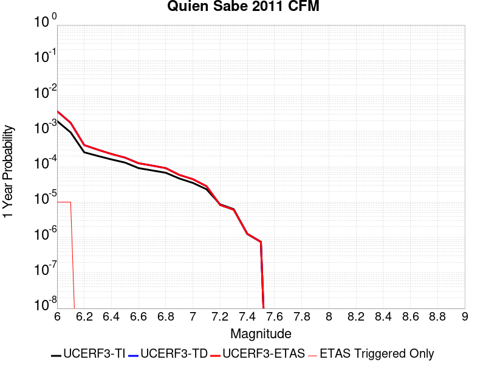 | 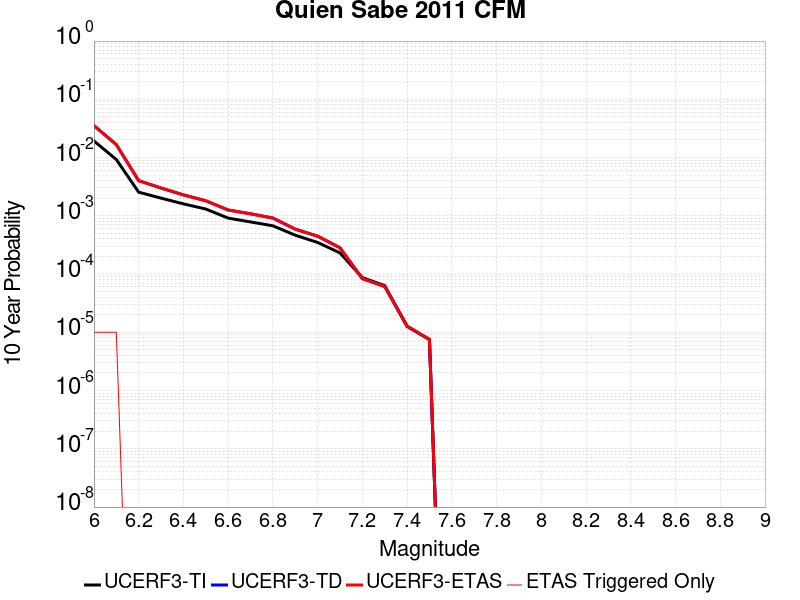 |

| Magnitude | 1 wk TI Prob | 1 wk TD Prob | 1 wk ETAS Prob | 1 wk ETAS/TD Gain | 1 wk ETAS Triggered Only | 1 mo TI Prob | 1 mo TD Prob | 1 mo ETAS Prob | 1 mo ETAS/TD Gain | 1 mo ETAS Triggered Only | 1 yr TI Prob | 1 yr TD Prob | 1 yr ETAS Prob | 1 yr ETAS/TD Gain | 1 yr ETAS Triggered Only | 10 yr TI Prob | 10 yr TD Prob | 10 yr ETAS Prob | 10 yr ETAS/TD Gain | 10 yr ETAS Triggered Only |
|-----|-----|-----|-----|-----|-----|-----|-----|-----|-----|-----|-----|-----|-----|-----|-----|-----|-----|-----|-----|-----|
| 6.0 | 3.729899E-5 | 7.094885E-5 | 8.094814E-5 | 1.1409366 | 1.0E-5 | 1.5984301E-4 | 3.0394195E-4 | 3.1393892E-4 | 1.032891 | 1.0E-5 | 0.0019443515 | 0.0036850597 | 0.0036950228 | 1.0027037 | 1.0E-5 | 0.019274272 | 0.035349693 | 0.035359338 | 1.0002729 | 1.0E-5 |
| 6.1 | 1.7825725E-5 | 3.3210796E-5 | 4.321046E-5 | 1.3010969 | 1.0E-5 | 7.639373E-5 | 1.4227985E-4 | 1.5227843E-4 | 1.070274 | 1.0E-5 | 9.296967E-4 | 0.0017266083 | 0.001736591 | 1.0057817 | 1.0E-5 | 0.009258169 | 0.016698873 | 0.016708706 | 1.0005889 | 1.0E-5 |
| 6.2 | 4.8865336E-6 | 7.807397E-6 | 7.807397E-6 | 1.0 | 0.0 | 2.0942118E-5 | 3.3456672E-5 | 3.3456672E-5 | 1.0 | 0.0 | 2.5494045E-4 | 4.0691794E-4 | 4.0691794E-4 | 1.0 | 0.0 | 0.0025464818 | 0.0040135398 | 0.0040135398 | 1.0 | 0.0 |
| 6.3 | 3.858491E-6 | 5.7896764E-6 | 5.7896764E-6 | 1.0 | 0.0 | 1.6536285E-5 | 2.4812689E-5 | 2.4812689E-5 | 1.0 | 0.0 | 2.0131067E-4 | 3.020573E-4 | 3.020573E-4 | 1.0 | 0.0 | 0.002011284 | 0.0030020247 | 0.0030020247 | 1.0 | 0.0 |
| 6.4 | 3.0771805E-6 | 4.3848822E-6 | 4.3848822E-6 | 1.0 | 0.0 | 1.318785E-5 | 1.879223E-5 | 1.879223E-5 | 1.0 | 0.0 | 1.6055023E-4 | 2.287738E-4 | 2.287738E-4 | 1.0 | 0.0 | 0.001604343 | 0.0022864633 | 0.0022864633 | 1.0 | 0.0 |
| 6.5 | 2.5081235E-6 | 3.4635768E-6 | 3.4635768E-6 | 1.0 | 0.0 | 1.0749056E-5 | 1.4843825E-5 | 1.4843825E-5 | 1.0 | 0.0 | 1.308619E-4 | 1.8071005E-4 | 1.8071005E-4 | 1.0 | 0.0 | 0.0013078486 | 0.0018122483 | 0.0018122483 | 1.0 | 0.0 |
| 6.6 | 1.7505364E-6 | 2.4023664E-6 | 2.4023664E-6 | 1.0 | 0.0 | 7.502277E-6 | 1.0295819E-5 | 1.0295819E-5 | 1.0 | 0.0 | 9.13364E-5 | 1.253451E-4 | 1.253451E-4 | 1.0 | 0.0 | 9.129886E-4 | 0.0012582706 | 0.0012582706 | 1.0 | 0.0 |
| 6.7 | 1.505737E-6 | 2.063768E-6 | 2.063768E-6 | 1.0 | 0.0 | 6.4531428E-6 | 8.844693E-6 | 8.844693E-6 | 1.0 | 0.0 | 7.8564175E-5 | 1.0767942E-4 | 1.0767942E-4 | 1.0 | 0.0 | 7.853641E-4 | 0.0010818074 | 0.0010818074 | 1.0 | 0.0 |
| 6.8 | 1.2924105E-6 | 1.7484224E-6 | 1.7484224E-6 | 1.0 | 0.0 | 5.5388905E-6 | 7.4932204E-6 | 7.4932204E-6 | 1.0 | 0.0 | 6.74339E-5 | 9.1226684E-5 | 9.1226684E-5 | 1.0 | 0.0 | 6.741344E-4 | 9.1608387E-4 | 9.1608387E-4 | 1.0 | 0.0 |
| 6.9 | 8.9075286E-7 | 1.1249912E-6 | 1.1249912E-6 | 1.0 | 0.0 | 3.8175067E-6 | 4.8213833E-6 | 4.8213833E-6 | 1.0 | 0.0 | 4.6477155E-5 | 5.869898E-5 | 5.869898E-5 | 1.0 | 0.0 | 4.6467435E-4 | 5.903731E-4 | 5.903731E-4 | 1.0 | 0.0 |
| 7.0 | 6.6891175E-7 | 8.516645E-7 | 8.516645E-7 | 1.0 | 0.0 | 2.8667614E-6 | 3.6499866E-6 | 3.6499866E-6 | 1.0 | 0.0 | 3.4902263E-5 | 4.443788E-5 | 4.443788E-5 | 1.0 | 0.0 | 3.4896782E-4 | 4.4676356E-4 | 4.4676356E-4 | 1.0 | 0.0 |
| 7.1 | 4.4205015E-7 | 5.391929E-7 | 5.391929E-7 | 1.0 | 0.0 | 1.8944993E-6 | 2.3108257E-6 | 2.3108257E-6 | 1.0 | 0.0 | 2.3065284E-5 | 2.8134109E-5 | 2.8134109E-5 | 1.0 | 0.0 | 2.3062891E-4 | 2.826615E-4 | 2.826615E-4 | 1.0 | 0.0 |
| 7.2 | 1.6620965E-7 | 1.5987632E-7 | 1.5987632E-7 | 1.0 | 0.0 | 7.123269E-7 | 6.851841E-7 | 6.851841E-7 | 1.0 | 0.0 | 8.672545E-6 | 8.342088E-6 | 8.342088E-6 | 1.0 | 0.0 | 8.6722066E-5 | 8.354316E-5 | 8.354316E-5 | 1.0 | 0.0 |
| 7.3 | 1.2142488E-7 | 1.1726676E-7 | 1.1726676E-7 | 1.0 | 0.0 | 5.2039223E-7 | 5.025717E-7 | 5.025717E-7 | 1.0 | 0.0 | 6.335757E-6 | 6.118797E-6 | 6.118797E-6 | 1.0 | 0.0 | 6.3355765E-5 | 6.120608E-5 | 6.120608E-5 | 1.0 | 0.0 |
| 7.4 | 2.4192937E-8 | 2.4545901E-8 | 2.4545901E-8 | 1.0 | 0.0 | 1.0368401E-7 | 1.0519671E-7 | 1.0519671E-7 | 1.0 | 0.0 | 1.2623522E-6 | 1.2807693E-6 | 1.2807693E-6 | 1.0 | 0.0 | 1.2623449E-5 | 1.2768185E-5 | 1.2768185E-5 | 1.0 | 0.0 |
| 7.5 | 1.4432802E-8 | 1.4508743E-8 | 1.4508743E-8 | 1.0 | 0.0 | 6.185486E-8 | 6.218033E-8 | 6.218033E-8 | 1.0 | 0.0 | 7.530827E-7 | 7.5704526E-7 | 7.5704526E-7 | 1.0 | 0.0 | 7.530801E-6 | 7.528889E-6 | 7.528889E-6 | 1.0 | 0.0 |

## San Jacinto (Superstition Mtn)
*[(top)](#table-of-contents)*

| 1 Week | 1 Month | 1 Year | 10 Year |
|-----|-----|-----|-----|
| 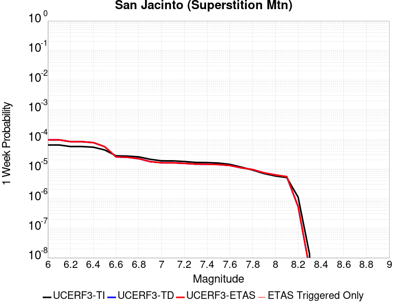 | 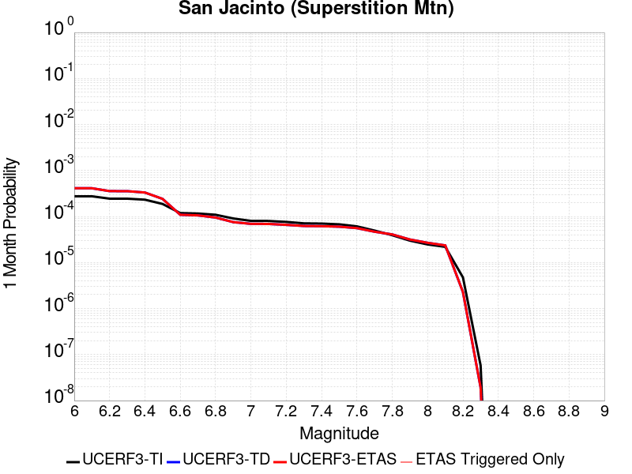 | 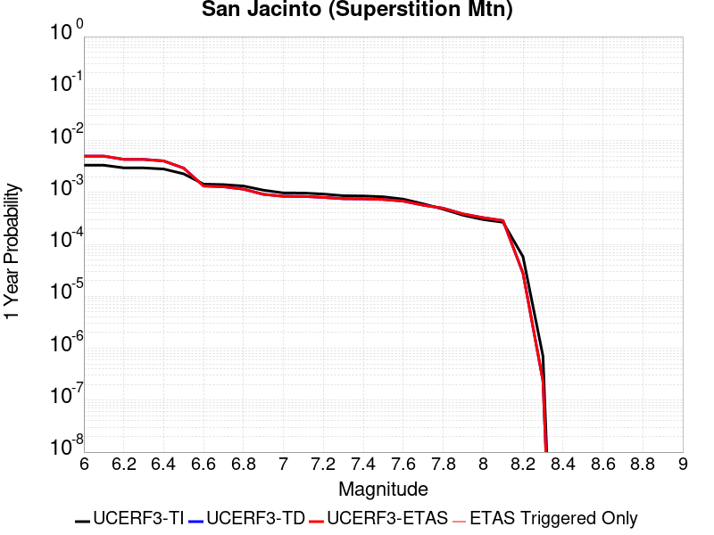 | 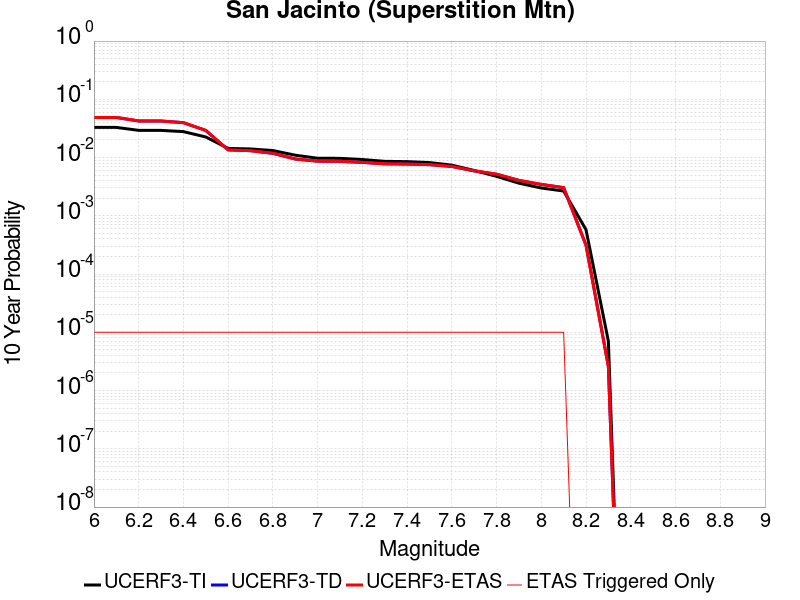 |

| Magnitude | 1 wk TI Prob | 1 wk TD Prob | 1 wk ETAS Prob | 1 wk ETAS/TD Gain | 1 wk ETAS Triggered Only | 1 mo TI Prob | 1 mo TD Prob | 1 mo ETAS Prob | 1 mo ETAS/TD Gain | 1 mo ETAS Triggered Only | 1 yr TI Prob | 1 yr TD Prob | 1 yr ETAS Prob | 1 yr ETAS/TD Gain | 1 yr ETAS Triggered Only | 10 yr TI Prob | 10 yr TD Prob | 10 yr ETAS Prob | 10 yr ETAS/TD Gain | 10 yr ETAS Triggered Only |
|-----|-----|-----|-----|-----|-----|-----|-----|-----|-----|-----|-----|-----|-----|-----|-----|-----|-----|-----|-----|-----|
| 6.0 | 6.4193904E-5 | 9.599558E-5 | 9.599558E-5 | 1.0 | 0.0 | 2.7508775E-4 | 4.1135435E-4 | 4.1135435E-4 | 1.0 | 0.0 | 0.0033440501 | 0.0049981694 | 0.0049981694 | 1.0 | 0.0 | 0.03294174 | 0.048820045 | 0.048829556 | 1.0001948 | 1.0E-5 |
| 6.1 | 6.4193904E-5 | 9.599558E-5 | 9.599558E-5 | 1.0 | 0.0 | 2.7508775E-4 | 4.1135435E-4 | 4.1135435E-4 | 1.0 | 0.0 | 0.0033440501 | 0.0049981694 | 0.0049981694 | 1.0 | 0.0 | 0.03294174 | 0.048820045 | 0.048829556 | 1.0001948 | 1.0E-5 |
| 6.2 | 5.7023593E-5 | 8.3144616E-5 | 8.3144616E-5 | 1.0 | 0.0 | 2.4436394E-4 | 3.5629462E-4 | 3.5629462E-4 | 1.0 | 0.0 | 0.002971072 | 0.0043309047 | 0.0043309047 | 1.0 | 0.0 | 0.029316625 | 0.042502448 | 0.042512026 | 1.0002253 | 1.0E-5 |
| 6.3 | 5.6940098E-5 | 8.298998E-5 | 8.298998E-5 | 1.0 | 0.0 | 2.4400617E-4 | 3.5563204E-4 | 3.5563204E-4 | 1.0 | 0.0 | 0.002966728 | 0.00432287 | 0.00432287 | 1.0 | 0.0 | 0.029274331 | 0.04242582 | 0.042435396 | 1.0002257 | 1.0E-5 |
| 6.4 | 5.4171585E-5 | 7.748391E-5 | 7.748391E-5 | 1.0 | 0.0 | 2.3214328E-4 | 3.3204095E-4 | 3.3204095E-4 | 1.0 | 0.0 | 0.0028226813 | 0.0040367534 | 0.0040367534 | 1.0 | 0.0 | 0.02787096 | 0.039715026 | 0.03972463 | 1.0002418 | 1.0E-5 |
| 6.5 | 4.375144E-5 | 5.6421442E-5 | 5.6421442E-5 | 1.0 | 0.0 | 1.874927E-4 | 2.417904E-4 | 2.417904E-4 | 1.0 | 0.0 | 0.0022803338 | 0.002941 | 0.002941 | 1.0 | 0.0 | 0.022570757 | 0.029235592 | 0.0292453 | 1.000332 | 1.0E-5 |
| 6.6 | 2.772192E-5 | 2.5488029E-5 | 2.5488029E-5 | 1.0 | 0.0 | 1.1880282E-4 | 1.0922994E-4 | 1.0922994E-4 | 1.0 | 0.0 | 0.0014454646 | 0.0013290826 | 0.0013290826 | 1.0 | 0.0 | 0.014360986 | 0.013540891 | 0.013550756 | 1.0007285 | 1.0E-5 |
| 6.7 | 2.7124124E-5 | 2.4699055E-5 | 2.4699055E-5 | 1.0 | 0.0 | 1.1624106E-4 | 1.0584891E-4 | 1.0584891E-4 | 1.0 | 0.0 | 0.0014143161 | 0.0012879678 | 0.0012879678 | 1.0 | 0.0 | 0.014053487 | 0.013134248 | 0.013144117 | 1.0007514 | 1.0E-5 |
| 6.8 | 2.5475807E-5 | 2.2164071E-5 | 2.2164071E-5 | 1.0 | 0.0 | 1.0917746E-4 | 9.498548E-5 | 9.498548E-5 | 1.0 | 0.0 | 0.001328425 | 0.0011558468 | 0.0011558468 | 1.0 | 0.0 | 0.0132051185 | 0.011821818 | 0.0118317 | 1.0008359 | 1.0E-5 |
| 6.9 | 2.1162023E-5 | 1.762564E-5 | 1.762564E-5 | 1.0 | 0.0 | 9.069123E-5 | 7.553629E-5 | 7.553629E-5 | 1.0 | 0.0 | 0.0011036064 | 9.1927015E-4 | 9.1927015E-4 | 1.0 | 0.0 | 0.010981417 | 0.009446762 | 0.009456667 | 1.0010486 | 1.0E-5 |
| 7.0 | 1.8754288E-5 | 1.616099E-5 | 1.616099E-5 | 1.0 | 0.0 | 8.037304E-5 | 6.9259564E-5 | 6.9259564E-5 | 1.0 | 0.0 | 9.781026E-4 | 8.429114E-4 | 8.429114E-4 | 1.0 | 0.0 | 0.009738087 | 0.008669995 | 0.008679908 | 1.0011435 | 1.0E-5 |
| 7.1 | 1.8678527E-5 | 1.6086136E-5 | 1.6086136E-5 | 1.0 | 0.0 | 8.0048376E-5 | 6.8938774E-5 | 6.8938774E-5 | 1.0 | 0.0 | 9.7415317E-4 | 8.3900883E-4 | 8.3900883E-4 | 1.0 | 0.0 | 0.009698939 | 0.008631011 | 0.0086409245 | 1.0011486 | 1.0E-5 |
| 7.2 | 1.7804578E-5 | 1.5380709E-5 | 1.5380709E-5 | 1.0 | 0.0 | 7.6303106E-5 | 6.591567E-5 | 6.591567E-5 | 1.0 | 0.0 | 9.285943E-4 | 8.022301E-4 | 8.022301E-4 | 1.0 | 0.0 | 0.009247236 | 0.008262424 | 0.0082723405 | 1.0012003 | 1.0E-5 |
| 7.3 | 1.6583685E-5 | 1.4529837E-5 | 1.4529837E-5 | 1.0 | 0.0 | 7.1070994E-5 | 6.226926E-5 | 6.226926E-5 | 1.0 | 0.0 | 8.649459E-4 | 7.5786654E-4 | 7.5786654E-4 | 1.0 | 0.0 | 0.00861587 | 0.007817646 | 0.007827568 | 1.0012691 | 1.0E-5 |
| 7.4 | 1.6387552E-5 | 1.4394727E-5 | 1.4394727E-5 | 1.0 | 0.0 | 7.023047E-5 | 6.169024E-5 | 6.169024E-5 | 1.0 | 0.0 | 8.5472054E-4 | 7.508219E-4 | 7.508219E-4 | 1.0 | 0.0 | 0.008514405 | 0.0077470187 | 0.007756941 | 1.0012808 | 1.0E-5 |
| 7.5 | 1.5790754E-5 | 1.40354305E-5 | 1.40354305E-5 | 1.0 | 0.0 | 6.767291E-5 | 6.015047E-5 | 6.015047E-5 | 1.0 | 0.0 | 8.236062E-4 | 7.320879E-4 | 7.320879E-4 | 1.0 | 0.0 | 0.008205604 | 0.007557581 | 0.007567506 | 1.0013132 | 1.0E-5 |
| 7.6 | 1.4248672E-5 | 1.3054444E-5 | 1.3054444E-5 | 1.0 | 0.0 | 6.106431E-5 | 5.5946428E-5 | 5.5946428E-5 | 1.0 | 0.0 | 7.432043E-4 | 6.809366E-4 | 6.809366E-4 | 1.0 | 0.0 | 0.007407237 | 0.007040175 | 0.007050105 | 1.0014104 | 1.0E-5 |
| 7.7 | 1.15449975E-5 | 1.0903222E-5 | 1.0903222E-5 | 1.0 | 0.0 | 4.947762E-5 | 4.672726E-5 | 4.672726E-5 | 1.0 | 0.0 | 6.022235E-4 | 5.6875666E-4 | 5.6875666E-4 | 1.0 | 0.0 | 0.006005941 | 0.0059102564 | 0.0059201973 | 1.0016819 | 1.0E-5 |
| 7.8 | 9.1391985E-6 | 9.5139185E-6 | 9.5139185E-6 | 1.0 | 0.0 | 3.9167408E-5 | 4.0773306E-5 | 4.0773306E-5 | 1.0 | 0.0 | 4.767588E-4 | 4.963025E-4 | 4.963025E-4 | 1.0 | 0.0 | 0.0047573727 | 0.005176809 | 0.0051867575 | 1.0019217 | 1.0E-5 |
| 7.9 | 6.973017E-6 | 7.3817937E-6 | 7.3817937E-6 | 1.0 | 0.0 | 2.9884017E-5 | 3.163588E-5 | 3.163588E-5 | 1.0 | 0.0 | 3.6377716E-4 | 3.8509927E-4 | 3.8509927E-4 | 1.0 | 0.0 | 0.0036318225 | 0.004051976 | 0.0040619355 | 1.002458 | 1.0E-5 |
| 8.0 | 5.7638235E-6 | 6.259641E-6 | 6.259641E-6 | 1.0 | 0.0 | 2.4701867E-5 | 2.682676E-5 | 2.682676E-5 | 1.0 | 0.0 | 3.0070372E-4 | 3.2656736E-4 | 3.2656736E-4 | 1.0 | 0.0 | 0.0030029714 | 0.0034535413 | 0.0034635067 | 1.0028856 | 1.0E-5 |
| 8.1 | 5.1124434E-6 | 5.4953657E-6 | 5.4953657E-6 | 1.0 | 0.0 | 2.1910288E-5 | 2.3551356E-5 | 2.3551356E-5 | 1.0 | 0.0 | 2.6672508E-4 | 2.8670052E-4 | 2.8670052E-4 | 1.0 | 0.0 | 0.0026640517 | 0.0030403896 | 0.0030503592 | 1.0032791 | 1.0E-5 |
| 8.2 | 1.1075938E-6 | 5.3348367E-7 | 5.3348367E-7 | 1.0 | 0.0 | 4.7468216E-6 | 2.2863567E-6 | 2.2863567E-6 | 1.0 | 0.0 | 5.779102E-5 | 2.7836059E-5 | 2.7836059E-5 | 1.0 | 0.0 | 5.777599E-4 | 3.133962E-4 | 3.133962E-4 | 1.0 | 0.0 |
| 8.3 | 1.3584393E-8 | 4.4718784E-9 | 4.4718784E-9 | 1.0 | 0.0 | 5.8218827E-8 | 1.9165192E-8 | 1.9165192E-8 | 1.0 | 0.0 | 7.0881396E-7 | 2.3333622E-7 | 2.3333622E-7 | 1.0 | 0.0 | 7.0881174E-6 | 2.6140672E-6 | 2.6140672E-6 | 1.0 | 0.0 |

## Northridge Hills
*[(top)](#table-of-contents)*

| 1 Week | 1 Month | 1 Year | 10 Year |
|-----|-----|-----|-----|
| 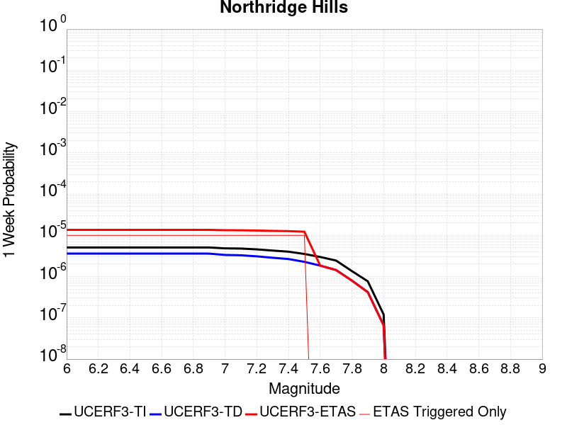 | 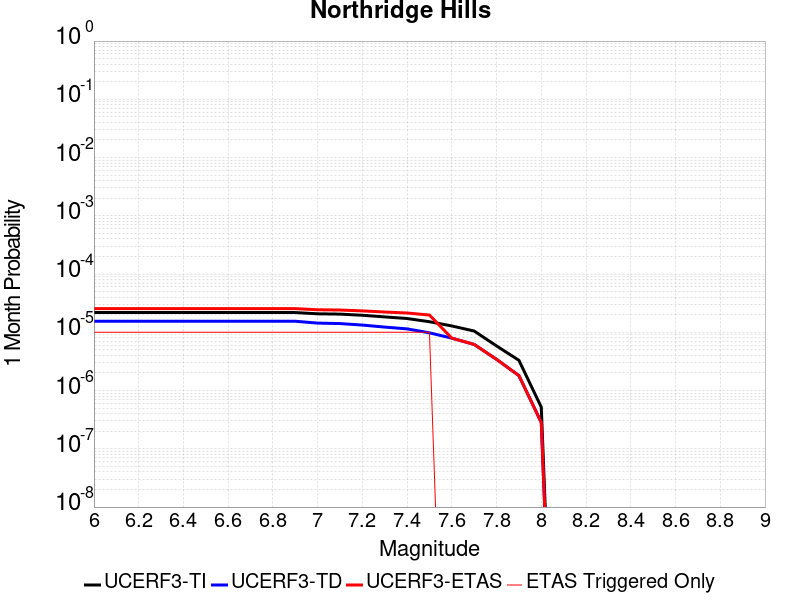 | 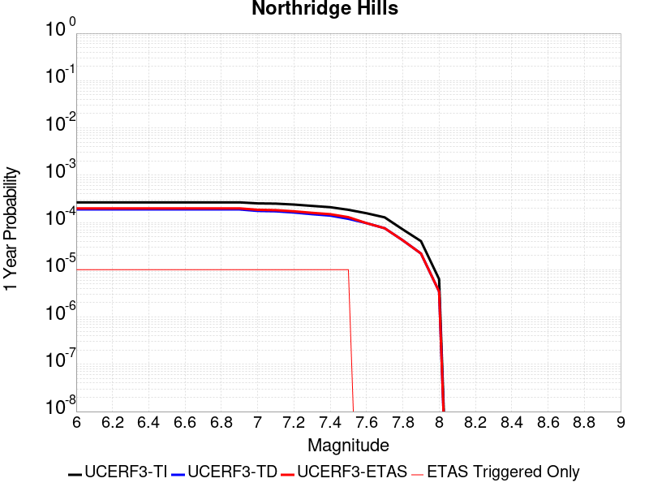 | 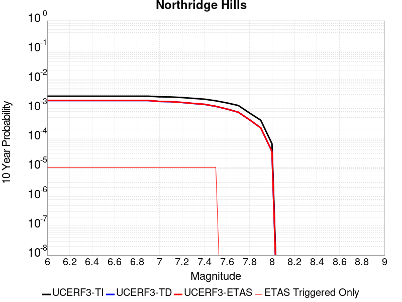 |

| Magnitude | 1 wk TI Prob | 1 wk TD Prob | 1 wk ETAS Prob | 1 wk ETAS/TD Gain | 1 wk ETAS Triggered Only | 1 mo TI Prob | 1 mo TD Prob | 1 mo ETAS Prob | 1 mo ETAS/TD Gain | 1 mo ETAS Triggered Only | 1 yr TI Prob | 1 yr TD Prob | 1 yr ETAS Prob | 1 yr ETAS/TD Gain | 1 yr ETAS Triggered Only | 10 yr TI Prob | 10 yr TD Prob | 10 yr ETAS Prob | 10 yr ETAS/TD Gain | 10 yr ETAS Triggered Only |
|-----|-----|-----|-----|-----|-----|-----|-----|-----|-----|-----|-----|-----|-----|-----|-----|-----|-----|-----|-----|-----|
| 6.0 | 5.095982E-6 | 3.6152135E-6 | 1.36151775E-5 | 3.7660785 | 1.0E-5 | 2.183974E-5 | 1.549368E-5 | 2.5493526E-5 | 1.6454145 | 1.0E-5 | 2.658664E-4 | 1.8861935E-4 | 1.9861746E-4 | 1.0530069 | 1.0E-5 | 0.0026554854 | 0.0018846049 | 0.0018945861 | 1.0052961 | 1.0E-5 |
| 6.1 | 5.095982E-6 | 3.6152135E-6 | 1.36151775E-5 | 3.7660785 | 1.0E-5 | 2.183974E-5 | 1.549368E-5 | 2.5493526E-5 | 1.6454145 | 1.0E-5 | 2.658664E-4 | 1.8861935E-4 | 1.9861746E-4 | 1.0530069 | 1.0E-5 | 0.0026554854 | 0.0018846049 | 0.0018945861 | 1.0052961 | 1.0E-5 |
| 6.2 | 5.095982E-6 | 3.6152135E-6 | 1.36151775E-5 | 3.7660785 | 1.0E-5 | 2.183974E-5 | 1.549368E-5 | 2.5493526E-5 | 1.6454145 | 1.0E-5 | 2.658664E-4 | 1.8861935E-4 | 1.9861746E-4 | 1.0530069 | 1.0E-5 | 0.0026554854 | 0.0018846049 | 0.0018945861 | 1.0052961 | 1.0E-5 |
| 6.3 | 5.095982E-6 | 3.6152135E-6 | 1.36151775E-5 | 3.7660785 | 1.0E-5 | 2.183974E-5 | 1.549368E-5 | 2.5493526E-5 | 1.6454145 | 1.0E-5 | 2.658664E-4 | 1.8861935E-4 | 1.9861746E-4 | 1.0530069 | 1.0E-5 | 0.0026554854 | 0.0018846049 | 0.0018945861 | 1.0052961 | 1.0E-5 |
| 6.4 | 5.095982E-6 | 3.6152135E-6 | 1.36151775E-5 | 3.7660785 | 1.0E-5 | 2.183974E-5 | 1.549368E-5 | 2.5493526E-5 | 1.6454145 | 1.0E-5 | 2.658664E-4 | 1.8861935E-4 | 1.9861746E-4 | 1.0530069 | 1.0E-5 | 0.0026554854 | 0.0018846049 | 0.0018945861 | 1.0052961 | 1.0E-5 |
| 6.5 | 5.095982E-6 | 3.6152135E-6 | 1.36151775E-5 | 3.7660785 | 1.0E-5 | 2.183974E-5 | 1.549368E-5 | 2.5493526E-5 | 1.6454145 | 1.0E-5 | 2.658664E-4 | 1.8861935E-4 | 1.9861746E-4 | 1.0530069 | 1.0E-5 | 0.0026554854 | 0.0018846049 | 0.0018945861 | 1.0052961 | 1.0E-5 |
| 6.6 | 5.095982E-6 | 3.6152135E-6 | 1.36151775E-5 | 3.7660785 | 1.0E-5 | 2.183974E-5 | 1.549368E-5 | 2.5493526E-5 | 1.6454145 | 1.0E-5 | 2.658664E-4 | 1.8861935E-4 | 1.9861746E-4 | 1.0530069 | 1.0E-5 | 0.0026554854 | 0.0018846049 | 0.0018945861 | 1.0052961 | 1.0E-5 |
| 6.7 | 5.095982E-6 | 3.6152135E-6 | 1.36151775E-5 | 3.7660785 | 1.0E-5 | 2.183974E-5 | 1.549368E-5 | 2.5493526E-5 | 1.6454145 | 1.0E-5 | 2.658664E-4 | 1.8861935E-4 | 1.9861746E-4 | 1.0530069 | 1.0E-5 | 0.0026554854 | 0.0018846049 | 0.0018945861 | 1.0052961 | 1.0E-5 |
| 6.8 | 5.095982E-6 | 3.6152135E-6 | 1.36151775E-5 | 3.7660785 | 1.0E-5 | 2.183974E-5 | 1.549368E-5 | 2.5493526E-5 | 1.6454145 | 1.0E-5 | 2.658664E-4 | 1.8861935E-4 | 1.9861746E-4 | 1.0530069 | 1.0E-5 | 0.0026554854 | 0.0018846049 | 0.0018945861 | 1.0052961 | 1.0E-5 |
| 6.9 | 5.0942654E-6 | 3.6134284E-6 | 1.3613392E-5 | 3.7674448 | 1.0E-5 | 2.1832384E-5 | 1.548603E-5 | 2.5485875E-5 | 1.6457332 | 1.0E-5 | 2.6577685E-4 | 1.8852622E-4 | 1.9852434E-4 | 1.053033 | 1.0E-5 | 0.002654592 | 0.0018836753 | 0.0018936564 | 1.0052987 | 1.0E-5 |
| 7.0 | 4.851143E-6 | 3.3587432E-6 | 1.335871E-5 | 3.977294 | 1.0E-5 | 2.0790447E-5 | 1.4394534E-5 | 2.439439E-5 | 1.6946981 | 1.0E-5 | 2.5309427E-4 | 1.752394E-4 | 1.8523766E-4 | 1.0570548 | 1.0E-5 | 0.0025280623 | 0.0017510166 | 0.0017609991 | 1.005701 | 1.0E-5 |
| 7.1 | 4.7910607E-6 | 3.2970245E-6 | 1.3296992E-5 | 4.0330276 | 1.0E-5 | 2.0532956E-5 | 1.4130029E-5 | 2.4129888E-5 | 1.7077026 | 1.0E-5 | 2.4996005E-4 | 1.7201956E-4 | 1.8201783E-4 | 1.0581229 | 1.0E-5 | 0.0024967908 | 0.0017188682 | 0.0017288509 | 1.0058078 | 1.0E-5 |
| 7.2 | 4.580079E-6 | 3.106803E-6 | 1.3106772E-5 | 4.218733 | 1.0E-5 | 1.9628762E-5 | 1.3314802E-5 | 2.331467E-5 | 1.7510339 | 1.0E-5 | 2.3895396E-4 | 1.6209569E-4 | 1.7209406E-4 | 1.061682 | 1.0E-5 | 0.0023869718 | 0.001619778 | 0.0016297618 | 1.0061637 | 1.0E-5 |
| 7.3 | 4.290062E-6 | 2.8682362E-6 | 1.2868208E-5 | 4.4864535 | 1.0E-5 | 1.838585E-5 | 1.2292383E-5 | 2.2292259E-5 | 1.813502 | 1.0E-5 | 2.2382473E-4 | 1.4964951E-4 | 1.5964801E-4 | 1.0668128 | 1.0E-5 | 0.0022359942 | 0.0014954903 | 0.0015054754 | 1.0066768 | 1.0E-5 |
| 7.4 | 4.0259683E-6 | 2.6739135E-6 | 1.2673887E-5 | 4.7398267 | 1.0E-5 | 1.7254037E-5 | 1.1459579E-5 | 2.1459464E-5 | 1.8726224 | 1.0E-5 | 2.1004764E-4 | 1.3951147E-4 | 1.4951007E-4 | 1.0716687 | 1.0E-5 | 0.002098492 | 0.0013942417 | 0.0014042277 | 1.0071623 | 1.0E-5 |
| 7.5 | 3.5477108E-6 | 2.285198E-6 | 1.2285175E-5 | 5.3759785 | 1.0E-5 | 1.5204386E-5 | 9.793668E-6 | 1.979357E-5 | 2.0210578 | 1.0E-5 | 1.8509767E-4 | 1.192314E-4 | 1.292302E-4 | 1.0838605 | 1.0E-5 | 0.0018494357 | 0.0011916759 | 0.001201664 | 1.0083815 | 1.0E-5 |
| 7.6 | 2.9990608E-6 | 1.8528159E-6 | 1.8528159E-6 | 1.0 | 0.0 | 1.2853055E-5 | 7.940615E-6 | 7.940615E-6 | 1.0 | 0.0 | 1.564747E-4 | 9.667271E-5 | 9.667271E-5 | 1.0 | 0.0 | 0.0015636457 | 9.6630736E-4 | 9.6630736E-4 | 1.0 | 0.0 |
| 7.7 | 2.4542855E-6 | 1.4461142E-6 | 1.4461142E-6 | 1.0 | 0.0 | 1.05183235E-5 | 6.1976175E-6 | 6.1976175E-6 | 1.0 | 0.0 | 1.2805307E-4 | 7.545339E-5 | 7.545339E-5 | 1.0 | 0.0 | 0.001279793 | 7.5427827E-4 | 7.5427827E-4 | 1.0 | 0.0 |
| 7.8 | 1.3623128E-6 | 8.0160027E-7 | 8.0160027E-7 | 1.0 | 0.0 | 5.8384703E-6 | 3.4354252E-6 | 3.4354252E-6 | 1.0 | 0.0 | 7.108106E-5 | 4.18255E-5 | 4.18255E-5 | 1.0 | 0.0 | 7.1058323E-4 | 4.1817653E-4 | 4.1817653E-4 | 1.0 | 0.0 |
| 7.9 | 7.716622E-7 | 4.218644E-7 | 4.218644E-7 | 1.0 | 0.0 | 3.3071194E-6 | 1.807989E-6 | 1.807989E-6 | 1.0 | 0.0 | 4.0263436E-5 | 2.2012046E-5 | 2.2012046E-5 | 1.0 | 0.0 | 4.0256142E-4 | 2.2009875E-4 | 2.2009875E-4 | 1.0 | 0.0 |
| 8.0 | 1.2117711E-7 | 6.6217325E-8 | 6.6217325E-8 | 1.0 | 0.0 | 5.1933034E-7 | 2.8378852E-7 | 2.8378852E-7 | 1.0 | 0.0 | 6.3228285E-6 | 3.45512E-6 | 3.45512E-6 | 1.0 | 0.0 | 6.3226486E-5 | 3.4550678E-5 | 3.4550678E-5 | 1.0 | 0.0 |

## Los Alamos 2011 CFM
*[(top)](#table-of-contents)*

| 1 Week | 1 Month | 1 Year | 10 Year |
|-----|-----|-----|-----|
|  | 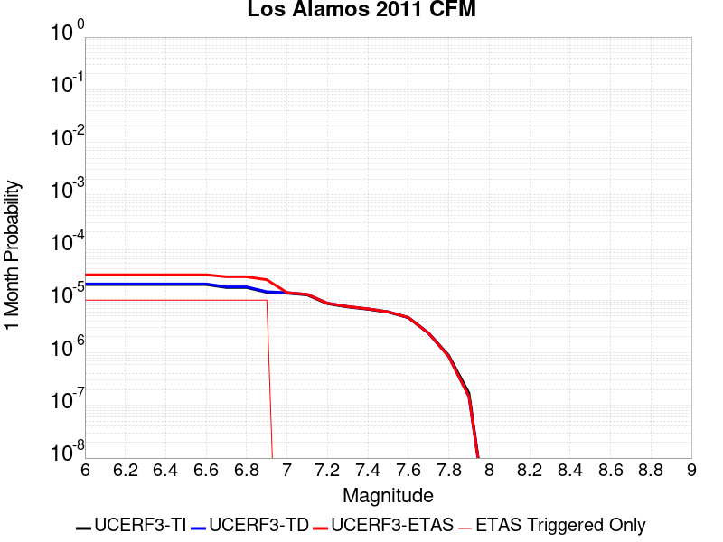 | 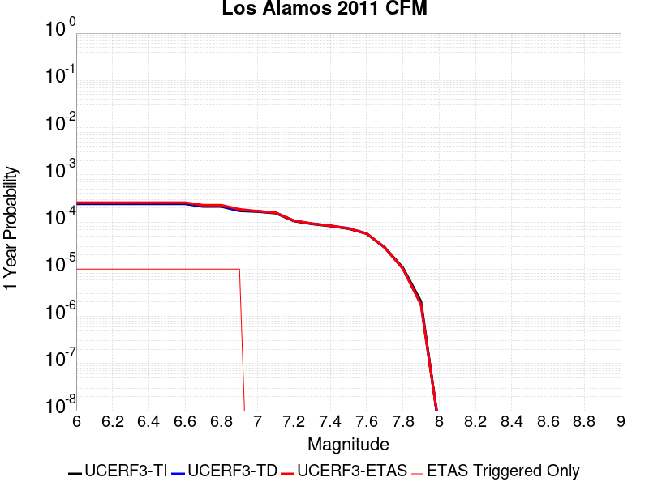 | 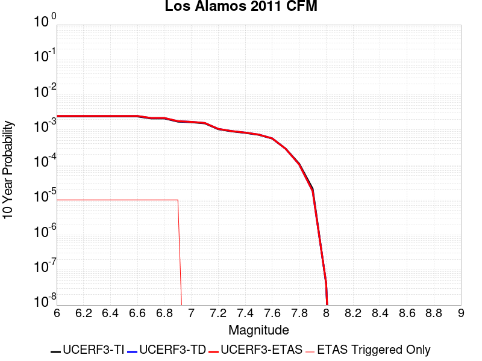 |

| Magnitude | 1 wk TI Prob | 1 wk TD Prob | 1 wk ETAS Prob | 1 wk ETAS/TD Gain | 1 wk ETAS Triggered Only | 1 mo TI Prob | 1 mo TD Prob | 1 mo ETAS Prob | 1 mo ETAS/TD Gain | 1 mo ETAS Triggered Only | 1 yr TI Prob | 1 yr TD Prob | 1 yr ETAS Prob | 1 yr ETAS/TD Gain | 1 yr ETAS Triggered Only | 10 yr TI Prob | 10 yr TD Prob | 10 yr ETAS Prob | 10 yr ETAS/TD Gain | 10 yr ETAS Triggered Only |
|-----|-----|-----|-----|-----|-----|-----|-----|-----|-----|-----|-----|-----|-----|-----|-----|-----|-----|-----|-----|-----|
| 6.0 | 4.6284417E-6 | 4.7517333E-6 | 4.7517333E-6 | 1.0 | 0.0 | 1.9836029E-5 | 2.0364423E-5 | 3.036422E-5 | 1.4910425 | 1.0E-5 | 2.4147688E-4 | 2.479104E-4 | 2.5790793E-4 | 1.0403272 | 1.0E-5 | 0.0024121467 | 0.0024765125 | 0.0024864879 | 1.004028 | 1.0E-5 |
| 6.1 | 4.6284417E-6 | 4.7517333E-6 | 4.7517333E-6 | 1.0 | 0.0 | 1.9836029E-5 | 2.0364423E-5 | 3.036422E-5 | 1.4910425 | 1.0E-5 | 2.4147688E-4 | 2.479104E-4 | 2.5790793E-4 | 1.0403272 | 1.0E-5 | 0.0024121467 | 0.0024765125 | 0.0024864879 | 1.004028 | 1.0E-5 |
| 6.2 | 4.6284417E-6 | 4.7517333E-6 | 4.7517333E-6 | 1.0 | 0.0 | 1.9836029E-5 | 2.0364423E-5 | 3.036422E-5 | 1.4910425 | 1.0E-5 | 2.4147688E-4 | 2.479104E-4 | 2.5790793E-4 | 1.0403272 | 1.0E-5 | 0.0024121467 | 0.0024765125 | 0.0024864879 | 1.004028 | 1.0E-5 |
| 6.3 | 4.6284417E-6 | 4.7517333E-6 | 4.7517333E-6 | 1.0 | 0.0 | 1.9836029E-5 | 2.0364423E-5 | 3.036422E-5 | 1.4910425 | 1.0E-5 | 2.4147688E-4 | 2.479104E-4 | 2.5790793E-4 | 1.0403272 | 1.0E-5 | 0.0024121467 | 0.0024765125 | 0.0024864879 | 1.004028 | 1.0E-5 |
| 6.4 | 4.6284417E-6 | 4.7517333E-6 | 4.7517333E-6 | 1.0 | 0.0 | 1.9836029E-5 | 2.0364423E-5 | 3.036422E-5 | 1.4910425 | 1.0E-5 | 2.4147688E-4 | 2.479104E-4 | 2.5790793E-4 | 1.0403272 | 1.0E-5 | 0.0024121467 | 0.0024765125 | 0.0024864879 | 1.004028 | 1.0E-5 |
| 6.5 | 4.6284417E-6 | 4.7517333E-6 | 4.7517333E-6 | 1.0 | 0.0 | 1.9836029E-5 | 2.0364423E-5 | 3.036422E-5 | 1.4910425 | 1.0E-5 | 2.4147688E-4 | 2.479104E-4 | 2.5790793E-4 | 1.0403272 | 1.0E-5 | 0.0024121467 | 0.0024765125 | 0.0024864879 | 1.004028 | 1.0E-5 |
| 6.6 | 4.6284417E-6 | 4.7517333E-6 | 4.7517333E-6 | 1.0 | 0.0 | 1.9836029E-5 | 2.0364423E-5 | 3.036422E-5 | 1.4910425 | 1.0E-5 | 2.4147688E-4 | 2.479104E-4 | 2.5790793E-4 | 1.0403272 | 1.0E-5 | 0.0024121467 | 0.0024765125 | 0.0024864879 | 1.004028 | 1.0E-5 |
| 6.7 | 4.062321E-6 | 4.166351E-6 | 4.166351E-6 | 1.0 | 0.0 | 1.7409831E-5 | 1.7855677E-5 | 2.7855498E-5 | 1.560036 | 1.0E-5 | 2.1194408E-4 | 2.1737268E-4 | 2.2737052E-4 | 1.0459939 | 1.0E-5 | 0.0021174205 | 0.0021717504 | 0.0021817286 | 1.0045946 | 1.0E-5 |
| 6.8 | 4.062321E-6 | 4.166351E-6 | 4.166351E-6 | 1.0 | 0.0 | 1.7409831E-5 | 1.7855677E-5 | 2.7855498E-5 | 1.560036 | 1.0E-5 | 2.1194408E-4 | 2.1737268E-4 | 2.2737052E-4 | 1.0459939 | 1.0E-5 | 0.0021174205 | 0.0021717504 | 0.0021817286 | 1.0045946 | 1.0E-5 |
| 6.9 | 3.2936077E-6 | 3.37296E-6 | 3.37296E-6 | 1.0 | 0.0 | 1.4115385E-5 | 1.4455468E-5 | 2.4455323E-5 | 1.6917697 | 1.0E-5 | 1.7184127E-4 | 1.7598206E-4 | 1.8598029E-4 | 1.056814 | 1.0E-5 | 0.0017170844 | 0.0017585196 | 0.0017685019 | 1.0056766 | 1.0E-5 |
| 7.0 | 3.1687898E-6 | 3.2448177E-6 | 3.2448177E-6 | 1.0 | 0.0 | 1.3580457E-5 | 1.3906293E-5 | 1.3906293E-5 | 1.0 | 0.0 | 1.6532952E-4 | 1.692969E-4 | 1.692969E-4 | 1.0 | 0.0 | 0.0016520657 | 0.0016917707 | 0.0016917707 | 1.0 | 0.0 |
| 7.1 | 2.9379228E-6 | 3.007328E-6 | 3.007328E-6 | 1.0 | 0.0 | 1.25910365E-5 | 1.288849E-5 | 1.288849E-5 | 1.0 | 0.0 | 1.5328509E-4 | 1.5690697E-4 | 1.5690697E-4 | 1.0 | 0.0 | 0.001531794 | 0.001568051 | 0.001568051 | 1.0 | 0.0 |
| 7.2 | 2.0020686E-6 | 2.041632E-6 | 2.041632E-6 | 1.0 | 0.0 | 8.580266E-6 | 8.749822E-6 | 8.749822E-6 | 1.0 | 0.0 | 1.0445973E-4 | 1.0652392E-4 | 1.0652392E-4 | 1.0 | 0.0 | 0.0010441064 | 0.001064733 | 0.001064733 | 1.0 | 0.0 |
| 7.3 | 1.7364243E-6 | 1.7678824E-6 | 1.7678824E-6 | 1.0 | 0.0 | 7.441797E-6 | 7.576617E-6 | 7.576617E-6 | 1.0 | 0.0 | 9.0600115E-5 | 9.224144E-5 | 9.224144E-5 | 1.0 | 0.0 | 9.0563187E-4 | 9.2203467E-4 | 9.2203467E-4 | 1.0 | 0.0 |
| 7.4 | 1.5718434E-6 | 1.5983198E-6 | 1.5983198E-6 | 1.0 | 0.0 | 6.7364545E-6 | 6.8499244E-6 | 6.8499244E-6 | 1.0 | 0.0 | 8.201325E-5 | 8.339467E-5 | 8.339467E-5 | 1.0 | 0.0 | 8.198299E-4 | 8.3363673E-4 | 8.3363673E-4 | 1.0 | 0.0 |
| 7.5 | 1.3841119E-6 | 1.4042814E-6 | 1.4042814E-6 | 1.0 | 0.0 | 5.9318945E-6 | 6.018335E-6 | 6.018335E-6 | 1.0 | 0.0 | 7.221842E-5 | 7.327079E-5 | 7.327079E-5 | 1.0 | 0.0 | 7.2194956E-4 | 7.3246926E-4 | 7.3246926E-4 | 1.0 | 0.0 |
| 7.6 | 1.0843726E-6 | 1.0934443E-6 | 1.0934443E-6 | 1.0 | 0.0 | 4.647303E-6 | 4.6861815E-6 | 4.6861815E-6 | 1.0 | 0.0 | 5.6579443E-5 | 5.705279E-5 | 5.705279E-5 | 1.0 | 0.0 | 5.656504E-4 | 5.70384E-4 | 5.70384E-4 | 1.0 | 0.0 |
| 7.7 | 5.544814E-7 | 5.501884E-7 | 5.501884E-7 | 1.0 | 0.0 | 2.3763469E-6 | 2.3579482E-6 | 2.3579482E-6 | 1.0 | 0.0 | 2.8931638E-5 | 2.8707644E-5 | 2.8707644E-5 | 1.0 | 0.0 | 2.8927872E-4 | 2.870395E-4 | 2.870395E-4 | 1.0 | 0.0 |
| 7.8 | 2.0707465E-7 | 1.9778598E-7 | 1.9778598E-7 | 1.0 | 0.0 | 8.874625E-7 | 8.476539E-7 | 8.476539E-7 | 1.0 | 0.0 | 1.08048025E-5 | 1.0320137E-5 | 1.0320137E-5 | 1.0 | 0.0 | 1.0804277E-4 | 1.0319663E-4 | 1.0319663E-4 | 1.0 | 0.0 |
| 7.9 | 3.9821284E-8 | 3.4331528E-8 | 3.4331528E-8 | 1.0 | 0.0 | 1.7066264E-7 | 1.4713511E-7 | 1.4713511E-7 | 1.0 | 0.0 | 2.0778157E-6 | 1.7913685E-6 | 1.7913685E-6 | 1.0 | 0.0 | 2.0777963E-5 | 1.7913546E-5 | 1.7913546E-5 | 1.0 | 0.0 |
| 8.0 | 7.880441E-11 | 8.2353124E-11 | 8.2353124E-11 | 1.0 | 0.0 | 3.3773329E-10 | 3.52942E-10 | 3.52942E-10 | 1.0 | 0.0 | 4.1119033E-9 | 4.2970694E-9 | 4.2970694E-9 | 1.0 | 0.0 | 4.1119034E-8 | 4.2970694E-8 | 4.2970694E-8 | 1.0 | 0.0 |

## West Napa 2011 CFM
*[(top)](#table-of-contents)*

| 1 Week | 1 Month | 1 Year | 10 Year |
|-----|-----|-----|-----|
|  | 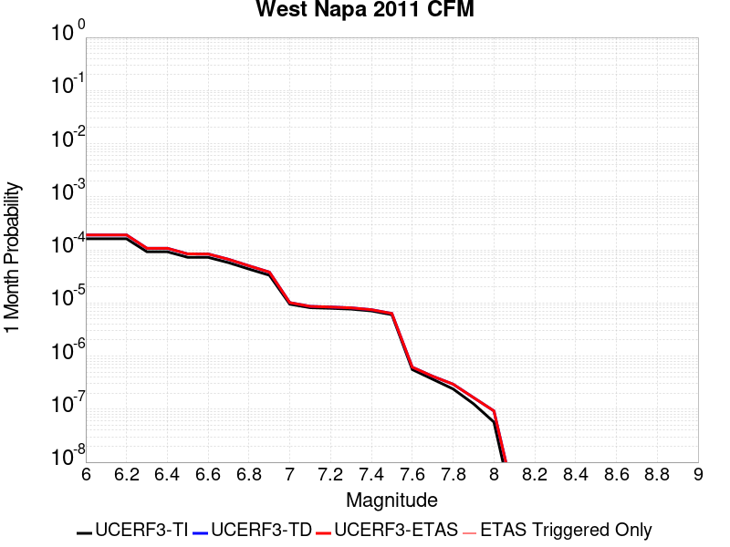 |  | 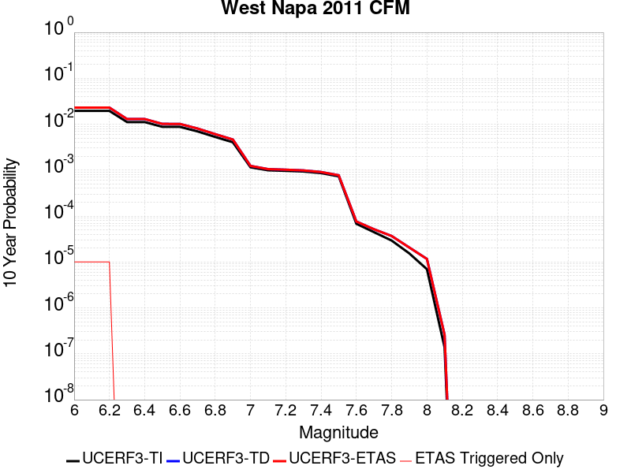 |

| Magnitude | 1 wk TI Prob | 1 wk TD Prob | 1 wk ETAS Prob | 1 wk ETAS/TD Gain | 1 wk ETAS Triggered Only | 1 mo TI Prob | 1 mo TD Prob | 1 mo ETAS Prob | 1 mo ETAS/TD Gain | 1 mo ETAS Triggered Only | 1 yr TI Prob | 1 yr TD Prob | 1 yr ETAS Prob | 1 yr ETAS/TD Gain | 1 yr ETAS Triggered Only | 10 yr TI Prob | 10 yr TD Prob | 10 yr ETAS Prob | 10 yr ETAS/TD Gain | 10 yr ETAS Triggered Only |
|-----|-----|-----|-----|-----|-----|-----|-----|-----|-----|-----|-----|-----|-----|-----|-----|-----|-----|-----|-----|-----|
| 6.0 | 3.773104E-5 | 4.4528504E-5 | 4.4528504E-5 | 1.0 | 0.0 | 1.6169442E-4 | 1.9082428E-4 | 1.9082428E-4 | 1.0 | 0.0 | 0.001966852 | 0.0023211278 | 0.0023311046 | 1.0042982 | 1.0E-5 | 0.019495348 | 0.023002012 | 0.023011781 | 1.0004247 | 1.0E-5 |
| 6.1 | 3.773104E-5 | 4.4528504E-5 | 4.4528504E-5 | 1.0 | 0.0 | 1.6169442E-4 | 1.9082428E-4 | 1.9082428E-4 | 1.0 | 0.0 | 0.001966852 | 0.0023211278 | 0.0023311046 | 1.0042982 | 1.0E-5 | 0.019495348 | 0.023002012 | 0.023011781 | 1.0004247 | 1.0E-5 |
| 6.2 | 3.773104E-5 | 4.4528504E-5 | 4.4528504E-5 | 1.0 | 0.0 | 1.6169442E-4 | 1.9082428E-4 | 1.9082428E-4 | 1.0 | 0.0 | 0.001966852 | 0.0023211278 | 0.0023311046 | 1.0042982 | 1.0E-5 | 0.019495348 | 0.023002012 | 0.023011781 | 1.0004247 | 1.0E-5 |
| 6.3 | 2.147964E-5 | 2.4987066E-5 | 2.4987066E-5 | 1.0 | 0.0 | 9.2052345E-5 | 1.0708355E-4 | 1.0708355E-4 | 1.0 | 0.0 | 0.001120161 | 0.0013030542 | 0.0013030542 | 1.0 | 0.0 | 0.011145315 | 0.012964482 | 0.012964482 | 1.0 | 0.0 |
| 6.4 | 2.147964E-5 | 2.4987066E-5 | 2.4987066E-5 | 1.0 | 0.0 | 9.2052345E-5 | 1.0708355E-4 | 1.0708355E-4 | 1.0 | 0.0 | 0.001120161 | 0.0013030542 | 0.0013030542 | 1.0 | 0.0 | 0.011145315 | 0.012964482 | 0.012964482 | 1.0 | 0.0 |
| 6.5 | 1.688201E-5 | 1.9547371E-5 | 1.9547371E-5 | 1.0 | 0.0 | 7.234947E-5 | 8.377217E-5 | 8.377217E-5 | 1.0 | 0.0 | 8.804988E-4 | 0.0010195216 | 0.0010195216 | 1.0 | 0.0 | 0.008770182 | 0.01015684 | 0.01015684 | 1.0 | 0.0 |
| 6.6 | 1.6846381E-5 | 1.9507064E-5 | 1.9507064E-5 | 1.0 | 0.0 | 7.219678E-5 | 8.3599436E-5 | 8.3599436E-5 | 1.0 | 0.0 | 8.7864127E-4 | 0.0010174206 | 0.0010174206 | 1.0 | 0.0 | 0.008751754 | 0.010136021 | 0.010136021 | 1.0 | 0.0 |
| 6.7 | 1.3396501E-5 | 1.5467684E-5 | 1.5467684E-5 | 1.0 | 0.0 | 5.7412315E-5 | 6.628875E-5 | 6.628875E-5 | 1.0 | 0.0 | 6.9877075E-4 | 8.068302E-4 | 8.068302E-4 | 1.0 | 0.0 | 0.0069657755 | 0.008046459 | 0.008046459 | 1.0 | 0.0 |
| 6.8 | 1.0139058E-5 | 1.16721785E-5 | 1.16721785E-5 | 1.0 | 0.0 | 4.3452383E-5 | 5.0022976E-5 | 5.0022976E-5 | 1.0 | 0.0 | 5.289043E-4 | 6.0891506E-4 | 6.0891506E-4 | 1.0 | 0.0 | 0.005276473 | 0.0060791126 | 0.0060791126 | 1.0 | 0.0 |
| 6.9 | 7.761281E-6 | 8.890723E-6 | 8.890723E-6 | 1.0 | 0.0 | 3.326221E-5 | 3.810283E-5 | 3.810283E-5 | 1.0 | 0.0 | 4.0489217E-4 | 4.6385458E-4 | 4.6385458E-4 | 1.0 | 0.0 | 0.0040415525 | 0.0046351026 | 0.0046351026 | 1.0 | 0.0 |
| 7.0 | 2.2109202E-6 | 2.3666319E-6 | 2.3666319E-6 | 1.0 | 0.0 | 9.475338E-6 | 1.01426685E-5 | 1.01426685E-5 | 1.0 | 0.0 | 1.1535613E-4 | 1.2348007E-4 | 1.2348007E-4 | 1.0 | 0.0 | 0.0011529627 | 0.0012353238 | 0.0012353238 | 1.0 | 0.0 |
| 7.1 | 1.9008926E-6 | 2.0133207E-6 | 2.0133207E-6 | 1.0 | 0.0 | 8.146657E-6 | 8.628488E-6 | 8.628488E-6 | 1.0 | 0.0 | 9.918104E-5 | 1.05046805E-4 | 1.05046805E-4 | 1.0 | 0.0 | 9.913679E-4 | 0.0010511756 | 0.0010511756 | 1.0 | 0.0 |
| 7.2 | 1.8495944E-6 | 1.9561273E-6 | 1.9561273E-6 | 1.0 | 0.0 | 7.926808E-6 | 8.383376E-6 | 8.383376E-6 | 1.0 | 0.0 | 9.650462E-5 | 1.0206285E-4 | 1.0206285E-4 | 1.0 | 0.0 | 9.6462725E-4 | 0.0010213639 | 0.0010213639 | 1.0 | 0.0 |
| 7.3 | 1.7883189E-6 | 1.8880897E-6 | 1.8880897E-6 | 1.0 | 0.0 | 7.664201E-6 | 8.091788E-6 | 8.091788E-6 | 1.0 | 0.0 | 9.330765E-5 | 9.85131E-5 | 9.85131E-5 | 1.0 | 0.0 | 9.3268487E-4 | 9.858976E-4 | 9.858976E-4 | 1.0 | 0.0 |
| 7.4 | 1.6520572E-6 | 1.7415113E-6 | 1.7415113E-6 | 1.0 | 0.0 | 7.0802257E-6 | 7.463598E-6 | 7.463598E-6 | 1.0 | 0.0 | 8.6198335E-5 | 9.086554E-5 | 9.086554E-5 | 1.0 | 0.0 | 8.616491E-4 | 9.0948684E-4 | 9.0948684E-4 | 1.0 | 0.0 |
| 7.5 | 1.4040345E-6 | 1.4800271E-6 | 1.4800271E-6 | 1.0 | 0.0 | 6.0172765E-6 | 6.342958E-6 | 6.342958E-6 | 1.0 | 0.0 | 7.325788E-5 | 7.72228E-5 | 7.72228E-5 | 1.0 | 0.0 | 7.3233736E-4 | 7.7311805E-4 | 7.7311805E-4 | 1.0 | 0.0 |
| 7.6 | 1.3013842E-7 | 1.4416163E-7 | 1.4416163E-7 | 1.0 | 0.0 | 5.57736E-7 | 6.178354E-7 | 6.178354E-7 | 1.0 | 0.0 | 6.790414E-6 | 7.52212E-6 | 7.52212E-6 | 1.0 | 0.0 | 6.790207E-5 | 7.61463E-5 | 7.61463E-5 | 1.0 | 0.0 |
| 7.7 | 8.541512E-8 | 9.716462E-8 | 9.716462E-8 | 1.0 | 0.0 | 3.6606474E-7 | 4.1641974E-7 | 4.1641974E-7 | 1.0 | 0.0 | 4.456829E-6 | 5.069898E-6 | 5.069898E-6 | 1.0 | 0.0 | 4.4567398E-5 | 5.160189E-5 | 5.160189E-5 | 1.0 | 0.0 |
| 7.8 | 5.6074793E-8 | 6.895456E-8 | 6.895456E-8 | 1.0 | 0.0 | 2.403205E-7 | 2.955195E-7 | 2.955195E-7 | 1.0 | 0.0 | 2.9258983E-6 | 3.597944E-6 | 3.597944E-6 | 1.0 | 0.0 | 2.9258597E-5 | 3.6812045E-5 | 3.6812045E-5 | 1.0 | 0.0 |
| 7.9 | 2.9475839E-8 | 3.8567407E-8 | 3.8567407E-8 | 1.0 | 0.0 | 1.2632502E-7 | 1.6528887E-7 | 1.6528887E-7 | 1.0 | 0.0 | 1.538006E-6 | 2.01239E-6 | 2.01239E-6 | 1.0 | 0.0 | 1.5379954E-5 | 2.0664074E-5 | 2.0664074E-5 | 1.0 | 0.0 |
| 8.0 | 1.3337122E-8 | 2.1632943E-8 | 2.1632943E-8 | 1.0 | 0.0 | 5.7159088E-8 | 9.2712604E-8 | 9.2712604E-8 | 1.0 | 0.0 | 6.959117E-7 | 1.1287754E-6 | 1.1287754E-6 | 1.0 | 0.0 | 6.959095E-6 | 1.1644432E-5 | 1.1644432E-5 | 1.0 | 0.0 |
| 8.1 | 2.6589986E-10 | 4.8617654E-10 | 4.8617654E-10 | 1.0 | 0.0 | 1.1395708E-9 | 2.0836133E-9 | 2.0836133E-9 | 1.0 | 0.0 | 1.3874274E-8 | 2.536799E-8 | 2.536799E-8 | 1.0 | 0.0 | 1.3874273E-7 | 2.6036727E-7 | 2.6036727E-7 | 1.0 | 0.0 |

## Almanor 2011 CFM
*[(top)](#table-of-contents)*

| 1 Week | 1 Month | 1 Year | 10 Year |
|-----|-----|-----|-----|
|  | 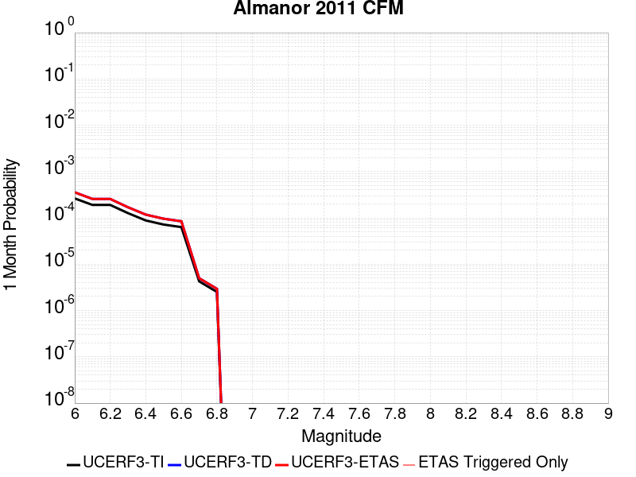 | 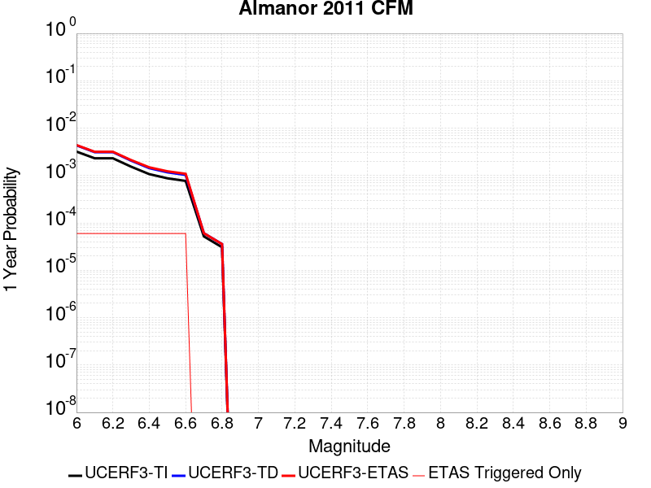 | 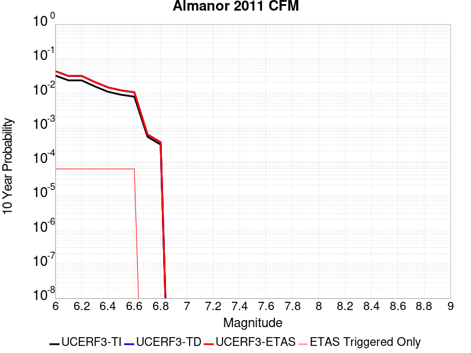 |

| Magnitude | 1 wk TI Prob | 1 wk TD Prob | 1 wk ETAS Prob | 1 wk ETAS/TD Gain | 1 wk ETAS Triggered Only | 1 mo TI Prob | 1 mo TD Prob | 1 mo ETAS Prob | 1 mo ETAS/TD Gain | 1 mo ETAS Triggered Only | 1 yr TI Prob | 1 yr TD Prob | 1 yr ETAS Prob | 1 yr ETAS/TD Gain | 1 yr ETAS Triggered Only | 10 yr TI Prob | 10 yr TD Prob | 10 yr ETAS Prob | 10 yr ETAS/TD Gain | 10 yr ETAS Triggered Only |
|-----|-----|-----|-----|-----|-----|-----|-----|-----|-----|-----|-----|-----|-----|-----|-----|-----|-----|-----|-----|-----|
| 6.0 | 6.1479834E-5 | 8.327245E-5 | 8.327245E-5 | 1.0 | 0.0 | 2.6345838E-4 | 3.5683523E-4 | 3.5683523E-4 | 1.0 | 0.0 | 0.0032028882 | 0.004336495 | 0.0043464517 | 1.002296 | 1.0E-5 | 0.031571172 | 0.04258658 | 0.042596154 | 1.0002248 | 1.0E-5 |
| 6.1 | 4.4387216E-5 | 5.9767433E-5 | 5.9767433E-5 | 1.0 | 0.0 | 1.9021705E-4 | 2.561236E-4 | 2.561236E-4 | 1.0 | 0.0 | 0.0023134327 | 0.003114351 | 0.0031243197 | 1.0032009 | 1.0E-5 | 0.022894967 | 0.030755581 | 0.030765275 | 1.0003152 | 1.0E-5 |
| 6.2 | 4.4387216E-5 | 5.9767433E-5 | 5.9767433E-5 | 1.0 | 0.0 | 1.9021705E-4 | 2.561236E-4 | 2.561236E-4 | 1.0 | 0.0 | 0.0023134327 | 0.003114351 | 0.0031243197 | 1.0032009 | 1.0E-5 | 0.022894967 | 0.030755581 | 0.030765275 | 1.0003152 | 1.0E-5 |
| 6.3 | 2.9523822E-5 | 3.9546965E-5 | 3.9546965E-5 | 1.0 | 0.0 | 1.2652454E-4 | 1.6947731E-4 | 1.6947731E-4 | 1.0 | 0.0 | 0.0015393476 | 0.0020617929 | 0.0020717722 | 1.0048401 | 1.0E-5 | 0.015287281 | 0.020461112 | 0.020470908 | 1.0004787 | 1.0E-5 |
| 6.4 | 2.0512744E-5 | 2.7430639E-5 | 2.7430639E-5 | 1.0 | 0.0 | 8.79088E-5 | 1.17555675E-4 | 1.17555675E-4 | 1.0 | 0.0 | 0.001069764 | 0.0014306171 | 0.0014406027 | 1.00698 | 1.0E-5 | 0.010646289 | 0.01424458 | 0.014254437 | 1.000692 | 1.0E-5 |
| 6.5 | 1.6750226E-5 | 2.2390364E-5 | 2.2390364E-5 | 1.0 | 0.0 | 7.178471E-5 | 9.595619E-5 | 9.595619E-5 | 1.0 | 0.0 | 8.7362836E-4 | 0.0011679606 | 0.0011779489 | 1.008552 | 1.0E-5 | 0.008702018 | 0.011649196 | 0.011659079 | 1.0008484 | 1.0E-5 |
| 6.6 | 1.4745303E-5 | 1.970686E-5 | 1.970686E-5 | 1.0 | 0.0 | 6.319262E-5 | 8.445639E-5 | 8.445639E-5 | 1.0 | 0.0 | 7.690986E-4 | 0.0010280984 | 0.0010380881 | 1.0097167 | 1.0E-5 | 0.0076644225 | 0.01026513 | 0.010275028 | 1.0009642 | 1.0E-5 |
| 6.7 | 9.951145E-7 | 1.1616347E-6 | 1.1616347E-6 | 1.0 | 0.0 | 4.26477E-6 | 4.9784257E-6 | 4.9784257E-6 | 1.0 | 0.0 | 5.1922336E-5 | 6.0610826E-5 | 6.0610826E-5 | 1.0 | 0.0 | 5.1910203E-4 | 6.059602E-4 | 6.059602E-4 | 1.0 | 0.0 |
| 6.8 | 5.866312E-7 | 6.849384E-7 | 6.849384E-7 | 1.0 | 0.0 | 2.5141312E-6 | 2.9354478E-6 | 2.9354478E-6 | 1.0 | 0.0 | 3.0609117E-5 | 3.5738623E-5 | 3.5738623E-5 | 1.0 | 0.0 | 3.06049E-4 | 3.5734157E-4 | 3.5734157E-4 | 1.0 | 0.0 |

## Breckenridge 2011
*[(top)](#table-of-contents)*

| 1 Week | 1 Month | 1 Year | 10 Year |
|-----|-----|-----|-----|
| 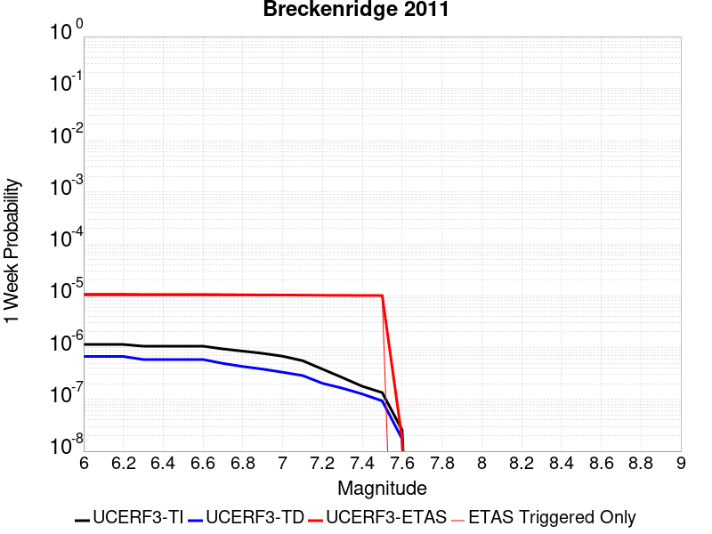 | 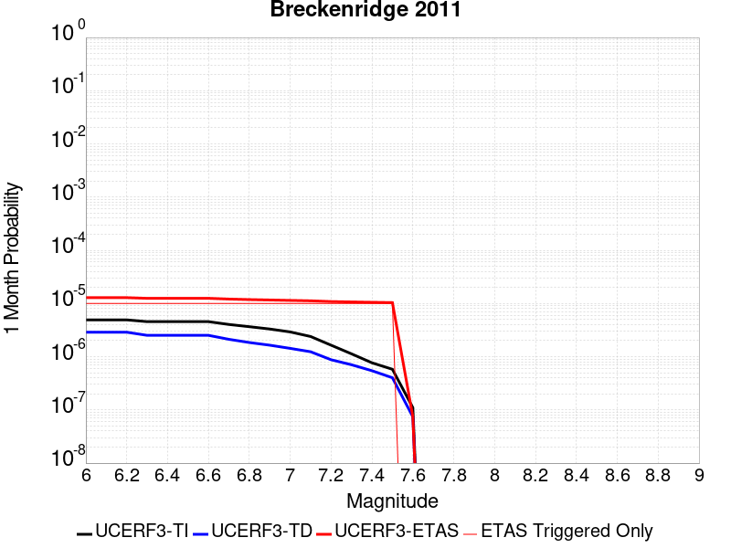 | 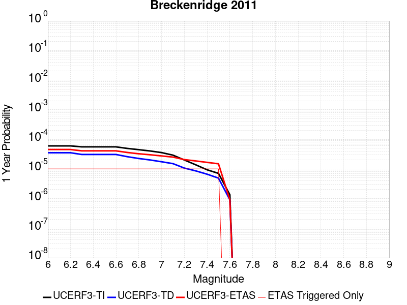 | 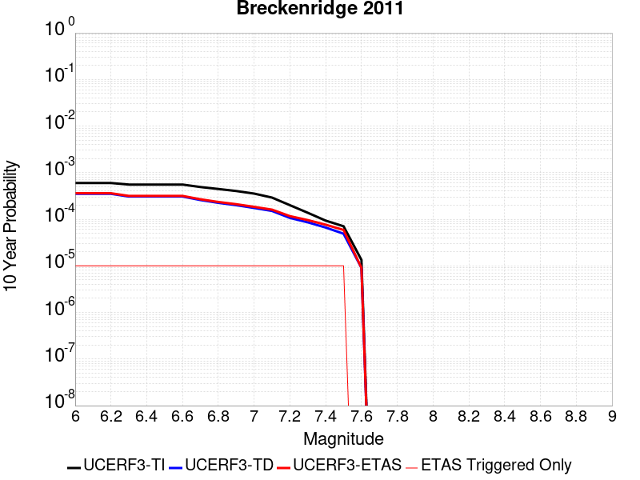 |

| Magnitude | 1 wk TI Prob | 1 wk TD Prob | 1 wk ETAS Prob | 1 wk ETAS/TD Gain | 1 wk ETAS Triggered Only | 1 mo TI Prob | 1 mo TD Prob | 1 mo ETAS Prob | 1 mo ETAS/TD Gain | 1 mo ETAS Triggered Only | 1 yr TI Prob | 1 yr TD Prob | 1 yr ETAS Prob | 1 yr ETAS/TD Gain | 1 yr ETAS Triggered Only | 10 yr TI Prob | 10 yr TD Prob | 10 yr ETAS Prob | 10 yr ETAS/TD Gain | 10 yr ETAS Triggered Only |
|-----|-----|-----|-----|-----|-----|-----|-----|-----|-----|-----|-----|-----|-----|-----|-----|-----|-----|-----|-----|-----|
| 6.0 | 1.1490393E-6 | 6.738007E-7 | 1.0673794E-5 | 15.841174 | 1.0E-5 | 4.924445E-6 | 2.8877141E-6 | 1.2887685E-5 | 4.4629364 | 1.0E-5 | 5.995347E-5 | 3.5157373E-5 | 4.5157023E-5 | 1.2844254 | 1.0E-5 | 5.9937296E-4 | 3.5152017E-4 | 3.6151666E-4 | 1.0284379 | 1.0E-5 |
| 6.1 | 1.1490393E-6 | 6.738007E-7 | 1.0673794E-5 | 15.841174 | 1.0E-5 | 4.924445E-6 | 2.8877141E-6 | 1.2887685E-5 | 4.4629364 | 1.0E-5 | 5.995347E-5 | 3.5157373E-5 | 4.5157023E-5 | 1.2844254 | 1.0E-5 | 5.9937296E-4 | 3.5152017E-4 | 3.6151666E-4 | 1.0284379 | 1.0E-5 |
| 6.2 | 1.1490393E-6 | 6.738007E-7 | 1.0673794E-5 | 15.841174 | 1.0E-5 | 4.924445E-6 | 2.8877141E-6 | 1.2887685E-5 | 4.4629364 | 1.0E-5 | 5.995347E-5 | 3.5157373E-5 | 4.5157023E-5 | 1.2844254 | 1.0E-5 | 5.9937296E-4 | 3.5152017E-4 | 3.6151666E-4 | 1.0284379 | 1.0E-5 |
| 6.3 | 1.064617E-6 | 5.886405E-7 | 1.0588635E-5 | 17.988289 | 1.0E-5 | 4.5626366E-6 | 2.5227425E-6 | 1.2522717E-5 | 4.96393 | 1.0E-5 | 5.5548684E-5 | 3.071397E-5 | 4.071366E-5 | 1.3255748 | 1.0E-5 | 5.55348E-4 | 3.070984E-4 | 3.1709534E-4 | 1.0325528 | 1.0E-5 |
| 6.4 | 1.064617E-6 | 5.886405E-7 | 1.0588635E-5 | 17.988289 | 1.0E-5 | 4.5626366E-6 | 2.5227425E-6 | 1.2522717E-5 | 4.96393 | 1.0E-5 | 5.5548684E-5 | 3.071397E-5 | 4.071366E-5 | 1.3255748 | 1.0E-5 | 5.55348E-4 | 3.070984E-4 | 3.1709534E-4 | 1.0325528 | 1.0E-5 |
| 6.5 | 1.064617E-6 | 5.886405E-7 | 1.0588635E-5 | 17.988289 | 1.0E-5 | 4.5626366E-6 | 2.5227425E-6 | 1.2522717E-5 | 4.96393 | 1.0E-5 | 5.5548684E-5 | 3.071397E-5 | 4.071366E-5 | 1.3255748 | 1.0E-5 | 5.55348E-4 | 3.070984E-4 | 3.1709534E-4 | 1.0325528 | 1.0E-5 |
| 6.6 | 1.064617E-6 | 5.886405E-7 | 1.0588635E-5 | 17.988289 | 1.0E-5 | 4.5626366E-6 | 2.5227425E-6 | 1.2522717E-5 | 4.96393 | 1.0E-5 | 5.5548684E-5 | 3.071397E-5 | 4.071366E-5 | 1.3255748 | 1.0E-5 | 5.55348E-4 | 3.070984E-4 | 3.1709534E-4 | 1.0325528 | 1.0E-5 |
| 6.7 | 9.4219524E-7 | 4.954012E-7 | 1.0495396E-5 | 21.18565 | 1.0E-5 | 4.037973E-6 | 2.1231463E-6 | 1.2123125E-5 | 5.709981 | 1.0E-5 | 4.916122E-5 | 2.5849005E-5 | 3.584875E-5 | 1.386852 | 1.0E-5 | 4.9150345E-4 | 2.5846064E-4 | 2.6845807E-4 | 1.0386806 | 1.0E-5 |
| 6.8 | 8.556422E-7 | 4.311915E-7 | 1.0431188E-5 | 24.191544 | 1.0E-5 | 3.667033E-6 | 1.8479623E-6 | 1.1847944E-5 | 6.411356 | 1.0E-5 | 4.464521E-5 | 2.2498712E-5 | 3.2498487E-5 | 1.4444599 | 1.0E-5 | 4.4636242E-4 | 2.2496474E-4 | 2.3496248E-4 | 1.0444415 | 1.0E-5 |
| 6.9 | 7.7357794E-7 | 3.841983E-7 | 1.0384195E-5 | 27.028215 | 1.0E-5 | 3.3153299E-6 | 1.6465632E-6 | 1.1646547E-5 | 7.0732465 | 1.0E-5 | 4.0363393E-5 | 2.0046726E-5 | 3.0046525E-5 | 1.4988246 | 1.0E-5 | 4.035606E-4 | 2.0044947E-4 | 2.1044747E-4 | 1.0498779 | 1.0E-5 |
| 7.0 | 6.8172454E-7 | 3.3470985E-7 | 1.03347065E-5 | 30.876614 | 1.0E-5 | 2.9216735E-6 | 1.43447E-6 | 1.1434456E-5 | 7.9712057 | 1.0E-5 | 3.5570793E-5 | 1.7464534E-5 | 2.746436E-5 | 1.572579 | 1.0E-5 | 3.55651E-4 | 1.7463184E-4 | 1.846301E-4 | 1.0572534 | 1.0E-5 |
| 7.1 | 5.5936397E-7 | 2.8909366E-7 | 1.0289091E-5 | 35.590855 | 1.0E-5 | 2.397272E-6 | 1.2389722E-6 | 1.123896E-5 | 9.071196 | 1.0E-5 | 2.9186394E-5 | 1.5084385E-5 | 2.5084235E-5 | 1.6629272 | 1.0E-5 | 2.9182562E-4 | 1.5083379E-4 | 1.6083228E-4 | 1.0662881 | 1.0E-5 |
| 7.2 | 3.8420822E-7 | 2.0468183E-7 | 1.020468E-5 | 49.856304 | 1.0E-5 | 1.6466057E-6 | 8.772076E-7 | 1.0877199E-5 | 12.3998 | 1.0E-5 | 2.004724E-5 | 1.0679951E-5 | 2.0679843E-5 | 1.9363239 | 1.0E-5 | 2.004543E-4 | 1.06794454E-4 | 1.1679339E-4 | 1.0936278 | 1.0E-5 |
| 7.3 | 2.6405158E-7 | 1.6473078E-7 | 1.0164729E-5 | 61.7051 | 1.0E-5 | 1.1316491E-6 | 7.0598884E-7 | 1.0705981E-5 | 15.164519 | 1.0E-5 | 1.37777415E-5 | 8.595381E-6 | 1.8595296E-5 | 2.1634057 | 1.0E-5 | 1.3776887E-4 | 8.595055E-5 | 9.594969E-5 | 1.116336 | 1.0E-5 |
| 7.4 | 1.792114E-7 | 1.2725252E-7 | 1.0127252E-5 | 79.58389 | 1.0E-5 | 7.6804866E-7 | 5.453678E-7 | 1.0545363E-5 | 19.336239 | 1.0E-5 | 9.3509525E-6 | 6.639834E-6 | 1.6639768E-5 | 2.5060518 | 1.0E-5 | 9.350559E-5 | 6.63964E-5 | 7.6395736E-5 | 1.1506006 | 1.0E-5 |
| 7.5 | 1.3548703E-7 | 9.385346E-8 | 1.0093852E-5 | 107.54907 | 1.0E-5 | 5.8065854E-7 | 4.0222903E-7 | 1.0402225E-5 | 25.861446 | 1.0E-5 | 7.0694946E-6 | 4.897128E-6 | 1.4897079E-5 | 3.0420032 | 1.0E-5 | 7.0692695E-5 | 4.8970236E-5 | 5.8969745E-5 | 1.2041956 | 1.0E-5 |
| 7.6 | 2.572245E-8 | 1.735264E-8 | 1.735264E-8 | 1.0 | 0.0 | 1.10239064E-7 | 7.436845E-8 | 7.436845E-8 | 1.0 | 0.0 | 1.3421597E-6 | 9.0543557E-7 | 9.0543557E-7 | 1.0 | 0.0 | 1.3421517E-5 | 9.054324E-6 | 9.054324E-6 | 1.0 | 0.0 |

## Compton
*[(top)](#table-of-contents)*

| 1 Week | 1 Month | 1 Year | 10 Year |
|-----|-----|-----|-----|
| 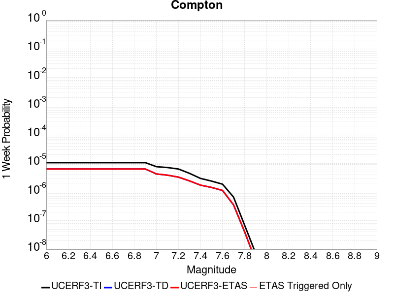 | 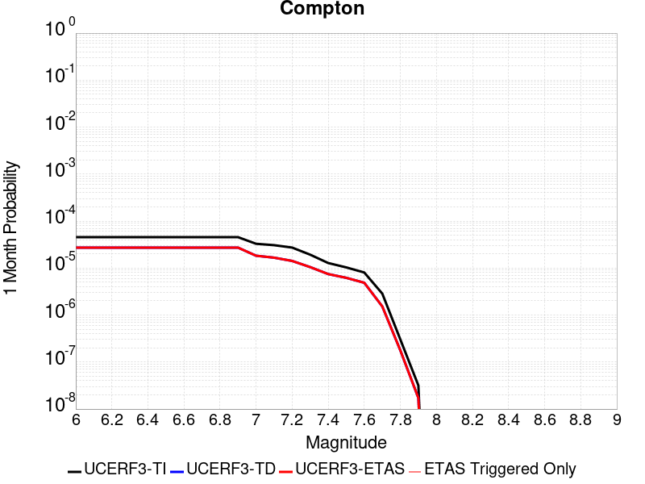 | 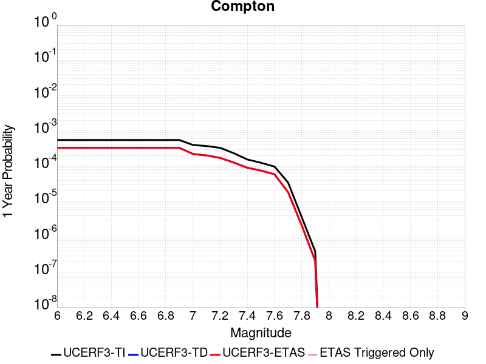 |  |

| Magnitude | 1 wk TI Prob | 1 wk TD Prob | 1 wk ETAS Prob | 1 wk ETAS/TD Gain | 1 wk ETAS Triggered Only | 1 mo TI Prob | 1 mo TD Prob | 1 mo ETAS Prob | 1 mo ETAS/TD Gain | 1 mo ETAS Triggered Only | 1 yr TI Prob | 1 yr TD Prob | 1 yr ETAS Prob | 1 yr ETAS/TD Gain | 1 yr ETAS Triggered Only | 10 yr TI Prob | 10 yr TD Prob | 10 yr ETAS Prob | 10 yr ETAS/TD Gain | 10 yr ETAS Triggered Only |
|-----|-----|-----|-----|-----|-----|-----|-----|-----|-----|-----|-----|-----|-----|-----|-----|-----|-----|-----|-----|-----|
| 6.0 | 1.06050875E-5 | 6.35892E-6 | 6.35892E-6 | 1.0 | 0.0 | 4.5449582E-5 | 2.7252245E-5 | 2.7252245E-5 | 1.0 | 0.0 | 5.5320817E-4 | 3.3174842E-4 | 3.3174842E-4 | 1.0 | 0.0 | 0.0055183303 | 0.003312816 | 0.0033227827 | 1.0030086 | 1.0E-5 |
| 6.1 | 1.06050875E-5 | 6.35892E-6 | 6.35892E-6 | 1.0 | 0.0 | 4.5449582E-5 | 2.7252245E-5 | 2.7252245E-5 | 1.0 | 0.0 | 5.5320817E-4 | 3.3174842E-4 | 3.3174842E-4 | 1.0 | 0.0 | 0.0055183303 | 0.003312816 | 0.0033227827 | 1.0030086 | 1.0E-5 |
| 6.2 | 1.06050875E-5 | 6.35892E-6 | 6.35892E-6 | 1.0 | 0.0 | 4.5449582E-5 | 2.7252245E-5 | 2.7252245E-5 | 1.0 | 0.0 | 5.5320817E-4 | 3.3174842E-4 | 3.3174842E-4 | 1.0 | 0.0 | 0.0055183303 | 0.003312816 | 0.0033227827 | 1.0030086 | 1.0E-5 |
| 6.3 | 1.06050875E-5 | 6.35892E-6 | 6.35892E-6 | 1.0 | 0.0 | 4.5449582E-5 | 2.7252245E-5 | 2.7252245E-5 | 1.0 | 0.0 | 5.5320817E-4 | 3.3174842E-4 | 3.3174842E-4 | 1.0 | 0.0 | 0.0055183303 | 0.003312816 | 0.0033227827 | 1.0030086 | 1.0E-5 |
| 6.4 | 1.06050875E-5 | 6.35892E-6 | 6.35892E-6 | 1.0 | 0.0 | 4.5449582E-5 | 2.7252245E-5 | 2.7252245E-5 | 1.0 | 0.0 | 5.5320817E-4 | 3.3174842E-4 | 3.3174842E-4 | 1.0 | 0.0 | 0.0055183303 | 0.003312816 | 0.0033227827 | 1.0030086 | 1.0E-5 |
| 6.5 | 1.06050875E-5 | 6.35892E-6 | 6.35892E-6 | 1.0 | 0.0 | 4.5449582E-5 | 2.7252245E-5 | 2.7252245E-5 | 1.0 | 0.0 | 5.5320817E-4 | 3.3174842E-4 | 3.3174842E-4 | 1.0 | 0.0 | 0.0055183303 | 0.003312816 | 0.0033227827 | 1.0030086 | 1.0E-5 |
| 6.6 | 1.06050875E-5 | 6.35892E-6 | 6.35892E-6 | 1.0 | 0.0 | 4.5449582E-5 | 2.7252245E-5 | 2.7252245E-5 | 1.0 | 0.0 | 5.5320817E-4 | 3.3174842E-4 | 3.3174842E-4 | 1.0 | 0.0 | 0.0055183303 | 0.003312816 | 0.0033227827 | 1.0030086 | 1.0E-5 |
| 6.7 | 1.06050875E-5 | 6.35892E-6 | 6.35892E-6 | 1.0 | 0.0 | 4.5449582E-5 | 2.7252245E-5 | 2.7252245E-5 | 1.0 | 0.0 | 5.5320817E-4 | 3.3174842E-4 | 3.3174842E-4 | 1.0 | 0.0 | 0.0055183303 | 0.003312816 | 0.0033227827 | 1.0030086 | 1.0E-5 |
| 6.8 | 1.06050875E-5 | 6.35892E-6 | 6.35892E-6 | 1.0 | 0.0 | 4.5449582E-5 | 2.7252245E-5 | 2.7252245E-5 | 1.0 | 0.0 | 5.5320817E-4 | 3.3174842E-4 | 3.3174842E-4 | 1.0 | 0.0 | 0.0055183303 | 0.003312816 | 0.0033227827 | 1.0030086 | 1.0E-5 |
| 6.9 | 1.06050875E-5 | 6.35892E-6 | 6.35892E-6 | 1.0 | 0.0 | 4.5449582E-5 | 2.7252245E-5 | 2.7252245E-5 | 1.0 | 0.0 | 5.5320817E-4 | 3.3174842E-4 | 3.3174842E-4 | 1.0 | 0.0 | 0.0055183303 | 0.003312816 | 0.0033227827 | 1.0030086 | 1.0E-5 |
| 7.0 | 7.672486E-6 | 4.272077E-6 | 4.272077E-6 | 1.0 | 0.0 | 3.288167E-5 | 1.8308778E-5 | 1.8308778E-5 | 1.0 | 0.0 | 4.0026082E-4 | 2.2288719E-4 | 2.2288719E-4 | 1.0 | 0.0 | 0.0039954064 | 0.0022266984 | 0.0022266984 | 1.0 | 0.0 |
| 7.1 | 7.163992E-6 | 3.883783E-6 | 3.883783E-6 | 1.0 | 0.0 | 3.0702464E-5 | 1.664468E-5 | 1.664468E-5 | 1.0 | 0.0 | 3.7373835E-4 | 2.0263072E-4 | 2.0263072E-4 | 1.0 | 0.0 | 0.0037311043 | 0.0020245167 | 0.0020245167 | 1.0 | 0.0 |
| 7.2 | 6.3689185E-6 | 3.3101053E-6 | 3.3101053E-6 | 1.0 | 0.0 | 2.729508E-5 | 1.4186091E-5 | 1.4186091E-5 | 1.0 | 0.0 | 3.322669E-4 | 1.7270239E-4 | 1.7270239E-4 | 1.0 | 0.0 | 0.0033177056 | 0.0017257235 | 0.0017257235 | 1.0 | 0.0 |
| 7.3 | 4.4987873E-6 | 2.4480198E-6 | 2.4480198E-6 | 1.0 | 0.0 | 1.9280375E-5 | 1.0491473E-5 | 1.0491473E-5 | 1.0 | 0.0 | 2.3471327E-4 | 1.2772651E-4 | 1.2772651E-4 | 1.0 | 0.0 | 0.002344655 | 0.0012765612 | 0.0012765612 | 1.0 | 0.0 |
| 7.4 | 2.987296E-6 | 1.7394043E-6 | 1.7394043E-6 | 1.0 | 0.0 | 1.2802635E-5 | 7.4545687E-6 | 7.4545687E-6 | 1.0 | 0.0 | 1.5586092E-4 | 9.075565E-5 | 9.075565E-5 | 1.0 | 0.0 | 0.0015575165 | 9.071917E-4 | 9.071917E-4 | 1.0 | 0.0 |
| 7.5 | 2.4111696E-6 | 1.4471991E-6 | 1.4471991E-6 | 1.0 | 0.0 | 1.0333543E-5 | 6.2022677E-6 | 6.2022677E-6 | 1.0 | 0.0 | 1.2580362E-4 | 7.551004E-5 | 7.551004E-5 | 1.0 | 0.0 | 0.0012573242 | 7.548485E-4 | 7.548485E-4 | 1.0 | 0.0 |
| 7.6 | 1.8783096E-6 | 1.1360306E-6 | 1.1360306E-6 | 1.0 | 0.0 | 8.049874E-6 | 4.868694E-6 | 4.868694E-6 | 1.0 | 0.0 | 9.8002805E-5 | 5.9274775E-5 | 5.9274775E-5 | 1.0 | 0.0 | 9.795959E-4 | 5.925936E-4 | 5.925936E-4 | 1.0 | 0.0 |
| 7.7 | 6.6646817E-7 | 3.5601457E-7 | 3.5601457E-7 | 1.0 | 0.0 | 2.856289E-6 | 1.5257759E-6 | 1.5257759E-6 | 1.0 | 0.0 | 3.4774763E-5 | 1.8576176E-5 | 1.8576176E-5 | 1.0 | 0.0 | 3.4769322E-4 | 1.8574759E-4 | 1.8574759E-4 | 1.0 | 0.0 |
| 7.8 | 7.054689E-8 | 4.1342012E-8 | 4.1342012E-8 | 1.0 | 0.0 | 3.0234378E-7 | 1.7718004E-7 | 1.7718004E-7 | 1.0 | 0.0 | 3.6810293E-6 | 2.157165E-6 | 2.157165E-6 | 1.0 | 0.0 | 3.6809684E-5 | 2.157145E-5 | 2.157145E-5 | 1.0 | 0.0 |
| 7.9 | 7.420925E-9 | 4.0130637E-9 | 4.0130637E-9 | 1.0 | 0.0 | 3.1803964E-8 | 1.7198845E-8 | 1.7198845E-8 | 1.0 | 0.0 | 3.872132E-7 | 2.0939592E-7 | 2.0939592E-7 | 1.0 | 0.0 | 3.872125E-6 | 2.0939574E-6 | 2.0939574E-6 | 1.0 | 0.0 |

## Los Osos 2011
*[(top)](#table-of-contents)*

| 1 Week | 1 Month | 1 Year | 10 Year |
|-----|-----|-----|-----|
|  | 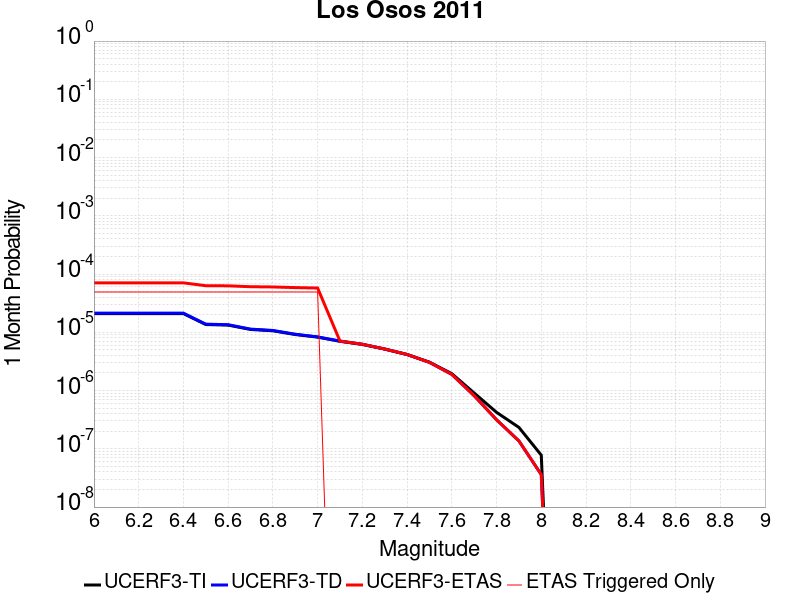 | 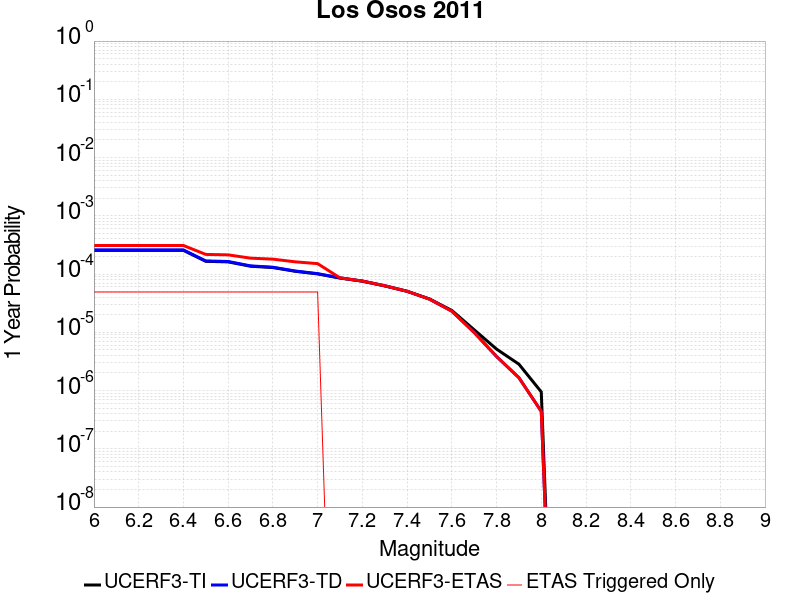 | 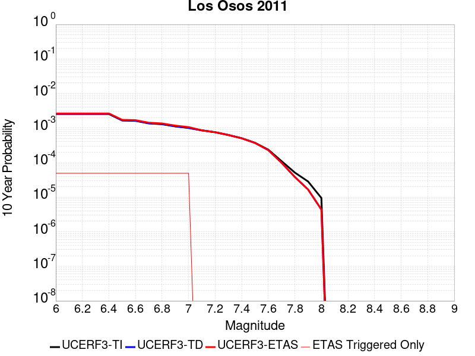 |

| Magnitude | 1 wk TI Prob | 1 wk TD Prob | 1 wk ETAS Prob | 1 wk ETAS/TD Gain | 1 wk ETAS Triggered Only | 1 mo TI Prob | 1 mo TD Prob | 1 mo ETAS Prob | 1 mo ETAS/TD Gain | 1 mo ETAS Triggered Only | 1 yr TI Prob | 1 yr TD Prob | 1 yr ETAS Prob | 1 yr ETAS/TD Gain | 1 yr ETAS Triggered Only | 10 yr TI Prob | 10 yr TD Prob | 10 yr ETAS Prob | 10 yr ETAS/TD Gain | 10 yr ETAS Triggered Only |
|-----|-----|-----|-----|-----|-----|-----|-----|-----|-----|-----|-----|-----|-----|-----|-----|-----|-----|-----|-----|-----|
| 6.0 | 4.8871775E-6 | 4.9814826E-6 | 4.9814826E-6 | 1.0 | 0.0 | 2.0944879E-5 | 2.1349053E-5 | 3.1348838E-5 | 1.4683949 | 1.0E-5 | 2.5497406E-4 | 2.598965E-4 | 2.698939E-4 | 1.0384668 | 1.0E-5 | 0.002546817 | 0.0025962 | 0.002606174 | 1.0038418 | 1.0E-5 |
| 6.1 | 4.8871775E-6 | 4.9814826E-6 | 4.9814826E-6 | 1.0 | 0.0 | 2.0944879E-5 | 2.1349053E-5 | 3.1348838E-5 | 1.4683949 | 1.0E-5 | 2.5497406E-4 | 2.598965E-4 | 2.698939E-4 | 1.0384668 | 1.0E-5 | 0.002546817 | 0.0025962 | 0.002606174 | 1.0038418 | 1.0E-5 |
| 6.2 | 4.8871775E-6 | 4.9814826E-6 | 4.9814826E-6 | 1.0 | 0.0 | 2.0944879E-5 | 2.1349053E-5 | 3.1348838E-5 | 1.4683949 | 1.0E-5 | 2.5497406E-4 | 2.598965E-4 | 2.698939E-4 | 1.0384668 | 1.0E-5 | 0.002546817 | 0.0025962 | 0.002606174 | 1.0038418 | 1.0E-5 |
| 6.3 | 4.8871775E-6 | 4.9814826E-6 | 4.9814826E-6 | 1.0 | 0.0 | 2.0944879E-5 | 2.1349053E-5 | 3.1348838E-5 | 1.4683949 | 1.0E-5 | 2.5497406E-4 | 2.598965E-4 | 2.698939E-4 | 1.0384668 | 1.0E-5 | 0.002546817 | 0.0025962 | 0.002606174 | 1.0038418 | 1.0E-5 |
| 6.4 | 4.8871775E-6 | 4.9814826E-6 | 4.9814826E-6 | 1.0 | 0.0 | 2.0944879E-5 | 2.1349053E-5 | 3.1348838E-5 | 1.4683949 | 1.0E-5 | 2.5497406E-4 | 2.598965E-4 | 2.698939E-4 | 1.0384668 | 1.0E-5 | 0.002546817 | 0.0025962 | 0.002606174 | 1.0038418 | 1.0E-5 |
| 6.5 | 3.1724062E-6 | 3.2233943E-6 | 3.2233943E-6 | 1.0 | 0.0 | 1.3595956E-5 | 1.3814474E-5 | 2.3814337E-5 | 1.7238684 | 1.0E-5 | 1.6551818E-4 | 1.6817838E-4 | 1.7817669E-4 | 1.0594506 | 1.0E-5 | 0.0016539496 | 0.0016805246 | 0.0016905078 | 1.0059406 | 1.0E-5 |
| 6.6 | 3.1022591E-6 | 3.1511038E-6 | 3.1511038E-6 | 1.0 | 0.0 | 1.3295328E-5 | 1.3504661E-5 | 2.3504526E-5 | 1.740475 | 1.0E-5 | 1.618586E-4 | 1.6440697E-4 | 1.7440533E-4 | 1.0608146 | 1.0E-5 | 0.0016174077 | 0.0016428662 | 0.0016528498 | 1.0060769 | 1.0E-5 |
| 6.7 | 2.611518E-6 | 2.6491825E-6 | 2.6491825E-6 | 1.0 | 0.0 | 1.1192172E-5 | 1.1353591E-5 | 2.1353477E-5 | 1.8807687 | 1.0E-5 | 1.3625617E-4 | 1.3822124E-4 | 1.4821986E-4 | 1.0723377 | 1.0E-5 | 0.0013617266 | 0.0013813572 | 0.0013913434 | 1.0072292 | 1.0E-5 |
| 6.8 | 2.4780884E-6 | 2.5121587E-6 | 2.5121587E-6 | 1.0 | 0.0 | 1.0620336E-5 | 1.076635E-5 | 2.0766242E-5 | 1.9288099 | 1.0E-5 | 1.2929492E-4 | 1.3107246E-4 | 1.4107116E-4 | 1.0762837 | 1.0E-5 | 0.0012921972 | 0.0013099556 | 0.0013199425 | 1.0076238 | 1.0E-5 |
| 6.9 | 2.1376322E-6 | 2.1635049E-6 | 2.1635049E-6 | 1.0 | 0.0 | 9.161248E-6 | 9.272131E-6 | 1.9272038E-5 | 2.0784907 | 1.0E-5 | 1.1153249E-4 | 1.1288237E-4 | 1.2288123E-4 | 1.0885777 | 1.0E-5 | 0.0011147653 | 0.0011282521 | 0.0011382409 | 1.0088533 | 1.0E-5 |
| 7.0 | 1.9282882E-6 | 1.949458E-6 | 1.949458E-6 | 1.0 | 0.0 | 8.264066E-6 | 8.354793E-6 | 1.8354709E-5 | 2.1969078 | 1.0E-5 | 1.0061036E-4 | 1.0171487E-4 | 1.1171385E-4 | 1.098304 | 1.0E-5 | 0.0010056482 | 0.0010166845 | 0.0010266743 | 1.009826 | 1.0E-5 |
| 7.1 | 1.6353226E-6 | 1.6501111E-6 | 1.6501111E-6 | 1.0 | 0.0 | 7.0085066E-6 | 7.0718856E-6 | 7.0718856E-6 | 1.0 | 0.0 | 8.532523E-5 | 8.6096814E-5 | 8.6096814E-5 | 1.0 | 0.0 | 8.529247E-4 | 8.6063537E-4 | 8.6063537E-4 | 1.0 | 0.0 |
| 7.2 | 1.4446276E-6 | 1.4553335E-6 | 1.4553335E-6 | 1.0 | 0.0 | 6.191247E-6 | 6.2371287E-6 | 6.2371287E-6 | 1.0 | 0.0 | 7.537582E-5 | 7.59344E-5 | 7.59344E-5 | 1.0 | 0.0 | 7.535026E-4 | 7.590851E-4 | 7.590851E-4 | 1.0 | 0.0 |
| 7.3 | 1.2014582E-6 | 1.2069066E-6 | 1.2069066E-6 | 1.0 | 0.0 | 5.149096E-6 | 5.172447E-6 | 5.172447E-6 | 1.0 | 0.0 | 6.268844E-5 | 6.297272E-5 | 6.297272E-5 | 1.0 | 0.0 | 6.267076E-4 | 6.295492E-4 | 6.295492E-4 | 1.0 | 0.0 |
| 7.4 | 9.707733E-7 | 9.709767E-7 | 9.709767E-7 | 1.0 | 0.0 | 4.16045E-6 | 4.161322E-6 | 4.161322E-6 | 1.0 | 0.0 | 5.0652303E-5 | 5.066292E-5 | 5.066292E-5 | 1.0 | 0.0 | 5.064076E-4 | 5.065139E-4 | 5.065139E-4 | 1.0 | 0.0 |
| 7.5 | 7.174908E-7 | 7.114907E-7 | 7.114907E-7 | 1.0 | 0.0 | 3.074957E-6 | 3.0492424E-6 | 3.0492424E-6 | 1.0 | 0.0 | 3.743696E-5 | 3.7123897E-5 | 3.7123897E-5 | 1.0 | 0.0 | 3.7430652E-4 | 3.7117713E-4 | 3.7117713E-4 | 1.0 | 0.0 |
| 7.6 | 4.5535776E-7 | 4.4207857E-7 | 4.4207857E-7 | 1.0 | 0.0 | 1.9515319E-6 | 1.8946212E-6 | 1.8946212E-6 | 1.0 | 0.0 | 2.3759641E-5 | 2.3066768E-5 | 2.3066768E-5 | 1.0 | 0.0 | 2.37571E-4 | 2.3064384E-4 | 2.3064384E-4 | 1.0 | 0.0 |
| 7.7 | 2.1173553E-7 | 1.9060734E-7 | 1.9060734E-7 | 1.0 | 0.0 | 9.0743765E-7 | 8.1688836E-7 | 8.1688836E-7 | 1.0 | 0.0 | 1.1047998E-5 | 9.94557E-6 | 9.94557E-6 | 1.0 | 0.0 | 1.1047449E-4 | 9.945128E-5 | 9.945128E-5 | 1.0 | 0.0 |
| 7.8 | 9.873608E-8 | 7.367457E-8 | 7.367457E-8 | 1.0 | 0.0 | 4.2315455E-7 | 3.1574814E-7 | 3.1574814E-7 | 1.0 | 0.0 | 5.1518946E-6 | 3.8442267E-6 | 3.8442267E-6 | 1.0 | 0.0 | 5.1517753E-5 | 3.844161E-5 | 3.844161E-5 | 1.0 | 0.0 |
| 7.9 | 5.4399106E-8 | 3.187941E-8 | 3.187941E-8 | 1.0 | 0.0 | 2.33139E-7 | 1.3662603E-7 | 1.3662603E-7 | 1.0 | 0.0 | 2.8384638E-6 | 1.6634207E-6 | 1.6634207E-6 | 1.0 | 0.0 | 2.8384275E-5 | 1.6634083E-5 | 1.6634083E-5 | 1.0 | 0.0 |
| 8.0 | 1.817203E-8 | 8.420079E-9 | 8.420079E-9 | 1.0 | 0.0 | 7.7880124E-8 | 3.6086053E-8 | 3.6086053E-8 | 1.0 | 0.0 | 9.481901E-7 | 4.393476E-7 | 4.393476E-7 | 1.0 | 0.0 | 9.481861E-6 | 4.393468E-6 | 4.393468E-6 | 1.0 | 0.0 |

