# Parent Section Magnitude-Probability Distributions

Only fault sections with at least one triggered aftershock are plotted. Sections are sorted by total supraseismogenic trigger rate (decreasing)

## Table Of Contents

* [Garlock (Central)](#garlock-central)
* [Tank Canyon](#tank-canyon)
* [Little Lake](#little-lake)
* [Airport Lake](#airport-lake)
* [Owl Lake](#owl-lake)
* [Panamint Valley](#panamint-valley)
* [Garlock (East)](#garlock-east)
* [Hunter Mountain-Saline Valley](#hunter-mountain-saline-valley)
* [Blackwater](#blackwater)
* [Ash Hill](#ash-hill)
* [Garlock (West)](#garlock-west)
* [Gravel Hills-Harper Lk](#gravel-hills-harper-lk)
* [McLean Lake](#mclean-lake)
* [Goldstone Lake](#goldstone-lake)
* [So Sierra Nevada](#so-sierra-nevada)
* [Coyote Canyon](#coyote-canyon)
* [San Andreas (Mojave S)](#san-andreas-mojave-s)
* [Lenwood-Lockhart-Old Woman Springs](#lenwood-lockhart-old-woman-springs)
* [Death Valley (So)](#death-valley-so)
* [San Andreas (Mojave N)](#san-andreas-mojave-n)
* [Nelson Lake](#nelson-lake)
* [Towne Pass](#towne-pass)
* [Paradise](#paradise)
* [San Andreas (San Bernardino N)](#san-andreas-san-bernardino-n)
* [Garlic Springs](#garlic-springs)
* [Bicycle Lake](#bicycle-lake)
* [Death Valley (Black Mtns Frontal)](#death-valley-black-mtns-frontal)
* [Helendale-So Lockhart](#helendale-so-lockhart)
* [Coyote Lake](#coyote-lake)
* [San Andreas (Big Bend)](#san-andreas-big-bend)
* [San Andreas (San Bernardino S)](#san-andreas-san-bernardino-s)
* [Elsinore (Glen Ivy) rev](#elsinore-glen-ivy-rev)
* [San Andreas (Parkfield)](#san-andreas-parkfield)
* [San Andreas (Carrizo) rev](#san-andreas-carrizo-rev)
* [San Andreas (Creeping Section) 2011 CFM](#san-andreas-creeping-section-2011-cfm)
* [San Andreas (Cholame) rev](#san-andreas-cholame-rev)
* [Baker](#baker)
* [Death Valley (No)](#death-valley-no)
* [Red Pass](#red-pass)
* [Death Valley (Fish Lake Valley)](#death-valley-fish-lake-valley)
* [Ludlow](#ludlow)
* [White Wolf (Extension)](#white-wolf-extension)
* [Sierra Nevada  (No Extension)](#sierra-nevada--no-extension)
* [Cady](#cady)
* [Santa Ynez (West)](#santa-ynez-west)
* [Whittier alt 1](#whittier-alt-1)
* [Lake Isabella (Seismicity)](#lake-isabella-seismicity)
* [San Andreas (Coachella) rev](#san-andreas-coachella-rev)
* [Santa Cruz Island](#santa-cruz-island)
* [San Andreas (San Gorgonio Pass-Garnet HIll)](#san-andreas-san-gorgonio-pass-garnet-hill)
* [San Jacinto (San Bernardino)](#san-jacinto-san-bernardino)
* [White Mountains](#white-mountains)
* [Manix-Afton Hills](#manix-afton-hills)
* [San Andreas (North Branch Mill Creek)](#san-andreas-north-branch-mill-creek)
* [Owens Valley](#owens-valley)
* [Imperial](#imperial)
* [Dry Mountain](#dry-mountain)
* [Calico-Hidalgo](#calico-hidalgo)
* [Cleghorn](#cleghorn)
* [Red Mountain](#red-mountain)
* [Kern Canyon (North Kern) 2011](#kern-canyon-north-kern-2011)
* [Brawley (Seismic Zone) alt 1](#brawley-seismic-zone-alt-1)
* [Camp Rock 2011](#camp-rock-2011)
* [Mission Creek](#mission-creek)
* [Palos Verdes](#palos-verdes)
* [San Jacinto (Stepovers Combined)](#san-jacinto-stepovers-combined)
* [San Jacinto (San Jacinto Valley) rev](#san-jacinto-san-jacinto-valley-rev)
* [Independence rev 2011](#independence-rev-2011)
* [San Clemente](#san-clemente)
* [Great Valley 05 Pittsburg - Kirby Hills alt1](#great-valley-05-pittsburg---kirby-hills-alt1)
* [San Jacinto (Lytle Creek connector)](#san-jacinto-lytle-creek-connector)
* [Chino alt 1](#chino-alt-1)
* [Blue Cut](#blue-cut)
* [San Pedro Basin](#san-pedro-basin)
* [San Gabriel](#san-gabriel)
* [Big Pine (Central)](#big-pine-central)
* [Hayward (So) 2011 CFM](#hayward-so-2011-cfm)
* [Scodie Lineament](#scodie-lineament)
* [Deep Springs](#deep-springs)
* [Pleito](#pleito)
* [Hunting Creek - Berryessa 2011 CFM](#hunting-creek---berryessa-2011-cfm)
* [Rinconada 2011 CFM](#rinconada-2011-cfm)
* [Almanor 2011 CFM](#almanor-2011-cfm)
* [White Wolf](#white-wolf)
* [San Jacinto (Coyote Creek)](#san-jacinto-coyote-creek)
* [Cucamonga](#cucamonga)
* [Cleghorn Pass](#cleghorn-pass)
* [Hunting Creek - Bartlett Springs connector 2011](#hunting-creek---bartlett-springs-connector-2011)
* [Channel Islands Western Deep Ramp](#channel-islands-western-deep-ramp)
* [Elsinore (Stepovers Combined)](#elsinore-stepovers-combined)
* [Bullion Mountains](#bullion-mountains)
* [Elsinore (Coyote Mountains)](#elsinore-coyote-mountains)
* [Kern Canyon (South Kern) 2011](#kern-canyon-south-kern-2011)
* [Ortigalita (North)](#ortigalita-north)
* [Pisgah-Bullion Mtn-Mesquite Lk](#pisgah-bullion-mtn-mesquite-lk)
* [Pinto Mtn](#pinto-mtn)
* [Big Pine (East)](#big-pine-east)
* [Gillem - Big Crack 2011 CFM](#gillem---big-crack-2011-cfm)
* [Hartley Springs 2011 CFM](#hartley-springs-2011-cfm)
* [San Jacinto (Borrego)](#san-jacinto-borrego)
* [Santa Cruz Catalina Ridge alt1](#santa-cruz-catalina-ridge-alt1)
* [Surprise Valley 2011 CFM](#surprise-valley-2011-cfm)
* [Great Valley 03 Mysterious Ridge](#great-valley-03-mysterious-ridge)
* [Elysian Park (Upper)](#elysian-park-upper)
* [San Jose](#san-jose)
* [Santa Rosa Island](#santa-rosa-island)
* [San Jacinto (Anza) rev](#san-jacinto-anza-rev)
* [Kern Canyon (Lake Isabella) 2011](#kern-canyon-lake-isabella-2011)
* [Mono Lake 2011 CFM](#mono-lake-2011-cfm)
* [Cerro Prieto](#cerro-prieto)
* [La Panza 2011](#la-panza-2011)
* [Great Valley 04a Trout Creek](#great-valley-04a-trout-creek)
* [San Andreas (Offshore) 2011 CFM](#san-andreas-offshore-2011-cfm)
* [Garberville - Briceland 2011 CFM](#garberville---briceland-2011-cfm)
* [Channel Islands Thrust](#channel-islands-thrust)
* [Great Valley 09 (Laguna Seca)](#great-valley-09-laguna-seca)
* [Calaveras (So) - Paicines extension 2011 CFM](#calaveras-so---paicines-extension-2011-cfm)
* [North Frontal  (West)](#north-frontal--west)
* [Cleghorn Lake](#cleghorn-lake)
* [Hat Creek-McArthur-Mayfield](#hat-creek-mcarthur-mayfield)
* [Pitas Point (Lower)-Montalvo](#pitas-point-lower-montalvo)
* [Maacama 2011 CFM](#maacama-2011-cfm)
* [Mission Ridge-Arroyo Parida-Santa Ana](#mission-ridge-arroyo-parida-santa-ana)
* [Pitas Point (Lower West)](#pitas-point-lower-west)
* [Sierra Madre](#sierra-madre)
* [Santa Ynez (East)](#santa-ynez-east)
* [Elmore Ranch](#elmore-ranch)
* [San Cayetano](#san-cayetano)
* [Lost Hills](#lost-hills)

## Garlock (Central)
*[(top)](#table-of-contents)*

| 1 Week | 1 Month | 1 Year | 10 Year |
|-----|-----|-----|-----|
| 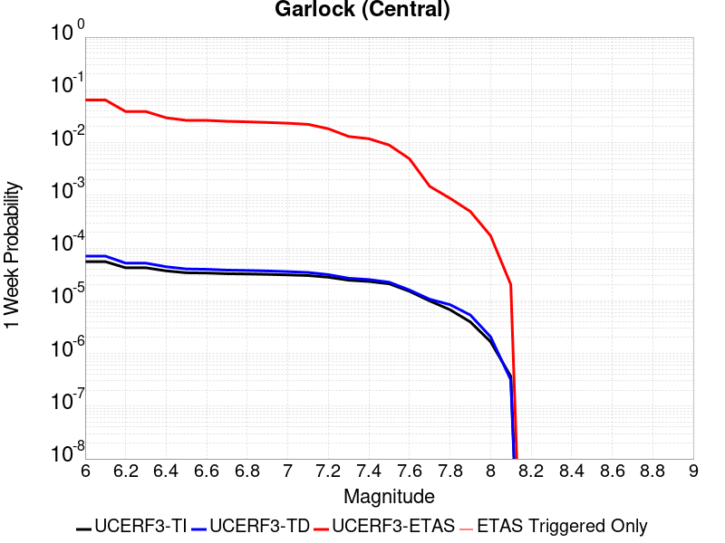 |  |  |  |

| Magnitude | 1 wk TI Prob | 1 wk TD Prob | 1 wk ETAS Prob | 1 wk ETAS/TD Gain | 1 wk ETAS Triggered Only | 1 mo TI Prob | 1 mo TD Prob | 1 mo ETAS Prob | 1 mo ETAS/TD Gain | 1 mo ETAS Triggered Only | 1 yr TI Prob | 1 yr TD Prob | 1 yr ETAS Prob | 1 yr ETAS/TD Gain | 1 yr ETAS Triggered Only | 10 yr TI Prob | 10 yr TD Prob | 10 yr ETAS Prob | 10 yr ETAS/TD Gain | 10 yr ETAS Triggered Only |
|-----|-----|-----|-----|-----|-----|-----|-----|-----|-----|-----|-----|-----|-----|-----|-----|-----|-----|-----|-----|-----|
| 6.0 | 5.5131142E-5 | 7.02476E-5 | 0.0629274 | 895.7944 | 0.06286158 | 2.3625491E-4 | 3.0102677E-4 | 0.075962625 | 252.34508 | 0.07568438 | 0.0028726095 | 0.003658906 | 0.10152816 | 27.748228 | 0.09822866 | 0.028357591 | 0.036136657 | 0.1512231 | 4.1847563 | 0.1194012 |
| 6.1 | 5.5131142E-5 | 7.02476E-5 | 0.0629274 | 895.7944 | 0.06286158 | 2.3625491E-4 | 3.0102677E-4 | 0.075962625 | 252.34508 | 0.07568438 | 0.0028726095 | 0.003658906 | 0.10152816 | 27.748228 | 0.09822866 | 0.028357591 | 0.036136657 | 0.1512231 | 4.1847563 | 0.1194012 |
| 6.2 | 4.216245E-5 | 5.1661802E-5 | 0.037146423 | 719.03076 | 0.03709668 | 1.806837E-4 | 2.213891E-4 | 0.045240346 | 204.34766 | 0.045028925 | 0.0021976046 | 0.002692112 | 0.061280306 | 22.762913 | 0.058746345 | 0.021759989 | 0.026701318 | 0.097172156 | 3.6392272 | 0.072404124 |
| 6.3 | 4.216245E-5 | 5.1661802E-5 | 0.037146423 | 719.03076 | 0.03709668 | 1.806837E-4 | 2.213891E-4 | 0.045240346 | 204.34766 | 0.045028925 | 0.0021976046 | 0.002692112 | 0.061280306 | 22.762913 | 0.058746345 | 0.021759989 | 0.026701318 | 0.097172156 | 3.6392272 | 0.072404124 |
| 6.4 | 3.6858168E-5 | 4.411026E-5 | 0.02831268 | 641.8615 | 0.028269816 | 1.5795401E-4 | 1.8903041E-4 | 0.03489351 | 184.59203 | 0.03471104 | 0.0019213937 | 0.0022990413 | 0.048117 | 20.92916 | 0.04592354 | 0.019048655 | 0.022866098 | 0.078637384 | 3.439038 | 0.0570764 |
| 6.5 | 3.39199E-5 | 4.0018425E-5 | 0.025982799 | 649.2709 | 0.025943818 | 1.453629E-4 | 1.7149639E-4 | 0.031835414 | 185.63316 | 0.031669352 | 0.0017683565 | 0.0020859907 | 0.043747578 | 20.972086 | 0.041748673 | 0.017543508 | 0.020758783 | 0.071686104 | 3.45329 | 0.05200692 |
| 6.6 | 3.3571985E-5 | 3.947258E-5 | 0.025922628 | 656.725 | 0.025884178 | 1.4387199E-4 | 1.6915736E-4 | 0.03177352 | 187.8341 | 0.03160971 | 0.0017502342 | 0.0020575672 | 0.043601304 | 21.190706 | 0.041629393 | 0.017365133 | 0.020480042 | 0.071246594 | 3.4788308 | 0.051827997 |
| 6.7 | 3.2580007E-5 | 3.808902E-5 | 0.025205616 | 661.75543 | 0.025168486 | 1.3962112E-4 | 1.6322857E-4 | 0.03081368 | 188.77626 | 0.030655455 | 0.0016985617 | 0.0019855178 | 0.041984666 | 21.145449 | 0.040078726 | 0.016856372 | 0.019770874 | 0.06893726 | 3.4868088 | 0.05015805 |
| 6.8 | 3.2185937E-5 | 3.7516216E-5 | 0.024906864 | 663.896 | 0.02487028 | 1.3793244E-4 | 1.60774E-4 | 0.03033425 | 188.67635 | 0.030178327 | 0.0016780337 | 0.0019556875 | 0.04112269 | 21.027231 | 0.039243754 | 0.016654192 | 0.019477878 | 0.06748937 | 3.464924 | 0.04896523 |
| 6.9 | 3.165394E-5 | 3.672075E-5 | 0.023534397 | 640.90186 | 0.023498539 | 1.3565269E-4 | 1.5736527E-4 | 0.028840153 | 183.26886 | 0.028687302 | 0.0016503202 | 0.00191426 | 0.03947567 | 20.621895 | 0.037633445 | 0.01638118 | 0.019071518 | 0.06546481 | 3.4325955 | 0.047295284 |
| 7.0 | 3.0903822E-5 | 3.562591E-5 | 0.022698384 | 637.13135 | 0.022663565 | 1.3243823E-4 | 1.5267366E-4 | 0.027941119 | 183.01205 | 0.027792688 | 0.0016112428 | 0.0018572382 | 0.03828972 | 20.616482 | 0.036500268 | 0.015996104 | 0.018513493 | 0.06341122 | 3.4251354 | 0.045744617 |
| 7.1 | 3.0069863E-5 | 3.4392175E-5 | 0.021564038 | 627.0042 | 0.021530388 | 1.2886449E-4 | 1.4738683E-4 | 0.026743336 | 181.44997 | 0.02659987 | 0.0015677959 | 0.0017929787 | 0.036918055 | 20.590347 | 0.03518817 | 0.01556781 | 0.01788099 | 0.06116756 | 3.4208152 | 0.04407467 |
| 7.2 | 2.7957109E-5 | 3.128141E-5 | 0.017744092 | 567.2408 | 0.017713366 | 1.1981068E-4 | 1.3405642E-4 | 0.022078987 | 164.69922 | 0.021947874 | 0.0014577188 | 0.0016309345 | 0.030866887 | 18.92589 | 0.029283712 | 0.014481937 | 0.016284352 | 0.052776936 | 3.2409601 | 0.03709668 |
| 7.3 | 2.4519275E-5 | 2.6714602E-5 | 0.012610621 | 472.04974 | 0.012584243 | 1.0507837E-4 | 1.1448621E-4 | 0.015261556 | 133.30475 | 0.0151488045 | 0.0012785783 | 0.001392993 | 0.02223825 | 15.964367 | 0.020874336 | 0.012712469 | 0.01392861 | 0.04068727 | 2.9211295 | 0.027136637 |
| 7.4 | 2.3225532E-5 | 2.5199166E-5 | 0.012072369 | 479.07812 | 0.012047474 | 9.95342E-5 | 1.0799204E-4 | 0.014420277 | 133.53093 | 0.014313831 | 0.0012111551 | 0.0013140244 | 0.020910118 | 15.913034 | 0.019621877 | 0.012045753 | 0.013146196 | 0.03821924 | 2.907247 | 0.02540705 |
| 7.5 | 2.097765E-5 | 2.2483406E-5 | 0.008729868 | 388.2805 | 0.00870758 | 8.9901114E-5 | 9.6353964E-5 | 0.010532517 | 109.31067 | 0.010437168 | 0.0010939965 | 0.00117249 | 0.015946107 | 13.600206 | 0.014790959 | 0.010886264 | 0.0117406575 | 0.031073218 | 2.6466336 | 0.019562235 |
| 7.6 | 1.511254E-5 | 1.5990969E-5 | 0.0045486316 | 284.45004 | 0.004532713 | 6.476642E-5 | 6.8530964E-5 | 0.0057936707 | 84.54092 | 0.0057255323 | 7.882459E-4 | 8.34053E-4 | 0.008878867 | 10.645448 | 0.0080515295 | 0.007854558 | 0.008383867 | 0.018496968 | 2.206257 | 0.010198604 |
| 7.7 | 9.934069E-6 | 1.0678523E-5 | 0.001382406 | 129.45667 | 0.0013717421 | 4.2573887E-5 | 4.5764296E-5 | 0.0017156348 | 37.4885 | 0.0016699469 | 5.182138E-4 | 5.570383E-4 | 0.0028221323 | 5.0663166 | 0.0022663565 | 0.00517007 | 0.005627419 | 0.008474075 | 1.5058546 | 0.0028627662 |
| 7.8 | 6.7562896E-6 | 8.42837E-6 | 9.626757E-4 | 114.21849 | 9.542554E-4 | 2.8955206E-5 | 3.6121084E-5 | 0.0012288973 | 34.021603 | 0.0011928192 | 3.5247262E-4 | 4.3968562E-4 | 0.001989669 | 4.5252075 | 0.001550665 | 0.0035191406 | 0.004446416 | 0.0064651924 | 1.4540232 | 0.0020277926 |
| 7.9 | 3.975453E-6 | 5.3710532E-6 | 3.632149E-4 | 67.62452 | 3.5784577E-4 | 1.7037546E-5 | 2.3018596E-5 | 5.001353E-4 | 21.727446 | 4.771277E-4 | 2.0741238E-4 | 2.8021546E-4 | 9.360822E-4 | 3.34058 | 6.560506E-4 | 0.002072189 | 0.0028335669 | 0.0037851182 | 1.335814 | 9.542554E-4 |
| 8.0 | 1.6729537E-6 | 2.0775192E-6 | 1.213592E-4 | 58.415436 | 1.19281925E-4 | 7.169782E-6 | 8.903624E-6 | 1.2818449E-4 | 14.39689 | 1.19281925E-4 | 8.7288594E-5 | 1.0839626E-4 | 2.2766525E-4 | 2.1003053 | 1.19281925E-4 | 8.7254314E-4 | 0.001096854 | 0.0013351562 | 1.2172596 | 2.3856385E-4 |
| 8.1 | 3.6733252E-7 | 3.1489736E-7 | 3.1489736E-7 | 1.0 | 0.0 | 1.5742813E-6 | 1.3495595E-6 | 1.3495595E-6 | 1.0 | 0.0 | 1.9166706E-5 | 1.643078E-5 | 1.643078E-5 | 1.0 | 0.0 | 1.9165053E-4 | 1.662928E-4 | 2.2592384E-4 | 1.3585907 | 5.9640963E-5 |

## Tank Canyon
*[(top)](#table-of-contents)*

| 1 Week | 1 Month | 1 Year | 10 Year |
|-----|-----|-----|-----|
|  |  |  |  |

| Magnitude | 1 wk TI Prob | 1 wk TD Prob | 1 wk ETAS Prob | 1 wk ETAS/TD Gain | 1 wk ETAS Triggered Only | 1 mo TI Prob | 1 mo TD Prob | 1 mo ETAS Prob | 1 mo ETAS/TD Gain | 1 mo ETAS Triggered Only | 1 yr TI Prob | 1 yr TD Prob | 1 yr ETAS Prob | 1 yr ETAS/TD Gain | 1 yr ETAS Triggered Only | 10 yr TI Prob | 10 yr TD Prob | 10 yr ETAS Prob | 10 yr ETAS/TD Gain | 10 yr ETAS Triggered Only |
|-----|-----|-----|-----|-----|-----|-----|-----|-----|-----|-----|-----|-----|-----|-----|-----|-----|-----|-----|-----|-----|
| 6.0 | 4.8284557E-5 | 5.796445E-5 | 0.033753153 | 582.30786 | 0.033697143 | 2.0691741E-4 | 2.4839927E-4 | 0.04419287 | 177.91063 | 0.04395539 | 0.0025163088 | 0.0030207336 | 0.06872492 | 22.75107 | 0.06590326 | 0.02488006 | 0.029863616 | 0.11647984 | 3.900393 | 0.08928252 |
| 6.1 | 1.7796336E-5 | 2.0873378E-5 | 0.011531339 | 552.4424 | 0.011510706 | 7.626778E-5 | 8.945448E-5 | 0.015356175 | 171.66469 | 0.015268086 | 9.281647E-4 | 0.0010886024 | 0.025097745 | 23.055017 | 0.024035307 | 0.009242975 | 0.010836642 | 0.04517153 | 4.1684065 | 0.03471104 |
| 6.2 | 1.7796336E-5 | 2.0873378E-5 | 0.011531339 | 552.4424 | 0.011510706 | 7.626778E-5 | 8.945448E-5 | 0.015356175 | 171.66469 | 0.015268086 | 9.281647E-4 | 0.0010886024 | 0.025097745 | 23.055017 | 0.024035307 | 0.009242975 | 0.010836642 | 0.04517153 | 4.1684065 | 0.03471104 |
| 6.3 | 1.3515912E-5 | 1.5759651E-5 | 0.008305723 | 527.0245 | 0.008290093 | 5.792405E-5 | 6.7539746E-5 | 0.011279283 | 167.00215 | 0.011212501 | 7.049971E-4 | 8.2200987E-4 | 0.01869959 | 22.748621 | 0.017892288 | 0.007027647 | 0.008192157 | 0.033982594 | 4.148186 | 0.02600346 |
| 6.4 | 1.0870146E-5 | 1.2618114E-5 | 0.0060959193 | 483.1086 | 0.006083378 | 4.658551E-5 | 5.4076605E-5 | 0.008224446 | 152.0888 | 0.008170811 | 5.67031E-4 | 6.582015E-4 | 0.013591772 | 20.649864 | 0.012942089 | 0.005655863 | 0.006564382 | 0.025820455 | 3.9334176 | 0.019383313 |
| 6.5 | 7.964826E-6 | 9.196184E-6 | 0.004124385 | 448.48874 | 0.004115226 | 3.4134522E-5 | 3.941168E-5 | 0.005764718 | 146.26929 | 0.0057255323 | 4.1550855E-4 | 4.797421E-4 | 0.009242757 | 19.266096 | 0.008767221 | 0.0041473247 | 0.004788209 | 0.017608972 | 3.6775696 | 0.012882448 |
| 6.6 | 6.6317E-6 | 7.612378E-6 | 0.0031089187 | 408.4031 | 0.00310133 | 2.8421264E-5 | 3.262412E-5 | 0.004326633 | 132.62068 | 0.004294149 | 3.4597394E-4 | 3.9713533E-4 | 0.0066569494 | 16.76242 | 0.006262301 | 0.0034543579 | 0.0039652516 | 0.013410562 | 3.3820207 | 0.009482913 |
| 6.7 | 4.793663E-6 | 5.4308593E-6 | 0.0017350094 | 319.47235 | 0.0017295879 | 2.0544108E-5 | 2.3274928E-5 | 0.0025877766 | 111.183014 | 0.0025645613 | 2.500958E-4 | 2.833398E-4 | 0.0037415354 | 13.205119 | 0.0034591758 | 0.0024981452 | 0.0028303189 | 0.008182813 | 2.8911276 | 0.0053676865 |
| 6.8 | 4.382823E-6 | 4.969325E-6 | 0.0016152672 | 325.04764 | 0.001610306 | 1.8783392E-5 | 2.1296957E-5 | 0.0024068847 | 113.01542 | 0.0023856384 | 2.286638E-4 | 2.5926388E-4 | 0.0034194153 | 13.188938 | 0.003160971 | 0.0022842865 | 0.0025901233 | 0.007468015 | 2.8832662 | 0.004890559 |
| 6.9 | 2.729601E-6 | 3.0735862E-6 | 7.187629E-4 | 233.85156 | 7.1569154E-4 | 1.1698237E-5 | 1.3172453E-5 | 0.0010270554 | 77.96995 | 0.0010138963 | 1.4241673E-4 | 1.6036403E-4 | 0.0014126233 | 8.808854 | 0.0012524602 | 0.001423255 | 0.0016024808 | 0.003627024 | 2.2633805 | 0.0020277926 |
| 7.0 | 1.8987357E-6 | 2.126971E-6 | 3.5997198E-4 | 169.24161 | 3.5784577E-4 | 8.137413E-6 | 9.115562E-6 | 4.2659848E-4 | 46.798923 | 4.1748674E-4 | 9.90685E-5 | 1.1097702E-4 | 6.476861E-4 | 5.8362184 | 5.3676864E-4 | 9.902435E-4 | 0.0011092846 | 0.0020029068 | 1.8055841 | 8.9461444E-4 |
| 7.1 | 1.4928986E-6 | 1.6641525E-6 | 2.402276E-4 | 144.35432 | 2.3856385E-4 | 6.398121E-6 | 7.132066E-6 | 3.0533475E-4 | 42.811543 | 2.982048E-4 | 7.789434E-5 | 8.6830034E-5 | 3.8500896E-4 | 4.434053 | 2.982048E-4 | 7.786704E-4 | 8.6801895E-4 | 0.0012851433 | 1.4805475 | 4.1748674E-4 |
| 7.2 | 1.069082E-6 | 1.1828765E-6 | 1.2046466E-4 | 101.84043 | 1.19281925E-4 | 4.581772E-6 | 5.0694644E-6 | 1.2435079E-4 | 24.529373 | 1.19281925E-4 | 5.5781646E-5 | 6.171951E-5 | 1.8099407E-4 | 2.932526 | 1.19281925E-4 | 5.576765E-4 | 6.1707594E-4 | 8.554926E-4 | 1.3863652 | 2.3856385E-4 |
| 7.3 | 8.776551E-7 | 9.770151E-7 | 1.20258825E-4 | 123.08798 | 1.19281925E-4 | 3.7613736E-6 | 4.187204E-6 | 1.2346862E-4 | 29.48713 | 1.19281925E-4 | 4.579376E-5 | 5.0978535E-5 | 1.7025438E-4 | 3.3397267 | 1.19281925E-4 | 4.5784327E-4 | 5.097194E-4 | 6.885511E-4 | 1.3508434 | 1.7892288E-4 |
| 7.4 | 7.55721E-7 | 8.5103835E-7 | 1.2013286E-4 | 141.16034 | 1.19281925E-4 | 3.2388E-6 | 3.6473052E-6 | 1.2292879E-4 | 33.704006 | 1.19281925E-4 | 3.9431678E-5 | 4.4405555E-5 | 1.6368218E-4 | 3.6860745 | 1.19281925E-4 | 3.942468E-4 | 4.4401767E-4 | 6.228611E-4 | 1.4027845 | 1.7892288E-4 |
| 7.5 | 5.587665E-7 | 6.305732E-7 | 1.1991242E-4 | 190.16417 | 1.19281925E-4 | 2.3947114E-6 | 2.7024564E-6 | 1.21984056E-4 | 45.138214 | 1.19281925E-4 | 2.915522E-5 | 3.2902408E-5 | 1.5218041E-4 | 4.625206 | 1.19281925E-4 | 2.9151395E-4 | 3.2902407E-4 | 5.078881E-4 | 1.5436199 | 1.7892288E-4 |

## Little Lake
*[(top)](#table-of-contents)*

| 1 Week | 1 Month | 1 Year | 10 Year |
|-----|-----|-----|-----|
|  |  |  |  |

| Magnitude | 1 wk TI Prob | 1 wk TD Prob | 1 wk ETAS Prob | 1 wk ETAS/TD Gain | 1 wk ETAS Triggered Only | 1 mo TI Prob | 1 mo TD Prob | 1 mo ETAS Prob | 1 mo ETAS/TD Gain | 1 mo ETAS Triggered Only | 1 yr TI Prob | 1 yr TD Prob | 1 yr ETAS Prob | 1 yr ETAS/TD Gain | 1 yr ETAS Triggered Only | 10 yr TI Prob | 10 yr TD Prob | 10 yr ETAS Prob | 10 yr ETAS/TD Gain | 10 yr ETAS Triggered Only |
|-----|-----|-----|-----|-----|-----|-----|-----|-----|-----|-----|-----|-----|-----|-----|-----|-----|-----|-----|-----|-----|
| 6.0 | 2.8424427E-5 | 3.1205716E-5 | 0.029492922 | 945.1128 | 0.029462636 | 1.2181328E-4 | 1.3373268E-4 | 0.036152057 | 270.33075 | 0.03602314 | 0.0014820677 | 0.0016271125 | 0.048369087 | 29.72695 | 0.046818156 | 0.014722223 | 0.016165398 | 0.07102825 | 4.3938446 | 0.0557643 |
| 6.1 | 2.8424427E-5 | 3.1205716E-5 | 0.029492922 | 945.1128 | 0.029462636 | 1.2181328E-4 | 1.3373268E-4 | 0.036152057 | 270.33075 | 0.03602314 | 0.0014820677 | 0.0016271125 | 0.048369087 | 29.72695 | 0.046818156 | 0.014722223 | 0.016165398 | 0.07102825 | 4.3938446 | 0.0557643 |
| 6.2 | 2.8424427E-5 | 3.1205716E-5 | 0.029492922 | 945.1128 | 0.029462636 | 1.2181328E-4 | 1.3373268E-4 | 0.036152057 | 270.33075 | 0.03602314 | 0.0014820677 | 0.0016271125 | 0.048369087 | 29.72695 | 0.046818156 | 0.014722223 | 0.016165398 | 0.07102825 | 4.3938446 | 0.0557643 |
| 6.3 | 1.48860645E-5 | 1.6081383E-5 | 0.020651523 | 1284.1881 | 0.020635772 | 6.379586E-5 | 6.8918554E-5 | 0.02541458 | 368.7625 | 0.025347408 | 7.7643775E-4 | 8.387886E-4 | 0.03343503 | 39.86109 | 0.032623608 | 0.007737305 | 0.008359045 | 0.046505906 | 5.563543 | 0.03846842 |
| 6.4 | 1.48860645E-5 | 1.6081383E-5 | 0.020651523 | 1284.1881 | 0.020635772 | 6.379586E-5 | 6.8918554E-5 | 0.02541458 | 368.7625 | 0.025347408 | 7.7643775E-4 | 8.387886E-4 | 0.03343503 | 39.86109 | 0.032623608 | 0.007737305 | 0.008359045 | 0.046505906 | 5.563543 | 0.03846842 |
| 6.5 | 1.2797581E-5 | 1.376556E-5 | 0.019337172 | 1404.7501 | 0.019323671 | 5.4845623E-5 | 5.8994065E-5 | 0.02373506 | 402.3296 | 0.02367746 | 6.675408E-4 | 7.1804173E-4 | 0.03147068 | 43.828484 | 0.030774737 | 0.006655392 | 0.007159767 | 0.04292499 | 5.995305 | 0.03602314 |
| 6.6 | 9.661896E-6 | 1.0289033E-5 | 0.016709587 | 1624.0193 | 0.016699469 | 4.1407468E-5 | 4.40952E-5 | 0.020559682 | 466.25668 | 0.02051649 | 5.040193E-4 | 5.36743E-4 | 0.027122334 | 50.53132 | 0.02659987 | 0.005028777 | 0.0053560715 | 0.03691512 | 6.8922005 | 0.03172899 |
| 6.7 | 7.767871E-6 | 8.199681E-6 | 0.015276161 | 1863.0188 | 0.015268086 | 3.329045E-5 | 3.5141096E-5 | 0.018761745 | 533.8976 | 0.018727262 | 4.0523586E-4 | 4.2777258E-4 | 0.024452798 | 57.163082 | 0.024035307 | 0.004044977 | 0.004270843 | 0.032716855 | 7.660514 | 0.02856802 |
| 6.8 | 6.4235196E-6 | 6.735739E-6 | 0.0133065805 | 1975.5189 | 0.013299935 | 2.752908E-5 | 2.8867207E-5 | 0.0161911 | 560.88214 | 0.016162701 | 3.35115E-4 | 3.5141438E-4 | 0.020383736 | 58.00484 | 0.020039363 | 0.003346101 | 0.0035098472 | 0.027044773 | 7.705399 | 0.02361782 |
| 6.9 | 3.1283696E-6 | 3.1121751E-6 | 0.008114258 | 2607.2627 | 0.0081111705 | 1.3407229E-5 | 1.33378335E-5 | 0.010032886 | 752.2125 | 0.010019681 | 1.6322079E-4 | 1.6237753E-4 | 0.012565684 | 77.385605 | 0.01240532 | 0.0016310095 | 0.0016227372 | 0.015734708 | 9.6964 | 0.014134908 |
| 7.0 | 2.290603E-6 | 2.2286763E-6 | 0.005071699 | 2275.6555 | 0.0050694817 | 9.816834E-6 | 9.551441E-6 | 0.0060928715 | 637.9008 | 0.006083378 | 1.19513395E-4 | 1.1628362E-4 | 0.007510903 | 64.59124 | 0.0073954794 | 0.0011944914 | 0.0011623299 | 0.009561931 | 8.226521 | 0.008409375 |
| 7.1 | 1.293693E-6 | 1.1776774E-6 | 0.0022675316 | 1925.4268 | 0.0022663565 | 5.5443866E-6 | 5.047183E-6 | 0.0024503144 | 485.48154 | 0.0024452794 | 6.750081E-5 | 6.1448416E-5 | 0.0033414997 | 54.378937 | 0.003280253 | 6.7480316E-4 | 6.1438273E-4 | 0.004429059 | 7.2089577 | 0.0038170216 |
| 7.2 | 4.715842E-7 | 3.091732E-7 | 5.9950115E-5 | 193.90463 | 5.9640963E-5 | 2.0210737E-6 | 1.3250274E-6 | 6.096591E-5 | 46.01106 | 5.9640963E-5 | 2.4606294E-5 | 1.6132095E-5 | 7.577209E-5 | 4.696978 | 5.9640963E-5 | 2.460357E-4 | 1.6130977E-4 | 2.2094112E-4 | 1.3696697 | 5.9640963E-5 |
| 7.3 | 3.9430947E-7 | 2.3096938E-7 | 5.9871916E-5 | 259.22015 | 5.9640963E-5 | 1.6898966E-6 | 9.898685E-7 | 6.063077E-5 | 61.251343 | 5.9640963E-5 | 2.0574296E-5 | 1.2051582E-5 | 7.169182E-5 | 5.948748 | 5.9640963E-5 | 2.0572392E-4 | 1.2050936E-4 | 1.8014314E-4 | 1.4948477 | 5.9640963E-5 |
| 7.4 | 3.547123E-7 | 1.9678579E-7 | 5.9837734E-5 | 304.0755 | 5.9640963E-5 | 1.5201948E-6 | 8.433674E-7 | 6.048428E-5 | 71.71759 | 5.9640963E-5 | 1.8508214E-5 | 1.02679505E-5 | 6.99083E-5 | 6.8083987 | 5.9640963E-5 | 1.8506673E-4 | 1.0267482E-4 | 1.6230966E-4 | 1.5808127 | 5.9640963E-5 |
| 7.5 | 2.6354266E-7 | 1.4422719E-7 | 1.4422719E-7 | 1.0 | 0.0 | 1.129468E-6 | 6.1811636E-7 | 6.1811636E-7 | 1.0 | 0.0 | 1.3751187E-5 | 7.525541E-6 | 7.525541E-6 | 1.0 | 0.0 | 1.3750336E-4 | 7.5252916E-5 | 7.5252916E-5 | 1.0 | 0.0 |
| 7.6 | 1.269913E-7 | 7.572344E-8 | 7.572344E-8 | 1.0 | 0.0 | 5.4424834E-7 | 3.24529E-7 | 3.24529E-7 | 1.0 | 0.0 | 6.6262032E-6 | 3.9511337E-6 | 3.9511337E-6 | 1.0 | 0.0 | 6.626006E-5 | 3.9510673E-5 | 3.9510673E-5 | 1.0 | 0.0 |

## Airport Lake
*[(top)](#table-of-contents)*

| 1 Week | 1 Month | 1 Year | 10 Year |
|-----|-----|-----|-----|
|  |  |  |  |

| Magnitude | 1 wk TI Prob | 1 wk TD Prob | 1 wk ETAS Prob | 1 wk ETAS/TD Gain | 1 wk ETAS Triggered Only | 1 mo TI Prob | 1 mo TD Prob | 1 mo ETAS Prob | 1 mo ETAS/TD Gain | 1 mo ETAS Triggered Only | 1 yr TI Prob | 1 yr TD Prob | 1 yr ETAS Prob | 1 yr ETAS/TD Gain | 1 yr ETAS Triggered Only | 10 yr TI Prob | 10 yr TD Prob | 10 yr ETAS Prob | 10 yr ETAS/TD Gain | 10 yr ETAS Triggered Only |
|-----|-----|-----|-----|-----|-----|-----|-----|-----|-----|-----|-----|-----|-----|-----|-----|-----|-----|-----|-----|-----|
| 6.0 | 1.2387061E-5 | 1.3103157E-5 | 0.026791545 | 2044.6633 | 0.026778791 | 5.3086325E-5 | 5.615534E-5 | 0.033214666 | 591.4784 | 0.033160374 | 6.461343E-4 | 6.8350515E-4 | 0.042880446 | 62.736095 | 0.0422258 | 0.0064425888 | 0.0068168393 | 0.055862922 | 8.194842 | 0.049382716 |
| 6.1 | 1.2387061E-5 | 1.3103157E-5 | 0.026791545 | 2044.6633 | 0.026778791 | 5.3086325E-5 | 5.615534E-5 | 0.033214666 | 591.4784 | 0.033160374 | 6.461343E-4 | 6.8350515E-4 | 0.042880446 | 62.736095 | 0.0422258 | 0.0064425888 | 0.0068168393 | 0.055862922 | 8.194842 | 0.049382716 |
| 6.2 | 1.2387061E-5 | 1.3103157E-5 | 0.026791545 | 2044.6633 | 0.026778791 | 5.3086325E-5 | 5.615534E-5 | 0.033214666 | 591.4784 | 0.033160374 | 6.461343E-4 | 6.8350515E-4 | 0.042880446 | 62.736095 | 0.0422258 | 0.0064425888 | 0.0068168393 | 0.055862922 | 8.194842 | 0.049382716 |
| 6.3 | 1.2387061E-5 | 1.3103157E-5 | 0.026791545 | 2044.6633 | 0.026778791 | 5.3086325E-5 | 5.615534E-5 | 0.033214666 | 591.4784 | 0.033160374 | 6.461343E-4 | 6.8350515E-4 | 0.042880446 | 62.736095 | 0.0422258 | 0.0064425888 | 0.0068168393 | 0.055862922 | 8.194842 | 0.049382716 |
| 6.4 | 1.2387061E-5 | 1.3103157E-5 | 0.026791545 | 2044.6633 | 0.026778791 | 5.3086325E-5 | 5.615534E-5 | 0.033214666 | 591.4784 | 0.033160374 | 6.461343E-4 | 6.8350515E-4 | 0.042880446 | 62.736095 | 0.0422258 | 0.0064425888 | 0.0068168393 | 0.055862922 | 8.194842 | 0.049382716 |
| 6.5 | 6.9922594E-6 | 7.384925E-6 | 0.020702645 | 2803.3657 | 0.020695414 | 2.996648E-5 | 3.1649324E-5 | 0.025378255 | 801.8577 | 0.025347408 | 3.6478083E-4 | 3.8526783E-4 | 0.03287707 | 85.33562 | 0.032504324 | 0.003641826 | 0.0038465366 | 0.041394636 | 10.761535 | 0.037693087 |
| 6.6 | 6.9922594E-6 | 7.384925E-6 | 0.020702645 | 2803.3657 | 0.020695414 | 2.996648E-5 | 3.1649324E-5 | 0.025378255 | 801.8577 | 0.025347408 | 3.6478083E-4 | 3.8526783E-4 | 0.03287707 | 85.33562 | 0.032504324 | 0.003641826 | 0.0038465366 | 0.041394636 | 10.761535 | 0.037693087 |
| 6.7 | 5.477277E-6 | 5.7860684E-6 | 0.017838331 | 3082.9795 | 0.017832648 | 2.3473833E-5 | 2.4797222E-5 | 0.022151046 | 893.28735 | 0.022126798 | 2.8575645E-4 | 3.0186825E-4 | 0.028503528 | 94.42374 | 0.028210174 | 0.0028538927 | 0.003014966 | 0.035599675 | 11.807654 | 0.032683246 |
| 6.8 | 3.9950432E-6 | 4.2190873E-6 | 0.014496911 | 3436.0305 | 0.014492754 | 1.7121502E-5 | 1.8081691E-5 | 0.017790766 | 983.9105 | 0.017773006 | 2.0843433E-4 | 2.2012512E-4 | 0.022580562 | 102.58058 | 0.022365361 | 0.0020823893 | 0.0021993418 | 0.027848061 | 12.661999 | 0.025705254 |
| 6.9 | 2.95695E-6 | 3.1230243E-6 | 0.010499899 | 3362.0935 | 0.010496809 | 1.2672582E-5 | 1.3384334E-5 | 0.0127763795 | 954.57715 | 0.012763166 | 1.5427776E-4 | 1.6294434E-4 | 0.016144117 | 99.07749 | 0.015983777 | 0.001541707 | 0.0016284712 | 0.019967973 | 12.261791 | 0.018369416 |
| 7.0 | 1.456072E-6 | 1.540812E-6 | 0.0047131693 | 3058.8867 | 0.004711636 | 6.2402937E-6 | 6.603469E-6 | 0.005672457 | 859.0117 | 0.0056658913 | 7.597293E-5 | 8.039528E-5 | 0.007057827 | 87.78907 | 0.0069779926 | 7.594696E-4 | 8.0376083E-4 | 0.008789226 | 10.935126 | 0.007991889 |
| 7.1 | 6.995192E-7 | 7.4089746E-7 | 0.002147814 | 2898.9355 | 0.0021470746 | 2.997936E-6 | 3.1752747E-6 | 0.0023291653 | 733.5319 | 0.0023259975 | 3.649926E-5 | 3.865897E-5 | 0.0031995077 | 82.76236 | 0.003160971 | 3.6493264E-4 | 3.865897E-4 | 0.0040829 | 10.561326 | 0.0036977397 |

## Owl Lake
*[(top)](#table-of-contents)*

| 1 Week | 1 Month | 1 Year | 10 Year |
|-----|-----|-----|-----|
|  |  | 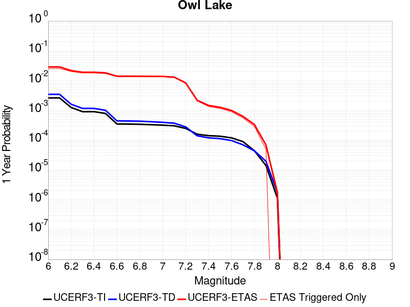 |  |

| Magnitude | 1 wk TI Prob | 1 wk TD Prob | 1 wk ETAS Prob | 1 wk ETAS/TD Gain | 1 wk ETAS Triggered Only | 1 mo TI Prob | 1 mo TD Prob | 1 mo ETAS Prob | 1 mo ETAS/TD Gain | 1 mo ETAS Triggered Only | 1 yr TI Prob | 1 yr TD Prob | 1 yr ETAS Prob | 1 yr ETAS/TD Gain | 1 yr ETAS Triggered Only | 10 yr TI Prob | 10 yr TD Prob | 10 yr ETAS Prob | 10 yr ETAS/TD Gain | 10 yr ETAS Triggered Only |
|-----|-----|-----|-----|-----|-----|-----|-----|-----|-----|-----|-----|-----|-----|-----|-----|-----|-----|-----|-----|-----|
| 6.0 | 5.0320643E-5 | 6.6358676E-5 | 0.013305774 | 200.51294 | 0.013240294 | 2.1564208E-4 | 2.843643E-4 | 0.017873446 | 62.85404 | 0.017594084 | 0.0026222812 | 0.003457547 | 0.028717317 | 8.305691 | 0.025347408 | 0.02591553 | 0.034141295 | 0.06559348 | 1.9212359 | 0.032563966 |
| 6.1 | 5.0320643E-5 | 6.6358676E-5 | 0.013305774 | 200.51294 | 0.013240294 | 2.1564208E-4 | 2.843643E-4 | 0.017873446 | 62.85404 | 0.017594084 | 0.0026222812 | 0.003457547 | 0.028717317 | 8.305691 | 0.025347408 | 0.02591553 | 0.034141295 | 0.06559348 | 1.9212359 | 0.032563966 |
| 6.2 | 2.4125871E-5 | 3.0980515E-5 | 0.010766021 | 347.50943 | 0.010735373 | 1.0339249E-4 | 1.3276804E-4 | 0.013967634 | 105.203285 | 0.013836703 | 0.0012580766 | 0.0016154252 | 0.02078879 | 12.868928 | 0.01920439 | 0.012509781 | 0.016070755 | 0.039837163 | 2.4788606 | 0.024154589 |
| 6.3 | 1.7433485E-5 | 2.2355545E-5 | 0.010041813 | 449.18668 | 0.010019681 | 7.471279E-5 | 9.580685E-5 | 0.012917385 | 134.82736 | 0.012822807 | 9.0924866E-4 | 0.001165962 | 0.018382102 | 15.765612 | 0.017236238 | 0.009055373 | 0.0116291465 | 0.032673363 | 2.80961 | 0.021291824 |
| 6.4 | 1.7433485E-5 | 2.2355545E-5 | 0.010041813 | 449.18668 | 0.010019681 | 7.471279E-5 | 9.580685E-5 | 0.012917385 | 134.82736 | 0.012822807 | 9.0924866E-4 | 0.001165962 | 0.018382102 | 15.765612 | 0.017236238 | 0.009055373 | 0.0116291465 | 0.032673363 | 2.80961 | 0.021291824 |
| 6.5 | 1.5182742E-5 | 1.9429277E-5 | 0.009621438 | 495.20306 | 0.009602195 | 6.506727E-5 | 8.3266525E-5 | 0.012368281 | 148.53847 | 0.012286038 | 7.919061E-4 | 0.0010134344 | 0.017398078 | 17.167444 | 0.016401265 | 0.0078909 | 0.010118678 | 0.030132381 | 2.9778972 | 0.020218287 |
| 6.6 | 6.7271576E-6 | 8.547518E-6 | 0.008179289 | 956.91986 | 0.008170811 | 2.8830356E-5 | 3.6631736E-5 | 0.010175223 | 277.77072 | 0.010138963 | 3.5095305E-4 | 4.4590578E-4 | 0.013084152 | 29.342861 | 0.012643884 | 0.0035039932 | 0.0044680187 | 0.01996476 | 4.4683695 | 0.015566291 |
| 6.7 | 6.682835E-6 | 8.479961E-6 | 0.008179222 | 964.5354 | 0.008170811 | 2.8640408E-5 | 3.6342215E-5 | 0.010174938 | 279.9757 | 0.010138963 | 3.4864116E-4 | 4.423823E-4 | 0.013080672 | 29.568707 | 0.012643884 | 0.003480947 | 0.0044329325 | 0.01993022 | 4.4959445 | 0.015566291 |
| 6.8 | 6.5774975E-6 | 8.326427E-6 | 0.00817907 | 982.3025 | 0.008170811 | 2.8188972E-5 | 3.5684232E-5 | 0.010174286 | 285.11993 | 0.010138963 | 3.4314668E-4 | 4.3437455E-4 | 0.013072766 | 30.095608 | 0.012643884 | 0.0034261728 | 0.0043531056 | 0.019792253 | 4.546697 | 0.01550665 |
| 6.9 | 6.363419E-6 | 7.999591E-6 | 0.008119105 | 1014.9401 | 0.0081111705 | 2.727151E-5 | 3.428354E-5 | 0.010113261 | 294.9888 | 0.010079322 | 3.3198006E-4 | 4.1732774E-4 | 0.012936703 | 30.998903 | 0.012524602 | 0.0033148455 | 0.0041830647 | 0.019506067 | 4.663104 | 0.015387368 |
| 7.0 | 6.1342453E-6 | 7.631779E-6 | 0.0080591 | 1055.9923 | 0.0080515295 | 2.6289357E-5 | 3.2707245E-5 | 0.010052061 | 307.33438 | 0.010019681 | 3.2002592E-4 | 3.9814346E-4 | 0.012858141 | 32.295246 | 0.012464961 | 0.0031956544 | 0.003991739 | 0.01919888 | 4.809653 | 0.015268086 |
| 7.1 | 5.842926E-6 | 7.142312E-6 | 0.0075218496 | 1053.1393 | 0.0075147613 | 2.504087E-5 | 3.060958E-5 | 0.009513232 | 310.79263 | 0.009482913 | 3.0482994E-4 | 3.7261334E-4 | 0.012177124 | 32.68032 | 0.01180891 | 0.0030441214 | 0.0037371595 | 0.018175751 | 4.86352 | 0.014492754 |
| 7.2 | 4.77173E-6 | 5.358478E-6 | 0.0047766096 | 891.4116 | 0.004771277 | 2.045011E-5 | 2.2964727E-5 | 0.0060465634 | 263.29785 | 0.006023737 | 2.4895166E-4 | 2.7956374E-4 | 0.007851848 | 28.086075 | 0.0075744023 | 0.0024867293 | 0.0028086212 | 0.0123838475 | 4.4092264 | 0.009602195 |
| 7.3 | 3.0494948E-6 | 2.710356E-6 | 0.0010166039 | 375.08133 | 0.0010138963 | 1.3069198E-5 | 1.1615762E-5 | 0.0012640614 | 108.82295 | 0.0012524602 | 1.5910587E-4 | 1.4141288E-4 | 0.0016918586 | 11.963964 | 0.001550665 | 0.0015899199 | 0.0014231089 | 0.003567128 | 2.5065742 | 0.0021470746 |
| 7.4 | 2.7263884E-6 | 2.3055634E-6 | 8.9691795E-4 | 389.02335 | 8.9461444E-4 | 1.1684469E-5 | 9.880949E-6 | 9.044865E-4 | 91.53843 | 8.9461444E-4 | 1.4224913E-4 | 1.2029401E-4 | 0.001253336 | 10.418939 | 0.0011331782 | 0.0014215811 | 0.0012110578 | 0.0027598448 | 2.2788713 | 0.001550665 |
| 7.5 | 2.6090431E-6 | 2.1655019E-6 | 7.1785547E-4 | 331.49612 | 7.1569154E-4 | 1.1181565E-5 | 9.2806895E-6 | 7.249656E-4 | 78.115486 | 7.1569154E-4 | 1.3612706E-4 | 1.1298663E-4 | 0.0010671342 | 9.444783 | 9.542554E-4 | 0.001360437 | 0.0011378126 | 0.002448421 | 2.1518664 | 0.0013121011 |
| 7.6 | 2.3008756E-6 | 1.8726826E-6 | 5.386403E-4 | 287.63034 | 5.3676864E-4 | 9.860858E-6 | 8.025758E-6 | 5.447901E-4 | 67.8802 | 5.3676864E-4 | 1.20049335E-4 | 9.770931E-5 | 8.1333093E-4 | 8.323986 | 7.1569154E-4 | 0.001199845 | 9.848307E-4 | 0.0020573107 | 2.0889995 | 0.0010735373 |
| 7.7 | 1.7184348E-6 | 1.341808E-6 | 2.9954623E-4 | 223.24074 | 2.982048E-4 | 7.3646997E-6 | 5.750593E-6 | 3.0395368E-4 | 52.856056 | 2.982048E-4 | 8.966153E-5 | 7.0011265E-5 | 4.2783198E-4 | 6.110902 | 3.5784577E-4 | 8.962536E-4 | 7.0769014E-4 | 0.0011844801 | 1.673727 | 4.771277E-4 |
| 7.8 | 8.4612907E-7 | 8.4054994E-7 | 1.7976329E-4 | 213.86389 | 1.7892288E-4 | 3.6262625E-6 | 3.602352E-6 | 1.8252459E-4 | 50.66817 | 1.7892288E-4 | 4.4148852E-5 | 4.3857777E-5 | 2.2277281E-4 | 5.0794373 | 1.7892288E-4 | 4.414008E-4 | 4.4386165E-4 | 7.419341E-4 | 1.6715436 | 2.982048E-4 |
| 7.9 | 2.716738E-7 | 3.7681625E-7 | 3.7681625E-7 | 1.0 | 0.0 | 1.1643157E-6 | 1.6149258E-6 | 1.6149258E-6 | 1.0 | 0.0 | 1.4175452E-5 | 1.9661555E-5 | 1.9661555E-5 | 1.0 | 0.0 | 1.4174548E-4 | 1.9829652E-4 | 2.5792565E-4 | 1.300707 | 5.9640963E-5 |
| 8.0 | 2.1995428E-8 | 3.3853325E-8 | 3.3853325E-8 | 1.0 | 0.0 | 9.426611E-8 | 1.4508568E-7 | 1.4508568E-7 | 1.0 | 0.0 | 1.1476893E-6 | 1.7664173E-6 | 1.7664173E-6 | 1.0 | 0.0 | 1.14768345E-5 | 1.7869768E-5 | 1.7869768E-5 | 1.0 | 0.0 |

## Panamint Valley
*[(top)](#table-of-contents)*

| 1 Week | 1 Month | 1 Year | 10 Year |
|-----|-----|-----|-----|
|  |  |  | 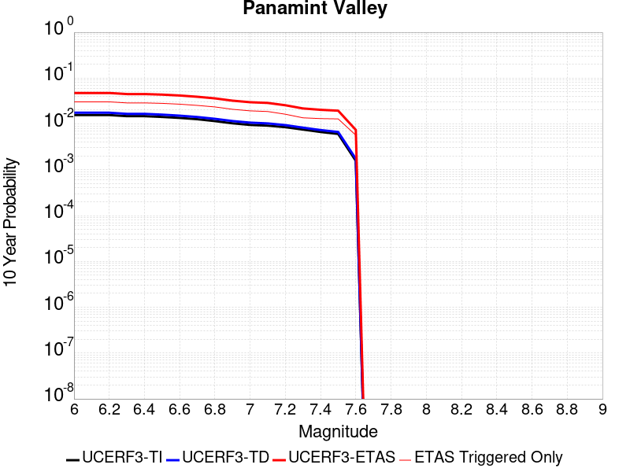 |

| Magnitude | 1 wk TI Prob | 1 wk TD Prob | 1 wk ETAS Prob | 1 wk ETAS/TD Gain | 1 wk ETAS Triggered Only | 1 mo TI Prob | 1 mo TD Prob | 1 mo ETAS Prob | 1 mo ETAS/TD Gain | 1 mo ETAS Triggered Only | 1 yr TI Prob | 1 yr TD Prob | 1 yr ETAS Prob | 1 yr ETAS/TD Gain | 1 yr ETAS Triggered Only | 10 yr TI Prob | 10 yr TD Prob | 10 yr ETAS Prob | 10 yr ETAS/TD Gain | 10 yr ETAS Triggered Only |
|-----|-----|-----|-----|-----|-----|-----|-----|-----|-----|-----|-----|-----|-----|-----|-----|-----|-----|-----|-----|-----|
| 6.0 | 3.0211835E-5 | 3.3984263E-5 | 0.011186465 | 329.16605 | 0.01115286 | 1.2947287E-4 | 1.4563887E-4 | 0.015053708 | 103.36325 | 0.014910241 | 0.0015751923 | 0.0017717406 | 0.02314491 | 13.0633745 | 0.021411106 | 0.015640736 | 0.017583003 | 0.046176042 | 2.626175 | 0.02910479 |
| 6.1 | 3.0211835E-5 | 3.3984263E-5 | 0.011186465 | 329.16605 | 0.01115286 | 1.2947287E-4 | 1.4563887E-4 | 0.015053708 | 103.36325 | 0.014910241 | 0.0015751923 | 0.0017717406 | 0.02314491 | 13.0633745 | 0.021411106 | 0.015640736 | 0.017583003 | 0.046176042 | 2.626175 | 0.02910479 |
| 6.2 | 3.0211835E-5 | 3.3984263E-5 | 0.011186465 | 329.16605 | 0.01115286 | 1.2947287E-4 | 1.4563887E-4 | 0.015053708 | 103.36325 | 0.014910241 | 0.0015751923 | 0.0017717406 | 0.02314491 | 13.0633745 | 0.021411106 | 0.015640736 | 0.017583003 | 0.046176042 | 2.626175 | 0.02910479 |
| 6.3 | 2.8573924E-5 | 3.2102445E-5 | 0.01082677 | 337.25687 | 0.010795014 | 1.2245393E-4 | 1.375748E-4 | 0.014210905 | 103.295845 | 0.014075267 | 0.001489857 | 0.0016737141 | 0.021977242 | 13.130822 | 0.020337569 | 0.01479908 | 0.016618038 | 0.043831564 | 2.6375897 | 0.027673407 |
| 6.4 | 2.8573924E-5 | 3.2102445E-5 | 0.01082677 | 337.25687 | 0.010795014 | 1.2245393E-4 | 1.375748E-4 | 0.014210905 | 103.295845 | 0.014075267 | 0.001489857 | 0.0016737141 | 0.021977242 | 13.130822 | 0.020337569 | 0.01479908 | 0.016618038 | 0.043831564 | 2.6375897 | 0.027673407 |
| 6.5 | 2.7468774E-5 | 3.0828138E-5 | 0.010706231 | 347.28763 | 0.010675732 | 1.1771801E-4 | 1.3211406E-4 | 0.013966989 | 105.71917 | 0.013836703 | 0.0014322745 | 0.0016073292 | 0.021495393 | 13.37336 | 0.01992008 | 0.014230782 | 0.015963882 | 0.04278469 | 2.680093 | 0.027255919 |
| 6.6 | 2.6135967E-5 | 2.9252153E-5 | 0.010466116 | 357.78958 | 0.010437168 | 1.1200648E-4 | 1.2536049E-4 | 0.013662161 | 108.982994 | 0.013538498 | 0.0013628257 | 0.0015252219 | 0.020759871 | 13.61105 | 0.019264031 | 0.013544982 | 0.015154343 | 0.04093995 | 2.7015324 | 0.026182381 |
| 6.7 | 2.4498746E-5 | 2.7341044E-5 | 0.009987109 | 365.279 | 0.00996004 | 1.04990395E-4 | 1.17170785E-4 | 0.012938475 | 110.42407 | 0.012822807 | 0.0012775084 | 0.0014256459 | 0.019471094 | 13.657736 | 0.018071212 | 0.012701893 | 0.014171593 | 0.038395442 | 2.7093246 | 0.024572076 |
| 6.8 | 2.2244329E-5 | 2.4935374E-5 | 0.0096268905 | 386.07364 | 0.009602195 | 9.532935E-5 | 1.0686163E-4 | 0.012331952 | 115.401115 | 0.012226397 | 0.0011600169 | 0.0013002857 | 0.018216295 | 14.009456 | 0.016938033 | 0.011539802 | 0.012932955 | 0.03559776 | 2.7524848 | 0.02296177 |
| 6.9 | 1.9902658E-5 | 2.2290182E-5 | 0.0084911175 | 380.93533 | 0.008469016 | 8.529431E-5 | 9.552596E-5 | 0.010710603 | 112.12244 | 0.010616091 | 0.0010379635 | 0.0011624265 | 0.015995763 | 13.760666 | 0.0148506 | 0.010331288 | 0.011569021 | 0.031199696 | 2.696831 | 0.01986044 |
| 7.0 | 1.8353881E-5 | 2.056605E-5 | 0.007893011 | 383.78836 | 0.007872607 | 7.865712E-5 | 8.813734E-5 | 0.009868393 | 111.96608 | 0.009781118 | 9.5722964E-4 | 0.0010725616 | 0.014656116 | 13.664592 | 0.013598139 | 0.009531168 | 0.01067939 | 0.028439604 | 2.6630363 | 0.01795193 |
| 7.1 | 1.7667631E-5 | 1.9772435E-5 | 0.0077133044 | 390.1039 | 0.007693684 | 7.571623E-5 | 8.4736355E-5 | 0.009686117 | 114.308876 | 0.009602195 | 9.2145515E-4 | 0.0010311945 | 0.014317414 | 13.884301 | 0.013299935 | 0.009176437 | 0.0102695925 | 0.027505906 | 2.6783834 | 0.01741516 |
| 7.2 | 1.6381597E-5 | 1.8158042E-5 | 0.0065189046 | 359.00925 | 0.006500865 | 7.020495E-5 | 7.781795E-5 | 0.00830763 | 106.75724 | 0.008230452 | 8.544101E-4 | 9.470391E-4 | 0.012387259 | 13.079987 | 0.011451065 | 0.008511325 | 0.009435269 | 0.02444114 | 2.5904021 | 0.0151488045 |
| 7.3 | 1.4520491E-5 | 1.596657E-5 | 0.0057414076 | 359.58926 | 0.0057255323 | 6.222919E-5 | 6.842646E-5 | 0.0070459414 | 102.97101 | 0.0069779926 | 7.57377E-4 | 8.327899E-4 | 0.010665353 | 12.806775 | 0.0098407585 | 0.0075480095 | 0.008300399 | 0.021253357 | 2.5605218 | 0.013061371 |
| 7.4 | 1.2852287E-5 | 1.41454875E-5 | 0.0056203166 | 397.32224 | 0.0056062504 | 5.5080065E-5 | 6.06222E-5 | 0.006918917 | 114.13174 | 0.0068587107 | 6.7039346E-4 | 7.378411E-4 | 0.010332951 | 14.004303 | 0.009602195 | 0.0066837464 | 0.007357429 | 0.020026691 | 2.7219687 | 0.012763166 |
| 7.5 | 1.1637851E-5 | 1.2836868E-5 | 0.0054400945 | 423.78674 | 0.0054273275 | 4.987555E-5 | 5.5014076E-5 | 0.006734434 | 122.412926 | 0.0066797878 | 6.070656E-4 | 6.696062E-4 | 0.010086568 | 15.063433 | 0.009423272 | 0.006054099 | 0.0066793845 | 0.019061087 | 2.8537192 | 0.012464961 |
| 7.6 | 3.0068115E-6 | 3.3330623E-6 | 0.0023889635 | 716.7473 | 0.0023856384 | 1.2886271E-5 | 1.4284516E-5 | 0.0031155702 | 218.10822 | 0.00310133 | 1.5687906E-4 | 1.7390738E-4 | 0.00452694 | 26.030756 | 0.00435379 | 0.0015676835 | 0.0017397973 | 0.0071576824 | 4.11409 | 0.0054273275 |

## Garlock (East)
*[(top)](#table-of-contents)*

| 1 Week | 1 Month | 1 Year | 10 Year |
|-----|-----|-----|-----|
|  |  |  |  |

| Magnitude | 1 wk TI Prob | 1 wk TD Prob | 1 wk ETAS Prob | 1 wk ETAS/TD Gain | 1 wk ETAS Triggered Only | 1 mo TI Prob | 1 mo TD Prob | 1 mo ETAS Prob | 1 mo ETAS/TD Gain | 1 mo ETAS Triggered Only | 1 yr TI Prob | 1 yr TD Prob | 1 yr ETAS Prob | 1 yr ETAS/TD Gain | 1 yr ETAS Triggered Only | 10 yr TI Prob | 10 yr TD Prob | 10 yr ETAS Prob | 10 yr ETAS/TD Gain | 10 yr ETAS Triggered Only |
|-----|-----|-----|-----|-----|-----|-----|-----|-----|-----|-----|-----|-----|-----|-----|-----|-----|-----|-----|-----|-----|
| 6.0 | 4.5092507E-5 | 6.2904815E-5 | 0.009545221 | 151.7407 | 0.009482913 | 1.9323928E-4 | 2.6956675E-4 | 0.0119560445 | 44.352818 | 0.0116896285 | 0.0023501497 | 0.003277482 | 0.01992222 | 6.0785136 | 0.016699469 | 0.023254504 | 0.03235377 | 0.055149756 | 1.7045851 | 0.023558179 |
| 6.1 | 4.5092507E-5 | 6.2904815E-5 | 0.009545221 | 151.7407 | 0.009482913 | 1.9323928E-4 | 2.6956675E-4 | 0.0119560445 | 44.352818 | 0.0116896285 | 0.0023501497 | 0.003277482 | 0.01992222 | 6.0785136 | 0.016699469 | 0.023254504 | 0.03235377 | 0.055149756 | 1.7045851 | 0.023558179 |
| 6.2 | 2.6674514E-5 | 3.4511588E-5 | 0.0074893744 | 217.01044 | 0.0074551203 | 1.1431433E-4 | 1.4789861E-4 | 0.00939088 | 63.495396 | 0.009244349 | 0.0013908884 | 0.0017992114 | 0.014420346 | 8.014815 | 0.012643884 | 0.01382215 | 0.017872788 | 0.03485954 | 1.9504255 | 0.017295878 |
| 6.3 | 2.6674514E-5 | 3.4511588E-5 | 0.0074893744 | 217.01044 | 0.0074551203 | 1.1431433E-4 | 1.4789861E-4 | 0.00939088 | 63.495396 | 0.009244349 | 0.0013908884 | 0.0017992114 | 0.014420346 | 8.014815 | 0.012643884 | 0.01382215 | 0.017872788 | 0.03485954 | 1.9504255 | 0.017295878 |
| 6.4 | 2.5312667E-5 | 3.2340467E-5 | 0.0073679416 | 227.8242 | 0.0073358384 | 1.0847834E-4 | 1.3859481E-4 | 0.009262397 | 66.830765 | 0.009125067 | 0.0013199237 | 0.0016861152 | 0.014189599 | 8.415557 | 0.012524602 | 0.013121112 | 0.016772287 | 0.033543512 | 1.9999367 | 0.017057315 |
| 6.5 | 2.5312667E-5 | 3.2340467E-5 | 0.0073679416 | 227.8242 | 0.0073358384 | 1.0847834E-4 | 1.3859481E-4 | 0.009262397 | 66.830765 | 0.009125067 | 0.0013199237 | 0.0016861152 | 0.014189599 | 8.415557 | 0.012524602 | 0.013121112 | 0.016772287 | 0.033543512 | 1.9999367 | 0.017057315 |
| 6.6 | 2.246556E-5 | 2.8134691E-5 | 0.0072444878 | 257.49307 | 0.0072165565 | 9.627742E-5 | 1.2057181E-4 | 0.009065637 | 75.1887 | 0.008946144 | 0.0011715472 | 0.0014669969 | 0.013556351 | 9.240887 | 0.012107115 | 0.011653901 | 0.014613169 | 0.03065722 | 2.0979173 | 0.016281983 |
| 6.7 | 2.2241198E-5 | 2.7804432E-5 | 0.00724416 | 260.53976 | 0.0072165565 | 9.531594E-5 | 1.1915654E-4 | 0.009064235 | 76.06998 | 0.008946144 | 0.0011598538 | 0.0014497889 | 0.0135393515 | 9.338843 | 0.012107115 | 0.011538187 | 0.014442829 | 0.030430874 | 2.1069884 | 0.016222341 |
| 6.8 | 1.9528685E-5 | 2.3898969E-5 | 0.0071210037 | 297.9628 | 0.0070972745 | 8.369167E-5 | 1.0242024E-4 | 0.008809109 | 86.00945 | 0.00870758 | 0.0010184698 | 0.0012462728 | 0.0129809 | 10.415777 | 0.011749269 | 0.010138147 | 0.012436723 | 0.027573824 | 2.2171292 | 0.015327727 |
| 6.9 | 1.3318621E-5 | 1.5198818E-5 | 0.006515965 | 428.7152 | 0.006500865 | 5.7078556E-5 | 6.51362E-5 | 0.008116142 | 124.60263 | 0.0080515295 | 6.9470983E-4 | 7.927504E-4 | 0.011460019 | 14.456025 | 0.010675732 | 0.0069254204 | 0.007940721 | 0.021371713 | 2.6914072 | 0.013538498 |
| 7.0 | 1.1760853E-5 | 1.3107653E-5 | 0.006513887 | 496.953 | 0.006500865 | 5.0402683E-5 | 5.6174475E-5 | 0.008107252 | 144.32271 | 0.0080515295 | 6.134799E-4 | 6.8371464E-4 | 0.011292547 | 16.516462 | 0.010616091 | 0.0061178906 | 0.006857401 | 0.020125365 | 2.9348383 | 0.0133595755 |
| 7.1 | 1.0064758E-5 | 1.0902761E-5 | 0.0062731355 | 575.3713 | 0.006262301 | 4.3133965E-5 | 4.67253E-5 | 0.0077400496 | 165.65009 | 0.007693684 | 5.2502943E-4 | 5.6873553E-4 | 0.010701933 | 18.817062 | 0.010138963 | 0.005237907 | 0.0057133473 | 0.018403593 | 3.2211576 | 0.012763166 |
| 7.2 | 9.768808E-6 | 1.0498628E-5 | 0.006153453 | 586.1197 | 0.006143019 | 4.186565E-5 | 4.499337E-5 | 0.007499778 | 166.68631 | 0.0074551203 | 5.095951E-4 | 5.4766005E-4 | 0.0103830295 | 18.958895 | 0.0098407585 | 0.0050842804 | 0.005503584 | 0.017899944 | 3.2524157 | 0.012464961 |
| 7.3 | 9.344516E-6 | 9.9442705E-6 | 0.0055564987 | 558.7638 | 0.0055466094 | 4.004731E-5 | 4.2617627E-5 | 0.0066624824 | 156.33162 | 0.006620147 | 4.8746695E-4 | 5.187495E-4 | 0.0094006425 | 18.121738 | 0.008886503 | 0.0048639905 | 0.005215269 | 0.016606614 | 3.1842294 | 0.011451065 |
| 7.4 | 9.023491E-6 | 9.490441E-6 | 0.0052578454 | 554.01483 | 0.0052484046 | 3.867153E-5 | 4.0672705E-5 | 0.006302719 | 154.96188 | 0.006262301 | 4.7072413E-4 | 4.95081E-4 | 0.008781071 | 17.736633 | 0.008290093 | 0.004697283 | 0.0049787266 | 0.015482619 | 3.1097548 | 0.01055645 |
| 7.5 | 7.081253E-6 | 7.0873994E-6 | 0.0022137873 | 312.35538 | 0.0022067155 | 3.0347876E-5 | 3.0374218E-5 | 0.002714136 | 89.35657 | 0.0026838433 | 3.6942272E-4 | 3.697441E-4 | 0.0041257353 | 11.158354 | 0.0037573806 | 0.003688092 | 0.0037244745 | 0.008775075 | 2.3560572 | 0.0050694817 |
| 7.6 | 6.116396E-6 | 5.9589424E-6 | 0.0012584117 | 211.18037 | 0.0012524602 | 2.6212863E-5 | 2.5538076E-5 | 0.0016358029 | 64.05349 | 0.001610306 | 3.1909486E-4 | 3.1088197E-4 | 0.0025169116 | 8.096036 | 0.0022067155 | 0.0031863707 | 0.0031359126 | 0.0058707935 | 1.8721164 | 0.0027434842 |
| 7.7 | 4.797145E-6 | 4.7571157E-6 | 7.800859E-4 | 163.98297 | 7.753325E-4 | 2.055903E-5 | 2.0387479E-5 | 9.746234E-4 | 47.804996 | 9.542554E-4 | 2.5027743E-4 | 2.481894E-4 | 0.0014407126 | 5.8048916 | 0.0011928192 | 0.0024999576 | 0.0025094065 | 0.004115672 | 1.6400976 | 0.001610306 |
| 7.8 | 3.4028885E-6 | 3.978375E-6 | 4.8110416E-4 | 120.929825 | 4.771277E-4 | 1.4583726E-5 | 1.7050066E-5 | 6.134495E-4 | 35.9793 | 5.964096E-4 | 1.775424E-4 | 2.0756487E-4 | 9.2310784E-4 | 4.4473224 | 7.1569154E-4 | 0.0017740062 | 0.0021012141 | 0.00311298 | 1.4815149 | 0.0010138963 |
| 7.9 | 2.5928412E-6 | 3.372436E-6 | 3.61217E-4 | 107.108635 | 3.5784577E-4 | 1.1112129E-5 | 1.4453217E-5 | 3.722938E-4 | 25.758543 | 3.5784577E-4 | 1.3528178E-4 | 1.7595377E-4 | 6.529975E-4 | 3.7111878 | 4.771277E-4 | 0.0013519945 | 0.0017812426 | 0.0024956593 | 1.4010777 | 7.1569154E-4 |
| 8.0 | 1.3743648E-6 | 1.6734741E-6 | 1.209552E-4 | 72.2779 | 1.19281925E-4 | 5.8901214E-6 | 7.1720124E-6 | 1.2645307E-4 | 17.631464 | 1.19281925E-4 | 7.1709874E-5 | 8.731578E-5 | 2.0658728E-4 | 2.365979 | 1.19281925E-4 | 7.1686733E-4 | 8.837377E-4 | 0.0011220907 | 1.2697102 | 2.3856385E-4 |
| 8.1 | 3.6733252E-7 | 3.1489736E-7 | 3.1489736E-7 | 1.0 | 0.0 | 1.5742813E-6 | 1.3495595E-6 | 1.3495595E-6 | 1.0 | 0.0 | 1.9166706E-5 | 1.643078E-5 | 1.643078E-5 | 1.0 | 0.0 | 1.9165053E-4 | 1.662928E-4 | 2.2592384E-4 | 1.3585907 | 5.9640963E-5 |

## Hunter Mountain-Saline Valley
*[(top)](#table-of-contents)*

| 1 Week | 1 Month | 1 Year | 10 Year |
|-----|-----|-----|-----|
|  | 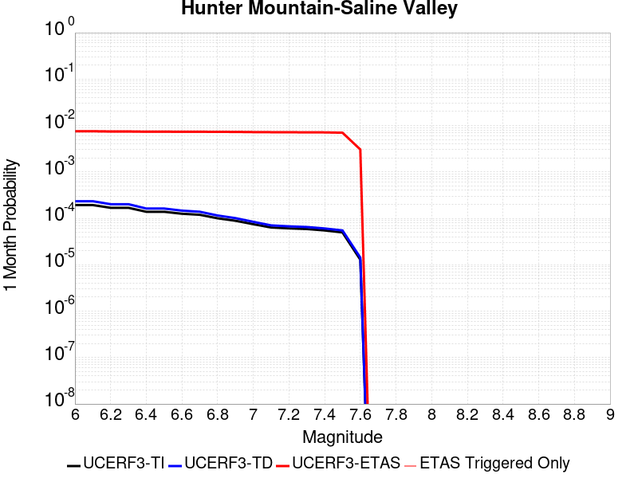 |  |  |

| Magnitude | 1 wk TI Prob | 1 wk TD Prob | 1 wk ETAS Prob | 1 wk ETAS/TD Gain | 1 wk ETAS Triggered Only | 1 mo TI Prob | 1 mo TD Prob | 1 mo ETAS Prob | 1 mo ETAS/TD Gain | 1 mo ETAS Triggered Only | 1 yr TI Prob | 1 yr TD Prob | 1 yr ETAS Prob | 1 yr ETAS/TD Gain | 1 yr ETAS Triggered Only | 10 yr TI Prob | 10 yr TD Prob | 10 yr ETAS Prob | 10 yr ETAS/TD Gain | 10 yr ETAS Triggered Only |
|-----|-----|-----|-----|-----|-----|-----|-----|-----|-----|-----|-----|-----|-----|-----|-----|-----|-----|-----|-----|-----|
| 6.0 | 4.5103672E-5 | 5.456906E-5 | 0.0058394265 | 107.00984 | 0.0057851733 | 1.9328714E-4 | 2.3384714E-4 | 0.007329462 | 31.342962 | 0.0070972745 | 0.002350731 | 0.0028435462 | 0.012715793 | 4.4718084 | 0.0099003995 | 0.023260195 | 0.028092625 | 0.04101893 | 1.4601316 | 0.013299935 |
| 6.1 | 4.5103672E-5 | 5.456906E-5 | 0.0058394265 | 107.00984 | 0.0057851733 | 1.9328714E-4 | 2.3384714E-4 | 0.007329462 | 31.342962 | 0.0070972745 | 0.002350731 | 0.0028435462 | 0.012715793 | 4.4718084 | 0.0099003995 | 0.023260195 | 0.028092625 | 0.04101893 | 1.4601316 | 0.013299935 |
| 6.2 | 3.9363465E-5 | 4.706271E-5 | 0.0057723257 | 122.65179 | 0.0057255323 | 1.6868966E-4 | 2.016826E-4 | 0.007237897 | 35.88756 | 0.0070376336 | 0.002051862 | 0.0024528534 | 0.012269474 | 5.002123 | 0.0098407585 | 0.020330196 | 0.024274187 | 0.037193082 | 1.5322071 | 0.013240294 |
| 6.3 | 3.9363465E-5 | 4.706271E-5 | 0.0057723257 | 122.65179 | 0.0057255323 | 1.6868966E-4 | 2.016826E-4 | 0.007237897 | 35.88756 | 0.0070376336 | 0.002051862 | 0.0024528534 | 0.012269474 | 5.002123 | 0.0098407585 | 0.020330196 | 0.024274187 | 0.037193082 | 1.5322071 | 0.013240294 |
| 6.4 | 3.2311684E-5 | 3.795112E-5 | 0.0057632662 | 151.86024 | 0.0057255323 | 1.384713E-4 | 1.6263791E-4 | 0.0071991268 | 44.26475 | 0.0070376336 | 0.0016845843 | 0.001978387 | 0.011799676 | 5.9642916 | 0.0098407585 | 0.016718714 | 0.019617118 | 0.032597676 | 1.6616954 | 0.013240294 |
| 6.5 | 3.2311684E-5 | 3.795112E-5 | 0.0057632662 | 151.86024 | 0.0057255323 | 1.384713E-4 | 1.6263791E-4 | 0.0071991268 | 44.26475 | 0.0070376336 | 0.0016845843 | 0.001978387 | 0.011799676 | 5.9642916 | 0.0098407585 | 0.016718714 | 0.019617118 | 0.032597676 | 1.6616954 | 0.013240294 |
| 6.6 | 2.9305844E-5 | 3.418196E-5 | 0.0057595186 | 168.49583 | 0.0057255323 | 1.2559042E-4 | 1.4648624E-4 | 0.0071234563 | 48.62884 | 0.0069779926 | 0.0015279909 | 0.0017820727 | 0.01154576 | 6.478838 | 0.009781118 | 0.015175272 | 0.017686324 | 0.03063386 | 1.7320648 | 0.013180653 |
| 6.7 | 2.7826512E-5 | 3.2344353E-5 | 0.0057576913 | 178.01225 | 0.0057255323 | 1.19251024E-4 | 1.3861163E-4 | 0.007115637 | 51.335064 | 0.0069779926 | 0.0014509142 | 0.0016863506 | 0.011450973 | 6.7903876 | 0.009781118 | 0.014414776 | 0.016743818 | 0.029703775 | 1.7740145 | 0.013180653 |
| 6.8 | 2.3389874E-5 | 2.6866792E-5 | 0.0057522454 | 214.10243 | 0.0057255323 | 1.0023846E-4 | 1.1513857E-4 | 0.007092328 | 61.598186 | 0.0069779926 | 0.00121972 | 0.001400958 | 0.011168373 | 7.971954 | 0.009781118 | 0.01213047 | 0.013928067 | 0.02692514 | 1.9331568 | 0.013180653 |
| 6.9 | 2.069209E-5 | 2.357011E-5 | 0.0057489676 | 243.90924 | 0.0057255323 | 8.867737E-5 | 1.0101105E-4 | 0.007078299 | 70.0745 | 0.0069779926 | 0.0010791123 | 0.0012291519 | 0.010998247 | 8.947835 | 0.009781118 | 0.010738871 | 0.012229158 | 0.025189709 | 2.0598075 | 0.013121012 |
| 7.0 | 1.7462342E-5 | 1.9633622E-5 | 0.0056854137 | 289.57538 | 0.0056658913 | 7.483646E-5 | 8.414151E-5 | 0.007001911 | 83.21589 | 0.0069183516 | 9.1075303E-4 | 0.0010239641 | 0.010735487 | 10.484241 | 0.009721477 | 0.009070295 | 0.010196688 | 0.023124876 | 2.2678812 | 0.013061371 |
| 7.1 | 1.4807709E-5 | 1.6441827E-5 | 0.00568224 | 345.59665 | 0.0056658913 | 6.3460066E-5 | 7.046316E-5 | 0.006988327 | 99.17703 | 0.0069183516 | 7.723524E-4 | 8.575678E-4 | 0.010511118 | 12.256894 | 0.009661836 | 0.007696735 | 0.008546168 | 0.021436783 | 2.5083504 | 0.01300173 |
| 7.2 | 1.4180048E-5 | 1.5698413E-5 | 0.005681501 | 361.91562 | 0.0056658913 | 6.077022E-5 | 6.727727E-5 | 0.0069851633 | 103.8265 | 0.0069183516 | 7.396263E-4 | 8.1880915E-4 | 0.0104727335 | 12.790201 | 0.009661836 | 0.0073716943 | 0.008161469 | 0.020997932 | 2.5728126 | 0.012942089 |
| 7.3 | 1.3730402E-5 | 1.5172151E-5 | 0.0056213373 | 370.50366 | 0.0056062504 | 5.8843252E-5 | 6.502197E-5 | 0.0069232867 | 106.476105 | 0.0068587107 | 7.161811E-4 | 7.9137104E-4 | 0.010385967 | 13.124017 | 0.009602195 | 0.007138774 | 0.007889058 | 0.020551534 | 2.6050682 | 0.012763166 |
| 7.4 | 1.2810095E-5 | 1.4109353E-5 | 0.0056202807 | 398.33722 | 0.0056062504 | 5.489925E-5 | 6.0467344E-5 | 0.0069187633 | 114.421486 | 0.0068587107 | 6.681934E-4 | 7.3595706E-4 | 0.010331085 | 14.03762 | 0.009602195 | 0.006661878 | 0.0073386896 | 0.02000819 | 2.7263982 | 0.012763166 |
| 7.5 | 1.1595659E-5 | 1.2800734E-5 | 0.0054400587 | 424.98022 | 0.0054273275 | 4.9694736E-5 | 5.485922E-5 | 0.0067342804 | 122.75567 | 0.0066797878 | 6.0486543E-4 | 6.67722E-4 | 0.010084702 | 15.103144 | 0.009423272 | 0.006032217 | 0.006660632 | 0.019042568 | 2.8589733 | 0.012464961 |
| 7.6 | 2.997694E-6 | 3.3251877E-6 | 0.0023889558 | 718.4424 | 0.0023856384 | 1.28471975E-5 | 1.4250767E-5 | 0.0031155366 | 218.62238 | 0.00310133 | 1.564034E-4 | 1.7349655E-4 | 0.0045265313 | 26.090036 | 0.00435379 | 0.0015629337 | 0.0017356955 | 0.007153603 | 4.121462 | 0.0054273275 |

## Blackwater
*[(top)](#table-of-contents)*

| 1 Week | 1 Month | 1 Year | 10 Year |
|-----|-----|-----|-----|
|  | 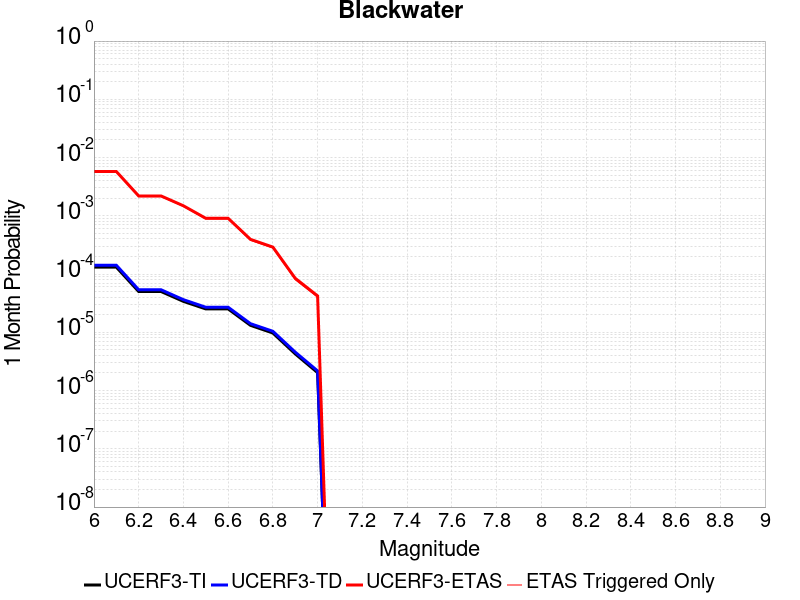 |  |  |

| Magnitude | 1 wk TI Prob | 1 wk TD Prob | 1 wk ETAS Prob | 1 wk ETAS/TD Gain | 1 wk ETAS Triggered Only | 1 mo TI Prob | 1 mo TD Prob | 1 mo ETAS Prob | 1 mo ETAS/TD Gain | 1 mo ETAS Triggered Only | 1 yr TI Prob | 1 yr TD Prob | 1 yr ETAS Prob | 1 yr ETAS/TD Gain | 1 yr ETAS Triggered Only | 10 yr TI Prob | 10 yr TD Prob | 10 yr ETAS Prob | 10 yr ETAS/TD Gain | 10 yr ETAS Triggered Only |
|-----|-----|-----|-----|-----|-----|-----|-----|-----|-----|-----|-----|-----|-----|-----|-----|-----|-----|-----|-----|-----|
| 6.0 | 3.0708583E-5 | 3.3095846E-5 | 0.004625298 | 139.75462 | 0.004592354 | 1.3160157E-4 | 1.4183241E-4 | 0.00604545 | 42.623898 | 0.005904455 | 0.0016010714 | 0.0017255784 | 0.0105967475 | 6.1409826 | 0.008886503 | 0.015895851 | 0.017135633 | 0.029152524 | 1.7012807 | 0.012226397 |
| 6.1 | 3.0708583E-5 | 3.3095846E-5 | 0.004625298 | 139.75462 | 0.004592354 | 1.3160157E-4 | 1.4183241E-4 | 0.00604545 | 42.623898 | 0.005904455 | 0.0016010714 | 0.0017255784 | 0.0105967475 | 6.1409826 | 0.008886503 | 0.015895851 | 0.017135633 | 0.029152524 | 1.7012807 | 0.012226397 |
| 6.2 | 1.1707779E-5 | 1.2545122E-5 | 0.0016228309 | 129.35951 | 0.001610306 | 5.017523E-5 | 5.3763757E-5 | 0.0021410852 | 39.82395 | 0.0020874336 | 6.107122E-4 | 6.5438676E-4 | 0.003813289 | 5.8272715 | 0.003160971 | 0.006090366 | 0.0065255696 | 0.010969453 | 1.6809953 | 0.004473072 |
| 6.3 | 1.1707779E-5 | 1.2545122E-5 | 0.0016228309 | 129.35951 | 0.001610306 | 5.017523E-5 | 5.3763757E-5 | 0.0021410852 | 39.82395 | 0.0020874336 | 6.107122E-4 | 6.5438676E-4 | 0.003813289 | 5.8272715 | 0.003160971 | 0.006090366 | 0.0065255696 | 0.010969453 | 1.6809953 | 0.004473072 |
| 6.4 | 7.929244E-6 | 8.480098E-6 | 0.0012609296 | 148.69281 | 0.0012524602 | 3.3982033E-5 | 3.6342793E-5 | 0.0015869514 | 43.66619 | 0.001550665 | 4.136527E-4 | 4.423877E-4 | 0.002648127 | 5.9859867 | 0.0022067155 | 0.0041288356 | 0.0044154758 | 0.007265602 | 1.6454855 | 0.0028627662 |
| 6.5 | 5.8832115E-6 | 6.285991E-6 | 7.21973E-4 | 114.854294 | 7.1569154E-4 | 2.521352E-5 | 2.6939697E-5 | 9.2153E-4 | 34.20714 | 8.9461444E-4 | 3.0693135E-4 | 3.27944E-4 | 0.0016992362 | 5.1814833 | 0.0013717421 | 0.0030650778 | 0.0032748538 | 0.0050582234 | 1.5445646 | 0.0017892289 |
| 6.6 | 5.8832115E-6 | 6.285991E-6 | 7.21973E-4 | 114.854294 | 7.1569154E-4 | 2.521352E-5 | 2.6939697E-5 | 9.2153E-4 | 34.20714 | 8.9461444E-4 | 3.0693135E-4 | 3.27944E-4 | 0.0016992362 | 5.1814833 | 0.0013717421 | 0.0030650778 | 0.0032748538 | 0.0050582234 | 1.5445646 | 0.0017892289 |
| 6.7 | 3.0715053E-6 | 3.2814662E-6 | 4.804076E-4 | 146.40028 | 4.771277E-4 | 1.3163528E-5 | 1.4063357E-5 | 5.5082445E-4 | 39.16735 | 5.3676864E-4 | 1.6025416E-4 | 1.7120909E-4 | 0.0010656704 | 6.2243795 | 8.9461444E-4 | 0.0016013865 | 0.0017108864 | 0.002723048 | 1.5916008 | 0.0010138963 |
| 6.8 | 2.2722281E-6 | 2.4287538E-6 | 3.6027364E-4 | 148.33684 | 3.5784577E-4 | 9.738084E-6 | 1.0408908E-5 | 4.278913E-4 | 41.108185 | 4.1748674E-4 | 1.1855473E-4 | 1.26722E-4 | 7.826894E-4 | 6.176429 | 6.560506E-4 | 0.001184915 | 0.0012665876 | 0.0019813727 | 1.5643393 | 7.1569154E-4 |
| 6.9 | 9.952399E-7 | 1.0653489E-6 | 1.7998804E-4 | 168.94751 | 1.7892288E-4 | 4.265307E-6 | 4.5657757E-6 | 1.8348785E-4 | 40.18766 | 1.7892288E-4 | 5.1928873E-5 | 5.5587418E-5 | 3.5377566E-4 | 6.3643117 | 2.982048E-4 | 5.191674E-4 | 5.557858E-4 | 8.5382484E-4 | 1.5362481 | 2.982048E-4 |
| 7.0 | 4.7385504E-7 | 5.0755597E-7 | 1.7943035E-4 | 353.51837 | 1.7892288E-4 | 2.0308057E-6 | 2.1752398E-6 | 1.8109774E-4 | 83.25415 | 1.7892288E-4 | 2.4724779E-5 | 2.6483543E-5 | 2.6504108E-4 | 10.007765 | 2.3856385E-4 | 2.4722028E-4 | 2.6483546E-4 | 5.033361E-4 | 1.9005617 | 2.3856385E-4 |

## Ash Hill
*[(top)](#table-of-contents)*

| 1 Week | 1 Month | 1 Year | 10 Year |
|-----|-----|-----|-----|
|  |  |  |  |

| Magnitude | 1 wk TI Prob | 1 wk TD Prob | 1 wk ETAS Prob | 1 wk ETAS/TD Gain | 1 wk ETAS Triggered Only | 1 mo TI Prob | 1 mo TD Prob | 1 mo ETAS Prob | 1 mo ETAS/TD Gain | 1 mo ETAS Triggered Only | 1 yr TI Prob | 1 yr TD Prob | 1 yr ETAS Prob | 1 yr ETAS/TD Gain | 1 yr ETAS Triggered Only | 10 yr TI Prob | 10 yr TD Prob | 10 yr ETAS Prob | 10 yr ETAS/TD Gain | 10 yr ETAS Triggered Only |
|-----|-----|-----|-----|-----|-----|-----|-----|-----|-----|-----|-----|-----|-----|-----|-----|-----|-----|-----|-----|-----|
| 6.0 | 2.1545662E-5 | 2.3194447E-5 | 0.0035419296 | 152.70593 | 0.0035188168 | 9.2335285E-5 | 9.940143E-5 | 0.004631664 | 46.595543 | 0.004532713 | 0.0011236023 | 0.0012096206 | 0.008000466 | 6.6140294 | 0.0067990697 | 0.011179381 | 0.012038348 | 0.021819564 | 1.8125048 | 0.0099003995 |
| 6.1 | 2.1545662E-5 | 2.3194447E-5 | 0.0035419296 | 152.70593 | 0.0035188168 | 9.2335285E-5 | 9.940143E-5 | 0.004631664 | 46.595543 | 0.004532713 | 0.0011236023 | 0.0012096206 | 0.008000466 | 6.6140294 | 0.0067990697 | 0.011179381 | 0.012038348 | 0.021819564 | 1.8125048 | 0.0099003995 |
| 6.2 | 2.1545662E-5 | 2.3194447E-5 | 0.0035419296 | 152.70593 | 0.0035188168 | 9.2335285E-5 | 9.940143E-5 | 0.004631664 | 46.595543 | 0.004532713 | 0.0011236023 | 0.0012096206 | 0.008000466 | 6.6140294 | 0.0067990697 | 0.011179381 | 0.012038348 | 0.021819564 | 1.8125048 | 0.0099003995 |
| 6.3 | 1.0025529E-5 | 1.0746934E-5 | 0.0012035533 | 111.99039 | 0.0011928192 | 4.2965847E-5 | 4.605755E-5 | 0.0015370129 | 33.371574 | 0.001491024 | 5.229836E-4 | 5.6061964E-4 | 0.0031833507 | 5.678272 | 0.0026242023 | 0.005217545 | 0.0055933665 | 0.009685575 | 1.7316182 | 0.004115226 |
| 6.4 | 1.0025529E-5 | 1.0746934E-5 | 0.0012035533 | 111.99039 | 0.0011928192 | 4.2965847E-5 | 4.605755E-5 | 0.0015370129 | 33.371574 | 0.001491024 | 5.229836E-4 | 5.6061964E-4 | 0.0031833507 | 5.678272 | 0.0026242023 | 0.005217545 | 0.0055933665 | 0.009685575 | 1.7316182 | 0.004115226 |
| 6.5 | 6.9617327E-6 | 7.456634E-6 | 8.424239E-4 | 112.976425 | 8.3497347E-4 | 2.9835655E-5 | 3.195666E-5 | 0.0011650987 | 36.458714 | 0.0011331782 | 3.6318856E-4 | 3.8901155E-4 | 0.0022967798 | 5.9041433 | 0.0019085108 | 0.0036259557 | 0.0038841602 | 0.0068546254 | 1.7647638 | 0.002982048 |
| 6.6 | 4.9919777E-6 | 5.3466883E-6 | 6.6139374E-4 | 123.70158 | 6.560506E-4 | 2.1394015E-5 | 2.2914215E-5 | 8.578685E-4 | 37.43827 | 8.3497347E-4 | 2.60441E-4 | 2.7895154E-4 | 0.0017099354 | 6.1298647 | 0.0014313831 | 0.0026013597 | 0.0027866727 | 0.005165663 | 1.8537029 | 0.0023856384 |
| 6.7 | 3.6630722E-6 | 3.924624E-6 | 5.406912E-4 | 137.76892 | 5.3676864E-4 | 1.5698786E-5 | 1.681974E-5 | 7.3249923E-4 | 43.549976 | 7.1569154E-4 | 1.9111596E-4 | 2.0476682E-4 | 0.0012184556 | 5.9504538 | 0.0010138963 | 0.0019095168 | 0.0020463446 | 0.003772393 | 1.8434789 | 0.0017295879 |
| 6.8 | 2.5599613E-6 | 2.744925E-6 | 3.605897E-4 | 131.36595 | 3.5784577E-4 | 1.0971216E-5 | 1.1763939E-5 | 5.485263E-4 | 46.62777 | 5.3676864E-4 | 1.3356637E-4 | 1.4322149E-4 | 9.1844297E-4 | 6.412745 | 7.753325E-4 | 0.0013348613 | 0.0014317769 | 0.002682444 | 1.8735069 | 0.0012524602 |
| 6.9 | 1.7684905E-6 | 1.8968707E-6 | 1.21178564E-4 | 63.883408 | 1.19281925E-4 | 7.579223E-6 | 8.129446E-6 | 1.8705087E-4 | 23.009056 | 1.7892288E-4 | 9.2273134E-5 | 9.8976E-5 | 5.164214E-4 | 5.217643 | 4.1748674E-4 | 9.223483E-4 | 9.8976E-4 | 0.0017643252 | 1.7825787 | 7.753325E-4 |

## Garlock (West)
*[(top)](#table-of-contents)*

| 1 Week | 1 Month | 1 Year | 10 Year |
|-----|-----|-----|-----|
| 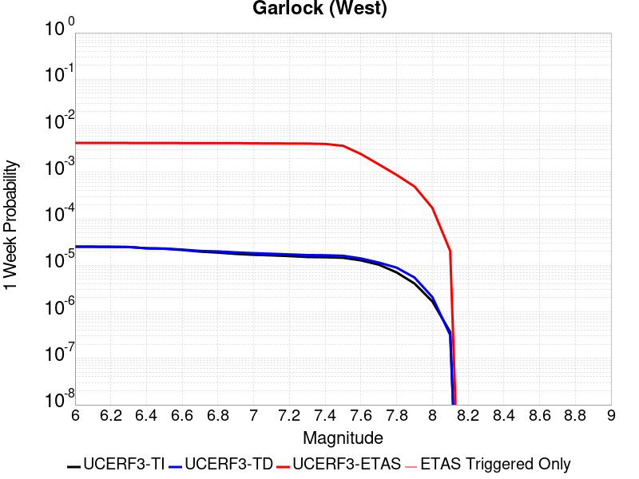 |  |  |  |

| Magnitude | 1 wk TI Prob | 1 wk TD Prob | 1 wk ETAS Prob | 1 wk ETAS/TD Gain | 1 wk ETAS Triggered Only | 1 mo TI Prob | 1 mo TD Prob | 1 mo ETAS Prob | 1 mo ETAS/TD Gain | 1 mo ETAS Triggered Only | 1 yr TI Prob | 1 yr TD Prob | 1 yr ETAS Prob | 1 yr ETAS/TD Gain | 1 yr ETAS Triggered Only | 10 yr TI Prob | 10 yr TD Prob | 10 yr ETAS Prob | 10 yr ETAS/TD Gain | 10 yr ETAS Triggered Only |
|-----|-----|-----|-----|-----|-----|-----|-----|-----|-----|-----|-----|-----|-----|-----|-----|-----|-----|-----|-----|-----|
| 6.0 | 2.5181727E-5 | 2.5197181E-5 | 0.0041999593 | 166.6837 | 0.004174867 | 1.0791722E-4 | 1.0798347E-4 | 0.004878745 | 45.18048 | 0.004771277 | 0.0013131002 | 0.0013139093 | 0.00798492 | 6.0772233 | 0.0066797878 | 0.013053683 | 0.013141794 | 0.021911513 | 1.6673151 | 0.008886503 |
| 6.1 | 2.5077732E-5 | 2.5098223E-5 | 0.0041998606 | 167.33698 | 0.004174867 | 1.0747157E-4 | 1.075594E-4 | 0.004878323 | 45.354687 | 0.004771277 | 0.001307681 | 0.0013087525 | 0.007979798 | 6.097255 | 0.0066797878 | 0.013000126 | 0.013090835 | 0.021861007 | 1.6699474 | 0.008886503 |
| 6.2 | 2.494612E-5 | 2.4979914E-5 | 0.004199743 | 168.12479 | 0.004174867 | 1.0690756E-4 | 1.070524E-4 | 0.0048778187 | 45.564774 | 0.004771277 | 0.0013008224 | 0.0013025872 | 0.007973674 | 6.1214128 | 0.0066797878 | 0.012932341 | 0.013029906 | 0.021800619 | 1.6731217 | 0.008886503 |
| 6.3 | 2.4733758E-5 | 2.4799276E-5 | 0.004199563 | 169.34216 | 0.004174867 | 1.0599751E-4 | 1.06278305E-4 | 0.004877048 | 45.889404 | 0.004771277 | 0.0012897556 | 0.0012931736 | 0.007964323 | 6.158742 | 0.0066797878 | 0.012822957 | 0.0129368715 | 0.021708412 | 1.6780263 | 0.008886503 |
| 6.4 | 2.3237335E-5 | 2.3178607E-5 | 0.004197949 | 181.11308 | 0.004174867 | 9.958477E-5 | 9.933313E-5 | 0.0048701363 | 49.02832 | 0.004771277 | 0.0012117702 | 0.0012087126 | 0.007880426 | 6.5196857 | 0.0066797878 | 0.012051838 | 0.012101731 | 0.020821773 | 1.7205615 | 0.008826862 |
| 6.5 | 2.2732203E-5 | 2.2992977E-5 | 0.004197764 | 182.56725 | 0.004174867 | 9.742009E-5 | 9.8537625E-5 | 0.004869344 | 49.416096 | 0.004771277 | 0.0011854442 | 0.0011990381 | 0.007870817 | 6.5642757 | 0.0066797878 | 0.011791403 | 0.012006035 | 0.020726923 | 1.7263752 | 0.008826862 |
| 6.6 | 2.1319436E-5 | 2.1773201E-5 | 0.0041369097 | 190.00008 | 0.004115226 | 9.136581E-5 | 9.3310395E-5 | 0.004804507 | 51.48951 | 0.004711636 | 0.001111811 | 0.0011354643 | 0.007748094 | 6.823723 | 0.006620147 | 0.011062649 | 0.011376952 | 0.02004443 | 1.7618452 | 0.008767221 |
| 6.7 | 1.970802E-5 | 2.0393094E-5 | 0.0041355356 | 202.79097 | 0.004115226 | 8.446021E-5 | 8.739606E-5 | 0.00479862 | 54.906597 | 0.004711636 | 0.001027818 | 0.0010635294 | 0.0076766354 | 7.2180758 | 0.006620147 | 0.010230771 | 0.0106646875 | 0.019338408 | 1.8133123 | 0.008767221 |
| 6.8 | 1.8744462E-5 | 1.9900775E-5 | 0.004135045 | 207.78313 | 0.004115226 | 8.033094E-5 | 8.528626E-5 | 0.0047965203 | 56.24025 | 0.004711636 | 9.775903E-4 | 0.0010378672 | 0.0076511432 | 7.3719864 | 0.006620147 | 0.009733009 | 0.010410495 | 0.019027425 | 1.8277158 | 0.00870758 |
| 6.9 | 1.7559682E-5 | 1.8953151E-5 | 0.0041341013 | 218.12212 | 0.004115226 | 7.5253614E-5 | 8.122527E-5 | 0.0047924784 | 59.002308 | 0.004711636 | 9.158276E-4 | 9.884704E-4 | 0.0076020733 | 7.6907444 | 0.006620147 | 0.0091206245 | 0.009921073 | 0.018542266 | 1.8689778 | 0.00870758 |
| 7.0 | 1.6794445E-5 | 1.8215967E-5 | 0.0041333674 | 226.90901 | 0.004115226 | 7.197421E-5 | 7.806611E-5 | 0.0047893343 | 61.349728 | 0.004711636 | 8.759337E-4 | 9.5004175E-4 | 0.0075638993 | 7.961649 | 0.006620147 | 0.008724891 | 0.009539958 | 0.018164469 | 1.9040407 | 0.00870758 |
| 7.1 | 1.6337795E-5 | 1.771677E-5 | 0.00413287 | 233.27449 | 0.004115226 | 7.0017246E-5 | 7.592681E-5 | 0.004787205 | 63.050262 | 0.004711636 | 8.521265E-4 | 9.2401815E-4 | 0.0075380476 | 8.1579 | 0.006620147 | 0.008488664 | 0.009281721 | 0.01790848 | 1.9294353 | 0.00870758 |
| 7.2 | 1.5780008E-5 | 1.71654E-5 | 0.004132321 | 240.73552 | 0.004115226 | 6.762685E-5 | 7.3563926E-5 | 0.004784853 | 65.04347 | 0.004711636 | 8.2304585E-4 | 8.952741E-4 | 0.0075094937 | 8.387927 | 0.006620147 | 0.008200042 | 0.008996559 | 0.017625801 | 1.9591714 | 0.00870758 |
| 7.3 | 1.5058865E-5 | 1.6618484E-5 | 0.0040721362 | 245.03659 | 0.0040555852 | 6.45364E-5 | 7.122013E-5 | 0.004722884 | 66.31389 | 0.004651995 | 7.854473E-4 | 8.667614E-4 | 0.0074215806 | 8.562427 | 0.006560506 | 0.00782677 | 0.008713263 | 0.01728585 | 1.983855 | 0.008647939 |
| 7.4 | 1.4887923E-5 | 1.6454453E-5 | 0.0040719733 | 247.46938 | 0.0040555852 | 6.380382E-5 | 7.0517184E-5 | 0.004722184 | 66.96501 | 0.004651995 | 7.7653467E-4 | 8.5820974E-4 | 0.0073534953 | 8.568413 | 0.006500865 | 0.0077382675 | 0.008628101 | 0.0171423 | 1.9867985 | 0.008588298 |
| 7.5 | 1.4509299E-5 | 1.6046468E-5 | 0.0035944467 | 224.00235 | 0.0035784577 | 6.218123E-5 | 6.876877E-5 | 0.004243349 | 61.70459 | 0.004174867 | 7.567935E-4 | 8.369394E-4 | 0.0067364527 | 8.048914 | 0.005904455 | 0.0075422134 | 0.008416411 | 0.016222758 | 1.9275151 | 0.007872607 |
| 7.6 | 1.2756717E-5 | 1.4050529E-5 | 0.002161095 | 153.8088 | 0.0021470746 | 5.4670498E-5 | 6.0215163E-5 | 0.0026842596 | 44.577797 | 0.0026242023 | 6.6541E-4 | 7.328737E-4 | 0.0044279033 | 6.0418367 | 0.0036977397 | 0.006634211 | 0.007381374 | 0.012117432 | 1.6416229 | 0.004771277 |
| 7.7 | 1.0328985E-5 | 1.146033E-5 | 0.0013831867 | 120.69344 | 0.0013717421 | 4.4266326E-5 | 4.9114777E-5 | 0.0017189797 | 34.999237 | 0.0016699469 | 5.388092E-4 | 5.9780874E-4 | 0.0028628104 | 4.78884 | 0.0022663565 | 0.0053750467 | 0.006038286 | 0.008883766 | 1.4712397 | 0.0028627662 |
| 7.8 | 7.0306583E-6 | 8.899537E-6 | 9.6314645E-4 | 108.224335 | 9.542554E-4 | 3.0131043E-5 | 3.8140315E-5 | 0.001230914 | 32.273308 | 0.0011928192 | 3.667837E-4 | 4.6425956E-4 | 0.0020142046 | 4.3385315 | 0.001550665 | 0.003661789 | 0.0046950667 | 0.0067133387 | 1.4298708 | 0.0020277926 |
| 7.9 | 4.060633E-6 | 5.465412E-6 | 3.6330923E-4 | 66.47426 | 3.5784577E-4 | 1.7402595E-5 | 2.3422985E-5 | 5.005395E-4 | 21.369587 | 4.771277E-4 | 2.11856E-4 | 2.8513762E-4 | 9.410011E-4 | 3.3001647 | 6.560506E-4 | 0.0021165414 | 0.002884143 | 0.0038356462 | 1.3299085 | 9.542554E-4 |
| 8.0 | 1.6729537E-6 | 2.0775192E-6 | 1.213592E-4 | 58.415436 | 1.19281925E-4 | 7.169782E-6 | 8.903624E-6 | 1.2818449E-4 | 14.39689 | 1.19281925E-4 | 8.7288594E-5 | 1.0839626E-4 | 2.2766525E-4 | 2.1003053 | 1.19281925E-4 | 8.7254314E-4 | 0.001096854 | 0.0013351562 | 1.2172596 | 2.3856385E-4 |
| 8.1 | 3.6733252E-7 | 3.1489736E-7 | 3.1489736E-7 | 1.0 | 0.0 | 1.5742813E-6 | 1.3495595E-6 | 1.3495595E-6 | 1.0 | 0.0 | 1.9166706E-5 | 1.643078E-5 | 1.643078E-5 | 1.0 | 0.0 | 1.9165053E-4 | 1.662928E-4 | 2.2592384E-4 | 1.3585907 | 5.9640963E-5 |

## Gravel Hills-Harper Lk
*[(top)](#table-of-contents)*

| 1 Week | 1 Month | 1 Year | 10 Year |
|-----|-----|-----|-----|
|  |  |  |  |

| Magnitude | 1 wk TI Prob | 1 wk TD Prob | 1 wk ETAS Prob | 1 wk ETAS/TD Gain | 1 wk ETAS Triggered Only | 1 mo TI Prob | 1 mo TD Prob | 1 mo ETAS Prob | 1 mo ETAS/TD Gain | 1 mo ETAS Triggered Only | 1 yr TI Prob | 1 yr TD Prob | 1 yr ETAS Prob | 1 yr ETAS/TD Gain | 1 yr ETAS Triggered Only | 10 yr TI Prob | 10 yr TD Prob | 10 yr ETAS Prob | 10 yr ETAS/TD Gain | 10 yr ETAS Triggered Only |
|-----|-----|-----|-----|-----|-----|-----|-----|-----|-----|-----|-----|-----|-----|-----|-----|-----|-----|-----|-----|-----|
| 6.0 | 3.0679566E-5 | 3.1464628E-5 | 0.0030134188 | 95.771645 | 0.002982048 | 1.3147724E-4 | 1.3484266E-4 | 0.003593552 | 26.649965 | 0.0034591758 | 0.0015995599 | 0.00164069 | 0.0068209404 | 4.157361 | 0.0051887636 | 0.015880952 | 0.016307337 | 0.023054201 | 1.4137317 | 0.0068587107 |
| 6.1 | 3.0679566E-5 | 3.1464628E-5 | 0.0030134188 | 95.771645 | 0.002982048 | 1.3147724E-4 | 1.3484266E-4 | 0.003593552 | 26.649965 | 0.0034591758 | 0.0015995599 | 0.00164069 | 0.0068209404 | 4.157361 | 0.0051887636 | 0.015880952 | 0.016307337 | 0.023054201 | 1.4137317 | 0.0068587107 |
| 6.2 | 1.514536E-5 | 1.36352E-5 | 6.696768E-4 | 49.113823 | 6.560506E-4 | 6.490707E-5 | 5.843533E-5 | 8.3372253E-4 | 14.267439 | 7.753325E-4 | 7.8995706E-4 | 7.112298E-4 | 0.0020819963 | 2.9273188 | 0.0013717421 | 0.007871548 | 0.007090737 | 0.008926497 | 1.2588955 | 0.0018488698 |
| 6.3 | 1.514536E-5 | 1.36352E-5 | 6.696768E-4 | 49.113823 | 6.560506E-4 | 6.490707E-5 | 5.843533E-5 | 8.3372253E-4 | 14.267439 | 7.753325E-4 | 7.8995706E-4 | 7.112298E-4 | 0.0020819963 | 2.9273188 | 0.0013717421 | 0.007871548 | 0.007090737 | 0.008926497 | 1.2588955 | 0.0018488698 |
| 6.4 | 1.2532521E-5 | 1.0689684E-5 | 5.474526E-4 | 51.21317 | 5.3676864E-4 | 5.37097E-5 | 4.581216E-5 | 6.4219447E-4 | 14.017991 | 5.964096E-4 | 6.537194E-4 | 5.5762613E-4 | 0.0015709571 | 2.8172228 | 0.0010138963 | 0.0065179965 | 0.005562859 | 0.0069269706 | 1.2452177 | 0.0013717421 |
| 6.5 | 1.1094058E-5 | 9.083657E-6 | 4.8620702E-4 | 53.525475 | 4.771277E-4 | 4.7545094E-5 | 3.89294E-5 | 5.160385E-4 | 13.2557535 | 4.771277E-4 | 5.787078E-4 | 4.7386638E-4 | 0.0012488315 | 2.6354084 | 7.753325E-4 | 0.0057720304 | 0.004728967 | 0.0057974276 | 1.2259395 | 0.0010735373 |
| 6.6 | 9.688328E-6 | 7.531688E-6 | 3.0573425E-4 | 40.593056 | 2.982048E-4 | 4.1520743E-5 | 3.227828E-5 | 3.3047347E-4 | 10.238261 | 2.982048E-4 | 5.053978E-4 | 3.9291973E-4 | 9.2947745E-4 | 2.3655658 | 5.3676864E-4 | 0.0050424994 | 0.0039225067 | 0.004694798 | 1.1968871 | 7.753325E-4 |
| 6.7 | 8.974824E-6 | 6.749406E-6 | 2.4531165E-4 | 36.345665 | 2.3856385E-4 | 3.8462964E-5 | 2.8925719E-5 | 2.6748265E-4 | 9.247227 | 2.3856385E-4 | 4.6818596E-4 | 3.5211592E-4 | 6.502157E-4 | 1.8465956 | 2.982048E-4 | 0.004672008 | 0.003515801 | 0.00393182 | 1.1183283 | 4.1748674E-4 |
| 6.8 | 7.4780046E-6 | 5.1161865E-6 | 2.436788E-4 | 47.628994 | 2.3856385E-4 | 3.20482E-5 | 2.1926337E-5 | 2.6048496E-4 | 11.880003 | 2.3856385E-4 | 3.9011694E-4 | 2.6692182E-4 | 5.05422E-4 | 1.8935206 | 2.3856385E-4 | 0.0038943281 | 0.0026661505 | 0.0029040785 | 1.0892402 | 2.3856385E-4 |
| 6.9 | 6.3409307E-6 | 3.907489E-6 | 1.8282968E-4 | 46.789555 | 1.7892288E-4 | 2.7175134E-5 | 1.674628E-5 | 1.9566617E-4 | 11.684157 | 1.7892288E-4 | 3.3080703E-4 | 2.0386786E-4 | 3.8275428E-4 | 1.8774625 | 1.7892288E-4 | 0.0033031502 | 0.0020369065 | 0.002215465 | 1.0876616 | 1.7892288E-4 |
| 7.0 | 5.1239335E-6 | 2.6058492E-6 | 1.2188746E-4 | 46.774563 | 1.19281925E-4 | 2.195953E-5 | 1.1167879E-5 | 1.3044848E-4 | 11.680684 | 1.19281925E-4 | 2.6732447E-4 | 1.359607E-4 | 2.552264E-4 | 1.8772072 | 1.19281925E-4 | 0.0026700313 | 0.0013588005 | 0.0014779202 | 1.0876654 | 1.19281925E-4 |
| 7.1 | 4.438899E-6 | 2.0984692E-6 | 1.21380144E-4 | 57.842228 | 1.19281925E-4 | 1.9023713E-5 | 8.99341E-6 | 1.2827426E-4 | 14.26314 | 1.19281925E-4 | 2.315891E-4 | 1.0948948E-4 | 2.2875835E-4 | 2.089318 | 1.19281925E-4 | 0.002313479 | 0.0010943774 | 0.0012135287 | 1.108876 | 1.19281925E-4 |
| 7.2 | 3.50367E-6 | 1.2615715E-6 | 1.2615715E-6 | 1.0 | 0.0 | 1.5015643E-5 | 5.406724E-6 | 5.406724E-6 | 1.0 | 0.0 | 1.8280011E-4 | 6.5824956E-5 | 6.5824956E-5 | 1.0 | 0.0 | 0.0018264982 | 6.580628E-4 | 6.580628E-4 | 1.0 | 0.0 |
| 7.3 | 2.561638E-6 | 7.118686E-7 | 7.118686E-7 | 1.0 | 0.0 | 1.0978401E-5 | 3.050862E-6 | 3.050862E-6 | 1.0 | 0.0 | 1.3365384E-4 | 3.7143633E-5 | 3.7143633E-5 | 1.0 | 0.0 | 0.0013357349 | 3.7137623E-4 | 3.7137623E-4 | 1.0 | 0.0 |
| 7.4 | 2.0368864E-6 | 5.304471E-7 | 5.304471E-7 | 1.0 | 0.0 | 8.729483E-6 | 2.2733427E-6 | 2.2733427E-6 | 1.0 | 0.0 | 1.06276275E-4 | 2.76776E-5 | 2.76776E-5 | 1.0 | 0.0 | 0.0010622547 | 2.767421E-4 | 2.767421E-4 | 1.0 | 0.0 |
| 7.5 | 1.1681728E-6 | 3.6028484E-7 | 3.6028484E-7 | 1.0 | 0.0 | 5.0064455E-6 | 1.544077E-6 | 1.544077E-6 | 1.0 | 0.0 | 6.0951766E-5 | 1.879898E-5 | 1.879898E-5 | 1.0 | 0.0 | 6.093505E-4 | 1.8797436E-4 | 1.8797436E-4 | 1.0 | 0.0 |
| 7.6 | 1.3154387E-7 | 7.1196716E-8 | 7.1196716E-8 | 1.0 | 0.0 | 5.6375933E-7 | 3.0512876E-7 | 3.0512876E-7 | 1.0 | 0.0 | 6.863748E-6 | 3.714938E-6 | 3.714938E-6 | 1.0 | 0.0 | 6.863536E-5 | 3.7148915E-5 | 3.7148915E-5 | 1.0 | 0.0 |

## McLean Lake
*[(top)](#table-of-contents)*

| 1 Week | 1 Month | 1 Year | 10 Year |
|-----|-----|-----|-----|
|  |  | 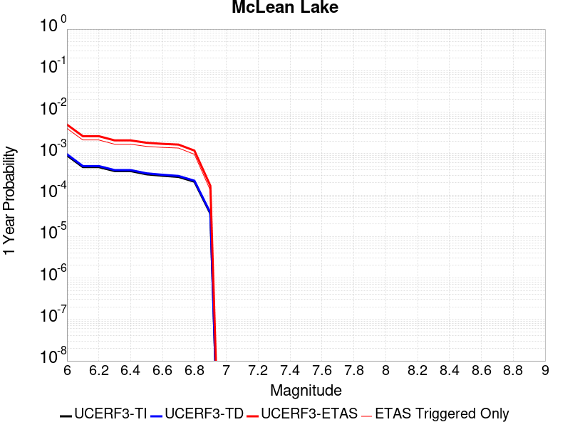 |  |

| Magnitude | 1 wk TI Prob | 1 wk TD Prob | 1 wk ETAS Prob | 1 wk ETAS/TD Gain | 1 wk ETAS Triggered Only | 1 mo TI Prob | 1 mo TD Prob | 1 mo ETAS Prob | 1 mo ETAS/TD Gain | 1 mo ETAS Triggered Only | 1 yr TI Prob | 1 yr TD Prob | 1 yr ETAS Prob | 1 yr ETAS/TD Gain | 1 yr ETAS Triggered Only | 10 yr TI Prob | 10 yr TD Prob | 10 yr ETAS Prob | 10 yr ETAS/TD Gain | 10 yr ETAS Triggered Only |
|-----|-----|-----|-----|-----|-----|-----|-----|-----|-----|-----|-----|-----|-----|-----|-----|-----|-----|-----|-----|-----|
| 6.0 | 1.7360222E-5 | 1.8501627E-5 | 0.0018673373 | 100.92827 | 0.0018488698 | 7.439883E-5 | 7.9290556E-5 | 0.0024051035 | 30.332788 | 0.0023259975 | 9.0542925E-4 | 9.6498354E-4 | 0.005076239 | 5.260441 | 0.004115226 | 0.009017491 | 0.0096127745 | 0.015637675 | 1.6267598 | 0.006083378 |
| 6.1 | 9.062689E-6 | 9.592193E-6 | 0.0010831192 | 112.91674 | 0.0010735373 | 3.8839516E-5 | 4.1108804E-5 | 0.001233879 | 30.014957 | 0.0011928192 | 4.727685E-4 | 5.003936E-4 | 0.0023483383 | 4.692982 | 0.0018488698 | 0.0047176396 | 0.004993552 | 0.0074266205 | 1.4872421 | 0.0024452794 |
| 6.2 | 9.062689E-6 | 9.592193E-6 | 0.0010831192 | 112.91674 | 0.0010735373 | 3.8839516E-5 | 4.1108804E-5 | 0.001233879 | 30.014957 | 0.0011928192 | 4.727685E-4 | 5.003936E-4 | 0.0023483383 | 4.692982 | 0.0018488698 | 0.0047176396 | 0.004993552 | 0.0074266205 | 1.4872421 | 0.0024452794 |
| 6.3 | 7.2575485E-6 | 7.66771E-6 | 9.0227526E-4 | 117.67207 | 8.9461444E-4 | 3.110341E-5 | 3.2861237E-5 | 9.870853E-4 | 30.037981 | 9.542554E-4 | 3.786182E-4 | 4.0001926E-4 | 0.001950064 | 4.874925 | 0.001550665 | 0.0037797375 | 0.0039936965 | 0.0058945855 | 1.4759722 | 0.0019085108 |
| 6.4 | 7.2575485E-6 | 7.66771E-6 | 9.0227526E-4 | 117.67207 | 8.9461444E-4 | 3.110341E-5 | 3.2861237E-5 | 9.870853E-4 | 30.037981 | 9.542554E-4 | 3.786182E-4 | 4.0001926E-4 | 0.001950064 | 4.874925 | 0.001550665 | 0.0037797375 | 0.0039936965 | 0.0058945855 | 1.4759722 | 0.0019085108 |
| 6.5 | 6.06582E-6 | 6.4038773E-6 | 7.2209083E-4 | 112.758385 | 7.1569154E-4 | 2.5996113E-5 | 2.7444936E-5 | 8.0275617E-4 | 29.2497 | 7.753325E-4 | 3.164567E-4 | 3.3409733E-4 | 0.0016457601 | 4.92599 | 0.0013121011 | 0.0031600643 | 0.0033365893 | 0.004941522 | 1.4810101 | 0.001610306 |
| 6.6 | 5.598744E-6 | 5.910262E-6 | 6.0231634E-4 | 101.910255 | 5.964096E-4 | 2.3994397E-5 | 2.5329486E-5 | 6.8136345E-4 | 26.900011 | 6.560506E-4 | 2.9209262E-4 | 3.0834923E-4 | 0.0015008007 | 4.8672104 | 0.0011928192 | 0.0029170897 | 0.003079843 | 0.0045068176 | 1.463327 | 0.0014313831 |
| 6.7 | 5.246996E-6 | 5.539162E-6 | 6.0194544E-4 | 108.67085 | 5.964096E-4 | 2.2486933E-5 | 2.3739085E-5 | 6.201345E-4 | 26.122932 | 5.964096E-4 | 2.73744E-4 | 2.8899137E-4 | 0.0014218421 | 4.920016 | 0.0011331782 | 0.0027340704 | 0.0028867796 | 0.004254562 | 1.473809 | 0.0013717421 |
| 6.8 | 4.02324E-6 | 4.2469046E-6 | 4.2173185E-4 | 99.30335 | 4.1748674E-4 | 1.7242342E-5 | 1.8200926E-5 | 4.3568006E-4 | 23.937248 | 4.1748674E-4 | 2.099053E-4 | 2.2157968E-4 | 8.774849E-4 | 3.9601324 | 6.560506E-4 | 0.0020970714 | 0.002214172 | 0.0029877878 | 1.3493928 | 7.753325E-4 |
| 6.9 | 6.835972E-7 | 7.1399285E-7 | 1.1999583E-4 | 168.06308 | 1.19281925E-4 | 2.9296991E-6 | 3.0599674E-6 | 1.2234153E-4 | 39.981316 | 1.19281925E-4 | 3.56685E-5 | 3.7254784E-5 | 1.5653226E-4 | 4.2016687 | 1.19281925E-4 | 3.5662777E-4 | 3.7251666E-4 | 4.9175415E-4 | 1.3200864 | 1.19281925E-4 |

## Goldstone Lake
*[(top)](#table-of-contents)*

| 1 Week | 1 Month | 1 Year | 10 Year |
|-----|-----|-----|-----|
|  |  | 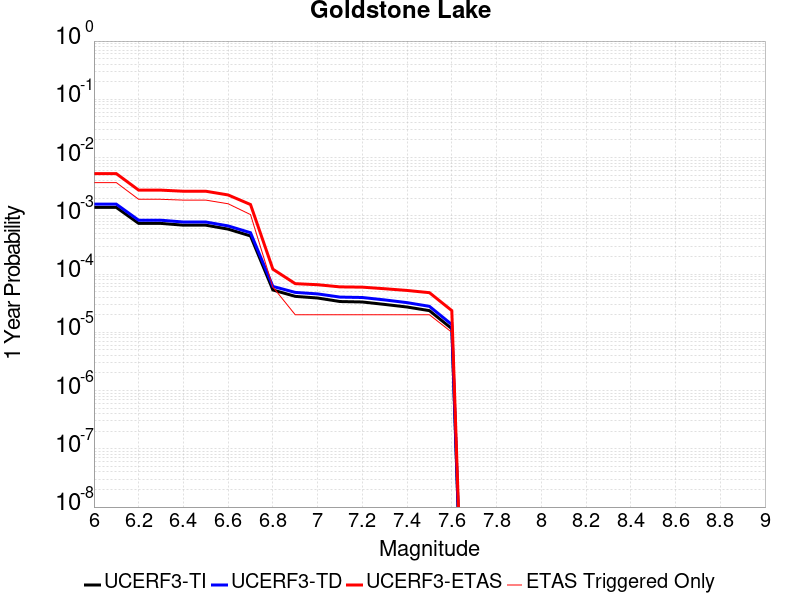 |  |

| Magnitude | 1 wk TI Prob | 1 wk TD Prob | 1 wk ETAS Prob | 1 wk ETAS/TD Gain | 1 wk ETAS Triggered Only | 1 mo TI Prob | 1 mo TD Prob | 1 mo ETAS Prob | 1 mo ETAS/TD Gain | 1 mo ETAS Triggered Only | 1 yr TI Prob | 1 yr TD Prob | 1 yr ETAS Prob | 1 yr ETAS/TD Gain | 1 yr ETAS Triggered Only | 10 yr TI Prob | 10 yr TD Prob | 10 yr ETAS Prob | 10 yr ETAS/TD Gain | 10 yr ETAS Triggered Only |
|-----|-----|-----|-----|-----|-----|-----|-----|-----|-----|-----|-----|-----|-----|-----|-----|-----|-----|-----|-----|-----|
| 6.0 | 2.671352E-5 | 3.0376103E-5 | 0.0012231591 | 40.26715 | 0.0011928192 | 1.1448149E-4 | 1.3017791E-4 | 0.0017999074 | 13.82652 | 0.0016699469 | 0.001392921 | 0.0015839601 | 0.00497811 | 3.1428254 | 0.0033995348 | 0.013842222 | 0.015746202 | 0.020677157 | 1.313152 | 0.0050098407 |
| 6.1 | 2.671352E-5 | 3.0376103E-5 | 0.0012231591 | 40.26715 | 0.0011928192 | 1.1448149E-4 | 1.3017791E-4 | 0.0017999074 | 13.82652 | 0.0016699469 | 0.001392921 | 0.0015839601 | 0.00497811 | 3.1428254 | 0.0033995348 | 0.013842222 | 0.015746202 | 0.020677157 | 1.313152 | 0.0050098407 |
| 6.2 | 1.4197047E-5 | 1.6096254E-5 | 9.106963E-4 | 56.578148 | 8.9461444E-4 | 6.0843064E-5 | 6.898268E-5 | 0.0012617196 | 18.290382 | 0.0011928192 | 7.4051257E-4 | 8.3963916E-4 | 0.0028061382 | 3.3420765 | 0.0019681517 | 0.007380498 | 0.008374364 | 0.011272298 | 1.3460482 | 0.0029224071 |
| 6.3 | 1.4197047E-5 | 1.6096254E-5 | 9.106963E-4 | 56.578148 | 8.9461444E-4 | 6.0843064E-5 | 6.898268E-5 | 0.0012617196 | 18.290382 | 0.0011928192 | 7.4051257E-4 | 8.3963916E-4 | 0.0028061382 | 3.3420765 | 0.0019681517 | 0.007380498 | 0.008374364 | 0.011272298 | 1.3460482 | 0.0029224071 |
| 6.4 | 1.3238931E-5 | 1.500847E-5 | 8.499694E-4 | 56.63265 | 8.3497347E-4 | 5.6737044E-5 | 6.432098E-5 | 0.0011974263 | 18.61642 | 0.0011331782 | 6.9055456E-4 | 7.8292453E-4 | 0.002689941 | 3.4357603 | 0.0019085108 | 0.006884126 | 0.007811289 | 0.010533343 | 1.348477 | 0.0027434842 |
| 6.5 | 1.3238931E-5 | 1.500847E-5 | 8.499694E-4 | 56.63265 | 8.3497347E-4 | 5.6737044E-5 | 6.432098E-5 | 0.0011974263 | 18.61642 | 0.0011331782 | 6.9055456E-4 | 7.8292453E-4 | 0.002689941 | 3.4357603 | 0.0019085108 | 0.006884126 | 0.007811289 | 0.010533343 | 1.348477 | 0.0027434842 |
| 6.6 | 1.1328278E-5 | 1.2855176E-5 | 7.881777E-4 | 61.31209 | 7.753325E-4 | 4.8548856E-5 | 5.5092984E-5 | 9.496581E-4 | 17.23737 | 8.9461444E-4 | 5.90922E-4 | 6.706464E-4 | 0.0023394732 | 3.488386 | 0.0016699469 | 0.0058935313 | 0.0066956137 | 0.009065279 | 1.3539131 | 0.0023856384 |
| 6.7 | 8.651175E-6 | 9.824575E-6 | 3.6766683E-4 | 37.42318 | 3.5784577E-4 | 3.707594E-5 | 4.2105148E-5 | 5.1921274E-4 | 12.331336 | 4.771277E-4 | 4.5130608E-4 | 5.126002E-4 | 0.0015855872 | 3.093224 | 0.0010735373 | 0.0045039062 | 0.0051230565 | 0.006784448 | 1.324297 | 0.0016699469 |
| 6.8 | 1.0215377E-6 | 1.1754802E-6 | 1.1754802E-6 | 1.0 | 0.0 | 4.378012E-6 | 5.037763E-6 | 5.037763E-6 | 1.0 | 0.0 | 5.3300988E-5 | 6.133315E-5 | 6.133315E-5 | 1.0 | 0.0 | 5.3288206E-4 | 6.131735E-4 | 6.7277794E-4 | 1.0972064 | 5.9640963E-5 |
| 6.9 | 7.9360774E-7 | 9.283496E-7 | 9.283496E-7 | 1.0 | 0.0 | 3.4011714E-6 | 3.9786355E-6 | 3.9786355E-6 | 1.0 | 0.0 | 4.1408475E-5 | 4.843888E-5 | 4.843888E-5 | 1.0 | 0.0 | 4.140076E-4 | 4.842902E-4 | 4.842902E-4 | 1.0 | 0.0 |
| 7.0 | 7.4382757E-7 | 8.747428E-7 | 8.747428E-7 | 1.0 | 0.0 | 3.1878285E-6 | 3.7488926E-6 | 3.7488926E-6 | 1.0 | 0.0 | 3.8811122E-5 | 4.564188E-5 | 4.564188E-5 | 1.0 | 0.0 | 3.8804344E-4 | 4.563317E-4 | 4.563317E-4 | 1.0 | 0.0 |
| 7.1 | 6.4709513E-7 | 7.711399E-7 | 7.711399E-7 | 1.0 | 0.0 | 2.773262E-6 | 3.3048816E-6 | 3.3048816E-6 | 1.0 | 0.0 | 3.376394E-5 | 4.023625E-5 | 4.023625E-5 | 1.0 | 0.0 | 3.375881E-4 | 4.022956E-4 | 4.022956E-4 | 1.0 | 0.0 |
| 7.2 | 6.356704E-7 | 7.588459E-7 | 7.588459E-7 | 1.0 | 0.0 | 2.7242988E-6 | 3.252193E-6 | 3.252193E-6 | 1.0 | 0.0 | 3.3167835E-5 | 3.959479E-5 | 3.959479E-5 | 1.0 | 0.0 | 3.3162883E-4 | 3.9588328E-4 | 3.9588328E-4 | 1.0 | 0.0 |
| 7.3 | 5.7695723E-7 | 6.896648E-7 | 6.896648E-7 | 1.0 | 0.0 | 2.4726714E-6 | 2.9557032E-6 | 2.9557032E-6 | 1.0 | 0.0 | 3.0104358E-5 | 3.598515E-5 | 3.598515E-5 | 1.0 | 0.0 | 3.0100282E-4 | 3.5979896E-4 | 3.5979896E-4 | 1.0 | 0.0 |
| 7.4 | 5.209647E-7 | 6.193583E-7 | 6.193583E-7 | 1.0 | 0.0 | 2.232704E-6 | 2.6543903E-6 | 2.6543903E-6 | 1.0 | 0.0 | 2.718283E-5 | 3.2316777E-5 | 3.2316777E-5 | 1.0 | 0.0 | 2.7179506E-4 | 3.2312635E-4 | 3.2312635E-4 | 1.0 | 0.0 |
| 7.5 | 4.512955E-7 | 5.3489487E-7 | 5.3489487E-7 | 1.0 | 0.0 | 1.934122E-6 | 2.2924048E-6 | 2.2924048E-6 | 1.0 | 0.0 | 2.3547682E-5 | 2.7909726E-5 | 2.7909726E-5 | 1.0 | 0.0 | 2.3545188E-4 | 2.7906752E-4 | 2.7906752E-4 | 1.0 | 0.0 |
| 7.6 | 2.21172E-7 | 2.6040198E-7 | 2.6040198E-7 | 1.0 | 0.0 | 9.478797E-7 | 1.1160082E-6 | 1.1160082E-6 | 1.0 | 0.0 | 1.1540374E-5 | 1.3587343E-5 | 1.3587343E-5 | 1.0 | 0.0 | 1.1539775E-4 | 1.3586794E-4 | 1.3586794E-4 | 1.0 | 0.0 |

## So Sierra Nevada
*[(top)](#table-of-contents)*

| 1 Week | 1 Month | 1 Year | 10 Year |
|-----|-----|-----|-----|
|  |  | 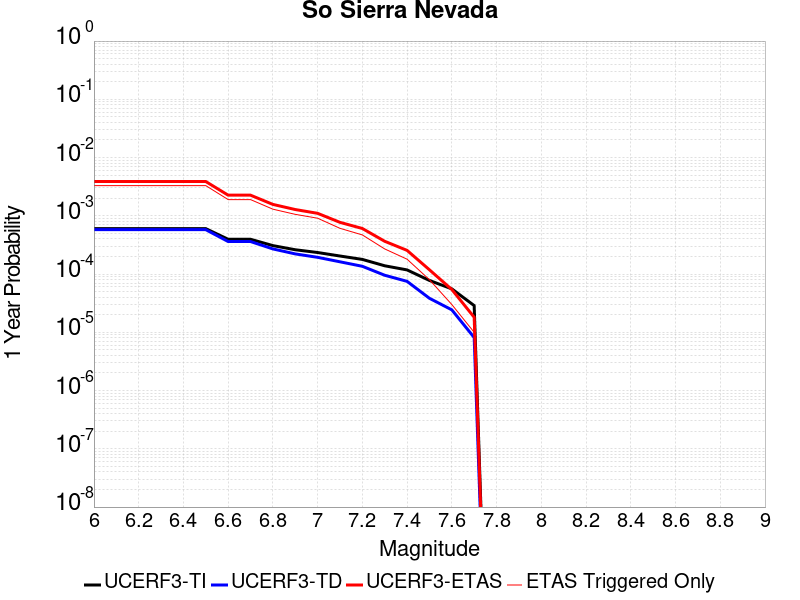 |  |

| Magnitude | 1 wk TI Prob | 1 wk TD Prob | 1 wk ETAS Prob | 1 wk ETAS/TD Gain | 1 wk ETAS Triggered Only | 1 mo TI Prob | 1 mo TD Prob | 1 mo ETAS Prob | 1 mo ETAS/TD Gain | 1 mo ETAS Triggered Only | 1 yr TI Prob | 1 yr TD Prob | 1 yr ETAS Prob | 1 yr ETAS/TD Gain | 1 yr ETAS Triggered Only | 10 yr TI Prob | 10 yr TD Prob | 10 yr ETAS Prob | 10 yr ETAS/TD Gain | 10 yr ETAS Triggered Only |
|-----|-----|-----|-----|-----|-----|-----|-----|-----|-----|-----|-----|-----|-----|-----|-----|-----|-----|-----|-----|-----|
| 6.0 | 1.15488665E-5 | 1.1079612E-5 | 0.0015020871 | 135.57219 | 0.001491024 | 4.9494203E-5 | 4.7483256E-5 | 0.002254094 | 47.471344 | 0.0022067155 | 6.024253E-4 | 5.779681E-4 | 0.0040351446 | 6.9816046 | 0.0034591758 | 0.006007948 | 0.005765918 | 0.01039109 | 1.802157 | 0.004651995 |
| 6.1 | 1.15488665E-5 | 1.1079612E-5 | 0.0015020871 | 135.57219 | 0.001491024 | 4.9494203E-5 | 4.7483256E-5 | 0.002254094 | 47.471344 | 0.0022067155 | 6.024253E-4 | 5.779681E-4 | 0.0040351446 | 6.9816046 | 0.0034591758 | 0.006007948 | 0.005765918 | 0.01039109 | 1.802157 | 0.004651995 |
| 6.2 | 1.15488665E-5 | 1.1079612E-5 | 0.0015020871 | 135.57219 | 0.001491024 | 4.9494203E-5 | 4.7483256E-5 | 0.002254094 | 47.471344 | 0.0022067155 | 6.024253E-4 | 5.779681E-4 | 0.0040351446 | 6.9816046 | 0.0034591758 | 0.006007948 | 0.005765918 | 0.01039109 | 1.802157 | 0.004651995 |
| 6.3 | 1.15488665E-5 | 1.1079612E-5 | 0.0015020871 | 135.57219 | 0.001491024 | 4.9494203E-5 | 4.7483256E-5 | 0.002254094 | 47.471344 | 0.0022067155 | 6.024253E-4 | 5.779681E-4 | 0.0040351446 | 6.9816046 | 0.0034591758 | 0.006007948 | 0.005765918 | 0.01039109 | 1.802157 | 0.004651995 |
| 6.4 | 1.15488665E-5 | 1.1079612E-5 | 0.0015020871 | 135.57219 | 0.001491024 | 4.9494203E-5 | 4.7483256E-5 | 0.002254094 | 47.471344 | 0.0022067155 | 6.024253E-4 | 5.779681E-4 | 0.0040351446 | 6.9816046 | 0.0034591758 | 0.006007948 | 0.005765918 | 0.01039109 | 1.802157 | 0.004651995 |
| 6.5 | 1.15488665E-5 | 1.1079612E-5 | 0.0015020871 | 135.57219 | 0.001491024 | 4.9494203E-5 | 4.7483256E-5 | 0.002254094 | 47.471344 | 0.0022067155 | 6.024253E-4 | 5.779681E-4 | 0.0040351446 | 6.9816046 | 0.0034591758 | 0.006007948 | 0.005765918 | 0.01039109 | 1.802157 | 0.004651995 |
| 6.6 | 7.587044E-6 | 6.9356042E-6 | 7.822627E-4 | 112.78941 | 7.753325E-4 | 3.2515498E-5 | 2.9723697E-5 | 0.0012225074 | 41.12905 | 0.0011928192 | 3.9580427E-4 | 3.6182883E-4 | 0.002090791 | 5.7783976 | 0.0017295879 | 0.003951 | 0.0036126887 | 0.0058708577 | 1.625066 | 0.0022663565 |
| 6.7 | 7.587044E-6 | 6.9356042E-6 | 7.822627E-4 | 112.78941 | 7.753325E-4 | 3.2515498E-5 | 2.9723697E-5 | 0.0012225074 | 41.12905 | 0.0011928192 | 3.9580427E-4 | 3.6182883E-4 | 0.002090791 | 5.7783976 | 0.0017295879 | 0.003951 | 0.0036126887 | 0.0058708577 | 1.625066 | 0.0022663565 |
| 6.8 | 5.9026956E-6 | 5.179362E-6 | 7.8050786E-4 | 150.69576 | 7.753325E-4 | 2.5297022E-5 | 2.2197082E-5 | 0.0011553502 | 52.04964 | 0.0011331782 | 3.0794772E-4 | 2.7021713E-4 | 0.0017012134 | 6.2957273 | 0.0014313831 | 0.0030752132 | 0.002699002 | 0.0042454815 | 1.5729821 | 0.001550665 |
| 6.9 | 5.0118915E-6 | 4.2523943E-6 | 7.199409E-4 | 169.30247 | 7.1569154E-4 | 2.1479358E-5 | 1.8224424E-5 | 0.0010917422 | 59.90544 | 0.0010735373 | 2.614798E-4 | 2.2186051E-4 | 0.0015336706 | 6.91277 | 0.0013121011 | 0.0026117235 | 0.0022164627 | 0.0035256557 | 1.5906677 | 0.0013121011 |
| 7.0 | 4.4924795E-6 | 3.7138868E-6 | 7.1940274E-4 | 193.70616 | 7.1569154E-4 | 1.925334E-5 | 1.5916565E-5 | 0.0010894368 | 68.44673 | 0.0010735373 | 2.3438422E-4 | 1.9376757E-4 | 0.0013863557 | 7.154735 | 0.0011928192 | 0.0023413717 | 0.0019360491 | 0.003126559 | 1.6149172 | 0.0011928192 |
| 7.1 | 3.9118436E-6 | 3.1119469E-6 | 4.2059738E-4 | 135.1557 | 4.1748674E-4 | 1.6764936E-5 | 1.333685E-5 | 6.6937867E-4 | 50.190163 | 6.560506E-4 | 2.0409399E-4 | 1.6236462E-4 | 8.7794E-4 | 5.4072123 | 7.1569154E-4 | 0.0020390663 | 0.0016225161 | 0.0023370464 | 1.4403841 | 7.1569154E-4 |
| 7.2 | 3.4200818E-6 | 2.6054236E-6 | 3.6045027E-4 | 138.34612 | 3.5784577E-4 | 1.4657411E-5 | 1.11660565E-5 | 6.07569E-4 | 54.41214 | 5.964096E-4 | 1.7843937E-4 | 1.3593875E-4 | 7.9190015E-4 | 5.8254185 | 6.560506E-4 | 0.0017829615 | 0.0013586058 | 0.002013765 | 1.4822291 | 6.560506E-4 |
| 7.3 | 2.6593618E-6 | 1.8283897E-6 | 1.8075094E-4 | 98.858 | 1.7892288E-4 | 1.13972155E-5 | 7.8359335E-6 | 3.656789E-4 | 46.66692 | 3.5784577E-4 | 1.3875226E-4 | 9.539862E-5 | 4.5321023E-4 | 4.7507005 | 3.5784577E-4 | 0.0013866565 | 9.536055E-4 | 0.0013111101 | 1.3748977 | 3.5784577E-4 |
| 7.4 | 2.2577992E-6 | 1.4364078E-6 | 1.20718156E-4 | 84.0417 | 1.19281925E-4 | 9.676246E-6 | 6.1560204E-6 | 1.850778E-4 | 30.064522 | 1.7892288E-4 | 1.1780193E-4 | 7.4947224E-5 | 2.538567E-4 | 3.3871393 | 1.7892288E-4 | 0.001177395 | 7.4924453E-4 | 9.280334E-4 | 1.2386255 | 1.7892288E-4 |
| 7.5 | 1.489319E-6 | 7.353661E-7 | 7.353661E-7 | 1.0 | 0.0 | 6.3827797E-6 | 3.1515651E-6 | 6.279234E-5 | 19.924175 | 5.9640963E-5 | 7.770758E-5 | 3.8369635E-5 | 9.8008306E-5 | 2.5543196 | 5.9640963E-5 | 7.7680405E-4 | 3.8363054E-4 | 4.432486E-4 | 1.1554049 | 5.9640963E-5 |
| 7.6 | 1.0680322E-6 | 4.65941E-7 | 4.65941E-7 | 1.0 | 0.0 | 4.577273E-6 | 1.9968884E-6 | 1.9968884E-6 | 1.0 | 0.0 | 5.5726876E-5 | 2.4311848E-5 | 2.4311848E-5 | 1.0 | 0.0 | 5.5712904E-4 | 2.4309216E-4 | 2.4309216E-4 | 1.0 | 0.0 |
| 7.7 | 5.509146E-7 | 1.5578539E-7 | 1.5578539E-7 | 1.0 | 0.0 | 2.3610605E-6 | 6.676515E-7 | 6.676515E-7 | 1.0 | 0.0 | 2.8745531E-5 | 8.128628E-6 | 8.128628E-6 | 1.0 | 0.0 | 2.8741814E-4 | 8.128342E-5 | 8.128342E-5 | 1.0 | 0.0 |

## Coyote Canyon
*[(top)](#table-of-contents)*

| 1 Week | 1 Month | 1 Year | 10 Year |
|-----|-----|-----|-----|
|  |  |  |  |

| Magnitude | 1 wk TI Prob | 1 wk TD Prob | 1 wk ETAS Prob | 1 wk ETAS/TD Gain | 1 wk ETAS Triggered Only | 1 mo TI Prob | 1 mo TD Prob | 1 mo ETAS Prob | 1 mo ETAS/TD Gain | 1 mo ETAS Triggered Only | 1 yr TI Prob | 1 yr TD Prob | 1 yr ETAS Prob | 1 yr ETAS/TD Gain | 1 yr ETAS Triggered Only | 10 yr TI Prob | 10 yr TD Prob | 10 yr ETAS Prob | 10 yr ETAS/TD Gain | 10 yr ETAS Triggered Only |
|-----|-----|-----|-----|-----|-----|-----|-----|-----|-----|-----|-----|-----|-----|-----|-----|-----|-----|-----|-----|-----|
| 6.0 | 3.5090034E-5 | 4.0364317E-5 | 0.0010542198 | 26.117617 | 0.0010138963 | 1.503772E-4 | 1.7297991E-4 | 0.0014848541 | 8.583968 | 0.0013121011 | 0.0018293047 | 0.0021042533 | 0.004425356 | 2.103053 | 0.0023259975 | 0.018143194 | 0.020869205 | 0.024489775 | 1.1734887 | 0.0036977397 |
| 6.1 | 3.5090034E-5 | 4.0364317E-5 | 0.0010542198 | 26.117617 | 0.0010138963 | 1.503772E-4 | 1.7297991E-4 | 0.0014848541 | 8.583968 | 0.0013121011 | 0.0018293047 | 0.0021042533 | 0.004425356 | 2.103053 | 0.0023259975 | 0.018143194 | 0.020869205 | 0.024489775 | 1.1734887 | 0.0036977397 |
| 6.2 | 1.841879E-5 | 2.1059794E-5 | 5.5781717E-4 | 26.487305 | 5.3676864E-4 | 7.8935285E-5 | 9.025371E-5 | 8.0588064E-4 | 8.929059 | 7.1569154E-4 | 9.606133E-4 | 0.0010983871 | 0.0025877734 | 2.3559759 | 0.001491024 | 0.0095647145 | 0.010939668 | 0.013358196 | 1.2210789 | 0.0024452794 |
| 6.3 | 1.841879E-5 | 2.1059794E-5 | 5.5781717E-4 | 26.487305 | 5.3676864E-4 | 7.8935285E-5 | 9.025371E-5 | 8.0588064E-4 | 8.929059 | 7.1569154E-4 | 9.606133E-4 | 0.0010983871 | 0.0025877734 | 2.3559759 | 0.001491024 | 0.0095647145 | 0.010939668 | 0.013358196 | 1.2210789 | 0.0024452794 |
| 6.4 | 1.712201E-5 | 1.9565212E-5 | 3.7740398E-4 | 19.289543 | 3.5784577E-4 | 7.337798E-5 | 8.3848776E-5 | 6.205724E-4 | 7.4010906 | 5.3676864E-4 | 8.930107E-4 | 0.0010204813 | 0.0022716634 | 2.2260704 | 0.0012524602 | 0.008894307 | 0.010167871 | 0.012293114 | 1.2090156 | 0.0021470746 |
| 6.5 | 1.4744935E-5 | 1.6836972E-5 | 3.7467672E-4 | 22.253212 | 3.5784577E-4 | 6.3191044E-5 | 7.215698E-5 | 5.492502E-4 | 7.6118793 | 4.771277E-4 | 7.6907943E-4 | 8.782507E-4 | 0.0018912565 | 2.153436 | 0.0010138963 | 0.007664232 | 0.008756994 | 0.010530556 | 1.2025307 | 0.0017892289 |
| 6.6 | 1.2017839E-5 | 1.3724089E-5 | 1.9264451E-4 | 14.0369625 | 1.7892288E-4 | 5.150401E-5 | 5.88167E-5 | 3.5700397E-4 | 6.0697722 | 2.982048E-4 | 6.268809E-4 | 7.159466E-4 | 0.0014311258 | 1.9989281 | 7.1569154E-4 | 0.0062511545 | 0.0071450938 | 0.008270175 | 1.1574621 | 0.0011331782 |
| 6.7 | 1.00956095E-5 | 1.1533517E-5 | 1.9045433E-4 | 16.513119 | 1.7892288E-4 | 4.326618E-5 | 4.942891E-5 | 3.4761897E-4 | 7.032706 | 2.982048E-4 | 5.266384E-4 | 6.017178E-4 | 0.0012573736 | 2.0896401 | 6.560506E-4 | 0.005253921 | 0.0060094125 | 0.0069579333 | 1.1578392 | 9.542554E-4 |

## San Andreas (Mojave S)
*[(top)](#table-of-contents)*

| 1 Week | 1 Month | 1 Year | 10 Year |
|-----|-----|-----|-----|
|  |  |  |  |

| Magnitude | 1 wk TI Prob | 1 wk TD Prob | 1 wk ETAS Prob | 1 wk ETAS/TD Gain | 1 wk ETAS Triggered Only | 1 mo TI Prob | 1 mo TD Prob | 1 mo ETAS Prob | 1 mo ETAS/TD Gain | 1 mo ETAS Triggered Only | 1 yr TI Prob | 1 yr TD Prob | 1 yr ETAS Prob | 1 yr ETAS/TD Gain | 1 yr ETAS Triggered Only | 10 yr TI Prob | 10 yr TD Prob | 10 yr ETAS Prob | 10 yr ETAS/TD Gain | 10 yr ETAS Triggered Only |
|-----|-----|-----|-----|-----|-----|-----|-----|-----|-----|-----|-----|-----|-----|-----|-----|-----|-----|-----|-----|-----|
| 6.0 | 3.1064058E-4 | 6.7462435E-4 | 0.0021646426 | 3.2086635 | 0.001491024 | 0.0013306376 | 0.002888172 | 0.0047911704 | 1.6588938 | 0.0019085108 | 0.016080605 | 0.034565594 | 0.03727183 | 1.0782927 | 0.0028031252 | 0.1496549 | 0.28654557 | 0.28926885 | 1.0095038 | 0.0038170216 |
| 6.1 | 3.1064058E-4 | 6.7462435E-4 | 0.0021646426 | 3.2086635 | 0.001491024 | 0.0013306376 | 0.002888172 | 0.0047911704 | 1.6588938 | 0.0019085108 | 0.016080605 | 0.034565594 | 0.03727183 | 1.0782927 | 0.0028031252 | 0.1496549 | 0.28654557 | 0.28926885 | 1.0095038 | 0.0038170216 |
| 6.2 | 3.1064058E-4 | 6.7462435E-4 | 0.0021646426 | 3.2086635 | 0.001491024 | 0.0013306376 | 0.002888172 | 0.0047911704 | 1.6588938 | 0.0019085108 | 0.016080605 | 0.034565594 | 0.03727183 | 1.0782927 | 0.0028031252 | 0.1496549 | 0.28654557 | 0.28926885 | 1.0095038 | 0.0038170216 |
| 6.3 | 3.1064058E-4 | 6.7462435E-4 | 0.0021646426 | 3.2086635 | 0.001491024 | 0.0013306376 | 0.002888172 | 0.0047911704 | 1.6588938 | 0.0019085108 | 0.016080605 | 0.034565594 | 0.03727183 | 1.0782927 | 0.0028031252 | 0.1496549 | 0.28654557 | 0.28926885 | 1.0095038 | 0.0038170216 |
| 6.4 | 1.9872203E-4 | 4.3181062E-4 | 0.0018625756 | 4.3134084 | 0.0014313831 | 8.5138786E-4 | 0.0018493326 | 0.0036947832 | 1.9979008 | 0.0018488698 | 0.010316478 | 0.02228931 | 0.024738397 | 1.1098772 | 0.0025049204 | 0.098504856 | 0.19686839 | 0.19950287 | 1.013382 | 0.003280253 |
| 6.5 | 1.291105E-4 | 2.8754136E-4 | 0.0015992653 | 5.5618615 | 0.0013121011 | 5.5321335E-4 | 0.0012317409 | 0.0028400635 | 2.305731 | 0.001610306 | 0.006714592 | 0.014894155 | 0.017126756 | 1.1498978 | 0.0022663565 | 0.065152965 | 0.13800792 | 0.14062984 | 1.0189983 | 0.003041689 |
| 6.6 | 1.291105E-4 | 2.8754136E-4 | 0.0015992653 | 5.5618615 | 0.0013121011 | 5.5321335E-4 | 0.0012317409 | 0.0028400635 | 2.305731 | 0.001610306 | 0.006714592 | 0.014894155 | 0.017126756 | 1.1498978 | 0.0022663565 | 0.065152965 | 0.13800792 | 0.14062984 | 1.0189983 | 0.003041689 |
| 6.7 | 1.08001186E-4 | 2.4335351E-4 | 0.0014358824 | 5.9003973 | 0.0011928192 | 4.6278012E-4 | 0.0010425274 | 0.002531997 | 2.4287105 | 0.001491024 | 0.0056198016 | 0.0126192 | 0.0146802915 | 1.1633298 | 0.0020874336 | 0.054797906 | 0.11918431 | 0.121600814 | 1.0202754 | 0.0027434842 |
| 6.8 | 1.0624356E-4 | 2.3853009E-4 | 0.0014310648 | 5.9995146 | 0.0011928192 | 4.5525006E-4 | 0.0010218718 | 0.0025113723 | 2.4576197 | 0.001491024 | 0.0055285925 | 0.012370593 | 0.014432204 | 1.1666542 | 0.0020874336 | 0.053930566 | 0.11713308 | 0.11955521 | 1.0206784 | 0.0027434842 |
| 6.9 | 1.0393785E-4 | 2.3223337E-4 | 0.0014247756 | 6.1351027 | 0.0011928192 | 4.4537184E-4 | 9.949068E-4 | 0.0024844473 | 2.4971662 | 0.001491024 | 0.0054089287 | 0.012045963 | 0.014108252 | 1.1712016 | 0.0020874336 | 0.05279156 | 0.114433445 | 0.11686298 | 1.021231 | 0.0027434842 |
| 7.0 | 1.0155622E-4 | 2.2592908E-4 | 0.0014184788 | 6.278425 | 0.0011928192 | 4.3516833E-4 | 9.6790853E-4 | 0.0024574895 | 2.5389686 | 0.001491024 | 0.005285311 | 0.011720838 | 0.013783805 | 1.1760085 | 0.0020874336 | 0.05161361 | 0.11169745 | 0.1141345 | 1.0218183 | 0.0027434842 |
| 7.1 | 9.885595E-5 | 2.188132E-4 | 0.0014113714 | 6.45012 | 0.0011928192 | 4.2359953E-4 | 9.374342E-4 | 0.0024270604 | 2.5890462 | 0.001491024 | 0.0051451353 | 0.011353733 | 0.013417467 | 1.181767 | 0.0020874336 | 0.05027629 | 0.10857607 | 0.111021675 | 1.0225244 | 0.0027434842 |
| 7.2 | 9.6411415E-5 | 2.1244297E-4 | 0.0014050088 | 6.613581 | 0.0011928192 | 4.1312634E-4 | 9.101525E-4 | 0.0023402327 | 2.5712535 | 0.0014313831 | 0.005018219 | 0.011024987 | 0.013030423 | 1.1818992 | 0.0020277926 | 0.049064007 | 0.1057697 | 0.108169675 | 1.0226905 | 0.0026838433 |
| 7.3 | 9.1180635E-5 | 1.9472656E-4 | 0.0013873135 | 7.1244183 | 0.0011928192 | 3.907156E-4 | 8.342756E-4 | 0.0022644645 | 2.7142882 | 0.0014313831 | 0.004746591 | 0.010110112 | 0.012117404 | 1.198543 | 0.0020277926 | 0.046464786 | 0.09796176 | 0.10032889 | 1.0241638 | 0.0026242023 |
| 7.4 | 8.887388E-5 | 1.872126E-4 | 0.0013798085 | 7.3702755 | 0.0011928192 | 3.8083247E-4 | 8.020931E-4 | 0.002232328 | 2.7831283 | 0.0014313831 | 0.0046267817 | 0.009721855 | 0.011729933 | 1.2065531 | 0.0020277926 | 0.045316286 | 0.094593845 | 0.09696981 | 1.0251176 | 0.0026242023 |
| 7.5 | 8.6750515E-5 | 1.80528E-4 | 0.0013731319 | 7.606199 | 0.0011928192 | 3.7173493E-4 | 7.734621E-4 | 0.002203738 | 2.849187 | 0.0014313831 | 0.004516484 | 0.009376327 | 0.011385106 | 1.2142395 | 0.0020277926 | 0.04425787 | 0.09155606 | 0.09394 | 1.026038 | 0.0026242023 |
| 7.6 | 8.453092E-5 | 1.7440386E-4 | 0.0013670151 | 7.8382154 | 0.0011928192 | 3.6222505E-4 | 7.4723107E-4 | 0.0021775446 | 2.9141514 | 0.0014313831 | 0.0044011753 | 0.009059664 | 0.011069085 | 1.2217987 | 0.0020277926 | 0.04315024 | 0.08871447 | 0.09110587 | 1.0269561 | 0.0026242023 |
| 7.7 | 8.259102E-5 | 1.6962511E-4 | 0.001362242 | 8.030898 | 0.0011928192 | 3.539135E-4 | 7.267622E-4 | 0.0021571051 | 2.9681027 | 0.0014313831 | 0.004300386 | 0.0088125 | 0.010822423 | 1.2280763 | 0.0020277926 | 0.042181134 | 0.086465426 | 0.08886273 | 1.0277256 | 0.0026242023 |
| 7.8 | 7.444844E-5 | 1.528469E-4 | 0.0011665883 | 7.632397 | 0.0010138963 | 3.1902574E-4 | 6.5489375E-4 | 0.0019065337 | 2.9112108 | 0.0012524602 | 0.0038772223 | 0.007944231 | 0.009600911 | 1.2085388 | 0.0016699469 | 0.03810269 | 0.078293875 | 0.08038279 | 1.0266805 | 0.0022663565 |
| 7.9 | 5.2586525E-5 | 1.0007023E-4 | 4.578802E-4 | 4.575588 | 3.5784577E-4 | 2.2535135E-4 | 4.2880196E-4 | 9.0572506E-4 | 2.1122224 | 4.771277E-4 | 0.0027402006 | 0.005208178 | 0.0058608116 | 1.1253095 | 6.560506E-4 | 0.027066574 | 0.052201588 | 0.053219087 | 1.0194917 | 0.0010735373 |
| 8.0 | 3.379877E-5 | 5.4075565E-5 | 1.7335103E-4 | 3.2057185 | 1.19281925E-4 | 1.4484383E-4 | 2.3173184E-4 | 3.509861E-4 | 1.514622 | 1.19281925E-4 | 0.0017620471 | 0.0028176866 | 0.0029366326 | 1.042214 | 1.19281925E-4 | 0.017481409 | 0.028835917 | 0.029125523 | 1.0100433 | 2.982048E-4 |
| 8.1 | 1.8668277E-5 | 1.9308145E-5 | 1.9308145E-5 | 1.0 | 0.0 | 8.000444E-5 | 8.274657E-5 | 8.274657E-5 | 1.0 | 0.0 | 9.736188E-4 | 0.0010069745 | 0.0010069745 | 1.0 | 0.0 | 0.009693642 | 0.010798624 | 0.01085762 | 1.0054634 | 5.9640963E-5 |
| 8.2 | 8.541571E-6 | 5.4596358E-6 | 5.4596358E-6 | 1.0 | 0.0 | 3.660622E-5 | 2.339823E-5 | 2.339823E-5 | 1.0 | 0.0 | 4.455896E-4 | 2.848363E-4 | 2.848363E-4 | 1.0 | 0.0 | 0.0044469717 | 0.003240283 | 0.003240283 | 1.0 | 0.0 |
| 8.3 | 1.983087E-6 | 7.6564595E-7 | 7.6564595E-7 | 1.0 | 0.0 | 8.498917E-6 | 3.281336E-6 | 3.281336E-6 | 1.0 | 0.0 | 1.034694E-4 | 3.9949547E-5 | 3.9949547E-5 | 1.0 | 0.0 | 0.0010342124 | 4.717979E-4 | 4.717979E-4 | 1.0 | 0.0 |

## Lenwood-Lockhart-Old Woman Springs
*[(top)](#table-of-contents)*

| 1 Week | 1 Month | 1 Year | 10 Year |
|-----|-----|-----|-----|
|  |  |  |  |

| Magnitude | 1 wk TI Prob | 1 wk TD Prob | 1 wk ETAS Prob | 1 wk ETAS/TD Gain | 1 wk ETAS Triggered Only | 1 mo TI Prob | 1 mo TD Prob | 1 mo ETAS Prob | 1 mo ETAS/TD Gain | 1 mo ETAS Triggered Only | 1 yr TI Prob | 1 yr TD Prob | 1 yr ETAS Prob | 1 yr ETAS/TD Gain | 1 yr ETAS Triggered Only | 10 yr TI Prob | 10 yr TD Prob | 10 yr ETAS Prob | 10 yr ETAS/TD Gain | 10 yr ETAS Triggered Only |
|-----|-----|-----|-----|-----|-----|-----|-----|-----|-----|-----|-----|-----|-----|-----|-----|-----|-----|-----|-----|-----|
| 6.0 | 3.744542E-5 | 4.396349E-5 | 0.0010578153 | 24.061222 | 0.0010138963 | 1.604705E-4 | 1.8840231E-4 | 0.001977294 | 10.495063 | 0.0017892289 | 0.0019519776 | 0.0022915571 | 0.0052667717 | 2.2983375 | 0.002982048 | 0.019349206 | 0.022697281 | 0.026252804 | 1.1566497 | 0.0036380987 |
| 6.1 | 3.744542E-5 | 4.396349E-5 | 0.0010578153 | 24.061222 | 0.0010138963 | 1.604705E-4 | 1.8840231E-4 | 0.001977294 | 10.495063 | 0.0017892289 | 0.0019519776 | 0.0022915571 | 0.0052667717 | 2.2983375 | 0.002982048 | 0.019349206 | 0.022697281 | 0.026252804 | 1.1566497 | 0.0036380987 |
| 6.2 | 3.744542E-5 | 4.396349E-5 | 0.0010578153 | 24.061222 | 0.0010138963 | 1.604705E-4 | 1.8840231E-4 | 0.001977294 | 10.495063 | 0.0017892289 | 0.0019519776 | 0.0022915571 | 0.0052667717 | 2.2983375 | 0.002982048 | 0.019349206 | 0.022697281 | 0.026252804 | 1.1566497 | 0.0036380987 |
| 6.3 | 2.1079984E-5 | 2.5354384E-5 | 4.4283053E-4 | 17.46564 | 4.1748674E-4 | 9.0339665E-5 | 1.0865723E-4 | 7.0500205E-4 | 6.4883122 | 5.964096E-4 | 0.0010993304 | 0.0013221189 | 0.0025133612 | 1.9010098 | 0.0011928192 | 0.010939079 | 0.013144747 | 0.014616172 | 1.1119401 | 0.001491024 |
| 6.4 | 2.1079984E-5 | 2.5354384E-5 | 4.4283053E-4 | 17.46564 | 4.1748674E-4 | 9.0339665E-5 | 1.0865723E-4 | 7.0500205E-4 | 6.4883122 | 5.964096E-4 | 0.0010993304 | 0.0013221189 | 0.0025133612 | 1.9010098 | 0.0011928192 | 0.010939079 | 0.013144747 | 0.014616172 | 1.1119401 | 0.001491024 |
| 6.5 | 1.7397282E-5 | 2.0663285E-5 | 4.3814137E-4 | 21.20386 | 4.1748674E-4 | 7.455765E-5 | 8.8554E-5 | 5.0600374E-4 | 5.7140703 | 4.1748674E-4 | 9.073613E-4 | 0.0010776235 | 0.0019712737 | 1.829279 | 8.9461444E-4 | 0.009036654 | 0.010725273 | 0.011846297 | 1.1045218 | 0.0011331782 |
| 6.6 | 1.52050325E-5 | 1.7680086E-5 | 1.9659981E-4 | 11.119845 | 1.7892288E-4 | 6.51628E-5 | 7.576964E-5 | 2.5467898E-4 | 3.3612273 | 1.7892288E-4 | 7.9306826E-4 | 9.221128E-4 | 0.0015775585 | 1.7108085 | 6.560506E-4 | 0.007902439 | 0.009183729 | 0.010070127 | 1.0965184 | 8.9461444E-4 |
| 6.7 | 1.332523E-5 | 1.5264379E-5 | 1.9418453E-4 | 12.721416 | 1.7892288E-4 | 5.7106878E-5 | 6.541716E-5 | 2.4432834E-4 | 3.7349272 | 1.7892288E-4 | 6.950544E-4 | 7.9616875E-4 | 0.00133251 | 1.6736528 | 5.3676864E-4 | 0.006928845 | 0.0079337945 | 0.008702976 | 1.0969499 | 7.753325E-4 |
| 6.8 | 1.1525329E-5 | 1.3031365E-5 | 1.3231173E-4 | 10.153329 | 1.19281925E-4 | 4.9393333E-5 | 5.5847537E-5 | 1.751228E-4 | 3.13573 | 1.19281925E-4 | 6.011979E-4 | 6.7973585E-4 | 0.0010969389 | 1.6137722 | 4.1748674E-4 | 0.00599574 | 0.0067770192 | 0.0074286237 | 1.0961491 | 6.560506E-4 |
| 6.9 | 1.0253909E-5 | 1.1514835E-5 | 1.3079538E-4 | 11.358859 | 1.19281925E-4 | 4.3944583E-5 | 4.934838E-5 | 1.6862442E-4 | 3.4170203 | 1.19281925E-4 | 5.3489394E-4 | 6.006545E-4 | 8.986802E-4 | 1.4961683 | 2.982048E-4 | 0.0053360825 | 0.0059906896 | 0.0065242425 | 1.0890638 | 5.3676864E-4 |
| 7.0 | 8.104563E-6 | 8.99143E-6 | 1.2827228E-4 | 14.266059 | 1.19281925E-4 | 3.4733377E-5 | 3.853415E-5 | 1.5781148E-4 | 4.095367 | 1.19281925E-4 | 4.2279682E-4 | 4.6905465E-4 | 7.075066E-4 | 1.5083671 | 2.3856385E-4 | 0.0042199334 | 0.0046808943 | 0.0051557887 | 1.1014538 | 4.771277E-4 |
| 7.1 | 6.7986157E-6 | 7.5159796E-6 | 1.2679701E-4 | 16.870323 | 1.19281925E-4 | 2.91366E-5 | 3.2210955E-5 | 1.5148903E-4 | 4.703028 | 1.19281925E-4 | 3.5468035E-4 | 3.9209996E-4 | 5.113351E-4 | 1.3040937 | 1.19281925E-4 | 0.003541148 | 0.003914298 | 0.004151928 | 1.0607082 | 2.3856385E-4 |
| 7.2 | 5.6893327E-6 | 6.280132E-6 | 1.255613E-4 | 19.993418 | 1.19281925E-4 | 2.4382627E-5 | 2.6914584E-5 | 1.461933E-4 | 5.43175 | 1.19281925E-4 | 2.9681803E-4 | 3.276378E-4 | 4.4688061E-4 | 1.3639472 | 1.19281925E-4 | 0.002964219 | 0.003271746 | 0.0035095294 | 1.0726779 | 2.3856385E-4 |
| 7.3 | 4.253348E-6 | 4.707075E-6 | 6.4347754E-5 | 13.670434 | 5.9640963E-5 | 1.8228506E-5 | 2.017303E-5 | 7.981279E-5 | 3.9564104 | 5.9640963E-5 | 2.2190946E-4 | 2.455808E-4 | 3.0520713E-4 | 1.2427971 | 5.9640963E-5 | 0.00221688 | 0.0024532753 | 0.0025127698 | 1.0242511 | 5.9640963E-5 |
| 7.4 | 2.5448119E-6 | 2.8520594E-6 | 6.249285E-5 | 21.911482 | 5.9640963E-5 | 1.0906291E-5 | 1.2223064E-5 | 7.1863295E-5 | 5.879319 | 5.9640963E-5 | 1.3277601E-4 | 1.4880729E-4 | 2.0843938E-4 | 1.4007336 | 5.9640963E-5 | 0.001326967 | 0.0014872387 | 0.0015467909 | 1.0400422 | 5.9640963E-5 |
| 7.5 | 4.3706837E-8 | 4.562909E-8 | 4.562909E-8 | 1.0 | 0.0 | 1.8731501E-7 | 1.9555324E-7 | 1.9555324E-7 | 1.0 | 0.0 | 2.2805577E-6 | 2.3808586E-6 | 2.3808586E-6 | 1.0 | 0.0 | 2.2805343E-5 | 2.3808387E-5 | 2.3808387E-5 | 1.0 | 0.0 |

## Death Valley (So)
*[(top)](#table-of-contents)*

| 1 Week | 1 Month | 1 Year | 10 Year |
|-----|-----|-----|-----|
| 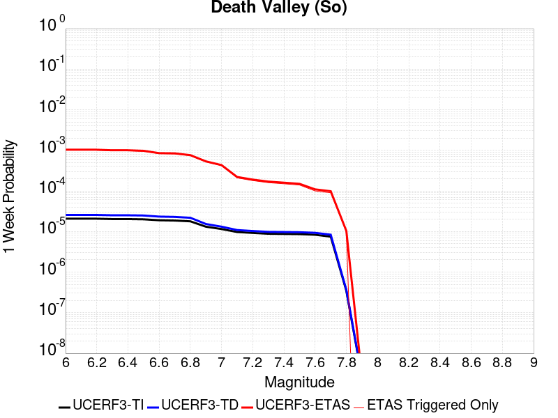 |  | 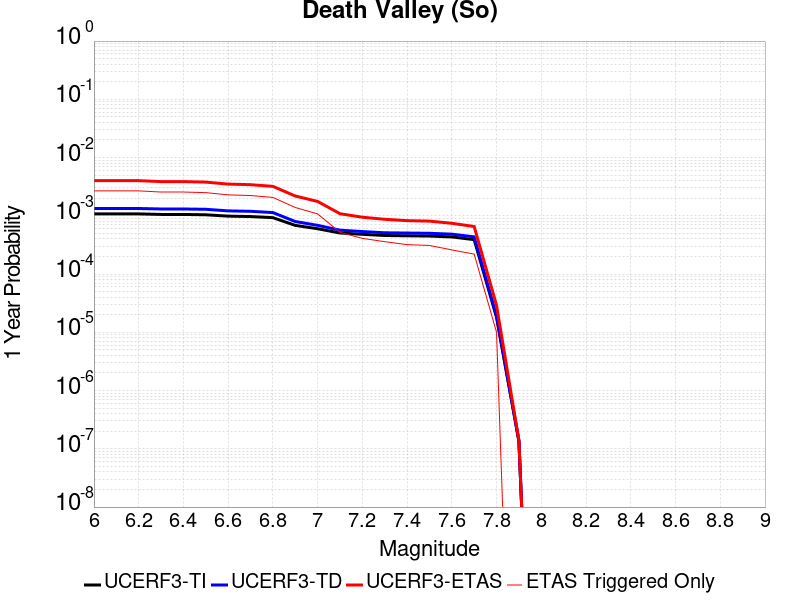 |  |

| Magnitude | 1 wk TI Prob | 1 wk TD Prob | 1 wk ETAS Prob | 1 wk ETAS/TD Gain | 1 wk ETAS Triggered Only | 1 mo TI Prob | 1 mo TD Prob | 1 mo ETAS Prob | 1 mo ETAS/TD Gain | 1 mo ETAS Triggered Only | 1 yr TI Prob | 1 yr TD Prob | 1 yr ETAS Prob | 1 yr ETAS/TD Gain | 1 yr ETAS Triggered Only | 10 yr TI Prob | 10 yr TD Prob | 10 yr ETAS Prob | 10 yr ETAS/TD Gain | 10 yr ETAS Triggered Only |
|-----|-----|-----|-----|-----|-----|-----|-----|-----|-----|-----|-----|-----|-----|-----|-----|-----|-----|-----|-----|-----|
| 6.0 | 2.0684236E-5 | 2.5618314E-5 | 0.0010394887 | 40.576 | 0.0010138963 | 8.864371E-5 | 1.0978825E-4 | 0.0017795519 | 16.208946 | 0.0016699469 | 0.0010787029 | 0.0013358692 | 0.0038970045 | 2.917205 | 0.0025645613 | 0.010734817 | 0.013279985 | 0.016693221 | 1.2570212 | 0.0034591758 |
| 6.1 | 2.0684236E-5 | 2.5618314E-5 | 0.0010394887 | 40.576 | 0.0010138963 | 8.864371E-5 | 1.0978825E-4 | 0.0017795519 | 16.208946 | 0.0016699469 | 0.0010787029 | 0.0013358692 | 0.0038970045 | 2.917205 | 0.0025645613 | 0.010734817 | 0.013279985 | 0.016693221 | 1.2570212 | 0.0034591758 |
| 6.2 | 2.0684236E-5 | 2.5618314E-5 | 0.0010394887 | 40.576 | 0.0010138963 | 8.864371E-5 | 1.0978825E-4 | 0.0017795519 | 16.208946 | 0.0016699469 | 0.0010787029 | 0.0013358692 | 0.0038970045 | 2.917205 | 0.0025645613 | 0.010734817 | 0.013279985 | 0.016693221 | 1.2570212 | 0.0034591758 |
| 6.3 | 2.0240292E-5 | 2.51184E-5 | 9.793498E-4 | 38.98934 | 9.542554E-4 | 8.6741224E-5 | 1.0764593E-4 | 0.0015985095 | 14.849697 | 0.001491024 | 0.0010555626 | 0.001309818 | 0.0036923317 | 2.8189654 | 0.0023856384 | 0.010505628 | 0.013022543 | 0.016201215 | 1.24409 | 0.003220612 |
| 6.4 | 2.0240292E-5 | 2.51184E-5 | 9.793498E-4 | 38.98934 | 9.542554E-4 | 8.6741224E-5 | 1.0764593E-4 | 0.0015985095 | 14.849697 | 0.001491024 | 0.0010555626 | 0.001309818 | 0.0036923317 | 2.8189654 | 0.0023856384 | 0.010505628 | 0.013022543 | 0.016201215 | 1.24409 | 0.003220612 |
| 6.5 | 1.9962767E-5 | 2.4807652E-5 | 9.790394E-4 | 39.465218 | 9.542554E-4 | 8.55519E-5 | 1.0631427E-4 | 0.0015971798 | 15.023193 | 0.001491024 | 0.0010410968 | 0.0012936244 | 0.0036166129 | 2.795721 | 0.0023259975 | 0.010362327 | 0.01286249 | 0.015982803 | 1.2425901 | 0.003160971 |
| 6.6 | 1.8937297E-5 | 2.3311462E-5 | 8.5826544E-4 | 36.817314 | 8.3497347E-4 | 8.115732E-5 | 9.990252E-5 | 0.0014118726 | 14.132502 | 0.0013121011 | 9.876423E-4 | 0.0012156491 | 0.0033005453 | 2.7150476 | 0.0020874336 | 0.009832645 | 0.0120915035 | 0.0149196545 | 1.2338958 | 0.0028627662 |
| 6.7 | 1.8621096E-5 | 2.2912098E-5 | 7.9822686E-4 | 34.83866 | 7.753325E-4 | 7.980225E-5 | 9.8191085E-5 | 0.0013505283 | 13.754082 | 0.0012524602 | 9.711593E-4 | 0.0011948354 | 0.0032202052 | 2.6951036 | 0.0020277926 | 0.009669261 | 0.011885625 | 0.014537569 | 1.223122 | 0.0026838433 |
| 6.8 | 1.7830353E-5 | 2.1806083E-5 | 7.9712167E-4 | 36.55501 | 7.753325E-4 | 7.641356E-5 | 9.3451374E-5 | 0.0012861592 | 13.76287 | 0.0011928192 | 9.29938E-4 | 0.0011371907 | 0.002983958 | 2.6239734 | 0.0018488698 | 0.009260561 | 0.01131609 | 0.013733698 | 1.2136434 | 0.0024452794 |
| 6.9 | 1.3135183E-5 | 1.5304031E-5 | 4.924244E-4 | 32.17613 | 4.771277E-4 | 5.6292425E-5 | 6.558709E-5 | 9.005058E-4 | 13.729925 | 8.3497347E-4 | 6.8514474E-4 | 7.982367E-4 | 0.002049697 | 2.5677812 | 0.0012524602 | 0.006830362 | 0.007955158 | 0.009611821 | 1.20825 | 0.0016699469 |
| 7.0 | 1.1507512E-5 | 1.3154237E-5 | 4.902757E-4 | 37.27131 | 4.771277E-4 | 4.9316975E-5 | 5.637412E-5 | 8.913005E-4 | 15.810455 | 8.3497347E-4 | 6.002687E-4 | 6.861445E-4 | 0.0018781453 | 2.7372444 | 0.0011928192 | 0.0059864987 | 0.0068414924 | 0.008263083 | 1.2077895 | 0.0014313831 |
| 7.1 | 9.715903E-6 | 1.0865287E-5 | 3.0906685E-4 | 28.445347 | 2.982048E-4 | 4.1638916E-5 | 4.6564706E-5 | 6.429466E-4 | 13.807593 | 5.964096E-4 | 5.068359E-4 | 5.667821E-4 | 0.0014012823 | 2.4723475 | 8.3497347E-4 | 0.0050568148 | 0.005653834 | 0.006602694 | 1.1678259 | 9.542554E-4 |
| 7.2 | 9.233269E-6 | 1.0286314E-5 | 2.488477E-4 | 24.192118 | 2.3856385E-4 | 3.9570554E-5 | 4.408348E-5 | 5.211901E-4 | 11.822799 | 4.771277E-4 | 4.81665E-4 | 5.365884E-4 | 0.001192287 | 2.2219768 | 6.560506E-4 | 0.0048062233 | 0.0053533595 | 0.006124541 | 1.1440557 | 7.753325E-4 |
| 7.3 | 8.8041315E-6 | 9.808164E-6 | 2.4836967E-4 | 25.322748 | 2.3856385E-4 | 3.7731446E-5 | 4.2034335E-5 | 3.9986506E-4 | 9.51282 | 3.5784577E-4 | 4.592835E-4 | 5.1165203E-4 | 0.001048146 | 2.0485525 | 5.3676864E-4 | 0.0045833546 | 0.005105167 | 0.0057578683 | 1.1278511 | 6.560506E-4 |
| 7.4 | 8.708749E-6 | 9.707175E-6 | 1.8862833E-4 | 19.431845 | 1.7892288E-4 | 3.7322676E-5 | 4.160154E-5 | 3.3979394E-4 | 8.167822 | 2.982048E-4 | 4.5430884E-4 | 5.0638523E-4 | 9.236605E-4 | 1.8240274 | 4.1748674E-4 | 0.004533812 | 0.0050527398 | 0.005586796 | 1.1056964 | 5.3676864E-4 |
| 7.5 | 8.612678E-6 | 9.604817E-6 | 1.288856E-4 | 13.418849 | 1.19281925E-4 | 3.6910955E-5 | 4.1162875E-5 | 2.797169E-4 | 6.795368 | 2.3856385E-4 | 4.492982E-4 | 5.01047E-4 | 8.5871347E-4 | 1.7138382 | 3.5784577E-4 | 0.004483909 | 0.0049995985 | 0.005474341 | 1.094956 | 4.771277E-4 |
| 7.6 | 8.319024E-6 | 9.283916E-6 | 6.8924324E-5 | 7.424057 | 5.9640963E-5 | 3.5652476E-5 | 3.978763E-5 | 2.187034E-4 | 5.4967685 | 1.7892288E-4 | 4.3398244E-4 | 4.8431093E-4 | 7.823713E-4 | 1.6154319 | 2.982048E-4 | 0.0043313587 | 0.0048329784 | 0.0052484474 | 1.0859654 | 4.1748674E-4 |
| 7.7 | 7.4718328E-6 | 8.34517E-6 | 6.798563E-5 | 8.146705 | 5.9640963E-5 | 3.2021748E-5 | 3.5764548E-5 | 2.1468103E-4 | 6.0026217 | 1.7892288E-4 | 3.8979502E-4 | 4.353504E-4 | 7.334254E-4 | 1.6846783 | 2.982048E-4 | 0.00389112 | 0.0043453807 | 0.004701671 | 1.081993 | 3.5784577E-4 |
| 7.8 | 3.4586725E-7 | 3.6482615E-7 | 3.6482615E-7 | 1.0 | 0.0 | 1.4822873E-6 | 1.5635396E-6 | 1.5635396E-6 | 1.0 | 0.0 | 1.80467E-5 | 1.9035933E-5 | 1.9035933E-5 | 1.0 | 0.0 | 1.8045233E-4 | 1.9034347E-4 | 1.9034347E-4 | 1.0 | 0.0 |
| 7.9 | 2.5591178E-9 | 2.6696718E-9 | 2.6696718E-9 | 1.0 | 0.0 | 1.0967647E-8 | 1.14414505E-8 | 1.14414505E-8 | 1.0 | 0.0 | 1.335311E-7 | 1.3929966E-7 | 1.3929966E-7 | 1.0 | 0.0 | 1.3353102E-6 | 1.3929966E-6 | 1.3929966E-6 | 1.0 | 0.0 |

## San Andreas (Mojave N)
*[(top)](#table-of-contents)*

| 1 Week | 1 Month | 1 Year | 10 Year |
|-----|-----|-----|-----|
|  |  |  | 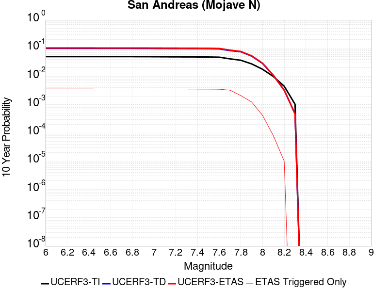 |

| Magnitude | 1 wk TI Prob | 1 wk TD Prob | 1 wk ETAS Prob | 1 wk ETAS/TD Gain | 1 wk ETAS Triggered Only | 1 mo TI Prob | 1 mo TD Prob | 1 mo ETAS Prob | 1 mo ETAS/TD Gain | 1 mo ETAS Triggered Only | 1 yr TI Prob | 1 yr TD Prob | 1 yr ETAS Prob | 1 yr ETAS/TD Gain | 1 yr ETAS Triggered Only | 10 yr TI Prob | 10 yr TD Prob | 10 yr ETAS Prob | 10 yr ETAS/TD Gain | 10 yr ETAS Triggered Only |
|-----|-----|-----|-----|-----|-----|-----|-----|-----|-----|-----|-----|-----|-----|-----|-----|-----|-----|-----|-----|-----|
| 6.0 | 9.877682E-5 | 1.9402112E-4 | 0.0017443852 | 8.990698 | 0.001550665 | 4.2326056E-4 | 8.312543E-4 | 0.002678587 | 3.222344 | 0.0018488698 | 0.0051410277 | 0.010073684 | 0.012553371 | 1.2461549 | 0.0025049204 | 0.05023708 | 0.09832245 | 0.10144152 | 1.0317228 | 0.0034591758 |
| 6.1 | 9.877682E-5 | 1.9402112E-4 | 0.0017443852 | 8.990698 | 0.001550665 | 4.2326056E-4 | 8.312543E-4 | 0.002678587 | 3.222344 | 0.0018488698 | 0.0051410277 | 0.010073684 | 0.012553371 | 1.2461549 | 0.0025049204 | 0.05023708 | 0.09832245 | 0.10144152 | 1.0317228 | 0.0034591758 |
| 6.2 | 9.877682E-5 | 1.9402112E-4 | 0.0017443852 | 8.990698 | 0.001550665 | 4.2326056E-4 | 8.312543E-4 | 0.002678587 | 3.222344 | 0.0018488698 | 0.0051410277 | 0.010073684 | 0.012553371 | 1.2461549 | 0.0025049204 | 0.05023708 | 0.09832245 | 0.10144152 | 1.0317228 | 0.0034591758 |
| 6.3 | 9.877682E-5 | 1.9402112E-4 | 0.0017443852 | 8.990698 | 0.001550665 | 4.2326056E-4 | 8.312543E-4 | 0.002678587 | 3.222344 | 0.0018488698 | 0.0051410277 | 0.010073684 | 0.012553371 | 1.2461549 | 0.0025049204 | 0.05023708 | 0.09832245 | 0.10144152 | 1.0317228 | 0.0034591758 |
| 6.4 | 9.877682E-5 | 1.9402112E-4 | 0.0017443852 | 8.990698 | 0.001550665 | 4.2326056E-4 | 8.312543E-4 | 0.002678587 | 3.222344 | 0.0018488698 | 0.0051410277 | 0.010073684 | 0.012553371 | 1.2461549 | 0.0025049204 | 0.05023708 | 0.09832245 | 0.10144152 | 1.0317228 | 0.0034591758 |
| 6.5 | 9.861474E-5 | 1.937588E-4 | 0.0017441233 | 9.001518 | 0.001550665 | 4.2256617E-4 | 8.3013077E-4 | 0.0026774658 | 3.2253542 | 0.0018488698 | 0.0051326132 | 0.0100601325 | 0.012539852 | 1.2464899 | 0.0025049204 | 0.050156746 | 0.09820035 | 0.101319835 | 1.0317665 | 0.0034591758 |
| 6.6 | 9.861474E-5 | 1.937588E-4 | 0.0017441233 | 9.001518 | 0.001550665 | 4.2256617E-4 | 8.3013077E-4 | 0.0026774658 | 3.2253542 | 0.0018488698 | 0.0051326132 | 0.0100601325 | 0.012539852 | 1.2464899 | 0.0025049204 | 0.050156746 | 0.09820035 | 0.101319835 | 1.0317665 | 0.0034591758 |
| 6.7 | 9.8552715E-5 | 1.9365833E-4 | 0.0017440231 | 9.005671 | 0.001550665 | 4.223004E-4 | 8.2970044E-4 | 0.0026770362 | 3.2265093 | 0.0018488698 | 0.0051293927 | 0.010054941 | 0.012534675 | 1.2466184 | 0.0025049204 | 0.050125998 | 0.09815356 | 0.1012732 | 1.0317833 | 0.0034591758 |
| 6.8 | 9.8464974E-5 | 1.9350994E-4 | 0.0017438749 | 9.01181 | 0.001550665 | 4.219245E-4 | 8.290649E-4 | 0.002676402 | 3.2282176 | 0.0018488698 | 0.0051248376 | 0.010047276 | 0.012527028 | 1.2468085 | 0.0025049204 | 0.05008251 | 0.09808378 | 0.101203665 | 1.0318084 | 0.0034591758 |
| 6.9 | 9.825824E-5 | 1.9319002E-4 | 0.0017435554 | 9.025081 | 0.001550665 | 4.2103877E-4 | 8.276947E-4 | 0.002675034 | 3.2319093 | 0.0018488698 | 0.0051141046 | 0.010030746 | 0.012510541 | 1.2472193 | 0.0025049204 | 0.049980022 | 0.097932965 | 0.10105337 | 1.0318627 | 0.0034591758 |
| 7.0 | 9.781462E-5 | 1.9250368E-4 | 0.0017428702 | 9.053699 | 0.001550665 | 4.1913814E-4 | 8.247551E-4 | 0.0026721 | 3.239871 | 0.0018488698 | 0.005091073 | 0.009995285 | 0.012475168 | 1.2481053 | 0.0025049204 | 0.04976007 | 0.09760912 | 0.10073065 | 1.0319799 | 0.0034591758 |
| 7.1 | 9.7121134E-5 | 1.9152075E-4 | 0.0017418888 | 9.095039 | 0.001550665 | 4.1616702E-4 | 8.205452E-4 | 0.0026678978 | 3.2513723 | 0.0018488698 | 0.005055068 | 0.0099444995 | 0.01242451 | 1.2493851 | 0.0025049204 | 0.04941613 | 0.09714571 | 0.10026884 | 1.032149 | 0.0034591758 |
| 7.2 | 9.663819E-5 | 1.9082859E-4 | 0.0017411977 | 9.124407 | 0.001550665 | 4.1409794E-4 | 8.175807E-4 | 0.0026649388 | 3.2595425 | 0.0018488698 | 0.0050299936 | 0.009908735 | 0.012388835 | 1.2502943 | 0.0025049204 | 0.049176537 | 0.09681883 | 0.09994309 | 1.0322691 | 0.0034591758 |
| 7.3 | 9.6277574E-5 | 1.9035369E-4 | 0.0017407235 | 9.14468 | 0.001550665 | 4.125529E-4 | 8.1554666E-4 | 0.0026629085 | 3.2651825 | 0.0018488698 | 0.0050112694 | 0.009884195 | 0.012364357 | 1.250922 | 0.0025049204 | 0.04899759 | 0.09659228 | 0.099663444 | 1.0317951 | 0.0033995348 |
| 7.4 | 9.593308E-5 | 1.8975153E-4 | 0.0017401223 | 9.170531 | 0.001550665 | 4.1107697E-4 | 8.129676E-4 | 0.0026603343 | 3.2723744 | 0.0018488698 | 0.0049933824 | 0.009853081 | 0.0123333195 | 1.2517222 | 0.0025049204 | 0.04882661 | 0.09630986 | 0.09938198 | 1.0318984 | 0.0033995348 |
| 7.5 | 9.561707E-5 | 1.8921228E-4 | 0.0017395839 | 9.193821 | 0.001550665 | 4.0972308E-4 | 8.106579E-4 | 0.0026580289 | 3.278854 | 0.0018488698 | 0.0049769743 | 0.009825215 | 0.012305523 | 1.2524432 | 0.0025049204 | 0.048669744 | 0.096056245 | 0.09912924 | 1.0319916 | 0.0033995348 |
| 7.6 | 9.418194E-5 | 1.8573487E-4 | 0.0017361118 | 9.347259 | 0.001550665 | 4.0357444E-4 | 7.95764E-4 | 0.0026431624 | 3.3215408 | 0.0018488698 | 0.004902454 | 0.009645499 | 0.012126259 | 1.2571934 | 0.0025049204 | 0.047957025 | 0.094437465 | 0.097515956 | 1.0325983 | 0.0033995348 |
| 7.7 | 8.202141E-5 | 1.6022482E-4 | 0.0015913786 | 9.93216 | 0.0014313831 | 3.51473E-4 | 6.8649714E-4 | 0.0024148975 | 3.5177097 | 0.0017295879 | 0.00427079 | 0.008326128 | 0.0106919035 | 1.2841387 | 0.0023856384 | 0.04189639 | 0.082237914 | 0.0850842 | 1.0346104 | 0.00310133 |
| 7.8 | 7.2859846E-5 | 1.4517571E-4 | 0.0011589249 | 7.9829116 | 0.0010138963 | 3.1221908E-4 | 6.2203326E-4 | 0.0018737144 | 3.0122414 | 0.0012524602 | 0.003794643 | 0.0075469986 | 0.009204343 | 1.2196031 | 0.0016699469 | 0.037304975 | 0.07472766 | 0.07682466 | 1.0280619 | 0.0022663565 |
| 7.9 | 5.3874453E-5 | 1.00462625E-4 | 4.5827244E-4 | 4.561621 | 3.5784577E-4 | 2.3087008E-4 | 4.3048308E-4 | 9.074054E-4 | 2.107877 | 4.771277E-4 | 0.0028072202 | 0.0052285474 | 0.005881168 | 1.1248187 | 6.560506E-4 | 0.02772022 | 0.052425884 | 0.05344314 | 1.0194037 | 0.0010735373 |
| 8.0 | 3.468538E-5 | 5.4261534E-5 | 1.7353699E-4 | 3.1981583 | 1.19281925E-4 | 1.4864317E-4 | 2.3252872E-4 | 3.5178292E-4 | 1.5128579 | 1.19281925E-4 | 0.0018082283 | 0.0028273636 | 0.0029463083 | 1.0420691 | 1.19281925E-4 | 0.017935853 | 0.028948462 | 0.029238034 | 1.010003 | 2.982048E-4 |
| 8.1 | 1.9152367E-5 | 1.9401303E-5 | 1.9401303E-5 | 1.0 | 0.0 | 8.207899E-5 | 8.3145795E-5 | 8.3145795E-5 | 1.0 | 0.0 | 9.988535E-4 | 0.0010118305 | 0.0010118305 | 1.0 | 0.0 | 0.009943757 | 0.01085595 | 0.010914944 | 1.0054342 | 5.9640963E-5 |
| 8.2 | 8.643924E-6 | 5.473668E-6 | 5.473668E-6 | 1.0 | 0.0 | 3.704486E-5 | 2.3458366E-5 | 2.3458366E-5 | 1.0 | 0.0 | 4.5092785E-4 | 2.8556827E-4 | 2.8556827E-4 | 1.0 | 0.0 | 0.0045001395 | 0.0032481793 | 0.0032481793 | 1.0 | 0.0 |
| 8.3 | 1.983087E-6 | 7.6564595E-7 | 7.6564595E-7 | 1.0 | 0.0 | 8.498917E-6 | 3.281336E-6 | 3.281336E-6 | 1.0 | 0.0 | 1.034694E-4 | 3.9949547E-5 | 3.9949547E-5 | 1.0 | 0.0 | 0.0010342124 | 4.717979E-4 | 4.717979E-4 | 1.0 | 0.0 |

## Nelson Lake
*[(top)](#table-of-contents)*

| 1 Week | 1 Month | 1 Year | 10 Year |
|-----|-----|-----|-----|
|  |  |  |  |

| Magnitude | 1 wk TI Prob | 1 wk TD Prob | 1 wk ETAS Prob | 1 wk ETAS/TD Gain | 1 wk ETAS Triggered Only | 1 mo TI Prob | 1 mo TD Prob | 1 mo ETAS Prob | 1 mo ETAS/TD Gain | 1 mo ETAS Triggered Only | 1 yr TI Prob | 1 yr TD Prob | 1 yr ETAS Prob | 1 yr ETAS/TD Gain | 1 yr ETAS Triggered Only | 10 yr TI Prob | 10 yr TD Prob | 10 yr ETAS Prob | 10 yr ETAS/TD Gain | 10 yr ETAS Triggered Only |
|-----|-----|-----|-----|-----|-----|-----|-----|-----|-----|-----|-----|-----|-----|-----|-----|-----|-----|-----|-----|-----|
| 6.0 | 9.913453E-6 | 1.0192255E-5 | 9.644379E-4 | 94.62458 | 9.542554E-4 | 4.2485535E-5 | 4.3680422E-5 | 0.0014153626 | 32.40268 | 0.0013717421 | 5.1713863E-4 | 5.316897E-4 | 0.0025584043 | 4.811837 | 0.0020277926 | 0.0051593683 | 0.005305204 | 0.007974809 | 1.503205 | 0.0026838433 |
| 6.1 | 9.913453E-6 | 1.0192255E-5 | 9.644379E-4 | 94.62458 | 9.542554E-4 | 4.2485535E-5 | 4.3680422E-5 | 0.0014153626 | 32.40268 | 0.0013717421 | 5.1713863E-4 | 5.316897E-4 | 0.0025584043 | 4.811837 | 0.0020277926 | 0.0051593683 | 0.005305204 | 0.007974809 | 1.503205 | 0.0026838433 |
| 6.2 | 4.5596407E-6 | 4.696313E-6 | 4.8182177E-4 | 102.59575 | 4.771277E-4 | 1.954117E-5 | 2.0126909E-5 | 7.954438E-4 | 39.52141 | 7.753325E-4 | 2.3788778E-4 | 2.4501883E-4 | 0.001318293 | 5.380375 | 0.0010735373 | 0.0023763329 | 0.0024476128 | 0.0038159974 | 1.559069 | 0.0013717421 |
| 6.3 | 4.5596407E-6 | 4.696313E-6 | 4.8182177E-4 | 102.59575 | 4.771277E-4 | 1.954117E-5 | 2.0126909E-5 | 7.954438E-4 | 39.52141 | 7.753325E-4 | 2.3788778E-4 | 2.4501883E-4 | 0.001318293 | 5.380375 | 0.0010735373 | 0.0023763329 | 0.0024476128 | 0.0038159974 | 1.559069 | 0.0013717421 |
| 6.4 | 3.4025713E-6 | 3.5098972E-6 | 3.613544E-4 | 102.95299 | 3.5784577E-4 | 1.4582367E-5 | 1.5042335E-5 | 4.325228E-4 | 28.7537 | 4.1748674E-4 | 1.7752586E-4 | 1.8312587E-4 | 8.9868635E-4 | 4.907479 | 7.1569154E-4 | 0.001773841 | 0.0018298327 | 0.002782342 | 1.5205444 | 9.542554E-4 |
| 6.5 | 2.8352947E-6 | 2.927856E-6 | 3.6077257E-4 | 123.22073 | 3.5784577E-4 | 1.2151207E-5 | 1.2547898E-5 | 4.3002938E-4 | 34.271027 | 4.1748674E-4 | 1.479309E-4 | 1.5276071E-4 | 8.0871105E-4 | 5.293973 | 6.560506E-4 | 0.0014783246 | 0.0015266308 | 0.0023007798 | 1.5070963 | 7.753325E-4 |
| 6.6 | 2.251518E-6 | 2.3290677E-6 | 2.4089236E-4 | 103.428665 | 2.3856385E-4 | 9.649328E-6 | 9.981683E-6 | 3.0818352E-4 | 30.874903 | 2.982048E-4 | 1.1747423E-4 | 1.2152085E-4 | 5.9859053E-4 | 4.925826 | 4.771277E-4 | 0.0011741214 | 0.0012146058 | 0.001810291 | 1.490435 | 5.964096E-4 |
| 6.7 | 1.8911853E-6 | 1.9591396E-6 | 1.8088167E-4 | 92.327095 | 1.7892288E-4 | 8.105055E-6 | 8.39629E-6 | 1.8731767E-4 | 22.309578 | 1.7892288E-4 | 9.867457E-5 | 1.0222061E-4 | 4.600298E-4 | 4.5003624 | 3.5784577E-4 | 9.863076E-4 | 0.0010217935 | 0.0014388536 | 1.4081649 | 4.1748674E-4 |
| 6.8 | 1.4874814E-6 | 1.5438305E-6 | 1.8046644E-4 | 116.89524 | 1.7892288E-4 | 6.374905E-6 | 6.6164025E-6 | 1.855381E-4 | 28.042143 | 1.7892288E-4 | 7.76117E-5 | 8.055224E-5 | 4.383692E-4 | 5.442048 | 3.5784577E-4 | 7.75846E-4 | 8.0528157E-4 | 0.0011628391 | 1.4440156 | 3.5784577E-4 |
| 6.9 | 6.835972E-7 | 7.1399285E-7 | 1.1999583E-4 | 168.06308 | 1.19281925E-4 | 2.9296991E-6 | 3.0599674E-6 | 1.2234153E-4 | 39.981316 | 1.19281925E-4 | 3.56685E-5 | 3.7254784E-5 | 1.5653226E-4 | 4.2016687 | 1.19281925E-4 | 3.5662777E-4 | 3.7251666E-4 | 4.9175415E-4 | 1.3200864 | 1.19281925E-4 |

## Towne Pass
*[(top)](#table-of-contents)*

| 1 Week | 1 Month | 1 Year | 10 Year |
|-----|-----|-----|-----|
|  |  |  |  |

| Magnitude | 1 wk TI Prob | 1 wk TD Prob | 1 wk ETAS Prob | 1 wk ETAS/TD Gain | 1 wk ETAS Triggered Only | 1 mo TI Prob | 1 mo TD Prob | 1 mo ETAS Prob | 1 mo ETAS/TD Gain | 1 mo ETAS Triggered Only | 1 yr TI Prob | 1 yr TD Prob | 1 yr ETAS Prob | 1 yr ETAS/TD Gain | 1 yr ETAS Triggered Only | 10 yr TI Prob | 10 yr TD Prob | 10 yr ETAS Prob | 10 yr ETAS/TD Gain | 10 yr ETAS Triggered Only |
|-----|-----|-----|-----|-----|-----|-----|-----|-----|-----|-----|-----|-----|-----|-----|-----|-----|-----|-----|-----|-----|
| 6.0 | 3.849728E-6 | 3.894542E-6 | 7.7922404E-4 | 200.08104 | 7.753325E-4 | 1.649873E-5 | 1.6690812E-5 | 0.0010902102 | 65.317986 | 0.0010735373 | 2.0085352E-4 | 2.0319606E-4 | 0.0018728037 | 9.216732 | 0.0016699469 | 0.0020067208 | 0.0020305319 | 0.004530366 | 2.2311227 | 0.0025049204 |
| 6.1 | 3.849728E-6 | 3.894542E-6 | 7.7922404E-4 | 200.08104 | 7.753325E-4 | 1.649873E-5 | 1.6690812E-5 | 0.0010902102 | 65.317986 | 0.0010735373 | 2.0085352E-4 | 2.0319606E-4 | 0.0018728037 | 9.216732 | 0.0016699469 | 0.0020067208 | 0.0020305319 | 0.004530366 | 2.2311227 | 0.0025049204 |
| 6.2 | 3.849728E-6 | 3.894542E-6 | 7.7922404E-4 | 200.08104 | 7.753325E-4 | 1.649873E-5 | 1.6690812E-5 | 0.0010902102 | 65.317986 | 0.0010735373 | 2.0085352E-4 | 2.0319606E-4 | 0.0018728037 | 9.216732 | 0.0016699469 | 0.0020067208 | 0.0020305319 | 0.004530366 | 2.2311227 | 0.0025049204 |
| 6.3 | 3.849728E-6 | 3.894542E-6 | 7.7922404E-4 | 200.08104 | 7.753325E-4 | 1.649873E-5 | 1.6690812E-5 | 0.0010902102 | 65.317986 | 0.0010735373 | 2.0085352E-4 | 2.0319606E-4 | 0.0018728037 | 9.216732 | 0.0016699469 | 0.0020067208 | 0.0020305319 | 0.004530366 | 2.2311227 | 0.0025049204 |
| 6.4 | 3.849728E-6 | 3.894542E-6 | 7.7922404E-4 | 200.08104 | 7.753325E-4 | 1.649873E-5 | 1.6690812E-5 | 0.0010902102 | 65.317986 | 0.0010735373 | 2.0085352E-4 | 2.0319606E-4 | 0.0018728037 | 9.216732 | 0.0016699469 | 0.0020067208 | 0.0020305319 | 0.004530366 | 2.2311227 | 0.0025049204 |
| 6.5 | 1.1953545E-6 | 1.2030526E-6 | 1.2030526E-6 | 1.0 | 0.0 | 5.1229376E-6 | 5.15593E-6 | 5.15593E-6 | 1.0 | 0.0 | 6.236998E-5 | 6.277176E-5 | 2.4168342E-4 | 3.8501933 | 1.7892288E-4 | 6.235248E-4 | 6.2755204E-4 | 0.0011043802 | 1.7598227 | 4.771277E-4 |
| 6.6 | 1.1953545E-6 | 1.2030526E-6 | 1.2030526E-6 | 1.0 | 0.0 | 5.1229376E-6 | 5.15593E-6 | 5.15593E-6 | 1.0 | 0.0 | 6.236998E-5 | 6.277176E-5 | 2.4168342E-4 | 3.8501933 | 1.7892288E-4 | 6.235248E-4 | 6.2755204E-4 | 0.0011043802 | 1.7598227 | 4.771277E-4 |
| 6.7 | 8.375951E-7 | 8.410676E-7 | 8.410676E-7 | 1.0 | 0.0 | 3.5896885E-6 | 3.6045708E-6 | 3.6045708E-6 | 1.0 | 0.0 | 4.370358E-5 | 4.3884826E-5 | 1.0352317E-4 | 2.3589742 | 5.9640963E-5 | 4.3694986E-4 | 4.3876728E-4 | 6.7722646E-4 | 1.5434753 | 2.3856385E-4 |
| 6.8 | 6.38041E-7 | 6.3921624E-7 | 6.3921624E-7 | 1.0 | 0.0 | 2.7344586E-6 | 2.7394954E-6 | 2.7394954E-6 | 1.0 | 0.0 | 3.3291526E-5 | 3.3352884E-5 | 3.3352884E-5 | 1.0 | 0.0 | 3.3286537E-4 | 3.334826E-4 | 4.5272475E-4 | 1.3575664 | 1.19281925E-4 |
| 6.9 | 5.3460053E-7 | 5.345339E-7 | 5.345339E-7 | 1.0 | 0.0 | 2.2911431E-6 | 2.2908578E-6 | 2.2908578E-6 | 1.0 | 0.0 | 2.789431E-5 | 2.7890868E-5 | 2.7890868E-5 | 1.0 | 0.0 | 2.789081E-4 | 2.78877E-4 | 3.3850133E-4 | 1.2138015 | 5.9640963E-5 |
| 7.0 | 3.557783E-7 | 3.5324283E-7 | 3.5324283E-7 | 1.0 | 0.0 | 1.5247632E-6 | 1.513897E-6 | 1.513897E-6 | 1.0 | 0.0 | 1.8563835E-5 | 1.8431549E-5 | 1.8431549E-5 | 1.0 | 0.0 | 1.8562283E-4 | 1.8430105E-4 | 2.4393102E-4 | 1.3235465 | 5.9640963E-5 |
| 7.1 | 3.037942E-7 | 3.0002275E-7 | 3.0002275E-7 | 1.0 | 0.0 | 1.3019744E-6 | 1.2858112E-6 | 1.2858112E-6 | 1.0 | 0.0 | 1.5851423E-5 | 1.5654647E-5 | 1.5654647E-5 | 1.0 | 0.0 | 1.5850292E-4 | 1.5653619E-4 | 2.1616781E-4 | 1.3809446 | 5.9640963E-5 |
| 7.2 | 2.0808248E-7 | 2.0217735E-7 | 2.0217735E-7 | 1.0 | 0.0 | 8.917818E-7 | 8.6647407E-7 | 8.6647407E-7 | 1.0 | 0.0 | 1.0857389E-5 | 1.0549275E-5 | 1.0549275E-5 | 1.0 | 0.0 | 1.0856859E-4 | 1.0548821E-4 | 1.6512288E-4 | 1.5653207 | 5.9640963E-5 |
| 7.3 | 1.1162073E-7 | 1.0636902E-7 | 1.0636902E-7 | 1.0 | 0.0 | 4.7837443E-7 | 4.5586717E-7 | 4.5586717E-7 | 1.0 | 0.0 | 5.8241935E-6 | 5.5501705E-6 | 5.5501705E-6 | 1.0 | 0.0 | 5.8240406E-5 | 5.550052E-5 | 1.1513817E-4 | 2.0745423 | 5.9640963E-5 |

## Paradise
*[(top)](#table-of-contents)*

| 1 Week | 1 Month | 1 Year | 10 Year |
|-----|-----|-----|-----|
|  |  | 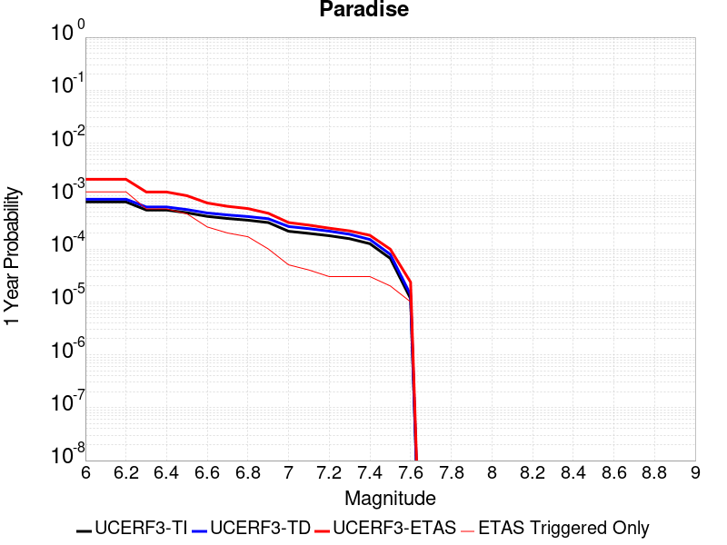 |  |

| Magnitude | 1 wk TI Prob | 1 wk TD Prob | 1 wk ETAS Prob | 1 wk ETAS/TD Gain | 1 wk ETAS Triggered Only | 1 mo TI Prob | 1 mo TD Prob | 1 mo ETAS Prob | 1 mo ETAS/TD Gain | 1 mo ETAS Triggered Only | 1 yr TI Prob | 1 yr TD Prob | 1 yr ETAS Prob | 1 yr ETAS/TD Gain | 1 yr ETAS Triggered Only | 10 yr TI Prob | 10 yr TD Prob | 10 yr ETAS Prob | 10 yr ETAS/TD Gain | 10 yr ETAS Triggered Only |
|-----|-----|-----|-----|-----|-----|-----|-----|-----|-----|-----|-----|-----|-----|-----|-----|-----|-----|-----|-----|-----|
| 6.0 | 1.4851273E-5 | 1.6694768E-5 | 6.130944E-4 | 36.723743 | 5.964096E-4 | 6.364676E-5 | 7.154718E-5 | 9.064609E-4 | 12.6694145 | 8.3497347E-4 | 7.7462377E-4 | 8.707624E-4 | 0.002181721 | 2.5055296 | 0.0013121011 | 0.0077192914 | 0.008675884 | 0.010686085 | 1.2316997 | 0.0020277926 |
| 6.1 | 1.4851273E-5 | 1.6694768E-5 | 6.130944E-4 | 36.723743 | 5.964096E-4 | 6.364676E-5 | 7.154718E-5 | 9.064609E-4 | 12.6694145 | 8.3497347E-4 | 7.7462377E-4 | 8.707624E-4 | 0.002181721 | 2.5055296 | 0.0013121011 | 0.0077192914 | 0.008675884 | 0.010686085 | 1.2316997 | 0.0020277926 |
| 6.2 | 1.4851273E-5 | 1.6694768E-5 | 6.130944E-4 | 36.723743 | 5.964096E-4 | 6.364676E-5 | 7.154718E-5 | 9.064609E-4 | 12.6694145 | 8.3497347E-4 | 7.7462377E-4 | 8.707624E-4 | 0.002181721 | 2.5055296 | 0.0013121011 | 0.0077192914 | 0.008675884 | 0.010686085 | 1.2316997 | 0.0020277926 |
| 6.3 | 1.0426831E-5 | 1.1888697E-5 | 3.697302E-4 | 31.099302 | 3.5784577E-4 | 4.4685654E-5 | 5.09506E-5 | 5.876919E-4 | 11.534543 | 5.3676864E-4 | 5.43912E-4 | 6.201529E-4 | 0.0013950046 | 2.2494526 | 7.753325E-4 | 0.0054258266 | 0.0061848317 | 0.0074295457 | 1.2012527 | 0.0012524602 |
| 6.4 | 1.0426831E-5 | 1.1888697E-5 | 3.697302E-4 | 31.099302 | 3.5784577E-4 | 4.4685654E-5 | 5.09506E-5 | 5.876919E-4 | 11.534543 | 5.3676864E-4 | 5.43912E-4 | 6.201529E-4 | 0.0013950046 | 2.2494526 | 7.753325E-4 | 0.0054258266 | 0.0061848317 | 0.0074295457 | 1.2012527 | 0.0012524602 |
| 6.5 | 9.25027E-6 | 1.0620037E-5 | 3.0882168E-4 | 29.079151 | 2.982048E-4 | 3.964341E-5 | 4.551368E-5 | 5.2261964E-4 | 11.482694 | 4.771277E-4 | 4.8255164E-4 | 5.5399304E-4 | 0.0012096802 | 2.1835656 | 6.560506E-4 | 0.0048150513 | 0.0055266195 | 0.006594224 | 1.193175 | 0.0010735373 |
| 6.6 | 7.904275E-6 | 9.159602E-6 | 1.2844043E-4 | 14.02249 | 1.19281925E-4 | 3.3875025E-5 | 3.925487E-5 | 1.5853212E-4 | 4.0385337 | 1.19281925E-4 | 4.1235037E-4 | 4.7782718E-4 | 6.5666455E-4 | 1.3742721 | 1.7892288E-4 | 0.0041158604 | 0.004768395 | 0.0051838905 | 1.0871354 | 4.1748674E-4 |
| 6.7 | 7.2061953E-6 | 8.407326E-6 | 6.804778E-5 | 8.093868 | 5.9640963E-5 | 3.088333E-5 | 3.603092E-5 | 9.566973E-5 | 2.6552122 | 5.9640963E-5 | 3.7593965E-4 | 4.3859181E-4 | 4.9820665E-4 | 1.1359231 | 5.9640963E-5 | 0.003753043 | 0.004377631 | 0.0046745306 | 1.067822 | 2.982048E-4 |
| 6.8 | 6.6948724E-6 | 7.842242E-6 | 7.842242E-6 | 1.0 | 0.0 | 2.8691995E-5 | 3.3609194E-5 | 3.3609194E-5 | 1.0 | 0.0 | 3.4926904E-4 | 4.091187E-4 | 4.091187E-4 | 1.0 | 0.0 | 0.003487206 | 0.0040840125 | 0.004321602 | 1.0581756 | 2.3856385E-4 |
| 6.9 | 6.0421025E-6 | 7.1306963E-6 | 7.1306963E-6 | 1.0 | 0.0 | 2.5894467E-5 | 3.0559786E-5 | 3.0559786E-5 | 1.0 | 0.0 | 3.1521954E-4 | 3.7200528E-4 | 3.7200528E-4 | 1.0 | 0.0 | 0.0031477278 | 0.0037141638 | 0.0038330029 | 1.0319961 | 1.19281925E-4 |
| 7.0 | 4.134091E-6 | 5.0803824E-6 | 5.0803824E-6 | 1.0 | 0.0 | 1.7717413E-5 | 2.1772896E-5 | 2.1772896E-5 | 1.0 | 0.0 | 2.1568815E-4 | 2.650543E-4 | 2.650543E-4 | 1.0 | 0.0 | 0.0021547892 | 0.0026475347 | 0.0027070178 | 1.0224674 | 5.9640963E-5 |
| 7.1 | 3.7674888E-6 | 4.631936E-6 | 4.631936E-6 | 1.0 | 0.0 | 1.6146281E-5 | 1.9851012E-5 | 1.9851012E-5 | 1.0 | 0.0 | 1.9656324E-4 | 2.4166079E-4 | 2.4166079E-4 | 1.0 | 0.0 | 0.0019638946 | 0.0024141306 | 0.0024736274 | 1.0246453 | 5.9640963E-5 |
| 7.2 | 3.4065345E-6 | 4.156782E-6 | 4.156782E-6 | 1.0 | 0.0 | 1.4599351E-5 | 1.7814667E-5 | 1.7814667E-5 | 1.0 | 0.0 | 1.777326E-4 | 2.168735E-4 | 2.168735E-4 | 1.0 | 0.0 | 0.0017759053 | 0.0021667667 | 0.0022262784 | 1.0274657 | 5.9640963E-5 |
| 7.3 | 2.9934936E-6 | 3.6293673E-6 | 3.6293673E-6 | 1.0 | 0.0 | 1.2829195E-5 | 1.5554348E-5 | 1.5554348E-5 | 1.0 | 0.0 | 1.5618425E-4 | 1.8935918E-4 | 1.8935918E-4 | 1.0 | 0.0 | 0.0015607453 | 0.0018921237 | 0.0019516519 | 1.031461 | 5.9640963E-5 |
| 7.4 | 2.4049796E-6 | 2.8890186E-6 | 2.8890186E-6 | 1.0 | 0.0 | 1.0307015E-5 | 1.2381457E-5 | 1.2381457E-5 | 1.0 | 0.0 | 1.2548068E-4 | 1.5073526E-4 | 1.5073526E-4 | 1.0 | 0.0 | 0.0012540985 | 0.0015064715 | 0.0015660228 | 1.0395302 | 5.9640963E-5 |
| 7.5 | 1.2710091E-6 | 1.5134859E-6 | 1.5134859E-6 | 1.0 | 0.0 | 5.44717E-6 | 6.4863593E-6 | 6.4863593E-6 | 1.0 | 0.0 | 6.631728E-5 | 7.896981E-5 | 7.896981E-5 | 1.0 | 0.0 | 6.6297496E-4 | 7.895401E-4 | 8.49134E-4 | 1.0754793 | 5.9640963E-5 |
| 7.6 | 2.21172E-7 | 2.6040198E-7 | 2.6040198E-7 | 1.0 | 0.0 | 9.478797E-7 | 1.1160082E-6 | 1.1160082E-6 | 1.0 | 0.0 | 1.1540374E-5 | 1.3587343E-5 | 1.3587343E-5 | 1.0 | 0.0 | 1.1539775E-4 | 1.3586794E-4 | 1.3586794E-4 | 1.0 | 0.0 |

## San Andreas (San Bernardino N)
*[(top)](#table-of-contents)*

| 1 Week | 1 Month | 1 Year | 10 Year |
|-----|-----|-----|-----|
|  |  |  | 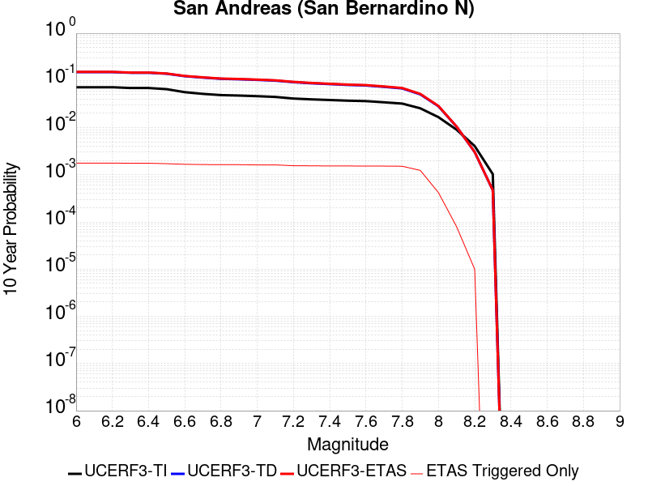 |

| Magnitude | 1 wk TI Prob | 1 wk TD Prob | 1 wk ETAS Prob | 1 wk ETAS/TD Gain | 1 wk ETAS Triggered Only | 1 mo TI Prob | 1 mo TD Prob | 1 mo ETAS Prob | 1 mo ETAS/TD Gain | 1 mo ETAS Triggered Only | 1 yr TI Prob | 1 yr TD Prob | 1 yr ETAS Prob | 1 yr ETAS/TD Gain | 1 yr ETAS Triggered Only | 10 yr TI Prob | 10 yr TD Prob | 10 yr ETAS Prob | 10 yr ETAS/TD Gain | 10 yr ETAS Triggered Only |
|-----|-----|-----|-----|-----|-----|-----|-----|-----|-----|-----|-----|-----|-----|-----|-----|-----|-----|-----|-----|-----|
| 6.0 | 1.4273766E-4 | 3.160784E-4 | 0.0010911658 | 3.4522 | 7.753325E-4 | 6.115894E-4 | 0.0013539245 | 0.0023068879 | 1.7038527 | 9.542554E-4 | 0.0074207084 | 0.016360939 | 0.017651573 | 1.0788851 | 0.0013121011 | 0.07177748 | 0.15021163 | 0.15178277 | 1.0104595 | 0.0018488698 |
| 6.1 | 1.4273766E-4 | 3.160784E-4 | 0.0010911658 | 3.4522 | 7.753325E-4 | 6.115894E-4 | 0.0013539245 | 0.0023068879 | 1.7038527 | 9.542554E-4 | 0.0074207084 | 0.016360939 | 0.017651573 | 1.0788851 | 0.0013121011 | 0.07177748 | 0.15021163 | 0.15178277 | 1.0104595 | 0.0018488698 |
| 6.2 | 1.4273766E-4 | 3.160784E-4 | 0.0010911658 | 3.4522 | 7.753325E-4 | 6.115894E-4 | 0.0013539245 | 0.0023068879 | 1.7038527 | 9.542554E-4 | 0.0074207084 | 0.016360939 | 0.017651573 | 1.0788851 | 0.0013121011 | 0.07177748 | 0.15021163 | 0.15178277 | 1.0104595 | 0.0018488698 |
| 6.3 | 1.3730655E-4 | 3.0512668E-4 | 0.0010205999 | 3.3448398 | 7.1569154E-4 | 5.883239E-4 | 0.001307036 | 0.0022004812 | 1.6835657 | 8.9461444E-4 | 0.0071393442 | 0.015798455 | 0.01703113 | 1.0780249 | 0.0012524602 | 0.06914291 | 0.1455135 | 0.14704238 | 1.0105067 | 0.0017892289 |
| 6.4 | 1.3730655E-4 | 3.0512668E-4 | 0.0010205999 | 3.3448398 | 7.1569154E-4 | 5.883239E-4 | 0.001307036 | 0.0022004812 | 1.6835657 | 8.9461444E-4 | 0.0071393442 | 0.015798455 | 0.01703113 | 1.0780249 | 0.0012524602 | 0.06914291 | 0.1455135 | 0.14704238 | 1.0105067 | 0.0017892289 |
| 6.5 | 1.2942807E-4 | 2.8927144E-4 | 0.001004756 | 3.4734018 | 7.1569154E-4 | 5.545738E-4 | 0.0012391509 | 0.0021326568 | 1.721063 | 8.9461444E-4 | 0.0067310524 | 0.014983548 | 0.016217241 | 1.0823365 | 0.0012524602 | 0.06530788 | 0.13865088 | 0.14019203 | 1.0111153 | 0.0017892289 |
| 6.6 | 1.1125901E-4 | 2.5365927E-4 | 9.095434E-4 | 3.5856898 | 6.560506E-4 | 4.767372E-4 | 0.0010866605 | 0.0019207266 | 1.7675499 | 8.3497347E-4 | 0.005788839 | 0.0131504685 | 0.0143276015 | 1.0895126 | 0.0011928192 | 0.056403454 | 0.12300496 | 0.12446949 | 1.0119063 | 0.0016699469 |
| 6.7 | 1.02209575E-4 | 2.3500937E-4 | 8.909058E-4 | 3.7909372 | 6.560506E-4 | 4.3796748E-4 | 0.0010067957 | 0.0018409285 | 1.8285025 | 8.3497347E-4 | 0.0053192247 | 0.012189267 | 0.013367547 | 1.0966654 | 0.0011928192 | 0.051936906 | 0.114792764 | 0.11627102 | 1.0128776 | 0.0016699469 |
| 6.8 | 9.610582E-5 | 2.2026796E-4 | 8.76174E-4 | 3.9777644 | 6.560506E-4 | 4.1181705E-4 | 9.436647E-4 | 0.0017778502 | 1.883985 | 8.3497347E-4 | 0.0050023515 | 0.011428859 | 0.012608046 | 1.1031762 | 0.0011928192 | 0.048912346 | 0.10820469 | 0.10969394 | 1.0137633 | 0.0016699469 |
| 6.9 | 9.3877505E-5 | 2.1482339E-4 | 8.7073306E-4 | 4.0532503 | 6.560506E-4 | 4.0227012E-4 | 9.203475E-4 | 0.0017545525 | 1.9064022 | 8.3497347E-4 | 0.0048866454 | 0.011147907 | 0.012327429 | 1.1058066 | 0.0011928192 | 0.04780577 | 0.105798274 | 0.10729154 | 1.0141143 | 0.0016699469 |
| 7.0 | 9.1019785E-5 | 2.0809306E-4 | 8.640071E-4 | 4.152023 | 6.560506E-4 | 3.900265E-4 | 8.915232E-4 | 0.0017257523 | 1.9357345 | 8.3497347E-4 | 0.0047382377 | 0.0108004995 | 0.011980436 | 1.1092483 | 0.0011928192 | 0.046384744 | 0.10276815 | 0.10426648 | 1.0145797 | 0.0016699469 |
| 7.1 | 8.771155E-5 | 1.9983841E-4 | 8.5575785E-4 | 4.2822495 | 6.560506E-4 | 3.758525E-4 | 8.5616973E-4 | 0.0016904284 | 1.9744079 | 8.3497347E-4 | 0.0045664064 | 0.010374243 | 0.011554687 | 1.1137861 | 0.0011928192 | 0.044737056 | 0.09907644 | 0.10058094 | 1.0151852 | 0.0016699469 |
| 7.2 | 8.0830236E-5 | 1.8389444E-4 | 8.398244E-4 | 4.566883 | 6.560506E-4 | 3.4636928E-4 | 7.8788114E-4 | 0.0015626028 | 1.9832976 | 7.753325E-4 | 0.0042088944 | 0.009550368 | 0.010672725 | 1.1175196 | 0.0011331782 | 0.041300658 | 0.09180518 | 0.09321349 | 1.0153402 | 0.001550665 |
| 7.3 | 7.7668235E-5 | 1.7333007E-4 | 8.2926697E-4 | 4.7843223 | 6.560506E-4 | 3.328214E-4 | 7.426318E-4 | 0.0015173885 | 2.0432582 | 7.753325E-4 | 0.0040445733 | 0.009004138 | 0.010127113 | 1.1247176 | 0.0011331782 | 0.03971748 | 0.08706761 | 0.08848327 | 1.0162592 | 0.001550665 |
| 7.4 | 7.520177E-5 | 1.655312E-4 | 8.214732E-4 | 4.962649 | 6.560506E-4 | 3.2225347E-4 | 7.092266E-4 | 0.0014840092 | 2.0924332 | 7.753325E-4 | 0.0039163795 | 0.008600714 | 0.009724146 | 1.1306208 | 0.0011331782 | 0.038480744 | 0.08352157 | 0.08494271 | 1.0170153 | 0.001550665 |
| 7.5 | 7.274697E-5 | 1.584075E-4 | 8.1435416E-4 | 5.140881 | 6.560506E-4 | 3.1173544E-4 | 6.7871273E-4 | 0.001453519 | 2.141582 | 7.753325E-4 | 0.003788775 | 0.008232076 | 0.009355926 | 1.1365209 | 0.0011331782 | 0.03724827 | 0.08023654 | 0.08166278 | 1.0177755 | 0.001550665 |
| 7.6 | 7.1185845E-5 | 1.5410586E-4 | 8.1005535E-4 | 5.2564864 | 6.560506E-4 | 3.0504653E-4 | 6.602866E-4 | 0.0014351071 | 2.173461 | 7.753325E-4 | 0.0037076178 | 0.0080094095 | 0.009133511 | 1.1403477 | 0.0011331782 | 0.036463667 | 0.07822661 | 0.079655975 | 1.018272 | 0.001550665 |
| 7.7 | 6.709961E-5 | 1.4319421E-4 | 7.9915085E-4 | 5.580888 | 6.560506E-4 | 2.8753807E-4 | 6.135452E-4 | 0.001388402 | 2.2629173 | 7.753325E-4 | 0.003495157 | 0.0074443663 | 0.008569109 | 1.1510864 | 0.0011331782 | 0.034406938 | 0.07305558 | 0.07449296 | 1.0196751 | 0.001550665 |
| 7.8 | 6.300812E-5 | 1.320343E-4 | 7.8799826E-4 | 5.968133 | 6.560506E-4 | 2.7000686E-4 | 5.657386E-4 | 0.0013406324 | 2.369703 | 7.753325E-4 | 0.0032823787 | 0.006866143 | 0.007991541 | 1.1639054 | 0.0011331782 | 0.032343175 | 0.06771385 | 0.06915951 | 1.0213495 | 0.001550665 |
| 7.9 | 4.983037E-5 | 9.7241085E-5 | 4.5505207E-4 | 4.6796274 | 3.5784577E-4 | 2.1354125E-4 | 4.1668097E-4 | 8.9360983E-4 | 2.1445901 | 4.771277E-4 | 0.0025967648 | 0.0050613005 | 0.0057140305 | 1.1289649 | 6.560506E-4 | 0.025666296 | 0.050650507 | 0.051669672 | 1.0201215 | 0.0010735373 |
| 8.0 | 3.2211527E-5 | 5.3306234E-5 | 1.725818E-4 | 3.2375538 | 1.19281925E-4 | 1.380421E-4 | 2.2843528E-4 | 3.4768996E-4 | 1.5220501 | 1.19281925E-4 | 0.0016793669 | 0.0027776542 | 0.0028966048 | 1.0428241 | 1.19281925E-4 | 0.016667323 | 0.028362568 | 0.028652316 | 1.0102159 | 2.982048E-4 |
| 8.1 | 1.743376E-5 | 1.8823403E-5 | 1.8823403E-5 | 1.0 | 0.0 | 7.471398E-5 | 8.066923E-5 | 8.066923E-5 | 1.0 | 0.0 | 9.0926304E-4 | 9.81706E-4 | 9.81706E-4 | 1.0 | 0.0 | 0.009055517 | 0.010483979 | 0.010542995 | 1.0056292 | 5.9640963E-5 |
| 8.2 | 7.831616E-6 | 5.1540533E-6 | 5.1540533E-6 | 1.0 | 0.0 | 3.3563636E-5 | 2.2088612E-5 | 2.2088612E-5 | 1.0 | 0.0 | 4.0856065E-4 | 2.6889573E-4 | 2.6889573E-4 | 1.0 | 0.0 | 0.004078103 | 0.0030413668 | 0.0030413668 | 1.0 | 0.0 |
| 8.3 | 1.983087E-6 | 7.6564595E-7 | 7.6564595E-7 | 1.0 | 0.0 | 8.498917E-6 | 3.281336E-6 | 3.281336E-6 | 1.0 | 0.0 | 1.034694E-4 | 3.9949547E-5 | 3.9949547E-5 | 1.0 | 0.0 | 0.0010342124 | 4.717979E-4 | 4.717979E-4 | 1.0 | 0.0 |

## Garlic Springs
*[(top)](#table-of-contents)*

| 1 Week | 1 Month | 1 Year | 10 Year |
|-----|-----|-----|-----|
|  |  |  |  |

| Magnitude | 1 wk TI Prob | 1 wk TD Prob | 1 wk ETAS Prob | 1 wk ETAS/TD Gain | 1 wk ETAS Triggered Only | 1 mo TI Prob | 1 mo TD Prob | 1 mo ETAS Prob | 1 mo ETAS/TD Gain | 1 mo ETAS Triggered Only | 1 yr TI Prob | 1 yr TD Prob | 1 yr ETAS Prob | 1 yr ETAS/TD Gain | 1 yr ETAS Triggered Only | 10 yr TI Prob | 10 yr TD Prob | 10 yr ETAS Prob | 10 yr ETAS/TD Gain | 10 yr ETAS Triggered Only |
|-----|-----|-----|-----|-----|-----|-----|-----|-----|-----|-----|-----|-----|-----|-----|-----|-----|-----|-----|-----|-----|
| 6.0 | 1.6760017E-5 | 1.8776833E-5 | 5.5553543E-4 | 29.586216 | 5.3676864E-4 | 7.182667E-5 | 8.0470316E-5 | 7.364681E-4 | 9.152046 | 6.560506E-4 | 8.7413884E-4 | 9.794032E-4 | 0.0019923064 | 2.0342047 | 0.0010138963 | 0.008707083 | 0.009762413 | 0.011120764 | 1.1391408 | 0.0013717421 |
| 6.1 | 9.852767E-6 | 1.0973587E-5 | 3.6881544E-4 | 33.60938 | 3.5784577E-4 | 4.222546E-5 | 4.702921E-5 | 4.6449632E-4 | 9.876761 | 4.1748674E-4 | 5.139737E-4 | 5.7250116E-4 | 0.0010493557 | 1.832932 | 4.771277E-4 | 0.005127866 | 0.005717221 | 0.0063102213 | 1.1037217 | 5.964096E-4 |
| 6.2 | 9.852767E-6 | 1.0973587E-5 | 3.6881544E-4 | 33.60938 | 3.5784577E-4 | 4.222546E-5 | 4.702921E-5 | 4.6449632E-4 | 9.876761 | 4.1748674E-4 | 5.139737E-4 | 5.7250116E-4 | 0.0010493557 | 1.832932 | 4.771277E-4 | 0.005127866 | 0.005717221 | 0.0063102213 | 1.1037217 | 5.964096E-4 |
| 6.3 | 4.3167724E-6 | 4.7780286E-6 | 1.8370006E-4 | 38.44683 | 1.7892288E-4 | 1.8500323E-5 | 2.0477235E-5 | 1.9939645E-4 | 9.73747 | 1.7892288E-4 | 2.2521814E-4 | 2.4930484E-4 | 5.474353E-4 | 2.195847 | 2.982048E-4 | 0.0022499003 | 0.00249251 | 0.002908956 | 1.167079 | 4.1748674E-4 |
| 6.4 | 4.3167724E-6 | 4.7780286E-6 | 1.8370006E-4 | 38.44683 | 1.7892288E-4 | 1.8500323E-5 | 2.0477235E-5 | 1.9939645E-4 | 9.73747 | 1.7892288E-4 | 2.2521814E-4 | 2.4930484E-4 | 5.474353E-4 | 2.195847 | 2.982048E-4 | 0.0022499003 | 0.00249251 | 0.002908956 | 1.167079 | 4.1748674E-4 |
| 6.5 | 4.3167724E-6 | 4.7780286E-6 | 1.8370006E-4 | 38.44683 | 1.7892288E-4 | 1.8500323E-5 | 2.0477235E-5 | 1.9939645E-4 | 9.73747 | 1.7892288E-4 | 2.2521814E-4 | 2.4930484E-4 | 5.474353E-4 | 2.195847 | 2.982048E-4 | 0.0022499003 | 0.00249251 | 0.002908956 | 1.167079 | 4.1748674E-4 |
| 6.6 | 4.301311E-6 | 4.760897E-6 | 1.8368293E-4 | 38.58158 | 1.7892288E-4 | 1.8434059E-5 | 2.0403815E-5 | 1.9932305E-4 | 9.768911 | 1.7892288E-4 | 2.2441156E-4 | 2.4841115E-4 | 5.465419E-4 | 2.2001503 | 2.982048E-4 | 0.0022418506 | 0.002483593 | 0.002900043 | 1.1676804 | 4.1748674E-4 |
| 6.7 | 3.8599724E-6 | 4.27106E-6 | 1.8319317E-4 | 42.89174 | 1.7892288E-4 | 1.6542634E-5 | 1.8304541E-5 | 1.9722414E-4 | 10.774602 | 1.7892288E-4 | 2.0138794E-4 | 2.228578E-4 | 5.2099617E-4 | 2.3377964 | 2.982048E-4 | 0.0020120554 | 0.002228578 | 0.0026451342 | 1.1869158 | 4.1748674E-4 |

## Bicycle Lake
*[(top)](#table-of-contents)*

| 1 Week | 1 Month | 1 Year | 10 Year |
|-----|-----|-----|-----|
|  |  |  |  |

| Magnitude | 1 wk TI Prob | 1 wk TD Prob | 1 wk ETAS Prob | 1 wk ETAS/TD Gain | 1 wk ETAS Triggered Only | 1 mo TI Prob | 1 mo TD Prob | 1 mo ETAS Prob | 1 mo ETAS/TD Gain | 1 mo ETAS Triggered Only | 1 yr TI Prob | 1 yr TD Prob | 1 yr ETAS Prob | 1 yr ETAS/TD Gain | 1 yr ETAS Triggered Only | 10 yr TI Prob | 10 yr TD Prob | 10 yr ETAS Prob | 10 yr ETAS/TD Gain | 10 yr ETAS Triggered Only |
|-----|-----|-----|-----|-----|-----|-----|-----|-----|-----|-----|-----|-----|-----|-----|-----|-----|-----|-----|-----|-----|
| 6.0 | 1.9621975E-5 | 2.2097078E-5 | 3.7993494E-4 | 17.1939 | 3.5784577E-4 | 8.4091465E-5 | 9.4699084E-5 | 6.314169E-4 | 6.6676135 | 5.3676864E-4 | 0.0010233327 | 0.0011524865 | 0.0019269255 | 1.6719723 | 7.753325E-4 | 0.01018633 | 0.011478408 | 0.012775448 | 1.1129982 | 0.0013121011 |
| 6.1 | 1.9621975E-5 | 2.2097078E-5 | 3.7993494E-4 | 17.1939 | 3.5784577E-4 | 8.4091465E-5 | 9.4699084E-5 | 6.314169E-4 | 6.6676135 | 5.3676864E-4 | 0.0010233327 | 0.0011524865 | 0.0019269255 | 1.6719723 | 7.753325E-4 | 0.01018633 | 0.011478408 | 0.012775448 | 1.1129982 | 0.0013121011 |
| 6.2 | 9.9971285E-6 | 1.125564E-5 | 1.901765E-4 | 16.896109 | 1.7892288E-4 | 4.2844134E-5 | 4.8237856E-5 | 2.867902E-4 | 5.9453344 | 2.3856385E-4 | 5.2150246E-4 | 5.871897E-4 | 0.0010044313 | 1.7105738 | 4.1748674E-4 | 0.0052028033 | 0.005861487 | 0.0067508575 | 1.1517313 | 8.9461444E-4 |
| 6.3 | 9.589428E-6 | 1.0798346E-5 | 1.897193E-4 | 17.569292 | 1.7892288E-4 | 4.10969E-5 | 4.62781E-5 | 2.848309E-4 | 6.154767 | 2.3856385E-4 | 5.002399E-4 | 5.6334207E-4 | 9.805936E-4 | 1.7406718 | 4.1748674E-4 | 0.0049911533 | 0.0056242296 | 0.0065138126 | 1.1581697 | 8.9461444E-4 |
| 6.4 | 9.589428E-6 | 1.0798346E-5 | 1.897193E-4 | 17.569292 | 1.7892288E-4 | 4.10969E-5 | 4.62781E-5 | 2.848309E-4 | 6.154767 | 2.3856385E-4 | 5.002399E-4 | 5.6334207E-4 | 9.805936E-4 | 1.7406718 | 4.1748674E-4 | 0.0049911533 | 0.0056242296 | 0.0065138126 | 1.1581697 | 8.9461444E-4 |
| 6.5 | 5.557707E-6 | 6.2856016E-6 | 1.2556677E-4 | 19.97689 | 1.19281925E-4 | 2.3818526E-5 | 2.6938165E-5 | 1.4621687E-4 | 5.4278708 | 1.19281925E-4 | 2.8995197E-4 | 3.279497E-4 | 6.260567E-4 | 1.9090023 | 2.982048E-4 | 0.0028957394 | 0.0032772934 | 0.003931194 | 1.1995245 | 6.560506E-4 |
| 6.6 | 4.8742945E-6 | 5.5132896E-6 | 1.2479456E-4 | 22.635225 | 1.19281925E-4 | 2.0889667E-5 | 2.3628318E-5 | 1.4290742E-4 | 6.048142 | 1.19281925E-4 | 2.54302E-4 | 2.87663E-4 | 5.8578205E-4 | 2.036348 | 2.982048E-4 | 0.002540112 | 0.0028754752 | 0.0034107005 | 1.1861345 | 5.3676864E-4 |
| 6.7 | 3.991108E-6 | 4.5159104E-6 | 1.2379729E-4 | 27.413586 | 1.19281925E-4 | 1.7104636E-5 | 1.9353902E-5 | 1.3863352E-4 | 7.163079 | 1.19281925E-4 | 2.0822904E-4 | 2.3563375E-4 | 5.3376827E-4 | 2.2652454 | 2.982048E-4 | 0.0020803404 | 0.0023563374 | 0.002832341 | 1.2020099 | 4.771277E-4 |

## Death Valley (Black Mtns Frontal)
*[(top)](#table-of-contents)*

| 1 Week | 1 Month | 1 Year | 10 Year |
|-----|-----|-----|-----|
|  |  |  |  |

| Magnitude | 1 wk TI Prob | 1 wk TD Prob | 1 wk ETAS Prob | 1 wk ETAS/TD Gain | 1 wk ETAS Triggered Only | 1 mo TI Prob | 1 mo TD Prob | 1 mo ETAS Prob | 1 mo ETAS/TD Gain | 1 mo ETAS Triggered Only | 1 yr TI Prob | 1 yr TD Prob | 1 yr ETAS Prob | 1 yr ETAS/TD Gain | 1 yr ETAS Triggered Only | 10 yr TI Prob | 10 yr TD Prob | 10 yr ETAS Prob | 10 yr ETAS/TD Gain | 10 yr ETAS Triggered Only |
|-----|-----|-----|-----|-----|-----|-----|-----|-----|-----|-----|-----|-----|-----|-----|-----|-----|-----|-----|-----|-----|
| 6.0 | 1.6707214E-5 | 1.867027E-5 | 3.7650936E-4 | 20.166252 | 3.5784577E-4 | 7.160038E-5 | 8.001303E-5 | 6.7637494E-4 | 8.45331 | 5.964096E-4 | 8.71386E-4 | 9.737309E-4 | 0.0020462228 | 2.1014254 | 0.0010735373 | 0.00867977 | 0.009695496 | 0.010935814 | 1.1279271 | 0.0012524602 |
| 6.1 | 1.6707214E-5 | 1.867027E-5 | 3.7650936E-4 | 20.166252 | 3.5784577E-4 | 7.160038E-5 | 8.001303E-5 | 6.7637494E-4 | 8.45331 | 5.964096E-4 | 8.71386E-4 | 9.737309E-4 | 0.0020462228 | 2.1014254 | 0.0010735373 | 0.00867977 | 0.009695496 | 0.010935814 | 1.1279271 | 0.0012524602 |
| 6.2 | 1.6707214E-5 | 1.867027E-5 | 3.7650936E-4 | 20.166252 | 3.5784577E-4 | 7.160038E-5 | 8.001303E-5 | 6.7637494E-4 | 8.45331 | 5.964096E-4 | 8.71386E-4 | 9.737309E-4 | 0.0020462228 | 2.1014254 | 0.0010735373 | 0.00867977 | 0.009695496 | 0.010935814 | 1.1279271 | 0.0012524602 |
| 6.3 | 1.6707214E-5 | 1.867027E-5 | 3.7650936E-4 | 20.166252 | 3.5784577E-4 | 7.160038E-5 | 8.001303E-5 | 6.7637494E-4 | 8.45331 | 5.964096E-4 | 8.71386E-4 | 9.737309E-4 | 0.0020462228 | 2.1014254 | 0.0010735373 | 0.00867977 | 0.009695496 | 0.010935814 | 1.1279271 | 0.0012524602 |
| 6.4 | 1.5515609E-5 | 1.7338214E-5 | 3.7517777E-4 | 21.63878 | 3.5784577E-4 | 6.649377E-5 | 7.4304546E-5 | 6.110333E-4 | 8.223364 | 5.3676864E-4 | 8.0926094E-4 | 9.042885E-4 | 0.001917268 | 2.1201952 | 0.0010138963 | 0.008063202 | 0.009006773 | 0.010188849 | 1.131243 | 0.0011928192 |
| 6.5 | 1.5515609E-5 | 1.7338214E-5 | 3.7517777E-4 | 21.63878 | 3.5784577E-4 | 6.649377E-5 | 7.4304546E-5 | 6.110333E-4 | 8.223364 | 5.3676864E-4 | 8.0926094E-4 | 9.042885E-4 | 0.001917268 | 2.1201952 | 0.0010138963 | 0.008063202 | 0.009006773 | 0.010188849 | 1.131243 | 0.0011928192 |
| 6.6 | 1.5041828E-5 | 1.6809145E-5 | 3.746489E-4 | 22.288397 | 3.5784577E-4 | 6.4463384E-5 | 7.203723E-5 | 6.087672E-4 | 8.45073 | 5.3676864E-4 | 7.8455906E-4 | 8.767063E-4 | 0.0017705364 | 2.019532 | 8.9461444E-4 | 0.00781795 | 0.008733132 | 0.009797295 | 1.1218534 | 0.0010735373 |
| 6.7 | 1.4634985E-5 | 1.6356016E-5 | 3.1455595E-4 | 19.23182 | 2.982048E-4 | 6.271985E-5 | 7.009536E-5 | 5.471896E-4 | 7.80636 | 4.771277E-4 | 7.6334673E-4 | 8.5308263E-4 | 0.0016873438 | 1.9779371 | 8.3497347E-4 | 0.007607299 | 0.008498715 | 0.009503995 | 1.118286 | 0.0010138963 |
| 6.8 | 1.4209158E-5 | 1.5882048E-5 | 2.544421E-4 | 16.020737 | 2.3856385E-4 | 6.089497E-5 | 6.8064175E-5 | 4.855225E-4 | 7.1333046 | 4.1748674E-4 | 7.4114406E-4 | 8.2837185E-4 | 0.0015434705 | 1.863258 | 7.1569154E-4 | 0.007386771 | 0.008253456 | 0.009140687 | 1.107498 | 8.9461444E-4 |
| 6.9 | 1.3780098E-5 | 1.5404594E-5 | 2.5396477E-4 | 16.486301 | 2.3856385E-4 | 5.9056227E-5 | 6.6018045E-5 | 4.8347723E-4 | 7.32341 | 4.1748674E-4 | 7.1877235E-4 | 8.0347876E-4 | 0.0014590021 | 1.8158566 | 6.560506E-4 | 0.0071645193 | 0.008006332 | 0.008834621 | 1.1034541 | 8.3497347E-4 |
| 7.0 | 1.3585064E-5 | 1.5188155E-5 | 2.5374838E-4 | 16.706991 | 2.3856385E-4 | 5.8220405E-5 | 6.50905E-5 | 4.8255007E-4 | 7.413525 | 4.1748674E-4 | 7.086029E-4 | 7.9219416E-4 | 0.001447725 | 1.8274876 | 6.560506E-4 | 0.007063476 | 0.007894293 | 0.008722676 | 1.1049342 | 8.3497347E-4 |
| 7.1 | 1.3398601E-5 | 1.49813395E-5 | 2.535416E-4 | 16.923828 | 2.3856385E-4 | 5.742131E-5 | 6.420419E-5 | 4.8166412E-4 | 7.5020666 | 4.1748674E-4 | 6.9888023E-4 | 7.8141113E-4 | 0.001436949 | 1.8389155 | 6.560506E-4 | 0.0069668638 | 0.007787224 | 0.008556519 | 1.0987893 | 7.753325E-4 |
| 7.2 | 1.3126312E-5 | 1.4679561E-5 | 2.532399E-4 | 17.25119 | 2.3856385E-4 | 5.6254412E-5 | 6.291092E-5 | 4.8037138E-4 | 7.63574 | 4.1748674E-4 | 6.846822E-4 | 7.6567667E-4 | 0.0013616297 | 1.778335 | 5.964096E-4 | 0.006825765 | 0.00763097 | 0.008341201 | 1.093072 | 7.1569154E-4 |
| 7.3 | 1.2922429E-5 | 1.4453788E-5 | 2.5301418E-4 | 17.505043 | 2.3856385E-4 | 5.5380664E-5 | 6.194336E-5 | 4.1976696E-4 | 6.776625 | 3.5784577E-4 | 6.74051E-4 | 7.53905E-4 | 0.001290269 | 1.7114477 | 5.3676864E-4 | 0.006720101 | 0.007514055 | 0.008165176 | 1.0866537 | 6.560506E-4 |
| 7.4 | 1.2768878E-5 | 1.4283772E-5 | 1.932041E-4 | 13.526127 | 1.7892288E-4 | 5.4722615E-5 | 6.1214756E-5 | 3.594013E-4 | 5.871155 | 2.982048E-4 | 6.660441E-4 | 7.4504025E-4 | 0.001162216 | 1.5599371 | 4.1748674E-4 | 0.0066405144 | 0.0074260035 | 0.007958787 | 1.0717455 | 5.3676864E-4 |
| 7.5 | 1.2521929E-5 | 1.40120155E-5 | 1.3329227E-4 | 9.5127125 | 1.19281925E-4 | 5.366431E-5 | 6.005014E-5 | 2.9859965E-4 | 4.9725056 | 2.3856385E-4 | 6.531671E-4 | 7.3087064E-4 | 0.0010884549 | 1.4892579 | 3.5784577E-4 | 0.006512506 | 0.0072852457 | 0.0077588973 | 1.0650152 | 4.771277E-4 |
| 7.6 | 1.1301089E-5 | 1.2648149E-5 | 7.2288356E-5 | 5.715331 | 5.9640963E-5 | 4.8432343E-5 | 5.4205255E-5 | 2.3311844E-4 | 4.300661 | 1.7892288E-4 | 5.895042E-4 | 6.5975444E-4 | 9.5776253E-4 | 1.4516954 | 2.982048E-4 | 0.0058794282 | 0.00657851 | 0.0069932505 | 1.0630447 | 4.1748674E-4 |
| 7.7 | 9.189108E-6 | 1.0283358E-5 | 6.9923706E-5 | 6.7996955 | 5.9640963E-5 | 3.93813E-5 | 4.407082E-5 | 2.2298582E-4 | 5.0597157 | 1.7892288E-4 | 4.7936183E-4 | 5.3643517E-4 | 8.3448E-4 | 1.5556027 | 2.982048E-4 | 0.004783291 | 0.005351914 | 0.0057078446 | 1.0665053 | 3.5784577E-4 |
| 7.8 | 3.4586725E-7 | 3.6482615E-7 | 3.6482615E-7 | 1.0 | 0.0 | 1.4822873E-6 | 1.5635396E-6 | 1.5635396E-6 | 1.0 | 0.0 | 1.80467E-5 | 1.9035933E-5 | 1.9035933E-5 | 1.0 | 0.0 | 1.8045233E-4 | 1.9034347E-4 | 1.9034347E-4 | 1.0 | 0.0 |
| 7.9 | 2.5591178E-9 | 2.6696718E-9 | 2.6696718E-9 | 1.0 | 0.0 | 1.0967647E-8 | 1.14414505E-8 | 1.14414505E-8 | 1.0 | 0.0 | 1.335311E-7 | 1.3929966E-7 | 1.3929966E-7 | 1.0 | 0.0 | 1.3353102E-6 | 1.3929966E-6 | 1.3929966E-6 | 1.0 | 0.0 |

## Helendale-So Lockhart
*[(top)](#table-of-contents)*

| 1 Week | 1 Month | 1 Year | 10 Year |
|-----|-----|-----|-----|
|  |  |  |  |

| Magnitude | 1 wk TI Prob | 1 wk TD Prob | 1 wk ETAS Prob | 1 wk ETAS/TD Gain | 1 wk ETAS Triggered Only | 1 mo TI Prob | 1 mo TD Prob | 1 mo ETAS Prob | 1 mo ETAS/TD Gain | 1 mo ETAS Triggered Only | 1 yr TI Prob | 1 yr TD Prob | 1 yr ETAS Prob | 1 yr ETAS/TD Gain | 1 yr ETAS Triggered Only | 10 yr TI Prob | 10 yr TD Prob | 10 yr ETAS Prob | 10 yr ETAS/TD Gain | 10 yr ETAS Triggered Only |
|-----|-----|-----|-----|-----|-----|-----|-----|-----|-----|-----|-----|-----|-----|-----|-----|-----|-----|-----|-----|-----|
| 6.0 | 1.7296055E-5 | 1.8103729E-5 | 1.373835E-4 | 7.5886846 | 1.19281925E-4 | 7.412385E-5 | 7.7585224E-5 | 2.564942E-4 | 3.3059676 | 1.7892288E-4 | 9.0208417E-4 | 9.4421144E-4 | 0.0014804733 | 1.5679468 | 5.3676864E-4 | 0.008984311 | 0.009404116 | 0.010290317 | 1.0942354 | 8.9461444E-4 |
| 6.1 | 1.7296055E-5 | 1.8103729E-5 | 1.373835E-4 | 7.5886846 | 1.19281925E-4 | 7.412385E-5 | 7.7585224E-5 | 2.564942E-4 | 3.3059676 | 1.7892288E-4 | 9.0208417E-4 | 9.4421144E-4 | 0.0014804733 | 1.5679468 | 5.3676864E-4 | 0.008984311 | 0.009404116 | 0.010290317 | 1.0942354 | 8.9461444E-4 |
| 6.2 | 1.7296055E-5 | 1.8103729E-5 | 1.373835E-4 | 7.5886846 | 1.19281925E-4 | 7.412385E-5 | 7.7585224E-5 | 2.564942E-4 | 3.3059676 | 1.7892288E-4 | 9.0208417E-4 | 9.4421144E-4 | 0.0014804733 | 1.5679468 | 5.3676864E-4 | 0.008984311 | 0.009404116 | 0.010290317 | 1.0942354 | 8.9461444E-4 |
| 6.3 | 1.0669118E-5 | 1.1135425E-5 | 1.3041603E-4 | 11.711814 | 1.19281925E-4 | 4.5723988E-5 | 4.772239E-5 | 2.2663674E-4 | 4.749065 | 1.7892288E-4 | 5.5654737E-4 | 5.80868E-4 | 0.0010577185 | 1.8209275 | 4.771277E-4 | 0.0055515557 | 0.0057937936 | 0.0065053385 | 1.1228116 | 7.1569154E-4 |
| 6.4 | 1.0669118E-5 | 1.1135425E-5 | 1.3041603E-4 | 11.711814 | 1.19281925E-4 | 4.5723988E-5 | 4.772239E-5 | 2.2663674E-4 | 4.749065 | 1.7892288E-4 | 5.5654737E-4 | 5.80868E-4 | 0.0010577185 | 1.8209275 | 4.771277E-4 | 0.0055515557 | 0.0057937936 | 0.0065053385 | 1.1228116 | 7.1569154E-4 |
| 6.5 | 8.790038E-6 | 9.170197E-6 | 1.2845102E-4 | 14.007444 | 1.19281925E-4 | 3.767105E-5 | 3.930026E-5 | 2.1821611E-4 | 5.552536 | 1.7892288E-4 | 4.585485E-4 | 4.7837716E-4 | 8.9566415E-4 | 1.872297 | 4.1748674E-4 | 0.0045760344 | 0.004773638 | 0.005367201 | 1.1243417 | 5.964096E-4 |
| 6.6 | 7.396949E-6 | 7.715537E-6 | 6.7356035E-5 | 8.729922 | 5.9640963E-5 | 3.1700827E-5 | 3.3066175E-5 | 1.5234415E-4 | 4.6072507 | 1.19281925E-4 | 3.858892E-4 | 4.025073E-4 | 7.6020905E-4 | 1.8886838 | 3.5784577E-4 | 0.003852198 | 0.00401789 | 0.0045525017 | 1.133058 | 5.3676864E-4 |
| 6.7 | 6.4600285E-6 | 6.738031E-6 | 6.738031E-6 | 1.0 | 0.0 | 2.7685543E-5 | 2.887696E-5 | 2.887696E-5 | 1.0 | 0.0 | 3.3701936E-4 | 3.5152107E-4 | 5.3038105E-4 | 1.5088173 | 1.7892288E-4 | 0.0033650869 | 0.003509732 | 0.0038663219 | 1.1016003 | 3.5784577E-4 |
| 6.8 | 5.600104E-6 | 5.836009E-6 | 5.836009E-6 | 1.0 | 0.0 | 2.4000226E-5 | 2.5011232E-5 | 2.5011232E-5 | 1.0 | 0.0 | 2.9216358E-4 | 3.044698E-4 | 4.833382E-4 | 1.5874751 | 1.7892288E-4 | 0.0029177975 | 0.003040588 | 0.0033973458 | 1.1173319 | 3.5784577E-4 |
| 6.9 | 4.839122E-6 | 5.0395092E-6 | 5.0395092E-6 | 1.0 | 0.0 | 2.0738931E-5 | 2.159772E-5 | 2.159772E-5 | 1.0 | 0.0 | 2.5246723E-4 | 2.6292098E-4 | 3.2254626E-4 | 1.2267802 | 5.9640963E-5 | 0.002521806 | 0.002626147 | 0.0028640842 | 1.0906032 | 2.3856385E-4 |
| 7.0 | 3.6937633E-6 | 3.845208E-6 | 3.845208E-6 | 1.0 | 0.0 | 1.5830317E-5 | 1.647936E-5 | 1.647936E-5 | 1.0 | 0.0 | 1.9271708E-4 | 2.0061806E-4 | 2.0061806E-4 | 1.0 | 0.0 | 0.0019255003 | 0.002004401 | 0.0021829652 | 1.089086 | 1.7892288E-4 |
| 7.1 | 2.7858857E-6 | 2.8978538E-6 | 2.8978538E-6 | 1.0 | 0.0 | 1.1939455E-5 | 1.2419316E-5 | 1.2419316E-5 | 1.0 | 0.0 | 1.4535317E-4 | 1.511949E-4 | 1.511949E-4 | 1.0 | 0.0 | 0.0014525814 | 0.0015109418 | 0.0016300435 | 1.0788262 | 1.19281925E-4 |
| 7.2 | 2.1672065E-6 | 2.2540128E-6 | 2.2540128E-6 | 1.0 | 0.0 | 9.2879945E-6 | 9.66002E-6 | 9.66002E-6 | 1.0 | 0.0 | 1.1307546E-4 | 1.1760458E-4 | 1.1760458E-4 | 1.0 | 0.0 | 0.0011301794 | 0.0011754417 | 0.0012350125 | 1.0506796 | 5.9640963E-5 |
| 7.3 | 1.4823496E-6 | 1.5422102E-6 | 1.5422102E-6 | 1.0 | 0.0 | 6.3529114E-6 | 6.6094562E-6 | 6.6094562E-6 | 1.0 | 0.0 | 7.734395E-5 | 8.046731E-5 | 8.046731E-5 | 1.0 | 0.0 | 7.731704E-4 | 8.0439687E-4 | 8.0439687E-4 | 1.0 | 0.0 |
| 7.4 | 4.2321457E-7 | 4.4108765E-7 | 4.4108765E-7 | 1.0 | 0.0 | 1.8137755E-6 | 1.8903745E-6 | 1.8903745E-6 | 1.0 | 0.0 | 2.2082493E-5 | 2.3015113E-5 | 2.3015113E-5 | 1.0 | 0.0 | 2.2080299E-4 | 2.3013182E-4 | 2.3013182E-4 | 1.0 | 0.0 |
| 7.5 | 5.6942316E-8 | 5.9415648E-8 | 5.9415648E-8 | 1.0 | 0.0 | 2.440385E-7 | 2.5463845E-7 | 2.5463845E-7 | 1.0 | 0.0 | 2.9711643E-6 | 3.1002196E-6 | 3.1002196E-6 | 1.0 | 0.0 | 2.9711247E-5 | 3.1001844E-5 | 3.1001844E-5 | 1.0 | 0.0 |

## Coyote Lake
*[(top)](#table-of-contents)*

| 1 Week | 1 Month | 1 Year | 10 Year |
|-----|-----|-----|-----|
|  |  | 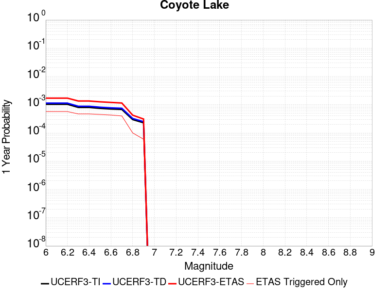 |  |

| Magnitude | 1 wk TI Prob | 1 wk TD Prob | 1 wk ETAS Prob | 1 wk ETAS/TD Gain | 1 wk ETAS Triggered Only | 1 mo TI Prob | 1 mo TD Prob | 1 mo ETAS Prob | 1 mo ETAS/TD Gain | 1 mo ETAS Triggered Only | 1 yr TI Prob | 1 yr TD Prob | 1 yr ETAS Prob | 1 yr ETAS/TD Gain | 1 yr ETAS Triggered Only | 10 yr TI Prob | 10 yr TD Prob | 10 yr ETAS Prob | 10 yr ETAS/TD Gain | 10 yr ETAS Triggered Only |
|-----|-----|-----|-----|-----|-----|-----|-----|-----|-----|-----|-----|-----|-----|-----|-----|-----|-----|-----|-----|-----|
| 6.0 | 1.980352E-5 | 2.1706745E-5 | 2.602654E-4 | 11.990071 | 2.3856385E-4 | 8.486947E-5 | 9.302599E-5 | 3.3156766E-4 | 3.5642474 | 2.3856385E-4 | 0.0010327959 | 0.0011320751 | 0.0017278095 | 1.5262322 | 5.964096E-4 | 0.010280091 | 0.011270258 | 0.011977884 | 1.0627869 | 7.1569154E-4 |
| 6.1 | 1.980352E-5 | 2.1706745E-5 | 2.602654E-4 | 11.990071 | 2.3856385E-4 | 8.486947E-5 | 9.302599E-5 | 3.3156766E-4 | 3.5642474 | 2.3856385E-4 | 0.0010327959 | 0.0011320751 | 0.0017278095 | 1.5262322 | 5.964096E-4 | 0.010280091 | 0.011270258 | 0.011977884 | 1.0627869 | 7.1569154E-4 |
| 6.2 | 1.980352E-5 | 2.1706745E-5 | 2.602654E-4 | 11.990071 | 2.3856385E-4 | 8.486947E-5 | 9.302599E-5 | 3.3156766E-4 | 3.5642474 | 2.3856385E-4 | 0.0010327959 | 0.0011320751 | 0.0017278095 | 1.5262322 | 5.964096E-4 | 0.010280091 | 0.011270258 | 0.011977884 | 1.0627869 | 7.1569154E-4 |
| 6.3 | 1.5344787E-5 | 1.682067E-5 | 1.9574055E-4 | 11.636906 | 1.7892288E-4 | 6.576172E-5 | 7.2086936E-5 | 2.5099693E-4 | 3.4818642 | 1.7892288E-4 | 8.003548E-4 | 8.773662E-4 | 0.0013540753 | 1.543341 | 4.771277E-4 | 0.007974784 | 0.00874507 | 0.009336263 | 1.0676031 | 5.964096E-4 |
| 6.4 | 1.5344787E-5 | 1.682067E-5 | 1.9574055E-4 | 11.636906 | 1.7892288E-4 | 6.576172E-5 | 7.2086936E-5 | 2.5099693E-4 | 3.4818642 | 1.7892288E-4 | 8.003548E-4 | 8.773662E-4 | 0.0013540753 | 1.543341 | 4.771277E-4 | 0.007974784 | 0.00874507 | 0.009336263 | 1.0676031 | 5.964096E-4 |
| 6.5 | 1.4189697E-5 | 1.5557987E-5 | 1.9447808E-4 | 12.500209 | 1.7892288E-4 | 6.081157E-5 | 6.6675726E-5 | 2.4558668E-4 | 3.6832998 | 1.7892288E-4 | 7.401293E-4 | 8.115349E-4 | 0.0012882754 | 1.5874553 | 4.771277E-4 | 0.0073766913 | 0.008091656 | 0.00868324 | 1.0731103 | 5.964096E-4 |
| 6.6 | 1.3469301E-5 | 1.4771577E-5 | 1.9369181E-4 | 13.112467 | 1.7892288E-4 | 5.7724297E-5 | 6.330556E-5 | 2.4221712E-4 | 3.8261585 | 1.7892288E-4 | 7.025667E-4 | 7.7053264E-4 | 0.0012472927 | 1.6187409 | 4.771277E-4 | 0.0070034964 | 0.0076845144 | 0.008276341 | 1.0770155 | 5.964096E-4 |
| 6.7 | 1.3027966E-5 | 1.4281745E-5 | 1.9320207E-4 | 13.527904 | 1.7892288E-4 | 5.5832945E-5 | 6.120638E-5 | 2.4011832E-4 | 3.9230928 | 1.7892288E-4 | 6.7955407E-4 | 7.4499263E-4 | 0.0012217648 | 1.6399691 | 4.771277E-4 | 0.006774798 | 0.0074308286 | 0.008022807 | 1.0796651 | 5.964096E-4 |
| 6.8 | 5.695434E-6 | 6.2244176E-6 | 6.2244176E-6 | 1.0 | 0.0 | 2.4408775E-5 | 2.6675973E-5 | 2.6675973E-5 | 1.0 | 0.0 | 2.971363E-4 | 3.2476155E-4 | 3.8438314E-4 | 1.1835858 | 5.9640963E-5 | 0.0029673933 | 0.0032458105 | 0.0033052578 | 1.0183151 | 5.9640963E-5 |
| 6.9 | 4.385688E-6 | 4.7930553E-6 | 4.7930553E-6 | 1.0 | 0.0 | 1.879567E-5 | 2.0541665E-5 | 2.0541665E-5 | 1.0 | 0.0 | 2.2881327E-4 | 2.5009477E-4 | 3.0972084E-4 | 1.2384138 | 5.9640963E-5 | 0.002285778 | 0.0025009478 | 0.0025604395 | 1.0237877 | 5.9640963E-5 |

## San Andreas (Big Bend)
*[(top)](#table-of-contents)*

| 1 Week | 1 Month | 1 Year | 10 Year |
|-----|-----|-----|-----|
|  |  |  |  |

| Magnitude | 1 wk TI Prob | 1 wk TD Prob | 1 wk ETAS Prob | 1 wk ETAS/TD Gain | 1 wk ETAS Triggered Only | 1 mo TI Prob | 1 mo TD Prob | 1 mo ETAS Prob | 1 mo ETAS/TD Gain | 1 mo ETAS Triggered Only | 1 yr TI Prob | 1 yr TD Prob | 1 yr ETAS Prob | 1 yr ETAS/TD Gain | 1 yr ETAS Triggered Only | 10 yr TI Prob | 10 yr TD Prob | 10 yr ETAS Prob | 10 yr ETAS/TD Gain | 10 yr ETAS Triggered Only |
|-----|-----|-----|-----|-----|-----|-----|-----|-----|-----|-----|-----|-----|-----|-----|-----|-----|-----|-----|-----|-----|
| 6.0 | 1.0179969E-4 | 2.0073925E-4 | 4.392552E-4 | 2.1881878 | 2.3856385E-4 | 4.362114E-4 | 8.6002843E-4 | 0.0011579768 | 1.3464401 | 2.982048E-4 | 0.0052979486 | 0.010420859 | 0.010952034 | 1.0509723 | 5.3676864E-4 | 0.051734097 | 0.101455905 | 0.10215258 | 1.0068667 | 7.753325E-4 |
| 6.1 | 1.0179969E-4 | 2.0073925E-4 | 4.392552E-4 | 2.1881878 | 2.3856385E-4 | 4.362114E-4 | 8.6002843E-4 | 0.0011579768 | 1.3464401 | 2.982048E-4 | 0.0052979486 | 0.010420859 | 0.010952034 | 1.0509723 | 5.3676864E-4 | 0.051734097 | 0.101455905 | 0.10215258 | 1.0068667 | 7.753325E-4 |
| 6.2 | 1.0179969E-4 | 2.0073925E-4 | 4.392552E-4 | 2.1881878 | 2.3856385E-4 | 4.362114E-4 | 8.6002843E-4 | 0.0011579768 | 1.3464401 | 2.982048E-4 | 0.0052979486 | 0.010420859 | 0.010952034 | 1.0509723 | 5.3676864E-4 | 0.051734097 | 0.101455905 | 0.10215258 | 1.0068667 | 7.753325E-4 |
| 6.3 | 1.0179969E-4 | 2.0073925E-4 | 4.392552E-4 | 2.1881878 | 2.3856385E-4 | 4.362114E-4 | 8.6002843E-4 | 0.0011579768 | 1.3464401 | 2.982048E-4 | 0.0052979486 | 0.010420859 | 0.010952034 | 1.0509723 | 5.3676864E-4 | 0.051734097 | 0.101455905 | 0.10215258 | 1.0068667 | 7.753325E-4 |
| 6.4 | 9.1639464E-5 | 1.8430917E-4 | 3.6319907E-4 | 1.9705969 | 1.7892288E-4 | 3.9268145E-4 | 7.896575E-4 | 9.6843916E-4 | 1.226404 | 1.7892288E-4 | 0.0047704205 | 0.009571818 | 0.009808098 | 1.024685 | 2.3856385E-4 | 0.046693064 | 0.09378695 | 0.094111234 | 1.0034577 | 3.5784577E-4 |
| 6.5 | 9.1639464E-5 | 1.8430917E-4 | 3.6319907E-4 | 1.9705969 | 1.7892288E-4 | 3.9268145E-4 | 7.896575E-4 | 9.6843916E-4 | 1.226404 | 1.7892288E-4 | 0.0047704205 | 0.009571818 | 0.009808098 | 1.024685 | 2.3856385E-4 | 0.046693064 | 0.09378695 | 0.094111234 | 1.0034577 | 3.5784577E-4 |
| 6.6 | 9.042622E-5 | 1.8238011E-4 | 3.6127036E-4 | 1.9808649 | 1.7892288E-4 | 3.8748336E-4 | 7.813951E-4 | 9.601782E-4 | 1.2287998 | 1.7892288E-4 | 0.0047074095 | 0.0094721 | 0.009708405 | 1.0249474 | 2.3856385E-4 | 0.046089325 | 0.09287721 | 0.09320182 | 1.0034951 | 3.5784577E-4 |
| 6.7 | 8.9836685E-5 | 1.8152347E-4 | 3.0078372E-4 | 1.6569965 | 1.19281925E-4 | 3.8495753E-4 | 7.7772595E-4 | 8.969151E-4 | 1.1532534 | 1.19281925E-4 | 0.00467679 | 0.009427815 | 0.00960505 | 1.0187993 | 1.7892288E-4 | 0.045795817 | 0.09247148 | 0.092742115 | 1.0029266 | 2.982048E-4 |
| 6.8 | 8.9471854E-5 | 1.8099119E-4 | 3.0025153E-4 | 1.6589289 | 1.19281925E-4 | 3.8339442E-4 | 7.754462E-4 | 8.946356E-4 | 1.1537043 | 1.19281925E-4 | 0.004657841 | 0.009400298 | 0.009577539 | 1.0188549 | 1.7892288E-4 | 0.04561414 | 0.0922192 | 0.09248991 | 1.0029354 | 2.982048E-4 |
| 6.9 | 8.858234E-5 | 1.7981093E-4 | 2.990714E-4 | 1.6632549 | 1.19281925E-4 | 3.7958333E-4 | 7.7039085E-4 | 8.895809E-4 | 1.1547137 | 1.19281925E-4 | 0.004611638 | 0.009339278 | 0.00951653 | 1.0189792 | 1.7892288E-4 | 0.04517103 | 0.09165911 | 0.09192998 | 1.0029552 | 2.982048E-4 |
| 7.0 | 8.7433385E-5 | 1.7819891E-4 | 2.9745957E-4 | 1.6692559 | 1.19281925E-4 | 3.746607E-4 | 7.6348626E-4 | 8.826771E-4 | 1.156114 | 1.19281925E-4 | 0.004551957 | 0.009255932 | 0.009433199 | 1.0191517 | 1.7892288E-4 | 0.044598386 | 0.09089323 | 0.09116433 | 1.0029826 | 2.982048E-4 |
| 7.1 | 8.684964E-5 | 1.7731842E-4 | 2.9657918E-4 | 1.6725798 | 1.19281925E-4 | 3.7215967E-4 | 7.597149E-4 | 8.789062E-4 | 1.1568896 | 1.19281925E-4 | 0.0045216335 | 0.009210405 | 0.00938768 | 1.0192473 | 1.7892288E-4 | 0.04430731 | 0.09047475 | 0.09074598 | 1.0029978 | 2.982048E-4 |
| 7.2 | 8.606521E-5 | 1.7622454E-4 | 2.9548543E-4 | 1.6767554 | 1.19281925E-4 | 3.6879873E-4 | 7.550296E-4 | 8.7422144E-4 | 1.1578639 | 1.19281925E-4 | 0.0044808835 | 0.009153842 | 0.009331127 | 1.0193673 | 1.7892288E-4 | 0.043916024 | 0.08995518 | 0.09022656 | 1.0030168 | 2.982048E-4 |
| 7.3 | 8.568266E-5 | 1.7564454E-4 | 2.949055E-4 | 1.6789905 | 1.19281925E-4 | 3.6715972E-4 | 7.5254537E-4 | 8.7173755E-4 | 1.1583854 | 1.19281925E-4 | 0.0044610105 | 0.00912385 | 0.00930114 | 1.0194316 | 1.7892288E-4 | 0.043725148 | 0.08967623 | 0.08994769 | 1.0030272 | 2.982048E-4 |
| 7.4 | 8.5432206E-5 | 1.752704E-4 | 2.945314E-4 | 1.6804402 | 1.19281925E-4 | 3.6608664E-4 | 7.509428E-4 | 8.7013515E-4 | 1.1587236 | 1.19281925E-4 | 0.004447999 | 0.009104501 | 0.0092817955 | 1.0194732 | 1.7892288E-4 | 0.043600157 | 0.08949642 | 0.08976793 | 1.0030339 | 2.982048E-4 |
| 7.5 | 8.4791965E-5 | 1.7396381E-4 | 2.93225E-4 | 1.6855516 | 1.19281925E-4 | 3.633435E-4 | 7.4534636E-4 | 8.6453935E-4 | 1.1599163 | 1.19281925E-4 | 0.0044147377 | 0.009036932 | 0.009214238 | 1.0196202 | 1.7892288E-4 | 0.043280575 | 0.08887209 | 0.08914379 | 1.0030572 | 2.982048E-4 |
| 7.6 | 8.241105E-5 | 1.6841735E-4 | 2.8767917E-4 | 1.7081327 | 1.19281925E-4 | 3.531424E-4 | 7.2158914E-4 | 8.40785E-4 | 1.1651852 | 1.19281925E-4 | 0.0042910352 | 0.008750047 | 0.008927404 | 1.0202693 | 1.7892288E-4 | 0.042091176 | 0.08625032 | 0.08652281 | 1.0031593 | 2.982048E-4 |
| 7.7 | 7.00432E-5 | 1.4205615E-4 | 2.0168863E-4 | 1.4197811 | 5.9640963E-5 | 3.001506E-4 | 6.0867006E-4 | 6.682747E-4 | 1.097926 | 5.9640963E-5 | 0.0036482112 | 0.0073854174 | 0.0075038183 | 1.0160317 | 1.19281925E-4 | 0.035888977 | 0.07352299 | 0.073744014 | 1.0030062 | 2.3856385E-4 |
| 7.8 | 6.415362E-5 | 1.2969968E-4 | 1.893329E-4 | 1.4597793 | 5.9640963E-5 | 2.749151E-4 | 5.557374E-4 | 6.153452E-4 | 1.1072589 | 5.9640963E-5 | 0.0033419547 | 0.0067451415 | 0.0068636187 | 1.0175649 | 1.19281925E-4 | 0.03292141 | 0.06725514 | 0.06747766 | 1.0033085 | 2.3856385E-4 |
| 7.9 | 4.939911E-5 | 9.341721E-5 | 9.341721E-5 | 1.0 | 0.0 | 2.116933E-4 | 4.0029807E-4 | 4.0029807E-4 | 1.0 | 0.0 | 0.0025743195 | 0.004862747 | 0.004862747 | 1.0 | 0.0 | 0.025447013 | 0.048915803 | 0.04902925 | 1.0023192 | 1.19281925E-4 |
| 8.0 | 3.344983E-5 | 5.2228E-5 | 5.2228E-5 | 1.0 | 0.0 | 1.4334853E-4 | 2.2381509E-4 | 2.2381509E-4 | 1.0 | 0.0 | 0.0017438711 | 0.0027215453 | 0.0027215453 | 1.0 | 0.0 | 0.017302496 | 0.027923161 | 0.027981138 | 1.0020763 | 5.9640963E-5 |
| 8.1 | 1.9104898E-5 | 1.9171663E-5 | 1.9171663E-5 | 1.0 | 0.0 | 8.1875565E-5 | 8.2161685E-5 | 8.2161685E-5 | 1.0 | 0.0 | 9.963791E-4 | 9.9986E-4 | 9.9986E-4 | 1.0 | 0.0 | 0.009919235 | 0.010749552 | 0.010749552 | 1.0 | 0.0 |
| 8.2 | 8.643924E-6 | 5.473668E-6 | 5.473668E-6 | 1.0 | 0.0 | 3.704486E-5 | 2.3458366E-5 | 2.3458366E-5 | 1.0 | 0.0 | 4.5092785E-4 | 2.8556827E-4 | 2.8556827E-4 | 1.0 | 0.0 | 0.0045001395 | 0.0032481793 | 0.0032481793 | 1.0 | 0.0 |
| 8.3 | 1.983087E-6 | 7.6564595E-7 | 7.6564595E-7 | 1.0 | 0.0 | 8.498917E-6 | 3.281336E-6 | 3.281336E-6 | 1.0 | 0.0 | 1.034694E-4 | 3.9949547E-5 | 3.9949547E-5 | 1.0 | 0.0 | 0.0010342124 | 4.717979E-4 | 4.717979E-4 | 1.0 | 0.0 |

## San Andreas (San Bernardino S)
*[(top)](#table-of-contents)*

| 1 Week | 1 Month | 1 Year | 10 Year |
|-----|-----|-----|-----|
|  |  |  |  |

| Magnitude | 1 wk TI Prob | 1 wk TD Prob | 1 wk ETAS Prob | 1 wk ETAS/TD Gain | 1 wk ETAS Triggered Only | 1 mo TI Prob | 1 mo TD Prob | 1 mo ETAS Prob | 1 mo ETAS/TD Gain | 1 mo ETAS Triggered Only | 1 yr TI Prob | 1 yr TD Prob | 1 yr ETAS Prob | 1 yr ETAS/TD Gain | 1 yr ETAS Triggered Only | 10 yr TI Prob | 10 yr TD Prob | 10 yr ETAS Prob | 10 yr ETAS/TD Gain | 10 yr ETAS Triggered Only |
|-----|-----|-----|-----|-----|-----|-----|-----|-----|-----|-----|-----|-----|-----|-----|-----|-----|-----|-----|-----|-----|
| 6.0 | 1.2336002E-4 | 3.0005194E-4 | 4.7892114E-4 | 1.5961275 | 1.7892288E-4 | 5.2857865E-4 | 0.0012853292 | 0.0015235863 | 1.1853666 | 2.3856385E-4 | 0.006416472 | 0.015541554 | 0.01589384 | 1.0226673 | 3.5784577E-4 | 0.06234337 | 0.14294699 | 0.14356038 | 1.004291 | 7.1569154E-4 |
| 6.1 | 1.2336002E-4 | 3.0005194E-4 | 4.7892114E-4 | 1.5961275 | 1.7892288E-4 | 5.2857865E-4 | 0.0012853292 | 0.0015235863 | 1.1853666 | 2.3856385E-4 | 0.006416472 | 0.015541554 | 0.01589384 | 1.0226673 | 3.5784577E-4 | 0.06234337 | 0.14294699 | 0.14356038 | 1.004291 | 7.1569154E-4 |
| 6.2 | 1.2336002E-4 | 3.0005194E-4 | 4.7892114E-4 | 1.5961275 | 1.7892288E-4 | 5.2857865E-4 | 0.0012853292 | 0.0015235863 | 1.1853666 | 2.3856385E-4 | 0.006416472 | 0.015541554 | 0.01589384 | 1.0226673 | 3.5784577E-4 | 0.06234337 | 0.14294699 | 0.14356038 | 1.004291 | 7.1569154E-4 |
| 6.3 | 1.1712257E-4 | 2.8793467E-4 | 4.6680603E-4 | 1.621222 | 1.7892288E-4 | 5.018573E-4 | 0.0012334478 | 0.0014717174 | 1.1931736 | 2.3856385E-4 | 0.006093008 | 0.014918666 | 0.015271173 | 1.0236286 | 3.5784577E-4 | 0.059286322 | 0.13765779 | 0.13827495 | 1.0044833 | 7.1569154E-4 |
| 6.4 | 1.1712257E-4 | 2.8793467E-4 | 4.6680603E-4 | 1.621222 | 1.7892288E-4 | 5.018573E-4 | 0.0012334478 | 0.0014717174 | 1.1931736 | 2.3856385E-4 | 0.006093008 | 0.014918666 | 0.015271173 | 1.0236286 | 3.5784577E-4 | 0.059286322 | 0.13765779 | 0.13827495 | 1.0044833 | 7.1569154E-4 |
| 6.5 | 1.0689076E-4 | 2.6806415E-4 | 4.4693908E-4 | 1.667284 | 1.7892288E-4 | 4.5802278E-4 | 0.0011483653 | 0.0013866553 | 1.2075036 | 2.3856385E-4 | 0.0055621783 | 0.013896335 | 0.014249208 | 1.0253932 | 3.5784577E-4 | 0.05425003 | 0.1288989 | 0.1294704 | 1.0044336 | 6.560506E-4 |
| 6.6 | 9.7648895E-5 | 2.505129E-4 | 4.29391E-4 | 1.7140473 | 1.7892288E-4 | 4.1842813E-4 | 0.0010732086 | 0.0013115165 | 1.2220517 | 2.3856385E-4 | 0.005082469 | 0.012992399 | 0.013345595 | 1.0271848 | 3.5784577E-4 | 0.049677886 | 0.121077746 | 0.12160195 | 1.0043294 | 5.964096E-4 |
| 6.7 | 8.757013E-5 | 2.3122175E-4 | 4.1010327E-4 | 1.7736362 | 1.7892288E-4 | 3.7524657E-4 | 9.905964E-4 | 0.0012289239 | 1.24059 | 2.3856385E-4 | 0.00455906 | 0.011997902 | 0.012351454 | 1.0294678 | 3.5784577E-4 | 0.04466656 | 0.112373024 | 0.11290242 | 1.004711 | 5.964096E-4 |
| 6.8 | 8.562978E-5 | 2.2682057E-4 | 4.057029E-4 | 1.7886511 | 1.7892288E-4 | 3.6693315E-4 | 9.7174826E-4 | 0.0012100802 | 1.2452611 | 2.3856385E-4 | 0.004458263 | 0.011770921 | 0.012124555 | 1.030043 | 3.5784577E-4 | 0.043698758 | 0.11037863 | 0.11090921 | 1.0048069 | 5.964096E-4 |
| 6.9 | 6.124075E-5 | 1.7066885E-4 | 3.495612E-4 | 2.048184 | 1.7892288E-4 | 2.6243398E-4 | 7.312337E-4 | 9.696231E-4 | 1.3260099 | 2.3856385E-4 | 0.0031904527 | 0.008866636 | 0.009221309 | 1.0400008 | 3.5784577E-4 | 0.031450346 | 0.08420262 | 0.084748805 | 1.0064867 | 5.964096E-4 |
| 7.0 | 5.8598747E-5 | 1.6495936E-4 | 3.4385273E-4 | 2.0844693 | 1.7892288E-4 | 2.5111332E-4 | 7.067779E-4 | 9.4517315E-4 | 1.3372986 | 2.3856385E-4 | 0.0030530186 | 0.008571265 | 0.008926044 | 1.0413916 | 3.5784577E-4 | 0.03011414 | 0.08151562 | 0.08206341 | 1.0067201 | 5.964096E-4 |
| 7.1 | 5.613814E-5 | 1.5914452E-4 | 3.3803892E-4 | 2.1241004 | 1.7892288E-4 | 2.4056983E-4 | 6.818704E-4 | 9.2027156E-4 | 1.3496283 | 2.3856385E-4 | 0.0029250039 | 0.008270353 | 0.008625239 | 1.0429107 | 3.5784577E-4 | 0.028868021 | 0.07881268 | 0.07936209 | 1.006971 | 5.964096E-4 |
| 7.2 | 4.991222E-5 | 1.4520933E-4 | 3.2410622E-4 | 2.2319932 | 1.7892288E-4 | 2.1389198E-4 | 6.221777E-4 | 8.6059305E-4 | 1.383195 | 2.3856385E-4 | 0.002601025 | 0.0075488063 | 0.00790395 | 1.0470464 | 3.5784577E-4 | 0.025707912 | 0.07226191 | 0.07275989 | 1.0068914 | 5.3676864E-4 |
| 7.3 | 4.7410045E-5 | 1.371513E-4 | 3.1604964E-4 | 2.3043866 | 1.7892288E-4 | 2.0317009E-4 | 5.8765925E-4 | 8.260829E-4 | 1.4057175 | 2.3856385E-4 | 0.0024707897 | 0.0071313656 | 0.0074866596 | 1.0498213 | 3.5784577E-4 | 0.024434982 | 0.068541944 | 0.06904192 | 1.0072944 | 5.3676864E-4 |
| 7.4 | 4.5556746E-5 | 1.3123035E-4 | 3.1012975E-4 | 2.3632472 | 1.7892288E-4 | 1.952286E-4 | 5.6229485E-4 | 8.0072455E-4 | 1.4240297 | 2.3856385E-4 | 0.002374317 | 0.0068245293 | 0.007179933 | 1.0520774 | 3.5784577E-4 | 0.023491086 | 0.06579143 | 0.06629288 | 1.0076219 | 5.3676864E-4 |
| 7.5 | 4.3084514E-5 | 1.2358342E-4 | 3.024842E-4 | 2.4476113 | 1.7892288E-4 | 1.8463485E-4 | 5.2953605E-4 | 7.6797354E-4 | 1.4502763 | 2.3856385E-4 | 0.0022456115 | 0.0064281146 | 0.00678366 | 1.055311 | 3.5784577E-4 | 0.022230545 | 0.062190283 | 0.06269367 | 1.0080943 | 5.3676864E-4 |
| 7.6 | 3.408608E-5 | 9.836477E-5 | 2.7727004E-4 | 2.8187943 | 1.7892288E-4 | 1.4607502E-4 | 4.214953E-4 | 6.599586E-4 | 1.5657555 | 2.3856385E-4 | 0.0017770125 | 0.005119656 | 0.0054756696 | 1.0695386 | 3.5784577E-4 | 0.017628696 | 0.05002244 | 0.050475698 | 1.0090611 | 4.771277E-4 |
| 7.7 | 2.8315713E-5 | 8.2495724E-5 | 2.6140385E-4 | 3.1686957 | 1.7892288E-4 | 1.2134742E-4 | 3.5350522E-4 | 5.919847E-4 | 1.6746138 | 2.3856385E-4 | 0.0014764034 | 0.004295442 | 0.0046517504 | 1.0829505 | 3.5784577E-4 | 0.01466633 | 0.042272415 | 0.042729374 | 1.0108099 | 4.771277E-4 |
| 7.8 | 2.6222975E-5 | 7.463898E-5 | 2.535485E-4 | 3.3969986 | 1.7892288E-4 | 1.1237934E-4 | 3.1984213E-4 | 5.583297E-4 | 1.7456415 | 2.3856385E-4 | 0.0013673597 | 0.003887131 | 0.0042435857 | 1.0917013 | 3.5784577E-4 | 0.013589768 | 0.038437475 | 0.038896263 | 1.011936 | 4.771277E-4 |
| 7.9 | 2.1469694E-5 | 5.7884805E-5 | 1.7715982E-4 | 3.0605583 | 1.19281925E-4 | 9.200973E-5 | 2.4805416E-4 | 4.2693267E-4 | 1.7211268 | 1.7892288E-4 | 0.0011196428 | 0.00301588 | 0.0033131854 | 1.09858 | 2.982048E-4 | 0.011140184 | 0.030153265 | 0.030558163 | 1.013428 | 4.1748674E-4 |
| 8.0 | 1.2420249E-5 | 3.1321662E-5 | 1.5059985E-4 | 4.808169 | 1.19281925E-4 | 5.322855E-5 | 1.342288E-4 | 2.534947E-4 | 1.888527 | 1.19281925E-4 | 6.478649E-4 | 0.0016330116 | 0.0017520987 | 1.0729249 | 1.19281925E-4 | 0.0064597935 | 0.01652369 | 0.016758313 | 1.0141991 | 2.3856385E-4 |
| 8.1 | 4.9197724E-6 | 7.822525E-6 | 7.822525E-6 | 1.0 | 0.0 | 2.1084568E-5 | 3.3524673E-5 | 3.3524673E-5 | 1.0 | 0.0 | 2.566744E-4 | 4.080866E-4 | 4.080866E-4 | 1.0 | 0.0 | 0.002563781 | 0.004384557 | 0.004384557 | 1.0 | 0.0 |
| 8.2 | 2.5634774E-6 | 2.9065757E-6 | 2.9065757E-6 | 1.0 | 0.0 | 1.0986286E-5 | 1.2456694E-5 | 1.2456694E-5 | 1.0 | 0.0 | 1.3374983E-4 | 1.5164974E-4 | 1.5164974E-4 | 1.0 | 0.0 | 0.0013366934 | 0.001704941 | 0.001704941 | 1.0 | 0.0 |
| 8.3 | 5.2850464E-7 | 3.2080476E-7 | 3.2080476E-7 | 1.0 | 0.0 | 2.2650179E-6 | 1.3748769E-6 | 1.3748769E-6 | 1.0 | 0.0 | 2.7576245E-5 | 1.673901E-5 | 1.673901E-5 | 1.0 | 0.0 | 2.7572823E-4 | 1.986671E-4 | 1.986671E-4 | 1.0 | 0.0 |

## Elsinore (Glen Ivy) rev
*[(top)](#table-of-contents)*

| 1 Week | 1 Month | 1 Year | 10 Year |
|-----|-----|-----|-----|
|  |  |  |  |

| Magnitude | 1 wk TI Prob | 1 wk TD Prob | 1 wk ETAS Prob | 1 wk ETAS/TD Gain | 1 wk ETAS Triggered Only | 1 mo TI Prob | 1 mo TD Prob | 1 mo ETAS Prob | 1 mo ETAS/TD Gain | 1 mo ETAS Triggered Only | 1 yr TI Prob | 1 yr TD Prob | 1 yr ETAS Prob | 1 yr ETAS/TD Gain | 1 yr ETAS Triggered Only | 10 yr TI Prob | 10 yr TD Prob | 10 yr ETAS Prob | 10 yr ETAS/TD Gain | 10 yr ETAS Triggered Only |
|-----|-----|-----|-----|-----|-----|-----|-----|-----|-----|-----|-----|-----|-----|-----|-----|-----|-----|-----|-----|-----|
| 6.0 | 1.6204086E-4 | 2.937271E-4 | 4.1297398E-4 | 1.4059786 | 1.19281925E-4 | 6.94276E-4 | 0.0012583778 | 0.0013775097 | 1.0946709 | 1.19281925E-4 | 0.008420097 | 0.0152346175 | 0.015469547 | 1.0154208 | 2.3856385E-4 | 0.081081145 | 0.13962454 | 0.13993242 | 1.002205 | 3.5784577E-4 |
| 6.1 | 1.6204086E-4 | 2.937271E-4 | 4.1297398E-4 | 1.4059786 | 1.19281925E-4 | 6.94276E-4 | 0.0012583778 | 0.0013775097 | 1.0946709 | 1.19281925E-4 | 0.008420097 | 0.0152346175 | 0.015469547 | 1.0154208 | 2.3856385E-4 | 0.081081145 | 0.13962454 | 0.13993242 | 1.002205 | 3.5784577E-4 |
| 6.2 | 1.6204086E-4 | 2.937271E-4 | 4.1297398E-4 | 1.4059786 | 1.19281925E-4 | 6.94276E-4 | 0.0012583778 | 0.0013775097 | 1.0946709 | 1.19281925E-4 | 0.008420097 | 0.0152346175 | 0.015469547 | 1.0154208 | 2.3856385E-4 | 0.081081145 | 0.13962454 | 0.13993242 | 1.002205 | 3.5784577E-4 |
| 6.3 | 1.0111737E-4 | 1.7703463E-4 | 1.7703463E-4 | 1.0 | 0.0 | 4.332882E-4 | 7.5861585E-4 | 7.5861585E-4 | 1.0 | 0.0 | 0.005262531 | 0.0092177205 | 0.009394995 | 1.0192318 | 1.7892288E-4 | 0.0513964 | 0.08707393 | 0.087346174 | 1.0031265 | 2.982048E-4 |
| 6.4 | 1.0111737E-4 | 1.7703463E-4 | 1.7703463E-4 | 1.0 | 0.0 | 4.332882E-4 | 7.5861585E-4 | 7.5861585E-4 | 1.0 | 0.0 | 0.005262531 | 0.0092177205 | 0.009394995 | 1.0192318 | 1.7892288E-4 | 0.0513964 | 0.08707393 | 0.087346174 | 1.0031265 | 2.982048E-4 |
| 6.5 | 3.6624708E-5 | 4.6391986E-5 | 4.6391986E-5 | 1.0 | 0.0 | 1.569536E-4 | 1.9880968E-4 | 1.9880968E-4 | 1.0 | 0.0 | 0.001909235 | 0.0024181814 | 0.0025371748 | 1.0492078 | 1.19281925E-4 | 0.01892915 | 0.023697061 | 0.023813518 | 1.0049143 | 1.19281925E-4 |
| 6.6 | 2.5051324E-5 | 2.6147465E-5 | 2.6147465E-5 | 1.0 | 0.0 | 1.073584E-4 | 1.12056E-4 | 1.12056E-4 | 1.0 | 0.0 | 0.0013063047 | 0.0013634725 | 0.0014825917 | 1.0873647 | 1.19281925E-4 | 0.012986525 | 0.013565759 | 0.013683423 | 1.0086735 | 1.19281925E-4 |
| 6.7 | 2.2189772E-5 | 2.2072489E-5 | 2.2072489E-5 | 1.0 | 0.0 | 9.509556E-5 | 9.459316E-5 | 9.459316E-5 | 1.0 | 0.0 | 0.0011571734 | 0.0011510996 | 0.0011510996 | 1.0 | 0.0 | 0.011511663 | 0.0114663225 | 0.0114663225 | 1.0 | 0.0 |
| 6.8 | 1.6654378E-5 | 1.44376E-5 | 1.44376E-5 | 1.0 | 0.0 | 7.137396E-5 | 6.187399E-5 | 6.187399E-5 | 1.0 | 0.0 | 8.686314E-4 | 7.5306057E-4 | 7.5306057E-4 | 1.0 | 0.0 | 0.008652439 | 0.0075100763 | 0.0075100763 | 1.0 | 0.0 |
| 6.9 | 1.5042909E-5 | 1.2331886E-5 | 1.2331886E-5 | 1.0 | 0.0 | 6.446802E-5 | 5.2849886E-5 | 5.2849886E-5 | 1.0 | 0.0 | 7.8461546E-4 | 6.4326054E-4 | 6.4326054E-4 | 1.0 | 0.0 | 0.007818509 | 0.006417925 | 0.006417925 | 1.0 | 0.0 |
| 7.0 | 1.4361385E-5 | 1.1451172E-5 | 1.1451172E-5 | 1.0 | 0.0 | 6.154734E-5 | 4.9075545E-5 | 4.9075545E-5 | 1.0 | 0.0 | 7.490812E-4 | 5.973339E-4 | 5.973339E-4 | 1.0 | 0.0 | 0.007465612 | 0.005960982 | 0.005960982 | 1.0 | 0.0 |
| 7.1 | 1.3265571E-5 | 1.0244736E-5 | 1.0244736E-5 | 1.0 | 0.0 | 5.6851208E-5 | 4.3905282E-5 | 4.3905282E-5 | 1.0 | 0.0 | 6.919436E-4 | 5.344183E-4 | 5.344183E-4 | 1.0 | 0.0 | 0.006897931 | 0.0053346003 | 0.0053346003 | 1.0 | 0.0 |
| 7.2 | 1.1596403E-5 | 8.504847E-6 | 8.504847E-6 | 1.0 | 0.0 | 4.9697923E-5 | 3.6448844E-5 | 3.6448844E-5 | 1.0 | 0.0 | 6.049042E-4 | 4.4367602E-4 | 4.4367602E-4 | 1.0 | 0.0 | 0.006032603 | 0.004429357 | 0.004429357 | 1.0 | 0.0 |
| 7.3 | 1.0150827E-5 | 7.238537E-6 | 7.238537E-6 | 1.0 | 0.0 | 4.3502816E-5 | 3.102194E-5 | 3.102194E-5 | 1.0 | 0.0 | 5.2951806E-4 | 3.776281E-4 | 3.776281E-4 | 1.0 | 0.0 | 0.005282581 | 0.003770271 | 0.003770271 | 1.0 | 0.0 |
| 7.4 | 9.080705E-6 | 6.352307E-6 | 6.352307E-6 | 1.0 | 0.0 | 3.8916725E-5 | 2.7223898E-5 | 2.7223898E-5 | 1.0 | 0.0 | 4.7370812E-4 | 3.314019E-4 | 3.314019E-4 | 1.0 | 0.0 | 0.004726996 | 0.0033092257 | 0.0033092257 | 1.0 | 0.0 |
| 7.5 | 7.671649E-6 | 5.225419E-6 | 5.225419E-6 | 1.0 | 0.0 | 3.287808E-5 | 2.2394468E-5 | 2.2394468E-5 | 1.0 | 0.0 | 4.0021708E-4 | 2.7261977E-4 | 2.7261977E-4 | 1.0 | 0.0 | 0.0039949706 | 0.0027229784 | 0.0027229784 | 1.0 | 0.0 |
| 7.6 | 6.990086E-6 | 4.687336E-6 | 4.687336E-6 | 1.0 | 0.0 | 2.9957167E-5 | 2.0088435E-5 | 2.0088435E-5 | 1.0 | 0.0 | 3.6466747E-4 | 2.445504E-4 | 2.445504E-4 | 1.0 | 0.0 | 0.0036406964 | 0.0024429292 | 0.0024429292 | 1.0 | 0.0 |
| 7.7 | 4.163505E-6 | 2.329331E-6 | 2.329331E-6 | 1.0 | 0.0 | 1.7843471E-5 | 9.982813E-6 | 9.982813E-6 | 1.0 | 0.0 | 2.172226E-4 | 1.2153471E-4 | 1.2153471E-4 | 1.0 | 0.0 | 0.0021701038 | 0.0012147555 | 0.0012147555 | 1.0 | 0.0 |
| 7.8 | 2.2692414E-7 | 9.384417E-8 | 9.384417E-8 | 1.0 | 0.0 | 9.725317E-7 | 4.0218927E-7 | 4.0218927E-7 | 1.0 | 0.0 | 1.1840509E-5 | 4.8966467E-6 | 4.8966467E-6 | 1.0 | 0.0 | 1.1839878E-4 | 4.8965718E-5 | 4.8965718E-5 | 1.0 | 0.0 |
| 7.9 | 6.676829E-9 | 3.4397174E-9 | 3.4397174E-9 | 1.0 | 0.0 | 2.861498E-8 | 1.4741646E-8 | 1.4741646E-8 | 1.0 | 0.0 | 3.4838732E-7 | 1.7947953E-7 | 1.7947953E-7 | 1.0 | 0.0 | 3.4838679E-6 | 1.794794E-6 | 1.794794E-6 | 1.0 | 0.0 |

## San Andreas (Parkfield)
*[(top)](#table-of-contents)*

| 1 Week | 1 Month | 1 Year | 10 Year |
|-----|-----|-----|-----|
|  |  |  |  |

| Magnitude | 1 wk TI Prob | 1 wk TD Prob | 1 wk ETAS Prob | 1 wk ETAS/TD Gain | 1 wk ETAS Triggered Only | 1 mo TI Prob | 1 mo TD Prob | 1 mo ETAS Prob | 1 mo ETAS/TD Gain | 1 mo ETAS Triggered Only | 1 yr TI Prob | 1 yr TD Prob | 1 yr ETAS Prob | 1 yr ETAS/TD Gain | 1 yr ETAS Triggered Only | 10 yr TI Prob | 10 yr TD Prob | 10 yr ETAS Prob | 10 yr ETAS/TD Gain | 10 yr ETAS Triggered Only |
|-----|-----|-----|-----|-----|-----|-----|-----|-----|-----|-----|-----|-----|-----|-----|-----|-----|-----|-----|-----|-----|
| 6.0 | 5.556969E-4 | 7.778562E-4 | 0.0010162345 | 1.3064555 | 2.3856385E-4 | 0.0023793848 | 0.0033299583 | 0.0035677277 | 1.0714031 | 2.3856385E-4 | 0.028586963 | 0.040235043 | 0.04063573 | 1.0099587 | 4.1748674E-4 | 0.25176284 | 0.3371973 | 0.33755305 | 1.0010551 | 5.3676864E-4 |
| 6.1 | 1.925858E-4 | 3.0278185E-4 | 4.8165055E-4 | 1.590751 | 1.7892288E-4 | 8.2510663E-4 | 0.001297085 | 0.0014757757 | 1.1377634 | 1.7892288E-4 | 0.0099994885 | 0.01577393 | 0.01606743 | 1.0186067 | 2.982048E-4 | 0.095613256 | 0.14975825 | 0.15011321 | 1.0023702 | 4.1748674E-4 |
| 6.2 | 9.4306815E-5 | 1.8243887E-4 | 3.0169904E-4 | 1.6536993 | 1.19281925E-4 | 4.0410945E-4 | 7.8164786E-4 | 9.0083655E-4 | 1.1524838 | 1.19281925E-4 | 0.0049089384 | 0.009475246 | 0.00971155 | 1.0249391 | 2.3856385E-4 | 0.048019063 | 0.0918565 | 0.09218148 | 1.0035379 | 3.5784577E-4 |
| 6.3 | 9.283051E-5 | 1.794041E-4 | 2.986646E-4 | 1.6647592 | 1.19281925E-4 | 3.9778434E-4 | 7.686494E-4 | 8.878396E-4 | 1.1550645 | 1.19281925E-4 | 0.0048322747 | 0.009318355 | 0.009554695 | 1.025363 | 2.3856385E-4 | 0.047285385 | 0.090509474 | 0.09083493 | 1.0035958 | 3.5784577E-4 |
| 6.4 | 9.138826E-5 | 1.7702584E-4 | 2.9628663E-4 | 1.6736915 | 1.19281925E-4 | 3.916052E-4 | 7.5846276E-4 | 8.776542E-4 | 1.1571487 | 1.19281925E-4 | 0.0047573745 | 0.009195387 | 0.009431758 | 1.0257053 | 2.3856385E-4 | 0.046568092 | 0.0894136 | 0.08973945 | 1.0036443 | 3.5784577E-4 |
| 6.5 | 9.000255E-5 | 1.746064E-4 | 2.938675E-4 | 1.6830282 | 1.19281925E-4 | 3.8566816E-4 | 7.4809964E-4 | 8.6729234E-4 | 1.1593273 | 1.19281925E-4 | 0.0046854047 | 0.009070284 | 0.009306684 | 1.0260631 | 2.3856385E-4 | 0.045878403 | 0.08829608 | 0.088622324 | 1.0036949 | 3.5784577E-4 |
| 6.6 | 8.8109264E-5 | 1.7141816E-4 | 2.9067963E-4 | 1.6957343 | 1.19281925E-4 | 3.7755648E-4 | 7.3444354E-4 | 8.536379E-4 | 1.162292 | 1.19281925E-4 | 0.0045870654 | 0.008905404 | 0.009141844 | 1.02655 | 2.3856385E-4 | 0.04493529 | 0.08682707 | 0.087153845 | 1.0037636 | 3.5784577E-4 |
| 6.7 | 8.738073E-5 | 1.7008898E-4 | 2.8935063E-4 | 1.701172 | 1.19281925E-4 | 3.7443507E-4 | 7.287503E-4 | 8.4794534E-4 | 1.1635609 | 1.19281925E-4 | 0.0045492216 | 0.008836695 | 0.00907315 | 1.0267584 | 2.3856385E-4 | 0.04457213 | 0.0862268 | 0.08655379 | 1.0037922 | 3.5784577E-4 |
| 6.8 | 8.710195E-5 | 1.6954402E-4 | 2.8880572E-4 | 1.7034261 | 1.19281925E-4 | 3.7324068E-4 | 7.26416E-4 | 8.4561127E-4 | 1.1640868 | 1.19281925E-4 | 0.0045347405 | 0.008808513 | 0.009044975 | 1.0268447 | 2.3856385E-4 | 0.04443313 | 0.08597436 | 0.08630144 | 1.0038044 | 3.5784577E-4 |
| 6.9 | 8.6801556E-5 | 1.6895356E-4 | 2.8821532E-4 | 1.7058849 | 1.19281925E-4 | 3.7195362E-4 | 7.238869E-4 | 8.4308244E-4 | 1.1646605 | 1.19281925E-4 | 0.0045191357 | 0.0087779695 | 0.009014439 | 1.026939 | 2.3856385E-4 | 0.044283327 | 0.08570042 | 0.0860276 | 1.0038177 | 3.5784577E-4 |
| 7.0 | 8.5571606E-5 | 1.664819E-4 | 2.8574397E-4 | 1.7163665 | 1.19281925E-4 | 3.6668387E-4 | 7.132999E-4 | 8.3249673E-4 | 1.1671062 | 1.19281925E-4 | 0.004455241 | 0.008650103 | 0.008886604 | 1.0273408 | 2.3856385E-4 | 0.043669727 | 0.08454836 | 0.084875956 | 1.0038745 | 3.5784577E-4 |
| 7.1 | 7.82589E-5 | 1.5128969E-4 | 2.7055354E-4 | 1.7883147 | 1.19281925E-4 | 3.3535215E-4 | 6.4822397E-4 | 7.6742854E-4 | 1.1838942 | 1.19281925E-4 | 0.0040752706 | 0.007863738 | 0.008100426 | 1.0300987 | 2.3856385E-4 | 0.040013418 | 0.077460445 | 0.07779057 | 1.0042619 | 3.5784577E-4 |
| 7.2 | 7.690929E-5 | 1.4866212E-4 | 2.679263E-4 | 1.80225 | 1.19281925E-4 | 3.2956956E-4 | 6.369685E-4 | 7.5617444E-4 | 1.1871457 | 1.19281925E-4 | 0.004005129 | 0.0077276826 | 0.007964402 | 1.0306327 | 2.3856385E-4 | 0.0393371 | 0.07623341 | 0.07656398 | 1.0043362 | 3.5784577E-4 |
| 7.3 | 7.5543794E-5 | 1.4562748E-4 | 2.6489203E-4 | 1.8189701 | 1.19281925E-4 | 3.2371894E-4 | 6.239692E-4 | 7.431767E-4 | 1.1910471 | 1.19281925E-4 | 0.003934157 | 0.0075705256 | 0.0078072837 | 1.0312736 | 2.3856385E-4 | 0.038652334 | 0.07479777 | 0.07512885 | 1.0044264 | 3.5784577E-4 |
| 7.4 | 7.4214564E-5 | 1.4263717E-4 | 2.6190208E-4 | 1.8361418 | 1.19281925E-4 | 3.1802364E-4 | 6.1115966E-4 | 7.303687E-4 | 1.1950538 | 1.19281925E-4 | 0.003865065 | 0.0074156416 | 0.0076524364 | 1.0319318 | 2.3856385E-4 | 0.03798529 | 0.07337152 | 0.07370312 | 1.0045193 | 3.5784577E-4 |
| 7.5 | 6.149578E-5 | 1.1191443E-4 | 1.7154872E-4 | 1.5328561 | 5.9640963E-5 | 2.6352672E-4 | 4.795452E-4 | 5.3915754E-4 | 1.1243103 | 5.9640963E-5 | 0.0032037178 | 0.005822865 | 0.0058821584 | 1.0101829 | 5.9640963E-5 | 0.03157923 | 0.058559462 | 0.05872791 | 1.0028765 | 1.7892288E-4 |
| 7.6 | 6.0643448E-5 | 1.102009E-4 | 1.6983529E-4 | 1.5411425 | 5.9640963E-5 | 2.598746E-4 | 4.7220418E-4 | 5.31817E-4 | 1.1262437 | 5.9640963E-5 | 0.0031593828 | 0.005733962 | 0.005793261 | 1.0103418 | 5.9640963E-5 | 0.031148417 | 0.05772042 | 0.057889014 | 1.0029209 | 1.7892288E-4 |
| 7.7 | 5.1652263E-5 | 9.175265E-5 | 9.175265E-5 | 1.0 | 0.0 | 2.2134806E-4 | 3.9316638E-4 | 3.9316638E-4 | 1.0 | 0.0 | 0.002691582 | 0.0047763046 | 0.0047763046 | 1.0 | 0.0 | 0.026592141 | 0.04853641 | 0.0486499 | 1.0023383 | 1.19281925E-4 |
| 7.8 | 4.8090482E-5 | 8.560165E-5 | 8.560165E-5 | 1.0 | 0.0 | 2.060858E-4 | 3.6681266E-4 | 3.6681266E-4 | 1.0 | 0.0 | 0.0025062072 | 0.004456807 | 0.004456807 | 1.0 | 0.0 | 0.024781305 | 0.045302264 | 0.045416143 | 1.0025138 | 1.19281925E-4 |
| 7.9 | 3.970278E-5 | 6.7507375E-5 | 6.7507375E-5 | 1.0 | 0.0 | 1.7014367E-4 | 2.8928524E-4 | 2.8928524E-4 | 1.0 | 0.0 | 0.002069531 | 0.0035163634 | 0.0035163634 | 1.0 | 0.0 | 0.020503636 | 0.03588176 | 0.03599676 | 1.0032051 | 1.19281925E-4 |
| 8.0 | 2.8982335E-5 | 4.0698153E-5 | 4.0698153E-5 | 1.0 | 0.0 | 1.2420409E-4 | 1.7440901E-4 | 1.7440901E-4 | 1.0 | 0.0 | 0.0015111357 | 0.0021213628 | 0.0021213628 | 1.0 | 0.0 | 0.015009012 | 0.02201118 | 0.022069508 | 1.0026499 | 5.9640963E-5 |
| 8.1 | 1.8836186E-5 | 1.867974E-5 | 1.867974E-5 | 1.0 | 0.0 | 8.0724014E-5 | 8.005358E-5 | 8.005358E-5 | 1.0 | 0.0 | 9.823717E-4 | 9.742171E-4 | 9.742171E-4 | 1.0 | 0.0 | 0.009780403 | 0.010487711 | 0.010487711 | 1.0 | 0.0 |
| 8.2 | 8.643924E-6 | 5.473668E-6 | 5.473668E-6 | 1.0 | 0.0 | 3.704486E-5 | 2.3458366E-5 | 2.3458366E-5 | 1.0 | 0.0 | 4.5092785E-4 | 2.8556827E-4 | 2.8556827E-4 | 1.0 | 0.0 | 0.0045001395 | 0.0032481793 | 0.0032481793 | 1.0 | 0.0 |
| 8.3 | 1.983087E-6 | 7.6564595E-7 | 7.6564595E-7 | 1.0 | 0.0 | 8.498917E-6 | 3.281336E-6 | 3.281336E-6 | 1.0 | 0.0 | 1.034694E-4 | 3.9949547E-5 | 3.9949547E-5 | 1.0 | 0.0 | 0.0010342124 | 4.717979E-4 | 4.717979E-4 | 1.0 | 0.0 |

## San Andreas (Carrizo) rev
*[(top)](#table-of-contents)*

| 1 Week | 1 Month | 1 Year | 10 Year |
|-----|-----|-----|-----|
|  |  |  |  |

| Magnitude | 1 wk TI Prob | 1 wk TD Prob | 1 wk ETAS Prob | 1 wk ETAS/TD Gain | 1 wk ETAS Triggered Only | 1 mo TI Prob | 1 mo TD Prob | 1 mo ETAS Prob | 1 mo ETAS/TD Gain | 1 mo ETAS Triggered Only | 1 yr TI Prob | 1 yr TD Prob | 1 yr ETAS Prob | 1 yr ETAS/TD Gain | 1 yr ETAS Triggered Only | 10 yr TI Prob | 10 yr TD Prob | 10 yr ETAS Prob | 10 yr ETAS/TD Gain | 10 yr ETAS Triggered Only |
|-----|-----|-----|-----|-----|-----|-----|-----|-----|-----|-----|-----|-----|-----|-----|-----|-----|-----|-----|-----|-----|
| 6.0 | 1.1674632E-4 | 2.4324407E-4 | 4.2212344E-4 | 1.7353904 | 1.7892288E-4 | 5.002454E-4 | 0.0010420597 | 0.0012207961 | 1.1715223 | 1.7892288E-4 | 0.006073493 | 0.012613757 | 0.012967088 | 1.0280117 | 3.5784577E-4 | 0.0591016 | 0.120640226 | 0.12105979 | 1.0034778 | 4.771277E-4 |
| 6.1 | 1.1674632E-4 | 2.4324407E-4 | 4.2212344E-4 | 1.7353904 | 1.7892288E-4 | 5.002454E-4 | 0.0010420597 | 0.0012207961 | 1.1715223 | 1.7892288E-4 | 0.006073493 | 0.012613757 | 0.012967088 | 1.0280117 | 3.5784577E-4 | 0.0591016 | 0.120640226 | 0.12105979 | 1.0034778 | 4.771277E-4 |
| 6.2 | 1.1674632E-4 | 2.4324407E-4 | 4.2212344E-4 | 1.7353904 | 1.7892288E-4 | 5.002454E-4 | 0.0010420597 | 0.0012207961 | 1.1715223 | 1.7892288E-4 | 0.006073493 | 0.012613757 | 0.012967088 | 1.0280117 | 3.5784577E-4 | 0.0591016 | 0.120640226 | 0.12105979 | 1.0034778 | 4.771277E-4 |
| 6.3 | 1.1674632E-4 | 2.4324407E-4 | 4.2212344E-4 | 1.7353904 | 1.7892288E-4 | 5.002454E-4 | 0.0010420597 | 0.0012207961 | 1.1715223 | 1.7892288E-4 | 0.006073493 | 0.012613757 | 0.012967088 | 1.0280117 | 3.5784577E-4 | 0.0591016 | 0.120640226 | 0.12105979 | 1.0034778 | 4.771277E-4 |
| 6.4 | 1.1674632E-4 | 2.4324407E-4 | 4.2212344E-4 | 1.7353904 | 1.7892288E-4 | 5.002454E-4 | 0.0010420597 | 0.0012207961 | 1.1715223 | 1.7892288E-4 | 0.006073493 | 0.012613757 | 0.012967088 | 1.0280117 | 3.5784577E-4 | 0.0591016 | 0.120640226 | 0.12105979 | 1.0034778 | 4.771277E-4 |
| 6.5 | 1.13136164E-4 | 2.3644442E-4 | 4.15325E-4 | 1.7565439 | 1.7892288E-4 | 4.847792E-4 | 0.0010129412 | 0.0011916829 | 1.1764581 | 1.7892288E-4 | 0.0058862255 | 0.012263271 | 0.012616728 | 1.0288224 | 3.5784577E-4 | 0.057327334 | 0.11761008 | 0.11803109 | 1.0035797 | 4.771277E-4 |
| 6.6 | 1.13136164E-4 | 2.3644442E-4 | 4.15325E-4 | 1.7565439 | 1.7892288E-4 | 4.847792E-4 | 0.0010129412 | 0.0011916829 | 1.1764581 | 1.7892288E-4 | 0.0058862255 | 0.012263271 | 0.012616728 | 1.0288224 | 3.5784577E-4 | 0.057327334 | 0.11761008 | 0.11803109 | 1.0035797 | 4.771277E-4 |
| 6.7 | 1.1149675E-4 | 2.3335687E-4 | 4.12238E-4 | 1.766556 | 1.7892288E-4 | 4.777557E-4 | 9.997191E-4 | 0.0011784631 | 1.1787943 | 1.7892288E-4 | 0.0058011734 | 0.012104088 | 0.012457603 | 1.0292062 | 3.5784577E-4 | 0.05652051 | 0.1162291 | 0.116650775 | 1.0036279 | 4.771277E-4 |
| 6.8 | 1.1103589E-4 | 2.3237852E-4 | 4.1125983E-4 | 1.7697842 | 1.7892288E-4 | 4.7578133E-4 | 9.955293E-4 | 0.001174274 | 1.1795474 | 1.7892288E-4 | 0.005777263 | 0.012053643 | 0.012407175 | 1.0293299 | 3.5784577E-4 | 0.056293584 | 0.11578894 | 0.11621082 | 1.0036435 | 4.771277E-4 |
| 6.9 | 1.1053259E-4 | 2.3130233E-4 | 4.1018383E-4 | 1.7733666 | 1.7892288E-4 | 4.7362508E-4 | 9.909206E-4 | 0.0011696662 | 1.1803833 | 1.7892288E-4 | 0.0057511497 | 0.011998152 | 0.012351705 | 1.0294672 | 3.5784577E-4 | 0.05604569 | 0.11530445 | 0.11572656 | 1.0036608 | 4.771277E-4 |
| 7.0 | 1.1005377E-4 | 2.3031076E-4 | 4.0919243E-4 | 1.7766969 | 1.7892288E-4 | 4.7157376E-4 | 9.866742E-4 | 0.0011654206 | 1.1811604 | 1.7892288E-4 | 0.0057263062 | 0.011947021 | 0.012300592 | 1.0295949 | 3.5784577E-4 | 0.055809796 | 0.11485658 | 0.11527891 | 1.003677 | 4.771277E-4 |
| 7.1 | 1.0308142E-4 | 2.1540876E-4 | 3.942931E-4 | 1.8304414 | 1.7892288E-4 | 4.417027E-4 | 9.228548E-4 | 0.0011016126 | 1.1937008 | 1.7892288E-4 | 0.0053644776 | 0.011178188 | 0.011532034 | 1.031655 | 3.5784577E-4 | 0.052368138 | 0.10809042 | 0.10851598 | 1.003937 | 4.771277E-4 |
| 7.2 | 1.0027479E-4 | 2.094876E-4 | 3.88373E-4 | 1.8539188 | 1.7892288E-4 | 4.296783E-4 | 8.9749607E-4 | 0.0010762584 | 1.1991789 | 1.7892288E-4 | 0.0052187922 | 0.010872566 | 0.011226522 | 1.0325549 | 3.5784577E-4 | 0.050979212 | 0.10539086 | 0.105817705 | 1.0040501 | 4.771277E-4 |
| 7.3 | 9.816942E-5 | 2.0423878E-4 | 3.8312512E-4 | 1.8758687 | 1.7892288E-4 | 4.2065824E-4 | 8.7501644E-4 | 0.0010537828 | 1.2043005 | 1.7892288E-4 | 0.005109493 | 0.010601572 | 0.010955624 | 1.0333961 | 3.5784577E-4 | 0.049935985 | 0.10297546 | 0.10340345 | 1.0041562 | 4.771277E-4 |
| 7.4 | 9.5634205E-5 | 1.9793298E-4 | 3.7682045E-4 | 1.903778 | 1.7892288E-4 | 4.0979648E-4 | 8.4800937E-4 | 0.0010267806 | 1.2108127 | 1.7892288E-4 | 0.0049778637 | 0.010275901 | 0.01063007 | 1.0344659 | 3.5784577E-4 | 0.048678253 | 0.100067884 | 0.10049727 | 1.0042909 | 4.771277E-4 |
| 7.5 | 8.052417E-5 | 1.6113915E-4 | 2.8040184E-4 | 1.7401224 | 1.19281925E-4 | 3.4505792E-4 | 6.9041376E-4 | 8.096133E-4 | 1.1726495 | 1.19281925E-4 | 0.0041929903 | 0.008373471 | 0.008550896 | 1.0211889 | 1.7892288E-4 | 0.04114753 | 0.082815245 | 0.083088756 | 1.0033027 | 2.982048E-4 |
| 7.6 | 7.897024E-5 | 1.5767086E-4 | 2.7693398E-4 | 1.7564056 | 1.19281925E-4 | 3.384E-4 | 6.755574E-4 | 7.947588E-4 | 1.1764488 | 1.19281925E-4 | 0.0041122385 | 0.00819397 | 0.008371427 | 1.021657 | 1.7892288E-4 | 0.040369697 | 0.08115866 | 0.08143266 | 1.0033761 | 2.982048E-4 |
| 7.7 | 6.707427E-5 | 1.3277122E-4 | 1.9240427E-4 | 1.4491413 | 5.9640963E-5 | 2.8742946E-4 | 5.688955E-4 | 6.285025E-4 | 1.1047767 | 5.9640963E-5 | 0.003493839 | 0.0069043385 | 0.0070227967 | 1.0171571 | 1.19281925E-4 | 0.034394164 | 0.06905339 | 0.06927548 | 1.0032163 | 2.3856385E-4 |
| 7.8 | 6.147705E-5 | 1.2198445E-4 | 1.8161813E-4 | 1.488863 | 5.9640963E-5 | 2.6344648E-4 | 5.226858E-4 | 5.822956E-4 | 1.1140451 | 5.9640963E-5 | 0.0032027436 | 0.006345156 | 0.0064636813 | 1.0186796 | 1.19281925E-4 | 0.031569764 | 0.0635172 | 0.06374061 | 1.0035174 | 2.3856385E-4 |
| 7.9 | 4.7636717E-5 | 8.8802946E-5 | 8.8802946E-5 | 1.0 | 0.0 | 2.0414138E-4 | 3.8052857E-4 | 3.8052857E-4 | 1.0 | 0.0 | 0.0024825884 | 0.004623101 | 0.004623101 | 1.0 | 0.0 | 0.024550365 | 0.046629366 | 0.046743084 | 1.0024388 | 1.19281925E-4 |
| 8.0 | 3.3554235E-5 | 5.2138024E-5 | 5.2138024E-5 | 1.0 | 0.0 | 1.4379594E-4 | 2.2342955E-4 | 2.2342955E-4 | 1.0 | 0.0 | 0.0017493097 | 0.002716863 | 0.002716863 | 1.0 | 0.0 | 0.017356034 | 0.027881905 | 0.027939884 | 1.0020794 | 5.9640963E-5 |
| 8.1 | 1.9175432E-5 | 1.9183564E-5 | 1.9183564E-5 | 1.0 | 0.0 | 8.217783E-5 | 8.221269E-5 | 8.221269E-5 | 1.0 | 0.0 | 0.0010000558 | 0.0010004805 | 0.0010004805 | 1.0 | 0.0 | 0.009955673 | 0.010757771 | 0.010757771 | 1.0 | 0.0 |
| 8.2 | 8.643924E-6 | 5.473668E-6 | 5.473668E-6 | 1.0 | 0.0 | 3.704486E-5 | 2.3458366E-5 | 2.3458366E-5 | 1.0 | 0.0 | 4.5092785E-4 | 2.8556827E-4 | 2.8556827E-4 | 1.0 | 0.0 | 0.0045001395 | 0.0032481793 | 0.0032481793 | 1.0 | 0.0 |
| 8.3 | 1.983087E-6 | 7.6564595E-7 | 7.6564595E-7 | 1.0 | 0.0 | 8.498917E-6 | 3.281336E-6 | 3.281336E-6 | 1.0 | 0.0 | 1.034694E-4 | 3.9949547E-5 | 3.9949547E-5 | 1.0 | 0.0 | 0.0010342124 | 4.717979E-4 | 4.717979E-4 | 1.0 | 0.0 |

## San Andreas (Creeping Section) 2011 CFM
*[(top)](#table-of-contents)*

| 1 Week | 1 Month | 1 Year | 10 Year |
|-----|-----|-----|-----|
|  |  |  |  |

| Magnitude | 1 wk TI Prob | 1 wk TD Prob | 1 wk ETAS Prob | 1 wk ETAS/TD Gain | 1 wk ETAS Triggered Only | 1 mo TI Prob | 1 mo TD Prob | 1 mo ETAS Prob | 1 mo ETAS/TD Gain | 1 mo ETAS Triggered Only | 1 yr TI Prob | 1 yr TD Prob | 1 yr ETAS Prob | 1 yr ETAS/TD Gain | 1 yr ETAS Triggered Only | 10 yr TI Prob | 10 yr TD Prob | 10 yr ETAS Prob | 10 yr ETAS/TD Gain | 10 yr ETAS Triggered Only |
|-----|-----|-----|-----|-----|-----|-----|-----|-----|-----|-----|-----|-----|-----|-----|-----|-----|-----|-----|-----|-----|
| 6.0 | 5.986481E-4 | 0.0012275929 | 0.0012871607 | 1.048524 | 5.9640963E-5 | 0.0025631124 | 0.005245547 | 0.005304875 | 1.0113102 | 5.9640963E-5 | 0.030762846 | 0.06120491 | 0.061428875 | 1.0036592 | 2.3856385E-4 | 0.26835477 | 0.42593494 | 0.4261746 | 1.0005627 | 4.1748674E-4 |
| 6.1 | 5.015945E-4 | 0.0010217986 | 0.0010217986 | 1.0 | 0.0 | 0.00214792 | 0.0043678596 | 0.0043678596 | 1.0 | 0.0 | 0.025839351 | 0.05124837 | 0.05136154 | 1.0022082 | 1.19281925E-4 | 0.23032776 | 0.37285668 | 0.37300628 | 1.0004013 | 2.3856385E-4 |
| 6.2 | 4.073338E-4 | 8.1073755E-4 | 8.1073755E-4 | 1.0 | 0.0 | 0.0017445484 | 0.0034671477 | 0.0034671477 | 1.0 | 0.0 | 0.021034058 | 0.04093317 | 0.041047566 | 1.0027947 | 1.19281925E-4 | 0.19150782 | 0.31303346 | 0.31319734 | 1.0005236 | 2.3856385E-4 |
| 6.3 | 3.464099E-4 | 6.7391695E-4 | 6.7391695E-4 | 1.0 | 0.0 | 0.0014837692 | 0.0028829593 | 0.0028829593 | 1.0 | 0.0 | 0.017915873 | 0.034189582 | 0.034304786 | 1.0033696 | 1.19281925E-4 | 0.16538359 | 0.2713166 | 0.27149042 | 1.0006407 | 2.3856385E-4 |
| 6.4 | 2.935057E-4 | 5.5442745E-4 | 5.5442745E-4 | 1.0 | 0.0 | 0.0012572751 | 0.0023725363 | 0.0023725363 | 1.0 | 0.0 | 0.015200248 | 0.02826451 | 0.02838042 | 1.0041009 | 1.19281925E-4 | 0.14201577 | 0.23298529 | 0.23316826 | 1.0007854 | 2.3856385E-4 |
| 6.5 | 2.3409708E-4 | 4.2093755E-4 | 4.2093755E-4 | 1.0 | 0.0 | 0.0010028875 | 0.0018019684 | 0.0018019684 | 1.0 | 0.0 | 0.012141965 | 0.021587461 | 0.021704169 | 1.0054063 | 1.19281925E-4 | 0.11499573 | 0.18682368 | 0.18696918 | 1.0007788 | 1.7892288E-4 |
| 6.6 | 1.5842178E-4 | 2.506933E-4 | 2.506933E-4 | 1.0 | 0.0 | 6.7877385E-4 | 0.0010739497 | 0.0010739497 | 1.0 | 0.0 | 0.0082328 | 0.012995575 | 0.013113307 | 1.0090594 | 1.19281925E-4 | 0.07934396 | 0.12314638 | 0.12330327 | 1.001274 | 1.7892288E-4 |
| 6.7 | 1.5616413E-4 | 2.4605883E-4 | 2.4605883E-4 | 1.0 | 0.0 | 6.691031E-4 | 0.0010541069 | 0.0010541069 | 1.0 | 0.0 | 0.0081159435 | 0.01275744 | 0.0128752 | 1.0092307 | 1.19281925E-4 | 0.0782586 | 0.12117351 | 0.12133075 | 1.0012977 | 1.7892288E-4 |
| 6.8 | 1.5538467E-4 | 2.4429744E-4 | 2.4429744E-4 | 1.0 | 0.0 | 6.6576427E-4 | 0.0010465645 | 0.0010465645 | 1.0 | 0.0 | 0.008075596 | 0.012666838 | 0.01278461 | 1.0092976 | 1.19281925E-4 | 0.07788358 | 0.120404355 | 0.120561734 | 1.0013071 | 1.7892288E-4 |
| 6.9 | 1.5153569E-4 | 2.3539034E-4 | 2.3539034E-4 | 1.0 | 0.0 | 6.49277E-4 | 0.0010084276 | 0.0010084276 | 1.0 | 0.0 | 0.007876333 | 0.01220901 | 0.012326837 | 1.0096507 | 1.19281925E-4 | 0.07602952 | 0.11647445 | 0.11663253 | 1.0013572 | 1.7892288E-4 |
| 7.0 | 1.4588932E-4 | 2.2396253E-4 | 2.2396253E-4 | 1.0 | 0.0 | 6.250901E-4 | 9.5948833E-4 | 9.5948833E-4 | 1.0 | 0.0 | 0.0075839474 | 0.011619697 | 0.0117375925 | 1.0101463 | 1.19281925E-4 | 0.073302895 | 0.11132046 | 0.11147946 | 1.0014284 | 1.7892288E-4 |
| 7.1 | 1.1565079E-4 | 1.6281738E-4 | 1.6281738E-4 | 1.0 | 0.0 | 4.955521E-4 | 6.9760304E-4 | 6.9760304E-4 | 1.0 | 0.0 | 0.006016669 | 0.0084604435 | 0.008578716 | 1.0139796 | 1.19281925E-4 | 0.058563538 | 0.08367046 | 0.08383441 | 1.0019594 | 1.7892288E-4 |
| 7.2 | 1.0393792E-4 | 1.4615769E-4 | 1.4615769E-4 | 1.0 | 0.0 | 4.4537216E-4 | 6.2624045E-4 | 6.2624045E-4 | 1.0 | 0.0 | 0.005408933 | 0.0075979927 | 0.0077163684 | 1.0155798 | 1.19281925E-4 | 0.052791595 | 0.07561969 | 0.075785086 | 1.0021871 | 1.7892288E-4 |
| 7.3 | 9.332884E-5 | 1.2780898E-4 | 1.2780898E-4 | 1.0 | 0.0 | 3.999194E-4 | 5.4763845E-4 | 5.4763845E-4 | 1.0 | 0.0 | 0.0048581534 | 0.006647249 | 0.006765738 | 1.0178252 | 1.19281925E-4 | 0.047533102 | 0.06648326 | 0.06665029 | 1.0025123 | 1.7892288E-4 |
| 7.4 | 8.670252E-5 | 1.17032345E-4 | 1.17032345E-4 | 1.0 | 0.0 | 3.715293E-4 | 5.0147134E-4 | 5.0147134E-4 | 1.0 | 0.0 | 0.004513991 | 0.006088443 | 0.0062069986 | 1.0194722 | 1.19281925E-4 | 0.044233937 | 0.061151642 | 0.061319627 | 1.0027469 | 1.7892288E-4 |
| 7.5 | 7.3036405E-5 | 9.005856E-5 | 9.005856E-5 | 1.0 | 0.0 | 3.129756E-4 | 3.8590826E-4 | 3.8590826E-4 | 1.0 | 0.0 | 0.0038038217 | 0.0046883323 | 0.0046883323 | 1.0 | 0.0 | 0.03739367 | 0.047877792 | 0.047934577 | 1.001186 | 5.9640963E-5 |
| 7.6 | 6.3935775E-5 | 8.280385E-5 | 8.280385E-5 | 1.0 | 0.0 | 2.7398168E-4 | 3.5482543E-4 | 3.5482543E-4 | 1.0 | 0.0 | 0.0033306254 | 0.004311461 | 0.004311461 | 1.0 | 0.0 | 0.032811474 | 0.04399201 | 0.044049025 | 1.001296 | 5.9640963E-5 |
| 7.7 | 5.5050095E-5 | 6.6618326E-5 | 6.6618326E-5 | 1.0 | 0.0 | 2.3590765E-4 | 2.854759E-4 | 2.854759E-4 | 1.0 | 0.0 | 0.0028683927 | 0.003470134 | 0.003470134 | 1.0 | 0.0 | 0.0283165 | 0.035796214 | 0.035853717 | 1.0016065 | 5.9640963E-5 |
| 7.8 | 5.027131E-5 | 6.162871E-5 | 6.162871E-5 | 1.0 | 0.0 | 2.1543067E-4 | 2.640963E-4 | 2.640963E-4 | 1.0 | 0.0 | 0.0026197135 | 0.003210635 | 0.003210635 | 1.0 | 0.0 | 0.025890453 | 0.03312666 | 0.033184323 | 1.0017407 | 5.9640963E-5 |
| 7.9 | 3.7271806E-5 | 5.022507E-5 | 5.022507E-5 | 1.0 | 0.0 | 1.5972654E-4 | 2.1523255E-4 | 2.1523255E-4 | 1.0 | 0.0 | 0.0019429359 | 0.002617309 | 0.002617309 | 1.0 | 0.0 | 0.019260362 | 0.027067466 | 0.02712549 | 1.0021437 | 5.9640963E-5 |
| 8.0 | 2.7310243E-5 | 3.1427757E-5 | 3.1427757E-5 | 1.0 | 0.0 | 1.17038646E-4 | 1.3468343E-4 | 1.3468343E-4 | 1.0 | 0.0 | 0.0014240141 | 0.0016385383 | 0.0016385383 | 1.0 | 0.0 | 0.014149235 | 0.01721386 | 0.01721386 | 1.0 | 0.0 |
| 8.1 | 1.7940547E-5 | 1.7399378E-5 | 1.7399378E-5 | 1.0 | 0.0 | 7.688579E-5 | 7.456663E-5 | 7.456663E-5 | 1.0 | 0.0 | 9.3568244E-4 | 9.074711E-4 | 9.074711E-4 | 1.0 | 0.0 | 0.009317525 | 0.009798636 | 0.009798636 | 1.0 | 0.0 |
| 8.2 | 8.643924E-6 | 5.473668E-6 | 5.473668E-6 | 1.0 | 0.0 | 3.704486E-5 | 2.3458366E-5 | 2.3458366E-5 | 1.0 | 0.0 | 4.5092785E-4 | 2.8556827E-4 | 2.8556827E-4 | 1.0 | 0.0 | 0.0045001395 | 0.0032481793 | 0.0032481793 | 1.0 | 0.0 |
| 8.3 | 1.983087E-6 | 7.6564595E-7 | 7.6564595E-7 | 1.0 | 0.0 | 8.498917E-6 | 3.281336E-6 | 3.281336E-6 | 1.0 | 0.0 | 1.034694E-4 | 3.9949547E-5 | 3.9949547E-5 | 1.0 | 0.0 | 0.0010342124 | 4.717979E-4 | 4.717979E-4 | 1.0 | 0.0 |

## San Andreas (Cholame) rev
*[(top)](#table-of-contents)*

| 1 Week | 1 Month | 1 Year | 10 Year |
|-----|-----|-----|-----|
|  |  |  |  |

| Magnitude | 1 wk TI Prob | 1 wk TD Prob | 1 wk ETAS Prob | 1 wk ETAS/TD Gain | 1 wk ETAS Triggered Only | 1 mo TI Prob | 1 mo TD Prob | 1 mo ETAS Prob | 1 mo ETAS/TD Gain | 1 mo ETAS Triggered Only | 1 yr TI Prob | 1 yr TD Prob | 1 yr ETAS Prob | 1 yr ETAS/TD Gain | 1 yr ETAS Triggered Only | 10 yr TI Prob | 10 yr TD Prob | 10 yr ETAS Prob | 10 yr ETAS/TD Gain | 10 yr ETAS Triggered Only |
|-----|-----|-----|-----|-----|-----|-----|-----|-----|-----|-----|-----|-----|-----|-----|-----|-----|-----|-----|-----|-----|
| 6.0 | 1.2302514E-4 | 2.5205986E-4 | 4.3093765E-4 | 1.7096639 | 1.7892288E-4 | 5.27144E-4 | 0.0010798109 | 0.0012585407 | 1.1655195 | 1.7892288E-4 | 0.0063991086 | 0.013067958 | 0.013421128 | 1.0270256 | 3.5784577E-4 | 0.06217949 | 0.12438412 | 0.1248019 | 1.0033588 | 4.771277E-4 |
| 6.1 | 1.2302514E-4 | 2.5205986E-4 | 4.3093765E-4 | 1.7096639 | 1.7892288E-4 | 5.27144E-4 | 0.0010798109 | 0.0012585407 | 1.1655195 | 1.7892288E-4 | 0.0063991086 | 0.013067958 | 0.013421128 | 1.0270256 | 3.5784577E-4 | 0.06217949 | 0.12438412 | 0.1248019 | 1.0033588 | 4.771277E-4 |
| 6.2 | 1.2203569E-4 | 2.502277E-4 | 4.291058E-4 | 1.7148614 | 1.7892288E-4 | 5.2290526E-4 | 0.0010719653 | 0.0012506964 | 1.1667322 | 1.7892288E-4 | 0.006347804 | 0.012973578 | 0.013326782 | 1.0272248 | 3.5784577E-4 | 0.061695136 | 0.123571314 | 0.12398948 | 1.003384 | 4.771277E-4 |
| 6.3 | 1.2142645E-4 | 2.4908737E-4 | 4.279657E-4 | 1.7181348 | 1.7892288E-4 | 5.202953E-4 | 0.0010670823 | 0.0012458141 | 1.167496 | 1.7892288E-4 | 0.006316212 | 0.012914834 | 0.013268057 | 1.0273503 | 3.5784577E-4 | 0.06139677 | 0.12306532 | 0.12348373 | 1.0033998 | 4.771277E-4 |
| 6.4 | 1.1865206E-4 | 2.4414246E-4 | 4.2302167E-4 | 1.7326837 | 1.7892288E-4 | 5.0840975E-4 | 0.0010459068 | 0.0012246426 | 1.1708907 | 1.7892288E-4 | 0.006172335 | 0.012660044 | 0.013013359 | 1.027908 | 3.5784577E-4 | 0.060036868 | 0.12085904 | 0.1212785 | 1.0034707 | 4.771277E-4 |
| 6.5 | 1.17443946E-4 | 2.4207575E-4 | 4.2095533E-4 | 1.7389405 | 1.7892288E-4 | 5.032341E-4 | 0.0010370566 | 0.0012157939 | 1.1723506 | 1.7892288E-4 | 0.006109677 | 0.012553536 | 0.012906889 | 1.0281477 | 3.5784577E-4 | 0.059444077 | 0.11993008 | 0.12034999 | 1.0035013 | 4.771277E-4 |
| 6.6 | 1.13579066E-4 | 2.3516564E-4 | 4.1404646E-4 | 1.7606587 | 1.7892288E-4 | 4.866766E-4 | 0.001007465 | 0.0011862076 | 1.1774182 | 1.7892288E-4 | 0.0059092017 | 0.012197345 | 0.012550825 | 1.0289801 | 3.5784577E-4 | 0.057545185 | 0.1168492 | 0.117270574 | 1.0036062 | 4.771277E-4 |
| 6.7 | 1.1271412E-4 | 2.336088E-4 | 4.124899E-4 | 1.7657292 | 1.7892288E-4 | 4.829711E-4 | 0.001000798 | 0.0011795418 | 1.1786013 | 1.7892288E-4 | 0.005864331 | 0.012117079 | 0.012470589 | 1.0291744 | 3.5784577E-4 | 0.057119697 | 0.11615275 | 0.11657446 | 1.0036306 | 4.771277E-4 |
| 6.8 | 1.1217975E-4 | 2.3249313E-4 | 4.113744E-4 | 1.7694046 | 1.7892288E-4 | 4.8068175E-4 | 9.960202E-4 | 0.0011747648 | 1.1794589 | 1.7892288E-4 | 0.005836608 | 0.012059555 | 0.012413085 | 1.0293154 | 3.5784577E-4 | 0.056856725 | 0.11565061 | 0.11607256 | 1.0036485 | 4.771277E-4 |
| 6.9 | 1.1146753E-4 | 2.3098059E-4 | 4.0986214E-4 | 1.7744441 | 1.7892288E-4 | 4.7763053E-4 | 9.895428E-4 | 0.0011682886 | 1.1806347 | 1.7892288E-4 | 0.0057996577 | 0.011981564 | 0.012335122 | 1.0295085 | 3.5784577E-4 | 0.056506127 | 0.11497027 | 0.115392536 | 1.0036728 | 4.771277E-4 |
| 7.0 | 1.0965793E-4 | 2.2721413E-4 | 4.0609634E-4 | 1.7872849 | 1.7892288E-4 | 4.698779E-4 | 9.734129E-4 | 0.0011521616 | 1.183631 | 1.7892288E-4 | 0.005705768 | 0.011787324 | 0.012140952 | 1.0300007 | 3.5784577E-4 | 0.055614736 | 0.11327011 | 0.1136932 | 1.0037352 | 4.771277E-4 |
| 7.1 | 9.927982E-5 | 2.0540332E-4 | 3.8428945E-4 | 1.8709018 | 1.7892288E-4 | 4.2541555E-4 | 8.8000396E-4 | 0.0010587694 | 1.2031416 | 1.7892288E-4 | 0.0051671406 | 0.010661708 | 0.011015739 | 1.0332057 | 3.5784577E-4 | 0.05048634 | 0.10336573 | 0.10379354 | 1.0041388 | 4.771277E-4 |
| 7.2 | 9.696786E-5 | 2.0044584E-4 | 3.7933287E-4 | 1.8924457 | 1.7892288E-4 | 4.1551032E-4 | 8.587718E-4 | 0.001037541 | 1.2081685 | 1.7892288E-4 | 0.00504711 | 0.010405703 | 0.010759826 | 1.0340315 | 3.5784577E-4 | 0.04934009 | 0.10110233 | 0.10153122 | 1.0042422 | 4.771277E-4 |
| 7.3 | 9.4727984E-5 | 1.9473763E-4 | 3.7362566E-4 | 1.9186106 | 1.7892288E-4 | 4.0591392E-4 | 8.343239E-4 | 0.0010130975 | 1.2142736 | 1.7892288E-4 | 0.0049308087 | 0.010110851 | 0.010465079 | 1.0350344 | 3.5784577E-4 | 0.048228268 | 0.09847412 | 0.09890427 | 1.0043681 | 4.771277E-4 |
| 7.4 | 9.220358E-5 | 1.8844259E-4 | 3.6733176E-4 | 1.9493033 | 1.7892288E-4 | 3.9509835E-4 | 8.07362E-4 | 9.861405E-4 | 1.2214353 | 1.7892288E-4 | 0.004799717 | 0.009785578 | 0.010139922 | 1.0362109 | 3.5784577E-4 | 0.046973653 | 0.09555831 | 0.09598984 | 1.0045159 | 4.771277E-4 |
| 7.5 | 7.71631E-5 | 1.5179155E-4 | 2.7105538E-4 | 1.7857078 | 1.19281925E-4 | 3.306571E-4 | 6.5037323E-4 | 7.695776E-4 | 1.1832861 | 1.19281925E-4 | 0.0040183207 | 0.007889617 | 0.008067128 | 1.0224993 | 1.7892288E-4 | 0.03946433 | 0.078289196 | 0.078564055 | 1.0035108 | 2.982048E-4 |
| 7.6 | 7.5634416E-5 | 1.4838556E-4 | 2.676498E-4 | 1.8037455 | 1.19281925E-4 | 3.241072E-4 | 6.357833E-4 | 7.549894E-4 | 1.1874949 | 1.19281925E-4 | 0.0039388672 | 0.007713256 | 0.007890798 | 1.0230179 | 1.7892288E-4 | 0.038697794 | 0.076654874 | 0.076930225 | 1.003592 | 2.982048E-4 |
| 7.7 | 6.3783E-5 | 1.2359623E-4 | 1.8322981E-4 | 1.4824871 | 5.9640963E-5 | 2.7332708E-4 | 5.2959064E-4 | 5.892E-4 | 1.1125574 | 5.9640963E-5 | 0.0033226798 | 0.0064287307 | 0.0065472457 | 1.0184352 | 1.19281925E-4 | 0.032734364 | 0.06454488 | 0.064768046 | 1.0034575 | 2.3856385E-4 |
| 7.8 | 5.863422E-5 | 1.14169685E-4 | 1.7380384E-4 | 1.5223291 | 5.9640963E-5 | 2.512653E-4 | 4.892069E-4 | 5.4881873E-4 | 1.121854 | 5.9640963E-5 | 0.003054864 | 0.0059398497 | 0.006058423 | 1.0199623 | 1.19281925E-4 | 0.030132094 | 0.05966162 | 0.059885953 | 1.0037601 | 2.3856385E-4 |
| 7.9 | 4.595283E-5 | 8.426815E-5 | 8.426815E-5 | 1.0 | 0.0 | 1.9692584E-4 | 3.6109926E-4 | 3.6109926E-4 | 1.0 | 0.0 | 0.0023949358 | 0.0043875277 | 0.0043875277 | 1.0 | 0.0 | 0.023692891 | 0.044363137 | 0.044477127 | 1.0025694 | 1.19281925E-4 |
| 8.0 | 3.2950178E-5 | 5.077396E-5 | 5.077396E-5 | 1.0 | 0.0 | 1.412074E-4 | 2.1758456E-4 | 2.1758456E-4 | 1.0 | 0.0 | 0.0017178444 | 0.0026458753 | 0.0026458753 | 1.0 | 0.0 | 0.017046256 | 0.027181072 | 0.027239094 | 1.0021346 | 5.9640963E-5 |
| 8.1 | 1.9177472E-5 | 1.9183733E-5 | 1.9183733E-5 | 1.0 | 0.0 | 8.218658E-5 | 8.221342E-5 | 8.221342E-5 | 1.0 | 0.0 | 0.0010001622 | 0.0010004893 | 0.0010004893 | 1.0 | 0.0 | 0.009956728 | 0.010757887 | 0.010757887 | 1.0 | 0.0 |
| 8.2 | 8.643924E-6 | 5.473668E-6 | 5.473668E-6 | 1.0 | 0.0 | 3.704486E-5 | 2.3458366E-5 | 2.3458366E-5 | 1.0 | 0.0 | 4.5092785E-4 | 2.8556827E-4 | 2.8556827E-4 | 1.0 | 0.0 | 0.0045001395 | 0.0032481793 | 0.0032481793 | 1.0 | 0.0 |
| 8.3 | 1.983087E-6 | 7.6564595E-7 | 7.6564595E-7 | 1.0 | 0.0 | 8.498917E-6 | 3.281336E-6 | 3.281336E-6 | 1.0 | 0.0 | 1.034694E-4 | 3.9949547E-5 | 3.9949547E-5 | 1.0 | 0.0 | 0.0010342124 | 4.717979E-4 | 4.717979E-4 | 1.0 | 0.0 |

## Baker
*[(top)](#table-of-contents)*

| 1 Week | 1 Month | 1 Year | 10 Year |
|-----|-----|-----|-----|
|  |  |  |  |

| Magnitude | 1 wk TI Prob | 1 wk TD Prob | 1 wk ETAS Prob | 1 wk ETAS/TD Gain | 1 wk ETAS Triggered Only | 1 mo TI Prob | 1 mo TD Prob | 1 mo ETAS Prob | 1 mo ETAS/TD Gain | 1 mo ETAS Triggered Only | 1 yr TI Prob | 1 yr TD Prob | 1 yr ETAS Prob | 1 yr ETAS/TD Gain | 1 yr ETAS Triggered Only | 10 yr TI Prob | 10 yr TD Prob | 10 yr ETAS Prob | 10 yr ETAS/TD Gain | 10 yr ETAS Triggered Only |
|-----|-----|-----|-----|-----|-----|-----|-----|-----|-----|-----|-----|-----|-----|-----|-----|-----|-----|-----|-----|-----|
| 6.0 | 5.695525E-6 | 5.8348373E-6 | 1.2511606E-4 | 21.44294 | 1.19281925E-4 | 2.4409164E-5 | 2.5006228E-5 | 2.635641E-4 | 10.539939 | 2.3856385E-4 | 2.9714106E-4 | 3.044123E-4 | 6.025263E-4 | 1.97931 | 2.982048E-4 | 0.0029674405 | 0.0030403486 | 0.0034565662 | 1.1368979 | 4.1748674E-4 |
| 6.1 | 5.695525E-6 | 5.8348373E-6 | 1.2511606E-4 | 21.44294 | 1.19281925E-4 | 2.4409164E-5 | 2.5006228E-5 | 2.635641E-4 | 10.539939 | 2.3856385E-4 | 2.9714106E-4 | 3.044123E-4 | 6.025263E-4 | 1.97931 | 2.982048E-4 | 0.0029674405 | 0.0030403486 | 0.0034565662 | 1.1368979 | 4.1748674E-4 |
| 6.2 | 5.695525E-6 | 5.8348373E-6 | 1.2511606E-4 | 21.44294 | 1.19281925E-4 | 2.4409164E-5 | 2.5006228E-5 | 2.635641E-4 | 10.539939 | 2.3856385E-4 | 2.9714106E-4 | 3.044123E-4 | 6.025263E-4 | 1.97931 | 2.982048E-4 | 0.0029674405 | 0.0030403486 | 0.0034565662 | 1.1368979 | 4.1748674E-4 |
| 6.3 | 3.2995713E-6 | 3.383667E-6 | 1.2266518E-4 | 36.252144 | 1.19281925E-4 | 1.4140943E-5 | 1.4501353E-5 | 1.3378155E-4 | 9.225453 | 1.19281925E-4 | 1.7215237E-4 | 1.7654014E-4 | 3.5543143E-4 | 2.013318 | 1.7892288E-4 | 0.0017201907 | 0.001764046 | 0.002002189 | 1.1349982 | 2.3856385E-4 |
| 6.4 | 3.2995713E-6 | 3.383667E-6 | 1.2266518E-4 | 36.252144 | 1.19281925E-4 | 1.4140943E-5 | 1.4501353E-5 | 1.3378155E-4 | 9.225453 | 1.19281925E-4 | 1.7215237E-4 | 1.7654014E-4 | 3.5543143E-4 | 2.013318 | 1.7892288E-4 | 0.0017201907 | 0.001764046 | 0.002002189 | 1.1349982 | 2.3856385E-4 |
| 6.5 | 2.782202E-6 | 2.8558404E-6 | 1.2213743E-4 | 42.767593 | 1.19281925E-4 | 1.1923668E-5 | 1.223926E-5 | 1.3151973E-4 | 10.745725 | 1.19281925E-4 | 1.4516099E-4 | 1.4900314E-4 | 3.2789935E-4 | 2.2006204 | 1.7892288E-4 | 0.001450662 | 0.0014890651 | 0.0017272737 | 1.159972 | 2.3856385E-4 |
| 6.6 | 2.3163404E-6 | 2.38092E-6 | 1.2166256E-4 | 51.09897 | 1.19281925E-4 | 9.927136E-6 | 1.0203904E-5 | 1.2948462E-4 | 12.689713 | 1.19281925E-4 | 1.20856166E-4 | 1.2422565E-4 | 2.4349276E-4 | 1.9600843 | 1.19281925E-4 | 0.0012079047 | 0.0012415823 | 0.0014202831 | 1.1439298 | 1.7892288E-4 |
| 6.7 | 2.037056E-6 | 2.0965003E-6 | 1.2137817E-4 | 57.89561 | 1.19281925E-4 | 8.7302105E-6 | 8.984972E-6 | 1.2826582E-4 | 14.275596 | 1.19281925E-4 | 1.0628513E-4 | 1.093867E-4 | 2.2865558E-4 | 2.0903416 | 1.19281925E-4 | 0.0010623431 | 0.0010933448 | 0.0012124962 | 1.1089789 | 1.19281925E-4 |
| 6.8 | 1.8356744E-6 | 1.8915287E-6 | 1.2117322E-4 | 64.061005 | 1.19281925E-4 | 7.867153E-6 | 8.106527E-6 | 1.2738748E-4 | 15.714187 | 1.19281925E-4 | 9.577837E-5 | 9.869264E-5 | 2.1796279E-4 | 2.208501 | 1.19281925E-4 | 9.57371E-4 | 9.86502E-4 | 0.0011056663 | 1.1207948 | 1.19281925E-4 |
| 6.9 | 1.6310546E-6 | 1.6832072E-6 | 1.2096493E-4 | 71.86574 | 1.19281925E-4 | 6.9902153E-6 | 7.213726E-6 | 1.264948E-4 | 17.535292 | 1.19281925E-4 | 8.510255E-5 | 8.782368E-5 | 2.0709513E-4 | 2.3580782 | 1.19281925E-4 | 8.5069967E-4 | 8.7790104E-4 | 9.970783E-4 | 1.1357524 | 1.19281925E-4 |
| 7.0 | 1.2058036E-6 | 1.2508665E-6 | 1.2053264E-4 | 96.359314 | 1.19281925E-4 | 5.1677193E-6 | 5.3608455E-6 | 1.2464213E-4 | 23.25046 | 1.19281925E-4 | 6.291517E-5 | 6.5266366E-5 | 1.845405E-4 | 2.8274977 | 1.19281925E-4 | 6.289736E-4 | 6.524743E-4 | 7.716784E-4 | 1.1826955 | 1.19281925E-4 |
| 7.1 | 1.052382E-6 | 1.0951609E-6 | 1.2037695E-4 | 109.917145 | 1.19281925E-4 | 4.5102006E-6 | 4.693538E-6 | 1.239749E-4 | 26.413954 | 1.19281925E-4 | 5.491031E-5 | 5.7142337E-5 | 1.7641744E-4 | 3.0873334 | 1.19281925E-4 | 5.4896745E-4 | 5.7127734E-4 | 6.904911E-4 | 1.2086793 | 1.19281925E-4 |
| 7.2 | 1.0067454E-6 | 1.0487711E-6 | 1.20330566E-4 | 114.73483 | 1.19281925E-4 | 4.3146156E-6 | 4.4947255E-6 | 1.2377612E-4 | 27.53808 | 1.19281925E-4 | 5.252918E-5 | 5.4721917E-5 | 1.7399731E-4 | 3.1796641 | 1.19281925E-4 | 5.251676E-4 | 5.470853E-4 | 6.6630193E-4 | 1.2179124 | 1.19281925E-4 |
| 7.3 | 9.3596316E-7 | 9.767723E-7 | 1.2025858E-4 | 123.11833 | 1.19281925E-4 | 4.0112645E-6 | 4.1861604E-6 | 1.2346759E-4 | 29.49423 | 1.19281925E-4 | 4.8836053E-5 | 5.096532E-5 | 1.7024117E-4 | 3.3403335 | 1.19281925E-4 | 4.8825322E-4 | 5.095371E-4 | 6.287582E-4 | 1.2339793 | 1.19281925E-4 |
| 7.4 | 8.8117395E-7 | 9.2076635E-7 | 1.2020258E-4 | 130.54623 | 1.19281925E-4 | 3.7764542E-6 | 3.9461356E-6 | 1.2322758E-4 | 31.22741 | 1.19281925E-4 | 4.5977362E-5 | 4.8043148E-5 | 1.6731935E-4 | 3.482689 | 1.19281925E-4 | 4.596785E-4 | 4.8032837E-4 | 5.99553E-4 | 1.2482148 | 1.19281925E-4 |
| 7.5 | 8.292386E-7 | 8.6745956E-7 | 6.050837E-5 | 69.75353 | 5.9640963E-5 | 3.5538749E-6 | 3.7176785E-6 | 6.335842E-5 | 17.042467 | 5.9640963E-5 | 4.326757E-5 | 4.5261804E-5 | 1.04900064E-4 | 2.3176289 | 5.9640963E-5 | 4.3259145E-4 | 4.5252658E-4 | 5.1214057E-4 | 1.1317358 | 5.9640963E-5 |
| 7.6 | 7.553842E-7 | 7.9144706E-7 | 7.9144706E-7 | 1.0 | 0.0 | 3.2373566E-6 | 3.3919116E-6 | 3.3919116E-6 | 1.0 | 0.0 | 3.9414106E-5 | 4.129575E-5 | 4.129575E-5 | 1.0 | 0.0 | 3.9407116E-4 | 4.1288146E-4 | 4.1288146E-4 | 1.0 | 0.0 |
| 7.7 | 6.5285366E-7 | 6.852797E-7 | 6.852797E-7 | 1.0 | 0.0 | 2.797941E-6 | 2.9369096E-6 | 2.9369096E-6 | 1.0 | 0.0 | 3.40644E-5 | 3.5756293E-5 | 3.5756293E-5 | 1.0 | 0.0 | 3.405918E-4 | 3.5750607E-4 | 3.5750607E-4 | 1.0 | 0.0 |
| 7.8 | 3.4586725E-7 | 3.6482615E-7 | 3.6482615E-7 | 1.0 | 0.0 | 1.4822873E-6 | 1.5635396E-6 | 1.5635396E-6 | 1.0 | 0.0 | 1.80467E-5 | 1.9035933E-5 | 1.9035933E-5 | 1.0 | 0.0 | 1.8045233E-4 | 1.9034347E-4 | 1.9034347E-4 | 1.0 | 0.0 |
| 7.9 | 2.5591178E-9 | 2.6696718E-9 | 2.6696718E-9 | 1.0 | 0.0 | 1.0967647E-8 | 1.14414505E-8 | 1.14414505E-8 | 1.0 | 0.0 | 1.335311E-7 | 1.3929966E-7 | 1.3929966E-7 | 1.0 | 0.0 | 1.3353102E-6 | 1.3929966E-6 | 1.3929966E-6 | 1.0 | 0.0 |

## Death Valley (No)
*[(top)](#table-of-contents)*

| 1 Week | 1 Month | 1 Year | 10 Year |
|-----|-----|-----|-----|
|  |  |  | 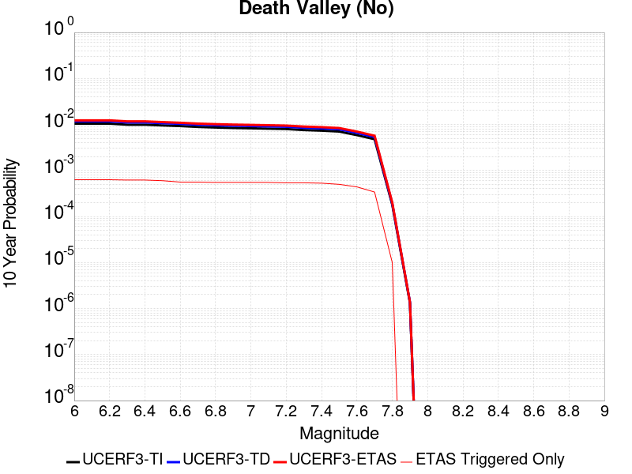 |

| Magnitude | 1 wk TI Prob | 1 wk TD Prob | 1 wk ETAS Prob | 1 wk ETAS/TD Gain | 1 wk ETAS Triggered Only | 1 mo TI Prob | 1 mo TD Prob | 1 mo ETAS Prob | 1 mo ETAS/TD Gain | 1 mo ETAS Triggered Only | 1 yr TI Prob | 1 yr TD Prob | 1 yr ETAS Prob | 1 yr ETAS/TD Gain | 1 yr ETAS Triggered Only | 10 yr TI Prob | 10 yr TD Prob | 10 yr ETAS Prob | 10 yr ETAS/TD Gain | 10 yr ETAS Triggered Only |
|-----|-----|-----|-----|-----|-----|-----|-----|-----|-----|-----|-----|-----|-----|-----|-----|-----|-----|-----|-----|-----|
| 6.0 | 2.0074807E-5 | 2.2500084E-5 | 8.2139704E-5 | 3.65064 | 5.9640963E-5 | 8.603206E-5 | 9.642541E-5 | 2.7533103E-4 | 2.8553786 | 1.7892288E-4 | 0.001046937 | 0.0011733545 | 0.0014712093 | 1.253849 | 2.982048E-4 | 0.010420183 | 0.011672506 | 0.01208512 | 1.0353491 | 4.1748674E-4 |
| 6.1 | 2.0074807E-5 | 2.2500084E-5 | 8.2139704E-5 | 3.65064 | 5.9640963E-5 | 8.603206E-5 | 9.642541E-5 | 2.7533103E-4 | 2.8553786 | 1.7892288E-4 | 0.001046937 | 0.0011733545 | 0.0014712093 | 1.253849 | 2.982048E-4 | 0.010420183 | 0.011672506 | 0.01208512 | 1.0353491 | 4.1748674E-4 |
| 6.2 | 2.0074807E-5 | 2.2500084E-5 | 8.2139704E-5 | 3.65064 | 5.9640963E-5 | 8.603206E-5 | 9.642541E-5 | 2.7533103E-4 | 2.8553786 | 1.7892288E-4 | 0.001046937 | 0.0011733545 | 0.0014712093 | 1.253849 | 2.982048E-4 | 0.010420183 | 0.011672506 | 0.01208512 | 1.0353491 | 4.1748674E-4 |
| 6.3 | 1.9050609E-5 | 2.1336948E-5 | 8.0976635E-5 | 3.795137 | 5.9640963E-5 | 8.164292E-5 | 9.1440896E-5 | 2.7034743E-4 | 2.9565265 | 1.7892288E-4 | 9.935491E-4 | 0.001112731 | 0.001410604 | 1.2676954 | 2.982048E-4 | 0.009891188 | 0.011072419 | 0.011485283 | 1.0372876 | 4.1748674E-4 |
| 6.4 | 1.9050609E-5 | 2.1336948E-5 | 8.0976635E-5 | 3.795137 | 5.9640963E-5 | 8.164292E-5 | 9.1440896E-5 | 2.7034743E-4 | 2.9565265 | 1.7892288E-4 | 9.935491E-4 | 0.001112731 | 0.001410604 | 1.2676954 | 2.982048E-4 | 0.009891188 | 0.011072419 | 0.011485283 | 1.0372876 | 4.1748674E-4 |
| 6.5 | 1.8367004E-5 | 2.0561009E-5 | 8.020074E-5 | 3.900623 | 5.9640963E-5 | 7.8713354E-5 | 8.811567E-5 | 2.6702278E-4 | 3.0303667 | 1.7892288E-4 | 9.5791375E-4 | 0.0010722869 | 0.0013701719 | 1.2778035 | 2.982048E-4 | 0.009537951 | 0.0106719155 | 0.011084947 | 1.0387026 | 4.1748674E-4 |
| 6.6 | 1.779439E-5 | 1.9910927E-5 | 7.95507E-5 | 3.9953287 | 5.9640963E-5 | 7.625944E-5 | 8.53298E-5 | 2.642374E-4 | 3.0966606 | 1.7892288E-4 | 9.280632E-4 | 0.0010384015 | 0.0013362967 | 1.2868786 | 2.982048E-4 | 0.009241969 | 0.010336253 | 0.010749424 | 1.039973 | 4.1748674E-4 |
| 6.7 | 1.7025437E-5 | 1.9043426E-5 | 7.868325E-5 | 4.13178 | 5.9640963E-5 | 7.296412E-5 | 8.161216E-5 | 2.6052044E-4 | 3.1921768 | 1.7892288E-4 | 8.87976E-4 | 9.931813E-4 | 0.0012910899 | 1.2999539 | 2.982048E-4 | 0.008844362 | 0.009888145 | 0.010301504 | 1.0418035 | 4.1748674E-4 |
| 6.8 | 1.6545107E-5 | 1.8512545E-5 | 7.81524E-5 | 4.2215915 | 5.9640963E-5 | 7.090568E-5 | 7.93371E-5 | 2.582458E-4 | 3.2550445 | 1.7892288E-4 | 8.629347E-4 | 9.655073E-4 | 0.0012634242 | 1.30856 | 2.982048E-4 | 0.008595915 | 0.009613829 | 0.0100273015 | 1.0430082 | 4.1748674E-4 |
| 6.9 | 1.615478E-5 | 1.8087594E-5 | 7.7727476E-5 | 4.2972813 | 5.9640963E-5 | 6.9232934E-5 | 7.751599E-5 | 2.56425E-4 | 3.3080273 | 1.7892288E-4 | 8.4258494E-4 | 9.433546E-4 | 0.0012412781 | 1.3158128 | 2.982048E-4 | 0.008393973 | 0.009394196 | 0.00980776 | 1.0440234 | 4.1748674E-4 |
| 7.0 | 1.5894311E-5 | 1.780555E-5 | 7.744545E-5 | 4.3495116 | 5.9640963E-5 | 6.81167E-5 | 7.6307304E-5 | 2.5521652E-4 | 3.3445885 | 1.7892288E-4 | 8.2900526E-4 | 9.286515E-4 | 0.0012265794 | 1.3208177 | 2.982048E-4 | 0.008259195 | 0.009248397 | 0.009662023 | 1.044724 | 4.1748674E-4 |
| 7.1 | 1.5602263E-5 | 1.7483504E-5 | 7.712342E-5 | 4.411211 | 5.9640963E-5 | 6.6865134E-5 | 7.492718E-5 | 2.5383665E-4 | 3.387778 | 1.7892288E-4 | 8.137789E-4 | 9.118627E-4 | 0.0012097956 | 1.32673 | 2.982048E-4 | 0.008108052 | 0.009081894 | 0.009495589 | 1.0455517 | 4.1748674E-4 |
| 7.2 | 1.5323829E-5 | 1.717063E-5 | 7.681057E-5 | 4.473369 | 5.9640963E-5 | 6.56719E-5 | 7.358637E-5 | 2.524961E-4 | 3.4312887 | 1.7892288E-4 | 7.99262E-4 | 8.9555193E-4 | 0.0011934896 | 1.3326862 | 2.982048E-4 | 0.007963934 | 0.008920107 | 0.009333869 | 1.0463854 | 4.1748674E-4 |
| 7.3 | 1.4556212E-5 | 1.6302456E-5 | 7.5942444E-5 | 4.658344 | 5.9640963E-5 | 6.238227E-5 | 6.9865826E-5 | 2.4877622E-4 | 3.560771 | 1.7892288E-4 | 7.592395E-4 | 8.5029035E-4 | 0.0011482416 | 1.3504112 | 2.982048E-4 | 0.0075665074 | 0.008471014 | 0.0088849645 | 1.0488666 | 4.1748674E-4 |
| 7.4 | 1.411725E-5 | 1.580796E-5 | 7.544798E-5 | 4.772784 | 5.9640963E-5 | 6.0501097E-5 | 6.7746674E-5 | 2.4665744E-4 | 3.640879 | 1.7892288E-4 | 7.363519E-4 | 8.245094E-4 | 0.0011224684 | 1.3613772 | 2.982048E-4 | 0.0073391674 | 0.008215138 | 0.008629195 | 1.0504017 | 4.1748674E-4 |
| 7.5 | 1.3503312E-5 | 1.5126289E-5 | 7.476635E-5 | 4.942808 | 5.9640963E-5 | 5.7870053E-5 | 6.482538E-5 | 2.4373666E-4 | 3.7598958 | 1.7892288E-4 | 7.043401E-4 | 7.8896893E-4 | 0.0010869385 | 1.3776696 | 2.982048E-4 | 0.007021119 | 0.007862304 | 0.008276508 | 1.0526823 | 4.1748674E-4 |
| 7.6 | 1.1279839E-5 | 1.2626327E-5 | 7.2266535E-5 | 5.7234807 | 5.9640963E-5 | 4.834127E-5 | 5.4111737E-5 | 2.3302494E-4 | 4.306366 | 1.7892288E-4 | 5.88396E-4 | 6.5861654E-4 | 9.56625E-4 | 1.4524764 | 2.982048E-4 | 0.005868405 | 0.006567199 | 0.0069819437 | 1.063154 | 4.1748674E-4 |
| 7.7 | 9.189108E-6 | 1.0283358E-5 | 6.9923706E-5 | 6.7996955 | 5.9640963E-5 | 3.93813E-5 | 4.407082E-5 | 2.2298582E-4 | 5.0597157 | 1.7892288E-4 | 4.7936183E-4 | 5.3643517E-4 | 8.3448E-4 | 1.5556027 | 2.982048E-4 | 0.004783291 | 0.005351914 | 0.0057078446 | 1.0665053 | 3.5784577E-4 |
| 7.8 | 3.4586725E-7 | 3.6482615E-7 | 3.6482615E-7 | 1.0 | 0.0 | 1.4822873E-6 | 1.5635396E-6 | 1.5635396E-6 | 1.0 | 0.0 | 1.80467E-5 | 1.9035933E-5 | 1.9035933E-5 | 1.0 | 0.0 | 1.8045233E-4 | 1.9034347E-4 | 1.9034347E-4 | 1.0 | 0.0 |
| 7.9 | 2.5591178E-9 | 2.6696718E-9 | 2.6696718E-9 | 1.0 | 0.0 | 1.0967647E-8 | 1.14414505E-8 | 1.14414505E-8 | 1.0 | 0.0 | 1.335311E-7 | 1.3929966E-7 | 1.3929966E-7 | 1.0 | 0.0 | 1.3353102E-6 | 1.3929966E-6 | 1.3929966E-6 | 1.0 | 0.0 |

## Red Pass
*[(top)](#table-of-contents)*

| 1 Week | 1 Month | 1 Year | 10 Year |
|-----|-----|-----|-----|
|  |  | 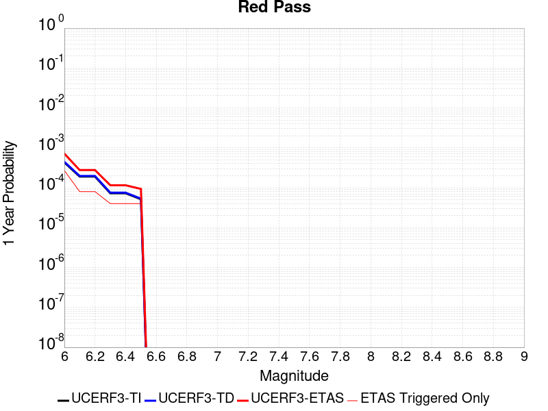 |  |

| Magnitude | 1 wk TI Prob | 1 wk TD Prob | 1 wk ETAS Prob | 1 wk ETAS/TD Gain | 1 wk ETAS Triggered Only | 1 mo TI Prob | 1 mo TD Prob | 1 mo ETAS Prob | 1 mo ETAS/TD Gain | 1 mo ETAS Triggered Only | 1 yr TI Prob | 1 yr TD Prob | 1 yr ETAS Prob | 1 yr ETAS/TD Gain | 1 yr ETAS Triggered Only | 10 yr TI Prob | 10 yr TD Prob | 10 yr ETAS Prob | 10 yr ETAS/TD Gain | 10 yr ETAS Triggered Only |
|-----|-----|-----|-----|-----|-----|-----|-----|-----|-----|-----|-----|-----|-----|-----|-----|-----|-----|-----|-----|-----|
| 6.0 | 8.258278E-6 | 8.551265E-6 | 6.8191715E-5 | 7.9744596 | 5.9640963E-5 | 3.539214E-5 | 3.6647863E-5 | 1.5592542E-4 | 4.254693 | 1.19281925E-4 | 4.308141E-4 | 4.4611428E-4 | 6.845717E-4 | 1.534521 | 2.3856385E-4 | 0.0042997985 | 0.004453945 | 0.004810197 | 1.0799857 | 3.5784577E-4 |
| 6.1 | 3.649988E-6 | 3.7753161E-6 | 6.341605E-5 | 16.797548 | 5.9640963E-5 | 1.5642712E-5 | 1.6179853E-5 | 7.581985E-5 | 4.6860657 | 5.9640963E-5 | 1.9043336E-4 | 1.9697666E-4 | 2.5660588E-4 | 1.3027222 | 5.9640963E-5 | 0.0019027026 | 0.001968488 | 0.002087535 | 1.0604764 | 1.19281925E-4 |
| 6.2 | 3.649988E-6 | 3.7753161E-6 | 6.341605E-5 | 16.797548 | 5.9640963E-5 | 1.5642712E-5 | 1.6179853E-5 | 7.581985E-5 | 4.6860657 | 5.9640963E-5 | 1.9043336E-4 | 1.9697666E-4 | 2.5660588E-4 | 1.3027222 | 5.9640963E-5 | 0.0019027026 | 0.001968488 | 0.002087535 | 1.0604764 | 1.19281925E-4 |
| 6.3 | 1.3924937E-6 | 1.4411166E-6 | 1.4411166E-6 | 1.0 | 0.0 | 5.9678164E-6 | 6.1762075E-6 | 6.1762075E-6 | 1.0 | 0.0 | 7.265574E-5 | 7.519415E-5 | 7.519415E-5 | 1.0 | 0.0 | 7.263199E-4 | 7.518258E-4 | 7.518258E-4 | 1.0 | 0.0 |
| 6.4 | 1.3924937E-6 | 1.4411166E-6 | 1.4411166E-6 | 1.0 | 0.0 | 5.9678164E-6 | 6.1762075E-6 | 6.1762075E-6 | 1.0 | 0.0 | 7.265574E-5 | 7.519415E-5 | 7.519415E-5 | 1.0 | 0.0 | 7.263199E-4 | 7.518258E-4 | 7.518258E-4 | 1.0 | 0.0 |
| 6.5 | 9.876812E-7 | 1.0221912E-6 | 1.0221912E-6 | 1.0 | 0.0 | 4.2329125E-6 | 4.3808195E-6 | 4.3808195E-6 | 1.0 | 0.0 | 5.153449E-5 | 5.3336476E-5 | 5.3336476E-5 | 1.0 | 0.0 | 5.1522546E-4 | 5.333648E-4 | 5.333648E-4 | 1.0 | 0.0 |

## Death Valley (Fish Lake Valley)
*[(top)](#table-of-contents)*

| 1 Week | 1 Month | 1 Year | 10 Year |
|-----|-----|-----|-----|
|  |  |  |  |

| Magnitude | 1 wk TI Prob | 1 wk TD Prob | 1 wk ETAS Prob | 1 wk ETAS/TD Gain | 1 wk ETAS Triggered Only | 1 mo TI Prob | 1 mo TD Prob | 1 mo ETAS Prob | 1 mo ETAS/TD Gain | 1 mo ETAS Triggered Only | 1 yr TI Prob | 1 yr TD Prob | 1 yr ETAS Prob | 1 yr ETAS/TD Gain | 1 yr ETAS Triggered Only | 10 yr TI Prob | 10 yr TD Prob | 10 yr ETAS Prob | 10 yr ETAS/TD Gain | 10 yr ETAS Triggered Only |
|-----|-----|-----|-----|-----|-----|-----|-----|-----|-----|-----|-----|-----|-----|-----|-----|-----|-----|-----|-----|-----|
| 6.0 | 3.872328E-5 | 4.7265705E-5 | 1.0690385E-4 | 2.2617636 | 5.9640963E-5 | 1.6594635E-4 | 2.0255324E-4 | 3.814399E-4 | 1.8831586 | 1.7892288E-4 | 0.0020185246 | 0.0024635606 | 0.0027610308 | 1.120748 | 2.982048E-4 | 0.02000288 | 0.024388338 | 0.024737455 | 1.014315 | 3.5784577E-4 |
| 6.1 | 3.872328E-5 | 4.7265705E-5 | 1.0690385E-4 | 2.2617636 | 5.9640963E-5 | 1.6594635E-4 | 2.0255324E-4 | 3.814399E-4 | 1.8831586 | 1.7892288E-4 | 0.0020185246 | 0.0024635606 | 0.0027610308 | 1.120748 | 2.982048E-4 | 0.02000288 | 0.024388338 | 0.024737455 | 1.014315 | 3.5784577E-4 |
| 6.2 | 3.872328E-5 | 4.7265705E-5 | 1.0690385E-4 | 2.2617636 | 5.9640963E-5 | 1.6594635E-4 | 2.0255324E-4 | 3.814399E-4 | 1.8831586 | 1.7892288E-4 | 0.0020185246 | 0.0024635606 | 0.0027610308 | 1.120748 | 2.982048E-4 | 0.02000288 | 0.024388338 | 0.024737455 | 1.014315 | 3.5784577E-4 |
| 6.3 | 2.8356371E-5 | 3.360979E-5 | 9.3248746E-5 | 2.774452 | 5.9640963E-5 | 1.2152165E-4 | 1.4403443E-4 | 3.2293153E-4 | 2.242044 | 1.7892288E-4 | 0.0014785219 | 0.0017522788 | 0.0020499611 | 1.1698829 | 2.982048E-4 | 0.014687235 | 0.017391816 | 0.017743438 | 1.0202177 | 3.5784577E-4 |
| 6.4 | 2.8356371E-5 | 3.360979E-5 | 9.3248746E-5 | 2.774452 | 5.9640963E-5 | 1.2152165E-4 | 1.4403443E-4 | 3.2293153E-4 | 2.242044 | 1.7892288E-4 | 0.0014785219 | 0.0017522788 | 0.0020499611 | 1.1698829 | 2.982048E-4 | 0.014687235 | 0.017391816 | 0.017743438 | 1.0202177 | 3.5784577E-4 |
| 6.5 | 2.4448687E-5 | 2.8607585E-5 | 8.824684E-5 | 3.0847356 | 5.9640963E-5 | 1.0477588E-4 | 1.2259845E-4 | 3.0149939E-4 | 2.4592433 | 1.7892288E-4 | 0.0012748998 | 0.0014916616 | 0.0017894217 | 1.1996163 | 2.982048E-4 | 0.012676105 | 0.014821392 | 0.0151739335 | 1.0237861 | 3.5784577E-4 |
| 6.6 | 2.1298161E-5 | 2.4660083E-5 | 8.429957E-5 | 3.4184625 | 5.9640963E-5 | 9.127464E-5 | 1.0568197E-4 | 2.8458593E-4 | 2.6928525 | 1.7892288E-4 | 0.0011107022 | 0.0012859512 | 0.0015837726 | 1.2315961 | 2.982048E-4 | 0.011051672 | 0.01278853 | 0.0131418 | 1.0276239 | 3.5784577E-4 |
| 6.7 | 1.8959729E-5 | 2.1781027E-5 | 8.142069E-5 | 3.7381475 | 5.9640963E-5 | 8.125345E-5 | 9.334406E-5 | 2.7225024E-4 | 2.9166317 | 1.7892288E-4 | 9.888117E-4 | 0.001135897 | 0.0014337631 | 1.2622298 | 2.982048E-4 | 0.009844234 | 0.01130357 | 0.011657371 | 1.0313 | 3.5784577E-4 |
| 6.8 | 1.6691629E-5 | 1.9018351E-5 | 7.865818E-5 | 4.1359096 | 5.9640963E-5 | 7.153359E-5 | 8.150477E-5 | 2.6041307E-4 | 3.1950655 | 1.7892288E-4 | 8.7057345E-4 | 9.918857E-4 | 0.0012897947 | 1.3003461 | 2.982048E-4 | 0.008671708 | 0.009876343 | 0.010230655 | 1.0358747 | 3.5784577E-4 |
| 6.9 | 1.450505E-5 | 1.638954E-5 | 7.602952E-5 | 4.6389055 | 5.9640963E-5 | 6.216302E-5 | 7.0239046E-5 | 2.4914937E-4 | 3.5471632 | 1.7892288E-4 | 7.5657194E-4 | 8.5483363E-4 | 0.0011527835 | 1.3485472 | 2.982048E-4 | 0.007540013 | 0.008516386 | 0.008871184 | 1.0416607 | 3.5784577E-4 |
| 7.0 | 1.2940855E-5 | 1.4537972E-5 | 7.417807E-5 | 5.102367 | 5.9640963E-5 | 5.545963E-5 | 6.230414E-5 | 2.4121588E-4 | 3.8715868 | 1.7892288E-4 | 6.750118E-4 | 7.5829466E-4 | 0.0010562734 | 1.392959 | 2.982048E-4 | 0.006729651 | 0.0075576897 | 0.007912831 | 1.0469908 | 3.5784577E-4 |
| 7.1 | 1.2544658E-5 | 1.4078208E-5 | 7.371833E-5 | 5.2363434 | 5.9640963E-5 | 5.3761712E-5 | 6.0333812E-5 | 2.392459E-4 | 3.9653702 | 1.7892288E-4 | 6.5435225E-4 | 7.343222E-4 | 0.001032308 | 1.4057971 | 2.982048E-4 | 0.006524288 | 0.007319551 | 0.0076747774 | 1.0485312 | 3.5784577E-4 |
| 7.2 | 1.2489416E-5 | 1.4015674E-5 | 7.36558E-5 | 5.2552447 | 5.9640963E-5 | 5.3524967E-5 | 6.0065824E-5 | 2.3897795E-4 | 3.9786012 | 1.7892288E-4 | 6.514716E-4 | 7.310616E-4 | 0.0010290485 | 1.4076083 | 2.982048E-4 | 0.006495651 | 0.0072871596 | 0.0076423977 | 1.0487485 | 3.5784577E-4 |
| 7.3 | 1.2368307E-5 | 1.3879812E-5 | 7.351994E-5 | 5.2968974 | 5.9640963E-5 | 5.3005948E-5 | 5.9483587E-5 | 2.3839583E-4 | 4.007758 | 1.7892288E-4 | 6.451563E-4 | 7.2397763E-4 | 0.0010219666 | 1.4115996 | 2.982048E-4 | 0.0064328653 | 0.007216782 | 0.007572045 | 1.0492274 | 3.5784577E-4 |
| 7.4 | 1.2161707E-5 | 1.36478675E-5 | 7.3288014E-5 | 5.369924 | 5.9640963E-5 | 5.212056E-5 | 5.8489582E-5 | 2.37402E-4 | 4.0588765 | 1.7892288E-4 | 6.3438306E-4 | 7.118836E-4 | 0.0010098761 | 1.4185972 | 2.982048E-4 | 0.006325751 | 0.0070966207 | 0.007451927 | 1.050067 | 3.5784577E-4 |
| 7.5 | 1.1707948E-5 | 1.3145515E-5 | 7.278569E-5 | 5.536922 | 5.9640963E-5 | 5.0175953E-5 | 5.6336736E-5 | 2.3524954E-4 | 4.175775 | 1.7892288E-4 | 6.10721E-4 | 6.856895E-4 | 9.836898E-4 | 1.4345995 | 2.982048E-4 | 0.0060904534 | 0.006836321 | 0.0071917204 | 1.0519869 | 3.5784577E-4 |
| 7.6 | 1.0319538E-5 | 1.1579622E-5 | 7.1219896E-5 | 6.15045 | 5.9640963E-5 | 4.4225842E-5 | 4.9626036E-5 | 2.2854004E-4 | 4.6052446 | 1.7892288E-4 | 5.383166E-4 | 6.040347E-4 | 9.020594E-4 | 1.49339 | 2.982048E-4 | 0.0053701443 | 0.0060244603 | 0.00638015 | 1.0590409 | 3.5784577E-4 |
| 7.7 | 8.937764E-6 | 1.0022779E-5 | 6.966314E-5 | 6.950482 | 5.9640963E-5 | 3.830414E-5 | 4.295409E-5 | 2.2186928E-4 | 5.165266 | 1.7892288E-4 | 4.6625308E-4 | 5.228456E-4 | 8.208945E-4 | 1.5700514 | 2.982048E-4 | 0.0046527605 | 0.005216664 | 0.005572643 | 1.0682389 | 3.5784577E-4 |
| 7.8 | 3.108007E-7 | 3.284654E-7 | 3.284654E-7 | 1.0 | 0.0 | 1.3320023E-6 | 1.407708E-6 | 1.407708E-6 | 1.0 | 0.0 | 1.6217007E-5 | 1.7138715E-5 | 1.7138715E-5 | 1.0 | 0.0 | 1.6215823E-4 | 1.7137431E-4 | 1.7137431E-4 | 1.0 | 0.0 |
| 7.9 | 2.5591178E-9 | 2.6696718E-9 | 2.6696718E-9 | 1.0 | 0.0 | 1.0967647E-8 | 1.14414505E-8 | 1.14414505E-8 | 1.0 | 0.0 | 1.335311E-7 | 1.3929966E-7 | 1.3929966E-7 | 1.0 | 0.0 | 1.3353102E-6 | 1.3929966E-6 | 1.3929966E-6 | 1.0 | 0.0 |

## Ludlow
*[(top)](#table-of-contents)*

| 1 Week | 1 Month | 1 Year | 10 Year |
|-----|-----|-----|-----|
| 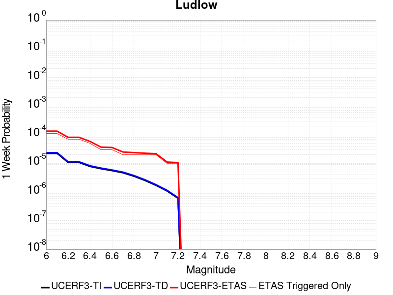 |  |  |  |

| Magnitude | 1 wk TI Prob | 1 wk TD Prob | 1 wk ETAS Prob | 1 wk ETAS/TD Gain | 1 wk ETAS Triggered Only | 1 mo TI Prob | 1 mo TD Prob | 1 mo ETAS Prob | 1 mo ETAS/TD Gain | 1 mo ETAS Triggered Only | 1 yr TI Prob | 1 yr TD Prob | 1 yr ETAS Prob | 1 yr ETAS/TD Gain | 1 yr ETAS Triggered Only | 10 yr TI Prob | 10 yr TD Prob | 10 yr ETAS Prob | 10 yr ETAS/TD Gain | 10 yr ETAS Triggered Only |
|-----|-----|-----|-----|-----|-----|-----|-----|-----|-----|-----|-----|-----|-----|-----|-----|-----|-----|-----|-----|-----|
| 6.0 | 2.2407607E-5 | 2.3657254E-5 | 1.4293635E-4 | 6.0419674 | 1.19281925E-4 | 9.602906E-5 | 1.0138454E-4 | 2.8028927E-4 | 2.7646158 | 1.7892288E-4 | 0.0011685267 | 0.001233702 | 0.0014719715 | 1.1931338 | 2.3856385E-4 | 0.011624013 | 0.012273042 | 0.012626496 | 1.0287992 | 3.5784577E-4 |
| 6.1 | 2.2407607E-5 | 2.3657254E-5 | 1.4293635E-4 | 6.0419674 | 1.19281925E-4 | 9.602906E-5 | 1.0138454E-4 | 2.8028927E-4 | 2.7646158 | 1.7892288E-4 | 0.0011685267 | 0.001233702 | 0.0014719715 | 1.1931338 | 2.3856385E-4 | 0.011624013 | 0.012273042 | 0.012626496 | 1.0287992 | 3.5784577E-4 |
| 6.2 | 1.0781252E-5 | 1.1365663E-5 | 7.100595E-5 | 6.247409 | 5.9640963E-5 | 4.620455E-5 | 4.8709102E-5 | 1.6798521E-4 | 3.4487438 | 1.19281925E-4 | 5.623952E-4 | 5.9287593E-4 | 7.1208715E-4 | 1.2010728 | 1.19281925E-4 | 0.00560974 | 0.0059133614 | 0.006091226 | 1.0300784 | 1.7892288E-4 |
| 6.3 | 1.0781252E-5 | 1.1365663E-5 | 7.100595E-5 | 6.247409 | 5.9640963E-5 | 4.620455E-5 | 4.8709102E-5 | 1.6798521E-4 | 3.4487438 | 1.19281925E-4 | 5.623952E-4 | 5.9287593E-4 | 7.1208715E-4 | 1.2010728 | 1.19281925E-4 | 0.00560974 | 0.0059133614 | 0.006091226 | 1.0300784 | 1.7892288E-4 |
| 6.4 | 7.814439E-6 | 8.237729E-6 | 6.78782E-5 | 8.239917 | 5.9640963E-5 | 3.3490025E-5 | 3.530408E-5 | 1.545818E-4 | 4.3785815 | 1.19281925E-4 | 4.0766477E-4 | 4.2974384E-4 | 5.489745E-4 | 1.2774459 | 1.19281925E-4 | 0.0040691774 | 0.0042892746 | 0.0044080447 | 1.02769 | 1.19281925E-4 |
| 6.5 | 6.4986366E-6 | 6.85092E-6 | 6.649147E-5 | 9.705482 | 5.9640963E-5 | 2.7851002E-5 | 2.9360759E-5 | 8.899997E-5 | 3.0312557 | 5.9640963E-5 | 3.390332E-4 | 3.5740953E-4 | 4.1702916E-4 | 1.1668104 | 5.9640963E-5 | 0.003385164 | 0.0035684432 | 0.0036278714 | 1.0166538 | 5.9640963E-5 |
| 6.6 | 5.582177E-6 | 5.8860055E-6 | 6.552662E-5 | 11.132612 | 5.9640963E-5 | 2.3923398E-5 | 2.5225498E-5 | 8.486496E-5 | 3.3642528 | 5.9640963E-5 | 2.9122844E-4 | 3.0707786E-4 | 3.6670052E-4 | 1.1941613 | 5.9640963E-5 | 0.0029084706 | 0.003066609 | 0.0031260669 | 1.0193889 | 5.9640963E-5 |
| 6.7 | 4.6858763E-6 | 4.940427E-6 | 6.4581094E-5 | 13.071965 | 5.9640963E-5 | 2.0082172E-5 | 2.1173091E-5 | 8.081279E-5 | 3.8167686 | 5.9640963E-5 | 2.4447302E-4 | 2.5775246E-4 | 3.1737803E-4 | 1.2313288 | 5.9640963E-5 | 0.0024420423 | 0.0025745912 | 0.0026340787 | 1.0231056 | 5.9640963E-5 |
| 6.8 | 3.5584908E-6 | 3.7520183E-6 | 6.3392756E-5 | 16.895641 | 5.9640963E-5 | 1.5250586E-5 | 1.6079981E-5 | 7.571998E-5 | 4.7089596 | 5.9640963E-5 | 1.8566006E-4 | 1.957566E-4 | 2.5538588E-4 | 1.3046093 | 5.9640963E-5 | 0.0018550502 | 0.0019558826 | 0.002015407 | 1.0304335 | 5.9640963E-5 |
| 6.9 | 2.532834E-6 | 2.6710034E-6 | 6.23118E-5 | 23.328987 | 5.9640963E-5 | 1.0854958E-5 | 1.1447109E-5 | 7.108739E-5 | 6.2100735 | 5.9640963E-5 | 1.3215111E-4 | 1.3935992E-4 | 1.9899257E-4 | 1.4279039 | 5.9640963E-5 | 0.0013207254 | 0.0013927529 | 0.0014523107 | 1.0427628 | 5.9640963E-5 |
| 7.0 | 1.7083285E-6 | 1.8019439E-6 | 6.14428E-5 | 34.098064 | 5.9640963E-5 | 7.3213873E-6 | 7.722595E-6 | 6.736309E-5 | 8.722857 | 5.9640963E-5 | 8.913424E-5 | 9.40187E-5 | 1.5365405E-4 | 1.6342925 | 5.9640963E-5 | 8.9098496E-4 | 9.3980576E-4 | 9.993906E-4 | 1.0634013 | 5.9640963E-5 |
| 7.1 | 1.0905424E-6 | 1.1497619E-6 | 1.1497619E-6 | 1.0 | 0.0 | 4.6737446E-6 | 4.9275427E-6 | 4.9275427E-6 | 1.0 | 0.0 | 5.6901354E-5 | 5.999128E-5 | 5.999128E-5 | 1.0 | 0.0 | 5.6886784E-4 | 5.997606E-4 | 5.997606E-4 | 1.0 | 0.0 |
| 7.2 | 6.06668E-7 | 6.387277E-7 | 6.387277E-7 | 1.0 | 0.0 | 2.600003E-6 | 2.7374022E-6 | 2.7374022E-6 | 1.0 | 0.0 | 3.1654577E-5 | 3.3327433E-5 | 3.3327433E-5 | 1.0 | 0.0 | 3.1650066E-4 | 3.3323118E-4 | 3.3323118E-4 | 1.0 | 0.0 |

## White Wolf (Extension)
*[(top)](#table-of-contents)*

| 1 Week | 1 Month | 1 Year | 10 Year |
|-----|-----|-----|-----|
|  |  |  |  |

| Magnitude | 1 wk TI Prob | 1 wk TD Prob | 1 wk ETAS Prob | 1 wk ETAS/TD Gain | 1 wk ETAS Triggered Only | 1 mo TI Prob | 1 mo TD Prob | 1 mo ETAS Prob | 1 mo ETAS/TD Gain | 1 mo ETAS Triggered Only | 1 yr TI Prob | 1 yr TD Prob | 1 yr ETAS Prob | 1 yr ETAS/TD Gain | 1 yr ETAS Triggered Only | 10 yr TI Prob | 10 yr TD Prob | 10 yr ETAS Prob | 10 yr ETAS/TD Gain | 10 yr ETAS Triggered Only |
|-----|-----|-----|-----|-----|-----|-----|-----|-----|-----|-----|-----|-----|-----|-----|-----|-----|-----|-----|-----|-----|
| 6.0 | 8.222555E-6 | 6.066615E-6 | 6.5707216E-5 | 10.830952 | 5.9640963E-5 | 3.5239045E-5 | 2.5999556E-5 | 8.563897E-5 | 3.2938626 | 5.9640963E-5 | 4.289509E-4 | 3.1650523E-4 | 6.146157E-4 | 1.9418814 | 2.982048E-4 | 0.0042812387 | 0.0031611966 | 0.0034584587 | 1.0940347 | 2.982048E-4 |
| 6.1 | 8.222555E-6 | 6.066615E-6 | 6.5707216E-5 | 10.830952 | 5.9640963E-5 | 3.5239045E-5 | 2.5999556E-5 | 8.563897E-5 | 3.2938626 | 5.9640963E-5 | 4.289509E-4 | 3.1650523E-4 | 6.146157E-4 | 1.9418814 | 2.982048E-4 | 0.0042812387 | 0.0031611966 | 0.0034584587 | 1.0940347 | 2.982048E-4 |
| 6.2 | 8.222555E-6 | 6.066615E-6 | 6.5707216E-5 | 10.830952 | 5.9640963E-5 | 3.5239045E-5 | 2.5999556E-5 | 8.563897E-5 | 3.2938626 | 5.9640963E-5 | 4.289509E-4 | 3.1650523E-4 | 6.146157E-4 | 1.9418814 | 2.982048E-4 | 0.0042812387 | 0.0031611966 | 0.0034584587 | 1.0940347 | 2.982048E-4 |
| 6.3 | 8.222555E-6 | 6.066615E-6 | 6.5707216E-5 | 10.830952 | 5.9640963E-5 | 3.5239045E-5 | 2.5999556E-5 | 8.563897E-5 | 3.2938626 | 5.9640963E-5 | 4.289509E-4 | 3.1650523E-4 | 6.146157E-4 | 1.9418814 | 2.982048E-4 | 0.0042812387 | 0.0031611966 | 0.0034584587 | 1.0940347 | 2.982048E-4 |
| 6.4 | 5.821773E-6 | 3.5571256E-6 | 6.319788E-5 | 17.766558 | 5.9640963E-5 | 2.4950215E-5 | 1.5244741E-5 | 7.4884796E-5 | 4.9121723 | 5.9640963E-5 | 3.0372653E-4 | 1.8559002E-4 | 3.644797E-4 | 1.9638971 | 1.7892288E-4 | 0.0030331176 | 0.0018544586 | 0.0020330497 | 1.0963036 | 1.7892288E-4 |
| 6.5 | 5.766023E-6 | 3.4990599E-6 | 6.3139814E-5 | 18.044794 | 5.9640963E-5 | 2.4711293E-5 | 1.49958905E-5 | 7.463596E-5 | 4.977094 | 5.9640963E-5 | 3.0081844E-4 | 1.8256076E-4 | 3.6145098E-4 | 1.9798942 | 1.7892288E-4 | 0.0030041158 | 0.0018242161 | 0.0020028127 | 1.0979031 | 1.7892288E-4 |
| 6.6 | 4.643576E-6 | 2.3325733E-6 | 6.19734E-5 | 26.568682 | 5.9640963E-5 | 1.9900888E-5 | 9.9967065E-6 | 6.963707E-5 | 6.9660015 | 5.9640963E-5 | 2.4226638E-4 | 1.2170354E-4 | 2.4097094E-4 | 1.9799831 | 1.19281925E-4 | 0.0024200242 | 0.0012164112 | 0.0013355481 | 1.0979413 | 1.19281925E-4 |
| 6.7 | 3.9529173E-6 | 1.6482975E-6 | 1.6482975E-6 | 1.0 | 0.0 | 1.6940963E-5 | 7.064114E-6 | 7.064114E-6 | 1.0 | 0.0 | 2.0623671E-4 | 8.600239E-5 | 1.4563822E-4 | 1.6934206 | 5.9640963E-5 | 0.002060454 | 8.597095E-4 | 9.192992E-4 | 1.0693138 | 5.9640963E-5 |
| 6.8 | 3.4377522E-6 | 1.2244764E-6 | 1.2244764E-6 | 1.0 | 0.0 | 1.473314E-5 | 5.247746E-6 | 5.247746E-6 | 1.0 | 0.0 | 1.7936122E-4 | 6.388952E-5 | 1.2352667E-4 | 1.9334418 | 5.9640963E-5 | 0.0017921652 | 6.3872064E-4 | 6.9832354E-4 | 1.093316 | 5.9640963E-5 |
| 6.9 | 3.1367306E-6 | 1.0033316E-6 | 1.0033316E-6 | 1.0 | 0.0 | 1.3443062E-5 | 4.299986E-6 | 4.299986E-6 | 1.0 | 0.0 | 1.63657E-4 | 5.2351144E-5 | 1.11988986E-4 | 2.1391888 | 5.9640963E-5 | 0.0016353652 | 5.233958E-4 | 5.8300555E-4 | 1.1138904 | 5.9640963E-5 |
| 7.0 | 2.8298145E-6 | 7.4282326E-7 | 7.4282326E-7 | 1.0 | 0.0 | 1.2127721E-5 | 3.1835248E-6 | 3.1835248E-6 | 1.0 | 0.0 | 1.47645E-4 | 3.8758775E-5 | 3.8758775E-5 | 1.0 | 0.0 | 0.0014754693 | 3.8752513E-4 | 3.8752513E-4 | 1.0 | 0.0 |
| 7.1 | 2.4091064E-6 | 5.4223835E-7 | 5.4223835E-7 | 1.0 | 0.0 | 1.03247E-5 | 2.3238767E-6 | 2.3238767E-6 | 1.0 | 0.0 | 1.2569598E-4 | 2.8292874E-5 | 2.8292874E-5 | 1.0 | 0.0 | 0.001256249 | 2.8289677E-4 | 2.8289677E-4 | 1.0 | 0.0 |
| 7.2 | 1.3875518E-6 | 1.0740268E-7 | 1.0740268E-7 | 1.0 | 0.0 | 5.9466374E-6 | 4.6029712E-7 | 4.6029712E-7 | 1.0 | 0.0 | 7.23979E-5 | 5.604104E-6 | 5.604104E-6 | 1.0 | 0.0 | 7.2374323E-4 | 5.6039742E-5 | 5.6039742E-5 | 1.0 | 0.0 |
| 7.3 | 7.056077E-7 | 5.0002956E-8 | 5.0002956E-8 | 1.0 | 0.0 | 3.0240296E-6 | 2.1429837E-7 | 2.1429837E-7 | 1.0 | 0.0 | 3.681694E-5 | 2.60908E-6 | 2.60908E-6 | 1.0 | 0.0 | 3.681084E-4 | 2.609054E-5 | 2.609054E-5 | 1.0 | 0.0 |
| 7.4 | 5.9334678E-8 | 4.8638475E-9 | 4.8638475E-9 | 1.0 | 0.0 | 2.5429145E-7 | 2.084506E-8 | 2.084506E-8 | 1.0 | 0.0 | 3.095994E-6 | 2.5378858E-7 | 2.5378858E-7 | 1.0 | 0.0 | 3.095951E-5 | 2.5378843E-6 | 2.5378843E-6 | 1.0 | 0.0 |

## Sierra Nevada  (No Extension)
*[(top)](#table-of-contents)*

| 1 Week | 1 Month | 1 Year | 10 Year |
|-----|-----|-----|-----|
| 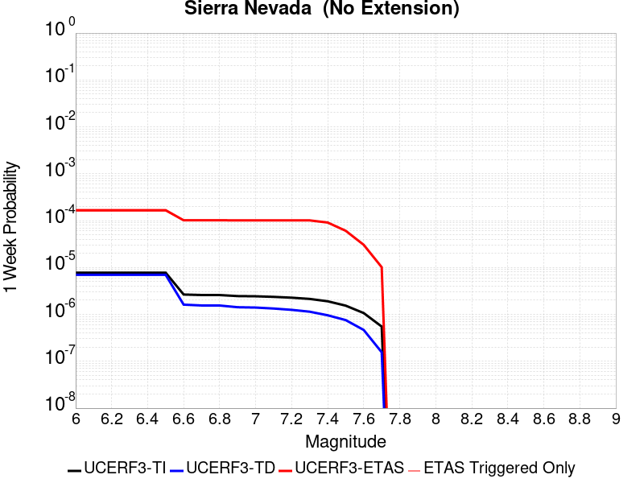 |  |  |  |

| Magnitude | 1 wk TI Prob | 1 wk TD Prob | 1 wk ETAS Prob | 1 wk ETAS/TD Gain | 1 wk ETAS Triggered Only | 1 mo TI Prob | 1 mo TD Prob | 1 mo ETAS Prob | 1 mo ETAS/TD Gain | 1 mo ETAS Triggered Only | 1 yr TI Prob | 1 yr TD Prob | 1 yr ETAS Prob | 1 yr ETAS/TD Gain | 1 yr ETAS Triggered Only | 10 yr TI Prob | 10 yr TD Prob | 10 yr ETAS Prob | 10 yr ETAS/TD Gain | 10 yr ETAS Triggered Only |
|-----|-----|-----|-----|-----|-----|-----|-----|-----|-----|-----|-----|-----|-----|-----|-----|-----|-----|-----|-----|-----|
| 6.0 | 7.7690465E-6 | 6.9762887E-6 | 1.2625738E-4 | 18.098072 | 1.19281925E-4 | 3.329549E-5 | 2.989824E-5 | 2.6845495E-4 | 8.978955 | 2.3856385E-4 | 4.0529718E-4 | 3.6398612E-4 | 6.0246314E-4 | 1.6551816 | 2.3856385E-4 | 0.004045588 | 0.0036374154 | 0.0038751115 | 1.0653476 | 2.3856385E-4 |
| 6.1 | 7.7690465E-6 | 6.9762887E-6 | 1.2625738E-4 | 18.098072 | 1.19281925E-4 | 3.329549E-5 | 2.989824E-5 | 2.6845495E-4 | 8.978955 | 2.3856385E-4 | 4.0529718E-4 | 3.6398612E-4 | 6.0246314E-4 | 1.6551816 | 2.3856385E-4 | 0.004045588 | 0.0036374154 | 0.0038751115 | 1.0653476 | 2.3856385E-4 |
| 6.2 | 7.7690465E-6 | 6.9762887E-6 | 1.2625738E-4 | 18.098072 | 1.19281925E-4 | 3.329549E-5 | 2.989824E-5 | 2.6845495E-4 | 8.978955 | 2.3856385E-4 | 4.0529718E-4 | 3.6398612E-4 | 6.0246314E-4 | 1.6551816 | 2.3856385E-4 | 0.004045588 | 0.0036374154 | 0.0038751115 | 1.0653476 | 2.3856385E-4 |
| 6.3 | 7.7690465E-6 | 6.9762887E-6 | 1.2625738E-4 | 18.098072 | 1.19281925E-4 | 3.329549E-5 | 2.989824E-5 | 2.6845495E-4 | 8.978955 | 2.3856385E-4 | 4.0529718E-4 | 3.6398612E-4 | 6.0246314E-4 | 1.6551816 | 2.3856385E-4 | 0.004045588 | 0.0036374154 | 0.0038751115 | 1.0653476 | 2.3856385E-4 |
| 6.4 | 7.7690465E-6 | 6.9762887E-6 | 1.2625738E-4 | 18.098072 | 1.19281925E-4 | 3.329549E-5 | 2.989824E-5 | 2.6845495E-4 | 8.978955 | 2.3856385E-4 | 4.0529718E-4 | 3.6398612E-4 | 6.0246314E-4 | 1.6551816 | 2.3856385E-4 | 0.004045588 | 0.0036374154 | 0.0038751115 | 1.0653476 | 2.3856385E-4 |
| 6.5 | 7.7690465E-6 | 6.9762887E-6 | 1.2625738E-4 | 18.098072 | 1.19281925E-4 | 3.329549E-5 | 2.989824E-5 | 2.6845495E-4 | 8.978955 | 2.3856385E-4 | 4.0529718E-4 | 3.6398612E-4 | 6.0246314E-4 | 1.6551816 | 2.3856385E-4 | 0.004045588 | 0.0036374154 | 0.0038751115 | 1.0653476 | 2.3856385E-4 |
| 6.6 | 2.653E-6 | 1.6148208E-6 | 6.125568E-5 | 37.933426 | 5.9640963E-5 | 1.136995E-5 | 6.9206426E-6 | 1.2620175E-4 | 18.235552 | 1.19281925E-4 | 1.3842035E-4 | 8.42556E-5 | 2.0352747E-4 | 2.4155958 | 1.19281925E-4 | 0.0013833415 | 8.4224E-4 | 9.6142147E-4 | 1.1415054 | 1.19281925E-4 |
| 6.7 | 2.5902466E-6 | 1.5501544E-6 | 6.119102E-5 | 39.474148 | 5.9640963E-5 | 1.11010095E-5 | 6.643502E-6 | 1.2592463E-4 | 18.954556 | 1.19281925E-4 | 1.351464E-4 | 8.088166E-5 | 2.0015394E-4 | 2.4746516 | 1.19281925E-4 | 0.0013506424 | 8.0852525E-4 | 9.2771073E-4 | 1.147411 | 1.19281925E-4 |
| 6.8 | 2.5853892E-6 | 1.5469546E-6 | 6.118782E-5 | 39.55373 | 5.9640963E-5 | 1.1080193E-5 | 6.629789E-6 | 1.2591093E-4 | 18.991693 | 1.19281925E-4 | 1.34893E-4 | 8.071472E-5 | 1.9998701E-4 | 2.477702 | 1.19281925E-4 | 0.0013481114 | 8.06857E-4 | 9.260427E-4 | 1.1477159 | 1.19281925E-4 |
| 6.9 | 2.458257E-6 | 1.422029E-6 | 6.106291E-5 | 42.940693 | 5.9640963E-5 | 1.0535345E-5 | 6.0943958E-6 | 1.2537559E-4 | 20.572277 | 1.19281925E-4 | 1.2826028E-4 | 7.419676E-5 | 1.9346984E-4 | 2.607524 | 1.19281925E-4 | 0.0012818627 | 7.4172183E-4 | 8.609153E-4 | 1.1606983 | 1.19281925E-4 |
| 7.0 | 2.4341468E-6 | 1.3989927E-6 | 6.103987E-5 | 43.631298 | 5.9640963E-5 | 1.0432016E-5 | 5.9956697E-6 | 1.2527687E-4 | 20.89456 | 1.19281925E-4 | 1.270024E-4 | 7.299485E-5 | 1.9226807E-4 | 2.6339948 | 1.19281925E-4 | 0.0012692984 | 7.297107E-4 | 8.4890553E-4 | 1.1633455 | 1.19281925E-4 |
| 7.1 | 2.3652476E-6 | 1.3339427E-6 | 6.0974824E-5 | 45.710228 | 5.9640963E-5 | 1.0136736E-5 | 5.716885E-6 | 1.2499813E-4 | 21.864727 | 1.19281925E-4 | 1.2340778E-4 | 6.9600865E-5 | 1.8887449E-4 | 2.71368 | 1.19281925E-4 | 0.0012333926 | 6.957924E-4 | 8.149913E-4 | 1.1713139 | 1.19281925E-4 |
| 7.2 | 2.272158E-6 | 1.2502497E-6 | 6.0891136E-5 | 48.703182 | 5.9640963E-5 | 9.737784E-6 | 5.358202E-6 | 1.2463948E-4 | 23.261438 | 1.19281925E-4 | 1.1855107E-4 | 6.523417E-5 | 1.8450832E-4 | 2.8283997 | 1.19281925E-4 | 0.0011848784 | 6.5215176E-4 | 7.713559E-4 | 1.1827859 | 1.19281925E-4 |
| 7.3 | 2.1382127E-6 | 1.1419382E-6 | 6.0782833E-5 | 53.227776 | 5.9640963E-5 | 9.163737E-6 | 4.894012E-6 | 1.2417535E-4 | 25.372915 | 1.19281925E-4 | 1.1156279E-4 | 5.9582977E-5 | 1.788578E-4 | 3.001827 | 1.19281925E-4 | 0.001115068 | 5.956712E-4 | 7.1488204E-4 | 1.2001287 | 1.19281925E-4 |
| 7.4 | 1.9048055E-6 | 9.574928E-7 | 6.05984E-5 | 63.288616 | 5.9640963E-5 | 8.163426E-6 | 4.103534E-6 | 1.2338496E-4 | 30.067976 | 1.19281925E-4 | 9.9385186E-5 | 4.995939E-5 | 1.6923535E-4 | 3.3874583 | 1.19281925E-4 | 9.934074E-4 | 4.9948227E-4 | 6.1870465E-4 | 1.2386918 | 1.19281925E-4 |
| 7.5 | 1.5373403E-6 | 7.559763E-7 | 7.559763E-7 | 1.0 | 0.0 | 6.5885843E-6 | 3.2398946E-6 | 6.288066E-5 | 19.408243 | 5.9640963E-5 | 8.021306E-5 | 3.9445007E-5 | 9.908361E-5 | 2.511943 | 5.9640963E-5 | 8.0184115E-4 | 3.9438053E-4 | 4.5399796E-4 | 1.1511673 | 5.9640963E-5 |
| 7.6 | 1.0680322E-6 | 4.65941E-7 | 4.65941E-7 | 1.0 | 0.0 | 4.577273E-6 | 1.9968884E-6 | 1.9968884E-6 | 1.0 | 0.0 | 5.5726876E-5 | 2.4311848E-5 | 2.4311848E-5 | 1.0 | 0.0 | 5.5712904E-4 | 2.4309216E-4 | 2.4309216E-4 | 1.0 | 0.0 |
| 7.7 | 5.509146E-7 | 1.5578539E-7 | 1.5578539E-7 | 1.0 | 0.0 | 2.3610605E-6 | 6.676515E-7 | 6.676515E-7 | 1.0 | 0.0 | 2.8745531E-5 | 8.128628E-6 | 8.128628E-6 | 1.0 | 0.0 | 2.8741814E-4 | 8.128342E-5 | 8.128342E-5 | 1.0 | 0.0 |

## Cady
*[(top)](#table-of-contents)*

| 1 Week | 1 Month | 1 Year | 10 Year |
|-----|-----|-----|-----|
|  |  | 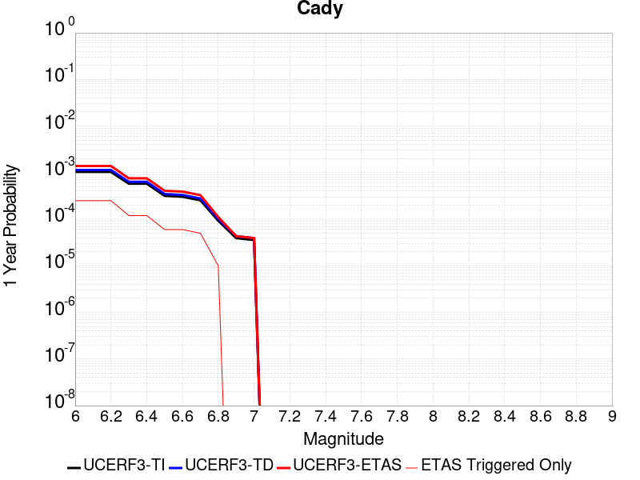 |  |

| Magnitude | 1 wk TI Prob | 1 wk TD Prob | 1 wk ETAS Prob | 1 wk ETAS/TD Gain | 1 wk ETAS Triggered Only | 1 mo TI Prob | 1 mo TD Prob | 1 mo ETAS Prob | 1 mo ETAS/TD Gain | 1 mo ETAS Triggered Only | 1 yr TI Prob | 1 yr TD Prob | 1 yr ETAS Prob | 1 yr ETAS/TD Gain | 1 yr ETAS Triggered Only | 10 yr TI Prob | 10 yr TD Prob | 10 yr ETAS Prob | 10 yr ETAS/TD Gain | 10 yr ETAS Triggered Only |
|-----|-----|-----|-----|-----|-----|-----|-----|-----|-----|-----|-----|-----|-----|-----|-----|-----|-----|-----|-----|-----|
| 6.0 | 1.9892565E-5 | 2.1858728E-5 | 2.1858728E-5 | 1.0 | 0.0 | 8.525106E-5 | 9.3677416E-5 | 2.1294816E-4 | 2.273207 | 1.19281925E-4 | 0.0010374374 | 0.0011400167 | 0.0013187357 | 1.1567687 | 1.7892288E-4 | 0.010326075 | 0.011350701 | 0.01164552 | 1.0259737 | 2.982048E-4 |
| 6.1 | 1.9892565E-5 | 2.1858728E-5 | 2.1858728E-5 | 1.0 | 0.0 | 8.525106E-5 | 9.3677416E-5 | 2.1294816E-4 | 2.273207 | 1.19281925E-4 | 0.0010374374 | 0.0011400167 | 0.0013187357 | 1.1567687 | 1.7892288E-4 | 0.010326075 | 0.011350701 | 0.01164552 | 1.0259737 | 2.982048E-4 |
| 6.2 | 1.9892565E-5 | 2.1858728E-5 | 2.1858728E-5 | 1.0 | 0.0 | 8.525106E-5 | 9.3677416E-5 | 2.1294816E-4 | 2.273207 | 1.19281925E-4 | 0.0010374374 | 0.0011400167 | 0.0013187357 | 1.1567687 | 1.7892288E-4 | 0.010326075 | 0.011350701 | 0.01164552 | 1.0259737 | 2.982048E-4 |
| 6.3 | 1.1117327E-5 | 1.2176583E-5 | 1.2176583E-5 | 1.0 | 0.0 | 4.764482E-5 | 5.2184492E-5 | 1.11822344E-4 | 2.142827 | 5.9640963E-5 | 5.7992124E-4 | 6.351925E-4 | 6.9479557E-4 | 1.0938346 | 5.9640963E-5 | 0.0057841022 | 0.0063368753 | 0.0065146643 | 1.0280563 | 1.7892288E-4 |
| 6.4 | 1.1117327E-5 | 1.2176583E-5 | 1.2176583E-5 | 1.0 | 0.0 | 4.764482E-5 | 5.2184492E-5 | 1.11822344E-4 | 2.142827 | 5.9640963E-5 | 5.7992124E-4 | 6.351925E-4 | 6.9479557E-4 | 1.0938346 | 5.9640963E-5 | 0.0057841022 | 0.0063368753 | 0.0065146643 | 1.0280563 | 1.7892288E-4 |
| 6.5 | 6.103093E-6 | 6.672021E-6 | 6.672021E-6 | 1.0 | 0.0 | 2.615585E-5 | 2.8594131E-5 | 2.8594131E-5 | 1.0 | 0.0 | 3.1840094E-4 | 3.480905E-4 | 3.480905E-4 | 1.0 | 0.0 | 0.0031794512 | 0.0034766865 | 0.0035361203 | 1.0170949 | 5.9640963E-5 |
| 6.6 | 5.817237E-6 | 6.3656585E-6 | 6.3656585E-6 | 1.0 | 0.0 | 2.4930776E-5 | 2.728118E-5 | 2.728118E-5 | 1.0 | 0.0 | 3.034899E-4 | 3.3211018E-4 | 3.3211018E-4 | 1.0 | 0.0 | 0.0030307577 | 0.0033173605 | 0.0033768036 | 1.0179188 | 5.9640963E-5 |
| 6.7 | 4.8846314E-6 | 5.3405684E-6 | 5.3405684E-6 | 1.0 | 0.0 | 2.0933967E-5 | 2.2888014E-5 | 2.2888014E-5 | 1.0 | 0.0 | 2.5484123E-4 | 2.7863772E-4 | 2.7863772E-4 | 1.0 | 0.0 | 0.0025454918 | 0.0027840391 | 0.0027840391 | 1.0 | 0.0 |
| 6.8 | 1.7788773E-6 | 1.9399079E-6 | 1.9399079E-6 | 1.0 | 0.0 | 7.6237375E-6 | 8.313874E-6 | 8.313874E-6 | 1.0 | 0.0 | 9.281505E-5 | 1.01218284E-4 | 1.01218284E-4 | 1.0 | 0.0 | 9.2776294E-4 | 0.0010118765 | 0.0010118765 | 1.0 | 0.0 |
| 6.9 | 7.5455404E-7 | 8.297092E-7 | 8.297092E-7 | 1.0 | 0.0 | 3.233799E-6 | 3.5558937E-6 | 3.5558937E-6 | 1.0 | 0.0 | 3.937079E-5 | 4.3292483E-5 | 4.3292483E-5 | 1.0 | 0.0 | 3.9363815E-4 | 4.3287344E-4 | 4.3287344E-4 | 1.0 | 0.0 |
| 7.0 | 6.8578805E-7 | 7.541816E-7 | 7.541816E-7 | 1.0 | 0.0 | 2.9390883E-6 | 3.2322048E-6 | 3.2322048E-6 | 1.0 | 0.0 | 3.578281E-5 | 3.9351715E-5 | 3.9351715E-5 | 1.0 | 0.0 | 3.577705E-4 | 3.9347992E-4 | 3.9347992E-4 | 1.0 | 0.0 |

## Santa Ynez (West)
*[(top)](#table-of-contents)*

| 1 Week | 1 Month | 1 Year | 10 Year |
|-----|-----|-----|-----|
| 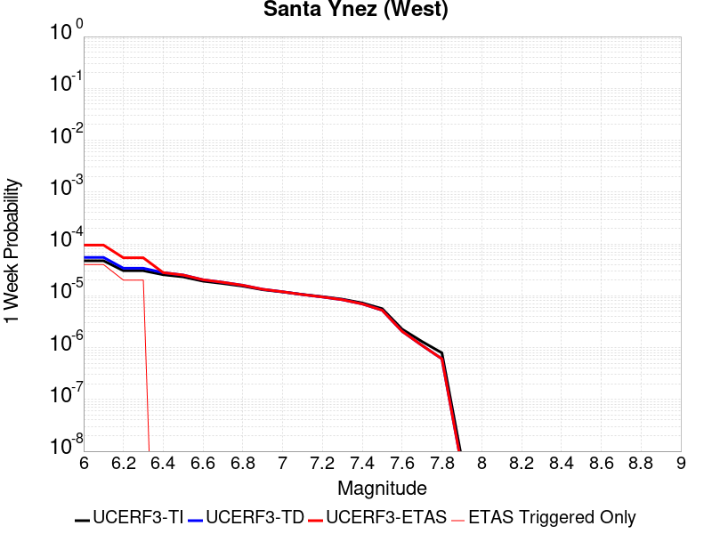 |  |  |  |

| Magnitude | 1 wk TI Prob | 1 wk TD Prob | 1 wk ETAS Prob | 1 wk ETAS/TD Gain | 1 wk ETAS Triggered Only | 1 mo TI Prob | 1 mo TD Prob | 1 mo ETAS Prob | 1 mo ETAS/TD Gain | 1 mo ETAS Triggered Only | 1 yr TI Prob | 1 yr TD Prob | 1 yr ETAS Prob | 1 yr ETAS/TD Gain | 1 yr ETAS Triggered Only | 10 yr TI Prob | 10 yr TD Prob | 10 yr ETAS Prob | 10 yr ETAS/TD Gain | 10 yr ETAS Triggered Only |
|-----|-----|-----|-----|-----|-----|-----|-----|-----|-----|-----|-----|-----|-----|-----|-----|-----|-----|-----|-----|-----|
| 6.0 | 4.7352758E-5 | 5.497084E-5 | 1.1460852E-4 | 2.0848968 | 5.9640963E-5 | 2.0292461E-4 | 2.3556968E-4 | 3.548235E-4 | 1.5062358 | 1.19281925E-4 | 0.0024678076 | 0.002864558 | 0.0031024385 | 1.0830426 | 2.3856385E-4 | 0.024405818 | 0.028304456 | 0.02859422 | 1.0102375 | 2.982048E-4 |
| 6.1 | 4.7352758E-5 | 5.497084E-5 | 1.1460852E-4 | 2.0848968 | 5.9640963E-5 | 2.0292461E-4 | 2.3556968E-4 | 3.548235E-4 | 1.5062358 | 1.19281925E-4 | 0.0024678076 | 0.002864558 | 0.0031024385 | 1.0830426 | 2.3856385E-4 | 0.024405818 | 0.028304456 | 0.02859422 | 1.0102375 | 2.982048E-4 |
| 6.2 | 3.0415853E-5 | 3.3925004E-5 | 9.356394E-5 | 2.7579641 | 5.9640963E-5 | 1.3034715E-4 | 1.4538495E-4 | 2.0501725E-4 | 1.4101682 | 5.9640963E-5 | 0.0015858212 | 0.0017686592 | 0.0019472656 | 1.1009841 | 1.7892288E-4 | 0.015745522 | 0.01754978 | 0.017784156 | 1.013355 | 2.3856385E-4 |
| 6.3 | 3.0415853E-5 | 3.3925004E-5 | 9.356394E-5 | 2.7579641 | 5.9640963E-5 | 1.3034715E-4 | 1.4538495E-4 | 2.0501725E-4 | 1.4101682 | 5.9640963E-5 | 0.0015858212 | 0.0017686592 | 0.0019472656 | 1.1009841 | 1.7892288E-4 | 0.015745522 | 0.01754978 | 0.017784156 | 1.013355 | 2.3856385E-4 |
| 6.4 | 2.5452082E-5 | 2.7912318E-5 | 2.7912318E-5 | 1.0 | 0.0 | 1.09075794E-4 | 1.1961885E-4 | 1.1961885E-4 | 1.0 | 0.0 | 0.0013271887 | 0.0014554056 | 0.0015745139 | 1.0818386 | 1.19281925E-4 | 0.013192902 | 0.01446091 | 0.014578467 | 1.0081292 | 1.19281925E-4 |
| 6.5 | 2.3143784E-5 | 2.5128133E-5 | 2.5128133E-5 | 1.0 | 0.0 | 9.9183875E-5 | 1.07687636E-4 | 1.07687636E-4 | 1.0 | 0.0 | 0.0012068948 | 0.001310323 | 0.0014294486 | 1.0909132 | 1.19281925E-4 | 0.012003611 | 0.013027638 | 0.013145366 | 1.0090368 | 1.19281925E-4 |
| 6.6 | 1.9118515E-5 | 2.0354244E-5 | 2.0354244E-5 | 1.0 | 0.0 | 8.193392E-5 | 8.722961E-5 | 8.722961E-5 | 1.0 | 0.0 | 9.97089E-4 | 0.001061511 | 0.0011806663 | 1.1122507 | 1.19281925E-4 | 0.00992627 | 0.010565317 | 0.010683338 | 1.0111706 | 1.19281925E-4 |
| 6.7 | 1.722807E-5 | 1.8146253E-5 | 1.8146253E-5 | 1.0 | 0.0 | 7.3832496E-5 | 7.776737E-5 | 7.776737E-5 | 1.0 | 0.0 | 8.985399E-4 | 9.4641204E-4 | 0.0010655811 | 1.1259166 | 1.19281925E-4 | 0.008949154 | 0.009424461 | 0.009542619 | 1.0125374 | 1.19281925E-4 |
| 6.8 | 1.5317364E-5 | 1.5926391E-5 | 1.5926391E-5 | 1.0 | 0.0 | 6.56442E-5 | 6.82542E-5 | 6.82542E-5 | 1.0 | 0.0 | 7.98925E-4 | 8.3068234E-4 | 8.902738E-4 | 1.0717379 | 5.9640963E-5 | 0.007960589 | 0.008276261 | 0.008335409 | 1.0071466 | 5.9640963E-5 |
| 6.9 | 1.3071226E-5 | 1.332953E-5 | 1.332953E-5 | 1.0 | 0.0 | 5.6018336E-5 | 5.712532E-5 | 5.712532E-5 | 1.0 | 0.0 | 6.8180985E-4 | 6.952811E-4 | 7.5488054E-4 | 1.08572 | 5.9640963E-5 | 0.0067972173 | 0.0069313184 | 0.006990546 | 1.0085449 | 5.9640963E-5 |
| 7.0 | 1.1836986E-5 | 1.1932688E-5 | 1.1932688E-5 | 1.0 | 0.0 | 5.0728955E-5 | 5.1139097E-5 | 5.1139097E-5 | 1.0 | 0.0 | 6.1745E-4 | 6.2244234E-4 | 6.820462E-4 | 1.095758 | 5.9640963E-5 | 0.006157372 | 0.0062071825 | 0.0062664533 | 1.0095488 | 5.9640963E-5 |
| 7.1 | 1.0597169E-5 | 1.0542107E-5 | 1.0542107E-5 | 1.0 | 0.0 | 4.541565E-5 | 4.5179684E-5 | 4.5179684E-5 | 1.0 | 0.0 | 5.5279525E-4 | 5.4992497E-4 | 6.095331E-4 | 1.1083933 | 5.9640963E-5 | 0.0055142213 | 0.005485772 | 0.0055450858 | 1.0108123 | 5.9640963E-5 |
| 7.2 | 9.59113E-6 | 9.45905E-6 | 9.45905E-6 | 1.0 | 0.0 | 4.11042E-5 | 4.053816E-5 | 4.053816E-5 | 1.0 | 0.0 | 5.0032866E-4 | 4.934414E-4 | 5.5305293E-4 | 1.1208078 | 5.9640963E-5 | 0.004992037 | 0.0049235765 | 0.0049829236 | 1.0120537 | 5.9640963E-5 |
| 7.3 | 8.586084E-6 | 8.379489E-6 | 8.379489E-6 | 1.0 | 0.0 | 3.679698E-5 | 3.591161E-5 | 3.591161E-5 | 1.0 | 0.0 | 4.4791115E-4 | 4.3713715E-4 | 4.9675204E-4 | 1.1363757 | 5.9640963E-5 | 0.004470094 | 0.004362884 | 0.0044222646 | 1.0136105 | 5.9640963E-5 |
| 7.4 | 7.2622997E-6 | 6.9514485E-6 | 6.9514485E-6 | 1.0 | 0.0 | 3.112377E-5 | 2.9791589E-5 | 2.9791589E-5 | 1.0 | 0.0 | 3.78866E-4 | 3.6265317E-4 | 4.222725E-4 | 1.1643976 | 5.9640963E-5 | 0.0037822074 | 0.003620714 | 0.003680139 | 1.0164125 | 5.9640963E-5 |
| 7.5 | 5.627296E-6 | 5.2514984E-6 | 5.2514984E-6 | 1.0 | 0.0 | 2.411676E-5 | 2.2506232E-5 | 2.2506232E-5 | 1.0 | 0.0 | 2.9358198E-4 | 2.7397962E-4 | 3.3360426E-4 | 1.2176243 | 5.9640963E-5 | 0.0029319443 | 0.0027364905 | 0.0027959682 | 1.0217351 | 5.9640963E-5 |
| 7.6 | 2.265244E-6 | 2.0608632E-6 | 2.0608632E-6 | 1.0 | 0.0 | 9.708152E-6 | 8.832241E-6 | 8.832241E-6 | 1.0 | 0.0 | 1.18190335E-4 | 1.0752732E-4 | 1.6716187E-4 | 1.554599 | 5.9640963E-5 | 0.001181275 | 0.0010747615 | 0.0011343383 | 1.0554327 | 5.9640963E-5 |
| 7.7 | 1.3099874E-6 | 1.1016228E-6 | 1.1016228E-6 | 1.0 | 0.0 | 5.61422E-6 | 4.7212325E-6 | 4.7212325E-6 | 1.0 | 0.0 | 6.8350986E-5 | 5.7479516E-5 | 1.17117044E-4 | 2.0375443 | 5.9640963E-5 | 6.832996E-4 | 5.7464885E-4 | 6.342556E-4 | 1.1037271 | 5.9640963E-5 |
| 7.8 | 7.903951E-7 | 6.0710704E-7 | 6.0710704E-7 | 1.0 | 0.0 | 3.3874032E-6 | 2.601885E-6 | 2.601885E-6 | 1.0 | 0.0 | 4.1240855E-5 | 3.16775E-5 | 3.16775E-5 | 1.0 | 0.0 | 4.12332E-4 | 3.167312E-4 | 3.167312E-4 | 1.0 | 0.0 |
| 7.9 | 7.0753297E-9 | 5.090092E-9 | 5.090092E-9 | 1.0 | 0.0 | 3.032284E-8 | 2.181468E-8 | 2.181468E-8 | 1.0 | 0.0 | 3.6918053E-7 | 2.655937E-7 | 2.655937E-7 | 1.0 | 0.0 | 3.691799E-6 | 2.6559348E-6 | 2.6559348E-6 | 1.0 | 0.0 |

## Whittier alt 1
*[(top)](#table-of-contents)*

| 1 Week | 1 Month | 1 Year | 10 Year |
|-----|-----|-----|-----|
|  |  |  |  |

| Magnitude | 1 wk TI Prob | 1 wk TD Prob | 1 wk ETAS Prob | 1 wk ETAS/TD Gain | 1 wk ETAS Triggered Only | 1 mo TI Prob | 1 mo TD Prob | 1 mo ETAS Prob | 1 mo ETAS/TD Gain | 1 mo ETAS Triggered Only | 1 yr TI Prob | 1 yr TD Prob | 1 yr ETAS Prob | 1 yr ETAS/TD Gain | 1 yr ETAS Triggered Only | 10 yr TI Prob | 10 yr TD Prob | 10 yr ETAS Prob | 10 yr ETAS/TD Gain | 10 yr ETAS Triggered Only |
|-----|-----|-----|-----|-----|-----|-----|-----|-----|-----|-----|-----|-----|-----|-----|-----|-----|-----|-----|-----|-----|
| 6.0 | 4.2554693E-5 | 4.7252182E-5 | 1.0689033E-4 | 2.2621245 | 5.9640963E-5 | 1.8236451E-4 | 2.0249544E-4 | 2.6212432E-4 | 1.2944703 | 5.9640963E-5 | 0.002218027 | 0.0024629163 | 0.0026413987 | 1.0724678 | 1.7892288E-4 | 0.02196019 | 0.024390263 | 0.024564823 | 1.007157 | 1.7892288E-4 |
| 6.1 | 4.2554693E-5 | 4.7252182E-5 | 1.0689033E-4 | 2.2621245 | 5.9640963E-5 | 1.8236451E-4 | 2.0249544E-4 | 2.6212432E-4 | 1.2944703 | 5.9640963E-5 | 0.002218027 | 0.0024629163 | 0.0026413987 | 1.0724678 | 1.7892288E-4 | 0.02196019 | 0.024390263 | 0.024564823 | 1.007157 | 1.7892288E-4 |
| 6.2 | 4.2554693E-5 | 4.7252182E-5 | 1.0689033E-4 | 2.2621245 | 5.9640963E-5 | 1.8236451E-4 | 2.0249544E-4 | 2.6212432E-4 | 1.2944703 | 5.9640963E-5 | 0.002218027 | 0.0024629163 | 0.0026413987 | 1.0724678 | 1.7892288E-4 | 0.02196019 | 0.024390263 | 0.024564823 | 1.007157 | 1.7892288E-4 |
| 6.3 | 1.9617712E-5 | 1.826841E-5 | 1.826841E-5 | 1.0 | 0.0 | 8.40732E-5 | 7.829095E-5 | 7.829095E-5 | 1.0 | 0.0 | 0.0010231105 | 9.527944E-4 | 9.527944E-4 | 1.0 | 0.0 | 0.01018413 | 0.0094904 | 0.0094904 | 1.0 | 0.0 |
| 6.4 | 1.5611336E-5 | 1.3604089E-5 | 1.3604089E-5 | 1.0 | 0.0 | 6.690401E-5 | 5.8301972E-5 | 5.8301972E-5 | 1.0 | 0.0 | 8.142519E-4 | 7.096013E-4 | 7.096013E-4 | 1.0 | 0.0 | 0.008112748 | 0.0070753377 | 0.0070753377 | 1.0 | 0.0 |
| 6.5 | 1.5150166E-5 | 1.3100744E-5 | 1.3100744E-5 | 1.0 | 0.0 | 6.492767E-5 | 5.614487E-5 | 5.614487E-5 | 1.0 | 0.0 | 7.9020765E-4 | 6.8335526E-4 | 6.8335526E-4 | 1.0 | 0.0 | 0.007874036 | 0.006814508 | 0.006814508 | 1.0 | 0.0 |
| 6.6 | 1.295588E-5 | 1.0380544E-5 | 1.0380544E-5 | 1.0 | 0.0 | 5.552402E-5 | 4.44873E-5 | 4.44873E-5 | 1.0 | 0.0 | 6.7579525E-4 | 5.415002E-4 | 5.415002E-4 | 1.0 | 0.0 | 0.006737438 | 0.005403343 | 0.005403343 | 1.0 | 0.0 |
| 6.7 | 1.2542085E-5 | 9.899189E-6 | 9.899189E-6 | 1.0 | 0.0 | 5.3750682E-5 | 4.2424414E-5 | 4.2424414E-5 | 1.0 | 0.0 | 6.542181E-4 | 5.163967E-4 | 5.163967E-4 | 1.0 | 0.0 | 0.006522954 | 0.005153464 | 0.005153464 | 1.0 | 0.0 |
| 6.8 | 1.2195878E-5 | 9.49523E-6 | 9.49523E-6 | 1.0 | 0.0 | 5.2267E-5 | 4.069322E-5 | 4.069322E-5 | 1.0 | 0.0 | 6.36165E-4 | 4.9532915E-4 | 4.9532915E-4 | 1.0 | 0.0 | 0.0063434686 | 0.0049436963 | 0.0049436963 | 1.0 | 0.0 |
| 6.9 | 1.1580298E-5 | 8.772739E-6 | 8.772739E-6 | 1.0 | 0.0 | 4.9628903E-5 | 3.759692E-5 | 3.759692E-5 | 1.0 | 0.0 | 6.040644E-4 | 4.5764804E-4 | 4.5764804E-4 | 1.0 | 0.0 | 0.00602425 | 0.0045684646 | 0.0045684646 | 1.0 | 0.0 |
| 7.0 | 1.0964795E-5 | 8.083794E-6 | 8.083794E-6 | 1.0 | 0.0 | 4.6991136E-5 | 3.4644378E-5 | 3.4644378E-5 | 1.0 | 0.0 | 5.7196687E-4 | 4.217152E-4 | 4.217152E-4 | 1.0 | 0.0 | 0.0057049696 | 0.004210459 | 0.004210459 | 1.0 | 0.0 |
| 7.1 | 1.0230601E-5 | 7.32646E-6 | 7.32646E-6 | 1.0 | 0.0 | 4.3844695E-5 | 3.1398744E-5 | 3.1398744E-5 | 1.0 | 0.0 | 5.336784E-4 | 3.8221394E-4 | 3.8221394E-4 | 1.0 | 0.0 | 0.005323986 | 0.0038167592 | 0.0038167592 | 1.0 | 0.0 |
| 7.2 | 9.40865E-6 | 6.5430822E-6 | 6.5430822E-6 | 1.0 | 0.0 | 4.032216E-5 | 2.8041486E-5 | 2.8041486E-5 | 1.0 | 0.0 | 4.908117E-4 | 3.4135283E-4 | 3.4135283E-4 | 1.0 | 0.0 | 0.0048972913 | 0.0034094024 | 0.0034094024 | 1.0 | 0.0 |
| 7.3 | 8.237384E-6 | 5.5975433E-6 | 5.5975433E-6 | 1.0 | 0.0 | 3.5302593E-5 | 2.3989258E-5 | 2.3989258E-5 | 1.0 | 0.0 | 4.2972428E-4 | 2.920311E-4 | 2.920311E-4 | 1.0 | 0.0 | 0.0042889426 | 0.0029167992 | 0.0029167992 | 1.0 | 0.0 |
| 7.4 | 7.5316966E-6 | 5.0276153E-6 | 5.0276153E-6 | 1.0 | 0.0 | 3.2278298E-5 | 2.154675E-5 | 2.154675E-5 | 1.0 | 0.0 | 3.9291743E-4 | 2.623011E-4 | 2.623011E-4 | 1.0 | 0.0 | 0.0039222343 | 0.0026200267 | 0.0026200267 | 1.0 | 0.0 |
| 7.5 | 6.149649E-6 | 3.9336355E-6 | 3.9336355E-6 | 1.0 | 0.0 | 2.6355372E-5 | 1.6858336E-5 | 1.6858336E-5 | 1.0 | 0.0 | 3.208294E-4 | 2.052318E-4 | 2.052318E-4 | 1.0 | 0.0 | 0.003203666 | 0.0020505118 | 0.0020505118 | 1.0 | 0.0 |
| 7.6 | 5.457711E-6 | 3.3951796E-6 | 3.3951796E-6 | 1.0 | 0.0 | 2.338998E-5 | 1.4550694E-5 | 1.4550694E-5 | 1.0 | 0.0 | 2.8473578E-4 | 1.771411E-4 | 1.771411E-4 | 1.0 | 0.0 | 0.0028437122 | 0.0017700798 | 0.0017700798 | 1.0 | 0.0 |
| 7.7 | 4.1676276E-6 | 2.3329922E-6 | 2.3329922E-6 | 1.0 | 0.0 | 1.7861139E-5 | 9.998504E-6 | 9.998504E-6 | 1.0 | 0.0 | 2.1743766E-4 | 1.2172572E-4 | 1.2172572E-4 | 1.0 | 0.0 | 0.0021722503 | 0.0012166635 | 0.0012166635 | 1.0 | 0.0 |
| 7.8 | 2.2692414E-7 | 9.384417E-8 | 9.384417E-8 | 1.0 | 0.0 | 9.725317E-7 | 4.0218927E-7 | 4.0218927E-7 | 1.0 | 0.0 | 1.1840509E-5 | 4.8966467E-6 | 4.8966467E-6 | 1.0 | 0.0 | 1.1839878E-4 | 4.8965718E-5 | 4.8965718E-5 | 1.0 | 0.0 |
| 7.9 | 6.676829E-9 | 3.4397174E-9 | 3.4397174E-9 | 1.0 | 0.0 | 2.861498E-8 | 1.4741646E-8 | 1.4741646E-8 | 1.0 | 0.0 | 3.4838732E-7 | 1.7947953E-7 | 1.7947953E-7 | 1.0 | 0.0 | 3.4838679E-6 | 1.794794E-6 | 1.794794E-6 | 1.0 | 0.0 |

## Lake Isabella (Seismicity)
*[(top)](#table-of-contents)*

| 1 Week | 1 Month | 1 Year | 10 Year |
|-----|-----|-----|-----|
| 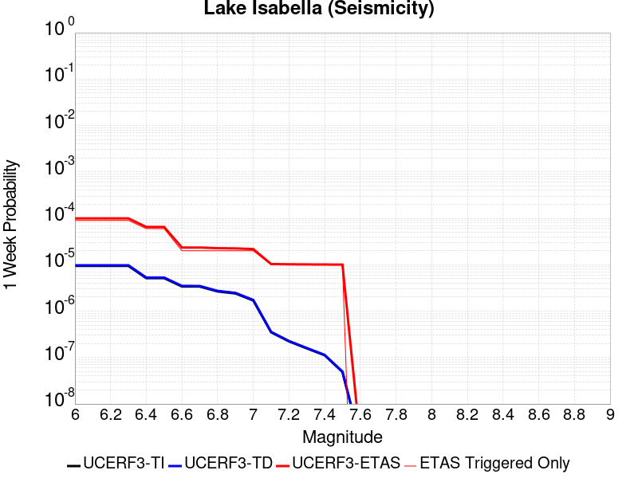 |  | 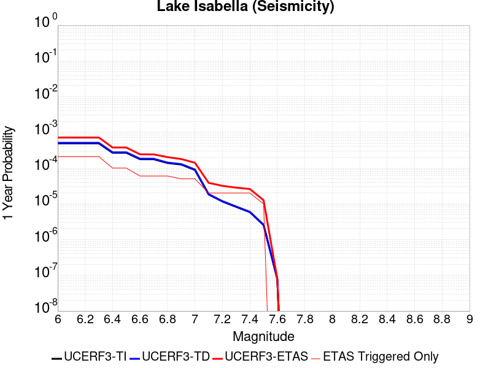 |  |

| Magnitude | 1 wk TI Prob | 1 wk TD Prob | 1 wk ETAS Prob | 1 wk ETAS/TD Gain | 1 wk ETAS Triggered Only | 1 mo TI Prob | 1 mo TD Prob | 1 mo ETAS Prob | 1 mo ETAS/TD Gain | 1 mo ETAS Triggered Only | 1 yr TI Prob | 1 yr TD Prob | 1 yr ETAS Prob | 1 yr ETAS/TD Gain | 1 yr ETAS Triggered Only | 10 yr TI Prob | 10 yr TD Prob | 10 yr ETAS Prob | 10 yr ETAS/TD Gain | 10 yr ETAS Triggered Only |
|-----|-----|-----|-----|-----|-----|-----|-----|-----|-----|-----|-----|-----|-----|-----|-----|-----|-----|-----|-----|-----|
| 6.0 | 9.431637E-6 | 9.741651E-6 | 6.938203E-5 | 7.1222043 | 5.9640963E-5 | 4.0420677E-5 | 4.1749343E-5 | 1.0138781E-4 | 2.428489 | 5.9640963E-5 | 4.920106E-4 | 5.0819275E-4 | 5.678034E-4 | 1.1172993 | 5.9640963E-5 | 0.004909227 | 0.005071599 | 0.0053089526 | 1.0468006 | 2.3856385E-4 |
| 6.1 | 9.431637E-6 | 9.741651E-6 | 6.938203E-5 | 7.1222043 | 5.9640963E-5 | 4.0420677E-5 | 4.1749343E-5 | 1.0138781E-4 | 2.428489 | 5.9640963E-5 | 4.920106E-4 | 5.0819275E-4 | 5.678034E-4 | 1.1172993 | 5.9640963E-5 | 0.004909227 | 0.005071599 | 0.0053089526 | 1.0468006 | 2.3856385E-4 |
| 6.2 | 9.431637E-6 | 9.741651E-6 | 6.938203E-5 | 7.1222043 | 5.9640963E-5 | 4.0420677E-5 | 4.1749343E-5 | 1.0138781E-4 | 2.428489 | 5.9640963E-5 | 4.920106E-4 | 5.0819275E-4 | 5.678034E-4 | 1.1172993 | 5.9640963E-5 | 0.004909227 | 0.005071599 | 0.0053089526 | 1.0468006 | 2.3856385E-4 |
| 6.3 | 9.431637E-6 | 9.741651E-6 | 6.938203E-5 | 7.1222043 | 5.9640963E-5 | 4.0420677E-5 | 4.1749343E-5 | 1.0138781E-4 | 2.428489 | 5.9640963E-5 | 4.920106E-4 | 5.0819275E-4 | 5.678034E-4 | 1.1172993 | 5.9640963E-5 | 0.004909227 | 0.005071599 | 0.0053089526 | 1.0468006 | 2.3856385E-4 |
| 6.4 | 5.144063E-6 | 5.3000763E-6 | 6.494072E-5 | 12.25279 | 5.9640963E-5 | 2.2045799E-5 | 2.2714434E-5 | 8.235404E-5 | 3.6256258 | 5.9640963E-5 | 2.6837454E-4 | 2.765166E-4 | 3.3614106E-4 | 1.2156271 | 5.9640963E-5 | 0.0026805066 | 0.0027620657 | 0.0028810182 | 1.0430665 | 1.19281925E-4 |
| 6.5 | 5.144063E-6 | 5.3000763E-6 | 6.494072E-5 | 12.25279 | 5.9640963E-5 | 2.2045799E-5 | 2.2714434E-5 | 8.235404E-5 | 3.6256258 | 5.9640963E-5 | 2.6837454E-4 | 2.765166E-4 | 3.3614106E-4 | 1.2156271 | 5.9640963E-5 | 0.0026805066 | 0.0027620657 | 0.0028810182 | 1.0430665 | 1.19281925E-4 |
| 6.6 | 3.4009804E-6 | 3.498786E-6 | 3.498786E-6 | 1.0 | 0.0 | 1.4575549E-5 | 1.4994721E-5 | 1.4994721E-5 | 1.0 | 0.0 | 1.7744285E-4 | 1.8254704E-4 | 1.8254704E-4 | 1.0 | 0.0 | 0.0017730123 | 0.0018241286 | 0.0018836608 | 1.0326359 | 5.9640963E-5 |
| 6.7 | 3.3880428E-6 | 3.4856528E-6 | 3.4856528E-6 | 1.0 | 0.0 | 1.4520103E-5 | 1.4938435E-5 | 1.4938435E-5 | 1.0 | 0.0 | 1.767679E-4 | 1.8186188E-4 | 1.8186188E-4 | 1.0 | 0.0 | 0.0017662736 | 0.0018172882 | 0.0018768208 | 1.0327591 | 5.9640963E-5 |
| 6.8 | 2.6582E-6 | 2.7337003E-6 | 2.7337003E-6 | 1.0 | 0.0 | 1.1392236E-5 | 1.1715813E-5 | 1.1715813E-5 | 1.0 | 0.0 | 1.3869164E-4 | 1.4263204E-4 | 1.4263204E-4 | 1.0 | 0.0 | 0.0013860512 | 0.0014255369 | 0.0014850929 | 1.0417778 | 5.9640963E-5 |
| 6.9 | 2.406011E-6 | 2.4743288E-6 | 2.4743288E-6 | 1.0 | 0.0 | 1.0311434E-5 | 1.0604231E-5 | 1.0604231E-5 | 1.0 | 0.0 | 1.2553448E-4 | 1.2910018E-4 | 1.2910018E-4 | 1.0 | 0.0 | 0.0012546359 | 0.0012903814 | 0.0013499454 | 1.04616 | 5.9640963E-5 |
| 7.0 | 1.6953097E-6 | 1.7429371E-6 | 1.7429371E-6 | 1.0 | 0.0 | 7.265593E-6 | 7.469715E-6 | 7.469715E-6 | 1.0 | 0.0 | 8.8455E-5 | 9.094104E-5 | 9.094104E-5 | 1.0 | 0.0 | 8.84198E-4 | 9.09141E-4 | 9.687277E-4 | 1.0655419 | 5.9640963E-5 |
| 7.1 | 3.5013824E-7 | 3.5714822E-7 | 3.5714822E-7 | 1.0 | 0.0 | 1.5005916E-6 | 1.5306344E-6 | 1.5306344E-6 | 1.0 | 0.0 | 1.826955E-5 | 1.8635317E-5 | 1.8635317E-5 | 1.0 | 0.0 | 1.8268047E-4 | 1.863378E-4 | 1.863378E-4 | 1.0 | 0.0 |
| 7.2 | 2.2321095E-7 | 2.2750574E-7 | 2.2750574E-7 | 1.0 | 0.0 | 9.56618E-7 | 9.750242E-7 | 9.750242E-7 | 1.0 | 0.0 | 1.1646762E-5 | 1.1870856E-5 | 1.1870856E-5 | 1.0 | 0.0 | 1.1646151E-4 | 1.1870232E-4 | 1.1870232E-4 | 1.0 | 0.0 |
| 7.3 | 1.5760406E-7 | 1.6060922E-7 | 1.6060922E-7 | 1.0 | 0.0 | 6.7544585E-7 | 6.8832503E-7 | 6.8832503E-7 | 1.0 | 0.0 | 8.223522E-6 | 8.380326E-6 | 8.380326E-6 | 1.0 | 0.0 | 8.2232174E-5 | 8.3800165E-5 | 8.3800165E-5 | 1.0 | 0.0 |
| 7.4 | 1.1216497E-7 | 1.1431706E-7 | 1.1431706E-7 | 1.0 | 0.0 | 4.8070694E-7 | 4.899302E-7 | 4.899302E-7 | 1.0 | 0.0 | 5.852591E-6 | 5.964884E-6 | 5.964884E-6 | 1.0 | 0.0 | 5.8524372E-5 | 5.9647282E-5 | 5.9647282E-5 | 1.0 | 0.0 |
| 7.5 | 4.885185E-8 | 4.9787737E-8 | 4.9787737E-8 | 1.0 | 0.0 | 2.0936506E-7 | 2.13376E-7 | 2.13376E-7 | 1.0 | 0.0 | 2.5490165E-6 | 2.59785E-6 | 2.59785E-6 | 1.0 | 0.0 | 2.5489873E-5 | 2.5978214E-5 | 2.5978214E-5 | 1.0 | 0.0 |
| 7.6 | 1.504641E-9 | 1.5317903E-9 | 1.5317903E-9 | 1.0 | 0.0 | 6.4484613E-9 | 6.5648154E-9 | 6.5648154E-9 | 1.0 | 0.0 | 7.851001E-8 | 7.992663E-8 | 7.992663E-8 | 1.0 | 0.0 | 7.8509987E-7 | 7.992663E-7 | 7.992663E-7 | 1.0 | 0.0 |

## San Andreas (Coachella) rev
*[(top)](#table-of-contents)*

| 1 Week | 1 Month | 1 Year | 10 Year |
|-----|-----|-----|-----|
|  | 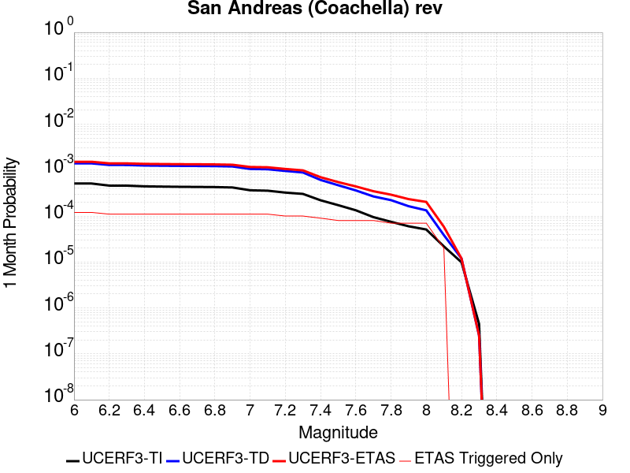 |  |  |

| Magnitude | 1 wk TI Prob | 1 wk TD Prob | 1 wk ETAS Prob | 1 wk ETAS/TD Gain | 1 wk ETAS Triggered Only | 1 mo TI Prob | 1 mo TD Prob | 1 mo ETAS Prob | 1 mo ETAS/TD Gain | 1 mo ETAS Triggered Only | 1 yr TI Prob | 1 yr TD Prob | 1 yr ETAS Prob | 1 yr ETAS/TD Gain | 1 yr ETAS Triggered Only | 10 yr TI Prob | 10 yr TD Prob | 10 yr ETAS Prob | 10 yr ETAS/TD Gain | 10 yr ETAS Triggered Only |
|-----|-----|-----|-----|-----|-----|-----|-----|-----|-----|-----|-----|-----|-----|-----|-----|-----|-----|-----|-----|-----|
| 6.0 | 1.1925945E-4 | 3.273077E-4 | 3.8692914E-4 | 1.1821572 | 5.9640963E-5 | 5.110118E-4 | 0.001401998 | 0.0015211126 | 1.0849607 | 1.19281925E-4 | 0.0062038354 | 0.016937068 | 0.017054329 | 1.0069233 | 1.19281925E-4 | 0.060334753 | 0.15267672 | 0.15287885 | 1.0013239 | 2.3856385E-4 |
| 6.1 | 1.1925945E-4 | 3.273077E-4 | 3.8692914E-4 | 1.1821572 | 5.9640963E-5 | 5.110118E-4 | 0.001401998 | 0.0015211126 | 1.0849607 | 1.19281925E-4 | 0.0062038354 | 0.016937068 | 0.017054329 | 1.0069233 | 1.19281925E-4 | 0.060334753 | 0.15267672 | 0.15287885 | 1.0013239 | 2.3856385E-4 |
| 6.2 | 1.07432395E-4 | 3.0231563E-4 | 3.6193855E-4 | 1.1972208 | 5.9640963E-5 | 4.603433E-4 | 0.001294999 | 0.0013545628 | 1.0459952 | 5.9640963E-5 | 0.005590286 | 0.015653731 | 0.015712438 | 1.0037503 | 5.9640963E-5 | 0.05451731 | 0.14182784 | 0.14198138 | 1.0010827 | 1.7892288E-4 |
| 6.3 | 1.0718766E-4 | 3.0176868E-4 | 3.6139163E-4 | 1.1975784 | 5.9640963E-5 | 4.592948E-4 | 0.0012926573 | 0.0013522212 | 1.0460786 | 5.9640963E-5 | 0.005577586 | 0.01562563 | 0.015684338 | 1.0037572 | 5.9640963E-5 | 0.054396555 | 0.14159605 | 0.14174965 | 1.0010847 | 1.7892288E-4 |
| 6.4 | 1.0355944E-4 | 2.9384956E-4 | 3.5347298E-4 | 1.2029046 | 5.9640963E-5 | 4.4375064E-4 | 0.0012587514 | 0.0013183173 | 1.0473214 | 5.9640963E-5 | 0.0053892885 | 0.015218662 | 0.015277396 | 1.0038593 | 5.9640963E-5 | 0.052604496 | 0.13815795 | 0.13831216 | 1.0011162 | 1.7892288E-4 |
| 6.5 | 1.0227914E-4 | 2.9104383E-4 | 3.5066745E-4 | 1.2048613 | 5.9640963E-5 | 4.382655E-4 | 0.0012467385 | 0.001306305 | 1.0477779 | 5.9640963E-5 | 0.0053228354 | 0.015074439 | 0.015133181 | 1.0038968 | 5.9640963E-5 | 0.051971316 | 0.13694239 | 0.1370968 | 1.0011276 | 1.7892288E-4 |
| 6.6 | 1.0116757E-4 | 2.8870135E-4 | 3.483251E-4 | 1.2065239 | 5.9640963E-5 | 4.3350324E-4 | 0.0012367087 | 0.0012962759 | 1.0481659 | 5.9640963E-5 | 0.0052651367 | 0.014954008 | 0.015012758 | 1.0039287 | 5.9640963E-5 | 0.051421247 | 0.13591973 | 0.13607435 | 1.0011375 | 1.7892288E-4 |
| 6.7 | 1.0050676E-4 | 2.8728697E-4 | 3.469108E-4 | 1.207541 | 5.9640963E-5 | 4.3067214E-4 | 0.0012306528 | 0.0012902204 | 1.0484033 | 5.9640963E-5 | 0.005230834 | 0.014881288 | 0.014940041 | 1.0039481 | 5.9640963E-5 | 0.051094085 | 0.13530464 | 0.13545936 | 1.0011435 | 1.7892288E-4 |
| 6.8 | 9.976819E-5 | 2.8532353E-4 | 3.4494748E-4 | 1.2089696 | 5.9640963E-5 | 4.2750788E-4 | 0.001222246 | 0.0012818141 | 1.0487366 | 5.9640963E-5 | 0.0051924936 | 0.014780328 | 0.014839088 | 1.0039755 | 5.9640963E-5 | 0.050728295 | 0.13445628 | 0.13461114 | 1.0011518 | 1.7892288E-4 |
| 6.9 | 9.77719E-5 | 2.802926E-4 | 3.3991682E-4 | 1.2127215 | 5.9640963E-5 | 4.1895514E-4 | 0.0012007048 | 0.0012602742 | 1.049612 | 5.9640963E-5 | 0.0050888555 | 0.0145215895 | 0.014580364 | 1.0040474 | 5.9640963E-5 | 0.049738888 | 0.13228476 | 0.13244002 | 1.0011736 | 1.7892288E-4 |
| 7.0 | 8.500761E-5 | 2.4763815E-4 | 3.0726433E-4 | 1.2407795 | 5.9640963E-5 | 3.6426744E-4 | 0.0010608779 | 0.0011204556 | 1.0561589 | 5.9640963E-5 | 0.0044259406 | 0.01284047 | 0.012899346 | 1.0045851 | 5.9640963E-5 | 0.04338823 | 0.11813616 | 0.11829394 | 1.0013356 | 1.7892288E-4 |
| 7.1 | 8.319876E-5 | 2.4366553E-4 | 3.0329195E-4 | 1.244706 | 5.9640963E-5 | 3.5651738E-4 | 0.0010438662 | 0.0011034448 | 1.057075 | 5.9640963E-5 | 0.004331963 | 0.012635773 | 0.012694661 | 1.0046604 | 5.9640963E-5 | 0.042484846 | 0.11635632 | 0.11651442 | 1.0013587 | 1.7892288E-4 |
| 7.2 | 7.563917E-5 | 2.2414974E-4 | 2.8377734E-4 | 1.2660167 | 5.9640963E-5 | 3.2412758E-4 | 9.602912E-4 | 0.0010198748 | 1.0620475 | 5.9640963E-5 | 0.0039391145 | 0.011629559 | 0.011688507 | 1.0050688 | 5.9640963E-5 | 0.03870018 | 0.10776202 | 0.10792165 | 1.0014814 | 1.7892288E-4 |
| 7.3 | 7.082985E-5 | 2.07311E-4 | 2.669396E-4 | 1.2876288 | 5.9640963E-5 | 3.0352117E-4 | 8.881761E-4 | 9.477641E-4 | 1.0670903 | 5.9640963E-5 | 0.0036891096 | 0.010760553 | 0.0108195525 | 1.0054829 | 5.9640963E-5 | 0.03628465 | 0.10028403 | 0.10044501 | 1.0016053 | 1.7892288E-4 |
| 7.4 | 5.146215E-5 | 1.4274761E-4 | 2.0238006E-4 | 1.4177474 | 5.9640963E-5 | 2.2053342E-4 | 6.1163295E-4 | 6.712374E-4 | 1.0974514 | 5.9640963E-5 | 0.0026816884 | 0.0074213943 | 0.0074805925 | 1.0079768 | 5.9640963E-5 | 0.02649557 | 0.07085049 | 0.07101674 | 1.0023464 | 1.7892288E-4 |
| 7.5 | 4.0285166E-5 | 1.0942422E-4 | 1.6905865E-4 | 1.5449839 | 5.9640963E-5 | 1.7263928E-4 | 4.6887697E-4 | 5.2848994E-4 | 1.1271399 | 5.9640963E-5 | 0.002099857 | 0.0056937044 | 0.005753006 | 1.0104152 | 5.9640963E-5 | 0.020801254 | 0.055013083 | 0.055182163 | 1.0030735 | 1.7892288E-4 |
| 7.6 | 3.1168736E-5 | 8.439599E-5 | 1.4403192E-4 | 1.7066203 | 5.9640963E-5 | 1.3357346E-4 | 3.616471E-4 | 4.212665E-4 | 1.1648551 | 5.9640963E-5 | 0.0016250437 | 0.004394191 | 0.0044535697 | 1.0135131 | 5.9640963E-5 | 0.016132116 | 0.042812478 | 0.04292665 | 1.0026668 | 1.19281925E-4 |
| 7.7 | 2.2100989E-5 | 6.239345E-5 | 1.2203069E-4 | 1.9558253 | 5.9640963E-5 | 9.4715084E-5 | 2.6737314E-4 | 3.2699815E-4 | 1.223003 | 5.9640963E-5 | 0.001152546 | 0.0032504152 | 0.0033098622 | 1.0182891 | 5.9640963E-5 | 0.011465867 | 0.031902168 | 0.03201765 | 1.0036197 | 1.19281925E-4 |
| 7.8 | 1.7484861E-5 | 5.180078E-5 | 1.11438654E-4 | 2.1512928 | 5.9640963E-5 | 7.493296E-5 | 2.2198448E-4 | 2.8161219E-4 | 1.2686121 | 5.9640963E-5 | 9.1192697E-4 | 0.0026993142 | 0.0027587942 | 1.0220352 | 5.9640963E-5 | 0.009081938 | 0.026641788 | 0.026757892 | 1.0043579 | 1.19281925E-4 |
| 7.9 | 1.3967285E-5 | 3.8226146E-5 | 9.786483E-5 | 2.5601542 | 5.9640963E-5 | 5.985842E-5 | 1.6381606E-4 | 2.2344725E-4 | 1.3640131 | 5.9640963E-5 | 7.2853256E-4 | 0.0019926373 | 0.0020521595 | 1.029871 | 5.9640963E-5 | 0.0072614877 | 0.019911002 | 0.02002791 | 1.0058714 | 1.19281925E-4 |
| 8.0 | 1.1887396E-5 | 3.106798E-5 | 9.0707086E-5 | 2.9196327 | 5.9640963E-5 | 5.094499E-5 | 1.331417E-4 | 1.9277472E-4 | 1.4478914 | 5.9640963E-5 | 6.200787E-4 | 0.0016197958 | 0.0016793401 | 1.0367604 | 5.9640963E-5 | 0.006183513 | 0.016280567 | 0.016397906 | 1.0072074 | 1.19281925E-4 |
| 8.1 | 5.100864E-6 | 8.973766E-6 | 8.973766E-6 | 1.0 | 0.0 | 2.1860664E-5 | 3.845843E-5 | 3.845843E-5 | 1.0 | 0.0 | 2.6612106E-4 | 4.6813092E-4 | 4.6813092E-4 | 1.0 | 0.0 | 0.002658026 | 0.004918092 | 0.004918092 | 1.0 | 0.0 |
| 8.2 | 2.3004484E-6 | 2.7863473E-6 | 2.7863473E-6 | 1.0 | 0.0 | 9.859027E-6 | 1.19414335E-5 | 1.19414335E-5 | 1.0 | 0.0 | 1.2002704E-4 | 1.4537729E-4 | 1.4537729E-4 | 1.0 | 0.0 | 0.0011996223 | 0.0015973782 | 0.0015973782 | 1.0 | 0.0 |
| 8.3 | 1.0424446E-7 | 5.814421E-8 | 5.814421E-8 | 1.0 | 0.0 | 4.4676187E-7 | 2.4918944E-7 | 2.4918944E-7 | 1.0 | 0.0 | 5.439312E-6 | 3.0338776E-6 | 3.0338776E-6 | 1.0 | 0.0 | 5.4391792E-5 | 3.189592E-5 | 3.189592E-5 | 1.0 | 0.0 |

## Santa Cruz Island
*[(top)](#table-of-contents)*

| 1 Week | 1 Month | 1 Year | 10 Year |
|-----|-----|-----|-----|
|  |  |  |  |

| Magnitude | 1 wk TI Prob | 1 wk TD Prob | 1 wk ETAS Prob | 1 wk ETAS/TD Gain | 1 wk ETAS Triggered Only | 1 mo TI Prob | 1 mo TD Prob | 1 mo ETAS Prob | 1 mo ETAS/TD Gain | 1 mo ETAS Triggered Only | 1 yr TI Prob | 1 yr TD Prob | 1 yr ETAS Prob | 1 yr ETAS/TD Gain | 1 yr ETAS Triggered Only | 10 yr TI Prob | 10 yr TD Prob | 10 yr ETAS Prob | 10 yr ETAS/TD Gain | 10 yr ETAS Triggered Only |
|-----|-----|-----|-----|-----|-----|-----|-----|-----|-----|-----|-----|-----|-----|-----|-----|-----|-----|-----|-----|-----|
| 6.0 | 2.9164563E-5 | 3.1599742E-5 | 9.123882E-5 | 2.887328 | 5.9640963E-5 | 1.2498499E-4 | 1.3542121E-4 | 1.9505409E-4 | 1.4403511 | 5.9640963E-5 | 0.0015206301 | 0.0016476426 | 0.0017667279 | 1.0722762 | 1.19281925E-4 | 0.015102667 | 0.016368 | 0.01648533 | 1.0071682 | 1.19281925E-4 |
| 6.1 | 2.9164563E-5 | 3.1599742E-5 | 9.123882E-5 | 2.887328 | 5.9640963E-5 | 1.2498499E-4 | 1.3542121E-4 | 1.9505409E-4 | 1.4403511 | 5.9640963E-5 | 0.0015206301 | 0.0016476426 | 0.0017667279 | 1.0722762 | 1.19281925E-4 | 0.015102667 | 0.016368 | 0.01648533 | 1.0071682 | 1.19281925E-4 |
| 6.2 | 2.9164563E-5 | 3.1599742E-5 | 9.123882E-5 | 2.887328 | 5.9640963E-5 | 1.2498499E-4 | 1.3542121E-4 | 1.9505409E-4 | 1.4403511 | 5.9640963E-5 | 0.0015206301 | 0.0016476426 | 0.0017667279 | 1.0722762 | 1.19281925E-4 | 0.015102667 | 0.016368 | 0.01648533 | 1.0071682 | 1.19281925E-4 |
| 6.3 | 1.6635553E-5 | 1.780436E-5 | 7.744426E-5 | 4.3497357 | 5.9640963E-5 | 7.1293274E-5 | 7.630227E-5 | 1.3593868E-4 | 1.7815812 | 5.9640963E-5 | 8.6765E-4 | 9.286024E-4 | 9.88188E-4 | 1.0641669 | 5.9640963E-5 | 0.008642701 | 0.009249094 | 0.009367272 | 1.0127773 | 1.19281925E-4 |
| 6.4 | 1.6635553E-5 | 1.780436E-5 | 7.744426E-5 | 4.3497357 | 5.9640963E-5 | 7.1293274E-5 | 7.630227E-5 | 1.3593868E-4 | 1.7815812 | 5.9640963E-5 | 8.6765E-4 | 9.286024E-4 | 9.88188E-4 | 1.0641669 | 5.9640963E-5 | 0.008642701 | 0.009249094 | 0.009367272 | 1.0127773 | 1.19281925E-4 |
| 6.5 | 1.2238748E-5 | 1.3042996E-5 | 7.268318E-5 | 5.572583 | 5.9640963E-5 | 5.2450723E-5 | 5.5897377E-5 | 1.15535004E-4 | 2.066913 | 5.9640963E-5 | 6.3840044E-4 | 6.8034173E-4 | 7.3994213E-4 | 1.0876036 | 5.9640963E-5 | 0.0063656955 | 0.006782988 | 0.0068422244 | 1.008733 | 5.9640963E-5 |
| 6.6 | 1.0489767E-5 | 1.1156636E-5 | 7.079693E-5 | 6.3457236 | 5.9640963E-5 | 4.495537E-5 | 4.781329E-5 | 1.074514E-4 | 2.2473123 | 5.9640963E-5 | 5.4719415E-4 | 5.819736E-4 | 6.415798E-4 | 1.1024209 | 5.9640963E-5 | 0.005458487 | 0.005804736 | 0.0058640307 | 1.0102149 | 5.9640963E-5 |
| 6.7 | 8.699222E-6 | 9.236783E-6 | 6.887719E-5 | 7.4568386 | 5.9640963E-5 | 3.7281847E-5 | 3.958561E-5 | 9.922421E-5 | 2.5065727 | 5.9640963E-5 | 4.5381195E-4 | 4.818488E-4 | 5.4146105E-4 | 1.1237156 | 5.9640963E-5 | 0.0045288634 | 0.004808108 | 0.0048674624 | 1.0123446 | 5.9640963E-5 |
| 6.8 | 8.307732E-6 | 8.8169045E-6 | 6.845734E-5 | 7.764328 | 5.9640963E-5 | 3.560408E-5 | 3.7786187E-5 | 9.74249E-5 | 2.5783203 | 5.9640963E-5 | 4.3339343E-4 | 4.5995016E-4 | 5.195637E-4 | 1.1296086 | 5.9640963E-5 | 0.004325492 | 0.0045900354 | 0.0046494026 | 1.012934 | 5.9640963E-5 |
| 6.9 | 8.073121E-6 | 8.564939E-6 | 6.820539E-5 | 7.9633245 | 5.9640963E-5 | 3.459863E-5 | 3.670637E-5 | 9.634514E-5 | 2.6247528 | 5.9640963E-5 | 4.2115687E-4 | 4.4680882E-4 | 5.064231E-4 | 1.1334224 | 5.9640963E-5 | 0.004203596 | 0.004459156 | 0.0045185313 | 1.0133153 | 5.9640963E-5 |
| 7.0 | 7.617019E-6 | 8.074665E-6 | 6.771515E-5 | 8.386125 | 5.9640963E-5 | 3.264396E-5 | 3.4605247E-5 | 9.424415E-5 | 2.723406 | 5.9640963E-5 | 3.9736772E-4 | 4.2123784E-4 | 4.808537E-4 | 1.1415254 | 5.9640963E-5 | 0.003966579 | 0.0042044413 | 0.004263832 | 1.0141256 | 5.9640963E-5 |
| 7.1 | 7.1224836E-6 | 7.5457883E-6 | 6.71863E-5 | 8.903814 | 5.9640963E-5 | 3.052457E-5 | 3.2338692E-5 | 9.197772E-5 | 2.8442004 | 5.9640963E-5 | 3.715733E-4 | 3.9365282E-4 | 4.532703E-4 | 1.1514468 | 5.9640963E-5 | 0.003709526 | 0.0039295983 | 0.0039890045 | 1.0151178 | 5.9640963E-5 |
| 7.2 | 6.441115E-6 | 6.8273835E-6 | 6.8273835E-6 | 1.0 | 0.0 | 2.7604487E-5 | 2.9259889E-5 | 2.9259889E-5 | 1.0 | 0.0 | 3.360328E-4 | 3.5618115E-4 | 3.5618115E-4 | 1.0 | 0.0 | 0.0033552512 | 0.0035561312 | 0.0035561312 | 1.0 | 0.0 |
| 7.3 | 5.494274E-6 | 5.8199944E-6 | 5.8199944E-6 | 1.0 | 0.0 | 2.3546674E-5 | 2.4942596E-5 | 2.4942596E-5 | 1.0 | 0.0 | 2.8664304E-4 | 3.03634E-4 | 3.03634E-4 | 1.0 | 0.0 | 0.002862736 | 0.0030322145 | 0.0030322145 | 1.0 | 0.0 |
| 7.4 | 4.0802624E-6 | 4.3122564E-6 | 4.3122564E-6 | 1.0 | 0.0 | 1.7486722E-5 | 1.8480969E-5 | 1.8480969E-5 | 1.0 | 0.0 | 2.1288003E-4 | 2.2498264E-4 | 2.2498264E-4 | 1.0 | 0.0 | 0.0021267622 | 0.0022475577 | 0.0022475577 | 1.0 | 0.0 |
| 7.5 | 2.3584746E-6 | 2.4753099E-6 | 2.4753099E-6 | 1.0 | 0.0 | 1.0107709E-5 | 1.0608428E-5 | 1.0608428E-5 | 1.0 | 0.0 | 1.2305441E-4 | 1.2915001E-4 | 1.2915001E-4 | 1.0 | 0.0 | 0.0012298629 | 0.0012907545 | 0.0012907545 | 1.0 | 0.0 |
| 7.6 | 9.4981914E-7 | 9.860934E-7 | 9.860934E-7 | 1.0 | 0.0 | 4.0706473E-6 | 4.2261076E-6 | 4.2261076E-6 | 1.0 | 0.0 | 4.9559E-5 | 5.1451658E-5 | 5.1451658E-5 | 1.0 | 0.0 | 4.954795E-4 | 5.1439874E-4 | 5.1439874E-4 | 1.0 | 0.0 |
| 7.7 | 2.6013532E-7 | 2.6416632E-7 | 2.6416632E-7 | 1.0 | 0.0 | 1.1148652E-6 | 1.1321408E-6 | 1.1321408E-6 | 1.0 | 0.0 | 1.3573399E-5 | 1.3783729E-5 | 1.3783729E-5 | 1.0 | 0.0 | 1.357257E-4 | 1.378288E-4 | 1.378288E-4 | 1.0 | 0.0 |
| 7.8 | 4.1522263E-8 | 3.965698E-8 | 3.965698E-8 | 1.0 | 0.0 | 1.7795254E-7 | 1.6995848E-7 | 1.6995848E-7 | 1.0 | 0.0 | 2.16657E-6 | 2.0692428E-6 | 2.0692428E-6 | 1.0 | 0.0 | 2.1665488E-5 | 2.0692256E-5 | 2.0692256E-5 | 1.0 | 0.0 |
| 7.9 | 7.7242046E-10 | 5.9475225E-10 | 5.9475225E-10 | 1.0 | 0.0 | 3.3103735E-9 | 2.5489382E-9 | 2.5489382E-9 | 1.0 | 0.0 | 4.0303796E-8 | 3.1033323E-8 | 3.1033323E-8 | 1.0 | 0.0 | 4.030379E-7 | 3.103332E-7 | 3.103332E-7 | 1.0 | 0.0 |

## San Andreas (San Gorgonio Pass-Garnet HIll)
*[(top)](#table-of-contents)*

| 1 Week | 1 Month | 1 Year | 10 Year |
|-----|-----|-----|-----|
|  |  |  |  |

| Magnitude | 1 wk TI Prob | 1 wk TD Prob | 1 wk ETAS Prob | 1 wk ETAS/TD Gain | 1 wk ETAS Triggered Only | 1 mo TI Prob | 1 mo TD Prob | 1 mo ETAS Prob | 1 mo ETAS/TD Gain | 1 mo ETAS Triggered Only | 1 yr TI Prob | 1 yr TD Prob | 1 yr ETAS Prob | 1 yr ETAS/TD Gain | 1 yr ETAS Triggered Only | 10 yr TI Prob | 10 yr TD Prob | 10 yr ETAS Prob | 10 yr ETAS/TD Gain | 10 yr ETAS Triggered Only |
|-----|-----|-----|-----|-----|-----|-----|-----|-----|-----|-----|-----|-----|-----|-----|-----|-----|-----|-----|-----|-----|
| 6.0 | 8.31567E-5 | 2.3384395E-4 | 2.9347098E-4 | 1.2549863 | 5.9640963E-5 | 3.5633717E-4 | 0.0010018025 | 0.0010613838 | 1.059474 | 5.9640963E-5 | 0.004329778 | 0.012128622 | 0.01218754 | 1.0048578 | 5.9640963E-5 | 0.042463828 | 0.11258187 | 0.11279358 | 1.0018804 | 2.3856385E-4 |
| 6.1 | 8.31567E-5 | 2.3384395E-4 | 2.9347098E-4 | 1.2549863 | 5.9640963E-5 | 3.5633717E-4 | 0.0010018025 | 0.0010613838 | 1.059474 | 5.9640963E-5 | 0.004329778 | 0.012128622 | 0.01218754 | 1.0048578 | 5.9640963E-5 | 0.042463828 | 0.11258187 | 0.11279358 | 1.0018804 | 2.3856385E-4 |
| 6.2 | 8.31567E-5 | 2.3384395E-4 | 2.9347098E-4 | 1.2549863 | 5.9640963E-5 | 3.5633717E-4 | 0.0010018025 | 0.0010613838 | 1.059474 | 5.9640963E-5 | 0.004329778 | 0.012128622 | 0.01218754 | 1.0048578 | 5.9640963E-5 | 0.042463828 | 0.11258187 | 0.11279358 | 1.0018804 | 2.3856385E-4 |
| 6.3 | 8.31567E-5 | 2.3384395E-4 | 2.9347098E-4 | 1.2549863 | 5.9640963E-5 | 3.5633717E-4 | 0.0010018025 | 0.0010613838 | 1.059474 | 5.9640963E-5 | 0.004329778 | 0.012128622 | 0.01218754 | 1.0048578 | 5.9640963E-5 | 0.042463828 | 0.11258187 | 0.11279358 | 1.0018804 | 2.3856385E-4 |
| 6.4 | 8.059055E-5 | 2.2941893E-4 | 2.890462E-4 | 1.2599057 | 5.9640963E-5 | 3.4534236E-4 | 9.828559E-4 | 0.0010424383 | 1.0606216 | 5.9640963E-5 | 0.0041964394 | 0.011900819 | 0.01195975 | 1.0049518 | 5.9640963E-5 | 0.041180745 | 0.110562965 | 0.11077515 | 1.0019192 | 2.3856385E-4 |
| 6.5 | 8.059055E-5 | 2.2941893E-4 | 2.890462E-4 | 1.2599057 | 5.9640963E-5 | 3.4534236E-4 | 9.828559E-4 | 0.0010424383 | 1.0606216 | 5.9640963E-5 | 0.0041964394 | 0.011900819 | 0.01195975 | 1.0049518 | 5.9640963E-5 | 0.041180745 | 0.110562965 | 0.11077515 | 1.0019192 | 2.3856385E-4 |
| 6.6 | 7.619237E-5 | 2.2186468E-4 | 2.814924E-4 | 1.2687572 | 5.9640963E-5 | 3.2649786E-4 | 9.5050444E-4 | 0.0010100887 | 1.062687 | 5.9640963E-5 | 0.0039678677 | 0.0115115335 | 0.011570488 | 1.0051214 | 5.9640963E-5 | 0.03897764 | 0.10709954 | 0.10731255 | 1.0019889 | 2.3856385E-4 |
| 6.7 | 7.440636E-5 | 2.1862281E-4 | 2.7825072E-4 | 1.2727433 | 5.9640963E-5 | 3.188454E-4 | 9.3662075E-4 | 9.962058E-4 | 1.0636171 | 5.9640963E-5 | 0.0038750346 | 0.011344268 | 0.011403233 | 1.0051978 | 5.9640963E-5 | 0.038081564 | 0.1056081 | 0.10582147 | 1.0020204 | 2.3856385E-4 |
| 6.8 | 7.3735864E-5 | 2.1709445E-4 | 2.7672245E-4 | 1.2746639 | 5.9640963E-5 | 3.1597257E-4 | 9.300753E-4 | 9.896607E-4 | 1.0640652 | 5.9640963E-5 | 0.0038401815 | 0.011265406 | 0.011324376 | 1.0052345 | 5.9640963E-5 | 0.03774495 | 0.104909696 | 0.10512323 | 1.0020354 | 2.3856385E-4 |
| 6.9 | 7.27575E-5 | 2.1478413E-4 | 2.7441228E-4 | 1.277619 | 5.9640963E-5 | 3.117806E-4 | 9.20181E-4 | 9.797671E-4 | 1.0647547 | 5.9640963E-5 | 0.003789323 | 0.011146182 | 0.011205158 | 1.0052911 | 5.9640963E-5 | 0.037253562 | 0.10385753 | 0.10407132 | 1.0020585 | 2.3856385E-4 |
| 7.0 | 7.102591E-5 | 2.1062451E-4 | 2.702529E-4 | 1.2831029 | 5.9640963E-5 | 3.0436125E-4 | 9.023664E-4 | 9.619536E-4 | 1.0660343 | 5.9640963E-5 | 0.003699303 | 0.010931484 | 0.010990473 | 1.0053962 | 5.9640963E-5 | 0.03638325 | 0.101959534 | 0.102173775 | 1.0021012 | 2.3856385E-4 |
| 7.1 | 7.028513E-5 | 2.0898094E-4 | 2.6860944E-4 | 1.2853298 | 5.9640963E-5 | 3.0118722E-4 | 8.953274E-4 | 9.5491495E-4 | 1.066554 | 5.9640963E-5 | 0.0036607897 | 0.010846641 | 0.010905635 | 1.0054389 | 5.9640963E-5 | 0.036010686 | 0.10120243 | 0.10141685 | 1.0021187 | 2.3856385E-4 |
| 7.2 | 6.8498244E-5 | 2.050596E-4 | 2.6468834E-4 | 1.2907873 | 5.9640963E-5 | 2.9353087E-4 | 8.7853306E-4 | 9.3812164E-4 | 1.0678273 | 5.9640963E-5 | 0.003567883 | 0.0106441835 | 0.010703189 | 1.0055435 | 5.9640963E-5 | 0.035111405 | 0.09939449 | 0.099609345 | 1.0021616 | 2.3856385E-4 |
| 7.3 | 6.622592E-5 | 1.9733235E-4 | 2.5696156E-4 | 1.3021765 | 5.9640963E-5 | 2.8379448E-4 | 8.4543816E-4 | 9.050287E-4 | 1.0704848 | 5.9640963E-5 | 0.0034497243 | 0.010245111 | 0.010304141 | 1.0057617 | 5.9640963E-5 | 0.033966612 | 0.095891245 | 0.09610694 | 1.0022492 | 2.3856385E-4 |
| 7.4 | 5.1050705E-5 | 1.4690042E-4 | 2.0653263E-4 | 1.4059362 | 5.9640963E-5 | 2.1877038E-4 | 6.294222E-4 | 6.890256E-4 | 1.0946954 | 5.9640963E-5 | 0.002660276 | 0.007636482 | 0.0076956674 | 1.0077504 | 5.9640963E-5 | 0.02628654 | 0.07286554 | 0.073086716 | 1.0030354 | 2.3856385E-4 |
| 7.5 | 3.9302922E-5 | 1.11307076E-4 | 1.7094139E-4 | 1.535764 | 5.9640963E-5 | 1.6843023E-4 | 4.7694342E-4 | 5.3655595E-4 | 1.1249887 | 5.9640963E-5 | 0.0020487092 | 0.0057913954 | 0.005850691 | 1.0102385 | 5.9640963E-5 | 0.020299247 | 0.05601151 | 0.05623671 | 1.0040206 | 2.3856385E-4 |
| 7.6 | 2.9851626E-5 | 8.4956984E-5 | 1.4459288E-4 | 1.701954 | 5.9640963E-5 | 1.2792926E-4 | 3.6405068E-4 | 4.2366993E-4 | 1.1637664 | 5.9640963E-5 | 0.0015564259 | 0.0044233347 | 0.004482712 | 1.0134236 | 5.9640963E-5 | 0.0154556995 | 0.043196145 | 0.04336734 | 1.0039632 | 1.7892288E-4 |
| 7.7 | 2.1135214E-5 | 6.353527E-5 | 1.2317245E-4 | 1.9386467 | 5.9640963E-5 | 9.0576345E-5 | 2.722656E-4 | 3.3189033E-4 | 1.2189947 | 5.9640963E-5 | 0.0011022091 | 0.0033098008 | 0.0033692443 | 1.0179598 | 5.9640963E-5 | 0.010967582 | 0.03258456 | 0.032757655 | 1.0053121 | 1.7892288E-4 |
| 7.8 | 1.883379E-5 | 5.564576E-5 | 1.152834E-4 | 2.0717373 | 5.9640963E-5 | 8.0713755E-5 | 2.3846005E-4 | 2.980868E-4 | 1.2500492 | 5.9640963E-5 | 9.822468E-4 | 0.002899389 | 0.0029588572 | 1.0205106 | 5.9640963E-5 | 0.0097791655 | 0.028696978 | 0.028870767 | 1.006056 | 1.7892288E-4 |
| 7.9 | 1.5156185E-5 | 4.1662403E-5 | 1.0130088E-4 | 2.43147 | 5.9640963E-5 | 6.495346E-5 | 1.7854095E-4 | 2.3817125E-4 | 1.3339868 | 5.9640963E-5 | 7.9052144E-4 | 0.0021715704 | 0.0022310817 | 1.0274048 | 5.9640963E-5 | 0.007877152 | 0.021760946 | 0.021935975 | 1.0080433 | 1.7892288E-4 |
| 8.0 | 1.1405907E-5 | 2.9976925E-5 | 8.96161E-5 | 2.9895027 | 5.9640963E-5 | 4.8881542E-5 | 1.2846621E-4 | 1.8809953E-4 | 1.4641944 | 5.9640963E-5 | 5.9497025E-4 | 0.0015629551 | 0.0016225028 | 1.0380994 | 5.9640963E-5 | 0.005933798 | 0.015774013 | 0.015950114 | 1.011164 | 1.7892288E-4 |
| 8.1 | 4.3511436E-6 | 7.369465E-6 | 7.369465E-6 | 1.0 | 0.0 | 1.8647626E-5 | 3.158304E-5 | 3.158304E-5 | 1.0 | 0.0 | 2.2701119E-4 | 3.844558E-4 | 3.844558E-4 | 1.0 | 0.0 | 0.0022677942 | 0.0041165445 | 0.0041165445 | 1.0 | 0.0 |
| 8.2 | 2.3042528E-6 | 2.7328301E-6 | 2.7328301E-6 | 1.0 | 0.0 | 9.875332E-6 | 1.1712076E-5 | 1.1712076E-5 | 1.0 | 0.0 | 1.2022553E-4 | 1.4258524E-4 | 1.4258524E-4 | 1.0 | 0.0 | 0.0012016051 | 0.0015979637 | 0.0015979637 | 1.0 | 0.0 |
| 8.3 | 5.202968E-7 | 3.1590292E-7 | 3.1590292E-7 | 1.0 | 0.0 | 2.2298414E-6 | 1.353869E-6 | 1.353869E-6 | 1.0 | 0.0 | 2.714798E-5 | 1.6483244E-5 | 1.6483244E-5 | 1.0 | 0.0 | 2.7144665E-4 | 1.955901E-4 | 1.955901E-4 | 1.0 | 0.0 |

## San Jacinto (San Bernardino)
*[(top)](#table-of-contents)*

| 1 Week | 1 Month | 1 Year | 10 Year |
|-----|-----|-----|-----|
|  |  |  |  |

| Magnitude | 1 wk TI Prob | 1 wk TD Prob | 1 wk ETAS Prob | 1 wk ETAS/TD Gain | 1 wk ETAS Triggered Only | 1 mo TI Prob | 1 mo TD Prob | 1 mo ETAS Prob | 1 mo ETAS/TD Gain | 1 mo ETAS Triggered Only | 1 yr TI Prob | 1 yr TD Prob | 1 yr ETAS Prob | 1 yr ETAS/TD Gain | 1 yr ETAS Triggered Only | 10 yr TI Prob | 10 yr TD Prob | 10 yr ETAS Prob | 10 yr ETAS/TD Gain | 10 yr ETAS Triggered Only |
|-----|-----|-----|-----|-----|-----|-----|-----|-----|-----|-----|-----|-----|-----|-----|-----|-----|-----|-----|-----|-----|
| 6.0 | 3.409352E-5 | 3.598562E-5 | 3.598562E-5 | 1.0 | 0.0 | 1.461069E-4 | 1.5421498E-4 | 2.1384674E-4 | 1.3866794 | 5.9640963E-5 | 0.0017774 | 0.0018759521 | 0.0019354812 | 1.0317327 | 5.9640963E-5 | 0.01763251 | 0.019349992 | 0.019525453 | 1.0090678 | 1.7892288E-4 |
| 6.1 | 3.409352E-5 | 3.598562E-5 | 3.598562E-5 | 1.0 | 0.0 | 1.461069E-4 | 1.5421498E-4 | 2.1384674E-4 | 1.3866794 | 5.9640963E-5 | 0.0017774 | 0.0018759521 | 0.0019354812 | 1.0317327 | 5.9640963E-5 | 0.01763251 | 0.019349992 | 0.019525453 | 1.0090678 | 1.7892288E-4 |
| 6.2 | 3.409352E-5 | 3.598562E-5 | 3.598562E-5 | 1.0 | 0.0 | 1.461069E-4 | 1.5421498E-4 | 2.1384674E-4 | 1.3866794 | 5.9640963E-5 | 0.0017774 | 0.0018759521 | 0.0019354812 | 1.0317327 | 5.9640963E-5 | 0.01763251 | 0.019349992 | 0.019525453 | 1.0090678 | 1.7892288E-4 |
| 6.3 | 3.409352E-5 | 3.598562E-5 | 3.598562E-5 | 1.0 | 0.0 | 1.461069E-4 | 1.5421498E-4 | 2.1384674E-4 | 1.3866794 | 5.9640963E-5 | 0.0017774 | 0.0018759521 | 0.0019354812 | 1.0317327 | 5.9640963E-5 | 0.01763251 | 0.019349992 | 0.019525453 | 1.0090678 | 1.7892288E-4 |
| 6.4 | 3.400795E-5 | 3.5878285E-5 | 3.5878285E-5 | 1.0 | 0.0 | 1.4574021E-4 | 1.5375503E-4 | 2.1338681E-4 | 1.3878363 | 5.9640963E-5 | 0.0017729428 | 0.0018703619 | 0.0019298913 | 1.0318278 | 5.9640963E-5 | 0.017588645 | 0.019295074 | 0.019470545 | 1.009094 | 1.7892288E-4 |
| 6.5 | 3.341482E-5 | 3.5138914E-5 | 3.5138914E-5 | 1.0 | 0.0 | 1.4319851E-4 | 1.5058667E-4 | 2.1021864E-4 | 1.3959978 | 5.9640963E-5 | 0.0017420477 | 0.0018318522 | 0.001891384 | 1.0324981 | 5.9640963E-5 | 0.017284546 | 0.018916616 | 0.019092154 | 1.0092796 | 1.7892288E-4 |
| 6.6 | 3.3364955E-5 | 3.5076133E-5 | 3.5076133E-5 | 1.0 | 0.0 | 1.4298483E-4 | 1.5031763E-4 | 2.0994962E-4 | 1.3967066 | 5.9640963E-5 | 0.0017394501 | 0.0018285823 | 0.0018881143 | 1.0325563 | 5.9640963E-5 | 0.017258976 | 0.01888448 | 0.019060025 | 1.0092957 | 1.7892288E-4 |
| 6.7 | 3.335922E-5 | 3.5065907E-5 | 3.5065907E-5 | 1.0 | 0.0 | 1.4296026E-4 | 1.5027382E-4 | 2.099058E-4 | 1.3968223 | 5.9640963E-5 | 0.0017391514 | 0.0018280497 | 0.0018875817 | 1.0325658 | 5.9640963E-5 | 0.017256035 | 0.018879272 | 0.019054817 | 1.0092983 | 1.7892288E-4 |
| 6.8 | 3.327683E-5 | 3.4959972E-5 | 3.4959972E-5 | 1.0 | 0.0 | 1.4260718E-4 | 1.4981985E-4 | 2.0945189E-4 | 1.3980248 | 5.9640963E-5 | 0.0017348597 | 0.001822532 | 0.0018820644 | 1.0326645 | 5.9640963E-5 | 0.017213784 | 0.018825045 | 0.0190006 | 1.0093256 | 1.7892288E-4 |
| 6.9 | 3.3235785E-5 | 3.4900928E-5 | 3.4900928E-5 | 1.0 | 0.0 | 1.4243131E-4 | 1.4956683E-4 | 2.0919887E-4 | 1.3986983 | 5.9640963E-5 | 0.0017327217 | 0.0018194567 | 0.001878989 | 1.0327199 | 5.9640963E-5 | 0.017192734 | 0.018794911 | 0.01897047 | 1.0093409 | 1.7892288E-4 |
| 7.0 | 3.3197095E-5 | 3.4840854E-5 | 3.4840854E-5 | 1.0 | 0.0 | 1.422655E-4 | 1.4930942E-4 | 2.0894148E-4 | 1.3993858 | 5.9640963E-5 | 0.0017307063 | 0.0018163278 | 0.0018758605 | 1.0327764 | 5.9640963E-5 | 0.017172894 | 0.01876429 | 0.018939855 | 1.0093564 | 1.7892288E-4 |
| 7.1 | 3.3129716E-5 | 3.4721066E-5 | 3.4721066E-5 | 1.0 | 0.0 | 1.4197677E-4 | 1.4879608E-4 | 2.0842817E-4 | 1.4007639 | 5.9640963E-5 | 0.0017271966 | 0.0018100884 | 0.0018696215 | 1.0328896 | 5.9640963E-5 | 0.017138338 | 0.018703366 | 0.018878942 | 1.0093874 | 1.7892288E-4 |
| 7.2 | 3.3034008E-5 | 3.4588513E-5 | 3.4588513E-5 | 1.0 | 0.0 | 1.4156665E-4 | 1.4822806E-4 | 2.0786018E-4 | 1.4022998 | 5.9640963E-5 | 0.0017222111 | 0.0018031843 | 0.0018627177 | 1.0330157 | 5.9640963E-5 | 0.017089253 | 0.01863575 | 0.018811338 | 1.0094222 | 1.7892288E-4 |
| 7.3 | 3.2956614E-5 | 3.4456265E-5 | 3.4456265E-5 | 1.0 | 0.0 | 1.4123498E-4 | 1.4766137E-4 | 2.0729352E-4 | 1.403844 | 5.9640963E-5 | 0.0017181796 | 0.0017962961 | 0.00185583 | 1.0331426 | 5.9640963E-5 | 0.017049557 | 0.018568495 | 0.018744096 | 1.0094569 | 1.7892288E-4 |
| 7.4 | 3.2915937E-5 | 3.4377957E-5 | 3.4377957E-5 | 1.0 | 0.0 | 1.4106068E-4 | 1.473258E-4 | 2.0695796E-4 | 1.4047639 | 5.9640963E-5 | 0.0017160608 | 0.0017922173 | 0.0018517514 | 1.0332181 | 5.9640963E-5 | 0.017028693 | 0.018528769 | 0.018704377 | 1.0094776 | 1.7892288E-4 |
| 7.5 | 3.281791E-5 | 3.424287E-5 | 3.424287E-5 | 1.0 | 0.0 | 1.406406E-4 | 1.4674691E-4 | 2.0637912E-4 | 1.4063609 | 5.9640963E-5 | 0.0017109542 | 0.0017851809 | 0.0018447154 | 1.0333493 | 5.9640963E-5 | 0.016978411 | 0.018459652 | 0.018635273 | 1.0095137 | 1.7892288E-4 |
| 7.6 | 3.2521442E-5 | 3.396782E-5 | 3.396782E-5 | 1.0 | 0.0 | 1.3937015E-4 | 1.4556825E-4 | 2.0520053E-4 | 1.4096516 | 5.9640963E-5 | 0.0016955109 | 0.0017708542 | 0.0018303895 | 1.0336195 | 5.9640963E-5 | 0.016826328 | 0.018317295 | 0.01849294 | 1.0095891 | 1.7892288E-4 |
| 7.7 | 3.0287873E-5 | 3.245191E-5 | 3.245191E-5 | 1.0 | 0.0 | 1.297987E-4 | 1.3907222E-4 | 1.9870487E-4 | 1.4287893 | 5.9640963E-5 | 0.0015791537 | 0.0016918903 | 0.0017514303 | 1.0351914 | 5.9640963E-5 | 0.01567979 | 0.017528199 | 0.017703986 | 1.0100288 | 1.7892288E-4 |
| 7.8 | 2.6316151E-5 | 2.9662837E-5 | 2.9662837E-5 | 1.0 | 0.0 | 1.1277862E-4 | 1.2712025E-4 | 1.8675363E-4 | 1.46911 | 5.9640963E-5 | 0.0013722149 | 0.0015465913 | 0.0016061399 | 1.0385032 | 5.9640963E-5 | 0.013637724 | 0.016069878 | 0.016245926 | 1.0109551 | 1.7892288E-4 |
| 7.9 | 2.0761147E-5 | 2.3417291E-5 | 2.3417291E-5 | 1.0 | 0.0 | 8.897331E-5 | 1.0035596E-4 | 1.5999094E-4 | 1.5942345 | 5.9640963E-5 | 0.0010827117 | 0.0012211498 | 0.0012807179 | 1.0487803 | 5.9640963E-5 | 0.010774517 | 0.012793272 | 0.0129699055 | 1.0138068 | 1.7892288E-4 |
| 8.0 | 1.5738568E-5 | 1.6032505E-5 | 1.6032505E-5 | 1.0 | 0.0 | 6.744926E-5 | 6.8708934E-5 | 6.8708934E-5 | 1.0 | 0.0 | 8.2088535E-4 | 8.3621085E-4 | 8.3621085E-4 | 1.0 | 0.0 | 0.008178596 | 0.008865741 | 0.008924853 | 1.0066675 | 5.9640963E-5 |
| 8.1 | 1.0105832E-5 | 8.329479E-6 | 8.329479E-6 | 1.0 | 0.0 | 4.3309992E-5 | 3.569728E-5 | 3.569728E-5 | 1.0 | 0.0 | 5.2717153E-4 | 4.3452822E-4 | 4.3452822E-4 | 1.0 | 0.0 | 0.005259227 | 0.0046768794 | 0.0047362414 | 1.0126927 | 5.9640963E-5 |
| 8.2 | 4.189207E-6 | 1.577699E-6 | 1.577699E-6 | 1.0 | 0.0 | 1.7953622E-5 | 6.7615497E-6 | 6.7615497E-6 | 1.0 | 0.0 | 2.1856341E-4 | 8.231879E-5 | 8.231879E-5 | 1.0 | 0.0 | 0.0021834858 | 9.562628E-4 | 9.562628E-4 | 1.0 | 0.0 |
| 8.3 | 1.2758221E-6 | 3.612677E-7 | 3.612677E-7 | 1.0 | 0.0 | 5.4677976E-6 | 1.5482892E-6 | 1.5482892E-6 | 1.0 | 0.0 | 6.65684E-5 | 1.8850264E-5 | 1.8850264E-5 | 1.0 | 0.0 | 6.6548464E-4 | 2.2739546E-4 | 2.2739546E-4 | 1.0 | 0.0 |

## White Mountains
*[(top)](#table-of-contents)*

| 1 Week | 1 Month | 1 Year | 10 Year |
|-----|-----|-----|-----|
|  | 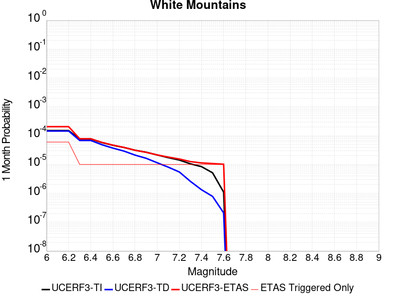 |  |  |

| Magnitude | 1 wk TI Prob | 1 wk TD Prob | 1 wk ETAS Prob | 1 wk ETAS/TD Gain | 1 wk ETAS Triggered Only | 1 mo TI Prob | 1 mo TD Prob | 1 mo ETAS Prob | 1 mo ETAS/TD Gain | 1 mo ETAS Triggered Only | 1 yr TI Prob | 1 yr TD Prob | 1 yr ETAS Prob | 1 yr ETAS/TD Gain | 1 yr ETAS Triggered Only | 10 yr TI Prob | 10 yr TD Prob | 10 yr ETAS Prob | 10 yr ETAS/TD Gain | 10 yr ETAS Triggered Only |
|-----|-----|-----|-----|-----|-----|-----|-----|-----|-----|-----|-----|-----|-----|-----|-----|-----|-----|-----|-----|-----|
| 6.0 | 3.503579E-5 | 3.3784127E-5 | 3.3784127E-5 | 1.0 | 0.0 | 1.5014476E-4 | 1.4478175E-4 | 1.4478175E-4 | 1.0 | 0.0 | 0.0018264796 | 0.0017614134 | 0.0019400212 | 1.1014003 | 1.7892288E-4 | 0.018115403 | 0.017486857 | 0.017721249 | 1.0134039 | 2.3856385E-4 |
| 6.1 | 3.503579E-5 | 3.3784127E-5 | 3.3784127E-5 | 1.0 | 0.0 | 1.5014476E-4 | 1.4478175E-4 | 1.4478175E-4 | 1.0 | 0.0 | 0.0018264796 | 0.0017614134 | 0.0019400212 | 1.1014003 | 1.7892288E-4 | 0.018115403 | 0.017486857 | 0.017721249 | 1.0134039 | 2.3856385E-4 |
| 6.2 | 3.503579E-5 | 3.3784127E-5 | 3.3784127E-5 | 1.0 | 0.0 | 1.5014476E-4 | 1.4478175E-4 | 1.4478175E-4 | 1.0 | 0.0 | 0.0018264796 | 0.0017614134 | 0.0019400212 | 1.1014003 | 1.7892288E-4 | 0.018115403 | 0.017486857 | 0.017721249 | 1.0134039 | 2.3856385E-4 |
| 6.3 | 1.7818425E-5 | 1.591616E-5 | 1.591616E-5 | 1.0 | 0.0 | 7.636245E-5 | 6.821041E-5 | 6.821041E-5 | 1.0 | 0.0 | 9.293162E-4 | 8.301596E-4 | 9.4934244E-4 | 1.1435663 | 1.19281925E-4 | 0.009254395 | 0.0082720425 | 0.008390338 | 1.0143006 | 1.19281925E-4 |
| 6.4 | 1.7818425E-5 | 1.591616E-5 | 1.591616E-5 | 1.0 | 0.0 | 7.636245E-5 | 6.821041E-5 | 6.821041E-5 | 1.0 | 0.0 | 9.293162E-4 | 8.301596E-4 | 9.4934244E-4 | 1.1435663 | 1.19281925E-4 | 0.009254395 | 0.0082720425 | 0.008390338 | 1.0143006 | 1.19281925E-4 |
| 6.5 | 1.3397557E-5 | 1.1336374E-5 | 1.1336374E-5 | 1.0 | 0.0 | 5.741684E-5 | 4.8583595E-5 | 4.8583595E-5 | 1.0 | 0.0 | 6.988258E-4 | 5.913517E-4 | 5.913517E-4 | 1.0 | 0.0 | 0.006966323 | 0.005898487 | 0.005898487 | 1.0 | 0.0 |
| 6.6 | 1.0818695E-5 | 8.625434E-6 | 8.625434E-6 | 1.0 | 0.0 | 4.6365014E-5 | 3.6965648E-5 | 3.6965648E-5 | 1.0 | 0.0 | 5.6434784E-4 | 4.4996818E-4 | 4.4996818E-4 | 1.0 | 0.0 | 0.005629168 | 0.0044910074 | 0.0044910074 | 1.0 | 0.0 |
| 6.7 | 9.067908E-6 | 6.802476E-6 | 6.802476E-6 | 1.0 | 0.0 | 3.8861883E-5 | 2.915316E-5 | 2.915316E-5 | 1.0 | 0.0 | 4.7304068E-4 | 3.548851E-4 | 3.548851E-4 | 1.0 | 0.0 | 0.00472035 | 0.003543501 | 0.003543501 | 1.0 | 0.0 |
| 6.8 | 7.295947E-6 | 4.9364285E-6 | 4.9364285E-6 | 1.0 | 0.0 | 3.126797E-5 | 2.1155956E-5 | 2.1155956E-5 | 1.0 | 0.0 | 3.8062103E-4 | 2.5754445E-4 | 2.5754445E-4 | 1.0 | 0.0 | 0.0037996976 | 0.0025725728 | 0.0025725728 | 1.0 | 0.0 |
| 6.9 | 6.2243444E-6 | 3.8322546E-6 | 3.8322546E-6 | 1.0 | 0.0 | 2.6675489E-5 | 1.6423846E-5 | 1.6423846E-5 | 1.0 | 0.0 | 3.2472567E-4 | 1.9994251E-4 | 1.9994251E-4 | 1.0 | 0.0 | 0.0032425157 | 0.001997679 | 0.001997679 | 1.0 | 0.0 |
| 7.0 | 4.9878413E-6 | 2.679564E-6 | 2.679564E-6 | 1.0 | 0.0 | 2.1376287E-5 | 1.1483797E-5 | 1.1483797E-5 | 1.0 | 0.0 | 2.602252E-4 | 1.3980652E-4 | 1.3980652E-4 | 1.0 | 0.0 | 0.002599207 | 0.0013972119 | 0.0013972119 | 1.0 | 0.0 |
| 7.1 | 4.0252844E-6 | 1.885702E-6 | 1.885702E-6 | 1.0 | 0.0 | 1.7251105E-5 | 8.081555E-6 | 8.081555E-6 | 1.0 | 0.0 | 2.1001195E-4 | 9.838863E-5 | 9.838863E-5 | 1.0 | 0.0 | 0.0020981359 | 9.834635E-4 | 9.834635E-4 | 1.0 | 0.0 |
| 7.2 | 3.3284066E-6 | 1.2818929E-6 | 1.2818929E-6 | 1.0 | 0.0 | 1.4264522E-5 | 5.4938155E-6 | 5.4938155E-6 | 1.0 | 0.0 | 1.736567E-4 | 6.688525E-5 | 6.688525E-5 | 1.0 | 0.0 | 0.0017352107 | 6.6866126E-4 | 6.6866126E-4 | 1.0 | 0.0 |
| 7.3 | 2.458226E-6 | 6.056684E-7 | 6.056684E-7 | 1.0 | 0.0 | 1.0535211E-5 | 2.5957193E-6 | 2.5957193E-6 | 1.0 | 0.0 | 1.2825865E-4 | 3.160246E-5 | 3.160246E-5 | 1.0 | 0.0 | 0.0012818464 | 3.1598343E-4 | 3.1598343E-4 | 1.0 | 0.0 |
| 7.4 | 1.965953E-6 | 3.1084684E-7 | 3.1084684E-7 | 1.0 | 0.0 | 8.425486E-6 | 1.3322001E-6 | 1.3322001E-6 | 1.0 | 0.0 | 1.0257547E-4 | 1.6219417E-5 | 1.6219417E-5 | 1.0 | 0.0 | 0.0010252813 | 1.6218246E-4 | 1.6218246E-4 | 1.0 | 0.0 |
| 7.5 | 1.2014192E-6 | 1.8241002E-7 | 1.8241002E-7 | 1.0 | 0.0 | 5.148929E-6 | 7.8175697E-7 | 7.8175697E-7 | 1.0 | 0.0 | 6.2686406E-5 | 9.51785E-6 | 9.51785E-6 | 1.0 | 0.0 | 6.266873E-4 | 9.517451E-5 | 9.517451E-5 | 1.0 | 0.0 |
| 7.6 | 2.5612175E-7 | 4.893784E-8 | 4.893784E-8 | 1.0 | 0.0 | 1.0976642E-6 | 2.0973359E-7 | 2.0973359E-7 | 1.0 | 0.0 | 1.3363979E-5 | 2.5535037E-6 | 2.5535037E-6 | 1.0 | 0.0 | 1.3363175E-4 | 2.553478E-5 | 2.553478E-5 | 1.0 | 0.0 |

## Manix-Afton Hills
*[(top)](#table-of-contents)*

| 1 Week | 1 Month | 1 Year | 10 Year |
|-----|-----|-----|-----|
|  |  | 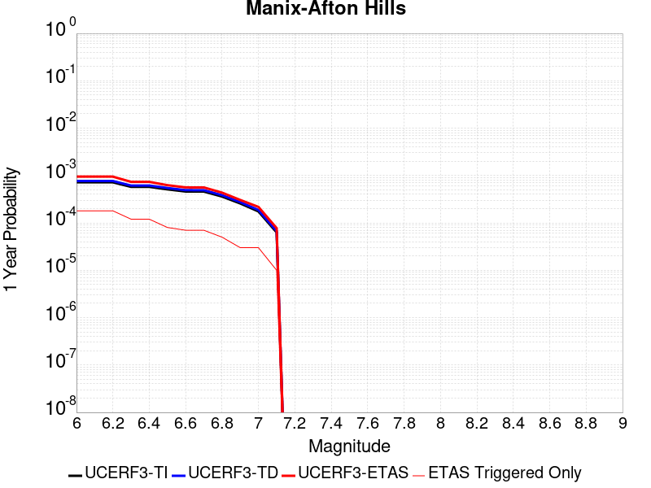 |  |

| Magnitude | 1 wk TI Prob | 1 wk TD Prob | 1 wk ETAS Prob | 1 wk ETAS/TD Gain | 1 wk ETAS Triggered Only | 1 mo TI Prob | 1 mo TD Prob | 1 mo ETAS Prob | 1 mo ETAS/TD Gain | 1 mo ETAS Triggered Only | 1 yr TI Prob | 1 yr TD Prob | 1 yr ETAS Prob | 1 yr ETAS/TD Gain | 1 yr ETAS Triggered Only | 10 yr TI Prob | 10 yr TD Prob | 10 yr ETAS Prob | 10 yr ETAS/TD Gain | 10 yr ETAS Triggered Only |
|-----|-----|-----|-----|-----|-----|-----|-----|-----|-----|-----|-----|-----|-----|-----|-----|-----|-----|-----|-----|-----|
| 6.0 | 1.3783202E-5 | 1.47110895E-5 | 7.435118E-5 | 5.05409 | 5.9640963E-5 | 5.906953E-5 | 6.30461E-5 | 1.8232051E-4 | 2.89186 | 1.19281925E-4 | 7.189342E-4 | 7.6733343E-4 | 8.8652386E-4 | 1.1553307 | 1.19281925E-4 | 0.0071661277 | 0.007648596 | 0.007885335 | 1.030952 | 2.3856385E-4 |
| 6.1 | 1.3783202E-5 | 1.47110895E-5 | 7.435118E-5 | 5.05409 | 5.9640963E-5 | 5.906953E-5 | 6.30461E-5 | 1.8232051E-4 | 2.89186 | 1.19281925E-4 | 7.189342E-4 | 7.6733343E-4 | 8.8652386E-4 | 1.1553307 | 1.19281925E-4 | 0.0071661277 | 0.007648596 | 0.007885335 | 1.030952 | 2.3856385E-4 |
| 6.2 | 1.3783202E-5 | 1.47110895E-5 | 7.435118E-5 | 5.05409 | 5.9640963E-5 | 5.906953E-5 | 6.30461E-5 | 1.8232051E-4 | 2.89186 | 1.19281925E-4 | 7.189342E-4 | 7.6733343E-4 | 8.8652386E-4 | 1.1553307 | 1.19281925E-4 | 0.0071661277 | 0.007648596 | 0.007885335 | 1.030952 | 2.3856385E-4 |
| 6.3 | 1.10494875E-5 | 1.1793136E-5 | 1.1793136E-5 | 1.0 | 0.0 | 4.7354086E-5 | 5.054109E-5 | 1.1017903E-4 | 2.1799893 | 5.9640963E-5 | 5.763835E-4 | 6.151744E-4 | 6.7477865E-4 | 1.0968901 | 5.9640963E-5 | 0.005748908 | 0.0061357557 | 0.0062543056 | 1.0193212 | 1.19281925E-4 |
| 6.4 | 1.10494875E-5 | 1.1793136E-5 | 1.1793136E-5 | 1.0 | 0.0 | 4.7354086E-5 | 5.054109E-5 | 1.1017903E-4 | 2.1799893 | 5.9640963E-5 | 5.763835E-4 | 6.151744E-4 | 6.7477865E-4 | 1.0968901 | 5.9640963E-5 | 0.005748908 | 0.0061357557 | 0.0062543056 | 1.0193212 | 1.19281925E-4 |
| 6.5 | 9.788949E-6 | 1.045432E-5 | 1.045432E-5 | 1.0 | 0.0 | 4.1951964E-5 | 4.480351E-5 | 4.480351E-5 | 1.0 | 0.0 | 5.1064545E-4 | 5.453555E-4 | 5.453555E-4 | 1.0 | 0.0 | 0.0050947363 | 0.0054410985 | 0.005500415 | 1.0109016 | 5.9640963E-5 |
| 6.6 | 8.810006E-6 | 9.4136285E-6 | 9.4136285E-6 | 1.0 | 0.0 | 3.775662E-5 | 4.0343548E-5 | 4.0343548E-5 | 1.0 | 0.0 | 4.5958988E-4 | 4.9108086E-4 | 4.9108086E-4 | 1.0 | 0.0 | 0.0045864056 | 0.004900839 | 0.0049601877 | 1.0121099 | 5.9640963E-5 |
| 6.7 | 8.80128E-6 | 9.404108E-6 | 9.404108E-6 | 1.0 | 0.0 | 3.7719226E-5 | 4.0302748E-5 | 4.0302748E-5 | 1.0 | 0.0 | 4.591348E-4 | 4.9058435E-4 | 4.9058435E-4 | 1.0 | 0.0 | 0.004581874 | 0.0048958957 | 0.0049552447 | 1.0121222 | 5.9640963E-5 |
| 6.8 | 6.8994877E-6 | 7.380076E-6 | 7.380076E-6 | 1.0 | 0.0 | 2.9568899E-5 | 3.162856E-5 | 3.162856E-5 | 1.0 | 0.0 | 3.5994186E-4 | 3.8501783E-4 | 3.8501783E-4 | 1.0 | 0.0 | 0.003593594 | 0.0038443129 | 0.0039037245 | 1.0154544 | 5.9640963E-5 |
| 6.9 | 4.9328037E-6 | 5.2709615E-6 | 5.2709615E-6 | 1.0 | 0.0 | 2.1140417E-5 | 2.2589675E-5 | 2.2589675E-5 | 1.0 | 0.0 | 2.5735417E-4 | 2.7500073E-4 | 2.7500073E-4 | 1.0 | 0.0 | 0.0025705635 | 0.0027472095 | 0.0027472095 | 1.0 | 0.0 |
| 7.0 | 3.347973E-6 | 3.59003E-6 | 3.59003E-6 | 1.0 | 0.0 | 1.4348378E-5 | 1.5385775E-5 | 1.5385775E-5 | 1.0 | 0.0 | 1.746775E-4 | 1.8730981E-4 | 1.8730981E-4 | 1.0 | 0.0 | 0.0017454025 | 0.0018719219 | 0.0018719219 | 1.0 | 0.0 |
| 7.1 | 1.2073567E-6 | 1.293482E-6 | 1.293482E-6 | 1.0 | 0.0 | 5.1743755E-6 | 5.543492E-6 | 5.543492E-6 | 1.0 | 0.0 | 6.29962E-5 | 6.749156E-5 | 6.749156E-5 | 1.0 | 0.0 | 6.297835E-4 | 6.7487074E-4 | 6.7487074E-4 | 1.0 | 0.0 |

## San Andreas (North Branch Mill Creek)
*[(top)](#table-of-contents)*

| 1 Week | 1 Month | 1 Year | 10 Year |
|-----|-----|-----|-----|
|  |  |  |  |

| Magnitude | 1 wk TI Prob | 1 wk TD Prob | 1 wk ETAS Prob | 1 wk ETAS/TD Gain | 1 wk ETAS Triggered Only | 1 mo TI Prob | 1 mo TD Prob | 1 mo ETAS Prob | 1 mo ETAS/TD Gain | 1 mo ETAS Triggered Only | 1 yr TI Prob | 1 yr TD Prob | 1 yr ETAS Prob | 1 yr ETAS/TD Gain | 1 yr ETAS Triggered Only | 10 yr TI Prob | 10 yr TD Prob | 10 yr ETAS Prob | 10 yr ETAS/TD Gain | 10 yr ETAS Triggered Only |
|-----|-----|-----|-----|-----|-----|-----|-----|-----|-----|-----|-----|-----|-----|-----|-----|-----|-----|-----|-----|-----|
| 6.0 | 1.3461156E-5 | 2.3500992E-5 | 1.4278012E-4 | 6.075493 | 1.19281925E-4 | 5.7689394E-5 | 1.00714664E-4 | 2.1998458E-4 | 2.1842358 | 1.19281925E-4 | 7.02142E-4 | 0.0012255146 | 0.0014042183 | 1.1458192 | 1.7892288E-4 | 0.0069992766 | 0.012228744 | 0.012464391 | 1.01927 | 2.3856385E-4 |
| 6.1 | 1.3461156E-5 | 2.3500992E-5 | 1.4278012E-4 | 6.075493 | 1.19281925E-4 | 5.7689394E-5 | 1.00714664E-4 | 2.1998458E-4 | 2.1842358 | 1.19281925E-4 | 7.02142E-4 | 0.0012255146 | 0.0014042183 | 1.1458192 | 1.7892288E-4 | 0.0069992766 | 0.012228744 | 0.012464391 | 1.01927 | 2.3856385E-4 |
| 6.2 | 1.3461156E-5 | 2.3500992E-5 | 1.4278012E-4 | 6.075493 | 1.19281925E-4 | 5.7689394E-5 | 1.00714664E-4 | 2.1998458E-4 | 2.1842358 | 1.19281925E-4 | 7.02142E-4 | 0.0012255146 | 0.0014042183 | 1.1458192 | 1.7892288E-4 | 0.0069992766 | 0.012228744 | 0.012464391 | 1.01927 | 2.3856385E-4 |
| 6.3 | 1.3461156E-5 | 2.3500992E-5 | 1.4278012E-4 | 6.075493 | 1.19281925E-4 | 5.7689394E-5 | 1.00714664E-4 | 2.1998458E-4 | 2.1842358 | 1.19281925E-4 | 7.02142E-4 | 0.0012255146 | 0.0014042183 | 1.1458192 | 1.7892288E-4 | 0.0069992766 | 0.012228744 | 0.012464391 | 1.01927 | 2.3856385E-4 |
| 6.4 | 1.3461156E-5 | 2.3500992E-5 | 1.4278012E-4 | 6.075493 | 1.19281925E-4 | 5.7689394E-5 | 1.00714664E-4 | 2.1998458E-4 | 2.1842358 | 1.19281925E-4 | 7.02142E-4 | 0.0012255146 | 0.0014042183 | 1.1458192 | 1.7892288E-4 | 0.0069992766 | 0.012228744 | 0.012464391 | 1.01927 | 2.3856385E-4 |
| 6.5 | 1.3450706E-5 | 2.348995E-5 | 1.4276907E-4 | 6.0778785 | 1.19281925E-4 | 5.764461E-5 | 1.00667356E-4 | 2.1993727E-4 | 2.1847923 | 1.19281925E-4 | 7.0159714E-4 | 0.0012249392 | 0.0014036429 | 1.1458879 | 1.7892288E-4 | 0.006993862 | 0.012223054 | 0.012458702 | 1.019279 | 2.3856385E-4 |
| 6.6 | 1.3074523E-5 | 2.3104236E-5 | 1.423834E-4 | 6.162654 | 1.19281925E-4 | 5.6032466E-5 | 9.901441E-5 | 2.1828452E-4 | 2.2045732 | 1.19281925E-4 | 6.8198174E-4 | 0.001204837 | 0.0013835443 | 1.1483248 | 1.7892288E-4 | 0.006798926 | 0.012024219 | 0.012259915 | 1.0196017 | 2.3856385E-4 |
| 6.7 | 1.3050216E-5 | 2.3079532E-5 | 1.4235871E-4 | 6.1681795 | 1.19281925E-4 | 5.59283E-5 | 9.890855E-5 | 2.1817867E-4 | 2.2058625 | 1.19281925E-4 | 6.8071426E-4 | 0.0012035496 | 0.0013822571 | 1.1484838 | 1.7892288E-4 | 0.0067863287 | 0.012011484 | 0.012247182 | 1.0196228 | 2.3856385E-4 |
| 6.8 | 1.29049395E-5 | 2.2927941E-5 | 1.4220712E-4 | 6.2023506 | 1.19281925E-4 | 5.530571E-5 | 9.825892E-5 | 2.1752912E-4 | 2.213836 | 1.19281925E-4 | 6.73139E-4 | 0.001195649 | 0.001374358 | 1.149466 | 1.7892288E-4 | 0.0067110364 | 0.011933329 | 0.012169045 | 1.0197529 | 2.3856385E-4 |
| 6.9 | 1.2867369E-5 | 2.2887343E-5 | 1.4216654E-4 | 6.211579 | 1.19281925E-4 | 5.51447E-5 | 9.808494E-5 | 2.1735516E-4 | 2.215989 | 1.19281925E-4 | 6.711799E-4 | 0.0011935332 | 0.0013722426 | 1.1497314 | 1.7892288E-4 | 0.006691564 | 0.011912397 | 0.0121481195 | 1.0197879 | 2.3856385E-4 |
| 7.0 | 1.2495996E-5 | 2.2287419E-5 | 1.4156668E-4 | 6.3518653 | 1.19281925E-4 | 5.3553173E-5 | 9.551403E-5 | 2.1478457E-4 | 2.2487226 | 1.19281925E-4 | 6.518148E-4 | 0.0011622658 | 0.0013409808 | 1.1537642 | 1.7892288E-4 | 0.0064990623 | 0.011603 | 0.011838796 | 1.020322 | 2.3856385E-4 |
| 7.1 | 1.2452067E-5 | 2.2232492E-5 | 1.4151176E-4 | 6.365088 | 1.19281925E-4 | 5.3364907E-5 | 9.527864E-5 | 2.145492E-4 | 2.251808 | 1.19281925E-4 | 6.4952404E-4 | 0.001159403 | 0.0013381185 | 1.1541444 | 1.7892288E-4 | 0.0064762887 | 0.011574671 | 0.011810473 | 1.0203723 | 2.3856385E-4 |
| 7.2 | 1.2002777E-5 | 2.1611015E-5 | 1.4089036E-4 | 6.519377 | 1.19281925E-4 | 5.143946E-5 | 9.261536E-5 | 2.1188623E-4 | 2.287809 | 1.19281925E-4 | 6.2609545E-4 | 0.0011270114 | 0.0013057326 | 1.1585798 | 1.7892288E-4 | 0.006243344 | 0.011254058 | 0.011489937 | 1.0209595 | 2.3856385E-4 |
| 7.3 | 1.1923425E-5 | 2.1480853E-5 | 1.4076021E-4 | 6.552822 | 1.19281925E-4 | 5.109939E-5 | 9.205757E-5 | 2.1132852E-4 | 2.2956126 | 1.19281925E-4 | 6.219575E-4 | 0.0011202273 | 0.0012989497 | 1.1595412 | 1.7892288E-4 | 0.0062021962 | 0.011186945 | 0.01142284 | 1.0210867 | 2.3856385E-4 |
| 7.4 | 1.16105175E-5 | 2.0854808E-5 | 1.4013425E-4 | 6.719517 | 1.19281925E-4 | 4.975841E-5 | 8.93747E-5 | 2.0864596E-4 | 2.3345082 | 1.19281925E-4 | 6.0564023E-4 | 0.0010875963 | 0.0012663247 | 1.1643333 | 1.7892288E-4 | 0.006039923 | 0.010864409 | 0.011100381 | 1.0217197 | 2.3856385E-4 |
| 7.5 | 1.1037265E-5 | 1.9554842E-5 | 1.3883444E-4 | 7.099747 | 1.19281925E-4 | 4.7301706E-5 | 8.380379E-5 | 2.0307572E-4 | 2.4232283 | 1.19281925E-4 | 5.757461E-4 | 0.0010198357 | 0.0011985761 | 1.1752639 | 1.7892288E-4 | 0.005742567 | 0.010195527 | 0.010431659 | 1.0231603 | 2.3856385E-4 |
| 7.6 | 1.0720915E-5 | 1.8996727E-5 | 1.3827639E-4 | 7.278958 | 1.19281925E-4 | 4.5945973E-5 | 8.141202E-5 | 2.0068423E-4 | 2.4650443 | 1.19281925E-4 | 5.592486E-4 | 9.907428E-4 | 0.0011694884 | 1.1804157 | 1.7892288E-4 | 0.005578433 | 0.009907238 | 0.010143439 | 1.0238411 | 2.3856385E-4 |
| 7.7 | 9.276279E-6 | 1.6442464E-5 | 1.3572242E-4 | 8.254385 | 1.19281925E-4 | 3.9754876E-5 | 7.046581E-5 | 1.8973932E-4 | 2.692644 | 1.19281925E-4 | 4.839081E-4 | 8.5758517E-4 | 0.0010363547 | 1.2084568 | 1.7892288E-4 | 0.0048285574 | 0.008586576 | 0.008823091 | 1.0275447 | 2.3856385E-4 |
| 7.8 | 5.8346777E-6 | 1.11555855E-5 | 1.3043618E-4 | 11.692455 | 1.19281925E-4 | 2.5005522E-5 | 4.7808775E-5 | 1.6708499E-4 | 3.4948604 | 1.19281925E-4 | 3.043997E-4 | 5.819165E-4 | 7.6073525E-4 | 1.3072928 | 1.7892288E-4 | 0.0030398308 | 0.0058473335 | 0.006084502 | 1.0405601 | 2.3856385E-4 |
| 7.9 | 4.690204E-6 | 8.509473E-6 | 6.814993E-5 | 8.008713 | 5.9640963E-5 | 2.0100719E-5 | 3.6468664E-5 | 9.610745E-5 | 2.6353433 | 5.9640963E-5 | 2.4469878E-4 | 4.439156E-4 | 5.6314457E-4 | 1.2685847 | 1.19281925E-4 | 0.002444295 | 0.004471165 | 0.004649288 | 1.0398382 | 1.7892288E-4 |
| 8.0 | 2.9570454E-6 | 4.8470656E-6 | 4.8470656E-6 | 1.0 | 0.0 | 1.267299E-5 | 2.0772974E-5 | 2.0772974E-5 | 1.0 | 0.0 | 1.5428272E-4 | 2.5288164E-4 | 2.5288164E-4 | 1.0 | 0.0 | 0.0015417566 | 0.002549932 | 0.002549932 | 1.0 | 0.0 |
| 8.1 | 1.6376824E-6 | 2.1968672E-6 | 2.1968672E-6 | 1.0 | 0.0 | 7.01862E-6 | 9.415111E-6 | 9.415111E-6 | 1.0 | 0.0 | 8.544835E-5 | 1.1462297E-4 | 1.1462297E-4 | 1.0 | 0.0 | 8.54155E-4 | 0.0011607445 | 0.0011607445 | 1.0 | 0.0 |
| 8.2 | 6.9631557E-7 | 4.535001E-7 | 4.535001E-7 | 1.0 | 0.0 | 2.984206E-6 | 1.9435704E-6 | 1.9435704E-6 | 1.0 | 0.0 | 3.63321E-5 | 2.3662713E-5 | 2.3662713E-5 | 1.0 | 0.0 | 3.6326164E-4 | 2.4510184E-4 | 2.4510184E-4 | 1.0 | 0.0 |
| 8.3 | 1.7876137E-7 | 8.357368E-8 | 8.357368E-8 | 1.0 | 0.0 | 7.661199E-7 | 3.5817288E-7 | 3.5817288E-7 | 1.0 | 0.0 | 9.32747E-6 | 4.3607465E-6 | 4.3607465E-6 | 1.0 | 0.0 | 9.3270784E-5 | 4.5800018E-5 | 4.5800018E-5 | 1.0 | 0.0 |

## Owens Valley
*[(top)](#table-of-contents)*

| 1 Week | 1 Month | 1 Year | 10 Year |
|-----|-----|-----|-----|
|  |  | 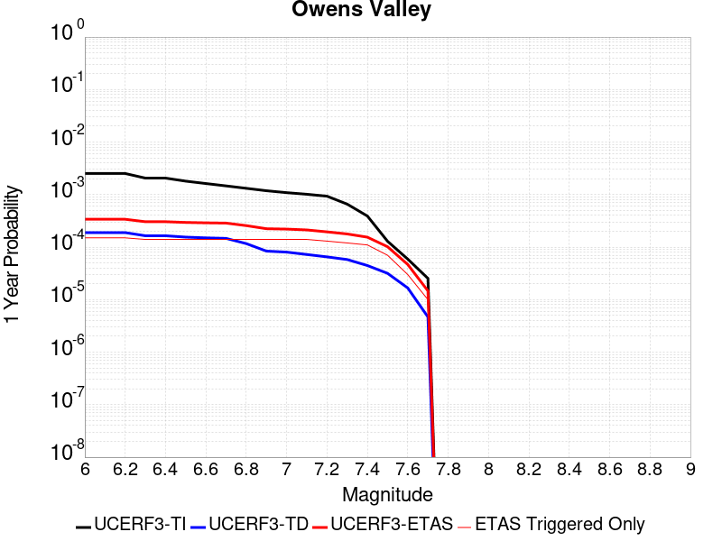 |  |

| Magnitude | 1 wk TI Prob | 1 wk TD Prob | 1 wk ETAS Prob | 1 wk ETAS/TD Gain | 1 wk ETAS Triggered Only | 1 mo TI Prob | 1 mo TD Prob | 1 mo ETAS Prob | 1 mo ETAS/TD Gain | 1 mo ETAS Triggered Only | 1 yr TI Prob | 1 yr TD Prob | 1 yr ETAS Prob | 1 yr ETAS/TD Gain | 1 yr ETAS Triggered Only | 10 yr TI Prob | 10 yr TD Prob | 10 yr ETAS Prob | 10 yr ETAS/TD Gain | 10 yr ETAS Triggered Only |
|-----|-----|-----|-----|-----|-----|-----|-----|-----|-----|-----|-----|-----|-----|-----|-----|-----|-----|-----|-----|-----|
| 6.0 | 4.83821E-5 | 3.6210524E-6 | 6.3261796E-5 | 17.470556 | 5.9640963E-5 | 2.0733538E-4 | 1.551871E-5 | 1.3479879E-4 | 8.686211 | 1.19281925E-4 | 0.002521386 | 1.889249E-4 | 3.6781398E-4 | 1.9468794 | 1.7892288E-4 | 0.024929691 | 0.0019297141 | 0.0021082917 | 1.092541 | 1.7892288E-4 |
| 6.1 | 4.83821E-5 | 3.6210524E-6 | 6.3261796E-5 | 17.470556 | 5.9640963E-5 | 2.0733538E-4 | 1.551871E-5 | 1.3479879E-4 | 8.686211 | 1.19281925E-4 | 0.002521386 | 1.889249E-4 | 3.6781398E-4 | 1.9468794 | 1.7892288E-4 | 0.024929691 | 0.0019297141 | 0.0021082917 | 1.092541 | 1.7892288E-4 |
| 6.2 | 4.83821E-5 | 3.6210524E-6 | 6.3261796E-5 | 17.470556 | 5.9640963E-5 | 2.0733538E-4 | 1.551871E-5 | 1.3479879E-4 | 8.686211 | 1.19281925E-4 | 0.002521386 | 1.889249E-4 | 3.6781398E-4 | 1.9468794 | 1.7892288E-4 | 0.024929691 | 0.0019297141 | 0.0021082917 | 1.092541 | 1.7892288E-4 |
| 6.3 | 3.953008E-5 | 3.1530958E-6 | 6.279387E-5 | 19.91499 | 5.9640963E-5 | 1.6940363E-4 | 1.3513202E-5 | 1.3279352E-4 | 9.826946 | 1.19281925E-4 | 0.002060538 | 1.6451156E-4 | 2.8377384E-4 | 1.7249479 | 1.19281925E-4 | 0.020415364 | 0.0016621627 | 0.0017812464 | 1.0716438 | 1.19281925E-4 |
| 6.4 | 3.953008E-5 | 3.1530958E-6 | 6.279387E-5 | 19.91499 | 5.9640963E-5 | 1.6940363E-4 | 1.3513202E-5 | 1.3279352E-4 | 9.826946 | 1.19281925E-4 | 0.002060538 | 1.6451156E-4 | 2.8377384E-4 | 1.7249479 | 1.19281925E-4 | 0.020415364 | 0.0016621627 | 0.0017812464 | 1.0716438 | 1.19281925E-4 |
| 6.5 | 3.457342E-5 | 2.9707387E-6 | 6.261152E-5 | 21.076078 | 5.9640963E-5 | 1.4816338E-4 | 1.273168E-5 | 1.3201208E-4 | 10.368788 | 1.19281925E-4 | 0.0018023965 | 1.5499788E-4 | 2.742613E-4 | 1.7694521 | 1.19281925E-4 | 0.017878477 | 0.0015563119 | 0.0016754081 | 1.0765247 | 1.19281925E-4 |
| 6.6 | 3.1127765E-5 | 2.8737306E-6 | 6.251452E-5 | 21.753786 | 5.9640963E-5 | 1.3339789E-4 | 1.2315934E-5 | 1.3159639E-4 | 10.685051 | 1.19281925E-4 | 0.0016229092 | 1.4993687E-4 | 2.6920091E-4 | 1.7954284 | 1.19281925E-4 | 0.016111081 | 0.0015013438 | 0.0016204466 | 1.0793308 | 1.19281925E-4 |
| 6.7 | 2.806885E-5 | 2.8101606E-6 | 6.2450956E-5 | 22.22327 | 5.9640963E-5 | 1.2028952E-4 | 1.2043493E-5 | 1.3132398E-4 | 10.904143 | 1.19281925E-4 | 0.001463541 | 1.4662035E-4 | 2.658848E-4 | 1.8134235 | 1.19281925E-4 | 0.014539397 | 0.0014656087 | 0.0015847158 | 1.081268 | 1.19281925E-4 |
| 6.8 | 2.524524E-5 | 2.2351392E-6 | 6.1875966E-5 | 27.683273 | 5.9640963E-5 | 1.0818939E-4 | 9.579134E-6 | 1.2885992E-4 | 13.452147 | 1.19281925E-4 | 0.0013164099 | 1.16620016E-4 | 2.3588803E-4 | 2.0227063 | 1.19281925E-4 | 0.01308639 | 0.001165827 | 0.00128497 | 1.102196 | 1.19281925E-4 |
| 6.9 | 2.2704568E-5 | 1.6079711E-6 | 6.124884E-5 | 38.09076 | 5.9640963E-5 | 9.730166E-5 | 6.8912864E-6 | 1.2617238E-4 | 18.308975 | 1.19281925E-4 | 0.0011840039 | 8.38982E-5 | 2.0317012E-4 | 2.4216266 | 1.19281925E-4 | 0.011777153 | 8.38853E-4 | 9.580349E-4 | 1.1420772 | 1.19281925E-4 |
| 7.0 | 2.0871712E-5 | 1.5393621E-6 | 6.118023E-5 | 39.743885 | 5.9640963E-5 | 8.944713E-5 | 6.5972495E-6 | 1.2587839E-4 | 19.080435 | 1.19281925E-4 | 0.0010884746 | 8.031857E-5 | 1.9959091E-4 | 2.4849908 | 1.19281925E-4 | 0.010831586 | 8.030395E-4 | 9.2222565E-4 | 1.1484188 | 1.19281925E-4 |
| 7.1 | 1.944928E-5 | 1.3862556E-6 | 6.1027135E-5 | 44.023006 | 5.9640963E-5 | 8.335139E-5 | 5.941082E-6 | 1.252223E-4 | 21.077356 | 1.19281925E-4 | 0.0010143308 | 7.233028E-5 | 1.9160357E-4 | 2.6490092 | 1.19281925E-4 | 0.010097133 | 7.2319806E-4 | 8.423937E-4 | 1.1648175 | 1.19281925E-4 |
| 7.2 | 1.7876306E-5 | 1.2487686E-6 | 6.0889655E-5 | 48.759758 | 5.9640963E-5 | 7.6610486E-5 | 5.3518543E-6 | 1.2463314E-4 | 23.287842 | 1.19281925E-4 | 9.3233347E-4 | 6.515689E-5 | 1.8443103E-4 | 2.8305686 | 1.19281925E-4 | 0.009284316 | 6.5148395E-4 | 7.706882E-4 | 1.1829734 | 1.19281925E-4 |
| 7.3 | 1.2618672E-5 | 1.1113839E-6 | 6.0752278E-5 | 54.66363 | 5.9640963E-5 | 5.40789E-5 | 4.763065E-6 | 1.2404443E-4 | 26.042982 | 1.19281925E-4 | 6.582117E-4 | 5.7988782E-5 | 1.7726379E-4 | 3.0568633 | 1.19281925E-4 | 0.0065626553 | 5.7983754E-4 | 6.990503E-4 | 1.2055968 | 1.19281925E-4 |
| 7.4 | 7.4874442E-6 | 8.547518E-7 | 6.0495662E-5 | 70.7757 | 5.9640963E-5 | 3.208865E-5 | 3.6632168E-6 | 1.2294471E-4 | 33.56195 | 1.19281925E-4 | 3.906093E-4 | 4.4598757E-5 | 1.6387536E-4 | 3.6744378 | 1.19281925E-4 | 0.003899234 | 4.459579E-4 | 5.651866E-4 | 1.2673542 | 1.19281925E-4 |
| 7.5 | 2.4734156E-6 | 6.0679935E-7 | 6.0679935E-7 | 1.0 | 0.0 | 1.060031E-5 | 2.6005662E-6 | 6.224137E-5 | 23.933777 | 5.9640963E-5 | 1.2905113E-4 | 3.1661435E-5 | 9.1300506E-5 | 2.8836503 | 5.9640963E-5 | 0.0012897621 | 3.1656958E-4 | 3.7619166E-4 | 1.188338 | 5.9640963E-5 |
| 7.6 | 1.1328841E-6 | 3.1961991E-7 | 3.1961991E-7 | 1.0 | 0.0 | 4.8552088E-6 | 1.369799E-6 | 1.369799E-6 | 1.0 | 0.0 | 5.9110564E-5 | 1.6677177E-5 | 1.6677177E-5 | 1.0 | 0.0 | 5.9094845E-4 | 1.6675945E-4 | 1.6675945E-4 | 1.0 | 0.0 |
| 7.7 | 4.8613185E-7 | 8.962742E-8 | 8.962742E-8 | 1.0 | 0.0 | 2.0834207E-6 | 3.8411747E-7 | 3.8411747E-7 | 1.0 | 0.0 | 2.536535E-5 | 4.676621E-6 | 4.676621E-6 | 1.0 | 0.0 | 2.5362454E-4 | 4.676529E-5 | 4.676529E-5 | 1.0 | 0.0 |

## Imperial
*[(top)](#table-of-contents)*

| 1 Week | 1 Month | 1 Year | 10 Year |
|-----|-----|-----|-----|
|  |  |  |  |

| Magnitude | 1 wk TI Prob | 1 wk TD Prob | 1 wk ETAS Prob | 1 wk ETAS/TD Gain | 1 wk ETAS Triggered Only | 1 mo TI Prob | 1 mo TD Prob | 1 mo ETAS Prob | 1 mo ETAS/TD Gain | 1 mo ETAS Triggered Only | 1 yr TI Prob | 1 yr TD Prob | 1 yr ETAS Prob | 1 yr ETAS/TD Gain | 1 yr ETAS Triggered Only | 10 yr TI Prob | 10 yr TD Prob | 10 yr ETAS Prob | 10 yr ETAS/TD Gain | 10 yr ETAS Triggered Only |
|-----|-----|-----|-----|-----|-----|-----|-----|-----|-----|-----|-----|-----|-----|-----|-----|-----|-----|-----|-----|-----|
| 6.0 | 2.7496446E-4 | 5.055345E-4 | 5.055345E-4 | 1.0 | 0.0 | 0.0011778869 | 0.002164817 | 0.002224329 | 1.0274905 | 5.9640963E-5 | 0.0142467655 | 0.026048409 | 0.026106497 | 1.0022299 | 5.9640963E-5 | 0.13367249 | 0.22807029 | 0.22820841 | 1.0006056 | 1.7892288E-4 |
| 6.1 | 2.5356023E-4 | 4.8657708E-4 | 4.8657708E-4 | 1.0 | 0.0 | 0.001086234 | 0.002083702 | 0.002083702 | 1.0 | 0.0 | 0.013144928 | 0.02507094 | 0.02507094 | 1.0 | 0.0 | 0.123940155 | 0.21949561 | 0.21958871 | 1.0004241 | 1.19281925E-4 |
| 6.2 | 2.4820742E-4 | 4.775311E-4 | 4.775311E-4 | 1.0 | 0.0 | 0.0010633124 | 0.0020449946 | 0.0020449946 | 1.0 | 0.0 | 0.01286919 | 0.024610676 | 0.024610676 | 1.0 | 0.0 | 0.12148927 | 0.21600136 | 0.21609488 | 1.000433 | 1.19281925E-4 |
| 6.3 | 2.3205351E-4 | 4.5892023E-4 | 4.5892023E-4 | 1.0 | 0.0 | 9.94136E-4 | 0.0019653554 | 0.0019653554 | 1.0 | 0.0 | 0.012036599 | 0.023661187 | 0.023661187 | 1.0 | 0.0 | 0.11405133 | 0.20793827 | 0.20803274 | 1.0004543 | 1.19281925E-4 |
| 6.4 | 2.0304754E-4 | 3.9878016E-4 | 3.9878016E-4 | 1.0 | 0.0 | 8.6991355E-4 | 0.0017079529 | 0.0017079529 | 1.0 | 0.0 | 0.010539869 | 0.020595418 | 0.020595418 | 1.0 | 0.0 | 0.100537635 | 0.18507113 | 0.18516833 | 1.0005252 | 1.19281925E-4 |
| 6.5 | 1.854992E-4 | 3.6990462E-4 | 3.6990462E-4 | 1.0 | 0.0 | 7.9475436E-4 | 0.0015843548 | 0.0015843548 | 1.0 | 0.0 | 0.009633281 | 0.01911443 | 0.01911443 | 1.0 | 0.0 | 0.0922623 | 0.1733039 | 0.1734025 | 1.000569 | 1.19281925E-4 |
| 6.6 | 1.6586106E-4 | 3.4036173E-4 | 3.4036173E-4 | 1.0 | 0.0 | 7.106394E-4 | 0.0014578878 | 0.0014578878 | 1.0 | 0.0 | 0.008617763 | 0.017607626 | 0.017607626 | 1.0 | 0.0 | 0.08291132 | 0.16078055 | 0.16088066 | 1.0006226 | 1.19281925E-4 |
| 6.7 | 1.4224656E-4 | 3.076812E-4 | 3.076812E-4 | 1.0 | 0.0 | 6.094856E-4 | 0.0013179756 | 0.0013179756 | 1.0 | 0.0 | 0.0073952693 | 0.015928522 | 0.015928522 | 1.0 | 0.0 | 0.07153955 | 0.14648798 | 0.14658979 | 1.000695 | 1.19281925E-4 |
| 6.8 | 1.2317259E-4 | 2.779231E-4 | 2.779231E-4 | 1.0 | 0.0 | 5.2777573E-4 | 0.0011905615 | 0.0011905615 | 1.0 | 0.0 | 0.0064067547 | 0.014400131 | 0.014400131 | 1.0 | 0.0 | 0.06225166 | 0.13294089 | 0.1330443 | 1.000778 | 1.19281925E-4 |
| 6.9 | 9.859898E-5 | 2.5015484E-4 | 2.5015484E-4 | 1.0 | 0.0 | 4.2249862E-4 | 0.0010716559 | 0.0010716559 | 1.0 | 0.0 | 0.0051317946 | 0.012970319 | 0.012970319 | 1.0 | 0.0 | 0.05014893 | 0.119408876 | 0.119513914 | 1.0008796 | 1.19281925E-4 |
| 7.0 | 7.3191884E-5 | 2.1267848E-4 | 2.1267848E-4 | 1.0 | 0.0 | 3.136418E-4 | 9.11164E-4 | 9.11164E-4 | 1.0 | 0.0 | 0.003811904 | 0.011037681 | 0.011037681 | 1.0 | 0.0 | 0.037471764 | 0.10206756 | 0.10217467 | 1.0010494 | 1.19281925E-4 |
| 7.1 | 7.1760296E-5 | 2.0969207E-4 | 2.0969207E-4 | 1.0 | 0.0 | 3.0750787E-4 | 8.9837395E-4 | 8.9837395E-4 | 1.0 | 0.0 | 0.003737482 | 0.010883528 | 0.010883528 | 1.0 | 0.0 | 0.03675245 | 0.10070406 | 0.10081133 | 1.0010653 | 1.19281925E-4 |
| 7.2 | 6.46614E-5 | 1.9137723E-4 | 1.9137723E-4 | 1.0 | 0.0 | 2.7709085E-4 | 8.199333E-4 | 8.199333E-4 | 1.0 | 0.0 | 0.0033683628 | 0.009937617 | 0.009937617 | 1.0 | 0.0 | 0.033177625 | 0.092511006 | 0.092619255 | 1.0011702 | 1.19281925E-4 |
| 7.3 | 6.088115E-5 | 1.780939E-4 | 1.780939E-4 | 1.0 | 0.0 | 2.6089314E-4 | 7.6303916E-4 | 7.6303916E-4 | 1.0 | 0.0 | 0.0031717476 | 0.009251006 | 0.009251006 | 1.0 | 0.0 | 0.031268585 | 0.08656135 | 0.08667031 | 1.0012587 | 1.19281925E-4 |
| 7.4 | 4.199346E-5 | 1.1511097E-4 | 1.1511097E-4 | 1.0 | 0.0 | 1.7995955E-4 | 4.932403E-4 | 4.932403E-4 | 1.0 | 0.0 | 0.0021888057 | 0.005988835 | 0.005988835 | 1.0 | 0.0 | 0.02167372 | 0.05744024 | 0.05755267 | 1.0019573 | 1.19281925E-4 |
| 7.5 | 3.130448E-5 | 8.333871E-5 | 8.333871E-5 | 1.0 | 0.0 | 1.3415517E-4 | 3.5711733E-4 | 3.5711733E-4 | 1.0 | 0.0 | 0.0016321153 | 0.0043392954 | 0.0043392954 | 1.0 | 0.0 | 0.016201803 | 0.042133506 | 0.04224776 | 1.0027118 | 1.19281925E-4 |
| 7.6 | 2.3074248E-5 | 6.0849357E-5 | 6.0849357E-5 | 1.0 | 0.0 | 9.888588E-5 | 2.6075702E-4 | 2.6075702E-4 | 1.0 | 0.0 | 0.0012032706 | 0.0031701182 | 0.0031701182 | 1.0 | 0.0 | 0.011967761 | 0.03102816 | 0.031085951 | 1.0018625 | 5.9640963E-5 |
| 7.7 | 1.45864815E-5 | 4.0128452E-5 | 4.0128452E-5 | 1.0 | 0.0 | 6.2511994E-5 | 1.7196777E-4 | 1.7196777E-4 | 1.0 | 0.0 | 7.608177E-4 | 0.0020917025 | 0.0020917025 | 1.0 | 0.0 | 0.007582182 | 0.02062909 | 0.0206875 | 1.0028315 | 5.9640963E-5 |
| 7.8 | 1.0352979E-5 | 3.096395E-5 | 3.096395E-5 | 1.0 | 0.0 | 4.4369157E-5 | 1.326959E-4 | 1.326959E-4 | 1.0 | 0.0 | 5.400606E-4 | 0.0016143778 | 0.0016143778 | 1.0 | 0.0 | 0.0053875 | 0.016017893 | 0.016076578 | 1.0036638 | 5.9640963E-5 |
| 7.9 | 8.137906E-6 | 2.2151205E-5 | 2.2151205E-5 | 1.0 | 0.0 | 3.4876273E-5 | 9.493029E-5 | 9.493029E-5 | 1.0 | 0.0 | 4.2453592E-4 | 0.0011551644 | 0.0011551644 | 1.0 | 0.0 | 0.004237258 | 0.011618842 | 0.01167779 | 1.0050734 | 5.9640963E-5 |
| 8.0 | 6.93792E-6 | 1.8010365E-5 | 1.8010365E-5 | 1.0 | 0.0 | 2.9733603E-5 | 7.7185E-5 | 7.7185E-5 | 1.0 | 0.0 | 3.6194647E-4 | 9.3932304E-4 | 9.3932304E-4 | 1.0 | 0.0 | 0.0036135751 | 0.009502415 | 0.009561489 | 1.0062168 | 5.9640963E-5 |
| 8.1 | 3.4286315E-6 | 6.380179E-6 | 6.380179E-6 | 1.0 | 0.0 | 1.4694053E-5 | 2.734334E-5 | 2.734334E-5 | 1.0 | 0.0 | 1.7888541E-4 | 3.3285443E-4 | 3.3285443E-4 | 1.0 | 0.0 | 0.0017874148 | 0.0034863674 | 0.0034863674 | 1.0 | 0.0 |
| 8.2 | 1.4906886E-6 | 1.936633E-6 | 1.936633E-6 | 1.0 | 0.0 | 6.3886496E-6 | 8.2998295E-6 | 8.2998295E-6 | 1.0 | 0.0 | 7.7779034E-5 | 1.0104576E-4 | 1.0104576E-4 | 1.0 | 0.0 | 7.775182E-4 | 0.0011075423 | 0.0011075423 | 1.0 | 0.0 |
| 8.3 | 2.5758007E-8 | 1.4495866E-8 | 1.4495866E-8 | 1.0 | 0.0 | 1.10391454E-7 | 6.212514E-8 | 6.212514E-8 | 1.0 | 0.0 | 1.3440151E-6 | 7.563736E-7 | 7.563736E-7 | 1.0 | 0.0 | 1.344007E-5 | 7.884359E-6 | 7.884359E-6 | 1.0 | 0.0 |

## Dry Mountain
*[(top)](#table-of-contents)*

| 1 Week | 1 Month | 1 Year | 10 Year |
|-----|-----|-----|-----|
|  |  |  |  |

| Magnitude | 1 wk TI Prob | 1 wk TD Prob | 1 wk ETAS Prob | 1 wk ETAS/TD Gain | 1 wk ETAS Triggered Only | 1 mo TI Prob | 1 mo TD Prob | 1 mo ETAS Prob | 1 mo ETAS/TD Gain | 1 mo ETAS Triggered Only | 1 yr TI Prob | 1 yr TD Prob | 1 yr ETAS Prob | 1 yr ETAS/TD Gain | 1 yr ETAS Triggered Only | 10 yr TI Prob | 10 yr TD Prob | 10 yr ETAS Prob | 10 yr ETAS/TD Gain | 10 yr ETAS Triggered Only |
|-----|-----|-----|-----|-----|-----|-----|-----|-----|-----|-----|-----|-----|-----|-----|-----|-----|-----|-----|-----|-----|
| 6.0 | 6.222801E-6 | 6.439381E-6 | 6.6079956E-5 | 10.261849 | 5.9640963E-5 | 2.6668875E-5 | 2.7597147E-5 | 1.4687578E-4 | 5.3221364 | 1.19281925E-4 | 3.2464517E-4 | 3.3595937E-4 | 4.5520123E-4 | 1.3549293 | 1.19281925E-4 | 0.0032417132 | 0.0033560768 | 0.0035343992 | 1.0531342 | 1.7892288E-4 |
| 6.1 | 6.222801E-6 | 6.439381E-6 | 6.6079956E-5 | 10.261849 | 5.9640963E-5 | 2.6668875E-5 | 2.7597147E-5 | 1.4687578E-4 | 5.3221364 | 1.19281925E-4 | 3.2464517E-4 | 3.3595937E-4 | 4.5520123E-4 | 1.3549293 | 1.19281925E-4 | 0.0032417132 | 0.0033560768 | 0.0035343992 | 1.0531342 | 1.7892288E-4 |
| 6.2 | 6.222801E-6 | 6.439381E-6 | 6.6079956E-5 | 10.261849 | 5.9640963E-5 | 2.6668875E-5 | 2.7597147E-5 | 1.4687578E-4 | 5.3221364 | 1.19281925E-4 | 3.2464517E-4 | 3.3595937E-4 | 4.5520123E-4 | 1.3549293 | 1.19281925E-4 | 0.0032417132 | 0.0033560768 | 0.0035343992 | 1.0531342 | 1.7892288E-4 |
| 6.3 | 6.222801E-6 | 6.439381E-6 | 6.6079956E-5 | 10.261849 | 5.9640963E-5 | 2.6668875E-5 | 2.7597147E-5 | 1.4687578E-4 | 5.3221364 | 1.19281925E-4 | 3.2464517E-4 | 3.3595937E-4 | 4.5520123E-4 | 1.3549293 | 1.19281925E-4 | 0.0032417132 | 0.0033560768 | 0.0035343992 | 1.0531342 | 1.7892288E-4 |
| 6.4 | 6.222801E-6 | 6.439381E-6 | 6.6079956E-5 | 10.261849 | 5.9640963E-5 | 2.6668875E-5 | 2.7597147E-5 | 1.4687578E-4 | 5.3221364 | 1.19281925E-4 | 3.2464517E-4 | 3.3595937E-4 | 4.5520123E-4 | 1.3549293 | 1.19281925E-4 | 0.0032417132 | 0.0033560768 | 0.0035343992 | 1.0531342 | 1.7892288E-4 |
| 6.5 | 2.8528623E-6 | 2.9521684E-6 | 2.9521684E-6 | 1.0 | 0.0 | 1.22264955E-5 | 1.2652138E-5 | 7.229234E-5 | 5.7138443 | 5.9640963E-5 | 1.4884741E-4 | 1.540376E-4 | 2.1366937E-4 | 1.3871248 | 5.9640963E-5 | 0.0014874774 | 0.0015401616 | 0.0015997107 | 1.0386642 | 5.9640963E-5 |
| 6.6 | 2.8528623E-6 | 2.9521684E-6 | 2.9521684E-6 | 1.0 | 0.0 | 1.22264955E-5 | 1.2652138E-5 | 7.229234E-5 | 5.7138443 | 5.9640963E-5 | 1.4884741E-4 | 1.540376E-4 | 2.1366937E-4 | 1.3871248 | 5.9640963E-5 | 0.0014874774 | 0.0015401616 | 0.0015997107 | 1.0386642 | 5.9640963E-5 |
| 6.7 | 2.541E-6 | 2.6293578E-6 | 2.6293578E-6 | 1.0 | 0.0 | 1.0889954E-5 | 1.1268677E-5 | 7.0908965E-5 | 6.2925725 | 5.9640963E-5 | 1.3257713E-4 | 1.3719614E-4 | 1.9682891E-4 | 1.4346535 | 5.9640963E-5 | 0.0013249806 | 0.0013719613 | 0.0014315206 | 1.0434116 | 5.9640963E-5 |

## Calico-Hidalgo
*[(top)](#table-of-contents)*

| 1 Week | 1 Month | 1 Year | 10 Year |
|-----|-----|-----|-----|
|  | 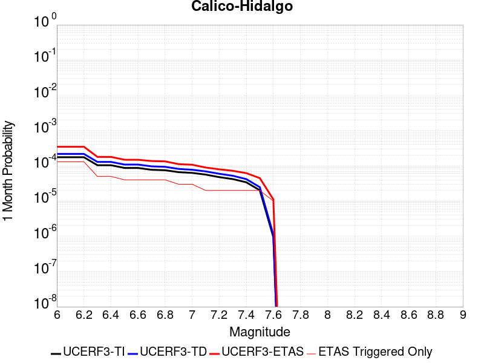 | 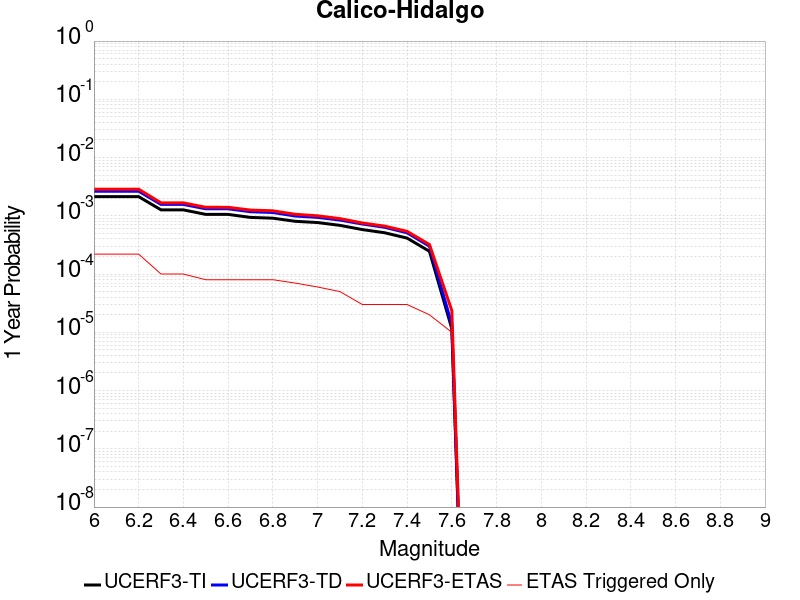 | 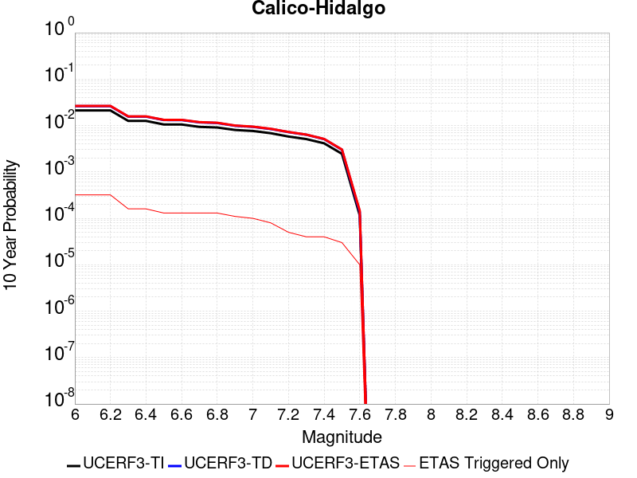 |

| Magnitude | 1 wk TI Prob | 1 wk TD Prob | 1 wk ETAS Prob | 1 wk ETAS/TD Gain | 1 wk ETAS Triggered Only | 1 mo TI Prob | 1 mo TD Prob | 1 mo ETAS Prob | 1 mo ETAS/TD Gain | 1 mo ETAS Triggered Only | 1 yr TI Prob | 1 yr TD Prob | 1 yr ETAS Prob | 1 yr ETAS/TD Gain | 1 yr ETAS Triggered Only | 10 yr TI Prob | 10 yr TD Prob | 10 yr ETAS Prob | 10 yr ETAS/TD Gain | 10 yr ETAS Triggered Only |
|-----|-----|-----|-----|-----|-----|-----|-----|-----|-----|-----|-----|-----|-----|-----|-----|-----|-----|-----|-----|-----|
| 6.0 | 4.0906612E-5 | 5.0704355E-5 | 1.1034229E-4 | 2.1761897 | 5.9640963E-5 | 1.7530227E-4 | 2.1728857E-4 | 3.365446E-4 | 1.548837 | 1.19281925E-4 | 0.0021322158 | 0.002642678 | 0.0027616448 | 1.0450175 | 1.19281925E-4 | 0.02111873 | 0.026152814 | 0.026327057 | 1.0066625 | 1.7892288E-4 |
| 6.1 | 4.0906612E-5 | 5.0704355E-5 | 1.1034229E-4 | 2.1761897 | 5.9640963E-5 | 1.7530227E-4 | 2.1728857E-4 | 3.365446E-4 | 1.548837 | 1.19281925E-4 | 0.0021322158 | 0.002642678 | 0.0027616448 | 1.0450175 | 1.19281925E-4 | 0.02111873 | 0.026152814 | 0.026327057 | 1.0066625 | 1.7892288E-4 |
| 6.2 | 4.0906612E-5 | 5.0704355E-5 | 1.1034229E-4 | 2.1761897 | 5.9640963E-5 | 1.7530227E-4 | 2.1728857E-4 | 3.365446E-4 | 1.548837 | 1.19281925E-4 | 0.0021322158 | 0.002642678 | 0.0027616448 | 1.0450175 | 1.19281925E-4 | 0.02111873 | 0.026152814 | 0.026327057 | 1.0066625 | 1.7892288E-4 |
| 6.3 | 2.4242801E-5 | 3.0090967E-5 | 3.0090967E-5 | 1.0 | 0.0 | 1.0389358E-4 | 1.289551E-4 | 1.8858837E-4 | 1.4624344 | 5.9640963E-5 | 0.0012641704 | 0.0015689312 | 0.0016284785 | 1.0379541 | 5.9640963E-5 | 0.01257003 | 0.015582229 | 0.015699651 | 1.0075357 | 1.19281925E-4 |
| 6.4 | 2.4242801E-5 | 3.0090967E-5 | 3.0090967E-5 | 1.0 | 0.0 | 1.0389358E-4 | 1.289551E-4 | 1.8858837E-4 | 1.4624344 | 5.9640963E-5 | 0.0012641704 | 0.0015689312 | 0.0016284785 | 1.0379541 | 5.9640963E-5 | 0.01257003 | 0.015582229 | 0.015699651 | 1.0075357 | 1.19281925E-4 |
| 6.5 | 2.0286952E-5 | 2.5316054E-5 | 2.5316054E-5 | 1.0 | 0.0 | 8.694118E-5 | 1.0849296E-4 | 1.0849296E-4 | 1.0 | 0.0 | 0.0010579949 | 0.0013201186 | 0.0013201186 | 1.0 | 0.0 | 0.010529719 | 0.013124701 | 0.013183558 | 1.0044845 | 5.9640963E-5 |
| 6.6 | 2.0269223E-5 | 2.5297004E-5 | 2.5297004E-5 | 1.0 | 0.0 | 8.6865206E-5 | 1.08411325E-4 | 1.08411325E-4 | 1.0 | 0.0 | 0.0010570707 | 0.0013191258 | 0.0013191258 | 1.0 | 0.0 | 0.010520565 | 0.01311489 | 0.013173749 | 1.004488 | 5.9640963E-5 |
| 6.7 | 1.799852E-5 | 2.2540933E-5 | 2.2540933E-5 | 1.0 | 0.0 | 7.713423E-5 | 9.660051E-5 | 9.660051E-5 | 1.0 | 0.0 | 9.3870464E-4 | 0.0011754911 | 0.0011754911 | 1.0 | 0.0 | 0.009347493 | 0.011694346 | 0.011753289 | 1.0050403 | 5.9640963E-5 |
| 6.8 | 1.7458793E-5 | 2.184258E-5 | 2.184258E-5 | 1.0 | 0.0 | 7.4821255E-5 | 9.360778E-5 | 9.360778E-5 | 1.0 | 0.0 | 9.10568E-4 | 0.0011390933 | 0.0011390933 | 1.0 | 0.0 | 0.009068459 | 0.011334131 | 0.011393095 | 1.0052024 | 5.9640963E-5 |
| 6.9 | 1.542884E-5 | 1.9026285E-5 | 1.9026285E-5 | 1.0 | 0.0 | 6.612192E-5 | 8.153875E-5 | 8.153875E-5 | 1.0 | 0.0 | 8.04737E-4 | 9.922953E-4 | 9.922953E-4 | 1.0 | 0.0 | 0.008018291 | 0.009880043 | 0.009939094 | 1.0059769 | 5.9640963E-5 |
| 7.0 | 1.468253E-5 | 1.803109E-5 | 1.803109E-5 | 1.0 | 0.0 | 6.292361E-5 | 7.727389E-5 | 7.727389E-5 | 1.0 | 0.0 | 7.658257E-4 | 9.4041653E-4 | 9.4041653E-4 | 1.0 | 0.0 | 0.0076319184 | 0.009365736 | 0.009424819 | 1.0063083 | 5.9640963E-5 |
| 7.1 | 1.3139281E-5 | 1.620139E-5 | 1.620139E-5 | 1.0 | 0.0 | 5.6309986E-5 | 6.943275E-5 | 6.943275E-5 | 1.0 | 0.0 | 6.853584E-4 | 8.4502844E-4 | 8.4502844E-4 | 1.0 | 0.0 | 0.0068324856 | 0.008419449 | 0.008478588 | 1.007024 | 5.9640963E-5 |
| 7.2 | 1.1127404E-5 | 1.3867038E-5 | 1.3867038E-5 | 1.0 | 0.0 | 4.7688E-5 | 5.9428872E-5 | 5.9428872E-5 | 1.0 | 0.0 | 5.8044674E-4 | 7.233172E-4 | 7.233172E-4 | 1.0 | 0.0 | 0.0057893298 | 0.007210737 | 0.0072699483 | 1.0082115 | 5.9640963E-5 |
| 7.3 | 9.808154E-6 | 1.2176586E-5 | 1.2176586E-5 | 1.0 | 0.0 | 4.2034266E-5 | 5.2184383E-5 | 5.2184383E-5 | 1.0 | 0.0 | 5.11647E-4 | 6.351704E-4 | 6.351704E-4 | 1.0 | 0.0 | 0.0051047057 | 0.006334625 | 0.0063938885 | 1.0093554 | 5.9640963E-5 |
| 7.4 | 7.942452E-6 | 9.792348E-6 | 9.792348E-6 | 1.0 | 0.0 | 3.4038632E-5 | 4.1966585E-5 | 4.1966585E-5 | 1.0 | 0.0 | 4.1434157E-4 | 5.108328E-4 | 5.108328E-4 | 1.0 | 0.0 | 0.0041356985 | 0.005097527 | 0.0051568644 | 1.0116403 | 5.9640963E-5 |
| 7.5 | 4.7121216E-6 | 5.7729717E-6 | 5.7729717E-6 | 1.0 | 0.0 | 2.019465E-5 | 2.4741115E-5 | 2.4741115E-5 | 1.0 | 0.0 | 2.4584212E-4 | 3.011891E-4 | 3.011891E-4 | 1.0 | 0.0 | 0.0024557032 | 0.0030085614 | 0.0030680231 | 1.0197641 | 5.9640963E-5 |
| 7.6 | 2.21172E-7 | 2.6040198E-7 | 2.6040198E-7 | 1.0 | 0.0 | 9.478797E-7 | 1.1160082E-6 | 1.1160082E-6 | 1.0 | 0.0 | 1.1540374E-5 | 1.3587343E-5 | 1.3587343E-5 | 1.0 | 0.0 | 1.1539775E-4 | 1.3586794E-4 | 1.3586794E-4 | 1.0 | 0.0 |

## Cleghorn
*[(top)](#table-of-contents)*

| 1 Week | 1 Month | 1 Year | 10 Year |
|-----|-----|-----|-----|
|  |  |  |  |

| Magnitude | 1 wk TI Prob | 1 wk TD Prob | 1 wk ETAS Prob | 1 wk ETAS/TD Gain | 1 wk ETAS Triggered Only | 1 mo TI Prob | 1 mo TD Prob | 1 mo ETAS Prob | 1 mo ETAS/TD Gain | 1 mo ETAS Triggered Only | 1 yr TI Prob | 1 yr TD Prob | 1 yr ETAS Prob | 1 yr ETAS/TD Gain | 1 yr ETAS Triggered Only | 10 yr TI Prob | 10 yr TD Prob | 10 yr ETAS Prob | 10 yr ETAS/TD Gain | 10 yr ETAS Triggered Only |
|-----|-----|-----|-----|-----|-----|-----|-----|-----|-----|-----|-----|-----|-----|-----|-----|-----|-----|-----|-----|-----|
| 6.0 | 7.9267165E-6 | 9.831764E-6 | 9.831764E-6 | 1.0 | 0.0 | 3.39712E-5 | 4.2135514E-5 | 4.2135514E-5 | 1.0 | 0.0 | 4.1352084E-4 | 5.1288976E-4 | 6.3211046E-4 | 1.232449 | 1.19281925E-4 | 0.004127522 | 0.005132214 | 0.005310219 | 1.0346838 | 1.7892288E-4 |
| 6.1 | 7.9267165E-6 | 9.831764E-6 | 9.831764E-6 | 1.0 | 0.0 | 3.39712E-5 | 4.2135514E-5 | 4.2135514E-5 | 1.0 | 0.0 | 4.1352084E-4 | 5.1288976E-4 | 6.3211046E-4 | 1.232449 | 1.19281925E-4 | 0.004127522 | 0.005132214 | 0.005310219 | 1.0346838 | 1.7892288E-4 |
| 6.2 | 7.9267165E-6 | 9.831764E-6 | 9.831764E-6 | 1.0 | 0.0 | 3.39712E-5 | 4.2135514E-5 | 4.2135514E-5 | 1.0 | 0.0 | 4.1352084E-4 | 5.1288976E-4 | 6.3211046E-4 | 1.232449 | 1.19281925E-4 | 0.004127522 | 0.005132214 | 0.005310219 | 1.0346838 | 1.7892288E-4 |
| 6.3 | 7.9267165E-6 | 9.831764E-6 | 9.831764E-6 | 1.0 | 0.0 | 3.39712E-5 | 4.2135514E-5 | 4.2135514E-5 | 1.0 | 0.0 | 4.1352084E-4 | 5.1288976E-4 | 6.3211046E-4 | 1.232449 | 1.19281925E-4 | 0.004127522 | 0.005132214 | 0.005310219 | 1.0346838 | 1.7892288E-4 |
| 6.4 | 4.3445207E-6 | 6.0916254E-6 | 6.0916254E-6 | 1.0 | 0.0 | 1.8619241E-5 | 2.6106709E-5 | 2.6106709E-5 | 1.0 | 0.0 | 2.2666567E-4 | 3.1780385E-4 | 3.1780385E-4 | 1.0 | 0.0 | 0.0022643462 | 0.0031877246 | 0.0032471754 | 1.0186499 | 5.9640963E-5 |
| 6.5 | 4.3445207E-6 | 6.0916254E-6 | 6.0916254E-6 | 1.0 | 0.0 | 1.8619241E-5 | 2.6106709E-5 | 2.6106709E-5 | 1.0 | 0.0 | 2.2666567E-4 | 3.1780385E-4 | 3.1780385E-4 | 1.0 | 0.0 | 0.0022643462 | 0.0031877246 | 0.0032471754 | 1.0186499 | 5.9640963E-5 |
| 6.6 | 4.040109E-6 | 5.774033E-6 | 5.774033E-6 | 1.0 | 0.0 | 1.7314638E-5 | 2.4745626E-5 | 2.4745626E-5 | 1.0 | 0.0 | 2.1078532E-4 | 3.0123728E-4 | 3.0123728E-4 | 1.0 | 0.0 | 0.002105855 | 0.0030225143 | 0.003081975 | 1.0196726 | 5.9640963E-5 |
| 6.7 | 3.3632055E-6 | 5.06753E-6 | 5.06753E-6 | 1.0 | 0.0 | 1.4413658E-5 | 2.1717806E-5 | 2.1717806E-5 | 1.0 | 0.0 | 1.7547216E-4 | 2.643825E-4 | 2.643825E-4 | 1.0 | 0.0 | 0.0017533366 | 0.0026548486 | 0.0027143313 | 1.0224053 | 5.9640963E-5 |
| 6.8 | 3.2902772E-6 | 4.9894375E-6 | 4.9894375E-6 | 1.0 | 0.0 | 1.4101111E-5 | 2.138313E-5 | 2.138313E-5 | 1.0 | 0.0 | 1.716675E-4 | 2.6030882E-4 | 2.6030882E-4 | 1.0 | 0.0 | 0.0017153495 | 0.0026142076 | 0.0026736925 | 1.0227545 | 5.9640963E-5 |
| 6.9 | 3.031547E-6 | 4.6911987E-6 | 4.6911987E-6 | 1.0 | 0.0 | 1.299228E-5 | 2.0104984E-5 | 2.0104984E-5 | 1.0 | 0.0 | 1.5816953E-4 | 2.4475096E-4 | 2.4475096E-4 | 1.0 | 0.0 | 0.00158057 | 0.0024589805 | 0.0025184748 | 1.0241947 | 5.9640963E-5 |
| 7.0 | 2.8259715E-6 | 4.3707637E-6 | 4.3707637E-6 | 1.0 | 0.0 | 1.211125E-5 | 1.8731711E-5 | 1.8731711E-5 | 1.0 | 0.0 | 1.4744449E-4 | 2.2803496E-4 | 2.2803496E-4 | 1.0 | 0.0 | 0.001473467 | 0.0022921748 | 0.002351679 | 1.0259597 | 5.9640963E-5 |
| 7.1 | 2.5962665E-6 | 4.065983E-6 | 4.065983E-6 | 1.0 | 0.0 | 1.1126809E-5 | 1.7425526E-5 | 1.7425526E-5 | 1.0 | 0.0 | 1.3546048E-4 | 2.1213535E-4 | 2.1213535E-4 | 1.0 | 0.0 | 0.0013537793 | 0.0021334959 | 0.0021930095 | 1.027895 | 5.9640963E-5 |
| 7.2 | 2.3247253E-6 | 3.6765352E-6 | 3.6765352E-6 | 1.0 | 0.0 | 9.96307E-6 | 1.5756486E-5 | 1.5756486E-5 | 1.0 | 0.0 | 1.21293626E-4 | 1.9181852E-4 | 1.9181852E-4 | 1.0 | 0.0 | 0.0012122744 | 0.0019307166 | 0.0019902424 | 1.030831 | 5.9640963E-5 |
| 7.3 | 2.056928E-6 | 3.235253E-6 | 3.235253E-6 | 1.0 | 0.0 | 8.815376E-6 | 1.3865297E-5 | 1.3865297E-5 | 1.0 | 0.0 | 1.0732192E-4 | 1.6879707E-4 | 1.6879707E-4 | 1.0 | 0.0 | 0.001072701 | 0.0017009423 | 0.0017604819 | 1.0350039 | 5.9640963E-5 |
| 7.4 | 1.8055999E-6 | 2.8256538E-6 | 2.8256538E-6 | 1.0 | 0.0 | 7.738263E-6 | 1.210989E-5 | 1.210989E-5 | 1.0 | 0.0 | 9.4209274E-5 | 1.4742807E-4 | 1.4742807E-4 | 1.0 | 0.0 | 9.4169343E-4 | 0.0014876705 | 0.0015472227 | 1.0400305 | 5.9640963E-5 |
| 7.5 | 1.4683443E-6 | 2.4248943E-6 | 2.4248943E-6 | 1.0 | 0.0 | 6.292889E-6 | 1.0392363E-5 | 1.0392363E-5 | 1.0 | 0.0 | 7.661323E-5 | 1.2651978E-4 | 1.2651978E-4 | 1.0 | 0.0 | 7.658682E-4 | 0.0012788812 | 0.0013384459 | 1.0465757 | 5.9640963E-5 |
| 7.6 | 9.804088E-7 | 1.9004091E-6 | 1.9004091E-6 | 1.0 | 0.0 | 4.201745E-6 | 8.144585E-6 | 8.144585E-6 | 1.0 | 0.0 | 5.1155046E-5 | 9.915586E-5 | 9.915586E-5 | 1.0 | 0.0 | 5.114327E-4 | 0.0010055583 | 0.0010055583 | 1.0 | 0.0 |
| 7.7 | 7.3434086E-7 | 1.6285549E-6 | 1.6285549E-6 | 1.0 | 0.0 | 3.1471714E-6 | 6.9795024E-6 | 6.9795024E-6 | 1.0 | 0.0 | 3.831614E-5 | 8.4972155E-5 | 8.4972155E-5 | 1.0 | 0.0 | 3.8309532E-4 | 8.6387293E-4 | 8.6387293E-4 | 1.0 | 0.0 |
| 7.8 | 6.434184E-7 | 1.5221389E-6 | 1.5221389E-6 | 1.0 | 0.0 | 2.7575045E-6 | 6.523436E-6 | 6.523436E-6 | 1.0 | 0.0 | 3.35721E-5 | 7.9419966E-5 | 7.9419966E-5 | 1.0 | 0.0 | 3.3567028E-4 | 8.080443E-4 | 8.080443E-4 | 1.0 | 0.0 |
| 7.9 | 3.4943926E-7 | 7.5750586E-7 | 7.5750586E-7 | 1.0 | 0.0 | 1.497596E-6 | 3.2464498E-6 | 3.2464498E-6 | 1.0 | 0.0 | 1.8233079E-5 | 3.9524817E-5 | 3.9524817E-5 | 1.0 | 0.0 | 1.8231584E-4 | 4.0401975E-4 | 4.0401975E-4 | 1.0 | 0.0 |
| 8.0 | 6.717524E-8 | 5.837515E-8 | 5.837515E-8 | 1.0 | 0.0 | 2.8789387E-7 | 2.501792E-7 | 2.501792E-7 | 1.0 | 0.0 | 3.505102E-6 | 3.0459275E-6 | 3.0459275E-6 | 1.0 | 0.0 | 3.5050467E-5 | 3.2751934E-5 | 3.2751934E-5 | 1.0 | 0.0 |
| 8.1 | 3.1984914E-8 | 1.2949885E-8 | 1.2949885E-8 | 1.0 | 0.0 | 1.370782E-7 | 5.549951E-8 | 5.549951E-8 | 1.0 | 0.0 | 1.6689258E-6 | 6.757063E-7 | 6.757063E-7 | 1.0 | 0.0 | 1.6689133E-5 | 7.741151E-6 | 7.741151E-6 | 1.0 | 0.0 |
| 8.2 | 1.21887656E-8 | 3.6471115E-9 | 3.6471115E-9 | 1.0 | 0.0 | 5.2237567E-8 | 1.563048E-8 | 1.563048E-8 | 1.0 | 0.0 | 6.359922E-7 | 1.9030107E-7 | 1.9030107E-7 | 1.0 | 0.0 | 6.3599036E-6 | 2.245849E-6 | 2.245849E-6 | 1.0 | 0.0 |

## Red Mountain
*[(top)](#table-of-contents)*

| 1 Week | 1 Month | 1 Year | 10 Year |
|-----|-----|-----|-----|
|  |  |  |  |

| Magnitude | 1 wk TI Prob | 1 wk TD Prob | 1 wk ETAS Prob | 1 wk ETAS/TD Gain | 1 wk ETAS Triggered Only | 1 mo TI Prob | 1 mo TD Prob | 1 mo ETAS Prob | 1 mo ETAS/TD Gain | 1 mo ETAS Triggered Only | 1 yr TI Prob | 1 yr TD Prob | 1 yr ETAS Prob | 1 yr ETAS/TD Gain | 1 yr ETAS Triggered Only | 10 yr TI Prob | 10 yr TD Prob | 10 yr ETAS Prob | 10 yr ETAS/TD Gain | 10 yr ETAS Triggered Only |
|-----|-----|-----|-----|-----|-----|-----|-----|-----|-----|-----|-----|-----|-----|-----|-----|-----|-----|-----|-----|-----|
| 6.0 | 4.1810763E-5 | 4.7590016E-5 | 4.7590016E-5 | 1.0 | 0.0 | 1.7917668E-4 | 2.039422E-4 | 2.039422E-4 | 1.0 | 0.0 | 0.0021792934 | 0.0024803334 | 0.0025993194 | 1.0479718 | 1.19281925E-4 | 0.021580452 | 0.02454411 | 0.024718642 | 1.007111 | 1.7892288E-4 |
| 6.1 | 4.1810763E-5 | 4.7590016E-5 | 4.7590016E-5 | 1.0 | 0.0 | 1.7917668E-4 | 2.039422E-4 | 2.039422E-4 | 1.0 | 0.0 | 0.0021792934 | 0.0024803334 | 0.0025993194 | 1.0479718 | 1.19281925E-4 | 0.021580452 | 0.02454411 | 0.024718642 | 1.007111 | 1.7892288E-4 |
| 6.2 | 4.1810763E-5 | 4.7590016E-5 | 4.7590016E-5 | 1.0 | 0.0 | 1.7917668E-4 | 2.039422E-4 | 2.039422E-4 | 1.0 | 0.0 | 0.0021792934 | 0.0024803334 | 0.0025993194 | 1.0479718 | 1.19281925E-4 | 0.021580452 | 0.02454411 | 0.024718642 | 1.007111 | 1.7892288E-4 |
| 6.3 | 4.1810763E-5 | 4.7590016E-5 | 4.7590016E-5 | 1.0 | 0.0 | 1.7917668E-4 | 2.039422E-4 | 2.039422E-4 | 1.0 | 0.0 | 0.0021792934 | 0.0024803334 | 0.0025993194 | 1.0479718 | 1.19281925E-4 | 0.021580452 | 0.02454411 | 0.024718642 | 1.007111 | 1.7892288E-4 |
| 6.4 | 4.1810763E-5 | 4.7590016E-5 | 4.7590016E-5 | 1.0 | 0.0 | 1.7917668E-4 | 2.039422E-4 | 2.039422E-4 | 1.0 | 0.0 | 0.0021792934 | 0.0024803334 | 0.0025993194 | 1.0479718 | 1.19281925E-4 | 0.021580452 | 0.02454411 | 0.024718642 | 1.007111 | 1.7892288E-4 |
| 6.5 | 3.154503E-5 | 3.5359757E-5 | 3.5359757E-5 | 1.0 | 0.0 | 1.3518598E-4 | 1.5153353E-4 | 1.5153353E-4 | 1.0 | 0.0 | 0.0016446467 | 0.0018434518 | 0.0019029827 | 1.0322932 | 5.9640963E-5 | 0.01632528 | 0.018291244 | 0.018349795 | 1.003201 | 5.9640963E-5 |
| 6.6 | 3.1535834E-5 | 3.5349138E-5 | 3.5349138E-5 | 1.0 | 0.0 | 1.3514658E-4 | 1.5148803E-4 | 1.5148803E-4 | 1.0 | 0.0 | 0.0016441676 | 0.0018428987 | 0.0019024297 | 1.032303 | 5.9640963E-5 | 0.01632056 | 0.018285805 | 0.018344356 | 1.003202 | 5.9640963E-5 |
| 6.7 | 2.8267326E-5 | 3.1469353E-5 | 3.1469353E-5 | 1.0 | 0.0 | 1.2114006E-4 | 1.3486217E-4 | 1.3486217E-4 | 1.0 | 0.0 | 0.0014738824 | 0.0016407954 | 0.0017003384 | 1.0362892 | 5.9640963E-5 | 0.014641452 | 0.01629557 | 0.01635424 | 1.0036004 | 5.9640963E-5 |
| 6.8 | 2.8212884E-5 | 3.1407242E-5 | 3.1407242E-5 | 1.0 | 0.0 | 1.20906756E-4 | 1.3459599E-4 | 1.3459599E-4 | 1.0 | 0.0 | 0.0014710457 | 0.0016375595 | 0.0016971028 | 1.036361 | 5.9640963E-5 | 0.014613459 | 0.016263688 | 0.01632236 | 1.0036075 | 5.9640963E-5 |
| 6.9 | 2.4227871E-5 | 2.6706994E-5 | 2.6706994E-5 | 1.0 | 0.0 | 1.03829596E-4 | 1.1445395E-4 | 1.1445395E-4 | 1.0 | 0.0 | 0.0012633923 | 0.0013926621 | 0.0014522199 | 1.0427655 | 5.9640963E-5 | 0.012562336 | 0.0138470335 | 0.013905849 | 1.0042475 | 5.9640963E-5 |
| 7.0 | 2.348524E-5 | 2.5835778E-5 | 2.5835778E-5 | 1.0 | 0.0 | 1.0064714E-4 | 1.10720495E-4 | 1.10720495E-4 | 1.0 | 0.0 | 0.0012246901 | 0.001347264 | 0.0014068247 | 1.0442085 | 5.9640963E-5 | 0.012179627 | 0.013398598 | 0.01345744 | 1.0043917 | 5.9640963E-5 |
| 7.1 | 2.2311642E-5 | 2.4462845E-5 | 2.4462845E-5 | 1.0 | 0.0 | 9.561782E-5 | 1.04836974E-4 | 1.04836974E-4 | 1.0 | 0.0 | 0.0011635252 | 0.0012757176 | 0.0013352825 | 1.0466913 | 5.9640963E-5 | 0.01157452 | 0.01269146 | 0.012750343 | 1.0046396 | 5.9640963E-5 |
| 7.2 | 1.6533986E-5 | 1.7670362E-5 | 1.7670362E-5 | 1.0 | 0.0 | 7.085802E-5 | 7.572828E-5 | 7.572828E-5 | 1.0 | 0.0 | 8.623549E-4 | 9.2166534E-4 | 9.812514E-4 | 1.0646504 | 5.9640963E-5 | 0.008590161 | 0.009184707 | 0.0092438 | 1.0064338 | 5.9640963E-5 |
| 7.3 | 1.4703092E-5 | 1.5559537E-5 | 1.5559537E-5 | 1.0 | 0.0 | 6.301173E-5 | 6.668237E-5 | 6.668237E-5 | 1.0 | 0.0 | 7.668978E-4 | 8.1161706E-4 | 8.712096E-4 | 1.0734245 | 5.9640963E-5 | 0.0076425658 | 0.008092604 | 0.008151762 | 1.0073102 | 5.9640963E-5 |
| 7.4 | 6.1331984E-6 | 5.5288874E-6 | 5.5288874E-6 | 1.0 | 0.0 | 2.6284872E-5 | 2.3695018E-5 | 2.3695018E-5 | 1.0 | 0.0 | 3.199713E-4 | 2.884492E-4 | 2.884492E-4 | 1.0 | 0.0 | 0.0031951098 | 0.0028808024 | 0.0028808024 | 1.0 | 0.0 |
| 7.5 | 5.954766E-6 | 5.338517E-6 | 5.338517E-6 | 1.0 | 0.0 | 2.5520176E-5 | 2.2879161E-5 | 2.2879161E-5 | 1.0 | 0.0 | 3.1066386E-4 | 2.785187E-4 | 2.785187E-4 | 1.0 | 0.0 | 0.003102299 | 0.0027817504 | 0.0027817504 | 1.0 | 0.0 |
| 7.6 | 4.9726646E-6 | 4.315309E-6 | 4.315309E-6 | 1.0 | 0.0 | 2.1311245E-5 | 1.8494053E-5 | 1.8494053E-5 | 1.0 | 0.0 | 2.5943352E-4 | 2.2514217E-4 | 2.2514217E-4 | 1.0 | 0.0 | 0.0025913084 | 0.0022491754 | 0.0022491754 | 1.0 | 0.0 |
| 7.7 | 3.3613894E-6 | 2.8526886E-6 | 2.8526886E-6 | 1.0 | 0.0 | 1.4405875E-5 | 1.22257525E-5 | 1.22257525E-5 | 1.0 | 0.0 | 1.7537741E-4 | 1.4883863E-4 | 1.4883863E-4 | 1.0 | 0.0 | 0.0017523908 | 0.0014874157 | 0.0014874157 | 1.0 | 0.0 |
| 7.8 | 1.1828961E-6 | 1.0122935E-6 | 1.0122935E-6 | 1.0 | 0.0 | 5.069545E-6 | 4.338394E-6 | 4.338394E-6 | 1.0 | 0.0 | 6.171996E-5 | 5.281869E-5 | 5.281869E-5 | 1.0 | 0.0 | 6.170282E-4 | 5.280643E-4 | 5.280643E-4 | 1.0 | 0.0 |
| 7.9 | 2.2967266E-7 | 1.861919E-7 | 1.861919E-7 | 1.0 | 0.0 | 9.843111E-7 | 7.97965E-7 | 7.97965E-7 | 1.0 | 0.0 | 1.19839215E-5 | 9.715184E-6 | 9.715184E-6 | 1.0 | 0.0 | 1.1983275E-4 | 9.714788E-5 | 9.714788E-5 | 1.0 | 0.0 |

## Kern Canyon (North Kern) 2011
*[(top)](#table-of-contents)*

| 1 Week | 1 Month | 1 Year | 10 Year |
|-----|-----|-----|-----|
|  |  | 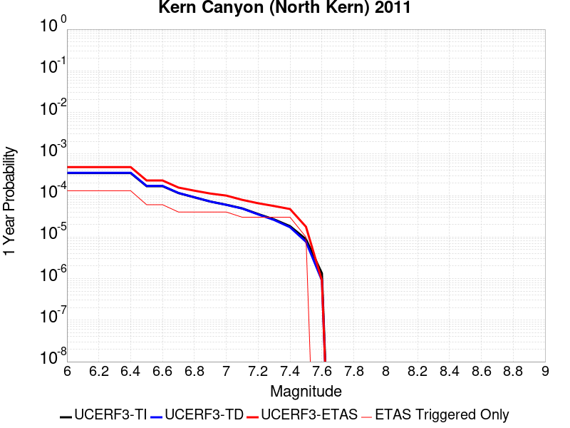 |  |

| Magnitude | 1 wk TI Prob | 1 wk TD Prob | 1 wk ETAS Prob | 1 wk ETAS/TD Gain | 1 wk ETAS Triggered Only | 1 mo TI Prob | 1 mo TD Prob | 1 mo ETAS Prob | 1 mo ETAS/TD Gain | 1 mo ETAS Triggered Only | 1 yr TI Prob | 1 yr TD Prob | 1 yr ETAS Prob | 1 yr ETAS/TD Gain | 1 yr ETAS Triggered Only | 10 yr TI Prob | 10 yr TD Prob | 10 yr ETAS Prob | 10 yr ETAS/TD Gain | 10 yr ETAS Triggered Only |
|-----|-----|-----|-----|-----|-----|-----|-----|-----|-----|-----|-----|-----|-----|-----|-----|-----|-----|-----|-----|-----|
| 6.0 | 6.6264497E-6 | 6.75733E-6 | 6.6397886E-5 | 9.826054 | 5.9640963E-5 | 2.8398761E-5 | 2.895971E-5 | 1.4823818E-4 | 5.118773 | 1.19281925E-4 | 3.4570007E-4 | 3.5253543E-4 | 4.717753E-4 | 1.3382351 | 1.19281925E-4 | 0.0034516277 | 0.0035205502 | 0.0036988433 | 1.0506434 | 1.7892288E-4 |
| 6.1 | 6.6264497E-6 | 6.75733E-6 | 6.6397886E-5 | 9.826054 | 5.9640963E-5 | 2.8398761E-5 | 2.895971E-5 | 1.4823818E-4 | 5.118773 | 1.19281925E-4 | 3.4570007E-4 | 3.5253543E-4 | 4.717753E-4 | 1.3382351 | 1.19281925E-4 | 0.0034516277 | 0.0035205502 | 0.0036988433 | 1.0506434 | 1.7892288E-4 |
| 6.2 | 6.6264497E-6 | 6.75733E-6 | 6.6397886E-5 | 9.826054 | 5.9640963E-5 | 2.8398761E-5 | 2.895971E-5 | 1.4823818E-4 | 5.118773 | 1.19281925E-4 | 3.4570007E-4 | 3.5253543E-4 | 4.717753E-4 | 1.3382351 | 1.19281925E-4 | 0.0034516277 | 0.0035205502 | 0.0036988433 | 1.0506434 | 1.7892288E-4 |
| 6.3 | 6.6264497E-6 | 6.75733E-6 | 6.6397886E-5 | 9.826054 | 5.9640963E-5 | 2.8398761E-5 | 2.895971E-5 | 1.4823818E-4 | 5.118773 | 1.19281925E-4 | 3.4570007E-4 | 3.5253543E-4 | 4.717753E-4 | 1.3382351 | 1.19281925E-4 | 0.0034516277 | 0.0035205502 | 0.0036988433 | 1.0506434 | 1.7892288E-4 |
| 6.4 | 6.6264497E-6 | 6.75733E-6 | 6.6397886E-5 | 9.826054 | 5.9640963E-5 | 2.8398761E-5 | 2.895971E-5 | 1.4823818E-4 | 5.118773 | 1.19281925E-4 | 3.4570007E-4 | 3.5253543E-4 | 4.717753E-4 | 1.3382351 | 1.19281925E-4 | 0.0034516277 | 0.0035205502 | 0.0036988433 | 1.0506434 | 1.7892288E-4 |
| 6.5 | 3.2162225E-6 | 3.2570915E-6 | 6.289786E-5 | 19.31105 | 5.9640963E-5 | 1.3783738E-5 | 1.3958894E-5 | 7.3599025E-5 | 5.2725544 | 5.9640963E-5 | 1.6780409E-4 | 1.6993708E-4 | 2.2956792E-4 | 1.3508995 | 5.9640963E-5 | 0.0016767744 | 0.001698151 | 0.0017576907 | 1.0350615 | 5.9640963E-5 |
| 6.6 | 3.2162225E-6 | 3.2570915E-6 | 6.289786E-5 | 19.31105 | 5.9640963E-5 | 1.3783738E-5 | 1.3958894E-5 | 7.3599025E-5 | 5.2725544 | 5.9640963E-5 | 1.6780409E-4 | 1.6993708E-4 | 2.2956792E-4 | 1.3508995 | 5.9640963E-5 | 0.0016767744 | 0.001698151 | 0.0017576907 | 1.0350615 | 5.9640963E-5 |
| 6.7 | 2.1908265E-6 | 2.2071222E-6 | 2.2071222E-6 | 1.0 | 0.0 | 9.389223E-6 | 9.459062E-6 | 9.459062E-6 | 1.0 | 0.0 | 1.1430779E-4 | 1.1515819E-4 | 1.1515819E-4 | 1.0 | 0.0 | 0.0011424901 | 0.0011510046 | 0.0011510046 | 1.0 | 0.0 |
| 6.8 | 1.7303895E-6 | 1.736553E-6 | 1.736553E-6 | 1.0 | 0.0 | 7.415934E-6 | 7.442349E-6 | 7.442349E-6 | 1.0 | 0.0 | 9.028525E-5 | 9.060693E-5 | 9.060693E-5 | 1.0 | 0.0 | 9.024858E-4 | 9.0570963E-4 | 9.0570963E-4 | 1.0 | 0.0 |
| 6.9 | 1.3700314E-6 | 1.3688623E-6 | 1.3688623E-6 | 1.0 | 0.0 | 5.87155E-6 | 5.86654E-6 | 5.86654E-6 | 1.0 | 0.0 | 7.148377E-5 | 7.142283E-5 | 7.142283E-5 | 1.0 | 0.0 | 7.146078E-4 | 7.140033E-4 | 7.140033E-4 | 1.0 | 0.0 |
| 7.0 | 1.1467797E-6 | 1.1413805E-6 | 1.1413805E-6 | 1.0 | 0.0 | 4.9147607E-6 | 4.8916218E-6 | 4.8916218E-6 | 1.0 | 0.0 | 5.983557E-5 | 5.95539E-5 | 5.95539E-5 | 1.0 | 0.0 | 5.981946E-4 | 5.9538253E-4 | 5.9538253E-4 | 1.0 | 0.0 |
| 7.1 | 9.3952065E-7 | 9.3026915E-7 | 9.3026915E-7 | 1.0 | 0.0 | 4.026511E-6 | 3.986862E-6 | 3.986862E-6 | 1.0 | 0.0 | 4.9021666E-5 | 4.853898E-5 | 4.853898E-5 | 1.0 | 0.0 | 4.901085E-4 | 4.8528553E-4 | 4.8528553E-4 | 1.0 | 0.0 |
| 7.2 | 6.858055E-7 | 6.7193014E-7 | 6.7193014E-7 | 1.0 | 0.0 | 2.939163E-6 | 2.8796974E-6 | 2.8796974E-6 | 1.0 | 0.0 | 3.5783723E-5 | 3.5059762E-5 | 3.5059762E-5 | 1.0 | 0.0 | 3.5777962E-4 | 3.5054318E-4 | 3.5054318E-4 | 1.0 | 0.0 |
| 7.3 | 5.1101983E-7 | 4.939301E-7 | 4.939301E-7 | 1.0 | 0.0 | 2.1900833E-6 | 2.1168414E-6 | 2.1168414E-6 | 1.0 | 0.0 | 2.6663936E-5 | 2.5772246E-5 | 2.5772246E-5 | 1.0 | 0.0 | 2.6660739E-4 | 2.5769303E-4 | 2.5769303E-4 | 1.0 | 0.0 |
| 7.4 | 3.4999414E-7 | 3.2995916E-7 | 3.2995916E-7 | 1.0 | 0.0 | 1.499974E-6 | 1.4141099E-6 | 1.4141099E-6 | 1.0 | 0.0 | 1.8262032E-5 | 1.7216655E-5 | 1.7216655E-5 | 1.0 | 0.0 | 1.826053E-4 | 1.7215345E-4 | 1.7215345E-4 | 1.0 | 0.0 |
| 7.5 | 1.7021522E-7 | 1.4750053E-7 | 1.4750053E-7 | 1.0 | 0.0 | 7.2949354E-7 | 6.32145E-7 | 6.32145E-7 | 1.0 | 0.0 | 8.881548E-6 | 7.696339E-6 | 7.696339E-6 | 1.0 | 0.0 | 8.8811925E-5 | 7.696081E-5 | 7.696081E-5 | 1.0 | 0.0 |
| 7.6 | 2.572245E-8 | 1.735264E-8 | 1.735264E-8 | 1.0 | 0.0 | 1.10239064E-7 | 7.436845E-8 | 7.436845E-8 | 1.0 | 0.0 | 1.3421597E-6 | 9.0543557E-7 | 9.0543557E-7 | 1.0 | 0.0 | 1.3421517E-5 | 9.054324E-6 | 9.054324E-6 | 1.0 | 0.0 |

## Brawley (Seismic Zone) alt 1
*[(top)](#table-of-contents)*

| 1 Week | 1 Month | 1 Year | 10 Year |
|-----|-----|-----|-----|
|  | 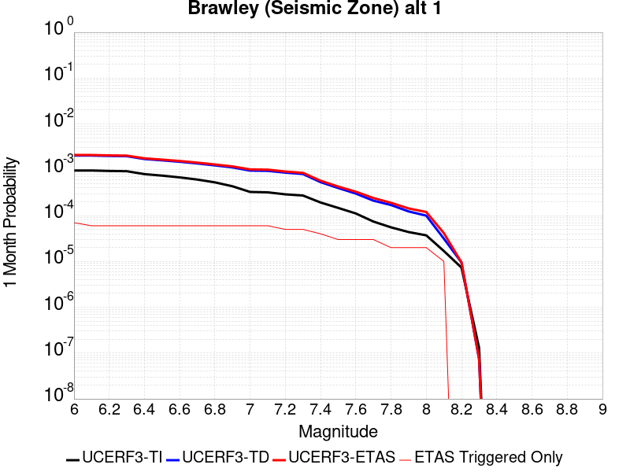 | 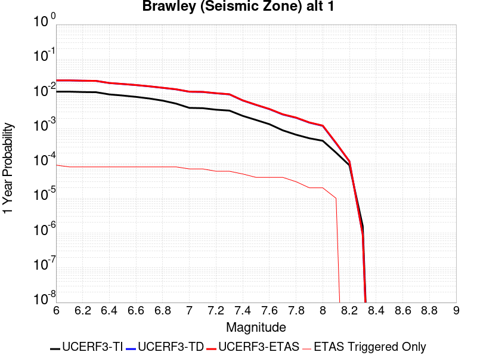 |  |

| Magnitude | 1 wk TI Prob | 1 wk TD Prob | 1 wk ETAS Prob | 1 wk ETAS/TD Gain | 1 wk ETAS Triggered Only | 1 mo TI Prob | 1 mo TD Prob | 1 mo ETAS Prob | 1 mo ETAS/TD Gain | 1 mo ETAS Triggered Only | 1 yr TI Prob | 1 yr TD Prob | 1 yr ETAS Prob | 1 yr ETAS/TD Gain | 1 yr ETAS Triggered Only | 10 yr TI Prob | 10 yr TD Prob | 10 yr ETAS Prob | 10 yr ETAS/TD Gain | 10 yr ETAS Triggered Only |
|-----|-----|-----|-----|-----|-----|-----|-----|-----|-----|-----|-----|-----|-----|-----|-----|-----|-----|-----|-----|-----|
| 6.0 | 2.2521618E-4 | 4.763429E-4 | 4.763429E-4 | 1.0 | 0.0 | 9.6485513E-4 | 0.0020399094 | 0.0020399094 | 1.0 | 0.0 | 0.011683988 | 0.024544531 | 0.024544531 | 1.0 | 0.0 | 0.11088423 | 0.21349923 | 0.21359305 | 1.0004394 | 1.19281925E-4 |
| 6.1 | 2.2521618E-4 | 4.763429E-4 | 4.763429E-4 | 1.0 | 0.0 | 9.6485513E-4 | 0.0020399094 | 0.0020399094 | 1.0 | 0.0 | 0.011683988 | 0.024544531 | 0.024544531 | 1.0 | 0.0 | 0.11088423 | 0.21349923 | 0.21359305 | 1.0004394 | 1.19281925E-4 |
| 6.2 | 2.198148E-4 | 4.6718874E-4 | 4.6718874E-4 | 1.0 | 0.0 | 9.417233E-4 | 0.0020007377 | 0.0020007377 | 1.0 | 0.0 | 0.011405343 | 0.024078513 | 0.024078513 | 1.0 | 0.0 | 0.10837428 | 0.20993572 | 0.21002997 | 1.000449 | 1.19281925E-4 |
| 6.3 | 2.1704129E-4 | 4.615455E-4 | 4.615455E-4 | 1.0 | 0.0 | 9.298453E-4 | 0.0019765892 | 0.0019765892 | 1.0 | 0.0 | 0.011262234 | 0.023792034 | 0.023792034 | 1.0 | 0.0 | 0.107082725 | 0.20782684 | 0.20792133 | 1.0004547 | 1.19281925E-4 |
| 6.4 | 1.876142E-4 | 4.004663E-4 | 4.004663E-4 | 1.0 | 0.0 | 8.038131E-4 | 0.0017151695 | 0.0017151695 | 1.0 | 0.0 | 0.00974259 | 0.020678662 | 0.020678662 | 1.0 | 0.0 | 0.093263686 | 0.18457787 | 0.18467513 | 1.0005269 | 1.19281925E-4 |
| 6.5 | 1.7390939E-4 | 3.7478763E-4 | 3.7478763E-4 | 1.0 | 0.0 | 7.45113E-4 | 0.0016052561 | 0.0016052561 | 1.0 | 0.0 | 0.009034078 | 0.019367293 | 0.019367293 | 1.0 | 0.0 | 0.086755216 | 0.17440015 | 0.17449863 | 1.0005647 | 1.19281925E-4 |
| 6.6 | 1.591791E-4 | 3.4893592E-4 | 3.4893592E-4 | 1.0 | 0.0 | 6.8201777E-4 | 0.0014945926 | 0.0014945926 | 1.0 | 0.0 | 0.008271996 | 0.018045008 | 0.018045008 | 1.0 | 0.0 | 0.07970774 | 0.16380787 | 0.1639076 | 1.0006089 | 1.19281925E-4 |
| 6.7 | 1.4268003E-4 | 3.2059717E-4 | 3.2059717E-4 | 1.0 | 0.0 | 6.1134255E-4 | 0.0013732726 | 0.0013732726 | 1.0 | 0.0 | 0.007417723 | 0.01659171 | 0.01659171 | 1.0 | 0.0 | 0.07174956 | 0.15193594 | 0.15203708 | 1.0006658 | 1.19281925E-4 |
| 6.8 | 1.239713E-4 | 2.9055026E-4 | 2.9055026E-4 | 1.0 | 0.0 | 5.3119735E-4 | 0.0012446274 | 0.0012446274 | 1.0 | 0.0 | 0.0064481674 | 0.015049482 | 0.015049482 | 1.0 | 0.0 | 0.06264243 | 0.13838051 | 0.13848329 | 1.0007427 | 1.19281925E-4 |
| 6.9 | 1.0180238E-4 | 2.6255674E-4 | 2.6255674E-4 | 1.0 | 0.0 | 4.3622297E-4 | 0.0011247622 | 0.0011247622 | 1.0 | 0.0 | 0.005298089 | 0.013608998 | 0.013608998 | 1.0 | 0.0 | 0.05173543 | 0.12496473 | 0.1250691 | 1.0008353 | 1.19281925E-4 |
| 7.0 | 7.6619996E-5 | 2.2400476E-4 | 2.2400476E-4 | 1.0 | 0.0 | 3.283301E-4 | 9.596704E-4 | 9.596704E-4 | 1.0 | 0.0 | 0.0039900932 | 0.011622103 | 0.011622103 | 1.0 | 0.0 | 0.039192066 | 0.10726982 | 0.107376315 | 1.0009927 | 1.19281925E-4 |
| 7.1 | 7.5127435E-5 | 2.2083633E-4 | 2.2083633E-4 | 1.0 | 0.0 | 3.2193496E-4 | 9.461013E-4 | 9.461013E-4 | 1.0 | 0.0 | 0.0039125155 | 0.011458648 | 0.011458648 | 1.0 | 0.0 | 0.038443442 | 0.10583378 | 0.10594044 | 1.0010078 | 1.19281925E-4 |
| 7.2 | 6.788582E-5 | 2.0211334E-4 | 2.0211334E-4 | 1.0 | 0.0 | 2.9090676E-4 | 8.6591556E-4 | 8.6591556E-4 | 1.0 | 0.0 | 0.0035360386 | 0.0104922 | 0.0104922 | 1.0 | 0.0 | 0.034803 | 0.097503684 | 0.09761134 | 1.0011041 | 1.19281925E-4 |
| 7.3 | 6.399602E-5 | 1.8842232E-4 | 1.8842232E-4 | 1.0 | 0.0 | 2.7423984E-4 | 8.0727716E-4 | 8.0727716E-4 | 1.0 | 0.0 | 0.0033337586 | 0.009784897 | 0.009784897 | 1.0 | 0.0 | 0.03284188 | 0.091397986 | 0.09150636 | 1.0011858 | 1.19281925E-4 |
| 7.4 | 4.506759E-5 | 1.2530042E-4 | 1.2530042E-4 | 1.0 | 0.0 | 1.9313251E-4 | 5.3689216E-4 | 5.3689216E-4 | 1.0 | 0.0 | 0.0023488526 | 0.006517245 | 0.006517245 | 1.0 | 0.0 | 0.023241805 | 0.062364522 | 0.062476363 | 1.0017934 | 1.19281925E-4 |
| 7.5 | 3.43289E-5 | 9.336103E-5 | 9.336103E-5 | 1.0 | 0.0 | 1.4711556E-4 | 4.0005764E-4 | 4.0005764E-4 | 1.0 | 0.0 | 0.0017896603 | 0.004859886 | 0.004859886 | 1.0 | 0.0 | 0.01775316 | 0.047057066 | 0.047170736 | 1.0024155 | 1.19281925E-4 |
| 7.6 | 2.5980507E-5 | 7.053672E-5 | 7.053672E-5 | 1.0 | 0.0 | 1.1134028E-4 | 3.0226534E-4 | 3.0226534E-4 | 1.0 | 0.0 | 0.001354725 | 0.0036738948 | 0.0036738948 | 1.0 | 0.0 | 0.013464959 | 0.03584298 | 0.035900485 | 1.0016043 | 5.9640963E-5 |
| 7.7 | 1.7292105E-5 | 4.9412036E-5 | 4.9412036E-5 | 1.0 | 0.0 | 7.4106916E-5 | 2.1174872E-4 | 2.1174872E-4 | 1.0 | 0.0 | 9.018782E-4 | 0.0025749984 | 0.0025749984 | 1.0 | 0.0 | 0.008982267 | 0.025292097 | 0.025350228 | 1.0022985 | 5.9640963E-5 |
| 7.8 | 1.2927471E-5 | 3.9697254E-5 | 3.9697254E-5 | 1.0 | 0.0 | 5.5402274E-5 | 1.7012001E-4 | 1.7012001E-4 | 1.0 | 0.0 | 6.743139E-4 | 0.0020692463 | 0.0020692463 | 1.0 | 0.0 | 0.0067227143 | 0.020433145 | 0.020491567 | 1.0028592 | 5.9640963E-5 |
| 7.9 | 1.0200774E-5 | 2.8748475E-5 | 2.8748475E-5 | 1.0 | 0.0 | 4.371687E-5 | 1.2320194E-4 | 1.2320194E-4 | 1.0 | 0.0 | 5.321229E-4 | 0.0014989526 | 0.0014989526 | 1.0 | 0.0 | 0.005308505 | 0.014992895 | 0.0150516415 | 1.0039183 | 5.9640963E-5 |
| 8.0 | 8.650396E-6 | 2.3279512E-5 | 2.3279512E-5 | 1.0 | 0.0 | 3.70726E-5 | 9.976552E-5 | 9.976552E-5 | 1.0 | 0.0 | 4.5126543E-4 | 0.0012139693 | 0.0012139693 | 1.0 | 0.0 | 0.0045035016 | 0.012212164 | 0.012271076 | 1.004824 | 5.9640963E-5 |
| 8.1 | 3.9368224E-6 | 7.3283345E-6 | 7.3283345E-6 | 1.0 | 0.0 | 1.6871985E-5 | 3.1406773E-5 | 3.1406773E-5 | 1.0 | 0.0 | 2.0539707E-4 | 3.8231048E-4 | 3.8231048E-4 | 1.0 | 0.0 | 0.0020520731 | 0.0040015313 | 0.0040015313 | 1.0 | 0.0 |
| 8.2 | 1.7101195E-6 | 2.2178374E-6 | 2.2178374E-6 | 1.0 | 0.0 | 7.329063E-6 | 9.504983E-6 | 9.504983E-6 | 1.0 | 0.0 | 8.922769E-5 | 1.15717055E-4 | 1.15717055E-4 | 1.0 | 0.0 | 8.9191867E-4 | 0.00126669 | 0.00126669 | 1.0 | 0.0 |
| 8.3 | 3.0346666E-8 | 1.721086E-8 | 1.721086E-8 | 1.0 | 0.0 | 1.3005713E-7 | 7.376083E-8 | 7.376083E-8 | 1.0 | 0.0 | 1.5834444E-6 | 8.98038E-7 | 8.98038E-7 | 1.0 | 0.0 | 1.5834332E-5 | 9.36379E-6 | 9.36379E-6 | 1.0 | 0.0 |

## Camp Rock 2011
*[(top)](#table-of-contents)*

| 1 Week | 1 Month | 1 Year | 10 Year |
|-----|-----|-----|-----|
| 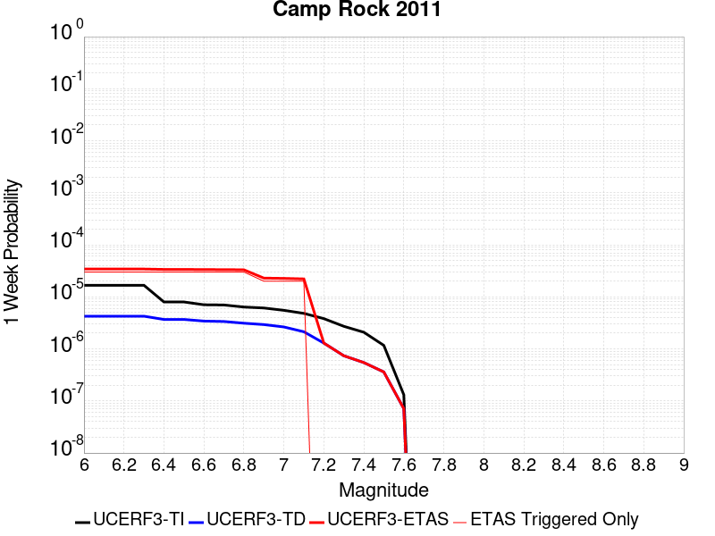 | 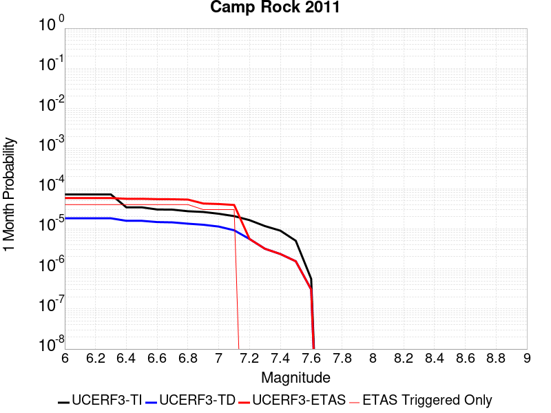 |  | 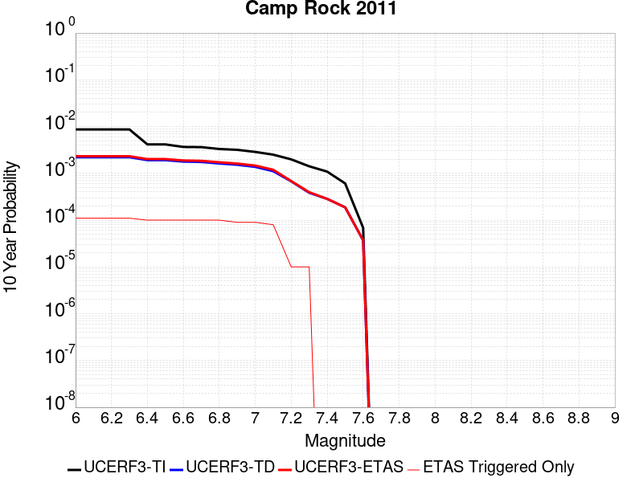 |

| Magnitude | 1 wk TI Prob | 1 wk TD Prob | 1 wk ETAS Prob | 1 wk ETAS/TD Gain | 1 wk ETAS Triggered Only | 1 mo TI Prob | 1 mo TD Prob | 1 mo ETAS Prob | 1 mo ETAS/TD Gain | 1 mo ETAS Triggered Only | 1 yr TI Prob | 1 yr TD Prob | 1 yr ETAS Prob | 1 yr ETAS/TD Gain | 1 yr ETAS Triggered Only | 10 yr TI Prob | 10 yr TD Prob | 10 yr ETAS Prob | 10 yr ETAS/TD Gain | 10 yr ETAS Triggered Only |
|-----|-----|-----|-----|-----|-----|-----|-----|-----|-----|-----|-----|-----|-----|-----|-----|-----|-----|-----|-----|-----|
| 6.0 | 1.6710783E-5 | 4.249999E-6 | 1.2353141E-4 | 29.066221 | 1.19281925E-4 | 7.161568E-5 | 1.8214158E-5 | 1.374939E-4 | 7.548738 | 1.19281925E-4 | 8.7157206E-4 | 2.2173533E-4 | 3.409908E-4 | 1.537828 | 1.19281925E-4 | 0.008681616 | 0.0022151938 | 0.0023342115 | 1.0537279 | 1.19281925E-4 |
| 6.1 | 1.6710783E-5 | 4.249999E-6 | 1.2353141E-4 | 29.066221 | 1.19281925E-4 | 7.161568E-5 | 1.8214158E-5 | 1.374939E-4 | 7.548738 | 1.19281925E-4 | 8.7157206E-4 | 2.2173533E-4 | 3.409908E-4 | 1.537828 | 1.19281925E-4 | 0.008681616 | 0.0022151938 | 0.0023342115 | 1.0537279 | 1.19281925E-4 |
| 6.2 | 1.6710783E-5 | 4.249999E-6 | 1.2353141E-4 | 29.066221 | 1.19281925E-4 | 7.161568E-5 | 1.8214158E-5 | 1.374939E-4 | 7.548738 | 1.19281925E-4 | 8.7157206E-4 | 2.2173533E-4 | 3.409908E-4 | 1.537828 | 1.19281925E-4 | 0.008681616 | 0.0022151938 | 0.0023342115 | 1.0537279 | 1.19281925E-4 |
| 6.3 | 1.6710783E-5 | 4.249999E-6 | 1.2353141E-4 | 29.066221 | 1.19281925E-4 | 7.161568E-5 | 1.8214158E-5 | 1.374939E-4 | 7.548738 | 1.19281925E-4 | 8.7157206E-4 | 2.2173533E-4 | 3.409908E-4 | 1.537828 | 1.19281925E-4 | 0.008681616 | 0.0022151938 | 0.0023342115 | 1.0537279 | 1.19281925E-4 |
| 6.4 | 7.982846E-6 | 3.6820359E-6 | 1.2296352E-4 | 33.395523 | 1.19281925E-4 | 3.421175E-5 | 1.578006E-5 | 1.350601E-4 | 8.558909 | 1.19281925E-4 | 4.1644843E-4 | 1.9210564E-4 | 3.1136465E-4 | 1.6207991 | 1.19281925E-4 | 0.0041566887 | 0.0019194306 | 0.0020384835 | 1.0620252 | 1.19281925E-4 |
| 6.5 | 7.982846E-6 | 3.6820359E-6 | 1.2296352E-4 | 33.395523 | 1.19281925E-4 | 3.421175E-5 | 1.578006E-5 | 1.350601E-4 | 8.558909 | 1.19281925E-4 | 4.1644843E-4 | 1.9210564E-4 | 3.1136465E-4 | 1.6207991 | 1.19281925E-4 | 0.0041566887 | 0.0019194306 | 0.0020384835 | 1.0620252 | 1.19281925E-4 |
| 6.6 | 7.048869E-6 | 3.4242998E-6 | 1.2270581E-4 | 35.83384 | 1.19281925E-4 | 3.0209088E-5 | 1.467549E-5 | 1.3395566E-4 | 9.12785 | 1.19281925E-4 | 3.677336E-4 | 1.7865976E-4 | 2.9792037E-4 | 1.6675292 | 1.19281925E-4 | 0.0036712566 | 0.0017851929 | 0.0019042619 | 1.0666981 | 1.19281925E-4 |
| 6.7 | 6.987307E-6 | 3.3622775E-6 | 1.226438E-4 | 36.476406 | 1.19281925E-4 | 2.9945259E-5 | 1.4409683E-5 | 1.3368989E-4 | 9.2777815 | 1.19281925E-4 | 3.6452254E-4 | 1.7542407E-4 | 2.9468507E-4 | 1.679844 | 1.19281925E-4 | 0.0036392517 | 0.0017528872 | 0.0018719599 | 1.0679295 | 1.19281925E-4 |
| 6.8 | 6.3737602E-6 | 3.1178672E-6 | 1.2239942E-4 | 39.257416 | 1.19281925E-4 | 2.731583E-5 | 1.3362222E-5 | 1.3264256E-4 | 9.926684 | 1.19281925E-4 | 3.3251947E-4 | 1.6267318E-4 | 2.819357E-4 | 1.7331418 | 1.19281925E-4 | 0.0033202237 | 0.0016255698 | 0.0017446578 | 1.0732592 | 1.19281925E-4 |
| 6.9 | 6.112211E-6 | 2.933078E-6 | 1.2221465E-4 | 41.667713 | 1.19281925E-4 | 2.6194928E-5 | 1.2570275E-5 | 1.318507E-4 | 10.489086 | 1.19281925E-4 | 3.1887658E-4 | 1.5303263E-4 | 2.722963E-4 | 1.7793349 | 1.19281925E-4 | 0.003184194 | 0.0015293002 | 0.0016483997 | 1.0778785 | 1.19281925E-4 |
| 7.0 | 5.5140117E-6 | 2.64191E-6 | 1.2192352E-4 | 46.149765 | 1.19281925E-4 | 2.3631264E-5 | 1.1322423E-5 | 1.30603E-4 | 11.534898 | 1.19281925E-4 | 2.8767265E-4 | 1.3784204E-4 | 2.5710752E-4 | 1.8652331 | 1.19281925E-4 | 0.0028730053 | 0.0013775907 | 0.0014967083 | 1.0864681 | 1.19281925E-4 |
| 7.1 | 4.8151105E-6 | 2.1342612E-6 | 1.2141593E-4 | 56.888977 | 1.19281925E-4 | 2.0636026E-5 | 9.146803E-6 | 1.2842764E-4 | 14.040713 | 1.19281925E-4 | 2.5121463E-4 | 1.1135685E-4 | 2.3062549E-4 | 2.071049 | 1.19281925E-4 | 0.0025093083 | 0.0011130325 | 0.0012321816 | 1.1070491 | 1.19281925E-4 |
| 7.2 | 3.818335E-6 | 1.2937372E-6 | 1.2937372E-6 | 1.0 | 0.0 | 1.6364189E-5 | 5.5445767E-6 | 5.5445767E-6 | 1.0 | 0.0 | 1.9921579E-4 | 6.750321E-5 | 6.750321E-5 | 1.0 | 0.0 | 0.0019903728 | 6.7483535E-4 | 6.7483535E-4 | 1.0 | 0.0 |
| 7.3 | 2.7166698E-6 | 7.383078E-7 | 7.383078E-7 | 1.0 | 0.0 | 1.1642818E-5 | 3.1641725E-6 | 3.1641725E-6 | 1.0 | 0.0 | 1.4174209E-4 | 3.852314E-5 | 3.852314E-5 | 1.0 | 0.0 | 0.0014165172 | 3.8516664E-4 | 3.8516664E-4 | 1.0 | 0.0 |
| 7.4 | 2.0893426E-6 | 5.4614605E-7 | 5.4614605E-7 | 1.0 | 0.0 | 8.954295E-6 | 2.340624E-6 | 2.340624E-6 | 1.0 | 0.0 | 1.0901308E-4 | 2.8496728E-5 | 2.8496728E-5 | 1.0 | 0.0 | 0.0010895962 | 2.849313E-4 | 2.849313E-4 | 1.0 | 0.0 |
| 7.5 | 1.1681728E-6 | 3.6028484E-7 | 3.6028484E-7 | 1.0 | 0.0 | 5.0064455E-6 | 1.544077E-6 | 1.544077E-6 | 1.0 | 0.0 | 6.0951766E-5 | 1.879898E-5 | 1.879898E-5 | 1.0 | 0.0 | 6.093505E-4 | 1.8797436E-4 | 1.8797436E-4 | 1.0 | 0.0 |
| 7.6 | 1.3154387E-7 | 7.1196716E-8 | 7.1196716E-8 | 1.0 | 0.0 | 5.6375933E-7 | 3.0512876E-7 | 3.0512876E-7 | 1.0 | 0.0 | 6.863748E-6 | 3.714938E-6 | 3.714938E-6 | 1.0 | 0.0 | 6.863536E-5 | 3.7148915E-5 | 3.7148915E-5 | 1.0 | 0.0 |

## Mission Creek
*[(top)](#table-of-contents)*

| 1 Week | 1 Month | 1 Year | 10 Year |
|-----|-----|-----|-----|
|  |  |  | 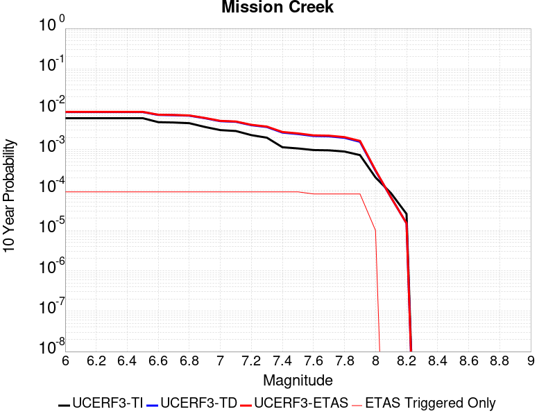 |

| Magnitude | 1 wk TI Prob | 1 wk TD Prob | 1 wk ETAS Prob | 1 wk ETAS/TD Gain | 1 wk ETAS Triggered Only | 1 mo TI Prob | 1 mo TD Prob | 1 mo ETAS Prob | 1 mo ETAS/TD Gain | 1 mo ETAS Triggered Only | 1 yr TI Prob | 1 yr TD Prob | 1 yr ETAS Prob | 1 yr ETAS/TD Gain | 1 yr ETAS Triggered Only | 10 yr TI Prob | 10 yr TD Prob | 10 yr ETAS Prob | 10 yr ETAS/TD Gain | 10 yr ETAS Triggered Only |
|-----|-----|-----|-----|-----|-----|-----|-----|-----|-----|-----|-----|-----|-----|-----|-----|-----|-----|-----|-----|-----|
| 6.0 | 1.1549387E-5 | 1.6322783E-5 | 7.596277E-5 | 4.653788 | 5.9640963E-5 | 4.9496433E-5 | 6.995299E-5 | 1.2958978E-4 | 1.8525267 | 5.9640963E-5 | 6.0245243E-4 | 8.5135986E-4 | 9.705403E-4 | 1.1399882 | 1.19281925E-4 | 0.006008218 | 0.008510157 | 0.008628423 | 1.0138972 | 1.19281925E-4 |
| 6.1 | 1.1549387E-5 | 1.6322783E-5 | 7.596277E-5 | 4.653788 | 5.9640963E-5 | 4.9496433E-5 | 6.995299E-5 | 1.2958978E-4 | 1.8525267 | 5.9640963E-5 | 6.0245243E-4 | 8.5135986E-4 | 9.705403E-4 | 1.1399882 | 1.19281925E-4 | 0.006008218 | 0.008510157 | 0.008628423 | 1.0138972 | 1.19281925E-4 |
| 6.2 | 1.1549387E-5 | 1.6322783E-5 | 7.596277E-5 | 4.653788 | 5.9640963E-5 | 4.9496433E-5 | 6.995299E-5 | 1.2958978E-4 | 1.8525267 | 5.9640963E-5 | 6.0245243E-4 | 8.5135986E-4 | 9.705403E-4 | 1.1399882 | 1.19281925E-4 | 0.006008218 | 0.008510157 | 0.008628423 | 1.0138972 | 1.19281925E-4 |
| 6.3 | 1.1549387E-5 | 1.6322783E-5 | 7.596277E-5 | 4.653788 | 5.9640963E-5 | 4.9496433E-5 | 6.995299E-5 | 1.2958978E-4 | 1.8525267 | 5.9640963E-5 | 6.0245243E-4 | 8.5135986E-4 | 9.705403E-4 | 1.1399882 | 1.19281925E-4 | 0.006008218 | 0.008510157 | 0.008628423 | 1.0138972 | 1.19281925E-4 |
| 6.4 | 1.1549387E-5 | 1.6322783E-5 | 7.596277E-5 | 4.653788 | 5.9640963E-5 | 4.9496433E-5 | 6.995299E-5 | 1.2958978E-4 | 1.8525267 | 5.9640963E-5 | 6.0245243E-4 | 8.5135986E-4 | 9.705403E-4 | 1.1399882 | 1.19281925E-4 | 0.006008218 | 0.008510157 | 0.008628423 | 1.0138972 | 1.19281925E-4 |
| 6.5 | 1.1549387E-5 | 1.6322783E-5 | 7.596277E-5 | 4.653788 | 5.9640963E-5 | 4.9496433E-5 | 6.995299E-5 | 1.2958978E-4 | 1.8525267 | 5.9640963E-5 | 6.0245243E-4 | 8.5135986E-4 | 9.705403E-4 | 1.1399882 | 1.19281925E-4 | 0.006008218 | 0.008510157 | 0.008628423 | 1.0138972 | 1.19281925E-4 |
| 6.6 | 9.202681E-6 | 1.3846059E-5 | 7.34862E-5 | 5.3073726 | 5.9640963E-5 | 3.9439463E-5 | 5.9338956E-5 | 1.1897638E-4 | 2.00503 | 5.9640963E-5 | 4.800697E-4 | 7.2222133E-4 | 8.414171E-4 | 1.1650405 | 1.19281925E-4 | 0.004790339 | 0.0072273402 | 0.00734576 | 1.016385 | 1.19281925E-4 |
| 6.7 | 9.019164E-6 | 1.3651728E-5 | 7.329188E-5 | 5.3686886 | 5.9640963E-5 | 3.8652986E-5 | 5.8506146E-5 | 1.1814362E-4 | 2.019337 | 5.9640963E-5 | 4.7049852E-4 | 7.1208854E-4 | 8.3128555E-4 | 1.1673907 | 1.19281925E-4 | 0.004695036 | 0.0071266647 | 0.0072450964 | 1.0166181 | 1.19281925E-4 |
| 6.8 | 8.673558E-6 | 1.3273839E-5 | 7.291401E-5 | 5.493061 | 5.9640963E-5 | 3.717186E-5 | 5.688669E-5 | 1.1652426E-4 | 2.0483572 | 5.9640963E-5 | 4.524734E-4 | 6.923842E-4 | 8.1158354E-4 | 1.1721578 | 1.19281925E-4 | 0.0045155324 | 0.0069308523 | 0.0070493077 | 1.017091 | 1.19281925E-4 |
| 6.9 | 7.002255E-6 | 1.1478069E-5 | 7.1118346E-5 | 6.1960206 | 5.9640963E-5 | 3.000932E-5 | 4.9190832E-5 | 1.0882886E-4 | 2.212381 | 5.9640963E-5 | 3.653022E-4 | 5.9874065E-4 | 7.1795116E-4 | 1.199102 | 1.19281925E-4 | 0.0036470229 | 0.005999676 | 0.006118242 | 1.0197622 | 1.19281925E-4 |
| 7.0 | 5.84644E-6 | 9.675359E-6 | 6.931574E-5 | 7.164152 | 5.9640963E-5 | 2.5055931E-5 | 4.146519E-5 | 1.0110368E-4 | 2.4382784 | 5.9640963E-5 | 3.0501327E-4 | 5.047263E-4 | 6.2394806E-4 | 1.2362106 | 1.19281925E-4 | 0.0030459496 | 0.005063994 | 0.005182672 | 1.0234356 | 1.19281925E-4 |
| 7.1 | 5.54703E-6 | 9.329834E-6 | 6.8970236E-5 | 7.3924403 | 5.9640963E-5 | 2.377277E-5 | 3.9984414E-5 | 9.9622994E-5 | 2.4915454 | 5.9640963E-5 | 2.8939504E-4 | 4.8670598E-4 | 6.059298E-4 | 1.2449608 | 1.19281925E-4 | 0.0028901845 | 0.0048845876 | 0.0050032865 | 1.0243008 | 1.19281925E-4 |
| 7.2 | 4.384709E-6 | 7.681918E-6 | 6.732242E-5 | 8.763752 | 5.9640963E-5 | 1.8791474E-5 | 3.292211E-5 | 9.256111E-5 | 2.811518 | 5.9640963E-5 | 2.2876218E-4 | 4.0075663E-4 | 5.1999075E-4 | 1.2975225 | 1.19281925E-4 | 0.0022852682 | 0.004028542 | 0.0041473433 | 1.0294899 | 1.19281925E-4 |
| 7.3 | 3.7888456E-6 | 6.915788E-6 | 6.6556335E-5 | 9.623825 | 5.9640963E-5 | 1.623781E-5 | 2.9638775E-5 | 8.927797E-5 | 3.0122018 | 5.9640963E-5 | 1.9767738E-4 | 3.6079568E-4 | 4.8003456E-4 | 1.3304887 | 1.19281925E-4 | 0.0019750162 | 0.00363027 | 0.003749119 | 1.0327383 | 1.19281925E-4 |
| 7.4 | 2.1982462E-6 | 5.0241033E-6 | 6.466477E-5 | 12.870907 | 5.9640963E-5 | 9.421021E-6 | 2.1531694E-5 | 8.117137E-5 | 3.7698553 | 5.9640963E-5 | 1.1469489E-4 | 2.6211704E-4 | 3.813677E-4 | 1.454952 | 1.19281925E-4 | 0.0011463572 | 0.0026460327 | 0.002764999 | 1.0449603 | 1.19281925E-4 |
| 7.5 | 2.051923E-6 | 4.6153277E-6 | 6.425601E-5 | 13.922308 | 5.9640963E-5 | 8.793926E-6 | 1.9779825E-5 | 7.941961E-5 | 4.0151825 | 5.9640963E-5 | 1.0706078E-4 | 2.4079291E-4 | 3.600461E-4 | 1.4952521 | 1.19281925E-4 | 0.0010700922 | 0.0024335932 | 0.0025525847 | 1.0488955 | 1.19281925E-4 |
| 7.6 | 1.8733427E-6 | 4.1236603E-6 | 6.3764375E-5 | 15.463052 | 5.9640963E-5 | 8.028587E-6 | 1.7672712E-5 | 7.7312616E-5 | 4.374689 | 5.9640963E-5 | 9.774366E-5 | 2.151441E-4 | 3.3440036E-4 | 1.5543088 | 1.19281925E-4 | 9.770069E-4 | 0.0021782513 | 0.0022972734 | 1.0546411 | 1.19281925E-4 |
| 7.7 | 1.8411953E-6 | 4.0433315E-6 | 6.368405E-5 | 15.75039 | 5.9640963E-5 | 7.890813E-6 | 1.732845E-5 | 7.6968376E-5 | 4.441735 | 5.9640963E-5 | 9.606641E-5 | 2.1095353E-4 | 3.3021029E-4 | 1.5653224 | 1.19281925E-4 | 9.6024893E-4 | 0.0021365292 | 0.0022555562 | 1.0557104 | 1.19281925E-4 |
| 7.8 | 1.7194251E-6 | 3.71068E-6 | 6.335142E-5 | 17.072725 | 5.9640963E-5 | 7.368944E-6 | 1.5902819E-5 | 7.5542834E-5 | 4.7502794 | 5.9640963E-5 | 8.97132E-5 | 1.9359968E-4 | 3.1285852E-4 | 1.6160073 | 1.19281925E-4 | 8.967699E-4 | 0.0019624757 | 0.0020815234 | 1.060662 | 1.19281925E-4 |
| 7.9 | 1.4035052E-6 | 2.9502596E-6 | 6.259105E-5 | 21.215435 | 5.9640963E-5 | 6.0150082E-6 | 1.2643909E-5 | 7.2284114E-5 | 5.716912 | 5.9640963E-5 | 7.3230265E-5 | 1.5392878E-4 | 2.7319233E-4 | 1.7747971 | 1.19281925E-4 | 7.3206134E-4 | 0.0015631174 | 0.0016822128 | 1.076191 | 1.19281925E-4 |
| 8.0 | 3.9318823E-7 | 5.528477E-7 | 6.0193775E-5 | 108.87948 | 5.9640963E-5 | 1.6850913E-6 | 2.3693453E-6 | 6.2010164E-5 | 26.171856 | 5.9640963E-5 | 2.0515794E-5 | 2.8846403E-5 | 8.848564E-5 | 3.0674758 | 5.9640963E-5 | 2.0513899E-4 | 2.990952E-4 | 3.5871833E-4 | 1.199345 | 5.9640963E-5 |
| 8.1 | 1.596793E-7 | 1.13775044E-7 | 1.13775044E-7 | 1.0 | 0.0 | 6.8433974E-7 | 4.876072E-7 | 4.876072E-7 | 1.0 | 0.0 | 8.331805E-6 | 5.936602E-6 | 5.936602E-6 | 1.0 | 0.0 | 8.331492E-5 | 6.5494125E-5 | 6.5494125E-5 | 1.0 | 0.0 |
| 8.2 | 4.9003038E-8 | 2.5435753E-8 | 2.5435753E-8 | 1.0 | 0.0 | 2.10013E-7 | 1.09010365E-7 | 1.09010365E-7 | 1.0 | 0.0 | 2.5569052E-6 | 1.3272004E-6 | 1.3272004E-6 | 1.0 | 0.0 | 2.556876E-5 | 1.4952613E-5 | 1.4952613E-5 | 1.0 | 0.0 |

## Palos Verdes
*[(top)](#table-of-contents)*

| 1 Week | 1 Month | 1 Year | 10 Year |
|-----|-----|-----|-----|
|  |  |  |  |

| Magnitude | 1 wk TI Prob | 1 wk TD Prob | 1 wk ETAS Prob | 1 wk ETAS/TD Gain | 1 wk ETAS Triggered Only | 1 mo TI Prob | 1 mo TD Prob | 1 mo ETAS Prob | 1 mo ETAS/TD Gain | 1 mo ETAS Triggered Only | 1 yr TI Prob | 1 yr TD Prob | 1 yr ETAS Prob | 1 yr ETAS/TD Gain | 1 yr ETAS Triggered Only | 10 yr TI Prob | 10 yr TD Prob | 10 yr ETAS Prob | 10 yr ETAS/TD Gain | 10 yr ETAS Triggered Only |
|-----|-----|-----|-----|-----|-----|-----|-----|-----|-----|-----|-----|-----|-----|-----|-----|-----|-----|-----|-----|-----|
| 6.0 | 6.126063E-5 | 7.622572E-5 | 7.622572E-5 | 1.0 | 0.0 | 2.6251914E-4 | 3.266441E-4 | 3.266441E-4 | 1.0 | 0.0 | 0.0031914865 | 0.0039701737 | 0.004029578 | 1.0149626 | 5.9640963E-5 | 0.031460393 | 0.03904909 | 0.039163712 | 1.0029354 | 1.19281925E-4 |
| 6.1 | 6.126063E-5 | 7.622572E-5 | 7.622572E-5 | 1.0 | 0.0 | 2.6251914E-4 | 3.266441E-4 | 3.266441E-4 | 1.0 | 0.0 | 0.0031914865 | 0.0039701737 | 0.004029578 | 1.0149626 | 5.9640963E-5 | 0.031460393 | 0.03904909 | 0.039163712 | 1.0029354 | 1.19281925E-4 |
| 6.2 | 6.126063E-5 | 7.622572E-5 | 7.622572E-5 | 1.0 | 0.0 | 2.6251914E-4 | 3.266441E-4 | 3.266441E-4 | 1.0 | 0.0 | 0.0031914865 | 0.0039701737 | 0.004029578 | 1.0149626 | 5.9640963E-5 | 0.031460393 | 0.03904909 | 0.039163712 | 1.0029354 | 1.19281925E-4 |
| 6.3 | 4.0838047E-5 | 4.9749007E-5 | 4.9749007E-5 | 1.0 | 0.0 | 1.7500846E-4 | 2.1319388E-4 | 2.1319388E-4 | 1.0 | 0.0 | 0.0021286458 | 0.002592754 | 0.0026522405 | 1.0229433 | 5.9640963E-5 | 0.021083709 | 0.025646746 | 0.02576297 | 1.0045316 | 1.19281925E-4 |
| 6.4 | 4.0838047E-5 | 4.9749007E-5 | 4.9749007E-5 | 1.0 | 0.0 | 1.7500846E-4 | 2.1319388E-4 | 2.1319388E-4 | 1.0 | 0.0 | 0.0021286458 | 0.002592754 | 0.0026522405 | 1.0229433 | 5.9640963E-5 | 0.021083709 | 0.025646746 | 0.02576297 | 1.0045316 | 1.19281925E-4 |
| 6.5 | 3.0512005E-5 | 3.6561592E-5 | 3.6561592E-5 | 1.0 | 0.0 | 1.3075917E-4 | 1.566838E-4 | 1.566838E-4 | 1.0 | 0.0 | 0.0015908304 | 0.001906072 | 0.001906072 | 1.0 | 0.0 | 0.015794903 | 0.018909173 | 0.018967686 | 1.0030944 | 5.9640963E-5 |
| 6.6 | 2.9255087E-5 | 3.5154393E-5 | 3.5154393E-5 | 1.0 | 0.0 | 1.2537291E-4 | 1.5065364E-4 | 1.5065364E-4 | 1.0 | 0.0 | 0.0015253464 | 0.0018327782 | 0.0018327782 | 1.0 | 0.0 | 0.015149189 | 0.018188244 | 0.0182468 | 1.0032195 | 5.9640963E-5 |
| 6.7 | 2.287198E-5 | 2.724828E-5 | 2.724828E-5 | 1.0 | 0.0 | 9.801909E-5 | 1.16773626E-4 | 1.16773626E-4 | 1.0 | 0.0 | 0.001192729 | 0.0014208833 | 0.0014208833 | 1.0 | 0.0 | 0.011863477 | 0.014127217 | 0.014186016 | 1.0041621 | 5.9640963E-5 |
| 6.8 | 2.1325764E-5 | 2.5431878E-5 | 2.5431878E-5 | 1.0 | 0.0 | 9.139293E-5 | 1.0898972E-4 | 1.0898972E-4 | 1.0 | 0.0 | 0.001112141 | 0.0013262323 | 0.0013262323 | 1.0 | 0.0 | 0.011065915 | 0.013192211 | 0.013251065 | 1.0044613 | 5.9640963E-5 |
| 6.9 | 1.9009392E-5 | 2.2613547E-5 | 2.2613547E-5 | 1.0 | 0.0 | 8.1466285E-5 | 9.6912096E-5 | 9.6912096E-5 | 1.0 | 0.0 | 9.914007E-4 | 0.0011793535 | 0.0011793535 | 1.0 | 0.0 | 0.009869894 | 0.011739633 | 0.011798574 | 1.0050206 | 5.9640963E-5 |
| 7.0 | 1.7098473E-5 | 2.0319356E-5 | 2.0319356E-5 | 1.0 | 0.0 | 7.3277115E-5 | 8.708052E-5 | 8.708052E-5 | 1.0 | 0.0 | 8.917837E-4 | 0.001059775 | 0.001059775 | 1.0 | 0.0 | 0.008882134 | 0.010555646 | 0.010614658 | 1.0055906 | 5.9640963E-5 |
| 7.1 | 1.5982785E-5 | 1.899476E-5 | 1.899476E-5 | 1.0 | 0.0 | 6.849585E-5 | 8.1404054E-5 | 8.1404054E-5 | 1.0 | 0.0 | 8.336179E-4 | 9.907284E-4 | 9.907284E-4 | 1.0 | 0.0 | 0.008304977 | 0.009871479 | 0.0099305315 | 1.0059822 | 5.9640963E-5 |
| 7.2 | 1.4468002E-5 | 1.7197237E-5 | 1.7197237E-5 | 1.0 | 0.0 | 6.200425E-5 | 7.370083E-5 | 7.370083E-5 | 1.0 | 0.0 | 7.546402E-4 | 8.970222E-4 | 8.970222E-4 | 1.0 | 0.0 | 0.007520827 | 0.008942284 | 0.009001391 | 1.0066099 | 5.9640963E-5 |
| 7.3 | 5.288233E-6 | 6.2036747E-6 | 6.2036747E-6 | 1.0 | 0.0 | 2.2663658E-5 | 2.6587102E-5 | 2.6587102E-5 | 1.0 | 0.0 | 2.7589512E-4 | 3.236848E-4 | 3.236848E-4 | 1.0 | 0.0 | 0.0027555283 | 0.0032355562 | 0.0032355562 | 1.0 | 0.0 |
| 7.4 | 8.279556E-7 | 8.408347E-7 | 8.408347E-7 | 1.0 | 0.0 | 3.5483763E-6 | 3.6035726E-6 | 3.6035726E-6 | 1.0 | 0.0 | 4.3200624E-5 | 4.3872686E-5 | 4.3872686E-5 | 1.0 | 0.0 | 4.3192226E-4 | 4.3864746E-4 | 4.3864746E-4 | 1.0 | 0.0 |
| 7.5 | 6.559831E-7 | 6.667229E-7 | 6.667229E-7 | 1.0 | 0.0 | 2.8113532E-6 | 2.857381E-6 | 2.857381E-6 | 1.0 | 0.0 | 3.4227687E-5 | 3.4788125E-5 | 3.4788125E-5 | 1.0 | 0.0 | 3.4222414E-4 | 3.4783344E-4 | 3.4783344E-4 | 1.0 | 0.0 |
| 7.6 | 3.5018968E-7 | 3.5620027E-7 | 3.5620027E-7 | 1.0 | 0.0 | 1.500812E-6 | 1.526572E-6 | 1.526572E-6 | 1.0 | 0.0 | 1.8272232E-5 | 1.8585903E-5 | 1.8585903E-5 | 1.0 | 0.0 | 1.8270731E-4 | 1.8584808E-4 | 1.8584808E-4 | 1.0 | 0.0 |
| 7.7 | 1.1986104E-7 | 1.2198376E-7 | 1.2198376E-7 | 1.0 | 0.0 | 5.1369005E-7 | 5.2278745E-7 | 5.2278745E-7 | 1.0 | 0.0 | 6.2541585E-6 | 6.364919E-6 | 6.364919E-6 | 1.0 | 0.0 | 6.2539824E-5 | 6.364741E-5 | 6.364741E-5 | 1.0 | 0.0 |
| 7.8 | 3.0445005E-8 | 3.1027582E-8 | 3.1027582E-8 | 1.0 | 0.0 | 1.3047858E-7 | 1.3297536E-7 | 1.3297536E-7 | 1.0 | 0.0 | 1.5885756E-6 | 1.6189739E-6 | 1.6189739E-6 | 1.0 | 0.0 | 1.5885644E-5 | 1.6189642E-5 | 1.6189642E-5 | 1.0 | 0.0 |

## San Jacinto (Stepovers Combined)
*[(top)](#table-of-contents)*

| 1 Week | 1 Month | 1 Year | 10 Year |
|-----|-----|-----|-----|
|  |  |  |  |

| Magnitude | 1 wk TI Prob | 1 wk TD Prob | 1 wk ETAS Prob | 1 wk ETAS/TD Gain | 1 wk ETAS Triggered Only | 1 mo TI Prob | 1 mo TD Prob | 1 mo ETAS Prob | 1 mo ETAS/TD Gain | 1 mo ETAS Triggered Only | 1 yr TI Prob | 1 yr TD Prob | 1 yr ETAS Prob | 1 yr ETAS/TD Gain | 1 yr ETAS Triggered Only | 10 yr TI Prob | 10 yr TD Prob | 10 yr ETAS Prob | 10 yr ETAS/TD Gain | 10 yr ETAS Triggered Only |
|-----|-----|-----|-----|-----|-----|-----|-----|-----|-----|-----|-----|-----|-----|-----|-----|-----|-----|-----|-----|-----|
| 6.0 | 4.0667746E-5 | 3.5271103E-5 | 3.5271103E-5 | 1.0 | 0.0 | 1.742787E-4 | 1.5115313E-4 | 2.1078507E-4 | 1.3945135 | 5.9640963E-5 | 0.0021197782 | 0.0018387372 | 0.0018982685 | 1.0323762 | 5.9640963E-5 | 0.020996714 | 0.018986495 | 0.019103512 | 1.0061631 | 1.19281925E-4 |
| 6.1 | 4.0667746E-5 | 3.5271103E-5 | 3.5271103E-5 | 1.0 | 0.0 | 1.742787E-4 | 1.5115313E-4 | 2.1078507E-4 | 1.3945135 | 5.9640963E-5 | 0.0021197782 | 0.0018387372 | 0.0018982685 | 1.0323762 | 5.9640963E-5 | 0.020996714 | 0.018986495 | 0.019103512 | 1.0061631 | 1.19281925E-4 |
| 6.2 | 4.0667746E-5 | 3.5271103E-5 | 3.5271103E-5 | 1.0 | 0.0 | 1.742787E-4 | 1.5115313E-4 | 2.1078507E-4 | 1.3945135 | 5.9640963E-5 | 0.0021197782 | 0.0018387372 | 0.0018982685 | 1.0323762 | 5.9640963E-5 | 0.020996714 | 0.018986495 | 0.019103512 | 1.0061631 | 1.19281925E-4 |
| 6.3 | 4.0667746E-5 | 3.5271103E-5 | 3.5271103E-5 | 1.0 | 0.0 | 1.742787E-4 | 1.5115313E-4 | 2.1078507E-4 | 1.3945135 | 5.9640963E-5 | 0.0021197782 | 0.0018387372 | 0.0018982685 | 1.0323762 | 5.9640963E-5 | 0.020996714 | 0.018986495 | 0.019103512 | 1.0061631 | 1.19281925E-4 |
| 6.4 | 4.0577226E-5 | 3.5143014E-5 | 3.5143014E-5 | 1.0 | 0.0 | 1.738908E-4 | 1.5060425E-4 | 2.1023622E-4 | 1.3959515 | 5.9640963E-5 | 0.0021150648 | 0.0018320669 | 0.0018915987 | 1.0324943 | 5.9640963E-5 | 0.020950472 | 0.018921062 | 0.019038087 | 1.0061849 | 1.19281925E-4 |
| 6.5 | 4.0577226E-5 | 3.5143014E-5 | 3.5143014E-5 | 1.0 | 0.0 | 1.738908E-4 | 1.5060425E-4 | 2.1023622E-4 | 1.3959515 | 5.9640963E-5 | 0.0021150648 | 0.0018320669 | 0.0018915987 | 1.0324943 | 5.9640963E-5 | 0.020950472 | 0.018921062 | 0.019038087 | 1.0061849 | 1.19281925E-4 |
| 6.6 | 4.053861E-5 | 3.5088357E-5 | 3.5088357E-5 | 1.0 | 0.0 | 1.7372532E-4 | 1.5037002E-4 | 2.1000202E-4 | 1.3965684 | 5.9640963E-5 | 0.0021130538 | 0.0018292206 | 0.0018887524 | 1.032545 | 5.9640963E-5 | 0.020930743 | 0.01889314 | 0.01901017 | 1.0061942 | 1.19281925E-4 |
| 6.7 | 4.0516545E-5 | 3.505743E-5 | 3.505743E-5 | 1.0 | 0.0 | 1.7363077E-4 | 1.502375E-4 | 2.098695E-4 | 1.3969182 | 5.9640963E-5 | 0.002111905 | 0.0018276101 | 0.001887142 | 1.0325737 | 5.9640963E-5 | 0.020919468 | 0.018877337 | 0.018994367 | 1.0061995 | 1.19281925E-4 |
| 6.8 | 4.049434E-5 | 3.5028992E-5 | 3.5028992E-5 | 1.0 | 0.0 | 1.7353562E-4 | 1.5011564E-4 | 2.0974764E-4 | 1.3972405 | 5.9640963E-5 | 0.0021107488 | 0.0018261289 | 0.0018856609 | 1.0326002 | 5.9640963E-5 | 0.020908125 | 0.018862749 | 0.01897978 | 1.0062044 | 1.19281925E-4 |
| 6.9 | 4.046386E-5 | 3.4991554E-5 | 3.4991554E-5 | 1.0 | 0.0 | 1.73405E-4 | 1.499552E-4 | 2.0958722E-4 | 1.3976656 | 5.9640963E-5 | 0.0021091616 | 0.0018241788 | 0.001883711 | 1.0326351 | 5.9640963E-5 | 0.020892553 | 0.018843522 | 0.018960556 | 1.0062108 | 1.19281925E-4 |
| 7.0 | 4.036382E-5 | 3.4872126E-5 | 3.4872126E-5 | 1.0 | 0.0 | 1.7297632E-4 | 1.4944343E-4 | 2.0907547E-4 | 1.3990276 | 5.9640963E-5 | 0.0021039525 | 0.0018179584 | 0.001877491 | 1.0327469 | 5.9640963E-5 | 0.02084144 | 0.018782137 | 0.018899178 | 1.0062315 | 1.19281925E-4 |
| 7.1 | 4.0343282E-5 | 3.485059E-5 | 3.485059E-5 | 1.0 | 0.0 | 1.7288832E-4 | 1.4935112E-4 | 2.0898318E-4 | 1.3992742 | 5.9640963E-5 | 0.002102883 | 0.0018168368 | 0.0018763694 | 1.0327672 | 5.9640963E-5 | 0.020830948 | 0.018771008 | 0.01888805 | 1.0062352 | 1.19281925E-4 |
| 7.2 | 4.0257353E-5 | 3.475509E-5 | 3.475509E-5 | 1.0 | 0.0 | 1.725201E-4 | 1.489419E-4 | 2.0857397E-4 | 1.4003714 | 5.9640963E-5 | 0.0020984085 | 0.0018118626 | 0.0018713954 | 1.0328573 | 5.9640963E-5 | 0.020787042 | 0.018721746 | 0.018838795 | 1.006252 | 1.19281925E-4 |
| 7.3 | 3.9940667E-5 | 3.458276E-5 | 3.458276E-5 | 1.0 | 0.0 | 1.7116306E-4 | 1.4820343E-4 | 2.0783555E-4 | 1.4023666 | 5.9640963E-5 | 0.0020819185 | 0.0018028866 | 0.0018624201 | 1.0330212 | 5.9640963E-5 | 0.020625217 | 0.018630387 | 0.018747447 | 1.0062833 | 1.19281925E-4 |
| 7.4 | 3.9721202E-5 | 3.4468165E-5 | 3.4468165E-5 | 1.0 | 0.0 | 1.7022261E-4 | 1.4771236E-4 | 2.0734452E-4 | 1.4037045 | 5.9640963E-5 | 0.0020704903 | 0.0017969179 | 0.0018564516 | 1.033131 | 5.9640963E-5 | 0.020513052 | 0.018569522 | 0.018686589 | 1.0063043 | 1.19281925E-4 |
| 7.5 | 3.7036873E-5 | 3.3535776E-5 | 3.3535776E-5 | 1.0 | 0.0 | 1.5871979E-4 | 1.4371685E-4 | 2.0334923E-4 | 1.4149297 | 5.9640963E-5 | 0.0019307006 | 0.0017483513 | 0.001807888 | 1.0340531 | 5.9640963E-5 | 0.019140124 | 0.018071128 | 0.018188255 | 1.0064814 | 1.19281925E-4 |
| 7.6 | 3.2940967E-5 | 3.13167E-5 | 3.13167E-5 | 1.0 | 0.0 | 1.4116794E-4 | 1.3420754E-4 | 1.938405E-4 | 1.4443339 | 5.9640963E-5 | 0.0017173645 | 0.0016327545 | 0.001692298 | 1.0364681 | 5.9640963E-5 | 0.01704153 | 0.016904091 | 0.017021356 | 1.0069371 | 1.19281925E-4 |
| 7.7 | 2.8236149E-5 | 2.7882697E-5 | 2.7882697E-5 | 1.0 | 0.0 | 1.2100645E-4 | 1.1949181E-4 | 1.7912564E-4 | 1.4990622 | 5.9640963E-5 | 0.0014722579 | 0.0014538429 | 0.0015133972 | 1.0409633 | 5.9640963E-5 | 0.014625421 | 0.015114912 | 0.015232391 | 1.0077724 | 1.19281925E-4 |
| 7.8 | 2.4329287E-5 | 2.5206451E-5 | 2.5206451E-5 | 1.0 | 0.0 | 1.042642E-4 | 1.08023174E-4 | 1.676577E-4 | 1.552053 | 5.9640963E-5 | 0.0012686774 | 0.0013143895 | 0.0013739521 | 1.0453157 | 5.9640963E-5 | 0.012614589 | 0.013712341 | 0.013829987 | 1.0085796 | 1.19281925E-4 |
| 7.9 | 1.9370926E-5 | 2.0420413E-5 | 2.0420413E-5 | 1.0 | 0.0 | 8.301561E-5 | 8.751312E-5 | 1.4714886E-4 | 1.6814492 | 5.9640963E-5 | 0.0010102465 | 0.0010649522 | 0.0011245298 | 1.0559437 | 5.9640963E-5 | 0.0100566605 | 0.011199402 | 0.011317347 | 1.0105314 | 1.19281925E-4 |
| 8.0 | 1.5583017E-5 | 1.5885415E-5 | 1.5885415E-5 | 1.0 | 0.0 | 6.6782646E-5 | 6.807858E-5 | 6.807858E-5 | 1.0 | 0.0 | 8.127754E-4 | 8.2854216E-4 | 8.2854216E-4 | 1.0 | 0.0 | 0.008098091 | 0.008781636 | 0.008840754 | 1.0067319 | 5.9640963E-5 |
| 8.1 | 1.0024873E-5 | 8.291399E-6 | 8.291399E-6 | 1.0 | 0.0 | 4.2963035E-5 | 3.553409E-5 | 3.553409E-5 | 1.0 | 0.0 | 5.229494E-4 | 4.3254215E-4 | 4.3254215E-4 | 1.0 | 0.0 | 0.0052172043 | 0.0046530655 | 0.004712429 | 1.0127579 | 5.9640963E-5 |
| 8.2 | 4.142796E-6 | 1.5602761E-6 | 1.5602761E-6 | 1.0 | 0.0 | 1.775472E-5 | 6.6868806E-6 | 6.6868806E-6 | 1.0 | 0.0 | 2.1614227E-4 | 8.140976E-5 | 8.140976E-5 | 1.0 | 0.0 | 0.0021593217 | 9.4514614E-4 | 9.4514614E-4 | 1.0 | 0.0 |
| 8.3 | 1.2750878E-6 | 3.609817E-7 | 3.609817E-7 | 1.0 | 0.0 | 5.4646503E-6 | 1.5470634E-6 | 1.5470634E-6 | 1.0 | 0.0 | 6.653009E-5 | 1.8835339E-5 | 1.8835339E-5 | 1.0 | 0.0 | 6.6510175E-4 | 2.272251E-4 | 2.272251E-4 | 1.0 | 0.0 |

## San Jacinto (San Jacinto Valley) rev
*[(top)](#table-of-contents)*

| 1 Week | 1 Month | 1 Year | 10 Year |
|-----|-----|-----|-----|
|  |  |  |  |

| Magnitude | 1 wk TI Prob | 1 wk TD Prob | 1 wk ETAS Prob | 1 wk ETAS/TD Gain | 1 wk ETAS Triggered Only | 1 mo TI Prob | 1 mo TD Prob | 1 mo ETAS Prob | 1 mo ETAS/TD Gain | 1 mo ETAS Triggered Only | 1 yr TI Prob | 1 yr TD Prob | 1 yr ETAS Prob | 1 yr ETAS/TD Gain | 1 yr ETAS Triggered Only | 10 yr TI Prob | 10 yr TD Prob | 10 yr ETAS Prob | 10 yr ETAS/TD Gain | 10 yr ETAS Triggered Only |
|-----|-----|-----|-----|-----|-----|-----|-----|-----|-----|-----|-----|-----|-----|-----|-----|-----|-----|-----|-----|-----|
| 6.0 | 3.652694E-5 | 3.4401106E-5 | 3.4401106E-5 | 1.0 | 0.0 | 1.5653463E-4 | 1.4742499E-4 | 2.0705715E-4 | 1.4044915 | 5.9640963E-5 | 0.0019041431 | 0.0017934233 | 0.0018529574 | 1.0331957 | 5.9640963E-5 | 0.018879099 | 0.018526303 | 0.018643374 | 1.0063193 | 1.19281925E-4 |
| 6.1 | 3.652694E-5 | 3.4401106E-5 | 3.4401106E-5 | 1.0 | 0.0 | 1.5653463E-4 | 1.4742499E-4 | 2.0705715E-4 | 1.4044915 | 5.9640963E-5 | 0.0019041431 | 0.0017934233 | 0.0018529574 | 1.0331957 | 5.9640963E-5 | 0.018879099 | 0.018526303 | 0.018643374 | 1.0063193 | 1.19281925E-4 |
| 6.2 | 3.652694E-5 | 3.4401106E-5 | 3.4401106E-5 | 1.0 | 0.0 | 1.5653463E-4 | 1.4742499E-4 | 2.0705715E-4 | 1.4044915 | 5.9640963E-5 | 0.0019041431 | 0.0017934233 | 0.0018529574 | 1.0331957 | 5.9640963E-5 | 0.018879099 | 0.018526303 | 0.018643374 | 1.0063193 | 1.19281925E-4 |
| 6.3 | 3.652694E-5 | 3.4401106E-5 | 3.4401106E-5 | 1.0 | 0.0 | 1.5653463E-4 | 1.4742499E-4 | 2.0705715E-4 | 1.4044915 | 5.9640963E-5 | 0.0019041431 | 0.0017934233 | 0.0018529574 | 1.0331957 | 5.9640963E-5 | 0.018879099 | 0.018526303 | 0.018643374 | 1.0063193 | 1.19281925E-4 |
| 6.4 | 3.646941E-5 | 3.432268E-5 | 3.432268E-5 | 1.0 | 0.0 | 1.5628811E-4 | 1.4708891E-4 | 2.067211E-4 | 1.4054159 | 5.9640963E-5 | 0.0019011468 | 0.0017893389 | 0.0018488731 | 1.0332717 | 5.9640963E-5 | 0.018849645 | 0.018486181 | 0.01860326 | 1.0063332 | 1.19281925E-4 |
| 6.5 | 3.646941E-5 | 3.432268E-5 | 3.432268E-5 | 1.0 | 0.0 | 1.5628811E-4 | 1.4708891E-4 | 2.067211E-4 | 1.4054159 | 5.9640963E-5 | 0.0019011468 | 0.0017893389 | 0.0018488731 | 1.0332717 | 5.9640963E-5 | 0.018849645 | 0.018486181 | 0.01860326 | 1.0063332 | 1.19281925E-4 |
| 6.6 | 3.6442503E-5 | 3.4286066E-5 | 3.4286066E-5 | 1.0 | 0.0 | 1.561728E-4 | 1.4693203E-4 | 2.0656422E-4 | 1.4058489 | 5.9640963E-5 | 0.0018997455 | 0.001787432 | 0.0018469663 | 1.0333072 | 5.9640963E-5 | 0.018835869 | 0.01846745 | 0.01858453 | 1.0063398 | 1.19281925E-4 |
| 6.7 | 3.6432113E-5 | 3.427164E-5 | 3.427164E-5 | 1.0 | 0.0 | 1.5612828E-4 | 1.4687021E-4 | 2.0650242E-4 | 1.4060197 | 5.9640963E-5 | 0.0018992044 | 0.0017866807 | 0.0018462151 | 1.0333213 | 5.9640963E-5 | 0.018830549 | 0.018460074 | 0.018577155 | 1.0063423 | 1.19281925E-4 |
| 6.8 | 3.6409598E-5 | 3.4240697E-5 | 3.4240697E-5 | 1.0 | 0.0 | 1.560318E-4 | 1.4673761E-4 | 2.0636982E-4 | 1.4063867 | 5.9640963E-5 | 0.0018980318 | 0.0017850689 | 0.0018446035 | 1.0333514 | 5.9640963E-5 | 0.018819023 | 0.018444229 | 0.018561311 | 1.0063479 | 1.19281925E-4 |
| 6.9 | 3.638078E-5 | 3.4201123E-5 | 3.4201123E-5 | 1.0 | 0.0 | 1.5590832E-4 | 1.4656801E-4 | 2.0620023E-4 | 1.406857 | 5.9640963E-5 | 0.0018965311 | 0.0017830075 | 0.0018425421 | 1.03339 | 5.9640963E-5 | 0.018804269 | 0.018423963 | 0.018541047 | 1.006355 | 1.19281925E-4 |
| 7.0 | 3.6294874E-5 | 3.408314E-5 | 3.408314E-5 | 1.0 | 0.0 | 1.5554018E-4 | 1.4606243E-4 | 2.0569468E-4 | 1.4082655 | 5.9640963E-5 | 0.0018920569 | 0.0017768623 | 0.0018363972 | 1.0335057 | 5.9640963E-5 | 0.018760284 | 0.018363545 | 0.018480636 | 1.0063763 | 1.19281925E-4 |
| 7.1 | 3.6260717E-5 | 3.403942E-5 | 3.403942E-5 | 1.0 | 0.0 | 1.5539382E-4 | 1.4587509E-4 | 2.0550736E-4 | 1.4087899 | 5.9640963E-5 | 0.001890278 | 0.0017745851 | 0.0018341203 | 1.0335487 | 5.9640963E-5 | 0.018742796 | 0.018341139 | 0.018458232 | 1.0063843 | 1.19281925E-4 |
| 7.2 | 3.6210204E-5 | 3.397364E-5 | 3.397364E-5 | 1.0 | 0.0 | 1.5517735E-4 | 1.455932E-4 | 2.0522549E-4 | 1.4095814 | 5.9640963E-5 | 0.001887647 | 0.0017711588 | 0.0018306941 | 1.0336138 | 5.9640963E-5 | 0.01871693 | 0.018307408 | 0.018424507 | 1.0063962 | 1.19281925E-4 |
| 7.3 | 3.6119454E-5 | 3.386193E-5 | 3.386193E-5 | 1.0 | 0.0 | 1.5478847E-4 | 1.4511449E-4 | 2.047468E-4 | 1.4109328 | 5.9640963E-5 | 0.0018829206 | 0.0017653398 | 0.0018248755 | 1.0337248 | 5.9640963E-5 | 0.018670462 | 0.01824996 | 0.018367065 | 1.0064167 | 1.19281925E-4 |
| 7.4 | 3.607848E-5 | 3.380943E-5 | 3.380943E-5 | 1.0 | 0.0 | 1.5461289E-4 | 1.4488952E-4 | 2.0452183E-4 | 1.411571 | 5.9640963E-5 | 0.0018807866 | 0.0017626052 | 0.001822141 | 1.0337772 | 5.9640963E-5 | 0.018649481 | 0.018222956 | 0.018340064 | 1.0064265 | 1.19281925E-4 |
| 7.5 | 3.5856774E-5 | 3.3619202E-5 | 3.3619202E-5 | 1.0 | 0.0 | 1.5366284E-4 | 1.4407437E-4 | 2.0370673E-4 | 1.4138999 | 5.9640963E-5 | 0.0018692396 | 0.0017526967 | 0.0018122331 | 1.0339684 | 5.9640963E-5 | 0.018535944 | 0.018124057 | 0.018241176 | 1.0064621 | 1.19281925E-4 |
| 7.6 | 3.286655E-5 | 3.2142278E-5 | 3.2142278E-5 | 1.0 | 0.0 | 1.4084904E-4 | 1.3774536E-4 | 1.973781E-4 | 1.4329202 | 5.9640963E-5 | 0.001713488 | 0.0016757617 | 0.0017353027 | 1.0355307 | 5.9640963E-5 | 0.017003361 | 0.017343804 | 0.017461017 | 1.0067582 | 1.19281925E-4 |
| 7.7 | 2.8882527E-5 | 2.9235205E-5 | 2.9235205E-5 | 1.0 | 0.0 | 1.237764E-4 | 1.2528773E-4 | 1.8492121E-4 | 1.4759723 | 5.9640963E-5 | 0.0015059357 | 0.0015243118 | 0.0015838619 | 1.0390668 | 5.9640963E-5 | 0.014957713 | 0.015830338 | 0.015947731 | 1.0074158 | 1.19281925E-4 |
| 7.8 | 2.4950225E-5 | 2.6526219E-5 | 2.6526219E-5 | 1.0 | 0.0 | 1.0692515E-4 | 1.1367885E-4 | 1.7331303E-4 | 1.5245847 | 5.9640963E-5 | 0.0013010362 | 0.0013831621 | 0.0014427206 | 1.0430596 | 5.9640963E-5 | 0.012934455 | 0.01441176 | 0.014529322 | 1.0081574 | 1.19281925E-4 |
| 7.9 | 1.9881603E-5 | 2.150649E-5 | 2.150649E-5 | 1.0 | 0.0 | 8.520408E-5 | 9.216742E-5 | 1.5180289E-4 | 1.647034 | 5.9640963E-5 | 0.001036866 | 0.0011215615 | 0.0011811355 | 1.053117 | 5.9640963E-5 | 0.010320415 | 0.011776998 | 0.011894875 | 1.010009 | 1.19281925E-4 |
| 8.0 | 1.563292E-5 | 1.5936288E-5 | 1.5936288E-5 | 1.0 | 0.0 | 6.6996516E-5 | 6.829659E-5 | 6.829659E-5 | 1.0 | 0.0 | 8.153773E-4 | 8.3119445E-4 | 8.3119445E-4 | 1.0 | 0.0 | 0.00812392 | 0.008810331 | 0.008869447 | 1.0067098 | 5.9640963E-5 |
| 8.1 | 1.0045313E-5 | 8.300794E-6 | 8.300794E-6 | 1.0 | 0.0 | 4.305063E-5 | 3.557435E-5 | 3.557435E-5 | 1.0 | 0.0 | 5.2401534E-4 | 4.3303217E-4 | 4.3303217E-4 | 1.0 | 0.0 | 0.0052278144 | 0.0046587666 | 0.00471813 | 1.0127423 | 5.9640963E-5 |
| 8.2 | 4.1554413E-6 | 1.5648296E-6 | 1.5648296E-6 | 1.0 | 0.0 | 1.7808914E-5 | 6.7063957E-6 | 6.7063957E-6 | 1.0 | 0.0 | 2.1680194E-4 | 8.164734E-5 | 8.164734E-5 | 1.0 | 0.0 | 0.0021659054 | 9.479703E-4 | 9.479703E-4 | 1.0 | 0.0 |
| 8.3 | 1.2758221E-6 | 3.612677E-7 | 3.612677E-7 | 1.0 | 0.0 | 5.4677976E-6 | 1.5482892E-6 | 1.5482892E-6 | 1.0 | 0.0 | 6.65684E-5 | 1.8850264E-5 | 1.8850264E-5 | 1.0 | 0.0 | 6.6548464E-4 | 2.2739546E-4 | 2.2739546E-4 | 1.0 | 0.0 |

## Independence rev 2011
*[(top)](#table-of-contents)*

| 1 Week | 1 Month | 1 Year | 10 Year |
|-----|-----|-----|-----|
|  |  | 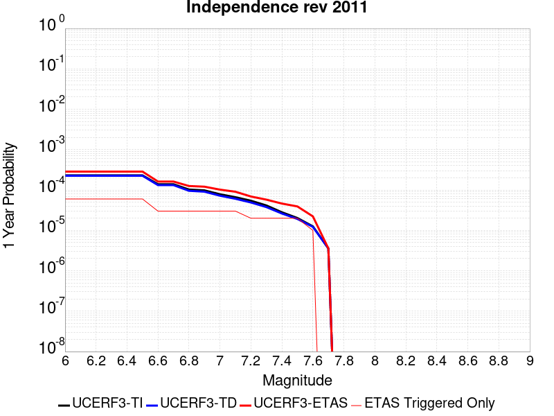 |  |

| Magnitude | 1 wk TI Prob | 1 wk TD Prob | 1 wk ETAS Prob | 1 wk ETAS/TD Gain | 1 wk ETAS Triggered Only | 1 mo TI Prob | 1 mo TD Prob | 1 mo ETAS Prob | 1 mo ETAS/TD Gain | 1 mo ETAS Triggered Only | 1 yr TI Prob | 1 yr TD Prob | 1 yr ETAS Prob | 1 yr ETAS/TD Gain | 1 yr ETAS Triggered Only | 10 yr TI Prob | 10 yr TD Prob | 10 yr ETAS Prob | 10 yr ETAS/TD Gain | 10 yr ETAS Triggered Only |
|-----|-----|-----|-----|-----|-----|-----|-----|-----|-----|-----|-----|-----|-----|-----|-----|-----|-----|-----|-----|-----|
| 6.0 | 4.422171E-6 | 4.3262253E-6 | 1.2360764E-4 | 28.571705 | 1.19281925E-4 | 1.8952025E-5 | 1.8540852E-5 | 1.3782056E-4 | 7.4333463 | 1.19281925E-4 | 2.3071647E-4 | 2.2571447E-4 | 3.4496945E-4 | 1.5283445 | 1.19281925E-4 | 0.0023047708 | 0.0022551457 | 0.0023741587 | 1.052774 | 1.19281925E-4 |
| 6.1 | 4.422171E-6 | 4.3262253E-6 | 1.2360764E-4 | 28.571705 | 1.19281925E-4 | 1.8952025E-5 | 1.8540852E-5 | 1.3782056E-4 | 7.4333463 | 1.19281925E-4 | 2.3071647E-4 | 2.2571447E-4 | 3.4496945E-4 | 1.5283445 | 1.19281925E-4 | 0.0023047708 | 0.0022551457 | 0.0023741587 | 1.052774 | 1.19281925E-4 |
| 6.2 | 4.422171E-6 | 4.3262253E-6 | 1.2360764E-4 | 28.571705 | 1.19281925E-4 | 1.8952025E-5 | 1.8540852E-5 | 1.3782056E-4 | 7.4333463 | 1.19281925E-4 | 2.3071647E-4 | 2.2571447E-4 | 3.4496945E-4 | 1.5283445 | 1.19281925E-4 | 0.0023047708 | 0.0022551457 | 0.0023741587 | 1.052774 | 1.19281925E-4 |
| 6.3 | 4.422171E-6 | 4.3262253E-6 | 1.2360764E-4 | 28.571705 | 1.19281925E-4 | 1.8952025E-5 | 1.8540852E-5 | 1.3782056E-4 | 7.4333463 | 1.19281925E-4 | 2.3071647E-4 | 2.2571447E-4 | 3.4496945E-4 | 1.5283445 | 1.19281925E-4 | 0.0023047708 | 0.0022551457 | 0.0023741587 | 1.052774 | 1.19281925E-4 |
| 6.4 | 4.422171E-6 | 4.3262253E-6 | 1.2360764E-4 | 28.571705 | 1.19281925E-4 | 1.8952025E-5 | 1.8540852E-5 | 1.3782056E-4 | 7.4333463 | 1.19281925E-4 | 2.3071647E-4 | 2.2571447E-4 | 3.4496945E-4 | 1.5283445 | 1.19281925E-4 | 0.0023047708 | 0.0022551457 | 0.0023741587 | 1.052774 | 1.19281925E-4 |
| 6.5 | 4.422171E-6 | 4.3262253E-6 | 1.2360764E-4 | 28.571705 | 1.19281925E-4 | 1.8952025E-5 | 1.8540852E-5 | 1.3782056E-4 | 7.4333463 | 1.19281925E-4 | 2.3071647E-4 | 2.2571447E-4 | 3.4496945E-4 | 1.5283445 | 1.19281925E-4 | 0.0023047708 | 0.0022551457 | 0.0023741587 | 1.052774 | 1.19281925E-4 |
| 6.6 | 2.663744E-6 | 2.5319846E-6 | 2.5319846E-6 | 1.0 | 0.0 | 1.1415996E-5 | 1.08513195E-5 | 1.08513195E-5 | 1.0 | 0.0 | 1.3898089E-4 | 1.321073E-4 | 1.321073E-4 | 1.0 | 0.0 | 0.0013889399 | 0.0013203359 | 0.0013203359 | 1.0 | 0.0 |
| 6.7 | 2.663744E-6 | 2.5319846E-6 | 2.5319846E-6 | 1.0 | 0.0 | 1.1415996E-5 | 1.08513195E-5 | 1.08513195E-5 | 1.0 | 0.0 | 1.3898089E-4 | 1.321073E-4 | 1.321073E-4 | 1.0 | 0.0 | 0.0013889399 | 0.0013203359 | 0.0013203359 | 1.0 | 0.0 |
| 6.8 | 1.9716529E-6 | 1.8322567E-6 | 1.8322567E-6 | 1.0 | 0.0 | 8.449913E-6 | 7.852505E-6 | 7.852505E-6 | 1.0 | 0.0 | 1.0287284E-4 | 9.560019E-5 | 9.560019E-5 | 1.0 | 0.0 | 0.0010282523 | 9.5560355E-4 | 9.5560355E-4 | 1.0 | 0.0 |
| 6.9 | 1.8788617E-6 | 1.7429976E-6 | 1.7429976E-6 | 1.0 | 0.0 | 8.0522395E-6 | 7.4699688E-6 | 7.4699688E-6 | 1.0 | 0.0 | 9.80316E-5 | 9.09432E-5 | 9.09432E-5 | 1.0 | 0.0 | 9.798837E-4 | 9.090718E-4 | 9.090718E-4 | 1.0 | 0.0 |
| 7.0 | 1.5045488E-6 | 1.3849498E-6 | 1.3849498E-6 | 1.0 | 0.0 | 6.44805E-6 | 5.9354857E-6 | 5.9354857E-6 | 1.0 | 0.0 | 7.8502184E-5 | 7.226219E-5 | 7.226219E-5 | 1.0 | 0.0 | 7.8474457E-4 | 7.223921E-4 | 7.223921E-4 | 1.0 | 0.0 |
| 7.1 | 1.272341E-6 | 1.1625089E-6 | 1.1625089E-6 | 1.0 | 0.0 | 5.4528787E-6 | 4.9821715E-6 | 4.9821715E-6 | 1.0 | 0.0 | 6.6386776E-5 | 6.0656283E-5 | 6.0656283E-5 | 1.0 | 0.0 | 6.636695E-4 | 6.064005E-4 | 6.064005E-4 | 1.0 | 0.0 |
| 7.2 | 1.0416892E-6 | 9.409871E-7 | 9.409871E-7 | 1.0 | 0.0 | 4.464375E-6 | 4.032796E-6 | 4.032796E-6 | 1.0 | 0.0 | 5.4352407E-5 | 4.9098202E-5 | 4.9098202E-5 | 1.0 | 0.0 | 5.4339116E-4 | 4.908754E-4 | 4.908754E-4 | 1.0 | 0.0 |
| 7.3 | 7.9450155E-7 | 7.2350036E-7 | 7.2350036E-7 | 1.0 | 0.0 | 3.4050022E-6 | 3.1007123E-6 | 3.1007123E-6 | 1.0 | 0.0 | 4.1455114E-5 | 3.7750528E-5 | 3.7750528E-5 | 1.0 | 0.0 | 4.144738E-4 | 3.7744228E-4 | 3.7744228E-4 | 1.0 | 0.0 |
| 7.4 | 5.3893444E-7 | 5.0195166E-7 | 5.0195166E-7 | 1.0 | 0.0 | 2.309717E-6 | 2.1512196E-6 | 2.1512196E-6 | 1.0 | 0.0 | 2.8120441E-5 | 2.6190788E-5 | 2.6190788E-5 | 1.0 | 0.0 | 2.8116882E-4 | 2.6187746E-4 | 2.6187746E-4 | 1.0 | 0.0 |
| 7.5 | 3.8852085E-7 | 3.6825622E-7 | 3.6825622E-7 | 1.0 | 0.0 | 1.6650882E-6 | 1.57824E-6 | 1.57824E-6 | 1.0 | 0.0 | 2.027226E-5 | 1.9214905E-5 | 1.9214905E-5 | 1.0 | 0.0 | 2.0270412E-4 | 1.9213265E-4 | 1.9213265E-4 | 1.0 | 0.0 |
| 7.6 | 2.414929E-7 | 2.3457605E-7 | 2.3457605E-7 | 1.0 | 0.0 | 1.0349692E-6 | 1.0053255E-6 | 1.0053255E-6 | 1.0 | 0.0 | 1.2600677E-5 | 1.2239771E-5 | 1.2239771E-5 | 1.0 | 0.0 | 1.2599962E-4 | 1.223911E-4 | 1.223911E-4 | 1.0 | 0.0 |
| 7.7 | 6.8298014E-8 | 6.8589785E-8 | 6.8589785E-8 | 1.0 | 0.0 | 2.9270575E-7 | 2.939562E-7 | 2.939562E-7 | 1.0 | 0.0 | 3.5636867E-6 | 3.5789112E-6 | 3.5789112E-6 | 1.0 | 0.0 | 3.5636294E-5 | 3.5788584E-5 | 3.5788584E-5 | 1.0 | 0.0 |

## San Clemente
*[(top)](#table-of-contents)*

| 1 Week | 1 Month | 1 Year | 10 Year |
|-----|-----|-----|-----|
|  |  |  |  |

| Magnitude | 1 wk TI Prob | 1 wk TD Prob | 1 wk ETAS Prob | 1 wk ETAS/TD Gain | 1 wk ETAS Triggered Only | 1 mo TI Prob | 1 mo TD Prob | 1 mo ETAS Prob | 1 mo ETAS/TD Gain | 1 mo ETAS Triggered Only | 1 yr TI Prob | 1 yr TD Prob | 1 yr ETAS Prob | 1 yr ETAS/TD Gain | 1 yr ETAS Triggered Only | 10 yr TI Prob | 10 yr TD Prob | 10 yr ETAS Prob | 10 yr ETAS/TD Gain | 10 yr ETAS Triggered Only |
|-----|-----|-----|-----|-----|-----|-----|-----|-----|-----|-----|-----|-----|-----|-----|-----|-----|-----|-----|-----|-----|
| 6.0 | 6.681379E-5 | 8.163834E-5 | 1.4127443E-4 | 1.7304913 | 5.9640963E-5 | 2.8631336E-4 | 3.4983488E-4 | 4.0945498E-4 | 1.1704235 | 5.9640963E-5 | 0.003480294 | 0.00425141 | 0.0043107974 | 1.0139688 | 5.9640963E-5 | 0.03426291 | 0.04175603 | 0.04187033 | 1.0027374 | 1.19281925E-4 |
| 6.1 | 6.681379E-5 | 8.163834E-5 | 1.4127443E-4 | 1.7304913 | 5.9640963E-5 | 2.8631336E-4 | 3.4983488E-4 | 4.0945498E-4 | 1.1704235 | 5.9640963E-5 | 0.003480294 | 0.00425141 | 0.0043107974 | 1.0139688 | 5.9640963E-5 | 0.03426291 | 0.04175603 | 0.04187033 | 1.0027374 | 1.19281925E-4 |
| 6.2 | 3.9400576E-5 | 4.6452373E-5 | 1.0609056E-4 | 2.2838566 | 5.9640963E-5 | 1.6884868E-4 | 1.9906677E-4 | 2.5869586E-4 | 1.2995431 | 5.9640963E-5 | 0.0020537945 | 0.0024209984 | 0.002480495 | 1.0245752 | 5.9640963E-5 | 0.020349167 | 0.023952903 | 0.024011116 | 1.0024303 | 5.9640963E-5 |
| 6.3 | 3.2590255E-5 | 3.792912E-5 | 3.792912E-5 | 1.0 | 0.0 | 1.3966505E-4 | 1.6254342E-4 | 1.6254342E-4 | 1.0 | 0.0 | 0.0016990956 | 0.0019772002 | 0.0019772002 | 1.0 | 0.0 | 0.01686163 | 0.019599883 | 0.019599883 | 1.0 | 0.0 |
| 6.4 | 2.9454652E-5 | 3.4097764E-5 | 3.4097764E-5 | 1.0 | 0.0 | 1.2622811E-4 | 1.4612524E-4 | 1.4612524E-4 | 1.0 | 0.0 | 0.0015357438 | 0.0017776493 | 0.0017776493 | 1.0 | 0.0 | 0.015251739 | 0.01763747 | 0.01763747 | 1.0 | 0.0 |
| 6.5 | 2.790836E-5 | 3.2247463E-5 | 3.2247463E-5 | 1.0 | 0.0 | 1.1960178E-4 | 1.3819624E-4 | 1.3819624E-4 | 1.0 | 0.0 | 0.001455179 | 0.0016812662 | 0.0016812662 | 1.0 | 0.0 | 0.014456868 | 0.016688485 | 0.016688485 | 1.0 | 0.0 |
| 6.6 | 2.2492153E-5 | 2.5762702E-5 | 2.5762702E-5 | 1.0 | 0.0 | 9.639138E-5 | 1.1040699E-4 | 1.1040699E-4 | 1.0 | 0.0 | 0.0011729331 | 0.0013433909 | 0.0013433909 | 1.0 | 0.0 | 0.011667615 | 0.013354417 | 0.013354417 | 1.0 | 0.0 |
| 6.7 | 1.9862755E-5 | 2.2666423E-5 | 2.2666423E-5 | 1.0 | 0.0 | 8.512331E-5 | 9.713826E-5 | 9.713826E-5 | 1.0 | 0.0 | 0.0010358836 | 0.0011820279 | 0.0011820279 | 1.0 | 0.0 | 0.010310682 | 0.011758701 | 0.011758701 | 1.0 | 0.0 |
| 6.8 | 1.6697575E-5 | 1.897771E-5 | 1.897771E-5 | 1.0 | 0.0 | 7.155907E-5 | 8.133056E-5 | 8.133056E-5 | 1.0 | 0.0 | 8.7088346E-4 | 9.897591E-4 | 9.897591E-4 | 1.0 | 0.0 | 0.008674784 | 0.0098545365 | 0.0098545365 | 1.0 | 0.0 |
| 6.9 | 1.5218415E-5 | 1.72694E-5 | 1.72694E-5 | 1.0 | 0.0 | 6.522015E-5 | 7.4009666E-5 | 7.4009666E-5 | 1.0 | 0.0 | 7.93766E-4 | 9.00704E-4 | 9.00704E-4 | 1.0 | 0.0 | 0.007909367 | 0.008971481 | 0.008971481 | 1.0 | 0.0 |
| 7.0 | 1.2392958E-5 | 1.4033016E-5 | 1.4033016E-5 | 1.0 | 0.0 | 5.3111595E-5 | 6.014015E-5 | 6.014015E-5 | 1.0 | 0.0 | 6.4644177E-4 | 7.319679E-4 | 7.319679E-4 | 1.0 | 0.0 | 0.0064456454 | 0.0072963564 | 0.0072963564 | 1.0 | 0.0 |
| 7.1 | 1.0934128E-5 | 1.2375138E-5 | 1.2375138E-5 | 1.0 | 0.0 | 4.6859706E-5 | 5.303527E-5 | 5.303527E-5 | 1.0 | 0.0 | 5.7036756E-4 | 6.455204E-4 | 6.455204E-4 | 1.0 | 0.0 | 0.0056890585 | 0.0064371997 | 0.0064371997 | 1.0 | 0.0 |
| 7.2 | 9.5798805E-6 | 1.0844935E-5 | 1.0844935E-5 | 1.0 | 0.0 | 4.1055984E-5 | 4.6477508E-5 | 4.6477508E-5 | 1.0 | 0.0 | 4.9974193E-4 | 5.657239E-4 | 5.657239E-4 | 1.0 | 0.0 | 0.0049861963 | 0.0056435615 | 0.0056435615 | 1.0 | 0.0 |
| 7.3 | 8.0167365E-6 | 9.083918E-6 | 9.083918E-6 | 1.0 | 0.0 | 3.4356988E-5 | 3.8930535E-5 | 3.8930535E-5 | 1.0 | 0.0 | 4.1821605E-4 | 4.7388324E-4 | 4.7388324E-4 | 1.0 | 0.0 | 0.0041742986 | 0.0047294297 | 0.0047294297 | 1.0 | 0.0 |
| 7.4 | 2.9581017E-6 | 3.3623792E-6 | 3.3623792E-6 | 1.0 | 0.0 | 1.2677518E-5 | 1.4410146E-5 | 1.4410146E-5 | 1.0 | 0.0 | 1.5433785E-4 | 1.7543444E-4 | 1.7543444E-4 | 1.0 | 0.0 | 0.001542307 | 0.0017534546 | 0.0017534546 | 1.0 | 0.0 |

## Great Valley 05 Pittsburg - Kirby Hills alt1
*[(top)](#table-of-contents)*

| 1 Week | 1 Month | 1 Year | 10 Year |
|-----|-----|-----|-----|
|  |  |  |  |

| Magnitude | 1 wk TI Prob | 1 wk TD Prob | 1 wk ETAS Prob | 1 wk ETAS/TD Gain | 1 wk ETAS Triggered Only | 1 mo TI Prob | 1 mo TD Prob | 1 mo ETAS Prob | 1 mo ETAS/TD Gain | 1 mo ETAS Triggered Only | 1 yr TI Prob | 1 yr TD Prob | 1 yr ETAS Prob | 1 yr ETAS/TD Gain | 1 yr ETAS Triggered Only | 10 yr TI Prob | 10 yr TD Prob | 10 yr ETAS Prob | 10 yr ETAS/TD Gain | 10 yr ETAS Triggered Only |
|-----|-----|-----|-----|-----|-----|-----|-----|-----|-----|-----|-----|-----|-----|-----|-----|-----|-----|-----|-----|-----|
| 6.0 | 4.187212E-5 | 5.344289E-5 | 5.344289E-5 | 1.0 | 0.0 | 1.794396E-4 | 2.2902661E-4 | 2.8865392E-4 | 1.260351 | 5.9640963E-5 | 0.002182488 | 0.0027857998 | 0.0028452745 | 1.0213493 | 5.9640963E-5 | 0.021611776 | 0.027603218 | 0.027719207 | 1.004202 | 1.19281925E-4 |
| 6.1 | 4.187212E-5 | 5.344289E-5 | 5.344289E-5 | 1.0 | 0.0 | 1.794396E-4 | 2.2902661E-4 | 2.8865392E-4 | 1.260351 | 5.9640963E-5 | 0.002182488 | 0.0027857998 | 0.0028452745 | 1.0213493 | 5.9640963E-5 | 0.021611776 | 0.027603218 | 0.027719207 | 1.004202 | 1.19281925E-4 |
| 6.2 | 1.7353306E-5 | 2.2154672E-5 | 2.2154672E-5 | 1.0 | 0.0 | 7.436919E-5 | 9.4947456E-5 | 1.5458275E-4 | 1.6280874 | 5.9640963E-5 | 9.050688E-4 | 0.0011557573 | 0.0012153294 | 1.0515437 | 5.9640963E-5 | 0.009013915 | 0.0115352 | 0.011594154 | 1.0051107 | 5.9640963E-5 |
| 6.3 | 1.7353306E-5 | 2.2154672E-5 | 2.2154672E-5 | 1.0 | 0.0 | 7.436919E-5 | 9.4947456E-5 | 1.5458275E-4 | 1.6280874 | 5.9640963E-5 | 9.050688E-4 | 0.0011557573 | 0.0012153294 | 1.0515437 | 5.9640963E-5 | 0.009013915 | 0.0115352 | 0.011594154 | 1.0051107 | 5.9640963E-5 |
| 6.4 | 1.4028824E-5 | 1.7901062E-5 | 1.7901062E-5 | 1.0 | 0.0 | 6.0122147E-5 | 7.671883E-5 | 7.671883E-5 | 1.0 | 0.0 | 7.3174125E-4 | 9.340303E-4 | 9.340303E-4 | 1.0 | 0.0 | 0.0072933645 | 0.009338211 | 0.009338211 | 1.0 | 0.0 |

## San Jacinto (Lytle Creek connector)
*[(top)](#table-of-contents)*

| 1 Week | 1 Month | 1 Year | 10 Year |
|-----|-----|-----|-----|
| 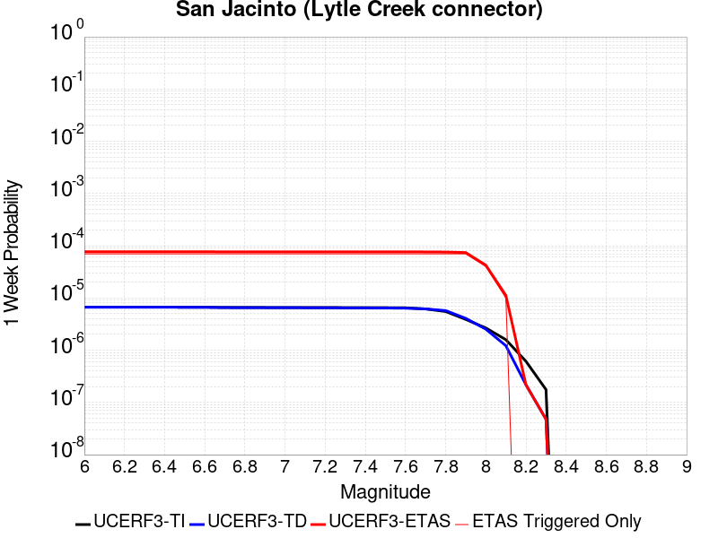 |  |  |  |

| Magnitude | 1 wk TI Prob | 1 wk TD Prob | 1 wk ETAS Prob | 1 wk ETAS/TD Gain | 1 wk ETAS Triggered Only | 1 mo TI Prob | 1 mo TD Prob | 1 mo ETAS Prob | 1 mo ETAS/TD Gain | 1 mo ETAS Triggered Only | 1 yr TI Prob | 1 yr TD Prob | 1 yr ETAS Prob | 1 yr ETAS/TD Gain | 1 yr ETAS Triggered Only | 10 yr TI Prob | 10 yr TD Prob | 10 yr ETAS Prob | 10 yr ETAS/TD Gain | 10 yr ETAS Triggered Only |
|-----|-----|-----|-----|-----|-----|-----|-----|-----|-----|-----|-----|-----|-----|-----|-----|-----|-----|-----|-----|-----|
| 6.0 | 6.693995E-6 | 6.660123E-6 | 6.660123E-6 | 1.0 | 0.0 | 2.8688235E-5 | 2.8543072E-5 | 8.818233E-5 | 3.0894477 | 5.9640963E-5 | 3.492233E-4 | 3.4745657E-4 | 4.0707682E-4 | 1.1715904 | 5.9640963E-5 | 0.00348675 | 0.0035491167 | 0.0036679753 | 1.0334896 | 1.19281925E-4 |
| 6.1 | 6.693995E-6 | 6.660123E-6 | 6.660123E-6 | 1.0 | 0.0 | 2.8688235E-5 | 2.8543072E-5 | 8.818233E-5 | 3.0894477 | 5.9640963E-5 | 3.492233E-4 | 3.4745657E-4 | 4.0707682E-4 | 1.1715904 | 5.9640963E-5 | 0.00348675 | 0.0035491167 | 0.0036679753 | 1.0334896 | 1.19281925E-4 |
| 6.2 | 6.693995E-6 | 6.660123E-6 | 6.660123E-6 | 1.0 | 0.0 | 2.8688235E-5 | 2.8543072E-5 | 8.818233E-5 | 3.0894477 | 5.9640963E-5 | 3.492233E-4 | 3.4745657E-4 | 4.0707682E-4 | 1.1715904 | 5.9640963E-5 | 0.00348675 | 0.0035491167 | 0.0036679753 | 1.0334896 | 1.19281925E-4 |
| 6.3 | 6.693995E-6 | 6.660123E-6 | 6.660123E-6 | 1.0 | 0.0 | 2.8688235E-5 | 2.8543072E-5 | 8.818233E-5 | 3.0894477 | 5.9640963E-5 | 3.492233E-4 | 3.4745657E-4 | 4.0707682E-4 | 1.1715904 | 5.9640963E-5 | 0.00348675 | 0.0035491167 | 0.0036679753 | 1.0334896 | 1.19281925E-4 |
| 6.4 | 6.693995E-6 | 6.660123E-6 | 6.660123E-6 | 1.0 | 0.0 | 2.8688235E-5 | 2.8543072E-5 | 8.818233E-5 | 3.0894477 | 5.9640963E-5 | 3.492233E-4 | 3.4745657E-4 | 4.0707682E-4 | 1.1715904 | 5.9640963E-5 | 0.00348675 | 0.0035491167 | 0.0036679753 | 1.0334896 | 1.19281925E-4 |
| 6.5 | 6.6561875E-6 | 6.620341E-6 | 6.620341E-6 | 1.0 | 0.0 | 2.8526205E-5 | 2.8372582E-5 | 8.801185E-5 | 3.1020036 | 5.9640963E-5 | 3.472512E-4 | 3.453815E-4 | 4.0500186E-4 | 1.1726217 | 5.9640963E-5 | 0.0034670907 | 0.0035284322 | 0.0036472932 | 1.0336866 | 1.19281925E-4 |
| 6.6 | 6.6561875E-6 | 6.620341E-6 | 6.620341E-6 | 1.0 | 0.0 | 2.8526205E-5 | 2.8372582E-5 | 8.801185E-5 | 3.1020036 | 5.9640963E-5 | 3.472512E-4 | 3.453815E-4 | 4.0500186E-4 | 1.1726217 | 5.9640963E-5 | 0.0034670907 | 0.0035284322 | 0.0036472932 | 1.0336866 | 1.19281925E-4 |
| 6.7 | 6.5802237E-6 | 6.539518E-6 | 6.539518E-6 | 1.0 | 0.0 | 2.8200653E-5 | 2.8026205E-5 | 8.7665496E-5 | 3.127983 | 5.9640963E-5 | 3.4328885E-4 | 3.4116567E-4 | 4.007863E-4 | 1.1747556 | 5.9640963E-5 | 0.0034275902 | 0.0034864065 | 0.0036052726 | 1.0340941 | 1.19281925E-4 |
| 6.8 | 6.575632E-6 | 6.5340073E-6 | 6.5340073E-6 | 1.0 | 0.0 | 2.8180975E-5 | 2.8002589E-5 | 8.764188E-5 | 3.129778 | 5.9640963E-5 | 3.4304935E-4 | 3.4087826E-4 | 4.004989E-4 | 1.174903 | 5.9640963E-5 | 0.0034252026 | 0.0034835413 | 0.0036024079 | 1.0341222 | 1.19281925E-4 |
| 6.9 | 6.570433E-6 | 6.525401E-6 | 6.525401E-6 | 1.0 | 0.0 | 2.8158694E-5 | 2.7965707E-5 | 8.7605E-5 | 3.1325867 | 5.9640963E-5 | 3.4277816E-4 | 3.4042934E-4 | 4.0005002E-4 | 1.1751337 | 5.9640963E-5 | 0.0034224992 | 0.0034790665 | 0.0035979333 | 1.0341663 | 1.19281925E-4 |
| 7.0 | 6.5643826E-6 | 6.5155223E-6 | 6.5155223E-6 | 1.0 | 0.0 | 2.8132765E-5 | 2.7923368E-5 | 8.7562665E-5 | 3.1358202 | 5.9640963E-5 | 3.424626E-4 | 3.3991406E-4 | 3.9953474E-4 | 1.1753993 | 5.9640963E-5 | 0.0034193532 | 0.0034739296 | 0.003592797 | 1.034217 | 1.19281925E-4 |
| 7.1 | 6.557402E-6 | 6.504234E-6 | 6.504234E-6 | 1.0 | 0.0 | 2.8102848E-5 | 2.7874992E-5 | 8.751429E-5 | 3.139527 | 5.9640963E-5 | 3.4209844E-4 | 3.3932526E-4 | 3.9894597E-4 | 1.1757038 | 5.9640963E-5 | 0.0034157229 | 0.0034680606 | 0.0035869288 | 1.0342752 | 1.19281925E-4 |
| 7.2 | 6.546394E-6 | 6.4862006E-6 | 6.4862006E-6 | 1.0 | 0.0 | 2.8055672E-5 | 2.7797707E-5 | 8.743701E-5 | 3.1454756 | 5.9640963E-5 | 3.4152428E-4 | 3.383846E-4 | 3.9800536E-4 | 1.1761924 | 5.9640963E-5 | 0.0034099987 | 0.0034586883 | 0.0035775576 | 1.0343684 | 1.19281925E-4 |
| 7.3 | 6.5364216E-6 | 6.4669857E-6 | 6.4669857E-6 | 1.0 | 0.0 | 2.8012933E-5 | 2.771536E-5 | 8.735467E-5 | 3.1518505 | 5.9640963E-5 | 3.4100408E-4 | 3.373823E-4 | 3.9700317E-4 | 1.176716 | 5.9640963E-5 | 0.003404813 | 0.0034487103 | 0.0035675808 | 1.0344682 | 1.19281925E-4 |
| 7.4 | 6.5269523E-6 | 6.4480723E-6 | 6.4480723E-6 | 1.0 | 0.0 | 2.7972354E-5 | 2.7634303E-5 | 8.727361E-5 | 3.1581624 | 5.9640963E-5 | 3.4051016E-4 | 3.3639578E-4 | 3.9601667E-4 | 1.1772344 | 5.9640963E-5 | 0.0033998888 | 0.0034388923 | 0.003557764 | 1.0345669 | 1.19281925E-4 |
| 7.5 | 6.5111835E-6 | 6.424346E-6 | 6.424346E-6 | 1.0 | 0.0 | 2.7904773E-5 | 2.753262E-5 | 8.717194E-5 | 3.166133 | 5.9640963E-5 | 3.3968766E-4 | 3.3515817E-4 | 3.9477914E-4 | 1.1778891 | 5.9640963E-5 | 0.0033916887 | 0.0034265644 | 0.0035454375 | 1.0346917 | 1.19281925E-4 |
| 7.6 | 6.4768806E-6 | 6.383454E-6 | 6.383454E-6 | 1.0 | 0.0 | 2.7757764E-5 | 2.7357375E-5 | 8.6996704E-5 | 3.1800094 | 5.9640963E-5 | 3.3789838E-4 | 3.330252E-4 | 3.926463E-4 | 1.1790287 | 5.9640963E-5 | 0.0033738504 | 0.0034052972 | 0.0035241728 | 1.034909 | 1.19281925E-4 |
| 7.7 | 6.1655364E-6 | 6.1759456E-6 | 6.1759456E-6 | 1.0 | 0.0 | 2.642346E-5 | 2.646807E-5 | 8.610745E-5 | 3.2532578 | 5.9640963E-5 | 3.2165812E-4 | 3.2220117E-4 | 3.818229E-4 | 1.1850451 | 5.9640963E-5 | 0.0032119295 | 0.0032969362 | 0.0034158248 | 1.0360603 | 1.19281925E-4 |
| 7.8 | 5.5043524E-6 | 5.7370175E-6 | 5.7370175E-6 | 1.0 | 0.0 | 2.3589868E-5 | 2.4586987E-5 | 8.4226485E-5 | 3.4256527 | 5.9640963E-5 | 2.871688E-4 | 2.993055E-4 | 3.589286E-4 | 1.1992048 | 5.9640963E-5 | 0.0028679797 | 0.0030670585 | 0.0031859747 | 1.038772 | 1.19281925E-4 |
| 7.9 | 3.889249E-6 | 4.0766436E-6 | 4.0766436E-6 | 1.0 | 0.0 | 1.6668104E-5 | 1.7471213E-5 | 7.711113E-5 | 4.4136105 | 5.9640963E-5 | 2.0291525E-4 | 2.126913E-4 | 2.7231956E-4 | 1.2803513 | 5.9640963E-5 | 0.0020273007 | 0.0021941073 | 0.0023131275 | 1.0542454 | 1.19281925E-4 |
| 8.0 | 2.668535E-6 | 2.5313454E-6 | 2.5313454E-6 | 1.0 | 0.0 | 1.1436528E-5 | 1.0848577E-5 | 1.0848577E-5 | 1.0 | 0.0 | 1.3923083E-4 | 1.3207346E-4 | 1.3207346E-4 | 1.0 | 0.0 | 0.0013914363 | 0.0013755665 | 0.0014351255 | 1.0432978 | 5.9640963E-5 |
| 8.1 | 1.5911459E-6 | 1.2185134E-6 | 1.2185134E-6 | 1.0 | 0.0 | 6.8191785E-6 | 5.2221894E-6 | 5.2221894E-6 | 1.0 | 0.0 | 8.3020335E-5 | 6.357832E-5 | 6.357832E-5 | 1.0 | 0.0 | 8.298933E-4 | 6.6911156E-4 | 7.287126E-4 | 1.089075 | 5.9640963E-5 |
| 8.2 | 6.1294963E-7 | 2.1802066E-7 | 2.1802066E-7 | 1.0 | 0.0 | 2.6269242E-6 | 9.3437393E-7 | 9.3437393E-7 | 1.0 | 0.0 | 3.1982334E-5 | 1.1375943E-5 | 1.1375943E-5 | 1.0 | 0.0 | 3.1977732E-4 | 1.2778955E-4 | 1.2778955E-4 | 1.0 | 0.0 |
| 8.3 | 1.762871E-7 | 4.7516316E-8 | 4.7516316E-8 | 1.0 | 0.0 | 7.5551594E-7 | 2.0364133E-7 | 2.0364133E-7 | 1.0 | 0.0 | 9.1983675E-6 | 2.4793305E-6 | 2.4793305E-6 | 1.0 | 0.0 | 9.197987E-5 | 2.8671833E-5 | 2.8671833E-5 | 1.0 | 0.0 |

## Chino alt 1
*[(top)](#table-of-contents)*

| 1 Week | 1 Month | 1 Year | 10 Year |
|-----|-----|-----|-----|
|  |  | 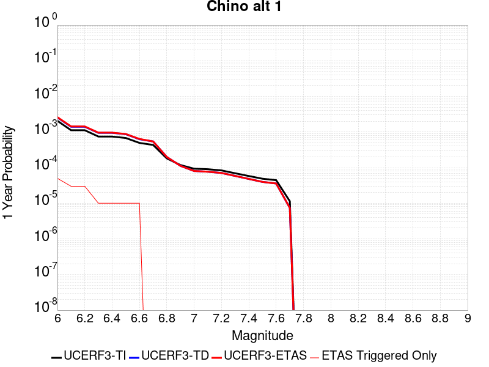 | 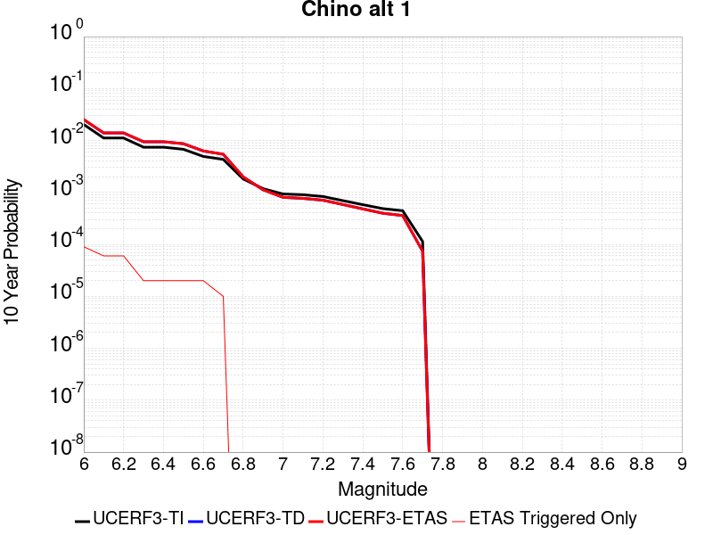 |

| Magnitude | 1 wk TI Prob | 1 wk TD Prob | 1 wk ETAS Prob | 1 wk ETAS/TD Gain | 1 wk ETAS Triggered Only | 1 mo TI Prob | 1 mo TD Prob | 1 mo ETAS Prob | 1 mo ETAS/TD Gain | 1 mo ETAS Triggered Only | 1 yr TI Prob | 1 yr TD Prob | 1 yr ETAS Prob | 1 yr ETAS/TD Gain | 1 yr ETAS Triggered Only | 10 yr TI Prob | 10 yr TD Prob | 10 yr ETAS Prob | 10 yr ETAS/TD Gain | 10 yr ETAS Triggered Only |
|-----|-----|-----|-----|-----|-----|-----|-----|-----|-----|-----|-----|-----|-----|-----|-----|-----|-----|-----|-----|-----|
| 6.0 | 3.939946E-5 | 4.894798E-5 | 4.894798E-5 | 1.0 | 0.0 | 1.6884391E-4 | 2.0976314E-4 | 2.0976314E-4 | 1.0 | 0.0 | 0.0020537362 | 0.002551385 | 0.002610874 | 1.0233163 | 5.9640963E-5 | 0.020348595 | 0.025280168 | 0.025396435 | 1.0045991 | 1.19281925E-4 |
| 6.1 | 2.1505624E-5 | 2.6878823E-5 | 2.6878823E-5 | 1.0 | 0.0 | 9.2163704E-5 | 1.15190494E-4 | 1.15190494E-4 | 1.0 | 0.0 | 0.0011215154 | 0.0014016517 | 0.001461209 | 1.0424908 | 5.9640963E-5 | 0.011158722 | 0.013947425 | 0.014065043 | 1.008433 | 1.19281925E-4 |
| 6.2 | 2.1505624E-5 | 2.6878823E-5 | 2.6878823E-5 | 1.0 | 0.0 | 9.2163704E-5 | 1.15190494E-4 | 1.15190494E-4 | 1.0 | 0.0 | 0.0011215154 | 0.0014016517 | 0.001461209 | 1.0424908 | 5.9640963E-5 | 0.011158722 | 0.013947425 | 0.014065043 | 1.008433 | 1.19281925E-4 |
| 6.3 | 1.4290785E-5 | 1.8164832E-5 | 1.8164832E-5 | 1.0 | 0.0 | 6.1244784E-5 | 7.784722E-5 | 7.784722E-5 | 1.0 | 0.0 | 7.454001E-4 | 9.4742293E-4 | 0.0010070074 | 1.0628911 | 5.9640963E-5 | 0.007429048 | 0.00944674 | 0.009505818 | 1.0062537 | 5.9640963E-5 |
| 6.4 | 1.4290785E-5 | 1.8164832E-5 | 1.8164832E-5 | 1.0 | 0.0 | 6.1244784E-5 | 7.784722E-5 | 7.784722E-5 | 1.0 | 0.0 | 7.454001E-4 | 9.4742293E-4 | 0.0010070074 | 1.0628911 | 5.9640963E-5 | 0.007429048 | 0.00944674 | 0.009505818 | 1.0062537 | 5.9640963E-5 |
| 6.5 | 1.3017944E-5 | 1.6651793E-5 | 1.6651793E-5 | 1.0 | 0.0 | 5.5789995E-5 | 7.1363116E-5 | 7.1363116E-5 | 1.0 | 0.0 | 6.790315E-4 | 8.6854334E-4 | 9.281325E-4 | 1.0686082 | 5.9640963E-5 | 0.0067696036 | 0.008664233 | 0.008723357 | 1.0068239 | 5.9640963E-5 |
| 6.6 | 9.470016E-6 | 1.2039209E-5 | 1.2039209E-5 | 1.0 | 0.0 | 4.058515E-5 | 5.159578E-5 | 5.159578E-5 | 1.0 | 0.0 | 4.940122E-4 | 6.280315E-4 | 6.8763504E-4 | 1.0949053 | 5.9640963E-5 | 0.004929154 | 0.006273248 | 0.0063325143 | 1.0094476 | 5.9640963E-5 |
| 6.7 | 8.314155E-6 | 1.040749E-5 | 1.040749E-5 | 1.0 | 0.0 | 3.5631605E-5 | 4.4602948E-5 | 4.4602948E-5 | 1.0 | 0.0 | 4.3372845E-4 | 5.4293784E-4 | 5.4293784E-4 | 1.0 | 0.0 | 0.004328829 | 0.0054270807 | 0.0054270807 | 1.0 | 0.0 |
| 6.8 | 3.4856364E-6 | 3.8134033E-6 | 3.8134033E-6 | 1.0 | 0.0 | 1.4938357E-5 | 1.6343065E-5 | 1.6343065E-5 | 1.0 | 0.0 | 1.8185932E-4 | 1.9896074E-4 | 1.9896074E-4 | 1.0 | 0.0 | 0.0018171056 | 0.0019894529 | 0.0019894529 | 1.0 | 0.0 |
| 6.9 | 2.2645952E-6 | 2.152909E-6 | 2.152909E-6 | 1.0 | 0.0 | 9.705372E-6 | 9.226722E-6 | 9.226722E-6 | 1.0 | 0.0 | 1.18156495E-4 | 1.12329755E-4 | 1.12329755E-4 | 1.0 | 0.0 | 0.0011809369 | 0.0011233138 | 0.0011233138 | 1.0 | 0.0 |
| 7.0 | 1.7864003E-6 | 1.5430741E-6 | 1.5430741E-6 | 1.0 | 0.0 | 7.655979E-6 | 6.613158E-6 | 6.613158E-6 | 1.0 | 0.0 | 9.3207556E-5 | 8.051228E-5 | 8.051228E-5 | 1.0 | 0.0 | 9.316847E-4 | 8.052856E-4 | 8.052856E-4 | 1.0 | 0.0 |
| 7.1 | 1.7315456E-6 | 1.4733466E-6 | 1.4733466E-6 | 1.0 | 0.0 | 7.420889E-6 | 6.314328E-6 | 6.314328E-6 | 1.0 | 0.0 | 9.034557E-5 | 7.687428E-5 | 7.687428E-5 | 1.0 | 0.0 | 9.0308854E-4 | 7.68921E-4 | 7.68921E-4 | 1.0 | 0.0 |
| 7.2 | 1.6008337E-6 | 1.3574178E-6 | 1.3574178E-6 | 1.0 | 0.0 | 6.860698E-6 | 5.817492E-6 | 5.817492E-6 | 1.0 | 0.0 | 8.352579E-5 | 7.082572E-5 | 7.082572E-5 | 1.0 | 0.0 | 8.34944E-4 | 7.0846075E-4 | 7.0846075E-4 | 1.0 | 0.0 |
| 7.3 | 1.3320939E-6 | 1.1217794E-6 | 1.1217794E-6 | 1.0 | 0.0 | 5.7089615E-6 | 4.8076176E-6 | 4.8076176E-6 | 1.0 | 0.0 | 6.9504385E-5 | 5.853122E-5 | 5.853122E-5 | 1.0 | 0.0 | 6.9482654E-4 | 5.8530655E-4 | 5.8530655E-4 | 1.0 | 0.0 |
| 7.4 | 1.114294E-6 | 9.237087E-7 | 9.237087E-7 | 1.0 | 0.0 | 4.775537E-6 | 3.9587458E-6 | 3.9587458E-6 | 1.0 | 0.0 | 5.8140613E-5 | 4.81967E-5 | 4.81967E-5 | 1.0 | 0.0 | 5.81254E-4 | 4.8187698E-4 | 4.8187698E-4 | 1.0 | 0.0 |
| 7.5 | 9.354081E-7 | 7.6233886E-7 | 7.6233886E-7 | 1.0 | 0.0 | 4.0088858E-6 | 3.2671626E-6 | 3.2671626E-6 | 1.0 | 0.0 | 4.8807087E-5 | 3.9777013E-5 | 3.9777013E-5 | 1.0 | 0.0 | 4.879637E-4 | 3.9770233E-4 | 3.9770233E-4 | 1.0 | 0.0 |
| 7.6 | 8.521771E-7 | 6.880688E-7 | 6.880688E-7 | 1.0 | 0.0 | 3.6521824E-6 | 2.948863E-6 | 2.948863E-6 | 1.0 | 0.0 | 4.4464414E-5 | 3.590185E-5 | 3.590185E-5 | 1.0 | 0.0 | 4.4455516E-4 | 3.5896365E-4 | 3.5896365E-4 | 1.0 | 0.0 |
| 7.7 | 2.1803626E-7 | 1.4186368E-7 | 1.4186368E-7 | 1.0 | 0.0 | 9.344408E-7 | 6.0798715E-7 | 6.0798715E-7 | 1.0 | 0.0 | 1.1376757E-5 | 7.4022278E-6 | 7.4022278E-6 | 1.0 | 0.0 | 1.13761744E-4 | 7.402077E-5 | 7.402077E-5 | 1.0 | 0.0 |

## Blue Cut
*[(top)](#table-of-contents)*

| 1 Week | 1 Month | 1 Year | 10 Year |
|-----|-----|-----|-----|
|  |  |  | 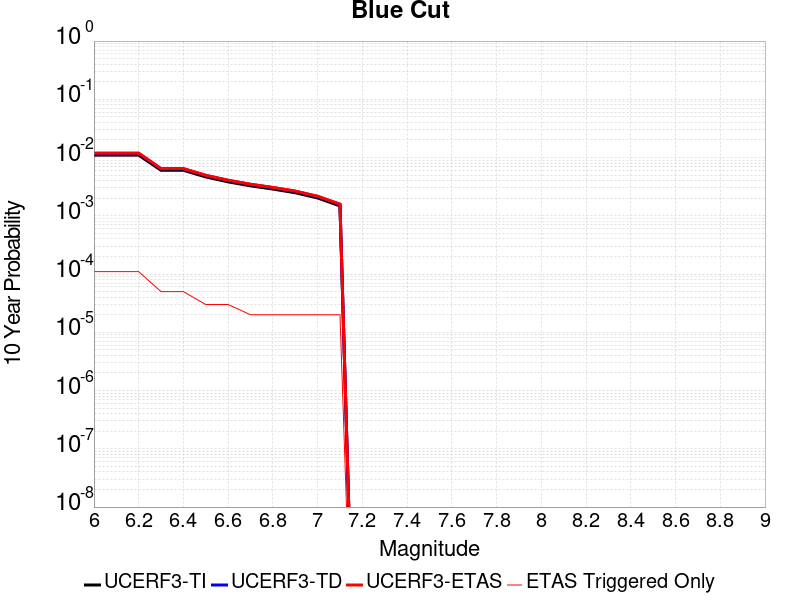 |

| Magnitude | 1 wk TI Prob | 1 wk TD Prob | 1 wk ETAS Prob | 1 wk ETAS/TD Gain | 1 wk ETAS Triggered Only | 1 mo TI Prob | 1 mo TD Prob | 1 mo ETAS Prob | 1 mo ETAS/TD Gain | 1 mo ETAS Triggered Only | 1 yr TI Prob | 1 yr TD Prob | 1 yr ETAS Prob | 1 yr ETAS/TD Gain | 1 yr ETAS Triggered Only | 10 yr TI Prob | 10 yr TD Prob | 10 yr ETAS Prob | 10 yr ETAS/TD Gain | 10 yr ETAS Triggered Only |
|-----|-----|-----|-----|-----|-----|-----|-----|-----|-----|-----|-----|-----|-----|-----|-----|-----|-----|-----|-----|-----|
| 6.0 | 2.1227985E-5 | 2.2719574E-5 | 2.2719574E-5 | 1.0 | 0.0 | 9.097391E-5 | 9.73663E-5 | 1.5700146E-4 | 1.6124825 | 5.9640963E-5 | 0.0011070445 | 0.0011848481 | 0.0012444184 | 1.0502768 | 5.9640963E-5 | 0.011015458 | 0.011791152 | 0.011909027 | 1.0099969 | 1.19281925E-4 |
| 6.1 | 2.1227985E-5 | 2.2719574E-5 | 2.2719574E-5 | 1.0 | 0.0 | 9.097391E-5 | 9.73663E-5 | 1.5700146E-4 | 1.6124825 | 5.9640963E-5 | 0.0011070445 | 0.0011848481 | 0.0012444184 | 1.0502768 | 5.9640963E-5 | 0.011015458 | 0.011791152 | 0.011909027 | 1.0099969 | 1.19281925E-4 |
| 6.2 | 2.1227985E-5 | 2.2719574E-5 | 2.2719574E-5 | 1.0 | 0.0 | 9.097391E-5 | 9.73663E-5 | 1.5700146E-4 | 1.6124825 | 5.9640963E-5 | 0.0011070445 | 0.0011848481 | 0.0012444184 | 1.0502768 | 5.9640963E-5 | 0.011015458 | 0.011791152 | 0.011909027 | 1.0099969 | 1.19281925E-4 |
| 6.3 | 1.1613981E-5 | 1.2353542E-5 | 1.2353542E-5 | 1.0 | 0.0 | 4.9773254E-5 | 5.2942745E-5 | 5.2942745E-5 | 1.0 | 0.0 | 6.0582085E-4 | 6.443998E-4 | 6.443998E-4 | 1.0 | 0.0 | 0.0060417196 | 0.0064265593 | 0.006485817 | 1.0092207 | 5.9640963E-5 |
| 6.4 | 1.1613981E-5 | 1.2353542E-5 | 1.2353542E-5 | 1.0 | 0.0 | 4.9773254E-5 | 5.2942745E-5 | 5.2942745E-5 | 1.0 | 0.0 | 6.0582085E-4 | 6.443998E-4 | 6.443998E-4 | 1.0 | 0.0 | 0.0060417196 | 0.0064265593 | 0.006485817 | 1.0092207 | 5.9640963E-5 |
| 6.5 | 8.931326E-6 | 9.4816E-6 | 9.4816E-6 | 1.0 | 0.0 | 3.8276554E-5 | 4.0634844E-5 | 4.0634844E-5 | 1.0 | 0.0 | 4.6591737E-4 | 4.946261E-4 | 4.946261E-4 | 1.0 | 0.0 | 0.0046494175 | 0.004936161 | 0.004936161 | 1.0 | 0.0 |
| 6.6 | 7.345353E-6 | 7.79028E-6 | 7.79028E-6 | 1.0 | 0.0 | 3.1479703E-5 | 3.338653E-5 | 3.338653E-5 | 1.0 | 0.0 | 3.83198E-4 | 4.064132E-4 | 4.064132E-4 | 1.0 | 0.0 | 0.0038253788 | 0.0040574907 | 0.0040574907 | 1.0 | 0.0 |
| 6.7 | 6.2775666E-6 | 6.655149E-6 | 6.655149E-6 | 1.0 | 0.0 | 2.690358E-5 | 2.8521798E-5 | 2.8521798E-5 | 1.0 | 0.0 | 3.2750185E-4 | 3.472051E-4 | 3.472051E-4 | 1.0 | 0.0 | 0.0032701963 | 0.003467367 | 0.003467367 | 1.0 | 0.0 |
| 6.8 | 5.5234095E-6 | 5.8551113E-6 | 5.8551113E-6 | 1.0 | 0.0 | 2.367154E-5 | 2.5093133E-5 | 2.5093133E-5 | 1.0 | 0.0 | 2.8816288E-4 | 3.0547334E-4 | 3.0547334E-4 | 1.0 | 0.0 | 0.002877895 | 0.0030512505 | 0.0030512505 | 1.0 | 0.0 |
| 6.9 | 4.7780054E-6 | 5.0654203E-6 | 5.0654203E-6 | 1.0 | 0.0 | 2.0477004E-5 | 2.1708804E-5 | 2.1708804E-5 | 1.0 | 0.0 | 2.4927902E-4 | 2.642797E-4 | 2.642797E-4 | 1.0 | 0.0 | 0.0024899957 | 0.002640346 | 0.002640346 | 1.0 | 0.0 |
| 7.0 | 3.883171E-6 | 4.118487E-6 | 4.118487E-6 | 1.0 | 0.0 | 1.6642054E-5 | 1.7650578E-5 | 1.7650578E-5 | 1.0 | 0.0 | 2.0259817E-4 | 2.1488148E-4 | 2.1488148E-4 | 1.0 | 0.0 | 0.0020241356 | 0.0021474129 | 0.0021474129 | 1.0 | 0.0 |
| 7.1 | 2.8358215E-6 | 3.0097158E-6 | 3.0097158E-6 | 1.0 | 0.0 | 1.2153464E-5 | 1.2898756E-5 | 1.2898756E-5 | 1.0 | 0.0 | 1.4795837E-4 | 1.5703762E-4 | 1.5703762E-4 | 1.0 | 0.0 | 0.001478599 | 0.0015699116 | 0.0015699116 | 1.0 | 0.0 |

## San Pedro Basin
*[(top)](#table-of-contents)*

| 1 Week | 1 Month | 1 Year | 10 Year |
|-----|-----|-----|-----|
|  |  |  |  |

| Magnitude | 1 wk TI Prob | 1 wk TD Prob | 1 wk ETAS Prob | 1 wk ETAS/TD Gain | 1 wk ETAS Triggered Only | 1 mo TI Prob | 1 mo TD Prob | 1 mo ETAS Prob | 1 mo ETAS/TD Gain | 1 mo ETAS Triggered Only | 1 yr TI Prob | 1 yr TD Prob | 1 yr ETAS Prob | 1 yr ETAS/TD Gain | 1 yr ETAS Triggered Only | 10 yr TI Prob | 10 yr TD Prob | 10 yr ETAS Prob | 10 yr ETAS/TD Gain | 10 yr ETAS Triggered Only |
|-----|-----|-----|-----|-----|-----|-----|-----|-----|-----|-----|-----|-----|-----|-----|-----|-----|-----|-----|-----|-----|
| 6.0 | 5.3449043E-5 | 6.337018E-5 | 1.2300737E-4 | 1.9410921 | 5.9640963E-5 | 2.2904722E-4 | 2.7156167E-4 | 3.3118643E-4 | 1.2195625 | 5.9640963E-5 | 0.0027850836 | 0.0033018515 | 0.0034207394 | 1.0360065 | 1.19281925E-4 | 0.027504366 | 0.03258948 | 0.032704875 | 1.0035409 | 1.19281925E-4 |
| 6.1 | 5.3449043E-5 | 6.337018E-5 | 1.2300737E-4 | 1.9410921 | 5.9640963E-5 | 2.2904722E-4 | 2.7156167E-4 | 3.3118643E-4 | 1.2195625 | 5.9640963E-5 | 0.0027850836 | 0.0033018515 | 0.0034207394 | 1.0360065 | 1.19281925E-4 | 0.027504366 | 0.03258948 | 0.032704875 | 1.0035409 | 1.19281925E-4 |
| 6.2 | 2.3189454E-5 | 2.6642829E-5 | 8.62822E-5 | 3.2384775 | 5.9640963E-5 | 9.9379584E-5 | 1.1417881E-4 | 1.7381296E-4 | 1.5222874 | 5.9640963E-5 | 0.0012092749 | 0.0013892875 | 0.0014488457 | 1.0428696 | 5.9640963E-5 | 0.012027155 | 0.01381089 | 0.0138697075 | 1.0042588 | 5.9640963E-5 |
| 6.3 | 2.3189454E-5 | 2.6642829E-5 | 8.62822E-5 | 3.2384775 | 5.9640963E-5 | 9.9379584E-5 | 1.1417881E-4 | 1.7381296E-4 | 1.5222874 | 5.9640963E-5 | 0.0012092749 | 0.0013892875 | 0.0014488457 | 1.0428696 | 5.9640963E-5 | 0.012027155 | 0.01381089 | 0.0138697075 | 1.0042588 | 5.9640963E-5 |
| 6.4 | 1.966056E-5 | 2.246342E-5 | 8.210304E-5 | 3.654966 | 5.9640963E-5 | 8.425682E-5 | 9.626848E-5 | 1.5590369E-4 | 1.6194677 | 5.9640963E-5 | 0.001025344 | 0.0011714787 | 0.0012310498 | 1.0508512 | 5.9640963E-5 | 0.010206259 | 0.011657119 | 0.011716065 | 1.0050566 | 5.9640963E-5 |
| 6.5 | 1.7342953E-5 | 1.9745152E-5 | 7.938493E-5 | 4.0204773 | 5.9640963E-5 | 7.4324824E-5 | 8.461954E-5 | 1.4425546E-4 | 1.7047534 | 5.9640963E-5 | 9.04529E-4 | 0.0010297929 | 0.0010893724 | 1.0578558 | 5.9640963E-5 | 0.009008561 | 0.010253932 | 0.010312962 | 1.0057567 | 5.9640963E-5 |
| 6.6 | 1.439804E-5 | 1.6322716E-5 | 7.596271E-5 | 4.653803 | 5.9640963E-5 | 6.170443E-5 | 6.99528E-5 | 1.2958959E-4 | 1.8525289 | 5.9640963E-5 | 7.509924E-4 | 8.513747E-4 | 9.109649E-4 | 1.0699929 | 5.9640963E-5 | 0.0074845953 | 0.008484333 | 0.008543468 | 1.0069699 | 5.9640963E-5 |
| 6.7 | 1.2634884E-5 | 1.4285298E-5 | 7.392541E-5 | 5.174929 | 5.9640963E-5 | 5.414838E-5 | 6.122144E-5 | 1.2085875E-4 | 1.9741246 | 5.9640963E-5 | 6.590571E-4 | 7.451466E-4 | 8.0474315E-4 | 1.0799795 | 5.9640963E-5 | 0.006571059 | 0.007429502 | 0.0074886996 | 1.007968 | 5.9640963E-5 |
| 6.8 | 1.146091E-5 | 1.2933193E-5 | 7.2573384E-5 | 5.611405 | 5.9640963E-5 | 4.911726E-5 | 5.542696E-5 | 1.1506461E-4 | 2.0759683 | 5.9640963E-5 | 5.9783855E-4 | 6.74644E-4 | 7.3424476E-4 | 1.088344 | 5.9640963E-5 | 0.0059623276 | 0.0067288997 | 0.006788139 | 1.0088037 | 5.9640963E-5 |
| 6.9 | 9.109035E-6 | 1.0235013E-5 | 6.9875365E-5 | 6.827091 | 5.9640963E-5 | 3.9038136E-5 | 4.386376E-5 | 1.03502105E-4 | 2.3596268 | 5.9640963E-5 | 4.7518566E-4 | 5.339384E-4 | 5.9354753E-4 | 1.1116405 | 5.9640963E-5 | 0.0047417083 | 0.0053293095 | 0.0053886324 | 1.0111315 | 5.9640963E-5 |
| 7.0 | 5.9351028E-6 | 6.583965E-6 | 6.622454E-5 | 10.058457 | 5.9640963E-5 | 2.5435906E-5 | 2.821682E-5 | 8.78561E-5 | 3.1136072 | 5.9640963E-5 | 3.0963816E-4 | 3.4350925E-4 | 4.0312973E-4 | 1.1735629 | 5.9640963E-5 | 0.0030920706 | 0.0034320997 | 0.003491536 | 1.0173178 | 5.9640963E-5 |
| 7.1 | 2.1557585E-6 | 2.2096492E-6 | 2.2096492E-6 | 1.0 | 0.0 | 9.238933E-6 | 9.469892E-6 | 9.469892E-6 | 1.0 | 0.0 | 1.1247819E-4 | 1.15289986E-4 | 1.15289986E-4 | 1.0 | 0.0 | 0.0011242128 | 0.0011523172 | 0.0011523172 | 1.0 | 0.0 |
| 7.2 | 2.1251979E-6 | 2.1779954E-6 | 2.1779954E-6 | 1.0 | 0.0 | 9.107958E-6 | 9.334234E-6 | 9.334234E-6 | 1.0 | 0.0 | 1.1088375E-4 | 1.13638525E-4 | 1.13638525E-4 | 1.0 | 0.0 | 0.0011082845 | 0.0011358195 | 0.0011358195 | 1.0 | 0.0 |
| 7.3 | 1.7145798E-6 | 1.7442885E-6 | 1.7442885E-6 | 1.0 | 0.0 | 7.3481783E-6 | 7.475501E-6 | 7.475501E-6 | 1.0 | 0.0 | 8.94604E-5 | 9.1010515E-5 | 9.1010515E-5 | 1.0 | 0.0 | 8.9424395E-4 | 9.0974156E-4 | 9.0974156E-4 | 1.0 | 0.0 |
| 7.4 | 1.4467993E-6 | 1.4641878E-6 | 1.4641878E-6 | 1.0 | 0.0 | 6.200554E-6 | 6.275076E-6 | 6.275076E-6 | 1.0 | 0.0 | 7.548913E-5 | 7.639644E-5 | 7.639644E-5 | 1.0 | 0.0 | 7.546349E-4 | 7.6370913E-4 | 7.6370913E-4 | 1.0 | 0.0 |
| 7.5 | 1.2803735E-6 | 1.2931506E-6 | 1.2931506E-6 | 1.0 | 0.0 | 5.487303E-6 | 5.5420624E-6 | 5.5420624E-6 | 1.0 | 0.0 | 6.680587E-5 | 6.747259E-5 | 6.747259E-5 | 1.0 | 0.0 | 6.678579E-4 | 6.745281E-4 | 6.745281E-4 | 1.0 | 0.0 |
| 7.6 | 6.755009E-7 | 6.76947E-7 | 6.76947E-7 | 1.0 | 0.0 | 2.8950008E-6 | 2.9011985E-6 | 2.9011985E-6 | 1.0 | 0.0 | 3.5246063E-5 | 3.532158E-5 | 3.532158E-5 | 1.0 | 0.0 | 3.5240475E-4 | 3.5316538E-4 | 3.5316538E-4 | 1.0 | 0.0 |
| 7.7 | 6.211885E-8 | 4.5699714E-8 | 4.5699714E-8 | 1.0 | 0.0 | 2.6622362E-7 | 1.9585592E-7 | 1.9585592E-7 | 1.0 | 0.0 | 3.2412677E-6 | 2.3845432E-6 | 2.3845432E-6 | 1.0 | 0.0 | 3.2412205E-5 | 2.3845198E-5 | 2.3845198E-5 | 1.0 | 0.0 |
| 7.8 | 2.6580573E-9 | 1.5138054E-9 | 1.5138054E-9 | 1.0 | 0.0 | 1.1391674E-8 | 6.4877375E-9 | 6.4877375E-9 | 1.0 | 0.0 | 1.3869362E-7 | 7.89882E-8 | 7.89882E-8 | 1.0 | 0.0 | 1.3869354E-6 | 7.89882E-7 | 7.89882E-7 | 1.0 | 0.0 |

## San Gabriel
*[(top)](#table-of-contents)*

| 1 Week | 1 Month | 1 Year | 10 Year |
|-----|-----|-----|-----|
|  |  |  |  |

| Magnitude | 1 wk TI Prob | 1 wk TD Prob | 1 wk ETAS Prob | 1 wk ETAS/TD Gain | 1 wk ETAS Triggered Only | 1 mo TI Prob | 1 mo TD Prob | 1 mo ETAS Prob | 1 mo ETAS/TD Gain | 1 mo ETAS Triggered Only | 1 yr TI Prob | 1 yr TD Prob | 1 yr ETAS Prob | 1 yr ETAS/TD Gain | 1 yr ETAS Triggered Only | 10 yr TI Prob | 10 yr TD Prob | 10 yr ETAS Prob | 10 yr ETAS/TD Gain | 10 yr ETAS Triggered Only |
|-----|-----|-----|-----|-----|-----|-----|-----|-----|-----|-----|-----|-----|-----|-----|-----|-----|-----|-----|-----|-----|
| 6.0 | 1.083775E-5 | 1.198525E-5 | 7.1625494E-5 | 5.976137 | 5.9640963E-5 | 4.6446676E-5 | 5.1364408E-5 | 1.1100231E-4 | 2.1610744 | 5.9640963E-5 | 5.653415E-4 | 6.251936E-4 | 6.8479724E-4 | 1.0953363 | 5.9640963E-5 | 0.0056390543 | 0.0062463325 | 0.0063648694 | 1.018977 | 1.19281925E-4 |
| 6.1 | 1.083775E-5 | 1.198525E-5 | 7.1625494E-5 | 5.976137 | 5.9640963E-5 | 4.6446676E-5 | 5.1364408E-5 | 1.1100231E-4 | 2.1610744 | 5.9640963E-5 | 5.653415E-4 | 6.251936E-4 | 6.8479724E-4 | 1.0953363 | 5.9640963E-5 | 0.0056390543 | 0.0062463325 | 0.0063648694 | 1.018977 | 1.19281925E-4 |
| 6.2 | 1.083775E-5 | 1.198525E-5 | 7.1625494E-5 | 5.976137 | 5.9640963E-5 | 4.6446676E-5 | 5.1364408E-5 | 1.1100231E-4 | 2.1610744 | 5.9640963E-5 | 5.653415E-4 | 6.251936E-4 | 6.8479724E-4 | 1.0953363 | 5.9640963E-5 | 0.0056390543 | 0.0062463325 | 0.0063648694 | 1.018977 | 1.19281925E-4 |
| 6.3 | 1.083775E-5 | 1.198525E-5 | 7.1625494E-5 | 5.976137 | 5.9640963E-5 | 4.6446676E-5 | 5.1364408E-5 | 1.1100231E-4 | 2.1610744 | 5.9640963E-5 | 5.653415E-4 | 6.251936E-4 | 6.8479724E-4 | 1.0953363 | 5.9640963E-5 | 0.0056390543 | 0.0062463325 | 0.0063648694 | 1.018977 | 1.19281925E-4 |
| 6.4 | 1.083775E-5 | 1.198525E-5 | 7.1625494E-5 | 5.976137 | 5.9640963E-5 | 4.6446676E-5 | 5.1364408E-5 | 1.1100231E-4 | 2.1610744 | 5.9640963E-5 | 5.653415E-4 | 6.251936E-4 | 6.8479724E-4 | 1.0953363 | 5.9640963E-5 | 0.0056390543 | 0.0062463325 | 0.0063648694 | 1.018977 | 1.19281925E-4 |
| 6.5 | 6.7317824E-6 | 7.717007E-6 | 6.7357505E-5 | 8.72845 | 5.9640963E-5 | 2.8850178E-5 | 3.3072472E-5 | 9.271146E-5 | 2.8032818 | 5.9640963E-5 | 3.511943E-4 | 4.0258403E-4 | 4.62201E-4 | 1.1480857 | 5.9640963E-5 | 0.003506398 | 0.004029533 | 0.0040889336 | 1.0147413 | 5.9640963E-5 |
| 6.6 | 6.7317824E-6 | 7.717007E-6 | 6.7357505E-5 | 8.72845 | 5.9640963E-5 | 2.8850178E-5 | 3.3072472E-5 | 9.271146E-5 | 2.8032818 | 5.9640963E-5 | 3.511943E-4 | 4.0258403E-4 | 4.62201E-4 | 1.1480857 | 5.9640963E-5 | 0.003506398 | 0.004029533 | 0.0040889336 | 1.0147413 | 5.9640963E-5 |
| 6.7 | 6.274881E-6 | 7.2459275E-6 | 6.688646E-5 | 9.230904 | 5.9640963E-5 | 2.6892068E-5 | 3.105361E-5 | 9.0692716E-5 | 2.920521 | 5.9640963E-5 | 3.2736175E-4 | 3.7801306E-4 | 4.376315E-4 | 1.1577152 | 5.9640963E-5 | 0.0032687993 | 0.0037846796 | 0.003844095 | 1.0156989 | 5.9640963E-5 |
| 6.8 | 5.996209E-6 | 6.958647E-6 | 6.659919E-5 | 9.570709 | 5.9640963E-5 | 2.5697784E-5 | 2.9822439E-5 | 8.9461624E-5 | 2.999809 | 5.9640963E-5 | 3.128256E-4 | 3.6302864E-4 | 4.2264795E-4 | 1.1642276 | 5.9640963E-5 | 0.003123856 | 0.0036353325 | 0.0036947567 | 1.0163462 | 5.9640963E-5 |
| 6.9 | 5.686331E-6 | 6.6236917E-6 | 6.6264256E-5 | 10.0041275 | 5.9640963E-5 | 2.4369761E-5 | 2.8386947E-5 | 8.8026216E-5 | 3.10094 | 5.9640963E-5 | 2.9666146E-4 | 3.4555717E-4 | 4.0517753E-4 | 1.172534 | 5.9640963E-5 | 0.0029626573 | 0.0034611735 | 0.003520608 | 1.0171717 | 5.9640963E-5 |
| 7.0 | 5.2329838E-6 | 6.1475757E-6 | 6.578817E-5 | 10.701482 | 5.9640963E-5 | 2.242688E-5 | 2.6346492E-5 | 8.5985885E-5 | 3.263656 | 5.9640963E-5 | 2.7301308E-4 | 3.207221E-4 | 3.8034393E-4 | 1.1858988 | 5.9640963E-5 | 0.002726779 | 0.0032135549 | 0.0032730042 | 1.0184995 | 5.9640963E-5 |
| 7.1 | 5.135671E-6 | 6.0377E-6 | 6.56783E-5 | 10.878033 | 5.9640963E-5 | 2.2009834E-5 | 2.5875606E-5 | 8.551502E-5 | 3.304851 | 5.9640963E-5 | 2.6793676E-4 | 3.1499073E-4 | 3.746129E-4 | 1.1892823 | 5.9640963E-5 | 0.0026761394 | 0.0031564054 | 0.003215858 | 1.0188355 | 5.9640963E-5 |
| 7.2 | 4.989062E-6 | 5.8710784E-6 | 6.551169E-5 | 11.158374 | 5.9640963E-5 | 2.1381518E-5 | 2.5161527E-5 | 8.480099E-5 | 3.370264 | 5.9640963E-5 | 2.6028889E-4 | 3.0629928E-4 | 3.6592197E-4 | 1.1946551 | 5.9640963E-5 | 0.0025998424 | 0.003069734 | 0.0031291917 | 1.0193691 | 5.9640963E-5 |
| 7.3 | 4.8219395E-6 | 5.7026323E-6 | 6.534325E-5 | 11.458437 | 5.9640963E-5 | 2.0665291E-5 | 2.4439627E-5 | 8.407913E-5 | 3.4402788 | 5.9640963E-5 | 2.5157086E-4 | 2.975126E-4 | 3.571358E-4 | 1.2004057 | 5.9640963E-5 | 0.0025128627 | 0.002982106 | 0.0030415691 | 1.01994 | 5.9640963E-5 |
| 7.4 | 4.7118383E-6 | 5.5911896E-6 | 6.523182E-5 | 11.666895 | 5.9640963E-5 | 2.0193436E-5 | 2.3962024E-5 | 8.360155E-5 | 3.4889188 | 5.9640963E-5 | 2.4582737E-4 | 2.9169934E-4 | 3.513229E-4 | 1.2044008 | 5.9640963E-5 | 0.002455556 | 0.0029241266 | 0.0029835931 | 1.0203365 | 5.9640963E-5 |
| 7.5 | 4.5506545E-6 | 5.4365555E-6 | 6.507719E-5 | 11.970299 | 5.9640963E-5 | 1.9502659E-5 | 2.329932E-5 | 8.293889E-5 | 3.559713 | 5.9640963E-5 | 2.37419E-4 | 2.8363304E-4 | 3.432571E-4 | 1.2102154 | 5.9640963E-5 | 0.002371655 | 0.0028436715 | 0.002903143 | 1.0209136 | 5.9640963E-5 |
| 7.6 | 4.343636E-6 | 5.2294336E-6 | 6.487008E-5 | 12.404801 | 5.9640963E-5 | 1.861545E-5 | 2.241167E-5 | 8.2051294E-5 | 3.6610968 | 5.9640963E-5 | 2.2661954E-4 | 2.7282868E-4 | 3.3245335E-4 | 1.2185426 | 5.9640963E-5 | 0.0022638857 | 0.0027358893 | 0.002795367 | 1.0217398 | 5.9640963E-5 |
| 7.7 | 2.936235E-6 | 2.743946E-6 | 2.743946E-6 | 1.0 | 0.0 | 1.2583803E-5 | 1.1759716E-5 | 1.1759716E-5 | 1.0 | 0.0 | 1.5319703E-4 | 1.4316518E-4 | 1.4316518E-4 | 1.0 | 0.0 | 0.0015309147 | 0.0014379849 | 0.0014379849 | 1.0 | 0.0 |
| 7.8 | 1.4541639E-6 | 9.122518E-7 | 9.122518E-7 | 1.0 | 0.0 | 6.232116E-6 | 3.9096444E-6 | 3.9096444E-6 | 1.0 | 0.0 | 7.587337E-5 | 4.7598885E-5 | 4.7598885E-5 | 1.0 | 0.0 | 7.584747E-4 | 4.8078224E-4 | 4.8078224E-4 | 1.0 | 0.0 |
| 7.9 | 8.098958E-7 | 2.4165956E-7 | 2.4165956E-7 | 1.0 | 0.0 | 3.4709774E-6 | 1.0356835E-6 | 1.0356835E-6 | 1.0 | 0.0 | 4.225833E-5 | 1.2609373E-5 | 1.2609373E-5 | 1.0 | 0.0 | 4.2250296E-4 | 1.2917137E-4 | 1.2917137E-4 | 1.0 | 0.0 |
| 8.0 | 5.2473234E-7 | 7.672734E-8 | 7.672734E-8 | 1.0 | 0.0 | 2.248851E-6 | 3.2883142E-7 | 3.2883142E-7 | 1.0 | 0.0 | 2.7379416E-5 | 4.003515E-6 | 4.003515E-6 | 1.0 | 0.0 | 2.7376044E-4 | 4.215796E-5 | 4.215796E-5 | 1.0 | 0.0 |
| 8.1 | 3.3162388E-7 | 4.1457096E-8 | 4.1457096E-8 | 1.0 | 0.0 | 1.4212444E-6 | 1.7767324E-7 | 1.7767324E-7 | 1.0 | 0.0 | 1.7303513E-5 | 2.1631695E-6 | 2.1631695E-6 | 1.0 | 0.0 | 1.7302166E-4 | 2.294416E-5 | 2.294416E-5 | 1.0 | 0.0 |
| 8.2 | 1.0235345E-7 | 1.4032201E-8 | 1.4032201E-8 | 1.0 | 0.0 | 4.3865757E-7 | 6.013801E-8 | 6.013801E-8 | 1.0 | 0.0 | 5.340643E-6 | 7.3217996E-7 | 7.3217996E-7 | 1.0 | 0.0 | 5.3405143E-5 | 7.921925E-6 | 7.921925E-6 | 1.0 | 0.0 |

## Big Pine (Central)
*[(top)](#table-of-contents)*

| 1 Week | 1 Month | 1 Year | 10 Year |
|-----|-----|-----|-----|
|  | 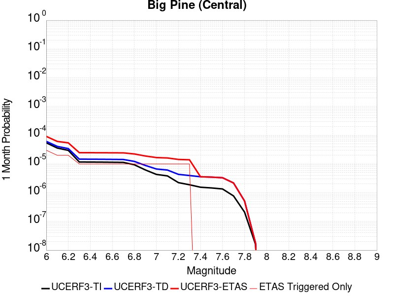 |  |  |

| Magnitude | 1 wk TI Prob | 1 wk TD Prob | 1 wk ETAS Prob | 1 wk ETAS/TD Gain | 1 wk ETAS Triggered Only | 1 mo TI Prob | 1 mo TD Prob | 1 mo ETAS Prob | 1 mo ETAS/TD Gain | 1 mo ETAS Triggered Only | 1 yr TI Prob | 1 yr TD Prob | 1 yr ETAS Prob | 1 yr ETAS/TD Gain | 1 yr ETAS Triggered Only | 10 yr TI Prob | 10 yr TD Prob | 10 yr ETAS Prob | 10 yr ETAS/TD Gain | 10 yr ETAS Triggered Only |
|-----|-----|-----|-----|-----|-----|-----|-----|-----|-----|-----|-----|-----|-----|-----|-----|-----|-----|-----|-----|-----|
| 6.0 | 1.2706755E-5 | 1.4250602E-5 | 1.4250602E-5 | 1.0 | 0.0 | 5.4456385E-5 | 6.107279E-5 | 6.107279E-5 | 1.0 | 0.0 | 6.628048E-4 | 7.433441E-4 | 8.029407E-4 | 1.0801737 | 5.9640963E-5 | 0.006608314 | 0.007413639 | 0.007532037 | 1.0159702 | 1.19281925E-4 |
| 6.1 | 8.342579E-6 | 9.510835E-6 | 9.510835E-6 | 1.0 | 0.0 | 3.5753423E-5 | 4.076021E-5 | 4.076021E-5 | 1.0 | 0.0 | 4.3521097E-4 | 4.9616426E-4 | 4.9616426E-4 | 1.0 | 0.0 | 0.0043435963 | 0.004954155 | 0.004954155 | 1.0 | 0.0 |
| 6.2 | 6.923899E-6 | 7.967221E-6 | 7.967221E-6 | 1.0 | 0.0 | 2.9673516E-5 | 3.4144894E-5 | 3.4144894E-5 | 1.0 | 0.0 | 3.6121515E-4 | 4.1565404E-4 | 4.1565404E-4 | 1.0 | 0.0 | 0.003606286 | 0.0041521094 | 0.0041521094 | 1.0 | 0.0 |
| 6.3 | 2.728396E-6 | 3.4243646E-6 | 3.4243646E-6 | 1.0 | 0.0 | 1.1693074E-5 | 1.4675771E-5 | 1.4675771E-5 | 1.0 | 0.0 | 1.4235388E-4 | 1.7866373E-4 | 1.7866373E-4 | 1.0 | 0.0 | 0.0014226272 | 0.0017867433 | 0.0017867433 | 1.0 | 0.0 |
| 6.4 | 2.7136944E-6 | 3.4086581E-6 | 3.4086581E-6 | 1.0 | 0.0 | 1.1630066E-5 | 1.4608458E-5 | 1.4608458E-5 | 1.0 | 0.0 | 1.4158686E-4 | 1.7784433E-4 | 1.7784433E-4 | 1.0 | 0.0 | 0.0014149669 | 0.0017785623 | 0.0017785623 | 1.0 | 0.0 |
| 6.5 | 2.6971882E-6 | 3.3910032E-6 | 3.3910032E-6 | 1.0 | 0.0 | 1.1559327E-5 | 1.4532795E-5 | 1.4532795E-5 | 1.0 | 0.0 | 1.4072572E-4 | 1.7692328E-4 | 1.7692328E-4 | 1.0 | 0.0 | 0.0014063664 | 0.0017693666 | 0.0017693666 | 1.0 | 0.0 |
| 6.6 | 2.669092E-6 | 3.3610236E-6 | 3.3610236E-6 | 1.0 | 0.0 | 1.1438916E-5 | 1.4404312E-5 | 1.4404312E-5 | 1.0 | 0.0 | 1.3925991E-4 | 1.7535927E-4 | 1.7535927E-4 | 1.0 | 0.0 | 0.0013917267 | 0.0017537511 | 0.0017537511 | 1.0 | 0.0 |
| 6.7 | 2.6408059E-6 | 3.3310494E-6 | 3.3310494E-6 | 1.0 | 0.0 | 1.1317691E-5 | 1.4275853E-5 | 1.4275853E-5 | 1.0 | 0.0 | 1.3778417E-4 | 1.737955E-4 | 1.737955E-4 | 1.0 | 0.0 | 0.0013769877 | 0.0017381381 | 0.0017381381 | 1.0 | 0.0 |
| 6.8 | 2.1786943E-6 | 2.8545066E-6 | 2.8545066E-6 | 1.0 | 0.0 | 9.337228E-6 | 1.2233547E-5 | 1.2233547E-5 | 1.0 | 0.0 | 1.1367482E-4 | 1.4893398E-4 | 1.4893398E-4 | 1.0 | 0.0 | 0.0011361669 | 0.0014898704 | 0.0014898704 | 1.0 | 0.0 |
| 6.9 | 1.4411696E-6 | 2.0685677E-6 | 2.0685677E-6 | 1.0 | 0.0 | 6.1764263E-6 | 8.865261E-6 | 8.865261E-6 | 1.0 | 0.0 | 7.51954E-5 | 1.0792949E-4 | 1.0792949E-4 | 1.0 | 0.0 | 7.5169955E-4 | 0.0010802548 | 0.0010802548 | 1.0 | 0.0 |
| 7.0 | 1.0073411E-6 | 1.5543274E-6 | 1.5543274E-6 | 1.0 | 0.0 | 4.317169E-6 | 6.661387E-6 | 6.661387E-6 | 1.0 | 0.0 | 5.2560266E-5 | 8.109952E-5 | 8.109952E-5 | 1.0 | 0.0 | 5.2547833E-4 | 8.1217213E-4 | 8.1217213E-4 | 1.0 | 0.0 |
| 7.1 | 8.947104E-7 | 1.430316E-6 | 1.430316E-6 | 1.0 | 0.0 | 3.834468E-6 | 6.1299124E-6 | 6.1299124E-6 | 1.0 | 0.0 | 4.6683643E-5 | 7.462928E-5 | 7.462928E-5 | 1.0 | 0.0 | 4.6673836E-4 | 7.4751483E-4 | 7.4751483E-4 | 1.0 | 0.0 |
| 7.2 | 5.215166E-7 | 1.0112277E-6 | 1.0112277E-6 | 1.0 | 0.0 | 2.2350691E-6 | 4.333826E-6 | 4.333826E-6 | 1.0 | 0.0 | 2.7211627E-5 | 5.27631E-5 | 5.27631E-5 | 1.0 | 0.0 | 2.7208295E-4 | 5.289683E-4 | 5.289683E-4 | 1.0 | 0.0 |
| 7.3 | 4.4024807E-7 | 9.220183E-7 | 9.220183E-7 | 1.0 | 0.0 | 1.8867761E-6 | 3.951501E-6 | 3.951501E-6 | 1.0 | 0.0 | 2.2971257E-5 | 4.8108504E-5 | 4.8108504E-5 | 1.0 | 0.0 | 2.2968883E-4 | 4.824433E-4 | 4.824433E-4 | 1.0 | 0.0 |
| 7.4 | 3.6130905E-7 | 8.359109E-7 | 8.359109E-7 | 1.0 | 0.0 | 1.5484665E-6 | 3.5824705E-6 | 3.5824705E-6 | 1.0 | 0.0 | 1.8852415E-5 | 4.3615746E-5 | 4.3615746E-5 | 1.0 | 0.0 | 1.8850817E-4 | 4.3752496E-4 | 4.3752496E-4 | 1.0 | 0.0 |
| 7.5 | 3.408184E-7 | 8.1087245E-7 | 8.1087245E-7 | 1.0 | 0.0 | 1.4606494E-6 | 3.475163E-6 | 3.475163E-6 | 1.0 | 0.0 | 1.7783263E-5 | 4.230933E-5 | 4.230933E-5 | 1.0 | 0.0 | 1.778184E-4 | 4.2444657E-4 | 4.2444657E-4 | 1.0 | 0.0 |
| 7.6 | 3.1428627E-7 | 7.732167E-7 | 7.732167E-7 | 1.0 | 0.0 | 1.3469405E-6 | 3.313782E-6 | 3.313782E-6 | 1.0 | 0.0 | 1.6398877E-5 | 4.0344585E-5 | 4.0344585E-5 | 1.0 | 0.0 | 1.6397667E-4 | 4.0477706E-4 | 4.0477706E-4 | 1.0 | 0.0 |
| 7.7 | 1.7972785E-7 | 5.0782415E-7 | 5.0782415E-7 | 1.0 | 0.0 | 7.70262E-7 | 2.1763874E-6 | 2.1763874E-6 | 1.0 | 0.0 | 9.377899E-6 | 2.6497206E-5 | 2.6497206E-5 | 1.0 | 0.0 | 9.377503E-5 | 2.6633305E-4 | 2.6633305E-4 | 1.0 | 0.0 |
| 7.8 | 4.9230927E-8 | 1.1981747E-7 | 1.1981747E-7 | 1.0 | 0.0 | 2.1098968E-7 | 5.135033E-7 | 5.135033E-7 | 1.0 | 0.0 | 2.5687964E-6 | 6.2518866E-6 | 6.2518866E-6 | 1.0 | 0.0 | 2.5687666E-5 | 6.2971965E-5 | 6.2971965E-5 | 1.0 | 0.0 |
| 7.9 | 3.6805972E-9 | 4.1051638E-9 | 4.1051638E-9 | 1.0 | 0.0 | 1.5773987E-8 | 1.7593557E-8 | 1.7593557E-8 | 1.0 | 0.0 | 1.9204828E-7 | 2.1420155E-7 | 2.1420155E-7 | 1.0 | 0.0 | 1.920481E-6 | 2.1898923E-6 | 2.1898923E-6 | 1.0 | 0.0 |

## Hayward (So) 2011 CFM
*[(top)](#table-of-contents)*

| 1 Week | 1 Month | 1 Year | 10 Year |
|-----|-----|-----|-----|
|  |  | 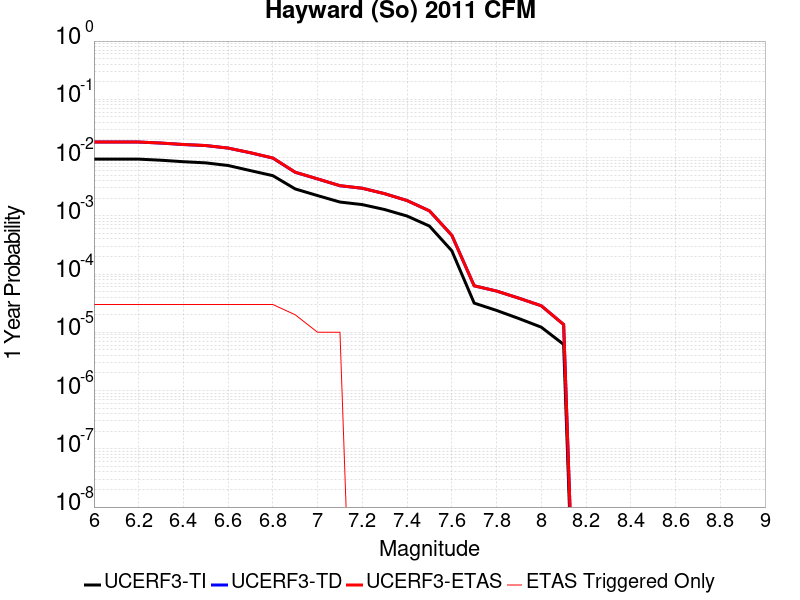 |  |

| Magnitude | 1 wk TI Prob | 1 wk TD Prob | 1 wk ETAS Prob | 1 wk ETAS/TD Gain | 1 wk ETAS Triggered Only | 1 mo TI Prob | 1 mo TD Prob | 1 mo ETAS Prob | 1 mo ETAS/TD Gain | 1 mo ETAS Triggered Only | 1 yr TI Prob | 1 yr TD Prob | 1 yr ETAS Prob | 1 yr ETAS/TD Gain | 1 yr ETAS Triggered Only | 10 yr TI Prob | 10 yr TD Prob | 10 yr ETAS Prob | 10 yr ETAS/TD Gain | 10 yr ETAS Triggered Only |
|-----|-----|-----|-----|-----|-----|-----|-----|-----|-----|-----|-----|-----|-----|-----|-----|-----|-----|-----|-----|-----|
| 6.0 | 1.8091932E-4 | 3.570673E-4 | 3.570673E-4 | 1.0 | 0.0 | 7.751381E-4 | 0.0015294008 | 0.0015294008 | 1.0 | 0.0 | 0.00939654 | 0.018463885 | 0.018522425 | 1.0031705 | 5.9640963E-5 | 0.090090066 | 0.1667085 | 0.16680789 | 1.0005963 | 1.19281925E-4 |
| 6.1 | 1.8091932E-4 | 3.570673E-4 | 3.570673E-4 | 1.0 | 0.0 | 7.751381E-4 | 0.0015294008 | 0.0015294008 | 1.0 | 0.0 | 0.00939654 | 0.018463885 | 0.018522425 | 1.0031705 | 5.9640963E-5 | 0.090090066 | 0.1667085 | 0.16680789 | 1.0005963 | 1.19281925E-4 |
| 6.2 | 1.8091932E-4 | 3.570673E-4 | 3.570673E-4 | 1.0 | 0.0 | 7.751381E-4 | 0.0015294008 | 0.0015294008 | 1.0 | 0.0 | 0.00939654 | 0.018463885 | 0.018522425 | 1.0031705 | 5.9640963E-5 | 0.090090066 | 0.1667085 | 0.16680789 | 1.0005963 | 1.19281925E-4 |
| 6.3 | 1.7322872E-4 | 3.4263515E-4 | 3.4263515E-4 | 1.0 | 0.0 | 7.4219756E-4 | 0.0014676197 | 0.0014676197 | 1.0 | 0.0 | 0.0089988755 | 0.017724147 | 0.017782731 | 1.0033053 | 5.9640963E-5 | 0.08643075 | 0.16065954 | 0.16075966 | 1.0006232 | 1.19281925E-4 |
| 6.4 | 1.6334097E-4 | 3.2345165E-4 | 3.2345165E-4 | 1.0 | 0.0 | 6.998449E-4 | 0.0013854936 | 0.0013854936 | 1.0 | 0.0 | 0.008487372 | 0.016739927 | 0.016798569 | 1.0035032 | 5.9640963E-5 | 0.081704415 | 0.15256606 | 0.15266714 | 1.0006626 | 1.19281925E-4 |
| 6.5 | 1.5600289E-4 | 3.101982E-4 | 3.101982E-4 | 1.0 | 0.0 | 6.684125E-4 | 0.0013287518 | 0.0013287518 | 1.0 | 0.0 | 0.008107598 | 0.016059443 | 0.016118128 | 1.0036541 | 5.9640963E-5 | 0.078181036 | 0.14684291 | 0.14694467 | 1.0006931 | 1.19281925E-4 |
| 6.6 | 1.4046066E-4 | 2.8034003E-4 | 2.8034003E-4 | 1.0 | 0.0 | 6.018354E-4 | 0.0012009109 | 0.0012009109 | 1.0 | 0.0 | 0.0073027555 | 0.014524571 | 0.0145833455 | 1.0040466 | 5.9640963E-5 | 0.07067384 | 0.13393044 | 0.13403375 | 1.0007714 | 1.19281925E-4 |
| 6.7 | 1.14696966E-4 | 2.3272466E-4 | 2.3272466E-4 | 1.0 | 0.0 | 4.914658E-4 | 9.970153E-4 | 9.970153E-4 | 1.0 | 0.0 | 0.0059671924 | 0.012072163 | 0.012131084 | 1.0048808 | 5.9640963E-5 | 0.058094822 | 0.11274141 | 0.11279433 | 1.0004693 | 5.9640963E-5 |
| 6.8 | 9.3874296E-5 | 1.8862431E-4 | 1.8862431E-4 | 1.0 | 0.0 | 4.0225635E-4 | 8.081431E-4 | 8.081431E-4 | 1.0 | 0.0 | 0.0048864787 | 0.009795489 | 0.009854546 | 1.006029 | 5.9640963E-5 | 0.047804173 | 0.092592984 | 0.092647105 | 1.0005845 | 5.9640963E-5 |
| 6.9 | 5.551852E-5 | 1.0729875E-4 | 1.0729875E-4 | 1.0 | 0.0 | 2.3791482E-4 | 4.5977137E-4 | 4.5977137E-4 | 1.0 | 0.0 | 0.0028927654 | 0.005583468 | 0.005583468 | 1.0 | 0.0 | 0.028553981 | 0.054246075 | 0.054246075 | 1.0 | 0.0 |
| 7.0 | 4.2662363E-5 | 8.246792E-5 | 8.246792E-5 | 1.0 | 0.0 | 1.8282588E-4 | 3.5338648E-4 | 3.5338648E-4 | 1.0 | 0.0 | 0.0022236328 | 0.0042940658 | 0.0042940658 | 1.0 | 0.0 | 0.022015138 | 0.04206509 | 0.04206509 | 1.0 | 0.0 |
| 7.1 | 3.305886E-5 | 6.302183E-5 | 6.302183E-5 | 1.0 | 0.0 | 1.4167312E-4 | 2.7006568E-4 | 2.7006568E-4 | 1.0 | 0.0 | 0.0017235056 | 0.003283111 | 0.003283111 | 1.0 | 0.0 | 0.017101998 | 0.032453902 | 0.032453902 | 1.0 | 0.0 |
| 7.2 | 2.9856887E-5 | 5.701622E-5 | 5.701622E-5 | 1.0 | 0.0 | 1.2795182E-4 | 2.4433242E-4 | 2.4433242E-4 | 1.0 | 0.0 | 0.0015567001 | 0.0029707062 | 0.0029707062 | 1.0 | 0.0 | 0.015458403 | 0.029454801 | 0.029454801 | 1.0 | 0.0 |
| 7.3 | 2.4559737E-5 | 4.599286E-5 | 4.599286E-5 | 1.0 | 0.0 | 1.0525176E-4 | 1.9709744E-4 | 1.9709744E-4 | 1.0 | 0.0 | 0.0012806869 | 0.0023970334 | 0.0023970334 | 1.0 | 0.0 | 0.012733313 | 0.023858516 | 0.023858516 | 1.0 | 0.0 |
| 7.4 | 1.9002231E-5 | 3.505084E-5 | 3.505084E-5 | 1.0 | 0.0 | 8.143559E-5 | 1.502093E-4 | 1.502093E-4 | 1.0 | 0.0 | 9.910273E-4 | 0.001827274 | 0.001827274 | 1.0 | 0.0 | 0.009866194 | 0.018258808 | 0.018258808 | 1.0 | 0.0 |
| 7.5 | 1.2783333E-5 | 2.3331182E-5 | 2.3331182E-5 | 1.0 | 0.0 | 5.4784563E-5 | 9.998698E-5 | 9.998698E-5 | 1.0 | 0.0 | 6.667979E-4 | 0.0012166675 | 0.0012166675 | 1.0 | 0.0 | 0.006648007 | 0.012209443 | 0.012209443 | 1.0 | 0.0 |
| 7.6 | 4.8149627E-6 | 8.888056E-6 | 8.888056E-6 | 1.0 | 0.0 | 2.063539E-5 | 3.8091122E-5 | 3.8091122E-5 | 1.0 | 0.0 | 2.5120692E-4 | 4.6366194E-4 | 4.6366194E-4 | 1.0 | 0.0 | 0.0025092314 | 0.0046805087 | 0.0046805087 | 1.0 | 0.0 |
| 7.7 | 6.0838227E-7 | 1.205754E-6 | 1.205754E-6 | 1.0 | 0.0 | 2.6073499E-6 | 5.1675065E-6 | 5.1675065E-6 | 1.0 | 0.0 | 3.174402E-5 | 6.291258E-5 | 6.291258E-5 | 1.0 | 0.0 | 3.1739488E-4 | 6.5296254E-4 | 6.5296254E-4 | 1.0 | 0.0 |
| 7.8 | 4.5542808E-7 | 9.792941E-7 | 9.792941E-7 | 1.0 | 0.0 | 1.9518332E-6 | 4.196968E-6 | 4.196968E-6 | 1.0 | 0.0 | 2.376331E-5 | 5.109689E-5 | 5.109689E-5 | 1.0 | 0.0 | 2.3760769E-4 | 5.321693E-4 | 5.321693E-4 | 1.0 | 0.0 |
| 7.9 | 3.3016747E-7 | 7.3869535E-7 | 7.3869535E-7 | 1.0 | 0.0 | 1.4150027E-6 | 3.1658333E-6 | 3.1658333E-6 | 1.0 | 0.0 | 1.7227521E-5 | 3.854334E-5 | 3.854334E-5 | 1.0 | 0.0 | 1.7226185E-4 | 3.9932923E-4 | 3.9932923E-4 | 1.0 | 0.0 |
| 8.0 | 2.347038E-7 | 5.471963E-7 | 5.471963E-7 | 1.0 | 0.0 | 1.0058731E-6 | 2.3451248E-6 | 2.3451248E-6 | 1.0 | 0.0 | 1.2246436E-5 | 2.8551523E-5 | 2.8551523E-5 | 1.0 | 0.0 | 1.2245761E-4 | 2.9357258E-4 | 2.9357258E-4 | 1.0 | 0.0 |
| 8.1 | 1.18822804E-7 | 2.6060948E-7 | 2.6060948E-7 | 1.0 | 0.0 | 5.092405E-7 | 1.1168972E-6 | 1.1168972E-6 | 1.0 | 0.0 | 6.1999854E-6 | 1.359814E-5 | 1.359814E-5 | 1.0 | 0.0 | 6.199812E-5 | 1.3918082E-4 | 1.3918082E-4 | 1.0 | 0.0 |

## Scodie Lineament
*[(top)](#table-of-contents)*

| 1 Week | 1 Month | 1 Year | 10 Year |
|-----|-----|-----|-----|
|  |  |  |  |

| Magnitude | 1 wk TI Prob | 1 wk TD Prob | 1 wk ETAS Prob | 1 wk ETAS/TD Gain | 1 wk ETAS Triggered Only | 1 mo TI Prob | 1 mo TD Prob | 1 mo ETAS Prob | 1 mo ETAS/TD Gain | 1 mo ETAS Triggered Only | 1 yr TI Prob | 1 yr TD Prob | 1 yr ETAS Prob | 1 yr ETAS/TD Gain | 1 yr ETAS Triggered Only | 10 yr TI Prob | 10 yr TD Prob | 10 yr ETAS Prob | 10 yr ETAS/TD Gain | 10 yr ETAS Triggered Only |
|-----|-----|-----|-----|-----|-----|-----|-----|-----|-----|-----|-----|-----|-----|-----|-----|-----|-----|-----|-----|-----|
| 6.0 | 3.2919327E-6 | 3.0133303E-6 | 3.0133303E-6 | 1.0 | 0.0 | 1.4108206E-5 | 1.2914227E-5 | 1.321946E-4 | 10.236355 | 1.19281925E-4 | 1.7175387E-4 | 1.5722254E-4 | 2.7648572E-4 | 1.7585628 | 1.19281925E-4 | 0.0017162118 | 0.0015714248 | 0.0016905193 | 1.0757875 | 1.19281925E-4 |
| 6.1 | 1.8663811E-6 | 1.5490382E-6 | 1.5490382E-6 | 1.0 | 0.0 | 7.998751E-6 | 6.6387206E-6 | 6.6387206E-6 | 1.0 | 0.0 | 9.738045E-5 | 8.082393E-5 | 8.082393E-5 | 1.0 | 0.0 | 9.7337784E-4 | 8.079941E-4 | 8.079941E-4 | 1.0 | 0.0 |
| 6.2 | 1.8663811E-6 | 1.5490382E-6 | 1.5490382E-6 | 1.0 | 0.0 | 7.998751E-6 | 6.6387206E-6 | 6.6387206E-6 | 1.0 | 0.0 | 9.738045E-5 | 8.082393E-5 | 8.082393E-5 | 1.0 | 0.0 | 9.7337784E-4 | 8.079941E-4 | 8.079941E-4 | 1.0 | 0.0 |
| 6.3 | 1.8663811E-6 | 1.5490382E-6 | 1.5490382E-6 | 1.0 | 0.0 | 7.998751E-6 | 6.6387206E-6 | 6.6387206E-6 | 1.0 | 0.0 | 9.738045E-5 | 8.082393E-5 | 8.082393E-5 | 1.0 | 0.0 | 9.7337784E-4 | 8.079941E-4 | 8.079941E-4 | 1.0 | 0.0 |
| 6.4 | 1.8663811E-6 | 1.5490382E-6 | 1.5490382E-6 | 1.0 | 0.0 | 7.998751E-6 | 6.6387206E-6 | 6.6387206E-6 | 1.0 | 0.0 | 9.738045E-5 | 8.082393E-5 | 8.082393E-5 | 1.0 | 0.0 | 9.7337784E-4 | 8.079941E-4 | 8.079941E-4 | 1.0 | 0.0 |
| 6.5 | 1.8106311E-6 | 1.4909722E-6 | 1.4909722E-6 | 1.0 | 0.0 | 7.759824E-6 | 6.389868E-6 | 6.389868E-6 | 1.0 | 0.0 | 9.447177E-5 | 7.779436E-5 | 7.779436E-5 | 1.0 | 0.0 | 9.4431615E-4 | 7.7771995E-4 | 7.7771995E-4 | 1.0 | 0.0 |
| 6.6 | 1.2414679E-6 | 8.9974395E-7 | 8.9974395E-7 | 1.0 | 0.0 | 5.320566E-6 | 3.85604E-6 | 3.85604E-6 | 1.0 | 0.0 | 6.477596E-5 | 4.6946367E-5 | 4.6946367E-5 | 1.0 | 0.0 | 6.475708E-4 | 4.6937316E-4 | 4.6937316E-4 | 1.0 | 0.0 |
| 6.7 | 1.1062215E-6 | 7.594193E-7 | 7.594193E-7 | 1.0 | 0.0 | 4.7409408E-6 | 3.2546504E-6 | 3.2546504E-6 | 1.0 | 0.0 | 5.7719422E-5 | 3.962472E-5 | 3.962472E-5 | 1.0 | 0.0 | 5.770443E-4 | 3.9618355E-4 | 3.9618355E-4 | 1.0 | 0.0 |
| 6.8 | 1.0006736E-6 | 6.5002786E-7 | 6.5002786E-7 | 1.0 | 0.0 | 4.288594E-6 | 2.7858312E-6 | 2.7858312E-6 | 1.0 | 0.0 | 5.221238E-5 | 3.391703E-5 | 3.391703E-5 | 1.0 | 0.0 | 5.220012E-4 | 3.3912458E-4 | 3.3912458E-4 | 1.0 | 0.0 |
| 6.9 | 9.167364E-7 | 5.6315065E-7 | 5.6315065E-7 | 1.0 | 0.0 | 3.9288643E-6 | 2.413501E-6 | 2.413501E-6 | 1.0 | 0.0 | 4.7832873E-5 | 2.9384037E-5 | 2.9384037E-5 | 1.0 | 0.0 | 4.782258E-4 | 2.9380718E-4 | 2.9380718E-4 | 1.0 | 0.0 |
| 7.0 | 7.6987664E-7 | 4.113265E-7 | 4.113265E-7 | 1.0 | 0.0 | 3.2994672E-6 | 1.7628269E-6 | 1.7628269E-6 | 1.0 | 0.0 | 4.0170275E-5 | 2.1462245E-5 | 2.1462245E-5 | 1.0 | 0.0 | 4.0163012E-4 | 2.1460558E-4 | 2.1460558E-4 | 1.0 | 0.0 |
| 7.1 | 7.1038727E-7 | 3.5210306E-7 | 3.5210306E-7 | 1.0 | 0.0 | 3.0445133E-6 | 1.5090123E-6 | 1.5090123E-6 | 1.0 | 0.0 | 3.706632E-5 | 1.8372106E-5 | 1.8372106E-5 | 1.0 | 0.0 | 3.7060137E-4 | 1.8370937E-4 | 1.8370937E-4 | 1.0 | 0.0 |
| 7.2 | 2.0799602E-7 | 3.1178534E-8 | 3.1178534E-8 | 1.0 | 0.0 | 8.914113E-7 | 1.3362228E-7 | 1.3362228E-7 | 1.0 | 0.0 | 1.0852878E-5 | 1.6268501E-6 | 1.6268501E-6 | 1.0 | 0.0 | 1.08523476E-4 | 1.626839E-5 | 1.626839E-5 | 1.0 | 0.0 |
| 7.3 | 1.5048182E-7 | 1.5939106E-8 | 1.5939106E-8 | 1.0 | 0.0 | 6.449219E-7 | 6.8310456E-8 | 6.8310456E-8 | 1.0 | 0.0 | 7.851896E-6 | 8.316795E-7 | 8.316795E-7 | 1.0 | 0.0 | 7.851618E-5 | 8.316767E-6 | 8.316767E-6 | 1.0 | 0.0 |
| 7.4 | 5.9334678E-8 | 4.8638475E-9 | 4.8638475E-9 | 1.0 | 0.0 | 2.5429145E-7 | 2.084506E-8 | 2.084506E-8 | 1.0 | 0.0 | 3.095994E-6 | 2.5378858E-7 | 2.5378858E-7 | 1.0 | 0.0 | 3.095951E-5 | 2.5378843E-6 | 2.5378843E-6 | 1.0 | 0.0 |

## Deep Springs
*[(top)](#table-of-contents)*

| 1 Week | 1 Month | 1 Year | 10 Year |
|-----|-----|-----|-----|
|  |  |  |  |

| Magnitude | 1 wk TI Prob | 1 wk TD Prob | 1 wk ETAS Prob | 1 wk ETAS/TD Gain | 1 wk ETAS Triggered Only | 1 mo TI Prob | 1 mo TD Prob | 1 mo ETAS Prob | 1 mo ETAS/TD Gain | 1 mo ETAS Triggered Only | 1 yr TI Prob | 1 yr TD Prob | 1 yr ETAS Prob | 1 yr ETAS/TD Gain | 1 yr ETAS Triggered Only | 10 yr TI Prob | 10 yr TD Prob | 10 yr ETAS Prob | 10 yr ETAS/TD Gain | 10 yr ETAS Triggered Only |
|-----|-----|-----|-----|-----|-----|-----|-----|-----|-----|-----|-----|-----|-----|-----|-----|-----|-----|-----|-----|-----|
| 6.0 | 1.9810619E-5 | 2.311252E-5 | 2.311252E-5 | 1.0 | 0.0 | 8.489989E-5 | 9.9052755E-5 | 9.9052755E-5 | 1.0 | 0.0 | 0.001033166 | 0.0012058078 | 0.0012058078 | 1.0 | 0.0 | 0.010283757 | 0.01204243 | 0.012160275 | 1.0097859 | 1.19281925E-4 |
| 6.1 | 1.9810619E-5 | 2.311252E-5 | 2.311252E-5 | 1.0 | 0.0 | 8.489989E-5 | 9.9052755E-5 | 9.9052755E-5 | 1.0 | 0.0 | 0.001033166 | 0.0012058078 | 0.0012058078 | 1.0 | 0.0 | 0.010283757 | 0.01204243 | 0.012160275 | 1.0097859 | 1.19281925E-4 |
| 6.2 | 1.9810619E-5 | 2.311252E-5 | 2.311252E-5 | 1.0 | 0.0 | 8.489989E-5 | 9.9052755E-5 | 9.9052755E-5 | 1.0 | 0.0 | 0.001033166 | 0.0012058078 | 0.0012058078 | 1.0 | 0.0 | 0.010283757 | 0.01204243 | 0.012160275 | 1.0097859 | 1.19281925E-4 |
| 6.3 | 1.9810619E-5 | 2.311252E-5 | 2.311252E-5 | 1.0 | 0.0 | 8.489989E-5 | 9.9052755E-5 | 9.9052755E-5 | 1.0 | 0.0 | 0.001033166 | 0.0012058078 | 0.0012058078 | 1.0 | 0.0 | 0.010283757 | 0.01204243 | 0.012160275 | 1.0097859 | 1.19281925E-4 |
| 6.4 | 1.9810619E-5 | 2.311252E-5 | 2.311252E-5 | 1.0 | 0.0 | 8.489989E-5 | 9.9052755E-5 | 9.9052755E-5 | 1.0 | 0.0 | 0.001033166 | 0.0012058078 | 0.0012058078 | 1.0 | 0.0 | 0.010283757 | 0.01204243 | 0.012160275 | 1.0097859 | 1.19281925E-4 |
| 6.5 | 1.7190405E-5 | 2.0050558E-5 | 2.0050558E-5 | 1.0 | 0.0 | 7.367108E-5 | 8.593096E-5 | 8.593096E-5 | 1.0 | 0.0 | 8.9657627E-4 | 0.0010462092 | 0.0010462092 | 1.0 | 0.0 | 0.008929676 | 0.010462061 | 0.0105800945 | 1.0112821 | 1.19281925E-4 |
| 6.6 | 1.7190405E-5 | 2.0050558E-5 | 2.0050558E-5 | 1.0 | 0.0 | 7.367108E-5 | 8.593096E-5 | 8.593096E-5 | 1.0 | 0.0 | 8.9657627E-4 | 0.0010462092 | 0.0010462092 | 1.0 | 0.0 | 0.008929676 | 0.010462061 | 0.0105800945 | 1.0112821 | 1.19281925E-4 |

## Pleito
*[(top)](#table-of-contents)*

| 1 Week | 1 Month | 1 Year | 10 Year |
|-----|-----|-----|-----|
|  |  | 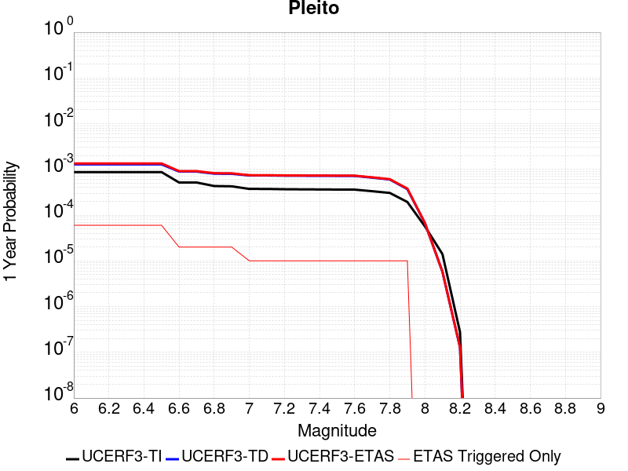 |  |

| Magnitude | 1 wk TI Prob | 1 wk TD Prob | 1 wk ETAS Prob | 1 wk ETAS/TD Gain | 1 wk ETAS Triggered Only | 1 mo TI Prob | 1 mo TD Prob | 1 mo ETAS Prob | 1 mo ETAS/TD Gain | 1 mo ETAS Triggered Only | 1 yr TI Prob | 1 yr TD Prob | 1 yr ETAS Prob | 1 yr ETAS/TD Gain | 1 yr ETAS Triggered Only | 10 yr TI Prob | 10 yr TD Prob | 10 yr ETAS Prob | 10 yr ETAS/TD Gain | 10 yr ETAS Triggered Only |
|-----|-----|-----|-----|-----|-----|-----|-----|-----|-----|-----|-----|-----|-----|-----|-----|-----|-----|-----|-----|-----|
| 6.0 | 1.6763008E-5 | 2.4764735E-5 | 1.440437E-4 | 5.8164845 | 1.19281925E-4 | 7.183948E-5 | 1.0613067E-4 | 2.2539993E-4 | 2.1237965 | 1.19281925E-4 | 8.742947E-4 | 0.001291447 | 0.0014105749 | 1.0922437 | 1.19281925E-4 | 0.00870863 | 0.012954412 | 0.013072149 | 1.0090885 | 1.19281925E-4 |
| 6.1 | 1.6763008E-5 | 2.4764735E-5 | 1.440437E-4 | 5.8164845 | 1.19281925E-4 | 7.183948E-5 | 1.0613067E-4 | 2.2539993E-4 | 2.1237965 | 1.19281925E-4 | 8.742947E-4 | 0.001291447 | 0.0014105749 | 1.0922437 | 1.19281925E-4 | 0.00870863 | 0.012954412 | 0.013072149 | 1.0090885 | 1.19281925E-4 |
| 6.2 | 1.6763008E-5 | 2.4764735E-5 | 1.440437E-4 | 5.8164845 | 1.19281925E-4 | 7.183948E-5 | 1.0613067E-4 | 2.2539993E-4 | 2.1237965 | 1.19281925E-4 | 8.742947E-4 | 0.001291447 | 0.0014105749 | 1.0922437 | 1.19281925E-4 | 0.00870863 | 0.012954412 | 0.013072149 | 1.0090885 | 1.19281925E-4 |
| 6.3 | 1.6763008E-5 | 2.4764735E-5 | 1.440437E-4 | 5.8164845 | 1.19281925E-4 | 7.183948E-5 | 1.0613067E-4 | 2.2539993E-4 | 2.1237965 | 1.19281925E-4 | 8.742947E-4 | 0.001291447 | 0.0014105749 | 1.0922437 | 1.19281925E-4 | 0.00870863 | 0.012954412 | 0.013072149 | 1.0090885 | 1.19281925E-4 |
| 6.4 | 1.6763008E-5 | 2.4764735E-5 | 1.440437E-4 | 5.8164845 | 1.19281925E-4 | 7.183948E-5 | 1.0613067E-4 | 2.2539993E-4 | 2.1237965 | 1.19281925E-4 | 8.742947E-4 | 0.001291447 | 0.0014105749 | 1.0922437 | 1.19281925E-4 | 0.00870863 | 0.012954412 | 0.013072149 | 1.0090885 | 1.19281925E-4 |
| 6.5 | 1.6763008E-5 | 2.4764735E-5 | 1.440437E-4 | 5.8164845 | 1.19281925E-4 | 7.183948E-5 | 1.0613067E-4 | 2.2539993E-4 | 2.1237965 | 1.19281925E-4 | 8.742947E-4 | 0.001291447 | 0.0014105749 | 1.0922437 | 1.19281925E-4 | 0.00870863 | 0.012954412 | 0.013072149 | 1.0090885 | 1.19281925E-4 |
| 6.6 | 9.910213E-6 | 1.721552E-5 | 1.721552E-5 | 1.0 | 0.0 | 4.247165E-5 | 7.3778734E-5 | 7.3778734E-5 | 1.0 | 0.0 | 5.169696E-4 | 8.9788967E-4 | 8.9788967E-4 | 1.0 | 0.0 | 0.0051576863 | 0.009051226 | 0.009051226 | 1.0 | 0.0 |
| 6.7 | 9.910213E-6 | 1.721552E-5 | 1.721552E-5 | 1.0 | 0.0 | 4.247165E-5 | 7.3778734E-5 | 7.3778734E-5 | 1.0 | 0.0 | 5.169696E-4 | 8.9788967E-4 | 8.9788967E-4 | 1.0 | 0.0 | 0.0051576863 | 0.009051226 | 0.009051226 | 1.0 | 0.0 |
| 6.8 | 8.300162E-6 | 1.5475129E-5 | 1.5475129E-5 | 1.0 | 0.0 | 3.557164E-5 | 6.63203E-5 | 6.63203E-5 | 1.0 | 0.0 | 4.3299864E-4 | 8.07152E-4 | 8.07152E-4 | 1.0 | 0.0 | 0.004321559 | 0.008150663 | 0.008150663 | 1.0 | 0.0 |
| 6.9 | 8.183114E-6 | 1.5346344E-5 | 1.5346344E-5 | 1.0 | 0.0 | 3.5070017E-5 | 6.57684E-5 | 6.57684E-5 | 1.0 | 0.0 | 4.2689382E-4 | 8.0043747E-4 | 8.0043747E-4 | 1.0 | 0.0 | 0.0042607468 | 0.008084008 | 0.008084008 | 1.0 | 0.0 |
| 7.0 | 7.1748823E-6 | 1.4133306E-5 | 1.4133306E-5 | 1.0 | 0.0 | 3.0749135E-5 | 6.0569906E-5 | 6.0569906E-5 | 1.0 | 0.0 | 3.743064E-4 | 7.3718966E-4 | 7.3718966E-4 | 1.0 | 0.0 | 0.0037367654 | 0.0074553755 | 0.0074553755 | 1.0 | 0.0 |
| 7.1 | 7.1671807E-6 | 1.4123676E-5 | 1.4123676E-5 | 1.0 | 0.0 | 3.0716128E-5 | 6.0528637E-5 | 6.0528637E-5 | 1.0 | 0.0 | 3.7390468E-4 | 7.366875E-4 | 7.366875E-4 | 1.0 | 0.0 | 0.0037327618 | 0.0074503883 | 0.0074503883 | 1.0 | 0.0 |
| 7.2 | 7.0649667E-6 | 1.3970962E-5 | 1.3970962E-5 | 1.0 | 0.0 | 3.0278077E-5 | 5.987418E-5 | 5.987418E-5 | 1.0 | 0.0 | 3.6857324E-4 | 7.287248E-4 | 7.287248E-4 | 1.0 | 0.0 | 0.0036796255 | 0.0073711374 | 0.0073711374 | 1.0 | 0.0 |
| 7.3 | 7.02082E-6 | 1.3914415E-5 | 1.3914415E-5 | 1.0 | 0.0 | 3.008888E-5 | 5.9631846E-5 | 5.9631846E-5 | 1.0 | 0.0 | 3.6627054E-4 | 7.257764E-4 | 7.257764E-4 | 1.0 | 0.0 | 0.0036566744 | 0.0073416373 | 0.0073416373 | 1.0 | 0.0 |
| 7.4 | 6.987146E-6 | 1.3873975E-5 | 1.3873975E-5 | 1.0 | 0.0 | 2.9944567E-5 | 5.9458544E-5 | 5.9458544E-5 | 1.0 | 0.0 | 3.6451413E-4 | 7.2366785E-4 | 7.2366785E-4 | 1.0 | 0.0 | 0.0036391679 | 0.007320571 | 0.007320571 | 1.0 | 0.0 |
| 7.5 | 6.9494554E-6 | 1.383088E-5 | 1.383088E-5 | 1.0 | 0.0 | 2.9783041E-5 | 5.9273858E-5 | 5.9273858E-5 | 1.0 | 0.0 | 3.625482E-4 | 7.2142074E-4 | 7.2142074E-4 | 1.0 | 0.0 | 0.0036195726 | 0.007298199 | 0.007298199 | 1.0 | 0.0 |
| 7.6 | 6.92694E-6 | 1.3789992E-5 | 1.3789992E-5 | 1.0 | 0.0 | 2.9686547E-5 | 5.909863E-5 | 5.909863E-5 | 1.0 | 0.0 | 3.6137376E-4 | 7.192888E-4 | 7.192888E-4 | 1.0 | 0.0 | 0.0036078666 | 0.007276951 | 0.007276951 | 1.0 | 0.0 |
| 7.7 | 6.395867E-6 | 1.26690065E-5 | 1.26690065E-5 | 1.0 | 0.0 | 2.741057E-5 | 5.4294615E-5 | 5.4294615E-5 | 1.0 | 0.0 | 3.336726E-4 | 6.6083675E-4 | 6.6083675E-4 | 1.0 | 0.0 | 0.0033317201 | 0.0066955453 | 0.0066955453 | 1.0 | 0.0 |
| 7.8 | 5.8664327E-6 | 1.1536581E-5 | 1.1536581E-5 | 1.0 | 0.0 | 2.5141611E-5 | 4.9441554E-5 | 4.9441554E-5 | 1.0 | 0.0 | 3.060561E-4 | 6.0178485E-4 | 6.0178485E-4 | 1.0 | 0.0 | 0.0030563495 | 0.0061010164 | 0.0061010164 | 1.0 | 0.0 |
| 7.9 | 3.7167474E-6 | 7.1145205E-6 | 7.1145205E-6 | 1.0 | 0.0 | 1.592882E-5 | 3.0490448E-5 | 3.0490448E-5 | 1.0 | 0.0 | 1.9391612E-4 | 3.7115812E-4 | 3.7115812E-4 | 1.0 | 0.0 | 0.0019374699 | 0.0037676243 | 0.0037676243 | 1.0 | 0.0 |
| 8.0 | 1.0903841E-6 | 1.2879104E-6 | 1.2879104E-6 | 1.0 | 0.0 | 4.6730665E-6 | 5.5196047E-6 | 5.5196047E-6 | 1.0 | 0.0 | 5.68931E-5 | 6.719913E-5 | 6.719913E-5 | 1.0 | 0.0 | 5.6878536E-4 | 6.942094E-4 | 6.942094E-4 | 1.0 | 0.0 |
| 8.1 | 2.6894583E-7 | 1.1056095E-7 | 1.1056095E-7 | 1.0 | 0.0 | 1.1526245E-6 | 4.7383253E-7 | 4.7383253E-7 | 1.0 | 0.0 | 1.4033113E-5 | 5.768896E-6 | 5.768896E-6 | 1.0 | 0.0 | 1.4032227E-4 | 6.454915E-5 | 6.454915E-5 | 1.0 | 0.0 |
| 8.2 | 5.2967013E-9 | 2.4567874E-9 | 2.4567874E-9 | 1.0 | 0.0 | 2.2700148E-8 | 1.0529089E-8 | 1.0529089E-8 | 1.0 | 0.0 | 2.7637427E-7 | 1.2819166E-7 | 1.2819166E-7 | 1.0 | 0.0 | 2.7637393E-6 | 1.4588004E-6 | 1.4588004E-6 | 1.0 | 0.0 |

## Hunting Creek - Berryessa 2011 CFM
*[(top)](#table-of-contents)*

| 1 Week | 1 Month | 1 Year | 10 Year |
|-----|-----|-----|-----|
|  |  |  | 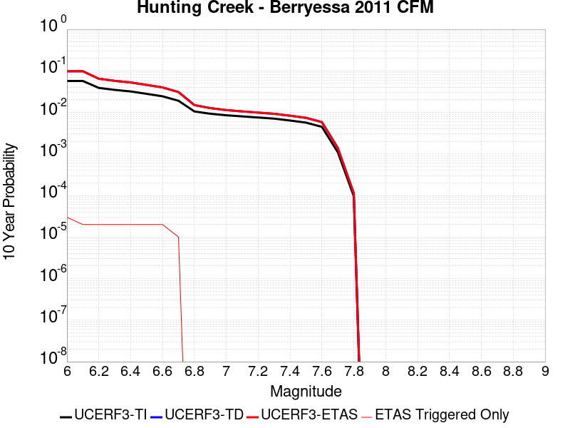 |

| Magnitude | 1 wk TI Prob | 1 wk TD Prob | 1 wk ETAS Prob | 1 wk ETAS/TD Gain | 1 wk ETAS Triggered Only | 1 mo TI Prob | 1 mo TD Prob | 1 mo ETAS Prob | 1 mo ETAS/TD Gain | 1 mo ETAS Triggered Only | 1 yr TI Prob | 1 yr TD Prob | 1 yr ETAS Prob | 1 yr ETAS/TD Gain | 1 yr ETAS Triggered Only | 10 yr TI Prob | 10 yr TD Prob | 10 yr ETAS Prob | 10 yr ETAS/TD Gain | 10 yr ETAS Triggered Only |
|-----|-----|-----|-----|-----|-----|-----|-----|-----|-----|-----|-----|-----|-----|-----|-----|-----|-----|-----|-----|-----|
| 6.0 | 1.1270982E-4 | 2.0028367E-4 | 2.0028367E-4 | 1.0 | 0.0 | 4.8295266E-4 | 8.579912E-4 | 8.579912E-4 | 1.0 | 0.0 | 0.0058641075 | 0.010386173 | 0.010386173 | 1.0 | 0.0 | 0.057117578 | 0.09804048 | 0.09809427 | 1.0005487 | 5.9640963E-5 |
| 6.1 | 1.1239393E-4 | 1.9976508E-4 | 1.9976508E-4 | 1.0 | 0.0 | 4.8159933E-4 | 8.557703E-4 | 8.557703E-4 | 1.0 | 0.0 | 0.0058477195 | 0.010359417 | 0.010359417 | 1.0 | 0.0 | 0.056962132 | 0.09779895 | 0.09779895 | 1.0 | 0.0 |
| 6.2 | 7.596265E-5 | 1.2933646E-4 | 1.2933646E-4 | 1.0 | 0.0 | 3.2551357E-4 | 5.5415573E-4 | 5.5415573E-4 | 1.0 | 0.0 | 0.0039559277 | 0.0067213587 | 0.0067213587 | 1.0 | 0.0 | 0.038862433 | 0.06459229 | 0.06459229 | 1.0 | 0.0 |
| 6.3 | 6.78794E-5 | 1.1448377E-4 | 1.1448377E-4 | 1.0 | 0.0 | 2.9087928E-4 | 4.9052597E-4 | 4.9052597E-4 | 1.0 | 0.0 | 0.003535705 | 0.005952661 | 0.005952661 | 1.0 | 0.0 | 0.034799766 | 0.057466213 | 0.057466213 | 1.0 | 0.0 |
| 6.4 | 6.2165134E-5 | 1.0434825E-4 | 1.0434825E-4 | 1.0 | 0.0 | 2.6639478E-4 | 4.4711027E-4 | 4.4711027E-4 | 1.0 | 0.0 | 0.0032385332 | 0.0054274183 | 0.0054274183 | 1.0 | 0.0 | 0.03191742 | 0.05255138 | 0.05255138 | 1.0 | 0.0 |
| 6.5 | 5.4368087E-5 | 9.070258E-5 | 9.070258E-5 | 1.0 | 0.0 | 2.3298527E-4 | 3.886537E-4 | 3.886537E-4 | 1.0 | 0.0 | 0.0028329059 | 0.0047197016 | 0.0047197016 | 1.0 | 0.0 | 0.027970633 | 0.045881182 | 0.045881182 | 1.0 | 0.0 |
| 6.6 | 4.729947E-5 | 7.847101E-5 | 7.847101E-5 | 1.0 | 0.0 | 2.0269625E-4 | 3.3624718E-4 | 3.3624718E-4 | 1.0 | 0.0 | 0.002465034 | 0.004084746 | 0.004084746 | 1.0 | 0.0 | 0.02437869 | 0.03985269 | 0.03985269 | 1.0 | 0.0 |
| 6.7 | 3.6875328E-5 | 6.0443555E-5 | 6.0443555E-5 | 1.0 | 0.0 | 1.5802756E-4 | 2.5900968E-4 | 2.5900968E-4 | 1.0 | 0.0 | 0.0019222875 | 0.0031482724 | 0.0031482724 | 1.0 | 0.0 | 0.019057442 | 0.03089371 | 0.03089371 | 1.0 | 0.0 |
| 6.8 | 2.0292036E-5 | 2.8976721E-5 | 2.8976721E-5 | 1.0 | 0.0 | 8.6962966E-5 | 1.2417998E-4 | 1.2417998E-4 | 1.0 | 0.0 | 0.0010582599 | 0.0015108302 | 0.0015108302 | 1.0 | 0.0 | 0.010532344 | 0.0149790775 | 0.0149790775 | 1.0 | 0.0 |
| 6.9 | 1.7871042E-5 | 2.4472653E-5 | 2.4472653E-5 | 1.0 | 0.0 | 7.658793E-5 | 1.04878585E-4 | 1.04878585E-4 | 1.0 | 0.0 | 9.320591E-4 | 0.0012761486 | 0.0012761486 | 1.0 | 0.0 | 0.009281595 | 0.012680395 | 0.012680395 | 1.0 | 0.0 |
| 7.0 | 1.6415532E-5 | 2.1906566E-5 | 2.1906566E-5 | 1.0 | 0.0 | 7.035038E-5 | 9.388191E-5 | 9.388191E-5 | 1.0 | 0.0 | 8.561793E-4 | 0.0011424144 | 0.0011424144 | 1.0 | 0.0 | 0.008528882 | 0.011365017 | 0.011365017 | 1.0 | 0.0 |
| 7.1 | 1.5409885E-5 | 2.0346588E-5 | 2.0346588E-5 | 1.0 | 0.0 | 6.6040695E-5 | 8.719676E-5 | 8.719676E-5 | 1.0 | 0.0 | 8.0374884E-4 | 0.0010611062 | 0.0010611062 | 1.0 | 0.0 | 0.00800848 | 0.010560924 | 0.010560924 | 1.0 | 0.0 |
| 7.2 | 1.4497423E-5 | 1.905519E-5 | 1.905519E-5 | 1.0 | 0.0 | 6.213033E-5 | 8.166256E-5 | 8.166256E-5 | 1.0 | 0.0 | 7.5617427E-4 | 9.937913E-4 | 9.937913E-4 | 1.0 | 0.0 | 0.0075360634 | 0.00989425 | 0.00989425 | 1.0 | 0.0 |
| 7.3 | 1.3615175E-5 | 1.7826347E-5 | 1.7826347E-5 | 1.0 | 0.0 | 5.8349444E-5 | 7.6396405E-5 | 7.6396405E-5 | 1.0 | 0.0 | 7.101729E-4 | 9.297323E-4 | 9.297323E-4 | 1.0 | 0.0 | 0.0070790765 | 0.009259124 | 0.009259124 | 1.0 | 0.0 |
| 7.4 | 1.2252825E-5 | 1.6026455E-5 | 1.6026455E-5 | 1.0 | 0.0 | 5.251105E-5 | 6.868302E-5 | 6.868302E-5 | 1.0 | 0.0 | 6.391345E-4 | 8.3589775E-4 | 8.3589775E-4 | 1.0 | 0.0 | 0.0063729943 | 0.008328172 | 0.008328172 | 1.0 | 0.0 |
| 7.5 | 1.0913301E-5 | 1.4241286E-5 | 1.4241286E-5 | 1.0 | 0.0 | 4.6770452E-5 | 6.103267E-5 | 6.103267E-5 | 1.0 | 0.0 | 5.6928146E-4 | 7.428222E-4 | 7.428222E-4 | 1.0 | 0.0 | 0.0056782532 | 0.0074039865 | 0.0074039865 | 1.0 | 0.0 |
| 7.6 | 8.623192E-6 | 1.12347825E-5 | 1.12347825E-5 | 1.0 | 0.0 | 3.6956015E-5 | 4.8148195E-5 | 4.8148195E-5 | 1.0 | 0.0 | 4.4984656E-4 | 5.8604917E-4 | 5.8604917E-4 | 1.0 | 0.0 | 0.00448937 | 0.005845504 | 0.005845504 | 1.0 | 0.0 |
| 7.7 | 2.0993634E-6 | 2.66264E-6 | 2.66264E-6 | 1.0 | 0.0 | 8.997241E-6 | 1.1411265E-5 | 1.1411265E-5 | 1.0 | 0.0 | 1.09535904E-4 | 1.3892337E-4 | 1.3892337E-4 | 1.0 | 0.0 | 0.0010948193 | 0.0013883994 | 0.0013883994 | 1.0 | 0.0 |
| 7.8 | 1.8428308E-7 | 2.1674624E-7 | 2.1674624E-7 | 1.0 | 0.0 | 7.897844E-7 | 9.289122E-7 | 9.289122E-7 | 1.0 | 0.0 | 9.615583E-6 | 1.130945E-5 | 1.130945E-5 | 1.0 | 0.0 | 9.615166E-5 | 1.1308173E-4 | 1.1308173E-4 | 1.0 | 0.0 |

## Rinconada 2011 CFM
*[(top)](#table-of-contents)*

| 1 Week | 1 Month | 1 Year | 10 Year |
|-----|-----|-----|-----|
|  |  |  |  |

| Magnitude | 1 wk TI Prob | 1 wk TD Prob | 1 wk ETAS Prob | 1 wk ETAS/TD Gain | 1 wk ETAS Triggered Only | 1 mo TI Prob | 1 mo TD Prob | 1 mo ETAS Prob | 1 mo ETAS/TD Gain | 1 mo ETAS Triggered Only | 1 yr TI Prob | 1 yr TD Prob | 1 yr ETAS Prob | 1 yr ETAS/TD Gain | 1 yr ETAS Triggered Only | 10 yr TI Prob | 10 yr TD Prob | 10 yr ETAS Prob | 10 yr ETAS/TD Gain | 10 yr ETAS Triggered Only |
|-----|-----|-----|-----|-----|-----|-----|-----|-----|-----|-----|-----|-----|-----|-----|-----|-----|-----|-----|-----|-----|
| 6.0 | 1.5752368E-5 | 1.6274716E-5 | 7.591471E-5 | 4.6645794 | 5.9640963E-5 | 6.75084E-5 | 6.974694E-5 | 1.2938374E-4 | 1.8550454 | 5.9640963E-5 | 8.2160486E-4 | 8.488413E-4 | 9.084316E-4 | 1.070202 | 5.9640963E-5 | 0.008185739 | 0.00845637 | 0.008515507 | 1.0069932 | 5.9640963E-5 |
| 6.1 | 1.0966133E-5 | 1.1323029E-5 | 1.1323029E-5 | 1.0 | 0.0 | 4.6996865E-5 | 4.852637E-5 | 4.852637E-5 | 1.0 | 0.0 | 5.720366E-4 | 5.9064914E-4 | 5.9064914E-4 | 1.0 | 0.0 | 0.0057056635 | 0.005890889 | 0.005890889 | 1.0 | 0.0 |
| 6.2 | 1.0966133E-5 | 1.1323029E-5 | 1.1323029E-5 | 1.0 | 0.0 | 4.6996865E-5 | 4.852637E-5 | 4.852637E-5 | 1.0 | 0.0 | 5.720366E-4 | 5.9064914E-4 | 5.9064914E-4 | 1.0 | 0.0 | 0.0057056635 | 0.005890889 | 0.005890889 | 1.0 | 0.0 |
| 6.3 | 8.926149E-6 | 9.212772E-6 | 9.212772E-6 | 1.0 | 0.0 | 3.8254362E-5 | 3.948271E-5 | 3.948271E-5 | 1.0 | 0.0 | 4.6564735E-4 | 4.8059633E-4 | 4.8059633E-4 | 1.0 | 0.0 | 0.0046467283 | 0.0047956146 | 0.0047956146 | 1.0 | 0.0 |
| 6.4 | 7.676955E-6 | 7.920191E-6 | 7.920191E-6 | 1.0 | 0.0 | 3.290082E-5 | 3.3943234E-5 | 3.3943234E-5 | 1.0 | 0.0 | 4.0049385E-4 | 4.131807E-4 | 4.131807E-4 | 1.0 | 0.0 | 0.0039977287 | 0.004124151 | 0.004124151 | 1.0 | 0.0 |
| 6.5 | 6.1671026E-6 | 6.358955E-6 | 6.358955E-6 | 1.0 | 0.0 | 2.6430173E-5 | 2.725238E-5 | 2.725238E-5 | 1.0 | 0.0 | 3.2173982E-4 | 3.317473E-4 | 3.317473E-4 | 1.0 | 0.0 | 0.003212744 | 0.0033125326 | 0.0033125326 | 1.0 | 0.0 |
| 6.6 | 5.553456E-6 | 5.7248126E-6 | 5.7248126E-6 | 1.0 | 0.0 | 2.3800309E-5 | 2.4534682E-5 | 2.4534682E-5 | 1.0 | 0.0 | 2.897302E-4 | 2.9866886E-4 | 2.9866886E-4 | 1.0 | 0.0 | 0.0028935277 | 0.0029826832 | 0.0029826832 | 1.0 | 0.0 |
| 6.7 | 4.787857E-6 | 4.93331E-6 | 4.93331E-6 | 1.0 | 0.0 | 2.0519226E-5 | 2.1142585E-5 | 2.1142585E-5 | 1.0 | 0.0 | 2.4979294E-4 | 2.573806E-4 | 2.573806E-4 | 1.0 | 0.0 | 0.0024951235 | 0.002570831 | 0.002570831 | 1.0 | 0.0 |
| 6.8 | 3.9955166E-6 | 4.1134763E-6 | 4.1134763E-6 | 1.0 | 0.0 | 1.7123532E-5 | 1.7629065E-5 | 1.7629065E-5 | 1.0 | 0.0 | 2.0845905E-4 | 2.1461275E-4 | 2.1461275E-4 | 1.0 | 0.0 | 0.002082636 | 0.0021440587 | 0.0021440587 | 1.0 | 0.0 |
| 6.9 | 3.4250072E-6 | 3.5224466E-6 | 3.5224466E-6 | 1.0 | 0.0 | 1.46785205E-5 | 1.5096112E-5 | 1.5096112E-5 | 1.0 | 0.0 | 1.7869633E-4 | 1.8377969E-4 | 1.8377969E-4 | 1.0 | 0.0 | 0.001785527 | 0.0018362795 | 0.0018362795 | 1.0 | 0.0 |
| 7.0 | 2.7712713E-6 | 2.8467002E-6 | 2.8467002E-6 | 1.0 | 0.0 | 1.1876823E-5 | 1.22000865E-5 | 1.22000865E-5 | 1.0 | 0.0 | 1.4459073E-4 | 1.4852594E-4 | 1.4852594E-4 | 1.0 | 0.0 | 0.0014449668 | 0.0014842683 | 0.0014842683 | 1.0 | 0.0 |
| 7.1 | 2.227358E-6 | 2.2856987E-6 | 2.2856987E-6 | 1.0 | 0.0 | 9.545785E-6 | 9.795815E-6 | 9.795815E-6 | 1.0 | 0.0 | 1.16213734E-4 | 1.1925753E-4 | 1.1925753E-4 | 1.0 | 0.0 | 0.0011615298 | 0.0011919363 | 0.0011919363 | 1.0 | 0.0 |
| 7.2 | 1.581796E-6 | 1.6209015E-6 | 1.6209015E-6 | 1.0 | 0.0 | 6.779108E-6 | 6.946702E-6 | 6.946702E-6 | 1.0 | 0.0 | 8.253252E-5 | 8.4572814E-5 | 8.4572814E-5 | 1.0 | 0.0 | 8.250187E-4 | 8.4540684E-4 | 8.4540684E-4 | 1.0 | 0.0 |
| 7.3 | 1.0306567E-6 | 1.054648E-6 | 1.054648E-6 | 1.0 | 0.0 | 4.4170924E-6 | 4.519912E-6 | 4.519912E-6 | 1.0 | 0.0 | 5.3776774E-5 | 5.502854E-5 | 5.502854E-5 | 1.0 | 0.0 | 5.376376E-4 | 5.501494E-4 | 5.501494E-4 | 1.0 | 0.0 |
| 7.4 | 6.535541E-7 | 6.682744E-7 | 6.682744E-7 | 1.0 | 0.0 | 2.800943E-6 | 2.8640302E-6 | 2.8640302E-6 | 1.0 | 0.0 | 3.4100947E-5 | 3.4869012E-5 | 3.4869012E-5 | 1.0 | 0.0 | 3.4095717E-4 | 3.486355E-4 | 3.486355E-4 | 1.0 | 0.0 |
| 7.5 | 3.2656962E-7 | 3.3316712E-7 | 3.3316712E-7 | 1.0 | 0.0 | 1.3995833E-6 | 1.4278584E-6 | 1.4278584E-6 | 1.0 | 0.0 | 1.7039794E-5 | 1.7384036E-5 | 1.7384036E-5 | 1.0 | 0.0 | 1.7038487E-4 | 1.738268E-4 | 1.738268E-4 | 1.0 | 0.0 |
| 7.6 | 9.754343E-8 | 9.821017E-8 | 9.821017E-8 | 1.0 | 0.0 | 4.180432E-7 | 4.2090065E-7 | 4.2090065E-7 | 1.0 | 0.0 | 5.089664E-6 | 5.1244533E-6 | 5.1244533E-6 | 1.0 | 0.0 | 5.0895473E-5 | 5.124336E-5 | 5.124336E-5 | 1.0 | 0.0 |
| 7.7 | 6.0001453E-9 | 5.8491207E-9 | 5.8491207E-9 | 1.0 | 0.0 | 2.5714908E-8 | 2.506766E-8 | 2.506766E-8 | 1.0 | 0.0 | 3.1307894E-7 | 3.051987E-7 | 3.051987E-7 | 1.0 | 0.0 | 3.1307852E-6 | 3.0519832E-6 | 3.0519832E-6 | 1.0 | 0.0 |
| 7.8 | 7.400003E-11 | 7.4654505E-11 | 7.4654505E-11 | 1.0 | 0.0 | 3.171432E-10 | 3.1994773E-10 | 3.1994773E-10 | 1.0 | 0.0 | 3.861218E-9 | 3.895363E-9 | 3.895363E-9 | 1.0 | 0.0 | 3.861218E-8 | 3.895363E-8 | 3.895363E-8 | 1.0 | 0.0 |

## Almanor 2011 CFM
*[(top)](#table-of-contents)*

| 1 Week | 1 Month | 1 Year | 10 Year |
|-----|-----|-----|-----|
|  |  |  |  |

| Magnitude | 1 wk TI Prob | 1 wk TD Prob | 1 wk ETAS Prob | 1 wk ETAS/TD Gain | 1 wk ETAS Triggered Only | 1 mo TI Prob | 1 mo TD Prob | 1 mo ETAS Prob | 1 mo ETAS/TD Gain | 1 mo ETAS Triggered Only | 1 yr TI Prob | 1 yr TD Prob | 1 yr ETAS Prob | 1 yr ETAS/TD Gain | 1 yr ETAS Triggered Only | 10 yr TI Prob | 10 yr TD Prob | 10 yr ETAS Prob | 10 yr ETAS/TD Gain | 10 yr ETAS Triggered Only |
|-----|-----|-----|-----|-----|-----|-----|-----|-----|-----|-----|-----|-----|-----|-----|-----|-----|-----|-----|-----|-----|
| 6.0 | 6.1479834E-5 | 8.327245E-5 | 8.327245E-5 | 1.0 | 0.0 | 2.6345838E-4 | 3.5683523E-4 | 3.5683523E-4 | 1.0 | 0.0 | 0.0032028882 | 0.004336495 | 0.004395877 | 1.0136936 | 5.9640963E-5 | 0.031571172 | 0.04258658 | 0.04264368 | 1.0013409 | 5.9640963E-5 |
| 6.1 | 4.4387216E-5 | 5.9767433E-5 | 5.9767433E-5 | 1.0 | 0.0 | 1.9021705E-4 | 2.561236E-4 | 2.561236E-4 | 1.0 | 0.0 | 0.0023134327 | 0.003114351 | 0.0031738062 | 1.0190908 | 5.9640963E-5 | 0.022894967 | 0.030755581 | 0.030813389 | 1.0018796 | 5.9640963E-5 |
| 6.2 | 4.4387216E-5 | 5.9767433E-5 | 5.9767433E-5 | 1.0 | 0.0 | 1.9021705E-4 | 2.561236E-4 | 2.561236E-4 | 1.0 | 0.0 | 0.0023134327 | 0.003114351 | 0.0031738062 | 1.0190908 | 5.9640963E-5 | 0.022894967 | 0.030755581 | 0.030813389 | 1.0018796 | 5.9640963E-5 |
| 6.3 | 2.9523822E-5 | 3.9546965E-5 | 3.9546965E-5 | 1.0 | 0.0 | 1.2652454E-4 | 1.6947731E-4 | 1.6947731E-4 | 1.0 | 0.0 | 0.0015393476 | 0.0020617929 | 0.002121311 | 1.0288671 | 5.9640963E-5 | 0.015287281 | 0.020461112 | 0.020519534 | 1.0028552 | 5.9640963E-5 |
| 6.4 | 2.0512744E-5 | 2.7430639E-5 | 2.7430639E-5 | 1.0 | 0.0 | 8.79088E-5 | 1.17555675E-4 | 1.17555675E-4 | 1.0 | 0.0 | 0.001069764 | 0.0014306171 | 0.0014901727 | 1.0416293 | 5.9640963E-5 | 0.010646289 | 0.01424458 | 0.01430337 | 1.0041273 | 5.9640963E-5 |
| 6.5 | 1.6750226E-5 | 2.2390364E-5 | 2.2390364E-5 | 1.0 | 0.0 | 7.178471E-5 | 9.595619E-5 | 9.595619E-5 | 1.0 | 0.0 | 8.7362836E-4 | 0.0011679606 | 0.0012275318 | 1.0510045 | 5.9640963E-5 | 0.008702018 | 0.011649196 | 0.011708142 | 1.0050601 | 5.9640963E-5 |
| 6.6 | 1.4745303E-5 | 1.970686E-5 | 1.970686E-5 | 1.0 | 0.0 | 6.319262E-5 | 8.445639E-5 | 8.445639E-5 | 1.0 | 0.0 | 7.690986E-4 | 0.0010280984 | 0.0010876781 | 1.0579513 | 5.9640963E-5 | 0.0076644225 | 0.01026513 | 0.010324159 | 1.0057504 | 5.9640963E-5 |
| 6.7 | 9.951145E-7 | 1.1616347E-6 | 1.1616347E-6 | 1.0 | 0.0 | 4.26477E-6 | 4.9784257E-6 | 4.9784257E-6 | 1.0 | 0.0 | 5.1922336E-5 | 6.0610826E-5 | 6.0610826E-5 | 1.0 | 0.0 | 5.1910203E-4 | 6.059602E-4 | 6.059602E-4 | 1.0 | 0.0 |
| 6.8 | 5.866312E-7 | 6.849384E-7 | 6.849384E-7 | 1.0 | 0.0 | 2.5141312E-6 | 2.9354478E-6 | 2.9354478E-6 | 1.0 | 0.0 | 3.0609117E-5 | 3.5738623E-5 | 3.5738623E-5 | 1.0 | 0.0 | 3.06049E-4 | 3.5734157E-4 | 3.5734157E-4 | 1.0 | 0.0 |

## White Wolf
*[(top)](#table-of-contents)*

| 1 Week | 1 Month | 1 Year | 10 Year |
|-----|-----|-----|-----|
|  |  | 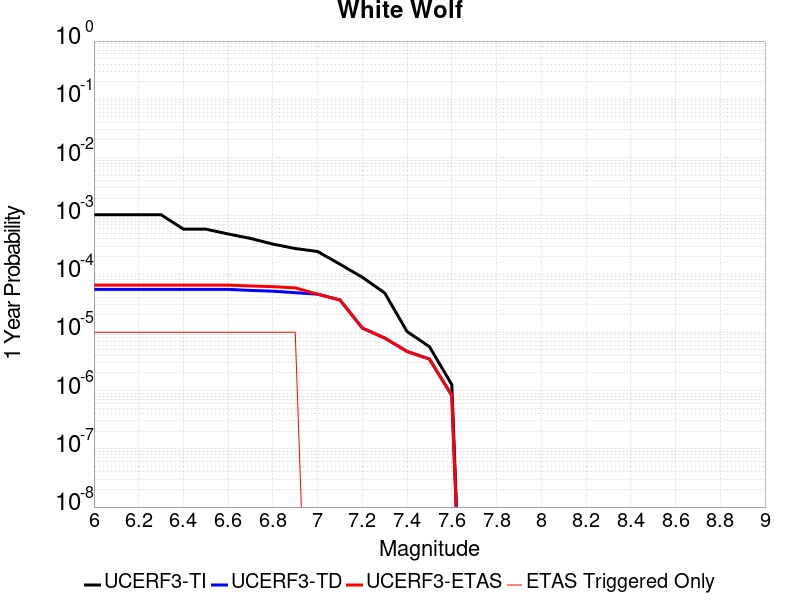 |  |

| Magnitude | 1 wk TI Prob | 1 wk TD Prob | 1 wk ETAS Prob | 1 wk ETAS/TD Gain | 1 wk ETAS Triggered Only | 1 mo TI Prob | 1 mo TD Prob | 1 mo ETAS Prob | 1 mo ETAS/TD Gain | 1 mo ETAS Triggered Only | 1 yr TI Prob | 1 yr TD Prob | 1 yr ETAS Prob | 1 yr ETAS/TD Gain | 1 yr ETAS Triggered Only | 10 yr TI Prob | 10 yr TD Prob | 10 yr ETAS Prob | 10 yr ETAS/TD Gain | 10 yr ETAS Triggered Only |
|-----|-----|-----|-----|-----|-----|-----|-----|-----|-----|-----|-----|-----|-----|-----|-----|-----|-----|-----|-----|-----|
| 6.0 | 2.0037822E-5 | 1.0468583E-6 | 1.0468583E-6 | 1.0 | 0.0 | 8.587355E-5 | 4.4865283E-6 | 4.4865283E-6 | 1.0 | 0.0 | 0.001045009 | 5.4622164E-5 | 1.1425986E-4 | 2.0918224 | 5.9640963E-5 | 0.010401085 | 5.4609246E-4 | 6.057008E-4 | 1.1091543 | 5.9640963E-5 |
| 6.1 | 2.0037822E-5 | 1.0468583E-6 | 1.0468583E-6 | 1.0 | 0.0 | 8.587355E-5 | 4.4865283E-6 | 4.4865283E-6 | 1.0 | 0.0 | 0.001045009 | 5.4622164E-5 | 1.1425986E-4 | 2.0918224 | 5.9640963E-5 | 0.010401085 | 5.4609246E-4 | 6.057008E-4 | 1.1091543 | 5.9640963E-5 |
| 6.2 | 2.0037822E-5 | 1.0468583E-6 | 1.0468583E-6 | 1.0 | 0.0 | 8.587355E-5 | 4.4865283E-6 | 4.4865283E-6 | 1.0 | 0.0 | 0.001045009 | 5.4622164E-5 | 1.1425986E-4 | 2.0918224 | 5.9640963E-5 | 0.010401085 | 5.4609246E-4 | 6.057008E-4 | 1.1091543 | 5.9640963E-5 |
| 6.3 | 2.0037822E-5 | 1.0468583E-6 | 1.0468583E-6 | 1.0 | 0.0 | 8.587355E-5 | 4.4865283E-6 | 4.4865283E-6 | 1.0 | 0.0 | 0.001045009 | 5.4622164E-5 | 1.1425986E-4 | 2.0918224 | 5.9640963E-5 | 0.010401085 | 5.4609246E-4 | 6.057008E-4 | 1.1091543 | 5.9640963E-5 |
| 6.4 | 1.132487E-5 | 1.0468583E-6 | 1.0468583E-6 | 1.0 | 0.0 | 4.8534253E-5 | 4.4865283E-6 | 4.4865283E-6 | 1.0 | 0.0 | 5.907443E-4 | 5.4622164E-5 | 1.1425986E-4 | 2.0918224 | 5.9640963E-5 | 0.005891764 | 5.4609246E-4 | 6.057008E-4 | 1.1091543 | 5.9640963E-5 |
| 6.5 | 1.132487E-5 | 1.0468583E-6 | 1.0468583E-6 | 1.0 | 0.0 | 4.8534253E-5 | 4.4865283E-6 | 4.4865283E-6 | 1.0 | 0.0 | 5.907443E-4 | 5.4622164E-5 | 1.1425986E-4 | 2.0918224 | 5.9640963E-5 | 0.005891764 | 5.4609246E-4 | 6.057008E-4 | 1.1091543 | 5.9640963E-5 |
| 6.6 | 9.347473E-6 | 1.0468583E-6 | 1.0468583E-6 | 1.0 | 0.0 | 4.0059982E-5 | 4.4865283E-6 | 4.4865283E-6 | 1.0 | 0.0 | 4.8762115E-4 | 5.4622164E-5 | 1.1425986E-4 | 2.0918224 | 5.9640963E-5 | 0.0048655253 | 5.4609246E-4 | 6.057008E-4 | 1.1091543 | 5.9640963E-5 |
| 6.7 | 7.842647E-6 | 1.0047773E-6 | 1.0047773E-6 | 1.0 | 0.0 | 3.361091E-5 | 4.306182E-6 | 4.306182E-6 | 1.0 | 0.0 | 4.0913603E-4 | 5.2426552E-5 | 1.1206439E-4 | 2.13755 | 5.9640963E-5 | 0.004083836 | 5.241468E-4 | 5.837565E-4 | 1.1137271 | 5.9640963E-5 |
| 6.8 | 6.26597E-6 | 9.734289E-7 | 9.734289E-7 | 1.0 | 0.0 | 2.685388E-5 | 4.1718313E-6 | 4.1718313E-6 | 1.0 | 0.0 | 3.2689696E-4 | 5.0790914E-5 | 1.10428846E-4 | 2.174185 | 5.9640963E-5 | 0.003264165 | 5.07798E-4 | 5.674086E-4 | 1.1173905 | 5.9640963E-5 |
| 6.9 | 5.258436E-6 | 9.1827343E-7 | 9.1827343E-7 | 1.0 | 0.0 | 2.2535958E-5 | 3.935452E-6 | 3.935452E-6 | 1.0 | 0.0 | 2.7434074E-4 | 4.7913123E-5 | 1.0755123E-4 | 2.2447133 | 5.9640963E-5 | 0.0027400232 | 4.7903272E-4 | 5.386451E-4 | 1.1244433 | 5.9640963E-5 |
| 7.0 | 4.675028E-6 | 8.660704E-7 | 8.660704E-7 | 1.0 | 0.0 | 2.003568E-5 | 3.7117254E-6 | 3.7117254E-6 | 1.0 | 0.0 | 2.4390711E-4 | 4.518937E-5 | 4.518937E-5 | 1.0 | 0.0 | 0.0024363957 | 4.518065E-4 | 4.518065E-4 | 1.0 | 0.0 |
| 7.1 | 2.8270078E-6 | 6.8737717E-7 | 6.8737717E-7 | 1.0 | 0.0 | 1.2115692E-5 | 2.945899E-6 | 2.945899E-6 | 1.0 | 0.0 | 1.4749856E-4 | 3.586577E-5 | 3.586577E-5 | 1.0 | 0.0 | 0.001474007 | 3.5860392E-4 | 3.5860392E-4 | 1.0 | 0.0 |
| 7.2 | 1.6881406E-6 | 2.2703432E-7 | 2.2703432E-7 | 1.0 | 0.0 | 7.2348685E-6 | 9.730038E-7 | 9.730038E-7 | 1.0 | 0.0 | 8.808096E-5 | 1.1846259E-5 | 1.1846259E-5 | 1.0 | 0.0 | 8.8046055E-4 | 1.1845643E-4 | 1.1845643E-4 | 1.0 | 0.0 |
| 7.3 | 9.086107E-7 | 1.5264496E-7 | 1.5264496E-7 | 1.0 | 0.0 | 3.8940398E-6 | 6.5419255E-7 | 6.5419255E-7 | 1.0 | 0.0 | 4.7408903E-5 | 7.964766E-6 | 7.964766E-6 | 1.0 | 0.0 | 4.739879E-4 | 7.964489E-5 | 7.964489E-5 | 1.0 | 0.0 |
| 7.4 | 1.9717383E-7 | 9.003399E-8 | 9.003399E-8 | 1.0 | 0.0 | 8.450304E-7 | 3.8585992E-7 | 3.8585992E-7 | 1.0 | 0.0 | 1.0288197E-5 | 4.697835E-6 | 4.697835E-6 | 1.0 | 0.0 | 1.028772E-4 | 4.6977384E-5 | 4.6977384E-5 | 1.0 | 0.0 |
| 7.5 | 1.086975E-7 | 6.659662E-8 | 6.659662E-8 | 1.0 | 0.0 | 4.6584634E-7 | 2.8541407E-7 | 2.8541407E-7 | 1.0 | 0.0 | 5.6716644E-6 | 3.474911E-6 | 3.474911E-6 | 1.0 | 0.0 | 5.6715195E-5 | 3.474859E-5 | 3.474859E-5 | 1.0 | 0.0 |
| 7.6 | 2.4217808E-8 | 1.5820849E-8 | 1.5820849E-8 | 1.0 | 0.0 | 1.03790605E-7 | 6.780364E-8 | 6.780364E-8 | 1.0 | 0.0 | 1.2636499E-6 | 8.25509E-7 | 8.25509E-7 | 1.0 | 0.0 | 1.2636427E-5 | 8.255064E-6 | 8.255064E-6 | 1.0 | 0.0 |

## San Jacinto (Coyote Creek)
*[(top)](#table-of-contents)*

| 1 Week | 1 Month | 1 Year | 10 Year |
|-----|-----|-----|-----|
| 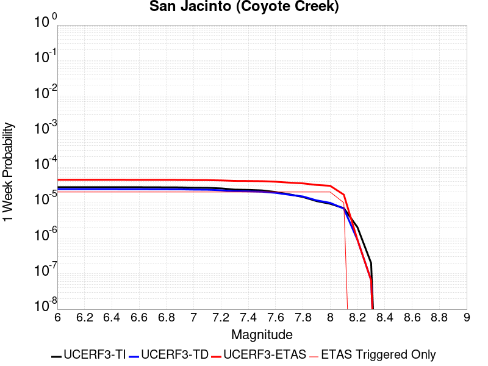 |  |  | 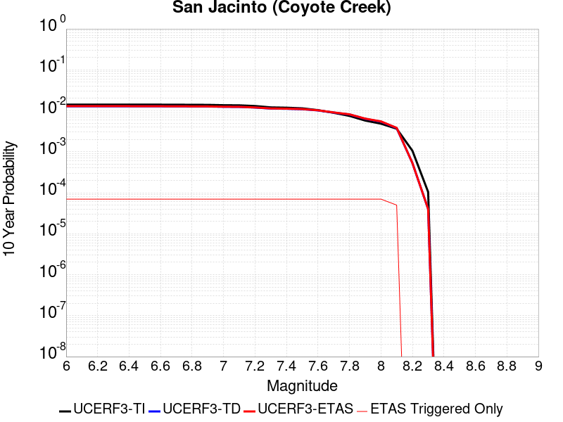 |

| Magnitude | 1 wk TI Prob | 1 wk TD Prob | 1 wk ETAS Prob | 1 wk ETAS/TD Gain | 1 wk ETAS Triggered Only | 1 mo TI Prob | 1 mo TD Prob | 1 mo ETAS Prob | 1 mo ETAS/TD Gain | 1 mo ETAS Triggered Only | 1 yr TI Prob | 1 yr TD Prob | 1 yr ETAS Prob | 1 yr ETAS/TD Gain | 1 yr ETAS Triggered Only | 10 yr TI Prob | 10 yr TD Prob | 10 yr ETAS Prob | 10 yr ETAS/TD Gain | 10 yr ETAS Triggered Only |
|-----|-----|-----|-----|-----|-----|-----|-----|-----|-----|-----|-----|-----|-----|-----|-----|-----|-----|-----|-----|-----|
| 6.0 | 2.7374346E-5 | 2.41444E-5 | 2.41444E-5 | 1.0 | 0.0 | 1.1731335E-4 | 1.034719E-4 | 1.034719E-4 | 1.0 | 0.0 | 0.0014273542 | 0.001259045 | 0.001259045 | 1.0 | 0.0 | 0.01418221 | 0.012928195 | 0.012987065 | 1.0045536 | 5.9640963E-5 |
| 6.1 | 2.7374346E-5 | 2.41444E-5 | 2.41444E-5 | 1.0 | 0.0 | 1.1731335E-4 | 1.034719E-4 | 1.034719E-4 | 1.0 | 0.0 | 0.0014273542 | 0.001259045 | 0.001259045 | 1.0 | 0.0 | 0.01418221 | 0.012928195 | 0.012987065 | 1.0045536 | 5.9640963E-5 |
| 6.2 | 2.7374346E-5 | 2.41444E-5 | 2.41444E-5 | 1.0 | 0.0 | 1.1731335E-4 | 1.034719E-4 | 1.034719E-4 | 1.0 | 0.0 | 0.0014273542 | 0.001259045 | 0.001259045 | 1.0 | 0.0 | 0.01418221 | 0.012928195 | 0.012987065 | 1.0045536 | 5.9640963E-5 |
| 6.3 | 2.7374346E-5 | 2.41444E-5 | 2.41444E-5 | 1.0 | 0.0 | 1.1731335E-4 | 1.034719E-4 | 1.034719E-4 | 1.0 | 0.0 | 0.0014273542 | 0.001259045 | 0.001259045 | 1.0 | 0.0 | 0.01418221 | 0.012928195 | 0.012987065 | 1.0045536 | 5.9640963E-5 |
| 6.4 | 2.7374346E-5 | 2.41444E-5 | 2.41444E-5 | 1.0 | 0.0 | 1.1731335E-4 | 1.034719E-4 | 1.034719E-4 | 1.0 | 0.0 | 0.0014273542 | 0.001259045 | 0.001259045 | 1.0 | 0.0 | 0.01418221 | 0.012928195 | 0.012987065 | 1.0045536 | 5.9640963E-5 |
| 6.5 | 2.7282445E-5 | 2.4030476E-5 | 2.4030476E-5 | 1.0 | 0.0 | 1.16919524E-4 | 1.0298371E-4 | 1.0298371E-4 | 1.0 | 0.0 | 0.0014225657 | 0.001253108 | 0.001253108 | 1.0 | 0.0 | 0.014134934 | 0.012869522 | 0.0129283955 | 1.0045747 | 5.9640963E-5 |
| 6.6 | 2.7282445E-5 | 2.4030476E-5 | 2.4030476E-5 | 1.0 | 0.0 | 1.16919524E-4 | 1.0298371E-4 | 1.0298371E-4 | 1.0 | 0.0 | 0.0014225657 | 0.001253108 | 0.001253108 | 1.0 | 0.0 | 0.014134934 | 0.012869522 | 0.0129283955 | 1.0045747 | 5.9640963E-5 |
| 6.7 | 2.7216198E-5 | 2.3955597E-5 | 2.3955597E-5 | 1.0 | 0.0 | 1.1663563E-4 | 1.02662816E-4 | 1.02662816E-4 | 1.0 | 0.0 | 0.0014191137 | 0.0012492058 | 0.0012492058 | 1.0 | 0.0 | 0.014100855 | 0.012830934 | 0.01288981 | 1.0045886 | 5.9640963E-5 |
| 6.8 | 2.7078617E-5 | 2.3872815E-5 | 2.3872815E-5 | 1.0 | 0.0 | 1.1604605E-4 | 1.0230807E-4 | 1.0230807E-4 | 1.0 | 0.0 | 0.001411945 | 0.0012448917 | 0.0012448917 | 1.0 | 0.0 | 0.014030075 | 0.0127880825 | 0.012846961 | 1.0046041 | 5.9640963E-5 |
| 6.9 | 2.6982952E-5 | 2.3792329E-5 | 2.3792329E-5 | 1.0 | 0.0 | 1.15636096E-4 | 1.0196315E-4 | 1.0196315E-4 | 1.0 | 0.0 | 0.0014069602 | 0.0012406971 | 0.0012406971 | 1.0 | 0.0 | 0.013980856 | 0.012746378 | 0.012805259 | 1.0046194 | 5.9640963E-5 |
| 7.0 | 2.6449972E-5 | 2.3369357E-5 | 2.3369357E-5 | 1.0 | 0.0 | 1.1335209E-4 | 1.0015055E-4 | 1.0015055E-4 | 1.0 | 0.0 | 0.001379188 | 0.0012186535 | 0.0012186535 | 1.0 | 0.0 | 0.0137065975 | 0.012527733 | 0.012586627 | 1.004701 | 5.9640963E-5 |
| 7.1 | 2.6257849E-5 | 2.3195396E-5 | 2.3195396E-5 | 1.0 | 0.0 | 1.1252879E-4 | 9.940507E-5 | 9.940507E-5 | 1.0 | 0.0 | 0.0013691769 | 0.0012095873 | 0.0012095873 | 1.0 | 0.0 | 0.013607717 | 0.012437661 | 0.01249656 | 1.0047356 | 5.9640963E-5 |
| 7.2 | 2.5270041E-5 | 2.2390155E-5 | 2.2390155E-5 | 1.0 | 0.0 | 1.0829568E-4 | 9.5954296E-5 | 9.5954296E-5 | 1.0 | 0.0 | 0.0013177024 | 0.0011676198 | 0.0011676198 | 1.0 | 0.0 | 0.013099162 | 0.0120187905 | 0.012077714 | 1.0049027 | 5.9640963E-5 |
| 7.3 | 2.339701E-5 | 2.1122027E-5 | 2.1122027E-5 | 1.0 | 0.0 | 1.0026905E-4 | 9.051985E-5 | 9.051985E-5 | 1.0 | 0.0 | 0.001220092 | 0.001101524 | 0.001101524 | 1.0 | 0.0 | 0.012134149 | 0.011357642 | 0.011416606 | 1.0051916 | 5.9640963E-5 |
| 7.4 | 2.296333E-5 | 2.0852396E-5 | 2.0852396E-5 | 1.0 | 0.0 | 9.841056E-5 | 8.936436E-5 | 8.936436E-5 | 1.0 | 0.0 | 0.0011974899 | 0.0010874701 | 0.0010874701 | 1.0 | 0.0 | 0.011910575 | 0.011216754 | 0.011275725 | 1.0052575 | 5.9640963E-5 |
| 7.5 | 2.2188895E-5 | 2.037534E-5 | 2.037534E-5 | 1.0 | 0.0 | 9.50918E-5 | 8.731998E-5 | 8.731998E-5 | 1.0 | 0.0 | 0.0011571277 | 0.0010626042 | 0.0010626042 | 1.0 | 0.0 | 0.011511209 | 0.010966369 | 0.011025356 | 1.0053788 | 5.9640963E-5 |
| 7.6 | 2.0013189E-5 | 1.8961666E-5 | 1.8961666E-5 | 1.0 | 0.0 | 8.5767984E-5 | 8.126176E-5 | 8.126176E-5 | 1.0 | 0.0 | 0.001043725 | 9.889146E-4 | 9.889146E-4 | 1.0 | 0.0 | 0.010388365 | 0.010224371 | 0.010283402 | 1.0057735 | 5.9640963E-5 |
| 7.7 | 1.7230794E-5 | 1.6743043E-5 | 1.6743043E-5 | 1.0 | 0.0 | 7.384417E-5 | 7.175393E-5 | 7.175393E-5 | 1.0 | 0.0 | 8.986819E-4 | 8.732547E-4 | 8.732547E-4 | 1.0 | 0.0 | 0.008950562 | 0.00906292 | 0.009122021 | 1.0065211 | 5.9640963E-5 |
| 7.8 | 1.4478809E-5 | 1.499039E-5 | 1.499039E-5 | 1.0 | 0.0 | 6.205057E-5 | 6.424295E-5 | 6.424295E-5 | 1.0 | 0.0 | 7.552038E-4 | 7.8187784E-4 | 7.8187784E-4 | 1.0 | 0.0 | 0.0075264242 | 0.008141388 | 0.008200544 | 1.007266 | 5.9640963E-5 |
| 7.9 | 1.1114467E-5 | 1.1644517E-5 | 1.1644517E-5 | 1.0 | 0.0 | 4.7632562E-5 | 4.990412E-5 | 4.990412E-5 | 1.0 | 0.0 | 5.797721E-4 | 6.074139E-4 | 6.074139E-4 | 1.0 | 0.0 | 0.0057826187 | 0.0063803545 | 0.006439615 | 1.009288 | 5.9640963E-5 |
| 8.0 | 9.327402E-6 | 9.8986575E-6 | 9.8986575E-6 | 1.0 | 0.0 | 3.9973966E-5 | 4.2422133E-5 | 4.2422133E-5 | 1.0 | 0.0 | 4.8657437E-4 | 5.163676E-4 | 5.163676E-4 | 1.0 | 0.0 | 0.0048551033 | 0.00544994 | 0.005509256 | 1.0108838 | 5.9640963E-5 |
| 8.1 | 7.0235833E-6 | 6.826985E-6 | 6.826985E-6 | 1.0 | 0.0 | 3.0100724E-5 | 2.9258183E-5 | 2.9258183E-5 | 1.0 | 0.0 | 3.664147E-4 | 3.5616063E-4 | 3.5616063E-4 | 1.0 | 0.0 | 0.003658111 | 0.0037874572 | 0.0038468724 | 1.0156873 | 5.9640963E-5 |
| 8.2 | 2.0358202E-6 | 8.9912584E-7 | 8.9912584E-7 | 1.0 | 0.0 | 8.724915E-6 | 3.853391E-6 | 3.853391E-6 | 1.0 | 0.0 | 1.06220665E-4 | 4.6914047E-5 | 4.6914047E-5 | 1.0 | 0.0 | 0.001061699 | 5.3239096E-4 | 5.3239096E-4 | 1.0 | 0.0 |
| 8.3 | 2.0051264E-7 | 6.61379E-8 | 6.61379E-8 | 1.0 | 0.0 | 8.5933965E-7 | 2.8344812E-7 | 2.8344812E-7 | 1.0 | 0.0 | 1.046241E-5 | 3.450976E-6 | 3.450976E-6 | 1.0 | 0.0 | 1.0461917E-4 | 4.0120205E-5 | 4.0120205E-5 | 1.0 | 0.0 |

## Cucamonga
*[(top)](#table-of-contents)*

| 1 Week | 1 Month | 1 Year | 10 Year |
|-----|-----|-----|-----|
|  |  | 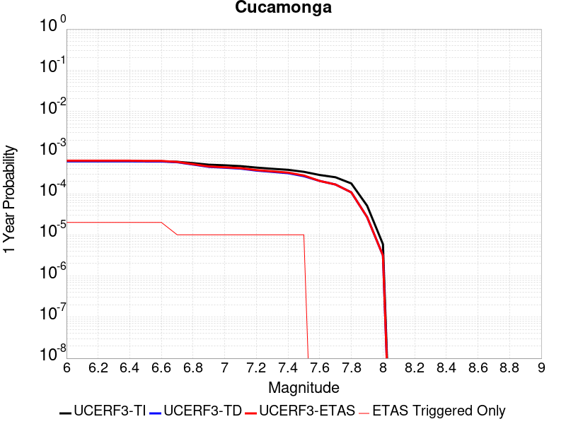 | 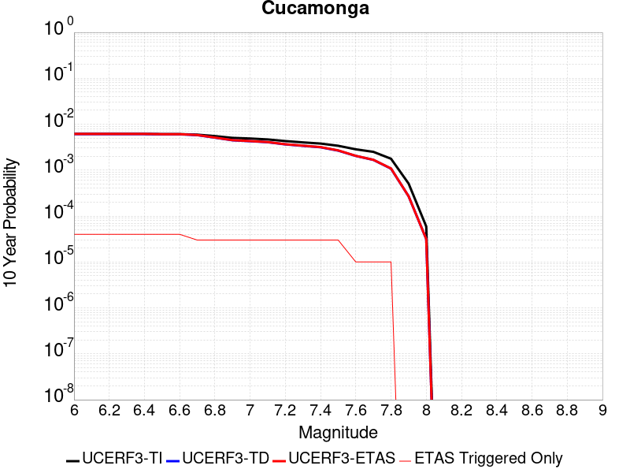 |

| Magnitude | 1 wk TI Prob | 1 wk TD Prob | 1 wk ETAS Prob | 1 wk ETAS/TD Gain | 1 wk ETAS Triggered Only | 1 mo TI Prob | 1 mo TD Prob | 1 mo ETAS Prob | 1 mo ETAS/TD Gain | 1 mo ETAS Triggered Only | 1 yr TI Prob | 1 yr TD Prob | 1 yr ETAS Prob | 1 yr ETAS/TD Gain | 1 yr ETAS Triggered Only | 10 yr TI Prob | 10 yr TD Prob | 10 yr ETAS Prob | 10 yr ETAS/TD Gain | 10 yr ETAS Triggered Only |
|-----|-----|-----|-----|-----|-----|-----|-----|-----|-----|-----|-----|-----|-----|-----|-----|-----|-----|-----|-----|-----|
| 6.0 | 1.1848348E-5 | 1.1737109E-5 | 1.1737109E-5 | 1.0 | 0.0 | 5.0777642E-5 | 5.0300943E-5 | 5.0300943E-5 | 1.0 | 0.0 | 6.180424E-4 | 6.122446E-4 | 6.122446E-4 | 1.0 | 0.0 | 0.0061632637 | 0.006106745 | 0.006166022 | 1.0097067 | 5.9640963E-5 |
| 6.1 | 1.1848348E-5 | 1.1737109E-5 | 1.1737109E-5 | 1.0 | 0.0 | 5.0777642E-5 | 5.0300943E-5 | 5.0300943E-5 | 1.0 | 0.0 | 6.180424E-4 | 6.122446E-4 | 6.122446E-4 | 1.0 | 0.0 | 0.0061632637 | 0.006106745 | 0.006166022 | 1.0097067 | 5.9640963E-5 |
| 6.2 | 1.1848348E-5 | 1.1737109E-5 | 1.1737109E-5 | 1.0 | 0.0 | 5.0777642E-5 | 5.0300943E-5 | 5.0300943E-5 | 1.0 | 0.0 | 6.180424E-4 | 6.122446E-4 | 6.122446E-4 | 1.0 | 0.0 | 0.0061632637 | 0.006106745 | 0.006166022 | 1.0097067 | 5.9640963E-5 |
| 6.3 | 1.1848348E-5 | 1.1737109E-5 | 1.1737109E-5 | 1.0 | 0.0 | 5.0777642E-5 | 5.0300943E-5 | 5.0300943E-5 | 1.0 | 0.0 | 6.180424E-4 | 6.122446E-4 | 6.122446E-4 | 1.0 | 0.0 | 0.0061632637 | 0.006106745 | 0.006166022 | 1.0097067 | 5.9640963E-5 |
| 6.4 | 1.1848348E-5 | 1.1737109E-5 | 1.1737109E-5 | 1.0 | 0.0 | 5.0777642E-5 | 5.0300943E-5 | 5.0300943E-5 | 1.0 | 0.0 | 6.180424E-4 | 6.122446E-4 | 6.122446E-4 | 1.0 | 0.0 | 0.0061632637 | 0.006106745 | 0.006166022 | 1.0097067 | 5.9640963E-5 |
| 6.5 | 1.16988695E-5 | 1.157614E-5 | 1.157614E-5 | 1.0 | 0.0 | 5.013705E-5 | 4.9611102E-5 | 4.9611102E-5 | 1.0 | 0.0 | 6.102476E-4 | 6.0385047E-4 | 6.0385047E-4 | 1.0 | 0.0 | 0.006085745 | 0.0060232594 | 0.006082541 | 1.0098422 | 5.9640963E-5 |
| 6.6 | 1.16988695E-5 | 1.157614E-5 | 1.157614E-5 | 1.0 | 0.0 | 5.013705E-5 | 4.9611102E-5 | 4.9611102E-5 | 1.0 | 0.0 | 6.102476E-4 | 6.0385047E-4 | 6.0385047E-4 | 1.0 | 0.0 | 0.006085745 | 0.0060232594 | 0.006082541 | 1.0098422 | 5.9640963E-5 |
| 6.7 | 1.1397107E-5 | 1.1115039E-5 | 1.1115039E-5 | 1.0 | 0.0 | 4.884383E-5 | 4.7635025E-5 | 4.7635025E-5 | 1.0 | 0.0 | 5.9451134E-4 | 5.798046E-4 | 5.798046E-4 | 1.0 | 0.0 | 0.005929234 | 0.005784061 | 0.0058433567 | 1.0102516 | 5.9640963E-5 |
| 6.8 | 1.058387E-5 | 9.785037E-6 | 9.785037E-6 | 1.0 | 0.0 | 4.5358654E-5 | 4.1935207E-5 | 4.1935207E-5 | 1.0 | 0.0 | 5.521017E-4 | 5.1044265E-4 | 5.1044265E-4 | 1.0 | 0.0 | 0.00550732 | 0.005093702 | 0.005153039 | 1.0116491 | 5.9640963E-5 |
| 6.9 | 9.690046E-6 | 8.579504E-6 | 8.579504E-6 | 1.0 | 0.0 | 4.1528107E-5 | 3.6768783E-5 | 3.6768783E-5 | 1.0 | 0.0 | 5.054874E-4 | 4.475684E-4 | 4.475684E-4 | 1.0 | 0.0 | 0.005043391 | 0.0044675954 | 0.00452697 | 1.01329 | 5.9640963E-5 |
| 7.0 | 9.381461E-6 | 8.18712E-6 | 8.18712E-6 | 1.0 | 0.0 | 4.020564E-5 | 3.508719E-5 | 3.508719E-5 | 1.0 | 0.0 | 4.893937E-4 | 4.2710314E-4 | 4.2710314E-4 | 1.0 | 0.0 | 0.0048831734 | 0.004263747 | 0.0043231337 | 1.0139283 | 5.9640963E-5 |
| 7.1 | 8.946492E-6 | 7.781904E-6 | 7.781904E-6 | 1.0 | 0.0 | 3.8341543E-5 | 3.3350592E-5 | 3.3350592E-5 | 1.0 | 0.0 | 4.667083E-4 | 4.0596814E-4 | 4.0596814E-4 | 1.0 | 0.0 | 0.0046572937 | 0.0040531927 | 0.004112592 | 1.0146549 | 5.9640963E-5 |
| 7.2 | 8.251016E-6 | 6.9752878E-6 | 6.9752878E-6 | 1.0 | 0.0 | 3.5361016E-5 | 2.9893748E-5 | 2.9893748E-5 | 1.0 | 0.0 | 4.3043532E-4 | 3.6389584E-4 | 3.6389584E-4 | 1.0 | 0.0 | 0.0042960253 | 0.0036339252 | 0.0036933494 | 1.0163527 | 5.9640963E-5 |
| 7.3 | 7.717881E-6 | 6.4863584E-6 | 6.4863584E-6 | 1.0 | 0.0 | 3.3076216E-5 | 2.7798384E-5 | 2.7798384E-5 | 1.0 | 0.0 | 4.026285E-4 | 3.38393E-4 | 3.38393E-4 | 1.0 | 0.0 | 0.004018998 | 0.0033797103 | 0.0034391496 | 1.0175872 | 5.9640963E-5 |
| 7.4 | 7.275623E-6 | 6.032004E-6 | 6.032004E-6 | 1.0 | 0.0 | 3.118087E-5 | 2.5851192E-5 | 2.5851192E-5 | 1.0 | 0.0 | 3.7956095E-4 | 3.1469302E-4 | 3.1469302E-4 | 1.0 | 0.0 | 0.0037891332 | 0.0031434046 | 0.0032028581 | 1.0189137 | 5.9640963E-5 |
| 7.5 | 6.5109502E-6 | 5.100593E-6 | 5.100593E-6 | 1.0 | 0.0 | 2.7903774E-5 | 2.1859503E-5 | 2.1859503E-5 | 1.0 | 0.0 | 3.3967546E-4 | 2.661071E-4 | 2.661071E-4 | 1.0 | 0.0 | 0.0033915674 | 0.0026588016 | 0.002718284 | 1.0223719 | 5.9640963E-5 |
| 7.6 | 5.4495326E-6 | 3.908547E-6 | 3.908547E-6 | 1.0 | 0.0 | 2.335493E-5 | 1.6750808E-5 | 1.6750808E-5 | 1.0 | 0.0 | 2.8430918E-4 | 2.0392207E-4 | 2.0392207E-4 | 1.0 | 0.0 | 0.0028394572 | 0.0020382616 | 0.0020382616 | 1.0 | 0.0 |
| 7.7 | 4.7997164E-6 | 3.2002263E-6 | 3.2002263E-6 | 1.0 | 0.0 | 2.057005E-5 | 1.3715184E-5 | 1.3715184E-5 | 1.0 | 0.0 | 2.504116E-4 | 1.6696959E-4 | 1.6696959E-4 | 1.0 | 0.0 | 0.002501296 | 0.0016693701 | 0.0016693701 | 1.0 | 0.0 |
| 7.8 | 3.3941733E-6 | 2.0641678E-6 | 2.0641678E-6 | 1.0 | 0.0 | 1.4546376E-5 | 8.846404E-6 | 8.846404E-6 | 1.0 | 0.0 | 1.7708774E-4 | 1.07699656E-4 | 1.07699656E-4 | 1.0 | 0.0 | 0.0017694668 | 0.0010766032 | 0.0010766032 | 1.0 | 0.0 |
| 7.9 | 9.750552E-7 | 5.155798E-7 | 5.155798E-7 | 1.0 | 0.0 | 4.178801E-6 | 2.2096258E-6 | 2.2096258E-6 | 1.0 | 0.0 | 5.0875715E-5 | 2.6901867E-5 | 2.6901867E-5 | 1.0 | 0.0 | 5.086407E-4 | 2.689865E-4 | 2.689865E-4 | 1.0 | 0.0 |
| 8.0 | 1.133857E-7 | 6.053372E-8 | 6.053372E-8 | 1.0 | 0.0 | 4.8593864E-7 | 2.594302E-7 | 2.594302E-7 | 1.0 | 0.0 | 5.9162867E-6 | 3.1585582E-6 | 3.1585582E-6 | 1.0 | 0.0 | 5.916129E-5 | 3.158515E-5 | 3.158515E-5 | 1.0 | 0.0 |

## Cleghorn Pass
*[(top)](#table-of-contents)*

| 1 Week | 1 Month | 1 Year | 10 Year |
|-----|-----|-----|-----|
|  |  |  |  |

| Magnitude | 1 wk TI Prob | 1 wk TD Prob | 1 wk ETAS Prob | 1 wk ETAS/TD Gain | 1 wk ETAS Triggered Only | 1 mo TI Prob | 1 mo TD Prob | 1 mo ETAS Prob | 1 mo ETAS/TD Gain | 1 mo ETAS Triggered Only | 1 yr TI Prob | 1 yr TD Prob | 1 yr ETAS Prob | 1 yr ETAS/TD Gain | 1 yr ETAS Triggered Only | 10 yr TI Prob | 10 yr TD Prob | 10 yr ETAS Prob | 10 yr ETAS/TD Gain | 10 yr ETAS Triggered Only |
|-----|-----|-----|-----|-----|-----|-----|-----|-----|-----|-----|-----|-----|-----|-----|-----|-----|-----|-----|-----|-----|
| 6.0 | 1.0522846E-5 | 1.1040642E-5 | 1.1040642E-5 | 1.0 | 0.0 | 4.509713E-5 | 4.7316473E-5 | 4.7316473E-5 | 1.0 | 0.0 | 5.4891926E-4 | 5.759784E-4 | 5.759784E-4 | 1.0 | 0.0 | 0.0054756533 | 0.005750022 | 0.0058093197 | 1.0103127 | 5.9640963E-5 |
| 6.1 | 1.0522846E-5 | 1.1040642E-5 | 1.1040642E-5 | 1.0 | 0.0 | 4.509713E-5 | 4.7316473E-5 | 4.7316473E-5 | 1.0 | 0.0 | 5.4891926E-4 | 5.759784E-4 | 5.759784E-4 | 1.0 | 0.0 | 0.0054756533 | 0.005750022 | 0.0058093197 | 1.0103127 | 5.9640963E-5 |
| 6.2 | 2.1045846E-6 | 2.2082024E-6 | 2.2082024E-6 | 1.0 | 0.0 | 9.019617E-6 | 9.463714E-6 | 9.463714E-6 | 1.0 | 0.0 | 1.098083E-4 | 1.1521882E-4 | 1.1521882E-4 | 1.0 | 0.0 | 0.0010975406 | 0.0011520023 | 0.0011520023 | 1.0 | 0.0 |
| 6.3 | 2.1045846E-6 | 2.2082024E-6 | 2.2082024E-6 | 1.0 | 0.0 | 9.019617E-6 | 9.463714E-6 | 9.463714E-6 | 1.0 | 0.0 | 1.098083E-4 | 1.1521882E-4 | 1.1521882E-4 | 1.0 | 0.0 | 0.0010975406 | 0.0011520023 | 0.0011520023 | 1.0 | 0.0 |
| 6.4 | 1.7259927E-6 | 1.810877E-6 | 1.810877E-6 | 1.0 | 0.0 | 7.3970905E-6 | 7.760902E-6 | 7.760902E-6 | 1.0 | 0.0 | 9.005586E-5 | 9.4488976E-5 | 9.4488976E-5 | 1.0 | 0.0 | 9.001937E-4 | 9.448898E-4 | 9.448898E-4 | 1.0 | 0.0 |

## Hunting Creek - Bartlett Springs connector 2011
*[(top)](#table-of-contents)*

| 1 Week | 1 Month | 1 Year | 10 Year |
|-----|-----|-----|-----|
|  |  |  |  |

| Magnitude | 1 wk TI Prob | 1 wk TD Prob | 1 wk ETAS Prob | 1 wk ETAS/TD Gain | 1 wk ETAS Triggered Only | 1 mo TI Prob | 1 mo TD Prob | 1 mo ETAS Prob | 1 mo ETAS/TD Gain | 1 mo ETAS Triggered Only | 1 yr TI Prob | 1 yr TD Prob | 1 yr ETAS Prob | 1 yr ETAS/TD Gain | 1 yr ETAS Triggered Only | 10 yr TI Prob | 10 yr TD Prob | 10 yr ETAS Prob | 10 yr ETAS/TD Gain | 10 yr ETAS Triggered Only |
|-----|-----|-----|-----|-----|-----|-----|-----|-----|-----|-----|-----|-----|-----|-----|-----|-----|-----|-----|-----|-----|
| 6.0 | 4.940016E-5 | 6.7870766E-5 | 6.7870766E-5 | 1.0 | 0.0 | 2.1169778E-4 | 2.9084194E-4 | 2.9084194E-4 | 1.0 | 0.0 | 0.002574374 | 0.0035350819 | 0.003594512 | 1.0168115 | 5.9640963E-5 | 0.025447546 | 0.03477475 | 0.034832317 | 1.0016555 | 5.9640963E-5 |
| 6.1 | 4.940016E-5 | 6.7870766E-5 | 6.7870766E-5 | 1.0 | 0.0 | 2.1169778E-4 | 2.9084194E-4 | 2.9084194E-4 | 1.0 | 0.0 | 0.002574374 | 0.0035350819 | 0.003594512 | 1.0168115 | 5.9640963E-5 | 0.025447546 | 0.03477475 | 0.034832317 | 1.0016555 | 5.9640963E-5 |
| 6.2 | 4.472471E-5 | 6.100572E-5 | 6.100572E-5 | 1.0 | 0.0 | 1.9166325E-4 | 2.6142647E-4 | 2.6142647E-4 | 1.0 | 0.0 | 0.0023310026 | 0.0031781218 | 0.0032375732 | 1.0187064 | 5.9640963E-5 | 0.02306703 | 0.031317808 | 0.03137558 | 1.0018448 | 5.9640963E-5 |
| 6.3 | 4.472471E-5 | 6.100572E-5 | 6.100572E-5 | 1.0 | 0.0 | 1.9166325E-4 | 2.6142647E-4 | 2.6142647E-4 | 1.0 | 0.0 | 0.0023310026 | 0.0031781218 | 0.0032375732 | 1.0187064 | 5.9640963E-5 | 0.02306703 | 0.031317808 | 0.03137558 | 1.0018448 | 5.9640963E-5 |
| 6.4 | 4.0001003E-5 | 5.410516E-5 | 5.410516E-5 | 1.0 | 0.0 | 1.714216E-4 | 2.318579E-4 | 2.318579E-4 | 1.0 | 0.0 | 0.0020850603 | 0.0028191686 | 0.0028786412 | 1.0210959 | 5.9640963E-5 | 0.02065605 | 0.027829198 | 0.02788718 | 1.0020834 | 5.9640963E-5 |
| 6.5 | 3.8033053E-5 | 5.126649E-5 | 5.126649E-5 | 1.0 | 0.0 | 1.6298861E-4 | 2.1969521E-4 | 2.1969521E-4 | 1.0 | 0.0 | 0.0019825802 | 0.0026714848 | 0.0027309663 | 1.0222654 | 5.9640963E-5 | 0.019649856 | 0.026391273 | 0.026449341 | 1.0022002 | 5.9640963E-5 |
| 6.6 | 3.653754E-5 | 4.912955E-5 | 4.912955E-5 | 1.0 | 0.0 | 1.5658008E-4 | 2.1053842E-4 | 2.1053842E-4 | 1.0 | 0.0 | 0.0019046954 | 0.0025602889 | 0.0025602889 | 1.0 | 0.0 | 0.018884527 | 0.025307199 | 0.025307199 | 1.0 | 0.0 |
| 6.7 | 3.372024E-5 | 4.5140216E-5 | 4.5140216E-5 | 1.0 | 0.0 | 1.4450731E-4 | 1.9344388E-4 | 1.9344388E-4 | 1.0 | 0.0 | 0.0017579567 | 0.0023526535 | 0.0023526535 | 1.0 | 0.0 | 0.017441148 | 0.023278862 | 0.023278862 | 1.0 | 0.0 |
| 6.8 | 2.9650024E-5 | 3.9411647E-5 | 3.9411647E-5 | 1.0 | 0.0 | 1.2706534E-4 | 1.6889606E-4 | 1.6889606E-4 | 1.0 | 0.0 | 0.0015459227 | 0.0020543607 | 0.0020543607 | 1.0 | 0.0 | 0.015352124 | 0.020351961 | 0.020351961 | 1.0 | 0.0 |
| 6.9 | 2.860775E-5 | 3.7812886E-5 | 3.7812886E-5 | 1.0 | 0.0 | 1.2259888E-4 | 1.620452E-4 | 1.620452E-4 | 1.0 | 0.0 | 0.0014916194 | 0.0019711219 | 0.0019711219 | 1.0 | 0.0 | 0.014816469 | 0.019536555 | 0.019536555 | 1.0 | 0.0 |
| 7.0 | 2.6696067E-5 | 3.5067544E-5 | 3.5067544E-5 | 1.0 | 0.0 | 1.144067E-4 | 1.5028086E-4 | 1.5028086E-4 | 1.0 | 0.0 | 0.0013920115 | 0.0018281427 | 0.0018281427 | 1.0 | 0.0 | 0.013833242 | 0.01813184 | 0.01813184 | 1.0 | 0.0 |
| 7.1 | 2.456087E-5 | 3.2013326E-5 | 3.2013326E-5 | 1.0 | 0.0 | 1.0525662E-4 | 1.3719281E-4 | 1.3719281E-4 | 1.0 | 0.0 | 0.001280746 | 0.0016690517 | 0.0016690517 | 1.0 | 0.0 | 0.012733897 | 0.016566671 | 0.016566671 | 1.0 | 0.0 |
| 7.2 | 2.295761E-5 | 2.9823148E-5 | 2.9823148E-5 | 1.0 | 0.0 | 9.8386045E-5 | 1.2780727E-4 | 1.2780727E-4 | 1.0 | 0.0 | 0.0011971919 | 0.0015549522 | 0.0015549522 | 1.0 | 0.0 | 0.011907627 | 0.015442378 | 0.015442378 | 1.0 | 0.0 |
| 7.3 | 2.1256936E-5 | 2.7542124E-5 | 2.7542124E-5 | 1.0 | 0.0 | 9.109797E-5 | 1.1803238E-4 | 1.1803238E-4 | 1.0 | 0.0 | 0.0011085535 | 0.0014361058 | 0.0014361058 | 1.0 | 0.0 | 0.011030397 | 0.014269741 | 0.014269741 | 1.0 | 0.0 |
| 7.4 | 1.8784336E-5 | 2.430697E-5 | 2.430697E-5 | 1.0 | 0.0 | 8.050181E-5 | 1.0416861E-4 | 1.0416861E-4 | 1.0 | 0.0 | 9.796688E-4 | 0.0012675226 | 0.0012675226 | 1.0 | 0.0 | 0.009753612 | 0.012604194 | 0.012604194 | 1.0 | 0.0 |
| 7.5 | 1.7248298E-5 | 2.2269056E-5 | 2.2269056E-5 | 1.0 | 0.0 | 7.391918E-5 | 9.543537E-5 | 9.543537E-5 | 1.0 | 0.0 | 8.9959445E-4 | 0.0011613137 | 0.0011613137 | 1.0 | 0.0 | 0.008959615 | 0.011553645 | 0.011553645 | 1.0 | 0.0 |
| 7.6 | 1.0653709E-5 | 1.3722259E-5 | 1.3722259E-5 | 1.0 | 0.0 | 4.5657955E-5 | 5.880837E-5 | 5.880837E-5 | 1.0 | 0.0 | 5.557438E-4 | 7.157594E-4 | 7.157594E-4 | 1.0 | 0.0 | 0.0055435603 | 0.0071350415 | 0.0071350415 | 1.0 | 0.0 |
| 7.7 | 3.286316E-6 | 4.0903997E-6 | 4.0903997E-6 | 1.0 | 0.0 | 1.4084137E-5 | 1.7530168E-5 | 1.7530168E-5 | 1.0 | 0.0 | 1.7146087E-4 | 2.1340905E-4 | 2.1340905E-4 | 1.0 | 0.0 | 0.0017132863 | 0.0021320845 | 0.0021320845 | 1.0 | 0.0 |
| 7.8 | 5.1855085E-7 | 5.972095E-7 | 5.972095E-7 | 1.0 | 0.0 | 2.222359E-6 | 2.5594668E-6 | 2.5594668E-6 | 1.0 | 0.0 | 2.7056883E-5 | 3.1161075E-5 | 3.1161075E-5 | 1.0 | 0.0 | 2.705359E-4 | 3.1156064E-4 | 3.1156064E-4 | 1.0 | 0.0 |

## Channel Islands Western Deep Ramp
*[(top)](#table-of-contents)*

| 1 Week | 1 Month | 1 Year | 10 Year |
|-----|-----|-----|-----|
|  |  |  |  |

| Magnitude | 1 wk TI Prob | 1 wk TD Prob | 1 wk ETAS Prob | 1 wk ETAS/TD Gain | 1 wk ETAS Triggered Only | 1 mo TI Prob | 1 mo TD Prob | 1 mo ETAS Prob | 1 mo ETAS/TD Gain | 1 mo ETAS Triggered Only | 1 yr TI Prob | 1 yr TD Prob | 1 yr ETAS Prob | 1 yr ETAS/TD Gain | 1 yr ETAS Triggered Only | 10 yr TI Prob | 10 yr TD Prob | 10 yr ETAS Prob | 10 yr ETAS/TD Gain | 10 yr ETAS Triggered Only |
|-----|-----|-----|-----|-----|-----|-----|-----|-----|-----|-----|-----|-----|-----|-----|-----|-----|-----|-----|-----|-----|
| 6.0 | 6.0213506E-6 | 6.2548684E-6 | 6.2548684E-6 | 1.0 | 0.0 | 2.5805533E-5 | 2.6806329E-5 | 2.6806329E-5 | 1.0 | 0.0 | 3.1413708E-4 | 3.2632265E-4 | 3.2632265E-4 | 1.0 | 0.0 | 0.0031369338 | 0.0032588763 | 0.0033183228 | 1.0182414 | 5.9640963E-5 |
| 6.1 | 6.0213506E-6 | 6.2548684E-6 | 6.2548684E-6 | 1.0 | 0.0 | 2.5805533E-5 | 2.6806329E-5 | 2.6806329E-5 | 1.0 | 0.0 | 3.1413708E-4 | 3.2632265E-4 | 3.2632265E-4 | 1.0 | 0.0 | 0.0031369338 | 0.0032588763 | 0.0033183228 | 1.0182414 | 5.9640963E-5 |
| 6.2 | 6.0213506E-6 | 6.2548684E-6 | 6.2548684E-6 | 1.0 | 0.0 | 2.5805533E-5 | 2.6806329E-5 | 2.6806329E-5 | 1.0 | 0.0 | 3.1413708E-4 | 3.2632265E-4 | 3.2632265E-4 | 1.0 | 0.0 | 0.0031369338 | 0.0032588763 | 0.0033183228 | 1.0182414 | 5.9640963E-5 |
| 6.3 | 6.0213506E-6 | 6.2548684E-6 | 6.2548684E-6 | 1.0 | 0.0 | 2.5805533E-5 | 2.6806329E-5 | 2.6806329E-5 | 1.0 | 0.0 | 3.1413708E-4 | 3.2632265E-4 | 3.2632265E-4 | 1.0 | 0.0 | 0.0031369338 | 0.0032588763 | 0.0033183228 | 1.0182414 | 5.9640963E-5 |
| 6.4 | 6.0213506E-6 | 6.2548684E-6 | 6.2548684E-6 | 1.0 | 0.0 | 2.5805533E-5 | 2.6806329E-5 | 2.6806329E-5 | 1.0 | 0.0 | 3.1413708E-4 | 3.2632265E-4 | 3.2632265E-4 | 1.0 | 0.0 | 0.0031369338 | 0.0032588763 | 0.0033183228 | 1.0182414 | 5.9640963E-5 |
| 6.5 | 6.0213506E-6 | 6.2548684E-6 | 6.2548684E-6 | 1.0 | 0.0 | 2.5805533E-5 | 2.6806329E-5 | 2.6806329E-5 | 1.0 | 0.0 | 3.1413708E-4 | 3.2632265E-4 | 3.2632265E-4 | 1.0 | 0.0 | 0.0031369338 | 0.0032588763 | 0.0033183228 | 1.0182414 | 5.9640963E-5 |
| 6.6 | 6.0213506E-6 | 6.2548684E-6 | 6.2548684E-6 | 1.0 | 0.0 | 2.5805533E-5 | 2.6806329E-5 | 2.6806329E-5 | 1.0 | 0.0 | 3.1413708E-4 | 3.2632265E-4 | 3.2632265E-4 | 1.0 | 0.0 | 0.0031369338 | 0.0032588763 | 0.0033183228 | 1.0182414 | 5.9640963E-5 |
| 6.7 | 5.313309E-6 | 5.5252403E-6 | 5.5252403E-6 | 1.0 | 0.0 | 2.2771126E-5 | 2.367941E-5 | 2.367941E-5 | 1.0 | 0.0 | 2.772032E-4 | 2.8826276E-4 | 2.8826276E-4 | 1.0 | 0.0 | 0.0027685766 | 0.0028792918 | 0.002938761 | 1.0206541 | 5.9640963E-5 |
| 6.8 | 5.313309E-6 | 5.5252403E-6 | 5.5252403E-6 | 1.0 | 0.0 | 2.2771126E-5 | 2.367941E-5 | 2.367941E-5 | 1.0 | 0.0 | 2.772032E-4 | 2.8826276E-4 | 2.8826276E-4 | 1.0 | 0.0 | 0.0027685766 | 0.0028792918 | 0.002938761 | 1.0206541 | 5.9640963E-5 |
| 6.9 | 4.744377E-6 | 4.9394303E-6 | 4.9394303E-6 | 1.0 | 0.0 | 2.0332885E-5 | 2.1168837E-5 | 2.1168837E-5 | 1.0 | 0.0 | 2.4752476E-4 | 2.5770385E-4 | 2.5770385E-4 | 1.0 | 0.0 | 0.0024724922 | 0.0025744175 | 0.0025744175 | 1.0 | 0.0 |
| 7.0 | 4.722209E-6 | 4.9164732E-6 | 4.9164732E-6 | 1.0 | 0.0 | 2.0237881E-5 | 2.107045E-5 | 2.107045E-5 | 1.0 | 0.0 | 2.4636835E-4 | 2.5650626E-4 | 2.5650626E-4 | 1.0 | 0.0 | 0.002460954 | 0.0025624693 | 0.0025624693 | 1.0 | 0.0 |
| 7.1 | 4.611174E-6 | 4.801409E-6 | 4.801409E-6 | 1.0 | 0.0 | 1.9762025E-5 | 2.0577325E-5 | 2.0577325E-5 | 1.0 | 0.0 | 2.4057609E-4 | 2.5050386E-4 | 2.5050386E-4 | 1.0 | 0.0 | 0.002403158 | 0.002502582 | 0.002502582 | 1.0 | 0.0 |
| 7.2 | 4.043994E-6 | 4.2120264E-6 | 4.2120264E-6 | 1.0 | 0.0 | 1.7331287E-5 | 1.8051438E-5 | 1.8051438E-5 | 1.0 | 0.0 | 2.10988E-4 | 2.1975765E-4 | 2.1975765E-4 | 1.0 | 0.0 | 0.002107878 | 0.0021957543 | 0.0021957543 | 1.0 | 0.0 |
| 7.3 | 2.1233036E-6 | 2.2297875E-6 | 2.2297875E-6 | 1.0 | 0.0 | 9.099841E-6 | 9.556197E-6 | 9.556197E-6 | 1.0 | 0.0 | 1.1078493E-4 | 1.1634055E-4 | 1.1634055E-4 | 1.0 | 0.0 | 0.0011072971 | 0.001162802 | 0.001162802 | 1.0 | 0.0 |
| 7.4 | 1.9051884E-6 | 2.0014973E-6 | 2.0014973E-6 | 1.0 | 0.0 | 8.165067E-6 | 8.577817E-6 | 8.577817E-6 | 1.0 | 0.0 | 9.940516E-5 | 1.0442998E-4 | 1.0442998E-4 | 1.0 | 0.0 | 9.93607E-4 | 0.0010438144 | 0.0010438144 | 1.0 | 0.0 |
| 7.5 | 1.2408497E-6 | 1.3038839E-6 | 1.3038839E-6 | 1.0 | 0.0 | 5.317916E-6 | 5.588062E-6 | 5.588062E-6 | 1.0 | 0.0 | 6.4743705E-5 | 6.8032554E-5 | 6.8032554E-5 | 1.0 | 0.0 | 6.4724847E-4 | 6.8011944E-4 | 6.8011944E-4 | 1.0 | 0.0 |
| 7.6 | 6.5440025E-7 | 6.886718E-7 | 6.886718E-7 | 1.0 | 0.0 | 2.8045695E-6 | 2.9514472E-6 | 2.9514472E-6 | 1.0 | 0.0 | 3.4145098E-5 | 3.593329E-5 | 3.593329E-5 | 1.0 | 0.0 | 3.4139853E-4 | 3.5927625E-4 | 3.5927625E-4 | 1.0 | 0.0 |
| 7.7 | 3.985963E-7 | 4.1930787E-7 | 4.1930787E-7 | 1.0 | 0.0 | 1.7082689E-6 | 1.7970326E-6 | 1.7970326E-6 | 1.0 | 0.0 | 2.0797976E-5 | 2.1878664E-5 | 2.1878664E-5 | 1.0 | 0.0 | 2.0796029E-4 | 2.1876628E-4 | 2.1876628E-4 | 1.0 | 0.0 |
| 7.8 | 3.706329E-8 | 3.8591796E-8 | 3.8591796E-8 | 1.0 | 0.0 | 1.5884267E-7 | 1.653934E-7 | 1.653934E-7 | 1.0 | 0.0 | 1.9339077E-6 | 2.0136629E-6 | 2.0136629E-6 | 1.0 | 0.0 | 1.933891E-5 | 2.0136458E-5 | 2.0136458E-5 | 1.0 | 0.0 |

## Elsinore (Stepovers Combined)
*[(top)](#table-of-contents)*

| 1 Week | 1 Month | 1 Year | 10 Year |
|-----|-----|-----|-----|
|  |  |  |  |

| Magnitude | 1 wk TI Prob | 1 wk TD Prob | 1 wk ETAS Prob | 1 wk ETAS/TD Gain | 1 wk ETAS Triggered Only | 1 mo TI Prob | 1 mo TD Prob | 1 mo ETAS Prob | 1 mo ETAS/TD Gain | 1 mo ETAS Triggered Only | 1 yr TI Prob | 1 yr TD Prob | 1 yr ETAS Prob | 1 yr ETAS/TD Gain | 1 yr ETAS Triggered Only | 10 yr TI Prob | 10 yr TD Prob | 10 yr ETAS Prob | 10 yr ETAS/TD Gain | 10 yr ETAS Triggered Only |
|-----|-----|-----|-----|-----|-----|-----|-----|-----|-----|-----|-----|-----|-----|-----|-----|-----|-----|-----|-----|-----|
| 6.0 | 2.144392E-5 | 1.976007E-5 | 1.976007E-5 | 1.0 | 0.0 | 9.189928E-5 | 8.468338E-5 | 8.468338E-5 | 1.0 | 0.0 | 0.0011182994 | 0.0010305515 | 0.001090131 | 1.0578132 | 5.9640963E-5 | 0.011126885 | 0.010264617 | 0.0103236465 | 1.0057507 | 5.9640963E-5 |
| 6.1 | 2.144392E-5 | 1.976007E-5 | 1.976007E-5 | 1.0 | 0.0 | 9.189928E-5 | 8.468338E-5 | 8.468338E-5 | 1.0 | 0.0 | 0.0011182994 | 0.0010305515 | 0.001090131 | 1.0578132 | 5.9640963E-5 | 0.011126885 | 0.010264617 | 0.0103236465 | 1.0057507 | 5.9640963E-5 |
| 6.2 | 2.144392E-5 | 1.976007E-5 | 1.976007E-5 | 1.0 | 0.0 | 9.189928E-5 | 8.468338E-5 | 8.468338E-5 | 1.0 | 0.0 | 0.0011182994 | 0.0010305515 | 0.001090131 | 1.0578132 | 5.9640963E-5 | 0.011126885 | 0.010264617 | 0.0103236465 | 1.0057507 | 5.9640963E-5 |
| 6.3 | 1.9751555E-5 | 1.7741326E-5 | 1.7741326E-5 | 1.0 | 0.0 | 8.4646774E-5 | 7.603211E-5 | 7.603211E-5 | 1.0 | 0.0 | 0.0010300872 | 9.25312E-4 | 9.848977E-4 | 1.0643953 | 5.9640963E-5 | 0.010253254 | 0.0092209745 | 0.009280066 | 1.0064083 | 5.9640963E-5 |
| 6.4 | 1.9751555E-5 | 1.7741326E-5 | 1.7741326E-5 | 1.0 | 0.0 | 8.4646774E-5 | 7.603211E-5 | 7.603211E-5 | 1.0 | 0.0 | 0.0010300872 | 9.25312E-4 | 9.848977E-4 | 1.0643953 | 5.9640963E-5 | 0.010253254 | 0.0092209745 | 0.009280066 | 1.0064083 | 5.9640963E-5 |
| 6.5 | 1.9751555E-5 | 1.7741326E-5 | 1.7741326E-5 | 1.0 | 0.0 | 8.4646774E-5 | 7.603211E-5 | 7.603211E-5 | 1.0 | 0.0 | 0.0010300872 | 9.25312E-4 | 9.848977E-4 | 1.0643953 | 5.9640963E-5 | 0.010253254 | 0.0092209745 | 0.009280066 | 1.0064083 | 5.9640963E-5 |
| 6.6 | 1.9188685E-5 | 1.7003247E-5 | 1.7003247E-5 | 1.0 | 0.0 | 8.2234634E-5 | 7.2869116E-5 | 7.2869116E-5 | 1.0 | 0.0 | 0.0010007467 | 8.8683655E-4 | 9.464246E-4 | 1.0671917 | 5.9640963E-5 | 0.00996252 | 0.008839546 | 0.00889866 | 1.0066874 | 5.9640963E-5 |
| 6.7 | 1.7608272E-5 | 1.4732402E-5 | 1.4732402E-5 | 1.0 | 0.0 | 7.546184E-5 | 6.313739E-5 | 6.313739E-5 | 1.0 | 0.0 | 9.183606E-4 | 7.684364E-4 | 7.684364E-4 | 1.0 | 0.0 | 0.009145746 | 0.007664441 | 0.007664441 | 1.0 | 0.0 |
| 6.8 | 1.697165E-5 | 1.3783126E-5 | 1.3783126E-5 | 1.0 | 0.0 | 7.273361E-5 | 5.906925E-5 | 5.906925E-5 | 1.0 | 0.0 | 8.8517193E-4 | 7.189395E-4 | 7.189395E-4 | 1.0 | 0.0 | 0.008816543 | 0.0071722106 | 0.0071722106 | 1.0 | 0.0 |
| 6.9 | 1.600365E-5 | 1.2846429E-5 | 1.2846429E-5 | 1.0 | 0.0 | 6.858527E-5 | 5.5055007E-5 | 5.5055007E-5 | 1.0 | 0.0 | 8.347058E-4 | 6.700963E-4 | 6.700963E-4 | 1.0 | 0.0 | 0.008315775 | 0.006686422 | 0.006686422 | 1.0 | 0.0 |
| 7.0 | 1.3314581E-5 | 1.044738E-5 | 1.044738E-5 | 1.0 | 0.0 | 5.7061243E-5 | 4.4773733E-5 | 4.4773733E-5 | 1.0 | 0.0 | 6.944992E-4 | 5.449866E-4 | 5.449866E-4 | 1.0 | 0.0 | 0.006923327 | 0.005440055 | 0.005440055 | 1.0 | 0.0 |
| 7.1 | 1.2865345E-5 | 9.937339E-6 | 9.937339E-6 | 1.0 | 0.0 | 5.5136024E-5 | 4.258792E-5 | 4.258792E-5 | 1.0 | 0.0 | 6.710743E-4 | 5.1838707E-4 | 5.1838707E-4 | 1.0 | 0.0 | 0.0066905143 | 0.005175021 | 0.005175021 | 1.0 | 0.0 |
| 7.2 | 1.1650051E-5 | 8.633585E-6 | 8.633585E-6 | 1.0 | 0.0 | 4.9927836E-5 | 3.7000562E-5 | 3.7000562E-5 | 1.0 | 0.0 | 6.0770183E-4 | 4.503905E-4 | 4.503905E-4 | 1.0 | 0.0 | 0.0060604266 | 0.00449624 | 0.00449624 | 1.0 | 0.0 |
| 7.3 | 1.0008533E-5 | 7.2008215E-6 | 7.2008215E-6 | 1.0 | 0.0 | 4.2893007E-5 | 3.0860305E-5 | 3.0860305E-5 | 1.0 | 0.0 | 5.220972E-4 | 3.756609E-4 | 3.756609E-4 | 1.0 | 0.0 | 0.005208723 | 0.0037506663 | 0.0037506663 | 1.0 | 0.0 |
| 7.4 | 9.116759E-6 | 6.409854E-6 | 6.409854E-6 | 1.0 | 0.0 | 3.907124E-5 | 2.7470522E-5 | 2.7470522E-5 | 1.0 | 0.0 | 4.7558855E-4 | 3.3440365E-4 | 3.3440365E-4 | 1.0 | 0.0 | 0.00474572 | 0.0033391542 | 0.0033391542 | 1.0 | 0.0 |
| 7.5 | 7.870524E-6 | 5.382316E-6 | 5.382316E-6 | 1.0 | 0.0 | 3.3730383E-5 | 2.306687E-5 | 2.306687E-5 | 1.0 | 0.0 | 4.1059E-4 | 2.8080423E-4 | 2.8080423E-4 | 1.0 | 0.0 | 0.0040983222 | 0.0028046207 | 0.0028046207 | 1.0 | 0.0 |
| 7.6 | 6.9774537E-6 | 4.677398E-6 | 4.677398E-6 | 1.0 | 0.0 | 2.990303E-5 | 2.0045845E-5 | 2.0045845E-5 | 1.0 | 0.0 | 3.640086E-4 | 2.44032E-4 | 2.44032E-4 | 1.0 | 0.0 | 0.003634129 | 0.0024377564 | 0.0024377564 | 1.0 | 0.0 |
| 7.7 | 4.1616954E-6 | 2.3281368E-6 | 2.3281368E-6 | 1.0 | 0.0 | 1.7835715E-5 | 9.977695E-6 | 9.977695E-6 | 1.0 | 0.0 | 2.171282E-4 | 1.2147242E-4 | 1.2147242E-4 | 1.0 | 0.0 | 0.0021691616 | 0.0012141332 | 0.0012141332 | 1.0 | 0.0 |
| 7.8 | 2.2692414E-7 | 9.384417E-8 | 9.384417E-8 | 1.0 | 0.0 | 9.725317E-7 | 4.0218927E-7 | 4.0218927E-7 | 1.0 | 0.0 | 1.1840509E-5 | 4.8966467E-6 | 4.8966467E-6 | 1.0 | 0.0 | 1.1839878E-4 | 4.8965718E-5 | 4.8965718E-5 | 1.0 | 0.0 |
| 7.9 | 6.676829E-9 | 3.4397174E-9 | 3.4397174E-9 | 1.0 | 0.0 | 2.861498E-8 | 1.4741646E-8 | 1.4741646E-8 | 1.0 | 0.0 | 3.4838732E-7 | 1.7947953E-7 | 1.7947953E-7 | 1.0 | 0.0 | 3.4838679E-6 | 1.794794E-6 | 1.794794E-6 | 1.0 | 0.0 |

## Bullion Mountains
*[(top)](#table-of-contents)*

| 1 Week | 1 Month | 1 Year | 10 Year |
|-----|-----|-----|-----|
|  |  |  |  |

| Magnitude | 1 wk TI Prob | 1 wk TD Prob | 1 wk ETAS Prob | 1 wk ETAS/TD Gain | 1 wk ETAS Triggered Only | 1 mo TI Prob | 1 mo TD Prob | 1 mo ETAS Prob | 1 mo ETAS/TD Gain | 1 mo ETAS Triggered Only | 1 yr TI Prob | 1 yr TD Prob | 1 yr ETAS Prob | 1 yr ETAS/TD Gain | 1 yr ETAS Triggered Only | 10 yr TI Prob | 10 yr TD Prob | 10 yr ETAS Prob | 10 yr ETAS/TD Gain | 10 yr ETAS Triggered Only |
|-----|-----|-----|-----|-----|-----|-----|-----|-----|-----|-----|-----|-----|-----|-----|-----|-----|-----|-----|-----|-----|
| 6.0 | 1.6420427E-5 | 1.4692009E-5 | 7.433209E-5 | 5.0593553 | 5.9640963E-5 | 7.037136E-5 | 6.296445E-5 | 1.2260166E-4 | 1.9471568 | 5.9640963E-5 | 8.5643446E-4 | 7.6636096E-4 | 8.259562E-4 | 1.0777639 | 5.9640963E-5 | 0.008531413 | 0.0076409746 | 0.00770016 | 1.0077457 | 5.9640963E-5 |
| 6.1 | 1.6420427E-5 | 1.4692009E-5 | 7.433209E-5 | 5.0593553 | 5.9640963E-5 | 7.037136E-5 | 6.296445E-5 | 1.2260166E-4 | 1.9471568 | 5.9640963E-5 | 8.5643446E-4 | 7.6636096E-4 | 8.259562E-4 | 1.0777639 | 5.9640963E-5 | 0.008531413 | 0.0076409746 | 0.00770016 | 1.0077457 | 5.9640963E-5 |
| 6.2 | 1.6420427E-5 | 1.4692009E-5 | 7.433209E-5 | 5.0593553 | 5.9640963E-5 | 7.037136E-5 | 6.296445E-5 | 1.2260166E-4 | 1.9471568 | 5.9640963E-5 | 8.5643446E-4 | 7.6636096E-4 | 8.259562E-4 | 1.0777639 | 5.9640963E-5 | 0.008531413 | 0.0076409746 | 0.00770016 | 1.0077457 | 5.9640963E-5 |
| 6.3 | 1.2046778E-5 | 9.862255E-6 | 9.862255E-6 | 1.0 | 0.0 | 5.1628023E-5 | 4.2266256E-5 | 4.2266256E-5 | 1.0 | 0.0 | 6.283899E-4 | 5.144933E-4 | 5.144933E-4 | 1.0 | 0.0 | 0.0062661595 | 0.0051353034 | 0.0051353034 | 1.0 | 0.0 |
| 6.4 | 1.2046778E-5 | 9.862255E-6 | 9.862255E-6 | 1.0 | 0.0 | 5.1628023E-5 | 4.2266256E-5 | 4.2266256E-5 | 1.0 | 0.0 | 6.283899E-4 | 5.144933E-4 | 5.144933E-4 | 1.0 | 0.0 | 0.0062661595 | 0.0051353034 | 0.0051353034 | 1.0 | 0.0 |
| 6.5 | 1.0244343E-5 | 7.879378E-6 | 7.879378E-6 | 1.0 | 0.0 | 4.390359E-5 | 3.3768443E-5 | 3.3768443E-5 | 1.0 | 0.0 | 5.343951E-4 | 4.1107394E-4 | 4.1107394E-4 | 1.0 | 0.0 | 0.005331118 | 0.0041051665 | 0.0041051665 | 1.0 | 0.0 |
| 6.6 | 9.605408E-6 | 7.1774166E-6 | 7.1774166E-6 | 1.0 | 0.0 | 4.1165385E-5 | 3.0760108E-5 | 3.0760108E-5 | 1.0 | 0.0 | 5.010733E-4 | 3.7446033E-4 | 3.7446033E-4 | 1.0 | 0.0 | 0.00499945 | 0.0037402906 | 0.0037402906 | 1.0 | 0.0 |
| 6.7 | 8.60418E-6 | 6.123926E-6 | 6.123926E-6 | 1.0 | 0.0 | 3.687454E-5 | 2.6245243E-5 | 2.6245243E-5 | 1.0 | 0.0 | 4.48855E-4 | 3.195085E-4 | 3.195085E-4 | 1.0 | 0.0 | 0.004479495 | 0.0031924031 | 0.0031924031 | 1.0 | 0.0 |
| 6.8 | 5.187994E-6 | 2.563117E-6 | 2.563117E-6 | 1.0 | 0.0 | 2.223407E-5 | 1.0984763E-5 | 1.0984763E-5 | 1.0 | 0.0 | 2.7066618E-4 | 1.3373529E-4 | 1.3373529E-4 | 1.0 | 0.0 | 0.0027033675 | 0.0013369396 | 0.0013369396 | 1.0 | 0.0 |
| 6.9 | 4.5302368E-6 | 2.3442778E-6 | 2.3442778E-6 | 1.0 | 0.0 | 1.9415156E-5 | 1.0046889E-5 | 1.0046889E-5 | 1.0 | 0.0 | 2.3635388E-4 | 1.2231797E-4 | 1.2231797E-4 | 1.0 | 0.0 | 0.0023610266 | 0.0012228956 | 0.0012228956 | 1.0 | 0.0 |
| 7.0 | 3.431668E-6 | 1.6882177E-6 | 1.6882177E-6 | 1.0 | 0.0 | 1.4707065E-5 | 7.2352186E-6 | 7.2352186E-6 | 1.0 | 0.0 | 1.7904381E-4 | 8.808879E-5 | 8.808879E-5 | 1.0 | 0.0 | 0.0017889962 | 8.8088785E-4 | 8.8088785E-4 | 1.0 | 0.0 |

## Elsinore (Coyote Mountains)
*[(top)](#table-of-contents)*

| 1 Week | 1 Month | 1 Year | 10 Year |
|-----|-----|-----|-----|
|  |  |  |  |

| Magnitude | 1 wk TI Prob | 1 wk TD Prob | 1 wk ETAS Prob | 1 wk ETAS/TD Gain | 1 wk ETAS Triggered Only | 1 mo TI Prob | 1 mo TD Prob | 1 mo ETAS Prob | 1 mo ETAS/TD Gain | 1 mo ETAS Triggered Only | 1 yr TI Prob | 1 yr TD Prob | 1 yr ETAS Prob | 1 yr ETAS/TD Gain | 1 yr ETAS Triggered Only | 10 yr TI Prob | 10 yr TD Prob | 10 yr ETAS Prob | 10 yr ETAS/TD Gain | 10 yr ETAS Triggered Only |
|-----|-----|-----|-----|-----|-----|-----|-----|-----|-----|-----|-----|-----|-----|-----|-----|-----|-----|-----|-----|-----|
| 6.0 | 4.20513E-5 | 4.8630944E-5 | 1.0826901E-4 | 2.2263398 | 5.9640963E-5 | 1.8020741E-4 | 2.0840492E-4 | 2.6803344E-4 | 1.2861186 | 5.9640963E-5 | 0.0021918174 | 0.0025349057 | 0.0025943955 | 1.0234683 | 5.9640963E-5 | 0.021703249 | 0.025111204 | 0.025169346 | 1.0023154 | 5.9640963E-5 |
| 6.1 | 4.20513E-5 | 4.8630944E-5 | 1.0826901E-4 | 2.2263398 | 5.9640963E-5 | 1.8020741E-4 | 2.0840492E-4 | 2.6803344E-4 | 1.2861186 | 5.9640963E-5 | 0.0021918174 | 0.0025349057 | 0.0025943955 | 1.0234683 | 5.9640963E-5 | 0.021703249 | 0.025111204 | 0.025169346 | 1.0023154 | 5.9640963E-5 |
| 6.2 | 2.3413893E-5 | 2.4695422E-5 | 2.4695422E-5 | 1.0 | 0.0 | 1.0034139E-4 | 1.0583377E-4 | 1.0583377E-4 | 1.0 | 0.0 | 0.0012209718 | 0.0012878523 | 0.0012878523 | 1.0 | 0.0 | 0.012142851 | 0.012812569 | 0.012812569 | 1.0 | 0.0 |
| 6.3 | 2.3413893E-5 | 2.4695422E-5 | 2.4695422E-5 | 1.0 | 0.0 | 1.0034139E-4 | 1.0583377E-4 | 1.0583377E-4 | 1.0 | 0.0 | 0.0012209718 | 0.0012878523 | 0.0012878523 | 1.0 | 0.0 | 0.012142851 | 0.012812569 | 0.012812569 | 1.0 | 0.0 |
| 6.4 | 1.6894814E-5 | 1.6568214E-5 | 1.6568214E-5 | 1.0 | 0.0 | 7.240433E-5 | 7.100491E-5 | 7.100491E-5 | 1.0 | 0.0 | 8.811662E-4 | 8.641788E-4 | 8.641788E-4 | 1.0 | 0.0 | 0.0087768035 | 0.008611842 | 0.008611842 | 1.0 | 0.0 |
| 6.5 | 1.6894814E-5 | 1.6568214E-5 | 1.6568214E-5 | 1.0 | 0.0 | 7.240433E-5 | 7.100491E-5 | 7.100491E-5 | 1.0 | 0.0 | 8.811662E-4 | 8.641788E-4 | 8.641788E-4 | 1.0 | 0.0 | 0.0087768035 | 0.008611842 | 0.008611842 | 1.0 | 0.0 |
| 6.6 | 1.1910969E-5 | 1.0530538E-5 | 1.0530538E-5 | 1.0 | 0.0 | 5.1046012E-5 | 4.513017E-5 | 4.513017E-5 | 1.0 | 0.0 | 6.21308E-4 | 5.493346E-4 | 5.493346E-4 | 1.0 | 0.0 | 0.0061957375 | 0.0054810685 | 0.0054810685 | 1.0 | 0.0 |
| 6.7 | 9.1486E-6 | 7.2026473E-6 | 7.2026473E-6 | 1.0 | 0.0 | 3.9207694E-5 | 3.0868145E-5 | 3.0868145E-5 | 1.0 | 0.0 | 4.7724912E-4 | 3.7575865E-4 | 3.7575865E-4 | 1.0 | 0.0 | 0.0047622547 | 0.0037516125 | 0.0037516125 | 1.0 | 0.0 |
| 6.8 | 7.90441E-6 | 5.7288153E-6 | 5.7288153E-6 | 1.0 | 0.0 | 3.3875604E-5 | 2.4551842E-5 | 2.4551842E-5 | 1.0 | 0.0 | 4.1235742E-4 | 2.9887896E-4 | 2.9887896E-4 | 1.0 | 0.0 | 0.0041159308 | 0.0029848986 | 0.0029848986 | 1.0 | 0.0 |
| 6.9 | 7.77015E-6 | 5.5827695E-6 | 5.5827695E-6 | 1.0 | 0.0 | 3.3300217E-5 | 2.3925944E-5 | 2.3925944E-5 | 1.0 | 0.0 | 4.0535472E-4 | 2.912607E-4 | 2.912607E-4 | 1.0 | 0.0 | 0.004046161 | 0.0029089167 | 0.0029089167 | 1.0 | 0.0 |
| 7.0 | 7.675798E-6 | 5.4796283E-6 | 5.4796283E-6 | 1.0 | 0.0 | 3.289586E-5 | 2.3483917E-5 | 2.3483917E-5 | 1.0 | 0.0 | 4.004335E-4 | 2.8588044E-4 | 2.8588044E-4 | 1.0 | 0.0 | 0.003997127 | 0.0028552532 | 0.0028552532 | 1.0 | 0.0 |
| 7.1 | 7.447814E-6 | 5.2385003E-6 | 5.2385003E-6 | 1.0 | 0.0 | 3.191881E-5 | 2.245053E-5 | 2.245053E-5 | 1.0 | 0.0 | 3.8854225E-4 | 2.7330214E-4 | 2.7330214E-4 | 1.0 | 0.0 | 0.003878636 | 0.0027297847 | 0.0027297847 | 1.0 | 0.0 |
| 7.2 | 7.128185E-6 | 4.905146E-6 | 4.905146E-6 | 1.0 | 0.0 | 3.0549007E-5 | 2.1021891E-5 | 2.1021891E-5 | 1.0 | 0.0 | 3.7187067E-4 | 2.5591266E-4 | 2.5591266E-4 | 1.0 | 0.0 | 0.00371249 | 0.002556298 | 0.002556298 | 1.0 | 0.0 |
| 7.3 | 7.0913875E-6 | 4.873821E-6 | 4.873821E-6 | 1.0 | 0.0 | 3.0391306E-5 | 2.0887644E-5 | 2.0887644E-5 | 1.0 | 0.0 | 3.6995133E-4 | 2.542786E-4 | 2.542786E-4 | 1.0 | 0.0 | 0.0036933604 | 0.0025399947 | 0.0025399947 | 1.0 | 0.0 |
| 7.4 | 7.051521E-6 | 4.837673E-6 | 4.837673E-6 | 1.0 | 0.0 | 3.0220453E-5 | 2.0732725E-5 | 2.0732725E-5 | 1.0 | 0.0 | 3.6787192E-4 | 2.5239287E-4 | 2.5239287E-4 | 1.0 | 0.0 | 0.0036726352 | 0.0025211805 | 0.0025211805 | 1.0 | 0.0 |
| 7.5 | 6.910666E-6 | 4.7332255E-6 | 4.7332255E-6 | 1.0 | 0.0 | 2.9616802E-5 | 2.02851E-5 | 2.02851E-5 | 1.0 | 0.0 | 3.605249E-4 | 2.4694428E-4 | 2.4694428E-4 | 1.0 | 0.0 | 0.0035994058 | 0.002466817 | 0.002466817 | 1.0 | 0.0 |
| 7.6 | 6.341753E-6 | 4.306345E-6 | 4.306345E-6 | 1.0 | 0.0 | 2.7178658E-5 | 1.8455641E-5 | 1.8455641E-5 | 1.0 | 0.0 | 3.3084993E-4 | 2.2467543E-4 | 2.2467543E-4 | 1.0 | 0.0 | 0.0033035777 | 0.002244598 | 0.002244598 | 1.0 | 0.0 |
| 7.7 | 3.9205916E-6 | 2.2437468E-6 | 2.2437468E-6 | 1.0 | 0.0 | 1.6802427E-5 | 9.616027E-6 | 9.616027E-6 | 1.0 | 0.0 | 2.0455034E-4 | 1.17069576E-4 | 1.17069576E-4 | 1.0 | 0.0 | 0.0020436216 | 0.001170152 | 0.001170152 | 1.0 | 0.0 |
| 7.8 | 2.0846227E-7 | 8.4853966E-8 | 8.4853966E-8 | 1.0 | 0.0 | 8.9340944E-7 | 3.6365984E-7 | 3.6365984E-7 | 1.0 | 0.0 | 1.0877206E-5 | 4.427553E-6 | 4.427553E-6 | 1.0 | 0.0 | 1.0876673E-4 | 4.4274973E-5 | 4.4274973E-5 | 1.0 | 0.0 |
| 7.9 | 4.4969806E-9 | 2.269088E-9 | 2.269088E-9 | 1.0 | 0.0 | 1.9272775E-8 | 9.724664E-9 | 9.724664E-9 | 1.0 | 0.0 | 2.3464601E-7 | 1.1839777E-7 | 1.1839777E-7 | 1.0 | 0.0 | 2.3464577E-6 | 1.1839772E-6 | 1.1839772E-6 | 1.0 | 0.0 |

## Kern Canyon (South Kern) 2011
*[(top)](#table-of-contents)*

| 1 Week | 1 Month | 1 Year | 10 Year |
|-----|-----|-----|-----|
|  | 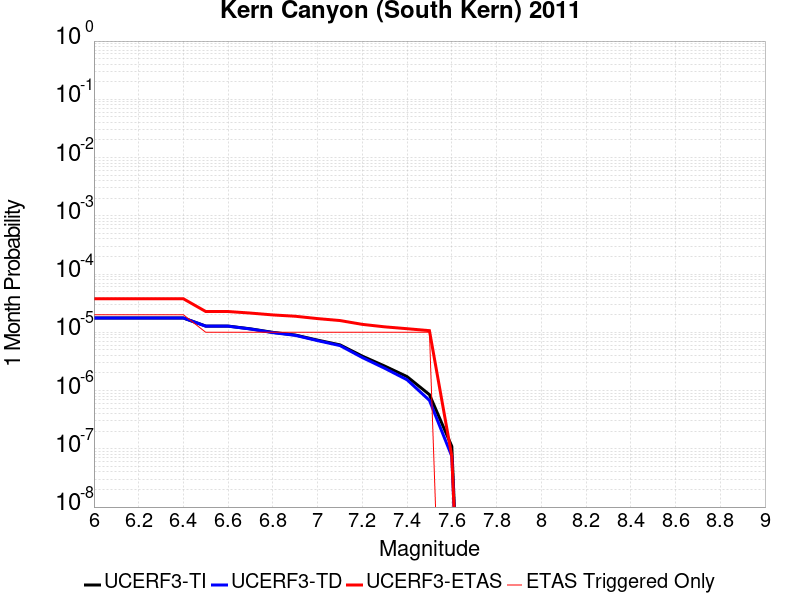 |  |  |

| Magnitude | 1 wk TI Prob | 1 wk TD Prob | 1 wk ETAS Prob | 1 wk ETAS/TD Gain | 1 wk ETAS Triggered Only | 1 mo TI Prob | 1 mo TD Prob | 1 mo ETAS Prob | 1 mo ETAS/TD Gain | 1 mo ETAS Triggered Only | 1 yr TI Prob | 1 yr TD Prob | 1 yr ETAS Prob | 1 yr ETAS/TD Gain | 1 yr ETAS Triggered Only | 10 yr TI Prob | 10 yr TD Prob | 10 yr ETAS Prob | 10 yr ETAS/TD Gain | 10 yr ETAS Triggered Only |
|-----|-----|-----|-----|-----|-----|-----|-----|-----|-----|-----|-----|-----|-----|-----|-----|-----|-----|-----|-----|-----|
| 6.0 | 4.105075E-6 | 4.113726E-6 | 4.113726E-6 | 1.0 | 0.0 | 1.7593058E-5 | 1.7630138E-5 | 7.727005E-5 | 4.3828387 | 5.9640963E-5 | 2.1417443E-4 | 2.1462643E-4 | 2.742546E-4 | 1.277823 | 5.9640963E-5 | 0.0021396813 | 0.0021442554 | 0.0022037684 | 1.0277547 | 5.9640963E-5 |
| 6.1 | 4.105075E-6 | 4.113726E-6 | 4.113726E-6 | 1.0 | 0.0 | 1.7593058E-5 | 1.7630138E-5 | 7.727005E-5 | 4.3828387 | 5.9640963E-5 | 2.1417443E-4 | 2.1462643E-4 | 2.742546E-4 | 1.277823 | 5.9640963E-5 | 0.0021396813 | 0.0021442554 | 0.0022037684 | 1.0277547 | 5.9640963E-5 |
| 6.2 | 4.105075E-6 | 4.113726E-6 | 4.113726E-6 | 1.0 | 0.0 | 1.7593058E-5 | 1.7630138E-5 | 7.727005E-5 | 4.3828387 | 5.9640963E-5 | 2.1417443E-4 | 2.1462643E-4 | 2.742546E-4 | 1.277823 | 5.9640963E-5 | 0.0021396813 | 0.0021442554 | 0.0022037684 | 1.0277547 | 5.9640963E-5 |
| 6.3 | 4.105075E-6 | 4.113726E-6 | 4.113726E-6 | 1.0 | 0.0 | 1.7593058E-5 | 1.7630138E-5 | 7.727005E-5 | 4.3828387 | 5.9640963E-5 | 2.1417443E-4 | 2.1462643E-4 | 2.742546E-4 | 1.277823 | 5.9640963E-5 | 0.0021396813 | 0.0021442554 | 0.0022037684 | 1.0277547 | 5.9640963E-5 |
| 6.4 | 4.105075E-6 | 4.113726E-6 | 4.113726E-6 | 1.0 | 0.0 | 1.7593058E-5 | 1.7630138E-5 | 7.727005E-5 | 4.3828387 | 5.9640963E-5 | 2.1417443E-4 | 2.1462643E-4 | 2.742546E-4 | 1.277823 | 5.9640963E-5 | 0.0021396813 | 0.0021442554 | 0.0022037684 | 1.0277547 | 5.9640963E-5 |
| 6.5 | 2.9849807E-6 | 2.973154E-6 | 2.973154E-6 | 1.0 | 0.0 | 1.2792712E-5 | 1.2742028E-5 | 1.2742028E-5 | 1.0 | 0.0 | 1.5574014E-4 | 1.551233E-4 | 1.551233E-4 | 1.0 | 0.0 | 0.0015563103 | 0.0015501654 | 0.0015501654 | 1.0 | 0.0 |
| 6.6 | 2.9849807E-6 | 2.973154E-6 | 2.973154E-6 | 1.0 | 0.0 | 1.2792712E-5 | 1.2742028E-5 | 1.2742028E-5 | 1.0 | 0.0 | 1.5574014E-4 | 1.551233E-4 | 1.551233E-4 | 1.0 | 0.0 | 0.0015563103 | 0.0015501654 | 0.0015501654 | 1.0 | 0.0 |
| 6.7 | 2.6756725E-6 | 2.6582202E-6 | 2.6582202E-6 | 1.0 | 0.0 | 1.1467117E-5 | 1.1392323E-5 | 1.1392323E-5 | 1.0 | 0.0 | 1.396032E-4 | 1.386928E-4 | 1.386928E-4 | 1.0 | 0.0 | 0.0013951553 | 0.0013860734 | 0.0013860734 | 1.0 | 0.0 |
| 6.8 | 2.3283721E-6 | 2.3047783E-6 | 2.3047783E-6 | 1.0 | 0.0 | 9.9787E-6 | 9.877584E-6 | 9.877584E-6 | 1.0 | 0.0 | 1.214839E-4 | 1.2025302E-4 | 1.2025302E-4 | 1.0 | 0.0 | 0.001214175 | 0.001201887 | 0.001201887 | 1.0 | 0.0 |
| 6.9 | 2.0972677E-6 | 2.0696405E-6 | 2.0696405E-6 | 1.0 | 0.0 | 8.988259E-6 | 8.869858E-6 | 8.869858E-6 | 1.0 | 0.0 | 1.0942656E-4 | 1.0798523E-4 | 1.0798523E-4 | 1.0 | 0.0 | 0.0010937268 | 0.0010793334 | 0.0010793334 | 1.0 | 0.0 |
| 7.0 | 1.7132242E-6 | 1.6787029E-6 | 1.6787029E-6 | 1.0 | 0.0 | 7.3423685E-6 | 7.1944214E-6 | 7.1944214E-6 | 1.0 | 0.0 | 8.938967E-5 | 8.75886E-5 | 8.75886E-5 | 1.0 | 0.0 | 8.935372E-4 | 8.755446E-4 | 8.755446E-4 | 1.0 | 0.0 |
| 7.1 | 1.4215541E-6 | 1.3815746E-6 | 1.3815746E-6 | 1.0 | 0.0 | 6.0923603E-6 | 5.9210206E-6 | 5.9210206E-6 | 1.0 | 0.0 | 7.417196E-5 | 7.208607E-5 | 7.208607E-5 | 1.0 | 0.0 | 7.414721E-4 | 7.206296E-4 | 7.206296E-4 | 1.0 | 0.0 |
| 7.2 | 9.097853E-7 | 8.60377E-7 | 8.60377E-7 | 1.0 | 0.0 | 3.899074E-6 | 3.6873246E-6 | 3.6873246E-6 | 1.0 | 0.0 | 4.7470192E-5 | 4.4892266E-5 | 4.4892266E-5 | 1.0 | 0.0 | 4.7460053E-4 | 4.4883305E-4 | 4.4883305E-4 | 1.0 | 0.0 |
| 7.3 | 6.144169E-7 | 5.628199E-7 | 5.628199E-7 | 1.0 | 0.0 | 2.6332125E-6 | 2.4120832E-6 | 2.4120832E-6 | 1.0 | 0.0 | 3.205889E-5 | 2.9366722E-5 | 2.9366722E-5 | 1.0 | 0.0 | 3.2054266E-4 | 2.9362892E-4 | 2.9362892E-4 | 1.0 | 0.0 |
| 7.4 | 4.049844E-7 | 3.5728252E-7 | 3.5728252E-7 | 1.0 | 0.0 | 1.7356463E-6 | 1.5312098E-6 | 1.5312098E-6 | 1.0 | 0.0 | 2.1131287E-5 | 1.8642324E-5 | 1.8642324E-5 | 1.0 | 0.0 | 2.1129279E-4 | 1.8640784E-4 | 1.8640784E-4 | 1.0 | 0.0 |
| 7.5 | 1.9871162E-7 | 1.5830383E-7 | 1.5830383E-7 | 1.0 | 0.0 | 8.5162094E-7 | 6.784448E-7 | 6.784448E-7 | 1.0 | 0.0 | 1.0368436E-5 | 8.260035E-6 | 8.260035E-6 | 1.0 | 0.0 | 1.0367952E-4 | 8.259736E-5 | 8.259736E-5 | 1.0 | 0.0 |
| 7.6 | 2.572245E-8 | 1.735264E-8 | 1.735264E-8 | 1.0 | 0.0 | 1.10239064E-7 | 7.436845E-8 | 7.436845E-8 | 1.0 | 0.0 | 1.3421597E-6 | 9.0543557E-7 | 9.0543557E-7 | 1.0 | 0.0 | 1.3421517E-5 | 9.054324E-6 | 9.054324E-6 | 1.0 | 0.0 |

## Ortigalita (North)
*[(top)](#table-of-contents)*

| 1 Week | 1 Month | 1 Year | 10 Year |
|-----|-----|-----|-----|
|  |  |  |  |

| Magnitude | 1 wk TI Prob | 1 wk TD Prob | 1 wk ETAS Prob | 1 wk ETAS/TD Gain | 1 wk ETAS Triggered Only | 1 mo TI Prob | 1 mo TD Prob | 1 mo ETAS Prob | 1 mo ETAS/TD Gain | 1 mo ETAS Triggered Only | 1 yr TI Prob | 1 yr TD Prob | 1 yr ETAS Prob | 1 yr ETAS/TD Gain | 1 yr ETAS Triggered Only | 10 yr TI Prob | 10 yr TD Prob | 10 yr ETAS Prob | 10 yr ETAS/TD Gain | 10 yr ETAS Triggered Only |
|-----|-----|-----|-----|-----|-----|-----|-----|-----|-----|-----|-----|-----|-----|-----|-----|-----|-----|-----|-----|-----|
| 6.0 | 7.711876E-5 | 1.0505308E-4 | 1.6468778E-4 | 1.5676625 | 5.9640963E-5 | 3.3046713E-4 | 4.501601E-4 | 5.097742E-4 | 1.1324286 | 5.9640963E-5 | 0.004016016 | 0.0054680547 | 0.0055273697 | 1.0108476 | 5.9640963E-5 | 0.039442103 | 0.053455614 | 0.053512067 | 1.0010561 | 5.9640963E-5 |
| 6.1 | 4.607858E-5 | 6.0239887E-5 | 1.1987726E-4 | 1.989998 | 5.9640963E-5 | 1.9746469E-4 | 2.5814763E-4 | 3.177732E-4 | 1.2309747 | 5.9640963E-5 | 0.0024014818 | 0.0031387366 | 0.0031981904 | 1.018942 | 5.9640963E-5 | 0.023756953 | 0.030975312 | 0.031033104 | 1.0018657 | 5.9640963E-5 |
| 6.2 | 4.607858E-5 | 6.0239887E-5 | 1.1987726E-4 | 1.989998 | 5.9640963E-5 | 1.9746469E-4 | 2.5814763E-4 | 3.177732E-4 | 1.2309747 | 5.9640963E-5 | 0.0024014818 | 0.0031387366 | 0.0031981904 | 1.018942 | 5.9640963E-5 | 0.023756953 | 0.030975312 | 0.031033104 | 1.0018657 | 5.9640963E-5 |
| 6.3 | 3.327423E-5 | 4.2476124E-5 | 4.2476124E-5 | 1.0 | 0.0 | 1.4259605E-4 | 1.8202956E-4 | 1.8202956E-4 | 1.0 | 0.0 | 0.0017347244 | 0.002214206 | 0.002214206 | 1.0 | 0.0 | 0.017212452 | 0.02194574 | 0.02194574 | 1.0 | 0.0 |
| 6.4 | 2.7732503E-5 | 3.4999008E-5 | 3.4999008E-5 | 1.0 | 0.0 | 1.1884817E-4 | 1.499886E-4 | 1.499886E-4 | 1.0 | 0.0 | 0.001446016 | 0.0018248158 | 0.0018248158 | 1.0 | 0.0 | 0.014366428 | 0.018121297 | 0.018121297 | 1.0 | 0.0 |
| 6.5 | 2.7689714E-5 | 3.4948822E-5 | 3.4948822E-5 | 1.0 | 0.0 | 1.186648E-4 | 1.4977354E-4 | 1.4977354E-4 | 1.0 | 0.0 | 0.0014437864 | 0.0018222018 | 0.0018222018 | 1.0 | 0.0 | 0.014344421 | 0.018095585 | 0.018095585 | 1.0 | 0.0 |
| 6.6 | 2.2976905E-5 | 2.871829E-5 | 2.871829E-5 | 1.0 | 0.0 | 9.846873E-5 | 1.23074E-4 | 1.23074E-4 | 1.0 | 0.0 | 0.0011981975 | 0.0014976348 | 0.0014976348 | 1.0 | 0.0 | 0.011917574 | 0.014898733 | 0.014898733 | 1.0 | 0.0 |
| 6.7 | 1.9871539E-5 | 2.4904637E-5 | 2.4904637E-5 | 1.0 | 0.0 | 8.516096E-5 | 1.067312E-4 | 1.067312E-4 | 1.0 | 0.0 | 0.0010363415 | 0.0012989199 | 0.0012989199 | 1.0 | 0.0 | 0.010315218 | 0.012936938 | 0.012936938 | 1.0 | 0.0 |
| 6.8 | 6.5640475E-6 | 7.6054926E-6 | 7.6054926E-6 | 1.0 | 0.0 | 2.813133E-5 | 3.2594577E-5 | 3.2594577E-5 | 1.0 | 0.0 | 3.424451E-4 | 3.9676955E-4 | 3.9676955E-4 | 1.0 | 0.0 | 0.0034191788 | 0.003960899 | 0.003960899 | 1.0 | 0.0 |
| 6.9 | 5.6219683E-6 | 6.5018376E-6 | 6.5018376E-6 | 1.0 | 0.0 | 2.4093928E-5 | 2.7864735E-5 | 2.7864735E-5 | 1.0 | 0.0 | 2.933041E-4 | 3.3920293E-4 | 3.3920293E-4 | 1.0 | 0.0 | 0.0029291727 | 0.003387109 | 0.003387109 | 1.0 | 0.0 |
| 7.0 | 3.875591E-6 | 4.4847548E-6 | 4.4847548E-6 | 1.0 | 0.0 | 1.6609569E-5 | 1.9220248E-5 | 1.9220248E-5 | 1.0 | 0.0 | 2.0220275E-4 | 2.339835E-4 | 2.339835E-4 | 1.0 | 0.0 | 0.0020201886 | 0.0023375798 | 0.0023375798 | 1.0 | 0.0 |
| 7.1 | 1.6017933E-6 | 1.8570418E-6 | 1.8570418E-6 | 1.0 | 0.0 | 6.8648105E-6 | 7.958732E-6 | 7.958732E-6 | 1.0 | 0.0 | 8.357586E-5 | 9.689432E-5 | 9.689432E-5 | 1.0 | 0.0 | 8.3544437E-4 | 9.686254E-4 | 9.686254E-4 | 1.0 | 0.0 |

## Pisgah-Bullion Mtn-Mesquite Lk
*[(top)](#table-of-contents)*

| 1 Week | 1 Month | 1 Year | 10 Year |
|-----|-----|-----|-----|
|  |  |  |  |

| Magnitude | 1 wk TI Prob | 1 wk TD Prob | 1 wk ETAS Prob | 1 wk ETAS/TD Gain | 1 wk ETAS Triggered Only | 1 mo TI Prob | 1 mo TD Prob | 1 mo ETAS Prob | 1 mo ETAS/TD Gain | 1 mo ETAS Triggered Only | 1 yr TI Prob | 1 yr TD Prob | 1 yr ETAS Prob | 1 yr ETAS/TD Gain | 1 yr ETAS Triggered Only | 10 yr TI Prob | 10 yr TD Prob | 10 yr ETAS Prob | 10 yr ETAS/TD Gain | 10 yr ETAS Triggered Only |
|-----|-----|-----|-----|-----|-----|-----|-----|-----|-----|-----|-----|-----|-----|-----|-----|-----|-----|-----|-----|-----|
| 6.0 | 3.0240792E-5 | 2.40909E-5 | 2.40909E-5 | 1.0 | 0.0 | 1.2959696E-4 | 1.032432E-4 | 1.032432E-4 | 1.0 | 0.0 | 0.0015767008 | 0.0012563618 | 0.0013159278 | 1.0474116 | 5.9640963E-5 | 0.015655609 | 0.012502613 | 0.012561508 | 1.0047107 | 5.9640963E-5 |
| 6.1 | 3.0240792E-5 | 2.40909E-5 | 2.40909E-5 | 1.0 | 0.0 | 1.2959696E-4 | 1.032432E-4 | 1.032432E-4 | 1.0 | 0.0 | 0.0015767008 | 0.0012563618 | 0.0013159278 | 1.0474116 | 5.9640963E-5 | 0.015655609 | 0.012502613 | 0.012561508 | 1.0047107 | 5.9640963E-5 |
| 6.2 | 3.0240792E-5 | 2.40909E-5 | 2.40909E-5 | 1.0 | 0.0 | 1.2959696E-4 | 1.032432E-4 | 1.032432E-4 | 1.0 | 0.0 | 0.0015767008 | 0.0012563618 | 0.0013159278 | 1.0474116 | 5.9640963E-5 | 0.015655609 | 0.012502613 | 0.012561508 | 1.0047107 | 5.9640963E-5 |
| 6.3 | 2.0498217E-5 | 1.3638054E-5 | 1.3638054E-5 | 1.0 | 0.0 | 8.784654E-5 | 5.8447586E-5 | 5.8447586E-5 | 1.0 | 0.0 | 0.0010690069 | 7.1138324E-4 | 7.709818E-4 | 1.0837784 | 5.9640963E-5 | 0.01063879 | 0.0070926864 | 0.0071519045 | 1.0083492 | 5.9640963E-5 |
| 6.4 | 2.0498217E-5 | 1.3638054E-5 | 1.3638054E-5 | 1.0 | 0.0 | 8.784654E-5 | 5.8447586E-5 | 5.8447586E-5 | 1.0 | 0.0 | 0.0010690069 | 7.1138324E-4 | 7.709818E-4 | 1.0837784 | 5.9640963E-5 | 0.01063879 | 0.0070926864 | 0.0071519045 | 1.0083492 | 5.9640963E-5 |
| 6.5 | 1.7316182E-5 | 1.04769715E-5 | 1.04769715E-5 | 1.0 | 0.0 | 7.42101E-5 | 4.490059E-5 | 4.490059E-5 | 1.0 | 0.0 | 9.0313336E-4 | 5.465376E-4 | 6.0614594E-4 | 1.1090654 | 5.9640963E-5 | 0.008994718 | 0.00545293 | 0.005512246 | 1.0108777 | 5.9640963E-5 |
| 6.6 | 1.5251077E-5 | 8.414133E-6 | 8.414133E-6 | 1.0 | 0.0 | 6.536012E-5 | 3.606011E-5 | 3.606011E-5 | 1.0 | 0.0 | 7.9546886E-4 | 4.3895066E-4 | 4.9856544E-4 | 1.135812 | 5.9640963E-5 | 0.007926274 | 0.0043815537 | 0.004440933 | 1.0135522 | 5.9640963E-5 |
| 6.7 | 1.2997425E-5 | 6.4112146E-6 | 6.4112146E-6 | 1.0 | 0.0 | 5.570206E-5 | 2.7476372E-5 | 2.7476372E-5 | 1.0 | 0.0 | 6.7796157E-4 | 3.3447813E-4 | 3.3447813E-4 | 1.0 | 0.0 | 0.0067589693 | 0.003340207 | 0.003340207 | 1.0 | 0.0 |
| 6.8 | 1.035386E-5 | 4.333145E-6 | 4.333145E-6 | 1.0 | 0.0 | 4.437293E-5 | 1.8570496E-5 | 1.8570496E-5 | 1.0 | 0.0 | 5.401065E-4 | 2.260732E-4 | 2.260732E-4 | 1.0 | 0.0 | 0.0053879567 | 0.002258519 | 0.002258519 | 1.0 | 0.0 |
| 6.9 | 8.816252E-6 | 3.5805879E-6 | 3.5805879E-6 | 1.0 | 0.0 | 3.778339E-5 | 1.534529E-5 | 1.534529E-5 | 1.0 | 0.0 | 4.5991567E-4 | 1.8681347E-4 | 1.8681347E-4 | 1.0 | 0.0 | 0.00458965 | 0.0018666228 | 0.0018666228 | 1.0 | 0.0 |
| 7.0 | 6.8232207E-6 | 2.5674399E-6 | 2.5674399E-6 | 1.0 | 0.0 | 2.9242048E-5 | 1.100327E-5 | 1.100327E-5 | 1.0 | 0.0 | 3.5596377E-4 | 1.3395688E-4 | 1.3395688E-4 | 1.0 | 0.0 | 0.0035539411 | 0.0013387925 | 0.0013387925 | 1.0 | 0.0 |
| 7.1 | 5.837013E-6 | 2.2273143E-6 | 2.2273143E-6 | 1.0 | 0.0 | 2.501553E-5 | 9.5456E-6 | 9.5456E-6 | 1.0 | 0.0 | 3.045215E-4 | 1.1621177E-4 | 1.1621177E-4 | 1.0 | 0.0 | 0.0030410455 | 0.001161539 | 0.001161539 | 1.0 | 0.0 |
| 7.2 | 4.278052E-6 | 1.6275065E-6 | 1.6275065E-6 | 1.0 | 0.0 | 1.833438E-5 | 6.975011E-6 | 6.975011E-6 | 1.0 | 0.0 | 2.231982E-4 | 8.491768E-5 | 8.491768E-5 | 1.0 | 0.0 | 0.0022297418 | 8.4887556E-4 | 8.4887556E-4 | 1.0 | 0.0 |
| 7.3 | 1.8803692E-6 | 8.344788E-7 | 8.344788E-7 | 1.0 | 0.0 | 8.0587E-6 | 3.5763337E-6 | 3.5763337E-6 | 1.0 | 0.0 | 9.811026E-5 | 4.354114E-5 | 4.354114E-5 | 1.0 | 0.0 | 9.806695E-4 | 4.3534054E-4 | 4.3534054E-4 | 1.0 | 0.0 |

## Pinto Mtn
*[(top)](#table-of-contents)*

| 1 Week | 1 Month | 1 Year | 10 Year |
|-----|-----|-----|-----|
|  |  |  |  |

| Magnitude | 1 wk TI Prob | 1 wk TD Prob | 1 wk ETAS Prob | 1 wk ETAS/TD Gain | 1 wk ETAS Triggered Only | 1 mo TI Prob | 1 mo TD Prob | 1 mo ETAS Prob | 1 mo ETAS/TD Gain | 1 mo ETAS Triggered Only | 1 yr TI Prob | 1 yr TD Prob | 1 yr ETAS Prob | 1 yr ETAS/TD Gain | 1 yr ETAS Triggered Only | 10 yr TI Prob | 10 yr TD Prob | 10 yr ETAS Prob | 10 yr ETAS/TD Gain | 10 yr ETAS Triggered Only |
|-----|-----|-----|-----|-----|-----|-----|-----|-----|-----|-----|-----|-----|-----|-----|-----|-----|-----|-----|-----|-----|
| 6.0 | 4.4194956E-5 | 4.7853926E-5 | 4.7853926E-5 | 1.0 | 0.0 | 1.893932E-4 | 2.0507304E-4 | 2.0507304E-4 | 1.0 | 0.0 | 0.0023034236 | 0.0024940688 | 0.002553561 | 1.0238534 | 5.9640963E-5 | 0.022796938 | 0.024678305 | 0.024736473 | 1.0023571 | 5.9640963E-5 |
| 6.1 | 4.4194956E-5 | 4.7853926E-5 | 4.7853926E-5 | 1.0 | 0.0 | 1.893932E-4 | 2.0507304E-4 | 2.0507304E-4 | 1.0 | 0.0 | 0.0023034236 | 0.0024940688 | 0.002553561 | 1.0238534 | 5.9640963E-5 | 0.022796938 | 0.024678305 | 0.024736473 | 1.0023571 | 5.9640963E-5 |
| 6.2 | 4.4194956E-5 | 4.7853926E-5 | 4.7853926E-5 | 1.0 | 0.0 | 1.893932E-4 | 2.0507304E-4 | 2.0507304E-4 | 1.0 | 0.0 | 0.0023034236 | 0.0024940688 | 0.002553561 | 1.0238534 | 5.9640963E-5 | 0.022796938 | 0.024678305 | 0.024736473 | 1.0023571 | 5.9640963E-5 |
| 6.3 | 4.4194956E-5 | 4.7853926E-5 | 4.7853926E-5 | 1.0 | 0.0 | 1.893932E-4 | 2.0507304E-4 | 2.0507304E-4 | 1.0 | 0.0 | 0.0023034236 | 0.0024940688 | 0.002553561 | 1.0238534 | 5.9640963E-5 | 0.022796938 | 0.024678305 | 0.024736473 | 1.0023571 | 5.9640963E-5 |
| 6.4 | 3.729929E-5 | 3.960349E-5 | 3.960349E-5 | 1.0 | 0.0 | 1.5984432E-4 | 1.6971873E-4 | 1.6971873E-4 | 1.0 | 0.0 | 0.0019443673 | 0.0020644604 | 0.0020644604 | 1.0 | 0.0 | 0.019274427 | 0.020462848 | 0.020462848 | 1.0 | 0.0 |
| 6.5 | 3.729929E-5 | 3.960349E-5 | 3.960349E-5 | 1.0 | 0.0 | 1.5984432E-4 | 1.6971873E-4 | 1.6971873E-4 | 1.0 | 0.0 | 0.0019443673 | 0.0020644604 | 0.0020644604 | 1.0 | 0.0 | 0.019274427 | 0.020462848 | 0.020462848 | 1.0 | 0.0 |
| 6.6 | 3.0204548E-5 | 3.12056E-5 | 3.12056E-5 | 1.0 | 0.0 | 1.2944164E-4 | 1.3373162E-4 | 1.3373162E-4 | 1.0 | 0.0 | 0.0015748127 | 0.0016270012 | 0.0016270012 | 1.0 | 0.0 | 0.015636992 | 0.016154764 | 0.016154764 | 1.0 | 0.0 |
| 6.7 | 2.9857754E-5 | 3.0814987E-5 | 3.0814987E-5 | 1.0 | 0.0 | 1.2795553E-4 | 1.3205773E-4 | 1.3205773E-4 | 1.0 | 0.0 | 0.0015567453 | 0.0016066517 | 0.0016066517 | 1.0 | 0.0 | 0.015458848 | 0.015954204 | 0.015954204 | 1.0 | 0.0 |
| 6.8 | 2.4819734E-5 | 2.5009665E-5 | 2.5009665E-5 | 1.0 | 0.0 | 1.0636595E-4 | 1.0718E-4 | 1.0718E-4 | 1.0 | 0.0 | 0.0012942362 | 0.001304157 | 0.001304157 | 1.0 | 0.0 | 0.012867244 | 0.012967403 | 0.012967403 | 1.0 | 0.0 |
| 6.9 | 2.331124E-5 | 2.3337945E-5 | 2.3337945E-5 | 1.0 | 0.0 | 9.990149E-5 | 1.0001605E-4 | 1.0001605E-4 | 1.0 | 0.0 | 0.001215622 | 0.0012170355 | 0.0012170355 | 1.0 | 0.0 | 0.012089936 | 0.012105897 | 0.012105897 | 1.0 | 0.0 |
| 7.0 | 2.1818534E-5 | 2.1761074E-5 | 2.1761074E-5 | 1.0 | 0.0 | 9.3504656E-5 | 9.3258524E-5 | 9.3258524E-5 | 1.0 | 0.0 | 0.0011378246 | 0.0011348509 | 0.0011348509 | 1.0 | 0.0 | 0.011320163 | 0.01129266 | 0.01129266 | 1.0 | 0.0 |
| 7.1 | 2.066081E-5 | 2.0540718E-5 | 2.0540718E-5 | 1.0 | 0.0 | 8.854332E-5 | 8.8028784E-5 | 8.8028784E-5 | 1.0 | 0.0 | 0.0010774818 | 0.0010712431 | 0.0010712431 | 1.0 | 0.0 | 0.010722724 | 0.0106628435 | 0.0106628435 | 1.0 | 0.0 |
| 7.2 | 1.8990233E-5 | 1.9054001E-5 | 1.9054001E-5 | 1.0 | 0.0 | 8.138417E-5 | 8.165756E-5 | 8.165756E-5 | 1.0 | 0.0 | 9.904018E-4 | 9.937467E-4 | 9.937467E-4 | 1.0 | 0.0 | 0.009859995 | 0.009895029 | 0.009895029 | 1.0 | 0.0 |
| 7.3 | 1.3335872E-5 | 1.4906713E-5 | 1.4906713E-5 | 1.0 | 0.0 | 5.7152483E-5 | 6.388442E-5 | 6.388442E-5 | 1.0 | 0.0 | 6.956093E-4 | 7.77528E-4 | 7.77528E-4 | 1.0 | 0.0 | 0.006934359 | 0.007749376 | 0.007749376 | 1.0 | 0.0 |
| 7.4 | 9.414066E-6 | 1.186096E-5 | 1.186096E-5 | 1.0 | 0.0 | 4.0345374E-5 | 5.083175E-5 | 5.083175E-5 | 1.0 | 0.0 | 4.910942E-4 | 6.1871024E-4 | 6.1871024E-4 | 1.0 | 0.0 | 0.0049001034 | 0.0061708256 | 0.0061708256 | 1.0 | 0.0 |
| 7.5 | 7.2101157E-6 | 9.158192E-6 | 9.158192E-6 | 1.0 | 0.0 | 3.090013E-5 | 3.9248847E-5 | 3.9248847E-5 | 1.0 | 0.0 | 3.7614413E-4 | 4.7775774E-4 | 4.7775774E-4 | 1.0 | 0.0 | 0.0037550807 | 0.004768082 | 0.004768082 | 1.0 | 0.0 |
| 7.6 | 3.296375E-6 | 4.5455017E-6 | 4.5455017E-6 | 1.0 | 0.0 | 1.4127245E-5 | 1.9480583E-5 | 1.9480583E-5 | 1.0 | 0.0 | 1.7198564E-4 | 2.3715167E-4 | 2.3715167E-4 | 1.0 | 0.0 | 0.0017185259 | 0.0023691233 | 0.0023691233 | 1.0 | 0.0 |
| 7.7 | 2.5741092E-6 | 3.5844084E-6 | 3.5844084E-6 | 1.0 | 0.0 | 1.103185E-5 | 1.5361667E-5 | 1.5361667E-5 | 1.0 | 0.0 | 1.3430449E-4 | 1.8701357E-4 | 1.8701357E-4 | 1.0 | 0.0 | 0.0013422335 | 0.0018686918 | 0.0018686918 | 1.0 | 0.0 |

## Big Pine (East)
*[(top)](#table-of-contents)*

| 1 Week | 1 Month | 1 Year | 10 Year |
|-----|-----|-----|-----|
|  |  |  |  |

| Magnitude | 1 wk TI Prob | 1 wk TD Prob | 1 wk ETAS Prob | 1 wk ETAS/TD Gain | 1 wk ETAS Triggered Only | 1 mo TI Prob | 1 mo TD Prob | 1 mo ETAS Prob | 1 mo ETAS/TD Gain | 1 mo ETAS Triggered Only | 1 yr TI Prob | 1 yr TD Prob | 1 yr ETAS Prob | 1 yr ETAS/TD Gain | 1 yr ETAS Triggered Only | 10 yr TI Prob | 10 yr TD Prob | 10 yr ETAS Prob | 10 yr ETAS/TD Gain | 10 yr ETAS Triggered Only |
|-----|-----|-----|-----|-----|-----|-----|-----|-----|-----|-----|-----|-----|-----|-----|-----|-----|-----|-----|-----|-----|
| 6.0 | 9.916913E-6 | 1.28172705E-5 | 7.245747E-5 | 5.653112 | 5.9640963E-5 | 4.250036E-5 | 5.493013E-5 | 1.1456781E-4 | 2.0857008 | 5.9640963E-5 | 5.173191E-4 | 6.685912E-4 | 7.281923E-4 | 1.0891442 | 5.9640963E-5 | 0.0051611643 | 0.006670449 | 0.0067296918 | 1.0088814 | 5.9640963E-5 |
| 6.1 | 9.916913E-6 | 1.28172705E-5 | 7.245747E-5 | 5.653112 | 5.9640963E-5 | 4.250036E-5 | 5.493013E-5 | 1.1456781E-4 | 2.0857008 | 5.9640963E-5 | 5.173191E-4 | 6.685912E-4 | 7.281923E-4 | 1.0891442 | 5.9640963E-5 | 0.0051611643 | 0.006670449 | 0.0067296918 | 1.0088814 | 5.9640963E-5 |
| 6.2 | 9.916913E-6 | 1.28172705E-5 | 7.245747E-5 | 5.653112 | 5.9640963E-5 | 4.250036E-5 | 5.493013E-5 | 1.1456781E-4 | 2.0857008 | 5.9640963E-5 | 5.173191E-4 | 6.685912E-4 | 7.281923E-4 | 1.0891442 | 5.9640963E-5 | 0.0051611643 | 0.006670449 | 0.0067296918 | 1.0088814 | 5.9640963E-5 |
| 6.3 | 5.479711E-6 | 8.1132375E-6 | 6.775372E-5 | 8.351008 | 5.9640963E-5 | 2.3484265E-5 | 3.4770575E-5 | 9.4409465E-5 | 2.7152114 | 5.9640963E-5 | 2.858834E-4 | 4.232527E-4 | 4.828684E-4 | 1.1408514 | 5.9640963E-5 | 0.0028551589 | 0.0042272513 | 0.0042866403 | 1.014049 | 5.9640963E-5 |
| 6.4 | 5.465009E-6 | 8.0975315E-6 | 6.773801E-5 | 8.365267 | 5.9640963E-5 | 2.3421257E-5 | 3.4703262E-5 | 9.4342155E-5 | 2.7185385 | 5.9640963E-5 | 2.851165E-4 | 4.2243348E-4 | 4.8204925E-4 | 1.1411246 | 5.9640963E-5 | 0.0028475097 | 0.00421909 | 0.0042784796 | 1.0140764 | 5.9640963E-5 |
| 6.5 | 4.826767E-6 | 7.4225877E-6 | 6.7063105E-5 | 9.035004 | 5.9640963E-5 | 2.068598E-5 | 3.1810716E-5 | 9.144978E-5 | 2.8748105 | 5.9640963E-5 | 2.518227E-4 | 3.8722943E-4 | 4.468473E-4 | 1.1539601 | 5.9640963E-5 | 0.0025153751 | 0.0038682907 | 0.0039277007 | 1.0153583 | 5.9640963E-5 |
| 6.6 | 4.3146847E-6 | 6.8825234E-6 | 6.652308E-5 | 9.665506 | 5.9640963E-5 | 1.8491375E-5 | 2.949621E-5 | 8.9135414E-5 | 3.0219276 | 5.9640963E-5 | 2.2510924E-4 | 3.5905963E-4 | 4.1867918E-4 | 1.1660436 | 5.9640963E-5 | 0.0022488134 | 0.0035875062 | 0.0036469332 | 1.016565 | 5.9640963E-5 |
| 6.7 | 3.6968106E-6 | 5.9957474E-6 | 5.9957474E-6 | 1.0 | 0.0 | 1.5843378E-5 | 2.5695816E-5 | 2.5695816E-5 | 1.0 | 0.0 | 1.9287605E-4 | 3.128032E-4 | 3.128032E-4 | 1.0 | 0.0 | 0.0019270873 | 0.0031262499 | 0.0031262499 | 1.0 | 0.0 |
| 6.8 | 3.4671132E-6 | 5.7024477E-6 | 5.7024477E-6 | 1.0 | 0.0 | 1.4858972E-5 | 2.4438841E-5 | 2.4438841E-5 | 1.0 | 0.0 | 1.8089297E-4 | 2.9750372E-4 | 2.9750372E-4 | 1.0 | 0.0 | 0.0018074579 | 0.0029736666 | 0.0029736666 | 1.0 | 0.0 |
| 6.9 | 2.7686972E-6 | 4.8254797E-6 | 4.8254797E-6 | 1.0 | 0.0 | 1.1865792E-5 | 2.0680467E-5 | 2.0680467E-5 | 1.0 | 0.0 | 1.4445644E-4 | 2.5175634E-4 | 2.5175634E-4 | 1.0 | 0.0 | 0.0014436257 | 0.002517256 | 0.002517256 | 1.0 | 0.0 |
| 7.0 | 2.1472624E-6 | 3.985277E-6 | 3.985277E-6 | 1.0 | 0.0 | 9.20252E-6 | 1.707965E-5 | 1.707965E-5 | 1.0 | 0.0 | 1.12034926E-4 | 2.0792543E-4 | 2.0792543E-4 | 1.0 | 0.0 | 0.0011197845 | 0.0020798238 | 0.0020798238 | 1.0 | 0.0 |
| 7.1 | 1.7018335E-6 | 3.3450835E-6 | 3.3450835E-6 | 1.0 | 0.0 | 7.293552E-6 | 1.4335996E-5 | 1.4335996E-5 | 1.0 | 0.0 | 8.879537E-5 | 1.7452713E-4 | 1.7452713E-4 | 1.0 | 0.0 | 8.87599E-4 | 0.0017463792 | 0.0017463792 | 1.0 | 0.0 |
| 7.2 | 1.25603E-6 | 2.794679E-6 | 2.794679E-6 | 1.0 | 0.0 | 5.3829745E-6 | 1.1977142E-5 | 1.1977142E-5 | 1.0 | 0.0 | 6.553574E-5 | 1.4581217E-4 | 1.4581217E-4 | 1.0 | 0.0 | 6.551642E-4 | 0.0014596173 | 0.0014596173 | 1.0 | 0.0 |
| 7.3 | 1.112297E-6 | 2.610519E-6 | 2.610519E-6 | 1.0 | 0.0 | 4.7669787E-6 | 1.1187892E-5 | 1.1187892E-5 | 1.0 | 0.0 | 5.803642E-5 | 1.3620428E-4 | 1.3620428E-4 | 1.0 | 0.0 | 5.802127E-4 | 0.001363502 | 0.001363502 | 1.0 | 0.0 |
| 7.4 | 1.0137181E-6 | 2.4836752E-6 | 2.4836752E-6 | 1.0 | 0.0 | 4.3444993E-6 | 1.064428E-5 | 1.064428E-5 | 1.0 | 0.0 | 5.2892992E-5 | 1.2958662E-4 | 1.2958662E-4 | 1.0 | 0.0 | 5.288041E-4 | 0.0012971918 | 0.0012971918 | 1.0 | 0.0 |
| 7.5 | 9.598608E-7 | 2.407328E-6 | 2.407328E-6 | 1.0 | 0.0 | 4.1136827E-6 | 1.03170805E-5 | 1.03170805E-5 | 1.0 | 0.0 | 5.0082934E-5 | 1.2560343E-4 | 1.2560343E-4 | 1.0 | 0.0 | 5.007165E-4 | 0.0012572132 | 0.0012572132 | 1.0 | 0.0 |
| 7.6 | 7.929459E-7 | 2.0450152E-6 | 2.0450152E-6 | 1.0 | 0.0 | 3.3983351E-6 | 8.764322E-6 | 8.764322E-6 | 1.0 | 0.0 | 4.1373947E-5 | 1.0670057E-4 | 1.0670057E-4 | 1.0 | 0.0 | 4.1366243E-4 | 0.0010685825 | 0.0010685825 | 1.0 | 0.0 |
| 7.7 | 4.155788E-7 | 1.1606729E-6 | 1.1606729E-6 | 1.0 | 0.0 | 1.7810507E-6 | 4.974303E-6 | 4.974303E-6 | 1.0 | 0.0 | 2.1684076E-5 | 6.05605E-5 | 6.05605E-5 | 1.0 | 0.0 | 2.1681961E-4 | 6.085995E-4 | 6.085995E-4 | 1.0 | 0.0 |
| 7.8 | 1.14666925E-7 | 2.592197E-7 | 2.592197E-7 | 1.0 | 0.0 | 4.914296E-7 | 1.1109411E-6 | 1.1109411E-6 | 1.0 | 0.0 | 5.9831386E-6 | 1.3525627E-5 | 1.3525627E-5 | 1.0 | 0.0 | 5.9829777E-5 | 1.3636416E-4 | 1.3636416E-4 | 1.0 | 0.0 |
| 7.9 | 2.9231824E-8 | 4.1462318E-8 | 4.1462318E-8 | 1.0 | 0.0 | 1.2527924E-7 | 1.7769564E-7 | 1.7769564E-7 | 1.0 | 0.0 | 1.5252737E-6 | 2.1634426E-6 | 2.1634426E-6 | 1.0 | 0.0 | 1.5252632E-5 | 2.197062E-5 | 2.197062E-5 | 1.0 | 0.0 |

## Gillem - Big Crack 2011 CFM
*[(top)](#table-of-contents)*

| 1 Week | 1 Month | 1 Year | 10 Year |
|-----|-----|-----|-----|
|  |  |  |  |

| Magnitude | 1 wk TI Prob | 1 wk TD Prob | 1 wk ETAS Prob | 1 wk ETAS/TD Gain | 1 wk ETAS Triggered Only | 1 mo TI Prob | 1 mo TD Prob | 1 mo ETAS Prob | 1 mo ETAS/TD Gain | 1 mo ETAS Triggered Only | 1 yr TI Prob | 1 yr TD Prob | 1 yr ETAS Prob | 1 yr ETAS/TD Gain | 1 yr ETAS Triggered Only | 10 yr TI Prob | 10 yr TD Prob | 10 yr ETAS Prob | 10 yr ETAS/TD Gain | 10 yr ETAS Triggered Only |
|-----|-----|-----|-----|-----|-----|-----|-----|-----|-----|-----|-----|-----|-----|-----|-----|-----|-----|-----|-----|-----|
| 6.0 | 2.196852E-5 | 2.3604485E-5 | 2.3604485E-5 | 1.0 | 0.0 | 9.4147406E-5 | 1.01158665E-4 | 1.6079358E-4 | 1.5895188 | 5.9640963E-5 | 0.0011456419 | 0.0012309998 | 0.0012905673 | 1.0483896 | 5.9640963E-5 | 0.011397537 | 0.012250669 | 0.01230958 | 1.0048088 | 5.9640963E-5 |
| 6.1 | 9.992795E-6 | 1.071189E-5 | 1.071189E-5 | 1.0 | 0.0 | 4.2825563E-5 | 4.5907396E-5 | 1.05545616E-4 | 2.2990985 | 5.9640963E-5 | 5.2127644E-4 | 5.587975E-4 | 6.184052E-4 | 1.1066712 | 5.9640963E-5 | 0.0052005537 | 0.0055757347 | 0.0056350427 | 1.0106369 | 5.9640963E-5 |
| 6.2 | 9.992795E-6 | 1.071189E-5 | 1.071189E-5 | 1.0 | 0.0 | 4.2825563E-5 | 4.5907396E-5 | 1.05545616E-4 | 2.2990985 | 5.9640963E-5 | 5.2127644E-4 | 5.587975E-4 | 6.184052E-4 | 1.1066712 | 5.9640963E-5 | 0.0052005537 | 0.0055757347 | 0.0056350427 | 1.0106369 | 5.9640963E-5 |
| 6.3 | 4.6127884E-6 | 4.942657E-6 | 4.942657E-6 | 1.0 | 0.0 | 1.9768944E-5 | 2.1182668E-5 | 2.1182668E-5 | 1.0 | 0.0 | 2.406603E-4 | 2.5787292E-4 | 2.5787292E-4 | 1.0 | 0.0 | 0.0024039985 | 0.0025761751 | 0.0025761751 | 1.0 | 0.0 |
| 6.4 | 4.6127884E-6 | 4.942657E-6 | 4.942657E-6 | 1.0 | 0.0 | 1.9768944E-5 | 2.1182668E-5 | 2.1182668E-5 | 1.0 | 0.0 | 2.406603E-4 | 2.5787292E-4 | 2.5787292E-4 | 1.0 | 0.0 | 0.0024039985 | 0.0025761751 | 0.0025761751 | 1.0 | 0.0 |
| 6.5 | 2.716712E-6 | 2.9111113E-6 | 2.9111113E-6 | 1.0 | 0.0 | 1.1643E-5 | 1.24761455E-5 | 1.24761455E-5 | 1.0 | 0.0 | 1.417443E-4 | 1.5188892E-4 | 1.5188892E-4 | 1.0 | 0.0 | 0.0014165393 | 0.001518089 | 0.001518089 | 1.0 | 0.0 |
| 6.6 | 1.3818255E-6 | 1.4820689E-6 | 1.4820689E-6 | 1.0 | 0.0 | 5.922096E-6 | 6.3517155E-6 | 6.3517155E-6 | 1.0 | 0.0 | 7.209913E-5 | 7.7330624E-5 | 7.7330624E-5 | 1.0 | 0.0 | 7.2075747E-4 | 7.7315804E-4 | 7.7315804E-4 | 1.0 | 0.0 |

## Hartley Springs 2011 CFM
*[(top)](#table-of-contents)*

| 1 Week | 1 Month | 1 Year | 10 Year |
|-----|-----|-----|-----|
|  |  |  |  |

| Magnitude | 1 wk TI Prob | 1 wk TD Prob | 1 wk ETAS Prob | 1 wk ETAS/TD Gain | 1 wk ETAS Triggered Only | 1 mo TI Prob | 1 mo TD Prob | 1 mo ETAS Prob | 1 mo ETAS/TD Gain | 1 mo ETAS Triggered Only | 1 yr TI Prob | 1 yr TD Prob | 1 yr ETAS Prob | 1 yr ETAS/TD Gain | 1 yr ETAS Triggered Only | 10 yr TI Prob | 10 yr TD Prob | 10 yr ETAS Prob | 10 yr ETAS/TD Gain | 10 yr ETAS Triggered Only |
|-----|-----|-----|-----|-----|-----|-----|-----|-----|-----|-----|-----|-----|-----|-----|-----|-----|-----|-----|-----|-----|
| 6.0 | 1.4352418E-5 | 1.4434111E-5 | 1.4434111E-5 | 1.0 | 0.0 | 6.1508916E-5 | 6.185994E-5 | 1.2149721E-4 | 1.9640694 | 5.9640963E-5 | 7.486137E-4 | 7.5304887E-4 | 8.126449E-4 | 1.0791397 | 5.9640963E-5 | 0.007460968 | 0.007521092 | 0.0075802845 | 1.0078702 | 5.9640963E-5 |
| 6.1 | 1.4352418E-5 | 1.4434111E-5 | 1.4434111E-5 | 1.0 | 0.0 | 6.1508916E-5 | 6.185994E-5 | 1.2149721E-4 | 1.9640694 | 5.9640963E-5 | 7.486137E-4 | 7.5304887E-4 | 8.126449E-4 | 1.0791397 | 5.9640963E-5 | 0.007460968 | 0.007521092 | 0.0075802845 | 1.0078702 | 5.9640963E-5 |
| 6.2 | 1.4352418E-5 | 1.4434111E-5 | 1.4434111E-5 | 1.0 | 0.0 | 6.1508916E-5 | 6.185994E-5 | 1.2149721E-4 | 1.9640694 | 5.9640963E-5 | 7.486137E-4 | 7.5304887E-4 | 8.126449E-4 | 1.0791397 | 5.9640963E-5 | 0.007460968 | 0.007521092 | 0.0075802845 | 1.0078702 | 5.9640963E-5 |
| 6.3 | 1.4352418E-5 | 1.4434111E-5 | 1.4434111E-5 | 1.0 | 0.0 | 6.1508916E-5 | 6.185994E-5 | 1.2149721E-4 | 1.9640694 | 5.9640963E-5 | 7.486137E-4 | 7.5304887E-4 | 8.126449E-4 | 1.0791397 | 5.9640963E-5 | 0.007460968 | 0.007521092 | 0.0075802845 | 1.0078702 | 5.9640963E-5 |
| 6.4 | 1.4352418E-5 | 1.4434111E-5 | 1.4434111E-5 | 1.0 | 0.0 | 6.1508916E-5 | 6.185994E-5 | 1.2149721E-4 | 1.9640694 | 5.9640963E-5 | 7.486137E-4 | 7.5304887E-4 | 8.126449E-4 | 1.0791397 | 5.9640963E-5 | 0.007460968 | 0.007521092 | 0.0075802845 | 1.0078702 | 5.9640963E-5 |
| 6.5 | 1.2279858E-5 | 1.2133036E-5 | 1.2133036E-5 | 1.0 | 0.0 | 5.26269E-5 | 5.199858E-5 | 1.1163644E-4 | 2.1469133 | 5.9640963E-5 | 6.4054417E-4 | 6.33057E-4 | 6.9266016E-4 | 1.0941514 | 5.9640963E-5 | 0.0063870098 | 0.006328048 | 0.006387312 | 1.0093652 | 5.9640963E-5 |
| 6.6 | 1.2279858E-5 | 1.2133036E-5 | 1.2133036E-5 | 1.0 | 0.0 | 5.26269E-5 | 5.199858E-5 | 1.1163644E-4 | 2.1469133 | 5.9640963E-5 | 6.4054417E-4 | 6.33057E-4 | 6.9266016E-4 | 1.0941514 | 5.9640963E-5 | 0.0063870098 | 0.006328048 | 0.006387312 | 1.0093652 | 5.9640963E-5 |
| 6.7 | 2.1282601E-6 | 8.894127E-7 | 8.894127E-7 | 1.0 | 0.0 | 9.121083E-6 | 3.8117648E-6 | 3.8117648E-6 | 1.0 | 0.0 | 1.11043526E-4 | 4.6407506E-5 | 4.6407506E-5 | 1.0 | 0.0 | 0.0011098806 | 4.6400347E-4 | 4.6400347E-4 | 1.0 | 0.0 |
| 6.8 | 2.00516E-6 | 8.516916E-7 | 8.516916E-7 | 1.0 | 0.0 | 8.593515E-6 | 3.6501033E-6 | 3.6501033E-6 | 1.0 | 0.0 | 1.04621024E-4 | 4.443936E-5 | 4.443936E-5 | 1.0 | 0.0 | 0.0010457177 | 4.4432987E-4 | 4.4432987E-4 | 1.0 | 0.0 |
| 6.9 | 2.00516E-6 | 8.516916E-7 | 8.516916E-7 | 1.0 | 0.0 | 8.593515E-6 | 3.6501033E-6 | 3.6501033E-6 | 1.0 | 0.0 | 1.04621024E-4 | 4.443936E-5 | 4.443936E-5 | 1.0 | 0.0 | 0.0010457177 | 4.4432987E-4 | 4.4432987E-4 | 1.0 | 0.0 |
| 7.0 | 1.8366732E-6 | 8.2366813E-7 | 8.2366813E-7 | 1.0 | 0.0 | 7.871433E-6 | 3.5300031E-6 | 3.5300031E-6 | 1.0 | 0.0 | 9.583048E-5 | 4.2977194E-5 | 4.2977194E-5 | 1.0 | 0.0 | 9.5789164E-4 | 4.297139E-4 | 4.297139E-4 | 1.0 | 0.0 |
| 7.1 | 1.5097997E-6 | 7.1897E-7 | 7.1897E-7 | 1.0 | 0.0 | 6.470554E-6 | 3.0812978E-6 | 3.0812978E-6 | 1.0 | 0.0 | 7.877615E-5 | 3.7514397E-5 | 3.7514397E-5 | 1.0 | 0.0 | 7.874823E-4 | 3.7510434E-4 | 3.7510434E-4 | 1.0 | 0.0 |
| 7.2 | 1.3490993E-6 | 6.404769E-7 | 6.404769E-7 | 1.0 | 0.0 | 5.7818415E-6 | 2.7448996E-6 | 2.7448996E-6 | 1.0 | 0.0 | 7.0391645E-5 | 3.3418873E-5 | 3.3418873E-5 | 1.0 | 0.0 | 7.0369354E-4 | 3.3416142E-4 | 3.3416142E-4 | 1.0 | 0.0 |
| 7.3 | 7.900015E-7 | 4.0888176E-7 | 4.0888176E-7 | 1.0 | 0.0 | 3.3857161E-6 | 1.7523504E-6 | 1.7523504E-6 | 1.0 | 0.0 | 4.1220315E-5 | 2.1334865E-5 | 2.1334865E-5 | 1.0 | 0.0 | 4.121267E-4 | 2.1334866E-4 | 2.1334866E-4 | 1.0 | 0.0 |

## San Jacinto (Borrego)
*[(top)](#table-of-contents)*

| 1 Week | 1 Month | 1 Year | 10 Year |
|-----|-----|-----|-----|
|  |  | 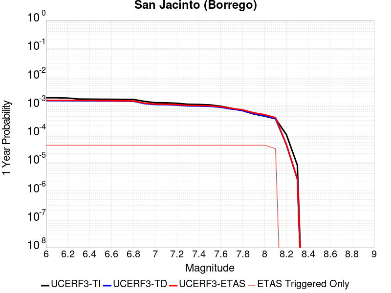 |  |

| Magnitude | 1 wk TI Prob | 1 wk TD Prob | 1 wk ETAS Prob | 1 wk ETAS/TD Gain | 1 wk ETAS Triggered Only | 1 mo TI Prob | 1 mo TD Prob | 1 mo ETAS Prob | 1 mo ETAS/TD Gain | 1 mo ETAS Triggered Only | 1 yr TI Prob | 1 yr TD Prob | 1 yr ETAS Prob | 1 yr ETAS/TD Gain | 1 yr ETAS Triggered Only | 10 yr TI Prob | 10 yr TD Prob | 10 yr ETAS Prob | 10 yr ETAS/TD Gain | 10 yr ETAS Triggered Only |
|-----|-----|-----|-----|-----|-----|-----|-----|-----|-----|-----|-----|-----|-----|-----|-----|-----|-----|-----|-----|-----|
| 6.0 | 3.543992E-5 | 2.7925962E-5 | 2.7925962E-5 | 1.0 | 0.0 | 1.5187653E-4 | 1.1967727E-4 | 1.1967727E-4 | 1.0 | 0.0 | 0.0018475284 | 0.0014561092 | 0.0014561092 | 1.0 | 0.0 | 0.018322436 | 0.01486815 | 0.014926905 | 1.0039517 | 5.9640963E-5 |
| 6.1 | 3.542281E-5 | 2.7925962E-5 | 2.7925962E-5 | 1.0 | 0.0 | 1.5180321E-4 | 1.1967727E-4 | 1.1967727E-4 | 1.0 | 0.0 | 0.0018466372 | 0.0014561092 | 0.0014561092 | 1.0 | 0.0 | 0.018313672 | 0.01486815 | 0.014926905 | 1.0039517 | 5.9640963E-5 |
| 6.2 | 3.4688688E-5 | 2.7925962E-5 | 2.7925962E-5 | 1.0 | 0.0 | 1.4865733E-4 | 1.1967727E-4 | 1.1967727E-4 | 1.0 | 0.0 | 0.0018084005 | 0.0014561091 | 0.0014561091 | 1.0 | 0.0 | 0.017937548 | 0.01486815 | 0.014926905 | 1.0039517 | 5.9640963E-5 |
| 6.3 | 3.2087122E-5 | 2.7771312E-5 | 2.7771312E-5 | 1.0 | 0.0 | 1.3750899E-4 | 1.1901455E-4 | 1.1901455E-4 | 1.0 | 0.0 | 0.0016728862 | 0.0014480512 | 0.0014480512 | 1.0 | 0.0 | 0.016603488 | 0.014789308 | 0.014848067 | 1.0039731 | 5.9640963E-5 |
| 6.4 | 3.1828724E-5 | 2.773829E-5 | 2.773829E-5 | 1.0 | 0.0 | 1.364017E-4 | 1.1887303E-4 | 1.1887303E-4 | 1.0 | 0.0 | 0.0016594254 | 0.0014463306 | 0.0014463306 | 1.0 | 0.0 | 0.016470885 | 0.014772502 | 0.014831262 | 1.0039777 | 5.9640963E-5 |
| 6.5 | 3.1563577E-5 | 2.7477974E-5 | 2.7477974E-5 | 1.0 | 0.0 | 1.3526545E-4 | 1.17757496E-4 | 1.17757496E-4 | 1.0 | 0.0 | 0.0016456128 | 0.0014327668 | 0.0014327668 | 1.0 | 0.0 | 0.0163348 | 0.01463991 | 0.014698678 | 1.0040143 | 5.9640963E-5 |
| 6.6 | 3.1467625E-5 | 2.7322194E-5 | 2.7322194E-5 | 1.0 | 0.0 | 1.3485427E-4 | 1.17089934E-4 | 1.17089934E-4 | 1.0 | 0.0 | 0.0016406142 | 0.0014246498 | 0.0014246498 | 1.0 | 0.0 | 0.016285548 | 0.014560228 | 0.014619 | 1.0040365 | 5.9640963E-5 |
| 6.7 | 3.1223695E-5 | 2.6940217E-5 | 2.6940217E-5 | 1.0 | 0.0 | 1.3380898E-4 | 1.1545303E-4 | 1.1545303E-4 | 1.0 | 0.0 | 0.0016279068 | 0.0014047464 | 0.0014047464 | 1.0 | 0.0 | 0.01616033 | 0.01436451 | 0.014423294 | 1.0040923 | 5.9640963E-5 |
| 6.8 | 3.1015585E-5 | 2.6761221E-5 | 2.6761221E-5 | 1.0 | 0.0 | 1.3291716E-4 | 1.1468597E-4 | 1.1468597E-4 | 1.0 | 0.0 | 0.001617065 | 0.0013954195 | 0.0013954195 | 1.0 | 0.0 | 0.016053487 | 0.014271772 | 0.014330561 | 1.0041193 | 5.9640963E-5 |
| 6.9 | 2.6641965E-5 | 2.2183434E-5 | 2.2183434E-5 | 1.0 | 0.0 | 1.1417485E-4 | 9.506842E-5 | 9.506842E-5 | 1.0 | 0.0 | 0.0013891924 | 0.0011568473 | 0.0011568473 | 1.0 | 0.0 | 0.0138054015 | 0.011882191 | 0.011941123 | 1.0049597 | 5.9640963E-5 |
| 7.0 | 2.3854353E-5 | 2.047825E-5 | 2.047825E-5 | 1.0 | 0.0 | 1.02228936E-4 | 8.776099E-5 | 8.776099E-5 | 1.0 | 0.0 | 0.0012439266 | 0.0010679689 | 0.0010679689 | 1.0 | 0.0 | 0.012369866 | 0.0109826205 | 0.011041606 | 1.0053709 | 5.9640963E-5 |
| 7.1 | 2.3672901E-5 | 2.0314741E-5 | 2.0314741E-5 | 1.0 | 0.0 | 1.0145135E-4 | 8.706028E-5 | 8.706028E-5 | 1.0 | 0.0 | 0.0012344702 | 0.0010594461 | 0.0010594461 | 1.0 | 0.0 | 0.0122763505 | 0.010897858 | 0.01095685 | 1.005413 | 5.9640963E-5 |
| 7.2 | 2.2717244E-5 | 1.9542116E-5 | 1.9542116E-5 | 1.0 | 0.0 | 9.735599E-5 | 8.3749255E-5 | 8.3749255E-5 | 1.0 | 0.0 | 0.0011846646 | 0.0010191725 | 0.0010191725 | 1.0 | 0.0 | 0.01178369 | 0.010495322 | 0.010554337 | 1.005623 | 5.9640963E-5 |
| 7.3 | 2.1016205E-5 | 1.8383771E-5 | 1.8383771E-5 | 1.0 | 0.0 | 9.006634E-5 | 7.878522E-5 | 7.878522E-5 | 1.0 | 0.0 | 0.001096006 | 9.5879E-4 | 9.5879E-4 | 1.0 | 0.0 | 0.010906163 | 0.009890901 | 0.009949952 | 1.0059702 | 5.9640963E-5 |
| 7.4 | 2.0683625E-5 | 1.8186302E-5 | 1.8186302E-5 | 1.0 | 0.0 | 8.86411E-5 | 7.7938974E-5 | 7.7938974E-5 | 1.0 | 0.0 | 0.001078671 | 9.48496E-4 | 9.48496E-4 | 1.0 | 0.0 | 0.010734501 | 0.0097876275 | 0.009846685 | 1.0060339 | 5.9640963E-5 |
| 7.5 | 1.9993966E-5 | 1.7781347E-5 | 1.7781347E-5 | 1.0 | 0.0 | 8.568561E-5 | 7.6203556E-5 | 7.6203556E-5 | 1.0 | 0.0 | 0.001042723 | 9.2738547E-4 | 9.2738547E-4 | 1.0 | 0.0 | 0.010378438 | 0.009574548 | 0.009633618 | 1.0061694 | 5.9640963E-5 |
| 7.6 | 1.788966E-5 | 1.6434618E-5 | 1.6434618E-5 | 1.0 | 0.0 | 7.666772E-5 | 7.043219E-5 | 7.043219E-5 | 1.0 | 0.0 | 9.3302975E-4 | 8.5717626E-4 | 8.5717626E-4 | 1.0 | 0.0 | 0.00929122 | 0.008866415 | 0.008925527 | 1.006667 | 5.9640963E-5 |
| 7.7 | 1.5125781E-5 | 1.4236738E-5 | 1.4236738E-5 | 1.0 | 0.0 | 6.4823165E-5 | 6.101317E-5 | 6.101317E-5 | 1.0 | 0.0 | 7.889362E-4 | 7.4258295E-4 | 7.4258295E-4 | 1.0 | 0.0 | 0.007861412 | 0.007714161 | 0.007773342 | 1.0076717 | 5.9640963E-5 |
| 7.8 | 1.250089E-5 | 1.262994E-5 | 1.262994E-5 | 1.0 | 0.0 | 5.3574146E-5 | 5.4127195E-5 | 5.4127195E-5 | 1.0 | 0.0 | 6.5207E-4 | 6.588E-4 | 6.588E-4 | 1.0 | 0.0 | 0.006501599 | 0.006867759 | 0.00692699 | 1.0086246 | 5.9640963E-5 |
| 7.9 | 9.561E-6 | 9.754065E-6 | 9.754065E-6 | 1.0 | 0.0 | 4.0975072E-5 | 4.180247E-5 | 4.180247E-5 | 1.0 | 0.0 | 4.987573E-4 | 5.0882675E-4 | 5.0882675E-4 | 1.0 | 0.0 | 0.0049763937 | 0.0053523607 | 0.005411682 | 1.0110832 | 5.9640963E-5 |
| 8.0 | 8.01699E-6 | 8.292994E-6 | 8.292994E-6 | 1.0 | 0.0 | 3.4358076E-5 | 3.554092E-5 | 3.554092E-5 | 1.0 | 0.0 | 4.1822926E-4 | 4.3262533E-4 | 4.3262533E-4 | 1.0 | 0.0 | 0.0041744304 | 0.0045733186 | 0.004632687 | 1.0129814 | 5.9640963E-5 |
| 8.1 | 6.541947E-6 | 6.461784E-6 | 6.461784E-6 | 1.0 | 0.0 | 2.8036617E-5 | 2.7693068E-5 | 2.7693068E-5 | 1.0 | 0.0 | 3.4129233E-4 | 3.3711144E-4 | 3.3711144E-4 | 1.0 | 0.0 | 0.0034076865 | 0.0035805756 | 0.0036400028 | 1.0165972 | 5.9640963E-5 |
| 8.2 | 1.7968189E-6 | 7.9684827E-7 | 7.9684827E-7 | 1.0 | 0.0 | 7.70063E-6 | 3.4150596E-6 | 3.4150596E-6 | 1.0 | 0.0 | 9.3751136E-5 | 4.157758E-5 | 4.157758E-5 | 1.0 | 0.0 | 9.371159E-4 | 4.7107413E-4 | 4.7107413E-4 | 1.0 | 0.0 |
| 8.3 | 1.5167889E-7 | 4.8951257E-8 | 4.8951257E-8 | 1.0 | 0.0 | 6.500522E-7 | 2.0979108E-7 | 2.0979108E-7 | 1.0 | 0.0 | 7.9143565E-6 | 2.5542038E-6 | 2.5542038E-6 | 1.0 | 0.0 | 7.914075E-5 | 2.9679897E-5 | 2.9679897E-5 | 1.0 | 0.0 |

## Santa Cruz Catalina Ridge alt1
*[(top)](#table-of-contents)*

| 1 Week | 1 Month | 1 Year | 10 Year |
|-----|-----|-----|-----|
|  | 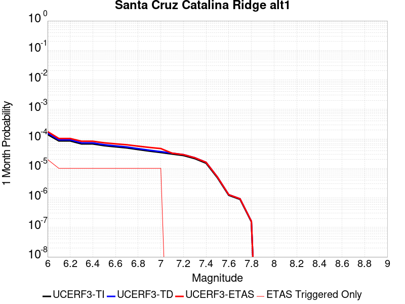 |  |  |

| Magnitude | 1 wk TI Prob | 1 wk TD Prob | 1 wk ETAS Prob | 1 wk ETAS/TD Gain | 1 wk ETAS Triggered Only | 1 mo TI Prob | 1 mo TD Prob | 1 mo ETAS Prob | 1 mo ETAS/TD Gain | 1 mo ETAS Triggered Only | 1 yr TI Prob | 1 yr TD Prob | 1 yr ETAS Prob | 1 yr ETAS/TD Gain | 1 yr ETAS Triggered Only | 10 yr TI Prob | 10 yr TD Prob | 10 yr ETAS Prob | 10 yr ETAS/TD Gain | 10 yr ETAS Triggered Only |
|-----|-----|-----|-----|-----|-----|-----|-----|-----|-----|-----|-----|-----|-----|-----|-----|-----|-----|-----|-----|-----|
| 6.0 | 3.2833184E-5 | 3.6558402E-5 | 3.6558402E-5 | 1.0 | 0.0 | 1.4070606E-4 | 1.5667039E-4 | 1.5667039E-4 | 1.0 | 0.0 | 0.00171175 | 0.0019059594 | 0.0019654867 | 1.0312322 | 5.9640963E-5 | 0.016986247 | 0.018913032 | 0.018971546 | 1.0030938 | 5.9640963E-5 |
| 6.1 | 1.9835548E-5 | 2.1659505E-5 | 2.1659505E-5 | 1.0 | 0.0 | 8.500672E-5 | 9.282326E-5 | 9.282326E-5 | 1.0 | 0.0 | 0.0010344655 | 0.0011295575 | 0.001189131 | 1.0527407 | 5.9640963E-5 | 0.010296632 | 0.011240296 | 0.0112992665 | 1.0052464 | 5.9640963E-5 |
| 6.2 | 1.9835548E-5 | 2.1659505E-5 | 2.1659505E-5 | 1.0 | 0.0 | 8.500672E-5 | 9.282326E-5 | 9.282326E-5 | 1.0 | 0.0 | 0.0010344655 | 0.0011295575 | 0.001189131 | 1.0527407 | 5.9640963E-5 | 0.010296632 | 0.011240296 | 0.0112992665 | 1.0052464 | 5.9640963E-5 |
| 6.3 | 1.5728183E-5 | 1.703395E-5 | 1.703395E-5 | 1.0 | 0.0 | 6.7404755E-5 | 7.300063E-5 | 7.300063E-5 | 1.0 | 0.0 | 8.2034385E-4 | 8.884264E-4 | 9.480144E-4 | 1.0670713 | 5.9640963E-5 | 0.008173222 | 0.008849427 | 0.00890854 | 1.0066799 | 5.9640963E-5 |
| 6.4 | 1.5728183E-5 | 1.703395E-5 | 1.703395E-5 | 1.0 | 0.0 | 6.7404755E-5 | 7.300063E-5 | 7.300063E-5 | 1.0 | 0.0 | 8.2034385E-4 | 8.884264E-4 | 9.480144E-4 | 1.0670713 | 5.9640963E-5 | 0.008173222 | 0.008849427 | 0.00890854 | 1.0066799 | 5.9640963E-5 |
| 6.5 | 1.3707734E-5 | 1.4794522E-5 | 1.4794522E-5 | 1.0 | 0.0 | 5.8746107E-5 | 6.3403575E-5 | 6.3403575E-5 | 1.0 | 0.0 | 7.1499916E-4 | 7.716686E-4 | 8.3126355E-4 | 1.0772287 | 5.9640963E-5 | 0.0071270303 | 0.0076902895 | 0.007749472 | 1.0076957 | 5.9640963E-5 |
| 6.6 | 1.2539813E-5 | 1.3510219E-5 | 1.3510219E-5 | 1.0 | 0.0 | 5.3740947E-5 | 5.789967E-5 | 5.789967E-5 | 1.0 | 0.0 | 6.540996E-4 | 7.0470315E-4 | 7.643021E-4 | 1.0845731 | 5.9640963E-5 | 0.0065217763 | 0.0070249885 | 0.0070842104 | 1.0084302 | 5.9640963E-5 |
| 6.7 | 1.1504083E-5 | 1.2377375E-5 | 1.2377375E-5 | 1.0 | 0.0 | 4.930228E-5 | 5.3044827E-5 | 5.3044827E-5 | 1.0 | 0.0 | 6.0008996E-4 | 6.456314E-4 | 7.0523383E-4 | 1.0923165 | 5.9640963E-5 | 0.005984721 | 0.006437786 | 0.006497043 | 1.0092045 | 5.9640963E-5 |
| 6.8 | 1.012739E-5 | 1.0877071E-5 | 1.0877071E-5 | 1.0 | 0.0 | 4.340238E-5 | 4.6615194E-5 | 4.6615194E-5 | 1.0 | 0.0 | 5.282958E-4 | 5.673937E-4 | 6.270008E-4 | 1.1050543 | 5.9640963E-5 | 0.0052704164 | 0.0056596193 | 0.005718923 | 1.0104784 | 5.9640963E-5 |
| 6.9 | 8.9607865E-6 | 9.609117E-6 | 9.609117E-6 | 1.0 | 0.0 | 3.8402806E-5 | 4.1181287E-5 | 4.1181287E-5 | 1.0 | 0.0 | 4.6745385E-4 | 5.012679E-4 | 5.6087895E-4 | 1.1189206 | 5.9640963E-5 | 0.0046647177 | 0.005001492 | 0.0050608343 | 1.011865 | 5.9640963E-5 |
| 7.0 | 8.046829E-6 | 8.619746E-6 | 8.619746E-6 | 1.0 | 0.0 | 3.4485955E-5 | 3.694125E-5 | 3.694125E-5 | 1.0 | 0.0 | 4.1978562E-4 | 4.496677E-4 | 5.092819E-4 | 1.1325737 | 5.9640963E-5 | 0.004189935 | 0.0044876686 | 0.0045470423 | 1.0132303 | 5.9640963E-5 |
| 7.1 | 7.136131E-6 | 7.637656E-6 | 7.637656E-6 | 1.0 | 0.0 | 3.0583058E-5 | 3.2732405E-5 | 3.2732405E-5 | 1.0 | 0.0 | 3.7228514E-4 | 3.9844486E-4 | 4.5806207E-4 | 1.1496247 | 5.9640963E-5 | 0.0037166206 | 0.003977381 | 0.004036785 | 1.0149354 | 5.9640963E-5 |
| 7.2 | 6.362014E-6 | 6.8049585E-6 | 6.8049585E-6 | 1.0 | 0.0 | 2.726549E-5 | 2.9163786E-5 | 2.9163786E-5 | 1.0 | 0.0 | 3.3190678E-4 | 3.550119E-4 | 4.1463168E-4 | 1.1679374 | 5.9640963E-5 | 0.0033141149 | 0.003544516 | 0.0036039455 | 1.0167667 | 5.9640963E-5 |
| 7.3 | 5.004101E-6 | 5.351715E-6 | 5.351715E-6 | 1.0 | 0.0 | 2.1445969E-5 | 2.2935723E-5 | 2.2935723E-5 | 1.0 | 0.0 | 2.6107338E-4 | 2.792072E-4 | 2.792072E-4 | 1.0 | 0.0 | 0.002607669 | 0.0027886187 | 0.0027886187 | 1.0 | 0.0 |
| 7.4 | 3.4901443E-6 | 3.7320526E-6 | 3.7320526E-6 | 1.0 | 0.0 | 1.4957676E-5 | 1.5994416E-5 | 1.5994416E-5 | 1.0 | 0.0 | 1.8209449E-4 | 1.9471499E-4 | 1.9471499E-4 | 1.0 | 0.0 | 0.0018194534 | 0.0019454823 | 0.0019454823 | 1.0 | 0.0 |
| 7.5 | 1.1215045E-6 | 1.189387E-6 | 1.189387E-6 | 1.0 | 0.0 | 4.806439E-6 | 5.097363E-6 | 5.097363E-6 | 1.0 | 0.0 | 5.851682E-5 | 6.205866E-5 | 6.205866E-5 | 1.0 | 0.0 | 5.850142E-4 | 6.2041637E-4 | 6.2041637E-4 | 1.0 | 0.0 |
| 7.6 | 2.8599047E-7 | 2.9951994E-7 | 2.9951994E-7 | 1.0 | 0.0 | 1.2256729E-6 | 1.2836562E-6 | 1.2836562E-6 | 1.0 | 0.0 | 1.4922465E-5 | 1.5628404E-5 | 1.5628404E-5 | 1.0 | 0.0 | 1.4921463E-4 | 1.5627318E-4 | 1.5627318E-4 | 1.0 | 0.0 |
| 7.7 | 2.0781519E-7 | 2.1744323E-7 | 2.1744323E-7 | 1.0 | 0.0 | 8.906362E-7 | 9.3189925E-7 | 9.3189925E-7 | 1.0 | 0.0 | 1.08434415E-5 | 1.13458145E-5 | 1.13458145E-5 | 1.0 | 0.0 | 1.0842913E-4 | 1.1345245E-4 | 1.1345245E-4 | 1.0 | 0.0 |
| 7.8 | 3.614776E-8 | 3.764102E-8 | 3.764102E-8 | 1.0 | 0.0 | 1.5491896E-7 | 1.6131864E-7 | 1.6131864E-7 | 1.0 | 0.0 | 1.8861368E-6 | 1.9640527E-6 | 1.9640527E-6 | 1.0 | 0.0 | 1.8861208E-5 | 1.9640367E-5 | 1.9640367E-5 | 1.0 | 0.0 |

## Surprise Valley 2011 CFM
*[(top)](#table-of-contents)*

| 1 Week | 1 Month | 1 Year | 10 Year |
|-----|-----|-----|-----|
|  |  |  |  |

| Magnitude | 1 wk TI Prob | 1 wk TD Prob | 1 wk ETAS Prob | 1 wk ETAS/TD Gain | 1 wk ETAS Triggered Only | 1 mo TI Prob | 1 mo TD Prob | 1 mo ETAS Prob | 1 mo ETAS/TD Gain | 1 mo ETAS Triggered Only | 1 yr TI Prob | 1 yr TD Prob | 1 yr ETAS Prob | 1 yr ETAS/TD Gain | 1 yr ETAS Triggered Only | 10 yr TI Prob | 10 yr TD Prob | 10 yr ETAS Prob | 10 yr ETAS/TD Gain | 10 yr ETAS Triggered Only |
|-----|-----|-----|-----|-----|-----|-----|-----|-----|-----|-----|-----|-----|-----|-----|-----|-----|-----|-----|-----|-----|
| 6.0 | 4.0396248E-5 | 4.485131E-5 | 4.485131E-5 | 1.0 | 0.0 | 1.7311527E-4 | 1.9220692E-4 | 1.9220692E-4 | 1.0 | 0.0 | 0.002105641 | 0.0023378176 | 0.0023378176 | 1.0 | 0.0 | 0.020858008 | 0.023153966 | 0.023212226 | 1.0025162 | 5.9640963E-5 |
| 6.1 | 4.0396248E-5 | 4.485131E-5 | 4.485131E-5 | 1.0 | 0.0 | 1.7311527E-4 | 1.9220692E-4 | 1.9220692E-4 | 1.0 | 0.0 | 0.002105641 | 0.0023378176 | 0.0023378176 | 1.0 | 0.0 | 0.020858008 | 0.023153966 | 0.023212226 | 1.0025162 | 5.9640963E-5 |
| 6.2 | 2.2295266E-5 | 2.440125E-5 | 2.440125E-5 | 1.0 | 0.0 | 9.554764E-5 | 1.0457276E-4 | 1.0457276E-4 | 1.0 | 0.0 | 0.0011626717 | 0.0012724606 | 0.0012724606 | 1.0 | 0.0 | 0.011566074 | 0.012654981 | 0.012713867 | 1.0046532 | 5.9640963E-5 |
| 6.3 | 1.572643E-5 | 1.7096807E-5 | 1.7096807E-5 | 1.0 | 0.0 | 6.7397246E-5 | 7.327003E-5 | 7.327003E-5 | 1.0 | 0.0 | 8.202525E-4 | 8.91708E-4 | 8.91708E-4 | 1.0 | 0.0 | 0.008172315 | 0.008882407 | 0.008882407 | 1.0 | 0.0 |
| 6.4 | 1.5714395E-5 | 1.7084629E-5 | 1.7084629E-5 | 1.0 | 0.0 | 6.734567E-5 | 7.3217845E-5 | 7.3217845E-5 | 1.0 | 0.0 | 8.1962504E-4 | 8.9107314E-4 | 8.9107314E-4 | 1.0 | 0.0 | 0.008166086 | 0.008876109 | 0.008876109 | 1.0 | 0.0 |
| 6.5 | 1.2733495E-5 | 1.38016E-5 | 1.38016E-5 | 1.0 | 0.0 | 5.457098E-5 | 5.9148413E-5 | 5.9148413E-5 | 1.0 | 0.0 | 6.641992E-4 | 7.1990065E-4 | 7.1990065E-4 | 1.0 | 0.0 | 0.0066221743 | 0.0071763797 | 0.0071763797 | 1.0 | 0.0 |
| 6.6 | 1.0983784E-5 | 1.1886554E-5 | 1.1886554E-5 | 1.0 | 0.0 | 4.7072506E-5 | 5.094141E-5 | 5.094141E-5 | 1.0 | 0.0 | 5.7295704E-4 | 6.200405E-4 | 6.200405E-4 | 1.0 | 0.0 | 0.0057148207 | 0.0061836545 | 0.0061836545 | 1.0 | 0.0 |
| 6.7 | 9.104806E-6 | 9.839491E-6 | 9.839491E-6 | 1.0 | 0.0 | 3.902001E-5 | 4.2168587E-5 | 4.2168587E-5 | 1.0 | 0.0 | 4.7496508E-4 | 5.132855E-4 | 5.132855E-4 | 1.0 | 0.0 | 0.004739512 | 0.005121397 | 0.005121397 | 1.0 | 0.0 |
| 6.8 | 6.2162403E-6 | 6.7041337E-6 | 6.7041337E-6 | 1.0 | 0.0 | 2.6640759E-5 | 2.8731698E-5 | 2.8731698E-5 | 1.0 | 0.0 | 3.2430296E-4 | 3.497545E-4 | 3.497545E-4 | 1.0 | 0.0 | 0.003238301 | 0.0034922638 | 0.0034922638 | 1.0 | 0.0 |
| 6.9 | 4.1792696E-6 | 4.50323E-6 | 4.50323E-6 | 1.0 | 0.0 | 1.7911032E-5 | 1.9299423E-5 | 1.9299423E-5 | 1.0 | 0.0 | 2.1804498E-4 | 2.3494668E-4 | 2.3494668E-4 | 1.0 | 0.0 | 0.0021783116 | 0.0023471361 | 0.0023471361 | 1.0 | 0.0 |
| 7.0 | 2.7478413E-6 | 2.9622424E-6 | 2.9622424E-6 | 1.0 | 0.0 | 1.177641E-5 | 1.269527E-5 | 1.269527E-5 | 1.0 | 0.0 | 1.4336836E-4 | 1.545552E-4 | 1.545552E-4 | 1.0 | 0.0 | 0.001432759 | 0.0015445995 | 0.0015445995 | 1.0 | 0.0 |
| 7.1 | 8.128648E-7 | 8.724922E-7 | 8.724922E-7 | 1.0 | 0.0 | 3.4837017E-6 | 3.7392501E-6 | 3.7392501E-6 | 1.0 | 0.0 | 4.2413245E-5 | 4.552502E-5 | 4.552502E-5 | 1.0 | 0.0 | 4.2405148E-4 | 4.5521575E-4 | 4.5521575E-4 | 1.0 | 0.0 |
| 7.2 | 4.8641045E-8 | 4.9402068E-8 | 4.9402068E-8 | 1.0 | 0.0 | 2.084616E-7 | 2.1172312E-7 | 2.1172312E-7 | 1.0 | 0.0 | 2.538017E-6 | 2.577726E-6 | 2.577726E-6 | 1.0 | 0.0 | 2.537988E-5 | 2.5776973E-5 | 2.5776973E-5 | 1.0 | 0.0 |
| 7.3 | 5.3911844E-9 | 5.4758145E-9 | 5.4758145E-9 | 1.0 | 0.0 | 2.3105075E-8 | 2.3467775E-8 | 2.3467775E-8 | 1.0 | 0.0 | 2.8130427E-7 | 2.8572015E-7 | 2.8572015E-7 | 1.0 | 0.0 | 2.8130391E-6 | 2.8571992E-6 | 2.8571992E-6 | 1.0 | 0.0 |

## Great Valley 03 Mysterious Ridge
*[(top)](#table-of-contents)*

| 1 Week | 1 Month | 1 Year | 10 Year |
|-----|-----|-----|-----|
|  |  |  |  |

| Magnitude | 1 wk TI Prob | 1 wk TD Prob | 1 wk ETAS Prob | 1 wk ETAS/TD Gain | 1 wk ETAS Triggered Only | 1 mo TI Prob | 1 mo TD Prob | 1 mo ETAS Prob | 1 mo ETAS/TD Gain | 1 mo ETAS Triggered Only | 1 yr TI Prob | 1 yr TD Prob | 1 yr ETAS Prob | 1 yr ETAS/TD Gain | 1 yr ETAS Triggered Only | 10 yr TI Prob | 10 yr TD Prob | 10 yr ETAS Prob | 10 yr ETAS/TD Gain | 10 yr ETAS Triggered Only |
|-----|-----|-----|-----|-----|-----|-----|-----|-----|-----|-----|-----|-----|-----|-----|-----|-----|-----|-----|-----|-----|
| 6.0 | 3.1182444E-5 | 3.6034133E-5 | 9.567294E-5 | 2.6550646 | 5.9640963E-5 | 1.336322E-4 | 1.5442389E-4 | 2.1405565E-4 | 1.3861562 | 5.9640963E-5 | 0.0016257578 | 0.0018786751 | 0.001938204 | 1.0316867 | 5.9640963E-5 | 0.016139153 | 0.018646672 | 0.0187052 | 1.0031388 | 5.9640963E-5 |
| 6.1 | 3.1182444E-5 | 3.6034133E-5 | 9.567294E-5 | 2.6550646 | 5.9640963E-5 | 1.336322E-4 | 1.5442389E-4 | 2.1405565E-4 | 1.3861562 | 5.9640963E-5 | 0.0016257578 | 0.0018786751 | 0.001938204 | 1.0316867 | 5.9640963E-5 | 0.016139153 | 0.018646672 | 0.0187052 | 1.0031388 | 5.9640963E-5 |
| 6.2 | 3.1182444E-5 | 3.6034133E-5 | 9.567294E-5 | 2.6550646 | 5.9640963E-5 | 1.336322E-4 | 1.5442389E-4 | 2.1405565E-4 | 1.3861562 | 5.9640963E-5 | 0.0016257578 | 0.0018786751 | 0.001938204 | 1.0316867 | 5.9640963E-5 | 0.016139153 | 0.018646672 | 0.0187052 | 1.0031388 | 5.9640963E-5 |
| 6.3 | 2.106934E-5 | 2.3850303E-5 | 8.3489846E-5 | 3.5005777 | 5.9640963E-5 | 9.0294045E-5 | 1.0221176E-4 | 1.6184662E-4 | 1.5834442 | 5.9640963E-5 | 0.0010987755 | 0.0012437488 | 0.0013033156 | 1.0478929 | 5.9640963E-5 | 0.010933585 | 0.0123711275 | 0.012430031 | 1.0047613 | 5.9640963E-5 |
| 6.4 | 2.106934E-5 | 2.3850303E-5 | 8.3489846E-5 | 3.5005777 | 5.9640963E-5 | 9.0294045E-5 | 1.0221176E-4 | 1.6184662E-4 | 1.5834442 | 5.9640963E-5 | 0.0010987755 | 0.0012437488 | 0.0013033156 | 1.0478929 | 5.9640963E-5 | 0.010933585 | 0.0123711275 | 0.012430031 | 1.0047613 | 5.9640963E-5 |
| 6.5 | 1.9389783E-5 | 2.1884982E-5 | 8.152464E-5 | 3.7251408 | 5.9640963E-5 | 8.309642E-5 | 9.378956E-5 | 1.5342493E-4 | 1.6358423 | 5.9640963E-5 | 0.0010112294 | 0.0011413175 | 0.0012008904 | 1.0521966 | 5.9640963E-5 | 0.010066401 | 0.011357434 | 0.011416398 | 1.0051917 | 5.9640963E-5 |
| 6.6 | 1.9370193E-5 | 2.1864902E-5 | 8.150456E-5 | 3.7276435 | 5.9640963E-5 | 8.301247E-5 | 9.3703515E-5 | 1.5333889E-4 | 1.6364262 | 5.9640963E-5 | 0.0010102082 | 0.001140271 | 0.001199844 | 1.0522445 | 5.9640963E-5 | 0.010056281 | 0.011347076 | 0.011406041 | 1.0051965 | 5.9640963E-5 |
| 6.7 | 1.6723505E-5 | 1.8799281E-5 | 7.843912E-5 | 4.1724534 | 5.9640963E-5 | 7.16702E-5 | 8.056597E-5 | 1.4020213E-4 | 1.7402152 | 5.9640963E-5 | 8.722353E-4 | 9.804688E-4 | 0.0010400512 | 1.0607694 | 5.9640963E-5 | 0.008688197 | 0.009763439 | 0.009822498 | 1.0060489 | 5.9640963E-5 |
| 6.8 | 1.426937E-5 | 1.599721E-5 | 7.563722E-5 | 4.728151 | 5.9640963E-5 | 6.115301E-5 | 6.855775E-5 | 1.2819462E-4 | 1.8698779 | 5.9640963E-5 | 7.4428355E-4 | 8.343854E-4 | 8.939766E-4 | 1.0714192 | 5.9640963E-5 | 0.007417957 | 0.008314005 | 0.00837315 | 1.0071139 | 5.9640963E-5 |
| 6.9 | 1.2469891E-5 | 1.3956928E-5 | 7.359706E-5 | 5.2731557 | 5.9640963E-5 | 5.3441294E-5 | 5.9814105E-5 | 1.194515E-4 | 1.9970456 | 5.9640963E-5 | 6.504535E-4 | 7.280055E-4 | 7.87603E-4 | 1.0818641 | 5.9640963E-5 | 0.006485529 | 0.00725743 | 0.0073166382 | 1.0081583 | 5.9640963E-5 |
| 7.0 | 8.7746275E-6 | 9.791734E-6 | 9.791734E-6 | 1.0 | 0.0 | 3.7605005E-5 | 4.196394E-5 | 4.196394E-5 | 1.0 | 0.0 | 4.5774475E-4 | 5.1079853E-4 | 5.1079853E-4 | 1.0 | 0.0 | 0.00456803 | 0.005096977 | 0.005096977 | 1.0 | 0.0 |
| 7.1 | 6.1067153E-6 | 6.813725E-6 | 6.813725E-6 | 1.0 | 0.0 | 2.6171374E-5 | 2.9201385E-5 | 2.9201385E-5 | 1.0 | 0.0 | 3.1858988E-4 | 3.5547445E-4 | 3.5547445E-4 | 1.0 | 0.0 | 0.0031813353 | 0.003549609 | 0.003549609 | 1.0 | 0.0 |
| 7.2 | 2.939283E-6 | 3.2741057E-6 | 3.2741057E-6 | 1.0 | 0.0 | 1.2596866E-5 | 1.4031816E-5 | 1.4031816E-5 | 1.0 | 0.0 | 1.5335606E-4 | 1.7082572E-4 | 1.7082572E-4 | 1.0 | 0.0 | 0.0015325027 | 0.001707116 | 0.001707116 | 1.0 | 0.0 |
| 7.3 | 7.2387763E-7 | 8.008505E-7 | 8.008505E-7 | 1.0 | 0.0 | 3.102329E-6 | 3.4322145E-6 | 3.4322145E-6 | 1.0 | 0.0 | 3.77702E-5 | 4.178687E-5 | 4.178687E-5 | 1.0 | 0.0 | 3.7763783E-4 | 4.1783508E-4 | 4.1783508E-4 | 1.0 | 0.0 |
| 7.4 | 3.112171E-8 | 3.2068368E-8 | 3.2068368E-8 | 1.0 | 0.0 | 1.3337875E-7 | 1.3743585E-7 | 1.3743585E-7 | 1.0 | 0.0 | 1.6238852E-6 | 1.6732803E-6 | 1.6732803E-6 | 1.0 | 0.0 | 1.6238733E-5 | 1.6732685E-5 | 1.6732685E-5 | 1.0 | 0.0 |

## Elysian Park (Upper)
*[(top)](#table-of-contents)*

| 1 Week | 1 Month | 1 Year | 10 Year |
|-----|-----|-----|-----|
|  | 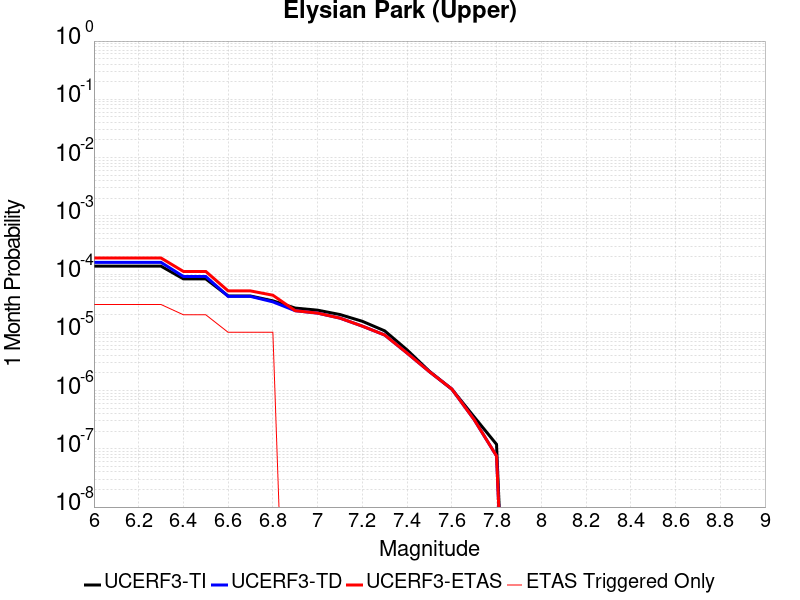 |  |  |

| Magnitude | 1 wk TI Prob | 1 wk TD Prob | 1 wk ETAS Prob | 1 wk ETAS/TD Gain | 1 wk ETAS Triggered Only | 1 mo TI Prob | 1 mo TD Prob | 1 mo ETAS Prob | 1 mo ETAS/TD Gain | 1 mo ETAS Triggered Only | 1 yr TI Prob | 1 yr TD Prob | 1 yr ETAS Prob | 1 yr ETAS/TD Gain | 1 yr ETAS Triggered Only | 10 yr TI Prob | 10 yr TD Prob | 10 yr ETAS Prob | 10 yr ETAS/TD Gain | 10 yr ETAS Triggered Only |
|-----|-----|-----|-----|-----|-----|-----|-----|-----|-----|-----|-----|-----|-----|-----|-----|-----|-----|-----|-----|-----|
| 6.0 | 3.1876025E-5 | 3.7035275E-5 | 3.7035275E-5 | 1.0 | 0.0 | 1.3660437E-4 | 1.5871569E-4 | 2.1834718E-4 | 1.3757126 | 5.9640963E-5 | 0.0016618895 | 0.001931122 | 0.0019906478 | 1.0308244 | 5.9640963E-5 | 0.016495159 | 0.019189863 | 0.019248359 | 1.0030483 | 5.9640963E-5 |
| 6.1 | 3.1876025E-5 | 3.7035275E-5 | 3.7035275E-5 | 1.0 | 0.0 | 1.3660437E-4 | 1.5871569E-4 | 2.1834718E-4 | 1.3757126 | 5.9640963E-5 | 0.0016618895 | 0.001931122 | 0.0019906478 | 1.0308244 | 5.9640963E-5 | 0.016495159 | 0.019189863 | 0.019248359 | 1.0030483 | 5.9640963E-5 |
| 6.2 | 3.1876025E-5 | 3.7035275E-5 | 3.7035275E-5 | 1.0 | 0.0 | 1.3660437E-4 | 1.5871569E-4 | 2.1834718E-4 | 1.3757126 | 5.9640963E-5 | 0.0016618895 | 0.001931122 | 0.0019906478 | 1.0308244 | 5.9640963E-5 | 0.016495159 | 0.019189863 | 0.019248359 | 1.0030483 | 5.9640963E-5 |
| 6.3 | 3.1876025E-5 | 3.7035275E-5 | 3.7035275E-5 | 1.0 | 0.0 | 1.3660437E-4 | 1.5871569E-4 | 2.1834718E-4 | 1.3757126 | 5.9640963E-5 | 0.0016618895 | 0.001931122 | 0.0019906478 | 1.0308244 | 5.9640963E-5 | 0.016495159 | 0.019189863 | 0.019248359 | 1.0030483 | 5.9640963E-5 |
| 6.4 | 1.9273462E-5 | 2.120244E-5 | 2.120244E-5 | 1.0 | 0.0 | 8.259794E-5 | 9.086542E-5 | 9.086542E-5 | 1.0 | 0.0 | 0.001005166 | 0.0011058967 | 0.0011058967 | 1.0 | 0.0 | 0.010006315 | 0.011020744 | 0.011020744 | 1.0 | 0.0 |
| 6.5 | 1.9273462E-5 | 2.120244E-5 | 2.120244E-5 | 1.0 | 0.0 | 8.259794E-5 | 9.086542E-5 | 9.086542E-5 | 1.0 | 0.0 | 0.001005166 | 0.0011058967 | 0.0011058967 | 1.0 | 0.0 | 0.010006315 | 0.011020744 | 0.011020744 | 1.0 | 0.0 |
| 6.6 | 9.813258E-6 | 9.665589E-6 | 9.665589E-6 | 1.0 | 0.0 | 4.205614E-5 | 4.1423333E-5 | 4.1423333E-5 | 1.0 | 0.0 | 5.119132E-4 | 5.042196E-4 | 5.042196E-4 | 1.0 | 0.0 | 0.005107356 | 0.0050314795 | 0.0050314795 | 1.0 | 0.0 |
| 6.7 | 9.801478E-6 | 9.653158E-6 | 9.653158E-6 | 1.0 | 0.0 | 4.2005657E-5 | 4.137006E-5 | 4.137006E-5 | 1.0 | 0.0 | 5.112989E-4 | 5.0357135E-4 | 5.0357135E-4 | 1.0 | 0.0 | 0.0051012407 | 0.005025026 | 0.005025026 | 1.0 | 0.0 |
| 6.8 | 8.102489E-6 | 7.772994E-6 | 7.772994E-6 | 1.0 | 0.0 | 3.4724493E-5 | 3.3312434E-5 | 3.3312434E-5 | 1.0 | 0.0 | 4.2268867E-4 | 4.0550836E-4 | 4.0550836E-4 | 1.0 | 0.0 | 0.004218856 | 0.0040481784 | 0.0040481784 | 1.0 | 0.0 |
| 6.9 | 6.08275E-6 | 5.481441E-6 | 5.481441E-6 | 1.0 | 0.0 | 2.6068668E-5 | 2.3491682E-5 | 2.3491682E-5 | 1.0 | 0.0 | 3.173398E-4 | 2.8597447E-4 | 2.8597447E-4 | 1.0 | 0.0 | 0.0031688702 | 0.0028561424 | 0.0028561424 | 1.0 | 0.0 |
| 7.0 | 5.5995934E-6 | 4.9827686E-6 | 4.9827686E-6 | 1.0 | 0.0 | 2.3998036E-5 | 2.1354552E-5 | 2.1354552E-5 | 1.0 | 0.0 | 2.9213692E-4 | 2.5996132E-4 | 2.5996132E-4 | 1.0 | 0.0 | 0.0029175316 | 0.0025966396 | 0.0025966396 | 1.0 | 0.0 |
| 7.1 | 4.709881E-6 | 4.0873906E-6 | 4.0873906E-6 | 1.0 | 0.0 | 2.0185047E-5 | 1.7517272E-5 | 1.7517272E-5 | 1.0 | 0.0 | 2.4572524E-4 | 2.1325232E-4 | 2.1325232E-4 | 1.0 | 0.0 | 0.002454537 | 0.0021305184 | 0.0021305184 | 1.0 | 0.0 |
| 7.2 | 3.6063436E-6 | 2.9779412E-6 | 2.9779412E-6 | 1.0 | 0.0 | 1.5455667E-5 | 1.27625435E-5 | 1.27625435E-5 | 1.0 | 0.0 | 1.881565E-4 | 1.55373E-4 | 1.55373E-4 | 1.0 | 0.0 | 0.0018799726 | 0.0015526549 | 0.0015526549 | 1.0 | 0.0 |
| 7.3 | 2.471135E-6 | 2.0954562E-6 | 2.0954562E-6 | 1.0 | 0.0 | 1.0590536E-5 | 8.980496E-6 | 8.980496E-6 | 1.0 | 0.0 | 1.2893214E-4 | 1.0933213E-4 | 1.0933213E-4 | 1.0 | 0.0 | 0.0012885736 | 0.0010927906 | 0.0010927906 | 1.0 | 0.0 |
| 7.4 | 1.163943E-6 | 1.0275061E-6 | 1.0275061E-6 | 1.0 | 0.0 | 4.988318E-6 | 4.40359E-6 | 4.40359E-6 | 1.0 | 0.0 | 6.0731076E-5 | 5.361242E-5 | 5.361242E-5 | 1.0 | 0.0 | 6.071448E-4 | 5.3599785E-4 | 5.3599785E-4 | 1.0 | 0.0 |
| 7.5 | 4.99459E-7 | 4.917601E-7 | 4.917601E-7 | 1.0 | 0.0 | 2.140537E-6 | 2.1075416E-6 | 2.1075416E-6 | 1.0 | 0.0 | 2.6060725E-5 | 2.5659032E-5 | 2.5659032E-5 | 1.0 | 0.0 | 2.605767E-4 | 2.5656226E-4 | 2.5656226E-4 | 1.0 | 0.0 |
| 7.6 | 2.4667852E-7 | 2.4778313E-7 | 2.4778313E-7 | 1.0 | 0.0 | 1.0571932E-6 | 1.0619274E-6 | 1.0619274E-6 | 1.0 | 0.0 | 1.2871251E-5 | 1.2928893E-5 | 1.2928893E-5 | 1.0 | 0.0 | 1.2870505E-4 | 1.2928178E-4 | 1.2928178E-4 | 1.0 | 0.0 |
| 7.7 | 8.2312795E-8 | 7.3864214E-8 | 7.3864214E-8 | 1.0 | 0.0 | 3.527691E-7 | 3.165609E-7 | 3.165609E-7 | 1.0 | 0.0 | 4.294955E-6 | 3.854123E-6 | 3.854123E-6 | 1.0 | 0.0 | 4.2948723E-5 | 3.854068E-5 | 3.854068E-5 | 1.0 | 0.0 |
| 7.8 | 2.7819295E-8 | 1.7565618E-8 | 1.7565618E-8 | 1.0 | 0.0 | 1.1922555E-7 | 7.528122E-8 | 7.528122E-8 | 1.0 | 0.0 | 1.45157E-6 | 9.1654863E-7 | 9.1654863E-7 | 1.0 | 0.0 | 1.45156055E-5 | 9.165463E-6 | 9.165463E-6 | 1.0 | 0.0 |

## San Jose
*[(top)](#table-of-contents)*

| 1 Week | 1 Month | 1 Year | 10 Year |
|-----|-----|-----|-----|
|  |  |  |  |

| Magnitude | 1 wk TI Prob | 1 wk TD Prob | 1 wk ETAS Prob | 1 wk ETAS/TD Gain | 1 wk ETAS Triggered Only | 1 mo TI Prob | 1 mo TD Prob | 1 mo ETAS Prob | 1 mo ETAS/TD Gain | 1 mo ETAS Triggered Only | 1 yr TI Prob | 1 yr TD Prob | 1 yr ETAS Prob | 1 yr ETAS/TD Gain | 1 yr ETAS Triggered Only | 10 yr TI Prob | 10 yr TD Prob | 10 yr ETAS Prob | 10 yr ETAS/TD Gain | 10 yr ETAS Triggered Only |
|-----|-----|-----|-----|-----|-----|-----|-----|-----|-----|-----|-----|-----|-----|-----|-----|-----|-----|-----|-----|-----|
| 6.0 | 5.0851277E-6 | 4.125642E-6 | 4.125642E-6 | 1.0 | 0.0 | 2.1793223E-5 | 1.768122E-5 | 1.768122E-5 | 1.0 | 0.0 | 2.653002E-4 | 2.152502E-4 | 2.152502E-4 | 1.0 | 0.0 | 0.0026498367 | 0.0021507454 | 0.0022102583 | 1.0276707 | 5.9640963E-5 |
| 6.1 | 5.0851277E-6 | 4.125642E-6 | 4.125642E-6 | 1.0 | 0.0 | 2.1793223E-5 | 1.768122E-5 | 1.768122E-5 | 1.0 | 0.0 | 2.653002E-4 | 2.152502E-4 | 2.152502E-4 | 1.0 | 0.0 | 0.0026498367 | 0.0021507454 | 0.0022102583 | 1.0276707 | 5.9640963E-5 |
| 6.2 | 5.0851277E-6 | 4.125642E-6 | 4.125642E-6 | 1.0 | 0.0 | 2.1793223E-5 | 1.768122E-5 | 1.768122E-5 | 1.0 | 0.0 | 2.653002E-4 | 2.152502E-4 | 2.152502E-4 | 1.0 | 0.0 | 0.0026498367 | 0.0021507454 | 0.0022102583 | 1.0276707 | 5.9640963E-5 |
| 6.3 | 5.0851277E-6 | 4.125642E-6 | 4.125642E-6 | 1.0 | 0.0 | 2.1793223E-5 | 1.768122E-5 | 1.768122E-5 | 1.0 | 0.0 | 2.653002E-4 | 2.152502E-4 | 2.152502E-4 | 1.0 | 0.0 | 0.0026498367 | 0.0021507454 | 0.0022102583 | 1.0276707 | 5.9640963E-5 |
| 6.4 | 4.3115124E-6 | 3.3237525E-6 | 3.3237525E-6 | 1.0 | 0.0 | 1.8477778E-5 | 1.4244589E-5 | 1.4244589E-5 | 1.0 | 0.0 | 2.2494372E-4 | 1.7341628E-4 | 1.7341628E-4 | 1.0 | 0.0 | 0.0022471617 | 0.0017330965 | 0.0017330965 | 1.0 | 0.0 |
| 6.5 | 4.3115124E-6 | 3.3237525E-6 | 3.3237525E-6 | 1.0 | 0.0 | 1.8477778E-5 | 1.4244589E-5 | 1.4244589E-5 | 1.0 | 0.0 | 2.2494372E-4 | 1.7341628E-4 | 1.7341628E-4 | 1.0 | 0.0 | 0.0022471617 | 0.0017330965 | 0.0017330965 | 1.0 | 0.0 |
| 6.6 | 3.110396E-6 | 2.0799562E-6 | 2.0799562E-6 | 1.0 | 0.0 | 1.33302E-5 | 8.9140685E-6 | 8.9140685E-6 | 1.0 | 0.0 | 1.622831E-4 | 1.0852366E-4 | 1.0852366E-4 | 1.0 | 0.0 | 0.0016216465 | 0.001084804 | 0.001084804 | 1.0 | 0.0 |
| 6.7 | 3.110396E-6 | 2.0799562E-6 | 2.0799562E-6 | 1.0 | 0.0 | 1.33302E-5 | 8.9140685E-6 | 8.9140685E-6 | 1.0 | 0.0 | 1.622831E-4 | 1.0852366E-4 | 1.0852366E-4 | 1.0 | 0.0 | 0.0016216465 | 0.001084804 | 0.001084804 | 1.0 | 0.0 |
| 6.8 | 2.856651E-6 | 1.9024077E-6 | 1.9024077E-6 | 1.0 | 0.0 | 1.2242733E-5 | 8.153152E-6 | 8.153152E-6 | 1.0 | 0.0 | 1.4904508E-4 | 9.926035E-5 | 9.926035E-5 | 1.0 | 0.0 | 0.0014894515 | 9.922545E-4 | 9.922545E-4 | 1.0 | 0.0 |
| 6.9 | 2.1618725E-6 | 1.4186406E-6 | 1.4186406E-6 | 1.0 | 0.0 | 9.265135E-6 | 6.0798748E-6 | 6.0798748E-6 | 1.0 | 0.0 | 1.12797185E-4 | 7.402005E-5 | 7.402005E-5 | 1.0 | 0.0 | 0.0011273995 | 7.4003247E-4 | 7.4003247E-4 | 1.0 | 0.0 |
| 7.0 | 1.9684312E-6 | 1.3256082E-6 | 1.3256082E-6 | 1.0 | 0.0 | 8.436106E-6 | 5.681166E-6 | 5.681166E-6 | 1.0 | 0.0 | 1.02704755E-4 | 6.916608E-5 | 6.916608E-5 | 1.0 | 0.0 | 0.001026573 | 6.9152354E-4 | 6.9152354E-4 | 1.0 | 0.0 |
| 7.1 | 1.6070337E-6 | 1.1154867E-6 | 1.1154867E-6 | 1.0 | 0.0 | 6.887269E-6 | 4.7806493E-6 | 4.7806493E-6 | 1.0 | 0.0 | 8.384928E-5 | 5.8202913E-5 | 5.8202913E-5 | 1.0 | 0.0 | 8.3817646E-4 | 5.819527E-4 | 5.819527E-4 | 1.0 | 0.0 |
| 7.2 | 1.0631658E-6 | 6.403567E-7 | 6.403567E-7 | 1.0 | 0.0 | 4.556417E-6 | 2.744383E-6 | 2.744383E-6 | 1.0 | 0.0 | 5.5472963E-5 | 3.3412365E-5 | 3.3412365E-5 | 1.0 | 0.0 | 5.545912E-4 | 3.3414463E-4 | 3.3414463E-4 | 1.0 | 0.0 |
| 7.3 | 7.060711E-7 | 4.5823228E-7 | 4.5823228E-7 | 1.0 | 0.0 | 3.0260155E-6 | 1.9638512E-6 | 1.9638512E-6 | 1.0 | 0.0 | 3.6841117E-5 | 2.3909635E-5 | 2.3909635E-5 | 1.0 | 0.0 | 3.6835007E-4 | 2.3914136E-4 | 2.3914136E-4 | 1.0 | 0.0 |
| 7.4 | 3.3677085E-7 | 2.3231999E-7 | 2.3231999E-7 | 1.0 | 0.0 | 1.4433028E-6 | 9.956567E-7 | 9.956567E-7 | 1.0 | 0.0 | 1.757207E-5 | 1.2122056E-5 | 1.2122056E-5 | 1.0 | 0.0 | 1.7570681E-4 | 1.2128407E-4 | 1.2128407E-4 | 1.0 | 0.0 |
| 7.5 | 3.129161E-7 | 1.9529637E-7 | 1.9529637E-7 | 1.0 | 0.0 | 1.3410682E-6 | 8.3698416E-7 | 8.3698416E-7 | 1.0 | 0.0 | 1.6327383E-5 | 1.0190237E-5 | 1.0190237E-5 | 1.0 | 0.0 | 1.6326184E-4 | 1.0196777E-4 | 1.0196777E-4 | 1.0 | 0.0 |
| 7.6 | 2.8008668E-7 | 1.4240818E-7 | 1.4240818E-7 | 1.0 | 0.0 | 1.2003709E-6 | 6.103206E-7 | 6.103206E-7 | 1.0 | 0.0 | 1.46144175E-5 | 7.43063E-6 | 7.43063E-6 | 1.0 | 0.0 | 1.4613457E-4 | 7.43735E-5 | 7.43735E-5 | 1.0 | 0.0 |
| 7.7 | 2.7852005E-7 | 1.4015403E-7 | 1.4015403E-7 | 1.0 | 0.0 | 1.1936568E-6 | 6.0066003E-7 | 6.0066003E-7 | 1.0 | 0.0 | 1.4532674E-5 | 7.3130127E-6 | 7.3130127E-6 | 1.0 | 0.0 | 1.4531724E-4 | 7.31974E-5 | 7.31974E-5 | 1.0 | 0.0 |
| 7.8 | 1.1810797E-7 | 7.5187074E-8 | 7.5187074E-8 | 1.0 | 0.0 | 5.0617695E-7 | 3.2223028E-7 | 3.2223028E-7 | 1.0 | 0.0 | 6.1626865E-6 | 3.9231472E-6 | 3.9231472E-6 | 1.0 | 0.0 | 6.162516E-5 | 3.9271265E-5 | 3.9271265E-5 | 1.0 | 0.0 |

## Santa Rosa Island
*[(top)](#table-of-contents)*

| 1 Week | 1 Month | 1 Year | 10 Year |
|-----|-----|-----|-----|
|  |  |  |  |

| Magnitude | 1 wk TI Prob | 1 wk TD Prob | 1 wk ETAS Prob | 1 wk ETAS/TD Gain | 1 wk ETAS Triggered Only | 1 mo TI Prob | 1 mo TD Prob | 1 mo ETAS Prob | 1 mo ETAS/TD Gain | 1 mo ETAS Triggered Only | 1 yr TI Prob | 1 yr TD Prob | 1 yr ETAS Prob | 1 yr ETAS/TD Gain | 1 yr ETAS Triggered Only | 10 yr TI Prob | 10 yr TD Prob | 10 yr ETAS Prob | 10 yr ETAS/TD Gain | 10 yr ETAS Triggered Only |
|-----|-----|-----|-----|-----|-----|-----|-----|-----|-----|-----|-----|-----|-----|-----|-----|-----|-----|-----|-----|-----|
| 6.0 | 4.1143165E-5 | 4.709113E-5 | 1.0672928E-4 | 2.2664413 | 5.9640963E-5 | 1.7631594E-4 | 2.0180462E-4 | 2.6143354E-4 | 1.2954785 | 5.9640963E-5 | 0.002144533 | 0.0024543991 | 0.0025138936 | 1.02424 | 5.9640963E-5 | 0.021239553 | 0.024293557 | 0.024351748 | 1.0023954 | 5.9640963E-5 |
| 6.1 | 2.1061249E-5 | 2.3864959E-5 | 8.35045E-5 | 3.499042 | 5.9640963E-5 | 9.0259375E-5 | 1.0227455E-4 | 1.6190941E-4 | 1.583086 | 5.9640963E-5 | 0.0010983539 | 0.0012445103 | 0.0013040771 | 1.0478636 | 5.9640963E-5 | 0.01092941 | 0.01237845 | 0.012437353 | 1.0047585 | 5.9640963E-5 |
| 6.2 | 2.1061249E-5 | 2.3864959E-5 | 8.35045E-5 | 3.499042 | 5.9640963E-5 | 9.0259375E-5 | 1.0227455E-4 | 1.6190941E-4 | 1.583086 | 5.9640963E-5 | 0.0010983539 | 0.0012445103 | 0.0013040771 | 1.0478636 | 5.9640963E-5 | 0.01092941 | 0.01237845 | 0.012437353 | 1.0047585 | 5.9640963E-5 |
| 6.3 | 1.5158236E-5 | 1.7074419E-5 | 7.6714365E-5 | 4.4929414 | 5.9640963E-5 | 6.496225E-5 | 7.3174095E-5 | 1.3281069E-4 | 1.814996 | 5.9640963E-5 | 7.906284E-4 | 8.9054246E-4 | 9.501303E-4 | 1.0669118 | 5.9640963E-5 | 0.007878214 | 0.00887099 | 0.008930102 | 1.0066636 | 5.9640963E-5 |
| 6.4 | 1.2341918E-5 | 1.3852917E-5 | 7.349305E-5 | 5.30524 | 5.9640963E-5 | 5.2892858E-5 | 5.9368336E-5 | 1.1900576E-4 | 2.0045323 | 5.9640963E-5 | 6.437803E-4 | 7.225779E-4 | 7.821758E-4 | 1.0824795 | 5.9640963E-5 | 0.006419184 | 0.0072031217 | 0.007262333 | 1.0082202 | 5.9640963E-5 |
| 6.5 | 9.061158E-6 | 1.0117032E-5 | 6.975739E-5 | 6.8950453 | 5.9640963E-5 | 3.883296E-5 | 4.3358017E-5 | 1.0299639E-4 | 2.3754869 | 5.9640963E-5 | 4.726887E-4 | 5.277613E-4 | 5.8737077E-4 | 1.1129478 | 5.9640963E-5 | 0.004716845 | 0.0052656177 | 0.0053249444 | 1.0112668 | 5.9640963E-5 |
| 6.6 | 7.5461685E-6 | 8.400734E-6 | 6.80412E-5 | 8.099435 | 5.9640963E-5 | 3.2340322E-5 | 3.600267E-5 | 9.564149E-5 | 2.6565108 | 5.9640963E-5 | 3.936723E-4 | 4.3824868E-4 | 4.978635E-4 | 1.1360297 | 5.9640963E-5 | 0.003929756 | 0.0043742736 | 0.004433654 | 1.0135748 | 5.9640963E-5 |
| 6.7 | 5.5023775E-6 | 6.087381E-6 | 6.572798E-5 | 10.797416 | 5.9640963E-5 | 2.3581404E-5 | 2.6088532E-5 | 8.572794E-5 | 3.286039 | 5.9640963E-5 | 2.8706578E-4 | 3.1758484E-4 | 3.7720686E-4 | 1.1877357 | 5.9640963E-5 | 0.0028669522 | 0.0031716316 | 0.0032310833 | 1.0187448 | 5.9640963E-5 |
| 6.8 | 3.7351679E-6 | 4.0831405E-6 | 6.3723855E-5 | 15.60658 | 5.9640963E-5 | 1.6007763E-5 | 1.7499071E-5 | 7.713899E-5 | 4.4081764 | 5.9640963E-5 | 1.948771E-4 | 2.1303285E-4 | 2.726611E-4 | 1.2799017 | 5.9640963E-5 | 0.0019470629 | 0.0021285315 | 0.0021880455 | 1.0279602 | 5.9640963E-5 |
| 6.9 | 2.456366E-6 | 2.6292707E-6 | 6.2270075E-5 | 23.683403 | 5.9640963E-5 | 1.0527241E-5 | 1.1268255E-5 | 7.090854E-5 | 6.292771 | 5.9640963E-5 | 1.2816161E-4 | 1.3718239E-4 | 1.9681516E-4 | 1.434697 | 5.9640963E-5 | 0.0012808773 | 0.0013709799 | 0.0014305392 | 1.0434428 | 5.9640963E-5 |
| 7.0 | 2.3245157E-6 | 2.4827784E-6 | 6.212359E-5 | 25.021803 | 5.9640963E-5 | 9.962172E-6 | 1.0640436E-5 | 7.028076E-5 | 6.6050644 | 5.9640963E-5 | 1.2128269E-4 | 1.2953962E-4 | 1.8917286E-4 | 1.4603474 | 5.9640963E-5 | 0.0012121652 | 0.0012946434 | 0.0013542072 | 1.0460079 | 5.9640963E-5 |
| 7.1 | 2.2248344E-6 | 2.37325E-6 | 6.201407E-5 | 26.13044 | 5.9640963E-5 | 9.53497E-6 | 1.0171032E-5 | 6.981139E-5 | 6.8637466 | 5.9640963E-5 | 1.1608207E-4 | 1.238253E-4 | 1.8345888E-4 | 1.4815944 | 5.9640963E-5 | 0.0011602144 | 0.0012375651 | 0.0012971322 | 1.0481325 | 5.9640963E-5 |
| 7.2 | 2.1350402E-6 | 2.2761542E-6 | 2.2761542E-6 | 1.0 | 0.0 | 9.150141E-6 | 9.75491E-6 | 9.75491E-6 | 1.0 | 0.0 | 1.1139726E-4 | 1.1875957E-4 | 1.1875957E-4 | 1.0 | 0.0 | 0.0011134144 | 0.0011869629 | 0.0011869629 | 1.0 | 0.0 |
| 7.3 | 1.9793572E-6 | 2.1087192E-6 | 2.1087192E-6 | 1.0 | 0.0 | 8.482932E-6 | 9.037337E-6 | 9.037337E-6 | 1.0 | 0.0 | 1.032748E-4 | 1.1002403E-4 | 1.1002403E-4 | 1.0 | 0.0 | 0.0010322682 | 0.0010996974 | 0.0010996974 | 1.0 | 0.0 |
| 7.4 | 1.6951194E-6 | 1.8045735E-6 | 1.8045735E-6 | 1.0 | 0.0 | 7.264777E-6 | 7.733864E-6 | 7.733864E-6 | 1.0 | 0.0 | 8.844508E-5 | 9.415574E-5 | 9.415574E-5 | 1.0 | 0.0 | 8.840988E-4 | 9.411601E-4 | 9.411601E-4 | 1.0 | 0.0 |
| 7.5 | 8.987207E-7 | 9.512216E-7 | 9.512216E-7 | 1.0 | 0.0 | 3.8516546E-6 | 4.0766577E-6 | 4.0766577E-6 | 1.0 | 0.0 | 4.6892885E-5 | 4.9632188E-5 | 4.9632188E-5 | 1.0 | 0.0 | 4.688299E-4 | 4.962122E-4 | 4.962122E-4 | 1.0 | 0.0 |
| 7.6 | 3.8783037E-7 | 4.0529335E-7 | 4.0529335E-7 | 1.0 | 0.0 | 1.6621291E-6 | 1.7369704E-6 | 1.7369704E-6 | 1.0 | 0.0 | 2.0236233E-5 | 2.1147416E-5 | 2.1147416E-5 | 1.0 | 0.0 | 2.023439E-4 | 2.114547E-4 | 2.114547E-4 | 1.0 | 0.0 |
| 7.7 | 6.181804E-8 | 6.339047E-8 | 6.339047E-8 | 1.0 | 0.0 | 2.6493444E-7 | 2.7167343E-7 | 2.7167343E-7 | 1.0 | 0.0 | 3.225572E-6 | 3.307619E-6 | 3.307619E-6 | 1.0 | 0.0 | 3.225525E-5 | 3.3075703E-5 | 3.3075703E-5 | 1.0 | 0.0 |
| 7.8 | 1.3704449E-9 | 1.3964153E-9 | 1.3964153E-9 | 1.0 | 0.0 | 5.873335E-9 | 5.984637E-9 | 5.984637E-9 | 1.0 | 0.0 | 7.1507856E-8 | 7.286295E-8 | 7.286295E-8 | 1.0 | 0.0 | 7.1507833E-7 | 7.286294E-7 | 7.286294E-7 | 1.0 | 0.0 |

## San Jacinto (Anza) rev
*[(top)](#table-of-contents)*

| 1 Week | 1 Month | 1 Year | 10 Year |
|-----|-----|-----|-----|
|  | 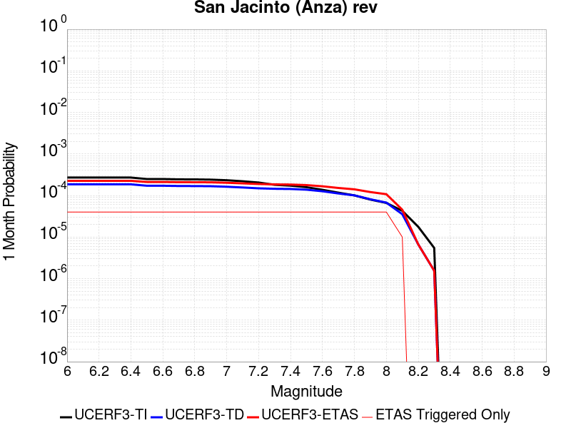 |  |  |

| Magnitude | 1 wk TI Prob | 1 wk TD Prob | 1 wk ETAS Prob | 1 wk ETAS/TD Gain | 1 wk ETAS Triggered Only | 1 mo TI Prob | 1 mo TD Prob | 1 mo ETAS Prob | 1 mo ETAS/TD Gain | 1 mo ETAS Triggered Only | 1 yr TI Prob | 1 yr TD Prob | 1 yr ETAS Prob | 1 yr ETAS/TD Gain | 1 yr ETAS Triggered Only | 10 yr TI Prob | 10 yr TD Prob | 10 yr ETAS Prob | 10 yr ETAS/TD Gain | 10 yr ETAS Triggered Only |
|-----|-----|-----|-----|-----|-----|-----|-----|-----|-----|-----|-----|-----|-----|-----|-----|-----|-----|-----|-----|-----|
| 6.0 | 6.3015636E-5 | 4.3298347E-5 | 4.3298347E-5 | 1.0 | 0.0 | 2.7003905E-4 | 1.8555121E-4 | 1.8555121E-4 | 1.0 | 0.0 | 0.0032827691 | 0.0022567573 | 0.0022567573 | 1.0 | 0.0 | 0.032346968 | 0.02329361 | 0.023351863 | 1.0025008 | 5.9640963E-5 |
| 6.1 | 6.3015636E-5 | 4.3298347E-5 | 4.3298347E-5 | 1.0 | 0.0 | 2.7003905E-4 | 1.8555121E-4 | 1.8555121E-4 | 1.0 | 0.0 | 0.0032827691 | 0.0022567573 | 0.0022567573 | 1.0 | 0.0 | 0.032346968 | 0.02329361 | 0.023351863 | 1.0025008 | 5.9640963E-5 |
| 6.2 | 6.3015636E-5 | 4.3298347E-5 | 4.3298347E-5 | 1.0 | 0.0 | 2.7003905E-4 | 1.8555121E-4 | 1.8555121E-4 | 1.0 | 0.0 | 0.0032827691 | 0.0022567573 | 0.0022567573 | 1.0 | 0.0 | 0.032346968 | 0.02329361 | 0.023351863 | 1.0025008 | 5.9640963E-5 |
| 6.3 | 6.3015636E-5 | 4.3298347E-5 | 4.3298347E-5 | 1.0 | 0.0 | 2.7003905E-4 | 1.8555121E-4 | 1.8555121E-4 | 1.0 | 0.0 | 0.0032827691 | 0.0022567573 | 0.0022567573 | 1.0 | 0.0 | 0.032346968 | 0.02329361 | 0.023351863 | 1.0025008 | 5.9640963E-5 |
| 6.4 | 6.3015636E-5 | 4.3298347E-5 | 4.3298347E-5 | 1.0 | 0.0 | 2.7003905E-4 | 1.8555121E-4 | 1.8555121E-4 | 1.0 | 0.0 | 0.0032827691 | 0.0022567573 | 0.0022567573 | 1.0 | 0.0 | 0.032346968 | 0.02329361 | 0.023351863 | 1.0025008 | 5.9640963E-5 |
| 6.5 | 5.811017E-5 | 4.0080286E-5 | 4.0080286E-5 | 1.0 | 0.0 | 2.4901982E-4 | 1.7176138E-4 | 1.7176138E-4 | 1.0 | 0.0 | 0.0030276014 | 0.0020891947 | 0.0020891947 | 1.0 | 0.0 | 0.02986684 | 0.021590833 | 0.021649187 | 1.0027027 | 5.9640963E-5 |
| 6.6 | 5.811017E-5 | 4.0080286E-5 | 4.0080286E-5 | 1.0 | 0.0 | 2.4901982E-4 | 1.7176138E-4 | 1.7176138E-4 | 1.0 | 0.0 | 0.0030276014 | 0.0020891947 | 0.0020891947 | 1.0 | 0.0 | 0.02986684 | 0.021590833 | 0.021649187 | 1.0027027 | 5.9640963E-5 |
| 6.7 | 5.712442E-5 | 3.950301E-5 | 3.950301E-5 | 1.0 | 0.0 | 2.4479596E-4 | 1.6928767E-4 | 1.6928767E-4 | 1.0 | 0.0 | 0.0029763177 | 0.0020591344 | 0.0020591344 | 1.0 | 0.0 | 0.029367693 | 0.021282919 | 0.02134129 | 1.0027426 | 5.9640963E-5 |
| 6.8 | 5.6967532E-5 | 3.93593E-5 | 3.93593E-5 | 1.0 | 0.0 | 2.4412372E-4 | 1.6867183E-4 | 1.6867183E-4 | 1.0 | 0.0 | 0.0029681553 | 0.0020516508 | 0.0020516508 | 1.0 | 0.0 | 0.029288229 | 0.02120852 | 0.021266894 | 1.0027524 | 5.9640963E-5 |
| 6.9 | 5.6211324E-5 | 3.9064216E-5 | 3.9064216E-5 | 1.0 | 0.0 | 2.4088343E-4 | 1.6740736E-4 | 1.6740736E-4 | 1.0 | 0.0 | 0.0029288116 | 0.0020362847 | 0.0020362847 | 1.0 | 0.0 | 0.028905109 | 0.021047527 | 0.021105913 | 1.002774 | 5.9640963E-5 |
| 7.0 | 5.4383527E-5 | 3.7925012E-5 | 3.7925012E-5 | 1.0 | 0.0 | 2.3305144E-4 | 1.6252567E-4 | 1.6252567E-4 | 1.0 | 0.0 | 0.0028337094 | 0.001976959 | 0.001976959 | 1.0 | 0.0 | 0.027978465 | 0.02044095 | 0.020499371 | 1.002858 | 5.9640963E-5 |
| 7.1 | 5.1393665E-5 | 3.638787E-5 | 3.638787E-5 | 1.0 | 0.0 | 2.2023996E-4 | 1.5593872E-4 | 1.5593872E-4 | 1.0 | 0.0 | 0.0026781242 | 0.0018969048 | 0.0018969048 | 1.0 | 0.0 | 0.026460782 | 0.019616077 | 0.019674547 | 1.0029808 | 5.9640963E-5 |
| 7.2 | 4.785222E-5 | 3.4738845E-5 | 3.4738845E-5 | 1.0 | 0.0 | 2.0506482E-4 | 1.4887229E-4 | 1.4887229E-4 | 1.0 | 0.0 | 0.0024938055 | 0.0018110167 | 0.0018110167 | 1.0 | 0.0 | 0.024660049 | 0.018728783 | 0.018787308 | 1.0031248 | 5.9640963E-5 |
| 7.3 | 4.2143256E-5 | 3.3834414E-5 | 3.3834414E-5 | 1.0 | 0.0 | 1.8060145E-4 | 1.449966E-4 | 1.449966E-4 | 1.0 | 0.0 | 0.002196605 | 0.0017639075 | 0.0017639075 | 1.0 | 0.0 | 0.02175019 | 0.018236695 | 0.018295249 | 1.0032108 | 5.9640963E-5 |
| 7.4 | 4.0264713E-5 | 3.3472694E-5 | 3.3472694E-5 | 1.0 | 0.0 | 1.7255165E-4 | 1.4344654E-4 | 1.4344654E-4 | 1.0 | 0.0 | 0.002098792 | 0.0017450659 | 0.0017450659 | 1.0 | 0.0 | 0.020790804 | 0.018041389 | 0.018099954 | 1.0032462 | 5.9640963E-5 |
| 7.5 | 3.694492E-5 | 3.2186905E-5 | 3.2186905E-5 | 1.0 | 0.0 | 1.5832575E-4 | 1.379366E-4 | 1.379366E-4 | 1.0 | 0.0 | 0.0019259118 | 0.0016780876 | 0.0016780876 | 1.0 | 0.0 | 0.01909306 | 0.017357888 | 0.017416494 | 1.0033764 | 5.9640963E-5 |
| 7.6 | 3.200565E-5 | 2.9502702E-5 | 2.9502702E-5 | 1.0 | 0.0 | 1.3715986E-4 | 1.2643404E-4 | 1.2643404E-4 | 1.0 | 0.0 | 0.001668642 | 0.0015382497 | 0.0015382497 | 1.0 | 0.0 | 0.01656168 | 0.015946016 | 0.016004706 | 1.0036806 | 5.9640963E-5 |
| 7.7 | 2.731642E-5 | 2.6091477E-5 | 2.6091477E-5 | 1.0 | 0.0 | 1.1706512E-4 | 1.11815825E-4 | 1.11815825E-4 | 1.0 | 0.0 | 0.001424336 | 0.0013605085 | 0.0013605085 | 1.0 | 0.0 | 0.014152412 | 0.0141668 | 0.014225596 | 1.0041503 | 5.9640963E-5 |
| 7.8 | 2.3466424E-5 | 2.3503619E-5 | 2.3503619E-5 | 1.0 | 0.0 | 1.0056651E-4 | 1.0072591E-4 | 1.0072591E-4 | 1.0 | 0.0 | 0.0012237094 | 0.0012256489 | 0.0012256489 | 1.0 | 0.0 | 0.012169928 | 0.012808796 | 0.012867673 | 1.0045966 | 5.9640963E-5 |
| 7.9 | 1.8611925E-5 | 1.890698E-5 | 1.890698E-5 | 1.0 | 0.0 | 7.9762955E-5 | 8.10274E-5 | 8.10274E-5 | 1.0 | 0.0 | 9.7068126E-4 | 9.860628E-4 | 9.860628E-4 | 1.0 | 0.0 | 0.0096645225 | 0.010393705 | 0.010452727 | 1.0056785 | 5.9640963E-5 |
| 8.0 | 1.5460775E-5 | 1.5739915E-5 | 1.5739915E-5 | 1.0 | 0.0 | 6.6258784E-5 | 6.745504E-5 | 6.745504E-5 | 1.0 | 0.0 | 8.0640207E-4 | 8.2095637E-4 | 8.2095637E-4 | 1.0 | 0.0 | 0.008034821 | 0.008702706 | 0.008761828 | 1.0067935 | 5.9640963E-5 |
| 8.1 | 9.983884E-6 | 8.268954E-6 | 8.268954E-6 | 1.0 | 0.0 | 4.2787375E-5 | 3.5437897E-5 | 3.5437897E-5 | 1.0 | 0.0 | 5.2081177E-4 | 4.313715E-4 | 4.313715E-4 | 1.0 | 0.0 | 0.0051959283 | 0.00463968 | 0.0046990444 | 1.0127949 | 5.9640963E-5 |
| 8.2 | 4.1226E-6 | 1.5522551E-6 | 1.5522551E-6 | 1.0 | 0.0 | 1.7668166E-5 | 6.6525045E-6 | 6.6525045E-6 | 1.0 | 0.0 | 2.1508869E-4 | 8.099126E-5 | 8.099126E-5 | 1.0 | 0.0 | 0.0021488064 | 9.401847E-4 | 9.401847E-4 | 1.0 | 0.0 |
| 8.3 | 1.2750878E-6 | 3.609817E-7 | 3.609817E-7 | 1.0 | 0.0 | 5.4646503E-6 | 1.5470634E-6 | 1.5470634E-6 | 1.0 | 0.0 | 6.653009E-5 | 1.8835339E-5 | 1.8835339E-5 | 1.0 | 0.0 | 6.6510175E-4 | 2.272251E-4 | 2.272251E-4 | 1.0 | 0.0 |

## Kern Canyon (Lake Isabella) 2011
*[(top)](#table-of-contents)*

| 1 Week | 1 Month | 1 Year | 10 Year |
|-----|-----|-----|-----|
|  |  | 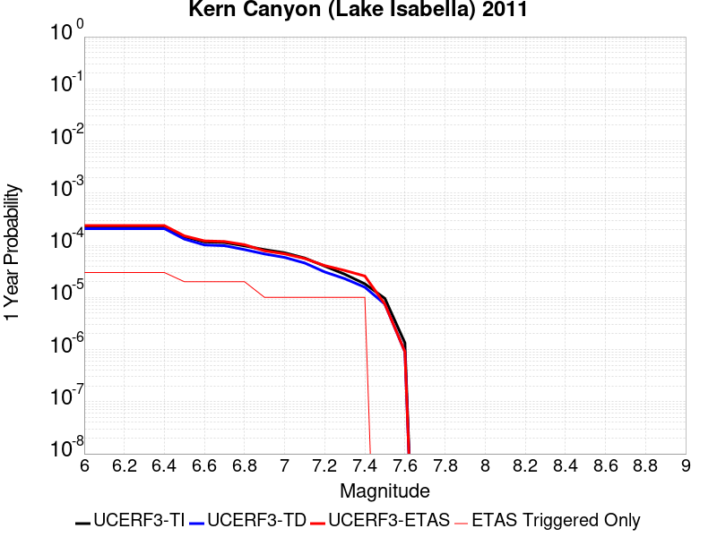 |  |

| Magnitude | 1 wk TI Prob | 1 wk TD Prob | 1 wk ETAS Prob | 1 wk ETAS/TD Gain | 1 wk ETAS Triggered Only | 1 mo TI Prob | 1 mo TD Prob | 1 mo ETAS Prob | 1 mo ETAS/TD Gain | 1 mo ETAS Triggered Only | 1 yr TI Prob | 1 yr TD Prob | 1 yr ETAS Prob | 1 yr ETAS/TD Gain | 1 yr ETAS Triggered Only | 10 yr TI Prob | 10 yr TD Prob | 10 yr ETAS Prob | 10 yr ETAS/TD Gain | 10 yr ETAS Triggered Only |
|-----|-----|-----|-----|-----|-----|-----|-----|-----|-----|-----|-----|-----|-----|-----|-----|-----|-----|-----|-----|-----|
| 6.0 | 4.2387383E-6 | 4.0016344E-6 | 6.364236E-5 | 15.904092 | 5.9640963E-5 | 1.8165894E-5 | 1.7149758E-5 | 7.67897E-5 | 4.4775963 | 5.9640963E-5 | 2.2114732E-4 | 2.0878017E-4 | 2.6840868E-4 | 1.2856042 | 5.9640963E-5 | 0.0022092736 | 0.002086024 | 0.0021455407 | 1.0285311 | 5.9640963E-5 |
| 6.1 | 4.2387383E-6 | 4.0016344E-6 | 6.364236E-5 | 15.904092 | 5.9640963E-5 | 1.8165894E-5 | 1.7149758E-5 | 7.67897E-5 | 4.4775963 | 5.9640963E-5 | 2.2114732E-4 | 2.0878017E-4 | 2.6840868E-4 | 1.2856042 | 5.9640963E-5 | 0.0022092736 | 0.002086024 | 0.0021455407 | 1.0285311 | 5.9640963E-5 |
| 6.2 | 4.2387383E-6 | 4.0016344E-6 | 6.364236E-5 | 15.904092 | 5.9640963E-5 | 1.8165894E-5 | 1.7149758E-5 | 7.67897E-5 | 4.4775963 | 5.9640963E-5 | 2.2114732E-4 | 2.0878017E-4 | 2.6840868E-4 | 1.2856042 | 5.9640963E-5 | 0.0022092736 | 0.002086024 | 0.0021455407 | 1.0285311 | 5.9640963E-5 |
| 6.3 | 4.2387383E-6 | 4.0016344E-6 | 6.364236E-5 | 15.904092 | 5.9640963E-5 | 1.8165894E-5 | 1.7149758E-5 | 7.67897E-5 | 4.4775963 | 5.9640963E-5 | 2.2114732E-4 | 2.0878017E-4 | 2.6840868E-4 | 1.2856042 | 5.9640963E-5 | 0.0022092736 | 0.002086024 | 0.0021455407 | 1.0285311 | 5.9640963E-5 |
| 6.4 | 4.2387383E-6 | 4.0016344E-6 | 6.364236E-5 | 15.904092 | 5.9640963E-5 | 1.8165894E-5 | 1.7149758E-5 | 7.67897E-5 | 4.4775963 | 5.9640963E-5 | 2.2114732E-4 | 2.0878017E-4 | 2.6840868E-4 | 1.2856042 | 5.9640963E-5 | 0.0022092736 | 0.002086024 | 0.0021455407 | 1.0285311 | 5.9640963E-5 |
| 6.5 | 2.7857532E-6 | 2.5178624E-6 | 2.5178624E-6 | 1.0 | 0.0 | 1.1938888E-5 | 1.0790796E-5 | 1.0790796E-5 | 1.0 | 0.0 | 1.4534626E-4 | 1.3137035E-4 | 1.3137035E-4 | 1.0 | 0.0 | 0.0014525123 | 0.0013129596 | 0.0013129596 | 1.0 | 0.0 |
| 6.6 | 2.2233348E-6 | 1.944119E-6 | 1.944119E-6 | 1.0 | 0.0 | 9.528543E-6 | 8.331913E-6 | 8.331913E-6 | 1.0 | 0.0 | 1.1600384E-4 | 1.014364E-4 | 1.014364E-4 | 1.0 | 0.0 | 0.001159433 | 0.0010139096 | 0.0010139096 | 1.0 | 0.0 |
| 6.7 | 2.1635126E-6 | 1.8834991E-6 | 1.8834991E-6 | 1.0 | 0.0 | 9.272164E-6 | 8.072114E-6 | 8.072114E-6 | 1.0 | 0.0 | 1.1288274E-4 | 9.827364E-5 | 9.827364E-5 | 1.0 | 0.0 | 0.0011282542 | 9.8231E-4 | 9.8231E-4 | 1.0 | 0.0 |
| 6.8 | 1.8685711E-6 | 1.583138E-6 | 1.583138E-6 | 1.0 | 0.0 | 8.008137E-6 | 6.7848596E-6 | 6.7848596E-6 | 1.0 | 0.0 | 9.74947E-5 | 8.2602586E-5 | 8.2602586E-5 | 1.0 | 0.0 | 9.745194E-4 | 8.2572375E-4 | 8.2572375E-4 | 1.0 | 0.0 |
| 6.9 | 1.5815071E-6 | 1.3064887E-6 | 1.3064887E-6 | 1.0 | 0.0 | 6.77787E-6 | 5.5992255E-6 | 5.5992255E-6 | 1.0 | 0.0 | 8.251744E-5 | 6.816846E-5 | 6.816846E-5 | 1.0 | 0.0 | 8.248681E-4 | 6.8147824E-4 | 6.8147824E-4 | 1.0 | 0.0 |
| 7.0 | 1.3772564E-6 | 1.1210681E-6 | 1.1210681E-6 | 1.0 | 0.0 | 5.9025137E-6 | 4.8045686E-6 | 4.8045686E-6 | 1.0 | 0.0 | 7.186073E-5 | 5.8494075E-5 | 5.8494075E-5 | 1.0 | 0.0 | 7.18375E-4 | 5.8478885E-4 | 5.8478885E-4 | 1.0 | 0.0 |
| 7.1 | 1.0916998E-6 | 8.7637505E-7 | 8.7637505E-7 | 1.0 | 0.0 | 4.678705E-6 | 3.7558877E-6 | 3.7558877E-6 | 1.0 | 0.0 | 5.6961744E-5 | 4.5726985E-5 | 4.5726985E-5 | 1.0 | 0.0 | 5.6947145E-4 | 4.571771E-4 | 4.571771E-4 | 1.0 | 0.0 |
| 7.2 | 7.6277024E-7 | 5.901439E-7 | 5.901439E-7 | 1.0 | 0.0 | 3.2690114E-6 | 2.5291856E-6 | 2.5291856E-6 | 1.0 | 0.0 | 3.9799485E-5 | 3.0792406E-5 | 3.0792406E-5 | 1.0 | 0.0 | 3.9792358E-4 | 3.07882E-4 | 3.07882E-4 | 1.0 | 0.0 |
| 7.3 | 5.3265916E-7 | 4.3824264E-7 | 4.3824264E-7 | 1.0 | 0.0 | 2.282823E-6 | 1.8781814E-6 | 1.8781814E-6 | 1.0 | 0.0 | 2.7793016E-5 | 2.2866623E-5 | 2.2866623E-5 | 1.0 | 0.0 | 2.778954E-4 | 2.2864307E-4 | 2.2864307E-4 | 1.0 | 0.0 |
| 7.4 | 3.4946007E-7 | 3.0065647E-7 | 3.0065647E-7 | 1.0 | 0.0 | 1.497685E-6 | 1.2885271E-6 | 1.2885271E-6 | 1.0 | 0.0 | 1.8234163E-5 | 1.5687707E-5 | 1.5687707E-5 | 1.0 | 0.0 | 1.8232666E-4 | 1.5686621E-4 | 1.5686621E-4 | 1.0 | 0.0 |
| 7.5 | 1.8317026E-7 | 1.4244755E-7 | 1.4244755E-7 | 1.0 | 0.0 | 7.850152E-7 | 6.1048934E-7 | 6.1048934E-7 | 1.0 | 0.0 | 9.557518E-6 | 7.432683E-6 | 7.432683E-6 | 1.0 | 0.0 | 9.5571064E-5 | 7.432442E-5 | 7.432442E-5 | 1.0 | 0.0 |
| 7.6 | 2.572245E-8 | 1.735264E-8 | 1.735264E-8 | 1.0 | 0.0 | 1.10239064E-7 | 7.436845E-8 | 7.436845E-8 | 1.0 | 0.0 | 1.3421597E-6 | 9.0543557E-7 | 9.0543557E-7 | 1.0 | 0.0 | 1.3421517E-5 | 9.054324E-6 | 9.054324E-6 | 1.0 | 0.0 |

## Mono Lake 2011 CFM
*[(top)](#table-of-contents)*

| 1 Week | 1 Month | 1 Year | 10 Year |
|-----|-----|-----|-----|
|  |  |  |  |

| Magnitude | 1 wk TI Prob | 1 wk TD Prob | 1 wk ETAS Prob | 1 wk ETAS/TD Gain | 1 wk ETAS Triggered Only | 1 mo TI Prob | 1 mo TD Prob | 1 mo ETAS Prob | 1 mo ETAS/TD Gain | 1 mo ETAS Triggered Only | 1 yr TI Prob | 1 yr TD Prob | 1 yr ETAS Prob | 1 yr ETAS/TD Gain | 1 yr ETAS Triggered Only | 10 yr TI Prob | 10 yr TD Prob | 10 yr ETAS Prob | 10 yr ETAS/TD Gain | 10 yr ETAS Triggered Only |
|-----|-----|-----|-----|-----|-----|-----|-----|-----|-----|-----|-----|-----|-----|-----|-----|-----|-----|-----|-----|-----|
| 6.0 | 2.0341662E-5 | 2.3828192E-5 | 8.3467734E-5 | 3.5028985 | 5.9640963E-5 | 8.717564E-5 | 1.0211982E-4 | 1.6175468E-4 | 1.5839696 | 5.9640963E-5 | 0.0010608466 | 0.0012431308 | 0.0013026976 | 1.0479168 | 5.9640963E-5 | 0.010557966 | 0.012413842 | 0.012472742 | 1.0047448 | 5.9640963E-5 |
| 6.1 | 2.0341662E-5 | 2.3828192E-5 | 8.3467734E-5 | 3.5028985 | 5.9640963E-5 | 8.717564E-5 | 1.0211982E-4 | 1.6175468E-4 | 1.5839696 | 5.9640963E-5 | 0.0010608466 | 0.0012431308 | 0.0013026976 | 1.0479168 | 5.9640963E-5 | 0.010557966 | 0.012413842 | 0.012472742 | 1.0047448 | 5.9640963E-5 |
| 6.2 | 2.0341662E-5 | 2.3828192E-5 | 8.3467734E-5 | 3.5028985 | 5.9640963E-5 | 8.717564E-5 | 1.0211982E-4 | 1.6175468E-4 | 1.5839696 | 5.9640963E-5 | 0.0010608466 | 0.0012431308 | 0.0013026976 | 1.0479168 | 5.9640963E-5 | 0.010557966 | 0.012413842 | 0.012472742 | 1.0047448 | 5.9640963E-5 |
| 6.3 | 2.0341662E-5 | 2.3828192E-5 | 8.3467734E-5 | 3.5028985 | 5.9640963E-5 | 8.717564E-5 | 1.0211982E-4 | 1.6175468E-4 | 1.5839696 | 5.9640963E-5 | 0.0010608466 | 0.0012431308 | 0.0013026976 | 1.0479168 | 5.9640963E-5 | 0.010557966 | 0.012413842 | 0.012472742 | 1.0047448 | 5.9640963E-5 |
| 6.4 | 1.749821E-5 | 2.049101E-5 | 8.013075E-5 | 3.910532 | 5.9640963E-5 | 7.499018E-5 | 8.781861E-5 | 1.4745434E-4 | 1.6790785 | 5.9640963E-5 | 9.1262296E-4 | 0.0010691914 | 0.0011287685 | 1.0557218 | 5.9640963E-5 | 0.009088841 | 0.01069187 | 0.010750874 | 1.0055186 | 5.9640963E-5 |
| 6.5 | 1.749821E-5 | 2.049101E-5 | 8.013075E-5 | 3.910532 | 5.9640963E-5 | 7.499018E-5 | 8.781861E-5 | 1.4745434E-4 | 1.6790785 | 5.9640963E-5 | 9.1262296E-4 | 0.0010691914 | 0.0011287685 | 1.0557218 | 5.9640963E-5 | 0.009088841 | 0.01069187 | 0.010750874 | 1.0055186 | 5.9640963E-5 |

## Cerro Prieto
*[(top)](#table-of-contents)*

| 1 Week | 1 Month | 1 Year | 10 Year |
|-----|-----|-----|-----|
|  |  |  |  |

| Magnitude | 1 wk TI Prob | 1 wk TD Prob | 1 wk ETAS Prob | 1 wk ETAS/TD Gain | 1 wk ETAS Triggered Only | 1 mo TI Prob | 1 mo TD Prob | 1 mo ETAS Prob | 1 mo ETAS/TD Gain | 1 mo ETAS Triggered Only | 1 yr TI Prob | 1 yr TD Prob | 1 yr ETAS Prob | 1 yr ETAS/TD Gain | 1 yr ETAS Triggered Only | 10 yr TI Prob | 10 yr TD Prob | 10 yr ETAS Prob | 10 yr ETAS/TD Gain | 10 yr ETAS Triggered Only |
|-----|-----|-----|-----|-----|-----|-----|-----|-----|-----|-----|-----|-----|-----|-----|-----|-----|-----|-----|-----|-----|
| 6.0 | 2.9101528E-4 | 5.9654453E-4 | 6.5614993E-4 | 1.0999178 | 5.9640963E-5 | 0.0012466122 | 0.0025543566 | 0.0026138453 | 1.0232891 | 5.9640963E-5 | 0.015072231 | 0.030802928 | 0.030860731 | 1.0018766 | 5.9640963E-5 | 0.14089979 | 0.25386256 | 0.25390708 | 1.0001752 | 5.9640963E-5 |
| 6.1 | 2.9101528E-4 | 5.9654453E-4 | 6.5614993E-4 | 1.0999178 | 5.9640963E-5 | 0.0012466122 | 0.0025543566 | 0.0026138453 | 1.0232891 | 5.9640963E-5 | 0.015072231 | 0.030802928 | 0.030860731 | 1.0018766 | 5.9640963E-5 | 0.14089979 | 0.25386256 | 0.25390708 | 1.0001752 | 5.9640963E-5 |
| 6.2 | 2.9101528E-4 | 5.9654453E-4 | 6.5614993E-4 | 1.0999178 | 5.9640963E-5 | 0.0012466122 | 0.0025543566 | 0.0026138453 | 1.0232891 | 5.9640963E-5 | 0.015072231 | 0.030802928 | 0.030860731 | 1.0018766 | 5.9640963E-5 | 0.14089979 | 0.25386256 | 0.25390708 | 1.0001752 | 5.9640963E-5 |
| 6.3 | 2.9101528E-4 | 5.9654453E-4 | 6.5614993E-4 | 1.0999178 | 5.9640963E-5 | 0.0012466122 | 0.0025543566 | 0.0026138453 | 1.0232891 | 5.9640963E-5 | 0.015072231 | 0.030802928 | 0.030860731 | 1.0018766 | 5.9640963E-5 | 0.14089979 | 0.25386256 | 0.25390708 | 1.0001752 | 5.9640963E-5 |
| 6.4 | 2.508648E-4 | 5.140412E-4 | 5.736515E-4 | 1.115964 | 5.9640963E-5 | 0.0010746918 | 0.0022013725 | 0.0022608822 | 1.027033 | 5.9640963E-5 | 0.013006088 | 0.026629416 | 0.02668747 | 1.00218 | 5.9640963E-5 | 0.12270685 | 0.2242222 | 0.22426847 | 1.0002064 | 5.9640963E-5 |
| 6.5 | 2.508648E-4 | 5.140412E-4 | 5.736515E-4 | 1.115964 | 5.9640963E-5 | 0.0010746918 | 0.0022013725 | 0.0022608822 | 1.027033 | 5.9640963E-5 | 0.013006088 | 0.026629416 | 0.02668747 | 1.00218 | 5.9640963E-5 | 0.12270685 | 0.2242222 | 0.22426847 | 1.0002064 | 5.9640963E-5 |
| 6.6 | 2.294914E-4 | 4.7123645E-4 | 5.308493E-4 | 1.1265031 | 5.9640963E-5 | 9.831638E-4 | 0.0020182093 | 0.00207773 | 1.0294918 | 5.9640963E-5 | 0.011904482 | 0.024394194 | 0.024452379 | 1.0023853 | 5.9640963E-5 | 0.11286586 | 0.20837563 | 0.20842284 | 1.0002266 | 5.9640963E-5 |
| 6.7 | 1.9621674E-4 | 4.0426268E-4 | 4.6387952E-4 | 1.1474706 | 5.9640963E-5 | 8.4065786E-4 | 0.0017315624 | 0.0017911 | 1.0343838 | 5.9640963E-5 | 0.010187071 | 0.020888962 | 0.020947358 | 1.0027955 | 5.9640963E-5 | 0.09732539 | 0.18264732 | 0.18269606 | 1.0002669 | 5.9640963E-5 |
| 6.8 | 1.5476145E-4 | 3.0572579E-4 | 3.0572579E-4 | 1.0 | 0.0 | 6.6309475E-4 | 0.0013096977 | 0.0013096977 | 1.0 | 0.0 | 0.008043335 | 0.015826825 | 0.015826825 | 1.0 | 0.0 | 0.07758363 | 0.14310057 | 0.14310057 | 1.0 | 0.0 |
| 6.9 | 1.20509176E-4 | 2.2588465E-4 | 2.2588465E-4 | 1.0 | 0.0 | 5.1636563E-4 | 9.6778123E-4 | 9.6778123E-4 | 1.0 | 0.0 | 0.006268645 | 0.011734025 | 0.011734025 | 1.0 | 0.0 | 0.060947374 | 0.10917958 | 0.10917958 | 1.0 | 0.0 |
| 7.0 | 9.3269155E-5 | 1.6721459E-4 | 1.6721459E-4 | 1.0 | 0.0 | 3.9966372E-4 | 7.1648025E-4 | 7.1648025E-4 | 1.0 | 0.0 | 0.0048550544 | 0.008695914 | 0.008695914 | 1.0 | 0.0 | 0.04750344 | 0.082943216 | 0.082943216 | 1.0 | 0.0 |
| 7.1 | 5.029709E-5 | 8.174011E-5 | 8.174011E-5 | 1.0 | 0.0 | 2.1554115E-4 | 3.50287E-4 | 3.50287E-4 | 1.0 | 0.0 | 0.0026210553 | 0.004259821 | 0.004259821 | 1.0 | 0.0 | 0.025903556 | 0.04226813 | 0.04226813 | 1.0 | 0.0 |
| 7.2 | 6.5445185E-8 | 6.824737E-8 | 6.824737E-8 | 1.0 | 0.0 | 2.8047933E-7 | 2.9248872E-7 | 2.9248872E-7 | 1.0 | 0.0 | 3.4148304E-6 | 3.56105E-6 | 3.56105E-6 | 1.0 | 0.0 | 3.414778E-5 | 3.56105E-5 | 3.56105E-5 | 1.0 | 0.0 |

## La Panza 2011
*[(top)](#table-of-contents)*

| 1 Week | 1 Month | 1 Year | 10 Year |
|-----|-----|-----|-----|
|  |  |  |  |

| Magnitude | 1 wk TI Prob | 1 wk TD Prob | 1 wk ETAS Prob | 1 wk ETAS/TD Gain | 1 wk ETAS Triggered Only | 1 mo TI Prob | 1 mo TD Prob | 1 mo ETAS Prob | 1 mo ETAS/TD Gain | 1 mo ETAS Triggered Only | 1 yr TI Prob | 1 yr TD Prob | 1 yr ETAS Prob | 1 yr ETAS/TD Gain | 1 yr ETAS Triggered Only | 10 yr TI Prob | 10 yr TD Prob | 10 yr ETAS Prob | 10 yr ETAS/TD Gain | 10 yr ETAS Triggered Only |
|-----|-----|-----|-----|-----|-----|-----|-----|-----|-----|-----|-----|-----|-----|-----|-----|-----|-----|-----|-----|-----|
| 6.0 | 4.6754544E-6 | 4.7175886E-6 | 6.435827E-5 | 13.642196 | 5.9640963E-5 | 2.0037509E-5 | 2.021809E-5 | 7.985785E-5 | 3.9498212 | 5.9640963E-5 | 2.4392935E-4 | 2.4612944E-4 | 3.057557E-4 | 1.2422558 | 5.9640963E-5 | 0.0024366176 | 0.0024587628 | 0.0025182571 | 1.0241969 | 5.9640963E-5 |
| 6.1 | 4.6754544E-6 | 4.7175886E-6 | 6.435827E-5 | 13.642196 | 5.9640963E-5 | 2.0037509E-5 | 2.021809E-5 | 7.985785E-5 | 3.9498212 | 5.9640963E-5 | 2.4392935E-4 | 2.4612944E-4 | 3.057557E-4 | 1.2422558 | 5.9640963E-5 | 0.0024366176 | 0.0024587628 | 0.0025182571 | 1.0241969 | 5.9640963E-5 |
| 6.2 | 4.6754544E-6 | 4.7175886E-6 | 6.435827E-5 | 13.642196 | 5.9640963E-5 | 2.0037509E-5 | 2.021809E-5 | 7.985785E-5 | 3.9498212 | 5.9640963E-5 | 2.4392935E-4 | 2.4612944E-4 | 3.057557E-4 | 1.2422558 | 5.9640963E-5 | 0.0024366176 | 0.0024587628 | 0.0025182571 | 1.0241969 | 5.9640963E-5 |
| 6.3 | 4.6754544E-6 | 4.7175886E-6 | 6.435827E-5 | 13.642196 | 5.9640963E-5 | 2.0037509E-5 | 2.021809E-5 | 7.985785E-5 | 3.9498212 | 5.9640963E-5 | 2.4392935E-4 | 2.4612944E-4 | 3.057557E-4 | 1.2422558 | 5.9640963E-5 | 0.0024366176 | 0.0024587628 | 0.0025182571 | 1.0241969 | 5.9640963E-5 |
| 6.4 | 4.6754544E-6 | 4.7175886E-6 | 6.435827E-5 | 13.642196 | 5.9640963E-5 | 2.0037509E-5 | 2.021809E-5 | 7.985785E-5 | 3.9498212 | 5.9640963E-5 | 2.4392935E-4 | 2.4612944E-4 | 3.057557E-4 | 1.2422558 | 5.9640963E-5 | 0.0024366176 | 0.0024587628 | 0.0025182571 | 1.0241969 | 5.9640963E-5 |
| 6.5 | 2.485343E-6 | 2.5006007E-6 | 2.5006007E-6 | 1.0 | 0.0 | 1.0651426E-5 | 1.0716818E-5 | 1.0716818E-5 | 1.0 | 0.0 | 1.296734E-4 | 1.3046984E-4 | 1.3046984E-4 | 1.0 | 0.0 | 0.0012959775 | 0.0013039707 | 0.0013039707 | 1.0 | 0.0 |
| 6.6 | 2.485343E-6 | 2.5006007E-6 | 2.5006007E-6 | 1.0 | 0.0 | 1.0651426E-5 | 1.0716818E-5 | 1.0716818E-5 | 1.0 | 0.0 | 1.296734E-4 | 1.3046984E-4 | 1.3046984E-4 | 1.0 | 0.0 | 0.0012959775 | 0.0013039707 | 0.0013039707 | 1.0 | 0.0 |
| 6.7 | 1.5108508E-6 | 1.514639E-6 | 1.514639E-6 | 1.0 | 0.0 | 6.4750584E-6 | 6.4912947E-6 | 6.4912947E-6 | 1.0 | 0.0 | 7.8830984E-5 | 7.902876E-5 | 7.902876E-5 | 1.0 | 0.0 | 7.880303E-4 | 7.9001737E-4 | 7.9001737E-4 | 1.0 | 0.0 |
| 6.8 | 1.3865837E-6 | 1.3885118E-6 | 1.3885118E-6 | 1.0 | 0.0 | 5.942488E-6 | 5.950752E-6 | 5.950752E-6 | 1.0 | 0.0 | 7.234739E-5 | 7.244809E-5 | 7.244809E-5 | 1.0 | 0.0 | 7.232384E-4 | 7.242546E-4 | 7.242546E-4 | 1.0 | 0.0 |
| 6.9 | 9.826583E-7 | 9.796303E-7 | 9.796303E-7 | 1.0 | 0.0 | 4.2113857E-6 | 4.198409E-6 | 4.198409E-6 | 1.0 | 0.0 | 5.1272415E-5 | 5.1114486E-5 | 5.1114486E-5 | 1.0 | 0.0 | 5.126059E-4 | 5.1103265E-4 | 5.1103265E-4 | 1.0 | 0.0 |
| 7.0 | 6.7797646E-7 | 6.710231E-7 | 6.710231E-7 | 1.0 | 0.0 | 2.9056102E-6 | 2.8758104E-6 | 2.8758104E-6 | 1.0 | 0.0 | 3.537523E-5 | 3.501246E-5 | 3.501246E-5 | 1.0 | 0.0 | 3.5369597E-4 | 3.5007254E-4 | 3.5007254E-4 | 1.0 | 0.0 |
| 7.1 | 3.4979826E-7 | 3.3874045E-7 | 3.3874045E-7 | 1.0 | 0.0 | 1.4991346E-6 | 1.4517441E-6 | 1.4517441E-6 | 1.0 | 0.0 | 1.825181E-5 | 1.7674853E-5 | 1.7674853E-5 | 1.0 | 0.0 | 1.825031E-4 | 1.7673563E-4 | 1.7673563E-4 | 1.0 | 0.0 |
| 7.2 | 2.5088332E-7 | 2.3832064E-7 | 2.3832064E-7 | 1.0 | 0.0 | 1.0752137E-6 | 1.0213738E-6 | 1.0213738E-6 | 1.0 | 0.0 | 1.3090649E-5 | 1.2435164E-5 | 1.2435164E-5 | 1.0 | 0.0 | 1.3089878E-4 | 1.2434553E-4 | 1.2434553E-4 | 1.0 | 0.0 |
| 7.3 | 1.0159086E-7 | 8.644785E-8 | 8.644785E-8 | 1.0 | 0.0 | 4.3538932E-7 | 3.704907E-7 | 3.704907E-7 | 1.0 | 0.0 | 5.300852E-6 | 4.510716E-6 | 4.510716E-6 | 1.0 | 0.0 | 5.3007258E-5 | 4.510628E-5 | 4.510628E-5 | 1.0 | 0.0 |
| 7.4 | 3.5006252E-8 | 1.9403883E-8 | 1.9403883E-8 | 1.0 | 0.0 | 1.5002678E-7 | 8.315949E-8 | 8.315949E-8 | 1.0 | 0.0 | 1.8265745E-6 | 1.0124663E-6 | 1.0124663E-6 | 1.0 | 0.0 | 1.8265595E-5 | 1.012462E-5 | 1.012462E-5 | 1.0 | 0.0 |
| 7.5 | 2.592274E-8 | 1.0238468E-8 | 1.0238468E-8 | 1.0 | 0.0 | 1.1109746E-7 | 4.3879147E-8 | 4.3879147E-8 | 1.0 | 0.0 | 1.3526106E-6 | 5.342285E-7 | 5.342285E-7 | 1.0 | 0.0 | 1.3526024E-5 | 5.342273E-6 | 5.342273E-6 | 1.0 | 0.0 |
| 7.6 | 1.9016717E-8 | 5.2442264E-9 | 5.2442264E-9 | 1.0 | 0.0 | 8.150022E-8 | 2.2475257E-8 | 2.2475257E-8 | 1.0 | 0.0 | 9.922647E-7 | 2.736362E-7 | 2.736362E-7 | 1.0 | 0.0 | 9.922603E-6 | 2.736359E-6 | 2.736359E-6 | 1.0 | 0.0 |
| 7.7 | 1.17738495E-8 | 1.2393437E-9 | 1.2393437E-9 | 1.0 | 0.0 | 5.0459356E-8 | 5.3114735E-9 | 5.3114735E-9 | 1.0 | 0.0 | 6.1434247E-7 | 6.466719E-8 | 6.466719E-8 | 1.0 | 0.0 | 6.143408E-6 | 6.466717E-7 | 6.466717E-7 | 1.0 | 0.0 |
| 7.8 | 5.489079E-9 | 2.009185E-10 | 2.009185E-10 | 1.0 | 0.0 | 2.3524624E-8 | 8.61079E-10 | 8.61079E-10 | 1.0 | 0.0 | 2.8641225E-7 | 1.0483639E-8 | 1.0483639E-8 | 1.0 | 0.0 | 2.8641189E-6 | 1.0483638E-7 | 1.0483638E-7 | 1.0 | 0.0 |
| 7.9 | 2.5081048E-9 | 6.675449E-11 | 6.675449E-11 | 1.0 | 0.0 | 1.0749021E-8 | 2.8609015E-10 | 2.8609015E-10 | 1.0 | 0.0 | 1.3086932E-7 | 3.483148E-9 | 3.483148E-9 | 1.0 | 0.0 | 1.3086925E-6 | 3.483148E-8 | 3.483148E-8 | 1.0 | 0.0 |

## Great Valley 04a Trout Creek
*[(top)](#table-of-contents)*

| 1 Week | 1 Month | 1 Year | 10 Year |
|-----|-----|-----|-----|
| 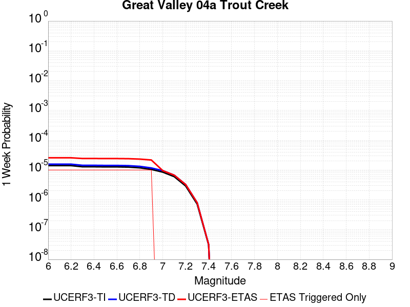 |  |  |  |

| Magnitude | 1 wk TI Prob | 1 wk TD Prob | 1 wk ETAS Prob | 1 wk ETAS/TD Gain | 1 wk ETAS Triggered Only | 1 mo TI Prob | 1 mo TD Prob | 1 mo ETAS Prob | 1 mo ETAS/TD Gain | 1 mo ETAS Triggered Only | 1 yr TI Prob | 1 yr TD Prob | 1 yr ETAS Prob | 1 yr ETAS/TD Gain | 1 yr ETAS Triggered Only | 10 yr TI Prob | 10 yr TD Prob | 10 yr ETAS Prob | 10 yr ETAS/TD Gain | 10 yr ETAS Triggered Only |
|-----|-----|-----|-----|-----|-----|-----|-----|-----|-----|-----|-----|-----|-----|-----|-----|-----|-----|-----|-----|-----|
| 6.0 | 1.4088538E-5 | 1.5719554E-5 | 7.5359574E-5 | 4.7940025 | 5.9640963E-5 | 6.037805E-5 | 6.7367844E-5 | 1.270048E-4 | 1.8852434 | 5.9640963E-5 | 7.3485484E-4 | 8.199074E-4 | 8.794994E-4 | 1.0726814 | 5.9640963E-5 | 0.007324295 | 0.008170108 | 0.008229261 | 1.0072403 | 5.9640963E-5 |
| 6.1 | 1.4088538E-5 | 1.5719554E-5 | 7.5359574E-5 | 4.7940025 | 5.9640963E-5 | 6.037805E-5 | 6.7367844E-5 | 1.270048E-4 | 1.8852434 | 5.9640963E-5 | 7.3485484E-4 | 8.199074E-4 | 8.794994E-4 | 1.0726814 | 5.9640963E-5 | 0.007324295 | 0.008170108 | 0.008229261 | 1.0072403 | 5.9640963E-5 |
| 6.2 | 1.4088538E-5 | 1.5719554E-5 | 7.5359574E-5 | 4.7940025 | 5.9640963E-5 | 6.037805E-5 | 6.7367844E-5 | 1.270048E-4 | 1.8852434 | 5.9640963E-5 | 7.3485484E-4 | 8.199074E-4 | 8.794994E-4 | 1.0726814 | 5.9640963E-5 | 0.007324295 | 0.008170108 | 0.008229261 | 1.0072403 | 5.9640963E-5 |
| 6.3 | 1.2882862E-5 | 1.4378603E-5 | 7.401871E-5 | 5.147837 | 5.9640963E-5 | 5.5211098E-5 | 6.1621184E-5 | 1.2125847E-4 | 1.9678049 | 5.9640963E-5 | 6.7198783E-4 | 7.4999005E-4 | 8.095863E-4 | 1.0794626 | 5.9640963E-5 | 0.0066995937 | 0.0074756527 | 0.007534848 | 1.0079184 | 5.9640963E-5 |
| 6.4 | 1.2882862E-5 | 1.4378603E-5 | 7.401871E-5 | 5.147837 | 5.9640963E-5 | 5.5211098E-5 | 6.1621184E-5 | 1.2125847E-4 | 1.9678049 | 5.9640963E-5 | 6.7198783E-4 | 7.4999005E-4 | 8.095863E-4 | 1.0794626 | 5.9640963E-5 | 0.0066995937 | 0.0074756527 | 0.007534848 | 1.0079184 | 5.9640963E-5 |
| 6.5 | 1.2762329E-5 | 1.424516E-5 | 7.388527E-5 | 5.186693 | 5.9640963E-5 | 5.469455E-5 | 6.1049315E-5 | 1.2068664E-4 | 1.9768713 | 5.9640963E-5 | 6.657027E-4 | 7.430323E-4 | 8.026289E-4 | 1.0802073 | 5.9640963E-5 | 0.00663712 | 0.0074065393 | 0.0074657383 | 1.0079929 | 5.9640963E-5 |
| 6.6 | 1.2762329E-5 | 1.424516E-5 | 7.388527E-5 | 5.186693 | 5.9640963E-5 | 5.469455E-5 | 6.1049315E-5 | 1.2068664E-4 | 1.9768713 | 5.9640963E-5 | 6.657027E-4 | 7.430323E-4 | 8.026289E-4 | 1.0802073 | 5.9640963E-5 | 0.00663712 | 0.0074065393 | 0.0074657383 | 1.0079929 | 5.9640963E-5 |
| 6.7 | 1.2557959E-5 | 1.4019395E-5 | 7.365952E-5 | 5.2541156 | 5.9640963E-5 | 5.3818712E-5 | 6.0081795E-5 | 1.19719174E-4 | 1.9926031 | 5.9640963E-5 | 6.5504585E-4 | 7.312607E-4 | 7.9085806E-4 | 1.0814995 | 5.9640963E-5 | 0.006531183 | 0.007289598 | 0.0073488047 | 1.008122 | 5.9640963E-5 |
| 6.8 | 1.1871544E-5 | 1.3258823E-5 | 7.289899E-5 | 5.49815 | 5.9640963E-5 | 5.0877054E-5 | 5.6822348E-5 | 1.16459916E-4 | 2.0495443 | 5.9640963E-5 | 6.1925204E-4 | 6.916025E-4 | 7.512022E-4 | 1.0861763 | 5.9640963E-5 | 0.0061752927 | 0.0068955184 | 0.006954748 | 1.0085896 | 5.9640963E-5 |
| 6.9 | 1.0500373E-5 | 1.1731261E-5 | 7.137152E-5 | 6.0838747 | 5.9640963E-5 | 4.5000823E-5 | 5.0275914E-5 | 1.09913875E-4 | 2.1862135 | 5.9640963E-5 | 5.4774724E-4 | 6.119459E-4 | 6.715504E-4 | 1.0974015 | 5.9640963E-5 | 0.005463991 | 0.0061034737 | 0.006162751 | 1.009712 | 5.9640963E-5 |
| 7.0 | 8.524332E-6 | 9.5334835E-6 | 9.5334835E-6 | 1.0 | 0.0 | 3.653234E-5 | 4.0857187E-5 | 4.0857187E-5 | 1.0 | 0.0 | 4.4469046E-4 | 4.9733004E-4 | 4.9733004E-4 | 1.0 | 0.0 | 0.0044380166 | 0.004962902 | 0.004962902 | 1.0 | 0.0 |
| 7.1 | 6.006849E-6 | 6.711559E-6 | 6.711559E-6 | 1.0 | 0.0 | 2.5743384E-5 | 2.876354E-5 | 2.876354E-5 | 1.0 | 0.0 | 3.1338062E-4 | 3.501454E-4 | 3.501454E-4 | 1.0 | 0.0 | 0.0031293905 | 0.0034964874 | 0.0034964874 | 1.0 | 0.0 |
| 7.2 | 2.9122193E-6 | 3.2465305E-6 | 3.2465305E-6 | 1.0 | 0.0 | 1.248088E-5 | 1.3913637E-5 | 1.3913637E-5 | 1.0 | 0.0 | 1.5194413E-4 | 1.6938712E-4 | 1.6938712E-4 | 1.0 | 0.0 | 0.0015184027 | 0.0016927521 | 0.0016927521 | 1.0 | 0.0 |
| 7.3 | 7.2194007E-7 | 7.988761E-7 | 7.988761E-7 | 1.0 | 0.0 | 3.0940253E-6 | 3.4237528E-6 | 3.4237528E-6 | 1.0 | 0.0 | 3.7669106E-5 | 4.1683852E-5 | 4.1683852E-5 | 1.0 | 0.0 | 3.766272E-4 | 4.168053E-4 | 4.168053E-4 | 1.0 | 0.0 |
| 7.4 | 3.112171E-8 | 3.2068368E-8 | 3.2068368E-8 | 1.0 | 0.0 | 1.3337875E-7 | 1.3743585E-7 | 1.3743585E-7 | 1.0 | 0.0 | 1.6238852E-6 | 1.6732803E-6 | 1.6732803E-6 | 1.0 | 0.0 | 1.6238733E-5 | 1.6732685E-5 | 1.6732685E-5 | 1.0 | 0.0 |

## San Andreas (Offshore) 2011 CFM
*[(top)](#table-of-contents)*

| 1 Week | 1 Month | 1 Year | 10 Year |
|-----|-----|-----|-----|
|  |  |  |  |

| Magnitude | 1 wk TI Prob | 1 wk TD Prob | 1 wk ETAS Prob | 1 wk ETAS/TD Gain | 1 wk ETAS Triggered Only | 1 mo TI Prob | 1 mo TD Prob | 1 mo ETAS Prob | 1 mo ETAS/TD Gain | 1 mo ETAS Triggered Only | 1 yr TI Prob | 1 yr TD Prob | 1 yr ETAS Prob | 1 yr ETAS/TD Gain | 1 yr ETAS Triggered Only | 10 yr TI Prob | 10 yr TD Prob | 10 yr ETAS Prob | 10 yr ETAS/TD Gain | 10 yr ETAS Triggered Only |
|-----|-----|-----|-----|-----|-----|-----|-----|-----|-----|-----|-----|-----|-----|-----|-----|-----|-----|-----|-----|-----|
| 6.0 | 1.7072787E-4 | 1.9226626E-4 | 2.5189578E-4 | 1.3101401 | 5.9640963E-5 | 7.3148566E-4 | 8.237405E-4 | 8.8333234E-4 | 1.072343 | 5.9640963E-5 | 0.008869528 | 0.009983436 | 0.010042482 | 1.0059143 | 5.9640963E-5 | 0.085237645 | 0.09681613 | 0.09687 | 1.0005563 | 5.9640963E-5 |
| 6.1 | 1.7072787E-4 | 1.9226626E-4 | 2.5189578E-4 | 1.3101401 | 5.9640963E-5 | 7.3148566E-4 | 8.237405E-4 | 8.8333234E-4 | 1.072343 | 5.9640963E-5 | 0.008869528 | 0.009983436 | 0.010042482 | 1.0059143 | 5.9640963E-5 | 0.085237645 | 0.09681613 | 0.09687 | 1.0005563 | 5.9640963E-5 |
| 6.2 | 1.6312556E-4 | 1.8408237E-4 | 2.4371235E-4 | 1.323931 | 5.9640963E-5 | 6.989222E-4 | 7.8868825E-4 | 8.482822E-4 | 1.0755608 | 5.9640963E-5 | 0.008476226 | 0.0095605 | 0.009619571 | 1.0061786 | 5.9640963E-5 | 0.08160117 | 0.092837214 | 0.09289132 | 1.0005828 | 5.9640963E-5 |
| 6.3 | 1.5103363E-4 | 1.6881147E-4 | 1.6881147E-4 | 1.0 | 0.0 | 6.471264E-4 | 7.232793E-4 | 7.232793E-4 | 1.0 | 0.0 | 0.007850339 | 0.008770814 | 0.008770814 | 1.0 | 0.0 | 0.075787395 | 0.08546859 | 0.08546859 | 1.0 | 0.0 |
| 6.4 | 1.5047993E-4 | 1.6767075E-4 | 1.6767075E-4 | 1.0 | 0.0 | 6.4475456E-4 | 7.183932E-4 | 7.183932E-4 | 1.0 | 0.0 | 0.007821669 | 0.008711802 | 0.008711802 | 1.0 | 0.0 | 0.0755203 | 0.08494888 | 0.08494888 | 1.0 | 0.0 |
| 6.5 | 1.2760791E-4 | 1.3734949E-4 | 1.3734949E-4 | 1.0 | 0.0 | 5.467764E-4 | 5.8850925E-4 | 5.8850925E-4 | 1.0 | 0.0 | 0.0066367025 | 0.007141834 | 0.007141834 | 1.0 | 0.0 | 0.064419635 | 0.07024954 | 0.07024954 | 1.0 | 0.0 |
| 6.6 | 1.1063525E-4 | 1.15565475E-4 | 1.15565475E-4 | 1.0 | 0.0 | 4.740649E-4 | 4.9518765E-4 | 4.9518765E-4 | 1.0 | 0.0 | 0.0057564764 | 0.006012446 | 0.006012446 | 1.0 | 0.0 | 0.05609626 | 0.059496127 | 0.059496127 | 1.0 | 0.0 |
| 6.7 | 1.0391049E-4 | 1.0645875E-4 | 1.0645875E-4 | 1.0 | 0.0 | 4.4525467E-4 | 4.56173E-4 | 4.56173E-4 | 1.0 | 0.0 | 0.0054075094 | 0.0055399504 | 0.0055399504 | 1.0 | 0.0 | 0.052778035 | 0.05498844 | 0.05498844 | 1.0 | 0.0 |
| 6.8 | 1.0096706E-4 | 1.01582154E-4 | 1.01582154E-4 | 1.0 | 0.0 | 4.3264418E-4 | 4.3528038E-4 | 4.3528038E-4 | 1.0 | 0.0 | 0.0052547283 | 0.0052868384 | 0.0052868384 | 1.0 | 0.0 | 0.051321987 | 0.052686825 | 0.052686825 | 1.0 | 0.0 |
| 6.9 | 9.800265E-5 | 9.588697E-5 | 9.588697E-5 | 1.0 | 0.0 | 4.1994374E-4 | 4.1088034E-4 | 4.1088034E-4 | 1.0 | 0.0 | 0.0051008356 | 0.004991162 | 0.004991162 | 1.0 | 0.0 | 0.049853306 | 0.05001508 | 0.05001508 | 1.0 | 0.0 |
| 7.0 | 9.4642375E-5 | 9.002096E-5 | 9.002096E-5 | 1.0 | 0.0 | 4.0554712E-4 | 3.8574796E-4 | 3.8574796E-4 | 1.0 | 0.0 | 0.004926363 | 0.00468653 | 0.00468653 | 1.0 | 0.0 | 0.048185747 | 0.047194667 | 0.047194667 | 1.0 | 0.0 |
| 7.1 | 9.0996844E-5 | 8.354119E-5 | 8.354119E-5 | 1.0 | 0.0 | 3.8992817E-4 | 3.579854E-4 | 3.579854E-4 | 1.0 | 0.0 | 0.004737046 | 0.0043499186 | 0.0043499186 | 1.0 | 0.0 | 0.04637333 | 0.04404688 | 0.04404688 | 1.0 | 0.0 |
| 7.2 | 8.848287E-5 | 7.981761E-5 | 7.981761E-5 | 1.0 | 0.0 | 3.791572E-4 | 3.420315E-4 | 3.420315E-4 | 1.0 | 0.0 | 0.004606472 | 0.0041564363 | 0.0041564363 | 1.0 | 0.0 | 0.045121472 | 0.042189904 | 0.042189904 | 1.0 | 0.0 |
| 7.3 | 7.9280784E-5 | 6.1274885E-5 | 6.1274885E-5 | 1.0 | 0.0 | 3.3973053E-4 | 2.6258078E-4 | 2.6258078E-4 | 1.0 | 0.0 | 0.004128377 | 0.003192337 | 0.003192337 | 1.0 | 0.0 | 0.040525194 | 0.03290183 | 0.03290183 | 1.0 | 0.0 |
| 7.4 | 6.468038E-5 | 3.7930724E-5 | 3.7930724E-5 | 1.0 | 0.0 | 2.771722E-4 | 1.6255044E-4 | 1.6255044E-4 | 1.0 | 0.0 | 0.0033693502 | 0.0019773128 | 0.0019773128 | 1.0 | 0.0 | 0.0331872 | 0.02081734 | 0.02081734 | 1.0 | 0.0 |
| 7.5 | 4.930574E-5 | 1.2699263E-5 | 1.2699263E-5 | 1.0 | 0.0 | 2.1129321E-4 | 5.4424287E-5 | 5.4424287E-5 | 1.0 | 0.0 | 0.0025694598 | 6.6241587E-4 | 6.6241587E-4 | 1.0 | 0.0 | 0.02539953 | 0.0074798525 | 0.0074798525 | 1.0 | 0.0 |
| 7.6 | 4.612566E-5 | 1.0332297E-5 | 1.0332297E-5 | 1.0 | 0.0 | 1.9766642E-4 | 4.428053E-5 | 4.428053E-5 | 1.0 | 0.0 | 0.0024039324 | 5.3898344E-4 | 5.3898344E-4 | 1.0 | 0.0 | 0.023780935 | 0.006170428 | 0.006170428 | 1.0 | 0.0 |
| 7.7 | 3.9435414E-5 | 5.5710498E-6 | 5.5710498E-6 | 1.0 | 0.0 | 1.6899795E-4 | 2.3875711E-5 | 2.3875711E-5 | 1.0 | 0.0 | 0.0020556084 | 2.906482E-4 | 2.906482E-4 | 1.0 | 0.0 | 0.020366974 | 0.0035397834 | 0.0035397834 | 1.0 | 0.0 |
| 7.8 | 2.7787428E-5 | 3.7526645E-6 | 3.7526645E-6 | 1.0 | 0.0 | 1.1908354E-4 | 1.6082748E-5 | 1.6082748E-5 | 1.0 | 0.0 | 0.0014488777 | 1.9578991E-4 | 1.9578991E-4 | 1.0 | 0.0 | 0.014394675 | 0.0023862 | 0.0023862 | 1.0 | 0.0 |
| 7.9 | 1.590671E-5 | 3.0391298E-6 | 3.0391298E-6 | 1.0 | 0.0 | 6.816983E-5 | 1.3024777E-5 | 1.3024777E-5 | 1.0 | 0.0 | 8.2965166E-4 | 1.5856515E-4 | 1.5856515E-4 | 1.0 | 0.0 | 0.008265611 | 0.0019033558 | 0.0019033558 | 1.0 | 0.0 |
| 8.0 | 9.193638E-6 | 2.5908973E-6 | 2.5908973E-6 | 1.0 | 0.0 | 3.940071E-5 | 1.1103798E-5 | 1.1103798E-5 | 1.0 | 0.0 | 4.7959806E-4 | 1.3518038E-4 | 1.3518038E-4 | 1.0 | 0.0 | 0.0047856434 | 0.0016108477 | 0.0016108477 | 1.0 | 0.0 |
| 8.1 | 5.601576E-6 | 2.2333788E-6 | 2.2333788E-6 | 1.0 | 0.0 | 2.4006533E-5 | 9.571589E-6 | 9.571589E-6 | 1.0 | 0.0 | 2.9224035E-4 | 1.1652788E-4 | 1.1652788E-4 | 1.0 | 0.0 | 0.0029185633 | 0.0014015464 | 0.0014015464 | 1.0 | 0.0 |
| 8.2 | 4.3508785E-6 | 1.8568232E-6 | 1.8568232E-6 | 1.0 | 0.0 | 1.864649E-5 | 7.957789E-6 | 7.957789E-6 | 1.0 | 0.0 | 2.2699735E-4 | 9.6881806E-5 | 9.6881806E-5 | 1.0 | 0.0 | 0.0022676561 | 0.0011590312 | 0.0011590312 | 1.0 | 0.0 |
| 8.3 | 1.9573292E-6 | 7.511501E-7 | 7.511501E-7 | 1.0 | 0.0 | 8.388526E-6 | 3.2192108E-6 | 3.2192108E-6 | 1.0 | 0.0 | 1.0212552E-4 | 3.9193204E-5 | 3.9193204E-5 | 1.0 | 0.0 | 0.001020786 | 4.6391718E-4 | 4.6391718E-4 | 1.0 | 0.0 |

## Garberville - Briceland 2011 CFM
*[(top)](#table-of-contents)*

| 1 Week | 1 Month | 1 Year | 10 Year |
|-----|-----|-----|-----|
|  |  |  |  |

| Magnitude | 1 wk TI Prob | 1 wk TD Prob | 1 wk ETAS Prob | 1 wk ETAS/TD Gain | 1 wk ETAS Triggered Only | 1 mo TI Prob | 1 mo TD Prob | 1 mo ETAS Prob | 1 mo ETAS/TD Gain | 1 mo ETAS Triggered Only | 1 yr TI Prob | 1 yr TD Prob | 1 yr ETAS Prob | 1 yr ETAS/TD Gain | 1 yr ETAS Triggered Only | 10 yr TI Prob | 10 yr TD Prob | 10 yr ETAS Prob | 10 yr ETAS/TD Gain | 10 yr ETAS Triggered Only |
|-----|-----|-----|-----|-----|-----|-----|-----|-----|-----|-----|-----|-----|-----|-----|-----|-----|-----|-----|-----|-----|
| 6.0 | 4.8399295E-5 | 6.4527754E-5 | 1.2416487E-4 | 1.9242088 | 5.9640963E-5 | 2.0740906E-4 | 2.765224E-4 | 3.3614686E-4 | 1.2156225 | 5.9640963E-5 | 0.002522281 | 0.0033621131 | 0.0034215536 | 1.0176795 | 5.9640963E-5 | 0.024938442 | 0.03317879 | 0.033236455 | 1.001738 | 5.9640963E-5 |
| 6.1 | 4.8399295E-5 | 6.4527754E-5 | 1.2416487E-4 | 1.9242088 | 5.9640963E-5 | 2.0740906E-4 | 2.765224E-4 | 3.3614686E-4 | 1.2156225 | 5.9640963E-5 | 0.002522281 | 0.0033621131 | 0.0034215536 | 1.0176795 | 5.9640963E-5 | 0.024938442 | 0.03317879 | 0.033236455 | 1.001738 | 5.9640963E-5 |
| 6.2 | 4.8399295E-5 | 6.4527754E-5 | 1.2416487E-4 | 1.9242088 | 5.9640963E-5 | 2.0740906E-4 | 2.765224E-4 | 3.3614686E-4 | 1.2156225 | 5.9640963E-5 | 0.002522281 | 0.0033621131 | 0.0034215536 | 1.0176795 | 5.9640963E-5 | 0.024938442 | 0.03317879 | 0.033236455 | 1.001738 | 5.9640963E-5 |
| 6.3 | 4.8399295E-5 | 6.4527754E-5 | 1.2416487E-4 | 1.9242088 | 5.9640963E-5 | 2.0740906E-4 | 2.765224E-4 | 3.3614686E-4 | 1.2156225 | 5.9640963E-5 | 0.002522281 | 0.0033621131 | 0.0034215536 | 1.0176795 | 5.9640963E-5 | 0.024938442 | 0.03317879 | 0.033236455 | 1.001738 | 5.9640963E-5 |
| 6.4 | 4.8399295E-5 | 6.4527754E-5 | 1.2416487E-4 | 1.9242088 | 5.9640963E-5 | 2.0740906E-4 | 2.765224E-4 | 3.3614686E-4 | 1.2156225 | 5.9640963E-5 | 0.002522281 | 0.0033621131 | 0.0034215536 | 1.0176795 | 5.9640963E-5 | 0.024938442 | 0.03317879 | 0.033236455 | 1.001738 | 5.9640963E-5 |
| 6.5 | 4.8399295E-5 | 6.4527754E-5 | 1.2416487E-4 | 1.9242088 | 5.9640963E-5 | 2.0740906E-4 | 2.765224E-4 | 3.3614686E-4 | 1.2156225 | 5.9640963E-5 | 0.002522281 | 0.0033621131 | 0.0034215536 | 1.0176795 | 5.9640963E-5 | 0.024938442 | 0.03317879 | 0.033236455 | 1.001738 | 5.9640963E-5 |
| 6.6 | 4.8399295E-5 | 6.4527754E-5 | 1.2416487E-4 | 1.9242088 | 5.9640963E-5 | 2.0740906E-4 | 2.765224E-4 | 3.3614686E-4 | 1.2156225 | 5.9640963E-5 | 0.002522281 | 0.0033621131 | 0.0034215536 | 1.0176795 | 5.9640963E-5 | 0.024938442 | 0.03317879 | 0.033236455 | 1.001738 | 5.9640963E-5 |
| 6.7 | 3.495179E-5 | 4.630908E-5 | 4.630908E-5 | 1.0 | 0.0 | 1.4978478E-4 | 1.9845538E-4 | 1.9845538E-4 | 1.0 | 0.0 | 0.0018221042 | 0.0024140473 | 0.0024140473 | 1.0 | 0.0 | 0.018072363 | 0.023930654 | 0.023930654 | 1.0 | 0.0 |
| 6.8 | 2.7517597E-5 | 3.62417E-5 | 3.62417E-5 | 1.0 | 0.0 | 1.1792722E-4 | 1.5531495E-4 | 1.5531495E-4 | 1.0 | 0.0 | 0.0014348183 | 0.0018897917 | 0.0018897917 | 1.0 | 0.0 | 0.014255894 | 0.01878354 | 0.01878354 | 1.0 | 0.0 |
| 6.9 | 2.74461E-5 | 3.6159425E-5 | 3.6159425E-5 | 1.0 | 0.0 | 1.1762084E-4 | 1.5496238E-4 | 1.5496238E-4 | 1.0 | 0.0 | 0.001431093 | 0.0018855067 | 0.0018855067 | 1.0 | 0.0 | 0.014219119 | 0.018741412 | 0.018741412 | 1.0 | 0.0 |
| 7.0 | 1.9023773E-5 | 2.4707771E-5 | 2.4707771E-5 | 1.0 | 0.0 | 8.152791E-5 | 1.0588833E-4 | 1.0588833E-4 | 1.0 | 0.0 | 9.921503E-4 | 0.0012888273 | 0.0012888273 | 1.0 | 0.0 | 0.009877323 | 0.012852578 | 0.012852578 | 1.0 | 0.0 |
| 7.1 | 5.566844E-6 | 6.512147E-6 | 6.512147E-6 | 1.0 | 0.0 | 2.3857683E-5 | 2.7908927E-5 | 2.7908927E-5 | 1.0 | 0.0 | 2.9042858E-4 | 3.3974246E-4 | 3.3974246E-4 | 1.0 | 0.0 | 0.002900493 | 0.0033926512 | 0.0033926512 | 1.0 | 0.0 |
| 7.2 | 4.011353E-6 | 4.6746213E-6 | 4.6746213E-6 | 1.0 | 0.0 | 1.7191402E-5 | 2.0033956E-5 | 2.0033956E-5 | 1.0 | 0.0 | 2.0928521E-4 | 2.4388955E-4 | 2.4388955E-4 | 1.0 | 0.0 | 0.0020908823 | 0.0024365564 | 0.0024365564 | 1.0 | 0.0 |
| 7.3 | 2.0974871E-6 | 2.4395908E-6 | 2.4395908E-6 | 1.0 | 0.0 | 8.989199E-6 | 1.0455362E-5 | 1.0455362E-5 | 1.0 | 0.0 | 1.09438006E-4 | 1.272891E-4 | 1.272891E-4 | 1.0 | 0.0 | 0.0010938413 | 0.0012724071 | 0.0012724071 | 1.0 | 0.0 |

## Channel Islands Thrust
*[(top)](#table-of-contents)*

| 1 Week | 1 Month | 1 Year | 10 Year |
|-----|-----|-----|-----|
|  |  |  |  |

| Magnitude | 1 wk TI Prob | 1 wk TD Prob | 1 wk ETAS Prob | 1 wk ETAS/TD Gain | 1 wk ETAS Triggered Only | 1 mo TI Prob | 1 mo TD Prob | 1 mo ETAS Prob | 1 mo ETAS/TD Gain | 1 mo ETAS Triggered Only | 1 yr TI Prob | 1 yr TD Prob | 1 yr ETAS Prob | 1 yr ETAS/TD Gain | 1 yr ETAS Triggered Only | 10 yr TI Prob | 10 yr TD Prob | 10 yr ETAS Prob | 10 yr ETAS/TD Gain | 10 yr ETAS Triggered Only |
|-----|-----|-----|-----|-----|-----|-----|-----|-----|-----|-----|-----|-----|-----|-----|-----|-----|-----|-----|-----|-----|
| 6.0 | 2.2156251E-5 | 2.4092022E-5 | 2.4092022E-5 | 1.0 | 0.0 | 9.495191E-5 | 1.03248036E-4 | 1.03248036E-4 | 1.0 | 0.0 | 0.0011554264 | 0.0012564266 | 0.0013159926 | 1.047409 | 5.9640963E-5 | 0.011494373 | 0.0125038205 | 0.012562715 | 1.0047102 | 5.9640963E-5 |
| 6.1 | 2.2156251E-5 | 2.4092022E-5 | 2.4092022E-5 | 1.0 | 0.0 | 9.495191E-5 | 1.03248036E-4 | 1.03248036E-4 | 1.0 | 0.0 | 0.0011554264 | 0.0012564266 | 0.0013159926 | 1.047409 | 5.9640963E-5 | 0.011494373 | 0.0125038205 | 0.012562715 | 1.0047102 | 5.9640963E-5 |
| 6.2 | 2.2156251E-5 | 2.4092022E-5 | 2.4092022E-5 | 1.0 | 0.0 | 9.495191E-5 | 1.03248036E-4 | 1.03248036E-4 | 1.0 | 0.0 | 0.0011554264 | 0.0012564266 | 0.0013159926 | 1.047409 | 5.9640963E-5 | 0.011494373 | 0.0125038205 | 0.012562715 | 1.0047102 | 5.9640963E-5 |
| 6.3 | 2.2156251E-5 | 2.4092022E-5 | 2.4092022E-5 | 1.0 | 0.0 | 9.495191E-5 | 1.03248036E-4 | 1.03248036E-4 | 1.0 | 0.0 | 0.0011554264 | 0.0012564266 | 0.0013159926 | 1.047409 | 5.9640963E-5 | 0.011494373 | 0.0125038205 | 0.012562715 | 1.0047102 | 5.9640963E-5 |
| 6.4 | 2.2156251E-5 | 2.4092022E-5 | 2.4092022E-5 | 1.0 | 0.0 | 9.495191E-5 | 1.03248036E-4 | 1.03248036E-4 | 1.0 | 0.0 | 0.0011554264 | 0.0012564266 | 0.0013159926 | 1.047409 | 5.9640963E-5 | 0.011494373 | 0.0125038205 | 0.012562715 | 1.0047102 | 5.9640963E-5 |
| 6.5 | 2.2156251E-5 | 2.4092022E-5 | 2.4092022E-5 | 1.0 | 0.0 | 9.495191E-5 | 1.03248036E-4 | 1.03248036E-4 | 1.0 | 0.0 | 0.0011554264 | 0.0012564266 | 0.0013159926 | 1.047409 | 5.9640963E-5 | 0.011494373 | 0.0125038205 | 0.012562715 | 1.0047102 | 5.9640963E-5 |
| 6.6 | 2.2156251E-5 | 2.4092022E-5 | 2.4092022E-5 | 1.0 | 0.0 | 9.495191E-5 | 1.03248036E-4 | 1.03248036E-4 | 1.0 | 0.0 | 0.0011554264 | 0.0012564266 | 0.0013159926 | 1.047409 | 5.9640963E-5 | 0.011494373 | 0.0125038205 | 0.012562715 | 1.0047102 | 5.9640963E-5 |
| 6.7 | 1.0601296E-5 | 1.1379544E-5 | 1.1379544E-5 | 1.0 | 0.0 | 4.5433335E-5 | 4.876859E-5 | 4.876859E-5 | 1.0 | 0.0 | 5.5301044E-4 | 5.936007E-4 | 6.5320625E-4 | 1.1004136 | 5.9640963E-5 | 0.005516363 | 0.005920653 | 0.005979941 | 1.0100137 | 5.9640963E-5 |
| 6.8 | 1.0246747E-5 | 1.0996669E-5 | 1.0996669E-5 | 1.0 | 0.0 | 4.391389E-5 | 4.7127756E-5 | 4.7127756E-5 | 1.0 | 0.0 | 5.345204E-4 | 5.7363417E-4 | 6.332409E-4 | 1.1039107 | 5.9640963E-5 | 0.0053323656 | 0.005722025 | 0.0057813246 | 1.0103635 | 5.9640963E-5 |
| 6.9 | 9.049551E-6 | 9.699645E-6 | 9.699645E-6 | 1.0 | 0.0 | 3.878322E-5 | 4.1569267E-5 | 4.1569267E-5 | 1.0 | 0.0 | 4.7208337E-4 | 5.059924E-4 | 5.656032E-4 | 1.1178097 | 5.9640963E-5 | 0.0047108172 | 0.0050488203 | 0.00510816 | 1.0117532 | 5.9640963E-5 |
| 7.0 | 8.6542195E-6 | 9.274603E-6 | 9.274603E-6 | 1.0 | 0.0 | 3.7088983E-5 | 3.9747716E-5 | 3.9747716E-5 | 1.0 | 0.0 | 4.5146482E-4 | 4.8382508E-4 | 5.434372E-4 | 1.1232101 | 5.9640963E-5 | 0.004505487 | 0.0048281294 | 0.004887482 | 1.0122932 | 5.9640963E-5 |
| 7.1 | 8.391028E-6 | 8.992925E-6 | 8.992925E-6 | 1.0 | 0.0 | 3.5961057E-5 | 3.8540562E-5 | 3.8540562E-5 | 1.0 | 0.0 | 4.3773788E-4 | 4.6913436E-4 | 5.2874733E-4 | 1.1270702 | 5.9640963E-5 | 0.004368766 | 0.0046818503 | 0.004741212 | 1.0126791 | 5.9640963E-5 |
| 7.2 | 5.965188E-6 | 6.3716957E-6 | 6.3716957E-6 | 1.0 | 0.0 | 2.556484E-5 | 2.7306984E-5 | 2.7306984E-5 | 1.0 | 0.0 | 3.1120746E-4 | 3.3241237E-4 | 3.920335E-4 | 1.179359 | 5.9640963E-5 | 0.00310772 | 0.0033192094 | 0.0033786525 | 1.0179088 | 5.9640963E-5 |
| 7.3 | 4.877518E-6 | 5.206007E-6 | 5.206007E-6 | 1.0 | 0.0 | 2.0903482E-5 | 2.231127E-5 | 2.231127E-5 | 1.0 | 0.0 | 2.5447016E-4 | 2.716063E-4 | 2.716063E-4 | 1.0 | 0.0 | 0.0025417898 | 0.0027127897 | 0.0027127897 | 1.0 | 0.0 |
| 7.4 | 3.8829853E-6 | 4.141863E-6 | 4.141863E-6 | 1.0 | 0.0 | 1.664126E-5 | 1.7750723E-5 | 1.7750723E-5 | 1.0 | 0.0 | 2.0258849E-4 | 2.1609403E-4 | 2.1609403E-4 | 1.0 | 0.0 | 0.002024039 | 0.002158881 | 0.002158881 | 1.0 | 0.0 |
| 7.5 | 1.3489616E-6 | 1.4277905E-6 | 1.4277905E-6 | 1.0 | 0.0 | 5.7812517E-6 | 6.119088E-6 | 6.119088E-6 | 1.0 | 0.0 | 7.038446E-5 | 7.449739E-5 | 7.449739E-5 | 1.0 | 0.0 | 7.036218E-4 | 7.4472814E-4 | 7.4472814E-4 | 1.0 | 0.0 |
| 7.6 | 6.058192E-7 | 6.35378E-7 | 6.35378E-7 | 1.0 | 0.0 | 2.5963652E-6 | 2.7230458E-6 | 2.7230458E-6 | 1.0 | 0.0 | 3.161029E-5 | 3.3152595E-5 | 3.3152595E-5 | 1.0 | 0.0 | 3.1605794E-4 | 3.314781E-4 | 3.314781E-4 | 1.0 | 0.0 |
| 7.7 | 2.2170494E-7 | 2.2607924E-7 | 2.2607924E-7 | 1.0 | 0.0 | 9.5016367E-7 | 9.689107E-7 | 9.689107E-7 | 1.0 | 0.0 | 1.1568181E-5 | 1.17964355E-5 | 1.17964355E-5 | 1.0 | 0.0 | 1.1567579E-4 | 1.179592E-4 | 1.179592E-4 | 1.0 | 0.0 |
| 7.8 | 2.1613102E-8 | 1.5466837E-8 | 1.5466837E-8 | 1.0 | 0.0 | 9.262757E-8 | 6.628645E-8 | 6.628645E-8 | 1.0 | 0.0 | 1.1277401E-6 | 8.070372E-7 | 8.070372E-7 | 1.0 | 0.0 | 1.1277344E-5 | 8.07035E-6 | 8.07035E-6 | 1.0 | 0.0 |

## Great Valley 09 (Laguna Seca)
*[(top)](#table-of-contents)*

| 1 Week | 1 Month | 1 Year | 10 Year |
|-----|-----|-----|-----|
|  |  |  |  |

| Magnitude | 1 wk TI Prob | 1 wk TD Prob | 1 wk ETAS Prob | 1 wk ETAS/TD Gain | 1 wk ETAS Triggered Only | 1 mo TI Prob | 1 mo TD Prob | 1 mo ETAS Prob | 1 mo ETAS/TD Gain | 1 mo ETAS Triggered Only | 1 yr TI Prob | 1 yr TD Prob | 1 yr ETAS Prob | 1 yr ETAS/TD Gain | 1 yr ETAS Triggered Only | 10 yr TI Prob | 10 yr TD Prob | 10 yr ETAS Prob | 10 yr ETAS/TD Gain | 10 yr ETAS Triggered Only |
|-----|-----|-----|-----|-----|-----|-----|-----|-----|-----|-----|-----|-----|-----|-----|-----|-----|-----|-----|-----|-----|
| 6.0 | 5.4353277E-5 | 7.050019E-5 | 7.050019E-5 | 1.0 | 0.0 | 2.3292181E-4 | 3.0211007E-4 | 3.0211007E-4 | 1.0 | 0.0 | 0.0028321352 | 0.0036720056 | 0.0037314275 | 1.0161824 | 5.9640963E-5 | 0.02796312 | 0.036115844 | 0.036173332 | 1.0015917 | 5.9640963E-5 |
| 6.1 | 4.5578287E-5 | 5.822054E-5 | 5.822054E-5 | 1.0 | 0.0 | 1.953209E-4 | 2.4949352E-4 | 2.4949352E-4 | 1.0 | 0.0 | 0.0023754383 | 0.0030333549 | 0.003092815 | 1.0196021 | 5.9640963E-5 | 0.023502063 | 0.029919893 | 0.029977748 | 1.0019337 | 5.9640963E-5 |
| 6.2 | 2.8536782E-5 | 3.4736422E-5 | 3.4736422E-5 | 1.0 | 0.0 | 1.2229476E-4 | 1.4886161E-4 | 1.4886161E-4 | 1.0 | 0.0 | 0.0014879217 | 0.0018108576 | 0.0018108576 | 1.0 | 0.0 | 0.014779986 | 0.017958276 | 0.017958276 | 1.0 | 0.0 |
| 6.3 | 2.3698774E-5 | 2.8213344E-5 | 2.8213344E-5 | 1.0 | 0.0 | 1.01562226E-4 | 1.2090833E-4 | 1.2090833E-4 | 1.0 | 0.0 | 0.0012358186 | 0.001471051 | 0.001471051 | 1.0 | 0.0 | 0.012289686 | 0.014611455 | 0.014611455 | 1.0 | 0.0 |
| 6.4 | 1.9191197E-5 | 2.212289E-5 | 2.212289E-5 | 1.0 | 0.0 | 8.2245395E-5 | 9.4808805E-5 | 9.4808805E-5 | 1.0 | 0.0 | 0.0010008777 | 0.0011536906 | 0.0011536906 | 1.0 | 0.0 | 0.009963818 | 0.011477022 | 0.011477022 | 1.0 | 0.0 |
| 6.5 | 1.5203241E-5 | 1.6801298E-5 | 1.6801298E-5 | 1.0 | 0.0 | 6.5155116E-5 | 7.200338E-5 | 7.200338E-5 | 1.0 | 0.0 | 7.9297484E-4 | 8.76301E-4 | 8.76301E-4 | 1.0 | 0.0 | 0.007901512 | 0.008729581 | 0.008729581 | 1.0 | 0.0 |
| 6.6 | 1.0984925E-5 | 1.12425605E-5 | 1.12425605E-5 | 1.0 | 0.0 | 4.70774E-5 | 4.8181533E-5 | 4.8181533E-5 | 1.0 | 0.0 | 5.730166E-4 | 5.8645604E-4 | 5.8645604E-4 | 1.0 | 0.0 | 0.005715413 | 0.0058494755 | 0.0058494755 | 1.0 | 0.0 |
| 6.7 | 9.134616E-6 | 9.019868E-6 | 9.019868E-6 | 1.0 | 0.0 | 3.9147766E-5 | 3.865602E-5 | 3.865602E-5 | 1.0 | 0.0 | 4.7651984E-4 | 4.7053778E-4 | 4.7053778E-4 | 1.0 | 0.0 | 0.004754993 | 0.00469566 | 0.00469566 | 1.0 | 0.0 |
| 6.8 | 7.785589E-6 | 7.4519185E-6 | 7.4519185E-6 | 1.0 | 0.0 | 3.3366385E-5 | 3.1936415E-5 | 3.1936415E-5 | 1.0 | 0.0 | 4.0616E-4 | 3.887585E-4 | 3.887585E-4 | 1.0 | 0.0 | 0.0040541845 | 0.003880988 | 0.003880988 | 1.0 | 0.0 |
| 6.9 | 5.579095E-6 | 4.8984666E-6 | 4.8984666E-6 | 1.0 | 0.0 | 2.3910188E-5 | 2.0993268E-5 | 2.0993268E-5 | 1.0 | 0.0 | 2.9106764E-4 | 2.5556443E-4 | 2.5556443E-4 | 1.0 | 0.0 | 0.002906867 | 0.0025528427 | 0.0025528427 | 1.0 | 0.0 |
| 7.0 | 2.6816688E-6 | 1.521587E-6 | 1.521587E-6 | 1.0 | 0.0 | 1.1492816E-5 | 6.521071E-6 | 6.521071E-6 | 1.0 | 0.0 | 1.3991605E-4 | 7.939124E-5 | 7.939124E-5 | 1.0 | 0.0 | 0.0013982799 | 7.936375E-4 | 7.936375E-4 | 1.0 | 0.0 |
| 7.1 | 1.9951021E-6 | 7.45357E-7 | 7.45357E-7 | 1.0 | 0.0 | 8.55041E-6 | 3.1943835E-6 | 3.1943835E-6 | 1.0 | 0.0 | 1.0409627E-4 | 3.889097E-5 | 3.889097E-5 | 1.0 | 0.0 | 0.0010404752 | 3.8884574E-4 | 3.8884574E-4 | 1.0 | 0.0 |
| 7.2 | 1.9951021E-6 | 7.45357E-7 | 7.45357E-7 | 1.0 | 0.0 | 8.55041E-6 | 3.1943835E-6 | 3.1943835E-6 | 1.0 | 0.0 | 1.0409627E-4 | 3.889097E-5 | 3.889097E-5 | 1.0 | 0.0 | 0.0010404752 | 3.8884574E-4 | 3.8884574E-4 | 1.0 | 0.0 |
| 7.3 | 1.7087556E-6 | 6.578663E-7 | 6.578663E-7 | 1.0 | 0.0 | 7.3232177E-6 | 2.819424E-6 | 2.819424E-6 | 1.0 | 0.0 | 8.915652E-5 | 3.432599E-5 | 3.432599E-5 | 1.0 | 0.0 | 8.9120766E-4 | 3.432109E-4 | 3.432109E-4 | 1.0 | 0.0 |
| 7.4 | 1.3804846E-6 | 6.0737113E-7 | 6.0737113E-7 | 1.0 | 0.0 | 5.916349E-6 | 2.6030168E-6 | 2.6030168E-6 | 1.0 | 0.0 | 7.2029165E-5 | 3.169131E-5 | 3.169131E-5 | 1.0 | 0.0 | 7.200583E-4 | 3.168719E-4 | 3.168719E-4 | 1.0 | 0.0 |
| 7.5 | 1.3804846E-6 | 6.0737113E-7 | 6.0737113E-7 | 1.0 | 0.0 | 5.916349E-6 | 2.6030168E-6 | 2.6030168E-6 | 1.0 | 0.0 | 7.2029165E-5 | 3.169131E-5 | 3.169131E-5 | 1.0 | 0.0 | 7.200583E-4 | 3.168719E-4 | 3.168719E-4 | 1.0 | 0.0 |

## Calaveras (So) - Paicines extension 2011 CFM
*[(top)](#table-of-contents)*

| 1 Week | 1 Month | 1 Year | 10 Year |
|-----|-----|-----|-----|
|  |  |  |  |

| Magnitude | 1 wk TI Prob | 1 wk TD Prob | 1 wk ETAS Prob | 1 wk ETAS/TD Gain | 1 wk ETAS Triggered Only | 1 mo TI Prob | 1 mo TD Prob | 1 mo ETAS Prob | 1 mo ETAS/TD Gain | 1 mo ETAS Triggered Only | 1 yr TI Prob | 1 yr TD Prob | 1 yr ETAS Prob | 1 yr ETAS/TD Gain | 1 yr ETAS Triggered Only | 10 yr TI Prob | 10 yr TD Prob | 10 yr ETAS Prob | 10 yr ETAS/TD Gain | 10 yr ETAS Triggered Only |
|-----|-----|-----|-----|-----|-----|-----|-----|-----|-----|-----|-----|-----|-----|-----|-----|-----|-----|-----|-----|-----|
| 6.0 | 1.5183659E-4 | 3.0520977E-4 | 3.6483255E-4 | 1.19535 | 5.9640963E-5 | 6.5056595E-4 | 0.0013068188 | 0.0013663819 | 1.0455786 | 5.9640963E-5 | 0.007891912 | 0.015696203 | 0.015754908 | 1.0037401 | 5.9640963E-5 | 0.076174594 | 0.13848905 | 0.13854043 | 1.000371 | 5.9640963E-5 |
| 6.1 | 1.5024997E-4 | 3.021517E-4 | 3.021517E-4 | 1.0 | 0.0 | 6.437695E-4 | 0.0012937278 | 0.0012937278 | 1.0 | 0.0 | 0.0078097614 | 0.015539596 | 0.015539596 | 1.0 | 0.0 | 0.075409345 | 0.13715863 | 0.13715863 | 1.0 | 0.0 |
| 6.2 | 1.2743923E-4 | 2.5313982E-4 | 2.5313982E-4 | 1.0 | 0.0 | 5.460538E-4 | 0.0010839999 | 0.0010839999 | 1.0 | 0.0 | 0.0066279583 | 0.013046881 | 0.013046881 | 1.0 | 0.0 | 0.064337276 | 0.117256075 | 0.117256075 | 1.0 | 0.0 |
| 6.3 | 1.1525114E-4 | 2.2599236E-4 | 2.2599236E-4 | 1.0 | 0.0 | 4.9383997E-4 | 9.678718E-4 | 9.678718E-4 | 1.0 | 0.0 | 0.0059959386 | 0.011668079 | 0.011668079 | 1.0 | 0.0 | 0.058367174 | 0.106372125 | 0.106372125 | 1.0 | 0.0 |
| 6.4 | 1.07200925E-4 | 2.0840544E-4 | 2.0840544E-4 | 1.0 | 0.0 | 4.5935164E-4 | 8.926123E-4 | 8.926123E-4 | 1.0 | 0.0 | 0.0055782744 | 0.010772959 | 0.010772959 | 1.0 | 0.0 | 0.0544031 | 0.099194765 | 0.099194765 | 1.0 | 0.0 |
| 6.5 | 9.69631E-5 | 1.8734725E-4 | 1.8734725E-4 | 1.0 | 0.0 | 4.1548995E-4 | 8.024631E-4 | 8.024631E-4 | 1.0 | 0.0 | 0.0050468626 | 0.009694842 | 0.009694842 | 1.0 | 0.0 | 0.04933773 | 0.090086564 | 0.090086564 | 1.0 | 0.0 |
| 6.6 | 8.0552316E-5 | 1.507068E-4 | 1.507068E-4 | 1.0 | 0.0 | 3.4517853E-4 | 6.4569083E-4 | 6.4569083E-4 | 1.0 | 0.0 | 0.0041944524 | 0.007826508 | 0.007826508 | 1.0 | 0.0 | 0.04116161 | 0.0748563 | 0.0748563 | 1.0 | 0.0 |
| 6.7 | 7.815757E-5 | 1.4611272E-4 | 1.4611272E-4 | 1.0 | 0.0 | 3.34918E-4 | 6.26014E-4 | 6.26014E-4 | 1.0 | 0.0 | 0.004070005 | 0.007589312 | 0.007589312 | 1.0 | 0.0 | 0.039962657 | 0.07270582 | 0.07270582 | 1.0 | 0.0 |
| 6.8 | 6.965264E-5 | 1.2722758E-4 | 1.2722758E-4 | 1.0 | 0.0 | 2.9847719E-4 | 5.4513285E-4 | 5.4513285E-4 | 1.0 | 0.0 | 0.0036279052 | 0.0066135945 | 0.0066135945 | 1.0 | 0.0 | 0.03569247 | 0.063801065 | 0.063801065 | 1.0 | 0.0 |
| 6.9 | 5.8000453E-5 | 1.01439E-4 | 1.01439E-4 | 1.0 | 0.0 | 2.4854968E-4 | 4.346666E-4 | 4.346666E-4 | 1.0 | 0.0 | 0.0030218933 | 0.005279322 | 0.005279322 | 1.0 | 0.0 | 0.029811295 | 0.051502965 | 0.051502965 | 1.0 | 0.0 |
| 7.0 | 4.9865852E-5 | 8.568029E-5 | 8.568029E-5 | 1.0 | 0.0 | 2.1369329E-4 | 3.6715003E-4 | 3.6715003E-4 | 1.0 | 0.0 | 0.0025986114 | 0.004460979 | 0.004460979 | 1.0 | 0.0 | 0.025684336 | 0.043782018 | 0.043782018 | 1.0 | 0.0 |
| 7.1 | 4.283875E-5 | 7.1124625E-5 | 7.1124625E-5 | 1.0 | 0.0 | 1.8358172E-4 | 3.0478454E-4 | 3.0478454E-4 | 1.0 | 0.0 | 0.0022328163 | 0.003704494 | 0.003704494 | 1.0 | 0.0 | 0.022105146 | 0.03673582 | 0.03673582 | 1.0 | 0.0 |
| 7.2 | 3.450115E-5 | 5.5778568E-5 | 5.5778568E-5 | 1.0 | 0.0 | 1.478537E-4 | 2.3902925E-4 | 2.3902925E-4 | 1.0 | 0.0 | 0.0017986323 | 0.0029063264 | 0.0029063264 | 1.0 | 0.0 | 0.017841442 | 0.029079042 | 0.029079042 | 1.0 | 0.0 |
| 7.3 | 2.5709045E-5 | 4.059001E-5 | 4.059001E-5 | 1.0 | 0.0 | 1.1017697E-4 | 1.7394568E-4 | 1.7394568E-4 | 1.0 | 0.0 | 0.0013405791 | 0.0021157486 | 0.0021157486 | 1.0 | 0.0 | 0.013325208 | 0.02129686 | 0.02129686 | 1.0 | 0.0 |
| 7.4 | 1.8003093E-5 | 2.8511378E-5 | 2.8511378E-5 | 1.0 | 0.0 | 7.715383E-5 | 1.2218591E-4 | 1.2218591E-4 | 1.0 | 0.0 | 9.3894306E-4 | 0.0014866006 | 0.0014866006 | 1.0 | 0.0 | 0.009349857 | 0.015051589 | 0.015051589 | 1.0 | 0.0 |
| 7.5 | 1.5595824E-5 | 2.5823752E-5 | 2.5823752E-5 | 1.0 | 0.0 | 6.683753E-5 | 1.10668545E-4 | 1.10668545E-4 | 1.0 | 0.0 | 8.134431E-4 | 0.0013465589 | 0.0013465589 | 1.0 | 0.0 | 0.008104719 | 0.013651571 | 0.013651571 | 1.0 | 0.0 |
| 7.6 | 1.1110309E-5 | 1.9223195E-5 | 1.9223195E-5 | 1.0 | 0.0 | 4.761474E-5 | 8.2382525E-5 | 8.2382525E-5 | 1.0 | 0.0 | 5.795553E-4 | 0.0010025471 | 0.0010025471 | 1.0 | 0.0 | 0.0057804612 | 0.01020344 | 0.01020344 | 1.0 | 0.0 |
| 7.7 | 6.2140443E-6 | 1.04376995E-5 | 1.04376995E-5 | 1.0 | 0.0 | 2.6631347E-5 | 4.4732235E-5 | 4.4732235E-5 | 1.0 | 0.0 | 3.241884E-4 | 5.4447894E-4 | 5.4447894E-4 | 1.0 | 0.0 | 0.0032371588 | 0.005620102 | 0.005620102 | 1.0 | 0.0 |
| 7.8 | 5.305533E-6 | 9.433651E-6 | 9.433651E-6 | 1.0 | 0.0 | 2.27378E-5 | 4.0429306E-5 | 4.0429306E-5 | 1.0 | 0.0 | 2.7679754E-4 | 4.9211574E-4 | 4.9211574E-4 | 1.0 | 0.0 | 0.0027645302 | 0.005074622 | 0.005074622 | 1.0 | 0.0 |
| 7.9 | 3.363505E-6 | 7.3854467E-6 | 7.3854467E-6 | 1.0 | 0.0 | 1.4414942E-5 | 3.1651532E-5 | 3.1651532E-5 | 1.0 | 0.0 | 1.7548777E-4 | 3.8528934E-4 | 3.8528934E-4 | 1.0 | 0.0 | 0.0017534926 | 0.003948784 | 0.003948784 | 1.0 | 0.0 |
| 8.0 | 2.0271132E-6 | 4.4134235E-6 | 4.4134235E-6 | 1.0 | 0.0 | 8.687599E-6 | 1.8914534E-5 | 1.8914534E-5 | 1.0 | 0.0 | 1.05766376E-4 | 2.3026018E-4 | 2.3026018E-4 | 1.0 | 0.0 | 0.0010571606 | 0.002351194 | 0.002351194 | 1.0 | 0.0 |
| 8.1 | 1.2206116E-6 | 2.3752666E-6 | 2.3752666E-6 | 1.0 | 0.0 | 5.2311816E-6 | 1.0179674E-5 | 1.0179674E-5 | 1.0 | 0.0 | 6.3687774E-5 | 1.2393051E-4 | 1.2393051E-4 | 1.0 | 0.0 | 6.366953E-4 | 0.0012705618 | 0.0012705618 | 1.0 | 0.0 |

## North Frontal  (West)
*[(top)](#table-of-contents)*

| 1 Week | 1 Month | 1 Year | 10 Year |
|-----|-----|-----|-----|
|  |  |  |  |

| Magnitude | 1 wk TI Prob | 1 wk TD Prob | 1 wk ETAS Prob | 1 wk ETAS/TD Gain | 1 wk ETAS Triggered Only | 1 mo TI Prob | 1 mo TD Prob | 1 mo ETAS Prob | 1 mo ETAS/TD Gain | 1 mo ETAS Triggered Only | 1 yr TI Prob | 1 yr TD Prob | 1 yr ETAS Prob | 1 yr ETAS/TD Gain | 1 yr ETAS Triggered Only | 10 yr TI Prob | 10 yr TD Prob | 10 yr ETAS Prob | 10 yr ETAS/TD Gain | 10 yr ETAS Triggered Only |
|-----|-----|-----|-----|-----|-----|-----|-----|-----|-----|-----|-----|-----|-----|-----|-----|-----|-----|-----|-----|-----|
| 6.0 | 4.7316266E-6 | 4.852674E-6 | 4.852674E-6 | 1.0 | 0.0 | 2.0278241E-5 | 2.0797017E-5 | 2.0797017E-5 | 1.0 | 0.0 | 2.4685962E-4 | 2.5317573E-4 | 2.5317573E-4 | 1.0 | 0.0 | 0.0024658558 | 0.002529019 | 0.0025885093 | 1.023523 | 5.9640963E-5 |
| 6.1 | 4.7316266E-6 | 4.852674E-6 | 4.852674E-6 | 1.0 | 0.0 | 2.0278241E-5 | 2.0797017E-5 | 2.0797017E-5 | 1.0 | 0.0 | 2.4685962E-4 | 2.5317573E-4 | 2.5317573E-4 | 1.0 | 0.0 | 0.0024658558 | 0.002529019 | 0.0025885093 | 1.023523 | 5.9640963E-5 |
| 6.2 | 4.7316266E-6 | 4.852674E-6 | 4.852674E-6 | 1.0 | 0.0 | 2.0278241E-5 | 2.0797017E-5 | 2.0797017E-5 | 1.0 | 0.0 | 2.4685962E-4 | 2.5317573E-4 | 2.5317573E-4 | 1.0 | 0.0 | 0.0024658558 | 0.002529019 | 0.0025885093 | 1.023523 | 5.9640963E-5 |
| 6.3 | 4.7316266E-6 | 4.852674E-6 | 4.852674E-6 | 1.0 | 0.0 | 2.0278241E-5 | 2.0797017E-5 | 2.0797017E-5 | 1.0 | 0.0 | 2.4685962E-4 | 2.5317573E-4 | 2.5317573E-4 | 1.0 | 0.0 | 0.0024658558 | 0.002529019 | 0.0025885093 | 1.023523 | 5.9640963E-5 |
| 6.4 | 4.7316266E-6 | 4.852674E-6 | 4.852674E-6 | 1.0 | 0.0 | 2.0278241E-5 | 2.0797017E-5 | 2.0797017E-5 | 1.0 | 0.0 | 2.4685962E-4 | 2.5317573E-4 | 2.5317573E-4 | 1.0 | 0.0 | 0.0024658558 | 0.002529019 | 0.0025885093 | 1.023523 | 5.9640963E-5 |
| 6.5 | 4.7316266E-6 | 4.852674E-6 | 4.852674E-6 | 1.0 | 0.0 | 2.0278241E-5 | 2.0797017E-5 | 2.0797017E-5 | 1.0 | 0.0 | 2.4685962E-4 | 2.5317573E-4 | 2.5317573E-4 | 1.0 | 0.0 | 0.0024658558 | 0.002529019 | 0.0025885093 | 1.023523 | 5.9640963E-5 |
| 6.6 | 4.7316266E-6 | 4.852674E-6 | 4.852674E-6 | 1.0 | 0.0 | 2.0278241E-5 | 2.0797017E-5 | 2.0797017E-5 | 1.0 | 0.0 | 2.4685962E-4 | 2.5317573E-4 | 2.5317573E-4 | 1.0 | 0.0 | 0.0024658558 | 0.002529019 | 0.0025885093 | 1.023523 | 5.9640963E-5 |
| 6.7 | 3.5382777E-6 | 3.6308872E-6 | 3.6308872E-6 | 1.0 | 0.0 | 1.516396E-5 | 1.5560858E-5 | 1.5560858E-5 | 1.0 | 0.0 | 1.8460557E-4 | 1.8943775E-4 | 1.8943775E-4 | 1.0 | 0.0 | 0.0018445229 | 0.0018928396 | 0.0019523676 | 1.0314491 | 5.9640963E-5 |
| 6.8 | 3.5382777E-6 | 3.6308872E-6 | 3.6308872E-6 | 1.0 | 0.0 | 1.516396E-5 | 1.5560858E-5 | 1.5560858E-5 | 1.0 | 0.0 | 1.8460557E-4 | 1.8943775E-4 | 1.8943775E-4 | 1.0 | 0.0 | 0.0018445229 | 0.0018928396 | 0.0019523676 | 1.0314491 | 5.9640963E-5 |
| 6.9 | 3.0428037E-6 | 3.1227619E-6 | 3.1227619E-6 | 1.0 | 0.0 | 1.30405215E-5 | 1.3383201E-5 | 1.3383201E-5 | 1.0 | 0.0 | 1.5875678E-4 | 1.6292896E-4 | 1.6292896E-4 | 1.0 | 0.0 | 0.0015864341 | 0.0016281622 | 0.0016877061 | 1.0365713 | 5.9640963E-5 |
| 7.0 | 2.538778E-6 | 2.6060916E-6 | 2.6060916E-6 | 1.0 | 0.0 | 1.0880432E-5 | 1.116892E-5 | 1.116892E-5 | 1.0 | 0.0 | 1.324612E-4 | 1.3597358E-4 | 1.3597358E-4 | 1.0 | 0.0 | 0.0013238228 | 0.0013589506 | 0.0014185106 | 1.0438279 | 5.9640963E-5 |
| 7.1 | 2.2418935E-6 | 2.3012087E-6 | 2.3012087E-6 | 1.0 | 0.0 | 9.60808E-6 | 9.862288E-6 | 9.862288E-6 | 1.0 | 0.0 | 1.1697209E-4 | 1.2006718E-4 | 1.2006718E-4 | 1.0 | 0.0 | 0.0011691054 | 0.0012000671 | 0.0012596365 | 1.0496384 | 5.9640963E-5 |
| 7.2 | 1.6526745E-6 | 1.6924864E-6 | 1.6924864E-6 | 1.0 | 0.0 | 7.082872E-6 | 7.2534945E-6 | 7.2534945E-6 | 1.0 | 0.0 | 8.623055E-5 | 8.830797E-5 | 8.830797E-5 | 1.0 | 0.0 | 8.61971E-4 | 8.8275387E-4 | 9.4234216E-4 | 1.0675027 | 5.9640963E-5 |
| 7.3 | 1.0246019E-6 | 1.0442274E-6 | 1.0442274E-6 | 1.0 | 0.0 | 4.391144E-6 | 4.4752533E-6 | 4.4752533E-6 | 1.0 | 0.0 | 5.3460866E-5 | 5.4484964E-5 | 5.4484964E-5 | 1.0 | 0.0 | 5.344801E-4 | 5.4472755E-4 | 6.04336E-4 | 1.109428 | 5.9640963E-5 |
| 7.4 | 8.9045164E-7 | 9.056572E-7 | 9.056572E-7 | 1.0 | 0.0 | 3.8162157E-6 | 3.881383E-6 | 3.881383E-6 | 1.0 | 0.0 | 4.646144E-5 | 4.725492E-5 | 4.725492E-5 | 1.0 | 0.0 | 4.6451724E-4 | 4.7245962E-4 | 5.320724E-4 | 1.1261754 | 5.9640963E-5 |
| 7.5 | 6.3357E-7 | 6.4027137E-7 | 6.4027137E-7 | 1.0 | 0.0 | 2.7152971E-6 | 2.7440176E-6 | 2.7440176E-6 | 1.0 | 0.0 | 3.305824E-5 | 3.340797E-5 | 3.340797E-5 | 1.0 | 0.0 | 3.3053322E-4 | 3.3403604E-4 | 3.936571E-4 | 1.1784868 | 5.9640963E-5 |
| 7.6 | 2.5087024E-7 | 2.436123E-7 | 2.436123E-7 | 1.0 | 0.0 | 1.0751578E-6 | 1.0440525E-6 | 1.0440525E-6 | 1.0 | 0.0 | 1.3089967E-5 | 1.2711286E-5 | 1.2711286E-5 | 1.0 | 0.0 | 1.3089196E-4 | 1.2710765E-4 | 1.2710765E-4 | 1.0 | 0.0 |
| 7.7 | 3.282987E-8 | 2.2875435E-8 | 2.2875435E-8 | 1.0 | 0.0 | 1.4069944E-7 | 9.8037575E-8 | 9.8037575E-8 | 1.0 | 0.0 | 1.7130144E-6 | 1.193607E-6 | 1.193607E-6 | 1.0 | 0.0 | 1.7130013E-5 | 1.1936014E-5 | 1.1936014E-5 | 1.0 | 0.0 |
| 7.8 | 8.77499E-9 | 5.6817466E-9 | 5.6817466E-9 | 1.0 | 0.0 | 3.7607098E-8 | 2.4350342E-8 | 2.4350342E-8 | 1.0 | 0.0 | 4.578663E-7 | 2.964654E-7 | 2.964654E-7 | 1.0 | 0.0 | 4.5786537E-6 | 2.9646512E-6 | 2.9646512E-6 | 1.0 | 0.0 |

## Cleghorn Lake
*[(top)](#table-of-contents)*

| 1 Week | 1 Month | 1 Year | 10 Year |
|-----|-----|-----|-----|
|  |  |  |  |

| Magnitude | 1 wk TI Prob | 1 wk TD Prob | 1 wk ETAS Prob | 1 wk ETAS/TD Gain | 1 wk ETAS Triggered Only | 1 mo TI Prob | 1 mo TD Prob | 1 mo ETAS Prob | 1 mo ETAS/TD Gain | 1 mo ETAS Triggered Only | 1 yr TI Prob | 1 yr TD Prob | 1 yr ETAS Prob | 1 yr ETAS/TD Gain | 1 yr ETAS Triggered Only | 10 yr TI Prob | 10 yr TD Prob | 10 yr ETAS Prob | 10 yr ETAS/TD Gain | 10 yr ETAS Triggered Only |
|-----|-----|-----|-----|-----|-----|-----|-----|-----|-----|-----|-----|-----|-----|-----|-----|-----|-----|-----|-----|-----|
| 6.0 | 1.5467183E-5 | 1.6794203E-5 | 1.6794203E-5 | 1.0 | 0.0 | 6.6286244E-5 | 7.197348E-5 | 7.197348E-5 | 1.0 | 0.0 | 8.067362E-4 | 8.759797E-4 | 9.355685E-4 | 1.0680252 | 5.9640963E-5 | 0.008038137 | 0.008730696 | 0.008789816 | 1.0067716 | 5.9640963E-5 |
| 6.1 | 1.5467183E-5 | 1.6794203E-5 | 1.6794203E-5 | 1.0 | 0.0 | 6.6286244E-5 | 7.197348E-5 | 7.197348E-5 | 1.0 | 0.0 | 8.067362E-4 | 8.759797E-4 | 9.355685E-4 | 1.0680252 | 5.9640963E-5 | 0.008038137 | 0.008730696 | 0.008789816 | 1.0067716 | 5.9640963E-5 |
| 6.2 | 1.2624631E-5 | 1.3681544E-5 | 1.3681544E-5 | 1.0 | 0.0 | 5.410444E-5 | 5.863415E-5 | 5.863415E-5 | 1.0 | 0.0 | 6.585225E-4 | 7.1368564E-4 | 7.73284E-4 | 1.0835079 | 5.9640963E-5 | 0.0065657445 | 0.0071187317 | 0.007177948 | 1.0083184 | 5.9640963E-5 |
| 6.3 | 1.2624631E-5 | 1.3681544E-5 | 1.3681544E-5 | 1.0 | 0.0 | 5.410444E-5 | 5.863415E-5 | 5.863415E-5 | 1.0 | 0.0 | 6.585225E-4 | 7.1368564E-4 | 7.73284E-4 | 1.0835079 | 5.9640963E-5 | 0.0065657445 | 0.0071187317 | 0.007177948 | 1.0083184 | 5.9640963E-5 |
| 6.4 | 9.417684E-6 | 1.0170118E-5 | 1.0170118E-5 | 1.0 | 0.0 | 4.036088E-5 | 4.3585722E-5 | 4.3585722E-5 | 1.0 | 0.0 | 4.912829E-4 | 5.3056807E-4 | 5.9017737E-4 | 1.11235 | 5.9640963E-5 | 0.004901982 | 0.005297049 | 0.005356374 | 1.0111996 | 5.9640963E-5 |
| 6.5 | 9.368219E-6 | 1.0117545E-5 | 1.0117545E-5 | 1.0 | 0.0 | 4.014889E-5 | 4.3360415E-5 | 4.3360415E-5 | 1.0 | 0.0 | 4.8870314E-4 | 5.2782625E-4 | 5.8743573E-4 | 1.1129339 | 5.9640963E-5 | 0.004876298 | 0.0052697617 | 0.0053290883 | 1.0112579 | 5.9640963E-5 |
| 6.6 | 7.803798E-6 | 8.441831E-6 | 8.441831E-6 | 1.0 | 0.0 | 3.3444423E-5 | 3.6179E-5 | 3.6179E-5 | 1.0 | 0.0 | 4.0710976E-4 | 4.4043022E-4 | 5.000449E-4 | 1.1353556 | 5.9640963E-5 | 0.0040636472 | 0.0043994905 | 0.004458869 | 1.0134966 | 5.9640963E-5 |
| 6.7 | 2.3108669E-6 | 2.4438336E-6 | 2.4438336E-6 | 1.0 | 0.0 | 9.903678E-6 | 1.0473532E-5 | 1.0473532E-5 | 1.0 | 0.0 | 1.205706E-4 | 1.2750797E-4 | 1.2750797E-4 | 1.0 | 0.0 | 0.001205052 | 0.0012743667 | 0.0012743667 | 1.0 | 0.0 |
| 6.8 | 2.0882828E-6 | 2.2062823E-6 | 2.2062823E-6 | 1.0 | 0.0 | 8.949753E-6 | 9.455462E-6 | 9.455462E-6 | 1.0 | 0.0 | 1.08957785E-4 | 1.1511434E-4 | 1.1511434E-4 | 1.0 | 0.0 | 0.0010890438 | 0.0011505639 | 0.0011505639 | 1.0 | 0.0 |
| 6.9 | 1.876935E-6 | 1.981051E-6 | 1.981051E-6 | 1.0 | 0.0 | 8.043982E-6 | 8.490192E-6 | 8.490192E-6 | 1.0 | 0.0 | 9.7931086E-5 | 1.03363345E-4 | 1.03363345E-4 | 1.0 | 0.0 | 9.788794E-4 | 0.0010331686 | 0.0010331686 | 1.0 | 0.0 |
| 7.0 | 1.5357559E-6 | 1.6202807E-6 | 1.6202807E-6 | 1.0 | 0.0 | 6.5817944E-6 | 6.9440425E-6 | 6.9440425E-6 | 1.0 | 0.0 | 8.01304E-5 | 8.454057E-5 | 8.454057E-5 | 1.0 | 0.0 | 8.010151E-4 | 8.450965E-4 | 8.450965E-4 | 1.0 | 0.0 |
| 7.1 | 1.0905424E-6 | 1.1497619E-6 | 1.1497619E-6 | 1.0 | 0.0 | 4.6737446E-6 | 4.9275427E-6 | 4.9275427E-6 | 1.0 | 0.0 | 5.6901354E-5 | 5.999128E-5 | 5.999128E-5 | 1.0 | 0.0 | 5.6886784E-4 | 5.997606E-4 | 5.997606E-4 | 1.0 | 0.0 |
| 7.2 | 6.06668E-7 | 6.387277E-7 | 6.387277E-7 | 1.0 | 0.0 | 2.600003E-6 | 2.7374022E-6 | 2.7374022E-6 | 1.0 | 0.0 | 3.1654577E-5 | 3.3327433E-5 | 3.3327433E-5 | 1.0 | 0.0 | 3.1650066E-4 | 3.3323118E-4 | 3.3323118E-4 | 1.0 | 0.0 |

## Hat Creek-McArthur-Mayfield
*[(top)](#table-of-contents)*

| 1 Week | 1 Month | 1 Year | 10 Year |
|-----|-----|-----|-----|
|  | 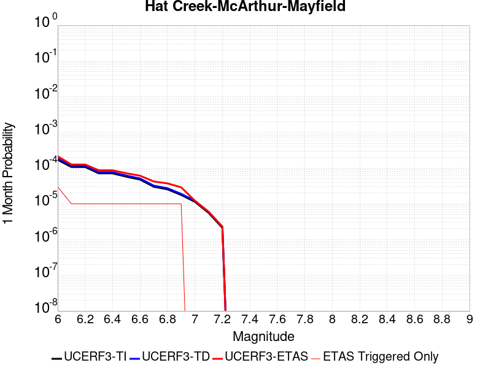 |  | 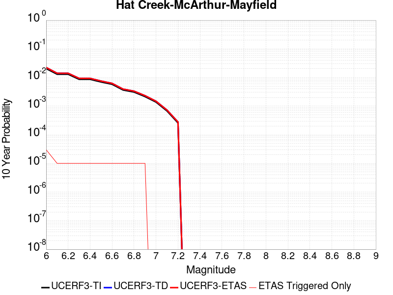 |

| Magnitude | 1 wk TI Prob | 1 wk TD Prob | 1 wk ETAS Prob | 1 wk ETAS/TD Gain | 1 wk ETAS Triggered Only | 1 mo TI Prob | 1 mo TD Prob | 1 mo ETAS Prob | 1 mo ETAS/TD Gain | 1 mo ETAS Triggered Only | 1 yr TI Prob | 1 yr TD Prob | 1 yr ETAS Prob | 1 yr ETAS/TD Gain | 1 yr ETAS Triggered Only | 10 yr TI Prob | 10 yr TD Prob | 10 yr ETAS Prob | 10 yr ETAS/TD Gain | 10 yr ETAS Triggered Only |
|-----|-----|-----|-----|-----|-----|-----|-----|-----|-----|-----|-----|-----|-----|-----|-----|-----|-----|-----|-----|-----|
| 6.0 | 3.967457E-5 | 4.315831E-5 | 4.315831E-5 | 1.0 | 0.0 | 1.7002279E-4 | 1.8495171E-4 | 2.4458164E-4 | 1.3224081 | 5.9640963E-5 | 0.002068062 | 0.002249576 | 0.0023090828 | 1.0264524 | 5.9640963E-5 | 0.02048922 | 0.022280399 | 0.02233871 | 1.0026172 | 5.9640963E-5 |
| 6.1 | 2.5044013E-5 | 2.7071164E-5 | 2.7071164E-5 | 1.0 | 0.0 | 1.0732707E-4 | 1.1601429E-4 | 1.7564834E-4 | 1.5140232 | 5.9640963E-5 | 0.0013059238 | 0.0014115906 | 0.0014711474 | 1.0421913 | 5.9640963E-5 | 0.01298276 | 0.01402966 | 0.014088465 | 1.0041914 | 5.9640963E-5 |
| 6.2 | 2.5044013E-5 | 2.7071164E-5 | 2.7071164E-5 | 1.0 | 0.0 | 1.0732707E-4 | 1.1601429E-4 | 1.7564834E-4 | 1.5140232 | 5.9640963E-5 | 0.0013059238 | 0.0014115906 | 0.0014711474 | 1.0421913 | 5.9640963E-5 | 0.01298276 | 0.01402966 | 0.014088465 | 1.0041914 | 5.9640963E-5 |
| 6.3 | 1.6624012E-5 | 1.7891072E-5 | 1.7891072E-5 | 1.0 | 0.0 | 7.124382E-5 | 7.6673816E-5 | 1.363102E-4 | 1.7777934 | 5.9640963E-5 | 8.670483E-4 | 9.331125E-4 | 9.926978E-4 | 1.0638565 | 5.9640963E-5 | 0.008636732 | 0.009292879 | 0.009351966 | 1.0063583 | 5.9640963E-5 |
| 6.4 | 1.6624012E-5 | 1.7891072E-5 | 1.7891072E-5 | 1.0 | 0.0 | 7.124382E-5 | 7.6673816E-5 | 1.363102E-4 | 1.7777934 | 5.9640963E-5 | 8.670483E-4 | 9.331125E-4 | 9.926978E-4 | 1.0638565 | 5.9640963E-5 | 0.008636732 | 0.009292879 | 0.009351966 | 1.0063583 | 5.9640963E-5 |
| 6.5 | 1.3394842E-5 | 1.4392137E-5 | 1.4392137E-5 | 1.0 | 0.0 | 5.7405203E-5 | 6.167916E-5 | 1.2131644E-4 | 1.9668952 | 5.9640963E-5 | 6.986842E-4 | 7.506906E-4 | 8.102868E-4 | 1.0793885 | 5.9640963E-5 | 0.006964916 | 0.0074821403 | 0.007541335 | 1.0079114 | 5.9640963E-5 |
| 6.6 | 1.1137514E-5 | 1.1954546E-5 | 1.1954546E-5 | 1.0 | 0.0 | 4.7731326E-5 | 5.1232782E-5 | 1.1087069E-4 | 2.1640575 | 5.9640963E-5 | 5.809739E-4 | 6.2358467E-4 | 6.8318844E-4 | 1.0955825 | 5.9640963E-5 | 0.005794574 | 0.00621877 | 0.0062780404 | 1.0095308 | 5.9640963E-5 |
| 6.7 | 7.0200663E-6 | 7.5242897E-6 | 7.5242897E-6 | 1.0 | 0.0 | 3.008565E-5 | 3.2246568E-5 | 9.18856E-5 | 2.8494694 | 5.9640963E-5 | 3.6623122E-4 | 3.925328E-4 | 4.5215036E-4 | 1.1518792 | 5.9640963E-5 | 0.0036562826 | 0.0039185574 | 0.0039779646 | 1.0151604 | 5.9640963E-5 |
| 6.8 | 5.940172E-6 | 6.3654766E-6 | 6.3654766E-6 | 1.0 | 0.0 | 2.545763E-5 | 2.7280335E-5 | 8.691967E-5 | 3.1861658 | 5.9640963E-5 | 3.0990256E-4 | 3.3208873E-4 | 3.9170988E-4 | 1.1795338 | 5.9640963E-5 | 0.0030947074 | 0.0033160534 | 0.0033754967 | 1.0179259 | 5.9640963E-5 |
| 6.9 | 4.129831E-6 | 4.423547E-6 | 4.423547E-6 | 1.0 | 0.0 | 1.7699154E-5 | 1.8957926E-5 | 7.859775E-5 | 4.145905 | 5.9640963E-5 | 2.154659E-4 | 2.3078908E-4 | 2.904163E-4 | 1.2583623 | 5.9640963E-5 | 0.002152571 | 0.0023055724 | 0.002365076 | 1.0258086 | 5.9640963E-5 |
| 7.0 | 2.6512955E-6 | 2.8374002E-6 | 2.8374002E-6 | 1.0 | 0.0 | 1.1362646E-5 | 1.2160232E-5 | 1.2160232E-5 | 1.0 | 0.0 | 1.3833142E-4 | 1.480412E-4 | 1.480412E-4 | 1.0 | 0.0 | 0.0013824535 | 0.0014794683 | 0.0014794683 | 1.0 | 0.0 |
| 7.1 | 1.2992575E-6 | 1.3909317E-6 | 1.3909317E-6 | 1.0 | 0.0 | 5.568235E-6 | 5.961124E-6 | 5.961124E-6 | 1.0 | 0.0 | 6.779115E-5 | 7.257448E-5 | 7.257448E-5 | 1.0 | 0.0 | 6.7770475E-4 | 7.2552945E-4 | 7.2552945E-4 | 1.0 | 0.0 |
| 7.2 | 4.968191E-7 | 5.3271475E-7 | 5.3271475E-7 | 1.0 | 0.0 | 2.1292228E-6 | 2.283062E-6 | 2.283062E-6 | 1.0 | 0.0 | 2.592298E-5 | 2.7796052E-5 | 2.7796052E-5 | 1.0 | 0.0 | 2.5919956E-4 | 2.7793812E-4 | 2.7793812E-4 | 1.0 | 0.0 |

## Pitas Point (Lower)-Montalvo
*[(top)](#table-of-contents)*

| 1 Week | 1 Month | 1 Year | 10 Year |
|-----|-----|-----|-----|
|  |  |  |  |

| Magnitude | 1 wk TI Prob | 1 wk TD Prob | 1 wk ETAS Prob | 1 wk ETAS/TD Gain | 1 wk ETAS Triggered Only | 1 mo TI Prob | 1 mo TD Prob | 1 mo ETAS Prob | 1 mo ETAS/TD Gain | 1 mo ETAS Triggered Only | 1 yr TI Prob | 1 yr TD Prob | 1 yr ETAS Prob | 1 yr ETAS/TD Gain | 1 yr ETAS Triggered Only | 10 yr TI Prob | 10 yr TD Prob | 10 yr ETAS Prob | 10 yr ETAS/TD Gain | 10 yr ETAS Triggered Only |
|-----|-----|-----|-----|-----|-----|-----|-----|-----|-----|-----|-----|-----|-----|-----|-----|-----|-----|-----|-----|-----|
| 6.0 | 5.2543637E-6 | 4.8379025E-6 | 4.8379025E-6 | 1.0 | 0.0 | 2.2518509E-5 | 2.0733705E-5 | 2.0733705E-5 | 1.0 | 0.0 | 2.7412834E-4 | 2.5240393E-4 | 3.1202985E-4 | 1.236232 | 5.9640963E-5 | 0.0027379042 | 0.0025212052 | 0.0025806958 | 1.023596 | 5.9640963E-5 |
| 6.1 | 5.2543637E-6 | 4.8379025E-6 | 4.8379025E-6 | 1.0 | 0.0 | 2.2518509E-5 | 2.0733705E-5 | 2.0733705E-5 | 1.0 | 0.0 | 2.7412834E-4 | 2.5240393E-4 | 3.1202985E-4 | 1.236232 | 5.9640963E-5 | 0.0027379042 | 0.0025212052 | 0.0025806958 | 1.023596 | 5.9640963E-5 |
| 6.2 | 5.2543637E-6 | 4.8379025E-6 | 4.8379025E-6 | 1.0 | 0.0 | 2.2518509E-5 | 2.0733705E-5 | 2.0733705E-5 | 1.0 | 0.0 | 2.7412834E-4 | 2.5240393E-4 | 3.1202985E-4 | 1.236232 | 5.9640963E-5 | 0.0027379042 | 0.0025212052 | 0.0025806958 | 1.023596 | 5.9640963E-5 |
| 6.3 | 5.2543637E-6 | 4.8379025E-6 | 4.8379025E-6 | 1.0 | 0.0 | 2.2518509E-5 | 2.0733705E-5 | 2.0733705E-5 | 1.0 | 0.0 | 2.7412834E-4 | 2.5240393E-4 | 3.1202985E-4 | 1.236232 | 5.9640963E-5 | 0.0027379042 | 0.0025212052 | 0.0025806958 | 1.023596 | 5.9640963E-5 |
| 6.4 | 5.2543637E-6 | 4.8379025E-6 | 4.8379025E-6 | 1.0 | 0.0 | 2.2518509E-5 | 2.0733705E-5 | 2.0733705E-5 | 1.0 | 0.0 | 2.7412834E-4 | 2.5240393E-4 | 3.1202985E-4 | 1.236232 | 5.9640963E-5 | 0.0027379042 | 0.0025212052 | 0.0025806958 | 1.023596 | 5.9640963E-5 |
| 6.5 | 5.2543637E-6 | 4.8379025E-6 | 4.8379025E-6 | 1.0 | 0.0 | 2.2518509E-5 | 2.0733705E-5 | 2.0733705E-5 | 1.0 | 0.0 | 2.7412834E-4 | 2.5240393E-4 | 3.1202985E-4 | 1.236232 | 5.9640963E-5 | 0.0027379042 | 0.0025212052 | 0.0025806958 | 1.023596 | 5.9640963E-5 |
| 6.6 | 5.2543637E-6 | 4.8379025E-6 | 4.8379025E-6 | 1.0 | 0.0 | 2.2518509E-5 | 2.0733705E-5 | 2.0733705E-5 | 1.0 | 0.0 | 2.7412834E-4 | 2.5240393E-4 | 3.1202985E-4 | 1.236232 | 5.9640963E-5 | 0.0027379042 | 0.0025212052 | 0.0025806958 | 1.023596 | 5.9640963E-5 |
| 6.7 | 5.2543637E-6 | 4.8379025E-6 | 4.8379025E-6 | 1.0 | 0.0 | 2.2518509E-5 | 2.0733705E-5 | 2.0733705E-5 | 1.0 | 0.0 | 2.7412834E-4 | 2.5240393E-4 | 3.1202985E-4 | 1.236232 | 5.9640963E-5 | 0.0027379042 | 0.0025212052 | 0.0025806958 | 1.023596 | 5.9640963E-5 |
| 6.8 | 5.2543637E-6 | 4.8379025E-6 | 4.8379025E-6 | 1.0 | 0.0 | 2.2518509E-5 | 2.0733705E-5 | 2.0733705E-5 | 1.0 | 0.0 | 2.7412834E-4 | 2.5240393E-4 | 3.1202985E-4 | 1.236232 | 5.9640963E-5 | 0.0027379042 | 0.0025212052 | 0.0025806958 | 1.023596 | 5.9640963E-5 |
| 6.9 | 5.2543637E-6 | 4.8379025E-6 | 4.8379025E-6 | 1.0 | 0.0 | 2.2518509E-5 | 2.0733705E-5 | 2.0733705E-5 | 1.0 | 0.0 | 2.7412834E-4 | 2.5240393E-4 | 3.1202985E-4 | 1.236232 | 5.9640963E-5 | 0.0027379042 | 0.0025212052 | 0.0025806958 | 1.023596 | 5.9640963E-5 |
| 7.0 | 5.2543637E-6 | 4.8379025E-6 | 4.8379025E-6 | 1.0 | 0.0 | 2.2518509E-5 | 2.0733705E-5 | 2.0733705E-5 | 1.0 | 0.0 | 2.7412834E-4 | 2.5240393E-4 | 3.1202985E-4 | 1.236232 | 5.9640963E-5 | 0.0027379042 | 0.0025212052 | 0.0025806958 | 1.023596 | 5.9640963E-5 |
| 7.1 | 5.2543637E-6 | 4.8379025E-6 | 4.8379025E-6 | 1.0 | 0.0 | 2.2518509E-5 | 2.0733705E-5 | 2.0733705E-5 | 1.0 | 0.0 | 2.7412834E-4 | 2.5240393E-4 | 3.1202985E-4 | 1.236232 | 5.9640963E-5 | 0.0027379042 | 0.0025212052 | 0.0025806958 | 1.023596 | 5.9640963E-5 |
| 7.2 | 5.2458695E-6 | 4.8290563E-6 | 4.8290563E-6 | 1.0 | 0.0 | 2.2482105E-5 | 2.0695794E-5 | 2.0695794E-5 | 1.0 | 0.0 | 2.7368523E-4 | 2.5194246E-4 | 3.115684E-4 | 1.2366649 | 5.9640963E-5 | 0.0027334841 | 0.002516601 | 0.0025760918 | 1.0236393 | 5.9640963E-5 |
| 7.3 | 5.22665E-6 | 4.8089737E-6 | 4.8089737E-6 | 1.0 | 0.0 | 2.2399736E-5 | 2.0609727E-5 | 2.0609727E-5 | 1.0 | 0.0 | 2.7268266E-4 | 2.5089484E-4 | 3.1052085E-4 | 1.2376534 | 5.9640963E-5 | 0.002723483 | 0.0025061483 | 0.0025656398 | 1.0237383 | 5.9640963E-5 |
| 7.4 | 5.210642E-6 | 4.7921862E-6 | 4.7921862E-6 | 1.0 | 0.0 | 2.233113E-5 | 2.053778E-5 | 2.053778E-5 | 1.0 | 0.0 | 2.718476E-4 | 2.500191E-4 | 3.0964514E-4 | 1.2384859 | 5.9640963E-5 | 0.002715153 | 0.0024974106 | 0.0025569026 | 1.0238215 | 5.9640963E-5 |
| 7.5 | 5.1226016E-6 | 4.7000726E-6 | 4.7000726E-6 | 1.0 | 0.0 | 2.1953823E-5 | 2.0143016E-5 | 2.0143016E-5 | 1.0 | 0.0 | 2.67255E-4 | 2.4521392E-4 | 3.0484024E-4 | 1.2431605 | 5.9640963E-5 | 0.0026693381 | 0.002449465 | 0.00250896 | 1.0242889 | 5.9640963E-5 |
| 7.6 | 4.8796987E-6 | 4.4449725E-6 | 4.4449725E-6 | 1.0 | 0.0 | 2.0912828E-5 | 1.9049745E-5 | 1.9049745E-5 | 1.0 | 0.0 | 2.5458392E-4 | 2.3190626E-4 | 2.915334E-4 | 1.2571174 | 5.9640963E-5 | 0.0025429246 | 0.0023166733 | 0.002376176 | 1.0256846 | 5.9640963E-5 |
| 7.7 | 4.0834398E-6 | 3.6091444E-6 | 3.6091444E-6 | 1.0 | 0.0 | 1.7500339E-5 | 1.546767E-5 | 1.546767E-5 | 1.0 | 0.0 | 2.1304579E-4 | 1.8830286E-4 | 2.479326E-4 | 1.3166693 | 5.9640963E-5 | 0.0021284167 | 0.0018814567 | 0.0019409854 | 1.0316397 | 5.9640963E-5 |
| 7.8 | 2.5445438E-6 | 2.1212566E-6 | 2.1212566E-6 | 1.0 | 0.0 | 1.0905142E-5 | 9.091068E-6 | 9.091068E-6 | 1.0 | 0.0 | 1.3276201E-4 | 1.1067818E-4 | 1.1067818E-4 | 1.0 | 0.0 | 0.0013268272 | 0.0011062352 | 0.0011062352 | 1.0 | 0.0 |
| 7.9 | 4.1677114E-7 | 3.3294015E-7 | 3.3294015E-7 | 1.0 | 0.0 | 1.7861609E-6 | 1.4268857E-6 | 1.4268857E-6 | 1.0 | 0.0 | 2.1746291E-5 | 1.7372196E-5 | 1.7372196E-5 | 1.0 | 0.0 | 2.1744163E-4 | 1.737087E-4 | 1.737087E-4 | 1.0 | 0.0 |
| 8.0 | 7.791402E-9 | 5.6836056E-9 | 5.6836056E-9 | 1.0 | 0.0 | 3.3391725E-8 | 2.4358311E-8 | 2.4358311E-8 | 1.0 | 0.0 | 4.0654416E-7 | 2.965624E-7 | 2.965624E-7 | 1.0 | 0.0 | 4.065434E-6 | 2.9656223E-6 | 2.9656223E-6 | 1.0 | 0.0 |

## Maacama 2011 CFM
*[(top)](#table-of-contents)*

| 1 Week | 1 Month | 1 Year | 10 Year |
|-----|-----|-----|-----|
|  |  |  |  |

| Magnitude | 1 wk TI Prob | 1 wk TD Prob | 1 wk ETAS Prob | 1 wk ETAS/TD Gain | 1 wk ETAS Triggered Only | 1 mo TI Prob | 1 mo TD Prob | 1 mo ETAS Prob | 1 mo ETAS/TD Gain | 1 mo ETAS Triggered Only | 1 yr TI Prob | 1 yr TD Prob | 1 yr ETAS Prob | 1 yr ETAS/TD Gain | 1 yr ETAS Triggered Only | 10 yr TI Prob | 10 yr TD Prob | 10 yr ETAS Prob | 10 yr ETAS/TD Gain | 10 yr ETAS Triggered Only |
|-----|-----|-----|-----|-----|-----|-----|-----|-----|-----|-----|-----|-----|-----|-----|-----|-----|-----|-----|-----|-----|
| 6.0 | 1.368203E-4 | 2.579087E-4 | 2.579087E-4 | 1.0 | 0.0 | 5.862409E-4 | 0.0011047592 | 0.0011047592 | 1.0 | 0.0 | 0.0071141496 | 0.013350345 | 0.013350345 | 1.0 | 0.0 | 0.06890667 | 0.1241916 | 0.12424383 | 1.0004206 | 5.9640963E-5 |
| 6.1 | 1.368203E-4 | 2.579087E-4 | 2.579087E-4 | 1.0 | 0.0 | 5.862409E-4 | 0.0011047592 | 0.0011047592 | 1.0 | 0.0 | 0.0071141496 | 0.013350345 | 0.013350345 | 1.0 | 0.0 | 0.06890667 | 0.1241916 | 0.12424383 | 1.0004206 | 5.9640963E-5 |
| 6.2 | 1.360743E-4 | 2.566557E-4 | 2.566557E-4 | 1.0 | 0.0 | 5.8304524E-4 | 0.001099394 | 0.001099394 | 1.0 | 0.0 | 0.007075496 | 0.013285898 | 0.013285898 | 1.0 | 0.0 | 0.06854413 | 0.123625994 | 0.12367826 | 1.0004228 | 5.9640963E-5 |
| 6.3 | 1.1917239E-4 | 2.236021E-4 | 2.236021E-4 | 1.0 | 0.0 | 5.1063887E-4 | 9.578717E-4 | 9.578717E-4 | 1.0 | 0.0 | 0.0061993203 | 0.0115873255 | 0.0115873255 | 1.0 | 0.0 | 0.060292065 | 0.108845875 | 0.10889902 | 1.0004883 | 5.9640963E-5 |
| 6.4 | 1.1859289E-4 | 2.2263796E-4 | 2.2263796E-4 | 1.0 | 0.0 | 5.0815626E-4 | 9.537432E-4 | 9.537432E-4 | 1.0 | 0.0 | 0.006169266 | 0.011537647 | 0.011537647 | 1.0 | 0.0 | 0.06000784 | 0.10840272 | 0.1084559 | 1.0004905 | 5.9640963E-5 |
| 6.5 | 1.09512424E-4 | 2.0517908E-4 | 2.0517908E-4 | 1.0 | 0.0 | 4.6925453E-4 | 8.7897904E-4 | 8.7897904E-4 | 1.0 | 0.0 | 0.005698218 | 0.010639169 | 0.010639169 | 1.0 | 0.0 | 0.055543028 | 0.1004949 | 0.1004949 | 1.0 | 0.0 |
| 6.6 | 1.0502928E-4 | 1.9675294E-4 | 1.9675294E-4 | 1.0 | 0.0 | 4.500478E-4 | 8.429031E-4 | 8.429031E-4 | 1.0 | 0.0 | 0.0054655746 | 0.010205293 | 0.010205293 | 1.0 | 0.0 | 0.053330887 | 0.0966474 | 0.0966474 | 1.0 | 0.0 |
| 6.7 | 9.739358E-5 | 1.8259176E-4 | 1.8259176E-4 | 1.0 | 0.0 | 4.173343E-4 | 7.822563E-4 | 7.822563E-4 | 1.0 | 0.0 | 0.0050692135 | 0.009475343 | 0.009475343 | 1.0 | 0.0 | 0.049551267 | 0.09012011 | 0.09012011 | 1.0 | 0.0 |
| 6.8 | 8.969524E-5 | 1.6658378E-4 | 1.6658378E-4 | 1.0 | 0.0 | 3.8435153E-4 | 7.1369443E-4 | 7.1369443E-4 | 1.0 | 0.0 | 0.0046694432 | 0.00864909 | 0.00864909 | 1.0 | 0.0 | 0.045725387 | 0.08265246 | 0.08265246 | 1.0 | 0.0 |
| 6.9 | 7.838291E-5 | 1.4418772E-4 | 1.4418772E-4 | 1.0 | 0.0 | 3.358835E-4 | 6.1778206E-4 | 6.1778206E-4 | 1.0 | 0.0 | 0.0040817154 | 0.007491724 | 0.007491724 | 1.0 | 0.0 | 0.04007554 | 0.07205298 | 0.07205298 | 1.0 | 0.0 |
| 7.0 | 6.961957E-5 | 1.2708071E-4 | 1.2708071E-4 | 1.0 | 0.0 | 2.9833548E-4 | 5.445059E-4 | 5.445059E-4 | 1.0 | 0.0 | 0.0036261857 | 0.006606692 | 0.006606692 | 1.0 | 0.0 | 0.035675827 | 0.063871816 | 0.063871816 | 1.0 | 0.0 |
| 7.1 | 5.999398E-5 | 1.09053384E-4 | 1.09053384E-4 | 1.0 | 0.0 | 2.570917E-4 | 4.6728246E-4 | 4.6728246E-4 | 1.0 | 0.0 | 0.0031255994 | 0.00567284 | 0.00567284 | 1.0 | 0.0 | 0.030820016 | 0.055139277 | 0.055139277 | 1.0 | 0.0 |
| 7.2 | 5.116532E-5 | 9.305489E-5 | 9.305489E-5 | 1.0 | 0.0 | 2.1926152E-4 | 3.9874107E-4 | 3.9874107E-4 | 1.0 | 0.0 | 0.002666241 | 0.00484315 | 0.00484315 | 1.0 | 0.0 | 0.026344774 | 0.047303654 | 0.047303654 | 1.0 | 0.0 |
| 7.3 | 4.2087835E-5 | 7.617064E-5 | 7.617064E-5 | 1.0 | 0.0 | 1.8036396E-4 | 3.264016E-4 | 3.264016E-4 | 1.0 | 0.0 | 0.0021937196 | 0.0039662397 | 0.0039662397 | 1.0 | 0.0 | 0.0217219 | 0.038905017 | 0.038905017 | 1.0 | 0.0 |
| 7.4 | 2.8991652E-5 | 5.1163643E-5 | 5.1163643E-5 | 1.0 | 0.0 | 1.2424402E-4 | 2.1925455E-4 | 2.1925455E-4 | 1.0 | 0.0 | 0.0015116213 | 0.0026661097 | 0.0026661097 | 1.0 | 0.0 | 0.015013801 | 0.026332043 | 0.026332043 | 1.0 | 0.0 |
| 7.5 | 1.1292299E-6 | 1.4950216E-6 | 1.4950216E-6 | 1.0 | 0.0 | 4.8395473E-6 | 6.407227E-6 | 6.407227E-6 | 1.0 | 0.0 | 5.8919897E-5 | 7.8006444E-5 | 7.8006444E-5 | 1.0 | 0.0 | 5.890428E-4 | 7.805042E-4 | 7.805042E-4 | 1.0 | 0.0 |
| 7.6 | 2.6535366E-7 | 3.4720998E-7 | 3.4720998E-7 | 1.0 | 0.0 | 1.1372296E-6 | 1.4880419E-6 | 1.4880419E-6 | 1.0 | 0.0 | 1.3845682E-5 | 1.811676E-5 | 1.811676E-5 | 1.0 | 0.0 | 1.3844819E-4 | 1.8170691E-4 | 1.8170691E-4 | 1.0 | 0.0 |
| 7.7 | 9.727789E-8 | 1.2302418E-7 | 1.2302418E-7 | 1.0 | 0.0 | 4.1690518E-7 | 5.2724636E-7 | 5.2724636E-7 | 1.0 | 0.0 | 5.0758085E-6 | 6.419206E-6 | 6.419206E-6 | 1.0 | 0.0 | 5.0756928E-5 | 6.456404E-5 | 6.456404E-5 | 1.0 | 0.0 |
| 7.8 | 6.1939325E-9 | 7.711711E-9 | 7.711711E-9 | 1.0 | 0.0 | 2.6545425E-8 | 3.305019E-8 | 3.305019E-8 | 1.0 | 0.0 | 3.231905E-7 | 4.0238598E-7 | 4.0238598E-7 | 1.0 | 0.0 | 3.2319003E-6 | 4.0597915E-6 | 4.0597915E-6 | 1.0 | 0.0 |

## Mission Ridge-Arroyo Parida-Santa Ana
*[(top)](#table-of-contents)*

| 1 Week | 1 Month | 1 Year | 10 Year |
|-----|-----|-----|-----|
|  |  | 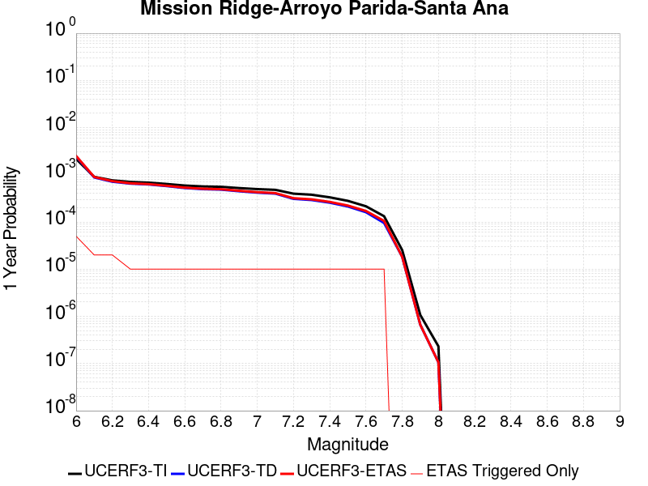 |  |

| Magnitude | 1 wk TI Prob | 1 wk TD Prob | 1 wk ETAS Prob | 1 wk ETAS/TD Gain | 1 wk ETAS Triggered Only | 1 mo TI Prob | 1 mo TD Prob | 1 mo ETAS Prob | 1 mo ETAS/TD Gain | 1 mo ETAS Triggered Only | 1 yr TI Prob | 1 yr TD Prob | 1 yr ETAS Prob | 1 yr ETAS/TD Gain | 1 yr ETAS Triggered Only | 10 yr TI Prob | 10 yr TD Prob | 10 yr ETAS Prob | 10 yr ETAS/TD Gain | 10 yr ETAS Triggered Only |
|-----|-----|-----|-----|-----|-----|-----|-----|-----|-----|-----|-----|-----|-----|-----|-----|-----|-----|-----|-----|-----|
| 6.0 | 4.169034E-5 | 4.7137048E-5 | 4.7137048E-5 | 1.0 | 0.0 | 1.7866064E-4 | 2.0200513E-4 | 2.0200513E-4 | 1.0 | 0.0 | 0.0021730233 | 0.0024574657 | 0.00251696 | 1.0242096 | 5.9640963E-5 | 0.021518968 | 0.02438483 | 0.024443015 | 1.0023862 | 5.9640963E-5 |
| 6.1 | 1.73813E-5 | 1.6854203E-5 | 1.6854203E-5 | 1.0 | 0.0 | 7.4489166E-5 | 7.223036E-5 | 7.223036E-5 | 1.0 | 0.0 | 9.065282E-4 | 8.790605E-4 | 9.3864906E-4 | 1.0677866 | 5.9640963E-5 | 0.009028391 | 0.008757128 | 0.008816248 | 1.006751 | 5.9640963E-5 |
| 6.2 | 1.4622182E-5 | 1.3673262E-5 | 1.3673262E-5 | 1.0 | 0.0 | 6.2664985E-5 | 5.85984E-5 | 5.85984E-5 | 1.0 | 0.0 | 7.6267915E-4 | 7.132059E-4 | 7.728043E-4 | 1.0835642 | 5.9640963E-5 | 0.007600669 | 0.007109767 | 0.007168984 | 1.0083289 | 5.9640963E-5 |
| 6.3 | 1.3552434E-5 | 1.2482174E-5 | 1.2482174E-5 | 1.0 | 0.0 | 5.8080568E-5 | 5.349395E-5 | 5.349395E-5 | 1.0 | 0.0 | 7.069015E-4 | 6.510974E-4 | 7.1069953E-4 | 1.091541 | 5.9640963E-5 | 0.00704657 | 0.006492415 | 0.0065516685 | 1.0091267 | 5.9640963E-5 |
| 6.4 | 1.30977305E-5 | 1.1979128E-5 | 1.1979128E-5 | 1.0 | 0.0 | 5.613192E-5 | 5.133813E-5 | 5.133813E-5 | 1.0 | 0.0 | 6.831918E-4 | 6.2486547E-4 | 6.844692E-4 | 1.0953864 | 5.9640963E-5 | 0.006810953 | 0.006231584 | 0.0062908535 | 1.0095111 | 5.9640963E-5 |
| 6.5 | 1.225205E-5 | 1.1048776E-5 | 1.1048776E-5 | 1.0 | 0.0 | 5.2507727E-5 | 4.735105E-5 | 4.735105E-5 | 1.0 | 0.0 | 6.3909404E-4 | 5.7634927E-4 | 6.3595583E-4 | 1.103421 | 5.9640963E-5 | 0.006372592 | 0.005749009 | 0.005808307 | 1.0103145 | 5.9640963E-5 |
| 6.6 | 1.1352241E-5 | 1.0063508E-5 | 1.0063508E-5 | 1.0 | 0.0 | 4.8651553E-5 | 4.3128617E-5 | 4.3128617E-5 | 1.0 | 0.0 | 5.921717E-4 | 5.249665E-4 | 5.8457616E-4 | 1.1135495 | 5.9640963E-5 | 0.0059059616 | 0.0052376646 | 0.005296993 | 1.0113273 | 5.9640963E-5 |
| 6.7 | 1.0864116E-5 | 9.517E-6 | 9.517E-6 | 1.0 | 0.0 | 4.6559664E-5 | 4.0786515E-5 | 4.0786515E-5 | 1.0 | 0.0 | 5.667165E-4 | 4.964647E-4 | 5.5607606E-4 | 1.1200716 | 5.9640963E-5 | 0.005652734 | 0.0049539437 | 0.0050132894 | 1.0119795 | 5.9640963E-5 |
| 6.8 | 1.0666365E-5 | 9.299752E-6 | 9.299752E-6 | 1.0 | 0.0 | 4.571219E-5 | 3.985548E-5 | 3.985548E-5 | 1.0 | 0.0 | 5.564038E-4 | 4.8513446E-4 | 5.4474646E-4 | 1.1228774 | 5.9640963E-5 | 0.005550127 | 0.00484114 | 0.0049004923 | 1.01226 | 5.9640963E-5 |
| 6.9 | 1.0038665E-5 | 8.592018E-6 | 8.592018E-6 | 1.0 | 0.0 | 4.302214E-5 | 3.682243E-5 | 3.682243E-5 | 1.0 | 0.0 | 5.236687E-4 | 4.4822265E-4 | 5.0783687E-4 | 1.1330013 | 5.9640963E-5 | 0.005224364 | 0.0044735507 | 0.004532925 | 1.0132723 | 5.9640963E-5 |
| 7.0 | 9.5379955E-6 | 8.025047E-6 | 8.025047E-6 | 1.0 | 0.0 | 4.0876483E-5 | 3.439261E-5 | 3.439261E-5 | 1.0 | 0.0 | 4.975576E-4 | 4.1865133E-4 | 4.782673E-4 | 1.1424001 | 5.9640963E-5 | 0.00496445 | 0.00417898 | 0.0042383717 | 1.014212 | 5.9640963E-5 |
| 7.1 | 9.207389E-6 | 7.652347E-6 | 7.652347E-6 | 1.0 | 0.0 | 3.945964E-5 | 3.2795375E-5 | 3.2795375E-5 | 1.0 | 0.0 | 4.803152E-4 | 3.992122E-4 | 4.5882937E-4 | 1.149337 | 5.9640963E-5 | 0.004792784 | 0.003985301 | 0.004044704 | 1.0149056 | 5.9640963E-5 |
| 7.2 | 7.638091E-6 | 5.9310923E-6 | 5.9310923E-6 | 1.0 | 0.0 | 3.2734264E-5 | 2.5418722E-5 | 2.5418722E-5 | 1.0 | 0.0 | 3.984668E-4 | 3.094293E-4 | 3.690518E-4 | 1.1926854 | 5.9640963E-5 | 0.0039775306 | 0.0030901956 | 0.0031496522 | 1.0192404 | 5.9640963E-5 |
| 7.3 | 7.2500147E-6 | 5.596131E-6 | 5.596131E-6 | 1.0 | 0.0 | 3.1071122E-5 | 2.3983199E-5 | 2.3983199E-5 | 1.0 | 0.0 | 3.7822526E-4 | 2.9195662E-4 | 3.5158018E-4 | 1.2042205 | 5.9640963E-5 | 0.0037758215 | 0.0029159402 | 0.0029754073 | 1.0203937 | 5.9640963E-5 |
| 7.4 | 6.3899715E-6 | 4.9184864E-6 | 4.9184864E-6 | 1.0 | 0.0 | 2.7385306E-5 | 2.1079059E-5 | 2.1079059E-5 | 1.0 | 0.0 | 3.3336508E-4 | 2.566075E-4 | 3.1623317E-4 | 1.2323613 | 5.9640963E-5 | 0.0033286542 | 0.002563311 | 0.002622799 | 1.0232075 | 5.9640963E-5 |
| 7.5 | 5.379025E-6 | 4.0838477E-6 | 4.0838477E-6 | 1.0 | 0.0 | 2.305276E-5 | 1.7502087E-5 | 1.7502087E-5 | 1.0 | 0.0 | 2.806312E-4 | 2.1306718E-4 | 2.7269544E-4 | 1.2798566 | 5.9640963E-5 | 0.0028027708 | 0.0021286402 | 0.0021881543 | 1.0279588 | 5.9640963E-5 |
| 7.6 | 4.1270696E-6 | 3.0883373E-6 | 3.0883373E-6 | 1.0 | 0.0 | 1.768732E-5 | 1.32356645E-5 | 1.32356645E-5 | 1.0 | 0.0 | 2.1532185E-4 | 1.6113237E-4 | 2.2076373E-4 | 1.3700768 | 5.9640963E-5 | 0.0021511333 | 0.0016101635 | 0.0016697084 | 1.0369806 | 5.9640963E-5 |
| 7.7 | 2.5406805E-6 | 1.8282044E-6 | 1.8282044E-6 | 1.0 | 0.0 | 1.0888585E-5 | 7.835139E-6 | 7.835139E-6 | 1.0 | 0.0 | 1.3256045E-4 | 9.53887E-5 | 1.5502397E-4 | 1.6251818 | 5.9640963E-5 | 0.0013248142 | 9.534837E-4 | 0.0010130678 | 1.0624909 | 5.9640963E-5 |
| 7.8 | 4.8608285E-7 | 3.509864E-7 | 3.509864E-7 | 1.0 | 0.0 | 2.0832106E-6 | 1.5042266E-6 | 1.5042266E-6 | 1.0 | 0.0 | 2.5362791E-5 | 1.8313805E-5 | 1.8313805E-5 | 1.0 | 0.0 | 2.5359896E-4 | 1.8312308E-4 | 1.8312308E-4 | 1.0 | 0.0 |
| 7.9 | 2.0472514E-8 | 1.2688718E-8 | 1.2688718E-8 | 1.0 | 0.0 | 8.7739345E-8 | 5.438022E-8 | 5.438022E-8 | 1.0 | 0.0 | 1.068226E-6 | 6.6207895E-7 | 6.6207895E-7 | 1.0 | 0.0 | 1.0682209E-5 | 6.620771E-6 | 6.620771E-6 | 1.0 | 0.0 |
| 8.0 | 4.443582E-9 | 2.032067E-9 | 2.032067E-9 | 1.0 | 0.0 | 1.9043922E-8 | 8.7088585E-9 | 8.7088585E-9 | 1.0 | 0.0 | 2.3185973E-7 | 1.0603035E-7 | 1.0603035E-7 | 1.0 | 0.0 | 2.3185949E-6 | 1.0603031E-6 | 1.0603031E-6 | 1.0 | 0.0 |

## Pitas Point (Lower West)
*[(top)](#table-of-contents)*

| 1 Week | 1 Month | 1 Year | 10 Year |
|-----|-----|-----|-----|
|  |  |  |  |

| Magnitude | 1 wk TI Prob | 1 wk TD Prob | 1 wk ETAS Prob | 1 wk ETAS/TD Gain | 1 wk ETAS Triggered Only | 1 mo TI Prob | 1 mo TD Prob | 1 mo ETAS Prob | 1 mo ETAS/TD Gain | 1 mo ETAS Triggered Only | 1 yr TI Prob | 1 yr TD Prob | 1 yr ETAS Prob | 1 yr ETAS/TD Gain | 1 yr ETAS Triggered Only | 10 yr TI Prob | 10 yr TD Prob | 10 yr ETAS Prob | 10 yr ETAS/TD Gain | 10 yr ETAS Triggered Only |
|-----|-----|-----|-----|-----|-----|-----|-----|-----|-----|-----|-----|-----|-----|-----|-----|-----|-----|-----|-----|-----|
| 6.0 | 8.151497E-6 | 7.855796E-6 | 7.855796E-6 | 1.0 | 0.0 | 3.493452E-5 | 3.3667267E-5 | 3.3667267E-5 | 1.0 | 0.0 | 4.252448E-4 | 4.0982262E-4 | 4.6943914E-4 | 1.1454691 | 5.9640963E-5 | 0.0042443196 | 0.004090749 | 0.004150146 | 1.0145198 | 5.9640963E-5 |
| 6.1 | 8.151497E-6 | 7.855796E-6 | 7.855796E-6 | 1.0 | 0.0 | 3.493452E-5 | 3.3667267E-5 | 3.3667267E-5 | 1.0 | 0.0 | 4.252448E-4 | 4.0982262E-4 | 4.6943914E-4 | 1.1454691 | 5.9640963E-5 | 0.0042443196 | 0.004090749 | 0.004150146 | 1.0145198 | 5.9640963E-5 |
| 6.2 | 8.151497E-6 | 7.855796E-6 | 7.855796E-6 | 1.0 | 0.0 | 3.493452E-5 | 3.3667267E-5 | 3.3667267E-5 | 1.0 | 0.0 | 4.252448E-4 | 4.0982262E-4 | 4.6943914E-4 | 1.1454691 | 5.9640963E-5 | 0.0042443196 | 0.004090749 | 0.004150146 | 1.0145198 | 5.9640963E-5 |
| 6.3 | 8.151497E-6 | 7.855796E-6 | 7.855796E-6 | 1.0 | 0.0 | 3.493452E-5 | 3.3667267E-5 | 3.3667267E-5 | 1.0 | 0.0 | 4.252448E-4 | 4.0982262E-4 | 4.6943914E-4 | 1.1454691 | 5.9640963E-5 | 0.0042443196 | 0.004090749 | 0.004150146 | 1.0145198 | 5.9640963E-5 |
| 6.4 | 8.151497E-6 | 7.855796E-6 | 7.855796E-6 | 1.0 | 0.0 | 3.493452E-5 | 3.3667267E-5 | 3.3667267E-5 | 1.0 | 0.0 | 4.252448E-4 | 4.0982262E-4 | 4.6943914E-4 | 1.1454691 | 5.9640963E-5 | 0.0042443196 | 0.004090749 | 0.004150146 | 1.0145198 | 5.9640963E-5 |
| 6.5 | 8.151497E-6 | 7.855796E-6 | 7.855796E-6 | 1.0 | 0.0 | 3.493452E-5 | 3.3667267E-5 | 3.3667267E-5 | 1.0 | 0.0 | 4.252448E-4 | 4.0982262E-4 | 4.6943914E-4 | 1.1454691 | 5.9640963E-5 | 0.0042443196 | 0.004090749 | 0.004150146 | 1.0145198 | 5.9640963E-5 |
| 6.6 | 8.151497E-6 | 7.855796E-6 | 7.855796E-6 | 1.0 | 0.0 | 3.493452E-5 | 3.3667267E-5 | 3.3667267E-5 | 1.0 | 0.0 | 4.252448E-4 | 4.0982262E-4 | 4.6943914E-4 | 1.1454691 | 5.9640963E-5 | 0.0042443196 | 0.004090749 | 0.004150146 | 1.0145198 | 5.9640963E-5 |
| 6.7 | 8.151497E-6 | 7.855796E-6 | 7.855796E-6 | 1.0 | 0.0 | 3.493452E-5 | 3.3667267E-5 | 3.3667267E-5 | 1.0 | 0.0 | 4.252448E-4 | 4.0982262E-4 | 4.6943914E-4 | 1.1454691 | 5.9640963E-5 | 0.0042443196 | 0.004090749 | 0.004150146 | 1.0145198 | 5.9640963E-5 |
| 6.8 | 8.151497E-6 | 7.855796E-6 | 7.855796E-6 | 1.0 | 0.0 | 3.493452E-5 | 3.3667267E-5 | 3.3667267E-5 | 1.0 | 0.0 | 4.252448E-4 | 4.0982262E-4 | 4.6943914E-4 | 1.1454691 | 5.9640963E-5 | 0.0042443196 | 0.004090749 | 0.004150146 | 1.0145198 | 5.9640963E-5 |
| 6.9 | 8.151497E-6 | 7.855796E-6 | 7.855796E-6 | 1.0 | 0.0 | 3.493452E-5 | 3.3667267E-5 | 3.3667267E-5 | 1.0 | 0.0 | 4.252448E-4 | 4.0982262E-4 | 4.6943914E-4 | 1.1454691 | 5.9640963E-5 | 0.0042443196 | 0.004090749 | 0.004150146 | 1.0145198 | 5.9640963E-5 |
| 7.0 | 8.103535E-6 | 7.805226E-6 | 7.805226E-6 | 1.0 | 0.0 | 3.4728975E-5 | 3.3450542E-5 | 3.3450542E-5 | 1.0 | 0.0 | 4.2274324E-4 | 4.07185E-4 | 4.6680166E-4 | 1.1464118 | 5.9640963E-5 | 0.0042193993 | 0.0040644696 | 0.004123868 | 1.0146141 | 5.9640963E-5 |
| 7.1 | 7.853298E-6 | 7.540917E-6 | 7.540917E-6 | 1.0 | 0.0 | 3.3656554E-5 | 3.2317817E-5 | 3.2317817E-5 | 1.0 | 0.0 | 4.096915E-4 | 3.9339912E-4 | 4.530166E-4 | 1.1515446 | 5.9640963E-5 | 0.00408937 | 0.0039271032 | 0.00398651 | 1.0151274 | 5.9640963E-5 |
| 7.2 | 7.771102E-6 | 7.453199E-6 | 7.453199E-6 | 1.0 | 0.0 | 3.33043E-5 | 3.1941894E-5 | 3.1941894E-5 | 1.0 | 0.0 | 4.0540437E-4 | 3.8882386E-4 | 4.4844163E-4 | 1.1533285 | 5.9640963E-5 | 0.0040466557 | 0.003881511 | 0.003940921 | 1.0153058 | 5.9640963E-5 |
| 7.3 | 7.3945344E-6 | 7.0493033E-6 | 7.0493033E-6 | 1.0 | 0.0 | 3.1690477E-5 | 3.0210955E-5 | 3.0210955E-5 | 1.0 | 0.0 | 3.8576324E-4 | 3.677569E-4 | 4.2737596E-4 | 1.1621153 | 5.9640963E-5 | 0.0038509427 | 0.003671551 | 0.003730973 | 1.0161844 | 5.9640963E-5 |
| 7.4 | 6.964645E-6 | 6.5901527E-6 | 6.5901527E-6 | 1.0 | 0.0 | 2.9848137E-5 | 2.8243208E-5 | 2.8243208E-5 | 1.0 | 0.0 | 3.6334046E-4 | 3.438073E-4 | 4.0342775E-4 | 1.1734124 | 5.9640963E-5 | 0.0036274698 | 0.0034328073 | 0.0034922434 | 1.0173142 | 5.9640963E-5 |
| 7.5 | 6.6525035E-6 | 6.259191E-6 | 6.259191E-6 | 1.0 | 0.0 | 2.851042E-5 | 2.6824831E-5 | 2.6824831E-5 | 1.0 | 0.0 | 3.4705905E-4 | 3.2654387E-4 | 3.8616534E-4 | 1.1825835 | 5.9640963E-5 | 0.0034651754 | 0.0032606919 | 0.0033201384 | 1.0182313 | 5.9640963E-5 |
| 7.6 | 5.613338E-6 | 5.15142E-6 | 5.15142E-6 | 1.0 | 0.0 | 2.405694E-5 | 2.2077327E-5 | 2.2077327E-5 | 1.0 | 0.0 | 2.928539E-4 | 2.6875862E-4 | 3.2838355E-4 | 1.2218531 | 5.9640963E-5 | 0.0029246826 | 0.0026843674 | 0.0027438484 | 1.0221583 | 5.9640963E-5 |
| 7.7 | 4.494704E-6 | 3.996945E-6 | 3.996945E-6 | 1.0 | 0.0 | 1.9262876E-5 | 1.7129652E-5 | 1.7129652E-5 | 1.0 | 0.0 | 2.3450027E-4 | 2.0853379E-4 | 2.6816232E-4 | 1.2859418 | 5.9640963E-5 | 0.0023425296 | 0.0020834052 | 0.0021429218 | 1.0285671 | 5.9640963E-5 |
| 7.8 | 2.6075882E-6 | 2.1836663E-6 | 2.1836663E-6 | 1.0 | 0.0 | 1.117533E-5 | 9.358537E-6 | 9.358537E-6 | 1.0 | 0.0 | 1.3605114E-4 | 1.1393427E-4 | 1.1393427E-4 | 1.0 | 0.0 | 0.0013596788 | 0.0011387634 | 0.0011387634 | 1.0 | 0.0 |
| 7.9 | 4.045984E-7 | 3.2424057E-7 | 3.2424057E-7 | 1.0 | 0.0 | 1.733992E-6 | 1.3896017E-6 | 1.3896017E-6 | 1.0 | 0.0 | 2.1111147E-5 | 1.6918271E-5 | 1.6918271E-5 | 1.0 | 0.0 | 2.1109142E-4 | 1.6917015E-4 | 1.6917015E-4 | 1.0 | 0.0 |
| 8.0 | 7.791402E-9 | 5.6836056E-9 | 5.6836056E-9 | 1.0 | 0.0 | 3.3391725E-8 | 2.4358311E-8 | 2.4358311E-8 | 1.0 | 0.0 | 4.0654416E-7 | 2.965624E-7 | 2.965624E-7 | 1.0 | 0.0 | 4.065434E-6 | 2.9656223E-6 | 2.9656223E-6 | 1.0 | 0.0 |

## Sierra Madre
*[(top)](#table-of-contents)*

| 1 Week | 1 Month | 1 Year | 10 Year |
|-----|-----|-----|-----|
|  |  | 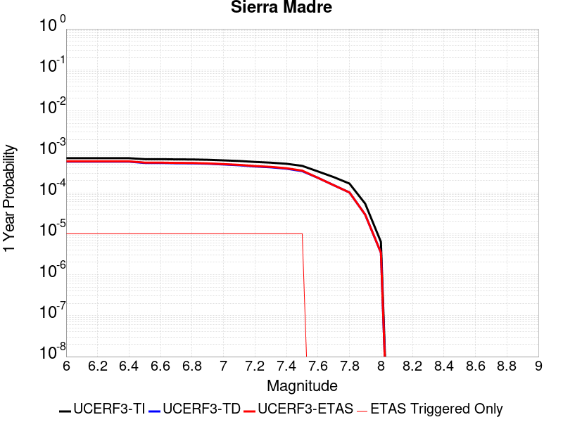 |  |

| Magnitude | 1 wk TI Prob | 1 wk TD Prob | 1 wk ETAS Prob | 1 wk ETAS/TD Gain | 1 wk ETAS Triggered Only | 1 mo TI Prob | 1 mo TD Prob | 1 mo ETAS Prob | 1 mo ETAS/TD Gain | 1 mo ETAS Triggered Only | 1 yr TI Prob | 1 yr TD Prob | 1 yr ETAS Prob | 1 yr ETAS/TD Gain | 1 yr ETAS Triggered Only | 10 yr TI Prob | 10 yr TD Prob | 10 yr ETAS Prob | 10 yr ETAS/TD Gain | 10 yr ETAS Triggered Only |
|-----|-----|-----|-----|-----|-----|-----|-----|-----|-----|-----|-----|-----|-----|-----|-----|-----|-----|-----|-----|-----|
| 6.0 | 1.3379373E-5 | 1.1000776E-5 | 1.1000776E-5 | 1.0 | 0.0 | 5.7338908E-5 | 4.714534E-5 | 4.714534E-5 | 1.0 | 0.0 | 6.978776E-4 | 5.738448E-4 | 5.738448E-4 | 1.0 | 0.0 | 0.0069569005 | 0.0057238447 | 0.0057831444 | 1.0103601 | 5.9640963E-5 |
| 6.1 | 1.3379373E-5 | 1.1000776E-5 | 1.1000776E-5 | 1.0 | 0.0 | 5.7338908E-5 | 4.714534E-5 | 4.714534E-5 | 1.0 | 0.0 | 6.978776E-4 | 5.738448E-4 | 5.738448E-4 | 1.0 | 0.0 | 0.0069569005 | 0.0057238447 | 0.0057831444 | 1.0103601 | 5.9640963E-5 |
| 6.2 | 1.3379373E-5 | 1.1000776E-5 | 1.1000776E-5 | 1.0 | 0.0 | 5.7338908E-5 | 4.714534E-5 | 4.714534E-5 | 1.0 | 0.0 | 6.978776E-4 | 5.738448E-4 | 5.738448E-4 | 1.0 | 0.0 | 0.0069569005 | 0.0057238447 | 0.0057831444 | 1.0103601 | 5.9640963E-5 |
| 6.3 | 1.3379373E-5 | 1.1000776E-5 | 1.1000776E-5 | 1.0 | 0.0 | 5.7338908E-5 | 4.714534E-5 | 4.714534E-5 | 1.0 | 0.0 | 6.978776E-4 | 5.738448E-4 | 5.738448E-4 | 1.0 | 0.0 | 0.0069569005 | 0.0057238447 | 0.0057831444 | 1.0103601 | 5.9640963E-5 |
| 6.4 | 1.3379373E-5 | 1.1000776E-5 | 1.1000776E-5 | 1.0 | 0.0 | 5.7338908E-5 | 4.714534E-5 | 4.714534E-5 | 1.0 | 0.0 | 6.978776E-4 | 5.738448E-4 | 5.738448E-4 | 1.0 | 0.0 | 0.0069569005 | 0.0057238447 | 0.0057831444 | 1.0103601 | 5.9640963E-5 |
| 6.5 | 1.26563245E-5 | 1.0230232E-5 | 1.0230232E-5 | 1.0 | 0.0 | 5.4240263E-5 | 4.384312E-5 | 4.384312E-5 | 1.0 | 0.0 | 6.601751E-4 | 5.3366035E-4 | 5.3366035E-4 | 1.0 | 0.0 | 0.006582173 | 0.0053239604 | 0.005383284 | 1.0111427 | 5.9640963E-5 |
| 6.6 | 1.26563245E-5 | 1.0230232E-5 | 1.0230232E-5 | 1.0 | 0.0 | 5.4240263E-5 | 4.384312E-5 | 4.384312E-5 | 1.0 | 0.0 | 6.601751E-4 | 5.3366035E-4 | 5.3366035E-4 | 1.0 | 0.0 | 0.006582173 | 0.0053239604 | 0.005383284 | 1.0111427 | 5.9640963E-5 |
| 6.7 | 1.2502474E-5 | 1.00663765E-5 | 1.00663765E-5 | 1.0 | 0.0 | 5.3580934E-5 | 4.3140906E-5 | 4.3140906E-5 | 1.0 | 0.0 | 6.521526E-4 | 5.25115E-4 | 5.25115E-4 | 1.0 | 0.0 | 0.0065024206 | 0.0052389116 | 0.00529824 | 1.0113246 | 5.9640963E-5 |
| 6.8 | 1.2454966E-5 | 1.0018662E-5 | 1.0018662E-5 | 1.0 | 0.0 | 5.3377335E-5 | 4.293642E-5 | 4.293642E-5 | 1.0 | 0.0 | 6.4967526E-4 | 5.226266E-4 | 5.226266E-4 | 1.0 | 0.0 | 0.006477792 | 0.0052141445 | 0.0052734744 | 1.0113786 | 5.9640963E-5 |
| 6.9 | 1.2225574E-5 | 9.792639E-6 | 9.792639E-6 | 1.0 | 0.0 | 5.2394265E-5 | 4.196778E-5 | 4.196778E-5 | 1.0 | 0.0 | 6.3771347E-4 | 5.10839E-4 | 5.10839E-4 | 1.0 | 0.0 | 0.006358865 | 0.0050968137 | 0.0051561506 | 1.011642 | 5.9640963E-5 |
| 7.0 | 1.182946E-5 | 9.399179E-6 | 9.399179E-6 | 1.0 | 0.0 | 5.06967E-5 | 4.0281582E-5 | 4.0281582E-5 | 1.0 | 0.0 | 6.1705755E-4 | 4.903189E-4 | 4.903189E-4 | 1.0 | 0.0 | 0.006153469 | 0.004892533 | 0.004951882 | 1.0121306 | 5.9640963E-5 |
| 7.1 | 1.14369095E-5 | 8.986194E-6 | 8.986194E-6 | 1.0 | 0.0 | 4.9014405E-5 | 3.85117E-5 | 3.85117E-5 | 1.0 | 0.0 | 5.9658696E-4 | 4.6878002E-4 | 4.6878002E-4 | 1.0 | 0.0 | 0.005949879 | 0.0046780678 | 0.00473743 | 1.0126895 | 5.9640963E-5 |
| 7.2 | 1.0836419E-5 | 8.39959E-6 | 8.39959E-6 | 1.0 | 0.0 | 4.644097E-5 | 3.599775E-5 | 3.599775E-5 | 1.0 | 0.0 | 5.652721E-4 | 4.3818538E-4 | 4.3818538E-4 | 1.0 | 0.0 | 0.0056383642 | 0.0043733614 | 0.0044327416 | 1.0135777 | 5.9640963E-5 |
| 7.3 | 1.0403439E-5 | 8.020854E-6 | 8.020854E-6 | 1.0 | 0.0 | 4.4585406E-5 | 3.437464E-5 | 3.437464E-5 | 1.0 | 0.0 | 5.426921E-4 | 4.184318E-4 | 4.184318E-4 | 1.0 | 0.0 | 0.005413687 | 0.004176585 | 0.004235977 | 1.0142202 | 5.9640963E-5 |
| 7.4 | 9.768864E-6 | 7.4144855E-6 | 7.4144855E-6 | 1.0 | 0.0 | 4.186589E-5 | 3.1775984E-5 | 3.1775984E-5 | 1.0 | 0.0 | 5.09598E-4 | 3.868048E-4 | 3.868048E-4 | 1.0 | 0.0 | 0.0050843097 | 0.0038614576 | 0.0039208685 | 1.0153855 | 5.9640963E-5 |
| 7.5 | 8.687089E-6 | 6.450183E-6 | 6.450183E-6 | 1.0 | 0.0 | 3.722985E-5 | 2.7643353E-5 | 2.7643353E-5 | 1.0 | 0.0 | 4.5317915E-4 | 3.3650672E-4 | 3.3650672E-4 | 1.0 | 0.0 | 0.004522561 | 0.003360109 | 0.0034195494 | 1.0176901 | 5.9640963E-5 |
| 7.6 | 6.3506063E-6 | 4.430329E-6 | 4.430329E-6 | 1.0 | 0.0 | 2.72166E-5 | 1.8986988E-5 | 1.8986988E-5 | 1.0 | 0.0 | 3.3131172E-4 | 2.3114232E-4 | 2.3114232E-4 | 1.0 | 0.0 | 0.003308182 | 0.0023090935 | 0.0023090935 | 1.0 | 0.0 |
| 7.7 | 4.62223E-6 | 2.9329542E-6 | 2.9329542E-6 | 1.0 | 0.0 | 1.9809406E-5 | 1.2569743E-5 | 1.2569743E-5 | 1.0 | 0.0 | 2.4115283E-4 | 1.5302589E-4 | 1.5302589E-4 | 1.0 | 0.0 | 0.0024089129 | 0.0015292577 | 0.0015292577 | 1.0 | 0.0 |
| 7.8 | 3.2145008E-6 | 1.949411E-6 | 1.949411E-6 | 1.0 | 0.0 | 1.3776359E-5 | 8.354592E-6 | 8.354592E-6 | 1.0 | 0.0 | 1.6771426E-4 | 1.01712416E-4 | 1.01712416E-4 | 1.0 | 0.0 | 0.0016758774 | 0.0010166786 | 0.0010166786 | 1.0 | 0.0 |
| 7.9 | 1.0391769E-6 | 5.602482E-7 | 5.602482E-7 | 1.0 | 0.0 | 4.4536077E-6 | 2.4010617E-6 | 2.4010617E-6 | 1.0 | 0.0 | 5.4221324E-5 | 2.9232539E-5 | 2.9232539E-5 | 1.0 | 0.0 | 5.4208096E-4 | 2.9228735E-4 | 2.9228735E-4 | 1.0 | 0.0 |
| 8.0 | 1.210983E-7 | 6.613497E-8 | 6.613497E-8 | 1.0 | 0.0 | 5.1899264E-7 | 2.8343558E-7 | 2.8343558E-7 | 1.0 | 0.0 | 6.3187167E-6 | 3.4508228E-6 | 3.4508228E-6 | 1.0 | 0.0 | 6.318537E-5 | 3.450771E-5 | 3.450771E-5 | 1.0 | 0.0 |

## Santa Ynez (East)
*[(top)](#table-of-contents)*

| 1 Week | 1 Month | 1 Year | 10 Year |
|-----|-----|-----|-----|
|  |  |  |  |

| Magnitude | 1 wk TI Prob | 1 wk TD Prob | 1 wk ETAS Prob | 1 wk ETAS/TD Gain | 1 wk ETAS Triggered Only | 1 mo TI Prob | 1 mo TD Prob | 1 mo ETAS Prob | 1 mo ETAS/TD Gain | 1 mo ETAS Triggered Only | 1 yr TI Prob | 1 yr TD Prob | 1 yr ETAS Prob | 1 yr ETAS/TD Gain | 1 yr ETAS Triggered Only | 10 yr TI Prob | 10 yr TD Prob | 10 yr ETAS Prob | 10 yr ETAS/TD Gain | 10 yr ETAS Triggered Only |
|-----|-----|-----|-----|-----|-----|-----|-----|-----|-----|-----|-----|-----|-----|-----|-----|-----|-----|-----|-----|-----|
| 6.0 | 3.2269712E-5 | 3.6750775E-5 | 9.638954E-5 | 2.6227894 | 5.9640963E-5 | 1.3829143E-4 | 1.5749714E-4 | 2.171287E-4 | 1.37862 | 5.9640963E-5 | 0.0016823979 | 0.0019164253 | 0.001975952 | 1.0310613 | 5.9640963E-5 | 0.016697178 | 0.019056438 | 0.019114943 | 1.0030701 | 5.9640963E-5 |
| 6.1 | 3.2269712E-5 | 3.6750775E-5 | 9.638954E-5 | 2.6227894 | 5.9640963E-5 | 1.3829143E-4 | 1.5749714E-4 | 2.171287E-4 | 1.37862 | 5.9640963E-5 | 0.0016823979 | 0.0019164253 | 0.001975952 | 1.0310613 | 5.9640963E-5 | 0.016697178 | 0.019056438 | 0.019114943 | 1.0030701 | 5.9640963E-5 |
| 6.2 | 3.2269712E-5 | 3.6750775E-5 | 9.638954E-5 | 2.6227894 | 5.9640963E-5 | 1.3829143E-4 | 1.5749714E-4 | 2.171287E-4 | 1.37862 | 5.9640963E-5 | 0.0016823979 | 0.0019164253 | 0.001975952 | 1.0310613 | 5.9640963E-5 | 0.016697178 | 0.019056438 | 0.019114943 | 1.0030701 | 5.9640963E-5 |
| 6.3 | 3.2269712E-5 | 3.6750775E-5 | 9.638954E-5 | 2.6227894 | 5.9640963E-5 | 1.3829143E-4 | 1.5749714E-4 | 2.171287E-4 | 1.37862 | 5.9640963E-5 | 0.0016823979 | 0.0019164253 | 0.001975952 | 1.0310613 | 5.9640963E-5 | 0.016697178 | 0.019056438 | 0.019114943 | 1.0030701 | 5.9640963E-5 |
| 6.4 | 1.4404779E-5 | 1.48492945E-5 | 1.48492945E-5 | 1.0 | 0.0 | 6.1733306E-5 | 6.363831E-5 | 6.363831E-5 | 1.0 | 0.0 | 7.513438E-4 | 7.7452604E-4 | 7.7452604E-4 | 1.0 | 0.0 | 0.0074880854 | 0.007718817 | 0.007718817 | 1.0 | 0.0 |
| 6.5 | 1.4404779E-5 | 1.48492945E-5 | 1.48492945E-5 | 1.0 | 0.0 | 6.1733306E-5 | 6.363831E-5 | 6.363831E-5 | 1.0 | 0.0 | 7.513438E-4 | 7.7452604E-4 | 7.7452604E-4 | 1.0 | 0.0 | 0.0074880854 | 0.007718817 | 0.007718817 | 1.0 | 0.0 |
| 6.6 | 1.280208E-5 | 1.301186E-5 | 1.301186E-5 | 1.0 | 0.0 | 5.4864904E-5 | 5.5763932E-5 | 5.5763932E-5 | 1.0 | 0.0 | 6.6777546E-4 | 6.7871617E-4 | 6.7871617E-4 | 1.0 | 0.0 | 0.006657724 | 0.0067666434 | 0.0067666434 | 1.0 | 0.0 |
| 6.7 | 1.2457027E-5 | 1.262838E-5 | 1.262838E-5 | 1.0 | 0.0 | 5.3386164E-5 | 5.4120515E-5 | 5.4120515E-5 | 1.0 | 0.0 | 6.497827E-4 | 6.5871974E-4 | 6.5871974E-4 | 1.0 | 0.0 | 0.00647886 | 0.00656787 | 0.00656787 | 1.0 | 0.0 |
| 6.8 | 1.2095134E-5 | 1.2230827E-5 | 1.2230827E-5 | 1.0 | 0.0 | 5.1835254E-5 | 5.2416784E-5 | 5.2416784E-5 | 1.0 | 0.0 | 6.309115E-4 | 6.3798914E-4 | 6.3798914E-4 | 1.0 | 0.0 | 0.0062912325 | 0.006361764 | 0.006361764 | 1.0 | 0.0 |
| 6.9 | 1.1104036E-5 | 1.115726E-5 | 1.115726E-5 | 1.0 | 0.0 | 4.758786E-5 | 4.781596E-5 | 4.781596E-5 | 1.0 | 0.0 | 5.7922816E-4 | 5.82005E-4 | 5.82005E-4 | 1.0 | 0.0 | 0.005777207 | 0.0058049536 | 0.0058049536 | 1.0 | 0.0 |
| 7.0 | 1.0577444E-5 | 1.05815925E-5 | 1.05815925E-5 | 1.0 | 0.0 | 4.5331115E-5 | 4.53489E-5 | 4.53489E-5 | 1.0 | 0.0 | 5.5176654E-4 | 5.5198424E-4 | 5.5198424E-4 | 1.0 | 0.0 | 0.0055039856 | 0.00550627 | 0.00550627 | 1.0 | 0.0 |
| 7.1 | 1.0021775E-5 | 9.9809E-6 | 9.9809E-6 | 1.0 | 0.0 | 4.294976E-5 | 4.277459E-5 | 4.277459E-5 | 1.0 | 0.0 | 5.2278786E-4 | 5.206574E-4 | 5.206574E-4 | 1.0 | 0.0 | 0.0052155964 | 0.005194508 | 0.005194508 | 1.0 | 0.0 |
| 7.2 | 8.874109E-6 | 8.748706E-6 | 8.748706E-6 | 1.0 | 0.0 | 3.8031343E-5 | 3.7493923E-5 | 3.7493923E-5 | 1.0 | 0.0 | 4.629332E-4 | 4.56394E-4 | 4.56394E-4 | 1.0 | 0.0 | 0.0046197 | 0.0045546847 | 0.0045546847 | 1.0 | 0.0 |
| 7.3 | 7.5504267E-6 | 7.5050243E-6 | 7.5050243E-6 | 1.0 | 0.0 | 3.235857E-5 | 3.2164E-5 | 3.2164E-5 | 1.0 | 0.0 | 3.9389438E-4 | 3.9152734E-4 | 3.9152734E-4 | 1.0 | 0.0 | 0.0039319694 | 0.0039084824 | 0.0039084824 | 1.0 | 0.0 |
| 7.4 | 6.309394E-6 | 6.183062E-6 | 6.183062E-6 | 1.0 | 0.0 | 2.703998E-5 | 2.6498574E-5 | 2.6498574E-5 | 1.0 | 0.0 | 3.2916202E-4 | 3.2257332E-4 | 3.2257332E-4 | 1.0 | 0.0 | 0.003286749 | 0.0032211484 | 0.0032211484 | 1.0 | 0.0 |
| 7.5 | 4.6103073E-6 | 4.4408016E-6 | 4.4408016E-6 | 1.0 | 0.0 | 1.975831E-5 | 1.9031871E-5 | 1.9031871E-5 | 1.0 | 0.0 | 2.4053088E-4 | 2.316891E-4 | 2.316891E-4 | 1.0 | 0.0 | 0.002402707 | 0.002314545 | 0.002314545 | 1.0 | 0.0 |
| 7.6 | 1.2858658E-6 | 1.3008196E-6 | 1.3008196E-6 | 1.0 | 0.0 | 5.5108417E-6 | 5.574929E-6 | 5.574929E-6 | 1.0 | 0.0 | 6.7092435E-5 | 6.787272E-5 | 6.787272E-5 | 1.0 | 0.0 | 6.707218E-4 | 6.7852676E-4 | 6.7852676E-4 | 1.0 | 0.0 |
| 7.7 | 5.3302307E-7 | 5.612138E-7 | 5.612138E-7 | 1.0 | 0.0 | 2.2843826E-6 | 2.4052001E-6 | 2.4052001E-6 | 1.0 | 0.0 | 2.7812002E-5 | 2.9282955E-5 | 2.9282955E-5 | 1.0 | 0.0 | 2.7808524E-4 | 2.9279455E-4 | 2.9279455E-4 | 1.0 | 0.0 |
| 7.8 | 4.613933E-8 | 4.80301E-8 | 4.80301E-8 | 1.0 | 0.0 | 1.9773998E-7 | 2.0584326E-7 | 2.0584326E-7 | 1.0 | 0.0 | 2.4074816E-6 | 2.5061388E-6 | 2.5061388E-6 | 1.0 | 0.0 | 2.4074554E-5 | 2.5061116E-5 | 2.5061116E-5 | 1.0 | 0.0 |

## Elmore Ranch
*[(top)](#table-of-contents)*

| 1 Week | 1 Month | 1 Year | 10 Year |
|-----|-----|-----|-----|
|  |  |  |  |

| Magnitude | 1 wk TI Prob | 1 wk TD Prob | 1 wk ETAS Prob | 1 wk ETAS/TD Gain | 1 wk ETAS Triggered Only | 1 mo TI Prob | 1 mo TD Prob | 1 mo ETAS Prob | 1 mo ETAS/TD Gain | 1 mo ETAS Triggered Only | 1 yr TI Prob | 1 yr TD Prob | 1 yr ETAS Prob | 1 yr ETAS/TD Gain | 1 yr ETAS Triggered Only | 10 yr TI Prob | 10 yr TD Prob | 10 yr ETAS Prob | 10 yr ETAS/TD Gain | 10 yr ETAS Triggered Only |
|-----|-----|-----|-----|-----|-----|-----|-----|-----|-----|-----|-----|-----|-----|-----|-----|-----|-----|-----|-----|-----|
| 6.0 | 9.102099E-5 | 8.953848E-5 | 8.953848E-5 | 1.0 | 0.0 | 3.9003167E-4 | 3.836898E-4 | 3.836898E-4 | 1.0 | 0.0 | 0.0047383 | 0.004662132 | 0.004662132 | 1.0 | 0.0 | 0.046385348 | 0.04583787 | 0.04589478 | 1.0012414 | 5.9640963E-5 |
| 6.1 | 3.8306698E-5 | 4.14921E-5 | 4.14921E-5 | 1.0 | 0.0 | 1.6416123E-4 | 1.7781362E-4 | 1.7781362E-4 | 1.0 | 0.0 | 0.0019968306 | 0.0021632186 | 0.0021632186 | 1.0 | 0.0 | 0.019789828 | 0.021595007 | 0.021595007 | 1.0 | 0.0 |
| 6.2 | 3.8306698E-5 | 4.14921E-5 | 4.14921E-5 | 1.0 | 0.0 | 1.6416123E-4 | 1.7781362E-4 | 1.7781362E-4 | 1.0 | 0.0 | 0.0019968306 | 0.0021632186 | 0.0021632186 | 1.0 | 0.0 | 0.019789828 | 0.021595007 | 0.021595007 | 1.0 | 0.0 |
| 6.3 | 3.3197924E-5 | 3.6550366E-5 | 3.6550366E-5 | 1.0 | 0.0 | 1.4226905E-4 | 1.56639E-4 | 1.56639E-4 | 1.0 | 0.0 | 0.0017307495 | 0.0019059771 | 0.0019059771 | 1.0 | 0.0 | 0.017173318 | 0.019057386 | 0.019057386 | 1.0 | 0.0 |
| 6.4 | 2.5148964E-5 | 2.7420736E-5 | 2.7420736E-5 | 1.0 | 0.0 | 1.0777682E-4 | 1.17515796E-4 | 1.17515796E-4 | 1.0 | 0.0 | 0.0013113929 | 0.0014304637 | 0.0014304637 | 1.0 | 0.0 | 0.01303681 | 0.014365338 | 0.014365338 | 1.0 | 0.0 |
| 6.5 | 2.5148964E-5 | 2.7420736E-5 | 2.7420736E-5 | 1.0 | 0.0 | 1.0777682E-4 | 1.17515796E-4 | 1.17515796E-4 | 1.0 | 0.0 | 0.0013113929 | 0.0014304637 | 0.0014304637 | 1.0 | 0.0 | 0.01303681 | 0.014365338 | 0.014365338 | 1.0 | 0.0 |

## San Cayetano
*[(top)](#table-of-contents)*

| 1 Week | 1 Month | 1 Year | 10 Year |
|-----|-----|-----|-----|
|  |  |  |  |

| Magnitude | 1 wk TI Prob | 1 wk TD Prob | 1 wk ETAS Prob | 1 wk ETAS/TD Gain | 1 wk ETAS Triggered Only | 1 mo TI Prob | 1 mo TD Prob | 1 mo ETAS Prob | 1 mo ETAS/TD Gain | 1 mo ETAS Triggered Only | 1 yr TI Prob | 1 yr TD Prob | 1 yr ETAS Prob | 1 yr ETAS/TD Gain | 1 yr ETAS Triggered Only | 10 yr TI Prob | 10 yr TD Prob | 10 yr ETAS Prob | 10 yr ETAS/TD Gain | 10 yr ETAS Triggered Only |
|-----|-----|-----|-----|-----|-----|-----|-----|-----|-----|-----|-----|-----|-----|-----|-----|-----|-----|-----|-----|-----|
| 6.0 | 2.3476267E-5 | 1.8169216E-5 | 1.8169216E-5 | 1.0 | 0.0 | 1.0060869E-4 | 7.786576E-5 | 7.786576E-5 | 1.0 | 0.0 | 0.0012242225 | 9.4760704E-4 | 0.0010071915 | 1.0628788 | 5.9640963E-5 | 0.012175002 | 0.00943675 | 0.009495828 | 1.0062604 | 5.9640963E-5 |
| 6.1 | 2.3476267E-5 | 1.8169216E-5 | 1.8169216E-5 | 1.0 | 0.0 | 1.0060869E-4 | 7.786576E-5 | 7.786576E-5 | 1.0 | 0.0 | 0.0012242225 | 9.4760704E-4 | 0.0010071915 | 1.0628788 | 5.9640963E-5 | 0.012175002 | 0.00943675 | 0.009495828 | 1.0062604 | 5.9640963E-5 |
| 6.2 | 2.3476267E-5 | 1.8169216E-5 | 1.8169216E-5 | 1.0 | 0.0 | 1.0060869E-4 | 7.786576E-5 | 7.786576E-5 | 1.0 | 0.0 | 0.0012242225 | 9.4760704E-4 | 0.0010071915 | 1.0628788 | 5.9640963E-5 | 0.012175002 | 0.00943675 | 0.009495828 | 1.0062604 | 5.9640963E-5 |
| 6.3 | 2.3476267E-5 | 1.8169216E-5 | 1.8169216E-5 | 1.0 | 0.0 | 1.0060869E-4 | 7.786576E-5 | 7.786576E-5 | 1.0 | 0.0 | 0.0012242225 | 9.4760704E-4 | 0.0010071915 | 1.0628788 | 5.9640963E-5 | 0.012175002 | 0.00943675 | 0.009495828 | 1.0062604 | 5.9640963E-5 |
| 6.4 | 2.3476267E-5 | 1.8169216E-5 | 1.8169216E-5 | 1.0 | 0.0 | 1.0060869E-4 | 7.786576E-5 | 7.786576E-5 | 1.0 | 0.0 | 0.0012242225 | 9.4760704E-4 | 0.0010071915 | 1.0628788 | 5.9640963E-5 | 0.012175002 | 0.00943675 | 0.009495828 | 1.0062604 | 5.9640963E-5 |
| 6.5 | 2.3476267E-5 | 1.8169216E-5 | 1.8169216E-5 | 1.0 | 0.0 | 1.0060869E-4 | 7.786576E-5 | 7.786576E-5 | 1.0 | 0.0 | 0.0012242225 | 9.4760704E-4 | 0.0010071915 | 1.0628788 | 5.9640963E-5 | 0.012175002 | 0.00943675 | 0.009495828 | 1.0062604 | 5.9640963E-5 |
| 6.6 | 2.3476267E-5 | 1.8169216E-5 | 1.8169216E-5 | 1.0 | 0.0 | 1.0060869E-4 | 7.786576E-5 | 7.786576E-5 | 1.0 | 0.0 | 0.0012242225 | 9.4760704E-4 | 0.0010071915 | 1.0628788 | 5.9640963E-5 | 0.012175002 | 0.00943675 | 0.009495828 | 1.0062604 | 5.9640963E-5 |
| 6.7 | 2.3476267E-5 | 1.8169216E-5 | 1.8169216E-5 | 1.0 | 0.0 | 1.0060869E-4 | 7.786576E-5 | 7.786576E-5 | 1.0 | 0.0 | 0.0012242225 | 9.4760704E-4 | 0.0010071915 | 1.0628788 | 5.9640963E-5 | 0.012175002 | 0.00943675 | 0.009495828 | 1.0062604 | 5.9640963E-5 |
| 6.8 | 2.3241924E-5 | 1.7936945E-5 | 1.7936945E-5 | 1.0 | 0.0 | 9.960445E-5 | 7.687038E-5 | 7.687038E-5 | 1.0 | 0.0 | 0.0012120095 | 9.354987E-4 | 9.950838E-4 | 1.0636935 | 5.9640963E-5 | 0.012054204 | 0.0093166195 | 0.009375704 | 1.0063419 | 5.9640963E-5 |
| 6.9 | 2.2761007E-5 | 1.7432383E-5 | 1.7432383E-5 | 1.0 | 0.0 | 9.7543525E-5 | 7.47081E-5 | 7.47081E-5 | 1.0 | 0.0 | 0.0011869454 | 9.09195E-4 | 9.687817E-4 | 1.0655379 | 5.9640963E-5 | 0.011806256 | 0.009055741 | 0.009114842 | 1.0065264 | 5.9640963E-5 |
| 7.0 | 2.240283E-5 | 1.7066137E-5 | 1.7066137E-5 | 1.0 | 0.0 | 9.600859E-5 | 7.313856E-5 | 7.313856E-5 | 1.0 | 0.0 | 0.0011682777 | 8.9010154E-4 | 9.496894E-4 | 1.0669451 | 5.9640963E-5 | 0.011621549 | 0.008866336 | 0.008925448 | 1.006667 | 5.9640963E-5 |
| 7.1 | 2.1871154E-5 | 1.658602E-5 | 1.658602E-5 | 1.0 | 0.0 | 9.373015E-5 | 7.108103E-5 | 7.108103E-5 | 1.0 | 0.0 | 0.0011405671 | 8.6507126E-4 | 9.246606E-4 | 1.0688838 | 5.9640963E-5 | 0.011347309 | 0.008617996 | 0.008677123 | 1.0068609 | 5.9640963E-5 |
| 7.2 | 2.0714133E-5 | 1.5564563E-5 | 1.5564563E-5 | 1.0 | 0.0 | 8.8771834E-5 | 6.670358E-5 | 6.670358E-5 | 1.0 | 0.0 | 0.0010802611 | 8.118168E-4 | 8.714093E-4 | 1.0734065 | 5.9640963E-5 | 0.010750249 | 0.008089443 | 0.008148601 | 1.007313 | 5.9640963E-5 |
| 7.3 | 1.8408395E-5 | 1.3996829E-5 | 1.3996829E-5 | 1.0 | 0.0 | 7.8890735E-5 | 5.9985046E-5 | 5.9985046E-5 | 1.0 | 0.0 | 9.600714E-4 | 7.300762E-4 | 7.896736E-4 | 1.0816318 | 5.9640963E-5 | 0.009559342 | 0.0072776447 | 0.0073368517 | 1.0081354 | 5.9640963E-5 |
| 7.4 | 1.6856795E-5 | 1.285006E-5 | 1.285006E-5 | 1.0 | 0.0 | 7.2241404E-5 | 5.5070537E-5 | 5.5070537E-5 | 1.0 | 0.0 | 8.7918417E-4 | 6.7028037E-4 | 7.2988134E-4 | 1.0889195 | 5.9640963E-5 | 0.00875714 | 0.0066834087 | 0.006742651 | 1.008864 | 5.9640963E-5 |
| 7.5 | 1.2822778E-5 | 9.577415E-6 | 9.577415E-6 | 1.0 | 0.0 | 5.495361E-5 | 4.1045427E-5 | 4.1045427E-5 | 1.0 | 0.0 | 6.688548E-4 | 4.9961504E-4 | 5.592262E-4 | 1.1193142 | 5.9640963E-5 | 0.006668452 | 0.0049851923 | 0.0050445357 | 1.011904 | 5.9640963E-5 |
| 7.6 | 5.6272684E-6 | 3.854899E-6 | 3.854899E-6 | 1.0 | 0.0 | 2.4116642E-5 | 1.6520893E-5 | 1.6520893E-5 | 1.0 | 0.0 | 2.9358055E-4 | 2.0112342E-4 | 2.6075236E-4 | 1.2964795 | 5.9640963E-5 | 0.0029319301 | 0.0020094248 | 0.002068946 | 1.029621 | 5.9640963E-5 |
| 7.7 | 3.5261346E-6 | 2.3407094E-6 | 2.3407094E-6 | 1.0 | 0.0 | 1.5111918E-5 | 1.0031574E-5 | 1.0031574E-5 | 1.0 | 0.0 | 1.8397206E-4 | 1.2212765E-4 | 1.8176132E-4 | 1.4882897 | 5.9640963E-5 | 0.0018381984 | 0.0012206127 | 0.0012801808 | 1.0488019 | 5.9640963E-5 |
| 7.8 | 1.4826929E-6 | 1.0564395E-6 | 1.0564395E-6 | 1.0 | 0.0 | 6.354383E-6 | 4.52759E-6 | 4.52759E-6 | 1.0 | 0.0 | 7.736187E-5 | 5.5122033E-5 | 5.5122033E-5 | 1.0 | 0.0 | 7.733494E-4 | 5.510856E-4 | 5.510856E-4 | 1.0 | 0.0 |
| 7.9 | 2.7568166E-7 | 1.6977887E-7 | 1.6977887E-7 | 1.0 | 0.0 | 1.1814923E-6 | 7.276235E-7 | 7.276235E-7 | 1.0 | 0.0 | 1.4384574E-5 | 8.85878E-6 | 8.85878E-6 | 1.0 | 0.0 | 1.4383643E-4 | 8.858431E-5 | 8.858431E-5 | 1.0 | 0.0 |
| 8.0 | 5.407832E-8 | 2.688677E-8 | 2.688677E-8 | 1.0 | 0.0 | 2.3176422E-7 | 1.15229014E-7 | 1.15229014E-7 | 1.0 | 0.0 | 2.8217257E-6 | 1.4029123E-6 | 1.4029123E-6 | 1.0 | 0.0 | 2.8216898E-5 | 1.40290385E-5 | 1.40290385E-5 | 1.0 | 0.0 |

## Lost Hills
*[(top)](#table-of-contents)*

| 1 Week | 1 Month | 1 Year | 10 Year |
|-----|-----|-----|-----|
|  |  |  |  |

| Magnitude | 1 wk TI Prob | 1 wk TD Prob | 1 wk ETAS Prob | 1 wk ETAS/TD Gain | 1 wk ETAS Triggered Only | 1 mo TI Prob | 1 mo TD Prob | 1 mo ETAS Prob | 1 mo ETAS/TD Gain | 1 mo ETAS Triggered Only | 1 yr TI Prob | 1 yr TD Prob | 1 yr ETAS Prob | 1 yr ETAS/TD Gain | 1 yr ETAS Triggered Only | 10 yr TI Prob | 10 yr TD Prob | 10 yr ETAS Prob | 10 yr ETAS/TD Gain | 10 yr ETAS Triggered Only |
|-----|-----|-----|-----|-----|-----|-----|-----|-----|-----|-----|-----|-----|-----|-----|-----|-----|-----|-----|-----|-----|
| 6.0 | 2.233523E-5 | 2.5106583E-5 | 8.474605E-5 | 3.3754513 | 5.9640963E-5 | 9.571891E-5 | 1.0759615E-4 | 1.672307E-4 | 1.5542443 | 5.9640963E-5 | 0.0011647546 | 0.001309364 | 0.0013689268 | 1.0454899 | 5.9640963E-5 | 0.011586686 | 0.013033091 | 0.013091954 | 1.0045165 | 5.9640963E-5 |
| 6.1 | 2.233523E-5 | 2.5106583E-5 | 8.474605E-5 | 3.3754513 | 5.9640963E-5 | 9.571891E-5 | 1.0759615E-4 | 1.672307E-4 | 1.5542443 | 5.9640963E-5 | 0.0011647546 | 0.001309364 | 0.0013689268 | 1.0454899 | 5.9640963E-5 | 0.011586686 | 0.013033091 | 0.013091954 | 1.0045165 | 5.9640963E-5 |
| 6.2 | 2.233523E-5 | 2.5106583E-5 | 8.474605E-5 | 3.3754513 | 5.9640963E-5 | 9.571891E-5 | 1.0759615E-4 | 1.672307E-4 | 1.5542443 | 5.9640963E-5 | 0.0011647546 | 0.001309364 | 0.0013689268 | 1.0454899 | 5.9640963E-5 | 0.011586686 | 0.013033091 | 0.013091954 | 1.0045165 | 5.9640963E-5 |
| 6.3 | 2.233523E-5 | 2.5106583E-5 | 8.474605E-5 | 3.3754513 | 5.9640963E-5 | 9.571891E-5 | 1.0759615E-4 | 1.672307E-4 | 1.5542443 | 5.9640963E-5 | 0.0011647546 | 0.001309364 | 0.0013689268 | 1.0454899 | 5.9640963E-5 | 0.011586686 | 0.013033091 | 0.013091954 | 1.0045165 | 5.9640963E-5 |
| 6.4 | 1.2288092E-5 | 1.3781108E-5 | 1.3781108E-5 | 1.0 | 0.0 | 5.2662188E-5 | 5.906108E-5 | 5.906108E-5 | 1.0 | 0.0 | 6.409735E-4 | 7.189252E-4 | 7.189252E-4 | 1.0 | 0.0 | 0.006391279 | 0.0071752006 | 0.0071752006 | 1.0 | 0.0 |
| 6.5 | 1.2288092E-5 | 1.3781108E-5 | 1.3781108E-5 | 1.0 | 0.0 | 5.2662188E-5 | 5.906108E-5 | 5.906108E-5 | 1.0 | 0.0 | 6.409735E-4 | 7.189252E-4 | 7.189252E-4 | 1.0 | 0.0 | 0.006391279 | 0.0071752006 | 0.0071752006 | 1.0 | 0.0 |
| 6.6 | 8.58281E-6 | 9.63377E-6 | 9.63377E-6 | 1.0 | 0.0 | 3.6782953E-5 | 4.12874E-5 | 4.12874E-5 | 1.0 | 0.0 | 4.4774043E-4 | 5.026414E-4 | 5.026414E-4 | 1.0 | 0.0 | 0.0044683935 | 0.005023205 | 0.005023205 | 1.0 | 0.0 |
| 6.7 | 7.205685E-6 | 8.088302E-6 | 8.088302E-6 | 1.0 | 0.0 | 3.088114E-5 | 3.466415E-5 | 3.466415E-5 | 1.0 | 0.0 | 3.7591302E-4 | 4.2203604E-4 | 4.2203604E-4 | 1.0 | 0.0 | 0.0037527776 | 0.0042203604 | 0.0042203604 | 1.0 | 0.0 |

