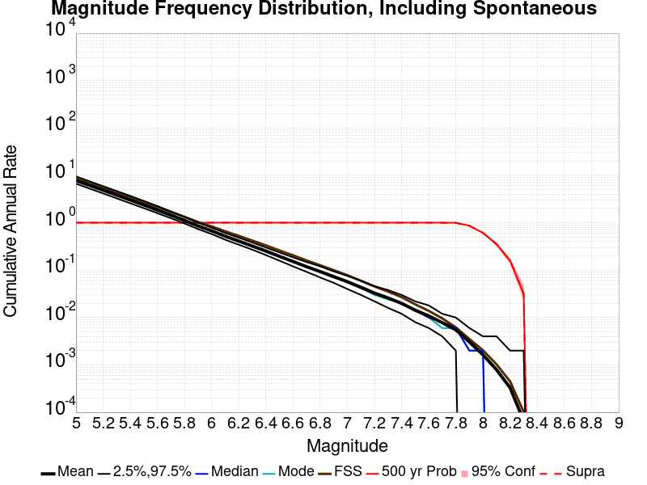

# Start 2012, 500 yr, kCOV=1.16, Spontaneous, Historical Catalog Results

|   | Start 2012, 500 yr, kCOV=1.16, Spontaneous, Historical Catalog |
|-----|-----|
| Num Simulations | 1000 |
| Start Time | 2012/01/01 00:00:00 UTC |
| Start Time Epoch Milliseconds | 1325376000000 |
| Duration | 500 Years |
| Includes Spontaneous? | true |
| Trigger Ruptures | *(none)* |
| Trigger Ruptures | 60366 Trigger Ruptures |
|   | First: M7.3 at 1852/01/05 04:40:39 UTC |
|   | Last: M3.2 at 2011/12/31 19:14:44 UTC |
|   | Largest: M7.9 at 1857/01/09 16:25:39 UTC |
| Config Generated With | u3etas_config_builder.sh --start-year 2012 --num-simulations 1000 --duration-years 500 --include-spontaneous --historical-catalog --etas-k-cov 1.16 --random-seed 123456789 --hpc-site USC_HPC --nodes 36 --hours 24 --queue scec |

## Table Of Contents

* [Magnitude Frequency Distribution](#magnitude-frequency-distribution)
  * [Magnitude Frequency Distribution, Including Spontaneous](#magnitude-frequency-distribution-including-spontaneous)
  * [Magnitude Frequency Distribution, Including Spontaneous, Triggered Events](#magnitude-frequency-distribution-including-spontaneous-triggered-events)
* [Long Term Rate Variability](#long-term-rate-variability)
  * [162 Year Variability](#162-year-variability)
  * [80 Year Variability](#80-year-variability)
  * [28 Year Variability](#28-year-variability)
  * [Variability Duration Dependence](#variability-duration-dependence)
* [Simulation Stationarity](#simulation-stationarity)
* [JSON Input File](#json-input-file)

## Magnitude Frequency Distribution
*[(top)](#table-of-contents)*

### Magnitude Frequency Distribution, Including Spontaneous
*[(top)](#table-of-contents)*

*Note: This section includes both spontaneous and triggered events*

**Legend**
* **Mean** (thick black line): mean annual rate across all 1000 catalogs
* **2.5%,97.5%** (thin black lines): annual rate percentiles across all 1000 catalogs
* **Median** (thin blue line): median annual rate across all 1000 catalogs
* **Mode** (thin cyan line): modal annual rate across all 1000 catalogs (scaled to annualized value)
* **Fault System Solution** (brown line): long-term MFD from the UCERF3 fault system solution
* **500 yr Probability** (thin red line): 500 year probability calculated as the fraction of catalogs with at least 1 occurrence
* **500 yr Supraseismogenic Probability** (thin dashed red line): same as above, but only for supraseismogenic ruptures on explicitly modeled UCERF3 faults
* **95% Conf** (light red shaded region): binomial 95% confidence bounds on probability
* **Primary** (thin green line): mean annual rate from primary triggered aftershocks only (no secondary, tertiary, etc...) across all 1000 catalogs



| Mag | Mean | 2.5 %ile | 97.5 %ile | Median | Mode | Long-Term Fault System Solution | 500 yr Probability | 500 yr Prob 95% Conf | 500 yr Supra-Seis Prob |
|-----|-----|-----|-----|-----|-----|-----|-----|-----|-----|
| **M&ge;5** | 7.779 | 6.694 | 9.512 | 7.666 | 7.758 | 8.609 | 1.000 (100.00%) | [99.52% 100.00%] | 1.000 (100.00%) |
| **M&ge;5.1** | 6.153 | 5.266 | 7.500 | 6.068 | 6.374 | 6.830 | 1.000 (100.00%) | [99.52% 100.00%] | 1.000 (100.00%) |
| **M&ge;5.2** | 4.861 | 4.156 | 5.900 | 4.798 | 4.964 | 5.417 | 1.000 (100.00%) | [99.52% 100.00%] | 1.000 (100.00%) |
| **M&ge;5.3** | 3.833 | 3.274 | 4.678 | 3.786 | 3.720 | 4.295 | 1.000 (100.00%) | [99.52% 100.00%] | 1.000 (100.00%) |
| **M&ge;5.4** | 3.016 | 2.574 | 3.682 | 2.978 | 3.106 | 3.404 | 1.000 (100.00%) | [99.52% 100.00%] | 1.000 (100.00%) |
| **M&ge;5.5** | 2.369 | 2.032 | 2.884 | 2.348 | 2.326 | 2.696 | 1.000 (100.00%) | [99.52% 100.00%] | 1.000 (100.00%) |
| **M&ge;5.6** | 1.858 | 1.594 | 2.254 | 1.842 | 1.780 | 2.133 | 1.000 (100.00%) | [99.52% 100.00%] | 1.000 (100.00%) |
| **M&ge;5.7** | 1.448 | 1.246 | 1.730 | 1.438 | 1.374 | 1.686 | 1.000 (100.00%) | [99.52% 100.00%] | 1.000 (100.00%) |
| **M&ge;5.8** | 1.123 | 0.968 | 1.334 | 1.114 | 1.072 | 1.331 | 1.000 (100.00%) | [99.52% 100.00%] | 1.000 (100.00%) |
| **M&ge;5.9** | 0.854 | 0.734 | 1.002 | 0.850 | 0.844 | 1.036 | 1.000 (100.00%) | [99.52% 100.00%] | 1.000 (100.00%) |
| **M&ge;6** | 0.675 | 0.578 | 0.788 | 0.670 | 0.662 | 0.836 | 1.000 (100.00%) | [99.52% 100.00%] | 1.000 (100.00%) |
| **M&ge;6.1** | 0.519 | 0.438 | 0.608 | 0.518 | 0.498 | 0.660 | 1.000 (100.00%) | [99.52% 100.00%] | 1.000 (100.00%) |
| **M&ge;6.2** | 0.409 | 0.344 | 0.484 | 0.410 | 0.416 | 0.529 | 1.000 (100.00%) | [99.52% 100.00%] | 1.000 (100.00%) |
| **M&ge;6.3** | 0.322 | 0.270 | 0.382 | 0.322 | 0.314 | 0.420 | 1.000 (100.00%) | [99.52% 100.00%] | 1.000 (100.00%) |
| **M&ge;6.4** | 0.253 | 0.208 | 0.300 | 0.252 | 0.246 | 0.332 | 1.000 (100.00%) | [99.52% 100.00%] | 1.000 (100.00%) |
| **M&ge;6.5** | 0.195 | 0.158 | 0.236 | 0.194 | 0.190 | 0.260 | 1.000 (100.00%) | [99.52% 100.00%] | 1.000 (100.00%) |
| **M&ge;6.6** | 0.152 | 0.120 | 0.186 | 0.152 | 0.146 | 0.205 | 1.000 (100.00%) | [99.52% 100.00%] | 1.000 (100.00%) |
| **M&ge;6.7** | 0.118 | 0.092 | 0.148 | 0.118 | 0.122 | 0.160 | 1.000 (100.00%) | [99.52% 100.00%] | 1.000 (100.00%) |
| **M&ge;6.8** | 0.093 | 0.070 | 0.120 | 0.092 | 0.090 | 0.127 | 1.000 (100.00%) | [99.52% 100.00%] | 1.000 (100.00%) |
| **M&ge;6.9** | 0.073 | 0.054 | 0.094 | 0.072 | 0.070 | 0.100 | 1.000 (100.00%) | [99.52% 100.00%] | 1.000 (100.00%) |
| **M&ge;7** | 0.057 | 0.040 | 0.076 | 0.056 | 0.058 | 0.078 | 1.000 (100.00%) | [99.52% 100.00%] | 1.000 (100.00%) |
| **M&ge;7.1** | 0.043 | 0.030 | 0.060 | 0.042 | 0.042 | 0.060 | 1.000 (100.00%) | [99.52% 100.00%] | 1.000 (100.00%) |
| **M&ge;7.2** | 0.033 | 0.022 | 0.046 | 0.032 | 0.030 | 0.045 | 1.000 (100.00%) | [99.52% 100.00%] | 1.000 (100.00%) |
| **M&ge;7.3** | 0.026 | 0.016 | 0.038 | 0.026 | 0.024 | 0.035 | 1.000 (100.00%) | [99.52% 100.00%] | 1.000 (100.00%) |
| **M&ge;7.4** | 0.020 | 0.012 | 0.030 | 0.020 | 0.020 | 0.027 | 1.000 (100.00%) | [99.52% 100.00%] | 1.000 (100.00%) |
| **M&ge;7.5** | 0.014 | 8.00E-3 | 0.022 | 0.014 | 0.014 | 0.019 | 1.000 (100.00%) | [99.52% 100.00%] | 1.000 (100.00%) |
| **M&ge;7.6** | 0.011 | 6.00E-3 | 0.018 | 0.010 | 0.010 | 0.014 | 1.000 (100.00%) | [99.52% 100.00%] | 1.000 (100.00%) |
| **M&ge;7.7** | 7.77E-3 | 4.00E-3 | 0.012 | 8.00E-3 | 6.00E-3 | 9.58E-3 | 1.000 (100.00%) | [99.52% 100.00%] | 1.000 (100.00%) |
| **M&ge;7.8** | 5.48E-3 | 2.00E-3 | 0.010 | 6.00E-3 | 6.00E-3 | 6.19E-3 | 0.995 (99.50%) | [98.77% 99.82%] | 0.995 (99.50%) |
| **M&ge;7.9** | 3.04E-3 | 0.000 | 6.00E-3 | 2.00E-3 | 2.00E-3 | 3.51E-3 | 0.867 (86.70%) | [84.40% 88.71%] | 0.867 (86.70%) |
| **M&ge;8** | 1.63E-3 | 0.000 | 4.00E-3 | 2.00E-3 | 2.00E-3 | 2.03E-3 | 0.611 (61.10%) | [57.99% 64.12%] | 0.611 (61.10%) |
| **M&ge;8.1** | 7.90E-4 | 0.000 | 4.00E-3 | 0.000 | 0.000 | 1.02E-3 | 0.354 (35.40%) | [32.45% 38.47%] | 0.354 (35.40%) |
| **M&ge;8.2** | 3.30E-4 | 0.000 | 2.00E-3 | 0.000 | 0.000 | 4.48E-4 | 0.157 (15.70%) | [13.53% 18.14%] | 0.157 (15.70%) |
| **M&ge;8.3** | 6.60E-5 | 0.000 | 2.00E-3 | 0.000 | 0.000 | 1.02E-4 | 0.032 (3.20%) | [2.23% 4.54%] | 0.032 (3.20%) |
| **M&ge;8.4** | 0.000 | 0.000 | 0.000 | 0.000 | 0.000 | 0.000 | 0.000 (0.00%) | [0.00% 0.48%] | 0.000 (0.00%) |
| **M&ge;8.5** | 0.000 | 0.000 | 0.000 | 0.000 | 0.000 | 0.000 | 0.000 (0.00%) | [0.00% 0.48%] | 0.000 (0.00%) |
| **M&ge;8.6** | 0.000 | 0.000 | 0.000 | 0.000 | 0.000 | 0.000 | 0.000 (0.00%) | [0.00% 0.48%] | 0.000 (0.00%) |
| **M&ge;8.7** | 0.000 | 0.000 | 0.000 | 0.000 | 0.000 | 0.000 | 0.000 (0.00%) | [0.00% 0.48%] | 0.000 (0.00%) |
| **M&ge;8.8** | 0.000 | 0.000 | 0.000 | 0.000 | 0.000 | 0.000 | 0.000 (0.00%) | [0.00% 0.48%] | 0.000 (0.00%) |
| **M&ge;8.9** | 0.000 | 0.000 | 0.000 | 0.000 | 0.000 | 0.000 | 0.000 (0.00%) | [0.00% 0.48%] | 0.000 (0.00%) |
| **M&ge;9** | 0.000 | 0.000 | 0.000 | 0.000 | 0.000 | 0.000 | 0.000 (0.00%) | [0.00% 0.48%] | 0.000 (0.00%) |

### Magnitude Frequency Distribution, Including Spontaneous, Triggered Events
*[(top)](#table-of-contents)*

*Note: This section only includes triggered events, spontaneous were calculated but filtered out here*

**Legend**
* **Mean** (thick black line): mean annual rate across all 1000 catalogs
* **2.5%,97.5%** (thin black lines): annual rate percentiles across all 1000 catalogs
* **Median** (thin blue line): median annual rate across all 1000 catalogs
* **Mode** (thin cyan line): modal annual rate across all 1000 catalogs (scaled to annualized value)
* **Fault System Solution** (brown line): long-term MFD from the UCERF3 fault system solution
* **500 yr Probability** (thin red line): 500 year probability calculated as the fraction of catalogs with at least 1 occurrence
* **500 yr Supraseismogenic Probability** (thin dashed red line): same as above, but only for supraseismogenic ruptures on explicitly modeled UCERF3 faults
* **95% Conf** (light red shaded region): binomial 95% confidence bounds on probability
* **Primary** (thin green line): mean annual rate from primary triggered aftershocks only (no secondary, tertiary, etc...) across all 1000 catalogs


| Mag | Mean | 2.5 %ile | 97.5 %ile | Median | Mode | Long-Term Fault System Solution | 500 yr Probability | 500 yr Prob 95% Conf | 500 yr Supra-Seis Prob | Primary Aftershocks Mean |
|-----|-----|-----|-----|-----|-----|-----|-----|-----|-----|-----|
| **M&ge;5** | 0.345 | 0.158 | 0.960 | 0.276 | 0.234 | 8.609 | 1.000 (100.00%) | [99.52% 100.00%] | 0.996 (99.60%) | 0.094 |
| **M&ge;5.1** | 0.274 | 0.120 | 0.766 | 0.222 | 0.180 | 6.830 | 1.000 (100.00%) | [99.52% 100.00%] | 0.996 (99.60%) | 0.075 |
| **M&ge;5.2** | 0.216 | 0.094 | 0.606 | 0.174 | 0.154 | 5.417 | 1.000 (100.00%) | [99.52% 100.00%] | 0.996 (99.60%) | 0.060 |
| **M&ge;5.3** | 0.171 | 0.072 | 0.478 | 0.140 | 0.122 | 4.295 | 1.000 (100.00%) | [99.52% 100.00%] | 0.996 (99.60%) | 0.048 |
| **M&ge;5.4** | 0.134 | 0.056 | 0.366 | 0.110 | 0.100 | 3.404 | 1.000 (100.00%) | [99.52% 100.00%] | 0.996 (99.60%) | 0.038 |
| **M&ge;5.5** | 0.106 | 0.042 | 0.286 | 0.088 | 0.084 | 2.696 | 1.000 (100.00%) | [99.52% 100.00%] | 0.996 (99.60%) | 0.031 |
| **M&ge;5.6** | 0.083 | 0.032 | 0.222 | 0.070 | 0.064 | 2.133 | 1.000 (100.00%) | [99.52% 100.00%] | 0.996 (99.60%) | 0.025 |
| **M&ge;5.7** | 0.065 | 0.024 | 0.172 | 0.054 | 0.050 | 1.686 | 1.000 (100.00%) | [99.52% 100.00%] | 0.996 (99.60%) | 0.020 |
| **M&ge;5.8** | 0.050 | 0.018 | 0.128 | 0.042 | 0.034 | 1.331 | 1.000 (100.00%) | [99.52% 100.00%] | 0.996 (99.60%) | 0.016 |
| **M&ge;5.9** | 0.038 | 0.012 | 0.094 | 0.032 | 0.026 | 1.036 | 1.000 (100.00%) | [99.52% 100.00%] | 0.994 (99.40%) | 0.013 |
| **M&ge;6** | 0.029 | 0.010 | 0.074 | 0.026 | 0.024 | 0.836 | 1.000 (100.00%) | [99.52% 100.00%] | 0.994 (99.40%) | 0.010 |
| **M&ge;6.1** | 0.022 | 6.00E-3 | 0.054 | 0.020 | 0.016 | 0.660 | 0.999 (99.90%) | [99.35% 99.99%] | 0.991 (99.10%) | 7.95E-3 |
| **M&ge;6.2** | 0.018 | 4.00E-3 | 0.044 | 0.016 | 0.012 | 0.529 | 0.998 (99.80%) | [99.20% 99.97%] | 0.987 (98.70%) | 6.64E-3 |
| **M&ge;6.3** | 0.014 | 2.00E-3 | 0.036 | 0.012 | 0.010 | 0.420 | 0.994 (99.40%) | [98.63% 99.76%] | 0.980 (98.00%) | 5.44E-3 |
| **M&ge;6.4** | 0.011 | 2.00E-3 | 0.028 | 0.010 | 8.00E-3 | 0.332 | 0.987 (98.70%) | [97.73% 99.28%] | 0.968 (96.80%) | 4.30E-3 |
| **M&ge;6.5** | 8.59E-3 | 0.000 | 0.022 | 8.00E-3 | 8.00E-3 | 0.260 | 0.969 (96.90%) | [95.58% 97.85%] | 0.938 (93.80%) | 3.36E-3 |
| **M&ge;6.6** | 6.70E-3 | 0.000 | 0.018 | 6.00E-3 | 4.00E-3 | 0.205 | 0.934 (93.40%) | [91.63% 94.82%] | 0.894 (89.40%) | 2.64E-3 |
| **M&ge;6.7** | 5.14E-3 | 0.000 | 0.014 | 4.00E-3 | 4.00E-3 | 0.160 | 0.877 (87.70%) | [85.47% 89.64%] | 0.838 (83.80%) | 2.07E-3 |
| **M&ge;6.8** | 4.09E-3 | 0.000 | 0.012 | 4.00E-3 | 2.00E-3 | 0.127 | 0.811 (81.10%) | [78.50% 83.45%] | 0.768 (76.80%) | 1.67E-3 |
| **M&ge;6.9** | 3.25E-3 | 0.000 | 0.010 | 2.00E-3 | 2.00E-3 | 0.100 | 0.742 (74.20%) | [71.35% 76.86%] | 0.703 (70.30%) | 1.33E-3 |
| **M&ge;7** | 2.66E-3 | 0.000 | 0.010 | 2.00E-3 | 0.000 | 0.078 | 0.664 (66.40%) | [63.36% 69.31%] | 0.635 (63.50%) | 1.10E-3 |
| **M&ge;7.1** | 2.05E-3 | 0.000 | 8.00E-3 | 2.00E-3 | 0.000 | 0.060 | 0.574 (57.40%) | [54.26% 60.48%] | 0.559 (55.90%) | 8.60E-4 |
| **M&ge;7.2** | 1.60E-3 | 0.000 | 6.00E-3 | 2.00E-3 | 0.000 | 0.045 | 0.503 (50.30%) | [47.16% 53.44%] | 0.494 (49.40%) | 6.94E-4 |
| **M&ge;7.3** | 1.33E-3 | 0.000 | 6.00E-3 | 0.000 | 0.000 | 0.035 | 0.448 (44.80%) | [41.69% 47.95%] | 0.445 (44.50%) | 5.84E-4 |
| **M&ge;7.4** | 9.96E-4 | 0.000 | 4.00E-3 | 0.000 | 0.000 | 0.027 | 0.354 (35.40%) | [32.45% 38.47%] | 0.352 (35.20%) | 4.44E-4 |
| **M&ge;7.5** | 7.64E-4 | 0.000 | 4.00E-3 | 0.000 | 0.000 | 0.019 | 0.297 (29.70%) | [26.90% 32.66%] | 0.297 (29.70%) | 3.60E-4 |
| **M&ge;7.6** | 6.22E-4 | 0.000 | 4.00E-3 | 0.000 | 0.000 | 0.014 | 0.252 (25.20%) | [22.56% 28.03%] | 0.252 (25.20%) | 2.92E-4 |
| **M&ge;7.7** | 4.64E-4 | 0.000 | 4.00E-3 | 0.000 | 0.000 | 9.58E-3 | 0.201 (20.10%) | [17.69% 22.75%] | 0.201 (20.10%) | 2.24E-4 |
| **M&ge;7.8** | 3.42E-4 | 0.000 | 2.00E-3 | 0.000 | 0.000 | 6.19E-3 | 0.152 (15.20%) | [13.06% 17.61%] | 0.152 (15.20%) | 1.64E-4 |
| **M&ge;7.9** | 1.92E-4 | 0.000 | 2.00E-3 | 0.000 | 0.000 | 3.51E-3 | 0.090 (9.00%) | [7.33% 10.99%] | 0.090 (9.00%) | 9.80E-5 |
| **M&ge;8** | 1.02E-4 | 0.000 | 2.00E-3 | 0.000 | 0.000 | 2.03E-3 | 0.049 (4.90%) | [3.68% 6.48%] | 0.049 (4.90%) | 4.80E-5 |
| **M&ge;8.1** | 4.20E-5 | 0.000 | 0.000 | 0.000 | 0.000 | 1.02E-3 | 0.021 (2.10%) | [1.34% 3.25%] | 0.021 (2.10%) | 2.00E-5 |
| **M&ge;8.2** | 2.60E-5 | 0.000 | 0.000 | 0.000 | 0.000 | 4.48E-4 | 0.013 (1.30%) | [0.72% 2.27%] | 0.013 (1.30%) | 1.40E-5 |
| **M&ge;8.3** | 6.00E-6 | 0.000 | 0.000 | 0.000 | 0.000 | 1.02E-4 | 3.00E-3 (0.30%) | [0.08% 0.95%] | 3.00E-3 (0.30%) | 2.00E-6 |
| **M&ge;8.4** | 0.000 | 0.000 | 0.000 | 0.000 | 0.000 | 0.000 | 0.000 (0.00%) | [0.00% 0.48%] | 0.000 (0.00%) | 0.000 |
| **M&ge;8.5** | 0.000 | 0.000 | 0.000 | 0.000 | 0.000 | 0.000 | 0.000 (0.00%) | [0.00% 0.48%] | 0.000 (0.00%) | 0.000 |
| **M&ge;8.6** | 0.000 | 0.000 | 0.000 | 0.000 | 0.000 | 0.000 | 0.000 (0.00%) | [0.00% 0.48%] | 0.000 (0.00%) | 0.000 |
| **M&ge;8.7** | 0.000 | 0.000 | 0.000 | 0.000 | 0.000 | 0.000 | 0.000 (0.00%) | [0.00% 0.48%] | 0.000 (0.00%) | 0.000 |
| **M&ge;8.8** | 0.000 | 0.000 | 0.000 | 0.000 | 0.000 | 0.000 | 0.000 (0.00%) | [0.00% 0.48%] | 0.000 (0.00%) | 0.000 |
| **M&ge;8.9** | 0.000 | 0.000 | 0.000 | 0.000 | 0.000 | 0.000 | 0.000 (0.00%) | [0.00% 0.48%] | 0.000 (0.00%) | 0.000 |
| **M&ge;9** | 0.000 | 0.000 | 0.000 | 0.000 | 0.000 | 0.000 | 0.000 (0.00%) | [0.00% 0.48%] | 0.000 (0.00%) | 0.000 |


## Long Term Rate Variability
*[(top)](#table-of-contents)*

### 162 Year Variability
*[(top)](#table-of-contents)*


[Download CSV Here](plots/long_term_var_162yr.csv)

| **Magnitude** | Mean | Median | Mode | Std. Dev. | 2.5 %-ile | 16 %-ile | 84 %-ile | 97.5 %-ile |
|-----|-----|-----|-----|-----|-----|-----|-----|-----|
| **5.0** | 7.78285 | 7.5925927 | 7.2222223 | 1.2014495 | 6.0925927 | 6.734568 | 8.716049 | 10.518518 |
| **5.1** | 6.1564198 | 6.012346 | 6.0493827 | 0.9497018 | 4.839506 | 5.3333335 | 6.8950615 | 8.327161 |
| **5.2** | 4.863599 | 4.7469134 | 4.5925927 | 0.7481469 | 3.7962964 | 4.203704 | 5.4691358 | 6.5740743 |
| **5.3** | 3.8349361 | 3.7530863 | 3.4629629 | 0.5873561 | 2.993827 | 3.3148148 | 4.3209877 | 5.1790123 |
| **5.4** | 3.0179322 | 2.9506173 | 2.9320989 | 0.4598515 | 2.3395061 | 2.6111112 | 3.4074075 | 4.080247 |
| **5.5** | 2.3706605 | 2.3271606 | 2.1666667 | 0.36052322 | 1.8271605 | 2.0493827 | 2.6790123 | 3.191358 |
| **5.6** | 1.8590802 | 1.8209877 | 1.9012346 | 0.27762556 | 1.4320987 | 1.6049383 | 2.1049383 | 2.4814816 |
| **5.7** | 1.448821 | 1.425926 | 1.3888888 | 0.21490765 | 1.1111112 | 1.2530864 | 1.6358025 | 1.9197531 |
| **5.8** | 1.1239526 | 1.1111112 | 1.0864197 | 0.16512446 | 0.8518519 | 0.9691358 | 1.2716049 | 1.4753087 |
| **5.9** | 0.85443825 | 0.845679 | 0.80246913 | 0.12453604 | 0.6419753 | 0.7345679 | 0.9691358 | 1.1234568 |
| **6.0** | 0.6756975 | 0.6666667 | 0.6419753 | 0.098994836 | 0.5 | 0.5802469 | 0.77160496 | 0.8888889 |
| **6.1** | 0.5198148 | 0.5123457 | 0.49382716 | 0.07886236 | 0.38271606 | 0.44444445 | 0.5925926 | 0.6851852 |
| **6.2** | 0.4098683 | 0.4074074 | 0.41358024 | 0.063687354 | 0.29012346 | 0.34567901 | 0.4691358 | 0.54320985 |
| **6.3** | 0.32258642 | 0.32098764 | 0.30864197 | 0.053229276 | 0.22222222 | 0.27160493 | 0.37654322 | 0.43209878 |
| **6.4** | 0.25278807 | 0.25308642 | 0.24074075 | 0.044203162 | 0.17283951 | 0.20987654 | 0.2962963 | 0.34567901 |
| **6.5** | 0.19545062 | 0.19753087 | 0.17901234 | 0.03754526 | 0.12345679 | 0.16049382 | 0.2345679 | 0.27160493 |
| **6.6** | 0.15230453 | 0.15432099 | 0.15432099 | 0.031810567 | 0.09259259 | 0.12345679 | 0.18518518 | 0.21604939 |
| **6.7** | 0.118150204 | 0.11728395 | 0.11728395 | 0.02696712 | 0.06790123 | 0.09259259 | 0.14814815 | 0.17283951 |
| **6.8** | 0.09337243 | 0.09259259 | 0.09259259 | 0.023295177 | 0.049382716 | 0.06790123 | 0.11728395 | 0.14197531 |
| **6.9** | 0.07294238 | 0.074074075 | 0.074074075 | 0.020046422 | 0.037037037 | 0.055555556 | 0.09259259 | 0.11728395 |
| **7.0** | 0.05709465 | 0.055555556 | 0.055555556 | 0.017582482 | 0.024691358 | 0.037037037 | 0.074074075 | 0.09259259 |
| **7.1** | 0.04353498 | 0.043209877 | 0.043209877 | 0.015306352 | 0.018518519 | 0.030864198 | 0.061728396 | 0.074074075 |
| **7.2** | 0.03292387 | 0.030864198 | 0.030864198 | 0.012924202 | 0.012345679 | 0.018518519 | 0.043209877 | 0.061728396 |
| **7.3** | 0.025973251 | 0.024691358 | 0.024691358 | 0.010829551 | 0.0061728396 | 0.018518519 | 0.037037037 | 0.049382716 |
| **7.4** | 0.019987654 | 0.018518519 | 0.018518519 | 0.009411686 | 0.0061728396 | 0.012345679 | 0.030864198 | 0.043209877 |
| **7.5** | 0.014320987 | 0.012345679 | 0.012345679 | 0.007820121 | 0.0 | 0.0061728396 | 0.024691358 | 0.030864198 |
| **7.6** | 0.0108580245 | 0.012345679 | 0.012345679 | 0.006494458 | 0.0 | 0.0061728396 | 0.018518519 | 0.024691358 |
| **7.7** | 0.0077901236 | 0.0061728396 | 0.0061728396 | 0.005412033 | 0.0 | 0.0 | 0.012345679 | 0.018518519 |
| **7.8** | 0.005493827 | 0.0061728396 | 0.0061728396 | 0.004507582 | 0.0 | 0.0 | 0.012345679 | 0.012345679 |
| **7.9** | 0.0030390946 | 0.0 | 0.0 | 0.0036376547 | 0.0 | 0.0 | 0.0061728396 | 0.012345679 |
| **8.0** | 0.0016337448 | 0.0 | 0.0 | 0.00284633 | 0.0 | 0.0 | 0.0061728396 | 0.0061728396 |
| **8.1** | 7.983539E-4 | 0.0 | 0.0 | 0.0020775332 | 0.0 | 0.0 | 0.0 | 0.0061728396 |
| **8.2** | 3.3127572E-4 | 0.0 | 0.0 | 0.0013911033 | 0.0 | 0.0 | 0.0 | 0.0061728396 |
| **8.3** | 6.584362E-5 | 0.0 | 0.0 | 6.3411886E-4 | 0.0 | 0.0 | 0.0 | 0.0 |
| **8.4** | 0.0 | 0.0 | 0.0 | 0.0 | 0.0 | 0.0 | 0.0 | 0.0 |
| **8.5** | 0.0 | 0.0 | 0.0 | 0.0 | 0.0 | 0.0 | 0.0 | 0.0 |
| **8.6** | 0.0 | 0.0 | 0.0 | 0.0 | 0.0 | 0.0 | 0.0 | 0.0 |
| **8.7** | 0.0 | 0.0 | 0.0 | 0.0 | 0.0 | 0.0 | 0.0 | 0.0 |
| **8.8** | 0.0 | 0.0 | 0.0 | 0.0 | 0.0 | 0.0 | 0.0 | 0.0 |
| **8.9** | 0.0 | 0.0 | 0.0 | 0.0 | 0.0 | 0.0 | 0.0 | 0.0 |
| **9.0** | 0.0 | 0.0 | 0.0 | 0.0 | 0.0 | 0.0 | 0.0 | 0.0 |

### 80 Year Variability
*[(top)](#table-of-contents)*


[Download CSV Here](plots/long_term_var_80yr.csv)

| **Magnitude** | Mean | Median | Mode | Std. Dev. | 2.5 %-ile | 16 %-ile | 84 %-ile | 97.5 %-ile |
|-----|-----|-----|-----|-----|-----|-----|-----|-----|
| **5.0** | 7.781777 | 7.45 | 7.1625 | 1.6844485 | 5.7 | 6.4 | 9.0625 | 11.7875 |
| **5.1** | 6.1555147 | 5.9 | 5.55 | 1.3322529 | 4.4875 | 5.0625 | 7.1625 | 9.3625 |
| **5.2** | 4.8629875 | 4.675 | 4.45 | 1.0484248 | 3.525 | 4.0 | 5.65 | 7.3125 |
| **5.3** | 3.834323 | 3.6875 | 3.4125 | 0.8255036 | 2.7625 | 3.15 | 4.475 | 5.75 |
| **5.4** | 3.0175896 | 2.9125 | 2.8375 | 0.6476517 | 2.15 | 2.475 | 3.5375 | 4.5125 |
| **5.5** | 2.3704772 | 2.2875 | 2.3 | 0.50587225 | 1.675 | 1.9375 | 2.7875 | 3.5125 |
| **5.6** | 1.859027 | 1.8 | 1.8125 | 0.38959515 | 1.3 | 1.525 | 2.1875 | 2.75 |
| **5.7** | 1.4488938 | 1.4125 | 1.2875 | 0.3031727 | 1.0 | 1.175 | 1.7125 | 2.15 |
| **5.8** | 1.1241105 | 1.1 | 1.025 | 0.2317895 | 0.7625 | 0.9125 | 1.325 | 1.6375 |
| **5.9** | 0.8546271 | 0.8375 | 0.85 | 0.17617425 | 0.575 | 0.6875 | 1.0125 | 1.2375 |
| **6.0** | 0.6759604 | 0.6625 | 0.6125 | 0.14044568 | 0.4375 | 0.5375 | 0.8 | 0.9875 |
| **6.1** | 0.520025 | 0.5125 | 0.4625 | 0.11267088 | 0.325 | 0.4125 | 0.625 | 0.7625 |
| **6.2** | 0.40997708 | 0.4 | 0.4 | 0.09191292 | 0.25 | 0.325 | 0.5 | 0.6125 |
| **6.3** | 0.3227146 | 0.3125 | 0.325 | 0.07693484 | 0.1875 | 0.25 | 0.4 | 0.4875 |
| **6.4** | 0.25282082 | 0.25 | 0.2375 | 0.06449452 | 0.1375 | 0.1875 | 0.3125 | 0.3875 |
| **6.5** | 0.19548959 | 0.1875 | 0.1875 | 0.05487291 | 0.1 | 0.1375 | 0.25 | 0.3125 |
| **6.6** | 0.15238333 | 0.15 | 0.1375 | 0.04643933 | 0.075 | 0.1125 | 0.2 | 0.25 |
| **6.7** | 0.11818958 | 0.1125 | 0.1 | 0.03963109 | 0.05 | 0.075 | 0.1625 | 0.2 |
| **6.8** | 0.093389586 | 0.0875 | 0.075 | 0.03447939 | 0.0375 | 0.0625 | 0.125 | 0.1625 |
| **6.9** | 0.072922915 | 0.075 | 0.0625 | 0.029832575 | 0.025 | 0.0375 | 0.1 | 0.1375 |
| **7.0** | 0.057058334 | 0.05 | 0.05 | 0.026379101 | 0.0125 | 0.025 | 0.0875 | 0.1125 |
| **7.1** | 0.043504167 | 0.0375 | 0.0375 | 0.022905875 | 0.0 | 0.025 | 0.0625 | 0.0875 |
| **7.2** | 0.03289167 | 0.025 | 0.025 | 0.019487249 | 0.0 | 0.0125 | 0.05 | 0.075 |
| **7.3** | 0.025952084 | 0.025 | 0.025 | 0.016741129 | 0.0 | 0.0125 | 0.0375 | 0.0625 |
| **7.4** | 0.019970834 | 0.0125 | 0.0125 | 0.014597702 | 0.0 | 0.0 | 0.0375 | 0.05 |
| **7.5** | 0.0143 | 0.0125 | 0.0125 | 0.012208672 | 0.0 | 0.0 | 0.025 | 0.0375 |
| **7.6** | 0.010839583 | 0.0125 | 0.0125 | 0.01049942 | 0.0 | 0.0 | 0.025 | 0.0375 |
| **7.7** | 0.0077729165 | 0.0125 | 0.0 | 0.008784071 | 0.0 | 0.0 | 0.0125 | 0.025 |
| **7.8** | 0.005485417 | 0.0 | 0.0 | 0.00732709 | 0.0 | 0.0 | 0.0125 | 0.025 |
| **7.9** | 0.0030395833 | 0.0 | 0.0 | 0.005595338 | 0.0 | 0.0 | 0.0125 | 0.0125 |
| **8.0** | 0.00163125 | 0.0 | 0.0 | 0.0042537316 | 0.0 | 0.0 | 0.0 | 0.0125 |
| **8.1** | 7.9583336E-4 | 0.0 | 0.0 | 0.0030604983 | 0.0 | 0.0 | 0.0 | 0.0125 |
| **8.2** | 3.2708334E-4 | 0.0 | 0.0 | 0.0019953842 | 0.0 | 0.0 | 0.0 | 0.0125 |
| **8.3** | 6.666667E-5 | 0.0 | 0.0 | 9.1043336E-4 | 0.0 | 0.0 | 0.0 | 0.0 |
| **8.4** | 0.0 | 0.0 | 0.0 | 0.0 | 0.0 | 0.0 | 0.0 | 0.0 |
| **8.5** | 0.0 | 0.0 | 0.0 | 0.0 | 0.0 | 0.0 | 0.0 | 0.0 |
| **8.6** | 0.0 | 0.0 | 0.0 | 0.0 | 0.0 | 0.0 | 0.0 | 0.0 |
| **8.7** | 0.0 | 0.0 | 0.0 | 0.0 | 0.0 | 0.0 | 0.0 | 0.0 |
| **8.8** | 0.0 | 0.0 | 0.0 | 0.0 | 0.0 | 0.0 | 0.0 | 0.0 |
| **8.9** | 0.0 | 0.0 | 0.0 | 0.0 | 0.0 | 0.0 | 0.0 | 0.0 |
| **9.0** | 0.0 | 0.0 | 0.0 | 0.0 | 0.0 | 0.0 | 0.0 | 0.0 |

### 28 Year Variability
*[(top)](#table-of-contents)*


[Download CSV Here](plots/long_term_var_28yr.csv)

| **Magnitude** | Mean | Median | Mode | Std. Dev. | 2.5 %-ile | 16 %-ile | 84 %-ile | 97.5 %-ile |
|-----|-----|-----|-----|-----|-----|-----|-----|-----|
| **5.0** | 7.7838087 | 7.178571 | 6.678571 | 2.7282314 | 4.928571 | 5.857143 | 9.464286 | 14.357142 |
| **5.1** | 6.1571302 | 5.678571 | 5.071429 | 2.1573696 | 3.857143 | 4.607143 | 7.5 | 11.357142 |
| **5.2** | 4.864231 | 4.5 | 4.178571 | 1.6997112 | 3.0 | 3.607143 | 5.964286 | 8.964286 |
| **5.3** | 3.8352227 | 3.5714285 | 3.1785715 | 1.3385803 | 2.3214285 | 2.857143 | 4.714286 | 7.035714 |
| **5.4** | 3.018336 | 2.8214285 | 2.607143 | 1.0509361 | 1.7857143 | 2.2142856 | 3.7142856 | 5.571429 |
| **5.5** | 2.371101 | 2.2142856 | 2.1785715 | 0.8217402 | 1.3571428 | 1.7142857 | 2.9642856 | 4.357143 |
| **5.6** | 1.8594937 | 1.75 | 1.6428572 | 0.6382365 | 1.0357143 | 1.3571428 | 2.3214285 | 3.357143 |
| **5.7** | 1.4492689 | 1.3571428 | 1.3214285 | 0.4963946 | 0.78571427 | 1.0357143 | 1.8214285 | 2.607143 |
| **5.8** | 1.1243593 | 1.0714285 | 1.0357143 | 0.3831594 | 0.5714286 | 0.78571427 | 1.4285715 | 2.0 |
| **5.9** | 0.85478574 | 0.8214286 | 0.71428573 | 0.29364237 | 0.39285713 | 0.60714287 | 1.1071428 | 1.5357143 |
| **6.0** | 0.6761408 | 0.64285713 | 0.5714286 | 0.23413564 | 0.32142857 | 0.4642857 | 0.89285713 | 1.2142857 |
| **6.1** | 0.52014077 | 0.5 | 0.4642857 | 0.18925925 | 0.21428572 | 0.35714287 | 0.6785714 | 0.96428573 |
| **6.2** | 0.41007772 | 0.39285713 | 0.35714287 | 0.15676008 | 0.14285715 | 0.25 | 0.5714286 | 0.75 |
| **6.3** | 0.3227983 | 0.32142857 | 0.2857143 | 0.13229862 | 0.10714286 | 0.17857143 | 0.4642857 | 0.60714287 |
| **6.4** | 0.25290966 | 0.25 | 0.21428572 | 0.112262875 | 0.071428575 | 0.14285715 | 0.35714287 | 0.5 |
| **6.5** | 0.19557352 | 0.17857143 | 0.14285715 | 0.09636485 | 0.035714287 | 0.10714286 | 0.2857143 | 0.42857143 |
| **6.6** | 0.15246849 | 0.14285715 | 0.10714286 | 0.0823881 | 0.035714287 | 0.071428575 | 0.21428572 | 0.32142857 |
| **6.7** | 0.118245795 | 0.10714286 | 0.10714286 | 0.07098813 | 0.0 | 0.035714287 | 0.17857143 | 0.2857143 |
| **6.8** | 0.093430676 | 0.071428575 | 0.071428575 | 0.061626256 | 0.0 | 0.035714287 | 0.14285715 | 0.25 |
| **6.9** | 0.07297479 | 0.071428575 | 0.035714287 | 0.05327941 | 0.0 | 0.035714287 | 0.10714286 | 0.17857143 |
| **7.0** | 0.057107143 | 0.035714287 | 0.035714287 | 0.046899185 | 0.0 | 0.0 | 0.10714286 | 0.17857143 |
| **7.1** | 0.04354832 | 0.035714287 | 0.035714287 | 0.04052017 | 0.0 | 0.0 | 0.071428575 | 0.14285715 |
| **7.2** | 0.03292857 | 0.035714287 | 0.0 | 0.034851525 | 0.0 | 0.0 | 0.071428575 | 0.10714286 |
| **7.3** | 0.025968488 | 0.035714287 | 0.0 | 0.0302539 | 0.0 | 0.0 | 0.071428575 | 0.10714286 |
| **7.4** | 0.019976892 | 0.0 | 0.0 | 0.026344564 | 0.0 | 0.0 | 0.035714287 | 0.071428575 |
| **7.5** | 0.014306723 | 0.0 | 0.0 | 0.022249665 | 0.0 | 0.0 | 0.035714287 | 0.071428575 |
| **7.6** | 0.010840336 | 0.0 | 0.0 | 0.01910707 | 0.0 | 0.0 | 0.035714287 | 0.071428575 |
| **7.7** | 0.007764706 | 0.0 | 0.0 | 0.016010497 | 0.0 | 0.0 | 0.035714287 | 0.035714287 |
| **7.8** | 0.0054789917 | 0.0 | 0.0 | 0.013390832 | 0.0 | 0.0 | 0.0 | 0.035714287 |
| **7.9** | 0.0030336136 | 0.0 | 0.0 | 0.010106519 | 0.0 | 0.0 | 0.0 | 0.035714287 |
| **8.0** | 0.0016323529 | 0.0 | 0.0 | 0.007498932 | 0.0 | 0.0 | 0.0 | 0.035714287 |
| **8.1** | 7.920168E-4 | 0.0 | 0.0 | 0.0052591846 | 0.0 | 0.0 | 0.0 | 0.0 |
| **8.2** | 3.277311E-4 | 0.0 | 0.0 | 0.0034054772 | 0.0 | 0.0 | 0.0 | 0.0 |
| **8.3** | 6.7226894E-5 | 0.0 | 0.0 | 0.0015480443 | 0.0 | 0.0 | 0.0 | 0.0 |
| **8.4** | 0.0 | 0.0 | 0.0 | 0.0 | 0.0 | 0.0 | 0.0 | 0.0 |
| **8.5** | 0.0 | 0.0 | 0.0 | 0.0 | 0.0 | 0.0 | 0.0 | 0.0 |
| **8.6** | 0.0 | 0.0 | 0.0 | 0.0 | 0.0 | 0.0 | 0.0 | 0.0 |
| **8.7** | 0.0 | 0.0 | 0.0 | 0.0 | 0.0 | 0.0 | 0.0 | 0.0 |
| **8.8** | 0.0 | 0.0 | 0.0 | 0.0 | 0.0 | 0.0 | 0.0 | 0.0 |
| **8.9** | 0.0 | 0.0 | 0.0 | 0.0 | 0.0 | 0.0 | 0.0 | 0.0 |
| **9.0** | 0.0 | 0.0 | 0.0 | 0.0 | 0.0 | 0.0 | 0.0 | 0.0 |

### Variability Duration Dependence
*[(top)](#table-of-contents)*


[Download CSV Here](plots/long_term_var_m5.csv)

| **Duration (years)** | Mean | Median | Mode | Std. Dev. | 2.5 %-ile | 16 %-ile | 84 %-ile | 97.5 %-ile |
|-----|-----|-----|-----|-----|-----|-----|-----|-----|
| **1.0** | 7.77851 | 6.0 | 5.0 | 10.904488 | 1.0 | 3.0 | 11.0 | 25.0 |
| **4.0** | 7.77851 | 6.5 | 5.5 | 6.214244 | 3.0 | 4.5 | 10.0 | 20.75 |
| **8.0** | 7.7809296 | 6.75 | 5.875 | 4.6617427 | 3.875 | 5.0 | 9.875 | 18.375 |
| **12.0** | 7.7806807 | 6.9166665 | 6.0833335 | 3.9233282 | 4.1666665 | 5.3333335 | 9.75 | 17.166666 |
| **16.0** | 7.7809296 | 7.0 | 6.4375 | 3.4924433 | 4.5 | 5.5 | 9.625 | 16.1875 |
| **20.0** | 7.77851 | 7.05 | 6.35 | 3.1607773 | 4.65 | 5.65 | 9.55 | 15.4 |
| **24.0** | 7.781777 | 7.125 | 6.4166665 | 2.8931081 | 4.8333335 | 5.75 | 9.5 | 14.791667 |
| **28.0** | 7.7838087 | 7.178571 | 6.678571 | 2.7282314 | 4.928571 | 5.857143 | 9.464286 | 14.357142 |
| **32.0** | 7.781777 | 7.21875 | 6.6875 | 2.5678642 | 5.03125 | 5.9375 | 9.40625 | 13.84375 |
| **36.0** | 7.7820663 | 7.25 | 6.4166665 | 2.4330182 | 5.0833335 | 6.0 | 9.361111 | 13.666667 |
| **40.0** | 7.781777 | 7.275 | 6.65 | 2.3404374 | 5.175 | 6.05 | 9.325 | 13.45 |
| **44.0** | 7.7837706 | 7.2954545 | 6.5 | 2.2303083 | 5.25 | 6.1136365 | 9.295455 | 13.159091 |
| **48.0** | 7.781777 | 7.3333335 | 6.6666665 | 2.134706 | 5.3125 | 6.1458335 | 9.25 | 12.895833 |
| **52.0** | 7.7820663 | 7.3461537 | 7.1153846 | 2.0609946 | 5.3653846 | 6.1923075 | 9.230769 | 12.634615 |
| **56.0** | 7.7881117 | 7.392857 | 7.321429 | 1.9478028 | 5.464286 | 6.25 | 9.232142 | 12.392858 |
| **60.0** | 7.781777 | 7.383333 | 6.65 | 1.9260397 | 5.5 | 6.2833333 | 9.166667 | 12.316667 |
| **64.0** | 7.7881117 | 7.421875 | 7.21875 | 1.8386618 | 5.53125 | 6.296875 | 9.15625 | 12.21875 |
| **68.0** | 7.7838087 | 7.4264708 | 7.029412 | 1.8212974 | 5.5588236 | 6.352941 | 9.1470585 | 12.014706 |
| **72.0** | 7.794095 | 7.4444447 | 7.0972223 | 1.7582912 | 5.5972223 | 6.388889 | 9.111111 | 11.972222 |
| **76.0** | 7.7899146 | 7.4473686 | 7.25 | 1.7033694 | 5.644737 | 6.4078946 | 9.105263 | 11.815789 |
| **80.0** | 7.781777 | 7.45 | 7.1625 | 1.6844485 | 5.7 | 6.4 | 9.0625 | 11.7875 |
| **84.0** | 7.797481 | 7.5 | 7.5 | 1.6153573 | 5.7261906 | 6.464286 | 9.059524 | 11.511905 |
| **88.0** | 7.787875 | 7.4886365 | 6.818182 | 1.5839801 | 5.7386365 | 6.4772725 | 9.022727 | 11.522727 |
| **92.0** | 7.7873044 | 7.5 | 7.402174 | 1.5691801 | 5.7826085 | 6.521739 | 8.978261 | 11.478261 |
| **96.0** | 7.781777 | 7.4895835 | 6.875 | 1.5233712 | 5.8020835 | 6.53125 | 8.958333 | 11.489583 |
| **100.0** | 7.77851 | 7.49 | 7.0 | 1.5089511 | 5.83 | 6.54 | 8.96 | 11.36 |
| **200.0** | 7.798285 | 7.63 | 7.335 | 1.0612936 | 6.31 | 6.845 | 8.68 | 10.235 |
| **300.0** | 7.8440766 | 7.7433333 | 7.2166667 | 0.8574069 | 6.52 | 7.09 | 8.573334 | 9.88 |
| **400.0** | 7.798285 | 7.7 | 7.4625 | 0.76835316 | 6.645 | 7.085 | 8.42 | 9.6575 |
| **500.0** | 7.77851 | 7.666 | 7.758 | 0.70034444 | 6.694 | 7.128 | 8.354 | 9.512 |


## Simulation Stationarity
*[(top)](#table-of-contents)*


## JSON Input File
*[(top)](#table-of-contents)*

```
{
  "numSimulations": 1000,
  "duration": 500.0,
  "startYear": 2012,
  "includeSpontaneous": true,
  "randomSeed": 123456789,
  "binaryOutput": true,
  "binaryOutputFilters": [
    {
      "prefix": "results_complete",
      "descendantsOnly": false
    },
    {
      "prefix": "results_m5_preserve_chain",
      "minMag": 5.0,
      "preserveChainBelowMag": true,
      "descendantsOnly": false
    },
    {
      "prefix": "results_triggered_descendants",
      "descendantsOnly": true
    }
  ],
  "forceRecalc": false,
  "simulationName": "Start 2012, 500 yr, kCOV\u003d1.16, Spontaneous, Historical Catalog",
  "numRetries": 3,
  "outputDir": "${ETAS_SIM_DIR}/2019_11_05-Start2012_500yr_kCOV1p16_Spontaneous_HistoricalCatalog",
  "triggerCatalog": "${ETAS_LAUNCHER}/inputs/u3_historical_catalog.txt",
  "triggerCatalogSurfaceMappings": "${ETAS_LAUNCHER}/inputs/u3_historical_catalog_finite_fault_mappings.xml",
  "treatTriggerCatalogAsSpontaneous": false,
  "cacheDir": "${ETAS_LAUNCHER}/inputs/cache_fm3p1_ba",
  "fssFile": "${ETAS_LAUNCHER}/inputs/2013_05_10-ucerf3p3-production-10runs_COMPOUND_SOL_FM3_1_SpatSeisU3_MEAN_BRANCH_AVG_SOL.zip",
  "probModel": "FULL_TD",
  "applySubSeisForSupraNucl": true,
  "totRateScaleFactor": 1.14,
  "gridSeisCorr": true,
  "timeIndependentERF": false,
  "griddedOnly": false,
  "imposeGR": false,
  "includeIndirectTriggering": true,
  "gridSeisDiscr": 0.1,
  "catalogCompletenessModel": "RELAXED",
  "etas_k_cov": 1.16,
  "configCommand": "u3etas_config_builder.sh --start-year 2012 --num-simulations 1000 --duration-years 500 --include-spontaneous --historical-catalog --etas-k-cov 1.16 --random-seed 123456789 --hpc-site USC_HPC --nodes 36 --hours 24 --queue scec",
  "configTime": 1572975614427
}
```

